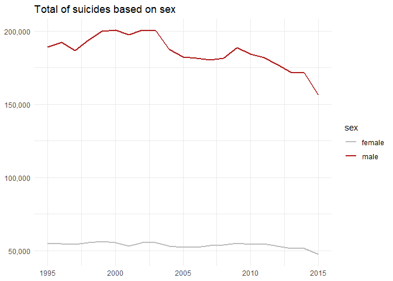
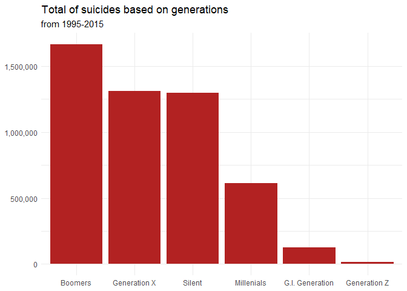
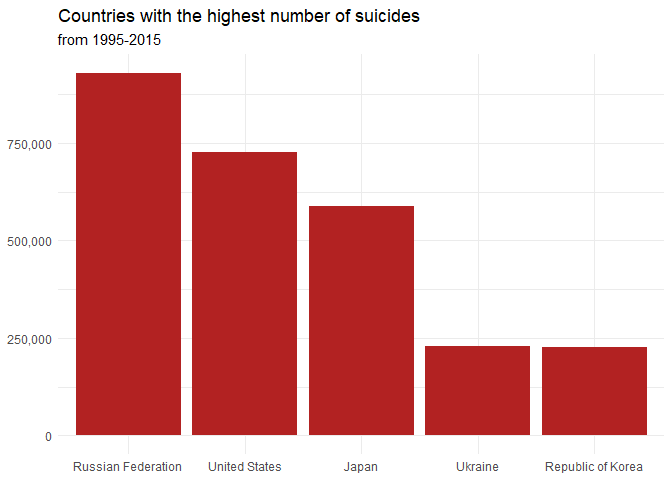
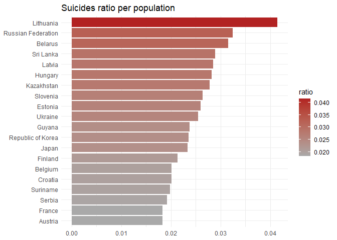
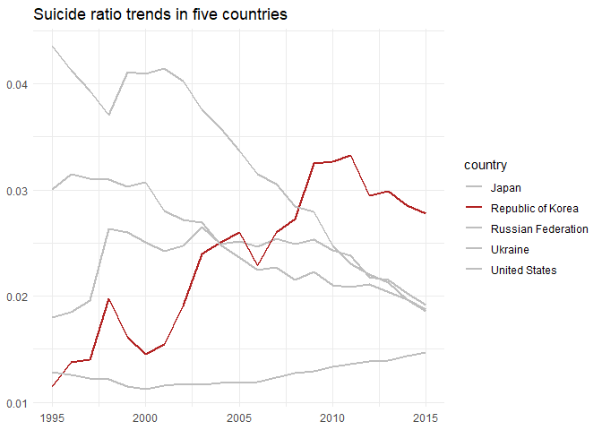
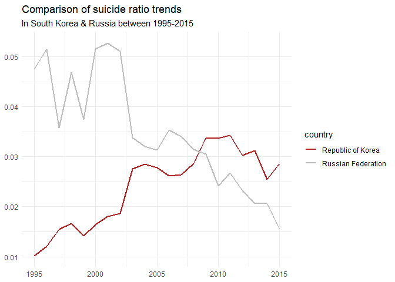

Global Suicide Rate Overview
================
Syarifah Rizki
2/7/2022

# Background

In 2021, the World Health Organization (WHO) had published a fact-sheet
article regarding the global suicide overview on its official website.
According to its report, an estimate of 703,000 people across the globe
had taken their lives every year and even more had attempted to do so.
Suicide has become a major public health problem and although it is
commonly found in in the low and middle income countries, it is a
phenomenon that also occurred in higher income countries. Eastern Europe
for example, becomes the region with the highest number of suicide rate
both for men and women alike and through this report, I aim to analyse
the global suicide rates in 100 countries using the “Suicide Rates
Overview 1985 to 2016” dataset that I obtained from Kaggle. I also tried
to limit the analysis to 10 years only, starting from the year
1995-2015. Several variables such as GDP per capita will be excluded
from the analysis since I will only focused on the trends of suicide
rates in each country.

# Import packages & read data

``` r
library(lubridate)
library(dplyr)
library(ggplot2)
library(stringr)
library(scales)
library(plotly)
library(glue)
```

``` r
suicide <-  read.csv('Suicide Rates Overview 1985 to 2016.csv')
head(suicide)
```

    ##   ï..country year    sex         age suicides_no population suicides.100k.pop
    ## 1    Albania 1987   male 15-24 years          21     312900              6.71
    ## 2    Albania 1987   male 35-54 years          16     308000              5.19
    ## 3    Albania 1987 female 15-24 years          14     289700              4.83
    ## 4    Albania 1987   male   75+ years           1      21800              4.59
    ## 5    Albania 1987   male 25-34 years           9     274300              3.28
    ## 6    Albania 1987 female   75+ years           1      35600              2.81
    ##   country.year HDI.for.year gdp_for_year.... gdp_per_capita....      generation
    ## 1  Albania1987           NA    2,156,624,900                796    Generation X
    ## 2  Albania1987           NA    2,156,624,900                796          Silent
    ## 3  Albania1987           NA    2,156,624,900                796    Generation X
    ## 4  Albania1987           NA    2,156,624,900                796 G.I. Generation
    ## 5  Albania1987           NA    2,156,624,900                796         Boomers
    ## 6  Albania1987           NA    2,156,624,900                796 G.I. Generation

Columns description:

-   country : Name of countries
-   year : Year
-   sex : Male & Female
-   age : Age group is divided into six category
-   suicides_no : Number of suicides committed
-   population : Total population
-   suicides/100k pop : Number of suicides committed for a population of
    100,000
-   country-year : Name of countries and year
-   HDI for year : Human Development Index for every country
-   gdp_for_year : Total of GDP per year for every country
-   gdp_per_capita : GDP measures a country’s economic output per person
    and is calculated by dividing the GDP of a country by its
    population.
-   generation: There are six generations that exist between
    1985-2016. 1) G.I. Generation/The Greatest Generation (born
    1901-1924), 2) Silent (born 1925-1945), 3) Boomers (born
    1946-1964), 4) Generation X (born 1965-1980) 5)
    Millenials/Generation Y (born 1981-1996), 6) Generation Z (born
    1997-2012)

# Data Wrangling

Check dimensions.

``` r
dim(suicide)
```

    ## [1] 27820    12

We have 27820 observations and 12 columns.

Check data types for all columns.

``` r
str(suicide)
```

    ## 'data.frame':    27820 obs. of  12 variables:
    ##  $ ï..country        : chr  "Albania" "Albania" "Albania" "Albania" ...
    ##  $ year              : int  1987 1987 1987 1987 1987 1987 1987 1987 1987 1987 ...
    ##  $ sex               : chr  "male" "male" "female" "male" ...
    ##  $ age               : chr  "15-24 years" "35-54 years" "15-24 years" "75+ years" ...
    ##  $ suicides_no       : int  21 16 14 1 9 1 6 4 1 0 ...
    ##  $ population        : int  312900 308000 289700 21800 274300 35600 278800 257200 137500 311000 ...
    ##  $ suicides.100k.pop : num  6.71 5.19 4.83 4.59 3.28 2.81 2.15 1.56 0.73 0 ...
    ##  $ country.year      : chr  "Albania1987" "Albania1987" "Albania1987" "Albania1987" ...
    ##  $ HDI.for.year      : num  NA NA NA NA NA NA NA NA NA NA ...
    ##  $ gdp_for_year....  : chr  "2,156,624,900" "2,156,624,900" "2,156,624,900" "2,156,624,900" ...
    ##  $ gdp_per_capita....: int  796 796 796 796 796 796 796 796 796 796 ...
    ##  $ generation        : chr  "Generation X" "Silent" "Generation X" "G.I. Generation" ...

-   Remove all commas from ‘gdp_for_year….’ column.
-   Use str_replace() function from stringr packages.

``` r
suicide$gdp_for_year.... <- str_replace_all(suicide$gdp_for_year...., ",",'')
```

-   Change data types to factor: country, age, sex, generation
-   Change data types to datetime: year
-   change data types to integer: gdp.for.year

``` r
 suicide <- suicide %>% 
  rename(country = ï..country,
         gdp.for.year = gdp_for_year....,
         gdp.per.capita = gdp_per_capita....) %>%
  mutate_at(.vars = c("country","sex", "age", "generation"), .funs=as.factor) %>% 
  mutate(gdp.for.year = as.numeric(gdp.for.year),
         year = as.character(year),
         year = as.Date(year, "%Y"),
         year = year(year))

str(suicide)
```

    ## 'data.frame':    27820 obs. of  12 variables:
    ##  $ country          : Factor w/ 101 levels "Albania","Antigua and Barbuda",..: 1 1 1 1 1 1 1 1 1 1 ...
    ##  $ year             : num  1987 1987 1987 1987 1987 ...
    ##  $ sex              : Factor w/ 2 levels "female","male": 2 2 1 2 2 1 1 1 2 1 ...
    ##  $ age              : Factor w/ 6 levels "15-24 years",..: 1 3 1 6 2 6 3 2 5 4 ...
    ##  $ suicides_no      : int  21 16 14 1 9 1 6 4 1 0 ...
    ##  $ population       : int  312900 308000 289700 21800 274300 35600 278800 257200 137500 311000 ...
    ##  $ suicides.100k.pop: num  6.71 5.19 4.83 4.59 3.28 2.81 2.15 1.56 0.73 0 ...
    ##  $ country.year     : chr  "Albania1987" "Albania1987" "Albania1987" "Albania1987" ...
    ##  $ HDI.for.year     : num  NA NA NA NA NA NA NA NA NA NA ...
    ##  $ gdp.for.year     : num  2.16e+09 2.16e+09 2.16e+09 2.16e+09 2.16e+09 ...
    ##  $ gdp.per.capita   : int  796 796 796 796 796 796 796 796 796 796 ...
    ##  $ generation       : Factor w/ 6 levels "Boomers","G.I. Generation",..: 3 6 3 2 1 2 6 1 2 3 ...

Now, every columns are stored with the correct data types.

``` r
head(suicide)
```

    ##   country year    sex         age suicides_no population suicides.100k.pop
    ## 1 Albania 1987   male 15-24 years          21     312900              6.71
    ## 2 Albania 1987   male 35-54 years          16     308000              5.19
    ## 3 Albania 1987 female 15-24 years          14     289700              4.83
    ## 4 Albania 1987   male   75+ years           1      21800              4.59
    ## 5 Albania 1987   male 25-34 years           9     274300              3.28
    ## 6 Albania 1987 female   75+ years           1      35600              2.81
    ##   country.year HDI.for.year gdp.for.year gdp.per.capita      generation
    ## 1  Albania1987           NA   2156624900            796    Generation X
    ## 2  Albania1987           NA   2156624900            796          Silent
    ## 3  Albania1987           NA   2156624900            796    Generation X
    ## 4  Albania1987           NA   2156624900            796 G.I. Generation
    ## 5  Albania1987           NA   2156624900            796         Boomers
    ## 6  Albania1987           NA   2156624900            796 G.I. Generation

Check for missing values.

``` r
colSums(is.na(suicide))
```

    ##           country              year               sex               age 
    ##                 0                 0                 0                 0 
    ##       suicides_no        population suicides.100k.pop      country.year 
    ##                 0                 0                 0                 0 
    ##      HDI.for.year      gdp.for.year    gdp.per.capita        generation 
    ##             19456                 0                 0                 0

``` r
suicide <- subset(suicide, select = -c(HDI.for.year))
suicide
```

    ##                     country year    sex         age suicides_no population
    ## 1                   Albania 1987   male 15-24 years          21     312900
    ## 2                   Albania 1987   male 35-54 years          16     308000
    ## 3                   Albania 1987 female 15-24 years          14     289700
    ## 4                   Albania 1987   male   75+ years           1      21800
    ## 5                   Albania 1987   male 25-34 years           9     274300
    ## 6                   Albania 1987 female   75+ years           1      35600
    ## 7                   Albania 1987 female 35-54 years           6     278800
    ## 8                   Albania 1987 female 25-34 years           4     257200
    ## 9                   Albania 1987   male 55-74 years           1     137500
    ## 10                  Albania 1987 female  5-14 years           0     311000
    ## 11                  Albania 1987 female 55-74 years           0     144600
    ## 12                  Albania 1987   male  5-14 years           0     338200
    ## 13                  Albania 1988 female   75+ years           2      36400
    ## 14                  Albania 1988   male 15-24 years          17     319200
    ## 15                  Albania 1988   male   75+ years           1      22300
    ## 16                  Albania 1988   male 35-54 years          14     314100
    ## 17                  Albania 1988   male 55-74 years           4     140200
    ## 18                  Albania 1988 female 15-24 years           8     295600
    ## 19                  Albania 1988 female 55-74 years           3     147500
    ## 20                  Albania 1988 female 25-34 years           5     262400
    ## 21                  Albania 1988   male 25-34 years           5     279900
    ## 22                  Albania 1988 female 35-54 years           4     284500
    ## 23                  Albania 1988 female  5-14 years           0     317200
    ## 24                  Albania 1988   male  5-14 years           0     345000
    ## 25                  Albania 1989   male   75+ years           2      22500
    ## 26                  Albania 1989   male 25-34 years          18     283600
    ## 27                  Albania 1989   male 35-54 years          15     318400
    ## 28                  Albania 1989   male 55-74 years           6     142100
    ## 29                  Albania 1989   male 15-24 years          12     323500
    ## 30                  Albania 1989 female 35-54 years           7     288600
    ## 31                  Albania 1989 female 15-24 years           5     299900
    ## 32                  Albania 1989 female 25-34 years           2     266300
    ## 33                  Albania 1989 female 55-74 years           1     149600
    ## 34                  Albania 1989 female  5-14 years           0     321900
    ## 35                  Albania 1989 female   75+ years           0      37000
    ## 36                  Albania 1989   male  5-14 years           0     349700
    ## 37                  Albania 1992   male 35-54 years          12     343800
    ## 38                  Albania 1992   male 15-24 years           9     263700
    ## 39                  Albania 1992   male 55-74 years           5     159500
    ## 40                  Albania 1992   male 25-34 years           7     245500
    ## 41                  Albania 1992 female 15-24 years           7     292400
    ## 42                  Albania 1992 female 25-34 years           4     267400
    ## 43                  Albania 1992 female 35-54 years           2     323100
    ## 44                  Albania 1992 female 55-74 years           1     164900
    ## 45                  Albania 1992 female  5-14 years           0     336700
    ## 46                  Albania 1992 female   75+ years           0      38700
    ## 47                  Albania 1992   male  5-14 years           0     362900
    ## 48                  Albania 1992   male   75+ years           0      23900
    ## 49                  Albania 1993   male 15-24 years          18     243300
    ## 50                  Albania 1993   male 55-74 years           7     165000
    ## 51                  Albania 1993   male   75+ years           1      24200
    ## 52                  Albania 1993   male 25-34 years           9     230100
    ## 53                  Albania 1993 female 15-24 years          10     285300
    ## 54                  Albania 1993   male 35-54 years          10     350300
    ## 55                  Albania 1993 female 25-34 years           7     261800
    ## 56                  Albania 1993 female 35-54 years           7     331200
    ## 57                  Albania 1993 female 55-74 years           2     169500
    ## 58                  Albania 1993 female  5-14 years           1     340300
    ## 59                  Albania 1993   male  5-14 years           1     367000
    ## 60                  Albania 1993 female   75+ years           0      39300
    ## 61                  Albania 1994   male   75+ years           2      24600
    ## 62                  Albania 1994   male 55-74 years          11     171400
    ## 63                  Albania 1994 female   75+ years           2      39900
    ## 64                  Albania 1994   male 25-34 years           6     231400
    ## 65                  Albania 1994   male 35-54 years           9     362800
    ## 66                  Albania 1994   male 15-24 years           6     242200
    ## 67                  Albania 1994 female 15-24 years           6     282600
    ## 68                  Albania 1994 female 25-34 years           4     261100
    ## 69                  Albania 1994 female 35-54 years           2     342500
    ## 70                  Albania 1994 female 55-74 years           1     174600
    ## 71                  Albania 1994   male  5-14 years           1     371800
    ## 72                  Albania 1994 female  5-14 years           0     344400
    ## 73                  Albania 1995   male 25-34 years          13     232900
    ## 74                  Albania 1995   male 55-74 years           9     178000
    ## 75                  Albania 1995 female   75+ years           2      40800
    ## 76                  Albania 1995 female 15-24 years          13     283500
    ## 77                  Albania 1995   male 15-24 years          11     241200
    ## 78                  Albania 1995   male   75+ years           1      25100
    ## 79                  Albania 1995   male 35-54 years          14     375900
    ## 80                  Albania 1995 female 25-34 years           7     264000
    ## 81                  Albania 1995 female 35-54 years           8     356400
    ## 82                  Albania 1995   male  5-14 years           6     376500
    ## 83                  Albania 1995 female 55-74 years           2     180400
    ## 84                  Albania 1995 female  5-14 years           2     348700
    ## 85                  Albania 1996   male   75+ years           2      25400
    ## 86                  Albania 1996   male 15-24 years          17     243600
    ## 87                  Albania 1996   male 25-34 years          14     235300
    ## 88                  Albania 1996 female 15-24 years          16     287700
    ## 89                  Albania 1996 female   75+ years           2      41200
    ## 90                  Albania 1996 female 25-34 years          10     267900
    ## 91                  Albania 1996   male 35-54 years          12     379600
    ## 92                  Albania 1996 female 35-54 years           9     362000
    ## 93                  Albania 1996   male 55-74 years           3     179900
    ## 94                  Albania 1996 female 55-74 years           1     183100
    ## 95                  Albania 1996   male  5-14 years           2     380400
    ## 96                  Albania 1996 female  5-14 years           1     354100
    ## 97                  Albania 1997   male 25-34 years          36     236000
    ## 98                  Albania 1997   male 15-24 years          33     244400
    ## 99                  Albania 1997   male   75+ years           3      25400
    ## 100                 Albania 1997   male 35-54 years          30     380800
    ## 101                 Albania 1997 female 15-24 years          21     294000
    ## 102                 Albania 1997   male 55-74 years          12     180300
    ## 103                 Albania 1997 female 25-34 years          16     273900
    ## 104                 Albania 1997 female   75+ years           2      42100
    ## 105                 Albania 1997 female 35-54 years           7     370100
    ## 106                 Albania 1997 female  5-14 years           6     361800
    ## 107                 Albania 1997   male  5-14 years           4     381500
    ## 108                 Albania 1997 female 55-74 years           0     187000
    ## 109                 Albania 1998   male   75+ years           3      25800
    ## 110                 Albania 1998   male 15-24 years          27     248800
    ## 111                 Albania 1998 female 15-24 years          32     295600
    ## 112                 Albania 1998   male 25-34 years          26     240400
    ## 113                 Albania 1998   male 35-54 years          29     388200
    ## 114                 Albania 1998   male 55-74 years           9     183800
    ## 115                 Albania 1998 female 25-34 years          10     275300
    ## 116                 Albania 1998 female 55-74 years           6     188200
    ## 117                 Albania 1998 female 35-54 years           9     372100
    ## 118                 Albania 1998   male  5-14 years           2     388400
    ## 119                 Albania 1998 female  5-14 years           1     363800
    ## 120                 Albania 1998 female   75+ years           0      42300
    ## 121                 Albania 1999   male   75+ years           3      25900
    ## 122                 Albania 1999   male 15-24 years          24     250600
    ## 123                 Albania 1999 female   75+ years           4      42400
    ## 124                 Albania 1999   male 35-54 years          31     391100
    ## 125                 Albania 1999   male 25-34 years          19     242300
    ## 126                 Albania 1999   male 55-74 years          14     185200
    ## 127                 Albania 1999 female 15-24 years          19     296800
    ## 128                 Albania 1999 female 25-34 years          13     276500
    ## 129                 Albania 1999 female 55-74 years           6     188800
    ## 130                 Albania 1999 female 35-54 years           5     373600
    ## 131                 Albania 1999 female  5-14 years           1     365200
    ## 132                 Albania 1999   male  5-14 years           0     391300
    ## 133                 Albania 2000   male 25-34 years          17     232000
    ## 134                 Albania 2000   male 55-74 years          10     177400
    ## 135                 Albania 2000 female   75+ years           2      37800
    ## 136                 Albania 2000   male   75+ years           1      24900
    ## 137                 Albania 2000 female 15-24 years           6     263900
    ## 138                 Albania 2000   male 15-24 years           5     240000
    ## 139                 Albania 2000 female 35-54 years           5     332200
    ## 140                 Albania 2000 female 25-34 years           3     245800
    ## 141                 Albania 2000   male 35-54 years           4     374700
    ## 142                 Albania 2000   male  5-14 years           1     374900
    ## 143                 Albania 2000 female  5-14 years           0     324700
    ## 144                 Albania 2000 female 55-74 years           0     168000
    ## 145                 Albania 2001   male 25-34 years          22     206484
    ## 146                 Albania 2001   male 35-54 years          34     378826
    ## 147                 Albania 2001   male 55-74 years          11     196670
    ## 148                 Albania 2001 female   75+ years           2      47254
    ## 149                 Albania 2001   male 15-24 years          10     256039
    ## 150                 Albania 2001 female 15-24 years           9     271359
    ## 151                 Albania 2001 female 35-54 years          12     370191
    ## 152                 Albania 2001   male   75+ years           1      31044
    ## 153                 Albania 2001 female 55-74 years           6     189799
    ## 154                 Albania 2001   male  5-14 years           6     321556
    ## 155                 Albania 2001 female 25-34 years           4     222771
    ## 156                 Albania 2001 female  5-14 years           2     307356
    ## 157                 Albania 2002   male   75+ years           4      31007
    ## 158                 Albania 2002   male 25-34 years          23     206286
    ## 159                 Albania 2002   male 35-54 years          35     382139
    ## 160                 Albania 2002   male 55-74 years          13     198130
    ## 161                 Albania 2002   male 15-24 years          15     263067
    ## 162                 Albania 2002 female 15-24 years          14     275970
    ## 163                 Albania 2002 female 35-54 years          15     375113
    ## 164                 Albania 2002 female 25-34 years           7     223685
    ## 165                 Albania 2002 female   75+ years           1      47407
    ## 166                 Albania 2002 female 55-74 years           4     191712
    ## 167                 Albania 2002 female  5-14 years           1     304850
    ## 168                 Albania 2002   male  5-14 years           1     319473
    ## 169                 Albania 2003 female   75+ years           6      49088
    ## 170                 Albania 2003   male 55-74 years          16     201520
    ## 171                 Albania 2003   male 35-54 years          28     386196
    ## 172                 Albania 2003   male 15-24 years          15     273235
    ## 173                 Albania 2003 female 15-24 years          14     283709
    ## 174                 Albania 2003 female 55-74 years           9     195699
    ## 175                 Albania 2003   male 25-34 years           9     205433
    ## 176                 Albania 2003 female 25-34 years           9     222941
    ## 177                 Albania 2003 female 35-54 years          13     381760
    ## 178                 Albania 2003   male   75+ years           1      32667
    ## 179                 Albania 2003   male  5-14 years           4     313204
    ## 180                 Albania 2003 female  5-14 years           0     298477
    ## 181                 Albania 2004   male   75+ years           4      35526
    ## 182                 Albania 2004   male 35-54 years          39     391767
    ## 183                 Albania 2004   male 25-34 years          16     203938
    ## 184                 Albania 2004 female 15-24 years          20     292268
    ## 185                 Albania 2004   male 15-24 years          19     286768
    ## 186                 Albania 2004 female   75+ years           3      50970
    ## 187                 Albania 2004 female 25-34 years          11     222389
    ## 188                 Albania 2004   male 55-74 years          10     207202
    ## 189                 Albania 2004 female 35-54 years          17     391436
    ## 190                 Albania 2004 female 55-74 years           3     203841
    ## 191                 Albania 2004 female  5-14 years           3     286705
    ## 192                 Albania 2004   male  5-14 years           1     302181
    ## 193                 Albania 2005 female 15-24 years           0     281922
    ## 194                 Albania 2005 female 25-34 years           0     190745
    ## 195                 Albania 2005 female 35-54 years           0     386513
    ## 196                 Albania 2005 female  5-14 years           0     276559
    ## 197                 Albania 2005 female 55-74 years           0     210998
    ## 198                 Albania 2005 female   75+ years           0      53191
    ## 199                 Albania 2005   male 15-24 years           0     281675
    ## 200                 Albania 2005   male 25-34 years           0     177519
    ## 201                 Albania 2005   male 35-54 years           0     380242
    ## 202                 Albania 2005   male  5-14 years           0     291367
    ## 203                 Albania 2005   male 55-74 years           0     214118
    ## 204                 Albania 2005   male   75+ years           0      38471
    ## 205                 Albania 2006 female 15-24 years           0     283138
    ## 206                 Albania 2006 female 25-34 years           0     186391
    ## 207                 Albania 2006 female 35-54 years           0     388746
    ## 208                 Albania 2006 female  5-14 years           0     267316
    ## 209                 Albania 2006 female 55-74 years           0     215907
    ## 210                 Albania 2006 female   75+ years           0      56011
    ## 211                 Albania 2006   male 15-24 years           0     286679
    ## 212                 Albania 2006   male 25-34 years           0     174092
    ## 213                 Albania 2006   male 35-54 years           0     379076
    ## 214                 Albania 2006   male  5-14 years           0     282678
    ## 215                 Albania 2006   male 55-74 years           0     219360
    ## 216                 Albania 2006   male   75+ years           0      40782
    ## 217                 Albania 2007   male   75+ years           8      42366
    ## 218                 Albania 2007   male 35-54 years          29     378626
    ## 219                 Albania 2007   male 55-74 years          14     224160
    ## 220                 Albania 2007 female   75+ years           3      57404
    ## 221                 Albania 2007   male 25-34 years           9     172494
    ## 222                 Albania 2007 female 15-24 years          13     281080
    ## 223                 Albania 2007   male 15-24 years          13     288349
    ## 224                 Albania 2007 female 25-34 years           8     183629
    ## 225                 Albania 2007 female 55-74 years           9     221120
    ## 226                 Albania 2007 female 35-54 years          14     391811
    ## 227                 Albania 2007   male  5-14 years           4     272497
    ## 228                 Albania 2007 female  5-14 years           0     256808
    ## 229                 Albania 2008   male 25-34 years          21     172855
    ## 230                 Albania 2008   male 35-54 years          37     377119
    ## 231                 Albania 2008   male 55-74 years          21     228672
    ## 232                 Albania 2008 female   75+ years           5      59369
    ## 233                 Albania 2008 female 15-24 years          20     276073
    ## 234                 Albania 2008 female 25-34 years           9     182663
    ## 235                 Albania 2008 female 35-54 years          19     393832
    ## 236                 Albania 2008   male   75+ years           2      44574
    ## 237                 Albania 2008   male 15-24 years          11     286702
    ## 238                 Albania 2008 female 55-74 years           7     226448
    ## 239                 Albania 2008   male  5-14 years           7     262464
    ## 240                 Albania 2008 female  5-14 years           1     246288
    ## 241                 Albania 2009 female 15-24 years           0     270003
    ## 242                 Albania 2009 female 25-34 years           0     182712
    ## 243                 Albania 2009 female 35-54 years           0     394286
    ## 244                 Albania 2009 female  5-14 years           0     236174
    ## 245                 Albania 2009 female 55-74 years           0     233302
    ## 246                 Albania 2009 female   75+ years           0      61582
    ## 247                 Albania 2009   male 15-24 years           0     283448
    ## 248                 Albania 2009   male 25-34 years           0     174955
    ## 249                 Albania 2009   male 35-54 years           0     374365
    ## 250                 Albania 2009   male  5-14 years           0     253007
    ## 251                 Albania 2009   male 55-74 years           0     234570
    ## 252                 Albania 2009   male   75+ years           0      47331
    ## 253                 Albania 2010   male 55-74 years          20     241852
    ## 254                 Albania 2010   male 35-54 years          20     371611
    ## 255                 Albania 2010   male 25-34 years           9     179720
    ## 256                 Albania 2010   male   75+ years           2      50767
    ## 257                 Albania 2010   male 15-24 years          10     279508
    ## 258                 Albania 2010 female 25-34 years           6     183579
    ## 259                 Albania 2010 female   75+ years           2      64415
    ## 260                 Albania 2010 female 35-54 years          12     394593
    ## 261                 Albania 2010 female 55-74 years           7     241491
    ## 262                 Albania 2010 female 15-24 years           6     263581
    ## 263                 Albania 2010 female  5-14 years           2     223969
    ## 264                 Albania 2010   male  5-14 years           0     240939
    ## 265     Antigua and Barbuda 1985 female 15-24 years           0       7709
    ## 266     Antigua and Barbuda 1985 female 25-34 years           0       6344
    ## 267     Antigua and Barbuda 1985 female 35-54 years           0       6173
    ## 268     Antigua and Barbuda 1985 female  5-14 years           0       7339
    ## 269     Antigua and Barbuda 1985 female 55-74 years           0       3778
    ## 270     Antigua and Barbuda 1985 female   75+ years           0        949
    ## 271     Antigua and Barbuda 1985   male 15-24 years           0       7667
    ## 272     Antigua and Barbuda 1985   male 25-34 years           0       6194
    ## 273     Antigua and Barbuda 1985   male 35-54 years           0       5970
    ## 274     Antigua and Barbuda 1985   male  5-14 years           0       7304
    ## 275     Antigua and Barbuda 1985   male 55-74 years           0       2723
    ## 276     Antigua and Barbuda 1985   male   75+ years           0        424
    ## 277     Antigua and Barbuda 1986 female 15-24 years           0       7668
    ## 278     Antigua and Barbuda 1986 female 25-34 years           0       6209
    ## 279     Antigua and Barbuda 1986 female 35-54 years           0       6101
    ## 280     Antigua and Barbuda 1986 female  5-14 years           0       6907
    ## 281     Antigua and Barbuda 1986 female 55-74 years           0       3764
    ## 282     Antigua and Barbuda 1986 female   75+ years           0       1014
    ## 283     Antigua and Barbuda 1986   male 15-24 years           0       7563
    ## 284     Antigua and Barbuda 1986   male 25-34 years           0       6023
    ## 285     Antigua and Barbuda 1986   male 35-54 years           0       5947
    ## 286     Antigua and Barbuda 1986   male  5-14 years           0       6827
    ## 287     Antigua and Barbuda 1986   male 55-74 years           0       2771
    ## 288     Antigua and Barbuda 1986   male   75+ years           0        476
    ## 289     Antigua and Barbuda 1987 female 15-24 years           0       7583
    ## 290     Antigua and Barbuda 1987 female 25-34 years           0       6101
    ## 291     Antigua and Barbuda 1987 female 35-54 years           0       6059
    ## 292     Antigua and Barbuda 1987 female  5-14 years           0       6623
    ## 293     Antigua and Barbuda 1987 female 55-74 years           0       3738
    ## 294     Antigua and Barbuda 1987 female   75+ years           0       1081
    ## 295     Antigua and Barbuda 1987   male 15-24 years           0       7421
    ## 296     Antigua and Barbuda 1987   male 25-34 years           0       5893
    ## 297     Antigua and Barbuda 1987   male 35-54 years           0       5927
    ## 298     Antigua and Barbuda 1987   male  5-14 years           0       6499
    ## 299     Antigua and Barbuda 1987   male 55-74 years           0       2798
    ## 300     Antigua and Barbuda 1987   male   75+ years           0        538
    ## 301     Antigua and Barbuda 1988 female 15-24 years           0       7413
    ## 302     Antigua and Barbuda 1988 female 25-34 years           0       6041
    ## 303     Antigua and Barbuda 1988 female 35-54 years           0       6021
    ## 304     Antigua and Barbuda 1988 female  5-14 years           0       6527
    ## 305     Antigua and Barbuda 1988 female 55-74 years           0       3708
    ## 306     Antigua and Barbuda 1988 female   75+ years           0       1141
    ## 307     Antigua and Barbuda 1988   male 15-24 years           0       7209
    ## 308     Antigua and Barbuda 1988   male 25-34 years           0       5826
    ## 309     Antigua and Barbuda 1988   male 35-54 years           0       5907
    ## 310     Antigua and Barbuda 1988   male  5-14 years           0       6355
    ## 311     Antigua and Barbuda 1988   male 55-74 years           0       2813
    ## 312     Antigua and Barbuda 1988   male   75+ years           0        603
    ## 313     Antigua and Barbuda 1989 female 15-24 years           0       7152
    ## 314     Antigua and Barbuda 1989 female 25-34 years           0       6059
    ## 315     Antigua and Barbuda 1989 female 35-54 years           0       5969
    ## 316     Antigua and Barbuda 1989 female  5-14 years           0       6621
    ## 317     Antigua and Barbuda 1989 female 55-74 years           0       3696
    ## 318     Antigua and Barbuda 1989 female   75+ years           0       1195
    ## 319     Antigua and Barbuda 1989   male 15-24 years           0       6927
    ## 320     Antigua and Barbuda 1989   male 25-34 years           0       5835
    ## 321     Antigua and Barbuda 1989   male 35-54 years           0       5862
    ## 322     Antigua and Barbuda 1989   male  5-14 years           0       6403
    ## 323     Antigua and Barbuda 1989   male 55-74 years           0       2843
    ## 324     Antigua and Barbuda 1989   male   75+ years           0        676
    ## 325     Antigua and Barbuda 1990   male 35-54 years           1       5799
    ## 326     Antigua and Barbuda 1990 female 15-24 years           0       6827
    ## 327     Antigua and Barbuda 1990 female 25-34 years           0       6172
    ## 328     Antigua and Barbuda 1990 female 35-54 years           0       5895
    ## 329     Antigua and Barbuda 1990 female  5-14 years           0       6877
    ## 330     Antigua and Barbuda 1990 female 55-74 years           0       3706
    ## 331     Antigua and Barbuda 1990 female   75+ years           0       1252
    ## 332     Antigua and Barbuda 1990   male 15-24 years           0       6598
    ## 333     Antigua and Barbuda 1990   male 25-34 years           0       5937
    ## 334     Antigua and Barbuda 1990   male  5-14 years           0       6611
    ## 335     Antigua and Barbuda 1990   male 55-74 years           0       2902
    ## 336     Antigua and Barbuda 1990   male   75+ years           0        758
    ## 337     Antigua and Barbuda 1991 female 15-24 years           0       6595
    ## 338     Antigua and Barbuda 1991 female 25-34 years           0       6396
    ## 339     Antigua and Barbuda 1991 female 35-54 years           0       6198
    ## 340     Antigua and Barbuda 1991 female  5-14 years           0       7089
    ## 341     Antigua and Barbuda 1991 female 55-74 years           0       3665
    ## 342     Antigua and Barbuda 1991 female   75+ years           0       1293
    ## 343     Antigua and Barbuda 1991   male 15-24 years           0       6401
    ## 344     Antigua and Barbuda 1991   male 25-34 years           0       6156
    ## 345     Antigua and Barbuda 1991   male 35-54 years           0       6122
    ## 346     Antigua and Barbuda 1991   male  5-14 years           0       6818
    ## 347     Antigua and Barbuda 1991   male 55-74 years           0       2857
    ## 348     Antigua and Barbuda 1991   male   75+ years           0        804
    ## 349     Antigua and Barbuda 1992 female 15-24 years           0       6369
    ## 350     Antigua and Barbuda 1992 female 25-34 years           0       6650
    ## 351     Antigua and Barbuda 1992 female 35-54 years           0       6534
    ## 352     Antigua and Barbuda 1992 female  5-14 years           0       7311
    ## 353     Antigua and Barbuda 1992 female 55-74 years           0       3648
    ## 354     Antigua and Barbuda 1992 female   75+ years           0       1339
    ## 355     Antigua and Barbuda 1992   male 15-24 years           0       6221
    ## 356     Antigua and Barbuda 1992   male 25-34 years           0       6409
    ## 357     Antigua and Barbuda 1992   male 35-54 years           0       6497
    ## 358     Antigua and Barbuda 1992   male  5-14 years           0       7059
    ## 359     Antigua and Barbuda 1992   male 55-74 years           0       2851
    ## 360     Antigua and Barbuda 1992   male   75+ years           0        853
    ## 361     Antigua and Barbuda 1993   male 25-34 years           1       6668
    ## 362     Antigua and Barbuda 1993 female 15-24 years           0       6182
    ## 363     Antigua and Barbuda 1993 female 25-34 years           0       6914
    ## 364     Antigua and Barbuda 1993 female 35-54 years           0       6917
    ## 365     Antigua and Barbuda 1993 female  5-14 years           0       7529
    ## 366     Antigua and Barbuda 1993 female 55-74 years           0       3662
    ## 367     Antigua and Barbuda 1993 female   75+ years           0       1386
    ## 368     Antigua and Barbuda 1993   male 15-24 years           0       6069
    ## 369     Antigua and Barbuda 1993   male 35-54 years           0       6915
    ## 370     Antigua and Barbuda 1993   male  5-14 years           0       7298
    ## 371     Antigua and Barbuda 1993   male 55-74 years           0       2879
    ## 372     Antigua and Barbuda 1993   male   75+ years           0        896
    ## 373     Antigua and Barbuda 1994 female 15-24 years           0       6083
    ## 374     Antigua and Barbuda 1994 female 25-34 years           0       7151
    ## 375     Antigua and Barbuda 1994 female 35-54 years           0       7357
    ## 376     Antigua and Barbuda 1994 female  5-14 years           0       7722
    ## 377     Antigua and Barbuda 1994 female 55-74 years           0       3715
    ## 378     Antigua and Barbuda 1994 female   75+ years           0       1437
    ## 379     Antigua and Barbuda 1994   male 15-24 years           0       5976
    ## 380     Antigua and Barbuda 1994   male 25-34 years           0       6886
    ## 381     Antigua and Barbuda 1994   male 35-54 years           0       7359
    ## 382     Antigua and Barbuda 1994   male  5-14 years           0       7494
    ## 383     Antigua and Barbuda 1994   male 55-74 years           0       2935
    ## 384     Antigua and Barbuda 1994   male   75+ years           0        929
    ## 385     Antigua and Barbuda 1995 female 15-24 years           0       6099
    ## 386     Antigua and Barbuda 1995 female 25-34 years           0       7333
    ## 387     Antigua and Barbuda 1995 female 35-54 years           0       7851
    ## 388     Antigua and Barbuda 1995 female  5-14 years           0       7885
    ## 389     Antigua and Barbuda 1995 female 55-74 years           0       3808
    ## 390     Antigua and Barbuda 1995 female   75+ years           0       1488
    ## 391     Antigua and Barbuda 1995   male 15-24 years           0       5953
    ## 392     Antigua and Barbuda 1995   male 25-34 years           0       7023
    ## 393     Antigua and Barbuda 1995   male 35-54 years           0       7809
    ## 394     Antigua and Barbuda 1995   male  5-14 years           0       7632
    ## 395     Antigua and Barbuda 1995   male 55-74 years           0       3021
    ## 396     Antigua and Barbuda 1995   male   75+ years           0        944
    ## 397     Antigua and Barbuda 1998 female 15-24 years           0       6529
    ## 398     Antigua and Barbuda 1998 female 25-34 years           0       8332
    ## 399     Antigua and Barbuda 1998 female 35-54 years           0       9615
    ## 400     Antigua and Barbuda 1998 female  5-14 years           0       8183
    ## 401     Antigua and Barbuda 1998 female 55-74 years           0       3921
    ## 402     Antigua and Barbuda 1998 female   75+ years           0       1476
    ## 403     Antigua and Barbuda 1998   male 15-24 years           0       5916
    ## 404     Antigua and Barbuda 1998   male 25-34 years           0       7294
    ## 405     Antigua and Barbuda 1998   male 35-54 years           0       9086
    ## 406     Antigua and Barbuda 1998   male  5-14 years           0       7706
    ## 407     Antigua and Barbuda 1998   male 55-74 years           0       3213
    ## 408     Antigua and Barbuda 1998   male   75+ years           0        954
    ## 409     Antigua and Barbuda 1999 female 15-24 years           0       6589
    ## 410     Antigua and Barbuda 1999 female 25-34 years           0       8526
    ## 411     Antigua and Barbuda 1999 female 35-54 years           0      10311
    ## 412     Antigua and Barbuda 1999 female  5-14 years           0       8314
    ## 413     Antigua and Barbuda 1999 female 55-74 years           0       3968
    ## 414     Antigua and Barbuda 1999 female   75+ years           0       1451
    ## 415     Antigua and Barbuda 1999   male 15-24 years           0       5845
    ## 416     Antigua and Barbuda 1999   male 25-34 years           0       7263
    ## 417     Antigua and Barbuda 1999   male 35-54 years           0       9537
    ## 418     Antigua and Barbuda 1999   male  5-14 years           0       7805
    ## 419     Antigua and Barbuda 1999   male 55-74 years           0       3276
    ## 420     Antigua and Barbuda 1999   male   75+ years           0        947
    ## 421     Antigua and Barbuda 2000   male 55-74 years           1       3333
    ## 422     Antigua and Barbuda 2000   male 35-54 years           1      10033
    ## 423     Antigua and Barbuda 2000 female 15-24 years           0       6616
    ## 424     Antigua and Barbuda 2000 female 25-34 years           0       8595
    ## 425     Antigua and Barbuda 2000 female 35-54 years           0      11040
    ## 426     Antigua and Barbuda 2000 female  5-14 years           0       8439
    ## 427     Antigua and Barbuda 2000 female 55-74 years           0       3986
    ## 428     Antigua and Barbuda 2000 female   75+ years           0       1413
    ## 429     Antigua and Barbuda 2000   male 15-24 years           0       5783
    ## 430     Antigua and Barbuda 2000   male 25-34 years           0       7177
    ## 431     Antigua and Barbuda 2000   male  5-14 years           0       7973
    ## 432     Antigua and Barbuda 2000   male   75+ years           0        938
    ## 433     Antigua and Barbuda 2001   male 35-54 years           2      10281
    ## 434     Antigua and Barbuda 2001 female 15-24 years           0       6902
    ## 435     Antigua and Barbuda 2001 female 25-34 years           0       8425
    ## 436     Antigua and Barbuda 2001 female 35-54 years           0      11402
    ## 437     Antigua and Barbuda 2001 female  5-14 years           0       8428
    ## 438     Antigua and Barbuda 2001 female 55-74 years           0       4037
    ## 439     Antigua and Barbuda 2001 female   75+ years           0       1487
    ## 440     Antigua and Barbuda 2001   male 15-24 years           0       6084
    ## 441     Antigua and Barbuda 2001   male 25-34 years           0       7071
    ## 442     Antigua and Barbuda 2001   male  5-14 years           0       7958
    ## 443     Antigua and Barbuda 2001   male 55-74 years           0       3442
    ## 444     Antigua and Barbuda 2001   male   75+ years           0        980
    ## 445     Antigua and Barbuda 2002 female 15-24 years           0       7196
    ## 446     Antigua and Barbuda 2002 female 25-34 years           0       8155
    ## 447     Antigua and Barbuda 2002 female 35-54 years           0      11760
    ## 448     Antigua and Barbuda 2002 female  5-14 years           0       8408
    ## 449     Antigua and Barbuda 2002 female 55-74 years           0       4050
    ## 450     Antigua and Barbuda 2002 female   75+ years           0       1547
    ## 451     Antigua and Barbuda 2002   male 15-24 years           0       6416
    ## 452     Antigua and Barbuda 2002   male 25-34 years           0       6921
    ## 453     Antigua and Barbuda 2002   male 35-54 years           0      10604
    ## 454     Antigua and Barbuda 2002   male  5-14 years           0       7980
    ## 455     Antigua and Barbuda 2002   male 55-74 years           0       3527
    ## 456     Antigua and Barbuda 2002   male   75+ years           0       1024
    ## 457     Antigua and Barbuda 2003   male 55-74 years           1       3594
    ## 458     Antigua and Barbuda 2003 female 15-24 years           0       7454
    ## 459     Antigua and Barbuda 2003 female 25-34 years           0       7831
    ## 460     Antigua and Barbuda 2003 female 35-54 years           0      12129
    ## 461     Antigua and Barbuda 2003 female  5-14 years           0       8423
    ## 462     Antigua and Barbuda 2003 female 55-74 years           0       4054
    ## 463     Antigua and Barbuda 2003 female   75+ years           0       1583
    ## 464     Antigua and Barbuda 2003   male 15-24 years           0       6730
    ## 465     Antigua and Barbuda 2003   male 25-34 years           0       6734
    ## 466     Antigua and Barbuda 2003   male 35-54 years           0      10997
    ## 467     Antigua and Barbuda 2003   male  5-14 years           0       8061
    ## 468     Antigua and Barbuda 2003   male   75+ years           0       1068
    ## 469     Antigua and Barbuda 2004   male 55-74 years           1       3665
    ## 470     Antigua and Barbuda 2004   male 35-54 years           1      11406
    ## 471     Antigua and Barbuda 2004 female 15-24 years           0       7648
    ## 472     Antigua and Barbuda 2004 female 25-34 years           0       7531
    ## 473     Antigua and Barbuda 2004 female 35-54 years           0      12492
    ## 474     Antigua and Barbuda 2004 female  5-14 years           0       8488
    ## 475     Antigua and Barbuda 2004 female 55-74 years           0       4088
    ## 476     Antigua and Barbuda 2004 female   75+ years           0       1590
    ## 477     Antigua and Barbuda 2004   male 15-24 years           0       6968
    ## 478     Antigua and Barbuda 2004   male 25-34 years           0       6556
    ## 479     Antigua and Barbuda 2004   male  5-14 years           0       8196
    ## 480     Antigua and Barbuda 2004   male   75+ years           0       1094
    ## 481     Antigua and Barbuda 2005 female 15-24 years           0       7780
    ## 482     Antigua and Barbuda 2005 female 25-34 years           0       7327
    ## 483     Antigua and Barbuda 2005 female 35-54 years           0      12835
    ## 484     Antigua and Barbuda 2005 female  5-14 years           0       8584
    ## 485     Antigua and Barbuda 2005 female 55-74 years           0       4157
    ## 486     Antigua and Barbuda 2005 female   75+ years           0       1575
    ## 487     Antigua and Barbuda 2005   male 15-24 years           0       7113
    ## 488     Antigua and Barbuda 2005   male 25-34 years           0       6444
    ## 489     Antigua and Barbuda 2005   male 35-54 years           0      11778
    ## 490     Antigua and Barbuda 2005   male  5-14 years           0       8358
    ## 491     Antigua and Barbuda 2005   male 55-74 years           0       3748
    ## 492     Antigua and Barbuda 2005   male   75+ years           0       1110
    ## 493     Antigua and Barbuda 2006 female 15-24 years           0       7902
    ## 494     Antigua and Barbuda 2006 female 25-34 years           0       7098
    ## 495     Antigua and Barbuda 2006 female 35-54 years           0      13374
    ## 496     Antigua and Barbuda 2006 female  5-14 years           0       8571
    ## 497     Antigua and Barbuda 2006 female 55-74 years           0       4256
    ## 498     Antigua and Barbuda 2006 female   75+ years           0       1573
    ## 499     Antigua and Barbuda 2006   male 15-24 years           0       7239
    ## 500     Antigua and Barbuda 2006   male 25-34 years           0       6319
    ## 501     Antigua and Barbuda 2006   male 35-54 years           0      12202
    ## 502     Antigua and Barbuda 2006   male  5-14 years           0       8485
    ## 503     Antigua and Barbuda 2006   male 55-74 years           0       3847
    ## 504     Antigua and Barbuda 2006   male   75+ years           0       1107
    ## 505     Antigua and Barbuda 2007   male 35-54 years           1      12530
    ## 506     Antigua and Barbuda 2007 female 15-24 years           0       8013
    ## 507     Antigua and Barbuda 2007 female 25-34 years           0       6962
    ## 508     Antigua and Barbuda 2007 female 35-54 years           0      13860
    ## 509     Antigua and Barbuda 2007 female  5-14 years           0       8555
    ## 510     Antigua and Barbuda 2007 female 55-74 years           0       4400
    ## 511     Antigua and Barbuda 2007 female   75+ years           0       1568
    ## 512     Antigua and Barbuda 2007   male 15-24 years           0       7330
    ## 513     Antigua and Barbuda 2007   male 25-34 years           0       6267
    ## 514     Antigua and Barbuda 2007   male  5-14 years           0       8564
    ## 515     Antigua and Barbuda 2007   male 55-74 years           0       3988
    ## 516     Antigua and Barbuda 2007   male   75+ years           0       1094
    ## 517     Antigua and Barbuda 2008 female 15-24 years           0       8108
    ## 518     Antigua and Barbuda 2008 female 25-34 years           0       6910
    ## 519     Antigua and Barbuda 2008 female 35-54 years           0      14278
    ## 520     Antigua and Barbuda 2008 female  5-14 years           0       8537
    ## 521     Antigua and Barbuda 2008 female 55-74 years           0       4587
    ## 522     Antigua and Barbuda 2008 female   75+ years           0       1567
    ## 523     Antigua and Barbuda 2008   male 15-24 years           0       7404
    ## 524     Antigua and Barbuda 2008   male 25-34 years           0       6274
    ## 525     Antigua and Barbuda 2008   male 35-54 years           0      12782
    ## 526     Antigua and Barbuda 2008   male  5-14 years           0       8599
    ## 527     Antigua and Barbuda 2008   male 55-74 years           0       4158
    ## 528     Antigua and Barbuda 2008   male   75+ years           0       1069
    ## 529     Antigua and Barbuda 2009 female 15-24 years           0       8199
    ## 530     Antigua and Barbuda 2009 female 25-34 years           0       6917
    ## 531     Antigua and Barbuda 2009 female 35-54 years           0      14629
    ## 532     Antigua and Barbuda 2009 female  5-14 years           0       8514
    ## 533     Antigua and Barbuda 2009 female 55-74 years           0       4793
    ## 534     Antigua and Barbuda 2009 female   75+ years           0       1571
    ## 535     Antigua and Barbuda 2009   male 15-24 years           0       7489
    ## 536     Antigua and Barbuda 2009   male 25-34 years           0       6325
    ## 537     Antigua and Barbuda 2009   male 35-54 years           0      12978
    ## 538     Antigua and Barbuda 2009   male  5-14 years           0       8599
    ## 539     Antigua and Barbuda 2009   male 55-74 years           0       4349
    ## 540     Antigua and Barbuda 2009   male   75+ years           0       1042
    ## 541     Antigua and Barbuda 2012 female 15-24 years           0       8435
    ## 542     Antigua and Barbuda 2012 female 25-34 years           0       7215
    ## 543     Antigua and Barbuda 2012 female 35-54 years           0      15193
    ## 544     Antigua and Barbuda 2012 female  5-14 years           0       8401
    ## 545     Antigua and Barbuda 2012 female 55-74 years           0       5512
    ## 546     Antigua and Barbuda 2012 female   75+ years           0       1625
    ## 547     Antigua and Barbuda 2012   male 15-24 years           0       7893
    ## 548     Antigua and Barbuda 2012   male 25-34 years           0       6629
    ## 549     Antigua and Barbuda 2012   male 35-54 years           0      13280
    ## 550     Antigua and Barbuda 2012   male  5-14 years           0       8475
    ## 551     Antigua and Barbuda 2012   male 55-74 years           0       4994
    ## 552     Antigua and Barbuda 2012   male   75+ years           0       1051
    ## 553     Antigua and Barbuda 2013 female 15-24 years           0       8494
    ## 554     Antigua and Barbuda 2013 female 25-34 years           0       7397
    ## 555     Antigua and Barbuda 2013 female 35-54 years           0      15236
    ## 556     Antigua and Barbuda 2013 female  5-14 years           0       8353
    ## 557     Antigua and Barbuda 2013 female 55-74 years           0       5787
    ## 558     Antigua and Barbuda 2013 female   75+ years           0       1652
    ## 559     Antigua and Barbuda 2013   male 15-24 years           0       8061
    ## 560     Antigua and Barbuda 2013   male 25-34 years           0       6782
    ## 561     Antigua and Barbuda 2013   male 35-54 years           0      13302
    ## 562     Antigua and Barbuda 2013   male  5-14 years           0       8405
    ## 563     Antigua and Barbuda 2013   male 55-74 years           0       5238
    ## 564     Antigua and Barbuda 2013   male   75+ years           0       1072
    ## 565     Antigua and Barbuda 2014 female 15-24 years           0       8537
    ## 566     Antigua and Barbuda 2014 female 25-34 years           0       7578
    ## 567     Antigua and Barbuda 2014 female 35-54 years           0      15273
    ## 568     Antigua and Barbuda 2014 female  5-14 years           0       8296
    ## 569     Antigua and Barbuda 2014 female 55-74 years           0       6085
    ## 570     Antigua and Barbuda 2014 female   75+ years           0       1686
    ## 571     Antigua and Barbuda 2014   male 15-24 years           0       8208
    ## 572     Antigua and Barbuda 2014   male 25-34 years           0       6928
    ## 573     Antigua and Barbuda 2014   male 35-54 years           0      13325
    ## 574     Antigua and Barbuda 2014   male  5-14 years           0       8335
    ## 575     Antigua and Barbuda 2014   male 55-74 years           0       5503
    ## 576     Antigua and Barbuda 2014   male   75+ years           0       1083
    ## 577     Antigua and Barbuda 2015 female 55-74 years           1       6403
    ## 578     Antigua and Barbuda 2015 female 15-24 years           0       8561
    ## 579     Antigua and Barbuda 2015 female 25-34 years           0       7740
    ## 580     Antigua and Barbuda 2015 female 35-54 years           0      15323
    ## 581     Antigua and Barbuda 2015 female  5-14 years           0       8239
    ## 582     Antigua and Barbuda 2015 female   75+ years           0       1724
    ## 583     Antigua and Barbuda 2015   male 15-24 years           0       8331
    ## 584     Antigua and Barbuda 2015   male 25-34 years           0       7059
    ## 585     Antigua and Barbuda 2015   male 35-54 years           0      13370
    ## 586     Antigua and Barbuda 2015   male  5-14 years           0       8268
    ## 587     Antigua and Barbuda 2015   male 55-74 years           0       5784
    ## 588     Antigua and Barbuda 2015   male   75+ years           0       1087
    ## 589               Argentina 1985   male   75+ years         202     363000
    ## 590               Argentina 1985   male 55-74 years         485    1997000
    ## 591               Argentina 1985   male 35-54 years         414    3346300
    ## 592               Argentina 1985 female 55-74 years         210    2304000
    ## 593               Argentina 1985   male 25-34 years         177    2234200
    ## 594               Argentina 1985 female   75+ years          41     537000
    ## 595               Argentina 1985   male 15-24 years         156    2415200
    ## 596               Argentina 1985 female 35-54 years         142    3355300
    ## 597               Argentina 1985 female 25-34 years          65    2185200
    ## 598               Argentina 1985 female 15-24 years          69    2354200
    ## 599               Argentina 1985   male  5-14 years          16    3044200
    ## 600               Argentina 1985 female  5-14 years          11    2955200
    ## 601               Argentina 1986   male   75+ years         230     365000
    ## 602               Argentina 1986   male 55-74 years         530    2008300
    ## 603               Argentina 1986   male 35-54 years         478    3365200
    ## 604               Argentina 1986   male 25-34 years         209    2246900
    ## 605               Argentina 1986 female   75+ years          48     540200
    ## 606               Argentina 1986 female 55-74 years         201    2317100
    ## 607               Argentina 1986   male 15-24 years         186    2428900
    ## 608               Argentina 1986 female 35-54 years         188    3374300
    ## 609               Argentina 1986 female 25-34 years          96    2197600
    ## 610               Argentina 1986 female 15-24 years         101    2367600
    ## 611               Argentina 1986   male  5-14 years          10    3061400
    ## 612               Argentina 1986 female  5-14 years           7    2971900
    ## 613               Argentina 1987   male   75+ years         200     369800
    ## 614               Argentina 1987   male 55-74 years         532    2034500
    ## 615               Argentina 1987   male 35-54 years         482    3409100
    ## 616               Argentina 1987 female   75+ years          57     547000
    ## 617               Argentina 1987 female 55-74 years         224    2347300
    ## 618               Argentina 1987   male 25-34 years         192    2276200
    ## 619               Argentina 1987   male 15-24 years         179    2460600
    ## 620               Argentina 1987 female 35-54 years         209    3418300
    ## 621               Argentina 1987 female 25-34 years          89    2226200
    ## 622               Argentina 1987 female 15-24 years          93    2398400
    ## 623               Argentina 1987   male  5-14 years          15    3101300
    ## 624               Argentina 1987 female  5-14 years          14    3010700
    ## 625               Argentina 1988   male   75+ years         216     392000
    ## 626               Argentina 1988   male 55-74 years         550    2079000
    ## 627               Argentina 1988   male 35-54 years         477    3503000
    ## 628               Argentina 1988 female   75+ years          61     602000
    ## 629               Argentina 1988 female 55-74 years         233    2412000
    ## 630               Argentina 1988   male 25-34 years         215    2276000
    ## 631               Argentina 1988   male 15-24 years         211    2524000
    ## 632               Argentina 1988 female 35-54 years         198    3508000
    ## 633               Argentina 1988 female 15-24 years         101    2459000
    ## 634               Argentina 1988 female 25-34 years          61    2228000
    ## 635               Argentina 1988   male  5-14 years          20    3210000
    ## 636               Argentina 1988 female  5-14 years          11    3115000
    ## 637               Argentina 1989   male   75+ years         208     400000
    ## 638               Argentina 1989   male 55-74 years         548    2105000
    ## 639               Argentina 1989   male 35-54 years         462    3561000
    ## 640               Argentina 1989 female   75+ years          65     622000
    ## 641               Argentina 1989   male 25-34 years         219    2287000
    ## 642               Argentina 1989 female 55-74 years         201    2446000
    ## 643               Argentina 1989   male 15-24 years         186    2575000
    ## 644               Argentina 1989 female 35-54 years         166    3563000
    ## 645               Argentina 1989 female 25-34 years          83    2240000
    ## 646               Argentina 1989 female 15-24 years          80    2509000
    ## 647               Argentina 1989   male  5-14 years          18    3245000
    ## 648               Argentina 1989 female  5-14 years          11    3149000
    ## 649               Argentina 1990   male   75+ years         226     411100
    ## 650               Argentina 1990   male 55-74 years         502    2128000
    ## 651               Argentina 1990   male 35-54 years         439    3619000
    ## 652               Argentina 1990 female   75+ years          61     643000
    ## 653               Argentina 1990   male 25-34 years         182    2297000
    ## 654               Argentina 1990 female 55-74 years         190    2477000
    ## 655               Argentina 1990   male 15-24 years         174    2635000
    ## 656               Argentina 1990 female 35-54 years         163    3622000
    ## 657               Argentina 1990 female 15-24 years          91    2568000
    ## 658               Argentina 1990 female 25-34 years          76    2251000
    ## 659               Argentina 1990   male  5-14 years          22    3269000
    ## 660               Argentina 1990 female  5-14 years          14    3171000
    ## 661               Argentina 1991   male   75+ years         184     396000
    ## 662               Argentina 1991   male 55-74 years         449    2130000
    ## 663               Argentina 1991   male 35-54 years         398    3580000
    ## 664               Argentina 1991   male 25-34 years         214    2277000
    ## 665               Argentina 1991 female   75+ years          50     658000
    ## 666               Argentina 1991 female 55-74 years         169    2508000
    ## 667               Argentina 1991   male 15-24 years         179    2738000
    ## 668               Argentina 1991 female 35-54 years         133    3691000
    ## 669               Argentina 1991 female 25-34 years          77    2310000
    ## 670               Argentina 1991 female 15-24 years          61    2689000
    ## 671               Argentina 1991   male  5-14 years          28    3369000
    ## 672               Argentina 1991 female  5-14 years           9    3277000
    ## 673               Argentina 1992   male   75+ years         194     404900
    ## 674               Argentina 1992   male 55-74 years         500    2150500
    ## 675               Argentina 1992   male 35-54 years         488    3616600
    ## 676               Argentina 1992   male 25-34 years         227    2306200
    ## 677               Argentina 1992   male 15-24 years         249    2834100
    ## 678               Argentina 1992 female   75+ years          46     678000
    ## 679               Argentina 1992 female 55-74 years         147    2538400
    ## 680               Argentina 1992 female 35-54 years         140    3755500
    ## 681               Argentina 1992 female 25-34 years          79    2329100
    ## 682               Argentina 1992 female 15-24 years          79    2783500
    ## 683               Argentina 1992   male  5-14 years          22    3371800
    ## 684               Argentina 1992 female  5-14 years          13    3276800
    ## 685               Argentina 1993   male   75+ years         229     413600
    ## 686               Argentina 1993   male 55-74 years         520    2171500
    ## 687               Argentina 1993   male 35-54 years         495    3672300
    ## 688               Argentina 1993   male 25-34 years         233    2336300
    ## 689               Argentina 1993 female   75+ years          58     698400
    ## 690               Argentina 1993   male 15-24 years         235    2932300
    ## 691               Argentina 1993 female 55-74 years         126    2568300
    ## 692               Argentina 1993 female 35-54 years         144    3820400
    ## 693               Argentina 1993 female 25-34 years          76    2347800
    ## 694               Argentina 1993 female 15-24 years          73    2879300
    ## 695               Argentina 1993   male  5-14 years          25    3367500
    ## 696               Argentina 1993 female  5-14 years          16    3269800
    ## 697               Argentina 1994   male   75+ years         192     423100
    ## 698               Argentina 1994   male 55-74 years         509    2192500
    ## 699               Argentina 1994   male 35-54 years         527    3729600
    ## 700               Argentina 1994   male 25-34 years         226    2369000
    ## 701               Argentina 1994   male 15-24 years         250    3027200
    ## 702               Argentina 1994 female 55-74 years         135    2597400
    ## 703               Argentina 1994 female   75+ years          34     719700
    ## 704               Argentina 1994 female 35-54 years         160    3885600
    ## 705               Argentina 1994 female 15-24 years          98    2971300
    ## 706               Argentina 1994 female 25-34 years          72    2369900
    ## 707               Argentina 1994   male  5-14 years          27    3363000
    ## 708               Argentina 1994 female  5-14 years          11    3262900
    ## 709               Argentina 1995   male   75+ years         190     433800
    ## 710               Argentina 1995   male 55-74 years         515    2214000
    ## 711               Argentina 1995   male 35-54 years         485    3787800
    ## 712               Argentina 1995   male 25-34 years         218    2404900
    ## 713               Argentina 1995   male 15-24 years         277    3112100
    ## 714               Argentina 1995 female   75+ years          49     742200
    ## 715               Argentina 1995 female 55-74 years         134    2625900
    ## 716               Argentina 1995 female 35-54 years         139    3950100
    ## 717               Argentina 1995 female 15-24 years         101    3053300
    ## 718               Argentina 1995 female 25-34 years          62    2396900
    ## 719               Argentina 1995 female  5-14 years          19    3261100
    ## 720               Argentina 1995   male  5-14 years          15    3363300
    ## 721               Argentina 1996   male   75+ years         189     445800
    ## 722               Argentina 1996   male 55-74 years         464    2235900
    ## 723               Argentina 1996   male 35-54 years         524    3847300
    ## 724               Argentina 1996   male 25-34 years         226    2442900
    ## 725               Argentina 1996   male 15-24 years         280    3185600
    ## 726               Argentina 1996 female   75+ years          59     766100
    ## 727               Argentina 1996 female 55-74 years         131    2653800
    ## 728               Argentina 1996 female 35-54 years         176    4014100
    ## 729               Argentina 1996 female 15-24 years         105    3123600
    ## 730               Argentina 1996 female 25-34 years          52    2428400
    ## 731               Argentina 1996   male  5-14 years          14    3370400
    ## 732               Argentina 1996 female  5-14 years           9    3266800
    ## 733               Argentina 1997   male   75+ years         195     490152
    ## 734               Argentina 1997   male 55-74 years         457    2252148
    ## 735               Argentina 1997   male 35-54 years         501    3934581
    ## 736               Argentina 1997   male 25-34 years         213    2460112
    ## 737               Argentina 1997   male 15-24 years         260    3198193
    ## 738               Argentina 1997 female   75+ years          47     854095
    ## 739               Argentina 1997 female 55-74 years         131    2668528
    ## 740               Argentina 1997 female 35-54 years         165    4083427
    ## 741               Argentina 1997 female 15-24 years         113    3161000
    ## 742               Argentina 1997 female 25-34 years          72    2474330
    ## 743               Argentina 1997   male  5-14 years          19    3429860
    ## 744               Argentina 1997 female  5-14 years          11    3327355
    ## 745               Argentina 1998   male   75+ years         201     504164
    ## 746               Argentina 1998   male 55-74 years         518    2274972
    ## 747               Argentina 1998   male 35-54 years         508    3990829
    ## 748               Argentina 1998   male 15-24 years         327    3243944
    ## 749               Argentina 1998   male 25-34 years         251    2497189
    ## 750               Argentina 1998 female   75+ years          53     883724
    ## 751               Argentina 1998 female 55-74 years         140    2696429
    ## 752               Argentina 1998 female 15-24 years         114    3200362
    ## 753               Argentina 1998 female 35-54 years         147    4143203
    ## 754               Argentina 1998 female 25-34 years          52    2512005
    ## 755               Argentina 1998 female  5-14 years          20    3353473
    ## 756               Argentina 1998   male  5-14 years          16    3456965
    ## 757               Argentina 1999   male   75+ years         204     515800
    ## 758               Argentina 1999   male 55-74 years         540    2301840
    ## 759               Argentina 1999   male 35-54 years         545    4045105
    ## 760               Argentina 1999   male 15-24 years         355    3279728
    ## 761               Argentina 1999   male 25-34 years         265    2543861
    ## 762               Argentina 1999 female 55-74 years         137    2727054
    ## 763               Argentina 1999 female   75+ years          44     912898
    ## 764               Argentina 1999 female 35-54 years         141    4200203
    ## 765               Argentina 1999 female 15-24 years         101    3229424
    ## 766               Argentina 1999 female 25-34 years          50    2559176
    ## 767               Argentina 1999   male  5-14 years          21    3482230
    ## 768               Argentina 1999 female  5-14 years          20    3377543
    ## 769               Argentina 2000   male   75+ years         232     525161
    ## 770               Argentina 2000   male 55-74 years         602    2333377
    ## 771               Argentina 2000   male 35-54 years         578    4096814
    ## 772               Argentina 2000   male 15-24 years         463    3306109
    ## 773               Argentina 2000   male 25-34 years         331    2602314
    ## 774               Argentina 2000 female 55-74 years         133    2760512
    ## 775               Argentina 2000 female   75+ years          43     941957
    ## 776               Argentina 2000 female 35-54 years         174    4253771
    ## 777               Argentina 2000 female 15-24 years         116    3249247
    ## 778               Argentina 2000 female 25-34 years          63    2617723
    ## 779               Argentina 2000 female  5-14 years          21    3396135
    ## 780               Argentina 2000   male  5-14 years          18    3502413
    ## 781               Argentina 2001   male   75+ years         250     547473
    ## 782               Argentina 2001   male 55-74 years         659    2358654
    ## 783               Argentina 2001   male 15-24 years         518    3325440
    ## 784               Argentina 2001   male 35-54 years         625    4145861
    ## 785               Argentina 2001   male 25-34 years         375    2675285
    ## 786               Argentina 2001 female   75+ years          57     978346
    ## 787               Argentina 2001 female 15-24 years         166    3262682
    ## 788               Argentina 2001 female 55-74 years         137    2788628
    ## 789               Argentina 2001 female 35-54 years         210    4306817
    ## 790               Argentina 2001 female 25-34 years          82    2690206
    ## 791               Argentina 2001   male  5-14 years          29    3519935
    ## 792               Argentina 2001 female  5-14 years          24    3411619
    ## 793               Argentina 2002   male   75+ years         234     566447
    ## 794               Argentina 2002   male 55-74 years         615    2387478
    ## 795               Argentina 2002   male 15-24 years         542    3331708
    ## 796               Argentina 2002   male 25-34 years         412    2758283
    ## 797               Argentina 2002   male 35-54 years         619    4191889
    ## 798               Argentina 2002 female 55-74 years         179    2819507
    ## 799               Argentina 2002 female   75+ years          58    1012399
    ## 800               Argentina 2002 female 15-24 years         158    3263542
    ## 801               Argentina 2002 female 35-54 years         194    4355651
    ## 802               Argentina 2002 female 25-34 years          91    2772560
    ## 803               Argentina 2002   male  5-14 years          37    3529201
    ## 804               Argentina 2002 female  5-14 years          23    3418842
    ## 805               Argentina 2003   male   75+ years         272     581842
    ## 806               Argentina 2003   male 55-74 years         577    2420864
    ## 807               Argentina 2003   male 15-24 years         638    3331226
    ## 808               Argentina 2003   male 25-34 years         456    2845955
    ## 809               Argentina 2003   male 35-54 years         625    4237124
    ## 810               Argentina 2003 female   75+ years          68    1044188
    ## 811               Argentina 2003 female 15-24 years         179    3258029
    ## 812               Argentina 2003 female 55-74 years         147    2854473
    ## 813               Argentina 2003 female 35-54 years         196    4402438
    ## 814               Argentina 2003 female 25-34 years          69    2859003
    ## 815               Argentina 2003   male  5-14 years          37    3531507
    ## 816               Argentina 2003 female  5-14 years          25    3419258
    ## 817               Argentina 2004   male   75+ years         227     593409
    ## 818               Argentina 2004   male 55-74 years         500    2459960
    ## 819               Argentina 2004   male 15-24 years         653    3333328
    ## 820               Argentina 2004   male 25-34 years         445    2930079
    ## 821               Argentina 2004   male 35-54 years         599    4284709
    ## 822               Argentina 2004 female 15-24 years         159    3255244
    ## 823               Argentina 2004 female 55-74 years         136    2895423
    ## 824               Argentina 2004 female   75+ years          50    1073648
    ## 825               Argentina 2004 female 35-54 years         185    4450210
    ## 826               Argentina 2004 female 25-34 years          99    2940630
    ## 827               Argentina 2004   male  5-14 years          43    3530061
    ## 828               Argentina 2004 female  5-14 years          25    3416244
    ## 829               Argentina 2005   male   75+ years         225     601176
    ## 830               Argentina 2005   male 55-74 years         489    2505136
    ## 831               Argentina 2005   male 15-24 years         638    3343414
    ## 832               Argentina 2005   male 25-34 years         451    3004991
    ## 833               Argentina 2005   male 35-54 years         539    4336453
    ## 834               Argentina 2005 female 55-74 years         161    2943135
    ## 835               Argentina 2005 female   75+ years          59    1101024
    ## 836               Argentina 2005 female 15-24 years         148    3260468
    ## 837               Argentina 2005 female 35-54 years         171    4500787
    ## 838               Argentina 2005 female 25-34 years         104    3011376
    ## 839               Argentina 2005   male  5-14 years          52    3528848
    ## 840               Argentina 2005 female  5-14 years          21    3413809
    ## 841               Argentina 2006   male   75+ years         246     620010
    ## 842               Argentina 2006   male 15-24 years         656    3357424
    ## 843               Argentina 2006   male 55-74 years         487    2540712
    ## 844               Argentina 2006   male 25-34 years         483    3068991
    ## 845               Argentina 2006   male 35-54 years         585    4383730
    ## 846               Argentina 2006 female 15-24 years         175    3271703
    ## 847               Argentina 2006 female 55-74 years         115    2983954
    ## 848               Argentina 2006 female 35-54 years         160    4549471
    ## 849               Argentina 2006 female 25-34 years         105    3070419
    ## 850               Argentina 2006 female   75+ years          31    1132977
    ## 851               Argentina 2006   male  5-14 years          39    3527369
    ## 852               Argentina 2006 female  5-14 years          26    3412126
    ## 853               Argentina 2007   male   75+ years         225     634995
    ## 854               Argentina 2007   male 15-24 years         577    3381171
    ## 855               Argentina 2007   male 55-74 years         438    2582754
    ## 856               Argentina 2007   male 25-34 years         490    3125322
    ## 857               Argentina 2007   male 35-54 years         571    4436541
    ## 858               Argentina 2007 female 15-24 years         146    3292790
    ## 859               Argentina 2007 female 25-34 years         126    3120162
    ## 860               Argentina 2007 female 55-74 years         108    3033008
    ## 861               Argentina 2007 female 35-54 years         155    4601874
    ## 862               Argentina 2007 female   75+ years          31    1161794
    ## 863               Argentina 2007   male  5-14 years          45    3530454
    ## 864               Argentina 2007 female  5-14 years          34    3414627
    ## 865               Argentina 2008   male   75+ years         208     646185
    ## 866               Argentina 2008   male 15-24 years         625    3410092
    ## 867               Argentina 2008   male 55-74 years         463    2630686
    ## 868               Argentina 2008   male 25-34 years         531    3172743
    ## 869               Argentina 2008   male 35-54 years         582    4496672
    ## 870               Argentina 2008 female 15-24 years         180    3319037
    ## 871               Argentina 2008 female 35-54 years         173    4660022
    ## 872               Argentina 2008 female 55-74 years         108    3088727
    ## 873               Argentina 2008 female   75+ years          36    1188016
    ## 874               Argentina 2008 female 25-34 years          94    3159967
    ## 875               Argentina 2008   male  5-14 years          39    3539110
    ## 876               Argentina 2008 female  5-14 years          20    3422263
    ## 877               Argentina 2009   male   75+ years         177     653486
    ## 878               Argentina 2009   male 15-24 years         609    3436265
    ## 879               Argentina 2009   male 55-74 years         434    2683502
    ## 880               Argentina 2009   male 25-34 years         504    3210244
    ## 881               Argentina 2009   male 35-54 years         542    4566645
    ## 882               Argentina 2009 female 15-24 years         164    3342385
    ## 883               Argentina 2009 female 55-74 years         112    3148915
    ## 884               Argentina 2009 female 25-34 years         105    3189773
    ## 885               Argentina 2009 female 35-54 years         150    4726814
    ## 886               Argentina 2009 female   75+ years          25    1211934
    ## 887               Argentina 2009   male  5-14 years          34    3553154
    ## 888               Argentina 2009 female  5-14 years          28    3434884
    ## 889               Argentina 2010   male   75+ years         206     657096
    ## 890               Argentina 2010   male 15-24 years         683    3455127
    ## 891               Argentina 2010   male 25-34 years         485    3237957
    ## 892               Argentina 2010   male 55-74 years         397    2740656
    ## 893               Argentina 2010   male 35-54 years         573    4648068
    ## 894               Argentina 2010 female 15-24 years         150    3358103
    ## 895               Argentina 2010 female 35-54 years         162    4804030
    ## 896               Argentina 2010 female 25-34 years         101    3210247
    ## 897               Argentina 2010 female 55-74 years          99    3212253
    ## 898               Argentina 2010 female   75+ years          34    1234182
    ## 899               Argentina 2010   male  5-14 years          33    3570316
    ## 900               Argentina 2010 female  5-14 years          20    3450419
    ## 901               Argentina 2011   male   75+ years         178     674738
    ## 902               Argentina 2011   male 15-24 years         693    3471151
    ## 903               Argentina 2011   male 25-34 years         510    3258804
    ## 904               Argentina 2011   male 55-74 years         416    2788575
    ## 905               Argentina 2011   male 35-54 years         504    4738525
    ## 906               Argentina 2011 female 15-24 years         172    3372659
    ## 907               Argentina 2011 female 35-54 years         157    4893085
    ## 908               Argentina 2011 female 25-34 years         102    3224774
    ## 909               Argentina 2011 female 55-74 years          93    3268753
    ## 910               Argentina 2011 female   75+ years          30    1260121
    ## 911               Argentina 2011 female  5-14 years          29    3472180
    ## 912               Argentina 2011   male  5-14 years          28    3592374
    ## 913               Argentina 2012   male   75+ years         225     688560
    ## 914               Argentina 2012   male 15-24 years         745    3480902
    ## 915               Argentina 2012   male 25-34 years         616    3268154
    ## 916               Argentina 2012   male 55-74 years         451    2839783
    ## 917               Argentina 2012   male 35-54 years         554    4841057
    ## 918               Argentina 2012 female 15-24 years         204    3380770
    ## 919               Argentina 2012 female 35-54 years         164    4993138
    ## 920               Argentina 2012 female 55-74 years         108    3328463
    ## 921               Argentina 2012 female 25-34 years         102    3228400
    ## 922               Argentina 2012 female   75+ years          33    1282726
    ## 923               Argentina 2012   male  5-14 years          29    3615254
    ## 924               Argentina 2012 female  5-14 years          17    3494571
    ## 925               Argentina 2013   male   75+ years         168     699046
    ## 926               Argentina 2013   male 15-24 years         696    3486661
    ## 927               Argentina 2013   male 25-34 years         499    3271373
    ## 928               Argentina 2013   male 55-74 years         398    2894129
    ## 929               Argentina 2013   male 35-54 years         604    4950850
    ## 930               Argentina 2013 female 15-24 years         167    3384642
    ## 931               Argentina 2013 female 25-34 years         102    3226464
    ## 932               Argentina 2013 female 35-54 years         157    5099167
    ## 933               Argentina 2013 female 55-74 years         102    3390673
    ## 934               Argentina 2013 female   75+ years          29    1303352
    ## 935               Argentina 2013 female  5-14 years          32    3515742
    ## 936               Argentina 2013   male  5-14 years          33    3637026
    ## 937               Argentina 2014   male   75+ years         192     706897
    ## 938               Argentina 2014   male 15-24 years         738    3492454
    ## 939               Argentina 2014   male 25-34 years         531    3276955
    ## 940               Argentina 2014   male 55-74 years         405    2951616
    ## 941               Argentina 2014   male 35-54 years         644    5060862
    ## 942               Argentina 2014 female 15-24 years         204    3388324
    ## 943               Argentina 2014 female 35-54 years         196    5203634
    ## 944               Argentina 2014 female 25-34 years         118    3227239
    ## 945               Argentina 2014 female 55-74 years         109    3454994
    ## 946               Argentina 2014 female   75+ years          25    1323654
    ## 947               Argentina 2014 female  5-14 years          35    3533961
    ## 948               Argentina 2014   male  5-14 years          34    3655965
    ## 949               Argentina 2015   male   75+ years         245     712691
    ## 950               Argentina 2015   male 15-24 years         656    3500580
    ## 951               Argentina 2015   male 55-74 years         431    3011963
    ## 952               Argentina 2015   male 25-34 years         465    3289927
    ## 953               Argentina 2015   male 35-54 years         633    5166179
    ## 954               Argentina 2015 female 15-24 years         153    3394201
    ## 955               Argentina 2015 female 55-74 years         125    3520779
    ## 956               Argentina 2015 female 25-34 years         114    3235582
    ## 957               Argentina 2015 female 35-54 years         166    5301368
    ## 958               Argentina 2015 female   75+ years          27    1344980
    ## 959               Argentina 2015   male  5-14 years          39    3672155
    ## 960               Argentina 2015 female  5-14 years          19    3549219
    ## 961                 Armenia 1990   male 35-54 years          25     332700
    ## 962                 Armenia 1990   male   75+ years           2      26900
    ## 963                 Armenia 1990   male 55-74 years          11     183800
    ## 964                 Armenia 1990   male 25-34 years          16     307100
    ## 965                 Armenia 1990 female 35-54 years          15     358000
    ## 966                 Armenia 1990   male 15-24 years          10     272500
    ## 967                 Armenia 1990 female 55-74 years           6     224100
    ## 968                 Armenia 1990 female   75+ years           1      48900
    ## 969                 Armenia 1990 female 25-34 years           4     320700
    ## 970                 Armenia 1990 female 15-24 years           3     258500
    ## 971                 Armenia 1990 female  5-14 years           0     316900
    ## 972                 Armenia 1990   male  5-14 years           0     333600
    ## 973                 Armenia 1991   male   75+ years           5      28800
    ## 974                 Armenia 1991   male 25-34 years          20     313800
    ## 975                 Armenia 1991 female 55-74 years          11     247900
    ## 976                 Armenia 1991   male 55-74 years           9     203100
    ## 977                 Armenia 1991   male 35-54 years          14     348500
    ## 978                 Armenia 1991 female   75+ years           2      52900
    ## 979                 Armenia 1991 female 35-54 years           9     396300
    ## 980                 Armenia 1991   male 15-24 years           6     295300
    ## 981                 Armenia 1991 female 25-34 years           4     342100
    ## 982                 Armenia 1991 female 15-24 years           0     286400
    ## 983                 Armenia 1991 female  5-14 years           0     349500
    ## 984                 Armenia 1991   male  5-14 years           0     366200
    ## 985                 Armenia 1992   male   75+ years           3      28200
    ## 986                 Armenia 1992   male 55-74 years          15     215100
    ## 987                 Armenia 1992   male 35-54 years          22     360400
    ## 988                 Armenia 1992   male 25-34 years          15     312600
    ## 989                 Armenia 1992 female 55-74 years          10     263400
    ## 990                 Armenia 1992 female   75+ years           2      53400
    ## 991                 Armenia 1992   male 15-24 years           9     300300
    ## 992                 Armenia 1992 female 35-54 years           6     410800
    ## 993                 Armenia 1992 female 15-24 years           1     290100
    ## 994                 Armenia 1992 female 25-34 years           0     340900
    ## 995                 Armenia 1992 female  5-14 years           0     358200
    ## 996                 Armenia 1992   male  5-14 years           0     375300
    ## 997                 Armenia 1993 female   75+ years           6      53100
    ## 998                 Armenia 1993   male 55-74 years          20     226400
    ## 999                 Armenia 1993   male   75+ years           2      28400
    ## 1000                Armenia 1993   male 35-54 years          25     371900
    ## 1001                Armenia 1993   male 25-34 years          17     305600
    ## 1002                Armenia 1993 female 55-74 years          14     276100
    ## 1003                Armenia 1993   male 15-24 years           7     304800
    ## 1004                Armenia 1993 female 25-34 years           6     335900
    ## 1005                Armenia 1993 female 35-54 years           6     424000
    ## 1006                Armenia 1993 female 15-24 years           3     293900
    ## 1007                Armenia 1993 female  5-14 years           0     364200
    ## 1008                Armenia 1993   male  5-14 years           0     382300
    ## 1009                Armenia 1994   male   75+ years           7      28200
    ## 1010                Armenia 1994 female   75+ years           5      51700
    ## 1011                Armenia 1994   male 55-74 years          20     235500
    ## 1012                Armenia 1994   male 35-54 years          31     382500
    ## 1013                Armenia 1994 female 55-74 years          18     286000
    ## 1014                Armenia 1994   male 25-34 years          10     297000
    ## 1015                Armenia 1994   male 15-24 years           6     308300
    ## 1016                Armenia 1994 female 35-54 years           7     437100
    ## 1017                Armenia 1994 female 15-24 years           4     297600
    ## 1018                Armenia 1994   male  5-14 years           2     385400
    ## 1019                Armenia 1994 female 25-34 years           1     326200
    ## 1020                Armenia 1994 female  5-14 years           1     367000
    ## 1021                Armenia 1995   male 55-74 years          29     242300
    ## 1022                Armenia 1995   male 35-54 years          32     395200
    ## 1023                Armenia 1995   male 25-34 years          21     289500
    ## 1024                Armenia 1995   male   75+ years           2      28000
    ## 1025                Armenia 1995 female   75+ years           2      51400
    ## 1026                Armenia 1995 female 55-74 years          11     295200
    ## 1027                Armenia 1995 female 25-34 years          11     313300
    ## 1028                Armenia 1995   male 15-24 years          10     313600
    ## 1029                Armenia 1995 female 35-54 years           8     453600
    ## 1030                Armenia 1995 female 15-24 years           3     303200
    ## 1031                Armenia 1995   male  5-14 years           1     388200
    ## 1032                Armenia 1995 female  5-14 years           0     369700
    ## 1033                Armenia 1996   male   75+ years           3      27900
    ## 1034                Armenia 1996   male 55-74 years          18     246200
    ## 1035                Armenia 1996   male 35-54 years          24     409800
    ## 1036                Armenia 1996   male 25-34 years          13     284300
    ## 1037                Armenia 1996 female 55-74 years          12     301900
    ## 1038                Armenia 1996 female 35-54 years           7     471200
    ## 1039                Armenia 1996   male 15-24 years           4     320000
    ## 1040                Armenia 1996 female 25-34 years           3     301500
    ## 1041                Armenia 1996 female 15-24 years           1     310200
    ## 1042                Armenia 1996 female  5-14 years           1     371900
    ## 1043                Armenia 1996   male  5-14 years           1     390300
    ## 1044                Armenia 1996 female   75+ years           0      51100
    ## 1045                Armenia 1997   male 55-74 years          21     246200
    ## 1046                Armenia 1997   male 35-54 years          26     426000
    ## 1047                Armenia 1997 female   75+ years           3      51400
    ## 1048                Armenia 1997   male   75+ years           1      28500
    ## 1049                Armenia 1997   male 25-34 years           9     282000
    ## 1050                Armenia 1997 female 55-74 years           8     304400
    ## 1051                Armenia 1997   male 15-24 years           4     327300
    ## 1052                Armenia 1997 female 35-54 years           3     489900
    ## 1053                Armenia 1997 female 25-34 years           1     294200
    ## 1054                Armenia 1997   male  5-14 years           1     389500
    ## 1055                Armenia 1997 female 15-24 years           0     316500
    ## 1056                Armenia 1997 female  5-14 years           0     370800
    ## 1057                Armenia 1998   male   75+ years           2      29600
    ## 1058                Armenia 1998   male 55-74 years          16     243300
    ## 1059                Armenia 1998   male 35-54 years          20     445000
    ## 1060                Armenia 1998   male 25-34 years           6     280200
    ## 1061                Armenia 1998 female 55-74 years           6     302000
    ## 1062                Armenia 1998 female   75+ years           1      53100
    ## 1063                Armenia 1998 female 35-54 years           9     509800
    ## 1064                Armenia 1998   male 15-24 years           4     335100
    ## 1065                Armenia 1998 female 25-34 years           1     289300
    ## 1066                Armenia 1998 female  5-14 years           1     364600
    ## 1067                Armenia 1998 female 15-24 years           0     322300
    ## 1068                Armenia 1998   male  5-14 years           0     383700
    ## 1069                Armenia 1999   male 55-74 years          15     238100
    ## 1070                Armenia 1999 female   75+ years           3      56800
    ## 1071                Armenia 1999   male 35-54 years          22     464300
    ## 1072                Armenia 1999 female 55-74 years           9     296800
    ## 1073                Armenia 1999   male 25-34 years           6     279800
    ## 1074                Armenia 1999   male 15-24 years           6     344000
    ## 1075                Armenia 1999 female 35-54 years           4     530700
    ## 1076                Armenia 1999 female 25-34 years           2     284300
    ## 1077                Armenia 1999 female 15-24 years           0     329700
    ## 1078                Armenia 1999 female  5-14 years           0     352300
    ## 1079                Armenia 1999   male  5-14 years           0     371600
    ## 1080                Armenia 1999   male   75+ years           0      32300
    ## 1081                Armenia 2000   male   75+ years           4      37600
    ## 1082                Armenia 2000 female   75+ years           5      66500
    ## 1083                Armenia 2000   male 55-74 years          14     234300
    ## 1084                Armenia 2000   male 35-54 years          18     481100
    ## 1085                Armenia 2000   male 25-34 years           5     283300
    ## 1086                Armenia 2000   male 15-24 years           6     358000
    ## 1087                Armenia 2000 female 25-34 years           4     280400
    ## 1088                Armenia 2000 female 55-74 years           4     292700
    ## 1089                Armenia 2000 female 35-54 years           1     555300
    ## 1090                Armenia 2000 female 15-24 years           0     341100
    ## 1091                Armenia 2000 female  5-14 years           0     328000
    ## 1092                Armenia 2000   male  5-14 years           0     348200
    ## 1093                Armenia 2001   male 55-74 years          17     227605
    ## 1094                Armenia 2001   male   75+ years           3      40190
    ## 1095                Armenia 2001 female   75+ years           4      66283
    ## 1096                Armenia 2001   male 35-54 years          19     493922
    ## 1097                Armenia 2001 female 55-74 years           4     289601
    ## 1098                Armenia 2001   male 15-24 years           4     361248
    ## 1099                Armenia 2001   male  5-14 years           3     337767
    ## 1100                Armenia 2001   male 25-34 years           2     284346
    ## 1101                Armenia 2001 female 35-54 years           3     563626
    ## 1102                Armenia 2001 female 25-34 years           1     279953
    ## 1103                Armenia 2001 female 15-24 years           0     346468
    ## 1104                Armenia 2001 female  5-14 years           0     319507
    ## 1105                Armenia 2002   male   75+ years           3      29067
    ## 1106                Armenia 2002   male 55-74 years          19     196525
    ## 1107                Armenia 2002   male 25-34 years          12     206403
    ## 1108                Armenia 2002   male 35-54 years          22     418464
    ## 1109                Armenia 2002 female   75+ years           1      58553
    ## 1110                Armenia 2002   male 15-24 years           5     293350
    ## 1111                Armenia 2002 female 35-54 years           6     469992
    ## 1112                Armenia 2002 female 55-74 years           3     251856
    ## 1113                Armenia 2002 female 25-34 years           1     222943
    ## 1114                Armenia 2002   male  5-14 years           1     294209
    ## 1115                Armenia 2002 female 15-24 years           1     294739
    ## 1116                Armenia 2002 female  5-14 years           0     278743
    ## 1117                Armenia 2003   male   75+ years           3      32495
    ## 1118                Armenia 2003   male 55-74 years          14     194165
    ## 1119                Armenia 2003   male 35-54 years          21     423001
    ## 1120                Armenia 2003 female   75+ years           3      62935
    ## 1121                Armenia 2003   male 25-34 years          10     210715
    ## 1122                Armenia 2003 female 55-74 years           3     249909
    ## 1123                Armenia 2003 female 35-54 years           3     473959
    ## 1124                Armenia 2003   male  5-14 years           1     283952
    ## 1125                Armenia 2003   male 15-24 years           1     300902
    ## 1126                Armenia 2003 female 15-24 years           0     300080
    ## 1127                Armenia 2003 female 25-34 years           0     225313
    ## 1128                Armenia 2003 female  5-14 years           0     266940
    ## 1129                Armenia 2006   male   75+ years           6      48123
    ## 1130                Armenia 2006   male 55-74 years          21     184526
    ## 1131                Armenia 2006   male 35-54 years          17     367346
    ## 1132                Armenia 2006   male 15-24 years          10     276127
    ## 1133                Armenia 2006 female 55-74 years           8     238745
    ## 1134                Armenia 2006   male 25-34 years           6     188382
    ## 1135                Armenia 2006 female   75+ years           2      78684
    ## 1136                Armenia 2006 female 35-54 years           5     450477
    ## 1137                Armenia 2006 female 25-34 years           2     215884
    ## 1138                Armenia 2006   male  5-14 years           1     221941
    ## 1139                Armenia 2006 female 15-24 years           0     290966
    ## 1140                Armenia 2006 female  5-14 years           0     203195
    ## 1141                Armenia 2007   male   75+ years           7      49296
    ## 1142                Armenia 2007   male 55-74 years          13     185290
    ## 1143                Armenia 2007   male 35-54 years          19     362189
    ## 1144                Armenia 2007 female 55-74 years           8     240998
    ## 1145                Armenia 2007   male 15-24 years           7     272188
    ## 1146                Armenia 2007   male 25-34 years           4     191561
    ## 1147                Armenia 2007 female 35-54 years           8     444817
    ## 1148                Armenia 2007 female   75+ years           1      79210
    ## 1149                Armenia 2007 female 15-24 years           3     288510
    ## 1150                Armenia 2007   male  5-14 years           1     210620
    ## 1151                Armenia 2007 female 25-34 years           0     220144
    ## 1152                Armenia 2007 female  5-14 years           0     190490
    ## 1153                Armenia 2008   male   75+ years           7      46886
    ## 1154                Armenia 2008   male 55-74 years          18     198978
    ## 1155                Armenia 2008   male 35-54 years          11     429649
    ## 1156                Armenia 2008 female 35-54 years          10     477501
    ## 1157                Armenia 2008 female 55-74 years           5     260264
    ## 1158                Armenia 2008   male 25-34 years           4     250190
    ## 1159                Armenia 2008   male 15-24 years           3     317794
    ## 1160                Armenia 2008 female 25-34 years           2     254728
    ## 1161                Armenia 2008 female  5-14 years           1     198065
    ## 1162                Armenia 2008   male  5-14 years           1     220896
    ## 1163                Armenia 2008 female 15-24 years           1     309009
    ## 1164                Armenia 2008 female   75+ years           0      81431
    ## 1165                Armenia 2009   male   75+ years           8      50759
    ## 1166                Armenia 2009   male 55-74 years          11     189632
    ## 1167                Armenia 2009   male 35-54 years          17     351694
    ## 1168                Armenia 2009   male 15-24 years           5     259772
    ## 1169                Armenia 2009 female   75+ years           1      79728
    ## 1170                Armenia 2009 female 55-74 years           3     248767
    ## 1171                Armenia 2009   male 25-34 years           2     198646
    ## 1172                Armenia 2009 female 25-34 years           2     230582
    ## 1173                Armenia 2009 female 35-54 years           3     433390
    ## 1174                Armenia 2009 female 15-24 years           1     278535
    ## 1175                Armenia 2009 female  5-14 years           0     172560
    ## 1176                Armenia 2009   male  5-14 years           0     195630
    ## 1177                Armenia 2010   male   75+ years           6      52333
    ## 1178                Armenia 2010   male 55-74 years          13     193100
    ## 1179                Armenia 2010   male 25-34 years          10     202936
    ## 1180                Armenia 2010   male 35-54 years          15     346739
    ## 1181                Armenia 2010   male 15-24 years           8     252152
    ## 1182                Armenia 2010 female 55-74 years           7     253182
    ## 1183                Armenia 2010 female   75+ years           2      81770
    ## 1184                Armenia 2010 female  5-14 years           2     167142
    ## 1185                Armenia 2010 female 35-54 years           5     427571
    ## 1186                Armenia 2010   male  5-14 years           2     191722
    ## 1187                Armenia 2010 female 15-24 years           2     270727
    ## 1188                Armenia 2010 female 25-34 years           1     236851
    ## 1189                Armenia 2011 female   75+ years           6      86643
    ## 1190                Armenia 2011   male 35-54 years          23     341199
    ## 1191                Armenia 2011   male 55-74 years          11     194982
    ## 1192                Armenia 2011   male 25-34 years           8     209914
    ## 1193                Armenia 2011   male   75+ years           2      55565
    ## 1194                Armenia 2011   male 15-24 years           7     245227
    ## 1195                Armenia 2011 female 15-24 years           4     259823
    ## 1196                Armenia 2011 female 55-74 years           3     256541
    ## 1197                Armenia 2011 female 35-54 years           3     422179
    ## 1198                Armenia 2011 female 25-34 years           0     244912
    ## 1199                Armenia 2011 female  5-14 years           0     164004
    ## 1200                Armenia 2011   male  5-14 years           0     189377
    ## 1201                Armenia 2012   male   75+ years           5      56598
    ## 1202                Armenia 2012   male 35-54 years          26     376743
    ## 1203                Armenia 2012   male 55-74 years          11     212482
    ## 1204                Armenia 2012   male 25-34 years          11     245443
    ## 1205                Armenia 2012 female   75+ years           3      91237
    ## 1206                Armenia 2012   male 15-24 years           5     255119
    ## 1207                Armenia 2012 female 35-54 years           7     428953
    ## 1208                Armenia 2012 female 25-34 years           4     259768
    ## 1209                Armenia 2012 female 55-74 years           4     273394
    ## 1210                Armenia 2012 female 15-24 years           2     255088
    ## 1211                Armenia 2012   male  5-14 years           1     192409
    ## 1212                Armenia 2012 female  5-14 years           0     167066
    ## 1213                Armenia 2013   male   75+ years           7      58640
    ## 1214                Armenia 2013 female   75+ years           6      95093
    ## 1215                Armenia 2013   male 55-74 years          11     218063
    ## 1216                Armenia 2013 female 55-74 years          11     280566
    ## 1217                Armenia 2013   male 25-34 years           9     250487
    ## 1218                Armenia 2013   male 35-54 years          13     370440
    ## 1219                Armenia 2013 female 35-54 years           6     423841
    ## 1220                Armenia 2013   male 15-24 years           2     243687
    ## 1221                Armenia 2013   male  5-14 years           1     193754
    ## 1222                Armenia 2013 female 15-24 years           1     242386
    ## 1223                Armenia 2013 female 25-34 years           0     265616
    ## 1224                Armenia 2013 female  5-14 years           0     168091
    ## 1225                Armenia 2014   male   75+ years           9      60108
    ## 1226                Armenia 2014 female   75+ years           6      98118
    ## 1227                Armenia 2014   male 55-74 years          12     224430
    ## 1228                Armenia 2014   male 35-54 years          13     363362
    ## 1229                Armenia 2014   male 25-34 years           6     253461
    ## 1230                Armenia 2014 female 55-74 years           4     288822
    ## 1231                Armenia 2014   male 15-24 years           3     230760
    ## 1232                Armenia 2014 female 15-24 years           2     227895
    ## 1233                Armenia 2014 female  5-14 years           1     171332
    ## 1234                Armenia 2014 female 35-54 years           2     417829
    ## 1235                Armenia 2014 female 25-34 years           0     269937
    ## 1236                Armenia 2014   male  5-14 years           0     196975
    ## 1237                Armenia 2015   male   75+ years          12      61355
    ## 1238                Armenia 2015   male 55-74 years          16     231213
    ## 1239                Armenia 2015 female   75+ years           5     100754
    ## 1240                Armenia 2015   male 35-54 years          15     356715
    ## 1241                Armenia 2015   male 25-34 years          10     255540
    ## 1242                Armenia 2015 female 55-74 years           5     297936
    ## 1243                Armenia 2015 female 15-24 years           3     212010
    ## 1244                Armenia 2015 female 35-54 years           4     412360
    ## 1245                Armenia 2015   male 15-24 years           2     216876
    ## 1246                Armenia 2015 female 25-34 years           2     274108
    ## 1247                Armenia 2015 female  5-14 years           0     175417
    ## 1248                Armenia 2015   male  5-14 years           0     201051
    ## 1249                Armenia 2016   male   75+ years          12      61956
    ## 1250                Armenia 2016   male 55-74 years          16     237813
    ## 1251                Armenia 2016   male 35-54 years          16     350633
    ## 1252                Armenia 2016   male 15-24 years           5     202220
    ## 1253                Armenia 2016 female   75+ years           2     102414
    ## 1254                Armenia 2016 female 55-74 years           6     308349
    ## 1255                Armenia 2016   male 25-34 years           4     255665
    ## 1256                Armenia 2016 female 35-54 years           3     408109
    ## 1257                Armenia 2016 female 25-34 years           2     277452
    ## 1258                Armenia 2016 female 15-24 years           1     195422
    ## 1259                  Aruba 1995   male   75+ years           2        889
    ## 1260                  Aruba 1995   male 25-34 years           4       7520
    ## 1261                  Aruba 1995   male 55-74 years           1       4558
    ## 1262                  Aruba 1995   male 35-54 years           1      11895
    ## 1263                  Aruba 1995 female 15-24 years           0       5138
    ## 1264                  Aruba 1995 female 25-34 years           0       7439
    ## 1265                  Aruba 1995 female 35-54 years           0      12391
    ## 1266                  Aruba 1995 female  5-14 years           0       5906
    ## 1267                  Aruba 1995 female 55-74 years           0       5160
    ## 1268                  Aruba 1995 female   75+ years           0       1295
    ## 1269                  Aruba 1995   male 15-24 years           0       5227
    ## 1270                  Aruba 1995   male  5-14 years           0       6163
    ## 1271                  Aruba 1999   male 25-34 years           4       7031
    ## 1272                  Aruba 1999   male 15-24 years           2       5428
    ## 1273                  Aruba 1999   male 35-54 years           3      13807
    ## 1274                  Aruba 1999 female 15-24 years           0       5563
    ## 1275                  Aruba 1999 female 25-34 years           0       7411
    ## 1276                  Aruba 1999 female 35-54 years           0      14951
    ## 1277                  Aruba 1999 female  5-14 years           0       6784
    ## 1278                  Aruba 1999 female 55-74 years           0       6192
    ## 1279                  Aruba 1999 female   75+ years           0       1475
    ## 1280                  Aruba 1999   male  5-14 years           0       6923
    ## 1281                  Aruba 1999   male 55-74 years           0       5395
    ## 1282                  Aruba 1999   male   75+ years           0        974
    ## 1283                  Aruba 2000 female   75+ years           2       1499
    ## 1284                  Aruba 2000   male   75+ years           1        989
    ## 1285                  Aruba 2000   male 25-34 years           3       6828
    ## 1286                  Aruba 2000   male 35-54 years           2      14228
    ## 1287                  Aruba 2000 female 35-54 years           2      15624
    ## 1288                  Aruba 2000 female 15-24 years           0       5675
    ## 1289                  Aruba 2000 female 25-34 years           0       7347
    ## 1290                  Aruba 2000 female  5-14 years           0       6974
    ## 1291                  Aruba 2000 female 55-74 years           0       6487
    ## 1292                  Aruba 2000   male 15-24 years           0       5514
    ## 1293                  Aruba 2000   male  5-14 years           0       7111
    ## 1294                  Aruba 2000   male 55-74 years           0       5612
    ## 1295                  Aruba 2001   male 35-54 years           4      14663
    ## 1296                  Aruba 2001 female 15-24 years           0       5897
    ## 1297                  Aruba 2001 female 25-34 years           0       7290
    ## 1298                  Aruba 2001 female 35-54 years           0      16210
    ## 1299                  Aruba 2001 female  5-14 years           0       7181
    ## 1300                  Aruba 2001 female 55-74 years           0       6793
    ## 1301                  Aruba 2001 female   75+ years           0       1519
    ## 1302                  Aruba 2001   male 15-24 years           0       5712
    ## 1303                  Aruba 2001   male 25-34 years           0       6638
    ## 1304                  Aruba 2001   male  5-14 years           0       7263
    ## 1305                  Aruba 2001   male 55-74 years           0       5846
    ## 1306                  Aruba 2001   male   75+ years           0       1033
    ## 1307                  Aruba 2002   male 55-74 years           4       6116
    ## 1308                  Aruba 2002   male 25-34 years           2       6459
    ## 1309                  Aruba 2002   male 15-24 years           1       5938
    ## 1310                  Aruba 2002   male 35-54 years           2      15082
    ## 1311                  Aruba 2002 female 15-24 years           0       6151
    ## 1312                  Aruba 2002 female 25-34 years           0       7233
    ## 1313                  Aruba 2002 female 35-54 years           0      16782
    ## 1314                  Aruba 2002 female  5-14 years           0       7374
    ## 1315                  Aruba 2002 female 55-74 years           0       7128
    ## 1316                  Aruba 2002 female   75+ years           0       1545
    ## 1317                  Aruba 2002   male  5-14 years           0       7406
    ## 1318                  Aruba 2002   male   75+ years           0       1070
    ## 1319                  Aruba 2003   male 35-54 years           2      15463
    ## 1320                  Aruba 2003 female 15-24 years           0       6412
    ## 1321                  Aruba 2003 female 25-34 years           0       7173
    ## 1322                  Aruba 2003 female 35-54 years           0      17314
    ## 1323                  Aruba 2003 female  5-14 years           0       7527
    ## 1324                  Aruba 2003 female 55-74 years           0       7479
    ## 1325                  Aruba 2003 female   75+ years           0       1580
    ## 1326                  Aruba 2003   male 15-24 years           0       6176
    ## 1327                  Aruba 2003   male 25-34 years           0       6299
    ## 1328                  Aruba 2003   male  5-14 years           0       7525
    ## 1329                  Aruba 2003   male 55-74 years           0       6402
    ## 1330                  Aruba 2003   male   75+ years           0       1107
    ## 1331                  Aruba 2004   male   75+ years           1       1136
    ## 1332                  Aruba 2004   male 55-74 years           3       6702
    ## 1333                  Aruba 2004   male 25-34 years           1       6164
    ## 1334                  Aruba 2004 female 15-24 years           1       6650
    ## 1335                  Aruba 2004   male 35-54 years           2      15784
    ## 1336                  Aruba 2004 female 25-34 years           0       7102
    ## 1337                  Aruba 2004 female 35-54 years           0      17769
    ## 1338                  Aruba 2004 female  5-14 years           0       7610
    ## 1339                  Aruba 2004 female 55-74 years           0       7820
    ## 1340                  Aruba 2004 female   75+ years           0       1616
    ## 1341                  Aruba 2004   male 15-24 years           0       6395
    ## 1342                  Aruba 2004   male  5-14 years           0       7587
    ## 1343                  Aruba 2005   male 55-74 years           2       6989
    ## 1344                  Aruba 2005   male 35-54 years           3      16011
    ## 1345                  Aruba 2005 female 15-24 years           1       6843
    ## 1346                  Aruba 2005 female 25-34 years           1       7004
    ## 1347                  Aruba 2005 female 55-74 years           1       8137
    ## 1348                  Aruba 2005 female 35-54 years           2      18117
    ## 1349                  Aruba 2005 female  5-14 years           0       7604
    ## 1350                  Aruba 2005 female   75+ years           0       1654
    ## 1351                  Aruba 2005   male 15-24 years           0       6576
    ## 1352                  Aruba 2005   male 25-34 years           0       6051
    ## 1353                  Aruba 2005   male  5-14 years           0       7577
    ## 1354                  Aruba 2005   male   75+ years           0       1165
    ## 1355                  Aruba 2006   male 25-34 years           4       5994
    ## 1356                  Aruba 2006   male 35-54 years           3      16086
    ## 1357                  Aruba 2006 female 35-54 years           2      18297
    ## 1358                  Aruba 2006 female 15-24 years           0       6736
    ## 1359                  Aruba 2006 female 25-34 years           0       6928
    ## 1360                  Aruba 2006 female  5-14 years           0       7507
    ## 1361                  Aruba 2006 female 55-74 years           0       8553
    ## 1362                  Aruba 2006 female   75+ years           0       1772
    ## 1363                  Aruba 2006   male 15-24 years           0       6519
    ## 1364                  Aruba 2006   male  5-14 years           0       7575
    ## 1365                  Aruba 2006   male 55-74 years           0       7316
    ## 1366                  Aruba 2006   male   75+ years           0       1225
    ## 1367                  Aruba 2007   male 25-34 years           2       5935
    ## 1368                  Aruba 2007   male 35-54 years           3      16040
    ## 1369                  Aruba 2007   male 15-24 years           1       6440
    ## 1370                  Aruba 2007   male 55-74 years           1       7641
    ## 1371                  Aruba 2007 female 55-74 years           1       8952
    ## 1372                  Aruba 2007 female 15-24 years           0       6548
    ## 1373                  Aruba 2007 female 25-34 years           0       6847
    ## 1374                  Aruba 2007 female 35-54 years           0      18313
    ## 1375                  Aruba 2007 female  5-14 years           0       7391
    ## 1376                  Aruba 2007 female   75+ years           0       1890
    ## 1377                  Aruba 2007   male  5-14 years           0       7537
    ## 1378                  Aruba 2007   male   75+ years           0       1280
    ## 1379                  Aruba 2008   male 25-34 years           1       5849
    ## 1380                  Aruba 2008   male 55-74 years           1       7959
    ## 1381                  Aruba 2008   male 35-54 years           1      15912
    ## 1382                  Aruba 2008 female 35-54 years           1      18191
    ## 1383                  Aruba 2008 female 15-24 years           0       6335
    ## 1384                  Aruba 2008 female 25-34 years           0       6757
    ## 1385                  Aruba 2008 female  5-14 years           0       7269
    ## 1386                  Aruba 2008 female 55-74 years           0       9341
    ## 1387                  Aruba 2008 female   75+ years           0       2007
    ## 1388                  Aruba 2008   male 15-24 years           0       6385
    ## 1389                  Aruba 2008   male  5-14 years           0       7476
    ## 1390                  Aruba 2008   male   75+ years           0       1333
    ## 1391                  Aruba 2009   male 25-34 years           1       5729
    ## 1392                  Aruba 2009   male 35-54 years           2      15734
    ## 1393                  Aruba 2009   male 55-74 years           1       8291
    ## 1394                  Aruba 2009 female 15-24 years           0       6152
    ## 1395                  Aruba 2009 female 25-34 years           0       6646
    ## 1396                  Aruba 2009 female 35-54 years           0      18003
    ## 1397                  Aruba 2009 female  5-14 years           0       7178
    ## 1398                  Aruba 2009 female 55-74 years           0       9744
    ## 1399                  Aruba 2009 female   75+ years           0       2131
    ## 1400                  Aruba 2009   male 15-24 years           0       6380
    ## 1401                  Aruba 2009   male  5-14 years           0       7420
    ## 1402                  Aruba 2009   male   75+ years           0       1387
    ## 1403                  Aruba 2010   male 35-54 years           4      15543
    ## 1404                  Aruba 2010   male 55-74 years           2       8660
    ## 1405                  Aruba 2010 female 55-74 years           1      10186
    ## 1406                  Aruba 2010 female 15-24 years           0       6031
    ## 1407                  Aruba 2010 female 25-34 years           0       6488
    ## 1408                  Aruba 2010 female 35-54 years           0      17826
    ## 1409                  Aruba 2010 female  5-14 years           0       7148
    ## 1410                  Aruba 2010 female   75+ years           0       2264
    ## 1411                  Aruba 2010   male 15-24 years           0       6437
    ## 1412                  Aruba 2010   male 25-34 years           0       5568
    ## 1413                  Aruba 2010   male  5-14 years           0       7414
    ## 1414                  Aruba 2010   male   75+ years           0       1441
    ## 1415                  Aruba 2011   male 55-74 years           3       8940
    ## 1416                  Aruba 2011   male 35-54 years           3      15388
    ## 1417                  Aruba 2011 female 25-34 years           1       6264
    ## 1418                  Aruba 2011   male 15-24 years           1       6706
    ## 1419                  Aruba 2011 female 55-74 years           1      10536
    ## 1420                  Aruba 2011 female 15-24 years           0       6272
    ## 1421                  Aruba 2011 female 35-54 years           0      17691
    ## 1422                  Aruba 2011 female  5-14 years           0       7064
    ## 1423                  Aruba 2011 female   75+ years           0       2358
    ## 1424                  Aruba 2011   male 25-34 years           0       5440
    ## 1425                  Aruba 2011   male  5-14 years           0       7324
    ## 1426                  Aruba 2011   male   75+ years           0       1505
    ## 1427              Australia 1985   male   75+ years          67     219000
    ## 1428              Australia 1985   male 25-34 years         357    1299100
    ## 1429              Australia 1985   male 55-74 years         282    1177400
    ## 1430              Australia 1985   male 15-24 years         315    1355800
    ## 1431              Australia 1985   male 35-54 years         411    1906800
    ## 1432              Australia 1985 female   75+ years          36     382900
    ## 1433              Australia 1985 female 55-74 years         109    1286900
    ## 1434              Australia 1985 female 35-54 years         143    1832700
    ## 1435              Australia 1985 female 15-24 years          69    1304000
    ## 1436              Australia 1985 female 25-34 years          64    1275900
    ## 1437              Australia 1985 female  5-14 years           4    1231400
    ## 1438              Australia 1985   male  5-14 years           4    1290600
    ## 1439              Australia 1986   male   75+ years          89     233700
    ## 1440              Australia 1986   male 25-34 years         367    1317500
    ## 1441              Australia 1986   male 55-74 years         324    1211800
    ## 1442              Australia 1986   male 35-54 years         487    1972000
    ## 1443              Australia 1986   male 15-24 years         296    1369000
    ## 1444              Australia 1986 female 35-54 years         169    1888100
    ## 1445              Australia 1986 female 55-74 years         105    1306500
    ## 1446              Australia 1986 female 25-34 years          88    1300200
    ## 1447              Australia 1986 female 15-24 years          77    1315000
    ## 1448              Australia 1986 female   75+ years          23     405000
    ## 1449              Australia 1986   male  5-14 years          18    1277100
    ## 1450              Australia 1986 female  5-14 years           1    1213900
    ## 1451              Australia 1987   male   75+ years         111     244800
    ## 1452              Australia 1987   male 25-34 years         374    1345900
    ## 1453              Australia 1987   male 35-54 years         554    2031000
    ## 1454              Australia 1987   male 55-74 years         328    1227000
    ## 1455              Australia 1987   male 15-24 years         354    1383900
    ## 1456              Australia 1987 female   75+ years          38     421200
    ## 1457              Australia 1987 female 55-74 years         110    1318600
    ## 1458              Australia 1987 female 35-54 years         145    1950500
    ## 1459              Australia 1987 female 15-24 years          73    1329700
    ## 1460              Australia 1987 female 25-34 years          70    1327700
    ## 1461              Australia 1987   male  5-14 years           6    1264900
    ## 1462              Australia 1987 female  5-14 years           1    1201300
    ## 1463              Australia 1988   male   75+ years          93     256400
    ## 1464              Australia 1988   male 25-34 years         398    1375100
    ## 1465              Australia 1988   male 15-24 years         366    1395800
    ## 1466              Australia 1988   male 55-74 years         317    1240700
    ## 1467              Australia 1988   male 35-54 years         532    2097100
    ## 1468              Australia 1988 female   75+ years          40     438100
    ## 1469              Australia 1988 female 25-34 years         106    1354700
    ## 1470              Australia 1988 female 35-54 years         157    2019000
    ## 1471              Australia 1988 female 55-74 years         103    1330200
    ## 1472              Australia 1988 female 15-24 years          53    1340300
    ## 1473              Australia 1988   male  5-14 years           6    1264700
    ## 1474              Australia 1988 female  5-14 years           1    1200000
    ## 1475              Australia 1989   male   75+ years          91     266900
    ## 1476              Australia 1989   male 25-34 years         406    1399000
    ## 1477              Australia 1989   male 15-24 years         353    1399300
    ## 1478              Australia 1989   male 55-74 years         309    1255100
    ## 1479              Australia 1989   male 35-54 years         475    2156900
    ## 1480              Australia 1989 female 55-74 years         124    1340300
    ## 1481              Australia 1989 female   75+ years          31     451800
    ## 1482              Australia 1989 female 25-34 years          87    1383800
    ## 1483              Australia 1989 female 35-54 years         130    2086700
    ## 1484              Australia 1989 female 15-24 years          51    1349700
    ## 1485              Australia 1989   male  5-14 years           8    1273300
    ## 1486              Australia 1989 female  5-14 years           1    1207800
    ## 1487              Australia 1990   male   75+ years          87     276900
    ## 1488              Australia 1990   male 25-34 years         418    1415000
    ## 1489              Australia 1990   male 15-24 years         374    1405900
    ## 1490              Australia 1990   male 55-74 years         325    1266400
    ## 1491              Australia 1990   male 35-54 years         549    2220600
    ## 1492              Australia 1990 female   75+ years          37     465600
    ## 1493              Australia 1990 female 25-34 years         109    1401200
    ## 1494              Australia 1990 female 55-74 years          98    1349000
    ## 1495              Australia 1990 female 35-54 years         136    2154800
    ## 1496              Australia 1990 female 15-24 years          64    1354800
    ## 1497              Australia 1990   male  5-14 years           5    1281300
    ## 1498              Australia 1990 female  5-14 years           0    1215500
    ## 1499              Australia 1991   male   75+ years         114     287600
    ## 1500              Australia 1991   male 25-34 years         427    1416500
    ## 1501              Australia 1991   male 35-54 years         631    2279600
    ## 1502              Australia 1991   male 15-24 years         354    1405900
    ## 1503              Australia 1991   male 55-74 years         273    1282700
    ## 1504              Australia 1991 female   75+ years          39     480900
    ## 1505              Australia 1991 female 35-54 years         169    2219100
    ## 1506              Australia 1991 female 55-74 years          96    1362200
    ## 1507              Australia 1991 female 25-34 years          91    1408900
    ## 1508              Australia 1991 female 15-24 years          84    1354900
    ## 1509              Australia 1991   male  5-14 years           7    1290700
    ## 1510              Australia 1991 female  5-14 years           3    1223100
    ## 1511              Australia 1992   male   75+ years          87     298600
    ## 1512              Australia 1992   male 25-34 years         407    1417200
    ## 1513              Australia 1992   male 15-24 years         384    1405300
    ## 1514              Australia 1992   male 55-74 years         325    1299600
    ## 1515              Australia 1992   male 35-54 years         579    2336200
    ## 1516              Australia 1992 female   75+ years          45     497100
    ## 1517              Australia 1992 female 55-74 years         102    1376100
    ## 1518              Australia 1992 female 25-34 years          96    1412600
    ## 1519              Australia 1992 female 35-54 years         144    2280900
    ## 1520              Australia 1992 female 15-24 years          76    1351300
    ## 1521              Australia 1992   male  5-14 years           4    1298000
    ## 1522              Australia 1992 female  5-14 years           2    1230600
    ## 1523              Australia 1993   male   75+ years          95     307700
    ## 1524              Australia 1993   male 25-34 years         392    1413500
    ## 1525              Australia 1993   male 15-24 years         332    1401500
    ## 1526              Australia 1993   male 55-74 years         293    1320700
    ## 1527              Australia 1993   male 35-54 years         523    2389000
    ## 1528              Australia 1993 female 35-54 years         161    2340600
    ## 1529              Australia 1993 female   75+ years          34     510500
    ## 1530              Australia 1993 female 25-34 years          76    1409500
    ## 1531              Australia 1993 female 55-74 years          75    1392400
    ## 1532              Australia 1993 female 15-24 years          50    1344900
    ## 1533              Australia 1993   male  5-14 years           5    1303300
    ## 1534              Australia 1993 female  5-14 years           2    1236400
    ## 1535              Australia 1994   male   75+ years         100     315900
    ## 1536              Australia 1994   male 25-34 years         426    1414900
    ## 1537              Australia 1994   male 15-24 years         377    1396400
    ## 1538              Australia 1994   male 35-54 years         648    2441200
    ## 1539              Australia 1994   male 55-74 years         311    1345000
    ## 1540              Australia 1994 female 35-54 years         162    2400300
    ## 1541              Australia 1994 female   75+ years          33     522900
    ## 1542              Australia 1994 female 25-34 years          88    1411500
    ## 1543              Australia 1994 female 55-74 years          79    1411700
    ## 1544              Australia 1994 female 15-24 years          55    1336300
    ## 1545              Australia 1994   male  5-14 years           3    1310100
    ## 1546              Australia 1994 female  5-14 years           1    1243200
    ## 1547              Australia 1995   male 25-34 years         440    1421100
    ## 1548              Australia 1995   male   75+ years          88     328300
    ## 1549              Australia 1995   male 35-54 years         587    2507400
    ## 1550              Australia 1995   male 15-24 years         318    1374600
    ## 1551              Australia 1995   male 55-74 years         274    1366600
    ## 1552              Australia 1995 female 35-54 years         180    2472200
    ## 1553              Australia 1995 female 25-34 years          91    1417500
    ## 1554              Australia 1995 female 15-24 years          81    1321300
    ## 1555              Australia 1995 female 55-74 years          79    1430300
    ## 1556              Australia 1995 female   75+ years          28     539200
    ## 1557              Australia 1995   male  5-14 years           4    1326300
    ## 1558              Australia 1995 female  5-14 years           0    1261500
    ## 1559              Australia 1996   male   75+ years         122     346100
    ## 1560              Australia 1996   male 25-34 years         471    1431200
    ## 1561              Australia 1996   male 15-24 years         366    1364200
    ## 1562              Australia 1996   male 35-54 years         669    2574500
    ## 1563              Australia 1996   male 55-74 years         330    1387200
    ## 1564              Australia 1996 female 35-54 years         182    2545300
    ## 1565              Australia 1996 female 25-34 years          98    1431400
    ## 1566              Australia 1996 female 55-74 years          86    1445900
    ## 1567              Australia 1996 female   75+ years          28     563200
    ## 1568              Australia 1996 female 15-24 years          59    1311800
    ## 1569              Australia 1996   male  5-14 years           8    1339500
    ## 1570              Australia 1996 female  5-14 years           7    1274800
    ## 1571              Australia 1997   male 25-34 years         529    1436732
    ## 1572              Australia 1997   male   75+ years         123     362657
    ## 1573              Australia 1997   male 15-24 years         408    1343245
    ## 1574              Australia 1997   male 35-54 years         717    2632245
    ## 1575              Australia 1997   male 55-74 years         305    1415672
    ## 1576              Australia 1997 female 35-54 years         219    2614291
    ## 1577              Australia 1997 female 25-34 years         109    1441724
    ## 1578              Australia 1997 female   75+ years          40     585676
    ## 1579              Australia 1997 female 15-24 years          86    1293106
    ## 1580              Australia 1997 female 55-74 years          96    1465721
    ## 1581              Australia 1997 female  5-14 years           7    1283025
    ## 1582              Australia 1997   male  5-14 years           7    1347206
    ## 1583              Australia 1998   male 25-34 years         579    1434140
    ## 1584              Australia 1998   male 35-54 years         773    2687916
    ## 1585              Australia 1998   male 15-24 years         353    1330598
    ## 1586              Australia 1998   male   75+ years          96     379719
    ## 1587              Australia 1998   male 55-74 years         301    1444867
    ## 1588              Australia 1998 female 25-34 years         109    1443163
    ## 1589              Australia 1998 female 35-54 years         202    2680955
    ## 1590              Australia 1998 female   75+ years          40     607609
    ## 1591              Australia 1998 female 15-24 years          81    1280391
    ## 1592              Australia 1998 female 55-74 years          90    1486036
    ## 1593              Australia 1998   male  5-14 years           6    1355317
    ## 1594              Australia 1998 female  5-14 years           2    1291019
    ## 1595              Australia 1999   male 25-34 years         511    1431712
    ## 1596              Australia 1999   male   75+ years         119     397612
    ## 1597              Australia 1999   male 35-54 years         741    2733238
    ## 1598              Australia 1999   male 15-24 years         303    1326531
    ## 1599              Australia 1999   male 55-74 years         315    1482441
    ## 1600              Australia 1999 female 25-34 years         117    1443911
    ## 1601              Australia 1999 female 35-54 years         201    2735588
    ## 1602              Australia 1999 female 15-24 years          70    1277560
    ## 1603              Australia 1999 female 55-74 years          74    1516348
    ## 1604              Australia 1999 female   75+ years          21     630042
    ## 1605              Australia 1999   male  5-14 years          10    1366184
    ## 1606              Australia 1999 female  5-14 years           6    1300535
    ## 1607              Australia 2000   male 25-34 years         466    1430700
    ## 1608              Australia 2000   male   75+ years         115     416077
    ## 1609              Australia 2000   male 35-54 years         745    2769752
    ## 1610              Australia 2000   male 15-24 years         271    1333011
    ## 1611              Australia 2000   male 55-74 years         281    1522620
    ## 1612              Australia 2000 female 25-34 years         106    1445332
    ## 1613              Australia 2000 female 35-54 years         200    2782583
    ## 1614              Australia 2000 female 15-24 years          78    1285283
    ## 1615              Australia 2000 female 55-74 years          87    1549060
    ## 1616              Australia 2000 female   75+ years          33     652895
    ## 1617              Australia 2000   male  5-14 years           8    1377301
    ## 1618              Australia 2000 female  5-14 years           1    1309796
    ## 1619              Australia 2001   male 25-34 years         489    1427829
    ## 1620              Australia 2001   male 35-54 years         752    2803465
    ## 1621              Australia 2001   male   75+ years         115     437528
    ## 1622              Australia 2001   male 15-24 years         280    1351444
    ## 1623              Australia 2001   male 55-74 years         296    1566014
    ## 1624              Australia 2001 female 35-54 years         226    2827367
    ## 1625              Australia 2001 female 25-34 years         109    1445867
    ## 1626              Australia 2001 female   75+ years          39     677113
    ## 1627              Australia 2001 female 55-74 years          81    1585702
    ## 1628              Australia 2001 female 15-24 years          63    1303713
    ## 1629              Australia 2001 female  5-14 years           4    1317968
    ## 1630              Australia 2001   male  5-14 years           4    1386873
    ## 1631              Australia 2002   male 25-34 years         452    1433165
    ## 1632              Australia 2002   male 35-54 years         744    2820596
    ## 1633              Australia 2002   male   75+ years         101     456942
    ## 1634              Australia 2002   male 15-24 years         246    1372770
    ## 1635              Australia 2002   male 55-74 years         266    1626692
    ## 1636              Australia 2002 female 35-54 years         213    2845525
    ## 1637              Australia 2002 female 25-34 years         103    1444148
    ## 1638              Australia 2002 female 55-74 years          92    1643643
    ## 1639              Australia 2002 female   75+ years          36     696793
    ## 1640              Australia 2002 female 15-24 years          58    1316527
    ## 1641              Australia 2002 female  5-14 years           4    1321845
    ## 1642              Australia 2002   male  5-14 years           4    1391412
    ## 1643              Australia 2003   male 25-34 years         394    1437607
    ## 1644              Australia 2003   male 35-54 years         654    2840522
    ## 1645              Australia 2003   male   75+ years         103     476387
    ## 1646              Australia 2003   male 15-24 years         243    1394989
    ## 1647              Australia 2003   male 55-74 years         284    1681943
    ## 1648              Australia 2003 female 25-34 years         106    1444160
    ## 1649              Australia 2003 female 35-54 years         195    2868971
    ## 1650              Australia 2003 female 55-74 years          91    1697104
    ## 1651              Australia 2003 female 15-24 years          48    1333189
    ## 1652              Australia 2003 female   75+ years          24     716236
    ## 1653              Australia 2003 female  5-14 years           7    1323202
    ## 1654              Australia 2003   male  5-14 years           7    1393719
    ## 1655              Australia 2004   male 25-34 years         386    1441319
    ## 1656              Australia 2004   male   75+ years         126     489016
    ## 1657              Australia 2004   male 35-54 years         655    2868425
    ## 1658              Australia 2004   male 55-74 years         293    1721736
    ## 1659              Australia 2004   male 15-24 years         205    1420482
    ## 1660              Australia 2004 female 35-54 years         183    2902618
    ## 1661              Australia 2004 female 25-34 years          82    1446557
    ## 1662              Australia 2004 female   75+ years          40     726532
    ## 1663              Australia 2004 female 15-24 years          67    1364452
    ## 1664              Australia 2004 female 55-74 years          69    1741477
    ## 1665              Australia 2004   male  5-14 years           7    1402222
    ## 1666              Australia 2004 female  5-14 years           1    1329715
    ## 1667              Australia 2006   male 35-54 years         686    2894571
    ## 1668              Australia 2006   male   75+ years         114     506926
    ## 1669              Australia 2006   male 25-34 years         277    1442942
    ## 1670              Australia 2006   male 55-74 years         309    1772439
    ## 1671              Australia 2006   male 15-24 years         230    1446866
    ## 1672              Australia 2006 female 35-54 years         195    2934459
    ## 1673              Australia 2006 female 55-74 years         115    1798232
    ## 1674              Australia 2006 female   75+ years          41     743060
    ## 1675              Australia 2006 female 25-34 years          74    1444570
    ## 1676              Australia 2006 female 15-24 years          68    1388615
    ## 1677              Australia 2006   male  5-14 years           7    1404186
    ## 1678              Australia 2006 female  5-14 years           1    1332380
    ## 1679              Australia 2007   male 25-34 years         341    1470431
    ## 1680              Australia 2007   male 35-54 years         687    2977977
    ## 1681              Australia 2007   male   75+ years         124     539184
    ## 1682              Australia 2007   male 55-74 years         305    1877160
    ## 1683              Australia 2007   male 15-24 years         234    1515524
    ## 1684              Australia 2007 female 35-54 years         219    3025248
    ## 1685              Australia 2007 female 55-74 years         118    1911478
    ## 1686              Australia 2007 female 25-34 years          90    1460752
    ## 1687              Australia 2007 female 15-24 years          66    1440419
    ## 1688              Australia 2007 female   75+ years          33     770691
    ## 1689              Australia 2007   male  5-14 years           8    1408182
    ## 1690              Australia 2007 female  5-14 years           4    1337384
    ## 1691              Australia 2008   male 35-54 years         765    3015761
    ## 1692              Australia 2008   male 25-34 years         354    1512033
    ## 1693              Australia 2008   male   75+ years         121     552931
    ## 1694              Australia 2008   male 55-74 years         357    1935161
    ## 1695              Australia 2008   male 15-24 years         228    1560974
    ## 1696              Australia 2008 female 35-54 years         231    3066609
    ## 1697              Australia 2008 female 25-34 years          90    1494968
    ## 1698              Australia 2008 female 55-74 years          97    1974752
    ## 1699              Australia 2008 female 15-24 years          60    1473105
    ## 1700              Australia 2008 female   75+ years          27     781742
    ## 1701              Australia 2008   male  5-14 years           8    1411650
    ## 1702              Australia 2008 female  5-14 years           3    1340626
    ## 1703              Australia 2009   male 35-54 years         755    3051649
    ## 1704              Australia 2009   male   75+ years         135     566784
    ## 1705              Australia 2009   male 25-34 years         336    1567118
    ## 1706              Australia 2009   male 55-74 years         349    1991883
    ## 1707              Australia 2009   male 15-24 years         210    1605456
    ## 1708              Australia 2009 female 35-54 years         221    3104929
    ## 1709              Australia 2009 female 25-34 years         103    1541393
    ## 1710              Australia 2009 female 55-74 years         116    2037989
    ## 1711              Australia 2009 female   75+ years          43     792218
    ## 1712              Australia 2009 female 15-24 years          66    1506719
    ## 1713              Australia 2009 female  5-14 years           3    1345910
    ## 1714              Australia 2009   male  5-14 years           0    1417269
    ## 1715              Australia 2010   male 35-54 years         816    3076853
    ## 1716              Australia 2010   male   75+ years         151     582009
    ## 1717              Australia 2010   male 25-34 years         311    1606526
    ## 1718              Australia 2010   male 55-74 years         360    2051197
    ## 1719              Australia 2010   male 15-24 years         222    1618860
    ## 1720              Australia 2010 female 35-54 years         228    3132534
    ## 1721              Australia 2010 female 25-34 years          94    1579905
    ## 1722              Australia 2010 female   75+ years          43     805401
    ## 1723              Australia 2010 female 15-24 years          80    1521652
    ## 1724              Australia 2010 female 55-74 years         104    2103428
    ## 1725              Australia 2010   male  5-14 years           7    1420846
    ## 1726              Australia 2010 female  5-14 years           4    1348336
    ## 1727              Australia 2011   male   75+ years         146     588053
    ## 1728              Australia 2011   male 35-54 years         704    3072726
    ## 1729              Australia 2011   male 25-34 years         347    1610295
    ## 1730              Australia 2011   male 55-74 years         366    2104816
    ## 1731              Australia 2011   male 15-24 years         242    1570069
    ## 1732              Australia 2011 female 35-54 years         230    3124328
    ## 1733              Australia 2011 female 15-24 years          93    1495053
    ## 1734              Australia 2011 female 55-74 years         118    2139108
    ## 1735              Australia 2011 female   75+ years          45     817927
    ## 1736              Australia 2011 female 25-34 years          85    1584036
    ## 1737              Australia 2011 female  5-14 years           9    1351751
    ## 1738              Australia 2011   male  5-14 years           7    1423748
    ## 1739              Australia 2012   male   75+ years         158     606842
    ## 1740              Australia 2012   male 35-54 years         802    3098534
    ## 1741              Australia 2012   male 25-34 years         351    1657638
    ## 1742              Australia 2012   male 55-74 years         396    2162980
    ## 1743              Australia 2012   male 15-24 years         217    1579672
    ## 1744              Australia 2012 female 35-54 years         258    3149749
    ## 1745              Australia 2012 female 15-24 years         109    1503934
    ## 1746              Australia 2012 female   75+ years          52     832122
    ## 1747              Australia 2012 female 25-34 years          98    1630077
    ## 1748              Australia 2012 female 55-74 years         123    2206179
    ## 1749              Australia 2012 female  5-14 years          10    1368580
    ## 1750              Australia 2012   male  5-14 years           6    1442602
    ## 1751              Australia 2013   male   75+ years         160     627275
    ## 1752              Australia 2013   male 35-54 years         754    3118829
    ## 1753              Australia 2013   male 25-34 years         329    1702401
    ## 1754              Australia 2013   male 55-74 years         418    2221866
    ## 1755              Australia 2013   male 15-24 years         267    1591539
    ## 1756              Australia 2013 female 35-54 years         275    3171477
    ## 1757              Australia 2013 female 55-74 years         145    2276104
    ## 1758              Australia 2013 female 15-24 years          95    1512779
    ## 1759              Australia 2013 female 25-34 years          95    1676648
    ## 1760              Australia 2013 female   75+ years          48     847577
    ## 1761              Australia 2013   male  5-14 years          16    1464302
    ## 1762              Australia 2013 female  5-14 years           6    1389383
    ## 1763              Australia 2014   male 35-54 years         866    3130341
    ## 1764              Australia 2014   male   75+ years         164     649925
    ## 1765              Australia 2014   male 25-34 years         404    1730968
    ## 1766              Australia 2014   male 55-74 years         471    2279114
    ## 1767              Australia 2014   male 15-24 years         271    1604935
    ## 1768              Australia 2014 female 35-54 years         277    3189475
    ## 1769              Australia 2014 female 25-34 years         119    1716803
    ## 1770              Australia 2014 female 55-74 years         157    2344644
    ## 1771              Australia 2014 female 15-24 years          96    1520955
    ## 1772              Australia 2014 female   75+ years          45     865915
    ## 1773              Australia 2014 female  5-14 years          15    1408758
    ## 1774              Australia 2014   male  5-14 years           6    1485754
    ## 1775              Australia 2015   male 35-54 years         944    3149299
    ## 1776              Australia 2015   male   75+ years         181     673787
    ## 1777              Australia 2015   male 25-34 years         423    1762265
    ## 1778              Australia 2015   male 55-74 years         457    2337430
    ## 1779              Australia 2015   male 15-24 years         281    1608990
    ## 1780              Australia 2015 female 35-54 years         294    3203643
    ## 1781              Australia 2015 female 15-24 years         110    1526305
    ## 1782              Australia 2015 female 25-34 years         119    1747715
    ## 1783              Australia 2015 female 55-74 years         152    2411343
    ## 1784              Australia 2015 female   75+ years          52     884347
    ## 1785              Australia 2015 female  5-14 years           8    1428159
    ## 1786              Australia 2015   male  5-14 years           6    1507502
    ## 1787                Austria 1985   male   75+ years         152     156535
    ## 1788                Austria 1985   male 55-74 years         355     584253
    ## 1789                Austria 1985   male 35-54 years         515     940526
    ## 1790                Austria 1985   male 25-34 years         232     548783
    ## 1791                Austria 1985 female   75+ years         110     339223
    ## 1792                Austria 1985   male 15-24 years         207     653728
    ## 1793                Austria 1985 female 55-74 years         220     842978
    ## 1794                Austria 1985 female 35-54 years         186     936799
    ## 1795                Austria 1985 female 25-34 years          56     544765
    ## 1796                Austria 1985 female 15-24 years          50     633592
    ## 1797                Austria 1985   male  5-14 years           6     475074
    ## 1798                Austria 1985 female  5-14 years           2     453859
    ## 1799                Austria 1986   male   75+ years         173     158694
    ## 1800                Austria 1986   male 55-74 years         355     588309
    ## 1801                Austria 1986   male 35-54 years         507     944245
    ## 1802                Austria 1986   male 25-34 years         272     564104
    ## 1803                Austria 1986 female   75+ years         110     345431
    ## 1804                Austria 1986   male 15-24 years         199     645787
    ## 1805                Austria 1986 female 55-74 years         195     835145
    ## 1806                Austria 1986 female 35-54 years         182     941348
    ## 1807                Austria 1986 female 25-34 years          80     558561
    ## 1808                Austria 1986 female 15-24 years          60     625356
    ## 1809                Austria 1986   male  5-14 years           5     466847
    ## 1810                Austria 1986 female  5-14 years           1     445322
    ## 1811                Austria 1987   male   75+ years         208     161591
    ## 1812                Austria 1987   male 55-74 years         332     591322
    ## 1813                Austria 1987   male 35-54 years         471     949485
    ## 1814                Austria 1987   male 25-34 years         247     581153
    ## 1815                Austria 1987 female   75+ years         126     352121
    ## 1816                Austria 1987   male 15-24 years         185     632704
    ## 1817                Austria 1987 female 55-74 years         230     826662
    ## 1818                Austria 1987 female 35-54 years         155     947458
    ## 1819                Austria 1987 female 25-34 years          62     573764
    ## 1820                Austria 1987 female 15-24 years          49     611922
    ## 1821                Austria 1987 female  5-14 years           2     440140
    ## 1822                Austria 1987   male  5-14 years           2     461684
    ## 1823                Austria 1988   male   75+ years         183     164555
    ## 1824                Austria 1988   male 55-74 years         309     593425
    ## 1825                Austria 1988   male 35-54 years         431     957006
    ## 1826                Austria 1988   male 25-34 years         229     599279
    ## 1827                Austria 1988 female   75+ years         108     359018
    ## 1828                Austria 1988   male 15-24 years         168     616255
    ## 1829                Austria 1988 female 55-74 years         186     817219
    ## 1830                Austria 1988 female 35-54 years         144     955925
    ## 1831                Austria 1988 female 25-34 years          61     589460
    ## 1832                Austria 1988 female 15-24 years          28     595218
    ## 1833                Austria 1988 female  5-14 years           2     437734
    ## 1834                Austria 1988   male  5-14 years           2     459316
    ## 1835                Austria 1989   male   75+ years         166     166370
    ## 1836                Austria 1989   male 55-74 years         358     594776
    ## 1837                Austria 1989   male 35-54 years         402     968546
    ## 1838                Austria 1989 female   75+ years         134     364652
    ## 1839                Austria 1989   male 25-34 years         218     621738
    ## 1840                Austria 1989   male 15-24 years         163     601397
    ## 1841                Austria 1989 female 55-74 years         182     807459
    ## 1842                Austria 1989 female 35-54 years         156     967898
    ## 1843                Austria 1989 female 25-34 years          65     607791
    ## 1844                Austria 1989 female 15-24 years          48     580616
    ## 1845                Austria 1989   male  5-14 years           6     459307
    ## 1846                Austria 1989 female  5-14 years           0     437116
    ## 1847                Austria 1990   male   75+ years         186     165206
    ## 1848                Austria 1990   male 55-74 years         320     598225
    ## 1849                Austria 1990   male 35-54 years         418     985787
    ## 1850                Austria 1990 female   75+ years         132     365227
    ## 1851                Austria 1990   male 25-34 years         209     646830
    ## 1852                Austria 1990   male 15-24 years         150     589106
    ## 1853                Austria 1990 female 55-74 years         173     802079
    ## 1854                Austria 1990 female 35-54 years         150     984274
    ## 1855                Austria 1990 female 25-34 years          53     626994
    ## 1856                Austria 1990 female 15-24 years          31     568627
    ## 1857                Austria 1990 female  5-14 years           2     437872
    ## 1858                Austria 1990   male  5-14 years           1     461126
    ## 1859                Austria 1991   male   75+ years         209     160210
    ## 1860                Austria 1991   male 55-74 years         336     605807
    ## 1861                Austria 1991   male 35-54 years         402    1008702
    ## 1862                Austria 1991   male 25-34 years         197     670763
    ## 1863                Austria 1991 female   75+ years          98     358612
    ## 1864                Austria 1991   male 15-24 years         153     576378
    ## 1865                Austria 1991 female 55-74 years         144     804082
    ## 1866                Austria 1991 female 35-54 years         145    1006052
    ## 1867                Austria 1991 female 25-34 years          49     644696
    ## 1868                Austria 1991 female 15-24 years          34     556831
    ## 1869                Austria 1991   male  5-14 years           2     465821
    ## 1870                Austria 1991 female  5-14 years           0     441774
    ## 1871                Austria 1992   male   75+ years         179     153805
    ## 1872                Austria 1992   male 55-74 years         347     615819
    ## 1873                Austria 1992   male 35-54 years         405    1034871
    ## 1874                Austria 1992   male 25-34 years         204     691098
    ## 1875                Austria 1992 female   75+ years          98     348912
    ## 1876                Austria 1992   male 15-24 years         142     562276
    ## 1877                Austria 1992 female 55-74 years         132     809987
    ## 1878                Austria 1992 female 35-54 years         163    1031440
    ## 1879                Austria 1992 female 25-34 years          50     660870
    ## 1880                Austria 1992 female 15-24 years          33     544520
    ## 1881                Austria 1992   male  5-14 years           5     472966
    ## 1882                Austria 1992 female  5-14 years           1     448804
    ## 1883                Austria 1993   male   75+ years         200     147907
    ## 1884                Austria 1993   male 55-74 years         314     627612
    ## 1885                Austria 1993   male 35-54 years         377    1059028
    ## 1886                Austria 1993   male 25-34 years         228     706145
    ## 1887                Austria 1993 female   75+ years          88     339249
    ## 1888                Austria 1993   male 15-24 years         119     544899
    ## 1889                Austria 1993 female 55-74 years         139     817689
    ## 1890                Austria 1993 female 35-54 years         140    1054036
    ## 1891                Austria 1993 female 25-34 years          54     673654
    ## 1892                Austria 1993 female 15-24 years          35     529287
    ## 1893                Austria 1993   male  5-14 years           6     479134
    ## 1894                Austria 1993 female  5-14 years           4     454929
    ## 1895                Austria 1994   male   75+ years         174     145328
    ## 1896                Austria 1994   male 55-74 years         331     646545
    ## 1897                Austria 1994   male 35-54 years         432    1071436
    ## 1898                Austria 1994   male 25-34 years         207     711945
    ## 1899                Austria 1994 female   75+ years          93     335528
    ## 1900                Austria 1994   male 15-24 years         136     525346
    ## 1901                Austria 1994 female 55-74 years         149     830130
    ## 1902                Austria 1994 female 35-54 years         151    1064408
    ## 1903                Austria 1994 female 25-34 years          58     679708
    ## 1904                Austria 1994 female 15-24 years          34     510791
    ## 1905                Austria 1994 female  5-14 years           6     458807
    ## 1906                Austria 1994   male  5-14 years           5     482580
    ## 1907                Austria 1995   male   75+ years         184     147262
    ## 1908                Austria 1995   male 55-74 years         333     670553
    ## 1909                Austria 1995   male 35-54 years         437    1074328
    ## 1910                Austria 1995   male 25-34 years         237     707468
    ## 1911                Austria 1995 female   75+ years         100     341098
    ## 1912                Austria 1995   male 15-24 years         134     509262
    ## 1913                Austria 1995 female 55-74 years         141     843210
    ## 1914                Austria 1995 female 35-54 years         136    1065630
    ## 1915                Austria 1995 female 25-34 years          59     678262
    ## 1916                Austria 1995 female 15-24 years          19     495368
    ## 1917                Austria 1995   male  5-14 years           8     483644
    ## 1918                Austria 1995 female  5-14 years           0     460945
    ## 1919                Austria 1996   male   75+ years         188     151691
    ## 1920                Austria 1996   male 55-74 years         381     690803
    ## 1921                Austria 1996   male 35-54 years         452    1080848
    ## 1922                Austria 1996 female   75+ years         112     351514
    ## 1923                Austria 1996   male 25-34 years         203     696869
    ## 1924                Austria 1996   male 15-24 years         108     498112
    ## 1925                Austria 1996 female 55-74 years         126     850049
    ## 1926                Austria 1996 female 35-54 years         140    1070879
    ## 1927                Austria 1996 female 25-34 years          53     672341
    ## 1928                Austria 1996 female 15-24 years          12     485090
    ## 1929                Austria 1996   male  5-14 years           4     483799
    ## 1930                Austria 1996 female  5-14 years           0     461711
    ## 1931                Austria 1997   male   75+ years         159     156997
    ## 1932                Austria 1997   male 55-74 years         313     704226
    ## 1933                Austria 1997   male 35-54 years         379    1095317
    ## 1934                Austria 1997   male 25-34 years         201     682210
    ## 1935                Austria 1997   male 15-24 years         121     490385
    ## 1936                Austria 1997 female   75+ years          83     363002
    ## 1937                Austria 1997 female 55-74 years         131     850056
    ## 1938                Austria 1997 female 35-54 years         131    1084510
    ## 1939                Austria 1997 female 25-34 years          48     663325
    ## 1940                Austria 1997 female 15-24 years          23     477550
    ## 1941                Austria 1997   male  5-14 years           2     483890
    ## 1942                Austria 1997 female  5-14 years           1     461121
    ## 1943                Austria 1998   male   75+ years         165     162132
    ## 1944                Austria 1998   male 55-74 years         334     714245
    ## 1945                Austria 1998   male 35-54 years         407    1114719
    ## 1946                Austria 1998   male 25-34 years         166     663510
    ## 1947                Austria 1998 female   75+ years          79     374674
    ## 1948                Austria 1998   male 15-24 years          99     486438
    ## 1949                Austria 1998 female 55-74 years         116     846818
    ## 1950                Austria 1998 female 35-54 years         116    1103422
    ## 1951                Austria 1998 female 25-34 years          45     649694
    ## 1952                Austria 1998 female 15-24 years          24     472685
    ## 1953                Austria 1998   male  5-14 years           6     484321
    ## 1954                Austria 1998 female  5-14 years           2     460861
    ## 1955                Austria 1999   male   75+ years         149     167112
    ## 1956                Austria 1999   male 55-74 years         329     725044
    ## 1957                Austria 1999   male 35-54 years         386    1135873
    ## 1958                Austria 1999 female   75+ years         108     385369
    ## 1959                Austria 1999   male 25-34 years         161     643115
    ## 1960                Austria 1999   male 15-24 years          99     485374
    ## 1961                Austria 1999 female 55-74 years         122     845401
    ## 1962                Austria 1999 female 35-54 years         136    1123652
    ## 1963                Austria 1999 female 25-34 years          37     633829
    ## 1964                Austria 1999 female 15-24 years          25     470179
    ## 1965                Austria 1999   male  5-14 years           2     485188
    ## 1966                Austria 1999 female  5-14 years           1     461473
    ## 1967                Austria 2000   male   75+ years         172     172839
    ## 1968                Austria 2000   male 55-74 years         342     730447
    ## 1969                Austria 2000   male 35-54 years         383    1163122
    ## 1970                Austria 2000   male 25-34 years         149     622975
    ## 1971                Austria 2000 female   75+ years          92     394864
    ## 1972                Austria 2000   male 15-24 years         106     485710
    ## 1973                Austria 2000 female 55-74 years         143     840225
    ## 1974                Austria 2000 female 35-54 years         132    1149412
    ## 1975                Austria 2000 female 15-24 years          27     469025
    ## 1976                Austria 2000 female 25-34 years          34     617481
    ## 1977                Austria 2000 female  5-14 years           4     461175
    ## 1978                Austria 2000   male  5-14 years           4     484798
    ## 1979                Austria 2001   male   75+ years         151     180006
    ## 1980                Austria 2001   male 55-74 years         309     735296
    ## 1981                Austria 2001   male 35-54 years         377    1193029
    ## 1982                Austria 2001   male 25-34 years         142     604064
    ## 1983                Austria 2001 female   75+ years          93     404458
    ## 1984                Austria 2001   male 15-24 years         101     488478
    ## 1985                Austria 2001 female 55-74 years         129     835836
    ## 1986                Austria 2001 female 35-54 years         126    1177652
    ## 1987                Austria 2001 female 25-34 years          41     600540
    ## 1988                Austria 2001 female 15-24 years          18     470456
    ## 1989                Austria 2001 female  5-14 years           1     460720
    ## 1990                Austria 2001   male  5-14 years           1     484025
    ## 1991                Austria 2002   male   75+ years         187     187295
    ## 1992                Austria 2002   male 55-74 years         322     747406
    ## 1993                Austria 2002   male 35-54 years         422    1214866
    ## 1994                Austria 2002   male 25-34 years         158     586771
    ## 1995                Austria 2002   male 15-24 years          99     494122
    ## 1996                Austria 2002 female   75+ years          80     410636
    ## 1997                Austria 2002 female 55-74 years         105     841432
    ## 1998                Austria 2002 female 35-54 years         129    1197653
    ## 1999                Austria 2002 female 25-34 years          30     583877
    ## 2000                Austria 2002 female 15-24 years          17     475095
    ## 2001                Austria 2002 female  5-14 years           2     460277
    ## 2002                Austria 2002   male  5-14 years           2     483732
    ## 2003                Austria 2003   male   75+ years         177     193846
    ## 2004                Austria 2003   male 55-74 years         308     759680
    ## 2005                Austria 2003   male 35-54 years         371    1231545
    ## 2006                Austria 2003   male 25-34 years         118     569434
    ## 2007                Austria 2003 female   75+ years          84     412619
    ## 2008                Austria 2003   male 15-24 years          91     501938
    ## 2009                Austria 2003 female 55-74 years         102     851030
    ## 2010                Austria 2003 female 35-54 years         141    1213566
    ## 2011                Austria 2003 female 15-24 years          29     482866
    ## 2012                Austria 2003 female 25-34 years          32     567665
    ## 2013                Austria 2003   male  5-14 years           3     480502
    ## 2014                Austria 2003 female  5-14 years           0     457342
    ## 2015                Austria 2004   male   75+ years         189     201792
    ## 2016                Austria 2004   male 55-74 years         308     771847
    ## 2017                Austria 2004   male 35-54 years         347    1248808
    ## 2018                Austria 2004   male 15-24 years         110     509514
    ## 2019                Austria 2004   male 25-34 years         120     555892
    ## 2020                Austria 2004 female   75+ years          73     416777
    ## 2021                Austria 2004 female 55-74 years         118     860913
    ## 2022                Austria 2004 female 35-54 years         107    1231774
    ## 2023                Austria 2004 female 25-34 years          26     554568
    ## 2024                Austria 2004 female 15-24 years          22     491309
    ## 2025                Austria 2004   male  5-14 years           2     476337
    ## 2026                Austria 2004 female  5-14 years           0     453574
    ## 2027                Austria 2005   male   75+ years         166     210054
    ## 2028                Austria 2005   male 55-74 years         331     782050
    ## 2029                Austria 2005   male 35-54 years         364    1266464
    ## 2030                Austria 2005 female   75+ years          81     421281
    ## 2031                Austria 2005   male 25-34 years         102     548943
    ## 2032                Austria 2005   male 15-24 years          83     515674
    ## 2033                Austria 2005 female 55-74 years          96     869065
    ## 2034                Austria 2005 female 35-54 years         121    1250028
    ## 2035                Austria 2005 female 25-34 years          33     546238
    ## 2036                Austria 2005 female 15-24 years          18     497688
    ## 2037                Austria 2005   male  5-14 years           3     471447
    ## 2038                Austria 2005 female  5-14 years           1     448529
    ## 2039                Austria 2006   male   75+ years         171     218168
    ## 2040                Austria 2006   male 55-74 years         266     791509
    ## 2041                Austria 2006   male 35-54 years         382    1281251
    ## 2042                Austria 2006 female   75+ years          81     425747
    ## 2043                Austria 2006   male 25-34 years         103     545467
    ## 2044                Austria 2006   male 15-24 years          77     517546
    ## 2045                Austria 2006 female 55-74 years          91     876832
    ## 2046                Austria 2006 female 35-54 years          91    1265873
    ## 2047                Austria 2006 female 25-34 years          18     542011
    ## 2048                Austria 2006 female 15-24 years          16     499388
    ## 2049                Austria 2006   male  5-14 years           1     464213
    ## 2050                Austria 2006 female  5-14 years           0     441264
    ## 2051                Austria 2007   male   75+ years         170     225285
    ## 2052                Austria 2007   male 55-74 years         273     800509
    ## 2053                Austria 2007   male 35-54 years         331    1291260
    ## 2054                Austria 2007 female   75+ years          80     428921
    ## 2055                Austria 2007   male 25-34 years          99     542760
    ## 2056                Austria 2007   male 15-24 years          93     517817
    ## 2057                Austria 2007 female 55-74 years         109     885212
    ## 2058                Austria 2007 female 35-54 years          88    1277479
    ## 2059                Austria 2007 female 25-34 years          25     539763
    ## 2060                Austria 2007 female 15-24 years          15     499804
    ## 2061                Austria 2007   male  5-14 years           2     455269
    ## 2062                Austria 2007 female  5-14 years           0     433193
    ## 2063                Austria 2008   male   75+ years         200     231083
    ## 2064                Austria 2008   male 55-74 years         276     811538
    ## 2065                Austria 2008   male 35-54 years         340    1295943
    ## 2066                Austria 2008 female   75+ years          72     430534
    ## 2067                Austria 2008   male 25-34 years          86     542606
    ## 2068                Austria 2008   male 15-24 years          59     519137
    ## 2069                Austria 2008 female 55-74 years          82     895882
    ## 2070                Austria 2008 female 35-54 years         112    1285210
    ## 2071                Austria 2008 female 15-24 years          18     500763
    ## 2072                Austria 2008 female 25-34 years          18     539635
    ## 2073                Austria 2008 female  5-14 years           2     425776
    ## 2074                Austria 2008   male  5-14 years           2     447151
    ## 2075                Austria 2009   male   75+ years         187     235822
    ## 2076                Austria 2009   male 55-74 years         279     823727
    ## 2077                Austria 2009   male 35-54 years         332    1297322
    ## 2078                Austria 2009   male 25-34 years          99     542799
    ## 2079                Austria 2009 female   75+ years          68     430726
    ## 2080                Austria 2009   male 15-24 years          72     519901
    ## 2081                Austria 2009 female 55-74 years         103     908213
    ## 2082                Austria 2009 female 35-54 years         101    1289816
    ## 2083                Austria 2009 female 25-34 years          18     539304
    ## 2084                Austria 2009 female 15-24 years          11     501225
    ## 2085                Austria 2009 female  5-14 years           5     418410
    ## 2086                Austria 2009   male  5-14 years           3     439629
    ## 2087                Austria 2010   male   75+ years         180     240431
    ## 2088                Austria 2010   male 55-74 years         287     838208
    ## 2089                Austria 2010   male 35-54 years         325    1296607
    ## 2090                Austria 2010   male 15-24 years          91     518657
    ## 2091                Austria 2010   male 25-34 years          85     542986
    ## 2092                Austria 2010 female   75+ years          62     431151
    ## 2093                Austria 2010 female 55-74 years          90     923411
    ## 2094                Austria 2010 female 35-54 years         102    1291400
    ## 2095                Austria 2010 female 25-34 years          25     539299
    ## 2096                Austria 2010 female 15-24 years          14     499638
    ## 2097                Austria 2010   male  5-14 years           2     433795
    ## 2098                Austria 2010 female  5-14 years           1     412838
    ## 2099                Austria 2011   male   75+ years         196     245207
    ## 2100                Austria 2011   male 55-74 years         276     855700
    ## 2101                Austria 2011   male 35-54 years         336    1292255
    ## 2102                Austria 2011   male 25-34 years          97     546027
    ## 2103                Austria 2011 female   75+ years          58     431128
    ## 2104                Austria 2011   male 15-24 years          67     518095
    ## 2105                Austria 2011 female 55-74 years         113     942311
    ## 2106                Austria 2011 female 35-54 years          95    1288452
    ## 2107                Austria 2011 female 15-24 years          23     498172
    ## 2108                Austria 2011 female 25-34 years          23     542031
    ## 2109                Austria 2011   male  5-14 years           3     428198
    ## 2110                Austria 2011 female  5-14 years           1     407570
    ## 2111                Austria 2012   male   75+ years         189     250032
    ## 2112                Austria 2012   male 55-74 years         298     874391
    ## 2113                Austria 2012   male 35-54 years         332    1286522
    ## 2114                Austria 2012   male 25-34 years          99     553047
    ## 2115                Austria 2012 female   75+ years          76     430436
    ## 2116                Austria 2012   male 15-24 years          66     519503
    ## 2117                Austria 2012 female 55-74 years          99     962372
    ## 2118                Austria 2012 female 35-54 years          87    1283769
    ## 2119                Austria 2012 female 25-34 years          20     547787
    ## 2120                Austria 2012 female 15-24 years           6     497838
    ## 2121                Austria 2012   male  5-14 years           3     422849
    ## 2122                Austria 2012 female  5-14 years           1     402730
    ## 2123                Austria 2013   male   75+ years         221     255540
    ## 2124                Austria 2013   male 55-74 years         299     893602
    ## 2125                Austria 2013   male 35-54 years         317    1282009
    ## 2126                Austria 2013 female   75+ years          64     431074
    ## 2127                Austria 2013   male 25-34 years          75     563630
    ## 2128                Austria 2013 female 55-74 years         118     981829
    ## 2129                Austria 2013   male 15-24 years          54     518852
    ## 2130                Austria 2013 female 35-54 years          94    1279480
    ## 2131                Austria 2013 female 25-34 years          25     556475
    ## 2132                Austria 2013 female 15-24 years          20     496526
    ## 2133                Austria 2013 female  5-14 years           3     400256
    ## 2134                Austria 2013   male  5-14 years           1     420342
    ## 2135                Austria 2014   male   75+ years         206     269625
    ## 2136                Austria 2014   male 55-74 years         282     906857
    ## 2137                Austria 2014   male 35-54 years         321    1280204
    ## 2138                Austria 2014 female   75+ years          77     442472
    ## 2139                Austria 2014   male 25-34 years         100     576126
    ## 2140                Austria 2014   male 15-24 years          79     516580
    ## 2141                Austria 2014 female 55-74 years         108     993973
    ## 2142                Austria 2014 female 35-54 years          93    1276047
    ## 2143                Austria 2014 female 25-34 years          29     566622
    ## 2144                Austria 2014 female 15-24 years          17     493605
    ## 2145                Austria 2014   male  5-14 years           2     419646
    ## 2146                Austria 2014 female  5-14 years           0     399408
    ## 2147                Austria 2015   male   75+ years         214     290329
    ## 2148                Austria 2015   male 55-74 years         294     915115
    ## 2149                Austria 2015   male 35-54 years         313    1279822
    ## 2150                Austria 2015 female   75+ years          70     461676
    ## 2151                Austria 2015   male 25-34 years          78     590968
    ## 2152                Austria 2015   male 15-24 years          61     519646
    ## 2153                Austria 2015 female 55-74 years         100     998854
    ## 2154                Austria 2015 female 35-54 years          79    1273034
    ## 2155                Austria 2015 female 15-24 years          19     490742
    ## 2156                Austria 2015 female 25-34 years          21     576661
    ## 2157                Austria 2015 female  5-14 years           1     400831
    ## 2158                Austria 2015   male  5-14 years           1     421708
    ## 2159                Austria 2016   male   75+ years         212     307692
    ## 2160                Austria 2016   male 55-74 years         290     928992
    ## 2161                Austria 2016   male 35-54 years         260    1281202
    ## 2162                Austria 2016   male 25-34 years          86     605922
    ## 2163                Austria 2016 female   75+ years          61     478267
    ## 2164                Austria 2016   male 15-24 years          58     525977
    ## 2165                Austria 2016 female 55-74 years          99    1009403
    ## 2166                Austria 2016 female 35-54 years          95    1273241
    ## 2167                Austria 2016 female 15-24 years          22     488020
    ## 2168                Austria 2016 female 25-34 years          18     585913
    ## 2169             Azerbaijan 1990   male 35-54 years          41     587300
    ## 2170             Azerbaijan 1990   male 55-74 years          11     306200
    ## 2171             Azerbaijan 1990   male 25-34 years          19     613200
    ## 2172             Azerbaijan 1990   male 15-24 years          16     682700
    ## 2173             Azerbaijan 1990   male   75+ years           1      42900
    ## 2174             Azerbaijan 1990 female   75+ years           2      99200
    ## 2175             Azerbaijan 1990 female 55-74 years           6     389200
    ## 2176             Azerbaijan 1990 female 25-34 years           7     677800
    ## 2177             Azerbaijan 1990 female 35-54 years           6     637700
    ## 2178             Azerbaijan 1990 female 15-24 years           4     656800
    ## 2179             Azerbaijan 1990   male  5-14 years           1     750400
    ## 2180             Azerbaijan 1990 female  5-14 years           0     713400
    ## 2181             Azerbaijan 1991   male   75+ years           3      42200
    ## 2182             Azerbaijan 1991   male 55-74 years          22     323700
    ## 2183             Azerbaijan 1991   male 25-34 years          29     627800
    ## 2184             Azerbaijan 1991   male 35-54 years          26     597700
    ## 2185             Azerbaijan 1991   male 15-24 years          22     687100
    ## 2186             Azerbaijan 1991 female 35-54 years          11     650100
    ## 2187             Azerbaijan 1991 female 55-74 years           5     406400
    ## 2188             Azerbaijan 1991 female 15-24 years           8     653100
    ## 2189             Azerbaijan 1991 female   75+ years           1      99300
    ## 2190             Azerbaijan 1991 female 25-34 years           6     697500
    ## 2191             Azerbaijan 1991 female  5-14 years           1     734600
    ## 2192             Azerbaijan 1991   male  5-14 years           0     771100
    ## 2193             Azerbaijan 1992   male 35-54 years          39     610500
    ## 2194             Azerbaijan 1992   male 55-74 years          18     340500
    ## 2195             Azerbaijan 1992 female   75+ years           5      97200
    ## 2196             Azerbaijan 1992   male   75+ years           2      40300
    ## 2197             Azerbaijan 1992   male 25-34 years          24     634300
    ## 2198             Azerbaijan 1992   male 15-24 years          23     683300
    ## 2199             Azerbaijan 1992 female 55-74 years          11     424500
    ## 2200             Azerbaijan 1992 female 25-34 years          10     702900
    ## 2201             Azerbaijan 1992 female 15-24 years           8     643000
    ## 2202             Azerbaijan 1992 female 35-54 years           4     662800
    ## 2203             Azerbaijan 1992 female  5-14 years           0     746700
    ## 2204             Azerbaijan 1992   male  5-14 years           0     784400
    ## 2205             Azerbaijan 1993   male   75+ years           3      38900
    ## 2206             Azerbaijan 1993   male 55-74 years          17     356800
    ## 2207             Azerbaijan 1993 female   75+ years           4      96100
    ## 2208             Azerbaijan 1993   male 15-24 years          22     677400
    ## 2209             Azerbaijan 1993   male 35-54 years          20     628400
    ## 2210             Azerbaijan 1993   male 25-34 years          20     636000
    ## 2211             Azerbaijan 1993 female 35-54 years          10     681600
    ## 2212             Azerbaijan 1993 female 55-74 years           6     443000
    ## 2213             Azerbaijan 1993 female 25-34 years           9     697000
    ## 2214             Azerbaijan 1993 female 15-24 years           6     630200
    ## 2215             Azerbaijan 1993 female  5-14 years           1     759300
    ## 2216             Azerbaijan 1993   male  5-14 years           1     797900
    ## 2217             Azerbaijan 1994   male 55-74 years          10     369000
    ## 2218             Azerbaijan 1994   male   75+ years           1      37400
    ## 2219             Azerbaijan 1994   male 35-54 years          11     651400
    ## 2220             Azerbaijan 1994 female 55-74 years           5     456200
    ## 2221             Azerbaijan 1994 female   75+ years           1      95800
    ## 2222             Azerbaijan 1994 female 35-54 years           6     705400
    ## 2223             Azerbaijan 1994 female 25-34 years           4     686900
    ## 2224             Azerbaijan 1994 female 15-24 years           3     622200
    ## 2225             Azerbaijan 1994   male 25-34 years           3     638600
    ## 2226             Azerbaijan 1994   male 15-24 years           3     669100
    ## 2227             Azerbaijan 1994 female  5-14 years           0     774700
    ## 2228             Azerbaijan 1994   male  5-14 years           0     814500
    ## 2229             Azerbaijan 1995   male   75+ years           2      36600
    ## 2230             Azerbaijan 1995   male 35-54 years          18     677600
    ## 2231             Azerbaijan 1995   male 55-74 years           8     377400
    ## 2232             Azerbaijan 1995   male 15-24 years           9     663600
    ## 2233             Azerbaijan 1995 female   75+ years           1      95000
    ## 2234             Azerbaijan 1995   male 25-34 years           5     642900
    ## 2235             Azerbaijan 1995 female 25-34 years           3     675100
    ## 2236             Azerbaijan 1995 female 35-54 years           3     733900
    ## 2237             Azerbaijan 1995 female 15-24 years           0     622300
    ## 2238             Azerbaijan 1995 female  5-14 years           0     788700
    ## 2239             Azerbaijan 1995 female 55-74 years           0     463500
    ## 2240             Azerbaijan 1995   male  5-14 years           0     829300
    ## 2241             Azerbaijan 1996   male 55-74 years          19     383100
    ## 2242             Azerbaijan 1996 female   75+ years           3      94800
    ## 2243             Azerbaijan 1996   male   75+ years           1      36700
    ## 2244             Azerbaijan 1996   male 35-54 years          14     693800
    ## 2245             Azerbaijan 1996   male 25-34 years          13     647200
    ## 2246             Azerbaijan 1996   male 15-24 years           9     664700
    ## 2247             Azerbaijan 1996 female 15-24 years           3     624900
    ## 2248             Azerbaijan 1996 female 55-74 years           2     467600
    ## 2249             Azerbaijan 1996 female 35-54 years           3     751300
    ## 2250             Azerbaijan 1996 female 25-34 years           2     669400
    ## 2251             Azerbaijan 1996 female  5-14 years           0     796200
    ## 2252             Azerbaijan 1996   male  5-14 years           0     838400
    ## 2253             Azerbaijan 1997   male 55-74 years          24     386200
    ## 2254             Azerbaijan 1997   male 35-54 years          34     698800
    ## 2255             Azerbaijan 1997   male 25-34 years          21     651900
    ## 2256             Azerbaijan 1997 female 35-54 years           8     755500
    ## 2257             Azerbaijan 1997   male 15-24 years           7     669400
    ## 2258             Azerbaijan 1997 female 15-24 years           6     628600
    ## 2259             Azerbaijan 1997 female 55-74 years           3     470100
    ## 2260             Azerbaijan 1997 female 25-34 years           4     673000
    ## 2261             Azerbaijan 1997 female  5-14 years           0     800800
    ## 2262             Azerbaijan 1997 female   75+ years           0      95400
    ## 2263             Azerbaijan 1997   male  5-14 years           0     844400
    ## 2264             Azerbaijan 1997   male   75+ years           0      37100
    ## 2265             Azerbaijan 1998   male 35-54 years          18     732200
    ## 2266             Azerbaijan 1998 female   75+ years           2      96900
    ## 2267             Azerbaijan 1998   male 55-74 years           8     403500
    ## 2268             Azerbaijan 1998   male 25-34 years          12     683600
    ## 2269             Azerbaijan 1998 female 55-74 years           4     491600
    ## 2270             Azerbaijan 1998 female 35-54 years           6     793900
    ## 2271             Azerbaijan 1998 female 15-24 years           3     662900
    ## 2272             Azerbaijan 1998   male 15-24 years           2     702100
    ## 2273             Azerbaijan 1998   male  5-14 years           1     886300
    ## 2274             Azerbaijan 1998 female 25-34 years           0     710000
    ## 2275             Azerbaijan 1998 female  5-14 years           0     844700
    ## 2276             Azerbaijan 1998   male   75+ years           0      36700
    ## 2277             Azerbaijan 1999   male 35-54 years          19     737000
    ## 2278             Azerbaijan 1999   male 55-74 years           9     406100
    ## 2279             Azerbaijan 1999   male 25-34 years          10     688200
    ## 2280             Azerbaijan 1999   male 15-24 years           6     706900
    ## 2281             Azerbaijan 1999 female 35-54 years           4     802500
    ## 2282             Azerbaijan 1999 female 55-74 years           2     497100
    ## 2283             Azerbaijan 1999 female 15-24 years           2     670100
    ## 2284             Azerbaijan 1999 female 25-34 years           2     717700
    ## 2285             Azerbaijan 1999 female  5-14 years           0     853800
    ## 2286             Azerbaijan 1999 female   75+ years           0      97900
    ## 2287             Azerbaijan 1999   male  5-14 years           0     892200
    ## 2288             Azerbaijan 1999   male   75+ years           0      36900
    ## 2289             Azerbaijan 2000   male   75+ years           1      37950
    ## 2290             Azerbaijan 2000   male 55-74 years           9     361300
    ## 2291             Azerbaijan 2000 female   75+ years           2      83300
    ## 2292             Azerbaijan 2000   male 25-34 years          11     607350
    ## 2293             Azerbaijan 2000   male 35-54 years          14     931050
    ## 2294             Azerbaijan 2000   male 15-24 years          11     736900
    ## 2295             Azerbaijan 2000 female 55-74 years           3     434150
    ## 2296             Azerbaijan 2000 female 15-24 years           4     738550
    ## 2297             Azerbaijan 2000 female 25-34 years           3     677500
    ## 2298             Azerbaijan 2000 female 35-54 years           3    1000200
    ## 2299             Azerbaijan 2000 female  5-14 years           1     878950
    ## 2300             Azerbaijan 2000   male  5-14 years           0     928050
    ## 2301             Azerbaijan 2001   male 55-74 years          34     357250
    ## 2302             Azerbaijan 2001   male 35-54 years          79     975300
    ## 2303             Azerbaijan 2001   male 15-24 years          56     766400
    ## 2304             Azerbaijan 2001   male   75+ years           3      41650
    ## 2305             Azerbaijan 2001 female   75+ years           6      85900
    ## 2306             Azerbaijan 2001   male 25-34 years          40     603150
    ## 2307             Azerbaijan 2001 female 55-74 years          21     431400
    ## 2308             Azerbaijan 2001 female 25-34 years          23     669850
    ## 2309             Azerbaijan 2001   male  5-14 years          24     913150
    ## 2310             Azerbaijan 2001 female 35-54 years          16    1052500
    ## 2311             Azerbaijan 2001 female 15-24 years           8     759350
    ## 2312             Azerbaijan 2001 female  5-14 years           7     862100
    ## 2313             Azerbaijan 2002   male 55-74 years          19     357550
    ## 2314             Azerbaijan 2002   male   75+ years           2      45600
    ## 2315             Azerbaijan 2002   male 35-54 years          32    1011850
    ## 2316             Azerbaijan 2002 female 55-74 years           6     433050
    ## 2317             Azerbaijan 2002   male 25-34 years           7     603300
    ## 2318             Azerbaijan 2002   male 15-24 years           9     795800
    ## 2319             Azerbaijan 2002 female   75+ years           1      89000
    ## 2320             Azerbaijan 2002 female 35-54 years           8    1096350
    ## 2321             Azerbaijan 2002 female 25-34 years           3     666300
    ## 2322             Azerbaijan 2002   male  5-14 years           4     889500
    ## 2323             Azerbaijan 2002 female 15-24 years           1     781100
    ## 2324             Azerbaijan 2002 female  5-14 years           0     836300
    ## 2325             Azerbaijan 2003   male   75+ years           3      50900
    ## 2326             Azerbaijan 2003 female   75+ years           4      94450
    ## 2327             Azerbaijan 2003   male 55-74 years          14     359800
    ## 2328             Azerbaijan 2003   male 35-54 years          40    1045100
    ## 2329             Azerbaijan 2003   male 15-24 years          17     823850
    ## 2330             Azerbaijan 2003   male 25-34 years          12     604700
    ## 2331             Azerbaijan 2003 female 55-74 years           7     435950
    ## 2332             Azerbaijan 2003 female 15-24 years           9     802400
    ## 2333             Azerbaijan 2003 female 35-54 years          12    1137200
    ## 2334             Azerbaijan 2003   male  5-14 years           7     856250
    ## 2335             Azerbaijan 2003 female 25-34 years           3     663050
    ## 2336             Azerbaijan 2003 female  5-14 years           1     800750
    ## 2337             Azerbaijan 2004 female   75+ years           5      99600
    ## 2338             Azerbaijan 2004   male 35-54 years          40    1076600
    ## 2339             Azerbaijan 2004   male 25-34 years          15     608900
    ## 2340             Azerbaijan 2004   male 55-74 years           7     362100
    ## 2341             Azerbaijan 2004   male 15-24 years          10     851350
    ## 2342             Azerbaijan 2004 female 55-74 years           5     439850
    ## 2343             Azerbaijan 2004 female 35-54 years          11    1176300
    ## 2344             Azerbaijan 2004   male  5-14 years           6     819600
    ## 2345             Azerbaijan 2004 female 25-34 years           4     662000
    ## 2346             Azerbaijan 2004 female 15-24 years           4     823000
    ## 2347             Azerbaijan 2004 female  5-14 years           1     762050
    ## 2348             Azerbaijan 2004   male   75+ years           0      56900
    ## 2349             Azerbaijan 2007   male   75+ years           3      75400
    ## 2350             Azerbaijan 2007   male 55-74 years           8     381400
    ## 2351             Azerbaijan 2007   male 35-54 years          15    1146950
    ## 2352             Azerbaijan 2007   male 25-34 years           8     647850
    ## 2353             Azerbaijan 2007 female   75+ years           1     118150
    ## 2354             Azerbaijan 2007 female 15-24 years           5     872100
    ## 2355             Azerbaijan 2007   male  5-14 years           4     711200
    ## 2356             Azerbaijan 2007 female 35-54 years           5    1267550
    ## 2357             Azerbaijan 2007   male 15-24 years           3     913150
    ## 2358             Azerbaijan 2007 female 25-34 years           2     680650
    ## 2359             Azerbaijan 2007 female 55-74 years           1     462700
    ## 2360             Azerbaijan 2007 female  5-14 years           0     644000
    ## 2361                Bahamas 1985   male 35-54 years           1      21000
    ## 2362                Bahamas 1985 female 15-24 years           0      23300
    ## 2363                Bahamas 1985 female 25-34 years           0      19500
    ## 2364                Bahamas 1985 female 35-54 years           0      22500
    ## 2365                Bahamas 1985 female  5-14 years           0      24500
    ## 2366                Bahamas 1985 female 55-74 years           0      11200
    ## 2367                Bahamas 1985 female   75+ years           0       2700
    ## 2368                Bahamas 1985   male 15-24 years           0      23900
    ## 2369                Bahamas 1985   male 25-34 years           0      19100
    ## 2370                Bahamas 1985   male  5-14 years           0      25100
    ## 2371                Bahamas 1985   male 55-74 years           0       9400
    ## 2372                Bahamas 1985   male   75+ years           0       1500
    ## 2373                Bahamas 1987   male 35-54 years           2      22700
    ## 2374                Bahamas 1987   male 25-34 years           1      20900
    ## 2375                Bahamas 1987 female 15-24 years           0      25100
    ## 2376                Bahamas 1987 female 25-34 years           0      21100
    ## 2377                Bahamas 1987 female 35-54 years           0      24200
    ## 2378                Bahamas 1987 female  5-14 years           0      26400
    ## 2379                Bahamas 1987 female 55-74 years           0      12100
    ## 2380                Bahamas 1987 female   75+ years           0       2900
    ## 2381                Bahamas 1987   male 15-24 years           0      26200
    ## 2382                Bahamas 1987   male  5-14 years           0      27500
    ## 2383                Bahamas 1987   male 55-74 years           0      10200
    ## 2384                Bahamas 1987   male   75+ years           0       1600
    ## 2385                Bahamas 1993   male 55-74 years           1       9900
    ## 2386                Bahamas 1993 female 55-74 years           1      11900
    ## 2387                Bahamas 1993   male 25-34 years           2      25400
    ## 2388                Bahamas 1993   male 35-54 years           2      27000
    ## 2389                Bahamas 1993   male 15-24 years           1      26800
    ## 2390                Bahamas 1993 female 15-24 years           0      26800
    ## 2391                Bahamas 1993 female 25-34 years           0      26300
    ## 2392                Bahamas 1993 female 35-54 years           0      29300
    ## 2393                Bahamas 1993 female  5-14 years           0      27200
    ## 2394                Bahamas 1993 female   75+ years           0       2800
    ## 2395                Bahamas 1993   male  5-14 years           0      28100
    ## 2396                Bahamas 1993   male   75+ years           0       2000
    ## 2397                Bahamas 1994   male 35-54 years           3      28300
    ## 2398                Bahamas 1994 female 15-24 years           0      26900
    ## 2399                Bahamas 1994 female 25-34 years           0      26800
    ## 2400                Bahamas 1994 female 35-54 years           0      30800
    ## 2401                Bahamas 1994 female  5-14 years           0      27600
    ## 2402                Bahamas 1994 female 55-74 years           0      12300
    ## 2403                Bahamas 1994 female   75+ years           0       3000
    ## 2404                Bahamas 1994   male 15-24 years           0      26900
    ## 2405                Bahamas 1994   male 25-34 years           0      26000
    ## 2406                Bahamas 1994   male  5-14 years           0      28300
    ## 2407                Bahamas 1994   male 55-74 years           0      10300
    ## 2408                Bahamas 1994   male   75+ years           0       2100
    ## 2409                Bahamas 1995   male 25-34 years           1      26300
    ## 2410                Bahamas 1995   male 35-54 years           1      29800
    ## 2411                Bahamas 1995 female 15-24 years           0      26900
    ## 2412                Bahamas 1995 female 25-34 years           0      27100
    ## 2413                Bahamas 1995 female 35-54 years           0      32300
    ## 2414                Bahamas 1995 female  5-14 years           0      27700
    ## 2415                Bahamas 1995 female 55-74 years           0      12800
    ## 2416                Bahamas 1995 female   75+ years           0       3100
    ## 2417                Bahamas 1995   male 15-24 years           0      27000
    ## 2418                Bahamas 1995   male  5-14 years           0      28600
    ## 2419                Bahamas 1995   male 55-74 years           0      10600
    ## 2420                Bahamas 1995   male   75+ years           0       2300
    ## 2421                Bahamas 1996   male 35-54 years           3      30549
    ## 2422                Bahamas 1996 female 15-24 years           0      25694
    ## 2423                Bahamas 1996 female 25-34 years           0      25178
    ## 2424                Bahamas 1996 female 35-54 years           0      32794
    ## 2425                Bahamas 1996 female  5-14 years           0      28250
    ## 2426                Bahamas 1996 female 55-74 years           0      13723
    ## 2427                Bahamas 1996 female   75+ years           0       2927
    ## 2428                Bahamas 1996   male 15-24 years           0      26103
    ## 2429                Bahamas 1996   male 25-34 years           0      25040
    ## 2430                Bahamas 1996   male  5-14 years           0      28956
    ## 2431                Bahamas 1996   male 55-74 years           0      11476
    ## 2432                Bahamas 1996   male   75+ years           0       1748
    ## 2433                Bahamas 1997   male 25-34 years           1      24917
    ## 2434                Bahamas 1997   male 35-54 years           1      31867
    ## 2435                Bahamas 1997 female 15-24 years           0      25605
    ## 2436                Bahamas 1997 female 25-34 years           0      25276
    ## 2437                Bahamas 1997 female 35-54 years           0      34332
    ## 2438                Bahamas 1997 female  5-14 years           0      28389
    ## 2439                Bahamas 1997 female 55-74 years           0      14127
    ## 2440                Bahamas 1997 female   75+ years           0       3054
    ## 2441                Bahamas 1997   male 15-24 years           0      25815
    ## 2442                Bahamas 1997   male  5-14 years           0      28929
    ## 2443                Bahamas 1997   male 55-74 years           0      11798
    ## 2444                Bahamas 1997   male   75+ years           0       1847
    ## 2445                Bahamas 1998   male 25-34 years           2      24751
    ## 2446                Bahamas 1998   male 35-54 years           1      33276
    ## 2447                Bahamas 1998 female 15-24 years           0      25583
    ## 2448                Bahamas 1998 female 25-34 years           0      25347
    ## 2449                Bahamas 1998 female 35-54 years           0      36034
    ## 2450                Bahamas 1998 female  5-14 years           0      28660
    ## 2451                Bahamas 1998 female 55-74 years           0      14541
    ## 2452                Bahamas 1998 female   75+ years           0       3187
    ## 2453                Bahamas 1998   male 15-24 years           0      25619
    ## 2454                Bahamas 1998   male  5-14 years           0      29048
    ## 2455                Bahamas 1998   male 55-74 years           0      12140
    ## 2456                Bahamas 1998   male   75+ years           0       1939
    ## 2457                Bahamas 1999   male 25-34 years           3      24557
    ## 2458                Bahamas 1999 female 25-34 years           1      25368
    ## 2459                Bahamas 1999   male 15-24 years           1      25536
    ## 2460                Bahamas 1999   male 35-54 years           1      34691
    ## 2461                Bahamas 1999 female 15-24 years           0      25625
    ## 2462                Bahamas 1999 female 35-54 years           0      37759
    ## 2463                Bahamas 1999 female  5-14 years           0      29048
    ## 2464                Bahamas 1999 female 55-74 years           0      14983
    ## 2465                Bahamas 1999 female   75+ years           0       3335
    ## 2466                Bahamas 1999   male  5-14 years           0      29327
    ## 2467                Bahamas 1999   male 55-74 years           0      12526
    ## 2468                Bahamas 1999   male   75+ years           0       2036
    ## 2469                Bahamas 2000   male 25-34 years           4      24338
    ## 2470                Bahamas 2000   male 35-54 years           5      36060
    ## 2471                Bahamas 2000 female 55-74 years           1      15459
    ## 2472                Bahamas 2000 female 15-24 years           1      25774
    ## 2473                Bahamas 2000 female 25-34 years           0      25314
    ## 2474                Bahamas 2000 female 35-54 years           0      39420
    ## 2475                Bahamas 2000 female  5-14 years           0      29453
    ## 2476                Bahamas 2000 female   75+ years           0       3494
    ## 2477                Bahamas 2000   male 15-24 years           0      25606
    ## 2478                Bahamas 2000   male  5-14 years           0      29702
    ## 2479                Bahamas 2000   male 55-74 years           0      12981
    ## 2480                Bahamas 2000   male   75+ years           0       2137
    ## 2481                Bahamas 2001   male 35-54 years           1      37335
    ## 2482                Bahamas 2001 female 15-24 years           0      26565
    ## 2483                Bahamas 2001 female 25-34 years           0      25447
    ## 2484                Bahamas 2001 female 35-54 years           0      40803
    ## 2485                Bahamas 2001 female  5-14 years           0      29545
    ## 2486                Bahamas 2001 female 55-74 years           0      16236
    ## 2487                Bahamas 2001 female   75+ years           0       3680
    ## 2488                Bahamas 2001   male 15-24 years           0      26361
    ## 2489                Bahamas 2001   male 25-34 years           0      24515
    ## 2490                Bahamas 2001   male  5-14 years           0      29815
    ## 2491                Bahamas 2001   male 55-74 years           0      13606
    ## 2492                Bahamas 2001   male   75+ years           0       2232
    ## 2493                Bahamas 2002   male 15-24 years           2      27106
    ## 2494                Bahamas 2002   male 35-54 years           1      38667
    ## 2495                Bahamas 2002 female 15-24 years           0      27307
    ## 2496                Bahamas 2002 female 25-34 years           0      25644
    ## 2497                Bahamas 2002 female 35-54 years           0      42134
    ## 2498                Bahamas 2002 female  5-14 years           0      29453
    ## 2499                Bahamas 2002 female 55-74 years           0      17111
    ## 2500                Bahamas 2002 female   75+ years           0       3880
    ## 2501                Bahamas 2002   male 25-34 years           0      24798
    ## 2502                Bahamas 2002   male  5-14 years           0      29792
    ## 2503                Bahamas 2002   male 55-74 years           0      14336
    ## 2504                Bahamas 2002   male   75+ years           0       2327
    ## 2505                Bahamas 2003   male 35-54 years           1      40113
    ## 2506                Bahamas 2003 female 15-24 years           0      27919
    ## 2507                Bahamas 2003 female 25-34 years           0      25941
    ## 2508                Bahamas 2003 female 35-54 years           0      43511
    ## 2509                Bahamas 2003 female  5-14 years           0      29130
    ## 2510                Bahamas 2003 female 55-74 years           0      18079
    ## 2511                Bahamas 2003 female   75+ years           0       4092
    ## 2512                Bahamas 2003   male 15-24 years           0      27766
    ## 2513                Bahamas 2003   male 25-34 years           0      25200
    ## 2514                Bahamas 2003   male  5-14 years           0      29553
    ## 2515                Bahamas 2003   male 55-74 years           0      15166
    ## 2516                Bahamas 2003   male   75+ years           0       2418
    ## 2517                Bahamas 2004   male 15-24 years           1      28309
    ## 2518                Bahamas 2004   male 35-54 years           1      41662
    ## 2519                Bahamas 2004 female 15-24 years           0      28385
    ## 2520                Bahamas 2004 female 25-34 years           0      26367
    ## 2521                Bahamas 2004 female 35-54 years           0      44948
    ## 2522                Bahamas 2004 female  5-14 years           0      28634
    ## 2523                Bahamas 2004 female 55-74 years           0      19143
    ## 2524                Bahamas 2004 female   75+ years           0       4327
    ## 2525                Bahamas 2004   male 25-34 years           0      25733
    ## 2526                Bahamas 2004   male  5-14 years           0      29136
    ## 2527                Bahamas 2004   male 55-74 years           0      16082
    ## 2528                Bahamas 2004   male   75+ years           0       2511
    ## 2529                Bahamas 2005   male 25-34 years           1      26366
    ## 2530                Bahamas 2005 female 25-34 years           1      26917
    ## 2531                Bahamas 2005   male  5-14 years           1      28690
    ## 2532                Bahamas 2005   male 35-54 years           1      43193
    ## 2533                Bahamas 2005 female 15-24 years           0      28757
    ## 2534                Bahamas 2005 female 35-54 years           0      46362
    ## 2535                Bahamas 2005 female  5-14 years           0      28118
    ## 2536                Bahamas 2005 female 55-74 years           0      20307
    ## 2537                Bahamas 2005 female   75+ years           0       4589
    ## 2538                Bahamas 2005   male 15-24 years           0      28762
    ## 2539                Bahamas 2005   male 55-74 years           0      17085
    ## 2540                Bahamas 2005   male   75+ years           0       2617
    ## 2541                Bahamas 2006   male 15-24 years           1      29472
    ## 2542                Bahamas 2006   male 35-54 years           1      44490
    ## 2543                Bahamas 2006 female 15-24 years           0      29420
    ## 2544                Bahamas 2006 female 25-34 years           0      27172
    ## 2545                Bahamas 2006 female 35-54 years           0      47679
    ## 2546                Bahamas 2006 female  5-14 years           0      28256
    ## 2547                Bahamas 2006 female 55-74 years           0      21081
    ## 2548                Bahamas 2006 female   75+ years           0       4817
    ## 2549                Bahamas 2006   male 25-34 years           0      26713
    ## 2550                Bahamas 2006   male  5-14 years           0      28912
    ## 2551                Bahamas 2006   male 55-74 years           0      17743
    ## 2552                Bahamas 2006   male   75+ years           0       2744
    ## 2553                Bahamas 2007   male 35-54 years           2      45790
    ## 2554                Bahamas 2007   male 25-34 years           1      27047
    ## 2555                Bahamas 2007   male 15-24 years           1      30182
    ## 2556                Bahamas 2007 female 35-54 years           1      48976
    ## 2557                Bahamas 2007 female 15-24 years           0      30101
    ## 2558                Bahamas 2007 female 25-34 years           0      27419
    ## 2559                Bahamas 2007 female  5-14 years           0      28225
    ## 2560                Bahamas 2007 female 55-74 years           0      21936
    ## 2561                Bahamas 2007 female   75+ years           0       5046
    ## 2562                Bahamas 2007   male  5-14 years           0      28953
    ## 2563                Bahamas 2007   male 55-74 years           0      18460
    ## 2564                Bahamas 2007   male   75+ years           0       2854
    ## 2565                Bahamas 2008   male 25-34 years           1      27416
    ## 2566                Bahamas 2008   male  5-14 years           1      28759
    ## 2567                Bahamas 2008   male 15-24 years           1      30842
    ## 2568                Bahamas 2008   male 35-54 years           1      47227
    ## 2569                Bahamas 2008 female 15-24 years           0      30739
    ## 2570                Bahamas 2008 female 25-34 years           0      27705
    ## 2571                Bahamas 2008 female 35-54 years           0      50385
    ## 2572                Bahamas 2008 female  5-14 years           0      27972
    ## 2573                Bahamas 2008 female 55-74 years           0      22905
    ## 2574                Bahamas 2008 female   75+ years           0       5272
    ## 2575                Bahamas 2008   male 55-74 years           0      19279
    ## 2576                Bahamas 2008   male   75+ years           0       2946
    ## 2577                Bahamas 2009   male 15-24 years           2      31432
    ## 2578                Bahamas 2009   male 35-54 years           2      48784
    ## 2579                Bahamas 2009   male 25-34 years           1      27862
    ## 2580                Bahamas 2009 female 35-54 years           1      51877
    ## 2581                Bahamas 2009 female 15-24 years           0      31298
    ## 2582                Bahamas 2009 female 25-34 years           0      28059
    ## 2583                Bahamas 2009 female  5-14 years           0      27474
    ## 2584                Bahamas 2009 female 55-74 years           0      23987
    ## 2585                Bahamas 2009 female   75+ years           0       5515
    ## 2586                Bahamas 2009   male  5-14 years           0      28311
    ## 2587                Bahamas 2009   male 55-74 years           0      20196
    ## 2588                Bahamas 2009   male   75+ years           0       3018
    ## 2589                Bahamas 2010   male   75+ years           1       3090
    ## 2590                Bahamas 2010 female 15-24 years           2      31792
    ## 2591                Bahamas 2010   male 35-54 years           3      50326
    ## 2592                Bahamas 2010   male 55-74 years           1      21188
    ## 2593                Bahamas 2010 female 55-74 years           1      25150
    ## 2594                Bahamas 2010   male 15-24 years           1      31968
    ## 2595                Bahamas 2010 female 35-54 years           1      53312
    ## 2596                Bahamas 2010 female 25-34 years           0      28521
    ## 2597                Bahamas 2010 female  5-14 years           0      26732
    ## 2598                Bahamas 2010 female   75+ years           0       5772
    ## 2599                Bahamas 2010   male 25-34 years           0      28398
    ## 2600                Bahamas 2010   male  5-14 years           0      27620
    ## 2601                Bahamas 2011   male 55-74 years           1      22178
    ## 2602                Bahamas 2011 female 25-34 years           1      29138
    ## 2603                Bahamas 2011   male 15-24 years           1      32343
    ## 2604                Bahamas 2011   male 35-54 years           1      50932
    ## 2605                Bahamas 2011 female 15-24 years           0      32120
    ## 2606                Bahamas 2011 female 35-54 years           0      53821
    ## 2607                Bahamas 2011 female  5-14 years           0      26108
    ## 2608                Bahamas 2011 female 55-74 years           0      26262
    ## 2609                Bahamas 2011 female   75+ years           0       6106
    ## 2610                Bahamas 2011   male 25-34 years           0      28997
    ## 2611                Bahamas 2011   male  5-14 years           0      27054
    ## 2612                Bahamas 2011   male   75+ years           0       3324
    ## 2613                Bahamas 2012   male 15-24 years           2      32716
    ## 2614                Bahamas 2012   male 35-54 years           2      51466
    ## 2615                Bahamas 2012 female 35-54 years           1      54245
    ## 2616                Bahamas 2012 female 15-24 years           0      32430
    ## 2617                Bahamas 2012 female 25-34 years           0      29909
    ## 2618                Bahamas 2012 female  5-14 years           0      25670
    ## 2619                Bahamas 2012 female 55-74 years           0      27444
    ## 2620                Bahamas 2012 female   75+ years           0       6463
    ## 2621                Bahamas 2012   male 25-34 years           0      29740
    ## 2622                Bahamas 2012   male  5-14 years           0      26675
    ## 2623                Bahamas 2012   male 55-74 years           0      23216
    ## 2624                Bahamas 2012   male   75+ years           0       3584
    ## 2625                Bahamas 2013   male 55-74 years           2      24298
    ## 2626                Bahamas 2013   male 35-54 years           2      51912
    ## 2627                Bahamas 2013 female 35-54 years           1      54567
    ## 2628                Bahamas 2013 female 15-24 years           0      32613
    ## 2629                Bahamas 2013 female 25-34 years           0      30751
    ## 2630                Bahamas 2013 female  5-14 years           0      25435
    ## 2631                Bahamas 2013 female 55-74 years           0      28689
    ## 2632                Bahamas 2013 female   75+ years           0       6828
    ## 2633                Bahamas 2013   male 15-24 years           0      32971
    ## 2634                Bahamas 2013   male 25-34 years           0      30545
    ## 2635                Bahamas 2013   male  5-14 years           0      26496
    ## 2636                Bahamas 2013   male   75+ years           0       3854
    ## 2637                Bahrain 1985   male 25-34 years           7      67600
    ## 2638                Bahrain 1985   male 35-54 years           3      49700
    ## 2639                Bahrain 1985 female 35-54 years           1      26900
    ## 2640                Bahrain 1985 female 15-24 years           0      37800
    ## 2641                Bahrain 1985 female 25-34 years           0      27600
    ## 2642                Bahrain 1985 female  5-14 years           0      41400
    ## 2643                Bahrain 1985 female 55-74 years           0       8700
    ## 2644                Bahrain 1985 female   75+ years           0       1500
    ## 2645                Bahrain 1985   male 15-24 years           0      49700
    ## 2646                Bahrain 1985   male  5-14 years           0      42000
    ## 2647                Bahrain 1985   male 55-74 years           0      11600
    ## 2648                Bahrain 1985   male   75+ years           0       1400
    ## 2649                Bahrain 1987   male 55-74 years           1      11800
    ## 2650                Bahrain 1987   male 35-54 years           3      47700
    ## 2651                Bahrain 1987   male 25-34 years           3      63900
    ## 2652                Bahrain 1987 female 25-34 years           1      27500
    ## 2653                Bahrain 1987 female 15-24 years           1      38600
    ## 2654                Bahrain 1987 female 35-54 years           0      27300
    ## 2655                Bahrain 1987 female  5-14 years           0      42500
    ## 2656                Bahrain 1987 female 55-74 years           0       8900
    ## 2657                Bahrain 1987 female   75+ years           0       1500
    ## 2658                Bahrain 1987   male 15-24 years           0      49400
    ## 2659                Bahrain 1987   male  5-14 years           0      43200
    ## 2660                Bahrain 1987   male   75+ years           0       1600
    ## 2661                Bahrain 1988   male 25-34 years           8      61600
    ## 2662                Bahrain 1988   male 35-54 years           4      63500
    ## 2663                Bahrain 1988 female 35-54 years           1      30900
    ## 2664                Bahrain 1988   male 15-24 years           1      44100
    ## 2665                Bahrain 1988 female 15-24 years           0      38300
    ## 2666                Bahrain 1988 female 25-34 years           0      32000
    ## 2667                Bahrain 1988 female  5-14 years           0      45400
    ## 2668                Bahrain 1988 female 55-74 years           0      10300
    ## 2669                Bahrain 1988 female   75+ years           0       1400
    ## 2670                Bahrain 1988   male  5-14 years           0      46500
    ## 2671                Bahrain 1988   male 55-74 years           0      14400
    ## 2672                Bahrain 1988   male   75+ years           0       1300
    ## 2673                Bahrain 1997 female 15-24 years           0      46573
    ## 2674                Bahrain 1997 female 25-34 years           0      50841
    ## 2675                Bahrain 1997 female 35-54 years           0      53562
    ## 2676                Bahrain 1997 female  5-14 years           0      55390
    ## 2677                Bahrain 1997 female 55-74 years           0      13826
    ## 2678                Bahrain 1997 female   75+ years           0       2250
    ## 2679                Bahrain 1997   male 15-24 years           0      54369
    ## 2680                Bahrain 1997   male 25-34 years           0      80297
    ## 2681                Bahrain 1997   male 35-54 years           0      96825
    ## 2682                Bahrain 1997   male  5-14 years           0      57431
    ## 2683                Bahrain 1997   male 55-74 years           0      16035
    ## 2684                Bahrain 1997   male   75+ years           0       2355
    ## 2685                Bahrain 1998 female 15-24 years           0      48147
    ## 2686                Bahrain 1998 female 25-34 years           0      51596
    ## 2687                Bahrain 1998 female 35-54 years           0      56917
    ## 2688                Bahrain 1998 female  5-14 years           0      56626
    ## 2689                Bahrain 1998 female 55-74 years           0      14404
    ## 2690                Bahrain 1998 female   75+ years           0       2312
    ## 2691                Bahrain 1998   male 15-24 years           0      56377
    ## 2692                Bahrain 1998   male 25-34 years           0      80849
    ## 2693                Bahrain 1998   male 35-54 years           0     101013
    ## 2694                Bahrain 1998   male  5-14 years           0      58935
    ## 2695                Bahrain 1998   male 55-74 years           0      16409
    ## 2696                Bahrain 1998   male   75+ years           0       2423
    ## 2697                Bahrain 1999   male 25-34 years           8      82791
    ## 2698                Bahrain 1999   male 35-54 years           4     105903
    ## 2699                Bahrain 1999   male 15-24 years           2      57914
    ## 2700                Bahrain 1999 female 15-24 years           1      49631
    ## 2701                Bahrain 1999 female 25-34 years           1      52339
    ## 2702                Bahrain 1999 female 35-54 years           1      60568
    ## 2703                Bahrain 1999 female  5-14 years           0      58374
    ## 2704                Bahrain 1999 female 55-74 years           0      15017
    ## 2705                Bahrain 1999 female   75+ years           0       2339
    ## 2706                Bahrain 1999   male  5-14 years           0      61554
    ## 2707                Bahrain 1999   male 55-74 years           0      16810
    ## 2708                Bahrain 1999   male   75+ years           0       2522
    ## 2709                Bahrain 2000   male 25-34 years          16      86231
    ## 2710                Bahrain 2000   male 35-54 years          10     112060
    ## 2711                Bahrain 2000   male 15-24 years           2      59208
    ## 2712                Bahrain 2000 female 25-34 years           1      53263
    ## 2713                Bahrain 2000 female 15-24 years           0      50968
    ## 2714                Bahrain 2000 female 35-54 years           0      64617
    ## 2715                Bahrain 2000 female  5-14 years           0      60791
    ## 2716                Bahrain 2000 female 55-74 years           0      15556
    ## 2717                Bahrain 2000 female   75+ years           0       2394
    ## 2718                Bahrain 2000   male  5-14 years           0      65512
    ## 2719                Bahrain 2000   male 55-74 years           0      17346
    ## 2720                Bahrain 2000   male   75+ years           0       2648
    ## 2721                Bahrain 2001   male 25-34 years           8      90920
    ## 2722                Bahrain 2001   male 35-54 years           8     118151
    ## 2723                Bahrain 2001   male 55-74 years           1      17917
    ## 2724                Bahrain 2001   male 15-24 years           2      68309
    ## 2725                Bahrain 2001 female 15-24 years           1      54497
    ## 2726                Bahrain 2001 female 25-34 years           1      55961
    ## 2727                Bahrain 2001   male  5-14 years           1      67127
    ## 2728                Bahrain 2001 female 35-54 years           1      67856
    ## 2729                Bahrain 2001 female  5-14 years           0      62316
    ## 2730                Bahrain 2001 female 55-74 years           0      15791
    ## 2731                Bahrain 2001 female   75+ years           0       2544
    ## 2732                Bahrain 2001   male   75+ years           0       2694
    ## 2733                Bahrain 2002   male 25-34 years           7      97288
    ## 2734                Bahrain 2002   male 35-54 years           9     126500
    ## 2735                Bahrain 2002 female 35-54 years           4      71376
    ## 2736                Bahrain 2002 female 15-24 years           2      57599
    ## 2737                Bahrain 2002   male 15-24 years           2      76442
    ## 2738                Bahrain 2002 female 25-34 years           1      59350
    ## 2739                Bahrain 2002 female  5-14 years           0      63714
    ## 2740                Bahrain 2002 female 55-74 years           0      16006
    ## 2741                Bahrain 2002 female   75+ years           0       2738
    ## 2742                Bahrain 2002   male  5-14 years           0      68596
    ## 2743                Bahrain 2002   male 55-74 years           0      18646
    ## 2744                Bahrain 2002   male   75+ years           0       2755
    ## 2745                Bahrain 2003   male 35-54 years          17     137287
    ## 2746                Bahrain 2003   male 25-34 years           9     105799
    ## 2747                Bahrain 2003 female 25-34 years           5      63380
    ## 2748                Bahrain 2003   male 15-24 years           3      83143
    ## 2749                Bahrain 2003 female 15-24 years           0      60298
    ## 2750                Bahrain 2003 female 35-54 years           0      75430
    ## 2751                Bahrain 2003 female  5-14 years           0      65298
    ## 2752                Bahrain 2003 female 55-74 years           0      16343
    ## 2753                Bahrain 2003 female   75+ years           0       2946
    ## 2754                Bahrain 2003   male  5-14 years           0      70584
    ## 2755                Bahrain 2003   male 55-74 years           0      19574
    ## 2756                Bahrain 2003   male   75+ years           0       2831
    ## 2757                Bahrain 2004   male 55-74 years           4      20717
    ## 2758                Bahrain 2004   male 25-34 years          19     116777
    ## 2759                Bahrain 2004   male 35-54 years          10     150835
    ## 2760                Bahrain 2004 female 25-34 years           3      68052
    ## 2761                Bahrain 2004 female 35-54 years           3      80288
    ## 2762                Bahrain 2004   male 15-24 years           2      88431
    ## 2763                Bahrain 2004 female 15-24 years           1      62699
    ## 2764                Bahrain 2004 female  5-14 years           0      67313
    ## 2765                Bahrain 2004 female 55-74 years           0      16975
    ## 2766                Bahrain 2004 female   75+ years           0       3126
    ## 2767                Bahrain 2004   male  5-14 years           0      73422
    ## 2768                Bahrain 2004   male   75+ years           0       2924
    ## 2769                Bahrain 2005   male 25-34 years          15     142375
    ## 2770                Bahrain 2005   male 35-54 years          14     174785
    ## 2771                Bahrain 2005   male 55-74 years           2      27261
    ## 2772                Bahrain 2005   male 15-24 years           4      79928
    ## 2773                Bahrain 2005 female 25-34 years           3      73758
    ## 2774                Bahrain 2005 female 15-24 years           2      64792
    ## 2775                Bahrain 2005 female 35-54 years           2      92102
    ## 2776                Bahrain 2005 female  5-14 years           0      66362
    ## 2777                Bahrain 2005 female 55-74 years           0      19983
    ## 2778                Bahrain 2005 female   75+ years           0       4389
    ## 2779                Bahrain 2005   male  5-14 years           0      69742
    ## 2780                Bahrain 2005   male   75+ years           0       4063
    ## 2781                Bahrain 2006   male 25-34 years          12     158656
    ## 2782                Bahrain 2006 female 25-34 years           5      80271
    ## 2783                Bahrain 2006 female 15-24 years           3      69020
    ## 2784                Bahrain 2006   male 55-74 years           1      29960
    ## 2785                Bahrain 2006 female 35-54 years           3     100668
    ## 2786                Bahrain 2006   male 35-54 years           3     192597
    ## 2787                Bahrain 2006   male 15-24 years           1      86090
    ## 2788                Bahrain 2006 female  5-14 years           0      68590
    ## 2789                Bahrain 2006 female 55-74 years           0      21363
    ## 2790                Bahrain 2006 female   75+ years           0       4915
    ## 2791                Bahrain 2006   male  5-14 years           0      71974
    ## 2792                Bahrain 2006   male   75+ years           0       4439
    ## 2793                Bahrain 2007   male 25-34 years          14     176938
    ## 2794                Bahrain 2007   male 35-54 years          13     212426
    ## 2795                Bahrain 2007   male 55-74 years           2      32965
    ## 2796                Bahrain 2007   male 15-24 years           5      92875
    ## 2797                Bahrain 2007 female 25-34 years           3      87472
    ## 2798                Bahrain 2007 female 35-54 years           2     110173
    ## 2799                Bahrain 2007 female 15-24 years           1      73617
    ## 2800                Bahrain 2007 female  5-14 years           0      70861
    ## 2801                Bahrain 2007 female 55-74 years           0      22872
    ## 2802                Bahrain 2007 female   75+ years           0       5497
    ## 2803                Bahrain 2007   male  5-14 years           0      74222
    ## 2804                Bahrain 2007   male   75+ years           0       4852
    ## 2805                Bahrain 2008   male 25-34 years          21     196832
    ## 2806                Bahrain 2008   male 35-54 years          13     225866
    ## 2807                Bahrain 2008 female 15-24 years           3      76246
    ## 2808                Bahrain 2008   male 55-74 years           1      35879
    ## 2809                Bahrain 2008 female 35-54 years           3     115468
    ## 2810                Bahrain 2008 female 25-34 years           2      93449
    ## 2811                Bahrain 2008 female  5-14 years           0      72955
    ## 2812                Bahrain 2008 female 55-74 years           0      24495
    ## 2813                Bahrain 2008 female   75+ years           0       5191
    ## 2814                Bahrain 2008   male 15-24 years           0      96458
    ## 2815                Bahrain 2008   male  5-14 years           0      76617
    ## 2816                Bahrain 2008   male   75+ years           0       4654
    ## 2817                Bahrain 2009   male 35-54 years          14     242558
    ## 2818                Bahrain 2009   male 25-34 years           9     222448
    ## 2819                Bahrain 2009 female 25-34 years           4      99580
    ## 2820                Bahrain 2009   male 15-24 years           4     102256
    ## 2821                Bahrain 2009   male 55-74 years           1      38002
    ## 2822                Bahrain 2009   male  5-14 years           2      79180
    ## 2823                Bahrain 2009 female 35-54 years           2     118835
    ## 2824                Bahrain 2009 female 15-24 years           0      80832
    ## 2825                Bahrain 2009 female  5-14 years           0      75122
    ## 2826                Bahrain 2009 female 55-74 years           0      25915
    ## 2827                Bahrain 2009 female   75+ years           0       4103
    ## 2828                Bahrain 2009   male   75+ years           0       4091
    ## 2829                Bahrain 2010   male 35-54 years           8     252232
    ## 2830                Bahrain 2010   male 25-34 years           6     235591
    ## 2831                Bahrain 2010   male 55-74 years           1      41999
    ## 2832                Bahrain 2010 female 35-54 years           2     125709
    ## 2833                Bahrain 2010 female 15-24 years           1      80571
    ## 2834                Bahrain 2010 female 25-34 years           1     104368
    ## 2835                Bahrain 2010 female  5-14 years           0      77140
    ## 2836                Bahrain 2010 female 55-74 years           0      27834
    ## 2837                Bahrain 2010 female   75+ years           0       4625
    ## 2838                Bahrain 2010   male 15-24 years           0     103388
    ## 2839                Bahrain 2010   male  5-14 years           0      81414
    ## 2840                Bahrain 2010   male   75+ years           0       4289
    ## 2841                Bahrain 2011   male 15-24 years           3     101695
    ## 2842                Bahrain 2011   male 55-74 years           1      43883
    ## 2843                Bahrain 2011 female 25-34 years           2      98138
    ## 2844                Bahrain 2011   male 25-34 years           4     220691
    ## 2845                Bahrain 2011   male 35-54 years           4     242955
    ## 2846                Bahrain 2011 female 35-54 years           2     123582
    ## 2847                Bahrain 2011 female 15-24 years           1      75788
    ## 2848                Bahrain 2011 female  5-14 years           1      77270
    ## 2849                Bahrain 2011 female 55-74 years           0      29140
    ## 2850                Bahrain 2011 female   75+ years           0       4742
    ## 2851                Bahrain 2011   male  5-14 years           0      81209
    ## 2852                Bahrain 2011   male   75+ years           0       4369
    ## 2853                Bahrain 2012   male 25-34 years          11     237133
    ## 2854                Bahrain 2012   male 35-54 years           6     268027
    ## 2855                Bahrain 2012 female 25-34 years           1     110796
    ## 2856                Bahrain 2012   male 15-24 years           1     111603
    ## 2857                Bahrain 2012 female 15-24 years           0      81091
    ## 2858                Bahrain 2012 female 35-54 years           0     135976
    ## 2859                Bahrain 2012 female  5-14 years           0      81275
    ## 2860                Bahrain 2012 female 55-74 years           0      31641
    ## 2861                Bahrain 2012 female   75+ years           0       4548
    ## 2862                Bahrain 2012   male  5-14 years           0      85538
    ## 2863                Bahrain 2012   male 55-74 years           0      50001
    ## 2864                Bahrain 2012   male   75+ years           0       4149
    ## 2865                Bahrain 2013   male 15-24 years           1     110064
    ## 2866                Bahrain 2013   male 25-34 years           2     237632
    ## 2867                Bahrain 2013   male 35-54 years           2     269162
    ## 2868                Bahrain 2013 female 15-24 years           0      80476
    ## 2869                Bahrain 2013 female 25-34 years           0     112513
    ## 2870                Bahrain 2013 female 35-54 years           0     139352
    ## 2871                Bahrain 2013 female  5-14 years           0      82726
    ## 2872                Bahrain 2013 female 55-74 years           0      33780
    ## 2873                Bahrain 2013 female   75+ years           0       4859
    ## 2874                Bahrain 2013   male  5-14 years           0      86269
    ## 2875                Bahrain 2013   male 55-74 years           0      53308
    ## 2876                Bahrain 2013   male   75+ years           0       4351
    ## 2877                Bahrain 2014   male 15-24 years           4     100635
    ## 2878                Bahrain 2014   male 25-34 years           3     237952
    ## 2879                Bahrain 2014 female 25-34 years           1     110838
    ## 2880                Bahrain 2014   male 35-54 years           1     258922
    ## 2881                Bahrain 2014 female 15-24 years           0      78926
    ## 2882                Bahrain 2014 female 35-54 years           0     139103
    ## 2883                Bahrain 2014 female  5-14 years           0      82452
    ## 2884                Bahrain 2014 female 55-74 years           0      41406
    ## 2885                Bahrain 2014 female   75+ years           0       6154
    ## 2886                Bahrain 2014   male  5-14 years           0      86539
    ## 2887                Bahrain 2014   male 55-74 years           0      64351
    ## 2888                Bahrain 2014   male   75+ years           0       6688
    ## 2889               Barbados 1985   male   75+ years           1       4000
    ## 2890               Barbados 1985   male 55-74 years           3      13000
    ## 2891               Barbados 1985 female 25-34 years           2      22000
    ## 2892               Barbados 1985   male 25-34 years           1      22000
    ## 2893               Barbados 1985 female 15-24 years           0      26000
    ## 2894               Barbados 1985 female 35-54 years           0      24000
    ## 2895               Barbados 1985 female  5-14 years           0      24000
    ## 2896               Barbados 1985 female 55-74 years           0      19000
    ## 2897               Barbados 1985 female   75+ years           0       7000
    ## 2898               Barbados 1985   male 15-24 years           0      26000
    ## 2899               Barbados 1985   male 35-54 years           0      20000
    ## 2900               Barbados 1985   male  5-14 years           0      24000
    ## 2901               Barbados 1986   male 35-54 years           4      20000
    ## 2902               Barbados 1986   male 15-24 years           2      26200
    ## 2903               Barbados 1986 female 25-34 years           1      22000
    ## 2904               Barbados 1986   male 25-34 years           1      22000
    ## 2905               Barbados 1986 female 15-24 years           0      26200
    ## 2906               Barbados 1986 female 35-54 years           0      24000
    ## 2907               Barbados 1986 female  5-14 years           0      24100
    ## 2908               Barbados 1986 female 55-74 years           0      19000
    ## 2909               Barbados 1986 female   75+ years           0       7000
    ## 2910               Barbados 1986   male  5-14 years           0      24100
    ## 2911               Barbados 1986   male 55-74 years           0      13000
    ## 2912               Barbados 1986   male   75+ years           0       4000
    ## 2913               Barbados 1987 female 35-54 years           2      24400
    ## 2914               Barbados 1987   male 55-74 years           1      13000
    ## 2915               Barbados 1987   male 35-54 years           1      20200
    ## 2916               Barbados 1987   male 25-34 years           1      22200
    ## 2917               Barbados 1987   male  5-14 years           1      24300
    ## 2918               Barbados 1987 female 15-24 years           0      26400
    ## 2919               Barbados 1987 female 25-34 years           0      22200
    ## 2920               Barbados 1987 female  5-14 years           0      24300
    ## 2921               Barbados 1987 female 55-74 years           0      19300
    ## 2922               Barbados 1987 female   75+ years           0       7000
    ## 2923               Barbados 1987   male 15-24 years           0      26400
    ## 2924               Barbados 1987   male   75+ years           0       4000
    ## 2925               Barbados 1988   male 25-34 years           5      22400
    ## 2926               Barbados 1988   male 35-54 years           3      20400
    ## 2927               Barbados 1988   male 55-74 years           1      13100
    ## 2928               Barbados 1988   male 15-24 years           2      26400
    ## 2929               Barbados 1988 female 55-74 years           1      19400
    ## 2930               Barbados 1988 female 15-24 years           0      26400
    ## 2931               Barbados 1988 female 25-34 years           0      22400
    ## 2932               Barbados 1988 female 35-54 years           0      24400
    ## 2933               Barbados 1988 female  5-14 years           0      24400
    ## 2934               Barbados 1988 female   75+ years           0       7100
    ## 2935               Barbados 1988   male  5-14 years           0      24400
    ## 2936               Barbados 1988   male   75+ years           0       4000
    ## 2937               Barbados 1989   male 35-54 years           6      23000
    ## 2938               Barbados 1989   male 55-74 years           2      14000
    ## 2939               Barbados 1989   male 15-24 years           3      25000
    ## 2940               Barbados 1989 female 25-34 years           2      23000
    ## 2941               Barbados 1989 female 15-24 years           2      24000
    ## 2942               Barbados 1989   male 25-34 years           1      24000
    ## 2943               Barbados 1989 female 35-54 years           0      26000
    ## 2944               Barbados 1989 female  5-14 years           0      22000
    ## 2945               Barbados 1989 female 55-74 years           0      20000
    ## 2946               Barbados 1989 female   75+ years           0       8000
    ## 2947               Barbados 1989   male  5-14 years           0      22000
    ## 2948               Barbados 1989   male   75+ years           0       5000
    ## 2949               Barbados 1990   male   75+ years           3       5000
    ## 2950               Barbados 1990   male 35-54 years           5      24000
    ## 2951               Barbados 1990   male 55-74 years           2      13000
    ## 2952               Barbados 1990   male 25-34 years           2      24000
    ## 2953               Barbados 1990 female 35-54 years           2      26000
    ## 2954               Barbados 1990 female 55-74 years           1      20000
    ## 2955               Barbados 1990   male 15-24 years           1      25000
    ## 2956               Barbados 1990 female 15-24 years           0      24000
    ## 2957               Barbados 1990 female 25-34 years           0      23000
    ## 2958               Barbados 1990 female  5-14 years           0      22000
    ## 2959               Barbados 1990 female   75+ years           0       9000
    ## 2960               Barbados 1990   male  5-14 years           0      22000
    ## 2961               Barbados 1991   male 35-54 years           5      25000
    ## 2962               Barbados 1991   male 25-34 years           4      23000
    ## 2963               Barbados 1991 female 55-74 years           3      20000
    ## 2964               Barbados 1991   male 15-24 years           3      24000
    ## 2965               Barbados 1991   male 55-74 years           1      13000
    ## 2966               Barbados 1991 female 25-34 years           1      23000
    ## 2967               Barbados 1991 female 15-24 years           0      24000
    ## 2968               Barbados 1991 female 35-54 years           0      28000
    ## 2969               Barbados 1991 female  5-14 years           0      20000
    ## 2970               Barbados 1991 female   75+ years           0       9000
    ## 2971               Barbados 1991   male  5-14 years           0      22000
    ## 2972               Barbados 1991   male   75+ years           0       6000
    ## 2973               Barbados 1992   male 35-54 years           5      26000
    ## 2974               Barbados 1992   male 25-34 years           4      23000
    ## 2975               Barbados 1992   male 55-74 years           2      14000
    ## 2976               Barbados 1992 female 55-74 years           1      20000
    ## 2977               Barbados 1992 female 25-34 years           1      24000
    ## 2978               Barbados 1992 female 35-54 years           1      29000
    ## 2979               Barbados 1992 female 15-24 years           0      24000
    ## 2980               Barbados 1992 female  5-14 years           0      20000
    ## 2981               Barbados 1992 female   75+ years           0       9000
    ## 2982               Barbados 1992   male 15-24 years           0      24000
    ## 2983               Barbados 1992   male  5-14 years           0      21000
    ## 2984               Barbados 1992   male   75+ years           0       6000
    ## 2985               Barbados 1993   male 55-74 years           3      13700
    ## 2986               Barbados 1993   male 15-24 years           5      23400
    ## 2987               Barbados 1993   male   75+ years           1       5300
    ## 2988               Barbados 1993   male 25-34 years           3      23900
    ## 2989               Barbados 1993   male 35-54 years           3      27400
    ## 2990               Barbados 1993 female 55-74 years           1      18900
    ## 2991               Barbados 1993 female 15-24 years           0      22900
    ## 2992               Barbados 1993 female 25-34 years           0      23100
    ## 2993               Barbados 1993 female 35-54 years           0      29600
    ## 2994               Barbados 1993 female  5-14 years           0      20700
    ## 2995               Barbados 1993 female   75+ years           0       9600
    ## 2996               Barbados 1993   male  5-14 years           0      21100
    ## 2997               Barbados 1994   male 55-74 years           3      13500
    ## 2998               Barbados 1994   male 35-54 years           5      28600
    ## 2999               Barbados 1994 female 55-74 years           2      18800
    ## 3000               Barbados 1994   male  5-14 years           1      21100
    ## 3001               Barbados 1994 female 25-34 years           1      22900
    ## 3002               Barbados 1994   male 15-24 years           1      22900
    ## 3003               Barbados 1994 female 35-54 years           1      30700
    ## 3004               Barbados 1994 female 15-24 years           0      22500
    ## 3005               Barbados 1994 female  5-14 years           0      20500
    ## 3006               Barbados 1994 female   75+ years           0       9700
    ## 3007               Barbados 1994   male 25-34 years           0      23800
    ## 3008               Barbados 1994   male   75+ years           0       5300
    ## 3009               Barbados 1995   male 25-34 years           7      23600
    ## 3010               Barbados 1995   male 35-54 years           3      30000
    ## 3011               Barbados 1995 female 15-24 years           2      22000
    ## 3012               Barbados 1995   male 55-74 years           1      13400
    ## 3013               Barbados 1995 female 35-54 years           2      31800
    ## 3014               Barbados 1995 female 55-74 years           1      18700
    ## 3015               Barbados 1995   male 15-24 years           1      22500
    ## 3016               Barbados 1995 female 25-34 years           0      22700
    ## 3017               Barbados 1995 female  5-14 years           0      20400
    ## 3018               Barbados 1995 female   75+ years           0       9800
    ## 3019               Barbados 1995   male  5-14 years           0      21000
    ## 3020               Barbados 1995   male   75+ years           0       5300
    ## 3021               Barbados 2000   male 25-34 years           4      20974
    ## 3022               Barbados 2000   male 35-54 years           3      37000
    ## 3023               Barbados 2000   male 15-24 years           1      20032
    ## 3024               Barbados 2000 female 35-54 years           2      40354
    ## 3025               Barbados 2000 female 15-24 years           0      19594
    ## 3026               Barbados 2000 female 25-34 years           0      21656
    ## 3027               Barbados 2000 female  5-14 years           0      19999
    ## 3028               Barbados 2000 female 55-74 years           0      20755
    ## 3029               Barbados 2000 female   75+ years           0       8653
    ## 3030               Barbados 2000   male  5-14 years           0      20504
    ## 3031               Barbados 2000   male 55-74 years           0      16361
    ## 3032               Barbados 2000   male   75+ years           0       5251
    ## 3033               Barbados 2001   male 55-74 years           1      16682
    ## 3034               Barbados 2001   male 35-54 years           1      37608
    ## 3035               Barbados 2001 female 15-24 years           0      19589
    ## 3036               Barbados 2001 female 25-34 years           0      21392
    ## 3037               Barbados 2001 female 35-54 years           0      41070
    ## 3038               Barbados 2001 female  5-14 years           0      19856
    ## 3039               Barbados 2001 female 55-74 years           0      20967
    ## 3040               Barbados 2001 female   75+ years           0       8830
    ## 3041               Barbados 2001   male 15-24 years           0      19949
    ## 3042               Barbados 2001   male 25-34 years           0      20762
    ## 3043               Barbados 2001   male  5-14 years           0      20312
    ## 3044               Barbados 2001   male   75+ years           0       5389
    ## 3045               Barbados 2002 female 15-24 years           0      19595
    ## 3046               Barbados 2002 female 25-34 years           0      21133
    ## 3047               Barbados 2002 female 35-54 years           0      41563
    ## 3048               Barbados 2002 female  5-14 years           0      19674
    ## 3049               Barbados 2002 female 55-74 years           0      21258
    ## 3050               Barbados 2002 female   75+ years           0       9003
    ## 3051               Barbados 2002   male 15-24 years           0      19863
    ## 3052               Barbados 2002   male 25-34 years           0      20535
    ## 3053               Barbados 2002   male 35-54 years           0      38009
    ## 3054               Barbados 2002   male  5-14 years           0      20106
    ## 3055               Barbados 2002   male 55-74 years           0      17104
    ## 3056               Barbados 2002   male   75+ years           0       5510
    ## 3057               Barbados 2003 female 15-24 years           0      19594
    ## 3058               Barbados 2003 female 25-34 years           0      20882
    ## 3059               Barbados 2003 female 35-54 years           0      41911
    ## 3060               Barbados 2003 female  5-14 years           0      19479
    ## 3061               Barbados 2003 female 55-74 years           0      21643
    ## 3062               Barbados 2003 female   75+ years           0       9139
    ## 3063               Barbados 2003   male 15-24 years           0      19769
    ## 3064               Barbados 2003   male 25-34 years           0      20309
    ## 3065               Barbados 2003   male 35-54 years           0      38276
    ## 3066               Barbados 2003   male  5-14 years           0      19901
    ## 3067               Barbados 2003   male 55-74 years           0      17621
    ## 3068               Barbados 2003   male   75+ years           0       5598
    ## 3069               Barbados 2004   male 35-54 years           3      38511
    ## 3070               Barbados 2004 female 15-24 years           0      19566
    ## 3071               Barbados 2004 female 25-34 years           0      20656
    ## 3072               Barbados 2004 female 35-54 years           0      42213
    ## 3073               Barbados 2004 female  5-14 years           0      19280
    ## 3074               Barbados 2004 female 55-74 years           0      22134
    ## 3075               Barbados 2004 female   75+ years           0       9237
    ## 3076               Barbados 2004   male 15-24 years           0      19657
    ## 3077               Barbados 2004   male 25-34 years           0      20092
    ## 3078               Barbados 2004   male  5-14 years           0      19715
    ## 3079               Barbados 2004   male 55-74 years           0      18209
    ## 3080               Barbados 2004   male   75+ years           0       5655
    ## 3081               Barbados 2005   male 35-54 years           1      38767
    ## 3082               Barbados 2005 female 15-24 years           0      19501
    ## 3083               Barbados 2005 female 25-34 years           0      20457
    ## 3084               Barbados 2005 female 35-54 years           0      42518
    ## 3085               Barbados 2005 female  5-14 years           0      19101
    ## 3086               Barbados 2005 female 55-74 years           0      22723
    ## 3087               Barbados 2005 female   75+ years           0       9297
    ## 3088               Barbados 2005   male 15-24 years           0      19524
    ## 3089               Barbados 2005   male 25-34 years           0      19893
    ## 3090               Barbados 2005   male  5-14 years           0      19569
    ## 3091               Barbados 2005   male 55-74 years           0      18856
    ## 3092               Barbados 2005   male   75+ years           0       5683
    ## 3093               Barbados 2006   male   75+ years           1       5792
    ## 3094               Barbados 2006   male 35-54 years           5      38972
    ## 3095               Barbados 2006   male 25-34 years           2      19677
    ## 3096               Barbados 2006   male 55-74 years           1      19527
    ## 3097               Barbados 2006 female 15-24 years           0      19383
    ## 3098               Barbados 2006 female 25-34 years           0      20256
    ## 3099               Barbados 2006 female 35-54 years           0      42772
    ## 3100               Barbados 2006 female  5-14 years           0      18922
    ## 3101               Barbados 2006 female 55-74 years           0      23361
    ## 3102               Barbados 2006 female   75+ years           0       9430
    ## 3103               Barbados 2006   male 15-24 years           0      19356
    ## 3104               Barbados 2006   male  5-14 years           0      19435
    ## 3105               Barbados 2007 female 15-24 years           0      19237
    ## 3106               Barbados 2007 female 25-34 years           0      20074
    ## 3107               Barbados 2007 female 35-54 years           0      43042
    ## 3108               Barbados 2007 female  5-14 years           0      18772
    ## 3109               Barbados 2007 female 55-74 years           0      24071
    ## 3110               Barbados 2007 female   75+ years           0       9551
    ## 3111               Barbados 2007   male 15-24 years           0      19188
    ## 3112               Barbados 2007   male 25-34 years           0      19468
    ## 3113               Barbados 2007   male 35-54 years           0      39190
    ## 3114               Barbados 2007   male  5-14 years           0      19359
    ## 3115               Barbados 2007   male 55-74 years           0      20249
    ## 3116               Barbados 2007   male   75+ years           0       5882
    ## 3117               Barbados 2008 female 35-54 years           1      43278
    ## 3118               Barbados 2008 female 15-24 years           0      19070
    ## 3119               Barbados 2008 female 25-34 years           0      19912
    ## 3120               Barbados 2008 female  5-14 years           0      18667
    ## 3121               Barbados 2008 female 55-74 years           0      24852
    ## 3122               Barbados 2008 female   75+ years           0       9658
    ## 3123               Barbados 2008   male 15-24 years           0      19029
    ## 3124               Barbados 2008   male 25-34 years           0      19259
    ## 3125               Barbados 2008   male 35-54 years           0      39368
    ## 3126               Barbados 2008   male  5-14 years           0      19341
    ## 3127               Barbados 2008   male 55-74 years           0      21022
    ## 3128               Barbados 2008   male   75+ years           0       5958
    ## 3129               Barbados 2009   male   75+ years           1       6022
    ## 3130               Barbados 2009   male 35-54 years           3      39442
    ## 3131               Barbados 2009   male 55-74 years           1      21837
    ## 3132               Barbados 2009 female 15-24 years           0      18898
    ## 3133               Barbados 2009 female 25-34 years           0      19762
    ## 3134               Barbados 2009 female 35-54 years           0      43400
    ## 3135               Barbados 2009 female  5-14 years           0      18606
    ## 3136               Barbados 2009 female 55-74 years           0      25695
    ## 3137               Barbados 2009 female   75+ years           0       9752
    ## 3138               Barbados 2009   male 15-24 years           0      18881
    ## 3139               Barbados 2009   male 25-34 years           0      19044
    ## 3140               Barbados 2009   male  5-14 years           0      19379
    ## 3141               Barbados 2010   male 35-54 years           3      39379
    ## 3142               Barbados 2010 female 15-24 years           0      18739
    ## 3143               Barbados 2010 female 25-34 years           0      19612
    ## 3144               Barbados 2010 female 35-54 years           0      43369
    ## 3145               Barbados 2010 female  5-14 years           0      18590
    ## 3146               Barbados 2010 female 55-74 years           0      26589
    ## 3147               Barbados 2010 female   75+ years           0       9853
    ## 3148               Barbados 2010   male 15-24 years           0      18747
    ## 3149               Barbados 2010   male 25-34 years           0      18826
    ## 3150               Barbados 2010   male  5-14 years           0      19462
    ## 3151               Barbados 2010   male 55-74 years           0      22675
    ## 3152               Barbados 2010   male   75+ years           0       6086
    ## 3153               Barbados 2011 female 15-24 years           0      18660
    ## 3154               Barbados 2011 female 25-34 years           0      19511
    ## 3155               Barbados 2011 female 35-54 years           0      43221
    ## 3156               Barbados 2011 female  5-14 years           0      18501
    ## 3157               Barbados 2011 female 55-74 years           0      27506
    ## 3158               Barbados 2011 female   75+ years           0      10011
    ## 3159               Barbados 2011   male 15-24 years           0      18668
    ## 3160               Barbados 2011   male 25-34 years           0      18675
    ## 3161               Barbados 2011   male 35-54 years           0      39290
    ## 3162               Barbados 2011   male  5-14 years           0      19431
    ## 3163               Barbados 2011   male 55-74 years           0      23496
    ## 3164               Barbados 2011   male   75+ years           0       6233
    ## 3165               Barbados 2012 female 15-24 years           0      18575
    ## 3166               Barbados 2012 female 25-34 years           0      19421
    ## 3167               Barbados 2012 female 35-54 years           0      42921
    ## 3168               Barbados 2012 female  5-14 years           0      18436
    ## 3169               Barbados 2012 female 55-74 years           0      28473
    ## 3170               Barbados 2012 female   75+ years           0      10166
    ## 3171               Barbados 2012   male 15-24 years           0      18579
    ## 3172               Barbados 2012   male 25-34 years           0      18523
    ## 3173               Barbados 2012   male 35-54 years           0      39060
    ## 3174               Barbados 2012   male  5-14 years           0      19402
    ## 3175               Barbados 2012   male 55-74 years           0      24339
    ## 3176               Barbados 2012   male   75+ years           0       6375
    ## 3177               Barbados 2013 female 15-24 years           0      18473
    ## 3178               Barbados 2013 female 25-34 years           0      19336
    ## 3179               Barbados 2013 female 35-54 years           0      42518
    ## 3180               Barbados 2013 female  5-14 years           0      18384
    ## 3181               Barbados 2013 female 55-74 years           0      29474
    ## 3182               Barbados 2013 female   75+ years           0      10306
    ## 3183               Barbados 2013   male 15-24 years           0      18497
    ## 3184               Barbados 2013   male 25-34 years           0      18365
    ## 3185               Barbados 2013   male 35-54 years           0      38728
    ## 3186               Barbados 2013   male  5-14 years           0      19376
    ## 3187               Barbados 2013   male 55-74 years           0      25209
    ## 3188               Barbados 2013   male   75+ years           0       6499
    ## 3189                Belarus 1990   male 35-54 years         729    1199400
    ## 3190                Belarus 1990   male 55-74 years         363     714100
    ## 3191                Belarus 1990   male   75+ years          59     123400
    ## 3192                Belarus 1990   male 25-34 years         359     844900
    ## 3193                Belarus 1990   male 15-24 years         132     702900
    ## 3194                Belarus 1990 female   75+ years          61     339400
    ## 3195                Belarus 1990 female 55-74 years         158    1101700
    ## 3196                Belarus 1990 female 35-54 years         144    1284200
    ## 3197                Belarus 1990 female 25-34 years          45     839200
    ## 3198                Belarus 1990 female 15-24 years          24     706500
    ## 3199                Belarus 1990   male  5-14 years           8     789500
    ## 3200                Belarus 1990 female  5-14 years           3     763600
    ## 3201                Belarus 1991   male 35-54 years         756    1217200
    ## 3202                Belarus 1991   male   75+ years          71     114800
    ## 3203                Belarus 1991   male 55-74 years         401     747600
    ## 3204                Belarus 1991   male 25-34 years         342     826400
    ## 3205                Belarus 1991 female   75+ years          72     325800
    ## 3206                Belarus 1991   male 15-24 years         143     699100
    ## 3207                Belarus 1991 female 55-74 years         175    1136700
    ## 3208                Belarus 1991 female 35-54 years         121    1294600
    ## 3209                Belarus 1991 female 25-34 years          42     823200
    ## 3210                Belarus 1991 female 15-24 years          30     702100
    ## 3211                Belarus 1991   male  5-14 years          14     807600
    ## 3212                Belarus 1991 female  5-14 years           2     781100
    ## 3213                Belarus 1992   male 35-54 years         845    1236700
    ## 3214                Belarus 1992   male 55-74 years         459     774900
    ## 3215                Belarus 1992   male   75+ years          57     108800
    ## 3216                Belarus 1992   male 25-34 years         397     812400
    ## 3217                Belarus 1992   male 15-24 years         166     708800
    ## 3218                Belarus 1992 female   75+ years          68     314000
    ## 3219                Belarus 1992 female 55-74 years         160    1171400
    ## 3220                Belarus 1992 female 35-54 years         157    1309400
    ## 3221                Belarus 1992 female 25-34 years          50     811300
    ## 3222                Belarus 1992 female 15-24 years          31     708000
    ## 3223                Belarus 1992   male  5-14 years          30     821500
    ## 3224                Belarus 1992 female  5-14 years           4     793700
    ## 3225                Belarus 1993   male 35-54 years        1072    1254600
    ## 3226                Belarus 1993   male 55-74 years         577     792900
    ## 3227                Belarus 1993   male   75+ years          64     105900
    ## 3228                Belarus 1993   male 25-34 years         454     789200
    ## 3229                Belarus 1993   male 15-24 years         175     723100
    ## 3230                Belarus 1993 female   75+ years          64     310600
    ## 3231                Belarus 1993 female 55-74 years         198    1193700
    ## 3232                Belarus 1993 female 35-54 years         164    1323600
    ## 3233                Belarus 1993 female 25-34 years          58     794600
    ## 3234                Belarus 1993 female 15-24 years          37     713800
    ## 3235                Belarus 1993   male  5-14 years          18     834500
    ## 3236                Belarus 1993 female  5-14 years           4     804600
    ## 3237                Belarus 1994   male 35-54 years        1156    1258800
    ## 3238                Belarus 1994   male 55-74 years         671     797700
    ## 3239                Belarus 1994   male   75+ years          73     103700
    ## 3240                Belarus 1994   male 25-34 years         458     773000
    ## 3241                Belarus 1994   male 15-24 years         208     726000
    ## 3242                Belarus 1994 female   75+ years          69     307500
    ## 3243                Belarus 1994 female 55-74 years         227    1206100
    ## 3244                Belarus 1994 female 35-54 years         177    1336000
    ## 3245                Belarus 1994 female 25-34 years          60     784400
    ## 3246                Belarus 1994 female 15-24 years          36     719700
    ## 3247                Belarus 1994   male  5-14 years          16     833400
    ## 3248                Belarus 1994 female  5-14 years           2     807600
    ## 3249                Belarus 1995   male 35-54 years        1222    1274300
    ## 3250                Belarus 1995   male 55-74 years         699     805300
    ## 3251                Belarus 1995   male   75+ years          71     101000
    ## 3252                Belarus 1995   male 25-34 years         475     743800
    ## 3253                Belarus 1995   male 15-24 years         210     734800
    ## 3254                Belarus 1995 female 55-74 years         197    1220800
    ## 3255                Belarus 1995 female   75+ years          49     304600
    ## 3256                Belarus 1995 female 35-54 years         181    1360000
    ## 3257                Belarus 1995 female 25-34 years          51     762300
    ## 3258                Belarus 1995 female 15-24 years          33     729900
    ## 3259                Belarus 1995   male  5-14 years          12     829500
    ## 3260                Belarus 1995 female  5-14 years           3     807300
    ## 3261                Belarus 1996   male 35-54 years        1391    1298200
    ## 3262                Belarus 1996   male 55-74 years         859     809000
    ## 3263                Belarus 1996   male   75+ years          76      99700
    ## 3264                Belarus 1996   male 25-34 years         518     722500
    ## 3265                Belarus 1996   male 15-24 years         224     743800
    ## 3266                Belarus 1996 female   75+ years          57     302400
    ## 3267                Belarus 1996 female 55-74 years         214    1226000
    ## 3268                Belarus 1996 female 35-54 years         170    1384800
    ## 3269                Belarus 1996 female 25-34 years          59     741800
    ## 3270                Belarus 1996 female 15-24 years          43     737300
    ## 3271                Belarus 1996   male  5-14 years          13     821700
    ## 3272                Belarus 1996 female  5-14 years           3     797600
    ## 3273                Belarus 1997   male 55-74 years         819     803300
    ## 3274                Belarus 1997   male 35-54 years        1326    1326100
    ## 3275                Belarus 1997   male   75+ years          77     100500
    ## 3276                Belarus 1997   male 25-34 years         487     709000
    ## 3277                Belarus 1997   male 15-24 years         247     750600
    ## 3278                Belarus 1997 female   75+ years          59     305000
    ## 3279                Belarus 1997 female 55-74 years         188    1218800
    ## 3280                Belarus 1997 female 35-54 years         188    1415500
    ## 3281                Belarus 1997 female 25-34 years          75     726900
    ## 3282                Belarus 1997 female 15-24 years          50     744100
    ## 3283                Belarus 1997   male  5-14 years           8     809000
    ## 3284                Belarus 1997 female  5-14 years           2     783300
    ## 3285                Belarus 1998   male 55-74 years         794     784600
    ## 3286                Belarus 1998   male 35-54 years        1320    1360700
    ## 3287                Belarus 1998   male   75+ years          82     104000
    ## 3288                Belarus 1998   male 25-34 years         511     698900
    ## 3289                Belarus 1998   male 15-24 years         287     762700
    ## 3290                Belarus 1998 female   75+ years          78     316400
    ## 3291                Belarus 1998 female 55-74 years         185    1191300
    ## 3292                Belarus 1998 female 35-54 years         192    1455000
    ## 3293                Belarus 1998 female 25-34 years          51     716200
    ## 3294                Belarus 1998 female 15-24 years          39     755800
    ## 3295                Belarus 1998   male  5-14 years          12     787800
    ## 3296                Belarus 1998 female  5-14 years           5     761400
    ## 3297                Belarus 1999   male 55-74 years         739     771900
    ## 3298                Belarus 1999   male   75+ years          91     106400
    ## 3299                Belarus 1999   male 35-54 years        1178    1378000
    ## 3300                Belarus 1999   male 25-34 years         550     692600
    ## 3301                Belarus 1999   male 15-24 years         288     771500
    ## 3302                Belarus 1999 female   75+ years          66     318400
    ## 3303                Belarus 1999 female 55-74 years         170    1157900
    ## 3304                Belarus 1999 female 35-54 years         174    1465100
    ## 3305                Belarus 1999 female 25-34 years          67     697900
    ## 3306                Belarus 1999 female 15-24 years          48     741400
    ## 3307                Belarus 1999   male  5-14 years          22     748500
    ## 3308                Belarus 1999 female  5-14 years           4     713600
    ## 3309                Belarus 2000   male 55-74 years         721     750602
    ## 3310                Belarus 2000   male 35-54 years        1334    1403903
    ## 3311                Belarus 2000   male   75+ years          89     110565
    ## 3312                Belarus 2000   male 25-34 years         508     688963
    ## 3313                Belarus 2000   male 15-24 years         306     786483
    ## 3314                Belarus 2000 female   75+ years          67     331579
    ## 3315                Belarus 2000 female 55-74 years         172    1125001
    ## 3316                Belarus 2000 female 35-54 years         170    1497056
    ## 3317                Belarus 2000 female 25-34 years          54     693860
    ## 3318                Belarus 2000 female 15-24 years          36     754801
    ## 3319                Belarus 2000   male  5-14 years          20     717646
    ## 3320                Belarus 2000 female  5-14 years           6     683020
    ## 3321                Belarus 2001   male 55-74 years         658     731902
    ## 3322                Belarus 2001   male 35-54 years        1266    1423218
    ## 3323                Belarus 2001   male   75+ years          82     116090
    ## 3324                Belarus 2001   male 25-34 years         477     687861
    ## 3325                Belarus 2001   male 15-24 years         313     801574
    ## 3326                Belarus 2001 female   75+ years          73     346664
    ## 3327                Belarus 2001 female 55-74 years         162    1094844
    ## 3328                Belarus 2001 female 35-54 years         164    1522267
    ## 3329                Belarus 2001 female 25-34 years          53     691653
    ## 3330                Belarus 2001 female 15-24 years          36     768639
    ## 3331                Belarus 2001   male  5-14 years          17     681448
    ## 3332                Belarus 2001 female  5-14 years           2     647427
    ## 3333                Belarus 2002   male 35-54 years        1263    1429098
    ## 3334                Belarus 2002   male 55-74 years         607     719837
    ## 3335                Belarus 2002   male 25-34 years         515     688769
    ## 3336                Belarus 2002   male   75+ years          79     122862
    ## 3337                Belarus 2002   male 15-24 years         296     814826
    ## 3338                Belarus 2002 female   75+ years          69     359673
    ## 3339                Belarus 2002 female 55-74 years         149    1076366
    ## 3340                Belarus 2002 female 35-54 years         191    1533648
    ## 3341                Belarus 2002 female 25-34 years          65     691146
    ## 3342                Belarus 2002 female 15-24 years          32     780846
    ## 3343                Belarus 2002   male  5-14 years          20     642277
    ## 3344                Belarus 2002 female  5-14 years           5     609886
    ## 3345                Belarus 2003   male 55-74 years         669     709699
    ## 3346                Belarus 2003   male 35-54 years        1304    1427642
    ## 3347                Belarus 2003   male   75+ years         107     131935
    ## 3348                Belarus 2003   male 25-34 years         540     691958
    ## 3349                Belarus 2003   male 15-24 years         285     824213
    ## 3350                Belarus 2003 female   75+ years          78     374617
    ## 3351                Belarus 2003 female 55-74 years         177    1062435
    ## 3352                Belarus 2003 female 35-54 years         179    1536542
    ## 3353                Belarus 2003 female 25-34 years          57     692961
    ## 3354                Belarus 2003 female 15-24 years          46     789030
    ## 3355                Belarus 2003   male  5-14 years          11     605243
    ## 3356                Belarus 2003 female  5-14 years           3     574416
    ## 3357                Belarus 2007   male   75+ years         122     157647
    ## 3358                Belarus 2007   male 55-74 years         506     710519
    ## 3359                Belarus 2007   male 35-54 years         900    1399410
    ## 3360                Belarus 2007   male 25-34 years         405     723119
    ## 3361                Belarus 2007   male 15-24 years         261     801445
    ## 3362                Belarus 2007 female   75+ years          70     424470
    ## 3363                Belarus 2007 female 55-74 years         127    1054993
    ## 3364                Belarus 2007 female 35-54 years         163    1518188
    ## 3365                Belarus 2007 female 25-34 years          56     711481
    ## 3366                Belarus 2007 female 15-24 years          37     768164
    ## 3367                Belarus 2007   male  5-14 years           9     500931
    ## 3368                Belarus 2007 female  5-14 years           3     474089
    ## 3369                Belarus 2008   male   75+ years         131     159724
    ## 3370                Belarus 2008   male 35-54 years         961    1395695
    ## 3371                Belarus 2008   male 55-74 years         481     716132
    ## 3372                Belarus 2008   male 25-34 years         375     737364
    ## 3373                Belarus 2008   male 15-24 years         234     778552
    ## 3374                Belarus 2008 female   75+ years          63     432516
    ## 3375                Belarus 2008 female 35-54 years         184    1514338
    ## 3376                Belarus 2008 female 55-74 years         127    1059632
    ## 3377                Belarus 2008 female 25-34 years          66     723117
    ## 3378                Belarus 2008 female 15-24 years          29     745464
    ## 3379                Belarus 2008   male  5-14 years           5     484885
    ## 3380                Belarus 2008 female  5-14 years           2     458327
    ## 3381                Belarus 2009   male   75+ years         145     159050
    ## 3382                Belarus 2009   male 35-54 years         903    1390214
    ## 3383                Belarus 2009   male 55-74 years         466     726459
    ## 3384                Belarus 2009   male 25-34 years         445     754796
    ## 3385                Belarus 2009   male 15-24 years         270     749519
    ## 3386                Belarus 2009 female   75+ years          74     434130
    ## 3387                Belarus 2009 female 55-74 years         144    1073032
    ## 3388                Belarus 2009 female 35-54 years         165    1507662
    ## 3389                Belarus 2009 female 25-34 years          74     737605
    ## 3390                Belarus 2009 female 15-24 years          45     716695
    ## 3391                Belarus 2009   male  5-14 years           9     473483
    ## 3392                Belarus 2009 female  5-14 years           3     447324
    ## 3393                Belarus 2010   male   75+ years         115     158977
    ## 3394                Belarus 2010   male 35-54 years         869    1353782
    ## 3395                Belarus 2010   male 55-74 years         458     744533
    ## 3396                Belarus 2010   male 25-34 years         382     723856
    ## 3397                Belarus 2010   male 15-24 years         240     707657
    ## 3398                Belarus 2010 female   75+ years          62     432426
    ## 3399                Belarus 2010 female 35-54 years         145    1483086
    ## 3400                Belarus 2010 female 25-34 years          60     715558
    ## 3401                Belarus 2010 female 55-74 years          83    1092687
    ## 3402                Belarus 2010 female 15-24 years          39     668827
    ## 3403                Belarus 2010   male  5-14 years           5     462298
    ## 3404                Belarus 2010 female  5-14 years           1     437506
    ## 3405                Belarus 2011   male   75+ years         112     161762
    ## 3406                Belarus 2011   male 55-74 years         415     755610
    ## 3407                Belarus 2011   male 35-54 years         730    1342175
    ## 3408                Belarus 2011   male 25-34 years         340     736247
    ## 3409                Belarus 2011   male 15-24 years         185     676797
    ## 3410                Belarus 2011 female   75+ years          69     441193
    ## 3411                Belarus 2011 female 35-54 years         141    1470135
    ## 3412                Belarus 2011 female 55-74 years          91    1104192
    ## 3413                Belarus 2011 female 25-34 years          42     724263
    ## 3414                Belarus 2011 female 15-24 years          36     639397
    ## 3415                Belarus 2011   male  5-14 years          10     459834
    ## 3416                Belarus 2011 female  5-14 years           1     435715
    ## 3417                Belarus 2013   male   75+ years         125     169369
    ## 3418                Belarus 2013   male 55-74 years         376     786132
    ## 3419                Belarus 2013   male 35-54 years         609    1316641
    ## 3420                Belarus 2013   male 25-34 years         308     759582
    ## 3421                Belarus 2013   male 15-24 years         145     609560
    ## 3422                Belarus 2013 female   75+ years          65     464748
    ## 3423                Belarus 2013 female 35-54 years         111    1438609
    ## 3424                Belarus 2013 female 55-74 years          87    1130796
    ## 3425                Belarus 2013 female 25-34 years          45     739769
    ## 3426                Belarus 2013 female 15-24 years          25     576270
    ## 3427                Belarus 2013   male  5-14 years           5     471922
    ## 3428                Belarus 2013 female  5-14 years           1     446842
    ## 3429                Belarus 2014   male   75+ years         125     172445
    ## 3430                Belarus 2014   male 35-54 years         572    1305009
    ## 3431                Belarus 2014   male 55-74 years         341     807337
    ## 3432                Belarus 2014   male 25-34 years         297     768569
    ## 3433                Belarus 2014   male 15-24 years         128     578690
    ## 3434                Belarus 2014 female   75+ years          53     475110
    ## 3435                Belarus 2014 female 35-54 years          93    1421531
    ## 3436                Belarus 2014 female 55-74 years          68    1149649
    ## 3437                Belarus 2014 female 25-34 years          41     745490
    ## 3438                Belarus 2014 female 15-24 years          15     546952
    ## 3439                Belarus 2014 female  5-14 years           6     455300
    ## 3440                Belarus 2014   male  5-14 years           2     480895
    ## 3441                Belgium 1985   male   75+ years         214     210800
    ## 3442                Belgium 1985   male 55-74 years         449     876400
    ## 3443                Belgium 1985   male 35-54 years         493    1228000
    ## 3444                Belgium 1985   male 25-34 years         245     775300
    ## 3445                Belgium 1985 female   75+ years         119     409900
    ## 3446                Belgium 1985 female 55-74 years         276    1029700
    ## 3447                Belgium 1985 female 35-54 years         252    1216200
    ## 3448                Belgium 1985   male 15-24 years         109     775300
    ## 3449                Belgium 1985 female 25-34 years          78     744000
    ## 3450                Belgium 1985 female 15-24 years          33     744100
    ## 3451                Belgium 1985   male  5-14 years          12     644100
    ## 3452                Belgium 1985 female  5-14 years           1     615800
    ## 3453                Belgium 1986   male   75+ years         211     215400
    ## 3454                Belgium 1986   male 55-74 years         444     889900
    ## 3455                Belgium 1986   male 35-54 years         476    1237100
    ## 3456                Belgium 1986   male 25-34 years         236     786200
    ## 3457                Belgium 1986 female 55-74 years         255    1039500
    ## 3458                Belgium 1986 female   75+ years          90     419600
    ## 3459                Belgium 1986 female 35-54 years         252    1221200
    ## 3460                Belgium 1986   male 15-24 years         118     760500
    ## 3461                Belgium 1986 female 25-34 years          76     755700
    ## 3462                Belgium 1986 female 15-24 years          40     729100
    ## 3463                Belgium 1986   male  5-14 years           3     630300
    ## 3464                Belgium 1986 female  5-14 years           1     602600
    ## 3465                Belgium 1987   male   75+ years         222     214800
    ## 3466                Belgium 1987   male 55-74 years         433     893500
    ## 3467                Belgium 1987   male 35-54 years         483    1239800
    ## 3468                Belgium 1987   male 25-34 years         273     789200
    ## 3469                Belgium 1987 female   75+ years         113     422000
    ## 3470                Belgium 1987 female 55-74 years         232    1040900
    ## 3471                Belgium 1987 female 35-54 years         215    1222000
    ## 3472                Belgium 1987   male 15-24 years         121     756300
    ## 3473                Belgium 1987 female 25-34 years         100     759300
    ## 3474                Belgium 1987 female 15-24 years          35     725700
    ## 3475                Belgium 1987   male  5-14 years          11     628100
    ## 3476                Belgium 1987 female  5-14 years           0     599700
    ## 3477                Belgium 1988   male   75+ years         181     217000
    ## 3478                Belgium 1988   male 55-74 years         390     901500
    ## 3479                Belgium 1988   male 35-54 years         423    1251300
    ## 3480                Belgium 1988   male 25-34 years         238     796900
    ## 3481                Belgium 1988 female   75+ years         104     429200
    ## 3482                Belgium 1988 female 55-74 years         211    1044800
    ## 3483                Belgium 1988 female 35-54 years         213    1229900
    ## 3484                Belgium 1988   male 15-24 years         113     745800
    ## 3485                Belgium 1988 female 25-34 years          86     767800
    ## 3486                Belgium 1988 female 15-24 years          28     715900
    ## 3487                Belgium 1988   male  5-14 years           8     624200
    ## 3488                Belgium 1988 female  5-14 years           1     595000
    ## 3489                Belgium 1989   male   75+ years         220     220800
    ## 3490                Belgium 1989   male 55-74 years         351     908400
    ## 3491                Belgium 1989   male 35-54 years         422    1267600
    ## 3492                Belgium 1989   male 25-34 years         215     805000
    ## 3493                Belgium 1989 female   75+ years          91     436800
    ## 3494                Belgium 1989 female 55-74 years         200    1048300
    ## 3495                Belgium 1989   male 15-24 years         126     730000
    ## 3496                Belgium 1989 female 35-54 years         190    1243700
    ## 3497                Belgium 1989 female 25-34 years          72     776100
    ## 3498                Belgium 1989 female 15-24 years          27     700100
    ## 3499                Belgium 1989   male  5-14 years           4     620700
    ## 3500                Belgium 1989 female  5-14 years           2     591700
    ## 3501                Belgium 1990   male   75+ years         208     221900
    ## 3502                Belgium 1990   male 55-74 years         349     915100
    ## 3503                Belgium 1990   male 35-54 years         422    1285200
    ## 3504                Belgium 1990   male 25-34 years         213     811000
    ## 3505                Belgium 1990 female   75+ years          95     439600
    ## 3506                Belgium 1990 female 55-74 years         193    1053000
    ## 3507                Belgium 1990   male 15-24 years         109     711900
    ## 3508                Belgium 1990 female 35-54 years         186    1259200
    ## 3509                Belgium 1990 female 25-34 years          81     781400
    ## 3510                Belgium 1990 female 15-24 years          37     682800
    ## 3511                Belgium 1990   male  5-14 years           2     618600
    ## 3512                Belgium 1990 female  5-14 years           0     590000
    ## 3513                Belgium 1991   male   75+ years         205     219300
    ## 3514                Belgium 1991   male 55-74 years         310     925900
    ## 3515                Belgium 1991   male 35-54 years         424    1304700
    ## 3516                Belgium 1991   male 25-34 years         235     813800
    ## 3517                Belgium 1991 female   75+ years          76     436200
    ## 3518                Belgium 1991 female 55-74 years         172    1063800
    ## 3519                Belgium 1991 female 35-54 years         184    1277400
    ## 3520                Belgium 1991   male 15-24 years         100     696300
    ## 3521                Belgium 1991 female 25-34 years          71     783200
    ## 3522                Belgium 1991 female 15-24 years          23     667900
    ## 3523                Belgium 1991   male  5-14 years           4     618500
    ## 3524                Belgium 1991 female  5-14 years           1     589600
    ## 3525                Belgium 1992   male   75+ years         178     213800
    ## 3526                Belgium 1992   male 55-74 years         331     940200
    ## 3527                Belgium 1992   male 35-54 years         450    1325000
    ## 3528                Belgium 1992   male 25-34 years         235     813500
    ## 3529                Belgium 1992 female   75+ years          94     428600
    ## 3530                Belgium 1992 female 55-74 years         202    1079300
    ## 3531                Belgium 1992   male 15-24 years         114     683800
    ## 3532                Belgium 1992 female 35-54 years         171    1296200
    ## 3533                Belgium 1992 female 25-34 years          69     782500
    ## 3534                Belgium 1992 female 15-24 years          29     656700
    ## 3535                Belgium 1992   male  5-14 years           5     619100
    ## 3536                Belgium 1992 female  5-14 years           0     589400
    ## 3537                Belgium 1993   male   75+ years         196     206300
    ## 3538                Belgium 1993   male 35-54 years         573    1346000
    ## 3539                Belgium 1993   male 55-74 years         365     956900
    ## 3540                Belgium 1993   male 25-34 years         276     810400
    ## 3541                Belgium 1993 female   75+ years          94     419100
    ## 3542                Belgium 1993   male 15-24 years         138     674100
    ## 3543                Belgium 1993 female 55-74 years         192    1097600
    ## 3544                Belgium 1993 female 35-54 years         196    1315100
    ## 3545                Belgium 1993 female 25-34 years          74     779500
    ## 3546                Belgium 1993 female 15-24 years          33     648400
    ## 3547                Belgium 1993   male  5-14 years           4     619900
    ## 3548                Belgium 1993 female  5-14 years           1     589600
    ## 3549                Belgium 1994   male   75+ years         200     204800
    ## 3550                Belgium 1994   male 35-54 years         538    1367300
    ## 3551                Belgium 1994   male 55-74 years         378     968900
    ## 3552                Belgium 1994   male 25-34 years         266     804200
    ## 3553                Belgium 1994   male 15-24 years         151     665700
    ## 3554                Belgium 1994 female   75+ years          82     414900
    ## 3555                Belgium 1994 female 55-74 years         185    1110600
    ## 3556                Belgium 1994 female 35-54 years         213    1334900
    ## 3557                Belgium 1994 female 25-34 years          83     774100
    ## 3558                Belgium 1994 female 15-24 years          24     641000
    ## 3559                Belgium 1994   male  5-14 years          10     620600
    ## 3560                Belgium 1994 female  5-14 years           1     590400
    ## 3561                Belgium 1995   male   75+ years         169     211300
    ## 3562                Belgium 1995   male 35-54 years         593    1390200
    ## 3563                Belgium 1995   male 55-74 years         392     969500
    ## 3564                Belgium 1995   male 25-34 years         244     795600
    ## 3565                Belgium 1995   male 15-24 years         142     657100
    ## 3566                Belgium 1995 female   75+ years          84     422900
    ## 3567                Belgium 1995 female 55-74 years         185    1108700
    ## 3568                Belgium 1995 female 35-54 years         222    1357900
    ## 3569                Belgium 1995 female 25-34 years          72     767500
    ## 3570                Belgium 1995 female 15-24 years          39     634100
    ## 3571                Belgium 1995   male  5-14 years          10     621100
    ## 3572                Belgium 1995 female  5-14 years           3     591200
    ## 3573                Belgium 1996   male   75+ years         173     221792
    ## 3574                Belgium 1996   male 35-54 years         551    1417838
    ## 3575                Belgium 1996   male 55-74 years         352     961063
    ## 3576                Belgium 1996   male 25-34 years         239     786754
    ## 3577                Belgium 1996   male 15-24 years         140     649022
    ## 3578                Belgium 1996 female   75+ years          68     436450
    ## 3579                Belgium 1996 female 35-54 years         215    1386275
    ## 3580                Belgium 1996 female 55-74 years         157    1095398
    ## 3581                Belgium 1996 female 25-34 years          77     760530
    ## 3582                Belgium 1996 female 15-24 years          36     627412
    ## 3583                Belgium 1996   male  5-14 years           3     622534
    ## 3584                Belgium 1996 female  5-14 years           2     592477
    ## 3585                Belgium 1997   male   75+ years         197     226961
    ## 3586                Belgium 1997   male 35-54 years         608    1433650
    ## 3587                Belgium 1997   male 55-74 years         343     955659
    ## 3588                Belgium 1997   male 25-34 years         273     782814
    ## 3589                Belgium 1997   male 15-24 years         124     645571
    ## 3590                Belgium 1997 female 35-54 years         238    1402471
    ## 3591                Belgium 1997 female 55-74 years         173    1087545
    ## 3592                Belgium 1997 female   75+ years          69     443094
    ## 3593                Belgium 1997 female 25-34 years          81     757131
    ## 3594                Belgium 1997 female 15-24 years          34     624118
    ## 3595                Belgium 1997   male  5-14 years           6     623586
    ## 3596                Belgium 1997 female  5-14 years           0     593623
    ## 3597                Belgium 1998   male   75+ years         185     241792
    ## 3598                Belgium 1998   male 35-54 years         571    1471297
    ## 3599                Belgium 1998   male 55-74 years         329     949378
    ## 3600                Belgium 1998   male 25-34 years         236     764850
    ## 3601                Belgium 1998   male 15-24 years         136     636467
    ## 3602                Belgium 1998 female   75+ years          86     461159
    ## 3603                Belgium 1998 female 35-54 years         228    1440638
    ## 3604                Belgium 1998 female 55-74 years         154    1073492
    ## 3605                Belgium 1998 female 25-34 years          56     741822
    ## 3606                Belgium 1998 female 15-24 years          31     615839
    ## 3607                Belgium 1998   male  5-14 years           5     626794
    ## 3608                Belgium 1998 female  5-14 years           2     597469
    ## 3609                Belgium 1999   male   75+ years         148     251980
    ## 3610                Belgium 1999   male 35-54 years         558    1492493
    ## 3611                Belgium 1999   male 55-74 years         329     950152
    ## 3612                Belgium 1999   male 25-34 years         204     748800
    ## 3613                Belgium 1999   male 15-24 years         113     632892
    ## 3614                Belgium 1999 female 55-74 years         145    1069485
    ## 3615                Belgium 1999 female 35-54 years         198    1462303
    ## 3616                Belgium 1999 female   75+ years          62     473110
    ## 3617                Belgium 1999 female 25-34 years          63     727178
    ## 3618                Belgium 1999 female 15-24 years          26     613014
    ## 3619                Belgium 1999   male  5-14 years           9     628075
    ## 3620                Belgium 1999 female  5-14 years           2     598795
    ## 3621                Belgium 2000   male   75+ years         176     261961
    ## 3622                Belgium 2000   male 35-54 years         589    1511704
    ## 3623                Belgium 2000   male 55-74 years         353     952563
    ## 3624                Belgium 2000   male 25-34 years         265     731332
    ## 3625                Belgium 2000   male 15-24 years         139     631207
    ## 3626                Belgium 2000 female 35-54 years         253    1481833
    ## 3627                Belgium 2000 female 55-74 years         180    1067181
    ## 3628                Belgium 2000 female   75+ years          76     484631
    ## 3629                Belgium 2000 female 25-34 years          69     711759
    ## 3630                Belgium 2000 female 15-24 years          38     612148
    ## 3631                Belgium 2000   male  5-14 years           4     628531
    ## 3632                Belgium 2000 female  5-14 years           1     599175
    ## 3633                Belgium 2001   male   75+ years         171     271676
    ## 3634                Belgium 2001   male 35-54 years         686    1524828
    ## 3635                Belgium 2001   male 55-74 years         361     961448
    ## 3636                Belgium 2001   male 25-34 years         239     717487
    ## 3637                Belgium 2001   male 15-24 years         118     631774
    ## 3638                Belgium 2001 female   75+ years          86     496214
    ## 3639                Belgium 2001 female 35-54 years         248    1495214
    ## 3640                Belgium 2001 female 55-74 years         155    1070496
    ## 3641                Belgium 2001 female 25-34 years          55     699613
    ## 3642                Belgium 2001 female 15-24 years          35     612659
    ## 3643                Belgium 2001   male  5-14 years           7     628591
    ## 3644                Belgium 2001 female  5-14 years           4     600055
    ## 3645                Belgium 2002   male   75+ years         173     280663
    ## 3646                Belgium 2002   male 35-54 years         636    1532542
    ## 3647                Belgium 2002   male 55-74 years         344     976466
    ## 3648                Belgium 2002   male 25-34 years         235     708881
    ## 3649                Belgium 2002 female 55-74 years         186    1080063
    ## 3650                Belgium 2002   male 15-24 years         107     633971
    ## 3651                Belgium 2002 female 35-54 years         242    1503026
    ## 3652                Belgium 2002 female   75+ years          66     506614
    ## 3653                Belgium 2002 female 25-34 years          58     692308
    ## 3654                Belgium 2002 female 15-24 years          24     614288
    ## 3655                Belgium 2002 female  5-14 years           3     600964
    ## 3656                Belgium 2002   male  5-14 years           2     628784
    ## 3657                Belgium 2003   male   75+ years         179     289022
    ## 3658                Belgium 2003   male 35-54 years         684    1538139
    ## 3659                Belgium 2003   male 55-74 years         324     991219
    ## 3660                Belgium 2003   male 25-34 years         221     702195
    ## 3661                Belgium 2003   male 15-24 years         121     636426
    ## 3662                Belgium 2003 female 55-74 years         169    1090130
    ## 3663                Belgium 2003 female 35-54 years         218    1509017
    ## 3664                Belgium 2003 female   75+ years          60     515520
    ## 3665                Belgium 2003 female 25-34 years          64     687593
    ## 3666                Belgium 2003 female 15-24 years          39     616806
    ## 3667                Belgium 2003   male  5-14 years           8     627838
    ## 3668                Belgium 2003 female  5-14 years           4     600217
    ## 3669                Belgium 2004   male   75+ years         157     297919
    ## 3670                Belgium 2004   male 35-54 years         618    1542915
    ## 3671                Belgium 2004   male 55-74 years         343    1005599
    ## 3672                Belgium 2004   male 25-34 years         205     696334
    ## 3673                Belgium 2004   male 15-24 years         124     638439
    ## 3674                Belgium 2004 female 35-54 years         237    1515362
    ## 3675                Belgium 2004 female 55-74 years         146    1099444
    ## 3676                Belgium 2004 female   75+ years          65     525456
    ## 3677                Belgium 2004 female 25-34 years          55     683475
    ## 3678                Belgium 2004 female 15-24 years          28     620047
    ## 3679                Belgium 2004 female  5-14 years           6     597900
    ## 3680                Belgium 2004   male  5-14 years           3     625132
    ## 3681                Belgium 2005   male   75+ years         170     308369
    ## 3682                Belgium 2005   male 35-54 years         643    1549954
    ## 3683                Belgium 2005   male 55-74 years         370    1018252
    ## 3684                Belgium 2005   male 25-34 years         195     691901
    ## 3685                Belgium 2005 female 55-74 years         173    1106872
    ## 3686                Belgium 2005 female 35-54 years         236    1523342
    ## 3687                Belgium 2005   male 15-24 years          98     641284
    ## 3688                Belgium 2005 female   75+ years          69     537786
    ## 3689                Belgium 2005 female 25-34 years          48     681309
    ## 3690                Belgium 2005 female 15-24 years          26     624077
    ## 3691                Belgium 2005   male  5-14 years           1     622381
    ## 3692                Belgium 2005 female  5-14 years           0     595487
    ## 3693                Belgium 2006   male   75+ years         142     319905
    ## 3694                Belgium 2006   male 35-54 years         616    1559144
    ## 3695                Belgium 2006   male 55-74 years         333    1029722
    ## 3696                Belgium 2006   male 25-34 years         217     689593
    ## 3697                Belgium 2006 female 55-74 years         167    1113517
    ## 3698                Belgium 2006 female 35-54 years         229    1532206
    ## 3699                Belgium 2006   male 15-24 years          86     645841
    ## 3700                Belgium 2006 female   75+ years          64     550950
    ## 3701                Belgium 2006 female 25-34 years          50     680859
    ## 3702                Belgium 2006 female 15-24 years          27     629311
    ## 3703                Belgium 2006 female  5-14 years           3     592596
    ## 3704                Belgium 2006   male  5-14 years           1     619058
    ## 3705                Belgium 2007   male   75+ years         163     331504
    ## 3706                Belgium 2007   male 35-54 years         578    1567727
    ## 3707                Belgium 2007   male 55-74 years         308    1043262
    ## 3708                Belgium 2007   male 25-34 years         174     689694
    ## 3709                Belgium 2007 female 35-54 years         232    1540147
    ## 3710                Belgium 2007 female 55-74 years         166    1122161
    ## 3711                Belgium 2007   male 15-24 years          91     651293
    ## 3712                Belgium 2007 female   75+ years          76     563862
    ## 3713                Belgium 2007 female 25-34 years          40     681575
    ## 3714                Belgium 2007 female 15-24 years          22     635389
    ## 3715                Belgium 2007   male  5-14 years           6     614877
    ## 3716                Belgium 2007 female  5-14 years           1     588775
    ## 3717                Belgium 2008   male   75+ years         174     341406
    ## 3718                Belgium 2008   male 35-54 years         648    1573470
    ## 3719                Belgium 2008   male 55-74 years         340    1058969
    ## 3720                Belgium 2008   male 25-34 years         177     691616
    ## 3721                Belgium 2008   male 15-24 years         110     657101
    ## 3722                Belgium 2008 female 35-54 years         225    1545151
    ## 3723                Belgium 2008 female 55-74 years         165    1133712
    ## 3724                Belgium 2008 female   75+ years          69     574334
    ## 3725                Belgium 2008 female 25-34 years          46     684849
    ## 3726                Belgium 2008 female 15-24 years          37     641708
    ## 3727                Belgium 2008 female  5-14 years           5     586242
    ## 3728                Belgium 2008   male  5-14 years           3     612292
    ## 3729                Belgium 2009   male   75+ years         173     349801
    ## 3730                Belgium 2009   male 35-54 years         645    1576175
    ## 3731                Belgium 2009   male 55-74 years         366    1075825
    ## 3732                Belgium 2009   male 25-34 years         181     694716
    ## 3733                Belgium 2009 female 55-74 years         177    1148108
    ## 3734                Belgium 2009 female 35-54 years         229    1547499
    ## 3735                Belgium 2009   male 15-24 years          90     661817
    ## 3736                Belgium 2009 female   75+ years          58     582517
    ## 3737                Belgium 2009 female 25-34 years          52     690235
    ## 3738                Belgium 2009 female 15-24 years          34     646252
    ## 3739                Belgium 2009 female  5-14 years           4     587237
    ## 3740                Belgium 2009   male  5-14 years           4     613184
    ## 3741                Belgium 2010   male   75+ years         183     354037
    ## 3742                Belgium 2010   male 35-54 years         622    1576828
    ## 3743                Belgium 2010   male 55-74 years         356    1084719
    ## 3744                Belgium 2010   male 25-34 years         184     696461
    ## 3745                Belgium 2010 female 35-54 years         243    1548246
    ## 3746                Belgium 2010 female 55-74 years         173    1156036
    ## 3747                Belgium 2010   male 15-24 years          98     663725
    ## 3748                Belgium 2010 female   75+ years          63     586690
    ## 3749                Belgium 2010 female 25-34 years          50     693304
    ## 3750                Belgium 2010 female 15-24 years          32     647625
    ## 3751                Belgium 2010   male  5-14 years           7     614697
    ## 3752                Belgium 2010 female  5-14 years           2     588803
    ## 3753                Belgium 2011   male   75+ years         196     361243
    ## 3754                Belgium 2011   male 35-54 years         607    1587976
    ## 3755                Belgium 2011   male 55-74 years         408    1105807
    ## 3756                Belgium 2011   male 25-34 years         163     715773
    ## 3757                Belgium 2011   male 15-24 years         109     676437
    ## 3758                Belgium 2011 female 35-54 years         247    1552522
    ## 3759                Belgium 2011 female 55-74 years         185    1176009
    ## 3760                Belgium 2011 female   75+ years          67     593364
    ## 3761                Belgium 2011 female 25-34 years          60     707535
    ## 3762                Belgium 2011 female 15-24 years          41     656675
    ## 3763                Belgium 2011   male  5-14 years           5     624298
    ## 3764                Belgium 2011 female  5-14 years           0     597487
    ## 3765                Belgium 2012   male   75+ years         191     369145
    ## 3766                Belgium 2012   male 35-54 years         617    1588342
    ## 3767                Belgium 2012   male 55-74 years         381    1125706
    ## 3768                Belgium 2012   male 25-34 years         193     723202
    ## 3769                Belgium 2012 female 55-74 years         187    1195065
    ## 3770                Belgium 2012   male 15-24 years         100     681023
    ## 3771                Belgium 2012 female 35-54 years         217    1551324
    ## 3772                Belgium 2012 female   75+ years          61     600081
    ## 3773                Belgium 2012 female 25-34 years          45     715195
    ## 3774                Belgium 2012 female 15-24 years          28     659827
    ## 3775                Belgium 2012 female  5-14 years           3     603232
    ## 3776                Belgium 2012   male  5-14 years           3     630495
    ## 3777                Belgium 2013   male   75+ years         183     378864
    ## 3778                Belgium 2013   male 35-54 years         570    1582723
    ## 3779                Belgium 2013   male 55-74 years         357    1155511
    ## 3780                Belgium 2013   male 25-34 years         159     728918
    ## 3781                Belgium 2013 female 35-54 years         215    1546111
    ## 3782                Belgium 2013 female 55-74 years         168    1221439
    ## 3783                Belgium 2013   male 15-24 years          91     679018
    ## 3784                Belgium 2013 female   75+ years          73     605856
    ## 3785                Belgium 2013 female 25-34 years          47     721787
    ## 3786                Belgium 2013 female 15-24 years          27     656675
    ## 3787                Belgium 2013   male  5-14 years           3     638399
    ## 3788                Belgium 2013 female  5-14 years           2     610848
    ## 3789                Belgium 2014   male   75+ years         187     387814
    ## 3790                Belgium 2014   male 35-54 years         531    1576060
    ## 3791                Belgium 2014   male 55-74 years         363    1176768
    ## 3792                Belgium 2014   male 25-34 years         168     728759
    ## 3793                Belgium 2014 female 35-54 years         231    1540001
    ## 3794                Belgium 2014 female 55-74 years         177    1240549
    ## 3795                Belgium 2014 female   75+ years          83     614412
    ## 3796                Belgium 2014   male 15-24 years          85     675446
    ## 3797                Belgium 2014 female 25-34 years          43     724681
    ## 3798                Belgium 2014 female 15-24 years          27     653625
    ## 3799                Belgium 2014   male  5-14 years           4     644794
    ## 3800                Belgium 2014 female  5-14 years           0     615939
    ## 3801                Belgium 2015   male   75+ years         177     392775
    ## 3802                Belgium 2015   male 35-54 years         529    1567729
    ## 3803                Belgium 2015   male 55-74 years         353    1200170
    ## 3804                Belgium 2015   male 25-34 years         161     728873
    ## 3805                Belgium 2015 female 35-54 years         221    1534727
    ## 3806                Belgium 2015 female   75+ years          87     616201
    ## 3807                Belgium 2015 female 55-74 years         176    1262327
    ## 3808                Belgium 2015   male 15-24 years          93     671971
    ## 3809                Belgium 2015 female 25-34 years          45     726357
    ## 3810                Belgium 2015 female 15-24 years          21     649587
    ## 3811                Belgium 2015 female  5-14 years           2     622189
    ## 3812                Belgium 2015   male  5-14 years           2     651450
    ## 3813                 Belize 1986   male 25-34 years           1      12100
    ## 3814                 Belize 1986 female 15-24 years           1      17800
    ## 3815                 Belize 1986   male 15-24 years           1      18200
    ## 3816                 Belize 1986 female 25-34 years           0      12200
    ## 3817                 Belize 1986 female 35-54 years           0      15500
    ## 3818                 Belize 1986 female  5-14 years           0      18300
    ## 3819                 Belize 1986 female 55-74 years           0       8100
    ## 3820                 Belize 1986 female   75+ years           0       1700
    ## 3821                 Belize 1986   male 35-54 years           0      14800
    ## 3822                 Belize 1986   male  5-14 years           0      18900
    ## 3823                 Belize 1986   male 55-74 years           0       7600
    ## 3824                 Belize 1986   male   75+ years           0       1600
    ## 3825                 Belize 1987   male 25-34 years           2      11815
    ## 3826                 Belize 1987   male 35-54 years           1      10860
    ## 3827                 Belize 1987   male 15-24 years           1      18966
    ## 3828                 Belize 1987 female 15-24 years           0      18791
    ## 3829                 Belize 1987 female 25-34 years           0      11413
    ## 3830                 Belize 1987 female 35-54 years           0      10635
    ## 3831                 Belize 1987 female  5-14 years           0      23345
    ## 3832                 Belize 1987 female 55-74 years           0       5789
    ## 3833                 Belize 1987 female   75+ years           0       1535
    ## 3834                 Belize 1987   male  5-14 years           0      23793
    ## 3835                 Belize 1987   male 55-74 years           0       5866
    ## 3836                 Belize 1987   male   75+ years           0       1261
    ## 3837                 Belize 1989   male 15-24 years           1      19396
    ## 3838                 Belize 1989 female 15-24 years           0      19271
    ## 3839                 Belize 1989 female 25-34 years           0      12799
    ## 3840                 Belize 1989 female 35-54 years           0      11526
    ## 3841                 Belize 1989 female  5-14 years           0      24677
    ## 3842                 Belize 1989 female 55-74 years           0       6024
    ## 3843                 Belize 1989 female   75+ years           0       1658
    ## 3844                 Belize 1989   male 25-34 years           0      13293
    ## 3845                 Belize 1989   male 35-54 years           0      11805
    ## 3846                 Belize 1989   male  5-14 years           0      25197
    ## 3847                 Belize 1989   male 55-74 years           0       6087
    ## 3848                 Belize 1989   male   75+ years           0       1355
    ## 3849                 Belize 1990   male 55-74 years           1       6300
    ## 3850                 Belize 1990   male 35-54 years           1      11300
    ## 3851                 Belize 1990 female 15-24 years           1      20100
    ## 3852                 Belize 1990 female 25-34 years           0      13100
    ## 3853                 Belize 1990 female 35-54 years           0      11000
    ## 3854                 Belize 1990 female  5-14 years           0      26200
    ## 3855                 Belize 1990 female 55-74 years           0       6100
    ## 3856                 Belize 1990 female   75+ years           0       1700
    ## 3857                 Belize 1990   male 15-24 years           0      20300
    ## 3858                 Belize 1990   male 25-34 years           0      13500
    ## 3859                 Belize 1990   male  5-14 years           0      26900
    ## 3860                 Belize 1990   male   75+ years           0       1500
    ## 3861                 Belize 1991   male 55-74 years           1       6500
    ## 3862                 Belize 1991   male 35-54 years           1      11700
    ## 3863                 Belize 1991 female 15-24 years           0      20600
    ## 3864                 Belize 1991 female 25-34 years           0      13700
    ## 3865                 Belize 1991 female 35-54 years           0      11400
    ## 3866                 Belize 1991 female  5-14 years           0      26500
    ## 3867                 Belize 1991 female 55-74 years           0       6300
    ## 3868                 Belize 1991 female   75+ years           0       1800
    ## 3869                 Belize 1991   male 15-24 years           0      20800
    ## 3870                 Belize 1991   male 25-34 years           0      14200
    ## 3871                 Belize 1991   male  5-14 years           0      27200
    ## 3872                 Belize 1991   male   75+ years           0       1500
    ## 3873                 Belize 1993   male 25-34 years           1      15400
    ## 3874                 Belize 1993 female 15-24 years           0      21900
    ## 3875                 Belize 1993 female 25-34 years           0      15000
    ## 3876                 Belize 1993 female 35-54 years           0      12200
    ## 3877                 Belize 1993 female  5-14 years           0      27100
    ## 3878                 Belize 1993 female 55-74 years           0       6600
    ## 3879                 Belize 1993 female   75+ years           0       1800
    ## 3880                 Belize 1993   male 15-24 years           0      22100
    ## 3881                 Belize 1993   male 35-54 years           0      12700
    ## 3882                 Belize 1993   male  5-14 years           0      27800
    ## 3883                 Belize 1993   male 55-74 years           0       6600
    ## 3884                 Belize 1993   male   75+ years           0       1600
    ## 3885                 Belize 1994   male   75+ years           1       1559
    ## 3886                 Belize 1994 female   75+ years           1       1912
    ## 3887                 Belize 1994   male 35-54 years           3      14798
    ## 3888                 Belize 1994   male 55-74 years           1       6725
    ## 3889                 Belize 1994   male 25-34 years           2      15207
    ## 3890                 Belize 1994 female 15-24 years           0      19476
    ## 3891                 Belize 1994 female 25-34 years           0      15024
    ## 3892                 Belize 1994 female 35-54 years           0      14336
    ## 3893                 Belize 1994 female  5-14 years           0      27520
    ## 3894                 Belize 1994 female 55-74 years           0       6622
    ## 3895                 Belize 1994   male 15-24 years           0      19565
    ## 3896                 Belize 1994   male  5-14 years           0      28130
    ## 3897                 Belize 1995   male   75+ years           1       1600
    ## 3898                 Belize 1995   male 25-34 years           4      16500
    ## 3899                 Belize 1995   male 35-54 years           3      14000
    ## 3900                 Belize 1995   male 15-24 years           4      23500
    ## 3901                 Belize 1995   male 55-74 years           1       6900
    ## 3902                 Belize 1995 female 15-24 years           1      23300
    ## 3903                 Belize 1995 female 25-34 years           0      16200
    ## 3904                 Belize 1995 female 35-54 years           0      13500
    ## 3905                 Belize 1995 female  5-14 years           0      27700
    ## 3906                 Belize 1995 female 55-74 years           0       6800
    ## 3907                 Belize 1995 female   75+ years           0       1900
    ## 3908                 Belize 1995   male  5-14 years           0      28600
    ## 3909                 Belize 1996   male 55-74 years           2       6971
    ## 3910                 Belize 1996   male 15-24 years           3      21349
    ## 3911                 Belize 1996   male 35-54 years           2      16479
    ## 3912                 Belize 1996   male 25-34 years           1      15597
    ## 3913                 Belize 1996 female 15-24 years           0      21162
    ## 3914                 Belize 1996 female 25-34 years           0      15534
    ## 3915                 Belize 1996 female 35-54 years           0      15980
    ## 3916                 Belize 1996 female  5-14 years           0      28406
    ## 3917                 Belize 1996 female 55-74 years           0       6877
    ## 3918                 Belize 1996 female   75+ years           0       1943
    ## 3919                 Belize 1996   male  5-14 years           0      29036
    ## 3920                 Belize 1996   male   75+ years           0       1592
    ## 3921                 Belize 1997   male 35-54 years           1      17332
    ## 3922                 Belize 1997 female 15-24 years           0      22352
    ## 3923                 Belize 1997 female 25-34 years           0      16191
    ## 3924                 Belize 1997 female 35-54 years           0      16844
    ## 3925                 Belize 1997 female  5-14 years           0      28944
    ## 3926                 Belize 1997 female 55-74 years           0       6984
    ## 3927                 Belize 1997 female   75+ years           0       1927
    ## 3928                 Belize 1997   male 15-24 years           0      22608
    ## 3929                 Belize 1997   male 25-34 years           0      16263
    ## 3930                 Belize 1997   male  5-14 years           0      29561
    ## 3931                 Belize 1997   male 55-74 years           0       7048
    ## 3932                 Belize 1997   male   75+ years           0       1596
    ## 3933                 Belize 1998   male 55-74 years           2       7143
    ## 3934                 Belize 1998   male 25-34 years           4      17191
    ## 3935                 Belize 1998   male 35-54 years           3      18222
    ## 3936                 Belize 1998   male 15-24 years           2      23745
    ## 3937                 Belize 1998 female 35-54 years           1      17756
    ## 3938                 Belize 1998 female 15-24 years           0      23436
    ## 3939                 Belize 1998 female 25-34 years           0      17071
    ## 3940                 Belize 1998 female  5-14 years           0      29659
    ## 3941                 Belize 1998 female 55-74 years           0       7114
    ## 3942                 Belize 1998 female   75+ years           0       1908
    ## 3943                 Belize 1998   male  5-14 years           0      30264
    ## 3944                 Belize 1998   male   75+ years           0       1599
    ## 3945                 Belize 1999   male 15-24 years           8      24667
    ## 3946                 Belize 1999   male 35-54 years           5      19046
    ## 3947                 Belize 1999   male 25-34 years           4      18320
    ## 3948                 Belize 1999   male  5-14 years           1      31113
    ## 3949                 Belize 1999 female 15-24 years           0      24324
    ## 3950                 Belize 1999 female 25-34 years           0      18117
    ## 3951                 Belize 1999 female 35-54 years           0      18620
    ## 3952                 Belize 1999 female  5-14 years           0      30523
    ## 3953                 Belize 1999 female 55-74 years           0       7250
    ## 3954                 Belize 1999 female   75+ years           0       1881
    ## 3955                 Belize 1999   male 55-74 years           0       7244
    ## 3956                 Belize 1999   male   75+ years           0       1594
    ## 3957                 Belize 2000   male   75+ years           1       1593
    ## 3958                 Belize 2000   male 55-74 years           2       7345
    ## 3959                 Belize 2000   male 25-34 years           4      19529
    ## 3960                 Belize 2000   male 35-54 years           4      19811
    ## 3961                 Belize 2000   male 15-24 years           3      25358
    ## 3962                 Belize 2000 female 35-54 years           2      19422
    ## 3963                 Belize 2000 female 15-24 years           2      25007
    ## 3964                 Belize 2000 female 25-34 years           0      19240
    ## 3965                 Belize 2000 female  5-14 years           0      31492
    ## 3966                 Belize 2000 female 55-74 years           0       7396
    ## 3967                 Belize 2000 female   75+ years           0       1850
    ## 3968                 Belize 2000   male  5-14 years           0      32066
    ## 3969                 Belize 2001   male   75+ years           1       1627
    ## 3970                 Belize 2001   male 25-34 years           7      20518
    ## 3971                 Belize 2001   male 15-24 years           5      26072
    ## 3972                 Belize 2001   male 35-54 years           3      20736
    ## 3973                 Belize 2001   male 55-74 years           1       7334
    ## 3974                 Belize 2001 female 25-34 years           1      20224
    ## 3975                 Belize 2001 female 15-24 years           1      25712
    ## 3976                 Belize 2001 female 35-54 years           0      20365
    ## 3977                 Belize 2001 female  5-14 years           0      32384
    ## 3978                 Belize 2001 female 55-74 years           0       7453
    ## 3979                 Belize 2001 female   75+ years           0       1863
    ## 3980                 Belize 2001   male  5-14 years           0      32991
    ## 3981                 Belize 2002   male 35-54 years           6      21743
    ## 3982                 Belize 2002   male 55-74 years           1       7320
    ## 3983                 Belize 2002 female 35-54 years           2      21387
    ## 3984                 Belize 2002 female 15-24 years           2      26384
    ## 3985                 Belize 2002   male 25-34 years           1      21346
    ## 3986                 Belize 2002   male 15-24 years           1      26756
    ## 3987                 Belize 2002 female  5-14 years           1      33244
    ## 3988                 Belize 2002 female 25-34 years           0      21060
    ## 3989                 Belize 2002 female 55-74 years           0       7500
    ## 3990                 Belize 2002 female   75+ years           0       1868
    ## 3991                 Belize 2002   male  5-14 years           0      33881
    ## 3992                 Belize 2002   male   75+ years           0       1647
    ## 3993                 Belize 2003   male 55-74 years           1       7309
    ## 3994                 Belize 2003   male 25-34 years           3      22006
    ## 3995                 Belize 2003   male 35-54 years           2      22882
    ## 3996                 Belize 2003 female 15-24 years           2      27064
    ## 3997                 Belize 2003 female 25-34 years           1      21751
    ## 3998                 Belize 2003 female 35-54 years           1      22539
    ## 3999                 Belize 2003   male 15-24 years           1      27456
    ## 4000                 Belize 2003   male  5-14 years           1      34739
    ## 4001                 Belize 2003 female  5-14 years           0      34082
    ## 4002                 Belize 2003 female 55-74 years           0       7550
    ## 4003                 Belize 2003 female   75+ years           0       1860
    ## 4004                 Belize 2003   male   75+ years           0       1652
    ## 4005                 Belize 2004   male 55-74 years           3       7316
    ## 4006                 Belize 2004   male 15-24 years           7      28175
    ## 4007                 Belize 2004   male 35-54 years           5      24197
    ## 4008                 Belize 2004   male 25-34 years           4      22560
    ## 4009                 Belize 2004 female 55-74 years           1       7609
    ## 4010                 Belize 2004 female 15-24 years           0      27773
    ## 4011                 Belize 2004 female 25-34 years           0      22347
    ## 4012                 Belize 2004 female 35-54 years           0      23865
    ## 4013                 Belize 2004 female  5-14 years           0      34909
    ## 4014                 Belize 2004 female   75+ years           0       1841
    ## 4015                 Belize 2004   male  5-14 years           0      35566
    ## 4016                 Belize 2004   male   75+ years           0       1633
    ## 4017                 Belize 2005   male 25-34 years           5      23067
    ## 4018                 Belize 2005   male 15-24 years           3      28904
    ## 4019                 Belize 2005   male 35-54 years           2      25696
    ## 4020                 Belize 2005 female 15-24 years           1      28506
    ## 4021                 Belize 2005   male  5-14 years           1      36381
    ## 4022                 Belize 2005 female 25-34 years           0      22905
    ## 4023                 Belize 2005 female 35-54 years           0      25383
    ## 4024                 Belize 2005 female  5-14 years           0      35738
    ## 4025                 Belize 2005 female 55-74 years           0       7700
    ## 4026                 Belize 2005 female   75+ years           0       1808
    ## 4027                 Belize 2005   male 55-74 years           0       7350
    ## 4028                 Belize 2005   male   75+ years           0       1582
    ## 4029                 Belize 2006   male 35-54 years           4      27451
    ## 4030                 Belize 2006   male 15-24 years           3      29465
    ## 4031                 Belize 2006   male 25-34 years           1      23131
    ## 4032                 Belize 2006 female 15-24 years           1      29322
    ## 4033                 Belize 2006 female  5-14 years           1      36453
    ## 4034                 Belize 2006   male  5-14 years           1      37049
    ## 4035                 Belize 2006 female 25-34 years           0      23214
    ## 4036                 Belize 2006 female 35-54 years           0      27049
    ## 4037                 Belize 2006 female 55-74 years           0       8095
    ## 4038                 Belize 2006 female   75+ years           0       1920
    ## 4039                 Belize 2006   male 55-74 years           0       7990
    ## 4040                 Belize 2006   male   75+ years           0       1687
    ## 4041                 Belize 2007   male   75+ years           1       1802
    ## 4042                 Belize 2007   male 35-54 years           2      29071
    ## 4043                 Belize 2007   male 15-24 years           2      30074
    ## 4044                 Belize 2007 female 35-54 years           1      28664
    ## 4045                 Belize 2007 female 15-24 years           1      30151
    ## 4046                 Belize 2007   male  5-14 years           1      37602
    ## 4047                 Belize 2007 female 25-34 years           0      23636
    ## 4048                 Belize 2007 female  5-14 years           0      37069
    ## 4049                 Belize 2007 female 55-74 years           0       8579
    ## 4050                 Belize 2007 female   75+ years           0       2027
    ## 4051                 Belize 2007   male 25-34 years           0      23259
    ## 4052                 Belize 2007   male 55-74 years           0       8733
    ## 4053                 Belize 2008   male   75+ years           1       1931
    ## 4054                 Belize 2008   male 35-54 years           6      30511
    ## 4055                 Belize 2008   male 15-24 years           2      30760
    ## 4056                 Belize 2008   male 25-34 years           1      23453
    ## 4057                 Belize 2008 female 25-34 years           1      24149
    ## 4058                 Belize 2008 female 15-24 years           0      31003
    ## 4059                 Belize 2008 female 35-54 years           0      30201
    ## 4060                 Belize 2008 female  5-14 years           0      37579
    ## 4061                 Belize 2008 female 55-74 years           0       9143
    ## 4062                 Belize 2008 female   75+ years           0       2139
    ## 4063                 Belize 2008   male  5-14 years           0      38038
    ## 4064                 Belize 2008   male 55-74 years           0       9580
    ## 4065                 Belize 2009   male 15-24 years           5      31526
    ## 4066                 Belize 2009   male 25-34 years           3      23713
    ## 4067                 Belize 2009   male 55-74 years           1      10523
    ## 4068                 Belize 2009 female 15-24 years           3      31873
    ## 4069                 Belize 2009   male 35-54 years           2      31734
    ## 4070                 Belize 2009 female 25-34 years           1      24742
    ## 4071                 Belize 2009 female 35-54 years           0      31606
    ## 4072                 Belize 2009 female  5-14 years           0      37982
    ## 4073                 Belize 2009 female 55-74 years           0       9786
    ## 4074                 Belize 2009 female   75+ years           0       2251
    ## 4075                 Belize 2009   male  5-14 years           0      38375
    ## 4076                 Belize 2009   male   75+ years           0       2078
    ## 4077                 Belize 2010   male 55-74 years           2      11553
    ## 4078                 Belize 2010   male 25-34 years           4      24053
    ## 4079                 Belize 2010   male 35-54 years           5      32734
    ## 4080                 Belize 2010   male 15-24 years           2      32338
    ## 4081                 Belize 2010 female 35-54 years           2      32852
    ## 4082                 Belize 2010 female 15-24 years           0      32738
    ## 4083                 Belize 2010 female 25-34 years           0      25416
    ## 4084                 Belize 2010 female  5-14 years           0      38304
    ## 4085                 Belize 2010 female 55-74 years           0      10522
    ## 4086                 Belize 2010 female   75+ years           0       2363
    ## 4087                 Belize 2010   male  5-14 years           0      38669
    ## 4088                 Belize 2010   male   75+ years           0       2254
    ## 4089                 Belize 2011   male   75+ years           1       2303
    ## 4090                 Belize 2011   male 25-34 years           9      24923
    ## 4091                 Belize 2011   male 15-24 years           9      33414
    ## 4092                 Belize 2011   male 35-54 years           8      33782
    ## 4093                 Belize 2011 female 15-24 years           4      33746
    ## 4094                 Belize 2011   male 55-74 years           1      11928
    ## 4095                 Belize 2011 female 35-54 years           1      34151
    ## 4096                 Belize 2011 female 25-34 years           0      26338
    ## 4097                 Belize 2011 female  5-14 years           0      38613
    ## 4098                 Belize 2011 female 55-74 years           0      11025
    ## 4099                 Belize 2011 female   75+ years           0       2410
    ## 4100                 Belize 2011   male  5-14 years           0      39029
    ## 4101                 Belize 2012   male 55-74 years           3      12340
    ## 4102                 Belize 2012   male 25-34 years           6      25854
    ## 4103                 Belize 2012   male 35-54 years           6      34785
    ## 4104                 Belize 2012 female 15-24 years           2      34680
    ## 4105                 Belize 2012   male 15-24 years           1      34413
    ## 4106                 Belize 2012 female 25-34 years           0      27291
    ## 4107                 Belize 2012 female 35-54 years           0      35365
    ## 4108                 Belize 2012 female  5-14 years           0      38680
    ## 4109                 Belize 2012 female 55-74 years           0      11573
    ## 4110                 Belize 2012 female   75+ years           0       2440
    ## 4111                 Belize 2012   male  5-14 years           0      39194
    ## 4112                 Belize 2012   male   75+ years           0       2331
    ## 4113                 Belize 2013   male 35-54 years           7      35782
    ## 4114                 Belize 2013   male 25-34 years           4      26847
    ## 4115                 Belize 2013   male 15-24 years           4      35340
    ## 4116                 Belize 2013   male 55-74 years           1      12803
    ## 4117                 Belize 2013 female 15-24 years           1      35551
    ## 4118                 Belize 2013 female 25-34 years           0      28278
    ## 4119                 Belize 2013 female 35-54 years           0      36553
    ## 4120                 Belize 2013 female  5-14 years           0      38558
    ## 4121                 Belize 2013 female 55-74 years           0      12179
    ## 4122                 Belize 2013 female   75+ years           0       2451
    ## 4123                 Belize 2013   male  5-14 years           0      39211
    ## 4124                 Belize 2013   male   75+ years           0       2335
    ## 4125                 Belize 2014   male 55-74 years           4      13350
    ## 4126                 Belize 2014   male 25-34 years           7      27885
    ## 4127                 Belize 2014   male 35-54 years           5      36808
    ## 4128                 Belize 2014   male 15-24 years           2      36197
    ## 4129                 Belize 2014 female 15-24 years           2      36364
    ## 4130                 Belize 2014 female  5-14 years           2      38337
    ## 4131                 Belize 2014 female 25-34 years           1      29287
    ## 4132                 Belize 2014 female 35-54 years           1      37789
    ## 4133                 Belize 2014 female 55-74 years           0      12866
    ## 4134                 Belize 2014 female   75+ years           0       2447
    ## 4135                 Belize 2014   male  5-14 years           0      39137
    ## 4136                 Belize 2014   male   75+ years           0       2313
    ## 4137                 Belize 2015   male   75+ years           1       2264
    ## 4138                 Belize 2015   male 25-34 years           9      28956
    ## 4139                 Belize 2015   male 55-74 years           3      13996
    ## 4140                 Belize 2015   male 35-54 years           4      37895
    ## 4141                 Belize 2015   male  5-14 years           3      39041
    ## 4142                 Belize 2015 female 55-74 years           1      13642
    ## 4143                 Belize 2015   male 15-24 years           2      36971
    ## 4144                 Belize 2015 female 35-54 years           2      39103
    ## 4145                 Belize 2015 female 15-24 years           1      37114
    ## 4146                 Belize 2015 female 25-34 years           0      30312
    ## 4147                 Belize 2015 female  5-14 years           0      38109
    ## 4148                 Belize 2015 female   75+ years           0       2432
    ## 4149 Bosnia and Herzegovina 2011   male 55-74 years           2     363350
    ## 4150 Bosnia and Herzegovina 2011   male 25-34 years           1     252743
    ## 4151 Bosnia and Herzegovina 2011   male 35-54 years           2     549187
    ## 4152 Bosnia and Herzegovina 2011 female 15-24 years           0     272956
    ## 4153 Bosnia and Herzegovina 2011 female 25-34 years           0     256067
    ## 4154 Bosnia and Herzegovina 2011 female 35-54 years           0     553980
    ## 4155 Bosnia and Herzegovina 2011 female  5-14 years           0     246977
    ## 4156 Bosnia and Herzegovina 2011 female 55-74 years           0     436988
    ## 4157 Bosnia and Herzegovina 2011 female   75+ years           0     115955
    ## 4158 Bosnia and Herzegovina 2011   male 15-24 years           0     290910
    ## 4159 Bosnia and Herzegovina 2011   male  5-14 years           0     256966
    ## 4160 Bosnia and Herzegovina 2011   male   75+ years           0      77233
    ## 4161 Bosnia and Herzegovina 2014   male   75+ years          37      96222
    ## 4162 Bosnia and Herzegovina 2014   male 55-74 years          84     401567
    ## 4163 Bosnia and Herzegovina 2014   male 35-54 years          96     534512
    ## 4164 Bosnia and Herzegovina 2014 female   75+ years          14     141795
    ## 4165 Bosnia and Herzegovina 2014   male 25-34 years          19     252546
    ## 4166 Bosnia and Herzegovina 2014 female 35-54 years          28     554379
    ## 4167 Bosnia and Herzegovina 2014 female 55-74 years          23     458353
    ## 4168 Bosnia and Herzegovina 2014   male 15-24 years           6     274269
    ## 4169 Bosnia and Herzegovina 2014 female 25-34 years           3     234219
    ## 4170 Bosnia and Herzegovina 2014 female 15-24 years           2     250924
    ## 4171 Bosnia and Herzegovina 2014   male  5-14 years           1     227491
    ## 4172 Bosnia and Herzegovina 2014 female  5-14 years           0     227892
    ## 4173                 Brazil 1985   male   75+ years         129     840300
    ## 4174                 Brazil 1985   male 55-74 years         535    5364900
    ## 4175                 Brazil 1985   male 35-54 years        1011   11986300
    ## 4176                 Brazil 1985   male 25-34 years         791   10762900
    ## 4177                 Brazil 1985   male 15-24 years         661   13834000
    ## 4178                 Brazil 1985 female   75+ years          32     988100
    ## 4179                 Brazil 1985 female 55-74 years         148    5650100
    ## 4180                 Brazil 1985 female 25-34 years         269   10798700
    ## 4181                 Brazil 1985 female 35-54 years         296   12185200
    ## 4182                 Brazil 1985 female 15-24 years         280   13751800
    ## 4183                 Brazil 1985 female  5-14 years          41   15622900
    ## 4184                 Brazil 1985   male  5-14 years          35   15693700
    ## 4185                 Brazil 1986   male   75+ years         103     823700
    ## 4186                 Brazil 1986   male 55-74 years         581    5492100
    ## 4187                 Brazil 1986   male 35-54 years         967   12396000
    ## 4188                 Brazil 1986   male 25-34 years         754    9895200
    ## 4189                 Brazil 1986   male 15-24 years         685   13347500
    ## 4190                 Brazil 1986 female   75+ years          33    1079400
    ## 4191                 Brazil 1986 female 55-74 years         163    6093600
    ## 4192                 Brazil 1986 female 35-54 years         335   13195700
    ## 4193                 Brazil 1986 female 15-24 years         331   13514000
    ## 4194                 Brazil 1986 female 25-34 years         257   10614200
    ## 4195                 Brazil 1986 female  5-14 years          35   16001200
    ## 4196                 Brazil 1986   male  5-14 years          27   16323800
    ## 4197                 Brazil 1987   male   75+ years         149     655621
    ## 4198                 Brazil 1987   male 55-74 years         647    5163568
    ## 4199                 Brazil 1987   male 35-54 years        1100   12796733
    ## 4200                 Brazil 1987   male 25-34 years         865   11266240
    ## 4201                 Brazil 1987   male 15-24 years         713   14119488
    ## 4202                 Brazil 1987 female 55-74 years         197    5891414
    ## 4203                 Brazil 1987 female   75+ years          28    1018461
    ## 4204                 Brazil 1987 female 35-54 years         349   13229129
    ## 4205                 Brazil 1987 female 25-34 years         266   11393405
    ## 4206                 Brazil 1987 female 15-24 years         291   14145640
    ## 4207                 Brazil 1987   male  5-14 years          35   16751806
    ## 4208                 Brazil 1987 female  5-14 years          32   16390962
    ## 4209                 Brazil 1988   male   75+ years         135     675564
    ## 4210                 Brazil 1988   male 55-74 years         530    5281479
    ## 4211                 Brazil 1988   male 35-54 years        1115   13244446
    ## 4212                 Brazil 1988   male 25-34 years         849   11593305
    ## 4213                 Brazil 1988 female   75+ years          52    1057285
    ## 4214                 Brazil 1988   male 15-24 years         663   14249735
    ## 4215                 Brazil 1988 female 55-74 years         182    6051315
    ## 4216                 Brazil 1988 female 35-54 years         333   13714531
    ## 4217                 Brazil 1988 female 25-34 years         266   11741737
    ## 4218                 Brazil 1988 female 15-24 years         281   14267683
    ## 4219                 Brazil 1988   male  5-14 years          35   17111833
    ## 4220                 Brazil 1988 female  5-14 years          25   16712381
    ## 4221                 Brazil 1989   male   75+ years         141     686864
    ## 4222                 Brazil 1989   male 55-74 years         543    5415199
    ## 4223                 Brazil 1989   male 35-54 years        1067   13704169
    ## 4224                 Brazil 1989   male 25-34 years         891   11906533
    ## 4225                 Brazil 1989   male 15-24 years         722   14394322
    ## 4226                 Brazil 1989 female   75+ years          44    1090428
    ## 4227                 Brazil 1989 female 55-74 years         166    6229420
    ## 4228                 Brazil 1989 female 35-54 years         318   14212092
    ## 4229                 Brazil 1989 female 25-34 years         247   12077302
    ## 4230                 Brazil 1989 female 15-24 years         261   14396938
    ## 4231                 Brazil 1989 female  5-14 years          35   17011362
    ## 4232                 Brazil 1989   male  5-14 years          28   17445679
    ## 4233                 Brazil 1990   male   75+ years         151     689024
    ## 4234                 Brazil 1990   male 55-74 years         601    5570146
    ## 4235                 Brazil 1990   male 35-54 years        1127   14165486
    ## 4236                 Brazil 1990   male 25-34 years         945   12198761
    ## 4237                 Brazil 1990   male 15-24 years         731   14568361
    ## 4238                 Brazil 1990 female   75+ years          38    1117615
    ## 4239                 Brazil 1990 female 55-74 years         196    6431086
    ## 4240                 Brazil 1990 female 35-54 years         394   14711203
    ## 4241                 Brazil 1990 female 15-24 years         304   14548740
    ## 4242                 Brazil 1990 female 25-34 years         250   12392001
    ## 4243                 Brazil 1990   male  5-14 years          34   17729894
    ## 4244                 Brazil 1990 female  5-14 years          32   17265236
    ## 4245                 Brazil 1991   male   75+ years         153     725105
    ## 4246                 Brazil 1991   male 55-74 years         660    5727704
    ## 4247                 Brazil 1991   male 35-54 years        1334   14626951
    ## 4248                 Brazil 1991   male 25-34 years        1002   12481850
    ## 4249                 Brazil 1991   male 15-24 years         771   14774615
    ## 4250                 Brazil 1991 female 55-74 years         222    6630160
    ## 4251                 Brazil 1991 female   75+ years          38    1172662
    ## 4252                 Brazil 1991 female 35-54 years         331   15218376
    ## 4253                 Brazil 1991 female 25-34 years         266   12700804
    ## 4254                 Brazil 1991 female 15-24 years         303   14737389
    ## 4255                 Brazil 1991   male  5-14 years          41   17989977
    ## 4256                 Brazil 1991 female  5-14 years          35   17496257
    ## 4257                 Brazil 1992   male   75+ years         146     754020
    ## 4258                 Brazil 1992   male 55-74 years         643    5899574
    ## 4259                 Brazil 1992   male 35-54 years        1408   15081747
    ## 4260                 Brazil 1992   male 25-34 years         981   12740352
    ## 4261                 Brazil 1992   male 15-24 years         816   14998739
    ## 4262                 Brazil 1992 female   75+ years          36    1221291
    ## 4263                 Brazil 1992 female 35-54 years         391   15718299
    ## 4264                 Brazil 1992 female 55-74 years         166    6848963
    ## 4265                 Brazil 1992 female 25-34 years         262   12985784
    ## 4266                 Brazil 1992 female 15-24 years         283   14937179
    ## 4267                 Brazil 1992   male  5-14 years          39   18169763
    ## 4268                 Brazil 1992 female  5-14 years          36   17651310
    ## 4269                 Brazil 1993   male   75+ years         168     776516
    ## 4270                 Brazil 1993   male 55-74 years         628    6082548
    ## 4271                 Brazil 1993   male 25-34 years        1183   12975409
    ## 4272                 Brazil 1993   male 35-54 years        1374   15546851
    ## 4273                 Brazil 1993   male 15-24 years         917   15249319
    ## 4274                 Brazil 1993 female   75+ years          33    1265590
    ## 4275                 Brazil 1993 female 55-74 years         182    7082827
    ## 4276                 Brazil 1993 female 15-24 years         334   15156899
    ## 4277                 Brazil 1993 female 35-54 years         346   16228348
    ## 4278                 Brazil 1993 female 25-34 years         261   13246132
    ## 4279                 Brazil 1993   male  5-14 years          51   18272195
    ## 4280                 Brazil 1993 female  5-14 years          31   17732843
    ## 4281                 Brazil 1994   male   75+ years         180     793671
    ## 4282                 Brazil 1994   male 55-74 years         725    6270191
    ## 4283                 Brazil 1994   male 25-34 years        1228   13187454
    ## 4284                 Brazil 1994   male 35-54 years        1436   16047095
    ## 4285                 Brazil 1994   male 15-24 years         988   15533989
    ## 4286                 Brazil 1994 female   75+ years          39    1307893
    ## 4287                 Brazil 1994 female 15-24 years         372   15405279
    ## 4288                 Brazil 1994 female 55-74 years         174    7323575
    ## 4289                 Brazil 1994 female 35-54 years         369   16774482
    ## 4290                 Brazil 1994 female 25-34 years         291   13479427
    ## 4291                 Brazil 1994   male  5-14 years          48   18311628
    ## 4292                 Brazil 1994 female  5-14 years          46   17753766
    ## 4293                 Brazil 1995   male   75+ years         180     806015
    ## 4294                 Brazil 1995   male 55-74 years         812    6459129
    ## 4295                 Brazil 1995   male 35-54 years        1703   16593682
    ## 4296                 Brazil 1995   male 25-34 years        1318   13377021
    ## 4297                 Brazil 1995   male 15-24 years        1084   15852481
    ## 4298                 Brazil 1995 female   75+ years          42    1349701
    ## 4299                 Brazil 1995 female 55-74 years         208    7566176
    ## 4300                 Brazil 1995 female 35-54 years         450   17368864
    ## 4301                 Brazil 1995 female 25-34 years         318   13683822
    ## 4302                 Brazil 1995 female 15-24 years         347   15683286
    ## 4303                 Brazil 1995   male  5-14 years          38   18309246
    ## 4304                 Brazil 1995 female  5-14 years          36   17734168
    ## 4305                 Brazil 1996   male   75+ years         176     861847
    ## 4306                 Brazil 1996   male 55-74 years         798    6651122
    ## 4307                 Brazil 1996   male 35-54 years        1827   17150145
    ## 4308                 Brazil 1996   male 25-34 years        1265   13533249
    ## 4309                 Brazil 1996   male 15-24 years        1164   16172705
    ## 4310                 Brazil 1996 female   75+ years          52    1426991
    ## 4311                 Brazil 1996 female 55-74 years         202    7790591
    ## 4312                 Brazil 1996 female 35-54 years         448   17981388
    ## 4313                 Brazil 1996 female 15-24 years         347   15978838
    ## 4314                 Brazil 1996 female 25-34 years         299   13851001
    ## 4315                 Brazil 1996   male  5-14 years          70   18270623
    ## 4316                 Brazil 1996 female  5-14 years          50   17684630
    ## 4317                 Brazil 1997   male   75+ years         219     915653
    ## 4318                 Brazil 1997   male 55-74 years         895    6842729
    ## 4319                 Brazil 1997   male 35-54 years        1856   17744763
    ## 4320                 Brazil 1997   male 25-34 years        1349   13664422
    ## 4321                 Brazil 1997   male 15-24 years        1102   16523208
    ## 4322                 Brazil 1997 female   75+ years          44    1503183
    ## 4323                 Brazil 1997 female 35-54 years         507   18634217
    ## 4324                 Brazil 1997 female 55-74 years         202    8017560
    ## 4325                 Brazil 1997 female 25-34 years         282   13987171
    ## 4326                 Brazil 1997 female 15-24 years         327   16301577
    ## 4327                 Brazil 1997 female  5-14 years          55   17600190
    ## 4328                 Brazil 1997   male  5-14 years          53   18197954
    ## 4329                 Brazil 1998   male   75+ years         217     968599
    ## 4330                 Brazil 1998   male 55-74 years         931    7040369
    ## 4331                 Brazil 1998   male 35-54 years        1902   18361729
    ## 4332                 Brazil 1998   male 25-34 years        1288   13787276
    ## 4333                 Brazil 1998   male 15-24 years        1089   16881408
    ## 4334                 Brazil 1998 female   75+ years          55    1580747
    ## 4335                 Brazil 1998 female 55-74 years         197    8252694
    ## 4336                 Brazil 1998 female 35-54 years         458   19311067
    ## 4337                 Brazil 1998 female 25-34 years         324   14109075
    ## 4338                 Brazil 1998 female 15-24 years         364   16629063
    ## 4339                 Brazil 1998   male  5-14 years          50   18105835
    ## 4340                 Brazil 1998 female  5-14 years          47   17496449
    ## 4341                 Brazil 1999   male   75+ years         214    1022378
    ## 4342                 Brazil 1999   male 55-74 years         818    7252947
    ## 4343                 Brazil 1999   male 35-54 years        1897   18977263
    ## 4344                 Brazil 1999   male 25-34 years        1199   13927042
    ## 4345                 Brazil 1999   male 15-24 years        1103   17212692
    ## 4346                 Brazil 1999 female 55-74 years         188    8504649
    ## 4347                 Brazil 1999 female 35-54 years         426   19987055
    ## 4348                 Brazil 1999 female   75+ years          35    1662705
    ## 4349                 Brazil 1999 female 25-34 years         259   14242229
    ## 4350                 Brazil 1999 female 15-24 years         281   16927682
    ## 4351                 Brazil 1999   male  5-14 years          50   18012783
    ## 4352                 Brazil 1999 female  5-14 years          37   17392648
    ## 4353                 Brazil 2000   male   75+ years         215    1077633
    ## 4354                 Brazil 2000   male 55-74 years         900    7486883
    ## 4355                 Brazil 2000   male 35-54 years        1989   19576126
    ## 4356                 Brazil 2000   male 25-34 years        1200   14100257
    ## 4357                 Brazil 2000   male 15-24 years        1037   17494250
    ## 4358                 Brazil 2000 female   75+ years          45    1750820
    ## 4359                 Brazil 2000 female 55-74 years         220    8779652
    ## 4360                 Brazil 2000 female 35-54 years         456   20645897
    ## 4361                 Brazil 2000 female 15-24 years         345   17175577
    ## 4362                 Brazil 2000 female 25-34 years         271   14403448
    ## 4363                 Brazil 2000 female  5-14 years          43   17298023
    ## 4364                 Brazil 2000   male  5-14 years          42   17927425
    ## 4365                 Brazil 2001   male   75+ years         244    1162417
    ## 4366                 Brazil 2001   male 55-74 years         964    7721938
    ## 4367                 Brazil 2001   male 35-54 years        2227   20128463
    ## 4368                 Brazil 2001   male 25-34 years        1398   14294493
    ## 4369                 Brazil 2001   male 15-24 years        1262   17698960
    ## 4370                 Brazil 2001 female 35-54 years         578   21260886
    ## 4371                 Brazil 2001 female 55-74 years         206    9044684
    ## 4372                 Brazil 2001 female 15-24 years         393   17361833
    ## 4373                 Brazil 2001 female   75+ years          41    1866958
    ## 4374                 Brazil 2001 female 25-34 years         286   14578443
    ## 4375                 Brazil 2001   male  5-14 years          58   17846905
    ## 4376                 Brazil 2001 female  5-14 years          53   17212816
    ## 4377                 Brazil 2002   male   75+ years         219    1249499
    ## 4378                 Brazil 2002   male 55-74 years         937    7980513
    ## 4379                 Brazil 2002   male 35-54 years        2178   20679204
    ## 4380                 Brazil 2002   male 25-34 years        1388   14524576
    ## 4381                 Brazil 2002   male 15-24 years        1226   17863758
    ## 4382                 Brazil 2002 female   75+ years          62    1988353
    ## 4383                 Brazil 2002 female 35-54 years         607   21872177
    ## 4384                 Brazil 2002 female 55-74 years         225    9337808
    ## 4385                 Brazil 2002 female 15-24 years         411   17507998
    ## 4386                 Brazil 2002 female 25-34 years         334   14784790
    ## 4387                 Brazil 2002 female  5-14 years          55   17166101
    ## 4388                 Brazil 2002   male  5-14 years          55   17806637
    ## 4389                 Brazil 2003   male   75+ years         220    1335479
    ## 4390                 Brazil 2003   male 55-74 years        1002    8263894
    ## 4391                 Brazil 2003   male 35-54 years        2299   21219095
    ## 4392                 Brazil 2003   male 25-34 years        1394   14785559
    ## 4393                 Brazil 2003   male 15-24 years        1259   17983317
    ## 4394                 Brazil 2003 female 35-54 years         559   22469397
    ## 4395                 Brazil 2003 female   75+ years          51    2111283
    ## 4396                 Brazil 2003 female 15-24 years         413   17607810
    ## 4397                 Brazil 2003 female 55-74 years         212    9660156
    ## 4398                 Brazil 2003 female 25-34 years         325   15019057
    ## 4399                 Brazil 2003   male  5-14 years          60   17794355
    ## 4400                 Brazil 2003 female  5-14 years          45   17147509
    ## 4401                 Brazil 2004   male   75+ years         270    1415780
    ## 4402                 Brazil 2004   male 55-74 years         994    8573117
    ## 4403                 Brazil 2004   male 35-54 years        2230   21738104
    ## 4404                 Brazil 2004   male 25-34 years        1475   15070514
    ## 4405                 Brazil 2004   male 15-24 years        1275   18054195
    ## 4406                 Brazil 2004 female 35-54 years         606   23041317
    ## 4407                 Brazil 2004 female 55-74 years         237   10012930
    ## 4408                 Brazil 2004 female   75+ years          51    2230220
    ## 4409                 Brazil 2004 female 15-24 years         403   17657631
    ## 4410                 Brazil 2004 female 25-34 years         347   15276057
    ## 4411                 Brazil 2004 female  5-14 years          59   17135875
    ## 4412                 Brazil 2004   male  5-14 years          48   17787328
    ## 4413                 Brazil 2005   male   75+ years         297    1488505
    ## 4414                 Brazil 2005   male 55-74 years        1175    8908847
    ## 4415                 Brazil 2005   male 35-54 years        2490   22232378
    ## 4416                 Brazil 2005   male 25-34 years        1464   15374079
    ## 4417                 Brazil 2005   male 15-24 years        1247   18077858
    ## 4418                 Brazil 2005 female 35-54 years         664   23583263
    ## 4419                 Brazil 2005 female 55-74 years         259   10396739
    ## 4420                 Brazil 2005 female 25-34 years         369   15551589
    ## 4421                 Brazil 2005 female 15-24 years         405   17659079
    ## 4422                 Brazil 2005 female   75+ years          53    2343149
    ## 4423                 Brazil 2005 female  5-14 years          54   17107519
    ## 4424                 Brazil 2005   male  5-14 years          52   17760955
    ## 4425                 Brazil 2006   male   75+ years         275    1575798
    ## 4426                 Brazil 2006   male 55-74 years        1112    9247477
    ## 4427                 Brazil 2006   male 35-54 years        2536   22709135
    ## 4428                 Brazil 2006   male 25-34 years        1537   15717099
    ## 4429                 Brazil 2006   male 15-24 years        1293   18063460
    ## 4430                 Brazil 2006 female 35-54 years         708   24105759
    ## 4431                 Brazil 2006 female 55-74 years         265   10786642
    ## 4432                 Brazil 2006 female 15-24 years         387   17631557
    ## 4433                 Brazil 2006 female 25-34 years         333   15862415
    ## 4434                 Brazil 2006 female   75+ years          47    2466737
    ## 4435                 Brazil 2006   male  5-14 years          64   17731288
    ## 4436                 Brazil 2006 female  5-14 years          61   17077355
    ## 4437                 Brazil 2007   male   75+ years         305    1654216
    ## 4438                 Brazil 2007   male 55-74 years        1220    9611434
    ## 4439                 Brazil 2007   male 35-54 years        2516   23156759
    ## 4440                 Brazil 2007   male 25-34 years        1609   16075775
    ## 4441                 Brazil 2007   male 15-24 years        1267   17991928
    ## 4442                 Brazil 2007 female 35-54 years         723   24591528
    ## 4443                 Brazil 2007 female 55-74 years         275   11208413
    ## 4444                 Brazil 2007 female 25-34 years         392   16189977
    ## 4445                 Brazil 2007 female 15-24 years         379   17547530
    ## 4446                 Brazil 2007 female   75+ years          51    2581330
    ## 4447                 Brazil 2007   male  5-14 years          67   17669069
    ## 4448                 Brazil 2007 female  5-14 years          51   17015233
    ## 4449                 Brazil 2008   male   75+ years         318    1728094
    ## 4450                 Brazil 2008   male 55-74 years        1204    9996938
    ## 4451                 Brazil 2008   male 35-54 years        2608   23591045
    ## 4452                 Brazil 2008   male 25-34 years        1706   16430646
    ## 4453                 Brazil 2008   male 15-24 years        1375   17889839
    ## 4454                 Brazil 2008 female 35-54 years         745   25056164
    ## 4455                 Brazil 2008 female 55-74 years         309   11656750
    ## 4456                 Brazil 2008 female 15-24 years         398   17432076
    ## 4457                 Brazil 2008 female 25-34 years         365   16515414
    ## 4458                 Brazil 2008 female   75+ years          52    2693428
    ## 4459                 Brazil 2008   male  5-14 years          55   17566837
    ## 4460                 Brazil 2008 female  5-14 years          49   16914401
    ## 4461                 Brazil 2009   male   75+ years         295    1803127
    ## 4462                 Brazil 2009   male 55-74 years        1271   10398573
    ## 4463                 Brazil 2009   male 35-54 years        2737   24035191
    ## 4464                 Brazil 2009   male 25-34 years        1838   16753314
    ## 4465                 Brazil 2009   male 15-24 years        1270   17794434
    ## 4466                 Brazil 2009 female 35-54 years         768   25523153
    ## 4467                 Brazil 2009 female 55-74 years         301   12124076
    ## 4468                 Brazil 2009 female 25-34 years         351   16810330
    ## 4469                 Brazil 2009 female   75+ years          58    2811556
    ## 4470                 Brazil 2009 female 15-24 years         343   17321655
    ## 4471                 Brazil 2009   male  5-14 years          62   17421892
    ## 4472                 Brazil 2009 female  5-14 years          52   16772250
    ## 4473                 Brazil 2010   male   75+ years         358    1882113
    ## 4474                 Brazil 2010   male 55-74 years        1236   10813388
    ## 4475                 Brazil 2010   male 25-34 years        1832   17023785
    ## 4476                 Brazil 2010   male 35-54 years        2586   24501254
    ## 4477                 Brazil 2010   male 15-24 years        1288   17726866
    ## 4478                 Brazil 2010 female 35-54 years         835   26004856
    ## 4479                 Brazil 2010 female 55-74 years         339   12605588
    ## 4480                 Brazil 2010 female   75+ years          79    2940677
    ## 4481                 Brazil 2010 female 25-34 years         404   17054489
    ## 4482                 Brazil 2010 female 15-24 years         368   17237481
    ## 4483                 Brazil 2010   male  5-14 years          56   17242386
    ## 4484                 Brazil 2010 female  5-14 years          48   16596829
    ## 4485                 Brazil 2011   male   75+ years         352    2002447
    ## 4486                 Brazil 2011   male 55-74 years        1323   11208705
    ## 4487                 Brazil 2011   male 25-34 years        1907   17249585
    ## 4488                 Brazil 2011   male 35-54 years        2754   24975171
    ## 4489                 Brazil 2011   male 15-24 years        1335   17674787
    ## 4490                 Brazil 2011 female 35-54 years         805   26488792
    ## 4491                 Brazil 2011 female 55-74 years         352   13063915
    ## 4492                 Brazil 2011 female 15-24 years         413   17180849
    ## 4493                 Brazil 2011 female 25-34 years         400   17253232
    ## 4494                 Brazil 2011 female   75+ years          71    3110432
    ## 4495                 Brazil 2011   male  5-14 years          63   17044425
    ## 4496                 Brazil 2011 female  5-14 years          47   16404101
    ## 4497                 Brazil 2012   male   75+ years         376    2123165
    ## 4498                 Brazil 2012   male 55-74 years        1458   11612925
    ## 4499                 Brazil 2012   male 35-54 years        2885   25463652
    ## 4500                 Brazil 2012   male 25-34 years        1930   17418954
    ## 4501                 Brazil 2012   male 15-24 years        1313   17644319
    ## 4502                 Brazil 2012 female 35-54 years         877   26979566
    ## 4503                 Brazil 2012 female 55-74 years         418   13532752
    ## 4504                 Brazil 2012 female 25-34 years         455   17398447
    ## 4505                 Brazil 2012 female   75+ years          80    3285641
    ## 4506                 Brazil 2012 female 15-24 years         383   17145894
    ## 4507                 Brazil 2012   male  5-14 years          79   16810876
    ## 4508                 Brazil 2012 female  5-14 years          41   16175024
    ## 4509                 Brazil 2013   male   75+ years         370    2240434
    ## 4510                 Brazil 2013   male 55-74 years        1474   12036068
    ## 4511                 Brazil 2013   male 35-54 years        3053   25965164
    ## 4512                 Brazil 2013   male 25-34 years        2004   17534209
    ## 4513                 Brazil 2013   male 15-24 years        1317   17627508
    ## 4514                 Brazil 2013 female 35-54 years         897   27475364
    ## 4515                 Brazil 2013 female 55-74 years         433   14022927
    ## 4516                 Brazil 2013 female   75+ years          88    3462431
    ## 4517                 Brazil 2013 female 25-34 years         393   17492228
    ## 4518                 Brazil 2013 female 15-24 years         362   17123318
    ## 4519                 Brazil 2013   male  5-14 years          72   16555477
    ## 4520                 Brazil 2013 female  5-14 years          50   15923724
    ## 4521                 Brazil 2014   male   75+ years         390    2349303
    ## 4522                 Brazil 2014   male 55-74 years        1534   12492114
    ## 4523                 Brazil 2014   male 35-54 years        3050   26475231
    ## 4524                 Brazil 2014   male 25-34 years        1982   17601477
    ## 4525                 Brazil 2014   male 15-24 years        1358   17606681
    ## 4526                 Brazil 2014 female 35-54 years         871   27971096
    ## 4527                 Brazil 2014 female 55-74 years         389   14550395
    ## 4528                 Brazil 2014 female 25-34 years         457   17539955
    ## 4529                 Brazil 2014 female   75+ years          83    3634999
    ## 4530                 Brazil 2014 female 15-24 years         371   17094729
    ## 4531                 Brazil 2014   male  5-14 years          84   16299015
    ## 4532                 Brazil 2014 female  5-14 years          62   15670559
    ## 4533                 Brazil 2015   male   75+ years         470    2448560
    ## 4534                 Brazil 2015   male 55-74 years        1693   12987357
    ## 4535                 Brazil 2015   male 35-54 years        3238   26989063
    ## 4536                 Brazil 2015   male 25-34 years        1897   17625976
    ## 4537                 Brazil 2015   male 15-24 years        1389   17569045
    ## 4538                 Brazil 2015 female 35-54 years         910   28461855
    ## 4539                 Brazil 2015 female 55-74 years         479   15122216
    ## 4540                 Brazil 2015 female 25-34 years         466   17546090
    ## 4541                 Brazil 2015 female   75+ years          89    3802086
    ## 4542                 Brazil 2015 female 15-24 years         397   17047218
    ## 4543                 Brazil 2015   male  5-14 years          79   16057040
    ## 4544                 Brazil 2015 female  5-14 years          56   15430579
    ## 4545               Bulgaria 1985   male   75+ years         218     166200
    ## 4546               Bulgaria 1985 female   75+ years          94     222700
    ## 4547               Bulgaria 1985   male 55-74 years         345     881600
    ## 4548               Bulgaria 1985   male 35-54 years         278    1217500
    ## 4549               Bulgaria 1985 female 55-74 years         168     952200
    ## 4550               Bulgaria 1985   male 25-34 years         105     624800
    ## 4551               Bulgaria 1985   male 15-24 years          77     603600
    ## 4552               Bulgaria 1985 female 35-54 years          91    1228400
    ## 4553               Bulgaria 1985 female 25-34 years          36     619200
    ## 4554               Bulgaria 1985 female 15-24 years          31     575700
    ## 4555               Bulgaria 1985   male  5-14 years          11     667800
    ## 4556               Bulgaria 1985 female  5-14 years           2     632800
    ## 4557               Bulgaria 1986   male   75+ years         172     165700
    ## 4558               Bulgaria 1986 female   75+ years          96     223100
    ## 4559               Bulgaria 1986   male 55-74 years         314     881400
    ## 4560               Bulgaria 1986   male 35-54 years         290    1217600
    ## 4561               Bulgaria 1986   male 25-34 years         123     624900
    ## 4562               Bulgaria 1986 female 55-74 years         184     951900
    ## 4563               Bulgaria 1986   male 15-24 years          64     603700
    ## 4564               Bulgaria 1986 female 35-54 years          92    1228100
    ## 4565               Bulgaria 1986 female 15-24 years          38     575900
    ## 4566               Bulgaria 1986 female 25-34 years          20     618800
    ## 4567               Bulgaria 1986   male  5-14 years          12     667500
    ## 4568               Bulgaria 1986 female  5-14 years           3     632900
    ## 4569               Bulgaria 1987   male   75+ years         228     172900
    ## 4570               Bulgaria 1987 female   75+ years         101     238800
    ## 4571               Bulgaria 1987   male 55-74 years         346     849500
    ## 4572               Bulgaria 1987   male 35-54 years         283    1181700
    ## 4573               Bulgaria 1987 female 55-74 years         177     946200
    ## 4574               Bulgaria 1987   male 25-34 years         110     634200
    ## 4575               Bulgaria 1987   male 15-24 years          81     619800
    ## 4576               Bulgaria 1987 female 35-54 years          81    1197400
    ## 4577               Bulgaria 1987 female 15-24 years          35     595300
    ## 4578               Bulgaria 1987 female 25-34 years          28     625200
    ## 4579               Bulgaria 1987   male  5-14 years          15     674100
    ## 4580               Bulgaria 1987 female  5-14 years           7     640300
    ## 4581               Bulgaria 1988   male   75+ years         204     172700
    ## 4582               Bulgaria 1988 female   75+ years         102     241000
    ## 4583               Bulgaria 1988   male 55-74 years         345     860200
    ## 4584               Bulgaria 1988   male 35-54 years         278    1180000
    ## 4585               Bulgaria 1988 female 55-74 years         165     962400
    ## 4586               Bulgaria 1988   male 25-34 years          99     629400
    ## 4587               Bulgaria 1988   male 15-24 years          78     624000
    ## 4588               Bulgaria 1988 female 35-54 years          79    1197300
    ## 4589               Bulgaria 1988 female 25-34 years          39     620000
    ## 4590               Bulgaria 1988 female 15-24 years          37     598100
    ## 4591               Bulgaria 1988   male  5-14 years          21     669200
    ## 4592               Bulgaria 1988 female  5-14 years           5     635500
    ## 4593               Bulgaria 1989   male   75+ years         213     174000
    ## 4594               Bulgaria 1989   male 55-74 years         345     869600
    ## 4595               Bulgaria 1989 female   75+ years          95     244200
    ## 4596               Bulgaria 1989   male 35-54 years         289    1177800
    ## 4597               Bulgaria 1989 female 55-74 years         171     977600
    ## 4598               Bulgaria 1989   male 25-34 years         107     623900
    ## 4599               Bulgaria 1989   male 15-24 years          69     633700
    ## 4600               Bulgaria 1989 female 35-54 years          83    1196400
    ## 4601               Bulgaria 1989 female 15-24 years          39     606700
    ## 4602               Bulgaria 1989 female 25-34 years          28     614200
    ## 4603               Bulgaria 1989   male  5-14 years          18     659300
    ## 4604               Bulgaria 1989 female  5-14 years           3     625800
    ## 4605               Bulgaria 1990   male   75+ years         174     179200
    ## 4606               Bulgaria 1990 female   75+ years          98     252100
    ## 4607               Bulgaria 1990   male 55-74 years         294     873400
    ## 4608               Bulgaria 1990   male 35-54 years         242    1177100
    ## 4609               Bulgaria 1990   male 25-34 years         106     617000
    ## 4610               Bulgaria 1990 female 55-74 years         161     986100
    ## 4611               Bulgaria 1990   male 15-24 years          90     646500
    ## 4612               Bulgaria 1990 female 35-54 years          86    1197400
    ## 4613               Bulgaria 1990 female 25-34 years          30     606700
    ## 4614               Bulgaria 1990 female 15-24 years          26     618000
    ## 4615               Bulgaria 1990   male  5-14 years          14     649200
    ## 4616               Bulgaria 1990 female  5-14 years           2     615800
    ## 4617               Bulgaria 1991   male   75+ years         203     176700
    ## 4618               Bulgaria 1991   male 55-74 years         306     880600
    ## 4619               Bulgaria 1991 female   75+ years          74     250600
    ## 4620               Bulgaria 1991   male 35-54 years         289    1180500
    ## 4621               Bulgaria 1991 female 55-74 years         188     999700
    ## 4622               Bulgaria 1991   male 25-34 years         111     608100
    ## 4623               Bulgaria 1991   male 15-24 years          80     659600
    ## 4624               Bulgaria 1991 female 35-54 years          69    1202100
    ## 4625               Bulgaria 1991 female 25-34 years          23     596900
    ## 4626               Bulgaria 1991 female 15-24 years          23     630000
    ## 4627               Bulgaria 1991   male  5-14 years          12     639800
    ## 4628               Bulgaria 1991 female  5-14 years           6     607300
    ## 4629               Bulgaria 1992   male   75+ years         206     164500
    ## 4630               Bulgaria 1992 female   75+ years         104     234600
    ## 4631               Bulgaria 1992   male 55-74 years         367     874400
    ## 4632               Bulgaria 1992   male 35-54 years         319    1126700
    ## 4633               Bulgaria 1992   male 25-34 years         112     560600
    ## 4634               Bulgaria 1992 female 55-74 years         166     995100
    ## 4635               Bulgaria 1992   male 15-24 years          98     626200
    ## 4636               Bulgaria 1992 female 35-54 years          81    1154800
    ## 4637               Bulgaria 1992 female 25-34 years          27     552500
    ## 4638               Bulgaria 1992 female 15-24 years          29     601100
    ## 4639               Bulgaria 1992   male  5-14 years           6     591000
    ## 4640               Bulgaria 1992 female  5-14 years           4     560000
    ## 4641               Bulgaria 1993   male   75+ years         141     156400
    ## 4642               Bulgaria 1993 female   75+ years          96     225400
    ## 4643               Bulgaria 1993   male 55-74 years         351     879900
    ## 4644               Bulgaria 1993   male 35-54 years         308    1122800
    ## 4645               Bulgaria 1993   male 25-34 years         116     554600
    ## 4646               Bulgaria 1993 female 55-74 years         197    1008800
    ## 4647               Bulgaria 1993   male 15-24 years          97     628100
    ## 4648               Bulgaria 1993 female 25-34 years          45     545500
    ## 4649               Bulgaria 1993 female 35-54 years          72    1154100
    ## 4650               Bulgaria 1993 female 15-24 years          34     602700
    ## 4651               Bulgaria 1993   male  5-14 years          10     576500
    ## 4652               Bulgaria 1993 female  5-14 years           3     546200
    ## 4653               Bulgaria 1994   male   75+ years         175     155600
    ## 4654               Bulgaria 1994   male 55-74 years         364     876800
    ## 4655               Bulgaria 1994 female   75+ years          86     225000
    ## 4656               Bulgaria 1994   male 35-54 years         329    1125000
    ## 4657               Bulgaria 1994 female 55-74 years         160    1013800
    ## 4658               Bulgaria 1994   male 25-34 years          87     558000
    ## 4659               Bulgaria 1994   male 15-24 years          84     629400
    ## 4660               Bulgaria 1994 female 35-54 years         103    1158400
    ## 4661               Bulgaria 1994 female 25-34 years          33     547900
    ## 4662               Bulgaria 1994 female 15-24 years          30     602800
    ## 4663               Bulgaria 1994   male  5-14 years           9     566000
    ## 4664               Bulgaria 1994 female  5-14 years           4     536800
    ## 4665               Bulgaria 1995   male   75+ years         169     161300
    ## 4666               Bulgaria 1995   male 55-74 years         349     866200
    ## 4667               Bulgaria 1995 female   75+ years          83     233300
    ## 4668               Bulgaria 1995   male 35-54 years         307    1127000
    ## 4669               Bulgaria 1995 female 55-74 years         184    1009300
    ## 4670               Bulgaria 1995   male 25-34 years         101     562200
    ## 4671               Bulgaria 1995   male 15-24 years          87     627900
    ## 4672               Bulgaria 1995 female 35-54 years          79    1162300
    ## 4673               Bulgaria 1995 female 25-34 years          37     550300
    ## 4674               Bulgaria 1995 female 15-24 years          24     601300
    ## 4675               Bulgaria 1995   male  5-14 years           7     555500
    ## 4676               Bulgaria 1995 female  5-14 years           6     527300
    ## 4677               Bulgaria 1996   male   75+ years         191     166200
    ## 4678               Bulgaria 1996   male 55-74 years         351     855500
    ## 4679               Bulgaria 1996 female   75+ years          94     242600
    ## 4680               Bulgaria 1996   male 35-54 years         376    1129300
    ## 4681               Bulgaria 1996 female 55-74 years         168    1002600
    ## 4682               Bulgaria 1996   male 25-34 years          91     564800
    ## 4683               Bulgaria 1996   male 15-24 years          95     626300
    ## 4684               Bulgaria 1996 female 35-54 years          90    1165500
    ## 4685               Bulgaria 1996 female 25-34 years          31     551000
    ## 4686               Bulgaria 1996 female 15-24 years          25     599600
    ## 4687               Bulgaria 1996 female  5-14 years           7     516300
    ## 4688               Bulgaria 1996   male  5-14 years           7     543600
    ## 4689               Bulgaria 1997   male   75+ years         168     170100
    ## 4690               Bulgaria 1997   male 55-74 years         348     844400
    ## 4691               Bulgaria 1997 female   75+ years          95     251000
    ## 4692               Bulgaria 1997   male 35-54 years         301    1130700
    ## 4693               Bulgaria 1997 female 55-74 years         198     994900
    ## 4694               Bulgaria 1997   male 25-34 years          87     566600
    ## 4695               Bulgaria 1997   male 15-24 years          88     625200
    ## 4696               Bulgaria 1997 female 35-54 years         103    1168000
    ## 4697               Bulgaria 1997 female 25-34 years          31     550900
    ## 4698               Bulgaria 1997 female 15-24 years          29     598000
    ## 4699               Bulgaria 1997   male  5-14 years          10     530100
    ## 4700               Bulgaria 1997 female  5-14 years           7     504000
    ## 4701               Bulgaria 1998   male   75+ years         201     174000
    ## 4702               Bulgaria 1998 female   75+ years         131     260000
    ## 4703               Bulgaria 1998   male 55-74 years         359     833300
    ## 4704               Bulgaria 1998   male 35-54 years         299    1130500
    ## 4705               Bulgaria 1998   male 25-34 years          95     568800
    ## 4706               Bulgaria 1998 female 55-74 years         156     986700
    ## 4707               Bulgaria 1998   male 15-24 years          92     623300
    ## 4708               Bulgaria 1998 female 35-54 years          90    1168900
    ## 4709               Bulgaria 1998 female 25-34 years          33     552600
    ## 4710               Bulgaria 1998 female 15-24 years          35     594600
    ## 4711               Bulgaria 1998   male  5-14 years           9     516100
    ## 4712               Bulgaria 1998 female  5-14 years           3     490700
    ## 4713               Bulgaria 1999   male   75+ years         178     179600
    ## 4714               Bulgaria 1999   male 55-74 years         318     822900
    ## 4715               Bulgaria 1999 female   75+ years          76     270700
    ## 4716               Bulgaria 1999   male 35-54 years         301    1130200
    ## 4717               Bulgaria 1999   male 25-34 years          87     576100
    ## 4718               Bulgaria 1999 female 55-74 years         134     978500
    ## 4719               Bulgaria 1999   male 15-24 years          74     616600
    ## 4720               Bulgaria 1999 female 35-54 years          80    1168900
    ## 4721               Bulgaria 1999 female 25-34 years          29     560000
    ## 4722               Bulgaria 1999 female 15-24 years          20     586400
    ## 4723               Bulgaria 1999   male  5-14 years           7     500600
    ## 4724               Bulgaria 1999 female  5-14 years           3     476100
    ## 4725               Bulgaria 2000   male   75+ years         180     186383
    ## 4726               Bulgaria 2000   male 55-74 years         289     813692
    ## 4727               Bulgaria 2000 female   75+ years         100     282130
    ## 4728               Bulgaria 2000   male 35-54 years         371    1127394
    ## 4729               Bulgaria 2000   male 25-34 years         102     587705
    ## 4730               Bulgaria 2000 female 55-74 years         128     971686
    ## 4731               Bulgaria 2000   male 15-24 years          54     605944
    ## 4732               Bulgaria 2000 female 35-54 years          97    1165489
    ## 4733               Bulgaria 2000 female 25-34 years          37     570536
    ## 4734               Bulgaria 2000 female 15-24 years          20     575493
    ## 4735               Bulgaria 2000   male  5-14 years           5     482907
    ## 4736               Bulgaria 2000 female  5-14 years           0     459736
    ## 4737               Bulgaria 2001   male   75+ years         162     192843
    ## 4738               Bulgaria 2001   male 55-74 years         321     805300
    ## 4739               Bulgaria 2001 female   75+ years         101     298153
    ## 4740               Bulgaria 2001   male 35-54 years         301    1099625
    ## 4741               Bulgaria 2001   male 25-34 years         100     569711
    ## 4742               Bulgaria 2001 female 55-74 years         118     963174
    ## 4743               Bulgaria 2001   male 15-24 years          63     569649
    ## 4744               Bulgaria 2001 female 35-54 years          94    1123319
    ## 4745               Bulgaria 2001 female 15-24 years          25     539883
    ## 4746               Bulgaria 2001 female 25-34 years          21     549756
    ## 4747               Bulgaria 2001 female  5-14 years           4     429090
    ## 4748               Bulgaria 2001   male  5-14 years           4     451423
    ## 4749               Bulgaria 2002   male   75+ years         181     198560
    ## 4750               Bulgaria 2002   male 55-74 years         328     804080
    ## 4751               Bulgaria 2002 female   75+ years          95     308008
    ## 4752               Bulgaria 2002   male 35-54 years         315    1087841
    ## 4753               Bulgaria 2002   male 25-34 years         100     579234
    ## 4754               Bulgaria 2002 female 55-74 years         117     964392
    ## 4755               Bulgaria 2002   male 15-24 years          51     562398
    ## 4756               Bulgaria 2002 female 35-54 years          77    1110364
    ## 4757               Bulgaria 2002 female 15-24 years          23     533586
    ## 4758               Bulgaria 2002 female 25-34 years          21     557945
    ## 4759               Bulgaria 2002   male  5-14 years           6     429978
    ## 4760               Bulgaria 2002 female  5-14 years           3     408024
    ## 4761               Bulgaria 2003   male   75+ years         164     202364
    ## 4762               Bulgaria 2003   male 55-74 years         251     803660
    ## 4763               Bulgaria 2003   male 35-54 years         261    1080294
    ## 4764               Bulgaria 2003 female   75+ years          75     315963
    ## 4765               Bulgaria 2003   male 25-34 years          69     583953
    ## 4766               Bulgaria 2003 female 55-74 years         108     966825
    ## 4767               Bulgaria 2003   male 15-24 years          49     555686
    ## 4768               Bulgaria 2003 female 35-54 years          67    1101408
    ## 4769               Bulgaria 2003 female 25-34 years          23     561600
    ## 4770               Bulgaria 2003 female 15-24 years          13     527203
    ## 4771               Bulgaria 2003 female  5-14 years           6     386539
    ## 4772               Bulgaria 2003   male  5-14 years           6     407671
    ## 4773               Bulgaria 2004   male   75+ years         142     206158
    ## 4774               Bulgaria 2004   male 55-74 years         247     805166
    ## 4775               Bulgaria 2004   male 35-54 years         238    1075305
    ## 4776               Bulgaria 2004 female   75+ years          58     323883
    ## 4777               Bulgaria 2004   male 25-34 years          74     584214
    ## 4778               Bulgaria 2004 female 55-74 years         105     971907
    ## 4779               Bulgaria 2004   male 15-24 years          40     548773
    ## 4780               Bulgaria 2004 female 35-54 years          75    1094568
    ## 4781               Bulgaria 2004 female 25-34 years          14     560854
    ## 4782               Bulgaria 2004 female 15-24 years          12     520846
    ## 4783               Bulgaria 2004   male  5-14 years           5     387953
    ## 4784               Bulgaria 2004 female  5-14 years           3     367936
    ## 4785               Bulgaria 2005   male   75+ years         126     209811
    ## 4786               Bulgaria 2005   male 55-74 years         269     807787
    ## 4787               Bulgaria 2005 female   75+ years          71     331686
    ## 4788               Bulgaria 2005   male 35-54 years         214    1068843
    ## 4789               Bulgaria 2005   male 25-34 years          76     583573
    ## 4790               Bulgaria 2005 female 55-74 years          84     978437
    ## 4791               Bulgaria 2005   male 15-24 years          39     540814
    ## 4792               Bulgaria 2005 female 35-54 years          56    1085400
    ## 4793               Bulgaria 2005 female 15-24 years          20     513893
    ## 4794               Bulgaria 2005 female 25-34 years          21     559525
    ## 4795               Bulgaria 2005 female  5-14 years           3     352518
    ## 4796               Bulgaria 2005   male  5-14 years           3     371764
    ## 4797               Bulgaria 2006   male   75+ years         154     212480
    ## 4798               Bulgaria 2006   male 55-74 years         274     807552
    ## 4799               Bulgaria 2006 female   75+ years          71     338232
    ## 4800               Bulgaria 2006   male 35-54 years         196    1063959
    ## 4801               Bulgaria 2006   male 25-34 years          79     582969
    ## 4802               Bulgaria 2006   male 15-24 years          45     531167
    ## 4803               Bulgaria 2006 female 55-74 years          73     981962
    ## 4804               Bulgaria 2006 female 35-54 years          53    1077713
    ## 4805               Bulgaria 2006 female 25-34 years          17     558543
    ## 4806               Bulgaria 2006 female 15-24 years          11     504961
    ## 4807               Bulgaria 2006   male  5-14 years           4     358730
    ## 4808               Bulgaria 2006 female  5-14 years           0     340240
    ## 4809               Bulgaria 2007   male   75+ years         151     215225
    ## 4810               Bulgaria 2007   male 55-74 years         238     804233
    ## 4811               Bulgaria 2007 female   75+ years          70     344739
    ## 4812               Bulgaria 2007   male 35-54 years         180    1061001
    ## 4813               Bulgaria 2007   male 25-34 years          55     583293
    ## 4814               Bulgaria 2007 female 55-74 years          82     981661
    ## 4815               Bulgaria 2007   male 15-24 years          39     518624
    ## 4816               Bulgaria 2007 female 35-54 years          58    1072051
    ## 4817               Bulgaria 2007 female 25-34 years          15     558209
    ## 4818               Bulgaria 2007 female 15-24 years           9     493056
    ## 4819               Bulgaria 2007 female  5-14 years           5     331138
    ## 4820               Bulgaria 2007   male  5-14 years           0     349244
    ## 4821               Bulgaria 2008   male   75+ years         132     218689
    ## 4822               Bulgaria 2008   male 55-74 years         248     801793
    ## 4823               Bulgaria 2008   male 35-54 years         205    1058360
    ## 4824               Bulgaria 2008 female   75+ years          66     352453
    ## 4825               Bulgaria 2008 female 55-74 years         106     980953
    ## 4826               Bulgaria 2008   male 25-34 years          60     581969
    ## 4827               Bulgaria 2008   male 15-24 years          48     504391
    ## 4828               Bulgaria 2008 female 35-54 years          41    1066979
    ## 4829               Bulgaria 2008 female 25-34 years          21     555973
    ## 4830               Bulgaria 2008 female 15-24 years          10     479334
    ## 4831               Bulgaria 2008 female  5-14 years           1     324354
    ## 4832               Bulgaria 2008   male  5-14 years           1     342263
    ## 4833               Bulgaria 2009   male   75+ years         120     222390
    ## 4834               Bulgaria 2009   male 55-74 years         241     799938
    ## 4835               Bulgaria 2009   male 35-54 years         211    1058524
    ## 4836               Bulgaria 2009 female   75+ years          63     360613
    ## 4837               Bulgaria 2009   male 25-34 years          60     575940
    ## 4838               Bulgaria 2009 female 55-74 years          72     979605
    ## 4839               Bulgaria 2009   male 15-24 years          29     487528
    ## 4840               Bulgaria 2009 female 35-54 years          49    1064955
    ## 4841               Bulgaria 2009 female 25-34 years          13     548235
    ## 4842               Bulgaria 2009 female 15-24 years           9     463505
    ## 4843               Bulgaria 2009   male  5-14 years           1     338266
    ## 4844               Bulgaria 2009 female  5-14 years           0     320318
    ## 4845               Bulgaria 2010   male   75+ years         137     224566
    ## 4846               Bulgaria 2010   male 55-74 years         217     799085
    ## 4847               Bulgaria 2010   male 35-54 years         202    1058086
    ## 4848               Bulgaria 2010 female   75+ years          60     366672
    ## 4849               Bulgaria 2010   male 25-34 years          57     566462
    ## 4850               Bulgaria 2010 female 55-74 years          74     979427
    ## 4851               Bulgaria 2010   male 15-24 years          35     467481
    ## 4852               Bulgaria 2010 female 35-54 years          57    1061049
    ## 4853               Bulgaria 2010 female 25-34 years          11     537199
    ## 4854               Bulgaria 2010 female 15-24 years           8     444943
    ## 4855               Bulgaria 2010   male  5-14 years           1     338094
    ## 4856               Bulgaria 2010 female  5-14 years           0     319676
    ## 4857               Bulgaria 2011   male   75+ years          98     226843
    ## 4858               Bulgaria 2011   male 55-74 years         209     813732
    ## 4859               Bulgaria 2011   male 35-54 years         201    1054285
    ## 4860               Bulgaria 2011 female   75+ years          48     372993
    ## 4861               Bulgaria 2011   male 25-34 years          59     543115
    ## 4862               Bulgaria 2011   male 15-24 years          36     442991
    ## 4863               Bulgaria 2011 female 55-74 years          51     990352
    ## 4864               Bulgaria 2011 female 35-54 years          41    1036483
    ## 4865               Bulgaria 2011 female 15-24 years          11     419980
    ## 4866               Bulgaria 2011 female 25-34 years           7     509076
    ## 4867               Bulgaria 2011   male  5-14 years           2     332601
    ## 4868               Bulgaria 2011 female  5-14 years           0     314076
    ## 4869               Bulgaria 2012   male   75+ years         140     228793
    ## 4870               Bulgaria 2012   male 55-74 years         244     828882
    ## 4871               Bulgaria 2012   male 35-54 years         181    1052298
    ## 4872               Bulgaria 2012 female   75+ years          61     378562
    ## 4873               Bulgaria 2012   male 25-34 years          62     520738
    ## 4874               Bulgaria 2012   male 15-24 years          45     418715
    ## 4875               Bulgaria 2012 female 55-74 years          65    1000743
    ## 4876               Bulgaria 2012 female 35-54 years          46    1014327
    ## 4877               Bulgaria 2012 female 15-24 years          14     394971
    ## 4878               Bulgaria 2012 female 25-34 years          13     482889
    ## 4879               Bulgaria 2012   male  5-14 years           1     328547
    ## 4880               Bulgaria 2012 female  5-14 years           0     310187
    ## 4881               Bulgaria 2013   male   75+ years         113     228209
    ## 4882               Bulgaria 2013   male 55-74 years         207     831118
    ## 4883               Bulgaria 2013   male 35-54 years         164    1052928
    ## 4884               Bulgaria 2013 female   75+ years          47     380633
    ## 4885               Bulgaria 2013   male 25-34 years          56     514523
    ## 4886               Bulgaria 2013   male 15-24 years          32     397784
    ## 4887               Bulgaria 2013 female 55-74 years          41    1002925
    ## 4888               Bulgaria 2013 female 35-54 years          41    1012070
    ## 4889               Bulgaria 2013 female 25-34 years          12     477076
    ## 4890               Bulgaria 2013 female 15-24 years           6     374785
    ## 4891               Bulgaria 2013 female  5-14 years           1     315034
    ## 4892               Bulgaria 2013   male  5-14 years           1     333559
    ## 4893               Bulgaria 2014   male   75+ years         120     227129
    ## 4894               Bulgaria 2014   male 55-74 years         194     833666
    ## 4895               Bulgaria 2014 female   75+ years          67     382347
    ## 4896               Bulgaria 2014   male 35-54 years         156    1052572
    ## 4897               Bulgaria 2014   male 25-34 years          47     508827
    ## 4898               Bulgaria 2014   male 15-24 years          33     378681
    ## 4899               Bulgaria 2014 female 55-74 years          54    1005439
    ## 4900               Bulgaria 2014 female 35-54 years          33    1009528
    ## 4901               Bulgaria 2014 female 25-34 years          13     472176
    ## 4902               Bulgaria 2014 female 15-24 years           5     356406
    ## 4903               Bulgaria 2014   male  5-14 years           2     337969
    ## 4904               Bulgaria 2014 female  5-14 years           0     319134
    ## 4905             Cabo Verde 2011   male   75+ years           2       4954
    ## 4906             Cabo Verde 2011   male 35-54 years          18      47077
    ## 4907             Cabo Verde 2011   male 25-34 years           8      42962
    ## 4908             Cabo Verde 2011 female 55-74 years           2      19887
    ## 4909             Cabo Verde 2011   male 15-24 years           5      57386
    ## 4910             Cabo Verde 2011   male 55-74 years           1      14827
    ## 4911             Cabo Verde 2011   male  5-14 years           3      57301
    ## 4912             Cabo Verde 2011 female 35-54 years           2      49078
    ## 4913             Cabo Verde 2011 female 15-24 years           1      56039
    ## 4914             Cabo Verde 2011 female 25-34 years           0      38528
    ## 4915             Cabo Verde 2011 female  5-14 years           0      56558
    ## 4916             Cabo Verde 2011 female   75+ years           0       7582
    ## 4917                 Canada 1985   male   75+ years         111     390200
    ## 4918                 Canada 1985   male 55-74 years         502    1841000
    ## 4919                 Canada 1985   male 25-34 years         605    2240500
    ## 4920                 Canada 1985   male 35-54 years         774    3046800
    ## 4921                 Canada 1985   male 15-24 years         560    2224600
    ## 4922                 Canada 1985 female 35-54 years         255    3025600
    ## 4923                 Canada 1985 female 55-74 years         166    2092200
    ## 4924                 Canada 1985 female 25-34 years         148    2257500
    ## 4925                 Canada 1985 female   75+ years          34     642900
    ## 4926                 Canada 1985 female 15-24 years          85    2143200
    ## 4927                 Canada 1985   male  5-14 years          13    1844400
    ## 4928                 Canada 1985 female  5-14 years           5    1751000
    ## 4929                 Canada 1986   male   75+ years         143     394400
    ## 4930                 Canada 1986   male 25-34 years         719    2248800
    ## 4931                 Canada 1986   male 35-54 years         878    3098100
    ## 4932                 Canada 1986   male 55-74 years         520    1862900
    ## 4933                 Canada 1986   male 15-24 years         570    2116700
    ## 4934                 Canada 1986 female 35-54 years         307    3087900
    ## 4935                 Canada 1986 female 55-74 years         191    2115500
    ## 4936                 Canada 1986 female 25-34 years         172    2278400
    ## 4937                 Canada 1986 female   75+ years          36     653100
    ## 4938                 Canada 1986 female 15-24 years         109    2061500
    ## 4939                 Canada 1986   male  5-14 years          20    1836900
    ## 4940                 Canada 1986 female  5-14 years           5    1744900
    ## 4941                 Canada 1987   male 25-34 years         709    2290800
    ## 4942                 Canada 1987   male   75+ years         117     408700
    ## 4943                 Canada 1987   male 55-74 years         535    1896900
    ## 4944                 Canada 1987   male 35-54 years         874    3179200
    ## 4945                 Canada 1987   male 15-24 years         532    2085000
    ## 4946                 Canada 1987 female 35-54 years         298    3176700
    ## 4947                 Canada 1987 female 55-74 years         171    2148300
    ## 4948                 Canada 1987 female 25-34 years         178    2317300
    ## 4949                 Canada 1987 female   75+ years          47     679400
    ## 4950                 Canada 1987 female 15-24 years         100    2019400
    ## 4951                 Canada 1987   male  5-14 years          25    1843600
    ## 4952                 Canada 1987 female  5-14 years           5    1752800
    ## 4953                 Canada 1988   male   75+ years         130     424900
    ## 4954                 Canada 1988   male 25-34 years         679    2326400
    ## 4955                 Canada 1988   male 55-74 years         525    1924900
    ## 4956                 Canada 1988   male 15-24 years         549    2041900
    ## 4957                 Canada 1988   male 35-54 years         827    3266900
    ## 4958                 Canada 1988 female 35-54 years         322    3274100
    ## 4959                 Canada 1988 female 25-34 years         168    2350300
    ## 4960                 Canada 1988 female 55-74 years         142    2175900
    ## 4961                 Canada 1988 female   75+ years          44     708300
    ## 4962                 Canada 1988 female 15-24 years          96    1968700
    ## 4963                 Canada 1988   male  5-14 years          24    1854500
    ## 4964                 Canada 1988 female  5-14 years           4    1763800
    ## 4965                 Canada 1989   male   75+ years         131     444600
    ## 4966                 Canada 1989   male 25-34 years         666    2352400
    ## 4967                 Canada 1989   male 15-24 years         528    1997200
    ## 4968                 Canada 1989   male 55-74 years         501    1946000
    ## 4969                 Canada 1989   male 35-54 years         850    3366100
    ## 4970                 Canada 1989 female 35-54 years         322    3384300
    ## 4971                 Canada 1989 female 55-74 years         163    2195700
    ## 4972                 Canada 1989 female 25-34 years         174    2371500
    ## 4973                 Canada 1989 female   75+ years          40     741000
    ## 4974                 Canada 1989 female 15-24 years          91    1919500
    ## 4975                 Canada 1989   male  5-14 years          19    1870700
    ## 4976                 Canada 1989 female  5-14 years           6    1779400
    ## 4977                 Canada 1990   male   75+ years         149     459600
    ## 4978                 Canada 1990   male 25-34 years         703    2372600
    ## 4979                 Canada 1990   male 35-54 years         884    3483200
    ## 4980                 Canada 1990   male 15-24 years         484    1970600
    ## 4981                 Canada 1990   male 55-74 years         430    1969600
    ## 4982                 Canada 1990 female 35-54 years         293    3506700
    ## 4983                 Canada 1990 female 25-34 years         154    2388600
    ## 4984                 Canada 1990 female 55-74 years         125    2216700
    ## 4985                 Canada 1990 female 15-24 years          94    1888000
    ## 4986                 Canada 1990 female   75+ years          32     768500
    ## 4987                 Canada 1990   male  5-14 years          23    1882100
    ## 4988                 Canada 1990 female  5-14 years           7    1798200
    ## 4989                 Canada 1991   male 25-34 years         713    2420300
    ## 4990                 Canada 1991   male   75+ years         139     478900
    ## 4991                 Canada 1991   male 15-24 years         539    1943600
    ## 4992                 Canada 1991   male 35-54 years         974    3663400
    ## 4993                 Canada 1991   male 55-74 years         490    2031500
    ## 4994                 Canada 1991 female 35-54 years         271    3674300
    ## 4995                 Canada 1991 female 25-34 years         177    2446400
    ## 4996                 Canada 1991 female 55-74 years         154    2263200
    ## 4997                 Canada 1991 female 15-24 years          76    1886900
    ## 4998                 Canada 1991 female   75+ years          31     795900
    ## 4999                 Canada 1991   male  5-14 years          20    1941100
    ## 5000                 Canada 1991 female  5-14 years           9    1844900
    ## 5001                 Canada 1992   male 25-34 years         739    2561600
    ## 5002                 Canada 1992   male   75+ years         136     499900
    ## 5003                 Canada 1992   male 35-54 years        1020    3889500
    ## 5004                 Canada 1992   male 15-24 years         504    2042300
    ## 5005                 Canada 1992   male 55-74 years         497    2087600
    ## 5006                 Canada 1992 female 35-54 years         323    3857500
    ## 5007                 Canada 1992 female 55-74 years         146    2313800
    ## 5008                 Canada 1992 female 25-34 years         155    2499900
    ## 5009                 Canada 1992 female 15-24 years         119    1969200
    ## 5010                 Canada 1992 female   75+ years          35     834600
    ## 5011                 Canada 1992   male  5-14 years          26    1995400
    ## 5012                 Canada 1992 female  5-14 years           8    1903100
    ## 5013                 Canada 1993   male 35-54 years        1141    4049700
    ## 5014                 Canada 1993   male 25-34 years         721    2568700
    ## 5015                 Canada 1993   male   75+ years         138     513400
    ## 5016                 Canada 1993   male 15-24 years         488    2054700
    ## 5017                 Canada 1993   male 55-74 years         499    2127800
    ## 5018                 Canada 1993 female 35-54 years         331    4013200
    ## 5019                 Canada 1993 female   75+ years          55     858000
    ## 5020                 Canada 1993 female 55-74 years         146    2348500
    ## 5021                 Canada 1993 female 25-34 years         146    2501800
    ## 5022                 Canada 1993 female 15-24 years          93    1978900
    ## 5023                 Canada 1993   male  5-14 years          27    2009100
    ## 5024                 Canada 1993 female  5-14 years          18    1920900
    ## 5025                 Canada 1994   male   75+ years         160     527500
    ## 5026                 Canada 1994   male 35-54 years        1150    4177400
    ## 5027                 Canada 1994   male 25-34 years         636    2523000
    ## 5028                 Canada 1994   male 15-24 years         506    2048800
    ## 5029                 Canada 1994   male 55-74 years         479    2164400
    ## 5030                 Canada 1994 female 35-54 years         339    4145800
    ## 5031                 Canada 1994 female 55-74 years         152    2380300
    ## 5032                 Canada 1994 female 25-34 years         135    2460500
    ## 5033                 Canada 1994 female 15-24 years         105    1972200
    ## 5034                 Canada 1994 female   75+ years          37     884500
    ## 5035                 Canada 1994   male  5-14 years          37    2024800
    ## 5036                 Canada 1994 female  5-14 years          12    1936800
    ## 5037                 Canada 1995   male 25-34 years         744    2489100
    ## 5038                 Canada 1995   male 35-54 years        1264    4316200
    ## 5039                 Canada 1995   male   75+ years         146     549900
    ## 5040                 Canada 1995   male 15-24 years         507    2051200
    ## 5041                 Canada 1995   male 55-74 years         473    2193400
    ## 5042                 Canada 1995 female 35-54 years         363    4287400
    ## 5043                 Canada 1995 female 55-74 years         157    2403700
    ## 5044                 Canada 1995 female 25-34 years         141    2431800
    ## 5045                 Canada 1995 female 15-24 years          96    1972700
    ## 5046                 Canada 1995 female   75+ years          34     921200
    ## 5047                 Canada 1995   male  5-14 years          22    2045200
    ## 5048                 Canada 1995 female  5-14 years          21    1956700
    ## 5049                 Canada 1996   male   75+ years         162     555800
    ## 5050                 Canada 1996   male 35-54 years        1273    4393100
    ## 5051                 Canada 1996   male 25-34 years         630    2399900
    ## 5052                 Canada 1996   male 15-24 years         490    2058900
    ## 5053                 Canada 1996   male 55-74 years         506    2212300
    ## 5054                 Canada 1996 female 35-54 years         434    4396400
    ## 5055                 Canada 1996 female 55-74 years         144    2417100
    ## 5056                 Canada 1996 female 25-34 years         137    2346000
    ## 5057                 Canada 1996 female 15-24 years          91    1964700
    ## 5058                 Canada 1996 female   75+ years          33     935900
    ## 5059                 Canada 1996   male  5-14 years          32    2064700
    ## 5060                 Canada 1996 female  5-14 years           9    1961800
    ## 5061                 Canada 1997   male 35-54 years        1230    4525200
    ## 5062                 Canada 1997   male   75+ years         156     578100
    ## 5063                 Canada 1997   male 25-34 years         535    2359600
    ## 5064                 Canada 1997   male 15-24 years         464    2076000
    ## 5065                 Canada 1997   male 55-74 years         490    2249500
    ## 5066                 Canada 1997 female 35-54 years         356    4525500
    ## 5067                 Canada 1997 female 25-34 years         136    2308000
    ## 5068                 Canada 1997 female 55-74 years         131    2446100
    ## 5069                 Canada 1997 female 15-24 years          90    1980900
    ## 5070                 Canada 1997 female   75+ years          42     970900
    ## 5071                 Canada 1997   male  5-14 years          39    2084500
    ## 5072                 Canada 1997 female  5-14 years          12    1980800
    ## 5073                 Canada 1998   male 35-54 years        1226    4637556
    ## 5074                 Canada 1998   male 25-34 years         568    2301724
    ## 5075                 Canada 1998   male   75+ years         147     599107
    ## 5076                 Canada 1998   male 15-24 years         457    2090656
    ## 5077                 Canada 1998   male 55-74 years         497    2294107
    ## 5078                 Canada 1998 female 35-54 years         341    4634299
    ## 5079                 Canada 1998 female 25-34 years         133    2251763
    ## 5080                 Canada 1998 female 15-24 years         105    1993396
    ## 5081                 Canada 1998 female 55-74 years         129    2483325
    ## 5082                 Canada 1998 female   75+ years          50    1003373
    ## 5083                 Canada 1998   male  5-14 years          30    2094080
    ## 5084                 Canada 1998 female  5-14 years          16    1989150
    ## 5085                 Canada 1999   male 35-54 years        1442    4743615
    ## 5086                 Canada 1999   male 25-34 years         614    2254396
    ## 5087                 Canada 1999   male   75+ years         155     620972
    ## 5088                 Canada 1999   male 55-74 years         520    2341132
    ## 5089                 Canada 1999   male 15-24 years         468    2112560
    ## 5090                 Canada 1999 female 35-54 years         435    4736367
    ## 5091                 Canada 1999 female 55-74 years         147    2523439
    ## 5092                 Canada 1999 female 25-34 years         118    2206484
    ## 5093                 Canada 1999 female   75+ years          53    1037189
    ## 5094                 Canada 1999 female 15-24 years          90    2014044
    ## 5095                 Canada 1999   male  5-14 years          25    2098556
    ## 5096                 Canada 1999 female  5-14 years           7    1992889
    ## 5097                 Canada 2000   male 35-54 years        1254    4840239
    ## 5098                 Canada 2000   male   75+ years         146     644375
    ## 5099                 Canada 2000   male 25-34 years         484    2226742
    ## 5100                 Canada 2000   male 15-24 years         430    2131117
    ## 5101                 Canada 2000   male 55-74 years         455    2390741
    ## 5102                 Canada 2000 female 35-54 years         393    4830067
    ## 5103                 Canada 2000 female 15-24 years         112    2030972
    ## 5104                 Canada 2000 female 25-34 years         119    2177984
    ## 5105                 Canada 2000 female 55-74 years         137    2567097
    ## 5106                 Canada 2000 female   75+ years          30    1071636
    ## 5107                 Canada 2000   male  5-14 years          29    2101448
    ## 5108                 Canada 2000 female  5-14 years          17    1996147
    ## 5109                 Canada 2001   male 35-54 years        1347    4892041
    ## 5110                 Canada 2001   male 25-34 years         500    2182409
    ## 5111                 Canada 2001   male   75+ years         131     665842
    ## 5112                 Canada 2001   male 55-74 years         481    2458947
    ## 5113                 Canada 2001   male 15-24 years         398    2168038
    ## 5114                 Canada 2001 female 35-54 years         392    4894497
    ## 5115                 Canada 2001 female 55-74 years         161    2618587
    ## 5116                 Canada 2001 female 25-34 years         114    2130957
    ## 5117                 Canada 2001 female 15-24 years         105    2059190
    ## 5118                 Canada 2001 female   75+ years          38    1096205
    ## 5119                 Canada 2001   male  5-14 years          14    2096912
    ## 5120                 Canada 2001 female  5-14 years          13    1998430
    ## 5121                 Canada 2002   male 35-54 years        1292    4926984
    ## 5122                 Canada 2002   male   75+ years         164     691551
    ## 5123                 Canada 2002   male 25-34 years         466    2194450
    ## 5124                 Canada 2002   male 55-74 years         527    2550479
    ## 5125                 Canada 2002   male 15-24 years         384    2192632
    ## 5126                 Canada 2002 female 35-54 years         370    4929966
    ## 5127                 Canada 2002 female 25-34 years         124    2142391
    ## 5128                 Canada 2002 female 55-74 years         150    2707035
    ## 5129                 Canada 2002 female 15-24 years         108    2084984
    ## 5130                 Canada 2002 female   75+ years          30    1126677
    ## 5131                 Canada 2002   male  5-14 years          18    2097593
    ## 5132                 Canada 2002 female  5-14 years          17    1997372
    ## 5133                 Canada 2003   male 35-54 years        1317    4950960
    ## 5134                 Canada 2003   male 55-74 years         581    2636917
    ## 5135                 Canada 2003   male   75+ years         151     718916
    ## 5136                 Canada 2003   male 25-34 years         426    2205120
    ## 5137                 Canada 2003   male 15-24 years         409    2211023
    ## 5138                 Canada 2003 female 35-54 years         438    4956221
    ## 5139                 Canada 2003 female 15-24 years         113    2103731
    ## 5140                 Canada 2003 female 25-34 years         114    2151969
    ## 5141                 Canada 2003 female 55-74 years         145    2792599
    ## 5142                 Canada 2003 female   75+ years          44    1156073
    ## 5143                 Canada 2003   male  5-14 years          19    2087408
    ## 5144                 Canada 2003 female  5-14 years           8    1987896
    ## 5145                 Canada 2004   male 35-54 years        1210    4982932
    ## 5146                 Canada 2004   male 25-34 years         477    2220407
    ## 5147                 Canada 2004   male   75+ years         154     744741
    ## 5148                 Canada 2004   male 55-74 years         497    2721795
    ## 5149                 Canada 2004   male 15-24 years         379    2230355
    ## 5150                 Canada 2004 female 35-54 years         428    4986017
    ## 5151                 Canada 2004 female 55-74 years         181    2879432
    ## 5152                 Canada 2004 female 25-34 years         114    2169563
    ## 5153                 Canada 2004 female 15-24 years         101    2124167
    ## 5154                 Canada 2004 female   75+ years          44    1183549
    ## 5155                 Canada 2004   male  5-14 years          17    2069874
    ## 5156                 Canada 2004 female  5-14 years          11    1971134
    ## 5157                 Canada 2005   male 35-54 years        1341    5018957
    ## 5158                 Canada 2005   male   75+ years         165     772032
    ## 5159                 Canada 2005   male 55-74 years         539    2802901
    ## 5160                 Canada 2005   male 25-34 years         415    2236320
    ## 5161                 Canada 2005   male 15-24 years         378    2249377
    ## 5162                 Canada 2005 female 35-54 years         418    5018764
    ## 5163                 Canada 2005 female 15-24 years         131    2144094
    ## 5164                 Canada 2005 female 55-74 years         158    2961910
    ## 5165                 Canada 2005 female   75+ years          58    1211769
    ## 5166                 Canada 2005 female 25-34 years          96    2188897
    ## 5167                 Canada 2005 female  5-14 years          25    1947297
    ## 5168                 Canada 2005   male  5-14 years          19    2044772
    ## 5169                 Canada 2006   male 35-54 years        1202    5050497
    ## 5170                 Canada 2006   male   75+ years         188     806380
    ## 5171                 Canada 2006   male 55-74 years         599    2910932
    ## 5172                 Canada 2006   male 25-34 years         362    2220384
    ## 5173                 Canada 2006   male 15-24 years         331    2288073
    ## 5174                 Canada 2006 female 35-54 years         362    5021174
    ## 5175                 Canada 2006 female 55-74 years         187    3071300
    ## 5176                 Canada 2006 female 25-34 years         118    2177957
    ## 5177                 Canada 2006 female 15-24 years          86    2179623
    ## 5178                 Canada 2006 female   75+ years          46    1241475
    ## 5179                 Canada 2006 female  5-14 years          18    1920311
    ## 5180                 Canada 2006   male  5-14 years          13    2014856
    ## 5181                 Canada 2007   male 35-54 years        1224    5064536
    ## 5182                 Canada 2007   male   75+ years         183     837259
    ## 5183                 Canada 2007   male 25-34 years         404    2250433
    ## 5184                 Canada 2007   male 55-74 years         539    3006062
    ## 5185                 Canada 2007   male 15-24 years         359    2318148
    ## 5186                 Canada 2007 female 35-54 years         400    5030803
    ## 5187                 Canada 2007 female 55-74 years         188    3170541
    ## 5188                 Canada 2007 female 15-24 years         116    2206555
    ## 5189                 Canada 2007 female 25-34 years         113    2212210
    ## 5190                 Canada 2007 female   75+ years          52    1269438
    ## 5191                 Canada 2007   male  5-14 years          18    1986129
    ## 5192                 Canada 2007 female  5-14 years          15    1890517
    ## 5193                 Canada 2008   male 35-54 years        1241    5076969
    ## 5194                 Canada 2008   male   75+ years         192     866435
    ## 5195                 Canada 2008   male 55-74 years         589    3107189
    ## 5196                 Canada 2008   male 25-34 years         395    2286010
    ## 5197                 Canada 2008   male 15-24 years         344    2341539
    ## 5198                 Canada 2008 female 35-54 years         413    5038500
    ## 5199                 Canada 2008 female 55-74 years         231    3276332
    ## 5200                 Canada 2008 female 15-24 years         119    2227003
    ## 5201                 Canada 2008 female 25-34 years         118    2251723
    ## 5202                 Canada 2008 female   75+ years          38    1296269
    ## 5203                 Canada 2008   male  5-14 years          16    1959155
    ## 5204                 Canada 2008 female  5-14 years           9    1861517
    ## 5205                 Canada 2009   male 35-54 years        1328    5085328
    ## 5206                 Canada 2009   male 55-74 years         680    3216246
    ## 5207                 Canada 2009   male   75+ years         182     893202
    ## 5208                 Canada 2009   male 25-34 years         437    2325144
    ## 5209                 Canada 2009   male 15-24 years         349    2355316
    ## 5210                 Canada 2009 female 35-54 years         402    5043261
    ## 5211                 Canada 2009 female 15-24 years         130    2238546
    ## 5212                 Canada 2009 female 55-74 years         192    3389717
    ## 5213                 Canada 2009 female 25-34 years         119    2293665
    ## 5214                 Canada 2009 female   75+ years          46    1322098
    ## 5215                 Canada 2009   male  5-14 years          13    1937420
    ## 5216                 Canada 2009 female  5-14 years          12    1837414
    ## 5217                 Canada 2010   male 35-54 years        1292    5088099
    ## 5218                 Canada 2010   male   75+ years         200     917671
    ## 5219                 Canada 2010   male 55-74 years         690    3333897
    ## 5220                 Canada 2010   male 25-34 years         409    2366854
    ## 5221                 Canada 2010   male 15-24 years         371    2357806
    ## 5222                 Canada 2010 female 35-54 years         402    5044926
    ## 5223                 Canada 2010 female 55-74 years         237    3510692
    ## 5224                 Canada 2010 female 25-34 years         154    2335884
    ## 5225                 Canada 2010 female 15-24 years         115    2239759
    ## 5226                 Canada 2010 female   75+ years          49    1347679
    ## 5227                 Canada 2010   male  5-14 years          19    1922599
    ## 5228                 Canada 2010 female  5-14 years          13    1820274
    ## 5229                 Canada 2011   male 35-54 years        1127    5074280
    ## 5230                 Canada 2011   male 55-74 years         683    3455517
    ## 5231                 Canada 2011   male   75+ years         184     943428
    ## 5232                 Canada 2011   male 25-34 years         410    2400784
    ## 5233                 Canada 2011   male 15-24 years         364    2356694
    ## 5234                 Canada 2011 female 35-54 years         390    5032043
    ## 5235                 Canada 2011 female 15-24 years         135    2248192
    ## 5236                 Canada 2011 female 55-74 years         215    3629587
    ## 5237                 Canada 2011 female 25-34 years         134    2370185
    ## 5238                 Canada 2011 female   75+ years          55    1368680
    ## 5239                 Canada 2011 female  5-14 years          18    1815461
    ## 5240                 Canada 2011   male  5-14 years          13    1920567
    ## 5241                 Canada 2012   male 35-54 years        1205    5056024
    ## 5242                 Canada 2012   male 55-74 years         770    3586361
    ## 5243                 Canada 2012   male   75+ years         180     967342
    ## 5244                 Canada 2012   male 25-34 years         419    2431632
    ## 5245                 Canada 2012   male 15-24 years         381    2358461
    ## 5246                 Canada 2012 female 35-54 years         385    5018897
    ## 5247                 Canada 2012 female 55-74 years         241    3756013
    ## 5248                 Canada 2012 female 15-24 years         137    2255895
    ## 5249                 Canada 2012 female 25-34 years         129    2403433
    ## 5250                 Canada 2012 female   75+ years          45    1389078
    ## 5251                 Canada 2012 female  5-14 years          17    1816079
    ## 5252                 Canada 2012   male  5-14 years          17    1921981
    ## 5253                 Canada 2013   male 35-54 years        1244    5032714
    ## 5254                 Canada 2013   male   75+ years         231     991048
    ## 5255                 Canada 2013   male 55-74 years         812    3724622
    ## 5256                 Canada 2013   male 25-34 years         439    2456335
    ## 5257                 Canada 2013   male 15-24 years         300    2362807
    ## 5258                 Canada 2013 female 35-54 years         400    5003771
    ## 5259                 Canada 2013 female 55-74 years         255    3887315
    ## 5260                 Canada 2013 female 15-24 years         138    2261173
    ## 5261                 Canada 2013 female 25-34 years         135    2433660
    ## 5262                 Canada 2013 female   75+ years          65    1410630
    ## 5263                 Canada 2013 female  5-14 years          20    1823010
    ## 5264                 Canada 2013   male  5-14 years          15    1927751
    ## 5265                  Chile 1985   male   75+ years          34      87600
    ## 5266                  Chile 1985   male 55-74 years         100     538000
    ## 5267                  Chile 1985   male 35-54 years         174    1201800
    ## 5268                  Chile 1985   male 25-34 years         122     962600
    ## 5269                  Chile 1985   male 15-24 years         133    1239900
    ## 5270                  Chile 1985 female 55-74 years          21     633700
    ## 5271                  Chile 1985 female 35-54 years          40    1252200
    ## 5272                  Chile 1985 female 15-24 years          27    1216200
    ## 5273                  Chile 1985 female   75+ years           3     141200
    ## 5274                  Chile 1985 female 25-34 years          19     957500
    ## 5275                  Chile 1985   male  5-14 years           9    1240900
    ## 5276                  Chile 1985 female  5-14 years           1    1203800
    ## 5277                  Chile 1986   male   75+ years          21      91400
    ## 5278                  Chile 1986   male 55-74 years         116     550000
    ## 5279                  Chile 1986   male 35-54 years         156    1237100
    ## 5280                  Chile 1986   male 25-34 years         124    1024700
    ## 5281                  Chile 1986   male 15-24 years         108    1261700
    ## 5282                  Chile 1986 female 15-24 years          37    1234200
    ## 5283                  Chile 1986 female 35-54 years          37    1305400
    ## 5284                  Chile 1986 female 25-34 years          26    1018700
    ## 5285                  Chile 1986 female 55-74 years          15     657700
    ## 5286                  Chile 1986 female   75+ years           3     147500
    ## 5287                  Chile 1986   male  5-14 years           7    1224000
    ## 5288                  Chile 1986 female  5-14 years           4    1179300
    ## 5289                  Chile 1987   male 55-74 years         120     563900
    ## 5290                  Chile 1987   male   75+ years          19      93700
    ## 5291                  Chile 1987   male 25-34 years         147    1050700
    ## 5292                  Chile 1987   male 35-54 years         160    1268600
    ## 5293                  Chile 1987   male 15-24 years         116    1293700
    ## 5294                  Chile 1987 female 55-74 years          23     674400
    ## 5295                  Chile 1987 female 15-24 years          38    1265500
    ## 5296                  Chile 1987 female 25-34 years          29    1044400
    ## 5297                  Chile 1987 female 35-54 years          34    1338500
    ## 5298                  Chile 1987   male  5-14 years           6    1255100
    ## 5299                  Chile 1987 female  5-14 years           1    1209200
    ## 5300                  Chile 1987 female   75+ years           0     151300
    ## 5301                  Chile 1988   male   75+ years          29     106000
    ## 5302                  Chile 1988   male 55-74 years         101     566000
    ## 5303                  Chile 1988   male 25-34 years         160    1095000
    ## 5304                  Chile 1988   male 35-54 years         173    1272000
    ## 5305                  Chile 1988   male 15-24 years         112    1259000
    ## 5306                  Chile 1988 female 15-24 years          38    1233000
    ## 5307                  Chile 1988 female 55-74 years          19     697000
    ## 5308                  Chile 1988 female 35-54 years          32    1329000
    ## 5309                  Chile 1988 female   75+ years           3     172000
    ## 5310                  Chile 1988 female 25-34 years          19    1090000
    ## 5311                  Chile 1988 female  5-14 years           6    1224000
    ## 5312                  Chile 1988   male  5-14 years           5    1263000
    ## 5313                  Chile 1989   male   75+ years          34     106000
    ## 5314                  Chile 1989   male 55-74 years         109     579000
    ## 5315                  Chile 1989   male 25-34 years         162    1123000
    ## 5316                  Chile 1989   male 35-54 years         170    1314000
    ## 5317                  Chile 1989   male 15-24 years         140    1255000
    ## 5318                  Chile 1989 female 35-54 years          33    1370000
    ## 5319                  Chile 1989 female 15-24 years          26    1228000
    ## 5320                  Chile 1989 female 25-34 years          23    1117000
    ## 5321                  Chile 1989 female   75+ years           3     175000
    ## 5322                  Chile 1989 female 55-74 years          12     715000
    ## 5323                  Chile 1989   male  5-14 years          11    1280000
    ## 5324                  Chile 1989 female  5-14 years           2    1239000
    ## 5325                  Chile 1990   male 55-74 years         145     608000
    ## 5326                  Chile 1990   male   75+ years          22     112000
    ## 5327                  Chile 1990   male 35-54 years         176    1340000
    ## 5328                  Chile 1990   male 25-34 years         148    1167000
    ## 5329                  Chile 1990   male 15-24 years         134    1256000
    ## 5330                  Chile 1990 female 55-74 years          19     732000
    ## 5331                  Chile 1990 female 35-54 years          34    1419000
    ## 5332                  Chile 1990 female 25-34 years          27    1162000
    ## 5333                  Chile 1990 female 15-24 years          23    1230000
    ## 5334                  Chile 1990 female   75+ years           3     171000
    ## 5335                  Chile 1990   male  5-14 years           9    1276000
    ## 5336                  Chile 1990 female  5-14 years           3    1236000
    ## 5337                  Chile 1991   male   75+ years          31     112500
    ## 5338                  Chile 1991   male 55-74 years         111     617200
    ## 5339                  Chile 1991   male 35-54 years         222    1404000
    ## 5340                  Chile 1991   male 25-34 years         143    1178100
    ## 5341                  Chile 1991   male 15-24 years         142    1243900
    ## 5342                  Chile 1991 female 35-54 years          42    1453200
    ## 5343                  Chile 1991 female 15-24 years          34    1217200
    ## 5344                  Chile 1991 female   75+ years           5     186300
    ## 5345                  Chile 1991 female 25-34 years          29    1171500
    ## 5346                  Chile 1991 female 55-74 years          16     750400
    ## 5347                  Chile 1991 female  5-14 years           7    1247600
    ## 5348                  Chile 1991   male  5-14 years           5    1289100
    ## 5349                  Chile 1992   male   75+ years          25     118000
    ## 5350                  Chile 1992   male 55-74 years         105     640000
    ## 5351                  Chile 1992   male 25-34 years         162    1211000
    ## 5352                  Chile 1992   male 35-54 years         170    1435000
    ## 5353                  Chile 1992   male 15-24 years          94    1245000
    ## 5354                  Chile 1992 female 15-24 years          29    1218000
    ## 5355                  Chile 1992 female 25-34 years          25    1205000
    ## 5356                  Chile 1992 female 35-54 years          27    1512000
    ## 5357                  Chile 1992 female 55-74 years          12     769000
    ## 5358                  Chile 1992   male  5-14 years           6    1316000
    ## 5359                  Chile 1992 female  5-14 years           3    1273000
    ## 5360                  Chile 1992 female   75+ years           0     183000
    ## 5361                  Chile 1993   male   75+ years          50     119900
    ## 5362                  Chile 1993   male 55-74 years         110     649000
    ## 5363                  Chile 1993   male 35-54 years         187    1509600
    ## 5364                  Chile 1993   male 25-34 years         150    1213100
    ## 5365                  Chile 1993   male 15-24 years         118    1237400
    ## 5366                  Chile 1993 female 35-54 years          45    1555600
    ## 5367                  Chile 1993 female 55-74 years          18     782200
    ## 5368                  Chile 1993 female 15-24 years          26    1209600
    ## 5369                  Chile 1993 female 25-34 years          24    1205200
    ## 5370                  Chile 1993   male  5-14 years           9    1334500
    ## 5371                  Chile 1993 female  5-14 years           3    1290200
    ## 5372                  Chile 1993 female   75+ years           0     200100
    ## 5373                  Chile 1994   male   75+ years          33     123700
    ## 5374                  Chile 1994   male 55-74 years         127     666400
    ## 5375                  Chile 1994   male 25-34 years         184    1224400
    ## 5376                  Chile 1994   male 35-54 years         223    1564900
    ## 5377                  Chile 1994   male 15-24 years         135    1235400
    ## 5378                  Chile 1994 female 25-34 years          26    1215800
    ## 5379                  Chile 1994 female 55-74 years          16     799600
    ## 5380                  Chile 1994 female 35-54 years          30    1609700
    ## 5381                  Chile 1994 female 15-24 years          18    1206800
    ## 5382                  Chile 1994 female   75+ years           3     207300
    ## 5383                  Chile 1994 female  5-14 years           4    1313500
    ## 5384                  Chile 1994   male  5-14 years           2    1359100
    ## 5385                  Chile 1995   male   75+ years          42     133512
    ## 5386                  Chile 1995   male 55-74 years         144     688457
    ## 5387                  Chile 1995   male 35-54 years         271    1658149
    ## 5388                  Chile 1995   male 25-34 years         191    1229397
    ## 5389                  Chile 1995   male 15-24 years         149    1250060
    ## 5390                  Chile 1995 female 55-74 years          27     835569
    ## 5391                  Chile 1995 female 15-24 years          32    1219884
    ## 5392                  Chile 1995 female   75+ years           5     231756
    ## 5393                  Chile 1995 female 35-54 years          35    1697961
    ## 5394                  Chile 1995 female 25-34 years          20    1218604
    ## 5395                  Chile 1995   male  5-14 years          10    1390311
    ## 5396                  Chile 1995 female  5-14 years           4    1343983
    ## 5397                  Chile 1996   male 55-74 years         159     710072
    ## 5398                  Chile 1996   male   75+ years          27     139885
    ## 5399                  Chile 1996   male 35-54 years         266    1711922
    ## 5400                  Chile 1996   male 25-34 years         174    1241653
    ## 5401                  Chile 1996   male 15-24 years         163    1251601
    ## 5402                  Chile 1996 female 15-24 years          35    1220658
    ## 5403                  Chile 1996 female 55-74 years          19     857363
    ## 5404                  Chile 1996 female 35-54 years          37    1749299
    ## 5405                  Chile 1996 female 25-34 years          22    1230619
    ## 5406                  Chile 1996 female   75+ years           4     241120
    ## 5407                  Chile 1996   male  5-14 years           7    1408982
    ## 5408                  Chile 1996 female  5-14 years           4    1361915
    ## 5409                  Chile 1997   male   75+ years          41     145725
    ## 5410                  Chile 1997   male 55-74 years         137     734236
    ## 5411                  Chile 1997   male 25-34 years         185    1250037
    ## 5412                  Chile 1997   male 35-54 years         260    1763823
    ## 5413                  Chile 1997   male 15-24 years         147    1255098
    ## 5414                  Chile 1997 female 15-24 years          47    1223306
    ## 5415                  Chile 1997 female 35-54 years          40    1798922
    ## 5416                  Chile 1997 female 55-74 years          17     881537
    ## 5417                  Chile 1997 female 25-34 years          22    1238772
    ## 5418                  Chile 1997 female   75+ years           4     250029
    ## 5419                  Chile 1997   male  5-14 years           6    1422834
    ## 5420                  Chile 1997 female  5-14 years           4    1375231
    ## 5421                  Chile 1998   male   75+ years          42     151228
    ## 5422                  Chile 1998   male 55-74 years         174     760504
    ## 5423                  Chile 1998   male 35-54 years         320    1814884
    ## 5424                  Chile 1998   male 25-34 years         208    1254955
    ## 5425                  Chile 1998   male 15-24 years         151    1261357
    ## 5426                  Chile 1998 female   75+ years           9     258839
    ## 5427                  Chile 1998 female 15-24 years          37    1228590
    ## 5428                  Chile 1998 female 25-34 years          30    1243432
    ## 5429                  Chile 1998 female 35-54 years          40    1847894
    ## 5430                  Chile 1998 female 55-74 years          12     907553
    ## 5431                  Chile 1998 female  5-14 years           4    1383385
    ## 5432                  Chile 1998   male  5-14 years           4    1431319
    ## 5433                  Chile 1999   male   75+ years          51     156699
    ## 5434                  Chile 1999   male 55-74 years         167     788056
    ## 5435                  Chile 1999   male 25-34 years         222    1257020
    ## 5436                  Chile 1999   male 35-54 years         323    1866819
    ## 5437                  Chile 1999   male 15-24 years         137    1271218
    ## 5438                  Chile 1999 female 55-74 years          26     934470
    ## 5439                  Chile 1999 female 15-24 years          34    1237322
    ## 5440                  Chile 1999 female 25-34 years          33    1245169
    ## 5441                  Chile 1999 female 35-54 years          39    1897956
    ## 5442                  Chile 1999 female   75+ years           5     268032
    ## 5443                  Chile 1999   male  5-14 years           3    1434608
    ## 5444                  Chile 1999 female  5-14 years           1    1386513
    ## 5445                  Chile 2000   male   75+ years          66     162328
    ## 5446                  Chile 2000   male 55-74 years         214     816437
    ## 5447                  Chile 2000   male 25-34 years         305    1256699
    ## 5448                  Chile 2000   male 35-54 years         457    1920281
    ## 5449                  Chile 2000   male 15-24 years         216    1284868
    ## 5450                  Chile 2000 female 55-74 years          40     961724
    ## 5451                  Chile 2000 female 15-24 years          48    1249702
    ## 5452                  Chile 2000 female 35-54 years          70    1949811
    ## 5453                  Chile 2000 female 25-34 years          38    1244402
    ## 5454                  Chile 2000 female   75+ years           5     277903
    ## 5455                  Chile 2000   male  5-14 years           8    1433773
    ## 5456                  Chile 2000 female  5-14 years           6    1385647
    ## 5457                  Chile 2001   male   75+ years          51     170681
    ## 5458                  Chile 2001   male 55-74 years         239     840928
    ## 5459                  Chile 2001   male 35-54 years         540    1973130
    ## 5460                  Chile 2001   male 25-34 years         297    1254746
    ## 5461                  Chile 2001   male 15-24 years         253    1302835
    ## 5462                  Chile 2001 female 15-24 years          60    1266054
    ## 5463                  Chile 2001 female 25-34 years          53    1241466
    ## 5464                  Chile 2001 female 35-54 years          85    2001968
    ## 5465                  Chile 2001 female   75+ years           6     289839
    ## 5466                  Chile 2001 female 55-74 years          19     986090
    ## 5467                  Chile 2001   male  5-14 years          12    1430077
    ## 5468                  Chile 2001 female  5-14 years          10    1381776
    ## 5469                  Chile 2002   male   75+ years          62     178855
    ## 5470                  Chile 2002   male 55-74 years         222     866261
    ## 5471                  Chile 2002   male 35-54 years         519    2027249
    ## 5472                  Chile 2002   male 25-34 years         296    1250576
    ## 5473                  Chile 2002   male 15-24 years         241    1324289
    ## 5474                  Chile 2002 female 35-54 years         101    2055488
    ## 5475                  Chile 2002 female   75+ years          13     301961
    ## 5476                  Chile 2002 female 25-34 years          46    1236130
    ## 5477                  Chile 2002 female 15-24 years          47    1285841
    ## 5478                  Chile 2002 female 55-74 years          34    1011017
    ## 5479                  Chile 2002   male  5-14 years          17    1421716
    ## 5480                  Chile 2002 female  5-14 years           5    1373457
    ## 5481                  Chile 2003   male   75+ years          68     186783
    ## 5482                  Chile 2003   male 55-74 years         252     893577
    ## 5483                  Chile 2003   male 35-54 years         522    2080845
    ## 5484                  Chile 2003   male 25-34 years         306    1245745
    ## 5485                  Chile 2003   male 15-24 years         234    1347509
    ## 5486                  Chile 2003 female 35-54 years          92    2108485
    ## 5487                  Chile 2003 female 25-34 years          53    1229939
    ## 5488                  Chile 2003 female 15-24 years          53    1307367
    ## 5489                  Chile 2003 female   75+ years          12     314243
    ## 5490                  Chile 2003 female 55-74 years          38    1037657
    ## 5491                  Chile 2003   male  5-14 years          20    1409825
    ## 5492                  Chile 2003 female  5-14 years           4    1361783
    ## 5493                  Chile 2004   male   75+ years          70     194364
    ## 5494                  Chile 2004   male 55-74 years         240     924415
    ## 5495                  Chile 2004   male 25-34 years         315    1242337
    ## 5496                  Chile 2004   male 35-54 years         537    2130985
    ## 5497                  Chile 2004   male 15-24 years         295    1369726
    ## 5498                  Chile 2004 female 25-34 years          66    1224969
    ## 5499                  Chile 2004 female 15-24 years          59    1327931
    ## 5500                  Chile 2004 female 35-54 years          94    2157866
    ## 5501                  Chile 2004 female   75+ years          11     326622
    ## 5502                  Chile 2004 female 55-74 years          28    1067631
    ## 5503                  Chile 2004   male  5-14 years          15    1395929
    ## 5504                  Chile 2004 female  5-14 years           5    1348218
    ## 5505                  Chile 2005   male   75+ years          69     201597
    ## 5506                  Chile 2005   male 55-74 years         252     959661
    ## 5507                  Chile 2005   male 35-54 years         512    2175825
    ## 5508                  Chile 2005   male 25-34 years         279    1241761
    ## 5509                  Chile 2005   male 15-24 years         265    1388993
    ## 5510                  Chile 2005 female 35-54 years         108    2201632
    ## 5511                  Chile 2005 female 15-24 years          62    1345647
    ## 5512                  Chile 2005 female 25-34 years          49    1222631
    ## 5513                  Chile 2005 female 55-74 years          40    1101868
    ## 5514                  Chile 2005   male  5-14 years          26    1381060
    ## 5515                  Chile 2005 female   75+ years           6     339162
    ## 5516                  Chile 2005 female  5-14 years          14    1333737
    ## 5517                  Chile 2006   male   75+ years          82     210746
    ## 5518                  Chile 2006   male 35-54 years         597    2214294
    ## 5519                  Chile 2006   male 55-74 years         256     993366
    ## 5520                  Chile 2006   male 25-34 years         287    1244997
    ## 5521                  Chile 2006   male 15-24 years         256    1407202
    ## 5522                  Chile 2006 female 35-54 years         127    2239649
    ## 5523                  Chile 2006 female 15-24 years          74    1361962
    ## 5524                  Chile 2006 female 25-34 years          49    1223765
    ## 5525                  Chile 2006 female 55-74 years          33    1136080
    ## 5526                  Chile 2006 female   75+ years           8     352617
    ## 5527                  Chile 2006   male  5-14 years          20    1367172
    ## 5528                  Chile 2006 female  5-14 years           6    1319746
    ## 5529                  Chile 2007   male   75+ years          63     219367
    ## 5530                  Chile 2007   male 55-74 years         270    1031049
    ## 5531                  Chile 2007   male 25-34 years         310    1251058
    ## 5532                  Chile 2007   male 35-54 years         532    2247973
    ## 5533                  Chile 2007   male 15-24 years         302    1422332
    ## 5534                  Chile 2007 female 15-24 years          90    1375294
    ## 5535                  Chile 2007 female 25-34 years          74    1227488
    ## 5536                  Chile 2007 female 35-54 years         128    2272322
    ## 5537                  Chile 2007 female 55-74 years          42    1174419
    ## 5538                  Chile 2007 female   75+ years           9     365832
    ## 5539                  Chile 2007   male  5-14 years          19    1352835
    ## 5540                  Chile 2007 female  5-14 years           9    1305466
    ## 5541                  Chile 2008   male   75+ years          74     227419
    ## 5542                  Chile 2008   male 25-34 years         346    1260323
    ## 5543                  Chile 2008   male 55-74 years         294    1072247
    ## 5544                  Chile 2008   male 35-54 years         616    2277546
    ## 5545                  Chile 2008   male 15-24 years         330    1433674
    ## 5546                  Chile 2008 female 15-24 years         110    1384953
    ## 5547                  Chile 2008 female 25-34 years          79    1234171
    ## 5548                  Chile 2008 female 35-54 years         135    2300364
    ## 5549                  Chile 2008 female 55-74 years          64    1216310
    ## 5550                  Chile 2008 female   75+ years          10     378855
    ## 5551                  Chile 2008 female  5-14 years          16    1291313
    ## 5552                  Chile 2008   male  5-14 years          14    1338486
    ## 5553                  Chile 2009   male   75+ years          88     234780
    ## 5554                  Chile 2009   male 25-34 years         362    1273220
    ## 5555                  Chile 2009   male 55-74 years         316    1116278
    ## 5556                  Chile 2009   male 35-54 years         613    2304506
    ## 5557                  Chile 2009   male 15-24 years         330    1440637
    ## 5558                  Chile 2009 female 15-24 years         102    1390368
    ## 5559                  Chile 2009 female 25-34 years          85    1244249
    ## 5560                  Chile 2009 female 35-54 years         155    2325328
    ## 5561                  Chile 2009 female 55-74 years          59    1260914
    ## 5562                  Chile 2009 female   75+ years          12     391659
    ## 5563                  Chile 2009   male  5-14 years          15    1324547
    ## 5564                  Chile 2009 female  5-14 years          11    1277663
    ## 5565                  Chile 2010   male   75+ years          98     241464
    ## 5566                  Chile 2010   male 35-54 years         607    2329802
    ## 5567                  Chile 2010   male 25-34 years         307    1289792
    ## 5568                  Chile 2010   male 55-74 years         273    1162662
    ## 5569                  Chile 2010   male 15-24 years         315    1442868
    ## 5570                  Chile 2010 female 15-24 years          90    1391250
    ## 5571                  Chile 2010 female 35-54 years         150    2348223
    ## 5572                  Chile 2010 female 25-34 years          78    1257779
    ## 5573                  Chile 2010 female 55-74 years          45    1307594
    ## 5574                  Chile 2010 female   75+ years          10     404348
    ## 5575                  Chile 2010   male  5-14 years          18    1311312
    ## 5576                  Chile 2010 female  5-14 years          10    1264757
    ## 5577                  Chile 2011   male   75+ years          89     250197
    ## 5578                  Chile 2011   male 55-74 years         339    1205080
    ## 5579                  Chile 2011   male 25-34 years         330    1309717
    ## 5580                  Chile 2011   male 35-54 years         575    2350457
    ## 5581                  Chile 2011   male 15-24 years         312    1441346
    ## 5582                  Chile 2011 female 35-54 years         158    2367343
    ## 5583                  Chile 2011 female 25-34 years          67    1274974
    ## 5584                  Chile 2011 female 15-24 years          69    1388507
    ## 5585                  Chile 2011 female 55-74 years          50    1351263
    ## 5586                  Chile 2011 female   75+ years          14     417296
    ## 5587                  Chile 2011 female  5-14 years          12    1253907
    ## 5588                  Chile 2011   male  5-14 years          12    1300696
    ## 5589                  Chile 2012   male   75+ years         101     258082
    ## 5590                  Chile 2012   male 25-34 years         319    1333713
    ## 5591                  Chile 2012   male 35-54 years         555    2370451
    ## 5592                  Chile 2012   male 55-74 years         285    1250017
    ## 5593                  Chile 2012   male 15-24 years         242    1435400
    ## 5594                  Chile 2012 female 35-54 years         138    2385205
    ## 5595                  Chile 2012 female 25-34 years          62    1296016
    ## 5596                  Chile 2012 female 15-24 years          62    1381401
    ## 5597                  Chile 2012 female 55-74 years          52    1397521
    ## 5598                  Chile 2012 female   75+ years          10     429697
    ## 5599                  Chile 2012   male  5-14 years           8    1292347
    ## 5600                  Chile 2012 female  5-14 years           7    1245397
    ## 5601                  Chile 2013   male   75+ years          82     265665
    ## 5602                  Chile 2013   male 55-74 years         288    1296922
    ## 5603                  Chile 2013   male 25-34 years         298    1359760
    ## 5604                  Chile 2013   male 35-54 years         516    2389789
    ## 5605                  Chile 2013   male 15-24 years         224    1425807
    ## 5606                  Chile 2013 female 35-54 years         130    2401833
    ## 5607                  Chile 2013 female 15-24 years          60    1370723
    ## 5608                  Chile 2013 female 25-34 years          52    1318935
    ## 5609                  Chile 2013 female 55-74 years          54    1445681
    ## 5610                  Chile 2013 female   75+ years          14     442189
    ## 5611                  Chile 2013   male  5-14 years          12    1285975
    ## 5612                  Chile 2013 female  5-14 years           8    1238965
    ## 5613                  Chile 2014   male   75+ years          92     273608
    ## 5614                  Chile 2014   male 55-74 years         308    1345116
    ## 5615                  Chile 2014   male 35-54 years         536    2408469
    ## 5616                  Chile 2014   male 25-34 years         289    1384843
    ## 5617                  Chile 2014   male 15-24 years         238    1413924
    ## 5618                  Chile 2014 female 35-54 years         127    2417192
    ## 5619                  Chile 2014 female 25-34 years          60    1340788
    ## 5620                  Chile 2014 female 15-24 years          58    1357865
    ## 5621                  Chile 2014 female 55-74 years          52    1494867
    ## 5622                  Chile 2014 female   75+ years           8     455627
    ## 5623                  Chile 2014   male  5-14 years          12    1280751
    ## 5624                  Chile 2014 female  5-14 years           9    1233817
    ## 5625                  Chile 2015   male   75+ years         117     282308
    ## 5626                  Chile 2015   male 55-74 years         301    1394272
    ## 5627                  Chile 2015   male 35-54 years         513    2426719
    ## 5628                  Chile 2015   male 25-34 years         296    1406921
    ## 5629                  Chile 2015   male 15-24 years         224    1400822
    ## 5630                  Chile 2015 female 35-54 years         136    2431495
    ## 5631                  Chile 2015 female 55-74 years          78    1544550
    ## 5632                  Chile 2015 female 25-34 years          66    1359598
    ## 5633                  Chile 2015 female 15-24 years          64    1343941
    ## 5634                  Chile 2015 female   75+ years          21     470618
    ## 5635                  Chile 2015 female  5-14 years          13    1228869
    ## 5636                  Chile 2015   male  5-14 years           9    1275612
    ## 5637               Colombia 1985   male   75+ years          21     123400
    ## 5638               Colombia 1985   male 55-74 years         113    1015200
    ## 5639               Colombia 1985   male 25-34 years         193    2323700
    ## 5640               Colombia 1985   male 15-24 years         256    3190200
    ## 5641               Colombia 1985   male 35-54 years         188    2451100
    ## 5642               Colombia 1985 female 15-24 years         117    3140700
    ## 5643               Colombia 1985 female 25-34 years          45    2276100
    ## 5644               Colombia 1985 female   75+ years           3     174000
    ## 5645               Colombia 1985 female 35-54 years          31    2403500
    ## 5646               Colombia 1985 female 55-74 years          12    1150600
    ## 5647               Colombia 1985   male  5-14 years          12    3443900
    ## 5648               Colombia 1985 female  5-14 years          10    3360000
    ## 5649               Colombia 1986   male   75+ years          13     126000
    ## 5650               Colombia 1986   male 15-24 years         260    3258100
    ## 5651               Colombia 1986   male 25-34 years         189    2373200
    ## 5652               Colombia 1986   male 55-74 years          81    1036800
    ## 5653               Colombia 1986   male 35-54 years         187    2503200
    ## 5654               Colombia 1986 female 15-24 years         121    3207600
    ## 5655               Colombia 1986 female 25-34 years          48    2324500
    ## 5656               Colombia 1986 female 55-74 years          13    1175000
    ## 5657               Colombia 1986 female 35-54 years          26    2454600
    ## 5658               Colombia 1986 female  5-14 years          10    3431600
    ## 5659               Colombia 1986   male  5-14 years          10    3517300
    ## 5660               Colombia 1986 female   75+ years           0     177700
    ## 5661               Colombia 1987   male 15-24 years         301    3533143
    ## 5662               Colombia 1987   male 55-74 years          86    1044703
    ## 5663               Colombia 1987   male   75+ years          14     183612
    ## 5664               Colombia 1987   male 25-34 years         192    2615813
    ## 5665               Colombia 1987   male 35-54 years         147    2567656
    ## 5666               Colombia 1987 female 15-24 years         118    3468807
    ## 5667               Colombia 1987 female 25-34 years          29    2651735
    ## 5668               Colombia 1987 female 35-54 years          27    2755678
    ## 5669               Colombia 1987 female 55-74 years          10    1210423
    ## 5670               Colombia 1987 female   75+ years           2     257621
    ## 5671               Colombia 1987   male  5-14 years          16    3924075
    ## 5672               Colombia 1987 female  5-14 years           9    3796166
    ## 5673               Colombia 1988   male   75+ years          27     190910
    ## 5674               Colombia 1988   male 25-34 years         214    2696739
    ## 5675               Colombia 1988   male 55-74 years          83    1069673
    ## 5676               Colombia 1988   male 15-24 years         243    3543715
    ## 5677               Colombia 1988   male 35-54 years         160    2682795
    ## 5678               Colombia 1988 female 15-24 years          85    3480840
    ## 5679               Colombia 1988 female   75+ years           6     268303
    ## 5680               Colombia 1988 female 25-34 years          41    2734383
    ## 5681               Colombia 1988 female 35-54 years          26    2877134
    ## 5682               Colombia 1988   male  5-14 years          14    3998496
    ## 5683               Colombia 1988 female 55-74 years           4    1240926
    ## 5684               Colombia 1988 female  5-14 years           9    3865587
    ## 5685               Colombia 1989   male   75+ years          17     197086
    ## 5686               Colombia 1989   male 55-74 years          87    1096341
    ## 5687               Colombia 1989   male 25-34 years         194    2777676
    ## 5688               Colombia 1989   male 35-54 years         152    2802188
    ## 5689               Colombia 1989   male 15-24 years         191    3551741
    ## 5690               Colombia 1989 female 15-24 years          78    3489146
    ## 5691               Colombia 1989 female 25-34 years          45    2817903
    ## 5692               Colombia 1989 female   75+ years           4     278074
    ## 5693               Colombia 1989 female 35-54 years          34    3003700
    ## 5694               Colombia 1989 female  5-14 years          13    3932480
    ## 5695               Colombia 1989 female 55-74 years           4    1273639
    ## 5696               Colombia 1989   male  5-14 years          12    4069855
    ## 5697               Colombia 1990   male   75+ years          21     202048
    ## 5698               Colombia 1990   male 55-74 years          85    1124943
    ## 5699               Colombia 1990   male 15-24 years         220    3562908
    ## 5700               Colombia 1990   male 25-34 years         174    2859281
    ## 5701               Colombia 1990   male 35-54 years         153    2924679
    ## 5702               Colombia 1990 female 15-24 years          95    3499435
    ## 5703               Colombia 1990 female 25-34 years          41    2902786
    ## 5704               Colombia 1990 female 35-54 years          40    3134518
    ## 5705               Colombia 1990 female 55-74 years          14    1308768
    ## 5706               Colombia 1990 female   75+ years           3     286894
    ## 5707               Colombia 1990   male  5-14 years          12    4132729
    ## 5708               Colombia 1990 female  5-14 years           7    3991984
    ## 5709               Colombia 1991   male 15-24 years         280    3569610
    ## 5710               Colombia 1991   male 55-74 years          89    1152018
    ## 5711               Colombia 1991   male 25-34 years         216    2944422
    ## 5712               Colombia 1991   male   75+ years          14     210787
    ## 5713               Colombia 1991   male 35-54 years         175    3053490
    ## 5714               Colombia 1991 female 15-24 years         100    3511813
    ## 5715               Colombia 1991 female 25-34 years          54    2991721
    ## 5716               Colombia 1991 female 35-54 years          36    3271390
    ## 5717               Colombia 1991 female   75+ years           3     298517
    ## 5718               Colombia 1991 female 55-74 years          10    1341052
    ## 5719               Colombia 1991   male  5-14 years          24    4191827
    ## 5720               Colombia 1991 female  5-14 years           9    4047531
    ## 5721               Colombia 1992   male 55-74 years         108    1154900
    ## 5722               Colombia 1992   male   75+ years          20     215800
    ## 5723               Colombia 1992   male 25-34 years         251    2922400
    ## 5724               Colombia 1992   male 15-24 years         274    3373400
    ## 5725               Colombia 1992   male 35-54 years         180    3058800
    ## 5726               Colombia 1992 female 15-24 years         111    3331300
    ## 5727               Colombia 1992 female 25-34 years          53    2997700
    ## 5728               Colombia 1992 female 35-54 years          48    3267600
    ## 5729               Colombia 1992 female 55-74 years           6    1315300
    ## 5730               Colombia 1992 female  5-14 years          17    3786400
    ## 5731               Colombia 1992   male  5-14 years          17    3917400
    ## 5732               Colombia 1992 female   75+ years           1     274400
    ## 5733               Colombia 1993   male   75+ years          22     222900
    ## 5734               Colombia 1993   male 55-74 years         108    1184100
    ## 5735               Colombia 1993   male 15-24 years         279    3377300
    ## 5736               Colombia 1993   male 25-34 years         226    3015600
    ## 5737               Colombia 1993   male 35-54 years         215    3186600
    ## 5738               Colombia 1993 female 15-24 years         101    3332600
    ## 5739               Colombia 1993 female 25-34 years          53    3088400
    ## 5740               Colombia 1993 female 55-74 years          16    1348500
    ## 5741               Colombia 1993 female 35-54 years          36    3406300
    ## 5742               Colombia 1993   male  5-14 years          21    3965600
    ## 5743               Colombia 1993 female  5-14 years           8    3830500
    ## 5744               Colombia 1993 female   75+ years           0     283800
    ## 5745               Colombia 1994   male   75+ years          31     230500
    ## 5746               Colombia 1994   male 15-24 years         313    3391100
    ## 5747               Colombia 1994   male 55-74 years         110    1214600
    ## 5748               Colombia 1994   male 25-34 years         247    3094400
    ## 5749               Colombia 1994   male 35-54 years         216    3320000
    ## 5750               Colombia 1994 female 15-24 years         130    3343400
    ## 5751               Colombia 1994 female 25-34 years          59    3164600
    ## 5752               Colombia 1994 female 55-74 years          19    1382700
    ## 5753               Colombia 1994 female 35-54 years          44    3551000
    ## 5754               Colombia 1994 female   75+ years           2     293900
    ## 5755               Colombia 1994 female  5-14 years          14    3874700
    ## 5756               Colombia 1994   male  5-14 years          13    4013700
    ## 5757               Colombia 1995   male   75+ years          27     237128
    ## 5758               Colombia 1995   male 55-74 years         110    1280826
    ## 5759               Colombia 1995   male 25-34 years         253    3221761
    ## 5760               Colombia 1995   male 15-24 years         271    3657416
    ## 5761               Colombia 1995   male 35-54 years         213    3599535
    ## 5762               Colombia 1995 female 15-24 years         116    3602418
    ## 5763               Colombia 1995 female 25-34 years          55    3296038
    ## 5764               Colombia 1995 female 35-54 years          63    3860918
    ## 5765               Colombia 1995 female 55-74 years          16    1495950
    ## 5766               Colombia 1995   male  5-14 years          15    4330243
    ## 5767               Colombia 1995 female   75+ years           1     337540
    ## 5768               Colombia 1995 female  5-14 years          10    4171126
    ## 5769               Colombia 1996   male   75+ years          33     248909
    ## 5770               Colombia 1996   male 55-74 years         124    1313132
    ## 5771               Colombia 1996   male 15-24 years         289    3707736
    ## 5772               Colombia 1996   male 35-54 years         259    3749624
    ## 5773               Colombia 1996   male 25-34 years         225    3258034
    ## 5774               Colombia 1996 female 15-24 years         121    3651707
    ## 5775               Colombia 1996 female 25-34 years          58    3336435
    ## 5776               Colombia 1996 female 35-54 years          44    4021393
    ## 5777               Colombia 1996 female 55-74 years          15    1533960
    ## 5778               Colombia 1996 female   75+ years           3     352470
    ## 5779               Colombia 1996   male  5-14 years          21    4344969
    ## 5780               Colombia 1996 female  5-14 years          17    4185267
    ## 5781               Colombia 1997   male   75+ years          34     260440
    ## 5782               Colombia 1997   male 55-74 years         117    1349163
    ## 5783               Colombia 1997   male 15-24 years         315    3775597
    ## 5784               Colombia 1997   male 25-34 years         242    3280278
    ## 5785               Colombia 1997   male 35-54 years         234    3906804
    ## 5786               Colombia 1997 female 15-24 years         117    3716547
    ## 5787               Colombia 1997 female 25-34 years          70    3362418
    ## 5788               Colombia 1997 female 35-54 years          57    4189374
    ## 5789               Colombia 1997 female 55-74 years          17    1575903
    ## 5790               Colombia 1997 female   75+ years           3     367426
    ## 5791               Colombia 1997   male  5-14 years          19    4358250
    ## 5792               Colombia 1997 female  5-14 years          17    4196625
    ## 5793               Colombia 1998   male   75+ years          51     271456
    ## 5794               Colombia 1998   male 15-24 years         507    3853955
    ## 5795               Colombia 1998   male 55-74 years         182    1390023
    ## 5796               Colombia 1998   male 25-34 years         402    3292463
    ## 5797               Colombia 1998   male 35-54 years         374    4068675
    ## 5798               Colombia 1998 female 15-24 years         247    3789996
    ## 5799               Colombia 1998 female 25-34 years          97    3377856
    ## 5800               Colombia 1998 female 35-54 years          88    4362525
    ## 5801               Colombia 1998 female  5-14 years          47    4205288
    ## 5802               Colombia 1998 female 55-74 years          18    1623053
    ## 5803               Colombia 1998   male  5-14 years          36    4369564
    ## 5804               Colombia 1998 female   75+ years           3     382185
    ## 5805               Colombia 1999   male   75+ years          53     281533
    ## 5806               Colombia 1999   male 55-74 years         217    1437035
    ## 5807               Colombia 1999   male 15-24 years         506    3930904
    ## 5808               Colombia 1999   male 25-34 years         414    3300918
    ## 5809               Colombia 1999   male 35-54 years         425    4231334
    ## 5810               Colombia 1999 female 15-24 years         240    3860670
    ## 5811               Colombia 1999 female 25-34 years          97    3388982
    ## 5812               Colombia 1999 female 35-54 years          90    4537037
    ## 5813               Colombia 1999 female  5-14 years          46    4210355
    ## 5814               Colombia 1999 female 55-74 years          17    1676984
    ## 5815               Colombia 1999   male  5-14 years          35    4377335
    ## 5816               Colombia 1999 female   75+ years           3     396321
    ## 5817               Colombia 2000   male   75+ years          60     290481
    ## 5818               Colombia 2000   male 15-24 years         629    3998961
    ## 5819               Colombia 2000   male 55-74 years         198    1491171
    ## 5820               Colombia 2000   male 25-34 years         438    3310535
    ## 5821               Colombia 2000   male 35-54 years         453    4391802
    ## 5822               Colombia 2000 female 15-24 years         262    3921422
    ## 5823               Colombia 2000 female 25-34 years          96    3400584
    ## 5824               Colombia 2000 female 35-54 years          99    4710061
    ## 5825               Colombia 2000 female   75+ years           6     409711
    ## 5826               Colombia 2000 female  5-14 years          57    4209864
    ## 5827               Colombia 2000 female 55-74 years          23    1738797
    ## 5828               Colombia 2000   male  5-14 years          37    4378953
    ## 5829               Colombia 2001   male   75+ years          54     304065
    ## 5830               Colombia 2001   male 55-74 years         234    1547265
    ## 5831               Colombia 2001   male 15-24 years         602    4057598
    ## 5832               Colombia 2001   male 25-34 years         439    3328209
    ## 5833               Colombia 2001   male 35-54 years         491    4555809
    ## 5834               Colombia 2001 female 15-24 years         302    3976430
    ## 5835               Colombia 2001 female 25-34 years         105    3416780
    ## 5836               Colombia 2001 female 55-74 years          30    1803020
    ## 5837               Colombia 2001 female 35-54 years          71    4884700
    ## 5838               Colombia 2001 female  5-14 years          45    4206893
    ## 5839               Colombia 2001 female   75+ years           4     427591
    ## 5840               Colombia 2001   male  5-14 years          35    4376068
    ## 5841               Colombia 2002   male   75+ years          48     316252
    ## 5842               Colombia 2002   male 15-24 years         590    4104822
    ## 5843               Colombia 2002   male 25-34 years         460    3344207
    ## 5844               Colombia 2002   male 55-74 years         177    1609818
    ## 5845               Colombia 2002   male 35-54 years         487    4717038
    ## 5846               Colombia 2002 female 15-24 years         295    4019790
    ## 5847               Colombia 2002 female 25-34 years          92    3430874
    ## 5848               Colombia 2002 female 35-54 years          81    5056712
    ## 5849               Colombia 2002 female  5-14 years          64    4195227
    ## 5850               Colombia 2002 female 55-74 years          28    1874594
    ## 5851               Colombia 2002   male  5-14 years          53    4364710
    ## 5852               Colombia 2002 female   75+ years           4     444232
    ## 5853               Colombia 2003   male   75+ years          49     327352
    ## 5854               Colombia 2003   male 55-74 years         235    1679338
    ## 5855               Colombia 2003   male 25-34 years         424    3363500
    ## 5856               Colombia 2003   male 15-24 years         508    4143231
    ## 5857               Colombia 2003   male 35-54 years         441    4872021
    ## 5858               Colombia 2003 female 15-24 years         299    4053688
    ## 5859               Colombia 2003 female 25-34 years          93    3447910
    ## 5860               Colombia 2003 female 35-54 years          96    5222660
    ## 5861               Colombia 2003 female 55-74 years          35    1953968
    ## 5862               Colombia 2003 female   75+ years           6     460065
    ## 5863               Colombia 2003 female  5-14 years          48    4175544
    ## 5864               Colombia 2003   male  5-14 years          35    4345236
    ## 5865               Colombia 2004   male   75+ years          74     337747
    ## 5866               Colombia 2004   male 55-74 years         229    1756739
    ## 5867               Colombia 2004   male 15-24 years         522    4177514
    ## 5868               Colombia 2004   male 25-34 years         397    3393144
    ## 5869               Colombia 2004   male 35-54 years         465    5016477
    ## 5870               Colombia 2004 female 15-24 years         246    4082601
    ## 5871               Colombia 2004 female 25-34 years          91    3474885
    ## 5872               Colombia 2004 female   75+ years           9     475649
    ## 5873               Colombia 2004 female 35-54 years          85    5378213
    ## 5874               Colombia 2004 female 55-74 years          29    2041937
    ## 5875               Colombia 2004   male  5-14 years          56    4319787
    ## 5876               Colombia 2004 female  5-14 years          41    4150023
    ## 5877               Colombia 2005   male   75+ years          63     347667
    ## 5878               Colombia 2005   male 15-24 years         517    4209960
    ## 5879               Colombia 2005   male 55-74 years         219    1842503
    ## 5880               Colombia 2005   male 25-34 years         352    3436781
    ## 5881               Colombia 2005   male 35-54 years         434    5147445
    ## 5882               Colombia 2005 female 15-24 years         225    4108824
    ## 5883               Colombia 2005 female 25-34 years          93    3515419
    ## 5884               Colombia 2005 female 35-54 years          87    5520328
    ## 5885               Colombia 2005 female 55-74 years          27    2138822
    ## 5886               Colombia 2005   male  5-14 years          52    4291635
    ## 5887               Colombia 2005 female   75+ years           5     491399
    ## 5888               Colombia 2005 female  5-14 years          28    4122007
    ## 5889               Colombia 2006   male   75+ years          78     363411
    ## 5890               Colombia 2006   male 15-24 years         521    4229825
    ## 5891               Colombia 2006   male 25-34 years         408    3492325
    ## 5892               Colombia 2006   male 55-74 years         211    1925991
    ## 5893               Colombia 2006   male 35-54 years         453    5261515
    ## 5894               Colombia 2006 female 15-24 years         197    4126897
    ## 5895               Colombia 2006 female 25-34 years          96    3566953
    ## 5896               Colombia 2006 female 35-54 years          90    5642326
    ## 5897               Colombia 2006 female 55-74 years          33    2234226
    ## 5898               Colombia 2006   male  5-14 years          46    4260456
    ## 5899               Colombia 2006 female  5-14 years          40    4092360
    ## 5900               Colombia 2006 female   75+ years           4     512391
    ## 5901               Colombia 2007   male   75+ years          67     378405
    ## 5902               Colombia 2007   male 55-74 years         245    2018827
    ## 5903               Colombia 2007   male 15-24 years         493    4248033
    ## 5904               Colombia 2007   male 25-34 years         410    3562854
    ## 5905               Colombia 2007   male 35-54 years         475    5364516
    ## 5906               Colombia 2007 female 15-24 years         208    4142290
    ## 5907               Colombia 2007 female 25-34 years         105    3633920
    ## 5908               Colombia 2007 female 35-54 years          82    5752377
    ## 5909               Colombia 2007 female  5-14 years          40    4066699
    ## 5910               Colombia 2007   male  5-14 years          37    4234298
    ## 5911               Colombia 2007 female 55-74 years          16    2339825
    ## 5912               Colombia 2007 female   75+ years           3     533162
    ## 5913               Colombia 2008   male   75+ years          69     392608
    ## 5914               Colombia 2008   male 55-74 years         250    2119709
    ## 5915               Colombia 2008   male 25-34 years         417    3641000
    ## 5916               Colombia 2008   male 15-24 years         479    4263159
    ## 5917               Colombia 2008   male 35-54 years         510    5459636
    ## 5918               Colombia 2008 female 15-24 years         206    4153413
    ## 5919               Colombia 2008 female 25-34 years          85    3709016
    ## 5920               Colombia 2008 female 35-54 years          82    5853848
    ## 5921               Colombia 2008   male  5-14 years          47    4213275
    ## 5922               Colombia 2008 female 55-74 years          27    2454148
    ## 5923               Colombia 2008 female  5-14 years          43    4045559
    ## 5924               Colombia 2008 female   75+ years           5     553758
    ## 5925               Colombia 2009   male   75+ years          72     405866
    ## 5926               Colombia 2009   male 25-34 years         426    3715402
    ## 5927               Colombia 2009   male 55-74 years         252    2226378
    ## 5928               Colombia 2009   male 15-24 years         481    4272494
    ## 5929               Colombia 2009   male 35-54 years         517    5552239
    ## 5930               Colombia 2009 female 15-24 years         207    4157810
    ## 5931               Colombia 2009 female 25-34 years          72    3780652
    ## 5932               Colombia 2009 female 55-74 years          46    2574750
    ## 5933               Colombia 2009 female 35-54 years          87    5952480
    ## 5934               Colombia 2009   male  5-14 years          54    4196033
    ## 5935               Colombia 2009 female  5-14 years          32    4027989
    ## 5936               Colombia 2009 female   75+ years           3     574080
    ## 5937               Colombia 2010   male   75+ years          65     418296
    ## 5938               Colombia 2010   male 25-34 years         436    3779392
    ## 5939               Colombia 2010   male 15-24 years         480    4274849
    ## 5940               Colombia 2010   male 55-74 years         225    2337537
    ## 5941               Colombia 2010   male 35-54 years         463    5646115
    ## 5942               Colombia 2010 female 15-24 years         187    4154664
    ## 5943               Colombia 2010 female 25-34 years          78    3841659
    ## 5944               Colombia 2010 female 35-54 years          72    6052417
    ## 5945               Colombia 2010   male  5-14 years          41    4178908
    ## 5946               Colombia 2010 female  5-14 years          39    4010759
    ## 5947               Colombia 2010 female   75+ years           5     594329
    ## 5948               Colombia 2010 female 55-74 years          16    2700178
    ## 5949               Colombia 2011   male   75+ years          60     436385
    ## 5950               Colombia 2011   male 15-24 years         450    4268385
    ## 5951               Colombia 2011   male 25-34 years         382    3840952
    ## 5952               Colombia 2011   male 55-74 years         231    2445112
    ## 5953               Colombia 2011   male 35-54 years         498    5745871
    ## 5954               Colombia 2011 female 15-24 years         159    4147875
    ## 5955               Colombia 2011 female 25-34 years          69    3897562
    ## 5956               Colombia 2011 female 35-54 years          87    6156452
    ## 5957               Colombia 2011 female 55-74 years          29    2822325
    ## 5958               Colombia 2011   male  5-14 years          41    4163139
    ## 5959               Colombia 2011 female  5-14 years          34    3995726
    ## 5960               Colombia 2011 female   75+ years           4     618521
    ## 5961               Colombia 2012   male   75+ years          69     453582
    ## 5962               Colombia 2012   male 15-24 years         486    4254495
    ## 5963               Colombia 2012   male 25-34 years         412    3891260
    ## 5964               Colombia 2012   male 55-74 years         266    2556199
    ## 5965               Colombia 2012   male 35-54 years         455    5846650
    ## 5966               Colombia 2012 female 15-24 years         151    4133625
    ## 5967               Colombia 2012 female 25-34 years          73    3942505
    ## 5968               Colombia 2012 female 55-74 years          41    2948489
    ## 5969               Colombia 2012 female 35-54 years          83    6261133
    ## 5970               Colombia 2012   male  5-14 years          44    4146398
    ## 5971               Colombia 2012 female   75+ years           6     642251
    ## 5972               Colombia 2012 female  5-14 years          33    3979277
    ## 5973               Colombia 2013   male   75+ years          69     470105
    ## 5974               Colombia 2013   male 15-24 years         450    4235904
    ## 5975               Colombia 2013   male 55-74 years         260    2672132
    ## 5976               Colombia 2013   male 25-34 years         381    3931611
    ## 5977               Colombia 2013   male 35-54 years         462    5947520
    ## 5978               Colombia 2013 female 15-24 years         141    4114036
    ## 5979               Colombia 2013 female 25-34 years          81    3977885
    ## 5980               Colombia 2013 female 35-54 years         101    6365459
    ## 5981               Colombia 2013 female 55-74 years          41    3079952
    ## 5982               Colombia 2013   male  5-14 years          41    4126269
    ## 5983               Colombia 2013 female  5-14 years          36    3959475
    ## 5984               Colombia 2013 female   75+ years           5     665950
    ## 5985               Colombia 2014   male   75+ years          83     486197
    ## 5986               Colombia 2014   male 15-24 years         480    4216293
    ## 5987               Colombia 2014   male 55-74 years         283    2795271
    ## 5988               Colombia 2014   male 25-34 years         395    3965410
    ## 5989               Colombia 2014   male 35-54 years         477    6046987
    ## 5990               Colombia 2014 female 15-24 years         132    4092325
    ## 5991               Colombia 2014 female 25-34 years          82    4007103
    ## 5992               Colombia 2014 female 55-74 years          43    3219142
    ## 5993               Colombia 2014 female 35-54 years          82    6467724
    ## 5994               Colombia 2014   male  5-14 years          37    4100740
    ## 5995               Colombia 2014 female   75+ years           5     690028
    ## 5996               Colombia 2014 female  5-14 years          27    3934580
    ## 5997               Colombia 2015   male   75+ years          82     502228
    ## 5998               Colombia 2015   male 15-24 years         473    4197599
    ## 5999               Colombia 2015   male 55-74 years         317    2926656
    ## 6000               Colombia 2015   male 25-34 years         379    3994717
    ## 6001               Colombia 2015   male 35-54 years         560    6143478
    ## 6002               Colombia 2015 female 15-24 years         176    4070390
    ## 6003               Colombia 2015 female 25-34 years         111    4031995
    ## 6004               Colombia 2015 female 35-54 years          96    6566323
    ## 6005               Colombia 2015 female   75+ years          10     715044
    ## 6006               Colombia 2015 female 55-74 years          45    3367078
    ## 6007               Colombia 2015 female  5-14 years          44    3904896
    ## 6008               Colombia 2015   male  5-14 years          39    4070023
    ## 6009             Costa Rica 1985   male 35-54 years          32     218000
    ## 6010             Costa Rica 1985   male 25-34 years          32     219000
    ## 6011             Costa Rica 1985   male 55-74 years          12      91000
    ## 6012             Costa Rica 1985   male 15-24 years          33     285800
    ## 6013             Costa Rica 1985   male   75+ years           1      13000
    ## 6014             Costa Rica 1985 female 15-24 years           8     274800
    ## 6015             Costa Rica 1985 female 25-34 years           3     214000
    ## 6016             Costa Rica 1985 female 35-54 years           3     216000
    ## 6017             Costa Rica 1985 female 55-74 years           1      97000
    ## 6018             Costa Rica 1985   male  5-14 years           2     300800
    ## 6019             Costa Rica 1985 female  5-14 years           1     288800
    ## 6020             Costa Rica 1985 female   75+ years           0      18000
    ## 6021             Costa Rica 1986   male   75+ years           3      13300
    ## 6022             Costa Rica 1986   male 35-54 years          48     223500
    ## 6023             Costa Rica 1986   male 55-74 years          20      93300
    ## 6024             Costa Rica 1986   male 25-34 years          26     224600
    ## 6025             Costa Rica 1986   male 15-24 years          20     293100
    ## 6026             Costa Rica 1986 female 15-24 years           7     281700
    ## 6027             Costa Rica 1986 female 55-74 years           1      99500
    ## 6028             Costa Rica 1986 female 25-34 years           2     219400
    ## 6029             Costa Rica 1986 female 35-54 years           2     221500
    ## 6030             Costa Rica 1986 female  5-14 years           1     296100
    ## 6031             Costa Rica 1986   male  5-14 years           1     308400
    ## 6032             Costa Rica 1986 female   75+ years           0      18500
    ## 6033             Costa Rica 1987   male   75+ years           5      14000
    ## 6034             Costa Rica 1987   male 35-54 years          34     234100
    ## 6035             Costa Rica 1987   male 25-34 years          29     235100
    ## 6036             Costa Rica 1987   male 15-24 years          22     306700
    ## 6037             Costa Rica 1987   male 55-74 years           7      97700
    ## 6038             Costa Rica 1987 female 25-34 years           8     229800
    ## 6039             Costa Rica 1987 female 15-24 years           7     295000
    ## 6040             Costa Rica 1987 female 35-54 years           5     231900
    ## 6041             Costa Rica 1987 female  5-14 years           2     310000
    ## 6042             Costa Rica 1987 female 55-74 years           0     104200
    ## 6043             Costa Rica 1987 female   75+ years           0      19300
    ## 6044             Costa Rica 1987   male  5-14 years           0     322900
    ## 6045             Costa Rica 1988   male   75+ years           4      14300
    ## 6046             Costa Rica 1988   male 35-54 years          49     240300
    ## 6047             Costa Rica 1988   male 55-74 years          14     100400
    ## 6048             Costa Rica 1988   male 25-34 years          32     241400
    ## 6049             Costa Rica 1988   male 15-24 years          22     315000
    ## 6050             Costa Rica 1988 female 15-24 years           8     302900
    ## 6051             Costa Rica 1988 female 25-34 years           6     235900
    ## 6052             Costa Rica 1988 female 35-54 years           3     238000
    ## 6053             Costa Rica 1988 female  5-14 years           0     318500
    ## 6054             Costa Rica 1988 female 55-74 years           0     107000
    ## 6055             Costa Rica 1988 female   75+ years           0      19900
    ## 6056             Costa Rica 1988   male  5-14 years           0     331600
    ## 6057             Costa Rica 1989   male 25-34 years          50     259000
    ## 6058             Costa Rica 1989   male 55-74 years          19     109000
    ## 6059             Costa Rica 1989   male 35-54 years          40     264000
    ## 6060             Costa Rica 1989   male   75+ years           2      16000
    ## 6061             Costa Rica 1989   male 15-24 years          23     293000
    ## 6062             Costa Rica 1989 female 15-24 years          12     282000
    ## 6063             Costa Rica 1989 female 35-54 years           9     262000
    ## 6064             Costa Rica 1989 female 25-34 years           7     251000
    ## 6065             Costa Rica 1989 female 55-74 years           1     115000
    ## 6066             Costa Rica 1989 female  5-14 years           2     334000
    ## 6067             Costa Rica 1989   male  5-14 years           2     349000
    ## 6068             Costa Rica 1989 female   75+ years           0      22000
    ## 6069             Costa Rica 1990   male   75+ years           5      19000
    ## 6070             Costa Rica 1990   male 35-54 years          49     276000
    ## 6071             Costa Rica 1990   male 55-74 years          15     113000
    ## 6072             Costa Rica 1990   male 15-24 years          35     294000
    ## 6073             Costa Rica 1990   male 25-34 years          31     267000
    ## 6074             Costa Rica 1990 female   75+ years           1      23800
    ## 6075             Costa Rica 1990 female 35-54 years           6     273000
    ## 6076             Costa Rica 1990 female 15-24 years           5     283000
    ## 6077             Costa Rica 1990 female 55-74 years           2     119000
    ## 6078             Costa Rica 1990 female 25-34 years           3     259000
    ## 6079             Costa Rica 1990   male  5-14 years           4     358000
    ## 6080             Costa Rica 1990 female  5-14 years           1     343000
    ## 6081             Costa Rica 1991   male 35-54 years          41     289000
    ## 6082             Costa Rica 1991   male 55-74 years          16     117000
    ## 6083             Costa Rica 1991   male 25-34 years          31     274000
    ## 6084             Costa Rica 1991   male   75+ years           2      19000
    ## 6085             Costa Rica 1991   male 15-24 years          15     298000
    ## 6086             Costa Rica 1991 female 15-24 years          10     286000
    ## 6087             Costa Rica 1991 female 35-54 years           6     287000
    ## 6088             Costa Rica 1991 female 25-34 years           3     267000
    ## 6089             Costa Rica 1991   male  5-14 years           1     367000
    ## 6090             Costa Rica 1991 female  5-14 years           0     351000
    ## 6091             Costa Rica 1991 female 55-74 years           0     124000
    ## 6092             Costa Rica 1991 female   75+ years           0      25000
    ## 6093             Costa Rica 1992   male 35-54 years          48     303600
    ## 6094             Costa Rica 1992   male   75+ years           3      20200
    ## 6095             Costa Rica 1992   male 55-74 years          15     121500
    ## 6096             Costa Rica 1992   male 25-34 years          30     280800
    ## 6097             Costa Rica 1992   male 15-24 years          28     301000
    ## 6098             Costa Rica 1992 female 25-34 years          12     272500
    ## 6099             Costa Rica 1992 female 15-24 years           5     288800
    ## 6100             Costa Rica 1992 female 55-74 years           2     128100
    ## 6101             Costa Rica 1992 female 35-54 years           4     300600
    ## 6102             Costa Rica 1992   male  5-14 years           2     375600
    ## 6103             Costa Rica 1992 female  5-14 years           0     359200
    ## 6104             Costa Rica 1992 female   75+ years           0      26500
    ## 6105             Costa Rica 1993   male   75+ years           8      21300
    ## 6106             Costa Rica 1993   male 35-54 years          47     318500
    ## 6107             Costa Rica 1993   male 55-74 years          18     125600
    ## 6108             Costa Rica 1993   male 25-34 years          38     286500
    ## 6109             Costa Rica 1993   male 15-24 years          26     305800
    ## 6110             Costa Rica 1993 female 25-34 years           9     277700
    ## 6111             Costa Rica 1993 female 35-54 years           9     315100
    ## 6112             Costa Rica 1993 female 55-74 years           3     132400
    ## 6113             Costa Rica 1993 female 15-24 years           6     293100
    ## 6114             Costa Rica 1993 female  5-14 years           0     366500
    ## 6115             Costa Rica 1993 female   75+ years           0      27800
    ## 6116             Costa Rica 1993   male  5-14 years           0     383400
    ## 6117             Costa Rica 1994   male   75+ years           5      22300
    ## 6118             Costa Rica 1994   male 35-54 years          44     333900
    ## 6119             Costa Rica 1994   male 25-34 years          36     290800
    ## 6120             Costa Rica 1994   male 55-74 years          15     129900
    ## 6121             Costa Rica 1994   male 15-24 years          30     311600
    ## 6122             Costa Rica 1994 female 15-24 years          10     298600
    ## 6123             Costa Rica 1994 female 25-34 years           9     281600
    ## 6124             Costa Rica 1994 female 55-74 years           3     137000
    ## 6125             Costa Rica 1994 female 35-54 years           7     330200
    ## 6126             Costa Rica 1994   male  5-14 years           3     390600
    ## 6127             Costa Rica 1994 female  5-14 years           0     373400
    ## 6128             Costa Rica 1994 female   75+ years           0      29200
    ## 6129             Costa Rica 1995   male 35-54 years          62     362400
    ## 6130             Costa Rica 1995   male 25-34 years          45     306500
    ## 6131             Costa Rica 1995   male 55-74 years          19     140300
    ## 6132             Costa Rica 1995   male 15-24 years          40     339200
    ## 6133             Costa Rica 1995   male   75+ years           2      23800
    ## 6134             Costa Rica 1995 female 15-24 years          13     322600
    ## 6135             Costa Rica 1995 female 35-54 years          11     357400
    ## 6136             Costa Rica 1995 female 55-74 years           4     146500
    ## 6137             Costa Rica 1995 female 25-34 years           7     296100
    ## 6138             Costa Rica 1995   male  5-14 years           5     414500
    ## 6139             Costa Rica 1995 female  5-14 years           1     395000
    ## 6140             Costa Rica 1995 female   75+ years           0      30900
    ## 6141             Costa Rica 1996   male   75+ years           8      29520
    ## 6142             Costa Rica 1996   male 25-34 years          60     300262
    ## 6143             Costa Rica 1996   male 15-24 years          47     320846
    ## 6144             Costa Rica 1996   male 35-54 years          49     393144
    ## 6145             Costa Rica 1996   male 55-74 years          19     156359
    ## 6146             Costa Rica 1996 female 15-24 years          11     312158
    ## 6147             Costa Rica 1996 female 25-34 years           6     298831
    ## 6148             Costa Rica 1996 female 55-74 years           2     164906
    ## 6149             Costa Rica 1996 female 35-54 years           4     391192
    ## 6150             Costa Rica 1996   male  5-14 years           2     401478
    ## 6151             Costa Rica 1996 female  5-14 years           1     385069
    ## 6152             Costa Rica 1996 female   75+ years           0      38681
    ## 6153             Costa Rica 1997   male 55-74 years          28     162349
    ## 6154             Costa Rica 1997   male   75+ years           5      30984
    ## 6155             Costa Rica 1997   male 25-34 years          39     301566
    ## 6156             Costa Rica 1997   male 15-24 years          42     331912
    ## 6157             Costa Rica 1997   male 35-54 years          40     410741
    ## 6158             Costa Rica 1997 female 15-24 years          14     322577
    ## 6159             Costa Rica 1997 female   75+ years           1      40512
    ## 6160             Costa Rica 1997 female 35-54 years           6     409574
    ## 6161             Costa Rica 1997 female 25-34 years           4     300896
    ## 6162             Costa Rica 1997   male  5-14 years           5     407029
    ## 6163             Costa Rica 1997 female 55-74 years           1     171045
    ## 6164             Costa Rica 1997 female  5-14 years           2     390374
    ## 6165             Costa Rica 1998   male   75+ years           7      32456
    ## 6166             Costa Rica 1998   male 25-34 years          55     302152
    ## 6167             Costa Rica 1998   male 35-54 years          68     428730
    ## 6168             Costa Rica 1998   male 55-74 years          24     168800
    ## 6169             Costa Rica 1998   male 15-24 years          42     343821
    ## 6170             Costa Rica 1998 female 25-34 years           8     302192
    ## 6171             Costa Rica 1998 female   75+ years           1      42412
    ## 6172             Costa Rica 1998 female 15-24 years           6     333728
    ## 6173             Costa Rica 1998 female 35-54 years           5     428449
    ## 6174             Costa Rica 1998   male  5-14 years           4     411117
    ## 6175             Costa Rica 1998 female 55-74 years           1     177615
    ## 6176             Costa Rica 1998 female  5-14 years           2     394254
    ## 6177             Costa Rica 1999   male 35-54 years          80     446435
    ## 6178             Costa Rica 1999   male 25-34 years          52     303003
    ## 6179             Costa Rica 1999   male 55-74 years          27     175883
    ## 6180             Costa Rica 1999   male   75+ years           5      33964
    ## 6181             Costa Rica 1999   male 15-24 years          46     355592
    ## 6182             Costa Rica 1999 female 15-24 years           8     344682
    ## 6183             Costa Rica 1999 female 25-34 years           6     303573
    ## 6184             Costa Rica 1999 female 35-54 years           6     447153
    ## 6185             Costa Rica 1999 female 55-74 years           2     184770
    ## 6186             Costa Rica 1999 female  5-14 years           1     396706
    ## 6187             Costa Rica 1999 female   75+ years           0      44418
    ## 6188             Costa Rica 1999   male  5-14 years           0     413744
    ## 6189             Costa Rica 2000   male   75+ years           6      35531
    ## 6190             Costa Rica 2000   male 35-54 years          77     463390
    ## 6191             Costa Rica 2000   male 25-34 years          50     304784
    ## 6192             Costa Rica 2000   male 15-24 years          53     366507
    ## 6193             Costa Rica 2000   male 55-74 years          24     183691
    ## 6194             Costa Rica 2000 female 25-34 years          11     305607
    ## 6195             Costa Rica 2000 female   75+ years           1      46564
    ## 6196             Costa Rica 2000 female 15-24 years           7     354767
    ## 6197             Costa Rica 2000 female 55-74 years           3     192579
    ## 6198             Costa Rica 2000 female 35-54 years           5     465213
    ## 6199             Costa Rica 2000 female  5-14 years           1     397794
    ## 6200             Costa Rica 2000   male  5-14 years           1     414994
    ## 6201             Costa Rica 2001   male   75+ years           7      37569
    ## 6202             Costa Rica 2001   male 25-34 years          44     306660
    ## 6203             Costa Rica 2001   male 35-54 years          61     478354
    ## 6204             Costa Rica 2001   male 55-74 years          22     191573
    ## 6205             Costa Rica 2001   male 15-24 years          32     376105
    ## 6206             Costa Rica 2001 female 25-34 years           9     307251
    ## 6207             Costa Rica 2001 female 15-24 years           9     363807
    ## 6208             Costa Rica 2001 female   75+ years           1      48980
    ## 6209             Costa Rica 2001 female 35-54 years           8     481374
    ## 6210             Costa Rica 2001   male  5-14 years           4     415961
    ## 6211             Costa Rica 2001 female  5-14 years           1     398691
    ## 6212             Costa Rica 2001 female 55-74 years           0     200525
    ## 6213             Costa Rica 2002   male   75+ years           8      39629
    ## 6214             Costa Rica 2002   male 25-34 years          54     309463
    ## 6215             Costa Rica 2002   male 35-54 years          84     492487
    ## 6216             Costa Rica 2002   male 15-24 years          58     384925
    ## 6217             Costa Rica 2002   male 55-74 years          28     200247
    ## 6218             Costa Rica 2002 female 15-24 years          18     372135
    ## 6219             Costa Rica 2002 female 25-34 years           8     309561
    ## 6220             Costa Rica 2002 female 35-54 years           9     496715
    ## 6221             Costa Rica 2002 female 55-74 years           3     209232
    ## 6222             Costa Rica 2002   male  5-14 years           4     415939
    ## 6223             Costa Rica 2002 female  5-14 years           1     398576
    ## 6224             Costa Rica 2002 female   75+ years           0      51463
    ## 6225             Costa Rica 2003   male   75+ years          13      41697
    ## 6226             Costa Rica 2003   male 55-74 years          39     209479
    ## 6227             Costa Rica 2003   male 35-54 years          91     505821
    ## 6228             Costa Rica 2003   male 25-34 years          55     313369
    ## 6229             Costa Rica 2003   male 15-24 years          62     392847
    ## 6230             Costa Rica 2003 female 15-24 years          28     379600
    ## 6231             Costa Rica 2003 female 25-34 years           9     312775
    ## 6232             Costa Rica 2003 female 35-54 years          11     511236
    ## 6233             Costa Rica 2003 female 55-74 years           3     218504
    ## 6234             Costa Rica 2003 female  5-14 years           2     397535
    ## 6235             Costa Rica 2003   male  5-14 years           2     414988
    ## 6236             Costa Rica 2003 female   75+ years           0      54020
    ## 6237             Costa Rica 2004   male 35-54 years         104     518436
    ## 6238             Costa Rica 2004   male 55-74 years          42     218871
    ## 6239             Costa Rica 2004   male 25-34 years          60     318518
    ## 6240             Costa Rica 2004   male 15-24 years          68     399768
    ## 6241             Costa Rica 2004   male   75+ years           5      43755
    ## 6242             Costa Rica 2004 female 25-34 years          10     317112
    ## 6243             Costa Rica 2004 female 15-24 years          12     386068
    ## 6244             Costa Rica 2004 female 55-74 years           6     228002
    ## 6245             Costa Rica 2004 female 35-54 years          12     524975
    ## 6246             Costa Rica 2004 female   75+ years           1      56632
    ## 6247             Costa Rica 2004 female  5-14 years           3     395605
    ## 6248             Costa Rica 2004   male  5-14 years           2     413115
    ## 6249             Costa Rica 2005   male 35-54 years          98     530417
    ## 6250             Costa Rica 2005   male 55-74 years          35     228210
    ## 6251             Costa Rica 2005   male 25-34 years          48     324955
    ## 6252             Costa Rica 2005   male 15-24 years          44     405622
    ## 6253             Costa Rica 2005   male   75+ years           4      45822
    ## 6254             Costa Rica 2005 female 15-24 years          14     391463
    ## 6255             Costa Rica 2005 female 35-54 years          16     537986
    ## 6256             Costa Rica 2005 female 25-34 years           7     322680
    ## 6257             Costa Rica 2005 female 55-74 years           2     237549
    ## 6258             Costa Rica 2005 female  5-14 years           2     392773
    ## 6259             Costa Rica 2005   male  5-14 years           2     410294
    ## 6260             Costa Rica 2005 female   75+ years           0      59325
    ## 6261             Costa Rica 2006   male 35-54 years         123     541859
    ## 6262             Costa Rica 2006   male 25-34 years          61     332995
    ## 6263             Costa Rica 2006   male 55-74 years          37     236947
    ## 6264             Costa Rica 2006   male 15-24 years          63     410875
    ## 6265             Costa Rica 2006   male   75+ years           5      48273
    ## 6266             Costa Rica 2006 female 15-24 years          18     396374
    ## 6267             Costa Rica 2006 female   75+ years           2      62224
    ## 6268             Costa Rica 2006 female 25-34 years          10     329678
    ## 6269             Costa Rica 2006 female 35-54 years          14     550398
    ## 6270             Costa Rica 2006 female 55-74 years           6     246771
    ## 6271             Costa Rica 2006   male  5-14 years           6     407521
    ## 6272             Costa Rica 2006 female  5-14 years           5     390001
    ## 6273             Costa Rica 2007   male 35-54 years          90     552299
    ## 6274             Costa Rica 2007   male 25-34 years          53     342197
    ## 6275             Costa Rica 2007   male 55-74 years          32     245529
    ## 6276             Costa Rica 2007   male 15-24 years          46     414675
    ## 6277             Costa Rica 2007   male   75+ years           4      50648
    ## 6278             Costa Rica 2007 female 15-24 years          20     399875
    ## 6279             Costa Rica 2007 female 25-34 years          11     337810
    ## 6280             Costa Rica 2007 female 35-54 years           9     561684
    ## 6281             Costa Rica 2007 female 55-74 years           3     255955
    ## 6282             Costa Rica 2007 female  5-14 years           1     386007
    ## 6283             Costa Rica 2007   male  5-14 years           1     403466
    ## 6284             Costa Rica 2007 female   75+ years           0      65096
    ## 6285             Costa Rica 2008   male 35-54 years         101     562044
    ## 6286             Costa Rica 2008   male 15-24 years          52     417256
    ## 6287             Costa Rica 2008   male 55-74 years          31     254352
    ## 6288             Costa Rica 2008   male 25-34 years          38     352104
    ## 6289             Costa Rica 2008   male   75+ years           4      53001
    ## 6290             Costa Rica 2008 female   75+ years           2      68001
    ## 6291             Costa Rica 2008 female 15-24 years           9     402172
    ## 6292             Costa Rica 2008 female 55-74 years           5     265460
    ## 6293             Costa Rica 2008 female 35-54 years          10     572144
    ## 6294             Costa Rica 2008 female 25-34 years           6     346673
    ## 6295             Costa Rica 2008 female  5-14 years           2     381011
    ## 6296             Costa Rica 2008   male  5-14 years           1     398343
    ## 6297             Costa Rica 2009   male 25-34 years          60     362045
    ## 6298             Costa Rica 2009   male 35-54 years          86     571583
    ## 6299             Costa Rica 2009   male 15-24 years          51     418996
    ## 6300             Costa Rica 2009   male 55-74 years          32     264036
    ## 6301             Costa Rica 2009   male   75+ years           6      55391
    ## 6302             Costa Rica 2009 female 25-34 years          10     355653
    ## 6303             Costa Rica 2009 female 15-24 years          11     403629
    ## 6304             Costa Rica 2009 female 35-54 years          13     582223
    ## 6305             Costa Rica 2009 female 55-74 years           5     275859
    ## 6306             Costa Rica 2009 female  5-14 years           3     375428
    ## 6307             Costa Rica 2009   male  5-14 years           1     392594
    ## 6308             Costa Rica 2009 female   75+ years           0      71022
    ## 6309             Costa Rica 2010   male 25-34 years          74     371498
    ## 6310             Costa Rica 2010   male 35-54 years         106     581171
    ## 6311             Costa Rica 2010   male 55-74 years          36     274921
    ## 6312             Costa Rica 2010   male   75+ years           7      57885
    ## 6313             Costa Rica 2010   male 15-24 years          40     420069
    ## 6314             Costa Rica 2010 female 25-34 years          12     364253
    ## 6315             Costa Rica 2010 female 35-54 years          16     592166
    ## 6316             Costa Rica 2010 female 15-24 years          10     404425
    ## 6317             Costa Rica 2010 female 55-74 years           5     287471
    ## 6318             Costa Rica 2010   male  5-14 years           5     386778
    ## 6319             Costa Rica 2010 female  5-14 years           0     369792
    ## 6320             Costa Rica 2010 female   75+ years           0      74234
    ## 6321             Costa Rica 2011   male 25-34 years          72     379928
    ## 6322             Costa Rica 2011   male   75+ years           9      60741
    ## 6323             Costa Rica 2011   male 35-54 years          85     589634
    ## 6324             Costa Rica 2011   male 55-74 years          40     285540
    ## 6325             Costa Rica 2011   male 15-24 years          52     419970
    ## 6326             Costa Rica 2011 female 15-24 years          20     404197
    ## 6327             Costa Rica 2011 female 55-74 years           8     299105
    ## 6328             Costa Rica 2011 female 35-54 years          14     600898
    ## 6329             Costa Rica 2011 female 25-34 years           8     371907
    ## 6330             Costa Rica 2011   male  5-14 years           5     381413
    ## 6331             Costa Rica 2011 female   75+ years           1      77576
    ## 6332             Costa Rica 2011 female  5-14 years           2     364605
    ## 6333             Costa Rica 2012   male 35-54 years          94     598555
    ## 6334             Costa Rica 2012   male 25-34 years          55     387974
    ## 6335             Costa Rica 2012   male 15-24 years          58     419511
    ## 6336             Costa Rica 2012   male 55-74 years          40     297364
    ## 6337             Costa Rica 2012   male   75+ years           8      63663
    ## 6338             Costa Rica 2012 female 35-54 years          16     609857
    ## 6339             Costa Rica 2012 female 15-24 years          10     403604
    ## 6340             Costa Rica 2012 female 55-74 years           6     311981
    ## 6341             Costa Rica 2012 female 25-34 years           7     379310
    ## 6342             Costa Rica 2012   male  5-14 years           5     377001
    ## 6343             Costa Rica 2012 female  5-14 years           3     360319
    ## 6344             Costa Rica 2012 female   75+ years           0      81071
    ## 6345             Costa Rica 2013   male 25-34 years          75     395371
    ## 6346             Costa Rica 2013   male   75+ years          12      66659
    ## 6347             Costa Rica 2013   male 55-74 years          49     310249
    ## 6348             Costa Rica 2013   male 35-54 years          82     607709
    ## 6349             Costa Rica 2013   male 15-24 years          48     418437
    ## 6350             Costa Rica 2013 female 25-34 years          11     386168
    ## 6351             Costa Rica 2013 female 35-54 years          13     618837
    ## 6352             Costa Rica 2013 female 15-24 years           8     402392
    ## 6353             Costa Rica 2013   male  5-14 years           6     373658
    ## 6354             Costa Rica 2013 female 55-74 years           5     325956
    ## 6355             Costa Rica 2013 female   75+ years           1      84743
    ## 6356             Costa Rica 2013 female  5-14 years           1     357050
    ## 6357             Costa Rica 2014   male 55-74 years          46     323941
    ## 6358             Costa Rica 2014   male 35-54 years          76     616724
    ## 6359             Costa Rica 2014   male 25-34 years          49     401836
    ## 6360             Costa Rica 2014   male 15-24 years          43     416344
    ## 6361             Costa Rica 2014   male   75+ years           6      69706
    ## 6362             Costa Rica 2014 female 25-34 years          12     392153
    ## 6363             Costa Rica 2014 female 15-24 years          12     400170
    ## 6364             Costa Rica 2014 female   75+ years           2      88574
    ## 6365             Costa Rica 2014 female 35-54 years          11     627502
    ## 6366             Costa Rica 2014 female 55-74 years           5     340748
    ## 6367             Costa Rica 2014 female  5-14 years           3     354701
    ## 6368             Costa Rica 2014   male  5-14 years           3     371275
    ## 6369                Croatia 1995   male   75+ years          77      73500
    ## 6370                Croatia 1995   male 55-74 years         216     418200
    ## 6371                Croatia 1995   male 35-54 years         226     659600
    ## 6372                Croatia 1995 female   75+ years          39     147800
    ## 6373                Croatia 1995   male 25-34 years          89     356100
    ## 6374                Croatia 1995   male 15-24 years          73     334000
    ## 6375                Croatia 1995 female 55-74 years          99     544100
    ## 6376                Croatia 1995 female 35-54 years          65     649700
    ## 6377                Croatia 1995 female 25-34 years          21     349900
    ## 6378                Croatia 1995 female 15-24 years          17     322000
    ## 6379                Croatia 1995   male  5-14 years           6     328700
    ## 6380                Croatia 1995 female  5-14 years           1     313800
    ## 6381                Croatia 1996   male   75+ years          72      72100
    ## 6382                Croatia 1996   male 55-74 years         270     388400
    ## 6383                Croatia 1996   male 35-54 years         221     587800
    ## 6384                Croatia 1996 female   75+ years          40     144500
    ## 6385                Croatia 1996   male 25-34 years          90     342100
    ## 6386                Croatia 1996   male 15-24 years          80     311200
    ## 6387                Croatia 1996 female 55-74 years         115     519900
    ## 6388                Croatia 1996 female 35-54 years          65     595500
    ## 6389                Croatia 1996 female 25-34 years          22     338200
    ## 6390                Croatia 1996 female 15-24 years          18     299900
    ## 6391                Croatia 1996   male  5-14 years           5     318000
    ## 6392                Croatia 1996 female  5-14 years           3     303200
    ## 6393                Croatia 1997   male   75+ years          65      73500
    ## 6394                Croatia 1997   male 55-74 years         269     395300
    ## 6395                Croatia 1997 female   75+ years          55     147100
    ## 6396                Croatia 1997   male 35-54 years         223     598000
    ## 6397                Croatia 1997   male 15-24 years          72     316700
    ## 6398                Croatia 1997 female 55-74 years          93     528900
    ## 6399                Croatia 1997   male 25-34 years          60     348200
    ## 6400                Croatia 1997 female 35-54 years          59     606000
    ## 6401                Croatia 1997 female 25-34 years          29     344100
    ## 6402                Croatia 1997 female 15-24 years          16     305100
    ## 6403                Croatia 1997   male  5-14 years           3     323700
    ## 6404                Croatia 1997 female  5-14 years           2     308500
    ## 6405                Croatia 1998   male   75+ years          78      72300
    ## 6406                Croatia 1998   male 55-74 years         274     389100
    ## 6407                Croatia 1998   male 35-54 years         236     588700
    ## 6408                Croatia 1998 female   75+ years          43     144700
    ## 6409                Croatia 1998   male 25-34 years          93     342700
    ## 6410                Croatia 1998 female 55-74 years         132     520800
    ## 6411                Croatia 1998   male 15-24 years          61     311800
    ## 6412                Croatia 1998 female 35-54 years          75     596500
    ## 6413                Croatia 1998 female 25-34 years          18     338800
    ## 6414                Croatia 1998 female 15-24 years          14     300300
    ## 6415                Croatia 1998   male  5-14 years           3     318600
    ## 6416                Croatia 1998 female  5-14 years           2     303600
    ## 6417                Croatia 1999   male   75+ years          77      73700
    ## 6418                Croatia 1999   male 55-74 years         225     394300
    ## 6419                Croatia 1999   male 35-54 years         245     596300
    ## 6420                Croatia 1999 female   75+ years          41     147000
    ## 6421                Croatia 1999   male 25-34 years          93     347100
    ## 6422                Croatia 1999 female 55-74 years         132     527500
    ## 6423                Croatia 1999   male 15-24 years          71     315800
    ## 6424                Croatia 1999 female 35-54 years          70     604300
    ## 6425                Croatia 1999 female 15-24 years          15     304300
    ## 6426                Croatia 1999 female 25-34 years          14     343200
    ## 6427                Croatia 1999   male  5-14 years           5     322700
    ## 6428                Croatia 1999 female  5-14 years           1     307600
    ## 6429                Croatia 2000   male   75+ years          77      74000
    ## 6430                Croatia 2000   male 55-74 years         229     379300
    ## 6431                Croatia 2000   male 35-54 years         249     572300
    ## 6432                Croatia 2000 female   75+ years          50     144600
    ## 6433                Croatia 2000   male 25-34 years          77     332900
    ## 6434                Croatia 2000 female 55-74 years          99     506700
    ## 6435                Croatia 2000   male 15-24 years          57     302700
    ## 6436                Croatia 2000 female 35-54 years          64     579800
    ## 6437                Croatia 2000 female 25-34 years          12     329100
    ## 6438                Croatia 2000 female 15-24 years           9     291900
    ## 6439                Croatia 2000   male  5-14 years           3     309500
    ## 6440                Croatia 2000 female  5-14 years           0     295200
    ## 6441                Croatia 2001   male   75+ years          67      72765
    ## 6442                Croatia 2001   male 55-74 years         228     421683
    ## 6443                Croatia 2001   male 35-54 years         231     641519
    ## 6444                Croatia 2001 female   75+ years          41     163943
    ## 6445                Croatia 2001   male 25-34 years          72     296586
    ## 6446                Croatia 2001 female 55-74 years         101     526940
    ## 6447                Croatia 2001   male 15-24 years          55     308415
    ## 6448                Croatia 2001 female 35-54 years          56     642506
    ## 6449                Croatia 2001 female 25-34 years          17     293342
    ## 6450                Croatia 2001 female 15-24 years           9     295822
    ## 6451                Croatia 2001   male  5-14 years           3     264449
    ## 6452                Croatia 2001 female  5-14 years           1     252663
    ## 6453                Croatia 2002   male   75+ years          84      77800
    ## 6454                Croatia 2002   male 55-74 years         226     427000
    ## 6455                Croatia 2002 female   75+ years          54     172600
    ## 6456                Croatia 2002   male 35-54 years         199     647500
    ## 6457                Croatia 2002   male 25-34 years          82     297500
    ## 6458                Croatia 2002   male 15-24 years          53     308300
    ## 6459                Croatia 2002 female 55-74 years          88     530100
    ## 6460                Croatia 2002 female 35-54 years          54     649700
    ## 6461                Croatia 2002 female 25-34 years          21     293800
    ## 6462                Croatia 2002 female 15-24 years          13     295800
    ## 6463                Croatia 2002 female  5-14 years           0     252500
    ## 6464                Croatia 2002   male  5-14 years           0     264700
    ## 6465                Croatia 2003   male   75+ years          80      82000
    ## 6466                Croatia 2003   male 55-74 years         239     429500
    ## 6467                Croatia 2003   male 35-54 years         227     647900
    ## 6468                Croatia 2003   male 25-34 years          66     299000
    ## 6469                Croatia 2003 female   75+ years          37     178300
    ## 6470                Croatia 2003   male 15-24 years          57     306000
    ## 6471                Croatia 2003 female 55-74 years          89     530900
    ## 6472                Croatia 2003 female 35-54 years          47     651200
    ## 6473                Croatia 2003 female 25-34 years          10     294100
    ## 6474                Croatia 2003 female 15-24 years           9     293600
    ## 6475                Croatia 2003   male  5-14 years           3     262500
    ## 6476                Croatia 2003 female  5-14 years           1     250600
    ## 6477                Croatia 2004   male   75+ years         111      88600
    ## 6478                Croatia 2004   male 55-74 years         227     432700
    ## 6479                Croatia 2004   male 35-54 years         214     644300
    ## 6480                Croatia 2004 female   75+ years          43     185600
    ## 6481                Croatia 2004   male 25-34 years          59     302300
    ## 6482                Croatia 2004 female 55-74 years          87     531800
    ## 6483                Croatia 2004   male 15-24 years          31     302100
    ## 6484                Croatia 2004 female 35-54 years          64     648500
    ## 6485                Croatia 2004 female 25-34 years          17     296600
    ## 6486                Croatia 2004 female 15-24 years          14     290300
    ## 6487                Croatia 2004   male  5-14 years           3     259200
    ## 6488                Croatia 2004 female  5-14 years           1     247600
    ## 6489                Croatia 2005   male   75+ years          78      91654
    ## 6490                Croatia 2005   male 55-74 years         247     436810
    ## 6491                Croatia 2005   male 35-54 years         227     643382
    ## 6492                Croatia 2005 female   75+ years          45     190621
    ## 6493                Croatia 2005   male 25-34 years          58     306107
    ## 6494                Croatia 2005 female 55-74 years          76     534353
    ## 6495                Croatia 2005   male 15-24 years          39     297901
    ## 6496                Croatia 2005 female 35-54 years          68     647419
    ## 6497                Croatia 2005 female 25-34 years          25     299476
    ## 6498                Croatia 2005 female 15-24 years           9     286454
    ## 6499                Croatia 2005   male  5-14 years           2     256833
    ## 6500                Croatia 2005 female  5-14 years           0     244865
    ## 6501                Croatia 2006   male   75+ years          79      96962
    ## 6502                Croatia 2006   male 55-74 years         178     440525
    ## 6503                Croatia 2006   male 35-54 years         207     639665
    ## 6504                Croatia 2006 female   75+ years          48     197868
    ## 6505                Croatia 2006   male 25-34 years          58     310163
    ## 6506                Croatia 2006 female 55-74 years          90     534005
    ## 6507                Croatia 2006   male 15-24 years          49     293976
    ## 6508                Croatia 2006 female 35-54 years          67     644066
    ## 6509                Croatia 2006 female 15-24 years          11     282298
    ## 6510                Croatia 2006 female 25-34 years           6     302776
    ## 6511                Croatia 2006   male  5-14 years           2     252215
    ## 6512                Croatia 2006 female  5-14 years           1     240427
    ## 6513                Croatia 2007   male   75+ years          85     101664
    ## 6514                Croatia 2007   male 55-74 years         206     443939
    ## 6515                Croatia 2007   male 35-54 years         198     637678
    ## 6516                Croatia 2007 female   75+ years          45     204595
    ## 6517                Croatia 2007   male 25-34 years          52     312108
    ## 6518                Croatia 2007 female 55-74 years          84     533554
    ## 6519                Croatia 2007   male 15-24 years          34     289325
    ## 6520                Croatia 2007 female 35-54 years          45     642644
    ## 6521                Croatia 2007 female 15-24 years          11     277133
    ## 6522                Croatia 2007 female 25-34 years          11     303954
    ## 6523                Croatia 2007 female  5-14 years           2     236481
    ## 6524                Croatia 2007   male  5-14 years           2     247780
    ## 6525                Croatia 2008   male   75+ years         115     105525
    ## 6526                Croatia 2008   male 55-74 years         200     450580
    ## 6527                Croatia 2008   male 35-54 years         202     632952
    ## 6528                Croatia 2008 female   75+ years          48     210591
    ## 6529                Croatia 2008   male 25-34 years          49     314031
    ## 6530                Croatia 2008   male 15-24 years          40     284857
    ## 6531                Croatia 2008 female 55-74 years          72     536698
    ## 6532                Croatia 2008 female 35-54 years          47     638100
    ## 6533                Croatia 2008 female 25-34 years           9     305383
    ## 6534                Croatia 2008 female 15-24 years           7     272369
    ## 6535                Croatia 2008   male  5-14 years           3     242691
    ## 6536                Croatia 2008 female  5-14 years           1     231806
    ## 6537                Croatia 2009   male   75+ years         107     110100
    ## 6538                Croatia 2009   male 55-74 years         199     455148
    ## 6539                Croatia 2009   male 35-54 years         220     628629
    ## 6540                Croatia 2009 female   75+ years          53     216621
    ## 6541                Croatia 2009   male 15-24 years          45     278610
    ## 6542                Croatia 2009   male 25-34 years          44     316164
    ## 6543                Croatia 2009 female 55-74 years          63     537865
    ## 6544                Croatia 2009 female 35-54 years          45     634366
    ## 6545                Croatia 2009 female 25-34 years           7     306319
    ## 6546                Croatia 2009 female 15-24 years           4     267054
    ## 6547                Croatia 2009   male  5-14 years           3     238176
    ## 6548                Croatia 2009 female  5-14 years           0     226998
    ## 6549                Croatia 2010   male   75+ years          99     114205
    ## 6550                Croatia 2010   male 55-74 years         215     461893
    ## 6551                Croatia 2010   male 35-54 years         186     621977
    ## 6552                Croatia 2010 female   75+ years          46     221668
    ## 6553                Croatia 2010   male 15-24 years          40     272848
    ## 6554                Croatia 2010   male 25-34 years          44     316471
    ## 6555                Croatia 2010 female 55-74 years          75     541827
    ## 6556                Croatia 2010 female 35-54 years          50     627682
    ## 6557                Croatia 2010 female 15-24 years          13     261670
    ## 6558                Croatia 2010 female 25-34 years           7     306249
    ## 6559                Croatia 2010 female  5-14 years           1     222940
    ## 6560                Croatia 2010   male  5-14 years           0     234533
    ## 6561                Croatia 2011   male   75+ years          95     118029
    ## 6562                Croatia 2011   male 55-74 years         188     467142
    ## 6563                Croatia 2011   male 35-54 years         148     616577
    ## 6564                Croatia 2011   male 25-34 years          63     314331
    ## 6565                Croatia 2011 female   75+ years          43     225925
    ## 6566                Croatia 2011 female 55-74 years          68     545430
    ## 6567                Croatia 2011   male 15-24 years          24     269755
    ## 6568                Croatia 2011 female 35-54 years          52     621895
    ## 6569                Croatia 2011 female 25-34 years          11     304202
    ## 6570                Croatia 2011 female 15-24 years           8     258495
    ## 6571                Croatia 2011   male  5-14 years           2     229413
    ## 6572                Croatia 2011 female  5-14 years           0     217835
    ## 6573                Croatia 2012   male   75+ years          99     122607
    ## 6574                Croatia 2012   male 55-74 years         207     465550
    ## 6575                Croatia 2012   male 35-54 years         201     591018
    ## 6576                Croatia 2012 female   75+ years          46     232222
    ## 6577                Croatia 2012   male 25-34 years          51     294314
    ## 6578                Croatia 2012   male 15-24 years          35     256849
    ## 6579                Croatia 2012 female 55-74 years          73     541956
    ## 6580                Croatia 2012 female 35-54 years          42     594104
    ## 6581                Croatia 2012 female 25-34 years          13     283419
    ## 6582                Croatia 2012 female 15-24 years           5     245431
    ## 6583                Croatia 2012   male  5-14 years           3     219008
    ## 6584                Croatia 2012 female  5-14 years           1     207818
    ## 6585                Croatia 2013   male   75+ years          85     126153
    ## 6586                Croatia 2013   male 55-74 years         174     469173
    ## 6587                Croatia 2013   male 35-54 years         186     587482
    ## 6588                Croatia 2013   male 25-34 years          59     291832
    ## 6589                Croatia 2013   male 15-24 years          41     254643
    ## 6590                Croatia 2013 female   75+ years          35     237107
    ## 6591                Croatia 2013 female 55-74 years          48     544041
    ## 6592                Croatia 2013 female 35-54 years          48     589432
    ## 6593                Croatia 2013 female 25-34 years           9     281138
    ## 6594                Croatia 2013 female 15-24 years           6     243263
    ## 6595                Croatia 2013   male  5-14 years           1     215702
    ## 6596                Croatia 2013 female  5-14 years           0     204491
    ## 6597                Croatia 2014   male   75+ years          97     129205
    ## 6598                Croatia 2014   male 55-74 years         193     473836
    ## 6599                Croatia 2014   male 35-54 years         167     582938
    ## 6600                Croatia 2014 female   75+ years          42     240853
    ## 6601                Croatia 2014   male 15-24 years          37     251460
    ## 6602                Croatia 2014   male 25-34 years          42     287190
    ## 6603                Croatia 2014 female 55-74 years          71     547211
    ## 6604                Croatia 2014 female 35-54 years          49     583896
    ## 6605                Croatia 2014 female 15-24 years          12     240071
    ## 6606                Croatia 2014 female 25-34 years          11     277195
    ## 6607                Croatia 2014 female  5-14 years           1     202723
    ## 6608                Croatia 2014   male  5-14 years           0     213874
    ## 6609                Croatia 2015   male   75+ years         104     131896
    ## 6610                Croatia 2015   male 55-74 years         207     476580
    ## 6611                Croatia 2015   male 35-54 years         155     575410
    ## 6612                Croatia 2015 female   75+ years          56     243369
    ## 6613                Croatia 2015   male 25-34 years          41     280212
    ## 6614                Croatia 2015   male 15-24 years          34     247562
    ## 6615                Croatia 2015 female 55-74 years          75     548940
    ## 6616                Croatia 2015 female 35-54 years          51     576262
    ## 6617                Croatia 2015 female 25-34 years           7     271005
    ## 6618                Croatia 2015 female 15-24 years           6     236301
    ## 6619                Croatia 2015 female  5-14 years           2     201507
    ## 6620                Croatia 2015   male  5-14 years           1     212625
    ## 6621                Croatia 2016   male   75+ years         104     134519
    ## 6622                Croatia 2016   male 55-74 years         187     480263
    ## 6623                Croatia 2016   male 35-54 years         146     571003
    ## 6624                Croatia 2016   male 25-34 years          48     274466
    ## 6625                Croatia 2016 female   75+ years          40     246002
    ## 6626                Croatia 2016 female 55-74 years          69     551758
    ## 6627                Croatia 2016   male 15-24 years          30     242287
    ## 6628                Croatia 2016 female 35-54 years          47     570380
    ## 6629                Croatia 2016 female 15-24 years           6     231038
    ## 6630                Croatia 2016 female 25-34 years           6     265327
    ## 6631                   Cuba 1992   male   75+ years         227     188700
    ## 6632                   Cuba 1992   male 55-74 years         347     652400
    ## 6633                   Cuba 1992 female   75+ years          70     202100
    ## 6634                   Cuba 1992 female 55-74 years         210     669000
    ## 6635                   Cuba 1992   male 35-54 years         376    1246800
    ## 6636                   Cuba 1992 female 15-24 years         231    1040500
    ## 6637                   Cuba 1992   male 25-34 years         214     995700
    ## 6638                   Cuba 1992 female 35-54 years         256    1278000
    ## 6639                   Cuba 1992 female 25-34 years         183     989700
    ## 6640                   Cuba 1992   male 15-24 years         164    1085500
    ## 6641                   Cuba 1992 female  5-14 years          16     765100
    ## 6642                   Cuba 1992   male  5-14 years           5     802100
    ## 6643                   Cuba 1993   male   75+ years         257     192900
    ## 6644                   Cuba 1993   male 55-74 years         382     666000
    ## 6645                   Cuba 1993 female   75+ years          84     208800
    ## 6646                   Cuba 1993 female 55-74 years         262     685000
    ## 6647                   Cuba 1993   male 35-54 years         371    1255300
    ## 6648                   Cuba 1993   male 25-34 years         245    1042700
    ## 6649                   Cuba 1993 female 35-54 years         254    1289600
    ## 6650                   Cuba 1993 female 15-24 years         178     997100
    ## 6651                   Cuba 1993 female 25-34 years         179    1030700
    ## 6652                   Cuba 1993   male 15-24 years         152    1039900
    ## 6653                   Cuba 1993 female  5-14 years           7     779200
    ## 6654                   Cuba 1993   male  5-14 years           3     817000
    ## 6655                   Cuba 1994   male   75+ years         246     196500
    ## 6656                   Cuba 1994   male 55-74 years         401     681200
    ## 6657                   Cuba 1994 female 55-74 years         229     702600
    ## 6658                   Cuba 1994   male 35-54 years         399    1269100
    ## 6659                   Cuba 1994 female   75+ years          61     214900
    ## 6660                   Cuba 1994   male 25-34 years         252    1083200
    ## 6661                   Cuba 1994 female 35-54 years         235    1305600
    ## 6662                   Cuba 1994 female 15-24 years         152     951400
    ## 6663                   Cuba 1994 female 25-34 years         156    1065200
    ## 6664                   Cuba 1994   male 15-24 years         142     991900
    ## 6665                   Cuba 1994 female  5-14 years           4     794500
    ## 6666                   Cuba 1994   male  5-14 years           1     833200
    ## 6667                   Cuba 1995   male   75+ years         248     199400
    ## 6668                   Cuba 1995   male 55-74 years         372     697500
    ## 6669                   Cuba 1995 female   75+ years          68     219900
    ## 6670                   Cuba 1995   male 35-54 years         374    1291700
    ## 6671                   Cuba 1995   male 25-34 years         276    1113600
    ## 6672                   Cuba 1995 female 55-74 years         171     722000
    ## 6673                   Cuba 1995 female 35-54 years         241    1330000
    ## 6674                   Cuba 1995 female 15-24 years         162     906300
    ## 6675                   Cuba 1995 female 25-34 years         161    1090200
    ## 6676                   Cuba 1995   male 15-24 years         138     944700
    ## 6677                   Cuba 1995 female  5-14 years          10     806800
    ## 6678                   Cuba 1995   male  5-14 years           1     846300
    ## 6679                   Cuba 1996   male   75+ years         228     201400
    ## 6680                   Cuba 1996   male 55-74 years         344     715100
    ## 6681                   Cuba 1996   male 35-54 years         403    1324700
    ## 6682                   Cuba 1996 female   75+ years          61     223800
    ## 6683                   Cuba 1996   male 25-34 years         249    1133100
    ## 6684                   Cuba 1996 female 55-74 years         157     743000
    ## 6685                   Cuba 1996 female 35-54 years         201    1364200
    ## 6686                   Cuba 1996   male 15-24 years         128     899000
    ## 6687                   Cuba 1996 female 15-24 years         113     862100
    ## 6688                   Cuba 1996 female 25-34 years         121    1105100
    ## 6689                   Cuba 1996 female  5-14 years           7     815000
    ## 6690                   Cuba 1996   male  5-14 years           2     855100
    ## 6691                   Cuba 1997   male   75+ years         240     203095
    ## 6692                   Cuba 1997   male 55-74 years         353     719479
    ## 6693                   Cuba 1997   male 35-54 years         446    1376101
    ## 6694                   Cuba 1997 female   75+ years          65     252298
    ## 6695                   Cuba 1997   male 25-34 years         246    1140753
    ## 6696                   Cuba 1997 female 55-74 years         162     754121
    ## 6697                   Cuba 1997 female 35-54 years         216    1349406
    ## 6698                   Cuba 1997   male 15-24 years         111     842786
    ## 6699                   Cuba 1997 female 25-34 years         107    1109991
    ## 6700                   Cuba 1997 female 15-24 years          72     814728
    ## 6701                   Cuba 1997 female  5-14 years           6     829500
    ## 6702                   Cuba 1997   male  5-14 years           5     868234
    ## 6703                   Cuba 1998   male   75+ years         253     204881
    ## 6704                   Cuba 1998   male 55-74 years         395     735235
    ## 6705                   Cuba 1998   male 35-54 years         413    1427872
    ## 6706                   Cuba 1998 female   75+ years          72     256481
    ## 6707                   Cuba 1998 female 55-74 years         172     769230
    ## 6708                   Cuba 1998   male 25-34 years         232    1130866
    ## 6709                   Cuba 1998 female 35-54 years         215    1403788
    ## 6710                   Cuba 1998   male 15-24 years         104     800764
    ## 6711                   Cuba 1998 female 15-24 years          86     776306
    ## 6712                   Cuba 1998 female 25-34 years         108    1101108
    ## 6713                   Cuba 1998   male  5-14 years           4     870438
    ## 6714                   Cuba 1998 female  5-14 years           2     831009
    ## 6715                   Cuba 1999   male   75+ years         226     206274
    ## 6716                   Cuba 1999   male 55-74 years         365     751707
    ## 6717                   Cuba 1999   male 35-54 years         495    1481391
    ## 6718                   Cuba 1999   male 25-34 years         267    1112441
    ## 6719                   Cuba 1999 female 55-74 years         182     784857
    ## 6720                   Cuba 1999 female   75+ years          59     260459
    ## 6721                   Cuba 1999   male 15-24 years         109     769092
    ## 6722                   Cuba 1999 female 35-54 years         182    1459750
    ## 6723                   Cuba 1999 female 15-24 years          64     747370
    ## 6724                   Cuba 1999 female 25-34 years          92    1083689
    ## 6725                   Cuba 1999 female  5-14 years           5     826609
    ## 6726                   Cuba 1999   male  5-14 years           4     866400
    ## 6727                   Cuba 2000   male   75+ years         204     207568
    ## 6728                   Cuba 2000   male 55-74 years         318     769143
    ## 6729                   Cuba 2000   male 35-54 years         432    1534285
    ## 6730                   Cuba 2000   male 25-34 years         248    1087049
    ## 6731                   Cuba 2000 female   75+ years          55     264516
    ## 6732                   Cuba 2000 female 55-74 years         147     801109
    ## 6733                   Cuba 2000   male 15-24 years         104     751198
    ## 6734                   Cuba 2000 female 35-54 years         175    1514492
    ## 6735                   Cuba 2000 female 25-34 years         104    1059128
    ## 6736                   Cuba 2000 female 15-24 years          51     730939
    ## 6737                   Cuba 2000   male  5-14 years           4     859008
    ## 6738                   Cuba 2000 female  5-14 years           3     818774
    ## 6739                   Cuba 2001   male   75+ years         192     211923
    ## 6740                   Cuba 2001   male 55-74 years         333     783077
    ## 6741                   Cuba 2001   male 35-54 years         385    1583873
    ## 6742                   Cuba 2001   male 25-34 years         212    1054015
    ## 6743                   Cuba 2001 female 55-74 years         133     814327
    ## 6744                   Cuba 2001 female   75+ years          44     270115
    ## 6745                   Cuba 2001   male 15-24 years          76     746107
    ## 6746                   Cuba 2001 female 35-54 years         147    1566463
    ## 6747                   Cuba 2001 female 25-34 years          74    1027578
    ## 6748                   Cuba 2001 female 15-24 years          48     725348
    ## 6749                   Cuba 2001   male  5-14 years           5     846361
    ## 6750                   Cuba 2001 female  5-14 years           3     804241
    ## 6751                   Cuba 2002   male   75+ years         198     216029
    ## 6752                   Cuba 2002   male 55-74 years         291     798053
    ## 6753                   Cuba 2002   male 35-54 years         400    1633177
    ## 6754                   Cuba 2002 female   75+ years          63     275561
    ## 6755                   Cuba 2002   male 25-34 years         189    1015237
    ## 6756                   Cuba 2002 female 55-74 years         120     828394
    ## 6757                   Cuba 2002 female 35-54 years         160    1617731
    ## 6758                   Cuba 2002   male 15-24 years          68     754841
    ## 6759                   Cuba 2002 female 25-34 years          84     989884
    ## 6760                   Cuba 2002 female 15-24 years          29     732476
    ## 6761                   Cuba 2002 female  5-14 years           3     787170
    ## 6762                   Cuba 2002   male  5-14 years           1     830862
    ## 6763                   Cuba 2003   male   75+ years         194     219899
    ## 6764                   Cuba 2003   male 55-74 years         289     814547
    ## 6765                   Cuba 2003   male 35-54 years         404    1681089
    ## 6766                   Cuba 2003   male 25-34 years         174     972263
    ## 6767                   Cuba 2003 female   75+ years          45     280928
    ## 6768                   Cuba 2003 female 55-74 years         121     843896
    ## 6769                   Cuba 2003 female 35-54 years         132    1667152
    ## 6770                   Cuba 2003   male 15-24 years          61     772368
    ## 6771                   Cuba 2003 female 25-34 years          43     947698
    ## 6772                   Cuba 2003 female 15-24 years          31     747567
    ## 6773                   Cuba 2003   male  5-14 years           4     814251
    ## 6774                   Cuba 2003 female  5-14 years           1     769416
    ## 6775                   Cuba 2004   male   75+ years         187     223380
    ## 6776                   Cuba 2004   male 55-74 years         326     833139
    ## 6777                   Cuba 2004   male 35-54 years         416    1726038
    ## 6778                   Cuba 2004   male 25-34 years         149     927154
    ## 6779                   Cuba 2004 female 55-74 years         127     861682
    ## 6780                   Cuba 2004 female   75+ years          40     286074
    ## 6781                   Cuba 2004 female 35-54 years         135    1713275
    ## 6782                   Cuba 2004   male 15-24 years          61     790502
    ## 6783                   Cuba 2004 female 25-34 years          44     903292
    ## 6784                   Cuba 2004 female 15-24 years          23     762761
    ## 6785                   Cuba 2004   male  5-14 years           5     798394
    ## 6786                   Cuba 2004 female  5-14 years           2     753010
    ## 6787                   Cuba 2005   male   75+ years         191     226455
    ## 6788                   Cuba 2005   male 55-74 years         269     854212
    ## 6789                   Cuba 2005   male 35-54 years         387    1767040
    ## 6790                   Cuba 2005 female   75+ years          47     291039
    ## 6791                   Cuba 2005   male 25-34 years         136     882091
    ## 6792                   Cuba 2005 female 55-74 years         117     882355
    ## 6793                   Cuba 2005   male 15-24 years          56     803964
    ## 6794                   Cuba 2005 female 35-54 years         114    1755272
    ## 6795                   Cuba 2005 female 15-24 years          36     772943
    ## 6796                   Cuba 2005 female 25-34 years          34     858988
    ## 6797                   Cuba 2005   male  5-14 years           7     783620
    ## 6798                   Cuba 2005 female  5-14 years           3     738427
    ## 6799                   Cuba 2006   male   75+ years         205     234264
    ## 6800                   Cuba 2006   male 55-74 years         318     875342
    ## 6801                   Cuba 2006   male 35-54 years         388    1804028
    ## 6802                   Cuba 2006   male 25-34 years         138     838869
    ## 6803                   Cuba 2006 female   75+ years          39     301101
    ## 6804                   Cuba 2006 female 55-74 years          91     903899
    ## 6805                   Cuba 2006   male 15-24 years          52     815065
    ## 6806                   Cuba 2006 female 35-54 years          98    1794025
    ## 6807                   Cuba 2006 female 25-34 years          27     816467
    ## 6808                   Cuba 2006 female 15-24 years          17     781124
    ## 6809                   Cuba 2006   male  5-14 years           2     767105
    ## 6810                   Cuba 2006 female  5-14 years           1     722349
    ## 6811                   Cuba 2007   male   75+ years         186     241393
    ## 6812                   Cuba 2007   male 55-74 years         329     899694
    ## 6813                   Cuba 2007   male 35-54 years         370    1836069
    ## 6814                   Cuba 2007 female   75+ years          49     310509
    ## 6815                   Cuba 2007   male 25-34 years         105     795644
    ## 6816                   Cuba 2007 female 55-74 years          87     929079
    ## 6817                   Cuba 2007   male 15-24 years          49     821914
    ## 6818                   Cuba 2007 female 35-54 years          93    1827402
    ## 6819                   Cuba 2007 female 25-34 years          22     774006
    ## 6820                   Cuba 2007 female 15-24 years          15     784753
    ## 6821                   Cuba 2007   male  5-14 years           2     750899
    ## 6822                   Cuba 2007 female  5-14 years           0     706661
    ## 6823                   Cuba 2008   male   75+ years         199     248256
    ## 6824                   Cuba 2008   male 55-74 years         320     925603
    ## 6825                   Cuba 2008   male 35-54 years         407    1862869
    ## 6826                   Cuba 2008 female 55-74 years         130     956092
    ## 6827                   Cuba 2008   male 25-34 years          89     756363
    ## 6828                   Cuba 2008 female   75+ years          37     319741
    ## 6829                   Cuba 2008   male 15-24 years          51     824271
    ## 6830                   Cuba 2008 female 35-54 years          99    1855207
    ## 6831                   Cuba 2008 female 15-24 years          24     783884
    ## 6832                   Cuba 2008 female 25-34 years          18     735356
    ## 6833                   Cuba 2008 female  5-14 years           2     691240
    ## 6834                   Cuba 2008   male  5-14 years           1     734932
    ## 6835                   Cuba 2009   male   75+ years         210     255440
    ## 6836                   Cuba 2009   male 55-74 years         318     950445
    ## 6837                   Cuba 2009   male 35-54 years         428    1884290
    ## 6838                   Cuba 2009   male 25-34 years         122     726718
    ## 6839                   Cuba 2009 female   75+ years          44     329543
    ## 6840                   Cuba 2009 female 55-74 years         131     982121
    ## 6841                   Cuba 2009   male 15-24 years          62     822661
    ## 6842                   Cuba 2009 female 35-54 years         123    1877452
    ## 6843                   Cuba 2009 female 25-34 years          23     705886
    ## 6844                   Cuba 2009 female 15-24 years          12     779355
    ## 6845                   Cuba 2009 female  5-14 years           3     675592
    ## 6846                   Cuba 2009   male  5-14 years           1     718727
    ## 6847                   Cuba 2010   male   75+ years         206     263320
    ## 6848                   Cuba 2010   male 55-74 years         374     972763
    ## 6849                   Cuba 2010   male 35-54 years         476    1899890
    ## 6850                   Cuba 2010   male 25-34 years         102     710089
    ## 6851                   Cuba 2010 female 55-74 years         142    1005594
    ## 6852                   Cuba 2010 female   75+ years          40     340480
    ## 6853                   Cuba 2010   male 15-24 years          67     817305
    ## 6854                   Cuba 2010 female 35-54 years         105    1893737
    ## 6855                   Cuba 2010 female 25-34 years          17     688810
    ## 6856                   Cuba 2010 female 15-24 years          18     771457
    ## 6857                   Cuba 2010 female  5-14 years           7     660046
    ## 6858                   Cuba 2010   male  5-14 years           4     702357
    ## 6859                   Cuba 2011   male   75+ years         236     273331
    ## 6860                   Cuba 2011   male 55-74 years         345     987980
    ## 6861                   Cuba 2011   male 35-54 years         441    1909690
    ## 6862                   Cuba 2011   male 25-34 years         113     707701
    ## 6863                   Cuba 2011 female   75+ years          50     352169
    ## 6864                   Cuba 2011 female 55-74 years         123    1022839
    ## 6865                   Cuba 2011   male 15-24 years          75     808772
    ## 6866                   Cuba 2011 female 35-54 years         106    1903248
    ## 6867                   Cuba 2011 female 25-34 years          20     686162
    ## 6868                   Cuba 2011 female 15-24 years          13     761258
    ## 6869                   Cuba 2011   male  5-14 years           4     687609
    ## 6870                   Cuba 2011 female  5-14 years           3     647275
    ## 6871                   Cuba 2012   male   75+ years         245     283396
    ## 6872                   Cuba 2012   male 55-74 years         357    1000596
    ## 6873                   Cuba 2012   male 35-54 years         412    1913864
    ## 6874                   Cuba 2012   male 25-34 years         108     718645
    ## 6875                   Cuba 2012 female   75+ years          52     364108
    ## 6876                   Cuba 2012 female 55-74 years         107    1037368
    ## 6877                   Cuba 2012   male 15-24 years          71     795384
    ## 6878                   Cuba 2012 female 35-54 years          94    1906959
    ## 6879                   Cuba 2012 female 15-24 years          25     746677
    ## 6880                   Cuba 2012 female 25-34 years          16     696377
    ## 6881                   Cuba 2012   male  5-14 years           6     672968
    ## 6882                   Cuba 2012 female  5-14 years           2     634193
    ## 6883                   Cuba 2013   male   75+ years         216     293384
    ## 6884                   Cuba 2013   male 55-74 years         401    1014211
    ## 6885                   Cuba 2013   male 35-54 years         436    1911139
    ## 6886                   Cuba 2013 female   75+ years          49     376280
    ## 6887                   Cuba 2013   male 25-34 years          96     738010
    ## 6888                   Cuba 2013 female 55-74 years         111    1052791
    ## 6889                   Cuba 2013   male 15-24 years          47     778739
    ## 6890                   Cuba 2013 female 35-54 years          94    1903641
    ## 6891                   Cuba 2013 female 25-34 years          20     714544
    ## 6892                   Cuba 2013 female 15-24 years          20     729372
    ## 6893                   Cuba 2013   male  5-14 years           5     659106
    ## 6894                   Cuba 2013 female  5-14 years           4     621473
    ## 6895                   Cuba 2014   male   75+ years         221     303110
    ## 6896                   Cuba 2014   male 55-74 years         348    1034381
    ## 6897                   Cuba 2014   male 35-54 years         409    1899900
    ## 6898                   Cuba 2014 female   75+ years          51     388520
    ## 6899                   Cuba 2014   male 25-34 years          97     758006
    ## 6900                   Cuba 2014 female 55-74 years         116    1074729
    ## 6901                   Cuba 2014   male 15-24 years          62     761440
    ## 6902                   Cuba 2014 female 35-54 years         107    1891607
    ## 6903                   Cuba 2014 female 15-24 years          19     711945
    ## 6904                   Cuba 2014 female 25-34 years          12     732841
    ## 6905                   Cuba 2014   male  5-14 years           9     646878
    ## 6906                   Cuba 2014 female  5-14 years           2     610054
    ## 6907                   Cuba 2015   male   75+ years         257     312547
    ## 6908                   Cuba 2015   male 55-74 years         394    1064263
    ## 6909                   Cuba 2015   male 35-54 years         418    1879569
    ## 6910                   Cuba 2015 female   75+ years          56     400826
    ## 6911                   Cuba 2015   male 25-34 years          82     773518
    ## 6912                   Cuba 2015 female 55-74 years         104    1106391
    ## 6913                   Cuba 2015   male 15-24 years          56     745157
    ## 6914                   Cuba 2015 female 35-54 years         102    1870168
    ## 6915                   Cuba 2015 female 25-34 years          21     746139
    ## 6916                   Cuba 2015 female 15-24 years          17     696005
    ## 6917                   Cuba 2015   male  5-14 years           4     636828
    ## 6918                   Cuba 2015 female  5-14 years           0     600657
    ## 6919                 Cyprus 1999   male 55-74 years           1      63504
    ## 6920                 Cyprus 1999 female 15-24 years           0      73855
    ## 6921                 Cyprus 1999 female 25-34 years           0      70201
    ## 6922                 Cyprus 1999 female 35-54 years           0     119889
    ## 6923                 Cyprus 1999 female  5-14 years           0      69281
    ## 6924                 Cyprus 1999 female 55-74 years           0      69881
    ## 6925                 Cyprus 1999 female   75+ years           0      22730
    ## 6926                 Cyprus 1999   male 15-24 years           0      81348
    ## 6927                 Cyprus 1999   male 25-34 years           0      72963
    ## 6928                 Cyprus 1999   male 35-54 years           0     122486
    ## 6929                 Cyprus 1999   male  5-14 years           0      73496
    ## 6930                 Cyprus 1999   male   75+ years           0      17099
    ## 6931                 Cyprus 2000   male 25-34 years           5      73992
    ## 6932                 Cyprus 2000   male 35-54 years           2     125288
    ## 6933                 Cyprus 2000 female 15-24 years           0      75880
    ## 6934                 Cyprus 2000 female 25-34 years           0      71455
    ## 6935                 Cyprus 2000 female 35-54 years           0     122632
    ## 6936                 Cyprus 2000 female  5-14 years           0      69500
    ## 6937                 Cyprus 2000 female 55-74 years           0      72098
    ## 6938                 Cyprus 2000 female   75+ years           0      23228
    ## 6939                 Cyprus 2000   male 15-24 years           0      84119
    ## 6940                 Cyprus 2000   male  5-14 years           0      73737
    ## 6941                 Cyprus 2000   male 55-74 years           0      66009
    ## 6942                 Cyprus 2000   male   75+ years           0      17291
    ## 6943                 Cyprus 2004   male 55-74 years           2      60428
    ## 6944                 Cyprus 2004   male 35-54 years           3      98485
    ## 6945                 Cyprus 2004 female 25-34 years           1      54147
    ## 6946                 Cyprus 2004 female 35-54 years           1     104038
    ## 6947                 Cyprus 2004 female 15-24 years           0      56410
    ## 6948                 Cyprus 2004 female  5-14 years           0      50624
    ## 6949                 Cyprus 2004 female 55-74 years           0      65412
    ## 6950                 Cyprus 2004 female   75+ years           0      22299
    ## 6951                 Cyprus 2004   male 15-24 years           0      59250
    ## 6952                 Cyprus 2004   male 25-34 years           0      49934
    ## 6953                 Cyprus 2004   male  5-14 years           0      53202
    ## 6954                 Cyprus 2004   male   75+ years           0      16387
    ## 6955                 Cyprus 2005   male 55-74 years           4      62661
    ## 6956                 Cyprus 2005 female 55-74 years           3      67452
    ## 6957                 Cyprus 2005   male 35-54 years           4      99191
    ## 6958                 Cyprus 2005   male 25-34 years           2      51837
    ## 6959                 Cyprus 2005   male 15-24 years           2      60126
    ## 6960                 Cyprus 2005 female 15-24 years           1      57341
    ## 6961                 Cyprus 2005 female 35-54 years           1     105435
    ## 6962                 Cyprus 2005 female 25-34 years           0      55734
    ## 6963                 Cyprus 2005 female  5-14 years           0      49682
    ## 6964                 Cyprus 2005 female   75+ years           0      22842
    ## 6965                 Cyprus 2005   male  5-14 years           0      52329
    ## 6966                 Cyprus 2005   male   75+ years           0      16633
    ## 6967                 Cyprus 2006   male 55-74 years           5      64866
    ## 6968                 Cyprus 2006   male 25-34 years           4      53856
    ## 6969                 Cyprus 2006 female 55-74 years           3      69357
    ## 6970                 Cyprus 2006 female 35-54 years           3     107098
    ## 6971                 Cyprus 2006   male 35-54 years           2     100123
    ## 6972                 Cyprus 2006 female 25-34 years           1      57514
    ## 6973                 Cyprus 2006   male 15-24 years           1      61353
    ## 6974                 Cyprus 2006 female 15-24 years           0      58243
    ## 6975                 Cyprus 2006 female  5-14 years           0      48947
    ## 6976                 Cyprus 2006 female   75+ years           0      23595
    ## 6977                 Cyprus 2006   male  5-14 years           0      51269
    ## 6978                 Cyprus 2006   male   75+ years           0      17205
    ## 6979                 Cyprus 2007   male   75+ years           2      17897
    ## 6980                 Cyprus 2007   male 25-34 years           4      55768
    ## 6981                 Cyprus 2007   male 15-24 years           3      63227
    ## 6982                 Cyprus 2007   male 55-74 years           3      67267
    ## 6983                 Cyprus 2007 female 25-34 years           2      59428
    ## 6984                 Cyprus 2007   male 35-54 years           3     101951
    ## 6985                 Cyprus 2007 female 55-74 years           1      71415
    ## 6986                 Cyprus 2007 female 35-54 years           1     109618
    ## 6987                 Cyprus 2007 female 15-24 years           0      60276
    ## 6988                 Cyprus 2007 female  5-14 years           0      47379
    ## 6989                 Cyprus 2007 female   75+ years           0      24362
    ## 6990                 Cyprus 2007   male  5-14 years           0      49978
    ## 6991                 Cyprus 2008   male 35-54 years          16     104052
    ## 6992                 Cyprus 2008   male 25-34 years           7      58499
    ## 6993                 Cyprus 2008   male   75+ years           2      18436
    ## 6994                 Cyprus 2008 female 25-34 years           3      62348
    ## 6995                 Cyprus 2008   male 15-24 years           3      64765
    ## 6996                 Cyprus 2008 female 35-54 years           5     112837
    ## 6997                 Cyprus 2008   male 55-74 years           3      69949
    ## 6998                 Cyprus 2008 female 55-74 years           2      73788
    ## 6999                 Cyprus 2008 female 15-24 years           0      61894
    ## 7000                 Cyprus 2008 female  5-14 years           0      46407
    ## 7001                 Cyprus 2008 female   75+ years           0      25015
    ## 7002                 Cyprus 2008   male  5-14 years           0      49044
    ## 7003                 Cyprus 2009   male   75+ years           3      19014
    ## 7004                 Cyprus 2009   male 25-34 years           6      61663
    ## 7005                 Cyprus 2009   male 15-24 years           5      66107
    ## 7006                 Cyprus 2009   male 35-54 years           7     105858
    ## 7007                 Cyprus 2009   male 55-74 years           4      72713
    ## 7008                 Cyprus 2009 female   75+ years           1      25758
    ## 7009                 Cyprus 2009 female 35-54 years           4     116224
    ## 7010                 Cyprus 2009 female 25-34 years           2      66001
    ## 7011                 Cyprus 2009 female 15-24 years           0      63385
    ## 7012                 Cyprus 2009 female  5-14 years           0      45750
    ## 7013                 Cyprus 2009 female 55-74 years           0      76382
    ## 7014                 Cyprus 2009   male  5-14 years           0      48319
    ## 7015                 Cyprus 2010   male   75+ years           3      19667
    ## 7016                 Cyprus 2010   male 25-34 years           7      65092
    ## 7017                 Cyprus 2010   male 55-74 years           7      75567
    ## 7018                 Cyprus 2010   male 35-54 years           9     107241
    ## 7019                 Cyprus 2010   male 15-24 years           4      67097
    ## 7020                 Cyprus 2010 female 15-24 years           3      64577
    ## 7021                 Cyprus 2010 female 35-54 years           4     119200
    ## 7022                 Cyprus 2010 female 55-74 years           1      79168
    ## 7023                 Cyprus 2010 female 25-34 years           0      69866
    ## 7024                 Cyprus 2010 female  5-14 years           0      45354
    ## 7025                 Cyprus 2010 female   75+ years           0      26570
    ## 7026                 Cyprus 2010   male  5-14 years           0      47682
    ## 7027                 Cyprus 2011   male 35-54 years          12     108755
    ## 7028                 Cyprus 2011   male 55-74 years           8      77047
    ## 7029                 Cyprus 2011   male   75+ years           2      19308
    ## 7030                 Cyprus 2011   male 15-24 years           3      67311
    ## 7031                 Cyprus 2011 female   75+ years           1      25937
    ## 7032                 Cyprus 2011 female 35-54 years           3     122543
    ## 7033                 Cyprus 2011 female 55-74 years           1      80672
    ## 7034                 Cyprus 2011 female 15-24 years           0      64690
    ## 7035                 Cyprus 2011 female 25-34 years           0      73838
    ## 7036                 Cyprus 2011 female  5-14 years           0      44757
    ## 7037                 Cyprus 2011   male 25-34 years           0      68773
    ## 7038                 Cyprus 2011   male  5-14 years           0      47189
    ## 7039                 Cyprus 2012   male 25-34 years           9      70596
    ## 7040                 Cyprus 2012   male 35-54 years          14     110616
    ## 7041                 Cyprus 2012   male 15-24 years           6      66014
    ## 7042                 Cyprus 2012   male 55-74 years           5      79804
    ## 7043                 Cyprus 2012 female 25-34 years           1      75365
    ## 7044                 Cyprus 2012 female 35-54 years           1     125423
    ## 7045                 Cyprus 2012 female 15-24 years           0      63355
    ## 7046                 Cyprus 2012 female  5-14 years           0      44613
    ## 7047                 Cyprus 2012 female 55-74 years           0      83946
    ## 7048                 Cyprus 2012 female   75+ years           0      27031
    ## 7049                 Cyprus 2012   male  5-14 years           0      47222
    ## 7050                 Cyprus 2012   male   75+ years           0      20320
    ## 7051                 Cyprus 2013   male   75+ years           3      21349
    ## 7052                 Cyprus 2013   male 15-24 years           8      62893
    ## 7053                 Cyprus 2013   male 55-74 years          10      81903
    ## 7054                 Cyprus 2013   male 25-34 years           8      70521
    ## 7055                 Cyprus 2013   male 35-54 years          11     110593
    ## 7056                 Cyprus 2013 female 35-54 years           4     125846
    ## 7057                 Cyprus 2013 female 55-74 years           1      86452
    ## 7058                 Cyprus 2013 female 15-24 years           0      59969
    ## 7059                 Cyprus 2013 female 25-34 years           0      73849
    ## 7060                 Cyprus 2013 female  5-14 years           0      44407
    ## 7061                 Cyprus 2013 female   75+ years           0      28320
    ## 7062                 Cyprus 2013   male  5-14 years           0      46914
    ## 7063                 Cyprus 2014   male 35-54 years          13     107823
    ## 7064                 Cyprus 2014   male 25-34 years           8      68555
    ## 7065                 Cyprus 2014   male 55-74 years           7      82766
    ## 7066                 Cyprus 2014 female 55-74 years           5      87152
    ## 7067                 Cyprus 2014 female 25-34 years           4      72330
    ## 7068                 Cyprus 2014 female 15-24 years           3      59114
    ## 7069                 Cyprus 2014   male   75+ years           1      22372
    ## 7070                 Cyprus 2014   male 15-24 years           2      60975
    ## 7071                 Cyprus 2014 female 35-54 years           1     122485
    ## 7072                 Cyprus 2014 female  5-14 years           0      44760
    ## 7073                 Cyprus 2014 female   75+ years           0      29382
    ## 7074                 Cyprus 2014   male  5-14 years           0      47104
    ## 7075                 Cyprus 2015   male 55-74 years           9      83627
    ## 7076                 Cyprus 2015   male 25-34 years           7      67482
    ## 7077                 Cyprus 2015   male 35-54 years          10     106371
    ## 7078                 Cyprus 2015   male 15-24 years           5      58308
    ## 7079                 Cyprus 2015 female 55-74 years           3      87902
    ## 7080                 Cyprus 2015 female 25-34 years           2      70765
    ## 7081                 Cyprus 2015 female 35-54 years           3     118975
    ## 7082                 Cyprus 2015 female 15-24 years           1      58123
    ## 7083                 Cyprus 2015 female  5-14 years           0      44693
    ## 7084                 Cyprus 2015 female   75+ years           0      29924
    ## 7085                 Cyprus 2015   male  5-14 years           0      46906
    ## 7086                 Cyprus 2015   male   75+ years           0      22961
    ## 7087                 Cyprus 2016   male 35-54 years          15     106925
    ## 7088                 Cyprus 2016   male 15-24 years           5      58051
    ## 7089                 Cyprus 2016   male   75+ years           2      24004
    ## 7090                 Cyprus 2016   male 55-74 years           7      85486
    ## 7091                 Cyprus 2016   male 25-34 years           2      68167
    ## 7092                 Cyprus 2016 female 35-54 years           3     117819
    ## 7093                 Cyprus 2016 female 25-34 years           1      71307
    ## 7094                 Cyprus 2016 female 55-74 years           1      90294
    ## 7095                 Cyprus 2016 female 15-24 years           0      58057
    ## 7096                 Cyprus 2016 female   75+ years           0      31234
    ## 7097         Czech Republic 1990   male   75+ years         198     179200
    ## 7098         Czech Republic 1990   male 55-74 years         385     800800
    ## 7099         Czech Republic 1990   male 35-54 years         571    1421800
    ## 7100         Czech Republic 1990 female   75+ years         129     364700
    ## 7101         Czech Republic 1990   male 25-34 years         176     713900
    ## 7102         Czech Republic 1990 female 55-74 years         196    1017200
    ## 7103         Czech Republic 1990   male 15-24 years          99     783000
    ## 7104         Czech Republic 1990 female 35-54 years         150    1426600
    ## 7105         Czech Republic 1990 female 25-34 years          53     684200
    ## 7106         Czech Republic 1990 female 15-24 years          34     747900
    ## 7107         Czech Republic 1990   male  5-14 years           5     804100
    ## 7108         Czech Republic 1990 female  5-14 years           1     767500
    ## 7109         Czech Republic 1991   male   75+ years         168     171200
    ## 7110         Czech Republic 1991   male 55-74 years         365     805100
    ## 7111         Czech Republic 1991   male 35-54 years         554    1432400
    ## 7112         Czech Republic 1991 female   75+ years         104     352900
    ## 7113         Czech Republic 1991   male 25-34 years         176     693100
    ## 7114         Czech Republic 1991 female 55-74 years         171    1024900
    ## 7115         Czech Republic 1991   male 15-24 years         116     802000
    ## 7116         Czech Republic 1991 female 35-54 years         157    1443700
    ## 7117         Czech Republic 1991 female 25-34 years          45     668900
    ## 7118         Czech Republic 1991 female 15-24 years          33     766400
    ## 7119         Czech Republic 1991   male  5-14 years          14     771400
    ## 7120         Czech Republic 1991 female  5-14 years           1     735500
    ## 7121         Czech Republic 1992   male   75+ years         165     161400
    ## 7122         Czech Republic 1992   male 55-74 years         394     811100
    ## 7123         Czech Republic 1992   male 35-54 years         623    1454300
    ## 7124         Czech Republic 1992 female   75+ years         104     337800
    ## 7125         Czech Republic 1992   male 25-34 years         172     685500
    ## 7126         Czech Republic 1992 female 55-74 years         164    1035800
    ## 7127         Czech Republic 1992   male 15-24 years         122     825400
    ## 7128         Czech Republic 1992 female 35-54 years         164    1465300
    ## 7129         Czech Republic 1992 female 25-34 years          52     660200
    ## 7130         Czech Republic 1992 female 15-24 years          22     789000
    ## 7131         Czech Republic 1992   male  5-14 years           9     745800
    ## 7132         Czech Republic 1992 female  5-14 years           0     710300
    ## 7133         Czech Republic 1993   male   75+ years         155     152300
    ## 7134         Czech Republic 1993   male 55-74 years         355     819300
    ## 7135         Czech Republic 1993   male 35-54 years         592    1472000
    ## 7136         Czech Republic 1993 female   75+ years         110     322400
    ## 7137         Czech Republic 1993   male 25-34 years         159     682100
    ## 7138         Czech Republic 1993   male 15-24 years         139     847600
    ## 7139         Czech Republic 1993 female 55-74 years         155    1049400
    ## 7140         Czech Republic 1993 female 35-54 years         159    1482300
    ## 7141         Czech Republic 1993 female 25-34 years          46     655900
    ## 7142         Czech Republic 1993 female 15-24 years          35     810500
    ## 7143         Czech Republic 1993   male  5-14 years          12     722000
    ## 7144         Czech Republic 1993 female  5-14 years           0     687600
    ## 7145         Czech Republic 1994   male   75+ years         150     148000
    ## 7146         Czech Republic 1994   male 55-74 years         333     825100
    ## 7147         Czech Republic 1994   male 35-54 years         522    1482500
    ## 7148         Czech Republic 1994 female   75+ years         104     314000
    ## 7149         Czech Republic 1994   male 25-34 years         177     686000
    ## 7150         Czech Republic 1994   male 15-24 years         148     865700
    ## 7151         Czech Republic 1994 female 55-74 years         176    1057000
    ## 7152         Czech Republic 1994 female 35-54 years         177    1491800
    ## 7153         Czech Republic 1994 female 25-34 years          41     658900
    ## 7154         Czech Republic 1994 female 15-24 years          31     828100
    ## 7155         Czech Republic 1994   male  5-14 years          11     699800
    ## 7156         Czech Republic 1994 female  5-14 years           2     666800
    ## 7157         Czech Republic 1995   male   75+ years         132     150800
    ## 7158         Czech Republic 1995   male 35-54 years         524    1486300
    ## 7159         Czech Republic 1995   male 55-74 years         280     828300
    ## 7160         Czech Republic 1995 female   75+ years          97     317400
    ## 7161         Czech Republic 1995   male 25-34 years         180     695700
    ## 7162         Czech Republic 1995   male 15-24 years         161     874900
    ## 7163         Czech Republic 1995 female 55-74 years         150    1056900
    ## 7164         Czech Republic 1995 female 35-54 years         138    1494200
    ## 7165         Czech Republic 1995 female 15-24 years          35     837000
    ## 7166         Czech Republic 1995 female 25-34 years          25     668100
    ## 7167         Czech Republic 1995   male  5-14 years           7     683100
    ## 7168         Czech Republic 1995 female  5-14 years           4     651600
    ## 7169         Czech Republic 1996   male   75+ years         140     157200
    ## 7170         Czech Republic 1996   male 35-54 years         488    1487000
    ## 7171         Czech Republic 1996   male 55-74 years         266     831800
    ## 7172         Czech Republic 1996 female   75+ years          77     327500
    ## 7173         Czech Republic 1996   male 25-34 years         162     708200
    ## 7174         Czech Republic 1996   male 15-24 years         142     873600
    ## 7175         Czech Republic 1996 female 55-74 years         117    1054200
    ## 7176         Czech Republic 1996 female 35-54 years         117    1493000
    ## 7177         Czech Republic 1996 female 25-34 years          26     679400
    ## 7178         Czech Republic 1996 female 15-24 years          24     835700
    ## 7179         Czech Republic 1996   male  5-14 years           8     673700
    ## 7180         Czech Republic 1996 female  5-14 years           1     642600
    ## 7181         Czech Republic 1997   male   75+ years         122     165300
    ## 7182         Czech Republic 1997   male 55-74 years         333     836100
    ## 7183         Czech Republic 1997   male 35-54 years         550    1487400
    ## 7184         Czech Republic 1997   male 25-34 years         165     724200
    ## 7185         Czech Republic 1997 female   75+ years          61     340800
    ## 7186         Czech Republic 1997   male 15-24 years         136     865600
    ## 7187         Czech Republic 1997 female 55-74 years         106    1051400
    ## 7188         Czech Republic 1997 female 35-54 years         134    1492200
    ## 7189         Czech Republic 1997 female 25-34 years          32     693900
    ## 7190         Czech Republic 1997 female 15-24 years          21     828400
    ## 7191         Czech Republic 1997   male  5-14 years           5     666600
    ## 7192         Czech Republic 1997 female  5-14 years           1     634800
    ## 7193         Czech Republic 1998   male   75+ years         127     173500
    ## 7194         Czech Republic 1998   male 35-54 years         554    1487500
    ## 7195         Czech Republic 1998   male 55-74 years         277     845700
    ## 7196         Czech Republic 1998   male 25-34 years         179     742300
    ## 7197         Czech Republic 1998 female   75+ years          65     354800
    ## 7198         Czech Republic 1998   male 15-24 years         126     849600
    ## 7199         Czech Republic 1998 female 55-74 years         116    1053700
    ## 7200         Czech Republic 1998 female 35-54 years         110    1490700
    ## 7201         Czech Republic 1998 female 15-24 years          31     813700
    ## 7202         Czech Republic 1998 female 25-34 years          20     710600
    ## 7203         Czech Republic 1998   male  5-14 years           5     659000
    ## 7204         Czech Republic 1998 female  5-14 years           3     627200
    ## 7205         Czech Republic 1999   male   75+ years         154     181079
    ## 7206         Czech Republic 1999   male 55-74 years         302     860656
    ## 7207         Czech Republic 1999   male 35-54 years         509    1488504
    ## 7208         Czech Republic 1999   male 25-34 years         173     761534
    ## 7209         Czech Republic 1999 female   75+ years          68     368195
    ## 7210         Czech Republic 1999   male 15-24 years         144     824827
    ## 7211         Czech Republic 1999 female 55-74 years          94    1061220
    ## 7212         Czech Republic 1999 female 35-54 years         107    1488619
    ## 7213         Czech Republic 1999 female 25-34 years          32     728994
    ## 7214         Czech Republic 1999 female 15-24 years          24     790478
    ## 7215         Czech Republic 1999   male  5-14 years           3     648214
    ## 7216         Czech Republic 1999 female  5-14 years           0     616895
    ## 7217         Czech Republic 2000   male   75+ years         137     187872
    ## 7218         Czech Republic 2000   male 35-54 years         546    1490793
    ## 7219         Czech Republic 2000   male 55-74 years         294     875298
    ## 7220         Czech Republic 2000   male 25-34 years         174     783436
    ## 7221         Czech Republic 2000   male 15-24 years         139     797534
    ## 7222         Czech Republic 2000 female   75+ years          63     380114
    ## 7223         Czech Republic 2000 female 55-74 years         113    1069748
    ## 7224         Czech Republic 2000 female 35-54 years         120    1487345
    ## 7225         Czech Republic 2000 female 25-34 years          26     751117
    ## 7226         Czech Republic 2000 female 15-24 years          25     763848
    ## 7227         Czech Republic 2000   male  5-14 years           8     631794
    ## 7228         Czech Republic 2000 female  5-14 years           4     600843
    ## 7229         Czech Republic 2001   male   75+ years         142     191730
    ## 7230         Czech Republic 2001   male 35-54 years         558    1489505
    ## 7231         Czech Republic 2001   male 55-74 years         285     897842
    ## 7232         Czech Republic 2001   male 25-34 years         172     809431
    ## 7233         Czech Republic 2001   male 15-24 years         133     779015
    ## 7234         Czech Republic 2001 female   75+ years          57     387754
    ## 7235         Czech Republic 2001 female 35-54 years         129    1476998
    ## 7236         Czech Republic 2001 female 55-74 years          92    1084169
    ## 7237         Czech Republic 2001 female 25-34 years          30     772655
    ## 7238         Czech Republic 2001 female 15-24 years          19     745082
    ## 7239         Czech Republic 2001   male  5-14 years           4     617745
    ## 7240         Czech Republic 2001 female  5-14 years           2     586157
    ## 7241         Czech Republic 2002   male   75+ years         140     196619
    ## 7242         Czech Republic 2002   male 35-54 years         518    1458286
    ## 7243         Czech Republic 2002   male 55-74 years         282     921139
    ## 7244         Czech Republic 2002   male 25-34 years         180     818936
    ## 7245         Czech Republic 2002 female   75+ years          67     395065
    ## 7246         Czech Republic 2002   male 15-24 years          91     746413
    ## 7247         Czech Republic 2002 female 55-74 years          86    1105366
    ## 7248         Czech Republic 2002 female 35-54 years         108    1451319
    ## 7249         Czech Republic 2002 female 25-34 years          30     788166
    ## 7250         Czech Republic 2002 female 15-24 years          26     714488
    ## 7251         Czech Republic 2002   male  5-14 years           5     592734
    ## 7252         Czech Republic 2002 female  5-14 years           1     563932
    ## 7253         Czech Republic 2003   male   75+ years         158     202317
    ## 7254         Czech Republic 2003   male 35-54 years         572    1441293
    ## 7255         Czech Republic 2003   male 55-74 years         307     949402
    ## 7256         Czech Republic 2003   male 25-34 years         206     842279
    ## 7257         Czech Republic 2003 female   75+ years          74     403426
    ## 7258         Czech Republic 2003   male 15-24 years         116     726604
    ## 7259         Czech Republic 2003 female 35-54 years         127    1431458
    ## 7260         Czech Republic 2003 female 55-74 years          99    1129314
    ## 7261         Czech Republic 2003 female 25-34 years          29     810207
    ## 7262         Czech Republic 2003 female 15-24 years          22     694102
    ## 7263         Czech Republic 2003   male  5-14 years           6     573339
    ## 7264         Czech Republic 2003 female  5-14 years           3     544809
    ## 7265         Czech Republic 2004   male   75+ years         121     208455
    ## 7266         Czech Republic 2004   male 35-54 years         540    1429901
    ## 7267         Czech Republic 2004   male 55-74 years         317     973192
    ## 7268         Czech Republic 2004   male 25-34 years         193     862649
    ## 7269         Czech Republic 2004   male 15-24 years         110     707587
    ## 7270         Czech Republic 2004 female   75+ years          62     411827
    ## 7271         Czech Republic 2004 female 55-74 years          95    1150600
    ## 7272         Czech Republic 2004 female 35-54 years          99    1417483
    ## 7273         Czech Republic 2004 female 25-34 years          24     829828
    ## 7274         Czech Republic 2004 female 15-24 years          14     676084
    ## 7275         Czech Republic 2004   male  5-14 years           5     553266
    ## 7276         Czech Republic 2004 female  5-14 years           3     525775
    ## 7277         Czech Republic 2005   male   75+ years         113     215366
    ## 7278         Czech Republic 2005   male 35-54 years         516    1427262
    ## 7279         Czech Republic 2005   male 55-74 years         347     998004
    ## 7280         Czech Republic 2005   male 25-34 years         208     877897
    ## 7281         Czech Republic 2005   male 15-24 years          85     695191
    ## 7282         Czech Republic 2005 female   75+ years          50     420901
    ## 7283         Czech Republic 2005 female 35-54 years         109    1408555
    ## 7284         Czech Republic 2005 female 55-74 years          82    1171511
    ## 7285         Czech Republic 2005 female 25-34 years          33     841934
    ## 7286         Czech Republic 2005 female 15-24 years          16     663458
    ## 7287         Czech Republic 2005   male  5-14 years           4     534812
    ## 7288         Czech Republic 2005 female  5-14 years           2     506842
    ## 7289         Czech Republic 2006   male   75+ years         125     222276
    ## 7290         Czech Republic 2006   male 35-54 years         459    1426930
    ## 7291         Czech Republic 2006   male 55-74 years         299    1022887
    ## 7292         Czech Republic 2006   male 25-34 years         155     884745
    ## 7293         Czech Republic 2006   male 15-24 years         101     690682
    ## 7294         Czech Republic 2006 female   75+ years          41     430258
    ## 7295         Czech Republic 2006 female 55-74 years          90    1193318
    ## 7296         Czech Republic 2006 female 35-54 years          95    1401646
    ## 7297         Czech Republic 2006 female 25-34 years          20     845584
    ## 7298         Czech Republic 2006 female 15-24 years          12     658122
    ## 7299         Czech Republic 2006   male  5-14 years           3     515573
    ## 7300         Czech Republic 2006 female  5-14 years           0     488298
    ## 7301         Czech Republic 2007   male   75+ years         109     229015
    ## 7302         Czech Republic 2007   male 55-74 years         322    1047512
    ## 7303         Czech Republic 2007   male 35-54 years         440    1434256
    ## 7304         Czech Republic 2007   male 25-34 years         176     888983
    ## 7305         Czech Republic 2007   male 15-24 years         100     690165
    ## 7306         Czech Republic 2007 female   75+ years          49     438726
    ## 7307         Czech Republic 2007 female 55-74 years          72    1216178
    ## 7308         Czech Republic 2007 female 35-54 years          73    1400706
    ## 7309         Czech Republic 2007 female 25-34 years          21     846092
    ## 7310         Czech Republic 2007 female 15-24 years          15     654550
    ## 7311         Czech Republic 2007   male  5-14 years           2     499126
    ## 7312         Czech Republic 2007 female  5-14 years           0     472986
    ## 7313         Czech Republic 2008   male   75+ years         137     235750
    ## 7314         Czech Republic 2008   male 35-54 years         434    1457201
    ## 7315         Czech Republic 2008   male 55-74 years         291    1075692
    ## 7316         Czech Republic 2008   male 25-34 years         162     892070
    ## 7317         Czech Republic 2008   male 15-24 years          96     692756
    ## 7318         Czech Republic 2008 female   75+ years          37     446156
    ## 7319         Czech Republic 2008 female 55-74 years          84    1241767
    ## 7320         Czech Republic 2008 female 35-54 years          88    1412333
    ## 7321         Czech Republic 2008 female 25-34 years          32     842858
    ## 7322         Czech Republic 2008 female 15-24 years          14     653487
    ## 7323         Czech Republic 2008   male  5-14 years           3     487813
    ## 7324         Czech Republic 2008 female  5-14 years           1     461711
    ## 7325         Czech Republic 2009   male   75+ years         135     240265
    ## 7326         Czech Republic 2009   male 35-54 years         476    1480738
    ## 7327         Czech Republic 2009   male 55-74 years         337    1100133
    ## 7328         Czech Republic 2009   male 25-34 years         199     880108
    ## 7329         Czech Republic 2009   male 15-24 years          81     685218
    ## 7330         Czech Republic 2009 female   75+ years          42     450517
    ## 7331         Czech Republic 2009 female 55-74 years          78    1265312
    ## 7332         Czech Republic 2009 female 35-54 years          79    1428022
    ## 7333         Czech Republic 2009 female 15-24 years          16     646079
    ## 7334         Czech Republic 2009 female 25-34 years          18     827079
    ## 7335         Czech Republic 2009   male  5-14 years           2     479988
    ## 7336         Czech Republic 2009 female  5-14 years           1     453948
    ## 7337         Czech Republic 2010   male   75+ years         115     243211
    ## 7338         Czech Republic 2010   male 55-74 years         394    1121705
    ## 7339         Czech Republic 2010   male 35-54 years         473    1499075
    ## 7340         Czech Republic 2010   male 25-34 years         168     858416
    ## 7341         Czech Republic 2010   male 15-24 years          94     665538
    ## 7342         Czech Republic 2010 female   75+ years          40     453417
    ## 7343         Czech Republic 2010 female 55-74 years          84    1288749
    ## 7344         Czech Republic 2010 female 35-54 years          87    1445352
    ## 7345         Czech Republic 2010 female 25-34 years          26     805752
    ## 7346         Czech Republic 2010 female 15-24 years          20     629937
    ## 7347         Czech Republic 2010   male  5-14 years           1     479853
    ## 7348         Czech Republic 2010 female  5-14 years           0     454268
    ## 7349         Czech Republic 2011   male   75+ years         118     246004
    ## 7350         Czech Republic 2011   male 55-74 years         424    1152114
    ## 7351         Czech Republic 2011   male 35-54 years         500    1517715
    ## 7352         Czech Republic 2011   male 25-34 years         173     818695
    ## 7353         Czech Republic 2011   male 15-24 years         120     632356
    ## 7354         Czech Republic 2011 female   75+ years          43     454906
    ## 7355         Czech Republic 2011 female 35-54 years          86    1456523
    ## 7356         Czech Republic 2011 female 55-74 years          77    1312571
    ## 7357         Czech Republic 2011 female 25-34 years          28     771896
    ## 7358         Czech Republic 2011 female 15-24 years          19     602033
    ## 7359         Czech Republic 2011   male  5-14 years           2     483911
    ## 7360         Czech Republic 2011 female  5-14 years           0     457594
    ## 7361         Czech Republic 2012   male   75+ years         146     248952
    ## 7362         Czech Republic 2012   male 55-74 years         430    1173069
    ## 7363         Czech Republic 2012   male 35-54 years         538    1537251
    ## 7364         Czech Republic 2012   male 25-34 years         179     796162
    ## 7365         Czech Republic 2012   male 15-24 years          84     609704
    ## 7366         Czech Republic 2012 female   75+ years          45     456859
    ## 7367         Czech Republic 2012 female 55-74 years         106    1333013
    ## 7368         Czech Republic 2012 female 35-54 years          94    1471892
    ## 7369         Czech Republic 2012 female 25-34 years          22     750032
    ## 7370         Czech Republic 2012 female 15-24 years          10     581629
    ## 7371         Czech Republic 2012   male  5-14 years           3     495721
    ## 7372         Czech Republic 2012 female  5-14 years           1     468843
    ## 7373         Czech Republic 2013   male   75+ years         129     252532
    ## 7374         Czech Republic 2013   male 55-74 years         399    1188011
    ## 7375         Czech Republic 2013   male 35-54 years         485    1556338
    ## 7376         Czech Republic 2013   male 25-34 years         168     773130
    ## 7377         Czech Republic 2013   male 15-24 years         108     586871
    ## 7378         Czech Republic 2013 female   75+ years          36     459282
    ## 7379         Czech Republic 2013 female 35-54 years         108    1488299
    ## 7380         Czech Republic 2013 female 55-74 years          92    1347862
    ## 7381         Czech Republic 2013 female 25-34 years          30     729365
    ## 7382         Czech Republic 2013 female 15-24 years          15     560391
    ## 7383         Czech Republic 2013   male  5-14 years           5     510895
    ## 7384         Czech Republic 2013 female  5-14 years           2     483804
    ## 7385         Czech Republic 2014   male   75+ years         123     257383
    ## 7386         Czech Republic 2014   male 55-74 years         364    1197687
    ## 7387         Czech Republic 2014   male 35-54 years         467    1580637
    ## 7388         Czech Republic 2014   male 25-34 years         157     752372
    ## 7389         Czech Republic 2014   male 15-24 years          84     565782
    ## 7390         Czech Republic 2014 female   75+ years          54     464061
    ## 7391         Czech Republic 2014 female 55-74 years         107    1356408
    ## 7392         Czech Republic 2014 female 35-54 years          94    1509758
    ## 7393         Czech Republic 2014 female 25-34 years          26     711374
    ## 7394         Czech Republic 2014 female 15-24 years          11     540106
    ## 7395         Czech Republic 2014 female  5-14 years           1     500027
    ## 7396         Czech Republic 2014   male  5-14 years           1     527532
    ## 7397         Czech Republic 2015   male   75+ years         145     264401
    ## 7398         Czech Republic 2015   male 55-74 years         373    1202553
    ## 7399         Czech Republic 2015   male 35-54 years         404    1602521
    ## 7400         Czech Republic 2015   male 25-34 years         151     737221
    ## 7401         Czech Republic 2015   male 15-24 years          58     546597
    ## 7402         Czech Republic 2015 female   75+ years          44     471092
    ## 7403         Czech Republic 2015 female 55-74 years          80    1358421
    ## 7404         Czech Republic 2015 female 35-54 years          86    1528289
    ## 7405         Czech Republic 2015 female 15-24 years          19     521060
    ## 7406         Czech Republic 2015 female 25-34 years          20     698584
    ## 7407         Czech Republic 2015 female  5-14 years           5     515457
    ## 7408         Czech Republic 2015   male  5-14 years           2     543129
    ## 7409         Czech Republic 2016   male   75+ years         140     273637
    ## 7410         Czech Republic 2016   male 55-74 years         319    1205832
    ## 7411         Czech Republic 2016   male 35-54 years         386    1617906
    ## 7412         Czech Republic 2016   male 25-34 years         137     729199
    ## 7413         Czech Republic 2016   male 15-24 years          78     527890
    ## 7414         Czech Republic 2016 female 55-74 years          86    1358948
    ## 7415         Czech Republic 2016 female 35-54 years          91    1541109
    ## 7416         Czech Republic 2016 female   75+ years          25     480884
    ## 7417         Czech Republic 2016 female 25-34 years          34     691963
    ## 7418         Czech Republic 2016 female 15-24 years          22     502574
    ## 7419                Denmark 1994   male   75+ years          89     131700
    ## 7420                Denmark 1994   male 55-74 years         189     448200
    ## 7421                Denmark 1994   male 35-54 years         279     755600
    ## 7422                Denmark 1994 female   75+ years          70     230600
    ## 7423                Denmark 1994   male 25-34 years          85     414100
    ## 7424                Denmark 1994 female 55-74 years         100     500000
    ## 7425                Denmark 1994 female 35-54 years         113     732100
    ## 7426                Denmark 1994   male 15-24 years          37     360900
    ## 7427                Denmark 1994 female 25-34 years          23     392600
    ## 7428                Denmark 1994 female 15-24 years          13     346100
    ## 7429                Denmark 1994   male  5-14 years           1     288100
    ## 7430                Denmark 1994 female  5-14 years           0     274900
    ## 7431                Denmark 1995   male   75+ years          85     133500
    ## 7432                Denmark 1995   male 55-74 years         180     449600
    ## 7433                Denmark 1995 female   75+ years          63     233200
    ## 7434                Denmark 1995   male 35-54 years         204     762400
    ## 7435                Denmark 1995   male 25-34 years         108     413900
    ## 7436                Denmark 1995 female 55-74 years         102     498300
    ## 7437                Denmark 1995 female 35-54 years         108     739000
    ## 7438                Denmark 1995   male 15-24 years          47     355700
    ## 7439                Denmark 1995 female 25-34 years          18     393200
    ## 7440                Denmark 1995 female 15-24 years           8     341800
    ## 7441                Denmark 1995   male  5-14 years           1     291000
    ## 7442                Denmark 1995 female  5-14 years           0     277500
    ## 7443                Denmark 1996   male   75+ years          95     134200
    ## 7444                Denmark 1996   male 55-74 years         170     452400
    ## 7445                Denmark 1996   male 35-54 years         236     771800
    ## 7446                Denmark 1996 female   75+ years          47     234200
    ## 7447                Denmark 1996   male 25-34 years          83     416000
    ## 7448                Denmark 1996 female 35-54 years         115     747600
    ## 7449                Denmark 1996 female 55-74 years          71     498500
    ## 7450                Denmark 1996   male 15-24 years          46     348400
    ## 7451                Denmark 1996 female 25-34 years          20     395400
    ## 7452                Denmark 1996 female 15-24 years           8     335700
    ## 7453                Denmark 1996   male  5-14 years           1     298600
    ## 7454                Denmark 1996 female  5-14 years           0     284500
    ## 7455                Denmark 1997   male   75+ years          94     135400
    ## 7456                Denmark 1997   male 55-74 years         148     458400
    ## 7457                Denmark 1997   male 35-54 years         191     777200
    ## 7458                Denmark 1997 female   75+ years          46     236400
    ## 7459                Denmark 1997   male 25-34 years          79     417200
    ## 7460                Denmark 1997 female 55-74 years          88     501000
    ## 7461                Denmark 1997   male 15-24 years          45     337600
    ## 7462                Denmark 1997 female 35-54 years          84     753500
    ## 7463                Denmark 1997 female 25-34 years          22     397100
    ## 7464                Denmark 1997 female 15-24 years          17     326300
    ## 7465                Denmark 1997   male  5-14 years           3     306200
    ## 7466                Denmark 1997 female  5-14 years           0     291000
    ## 7467                Denmark 1998   male   75+ years          74     136600
    ## 7468                Denmark 1998   male 35-54 years         235     780300
    ## 7469                Denmark 1998   male 55-74 years         118     467900
    ## 7470                Denmark 1998   male 25-34 years          84     414200
    ## 7471                Denmark 1998 female   75+ years          38     237600
    ## 7472                Denmark 1998 female 55-74 years          74     507800
    ## 7473                Denmark 1998 female 35-54 years          79     756900
    ## 7474                Denmark 1998   male 15-24 years          34     327800
    ## 7475                Denmark 1998 female 25-34 years          16     396400
    ## 7476                Denmark 1998 female 15-24 years           9     316600
    ## 7477                Denmark 1998   male  5-14 years           2     314900
    ## 7478                Denmark 1998 female  5-14 years           0     299400
    ## 7479                Denmark 1999   male   75+ years          64     137353
    ## 7480                Denmark 1999   male 55-74 years         151     480316
    ## 7481                Denmark 1999   male 35-54 years         214     783204
    ## 7482                Denmark 1999   male 25-34 years          91     408827
    ## 7483                Denmark 1999 female 55-74 years          71     516749
    ## 7484                Denmark 1999   male 15-24 years          40     319101
    ## 7485                Denmark 1999 female   75+ years          26     238400
    ## 7486                Denmark 1999 female 35-54 years          74     759458
    ## 7487                Denmark 1999 female 25-34 years          21     392951
    ## 7488                Denmark 1999 female 15-24 years           7     308800
    ## 7489                Denmark 1999   male  5-14 years           3     323638
    ## 7490                Denmark 1999 female  5-14 years           0     307403
    ## 7491                Denmark 2000   male   75+ years          72     138454
    ## 7492                Denmark 2000   male 55-74 years         142     495321
    ## 7493                Denmark 2000   male 35-54 years         218     783883
    ## 7494                Denmark 2000 female   75+ years          42     239483
    ## 7495                Denmark 2000   male 25-34 years          61     403105
    ## 7496                Denmark 2000   male 15-24 years          39     310470
    ## 7497                Denmark 2000 female 55-74 years          54     528095
    ## 7498                Denmark 2000 female 35-54 years          74     760859
    ## 7499                Denmark 2000 female 25-34 years          16     389550
    ## 7500                Denmark 2000 female 15-24 years           9     300690
    ## 7501                Denmark 2000   male  5-14 years           1     332762
    ## 7502                Denmark 2000 female  5-14 years           0     315938
    ## 7503                Denmark 2001   male   75+ years          82     139637
    ## 7504                Denmark 2001   male 35-54 years         204     783604
    ## 7505                Denmark 2001   male 55-74 years         123     512361
    ## 7506                Denmark 2001 female   75+ years          48     239716
    ## 7507                Denmark 2001 female 55-74 years          83     541963
    ## 7508                Denmark 2001   male 25-34 years          58     394591
    ## 7509                Denmark 2001   male 15-24 years          38     304335
    ## 7510                Denmark 2001 female 35-54 years          73     761705
    ## 7511                Denmark 2001 female 15-24 years           7     294773
    ## 7512                Denmark 2001 female 25-34 years           9     383262
    ## 7513                Denmark 2001   male  5-14 years           2     340220
    ## 7514                Denmark 2001 female  5-14 years           0     322284
    ## 7515                Denmark 2002   male   75+ years          77     140549
    ## 7516                Denmark 2002   male 55-74 years         140     528640
    ## 7517                Denmark 2002   male 35-54 years         182     784825
    ## 7518                Denmark 2002 female   75+ years          42     239014
    ## 7519                Denmark 2002   male 25-34 years          64     383869
    ## 7520                Denmark 2002   male 15-24 years          40     302190
    ## 7521                Denmark 2002 female 55-74 years          63     556057
    ## 7522                Denmark 2002 female 35-54 years          63     762841
    ## 7523                Denmark 2002 female 25-34 years          11     374887
    ## 7524                Denmark 2002 female 15-24 years           6     292727
    ## 7525                Denmark 2002 female  5-14 years           0     328734
    ## 7526                Denmark 2002   male  5-14 years           0     346889
    ## 7527                Denmark 2003   male   75+ years          73     141062
    ## 7528                Denmark 2003   male 35-54 years         206     784047
    ## 7529                Denmark 2003   male 55-74 years         129     542296
    ## 7530                Denmark 2003   male 25-34 years          48     376343
    ## 7531                Denmark 2003 female   75+ years          26     237848
    ## 7532                Denmark 2003 female 55-74 years          59     567852
    ## 7533                Denmark 2003   male 15-24 years          24     300836
    ## 7534                Denmark 2003 female 35-54 years          43     763110
    ## 7535                Denmark 2003 female 25-34 years          19     369080
    ## 7536                Denmark 2003 female 15-24 years           6     290582
    ## 7537                Denmark 2003 female  5-14 years           0     332848
    ## 7538                Denmark 2003   male  5-14 years           0     350879
    ## 7539                Denmark 2004   male   75+ years          69     142305
    ## 7540                Denmark 2004   male 35-54 years         180     782832
    ## 7541                Denmark 2004   male 55-74 years         125     553556
    ## 7542                Denmark 2004   male 25-34 years          60     369973
    ## 7543                Denmark 2004 female 55-74 years          66     578536
    ## 7544                Denmark 2004   male 15-24 years          33     301933
    ## 7545                Denmark 2004 female   75+ years          23     237260
    ## 7546                Denmark 2004 female 35-54 years          71     762293
    ## 7547                Denmark 2004 female 25-34 years          19     364710
    ## 7548                Denmark 2004 female 15-24 years          11     290626
    ## 7549                Denmark 2004 female  5-14 years           2     335587
    ## 7550                Denmark 2004   male  5-14 years           2     353316
    ## 7551                Denmark 2005   male   75+ years          83     143327
    ## 7552                Denmark 2005   male 55-74 years         139     564794
    ## 7553                Denmark 2005   male 35-54 years         158     781448
    ## 7554                Denmark 2005 female   75+ years          38     236734
    ## 7555                Denmark 2005   male 25-34 years          53     364110
    ## 7556                Denmark 2005 female 55-74 years          61     588430
    ## 7557                Denmark 2005 female 35-54 years          58     762175
    ## 7558                Denmark 2005   male 15-24 years          21     305232
    ## 7559                Denmark 2005 female 25-34 years          10     360100
    ## 7560                Denmark 2005 female 15-24 years           7     292929
    ## 7561                Denmark 2005   male  5-14 years           3     354025
    ## 7562                Denmark 2005 female  5-14 years           0     336548
    ## 7563                Denmark 2006   male   75+ years          79     144928
    ## 7564                Denmark 2006   male 55-74 years         155     575056
    ## 7565                Denmark 2006   male 35-54 years         161     782816
    ## 7566                Denmark 2006   male 25-34 years          52     355908
    ## 7567                Denmark 2006 female 55-74 years          71     597984
    ## 7568                Denmark 2006 female   75+ years          25     236472
    ## 7569                Denmark 2006   male 15-24 years          24     312053
    ## 7570                Denmark 2006 female 35-54 years          57     763418
    ## 7571                Denmark 2006 female 25-34 years          15     353444
    ## 7572                Denmark 2006 female 15-24 years           9     298500
    ## 7573                Denmark 2006 female  5-14 years           1     336170
    ## 7574                Denmark 2006   male  5-14 years           1     353711
    ## 7575                Denmark 2007   male   75+ years          59     146309
    ## 7576                Denmark 2007   male 55-74 years         124     584457
    ## 7577                Denmark 2007   male 35-54 years         145     786990
    ## 7578                Denmark 2007   male 25-34 years          56     347246
    ## 7579                Denmark 2007 female   75+ years          33     235854
    ## 7580                Denmark 2007 female 35-54 years          71     768072
    ## 7581                Denmark 2007 female 55-74 years          55     606387
    ## 7582                Denmark 2007   male 15-24 years          15     320054
    ## 7583                Denmark 2007 female 25-34 years          15     345418
    ## 7584                Denmark 2007 female 15-24 years           6     305722
    ## 7585                Denmark 2007   male  5-14 years           2     351664
    ## 7586                Denmark 2007 female  5-14 years           0     334828
    ## 7587                Denmark 2008   male   75+ years          62     147834
    ## 7588                Denmark 2008   male 55-74 years         127     595286
    ## 7589                Denmark 2008   male 35-54 years         150     788890
    ## 7590                Denmark 2008   male 25-34 years          48     341329
    ## 7591                Denmark 2008 female   75+ years          27     235396
    ## 7592                Denmark 2008 female 55-74 years          63     616691
    ## 7593                Denmark 2008 female 35-54 years          76     770688
    ## 7594                Denmark 2008   male 15-24 years          30     330409
    ## 7595                Denmark 2008 female 25-34 years           9     338992
    ## 7596                Denmark 2008 female 15-24 years           8     315514
    ## 7597                Denmark 2008 female  5-14 years           2     332388
    ## 7598                Denmark 2008   male  5-14 years           1     349108
    ## 7599                Denmark 2009   male   75+ years          64     150153
    ## 7600                Denmark 2009   male 55-74 years         165     604423
    ## 7601                Denmark 2009   male 35-54 years         186     790578
    ## 7602                Denmark 2009 female   75+ years          32     235213
    ## 7603                Denmark 2009   male 25-34 years          36     335963
    ## 7604                Denmark 2009 female 55-74 years          52     625986
    ## 7605                Denmark 2009   male 15-24 years          24     340143
    ## 7606                Denmark 2009 female 35-54 years          43     773415
    ## 7607                Denmark 2009 female 25-34 years          13     334052
    ## 7608                Denmark 2009 female 15-24 years           4     324876
    ## 7609                Denmark 2009   male  5-14 years           2     347259
    ## 7610                Denmark 2009 female  5-14 years           1     330729
    ## 7611                Denmark 2010   male   75+ years          61     153231
    ## 7612                Denmark 2010   male 55-74 years         142     613233
    ## 7613                Denmark 2010   male 35-54 years         142     791338
    ## 7614                Denmark 2010   male 25-34 years          43     329780
    ## 7615                Denmark 2010 female   75+ years          22     236409
    ## 7616                Denmark 2010 female 55-74 years          56     634607
    ## 7617                Denmark 2010 female 35-54 years          64     776699
    ## 7618                Denmark 2010   male 15-24 years          17     349175
    ## 7619                Denmark 2010 female 15-24 years          10     333696
    ## 7620                Denmark 2010 female 25-34 years           6     327722
    ## 7621                Denmark 2010 female  5-14 years           0     327790
    ## 7622                Denmark 2010   male  5-14 years           0     344105
    ## 7623                Denmark 2011   male   75+ years          48     156856
    ## 7624                Denmark 2011   male 35-54 years         189     791137
    ## 7625                Denmark 2011   male 55-74 years         139     621859
    ## 7626                Denmark 2011   male 25-34 years          35     326633
    ## 7627                Denmark 2011 female   75+ years          22     237867
    ## 7628                Denmark 2011 female 55-74 years          57     643276
    ## 7629                Denmark 2011   male 15-24 years          26     356319
    ## 7630                Denmark 2011 female 35-54 years          50     778373
    ## 7631                Denmark 2011 female 25-34 years          12     323639
    ## 7632                Denmark 2011 female 15-24 years          11     340056
    ## 7633                Denmark 2011 female  5-14 years           0     326359
    ## 7634                Denmark 2011   male  5-14 years           0     341776
    ## 7635                Denmark 2012   male   75+ years          67     161259
    ## 7636                Denmark 2012   male 35-54 years         209     788215
    ## 7637                Denmark 2012   male 55-74 years         153     630159
    ## 7638                Denmark 2012 female 55-74 years          71     651381
    ## 7639                Denmark 2012   male 25-34 years          31     326746
    ## 7640                Denmark 2012   male 15-24 years          33     362466
    ## 7641                Denmark 2012 female   75+ years          19     240759
    ## 7642                Denmark 2012 female 35-54 years          58     776419
    ## 7643                Denmark 2012 female 25-34 years          11     322504
    ## 7644                Denmark 2012 female 15-24 years           8     346154
    ## 7645                Denmark 2012   male  5-14 years           1     340022
    ## 7646                Denmark 2012 female  5-14 years           0     324455
    ## 7647                Denmark 2013   male   75+ years          62     166011
    ## 7648                Denmark 2013   male 55-74 years         157     637775
    ## 7649                Denmark 2013   male 35-54 years         174     785198
    ## 7650                Denmark 2013 female   75+ years          25     243880
    ## 7651                Denmark 2013   male 25-34 years          33     328192
    ## 7652                Denmark 2013 female 55-74 years          52     658936
    ## 7653                Denmark 2013 female 35-54 years          54     775088
    ## 7654                Denmark 2013   male 15-24 years          23     367000
    ## 7655                Denmark 2013 female 25-34 years          16     322819
    ## 7656                Denmark 2013 female 15-24 years          12     350607
    ## 7657                Denmark 2013 female  5-14 years           1     324362
    ## 7658                Denmark 2013   male  5-14 years           1     339830
    ## 7659                Denmark 2014   male   75+ years          61     172150
    ## 7660                Denmark 2014   male 55-74 years         155     645001
    ## 7661                Denmark 2014   male 35-54 years         178     784300
    ## 7662                Denmark 2014 female   75+ years          36     248889
    ## 7663                Denmark 2014   male 25-34 years          43     333712
    ## 7664                Denmark 2014   male 15-24 years          31     370570
    ## 7665                Denmark 2014 female 35-54 years          59     774379
    ## 7666                Denmark 2014 female 55-74 years          50     666386
    ## 7667                Denmark 2014 female 25-34 years           7     325866
    ## 7668                Denmark 2014 female 15-24 years           7     354099
    ## 7669                Denmark 2014 female  5-14 years           1     323749
    ## 7670                Denmark 2014   male  5-14 years           1     340065
    ## 7671                Denmark 2015   male   75+ years          57     178633
    ## 7672                Denmark 2015   male 35-54 years         159     783366
    ## 7673                Denmark 2015   male 55-74 years         126     651856
    ## 7674                Denmark 2015 female   75+ years          32     253300
    ## 7675                Denmark 2015 female 55-74 years          67     673655
    ## 7676                Denmark 2015   male 25-34 years          30     342769
    ## 7677                Denmark 2015 female 35-54 years          51     772844
    ## 7678                Denmark 2015   male 15-24 years          18     374051
    ## 7679                Denmark 2015 female 25-34 years          15     331400
    ## 7680                Denmark 2015 female 15-24 years           6     356882
    ## 7681                Denmark 2015 female  5-14 years           3     323821
    ## 7682                Denmark 2015   male  5-14 years           0     340483
    ## 7683               Dominica 1985 female 15-24 years           0       8900
    ## 7684               Dominica 1985 female 25-34 years           0       5100
    ## 7685               Dominica 1985 female 35-54 years           0       5400
    ## 7686               Dominica 1985 female  5-14 years           0       8600
    ## 7687               Dominica 1985 female 55-74 years           0       3800
    ## 7688               Dominica 1985 female   75+ years           0       1200
    ## 7689               Dominica 1985   male 15-24 years           0       9500
    ## 7690               Dominica 1985   male 25-34 years           0       5800
    ## 7691               Dominica 1985   male 35-54 years           0       4900
    ## 7692               Dominica 1985   male  5-14 years           0       9300
    ## 7693               Dominica 1985   male 55-74 years           0       3200
    ## 7694               Dominica 1985   male   75+ years           0        700
    ## 7695                Ecuador 1985   male   75+ years           8      40000
    ## 7696                Ecuador 1985   male 25-34 years          70     610800
    ## 7697                Ecuador 1985   male 55-74 years          33     289000
    ## 7698                Ecuador 1985   male 15-24 years         104     915700
    ## 7699                Ecuador 1985   male 35-54 years          57     692800
    ## 7700                Ecuador 1985 female 15-24 years          58     897700
    ## 7701                Ecuador 1985 female 25-34 years          31     600800
    ## 7702                Ecuador 1985 female   75+ years           2      49000
    ## 7703                Ecuador 1985 female 35-54 years          15     692800
    ## 7704                Ecuador 1985 female 55-74 years           4     303000
    ## 7705                Ecuador 1985   male  5-14 years           7    1307600
    ## 7706                Ecuador 1985 female  5-14 years           4    1262600
    ## 7707                Ecuador 1986   male   75+ years           6      41100
    ## 7708                Ecuador 1986   male 25-34 years          67     628400
    ## 7709                Ecuador 1986   male 55-74 years          28     297200
    ## 7710                Ecuador 1986   male 15-24 years          87     941900
    ## 7711                Ecuador 1986 female 15-24 years          74     923500
    ## 7712                Ecuador 1986 female   75+ years           4      50400
    ## 7713                Ecuador 1986   male 35-54 years          52     712600
    ## 7714                Ecuador 1986 female 25-34 years          28     618000
    ## 7715                Ecuador 1986 female 55-74 years           7     311800
    ## 7716                Ecuador 1986 female 35-54 years          12     712600
    ## 7717                Ecuador 1986 female  5-14 years           6    1298800
    ## 7718                Ecuador 1986   male  5-14 years           6    1345000
    ## 7719                Ecuador 1987   male   75+ years           6      52900
    ## 7720                Ecuador 1987   male 25-34 years          74     718200
    ## 7721                Ecuador 1987   male 35-54 years          73     773400
    ## 7722                Ecuador 1987 female 15-24 years          79     999500
    ## 7723                Ecuador 1987   male 15-24 years          78    1023900
    ## 7724                Ecuador 1987   male 55-74 years          20     318600
    ## 7725                Ecuador 1987 female 25-34 years          26     708700
    ## 7726                Ecuador 1987 female 35-54 years          16     775400
    ## 7727                Ecuador 1987 female   75+ years           1      65600
    ## 7728                Ecuador 1987 female 55-74 years           5     338600
    ## 7729                Ecuador 1987   male  5-14 years           8    1309500
    ## 7730                Ecuador 1987 female  5-14 years           4    1272500
    ## 7731                Ecuador 1988   male 25-34 years          93     738500
    ## 7732                Ecuador 1988   male 55-74 years          41     327400
    ## 7733                Ecuador 1988   male   75+ years           6      54400
    ## 7734                Ecuador 1988   male 15-24 years         107    1052900
    ## 7735                Ecuador 1988   male 35-54 years          73     795100
    ## 7736                Ecuador 1988 female 15-24 years          73    1027900
    ## 7737                Ecuador 1988 female 25-34 years          28     728700
    ## 7738                Ecuador 1988 female 35-54 years          28     797400
    ## 7739                Ecuador 1988 female   75+ years           2      67500
    ## 7740                Ecuador 1988 female 55-74 years           6     348200
    ## 7741                Ecuador 1988 female  5-14 years           5    1308600
    ## 7742                Ecuador 1988   male  5-14 years           4    1346600
    ## 7743                Ecuador 1989   male   75+ years          10      68674
    ## 7744                Ecuador 1989   male 25-34 years          76     766852
    ## 7745                Ecuador 1989 female 15-24 years          89    1008927
    ## 7746                Ecuador 1989   male 35-54 years          71     843236
    ## 7747                Ecuador 1989   male 55-74 years          26     347684
    ## 7748                Ecuador 1989   male 15-24 years          77    1031979
    ## 7749                Ecuador 1989 female 25-34 years          39     758284
    ## 7750                Ecuador 1989 female   75+ years           3      84592
    ## 7751                Ecuador 1989 female 35-54 years          23     848574
    ## 7752                Ecuador 1989 female 55-74 years           5     368669
    ## 7753                Ecuador 1989   male  5-14 years           7    1243682
    ## 7754                Ecuador 1989 female  5-14 years           5    1207466
    ## 7755                Ecuador 1990   male 25-34 years          89     788540
    ## 7756                Ecuador 1990   male 15-24 years          97    1055004
    ## 7757                Ecuador 1990   male 55-74 years          30     358877
    ## 7758                Ecuador 1990 female 15-24 years          84    1031235
    ## 7759                Ecuador 1990   male 35-54 years          70     877120
    ## 7760                Ecuador 1990 female 25-34 years          42     779938
    ## 7761                Ecuador 1990   male   75+ years           3      70844
    ## 7762                Ecuador 1990 female   75+ years           2      87254
    ## 7763                Ecuador 1990 female 35-54 years          17     883364
    ## 7764                Ecuador 1990 female 55-74 years           3     380666
    ## 7765                Ecuador 1990   male  5-14 years           6    1262625
    ## 7766                Ecuador 1990 female  5-14 years           5    1225466
    ## 7767                Ecuador 1991 female 15-24 years         117    1061400
    ## 7768                Ecuador 1991   male 55-74 years          37     368900
    ## 7769                Ecuador 1991   male 15-24 years         107    1087300
    ## 7770                Ecuador 1991   male 35-54 years          83     899100
    ## 7771                Ecuador 1991   male 25-34 years          70     804000
    ## 7772                Ecuador 1991   male   75+ years           5      68100
    ## 7773                Ecuador 1991 female 25-34 years          35     792300
    ## 7774                Ecuador 1991 female 55-74 years           9     392100
    ## 7775                Ecuador 1991 female 35-54 years          18     903600
    ## 7776                Ecuador 1991 female   75+ years           1      86400
    ## 7777                Ecuador 1991 female  5-14 years           9    1294500
    ## 7778                Ecuador 1991   male  5-14 years           3    1334000
    ## 7779                Ecuador 1992   male   75+ years          12      77846
    ## 7780                Ecuador 1992   male 25-34 years          91     833688
    ## 7781                Ecuador 1992   male 55-74 years          40     380709
    ## 7782                Ecuador 1992   male 15-24 years         114    1095624
    ## 7783                Ecuador 1992 female 15-24 years          92    1071397
    ## 7784                Ecuador 1992   male 35-54 years          69     945954
    ## 7785                Ecuador 1992 female 25-34 years          40     825399
    ## 7786                Ecuador 1992 female   75+ years           3      95162
    ## 7787                Ecuador 1992 female 35-54 years          20     954268
    ## 7788                Ecuador 1992 female  5-14 years          13    1264449
    ## 7789                Ecuador 1992 female 55-74 years           4     404377
    ## 7790                Ecuador 1992   male  5-14 years           7    1304282
    ## 7791                Ecuador 1993 female 15-24 years         131    1090454
    ## 7792                Ecuador 1993   male 25-34 years         102     857646
    ## 7793                Ecuador 1993   male 55-74 years          46     392963
    ## 7794                Ecuador 1993   male 15-24 years         105    1115135
    ## 7795                Ecuador 1993   male 35-54 years          89     981892
    ## 7796                Ecuador 1993 female 25-34 years          40     849600
    ## 7797                Ecuador 1993   male   75+ years           3      80952
    ## 7798                Ecuador 1993 female 35-54 years          32     991346
    ## 7799                Ecuador 1993 female   75+ years           2      98838
    ## 7800                Ecuador 1993 female 55-74 years           8     417711
    ## 7801                Ecuador 1993 female  5-14 years           9    1285346
    ## 7802                Ecuador 1993   male  5-14 years           7    1326600
    ## 7803                Ecuador 1994   male   75+ years          10      83900
    ## 7804                Ecuador 1994   male 25-34 years          96     881672
    ## 7805                Ecuador 1994   male 35-54 years          96    1018423
    ## 7806                Ecuador 1994   male 55-74 years          36     406131
    ## 7807                Ecuador 1994 female 15-24 years          95    1108840
    ## 7808                Ecuador 1994   male 15-24 years          91    1134121
    ## 7809                Ecuador 1994 female 25-34 years          39     873910
    ## 7810                Ecuador 1994 female 35-54 years          21    1029098
    ## 7811                Ecuador 1994 female   75+ years           1     102472
    ## 7812                Ecuador 1994 female  5-14 years          12    1306032
    ## 7813                Ecuador 1994   male  5-14 years          12    1348611
    ## 7814                Ecuador 1994 female 55-74 years           3     432045
    ## 7815                Ecuador 1995   male 25-34 years          97     905313
    ## 7816                Ecuador 1995   male 15-24 years         113    1152675
    ## 7817                Ecuador 1995   male 55-74 years          41     420246
    ## 7818                Ecuador 1995   male 35-54 years         101    1055363
    ## 7819                Ecuador 1995   male   75+ years           8      86756
    ## 7820                Ecuador 1995 female 15-24 years          95    1126655
    ## 7821                Ecuador 1995 female 25-34 years          43     897847
    ## 7822                Ecuador 1995 female 35-54 years          24    1067369
    ## 7823                Ecuador 1995 female 55-74 years           7     447404
    ## 7824                Ecuador 1995 female   75+ years           1     106143
    ## 7825                Ecuador 1995 female  5-14 years          10    1325533
    ## 7826                Ecuador 1995   male  5-14 years           6    1369259
    ## 7827                Ecuador 1996   male 55-74 years          53     434259
    ## 7828                Ecuador 1996   male   75+ years          11      91455
    ## 7829                Ecuador 1996   male 25-34 years         111     927403
    ## 7830                Ecuador 1996   male 15-24 years         126    1169923
    ## 7831                Ecuador 1996 female 15-24 years         102    1143710
    ## 7832                Ecuador 1996   male 35-54 years          88    1091980
    ## 7833                Ecuador 1996 female 25-34 years          46     920330
    ## 7834                Ecuador 1996 female 55-74 years           9     462818
    ## 7835                Ecuador 1996 female 35-54 years          21    1105412
    ## 7836                Ecuador 1996 female   75+ years           2     111706
    ## 7837                Ecuador 1996 female  5-14 years          17    1345854
    ## 7838                Ecuador 1996   male  5-14 years           7    1390998
    ## 7839                Ecuador 1997   male 25-34 years         109     949086
    ## 7840                Ecuador 1997   male 15-24 years         124    1186873
    ## 7841                Ecuador 1997   male   75+ years           9      95968
    ## 7842                Ecuador 1997   male 35-54 years          99    1128260
    ## 7843                Ecuador 1997 female 15-24 years         101    1160292
    ## 7844                Ecuador 1997   male 55-74 years          35     449276
    ## 7845                Ecuador 1997 female 25-34 years          33     942471
    ## 7846                Ecuador 1997 female 35-54 years          24    1143235
    ## 7847                Ecuador 1997 female  5-14 years          24    1364640
    ## 7848                Ecuador 1997 female 55-74 years           6     479370
    ## 7849                Ecuador 1997   male  5-14 years          14    1411124
    ## 7850                Ecuador 1997 female   75+ years           1     117178
    ## 7851                Ecuador 1998   male 25-34 years         113     970170
    ## 7852                Ecuador 1998   male 15-24 years         122    1204061
    ## 7853                Ecuador 1998 female 15-24 years         102    1176841
    ## 7854                Ecuador 1998   male   75+ years           8     100363
    ## 7855                Ecuador 1998   male 35-54 years          87    1164711
    ## 7856                Ecuador 1998   male 55-74 years          29     464944
    ## 7857                Ecuador 1998 female 25-34 years          29     964037
    ## 7858                Ecuador 1998 female   75+ years           3     122653
    ## 7859                Ecuador 1998 female 35-54 years          24    1181335
    ## 7860                Ecuador 1998   male  5-14 years          14    1429190
    ## 7861                Ecuador 1998 female  5-14 years          12    1381485
    ## 7862                Ecuador 1998 female 55-74 years           3     496656
    ## 7863                Ecuador 1999   male   75+ years          13     104728
    ## 7864                Ecuador 1999   male 15-24 years         138    1222195
    ## 7865                Ecuador 1999   male 25-34 years         103     990403
    ## 7866                Ecuador 1999   male 55-74 years          45     480747
    ## 7867                Ecuador 1999   male 35-54 years         105    1202249
    ## 7868                Ecuador 1999 female 15-24 years          96    1194004
    ## 7869                Ecuador 1999 female 25-34 years          37     984732
    ## 7870                Ecuador 1999 female 35-54 years          27    1220621
    ## 7871                Ecuador 1999 female 55-74 years          11     514092
    ## 7872                Ecuador 1999   male  5-14 years          22    1445034
    ## 7873                Ecuador 1999 female  5-14 years          18    1396226
    ## 7874                Ecuador 1999 female   75+ years           1     128252
    ## 7875                Ecuador 2000   male 15-24 years         132    1241587
    ## 7876                Ecuador 2000   male 25-34 years          84    1009657
    ## 7877                Ecuador 2000   male 35-54 years         101    1241310
    ## 7878                Ecuador 2000   male   75+ years           8     109133
    ## 7879                Ecuador 2000   male 55-74 years          30     496455
    ## 7880                Ecuador 2000 female 15-24 years          73    1212096
    ## 7881                Ecuador 2000 female 25-34 years          45    1004357
    ## 7882                Ecuador 2000 female 35-54 years          23    1261528
    ## 7883                Ecuador 2000 female 55-74 years           9     531381
    ## 7884                Ecuador 2000   male  5-14 years          16    1458807
    ## 7885                Ecuador 2000 female  5-14 years          12    1408985
    ## 7886                Ecuador 2000 female   75+ years           1     134087
    ## 7887                Ecuador 2001   male   75+ years          15     114564
    ## 7888                Ecuador 2001   male 15-24 years         130    1259528
    ## 7889                Ecuador 2001   male 25-34 years         101    1026201
    ## 7890                Ecuador 2001   male 35-54 years          99    1281560
    ## 7891                Ecuador 2001   male 55-74 years          39     510933
    ## 7892                Ecuador 2001 female 15-24 years          86    1229361
    ## 7893                Ecuador 2001 female 25-34 years          38    1021003
    ## 7894                Ecuador 2001 female 35-54 years          32    1303530
    ## 7895                Ecuador 2001 female 55-74 years          10     547445
    ## 7896                Ecuador 2001 female   75+ years           2     140505
    ## 7897                Ecuador 2001 female  5-14 years          17    1421482
    ## 7898                Ecuador 2001   male  5-14 years          15    1472216
    ## 7899                Ecuador 2002   male 15-24 years         132    1279199
    ## 7900                Ecuador 2002   male   75+ years          12     119896
    ## 7901                Ecuador 2002   male 25-34 years          89    1041783
    ## 7902                Ecuador 2002   male 35-54 years         109    1323268
    ## 7903                Ecuador 2002   male 55-74 years          39     525419
    ## 7904                Ecuador 2002 female 15-24 years          91    1248096
    ## 7905                Ecuador 2002 female 25-34 years          31    1036659
    ## 7906                Ecuador 2002 female 35-54 years          27    1347026
    ## 7907                Ecuador 2002 female  5-14 years          23    1432629
    ## 7908                Ecuador 2002 female 55-74 years           7     563516
    ## 7909                Ecuador 2002   male  5-14 years          16    1484308
    ## 7910                Ecuador 2002 female   75+ years           1     146971
    ## 7911                Ecuador 2003   male 35-54 years         148    1365415
    ## 7912                Ecuador 2003   male 15-24 years         138    1300272
    ## 7913                Ecuador 2003 female 15-24 years         120    1267956
    ## 7914                Ecuador 2003   male 25-34 years          96    1056829
    ## 7915                Ecuador 2003   male 55-74 years          49     540808
    ## 7916                Ecuador 2003   male   75+ years          11     125204
    ## 7917                Ecuador 2003 female 25-34 years          47    1051741
    ## 7918                Ecuador 2003 female   75+ years           5     153579
    ## 7919                Ecuador 2003 female 35-54 years          23    1390993
    ## 7920                Ecuador 2003 female  5-14 years          20    1442546
    ## 7921                Ecuador 2003 female 55-74 years           7     580521
    ## 7922                Ecuador 2003   male  5-14 years          11    1495138
    ## 7923                Ecuador 2004   male   75+ years          17     130553
    ## 7924                Ecuador 2004   male 25-34 years         137    1071828
    ## 7925                Ecuador 2004   male 15-24 years         165    1321925
    ## 7926                Ecuador 2004   male 55-74 years          68     558388
    ## 7927                Ecuador 2004 female 15-24 years         127    1288166
    ## 7928                Ecuador 2004   male 35-54 years         138    1406412
    ## 7929                Ecuador 2004 female 25-34 years          36    1066713
    ## 7930                Ecuador 2004 female   75+ years           5     160427
    ## 7931                Ecuador 2004 female  5-14 years          30    1451359
    ## 7932                Ecuador 2004   male  5-14 years          30    1504779
    ## 7933                Ecuador 2004 female 35-54 years          27    1433784
    ## 7934                Ecuador 2004 female 55-74 years          11     599819
    ## 7935                Ecuador 2005   male   75+ years          23     136021
    ## 7936                Ecuador 2005   male 15-24 years         206    1343527
    ## 7937                Ecuador 2005   male 25-34 years         150    1087218
    ## 7938                Ecuador 2005   male 35-54 years         197    1445306
    ## 7939                Ecuador 2005   male 55-74 years          73     578971
    ## 7940                Ecuador 2005 female 15-24 years         140    1308175
    ## 7941                Ecuador 2005 female 25-34 years          44    1081983
    ## 7942                Ecuador 2005 female 35-54 years          35    1474429
    ## 7943                Ecuador 2005   male  5-14 years          34    1513146
    ## 7944                Ecuador 2005 female 55-74 years          13     622240
    ## 7945                Ecuador 2005 female  5-14 years          26    1458992
    ## 7946                Ecuador 2005 female   75+ years           2     167635
    ## 7947                Ecuador 2006   male   75+ years          23     140891
    ## 7948                Ecuador 2006   male 25-34 years         154    1105682
    ## 7949                Ecuador 2006   male 55-74 years          74     601278
    ## 7950                Ecuador 2006 female 15-24 years         153    1327824
    ## 7951                Ecuador 2006   male 15-24 years         156    1363891
    ## 7952                Ecuador 2006   male 35-54 years         166    1486091
    ## 7953                Ecuador 2006 female 25-34 years          49    1100246
    ## 7954                Ecuador 2006 female 35-54 years          46    1516824
    ## 7955                Ecuador 2006 female 55-74 years          18     646356
    ## 7956                Ecuador 2006 female   75+ years           4     173865
    ## 7957                Ecuador 2006 female  5-14 years          28    1465783
    ## 7958                Ecuador 2006   male  5-14 years          29    1520643
    ## 7959                Ecuador 2007   male 15-24 years         235    1383302
    ## 7960                Ecuador 2007   male 55-74 years          92     626501
    ## 7961                Ecuador 2007   male 25-34 years         157    1123771
    ## 7962                Ecuador 2007   male   75+ years          18     145654
    ## 7963                Ecuador 2007   male 35-54 years         184    1525177
    ## 7964                Ecuador 2007 female 15-24 years         135    1346416
    ## 7965                Ecuador 2007 female 25-34 years          53    1118153
    ## 7966                Ecuador 2007   male  5-14 years          45    1526432
    ## 7967                Ecuador 2007 female 55-74 years          19     673563
    ## 7968                Ecuador 2007 female 35-54 years          42    1557413
    ## 7969                Ecuador 2007 female  5-14 years          23    1470813
    ## 7970                Ecuador 2007 female   75+ years           2     180159
    ## 7971                Ecuador 2008   male   75+ years          31     150423
    ## 7972                Ecuador 2008   male 15-24 years         209    1401816
    ## 7973                Ecuador 2008   male 25-34 years         170    1142009
    ## 7974                Ecuador 2008   male 55-74 years          81     654092
    ## 7975                Ecuador 2008   male 35-54 years         158    1563128
    ## 7976                Ecuador 2008 female 15-24 years         107    1363932
    ## 7977                Ecuador 2008 female 25-34 years          48    1136196
    ## 7978                Ecuador 2008 female 55-74 years          24     703291
    ## 7979                Ecuador 2008 female 35-54 years          53    1596786
    ## 7980                Ecuador 2008   male  5-14 years          24    1530626
    ## 7981                Ecuador 2008 female  5-14 years          22    1474229
    ## 7982                Ecuador 2008 female   75+ years           1     186655
    ## 7983                Ecuador 2009   male 25-34 years         179    1161180
    ## 7984                Ecuador 2009   male 55-74 years         103     683190
    ## 7985                Ecuador 2009   male 15-24 years         214    1419517
    ## 7986                Ecuador 2009   male   75+ years          20     155307
    ## 7987                Ecuador 2009   male 35-54 years         180    1600987
    ## 7988                Ecuador 2009 female 15-24 years         100    1380435
    ## 7989                Ecuador 2009 female   75+ years           9     193481
    ## 7990                Ecuador 2009 female 25-34 years          48    1155088
    ## 7991                Ecuador 2009 female 35-54 years          48    1636049
    ## 7992                Ecuador 2009 female 55-74 years          20     734615
    ## 7993                Ecuador 2009   male  5-14 years          23    1533769
    ## 7994                Ecuador 2009 female  5-14 years          20    1476543
    ## 7995                Ecuador 2010   male 15-24 years         214    1436267
    ## 7996                Ecuador 2010   male 25-34 years         171    1181648
    ## 7997                Ecuador 2010   male 35-54 years         165    1639225
    ## 7998                Ecuador 2010   male 55-74 years          68     713198
    ## 7999                Ecuador 2010   male   75+ years          14     160404
    ## 8000                Ecuador 2010 female 15-24 years         113    1395797
    ## 8001                Ecuador 2010 female 25-34 years          60    1175139
    ## 8002                Ecuador 2010 female   75+ years           6     200768
    ## 8003                Ecuador 2010 female 55-74 years          18     766861
    ## 8004                Ecuador 2010 female 35-54 years          39    1675740
    ## 8005                Ecuador 2010   male  5-14 years          26    1536680
    ## 8006                Ecuador 2010 female  5-14 years          18    1478558
    ## 8007                Ecuador 2011   male 15-24 years         200    1449571
    ## 8008                Ecuador 2011   male 25-34 years         161    1202963
    ## 8009                Ecuador 2011   male 55-74 years          83     741610
    ## 8010                Ecuador 2011   male   75+ years          18     166244
    ## 8011                Ecuador 2011   male 35-54 years         160    1677115
    ## 8012                Ecuador 2011 female 15-24 years         120    1408696
    ## 8013                Ecuador 2011 female 25-34 years          51    1195816
    ## 8014                Ecuador 2011 female 35-54 years          45    1715068
    ## 8015                Ecuador 2011 female  5-14 years          32    1480934
    ## 8016                Ecuador 2011   male  5-14 years          32    1539867
    ## 8017                Ecuador 2011 female   75+ years           4     208097
    ## 8018                Ecuador 2011 female 55-74 years          12     797572
    ## 8019                Ecuador 2012   male 15-24 years         240    1462193
    ## 8020                Ecuador 2012   male 25-34 years         164    1225594
    ## 8021                Ecuador 2012   male 55-74 years          87     771426
    ## 8022                Ecuador 2012   male   75+ years          19     172083
    ## 8023                Ecuador 2012   male 35-54 years         162    1715827
    ## 8024                Ecuador 2012 female 15-24 years         118    1420727
    ## 8025                Ecuador 2012 female 25-34 years          55    1217762
    ## 8026                Ecuador 2012 female 35-54 years          48    1755189
    ## 8027                Ecuador 2012   male  5-14 years          39    1544899
    ## 8028                Ecuador 2012 female   75+ years           4     215613
    ## 8029                Ecuador 2012 female  5-14 years          27    1484824
    ## 8030                Ecuador 2012 female 55-74 years          13     829724
    ## 8031                Ecuador 2013   male   75+ years          23     178094
    ## 8032                Ecuador 2013   male 15-24 years         156    1473845
    ## 8033                Ecuador 2013   male 25-34 years         111    1248815
    ## 8034                Ecuador 2013   male 55-74 years          65     802441
    ## 8035                Ecuador 2013 female 15-24 years          89    1431562
    ## 8036                Ecuador 2013   male 35-54 years         106    1755019
    ## 8037                Ecuador 2013 female 25-34 years          30    1240273
    ## 8038                Ecuador 2013   male  5-14 years          29    1551821
    ## 8039                Ecuador 2013 female 35-54 years          32    1795728
    ## 8040                Ecuador 2013 female 55-74 years          12     863112
    ## 8041                Ecuador 2013 female   75+ years           3     223521
    ## 8042                Ecuador 2013 female  5-14 years          20    1490382
    ## 8043                Ecuador 2014   male   75+ years          25     184452
    ## 8044                Ecuador 2014   male 15-24 years         164    1484064
    ## 8045                Ecuador 2014   male 25-34 years         123    1271545
    ## 8046                Ecuador 2014   male 55-74 years          74     834436
    ## 8047                Ecuador 2014   male 35-54 years         153    1794205
    ## 8048                Ecuador 2014 female 15-24 years          77    1440731
    ## 8049                Ecuador 2014 female 25-34 years          33    1262288
    ## 8050                Ecuador 2014   male  5-14 years          28    1560323
    ## 8051                Ecuador 2014 female 55-74 years          16     897482
    ## 8052                Ecuador 2014 female  5-14 years          18    1497410
    ## 8053                Ecuador 2014 female 35-54 years          22    1836144
    ## 8054                Ecuador 2014 female   75+ years           1     232065
    ## 8055                Ecuador 2015   male   75+ years          40     191306
    ## 8056                Ecuador 2015   male 15-24 years         234    1492713
    ## 8057                Ecuador 2015   male 25-34 years         185    1293193
    ## 8058                Ecuador 2015   male 55-74 years         108     867314
    ## 8059                Ecuador 2015   male 35-54 years         205    1833181
    ## 8060                Ecuador 2015 female 15-24 years         110    1448112
    ## 8061                Ecuador 2015 female 25-34 years          56    1283175
    ## 8062                Ecuador 2015 female 35-54 years          46    1876229
    ## 8063                Ecuador 2015 female 55-74 years          22     932718
    ## 8064                Ecuador 2015   male  5-14 years          35    1569519
    ## 8065                Ecuador 2015 female   75+ years           5     241437
    ## 8066                Ecuador 2015 female  5-14 years          27    1505127
    ## 8067            El Salvador 1990   male   75+ years          13      29955
    ## 8068            El Salvador 1990   male 25-34 years         119     339719
    ## 8069            El Salvador 1990   male 15-24 years         127     504932
    ## 8070            El Salvador 1990 female 15-24 years         112     528567
    ## 8071            El Salvador 1990   male 35-54 years          81     427335
    ## 8072            El Salvador 1990   male 55-74 years          34     201577
    ## 8073            El Salvador 1990 female 25-34 years          43     383005
    ## 8074            El Salvador 1990 female 35-54 years          24     477092
    ## 8075            El Salvador 1990 female 55-74 years           9     221802
    ## 8076            El Salvador 1990 female   75+ years           1      42375
    ## 8077            El Salvador 1990 female  5-14 years           7     671315
    ## 8078            El Salvador 1990   male  5-14 years           1     682878
    ## 8079            El Salvador 1991   male   75+ years          18      31546
    ## 8080            El Salvador 1991   male 25-34 years          88     347533
    ## 8081            El Salvador 1991   male 15-24 years          98     513452
    ## 8082            El Salvador 1991   male 55-74 years          39     207938
    ## 8083            El Salvador 1991 female 15-24 years          97     536557
    ## 8084            El Salvador 1991   male 35-54 years          76     434946
    ## 8085            El Salvador 1991 female 25-34 years          28     392748
    ## 8086            El Salvador 1991 female 35-54 years          17     490048
    ## 8087            El Salvador 1991 female   75+ years           1      44305
    ## 8088            El Salvador 1991 female 55-74 years           3     228668
    ## 8089            El Salvador 1991 female  5-14 years           8     668713
    ## 8090            El Salvador 1991   male  5-14 years           1     680531
    ## 8091            El Salvador 1992   male 25-34 years          72     327300
    ## 8092            El Salvador 1992   male 55-74 years          36     198300
    ## 8093            El Salvador 1992   male 35-54 years          71     415900
    ## 8094            El Salvador 1992 female 15-24 years          87     582300
    ## 8095            El Salvador 1992   male 15-24 years          83     568700
    ## 8096            El Salvador 1992   male   75+ years           4      28500
    ## 8097            El Salvador 1992 female 25-34 years          34     378700
    ## 8098            El Salvador 1992 female   75+ years           2      42600
    ## 8099            El Salvador 1992 female 35-54 years          16     453500
    ## 8100            El Salvador 1992 female  5-14 years           6     673800
    ## 8101            El Salvador 1992 female 55-74 years           2     227500
    ## 8102            El Salvador 1992   male  5-14 years           6     694500
    ## 8103            El Salvador 1993   male 25-34 years          83     339200
    ## 8104            El Salvador 1993   male   75+ years           6      30100
    ## 8105            El Salvador 1993   male 15-24 years         113     594200
    ## 8106            El Salvador 1993 female 15-24 years          81     602300
    ## 8107            El Salvador 1993   male 55-74 years          23     202600
    ## 8108            El Salvador 1993   male 35-54 years          43     425700
    ## 8109            El Salvador 1993 female   75+ years           4      45400
    ## 8110            El Salvador 1993 female 25-34 years          29     392000
    ## 8111            El Salvador 1993 female 35-54 years          19     468000
    ## 8112            El Salvador 1993 female 55-74 years           6     233000
    ## 8113            El Salvador 1993 female  5-14 years          13     670500
    ## 8114            El Salvador 1993   male  5-14 years           4     691300
    ## 8115            El Salvador 1995   male 25-34 years         124     374095
    ## 8116            El Salvador 1995   male 15-24 years         171     534966
    ## 8117            El Salvador 1995   male   75+ years           9      36691
    ## 8118            El Salvador 1995 female 15-24 years         114     556096
    ## 8119            El Salvador 1995   male 35-54 years          90     466571
    ## 8120            El Salvador 1995 female 25-34 years          42     427927
    ## 8121            El Salvador 1995   male 55-74 years          20     235530
    ## 8122            El Salvador 1995 female 35-54 years          23     546262
    ## 8123            El Salvador 1995 female  5-14 years          16     664854
    ## 8124            El Salvador 1995 female 55-74 years           6     260709
    ## 8125            El Salvador 1995 female   75+ years           1      51334
    ## 8126            El Salvador 1995   male  5-14 years           4     681362
    ## 8127            El Salvador 1996   male 25-34 years         110     379510
    ## 8128            El Salvador 1996   male   75+ years          10      38834
    ## 8129            El Salvador 1996   male 15-24 years         128     536760
    ## 8130            El Salvador 1996 female 15-24 years         112     559279
    ## 8131            El Salvador 1996   male 35-54 years          82     472893
    ## 8132            El Salvador 1996   male 55-74 years          40     240800
    ## 8133            El Salvador 1996 female 25-34 years          22     434209
    ## 8134            El Salvador 1996 female 35-54 years          20     557964
    ## 8135            El Salvador 1996 female 55-74 years           7     267732
    ## 8136            El Salvador 1996 female  5-14 years           7     666674
    ## 8137            El Salvador 1996   male  5-14 years           2     683884
    ## 8138            El Salvador 1996 female   75+ years           0      53852
    ## 8139            El Salvador 1997   male 25-34 years          93     384050
    ## 8140            El Salvador 1997   male 15-24 years         128     537324
    ## 8141            El Salvador 1997   male 35-54 years         106     479586
    ## 8142            El Salvador 1997 female 15-24 years         109     561311
    ## 8143            El Salvador 1997   male 55-74 years          47     245832
    ## 8144            El Salvador 1997   male   75+ years           4      40876
    ## 8145            El Salvador 1997 female 25-34 years          39     440015
    ## 8146            El Salvador 1997 female 35-54 years          28     570003
    ## 8147            El Salvador 1997 female   75+ years           2      56321
    ## 8148            El Salvador 1997 female  5-14 years          15     670365
    ## 8149            El Salvador 1997 female 55-74 years           5     275078
    ## 8150            El Salvador 1997   male  5-14 years           1     688541
    ## 8151            El Salvador 1998   male 25-34 years          94     387565
    ## 8152            El Salvador 1998   male 35-54 years          98     486466
    ## 8153            El Salvador 1998   male 15-24 years         108     537038
    ## 8154            El Salvador 1998 female 15-24 years          92     562249
    ## 8155            El Salvador 1998   male 55-74 years          36     250628
    ## 8156            El Salvador 1998   male   75+ years           5      42770
    ## 8157            El Salvador 1998 female 25-34 years          35     445330
    ## 8158            El Salvador 1998 female 35-54 years          22     582217
    ## 8159            El Salvador 1998 female  5-14 years          13     675678
    ## 8160            El Salvador 1998 female 55-74 years           5     282668
    ## 8161            El Salvador 1998   male  5-14 years           4     695037
    ## 8162            El Salvador 1998 female   75+ years           0      58692
    ## 8163            El Salvador 1999   male 25-34 years          84     390125
    ## 8164            El Salvador 1999   male 15-24 years         115     536426
    ## 8165            El Salvador 1999   male 35-54 years         101     493326
    ## 8166            El Salvador 1999   male   75+ years           8      44452
    ## 8167            El Salvador 1999 female 15-24 years          94     562372
    ## 8168            El Salvador 1999   male 55-74 years          33     255222
    ## 8169            El Salvador 1999 female 25-34 years          28     450238
    ## 8170            El Salvador 1999 female 35-54 years          27     594483
    ## 8171            El Salvador 1999 female  5-14 years          14     682007
    ## 8172            El Salvador 1999 female 55-74 years           5     290451
    ## 8173            El Salvador 1999 female   75+ years           1      60903
    ## 8174            El Salvador 1999   male  5-14 years           5     702754
    ## 8175            El Salvador 2000   male 25-34 years          82     391884
    ## 8176            El Salvador 2000   male 15-24 years         110     536079
    ## 8177            El Salvador 2000   male 35-54 years          91     500065
    ## 8178            El Salvador 2000 female 15-24 years          82     562148
    ## 8179            El Salvador 2000   male 55-74 years          31     259670
    ## 8180            El Salvador 2000   male   75+ years           3      45935
    ## 8181            El Salvador 2000 female   75+ years           4      62940
    ## 8182            El Salvador 2000 female 25-34 years          25     454793
    ## 8183            El Salvador 2000 female 35-54 years          23     606774
    ## 8184            El Salvador 2000 female 55-74 years           4     298428
    ## 8185            El Salvador 2000 female  5-14 years           4     688554
    ## 8186            El Salvador 2000   male  5-14 years           2     710919
    ## 8187            El Salvador 2001   male 15-24 years         130     535877
    ## 8188            El Salvador 2001   male 25-34 years          90     395177
    ## 8189            El Salvador 2001   male 35-54 years          91     506547
    ## 8190            El Salvador 2001   male   75+ years           8      48437
    ## 8191            El Salvador 2001   male 55-74 years          42     263234
    ## 8192            El Salvador 2001 female 15-24 years          74     563601
    ## 8193            El Salvador 2001 female 25-34 years          27     459669
    ## 8194            El Salvador 2001 female 35-54 years          30     618020
    ## 8195            El Salvador 2001 female   75+ years           3      65804
    ## 8196            El Salvador 2001 female 55-74 years           6     304753
    ## 8197            El Salvador 2001 female  5-14 years          12     695687
    ## 8198            El Salvador 2001   male  5-14 years           1     718288
    ## 8199            El Salvador 2002   male   75+ years          11      50753
    ## 8200            El Salvador 2002   male 25-34 years          71     397854
    ## 8201            El Salvador 2002   male 15-24 years          95     535886
    ## 8202            El Salvador 2002   male 35-54 years          84     513122
    ## 8203            El Salvador 2002   male 55-74 years          39     266616
    ## 8204            El Salvador 2002 female 15-24 years          76     565074
    ## 8205            El Salvador 2002 female 25-34 years          18     464461
    ## 8206            El Salvador 2002 female 35-54 years          24     629533
    ## 8207            El Salvador 2002 female 55-74 years           7     311230
    ## 8208            El Salvador 2002 female  5-14 years           7     702143
    ## 8209            El Salvador 2002   male  5-14 years           4     725313
    ## 8210            El Salvador 2002 female   75+ years           0      68473
    ## 8211            El Salvador 2003   male 25-34 years         117     399587
    ## 8212            El Salvador 2003   male 15-24 years         112     537000
    ## 8213            El Salvador 2003   male 35-54 years         102     519619
    ## 8214            El Salvador 2003   male 55-74 years          46     269903
    ## 8215            El Salvador 2003   male   75+ years           8      52961
    ## 8216            El Salvador 2003 female 15-24 years          79     567174
    ## 8217            El Salvador 2003 female 25-34 years          19     468892
    ## 8218            El Salvador 2003 female 35-54 years          23     641104
    ## 8219            El Salvador 2003 female 55-74 years           7     317915
    ## 8220            El Salvador 2003 female  5-14 years          10     707158
    ## 8221            El Salvador 2003 female   75+ years           1      71062
    ## 8222            El Salvador 2003   male  5-14 years           3     731167
    ## 8223            El Salvador 2004   male 25-34 years          86     399986
    ## 8224            El Salvador 2004   male 15-24 years         108     540251
    ## 8225            El Salvador 2004   male 35-54 years         104     525677
    ## 8226            El Salvador 2004   male 55-74 years          42     273214
    ## 8227            El Salvador 2004   male   75+ years           7      55160
    ## 8228            El Salvador 2004 female 15-24 years          60     570702
    ## 8229            El Salvador 2004 female 25-34 years          22     472515
    ## 8230            El Salvador 2004 female 35-54 years          20     652329
    ## 8231            El Salvador 2004 female   75+ years           1      73698
    ## 8232            El Salvador 2004 female 55-74 years           4     324903
    ## 8233            El Salvador 2004 female  5-14 years           8     709844
    ## 8234            El Salvador 2004   male  5-14 years           2     734891
    ## 8235            El Salvador 2005   male 25-34 years          86     398935
    ## 8236            El Salvador 2005   male 15-24 years         103     546352
    ## 8237            El Salvador 2005   male 55-74 years          47     276600
    ## 8238            El Salvador 2005   male 35-54 years          88     530976
    ## 8239            El Salvador 2005   male   75+ years           9      57396
    ## 8240            El Salvador 2005 female 15-24 years          65     576188
    ## 8241            El Salvador 2005 female   75+ years           4      76442
    ## 8242            El Salvador 2005 female 25-34 years          22     475096
    ## 8243            El Salvador 2005 female 35-54 years          12     662917
    ## 8244            El Salvador 2005 female  5-14 years          12     709756
    ## 8245            El Salvador 2005 female 55-74 years           3     332256
    ## 8246            El Salvador 2005   male  5-14 years           4     735965
    ## 8247            El Salvador 2006   male 25-34 years          80     401266
    ## 8248            El Salvador 2006   male 15-24 years          89     554177
    ## 8249            El Salvador 2006   male   75+ years           9      60827
    ## 8250            El Salvador 2006   male 35-54 years          78     537725
    ## 8251            El Salvador 2006   male 55-74 years          32     280005
    ## 8252            El Salvador 2006 female 15-24 years          61     583805
    ## 8253            El Salvador 2006 female 25-34 years          24     478826
    ## 8254            El Salvador 2006 female 35-54 years          23     674459
    ## 8255            El Salvador 2006 female 55-74 years           5     339861
    ## 8256            El Salvador 2006 female   75+ years           1      80379
    ## 8257            El Salvador 2006   male  5-14 years           5     731674
    ## 8258            El Salvador 2006 female  5-14 years           4     706040
    ## 8259            El Salvador 2007   male 25-34 years         114     401997
    ## 8260            El Salvador 2007   male 35-54 years         111     543505
    ## 8261            El Salvador 2007   male   75+ years          13      64151
    ## 8262            El Salvador 2007   male 55-74 years          53     283342
    ## 8263            El Salvador 2007   male 15-24 years          93     563128
    ## 8264            El Salvador 2007 female 15-24 years          57     592288
    ## 8265            El Salvador 2007 female 25-34 years          22     481271
    ## 8266            El Salvador 2007 female   75+ years           2      84282
    ## 8267            El Salvador 2007 female 55-74 years           8     347632
    ## 8268            El Salvador 2007 female 35-54 years          14     684881
    ## 8269            El Salvador 2007 female  5-14 years           9     698018
    ## 8270            El Salvador 2007   male  5-14 years           5     723366
    ## 8271            El Salvador 2008   male   75+ years          19      67413
    ## 8272            El Salvador 2008   male 25-34 years         103     401584
    ## 8273            El Salvador 2008   male 35-54 years         103     548836
    ## 8274            El Salvador 2008   male 15-24 years         106     573262
    ## 8275            El Salvador 2008   male 55-74 years          38     286738
    ## 8276            El Salvador 2008 female 15-24 years          53     601543
    ## 8277            El Salvador 2008 female 25-34 years          26     482895
    ## 8278            El Salvador 2008 female 35-54 years          29     694764
    ## 8279            El Salvador 2008 female   75+ years           1      88207
    ## 8280            El Salvador 2008 female  5-14 years           5     686491
    ## 8281            El Salvador 2008   male  5-14 years           5     711888
    ## 8282            El Salvador 2008 female 55-74 years           2     355666
    ## 8283            El Salvador 2009   male 25-34 years         120     400776
    ## 8284            El Salvador 2009   male 35-54 years         113     554321
    ## 8285            El Salvador 2009   male   75+ years          13      70655
    ## 8286            El Salvador 2009   male 55-74 years          49     290324
    ## 8287            El Salvador 2009   male 15-24 years          95     584388
    ## 8288            El Salvador 2009 female 15-24 years          55     611290
    ## 8289            El Salvador 2009 female 25-34 years          27     484388
    ## 8290            El Salvador 2009 female 35-54 years          16     704865
    ## 8291            El Salvador 2009 female   75+ years           2      92201
    ## 8292            El Salvador 2009 female 55-74 years           7     364066
    ## 8293            El Salvador 2009 female  5-14 years           6     672905
    ## 8294            El Salvador 2009   male  5-14 years           3     698731
    ## 8295            El Salvador 2010   male 25-34 years          93     400088
    ## 8296            El Salvador 2010   male 55-74 years          45     294119
    ## 8297            El Salvador 2010   male   75+ years          11      73884
    ## 8298            El Salvador 2010   male 15-24 years          81     596366
    ## 8299            El Salvador 2010   male 35-54 years          73     560083
    ## 8300            El Salvador 2010 female 15-24 years          44     621228
    ## 8301            El Salvador 2010 female 25-34 years          19     486153
    ## 8302            El Salvador 2010 female 35-54 years          20     715456
    ## 8303            El Salvador 2010 female   75+ years           2      96291
    ## 8304            El Salvador 2010 female  5-14 years           7     658707
    ## 8305            El Salvador 2010 female 55-74 years           3     372845
    ## 8306            El Salvador 2010   male  5-14 years           1     685233
    ## 8307            El Salvador 2011   male 25-34 years         100     402814
    ## 8308            El Salvador 2011   male   75+ years          15      77576
    ## 8309            El Salvador 2011   male 15-24 years         116     607120
    ## 8310            El Salvador 2011   male 35-54 years          85     565884
    ## 8311            El Salvador 2011   male 55-74 years          39     297029
    ## 8312            El Salvador 2011 female 15-24 years          52     630434
    ## 8313            El Salvador 2011 female 25-34 years          26     488848
    ## 8314            El Salvador 2011 female 35-54 years          22     725601
    ## 8315            El Salvador 2011 female   75+ years           3     100865
    ## 8316            El Salvador 2011 female  5-14 years          12     642054
    ## 8317            El Salvador 2011   male  5-14 years          12     666916
    ## 8318            El Salvador 2011 female 55-74 years           3     380644
    ## 8319            El Salvador 2012   male 25-34 years         109     406026
    ## 8320            El Salvador 2012   male 55-74 years          62     300461
    ## 8321            El Salvador 2012   male   75+ years          16      81225
    ## 8322            El Salvador 2012   male 35-54 years          98     572655
    ## 8323            El Salvador 2012   male 15-24 years         100     618195
    ## 8324            El Salvador 2012 female 15-24 years          56     639803
    ## 8325            El Salvador 2012 female 25-34 years          26     492068
    ## 8326            El Salvador 2012 female 35-54 years          19     736698
    ## 8327            El Salvador 2012 female   75+ years           2     105481
    ## 8328            El Salvador 2012   male  5-14 years          11     650570
    ## 8329            El Salvador 2012 female  5-14 years           9     626538
    ## 8330            El Salvador 2012 female 55-74 years           4     389103
    ## 8331            El Salvador 2013   male 25-34 years          95     409974
    ## 8332            El Salvador 2013   male 35-54 years         129     579811
    ## 8333            El Salvador 2013   male   75+ years          18      84746
    ## 8334            El Salvador 2013   male 55-74 years          59     304397
    ## 8335            El Salvador 2013   male 15-24 years          79     628312
    ## 8336            El Salvador 2013 female 15-24 years          43     648028
    ## 8337            El Salvador 2013 female 25-34 years          22     496109
    ## 8338            El Salvador 2013 female 35-54 years          19     748153
    ## 8339            El Salvador 2013 female 55-74 years           7     398116
    ## 8340            El Salvador 2013 female  5-14 years           7     612761
    ## 8341            El Salvador 2013   male  5-14 years           6     636699
    ## 8342            El Salvador 2013 female   75+ years           0     110144
    ## 8343            El Salvador 2014   male   75+ years          19      87989
    ## 8344            El Salvador 2014   male 25-34 years          77     415163
    ## 8345            El Salvador 2014   male 35-54 years          85     586412
    ## 8346            El Salvador 2014   male 55-74 years          44     308802
    ## 8347            El Salvador 2014   male 15-24 years          51     635499
    ## 8348            El Salvador 2014 female   75+ years           9     114804
    ## 8349            El Salvador 2014 female 15-24 years          33     653215
    ## 8350            El Salvador 2014 female 25-34 years          24     501438
    ## 8351            El Salvador 2014 female 35-54 years          27     758979
    ## 8352            El Salvador 2014 female 55-74 years          11     407576
    ## 8353            El Salvador 2014 female  5-14 years           4     601023
    ## 8354            El Salvador 2014   male  5-14 years           2     625429
    ## 8355                Estonia 1995   male 35-54 years         227     180939
    ## 8356                Estonia 1995   male   75+ years          20      17701
    ## 8357                Estonia 1995   male 55-74 years         119     117994
    ## 8358                Estonia 1995   male 25-34 years          66      95952
    ## 8359                Estonia 1995 female   75+ years          18      50860
    ## 8360                Estonia 1995 female 55-74 years          53     178879
    ## 8361                Estonia 1995   male 15-24 years          29     100625
    ## 8362                Estonia 1995 female 35-54 years          41     200427
    ## 8363                Estonia 1995 female 25-34 years           9      98531
    ## 8364                Estonia 1995 female 15-24 years           7      97494
    ## 8365                Estonia 1995   male  5-14 years           5     111035
    ## 8366                Estonia 1995 female  5-14 years           0     106214
    ## 8367                Estonia 1996   male   75+ years          22      17605
    ## 8368                Estonia 1996   male 35-54 years         217     178056
    ## 8369                Estonia 1996   male 55-74 years         100     118715
    ## 8370                Estonia 1996   male 25-34 years          53      93866
    ## 8371                Estonia 1996 female   75+ years          25      50849
    ## 8372                Estonia 1996   male 15-24 years          37      99540
    ## 8373                Estonia 1996 female 55-74 years          37     179534
    ## 8374                Estonia 1996 female 35-54 years          40     198315
    ## 8375                Estonia 1996 female 15-24 years           8      96173
    ## 8376                Estonia 1996   male  5-14 years           4     109002
    ## 8377                Estonia 1996 female 25-34 years           2      96311
    ## 8378                Estonia 1996 female  5-14 years           0     104236
    ## 8379                Estonia 1997   male   75+ years          20      17817
    ## 8380                Estonia 1997   male 35-54 years         193     176261
    ## 8381                Estonia 1997   male 55-74 years         117     119232
    ## 8382                Estonia 1997   male 25-34 years          60      92544
    ## 8383                Estonia 1997   male 15-24 years          36      98971
    ## 8384                Estonia 1997 female   75+ years          15      51893
    ## 8385                Estonia 1997 female 55-74 years          34     179234
    ## 8386                Estonia 1997 female 35-54 years          29     196914
    ## 8387                Estonia 1997 female 25-34 years           7      94741
    ## 8388                Estonia 1997 female 15-24 years           6      95553
    ## 8389                Estonia 1997   male  5-14 years           5     106361
    ## 8390                Estonia 1997 female  5-14 years           0     101713
    ## 8391                Estonia 1998   male 55-74 years         123     118242
    ## 8392                Estonia 1998   male 35-54 years         166     176185
    ## 8393                Estonia 1998   male   75+ years          11      18044
    ## 8394                Estonia 1998   male 25-34 years          55      91671
    ## 8395                Estonia 1998   male 15-24 years          36      99239
    ## 8396                Estonia 1998 female   75+ years          14      53166
    ## 8397                Estonia 1998 female 35-54 years          32     197231
    ## 8398                Estonia 1998 female 55-74 years          25     176820
    ## 8399                Estonia 1998 female 15-24 years           5      95878
    ## 8400                Estonia 1998   male  5-14 years           5     103157
    ## 8401                Estonia 1998 female 25-34 years           4      93664
    ## 8402                Estonia 1998 female  5-14 years           1      98422
    ## 8403                Estonia 1999   male   75+ years          23      18414
    ## 8404                Estonia 1999   male 55-74 years         101     116703
    ## 8405                Estonia 1999   male 35-54 years         148     176841
    ## 8406                Estonia 1999   male 25-34 years          54      91164
    ## 8407                Estonia 1999   male 15-24 years          47     100216
    ## 8408                Estonia 1999 female   75+ years          22      54852
    ## 8409                Estonia 1999 female 35-54 years          35     198278
    ## 8410                Estonia 1999 female 55-74 years          26     173742
    ## 8411                Estonia 1999 female 15-24 years           7      96708
    ## 8412                Estonia 1999 female 25-34 years           3      92980
    ## 8413                Estonia 1999   male  5-14 years           2      99045
    ## 8414                Estonia 1999 female  5-14 years           0      94255
    ## 8415                Estonia 2000   male   75+ years          19      19265
    ## 8416                Estonia 2000   male 35-54 years         136     185960
    ## 8417                Estonia 2000   male 55-74 years          66     118085
    ## 8418                Estonia 2000   male 25-34 years          38      97425
    ## 8419                Estonia 2000   male 15-24 years          30     103020
    ## 8420                Estonia 2000 female 55-74 years          38     173775
    ## 8421                Estonia 2000 female   75+ years          10      57680
    ## 8422                Estonia 2000 female 25-34 years          11      95540
    ## 8423                Estonia 2000 female 35-54 years          22     202765
    ## 8424                Estonia 2000 female 15-24 years           6      97165
    ## 8425                Estonia 2000 female  5-14 years           1      88530
    ## 8426                Estonia 2000   male  5-14 years           0      94965
    ## 8427                Estonia 2001   male 35-54 years         135     185880
    ## 8428                Estonia 2001   male 55-74 years          84     117120
    ## 8429                Estonia 2001   male   75+ years          12      19975
    ## 8430                Estonia 2001   male 25-34 years          44      97810
    ## 8431                Estonia 2001 female   75+ years          26      59580
    ## 8432                Estonia 2001   male 15-24 years          36     102895
    ## 8433                Estonia 2001 female 55-74 years          22     171675
    ## 8434                Estonia 2001 female 35-54 years          24     202560
    ## 8435                Estonia 2001 female 25-34 years           8      95505
    ## 8436                Estonia 2001 female 15-24 years           6      97020
    ## 8437                Estonia 2001   male  5-14 years           4      90730
    ## 8438                Estonia 2001 female  5-14 years           0      84860
    ## 8439                Estonia 2002   male   75+ years          17      21135
    ## 8440                Estonia 2002   male 55-74 years          74     116560
    ## 8441                Estonia 2002   male 35-54 years         117     184685
    ## 8442                Estonia 2002   male 25-34 years          53      98385
    ## 8443                Estonia 2002   male 15-24 years          34     102950
    ## 8444                Estonia 2002 female   75+ years          14      61415
    ## 8445                Estonia 2002 female 35-54 years          28     201060
    ## 8446                Estonia 2002 female 55-74 years          19     170805
    ## 8447                Estonia 2002 female 25-34 years           6      95715
    ## 8448                Estonia 2002   male  5-14 years           4      86140
    ## 8449                Estonia 2002 female 15-24 years           4      97020
    ## 8450                Estonia 2002 female  5-14 years           1      80820
    ## 8451                Estonia 2003   male   75+ years          19      22380
    ## 8452                Estonia 2003   male 35-54 years         116     183410
    ## 8453                Estonia 2003   male 55-74 years          69     116230
    ## 8454                Estonia 2003   male 25-34 years          38      98640
    ## 8455                Estonia 2003   male 15-24 years          31     103335
    ## 8456                Estonia 2003 female   75+ years          16      63315
    ## 8457                Estonia 2003 female 35-54 years          21     199315
    ## 8458                Estonia 2003 female 55-74 years          17     170190
    ## 8459                Estonia 2003 female 15-24 years           6      97400
    ## 8460                Estonia 2003 female 25-34 years           5      95605
    ## 8461                Estonia 2003   male  5-14 years           3      81105
    ## 8462                Estonia 2003 female  5-14 years           1      76235
    ## 8463                Estonia 2004   male 55-74 years          73     116415
    ## 8464                Estonia 2004   male 35-54 years         104     182275
    ## 8465                Estonia 2004   male   75+ years          13      23510
    ## 8466                Estonia 2004   male 25-34 years          43      98265
    ## 8467                Estonia 2004   male 15-24 years          31     103745
    ## 8468                Estonia 2004 female   75+ years          11      65370
    ## 8469                Estonia 2004 female 55-74 years          22     170025
    ## 8470                Estonia 2004 female 25-34 years           7      94990
    ## 8471                Estonia 2004 female 15-24 years           6      97765
    ## 8472                Estonia 2004 female 35-54 years          12     197475
    ## 8473                Estonia 2004 female  5-14 years           1      71710
    ## 8474                Estonia 2004   male  5-14 years           0      76105
    ## 8475                Estonia 2005   male 35-54 years          97     181315
    ## 8476                Estonia 2005   male   75+ years          13      24740
    ## 8477                Estonia 2005   male 55-74 years          50     116665
    ## 8478                Estonia 2005   male 25-34 years          32      97650
    ## 8479                Estonia 2005   male 15-24 years          27     103575
    ## 8480                Estonia 2005 female   75+ years          15      67375
    ## 8481                Estonia 2005 female 55-74 years          18     170115
    ## 8482                Estonia 2005 female 35-54 years          12     195835
    ## 8483                Estonia 2005 female 15-24 years           5      97515
    ## 8484                Estonia 2005 female 25-34 years           3      93980
    ## 8485                Estonia 2005   male  5-14 years           1      71890
    ## 8486                Estonia 2005 female  5-14 years           0      67840
    ## 8487                Estonia 2006   male   75+ years          14      25870
    ## 8488                Estonia 2006   male 55-74 years          56     116790
    ## 8489                Estonia 2006   male 35-54 years          73     180705
    ## 8490                Estonia 2006 female   75+ years          18      69410
    ## 8491                Estonia 2006   male 15-24 years          26     102295
    ## 8492                Estonia 2006   male 25-34 years          21      96850
    ## 8493                Estonia 2006 female 55-74 years          17     170020
    ## 8494                Estonia 2006 female 35-54 years          12     194260
    ## 8495                Estonia 2006 female 15-24 years           5      96385
    ## 8496                Estonia 2006 female 25-34 years           4      92765
    ## 8497                Estonia 2006   male  5-14 years           1      68740
    ## 8498                Estonia 2006 female  5-14 years           0      64825
    ## 8499                Estonia 2007   male   75+ years          21      26860
    ## 8500                Estonia 2007   male 55-74 years          58     117125
    ## 8501                Estonia 2007   male 25-34 years          39      96140
    ## 8502                Estonia 2007   male 35-54 years          66     180160
    ## 8503                Estonia 2007   male 15-24 years          21     100450
    ## 8504                Estonia 2007 female   75+ years          13      71525
    ## 8505                Estonia 2007 female 55-74 years          17     170045
    ## 8506                Estonia 2007 female 35-54 years          11     192585
    ## 8507                Estonia 2007 female 15-24 years           3      94785
    ## 8508                Estonia 2007 female 25-34 years           2      91870
    ## 8509                Estonia 2007 female  5-14 years           0      62580
    ## 8510                Estonia 2007   male  5-14 years           0      66290
    ## 8511                Estonia 2008   male   75+ years          18      27640
    ## 8512                Estonia 2008   male 55-74 years          47     117750
    ## 8513                Estonia 2008   male 35-54 years          71     179930
    ## 8514                Estonia 2008   male 15-24 years          29      98030
    ## 8515                Estonia 2008   male 25-34 years          23      95990
    ## 8516                Estonia 2008 female   75+ years          12      73185
    ## 8517                Estonia 2008 female 55-74 years          15     170375
    ## 8518                Estonia 2008 female 35-54 years          16     191130
    ## 8519                Estonia 2008 female 15-24 years           5      92410
    ## 8520                Estonia 2008 female 25-34 years           4      91600
    ## 8521                Estonia 2008 female  5-14 years           1      61285
    ## 8522                Estonia 2008   male  5-14 years           1      64680
    ## 8523                Estonia 2009   male 55-74 years          66     118960
    ## 8524                Estonia 2009   male 35-54 years          88     179820
    ## 8525                Estonia 2009   male   75+ years          13      28150
    ## 8526                Estonia 2009   male 25-34 years          30      96260
    ## 8527                Estonia 2009   male 15-24 years          23      94705
    ## 8528                Estonia 2009 female   75+ years          16      74300
    ## 8529                Estonia 2009 female 55-74 years          14     171340
    ## 8530                Estonia 2009 female 35-54 years          14     189570
    ## 8531                Estonia 2009 female 25-34 years           3      91560
    ## 8532                Estonia 2009 female 15-24 years           2      89195
    ## 8533                Estonia 2009 female  5-14 years           0      60910
    ## 8534                Estonia 2009   male  5-14 years           0      64240
    ## 8535                Estonia 2010   male   75+ years          18      28755
    ## 8536                Estonia 2010   male 55-74 years          54     120465
    ## 8537                Estonia 2010   male 35-54 years          61     179395
    ## 8538                Estonia 2010   male 25-34 years          28      96230
    ## 8539                Estonia 2010   male 15-24 years          20      91065
    ## 8540                Estonia 2010 female   75+ years          12      75665
    ## 8541                Estonia 2010 female 55-74 years          14     172395
    ## 8542                Estonia 2010 female 25-34 years           5      91330
    ## 8543                Estonia 2010 female 35-54 years           9     187560
    ## 8544                Estonia 2010 female 15-24 years           2      85755
    ## 8545                Estonia 2010 female  5-14 years           0      61030
    ## 8546                Estonia 2010   male  5-14 years           0      64580
    ## 8547                Estonia 2011   male   75+ years          21      29683
    ## 8548                Estonia 2011   male 55-74 years          57     121737
    ## 8549                Estonia 2011   male 35-54 years          58     178933
    ## 8550                Estonia 2011   male 25-34 years          23      95987
    ## 8551                Estonia 2011   male 15-24 years          19      87167
    ## 8552                Estonia 2011 female   75+ years          12      77543
    ## 8553                Estonia 2011 female 35-54 years          15     185535
    ## 8554                Estonia 2011 female 55-74 years           9     172988
    ## 8555                Estonia 2011 female 15-24 years           3      82075
    ## 8556                Estonia 2011 female 25-34 years           1      90940
    ## 8557                Estonia 2011 female  5-14 years           0      61510
    ## 8558                Estonia 2011   male  5-14 years           0      65329
    ## 8559                Estonia 2012   male   75+ years          20      30891
    ## 8560                Estonia 2012   male 55-74 years          59     122960
    ## 8561                Estonia 2012   male 35-54 years          65     179456
    ## 8562                Estonia 2012   male 25-34 years          30      96938
    ## 8563                Estonia 2012 female   75+ years          18      80117
    ## 8564                Estonia 2012   male 15-24 years          14      83194
    ## 8565                Estonia 2012 female 55-74 years          17     172977
    ## 8566                Estonia 2012 female 35-54 years           7     184354
    ## 8567                Estonia 2012 female 25-34 years           3      91727
    ## 8568                Estonia 2012   male  5-14 years           2      67323
    ## 8569                Estonia 2012 female 15-24 years           2      78364
    ## 8570                Estonia 2012 female  5-14 years           0      63330
    ## 8571                Estonia 2013   male   75+ years          23      32101
    ## 8572                Estonia 2013   male 55-74 years          58     123698
    ## 8573                Estonia 2013   male 35-54 years          52     178072
    ## 8574                Estonia 2013   male 25-34 years          22      96869
    ## 8575                Estonia 2013 female   75+ years          18      82614
    ## 8576                Estonia 2013   male 15-24 years          15      78163
    ## 8577                Estonia 2013 female 35-54 years          13     181855
    ## 8578                Estonia 2013 female 55-74 years          12     172334
    ## 8579                Estonia 2013 female 15-24 years           2      73430
    ## 8580                Estonia 2013 female 25-34 years           2      91438
    ## 8581                Estonia 2013   male  5-14 years           1      68210
    ## 8582                Estonia 2013 female  5-14 years           0      64312
    ## 8583                Estonia 2014   male   75+ years          26      33259
    ## 8584                Estonia 2014   male 55-74 years          50     124940
    ## 8585                Estonia 2014   male 25-34 years          39      97957
    ## 8586                Estonia 2014   male 35-54 years          57     177676
    ## 8587                Estonia 2014   male 15-24 years          19      73521
    ## 8588                Estonia 2014 female   75+ years          13      84886
    ## 8589                Estonia 2014 female 35-54 years          16     180093
    ## 8590                Estonia 2014 female 25-34 years           8      92159
    ## 8591                Estonia 2014 female 55-74 years          10     172116
    ## 8592                Estonia 2014   male  5-14 years           2      69999
    ## 8593                Estonia 2014 female 15-24 years           1      69127
    ## 8594                Estonia 2014 female  5-14 years           0      66119
    ## 8595                Estonia 2015   male   75+ years          20      34253
    ## 8596                Estonia 2015   male 55-74 years          44     126556
    ## 8597                Estonia 2015   male 15-24 years          21      70165
    ## 8598                Estonia 2015   male 35-54 years          48     177053
    ## 8599                Estonia 2015   male 25-34 years          25      99448
    ## 8600                Estonia 2015 female   75+ years           9      86804
    ## 8601                Estonia 2015 female 55-74 years          12     172429
    ## 8602                Estonia 2015 female 35-54 years          11     178380
    ## 8603                Estonia 2015 female 25-34 years           2      92783
    ## 8604                Estonia 2015 female 15-24 years           1      66216
    ## 8605                Estonia 2015 female  5-14 years           1      67802
    ## 8606                Estonia 2015   male  5-14 years           1      71561
    ## 8607                   Fiji 2001   male 55-74 years           4      31764
    ## 8608                   Fiji 2001   male 35-54 years          10      90519
    ## 8609                   Fiji 2001   male 15-24 years           8      85026
    ## 8610                   Fiji 2001   male 25-34 years           5      60698
    ## 8611                   Fiji 2001 female 15-24 years           5      80653
    ## 8612                   Fiji 2001 female 25-34 years           2      58030
    ## 8613                   Fiji 2001 female 55-74 years           1      34038
    ## 8614                   Fiji 2001   male  5-14 years           1      93629
    ## 8615                   Fiji 2001 female 35-54 years           0      89055
    ## 8616                   Fiji 2001 female  5-14 years           0      88212
    ## 8617                   Fiji 2001 female   75+ years           0       4489
    ## 8618                   Fiji 2001   male   75+ years           0       3346
    ## 8619                   Fiji 2002   male   75+ years           1       3507
    ## 8620                   Fiji 2002 female   75+ years           1       4593
    ## 8621                   Fiji 2002   male 55-74 years           5      33136
    ## 8622                   Fiji 2002   male 15-24 years           9      84154
    ## 8623                   Fiji 2002 female 25-34 years           5      58817
    ## 8624                   Fiji 2002 female 15-24 years           6      79795
    ## 8625                   Fiji 2002   male 25-34 years           4      61525
    ## 8626                   Fiji 2002   male 35-54 years           5      93636
    ## 8627                   Fiji 2002 female 35-54 years           3      91724
    ## 8628                   Fiji 2002   male  5-14 years           2      91230
    ## 8629                   Fiji 2002 female  5-14 years           1      85867
    ## 8630                   Fiji 2002 female 55-74 years           0      35203
    ## 8631                   Fiji 2003   male 55-74 years           2      34619
    ## 8632                   Fiji 2003   male 15-24 years           3      82852
    ## 8633                   Fiji 2003 female 25-34 years           2      59592
    ## 8634                   Fiji 2003 female 15-24 years           1      78498
    ## 8635                   Fiji 2003 female 35-54 years           1      94332
    ## 8636                   Fiji 2003   male 35-54 years           1      96710
    ## 8637                   Fiji 2003 female  5-14 years           0      83271
    ## 8638                   Fiji 2003 female 55-74 years           0      36443
    ## 8639                   Fiji 2003 female   75+ years           0       4675
    ## 8640                   Fiji 2003   male 25-34 years           0      62295
    ## 8641                   Fiji 2003   male  5-14 years           0      88650
    ## 8642                   Fiji 2003   male   75+ years           0       3654
    ## 8643                   Fiji 2004   male   75+ years           2       3777
    ## 8644                   Fiji 2004   male 55-74 years           5      36303
    ## 8645                   Fiji 2004   male 25-34 years           4      63091
    ## 8646                   Fiji 2004 female 15-24 years           4      77085
    ## 8647                   Fiji 2004   male 15-24 years           3      81425
    ## 8648                   Fiji 2004 female 55-74 years           1      37837
    ## 8649                   Fiji 2004   male 35-54 years           2      99930
    ## 8650                   Fiji 2004 female 25-34 years           1      60430
    ## 8651                   Fiji 2004 female  5-14 years           1      80606
    ## 8652                   Fiji 2004 female 35-54 years           1      97123
    ## 8653                   Fiji 2004 female   75+ years           0       4752
    ## 8654                   Fiji 2004   male  5-14 years           0      86049
    ## 8655                   Fiji 2005   male   75+ years           1       3878
    ## 8656                   Fiji 2005   male 35-54 years           9     103347
    ## 8657                   Fiji 2005 female 25-34 years           3      61361
    ## 8658                   Fiji 2005   male 25-34 years           3      63965
    ## 8659                   Fiji 2005 female 15-24 years           2      75687
    ## 8660                   Fiji 2005   male 55-74 years           1      38247
    ## 8661                   Fiji 2005   male 15-24 years           2      79981
    ## 8662                   Fiji 2005 female 35-54 years           1     100199
    ## 8663                   Fiji 2005 female  5-14 years           0      78078
    ## 8664                   Fiji 2005 female 55-74 years           0      39444
    ## 8665                   Fiji 2005 female   75+ years           0       4819
    ## 8666                   Fiji 2005   male  5-14 years           0      83601
    ## 8667                   Fiji 2006 female 15-24 years           5      75457
    ## 8668                   Fiji 2006   male 25-34 years           4      65615
    ## 8669                   Fiji 2006   male 35-54 years           6     103418
    ## 8670                   Fiji 2006   male 15-24 years           4      79914
    ## 8671                   Fiji 2006 female  5-14 years           2      78008
    ## 8672                   Fiji 2006 female 55-74 years           1      40531
    ## 8673                   Fiji 2006   male  5-14 years           1      83550
    ## 8674                   Fiji 2006 female 35-54 years           1     100106
    ## 8675                   Fiji 2006 female 25-34 years           0      62701
    ## 8676                   Fiji 2006 female   75+ years           0       5052
    ## 8677                   Fiji 2006   male 55-74 years           0      39336
    ## 8678                   Fiji 2006   male   75+ years           0       4071
    ## 8679                   Fiji 2007   male 55-74 years           3      40558
    ## 8680                   Fiji 2007   male 15-24 years           3      80074
    ## 8681                   Fiji 2007 female 25-34 years           2      64428
    ## 8682                   Fiji 2007   male 25-34 years           2      67634
    ## 8683                   Fiji 2007   male 35-54 years           2     103785
    ## 8684                   Fiji 2007 female 15-24 years           1      75514
    ## 8685                   Fiji 2007 female 35-54 years           0     100300
    ## 8686                   Fiji 2007 female  5-14 years           0      77970
    ## 8687                   Fiji 2007 female 55-74 years           0      41745
    ## 8688                   Fiji 2007 female   75+ years           0       5299
    ## 8689                   Fiji 2007   male  5-14 years           0      83503
    ## 8690                   Fiji 2007   male   75+ years           0       4245
    ## 8691                   Fiji 2008   male 25-34 years           9      69781
    ## 8692                   Fiji 2008   male 35-54 years          11     104375
    ## 8693                   Fiji 2008 female 35-54 years           5     100705
    ## 8694                   Fiji 2008   male 55-74 years           2      41913
    ## 8695                   Fiji 2008 female 15-24 years           3      75830
    ## 8696                   Fiji 2008   male 15-24 years           3      80437
    ## 8697                   Fiji 2008 female 25-34 years           2      66331
    ## 8698                   Fiji 2008 female 55-74 years           1      43110
    ## 8699                   Fiji 2008 female  5-14 years           1      77855
    ## 8700                   Fiji 2008 female   75+ years           0       5555
    ## 8701                   Fiji 2008   male  5-14 years           0      83368
    ## 8702                   Fiji 2008   male   75+ years           0       4398
    ## 8703                   Fiji 2009 female   75+ years           1       5809
    ## 8704                   Fiji 2009   male 35-54 years           8     105083
    ## 8705                   Fiji 2009   male 25-34 years           5      71729
    ## 8706                   Fiji 2009   male 55-74 years           3      43403
    ## 8707                   Fiji 2009 female 25-34 years           3      68110
    ## 8708                   Fiji 2009   male 15-24 years           3      80908
    ## 8709                   Fiji 2009 female 15-24 years           2      76305
    ## 8710                   Fiji 2009 female 55-74 years           1      44642
    ## 8711                   Fiji 2009 female 35-54 years           0     101209
    ## 8712                   Fiji 2009 female  5-14 years           0      77600
    ## 8713                   Fiji 2009   male  5-14 years           0      83083
    ## 8714                   Fiji 2009   male   75+ years           0       4522
    ## 8715                   Fiji 2011   male   75+ years           3       4903
    ## 8716                   Fiji 2011   male 25-34 years          10      73871
    ## 8717                   Fiji 2011   male 35-54 years          10     106561
    ## 8718                   Fiji 2011   male 55-74 years           3      46624
    ## 8719                   Fiji 2011   male 15-24 years           4      80648
    ## 8720                   Fiji 2011 female 55-74 years           2      48171
    ## 8721                   Fiji 2011 female 15-24 years           3      76080
    ## 8722                   Fiji 2011 female 35-54 years           2     102547
    ## 8723                   Fiji 2011 female 25-34 years           1      70077
    ## 8724                   Fiji 2011 female  5-14 years           0      77394
    ## 8725                   Fiji 2011 female   75+ years           0       6455
    ## 8726                   Fiji 2011   male  5-14 years           0      82994
    ## 8727                   Fiji 2012   male   75+ years           2       5168
    ## 8728                   Fiji 2012 female   75+ years           1       6862
    ## 8729                   Fiji 2012   male 15-24 years           7      80061
    ## 8730                   Fiji 2012   male 25-34 years           5      74059
    ## 8731                   Fiji 2012   male 35-54 years           6     107270
    ## 8732                   Fiji 2012 female 15-24 years           4      75501
    ## 8733                   Fiji 2012   male 55-74 years           2      48382
    ## 8734                   Fiji 2012 female 55-74 years           2      50218
    ## 8735                   Fiji 2012 female 25-34 years           2      70215
    ## 8736                   Fiji 2012 female 35-54 years           1     103358
    ## 8737                   Fiji 2012 female  5-14 years           0      78081
    ## 8738                   Fiji 2012   male  5-14 years           0      83764
    ## 8739                Finland 1987   male   75+ years          57      80200
    ## 8740                Finland 1987   male 35-54 years         422     687900
    ## 8741                Finland 1987   male 55-74 years         225     380700
    ## 8742                Finland 1987   male 25-34 years         222     397800
    ## 8743                Finland 1987   male 15-24 years         135     355900
    ## 8744                Finland 1987 female 55-74 years          99     506400
    ## 8745                Finland 1987 female 35-54 years         122     667400
    ## 8746                Finland 1987 female 25-34 years          44     379700
    ## 8747                Finland 1987 female 15-24 years          26     341900
    ## 8748                Finland 1987 female   75+ years           7     182100
    ## 8749                Finland 1987   male  5-14 years           4     324400
    ## 8750                Finland 1987 female  5-14 years           0     309700
    ## 8751                Finland 1988   male   75+ years          54      82300
    ## 8752                Finland 1988   male 35-54 years         458     702100
    ## 8753                Finland 1988   male 25-34 years         238     394200
    ## 8754                Finland 1988   male 55-74 years         218     383500
    ## 8755                Finland 1988   male 15-24 years         137     346100
    ## 8756                Finland 1988 female 35-54 years         124     680500
    ## 8757                Finland 1988 female 55-74 years          89     504600
    ## 8758                Finland 1988 female   75+ years          27     187500
    ## 8759                Finland 1988 female 25-34 years          29     377000
    ## 8760                Finland 1988 female 15-24 years          25     332300
    ## 8761                Finland 1988   male  5-14 years           2     329100
    ## 8762                Finland 1988 female  5-14 years           1     314400
    ## 8763                Finland 1989   male   75+ years          72      84000
    ## 8764                Finland 1989   male 35-54 years         439     715700
    ## 8765                Finland 1989   male 55-74 years         231     386700
    ## 8766                Finland 1989   male 25-34 years         203     392000
    ## 8767                Finland 1989   male 15-24 years         170     337400
    ## 8768                Finland 1989 female 35-54 years         127     693900
    ## 8769                Finland 1989 female 55-74 years          86     502900
    ## 8770                Finland 1989 female   75+ years          21     192000
    ## 8771                Finland 1989 female 25-34 years          40     374900
    ## 8772                Finland 1989 female 15-24 years          21     323900
    ## 8773                Finland 1989   male  5-14 years           3     332800
    ## 8774                Finland 1989 female  5-14 years           0     318100
    ## 8775                Finland 1990   male   75+ years          77      85500
    ## 8776                Finland 1990   male 35-54 years         483     728500
    ## 8777                Finland 1990   male 25-34 years         250     389800
    ## 8778                Finland 1990   male 55-74 years         210     391100
    ## 8779                Finland 1990   male 15-24 years         169     332100
    ## 8780                Finland 1990 female 55-74 years          92     502700
    ## 8781                Finland 1990 female 35-54 years         124     706200
    ## 8782                Finland 1990 female 25-34 years          48     372600
    ## 8783                Finland 1990 female 15-24 years          35     318800
    ## 8784                Finland 1990 female   75+ years          20     195600
    ## 8785                Finland 1990   male  5-14 years           4     333400
    ## 8786                Finland 1990 female  5-14 years           0     318800
    ## 8787                Finland 1991   male   75+ years          67      86300
    ## 8788                Finland 1991   male 25-34 years         257     387500
    ## 8789                Finland 1991   male 35-54 years         489     741700
    ## 8790                Finland 1991   male 55-74 years         235     396600
    ## 8791                Finland 1991   male 15-24 years         139     329300
    ## 8792                Finland 1991 female 35-54 years         134     718800
    ## 8793                Finland 1991 female 55-74 years          82     504100
    ## 8794                Finland 1991 female   75+ years          25     198300
    ## 8795                Finland 1991 female 25-34 years          39     370800
    ## 8796                Finland 1991 female 15-24 years          23     315400
    ## 8797                Finland 1991   male  5-14 years           3     332000
    ## 8798                Finland 1991 female  5-14 years           0     317700
    ## 8799                Finland 1992   male 35-54 years         517     754100
    ## 8800                Finland 1992   male 25-34 years         254     385700
    ## 8801                Finland 1992   male   75+ years          56      87100
    ## 8802                Finland 1992   male 55-74 years         211     402500
    ## 8803                Finland 1992   male 15-24 years         115     326900
    ## 8804                Finland 1992 female 35-54 years         132     730300
    ## 8805                Finland 1992 female 55-74 years          71     505800
    ## 8806                Finland 1992 female 25-34 years          46     369300
    ## 8807                Finland 1992 female   75+ years          19     200900
    ## 8808                Finland 1992 female 15-24 years          26     312700
    ## 8809                Finland 1992   male  5-14 years           3     330000
    ## 8810                Finland 1992 female  5-14 years           1     315600
    ## 8811                Finland 1993   male 35-54 years         514     762900
    ## 8812                Finland 1993   male   75+ years          59      87700
    ## 8813                Finland 1993   male 25-34 years         215     384100
    ## 8814                Finland 1993   male 55-74 years         208     409500
    ## 8815                Finland 1993   male 15-24 years         107     324200
    ## 8816                Finland 1993 female 35-54 years         138     738900
    ## 8817                Finland 1993 female 55-74 years          80     508400
    ## 8818                Finland 1993 female 25-34 years          49     368000
    ## 8819                Finland 1993 female   75+ years          13     203400
    ## 8820                Finland 1993 female 15-24 years          10     310000
    ## 8821                Finland 1993   male  5-14 years           3     329100
    ## 8822                Finland 1993 female  5-14 years           1     314800
    ## 8823                Finland 1994   male 35-54 years         484     769800
    ## 8824                Finland 1994   male   75+ years          53      88000
    ## 8825                Finland 1994   male 25-34 years         195     380600
    ## 8826                Finland 1994   male 55-74 years         199     418700
    ## 8827                Finland 1994   male 15-24 years         147     322800
    ## 8828                Finland 1994 female 35-54 years         156     745700
    ## 8829                Finland 1994 female 55-74 years          68     513900
    ## 8830                Finland 1994 female 25-34 years          39     364700
    ## 8831                Finland 1994 female   75+ years          19     204200
    ## 8832                Finland 1994 female 15-24 years          24     308800
    ## 8833                Finland 1994   male  5-14 years           2     329500
    ## 8834                Finland 1994 female  5-14 years           1     314900
    ## 8835                Finland 1995   male 35-54 years         489     778700
    ## 8836                Finland 1995   male   75+ years          49      89200
    ## 8837                Finland 1995   male 55-74 years         226     424900
    ## 8838                Finland 1995   male 25-34 years         194     374600
    ## 8839                Finland 1995   male 15-24 years         118     322700
    ## 8840                Finland 1995 female 35-54 years         138     754600
    ## 8841                Finland 1995 female 55-74 years          76     516300
    ## 8842                Finland 1995 female 25-34 years          48     358900
    ## 8843                Finland 1995 female   75+ years          20     206800
    ## 8844                Finland 1995 female 15-24 years          26     308900
    ## 8845                Finland 1995   male  5-14 years           4     330200
    ## 8846                Finland 1995 female  5-14 years           0     315500
    ## 8847                Finland 1996   male 35-54 years         439     784900
    ## 8848                Finland 1996   male 25-34 years         183     367300
    ## 8849                Finland 1996   male   75+ years          44      91800
    ## 8850                Finland 1996   male 55-74 years         186     432600
    ## 8851                Finland 1996   male 15-24 years         110     324000
    ## 8852                Finland 1996 female 35-54 years         123     760900
    ## 8853                Finland 1996 female 55-74 years          76     518600
    ## 8854                Finland 1996 female 25-34 years          44     352400
    ## 8855                Finland 1996 female   75+ years          15     212000
    ## 8856                Finland 1996 female 15-24 years          21     310000
    ## 8857                Finland 1996 female  5-14 years           3     316600
    ## 8858                Finland 1996   male  5-14 years           3     331100
    ## 8859                Finland 1997   male 35-54 years         473     791600
    ## 8860                Finland 1997   male   75+ years          53      94200
    ## 8861                Finland 1997   male 25-34 years         179     359000
    ## 8862                Finland 1997   male 55-74 years         204     439900
    ## 8863                Finland 1997   male 15-24 years         128     327400
    ## 8864                Finland 1997 female 35-54 years         133     767800
    ## 8865                Finland 1997 female 55-74 years          65     520600
    ## 8866                Finland 1997 female 25-34 years          43     344700
    ## 8867                Finland 1997 female   75+ years          19     216600
    ## 8868                Finland 1997 female 15-24 years          22     313000
    ## 8869                Finland 1997 female  5-14 years           2     317100
    ## 8870                Finland 1997   male  5-14 years           1     331300
    ## 8871                Finland 1998   male   75+ years          64      97127
    ## 8872                Finland 1998   male 35-54 years         413     800963
    ## 8873                Finland 1998   male 25-34 years         172     349779
    ## 8874                Finland 1998   male 55-74 years         212     444259
    ## 8875                Finland 1998   male 15-24 years          98     332503
    ## 8876                Finland 1998 female 55-74 years          77     519680
    ## 8877                Finland 1998 female 35-54 years         105     777618
    ## 8878                Finland 1998 female 25-34 years          38     335477
    ## 8879                Finland 1998 female   75+ years          19     221795
    ## 8880                Finland 1998 female 15-24 years          25     318057
    ## 8881                Finland 1998   male  5-14 years           3     330609
    ## 8882                Finland 1998 female  5-14 years           2     316806
    ## 8883                Finland 1999   male   75+ years          52     100555
    ## 8884                Finland 1999   male 35-54 years         408     806621
    ## 8885                Finland 1999   male 25-34 years         167     341340
    ## 8886                Finland 1999   male 55-74 years         204     451311
    ## 8887                Finland 1999   male 15-24 years         122     336495
    ## 8888                Finland 1999 female 35-54 years         118     783884
    ## 8889                Finland 1999 female 55-74 years          68     522239
    ## 8890                Finland 1999 female 25-34 years          36     327315
    ## 8891                Finland 1999 female 15-24 years          19     321801
    ## 8892                Finland 1999 female   75+ years          11     226849
    ## 8893                Finland 1999 female  5-14 years           1     316199
    ## 8894                Finland 1999   male  5-14 years           1     329646
    ## 8895                Finland 2000   male 35-54 years         402     806796
    ## 8896                Finland 2000   male 25-34 years         156     335796
    ## 8897                Finland 2000   male   75+ years          44     104437
    ## 8898                Finland 2000   male 55-74 years         166     462422
    ## 8899                Finland 2000   male 15-24 years         105     337152
    ## 8900                Finland 2000 female 55-74 years          84     529071
    ## 8901                Finland 2000 female 35-54 years         122     785167
    ## 8902                Finland 2000 female 25-34 years          41     321757
    ## 8903                Finland 2000 female 15-24 years          26     322489
    ## 8904                Finland 2000 female   75+ years          17     231463
    ## 8905                Finland 2000 female  5-14 years           2     315989
    ## 8906                Finland 2000   male  5-14 years           0     329281
    ## 8907                Finland 2001   male 35-54 years         429     800866
    ## 8908                Finland 2001   male 25-34 years         156     332298
    ## 8909                Finland 2001   male 55-74 years         207     479037
    ## 8910                Finland 2001   male   75+ years          44     108828
    ## 8911                Finland 2001   male 15-24 years          93     335676
    ## 8912                Finland 2001 female 35-54 years         130     780440
    ## 8913                Finland 2001 female 55-74 years          72     541576
    ## 8914                Finland 2001 female   75+ years          23     236217
    ## 8915                Finland 2001 female 25-34 years          23     317879
    ## 8916                Finland 2001 female 15-24 years          22     321239
    ## 8917                Finland 2001   male  5-14 years           4     329122
    ## 8918                Finland 2001 female  5-14 years           1     315805
    ## 8919                Finland 2002   male   75+ years          57     113353
    ## 8920                Finland 2002   male 35-54 years         339     792737
    ## 8921                Finland 2002   male 55-74 years         204     497865
    ## 8922                Finland 2002   male 25-34 years         124     329350
    ## 8923                Finland 2002   male 15-24 years          97     333547
    ## 8924                Finland 2002 female 35-54 years         125     773011
    ## 8925                Finland 2002 female 55-74 years          75     557098
    ## 8926                Finland 2002 female 25-34 years          30     314846
    ## 8927                Finland 2002 female   75+ years          18     240441
    ## 8928                Finland 2002 female 15-24 years          23     319060
    ## 8929                Finland 2002   male  5-14 years           3     328694
    ## 8930                Finland 2002 female  5-14 years           0     315612
    ## 8931                Finland 2003   male 35-54 years         376     783442
    ## 8932                Finland 2003   male   75+ years          52     118318
    ## 8933                Finland 2003   male 55-74 years         176     516435
    ## 8934                Finland 2003   male 25-34 years         111     326748
    ## 8935                Finland 2003   male 15-24 years          95     332460
    ## 8936                Finland 2003 female 35-54 years         112     764626
    ## 8937                Finland 2003 female 55-74 years          72     572548
    ## 8938                Finland 2003 female   75+ years          22     244738
    ## 8939                Finland 2003 female 15-24 years          27     318049
    ## 8940                Finland 2003 female 25-34 years          25     312105
    ## 8941                Finland 2003   male  5-14 years           5     326551
    ## 8942                Finland 2003 female  5-14 years           2     313836
    ## 8943                Finland 2004   male 55-74 years         220     533983
    ## 8944                Finland 2004   male 35-54 years         310     772775
    ## 8945                Finland 2004   male   75+ years          49     123863
    ## 8946                Finland 2004   male 25-34 years         119     325806
    ## 8947                Finland 2004   male 15-24 years         110     332773
    ## 8948                Finland 2004 female 35-54 years         116     755108
    ## 8949                Finland 2004 female 15-24 years          31     318275
    ## 8950                Finland 2004 female 25-34 years          30     311087
    ## 8951                Finland 2004 female 55-74 years          54     586736
    ## 8952                Finland 2004 female   75+ years          20     250445
    ## 8953                Finland 2004   male  5-14 years           4     323186
    ## 8954                Finland 2004 female  5-14 years           1     310728
    ## 8955                Finland 2005   male   75+ years          64     129632
    ## 8956                Finland 2005   male 35-54 years         299     761907
    ## 8957                Finland 2005   male 55-74 years         194     550032
    ## 8958                Finland 2005   male 25-34 years          99     326851
    ## 8959                Finland 2005   male 15-24 years          68     333948
    ## 8960                Finland 2005 female 35-54 years         109     745397
    ## 8961                Finland 2005 female 55-74 years          74     599482
    ## 8962                Finland 2005 female 15-24 years          33     319226
    ## 8963                Finland 2005 female 25-34 years          32     311835
    ## 8964                Finland 2005 female   75+ years          20     257062
    ## 8965                Finland 2005 female  5-14 years           2     307005
    ## 8966                Finland 2005   male  5-14 years           0     319407
    ## 8967                Finland 2006   male 35-54 years         310     752178
    ## 8968                Finland 2006   male 55-74 years         225     564074
    ## 8969                Finland 2006   male 25-34 years         113     329601
    ## 8970                Finland 2006   male   75+ years          44     135396
    ## 8971                Finland 2006   male 15-24 years         108     335416
    ## 8972                Finland 2006 female 35-54 years         104     736648
    ## 8973                Finland 2006 female 55-74 years          78     611527
    ## 8974                Finland 2006 female 25-34 years          33     313759
    ## 8975                Finland 2006 female   75+ years          24     262936
    ## 8976                Finland 2006 female 15-24 years          19     320699
    ## 8977                Finland 2006   male  5-14 years           3     315017
    ## 8978                Finland 2006 female  5-14 years           1     302489
    ## 8979                Finland 2007   male   75+ years          58     140553
    ## 8980                Finland 2007   male 35-54 years         297     742406
    ## 8981                Finland 2007   male 55-74 years         203     577963
    ## 8982                Finland 2007   male 25-34 years         101     334628
    ## 8983                Finland 2007   male 15-24 years          89     336401
    ## 8984                Finland 2007 female 55-74 years          83     624243
    ## 8985                Finland 2007 female 35-54 years          89     727224
    ## 8986                Finland 2007 female 15-24 years          31     321868
    ## 8987                Finland 2007 female 25-34 years          24     317967
    ## 8988                Finland 2007 female   75+ years          17     267590
    ## 8989                Finland 2007   male  5-14 years           3     310283
    ## 8990                Finland 2007 female  5-14 years           0     297727
    ## 8991                Finland 2008   male 35-54 years         331     732583
    ## 8992                Finland 2008   male 55-74 years         225     592016
    ## 8993                Finland 2008   male 25-34 years         116     342053
    ## 8994                Finland 2008   male   75+ years          46     145022
    ## 8995                Finland 2008   male 15-24 years          81     336624
    ## 8996                Finland 2008 female 35-54 years          91     716879
    ## 8997                Finland 2008 female 55-74 years          68     637681
    ## 8998                Finland 2008 female 25-34 years          32     324511
    ## 8999                Finland 2008 female 15-24 years          26     322278
    ## 9000                Finland 2008 female   75+ years          13     270887
    ## 9001                Finland 2008 female  5-14 years           2     293500
    ## 9002                Finland 2008   male  5-14 years           2     306062
    ## 9003                Finland 2009   male 35-54 years         293     724700
    ## 9004                Finland 2009   male   75+ years          57     149329
    ## 9005                Finland 2009   male 25-34 years         121     348421
    ## 9006                Finland 2009   male 55-74 years         201     604904
    ## 9007                Finland 2009   male 15-24 years          89     336510
    ## 9008                Finland 2009 female 35-54 years         100     708103
    ## 9009                Finland 2009 female 55-74 years          84     650862
    ## 9010                Finland 2009 female 25-34 years          40     330127
    ## 9011                Finland 2009 female 15-24 years          28     322353
    ## 9012                Finland 2009 female   75+ years          20     273822
    ## 9013                Finland 2009 female  5-14 years           1     290188
    ## 9014                Finland 2009   male  5-14 years           0     302997
    ## 9015                Finland 2010   male 25-34 years         119     351262
    ## 9016                Finland 2010   male   75+ years          52     153947
    ## 9017                Finland 2010   male 35-54 years         241     719196
    ## 9018                Finland 2010   male 55-74 years         200     616801
    ## 9019                Finland 2010   male 15-24 years         105     336807
    ## 9020                Finland 2010 female 25-34 years          37     332711
    ## 9021                Finland 2010 female 35-54 years          77     701523
    ## 9022                Finland 2010 female 55-74 years          69     663064
    ## 9023                Finland 2010 female 15-24 years          30     322681
    ## 9024                Finland 2010 female   75+ years          23     277369
    ## 9025                Finland 2010   male  5-14 years           1     300513
    ## 9026                Finland 2010 female  5-14 years           0     287620
    ## 9027                Finland 2011   male   75+ years          64     158719
    ## 9028                Finland 2011   male 35-54 years         259     715014
    ## 9029                Finland 2011   male 55-74 years         191     628483
    ## 9030                Finland 2011   male 25-34 years         105     352092
    ## 9031                Finland 2011   male 15-24 years          89     337265
    ## 9032                Finland 2011 female 55-74 years          73     674645
    ## 9033                Finland 2011 female 35-54 years          67     696397
    ## 9034                Finland 2011 female 15-24 years          27     322992
    ## 9035                Finland 2011 female 25-34 years          26     333422
    ## 9036                Finland 2011 female   75+ years           9     280924
    ## 9037                Finland 2011   male  5-14 years           2     299347
    ## 9038                Finland 2011 female  5-14 years           0     286685
    ## 9039                Finland 2012   male 35-54 years         235     711920
    ## 9040                Finland 2012   male 55-74 years         195     639345
    ## 9041                Finland 2012   male   75+ years          49     163645
    ## 9042                Finland 2012   male 25-34 years          91     352467
    ## 9043                Finland 2012   male 15-24 years          85     337342
    ## 9044                Finland 2012 female 55-74 years          87     685183
    ## 9045                Finland 2012 female 15-24 years          32     323218
    ## 9046                Finland 2012 female 35-54 years          65     692612
    ## 9047                Finland 2012 female 25-34 years          27     333404
    ## 9048                Finland 2012 female   75+ years           7     284657
    ## 9049                Finland 2012 female  5-14 years           0     286874
    ## 9050                Finland 2012   male  5-14 years           0     299783
    ## 9051                Finland 2013   male 25-34 years         131     353828
    ## 9052                Finland 2013   male 55-74 years         216     647538
    ## 9053                Finland 2013   male   75+ years          56     169485
    ## 9054                Finland 2013   male 35-54 years         194     710389
    ## 9055                Finland 2013   male 15-24 years          68     335688
    ## 9056                Finland 2013 female 35-54 years          72     690084
    ## 9057                Finland 2013 female 55-74 years          69     693297
    ## 9058                Finland 2013 female 15-24 years          31     321757
    ## 9059                Finland 2013 female 25-34 years          31     334557
    ## 9060                Finland 2013 female   75+ years          17     289147
    ## 9061                Finland 2013 female  5-14 years           1     288186
    ## 9062                Finland 2013   male  5-14 years           1     301477
    ## 9063                Finland 2014   male   75+ years          61     175827
    ## 9064                Finland 2014   male 25-34 years         110     356059
    ## 9065                Finland 2014   male 35-54 years         207     708947
    ## 9066                Finland 2014   male 55-74 years         157     654576
    ## 9067                Finland 2014   male 15-24 years          63     332717
    ## 9068                Finland 2014 female 25-34 years          37     336774
    ## 9069                Finland 2014 female 35-54 years          60     687641
    ## 9070                Finland 2014 female 55-74 years          59     700011
    ## 9071                Finland 2014 female 15-24 years          22     318826
    ## 9072                Finland 2014 female   75+ years          11     294322
    ## 9073                Finland 2014 female  5-14 years           1     290448
    ## 9074                Finland 2014   male  5-14 years           1     303796
    ## 9075                Finland 2015   male   75+ years          53     178936
    ## 9076                Finland 2015   male 35-54 years         190     704220
    ## 9077                Finland 2015   male 25-34 years          92     357334
    ## 9078                Finland 2015   male 55-74 years         159     665885
    ## 9079                Finland 2015   male 15-24 years          59     332082
    ## 9080                Finland 2015 female 25-34 years          30     337446
    ## 9081                Finland 2015 female 35-54 years          55     682671
    ## 9082                Finland 2015 female 55-74 years          55     711135
    ## 9083                Finland 2015 female   75+ years          21     295795
    ## 9084                Finland 2015 female 15-24 years          12     317937
    ## 9085                Finland 2015   male  5-14 years           5     305748
    ## 9086                Finland 2015 female  5-14 years           0     292608
    ## 9087                 France 1985   male   75+ years        1522    1263200
    ## 9088                 France 1985   male 55-74 years        2363    4471600
    ## 9089                 France 1985   male 35-54 years        2752    6799400
    ## 9090                 France 1985   male 25-34 years        1492    4240100
    ##      suicides.100k.pop               country.year gdp.for.year gdp.per.capita
    ## 1                 6.71                Albania1987 2.156625e+09            796
    ## 2                 5.19                Albania1987 2.156625e+09            796
    ## 3                 4.83                Albania1987 2.156625e+09            796
    ## 4                 4.59                Albania1987 2.156625e+09            796
    ## 5                 3.28                Albania1987 2.156625e+09            796
    ## 6                 2.81                Albania1987 2.156625e+09            796
    ## 7                 2.15                Albania1987 2.156625e+09            796
    ## 8                 1.56                Albania1987 2.156625e+09            796
    ## 9                 0.73                Albania1987 2.156625e+09            796
    ## 10                0.00                Albania1987 2.156625e+09            796
    ## 11                0.00                Albania1987 2.156625e+09            796
    ## 12                0.00                Albania1987 2.156625e+09            796
    ## 13                5.49                Albania1988 2.126000e+09            769
    ## 14                5.33                Albania1988 2.126000e+09            769
    ## 15                4.48                Albania1988 2.126000e+09            769
    ## 16                4.46                Albania1988 2.126000e+09            769
    ## 17                2.85                Albania1988 2.126000e+09            769
    ## 18                2.71                Albania1988 2.126000e+09            769
    ## 19                2.03                Albania1988 2.126000e+09            769
    ## 20                1.91                Albania1988 2.126000e+09            769
    ## 21                1.79                Albania1988 2.126000e+09            769
    ## 22                1.41                Albania1988 2.126000e+09            769
    ## 23                0.00                Albania1988 2.126000e+09            769
    ## 24                0.00                Albania1988 2.126000e+09            769
    ## 25                8.89                Albania1989 2.335125e+09            833
    ## 26                6.35                Albania1989 2.335125e+09            833
    ## 27                4.71                Albania1989 2.335125e+09            833
    ## 28                4.22                Albania1989 2.335125e+09            833
    ## 29                3.71                Albania1989 2.335125e+09            833
    ## 30                2.43                Albania1989 2.335125e+09            833
    ## 31                1.67                Albania1989 2.335125e+09            833
    ## 32                0.75                Albania1989 2.335125e+09            833
    ## 33                0.67                Albania1989 2.335125e+09            833
    ## 34                0.00                Albania1989 2.335125e+09            833
    ## 35                0.00                Albania1989 2.335125e+09            833
    ## 36                0.00                Albania1989 2.335125e+09            833
    ## 37                3.49                Albania1992 7.094526e+08            251
    ## 38                3.41                Albania1992 7.094526e+08            251
    ## 39                3.13                Albania1992 7.094526e+08            251
    ## 40                2.85                Albania1992 7.094526e+08            251
    ## 41                2.39                Albania1992 7.094526e+08            251
    ## 42                1.50                Albania1992 7.094526e+08            251
    ## 43                0.62                Albania1992 7.094526e+08            251
    ## 44                0.61                Albania1992 7.094526e+08            251
    ## 45                0.00                Albania1992 7.094526e+08            251
    ## 46                0.00                Albania1992 7.094526e+08            251
    ## 47                0.00                Albania1992 7.094526e+08            251
    ## 48                0.00                Albania1992 7.094526e+08            251
    ## 49                7.40                Albania1993 1.228071e+09            437
    ## 50                4.24                Albania1993 1.228071e+09            437
    ## 51                4.13                Albania1993 1.228071e+09            437
    ## 52                3.91                Albania1993 1.228071e+09            437
    ## 53                3.51                Albania1993 1.228071e+09            437
    ## 54                2.85                Albania1993 1.228071e+09            437
    ## 55                2.67                Albania1993 1.228071e+09            437
    ## 56                2.11                Albania1993 1.228071e+09            437
    ## 57                1.18                Albania1993 1.228071e+09            437
    ## 58                0.29                Albania1993 1.228071e+09            437
    ## 59                0.27                Albania1993 1.228071e+09            437
    ## 60                0.00                Albania1993 1.228071e+09            437
    ## 61                8.13                Albania1994 1.985674e+09            697
    ## 62                6.42                Albania1994 1.985674e+09            697
    ## 63                5.01                Albania1994 1.985674e+09            697
    ## 64                2.59                Albania1994 1.985674e+09            697
    ## 65                2.48                Albania1994 1.985674e+09            697
    ## 66                2.48                Albania1994 1.985674e+09            697
    ## 67                2.12                Albania1994 1.985674e+09            697
    ## 68                1.53                Albania1994 1.985674e+09            697
    ## 69                0.58                Albania1994 1.985674e+09            697
    ## 70                0.57                Albania1994 1.985674e+09            697
    ## 71                0.27                Albania1994 1.985674e+09            697
    ## 72                0.00                Albania1994 1.985674e+09            697
    ## 73                5.58                Albania1995 2.424499e+09            835
    ## 74                5.06                Albania1995 2.424499e+09            835
    ## 75                4.90                Albania1995 2.424499e+09            835
    ## 76                4.59                Albania1995 2.424499e+09            835
    ## 77                4.56                Albania1995 2.424499e+09            835
    ## 78                3.98                Albania1995 2.424499e+09            835
    ## 79                3.72                Albania1995 2.424499e+09            835
    ## 80                2.65                Albania1995 2.424499e+09            835
    ## 81                2.24                Albania1995 2.424499e+09            835
    ## 82                1.59                Albania1995 2.424499e+09            835
    ## 83                1.11                Albania1995 2.424499e+09            835
    ## 84                0.57                Albania1995 2.424499e+09            835
    ## 85                7.87                Albania1996 3.314898e+09           1127
    ## 86                6.98                Albania1996 3.314898e+09           1127
    ## 87                5.95                Albania1996 3.314898e+09           1127
    ## 88                5.56                Albania1996 3.314898e+09           1127
    ## 89                4.85                Albania1996 3.314898e+09           1127
    ## 90                3.73                Albania1996 3.314898e+09           1127
    ## 91                3.16                Albania1996 3.314898e+09           1127
    ## 92                2.49                Albania1996 3.314898e+09           1127
    ## 93                1.67                Albania1996 3.314898e+09           1127
    ## 94                0.55                Albania1996 3.314898e+09           1127
    ## 95                0.53                Albania1996 3.314898e+09           1127
    ## 96                0.28                Albania1996 3.314898e+09           1127
    ## 97               15.25                Albania1997 2.359903e+09            793
    ## 98               13.50                Albania1997 2.359903e+09            793
    ## 99               11.81                Albania1997 2.359903e+09            793
    ## 100               7.88                Albania1997 2.359903e+09            793
    ## 101               7.14                Albania1997 2.359903e+09            793
    ## 102               6.66                Albania1997 2.359903e+09            793
    ## 103               5.84                Albania1997 2.359903e+09            793
    ## 104               4.75                Albania1997 2.359903e+09            793
    ## 105               1.89                Albania1997 2.359903e+09            793
    ## 106               1.66                Albania1997 2.359903e+09            793
    ## 107               1.05                Albania1997 2.359903e+09            793
    ## 108               0.00                Albania1997 2.359903e+09            793
    ## 109              11.63                Albania1998 2.707124e+09            899
    ## 110              10.85                Albania1998 2.707124e+09            899
    ## 111              10.83                Albania1998 2.707124e+09            899
    ## 112              10.82                Albania1998 2.707124e+09            899
    ## 113               7.47                Albania1998 2.707124e+09            899
    ## 114               4.90                Albania1998 2.707124e+09            899
    ## 115               3.63                Albania1998 2.707124e+09            899
    ## 116               3.19                Albania1998 2.707124e+09            899
    ## 117               2.42                Albania1998 2.707124e+09            899
    ## 118               0.51                Albania1998 2.707124e+09            899
    ## 119               0.27                Albania1998 2.707124e+09            899
    ## 120               0.00                Albania1998 2.707124e+09            899
    ## 121              11.58                Albania1999 3.414761e+09           1127
    ## 122               9.58                Albania1999 3.414761e+09           1127
    ## 123               9.43                Albania1999 3.414761e+09           1127
    ## 124               7.93                Albania1999 3.414761e+09           1127
    ## 125               7.84                Albania1999 3.414761e+09           1127
    ## 126               7.56                Albania1999 3.414761e+09           1127
    ## 127               6.40                Albania1999 3.414761e+09           1127
    ## 128               4.70                Albania1999 3.414761e+09           1127
    ## 129               3.18                Albania1999 3.414761e+09           1127
    ## 130               1.34                Albania1999 3.414761e+09           1127
    ## 131               0.27                Albania1999 3.414761e+09           1127
    ## 132               0.00                Albania1999 3.414761e+09           1127
    ## 133               7.33                Albania2000 3.632044e+09           1299
    ## 134               5.64                Albania2000 3.632044e+09           1299
    ## 135               5.29                Albania2000 3.632044e+09           1299
    ## 136               4.02                Albania2000 3.632044e+09           1299
    ## 137               2.27                Albania2000 3.632044e+09           1299
    ## 138               2.08                Albania2000 3.632044e+09           1299
    ## 139               1.51                Albania2000 3.632044e+09           1299
    ## 140               1.22                Albania2000 3.632044e+09           1299
    ## 141               1.07                Albania2000 3.632044e+09           1299
    ## 142               0.27                Albania2000 3.632044e+09           1299
    ## 143               0.00                Albania2000 3.632044e+09           1299
    ## 144               0.00                Albania2000 3.632044e+09           1299
    ## 145              10.65                Albania2001 4.060759e+09           1451
    ## 146               8.98                Albania2001 4.060759e+09           1451
    ## 147               5.59                Albania2001 4.060759e+09           1451
    ## 148               4.23                Albania2001 4.060759e+09           1451
    ## 149               3.91                Albania2001 4.060759e+09           1451
    ## 150               3.32                Albania2001 4.060759e+09           1451
    ## 151               3.24                Albania2001 4.060759e+09           1451
    ## 152               3.22                Albania2001 4.060759e+09           1451
    ## 153               3.16                Albania2001 4.060759e+09           1451
    ## 154               1.87                Albania2001 4.060759e+09           1451
    ## 155               1.80                Albania2001 4.060759e+09           1451
    ## 156               0.65                Albania2001 4.060759e+09           1451
    ## 157              12.90                Albania2002 4.435079e+09           1573
    ## 158              11.15                Albania2002 4.435079e+09           1573
    ## 159               9.16                Albania2002 4.435079e+09           1573
    ## 160               6.56                Albania2002 4.435079e+09           1573
    ## 161               5.70                Albania2002 4.435079e+09           1573
    ## 162               5.07                Albania2002 4.435079e+09           1573
    ## 163               4.00                Albania2002 4.435079e+09           1573
    ## 164               3.13                Albania2002 4.435079e+09           1573
    ## 165               2.11                Albania2002 4.435079e+09           1573
    ## 166               2.09                Albania2002 4.435079e+09           1573
    ## 167               0.33                Albania2002 4.435079e+09           1573
    ## 168               0.31                Albania2002 4.435079e+09           1573
    ## 169              12.22                Albania2003 5.746946e+09           2021
    ## 170               7.94                Albania2003 5.746946e+09           2021
    ## 171               7.25                Albania2003 5.746946e+09           2021
    ## 172               5.49                Albania2003 5.746946e+09           2021
    ## 173               4.93                Albania2003 5.746946e+09           2021
    ## 174               4.60                Albania2003 5.746946e+09           2021
    ## 175               4.38                Albania2003 5.746946e+09           2021
    ## 176               4.04                Albania2003 5.746946e+09           2021
    ## 177               3.41                Albania2003 5.746946e+09           2021
    ## 178               3.06                Albania2003 5.746946e+09           2021
    ## 179               1.28                Albania2003 5.746946e+09           2021
    ## 180               0.00                Albania2003 5.746946e+09           2021
    ## 181              11.26                Albania2004 7.314865e+09           2544
    ## 182               9.95                Albania2004 7.314865e+09           2544
    ## 183               7.85                Albania2004 7.314865e+09           2544
    ## 184               6.84                Albania2004 7.314865e+09           2544
    ## 185               6.63                Albania2004 7.314865e+09           2544
    ## 186               5.89                Albania2004 7.314865e+09           2544
    ## 187               4.95                Albania2004 7.314865e+09           2544
    ## 188               4.83                Albania2004 7.314865e+09           2544
    ## 189               4.34                Albania2004 7.314865e+09           2544
    ## 190               1.47                Albania2004 7.314865e+09           2544
    ## 191               1.05                Albania2004 7.314865e+09           2544
    ## 192               0.33                Albania2004 7.314865e+09           2544
    ## 193               0.00                Albania2005 8.158549e+09           2931
    ## 194               0.00                Albania2005 8.158549e+09           2931
    ## 195               0.00                Albania2005 8.158549e+09           2931
    ## 196               0.00                Albania2005 8.158549e+09           2931
    ## 197               0.00                Albania2005 8.158549e+09           2931
    ## 198               0.00                Albania2005 8.158549e+09           2931
    ## 199               0.00                Albania2005 8.158549e+09           2931
    ## 200               0.00                Albania2005 8.158549e+09           2931
    ## 201               0.00                Albania2005 8.158549e+09           2931
    ## 202               0.00                Albania2005 8.158549e+09           2931
    ## 203               0.00                Albania2005 8.158549e+09           2931
    ## 204               0.00                Albania2005 8.158549e+09           2931
    ## 205               0.00                Albania2006 8.992642e+09           3235
    ## 206               0.00                Albania2006 8.992642e+09           3235
    ## 207               0.00                Albania2006 8.992642e+09           3235
    ## 208               0.00                Albania2006 8.992642e+09           3235
    ## 209               0.00                Albania2006 8.992642e+09           3235
    ## 210               0.00                Albania2006 8.992642e+09           3235
    ## 211               0.00                Albania2006 8.992642e+09           3235
    ## 212               0.00                Albania2006 8.992642e+09           3235
    ## 213               0.00                Albania2006 8.992642e+09           3235
    ## 214               0.00                Albania2006 8.992642e+09           3235
    ## 215               0.00                Albania2006 8.992642e+09           3235
    ## 216               0.00                Albania2006 8.992642e+09           3235
    ## 217              18.88                Albania2007 1.070101e+10           3863
    ## 218               7.66                Albania2007 1.070101e+10           3863
    ## 219               6.25                Albania2007 1.070101e+10           3863
    ## 220               5.23                Albania2007 1.070101e+10           3863
    ## 221               5.22                Albania2007 1.070101e+10           3863
    ## 222               4.63                Albania2007 1.070101e+10           3863
    ## 223               4.51                Albania2007 1.070101e+10           3863
    ## 224               4.36                Albania2007 1.070101e+10           3863
    ## 225               4.07                Albania2007 1.070101e+10           3863
    ## 226               3.57                Albania2007 1.070101e+10           3863
    ## 227               1.47                Albania2007 1.070101e+10           3863
    ## 228               0.00                Albania2007 1.070101e+10           3863
    ## 229              12.15                Albania2008 1.288135e+10           4672
    ## 230               9.81                Albania2008 1.288135e+10           4672
    ## 231               9.18                Albania2008 1.288135e+10           4672
    ## 232               8.42                Albania2008 1.288135e+10           4672
    ## 233               7.24                Albania2008 1.288135e+10           4672
    ## 234               4.93                Albania2008 1.288135e+10           4672
    ## 235               4.82                Albania2008 1.288135e+10           4672
    ## 236               4.49                Albania2008 1.288135e+10           4672
    ## 237               3.84                Albania2008 1.288135e+10           4672
    ## 238               3.09                Albania2008 1.288135e+10           4672
    ## 239               2.67                Albania2008 1.288135e+10           4672
    ## 240               0.41                Albania2008 1.288135e+10           4672
    ## 241               0.00                Albania2009 1.204421e+10           4387
    ## 242               0.00                Albania2009 1.204421e+10           4387
    ## 243               0.00                Albania2009 1.204421e+10           4387
    ## 244               0.00                Albania2009 1.204421e+10           4387
    ## 245               0.00                Albania2009 1.204421e+10           4387
    ## 246               0.00                Albania2009 1.204421e+10           4387
    ## 247               0.00                Albania2009 1.204421e+10           4387
    ## 248               0.00                Albania2009 1.204421e+10           4387
    ## 249               0.00                Albania2009 1.204421e+10           4387
    ## 250               0.00                Albania2009 1.204421e+10           4387
    ## 251               0.00                Albania2009 1.204421e+10           4387
    ## 252               0.00                Albania2009 1.204421e+10           4387
    ## 253               8.27                Albania2010 1.192695e+10           4359
    ## 254               5.38                Albania2010 1.192695e+10           4359
    ## 255               5.01                Albania2010 1.192695e+10           4359
    ## 256               3.94                Albania2010 1.192695e+10           4359
    ## 257               3.58                Albania2010 1.192695e+10           4359
    ## 258               3.27                Albania2010 1.192695e+10           4359
    ## 259               3.10                Albania2010 1.192695e+10           4359
    ## 260               3.04                Albania2010 1.192695e+10           4359
    ## 261               2.90                Albania2010 1.192695e+10           4359
    ## 262               2.28                Albania2010 1.192695e+10           4359
    ## 263               0.89                Albania2010 1.192695e+10           4359
    ## 264               0.00                Albania2010 1.192695e+10           4359
    ## 265               0.00    Antigua and Barbuda1985 2.409239e+08           3850
    ## 266               0.00    Antigua and Barbuda1985 2.409239e+08           3850
    ## 267               0.00    Antigua and Barbuda1985 2.409239e+08           3850
    ## 268               0.00    Antigua and Barbuda1985 2.409239e+08           3850
    ## 269               0.00    Antigua and Barbuda1985 2.409239e+08           3850
    ## 270               0.00    Antigua and Barbuda1985 2.409239e+08           3850
    ## 271               0.00    Antigua and Barbuda1985 2.409239e+08           3850
    ## 272               0.00    Antigua and Barbuda1985 2.409239e+08           3850
    ## 273               0.00    Antigua and Barbuda1985 2.409239e+08           3850
    ## 274               0.00    Antigua and Barbuda1985 2.409239e+08           3850
    ## 275               0.00    Antigua and Barbuda1985 2.409239e+08           3850
    ## 276               0.00    Antigua and Barbuda1985 2.409239e+08           3850
    ## 277               0.00    Antigua and Barbuda1986 2.904401e+08           4740
    ## 278               0.00    Antigua and Barbuda1986 2.904401e+08           4740
    ## 279               0.00    Antigua and Barbuda1986 2.904401e+08           4740
    ## 280               0.00    Antigua and Barbuda1986 2.904401e+08           4740
    ## 281               0.00    Antigua and Barbuda1986 2.904401e+08           4740
    ## 282               0.00    Antigua and Barbuda1986 2.904401e+08           4740
    ## 283               0.00    Antigua and Barbuda1986 2.904401e+08           4740
    ## 284               0.00    Antigua and Barbuda1986 2.904401e+08           4740
    ## 285               0.00    Antigua and Barbuda1986 2.904401e+08           4740
    ## 286               0.00    Antigua and Barbuda1986 2.904401e+08           4740
    ## 287               0.00    Antigua and Barbuda1986 2.904401e+08           4740
    ## 288               0.00    Antigua and Barbuda1986 2.904401e+08           4740
    ## 289               0.00    Antigua and Barbuda1987 3.371749e+08           5595
    ## 290               0.00    Antigua and Barbuda1987 3.371749e+08           5595
    ## 291               0.00    Antigua and Barbuda1987 3.371749e+08           5595
    ## 292               0.00    Antigua and Barbuda1987 3.371749e+08           5595
    ## 293               0.00    Antigua and Barbuda1987 3.371749e+08           5595
    ## 294               0.00    Antigua and Barbuda1987 3.371749e+08           5595
    ## 295               0.00    Antigua and Barbuda1987 3.371749e+08           5595
    ## 296               0.00    Antigua and Barbuda1987 3.371749e+08           5595
    ## 297               0.00    Antigua and Barbuda1987 3.371749e+08           5595
    ## 298               0.00    Antigua and Barbuda1987 3.371749e+08           5595
    ## 299               0.00    Antigua and Barbuda1987 3.371749e+08           5595
    ## 300               0.00    Antigua and Barbuda1987 3.371749e+08           5595
    ## 301               0.00    Antigua and Barbuda1988 3.986377e+08           6693
    ## 302               0.00    Antigua and Barbuda1988 3.986377e+08           6693
    ## 303               0.00    Antigua and Barbuda1988 3.986377e+08           6693
    ## 304               0.00    Antigua and Barbuda1988 3.986377e+08           6693
    ## 305               0.00    Antigua and Barbuda1988 3.986377e+08           6693
    ## 306               0.00    Antigua and Barbuda1988 3.986377e+08           6693
    ## 307               0.00    Antigua and Barbuda1988 3.986377e+08           6693
    ## 308               0.00    Antigua and Barbuda1988 3.986377e+08           6693
    ## 309               0.00    Antigua and Barbuda1988 3.986377e+08           6693
    ## 310               0.00    Antigua and Barbuda1988 3.986377e+08           6693
    ## 311               0.00    Antigua and Barbuda1988 3.986377e+08           6693
    ## 312               0.00    Antigua and Barbuda1988 3.986377e+08           6693
    ## 313               0.00    Antigua and Barbuda1989 4.387948e+08           7407
    ## 314               0.00    Antigua and Barbuda1989 4.387948e+08           7407
    ## 315               0.00    Antigua and Barbuda1989 4.387948e+08           7407
    ## 316               0.00    Antigua and Barbuda1989 4.387948e+08           7407
    ## 317               0.00    Antigua and Barbuda1989 4.387948e+08           7407
    ## 318               0.00    Antigua and Barbuda1989 4.387948e+08           7407
    ## 319               0.00    Antigua and Barbuda1989 4.387948e+08           7407
    ## 320               0.00    Antigua and Barbuda1989 4.387948e+08           7407
    ## 321               0.00    Antigua and Barbuda1989 4.387948e+08           7407
    ## 322               0.00    Antigua and Barbuda1989 4.387948e+08           7407
    ## 323               0.00    Antigua and Barbuda1989 4.387948e+08           7407
    ## 324               0.00    Antigua and Barbuda1989 4.387948e+08           7407
    ## 325              17.24    Antigua and Barbuda1990 4.594691e+08           7744
    ## 326               0.00    Antigua and Barbuda1990 4.594691e+08           7744
    ## 327               0.00    Antigua and Barbuda1990 4.594691e+08           7744
    ## 328               0.00    Antigua and Barbuda1990 4.594691e+08           7744
    ## 329               0.00    Antigua and Barbuda1990 4.594691e+08           7744
    ## 330               0.00    Antigua and Barbuda1990 4.594691e+08           7744
    ## 331               0.00    Antigua and Barbuda1990 4.594691e+08           7744
    ## 332               0.00    Antigua and Barbuda1990 4.594691e+08           7744
    ## 333               0.00    Antigua and Barbuda1990 4.594691e+08           7744
    ## 334               0.00    Antigua and Barbuda1990 4.594691e+08           7744
    ## 335               0.00    Antigua and Barbuda1990 4.594691e+08           7744
    ## 336               0.00    Antigua and Barbuda1990 4.594691e+08           7744
    ## 337               0.00    Antigua and Barbuda1991 4.817063e+08           7976
    ## 338               0.00    Antigua and Barbuda1991 4.817063e+08           7976
    ## 339               0.00    Antigua and Barbuda1991 4.817063e+08           7976
    ## 340               0.00    Antigua and Barbuda1991 4.817063e+08           7976
    ## 341               0.00    Antigua and Barbuda1991 4.817063e+08           7976
    ## 342               0.00    Antigua and Barbuda1991 4.817063e+08           7976
    ## 343               0.00    Antigua and Barbuda1991 4.817063e+08           7976
    ## 344               0.00    Antigua and Barbuda1991 4.817063e+08           7976
    ## 345               0.00    Antigua and Barbuda1991 4.817063e+08           7976
    ## 346               0.00    Antigua and Barbuda1991 4.817063e+08           7976
    ## 347               0.00    Antigua and Barbuda1991 4.817063e+08           7976
    ## 348               0.00    Antigua and Barbuda1991 4.817063e+08           7976
    ## 349               0.00    Antigua and Barbuda1992 4.992811e+08           8087
    ## 350               0.00    Antigua and Barbuda1992 4.992811e+08           8087
    ## 351               0.00    Antigua and Barbuda1992 4.992811e+08           8087
    ## 352               0.00    Antigua and Barbuda1992 4.992811e+08           8087
    ## 353               0.00    Antigua and Barbuda1992 4.992811e+08           8087
    ## 354               0.00    Antigua and Barbuda1992 4.992811e+08           8087
    ## 355               0.00    Antigua and Barbuda1992 4.992811e+08           8087
    ## 356               0.00    Antigua and Barbuda1992 4.992811e+08           8087
    ## 357               0.00    Antigua and Barbuda1992 4.992811e+08           8087
    ## 358               0.00    Antigua and Barbuda1992 4.992811e+08           8087
    ## 359               0.00    Antigua and Barbuda1992 4.992811e+08           8087
    ## 360               0.00    Antigua and Barbuda1992 4.992811e+08           8087
    ## 361              15.00    Antigua and Barbuda1993 5.351728e+08           8453
    ## 362               0.00    Antigua and Barbuda1993 5.351728e+08           8453
    ## 363               0.00    Antigua and Barbuda1993 5.351728e+08           8453
    ## 364               0.00    Antigua and Barbuda1993 5.351728e+08           8453
    ## 365               0.00    Antigua and Barbuda1993 5.351728e+08           8453
    ## 366               0.00    Antigua and Barbuda1993 5.351728e+08           8453
    ## 367               0.00    Antigua and Barbuda1993 5.351728e+08           8453
    ## 368               0.00    Antigua and Barbuda1993 5.351728e+08           8453
    ## 369               0.00    Antigua and Barbuda1993 5.351728e+08           8453
    ## 370               0.00    Antigua and Barbuda1993 5.351728e+08           8453
    ## 371               0.00    Antigua and Barbuda1993 5.351728e+08           8453
    ## 372               0.00    Antigua and Barbuda1993 5.351728e+08           8453
    ## 373               0.00    Antigua and Barbuda1994 5.894296e+08           9062
    ## 374               0.00    Antigua and Barbuda1994 5.894296e+08           9062
    ## 375               0.00    Antigua and Barbuda1994 5.894296e+08           9062
    ## 376               0.00    Antigua and Barbuda1994 5.894296e+08           9062
    ## 377               0.00    Antigua and Barbuda1994 5.894296e+08           9062
    ## 378               0.00    Antigua and Barbuda1994 5.894296e+08           9062
    ## 379               0.00    Antigua and Barbuda1994 5.894296e+08           9062
    ## 380               0.00    Antigua and Barbuda1994 5.894296e+08           9062
    ## 381               0.00    Antigua and Barbuda1994 5.894296e+08           9062
    ## 382               0.00    Antigua and Barbuda1994 5.894296e+08           9062
    ## 383               0.00    Antigua and Barbuda1994 5.894296e+08           9062
    ## 384               0.00    Antigua and Barbuda1994 5.894296e+08           9062
    ## 385               0.00    Antigua and Barbuda1995 5.772807e+08           8636
    ## 386               0.00    Antigua and Barbuda1995 5.772807e+08           8636
    ## 387               0.00    Antigua and Barbuda1995 5.772807e+08           8636
    ## 388               0.00    Antigua and Barbuda1995 5.772807e+08           8636
    ## 389               0.00    Antigua and Barbuda1995 5.772807e+08           8636
    ## 390               0.00    Antigua and Barbuda1995 5.772807e+08           8636
    ## 391               0.00    Antigua and Barbuda1995 5.772807e+08           8636
    ## 392               0.00    Antigua and Barbuda1995 5.772807e+08           8636
    ## 393               0.00    Antigua and Barbuda1995 5.772807e+08           8636
    ## 394               0.00    Antigua and Barbuda1995 5.772807e+08           8636
    ## 395               0.00    Antigua and Barbuda1995 5.772807e+08           8636
    ## 396               0.00    Antigua and Barbuda1995 5.772807e+08           8636
    ## 397               0.00    Antigua and Barbuda1998 7.278606e+08          10078
    ## 398               0.00    Antigua and Barbuda1998 7.278606e+08          10078
    ## 399               0.00    Antigua and Barbuda1998 7.278606e+08          10078
    ## 400               0.00    Antigua and Barbuda1998 7.278606e+08          10078
    ## 401               0.00    Antigua and Barbuda1998 7.278606e+08          10078
    ## 402               0.00    Antigua and Barbuda1998 7.278606e+08          10078
    ## 403               0.00    Antigua and Barbuda1998 7.278606e+08          10078
    ## 404               0.00    Antigua and Barbuda1998 7.278606e+08          10078
    ## 405               0.00    Antigua and Barbuda1998 7.278606e+08          10078
    ## 406               0.00    Antigua and Barbuda1998 7.278606e+08          10078
    ## 407               0.00    Antigua and Barbuda1998 7.278606e+08          10078
    ## 408               0.00    Antigua and Barbuda1998 7.278606e+08          10078
    ## 409               0.00    Antigua and Barbuda1999 7.661989e+08          10378
    ## 410               0.00    Antigua and Barbuda1999 7.661989e+08          10378
    ## 411               0.00    Antigua and Barbuda1999 7.661989e+08          10378
    ## 412               0.00    Antigua and Barbuda1999 7.661989e+08          10378
    ## 413               0.00    Antigua and Barbuda1999 7.661989e+08          10378
    ## 414               0.00    Antigua and Barbuda1999 7.661989e+08          10378
    ## 415               0.00    Antigua and Barbuda1999 7.661989e+08          10378
    ## 416               0.00    Antigua and Barbuda1999 7.661989e+08          10378
    ## 417               0.00    Antigua and Barbuda1999 7.661989e+08          10378
    ## 418               0.00    Antigua and Barbuda1999 7.661989e+08          10378
    ## 419               0.00    Antigua and Barbuda1999 7.661989e+08          10378
    ## 420               0.00    Antigua and Barbuda1999 7.661989e+08          10378
    ## 421              30.00    Antigua and Barbuda2000 8.301588e+08          11021
    ## 422               9.97    Antigua and Barbuda2000 8.301588e+08          11021
    ## 423               0.00    Antigua and Barbuda2000 8.301588e+08          11021
    ## 424               0.00    Antigua and Barbuda2000 8.301588e+08          11021
    ## 425               0.00    Antigua and Barbuda2000 8.301588e+08          11021
    ## 426               0.00    Antigua and Barbuda2000 8.301588e+08          11021
    ## 427               0.00    Antigua and Barbuda2000 8.301588e+08          11021
    ## 428               0.00    Antigua and Barbuda2000 8.301588e+08          11021
    ## 429               0.00    Antigua and Barbuda2000 8.301588e+08          11021
    ## 430               0.00    Antigua and Barbuda2000 8.301588e+08          11021
    ## 431               0.00    Antigua and Barbuda2000 8.301588e+08          11021
    ## 432               0.00    Antigua and Barbuda2000 8.301588e+08          11021
    ## 433              19.45    Antigua and Barbuda2001 8.007403e+08          10468
    ## 434               0.00    Antigua and Barbuda2001 8.007403e+08          10468
    ## 435               0.00    Antigua and Barbuda2001 8.007403e+08          10468
    ## 436               0.00    Antigua and Barbuda2001 8.007403e+08          10468
    ## 437               0.00    Antigua and Barbuda2001 8.007403e+08          10468
    ## 438               0.00    Antigua and Barbuda2001 8.007403e+08          10468
    ## 439               0.00    Antigua and Barbuda2001 8.007403e+08          10468
    ## 440               0.00    Antigua and Barbuda2001 8.007403e+08          10468
    ## 441               0.00    Antigua and Barbuda2001 8.007403e+08          10468
    ## 442               0.00    Antigua and Barbuda2001 8.007403e+08          10468
    ## 443               0.00    Antigua and Barbuda2001 8.007403e+08          10468
    ## 444               0.00    Antigua and Barbuda2001 8.007403e+08          10468
    ## 445               0.00    Antigua and Barbuda2002 8.146153e+08          10499
    ## 446               0.00    Antigua and Barbuda2002 8.146153e+08          10499
    ## 447               0.00    Antigua and Barbuda2002 8.146153e+08          10499
    ## 448               0.00    Antigua and Barbuda2002 8.146153e+08          10499
    ## 449               0.00    Antigua and Barbuda2002 8.146153e+08          10499
    ## 450               0.00    Antigua and Barbuda2002 8.146153e+08          10499
    ## 451               0.00    Antigua and Barbuda2002 8.146153e+08          10499
    ## 452               0.00    Antigua and Barbuda2002 8.146153e+08          10499
    ## 453               0.00    Antigua and Barbuda2002 8.146153e+08          10499
    ## 454               0.00    Antigua and Barbuda2002 8.146153e+08          10499
    ## 455               0.00    Antigua and Barbuda2002 8.146153e+08          10499
    ## 456               0.00    Antigua and Barbuda2002 8.146153e+08          10499
    ## 457              27.82    Antigua and Barbuda2003 8.556431e+08          10878
    ## 458               0.00    Antigua and Barbuda2003 8.556431e+08          10878
    ## 459               0.00    Antigua and Barbuda2003 8.556431e+08          10878
    ## 460               0.00    Antigua and Barbuda2003 8.556431e+08          10878
    ## 461               0.00    Antigua and Barbuda2003 8.556431e+08          10878
    ## 462               0.00    Antigua and Barbuda2003 8.556431e+08          10878
    ## 463               0.00    Antigua and Barbuda2003 8.556431e+08          10878
    ## 464               0.00    Antigua and Barbuda2003 8.556431e+08          10878
    ## 465               0.00    Antigua and Barbuda2003 8.556431e+08          10878
    ## 466               0.00    Antigua and Barbuda2003 8.556431e+08          10878
    ## 467               0.00    Antigua and Barbuda2003 8.556431e+08          10878
    ## 468               0.00    Antigua and Barbuda2003 8.556431e+08          10878
    ## 469              27.29    Antigua and Barbuda2004 9.195771e+08          11535
    ## 470               8.77    Antigua and Barbuda2004 9.195771e+08          11535
    ## 471               0.00    Antigua and Barbuda2004 9.195771e+08          11535
    ## 472               0.00    Antigua and Barbuda2004 9.195771e+08          11535
    ## 473               0.00    Antigua and Barbuda2004 9.195771e+08          11535
    ## 474               0.00    Antigua and Barbuda2004 9.195771e+08          11535
    ## 475               0.00    Antigua and Barbuda2004 9.195771e+08          11535
    ## 476               0.00    Antigua and Barbuda2004 9.195771e+08          11535
    ## 477               0.00    Antigua and Barbuda2004 9.195771e+08          11535
    ## 478               0.00    Antigua and Barbuda2004 9.195771e+08          11535
    ## 479               0.00    Antigua and Barbuda2004 9.195771e+08          11535
    ## 480               0.00    Antigua and Barbuda2004 9.195771e+08          11535
    ## 481               0.00    Antigua and Barbuda2005 1.022191e+09          12649
    ## 482               0.00    Antigua and Barbuda2005 1.022191e+09          12649
    ## 483               0.00    Antigua and Barbuda2005 1.022191e+09          12649
    ## 484               0.00    Antigua and Barbuda2005 1.022191e+09          12649
    ## 485               0.00    Antigua and Barbuda2005 1.022191e+09          12649
    ## 486               0.00    Antigua and Barbuda2005 1.022191e+09          12649
    ## 487               0.00    Antigua and Barbuda2005 1.022191e+09          12649
    ## 488               0.00    Antigua and Barbuda2005 1.022191e+09          12649
    ## 489               0.00    Antigua and Barbuda2005 1.022191e+09          12649
    ## 490               0.00    Antigua and Barbuda2005 1.022191e+09          12649
    ## 491               0.00    Antigua and Barbuda2005 1.022191e+09          12649
    ## 492               0.00    Antigua and Barbuda2005 1.022191e+09          12649
    ## 493               0.00    Antigua and Barbuda2006 1.157005e+09          14114
    ## 494               0.00    Antigua and Barbuda2006 1.157005e+09          14114
    ## 495               0.00    Antigua and Barbuda2006 1.157005e+09          14114
    ## 496               0.00    Antigua and Barbuda2006 1.157005e+09          14114
    ## 497               0.00    Antigua and Barbuda2006 1.157005e+09          14114
    ## 498               0.00    Antigua and Barbuda2006 1.157005e+09          14114
    ## 499               0.00    Antigua and Barbuda2006 1.157005e+09          14114
    ## 500               0.00    Antigua and Barbuda2006 1.157005e+09          14114
    ## 501               0.00    Antigua and Barbuda2006 1.157005e+09          14114
    ## 502               0.00    Antigua and Barbuda2006 1.157005e+09          14114
    ## 503               0.00    Antigua and Barbuda2006 1.157005e+09          14114
    ## 504               0.00    Antigua and Barbuda2006 1.157005e+09          14114
    ## 505               7.98    Antigua and Barbuda2007 1.311401e+09          15775
    ## 506               0.00    Antigua and Barbuda2007 1.311401e+09          15775
    ## 507               0.00    Antigua and Barbuda2007 1.311401e+09          15775
    ## 508               0.00    Antigua and Barbuda2007 1.311401e+09          15775
    ## 509               0.00    Antigua and Barbuda2007 1.311401e+09          15775
    ## 510               0.00    Antigua and Barbuda2007 1.311401e+09          15775
    ## 511               0.00    Antigua and Barbuda2007 1.311401e+09          15775
    ## 512               0.00    Antigua and Barbuda2007 1.311401e+09          15775
    ## 513               0.00    Antigua and Barbuda2007 1.311401e+09          15775
    ## 514               0.00    Antigua and Barbuda2007 1.311401e+09          15775
    ## 515               0.00    Antigua and Barbuda2007 1.311401e+09          15775
    ## 516               0.00    Antigua and Barbuda2007 1.311401e+09          15775
    ## 517               0.00    Antigua and Barbuda2008 1.368431e+09          16238
    ## 518               0.00    Antigua and Barbuda2008 1.368431e+09          16238
    ## 519               0.00    Antigua and Barbuda2008 1.368431e+09          16238
    ## 520               0.00    Antigua and Barbuda2008 1.368431e+09          16238
    ## 521               0.00    Antigua and Barbuda2008 1.368431e+09          16238
    ## 522               0.00    Antigua and Barbuda2008 1.368431e+09          16238
    ## 523               0.00    Antigua and Barbuda2008 1.368431e+09          16238
    ## 524               0.00    Antigua and Barbuda2008 1.368431e+09          16238
    ## 525               0.00    Antigua and Barbuda2008 1.368431e+09          16238
    ## 526               0.00    Antigua and Barbuda2008 1.368431e+09          16238
    ## 527               0.00    Antigua and Barbuda2008 1.368431e+09          16238
    ## 528               0.00    Antigua and Barbuda2008 1.368431e+09          16238
    ## 529               0.00    Antigua and Barbuda2009 1.224253e+09          14335
    ## 530               0.00    Antigua and Barbuda2009 1.224253e+09          14335
    ## 531               0.00    Antigua and Barbuda2009 1.224253e+09          14335
    ## 532               0.00    Antigua and Barbuda2009 1.224253e+09          14335
    ## 533               0.00    Antigua and Barbuda2009 1.224253e+09          14335
    ## 534               0.00    Antigua and Barbuda2009 1.224253e+09          14335
    ## 535               0.00    Antigua and Barbuda2009 1.224253e+09          14335
    ## 536               0.00    Antigua and Barbuda2009 1.224253e+09          14335
    ## 537               0.00    Antigua and Barbuda2009 1.224253e+09          14335
    ## 538               0.00    Antigua and Barbuda2009 1.224253e+09          14335
    ## 539               0.00    Antigua and Barbuda2009 1.224253e+09          14335
    ## 540               0.00    Antigua and Barbuda2009 1.224253e+09          14335
    ## 541               0.00    Antigua and Barbuda2012 1.211412e+09          13657
    ## 542               0.00    Antigua and Barbuda2012 1.211412e+09          13657
    ## 543               0.00    Antigua and Barbuda2012 1.211412e+09          13657
    ## 544               0.00    Antigua and Barbuda2012 1.211412e+09          13657
    ## 545               0.00    Antigua and Barbuda2012 1.211412e+09          13657
    ## 546               0.00    Antigua and Barbuda2012 1.211412e+09          13657
    ## 547               0.00    Antigua and Barbuda2012 1.211412e+09          13657
    ## 548               0.00    Antigua and Barbuda2012 1.211412e+09          13657
    ## 549               0.00    Antigua and Barbuda2012 1.211412e+09          13657
    ## 550               0.00    Antigua and Barbuda2012 1.211412e+09          13657
    ## 551               0.00    Antigua and Barbuda2012 1.211412e+09          13657
    ## 552               0.00    Antigua and Barbuda2012 1.211412e+09          13657
    ## 553               0.00    Antigua and Barbuda2013 1.192925e+09          13287
    ## 554               0.00    Antigua and Barbuda2013 1.192925e+09          13287
    ## 555               0.00    Antigua and Barbuda2013 1.192925e+09          13287
    ## 556               0.00    Antigua and Barbuda2013 1.192925e+09          13287
    ## 557               0.00    Antigua and Barbuda2013 1.192925e+09          13287
    ## 558               0.00    Antigua and Barbuda2013 1.192925e+09          13287
    ## 559               0.00    Antigua and Barbuda2013 1.192925e+09          13287
    ## 560               0.00    Antigua and Barbuda2013 1.192925e+09          13287
    ## 561               0.00    Antigua and Barbuda2013 1.192925e+09          13287
    ## 562               0.00    Antigua and Barbuda2013 1.192925e+09          13287
    ## 563               0.00    Antigua and Barbuda2013 1.192925e+09          13287
    ## 564               0.00    Antigua and Barbuda2013 1.192925e+09          13287
    ## 565               0.00    Antigua and Barbuda2014 1.280133e+09          14093
    ## 566               0.00    Antigua and Barbuda2014 1.280133e+09          14093
    ## 567               0.00    Antigua and Barbuda2014 1.280133e+09          14093
    ## 568               0.00    Antigua and Barbuda2014 1.280133e+09          14093
    ## 569               0.00    Antigua and Barbuda2014 1.280133e+09          14093
    ## 570               0.00    Antigua and Barbuda2014 1.280133e+09          14093
    ## 571               0.00    Antigua and Barbuda2014 1.280133e+09          14093
    ## 572               0.00    Antigua and Barbuda2014 1.280133e+09          14093
    ## 573               0.00    Antigua and Barbuda2014 1.280133e+09          14093
    ## 574               0.00    Antigua and Barbuda2014 1.280133e+09          14093
    ## 575               0.00    Antigua and Barbuda2014 1.280133e+09          14093
    ## 576               0.00    Antigua and Barbuda2014 1.280133e+09          14093
    ## 577              15.62    Antigua and Barbuda2015 1.364863e+09          14853
    ## 578               0.00    Antigua and Barbuda2015 1.364863e+09          14853
    ## 579               0.00    Antigua and Barbuda2015 1.364863e+09          14853
    ## 580               0.00    Antigua and Barbuda2015 1.364863e+09          14853
    ## 581               0.00    Antigua and Barbuda2015 1.364863e+09          14853
    ## 582               0.00    Antigua and Barbuda2015 1.364863e+09          14853
    ## 583               0.00    Antigua and Barbuda2015 1.364863e+09          14853
    ## 584               0.00    Antigua and Barbuda2015 1.364863e+09          14853
    ## 585               0.00    Antigua and Barbuda2015 1.364863e+09          14853
    ## 586               0.00    Antigua and Barbuda2015 1.364863e+09          14853
    ## 587               0.00    Antigua and Barbuda2015 1.364863e+09          14853
    ## 588               0.00    Antigua and Barbuda2015 1.364863e+09          14853
    ## 589              55.65              Argentina1985 8.841667e+10           3264
    ## 590              24.29              Argentina1985 8.841667e+10           3264
    ## 591              12.37              Argentina1985 8.841667e+10           3264
    ## 592               9.11              Argentina1985 8.841667e+10           3264
    ## 593               7.92              Argentina1985 8.841667e+10           3264
    ## 594               7.64              Argentina1985 8.841667e+10           3264
    ## 595               6.46              Argentina1985 8.841667e+10           3264
    ## 596               4.23              Argentina1985 8.841667e+10           3264
    ## 597               2.97              Argentina1985 8.841667e+10           3264
    ## 598               2.93              Argentina1985 8.841667e+10           3264
    ## 599               0.53              Argentina1985 8.841667e+10           3264
    ## 600               0.37              Argentina1985 8.841667e+10           3264
    ## 601              63.01              Argentina1986 1.109344e+11           4072
    ## 602              26.39              Argentina1986 1.109344e+11           4072
    ## 603              14.20              Argentina1986 1.109344e+11           4072
    ## 604               9.30              Argentina1986 1.109344e+11           4072
    ## 605               8.89              Argentina1986 1.109344e+11           4072
    ## 606               8.67              Argentina1986 1.109344e+11           4072
    ## 607               7.66              Argentina1986 1.109344e+11           4072
    ## 608               5.57              Argentina1986 1.109344e+11           4072
    ## 609               4.37              Argentina1986 1.109344e+11           4072
    ## 610               4.27              Argentina1986 1.109344e+11           4072
    ## 611               0.33              Argentina1986 1.109344e+11           4072
    ## 612               0.24              Argentina1986 1.109344e+11           4072
    ## 613              54.08              Argentina1987 1.111062e+11           4026
    ## 614              26.15              Argentina1987 1.111062e+11           4026
    ## 615              14.14              Argentina1987 1.111062e+11           4026
    ## 616              10.42              Argentina1987 1.111062e+11           4026
    ## 617               9.54              Argentina1987 1.111062e+11           4026
    ## 618               8.44              Argentina1987 1.111062e+11           4026
    ## 619               7.27              Argentina1987 1.111062e+11           4026
    ## 620               6.11              Argentina1987 1.111062e+11           4026
    ## 621               4.00              Argentina1987 1.111062e+11           4026
    ## 622               3.88              Argentina1987 1.111062e+11           4026
    ## 623               0.48              Argentina1987 1.111062e+11           4026
    ## 624               0.47              Argentina1987 1.111062e+11           4026
    ## 625              55.10              Argentina1988 1.262068e+11           4458
    ## 626              26.46              Argentina1988 1.262068e+11           4458
    ## 627              13.62              Argentina1988 1.262068e+11           4458
    ## 628              10.13              Argentina1988 1.262068e+11           4458
    ## 629               9.66              Argentina1988 1.262068e+11           4458
    ## 630               9.45              Argentina1988 1.262068e+11           4458
    ## 631               8.36              Argentina1988 1.262068e+11           4458
    ## 632               5.64              Argentina1988 1.262068e+11           4458
    ## 633               4.11              Argentina1988 1.262068e+11           4458
    ## 634               2.74              Argentina1988 1.262068e+11           4458
    ## 635               0.62              Argentina1988 1.262068e+11           4458
    ## 636               0.35              Argentina1988 1.262068e+11           4458
    ## 637              52.00              Argentina1989 7.663690e+10           2670
    ## 638              26.03              Argentina1989 7.663690e+10           2670
    ## 639              12.97              Argentina1989 7.663690e+10           2670
    ## 640              10.45              Argentina1989 7.663690e+10           2670
    ## 641               9.58              Argentina1989 7.663690e+10           2670
    ## 642               8.22              Argentina1989 7.663690e+10           2670
    ## 643               7.22              Argentina1989 7.663690e+10           2670
    ## 644               4.66              Argentina1989 7.663690e+10           2670
    ## 645               3.71              Argentina1989 7.663690e+10           2670
    ## 646               3.19              Argentina1989 7.663690e+10           2670
    ## 647               0.55              Argentina1989 7.663690e+10           2670
    ## 648               0.35              Argentina1989 7.663690e+10           2670
    ## 649              54.97              Argentina1990 1.413524e+11           4859
    ## 650              23.59              Argentina1990 1.413524e+11           4859
    ## 651              12.13              Argentina1990 1.413524e+11           4859
    ## 652               9.49              Argentina1990 1.413524e+11           4859
    ## 653               7.92              Argentina1990 1.413524e+11           4859
    ## 654               7.67              Argentina1990 1.413524e+11           4859
    ## 655               6.60              Argentina1990 1.413524e+11           4859
    ## 656               4.50              Argentina1990 1.413524e+11           4859
    ## 657               3.54              Argentina1990 1.413524e+11           4859
    ## 658               3.38              Argentina1990 1.413524e+11           4859
    ## 659               0.67              Argentina1990 1.413524e+11           4859
    ## 660               0.44              Argentina1990 1.413524e+11           4859
    ## 661              46.46              Argentina1991 1.897200e+11           6404
    ## 662              21.08              Argentina1991 1.897200e+11           6404
    ## 663              11.12              Argentina1991 1.897200e+11           6404
    ## 664               9.40              Argentina1991 1.897200e+11           6404
    ## 665               7.60              Argentina1991 1.897200e+11           6404
    ## 666               6.74              Argentina1991 1.897200e+11           6404
    ## 667               6.54              Argentina1991 1.897200e+11           6404
    ## 668               3.60              Argentina1991 1.897200e+11           6404
    ## 669               3.33              Argentina1991 1.897200e+11           6404
    ## 670               2.27              Argentina1991 1.897200e+11           6404
    ## 671               0.83              Argentina1991 1.897200e+11           6404
    ## 672               0.27              Argentina1991 1.897200e+11           6404
    ## 673              47.91              Argentina1992 2.287886e+11           7615
    ## 674              23.25              Argentina1992 2.287886e+11           7615
    ## 675              13.49              Argentina1992 2.287886e+11           7615
    ## 676               9.84              Argentina1992 2.287886e+11           7615
    ## 677               8.79              Argentina1992 2.287886e+11           7615
    ## 678               6.78              Argentina1992 2.287886e+11           7615
    ## 679               5.79              Argentina1992 2.287886e+11           7615
    ## 680               3.73              Argentina1992 2.287886e+11           7615
    ## 681               3.39              Argentina1992 2.287886e+11           7615
    ## 682               2.84              Argentina1992 2.287886e+11           7615
    ## 683               0.65              Argentina1992 2.287886e+11           7615
    ## 684               0.40              Argentina1992 2.287886e+11           7615
    ## 685              55.37              Argentina1993 2.367417e+11           7768
    ## 686              23.95              Argentina1993 2.367417e+11           7768
    ## 687              13.48              Argentina1993 2.367417e+11           7768
    ## 688               9.97              Argentina1993 2.367417e+11           7768
    ## 689               8.30              Argentina1993 2.367417e+11           7768
    ## 690               8.01              Argentina1993 2.367417e+11           7768
    ## 691               4.91              Argentina1993 2.367417e+11           7768
    ## 692               3.77              Argentina1993 2.367417e+11           7768
    ## 693               3.24              Argentina1993 2.367417e+11           7768
    ## 694               2.54              Argentina1993 2.367417e+11           7768
    ## 695               0.74              Argentina1993 2.367417e+11           7768
    ## 696               0.49              Argentina1993 2.367417e+11           7768
    ## 697              45.38              Argentina1994 2.574400e+11           8328
    ## 698              23.22              Argentina1994 2.574400e+11           8328
    ## 699              14.13              Argentina1994 2.574400e+11           8328
    ## 700               9.54              Argentina1994 2.574400e+11           8328
    ## 701               8.26              Argentina1994 2.574400e+11           8328
    ## 702               5.20              Argentina1994 2.574400e+11           8328
    ## 703               4.72              Argentina1994 2.574400e+11           8328
    ## 704               4.12              Argentina1994 2.574400e+11           8328
    ## 705               3.30              Argentina1994 2.574400e+11           8328
    ## 706               3.04              Argentina1994 2.574400e+11           8328
    ## 707               0.80              Argentina1994 2.574400e+11           8328
    ## 708               0.34              Argentina1994 2.574400e+11           8328
    ## 709              43.80              Argentina1995 2.580318e+11           8232
    ## 710              23.26              Argentina1995 2.580318e+11           8232
    ## 711              12.80              Argentina1995 2.580318e+11           8232
    ## 712               9.06              Argentina1995 2.580318e+11           8232
    ## 713               8.90              Argentina1995 2.580318e+11           8232
    ## 714               6.60              Argentina1995 2.580318e+11           8232
    ## 715               5.10              Argentina1995 2.580318e+11           8232
    ## 716               3.52              Argentina1995 2.580318e+11           8232
    ## 717               3.31              Argentina1995 2.580318e+11           8232
    ## 718               2.59              Argentina1995 2.580318e+11           8232
    ## 719               0.58              Argentina1995 2.580318e+11           8232
    ## 720               0.45              Argentina1995 2.580318e+11           8232
    ## 721              42.40              Argentina1996 2.721498e+11           8563
    ## 722              20.75              Argentina1996 2.721498e+11           8563
    ## 723              13.62              Argentina1996 2.721498e+11           8563
    ## 724               9.25              Argentina1996 2.721498e+11           8563
    ## 725               8.79              Argentina1996 2.721498e+11           8563
    ## 726               7.70              Argentina1996 2.721498e+11           8563
    ## 727               4.94              Argentina1996 2.721498e+11           8563
    ## 728               4.38              Argentina1996 2.721498e+11           8563
    ## 729               3.36              Argentina1996 2.721498e+11           8563
    ## 730               2.14              Argentina1996 2.721498e+11           8563
    ## 731               0.42              Argentina1996 2.721498e+11           8563
    ## 732               0.28              Argentina1996 2.721498e+11           8563
    ## 733              39.78              Argentina1997 2.928590e+11           9057
    ## 734              20.29              Argentina1997 2.928590e+11           9057
    ## 735              12.73              Argentina1997 2.928590e+11           9057
    ## 736               8.66              Argentina1997 2.928590e+11           9057
    ## 737               8.13              Argentina1997 2.928590e+11           9057
    ## 738               5.50              Argentina1997 2.928590e+11           9057
    ## 739               4.91              Argentina1997 2.928590e+11           9057
    ## 740               4.04              Argentina1997 2.928590e+11           9057
    ## 741               3.57              Argentina1997 2.928590e+11           9057
    ## 742               2.91              Argentina1997 2.928590e+11           9057
    ## 743               0.55              Argentina1997 2.928590e+11           9057
    ## 744               0.33              Argentina1997 2.928590e+11           9057
    ## 745              39.87              Argentina1998 2.989483e+11           9126
    ## 746              22.77              Argentina1998 2.989483e+11           9126
    ## 747              12.73              Argentina1998 2.989483e+11           9126
    ## 748              10.08              Argentina1998 2.989483e+11           9126
    ## 749              10.05              Argentina1998 2.989483e+11           9126
    ## 750               6.00              Argentina1998 2.989483e+11           9126
    ## 751               5.19              Argentina1998 2.989483e+11           9126
    ## 752               3.56              Argentina1998 2.989483e+11           9126
    ## 753               3.55              Argentina1998 2.989483e+11           9126
    ## 754               2.07              Argentina1998 2.989483e+11           9126
    ## 755               0.60              Argentina1998 2.989483e+11           9126
    ## 756               0.46              Argentina1998 2.989483e+11           9126
    ## 757              39.55              Argentina1999 2.835230e+11           8546
    ## 758              23.46              Argentina1999 2.835230e+11           8546
    ## 759              13.47              Argentina1999 2.835230e+11           8546
    ## 760              10.82              Argentina1999 2.835230e+11           8546
    ## 761              10.42              Argentina1999 2.835230e+11           8546
    ## 762               5.02              Argentina1999 2.835230e+11           8546
    ## 763               4.82              Argentina1999 2.835230e+11           8546
    ## 764               3.36              Argentina1999 2.835230e+11           8546
    ## 765               3.13              Argentina1999 2.835230e+11           8546
    ## 766               1.95              Argentina1999 2.835230e+11           8546
    ## 767               0.60              Argentina1999 2.835230e+11           8546
    ## 768               0.59              Argentina1999 2.835230e+11           8546
    ## 769              44.18              Argentina2000 2.842038e+11           8462
    ## 770              25.80              Argentina2000 2.842038e+11           8462
    ## 771              14.11              Argentina2000 2.842038e+11           8462
    ## 772              14.00              Argentina2000 2.842038e+11           8462
    ## 773              12.72              Argentina2000 2.842038e+11           8462
    ## 774               4.82              Argentina2000 2.842038e+11           8462
    ## 775               4.56              Argentina2000 2.842038e+11           8462
    ## 776               4.09              Argentina2000 2.842038e+11           8462
    ## 777               3.57              Argentina2000 2.842038e+11           8462
    ## 778               2.41              Argentina2000 2.842038e+11           8462
    ## 779               0.62              Argentina2000 2.842038e+11           8462
    ## 780               0.51              Argentina2000 2.842038e+11           8462
    ## 781              45.66              Argentina2001 2.686968e+11           7900
    ## 782              27.94              Argentina2001 2.686968e+11           7900
    ## 783              15.58              Argentina2001 2.686968e+11           7900
    ## 784              15.08              Argentina2001 2.686968e+11           7900
    ## 785              14.02              Argentina2001 2.686968e+11           7900
    ## 786               5.83              Argentina2001 2.686968e+11           7900
    ## 787               5.09              Argentina2001 2.686968e+11           7900
    ## 788               4.91              Argentina2001 2.686968e+11           7900
    ## 789               4.88              Argentina2001 2.686968e+11           7900
    ## 790               3.05              Argentina2001 2.686968e+11           7900
    ## 791               0.82              Argentina2001 2.686968e+11           7900
    ## 792               0.70              Argentina2001 2.686968e+11           7900
    ## 793              41.31              Argentina2002 9.772400e+10           2840
    ## 794              25.76              Argentina2002 9.772400e+10           2840
    ## 795              16.27              Argentina2002 9.772400e+10           2840
    ## 796              14.94              Argentina2002 9.772400e+10           2840
    ## 797              14.77              Argentina2002 9.772400e+10           2840
    ## 798               6.35              Argentina2002 9.772400e+10           2840
    ## 799               5.73              Argentina2002 9.772400e+10           2840
    ## 800               4.84              Argentina2002 9.772400e+10           2840
    ## 801               4.45              Argentina2002 9.772400e+10           2840
    ## 802               3.28              Argentina2002 9.772400e+10           2840
    ## 803               1.05              Argentina2002 9.772400e+10           2840
    ## 804               0.67              Argentina2002 9.772400e+10           2840
    ## 805              46.75              Argentina2003 1.275870e+11           3668
    ## 806              23.83              Argentina2003 1.275870e+11           3668
    ## 807              19.15              Argentina2003 1.275870e+11           3668
    ## 808              16.02              Argentina2003 1.275870e+11           3668
    ## 809              14.75              Argentina2003 1.275870e+11           3668
    ## 810               6.51              Argentina2003 1.275870e+11           3668
    ## 811               5.49              Argentina2003 1.275870e+11           3668
    ## 812               5.15              Argentina2003 1.275870e+11           3668
    ## 813               4.45              Argentina2003 1.275870e+11           3668
    ## 814               2.41              Argentina2003 1.275870e+11           3668
    ## 815               1.05              Argentina2003 1.275870e+11           3668
    ## 816               0.73              Argentina2003 1.275870e+11           3668
    ## 817              38.25              Argentina2004 1.646579e+11           4683
    ## 818              20.33              Argentina2004 1.646579e+11           4683
    ## 819              19.59              Argentina2004 1.646579e+11           4683
    ## 820              15.19              Argentina2004 1.646579e+11           4683
    ## 821              13.98              Argentina2004 1.646579e+11           4683
    ## 822               4.88              Argentina2004 1.646579e+11           4683
    ## 823               4.70              Argentina2004 1.646579e+11           4683
    ## 824               4.66              Argentina2004 1.646579e+11           4683
    ## 825               4.16              Argentina2004 1.646579e+11           4683
    ## 826               3.37              Argentina2004 1.646579e+11           4683
    ## 827               1.22              Argentina2004 1.646579e+11           4683
    ## 828               0.73              Argentina2004 1.646579e+11           4683
    ## 829              37.43              Argentina2005 1.987371e+11           5590
    ## 830              19.52              Argentina2005 1.987371e+11           5590
    ## 831              19.08              Argentina2005 1.987371e+11           5590
    ## 832              15.01              Argentina2005 1.987371e+11           5590
    ## 833              12.43              Argentina2005 1.987371e+11           5590
    ## 834               5.47              Argentina2005 1.987371e+11           5590
    ## 835               5.36              Argentina2005 1.987371e+11           5590
    ## 836               4.54              Argentina2005 1.987371e+11           5590
    ## 837               3.80              Argentina2005 1.987371e+11           5590
    ## 838               3.45              Argentina2005 1.987371e+11           5590
    ## 839               1.47              Argentina2005 1.987371e+11           5590
    ## 840               0.62              Argentina2005 1.987371e+11           5590
    ## 841              39.68              Argentina2006 2.325573e+11           6475
    ## 842              19.54              Argentina2006 2.325573e+11           6475
    ## 843              19.17              Argentina2006 2.325573e+11           6475
    ## 844              15.74              Argentina2006 2.325573e+11           6475
    ## 845              13.34              Argentina2006 2.325573e+11           6475
    ## 846               5.35              Argentina2006 2.325573e+11           6475
    ## 847               3.85              Argentina2006 2.325573e+11           6475
    ## 848               3.52              Argentina2006 2.325573e+11           6475
    ## 849               3.42              Argentina2006 2.325573e+11           6475
    ## 850               2.74              Argentina2006 2.325573e+11           6475
    ## 851               1.11              Argentina2006 2.325573e+11           6475
    ## 852               0.76              Argentina2006 2.325573e+11           6475
    ## 853              35.43              Argentina2007 2.875305e+11           7918
    ## 854              17.07              Argentina2007 2.875305e+11           7918
    ## 855              16.96              Argentina2007 2.875305e+11           7918
    ## 856              15.68              Argentina2007 2.875305e+11           7918
    ## 857              12.87              Argentina2007 2.875305e+11           7918
    ## 858               4.43              Argentina2007 2.875305e+11           7918
    ## 859               4.04              Argentina2007 2.875305e+11           7918
    ## 860               3.56              Argentina2007 2.875305e+11           7918
    ## 861               3.37              Argentina2007 2.875305e+11           7918
    ## 862               2.67              Argentina2007 2.875305e+11           7918
    ## 863               1.27              Argentina2007 2.875305e+11           7918
    ## 864               1.00              Argentina2007 2.875305e+11           7918
    ## 865              32.19              Argentina2008 3.615580e+11           9843
    ## 866              18.33              Argentina2008 3.615580e+11           9843
    ## 867              17.60              Argentina2008 3.615580e+11           9843
    ## 868              16.74              Argentina2008 3.615580e+11           9843
    ## 869              12.94              Argentina2008 3.615580e+11           9843
    ## 870               5.42              Argentina2008 3.615580e+11           9843
    ## 871               3.71              Argentina2008 3.615580e+11           9843
    ## 872               3.50              Argentina2008 3.615580e+11           9843
    ## 873               3.03              Argentina2008 3.615580e+11           9843
    ## 874               2.97              Argentina2008 3.615580e+11           9843
    ## 875               1.10              Argentina2008 3.615580e+11           9843
    ## 876               0.58              Argentina2008 3.615580e+11           9843
    ## 877              27.09              Argentina2009 3.329765e+11           8961
    ## 878              17.72              Argentina2009 3.329765e+11           8961
    ## 879              16.17              Argentina2009 3.329765e+11           8961
    ## 880              15.70              Argentina2009 3.329765e+11           8961
    ## 881              11.87              Argentina2009 3.329765e+11           8961
    ## 882               4.91              Argentina2009 3.329765e+11           8961
    ## 883               3.56              Argentina2009 3.329765e+11           8961
    ## 884               3.29              Argentina2009 3.329765e+11           8961
    ## 885               3.17              Argentina2009 3.329765e+11           8961
    ## 886               2.06              Argentina2009 3.329765e+11           8961
    ## 887               0.96              Argentina2009 3.329765e+11           8961
    ## 888               0.82              Argentina2009 3.329765e+11           8961
    ## 889              31.35              Argentina2010 4.236274e+11          11273
    ## 890              19.77              Argentina2010 4.236274e+11          11273
    ## 891              14.98              Argentina2010 4.236274e+11          11273
    ## 892              14.49              Argentina2010 4.236274e+11          11273
    ## 893              12.33              Argentina2010 4.236274e+11          11273
    ## 894               4.47              Argentina2010 4.236274e+11          11273
    ## 895               3.37              Argentina2010 4.236274e+11          11273
    ## 896               3.15              Argentina2010 4.236274e+11          11273
    ## 897               3.08              Argentina2010 4.236274e+11          11273
    ## 898               2.75              Argentina2010 4.236274e+11          11273
    ## 899               0.92              Argentina2010 4.236274e+11          11273
    ## 900               0.58              Argentina2010 4.236274e+11          11273
    ## 901              26.38              Argentina2011 5.301633e+11          13946
    ## 902              19.96              Argentina2011 5.301633e+11          13946
    ## 903              15.65              Argentina2011 5.301633e+11          13946
    ## 904              14.92              Argentina2011 5.301633e+11          13946
    ## 905              10.64              Argentina2011 5.301633e+11          13946
    ## 906               5.10              Argentina2011 5.301633e+11          13946
    ## 907               3.21              Argentina2011 5.301633e+11          13946
    ## 908               3.16              Argentina2011 5.301633e+11          13946
    ## 909               2.85              Argentina2011 5.301633e+11          13946
    ## 910               2.38              Argentina2011 5.301633e+11          13946
    ## 911               0.84              Argentina2011 5.301633e+11          13946
    ## 912               0.78              Argentina2011 5.301633e+11          13946
    ## 913              32.68              Argentina2012 5.459824e+11          14203
    ## 914              21.40              Argentina2012 5.459824e+11          14203
    ## 915              18.85              Argentina2012 5.459824e+11          14203
    ## 916              15.88              Argentina2012 5.459824e+11          14203
    ## 917              11.44              Argentina2012 5.459824e+11          14203
    ## 918               6.03              Argentina2012 5.459824e+11          14203
    ## 919               3.28              Argentina2012 5.459824e+11          14203
    ## 920               3.24              Argentina2012 5.459824e+11          14203
    ## 921               3.16              Argentina2012 5.459824e+11          14203
    ## 922               2.57              Argentina2012 5.459824e+11          14203
    ## 923               0.80              Argentina2012 5.459824e+11          14203
    ## 924               0.49              Argentina2012 5.459824e+11          14203
    ## 925              24.03              Argentina2013 5.520251e+11          14206
    ## 926              19.96              Argentina2013 5.520251e+11          14206
    ## 927              15.25              Argentina2013 5.520251e+11          14206
    ## 928              13.75              Argentina2013 5.520251e+11          14206
    ## 929              12.20              Argentina2013 5.520251e+11          14206
    ## 930               4.93              Argentina2013 5.520251e+11          14206
    ## 931               3.16              Argentina2013 5.520251e+11          14206
    ## 932               3.08              Argentina2013 5.520251e+11          14206
    ## 933               3.01              Argentina2013 5.520251e+11          14206
    ## 934               2.23              Argentina2013 5.520251e+11          14206
    ## 935               0.91              Argentina2013 5.520251e+11          14206
    ## 936               0.91              Argentina2013 5.520251e+11          14206
    ## 937              27.16              Argentina2014 5.263197e+11          13400
    ## 938              21.13              Argentina2014 5.263197e+11          13400
    ## 939              16.20              Argentina2014 5.263197e+11          13400
    ## 940              13.72              Argentina2014 5.263197e+11          13400
    ## 941              12.73              Argentina2014 5.263197e+11          13400
    ## 942               6.02              Argentina2014 5.263197e+11          13400
    ## 943               3.77              Argentina2014 5.263197e+11          13400
    ## 944               3.66              Argentina2014 5.263197e+11          13400
    ## 945               3.15              Argentina2014 5.263197e+11          13400
    ## 946               1.89              Argentina2014 5.263197e+11          13400
    ## 947               0.99              Argentina2014 5.263197e+11          13400
    ## 948               0.93              Argentina2014 5.263197e+11          13400
    ## 949              34.38              Argentina2015 5.947493e+11          14981
    ## 950              18.74              Argentina2015 5.947493e+11          14981
    ## 951              14.31              Argentina2015 5.947493e+11          14981
    ## 952              14.13              Argentina2015 5.947493e+11          14981
    ## 953              12.25              Argentina2015 5.947493e+11          14981
    ## 954               4.51              Argentina2015 5.947493e+11          14981
    ## 955               3.55              Argentina2015 5.947493e+11          14981
    ## 956               3.52              Argentina2015 5.947493e+11          14981
    ## 957               3.13              Argentina2015 5.947493e+11          14981
    ## 958               2.01              Argentina2015 5.947493e+11          14981
    ## 959               1.06              Argentina2015 5.947493e+11          14981
    ## 960               0.54              Argentina2015 5.947493e+11          14981
    ## 961               7.51                Armenia1990 2.256839e+09            756
    ## 962               7.43                Armenia1990 2.256839e+09            756
    ## 963               5.98                Armenia1990 2.256839e+09            756
    ## 964               5.21                Armenia1990 2.256839e+09            756
    ## 965               4.19                Armenia1990 2.256839e+09            756
    ## 966               3.67                Armenia1990 2.256839e+09            756
    ## 967               2.68                Armenia1990 2.256839e+09            756
    ## 968               2.04                Armenia1990 2.256839e+09            756
    ## 969               1.25                Armenia1990 2.256839e+09            756
    ## 970               1.16                Armenia1990 2.256839e+09            756
    ## 971               0.00                Armenia1990 2.256839e+09            756
    ## 972               0.00                Armenia1990 2.256839e+09            756
    ## 973              17.36                Armenia1991 2.068527e+09            640
    ## 974               6.37                Armenia1991 2.068527e+09            640
    ## 975               4.44                Armenia1991 2.068527e+09            640
    ## 976               4.43                Armenia1991 2.068527e+09            640
    ## 977               4.02                Armenia1991 2.068527e+09            640
    ## 978               3.78                Armenia1991 2.068527e+09            640
    ## 979               2.27                Armenia1991 2.068527e+09            640
    ## 980               2.03                Armenia1991 2.068527e+09            640
    ## 981               1.17                Armenia1991 2.068527e+09            640
    ## 982               0.00                Armenia1991 2.068527e+09            640
    ## 983               0.00                Armenia1991 2.068527e+09            640
    ## 984               0.00                Armenia1991 2.068527e+09            640
    ## 985              10.64                Armenia1992 1.272577e+09            385
    ## 986               6.97                Armenia1992 1.272577e+09            385
    ## 987               6.10                Armenia1992 1.272577e+09            385
    ## 988               4.80                Armenia1992 1.272577e+09            385
    ## 989               3.80                Armenia1992 1.272577e+09            385
    ## 990               3.75                Armenia1992 1.272577e+09            385
    ## 991               3.00                Armenia1992 1.272577e+09            385
    ## 992               1.46                Armenia1992 1.272577e+09            385
    ## 993               0.34                Armenia1992 1.272577e+09            385
    ## 994               0.00                Armenia1992 1.272577e+09            385
    ## 995               0.00                Armenia1992 1.272577e+09            385
    ## 996               0.00                Armenia1992 1.272577e+09            385
    ## 997              11.30                Armenia1993 1.201313e+09            357
    ## 998               8.83                Armenia1993 1.201313e+09            357
    ## 999               7.04                Armenia1993 1.201313e+09            357
    ## 1000              6.72                Armenia1993 1.201313e+09            357
    ## 1001              5.56                Armenia1993 1.201313e+09            357
    ## 1002              5.07                Armenia1993 1.201313e+09            357
    ## 1003              2.30                Armenia1993 1.201313e+09            357
    ## 1004              1.79                Armenia1993 1.201313e+09            357
    ## 1005              1.42                Armenia1993 1.201313e+09            357
    ## 1006              1.02                Armenia1993 1.201313e+09            357
    ## 1007              0.00                Armenia1993 1.201313e+09            357
    ## 1008              0.00                Armenia1993 1.201313e+09            357
    ## 1009             24.82                Armenia1994 1.315159e+09            387
    ## 1010              9.67                Armenia1994 1.315159e+09            387
    ## 1011              8.49                Armenia1994 1.315159e+09            387
    ## 1012              8.10                Armenia1994 1.315159e+09            387
    ## 1013              6.29                Armenia1994 1.315159e+09            387
    ## 1014              3.37                Armenia1994 1.315159e+09            387
    ## 1015              1.95                Armenia1994 1.315159e+09            387
    ## 1016              1.60                Armenia1994 1.315159e+09            387
    ## 1017              1.34                Armenia1994 1.315159e+09            387
    ## 1018              0.52                Armenia1994 1.315159e+09            387
    ## 1019              0.31                Armenia1994 1.315159e+09            387
    ## 1020              0.27                Armenia1994 1.315159e+09            387
    ## 1021             11.97                Armenia1995 1.468317e+09            426
    ## 1022              8.10                Armenia1995 1.468317e+09            426
    ## 1023              7.25                Armenia1995 1.468317e+09            426
    ## 1024              7.14                Armenia1995 1.468317e+09            426
    ## 1025              3.89                Armenia1995 1.468317e+09            426
    ## 1026              3.73                Armenia1995 1.468317e+09            426
    ## 1027              3.51                Armenia1995 1.468317e+09            426
    ## 1028              3.19                Armenia1995 1.468317e+09            426
    ## 1029              1.76                Armenia1995 1.468317e+09            426
    ## 1030              0.99                Armenia1995 1.468317e+09            426
    ## 1031              0.26                Armenia1995 1.468317e+09            426
    ## 1032              0.00                Armenia1995 1.468317e+09            426
    ## 1033             10.75                Armenia1996 1.596969e+09            458
    ## 1034              7.31                Armenia1996 1.596969e+09            458
    ## 1035              5.86                Armenia1996 1.596969e+09            458
    ## 1036              4.57                Armenia1996 1.596969e+09            458
    ## 1037              3.97                Armenia1996 1.596969e+09            458
    ## 1038              1.49                Armenia1996 1.596969e+09            458
    ## 1039              1.25                Armenia1996 1.596969e+09            458
    ## 1040              1.00                Armenia1996 1.596969e+09            458
    ## 1041              0.32                Armenia1996 1.596969e+09            458
    ## 1042              0.27                Armenia1996 1.596969e+09            458
    ## 1043              0.26                Armenia1996 1.596969e+09            458
    ## 1044              0.00                Armenia1996 1.596969e+09            458
    ## 1045              8.53                Armenia1997 1.639492e+09            465
    ## 1046              6.10                Armenia1997 1.639492e+09            465
    ## 1047              5.84                Armenia1997 1.639492e+09            465
    ## 1048              3.51                Armenia1997 1.639492e+09            465
    ## 1049              3.19                Armenia1997 1.639492e+09            465
    ## 1050              2.63                Armenia1997 1.639492e+09            465
    ## 1051              1.22                Armenia1997 1.639492e+09            465
    ## 1052              0.61                Armenia1997 1.639492e+09            465
    ## 1053              0.34                Armenia1997 1.639492e+09            465
    ## 1054              0.26                Armenia1997 1.639492e+09            465
    ## 1055              0.00                Armenia1997 1.639492e+09            465
    ## 1056              0.00                Armenia1997 1.639492e+09            465
    ## 1057              6.76                Armenia1998 1.893726e+09            532
    ## 1058              6.58                Armenia1998 1.893726e+09            532
    ## 1059              4.49                Armenia1998 1.893726e+09            532
    ## 1060              2.14                Armenia1998 1.893726e+09            532
    ## 1061              1.99                Armenia1998 1.893726e+09            532
    ## 1062              1.88                Armenia1998 1.893726e+09            532
    ## 1063              1.77                Armenia1998 1.893726e+09            532
    ## 1064              1.19                Armenia1998 1.893726e+09            532
    ## 1065              0.35                Armenia1998 1.893726e+09            532
    ## 1066              0.27                Armenia1998 1.893726e+09            532
    ## 1067              0.00                Armenia1998 1.893726e+09            532
    ## 1068              0.00                Armenia1998 1.893726e+09            532
    ## 1069              6.30                Armenia1999 1.845482e+09            515
    ## 1070              5.28                Armenia1999 1.845482e+09            515
    ## 1071              4.74                Armenia1999 1.845482e+09            515
    ## 1072              3.03                Armenia1999 1.845482e+09            515
    ## 1073              2.14                Armenia1999 1.845482e+09            515
    ## 1074              1.74                Armenia1999 1.845482e+09            515
    ## 1075              0.75                Armenia1999 1.845482e+09            515
    ## 1076              0.70                Armenia1999 1.845482e+09            515
    ## 1077              0.00                Armenia1999 1.845482e+09            515
    ## 1078              0.00                Armenia1999 1.845482e+09            515
    ## 1079              0.00                Armenia1999 1.845482e+09            515
    ## 1080              0.00                Armenia1999 1.845482e+09            515
    ## 1081             10.64                Armenia2000 1.911564e+09            530
    ## 1082              7.52                Armenia2000 1.911564e+09            530
    ## 1083              5.98                Armenia2000 1.911564e+09            530
    ## 1084              3.74                Armenia2000 1.911564e+09            530
    ## 1085              1.76                Armenia2000 1.911564e+09            530
    ## 1086              1.68                Armenia2000 1.911564e+09            530
    ## 1087              1.43                Armenia2000 1.911564e+09            530
    ## 1088              1.37                Armenia2000 1.911564e+09            530
    ## 1089              0.18                Armenia2000 1.911564e+09            530
    ## 1090              0.00                Armenia2000 1.911564e+09            530
    ## 1091              0.00                Armenia2000 1.911564e+09            530
    ## 1092              0.00                Armenia2000 1.911564e+09            530
    ## 1093              7.47                Armenia2001 2.118468e+09            587
    ## 1094              7.46                Armenia2001 2.118468e+09            587
    ## 1095              6.03                Armenia2001 2.118468e+09            587
    ## 1096              3.85                Armenia2001 2.118468e+09            587
    ## 1097              1.38                Armenia2001 2.118468e+09            587
    ## 1098              1.11                Armenia2001 2.118468e+09            587
    ## 1099              0.89                Armenia2001 2.118468e+09            587
    ## 1100              0.70                Armenia2001 2.118468e+09            587
    ## 1101              0.53                Armenia2001 2.118468e+09            587
    ## 1102              0.36                Armenia2001 2.118468e+09            587
    ## 1103              0.00                Armenia2001 2.118468e+09            587
    ## 1104              0.00                Armenia2001 2.118468e+09            587
    ## 1105             10.32                Armenia2002 2.376335e+09            788
    ## 1106              9.67                Armenia2002 2.376335e+09            788
    ## 1107              5.81                Armenia2002 2.376335e+09            788
    ## 1108              5.26                Armenia2002 2.376335e+09            788
    ## 1109              1.71                Armenia2002 2.376335e+09            788
    ## 1110              1.70                Armenia2002 2.376335e+09            788
    ## 1111              1.28                Armenia2002 2.376335e+09            788
    ## 1112              1.19                Armenia2002 2.376335e+09            788
    ## 1113              0.45                Armenia2002 2.376335e+09            788
    ## 1114              0.34                Armenia2002 2.376335e+09            788
    ## 1115              0.34                Armenia2002 2.376335e+09            788
    ## 1116              0.00                Armenia2002 2.376335e+09            788
    ## 1117              9.23                Armenia2003 2.807061e+09            928
    ## 1118              7.21                Armenia2003 2.807061e+09            928
    ## 1119              4.96                Armenia2003 2.807061e+09            928
    ## 1120              4.77                Armenia2003 2.807061e+09            928
    ## 1121              4.75                Armenia2003 2.807061e+09            928
    ## 1122              1.20                Armenia2003 2.807061e+09            928
    ## 1123              0.63                Armenia2003 2.807061e+09            928
    ## 1124              0.35                Armenia2003 2.807061e+09            928
    ## 1125              0.33                Armenia2003 2.807061e+09            928
    ## 1126              0.00                Armenia2003 2.807061e+09            928
    ## 1127              0.00                Armenia2003 2.807061e+09            928
    ## 1128              0.00                Armenia2003 2.807061e+09            928
    ## 1129             12.47                Armenia2006 6.384452e+09           2310
    ## 1130             11.38                Armenia2006 6.384452e+09           2310
    ## 1131              4.63                Armenia2006 6.384452e+09           2310
    ## 1132              3.62                Armenia2006 6.384452e+09           2310
    ## 1133              3.35                Armenia2006 6.384452e+09           2310
    ## 1134              3.19                Armenia2006 6.384452e+09           2310
    ## 1135              2.54                Armenia2006 6.384452e+09           2310
    ## 1136              1.11                Armenia2006 6.384452e+09           2310
    ## 1137              0.93                Armenia2006 6.384452e+09           2310
    ## 1138              0.45                Armenia2006 6.384452e+09           2310
    ## 1139              0.00                Armenia2006 6.384452e+09           2310
    ## 1140              0.00                Armenia2006 6.384452e+09           2310
    ## 1141             14.20                Armenia2007 9.206302e+09           3366
    ## 1142              7.02                Armenia2007 9.206302e+09           3366
    ## 1143              5.25                Armenia2007 9.206302e+09           3366
    ## 1144              3.32                Armenia2007 9.206302e+09           3366
    ## 1145              2.57                Armenia2007 9.206302e+09           3366
    ## 1146              2.09                Armenia2007 9.206302e+09           3366
    ## 1147              1.80                Armenia2007 9.206302e+09           3366
    ## 1148              1.26                Armenia2007 9.206302e+09           3366
    ## 1149              1.04                Armenia2007 9.206302e+09           3366
    ## 1150              0.47                Armenia2007 9.206302e+09           3366
    ## 1151              0.00                Armenia2007 9.206302e+09           3366
    ## 1152              0.00                Armenia2007 9.206302e+09           3366
    ## 1153             14.93                Armenia2008 1.166204e+10           3829
    ## 1154              9.05                Armenia2008 1.166204e+10           3829
    ## 1155              2.56                Armenia2008 1.166204e+10           3829
    ## 1156              2.09                Armenia2008 1.166204e+10           3829
    ## 1157              1.92                Armenia2008 1.166204e+10           3829
    ## 1158              1.60                Armenia2008 1.166204e+10           3829
    ## 1159              0.94                Armenia2008 1.166204e+10           3829
    ## 1160              0.79                Armenia2008 1.166204e+10           3829
    ## 1161              0.50                Armenia2008 1.166204e+10           3829
    ## 1162              0.45                Armenia2008 1.166204e+10           3829
    ## 1163              0.32                Armenia2008 1.166204e+10           3829
    ## 1164              0.00                Armenia2008 1.166204e+10           3829
    ## 1165             15.76                Armenia2009 8.647937e+09           3215
    ## 1166              5.80                Armenia2009 8.647937e+09           3215
    ## 1167              4.83                Armenia2009 8.647937e+09           3215
    ## 1168              1.92                Armenia2009 8.647937e+09           3215
    ## 1169              1.25                Armenia2009 8.647937e+09           3215
    ## 1170              1.21                Armenia2009 8.647937e+09           3215
    ## 1171              1.01                Armenia2009 8.647937e+09           3215
    ## 1172              0.87                Armenia2009 8.647937e+09           3215
    ## 1173              0.69                Armenia2009 8.647937e+09           3215
    ## 1174              0.36                Armenia2009 8.647937e+09           3215
    ## 1175              0.00                Armenia2009 8.647937e+09           3215
    ## 1176              0.00                Armenia2009 8.647937e+09           3215
    ## 1177             11.47                Armenia2010 9.260285e+09           3460
    ## 1178              6.73                Armenia2010 9.260285e+09           3460
    ## 1179              4.93                Armenia2010 9.260285e+09           3460
    ## 1180              4.33                Armenia2010 9.260285e+09           3460
    ## 1181              3.17                Armenia2010 9.260285e+09           3460
    ## 1182              2.76                Armenia2010 9.260285e+09           3460
    ## 1183              2.45                Armenia2010 9.260285e+09           3460
    ## 1184              1.20                Armenia2010 9.260285e+09           3460
    ## 1185              1.17                Armenia2010 9.260285e+09           3460
    ## 1186              1.04                Armenia2010 9.260285e+09           3460
    ## 1187              0.74                Armenia2010 9.260285e+09           3460
    ## 1188              0.42                Armenia2010 9.260285e+09           3460
    ## 1189              6.92                Armenia2011 1.014211e+10           3798
    ## 1190              6.74                Armenia2011 1.014211e+10           3798
    ## 1191              5.64                Armenia2011 1.014211e+10           3798
    ## 1192              3.81                Armenia2011 1.014211e+10           3798
    ## 1193              3.60                Armenia2011 1.014211e+10           3798
    ## 1194              2.85                Armenia2011 1.014211e+10           3798
    ## 1195              1.54                Armenia2011 1.014211e+10           3798
    ## 1196              1.17                Armenia2011 1.014211e+10           3798
    ## 1197              0.71                Armenia2011 1.014211e+10           3798
    ## 1198              0.00                Armenia2011 1.014211e+10           3798
    ## 1199              0.00                Armenia2011 1.014211e+10           3798
    ## 1200              0.00                Armenia2011 1.014211e+10           3798
    ## 1201              8.83                Armenia2012 1.061932e+10           3773
    ## 1202              6.90                Armenia2012 1.061932e+10           3773
    ## 1203              5.18                Armenia2012 1.061932e+10           3773
    ## 1204              4.48                Armenia2012 1.061932e+10           3773
    ## 1205              3.29                Armenia2012 1.061932e+10           3773
    ## 1206              1.96                Armenia2012 1.061932e+10           3773
    ## 1207              1.63                Armenia2012 1.061932e+10           3773
    ## 1208              1.54                Armenia2012 1.061932e+10           3773
    ## 1209              1.46                Armenia2012 1.061932e+10           3773
    ## 1210              0.78                Armenia2012 1.061932e+10           3773
    ## 1211              0.52                Armenia2012 1.061932e+10           3773
    ## 1212              0.00                Armenia2012 1.061932e+10           3773
    ## 1213             11.94                Armenia2013 1.112147e+10           3957
    ## 1214              6.31                Armenia2013 1.112147e+10           3957
    ## 1215              5.04                Armenia2013 1.112147e+10           3957
    ## 1216              3.92                Armenia2013 1.112147e+10           3957
    ## 1217              3.59                Armenia2013 1.112147e+10           3957
    ## 1218              3.51                Armenia2013 1.112147e+10           3957
    ## 1219              1.42                Armenia2013 1.112147e+10           3957
    ## 1220              0.82                Armenia2013 1.112147e+10           3957
    ## 1221              0.52                Armenia2013 1.112147e+10           3957
    ## 1222              0.41                Armenia2013 1.112147e+10           3957
    ## 1223              0.00                Armenia2013 1.112147e+10           3957
    ## 1224              0.00                Armenia2013 1.112147e+10           3957
    ## 1225             14.97                Armenia2014 1.160951e+10           4142
    ## 1226              6.12                Armenia2014 1.160951e+10           4142
    ## 1227              5.35                Armenia2014 1.160951e+10           4142
    ## 1228              3.58                Armenia2014 1.160951e+10           4142
    ## 1229              2.37                Armenia2014 1.160951e+10           4142
    ## 1230              1.38                Armenia2014 1.160951e+10           4142
    ## 1231              1.30                Armenia2014 1.160951e+10           4142
    ## 1232              0.88                Armenia2014 1.160951e+10           4142
    ## 1233              0.58                Armenia2014 1.160951e+10           4142
    ## 1234              0.48                Armenia2014 1.160951e+10           4142
    ## 1235              0.00                Armenia2014 1.160951e+10           4142
    ## 1236              0.00                Armenia2014 1.160951e+10           4142
    ## 1237             19.56                Armenia2015 1.055334e+10           3775
    ## 1238              6.92                Armenia2015 1.055334e+10           3775
    ## 1239              4.96                Armenia2015 1.055334e+10           3775
    ## 1240              4.21                Armenia2015 1.055334e+10           3775
    ## 1241              3.91                Armenia2015 1.055334e+10           3775
    ## 1242              1.68                Armenia2015 1.055334e+10           3775
    ## 1243              1.42                Armenia2015 1.055334e+10           3775
    ## 1244              0.97                Armenia2015 1.055334e+10           3775
    ## 1245              0.92                Armenia2015 1.055334e+10           3775
    ## 1246              0.73                Armenia2015 1.055334e+10           3775
    ## 1247              0.00                Armenia2015 1.055334e+10           3775
    ## 1248              0.00                Armenia2015 1.055334e+10           3775
    ## 1249             19.37                Armenia2016 1.054614e+10           3788
    ## 1250              6.73                Armenia2016 1.054614e+10           3788
    ## 1251              4.56                Armenia2016 1.054614e+10           3788
    ## 1252              2.47                Armenia2016 1.054614e+10           3788
    ## 1253              1.95                Armenia2016 1.054614e+10           3788
    ## 1254              1.95                Armenia2016 1.054614e+10           3788
    ## 1255              1.56                Armenia2016 1.054614e+10           3788
    ## 1256              0.74                Armenia2016 1.054614e+10           3788
    ## 1257              0.72                Armenia2016 1.054614e+10           3788
    ## 1258              0.51                Armenia2016 1.054614e+10           3788
    ## 1259            224.97                  Aruba1995 1.320670e+09          17949
    ## 1260             53.19                  Aruba1995 1.320670e+09          17949
    ## 1261             21.94                  Aruba1995 1.320670e+09          17949
    ## 1262              8.41                  Aruba1995 1.320670e+09          17949
    ## 1263              0.00                  Aruba1995 1.320670e+09          17949
    ## 1264              0.00                  Aruba1995 1.320670e+09          17949
    ## 1265              0.00                  Aruba1995 1.320670e+09          17949
    ## 1266              0.00                  Aruba1995 1.320670e+09          17949
    ## 1267              0.00                  Aruba1995 1.320670e+09          17949
    ## 1268              0.00                  Aruba1995 1.320670e+09          17949
    ## 1269              0.00                  Aruba1995 1.320670e+09          17949
    ## 1270              0.00                  Aruba1995 1.320670e+09          17949
    ## 1271             56.89                  Aruba1999 1.722799e+09          21027
    ## 1272             36.85                  Aruba1999 1.722799e+09          21027
    ## 1273             21.73                  Aruba1999 1.722799e+09          21027
    ## 1274              0.00                  Aruba1999 1.722799e+09          21027
    ## 1275              0.00                  Aruba1999 1.722799e+09          21027
    ## 1276              0.00                  Aruba1999 1.722799e+09          21027
    ## 1277              0.00                  Aruba1999 1.722799e+09          21027
    ## 1278              0.00                  Aruba1999 1.722799e+09          21027
    ## 1279              0.00                  Aruba1999 1.722799e+09          21027
    ## 1280              0.00                  Aruba1999 1.722799e+09          21027
    ## 1281              0.00                  Aruba1999 1.722799e+09          21027
    ## 1282              0.00                  Aruba1999 1.722799e+09          21027
    ## 1283            133.42                  Aruba2000 1.873453e+09          22333
    ## 1284            101.11                  Aruba2000 1.873453e+09          22333
    ## 1285             43.94                  Aruba2000 1.873453e+09          22333
    ## 1286             14.06                  Aruba2000 1.873453e+09          22333
    ## 1287             12.80                  Aruba2000 1.873453e+09          22333
    ## 1288              0.00                  Aruba2000 1.873453e+09          22333
    ## 1289              0.00                  Aruba2000 1.873453e+09          22333
    ## 1290              0.00                  Aruba2000 1.873453e+09          22333
    ## 1291              0.00                  Aruba2000 1.873453e+09          22333
    ## 1292              0.00                  Aruba2000 1.873453e+09          22333
    ## 1293              0.00                  Aruba2000 1.873453e+09          22333
    ## 1294              0.00                  Aruba2000 1.873453e+09          22333
    ## 1295             27.28                  Aruba2001 1.920263e+09          22317
    ## 1296              0.00                  Aruba2001 1.920263e+09          22317
    ## 1297              0.00                  Aruba2001 1.920263e+09          22317
    ## 1298              0.00                  Aruba2001 1.920263e+09          22317
    ## 1299              0.00                  Aruba2001 1.920263e+09          22317
    ## 1300              0.00                  Aruba2001 1.920263e+09          22317
    ## 1301              0.00                  Aruba2001 1.920263e+09          22317
    ## 1302              0.00                  Aruba2001 1.920263e+09          22317
    ## 1303              0.00                  Aruba2001 1.920263e+09          22317
    ## 1304              0.00                  Aruba2001 1.920263e+09          22317
    ## 1305              0.00                  Aruba2001 1.920263e+09          22317
    ## 1306              0.00                  Aruba2001 1.920263e+09          22317
    ## 1307             65.40                  Aruba2002 1.941095e+09          21987
    ## 1308             30.96                  Aruba2002 1.941095e+09          21987
    ## 1309             16.84                  Aruba2002 1.941095e+09          21987
    ## 1310             13.26                  Aruba2002 1.941095e+09          21987
    ## 1311              0.00                  Aruba2002 1.941095e+09          21987
    ## 1312              0.00                  Aruba2002 1.941095e+09          21987
    ## 1313              0.00                  Aruba2002 1.941095e+09          21987
    ## 1314              0.00                  Aruba2002 1.941095e+09          21987
    ## 1315              0.00                  Aruba2002 1.941095e+09          21987
    ## 1316              0.00                  Aruba2002 1.941095e+09          21987
    ## 1317              0.00                  Aruba2002 1.941095e+09          21987
    ## 1318              0.00                  Aruba2002 1.941095e+09          21987
    ## 1319             12.93                  Aruba2003 2.021302e+09          22345
    ## 1320              0.00                  Aruba2003 2.021302e+09          22345
    ## 1321              0.00                  Aruba2003 2.021302e+09          22345
    ## 1322              0.00                  Aruba2003 2.021302e+09          22345
    ## 1323              0.00                  Aruba2003 2.021302e+09          22345
    ## 1324              0.00                  Aruba2003 2.021302e+09          22345
    ## 1325              0.00                  Aruba2003 2.021302e+09          22345
    ## 1326              0.00                  Aruba2003 2.021302e+09          22345
    ## 1327              0.00                  Aruba2003 2.021302e+09          22345
    ## 1328              0.00                  Aruba2003 2.021302e+09          22345
    ## 1329              0.00                  Aruba2003 2.021302e+09          22345
    ## 1330              0.00                  Aruba2003 2.021302e+09          22345
    ## 1331             88.03                  Aruba2004 2.228279e+09          24133
    ## 1332             44.76                  Aruba2004 2.228279e+09          24133
    ## 1333             16.22                  Aruba2004 2.228279e+09          24133
    ## 1334             15.04                  Aruba2004 2.228279e+09          24133
    ## 1335             12.67                  Aruba2004 2.228279e+09          24133
    ## 1336              0.00                  Aruba2004 2.228279e+09          24133
    ## 1337              0.00                  Aruba2004 2.228279e+09          24133
    ## 1338              0.00                  Aruba2004 2.228279e+09          24133
    ## 1339              0.00                  Aruba2004 2.228279e+09          24133
    ## 1340              0.00                  Aruba2004 2.228279e+09          24133
    ## 1341              0.00                  Aruba2004 2.228279e+09          24133
    ## 1342              0.00                  Aruba2004 2.228279e+09          24133
    ## 1343             28.62                  Aruba2005 2.331006e+09          24870
    ## 1344             18.74                  Aruba2005 2.331006e+09          24870
    ## 1345             14.61                  Aruba2005 2.331006e+09          24870
    ## 1346             14.28                  Aruba2005 2.331006e+09          24870
    ## 1347             12.29                  Aruba2005 2.331006e+09          24870
    ## 1348             11.04                  Aruba2005 2.331006e+09          24870
    ## 1349              0.00                  Aruba2005 2.331006e+09          24870
    ## 1350              0.00                  Aruba2005 2.331006e+09          24870
    ## 1351              0.00                  Aruba2005 2.331006e+09          24870
    ## 1352              0.00                  Aruba2005 2.331006e+09          24870
    ## 1353              0.00                  Aruba2005 2.331006e+09          24870
    ## 1354              0.00                  Aruba2005 2.331006e+09          24870
    ## 1355             66.73                  Aruba2006 2.421475e+09          25622
    ## 1356             18.65                  Aruba2006 2.421475e+09          25622
    ## 1357             10.93                  Aruba2006 2.421475e+09          25622
    ## 1358              0.00                  Aruba2006 2.421475e+09          25622
    ## 1359              0.00                  Aruba2006 2.421475e+09          25622
    ## 1360              0.00                  Aruba2006 2.421475e+09          25622
    ## 1361              0.00                  Aruba2006 2.421475e+09          25622
    ## 1362              0.00                  Aruba2006 2.421475e+09          25622
    ## 1363              0.00                  Aruba2006 2.421475e+09          25622
    ## 1364              0.00                  Aruba2006 2.421475e+09          25622
    ## 1365              0.00                  Aruba2006 2.421475e+09          25622
    ## 1366              0.00                  Aruba2006 2.421475e+09          25622
    ## 1367             33.70                  Aruba2007 2.623726e+09          27672
    ## 1368             18.70                  Aruba2007 2.623726e+09          27672
    ## 1369             15.53                  Aruba2007 2.623726e+09          27672
    ## 1370             13.09                  Aruba2007 2.623726e+09          27672
    ## 1371             11.17                  Aruba2007 2.623726e+09          27672
    ## 1372              0.00                  Aruba2007 2.623726e+09          27672
    ## 1373              0.00                  Aruba2007 2.623726e+09          27672
    ## 1374              0.00                  Aruba2007 2.623726e+09          27672
    ## 1375              0.00                  Aruba2007 2.623726e+09          27672
    ## 1376              0.00                  Aruba2007 2.623726e+09          27672
    ## 1377              0.00                  Aruba2007 2.623726e+09          27672
    ## 1378              0.00                  Aruba2007 2.623726e+09          27672
    ## 1379             17.10                  Aruba2008 2.791961e+09          29447
    ## 1380             12.56                  Aruba2008 2.791961e+09          29447
    ## 1381              6.28                  Aruba2008 2.791961e+09          29447
    ## 1382              5.50                  Aruba2008 2.791961e+09          29447
    ## 1383              0.00                  Aruba2008 2.791961e+09          29447
    ## 1384              0.00                  Aruba2008 2.791961e+09          29447
    ## 1385              0.00                  Aruba2008 2.791961e+09          29447
    ## 1386              0.00                  Aruba2008 2.791961e+09          29447
    ## 1387              0.00                  Aruba2008 2.791961e+09          29447
    ## 1388              0.00                  Aruba2008 2.791961e+09          29447
    ## 1389              0.00                  Aruba2008 2.791961e+09          29447
    ## 1390              0.00                  Aruba2008 2.791961e+09          29447
    ## 1391             17.46                  Aruba2009 2.498933e+09          26361
    ## 1392             12.71                  Aruba2009 2.498933e+09          26361
    ## 1393             12.06                  Aruba2009 2.498933e+09          26361
    ## 1394              0.00                  Aruba2009 2.498933e+09          26361
    ## 1395              0.00                  Aruba2009 2.498933e+09          26361
    ## 1396              0.00                  Aruba2009 2.498933e+09          26361
    ## 1397              0.00                  Aruba2009 2.498933e+09          26361
    ## 1398              0.00                  Aruba2009 2.498933e+09          26361
    ## 1399              0.00                  Aruba2009 2.498933e+09          26361
    ## 1400              0.00                  Aruba2009 2.498933e+09          26361
    ## 1401              0.00                  Aruba2009 2.498933e+09          26361
    ## 1402              0.00                  Aruba2009 2.498933e+09          26361
    ## 1403             25.74                  Aruba2010 2.467704e+09          25974
    ## 1404             23.09                  Aruba2010 2.467704e+09          25974
    ## 1405              9.82                  Aruba2010 2.467704e+09          25974
    ## 1406              0.00                  Aruba2010 2.467704e+09          25974
    ## 1407              0.00                  Aruba2010 2.467704e+09          25974
    ## 1408              0.00                  Aruba2010 2.467704e+09          25974
    ## 1409              0.00                  Aruba2010 2.467704e+09          25974
    ## 1410              0.00                  Aruba2010 2.467704e+09          25974
    ## 1411              0.00                  Aruba2010 2.467704e+09          25974
    ## 1412              0.00                  Aruba2010 2.467704e+09          25974
    ## 1413              0.00                  Aruba2010 2.467704e+09          25974
    ## 1414              0.00                  Aruba2010 2.467704e+09          25974
    ## 1415             33.56                  Aruba2011 2.584464e+09          27066
    ## 1416             19.50                  Aruba2011 2.584464e+09          27066
    ## 1417             15.96                  Aruba2011 2.584464e+09          27066
    ## 1418             14.91                  Aruba2011 2.584464e+09          27066
    ## 1419              9.49                  Aruba2011 2.584464e+09          27066
    ## 1420              0.00                  Aruba2011 2.584464e+09          27066
    ## 1421              0.00                  Aruba2011 2.584464e+09          27066
    ## 1422              0.00                  Aruba2011 2.584464e+09          27066
    ## 1423              0.00                  Aruba2011 2.584464e+09          27066
    ## 1424              0.00                  Aruba2011 2.584464e+09          27066
    ## 1425              0.00                  Aruba2011 2.584464e+09          27066
    ## 1426              0.00                  Aruba2011 2.584464e+09          27066
    ## 1427             30.59              Australia1985 1.801910e+11          12374
    ## 1428             27.48              Australia1985 1.801910e+11          12374
    ## 1429             23.95              Australia1985 1.801910e+11          12374
    ## 1430             23.23              Australia1985 1.801910e+11          12374
    ## 1431             21.55              Australia1985 1.801910e+11          12374
    ## 1432              9.40              Australia1985 1.801910e+11          12374
    ## 1433              8.47              Australia1985 1.801910e+11          12374
    ## 1434              7.80              Australia1985 1.801910e+11          12374
    ## 1435              5.29              Australia1985 1.801910e+11          12374
    ## 1436              5.02              Australia1985 1.801910e+11          12374
    ## 1437              0.32              Australia1985 1.801910e+11          12374
    ## 1438              0.31              Australia1985 1.801910e+11          12374
    ## 1439             38.08              Australia1986 1.819775e+11          12288
    ## 1440             27.86              Australia1986 1.819775e+11          12288
    ## 1441             26.74              Australia1986 1.819775e+11          12288
    ## 1442             24.70              Australia1986 1.819775e+11          12288
    ## 1443             21.62              Australia1986 1.819775e+11          12288
    ## 1444              8.95              Australia1986 1.819775e+11          12288
    ## 1445              8.04              Australia1986 1.819775e+11          12288
    ## 1446              6.77              Australia1986 1.819775e+11          12288
    ## 1447              5.86              Australia1986 1.819775e+11          12288
    ## 1448              5.68              Australia1986 1.819775e+11          12288
    ## 1449              1.41              Australia1986 1.819775e+11          12288
    ## 1450              0.08              Australia1986 1.819775e+11          12288
    ## 1451             45.34              Australia1987 1.890412e+11          12564
    ## 1452             27.79              Australia1987 1.890412e+11          12564
    ## 1453             27.28              Australia1987 1.890412e+11          12564
    ## 1454             26.73              Australia1987 1.890412e+11          12564
    ## 1455             25.58              Australia1987 1.890412e+11          12564
    ## 1456              9.02              Australia1987 1.890412e+11          12564
    ## 1457              8.34              Australia1987 1.890412e+11          12564
    ## 1458              7.43              Australia1987 1.890412e+11          12564
    ## 1459              5.49              Australia1987 1.890412e+11          12564
    ## 1460              5.27              Australia1987 1.890412e+11          12564
    ## 1461              0.47              Australia1987 1.890412e+11          12564
    ## 1462              0.08              Australia1987 1.890412e+11          12564
    ## 1463             36.27              Australia1988 2.356999e+11          15393
    ## 1464             28.94              Australia1988 2.356999e+11          15393
    ## 1465             26.22              Australia1988 2.356999e+11          15393
    ## 1466             25.55              Australia1988 2.356999e+11          15393
    ## 1467             25.37              Australia1988 2.356999e+11          15393
    ## 1468              9.13              Australia1988 2.356999e+11          15393
    ## 1469              7.82              Australia1988 2.356999e+11          15393
    ## 1470              7.78              Australia1988 2.356999e+11          15393
    ## 1471              7.74              Australia1988 2.356999e+11          15393
    ## 1472              3.95              Australia1988 2.356999e+11          15393
    ## 1473              0.47              Australia1988 2.356999e+11          15393
    ## 1474              0.08              Australia1988 2.356999e+11          15393
    ## 1475             34.10              Australia1989 2.993176e+11          19223
    ## 1476             29.02              Australia1989 2.993176e+11          19223
    ## 1477             25.23              Australia1989 2.993176e+11          19223
    ## 1478             24.62              Australia1989 2.993176e+11          19223
    ## 1479             22.02              Australia1989 2.993176e+11          19223
    ## 1480              9.25              Australia1989 2.993176e+11          19223
    ## 1481              6.86              Australia1989 2.993176e+11          19223
    ## 1482              6.29              Australia1989 2.993176e+11          19223
    ## 1483              6.23              Australia1989 2.993176e+11          19223
    ## 1484              3.78              Australia1989 2.993176e+11          19223
    ## 1485              0.63              Australia1989 2.993176e+11          19223
    ## 1486              0.08              Australia1989 2.993176e+11          19223
    ## 1487             31.42              Australia1990 3.108380e+11          19665
    ## 1488             29.54              Australia1990 3.108380e+11          19665
    ## 1489             26.60              Australia1990 3.108380e+11          19665
    ## 1490             25.66              Australia1990 3.108380e+11          19665
    ## 1491             24.72              Australia1990 3.108380e+11          19665
    ## 1492              7.95              Australia1990 3.108380e+11          19665
    ## 1493              7.78              Australia1990 3.108380e+11          19665
    ## 1494              7.26              Australia1990 3.108380e+11          19665
    ## 1495              6.31              Australia1990 3.108380e+11          19665
    ## 1496              4.72              Australia1990 3.108380e+11          19665
    ## 1497              0.39              Australia1990 3.108380e+11          19665
    ## 1498              0.00              Australia1990 3.108380e+11          19665
    ## 1499             39.64              Australia1991 3.253583e+11          20320
    ## 1500             30.14              Australia1991 3.253583e+11          20320
    ## 1501             27.68              Australia1991 3.253583e+11          20320
    ## 1502             25.18              Australia1991 3.253583e+11          20320
    ## 1503             21.28              Australia1991 3.253583e+11          20320
    ## 1504              8.11              Australia1991 3.253583e+11          20320
    ## 1505              7.62              Australia1991 3.253583e+11          20320
    ## 1506              7.05              Australia1991 3.253583e+11          20320
    ## 1507              6.46              Australia1991 3.253583e+11          20320
    ## 1508              6.20              Australia1991 3.253583e+11          20320
    ## 1509              0.54              Australia1991 3.253583e+11          20320
    ## 1510              0.25              Australia1991 3.253583e+11          20320
    ## 1511             29.14              Australia1992 3.248781e+11          20050
    ## 1512             28.72              Australia1992 3.248781e+11          20050
    ## 1513             27.33              Australia1992 3.248781e+11          20050
    ## 1514             25.01              Australia1992 3.248781e+11          20050
    ## 1515             24.78              Australia1992 3.248781e+11          20050
    ## 1516              9.05              Australia1992 3.248781e+11          20050
    ## 1517              7.41              Australia1992 3.248781e+11          20050
    ## 1518              6.80              Australia1992 3.248781e+11          20050
    ## 1519              6.31              Australia1992 3.248781e+11          20050
    ## 1520              5.62              Australia1992 3.248781e+11          20050
    ## 1521              0.31              Australia1992 3.248781e+11          20050
    ## 1522              0.16              Australia1992 3.248781e+11          20050
    ## 1523             30.87              Australia1993 3.115289e+11          19030
    ## 1524             27.73              Australia1993 3.115289e+11          19030
    ## 1525             23.69              Australia1993 3.115289e+11          19030
    ## 1526             22.19              Australia1993 3.115289e+11          19030
    ## 1527             21.89              Australia1993 3.115289e+11          19030
    ## 1528              6.88              Australia1993 3.115289e+11          19030
    ## 1529              6.66              Australia1993 3.115289e+11          19030
    ## 1530              5.39              Australia1993 3.115289e+11          19030
    ## 1531              5.39              Australia1993 3.115289e+11          19030
    ## 1532              3.72              Australia1993 3.115289e+11          19030
    ## 1533              0.38              Australia1993 3.115289e+11          19030
    ## 1534              0.16              Australia1993 3.115289e+11          19030
    ## 1535             31.66              Australia1994 3.222013e+11          19469
    ## 1536             30.11              Australia1994 3.222013e+11          19469
    ## 1537             27.00              Australia1994 3.222013e+11          19469
    ## 1538             26.54              Australia1994 3.222013e+11          19469
    ## 1539             23.12              Australia1994 3.222013e+11          19469
    ## 1540              6.75              Australia1994 3.222013e+11          19469
    ## 1541              6.31              Australia1994 3.222013e+11          19469
    ## 1542              6.23              Australia1994 3.222013e+11          19469
    ## 1543              5.60              Australia1994 3.222013e+11          19469
    ## 1544              4.12              Australia1994 3.222013e+11          19469
    ## 1545              0.23              Australia1994 3.222013e+11          19469
    ## 1546              0.08              Australia1994 3.222013e+11          19469
    ## 1547             30.96              Australia1995 3.672164e+11          21902
    ## 1548             26.80              Australia1995 3.672164e+11          21902
    ## 1549             23.41              Australia1995 3.672164e+11          21902
    ## 1550             23.13              Australia1995 3.672164e+11          21902
    ## 1551             20.05              Australia1995 3.672164e+11          21902
    ## 1552              7.28              Australia1995 3.672164e+11          21902
    ## 1553              6.42              Australia1995 3.672164e+11          21902
    ## 1554              6.13              Australia1995 3.672164e+11          21902
    ## 1555              5.52              Australia1995 3.672164e+11          21902
    ## 1556              5.19              Australia1995 3.672164e+11          21902
    ## 1557              0.30              Australia1995 3.672164e+11          21902
    ## 1558              0.00              Australia1995 3.672164e+11          21902
    ## 1559             35.25              Australia1996 4.003027e+11          23526
    ## 1560             32.91              Australia1996 4.003027e+11          23526
    ## 1561             26.83              Australia1996 4.003027e+11          23526
    ## 1562             25.99              Australia1996 4.003027e+11          23526
    ## 1563             23.79              Australia1996 4.003027e+11          23526
    ## 1564              7.15              Australia1996 4.003027e+11          23526
    ## 1565              6.85              Australia1996 4.003027e+11          23526
    ## 1566              5.95              Australia1996 4.003027e+11          23526
    ## 1567              4.97              Australia1996 4.003027e+11          23526
    ## 1568              4.50              Australia1996 4.003027e+11          23526
    ## 1569              0.60              Australia1996 4.003027e+11          23526
    ## 1570              0.55              Australia1996 4.003027e+11          23526
    ## 1571             36.82              Australia1997 4.345680e+11          25234
    ## 1572             33.92              Australia1997 4.345680e+11          25234
    ## 1573             30.37              Australia1997 4.345680e+11          25234
    ## 1574             27.24              Australia1997 4.345680e+11          25234
    ## 1575             21.54              Australia1997 4.345680e+11          25234
    ## 1576              8.38              Australia1997 4.345680e+11          25234
    ## 1577              7.56              Australia1997 4.345680e+11          25234
    ## 1578              6.83              Australia1997 4.345680e+11          25234
    ## 1579              6.65              Australia1997 4.345680e+11          25234
    ## 1580              6.55              Australia1997 4.345680e+11          25234
    ## 1581              0.55              Australia1997 4.345680e+11          25234
    ## 1582              0.52              Australia1997 4.345680e+11          25234
    ## 1583             40.37              Australia1998 3.988991e+11          22897
    ## 1584             28.76              Australia1998 3.988991e+11          22897
    ## 1585             26.53              Australia1998 3.988991e+11          22897
    ## 1586             25.28              Australia1998 3.988991e+11          22897
    ## 1587             20.83              Australia1998 3.988991e+11          22897
    ## 1588              7.55              Australia1998 3.988991e+11          22897
    ## 1589              7.53              Australia1998 3.988991e+11          22897
    ## 1590              6.58              Australia1998 3.988991e+11          22897
    ## 1591              6.33              Australia1998 3.988991e+11          22897
    ## 1592              6.06              Australia1998 3.988991e+11          22897
    ## 1593              0.44              Australia1998 3.988991e+11          22897
    ## 1594              0.15              Australia1998 3.988991e+11          22897
    ## 1595             35.69              Australia1999 3.883952e+11          22016
    ## 1596             29.93              Australia1999 3.883952e+11          22016
    ## 1597             27.11              Australia1999 3.883952e+11          22016
    ## 1598             22.84              Australia1999 3.883952e+11          22016
    ## 1599             21.25              Australia1999 3.883952e+11          22016
    ## 1600              8.10              Australia1999 3.883952e+11          22016
    ## 1601              7.35              Australia1999 3.883952e+11          22016
    ## 1602              5.48              Australia1999 3.883952e+11          22016
    ## 1603              4.88              Australia1999 3.883952e+11          22016
    ## 1604              3.33              Australia1999 3.883952e+11          22016
    ## 1605              0.73              Australia1999 3.883952e+11          22016
    ## 1606              0.46              Australia1999 3.883952e+11          22016
    ## 1607             32.57              Australia2000 4.150342e+11          23219
    ## 1608             27.64              Australia2000 4.150342e+11          23219
    ## 1609             26.90              Australia2000 4.150342e+11          23219
    ## 1610             20.33              Australia2000 4.150342e+11          23219
    ## 1611             18.46              Australia2000 4.150342e+11          23219
    ## 1612              7.33              Australia2000 4.150342e+11          23219
    ## 1613              7.19              Australia2000 4.150342e+11          23219
    ## 1614              6.07              Australia2000 4.150342e+11          23219
    ## 1615              5.62              Australia2000 4.150342e+11          23219
    ## 1616              5.05              Australia2000 4.150342e+11          23219
    ## 1617              0.58              Australia2000 4.150342e+11          23219
    ## 1618              0.08              Australia2000 4.150342e+11          23219
    ## 1619             34.25              Australia2001 3.782151e+11          20860
    ## 1620             26.82              Australia2001 3.782151e+11          20860
    ## 1621             26.28              Australia2001 3.782151e+11          20860
    ## 1622             20.72              Australia2001 3.782151e+11          20860
    ## 1623             18.90              Australia2001 3.782151e+11          20860
    ## 1624              7.99              Australia2001 3.782151e+11          20860
    ## 1625              7.54              Australia2001 3.782151e+11          20860
    ## 1626              5.76              Australia2001 3.782151e+11          20860
    ## 1627              5.11              Australia2001 3.782151e+11          20860
    ## 1628              4.83              Australia2001 3.782151e+11          20860
    ## 1629              0.30              Australia2001 3.782151e+11          20860
    ## 1630              0.29              Australia2001 3.782151e+11          20860
    ## 1631             31.54              Australia2002 3.944867e+11          21474
    ## 1632             26.38              Australia2002 3.944867e+11          21474
    ## 1633             22.10              Australia2002 3.944867e+11          21474
    ## 1634             17.92              Australia2002 3.944867e+11          21474
    ## 1635             16.35              Australia2002 3.944867e+11          21474
    ## 1636              7.49              Australia2002 3.944867e+11          21474
    ## 1637              7.13              Australia2002 3.944867e+11          21474
    ## 1638              5.60              Australia2002 3.944867e+11          21474
    ## 1639              5.17              Australia2002 3.944867e+11          21474
    ## 1640              4.41              Australia2002 3.944867e+11          21474
    ## 1641              0.30              Australia2002 3.944867e+11          21474
    ## 1642              0.29              Australia2002 3.944867e+11          21474
    ## 1643             27.41              Australia2003 4.662947e+11          25059
    ## 1644             23.02              Australia2003 4.662947e+11          25059
    ## 1645             21.62              Australia2003 4.662947e+11          25059
    ## 1646             17.42              Australia2003 4.662947e+11          25059
    ## 1647             16.89              Australia2003 4.662947e+11          25059
    ## 1648              7.34              Australia2003 4.662947e+11          25059
    ## 1649              6.80              Australia2003 4.662947e+11          25059
    ## 1650              5.36              Australia2003 4.662947e+11          25059
    ## 1651              3.60              Australia2003 4.662947e+11          25059
    ## 1652              3.35              Australia2003 4.662947e+11          25059
    ## 1653              0.53              Australia2003 4.662947e+11          25059
    ## 1654              0.50              Australia2003 4.662947e+11          25059
    ## 1655             26.78              Australia2004 6.119043e+11          32454
    ## 1656             25.77              Australia2004 6.119043e+11          32454
    ## 1657             22.83              Australia2004 6.119043e+11          32454
    ## 1658             17.02              Australia2004 6.119043e+11          32454
    ## 1659             14.43              Australia2004 6.119043e+11          32454
    ## 1660              6.30              Australia2004 6.119043e+11          32454
    ## 1661              5.67              Australia2004 6.119043e+11          32454
    ## 1662              5.51              Australia2004 6.119043e+11          32454
    ## 1663              4.91              Australia2004 6.119043e+11          32454
    ## 1664              3.96              Australia2004 6.119043e+11          32454
    ## 1665              0.50              Australia2004 6.119043e+11          32454
    ## 1666              0.08              Australia2004 6.119043e+11          32454
    ## 1667             23.70              Australia2006 7.455219e+11          39014
    ## 1668             22.49              Australia2006 7.455219e+11          39014
    ## 1669             19.20              Australia2006 7.455219e+11          39014
    ## 1670             17.43              Australia2006 7.455219e+11          39014
    ## 1671             15.90              Australia2006 7.455219e+11          39014
    ## 1672              6.65              Australia2006 7.455219e+11          39014
    ## 1673              6.40              Australia2006 7.455219e+11          39014
    ## 1674              5.52              Australia2006 7.455219e+11          39014
    ## 1675              5.12              Australia2006 7.455219e+11          39014
    ## 1676              4.90              Australia2006 7.455219e+11          39014
    ## 1677              0.50              Australia2006 7.455219e+11          39014
    ## 1678              0.08              Australia2006 7.455219e+11          39014
    ## 1679             23.19              Australia2007 8.519628e+11          43171
    ## 1680             23.07              Australia2007 8.519628e+11          43171
    ## 1681             23.00              Australia2007 8.519628e+11          43171
    ## 1682             16.25              Australia2007 8.519628e+11          43171
    ## 1683             15.44              Australia2007 8.519628e+11          43171
    ## 1684              7.24              Australia2007 8.519628e+11          43171
    ## 1685              6.17              Australia2007 8.519628e+11          43171
    ## 1686              6.16              Australia2007 8.519628e+11          43171
    ## 1687              4.58              Australia2007 8.519628e+11          43171
    ## 1688              4.28              Australia2007 8.519628e+11          43171
    ## 1689              0.57              Australia2007 8.519628e+11          43171
    ## 1690              0.30              Australia2007 8.519628e+11          43171
    ## 1691             25.37              Australia2008 1.052585e+12          52315
    ## 1692             23.41              Australia2008 1.052585e+12          52315
    ## 1693             21.88              Australia2008 1.052585e+12          52315
    ## 1694             18.45              Australia2008 1.052585e+12          52315
    ## 1695             14.61              Australia2008 1.052585e+12          52315
    ## 1696              7.53              Australia2008 1.052585e+12          52315
    ## 1697              6.02              Australia2008 1.052585e+12          52315
    ## 1698              4.91              Australia2008 1.052585e+12          52315
    ## 1699              4.07              Australia2008 1.052585e+12          52315
    ## 1700              3.45              Australia2008 1.052585e+12          52315
    ## 1701              0.57              Australia2008 1.052585e+12          52315
    ## 1702              0.22              Australia2008 1.052585e+12          52315
    ## 1703             24.74              Australia2009 9.264482e+11          45128
    ## 1704             23.82              Australia2009 9.264482e+11          45128
    ## 1705             21.44              Australia2009 9.264482e+11          45128
    ## 1706             17.52              Australia2009 9.264482e+11          45128
    ## 1707             13.08              Australia2009 9.264482e+11          45128
    ## 1708              7.12              Australia2009 9.264482e+11          45128
    ## 1709              6.68              Australia2009 9.264482e+11          45128
    ## 1710              5.69              Australia2009 9.264482e+11          45128
    ## 1711              5.43              Australia2009 9.264482e+11          45128
    ## 1712              4.38              Australia2009 9.264482e+11          45128
    ## 1713              0.22              Australia2009 9.264482e+11          45128
    ## 1714              0.00              Australia2009 9.264482e+11          45128
    ## 1715             26.52              Australia2010 1.144261e+12          54887
    ## 1716             25.94              Australia2010 1.144261e+12          54887
    ## 1717             19.36              Australia2010 1.144261e+12          54887
    ## 1718             17.55              Australia2010 1.144261e+12          54887
    ## 1719             13.71              Australia2010 1.144261e+12          54887
    ## 1720              7.28              Australia2010 1.144261e+12          54887
    ## 1721              5.95              Australia2010 1.144261e+12          54887
    ## 1722              5.34              Australia2010 1.144261e+12          54887
    ## 1723              5.26              Australia2010 1.144261e+12          54887
    ## 1724              4.94              Australia2010 1.144261e+12          54887
    ## 1725              0.49              Australia2010 1.144261e+12          54887
    ## 1726              0.30              Australia2010 1.144261e+12          54887
    ## 1727             24.83              Australia2011 1.394281e+12          66770
    ## 1728             22.91              Australia2011 1.394281e+12          66770
    ## 1729             21.55              Australia2011 1.394281e+12          66770
    ## 1730             17.39              Australia2011 1.394281e+12          66770
    ## 1731             15.41              Australia2011 1.394281e+12          66770
    ## 1732              7.36              Australia2011 1.394281e+12          66770
    ## 1733              6.22              Australia2011 1.394281e+12          66770
    ## 1734              5.52              Australia2011 1.394281e+12          66770
    ## 1735              5.50              Australia2011 1.394281e+12          66770
    ## 1736              5.37              Australia2011 1.394281e+12          66770
    ## 1737              0.67              Australia2011 1.394281e+12          66770
    ## 1738              0.49              Australia2011 1.394281e+12          66770
    ## 1739             26.04              Australia2012 1.543411e+12          72669
    ## 1740             25.88              Australia2012 1.543411e+12          72669
    ## 1741             21.17              Australia2012 1.543411e+12          72669
    ## 1742             18.31              Australia2012 1.543411e+12          72669
    ## 1743             13.74              Australia2012 1.543411e+12          72669
    ## 1744              8.19              Australia2012 1.543411e+12          72669
    ## 1745              7.25              Australia2012 1.543411e+12          72669
    ## 1746              6.25              Australia2012 1.543411e+12          72669
    ## 1747              6.01              Australia2012 1.543411e+12          72669
    ## 1748              5.58              Australia2012 1.543411e+12          72669
    ## 1749              0.73              Australia2012 1.543411e+12          72669
    ## 1750              0.42              Australia2012 1.543411e+12          72669
    ## 1751             25.51              Australia2013 1.573697e+12          72856
    ## 1752             24.18              Australia2013 1.573697e+12          72856
    ## 1753             19.33              Australia2013 1.573697e+12          72856
    ## 1754             18.81              Australia2013 1.573697e+12          72856
    ## 1755             16.78              Australia2013 1.573697e+12          72856
    ## 1756              8.67              Australia2013 1.573697e+12          72856
    ## 1757              6.37              Australia2013 1.573697e+12          72856
    ## 1758              6.28              Australia2013 1.573697e+12          72856
    ## 1759              5.67              Australia2013 1.573697e+12          72856
    ## 1760              5.66              Australia2013 1.573697e+12          72856
    ## 1761              1.09              Australia2013 1.573697e+12          72856
    ## 1762              0.43              Australia2013 1.573697e+12          72856
    ## 1763             27.66              Australia2014 1.464955e+12          66809
    ## 1764             25.23              Australia2014 1.464955e+12          66809
    ## 1765             23.34              Australia2014 1.464955e+12          66809
    ## 1766             20.67              Australia2014 1.464955e+12          66809
    ## 1767             16.89              Australia2014 1.464955e+12          66809
    ## 1768              8.68              Australia2014 1.464955e+12          66809
    ## 1769              6.93              Australia2014 1.464955e+12          66809
    ## 1770              6.70              Australia2014 1.464955e+12          66809
    ## 1771              6.31              Australia2014 1.464955e+12          66809
    ## 1772              5.20              Australia2014 1.464955e+12          66809
    ## 1773              1.06              Australia2014 1.464955e+12          66809
    ## 1774              0.40              Australia2014 1.464955e+12          66809
    ## 1775             29.97              Australia2015 1.349034e+12          60656
    ## 1776             26.86              Australia2015 1.349034e+12          60656
    ## 1777             24.00              Australia2015 1.349034e+12          60656
    ## 1778             19.55              Australia2015 1.349034e+12          60656
    ## 1779             17.46              Australia2015 1.349034e+12          60656
    ## 1780              9.18              Australia2015 1.349034e+12          60656
    ## 1781              7.21              Australia2015 1.349034e+12          60656
    ## 1782              6.81              Australia2015 1.349034e+12          60656
    ## 1783              6.30              Australia2015 1.349034e+12          60656
    ## 1784              5.88              Australia2015 1.349034e+12          60656
    ## 1785              0.56              Australia2015 1.349034e+12          60656
    ## 1786              0.40              Australia2015 1.349034e+12          60656
    ## 1787             97.10                Austria1985 6.938677e+10           9759
    ## 1788             60.76                Austria1985 6.938677e+10           9759
    ## 1789             54.76                Austria1985 6.938677e+10           9759
    ## 1790             42.28                Austria1985 6.938677e+10           9759
    ## 1791             32.43                Austria1985 6.938677e+10           9759
    ## 1792             31.66                Austria1985 6.938677e+10           9759
    ## 1793             26.10                Austria1985 6.938677e+10           9759
    ## 1794             19.85                Austria1985 6.938677e+10           9759
    ## 1795             10.28                Austria1985 6.938677e+10           9759
    ## 1796              7.89                Austria1985 6.938677e+10           9759
    ## 1797              1.26                Austria1985 6.938677e+10           9759
    ## 1798              0.44                Austria1985 6.938677e+10           9759
    ## 1799            109.01                Austria1986 9.903617e+10          13911
    ## 1800             60.34                Austria1986 9.903617e+10          13911
    ## 1801             53.69                Austria1986 9.903617e+10          13911
    ## 1802             48.22                Austria1986 9.903617e+10          13911
    ## 1803             31.84                Austria1986 9.903617e+10          13911
    ## 1804             30.82                Austria1986 9.903617e+10          13911
    ## 1805             23.35                Austria1986 9.903617e+10          13911
    ## 1806             19.33                Austria1986 9.903617e+10          13911
    ## 1807             14.32                Austria1986 9.903617e+10          13911
    ## 1808              9.59                Austria1986 9.903617e+10          13911
    ## 1809              1.07                Austria1986 9.903617e+10          13911
    ## 1810              0.22                Austria1986 9.903617e+10          13911
    ## 1811            128.72                Austria1987 1.241684e+11          17415
    ## 1812             56.15                Austria1987 1.241684e+11          17415
    ## 1813             49.61                Austria1987 1.241684e+11          17415
    ## 1814             42.50                Austria1987 1.241684e+11          17415
    ## 1815             35.78                Austria1987 1.241684e+11          17415
    ## 1816             29.24                Austria1987 1.241684e+11          17415
    ## 1817             27.82                Austria1987 1.241684e+11          17415
    ## 1818             16.36                Austria1987 1.241684e+11          17415
    ## 1819             10.81                Austria1987 1.241684e+11          17415
    ## 1820              8.01                Austria1987 1.241684e+11          17415
    ## 1821              0.45                Austria1987 1.241684e+11          17415
    ## 1822              0.43                Austria1987 1.241684e+11          17415
    ## 1823            111.21                Austria1988 1.333394e+11          18663
    ## 1824             52.07                Austria1988 1.333394e+11          18663
    ## 1825             45.04                Austria1988 1.333394e+11          18663
    ## 1826             38.21                Austria1988 1.333394e+11          18663
    ## 1827             30.08                Austria1988 1.333394e+11          18663
    ## 1828             27.26                Austria1988 1.333394e+11          18663
    ## 1829             22.76                Austria1988 1.333394e+11          18663
    ## 1830             15.06                Austria1988 1.333394e+11          18663
    ## 1831             10.35                Austria1988 1.333394e+11          18663
    ## 1832              4.70                Austria1988 1.333394e+11          18663
    ## 1833              0.46                Austria1988 1.333394e+11          18663
    ## 1834              0.44                Austria1988 1.333394e+11          18663
    ## 1835             99.78                Austria1989 1.331058e+11          18544
    ## 1836             60.19                Austria1989 1.331058e+11          18544
    ## 1837             41.51                Austria1989 1.331058e+11          18544
    ## 1838             36.75                Austria1989 1.331058e+11          18544
    ## 1839             35.06                Austria1989 1.331058e+11          18544
    ## 1840             27.10                Austria1989 1.331058e+11          18544
    ## 1841             22.54                Austria1989 1.331058e+11          18544
    ## 1842             16.12                Austria1989 1.331058e+11          18544
    ## 1843             10.69                Austria1989 1.331058e+11          18544
    ## 1844              8.27                Austria1989 1.331058e+11          18544
    ## 1845              1.31                Austria1989 1.331058e+11          18544
    ## 1846              0.00                Austria1989 1.331058e+11          18544
    ## 1847            112.59                Austria1990 1.664634e+11          23020
    ## 1848             53.49                Austria1990 1.664634e+11          23020
    ## 1849             42.40                Austria1990 1.664634e+11          23020
    ## 1850             36.14                Austria1990 1.664634e+11          23020
    ## 1851             32.31                Austria1990 1.664634e+11          23020
    ## 1852             25.46                Austria1990 1.664634e+11          23020
    ## 1853             21.57                Austria1990 1.664634e+11          23020
    ## 1854             15.24                Austria1990 1.664634e+11          23020
    ## 1855              8.45                Austria1990 1.664634e+11          23020
    ## 1856              5.45                Austria1990 1.664634e+11          23020
    ## 1857              0.46                Austria1990 1.664634e+11          23020
    ## 1858              0.22                Austria1990 1.664634e+11          23020
    ## 1859            130.45                Austria1991 1.737942e+11          23808
    ## 1860             55.46                Austria1991 1.737942e+11          23808
    ## 1861             39.85                Austria1991 1.737942e+11          23808
    ## 1862             29.37                Austria1991 1.737942e+11          23808
    ## 1863             27.33                Austria1991 1.737942e+11          23808
    ## 1864             26.55                Austria1991 1.737942e+11          23808
    ## 1865             17.91                Austria1991 1.737942e+11          23808
    ## 1866             14.41                Austria1991 1.737942e+11          23808
    ## 1867              7.60                Austria1991 1.737942e+11          23808
    ## 1868              6.11                Austria1991 1.737942e+11          23808
    ## 1869              0.43                Austria1991 1.737942e+11          23808
    ## 1870              0.00                Austria1991 1.737942e+11          23808
    ## 1871            116.38                Austria1992 1.950781e+11          26450
    ## 1872             56.35                Austria1992 1.950781e+11          26450
    ## 1873             39.14                Austria1992 1.950781e+11          26450
    ## 1874             29.52                Austria1992 1.950781e+11          26450
    ## 1875             28.09                Austria1992 1.950781e+11          26450
    ## 1876             25.25                Austria1992 1.950781e+11          26450
    ## 1877             16.30                Austria1992 1.950781e+11          26450
    ## 1878             15.80                Austria1992 1.950781e+11          26450
    ## 1879              7.57                Austria1992 1.950781e+11          26450
    ## 1880              6.06                Austria1992 1.950781e+11          26450
    ## 1881              1.06                Austria1992 1.950781e+11          26450
    ## 1882              0.22                Austria1992 1.950781e+11          26450
    ## 1883            135.22                Austria1993 1.903797e+11          25611
    ## 1884             50.03                Austria1993 1.903797e+11          25611
    ## 1885             35.60                Austria1993 1.903797e+11          25611
    ## 1886             32.29                Austria1993 1.903797e+11          25611
    ## 1887             25.94                Austria1993 1.903797e+11          25611
    ## 1888             21.84                Austria1993 1.903797e+11          25611
    ## 1889             17.00                Austria1993 1.903797e+11          25611
    ## 1890             13.28                Austria1993 1.903797e+11          25611
    ## 1891              8.02                Austria1993 1.903797e+11          25611
    ## 1892              6.61                Austria1993 1.903797e+11          25611
    ## 1893              1.25                Austria1993 1.903797e+11          25611
    ## 1894              0.88                Austria1993 1.903797e+11          25611
    ## 1895            119.73                Austria1994 2.035352e+11          27274
    ## 1896             51.20                Austria1994 2.035352e+11          27274
    ## 1897             40.32                Austria1994 2.035352e+11          27274
    ## 1898             29.08                Austria1994 2.035352e+11          27274
    ## 1899             27.72                Austria1994 2.035352e+11          27274
    ## 1900             25.89                Austria1994 2.035352e+11          27274
    ## 1901             17.95                Austria1994 2.035352e+11          27274
    ## 1902             14.19                Austria1994 2.035352e+11          27274
    ## 1903              8.53                Austria1994 2.035352e+11          27274
    ## 1904              6.66                Austria1994 2.035352e+11          27274
    ## 1905              1.31                Austria1994 2.035352e+11          27274
    ## 1906              1.04                Austria1994 2.035352e+11          27274
    ## 1907            124.95                Austria1995 2.410383e+11          32237
    ## 1908             49.66                Austria1995 2.410383e+11          32237
    ## 1909             40.68                Austria1995 2.410383e+11          32237
    ## 1910             33.50                Austria1995 2.410383e+11          32237
    ## 1911             29.32                Austria1995 2.410383e+11          32237
    ## 1912             26.31                Austria1995 2.410383e+11          32237
    ## 1913             16.72                Austria1995 2.410383e+11          32237
    ## 1914             12.76                Austria1995 2.410383e+11          32237
    ## 1915              8.70                Austria1995 2.410383e+11          32237
    ## 1916              3.84                Austria1995 2.410383e+11          32237
    ## 1917              1.65                Austria1995 2.410383e+11          32237
    ## 1918              0.00                Austria1995 2.410383e+11          32237
    ## 1919            123.94                Austria1996 2.372509e+11          31660
    ## 1920             55.15                Austria1996 2.372509e+11          31660
    ## 1921             41.82                Austria1996 2.372509e+11          31660
    ## 1922             31.86                Austria1996 2.372509e+11          31660
    ## 1923             29.13                Austria1996 2.372509e+11          31660
    ## 1924             21.68                Austria1996 2.372509e+11          31660
    ## 1925             14.82                Austria1996 2.372509e+11          31660
    ## 1926             13.07                Austria1996 2.372509e+11          31660
    ## 1927              7.88                Austria1996 2.372509e+11          31660
    ## 1928              2.47                Austria1996 2.372509e+11          31660
    ## 1929              0.83                Austria1996 2.372509e+11          31660
    ## 1930              0.00                Austria1996 2.372509e+11          31660
    ## 1931            101.28                Austria1997 2.127903e+11          28325
    ## 1932             44.45                Austria1997 2.127903e+11          28325
    ## 1933             34.60                Austria1997 2.127903e+11          28325
    ## 1934             29.46                Austria1997 2.127903e+11          28325
    ## 1935             24.67                Austria1997 2.127903e+11          28325
    ## 1936             22.86                Austria1997 2.127903e+11          28325
    ## 1937             15.41                Austria1997 2.127903e+11          28325
    ## 1938             12.08                Austria1997 2.127903e+11          28325
    ## 1939              7.24                Austria1997 2.127903e+11          28325
    ## 1940              4.82                Austria1997 2.127903e+11          28325
    ## 1941              0.41                Austria1997 2.127903e+11          28325
    ## 1942              0.22                Austria1997 2.127903e+11          28325
    ## 1943            101.77                Austria1998 2.182599e+11          28972
    ## 1944             46.76                Austria1998 2.182599e+11          28972
    ## 1945             36.51                Austria1998 2.182599e+11          28972
    ## 1946             25.02                Austria1998 2.182599e+11          28972
    ## 1947             21.08                Austria1998 2.182599e+11          28972
    ## 1948             20.35                Austria1998 2.182599e+11          28972
    ## 1949             13.70                Austria1998 2.182599e+11          28972
    ## 1950             10.51                Austria1998 2.182599e+11          28972
    ## 1951              6.93                Austria1998 2.182599e+11          28972
    ## 1952              5.08                Austria1998 2.182599e+11          28972
    ## 1953              1.24                Austria1998 2.182599e+11          28972
    ## 1954              0.43                Austria1998 2.182599e+11          28972
    ## 1955             89.16                Austria1999 2.171858e+11          28722
    ## 1956             45.38                Austria1999 2.171858e+11          28722
    ## 1957             33.98                Austria1999 2.171858e+11          28722
    ## 1958             28.03                Austria1999 2.171858e+11          28722
    ## 1959             25.03                Austria1999 2.171858e+11          28722
    ## 1960             20.40                Austria1999 2.171858e+11          28722
    ## 1961             14.43                Austria1999 2.171858e+11          28722
    ## 1962             12.10                Austria1999 2.171858e+11          28722
    ## 1963              5.84                Austria1999 2.171858e+11          28722
    ## 1964              5.32                Austria1999 2.171858e+11          28722
    ## 1965              0.41                Austria1999 2.171858e+11          28722
    ## 1966              0.22                Austria1999 2.171858e+11          28722
    ## 1967             99.51                Austria2000 1.967998e+11          25922
    ## 1968             46.82                Austria2000 1.967998e+11          25922
    ## 1969             32.93                Austria2000 1.967998e+11          25922
    ## 1970             23.92                Austria2000 1.967998e+11          25922
    ## 1971             23.30                Austria2000 1.967998e+11          25922
    ## 1972             21.82                Austria2000 1.967998e+11          25922
    ## 1973             17.02                Austria2000 1.967998e+11          25922
    ## 1974             11.48                Austria2000 1.967998e+11          25922
    ## 1975              5.76                Austria2000 1.967998e+11          25922
    ## 1976              5.51                Austria2000 1.967998e+11          25922
    ## 1977              0.87                Austria2000 1.967998e+11          25922
    ## 1978              0.83                Austria2000 1.967998e+11          25922
    ## 1979             83.89                Austria2001 1.973379e+11          25848
    ## 1980             42.02                Austria2001 1.973379e+11          25848
    ## 1981             31.60                Austria2001 1.973379e+11          25848
    ## 1982             23.51                Austria2001 1.973379e+11          25848
    ## 1983             22.99                Austria2001 1.973379e+11          25848
    ## 1984             20.68                Austria2001 1.973379e+11          25848
    ## 1985             15.43                Austria2001 1.973379e+11          25848
    ## 1986             10.70                Austria2001 1.973379e+11          25848
    ## 1987              6.83                Austria2001 1.973379e+11          25848
    ## 1988              3.83                Austria2001 1.973379e+11          25848
    ## 1989              0.22                Austria2001 1.973379e+11          25848
    ## 1990              0.21                Austria2001 1.973379e+11          25848
    ## 1991             99.84                Austria2002 2.133778e+11          27772
    ## 1992             43.08                Austria2002 2.133778e+11          27772
    ## 1993             34.74                Austria2002 2.133778e+11          27772
    ## 1994             26.93                Austria2002 2.133778e+11          27772
    ## 1995             20.04                Austria2002 2.133778e+11          27772
    ## 1996             19.48                Austria2002 2.133778e+11          27772
    ## 1997             12.48                Austria2002 2.133778e+11          27772
    ## 1998             10.77                Austria2002 2.133778e+11          27772
    ## 1999              5.14                Austria2002 2.133778e+11          27772
    ## 2000              3.58                Austria2002 2.133778e+11          27772
    ## 2001              0.43                Austria2002 2.133778e+11          27772
    ## 2002              0.41                Austria2002 2.133778e+11          27772
    ## 2003             91.31                Austria2003 2.616958e+11          33889
    ## 2004             40.54                Austria2003 2.616958e+11          33889
    ## 2005             30.12                Austria2003 2.616958e+11          33889
    ## 2006             20.72                Austria2003 2.616958e+11          33889
    ## 2007             20.36                Austria2003 2.616958e+11          33889
    ## 2008             18.13                Austria2003 2.616958e+11          33889
    ## 2009             11.99                Austria2003 2.616958e+11          33889
    ## 2010             11.62                Austria2003 2.616958e+11          33889
    ## 2011              6.01                Austria2003 2.616958e+11          33889
    ## 2012              5.64                Austria2003 2.616958e+11          33889
    ## 2013              0.62                Austria2003 2.616958e+11          33889
    ## 2014              0.00                Austria2003 2.616958e+11          33889
    ## 2015             93.66                Austria2004 3.009042e+11          38711
    ## 2016             39.90                Austria2004 3.009042e+11          38711
    ## 2017             27.79                Austria2004 3.009042e+11          38711
    ## 2018             21.59                Austria2004 3.009042e+11          38711
    ## 2019             21.59                Austria2004 3.009042e+11          38711
    ## 2020             17.52                Austria2004 3.009042e+11          38711
    ## 2021             13.71                Austria2004 3.009042e+11          38711
    ## 2022              8.69                Austria2004 3.009042e+11          38711
    ## 2023              4.69                Austria2004 3.009042e+11          38711
    ## 2024              4.48                Austria2004 3.009042e+11          38711
    ## 2025              0.42                Austria2004 3.009042e+11          38711
    ## 2026              0.00                Austria2004 3.009042e+11          38711
    ## 2027             79.03                Austria2005 3.159744e+11          40367
    ## 2028             42.32                Austria2005 3.159744e+11          40367
    ## 2029             28.74                Austria2005 3.159744e+11          40367
    ## 2030             19.23                Austria2005 3.159744e+11          40367
    ## 2031             18.58                Austria2005 3.159744e+11          40367
    ## 2032             16.10                Austria2005 3.159744e+11          40367
    ## 2033             11.05                Austria2005 3.159744e+11          40367
    ## 2034              9.68                Austria2005 3.159744e+11          40367
    ## 2035              6.04                Austria2005 3.159744e+11          40367
    ## 2036              3.62                Austria2005 3.159744e+11          40367
    ## 2037              0.64                Austria2005 3.159744e+11          40367
    ## 2038              0.22                Austria2005 3.159744e+11          40367
    ## 2039             78.38                Austria2006 3.359986e+11          42698
    ## 2040             33.61                Austria2006 3.359986e+11          42698
    ## 2041             29.81                Austria2006 3.359986e+11          42698
    ## 2042             19.03                Austria2006 3.359986e+11          42698
    ## 2043             18.88                Austria2006 3.359986e+11          42698
    ## 2044             14.88                Austria2006 3.359986e+11          42698
    ## 2045             10.38                Austria2006 3.359986e+11          42698
    ## 2046              7.19                Austria2006 3.359986e+11          42698
    ## 2047              3.32                Austria2006 3.359986e+11          42698
    ## 2048              3.20                Austria2006 3.359986e+11          42698
    ## 2049              0.22                Austria2006 3.359986e+11          42698
    ## 2050              0.00                Austria2006 3.359986e+11          42698
    ## 2051             75.46                Austria2007 3.886914e+11          49218
    ## 2052             34.10                Austria2007 3.886914e+11          49218
    ## 2053             25.63                Austria2007 3.886914e+11          49218
    ## 2054             18.65                Austria2007 3.886914e+11          49218
    ## 2055             18.24                Austria2007 3.886914e+11          49218
    ## 2056             17.96                Austria2007 3.886914e+11          49218
    ## 2057             12.31                Austria2007 3.886914e+11          49218
    ## 2058              6.89                Austria2007 3.886914e+11          49218
    ## 2059              4.63                Austria2007 3.886914e+11          49218
    ## 2060              3.00                Austria2007 3.886914e+11          49218
    ## 2061              0.44                Austria2007 3.886914e+11          49218
    ## 2062              0.00                Austria2007 3.886914e+11          49218
    ## 2063             86.55                Austria2008 4.302943e+11          54294
    ## 2064             34.01                Austria2008 4.302943e+11          54294
    ## 2065             26.24                Austria2008 4.302943e+11          54294
    ## 2066             16.72                Austria2008 4.302943e+11          54294
    ## 2067             15.85                Austria2008 4.302943e+11          54294
    ## 2068             11.37                Austria2008 4.302943e+11          54294
    ## 2069              9.15                Austria2008 4.302943e+11          54294
    ## 2070              8.71                Austria2008 4.302943e+11          54294
    ## 2071              3.59                Austria2008 4.302943e+11          54294
    ## 2072              3.34                Austria2008 4.302943e+11          54294
    ## 2073              0.47                Austria2008 4.302943e+11          54294
    ## 2074              0.45                Austria2008 4.302943e+11          54294
    ## 2075             79.30                Austria2009 4.001723e+11          50356
    ## 2076             33.87                Austria2009 4.001723e+11          50356
    ## 2077             25.59                Austria2009 4.001723e+11          50356
    ## 2078             18.24                Austria2009 4.001723e+11          50356
    ## 2079             15.79                Austria2009 4.001723e+11          50356
    ## 2080             13.85                Austria2009 4.001723e+11          50356
    ## 2081             11.34                Austria2009 4.001723e+11          50356
    ## 2082              7.83                Austria2009 4.001723e+11          50356
    ## 2083              3.34                Austria2009 4.001723e+11          50356
    ## 2084              2.19                Austria2009 4.001723e+11          50356
    ## 2085              1.20                Austria2009 4.001723e+11          50356
    ## 2086              0.68                Austria2009 4.001723e+11          50356
    ## 2087             74.87                Austria2010 3.918927e+11          49181
    ## 2088             34.24                Austria2010 3.918927e+11          49181
    ## 2089             25.07                Austria2010 3.918927e+11          49181
    ## 2090             17.55                Austria2010 3.918927e+11          49181
    ## 2091             15.65                Austria2010 3.918927e+11          49181
    ## 2092             14.38                Austria2010 3.918927e+11          49181
    ## 2093              9.75                Austria2010 3.918927e+11          49181
    ## 2094              7.90                Austria2010 3.918927e+11          49181
    ## 2095              4.64                Austria2010 3.918927e+11          49181
    ## 2096              2.80                Austria2010 3.918927e+11          49181
    ## 2097              0.46                Austria2010 3.918927e+11          49181
    ## 2098              0.24                Austria2010 3.918927e+11          49181
    ## 2099             79.93                Austria2011 4.311203e+11          53923
    ## 2100             32.25                Austria2011 4.311203e+11          53923
    ## 2101             26.00                Austria2011 4.311203e+11          53923
    ## 2102             17.76                Austria2011 4.311203e+11          53923
    ## 2103             13.45                Austria2011 4.311203e+11          53923
    ## 2104             12.93                Austria2011 4.311203e+11          53923
    ## 2105             11.99                Austria2011 4.311203e+11          53923
    ## 2106              7.37                Austria2011 4.311203e+11          53923
    ## 2107              4.62                Austria2011 4.311203e+11          53923
    ## 2108              4.24                Austria2011 4.311203e+11          53923
    ## 2109              0.70                Austria2011 4.311203e+11          53923
    ## 2110              0.25                Austria2011 4.311203e+11          53923
    ## 2111             75.59                Austria2012 4.094252e+11          50979
    ## 2112             34.08                Austria2012 4.094252e+11          50979
    ## 2113             25.81                Austria2012 4.094252e+11          50979
    ## 2114             17.90                Austria2012 4.094252e+11          50979
    ## 2115             17.66                Austria2012 4.094252e+11          50979
    ## 2116             12.70                Austria2012 4.094252e+11          50979
    ## 2117             10.29                Austria2012 4.094252e+11          50979
    ## 2118              6.78                Austria2012 4.094252e+11          50979
    ## 2119              3.65                Austria2012 4.094252e+11          50979
    ## 2120              1.21                Austria2012 4.094252e+11          50979
    ## 2121              0.71                Austria2012 4.094252e+11          50979
    ## 2122              0.25                Austria2012 4.094252e+11          50979
    ## 2123             86.48                Austria2013 4.300687e+11          53229
    ## 2124             33.46                Austria2013 4.300687e+11          53229
    ## 2125             24.73                Austria2013 4.300687e+11          53229
    ## 2126             14.85                Austria2013 4.300687e+11          53229
    ## 2127             13.31                Austria2013 4.300687e+11          53229
    ## 2128             12.02                Austria2013 4.300687e+11          53229
    ## 2129             10.41                Austria2013 4.300687e+11          53229
    ## 2130              7.35                Austria2013 4.300687e+11          53229
    ## 2131              4.49                Austria2013 4.300687e+11          53229
    ## 2132              4.03                Austria2013 4.300687e+11          53229
    ## 2133              0.75                Austria2013 4.300687e+11          53229
    ## 2134              0.24                Austria2013 4.300687e+11          53229
    ## 2135             76.40                Austria2014 4.418854e+11          54278
    ## 2136             31.10                Austria2014 4.418854e+11          54278
    ## 2137             25.07                Austria2014 4.418854e+11          54278
    ## 2138             17.40                Austria2014 4.418854e+11          54278
    ## 2139             17.36                Austria2014 4.418854e+11          54278
    ## 2140             15.29                Austria2014 4.418854e+11          54278
    ## 2141             10.87                Austria2014 4.418854e+11          54278
    ## 2142              7.29                Austria2014 4.418854e+11          54278
    ## 2143              5.12                Austria2014 4.418854e+11          54278
    ## 2144              3.44                Austria2014 4.418854e+11          54278
    ## 2145              0.48                Austria2014 4.418854e+11          54278
    ## 2146              0.00                Austria2014 4.418854e+11          54278
    ## 2147             73.71                Austria2015 3.820659e+11          46484
    ## 2148             32.13                Austria2015 3.820659e+11          46484
    ## 2149             24.46                Austria2015 3.820659e+11          46484
    ## 2150             15.16                Austria2015 3.820659e+11          46484
    ## 2151             13.20                Austria2015 3.820659e+11          46484
    ## 2152             11.74                Austria2015 3.820659e+11          46484
    ## 2153             10.01                Austria2015 3.820659e+11          46484
    ## 2154              6.21                Austria2015 3.820659e+11          46484
    ## 2155              3.87                Austria2015 3.820659e+11          46484
    ## 2156              3.64                Austria2015 3.820659e+11          46484
    ## 2157              0.25                Austria2015 3.820659e+11          46484
    ## 2158              0.24                Austria2015 3.820659e+11          46484
    ## 2159             68.90                Austria2016 3.908000e+11          46976
    ## 2160             31.22                Austria2016 3.908000e+11          46976
    ## 2161             20.29                Austria2016 3.908000e+11          46976
    ## 2162             14.19                Austria2016 3.908000e+11          46976
    ## 2163             12.75                Austria2016 3.908000e+11          46976
    ## 2164             11.03                Austria2016 3.908000e+11          46976
    ## 2165              9.81                Austria2016 3.908000e+11          46976
    ## 2166              7.46                Austria2016 3.908000e+11          46976
    ## 2167              4.51                Austria2016 3.908000e+11          46976
    ## 2168              3.07                Austria2016 3.908000e+11          46976
    ## 2169              6.98             Azerbaijan1990 8.858006e+09           1439
    ## 2170              3.59             Azerbaijan1990 8.858006e+09           1439
    ## 2171              3.10             Azerbaijan1990 8.858006e+09           1439
    ## 2172              2.34             Azerbaijan1990 8.858006e+09           1439
    ## 2173              2.33             Azerbaijan1990 8.858006e+09           1439
    ## 2174              2.02             Azerbaijan1990 8.858006e+09           1439
    ## 2175              1.54             Azerbaijan1990 8.858006e+09           1439
    ## 2176              1.03             Azerbaijan1990 8.858006e+09           1439
    ## 2177              0.94             Azerbaijan1990 8.858006e+09           1439
    ## 2178              0.61             Azerbaijan1990 8.858006e+09           1439
    ## 2179              0.13             Azerbaijan1990 8.858006e+09           1439
    ## 2180              0.00             Azerbaijan1990 8.858006e+09           1439
    ## 2181              7.11             Azerbaijan1991 8.792366e+09           1398
    ## 2182              6.80             Azerbaijan1991 8.792366e+09           1398
    ## 2183              4.62             Azerbaijan1991 8.792366e+09           1398
    ## 2184              4.35             Azerbaijan1991 8.792366e+09           1398
    ## 2185              3.20             Azerbaijan1991 8.792366e+09           1398
    ## 2186              1.69             Azerbaijan1991 8.792366e+09           1398
    ## 2187              1.23             Azerbaijan1991 8.792366e+09           1398
    ## 2188              1.22             Azerbaijan1991 8.792366e+09           1398
    ## 2189              1.01             Azerbaijan1991 8.792366e+09           1398
    ## 2190              0.86             Azerbaijan1991 8.792366e+09           1398
    ## 2191              0.14             Azerbaijan1991 8.792366e+09           1398
    ## 2192              0.00             Azerbaijan1991 8.792366e+09           1398
    ## 2193              6.39             Azerbaijan1992 4.991350e+09            784
    ## 2194              5.29             Azerbaijan1992 4.991350e+09            784
    ## 2195              5.14             Azerbaijan1992 4.991350e+09            784
    ## 2196              4.96             Azerbaijan1992 4.991350e+09            784
    ## 2197              3.78             Azerbaijan1992 4.991350e+09            784
    ## 2198              3.37             Azerbaijan1992 4.991350e+09            784
    ## 2199              2.59             Azerbaijan1992 4.991350e+09            784
    ## 2200              1.42             Azerbaijan1992 4.991350e+09            784
    ## 2201              1.24             Azerbaijan1992 4.991350e+09            784
    ## 2202              0.60             Azerbaijan1992 4.991350e+09            784
    ## 2203              0.00             Azerbaijan1992 4.991350e+09            784
    ## 2204              0.00             Azerbaijan1992 4.991350e+09            784
    ## 2205              7.71             Azerbaijan1993 3.973027e+09            617
    ## 2206              4.76             Azerbaijan1993 3.973027e+09            617
    ## 2207              4.16             Azerbaijan1993 3.973027e+09            617
    ## 2208              3.25             Azerbaijan1993 3.973027e+09            617
    ## 2209              3.18             Azerbaijan1993 3.973027e+09            617
    ## 2210              3.14             Azerbaijan1993 3.973027e+09            617
    ## 2211              1.47             Azerbaijan1993 3.973027e+09            617
    ## 2212              1.35             Azerbaijan1993 3.973027e+09            617
    ## 2213              1.29             Azerbaijan1993 3.973027e+09            617
    ## 2214              0.95             Azerbaijan1993 3.973027e+09            617
    ## 2215              0.13             Azerbaijan1993 3.973027e+09            617
    ## 2216              0.13             Azerbaijan1993 3.973027e+09            617
    ## 2217              2.71             Azerbaijan1994 3.313740e+09            508
    ## 2218              2.67             Azerbaijan1994 3.313740e+09            508
    ## 2219              1.69             Azerbaijan1994 3.313740e+09            508
    ## 2220              1.10             Azerbaijan1994 3.313740e+09            508
    ## 2221              1.04             Azerbaijan1994 3.313740e+09            508
    ## 2222              0.85             Azerbaijan1994 3.313740e+09            508
    ## 2223              0.58             Azerbaijan1994 3.313740e+09            508
    ## 2224              0.48             Azerbaijan1994 3.313740e+09            508
    ## 2225              0.47             Azerbaijan1994 3.313740e+09            508
    ## 2226              0.45             Azerbaijan1994 3.313740e+09            508
    ## 2227              0.00             Azerbaijan1994 3.313740e+09            508
    ## 2228              0.00             Azerbaijan1994 3.313740e+09            508
    ## 2229              5.46             Azerbaijan1995 3.052468e+09            462
    ## 2230              2.66             Azerbaijan1995 3.052468e+09            462
    ## 2231              2.12             Azerbaijan1995 3.052468e+09            462
    ## 2232              1.36             Azerbaijan1995 3.052468e+09            462
    ## 2233              1.05             Azerbaijan1995 3.052468e+09            462
    ## 2234              0.78             Azerbaijan1995 3.052468e+09            462
    ## 2235              0.44             Azerbaijan1995 3.052468e+09            462
    ## 2236              0.41             Azerbaijan1995 3.052468e+09            462
    ## 2237              0.00             Azerbaijan1995 3.052468e+09            462
    ## 2238              0.00             Azerbaijan1995 3.052468e+09            462
    ## 2239              0.00             Azerbaijan1995 3.052468e+09            462
    ## 2240              0.00             Azerbaijan1995 3.052468e+09            462
    ## 2241              4.96             Azerbaijan1996 3.176750e+09            476
    ## 2242              3.16             Azerbaijan1996 3.176750e+09            476
    ## 2243              2.72             Azerbaijan1996 3.176750e+09            476
    ## 2244              2.02             Azerbaijan1996 3.176750e+09            476
    ## 2245              2.01             Azerbaijan1996 3.176750e+09            476
    ## 2246              1.35             Azerbaijan1996 3.176750e+09            476
    ## 2247              0.48             Azerbaijan1996 3.176750e+09            476
    ## 2248              0.43             Azerbaijan1996 3.176750e+09            476
    ## 2249              0.40             Azerbaijan1996 3.176750e+09            476
    ## 2250              0.30             Azerbaijan1996 3.176750e+09            476
    ## 2251              0.00             Azerbaijan1996 3.176750e+09            476
    ## 2252              0.00             Azerbaijan1996 3.176750e+09            476
    ## 2253              6.21             Azerbaijan1997 3.962710e+09            590
    ## 2254              4.87             Azerbaijan1997 3.962710e+09            590
    ## 2255              3.22             Azerbaijan1997 3.962710e+09            590
    ## 2256              1.06             Azerbaijan1997 3.962710e+09            590
    ## 2257              1.05             Azerbaijan1997 3.962710e+09            590
    ## 2258              0.95             Azerbaijan1997 3.962710e+09            590
    ## 2259              0.64             Azerbaijan1997 3.962710e+09            590
    ## 2260              0.59             Azerbaijan1997 3.962710e+09            590
    ## 2261              0.00             Azerbaijan1997 3.962710e+09            590
    ## 2262              0.00             Azerbaijan1997 3.962710e+09            590
    ## 2263              0.00             Azerbaijan1997 3.962710e+09            590
    ## 2264              0.00             Azerbaijan1997 3.962710e+09            590
    ## 2265              2.46             Azerbaijan1998 4.446396e+09            631
    ## 2266              2.06             Azerbaijan1998 4.446396e+09            631
    ## 2267              1.98             Azerbaijan1998 4.446396e+09            631
    ## 2268              1.76             Azerbaijan1998 4.446396e+09            631
    ## 2269              0.81             Azerbaijan1998 4.446396e+09            631
    ## 2270              0.76             Azerbaijan1998 4.446396e+09            631
    ## 2271              0.45             Azerbaijan1998 4.446396e+09            631
    ## 2272              0.28             Azerbaijan1998 4.446396e+09            631
    ## 2273              0.11             Azerbaijan1998 4.446396e+09            631
    ## 2274              0.00             Azerbaijan1998 4.446396e+09            631
    ## 2275              0.00             Azerbaijan1998 4.446396e+09            631
    ## 2276              0.00             Azerbaijan1998 4.446396e+09            631
    ## 2277              2.58             Azerbaijan1999 4.581222e+09            645
    ## 2278              2.22             Azerbaijan1999 4.581222e+09            645
    ## 2279              1.45             Azerbaijan1999 4.581222e+09            645
    ## 2280              0.85             Azerbaijan1999 4.581222e+09            645
    ## 2281              0.50             Azerbaijan1999 4.581222e+09            645
    ## 2282              0.40             Azerbaijan1999 4.581222e+09            645
    ## 2283              0.30             Azerbaijan1999 4.581222e+09            645
    ## 2284              0.28             Azerbaijan1999 4.581222e+09            645
    ## 2285              0.00             Azerbaijan1999 4.581222e+09            645
    ## 2286              0.00             Azerbaijan1999 4.581222e+09            645
    ## 2287              0.00             Azerbaijan1999 4.581222e+09            645
    ## 2288              0.00             Azerbaijan1999 4.581222e+09            645
    ## 2289              2.64             Azerbaijan2000 5.272617e+09            711
    ## 2290              2.49             Azerbaijan2000 5.272617e+09            711
    ## 2291              2.40             Azerbaijan2000 5.272617e+09            711
    ## 2292              1.81             Azerbaijan2000 5.272617e+09            711
    ## 2293              1.50             Azerbaijan2000 5.272617e+09            711
    ## 2294              1.49             Azerbaijan2000 5.272617e+09            711
    ## 2295              0.69             Azerbaijan2000 5.272617e+09            711
    ## 2296              0.54             Azerbaijan2000 5.272617e+09            711
    ## 2297              0.44             Azerbaijan2000 5.272617e+09            711
    ## 2298              0.30             Azerbaijan2000 5.272617e+09            711
    ## 2299              0.11             Azerbaijan2000 5.272617e+09            711
    ## 2300              0.00             Azerbaijan2000 5.272617e+09            711
    ## 2301              9.52             Azerbaijan2001 5.707720e+09            759
    ## 2302              8.10             Azerbaijan2001 5.707720e+09            759
    ## 2303              7.31             Azerbaijan2001 5.707720e+09            759
    ## 2304              7.20             Azerbaijan2001 5.707720e+09            759
    ## 2305              6.98             Azerbaijan2001 5.707720e+09            759
    ## 2306              6.63             Azerbaijan2001 5.707720e+09            759
    ## 2307              4.87             Azerbaijan2001 5.707720e+09            759
    ## 2308              3.43             Azerbaijan2001 5.707720e+09            759
    ## 2309              2.63             Azerbaijan2001 5.707720e+09            759
    ## 2310              1.52             Azerbaijan2001 5.707720e+09            759
    ## 2311              1.05             Azerbaijan2001 5.707720e+09            759
    ## 2312              0.81             Azerbaijan2001 5.707720e+09            759
    ## 2313              5.31             Azerbaijan2002 6.235795e+09            820
    ## 2314              4.39             Azerbaijan2002 6.235795e+09            820
    ## 2315              3.16             Azerbaijan2002 6.235795e+09            820
    ## 2316              1.39             Azerbaijan2002 6.235795e+09            820
    ## 2317              1.16             Azerbaijan2002 6.235795e+09            820
    ## 2318              1.13             Azerbaijan2002 6.235795e+09            820
    ## 2319              1.12             Azerbaijan2002 6.235795e+09            820
    ## 2320              0.73             Azerbaijan2002 6.235795e+09            820
    ## 2321              0.45             Azerbaijan2002 6.235795e+09            820
    ## 2322              0.45             Azerbaijan2002 6.235795e+09            820
    ## 2323              0.13             Azerbaijan2002 6.235795e+09            820
    ## 2324              0.00             Azerbaijan2002 6.235795e+09            820
    ## 2325              5.89             Azerbaijan2003 7.276013e+09            948
    ## 2326              4.24             Azerbaijan2003 7.276013e+09            948
    ## 2327              3.89             Azerbaijan2003 7.276013e+09            948
    ## 2328              3.83             Azerbaijan2003 7.276013e+09            948
    ## 2329              2.06             Azerbaijan2003 7.276013e+09            948
    ## 2330              1.98             Azerbaijan2003 7.276013e+09            948
    ## 2331              1.61             Azerbaijan2003 7.276013e+09            948
    ## 2332              1.12             Azerbaijan2003 7.276013e+09            948
    ## 2333              1.06             Azerbaijan2003 7.276013e+09            948
    ## 2334              0.82             Azerbaijan2003 7.276013e+09            948
    ## 2335              0.45             Azerbaijan2003 7.276013e+09            948
    ## 2336              0.12             Azerbaijan2003 7.276013e+09            948
    ## 2337              5.02             Azerbaijan2004 8.680472e+09           1122
    ## 2338              3.72             Azerbaijan2004 8.680472e+09           1122
    ## 2339              2.46             Azerbaijan2004 8.680472e+09           1122
    ## 2340              1.93             Azerbaijan2004 8.680472e+09           1122
    ## 2341              1.17             Azerbaijan2004 8.680472e+09           1122
    ## 2342              1.14             Azerbaijan2004 8.680472e+09           1122
    ## 2343              0.94             Azerbaijan2004 8.680472e+09           1122
    ## 2344              0.73             Azerbaijan2004 8.680472e+09           1122
    ## 2345              0.60             Azerbaijan2004 8.680472e+09           1122
    ## 2346              0.49             Azerbaijan2004 8.680472e+09           1122
    ## 2347              0.13             Azerbaijan2004 8.680472e+09           1122
    ## 2348              0.00             Azerbaijan2004 8.680472e+09           1122
    ## 2349              3.98             Azerbaijan2007 3.305034e+10           4172
    ## 2350              2.10             Azerbaijan2007 3.305034e+10           4172
    ## 2351              1.31             Azerbaijan2007 3.305034e+10           4172
    ## 2352              1.23             Azerbaijan2007 3.305034e+10           4172
    ## 2353              0.85             Azerbaijan2007 3.305034e+10           4172
    ## 2354              0.57             Azerbaijan2007 3.305034e+10           4172
    ## 2355              0.56             Azerbaijan2007 3.305034e+10           4172
    ## 2356              0.39             Azerbaijan2007 3.305034e+10           4172
    ## 2357              0.33             Azerbaijan2007 3.305034e+10           4172
    ## 2358              0.29             Azerbaijan2007 3.305034e+10           4172
    ## 2359              0.22             Azerbaijan2007 3.305034e+10           4172
    ## 2360              0.00             Azerbaijan2007 3.305034e+10           4172
    ## 2361              4.76                Bahamas1985 2.320700e+09          11393
    ## 2362              0.00                Bahamas1985 2.320700e+09          11393
    ## 2363              0.00                Bahamas1985 2.320700e+09          11393
    ## 2364              0.00                Bahamas1985 2.320700e+09          11393
    ## 2365              0.00                Bahamas1985 2.320700e+09          11393
    ## 2366              0.00                Bahamas1985 2.320700e+09          11393
    ## 2367              0.00                Bahamas1985 2.320700e+09          11393
    ## 2368              0.00                Bahamas1985 2.320700e+09          11393
    ## 2369              0.00                Bahamas1985 2.320700e+09          11393
    ## 2370              0.00                Bahamas1985 2.320700e+09          11393
    ## 2371              0.00                Bahamas1985 2.320700e+09          11393
    ## 2372              0.00                Bahamas1985 2.320700e+09          11393
    ## 2373              8.81                Bahamas1987 2.714000e+09          12286
    ## 2374              4.78                Bahamas1987 2.714000e+09          12286
    ## 2375              0.00                Bahamas1987 2.714000e+09          12286
    ## 2376              0.00                Bahamas1987 2.714000e+09          12286
    ## 2377              0.00                Bahamas1987 2.714000e+09          12286
    ## 2378              0.00                Bahamas1987 2.714000e+09          12286
    ## 2379              0.00                Bahamas1987 2.714000e+09          12286
    ## 2380              0.00                Bahamas1987 2.714000e+09          12286
    ## 2381              0.00                Bahamas1987 2.714000e+09          12286
    ## 2382              0.00                Bahamas1987 2.714000e+09          12286
    ## 2383              0.00                Bahamas1987 2.714000e+09          12286
    ## 2384              0.00                Bahamas1987 2.714000e+09          12286
    ## 2385             10.10                Bahamas1993 3.092000e+09          12698
    ## 2386              8.40                Bahamas1993 3.092000e+09          12698
    ## 2387              7.87                Bahamas1993 3.092000e+09          12698
    ## 2388              7.41                Bahamas1993 3.092000e+09          12698
    ## 2389              3.73                Bahamas1993 3.092000e+09          12698
    ## 2390              0.00                Bahamas1993 3.092000e+09          12698
    ## 2391              0.00                Bahamas1993 3.092000e+09          12698
    ## 2392              0.00                Bahamas1993 3.092000e+09          12698
    ## 2393              0.00                Bahamas1993 3.092000e+09          12698
    ## 2394              0.00                Bahamas1993 3.092000e+09          12698
    ## 2395              0.00                Bahamas1993 3.092000e+09          12698
    ## 2396              0.00                Bahamas1993 3.092000e+09          12698
    ## 2397             10.60                Bahamas1994 3.259000e+09          13073
    ## 2398              0.00                Bahamas1994 3.259000e+09          13073
    ## 2399              0.00                Bahamas1994 3.259000e+09          13073
    ## 2400              0.00                Bahamas1994 3.259000e+09          13073
    ## 2401              0.00                Bahamas1994 3.259000e+09          13073
    ## 2402              0.00                Bahamas1994 3.259000e+09          13073
    ## 2403              0.00                Bahamas1994 3.259000e+09          13073
    ## 2404              0.00                Bahamas1994 3.259000e+09          13073
    ## 2405              0.00                Bahamas1994 3.259000e+09          13073
    ## 2406              0.00                Bahamas1994 3.259000e+09          13073
    ## 2407              0.00                Bahamas1994 3.259000e+09          13073
    ## 2408              0.00                Bahamas1994 3.259000e+09          13073
    ## 2409              3.80                Bahamas1995 3.429000e+09          13473
    ## 2410              3.36                Bahamas1995 3.429000e+09          13473
    ## 2411              0.00                Bahamas1995 3.429000e+09          13473
    ## 2412              0.00                Bahamas1995 3.429000e+09          13473
    ## 2413              0.00                Bahamas1995 3.429000e+09          13473
    ## 2414              0.00                Bahamas1995 3.429000e+09          13473
    ## 2415              0.00                Bahamas1995 3.429000e+09          13473
    ## 2416              0.00                Bahamas1995 3.429000e+09          13473
    ## 2417              0.00                Bahamas1995 3.429000e+09          13473
    ## 2418              0.00                Bahamas1995 3.429000e+09          13473
    ## 2419              0.00                Bahamas1995 3.429000e+09          13473
    ## 2420              0.00                Bahamas1995 3.429000e+09          13473
    ## 2421              9.82                Bahamas1996 3.609000e+09          14297
    ## 2422              0.00                Bahamas1996 3.609000e+09          14297
    ## 2423              0.00                Bahamas1996 3.609000e+09          14297
    ## 2424              0.00                Bahamas1996 3.609000e+09          14297
    ## 2425              0.00                Bahamas1996 3.609000e+09          14297
    ## 2426              0.00                Bahamas1996 3.609000e+09          14297
    ## 2427              0.00                Bahamas1996 3.609000e+09          14297
    ## 2428              0.00                Bahamas1996 3.609000e+09          14297
    ## 2429              0.00                Bahamas1996 3.609000e+09          14297
    ## 2430              0.00                Bahamas1996 3.609000e+09          14297
    ## 2431              0.00                Bahamas1996 3.609000e+09          14297
    ## 2432              0.00                Bahamas1996 3.609000e+09          14297
    ## 2433              4.01                Bahamas1997 6.332360e+09          24740
    ## 2434              3.14                Bahamas1997 6.332360e+09          24740
    ## 2435              0.00                Bahamas1997 6.332360e+09          24740
    ## 2436              0.00                Bahamas1997 6.332360e+09          24740
    ## 2437              0.00                Bahamas1997 6.332360e+09          24740
    ## 2438              0.00                Bahamas1997 6.332360e+09          24740
    ## 2439              0.00                Bahamas1997 6.332360e+09          24740
    ## 2440              0.00                Bahamas1997 6.332360e+09          24740
    ## 2441              0.00                Bahamas1997 6.332360e+09          24740
    ## 2442              0.00                Bahamas1997 6.332360e+09          24740
    ## 2443              0.00                Bahamas1997 6.332360e+09          24740
    ## 2444              0.00                Bahamas1997 6.332360e+09          24740
    ## 2445              8.08                Bahamas1998 6.833220e+09          26269
    ## 2446              3.01                Bahamas1998 6.833220e+09          26269
    ## 2447              0.00                Bahamas1998 6.833220e+09          26269
    ## 2448              0.00                Bahamas1998 6.833220e+09          26269
    ## 2449              0.00                Bahamas1998 6.833220e+09          26269
    ## 2450              0.00                Bahamas1998 6.833220e+09          26269
    ## 2451              0.00                Bahamas1998 6.833220e+09          26269
    ## 2452              0.00                Bahamas1998 6.833220e+09          26269
    ## 2453              0.00                Bahamas1998 6.833220e+09          26269
    ## 2454              0.00                Bahamas1998 6.833220e+09          26269
    ## 2455              0.00                Bahamas1998 6.833220e+09          26269
    ## 2456              0.00                Bahamas1998 6.833220e+09          26269
    ## 2457             12.22                Bahamas1999 7.683870e+09          29019
    ## 2458              3.94                Bahamas1999 7.683870e+09          29019
    ## 2459              3.92                Bahamas1999 7.683870e+09          29019
    ## 2460              2.88                Bahamas1999 7.683870e+09          29019
    ## 2461              0.00                Bahamas1999 7.683870e+09          29019
    ## 2462              0.00                Bahamas1999 7.683870e+09          29019
    ## 2463              0.00                Bahamas1999 7.683870e+09          29019
    ## 2464              0.00                Bahamas1999 7.683870e+09          29019
    ## 2465              0.00                Bahamas1999 7.683870e+09          29019
    ## 2466              0.00                Bahamas1999 7.683870e+09          29019
    ## 2467              0.00                Bahamas1999 7.683870e+09          29019
    ## 2468              0.00                Bahamas1999 7.683870e+09          29019
    ## 2469             16.44                Bahamas2000 8.076470e+09          29942
    ## 2470             13.87                Bahamas2000 8.076470e+09          29942
    ## 2471              6.47                Bahamas2000 8.076470e+09          29942
    ## 2472              3.88                Bahamas2000 8.076470e+09          29942
    ## 2473              0.00                Bahamas2000 8.076470e+09          29942
    ## 2474              0.00                Bahamas2000 8.076470e+09          29942
    ## 2475              0.00                Bahamas2000 8.076470e+09          29942
    ## 2476              0.00                Bahamas2000 8.076470e+09          29942
    ## 2477              0.00                Bahamas2000 8.076470e+09          29942
    ## 2478              0.00                Bahamas2000 8.076470e+09          29942
    ## 2479              0.00                Bahamas2000 8.076470e+09          29942
    ## 2480              0.00                Bahamas2000 8.076470e+09          29942
    ## 2481              2.68                Bahamas2001 8.317830e+09          30122
    ## 2482              0.00                Bahamas2001 8.317830e+09          30122
    ## 2483              0.00                Bahamas2001 8.317830e+09          30122
    ## 2484              0.00                Bahamas2001 8.317830e+09          30122
    ## 2485              0.00                Bahamas2001 8.317830e+09          30122
    ## 2486              0.00                Bahamas2001 8.317830e+09          30122
    ## 2487              0.00                Bahamas2001 8.317830e+09          30122
    ## 2488              0.00                Bahamas2001 8.317830e+09          30122
    ## 2489              0.00                Bahamas2001 8.317830e+09          30122
    ## 2490              0.00                Bahamas2001 8.317830e+09          30122
    ## 2491              0.00                Bahamas2001 8.317830e+09          30122
    ## 2492              0.00                Bahamas2001 8.317830e+09          30122
    ## 2493              7.38                Bahamas2002 8.881160e+09          31432
    ## 2494              2.59                Bahamas2002 8.881160e+09          31432
    ## 2495              0.00                Bahamas2002 8.881160e+09          31432
    ## 2496              0.00                Bahamas2002 8.881160e+09          31432
    ## 2497              0.00                Bahamas2002 8.881160e+09          31432
    ## 2498              0.00                Bahamas2002 8.881160e+09          31432
    ## 2499              0.00                Bahamas2002 8.881160e+09          31432
    ## 2500              0.00                Bahamas2002 8.881160e+09          31432
    ## 2501              0.00                Bahamas2002 8.881160e+09          31432
    ## 2502              0.00                Bahamas2002 8.881160e+09          31432
    ## 2503              0.00                Bahamas2002 8.881160e+09          31432
    ## 2504              0.00                Bahamas2002 8.881160e+09          31432
    ## 2505              2.49                Bahamas2003 8.870090e+09          30704
    ## 2506              0.00                Bahamas2003 8.870090e+09          30704
    ## 2507              0.00                Bahamas2003 8.870090e+09          30704
    ## 2508              0.00                Bahamas2003 8.870090e+09          30704
    ## 2509              0.00                Bahamas2003 8.870090e+09          30704
    ## 2510              0.00                Bahamas2003 8.870090e+09          30704
    ## 2511              0.00                Bahamas2003 8.870090e+09          30704
    ## 2512              0.00                Bahamas2003 8.870090e+09          30704
    ## 2513              0.00                Bahamas2003 8.870090e+09          30704
    ## 2514              0.00                Bahamas2003 8.870090e+09          30704
    ## 2515              0.00                Bahamas2003 8.870090e+09          30704
    ## 2516              0.00                Bahamas2003 8.870090e+09          30704
    ## 2517              3.53                Bahamas2004 9.055290e+09          30671
    ## 2518              2.40                Bahamas2004 9.055290e+09          30671
    ## 2519              0.00                Bahamas2004 9.055290e+09          30671
    ## 2520              0.00                Bahamas2004 9.055290e+09          30671
    ## 2521              0.00                Bahamas2004 9.055290e+09          30671
    ## 2522              0.00                Bahamas2004 9.055290e+09          30671
    ## 2523              0.00                Bahamas2004 9.055290e+09          30671
    ## 2524              0.00                Bahamas2004 9.055290e+09          30671
    ## 2525              0.00                Bahamas2004 9.055290e+09          30671
    ## 2526              0.00                Bahamas2004 9.055290e+09          30671
    ## 2527              0.00                Bahamas2004 9.055290e+09          30671
    ## 2528              0.00                Bahamas2004 9.055290e+09          30671
    ## 2529              3.79                Bahamas2005 9.836200e+09          32596
    ## 2530              3.72                Bahamas2005 9.836200e+09          32596
    ## 2531              3.49                Bahamas2005 9.836200e+09          32596
    ## 2532              2.32                Bahamas2005 9.836200e+09          32596
    ## 2533              0.00                Bahamas2005 9.836200e+09          32596
    ## 2534              0.00                Bahamas2005 9.836200e+09          32596
    ## 2535              0.00                Bahamas2005 9.836200e+09          32596
    ## 2536              0.00                Bahamas2005 9.836200e+09          32596
    ## 2537              0.00                Bahamas2005 9.836200e+09          32596
    ## 2538              0.00                Bahamas2005 9.836200e+09          32596
    ## 2539              0.00                Bahamas2005 9.836200e+09          32596
    ## 2540              0.00                Bahamas2005 9.836200e+09          32596
    ## 2541              3.39                Bahamas2006 1.016725e+10          32957
    ## 2542              2.25                Bahamas2006 1.016725e+10          32957
    ## 2543              0.00                Bahamas2006 1.016725e+10          32957
    ## 2544              0.00                Bahamas2006 1.016725e+10          32957
    ## 2545              0.00                Bahamas2006 1.016725e+10          32957
    ## 2546              0.00                Bahamas2006 1.016725e+10          32957
    ## 2547              0.00                Bahamas2006 1.016725e+10          32957
    ## 2548              0.00                Bahamas2006 1.016725e+10          32957
    ## 2549              0.00                Bahamas2006 1.016725e+10          32957
    ## 2550              0.00                Bahamas2006 1.016725e+10          32957
    ## 2551              0.00                Bahamas2006 1.016725e+10          32957
    ## 2552              0.00                Bahamas2006 1.016725e+10          32957
    ## 2553              4.37                Bahamas2007 1.061834e+10          33710
    ## 2554              3.70                Bahamas2007 1.061834e+10          33710
    ## 2555              3.31                Bahamas2007 1.061834e+10          33710
    ## 2556              2.04                Bahamas2007 1.061834e+10          33710
    ## 2557              0.00                Bahamas2007 1.061834e+10          33710
    ## 2558              0.00                Bahamas2007 1.061834e+10          33710
    ## 2559              0.00                Bahamas2007 1.061834e+10          33710
    ## 2560              0.00                Bahamas2007 1.061834e+10          33710
    ## 2561              0.00                Bahamas2007 1.061834e+10          33710
    ## 2562              0.00                Bahamas2007 1.061834e+10          33710
    ## 2563              0.00                Bahamas2007 1.061834e+10          33710
    ## 2564              0.00                Bahamas2007 1.061834e+10          33710
    ## 2565              3.65                Bahamas2008 1.052600e+10          32746
    ## 2566              3.48                Bahamas2008 1.052600e+10          32746
    ## 2567              3.24                Bahamas2008 1.052600e+10          32746
    ## 2568              2.12                Bahamas2008 1.052600e+10          32746
    ## 2569              0.00                Bahamas2008 1.052600e+10          32746
    ## 2570              0.00                Bahamas2008 1.052600e+10          32746
    ## 2571              0.00                Bahamas2008 1.052600e+10          32746
    ## 2572              0.00                Bahamas2008 1.052600e+10          32746
    ## 2573              0.00                Bahamas2008 1.052600e+10          32746
    ## 2574              0.00                Bahamas2008 1.052600e+10          32746
    ## 2575              0.00                Bahamas2008 1.052600e+10          32746
    ## 2576              0.00                Bahamas2008 1.052600e+10          32746
    ## 2577              6.36                Bahamas2009 9.981960e+09          30450
    ## 2578              4.10                Bahamas2009 9.981960e+09          30450
    ## 2579              3.59                Bahamas2009 9.981960e+09          30450
    ## 2580              1.93                Bahamas2009 9.981960e+09          30450
    ## 2581              0.00                Bahamas2009 9.981960e+09          30450
    ## 2582              0.00                Bahamas2009 9.981960e+09          30450
    ## 2583              0.00                Bahamas2009 9.981960e+09          30450
    ## 2584              0.00                Bahamas2009 9.981960e+09          30450
    ## 2585              0.00                Bahamas2009 9.981960e+09          30450
    ## 2586              0.00                Bahamas2009 9.981960e+09          30450
    ## 2587              0.00                Bahamas2009 9.981960e+09          30450
    ## 2588              0.00                Bahamas2009 9.981960e+09          30450
    ## 2589             32.36                Bahamas2010 1.009576e+10          30239
    ## 2590              6.29                Bahamas2010 1.009576e+10          30239
    ## 2591              5.96                Bahamas2010 1.009576e+10          30239
    ## 2592              4.72                Bahamas2010 1.009576e+10          30239
    ## 2593              3.98                Bahamas2010 1.009576e+10          30239
    ## 2594              3.13                Bahamas2010 1.009576e+10          30239
    ## 2595              1.88                Bahamas2010 1.009576e+10          30239
    ## 2596              0.00                Bahamas2010 1.009576e+10          30239
    ## 2597              0.00                Bahamas2010 1.009576e+10          30239
    ## 2598              0.00                Bahamas2010 1.009576e+10          30239
    ## 2599              0.00                Bahamas2010 1.009576e+10          30239
    ## 2600              0.00                Bahamas2010 1.009576e+10          30239
    ## 2601              4.51                Bahamas2011 1.007045e+10          29761
    ## 2602              3.43                Bahamas2011 1.007045e+10          29761
    ## 2603              3.09                Bahamas2011 1.007045e+10          29761
    ## 2604              1.96                Bahamas2011 1.007045e+10          29761
    ## 2605              0.00                Bahamas2011 1.007045e+10          29761
    ## 2606              0.00                Bahamas2011 1.007045e+10          29761
    ## 2607              0.00                Bahamas2011 1.007045e+10          29761
    ## 2608              0.00                Bahamas2011 1.007045e+10          29761
    ## 2609              0.00                Bahamas2011 1.007045e+10          29761
    ## 2610              0.00                Bahamas2011 1.007045e+10          29761
    ## 2611              0.00                Bahamas2011 1.007045e+10          29761
    ## 2612              0.00                Bahamas2011 1.007045e+10          29761
    ## 2613              6.11                Bahamas2012 1.072050e+10          31204
    ## 2614              3.89                Bahamas2012 1.072050e+10          31204
    ## 2615              1.84                Bahamas2012 1.072050e+10          31204
    ## 2616              0.00                Bahamas2012 1.072050e+10          31204
    ## 2617              0.00                Bahamas2012 1.072050e+10          31204
    ## 2618              0.00                Bahamas2012 1.072050e+10          31204
    ## 2619              0.00                Bahamas2012 1.072050e+10          31204
    ## 2620              0.00                Bahamas2012 1.072050e+10          31204
    ## 2621              0.00                Bahamas2012 1.072050e+10          31204
    ## 2622              0.00                Bahamas2012 1.072050e+10          31204
    ## 2623              0.00                Bahamas2012 1.072050e+10          31204
    ## 2624              0.00                Bahamas2012 1.072050e+10          31204
    ## 2625              8.23                Bahamas2013 1.062760e+10          30455
    ## 2626              3.85                Bahamas2013 1.062760e+10          30455
    ## 2627              1.83                Bahamas2013 1.062760e+10          30455
    ## 2628              0.00                Bahamas2013 1.062760e+10          30455
    ## 2629              0.00                Bahamas2013 1.062760e+10          30455
    ## 2630              0.00                Bahamas2013 1.062760e+10          30455
    ## 2631              0.00                Bahamas2013 1.062760e+10          30455
    ## 2632              0.00                Bahamas2013 1.062760e+10          30455
    ## 2633              0.00                Bahamas2013 1.062760e+10          30455
    ## 2634              0.00                Bahamas2013 1.062760e+10          30455
    ## 2635              0.00                Bahamas2013 1.062760e+10          30455
    ## 2636              0.00                Bahamas2013 1.062760e+10          30455
    ## 2637             10.36                Bahrain1985 3.651862e+09           9980
    ## 2638              6.04                Bahrain1985 3.651862e+09           9980
    ## 2639              3.72                Bahrain1985 3.651862e+09           9980
    ## 2640              0.00                Bahrain1985 3.651862e+09           9980
    ## 2641              0.00                Bahrain1985 3.651862e+09           9980
    ## 2642              0.00                Bahrain1985 3.651862e+09           9980
    ## 2643              0.00                Bahrain1985 3.651862e+09           9980
    ## 2644              0.00                Bahrain1985 3.651862e+09           9980
    ## 2645              0.00                Bahrain1985 3.651862e+09           9980
    ## 2646              0.00                Bahrain1985 3.651862e+09           9980
    ## 2647              0.00                Bahrain1985 3.651862e+09           9980
    ## 2648              0.00                Bahrain1985 3.651862e+09           9980
    ## 2649              8.47                Bahrain1987 3.392021e+09           9321
    ## 2650              6.29                Bahrain1987 3.392021e+09           9321
    ## 2651              4.69                Bahrain1987 3.392021e+09           9321
    ## 2652              3.64                Bahrain1987 3.392021e+09           9321
    ## 2653              2.59                Bahrain1987 3.392021e+09           9321
    ## 2654              0.00                Bahrain1987 3.392021e+09           9321
    ## 2655              0.00                Bahrain1987 3.392021e+09           9321
    ## 2656              0.00                Bahrain1987 3.392021e+09           9321
    ## 2657              0.00                Bahrain1987 3.392021e+09           9321
    ## 2658              0.00                Bahrain1987 3.392021e+09           9321
    ## 2659              0.00                Bahrain1987 3.392021e+09           9321
    ## 2660              0.00                Bahrain1987 3.392021e+09           9321
    ## 2661             12.99                Bahrain1988 3.702394e+09           9501
    ## 2662              6.30                Bahrain1988 3.702394e+09           9501
    ## 2663              3.24                Bahrain1988 3.702394e+09           9501
    ## 2664              2.27                Bahrain1988 3.702394e+09           9501
    ## 2665              0.00                Bahrain1988 3.702394e+09           9501
    ## 2666              0.00                Bahrain1988 3.702394e+09           9501
    ## 2667              0.00                Bahrain1988 3.702394e+09           9501
    ## 2668              0.00                Bahrain1988 3.702394e+09           9501
    ## 2669              0.00                Bahrain1988 3.702394e+09           9501
    ## 2670              0.00                Bahrain1988 3.702394e+09           9501
    ## 2671              0.00                Bahrain1988 3.702394e+09           9501
    ## 2672              0.00                Bahrain1988 3.702394e+09           9501
    ## 2673              0.00                Bahrain1997 6.349202e+09          11985
    ## 2674              0.00                Bahrain1997 6.349202e+09          11985
    ## 2675              0.00                Bahrain1997 6.349202e+09          11985
    ## 2676              0.00                Bahrain1997 6.349202e+09          11985
    ## 2677              0.00                Bahrain1997 6.349202e+09          11985
    ## 2678              0.00                Bahrain1997 6.349202e+09          11985
    ## 2679              0.00                Bahrain1997 6.349202e+09          11985
    ## 2680              0.00                Bahrain1997 6.349202e+09          11985
    ## 2681              0.00                Bahrain1997 6.349202e+09          11985
    ## 2682              0.00                Bahrain1997 6.349202e+09          11985
    ## 2683              0.00                Bahrain1997 6.349202e+09          11985
    ## 2684              0.00                Bahrain1997 6.349202e+09          11985
    ## 2685              0.00                Bahrain1998 6.183777e+09          11325
    ## 2686              0.00                Bahrain1998 6.183777e+09          11325
    ## 2687              0.00                Bahrain1998 6.183777e+09          11325
    ## 2688              0.00                Bahrain1998 6.183777e+09          11325
    ## 2689              0.00                Bahrain1998 6.183777e+09          11325
    ## 2690              0.00                Bahrain1998 6.183777e+09          11325
    ## 2691              0.00                Bahrain1998 6.183777e+09          11325
    ## 2692              0.00                Bahrain1998 6.183777e+09          11325
    ## 2693              0.00                Bahrain1998 6.183777e+09          11325
    ## 2694              0.00                Bahrain1998 6.183777e+09          11325
    ## 2695              0.00                Bahrain1998 6.183777e+09          11325
    ## 2696              0.00                Bahrain1998 6.183777e+09          11325
    ## 2697              9.66                Bahrain1999 6.621010e+09          11703
    ## 2698              3.78                Bahrain1999 6.621010e+09          11703
    ## 2699              3.45                Bahrain1999 6.621010e+09          11703
    ## 2700              2.01                Bahrain1999 6.621010e+09          11703
    ## 2701              1.91                Bahrain1999 6.621010e+09          11703
    ## 2702              1.65                Bahrain1999 6.621010e+09          11703
    ## 2703              0.00                Bahrain1999 6.621010e+09          11703
    ## 2704              0.00                Bahrain1999 6.621010e+09          11703
    ## 2705              0.00                Bahrain1999 6.621010e+09          11703
    ## 2706              0.00                Bahrain1999 6.621010e+09          11703
    ## 2707              0.00                Bahrain1999 6.621010e+09          11703
    ## 2708              0.00                Bahrain1999 6.621010e+09          11703
    ## 2709             18.55                Bahrain2000 9.062907e+09          15345
    ## 2710              8.92                Bahrain2000 9.062907e+09          15345
    ## 2711              3.38                Bahrain2000 9.062907e+09          15345
    ## 2712              1.88                Bahrain2000 9.062907e+09          15345
    ## 2713              0.00                Bahrain2000 9.062907e+09          15345
    ## 2714              0.00                Bahrain2000 9.062907e+09          15345
    ## 2715              0.00                Bahrain2000 9.062907e+09          15345
    ## 2716              0.00                Bahrain2000 9.062907e+09          15345
    ## 2717              0.00                Bahrain2000 9.062907e+09          15345
    ## 2718              0.00                Bahrain2000 9.062907e+09          15345
    ## 2719              0.00                Bahrain2000 9.062907e+09          15345
    ## 2720              0.00                Bahrain2000 9.062907e+09          15345
    ## 2721              8.80                Bahrain2001 8.976208e+09          14383
    ## 2722              6.77                Bahrain2001 8.976208e+09          14383
    ## 2723              5.58                Bahrain2001 8.976208e+09          14383
    ## 2724              2.93                Bahrain2001 8.976208e+09          14383
    ## 2725              1.83                Bahrain2001 8.976208e+09          14383
    ## 2726              1.79                Bahrain2001 8.976208e+09          14383
    ## 2727              1.49                Bahrain2001 8.976208e+09          14383
    ## 2728              1.47                Bahrain2001 8.976208e+09          14383
    ## 2729              0.00                Bahrain2001 8.976208e+09          14383
    ## 2730              0.00                Bahrain2001 8.976208e+09          14383
    ## 2731              0.00                Bahrain2001 8.976208e+09          14383
    ## 2732              0.00                Bahrain2001 8.976208e+09          14383
    ## 2733              7.20                Bahrain2002 9.632155e+09          14572
    ## 2734              7.11                Bahrain2002 9.632155e+09          14572
    ## 2735              5.60                Bahrain2002 9.632155e+09          14572
    ## 2736              3.47                Bahrain2002 9.632155e+09          14572
    ## 2737              2.62                Bahrain2002 9.632155e+09          14572
    ## 2738              1.68                Bahrain2002 9.632155e+09          14572
    ## 2739              0.00                Bahrain2002 9.632155e+09          14572
    ## 2740              0.00                Bahrain2002 9.632155e+09          14572
    ## 2741              0.00                Bahrain2002 9.632155e+09          14572
    ## 2742              0.00                Bahrain2002 9.632155e+09          14572
    ## 2743              0.00                Bahrain2002 9.632155e+09          14572
    ## 2744              0.00                Bahrain2002 9.632155e+09          14572
    ## 2745             12.38                Bahrain2003 1.107482e+10          15756
    ## 2746              8.51                Bahrain2003 1.107482e+10          15756
    ## 2747              7.89                Bahrain2003 1.107482e+10          15756
    ## 2748              3.61                Bahrain2003 1.107482e+10          15756
    ## 2749              0.00                Bahrain2003 1.107482e+10          15756
    ## 2750              0.00                Bahrain2003 1.107482e+10          15756
    ## 2751              0.00                Bahrain2003 1.107482e+10          15756
    ## 2752              0.00                Bahrain2003 1.107482e+10          15756
    ## 2753              0.00                Bahrain2003 1.107482e+10          15756
    ## 2754              0.00                Bahrain2003 1.107482e+10          15756
    ## 2755              0.00                Bahrain2003 1.107482e+10          15756
    ## 2756              0.00                Bahrain2003 1.107482e+10          15756
    ## 2757             19.31                Bahrain2004 1.315017e+10          17497
    ## 2758             16.27                Bahrain2004 1.315017e+10          17497
    ## 2759              6.63                Bahrain2004 1.315017e+10          17497
    ## 2760              4.41                Bahrain2004 1.315017e+10          17497
    ## 2761              3.74                Bahrain2004 1.315017e+10          17497
    ## 2762              2.26                Bahrain2004 1.315017e+10          17497
    ## 2763              1.59                Bahrain2004 1.315017e+10          17497
    ## 2764              0.00                Bahrain2004 1.315017e+10          17497
    ## 2765              0.00                Bahrain2004 1.315017e+10          17497
    ## 2766              0.00                Bahrain2004 1.315017e+10          17497
    ## 2767              0.00                Bahrain2004 1.315017e+10          17497
    ## 2768              0.00                Bahrain2004 1.315017e+10          17497
    ## 2769             10.54                Bahrain2005 1.596873e+10          19485
    ## 2770              8.01                Bahrain2005 1.596873e+10          19485
    ## 2771              7.34                Bahrain2005 1.596873e+10          19485
    ## 2772              5.00                Bahrain2005 1.596873e+10          19485
    ## 2773              4.07                Bahrain2005 1.596873e+10          19485
    ## 2774              3.09                Bahrain2005 1.596873e+10          19485
    ## 2775              2.17                Bahrain2005 1.596873e+10          19485
    ## 2776              0.00                Bahrain2005 1.596873e+10          19485
    ## 2777              0.00                Bahrain2005 1.596873e+10          19485
    ## 2778              0.00                Bahrain2005 1.596873e+10          19485
    ## 2779              0.00                Bahrain2005 1.596873e+10          19485
    ## 2780              0.00                Bahrain2005 1.596873e+10          19485
    ## 2781              7.56                Bahrain2006 1.850505e+10          20826
    ## 2782              6.23                Bahrain2006 1.850505e+10          20826
    ## 2783              4.35                Bahrain2006 1.850505e+10          20826
    ## 2784              3.34                Bahrain2006 1.850505e+10          20826
    ## 2785              2.98                Bahrain2006 1.850505e+10          20826
    ## 2786              1.56                Bahrain2006 1.850505e+10          20826
    ## 2787              1.16                Bahrain2006 1.850505e+10          20826
    ## 2788              0.00                Bahrain2006 1.850505e+10          20826
    ## 2789              0.00                Bahrain2006 1.850505e+10          20826
    ## 2790              0.00                Bahrain2006 1.850505e+10          20826
    ## 2791              0.00                Bahrain2006 1.850505e+10          20826
    ## 2792              0.00                Bahrain2006 1.850505e+10          20826
    ## 2793              7.91                Bahrain2007 2.173000e+10          22524
    ## 2794              6.12                Bahrain2007 2.173000e+10          22524
    ## 2795              6.07                Bahrain2007 2.173000e+10          22524
    ## 2796              5.38                Bahrain2007 2.173000e+10          22524
    ## 2797              3.43                Bahrain2007 2.173000e+10          22524
    ## 2798              1.82                Bahrain2007 2.173000e+10          22524
    ## 2799              1.36                Bahrain2007 2.173000e+10          22524
    ## 2800              0.00                Bahrain2007 2.173000e+10          22524
    ## 2801              0.00                Bahrain2007 2.173000e+10          22524
    ## 2802              0.00                Bahrain2007 2.173000e+10          22524
    ## 2803              0.00                Bahrain2007 2.173000e+10          22524
    ## 2804              0.00                Bahrain2007 2.173000e+10          22524
    ## 2805             10.67                Bahrain2008 2.571088e+10          25106
    ## 2806              5.76                Bahrain2008 2.571088e+10          25106
    ## 2807              3.93                Bahrain2008 2.571088e+10          25106
    ## 2808              2.79                Bahrain2008 2.571088e+10          25106
    ## 2809              2.60                Bahrain2008 2.571088e+10          25106
    ## 2810              2.14                Bahrain2008 2.571088e+10          25106
    ## 2811              0.00                Bahrain2008 2.571088e+10          25106
    ## 2812              0.00                Bahrain2008 2.571088e+10          25106
    ## 2813              0.00                Bahrain2008 2.571088e+10          25106
    ## 2814              0.00                Bahrain2008 2.571088e+10          25106
    ## 2815              0.00                Bahrain2008 2.571088e+10          25106
    ## 2816              0.00                Bahrain2008 2.571088e+10          25106
    ## 2817              5.77                Bahrain2009 2.293822e+10          20988
    ## 2818              4.05                Bahrain2009 2.293822e+10          20988
    ## 2819              4.02                Bahrain2009 2.293822e+10          20988
    ## 2820              3.91                Bahrain2009 2.293822e+10          20988
    ## 2821              2.63                Bahrain2009 2.293822e+10          20988
    ## 2822              2.53                Bahrain2009 2.293822e+10          20988
    ## 2823              1.68                Bahrain2009 2.293822e+10          20988
    ## 2824              0.00                Bahrain2009 2.293822e+10          20988
    ## 2825              0.00                Bahrain2009 2.293822e+10          20988
    ## 2826              0.00                Bahrain2009 2.293822e+10          20988
    ## 2827              0.00                Bahrain2009 2.293822e+10          20988
    ## 2828              0.00                Bahrain2009 2.293822e+10          20988
    ## 2829              3.17                Bahrain2010 2.571327e+10          22572
    ## 2830              2.55                Bahrain2010 2.571327e+10          22572
    ## 2831              2.38                Bahrain2010 2.571327e+10          22572
    ## 2832              1.59                Bahrain2010 2.571327e+10          22572
    ## 2833              1.24                Bahrain2010 2.571327e+10          22572
    ## 2834              0.96                Bahrain2010 2.571327e+10          22572
    ## 2835              0.00                Bahrain2010 2.571327e+10          22572
    ## 2836              0.00                Bahrain2010 2.571327e+10          22572
    ## 2837              0.00                Bahrain2010 2.571327e+10          22572
    ## 2838              0.00                Bahrain2010 2.571327e+10          22572
    ## 2839              0.00                Bahrain2010 2.571327e+10          22572
    ## 2840              0.00                Bahrain2010 2.571327e+10          22572
    ## 2841              2.95                Bahrain2011 2.877660e+10          26078
    ## 2842              2.28                Bahrain2011 2.877660e+10          26078
    ## 2843              2.04                Bahrain2011 2.877660e+10          26078
    ## 2844              1.81                Bahrain2011 2.877660e+10          26078
    ## 2845              1.65                Bahrain2011 2.877660e+10          26078
    ## 2846              1.62                Bahrain2011 2.877660e+10          26078
    ## 2847              1.32                Bahrain2011 2.877660e+10          26078
    ## 2848              1.29                Bahrain2011 2.877660e+10          26078
    ## 2849              0.00                Bahrain2011 2.877660e+10          26078
    ## 2850              0.00                Bahrain2011 2.877660e+10          26078
    ## 2851              0.00                Bahrain2011 2.877660e+10          26078
    ## 2852              0.00                Bahrain2011 2.877660e+10          26078
    ## 2853              4.64                Bahrain2012 3.074931e+10          25587
    ## 2854              2.24                Bahrain2012 3.074931e+10          25587
    ## 2855              0.90                Bahrain2012 3.074931e+10          25587
    ## 2856              0.90                Bahrain2012 3.074931e+10          25587
    ## 2857              0.00                Bahrain2012 3.074931e+10          25587
    ## 2858              0.00                Bahrain2012 3.074931e+10          25587
    ## 2859              0.00                Bahrain2012 3.074931e+10          25587
    ## 2860              0.00                Bahrain2012 3.074931e+10          25587
    ## 2861              0.00                Bahrain2012 3.074931e+10          25587
    ## 2862              0.00                Bahrain2012 3.074931e+10          25587
    ## 2863              0.00                Bahrain2012 3.074931e+10          25587
    ## 2864              0.00                Bahrain2012 3.074931e+10          25587
    ## 2865              0.91                Bahrain2013 3.253955e+10          26793
    ## 2866              0.84                Bahrain2013 3.253955e+10          26793
    ## 2867              0.74                Bahrain2013 3.253955e+10          26793
    ## 2868              0.00                Bahrain2013 3.253955e+10          26793
    ## 2869              0.00                Bahrain2013 3.253955e+10          26793
    ## 2870              0.00                Bahrain2013 3.253955e+10          26793
    ## 2871              0.00                Bahrain2013 3.253955e+10          26793
    ## 2872              0.00                Bahrain2013 3.253955e+10          26793
    ## 2873              0.00                Bahrain2013 3.253955e+10          26793
    ## 2874              0.00                Bahrain2013 3.253955e+10          26793
    ## 2875              0.00                Bahrain2013 3.253955e+10          26793
    ## 2876              0.00                Bahrain2013 3.253955e+10          26793
    ## 2877              3.97                Bahrain2014 3.338771e+10          27503
    ## 2878              1.26                Bahrain2014 3.338771e+10          27503
    ## 2879              0.90                Bahrain2014 3.338771e+10          27503
    ## 2880              0.39                Bahrain2014 3.338771e+10          27503
    ## 2881              0.00                Bahrain2014 3.338771e+10          27503
    ## 2882              0.00                Bahrain2014 3.338771e+10          27503
    ## 2883              0.00                Bahrain2014 3.338771e+10          27503
    ## 2884              0.00                Bahrain2014 3.338771e+10          27503
    ## 2885              0.00                Bahrain2014 3.338771e+10          27503
    ## 2886              0.00                Bahrain2014 3.338771e+10          27503
    ## 2887              0.00                Bahrain2014 3.338771e+10          27503
    ## 2888              0.00                Bahrain2014 3.338771e+10          27503
    ## 2889             25.00               Barbados1985 1.417576e+09           6137
    ## 2890             23.08               Barbados1985 1.417576e+09           6137
    ## 2891              9.09               Barbados1985 1.417576e+09           6137
    ## 2892              4.55               Barbados1985 1.417576e+09           6137
    ## 2893              0.00               Barbados1985 1.417576e+09           6137
    ## 2894              0.00               Barbados1985 1.417576e+09           6137
    ## 2895              0.00               Barbados1985 1.417576e+09           6137
    ## 2896              0.00               Barbados1985 1.417576e+09           6137
    ## 2897              0.00               Barbados1985 1.417576e+09           6137
    ## 2898              0.00               Barbados1985 1.417576e+09           6137
    ## 2899              0.00               Barbados1985 1.417576e+09           6137
    ## 2900              0.00               Barbados1985 1.417576e+09           6137
    ## 2901             20.00               Barbados1986 1.556322e+09           6720
    ## 2902              7.63               Barbados1986 1.556322e+09           6720
    ## 2903              4.55               Barbados1986 1.556322e+09           6720
    ## 2904              4.55               Barbados1986 1.556322e+09           6720
    ## 2905              0.00               Barbados1986 1.556322e+09           6720
    ## 2906              0.00               Barbados1986 1.556322e+09           6720
    ## 2907              0.00               Barbados1986 1.556322e+09           6720
    ## 2908              0.00               Barbados1986 1.556322e+09           6720
    ## 2909              0.00               Barbados1986 1.556322e+09           6720
    ## 2910              0.00               Barbados1986 1.556322e+09           6720
    ## 2911              0.00               Barbados1986 1.556322e+09           6720
    ## 2912              0.00               Barbados1986 1.556322e+09           6720
    ## 2913              8.20               Barbados1987 1.713771e+09           7333
    ## 2914              7.69               Barbados1987 1.713771e+09           7333
    ## 2915              4.95               Barbados1987 1.713771e+09           7333
    ## 2916              4.50               Barbados1987 1.713771e+09           7333
    ## 2917              4.12               Barbados1987 1.713771e+09           7333
    ## 2918              0.00               Barbados1987 1.713771e+09           7333
    ## 2919              0.00               Barbados1987 1.713771e+09           7333
    ## 2920              0.00               Barbados1987 1.713771e+09           7333
    ## 2921              0.00               Barbados1987 1.713771e+09           7333
    ## 2922              0.00               Barbados1987 1.713771e+09           7333
    ## 2923              0.00               Barbados1987 1.713771e+09           7333
    ## 2924              0.00               Barbados1987 1.713771e+09           7333
    ## 2925             22.32               Barbados1988 1.822816e+09           7763
    ## 2926             14.71               Barbados1988 1.822816e+09           7763
    ## 2927              7.63               Barbados1988 1.822816e+09           7763
    ## 2928              7.58               Barbados1988 1.822816e+09           7763
    ## 2929              5.15               Barbados1988 1.822816e+09           7763
    ## 2930              0.00               Barbados1988 1.822816e+09           7763
    ## 2931              0.00               Barbados1988 1.822816e+09           7763
    ## 2932              0.00               Barbados1988 1.822816e+09           7763
    ## 2933              0.00               Barbados1988 1.822816e+09           7763
    ## 2934              0.00               Barbados1988 1.822816e+09           7763
    ## 2935              0.00               Barbados1988 1.822816e+09           7763
    ## 2936              0.00               Barbados1988 1.822816e+09           7763
    ## 2937             26.09               Barbados1989 2.015731e+09           8541
    ## 2938             14.29               Barbados1989 2.015731e+09           8541
    ## 2939             12.00               Barbados1989 2.015731e+09           8541
    ## 2940              8.70               Barbados1989 2.015731e+09           8541
    ## 2941              8.33               Barbados1989 2.015731e+09           8541
    ## 2942              4.17               Barbados1989 2.015731e+09           8541
    ## 2943              0.00               Barbados1989 2.015731e+09           8541
    ## 2944              0.00               Barbados1989 2.015731e+09           8541
    ## 2945              0.00               Barbados1989 2.015731e+09           8541
    ## 2946              0.00               Barbados1989 2.015731e+09           8541
    ## 2947              0.00               Barbados1989 2.015731e+09           8541
    ## 2948              0.00               Barbados1989 2.015731e+09           8541
    ## 2949             60.00               Barbados1990 2.023318e+09           8537
    ## 2950             20.83               Barbados1990 2.023318e+09           8537
    ## 2951             15.38               Barbados1990 2.023318e+09           8537
    ## 2952              8.33               Barbados1990 2.023318e+09           8537
    ## 2953              7.69               Barbados1990 2.023318e+09           8537
    ## 2954              5.00               Barbados1990 2.023318e+09           8537
    ## 2955              4.00               Barbados1990 2.023318e+09           8537
    ## 2956              0.00               Barbados1990 2.023318e+09           8537
    ## 2957              0.00               Barbados1990 2.023318e+09           8537
    ## 2958              0.00               Barbados1990 2.023318e+09           8537
    ## 2959              0.00               Barbados1990 2.023318e+09           8537
    ## 2960              0.00               Barbados1990 2.023318e+09           8537
    ## 2961             20.00               Barbados1991 2.007110e+09           8469
    ## 2962             17.39               Barbados1991 2.007110e+09           8469
    ## 2963             15.00               Barbados1991 2.007110e+09           8469
    ## 2964             12.50               Barbados1991 2.007110e+09           8469
    ## 2965              7.69               Barbados1991 2.007110e+09           8469
    ## 2966              4.35               Barbados1991 2.007110e+09           8469
    ## 2967              0.00               Barbados1991 2.007110e+09           8469
    ## 2968              0.00               Barbados1991 2.007110e+09           8469
    ## 2969              0.00               Barbados1991 2.007110e+09           8469
    ## 2970              0.00               Barbados1991 2.007110e+09           8469
    ## 2971              0.00               Barbados1991 2.007110e+09           8469
    ## 2972              0.00               Barbados1991 2.007110e+09           8469
    ## 2973             19.23               Barbados1992 1.950900e+09           8129
    ## 2974             17.39               Barbados1992 1.950900e+09           8129
    ## 2975             14.29               Barbados1992 1.950900e+09           8129
    ## 2976              5.00               Barbados1992 1.950900e+09           8129
    ## 2977              4.17               Barbados1992 1.950900e+09           8129
    ## 2978              3.45               Barbados1992 1.950900e+09           8129
    ## 2979              0.00               Barbados1992 1.950900e+09           8129
    ## 2980              0.00               Barbados1992 1.950900e+09           8129
    ## 2981              0.00               Barbados1992 1.950900e+09           8129
    ## 2982              0.00               Barbados1992 1.950900e+09           8129
    ## 2983              0.00               Barbados1992 1.950900e+09           8129
    ## 2984              0.00               Barbados1992 1.950900e+09           8129
    ## 2985             21.90               Barbados1993 2.046189e+09           8540
    ## 2986             21.37               Barbados1993 2.046189e+09           8540
    ## 2987             18.87               Barbados1993 2.046189e+09           8540
    ## 2988             12.55               Barbados1993 2.046189e+09           8540
    ## 2989             10.95               Barbados1993 2.046189e+09           8540
    ## 2990              5.29               Barbados1993 2.046189e+09           8540
    ## 2991              0.00               Barbados1993 2.046189e+09           8540
    ## 2992              0.00               Barbados1993 2.046189e+09           8540
    ## 2993              0.00               Barbados1993 2.046189e+09           8540
    ## 2994              0.00               Barbados1993 2.046189e+09           8540
    ## 2995              0.00               Barbados1993 2.046189e+09           8540
    ## 2996              0.00               Barbados1993 2.046189e+09           8540
    ## 2997             22.22               Barbados1994 2.151295e+09           8953
    ## 2998             17.48               Barbados1994 2.151295e+09           8953
    ## 2999             10.64               Barbados1994 2.151295e+09           8953
    ## 3000              4.74               Barbados1994 2.151295e+09           8953
    ## 3001              4.37               Barbados1994 2.151295e+09           8953
    ## 3002              4.37               Barbados1994 2.151295e+09           8953
    ## 3003              3.26               Barbados1994 2.151295e+09           8953
    ## 3004              0.00               Barbados1994 2.151295e+09           8953
    ## 3005              0.00               Barbados1994 2.151295e+09           8953
    ## 3006              0.00               Barbados1994 2.151295e+09           8953
    ## 3007              0.00               Barbados1994 2.151295e+09           8953
    ## 3008              0.00               Barbados1994 2.151295e+09           8953
    ## 3009             29.66               Barbados1995 2.261970e+09           9378
    ## 3010             10.00               Barbados1995 2.261970e+09           9378
    ## 3011              9.09               Barbados1995 2.261970e+09           9378
    ## 3012              7.46               Barbados1995 2.261970e+09           9378
    ## 3013              6.29               Barbados1995 2.261970e+09           9378
    ## 3014              5.35               Barbados1995 2.261970e+09           9378
    ## 3015              4.44               Barbados1995 2.261970e+09           9378
    ## 3016              0.00               Barbados1995 2.261970e+09           9378
    ## 3017              0.00               Barbados1995 2.261970e+09           9378
    ## 3018              0.00               Barbados1995 2.261970e+09           9378
    ## 3019              0.00               Barbados1995 2.261970e+09           9378
    ## 3020              0.00               Barbados1995 2.261970e+09           9378
    ## 3021             19.07               Barbados2000 3.121500e+09          12430
    ## 3022              8.11               Barbados2000 3.121500e+09          12430
    ## 3023              4.99               Barbados2000 3.121500e+09          12430
    ## 3024              4.96               Barbados2000 3.121500e+09          12430
    ## 3025              0.00               Barbados2000 3.121500e+09          12430
    ## 3026              0.00               Barbados2000 3.121500e+09          12430
    ## 3027              0.00               Barbados2000 3.121500e+09          12430
    ## 3028              0.00               Barbados2000 3.121500e+09          12430
    ## 3029              0.00               Barbados2000 3.121500e+09          12430
    ## 3030              0.00               Barbados2000 3.121500e+09          12430
    ## 3031              0.00               Barbados2000 3.121500e+09          12430
    ## 3032              0.00               Barbados2000 3.121500e+09          12430
    ## 3033              5.99               Barbados2001 3.116650e+09          12348
    ## 3034              2.66               Barbados2001 3.116650e+09          12348
    ## 3035              0.00               Barbados2001 3.116650e+09          12348
    ## 3036              0.00               Barbados2001 3.116650e+09          12348
    ## 3037              0.00               Barbados2001 3.116650e+09          12348
    ## 3038              0.00               Barbados2001 3.116650e+09          12348
    ## 3039              0.00               Barbados2001 3.116650e+09          12348
    ## 3040              0.00               Barbados2001 3.116650e+09          12348
    ## 3041              0.00               Barbados2001 3.116650e+09          12348
    ## 3042              0.00               Barbados2001 3.116650e+09          12348
    ## 3043              0.00               Barbados2001 3.116650e+09          12348
    ## 3044              0.00               Barbados2001 3.116650e+09          12348
    ## 3045              0.00               Barbados2002 3.169600e+09          12511
    ## 3046              0.00               Barbados2002 3.169600e+09          12511
    ## 3047              0.00               Barbados2002 3.169600e+09          12511
    ## 3048              0.00               Barbados2002 3.169600e+09          12511
    ## 3049              0.00               Barbados2002 3.169600e+09          12511
    ## 3050              0.00               Barbados2002 3.169600e+09          12511
    ## 3051              0.00               Barbados2002 3.169600e+09          12511
    ## 3052              0.00               Barbados2002 3.169600e+09          12511
    ## 3053              0.00               Barbados2002 3.169600e+09          12511
    ## 3054              0.00               Barbados2002 3.169600e+09          12511
    ## 3055              0.00               Barbados2002 3.169600e+09          12511
    ## 3056              0.00               Barbados2002 3.169600e+09          12511
    ## 3057              0.00               Barbados2003 3.274850e+09          12887
    ## 3058              0.00               Barbados2003 3.274850e+09          12887
    ## 3059              0.00               Barbados2003 3.274850e+09          12887
    ## 3060              0.00               Barbados2003 3.274850e+09          12887
    ## 3061              0.00               Barbados2003 3.274850e+09          12887
    ## 3062              0.00               Barbados2003 3.274850e+09          12887
    ## 3063              0.00               Barbados2003 3.274850e+09          12887
    ## 3064              0.00               Barbados2003 3.274850e+09          12887
    ## 3065              0.00               Barbados2003 3.274850e+09          12887
    ## 3066              0.00               Barbados2003 3.274850e+09          12887
    ## 3067              0.00               Barbados2003 3.274850e+09          12887
    ## 3068              0.00               Barbados2003 3.274850e+09          12887
    ## 3069              7.79               Barbados2004 3.514350e+09          13786
    ## 3070              0.00               Barbados2004 3.514350e+09          13786
    ## 3071              0.00               Barbados2004 3.514350e+09          13786
    ## 3072              0.00               Barbados2004 3.514350e+09          13786
    ## 3073              0.00               Barbados2004 3.514350e+09          13786
    ## 3074              0.00               Barbados2004 3.514350e+09          13786
    ## 3075              0.00               Barbados2004 3.514350e+09          13786
    ## 3076              0.00               Barbados2004 3.514350e+09          13786
    ## 3077              0.00               Barbados2004 3.514350e+09          13786
    ## 3078              0.00               Barbados2004 3.514350e+09          13786
    ## 3079              0.00               Barbados2004 3.514350e+09          13786
    ## 3080              0.00               Barbados2004 3.514350e+09          13786
    ## 3081              2.58               Barbados2005 3.897300e+09          15230
    ## 3082              0.00               Barbados2005 3.897300e+09          15230
    ## 3083              0.00               Barbados2005 3.897300e+09          15230
    ## 3084              0.00               Barbados2005 3.897300e+09          15230
    ## 3085              0.00               Barbados2005 3.897300e+09          15230
    ## 3086              0.00               Barbados2005 3.897300e+09          15230
    ## 3087              0.00               Barbados2005 3.897300e+09          15230
    ## 3088              0.00               Barbados2005 3.897300e+09          15230
    ## 3089              0.00               Barbados2005 3.897300e+09          15230
    ## 3090              0.00               Barbados2005 3.897300e+09          15230
    ## 3091              0.00               Barbados2005 3.897300e+09          15230
    ## 3092              0.00               Barbados2005 3.897300e+09          15230
    ## 3093             17.27               Barbados2006 4.246600e+09          16531
    ## 3094             12.83               Barbados2006 4.246600e+09          16531
    ## 3095             10.16               Barbados2006 4.246600e+09          16531
    ## 3096              5.12               Barbados2006 4.246600e+09          16531
    ## 3097              0.00               Barbados2006 4.246600e+09          16531
    ## 3098              0.00               Barbados2006 4.246600e+09          16531
    ## 3099              0.00               Barbados2006 4.246600e+09          16531
    ## 3100              0.00               Barbados2006 4.246600e+09          16531
    ## 3101              0.00               Barbados2006 4.246600e+09          16531
    ## 3102              0.00               Barbados2006 4.246600e+09          16531
    ## 3103              0.00               Barbados2006 4.246600e+09          16531
    ## 3104              0.00               Barbados2006 4.246600e+09          16531
    ## 3105              0.00               Barbados2007 4.523750e+09          17528
    ## 3106              0.00               Barbados2007 4.523750e+09          17528
    ## 3107              0.00               Barbados2007 4.523750e+09          17528
    ## 3108              0.00               Barbados2007 4.523750e+09          17528
    ## 3109              0.00               Barbados2007 4.523750e+09          17528
    ## 3110              0.00               Barbados2007 4.523750e+09          17528
    ## 3111              0.00               Barbados2007 4.523750e+09          17528
    ## 3112              0.00               Barbados2007 4.523750e+09          17528
    ## 3113              0.00               Barbados2007 4.523750e+09          17528
    ## 3114              0.00               Barbados2007 4.523750e+09          17528
    ## 3115              0.00               Barbados2007 4.523750e+09          17528
    ## 3116              0.00               Barbados2007 4.523750e+09          17528
    ## 3117              2.31               Barbados2008 4.607300e+09          17760
    ## 3118              0.00               Barbados2008 4.607300e+09          17760
    ## 3119              0.00               Barbados2008 4.607300e+09          17760
    ## 3120              0.00               Barbados2008 4.607300e+09          17760
    ## 3121              0.00               Barbados2008 4.607300e+09          17760
    ## 3122              0.00               Barbados2008 4.607300e+09          17760
    ## 3123              0.00               Barbados2008 4.607300e+09          17760
    ## 3124              0.00               Barbados2008 4.607300e+09          17760
    ## 3125              0.00               Barbados2008 4.607300e+09          17760
    ## 3126              0.00               Barbados2008 4.607300e+09          17760
    ## 3127              0.00               Barbados2008 4.607300e+09          17760
    ## 3128              0.00               Barbados2008 4.607300e+09          17760
    ## 3129             16.61               Barbados2009 4.434050e+09          17007
    ## 3130              7.61               Barbados2009 4.434050e+09          17007
    ## 3131              4.58               Barbados2009 4.434050e+09          17007
    ## 3132              0.00               Barbados2009 4.434050e+09          17007
    ## 3133              0.00               Barbados2009 4.434050e+09          17007
    ## 3134              0.00               Barbados2009 4.434050e+09          17007
    ## 3135              0.00               Barbados2009 4.434050e+09          17007
    ## 3136              0.00               Barbados2009 4.434050e+09          17007
    ## 3137              0.00               Barbados2009 4.434050e+09          17007
    ## 3138              0.00               Barbados2009 4.434050e+09          17007
    ## 3139              0.00               Barbados2009 4.434050e+09          17007
    ## 3140              0.00               Barbados2009 4.434050e+09          17007
    ## 3141              7.62               Barbados2010 4.461650e+09          17034
    ## 3142              0.00               Barbados2010 4.461650e+09          17034
    ## 3143              0.00               Barbados2010 4.461650e+09          17034
    ## 3144              0.00               Barbados2010 4.461650e+09          17034
    ## 3145              0.00               Barbados2010 4.461650e+09          17034
    ## 3146              0.00               Barbados2010 4.461650e+09          17034
    ## 3147              0.00               Barbados2010 4.461650e+09          17034
    ## 3148              0.00               Barbados2010 4.461650e+09          17034
    ## 3149              0.00               Barbados2010 4.461650e+09          17034
    ## 3150              0.00               Barbados2010 4.461650e+09          17034
    ## 3151              0.00               Barbados2010 4.461650e+09          17034
    ## 3152              0.00               Barbados2010 4.461650e+09          17034
    ## 3153              0.00               Barbados2011 4.660900e+09          17708
    ## 3154              0.00               Barbados2011 4.660900e+09          17708
    ## 3155              0.00               Barbados2011 4.660900e+09          17708
    ## 3156              0.00               Barbados2011 4.660900e+09          17708
    ## 3157              0.00               Barbados2011 4.660900e+09          17708
    ## 3158              0.00               Barbados2011 4.660900e+09          17708
    ## 3159              0.00               Barbados2011 4.660900e+09          17708
    ## 3160              0.00               Barbados2011 4.660900e+09          17708
    ## 3161              0.00               Barbados2011 4.660900e+09          17708
    ## 3162              0.00               Barbados2011 4.660900e+09          17708
    ## 3163              0.00               Barbados2011 4.660900e+09          17708
    ## 3164              0.00               Barbados2011 4.660900e+09          17708
    ## 3165              0.00               Barbados2012 4.656350e+09          17620
    ## 3166              0.00               Barbados2012 4.656350e+09          17620
    ## 3167              0.00               Barbados2012 4.656350e+09          17620
    ## 3168              0.00               Barbados2012 4.656350e+09          17620
    ## 3169              0.00               Barbados2012 4.656350e+09          17620
    ## 3170              0.00               Barbados2012 4.656350e+09          17620
    ## 3171              0.00               Barbados2012 4.656350e+09          17620
    ## 3172              0.00               Barbados2012 4.656350e+09          17620
    ## 3173              0.00               Barbados2012 4.656350e+09          17620
    ## 3174              0.00               Barbados2012 4.656350e+09          17620
    ## 3175              0.00               Barbados2012 4.656350e+09          17620
    ## 3176              0.00               Barbados2012 4.656350e+09          17620
    ## 3177              0.00               Barbados2013 4.612500e+09          17395
    ## 3178              0.00               Barbados2013 4.612500e+09          17395
    ## 3179              0.00               Barbados2013 4.612500e+09          17395
    ## 3180              0.00               Barbados2013 4.612500e+09          17395
    ## 3181              0.00               Barbados2013 4.612500e+09          17395
    ## 3182              0.00               Barbados2013 4.612500e+09          17395
    ## 3183              0.00               Barbados2013 4.612500e+09          17395
    ## 3184              0.00               Barbados2013 4.612500e+09          17395
    ## 3185              0.00               Barbados2013 4.612500e+09          17395
    ## 3186              0.00               Barbados2013 4.612500e+09          17395
    ## 3187              0.00               Barbados2013 4.612500e+09          17395
    ## 3188              0.00               Barbados2013 4.612500e+09          17395
    ## 3189             60.78                Belarus1990 2.165000e+10           2301
    ## 3190             50.83                Belarus1990 2.165000e+10           2301
    ## 3191             47.81                Belarus1990 2.165000e+10           2301
    ## 3192             42.49                Belarus1990 2.165000e+10           2301
    ## 3193             18.78                Belarus1990 2.165000e+10           2301
    ## 3194             17.97                Belarus1990 2.165000e+10           2301
    ## 3195             14.34                Belarus1990 2.165000e+10           2301
    ## 3196             11.21                Belarus1990 2.165000e+10           2301
    ## 3197              5.36                Belarus1990 2.165000e+10           2301
    ## 3198              3.40                Belarus1990 2.165000e+10           2301
    ## 3199              1.01                Belarus1990 2.165000e+10           2301
    ## 3200              0.39                Belarus1990 2.165000e+10           2301
    ## 3201             62.11                Belarus1991 1.800000e+10           1899
    ## 3202             61.85                Belarus1991 1.800000e+10           1899
    ## 3203             53.64                Belarus1991 1.800000e+10           1899
    ## 3204             41.38                Belarus1991 1.800000e+10           1899
    ## 3205             22.10                Belarus1991 1.800000e+10           1899
    ## 3206             20.45                Belarus1991 1.800000e+10           1899
    ## 3207             15.40                Belarus1991 1.800000e+10           1899
    ## 3208              9.35                Belarus1991 1.800000e+10           1899
    ## 3209              5.10                Belarus1991 1.800000e+10           1899
    ## 3210              4.27                Belarus1991 1.800000e+10           1899
    ## 3211              1.73                Belarus1991 1.800000e+10           1899
    ## 3212              0.26                Belarus1991 1.800000e+10           1899
    ## 3213             68.33                Belarus1992 1.703704e+10           1780
    ## 3214             59.23                Belarus1992 1.703704e+10           1780
    ## 3215             52.39                Belarus1992 1.703704e+10           1780
    ## 3216             48.87                Belarus1992 1.703704e+10           1780
    ## 3217             23.42                Belarus1992 1.703704e+10           1780
    ## 3218             21.66                Belarus1992 1.703704e+10           1780
    ## 3219             13.66                Belarus1992 1.703704e+10           1780
    ## 3220             11.99                Belarus1992 1.703704e+10           1780
    ## 3221              6.16                Belarus1992 1.703704e+10           1780
    ## 3222              4.38                Belarus1992 1.703704e+10           1780
    ## 3223              3.65                Belarus1992 1.703704e+10           1780
    ## 3224              0.50                Belarus1992 1.703704e+10           1780
    ## 3225             85.45                Belarus1993 1.628099e+10           1689
    ## 3226             72.77                Belarus1993 1.628099e+10           1689
    ## 3227             60.43                Belarus1993 1.628099e+10           1689
    ## 3228             57.53                Belarus1993 1.628099e+10           1689
    ## 3229             24.20                Belarus1993 1.628099e+10           1689
    ## 3230             20.61                Belarus1993 1.628099e+10           1689
    ## 3231             16.59                Belarus1993 1.628099e+10           1689
    ## 3232             12.39                Belarus1993 1.628099e+10           1689
    ## 3233              7.30                Belarus1993 1.628099e+10           1689
    ## 3234              5.18                Belarus1993 1.628099e+10           1689
    ## 3235              2.16                Belarus1993 1.628099e+10           1689
    ## 3236              0.50                Belarus1993 1.628099e+10           1689
    ## 3237             91.83                Belarus1994 1.493202e+10           1547
    ## 3238             84.12                Belarus1994 1.493202e+10           1547
    ## 3239             70.40                Belarus1994 1.493202e+10           1547
    ## 3240             59.25                Belarus1994 1.493202e+10           1547
    ## 3241             28.65                Belarus1994 1.493202e+10           1547
    ## 3242             22.44                Belarus1994 1.493202e+10           1547
    ## 3243             18.82                Belarus1994 1.493202e+10           1547
    ## 3244             13.25                Belarus1994 1.493202e+10           1547
    ## 3245              7.65                Belarus1994 1.493202e+10           1547
    ## 3246              5.00                Belarus1994 1.493202e+10           1547
    ## 3247              1.92                Belarus1994 1.493202e+10           1547
    ## 3248              0.25                Belarus1994 1.493202e+10           1547
    ## 3249             95.90                Belarus1995 1.397268e+10           1444
    ## 3250             86.80                Belarus1995 1.397268e+10           1444
    ## 3251             70.30                Belarus1995 1.397268e+10           1444
    ## 3252             63.86                Belarus1995 1.397268e+10           1444
    ## 3253             28.58                Belarus1995 1.397268e+10           1444
    ## 3254             16.14                Belarus1995 1.397268e+10           1444
    ## 3255             16.09                Belarus1995 1.397268e+10           1444
    ## 3256             13.31                Belarus1995 1.397268e+10           1444
    ## 3257              6.69                Belarus1995 1.397268e+10           1444
    ## 3258              4.52                Belarus1995 1.397268e+10           1444
    ## 3259              1.45                Belarus1995 1.397268e+10           1444
    ## 3260              0.37                Belarus1995 1.397268e+10           1444
    ## 3261            107.15                Belarus1996 1.475685e+10           1524
    ## 3262            106.18                Belarus1996 1.475685e+10           1524
    ## 3263             76.23                Belarus1996 1.475685e+10           1524
    ## 3264             71.70                Belarus1996 1.475685e+10           1524
    ## 3265             30.12                Belarus1996 1.475685e+10           1524
    ## 3266             18.85                Belarus1996 1.475685e+10           1524
    ## 3267             17.46                Belarus1996 1.475685e+10           1524
    ## 3268             12.28                Belarus1996 1.475685e+10           1524
    ## 3269              7.95                Belarus1996 1.475685e+10           1524
    ## 3270              5.83                Belarus1996 1.475685e+10           1524
    ## 3271              1.58                Belarus1996 1.475685e+10           1524
    ## 3272              0.38                Belarus1996 1.475685e+10           1524
    ## 3273            101.95                Belarus1997 1.412841e+10           1458
    ## 3274             99.99                Belarus1997 1.412841e+10           1458
    ## 3275             76.62                Belarus1997 1.412841e+10           1458
    ## 3276             68.69                Belarus1997 1.412841e+10           1458
    ## 3277             32.91                Belarus1997 1.412841e+10           1458
    ## 3278             19.34                Belarus1997 1.412841e+10           1458
    ## 3279             15.43                Belarus1997 1.412841e+10           1458
    ## 3280             13.28                Belarus1997 1.412841e+10           1458
    ## 3281             10.32                Belarus1997 1.412841e+10           1458
    ## 3282              6.72                Belarus1997 1.412841e+10           1458
    ## 3283              0.99                Belarus1997 1.412841e+10           1458
    ## 3284              0.26                Belarus1997 1.412841e+10           1458
    ## 3285            101.20                Belarus1998 1.522201e+10           1570
    ## 3286             97.01                Belarus1998 1.522201e+10           1570
    ## 3287             78.85                Belarus1998 1.522201e+10           1570
    ## 3288             73.11                Belarus1998 1.522201e+10           1570
    ## 3289             37.63                Belarus1998 1.522201e+10           1570
    ## 3290             24.65                Belarus1998 1.522201e+10           1570
    ## 3291             15.53                Belarus1998 1.522201e+10           1570
    ## 3292             13.20                Belarus1998 1.522201e+10           1570
    ## 3293              7.12                Belarus1998 1.522201e+10           1570
    ## 3294              5.16                Belarus1998 1.522201e+10           1570
    ## 3295              1.52                Belarus1998 1.522201e+10           1570
    ## 3296              0.66                Belarus1998 1.522201e+10           1570
    ## 3297             95.74                Belarus1999 1.213849e+10           1269
    ## 3298             85.53                Belarus1999 1.213849e+10           1269
    ## 3299             85.49                Belarus1999 1.213849e+10           1269
    ## 3300             79.41                Belarus1999 1.213849e+10           1269
    ## 3301             37.33                Belarus1999 1.213849e+10           1269
    ## 3302             20.73                Belarus1999 1.213849e+10           1269
    ## 3303             14.68                Belarus1999 1.213849e+10           1269
    ## 3304             11.88                Belarus1999 1.213849e+10           1269
    ## 3305              9.60                Belarus1999 1.213849e+10           1269
    ## 3306              6.47                Belarus1999 1.213849e+10           1269
    ## 3307              2.94                Belarus1999 1.213849e+10           1269
    ## 3308              0.56                Belarus1999 1.213849e+10           1269
    ## 3309             96.06                Belarus2000 1.273686e+10           1335
    ## 3310             95.02                Belarus2000 1.273686e+10           1335
    ## 3311             80.50                Belarus2000 1.273686e+10           1335
    ## 3312             73.73                Belarus2000 1.273686e+10           1335
    ## 3313             38.91                Belarus2000 1.273686e+10           1335
    ## 3314             20.21                Belarus2000 1.273686e+10           1335
    ## 3315             15.29                Belarus2000 1.273686e+10           1335
    ## 3316             11.36                Belarus2000 1.273686e+10           1335
    ## 3317              7.78                Belarus2000 1.273686e+10           1335
    ## 3318              4.77                Belarus2000 1.273686e+10           1335
    ## 3319              2.79                Belarus2000 1.273686e+10           1335
    ## 3320              0.88                Belarus2000 1.273686e+10           1335
    ## 3321             89.90                Belarus2001 1.235482e+10           1299
    ## 3322             88.95                Belarus2001 1.235482e+10           1299
    ## 3323             70.63                Belarus2001 1.235482e+10           1299
    ## 3324             69.35                Belarus2001 1.235482e+10           1299
    ## 3325             39.05                Belarus2001 1.235482e+10           1299
    ## 3326             21.06                Belarus2001 1.235482e+10           1299
    ## 3327             14.80                Belarus2001 1.235482e+10           1299
    ## 3328             10.77                Belarus2001 1.235482e+10           1299
    ## 3329              7.66                Belarus2001 1.235482e+10           1299
    ## 3330              4.68                Belarus2001 1.235482e+10           1299
    ## 3331              2.49                Belarus2001 1.235482e+10           1299
    ## 3332              0.31                Belarus2001 1.235482e+10           1299
    ## 3333             88.38                Belarus2002 1.459425e+10           1541
    ## 3334             84.32                Belarus2002 1.459425e+10           1541
    ## 3335             74.77                Belarus2002 1.459425e+10           1541
    ## 3336             64.30                Belarus2002 1.459425e+10           1541
    ## 3337             36.33                Belarus2002 1.459425e+10           1541
    ## 3338             19.18                Belarus2002 1.459425e+10           1541
    ## 3339             13.84                Belarus2002 1.459425e+10           1541
    ## 3340             12.45                Belarus2002 1.459425e+10           1541
    ## 3341              9.40                Belarus2002 1.459425e+10           1541
    ## 3342              4.10                Belarus2002 1.459425e+10           1541
    ## 3343              3.11                Belarus2002 1.459425e+10           1541
    ## 3344              0.82                Belarus2002 1.459425e+10           1541
    ## 3345             94.27                Belarus2003 1.782779e+10           1892
    ## 3346             91.34                Belarus2003 1.782779e+10           1892
    ## 3347             81.10                Belarus2003 1.782779e+10           1892
    ## 3348             78.04                Belarus2003 1.782779e+10           1892
    ## 3349             34.58                Belarus2003 1.782779e+10           1892
    ## 3350             20.82                Belarus2003 1.782779e+10           1892
    ## 3351             16.66                Belarus2003 1.782779e+10           1892
    ## 3352             11.65                Belarus2003 1.782779e+10           1892
    ## 3353              8.23                Belarus2003 1.782779e+10           1892
    ## 3354              5.83                Belarus2003 1.782779e+10           1892
    ## 3355              1.82                Belarus2003 1.782779e+10           1892
    ## 3356              0.52                Belarus2003 1.782779e+10           1892
    ## 3357             77.39                Belarus2007 4.527740e+10           4898
    ## 3358             71.22                Belarus2007 4.527740e+10           4898
    ## 3359             64.31                Belarus2007 4.527740e+10           4898
    ## 3360             56.01                Belarus2007 4.527740e+10           4898
    ## 3361             32.57                Belarus2007 4.527740e+10           4898
    ## 3362             16.49                Belarus2007 4.527740e+10           4898
    ## 3363             12.04                Belarus2007 4.527740e+10           4898
    ## 3364             10.74                Belarus2007 4.527740e+10           4898
    ## 3365              7.87                Belarus2007 4.527740e+10           4898
    ## 3366              4.82                Belarus2007 4.527740e+10           4898
    ## 3367              1.80                Belarus2007 4.527740e+10           4898
    ## 3368              0.63                Belarus2007 4.527740e+10           4898
    ## 3369             82.02                Belarus2008 6.076348e+10           6601
    ## 3370             68.85                Belarus2008 6.076348e+10           6601
    ## 3371             67.17                Belarus2008 6.076348e+10           6601
    ## 3372             50.86                Belarus2008 6.076348e+10           6601
    ## 3373             30.06                Belarus2008 6.076348e+10           6601
    ## 3374             14.57                Belarus2008 6.076348e+10           6601
    ## 3375             12.15                Belarus2008 6.076348e+10           6601
    ## 3376             11.99                Belarus2008 6.076348e+10           6601
    ## 3377              9.13                Belarus2008 6.076348e+10           6601
    ## 3378              3.89                Belarus2008 6.076348e+10           6601
    ## 3379              1.03                Belarus2008 6.076348e+10           6601
    ## 3380              0.44                Belarus2008 6.076348e+10           6601
    ## 3381             91.17                Belarus2009 4.920952e+10           5366
    ## 3382             64.95                Belarus2009 4.920952e+10           5366
    ## 3383             64.15                Belarus2009 4.920952e+10           5366
    ## 3384             58.96                Belarus2009 4.920952e+10           5366
    ## 3385             36.02                Belarus2009 4.920952e+10           5366
    ## 3386             17.05                Belarus2009 4.920952e+10           5366
    ## 3387             13.42                Belarus2009 4.920952e+10           5366
    ## 3388             10.94                Belarus2009 4.920952e+10           5366
    ## 3389             10.03                Belarus2009 4.920952e+10           5366
    ## 3390              6.28                Belarus2009 4.920952e+10           5366
    ## 3391              1.90                Belarus2009 4.920952e+10           5366
    ## 3392              0.67                Belarus2009 4.920952e+10           5366
    ## 3393             72.34                Belarus2010 5.722249e+10           6371
    ## 3394             64.19                Belarus2010 5.722249e+10           6371
    ## 3395             61.52                Belarus2010 5.722249e+10           6371
    ## 3396             52.77                Belarus2010 5.722249e+10           6371
    ## 3397             33.91                Belarus2010 5.722249e+10           6371
    ## 3398             14.34                Belarus2010 5.722249e+10           6371
    ## 3399              9.78                Belarus2010 5.722249e+10           6371
    ## 3400              8.39                Belarus2010 5.722249e+10           6371
    ## 3401              7.60                Belarus2010 5.722249e+10           6371
    ## 3402              5.83                Belarus2010 5.722249e+10           6371
    ## 3403              1.08                Belarus2010 5.722249e+10           6371
    ## 3404              0.23                Belarus2010 5.722249e+10           6371
    ## 3405             69.24                Belarus2011 6.175779e+10           6902
    ## 3406             54.92                Belarus2011 6.175779e+10           6902
    ## 3407             54.39                Belarus2011 6.175779e+10           6902
    ## 3408             46.18                Belarus2011 6.175779e+10           6902
    ## 3409             27.33                Belarus2011 6.175779e+10           6902
    ## 3410             15.64                Belarus2011 6.175779e+10           6902
    ## 3411              9.59                Belarus2011 6.175779e+10           6902
    ## 3412              8.24                Belarus2011 6.175779e+10           6902
    ## 3413              5.80                Belarus2011 6.175779e+10           6902
    ## 3414              5.63                Belarus2011 6.175779e+10           6902
    ## 3415              2.17                Belarus2011 6.175779e+10           6902
    ## 3416              0.23                Belarus2011 6.175779e+10           6902
    ## 3417             73.80                Belarus2013 7.552798e+10           8477
    ## 3418             47.83                Belarus2013 7.552798e+10           8477
    ## 3419             46.25                Belarus2013 7.552798e+10           8477
    ## 3420             40.55                Belarus2013 7.552798e+10           8477
    ## 3421             23.79                Belarus2013 7.552798e+10           8477
    ## 3422             13.99                Belarus2013 7.552798e+10           8477
    ## 3423              7.72                Belarus2013 7.552798e+10           8477
    ## 3424              7.69                Belarus2013 7.552798e+10           8477
    ## 3425              6.08                Belarus2013 7.552798e+10           8477
    ## 3426              4.34                Belarus2013 7.552798e+10           8477
    ## 3427              1.06                Belarus2013 7.552798e+10           8477
    ## 3428              0.22                Belarus2013 7.552798e+10           8477
    ## 3429             72.49                Belarus2014 7.881384e+10           8849
    ## 3430             43.83                Belarus2014 7.881384e+10           8849
    ## 3431             42.24                Belarus2014 7.881384e+10           8849
    ## 3432             38.64                Belarus2014 7.881384e+10           8849
    ## 3433             22.12                Belarus2014 7.881384e+10           8849
    ## 3434             11.16                Belarus2014 7.881384e+10           8849
    ## 3435              6.54                Belarus2014 7.881384e+10           8849
    ## 3436              5.91                Belarus2014 7.881384e+10           8849
    ## 3437              5.50                Belarus2014 7.881384e+10           8849
    ## 3438              2.74                Belarus2014 7.881384e+10           8849
    ## 3439              1.32                Belarus2014 7.881384e+10           8849
    ## 3440              0.42                Belarus2014 7.881384e+10           8849
    ## 3441            101.52                Belgium1985 8.673004e+10           9356
    ## 3442             51.23                Belgium1985 8.673004e+10           9356
    ## 3443             40.15                Belgium1985 8.673004e+10           9356
    ## 3444             31.60                Belgium1985 8.673004e+10           9356
    ## 3445             29.03                Belgium1985 8.673004e+10           9356
    ## 3446             26.80                Belgium1985 8.673004e+10           9356
    ## 3447             20.72                Belgium1985 8.673004e+10           9356
    ## 3448             14.06                Belgium1985 8.673004e+10           9356
    ## 3449             10.48                Belgium1985 8.673004e+10           9356
    ## 3450              4.43                Belgium1985 8.673004e+10           9356
    ## 3451              1.86                Belgium1985 8.673004e+10           9356
    ## 3452              0.16                Belgium1985 8.673004e+10           9356
    ## 3453             97.96                Belgium1986 1.206612e+11          12992
    ## 3454             49.89                Belgium1986 1.206612e+11          12992
    ## 3455             38.48                Belgium1986 1.206612e+11          12992
    ## 3456             30.02                Belgium1986 1.206612e+11          12992
    ## 3457             24.53                Belgium1986 1.206612e+11          12992
    ## 3458             21.45                Belgium1986 1.206612e+11          12992
    ## 3459             20.64                Belgium1986 1.206612e+11          12992
    ## 3460             15.52                Belgium1986 1.206612e+11          12992
    ## 3461             10.06                Belgium1986 1.206612e+11          12992
    ## 3462              5.49                Belgium1986 1.206612e+11          12992
    ## 3463              0.48                Belgium1986 1.206612e+11          12992
    ## 3464              0.17                Belgium1986 1.206612e+11          12992
    ## 3465            103.35                Belgium1987 1.501941e+11          16165
    ## 3466             48.46                Belgium1987 1.501941e+11          16165
    ## 3467             38.96                Belgium1987 1.501941e+11          16165
    ## 3468             34.59                Belgium1987 1.501941e+11          16165
    ## 3469             26.78                Belgium1987 1.501941e+11          16165
    ## 3470             22.29                Belgium1987 1.501941e+11          16165
    ## 3471             17.59                Belgium1987 1.501941e+11          16165
    ## 3472             16.00                Belgium1987 1.501941e+11          16165
    ## 3473             13.17                Belgium1987 1.501941e+11          16165
    ## 3474              4.82                Belgium1987 1.501941e+11          16165
    ## 3475              1.75                Belgium1987 1.501941e+11          16165
    ## 3476              0.00                Belgium1987 1.501941e+11          16165
    ## 3477             83.41                Belgium1988 1.631679e+11          17509
    ## 3478             43.26                Belgium1988 1.631679e+11          17509
    ## 3479             33.80                Belgium1988 1.631679e+11          17509
    ## 3480             29.87                Belgium1988 1.631679e+11          17509
    ## 3481             24.23                Belgium1988 1.631679e+11          17509
    ## 3482             20.20                Belgium1988 1.631679e+11          17509
    ## 3483             17.32                Belgium1988 1.631679e+11          17509
    ## 3484             15.15                Belgium1988 1.631679e+11          17509
    ## 3485             11.20                Belgium1988 1.631679e+11          17509
    ## 3486              3.91                Belgium1988 1.631679e+11          17509
    ## 3487              1.28                Belgium1988 1.631679e+11          17509
    ## 3488              0.17                Belgium1988 1.631679e+11          17509
    ## 3489             99.64                Belgium1989 1.651001e+11          17659
    ## 3490             38.64                Belgium1989 1.651001e+11          17659
    ## 3491             33.29                Belgium1989 1.651001e+11          17659
    ## 3492             26.71                Belgium1989 1.651001e+11          17659
    ## 3493             20.83                Belgium1989 1.651001e+11          17659
    ## 3494             19.08                Belgium1989 1.651001e+11          17659
    ## 3495             17.26                Belgium1989 1.651001e+11          17659
    ## 3496             15.28                Belgium1989 1.651001e+11          17659
    ## 3497              9.28                Belgium1989 1.651001e+11          17659
    ## 3498              3.86                Belgium1989 1.651001e+11          17659
    ## 3499              0.64                Belgium1989 1.651001e+11          17659
    ## 3500              0.34                Belgium1989 1.651001e+11          17659
    ## 3501             93.74                Belgium1990 2.064308e+11          22032
    ## 3502             38.14                Belgium1990 2.064308e+11          22032
    ## 3503             32.84                Belgium1990 2.064308e+11          22032
    ## 3504             26.26                Belgium1990 2.064308e+11          22032
    ## 3505             21.61                Belgium1990 2.064308e+11          22032
    ## 3506             18.33                Belgium1990 2.064308e+11          22032
    ## 3507             15.31                Belgium1990 2.064308e+11          22032
    ## 3508             14.77                Belgium1990 2.064308e+11          22032
    ## 3509             10.37                Belgium1990 2.064308e+11          22032
    ## 3510              5.42                Belgium1990 2.064308e+11          22032
    ## 3511              0.32                Belgium1990 2.064308e+11          22032
    ## 3512              0.00                Belgium1990 2.064308e+11          22032
    ## 3513             93.48                Belgium1991 2.116378e+11          22523
    ## 3514             33.48                Belgium1991 2.116378e+11          22523
    ## 3515             32.50                Belgium1991 2.116378e+11          22523
    ## 3516             28.88                Belgium1991 2.116378e+11          22523
    ## 3517             17.42                Belgium1991 2.116378e+11          22523
    ## 3518             16.17                Belgium1991 2.116378e+11          22523
    ## 3519             14.40                Belgium1991 2.116378e+11          22523
    ## 3520             14.36                Belgium1991 2.116378e+11          22523
    ## 3521              9.07                Belgium1991 2.116378e+11          22523
    ## 3522              3.44                Belgium1991 2.116378e+11          22523
    ## 3523              0.65                Belgium1991 2.116378e+11          22523
    ## 3524              0.17                Belgium1991 2.116378e+11          22523
    ## 3525             83.26                Belgium1992 2.360384e+11          25036
    ## 3526             35.21                Belgium1992 2.360384e+11          25036
    ## 3527             33.96                Belgium1992 2.360384e+11          25036
    ## 3528             28.89                Belgium1992 2.360384e+11          25036
    ## 3529             21.93                Belgium1992 2.360384e+11          25036
    ## 3530             18.72                Belgium1992 2.360384e+11          25036
    ## 3531             16.67                Belgium1992 2.360384e+11          25036
    ## 3532             13.19                Belgium1992 2.360384e+11          25036
    ## 3533              8.82                Belgium1992 2.360384e+11          25036
    ## 3534              4.42                Belgium1992 2.360384e+11          25036
    ## 3535              0.81                Belgium1992 2.360384e+11          25036
    ## 3536              0.00                Belgium1992 2.360384e+11          25036
    ## 3537             95.01                Belgium1993 2.259247e+11          23875
    ## 3538             42.57                Belgium1993 2.259247e+11          23875
    ## 3539             38.14                Belgium1993 2.259247e+11          23875
    ## 3540             34.06                Belgium1993 2.259247e+11          23875
    ## 3541             22.43                Belgium1993 2.259247e+11          23875
    ## 3542             20.47                Belgium1993 2.259247e+11          23875
    ## 3543             17.49                Belgium1993 2.259247e+11          23875
    ## 3544             14.90                Belgium1993 2.259247e+11          23875
    ## 3545              9.49                Belgium1993 2.259247e+11          23875
    ## 3546              5.09                Belgium1993 2.259247e+11          23875
    ## 3547              0.65                Belgium1993 2.259247e+11          23875
    ## 3548              0.17                Belgium1993 2.259247e+11          23875
    ## 3549             97.66                Belgium1994 2.461949e+11          25922
    ## 3550             39.35                Belgium1994 2.461949e+11          25922
    ## 3551             39.01                Belgium1994 2.461949e+11          25922
    ## 3552             33.08                Belgium1994 2.461949e+11          25922
    ## 3553             22.68                Belgium1994 2.461949e+11          25922
    ## 3554             19.76                Belgium1994 2.461949e+11          25922
    ## 3555             16.66                Belgium1994 2.461949e+11          25922
    ## 3556             15.96                Belgium1994 2.461949e+11          25922
    ## 3557             10.72                Belgium1994 2.461949e+11          25922
    ## 3558              3.74                Belgium1994 2.461949e+11          25922
    ## 3559              1.61                Belgium1994 2.461949e+11          25922
    ## 3560              0.17                Belgium1994 2.461949e+11          25922
    ## 3561             79.98                Belgium1995 2.895673e+11          30394
    ## 3562             42.66                Belgium1995 2.895673e+11          30394
    ## 3563             40.43                Belgium1995 2.895673e+11          30394
    ## 3564             30.67                Belgium1995 2.895673e+11          30394
    ## 3565             21.61                Belgium1995 2.895673e+11          30394
    ## 3566             19.86                Belgium1995 2.895673e+11          30394
    ## 3567             16.69                Belgium1995 2.895673e+11          30394
    ## 3568             16.35                Belgium1995 2.895673e+11          30394
    ## 3569              9.38                Belgium1995 2.895673e+11          30394
    ## 3570              6.15                Belgium1995 2.895673e+11          30394
    ## 3571              1.61                Belgium1995 2.895673e+11          30394
    ## 3572              0.51                Belgium1995 2.895673e+11          30394
    ## 3573             78.00                Belgium1996 2.813582e+11          29438
    ## 3574             38.86                Belgium1996 2.813582e+11          29438
    ## 3575             36.63                Belgium1996 2.813582e+11          29438
    ## 3576             30.38                Belgium1996 2.813582e+11          29438
    ## 3577             21.57                Belgium1996 2.813582e+11          29438
    ## 3578             15.58                Belgium1996 2.813582e+11          29438
    ## 3579             15.51                Belgium1996 2.813582e+11          29438
    ## 3580             14.33                Belgium1996 2.813582e+11          29438
    ## 3581             10.12                Belgium1996 2.813582e+11          29438
    ## 3582              5.74                Belgium1996 2.813582e+11          29438
    ## 3583              0.48                Belgium1996 2.813582e+11          29438
    ## 3584              0.34                Belgium1996 2.813582e+11          29438
    ## 3585             86.80                Belgium1997 2.548136e+11          26609
    ## 3586             42.41                Belgium1997 2.548136e+11          26609
    ## 3587             35.89                Belgium1997 2.548136e+11          26609
    ## 3588             34.87                Belgium1997 2.548136e+11          26609
    ## 3589             19.21                Belgium1997 2.548136e+11          26609
    ## 3590             16.97                Belgium1997 2.548136e+11          26609
    ## 3591             15.91                Belgium1997 2.548136e+11          26609
    ## 3592             15.57                Belgium1997 2.548136e+11          26609
    ## 3593             10.70                Belgium1997 2.548136e+11          26609
    ## 3594              5.45                Belgium1997 2.548136e+11          26609
    ## 3595              0.96                Belgium1997 2.548136e+11          26609
    ## 3596              0.00                Belgium1997 2.548136e+11          26609
    ## 3597             76.51                Belgium1998 2.606019e+11          27087
    ## 3598             38.81                Belgium1998 2.606019e+11          27087
    ## 3599             34.65                Belgium1998 2.606019e+11          27087
    ## 3600             30.86                Belgium1998 2.606019e+11          27087
    ## 3601             21.37                Belgium1998 2.606019e+11          27087
    ## 3602             18.65                Belgium1998 2.606019e+11          27087
    ## 3603             15.83                Belgium1998 2.606019e+11          27087
    ## 3604             14.35                Belgium1998 2.606019e+11          27087
    ## 3605              7.55                Belgium1998 2.606019e+11          27087
    ## 3606              5.03                Belgium1998 2.606019e+11          27087
    ## 3607              0.80                Belgium1998 2.606019e+11          27087
    ## 3608              0.33                Belgium1998 2.606019e+11          27087
    ## 3609             58.73                Belgium1999 2.602024e+11          26969
    ## 3610             37.39                Belgium1999 2.602024e+11          26969
    ## 3611             34.63                Belgium1999 2.602024e+11          26969
    ## 3612             27.24                Belgium1999 2.602024e+11          26969
    ## 3613             17.85                Belgium1999 2.602024e+11          26969
    ## 3614             13.56                Belgium1999 2.602024e+11          26969
    ## 3615             13.54                Belgium1999 2.602024e+11          26969
    ## 3616             13.10                Belgium1999 2.602024e+11          26969
    ## 3617              8.66                Belgium1999 2.602024e+11          26969
    ## 3618              4.24                Belgium1999 2.602024e+11          26969
    ## 3619              1.43                Belgium1999 2.602024e+11          26969
    ## 3620              0.33                Belgium1999 2.602024e+11          26969
    ## 3621             67.19                Belgium2000 2.379049e+11          24592
    ## 3622             38.96                Belgium2000 2.379049e+11          24592
    ## 3623             37.06                Belgium2000 2.379049e+11          24592
    ## 3624             36.24                Belgium2000 2.379049e+11          24592
    ## 3625             22.02                Belgium2000 2.379049e+11          24592
    ## 3626             17.07                Belgium2000 2.379049e+11          24592
    ## 3627             16.87                Belgium2000 2.379049e+11          24592
    ## 3628             15.68                Belgium2000 2.379049e+11          24592
    ## 3629              9.69                Belgium2000 2.379049e+11          24592
    ## 3630              6.21                Belgium2000 2.379049e+11          24592
    ## 3631              0.64                Belgium2000 2.379049e+11          24592
    ## 3632              0.17                Belgium2000 2.379049e+11          24592
    ## 3633             62.94                Belgium2001 2.378420e+11          24494
    ## 3634             44.99                Belgium2001 2.378420e+11          24494
    ## 3635             37.55                Belgium2001 2.378420e+11          24494
    ## 3636             33.31                Belgium2001 2.378420e+11          24494
    ## 3637             18.68                Belgium2001 2.378420e+11          24494
    ## 3638             17.33                Belgium2001 2.378420e+11          24494
    ## 3639             16.59                Belgium2001 2.378420e+11          24494
    ## 3640             14.48                Belgium2001 2.378420e+11          24494
    ## 3641              7.86                Belgium2001 2.378420e+11          24494
    ## 3642              5.71                Belgium2001 2.378420e+11          24494
    ## 3643              1.11                Belgium2001 2.378420e+11          24494
    ## 3644              0.67                Belgium2001 2.378420e+11          24494
    ## 3645             61.64                Belgium2002 2.588604e+11          26526
    ## 3646             41.50                Belgium2002 2.588604e+11          26526
    ## 3647             35.23                Belgium2002 2.588604e+11          26526
    ## 3648             33.15                Belgium2002 2.588604e+11          26526
    ## 3649             17.22                Belgium2002 2.588604e+11          26526
    ## 3650             16.88                Belgium2002 2.588604e+11          26526
    ## 3651             16.10                Belgium2002 2.588604e+11          26526
    ## 3652             13.03                Belgium2002 2.588604e+11          26526
    ## 3653              8.38                Belgium2002 2.588604e+11          26526
    ## 3654              3.91                Belgium2002 2.588604e+11          26526
    ## 3655              0.50                Belgium2002 2.588604e+11          26526
    ## 3656              0.32                Belgium2002 2.588604e+11          26526
    ## 3657             61.93                Belgium2003 3.190028e+11          32538
    ## 3658             44.47                Belgium2003 3.190028e+11          32538
    ## 3659             32.69                Belgium2003 3.190028e+11          32538
    ## 3660             31.47                Belgium2003 3.190028e+11          32538
    ## 3661             19.01                Belgium2003 3.190028e+11          32538
    ## 3662             15.50                Belgium2003 3.190028e+11          32538
    ## 3663             14.45                Belgium2003 3.190028e+11          32538
    ## 3664             11.64                Belgium2003 3.190028e+11          32538
    ## 3665              9.31                Belgium2003 3.190028e+11          32538
    ## 3666              6.32                Belgium2003 3.190028e+11          32538
    ## 3667              1.27                Belgium2003 3.190028e+11          32538
    ## 3668              0.67                Belgium2003 3.190028e+11          32538
    ## 3669             52.70                Belgium2004 3.708850e+11          37661
    ## 3670             40.05                Belgium2004 3.708850e+11          37661
    ## 3671             34.11                Belgium2004 3.708850e+11          37661
    ## 3672             29.44                Belgium2004 3.708850e+11          37661
    ## 3673             19.42                Belgium2004 3.708850e+11          37661
    ## 3674             15.64                Belgium2004 3.708850e+11          37661
    ## 3675             13.28                Belgium2004 3.708850e+11          37661
    ## 3676             12.37                Belgium2004 3.708850e+11          37661
    ## 3677              8.05                Belgium2004 3.708850e+11          37661
    ## 3678              4.52                Belgium2004 3.708850e+11          37661
    ## 3679              1.00                Belgium2004 3.708850e+11          37661
    ## 3680              0.48                Belgium2004 3.708850e+11          37661
    ## 3681             55.13                Belgium2005 3.873658e+11          39124
    ## 3682             41.49                Belgium2005 3.873658e+11          39124
    ## 3683             36.34                Belgium2005 3.873658e+11          39124
    ## 3684             28.18                Belgium2005 3.873658e+11          39124
    ## 3685             15.63                Belgium2005 3.873658e+11          39124
    ## 3686             15.49                Belgium2005 3.873658e+11          39124
    ## 3687             15.28                Belgium2005 3.873658e+11          39124
    ## 3688             12.83                Belgium2005 3.873658e+11          39124
    ## 3689              7.05                Belgium2005 3.873658e+11          39124
    ## 3690              4.17                Belgium2005 3.873658e+11          39124
    ## 3691              0.16                Belgium2005 3.873658e+11          39124
    ## 3692              0.00                Belgium2005 3.873658e+11          39124
    ## 3693             44.39                Belgium2006 4.098132e+11          41135
    ## 3694             39.51                Belgium2006 4.098132e+11          41135
    ## 3695             32.34                Belgium2006 4.098132e+11          41135
    ## 3696             31.47                Belgium2006 4.098132e+11          41135
    ## 3697             15.00                Belgium2006 4.098132e+11          41135
    ## 3698             14.95                Belgium2006 4.098132e+11          41135
    ## 3699             13.32                Belgium2006 4.098132e+11          41135
    ## 3700             11.62                Belgium2006 4.098132e+11          41135
    ## 3701              7.34                Belgium2006 4.098132e+11          41135
    ## 3702              4.29                Belgium2006 4.098132e+11          41135
    ## 3703              0.51                Belgium2006 4.098132e+11          41135
    ## 3704              0.16                Belgium2006 4.098132e+11          41135
    ## 3705             49.17                Belgium2007 4.718211e+11          47040
    ## 3706             36.87                Belgium2007 4.718211e+11          47040
    ## 3707             29.52                Belgium2007 4.718211e+11          47040
    ## 3708             25.23                Belgium2007 4.718211e+11          47040
    ## 3709             15.06                Belgium2007 4.718211e+11          47040
    ## 3710             14.79                Belgium2007 4.718211e+11          47040
    ## 3711             13.97                Belgium2007 4.718211e+11          47040
    ## 3712             13.48                Belgium2007 4.718211e+11          47040
    ## 3713              5.87                Belgium2007 4.718211e+11          47040
    ## 3714              3.46                Belgium2007 4.718211e+11          47040
    ## 3715              0.98                Belgium2007 4.718211e+11          47040
    ## 3716              0.17                Belgium2007 4.718211e+11          47040
    ## 3717             50.97                Belgium2008 5.186259e+11          51345
    ## 3718             41.18                Belgium2008 5.186259e+11          51345
    ## 3719             32.11                Belgium2008 5.186259e+11          51345
    ## 3720             25.59                Belgium2008 5.186259e+11          51345
    ## 3721             16.74                Belgium2008 5.186259e+11          51345
    ## 3722             14.56                Belgium2008 5.186259e+11          51345
    ## 3723             14.55                Belgium2008 5.186259e+11          51345
    ## 3724             12.01                Belgium2008 5.186259e+11          51345
    ## 3725              6.72                Belgium2008 5.186259e+11          51345
    ## 3726              5.77                Belgium2008 5.186259e+11          51345
    ## 3727              0.85                Belgium2008 5.186259e+11          51345
    ## 3728              0.49                Belgium2008 5.186259e+11          51345
    ## 3729             49.46                Belgium2009 4.845528e+11          47630
    ## 3730             40.92                Belgium2009 4.845528e+11          47630
    ## 3731             34.02                Belgium2009 4.845528e+11          47630
    ## 3732             26.05                Belgium2009 4.845528e+11          47630
    ## 3733             15.42                Belgium2009 4.845528e+11          47630
    ## 3734             14.80                Belgium2009 4.845528e+11          47630
    ## 3735             13.60                Belgium2009 4.845528e+11          47630
    ## 3736              9.96                Belgium2009 4.845528e+11          47630
    ## 3737              7.53                Belgium2009 4.845528e+11          47630
    ## 3738              5.26                Belgium2009 4.845528e+11          47630
    ## 3739              0.68                Belgium2009 4.845528e+11          47630
    ## 3740              0.65                Belgium2009 4.845528e+11          47630
    ## 3741             51.69                Belgium2010 4.835480e+11          47355
    ## 3742             39.45                Belgium2010 4.835480e+11          47355
    ## 3743             32.82                Belgium2010 4.835480e+11          47355
    ## 3744             26.42                Belgium2010 4.835480e+11          47355
    ## 3745             15.70                Belgium2010 4.835480e+11          47355
    ## 3746             14.96                Belgium2010 4.835480e+11          47355
    ## 3747             14.77                Belgium2010 4.835480e+11          47355
    ## 3748             10.74                Belgium2010 4.835480e+11          47355
    ## 3749              7.21                Belgium2010 4.835480e+11          47355
    ## 3750              4.94                Belgium2010 4.835480e+11          47355
    ## 3751              1.14                Belgium2010 4.835480e+11          47355
    ## 3752              0.34                Belgium2010 4.835480e+11          47355
    ## 3753             54.26                Belgium2011 5.270085e+11          50893
    ## 3754             38.22                Belgium2011 5.270085e+11          50893
    ## 3755             36.90                Belgium2011 5.270085e+11          50893
    ## 3756             22.77                Belgium2011 5.270085e+11          50893
    ## 3757             16.11                Belgium2011 5.270085e+11          50893
    ## 3758             15.91                Belgium2011 5.270085e+11          50893
    ## 3759             15.73                Belgium2011 5.270085e+11          50893
    ## 3760             11.29                Belgium2011 5.270085e+11          50893
    ## 3761              8.48                Belgium2011 5.270085e+11          50893
    ## 3762              6.24                Belgium2011 5.270085e+11          50893
    ## 3763              0.80                Belgium2011 5.270085e+11          50893
    ## 3764              0.00                Belgium2011 5.270085e+11          50893
    ## 3765             51.74                Belgium2012 4.978842e+11          47678
    ## 3766             38.85                Belgium2012 4.978842e+11          47678
    ## 3767             33.85                Belgium2012 4.978842e+11          47678
    ## 3768             26.69                Belgium2012 4.978842e+11          47678
    ## 3769             15.65                Belgium2012 4.978842e+11          47678
    ## 3770             14.68                Belgium2012 4.978842e+11          47678
    ## 3771             13.99                Belgium2012 4.978842e+11          47678
    ## 3772             10.17                Belgium2012 4.978842e+11          47678
    ## 3773              6.29                Belgium2012 4.978842e+11          47678
    ## 3774              4.24                Belgium2012 4.978842e+11          47678
    ## 3775              0.50                Belgium2012 4.978842e+11          47678
    ## 3776              0.48                Belgium2012 4.978842e+11          47678
    ## 3777             48.30                Belgium2013 5.209255e+11          49489
    ## 3778             36.01                Belgium2013 5.209255e+11          49489
    ## 3779             30.90                Belgium2013 5.209255e+11          49489
    ## 3780             21.81                Belgium2013 5.209255e+11          49489
    ## 3781             13.91                Belgium2013 5.209255e+11          49489
    ## 3782             13.75                Belgium2013 5.209255e+11          49489
    ## 3783             13.40                Belgium2013 5.209255e+11          49489
    ## 3784             12.05                Belgium2013 5.209255e+11          49489
    ## 3785              6.51                Belgium2013 5.209255e+11          49489
    ## 3786              4.11                Belgium2013 5.209255e+11          49489
    ## 3787              0.47                Belgium2013 5.209255e+11          49489
    ## 3788              0.33                Belgium2013 5.209255e+11          49489
    ## 3789             48.22                Belgium2014 5.307710e+11          50173
    ## 3790             33.69                Belgium2014 5.307710e+11          50173
    ## 3791             30.85                Belgium2014 5.307710e+11          50173
    ## 3792             23.05                Belgium2014 5.307710e+11          50173
    ## 3793             15.00                Belgium2014 5.307710e+11          50173
    ## 3794             14.27                Belgium2014 5.307710e+11          50173
    ## 3795             13.51                Belgium2014 5.307710e+11          50173
    ## 3796             12.58                Belgium2014 5.307710e+11          50173
    ## 3797              5.93                Belgium2014 5.307710e+11          50173
    ## 3798              4.13                Belgium2014 5.307710e+11          50173
    ## 3799              0.62                Belgium2014 5.307710e+11          50173
    ## 3800              0.00                Belgium2014 5.307710e+11          50173
    ## 3801             45.06                Belgium2015 4.550396e+11          42830
    ## 3802             33.74                Belgium2015 4.550396e+11          42830
    ## 3803             29.41                Belgium2015 4.550396e+11          42830
    ## 3804             22.09                Belgium2015 4.550396e+11          42830
    ## 3805             14.40                Belgium2015 4.550396e+11          42830
    ## 3806             14.12                Belgium2015 4.550396e+11          42830
    ## 3807             13.94                Belgium2015 4.550396e+11          42830
    ## 3808             13.84                Belgium2015 4.550396e+11          42830
    ## 3809              6.20                Belgium2015 4.550396e+11          42830
    ## 3810              3.23                Belgium2015 4.550396e+11          42830
    ## 3811              0.32                Belgium2015 4.550396e+11          42830
    ## 3812              0.31                Belgium2015 4.550396e+11          42830
    ## 3813              8.26                 Belize1986 2.278500e+08           1552
    ## 3814              5.62                 Belize1986 2.278500e+08           1552
    ## 3815              5.49                 Belize1986 2.278500e+08           1552
    ## 3816              0.00                 Belize1986 2.278500e+08           1552
    ## 3817              0.00                 Belize1986 2.278500e+08           1552
    ## 3818              0.00                 Belize1986 2.278500e+08           1552
    ## 3819              0.00                 Belize1986 2.278500e+08           1552
    ## 3820              0.00                 Belize1986 2.278500e+08           1552
    ## 3821              0.00                 Belize1986 2.278500e+08           1552
    ## 3822              0.00                 Belize1986 2.278500e+08           1552
    ## 3823              0.00                 Belize1986 2.278500e+08           1552
    ## 3824              0.00                 Belize1986 2.278500e+08           1552
    ## 3825             16.93                 Belize1987 2.765500e+08           1920
    ## 3826              9.21                 Belize1987 2.765500e+08           1920
    ## 3827              5.27                 Belize1987 2.765500e+08           1920
    ## 3828              0.00                 Belize1987 2.765500e+08           1920
    ## 3829              0.00                 Belize1987 2.765500e+08           1920
    ## 3830              0.00                 Belize1987 2.765500e+08           1920
    ## 3831              0.00                 Belize1987 2.765500e+08           1920
    ## 3832              0.00                 Belize1987 2.765500e+08           1920
    ## 3833              0.00                 Belize1987 2.765500e+08           1920
    ## 3834              0.00                 Belize1987 2.765500e+08           1920
    ## 3835              0.00                 Belize1987 2.765500e+08           1920
    ## 3836              0.00                 Belize1987 2.765500e+08           1920
    ## 3837              5.16                 Belize1989 3.631500e+08           2372
    ## 3838              0.00                 Belize1989 3.631500e+08           2372
    ## 3839              0.00                 Belize1989 3.631500e+08           2372
    ## 3840              0.00                 Belize1989 3.631500e+08           2372
    ## 3841              0.00                 Belize1989 3.631500e+08           2372
    ## 3842              0.00                 Belize1989 3.631500e+08           2372
    ## 3843              0.00                 Belize1989 3.631500e+08           2372
    ## 3844              0.00                 Belize1989 3.631500e+08           2372
    ## 3845              0.00                 Belize1989 3.631500e+08           2372
    ## 3846              0.00                 Belize1989 3.631500e+08           2372
    ## 3847              0.00                 Belize1989 3.631500e+08           2372
    ## 3848              0.00                 Belize1989 3.631500e+08           2372
    ## 3849             15.87                 Belize1990 4.130500e+08           2614
    ## 3850              8.85                 Belize1990 4.130500e+08           2614
    ## 3851              4.98                 Belize1990 4.130500e+08           2614
    ## 3852              0.00                 Belize1990 4.130500e+08           2614
    ## 3853              0.00                 Belize1990 4.130500e+08           2614
    ## 3854              0.00                 Belize1990 4.130500e+08           2614
    ## 3855              0.00                 Belize1990 4.130500e+08           2614
    ## 3856              0.00                 Belize1990 4.130500e+08           2614
    ## 3857              0.00                 Belize1990 4.130500e+08           2614
    ## 3858              0.00                 Belize1990 4.130500e+08           2614
    ## 3859              0.00                 Belize1990 4.130500e+08           2614
    ## 3860              0.00                 Belize1990 4.130500e+08           2614
    ## 3861             15.38                 Belize1991 4.447208e+08           2742
    ## 3862              8.55                 Belize1991 4.447208e+08           2742
    ## 3863              0.00                 Belize1991 4.447208e+08           2742
    ## 3864              0.00                 Belize1991 4.447208e+08           2742
    ## 3865              0.00                 Belize1991 4.447208e+08           2742
    ## 3866              0.00                 Belize1991 4.447208e+08           2742
    ## 3867              0.00                 Belize1991 4.447208e+08           2742
    ## 3868              0.00                 Belize1991 4.447208e+08           2742
    ## 3869              0.00                 Belize1991 4.447208e+08           2742
    ## 3870              0.00                 Belize1991 4.447208e+08           2742
    ## 3871              0.00                 Belize1991 4.447208e+08           2742
    ## 3872              0.00                 Belize1991 4.447208e+08           2742
    ## 3873              6.49                 Belize1993 5.598583e+08           3278
    ## 3874              0.00                 Belize1993 5.598583e+08           3278
    ## 3875              0.00                 Belize1993 5.598583e+08           3278
    ## 3876              0.00                 Belize1993 5.598583e+08           3278
    ## 3877              0.00                 Belize1993 5.598583e+08           3278
    ## 3878              0.00                 Belize1993 5.598583e+08           3278
    ## 3879              0.00                 Belize1993 5.598583e+08           3278
    ## 3880              0.00                 Belize1993 5.598583e+08           3278
    ## 3881              0.00                 Belize1993 5.598583e+08           3278
    ## 3882              0.00                 Belize1993 5.598583e+08           3278
    ## 3883              0.00                 Belize1993 5.598583e+08           3278
    ## 3884              0.00                 Belize1993 5.598583e+08           3278
    ## 3885             64.14                 Belize1994 5.808637e+08           3399
    ## 3886             52.30                 Belize1994 5.808637e+08           3399
    ## 3887             20.27                 Belize1994 5.808637e+08           3399
    ## 3888             14.87                 Belize1994 5.808637e+08           3399
    ## 3889             13.15                 Belize1994 5.808637e+08           3399
    ## 3890              0.00                 Belize1994 5.808637e+08           3399
    ## 3891              0.00                 Belize1994 5.808637e+08           3399
    ## 3892              0.00                 Belize1994 5.808637e+08           3399
    ## 3893              0.00                 Belize1994 5.808637e+08           3399
    ## 3894              0.00                 Belize1994 5.808637e+08           3399
    ## 3895              0.00                 Belize1994 5.808637e+08           3399
    ## 3896              0.00                 Belize1994 5.808637e+08           3399
    ## 3897             62.50                 Belize1995 6.201404e+08           3436
    ## 3898             24.24                 Belize1995 6.201404e+08           3436
    ## 3899             21.43                 Belize1995 6.201404e+08           3436
    ## 3900             17.02                 Belize1995 6.201404e+08           3436
    ## 3901             14.49                 Belize1995 6.201404e+08           3436
    ## 3902              4.29                 Belize1995 6.201404e+08           3436
    ## 3903              0.00                 Belize1995 6.201404e+08           3436
    ## 3904              0.00                 Belize1995 6.201404e+08           3436
    ## 3905              0.00                 Belize1995 6.201404e+08           3436
    ## 3906              0.00                 Belize1995 6.201404e+08           3436
    ## 3907              0.00                 Belize1995 6.201404e+08           3436
    ## 3908              0.00                 Belize1995 6.201404e+08           3436
    ## 3909             28.69                 Belize1996 6.413838e+08           3545
    ## 3910             14.05                 Belize1996 6.413838e+08           3545
    ## 3911             12.14                 Belize1996 6.413838e+08           3545
    ## 3912              6.41                 Belize1996 6.413838e+08           3545
    ## 3913              0.00                 Belize1996 6.413838e+08           3545
    ## 3914              0.00                 Belize1996 6.413838e+08           3545
    ## 3915              0.00                 Belize1996 6.413838e+08           3545
    ## 3916              0.00                 Belize1996 6.413838e+08           3545
    ## 3917              0.00                 Belize1996 6.413838e+08           3545
    ## 3918              0.00                 Belize1996 6.413838e+08           3545
    ## 3919              0.00                 Belize1996 6.413838e+08           3545
    ## 3920              0.00                 Belize1996 6.413838e+08           3545
    ## 3921              5.77                 Belize1997 6.543144e+08           3487
    ## 3922              0.00                 Belize1997 6.543144e+08           3487
    ## 3923              0.00                 Belize1997 6.543144e+08           3487
    ## 3924              0.00                 Belize1997 6.543144e+08           3487
    ## 3925              0.00                 Belize1997 6.543144e+08           3487
    ## 3926              0.00                 Belize1997 6.543144e+08           3487
    ## 3927              0.00                 Belize1997 6.543144e+08           3487
    ## 3928              0.00                 Belize1997 6.543144e+08           3487
    ## 3929              0.00                 Belize1997 6.543144e+08           3487
    ## 3930              0.00                 Belize1997 6.543144e+08           3487
    ## 3931              0.00                 Belize1997 6.543144e+08           3487
    ## 3932              0.00                 Belize1997 6.543144e+08           3487
    ## 3933             28.00                 Belize1998 6.889925e+08           3531
    ## 3934             23.27                 Belize1998 6.889925e+08           3531
    ## 3935             16.46                 Belize1998 6.889925e+08           3531
    ## 3936              8.42                 Belize1998 6.889925e+08           3531
    ## 3937              5.63                 Belize1998 6.889925e+08           3531
    ## 3938              0.00                 Belize1998 6.889925e+08           3531
    ## 3939              0.00                 Belize1998 6.889925e+08           3531
    ## 3940              0.00                 Belize1998 6.889925e+08           3531
    ## 3941              0.00                 Belize1998 6.889925e+08           3531
    ## 3942              0.00                 Belize1998 6.889925e+08           3531
    ## 3943              0.00                 Belize1998 6.889925e+08           3531
    ## 3944              0.00                 Belize1998 6.889925e+08           3531
    ## 3945             32.43                 Belize1999 7.327324e+08           3615
    ## 3946             26.25                 Belize1999 7.327324e+08           3615
    ## 3947             21.83                 Belize1999 7.327324e+08           3615
    ## 3948              3.21                 Belize1999 7.327324e+08           3615
    ## 3949              0.00                 Belize1999 7.327324e+08           3615
    ## 3950              0.00                 Belize1999 7.327324e+08           3615
    ## 3951              0.00                 Belize1999 7.327324e+08           3615
    ## 3952              0.00                 Belize1999 7.327324e+08           3615
    ## 3953              0.00                 Belize1999 7.327324e+08           3615
    ## 3954              0.00                 Belize1999 7.327324e+08           3615
    ## 3955              0.00                 Belize1999 7.327324e+08           3615
    ## 3956              0.00                 Belize1999 7.327324e+08           3615
    ## 3957             62.77                 Belize2000 8.320725e+08           3960
    ## 3958             27.23                 Belize2000 8.320725e+08           3960
    ## 3959             20.48                 Belize2000 8.320725e+08           3960
    ## 3960             20.19                 Belize2000 8.320725e+08           3960
    ## 3961             11.83                 Belize2000 8.320725e+08           3960
    ## 3962             10.30                 Belize2000 8.320725e+08           3960
    ## 3963              8.00                 Belize2000 8.320725e+08           3960
    ## 3964              0.00                 Belize2000 8.320725e+08           3960
    ## 3965              0.00                 Belize2000 8.320725e+08           3960
    ## 3966              0.00                 Belize2000 8.320725e+08           3960
    ## 3967              0.00                 Belize2000 8.320725e+08           3960
    ## 3968              0.00                 Belize2000 8.320725e+08           3960
    ## 3969             61.46                 Belize2001 8.718606e+08           4013
    ## 3970             34.12                 Belize2001 8.718606e+08           4013
    ## 3971             19.18                 Belize2001 8.718606e+08           4013
    ## 3972             14.47                 Belize2001 8.718606e+08           4013
    ## 3973             13.64                 Belize2001 8.718606e+08           4013
    ## 3974              4.94                 Belize2001 8.718606e+08           4013
    ## 3975              3.89                 Belize2001 8.718606e+08           4013
    ## 3976              0.00                 Belize2001 8.718606e+08           4013
    ## 3977              0.00                 Belize2001 8.718606e+08           4013
    ## 3978              0.00                 Belize2001 8.718606e+08           4013
    ## 3979              0.00                 Belize2001 8.718606e+08           4013
    ## 3980              0.00                 Belize2001 8.718606e+08           4013
    ## 3981             27.60                 Belize2002 9.325519e+08           4161
    ## 3982             13.66                 Belize2002 9.325519e+08           4161
    ## 3983              9.35                 Belize2002 9.325519e+08           4161
    ## 3984              7.58                 Belize2002 9.325519e+08           4161
    ## 3985              4.68                 Belize2002 9.325519e+08           4161
    ## 3986              3.74                 Belize2002 9.325519e+08           4161
    ## 3987              3.01                 Belize2002 9.325519e+08           4161
    ## 3988              0.00                 Belize2002 9.325519e+08           4161
    ## 3989              0.00                 Belize2002 9.325519e+08           4161
    ## 3990              0.00                 Belize2002 9.325519e+08           4161
    ## 3991              0.00                 Belize2002 9.325519e+08           4161
    ## 3992              0.00                 Belize2002 9.325519e+08           4161
    ## 3993             13.68                 Belize2003 9.903741e+08           4289
    ## 3994             13.63                 Belize2003 9.903741e+08           4289
    ## 3995              8.74                 Belize2003 9.903741e+08           4289
    ## 3996              7.39                 Belize2003 9.903741e+08           4289
    ## 3997              4.60                 Belize2003 9.903741e+08           4289
    ## 3998              4.44                 Belize2003 9.903741e+08           4289
    ## 3999              3.64                 Belize2003 9.903741e+08           4289
    ## 4000              2.88                 Belize2003 9.903741e+08           4289
    ## 4001              0.00                 Belize2003 9.903741e+08           4289
    ## 4002              0.00                 Belize2003 9.903741e+08           4289
    ## 4003              0.00                 Belize2003 9.903741e+08           4289
    ## 4004              0.00                 Belize2003 9.903741e+08           4289
    ## 4005             41.01                 Belize2004 1.057846e+09           4449
    ## 4006             24.84                 Belize2004 1.057846e+09           4449
    ## 4007             20.66                 Belize2004 1.057846e+09           4449
    ## 4008             17.73                 Belize2004 1.057846e+09           4449
    ## 4009             13.14                 Belize2004 1.057846e+09           4449
    ## 4010              0.00                 Belize2004 1.057846e+09           4449
    ## 4011              0.00                 Belize2004 1.057846e+09           4449
    ## 4012              0.00                 Belize2004 1.057846e+09           4449
    ## 4013              0.00                 Belize2004 1.057846e+09           4449
    ## 4014              0.00                 Belize2004 1.057846e+09           4449
    ## 4015              0.00                 Belize2004 1.057846e+09           4449
    ## 4016              0.00                 Belize2004 1.057846e+09           4449
    ## 4017             21.68                 Belize2005 1.114223e+09           4547
    ## 4018             10.38                 Belize2005 1.114223e+09           4547
    ## 4019              7.78                 Belize2005 1.114223e+09           4547
    ## 4020              3.51                 Belize2005 1.114223e+09           4547
    ## 4021              2.75                 Belize2005 1.114223e+09           4547
    ## 4022              0.00                 Belize2005 1.114223e+09           4547
    ## 4023              0.00                 Belize2005 1.114223e+09           4547
    ## 4024              0.00                 Belize2005 1.114223e+09           4547
    ## 4025              0.00                 Belize2005 1.114223e+09           4547
    ## 4026              0.00                 Belize2005 1.114223e+09           4547
    ## 4027              0.00                 Belize2005 1.114223e+09           4547
    ## 4028              0.00                 Belize2005 1.114223e+09           4547
    ## 4029             14.57                 Belize2006 1.217468e+09           4815
    ## 4030             10.18                 Belize2006 1.217468e+09           4815
    ## 4031              4.32                 Belize2006 1.217468e+09           4815
    ## 4032              3.41                 Belize2006 1.217468e+09           4815
    ## 4033              2.74                 Belize2006 1.217468e+09           4815
    ## 4034              2.70                 Belize2006 1.217468e+09           4815
    ## 4035              0.00                 Belize2006 1.217468e+09           4815
    ## 4036              0.00                 Belize2006 1.217468e+09           4815
    ## 4037              0.00                 Belize2006 1.217468e+09           4815
    ## 4038              0.00                 Belize2006 1.217468e+09           4815
    ## 4039              0.00                 Belize2006 1.217468e+09           4815
    ## 4040              0.00                 Belize2006 1.217468e+09           4815
    ## 4041             55.49                 Belize2007 1.290573e+09           4951
    ## 4042              6.88                 Belize2007 1.290573e+09           4951
    ## 4043              6.65                 Belize2007 1.290573e+09           4951
    ## 4044              3.49                 Belize2007 1.290573e+09           4951
    ## 4045              3.32                 Belize2007 1.290573e+09           4951
    ## 4046              2.66                 Belize2007 1.290573e+09           4951
    ## 4047              0.00                 Belize2007 1.290573e+09           4951
    ## 4048              0.00                 Belize2007 1.290573e+09           4951
    ## 4049              0.00                 Belize2007 1.290573e+09           4951
    ## 4050              0.00                 Belize2007 1.290573e+09           4951
    ## 4051              0.00                 Belize2007 1.290573e+09           4951
    ## 4052              0.00                 Belize2007 1.290573e+09           4951
    ## 4053             51.79                 Belize2008 1.368625e+09           5098
    ## 4054             19.67                 Belize2008 1.368625e+09           5098
    ## 4055              6.50                 Belize2008 1.368625e+09           5098
    ## 4056              4.26                 Belize2008 1.368625e+09           5098
    ## 4057              4.14                 Belize2008 1.368625e+09           5098
    ## 4058              0.00                 Belize2008 1.368625e+09           5098
    ## 4059              0.00                 Belize2008 1.368625e+09           5098
    ## 4060              0.00                 Belize2008 1.368625e+09           5098
    ## 4061              0.00                 Belize2008 1.368625e+09           5098
    ## 4062              0.00                 Belize2008 1.368625e+09           5098
    ## 4063              0.00                 Belize2008 1.368625e+09           5098
    ## 4064              0.00                 Belize2008 1.368625e+09           5098
    ## 4065             15.86                 Belize2009 1.336957e+09           4841
    ## 4066             12.65                 Belize2009 1.336957e+09           4841
    ## 4067              9.50                 Belize2009 1.336957e+09           4841
    ## 4068              9.41                 Belize2009 1.336957e+09           4841
    ## 4069              6.30                 Belize2009 1.336957e+09           4841
    ## 4070              4.04                 Belize2009 1.336957e+09           4841
    ## 4071              0.00                 Belize2009 1.336957e+09           4841
    ## 4072              0.00                 Belize2009 1.336957e+09           4841
    ## 4073              0.00                 Belize2009 1.336957e+09           4841
    ## 4074              0.00                 Belize2009 1.336957e+09           4841
    ## 4075              0.00                 Belize2009 1.336957e+09           4841
    ## 4076              0.00                 Belize2009 1.336957e+09           4841
    ## 4077             17.31                 Belize2010 1.397113e+09           4923
    ## 4078             16.63                 Belize2010 1.397113e+09           4923
    ## 4079             15.27                 Belize2010 1.397113e+09           4923
    ## 4080              6.18                 Belize2010 1.397113e+09           4923
    ## 4081              6.09                 Belize2010 1.397113e+09           4923
    ## 4082              0.00                 Belize2010 1.397113e+09           4923
    ## 4083              0.00                 Belize2010 1.397113e+09           4923
    ## 4084              0.00                 Belize2010 1.397113e+09           4923
    ## 4085              0.00                 Belize2010 1.397113e+09           4923
    ## 4086              0.00                 Belize2010 1.397113e+09           4923
    ## 4087              0.00                 Belize2010 1.397113e+09           4923
    ## 4088              0.00                 Belize2010 1.397113e+09           4923
    ## 4089             43.42                 Belize2011 1.487006e+09           5098
    ## 4090             36.11                 Belize2011 1.487006e+09           5098
    ## 4091             26.93                 Belize2011 1.487006e+09           5098
    ## 4092             23.68                 Belize2011 1.487006e+09           5098
    ## 4093             11.85                 Belize2011 1.487006e+09           5098
    ## 4094              8.38                 Belize2011 1.487006e+09           5098
    ## 4095              2.93                 Belize2011 1.487006e+09           5098
    ## 4096              0.00                 Belize2011 1.487006e+09           5098
    ## 4097              0.00                 Belize2011 1.487006e+09           5098
    ## 4098              0.00                 Belize2011 1.487006e+09           5098
    ## 4099              0.00                 Belize2011 1.487006e+09           5098
    ## 4100              0.00                 Belize2011 1.487006e+09           5098
    ## 4101             24.31                 Belize2012 1.573670e+09           5264
    ## 4102             23.21                 Belize2012 1.573670e+09           5264
    ## 4103             17.25                 Belize2012 1.573670e+09           5264
    ## 4104              5.77                 Belize2012 1.573670e+09           5264
    ## 4105              2.91                 Belize2012 1.573670e+09           5264
    ## 4106              0.00                 Belize2012 1.573670e+09           5264
    ## 4107              0.00                 Belize2012 1.573670e+09           5264
    ## 4108              0.00                 Belize2012 1.573670e+09           5264
    ## 4109              0.00                 Belize2012 1.573670e+09           5264
    ## 4110              0.00                 Belize2012 1.573670e+09           5264
    ## 4111              0.00                 Belize2012 1.573670e+09           5264
    ## 4112              0.00                 Belize2012 1.573670e+09           5264
    ## 4113             19.56                 Belize2013 1.612574e+09           5272
    ## 4114             14.90                 Belize2013 1.612574e+09           5272
    ## 4115             11.32                 Belize2013 1.612574e+09           5272
    ## 4116              7.81                 Belize2013 1.612574e+09           5272
    ## 4117              2.81                 Belize2013 1.612574e+09           5272
    ## 4118              0.00                 Belize2013 1.612574e+09           5272
    ## 4119              0.00                 Belize2013 1.612574e+09           5272
    ## 4120              0.00                 Belize2013 1.612574e+09           5272
    ## 4121              0.00                 Belize2013 1.612574e+09           5272
    ## 4122              0.00                 Belize2013 1.612574e+09           5272
    ## 4123              0.00                 Belize2013 1.612574e+09           5272
    ## 4124              0.00                 Belize2013 1.612574e+09           5272
    ## 4125             29.96                 Belize2014 1.703951e+09           5448
    ## 4126             25.10                 Belize2014 1.703951e+09           5448
    ## 4127             13.58                 Belize2014 1.703951e+09           5448
    ## 4128              5.53                 Belize2014 1.703951e+09           5448
    ## 4129              5.50                 Belize2014 1.703951e+09           5448
    ## 4130              5.22                 Belize2014 1.703951e+09           5448
    ## 4131              3.41                 Belize2014 1.703951e+09           5448
    ## 4132              2.65                 Belize2014 1.703951e+09           5448
    ## 4133              0.00                 Belize2014 1.703951e+09           5448
    ## 4134              0.00                 Belize2014 1.703951e+09           5448
    ## 4135              0.00                 Belize2014 1.703951e+09           5448
    ## 4136              0.00                 Belize2014 1.703951e+09           5448
    ## 4137             44.17                 Belize2015 1.778568e+09           5561
    ## 4138             31.08                 Belize2015 1.778568e+09           5561
    ## 4139             21.43                 Belize2015 1.778568e+09           5561
    ## 4140             10.56                 Belize2015 1.778568e+09           5561
    ## 4141              7.68                 Belize2015 1.778568e+09           5561
    ## 4142              7.33                 Belize2015 1.778568e+09           5561
    ## 4143              5.41                 Belize2015 1.778568e+09           5561
    ## 4144              5.11                 Belize2015 1.778568e+09           5561
    ## 4145              2.69                 Belize2015 1.778568e+09           5561
    ## 4146              0.00                 Belize2015 1.778568e+09           5561
    ## 4147              0.00                 Belize2015 1.778568e+09           5561
    ## 4148              0.00                 Belize2015 1.778568e+09           5561
    ## 4149              0.55 Bosnia and Herzegovina2011 1.864472e+10           5076
    ## 4150              0.40 Bosnia and Herzegovina2011 1.864472e+10           5076
    ## 4151              0.36 Bosnia and Herzegovina2011 1.864472e+10           5076
    ## 4152              0.00 Bosnia and Herzegovina2011 1.864472e+10           5076
    ## 4153              0.00 Bosnia and Herzegovina2011 1.864472e+10           5076
    ## 4154              0.00 Bosnia and Herzegovina2011 1.864472e+10           5076
    ## 4155              0.00 Bosnia and Herzegovina2011 1.864472e+10           5076
    ## 4156              0.00 Bosnia and Herzegovina2011 1.864472e+10           5076
    ## 4157              0.00 Bosnia and Herzegovina2011 1.864472e+10           5076
    ## 4158              0.00 Bosnia and Herzegovina2011 1.864472e+10           5076
    ## 4159              0.00 Bosnia and Herzegovina2011 1.864472e+10           5076
    ## 4160              0.00 Bosnia and Herzegovina2011 1.864472e+10           5076
    ## 4161             38.45 Bosnia and Herzegovina2014 1.855834e+10           5079
    ## 4162             20.92 Bosnia and Herzegovina2014 1.855834e+10           5079
    ## 4163             17.96 Bosnia and Herzegovina2014 1.855834e+10           5079
    ## 4164              9.87 Bosnia and Herzegovina2014 1.855834e+10           5079
    ## 4165              7.52 Bosnia and Herzegovina2014 1.855834e+10           5079
    ## 4166              5.05 Bosnia and Herzegovina2014 1.855834e+10           5079
    ## 4167              5.02 Bosnia and Herzegovina2014 1.855834e+10           5079
    ## 4168              2.19 Bosnia and Herzegovina2014 1.855834e+10           5079
    ## 4169              1.28 Bosnia and Herzegovina2014 1.855834e+10           5079
    ## 4170              0.80 Bosnia and Herzegovina2014 1.855834e+10           5079
    ## 4171              0.44 Bosnia and Herzegovina2014 1.855834e+10           5079
    ## 4172              0.00 Bosnia and Herzegovina2014 1.855834e+10           5079
    ## 4173             15.35                 Brazil1985 2.229428e+11           1898
    ## 4174              9.97                 Brazil1985 2.229428e+11           1898
    ## 4175              8.43                 Brazil1985 2.229428e+11           1898
    ## 4176              7.35                 Brazil1985 2.229428e+11           1898
    ## 4177              4.78                 Brazil1985 2.229428e+11           1898
    ## 4178              3.24                 Brazil1985 2.229428e+11           1898
    ## 4179              2.62                 Brazil1985 2.229428e+11           1898
    ## 4180              2.49                 Brazil1985 2.229428e+11           1898
    ## 4181              2.43                 Brazil1985 2.229428e+11           1898
    ## 4182              2.04                 Brazil1985 2.229428e+11           1898
    ## 4183              0.26                 Brazil1985 2.229428e+11           1898
    ## 4184              0.22                 Brazil1985 2.229428e+11           1898
    ## 4185             12.50                 Brazil1986 2.681372e+11           2257
    ## 4186             10.58                 Brazil1986 2.681372e+11           2257
    ## 4187              7.80                 Brazil1986 2.681372e+11           2257
    ## 4188              7.62                 Brazil1986 2.681372e+11           2257
    ## 4189              5.13                 Brazil1986 2.681372e+11           2257
    ## 4190              3.06                 Brazil1986 2.681372e+11           2257
    ## 4191              2.67                 Brazil1986 2.681372e+11           2257
    ## 4192              2.54                 Brazil1986 2.681372e+11           2257
    ## 4193              2.45                 Brazil1986 2.681372e+11           2257
    ## 4194              2.42                 Brazil1986 2.681372e+11           2257
    ## 4195              0.22                 Brazil1986 2.681372e+11           2257
    ## 4196              0.17                 Brazil1986 2.681372e+11           2257
    ## 4197             22.73                 Brazil1987 2.940841e+11           2394
    ## 4198             12.53                 Brazil1987 2.940841e+11           2394
    ## 4199              8.60                 Brazil1987 2.940841e+11           2394
    ## 4200              7.68                 Brazil1987 2.940841e+11           2394
    ## 4201              5.05                 Brazil1987 2.940841e+11           2394
    ## 4202              3.34                 Brazil1987 2.940841e+11           2394
    ## 4203              2.75                 Brazil1987 2.940841e+11           2394
    ## 4204              2.64                 Brazil1987 2.940841e+11           2394
    ## 4205              2.33                 Brazil1987 2.940841e+11           2394
    ## 4206              2.06                 Brazil1987 2.940841e+11           2394
    ## 4207              0.21                 Brazil1987 2.940841e+11           2394
    ## 4208              0.20                 Brazil1987 2.940841e+11           2394
    ## 4209             19.98                 Brazil1988 3.303974e+11           2628
    ## 4210             10.04                 Brazil1988 3.303974e+11           2628
    ## 4211              8.42                 Brazil1988 3.303974e+11           2628
    ## 4212              7.32                 Brazil1988 3.303974e+11           2628
    ## 4213              4.92                 Brazil1988 3.303974e+11           2628
    ## 4214              4.65                 Brazil1988 3.303974e+11           2628
    ## 4215              3.01                 Brazil1988 3.303974e+11           2628
    ## 4216              2.43                 Brazil1988 3.303974e+11           2628
    ## 4217              2.27                 Brazil1988 3.303974e+11           2628
    ## 4218              1.97                 Brazil1988 3.303974e+11           2628
    ## 4219              0.20                 Brazil1988 3.303974e+11           2628
    ## 4220              0.15                 Brazil1988 3.303974e+11           2628
    ## 4221             20.53                 Brazil1989 4.255953e+11           3310
    ## 4222             10.03                 Brazil1989 4.255953e+11           3310
    ## 4223              7.79                 Brazil1989 4.255953e+11           3310
    ## 4224              7.48                 Brazil1989 4.255953e+11           3310
    ## 4225              5.02                 Brazil1989 4.255953e+11           3310
    ## 4226              4.04                 Brazil1989 4.255953e+11           3310
    ## 4227              2.66                 Brazil1989 4.255953e+11           3310
    ## 4228              2.24                 Brazil1989 4.255953e+11           3310
    ## 4229              2.05                 Brazil1989 4.255953e+11           3310
    ## 4230              1.81                 Brazil1989 4.255953e+11           3310
    ## 4231              0.21                 Brazil1989 4.255953e+11           3310
    ## 4232              0.16                 Brazil1989 4.255953e+11           3310
    ## 4233             21.92                 Brazil1990 4.619518e+11           3516
    ## 4234             10.79                 Brazil1990 4.619518e+11           3516
    ## 4235              7.96                 Brazil1990 4.619518e+11           3516
    ## 4236              7.75                 Brazil1990 4.619518e+11           3516
    ## 4237              5.02                 Brazil1990 4.619518e+11           3516
    ## 4238              3.40                 Brazil1990 4.619518e+11           3516
    ## 4239              3.05                 Brazil1990 4.619518e+11           3516
    ## 4240              2.68                 Brazil1990 4.619518e+11           3516
    ## 4241              2.09                 Brazil1990 4.619518e+11           3516
    ## 4242              2.02                 Brazil1990 4.619518e+11           3516
    ## 4243              0.19                 Brazil1990 4.619518e+11           3516
    ## 4244              0.19                 Brazil1990 4.619518e+11           3516
    ## 4245             21.10                 Brazil1991 6.028600e+11           4490
    ## 4246             11.52                 Brazil1991 6.028600e+11           4490
    ## 4247              9.12                 Brazil1991 6.028600e+11           4490
    ## 4248              8.03                 Brazil1991 6.028600e+11           4490
    ## 4249              5.22                 Brazil1991 6.028600e+11           4490
    ## 4250              3.35                 Brazil1991 6.028600e+11           4490
    ## 4251              3.24                 Brazil1991 6.028600e+11           4490
    ## 4252              2.18                 Brazil1991 6.028600e+11           4490
    ## 4253              2.09                 Brazil1991 6.028600e+11           4490
    ## 4254              2.06                 Brazil1991 6.028600e+11           4490
    ## 4255              0.23                 Brazil1991 6.028600e+11           4490
    ## 4256              0.20                 Brazil1991 6.028600e+11           4490
    ## 4257             19.36                 Brazil1992 4.005993e+11           2924
    ## 4258             10.90                 Brazil1992 4.005993e+11           2924
    ## 4259              9.34                 Brazil1992 4.005993e+11           2924
    ## 4260              7.70                 Brazil1992 4.005993e+11           2924
    ## 4261              5.44                 Brazil1992 4.005993e+11           2924
    ## 4262              2.95                 Brazil1992 4.005993e+11           2924
    ## 4263              2.49                 Brazil1992 4.005993e+11           2924
    ## 4264              2.42                 Brazil1992 4.005993e+11           2924
    ## 4265              2.02                 Brazil1992 4.005993e+11           2924
    ## 4266              1.89                 Brazil1992 4.005993e+11           2924
    ## 4267              0.21                 Brazil1992 4.005993e+11           2924
    ## 4268              0.20                 Brazil1992 4.005993e+11           2924
    ## 4269             21.64                 Brazil1993 4.377986e+11           3136
    ## 4270             10.32                 Brazil1993 4.377986e+11           3136
    ## 4271              9.12                 Brazil1993 4.377986e+11           3136
    ## 4272              8.84                 Brazil1993 4.377986e+11           3136
    ## 4273              6.01                 Brazil1993 4.377986e+11           3136
    ## 4274              2.61                 Brazil1993 4.377986e+11           3136
    ## 4275              2.57                 Brazil1993 4.377986e+11           3136
    ## 4276              2.20                 Brazil1993 4.377986e+11           3136
    ## 4277              2.13                 Brazil1993 4.377986e+11           3136
    ## 4278              1.97                 Brazil1993 4.377986e+11           3136
    ## 4279              0.28                 Brazil1993 4.377986e+11           3136
    ## 4280              0.17                 Brazil1993 4.377986e+11           3136
    ## 4281             22.68                 Brazil1994 5.581120e+11           3925
    ## 4282             11.56                 Brazil1994 5.581120e+11           3925
    ## 4283              9.31                 Brazil1994 5.581120e+11           3925
    ## 4284              8.95                 Brazil1994 5.581120e+11           3925
    ## 4285              6.36                 Brazil1994 5.581120e+11           3925
    ## 4286              2.98                 Brazil1994 5.581120e+11           3925
    ## 4287              2.41                 Brazil1994 5.581120e+11           3925
    ## 4288              2.38                 Brazil1994 5.581120e+11           3925
    ## 4289              2.20                 Brazil1994 5.581120e+11           3925
    ## 4290              2.16                 Brazil1994 5.581120e+11           3925
    ## 4291              0.26                 Brazil1994 5.581120e+11           3925
    ## 4292              0.26                 Brazil1994 5.581120e+11           3925
    ## 4293             22.33                 Brazil1995 7.693054e+11           5313
    ## 4294             12.57                 Brazil1995 7.693054e+11           5313
    ## 4295             10.26                 Brazil1995 7.693054e+11           5313
    ## 4296              9.85                 Brazil1995 7.693054e+11           5313
    ## 4297              6.84                 Brazil1995 7.693054e+11           5313
    ## 4298              3.11                 Brazil1995 7.693054e+11           5313
    ## 4299              2.75                 Brazil1995 7.693054e+11           5313
    ## 4300              2.59                 Brazil1995 7.693054e+11           5313
    ## 4301              2.32                 Brazil1995 7.693054e+11           5313
    ## 4302              2.21                 Brazil1995 7.693054e+11           5313
    ## 4303              0.21                 Brazil1995 7.693054e+11           5313
    ## 4304              0.20                 Brazil1995 7.693054e+11           5313
    ## 4305             20.42                 Brazil1996 8.504264e+11           5771
    ## 4306             12.00                 Brazil1996 8.504264e+11           5771
    ## 4307             10.65                 Brazil1996 8.504264e+11           5771
    ## 4308              9.35                 Brazil1996 8.504264e+11           5771
    ## 4309              7.20                 Brazil1996 8.504264e+11           5771
    ## 4310              3.64                 Brazil1996 8.504264e+11           5771
    ## 4311              2.59                 Brazil1996 8.504264e+11           5771
    ## 4312              2.49                 Brazil1996 8.504264e+11           5771
    ## 4313              2.17                 Brazil1996 8.504264e+11           5771
    ## 4314              2.16                 Brazil1996 8.504264e+11           5771
    ## 4315              0.38                 Brazil1996 8.504264e+11           5771
    ## 4316              0.28                 Brazil1996 8.504264e+11           5771
    ## 4317             23.92                 Brazil1997 8.831996e+11           5891
    ## 4318             13.08                 Brazil1997 8.831996e+11           5891
    ## 4319             10.46                 Brazil1997 8.831996e+11           5891
    ## 4320              9.87                 Brazil1997 8.831996e+11           5891
    ## 4321              6.67                 Brazil1997 8.831996e+11           5891
    ## 4322              2.93                 Brazil1997 8.831996e+11           5891
    ## 4323              2.72                 Brazil1997 8.831996e+11           5891
    ## 4324              2.52                 Brazil1997 8.831996e+11           5891
    ## 4325              2.02                 Brazil1997 8.831996e+11           5891
    ## 4326              2.01                 Brazil1997 8.831996e+11           5891
    ## 4327              0.31                 Brazil1997 8.831996e+11           5891
    ## 4328              0.29                 Brazil1997 8.831996e+11           5891
    ## 4329             22.40                 Brazil1998 8.637234e+11           5663
    ## 4330             13.22                 Brazil1998 8.637234e+11           5663
    ## 4331             10.36                 Brazil1998 8.637234e+11           5663
    ## 4332              9.34                 Brazil1998 8.637234e+11           5663
    ## 4333              6.45                 Brazil1998 8.637234e+11           5663
    ## 4334              3.48                 Brazil1998 8.637234e+11           5663
    ## 4335              2.39                 Brazil1998 8.637234e+11           5663
    ## 4336              2.37                 Brazil1998 8.637234e+11           5663
    ## 4337              2.30                 Brazil1998 8.637234e+11           5663
    ## 4338              2.19                 Brazil1998 8.637234e+11           5663
    ## 4339              0.28                 Brazil1998 8.637234e+11           5663
    ## 4340              0.27                 Brazil1998 8.637234e+11           5663
    ## 4341             20.93                 Brazil1999 5.993886e+11           3864
    ## 4342             11.28                 Brazil1999 5.993886e+11           3864
    ## 4343             10.00                 Brazil1999 5.993886e+11           3864
    ## 4344              8.61                 Brazil1999 5.993886e+11           3864
    ## 4345              6.41                 Brazil1999 5.993886e+11           3864
    ## 4346              2.21                 Brazil1999 5.993886e+11           3864
    ## 4347              2.13                 Brazil1999 5.993886e+11           3864
    ## 4348              2.11                 Brazil1999 5.993886e+11           3864
    ## 4349              1.82                 Brazil1999 5.993886e+11           3864
    ## 4350              1.66                 Brazil1999 5.993886e+11           3864
    ## 4351              0.28                 Brazil1999 5.993886e+11           3864
    ## 4352              0.21                 Brazil1999 5.993886e+11           3864
    ## 4353             19.95                 Brazil2000 6.554206e+11           4156
    ## 4354             12.02                 Brazil2000 6.554206e+11           4156
    ## 4355             10.16                 Brazil2000 6.554206e+11           4156
    ## 4356              8.51                 Brazil2000 6.554206e+11           4156
    ## 4357              5.93                 Brazil2000 6.554206e+11           4156
    ## 4358              2.57                 Brazil2000 6.554206e+11           4156
    ## 4359              2.51                 Brazil2000 6.554206e+11           4156
    ## 4360              2.21                 Brazil2000 6.554206e+11           4156
    ## 4361              2.01                 Brazil2000 6.554206e+11           4156
    ## 4362              1.88                 Brazil2000 6.554206e+11           4156
    ## 4363              0.25                 Brazil2000 6.554206e+11           4156
    ## 4364              0.23                 Brazil2000 6.554206e+11           4156
    ## 4365             20.99                 Brazil2001 5.593723e+11           3492
    ## 4366             12.48                 Brazil2001 5.593723e+11           3492
    ## 4367             11.06                 Brazil2001 5.593723e+11           3492
    ## 4368              9.78                 Brazil2001 5.593723e+11           3492
    ## 4369              7.13                 Brazil2001 5.593723e+11           3492
    ## 4370              2.72                 Brazil2001 5.593723e+11           3492
    ## 4371              2.28                 Brazil2001 5.593723e+11           3492
    ## 4372              2.26                 Brazil2001 5.593723e+11           3492
    ## 4373              2.20                 Brazil2001 5.593723e+11           3492
    ## 4374              1.96                 Brazil2001 5.593723e+11           3492
    ## 4375              0.32                 Brazil2001 5.593723e+11           3492
    ## 4376              0.31                 Brazil2001 5.593723e+11           3492
    ## 4377             17.53                 Brazil2002 5.079625e+11           3121
    ## 4378             11.74                 Brazil2002 5.079625e+11           3121
    ## 4379             10.53                 Brazil2002 5.079625e+11           3121
    ## 4380              9.56                 Brazil2002 5.079625e+11           3121
    ## 4381              6.86                 Brazil2002 5.079625e+11           3121
    ## 4382              3.12                 Brazil2002 5.079625e+11           3121
    ## 4383              2.78                 Brazil2002 5.079625e+11           3121
    ## 4384              2.41                 Brazil2002 5.079625e+11           3121
    ## 4385              2.35                 Brazil2002 5.079625e+11           3121
    ## 4386              2.26                 Brazil2002 5.079625e+11           3121
    ## 4387              0.32                 Brazil2002 5.079625e+11           3121
    ## 4388              0.31                 Brazil2002 5.079625e+11           3121
    ## 4389             16.47                 Brazil2003 5.583199e+11           3376
    ## 4390             12.13                 Brazil2003 5.583199e+11           3376
    ## 4391             10.83                 Brazil2003 5.583199e+11           3376
    ## 4392              9.43                 Brazil2003 5.583199e+11           3376
    ## 4393              7.00                 Brazil2003 5.583199e+11           3376
    ## 4394              2.49                 Brazil2003 5.583199e+11           3376
    ## 4395              2.42                 Brazil2003 5.583199e+11           3376
    ## 4396              2.35                 Brazil2003 5.583199e+11           3376
    ## 4397              2.19                 Brazil2003 5.583199e+11           3376
    ## 4398              2.16                 Brazil2003 5.583199e+11           3376
    ## 4399              0.34                 Brazil2003 5.583199e+11           3376
    ## 4400              0.26                 Brazil2003 5.583199e+11           3376
    ## 4401             19.07                 Brazil2004 6.693167e+11           3984
    ## 4402             11.59                 Brazil2004 6.693167e+11           3984
    ## 4403             10.26                 Brazil2004 6.693167e+11           3984
    ## 4404              9.79                 Brazil2004 6.693167e+11           3984
    ## 4405              7.06                 Brazil2004 6.693167e+11           3984
    ## 4406              2.63                 Brazil2004 6.693167e+11           3984
    ## 4407              2.37                 Brazil2004 6.693167e+11           3984
    ## 4408              2.29                 Brazil2004 6.693167e+11           3984
    ## 4409              2.28                 Brazil2004 6.693167e+11           3984
    ## 4410              2.27                 Brazil2004 6.693167e+11           3984
    ## 4411              0.34                 Brazil2004 6.693167e+11           3984
    ## 4412              0.27                 Brazil2004 6.693167e+11           3984
    ## 4413             19.95                 Brazil2005 8.916302e+11           5230
    ## 4414             13.19                 Brazil2005 8.916302e+11           5230
    ## 4415             11.20                 Brazil2005 8.916302e+11           5230
    ## 4416              9.52                 Brazil2005 8.916302e+11           5230
    ## 4417              6.90                 Brazil2005 8.916302e+11           5230
    ## 4418              2.82                 Brazil2005 8.916302e+11           5230
    ## 4419              2.49                 Brazil2005 8.916302e+11           5230
    ## 4420              2.37                 Brazil2005 8.916302e+11           5230
    ## 4421              2.29                 Brazil2005 8.916302e+11           5230
    ## 4422              2.26                 Brazil2005 8.916302e+11           5230
    ## 4423              0.32                 Brazil2005 8.916302e+11           5230
    ## 4424              0.29                 Brazil2005 8.916302e+11           5230
    ## 4425             17.45                 Brazil2006 1.107640e+12           6403
    ## 4426             12.02                 Brazil2006 1.107640e+12           6403
    ## 4427             11.17                 Brazil2006 1.107640e+12           6403
    ## 4428              9.78                 Brazil2006 1.107640e+12           6403
    ## 4429              7.16                 Brazil2006 1.107640e+12           6403
    ## 4430              2.94                 Brazil2006 1.107640e+12           6403
    ## 4431              2.46                 Brazil2006 1.107640e+12           6403
    ## 4432              2.19                 Brazil2006 1.107640e+12           6403
    ## 4433              2.10                 Brazil2006 1.107640e+12           6403
    ## 4434              1.91                 Brazil2006 1.107640e+12           6403
    ## 4435              0.36                 Brazil2006 1.107640e+12           6403
    ## 4436              0.36                 Brazil2006 1.107640e+12           6403
    ## 4437             18.44                 Brazil2007 1.397084e+12           7970
    ## 4438             12.69                 Brazil2007 1.397084e+12           7970
    ## 4439             10.87                 Brazil2007 1.397084e+12           7970
    ## 4440             10.01                 Brazil2007 1.397084e+12           7970
    ## 4441              7.04                 Brazil2007 1.397084e+12           7970
    ## 4442              2.94                 Brazil2007 1.397084e+12           7970
    ## 4443              2.45                 Brazil2007 1.397084e+12           7970
    ## 4444              2.42                 Brazil2007 1.397084e+12           7970
    ## 4445              2.16                 Brazil2007 1.397084e+12           7970
    ## 4446              1.98                 Brazil2007 1.397084e+12           7970
    ## 4447              0.38                 Brazil2007 1.397084e+12           7970
    ## 4448              0.30                 Brazil2007 1.397084e+12           7970
    ## 4449             18.40                 Brazil2008 1.695825e+12           9555
    ## 4450             12.04                 Brazil2008 1.695825e+12           9555
    ## 4451             11.06                 Brazil2008 1.695825e+12           9555
    ## 4452             10.38                 Brazil2008 1.695825e+12           9555
    ## 4453              7.69                 Brazil2008 1.695825e+12           9555
    ## 4454              2.97                 Brazil2008 1.695825e+12           9555
    ## 4455              2.65                 Brazil2008 1.695825e+12           9555
    ## 4456              2.28                 Brazil2008 1.695825e+12           9555
    ## 4457              2.21                 Brazil2008 1.695825e+12           9555
    ## 4458              1.93                 Brazil2008 1.695825e+12           9555
    ## 4459              0.31                 Brazil2008 1.695825e+12           9555
    ## 4460              0.29                 Brazil2008 1.695825e+12           9555
    ## 4461             16.36                 Brazil2009 1.667020e+12           9283
    ## 4462             12.22                 Brazil2009 1.667020e+12           9283
    ## 4463             11.39                 Brazil2009 1.667020e+12           9283
    ## 4464             10.97                 Brazil2009 1.667020e+12           9283
    ## 4465              7.14                 Brazil2009 1.667020e+12           9283
    ## 4466              3.01                 Brazil2009 1.667020e+12           9283
    ## 4467              2.48                 Brazil2009 1.667020e+12           9283
    ## 4468              2.09                 Brazil2009 1.667020e+12           9283
    ## 4469              2.06                 Brazil2009 1.667020e+12           9283
    ## 4470              1.98                 Brazil2009 1.667020e+12           9283
    ## 4471              0.36                 Brazil2009 1.667020e+12           9283
    ## 4472              0.31                 Brazil2009 1.667020e+12           9283
    ## 4473             19.02                 Brazil2010 2.208872e+12          12161
    ## 4474             11.43                 Brazil2010 2.208872e+12          12161
    ## 4475             10.76                 Brazil2010 2.208872e+12          12161
    ## 4476             10.55                 Brazil2010 2.208872e+12          12161
    ## 4477              7.27                 Brazil2010 2.208872e+12          12161
    ## 4478              3.21                 Brazil2010 2.208872e+12          12161
    ## 4479              2.69                 Brazil2010 2.208872e+12          12161
    ## 4480              2.69                 Brazil2010 2.208872e+12          12161
    ## 4481              2.37                 Brazil2010 2.208872e+12          12161
    ## 4482              2.13                 Brazil2010 2.208872e+12          12161
    ## 4483              0.32                 Brazil2010 2.208872e+12          12161
    ## 4484              0.29                 Brazil2010 2.208872e+12          12161
    ## 4485             17.58                 Brazil2011 2.616202e+12          14245
    ## 4486             11.80                 Brazil2011 2.616202e+12          14245
    ## 4487             11.06                 Brazil2011 2.616202e+12          14245
    ## 4488             11.03                 Brazil2011 2.616202e+12          14245
    ## 4489              7.55                 Brazil2011 2.616202e+12          14245
    ## 4490              3.04                 Brazil2011 2.616202e+12          14245
    ## 4491              2.69                 Brazil2011 2.616202e+12          14245
    ## 4492              2.40                 Brazil2011 2.616202e+12          14245
    ## 4493              2.32                 Brazil2011 2.616202e+12          14245
    ## 4494              2.28                 Brazil2011 2.616202e+12          14245
    ## 4495              0.37                 Brazil2011 2.616202e+12          14245
    ## 4496              0.29                 Brazil2011 2.616202e+12          14245
    ## 4497             17.71                 Brazil2012 2.465189e+12          13283
    ## 4498             12.55                 Brazil2012 2.465189e+12          13283
    ## 4499             11.33                 Brazil2012 2.465189e+12          13283
    ## 4500             11.08                 Brazil2012 2.465189e+12          13283
    ## 4501              7.44                 Brazil2012 2.465189e+12          13283
    ## 4502              3.25                 Brazil2012 2.465189e+12          13283
    ## 4503              3.09                 Brazil2012 2.465189e+12          13283
    ## 4504              2.62                 Brazil2012 2.465189e+12          13283
    ## 4505              2.43                 Brazil2012 2.465189e+12          13283
    ## 4506              2.23                 Brazil2012 2.465189e+12          13283
    ## 4507              0.47                 Brazil2012 2.465189e+12          13283
    ## 4508              0.25                 Brazil2012 2.465189e+12          13283
    ## 4509             16.51                 Brazil2013 2.472807e+12          13191
    ## 4510             12.25                 Brazil2013 2.472807e+12          13191
    ## 4511             11.76                 Brazil2013 2.472807e+12          13191
    ## 4512             11.43                 Brazil2013 2.472807e+12          13191
    ## 4513              7.47                 Brazil2013 2.472807e+12          13191
    ## 4514              3.26                 Brazil2013 2.472807e+12          13191
    ## 4515              3.09                 Brazil2013 2.472807e+12          13191
    ## 4516              2.54                 Brazil2013 2.472807e+12          13191
    ## 4517              2.25                 Brazil2013 2.472807e+12          13191
    ## 4518              2.11                 Brazil2013 2.472807e+12          13191
    ## 4519              0.43                 Brazil2013 2.472807e+12          13191
    ## 4520              0.31                 Brazil2013 2.472807e+12          13191
    ## 4521             16.60                 Brazil2014 2.455994e+12          12975
    ## 4522             12.28                 Brazil2014 2.455994e+12          12975
    ## 4523             11.52                 Brazil2014 2.455994e+12          12975
    ## 4524             11.26                 Brazil2014 2.455994e+12          12975
    ## 4525              7.71                 Brazil2014 2.455994e+12          12975
    ## 4526              3.11                 Brazil2014 2.455994e+12          12975
    ## 4527              2.67                 Brazil2014 2.455994e+12          12975
    ## 4528              2.61                 Brazil2014 2.455994e+12          12975
    ## 4529              2.28                 Brazil2014 2.455994e+12          12975
    ## 4530              2.17                 Brazil2014 2.455994e+12          12975
    ## 4531              0.52                 Brazil2014 2.455994e+12          12975
    ## 4532              0.40                 Brazil2014 2.455994e+12          12975
    ## 4533             19.19                 Brazil2015 1.802214e+12           9431
    ## 4534             13.04                 Brazil2015 1.802214e+12           9431
    ## 4535             12.00                 Brazil2015 1.802214e+12           9431
    ## 4536             10.76                 Brazil2015 1.802214e+12           9431
    ## 4537              7.91                 Brazil2015 1.802214e+12           9431
    ## 4538              3.20                 Brazil2015 1.802214e+12           9431
    ## 4539              3.17                 Brazil2015 1.802214e+12           9431
    ## 4540              2.66                 Brazil2015 1.802214e+12           9431
    ## 4541              2.34                 Brazil2015 1.802214e+12           9431
    ## 4542              2.33                 Brazil2015 1.802214e+12           9431
    ## 4543              0.49                 Brazil2015 1.802214e+12           9431
    ## 4544              0.36                 Brazil2015 1.802214e+12           9431
    ## 4545            131.17               Bulgaria1985 1.715542e+10           2044
    ## 4546             42.21               Bulgaria1985 1.715542e+10           2044
    ## 4547             39.13               Bulgaria1985 1.715542e+10           2044
    ## 4548             22.83               Bulgaria1985 1.715542e+10           2044
    ## 4549             17.64               Bulgaria1985 1.715542e+10           2044
    ## 4550             16.81               Bulgaria1985 1.715542e+10           2044
    ## 4551             12.76               Bulgaria1985 1.715542e+10           2044
    ## 4552              7.41               Bulgaria1985 1.715542e+10           2044
    ## 4553              5.81               Bulgaria1985 1.715542e+10           2044
    ## 4554              5.38               Bulgaria1985 1.715542e+10           2044
    ## 4555              1.65               Bulgaria1985 1.715542e+10           2044
    ## 4556              0.32               Bulgaria1985 1.715542e+10           2044
    ## 4557            103.80               Bulgaria1986 2.024929e+10           2413
    ## 4558             43.03               Bulgaria1986 2.024929e+10           2413
    ## 4559             35.63               Bulgaria1986 2.024929e+10           2413
    ## 4560             23.82               Bulgaria1986 2.024929e+10           2413
    ## 4561             19.68               Bulgaria1986 2.024929e+10           2413
    ## 4562             19.33               Bulgaria1986 2.024929e+10           2413
    ## 4563             10.60               Bulgaria1986 2.024929e+10           2413
    ## 4564              7.49               Bulgaria1986 2.024929e+10           2413
    ## 4565              6.60               Bulgaria1986 2.024929e+10           2413
    ## 4566              3.23               Bulgaria1986 2.024929e+10           2413
    ## 4567              1.80               Bulgaria1986 2.024929e+10           2413
    ## 4568              0.47               Bulgaria1986 2.024929e+10           2413
    ## 4569            131.87               Bulgaria1987 2.810100e+10           3355
    ## 4570             42.29               Bulgaria1987 2.810100e+10           3355
    ## 4571             40.73               Bulgaria1987 2.810100e+10           3355
    ## 4572             23.95               Bulgaria1987 2.810100e+10           3355
    ## 4573             18.71               Bulgaria1987 2.810100e+10           3355
    ## 4574             17.34               Bulgaria1987 2.810100e+10           3355
    ## 4575             13.07               Bulgaria1987 2.810100e+10           3355
    ## 4576              6.76               Bulgaria1987 2.810100e+10           3355
    ## 4577              5.88               Bulgaria1987 2.810100e+10           3355
    ## 4578              4.48               Bulgaria1987 2.810100e+10           3355
    ## 4579              2.23               Bulgaria1987 2.810100e+10           3355
    ## 4580              1.09               Bulgaria1987 2.810100e+10           3355
    ## 4581            118.12               Bulgaria1988 2.255594e+10           2688
    ## 4582             42.32               Bulgaria1988 2.255594e+10           2688
    ## 4583             40.11               Bulgaria1988 2.255594e+10           2688
    ## 4584             23.56               Bulgaria1988 2.255594e+10           2688
    ## 4585             17.14               Bulgaria1988 2.255594e+10           2688
    ## 4586             15.73               Bulgaria1988 2.255594e+10           2688
    ## 4587             12.50               Bulgaria1988 2.255594e+10           2688
    ## 4588              6.60               Bulgaria1988 2.255594e+10           2688
    ## 4589              6.29               Bulgaria1988 2.255594e+10           2688
    ## 4590              6.19               Bulgaria1988 2.255594e+10           2688
    ## 4591              3.14               Bulgaria1988 2.255594e+10           2688
    ## 4592              0.79               Bulgaria1988 2.255594e+10           2688
    ## 4593            122.41               Bulgaria1989 2.198844e+10           2617
    ## 4594             39.67               Bulgaria1989 2.198844e+10           2617
    ## 4595             38.90               Bulgaria1989 2.198844e+10           2617
    ## 4596             24.54               Bulgaria1989 2.198844e+10           2617
    ## 4597             17.49               Bulgaria1989 2.198844e+10           2617
    ## 4598             17.15               Bulgaria1989 2.198844e+10           2617
    ## 4599             10.89               Bulgaria1989 2.198844e+10           2617
    ## 4600              6.94               Bulgaria1989 2.198844e+10           2617
    ## 4601              6.43               Bulgaria1989 2.198844e+10           2617
    ## 4602              4.56               Bulgaria1989 2.198844e+10           2617
    ## 4603              2.73               Bulgaria1989 2.198844e+10           2617
    ## 4604              0.48               Bulgaria1989 2.198844e+10           2617
    ## 4605             97.10               Bulgaria1990 2.063209e+10           2451
    ## 4606             38.87               Bulgaria1990 2.063209e+10           2451
    ## 4607             33.66               Bulgaria1990 2.063209e+10           2451
    ## 4608             20.56               Bulgaria1990 2.063209e+10           2451
    ## 4609             17.18               Bulgaria1990 2.063209e+10           2451
    ## 4610             16.33               Bulgaria1990 2.063209e+10           2451
    ## 4611             13.92               Bulgaria1990 2.063209e+10           2451
    ## 4612              7.18               Bulgaria1990 2.063209e+10           2451
    ## 4613              4.94               Bulgaria1990 2.063209e+10           2451
    ## 4614              4.21               Bulgaria1990 2.063209e+10           2451
    ## 4615              2.16               Bulgaria1990 2.063209e+10           2451
    ## 4616              0.32               Bulgaria1990 2.063209e+10           2451
    ## 4617            114.88               Bulgaria1991 1.094355e+10           1298
    ## 4618             34.75               Bulgaria1991 1.094355e+10           1298
    ## 4619             29.53               Bulgaria1991 1.094355e+10           1298
    ## 4620             24.48               Bulgaria1991 1.094355e+10           1298
    ## 4621             18.81               Bulgaria1991 1.094355e+10           1298
    ## 4622             18.25               Bulgaria1991 1.094355e+10           1298
    ## 4623             12.13               Bulgaria1991 1.094355e+10           1298
    ## 4624              5.74               Bulgaria1991 1.094355e+10           1298
    ## 4625              3.85               Bulgaria1991 1.094355e+10           1298
    ## 4626              3.65               Bulgaria1991 1.094355e+10           1298
    ## 4627              1.88               Bulgaria1991 1.094355e+10           1298
    ## 4628              0.99               Bulgaria1991 1.094355e+10           1298
    ## 4629            125.23               Bulgaria1992 1.035052e+10           1287
    ## 4630             44.33               Bulgaria1992 1.035052e+10           1287
    ## 4631             41.97               Bulgaria1992 1.035052e+10           1287
    ## 4632             28.31               Bulgaria1992 1.035052e+10           1287
    ## 4633             19.98               Bulgaria1992 1.035052e+10           1287
    ## 4634             16.68               Bulgaria1992 1.035052e+10           1287
    ## 4635             15.65               Bulgaria1992 1.035052e+10           1287
    ## 4636              7.01               Bulgaria1992 1.035052e+10           1287
    ## 4637              4.89               Bulgaria1992 1.035052e+10           1287
    ## 4638              4.82               Bulgaria1992 1.035052e+10           1287
    ## 4639              1.02               Bulgaria1992 1.035052e+10           1287
    ## 4640              0.71               Bulgaria1992 1.035052e+10           1287
    ## 4641             90.15               Bulgaria1993 1.082971e+10           1354
    ## 4642             42.59               Bulgaria1993 1.082971e+10           1354
    ## 4643             39.89               Bulgaria1993 1.082971e+10           1354
    ## 4644             27.43               Bulgaria1993 1.082971e+10           1354
    ## 4645             20.92               Bulgaria1993 1.082971e+10           1354
    ## 4646             19.53               Bulgaria1993 1.082971e+10           1354
    ## 4647             15.44               Bulgaria1993 1.082971e+10           1354
    ## 4648              8.25               Bulgaria1993 1.082971e+10           1354
    ## 4649              6.24               Bulgaria1993 1.082971e+10           1354
    ## 4650              5.64               Bulgaria1993 1.082971e+10           1354
    ## 4651              1.73               Bulgaria1993 1.082971e+10           1354
    ## 4652              0.55               Bulgaria1993 1.082971e+10           1354
    ## 4653            112.47               Bulgaria1994 9.697417e+09           1213
    ## 4654             41.51               Bulgaria1994 9.697417e+09           1213
    ## 4655             38.22               Bulgaria1994 9.697417e+09           1213
    ## 4656             29.24               Bulgaria1994 9.697417e+09           1213
    ## 4657             15.78               Bulgaria1994 9.697417e+09           1213
    ## 4658             15.59               Bulgaria1994 9.697417e+09           1213
    ## 4659             13.35               Bulgaria1994 9.697417e+09           1213
    ## 4660              8.89               Bulgaria1994 9.697417e+09           1213
    ## 4661              6.02               Bulgaria1994 9.697417e+09           1213
    ## 4662              4.98               Bulgaria1994 9.697417e+09           1213
    ## 4663              1.59               Bulgaria1994 9.697417e+09           1213
    ## 4664              0.75               Bulgaria1994 9.697417e+09           1213
    ## 4665            104.77               Bulgaria1995 1.306342e+10           1636
    ## 4666             40.29               Bulgaria1995 1.306342e+10           1636
    ## 4667             35.58               Bulgaria1995 1.306342e+10           1636
    ## 4668             27.24               Bulgaria1995 1.306342e+10           1636
    ## 4669             18.23               Bulgaria1995 1.306342e+10           1636
    ## 4670             17.97               Bulgaria1995 1.306342e+10           1636
    ## 4671             13.86               Bulgaria1995 1.306342e+10           1636
    ## 4672              6.80               Bulgaria1995 1.306342e+10           1636
    ## 4673              6.72               Bulgaria1995 1.306342e+10           1636
    ## 4674              3.99               Bulgaria1995 1.306342e+10           1636
    ## 4675              1.26               Bulgaria1995 1.306342e+10           1636
    ## 4676              1.14               Bulgaria1995 1.306342e+10           1636
    ## 4677            114.92               Bulgaria1996 1.010961e+10           1270
    ## 4678             41.03               Bulgaria1996 1.010961e+10           1270
    ## 4679             38.75               Bulgaria1996 1.010961e+10           1270
    ## 4680             33.29               Bulgaria1996 1.010961e+10           1270
    ## 4681             16.76               Bulgaria1996 1.010961e+10           1270
    ## 4682             16.11               Bulgaria1996 1.010961e+10           1270
    ## 4683             15.17               Bulgaria1996 1.010961e+10           1270
    ## 4684              7.72               Bulgaria1996 1.010961e+10           1270
    ## 4685              5.63               Bulgaria1996 1.010961e+10           1270
    ## 4686              4.17               Bulgaria1996 1.010961e+10           1270
    ## 4687              1.36               Bulgaria1996 1.010961e+10           1270
    ## 4688              1.29               Bulgaria1996 1.010961e+10           1270
    ## 4689             98.77               Bulgaria1997 1.119561e+10           1411
    ## 4690             41.21               Bulgaria1997 1.119561e+10           1411
    ## 4691             37.85               Bulgaria1997 1.119561e+10           1411
    ## 4692             26.62               Bulgaria1997 1.119561e+10           1411
    ## 4693             19.90               Bulgaria1997 1.119561e+10           1411
    ## 4694             15.35               Bulgaria1997 1.119561e+10           1411
    ## 4695             14.08               Bulgaria1997 1.119561e+10           1411
    ## 4696              8.82               Bulgaria1997 1.119561e+10           1411
    ## 4697              5.63               Bulgaria1997 1.119561e+10           1411
    ## 4698              4.85               Bulgaria1997 1.119561e+10           1411
    ## 4699              1.89               Bulgaria1997 1.119561e+10           1411
    ## 4700              1.39               Bulgaria1997 1.119561e+10           1411
    ## 4701            115.52               Bulgaria1998 1.463099e+10           1852
    ## 4702             50.38               Bulgaria1998 1.463099e+10           1852
    ## 4703             43.08               Bulgaria1998 1.463099e+10           1852
    ## 4704             26.45               Bulgaria1998 1.463099e+10           1852
    ## 4705             16.70               Bulgaria1998 1.463099e+10           1852
    ## 4706             15.81               Bulgaria1998 1.463099e+10           1852
    ## 4707             14.76               Bulgaria1998 1.463099e+10           1852
    ## 4708              7.70               Bulgaria1998 1.463099e+10           1852
    ## 4709              5.97               Bulgaria1998 1.463099e+10           1852
    ## 4710              5.89               Bulgaria1998 1.463099e+10           1852
    ## 4711              1.74               Bulgaria1998 1.463099e+10           1852
    ## 4712              0.61               Bulgaria1998 1.463099e+10           1852
    ## 4713             99.11               Bulgaria1999 1.349508e+10           1715
    ## 4714             38.64               Bulgaria1999 1.349508e+10           1715
    ## 4715             28.08               Bulgaria1999 1.349508e+10           1715
    ## 4716             26.63               Bulgaria1999 1.349508e+10           1715
    ## 4717             15.10               Bulgaria1999 1.349508e+10           1715
    ## 4718             13.69               Bulgaria1999 1.349508e+10           1715
    ## 4719             12.00               Bulgaria1999 1.349508e+10           1715
    ## 4720              6.84               Bulgaria1999 1.349508e+10           1715
    ## 4721              5.18               Bulgaria1999 1.349508e+10           1715
    ## 4722              3.41               Bulgaria1999 1.349508e+10           1715
    ## 4723              1.40               Bulgaria1999 1.349508e+10           1715
    ## 4724              0.63               Bulgaria1999 1.349508e+10           1715
    ## 4725             96.58               Bulgaria2000 1.315302e+10           1680
    ## 4726             35.52               Bulgaria2000 1.315302e+10           1680
    ## 4727             35.44               Bulgaria2000 1.315302e+10           1680
    ## 4728             32.91               Bulgaria2000 1.315302e+10           1680
    ## 4729             17.36               Bulgaria2000 1.315302e+10           1680
    ## 4730             13.17               Bulgaria2000 1.315302e+10           1680
    ## 4731              8.91               Bulgaria2000 1.315302e+10           1680
    ## 4732              8.32               Bulgaria2000 1.315302e+10           1680
    ## 4733              6.49               Bulgaria2000 1.315302e+10           1680
    ## 4734              3.48               Bulgaria2000 1.315302e+10           1680
    ## 4735              1.04               Bulgaria2000 1.315302e+10           1680
    ## 4736              0.00               Bulgaria2000 1.315302e+10           1680
    ## 4737             84.01               Bulgaria2001 1.407562e+10           1854
    ## 4738             39.86               Bulgaria2001 1.407562e+10           1854
    ## 4739             33.88               Bulgaria2001 1.407562e+10           1854
    ## 4740             27.37               Bulgaria2001 1.407562e+10           1854
    ## 4741             17.55               Bulgaria2001 1.407562e+10           1854
    ## 4742             12.25               Bulgaria2001 1.407562e+10           1854
    ## 4743             11.06               Bulgaria2001 1.407562e+10           1854
    ## 4744              8.37               Bulgaria2001 1.407562e+10           1854
    ## 4745              4.63               Bulgaria2001 1.407562e+10           1854
    ## 4746              3.82               Bulgaria2001 1.407562e+10           1854
    ## 4747              0.93               Bulgaria2001 1.407562e+10           1854
    ## 4748              0.89               Bulgaria2001 1.407562e+10           1854
    ## 4749             91.16               Bulgaria2002 1.627646e+10           2157
    ## 4750             40.79               Bulgaria2002 1.627646e+10           2157
    ## 4751             30.84               Bulgaria2002 1.627646e+10           2157
    ## 4752             28.96               Bulgaria2002 1.627646e+10           2157
    ## 4753             17.26               Bulgaria2002 1.627646e+10           2157
    ## 4754             12.13               Bulgaria2002 1.627646e+10           2157
    ## 4755              9.07               Bulgaria2002 1.627646e+10           2157
    ## 4756              6.93               Bulgaria2002 1.627646e+10           2157
    ## 4757              4.31               Bulgaria2002 1.627646e+10           2157
    ## 4758              3.76               Bulgaria2002 1.627646e+10           2157
    ## 4759              1.40               Bulgaria2002 1.627646e+10           2157
    ## 4760              0.74               Bulgaria2002 1.627646e+10           2157
    ## 4761             81.04               Bulgaria2003 2.098269e+10           2800
    ## 4762             31.23               Bulgaria2003 2.098269e+10           2800
    ## 4763             24.16               Bulgaria2003 2.098269e+10           2800
    ## 4764             23.74               Bulgaria2003 2.098269e+10           2800
    ## 4765             11.82               Bulgaria2003 2.098269e+10           2800
    ## 4766             11.17               Bulgaria2003 2.098269e+10           2800
    ## 4767              8.82               Bulgaria2003 2.098269e+10           2800
    ## 4768              6.08               Bulgaria2003 2.098269e+10           2800
    ## 4769              4.10               Bulgaria2003 2.098269e+10           2800
    ## 4770              2.47               Bulgaria2003 2.098269e+10           2800
    ## 4771              1.55               Bulgaria2003 2.098269e+10           2800
    ## 4772              1.47               Bulgaria2003 2.098269e+10           2800
    ## 4773             68.88               Bulgaria2004 2.595797e+10           3485
    ## 4774             30.68               Bulgaria2004 2.595797e+10           3485
    ## 4775             22.13               Bulgaria2004 2.595797e+10           3485
    ## 4776             17.91               Bulgaria2004 2.595797e+10           3485
    ## 4777             12.67               Bulgaria2004 2.595797e+10           3485
    ## 4778             10.80               Bulgaria2004 2.595797e+10           3485
    ## 4779              7.29               Bulgaria2004 2.595797e+10           3485
    ## 4780              6.85               Bulgaria2004 2.595797e+10           3485
    ## 4781              2.50               Bulgaria2004 2.595797e+10           3485
    ## 4782              2.30               Bulgaria2004 2.595797e+10           3485
    ## 4783              1.29               Bulgaria2004 2.595797e+10           3485
    ## 4784              0.82               Bulgaria2004 2.595797e+10           3485
    ## 4785             60.05               Bulgaria2005 2.963662e+10           4003
    ## 4786             33.30               Bulgaria2005 2.963662e+10           4003
    ## 4787             21.41               Bulgaria2005 2.963662e+10           4003
    ## 4788             20.02               Bulgaria2005 2.963662e+10           4003
    ## 4789             13.02               Bulgaria2005 2.963662e+10           4003
    ## 4790              8.59               Bulgaria2005 2.963662e+10           4003
    ## 4791              7.21               Bulgaria2005 2.963662e+10           4003
    ## 4792              5.16               Bulgaria2005 2.963662e+10           4003
    ## 4793              3.89               Bulgaria2005 2.963662e+10           4003
    ## 4794              3.75               Bulgaria2005 2.963662e+10           4003
    ## 4795              0.85               Bulgaria2005 2.963662e+10           4003
    ## 4796              0.81               Bulgaria2005 2.963662e+10           4003
    ## 4797             72.48               Bulgaria2006 3.413012e+10           4638
    ## 4798             33.93               Bulgaria2006 3.413012e+10           4638
    ## 4799             20.99               Bulgaria2006 3.413012e+10           4638
    ## 4800             18.42               Bulgaria2006 3.413012e+10           4638
    ## 4801             13.55               Bulgaria2006 3.413012e+10           4638
    ## 4802              8.47               Bulgaria2006 3.413012e+10           4638
    ## 4803              7.43               Bulgaria2006 3.413012e+10           4638
    ## 4804              4.92               Bulgaria2006 3.413012e+10           4638
    ## 4805              3.04               Bulgaria2006 3.413012e+10           4638
    ## 4806              2.18               Bulgaria2006 3.413012e+10           4638
    ## 4807              1.12               Bulgaria2006 3.413012e+10           4638
    ## 4808              0.00               Bulgaria2006 3.413012e+10           4638
    ## 4809             70.16               Bulgaria2007 4.441148e+10           6073
    ## 4810             29.59               Bulgaria2007 4.441148e+10           6073
    ## 4811             20.31               Bulgaria2007 4.441148e+10           6073
    ## 4812             16.97               Bulgaria2007 4.441148e+10           6073
    ## 4813              9.43               Bulgaria2007 4.441148e+10           6073
    ## 4814              8.35               Bulgaria2007 4.441148e+10           6073
    ## 4815              7.52               Bulgaria2007 4.441148e+10           6073
    ## 4816              5.41               Bulgaria2007 4.441148e+10           6073
    ## 4817              2.69               Bulgaria2007 4.441148e+10           6073
    ## 4818              1.83               Bulgaria2007 4.441148e+10           6073
    ## 4819              1.51               Bulgaria2007 4.441148e+10           6073
    ## 4820              0.00               Bulgaria2007 4.441148e+10           6073
    ## 4821             60.36               Bulgaria2008 5.440914e+10           7487
    ## 4822             30.93               Bulgaria2008 5.440914e+10           7487
    ## 4823             19.37               Bulgaria2008 5.440914e+10           7487
    ## 4824             18.73               Bulgaria2008 5.440914e+10           7487
    ## 4825             10.81               Bulgaria2008 5.440914e+10           7487
    ## 4826             10.31               Bulgaria2008 5.440914e+10           7487
    ## 4827              9.52               Bulgaria2008 5.440914e+10           7487
    ## 4828              3.84               Bulgaria2008 5.440914e+10           7487
    ## 4829              3.78               Bulgaria2008 5.440914e+10           7487
    ## 4830              2.09               Bulgaria2008 5.440914e+10           7487
    ## 4831              0.31               Bulgaria2008 5.440914e+10           7487
    ## 4832              0.29               Bulgaria2008 5.440914e+10           7487
    ## 4833             53.96               Bulgaria2009 5.188448e+10           7186
    ## 4834             30.13               Bulgaria2009 5.188448e+10           7186
    ## 4835             19.93               Bulgaria2009 5.188448e+10           7186
    ## 4836             17.47               Bulgaria2009 5.188448e+10           7186
    ## 4837             10.42               Bulgaria2009 5.188448e+10           7186
    ## 4838              7.35               Bulgaria2009 5.188448e+10           7186
    ## 4839              5.95               Bulgaria2009 5.188448e+10           7186
    ## 4840              4.60               Bulgaria2009 5.188448e+10           7186
    ## 4841              2.37               Bulgaria2009 5.188448e+10           7186
    ## 4842              1.94               Bulgaria2009 5.188448e+10           7186
    ## 4843              0.30               Bulgaria2009 5.188448e+10           7186
    ## 4844              0.00               Bulgaria2009 5.188448e+10           7186
    ## 4845             61.01               Bulgaria2010 5.061006e+10           7066
    ## 4846             27.16               Bulgaria2010 5.061006e+10           7066
    ## 4847             19.09               Bulgaria2010 5.061006e+10           7066
    ## 4848             16.36               Bulgaria2010 5.061006e+10           7066
    ## 4849             10.06               Bulgaria2010 5.061006e+10           7066
    ## 4850              7.56               Bulgaria2010 5.061006e+10           7066
    ## 4851              7.49               Bulgaria2010 5.061006e+10           7066
    ## 4852              5.37               Bulgaria2010 5.061006e+10           7066
    ## 4853              2.05               Bulgaria2010 5.061006e+10           7066
    ## 4854              1.80               Bulgaria2010 5.061006e+10           7066
    ## 4855              0.30               Bulgaria2010 5.061006e+10           7066
    ## 4856              0.00               Bulgaria2010 5.061006e+10           7066
    ## 4857             43.20               Bulgaria2011 5.741841e+10           8137
    ## 4858             25.68               Bulgaria2011 5.741841e+10           8137
    ## 4859             19.07               Bulgaria2011 5.741841e+10           8137
    ## 4860             12.87               Bulgaria2011 5.741841e+10           8137
    ## 4861             10.86               Bulgaria2011 5.741841e+10           8137
    ## 4862              8.13               Bulgaria2011 5.741841e+10           8137
    ## 4863              5.15               Bulgaria2011 5.741841e+10           8137
    ## 4864              3.96               Bulgaria2011 5.741841e+10           8137
    ## 4865              2.62               Bulgaria2011 5.741841e+10           8137
    ## 4866              1.38               Bulgaria2011 5.741841e+10           8137
    ## 4867              0.60               Bulgaria2011 5.741841e+10           8137
    ## 4868              0.00               Bulgaria2011 5.741841e+10           8137
    ## 4869             61.19               Bulgaria2012 5.390302e+10           7745
    ## 4870             29.44               Bulgaria2012 5.390302e+10           7745
    ## 4871             17.20               Bulgaria2012 5.390302e+10           7745
    ## 4872             16.11               Bulgaria2012 5.390302e+10           7745
    ## 4873             11.91               Bulgaria2012 5.390302e+10           7745
    ## 4874             10.75               Bulgaria2012 5.390302e+10           7745
    ## 4875              6.50               Bulgaria2012 5.390302e+10           7745
    ## 4876              4.54               Bulgaria2012 5.390302e+10           7745
    ## 4877              3.54               Bulgaria2012 5.390302e+10           7745
    ## 4878              2.69               Bulgaria2012 5.390302e+10           7745
    ## 4879              0.30               Bulgaria2012 5.390302e+10           7745
    ## 4880              0.00               Bulgaria2012 5.390302e+10           7745
    ## 4881             49.52               Bulgaria2013 5.575875e+10           8057
    ## 4882             24.91               Bulgaria2013 5.575875e+10           8057
    ## 4883             15.58               Bulgaria2013 5.575875e+10           8057
    ## 4884             12.35               Bulgaria2013 5.575875e+10           8057
    ## 4885             10.88               Bulgaria2013 5.575875e+10           8057
    ## 4886              8.04               Bulgaria2013 5.575875e+10           8057
    ## 4887              4.09               Bulgaria2013 5.575875e+10           8057
    ## 4888              4.05               Bulgaria2013 5.575875e+10           8057
    ## 4889              2.52               Bulgaria2013 5.575875e+10           8057
    ## 4890              1.60               Bulgaria2013 5.575875e+10           8057
    ## 4891              0.32               Bulgaria2013 5.575875e+10           8057
    ## 4892              0.30               Bulgaria2013 5.575875e+10           8057
    ## 4893             52.83               Bulgaria2014 5.673199e+10           8241
    ## 4894             23.27               Bulgaria2014 5.673199e+10           8241
    ## 4895             17.52               Bulgaria2014 5.673199e+10           8241
    ## 4896             14.82               Bulgaria2014 5.673199e+10           8241
    ## 4897              9.24               Bulgaria2014 5.673199e+10           8241
    ## 4898              8.71               Bulgaria2014 5.673199e+10           8241
    ## 4899              5.37               Bulgaria2014 5.673199e+10           8241
    ## 4900              3.27               Bulgaria2014 5.673199e+10           8241
    ## 4901              2.75               Bulgaria2014 5.673199e+10           8241
    ## 4902              1.40               Bulgaria2014 5.673199e+10           8241
    ## 4903              0.59               Bulgaria2014 5.673199e+10           8241
    ## 4904              0.00               Bulgaria2014 5.673199e+10           8241
    ## 4905             40.37             Cabo Verde2011 1.864824e+09           4124
    ## 4906             38.24             Cabo Verde2011 1.864824e+09           4124
    ## 4907             18.62             Cabo Verde2011 1.864824e+09           4124
    ## 4908             10.06             Cabo Verde2011 1.864824e+09           4124
    ## 4909              8.71             Cabo Verde2011 1.864824e+09           4124
    ## 4910              6.74             Cabo Verde2011 1.864824e+09           4124
    ## 4911              5.24             Cabo Verde2011 1.864824e+09           4124
    ## 4912              4.08             Cabo Verde2011 1.864824e+09           4124
    ## 4913              1.78             Cabo Verde2011 1.864824e+09           4124
    ## 4914              0.00             Cabo Verde2011 1.864824e+09           4124
    ## 4915              0.00             Cabo Verde2011 1.864824e+09           4124
    ## 4916              0.00             Cabo Verde2011 1.864824e+09           4124
    ## 4917             28.45                 Canada1985 3.647565e+11          15522
    ## 4918             27.27                 Canada1985 3.647565e+11          15522
    ## 4919             27.00                 Canada1985 3.647565e+11          15522
    ## 4920             25.40                 Canada1985 3.647565e+11          15522
    ## 4921             25.17                 Canada1985 3.647565e+11          15522
    ## 4922              8.43                 Canada1985 3.647565e+11          15522
    ## 4923              7.93                 Canada1985 3.647565e+11          15522
    ## 4924              6.56                 Canada1985 3.647565e+11          15522
    ## 4925              5.29                 Canada1985 3.647565e+11          15522
    ## 4926              3.97                 Canada1985 3.647565e+11          15522
    ## 4927              0.70                 Canada1985 3.647565e+11          15522
    ## 4928              0.29                 Canada1985 3.647565e+11          15522
    ## 4929             36.26                 Canada1986 3.774379e+11          16062
    ## 4930             31.97                 Canada1986 3.774379e+11          16062
    ## 4931             28.34                 Canada1986 3.774379e+11          16062
    ## 4932             27.91                 Canada1986 3.774379e+11          16062
    ## 4933             26.93                 Canada1986 3.774379e+11          16062
    ## 4934              9.94                 Canada1986 3.774379e+11          16062
    ## 4935              9.03                 Canada1986 3.774379e+11          16062
    ## 4936              7.55                 Canada1986 3.774379e+11          16062
    ## 4937              5.51                 Canada1986 3.774379e+11          16062
    ## 4938              5.29                 Canada1986 3.774379e+11          16062
    ## 4939              1.09                 Canada1986 3.774379e+11          16062
    ## 4940              0.29                 Canada1986 3.774379e+11          16062
    ## 4941             30.95                 Canada1987 4.313167e+11          18124
    ## 4942             28.63                 Canada1987 4.313167e+11          18124
    ## 4943             28.20                 Canada1987 4.313167e+11          18124
    ## 4944             27.49                 Canada1987 4.313167e+11          18124
    ## 4945             25.52                 Canada1987 4.313167e+11          18124
    ## 4946              9.38                 Canada1987 4.313167e+11          18124
    ## 4947              7.96                 Canada1987 4.313167e+11          18124
    ## 4948              7.68                 Canada1987 4.313167e+11          18124
    ## 4949              6.92                 Canada1987 4.313167e+11          18124
    ## 4950              4.95                 Canada1987 4.313167e+11          18124
    ## 4951              1.36                 Canada1987 4.313167e+11          18124
    ## 4952              0.29                 Canada1987 4.313167e+11          18124
    ## 4953             30.60                 Canada1988 5.073544e+11          21069
    ## 4954             29.19                 Canada1988 5.073544e+11          21069
    ## 4955             27.27                 Canada1988 5.073544e+11          21069
    ## 4956             26.89                 Canada1988 5.073544e+11          21069
    ## 4957             25.31                 Canada1988 5.073544e+11          21069
    ## 4958              9.83                 Canada1988 5.073544e+11          21069
    ## 4959              7.15                 Canada1988 5.073544e+11          21069
    ## 4960              6.53                 Canada1988 5.073544e+11          21069
    ## 4961              6.21                 Canada1988 5.073544e+11          21069
    ## 4962              4.88                 Canada1988 5.073544e+11          21069
    ## 4963              1.29                 Canada1988 5.073544e+11          21069
    ## 4964              0.23                 Canada1988 5.073544e+11          21069
    ## 4965             29.46                 Canada1989 5.650557e+11          23188
    ## 4966             28.31                 Canada1989 5.650557e+11          23188
    ## 4967             26.44                 Canada1989 5.650557e+11          23188
    ## 4968             25.75                 Canada1989 5.650557e+11          23188
    ## 4969             25.25                 Canada1989 5.650557e+11          23188
    ## 4970              9.51                 Canada1989 5.650557e+11          23188
    ## 4971              7.42                 Canada1989 5.650557e+11          23188
    ## 4972              7.34                 Canada1989 5.650557e+11          23188
    ## 4973              5.40                 Canada1989 5.650557e+11          23188
    ## 4974              4.74                 Canada1989 5.650557e+11          23188
    ## 4975              1.02                 Canada1989 5.650557e+11          23188
    ## 4976              0.34                 Canada1989 5.650557e+11          23188
    ## 4977             32.42                 Canada1990 5.939296e+11          24041
    ## 4978             29.63                 Canada1990 5.939296e+11          24041
    ## 4979             25.38                 Canada1990 5.939296e+11          24041
    ## 4980             24.56                 Canada1990 5.939296e+11          24041
    ## 4981             21.83                 Canada1990 5.939296e+11          24041
    ## 4982              8.36                 Canada1990 5.939296e+11          24041
    ## 4983              6.45                 Canada1990 5.939296e+11          24041
    ## 4984              5.64                 Canada1990 5.939296e+11          24041
    ## 4985              4.98                 Canada1990 5.939296e+11          24041
    ## 4986              4.16                 Canada1990 5.939296e+11          24041
    ## 4987              1.22                 Canada1990 5.939296e+11          24041
    ## 4988              0.39                 Canada1990 5.939296e+11          24041
    ## 4989             29.46                 Canada1991 6.103282e+11          24038
    ## 4990             29.02                 Canada1991 6.103282e+11          24038
    ## 4991             27.73                 Canada1991 6.103282e+11          24038
    ## 4992             26.59                 Canada1991 6.103282e+11          24038
    ## 4993             24.12                 Canada1991 6.103282e+11          24038
    ## 4994              7.38                 Canada1991 6.103282e+11          24038
    ## 4995              7.24                 Canada1991 6.103282e+11          24038
    ## 4996              6.80                 Canada1991 6.103282e+11          24038
    ## 4997              4.03                 Canada1991 6.103282e+11          24038
    ## 4998              3.89                 Canada1991 6.103282e+11          24038
    ## 4999              1.03                 Canada1991 6.103282e+11          24038
    ## 5000              0.49                 Canada1991 6.103282e+11          24038
    ## 5001             28.85                 Canada1992 5.923877e+11          22393
    ## 5002             27.21                 Canada1992 5.923877e+11          22393
    ## 5003             26.22                 Canada1992 5.923877e+11          22393
    ## 5004             24.68                 Canada1992 5.923877e+11          22393
    ## 5005             23.81                 Canada1992 5.923877e+11          22393
    ## 5006              8.37                 Canada1992 5.923877e+11          22393
    ## 5007              6.31                 Canada1992 5.923877e+11          22393
    ## 5008              6.20                 Canada1992 5.923877e+11          22393
    ## 5009              6.04                 Canada1992 5.923877e+11          22393
    ## 5010              4.19                 Canada1992 5.923877e+11          22393
    ## 5011              1.30                 Canada1992 5.923877e+11          22393
    ## 5012              0.42                 Canada1992 5.923877e+11          22393
    ## 5013             28.17                 Canada1993 5.771708e+11          21421
    ## 5014             28.07                 Canada1993 5.771708e+11          21421
    ## 5015             26.88                 Canada1993 5.771708e+11          21421
    ## 5016             23.75                 Canada1993 5.771708e+11          21421
    ## 5017             23.45                 Canada1993 5.771708e+11          21421
    ## 5018              8.25                 Canada1993 5.771708e+11          21421
    ## 5019              6.41                 Canada1993 5.771708e+11          21421
    ## 5020              6.22                 Canada1993 5.771708e+11          21421
    ## 5021              5.84                 Canada1993 5.771708e+11          21421
    ## 5022              4.70                 Canada1993 5.771708e+11          21421
    ## 5023              1.34                 Canada1993 5.771708e+11          21421
    ## 5024              0.94                 Canada1993 5.771708e+11          21421
    ## 5025             30.33                 Canada1994 5.781393e+11          21219
    ## 5026             27.53                 Canada1994 5.781393e+11          21219
    ## 5027             25.21                 Canada1994 5.781393e+11          21219
    ## 5028             24.70                 Canada1994 5.781393e+11          21219
    ## 5029             22.13                 Canada1994 5.781393e+11          21219
    ## 5030              8.18                 Canada1994 5.781393e+11          21219
    ## 5031              6.39                 Canada1994 5.781393e+11          21219
    ## 5032              5.49                 Canada1994 5.781393e+11          21219
    ## 5033              5.32                 Canada1994 5.781393e+11          21219
    ## 5034              4.18                 Canada1994 5.781393e+11          21219
    ## 5035              1.83                 Canada1994 5.781393e+11          21219
    ## 5036              0.62                 Canada1994 5.781393e+11          21219
    ## 5037             29.89                 Canada1995 6.040316e+11          21871
    ## 5038             29.29                 Canada1995 6.040316e+11          21871
    ## 5039             26.55                 Canada1995 6.040316e+11          21871
    ## 5040             24.72                 Canada1995 6.040316e+11          21871
    ## 5041             21.56                 Canada1995 6.040316e+11          21871
    ## 5042              8.47                 Canada1995 6.040316e+11          21871
    ## 5043              6.53                 Canada1995 6.040316e+11          21871
    ## 5044              5.80                 Canada1995 6.040316e+11          21871
    ## 5045              4.87                 Canada1995 6.040316e+11          21871
    ## 5046              3.69                 Canada1995 6.040316e+11          21871
    ## 5047              1.08                 Canada1995 6.040316e+11          21871
    ## 5048              1.07                 Canada1995 6.040316e+11          21871
    ## 5049             29.15                 Canada1996 6.285464e+11          22686
    ## 5050             28.98                 Canada1996 6.285464e+11          22686
    ## 5051             26.25                 Canada1996 6.285464e+11          22686
    ## 5052             23.80                 Canada1996 6.285464e+11          22686
    ## 5053             22.87                 Canada1996 6.285464e+11          22686
    ## 5054              9.87                 Canada1996 6.285464e+11          22686
    ## 5055              5.96                 Canada1996 6.285464e+11          22686
    ## 5056              5.84                 Canada1996 6.285464e+11          22686
    ## 5057              4.63                 Canada1996 6.285464e+11          22686
    ## 5058              3.53                 Canada1996 6.285464e+11          22686
    ## 5059              1.55                 Canada1996 6.285464e+11          22686
    ## 5060              0.46                 Canada1996 6.285464e+11          22686
    ## 5061             27.18                 Canada1997 6.528254e+11          23245
    ## 5062             26.98                 Canada1997 6.528254e+11          23245
    ## 5063             22.67                 Canada1997 6.528254e+11          23245
    ## 5064             22.35                 Canada1997 6.528254e+11          23245
    ## 5065             21.78                 Canada1997 6.528254e+11          23245
    ## 5066              7.87                 Canada1997 6.528254e+11          23245
    ## 5067              5.89                 Canada1997 6.528254e+11          23245
    ## 5068              5.36                 Canada1997 6.528254e+11          23245
    ## 5069              4.54                 Canada1997 6.528254e+11          23245
    ## 5070              4.33                 Canada1997 6.528254e+11          23245
    ## 5071              1.87                 Canada1997 6.528254e+11          23245
    ## 5072              0.61                 Canada1997 6.528254e+11          23245
    ## 5073             26.44                 Canada1998 6.318133e+11          22268
    ## 5074             24.68                 Canada1998 6.318133e+11          22268
    ## 5075             24.54                 Canada1998 6.318133e+11          22268
    ## 5076             21.86                 Canada1998 6.318133e+11          22268
    ## 5077             21.66                 Canada1998 6.318133e+11          22268
    ## 5078              7.36                 Canada1998 6.318133e+11          22268
    ## 5079              5.91                 Canada1998 6.318133e+11          22268
    ## 5080              5.27                 Canada1998 6.318133e+11          22268
    ## 5081              5.19                 Canada1998 6.318133e+11          22268
    ## 5082              4.98                 Canada1998 6.318133e+11          22268
    ## 5083              1.43                 Canada1998 6.318133e+11          22268
    ## 5084              0.80                 Canada1998 6.318133e+11          22268
    ## 5085             30.40                 Canada1999 6.760827e+11          23572
    ## 5086             27.24                 Canada1999 6.760827e+11          23572
    ## 5087             24.96                 Canada1999 6.760827e+11          23572
    ## 5088             22.21                 Canada1999 6.760827e+11          23572
    ## 5089             22.15                 Canada1999 6.760827e+11          23572
    ## 5090              9.18                 Canada1999 6.760827e+11          23572
    ## 5091              5.83                 Canada1999 6.760827e+11          23572
    ## 5092              5.35                 Canada1999 6.760827e+11          23572
    ## 5093              5.11                 Canada1999 6.760827e+11          23572
    ## 5094              4.47                 Canada1999 6.760827e+11          23572
    ## 5095              1.19                 Canada1999 6.760827e+11          23572
    ## 5096              0.35                 Canada1999 6.760827e+11          23572
    ## 5097             25.91                 Canada2000 7.422934e+11          25589
    ## 5098             22.66                 Canada2000 7.422934e+11          25589
    ## 5099             21.74                 Canada2000 7.422934e+11          25589
    ## 5100             20.18                 Canada2000 7.422934e+11          25589
    ## 5101             19.03                 Canada2000 7.422934e+11          25589
    ## 5102              8.14                 Canada2000 7.422934e+11          25589
    ## 5103              5.51                 Canada2000 7.422934e+11          25589
    ## 5104              5.46                 Canada2000 7.422934e+11          25589
    ## 5105              5.34                 Canada2000 7.422934e+11          25589
    ## 5106              2.80                 Canada2000 7.422934e+11          25589
    ## 5107              1.38                 Canada2000 7.422934e+11          25589
    ## 5108              0.85                 Canada2000 7.422934e+11          25589
    ## 5109             27.53                 Canada2001 7.363798e+11          25165
    ## 5110             22.91                 Canada2001 7.363798e+11          25165
    ## 5111             19.67                 Canada2001 7.363798e+11          25165
    ## 5112             19.56                 Canada2001 7.363798e+11          25165
    ## 5113             18.36                 Canada2001 7.363798e+11          25165
    ## 5114              8.01                 Canada2001 7.363798e+11          25165
    ## 5115              6.15                 Canada2001 7.363798e+11          25165
    ## 5116              5.35                 Canada2001 7.363798e+11          25165
    ## 5117              5.10                 Canada2001 7.363798e+11          25165
    ## 5118              3.47                 Canada2001 7.363798e+11          25165
    ## 5119              0.67                 Canada2001 7.363798e+11          25165
    ## 5120              0.65                 Canada2001 7.363798e+11          25165
    ## 5121             26.22                 Canada2002 7.579507e+11          25570
    ## 5122             23.71                 Canada2002 7.579507e+11          25570
    ## 5123             21.24                 Canada2002 7.579507e+11          25570
    ## 5124             20.66                 Canada2002 7.579507e+11          25570
    ## 5125             17.51                 Canada2002 7.579507e+11          25570
    ## 5126              7.51                 Canada2002 7.579507e+11          25570
    ## 5127              5.79                 Canada2002 7.579507e+11          25570
    ## 5128              5.54                 Canada2002 7.579507e+11          25570
    ## 5129              5.18                 Canada2002 7.579507e+11          25570
    ## 5130              2.66                 Canada2002 7.579507e+11          25570
    ## 5131              0.86                 Canada2002 7.579507e+11          25570
    ## 5132              0.85                 Canada2002 7.579507e+11          25570
    ## 5133             26.60                 Canada2003 8.923810e+11          29787
    ## 5134             22.03                 Canada2003 8.923810e+11          29787
    ## 5135             21.00                 Canada2003 8.923810e+11          29787
    ## 5136             19.32                 Canada2003 8.923810e+11          29787
    ## 5137             18.50                 Canada2003 8.923810e+11          29787
    ## 5138              8.84                 Canada2003 8.923810e+11          29787
    ## 5139              5.37                 Canada2003 8.923810e+11          29787
    ## 5140              5.30                 Canada2003 8.923810e+11          29787
    ## 5141              5.19                 Canada2003 8.923810e+11          29787
    ## 5142              3.81                 Canada2003 8.923810e+11          29787
    ## 5143              0.91                 Canada2003 8.923810e+11          29787
    ## 5144              0.40                 Canada2003 8.923810e+11          29787
    ## 5145             24.28                 Canada2004 1.023196e+12          33787
    ## 5146             21.48                 Canada2004 1.023196e+12          33787
    ## 5147             20.68                 Canada2004 1.023196e+12          33787
    ## 5148             18.26                 Canada2004 1.023196e+12          33787
    ## 5149             16.99                 Canada2004 1.023196e+12          33787
    ## 5150              8.58                 Canada2004 1.023196e+12          33787
    ## 5151              6.29                 Canada2004 1.023196e+12          33787
    ## 5152              5.25                 Canada2004 1.023196e+12          33787
    ## 5153              4.75                 Canada2004 1.023196e+12          33787
    ## 5154              3.72                 Canada2004 1.023196e+12          33787
    ## 5155              0.82                 Canada2004 1.023196e+12          33787
    ## 5156              0.56                 Canada2004 1.023196e+12          33787
    ## 5157             26.72                 Canada2005 1.169358e+12          38218
    ## 5158             21.37                 Canada2005 1.169358e+12          38218
    ## 5159             19.23                 Canada2005 1.169358e+12          38218
    ## 5160             18.56                 Canada2005 1.169358e+12          38218
    ## 5161             16.80                 Canada2005 1.169358e+12          38218
    ## 5162              8.33                 Canada2005 1.169358e+12          38218
    ## 5163              6.11                 Canada2005 1.169358e+12          38218
    ## 5164              5.33                 Canada2005 1.169358e+12          38218
    ## 5165              4.79                 Canada2005 1.169358e+12          38218
    ## 5166              4.39                 Canada2005 1.169358e+12          38218
    ## 5167              1.28                 Canada2005 1.169358e+12          38218
    ## 5168              0.93                 Canada2005 1.169358e+12          38218
    ## 5169             23.80                 Canada2006 1.315415e+12          42566
    ## 5170             23.31                 Canada2006 1.315415e+12          42566
    ## 5171             20.58                 Canada2006 1.315415e+12          42566
    ## 5172             16.30                 Canada2006 1.315415e+12          42566
    ## 5173             14.47                 Canada2006 1.315415e+12          42566
    ## 5174              7.21                 Canada2006 1.315415e+12          42566
    ## 5175              6.09                 Canada2006 1.315415e+12          42566
    ## 5176              5.42                 Canada2006 1.315415e+12          42566
    ## 5177              3.95                 Canada2006 1.315415e+12          42566
    ## 5178              3.71                 Canada2006 1.315415e+12          42566
    ## 5179              0.94                 Canada2006 1.315415e+12          42566
    ## 5180              0.65                 Canada2006 1.315415e+12          42566
    ## 5181             24.17                 Canada2007 1.464977e+12          46890
    ## 5182             21.86                 Canada2007 1.464977e+12          46890
    ## 5183             17.95                 Canada2007 1.464977e+12          46890
    ## 5184             17.93                 Canada2007 1.464977e+12          46890
    ## 5185             15.49                 Canada2007 1.464977e+12          46890
    ## 5186              7.95                 Canada2007 1.464977e+12          46890
    ## 5187              5.93                 Canada2007 1.464977e+12          46890
    ## 5188              5.26                 Canada2007 1.464977e+12          46890
    ## 5189              5.11                 Canada2007 1.464977e+12          46890
    ## 5190              4.10                 Canada2007 1.464977e+12          46890
    ## 5191              0.91                 Canada2007 1.464977e+12          46890
    ## 5192              0.79                 Canada2007 1.464977e+12          46890
    ## 5193             24.44                 Canada2008 1.549131e+12          49041
    ## 5194             22.16                 Canada2008 1.549131e+12          49041
    ## 5195             18.96                 Canada2008 1.549131e+12          49041
    ## 5196             17.28                 Canada2008 1.549131e+12          49041
    ## 5197             14.69                 Canada2008 1.549131e+12          49041
    ## 5198              8.20                 Canada2008 1.549131e+12          49041
    ## 5199              7.05                 Canada2008 1.549131e+12          49041
    ## 5200              5.34                 Canada2008 1.549131e+12          49041
    ## 5201              5.24                 Canada2008 1.549131e+12          49041
    ## 5202              2.93                 Canada2008 1.549131e+12          49041
    ## 5203              0.82                 Canada2008 1.549131e+12          49041
    ## 5204              0.48                 Canada2008 1.549131e+12          49041
    ## 5205             26.11                 Canada2009 1.371153e+12          42933
    ## 5206             21.14                 Canada2009 1.371153e+12          42933
    ## 5207             20.38                 Canada2009 1.371153e+12          42933
    ## 5208             18.79                 Canada2009 1.371153e+12          42933
    ## 5209             14.82                 Canada2009 1.371153e+12          42933
    ## 5210              7.97                 Canada2009 1.371153e+12          42933
    ## 5211              5.81                 Canada2009 1.371153e+12          42933
    ## 5212              5.66                 Canada2009 1.371153e+12          42933
    ## 5213              5.19                 Canada2009 1.371153e+12          42933
    ## 5214              3.48                 Canada2009 1.371153e+12          42933
    ## 5215              0.67                 Canada2009 1.371153e+12          42933
    ## 5216              0.65                 Canada2009 1.371153e+12          42933
    ## 5217             25.39                 Canada2010 1.613464e+12          49974
    ## 5218             21.79                 Canada2010 1.613464e+12          49974
    ## 5219             20.70                 Canada2010 1.613464e+12          49974
    ## 5220             17.28                 Canada2010 1.613464e+12          49974
    ## 5221             15.73                 Canada2010 1.613464e+12          49974
    ## 5222              7.97                 Canada2010 1.613464e+12          49974
    ## 5223              6.75                 Canada2010 1.613464e+12          49974
    ## 5224              6.59                 Canada2010 1.613464e+12          49974
    ## 5225              5.13                 Canada2010 1.613464e+12          49974
    ## 5226              3.64                 Canada2010 1.613464e+12          49974
    ## 5227              0.99                 Canada2010 1.613464e+12          49974
    ## 5228              0.71                 Canada2010 1.613464e+12          49974
    ## 5229             22.21                 Canada2011 1.788648e+12          54841
    ## 5230             19.77                 Canada2011 1.788648e+12          54841
    ## 5231             19.50                 Canada2011 1.788648e+12          54841
    ## 5232             17.08                 Canada2011 1.788648e+12          54841
    ## 5233             15.45                 Canada2011 1.788648e+12          54841
    ## 5234              7.75                 Canada2011 1.788648e+12          54841
    ## 5235              6.00                 Canada2011 1.788648e+12          54841
    ## 5236              5.92                 Canada2011 1.788648e+12          54841
    ## 5237              5.65                 Canada2011 1.788648e+12          54841
    ## 5238              4.02                 Canada2011 1.788648e+12          54841
    ## 5239              0.99                 Canada2011 1.788648e+12          54841
    ## 5240              0.68                 Canada2011 1.788648e+12          54841
    ## 5241             23.83                 Canada2012 1.824289e+12          55347
    ## 5242             21.47                 Canada2012 1.824289e+12          55347
    ## 5243             18.61                 Canada2012 1.824289e+12          55347
    ## 5244             17.23                 Canada2012 1.824289e+12          55347
    ## 5245             16.15                 Canada2012 1.824289e+12          55347
    ## 5246              7.67                 Canada2012 1.824289e+12          55347
    ## 5247              6.42                 Canada2012 1.824289e+12          55347
    ## 5248              6.07                 Canada2012 1.824289e+12          55347
    ## 5249              5.37                 Canada2012 1.824289e+12          55347
    ## 5250              3.24                 Canada2012 1.824289e+12          55347
    ## 5251              0.94                 Canada2012 1.824289e+12          55347
    ## 5252              0.88                 Canada2012 1.824289e+12          55347
    ## 5253             24.72                 Canada2013 1.842628e+12          55310
    ## 5254             23.31                 Canada2013 1.842628e+12          55310
    ## 5255             21.80                 Canada2013 1.842628e+12          55310
    ## 5256             17.87                 Canada2013 1.842628e+12          55310
    ## 5257             12.70                 Canada2013 1.842628e+12          55310
    ## 5258              7.99                 Canada2013 1.842628e+12          55310
    ## 5259              6.56                 Canada2013 1.842628e+12          55310
    ## 5260              6.10                 Canada2013 1.842628e+12          55310
    ## 5261              5.55                 Canada2013 1.842628e+12          55310
    ## 5262              4.61                 Canada2013 1.842628e+12          55310
    ## 5263              1.10                 Canada2013 1.842628e+12          55310
    ## 5264              0.78                 Canada2013 1.842628e+12          55310
    ## 5265             38.81                  Chile1985 1.770289e+10           1658
    ## 5266             18.59                  Chile1985 1.770289e+10           1658
    ## 5267             14.48                  Chile1985 1.770289e+10           1658
    ## 5268             12.67                  Chile1985 1.770289e+10           1658
    ## 5269             10.73                  Chile1985 1.770289e+10           1658
    ## 5270              3.31                  Chile1985 1.770289e+10           1658
    ## 5271              3.19                  Chile1985 1.770289e+10           1658
    ## 5272              2.22                  Chile1985 1.770289e+10           1658
    ## 5273              2.12                  Chile1985 1.770289e+10           1658
    ## 5274              1.98                  Chile1985 1.770289e+10           1658
    ## 5275              0.73                  Chile1985 1.770289e+10           1658
    ## 5276              0.08                  Chile1985 1.770289e+10           1658
    ## 5277             22.98                  Chile1986 1.889105e+10           1728
    ## 5278             21.09                  Chile1986 1.889105e+10           1728
    ## 5279             12.61                  Chile1986 1.889105e+10           1728
    ## 5280             12.10                  Chile1986 1.889105e+10           1728
    ## 5281              8.56                  Chile1986 1.889105e+10           1728
    ## 5282              3.00                  Chile1986 1.889105e+10           1728
    ## 5283              2.83                  Chile1986 1.889105e+10           1728
    ## 5284              2.55                  Chile1986 1.889105e+10           1728
    ## 5285              2.28                  Chile1986 1.889105e+10           1728
    ## 5286              2.03                  Chile1986 1.889105e+10           1728
    ## 5287              0.57                  Chile1986 1.889105e+10           1728
    ## 5288              0.34                  Chile1986 1.889105e+10           1728
    ## 5289             21.28                  Chile1987 2.225541e+10           1985
    ## 5290             20.28                  Chile1987 2.225541e+10           1985
    ## 5291             13.99                  Chile1987 2.225541e+10           1985
    ## 5292             12.61                  Chile1987 2.225541e+10           1985
    ## 5293              8.97                  Chile1987 2.225541e+10           1985
    ## 5294              3.41                  Chile1987 2.225541e+10           1985
    ## 5295              3.00                  Chile1987 2.225541e+10           1985
    ## 5296              2.78                  Chile1987 2.225541e+10           1985
    ## 5297              2.54                  Chile1987 2.225541e+10           1985
    ## 5298              0.48                  Chile1987 2.225541e+10           1985
    ## 5299              0.08                  Chile1987 2.225541e+10           1985
    ## 5300              0.00                  Chile1987 2.225541e+10           1985
    ## 5301             27.36                  Chile1988 2.604023e+10           2303
    ## 5302             17.84                  Chile1988 2.604023e+10           2303
    ## 5303             14.61                  Chile1988 2.604023e+10           2303
    ## 5304             13.60                  Chile1988 2.604023e+10           2303
    ## 5305              8.90                  Chile1988 2.604023e+10           2303
    ## 5306              3.08                  Chile1988 2.604023e+10           2303
    ## 5307              2.73                  Chile1988 2.604023e+10           2303
    ## 5308              2.41                  Chile1988 2.604023e+10           2303
    ## 5309              1.74                  Chile1988 2.604023e+10           2303
    ## 5310              1.74                  Chile1988 2.604023e+10           2303
    ## 5311              0.49                  Chile1988 2.604023e+10           2303
    ## 5312              0.40                  Chile1988 2.604023e+10           2303
    ## 5313             32.08                  Chile1989 2.988569e+10           2599
    ## 5314             18.83                  Chile1989 2.988569e+10           2599
    ## 5315             14.43                  Chile1989 2.988569e+10           2599
    ## 5316             12.94                  Chile1989 2.988569e+10           2599
    ## 5317             11.16                  Chile1989 2.988569e+10           2599
    ## 5318              2.41                  Chile1989 2.988569e+10           2599
    ## 5319              2.12                  Chile1989 2.988569e+10           2599
    ## 5320              2.06                  Chile1989 2.988569e+10           2599
    ## 5321              1.71                  Chile1989 2.988569e+10           2599
    ## 5322              1.68                  Chile1989 2.988569e+10           2599
    ## 5323              0.86                  Chile1989 2.988569e+10           2599
    ## 5324              0.16                  Chile1989 2.988569e+10           2599
    ## 5325             23.85                  Chile1990 3.311389e+10           2828
    ## 5326             19.64                  Chile1990 3.311389e+10           2828
    ## 5327             13.13                  Chile1990 3.311389e+10           2828
    ## 5328             12.68                  Chile1990 3.311389e+10           2828
    ## 5329             10.67                  Chile1990 3.311389e+10           2828
    ## 5330              2.60                  Chile1990 3.311389e+10           2828
    ## 5331              2.40                  Chile1990 3.311389e+10           2828
    ## 5332              2.32                  Chile1990 3.311389e+10           2828
    ## 5333              1.87                  Chile1990 3.311389e+10           2828
    ## 5334              1.75                  Chile1990 3.311389e+10           2828
    ## 5335              0.71                  Chile1990 3.311389e+10           2828
    ## 5336              0.24                  Chile1990 3.311389e+10           2828
    ## 5337             27.56                  Chile1991 3.783479e+10           3187
    ## 5338             17.98                  Chile1991 3.783479e+10           3187
    ## 5339             15.81                  Chile1991 3.783479e+10           3187
    ## 5340             12.14                  Chile1991 3.783479e+10           3187
    ## 5341             11.42                  Chile1991 3.783479e+10           3187
    ## 5342              2.89                  Chile1991 3.783479e+10           3187
    ## 5343              2.79                  Chile1991 3.783479e+10           3187
    ## 5344              2.68                  Chile1991 3.783479e+10           3187
    ## 5345              2.48                  Chile1991 3.783479e+10           3187
    ## 5346              2.13                  Chile1991 3.783479e+10           3187
    ## 5347              0.56                  Chile1991 3.783479e+10           3187
    ## 5348              0.39                  Chile1991 3.783479e+10           3187
    ## 5349             21.19                  Chile1992 4.596433e+10           3791
    ## 5350             16.41                  Chile1992 4.596433e+10           3791
    ## 5351             13.38                  Chile1992 4.596433e+10           3791
    ## 5352             11.85                  Chile1992 4.596433e+10           3791
    ## 5353              7.55                  Chile1992 4.596433e+10           3791
    ## 5354              2.38                  Chile1992 4.596433e+10           3791
    ## 5355              2.07                  Chile1992 4.596433e+10           3791
    ## 5356              1.79                  Chile1992 4.596433e+10           3791
    ## 5357              1.56                  Chile1992 4.596433e+10           3791
    ## 5358              0.46                  Chile1992 4.596433e+10           3791
    ## 5359              0.24                  Chile1992 4.596433e+10           3791
    ## 5360              0.00                  Chile1992 4.596433e+10           3791
    ## 5361             41.70                  Chile1993 4.929777e+10           4006
    ## 5362             16.95                  Chile1993 4.929777e+10           4006
    ## 5363             12.39                  Chile1993 4.929777e+10           4006
    ## 5364             12.37                  Chile1993 4.929777e+10           4006
    ## 5365              9.54                  Chile1993 4.929777e+10           4006
    ## 5366              2.89                  Chile1993 4.929777e+10           4006
    ## 5367              2.30                  Chile1993 4.929777e+10           4006
    ## 5368              2.15                  Chile1993 4.929777e+10           4006
    ## 5369              1.99                  Chile1993 4.929777e+10           4006
    ## 5370              0.67                  Chile1993 4.929777e+10           4006
    ## 5371              0.23                  Chile1993 4.929777e+10           4006
    ## 5372              0.00                  Chile1993 4.929777e+10           4006
    ## 5373             26.68                  Chile1994 5.700843e+10           4551
    ## 5374             19.06                  Chile1994 5.700843e+10           4551
    ## 5375             15.03                  Chile1994 5.700843e+10           4551
    ## 5376             14.25                  Chile1994 5.700843e+10           4551
    ## 5377             10.93                  Chile1994 5.700843e+10           4551
    ## 5378              2.14                  Chile1994 5.700843e+10           4551
    ## 5379              2.00                  Chile1994 5.700843e+10           4551
    ## 5380              1.86                  Chile1994 5.700843e+10           4551
    ## 5381              1.49                  Chile1994 5.700843e+10           4551
    ## 5382              1.45                  Chile1994 5.700843e+10           4551
    ## 5383              0.30                  Chile1994 5.700843e+10           4551
    ## 5384              0.15                  Chile1994 5.700843e+10           4551
    ## 5385             31.46                  Chile1995 7.344706e+10           5695
    ## 5386             20.92                  Chile1995 7.344706e+10           5695
    ## 5387             16.34                  Chile1995 7.344706e+10           5695
    ## 5388             15.54                  Chile1995 7.344706e+10           5695
    ## 5389             11.92                  Chile1995 7.344706e+10           5695
    ## 5390              3.23                  Chile1995 7.344706e+10           5695
    ## 5391              2.62                  Chile1995 7.344706e+10           5695
    ## 5392              2.16                  Chile1995 7.344706e+10           5695
    ## 5393              2.06                  Chile1995 7.344706e+10           5695
    ## 5394              1.64                  Chile1995 7.344706e+10           5695
    ## 5395              0.72                  Chile1995 7.344706e+10           5695
    ## 5396              0.30                  Chile1995 7.344706e+10           5695
    ## 5397             22.39                  Chile1996 7.803957e+10           5946
    ## 5398             19.30                  Chile1996 7.803957e+10           5946
    ## 5399             15.54                  Chile1996 7.803957e+10           5946
    ## 5400             14.01                  Chile1996 7.803957e+10           5946
    ## 5401             13.02                  Chile1996 7.803957e+10           5946
    ## 5402              2.87                  Chile1996 7.803957e+10           5946
    ## 5403              2.22                  Chile1996 7.803957e+10           5946
    ## 5404              2.12                  Chile1996 7.803957e+10           5946
    ## 5405              1.79                  Chile1996 7.803957e+10           5946
    ## 5406              1.66                  Chile1996 7.803957e+10           5946
    ## 5407              0.50                  Chile1996 7.803957e+10           5946
    ## 5408              0.29                  Chile1996 7.803957e+10           5946
    ## 5409             28.14                  Chile1997 8.495236e+10           6368
    ## 5410             18.66                  Chile1997 8.495236e+10           6368
    ## 5411             14.80                  Chile1997 8.495236e+10           6368
    ## 5412             14.74                  Chile1997 8.495236e+10           6368
    ## 5413             11.71                  Chile1997 8.495236e+10           6368
    ## 5414              3.84                  Chile1997 8.495236e+10           6368
    ## 5415              2.22                  Chile1997 8.495236e+10           6368
    ## 5416              1.93                  Chile1997 8.495236e+10           6368
    ## 5417              1.78                  Chile1997 8.495236e+10           6368
    ## 5418              1.60                  Chile1997 8.495236e+10           6368
    ## 5419              0.42                  Chile1997 8.495236e+10           6368
    ## 5420              0.29                  Chile1997 8.495236e+10           6368
    ## 5421             27.77                  Chile1998 8.157743e+10           6023
    ## 5422             22.88                  Chile1998 8.157743e+10           6023
    ## 5423             17.63                  Chile1998 8.157743e+10           6023
    ## 5424             16.57                  Chile1998 8.157743e+10           6023
    ## 5425             11.97                  Chile1998 8.157743e+10           6023
    ## 5426              3.48                  Chile1998 8.157743e+10           6023
    ## 5427              3.01                  Chile1998 8.157743e+10           6023
    ## 5428              2.41                  Chile1998 8.157743e+10           6023
    ## 5429              2.16                  Chile1998 8.157743e+10           6023
    ## 5430              1.32                  Chile1998 8.157743e+10           6023
    ## 5431              0.29                  Chile1998 8.157743e+10           6023
    ## 5432              0.28                  Chile1998 8.157743e+10           6023
    ## 5433             32.55                  Chile1999 7.517379e+10           5470
    ## 5434             21.19                  Chile1999 7.517379e+10           5470
    ## 5435             17.66                  Chile1999 7.517379e+10           5470
    ## 5436             17.30                  Chile1999 7.517379e+10           5470
    ## 5437             10.78                  Chile1999 7.517379e+10           5470
    ## 5438              2.78                  Chile1999 7.517379e+10           5470
    ## 5439              2.75                  Chile1999 7.517379e+10           5470
    ## 5440              2.65                  Chile1999 7.517379e+10           5470
    ## 5441              2.05                  Chile1999 7.517379e+10           5470
    ## 5442              1.87                  Chile1999 7.517379e+10           5470
    ## 5443              0.21                  Chile1999 7.517379e+10           5470
    ## 5444              0.07                  Chile1999 7.517379e+10           5470
    ## 5445             40.66                  Chile2000 7.786093e+10           5584
    ## 5446             26.21                  Chile2000 7.786093e+10           5584
    ## 5447             24.27                  Chile2000 7.786093e+10           5584
    ## 5448             23.80                  Chile2000 7.786093e+10           5584
    ## 5449             16.81                  Chile2000 7.786093e+10           5584
    ## 5450              4.16                  Chile2000 7.786093e+10           5584
    ## 5451              3.84                  Chile2000 7.786093e+10           5584
    ## 5452              3.59                  Chile2000 7.786093e+10           5584
    ## 5453              3.05                  Chile2000 7.786093e+10           5584
    ## 5454              1.80                  Chile2000 7.786093e+10           5584
    ## 5455              0.56                  Chile2000 7.786093e+10           5584
    ## 5456              0.43                  Chile2000 7.786093e+10           5584
    ## 5457             29.88                  Chile2001 7.097992e+10           5020
    ## 5458             28.42                  Chile2001 7.097992e+10           5020
    ## 5459             27.37                  Chile2001 7.097992e+10           5020
    ## 5460             23.67                  Chile2001 7.097992e+10           5020
    ## 5461             19.42                  Chile2001 7.097992e+10           5020
    ## 5462              4.74                  Chile2001 7.097992e+10           5020
    ## 5463              4.27                  Chile2001 7.097992e+10           5020
    ## 5464              4.25                  Chile2001 7.097992e+10           5020
    ## 5465              2.07                  Chile2001 7.097992e+10           5020
    ## 5466              1.93                  Chile2001 7.097992e+10           5020
    ## 5467              0.84                  Chile2001 7.097992e+10           5020
    ## 5468              0.72                  Chile2001 7.097992e+10           5020
    ## 5469             34.66                  Chile2002 6.973681e+10           4866
    ## 5470             25.63                  Chile2002 6.973681e+10           4866
    ## 5471             25.60                  Chile2002 6.973681e+10           4866
    ## 5472             23.67                  Chile2002 6.973681e+10           4866
    ## 5473             18.20                  Chile2002 6.973681e+10           4866
    ## 5474              4.91                  Chile2002 6.973681e+10           4866
    ## 5475              4.31                  Chile2002 6.973681e+10           4866
    ## 5476              3.72                  Chile2002 6.973681e+10           4866
    ## 5477              3.66                  Chile2002 6.973681e+10           4866
    ## 5478              3.36                  Chile2002 6.973681e+10           4866
    ## 5479              1.20                  Chile2002 6.973681e+10           4866
    ## 5480              0.36                  Chile2002 6.973681e+10           4866
    ## 5481             36.41                  Chile2003 7.564346e+10           5208
    ## 5482             28.20                  Chile2003 7.564346e+10           5208
    ## 5483             25.09                  Chile2003 7.564346e+10           5208
    ## 5484             24.56                  Chile2003 7.564346e+10           5208
    ## 5485             17.37                  Chile2003 7.564346e+10           5208
    ## 5486              4.36                  Chile2003 7.564346e+10           5208
    ## 5487              4.31                  Chile2003 7.564346e+10           5208
    ## 5488              4.05                  Chile2003 7.564346e+10           5208
    ## 5489              3.82                  Chile2003 7.564346e+10           5208
    ## 5490              3.66                  Chile2003 7.564346e+10           5208
    ## 5491              1.42                  Chile2003 7.564346e+10           5208
    ## 5492              0.29                  Chile2003 7.564346e+10           5208
    ## 5493             36.01                  Chile2004 9.921039e+10           6744
    ## 5494             25.96                  Chile2004 9.921039e+10           6744
    ## 5495             25.36                  Chile2004 9.921039e+10           6744
    ## 5496             25.20                  Chile2004 9.921039e+10           6744
    ## 5497             21.54                  Chile2004 9.921039e+10           6744
    ## 5498              5.39                  Chile2004 9.921039e+10           6744
    ## 5499              4.44                  Chile2004 9.921039e+10           6744
    ## 5500              4.36                  Chile2004 9.921039e+10           6744
    ## 5501              3.37                  Chile2004 9.921039e+10           6744
    ## 5502              2.62                  Chile2004 9.921039e+10           6744
    ## 5503              1.07                  Chile2004 9.921039e+10           6744
    ## 5504              0.37                  Chile2004 9.921039e+10           6744
    ## 5505             34.23                  Chile2005 1.229648e+11           8256
    ## 5506             26.26                  Chile2005 1.229648e+11           8256
    ## 5507             23.53                  Chile2005 1.229648e+11           8256
    ## 5508             22.47                  Chile2005 1.229648e+11           8256
    ## 5509             19.08                  Chile2005 1.229648e+11           8256
    ## 5510              4.91                  Chile2005 1.229648e+11           8256
    ## 5511              4.61                  Chile2005 1.229648e+11           8256
    ## 5512              4.01                  Chile2005 1.229648e+11           8256
    ## 5513              3.63                  Chile2005 1.229648e+11           8256
    ## 5514              1.88                  Chile2005 1.229648e+11           8256
    ## 5515              1.77                  Chile2005 1.229648e+11           8256
    ## 5516              1.05                  Chile2005 1.229648e+11           8256
    ## 5517             38.91                  Chile2006 1.547880e+11          10270
    ## 5518             26.96                  Chile2006 1.547880e+11          10270
    ## 5519             25.77                  Chile2006 1.547880e+11          10270
    ## 5520             23.05                  Chile2006 1.547880e+11          10270
    ## 5521             18.19                  Chile2006 1.547880e+11          10270
    ## 5522              5.67                  Chile2006 1.547880e+11          10270
    ## 5523              5.43                  Chile2006 1.547880e+11          10270
    ## 5524              4.00                  Chile2006 1.547880e+11          10270
    ## 5525              2.90                  Chile2006 1.547880e+11          10270
    ## 5526              2.27                  Chile2006 1.547880e+11          10270
    ## 5527              1.46                  Chile2006 1.547880e+11          10270
    ## 5528              0.45                  Chile2006 1.547880e+11          10270
    ## 5529             28.72                  Chile2007 1.736060e+11          11387
    ## 5530             26.19                  Chile2007 1.736060e+11          11387
    ## 5531             24.78                  Chile2007 1.736060e+11          11387
    ## 5532             23.67                  Chile2007 1.736060e+11          11387
    ## 5533             21.23                  Chile2007 1.736060e+11          11387
    ## 5534              6.54                  Chile2007 1.736060e+11          11387
    ## 5535              6.03                  Chile2007 1.736060e+11          11387
    ## 5536              5.63                  Chile2007 1.736060e+11          11387
    ## 5537              3.58                  Chile2007 1.736060e+11          11387
    ## 5538              2.46                  Chile2007 1.736060e+11          11387
    ## 5539              1.40                  Chile2007 1.736060e+11          11387
    ## 5540              0.69                  Chile2007 1.736060e+11          11387
    ## 5541             32.54                  Chile2008 1.796385e+11          11653
    ## 5542             27.45                  Chile2008 1.796385e+11          11653
    ## 5543             27.42                  Chile2008 1.796385e+11          11653
    ## 5544             27.05                  Chile2008 1.796385e+11          11653
    ## 5545             23.02                  Chile2008 1.796385e+11          11653
    ## 5546              7.94                  Chile2008 1.796385e+11          11653
    ## 5547              6.40                  Chile2008 1.796385e+11          11653
    ## 5548              5.87                  Chile2008 1.796385e+11          11653
    ## 5549              5.26                  Chile2008 1.796385e+11          11653
    ## 5550              2.64                  Chile2008 1.796385e+11          11653
    ## 5551              1.24                  Chile2008 1.796385e+11          11653
    ## 5552              1.05                  Chile2008 1.796385e+11          11653
    ## 5553             37.48                  Chile2009 1.723895e+11          11062
    ## 5554             28.43                  Chile2009 1.723895e+11          11062
    ## 5555             28.31                  Chile2009 1.723895e+11          11062
    ## 5556             26.60                  Chile2009 1.723895e+11          11062
    ## 5557             22.91                  Chile2009 1.723895e+11          11062
    ## 5558              7.34                  Chile2009 1.723895e+11          11062
    ## 5559              6.83                  Chile2009 1.723895e+11          11062
    ## 5560              6.67                  Chile2009 1.723895e+11          11062
    ## 5561              4.68                  Chile2009 1.723895e+11          11062
    ## 5562              3.06                  Chile2009 1.723895e+11          11062
    ## 5563              1.13                  Chile2009 1.723895e+11          11062
    ## 5564              0.86                  Chile2009 1.723895e+11          11062
    ## 5565             40.59                  Chile2010 2.185376e+11          13874
    ## 5566             26.05                  Chile2010 2.185376e+11          13874
    ## 5567             23.80                  Chile2010 2.185376e+11          13874
    ## 5568             23.48                  Chile2010 2.185376e+11          13874
    ## 5569             21.83                  Chile2010 2.185376e+11          13874
    ## 5570              6.47                  Chile2010 2.185376e+11          13874
    ## 5571              6.39                  Chile2010 2.185376e+11          13874
    ## 5572              6.20                  Chile2010 2.185376e+11          13874
    ## 5573              3.44                  Chile2010 2.185376e+11          13874
    ## 5574              2.47                  Chile2010 2.185376e+11          13874
    ## 5575              1.37                  Chile2010 2.185376e+11          13874
    ## 5576              0.79                  Chile2010 2.185376e+11          13874
    ## 5577             35.57                  Chile2011 2.522520e+11          15854
    ## 5578             28.13                  Chile2011 2.522520e+11          15854
    ## 5579             25.20                  Chile2011 2.522520e+11          15854
    ## 5580             24.46                  Chile2011 2.522520e+11          15854
    ## 5581             21.65                  Chile2011 2.522520e+11          15854
    ## 5582              6.67                  Chile2011 2.522520e+11          15854
    ## 5583              5.26                  Chile2011 2.522520e+11          15854
    ## 5584              4.97                  Chile2011 2.522520e+11          15854
    ## 5585              3.70                  Chile2011 2.522520e+11          15854
    ## 5586              3.35                  Chile2011 2.522520e+11          15854
    ## 5587              0.96                  Chile2011 2.522520e+11          15854
    ## 5588              0.92                  Chile2011 2.522520e+11          15854
    ## 5589             39.13                  Chile2012 2.671223e+11          16617
    ## 5590             23.92                  Chile2012 2.671223e+11          16617
    ## 5591             23.41                  Chile2012 2.671223e+11          16617
    ## 5592             22.80                  Chile2012 2.671223e+11          16617
    ## 5593             16.86                  Chile2012 2.671223e+11          16617
    ## 5594              5.79                  Chile2012 2.671223e+11          16617
    ## 5595              4.78                  Chile2012 2.671223e+11          16617
    ## 5596              4.49                  Chile2012 2.671223e+11          16617
    ## 5597              3.72                  Chile2012 2.671223e+11          16617
    ## 5598              2.33                  Chile2012 2.671223e+11          16617
    ## 5599              0.62                  Chile2012 2.671223e+11          16617
    ## 5600              0.56                  Chile2012 2.671223e+11          16617
    ## 5601             30.87                  Chile2013 2.783843e+11          17140
    ## 5602             22.21                  Chile2013 2.783843e+11          17140
    ## 5603             21.92                  Chile2013 2.783843e+11          17140
    ## 5604             21.59                  Chile2013 2.783843e+11          17140
    ## 5605             15.71                  Chile2013 2.783843e+11          17140
    ## 5606              5.41                  Chile2013 2.783843e+11          17140
    ## 5607              4.38                  Chile2013 2.783843e+11          17140
    ## 5608              3.94                  Chile2013 2.783843e+11          17140
    ## 5609              3.74                  Chile2013 2.783843e+11          17140
    ## 5610              3.17                  Chile2013 2.783843e+11          17140
    ## 5611              0.93                  Chile2013 2.783843e+11          17140
    ## 5612              0.65                  Chile2013 2.783843e+11          17140
    ## 5613             33.62                  Chile2014 2.605841e+11          15883
    ## 5614             22.90                  Chile2014 2.605841e+11          15883
    ## 5615             22.25                  Chile2014 2.605841e+11          15883
    ## 5616             20.87                  Chile2014 2.605841e+11          15883
    ## 5617             16.83                  Chile2014 2.605841e+11          15883
    ## 5618              5.25                  Chile2014 2.605841e+11          15883
    ## 5619              4.47                  Chile2014 2.605841e+11          15883
    ## 5620              4.27                  Chile2014 2.605841e+11          15883
    ## 5621              3.48                  Chile2014 2.605841e+11          15883
    ## 5622              1.76                  Chile2014 2.605841e+11          15883
    ## 5623              0.94                  Chile2014 2.605841e+11          15883
    ## 5624              0.73                  Chile2014 2.605841e+11          15883
    ## 5625             41.44                  Chile2015 2.439995e+11          14729
    ## 5626             21.59                  Chile2015 2.439995e+11          14729
    ## 5627             21.14                  Chile2015 2.439995e+11          14729
    ## 5628             21.04                  Chile2015 2.439995e+11          14729
    ## 5629             15.99                  Chile2015 2.439995e+11          14729
    ## 5630              5.59                  Chile2015 2.439995e+11          14729
    ## 5631              5.05                  Chile2015 2.439995e+11          14729
    ## 5632              4.85                  Chile2015 2.439995e+11          14729
    ## 5633              4.76                  Chile2015 2.439995e+11          14729
    ## 5634              4.46                  Chile2015 2.439995e+11          14729
    ## 5635              1.06                  Chile2015 2.439995e+11          14729
    ## 5636              0.71                  Chile2015 2.439995e+11          14729
    ## 5637             17.02               Colombia1985 3.489441e+10           1393
    ## 5638             11.13               Colombia1985 3.489441e+10           1393
    ## 5639              8.31               Colombia1985 3.489441e+10           1393
    ## 5640              8.02               Colombia1985 3.489441e+10           1393
    ## 5641              7.67               Colombia1985 3.489441e+10           1393
    ## 5642              3.73               Colombia1985 3.489441e+10           1393
    ## 5643              1.98               Colombia1985 3.489441e+10           1393
    ## 5644              1.72               Colombia1985 3.489441e+10           1393
    ## 5645              1.29               Colombia1985 3.489441e+10           1393
    ## 5646              1.04               Colombia1985 3.489441e+10           1393
    ## 5647              0.35               Colombia1985 3.489441e+10           1393
    ## 5648              0.30               Colombia1985 3.489441e+10           1393
    ## 5649             10.32               Colombia1986 3.494249e+10           1366
    ## 5650              7.98               Colombia1986 3.494249e+10           1366
    ## 5651              7.96               Colombia1986 3.494249e+10           1366
    ## 5652              7.81               Colombia1986 3.494249e+10           1366
    ## 5653              7.47               Colombia1986 3.494249e+10           1366
    ## 5654              3.77               Colombia1986 3.494249e+10           1366
    ## 5655              2.06               Colombia1986 3.494249e+10           1366
    ## 5656              1.11               Colombia1986 3.494249e+10           1366
    ## 5657              1.06               Colombia1986 3.494249e+10           1366
    ## 5658              0.29               Colombia1986 3.494249e+10           1366
    ## 5659              0.28               Colombia1986 3.494249e+10           1366
    ## 5660              0.00               Colombia1986 3.494249e+10           1366
    ## 5661              8.52               Colombia1987 3.637331e+10           1299
    ## 5662              8.23               Colombia1987 3.637331e+10           1299
    ## 5663              7.62               Colombia1987 3.637331e+10           1299
    ## 5664              7.34               Colombia1987 3.637331e+10           1299
    ## 5665              5.73               Colombia1987 3.637331e+10           1299
    ## 5666              3.40               Colombia1987 3.637331e+10           1299
    ## 5667              1.09               Colombia1987 3.637331e+10           1299
    ## 5668              0.98               Colombia1987 3.637331e+10           1299
    ## 5669              0.83               Colombia1987 3.637331e+10           1299
    ## 5670              0.78               Colombia1987 3.637331e+10           1299
    ## 5671              0.41               Colombia1987 3.637331e+10           1299
    ## 5672              0.24               Colombia1987 3.637331e+10           1299
    ## 5673             14.14               Colombia1988 3.921255e+10           1369
    ## 5674              7.94               Colombia1988 3.921255e+10           1369
    ## 5675              7.76               Colombia1988 3.921255e+10           1369
    ## 5676              6.86               Colombia1988 3.921255e+10           1369
    ## 5677              5.96               Colombia1988 3.921255e+10           1369
    ## 5678              2.44               Colombia1988 3.921255e+10           1369
    ## 5679              2.24               Colombia1988 3.921255e+10           1369
    ## 5680              1.50               Colombia1988 3.921255e+10           1369
    ## 5681              0.90               Colombia1988 3.921255e+10           1369
    ## 5682              0.35               Colombia1988 3.921255e+10           1369
    ## 5683              0.32               Colombia1988 3.921255e+10           1369
    ## 5684              0.23               Colombia1988 3.921255e+10           1369
    ## 5685              8.63               Colombia1989 3.954008e+10           1350
    ## 5686              7.94               Colombia1989 3.954008e+10           1350
    ## 5687              6.98               Colombia1989 3.954008e+10           1350
    ## 5688              5.42               Colombia1989 3.954008e+10           1350
    ## 5689              5.38               Colombia1989 3.954008e+10           1350
    ## 5690              2.24               Colombia1989 3.954008e+10           1350
    ## 5691              1.60               Colombia1989 3.954008e+10           1350
    ## 5692              1.44               Colombia1989 3.954008e+10           1350
    ## 5693              1.13               Colombia1989 3.954008e+10           1350
    ## 5694              0.33               Colombia1989 3.954008e+10           1350
    ## 5695              0.31               Colombia1989 3.954008e+10           1350
    ## 5696              0.29               Colombia1989 3.954008e+10           1350
    ## 5697             10.39               Colombia1990 4.027420e+10           1346
    ## 5698              7.56               Colombia1990 4.027420e+10           1346
    ## 5699              6.17               Colombia1990 4.027420e+10           1346
    ## 5700              6.09               Colombia1990 4.027420e+10           1346
    ## 5701              5.23               Colombia1990 4.027420e+10           1346
    ## 5702              2.71               Colombia1990 4.027420e+10           1346
    ## 5703              1.41               Colombia1990 4.027420e+10           1346
    ## 5704              1.28               Colombia1990 4.027420e+10           1346
    ## 5705              1.07               Colombia1990 4.027420e+10           1346
    ## 5706              1.05               Colombia1990 4.027420e+10           1346
    ## 5707              0.29               Colombia1990 4.027420e+10           1346
    ## 5708              0.18               Colombia1990 4.027420e+10           1346
    ## 5709              7.84               Colombia1991 4.123955e+10           1348
    ## 5710              7.73               Colombia1991 4.123955e+10           1348
    ## 5711              7.34               Colombia1991 4.123955e+10           1348
    ## 5712              6.64               Colombia1991 4.123955e+10           1348
    ## 5713              5.73               Colombia1991 4.123955e+10           1348
    ## 5714              2.85               Colombia1991 4.123955e+10           1348
    ## 5715              1.80               Colombia1991 4.123955e+10           1348
    ## 5716              1.10               Colombia1991 4.123955e+10           1348
    ## 5717              1.00               Colombia1991 4.123955e+10           1348
    ## 5718              0.75               Colombia1991 4.123955e+10           1348
    ## 5719              0.57               Colombia1991 4.123955e+10           1348
    ## 5720              0.22               Colombia1991 4.123955e+10           1348
    ## 5721              9.35               Colombia1992 4.927959e+10           1664
    ## 5722              9.27               Colombia1992 4.927959e+10           1664
    ## 5723              8.59               Colombia1992 4.927959e+10           1664
    ## 5724              8.12               Colombia1992 4.927959e+10           1664
    ## 5725              5.88               Colombia1992 4.927959e+10           1664
    ## 5726              3.33               Colombia1992 4.927959e+10           1664
    ## 5727              1.77               Colombia1992 4.927959e+10           1664
    ## 5728              1.47               Colombia1992 4.927959e+10           1664
    ## 5729              0.46               Colombia1992 4.927959e+10           1664
    ## 5730              0.45               Colombia1992 4.927959e+10           1664
    ## 5731              0.43               Colombia1992 4.927959e+10           1664
    ## 5732              0.36               Colombia1992 4.927959e+10           1664
    ## 5733              9.87               Colombia1993 5.580254e+10           1845
    ## 5734              9.12               Colombia1993 5.580254e+10           1845
    ## 5735              8.26               Colombia1993 5.580254e+10           1845
    ## 5736              7.49               Colombia1993 5.580254e+10           1845
    ## 5737              6.75               Colombia1993 5.580254e+10           1845
    ## 5738              3.03               Colombia1993 5.580254e+10           1845
    ## 5739              1.72               Colombia1993 5.580254e+10           1845
    ## 5740              1.19               Colombia1993 5.580254e+10           1845
    ## 5741              1.06               Colombia1993 5.580254e+10           1845
    ## 5742              0.53               Colombia1993 5.580254e+10           1845
    ## 5743              0.21               Colombia1993 5.580254e+10           1845
    ## 5744              0.00               Colombia1993 5.580254e+10           1845
    ## 5745             13.45               Colombia1994 8.170350e+10           2646
    ## 5746              9.23               Colombia1994 8.170350e+10           2646
    ## 5747              9.06               Colombia1994 8.170350e+10           2646
    ## 5748              7.98               Colombia1994 8.170350e+10           2646
    ## 5749              6.51               Colombia1994 8.170350e+10           2646
    ## 5750              3.89               Colombia1994 8.170350e+10           2646
    ## 5751              1.86               Colombia1994 8.170350e+10           2646
    ## 5752              1.37               Colombia1994 8.170350e+10           2646
    ## 5753              1.24               Colombia1994 8.170350e+10           2646
    ## 5754              0.68               Colombia1994 8.170350e+10           2646
    ## 5755              0.36               Colombia1994 8.170350e+10           2646
    ## 5756              0.32               Colombia1994 8.170350e+10           2646
    ## 5757             11.39               Colombia1995 9.250728e+10           2796
    ## 5758              8.59               Colombia1995 9.250728e+10           2796
    ## 5759              7.85               Colombia1995 9.250728e+10           2796
    ## 5760              7.41               Colombia1995 9.250728e+10           2796
    ## 5761              5.92               Colombia1995 9.250728e+10           2796
    ## 5762              3.22               Colombia1995 9.250728e+10           2796
    ## 5763              1.67               Colombia1995 9.250728e+10           2796
    ## 5764              1.63               Colombia1995 9.250728e+10           2796
    ## 5765              1.07               Colombia1995 9.250728e+10           2796
    ## 5766              0.35               Colombia1995 9.250728e+10           2796
    ## 5767              0.30               Colombia1995 9.250728e+10           2796
    ## 5768              0.24               Colombia1995 9.250728e+10           2796
    ## 5769             13.26               Colombia1996 9.716011e+10           2883
    ## 5770              9.44               Colombia1996 9.716011e+10           2883
    ## 5771              7.79               Colombia1996 9.716011e+10           2883
    ## 5772              6.91               Colombia1996 9.716011e+10           2883
    ## 5773              6.91               Colombia1996 9.716011e+10           2883
    ## 5774              3.31               Colombia1996 9.716011e+10           2883
    ## 5775              1.74               Colombia1996 9.716011e+10           2883
    ## 5776              1.09               Colombia1996 9.716011e+10           2883
    ## 5777              0.98               Colombia1996 9.716011e+10           2883
    ## 5778              0.85               Colombia1996 9.716011e+10           2883
    ## 5779              0.48               Colombia1996 9.716011e+10           2883
    ## 5780              0.41               Colombia1996 9.716011e+10           2883
    ## 5781             13.05               Colombia1997 1.066595e+11           3106
    ## 5782              8.67               Colombia1997 1.066595e+11           3106
    ## 5783              8.34               Colombia1997 1.066595e+11           3106
    ## 5784              7.38               Colombia1997 1.066595e+11           3106
    ## 5785              5.99               Colombia1997 1.066595e+11           3106
    ## 5786              3.15               Colombia1997 1.066595e+11           3106
    ## 5787              2.08               Colombia1997 1.066595e+11           3106
    ## 5788              1.36               Colombia1997 1.066595e+11           3106
    ## 5789              1.08               Colombia1997 1.066595e+11           3106
    ## 5790              0.82               Colombia1997 1.066595e+11           3106
    ## 5791              0.44               Colombia1997 1.066595e+11           3106
    ## 5792              0.41               Colombia1997 1.066595e+11           3106
    ## 5793             18.79               Colombia1998 9.844374e+10           2814
    ## 5794             13.16               Colombia1998 9.844374e+10           2814
    ## 5795             13.09               Colombia1998 9.844374e+10           2814
    ## 5796             12.21               Colombia1998 9.844374e+10           2814
    ## 5797              9.19               Colombia1998 9.844374e+10           2814
    ## 5798              6.52               Colombia1998 9.844374e+10           2814
    ## 5799              2.87               Colombia1998 9.844374e+10           2814
    ## 5800              2.02               Colombia1998 9.844374e+10           2814
    ## 5801              1.12               Colombia1998 9.844374e+10           2814
    ## 5802              1.11               Colombia1998 9.844374e+10           2814
    ## 5803              0.82               Colombia1998 9.844374e+10           2814
    ## 5804              0.78               Colombia1998 9.844374e+10           2814
    ## 5805             18.83               Colombia1999 8.618616e+10           2419
    ## 5806             15.10               Colombia1999 8.618616e+10           2419
    ## 5807             12.87               Colombia1999 8.618616e+10           2419
    ## 5808             12.54               Colombia1999 8.618616e+10           2419
    ## 5809             10.04               Colombia1999 8.618616e+10           2419
    ## 5810              6.22               Colombia1999 8.618616e+10           2419
    ## 5811              2.86               Colombia1999 8.618616e+10           2419
    ## 5812              1.98               Colombia1999 8.618616e+10           2419
    ## 5813              1.09               Colombia1999 8.618616e+10           2419
    ## 5814              1.01               Colombia1999 8.618616e+10           2419
    ## 5815              0.80               Colombia1999 8.618616e+10           2419
    ## 5816              0.76               Colombia1999 8.618616e+10           2419
    ## 5817             20.66               Colombia2000 9.988658e+10           2755
    ## 5818             15.73               Colombia2000 9.988658e+10           2755
    ## 5819             13.28               Colombia2000 9.988658e+10           2755
    ## 5820             13.23               Colombia2000 9.988658e+10           2755
    ## 5821             10.31               Colombia2000 9.988658e+10           2755
    ## 5822              6.68               Colombia2000 9.988658e+10           2755
    ## 5823              2.82               Colombia2000 9.988658e+10           2755
    ## 5824              2.10               Colombia2000 9.988658e+10           2755
    ## 5825              1.46               Colombia2000 9.988658e+10           2755
    ## 5826              1.35               Colombia2000 9.988658e+10           2755
    ## 5827              1.32               Colombia2000 9.988658e+10           2755
    ## 5828              0.84               Colombia2000 9.988658e+10           2755
    ## 5829             17.76               Colombia2001 9.820355e+10           2662
    ## 5830             15.12               Colombia2001 9.820355e+10           2662
    ## 5831             14.84               Colombia2001 9.820355e+10           2662
    ## 5832             13.19               Colombia2001 9.820355e+10           2662
    ## 5833             10.78               Colombia2001 9.820355e+10           2662
    ## 5834              7.59               Colombia2001 9.820355e+10           2662
    ## 5835              3.07               Colombia2001 9.820355e+10           2662
    ## 5836              1.66               Colombia2001 9.820355e+10           2662
    ## 5837              1.45               Colombia2001 9.820355e+10           2662
    ## 5838              1.07               Colombia2001 9.820355e+10           2662
    ## 5839              0.94               Colombia2001 9.820355e+10           2662
    ## 5840              0.80               Colombia2001 9.820355e+10           2662
    ## 5841             15.18               Colombia2002 9.793339e+10           2613
    ## 5842             14.37               Colombia2002 9.793339e+10           2613
    ## 5843             13.76               Colombia2002 9.793339e+10           2613
    ## 5844             11.00               Colombia2002 9.793339e+10           2613
    ## 5845             10.32               Colombia2002 9.793339e+10           2613
    ## 5846              7.34               Colombia2002 9.793339e+10           2613
    ## 5847              2.68               Colombia2002 9.793339e+10           2613
    ## 5848              1.60               Colombia2002 9.793339e+10           2613
    ## 5849              1.53               Colombia2002 9.793339e+10           2613
    ## 5850              1.49               Colombia2002 9.793339e+10           2613
    ## 5851              1.21               Colombia2002 9.793339e+10           2613
    ## 5852              0.90               Colombia2002 9.793339e+10           2613
    ## 5853             14.97               Colombia2003 9.468458e+10           2489
    ## 5854             13.99               Colombia2003 9.468458e+10           2489
    ## 5855             12.61               Colombia2003 9.468458e+10           2489
    ## 5856             12.26               Colombia2003 9.468458e+10           2489
    ## 5857              9.05               Colombia2003 9.468458e+10           2489
    ## 5858              7.38               Colombia2003 9.468458e+10           2489
    ## 5859              2.70               Colombia2003 9.468458e+10           2489
    ## 5860              1.84               Colombia2003 9.468458e+10           2489
    ## 5861              1.79               Colombia2003 9.468458e+10           2489
    ## 5862              1.30               Colombia2003 9.468458e+10           2489
    ## 5863              1.15               Colombia2003 9.468458e+10           2489
    ## 5864              0.81               Colombia2003 9.468458e+10           2489
    ## 5865             21.91               Colombia2004 1.170749e+11           3033
    ## 5866             13.04               Colombia2004 1.170749e+11           3033
    ## 5867             12.50               Colombia2004 1.170749e+11           3033
    ## 5868             11.70               Colombia2004 1.170749e+11           3033
    ## 5869              9.27               Colombia2004 1.170749e+11           3033
    ## 5870              6.03               Colombia2004 1.170749e+11           3033
    ## 5871              2.62               Colombia2004 1.170749e+11           3033
    ## 5872              1.89               Colombia2004 1.170749e+11           3033
    ## 5873              1.58               Colombia2004 1.170749e+11           3033
    ## 5874              1.42               Colombia2004 1.170749e+11           3033
    ## 5875              1.30               Colombia2004 1.170749e+11           3033
    ## 5876              0.99               Colombia2004 1.170749e+11           3033
    ## 5877             18.12               Colombia2005 1.465663e+11           3742
    ## 5878             12.28               Colombia2005 1.465663e+11           3742
    ## 5879             11.89               Colombia2005 1.465663e+11           3742
    ## 5880             10.24               Colombia2005 1.465663e+11           3742
    ## 5881              8.43               Colombia2005 1.465663e+11           3742
    ## 5882              5.48               Colombia2005 1.465663e+11           3742
    ## 5883              2.65               Colombia2005 1.465663e+11           3742
    ## 5884              1.58               Colombia2005 1.465663e+11           3742
    ## 5885              1.26               Colombia2005 1.465663e+11           3742
    ## 5886              1.21               Colombia2005 1.465663e+11           3742
    ## 5887              1.02               Colombia2005 1.465663e+11           3742
    ## 5888              0.68               Colombia2005 1.465663e+11           3742
    ## 5889             21.46               Colombia2006 1.625901e+11           4095
    ## 5890             12.32               Colombia2006 1.625901e+11           4095
    ## 5891             11.68               Colombia2006 1.625901e+11           4095
    ## 5892             10.96               Colombia2006 1.625901e+11           4095
    ## 5893              8.61               Colombia2006 1.625901e+11           4095
    ## 5894              4.77               Colombia2006 1.625901e+11           4095
    ## 5895              2.69               Colombia2006 1.625901e+11           4095
    ## 5896              1.60               Colombia2006 1.625901e+11           4095
    ## 5897              1.48               Colombia2006 1.625901e+11           4095
    ## 5898              1.08               Colombia2006 1.625901e+11           4095
    ## 5899              0.98               Colombia2006 1.625901e+11           4095
    ## 5900              0.78               Colombia2006 1.625901e+11           4095
    ## 5901             17.71               Colombia2007 2.074165e+11           5150
    ## 5902             12.14               Colombia2007 2.074165e+11           5150
    ## 5903             11.61               Colombia2007 2.074165e+11           5150
    ## 5904             11.51               Colombia2007 2.074165e+11           5150
    ## 5905              8.85               Colombia2007 2.074165e+11           5150
    ## 5906              5.02               Colombia2007 2.074165e+11           5150
    ## 5907              2.89               Colombia2007 2.074165e+11           5150
    ## 5908              1.43               Colombia2007 2.074165e+11           5150
    ## 5909              0.98               Colombia2007 2.074165e+11           5150
    ## 5910              0.87               Colombia2007 2.074165e+11           5150
    ## 5911              0.68               Colombia2007 2.074165e+11           5150
    ## 5912              0.56               Colombia2007 2.074165e+11           5150
    ## 5913             17.57               Colombia2008 2.439824e+11           5971
    ## 5914             11.79               Colombia2008 2.439824e+11           5971
    ## 5915             11.45               Colombia2008 2.439824e+11           5971
    ## 5916             11.24               Colombia2008 2.439824e+11           5971
    ## 5917              9.34               Colombia2008 2.439824e+11           5971
    ## 5918              4.96               Colombia2008 2.439824e+11           5971
    ## 5919              2.29               Colombia2008 2.439824e+11           5971
    ## 5920              1.40               Colombia2008 2.439824e+11           5971
    ## 5921              1.12               Colombia2008 2.439824e+11           5971
    ## 5922              1.10               Colombia2008 2.439824e+11           5971
    ## 5923              1.06               Colombia2008 2.439824e+11           5971
    ## 5924              0.90               Colombia2008 2.439824e+11           5971
    ## 5925             17.74               Colombia2009 2.338217e+11           5643
    ## 5926             11.47               Colombia2009 2.338217e+11           5643
    ## 5927             11.32               Colombia2009 2.338217e+11           5643
    ## 5928             11.26               Colombia2009 2.338217e+11           5643
    ## 5929              9.31               Colombia2009 2.338217e+11           5643
    ## 5930              4.98               Colombia2009 2.338217e+11           5643
    ## 5931              1.90               Colombia2009 2.338217e+11           5643
    ## 5932              1.79               Colombia2009 2.338217e+11           5643
    ## 5933              1.46               Colombia2009 2.338217e+11           5643
    ## 5934              1.29               Colombia2009 2.338217e+11           5643
    ## 5935              0.79               Colombia2009 2.338217e+11           5643
    ## 5936              0.52               Colombia2009 2.338217e+11           5643
    ## 5937             15.54               Colombia2010 2.870182e+11           6836
    ## 5938             11.54               Colombia2010 2.870182e+11           6836
    ## 5939             11.23               Colombia2010 2.870182e+11           6836
    ## 5940              9.63               Colombia2010 2.870182e+11           6836
    ## 5941              8.20               Colombia2010 2.870182e+11           6836
    ## 5942              4.50               Colombia2010 2.870182e+11           6836
    ## 5943              2.03               Colombia2010 2.870182e+11           6836
    ## 5944              1.19               Colombia2010 2.870182e+11           6836
    ## 5945              0.98               Colombia2010 2.870182e+11           6836
    ## 5946              0.97               Colombia2010 2.870182e+11           6836
    ## 5947              0.84               Colombia2010 2.870182e+11           6836
    ## 5948              0.59               Colombia2010 2.870182e+11           6836
    ## 5949             13.75               Colombia2011 3.354152e+11           7885
    ## 5950             10.54               Colombia2011 3.354152e+11           7885
    ## 5951              9.95               Colombia2011 3.354152e+11           7885
    ## 5952              9.45               Colombia2011 3.354152e+11           7885
    ## 5953              8.67               Colombia2011 3.354152e+11           7885
    ## 5954              3.83               Colombia2011 3.354152e+11           7885
    ## 5955              1.77               Colombia2011 3.354152e+11           7885
    ## 5956              1.41               Colombia2011 3.354152e+11           7885
    ## 5957              1.03               Colombia2011 3.354152e+11           7885
    ## 5958              0.98               Colombia2011 3.354152e+11           7885
    ## 5959              0.85               Colombia2011 3.354152e+11           7885
    ## 5960              0.65               Colombia2011 3.354152e+11           7885
    ## 5961             15.21               Colombia2012 3.696597e+11           8586
    ## 5962             11.42               Colombia2012 3.696597e+11           8586
    ## 5963             10.59               Colombia2012 3.696597e+11           8586
    ## 5964             10.41               Colombia2012 3.696597e+11           8586
    ## 5965              7.78               Colombia2012 3.696597e+11           8586
    ## 5966              3.65               Colombia2012 3.696597e+11           8586
    ## 5967              1.85               Colombia2012 3.696597e+11           8586
    ## 5968              1.39               Colombia2012 3.696597e+11           8586
    ## 5969              1.33               Colombia2012 3.696597e+11           8586
    ## 5970              1.06               Colombia2012 3.696597e+11           8586
    ## 5971              0.93               Colombia2012 3.696597e+11           8586
    ## 5972              0.83               Colombia2012 3.696597e+11           8586
    ## 5973             14.68               Colombia2013 3.801919e+11           8731
    ## 5974             10.62               Colombia2013 3.801919e+11           8731
    ## 5975              9.73               Colombia2013 3.801919e+11           8731
    ## 5976              9.69               Colombia2013 3.801919e+11           8731
    ## 5977              7.77               Colombia2013 3.801919e+11           8731
    ## 5978              3.43               Colombia2013 3.801919e+11           8731
    ## 5979              2.04               Colombia2013 3.801919e+11           8731
    ## 5980              1.59               Colombia2013 3.801919e+11           8731
    ## 5981              1.33               Colombia2013 3.801919e+11           8731
    ## 5982              0.99               Colombia2013 3.801919e+11           8731
    ## 5983              0.91               Colombia2013 3.801919e+11           8731
    ## 5984              0.75               Colombia2013 3.801919e+11           8731
    ## 5985             17.07               Colombia2014 3.781957e+11           8591
    ## 5986             11.38               Colombia2014 3.781957e+11           8591
    ## 5987             10.12               Colombia2014 3.781957e+11           8591
    ## 5988              9.96               Colombia2014 3.781957e+11           8591
    ## 5989              7.89               Colombia2014 3.781957e+11           8591
    ## 5990              3.23               Colombia2014 3.781957e+11           8591
    ## 5991              2.05               Colombia2014 3.781957e+11           8591
    ## 5992              1.34               Colombia2014 3.781957e+11           8591
    ## 5993              1.27               Colombia2014 3.781957e+11           8591
    ## 5994              0.90               Colombia2014 3.781957e+11           8591
    ## 5995              0.72               Colombia2014 3.781957e+11           8591
    ## 5996              0.69               Colombia2014 3.781957e+11           8591
    ## 5997             16.33               Colombia2015 2.915196e+11           6552
    ## 5998             11.27               Colombia2015 2.915196e+11           6552
    ## 5999             10.83               Colombia2015 2.915196e+11           6552
    ## 6000              9.49               Colombia2015 2.915196e+11           6552
    ## 6001              9.12               Colombia2015 2.915196e+11           6552
    ## 6002              4.32               Colombia2015 2.915196e+11           6552
    ## 6003              2.75               Colombia2015 2.915196e+11           6552
    ## 6004              1.46               Colombia2015 2.915196e+11           6552
    ## 6005              1.40               Colombia2015 2.915196e+11           6552
    ## 6006              1.34               Colombia2015 2.915196e+11           6552
    ## 6007              1.13               Colombia2015 2.915196e+11           6552
    ## 6008              0.96               Colombia2015 2.915196e+11           6552
    ## 6009             14.68             Costa Rica1985 4.796628e+09           2145
    ## 6010             14.61             Costa Rica1985 4.796628e+09           2145
    ## 6011             13.19             Costa Rica1985 4.796628e+09           2145
    ## 6012             11.55             Costa Rica1985 4.796628e+09           2145
    ## 6013              7.69             Costa Rica1985 4.796628e+09           2145
    ## 6014              2.91             Costa Rica1985 4.796628e+09           2145
    ## 6015              1.40             Costa Rica1985 4.796628e+09           2145
    ## 6016              1.39             Costa Rica1985 4.796628e+09           2145
    ## 6017              1.03             Costa Rica1985 4.796628e+09           2145
    ## 6018              0.66             Costa Rica1985 4.796628e+09           2145
    ## 6019              0.35             Costa Rica1985 4.796628e+09           2145
    ## 6020              0.00             Costa Rica1985 4.796628e+09           2145
    ## 6021             22.56             Costa Rica1986 5.477895e+09           2389
    ## 6022             21.48             Costa Rica1986 5.477895e+09           2389
    ## 6023             21.44             Costa Rica1986 5.477895e+09           2389
    ## 6024             11.58             Costa Rica1986 5.477895e+09           2389
    ## 6025              6.82             Costa Rica1986 5.477895e+09           2389
    ## 6026              2.48             Costa Rica1986 5.477895e+09           2389
    ## 6027              1.01             Costa Rica1986 5.477895e+09           2389
    ## 6028              0.91             Costa Rica1986 5.477895e+09           2389
    ## 6029              0.90             Costa Rica1986 5.477895e+09           2389
    ## 6030              0.34             Costa Rica1986 5.477895e+09           2389
    ## 6031              0.32             Costa Rica1986 5.477895e+09           2389
    ## 6032              0.00             Costa Rica1986 5.477895e+09           2389
    ## 6033             35.71             Costa Rica1987 5.841133e+09           2433
    ## 6034             14.52             Costa Rica1987 5.841133e+09           2433
    ## 6035             12.34             Costa Rica1987 5.841133e+09           2433
    ## 6036              7.17             Costa Rica1987 5.841133e+09           2433
    ## 6037              7.16             Costa Rica1987 5.841133e+09           2433
    ## 6038              3.48             Costa Rica1987 5.841133e+09           2433
    ## 6039              2.37             Costa Rica1987 5.841133e+09           2433
    ## 6040              2.16             Costa Rica1987 5.841133e+09           2433
    ## 6041              0.65             Costa Rica1987 5.841133e+09           2433
    ## 6042              0.00             Costa Rica1987 5.841133e+09           2433
    ## 6043              0.00             Costa Rica1987 5.841133e+09           2433
    ## 6044              0.00             Costa Rica1987 5.841133e+09           2433
    ## 6045             27.97             Costa Rica1988 6.063759e+09           2460
    ## 6046             20.39             Costa Rica1988 6.063759e+09           2460
    ## 6047             13.94             Costa Rica1988 6.063759e+09           2460
    ## 6048             13.26             Costa Rica1988 6.063759e+09           2460
    ## 6049              6.98             Costa Rica1988 6.063759e+09           2460
    ## 6050              2.64             Costa Rica1988 6.063759e+09           2460
    ## 6051              2.54             Costa Rica1988 6.063759e+09           2460
    ## 6052              1.26             Costa Rica1988 6.063759e+09           2460
    ## 6053              0.00             Costa Rica1988 6.063759e+09           2460
    ## 6054              0.00             Costa Rica1988 6.063759e+09           2460
    ## 6055              0.00             Costa Rica1988 6.063759e+09           2460
    ## 6056              0.00             Costa Rica1988 6.063759e+09           2460
    ## 6057             19.31             Costa Rica1989 6.866402e+09           2686
    ## 6058             17.43             Costa Rica1989 6.866402e+09           2686
    ## 6059             15.15             Costa Rica1989 6.866402e+09           2686
    ## 6060             12.50             Costa Rica1989 6.866402e+09           2686
    ## 6061              7.85             Costa Rica1989 6.866402e+09           2686
    ## 6062              4.26             Costa Rica1989 6.866402e+09           2686
    ## 6063              3.44             Costa Rica1989 6.866402e+09           2686
    ## 6064              2.79             Costa Rica1989 6.866402e+09           2686
    ## 6065              0.87             Costa Rica1989 6.866402e+09           2686
    ## 6066              0.60             Costa Rica1989 6.866402e+09           2686
    ## 6067              0.57             Costa Rica1989 6.866402e+09           2686
    ## 6068              0.00             Costa Rica1989 6.866402e+09           2686
    ## 6069             26.32             Costa Rica1990 7.403457e+09           2817
    ## 6070             17.75             Costa Rica1990 7.403457e+09           2817
    ## 6071             13.27             Costa Rica1990 7.403457e+09           2817
    ## 6072             11.90             Costa Rica1990 7.403457e+09           2817
    ## 6073             11.61             Costa Rica1990 7.403457e+09           2817
    ## 6074              4.20             Costa Rica1990 7.403457e+09           2817
    ## 6075              2.20             Costa Rica1990 7.403457e+09           2817
    ## 6076              1.77             Costa Rica1990 7.403457e+09           2817
    ## 6077              1.68             Costa Rica1990 7.403457e+09           2817
    ## 6078              1.16             Costa Rica1990 7.403457e+09           2817
    ## 6079              1.12             Costa Rica1990 7.403457e+09           2817
    ## 6080              0.29             Costa Rica1990 7.403457e+09           2817
    ## 6081             14.19             Costa Rica1991 7.168999e+09           2651
    ## 6082             13.68             Costa Rica1991 7.168999e+09           2651
    ## 6083             11.31             Costa Rica1991 7.168999e+09           2651
    ## 6084             10.53             Costa Rica1991 7.168999e+09           2651
    ## 6085              5.03             Costa Rica1991 7.168999e+09           2651
    ## 6086              3.50             Costa Rica1991 7.168999e+09           2651
    ## 6087              2.09             Costa Rica1991 7.168999e+09           2651
    ## 6088              1.12             Costa Rica1991 7.168999e+09           2651
    ## 6089              0.27             Costa Rica1991 7.168999e+09           2651
    ## 6090              0.00             Costa Rica1991 7.168999e+09           2651
    ## 6091              0.00             Costa Rica1991 7.168999e+09           2651
    ## 6092              0.00             Costa Rica1991 7.168999e+09           2651
    ## 6093             15.81             Costa Rica1992 8.528593e+09           3070
    ## 6094             14.85             Costa Rica1992 8.528593e+09           3070
    ## 6095             12.35             Costa Rica1992 8.528593e+09           3070
    ## 6096             10.68             Costa Rica1992 8.528593e+09           3070
    ## 6097              9.30             Costa Rica1992 8.528593e+09           3070
    ## 6098              4.40             Costa Rica1992 8.528593e+09           3070
    ## 6099              1.73             Costa Rica1992 8.528593e+09           3070
    ## 6100              1.56             Costa Rica1992 8.528593e+09           3070
    ## 6101              1.33             Costa Rica1992 8.528593e+09           3070
    ## 6102              0.53             Costa Rica1992 8.528593e+09           3070
    ## 6103              0.00             Costa Rica1992 8.528593e+09           3070
    ## 6104              0.00             Costa Rica1992 8.528593e+09           3070
    ## 6105             37.56             Costa Rica1993 9.537298e+09           3342
    ## 6106             14.76             Costa Rica1993 9.537298e+09           3342
    ## 6107             14.33             Costa Rica1993 9.537298e+09           3342
    ## 6108             13.26             Costa Rica1993 9.537298e+09           3342
    ## 6109              8.50             Costa Rica1993 9.537298e+09           3342
    ## 6110              3.24             Costa Rica1993 9.537298e+09           3342
    ## 6111              2.86             Costa Rica1993 9.537298e+09           3342
    ## 6112              2.27             Costa Rica1993 9.537298e+09           3342
    ## 6113              2.05             Costa Rica1993 9.537298e+09           3342
    ## 6114              0.00             Costa Rica1993 9.537298e+09           3342
    ## 6115              0.00             Costa Rica1993 9.537298e+09           3342
    ## 6116              0.00             Costa Rica1993 9.537298e+09           3342
    ## 6117             22.42             Costa Rica1994 1.043262e+10           3562
    ## 6118             13.18             Costa Rica1994 1.043262e+10           3562
    ## 6119             12.38             Costa Rica1994 1.043262e+10           3562
    ## 6120             11.55             Costa Rica1994 1.043262e+10           3562
    ## 6121              9.63             Costa Rica1994 1.043262e+10           3562
    ## 6122              3.35             Costa Rica1994 1.043262e+10           3562
    ## 6123              3.20             Costa Rica1994 1.043262e+10           3562
    ## 6124              2.19             Costa Rica1994 1.043262e+10           3562
    ## 6125              2.12             Costa Rica1994 1.043262e+10           3562
    ## 6126              0.77             Costa Rica1994 1.043262e+10           3562
    ## 6127              0.00             Costa Rica1994 1.043262e+10           3562
    ## 6128              0.00             Costa Rica1994 1.043262e+10           3562
    ## 6129             17.11             Costa Rica1995 1.151347e+10           3672
    ## 6130             14.68             Costa Rica1995 1.151347e+10           3672
    ## 6131             13.54             Costa Rica1995 1.151347e+10           3672
    ## 6132             11.79             Costa Rica1995 1.151347e+10           3672
    ## 6133              8.40             Costa Rica1995 1.151347e+10           3672
    ## 6134              4.03             Costa Rica1995 1.151347e+10           3672
    ## 6135              3.08             Costa Rica1995 1.151347e+10           3672
    ## 6136              2.73             Costa Rica1995 1.151347e+10           3672
    ## 6137              2.36             Costa Rica1995 1.151347e+10           3672
    ## 6138              1.21             Costa Rica1995 1.151347e+10           3672
    ## 6139              0.25             Costa Rica1995 1.151347e+10           3672
    ## 6140              0.00             Costa Rica1995 1.151347e+10           3672
    ## 6141             27.10             Costa Rica1996 1.161829e+10           3639
    ## 6142             19.98             Costa Rica1996 1.161829e+10           3639
    ## 6143             14.65             Costa Rica1996 1.161829e+10           3639
    ## 6144             12.46             Costa Rica1996 1.161829e+10           3639
    ## 6145             12.15             Costa Rica1996 1.161829e+10           3639
    ## 6146              3.52             Costa Rica1996 1.161829e+10           3639
    ## 6147              2.01             Costa Rica1996 1.161829e+10           3639
    ## 6148              1.21             Costa Rica1996 1.161829e+10           3639
    ## 6149              1.02             Costa Rica1996 1.161829e+10           3639
    ## 6150              0.50             Costa Rica1996 1.161829e+10           3639
    ## 6151              0.26             Costa Rica1996 1.161829e+10           3639
    ## 6152              0.00             Costa Rica1996 1.161829e+10           3639
    ## 6153             17.25             Costa Rica1997 1.255207e+10           3827
    ## 6154             16.14             Costa Rica1997 1.255207e+10           3827
    ## 6155             12.93             Costa Rica1997 1.255207e+10           3827
    ## 6156             12.65             Costa Rica1997 1.255207e+10           3827
    ## 6157              9.74             Costa Rica1997 1.255207e+10           3827
    ## 6158              4.34             Costa Rica1997 1.255207e+10           3827
    ## 6159              2.47             Costa Rica1997 1.255207e+10           3827
    ## 6160              1.46             Costa Rica1997 1.255207e+10           3827
    ## 6161              1.33             Costa Rica1997 1.255207e+10           3827
    ## 6162              1.23             Costa Rica1997 1.255207e+10           3827
    ## 6163              0.58             Costa Rica1997 1.255207e+10           3827
    ## 6164              0.51             Costa Rica1997 1.255207e+10           3827
    ## 6165             21.57             Costa Rica1998 1.361741e+10           4046
    ## 6166             18.20             Costa Rica1998 1.361741e+10           4046
    ## 6167             15.86             Costa Rica1998 1.361741e+10           4046
    ## 6168             14.22             Costa Rica1998 1.361741e+10           4046
    ## 6169             12.22             Costa Rica1998 1.361741e+10           4046
    ## 6170              2.65             Costa Rica1998 1.361741e+10           4046
    ## 6171              2.36             Costa Rica1998 1.361741e+10           4046
    ## 6172              1.80             Costa Rica1998 1.361741e+10           4046
    ## 6173              1.17             Costa Rica1998 1.361741e+10           4046
    ## 6174              0.97             Costa Rica1998 1.361741e+10           4046
    ## 6175              0.56             Costa Rica1998 1.361741e+10           4046
    ## 6176              0.51             Costa Rica1998 1.361741e+10           4046
    ## 6177             17.92             Costa Rica1999 1.419562e+10           4115
    ## 6178             17.16             Costa Rica1999 1.419562e+10           4115
    ## 6179             15.35             Costa Rica1999 1.419562e+10           4115
    ## 6180             14.72             Costa Rica1999 1.419562e+10           4115
    ## 6181             12.94             Costa Rica1999 1.419562e+10           4115
    ## 6182              2.32             Costa Rica1999 1.419562e+10           4115
    ## 6183              1.98             Costa Rica1999 1.419562e+10           4115
    ## 6184              1.34             Costa Rica1999 1.419562e+10           4115
    ## 6185              1.08             Costa Rica1999 1.419562e+10           4115
    ## 6186              0.25             Costa Rica1999 1.419562e+10           4115
    ## 6187              0.00             Costa Rica1999 1.419562e+10           4115
    ## 6188              0.00             Costa Rica1999 1.419562e+10           4115
    ## 6189             16.89             Costa Rica2000 1.494951e+10           4233
    ## 6190             16.62             Costa Rica2000 1.494951e+10           4233
    ## 6191             16.41             Costa Rica2000 1.494951e+10           4233
    ## 6192             14.46             Costa Rica2000 1.494951e+10           4233
    ## 6193             13.07             Costa Rica2000 1.494951e+10           4233
    ## 6194              3.60             Costa Rica2000 1.494951e+10           4233
    ## 6195              2.15             Costa Rica2000 1.494951e+10           4233
    ## 6196              1.97             Costa Rica2000 1.494951e+10           4233
    ## 6197              1.56             Costa Rica2000 1.494951e+10           4233
    ## 6198              1.07             Costa Rica2000 1.494951e+10           4233
    ## 6199              0.25             Costa Rica2000 1.494951e+10           4233
    ## 6200              0.24             Costa Rica2000 1.494951e+10           4233
    ## 6201             18.63             Costa Rica2001 1.591336e+10           4412
    ## 6202             14.35             Costa Rica2001 1.591336e+10           4412
    ## 6203             12.75             Costa Rica2001 1.591336e+10           4412
    ## 6204             11.48             Costa Rica2001 1.591336e+10           4412
    ## 6205              8.51             Costa Rica2001 1.591336e+10           4412
    ## 6206              2.93             Costa Rica2001 1.591336e+10           4412
    ## 6207              2.47             Costa Rica2001 1.591336e+10           4412
    ## 6208              2.04             Costa Rica2001 1.591336e+10           4412
    ## 6209              1.66             Costa Rica2001 1.591336e+10           4412
    ## 6210              0.96             Costa Rica2001 1.591336e+10           4412
    ## 6211              0.25             Costa Rica2001 1.591336e+10           4412
    ## 6212              0.00             Costa Rica2001 1.591336e+10           4412
    ## 6213             20.19             Costa Rica2002 1.650480e+10           4485
    ## 6214             17.45             Costa Rica2002 1.650480e+10           4485
    ## 6215             17.06             Costa Rica2002 1.650480e+10           4485
    ## 6216             15.07             Costa Rica2002 1.650480e+10           4485
    ## 6217             13.98             Costa Rica2002 1.650480e+10           4485
    ## 6218              4.84             Costa Rica2002 1.650480e+10           4485
    ## 6219              2.58             Costa Rica2002 1.650480e+10           4485
    ## 6220              1.81             Costa Rica2002 1.650480e+10           4485
    ## 6221              1.43             Costa Rica2002 1.650480e+10           4485
    ## 6222              0.96             Costa Rica2002 1.650480e+10           4485
    ## 6223              0.25             Costa Rica2002 1.650480e+10           4485
    ## 6224              0.00             Costa Rica2002 1.650480e+10           4485
    ## 6225             31.18             Costa Rica2003 1.719587e+10           4583
    ## 6226             18.62             Costa Rica2003 1.719587e+10           4583
    ## 6227             17.99             Costa Rica2003 1.719587e+10           4583
    ## 6228             17.55             Costa Rica2003 1.719587e+10           4583
    ## 6229             15.78             Costa Rica2003 1.719587e+10           4583
    ## 6230              7.38             Costa Rica2003 1.719587e+10           4583
    ## 6231              2.88             Costa Rica2003 1.719587e+10           4583
    ## 6232              2.15             Costa Rica2003 1.719587e+10           4583
    ## 6233              1.37             Costa Rica2003 1.719587e+10           4583
    ## 6234              0.50             Costa Rica2003 1.719587e+10           4583
    ## 6235              0.48             Costa Rica2003 1.719587e+10           4583
    ## 6236              0.00             Costa Rica2003 1.719587e+10           4583
    ## 6237             20.06             Costa Rica2004 1.852977e+10           4850
    ## 6238             19.19             Costa Rica2004 1.852977e+10           4850
    ## 6239             18.84             Costa Rica2004 1.852977e+10           4850
    ## 6240             17.01             Costa Rica2004 1.852977e+10           4850
    ## 6241             11.43             Costa Rica2004 1.852977e+10           4850
    ## 6242              3.15             Costa Rica2004 1.852977e+10           4850
    ## 6243              3.11             Costa Rica2004 1.852977e+10           4850
    ## 6244              2.63             Costa Rica2004 1.852977e+10           4850
    ## 6245              2.29             Costa Rica2004 1.852977e+10           4850
    ## 6246              1.77             Costa Rica2004 1.852977e+10           4850
    ## 6247              0.76             Costa Rica2004 1.852977e+10           4850
    ## 6248              0.48             Costa Rica2004 1.852977e+10           4850
    ## 6249             18.48             Costa Rica2005 1.995216e+10           5133
    ## 6250             15.34             Costa Rica2005 1.995216e+10           5133
    ## 6251             14.77             Costa Rica2005 1.995216e+10           5133
    ## 6252             10.85             Costa Rica2005 1.995216e+10           5133
    ## 6253              8.73             Costa Rica2005 1.995216e+10           5133
    ## 6254              3.58             Costa Rica2005 1.995216e+10           5133
    ## 6255              2.97             Costa Rica2005 1.995216e+10           5133
    ## 6256              2.17             Costa Rica2005 1.995216e+10           5133
    ## 6257              0.84             Costa Rica2005 1.995216e+10           5133
    ## 6258              0.51             Costa Rica2005 1.995216e+10           5133
    ## 6259              0.49             Costa Rica2005 1.995216e+10           5133
    ## 6260              0.00             Costa Rica2005 1.995216e+10           5133
    ## 6261             22.70             Costa Rica2006 2.260043e+10           5716
    ## 6262             18.32             Costa Rica2006 2.260043e+10           5716
    ## 6263             15.62             Costa Rica2006 2.260043e+10           5716
    ## 6264             15.33             Costa Rica2006 2.260043e+10           5716
    ## 6265             10.36             Costa Rica2006 2.260043e+10           5716
    ## 6266              4.54             Costa Rica2006 2.260043e+10           5716
    ## 6267              3.21             Costa Rica2006 2.260043e+10           5716
    ## 6268              3.03             Costa Rica2006 2.260043e+10           5716
    ## 6269              2.54             Costa Rica2006 2.260043e+10           5716
    ## 6270              2.43             Costa Rica2006 2.260043e+10           5716
    ## 6271              1.47             Costa Rica2006 2.260043e+10           5716
    ## 6272              1.28             Costa Rica2006 2.260043e+10           5716
    ## 6273             16.30             Costa Rica2007 2.674387e+10           6661
    ## 6274             15.49             Costa Rica2007 2.674387e+10           6661
    ## 6275             13.03             Costa Rica2007 2.674387e+10           6661
    ## 6276             11.09             Costa Rica2007 2.674387e+10           6661
    ## 6277              7.90             Costa Rica2007 2.674387e+10           6661
    ## 6278              5.00             Costa Rica2007 2.674387e+10           6661
    ## 6279              3.26             Costa Rica2007 2.674387e+10           6661
    ## 6280              1.60             Costa Rica2007 2.674387e+10           6661
    ## 6281              1.17             Costa Rica2007 2.674387e+10           6661
    ## 6282              0.26             Costa Rica2007 2.674387e+10           6661
    ## 6283              0.25             Costa Rica2007 2.674387e+10           6661
    ## 6284              0.00             Costa Rica2007 2.674387e+10           6661
    ## 6285             17.97             Costa Rica2008 3.061293e+10           7517
    ## 6286             12.46             Costa Rica2008 3.061293e+10           7517
    ## 6287             12.19             Costa Rica2008 3.061293e+10           7517
    ## 6288             10.79             Costa Rica2008 3.061293e+10           7517
    ## 6289              7.55             Costa Rica2008 3.061293e+10           7517
    ## 6290              2.94             Costa Rica2008 3.061293e+10           7517
    ## 6291              2.24             Costa Rica2008 3.061293e+10           7517
    ## 6292              1.88             Costa Rica2008 3.061293e+10           7517
    ## 6293              1.75             Costa Rica2008 3.061293e+10           7517
    ## 6294              1.73             Costa Rica2008 3.061293e+10           7517
    ## 6295              0.52             Costa Rica2008 3.061293e+10           7517
    ## 6296              0.25             Costa Rica2008 3.061293e+10           7517
    ## 6297             16.57             Costa Rica2009 3.056236e+10           7403
    ## 6298             15.05             Costa Rica2009 3.056236e+10           7403
    ## 6299             12.17             Costa Rica2009 3.056236e+10           7403
    ## 6300             12.12             Costa Rica2009 3.056236e+10           7403
    ## 6301             10.83             Costa Rica2009 3.056236e+10           7403
    ## 6302              2.81             Costa Rica2009 3.056236e+10           7403
    ## 6303              2.73             Costa Rica2009 3.056236e+10           7403
    ## 6304              2.23             Costa Rica2009 3.056236e+10           7403
    ## 6305              1.81             Costa Rica2009 3.056236e+10           7403
    ## 6306              0.80             Costa Rica2009 3.056236e+10           7403
    ## 6307              0.25             Costa Rica2009 3.056236e+10           7403
    ## 6308              0.00             Costa Rica2009 3.056236e+10           7403
    ## 6309             19.92             Costa Rica2010 3.726864e+10           8906
    ## 6310             18.24             Costa Rica2010 3.726864e+10           8906
    ## 6311             13.09             Costa Rica2010 3.726864e+10           8906
    ## 6312             12.09             Costa Rica2010 3.726864e+10           8906
    ## 6313              9.52             Costa Rica2010 3.726864e+10           8906
    ## 6314              3.29             Costa Rica2010 3.726864e+10           8906
    ## 6315              2.70             Costa Rica2010 3.726864e+10           8906
    ## 6316              2.47             Costa Rica2010 3.726864e+10           8906
    ## 6317              1.74             Costa Rica2010 3.726864e+10           8906
    ## 6318              1.29             Costa Rica2010 3.726864e+10           8906
    ## 6319              0.00             Costa Rica2010 3.726864e+10           8906
    ## 6320              0.00             Costa Rica2010 3.726864e+10           8906
    ## 6321             18.95             Costa Rica2011 4.226270e+10           9978
    ## 6322             14.82             Costa Rica2011 4.226270e+10           9978
    ## 6323             14.42             Costa Rica2011 4.226270e+10           9978
    ## 6324             14.01             Costa Rica2011 4.226270e+10           9978
    ## 6325             12.38             Costa Rica2011 4.226270e+10           9978
    ## 6326              4.95             Costa Rica2011 4.226270e+10           9978
    ## 6327              2.67             Costa Rica2011 4.226270e+10           9978
    ## 6328              2.33             Costa Rica2011 4.226270e+10           9978
    ## 6329              2.15             Costa Rica2011 4.226270e+10           9978
    ## 6330              1.31             Costa Rica2011 4.226270e+10           9978
    ## 6331              1.29             Costa Rica2011 4.226270e+10           9978
    ## 6332              0.55             Costa Rica2011 4.226270e+10           9978
    ## 6333             15.70             Costa Rica2012 4.647313e+10          10832
    ## 6334             14.18             Costa Rica2012 4.647313e+10          10832
    ## 6335             13.83             Costa Rica2012 4.647313e+10          10832
    ## 6336             13.45             Costa Rica2012 4.647313e+10          10832
    ## 6337             12.57             Costa Rica2012 4.647313e+10          10832
    ## 6338              2.62             Costa Rica2012 4.647313e+10          10832
    ## 6339              2.48             Costa Rica2012 4.647313e+10          10832
    ## 6340              1.92             Costa Rica2012 4.647313e+10          10832
    ## 6341              1.85             Costa Rica2012 4.647313e+10          10832
    ## 6342              1.33             Costa Rica2012 4.647313e+10          10832
    ## 6343              0.83             Costa Rica2012 4.647313e+10          10832
    ## 6344              0.00             Costa Rica2012 4.647313e+10          10832
    ## 6345             18.97             Costa Rica2013 4.974509e+10          11443
    ## 6346             18.00             Costa Rica2013 4.974509e+10          11443
    ## 6347             15.79             Costa Rica2013 4.974509e+10          11443
    ## 6348             13.49             Costa Rica2013 4.974509e+10          11443
    ## 6349             11.47             Costa Rica2013 4.974509e+10          11443
    ## 6350              2.85             Costa Rica2013 4.974509e+10          11443
    ## 6351              2.10             Costa Rica2013 4.974509e+10          11443
    ## 6352              1.99             Costa Rica2013 4.974509e+10          11443
    ## 6353              1.61             Costa Rica2013 4.974509e+10          11443
    ## 6354              1.53             Costa Rica2013 4.974509e+10          11443
    ## 6355              1.18             Costa Rica2013 4.974509e+10          11443
    ## 6356              0.28             Costa Rica2013 4.974509e+10          11443
    ## 6357             14.20             Costa Rica2014 5.057777e+10          11485
    ## 6358             12.32             Costa Rica2014 5.057777e+10          11485
    ## 6359             12.19             Costa Rica2014 5.057777e+10          11485
    ## 6360             10.33             Costa Rica2014 5.057777e+10          11485
    ## 6361              8.61             Costa Rica2014 5.057777e+10          11485
    ## 6362              3.06             Costa Rica2014 5.057777e+10          11485
    ## 6363              3.00             Costa Rica2014 5.057777e+10          11485
    ## 6364              2.26             Costa Rica2014 5.057777e+10          11485
    ## 6365              1.75             Costa Rica2014 5.057777e+10          11485
    ## 6366              1.47             Costa Rica2014 5.057777e+10          11485
    ## 6367              0.85             Costa Rica2014 5.057777e+10          11485
    ## 6368              0.81             Costa Rica2014 5.057777e+10          11485
    ## 6369            104.76                Croatia1995 2.238756e+10           4978
    ## 6370             51.65                Croatia1995 2.238756e+10           4978
    ## 6371             34.26                Croatia1995 2.238756e+10           4978
    ## 6372             26.39                Croatia1995 2.238756e+10           4978
    ## 6373             24.99                Croatia1995 2.238756e+10           4978
    ## 6374             21.86                Croatia1995 2.238756e+10           4978
    ## 6375             18.20                Croatia1995 2.238756e+10           4978
    ## 6376             10.00                Croatia1995 2.238756e+10           4978
    ## 6377              6.00                Croatia1995 2.238756e+10           4978
    ## 6378              5.28                Croatia1995 2.238756e+10           4978
    ## 6379              1.83                Croatia1995 2.238756e+10           4978
    ## 6380              0.32                Croatia1995 2.238756e+10           4978
    ## 6381             99.86                Croatia1996 2.367801e+10           5610
    ## 6382             69.52                Croatia1996 2.367801e+10           5610
    ## 6383             37.60                Croatia1996 2.367801e+10           5610
    ## 6384             27.68                Croatia1996 2.367801e+10           5610
    ## 6385             26.31                Croatia1996 2.367801e+10           5610
    ## 6386             25.71                Croatia1996 2.367801e+10           5610
    ## 6387             22.12                Croatia1996 2.367801e+10           5610
    ## 6388             10.92                Croatia1996 2.367801e+10           5610
    ## 6389              6.51                Croatia1996 2.367801e+10           5610
    ## 6390              6.00                Croatia1996 2.367801e+10           5610
    ## 6391              1.57                Croatia1996 2.367801e+10           5610
    ## 6392              0.99                Croatia1996 2.367801e+10           5610
    ## 6393             88.44                Croatia1997 2.382209e+10           5546
    ## 6394             68.05                Croatia1997 2.382209e+10           5546
    ## 6395             37.39                Croatia1997 2.382209e+10           5546
    ## 6396             37.29                Croatia1997 2.382209e+10           5546
    ## 6397             22.73                Croatia1997 2.382209e+10           5546
    ## 6398             17.58                Croatia1997 2.382209e+10           5546
    ## 6399             17.23                Croatia1997 2.382209e+10           5546
    ## 6400              9.74                Croatia1997 2.382209e+10           5546
    ## 6401              8.43                Croatia1997 2.382209e+10           5546
    ## 6402              5.24                Croatia1997 2.382209e+10           5546
    ## 6403              0.93                Croatia1997 2.382209e+10           5546
    ## 6404              0.65                Croatia1997 2.382209e+10           5546
    ## 6405            107.88                Croatia1998 2.543214e+10           6015
    ## 6406             70.42                Croatia1998 2.543214e+10           6015
    ## 6407             40.09                Croatia1998 2.543214e+10           6015
    ## 6408             29.72                Croatia1998 2.543214e+10           6015
    ## 6409             27.14                Croatia1998 2.543214e+10           6015
    ## 6410             25.35                Croatia1998 2.543214e+10           6015
    ## 6411             19.56                Croatia1998 2.543214e+10           6015
    ## 6412             12.57                Croatia1998 2.543214e+10           6015
    ## 6413              5.31                Croatia1998 2.543214e+10           6015
    ## 6414              4.66                Croatia1998 2.543214e+10           6015
    ## 6415              0.94                Croatia1998 2.543214e+10           6015
    ## 6416              0.66                Croatia1998 2.543214e+10           6015
    ## 6417            104.48                Croatia1999 2.338695e+10           5459
    ## 6418             57.06                Croatia1999 2.338695e+10           5459
    ## 6419             41.09                Croatia1999 2.338695e+10           5459
    ## 6420             27.89                Croatia1999 2.338695e+10           5459
    ## 6421             26.79                Croatia1999 2.338695e+10           5459
    ## 6422             25.02                Croatia1999 2.338695e+10           5459
    ## 6423             22.48                Croatia1999 2.338695e+10           5459
    ## 6424             11.58                Croatia1999 2.338695e+10           5459
    ## 6425              4.93                Croatia1999 2.338695e+10           5459
    ## 6426              4.08                Croatia1999 2.338695e+10           5459
    ## 6427              1.55                Croatia1999 2.338695e+10           5459
    ## 6428              0.33                Croatia1999 2.338695e+10           5459
    ## 6429            104.05                Croatia2000 2.177427e+10           5288
    ## 6430             60.37                Croatia2000 2.177427e+10           5288
    ## 6431             43.51                Croatia2000 2.177427e+10           5288
    ## 6432             34.58                Croatia2000 2.177427e+10           5288
    ## 6433             23.13                Croatia2000 2.177427e+10           5288
    ## 6434             19.54                Croatia2000 2.177427e+10           5288
    ## 6435             18.83                Croatia2000 2.177427e+10           5288
    ## 6436             11.04                Croatia2000 2.177427e+10           5288
    ## 6437              3.65                Croatia2000 2.177427e+10           5288
    ## 6438              3.08                Croatia2000 2.177427e+10           5288
    ## 6439              0.97                Croatia2000 2.177427e+10           5288
    ## 6440              0.00                Croatia2000 2.177427e+10           5288
    ## 6441             92.08                Croatia2001 2.328967e+10           5571
    ## 6442             54.07                Croatia2001 2.328967e+10           5571
    ## 6443             36.01                Croatia2001 2.328967e+10           5571
    ## 6444             25.01                Croatia2001 2.328967e+10           5571
    ## 6445             24.28                Croatia2001 2.328967e+10           5571
    ## 6446             19.17                Croatia2001 2.328967e+10           5571
    ## 6447             17.83                Croatia2001 2.328967e+10           5571
    ## 6448              8.72                Croatia2001 2.328967e+10           5571
    ## 6449              5.80                Croatia2001 2.328967e+10           5571
    ## 6450              3.04                Croatia2001 2.328967e+10           5571
    ## 6451              1.13                Croatia2001 2.328967e+10           5571
    ## 6452              0.40                Croatia2001 2.328967e+10           5571
    ## 6453            107.97                Croatia2002 2.687850e+10           6373
    ## 6454             52.93                Croatia2002 2.687850e+10           6373
    ## 6455             31.29                Croatia2002 2.687850e+10           6373
    ## 6456             30.73                Croatia2002 2.687850e+10           6373
    ## 6457             27.56                Croatia2002 2.687850e+10           6373
    ## 6458             17.19                Croatia2002 2.687850e+10           6373
    ## 6459             16.60                Croatia2002 2.687850e+10           6373
    ## 6460              8.31                Croatia2002 2.687850e+10           6373
    ## 6461              7.15                Croatia2002 2.687850e+10           6373
    ## 6462              4.39                Croatia2002 2.687850e+10           6373
    ## 6463              0.00                Croatia2002 2.687850e+10           6373
    ## 6464              0.00                Croatia2002 2.687850e+10           6373
    ## 6465             97.56                Croatia2003 3.465811e+10           8202
    ## 6466             55.65                Croatia2003 3.465811e+10           8202
    ## 6467             35.04                Croatia2003 3.465811e+10           8202
    ## 6468             22.07                Croatia2003 3.465811e+10           8202
    ## 6469             20.75                Croatia2003 3.465811e+10           8202
    ## 6470             18.63                Croatia2003 3.465811e+10           8202
    ## 6471             16.76                Croatia2003 3.465811e+10           8202
    ## 6472              7.22                Croatia2003 3.465811e+10           8202
    ## 6473              3.40                Croatia2003 3.465811e+10           8202
    ## 6474              3.07                Croatia2003 3.465811e+10           8202
    ## 6475              1.14                Croatia2003 3.465811e+10           8202
    ## 6476              0.40                Croatia2003 3.465811e+10           8202
    ## 6477            125.28                Croatia2004 4.157453e+10           9829
    ## 6478             52.46                Croatia2004 4.157453e+10           9829
    ## 6479             33.21                Croatia2004 4.157453e+10           9829
    ## 6480             23.17                Croatia2004 4.157453e+10           9829
    ## 6481             19.52                Croatia2004 4.157453e+10           9829
    ## 6482             16.36                Croatia2004 4.157453e+10           9829
    ## 6483             10.26                Croatia2004 4.157453e+10           9829
    ## 6484              9.87                Croatia2004 4.157453e+10           9829
    ## 6485              5.73                Croatia2004 4.157453e+10           9829
    ## 6486              4.82                Croatia2004 4.157453e+10           9829
    ## 6487              1.16                Croatia2004 4.157453e+10           9829
    ## 6488              0.40                Croatia2004 4.157453e+10           9829
    ## 6489             85.10                Croatia2005 4.541636e+10          10722
    ## 6490             56.55                Croatia2005 4.541636e+10          10722
    ## 6491             35.28                Croatia2005 4.541636e+10          10722
    ## 6492             23.61                Croatia2005 4.541636e+10          10722
    ## 6493             18.95                Croatia2005 4.541636e+10          10722
    ## 6494             14.22                Croatia2005 4.541636e+10          10722
    ## 6495             13.09                Croatia2005 4.541636e+10          10722
    ## 6496             10.50                Croatia2005 4.541636e+10          10722
    ## 6497              8.35                Croatia2005 4.541636e+10          10722
    ## 6498              3.14                Croatia2005 4.541636e+10          10722
    ## 6499              0.78                Croatia2005 4.541636e+10          10722
    ## 6500              0.00                Croatia2005 4.541636e+10          10722
    ## 6501             81.48                Croatia2006 5.045358e+10          11914
    ## 6502             40.41                Croatia2006 5.045358e+10          11914
    ## 6503             32.36                Croatia2006 5.045358e+10          11914
    ## 6504             24.26                Croatia2006 5.045358e+10          11914
    ## 6505             18.70                Croatia2006 5.045358e+10          11914
    ## 6506             16.85                Croatia2006 5.045358e+10          11914
    ## 6507             16.67                Croatia2006 5.045358e+10          11914
    ## 6508             10.40                Croatia2006 5.045358e+10          11914
    ## 6509              3.90                Croatia2006 5.045358e+10          11914
    ## 6510              1.98                Croatia2006 5.045358e+10          11914
    ## 6511              0.79                Croatia2006 5.045358e+10          11914
    ## 6512              0.42                Croatia2006 5.045358e+10          11914
    ## 6513             83.61                Croatia2007 6.009322e+10          14204
    ## 6514             46.40                Croatia2007 6.009322e+10          14204
    ## 6515             31.05                Croatia2007 6.009322e+10          14204
    ## 6516             21.99                Croatia2007 6.009322e+10          14204
    ## 6517             16.66                Croatia2007 6.009322e+10          14204
    ## 6518             15.74                Croatia2007 6.009322e+10          14204
    ## 6519             11.75                Croatia2007 6.009322e+10          14204
    ## 6520              7.00                Croatia2007 6.009322e+10          14204
    ## 6521              3.97                Croatia2007 6.009322e+10          14204
    ## 6522              3.62                Croatia2007 6.009322e+10          14204
    ## 6523              0.85                Croatia2007 6.009322e+10          14204
    ## 6524              0.81                Croatia2007 6.009322e+10          14204
    ## 6525            108.98                Croatia2008 7.048145e+10          16680
    ## 6526             44.39                Croatia2008 7.048145e+10          16680
    ## 6527             31.91                Croatia2008 7.048145e+10          16680
    ## 6528             22.79                Croatia2008 7.048145e+10          16680
    ## 6529             15.60                Croatia2008 7.048145e+10          16680
    ## 6530             14.04                Croatia2008 7.048145e+10          16680
    ## 6531             13.42                Croatia2008 7.048145e+10          16680
    ## 6532              7.37                Croatia2008 7.048145e+10          16680
    ## 6533              2.95                Croatia2008 7.048145e+10          16680
    ## 6534              2.57                Croatia2008 7.048145e+10          16680
    ## 6535              1.24                Croatia2008 7.048145e+10          16680
    ## 6536              0.43                Croatia2008 7.048145e+10          16680
    ## 6537             97.18                Croatia2009 6.270314e+10          14872
    ## 6538             43.72                Croatia2009 6.270314e+10          14872
    ## 6539             35.00                Croatia2009 6.270314e+10          14872
    ## 6540             24.47                Croatia2009 6.270314e+10          14872
    ## 6541             16.15                Croatia2009 6.270314e+10          14872
    ## 6542             13.92                Croatia2009 6.270314e+10          14872
    ## 6543             11.71                Croatia2009 6.270314e+10          14872
    ## 6544              7.09                Croatia2009 6.270314e+10          14872
    ## 6545              2.29                Croatia2009 6.270314e+10          14872
    ## 6546              1.50                Croatia2009 6.270314e+10          14872
    ## 6547              1.26                Croatia2009 6.270314e+10          14872
    ## 6548              0.00                Croatia2009 6.270314e+10          14872
    ## 6549             86.69                Croatia2010 5.982957e+10          14232
    ## 6550             46.55                Croatia2010 5.982957e+10          14232
    ## 6551             29.90                Croatia2010 5.982957e+10          14232
    ## 6552             20.75                Croatia2010 5.982957e+10          14232
    ## 6553             14.66                Croatia2010 5.982957e+10          14232
    ## 6554             13.90                Croatia2010 5.982957e+10          14232
    ## 6555             13.84                Croatia2010 5.982957e+10          14232
    ## 6556              7.97                Croatia2010 5.982957e+10          14232
    ## 6557              4.97                Croatia2010 5.982957e+10          14232
    ## 6558              2.29                Croatia2010 5.982957e+10          14232
    ## 6559              0.45                Croatia2010 5.982957e+10          14232
    ## 6560              0.00                Croatia2010 5.982957e+10          14232
    ## 6561             80.49                Croatia2011 6.237504e+10          14890
    ## 6562             40.24                Croatia2011 6.237504e+10          14890
    ## 6563             24.00                Croatia2011 6.237504e+10          14890
    ## 6564             20.04                Croatia2011 6.237504e+10          14890
    ## 6565             19.03                Croatia2011 6.237504e+10          14890
    ## 6566             12.47                Croatia2011 6.237504e+10          14890
    ## 6567              8.90                Croatia2011 6.237504e+10          14890
    ## 6568              8.36                Croatia2011 6.237504e+10          14890
    ## 6569              3.62                Croatia2011 6.237504e+10          14890
    ## 6570              3.09                Croatia2011 6.237504e+10          14890
    ## 6571              0.87                Croatia2011 6.237504e+10          14890
    ## 6572              0.00                Croatia2011 6.237504e+10          14890
    ## 6573             80.75                Croatia2012 5.656548e+10          13952
    ## 6574             44.46                Croatia2012 5.656548e+10          13952
    ## 6575             34.01                Croatia2012 5.656548e+10          13952
    ## 6576             19.81                Croatia2012 5.656548e+10          13952
    ## 6577             17.33                Croatia2012 5.656548e+10          13952
    ## 6578             13.63                Croatia2012 5.656548e+10          13952
    ## 6579             13.47                Croatia2012 5.656548e+10          13952
    ## 6580              7.07                Croatia2012 5.656548e+10          13952
    ## 6581              4.59                Croatia2012 5.656548e+10          13952
    ## 6582              2.04                Croatia2012 5.656548e+10          13952
    ## 6583              1.37                Croatia2012 5.656548e+10          13952
    ## 6584              0.48                Croatia2012 5.656548e+10          13952
    ## 6585             67.38                Croatia2013 5.808586e+10          14362
    ## 6586             37.09                Croatia2013 5.808586e+10          14362
    ## 6587             31.66                Croatia2013 5.808586e+10          14362
    ## 6588             20.22                Croatia2013 5.808586e+10          14362
    ## 6589             16.10                Croatia2013 5.808586e+10          14362
    ## 6590             14.76                Croatia2013 5.808586e+10          14362
    ## 6591              8.82                Croatia2013 5.808586e+10          14362
    ## 6592              8.14                Croatia2013 5.808586e+10          14362
    ## 6593              3.20                Croatia2013 5.808586e+10          14362
    ## 6594              2.47                Croatia2013 5.808586e+10          14362
    ## 6595              0.46                Croatia2013 5.808586e+10          14362
    ## 6596              0.00                Croatia2013 5.808586e+10          14362
    ## 6597             75.07                Croatia2014 5.762952e+10          14299
    ## 6598             40.73                Croatia2014 5.762952e+10          14299
    ## 6599             28.65                Croatia2014 5.762952e+10          14299
    ## 6600             17.44                Croatia2014 5.762952e+10          14299
    ## 6601             14.71                Croatia2014 5.762952e+10          14299
    ## 6602             14.62                Croatia2014 5.762952e+10          14299
    ## 6603             12.97                Croatia2014 5.762952e+10          14299
    ## 6604              8.39                Croatia2014 5.762952e+10          14299
    ## 6605              5.00                Croatia2014 5.762952e+10          14299
    ## 6606              3.97                Croatia2014 5.762952e+10          14299
    ## 6607              0.49                Croatia2014 5.762952e+10          14299
    ## 6608              0.00                Croatia2014 5.762952e+10          14299
    ## 6609             78.85                Croatia2015 4.942551e+10          12351
    ## 6610             43.43                Croatia2015 4.942551e+10          12351
    ## 6611             26.94                Croatia2015 4.942551e+10          12351
    ## 6612             23.01                Croatia2015 4.942551e+10          12351
    ## 6613             14.63                Croatia2015 4.942551e+10          12351
    ## 6614             13.73                Croatia2015 4.942551e+10          12351
    ## 6615             13.66                Croatia2015 4.942551e+10          12351
    ## 6616              8.85                Croatia2015 4.942551e+10          12351
    ## 6617              2.58                Croatia2015 4.942551e+10          12351
    ## 6618              2.54                Croatia2015 4.942551e+10          12351
    ## 6619              0.99                Croatia2015 4.942551e+10          12351
    ## 6620              0.47                Croatia2015 4.942551e+10          12351
    ## 6621             77.31                Croatia2016 5.133852e+10          12905
    ## 6622             38.94                Croatia2016 5.133852e+10          12905
    ## 6623             25.57                Croatia2016 5.133852e+10          12905
    ## 6624             17.49                Croatia2016 5.133852e+10          12905
    ## 6625             16.26                Croatia2016 5.133852e+10          12905
    ## 6626             12.51                Croatia2016 5.133852e+10          12905
    ## 6627             12.38                Croatia2016 5.133852e+10          12905
    ## 6628              8.24                Croatia2016 5.133852e+10          12905
    ## 6629              2.60                Croatia2016 5.133852e+10          12905
    ## 6630              2.26                Croatia2016 5.133852e+10          12905
    ## 6631            120.30                   Cuba1992 2.208586e+10           2227
    ## 6632             53.19                   Cuba1992 2.208586e+10           2227
    ## 6633             34.64                   Cuba1992 2.208586e+10           2227
    ## 6634             31.39                   Cuba1992 2.208586e+10           2227
    ## 6635             30.16                   Cuba1992 2.208586e+10           2227
    ## 6636             22.20                   Cuba1992 2.208586e+10           2227
    ## 6637             21.49                   Cuba1992 2.208586e+10           2227
    ## 6638             20.03                   Cuba1992 2.208586e+10           2227
    ## 6639             18.49                   Cuba1992 2.208586e+10           2227
    ## 6640             15.11                   Cuba1992 2.208586e+10           2227
    ## 6641              2.09                   Cuba1992 2.208586e+10           2227
    ## 6642              0.62                   Cuba1992 2.208586e+10           2227
    ## 6643            133.23                   Cuba1993 2.236725e+10           2236
    ## 6644             57.36                   Cuba1993 2.236725e+10           2236
    ## 6645             40.23                   Cuba1993 2.236725e+10           2236
    ## 6646             38.25                   Cuba1993 2.236725e+10           2236
    ## 6647             29.55                   Cuba1993 2.236725e+10           2236
    ## 6648             23.50                   Cuba1993 2.236725e+10           2236
    ## 6649             19.70                   Cuba1993 2.236725e+10           2236
    ## 6650             17.85                   Cuba1993 2.236725e+10           2236
    ## 6651             17.37                   Cuba1993 2.236725e+10           2236
    ## 6652             14.62                   Cuba1993 2.236725e+10           2236
    ## 6653              0.90                   Cuba1993 2.236725e+10           2236
    ## 6654              0.37                   Cuba1993 2.236725e+10           2236
    ## 6655            125.19                   Cuba1994 2.844833e+10           2820
    ## 6656             58.87                   Cuba1994 2.844833e+10           2820
    ## 6657             32.59                   Cuba1994 2.844833e+10           2820
    ## 6658             31.44                   Cuba1994 2.844833e+10           2820
    ## 6659             28.39                   Cuba1994 2.844833e+10           2820
    ## 6660             23.26                   Cuba1994 2.844833e+10           2820
    ## 6661             18.00                   Cuba1994 2.844833e+10           2820
    ## 6662             15.98                   Cuba1994 2.844833e+10           2820
    ## 6663             14.65                   Cuba1994 2.844833e+10           2820
    ## 6664             14.32                   Cuba1994 2.844833e+10           2820
    ## 6665              0.50                   Cuba1994 2.844833e+10           2820
    ## 6666              0.12                   Cuba1994 2.844833e+10           2820
    ## 6667            124.37                   Cuba1995 3.042980e+10           2993
    ## 6668             53.33                   Cuba1995 3.042980e+10           2993
    ## 6669             30.92                   Cuba1995 3.042980e+10           2993
    ## 6670             28.95                   Cuba1995 3.042980e+10           2993
    ## 6671             24.78                   Cuba1995 3.042980e+10           2993
    ## 6672             23.68                   Cuba1995 3.042980e+10           2993
    ## 6673             18.12                   Cuba1995 3.042980e+10           2993
    ## 6674             17.87                   Cuba1995 3.042980e+10           2993
    ## 6675             14.77                   Cuba1995 3.042980e+10           2993
    ## 6676             14.61                   Cuba1995 3.042980e+10           2993
    ## 6677              1.24                   Cuba1995 3.042980e+10           2993
    ## 6678              0.12                   Cuba1995 3.042980e+10           2993
    ## 6679            113.21                   Cuba1996 2.501730e+10           2443
    ## 6680             48.11                   Cuba1996 2.501730e+10           2443
    ## 6681             30.42                   Cuba1996 2.501730e+10           2443
    ## 6682             27.26                   Cuba1996 2.501730e+10           2443
    ## 6683             21.98                   Cuba1996 2.501730e+10           2443
    ## 6684             21.13                   Cuba1996 2.501730e+10           2443
    ## 6685             14.73                   Cuba1996 2.501730e+10           2443
    ## 6686             14.24                   Cuba1996 2.501730e+10           2443
    ## 6687             13.11                   Cuba1996 2.501730e+10           2443
    ## 6688             10.95                   Cuba1996 2.501730e+10           2443
    ## 6689              0.86                   Cuba1996 2.501730e+10           2443
    ## 6690              0.23                   Cuba1996 2.501730e+10           2443
    ## 6691            118.17                   Cuba1997 2.536620e+10           2472
    ## 6692             49.06                   Cuba1997 2.536620e+10           2472
    ## 6693             32.41                   Cuba1997 2.536620e+10           2472
    ## 6694             25.76                   Cuba1997 2.536620e+10           2472
    ## 6695             21.56                   Cuba1997 2.536620e+10           2472
    ## 6696             21.48                   Cuba1997 2.536620e+10           2472
    ## 6697             16.01                   Cuba1997 2.536620e+10           2472
    ## 6698             13.17                   Cuba1997 2.536620e+10           2472
    ## 6699              9.64                   Cuba1997 2.536620e+10           2472
    ## 6700              8.84                   Cuba1997 2.536620e+10           2472
    ## 6701              0.72                   Cuba1997 2.536620e+10           2472
    ## 6702              0.58                   Cuba1997 2.536620e+10           2472
    ## 6703            123.49                   Cuba1998 2.573633e+10           2497
    ## 6704             53.72                   Cuba1998 2.573633e+10           2497
    ## 6705             28.92                   Cuba1998 2.573633e+10           2497
    ## 6706             28.07                   Cuba1998 2.573633e+10           2497
    ## 6707             22.36                   Cuba1998 2.573633e+10           2497
    ## 6708             20.52                   Cuba1998 2.573633e+10           2497
    ## 6709             15.32                   Cuba1998 2.573633e+10           2497
    ## 6710             12.99                   Cuba1998 2.573633e+10           2497
    ## 6711             11.08                   Cuba1998 2.573633e+10           2497
    ## 6712              9.81                   Cuba1998 2.573633e+10           2497
    ## 6713              0.46                   Cuba1998 2.573633e+10           2497
    ## 6714              0.24                   Cuba1998 2.573633e+10           2497
    ## 6715            109.56                   Cuba1999 2.836462e+10           2741
    ## 6716             48.56                   Cuba1999 2.836462e+10           2741
    ## 6717             33.41                   Cuba1999 2.836462e+10           2741
    ## 6718             24.00                   Cuba1999 2.836462e+10           2741
    ## 6719             23.19                   Cuba1999 2.836462e+10           2741
    ## 6720             22.65                   Cuba1999 2.836462e+10           2741
    ## 6721             14.17                   Cuba1999 2.836462e+10           2741
    ## 6722             12.47                   Cuba1999 2.836462e+10           2741
    ## 6723              8.56                   Cuba1999 2.836462e+10           2741
    ## 6724              8.49                   Cuba1999 2.836462e+10           2741
    ## 6725              0.60                   Cuba1999 2.836462e+10           2741
    ## 6726              0.46                   Cuba1999 2.836462e+10           2741
    ## 6727             98.28                   Cuba2000 3.056540e+10           2940
    ## 6728             41.34                   Cuba2000 3.056540e+10           2940
    ## 6729             28.16                   Cuba2000 3.056540e+10           2940
    ## 6730             22.81                   Cuba2000 3.056540e+10           2940
    ## 6731             20.79                   Cuba2000 3.056540e+10           2940
    ## 6732             18.35                   Cuba2000 3.056540e+10           2940
    ## 6733             13.84                   Cuba2000 3.056540e+10           2940
    ## 6734             11.56                   Cuba2000 3.056540e+10           2940
    ## 6735              9.82                   Cuba2000 3.056540e+10           2940
    ## 6736              6.98                   Cuba2000 3.056540e+10           2940
    ## 6737              0.47                   Cuba2000 3.056540e+10           2940
    ## 6738              0.37                   Cuba2000 3.056540e+10           2940
    ## 6739             90.60                   Cuba2001 3.168240e+10           3037
    ## 6740             42.52                   Cuba2001 3.168240e+10           3037
    ## 6741             24.31                   Cuba2001 3.168240e+10           3037
    ## 6742             20.11                   Cuba2001 3.168240e+10           3037
    ## 6743             16.33                   Cuba2001 3.168240e+10           3037
    ## 6744             16.29                   Cuba2001 3.168240e+10           3037
    ## 6745             10.19                   Cuba2001 3.168240e+10           3037
    ## 6746              9.38                   Cuba2001 3.168240e+10           3037
    ## 6747              7.20                   Cuba2001 3.168240e+10           3037
    ## 6748              6.62                   Cuba2001 3.168240e+10           3037
    ## 6749              0.59                   Cuba2001 3.168240e+10           3037
    ## 6750              0.37                   Cuba2001 3.168240e+10           3037
    ## 6751             91.65                   Cuba2002 3.359050e+10           3205
    ## 6752             36.46                   Cuba2002 3.359050e+10           3205
    ## 6753             24.49                   Cuba2002 3.359050e+10           3205
    ## 6754             22.86                   Cuba2002 3.359050e+10           3205
    ## 6755             18.62                   Cuba2002 3.359050e+10           3205
    ## 6756             14.49                   Cuba2002 3.359050e+10           3205
    ## 6757              9.89                   Cuba2002 3.359050e+10           3205
    ## 6758              9.01                   Cuba2002 3.359050e+10           3205
    ## 6759              8.49                   Cuba2002 3.359050e+10           3205
    ## 6760              3.96                   Cuba2002 3.359050e+10           3205
    ## 6761              0.38                   Cuba2002 3.359050e+10           3205
    ## 6762              0.12                   Cuba2002 3.359050e+10           3205
    ## 6763             88.22                   Cuba2003 3.590120e+10           3409
    ## 6764             35.48                   Cuba2003 3.590120e+10           3409
    ## 6765             24.03                   Cuba2003 3.590120e+10           3409
    ## 6766             17.90                   Cuba2003 3.590120e+10           3409
    ## 6767             16.02                   Cuba2003 3.590120e+10           3409
    ## 6768             14.34                   Cuba2003 3.590120e+10           3409
    ## 6769              7.92                   Cuba2003 3.590120e+10           3409
    ## 6770              7.90                   Cuba2003 3.590120e+10           3409
    ## 6771              4.54                   Cuba2003 3.590120e+10           3409
    ## 6772              4.15                   Cuba2003 3.590120e+10           3409
    ## 6773              0.49                   Cuba2003 3.590120e+10           3409
    ## 6774              0.13                   Cuba2003 3.590120e+10           3409
    ## 6775             83.71                   Cuba2004 3.820300e+10           3611
    ## 6776             39.13                   Cuba2004 3.820300e+10           3611
    ## 6777             24.10                   Cuba2004 3.820300e+10           3611
    ## 6778             16.07                   Cuba2004 3.820300e+10           3611
    ## 6779             14.74                   Cuba2004 3.820300e+10           3611
    ## 6780             13.98                   Cuba2004 3.820300e+10           3611
    ## 6781              7.88                   Cuba2004 3.820300e+10           3611
    ## 6782              7.72                   Cuba2004 3.820300e+10           3611
    ## 6783              4.87                   Cuba2004 3.820300e+10           3611
    ## 6784              3.02                   Cuba2004 3.820300e+10           3611
    ## 6785              0.63                   Cuba2004 3.820300e+10           3611
    ## 6786              0.27                   Cuba2004 3.820300e+10           3611
    ## 6787             84.34                   Cuba2005 4.264384e+10           4017
    ## 6788             31.49                   Cuba2005 4.264384e+10           4017
    ## 6789             21.90                   Cuba2005 4.264384e+10           4017
    ## 6790             16.15                   Cuba2005 4.264384e+10           4017
    ## 6791             15.42                   Cuba2005 4.264384e+10           4017
    ## 6792             13.26                   Cuba2005 4.264384e+10           4017
    ## 6793              6.97                   Cuba2005 4.264384e+10           4017
    ## 6794              6.49                   Cuba2005 4.264384e+10           4017
    ## 6795              4.66                   Cuba2005 4.264384e+10           4017
    ## 6796              3.96                   Cuba2005 4.264384e+10           4017
    ## 6797              0.89                   Cuba2005 4.264384e+10           4017
    ## 6798              0.41                   Cuba2005 4.264384e+10           4017
    ## 6799             87.51                   Cuba2006 5.274280e+10           4951
    ## 6800             36.33                   Cuba2006 5.274280e+10           4951
    ## 6801             21.51                   Cuba2006 5.274280e+10           4951
    ## 6802             16.45                   Cuba2006 5.274280e+10           4951
    ## 6803             12.95                   Cuba2006 5.274280e+10           4951
    ## 6804             10.07                   Cuba2006 5.274280e+10           4951
    ## 6805              6.38                   Cuba2006 5.274280e+10           4951
    ## 6806              5.46                   Cuba2006 5.274280e+10           4951
    ## 6807              3.31                   Cuba2006 5.274280e+10           4951
    ## 6808              2.18                   Cuba2006 5.274280e+10           4951
    ## 6809              0.26                   Cuba2006 5.274280e+10           4951
    ## 6810              0.14                   Cuba2006 5.274280e+10           4951
    ## 6811             77.05                   Cuba2007 5.860390e+10           5488
    ## 6812             36.57                   Cuba2007 5.860390e+10           5488
    ## 6813             20.15                   Cuba2007 5.860390e+10           5488
    ## 6814             15.78                   Cuba2007 5.860390e+10           5488
    ## 6815             13.20                   Cuba2007 5.860390e+10           5488
    ## 6816              9.36                   Cuba2007 5.860390e+10           5488
    ## 6817              5.96                   Cuba2007 5.860390e+10           5488
    ## 6818              5.09                   Cuba2007 5.860390e+10           5488
    ## 6819              2.84                   Cuba2007 5.860390e+10           5488
    ## 6820              1.91                   Cuba2007 5.860390e+10           5488
    ## 6821              0.27                   Cuba2007 5.860390e+10           5488
    ## 6822              0.00                   Cuba2007 5.860390e+10           5488
    ## 6823             80.16                   Cuba2008 6.080630e+10           5686
    ## 6824             34.57                   Cuba2008 6.080630e+10           5686
    ## 6825             21.85                   Cuba2008 6.080630e+10           5686
    ## 6826             13.60                   Cuba2008 6.080630e+10           5686
    ## 6827             11.77                   Cuba2008 6.080630e+10           5686
    ## 6828             11.57                   Cuba2008 6.080630e+10           5686
    ## 6829              6.19                   Cuba2008 6.080630e+10           5686
    ## 6830              5.34                   Cuba2008 6.080630e+10           5686
    ## 6831              3.06                   Cuba2008 6.080630e+10           5686
    ## 6832              2.45                   Cuba2008 6.080630e+10           5686
    ## 6833              0.29                   Cuba2008 6.080630e+10           5686
    ## 6834              0.14                   Cuba2008 6.080630e+10           5686
    ## 6835             82.21                   Cuba2009 6.208000e+10           5797
    ## 6836             33.46                   Cuba2009 6.208000e+10           5797
    ## 6837             22.71                   Cuba2009 6.208000e+10           5797
    ## 6838             16.79                   Cuba2009 6.208000e+10           5797
    ## 6839             13.35                   Cuba2009 6.208000e+10           5797
    ## 6840             13.34                   Cuba2009 6.208000e+10           5797
    ## 6841              7.54                   Cuba2009 6.208000e+10           5797
    ## 6842              6.55                   Cuba2009 6.208000e+10           5797
    ## 6843              3.26                   Cuba2009 6.208000e+10           5797
    ## 6844              1.54                   Cuba2009 6.208000e+10           5797
    ## 6845              0.44                   Cuba2009 6.208000e+10           5797
    ## 6846              0.14                   Cuba2009 6.208000e+10           5797
    ## 6847             78.23                   Cuba2010 6.432800e+10           5997
    ## 6848             38.45                   Cuba2010 6.432800e+10           5997
    ## 6849             25.05                   Cuba2010 6.432800e+10           5997
    ## 6850             14.36                   Cuba2010 6.432800e+10           5997
    ## 6851             14.12                   Cuba2010 6.432800e+10           5997
    ## 6852             11.75                   Cuba2010 6.432800e+10           5997
    ## 6853              8.20                   Cuba2010 6.432800e+10           5997
    ## 6854              5.54                   Cuba2010 6.432800e+10           5997
    ## 6855              2.47                   Cuba2010 6.432800e+10           5997
    ## 6856              2.33                   Cuba2010 6.432800e+10           5997
    ## 6857              1.06                   Cuba2010 6.432800e+10           5997
    ## 6858              0.57                   Cuba2010 6.432800e+10           5997
    ## 6859             86.34                   Cuba2011 6.899000e+10           6419
    ## 6860             34.92                   Cuba2011 6.899000e+10           6419
    ## 6861             23.09                   Cuba2011 6.899000e+10           6419
    ## 6862             15.97                   Cuba2011 6.899000e+10           6419
    ## 6863             14.20                   Cuba2011 6.899000e+10           6419
    ## 6864             12.03                   Cuba2011 6.899000e+10           6419
    ## 6865              9.27                   Cuba2011 6.899000e+10           6419
    ## 6866              5.57                   Cuba2011 6.899000e+10           6419
    ## 6867              2.91                   Cuba2011 6.899000e+10           6419
    ## 6868              1.71                   Cuba2011 6.899000e+10           6419
    ## 6869              0.58                   Cuba2011 6.899000e+10           6419
    ## 6870              0.46                   Cuba2011 6.899000e+10           6419
    ## 6871             86.45                   Cuba2012 7.314100e+10           6791
    ## 6872             35.68                   Cuba2012 7.314100e+10           6791
    ## 6873             21.53                   Cuba2012 7.314100e+10           6791
    ## 6874             15.03                   Cuba2012 7.314100e+10           6791
    ## 6875             14.28                   Cuba2012 7.314100e+10           6791
    ## 6876             10.31                   Cuba2012 7.314100e+10           6791
    ## 6877              8.93                   Cuba2012 7.314100e+10           6791
    ## 6878              4.93                   Cuba2012 7.314100e+10           6791
    ## 6879              3.35                   Cuba2012 7.314100e+10           6791
    ## 6880              2.30                   Cuba2012 7.314100e+10           6791
    ## 6881              0.89                   Cuba2012 7.314100e+10           6791
    ## 6882              0.32                   Cuba2012 7.314100e+10           6791
    ## 6883             73.62                   Cuba2013 7.714800e+10           7148
    ## 6884             39.54                   Cuba2013 7.714800e+10           7148
    ## 6885             22.81                   Cuba2013 7.714800e+10           7148
    ## 6886             13.02                   Cuba2013 7.714800e+10           7148
    ## 6887             13.01                   Cuba2013 7.714800e+10           7148
    ## 6888             10.54                   Cuba2013 7.714800e+10           7148
    ## 6889              6.04                   Cuba2013 7.714800e+10           7148
    ## 6890              4.94                   Cuba2013 7.714800e+10           7148
    ## 6891              2.80                   Cuba2013 7.714800e+10           7148
    ## 6892              2.74                   Cuba2013 7.714800e+10           7148
    ## 6893              0.76                   Cuba2013 7.714800e+10           7148
    ## 6894              0.64                   Cuba2013 7.714800e+10           7148
    ## 6895             72.91                   Cuba2014 8.065610e+10           7459
    ## 6896             33.64                   Cuba2014 8.065610e+10           7459
    ## 6897             21.53                   Cuba2014 8.065610e+10           7459
    ## 6898             13.13                   Cuba2014 8.065610e+10           7459
    ## 6899             12.80                   Cuba2014 8.065610e+10           7459
    ## 6900             10.79                   Cuba2014 8.065610e+10           7459
    ## 6901              8.14                   Cuba2014 8.065610e+10           7459
    ## 6902              5.66                   Cuba2014 8.065610e+10           7459
    ## 6903              2.67                   Cuba2014 8.065610e+10           7459
    ## 6904              1.64                   Cuba2014 8.065610e+10           7459
    ## 6905              1.39                   Cuba2014 8.065610e+10           7459
    ## 6906              0.33                   Cuba2014 8.065610e+10           7459
    ## 6907             82.23                   Cuba2015 8.713280e+10           8044
    ## 6908             37.02                   Cuba2015 8.713280e+10           8044
    ## 6909             22.24                   Cuba2015 8.713280e+10           8044
    ## 6910             13.97                   Cuba2015 8.713280e+10           8044
    ## 6911             10.60                   Cuba2015 8.713280e+10           8044
    ## 6912              9.40                   Cuba2015 8.713280e+10           8044
    ## 6913              7.52                   Cuba2015 8.713280e+10           8044
    ## 6914              5.45                   Cuba2015 8.713280e+10           8044
    ## 6915              2.81                   Cuba2015 8.713280e+10           8044
    ## 6916              2.44                   Cuba2015 8.713280e+10           8044
    ## 6917              0.63                   Cuba2015 8.713280e+10           8044
    ## 6918              0.00                   Cuba2015 8.713280e+10           8044
    ## 6919              1.57                 Cyprus1999 1.061446e+10          12389
    ## 6920              0.00                 Cyprus1999 1.061446e+10          12389
    ## 6921              0.00                 Cyprus1999 1.061446e+10          12389
    ## 6922              0.00                 Cyprus1999 1.061446e+10          12389
    ## 6923              0.00                 Cyprus1999 1.061446e+10          12389
    ## 6924              0.00                 Cyprus1999 1.061446e+10          12389
    ## 6925              0.00                 Cyprus1999 1.061446e+10          12389
    ## 6926              0.00                 Cyprus1999 1.061446e+10          12389
    ## 6927              0.00                 Cyprus1999 1.061446e+10          12389
    ## 6928              0.00                 Cyprus1999 1.061446e+10          12389
    ## 6929              0.00                 Cyprus1999 1.061446e+10          12389
    ## 6930              0.00                 Cyprus1999 1.061446e+10          12389
    ## 6931              6.76                 Cyprus2000 1.018332e+10          11635
    ## 6932              1.60                 Cyprus2000 1.018332e+10          11635
    ## 6933              0.00                 Cyprus2000 1.018332e+10          11635
    ## 6934              0.00                 Cyprus2000 1.018332e+10          11635
    ## 6935              0.00                 Cyprus2000 1.018332e+10          11635
    ## 6936              0.00                 Cyprus2000 1.018332e+10          11635
    ## 6937              0.00                 Cyprus2000 1.018332e+10          11635
    ## 6938              0.00                 Cyprus2000 1.018332e+10          11635
    ## 6939              0.00                 Cyprus2000 1.018332e+10          11635
    ## 6940              0.00                 Cyprus2000 1.018332e+10          11635
    ## 6941              0.00                 Cyprus2000 1.018332e+10          11635
    ## 6942              0.00                 Cyprus2000 1.018332e+10          11635
    ## 6943              3.31                 Cyprus2004 1.742238e+10          25227
    ## 6944              3.05                 Cyprus2004 1.742238e+10          25227
    ## 6945              1.85                 Cyprus2004 1.742238e+10          25227
    ## 6946              0.96                 Cyprus2004 1.742238e+10          25227
    ## 6947              0.00                 Cyprus2004 1.742238e+10          25227
    ## 6948              0.00                 Cyprus2004 1.742238e+10          25227
    ## 6949              0.00                 Cyprus2004 1.742238e+10          25227
    ## 6950              0.00                 Cyprus2004 1.742238e+10          25227
    ## 6951              0.00                 Cyprus2004 1.742238e+10          25227
    ## 6952              0.00                 Cyprus2004 1.742238e+10          25227
    ## 6953              0.00                 Cyprus2004 1.742238e+10          25227
    ## 6954              0.00                 Cyprus2004 1.742238e+10          25227
    ## 6955              6.38                 Cyprus2005 1.870315e+10          26671
    ## 6956              4.45                 Cyprus2005 1.870315e+10          26671
    ## 6957              4.03                 Cyprus2005 1.870315e+10          26671
    ## 6958              3.86                 Cyprus2005 1.870315e+10          26671
    ## 6959              3.33                 Cyprus2005 1.870315e+10          26671
    ## 6960              1.74                 Cyprus2005 1.870315e+10          26671
    ## 6961              0.95                 Cyprus2005 1.870315e+10          26671
    ## 6962              0.00                 Cyprus2005 1.870315e+10          26671
    ## 6963              0.00                 Cyprus2005 1.870315e+10          26671
    ## 6964              0.00                 Cyprus2005 1.870315e+10          26671
    ## 6965              0.00                 Cyprus2005 1.870315e+10          26671
    ## 6966              0.00                 Cyprus2005 1.870315e+10          26671
    ## 6967              7.71                 Cyprus2006 2.040371e+10          28600
    ## 6968              7.43                 Cyprus2006 2.040371e+10          28600
    ## 6969              4.33                 Cyprus2006 2.040371e+10          28600
    ## 6970              2.80                 Cyprus2006 2.040371e+10          28600
    ## 6971              2.00                 Cyprus2006 2.040371e+10          28600
    ## 6972              1.74                 Cyprus2006 2.040371e+10          28600
    ## 6973              1.63                 Cyprus2006 2.040371e+10          28600
    ## 6974              0.00                 Cyprus2006 2.040371e+10          28600
    ## 6975              0.00                 Cyprus2006 2.040371e+10          28600
    ## 6976              0.00                 Cyprus2006 2.040371e+10          28600
    ## 6977              0.00                 Cyprus2006 2.040371e+10          28600
    ## 6978              0.00                 Cyprus2006 2.040371e+10          28600
    ## 6979             11.18                 Cyprus2007 2.407747e+10          33048
    ## 6980              7.17                 Cyprus2007 2.407747e+10          33048
    ## 6981              4.74                 Cyprus2007 2.407747e+10          33048
    ## 6982              4.46                 Cyprus2007 2.407747e+10          33048
    ## 6983              3.37                 Cyprus2007 2.407747e+10          33048
    ## 6984              2.94                 Cyprus2007 2.407747e+10          33048
    ## 6985              1.40                 Cyprus2007 2.407747e+10          33048
    ## 6986              0.91                 Cyprus2007 2.407747e+10          33048
    ## 6987              0.00                 Cyprus2007 2.407747e+10          33048
    ## 6988              0.00                 Cyprus2007 2.407747e+10          33048
    ## 6989              0.00                 Cyprus2007 2.407747e+10          33048
    ## 6990              0.00                 Cyprus2007 2.407747e+10          33048
    ## 6991             15.38                 Cyprus2008 2.783946e+10          37267
    ## 6992             11.97                 Cyprus2008 2.783946e+10          37267
    ## 6993             10.85                 Cyprus2008 2.783946e+10          37267
    ## 6994              4.81                 Cyprus2008 2.783946e+10          37267
    ## 6995              4.63                 Cyprus2008 2.783946e+10          37267
    ## 6996              4.43                 Cyprus2008 2.783946e+10          37267
    ## 6997              4.29                 Cyprus2008 2.783946e+10          37267
    ## 6998              2.71                 Cyprus2008 2.783946e+10          37267
    ## 6999              0.00                 Cyprus2008 2.783946e+10          37267
    ## 7000              0.00                 Cyprus2008 2.783946e+10          37267
    ## 7001              0.00                 Cyprus2008 2.783946e+10          37267
    ## 7002              0.00                 Cyprus2008 2.783946e+10          37267
    ## 7003             15.78                 Cyprus2009 2.594262e+10          33816
    ## 7004              9.73                 Cyprus2009 2.594262e+10          33816
    ## 7005              7.56                 Cyprus2009 2.594262e+10          33816
    ## 7006              6.61                 Cyprus2009 2.594262e+10          33816
    ## 7007              5.50                 Cyprus2009 2.594262e+10          33816
    ## 7008              3.88                 Cyprus2009 2.594262e+10          33816
    ## 7009              3.44                 Cyprus2009 2.594262e+10          33816
    ## 7010              3.03                 Cyprus2009 2.594262e+10          33816
    ## 7011              0.00                 Cyprus2009 2.594262e+10          33816
    ## 7012              0.00                 Cyprus2009 2.594262e+10          33816
    ## 7013              0.00                 Cyprus2009 2.594262e+10          33816
    ## 7014              0.00                 Cyprus2009 2.594262e+10          33816
    ## 7015             15.25                 Cyprus2010 2.556225e+10          32477
    ## 7016             10.75                 Cyprus2010 2.556225e+10          32477
    ## 7017              9.26                 Cyprus2010 2.556225e+10          32477
    ## 7018              8.39                 Cyprus2010 2.556225e+10          32477
    ## 7019              5.96                 Cyprus2010 2.556225e+10          32477
    ## 7020              4.65                 Cyprus2010 2.556225e+10          32477
    ## 7021              3.36                 Cyprus2010 2.556225e+10          32477
    ## 7022              1.26                 Cyprus2010 2.556225e+10          32477
    ## 7023              0.00                 Cyprus2010 2.556225e+10          32477
    ## 7024              0.00                 Cyprus2010 2.556225e+10          32477
    ## 7025              0.00                 Cyprus2010 2.556225e+10          32477
    ## 7026              0.00                 Cyprus2010 2.556225e+10          32477
    ## 7027             11.03                 Cyprus2011 2.742716e+10          34249
    ## 7028             10.38                 Cyprus2011 2.742716e+10          34249
    ## 7029             10.36                 Cyprus2011 2.742716e+10          34249
    ## 7030              4.46                 Cyprus2011 2.742716e+10          34249
    ## 7031              3.86                 Cyprus2011 2.742716e+10          34249
    ## 7032              2.45                 Cyprus2011 2.742716e+10          34249
    ## 7033              1.24                 Cyprus2011 2.742716e+10          34249
    ## 7034              0.00                 Cyprus2011 2.742716e+10          34249
    ## 7035              0.00                 Cyprus2011 2.742716e+10          34249
    ## 7036              0.00                 Cyprus2011 2.742716e+10          34249
    ## 7037              0.00                 Cyprus2011 2.742716e+10          34249
    ## 7038              0.00                 Cyprus2011 2.742716e+10          34249
    ## 7039             12.75                 Cyprus2012 2.504137e+10          30752
    ## 7040             12.66                 Cyprus2012 2.504137e+10          30752
    ## 7041              9.09                 Cyprus2012 2.504137e+10          30752
    ## 7042              6.27                 Cyprus2012 2.504137e+10          30752
    ## 7043              1.33                 Cyprus2012 2.504137e+10          30752
    ## 7044              0.80                 Cyprus2012 2.504137e+10          30752
    ## 7045              0.00                 Cyprus2012 2.504137e+10          30752
    ## 7046              0.00                 Cyprus2012 2.504137e+10          30752
    ## 7047              0.00                 Cyprus2012 2.504137e+10          30752
    ## 7048              0.00                 Cyprus2012 2.504137e+10          30752
    ## 7049              0.00                 Cyprus2012 2.504137e+10          30752
    ## 7050              0.00                 Cyprus2012 2.504137e+10          30752
    ## 7051             14.05                 Cyprus2013 2.408457e+10          29624
    ## 7052             12.72                 Cyprus2013 2.408457e+10          29624
    ## 7053             12.21                 Cyprus2013 2.408457e+10          29624
    ## 7054             11.34                 Cyprus2013 2.408457e+10          29624
    ## 7055              9.95                 Cyprus2013 2.408457e+10          29624
    ## 7056              3.18                 Cyprus2013 2.408457e+10          29624
    ## 7057              1.16                 Cyprus2013 2.408457e+10          29624
    ## 7058              0.00                 Cyprus2013 2.408457e+10          29624
    ## 7059              0.00                 Cyprus2013 2.408457e+10          29624
    ## 7060              0.00                 Cyprus2013 2.408457e+10          29624
    ## 7061              0.00                 Cyprus2013 2.408457e+10          29624
    ## 7062              0.00                 Cyprus2013 2.408457e+10          29624
    ## 7063             12.06                 Cyprus2014 2.335929e+10          29024
    ## 7064             11.67                 Cyprus2014 2.335929e+10          29024
    ## 7065              8.46                 Cyprus2014 2.335929e+10          29024
    ## 7066              5.74                 Cyprus2014 2.335929e+10          29024
    ## 7067              5.53                 Cyprus2014 2.335929e+10          29024
    ## 7068              5.07                 Cyprus2014 2.335929e+10          29024
    ## 7069              4.47                 Cyprus2014 2.335929e+10          29024
    ## 7070              3.28                 Cyprus2014 2.335929e+10          29024
    ## 7071              0.82                 Cyprus2014 2.335929e+10          29024
    ## 7072              0.00                 Cyprus2014 2.335929e+10          29024
    ## 7073              0.00                 Cyprus2014 2.335929e+10          29024
    ## 7074              0.00                 Cyprus2014 2.335929e+10          29024
    ## 7075             10.76                 Cyprus2015 1.967617e+10          24718
    ## 7076             10.37                 Cyprus2015 1.967617e+10          24718
    ## 7077              9.40                 Cyprus2015 1.967617e+10          24718
    ## 7078              8.58                 Cyprus2015 1.967617e+10          24718
    ## 7079              3.41                 Cyprus2015 1.967617e+10          24718
    ## 7080              2.83                 Cyprus2015 1.967617e+10          24718
    ## 7081              2.52                 Cyprus2015 1.967617e+10          24718
    ## 7082              1.72                 Cyprus2015 1.967617e+10          24718
    ## 7083              0.00                 Cyprus2015 1.967617e+10          24718
    ## 7084              0.00                 Cyprus2015 1.967617e+10          24718
    ## 7085              0.00                 Cyprus2015 1.967617e+10          24718
    ## 7086              0.00                 Cyprus2015 1.967617e+10          24718
    ## 7087             14.03                 Cyprus2016 2.015387e+10          25098
    ## 7088              8.61                 Cyprus2016 2.015387e+10          25098
    ## 7089              8.33                 Cyprus2016 2.015387e+10          25098
    ## 7090              8.19                 Cyprus2016 2.015387e+10          25098
    ## 7091              2.93                 Cyprus2016 2.015387e+10          25098
    ## 7092              2.55                 Cyprus2016 2.015387e+10          25098
    ## 7093              1.40                 Cyprus2016 2.015387e+10          25098
    ## 7094              1.11                 Cyprus2016 2.015387e+10          25098
    ## 7095              0.00                 Cyprus2016 2.015387e+10          25098
    ## 7096              0.00                 Cyprus2016 2.015387e+10          25098
    ## 7097            110.49         Czech Republic1990 4.047740e+10           4168
    ## 7098             48.08         Czech Republic1990 4.047740e+10           4168
    ## 7099             40.16         Czech Republic1990 4.047740e+10           4168
    ## 7100             35.37         Czech Republic1990 4.047740e+10           4168
    ## 7101             24.65         Czech Republic1990 4.047740e+10           4168
    ## 7102             19.27         Czech Republic1990 4.047740e+10           4168
    ## 7103             12.64         Czech Republic1990 4.047740e+10           4168
    ## 7104             10.51         Czech Republic1990 4.047740e+10           4168
    ## 7105              7.75         Czech Republic1990 4.047740e+10           4168
    ## 7106              4.55         Czech Republic1990 4.047740e+10           4168
    ## 7107              0.62         Czech Republic1990 4.047740e+10           4168
    ## 7108              0.13         Czech Republic1990 4.047740e+10           4168
    ## 7109             98.13         Czech Republic1991 2.967550e+10           3070
    ## 7110             45.34         Czech Republic1991 2.967550e+10           3070
    ## 7111             38.68         Czech Republic1991 2.967550e+10           3070
    ## 7112             29.47         Czech Republic1991 2.967550e+10           3070
    ## 7113             25.39         Czech Republic1991 2.967550e+10           3070
    ## 7114             16.68         Czech Republic1991 2.967550e+10           3070
    ## 7115             14.46         Czech Republic1991 2.967550e+10           3070
    ## 7116             10.87         Czech Republic1991 2.967550e+10           3070
    ## 7117              6.73         Czech Republic1991 2.967550e+10           3070
    ## 7118              4.31         Czech Republic1991 2.967550e+10           3070
    ## 7119              1.81         Czech Republic1991 2.967550e+10           3070
    ## 7120              0.14         Czech Republic1991 2.967550e+10           3070
    ## 7121            102.23         Czech Republic1992 3.459005e+10           3573
    ## 7122             48.58         Czech Republic1992 3.459005e+10           3573
    ## 7123             42.84         Czech Republic1992 3.459005e+10           3573
    ## 7124             30.79         Czech Republic1992 3.459005e+10           3573
    ## 7125             25.09         Czech Republic1992 3.459005e+10           3573
    ## 7126             15.83         Czech Republic1992 3.459005e+10           3573
    ## 7127             14.78         Czech Republic1992 3.459005e+10           3573
    ## 7128             11.19         Czech Republic1992 3.459005e+10           3573
    ## 7129              7.88         Czech Republic1992 3.459005e+10           3573
    ## 7130              2.79         Czech Republic1992 3.459005e+10           3573
    ## 7131              1.21         Czech Republic1992 3.459005e+10           3573
    ## 7132              0.00         Czech Republic1992 3.459005e+10           3573
    ## 7133            101.77         Czech Republic1993 4.061435e+10           4186
    ## 7134             43.33         Czech Republic1993 4.061435e+10           4186
    ## 7135             40.22         Czech Republic1993 4.061435e+10           4186
    ## 7136             34.12         Czech Republic1993 4.061435e+10           4186
    ## 7137             23.31         Czech Republic1993 4.061435e+10           4186
    ## 7138             16.40         Czech Republic1993 4.061435e+10           4186
    ## 7139             14.77         Czech Republic1993 4.061435e+10           4186
    ## 7140             10.73         Czech Republic1993 4.061435e+10           4186
    ## 7141              7.01         Czech Republic1993 4.061435e+10           4186
    ## 7142              4.32         Czech Republic1993 4.061435e+10           4186
    ## 7143              1.66         Czech Republic1993 4.061435e+10           4186
    ## 7144              0.00         Czech Republic1993 4.061435e+10           4186
    ## 7145            101.35         Czech Republic1994 4.755467e+10           4891
    ## 7146             40.36         Czech Republic1994 4.755467e+10           4891
    ## 7147             35.21         Czech Republic1994 4.755467e+10           4891
    ## 7148             33.12         Czech Republic1994 4.755467e+10           4891
    ## 7149             25.80         Czech Republic1994 4.755467e+10           4891
    ## 7150             17.10         Czech Republic1994 4.755467e+10           4891
    ## 7151             16.65         Czech Republic1994 4.755467e+10           4891
    ## 7152             11.86         Czech Republic1994 4.755467e+10           4891
    ## 7153              6.22         Czech Republic1994 4.755467e+10           4891
    ## 7154              3.74         Czech Republic1994 4.755467e+10           4891
    ## 7155              1.57         Czech Republic1994 4.755467e+10           4891
    ## 7156              0.30         Czech Republic1994 4.755467e+10           4891
    ## 7157             87.53         Czech Republic1995 5.977570e+10           6134
    ## 7158             35.26         Czech Republic1995 5.977570e+10           6134
    ## 7159             33.80         Czech Republic1995 5.977570e+10           6134
    ## 7160             30.56         Czech Republic1995 5.977570e+10           6134
    ## 7161             25.87         Czech Republic1995 5.977570e+10           6134
    ## 7162             18.40         Czech Republic1995 5.977570e+10           6134
    ## 7163             14.19         Czech Republic1995 5.977570e+10           6134
    ## 7164              9.24         Czech Republic1995 5.977570e+10           6134
    ## 7165              4.18         Czech Republic1995 5.977570e+10           6134
    ## 7166              3.74         Czech Republic1995 5.977570e+10           6134
    ## 7167              1.02         Czech Republic1995 5.977570e+10           6134
    ## 7168              0.61         Czech Republic1995 5.977570e+10           6134
    ## 7169             89.06         Czech Republic1996 6.698577e+10           6861
    ## 7170             32.82         Czech Republic1996 6.698577e+10           6861
    ## 7171             31.98         Czech Republic1996 6.698577e+10           6861
    ## 7172             23.51         Czech Republic1996 6.698577e+10           6861
    ## 7173             22.87         Czech Republic1996 6.698577e+10           6861
    ## 7174             16.25         Czech Republic1996 6.698577e+10           6861
    ## 7175             11.10         Czech Republic1996 6.698577e+10           6861
    ## 7176              7.84         Czech Republic1996 6.698577e+10           6861
    ## 7177              3.83         Czech Republic1996 6.698577e+10           6861
    ## 7178              2.87         Czech Republic1996 6.698577e+10           6861
    ## 7179              1.19         Czech Republic1996 6.698577e+10           6861
    ## 7180              0.16         Czech Republic1996 6.698577e+10           6861
    ## 7181             73.81         Czech Republic1997 6.179216e+10           6314
    ## 7182             39.83         Czech Republic1997 6.179216e+10           6314
    ## 7183             36.98         Czech Republic1997 6.179216e+10           6314
    ## 7184             22.78         Czech Republic1997 6.179216e+10           6314
    ## 7185             17.90         Czech Republic1997 6.179216e+10           6314
    ## 7186             15.71         Czech Republic1997 6.179216e+10           6314
    ## 7187             10.08         Czech Republic1997 6.179216e+10           6314
    ## 7188              8.98         Czech Republic1997 6.179216e+10           6314
    ## 7189              4.61         Czech Republic1997 6.179216e+10           6314
    ## 7190              2.54         Czech Republic1997 6.179216e+10           6314
    ## 7191              0.75         Czech Republic1997 6.179216e+10           6314
    ## 7192              0.16         Czech Republic1997 6.179216e+10           6314
    ## 7193             73.20         Czech Republic1998 6.649037e+10           6779
    ## 7194             37.24         Czech Republic1998 6.649037e+10           6779
    ## 7195             32.75         Czech Republic1998 6.649037e+10           6779
    ## 7196             24.11         Czech Republic1998 6.649037e+10           6779
    ## 7197             18.32         Czech Republic1998 6.649037e+10           6779
    ## 7198             14.83         Czech Republic1998 6.649037e+10           6779
    ## 7199             11.01         Czech Republic1998 6.649037e+10           6779
    ## 7200              7.38         Czech Republic1998 6.649037e+10           6779
    ## 7201              3.81         Czech Republic1998 6.649037e+10           6779
    ## 7202              2.81         Czech Republic1998 6.649037e+10           6779
    ## 7203              0.76         Czech Republic1998 6.649037e+10           6779
    ## 7204              0.48         Czech Republic1998 6.649037e+10           6779
    ## 7205             85.05         Czech Republic1999 6.486748e+10           6606
    ## 7206             35.09         Czech Republic1999 6.486748e+10           6606
    ## 7207             34.20         Czech Republic1999 6.486748e+10           6606
    ## 7208             22.72         Czech Republic1999 6.486748e+10           6606
    ## 7209             18.47         Czech Republic1999 6.486748e+10           6606
    ## 7210             17.46         Czech Republic1999 6.486748e+10           6606
    ## 7211              8.86         Czech Republic1999 6.486748e+10           6606
    ## 7212              7.19         Czech Republic1999 6.486748e+10           6606
    ## 7213              4.39         Czech Republic1999 6.486748e+10           6606
    ## 7214              3.04         Czech Republic1999 6.486748e+10           6606
    ## 7215              0.46         Czech Republic1999 6.486748e+10           6606
    ## 7216              0.00         Czech Republic1999 6.486748e+10           6606
    ## 7217             72.92         Czech Republic2000 6.164949e+10           6278
    ## 7218             36.62         Czech Republic2000 6.164949e+10           6278
    ## 7219             33.59         Czech Republic2000 6.164949e+10           6278
    ## 7220             22.21         Czech Republic2000 6.164949e+10           6278
    ## 7221             17.43         Czech Republic2000 6.164949e+10           6278
    ## 7222             16.57         Czech Republic2000 6.164949e+10           6278
    ## 7223             10.56         Czech Republic2000 6.164949e+10           6278
    ## 7224              8.07         Czech Republic2000 6.164949e+10           6278
    ## 7225              3.46         Czech Republic2000 6.164949e+10           6278
    ## 7226              3.27         Czech Republic2000 6.164949e+10           6278
    ## 7227              1.27         Czech Republic2000 6.164949e+10           6278
    ## 7228              0.67         Czech Republic2000 6.164949e+10           6278
    ## 7229             74.06         Czech Republic2001 6.752364e+10           6863
    ## 7230             37.46         Czech Republic2001 6.752364e+10           6863
    ## 7231             31.74         Czech Republic2001 6.752364e+10           6863
    ## 7232             21.25         Czech Republic2001 6.752364e+10           6863
    ## 7233             17.07         Czech Republic2001 6.752364e+10           6863
    ## 7234             14.70         Czech Republic2001 6.752364e+10           6863
    ## 7235              8.73         Czech Republic2001 6.752364e+10           6863
    ## 7236              8.49         Czech Republic2001 6.752364e+10           6863
    ## 7237              3.88         Czech Republic2001 6.752364e+10           6863
    ## 7238              2.55         Czech Republic2001 6.752364e+10           6863
    ## 7239              0.65         Czech Republic2001 6.752364e+10           6863
    ## 7240              0.34         Czech Republic2001 6.752364e+10           6863
    ## 7241             71.20         Czech Republic2002 8.191077e+10           8399
    ## 7242             35.52         Czech Republic2002 8.191077e+10           8399
    ## 7243             30.61         Czech Republic2002 8.191077e+10           8399
    ## 7244             21.98         Czech Republic2002 8.191077e+10           8399
    ## 7245             16.96         Czech Republic2002 8.191077e+10           8399
    ## 7246             12.19         Czech Republic2002 8.191077e+10           8399
    ## 7247              7.78         Czech Republic2002 8.191077e+10           8399
    ## 7248              7.44         Czech Republic2002 8.191077e+10           8399
    ## 7249              3.81         Czech Republic2002 8.191077e+10           8399
    ## 7250              3.64         Czech Republic2002 8.191077e+10           8399
    ## 7251              0.84         Czech Republic2002 8.191077e+10           8399
    ## 7252              0.18         Czech Republic2002 8.191077e+10           8399
    ## 7253             78.10         Czech Republic2003 9.962714e+10          10220
    ## 7254             39.69         Czech Republic2003 9.962714e+10          10220
    ## 7255             32.34         Czech Republic2003 9.962714e+10          10220
    ## 7256             24.46         Czech Republic2003 9.962714e+10          10220
    ## 7257             18.34         Czech Republic2003 9.962714e+10          10220
    ## 7258             15.96         Czech Republic2003 9.962714e+10          10220
    ## 7259              8.87         Czech Republic2003 9.962714e+10          10220
    ## 7260              8.77         Czech Republic2003 9.962714e+10          10220
    ## 7261              3.58         Czech Republic2003 9.962714e+10          10220
    ## 7262              3.17         Czech Republic2003 9.962714e+10          10220
    ## 7263              1.05         Czech Republic2003 9.962714e+10          10220
    ## 7264              0.55         Czech Republic2003 9.962714e+10          10220
    ## 7265             58.05         Czech Republic2004 1.191622e+11          12226
    ## 7266             37.76         Czech Republic2004 1.191622e+11          12226
    ## 7267             32.57         Czech Republic2004 1.191622e+11          12226
    ## 7268             22.37         Czech Republic2004 1.191622e+11          12226
    ## 7269             15.55         Czech Republic2004 1.191622e+11          12226
    ## 7270             15.05         Czech Republic2004 1.191622e+11          12226
    ## 7271              8.26         Czech Republic2004 1.191622e+11          12226
    ## 7272              6.98         Czech Republic2004 1.191622e+11          12226
    ## 7273              2.89         Czech Republic2004 1.191622e+11          12226
    ## 7274              2.07         Czech Republic2004 1.191622e+11          12226
    ## 7275              0.90         Czech Republic2004 1.191622e+11          12226
    ## 7276              0.57         Czech Republic2004 1.191622e+11          12226
    ## 7277             52.47         Czech Republic2005 1.362807e+11          13961
    ## 7278             36.15         Czech Republic2005 1.362807e+11          13961
    ## 7279             34.77         Czech Republic2005 1.362807e+11          13961
    ## 7280             23.69         Czech Republic2005 1.362807e+11          13961
    ## 7281             12.23         Czech Republic2005 1.362807e+11          13961
    ## 7282             11.88         Czech Republic2005 1.362807e+11          13961
    ## 7283              7.74         Czech Republic2005 1.362807e+11          13961
    ## 7284              7.00         Czech Republic2005 1.362807e+11          13961
    ## 7285              3.92         Czech Republic2005 1.362807e+11          13961
    ## 7286              2.41         Czech Republic2005 1.362807e+11          13961
    ## 7287              0.75         Czech Republic2005 1.362807e+11          13961
    ## 7288              0.39         Czech Republic2005 1.362807e+11          13961
    ## 7289             56.24         Czech Republic2006 1.554638e+11          15896
    ## 7290             32.17         Czech Republic2006 1.554638e+11          15896
    ## 7291             29.23         Czech Republic2006 1.554638e+11          15896
    ## 7292             17.52         Czech Republic2006 1.554638e+11          15896
    ## 7293             14.62         Czech Republic2006 1.554638e+11          15896
    ## 7294              9.53         Czech Republic2006 1.554638e+11          15896
    ## 7295              7.54         Czech Republic2006 1.554638e+11          15896
    ## 7296              6.78         Czech Republic2006 1.554638e+11          15896
    ## 7297              2.37         Czech Republic2006 1.554638e+11          15896
    ## 7298              1.82         Czech Republic2006 1.554638e+11          15896
    ## 7299              0.58         Czech Republic2006 1.554638e+11          15896
    ## 7300              0.00         Czech Republic2006 1.554638e+11          15896
    ## 7301             47.60         Czech Republic2007 1.892271e+11          19273
    ## 7302             30.74         Czech Republic2007 1.892271e+11          19273
    ## 7303             30.68         Czech Republic2007 1.892271e+11          19273
    ## 7304             19.80         Czech Republic2007 1.892271e+11          19273
    ## 7305             14.49         Czech Republic2007 1.892271e+11          19273
    ## 7306             11.17         Czech Republic2007 1.892271e+11          19273
    ## 7307              5.92         Czech Republic2007 1.892271e+11          19273
    ## 7308              5.21         Czech Republic2007 1.892271e+11          19273
    ## 7309              2.48         Czech Republic2007 1.892271e+11          19273
    ## 7310              2.29         Czech Republic2007 1.892271e+11          19273
    ## 7311              0.40         Czech Republic2007 1.892271e+11          19273
    ## 7312              0.00         Czech Republic2007 1.892271e+11          19273
    ## 7313             58.11         Czech Republic2008 2.357186e+11          23811
    ## 7314             29.78         Czech Republic2008 2.357186e+11          23811
    ## 7315             27.05         Czech Republic2008 2.357186e+11          23811
    ## 7316             18.16         Czech Republic2008 2.357186e+11          23811
    ## 7317             13.86         Czech Republic2008 2.357186e+11          23811
    ## 7318              8.29         Czech Republic2008 2.357186e+11          23811
    ## 7319              6.76         Czech Republic2008 2.357186e+11          23811
    ## 7320              6.23         Czech Republic2008 2.357186e+11          23811
    ## 7321              3.80         Czech Republic2008 2.357186e+11          23811
    ## 7322              2.14         Czech Republic2008 2.357186e+11          23811
    ## 7323              0.61         Czech Republic2008 2.357186e+11          23811
    ## 7324              0.22         Czech Republic2008 2.357186e+11          23811
    ## 7325             56.19         Czech Republic2009 2.061800e+11          20748
    ## 7326             32.15         Czech Republic2009 2.061800e+11          20748
    ## 7327             30.63         Czech Republic2009 2.061800e+11          20748
    ## 7328             22.61         Czech Republic2009 2.061800e+11          20748
    ## 7329             11.82         Czech Republic2009 2.061800e+11          20748
    ## 7330              9.32         Czech Republic2009 2.061800e+11          20748
    ## 7331              6.16         Czech Republic2009 2.061800e+11          20748
    ## 7332              5.53         Czech Republic2009 2.061800e+11          20748
    ## 7333              2.48         Czech Republic2009 2.061800e+11          20748
    ## 7334              2.18         Czech Republic2009 2.061800e+11          20748
    ## 7335              0.42         Czech Republic2009 2.061800e+11          20748
    ## 7336              0.22         Czech Republic2009 2.061800e+11          20748
    ## 7337             47.28         Czech Republic2010 2.074779e+11          20862
    ## 7338             35.13         Czech Republic2010 2.074779e+11          20862
    ## 7339             31.55         Czech Republic2010 2.074779e+11          20862
    ## 7340             19.57         Czech Republic2010 2.074779e+11          20862
    ## 7341             14.12         Czech Republic2010 2.074779e+11          20862
    ## 7342              8.82         Czech Republic2010 2.074779e+11          20862
    ## 7343              6.52         Czech Republic2010 2.074779e+11          20862
    ## 7344              6.02         Czech Republic2010 2.074779e+11          20862
    ## 7345              3.23         Czech Republic2010 2.074779e+11          20862
    ## 7346              3.17         Czech Republic2010 2.074779e+11          20862
    ## 7347              0.21         Czech Republic2010 2.074779e+11          20862
    ## 7348              0.00         Czech Republic2010 2.074779e+11          20862
    ## 7349             47.97         Czech Republic2011 2.279483e+11          23010
    ## 7350             36.80         Czech Republic2011 2.279483e+11          23010
    ## 7351             32.94         Czech Republic2011 2.279483e+11          23010
    ## 7352             21.13         Czech Republic2011 2.279483e+11          23010
    ## 7353             18.98         Czech Republic2011 2.279483e+11          23010
    ## 7354              9.45         Czech Republic2011 2.279483e+11          23010
    ## 7355              5.90         Czech Republic2011 2.279483e+11          23010
    ## 7356              5.87         Czech Republic2011 2.279483e+11          23010
    ## 7357              3.63         Czech Republic2011 2.279483e+11          23010
    ## 7358              3.16         Czech Republic2011 2.279483e+11          23010
    ## 7359              0.41         Czech Republic2011 2.279483e+11          23010
    ## 7360              0.00         Czech Republic2011 2.279483e+11          23010
    ## 7361             58.65         Czech Republic2012 2.073764e+11          20898
    ## 7362             36.66         Czech Republic2012 2.073764e+11          20898
    ## 7363             35.00         Czech Republic2012 2.073764e+11          20898
    ## 7364             22.48         Czech Republic2012 2.073764e+11          20898
    ## 7365             13.78         Czech Republic2012 2.073764e+11          20898
    ## 7366              9.85         Czech Republic2012 2.073764e+11          20898
    ## 7367              7.95         Czech Republic2012 2.073764e+11          20898
    ## 7368              6.39         Czech Republic2012 2.073764e+11          20898
    ## 7369              2.93         Czech Republic2012 2.073764e+11          20898
    ## 7370              1.72         Czech Republic2012 2.073764e+11          20898
    ## 7371              0.61         Czech Republic2012 2.073764e+11          20898
    ## 7372              0.21         Czech Republic2012 2.073764e+11          20898
    ## 7373             51.08         Czech Republic2013 2.094024e+11          21073
    ## 7374             33.59         Czech Republic2013 2.094024e+11          21073
    ## 7375             31.16         Czech Republic2013 2.094024e+11          21073
    ## 7376             21.73         Czech Republic2013 2.094024e+11          21073
    ## 7377             18.40         Czech Republic2013 2.094024e+11          21073
    ## 7378              7.84         Czech Republic2013 2.094024e+11          21073
    ## 7379              7.26         Czech Republic2013 2.094024e+11          21073
    ## 7380              6.83         Czech Republic2013 2.094024e+11          21073
    ## 7381              4.11         Czech Republic2013 2.094024e+11          21073
    ## 7382              2.68         Czech Republic2013 2.094024e+11          21073
    ## 7383              0.98         Czech Republic2013 2.094024e+11          21073
    ## 7384              0.41         Czech Republic2013 2.094024e+11          21073
    ## 7385             47.79         Czech Republic2014 2.078183e+11          20859
    ## 7386             30.39         Czech Republic2014 2.078183e+11          20859
    ## 7387             29.55         Czech Republic2014 2.078183e+11          20859
    ## 7388             20.87         Czech Republic2014 2.078183e+11          20859
    ## 7389             14.85         Czech Republic2014 2.078183e+11          20859
    ## 7390             11.64         Czech Republic2014 2.078183e+11          20859
    ## 7391              7.89         Czech Republic2014 2.078183e+11          20859
    ## 7392              6.23         Czech Republic2014 2.078183e+11          20859
    ## 7393              3.65         Czech Republic2014 2.078183e+11          20859
    ## 7394              2.04         Czech Republic2014 2.078183e+11          20859
    ## 7395              0.20         Czech Republic2014 2.078183e+11          20859
    ## 7396              0.19         Czech Republic2014 2.078183e+11          20859
    ## 7397             54.84         Czech Republic2015 1.868299e+11          18703
    ## 7398             31.02         Czech Republic2015 1.868299e+11          18703
    ## 7399             25.21         Czech Republic2015 1.868299e+11          18703
    ## 7400             20.48         Czech Republic2015 1.868299e+11          18703
    ## 7401             10.61         Czech Republic2015 1.868299e+11          18703
    ## 7402              9.34         Czech Republic2015 1.868299e+11          18703
    ## 7403              5.89         Czech Republic2015 1.868299e+11          18703
    ## 7404              5.63         Czech Republic2015 1.868299e+11          18703
    ## 7405              3.65         Czech Republic2015 1.868299e+11          18703
    ## 7406              2.86         Czech Republic2015 1.868299e+11          18703
    ## 7407              0.97         Czech Republic2015 1.868299e+11          18703
    ## 7408              0.37         Czech Republic2015 1.868299e+11          18703
    ## 7409             51.16         Czech Republic2016 1.953051e+11          19505
    ## 7410             26.45         Czech Republic2016 1.953051e+11          19505
    ## 7411             23.86         Czech Republic2016 1.953051e+11          19505
    ## 7412             18.79         Czech Republic2016 1.953051e+11          19505
    ## 7413             14.78         Czech Republic2016 1.953051e+11          19505
    ## 7414              6.33         Czech Republic2016 1.953051e+11          19505
    ## 7415              5.90         Czech Republic2016 1.953051e+11          19505
    ## 7416              5.20         Czech Republic2016 1.953051e+11          19505
    ## 7417              4.91         Czech Republic2016 1.953051e+11          19505
    ## 7418              4.38         Czech Republic2016 1.953051e+11          19505
    ## 7419             67.58                Denmark1994 1.561623e+11          32034
    ## 7420             42.17                Denmark1994 1.561623e+11          32034
    ## 7421             36.92                Denmark1994 1.561623e+11          32034
    ## 7422             30.36                Denmark1994 1.561623e+11          32034
    ## 7423             20.53                Denmark1994 1.561623e+11          32034
    ## 7424             20.00                Denmark1994 1.561623e+11          32034
    ## 7425             15.44                Denmark1994 1.561623e+11          32034
    ## 7426             10.25                Denmark1994 1.561623e+11          32034
    ## 7427              5.86                Denmark1994 1.561623e+11          32034
    ## 7428              3.76                Denmark1994 1.561623e+11          32034
    ## 7429              0.35                Denmark1994 1.561623e+11          32034
    ## 7430              0.00                Denmark1994 1.561623e+11          32034
    ## 7431             63.67                Denmark1995 1.850070e+11          37841
    ## 7432             40.04                Denmark1995 1.850070e+11          37841
    ## 7433             27.02                Denmark1995 1.850070e+11          37841
    ## 7434             26.76                Denmark1995 1.850070e+11          37841
    ## 7435             26.09                Denmark1995 1.850070e+11          37841
    ## 7436             20.47                Denmark1995 1.850070e+11          37841
    ## 7437             14.61                Denmark1995 1.850070e+11          37841
    ## 7438             13.21                Denmark1995 1.850070e+11          37841
    ## 7439              4.58                Denmark1995 1.850070e+11          37841
    ## 7440              2.34                Denmark1995 1.850070e+11          37841
    ## 7441              0.34                Denmark1995 1.850070e+11          37841
    ## 7442              0.00                Denmark1995 1.850070e+11          37841
    ## 7443             70.79                Denmark1996 1.876324e+11          38158
    ## 7444             37.58                Denmark1996 1.876324e+11          38158
    ## 7445             30.58                Denmark1996 1.876324e+11          38158
    ## 7446             20.07                Denmark1996 1.876324e+11          38158
    ## 7447             19.95                Denmark1996 1.876324e+11          38158
    ## 7448             15.38                Denmark1996 1.876324e+11          38158
    ## 7449             14.24                Denmark1996 1.876324e+11          38158
    ## 7450             13.20                Denmark1996 1.876324e+11          38158
    ## 7451              5.06                Denmark1996 1.876324e+11          38158
    ## 7452              2.38                Denmark1996 1.876324e+11          38158
    ## 7453              0.33                Denmark1996 1.876324e+11          38158
    ## 7454              0.00                Denmark1996 1.876324e+11          38158
    ## 7455             69.42                Denmark1997 1.735376e+11          35148
    ## 7456             32.29                Denmark1997 1.735376e+11          35148
    ## 7457             24.58                Denmark1997 1.735376e+11          35148
    ## 7458             19.46                Denmark1997 1.735376e+11          35148
    ## 7459             18.94                Denmark1997 1.735376e+11          35148
    ## 7460             17.56                Denmark1997 1.735376e+11          35148
    ## 7461             13.33                Denmark1997 1.735376e+11          35148
    ## 7462             11.15                Denmark1997 1.735376e+11          35148
    ## 7463              5.54                Denmark1997 1.735376e+11          35148
    ## 7464              5.21                Denmark1997 1.735376e+11          35148
    ## 7465              0.98                Denmark1997 1.735376e+11          35148
    ## 7466              0.00                Denmark1997 1.735376e+11          35148
    ## 7467             54.17                Denmark1998 1.769920e+11          35710
    ## 7468             30.12                Denmark1998 1.769920e+11          35710
    ## 7469             25.22                Denmark1998 1.769920e+11          35710
    ## 7470             20.28                Denmark1998 1.769920e+11          35710
    ## 7471             15.99                Denmark1998 1.769920e+11          35710
    ## 7472             14.57                Denmark1998 1.769920e+11          35710
    ## 7473             10.44                Denmark1998 1.769920e+11          35710
    ## 7474             10.37                Denmark1998 1.769920e+11          35710
    ## 7475              4.04                Denmark1998 1.769920e+11          35710
    ## 7476              2.84                Denmark1998 1.769920e+11          35710
    ## 7477              0.64                Denmark1998 1.769920e+11          35710
    ## 7478              0.00                Denmark1998 1.769920e+11          35710
    ## 7479             46.60                Denmark1999 1.779652e+11          35763
    ## 7480             31.44                Denmark1999 1.779652e+11          35763
    ## 7481             27.32                Denmark1999 1.779652e+11          35763
    ## 7482             22.26                Denmark1999 1.779652e+11          35763
    ## 7483             13.74                Denmark1999 1.779652e+11          35763
    ## 7484             12.54                Denmark1999 1.779652e+11          35763
    ## 7485             10.91                Denmark1999 1.779652e+11          35763
    ## 7486              9.74                Denmark1999 1.779652e+11          35763
    ## 7487              5.34                Denmark1999 1.779652e+11          35763
    ## 7488              2.27                Denmark1999 1.779652e+11          35763
    ## 7489              0.93                Denmark1999 1.779652e+11          35763
    ## 7490              0.00                Denmark1999 1.779652e+11          35763
    ## 7491             52.00                Denmark2000 1.641588e+11          32841
    ## 7492             28.67                Denmark2000 1.641588e+11          32841
    ## 7493             27.81                Denmark2000 1.641588e+11          32841
    ## 7494             17.54                Denmark2000 1.641588e+11          32841
    ## 7495             15.13                Denmark2000 1.641588e+11          32841
    ## 7496             12.56                Denmark2000 1.641588e+11          32841
    ## 7497             10.23                Denmark2000 1.641588e+11          32841
    ## 7498              9.73                Denmark2000 1.641588e+11          32841
    ## 7499              4.11                Denmark2000 1.641588e+11          32841
    ## 7500              2.99                Denmark2000 1.641588e+11          32841
    ## 7501              0.30                Denmark2000 1.641588e+11          32841
    ## 7502              0.00                Denmark2000 1.641588e+11          32841
    ## 7503             58.72                Denmark2001 1.647914e+11          32837
    ## 7504             26.03                Denmark2001 1.647914e+11          32837
    ## 7505             24.01                Denmark2001 1.647914e+11          32837
    ## 7506             20.02                Denmark2001 1.647914e+11          32837
    ## 7507             15.31                Denmark2001 1.647914e+11          32837
    ## 7508             14.70                Denmark2001 1.647914e+11          32837
    ## 7509             12.49                Denmark2001 1.647914e+11          32837
    ## 7510              9.58                Denmark2001 1.647914e+11          32837
    ## 7511              2.37                Denmark2001 1.647914e+11          32837
    ## 7512              2.35                Denmark2001 1.647914e+11          32837
    ## 7513              0.59                Denmark2001 1.647914e+11          32837
    ## 7514              0.00                Denmark2001 1.647914e+11          32837
    ## 7515             54.79                Denmark2002 1.786352e+11          35435
    ## 7516             26.48                Denmark2002 1.786352e+11          35435
    ## 7517             23.19                Denmark2002 1.786352e+11          35435
    ## 7518             17.57                Denmark2002 1.786352e+11          35435
    ## 7519             16.67                Denmark2002 1.786352e+11          35435
    ## 7520             13.24                Denmark2002 1.786352e+11          35435
    ## 7521             11.33                Denmark2002 1.786352e+11          35435
    ## 7522              8.26                Denmark2002 1.786352e+11          35435
    ## 7523              2.93                Denmark2002 1.786352e+11          35435
    ## 7524              2.05                Denmark2002 1.786352e+11          35435
    ## 7525              0.00                Denmark2002 1.786352e+11          35435
    ## 7526              0.00                Denmark2002 1.786352e+11          35435
    ## 7527             51.75                Denmark2003 2.180960e+11          43129
    ## 7528             26.27                Denmark2003 2.180960e+11          43129
    ## 7529             23.79                Denmark2003 2.180960e+11          43129
    ## 7530             12.75                Denmark2003 2.180960e+11          43129
    ## 7531             10.93                Denmark2003 2.180960e+11          43129
    ## 7532             10.39                Denmark2003 2.180960e+11          43129
    ## 7533              7.98                Denmark2003 2.180960e+11          43129
    ## 7534              5.63                Denmark2003 2.180960e+11          43129
    ## 7535              5.15                Denmark2003 2.180960e+11          43129
    ## 7536              2.06                Denmark2003 2.180960e+11          43129
    ## 7537              0.00                Denmark2003 2.180960e+11          43129
    ## 7538              0.00                Denmark2003 2.180960e+11          43129
    ## 7539             48.49                Denmark2004 2.513730e+11          49552
    ## 7540             22.99                Denmark2004 2.513730e+11          49552
    ## 7541             22.58                Denmark2004 2.513730e+11          49552
    ## 7542             16.22                Denmark2004 2.513730e+11          49552
    ## 7543             11.41                Denmark2004 2.513730e+11          49552
    ## 7544             10.93                Denmark2004 2.513730e+11          49552
    ## 7545              9.69                Denmark2004 2.513730e+11          49552
    ## 7546              9.31                Denmark2004 2.513730e+11          49552
    ## 7547              5.21                Denmark2004 2.513730e+11          49552
    ## 7548              3.78                Denmark2004 2.513730e+11          49552
    ## 7549              0.60                Denmark2004 2.513730e+11          49552
    ## 7550              0.57                Denmark2004 2.513730e+11          49552
    ## 7551             57.91                Denmark2005 2.644673e+11          51960
    ## 7552             24.61                Denmark2005 2.644673e+11          51960
    ## 7553             20.22                Denmark2005 2.644673e+11          51960
    ## 7554             16.05                Denmark2005 2.644673e+11          51960
    ## 7555             14.56                Denmark2005 2.644673e+11          51960
    ## 7556             10.37                Denmark2005 2.644673e+11          51960
    ## 7557              7.61                Denmark2005 2.644673e+11          51960
    ## 7558              6.88                Denmark2005 2.644673e+11          51960
    ## 7559              2.78                Denmark2005 2.644673e+11          51960
    ## 7560              2.39                Denmark2005 2.644673e+11          51960
    ## 7561              0.85                Denmark2005 2.644673e+11          51960
    ## 7562              0.00                Denmark2005 2.644673e+11          51960
    ## 7563             54.51                Denmark2006 2.828849e+11          55354
    ## 7564             26.95                Denmark2006 2.828849e+11          55354
    ## 7565             20.57                Denmark2006 2.828849e+11          55354
    ## 7566             14.61                Denmark2006 2.828849e+11          55354
    ## 7567             11.87                Denmark2006 2.828849e+11          55354
    ## 7568             10.57                Denmark2006 2.828849e+11          55354
    ## 7569              7.69                Denmark2006 2.828849e+11          55354
    ## 7570              7.47                Denmark2006 2.828849e+11          55354
    ## 7571              4.24                Denmark2006 2.828849e+11          55354
    ## 7572              3.02                Denmark2006 2.828849e+11          55354
    ## 7573              0.30                Denmark2006 2.828849e+11          55354
    ## 7574              0.28                Denmark2006 2.828849e+11          55354
    ## 7575             40.33                Denmark2007 3.194234e+11          62229
    ## 7576             21.22                Denmark2007 3.194234e+11          62229
    ## 7577             18.42                Denmark2007 3.194234e+11          62229
    ## 7578             16.13                Denmark2007 3.194234e+11          62229
    ## 7579             13.99                Denmark2007 3.194234e+11          62229
    ## 7580              9.24                Denmark2007 3.194234e+11          62229
    ## 7581              9.07                Denmark2007 3.194234e+11          62229
    ## 7582              4.69                Denmark2007 3.194234e+11          62229
    ## 7583              4.34                Denmark2007 3.194234e+11          62229
    ## 7584              1.96                Denmark2007 3.194234e+11          62229
    ## 7585              0.57                Denmark2007 3.194234e+11          62229
    ## 7586              0.00                Denmark2007 3.194234e+11          62229
    ## 7587             41.94                Denmark2008 3.533611e+11          68447
    ## 7588             21.33                Denmark2008 3.533611e+11          68447
    ## 7589             19.01                Denmark2008 3.533611e+11          68447
    ## 7590             14.06                Denmark2008 3.533611e+11          68447
    ## 7591             11.47                Denmark2008 3.533611e+11          68447
    ## 7592             10.22                Denmark2008 3.533611e+11          68447
    ## 7593              9.86                Denmark2008 3.533611e+11          68447
    ## 7594              9.08                Denmark2008 3.533611e+11          68447
    ## 7595              2.65                Denmark2008 3.533611e+11          68447
    ## 7596              2.54                Denmark2008 3.533611e+11          68447
    ## 7597              0.60                Denmark2008 3.533611e+11          68447
    ## 7598              0.29                Denmark2008 3.533611e+11          68447
    ## 7599             42.62                Denmark2009 3.212414e+11          61863
    ## 7600             27.30                Denmark2009 3.212414e+11          61863
    ## 7601             23.53                Denmark2009 3.212414e+11          61863
    ## 7602             13.60                Denmark2009 3.212414e+11          61863
    ## 7603             10.72                Denmark2009 3.212414e+11          61863
    ## 7604              8.31                Denmark2009 3.212414e+11          61863
    ## 7605              7.06                Denmark2009 3.212414e+11          61863
    ## 7606              5.56                Denmark2009 3.212414e+11          61863
    ## 7607              3.89                Denmark2009 3.212414e+11          61863
    ## 7608              1.23                Denmark2009 3.212414e+11          61863
    ## 7609              0.58                Denmark2009 3.212414e+11          61863
    ## 7610              0.30                Denmark2009 3.212414e+11          61863
    ## 7611             39.81                Denmark2010 3.219954e+11          61711
    ## 7612             23.16                Denmark2010 3.219954e+11          61711
    ## 7613             17.94                Denmark2010 3.219954e+11          61711
    ## 7614             13.04                Denmark2010 3.219954e+11          61711
    ## 7615              9.31                Denmark2010 3.219954e+11          61711
    ## 7616              8.82                Denmark2010 3.219954e+11          61711
    ## 7617              8.24                Denmark2010 3.219954e+11          61711
    ## 7618              4.87                Denmark2010 3.219954e+11          61711
    ## 7619              3.00                Denmark2010 3.219954e+11          61711
    ## 7620              1.83                Denmark2010 3.219954e+11          61711
    ## 7621              0.00                Denmark2010 3.219954e+11          61711
    ## 7622              0.00                Denmark2010 3.219954e+11          61711
    ## 7623             30.60                Denmark2011 3.440032e+11          65598
    ## 7624             23.89                Denmark2011 3.440032e+11          65598
    ## 7625             22.35                Denmark2011 3.440032e+11          65598
    ## 7626             10.72                Denmark2011 3.440032e+11          65598
    ## 7627              9.25                Denmark2011 3.440032e+11          65598
    ## 7628              8.86                Denmark2011 3.440032e+11          65598
    ## 7629              7.30                Denmark2011 3.440032e+11          65598
    ## 7630              6.42                Denmark2011 3.440032e+11          65598
    ## 7631              3.71                Denmark2011 3.440032e+11          65598
    ## 7632              3.23                Denmark2011 3.440032e+11          65598
    ## 7633              0.00                Denmark2011 3.440032e+11          65598
    ## 7634              0.00                Denmark2011 3.440032e+11          65598
    ## 7635             41.55                Denmark2012 3.271489e+11          62071
    ## 7636             26.52                Denmark2012 3.271489e+11          62071
    ## 7637             24.28                Denmark2012 3.271489e+11          62071
    ## 7638             10.90                Denmark2012 3.271489e+11          62071
    ## 7639              9.49                Denmark2012 3.271489e+11          62071
    ## 7640              9.10                Denmark2012 3.271489e+11          62071
    ## 7641              7.89                Denmark2012 3.271489e+11          62071
    ## 7642              7.47                Denmark2012 3.271489e+11          62071
    ## 7643              3.41                Denmark2012 3.271489e+11          62071
    ## 7644              2.31                Denmark2012 3.271489e+11          62071
    ## 7645              0.29                Denmark2012 3.271489e+11          62071
    ## 7646              0.00                Denmark2012 3.271489e+11          62071
    ## 7647             37.35                Denmark2013 3.435844e+11          64831
    ## 7648             24.62                Denmark2013 3.435844e+11          64831
    ## 7649             22.16                Denmark2013 3.435844e+11          64831
    ## 7650             10.25                Denmark2013 3.435844e+11          64831
    ## 7651             10.06                Denmark2013 3.435844e+11          64831
    ## 7652              7.89                Denmark2013 3.435844e+11          64831
    ## 7653              6.97                Denmark2013 3.435844e+11          64831
    ## 7654              6.27                Denmark2013 3.435844e+11          64831
    ## 7655              4.96                Denmark2013 3.435844e+11          64831
    ## 7656              3.42                Denmark2013 3.435844e+11          64831
    ## 7657              0.31                Denmark2013 3.435844e+11          64831
    ## 7658              0.29                Denmark2013 3.435844e+11          64831
    ## 7659             35.43                Denmark2014 3.529936e+11          66114
    ## 7660             24.03                Denmark2014 3.529936e+11          66114
    ## 7661             22.70                Denmark2014 3.529936e+11          66114
    ## 7662             14.46                Denmark2014 3.529936e+11          66114
    ## 7663             12.89                Denmark2014 3.529936e+11          66114
    ## 7664              8.37                Denmark2014 3.529936e+11          66114
    ## 7665              7.62                Denmark2014 3.529936e+11          66114
    ## 7666              7.50                Denmark2014 3.529936e+11          66114
    ## 7667              2.15                Denmark2014 3.529936e+11          66114
    ## 7668              1.98                Denmark2014 3.529936e+11          66114
    ## 7669              0.31                Denmark2014 3.529936e+11          66114
    ## 7670              0.29                Denmark2014 3.529936e+11          66114
    ## 7671             31.91                Denmark2015 3.012985e+11          55972
    ## 7672             20.30                Denmark2015 3.012985e+11          55972
    ## 7673             19.33                Denmark2015 3.012985e+11          55972
    ## 7674             12.63                Denmark2015 3.012985e+11          55972
    ## 7675              9.95                Denmark2015 3.012985e+11          55972
    ## 7676              8.75                Denmark2015 3.012985e+11          55972
    ## 7677              6.60                Denmark2015 3.012985e+11          55972
    ## 7678              4.81                Denmark2015 3.012985e+11          55972
    ## 7679              4.53                Denmark2015 3.012985e+11          55972
    ## 7680              1.68                Denmark2015 3.012985e+11          55972
    ## 7681              0.93                Denmark2015 3.012985e+11          55972
    ## 7682              0.00                Denmark2015 3.012985e+11          55972
    ## 7683              0.00               Dominica1985 9.858519e+07           1485
    ## 7684              0.00               Dominica1985 9.858519e+07           1485
    ## 7685              0.00               Dominica1985 9.858519e+07           1485
    ## 7686              0.00               Dominica1985 9.858519e+07           1485
    ## 7687              0.00               Dominica1985 9.858519e+07           1485
    ## 7688              0.00               Dominica1985 9.858519e+07           1485
    ## 7689              0.00               Dominica1985 9.858519e+07           1485
    ## 7690              0.00               Dominica1985 9.858519e+07           1485
    ## 7691              0.00               Dominica1985 9.858519e+07           1485
    ## 7692              0.00               Dominica1985 9.858519e+07           1485
    ## 7693              0.00               Dominica1985 9.858519e+07           1485
    ## 7694              0.00               Dominica1985 9.858519e+07           1485
    ## 7695             20.00                Ecuador1985 1.714909e+10           2238
    ## 7696             11.46                Ecuador1985 1.714909e+10           2238
    ## 7697             11.42                Ecuador1985 1.714909e+10           2238
    ## 7698             11.36                Ecuador1985 1.714909e+10           2238
    ## 7699              8.23                Ecuador1985 1.714909e+10           2238
    ## 7700              6.46                Ecuador1985 1.714909e+10           2238
    ## 7701              5.16                Ecuador1985 1.714909e+10           2238
    ## 7702              4.08                Ecuador1985 1.714909e+10           2238
    ## 7703              2.17                Ecuador1985 1.714909e+10           2238
    ## 7704              1.32                Ecuador1985 1.714909e+10           2238
    ## 7705              0.54                Ecuador1985 1.714909e+10           2238
    ## 7706              0.32                Ecuador1985 1.714909e+10           2238
    ## 7707             14.60                Ecuador1986 1.531414e+10           1943
    ## 7708             10.66                Ecuador1986 1.531414e+10           1943
    ## 7709              9.42                Ecuador1986 1.531414e+10           1943
    ## 7710              9.24                Ecuador1986 1.531414e+10           1943
    ## 7711              8.01                Ecuador1986 1.531414e+10           1943
    ## 7712              7.94                Ecuador1986 1.531414e+10           1943
    ## 7713              7.30                Ecuador1986 1.531414e+10           1943
    ## 7714              4.53                Ecuador1986 1.531414e+10           1943
    ## 7715              2.25                Ecuador1986 1.531414e+10           1943
    ## 7716              1.68                Ecuador1986 1.531414e+10           1943
    ## 7717              0.46                Ecuador1986 1.531414e+10           1943
    ## 7718              0.45                Ecuador1986 1.531414e+10           1943
    ## 7719             11.34                Ecuador1987 1.394543e+10           1669
    ## 7720             10.30                Ecuador1987 1.394543e+10           1669
    ## 7721              9.44                Ecuador1987 1.394543e+10           1669
    ## 7722              7.90                Ecuador1987 1.394543e+10           1669
    ## 7723              7.62                Ecuador1987 1.394543e+10           1669
    ## 7724              6.28                Ecuador1987 1.394543e+10           1669
    ## 7725              3.67                Ecuador1987 1.394543e+10           1669
    ## 7726              2.06                Ecuador1987 1.394543e+10           1669
    ## 7727              1.52                Ecuador1987 1.394543e+10           1669
    ## 7728              1.48                Ecuador1987 1.394543e+10           1669
    ## 7729              0.61                Ecuador1987 1.394543e+10           1669
    ## 7730              0.31                Ecuador1987 1.394543e+10           1669
    ## 7731             12.59                Ecuador1988 1.305189e+10           1519
    ## 7732             12.52                Ecuador1988 1.305189e+10           1519
    ## 7733             11.03                Ecuador1988 1.305189e+10           1519
    ## 7734             10.16                Ecuador1988 1.305189e+10           1519
    ## 7735              9.18                Ecuador1988 1.305189e+10           1519
    ## 7736              7.10                Ecuador1988 1.305189e+10           1519
    ## 7737              3.84                Ecuador1988 1.305189e+10           1519
    ## 7738              3.51                Ecuador1988 1.305189e+10           1519
    ## 7739              2.96                Ecuador1988 1.305189e+10           1519
    ## 7740              1.72                Ecuador1988 1.305189e+10           1519
    ## 7741              0.38                Ecuador1988 1.305189e+10           1519
    ## 7742              0.30                Ecuador1988 1.305189e+10           1519
    ## 7743             14.56                Ecuador1989 1.389083e+10           1619
    ## 7744              9.91                Ecuador1989 1.389083e+10           1619
    ## 7745              8.82                Ecuador1989 1.389083e+10           1619
    ## 7746              8.42                Ecuador1989 1.389083e+10           1619
    ## 7747              7.48                Ecuador1989 1.389083e+10           1619
    ## 7748              7.46                Ecuador1989 1.389083e+10           1619
    ## 7749              5.14                Ecuador1989 1.389083e+10           1619
    ## 7750              3.55                Ecuador1989 1.389083e+10           1619
    ## 7751              2.71                Ecuador1989 1.389083e+10           1619
    ## 7752              1.36                Ecuador1989 1.389083e+10           1619
    ## 7753              0.56                Ecuador1989 1.389083e+10           1619
    ## 7754              0.41                Ecuador1989 1.389083e+10           1619
    ## 7755             11.29                Ecuador1990 1.523928e+10           1732
    ## 7756              9.19                Ecuador1990 1.523928e+10           1732
    ## 7757              8.36                Ecuador1990 1.523928e+10           1732
    ## 7758              8.15                Ecuador1990 1.523928e+10           1732
    ## 7759              7.98                Ecuador1990 1.523928e+10           1732
    ## 7760              5.39                Ecuador1990 1.523928e+10           1732
    ## 7761              4.23                Ecuador1990 1.523928e+10           1732
    ## 7762              2.29                Ecuador1990 1.523928e+10           1732
    ## 7763              1.92                Ecuador1990 1.523928e+10           1732
    ## 7764              0.79                Ecuador1990 1.523928e+10           1732
    ## 7765              0.48                Ecuador1990 1.523928e+10           1732
    ## 7766              0.41                Ecuador1990 1.523928e+10           1732
    ## 7767             11.02                Ecuador1991 1.698854e+10           1869
    ## 7768             10.03                Ecuador1991 1.698854e+10           1869
    ## 7769              9.84                Ecuador1991 1.698854e+10           1869
    ## 7770              9.23                Ecuador1991 1.698854e+10           1869
    ## 7771              8.71                Ecuador1991 1.698854e+10           1869
    ## 7772              7.34                Ecuador1991 1.698854e+10           1869
    ## 7773              4.42                Ecuador1991 1.698854e+10           1869
    ## 7774              2.30                Ecuador1991 1.698854e+10           1869
    ## 7775              1.99                Ecuador1991 1.698854e+10           1869
    ## 7776              1.16                Ecuador1991 1.698854e+10           1869
    ## 7777              0.70                Ecuador1991 1.698854e+10           1869
    ## 7778              0.22                Ecuador1991 1.698854e+10           1869
    ## 7779             15.42                Ecuador1992 1.809424e+10           1955
    ## 7780             10.92                Ecuador1992 1.809424e+10           1955
    ## 7781             10.51                Ecuador1992 1.809424e+10           1955
    ## 7782             10.41                Ecuador1992 1.809424e+10           1955
    ## 7783              8.59                Ecuador1992 1.809424e+10           1955
    ## 7784              7.29                Ecuador1992 1.809424e+10           1955
    ## 7785              4.85                Ecuador1992 1.809424e+10           1955
    ## 7786              3.15                Ecuador1992 1.809424e+10           1955
    ## 7787              2.10                Ecuador1992 1.809424e+10           1955
    ## 7788              1.03                Ecuador1992 1.809424e+10           1955
    ## 7789              0.99                Ecuador1992 1.809424e+10           1955
    ## 7790              0.54                Ecuador1992 1.809424e+10           1955
    ## 7791             12.01                Ecuador1993 1.893872e+10           1996
    ## 7792             11.89                Ecuador1993 1.893872e+10           1996
    ## 7793             11.71                Ecuador1993 1.893872e+10           1996
    ## 7794              9.42                Ecuador1993 1.893872e+10           1996
    ## 7795              9.06                Ecuador1993 1.893872e+10           1996
    ## 7796              4.71                Ecuador1993 1.893872e+10           1996
    ## 7797              3.71                Ecuador1993 1.893872e+10           1996
    ## 7798              3.23                Ecuador1993 1.893872e+10           1996
    ## 7799              2.02                Ecuador1993 1.893872e+10           1996
    ## 7800              1.92                Ecuador1993 1.893872e+10           1996
    ## 7801              0.70                Ecuador1993 1.893872e+10           1996
    ## 7802              0.53                Ecuador1993 1.893872e+10           1996
    ## 7803             11.92                Ecuador1994 2.270867e+10           2335
    ## 7804             10.89                Ecuador1994 2.270867e+10           2335
    ## 7805              9.43                Ecuador1994 2.270867e+10           2335
    ## 7806              8.86                Ecuador1994 2.270867e+10           2335
    ## 7807              8.57                Ecuador1994 2.270867e+10           2335
    ## 7808              8.02                Ecuador1994 2.270867e+10           2335
    ## 7809              4.46                Ecuador1994 2.270867e+10           2335
    ## 7810              2.04                Ecuador1994 2.270867e+10           2335
    ## 7811              0.98                Ecuador1994 2.270867e+10           2335
    ## 7812              0.92                Ecuador1994 2.270867e+10           2335
    ## 7813              0.89                Ecuador1994 2.270867e+10           2335
    ## 7814              0.69                Ecuador1994 2.270867e+10           2335
    ## 7815             10.71                Ecuador1995 2.443288e+10           2453
    ## 7816              9.80                Ecuador1995 2.443288e+10           2453
    ## 7817              9.76                Ecuador1995 2.443288e+10           2453
    ## 7818              9.57                Ecuador1995 2.443288e+10           2453
    ## 7819              9.22                Ecuador1995 2.443288e+10           2453
    ## 7820              8.43                Ecuador1995 2.443288e+10           2453
    ## 7821              4.79                Ecuador1995 2.443288e+10           2453
    ## 7822              2.25                Ecuador1995 2.443288e+10           2453
    ## 7823              1.56                Ecuador1995 2.443288e+10           2453
    ## 7824              0.94                Ecuador1995 2.443288e+10           2453
    ## 7825              0.75                Ecuador1995 2.443288e+10           2453
    ## 7826              0.44                Ecuador1995 2.443288e+10           2453
    ## 7827             12.20                Ecuador1996 2.522639e+10           2474
    ## 7828             12.03                Ecuador1996 2.522639e+10           2474
    ## 7829             11.97                Ecuador1996 2.522639e+10           2474
    ## 7830             10.77                Ecuador1996 2.522639e+10           2474
    ## 7831              8.92                Ecuador1996 2.522639e+10           2474
    ## 7832              8.06                Ecuador1996 2.522639e+10           2474
    ## 7833              5.00                Ecuador1996 2.522639e+10           2474
    ## 7834              1.94                Ecuador1996 2.522639e+10           2474
    ## 7835              1.90                Ecuador1996 2.522639e+10           2474
    ## 7836              1.79                Ecuador1996 2.522639e+10           2474
    ## 7837              1.26                Ecuador1996 2.522639e+10           2474
    ## 7838              0.50                Ecuador1996 2.522639e+10           2474
    ## 7839             11.48                Ecuador1997 2.816205e+10           2701
    ## 7840             10.45                Ecuador1997 2.816205e+10           2701
    ## 7841              9.38                Ecuador1997 2.816205e+10           2701
    ## 7842              8.77                Ecuador1997 2.816205e+10           2701
    ## 7843              8.70                Ecuador1997 2.816205e+10           2701
    ## 7844              7.79                Ecuador1997 2.816205e+10           2701
    ## 7845              3.50                Ecuador1997 2.816205e+10           2701
    ## 7846              2.10                Ecuador1997 2.816205e+10           2701
    ## 7847              1.76                Ecuador1997 2.816205e+10           2701
    ## 7848              1.25                Ecuador1997 2.816205e+10           2701
    ## 7849              0.99                Ecuador1997 2.816205e+10           2701
    ## 7850              0.85                Ecuador1997 2.816205e+10           2701
    ## 7851             11.65                Ecuador1998 2.798190e+10           2626
    ## 7852             10.13                Ecuador1998 2.798190e+10           2626
    ## 7853              8.67                Ecuador1998 2.798190e+10           2626
    ## 7854              7.97                Ecuador1998 2.798190e+10           2626
    ## 7855              7.47                Ecuador1998 2.798190e+10           2626
    ## 7856              6.24                Ecuador1998 2.798190e+10           2626
    ## 7857              3.01                Ecuador1998 2.798190e+10           2626
    ## 7858              2.45                Ecuador1998 2.798190e+10           2626
    ## 7859              2.03                Ecuador1998 2.798190e+10           2626
    ## 7860              0.98                Ecuador1998 2.798190e+10           2626
    ## 7861              0.87                Ecuador1998 2.798190e+10           2626
    ## 7862              0.60                Ecuador1998 2.798190e+10           2626
    ## 7863             12.41                Ecuador1999 1.964527e+10           1805
    ## 7864             11.29                Ecuador1999 1.964527e+10           1805
    ## 7865             10.40                Ecuador1999 1.964527e+10           1805
    ## 7866              9.36                Ecuador1999 1.964527e+10           1805
    ## 7867              8.73                Ecuador1999 1.964527e+10           1805
    ## 7868              8.04                Ecuador1999 1.964527e+10           1805
    ## 7869              3.76                Ecuador1999 1.964527e+10           1805
    ## 7870              2.21                Ecuador1999 1.964527e+10           1805
    ## 7871              2.14                Ecuador1999 1.964527e+10           1805
    ## 7872              1.52                Ecuador1999 1.964527e+10           1805
    ## 7873              1.29                Ecuador1999 1.964527e+10           1805
    ## 7874              0.78                Ecuador1999 1.964527e+10           1805
    ## 7875             10.63                Ecuador2000 1.832776e+10           1650
    ## 7876              8.32                Ecuador2000 1.832776e+10           1650
    ## 7877              8.14                Ecuador2000 1.832776e+10           1650
    ## 7878              7.33                Ecuador2000 1.832776e+10           1650
    ## 7879              6.04                Ecuador2000 1.832776e+10           1650
    ## 7880              6.02                Ecuador2000 1.832776e+10           1650
    ## 7881              4.48                Ecuador2000 1.832776e+10           1650
    ## 7882              1.82                Ecuador2000 1.832776e+10           1650
    ## 7883              1.69                Ecuador2000 1.832776e+10           1650
    ## 7884              1.10                Ecuador2000 1.832776e+10           1650
    ## 7885              0.85                Ecuador2000 1.832776e+10           1650
    ## 7886              0.75                Ecuador2000 1.832776e+10           1650
    ## 7887             13.09                Ecuador2001 2.446832e+10           2160
    ## 7888             10.32                Ecuador2001 2.446832e+10           2160
    ## 7889              9.84                Ecuador2001 2.446832e+10           2160
    ## 7890              7.72                Ecuador2001 2.446832e+10           2160
    ## 7891              7.63                Ecuador2001 2.446832e+10           2160
    ## 7892              7.00                Ecuador2001 2.446832e+10           2160
    ## 7893              3.72                Ecuador2001 2.446832e+10           2160
    ## 7894              2.45                Ecuador2001 2.446832e+10           2160
    ## 7895              1.83                Ecuador2001 2.446832e+10           2160
    ## 7896              1.42                Ecuador2001 2.446832e+10           2160
    ## 7897              1.20                Ecuador2001 2.446832e+10           2160
    ## 7898              1.02                Ecuador2001 2.446832e+10           2160
    ## 7899             10.32                Ecuador2002 2.854895e+10           2472
    ## 7900             10.01                Ecuador2002 2.854895e+10           2472
    ## 7901              8.54                Ecuador2002 2.854895e+10           2472
    ## 7902              8.24                Ecuador2002 2.854895e+10           2472
    ## 7903              7.42                Ecuador2002 2.854895e+10           2472
    ## 7904              7.29                Ecuador2002 2.854895e+10           2472
    ## 7905              2.99                Ecuador2002 2.854895e+10           2472
    ## 7906              2.00                Ecuador2002 2.854895e+10           2472
    ## 7907              1.61                Ecuador2002 2.854895e+10           2472
    ## 7908              1.24                Ecuador2002 2.854895e+10           2472
    ## 7909              1.08                Ecuador2002 2.854895e+10           2472
    ## 7910              0.68                Ecuador2002 2.854895e+10           2472
    ## 7911             10.84                Ecuador2003 3.243286e+10           2755
    ## 7912             10.61                Ecuador2003 3.243286e+10           2755
    ## 7913              9.46                Ecuador2003 3.243286e+10           2755
    ## 7914              9.08                Ecuador2003 3.243286e+10           2755
    ## 7915              9.06                Ecuador2003 3.243286e+10           2755
    ## 7916              8.79                Ecuador2003 3.243286e+10           2755
    ## 7917              4.47                Ecuador2003 3.243286e+10           2755
    ## 7918              3.26                Ecuador2003 3.243286e+10           2755
    ## 7919              1.65                Ecuador2003 3.243286e+10           2755
    ## 7920              1.39                Ecuador2003 3.243286e+10           2755
    ## 7921              1.21                Ecuador2003 3.243286e+10           2755
    ## 7922              0.74                Ecuador2003 3.243286e+10           2755
    ## 7923             13.02                Ecuador2004 3.659166e+10           3051
    ## 7924             12.78                Ecuador2004 3.659166e+10           3051
    ## 7925             12.48                Ecuador2004 3.659166e+10           3051
    ## 7926             12.18                Ecuador2004 3.659166e+10           3051
    ## 7927              9.86                Ecuador2004 3.659166e+10           3051
    ## 7928              9.81                Ecuador2004 3.659166e+10           3051
    ## 7929              3.37                Ecuador2004 3.659166e+10           3051
    ## 7930              3.12                Ecuador2004 3.659166e+10           3051
    ## 7931              2.07                Ecuador2004 3.659166e+10           3051
    ## 7932              1.99                Ecuador2004 3.659166e+10           3051
    ## 7933              1.88                Ecuador2004 3.659166e+10           3051
    ## 7934              1.83                Ecuador2004 3.659166e+10           3051
    ## 7935             16.91                Ecuador2005 4.150709e+10           3397
    ## 7936             15.33                Ecuador2005 4.150709e+10           3397
    ## 7937             13.80                Ecuador2005 4.150709e+10           3397
    ## 7938             13.63                Ecuador2005 4.150709e+10           3397
    ## 7939             12.61                Ecuador2005 4.150709e+10           3397
    ## 7940             10.70                Ecuador2005 4.150709e+10           3397
    ## 7941              4.07                Ecuador2005 4.150709e+10           3397
    ## 7942              2.37                Ecuador2005 4.150709e+10           3397
    ## 7943              2.25                Ecuador2005 4.150709e+10           3397
    ## 7944              2.09                Ecuador2005 4.150709e+10           3397
    ## 7945              1.78                Ecuador2005 4.150709e+10           3397
    ## 7946              1.19                Ecuador2005 4.150709e+10           3397
    ## 7947             16.32                Ecuador2006 4.680204e+10           3759
    ## 7948             13.93                Ecuador2006 4.680204e+10           3759
    ## 7949             12.31                Ecuador2006 4.680204e+10           3759
    ## 7950             11.52                Ecuador2006 4.680204e+10           3759
    ## 7951             11.44                Ecuador2006 4.680204e+10           3759
    ## 7952             11.17                Ecuador2006 4.680204e+10           3759
    ## 7953              4.45                Ecuador2006 4.680204e+10           3759
    ## 7954              3.03                Ecuador2006 4.680204e+10           3759
    ## 7955              2.78                Ecuador2006 4.680204e+10           3759
    ## 7956              2.30                Ecuador2006 4.680204e+10           3759
    ## 7957              1.91                Ecuador2006 4.680204e+10           3759
    ## 7958              1.91                Ecuador2006 4.680204e+10           3759
    ## 7959             16.99                Ecuador2007 5.100778e+10           4024
    ## 7960             14.68                Ecuador2007 5.100778e+10           4024
    ## 7961             13.97                Ecuador2007 5.100778e+10           4024
    ## 7962             12.36                Ecuador2007 5.100778e+10           4024
    ## 7963             12.06                Ecuador2007 5.100778e+10           4024
    ## 7964             10.03                Ecuador2007 5.100778e+10           4024
    ## 7965              4.74                Ecuador2007 5.100778e+10           4024
    ## 7966              2.95                Ecuador2007 5.100778e+10           4024
    ## 7967              2.82                Ecuador2007 5.100778e+10           4024
    ## 7968              2.70                Ecuador2007 5.100778e+10           4024
    ## 7969              1.56                Ecuador2007 5.100778e+10           4024
    ## 7970              1.11                Ecuador2007 5.100778e+10           4024
    ## 7971             20.61                Ecuador2008 6.176264e+10           4787
    ## 7972             14.91                Ecuador2008 6.176264e+10           4787
    ## 7973             14.89                Ecuador2008 6.176264e+10           4787
    ## 7974             12.38                Ecuador2008 6.176264e+10           4787
    ## 7975             10.11                Ecuador2008 6.176264e+10           4787
    ## 7976              7.84                Ecuador2008 6.176264e+10           4787
    ## 7977              4.22                Ecuador2008 6.176264e+10           4787
    ## 7978              3.41                Ecuador2008 6.176264e+10           4787
    ## 7979              3.32                Ecuador2008 6.176264e+10           4787
    ## 7980              1.57                Ecuador2008 6.176264e+10           4787
    ## 7981              1.49                Ecuador2008 6.176264e+10           4787
    ## 7982              0.54                Ecuador2008 6.176264e+10           4787
    ## 7983             15.42                Ecuador2009 6.251969e+10           4762
    ## 7984             15.08                Ecuador2009 6.251969e+10           4762
    ## 7985             15.08                Ecuador2009 6.251969e+10           4762
    ## 7986             12.88                Ecuador2009 6.251969e+10           4762
    ## 7987             11.24                Ecuador2009 6.251969e+10           4762
    ## 7988              7.24                Ecuador2009 6.251969e+10           4762
    ## 7989              4.65                Ecuador2009 6.251969e+10           4762
    ## 7990              4.16                Ecuador2009 6.251969e+10           4762
    ## 7991              2.93                Ecuador2009 6.251969e+10           4762
    ## 7992              2.72                Ecuador2009 6.251969e+10           4762
    ## 7993              1.50                Ecuador2009 6.251969e+10           4762
    ## 7994              1.35                Ecuador2009 6.251969e+10           4762
    ## 7995             14.90                Ecuador2010 6.955537e+10           5206
    ## 7996             14.47                Ecuador2010 6.955537e+10           5206
    ## 7997             10.07                Ecuador2010 6.955537e+10           5206
    ## 7998              9.53                Ecuador2010 6.955537e+10           5206
    ## 7999              8.73                Ecuador2010 6.955537e+10           5206
    ## 8000              8.10                Ecuador2010 6.955537e+10           5206
    ## 8001              5.11                Ecuador2010 6.955537e+10           5206
    ## 8002              2.99                Ecuador2010 6.955537e+10           5206
    ## 8003              2.35                Ecuador2010 6.955537e+10           5206
    ## 8004              2.33                Ecuador2010 6.955537e+10           5206
    ## 8005              1.69                Ecuador2010 6.955537e+10           5206
    ## 8006              1.22                Ecuador2010 6.955537e+10           5206
    ## 8007             13.80                Ecuador2011 7.927666e+10           5836
    ## 8008             13.38                Ecuador2011 7.927666e+10           5836
    ## 8009             11.19                Ecuador2011 7.927666e+10           5836
    ## 8010             10.83                Ecuador2011 7.927666e+10           5836
    ## 8011              9.54                Ecuador2011 7.927666e+10           5836
    ## 8012              8.52                Ecuador2011 7.927666e+10           5836
    ## 8013              4.26                Ecuador2011 7.927666e+10           5836
    ## 8014              2.62                Ecuador2011 7.927666e+10           5836
    ## 8015              2.16                Ecuador2011 7.927666e+10           5836
    ## 8016              2.08                Ecuador2011 7.927666e+10           5836
    ## 8017              1.92                Ecuador2011 7.927666e+10           5836
    ## 8018              1.50                Ecuador2011 7.927666e+10           5836
    ## 8019             16.41                Ecuador2012 8.792454e+10           6364
    ## 8020             13.38                Ecuador2012 8.792454e+10           6364
    ## 8021             11.28                Ecuador2012 8.792454e+10           6364
    ## 8022             11.04                Ecuador2012 8.792454e+10           6364
    ## 8023              9.44                Ecuador2012 8.792454e+10           6364
    ## 8024              8.31                Ecuador2012 8.792454e+10           6364
    ## 8025              4.52                Ecuador2012 8.792454e+10           6364
    ## 8026              2.73                Ecuador2012 8.792454e+10           6364
    ## 8027              2.52                Ecuador2012 8.792454e+10           6364
    ## 8028              1.86                Ecuador2012 8.792454e+10           6364
    ## 8029              1.82                Ecuador2012 8.792454e+10           6364
    ## 8030              1.57                Ecuador2012 8.792454e+10           6364
    ## 8031             12.91                Ecuador2013 9.512966e+10           6769
    ## 8032             10.58                Ecuador2013 9.512966e+10           6769
    ## 8033              8.89                Ecuador2013 9.512966e+10           6769
    ## 8034              8.10                Ecuador2013 9.512966e+10           6769
    ## 8035              6.22                Ecuador2013 9.512966e+10           6769
    ## 8036              6.04                Ecuador2013 9.512966e+10           6769
    ## 8037              2.42                Ecuador2013 9.512966e+10           6769
    ## 8038              1.87                Ecuador2013 9.512966e+10           6769
    ## 8039              1.78                Ecuador2013 9.512966e+10           6769
    ## 8040              1.39                Ecuador2013 9.512966e+10           6769
    ## 8041              1.34                Ecuador2013 9.512966e+10           6769
    ## 8042              1.34                Ecuador2013 9.512966e+10           6769
    ## 8043             13.55                Ecuador2014 1.017263e+11           7116
    ## 8044             11.05                Ecuador2014 1.017263e+11           7116
    ## 8045              9.67                Ecuador2014 1.017263e+11           7116
    ## 8046              8.87                Ecuador2014 1.017263e+11           7116
    ## 8047              8.53                Ecuador2014 1.017263e+11           7116
    ## 8048              5.34                Ecuador2014 1.017263e+11           7116
    ## 8049              2.61                Ecuador2014 1.017263e+11           7116
    ## 8050              1.79                Ecuador2014 1.017263e+11           7116
    ## 8051              1.78                Ecuador2014 1.017263e+11           7116
    ## 8052              1.20                Ecuador2014 1.017263e+11           7116
    ## 8053              1.20                Ecuador2014 1.017263e+11           7116
    ## 8054              0.43                Ecuador2014 1.017263e+11           7116
    ## 8055             20.91                Ecuador2015 9.929038e+10           6832
    ## 8056             15.68                Ecuador2015 9.929038e+10           6832
    ## 8057             14.31                Ecuador2015 9.929038e+10           6832
    ## 8058             12.45                Ecuador2015 9.929038e+10           6832
    ## 8059             11.18                Ecuador2015 9.929038e+10           6832
    ## 8060              7.60                Ecuador2015 9.929038e+10           6832
    ## 8061              4.36                Ecuador2015 9.929038e+10           6832
    ## 8062              2.45                Ecuador2015 9.929038e+10           6832
    ## 8063              2.36                Ecuador2015 9.929038e+10           6832
    ## 8064              2.23                Ecuador2015 9.929038e+10           6832
    ## 8065              2.07                Ecuador2015 9.929038e+10           6832
    ## 8066              1.79                Ecuador2015 9.929038e+10           6832
    ## 8067             43.40            El Salvador1990 4.817542e+09           1068
    ## 8068             35.03            El Salvador1990 4.817542e+09           1068
    ## 8069             25.15            El Salvador1990 4.817542e+09           1068
    ## 8070             21.19            El Salvador1990 4.817542e+09           1068
    ## 8071             18.95            El Salvador1990 4.817542e+09           1068
    ## 8072             16.87            El Salvador1990 4.817542e+09           1068
    ## 8073             11.23            El Salvador1990 4.817542e+09           1068
    ## 8074              5.03            El Salvador1990 4.817542e+09           1068
    ## 8075              4.06            El Salvador1990 4.817542e+09           1068
    ## 8076              2.36            El Salvador1990 4.817542e+09           1068
    ## 8077              1.04            El Salvador1990 4.817542e+09           1068
    ## 8078              0.15            El Salvador1990 4.817542e+09           1068
    ## 8079             57.06            El Salvador1991 5.252342e+09           1148
    ## 8080             25.32            El Salvador1991 5.252342e+09           1148
    ## 8081             19.09            El Salvador1991 5.252342e+09           1148
    ## 8082             18.76            El Salvador1991 5.252342e+09           1148
    ## 8083             18.08            El Salvador1991 5.252342e+09           1148
    ## 8084             17.47            El Salvador1991 5.252342e+09           1148
    ## 8085              7.13            El Salvador1991 5.252342e+09           1148
    ## 8086              3.47            El Salvador1991 5.252342e+09           1148
    ## 8087              2.26            El Salvador1991 5.252342e+09           1148
    ## 8088              1.31            El Salvador1991 5.252342e+09           1148
    ## 8089              1.20            El Salvador1991 5.252342e+09           1148
    ## 8090              0.15            El Salvador1991 5.252342e+09           1148
    ## 8091             22.00            El Salvador1992 5.813399e+09           1266
    ## 8092             18.15            El Salvador1992 5.813399e+09           1266
    ## 8093             17.07            El Salvador1992 5.813399e+09           1266
    ## 8094             14.94            El Salvador1992 5.813399e+09           1266
    ## 8095             14.59            El Salvador1992 5.813399e+09           1266
    ## 8096             14.04            El Salvador1992 5.813399e+09           1266
    ## 8097              8.98            El Salvador1992 5.813399e+09           1266
    ## 8098              4.69            El Salvador1992 5.813399e+09           1266
    ## 8099              3.53            El Salvador1992 5.813399e+09           1266
    ## 8100              0.89            El Salvador1992 5.813399e+09           1266
    ## 8101              0.88            El Salvador1992 5.813399e+09           1266
    ## 8102              0.86            El Salvador1992 5.813399e+09           1266
    ## 8103             24.47            El Salvador1993 6.680269e+09           1423
    ## 8104             19.93            El Salvador1993 6.680269e+09           1423
    ## 8105             19.02            El Salvador1993 6.680269e+09           1423
    ## 8106             13.45            El Salvador1993 6.680269e+09           1423
    ## 8107             11.35            El Salvador1993 6.680269e+09           1423
    ## 8108             10.10            El Salvador1993 6.680269e+09           1423
    ## 8109              8.81            El Salvador1993 6.680269e+09           1423
    ## 8110              7.40            El Salvador1993 6.680269e+09           1423
    ## 8111              4.06            El Salvador1993 6.680269e+09           1423
    ## 8112              2.58            El Salvador1993 6.680269e+09           1423
    ## 8113              1.94            El Salvador1993 6.680269e+09           1423
    ## 8114              0.58            El Salvador1993 6.680269e+09           1423
    ## 8115             33.15            El Salvador1995 8.921947e+09           1845
    ## 8116             31.96            El Salvador1995 8.921947e+09           1845
    ## 8117             24.53            El Salvador1995 8.921947e+09           1845
    ## 8118             20.50            El Salvador1995 8.921947e+09           1845
    ## 8119             19.29            El Salvador1995 8.921947e+09           1845
    ## 8120              9.81            El Salvador1995 8.921947e+09           1845
    ## 8121              8.49            El Salvador1995 8.921947e+09           1845
    ## 8122              4.21            El Salvador1995 8.921947e+09           1845
    ## 8123              2.41            El Salvador1995 8.921947e+09           1845
    ## 8124              2.30            El Salvador1995 8.921947e+09           1845
    ## 8125              1.95            El Salvador1995 8.921947e+09           1845
    ## 8126              0.59            El Salvador1995 8.921947e+09           1845
    ## 8127             28.98            El Salvador1996 9.586328e+09           1959
    ## 8128             25.75            El Salvador1996 9.586328e+09           1959
    ## 8129             23.85            El Salvador1996 9.586328e+09           1959
    ## 8130             20.03            El Salvador1996 9.586328e+09           1959
    ## 8131             17.34            El Salvador1996 9.586328e+09           1959
    ## 8132             16.61            El Salvador1996 9.586328e+09           1959
    ## 8133              5.07            El Salvador1996 9.586328e+09           1959
    ## 8134              3.58            El Salvador1996 9.586328e+09           1959
    ## 8135              2.61            El Salvador1996 9.586328e+09           1959
    ## 8136              1.05            El Salvador1996 9.586328e+09           1959
    ## 8137              0.29            El Salvador1996 9.586328e+09           1959
    ## 8138              0.00            El Salvador1996 9.586328e+09           1959
    ## 8139             24.22            El Salvador1997 1.022171e+10           2065
    ## 8140             23.82            El Salvador1997 1.022171e+10           2065
    ## 8141             22.10            El Salvador1997 1.022171e+10           2065
    ## 8142             19.42            El Salvador1997 1.022171e+10           2065
    ## 8143             19.12            El Salvador1997 1.022171e+10           2065
    ## 8144              9.79            El Salvador1997 1.022171e+10           2065
    ## 8145              8.86            El Salvador1997 1.022171e+10           2065
    ## 8146              4.91            El Salvador1997 1.022171e+10           2065
    ## 8147              3.55            El Salvador1997 1.022171e+10           2065
    ## 8148              2.24            El Salvador1997 1.022171e+10           2065
    ## 8149              1.82            El Salvador1997 1.022171e+10           2065
    ## 8150              0.15            El Salvador1997 1.022171e+10           2065
    ## 8151             24.25            El Salvador1998 1.093667e+10           2185
    ## 8152             20.15            El Salvador1998 1.093667e+10           2185
    ## 8153             20.11            El Salvador1998 1.093667e+10           2185
    ## 8154             16.36            El Salvador1998 1.093667e+10           2185
    ## 8155             14.36            El Salvador1998 1.093667e+10           2185
    ## 8156             11.69            El Salvador1998 1.093667e+10           2185
    ## 8157              7.86            El Salvador1998 1.093667e+10           2185
    ## 8158              3.78            El Salvador1998 1.093667e+10           2185
    ## 8159              1.92            El Salvador1998 1.093667e+10           2185
    ## 8160              1.77            El Salvador1998 1.093667e+10           2185
    ## 8161              0.58            El Salvador1998 1.093667e+10           2185
    ## 8162              0.00            El Salvador1998 1.093667e+10           2185
    ## 8163             21.53            El Salvador1999 1.128420e+10           2229
    ## 8164             21.44            El Salvador1999 1.128420e+10           2229
    ## 8165             20.47            El Salvador1999 1.128420e+10           2229
    ## 8166             18.00            El Salvador1999 1.128420e+10           2229
    ## 8167             16.71            El Salvador1999 1.128420e+10           2229
    ## 8168             12.93            El Salvador1999 1.128420e+10           2229
    ## 8169              6.22            El Salvador1999 1.128420e+10           2229
    ## 8170              4.54            El Salvador1999 1.128420e+10           2229
    ## 8171              2.05            El Salvador1999 1.128420e+10           2229
    ## 8172              1.72            El Salvador1999 1.128420e+10           2229
    ## 8173              1.64            El Salvador1999 1.128420e+10           2229
    ## 8174              0.71            El Salvador1999 1.128420e+10           2229
    ## 8175             20.92            El Salvador2000 1.178493e+10           2303
    ## 8176             20.52            El Salvador2000 1.178493e+10           2303
    ## 8177             18.20            El Salvador2000 1.178493e+10           2303
    ## 8178             14.59            El Salvador2000 1.178493e+10           2303
    ## 8179             11.94            El Salvador2000 1.178493e+10           2303
    ## 8180              6.53            El Salvador2000 1.178493e+10           2303
    ## 8181              6.36            El Salvador2000 1.178493e+10           2303
    ## 8182              5.50            El Salvador2000 1.178493e+10           2303
    ## 8183              3.79            El Salvador2000 1.178493e+10           2303
    ## 8184              1.34            El Salvador2000 1.178493e+10           2303
    ## 8185              0.58            El Salvador2000 1.178493e+10           2303
    ## 8186              0.28            El Salvador2000 1.178493e+10           2303
    ## 8187             24.26            El Salvador2001 1.228253e+10           2373
    ## 8188             22.77            El Salvador2001 1.228253e+10           2373
    ## 8189             17.96            El Salvador2001 1.228253e+10           2373
    ## 8190             16.52            El Salvador2001 1.228253e+10           2373
    ## 8191             15.96            El Salvador2001 1.228253e+10           2373
    ## 8192             13.13            El Salvador2001 1.228253e+10           2373
    ## 8193              5.87            El Salvador2001 1.228253e+10           2373
    ## 8194              4.85            El Salvador2001 1.228253e+10           2373
    ## 8195              4.56            El Salvador2001 1.228253e+10           2373
    ## 8196              1.97            El Salvador2001 1.228253e+10           2373
    ## 8197              1.72            El Salvador2001 1.228253e+10           2373
    ## 8198              0.14            El Salvador2001 1.228253e+10           2373
    ## 8199             21.67            El Salvador2002 1.266419e+10           2421
    ## 8200             17.85            El Salvador2002 1.266419e+10           2421
    ## 8201             17.73            El Salvador2002 1.266419e+10           2421
    ## 8202             16.37            El Salvador2002 1.266419e+10           2421
    ## 8203             14.63            El Salvador2002 1.266419e+10           2421
    ## 8204             13.45            El Salvador2002 1.266419e+10           2421
    ## 8205              3.88            El Salvador2002 1.266419e+10           2421
    ## 8206              3.81            El Salvador2002 1.266419e+10           2421
    ## 8207              2.25            El Salvador2002 1.266419e+10           2421
    ## 8208              1.00            El Salvador2002 1.266419e+10           2421
    ## 8209              0.55            El Salvador2002 1.266419e+10           2421
    ## 8210              0.00            El Salvador2002 1.266419e+10           2421
    ## 8211             29.28            El Salvador2003 1.324389e+10           2507
    ## 8212             20.86            El Salvador2003 1.324389e+10           2507
    ## 8213             19.63            El Salvador2003 1.324389e+10           2507
    ## 8214             17.04            El Salvador2003 1.324389e+10           2507
    ## 8215             15.11            El Salvador2003 1.324389e+10           2507
    ## 8216             13.93            El Salvador2003 1.324389e+10           2507
    ## 8217              4.05            El Salvador2003 1.324389e+10           2507
    ## 8218              3.59            El Salvador2003 1.324389e+10           2507
    ## 8219              2.20            El Salvador2003 1.324389e+10           2507
    ## 8220              1.41            El Salvador2003 1.324389e+10           2507
    ## 8221              1.41            El Salvador2003 1.324389e+10           2507
    ## 8222              0.41            El Salvador2003 1.324389e+10           2507
    ## 8223             21.50            El Salvador2004 1.372481e+10           2573
    ## 8224             19.99            El Salvador2004 1.372481e+10           2573
    ## 8225             19.78            El Salvador2004 1.372481e+10           2573
    ## 8226             15.37            El Salvador2004 1.372481e+10           2573
    ## 8227             12.69            El Salvador2004 1.372481e+10           2573
    ## 8228             10.51            El Salvador2004 1.372481e+10           2573
    ## 8229              4.66            El Salvador2004 1.372481e+10           2573
    ## 8230              3.07            El Salvador2004 1.372481e+10           2573
    ## 8231              1.36            El Salvador2004 1.372481e+10           2573
    ## 8232              1.23            El Salvador2004 1.372481e+10           2573
    ## 8233              1.13            El Salvador2004 1.372481e+10           2573
    ## 8234              0.27            El Salvador2004 1.372481e+10           2573
    ## 8235             21.56            El Salvador2005 1.469800e+10           2733
    ## 8236             18.85            El Salvador2005 1.469800e+10           2733
    ## 8237             16.99            El Salvador2005 1.469800e+10           2733
    ## 8238             16.57            El Salvador2005 1.469800e+10           2733
    ## 8239             15.68            El Salvador2005 1.469800e+10           2733
    ## 8240             11.28            El Salvador2005 1.469800e+10           2733
    ## 8241              5.23            El Salvador2005 1.469800e+10           2733
    ## 8242              4.63            El Salvador2005 1.469800e+10           2733
    ## 8243              1.81            El Salvador2005 1.469800e+10           2733
    ## 8244              1.69            El Salvador2005 1.469800e+10           2733
    ## 8245              0.90            El Salvador2005 1.469800e+10           2733
    ## 8246              0.54            El Salvador2005 1.469800e+10           2733
    ## 8247             19.94            El Salvador2006 1.599989e+10           2947
    ## 8248             16.06            El Salvador2006 1.599989e+10           2947
    ## 8249             14.80            El Salvador2006 1.599989e+10           2947
    ## 8250             14.51            El Salvador2006 1.599989e+10           2947
    ## 8251             11.43            El Salvador2006 1.599989e+10           2947
    ## 8252             10.45            El Salvador2006 1.599989e+10           2947
    ## 8253              5.01            El Salvador2006 1.599989e+10           2947
    ## 8254              3.41            El Salvador2006 1.599989e+10           2947
    ## 8255              1.47            El Salvador2006 1.599989e+10           2947
    ## 8256              1.24            El Salvador2006 1.599989e+10           2947
    ## 8257              0.68            El Salvador2006 1.599989e+10           2947
    ## 8258              0.57            El Salvador2006 1.599989e+10           2947
    ## 8259             28.36            El Salvador2007 1.701175e+10           3111
    ## 8260             20.42            El Salvador2007 1.701175e+10           3111
    ## 8261             20.26            El Salvador2007 1.701175e+10           3111
    ## 8262             18.71            El Salvador2007 1.701175e+10           3111
    ## 8263             16.51            El Salvador2007 1.701175e+10           3111
    ## 8264              9.62            El Salvador2007 1.701175e+10           3111
    ## 8265              4.57            El Salvador2007 1.701175e+10           3111
    ## 8266              2.37            El Salvador2007 1.701175e+10           3111
    ## 8267              2.30            El Salvador2007 1.701175e+10           3111
    ## 8268              2.04            El Salvador2007 1.701175e+10           3111
    ## 8269              1.29            El Salvador2007 1.701175e+10           3111
    ## 8270              0.69            El Salvador2007 1.701175e+10           3111
    ## 8271             28.18            El Salvador2008 1.798689e+10           3271
    ## 8272             25.65            El Salvador2008 1.798689e+10           3271
    ## 8273             18.77            El Salvador2008 1.798689e+10           3271
    ## 8274             18.49            El Salvador2008 1.798689e+10           3271
    ## 8275             13.25            El Salvador2008 1.798689e+10           3271
    ## 8276              8.81            El Salvador2008 1.798689e+10           3271
    ## 8277              5.38            El Salvador2008 1.798689e+10           3271
    ## 8278              4.17            El Salvador2008 1.798689e+10           3271
    ## 8279              1.13            El Salvador2008 1.798689e+10           3271
    ## 8280              0.73            El Salvador2008 1.798689e+10           3271
    ## 8281              0.70            El Salvador2008 1.798689e+10           3271
    ## 8282              0.56            El Salvador2008 1.798689e+10           3271
    ## 8283             29.94            El Salvador2009 1.760162e+10           3184
    ## 8284             20.39            El Salvador2009 1.760162e+10           3184
    ## 8285             18.40            El Salvador2009 1.760162e+10           3184
    ## 8286             16.88            El Salvador2009 1.760162e+10           3184
    ## 8287             16.26            El Salvador2009 1.760162e+10           3184
    ## 8288              9.00            El Salvador2009 1.760162e+10           3184
    ## 8289              5.57            El Salvador2009 1.760162e+10           3184
    ## 8290              2.27            El Salvador2009 1.760162e+10           3184
    ## 8291              2.17            El Salvador2009 1.760162e+10           3184
    ## 8292              1.92            El Salvador2009 1.760162e+10           3184
    ## 8293              0.89            El Salvador2009 1.760162e+10           3184
    ## 8294              0.43            El Salvador2009 1.760162e+10           3184
    ## 8295             23.24            El Salvador2010 1.844792e+10           3318
    ## 8296             15.30            El Salvador2010 1.844792e+10           3318
    ## 8297             14.89            El Salvador2010 1.844792e+10           3318
    ## 8298             13.58            El Salvador2010 1.844792e+10           3318
    ## 8299             13.03            El Salvador2010 1.844792e+10           3318
    ## 8300              7.08            El Salvador2010 1.844792e+10           3318
    ## 8301              3.91            El Salvador2010 1.844792e+10           3318
    ## 8302              2.80            El Salvador2010 1.844792e+10           3318
    ## 8303              2.08            El Salvador2010 1.844792e+10           3318
    ## 8304              1.06            El Salvador2010 1.844792e+10           3318
    ## 8305              0.80            El Salvador2010 1.844792e+10           3318
    ## 8306              0.15            El Salvador2010 1.844792e+10           3318
    ## 8307             24.83            El Salvador2011 2.028378e+10           3631
    ## 8308             19.34            El Salvador2011 2.028378e+10           3631
    ## 8309             19.11            El Salvador2011 2.028378e+10           3631
    ## 8310             15.02            El Salvador2011 2.028378e+10           3631
    ## 8311             13.13            El Salvador2011 2.028378e+10           3631
    ## 8312              8.25            El Salvador2011 2.028378e+10           3631
    ## 8313              5.32            El Salvador2011 2.028378e+10           3631
    ## 8314              3.03            El Salvador2011 2.028378e+10           3631
    ## 8315              2.97            El Salvador2011 2.028378e+10           3631
    ## 8316              1.87            El Salvador2011 2.028378e+10           3631
    ## 8317              1.80            El Salvador2011 2.028378e+10           3631
    ## 8318              0.79            El Salvador2011 2.028378e+10           3631
    ## 8319             26.85            El Salvador2012 2.138615e+10           3806
    ## 8320             20.63            El Salvador2012 2.138615e+10           3806
    ## 8321             19.70            El Salvador2012 2.138615e+10           3806
    ## 8322             17.11            El Salvador2012 2.138615e+10           3806
    ## 8323             16.18            El Salvador2012 2.138615e+10           3806
    ## 8324              8.75            El Salvador2012 2.138615e+10           3806
    ## 8325              5.28            El Salvador2012 2.138615e+10           3806
    ## 8326              2.58            El Salvador2012 2.138615e+10           3806
    ## 8327              1.90            El Salvador2012 2.138615e+10           3806
    ## 8328              1.69            El Salvador2012 2.138615e+10           3806
    ## 8329              1.44            El Salvador2012 2.138615e+10           3806
    ## 8330              1.03            El Salvador2012 2.138615e+10           3806
    ## 8331             23.17            El Salvador2013 2.197740e+10           3885
    ## 8332             22.25            El Salvador2013 2.197740e+10           3885
    ## 8333             21.24            El Salvador2013 2.197740e+10           3885
    ## 8334             19.38            El Salvador2013 2.197740e+10           3885
    ## 8335             12.57            El Salvador2013 2.197740e+10           3885
    ## 8336              6.64            El Salvador2013 2.197740e+10           3885
    ## 8337              4.43            El Salvador2013 2.197740e+10           3885
    ## 8338              2.54            El Salvador2013 2.197740e+10           3885
    ## 8339              1.76            El Salvador2013 2.197740e+10           3885
    ## 8340              1.14            El Salvador2013 2.197740e+10           3885
    ## 8341              0.94            El Salvador2013 2.197740e+10           3885
    ## 8342              0.00            El Salvador2013 2.197740e+10           3885
    ## 8343             21.59            El Salvador2014 2.258584e+10           3965
    ## 8344             18.55            El Salvador2014 2.258584e+10           3965
    ## 8345             14.49            El Salvador2014 2.258584e+10           3965
    ## 8346             14.25            El Salvador2014 2.258584e+10           3965
    ## 8347              8.03            El Salvador2014 2.258584e+10           3965
    ## 8348              7.84            El Salvador2014 2.258584e+10           3965
    ## 8349              5.05            El Salvador2014 2.258584e+10           3965
    ## 8350              4.79            El Salvador2014 2.258584e+10           3965
    ## 8351              3.56            El Salvador2014 2.258584e+10           3965
    ## 8352              2.70            El Salvador2014 2.258584e+10           3965
    ## 8353              0.67            El Salvador2014 2.258584e+10           3965
    ## 8354              0.32            El Salvador2014 2.258584e+10           3965
    ## 8355            125.46                Estonia1995 4.373665e+09           3224
    ## 8356            112.99                Estonia1995 4.373665e+09           3224
    ## 8357            100.85                Estonia1995 4.373665e+09           3224
    ## 8358             68.78                Estonia1995 4.373665e+09           3224
    ## 8359             35.39                Estonia1995 4.373665e+09           3224
    ## 8360             29.63                Estonia1995 4.373665e+09           3224
    ## 8361             28.82                Estonia1995 4.373665e+09           3224
    ## 8362             20.46                Estonia1995 4.373665e+09           3224
    ## 8363              9.13                Estonia1995 4.373665e+09           3224
    ## 8364              7.18                Estonia1995 4.373665e+09           3224
    ## 8365              4.50                Estonia1995 4.373665e+09           3224
    ## 8366              0.00                Estonia1995 4.373665e+09           3224
    ## 8367            124.96                Estonia1996 4.746110e+09           3536
    ## 8368            121.87                Estonia1996 4.746110e+09           3536
    ## 8369             84.24                Estonia1996 4.746110e+09           3536
    ## 8370             56.46                Estonia1996 4.746110e+09           3536
    ## 8371             49.17                Estonia1996 4.746110e+09           3536
    ## 8372             37.17                Estonia1996 4.746110e+09           3536
    ## 8373             20.61                Estonia1996 4.746110e+09           3536
    ## 8374             20.17                Estonia1996 4.746110e+09           3536
    ## 8375              8.32                Estonia1996 4.746110e+09           3536
    ## 8376              3.67                Estonia1996 4.746110e+09           3536
    ## 8377              2.08                Estonia1996 4.746110e+09           3536
    ## 8378              0.00                Estonia1996 4.746110e+09           3536
    ## 8379            112.25                Estonia1997 5.066240e+09           3806
    ## 8380            109.50                Estonia1997 5.066240e+09           3806
    ## 8381             98.13                Estonia1997 5.066240e+09           3806
    ## 8382             64.83                Estonia1997 5.066240e+09           3806
    ## 8383             36.37                Estonia1997 5.066240e+09           3806
    ## 8384             28.91                Estonia1997 5.066240e+09           3806
    ## 8385             18.97                Estonia1997 5.066240e+09           3806
    ## 8386             14.73                Estonia1997 5.066240e+09           3806
    ## 8387              7.39                Estonia1997 5.066240e+09           3806
    ## 8388              6.28                Estonia1997 5.066240e+09           3806
    ## 8389              4.70                Estonia1997 5.066240e+09           3806
    ## 8390              0.00                Estonia1997 5.066240e+09           3806
    ## 8391            104.02                Estonia1998 5.617109e+09           4250
    ## 8392             94.22                Estonia1998 5.617109e+09           4250
    ## 8393             60.96                Estonia1998 5.617109e+09           4250
    ## 8394             60.00                Estonia1998 5.617109e+09           4250
    ## 8395             36.28                Estonia1998 5.617109e+09           4250
    ## 8396             26.33                Estonia1998 5.617109e+09           4250
    ## 8397             16.22                Estonia1998 5.617109e+09           4250
    ## 8398             14.14                Estonia1998 5.617109e+09           4250
    ## 8399              5.21                Estonia1998 5.617109e+09           4250
    ## 8400              4.85                Estonia1998 5.617109e+09           4250
    ## 8401              4.27                Estonia1998 5.617109e+09           4250
    ## 8402              1.02                Estonia1998 5.617109e+09           4250
    ## 8403            124.90                Estonia1999 5.726898e+09           4361
    ## 8404             86.54                Estonia1999 5.726898e+09           4361
    ## 8405             83.69                Estonia1999 5.726898e+09           4361
    ## 8406             59.23                Estonia1999 5.726898e+09           4361
    ## 8407             46.90                Estonia1999 5.726898e+09           4361
    ## 8408             40.11                Estonia1999 5.726898e+09           4361
    ## 8409             17.65                Estonia1999 5.726898e+09           4361
    ## 8410             14.96                Estonia1999 5.726898e+09           4361
    ## 8411              7.24                Estonia1999 5.726898e+09           4361
    ## 8412              3.23                Estonia1999 5.726898e+09           4361
    ## 8413              2.02                Estonia1999 5.726898e+09           4361
    ## 8414              0.00                Estonia1999 5.726898e+09           4361
    ## 8415             98.62                Estonia2000 5.685775e+09           4262
    ## 8416             73.13                Estonia2000 5.685775e+09           4262
    ## 8417             55.89                Estonia2000 5.685775e+09           4262
    ## 8418             39.00                Estonia2000 5.685775e+09           4262
    ## 8419             29.12                Estonia2000 5.685775e+09           4262
    ## 8420             21.87                Estonia2000 5.685775e+09           4262
    ## 8421             17.34                Estonia2000 5.685775e+09           4262
    ## 8422             11.51                Estonia2000 5.685775e+09           4262
    ## 8423             10.85                Estonia2000 5.685775e+09           4262
    ## 8424              6.18                Estonia2000 5.685775e+09           4262
    ## 8425              1.13                Estonia2000 5.685775e+09           4262
    ## 8426              0.00                Estonia2000 5.685775e+09           4262
    ## 8427             72.63                Estonia2001 6.245070e+09           4711
    ## 8428             71.72                Estonia2001 6.245070e+09           4711
    ## 8429             60.08                Estonia2001 6.245070e+09           4711
    ## 8430             44.99                Estonia2001 6.245070e+09           4711
    ## 8431             43.64                Estonia2001 6.245070e+09           4711
    ## 8432             34.99                Estonia2001 6.245070e+09           4711
    ## 8433             12.81                Estonia2001 6.245070e+09           4711
    ## 8434             11.85                Estonia2001 6.245070e+09           4711
    ## 8435              8.38                Estonia2001 6.245070e+09           4711
    ## 8436              6.18                Estonia2001 6.245070e+09           4711
    ## 8437              4.41                Estonia2001 6.245070e+09           4711
    ## 8438              0.00                Estonia2001 6.245070e+09           4711
    ## 8439             80.44                Estonia2002 7.322070e+09           5561
    ## 8440             63.49                Estonia2002 7.322070e+09           5561
    ## 8441             63.35                Estonia2002 7.322070e+09           5561
    ## 8442             53.87                Estonia2002 7.322070e+09           5561
    ## 8443             33.03                Estonia2002 7.322070e+09           5561
    ## 8444             22.80                Estonia2002 7.322070e+09           5561
    ## 8445             13.93                Estonia2002 7.322070e+09           5561
    ## 8446             11.12                Estonia2002 7.322070e+09           5561
    ## 8447              6.27                Estonia2002 7.322070e+09           5561
    ## 8448              4.64                Estonia2002 7.322070e+09           5561
    ## 8449              4.12                Estonia2002 7.322070e+09           5561
    ## 8450              1.24                Estonia2002 7.322070e+09           5561
    ## 8451             84.90                Estonia2003 9.833871e+09           7523
    ## 8452             63.25                Estonia2003 9.833871e+09           7523
    ## 8453             59.37                Estonia2003 9.833871e+09           7523
    ## 8454             38.52                Estonia2003 9.833871e+09           7523
    ## 8455             30.00                Estonia2003 9.833871e+09           7523
    ## 8456             25.27                Estonia2003 9.833871e+09           7523
    ## 8457             10.54                Estonia2003 9.833871e+09           7523
    ## 8458              9.99                Estonia2003 9.833871e+09           7523
    ## 8459              6.16                Estonia2003 9.833871e+09           7523
    ## 8460              5.23                Estonia2003 9.833871e+09           7523
    ## 8461              3.70                Estonia2003 9.833871e+09           7523
    ## 8462              1.31                Estonia2003 9.833871e+09           7523
    ## 8463             62.71                Estonia2004 1.205920e+10           9293
    ## 8464             57.06                Estonia2004 1.205920e+10           9293
    ## 8465             55.30                Estonia2004 1.205920e+10           9293
    ## 8466             43.76                Estonia2004 1.205920e+10           9293
    ## 8467             29.88                Estonia2004 1.205920e+10           9293
    ## 8468             16.83                Estonia2004 1.205920e+10           9293
    ## 8469             12.94                Estonia2004 1.205920e+10           9293
    ## 8470              7.37                Estonia2004 1.205920e+10           9293
    ## 8471              6.14                Estonia2004 1.205920e+10           9293
    ## 8472              6.08                Estonia2004 1.205920e+10           9293
    ## 8473              1.39                Estonia2004 1.205920e+10           9293
    ## 8474              0.00                Estonia2004 1.205920e+10           9293
    ## 8475             53.50                Estonia2005 1.400609e+10          10870
    ## 8476             52.55                Estonia2005 1.400609e+10          10870
    ## 8477             42.86                Estonia2005 1.400609e+10          10870
    ## 8478             32.77                Estonia2005 1.400609e+10          10870
    ## 8479             26.07                Estonia2005 1.400609e+10          10870
    ## 8480             22.26                Estonia2005 1.400609e+10          10870
    ## 8481             10.58                Estonia2005 1.400609e+10          10870
    ## 8482              6.13                Estonia2005 1.400609e+10          10870
    ## 8483              5.13                Estonia2005 1.400609e+10          10870
    ## 8484              3.19                Estonia2005 1.400609e+10          10870
    ## 8485              1.39                Estonia2005 1.400609e+10          10870
    ## 8486              0.00                Estonia2005 1.400609e+10          10870
    ## 8487             54.12                Estonia2006 1.696363e+10          13264
    ## 8488             47.95                Estonia2006 1.696363e+10          13264
    ## 8489             40.40                Estonia2006 1.696363e+10          13264
    ## 8490             25.93                Estonia2006 1.696363e+10          13264
    ## 8491             25.42                Estonia2006 1.696363e+10          13264
    ## 8492             21.68                Estonia2006 1.696363e+10          13264
    ## 8493             10.00                Estonia2006 1.696363e+10          13264
    ## 8494              6.18                Estonia2006 1.696363e+10          13264
    ## 8495              5.19                Estonia2006 1.696363e+10          13264
    ## 8496              4.31                Estonia2006 1.696363e+10          13264
    ## 8497              1.45                Estonia2006 1.696363e+10          13264
    ## 8498              0.00                Estonia2006 1.696363e+10          13264
    ## 8499             78.18                Estonia2007 2.223706e+10          17504
    ## 8500             49.52                Estonia2007 2.223706e+10          17504
    ## 8501             40.57                Estonia2007 2.223706e+10          17504
    ## 8502             36.63                Estonia2007 2.223706e+10          17504
    ## 8503             20.91                Estonia2007 2.223706e+10          17504
    ## 8504             18.18                Estonia2007 2.223706e+10          17504
    ## 8505             10.00                Estonia2007 2.223706e+10          17504
    ## 8506              5.71                Estonia2007 2.223706e+10          17504
    ## 8507              3.17                Estonia2007 2.223706e+10          17504
    ## 8508              2.18                Estonia2007 2.223706e+10          17504
    ## 8509              0.00                Estonia2007 2.223706e+10          17504
    ## 8510              0.00                Estonia2007 2.223706e+10          17504
    ## 8511             65.12                Estonia2008 2.419404e+10          19141
    ## 8512             39.92                Estonia2008 2.419404e+10          19141
    ## 8513             39.46                Estonia2008 2.419404e+10          19141
    ## 8514             29.58                Estonia2008 2.419404e+10          19141
    ## 8515             23.96                Estonia2008 2.419404e+10          19141
    ## 8516             16.40                Estonia2008 2.419404e+10          19141
    ## 8517              8.80                Estonia2008 2.419404e+10          19141
    ## 8518              8.37                Estonia2008 2.419404e+10          19141
    ## 8519              5.41                Estonia2008 2.419404e+10          19141
    ## 8520              4.37                Estonia2008 2.419404e+10          19141
    ## 8521              1.63                Estonia2008 2.419404e+10          19141
    ## 8522              1.55                Estonia2008 2.419404e+10          19141
    ## 8523             55.48                Estonia2009 1.965249e+10          15609
    ## 8524             48.94                Estonia2009 1.965249e+10          15609
    ## 8525             46.18                Estonia2009 1.965249e+10          15609
    ## 8526             31.17                Estonia2009 1.965249e+10          15609
    ## 8527             24.29                Estonia2009 1.965249e+10          15609
    ## 8528             21.53                Estonia2009 1.965249e+10          15609
    ## 8529              8.17                Estonia2009 1.965249e+10          15609
    ## 8530              7.39                Estonia2009 1.965249e+10          15609
    ## 8531              3.28                Estonia2009 1.965249e+10          15609
    ## 8532              2.24                Estonia2009 1.965249e+10          15609
    ## 8533              0.00                Estonia2009 1.965249e+10          15609
    ## 8534              0.00                Estonia2009 1.965249e+10          15609
    ## 8535             62.60                Estonia2010 1.949094e+10          15540
    ## 8536             44.83                Estonia2010 1.949094e+10          15540
    ## 8537             34.00                Estonia2010 1.949094e+10          15540
    ## 8538             29.10                Estonia2010 1.949094e+10          15540
    ## 8539             21.96                Estonia2010 1.949094e+10          15540
    ## 8540             15.86                Estonia2010 1.949094e+10          15540
    ## 8541              8.12                Estonia2010 1.949094e+10          15540
    ## 8542              5.47                Estonia2010 1.949094e+10          15540
    ## 8543              4.80                Estonia2010 1.949094e+10          15540
    ## 8544              2.33                Estonia2010 1.949094e+10          15540
    ## 8545              0.00                Estonia2010 1.949094e+10          15540
    ## 8546              0.00                Estonia2010 1.949094e+10          15540
    ## 8547             70.75                Estonia2011 2.317024e+10          18545
    ## 8548             46.82                Estonia2011 2.317024e+10          18545
    ## 8549             32.41                Estonia2011 2.317024e+10          18545
    ## 8550             23.96                Estonia2011 2.317024e+10          18545
    ## 8551             21.80                Estonia2011 2.317024e+10          18545
    ## 8552             15.48                Estonia2011 2.317024e+10          18545
    ## 8553              8.08                Estonia2011 2.317024e+10          18545
    ## 8554              5.20                Estonia2011 2.317024e+10          18545
    ## 8555              3.66                Estonia2011 2.317024e+10          18545
    ## 8556              1.10                Estonia2011 2.317024e+10          18545
    ## 8557              0.00                Estonia2011 2.317024e+10          18545
    ## 8558              0.00                Estonia2011 2.317024e+10          18545
    ## 8559             64.74                Estonia2012 2.304386e+10          18411
    ## 8560             47.98                Estonia2012 2.304386e+10          18411
    ## 8561             36.22                Estonia2012 2.304386e+10          18411
    ## 8562             30.95                Estonia2012 2.304386e+10          18411
    ## 8563             22.47                Estonia2012 2.304386e+10          18411
    ## 8564             16.83                Estonia2012 2.304386e+10          18411
    ## 8565              9.83                Estonia2012 2.304386e+10          18411
    ## 8566              3.80                Estonia2012 2.304386e+10          18411
    ## 8567              3.27                Estonia2012 2.304386e+10          18411
    ## 8568              2.97                Estonia2012 2.304386e+10          18411
    ## 8569              2.55                Estonia2012 2.304386e+10          18411
    ## 8570              0.00                Estonia2012 2.304386e+10          18411
    ## 8571             71.65                Estonia2013 2.513715e+10          20221
    ## 8572             46.89                Estonia2013 2.513715e+10          20221
    ## 8573             29.20                Estonia2013 2.513715e+10          20221
    ## 8574             22.71                Estonia2013 2.513715e+10          20221
    ## 8575             21.79                Estonia2013 2.513715e+10          20221
    ## 8576             19.19                Estonia2013 2.513715e+10          20221
    ## 8577              7.15                Estonia2013 2.513715e+10          20221
    ## 8578              6.96                Estonia2013 2.513715e+10          20221
    ## 8579              2.72                Estonia2013 2.513715e+10          20221
    ## 8580              2.19                Estonia2013 2.513715e+10          20221
    ## 8581              1.47                Estonia2013 2.513715e+10          20221
    ## 8582              0.00                Estonia2013 2.513715e+10          20221
    ## 8583             78.17                Estonia2014 2.622462e+10          21117
    ## 8584             40.02                Estonia2014 2.622462e+10          21117
    ## 8585             39.81                Estonia2014 2.622462e+10          21117
    ## 8586             32.08                Estonia2014 2.622462e+10          21117
    ## 8587             25.84                Estonia2014 2.622462e+10          21117
    ## 8588             15.31                Estonia2014 2.622462e+10          21117
    ## 8589              8.88                Estonia2014 2.622462e+10          21117
    ## 8590              8.68                Estonia2014 2.622462e+10          21117
    ## 8591              5.81                Estonia2014 2.622462e+10          21117
    ## 8592              2.86                Estonia2014 2.622462e+10          21117
    ## 8593              1.45                Estonia2014 2.622462e+10          21117
    ## 8594              0.00                Estonia2014 2.622462e+10          21117
    ## 8595             58.39                Estonia2015 2.256696e+10          18149
    ## 8596             34.77                Estonia2015 2.256696e+10          18149
    ## 8597             29.93                Estonia2015 2.256696e+10          18149
    ## 8598             27.11                Estonia2015 2.256696e+10          18149
    ## 8599             25.14                Estonia2015 2.256696e+10          18149
    ## 8600             10.37                Estonia2015 2.256696e+10          18149
    ## 8601              6.96                Estonia2015 2.256696e+10          18149
    ## 8602              6.17                Estonia2015 2.256696e+10          18149
    ## 8603              2.16                Estonia2015 2.256696e+10          18149
    ## 8604              1.51                Estonia2015 2.256696e+10          18149
    ## 8605              1.47                Estonia2015 2.256696e+10          18149
    ## 8606              1.40                Estonia2015 2.256696e+10          18149
    ## 8607             12.59                   Fiji2001 1.660102e+09           2307
    ## 8608             11.05                   Fiji2001 1.660102e+09           2307
    ## 8609              9.41                   Fiji2001 1.660102e+09           2307
    ## 8610              8.24                   Fiji2001 1.660102e+09           2307
    ## 8611              6.20                   Fiji2001 1.660102e+09           2307
    ## 8612              3.45                   Fiji2001 1.660102e+09           2307
    ## 8613              2.94                   Fiji2001 1.660102e+09           2307
    ## 8614              1.07                   Fiji2001 1.660102e+09           2307
    ## 8615              0.00                   Fiji2001 1.660102e+09           2307
    ## 8616              0.00                   Fiji2001 1.660102e+09           2307
    ## 8617              0.00                   Fiji2001 1.660102e+09           2307
    ## 8618              0.00                   Fiji2001 1.660102e+09           2307
    ## 8619             28.51                   Fiji2002 1.842691e+09           2548
    ## 8620             21.77                   Fiji2002 1.842691e+09           2548
    ## 8621             15.09                   Fiji2002 1.842691e+09           2548
    ## 8622             10.69                   Fiji2002 1.842691e+09           2548
    ## 8623              8.50                   Fiji2002 1.842691e+09           2548
    ## 8624              7.52                   Fiji2002 1.842691e+09           2548
    ## 8625              6.50                   Fiji2002 1.842691e+09           2548
    ## 8626              5.34                   Fiji2002 1.842691e+09           2548
    ## 8627              3.27                   Fiji2002 1.842691e+09           2548
    ## 8628              2.19                   Fiji2002 1.842691e+09           2548
    ## 8629              1.16                   Fiji2002 1.842691e+09           2548
    ## 8630              0.00                   Fiji2002 1.842691e+09           2548
    ## 8631              5.78                   Fiji2003 2.315936e+09           3192
    ## 8632              3.62                   Fiji2003 2.315936e+09           3192
    ## 8633              3.36                   Fiji2003 2.315936e+09           3192
    ## 8634              1.27                   Fiji2003 2.315936e+09           3192
    ## 8635              1.06                   Fiji2003 2.315936e+09           3192
    ## 8636              1.03                   Fiji2003 2.315936e+09           3192
    ## 8637              0.00                   Fiji2003 2.315936e+09           3192
    ## 8638              0.00                   Fiji2003 2.315936e+09           3192
    ## 8639              0.00                   Fiji2003 2.315936e+09           3192
    ## 8640              0.00                   Fiji2003 2.315936e+09           3192
    ## 8641              0.00                   Fiji2003 2.315936e+09           3192
    ## 8642              0.00                   Fiji2003 2.315936e+09           3192
    ## 8643             52.95                   Fiji2004 2.727507e+09           3744
    ## 8644             13.77                   Fiji2004 2.727507e+09           3744
    ## 8645              6.34                   Fiji2004 2.727507e+09           3744
    ## 8646              5.19                   Fiji2004 2.727507e+09           3744
    ## 8647              3.68                   Fiji2004 2.727507e+09           3744
    ## 8648              2.64                   Fiji2004 2.727507e+09           3744
    ## 8649              2.00                   Fiji2004 2.727507e+09           3744
    ## 8650              1.65                   Fiji2004 2.727507e+09           3744
    ## 8651              1.24                   Fiji2004 2.727507e+09           3744
    ## 8652              1.03                   Fiji2004 2.727507e+09           3744
    ## 8653              0.00                   Fiji2004 2.727507e+09           3744
    ## 8654              0.00                   Fiji2004 2.727507e+09           3744
    ## 8655             25.79                   Fiji2005 3.006725e+09           4104
    ## 8656              8.71                   Fiji2005 3.006725e+09           4104
    ## 8657              4.89                   Fiji2005 3.006725e+09           4104
    ## 8658              4.69                   Fiji2005 3.006725e+09           4104
    ## 8659              2.64                   Fiji2005 3.006725e+09           4104
    ## 8660              2.61                   Fiji2005 3.006725e+09           4104
    ## 8661              2.50                   Fiji2005 3.006725e+09           4104
    ## 8662              1.00                   Fiji2005 3.006725e+09           4104
    ## 8663              0.00                   Fiji2005 3.006725e+09           4104
    ## 8664              0.00                   Fiji2005 3.006725e+09           4104
    ## 8665              0.00                   Fiji2005 3.006725e+09           4104
    ## 8666              0.00                   Fiji2005 3.006725e+09           4104
    ## 8667              6.63                   Fiji2006 3.102741e+09           4206
    ## 8668              6.10                   Fiji2006 3.102741e+09           4206
    ## 8669              5.80                   Fiji2006 3.102741e+09           4206
    ## 8670              5.01                   Fiji2006 3.102741e+09           4206
    ## 8671              2.56                   Fiji2006 3.102741e+09           4206
    ## 8672              2.47                   Fiji2006 3.102741e+09           4206
    ## 8673              1.20                   Fiji2006 3.102741e+09           4206
    ## 8674              1.00                   Fiji2006 3.102741e+09           4206
    ## 8675              0.00                   Fiji2006 3.102741e+09           4206
    ## 8676              0.00                   Fiji2006 3.102741e+09           4206
    ## 8677              0.00                   Fiji2006 3.102741e+09           4206
    ## 8678              0.00                   Fiji2006 3.102741e+09           4206
    ## 8679              7.40                   Fiji2007 3.405051e+09           4570
    ## 8680              3.75                   Fiji2007 3.405051e+09           4570
    ## 8681              3.10                   Fiji2007 3.405051e+09           4570
    ## 8682              2.96                   Fiji2007 3.405051e+09           4570
    ## 8683              1.93                   Fiji2007 3.405051e+09           4570
    ## 8684              1.32                   Fiji2007 3.405051e+09           4570
    ## 8685              0.00                   Fiji2007 3.405051e+09           4570
    ## 8686              0.00                   Fiji2007 3.405051e+09           4570
    ## 8687              0.00                   Fiji2007 3.405051e+09           4570
    ## 8688              0.00                   Fiji2007 3.405051e+09           4570
    ## 8689              0.00                   Fiji2007 3.405051e+09           4570
    ## 8690              0.00                   Fiji2007 3.405051e+09           4570
    ## 8691             12.90                   Fiji2008 3.523186e+09           4675
    ## 8692             10.54                   Fiji2008 3.523186e+09           4675
    ## 8693              4.96                   Fiji2008 3.523186e+09           4675
    ## 8694              4.77                   Fiji2008 3.523186e+09           4675
    ## 8695              3.96                   Fiji2008 3.523186e+09           4675
    ## 8696              3.73                   Fiji2008 3.523186e+09           4675
    ## 8697              3.02                   Fiji2008 3.523186e+09           4675
    ## 8698              2.32                   Fiji2008 3.523186e+09           4675
    ## 8699              1.28                   Fiji2008 3.523186e+09           4675
    ## 8700              0.00                   Fiji2008 3.523186e+09           4675
    ## 8701              0.00                   Fiji2008 3.523186e+09           4675
    ## 8702              0.00                   Fiji2008 3.523186e+09           4675
    ## 8703             17.21                   Fiji2009 2.870625e+09           3765
    ## 8704              7.61                   Fiji2009 2.870625e+09           3765
    ## 8705              6.97                   Fiji2009 2.870625e+09           3765
    ## 8706              6.91                   Fiji2009 2.870625e+09           3765
    ## 8707              4.40                   Fiji2009 2.870625e+09           3765
    ## 8708              3.71                   Fiji2009 2.870625e+09           3765
    ## 8709              2.62                   Fiji2009 2.870625e+09           3765
    ## 8710              2.24                   Fiji2009 2.870625e+09           3765
    ## 8711              0.00                   Fiji2009 2.870625e+09           3765
    ## 8712              0.00                   Fiji2009 2.870625e+09           3765
    ## 8713              0.00                   Fiji2009 2.870625e+09           3765
    ## 8714              0.00                   Fiji2009 2.870625e+09           3765
    ## 8715             61.19                   Fiji2011 3.774531e+09           4862
    ## 8716             13.54                   Fiji2011 3.774531e+09           4862
    ## 8717              9.38                   Fiji2011 3.774531e+09           4862
    ## 8718              6.43                   Fiji2011 3.774531e+09           4862
    ## 8719              4.96                   Fiji2011 3.774531e+09           4862
    ## 8720              4.15                   Fiji2011 3.774531e+09           4862
    ## 8721              3.94                   Fiji2011 3.774531e+09           4862
    ## 8722              1.95                   Fiji2011 3.774531e+09           4862
    ## 8723              1.43                   Fiji2011 3.774531e+09           4862
    ## 8724              0.00                   Fiji2011 3.774531e+09           4862
    ## 8725              0.00                   Fiji2011 3.774531e+09           4862
    ## 8726              0.00                   Fiji2011 3.774531e+09           4862
    ## 8727             38.70                   Fiji2012 3.972013e+09           5073
    ## 8728             14.57                   Fiji2012 3.972013e+09           5073
    ## 8729              8.74                   Fiji2012 3.972013e+09           5073
    ## 8730              6.75                   Fiji2012 3.972013e+09           5073
    ## 8731              5.59                   Fiji2012 3.972013e+09           5073
    ## 8732              5.30                   Fiji2012 3.972013e+09           5073
    ## 8733              4.13                   Fiji2012 3.972013e+09           5073
    ## 8734              3.98                   Fiji2012 3.972013e+09           5073
    ## 8735              2.85                   Fiji2012 3.972013e+09           5073
    ## 8736              0.97                   Fiji2012 3.972013e+09           5073
    ## 8737              0.00                   Fiji2012 3.972013e+09           5073
    ## 8738              0.00                   Fiji2012 3.972013e+09           5073
    ## 8739             71.07                Finland1987 9.164209e+10          19861
    ## 8740             61.35                Finland1987 9.164209e+10          19861
    ## 8741             59.10                Finland1987 9.164209e+10          19861
    ## 8742             55.81                Finland1987 9.164209e+10          19861
    ## 8743             37.93                Finland1987 9.164209e+10          19861
    ## 8744             19.55                Finland1987 9.164209e+10          19861
    ## 8745             18.28                Finland1987 9.164209e+10          19861
    ## 8746             11.59                Finland1987 9.164209e+10          19861
    ## 8747              7.60                Finland1987 9.164209e+10          19861
    ## 8748              3.84                Finland1987 9.164209e+10          19861
    ## 8749              1.23                Finland1987 9.164209e+10          19861
    ## 8750              0.00                Finland1987 9.164209e+10          19861
    ## 8751             65.61                Finland1988 1.091031e+11          23546
    ## 8752             65.23                Finland1988 1.091031e+11          23546
    ## 8753             60.38                Finland1988 1.091031e+11          23546
    ## 8754             56.84                Finland1988 1.091031e+11          23546
    ## 8755             39.58                Finland1988 1.091031e+11          23546
    ## 8756             18.22                Finland1988 1.091031e+11          23546
    ## 8757             17.64                Finland1988 1.091031e+11          23546
    ## 8758             14.40                Finland1988 1.091031e+11          23546
    ## 8759              7.69                Finland1988 1.091031e+11          23546
    ## 8760              7.52                Finland1988 1.091031e+11          23546
    ## 8761              0.61                Finland1988 1.091031e+11          23546
    ## 8762              0.32                Finland1988 1.091031e+11          23546
    ## 8763             85.71                Finland1989 1.190647e+11          25582
    ## 8764             61.34                Finland1989 1.190647e+11          25582
    ## 8765             59.74                Finland1989 1.190647e+11          25582
    ## 8766             51.79                Finland1989 1.190647e+11          25582
    ## 8767             50.39                Finland1989 1.190647e+11          25582
    ## 8768             18.30                Finland1989 1.190647e+11          25582
    ## 8769             17.10                Finland1989 1.190647e+11          25582
    ## 8770             10.94                Finland1989 1.190647e+11          25582
    ## 8771             10.67                Finland1989 1.190647e+11          25582
    ## 8772              6.48                Finland1989 1.190647e+11          25582
    ## 8773              0.90                Finland1989 1.190647e+11          25582
    ## 8774              0.00                Finland1989 1.190647e+11          25582
    ## 8775             90.06                Finland1990 1.415176e+11          30271
    ## 8776             66.30                Finland1990 1.415176e+11          30271
    ## 8777             64.14                Finland1990 1.415176e+11          30271
    ## 8778             53.69                Finland1990 1.415176e+11          30271
    ## 8779             50.89                Finland1990 1.415176e+11          30271
    ## 8780             18.30                Finland1990 1.415176e+11          30271
    ## 8781             17.56                Finland1990 1.415176e+11          30271
    ## 8782             12.88                Finland1990 1.415176e+11          30271
    ## 8783             10.98                Finland1990 1.415176e+11          30271
    ## 8784             10.22                Finland1990 1.415176e+11          30271
    ## 8785              1.20                Finland1990 1.415176e+11          30271
    ## 8786              0.00                Finland1990 1.415176e+11          30271
    ## 8787             77.64                Finland1991 1.278665e+11          27214
    ## 8788             66.32                Finland1991 1.278665e+11          27214
    ## 8789             65.93                Finland1991 1.278665e+11          27214
    ## 8790             59.25                Finland1991 1.278665e+11          27214
    ## 8791             42.21                Finland1991 1.278665e+11          27214
    ## 8792             18.64                Finland1991 1.278665e+11          27214
    ## 8793             16.27                Finland1991 1.278665e+11          27214
    ## 8794             12.61                Finland1991 1.278665e+11          27214
    ## 8795             10.52                Finland1991 1.278665e+11          27214
    ## 8796              7.29                Finland1991 1.278665e+11          27214
    ## 8797              0.90                Finland1991 1.278665e+11          27214
    ## 8798              0.00                Finland1991 1.278665e+11          27214
    ## 8799             68.56                Finland1992 1.126254e+11          23857
    ## 8800             65.85                Finland1992 1.126254e+11          23857
    ## 8801             64.29                Finland1992 1.126254e+11          23857
    ## 8802             52.42                Finland1992 1.126254e+11          23857
    ## 8803             35.18                Finland1992 1.126254e+11          23857
    ## 8804             18.07                Finland1992 1.126254e+11          23857
    ## 8805             14.04                Finland1992 1.126254e+11          23857
    ## 8806             12.46                Finland1992 1.126254e+11          23857
    ## 8807              9.46                Finland1992 1.126254e+11          23857
    ## 8808              8.31                Finland1992 1.126254e+11          23857
    ## 8809              0.91                Finland1992 1.126254e+11          23857
    ## 8810              0.32                Finland1992 1.126254e+11          23857
    ## 8811             67.37                Finland1993 8.925575e+10          18826
    ## 8812             67.27                Finland1993 8.925575e+10          18826
    ## 8813             55.98                Finland1993 8.925575e+10          18826
    ## 8814             50.79                Finland1993 8.925575e+10          18826
    ## 8815             33.00                Finland1993 8.925575e+10          18826
    ## 8816             18.68                Finland1993 8.925575e+10          18826
    ## 8817             15.74                Finland1993 8.925575e+10          18826
    ## 8818             13.32                Finland1993 8.925575e+10          18826
    ## 8819              6.39                Finland1993 8.925575e+10          18826
    ## 8820              3.23                Finland1993 8.925575e+10          18826
    ## 8821              0.91                Finland1993 8.925575e+10          18826
    ## 8822              0.32                Finland1993 8.925575e+10          18826
    ## 8823             62.87                Finland1994 1.033216e+11          21699
    ## 8824             60.23                Finland1994 1.033216e+11          21699
    ## 8825             51.23                Finland1994 1.033216e+11          21699
    ## 8826             47.53                Finland1994 1.033216e+11          21699
    ## 8827             45.54                Finland1994 1.033216e+11          21699
    ## 8828             20.92                Finland1994 1.033216e+11          21699
    ## 8829             13.23                Finland1994 1.033216e+11          21699
    ## 8830             10.69                Finland1994 1.033216e+11          21699
    ## 8831              9.30                Finland1994 1.033216e+11          21699
    ## 8832              7.77                Finland1994 1.033216e+11          21699
    ## 8833              0.61                Finland1994 1.033216e+11          21699
    ## 8834              0.32                Finland1994 1.033216e+11          21699
    ## 8835             62.80                Finland1995 1.341993e+11          28068
    ## 8836             54.93                Finland1995 1.341993e+11          28068
    ## 8837             53.19                Finland1995 1.341993e+11          28068
    ## 8838             51.79                Finland1995 1.341993e+11          28068
    ## 8839             36.57                Finland1995 1.341993e+11          28068
    ## 8840             18.29                Finland1995 1.341993e+11          28068
    ## 8841             14.72                Finland1995 1.341993e+11          28068
    ## 8842             13.37                Finland1995 1.341993e+11          28068
    ## 8843              9.67                Finland1995 1.341993e+11          28068
    ## 8844              8.42                Finland1995 1.341993e+11          28068
    ## 8845              1.21                Finland1995 1.341993e+11          28068
    ## 8846              0.00                Finland1995 1.341993e+11          28068
    ## 8847             55.93                Finland1996 1.320994e+11          27508
    ## 8848             49.82                Finland1996 1.320994e+11          27508
    ## 8849             47.93                Finland1996 1.320994e+11          27508
    ## 8850             43.00                Finland1996 1.320994e+11          27508
    ## 8851             33.95                Finland1996 1.320994e+11          27508
    ## 8852             16.17                Finland1996 1.320994e+11          27508
    ## 8853             14.65                Finland1996 1.320994e+11          27508
    ## 8854             12.49                Finland1996 1.320994e+11          27508
    ## 8855              7.08                Finland1996 1.320994e+11          27508
    ## 8856              6.77                Finland1996 1.320994e+11          27508
    ## 8857              0.95                Finland1996 1.320994e+11          27508
    ## 8858              0.91                Finland1996 1.320994e+11          27508
    ## 8859             59.75                Finland1997 1.268331e+11          26296
    ## 8860             56.26                Finland1997 1.268331e+11          26296
    ## 8861             49.86                Finland1997 1.268331e+11          26296
    ## 8862             46.37                Finland1997 1.268331e+11          26296
    ## 8863             39.10                Finland1997 1.268331e+11          26296
    ## 8864             17.32                Finland1997 1.268331e+11          26296
    ## 8865             12.49                Finland1997 1.268331e+11          26296
    ## 8866             12.47                Finland1997 1.268331e+11          26296
    ## 8867              8.77                Finland1997 1.268331e+11          26296
    ## 8868              7.03                Finland1997 1.268331e+11          26296
    ## 8869              0.63                Finland1997 1.268331e+11          26296
    ## 8870              0.30                Finland1997 1.268331e+11          26296
    ## 8871             65.89                Finland1998 1.339364e+11          27646
    ## 8872             51.56                Finland1998 1.339364e+11          27646
    ## 8873             49.17                Finland1998 1.339364e+11          27646
    ## 8874             47.72                Finland1998 1.339364e+11          27646
    ## 8875             29.47                Finland1998 1.339364e+11          27646
    ## 8876             14.82                Finland1998 1.339364e+11          27646
    ## 8877             13.50                Finland1998 1.339364e+11          27646
    ## 8878             11.33                Finland1998 1.339364e+11          27646
    ## 8879              8.57                Finland1998 1.339364e+11          27646
    ## 8880              7.86                Finland1998 1.339364e+11          27646
    ## 8881              0.91                Finland1998 1.339364e+11          27646
    ## 8882              0.63                Finland1998 1.339364e+11          27646
    ## 8883             51.71                Finland1999 1.352259e+11          27800
    ## 8884             50.58                Finland1999 1.352259e+11          27800
    ## 8885             48.92                Finland1999 1.352259e+11          27800
    ## 8886             45.20                Finland1999 1.352259e+11          27800
    ## 8887             36.26                Finland1999 1.352259e+11          27800
    ## 8888             15.05                Finland1999 1.352259e+11          27800
    ## 8889             13.02                Finland1999 1.352259e+11          27800
    ## 8890             11.00                Finland1999 1.352259e+11          27800
    ## 8891              5.90                Finland1999 1.352259e+11          27800
    ## 8892              4.85                Finland1999 1.352259e+11          27800
    ## 8893              0.32                Finland1999 1.352259e+11          27800
    ## 8894              0.30                Finland1999 1.352259e+11          27800
    ## 8895             49.83                Finland2000 1.255399e+11          25716
    ## 8896             46.46                Finland2000 1.255399e+11          25716
    ## 8897             42.13                Finland2000 1.255399e+11          25716
    ## 8898             35.90                Finland2000 1.255399e+11          25716
    ## 8899             31.14                Finland2000 1.255399e+11          25716
    ## 8900             15.88                Finland2000 1.255399e+11          25716
    ## 8901             15.54                Finland2000 1.255399e+11          25716
    ## 8902             12.74                Finland2000 1.255399e+11          25716
    ## 8903              8.06                Finland2000 1.255399e+11          25716
    ## 8904              7.34                Finland2000 1.255399e+11          25716
    ## 8905              0.63                Finland2000 1.255399e+11          25716
    ## 8906              0.00                Finland2000 1.255399e+11          25716
    ## 8907             53.57                Finland2001 1.292501e+11          26383
    ## 8908             46.95                Finland2001 1.292501e+11          26383
    ## 8909             43.21                Finland2001 1.292501e+11          26383
    ## 8910             40.43                Finland2001 1.292501e+11          26383
    ## 8911             27.71                Finland2001 1.292501e+11          26383
    ## 8912             16.66                Finland2001 1.292501e+11          26383
    ## 8913             13.29                Finland2001 1.292501e+11          26383
    ## 8914              9.74                Finland2001 1.292501e+11          26383
    ## 8915              7.24                Finland2001 1.292501e+11          26383
    ## 8916              6.85                Finland2001 1.292501e+11          26383
    ## 8917              1.22                Finland2001 1.292501e+11          26383
    ## 8918              0.32                Finland2001 1.292501e+11          26383
    ## 8919             50.29                Finland2002 1.395530e+11          28390
    ## 8920             42.76                Finland2002 1.395530e+11          28390
    ## 8921             40.97                Finland2002 1.395530e+11          28390
    ## 8922             37.65                Finland2002 1.395530e+11          28390
    ## 8923             29.08                Finland2002 1.395530e+11          28390
    ## 8924             16.17                Finland2002 1.395530e+11          28390
    ## 8925             13.46                Finland2002 1.395530e+11          28390
    ## 8926              9.53                Finland2002 1.395530e+11          28390
    ## 8927              7.49                Finland2002 1.395530e+11          28390
    ## 8928              7.21                Finland2002 1.395530e+11          28390
    ## 8929              0.91                Finland2002 1.395530e+11          28390
    ## 8930              0.00                Finland2002 1.395530e+11          28390
    ## 8931             47.99                Finland2003 1.710711e+11          34701
    ## 8932             43.95                Finland2003 1.710711e+11          34701
    ## 8933             34.08                Finland2003 1.710711e+11          34701
    ## 8934             33.97                Finland2003 1.710711e+11          34701
    ## 8935             28.57                Finland2003 1.710711e+11          34701
    ## 8936             14.65                Finland2003 1.710711e+11          34701
    ## 8937             12.58                Finland2003 1.710711e+11          34701
    ## 8938              8.99                Finland2003 1.710711e+11          34701
    ## 8939              8.49                Finland2003 1.710711e+11          34701
    ## 8940              8.01                Finland2003 1.710711e+11          34701
    ## 8941              1.53                Finland2003 1.710711e+11          34701
    ## 8942              0.64                Finland2003 1.710711e+11          34701
    ## 8943             41.20                Finland2004 1.967681e+11          39793
    ## 8944             40.12                Finland2004 1.967681e+11          39793
    ## 8945             39.56                Finland2004 1.967681e+11          39793
    ## 8946             36.52                Finland2004 1.967681e+11          39793
    ## 8947             33.06                Finland2004 1.967681e+11          39793
    ## 8948             15.36                Finland2004 1.967681e+11          39793
    ## 8949              9.74                Finland2004 1.967681e+11          39793
    ## 8950              9.64                Finland2004 1.967681e+11          39793
    ## 8951              9.20                Finland2004 1.967681e+11          39793
    ## 8952              7.99                Finland2004 1.967681e+11          39793
    ## 8953              1.24                Finland2004 1.967681e+11          39793
    ## 8954              0.32                Finland2004 1.967681e+11          39793
    ## 8955             49.37                Finland2005 2.044360e+11          41202
    ## 8956             39.24                Finland2005 2.044360e+11          41202
    ## 8957             35.27                Finland2005 2.044360e+11          41202
    ## 8958             30.29                Finland2005 2.044360e+11          41202
    ## 8959             20.36                Finland2005 2.044360e+11          41202
    ## 8960             14.62                Finland2005 2.044360e+11          41202
    ## 8961             12.34                Finland2005 2.044360e+11          41202
    ## 8962             10.34                Finland2005 2.044360e+11          41202
    ## 8963             10.26                Finland2005 2.044360e+11          41202
    ## 8964              7.78                Finland2005 2.044360e+11          41202
    ## 8965              0.65                Finland2005 2.044360e+11          41202
    ## 8966              0.00                Finland2005 2.044360e+11          41202
    ## 8967             41.21                Finland2006 2.165525e+11          43487
    ## 8968             39.89                Finland2006 2.165525e+11          43487
    ## 8969             34.28                Finland2006 2.165525e+11          43487
    ## 8970             32.50                Finland2006 2.165525e+11          43487
    ## 8971             32.20                Finland2006 2.165525e+11          43487
    ## 8972             14.12                Finland2006 2.165525e+11          43487
    ## 8973             12.75                Finland2006 2.165525e+11          43487
    ## 8974             10.52                Finland2006 2.165525e+11          43487
    ## 8975              9.13                Finland2006 2.165525e+11          43487
    ## 8976              5.92                Finland2006 2.165525e+11          43487
    ## 8977              0.95                Finland2006 2.165525e+11          43487
    ## 8978              0.33                Finland2006 2.165525e+11          43487
    ## 8979             41.27                Finland2007 2.553846e+11          51089
    ## 8980             40.01                Finland2007 2.553846e+11          51089
    ## 8981             35.12                Finland2007 2.553846e+11          51089
    ## 8982             30.18                Finland2007 2.553846e+11          51089
    ## 8983             26.46                Finland2007 2.553846e+11          51089
    ## 8984             13.30                Finland2007 2.553846e+11          51089
    ## 8985             12.24                Finland2007 2.553846e+11          51089
    ## 8986              9.63                Finland2007 2.553846e+11          51089
    ## 8987              7.55                Finland2007 2.553846e+11          51089
    ## 8988              6.35                Finland2007 2.553846e+11          51089
    ## 8989              0.97                Finland2007 2.553846e+11          51089
    ## 8990              0.00                Finland2007 2.553846e+11          51089
    ## 8991             45.18                Finland2008 2.837425e+11          56521
    ## 8992             38.01                Finland2008 2.837425e+11          56521
    ## 8993             33.91                Finland2008 2.837425e+11          56521
    ## 8994             31.72                Finland2008 2.837425e+11          56521
    ## 8995             24.06                Finland2008 2.837425e+11          56521
    ## 8996             12.69                Finland2008 2.837425e+11          56521
    ## 8997             10.66                Finland2008 2.837425e+11          56521
    ## 8998              9.86                Finland2008 2.837425e+11          56521
    ## 8999              8.07                Finland2008 2.837425e+11          56521
    ## 9000              4.80                Finland2008 2.837425e+11          56521
    ## 9001              0.68                Finland2008 2.837425e+11          56521
    ## 9002              0.65                Finland2008 2.837425e+11          56521
    ## 9003             40.43                Finland2009 2.514990e+11          49878
    ## 9004             38.17                Finland2009 2.514990e+11          49878
    ## 9005             34.73                Finland2009 2.514990e+11          49878
    ## 9006             33.23                Finland2009 2.514990e+11          49878
    ## 9007             26.45                Finland2009 2.514990e+11          49878
    ## 9008             14.12                Finland2009 2.514990e+11          49878
    ## 9009             12.91                Finland2009 2.514990e+11          49878
    ## 9010             12.12                Finland2009 2.514990e+11          49878
    ## 9011              8.69                Finland2009 2.514990e+11          49878
    ## 9012              7.30                Finland2009 2.514990e+11          49878
    ## 9013              0.34                Finland2009 2.514990e+11          49878
    ## 9014              0.00                Finland2009 2.514990e+11          49878
    ## 9015             33.88                Finland2010 2.477998e+11          48939
    ## 9016             33.78                Finland2010 2.477998e+11          48939
    ## 9017             33.51                Finland2010 2.477998e+11          48939
    ## 9018             32.43                Finland2010 2.477998e+11          48939
    ## 9019             31.18                Finland2010 2.477998e+11          48939
    ## 9020             11.12                Finland2010 2.477998e+11          48939
    ## 9021             10.98                Finland2010 2.477998e+11          48939
    ## 9022             10.41                Finland2010 2.477998e+11          48939
    ## 9023              9.30                Finland2010 2.477998e+11          48939
    ## 9024              8.29                Finland2010 2.477998e+11          48939
    ## 9025              0.33                Finland2010 2.477998e+11          48939
    ## 9026              0.00                Finland2010 2.477998e+11          48939
    ## 9027             40.32                Finland2011 2.736742e+11          53809
    ## 9028             36.22                Finland2011 2.736742e+11          53809
    ## 9029             30.39                Finland2011 2.736742e+11          53809
    ## 9030             29.82                Finland2011 2.736742e+11          53809
    ## 9031             26.39                Finland2011 2.736742e+11          53809
    ## 9032             10.82                Finland2011 2.736742e+11          53809
    ## 9033              9.62                Finland2011 2.736742e+11          53809
    ## 9034              8.36                Finland2011 2.736742e+11          53809
    ## 9035              7.80                Finland2011 2.736742e+11          53809
    ## 9036              3.20                Finland2011 2.736742e+11          53809
    ## 9037              0.67                Finland2011 2.736742e+11          53809
    ## 9038              0.00                Finland2011 2.736742e+11          53809
    ## 9039             33.01                Finland2012 2.567065e+11          50232
    ## 9040             30.50                Finland2012 2.567065e+11          50232
    ## 9041             29.94                Finland2012 2.567065e+11          50232
    ## 9042             25.82                Finland2012 2.567065e+11          50232
    ## 9043             25.20                Finland2012 2.567065e+11          50232
    ## 9044             12.70                Finland2012 2.567065e+11          50232
    ## 9045              9.90                Finland2012 2.567065e+11          50232
    ## 9046              9.38                Finland2012 2.567065e+11          50232
    ## 9047              8.10                Finland2012 2.567065e+11          50232
    ## 9048              2.46                Finland2012 2.567065e+11          50232
    ## 9049              0.00                Finland2012 2.567065e+11          50232
    ## 9050              0.00                Finland2012 2.567065e+11          50232
    ## 9051             37.02                Finland2013 2.699801e+11          52572
    ## 9052             33.36                Finland2013 2.699801e+11          52572
    ## 9053             33.04                Finland2013 2.699801e+11          52572
    ## 9054             27.31                Finland2013 2.699801e+11          52572
    ## 9055             20.26                Finland2013 2.699801e+11          52572
    ## 9056             10.43                Finland2013 2.699801e+11          52572
    ## 9057              9.95                Finland2013 2.699801e+11          52572
    ## 9058              9.63                Finland2013 2.699801e+11          52572
    ## 9059              9.27                Finland2013 2.699801e+11          52572
    ## 9060              5.88                Finland2013 2.699801e+11          52572
    ## 9061              0.35                Finland2013 2.699801e+11          52572
    ## 9062              0.33                Finland2013 2.699801e+11          52572
    ## 9063             34.69                Finland2014 2.726093e+11          52832
    ## 9064             30.89                Finland2014 2.726093e+11          52832
    ## 9065             29.20                Finland2014 2.726093e+11          52832
    ## 9066             23.98                Finland2014 2.726093e+11          52832
    ## 9067             18.94                Finland2014 2.726093e+11          52832
    ## 9068             10.99                Finland2014 2.726093e+11          52832
    ## 9069              8.73                Finland2014 2.726093e+11          52832
    ## 9070              8.43                Finland2014 2.726093e+11          52832
    ## 9071              6.90                Finland2014 2.726093e+11          52832
    ## 9072              3.74                Finland2014 2.726093e+11          52832
    ## 9073              0.34                Finland2014 2.726093e+11          52832
    ## 9074              0.33                Finland2014 2.726093e+11          52832
    ## 9075             29.62                Finland2015 2.324648e+11          44862
    ## 9076             26.98                Finland2015 2.324648e+11          44862
    ## 9077             25.75                Finland2015 2.324648e+11          44862
    ## 9078             23.88                Finland2015 2.324648e+11          44862
    ## 9079             17.77                Finland2015 2.324648e+11          44862
    ## 9080              8.89                Finland2015 2.324648e+11          44862
    ## 9081              8.06                Finland2015 2.324648e+11          44862
    ## 9082              7.73                Finland2015 2.324648e+11          44862
    ## 9083              7.10                Finland2015 2.324648e+11          44862
    ## 9084              3.77                Finland2015 2.324648e+11          44862
    ## 9085              1.64                Finland2015 2.324648e+11          44862
    ## 9086              0.00                Finland2015 2.324648e+11          44862
    ## 9087            120.49                 France1985 5.531384e+11          10765
    ## 9088             52.84                 France1985 5.531384e+11          10765
    ## 9089             40.47                 France1985 5.531384e+11          10765
    ## 9090             35.19                 France1985 5.531384e+11          10765
    ##           generation
    ## 1       Generation X
    ## 2             Silent
    ## 3       Generation X
    ## 4    G.I. Generation
    ## 5            Boomers
    ## 6    G.I. Generation
    ## 7             Silent
    ## 8            Boomers
    ## 9    G.I. Generation
    ## 10      Generation X
    ## 11   G.I. Generation
    ## 12      Generation X
    ## 13   G.I. Generation
    ## 14      Generation X
    ## 15   G.I. Generation
    ## 16            Silent
    ## 17   G.I. Generation
    ## 18      Generation X
    ## 19   G.I. Generation
    ## 20           Boomers
    ## 21           Boomers
    ## 22            Silent
    ## 23      Generation X
    ## 24      Generation X
    ## 25   G.I. Generation
    ## 26           Boomers
    ## 27            Silent
    ## 28   G.I. Generation
    ## 29      Generation X
    ## 30            Silent
    ## 31      Generation X
    ## 32           Boomers
    ## 33   G.I. Generation
    ## 34      Generation X
    ## 35   G.I. Generation
    ## 36      Generation X
    ## 37           Boomers
    ## 38      Generation X
    ## 39            Silent
    ## 40           Boomers
    ## 41      Generation X
    ## 42           Boomers
    ## 43           Boomers
    ## 44            Silent
    ## 45        Millenials
    ## 46   G.I. Generation
    ## 47        Millenials
    ## 48   G.I. Generation
    ## 49      Generation X
    ## 50            Silent
    ## 51   G.I. Generation
    ## 52           Boomers
    ## 53      Generation X
    ## 54           Boomers
    ## 55           Boomers
    ## 56           Boomers
    ## 57            Silent
    ## 58        Millenials
    ## 59        Millenials
    ## 60   G.I. Generation
    ## 61   G.I. Generation
    ## 62            Silent
    ## 63   G.I. Generation
    ## 64           Boomers
    ## 65           Boomers
    ## 66      Generation X
    ## 67      Generation X
    ## 68           Boomers
    ## 69           Boomers
    ## 70            Silent
    ## 71        Millenials
    ## 72        Millenials
    ## 73      Generation X
    ## 74            Silent
    ## 75   G.I. Generation
    ## 76      Generation X
    ## 77      Generation X
    ## 78   G.I. Generation
    ## 79           Boomers
    ## 80      Generation X
    ## 81           Boomers
    ## 82        Millenials
    ## 83            Silent
    ## 84        Millenials
    ## 85   G.I. Generation
    ## 86      Generation X
    ## 87      Generation X
    ## 88      Generation X
    ## 89   G.I. Generation
    ## 90      Generation X
    ## 91           Boomers
    ## 92           Boomers
    ## 93            Silent
    ## 94            Silent
    ## 95        Millenials
    ## 96        Millenials
    ## 97      Generation X
    ## 98      Generation X
    ## 99   G.I. Generation
    ## 100          Boomers
    ## 101     Generation X
    ## 102           Silent
    ## 103     Generation X
    ## 104  G.I. Generation
    ## 105          Boomers
    ## 106       Millenials
    ## 107       Millenials
    ## 108           Silent
    ## 109  G.I. Generation
    ## 110     Generation X
    ## 111     Generation X
    ## 112     Generation X
    ## 113          Boomers
    ## 114           Silent
    ## 115     Generation X
    ## 116           Silent
    ## 117          Boomers
    ## 118       Millenials
    ## 119       Millenials
    ## 120  G.I. Generation
    ## 121  G.I. Generation
    ## 122     Generation X
    ## 123  G.I. Generation
    ## 124          Boomers
    ## 125     Generation X
    ## 126           Silent
    ## 127     Generation X
    ## 128     Generation X
    ## 129           Silent
    ## 130          Boomers
    ## 131       Millenials
    ## 132       Millenials
    ## 133     Generation X
    ## 134           Silent
    ## 135  G.I. Generation
    ## 136  G.I. Generation
    ## 137     Generation X
    ## 138     Generation X
    ## 139          Boomers
    ## 140     Generation X
    ## 141          Boomers
    ## 142       Millenials
    ## 143       Millenials
    ## 144           Silent
    ## 145     Generation X
    ## 146          Boomers
    ## 147           Silent
    ## 148           Silent
    ## 149       Millenials
    ## 150       Millenials
    ## 151          Boomers
    ## 152           Silent
    ## 153           Silent
    ## 154       Millenials
    ## 155     Generation X
    ## 156       Millenials
    ## 157           Silent
    ## 158     Generation X
    ## 159          Boomers
    ## 160           Silent
    ## 161       Millenials
    ## 162       Millenials
    ## 163          Boomers
    ## 164     Generation X
    ## 165           Silent
    ## 166           Silent
    ## 167       Millenials
    ## 168       Millenials
    ## 169           Silent
    ## 170           Silent
    ## 171          Boomers
    ## 172       Millenials
    ## 173       Millenials
    ## 174           Silent
    ## 175     Generation X
    ## 176     Generation X
    ## 177          Boomers
    ## 178           Silent
    ## 179       Millenials
    ## 180       Millenials
    ## 181           Silent
    ## 182          Boomers
    ## 183     Generation X
    ## 184       Millenials
    ## 185       Millenials
    ## 186           Silent
    ## 187     Generation X
    ## 188           Silent
    ## 189          Boomers
    ## 190           Silent
    ## 191       Millenials
    ## 192       Millenials
    ## 193       Millenials
    ## 194     Generation X
    ## 195          Boomers
    ## 196       Millenials
    ## 197           Silent
    ## 198           Silent
    ## 199       Millenials
    ## 200     Generation X
    ## 201          Boomers
    ## 202       Millenials
    ## 203           Silent
    ## 204           Silent
    ## 205       Millenials
    ## 206     Generation X
    ## 207          Boomers
    ## 208       Millenials
    ## 209           Silent
    ## 210           Silent
    ## 211       Millenials
    ## 212     Generation X
    ## 213          Boomers
    ## 214       Millenials
    ## 215           Silent
    ## 216           Silent
    ## 217           Silent
    ## 218          Boomers
    ## 219           Silent
    ## 220           Silent
    ## 221     Generation X
    ## 222       Millenials
    ## 223       Millenials
    ## 224     Generation X
    ## 225           Silent
    ## 226          Boomers
    ## 227     Generation Z
    ## 228     Generation Z
    ## 229     Generation X
    ## 230          Boomers
    ## 231           Silent
    ## 232           Silent
    ## 233       Millenials
    ## 234     Generation X
    ## 235          Boomers
    ## 236           Silent
    ## 237       Millenials
    ## 238           Silent
    ## 239     Generation Z
    ## 240     Generation Z
    ## 241       Millenials
    ## 242     Generation X
    ## 243          Boomers
    ## 244     Generation Z
    ## 245           Silent
    ## 246           Silent
    ## 247       Millenials
    ## 248     Generation X
    ## 249          Boomers
    ## 250     Generation Z
    ## 251           Silent
    ## 252           Silent
    ## 253           Silent
    ## 254     Generation X
    ## 255     Generation X
    ## 256           Silent
    ## 257       Millenials
    ## 258     Generation X
    ## 259           Silent
    ## 260     Generation X
    ## 261           Silent
    ## 262       Millenials
    ## 263     Generation Z
    ## 264     Generation Z
    ## 265     Generation X
    ## 266          Boomers
    ## 267           Silent
    ## 268     Generation X
    ## 269  G.I. Generation
    ## 270  G.I. Generation
    ## 271     Generation X
    ## 272          Boomers
    ## 273           Silent
    ## 274     Generation X
    ## 275  G.I. Generation
    ## 276  G.I. Generation
    ## 277     Generation X
    ## 278          Boomers
    ## 279           Silent
    ## 280     Generation X
    ## 281  G.I. Generation
    ## 282  G.I. Generation
    ## 283     Generation X
    ## 284          Boomers
    ## 285           Silent
    ## 286     Generation X
    ## 287  G.I. Generation
    ## 288  G.I. Generation
    ## 289     Generation X
    ## 290          Boomers
    ## 291           Silent
    ## 292     Generation X
    ## 293  G.I. Generation
    ## 294  G.I. Generation
    ## 295     Generation X
    ## 296          Boomers
    ## 297           Silent
    ## 298     Generation X
    ## 299  G.I. Generation
    ## 300  G.I. Generation
    ## 301     Generation X
    ## 302          Boomers
    ## 303           Silent
    ## 304     Generation X
    ## 305  G.I. Generation
    ## 306  G.I. Generation
    ## 307     Generation X
    ## 308          Boomers
    ## 309           Silent
    ## 310     Generation X
    ## 311  G.I. Generation
    ## 312  G.I. Generation
    ## 313     Generation X
    ## 314          Boomers
    ## 315           Silent
    ## 316     Generation X
    ## 317  G.I. Generation
    ## 318  G.I. Generation
    ## 319     Generation X
    ## 320          Boomers
    ## 321           Silent
    ## 322     Generation X
    ## 323  G.I. Generation
    ## 324  G.I. Generation
    ## 325           Silent
    ## 326     Generation X
    ## 327          Boomers
    ## 328           Silent
    ## 329     Generation X
    ## 330  G.I. Generation
    ## 331  G.I. Generation
    ## 332     Generation X
    ## 333          Boomers
    ## 334     Generation X
    ## 335  G.I. Generation
    ## 336  G.I. Generation
    ## 337     Generation X
    ## 338          Boomers
    ## 339          Boomers
    ## 340       Millenials
    ## 341           Silent
    ## 342  G.I. Generation
    ## 343     Generation X
    ## 344          Boomers
    ## 345          Boomers
    ## 346       Millenials
    ## 347           Silent
    ## 348  G.I. Generation
    ## 349     Generation X
    ## 350          Boomers
    ## 351          Boomers
    ## 352       Millenials
    ## 353           Silent
    ## 354  G.I. Generation
    ## 355     Generation X
    ## 356          Boomers
    ## 357          Boomers
    ## 358       Millenials
    ## 359           Silent
    ## 360  G.I. Generation
    ## 361          Boomers
    ## 362     Generation X
    ## 363          Boomers
    ## 364          Boomers
    ## 365       Millenials
    ## 366           Silent
    ## 367  G.I. Generation
    ## 368     Generation X
    ## 369          Boomers
    ## 370       Millenials
    ## 371           Silent
    ## 372  G.I. Generation
    ## 373     Generation X
    ## 374          Boomers
    ## 375          Boomers
    ## 376       Millenials
    ## 377           Silent
    ## 378  G.I. Generation
    ## 379     Generation X
    ## 380          Boomers
    ## 381          Boomers
    ## 382       Millenials
    ## 383           Silent
    ## 384  G.I. Generation
    ## 385     Generation X
    ## 386     Generation X
    ## 387          Boomers
    ## 388       Millenials
    ## 389           Silent
    ## 390  G.I. Generation
    ## 391     Generation X
    ## 392     Generation X
    ## 393          Boomers
    ## 394       Millenials
    ## 395           Silent
    ## 396  G.I. Generation
    ## 397     Generation X
    ## 398     Generation X
    ## 399          Boomers
    ## 400       Millenials
    ## 401           Silent
    ## 402  G.I. Generation
    ## 403     Generation X
    ## 404     Generation X
    ## 405          Boomers
    ## 406       Millenials
    ## 407           Silent
    ## 408  G.I. Generation
    ## 409     Generation X
    ## 410     Generation X
    ## 411          Boomers
    ## 412       Millenials
    ## 413           Silent
    ## 414  G.I. Generation
    ## 415     Generation X
    ## 416     Generation X
    ## 417          Boomers
    ## 418       Millenials
    ## 419           Silent
    ## 420  G.I. Generation
    ## 421           Silent
    ## 422          Boomers
    ## 423     Generation X
    ## 424     Generation X
    ## 425          Boomers
    ## 426       Millenials
    ## 427           Silent
    ## 428  G.I. Generation
    ## 429     Generation X
    ## 430     Generation X
    ## 431       Millenials
    ## 432  G.I. Generation
    ## 433          Boomers
    ## 434       Millenials
    ## 435     Generation X
    ## 436          Boomers
    ## 437       Millenials
    ## 438           Silent
    ## 439           Silent
    ## 440       Millenials
    ## 441     Generation X
    ## 442       Millenials
    ## 443           Silent
    ## 444           Silent
    ## 445       Millenials
    ## 446     Generation X
    ## 447          Boomers
    ## 448       Millenials
    ## 449           Silent
    ## 450           Silent
    ## 451       Millenials
    ## 452     Generation X
    ## 453          Boomers
    ## 454       Millenials
    ## 455           Silent
    ## 456           Silent
    ## 457           Silent
    ## 458       Millenials
    ## 459     Generation X
    ## 460          Boomers
    ## 461       Millenials
    ## 462           Silent
    ## 463           Silent
    ## 464       Millenials
    ## 465     Generation X
    ## 466          Boomers
    ## 467       Millenials
    ## 468           Silent
    ## 469           Silent
    ## 470          Boomers
    ## 471       Millenials
    ## 472     Generation X
    ## 473          Boomers
    ## 474       Millenials
    ## 475           Silent
    ## 476           Silent
    ## 477       Millenials
    ## 478     Generation X
    ## 479       Millenials
    ## 480           Silent
    ## 481       Millenials
    ## 482     Generation X
    ## 483          Boomers
    ## 484       Millenials
    ## 485           Silent
    ## 486           Silent
    ## 487       Millenials
    ## 488     Generation X
    ## 489          Boomers
    ## 490       Millenials
    ## 491           Silent
    ## 492           Silent
    ## 493       Millenials
    ## 494     Generation X
    ## 495          Boomers
    ## 496       Millenials
    ## 497           Silent
    ## 498           Silent
    ## 499       Millenials
    ## 500     Generation X
    ## 501          Boomers
    ## 502       Millenials
    ## 503           Silent
    ## 504           Silent
    ## 505          Boomers
    ## 506       Millenials
    ## 507     Generation X
    ## 508          Boomers
    ## 509     Generation Z
    ## 510           Silent
    ## 511           Silent
    ## 512       Millenials
    ## 513     Generation X
    ## 514     Generation Z
    ## 515           Silent
    ## 516           Silent
    ## 517       Millenials
    ## 518     Generation X
    ## 519          Boomers
    ## 520     Generation Z
    ## 521           Silent
    ## 522           Silent
    ## 523       Millenials
    ## 524     Generation X
    ## 525          Boomers
    ## 526     Generation Z
    ## 527           Silent
    ## 528           Silent
    ## 529       Millenials
    ## 530     Generation X
    ## 531          Boomers
    ## 532     Generation Z
    ## 533           Silent
    ## 534           Silent
    ## 535       Millenials
    ## 536     Generation X
    ## 537          Boomers
    ## 538     Generation Z
    ## 539           Silent
    ## 540           Silent
    ## 541       Millenials
    ## 542       Millenials
    ## 543     Generation X
    ## 544     Generation Z
    ## 545          Boomers
    ## 546           Silent
    ## 547       Millenials
    ## 548       Millenials
    ## 549     Generation X
    ## 550     Generation Z
    ## 551          Boomers
    ## 552           Silent
    ## 553       Millenials
    ## 554       Millenials
    ## 555     Generation X
    ## 556     Generation Z
    ## 557          Boomers
    ## 558           Silent
    ## 559       Millenials
    ## 560       Millenials
    ## 561     Generation X
    ## 562     Generation Z
    ## 563          Boomers
    ## 564           Silent
    ## 565       Millenials
    ## 566       Millenials
    ## 567     Generation X
    ## 568     Generation Z
    ## 569          Boomers
    ## 570           Silent
    ## 571       Millenials
    ## 572       Millenials
    ## 573     Generation X
    ## 574     Generation Z
    ## 575          Boomers
    ## 576           Silent
    ## 577          Boomers
    ## 578       Millenials
    ## 579       Millenials
    ## 580     Generation X
    ## 581     Generation Z
    ## 582           Silent
    ## 583       Millenials
    ## 584       Millenials
    ## 585     Generation X
    ## 586     Generation Z
    ## 587          Boomers
    ## 588           Silent
    ## 589  G.I. Generation
    ## 590  G.I. Generation
    ## 591           Silent
    ## 592  G.I. Generation
    ## 593          Boomers
    ## 594  G.I. Generation
    ## 595     Generation X
    ## 596           Silent
    ## 597          Boomers
    ## 598     Generation X
    ## 599     Generation X
    ## 600     Generation X
    ## 601  G.I. Generation
    ## 602  G.I. Generation
    ## 603           Silent
    ## 604          Boomers
    ## 605  G.I. Generation
    ## 606  G.I. Generation
    ## 607     Generation X
    ## 608           Silent
    ## 609          Boomers
    ## 610     Generation X
    ## 611     Generation X
    ## 612     Generation X
    ## 613  G.I. Generation
    ## 614  G.I. Generation
    ## 615           Silent
    ## 616  G.I. Generation
    ## 617  G.I. Generation
    ## 618          Boomers
    ## 619     Generation X
    ## 620           Silent
    ## 621          Boomers
    ## 622     Generation X
    ## 623     Generation X
    ## 624     Generation X
    ## 625  G.I. Generation
    ## 626  G.I. Generation
    ## 627           Silent
    ## 628  G.I. Generation
    ## 629  G.I. Generation
    ## 630          Boomers
    ## 631     Generation X
    ## 632           Silent
    ## 633     Generation X
    ## 634          Boomers
    ## 635     Generation X
    ## 636     Generation X
    ## 637  G.I. Generation
    ## 638  G.I. Generation
    ## 639           Silent
    ## 640  G.I. Generation
    ## 641          Boomers
    ## 642  G.I. Generation
    ## 643     Generation X
    ## 644           Silent
    ## 645          Boomers
    ## 646     Generation X
    ## 647     Generation X
    ## 648     Generation X
    ## 649  G.I. Generation
    ## 650  G.I. Generation
    ## 651           Silent
    ## 652  G.I. Generation
    ## 653          Boomers
    ## 654  G.I. Generation
    ## 655     Generation X
    ## 656           Silent
    ## 657     Generation X
    ## 658          Boomers
    ## 659     Generation X
    ## 660     Generation X
    ## 661  G.I. Generation
    ## 662           Silent
    ## 663          Boomers
    ## 664          Boomers
    ## 665  G.I. Generation
    ## 666           Silent
    ## 667     Generation X
    ## 668          Boomers
    ## 669          Boomers
    ## 670     Generation X
    ## 671       Millenials
    ## 672       Millenials
    ## 673  G.I. Generation
    ## 674           Silent
    ## 675          Boomers
    ## 676          Boomers
    ## 677     Generation X
    ## 678  G.I. Generation
    ## 679           Silent
    ## 680          Boomers
    ## 681          Boomers
    ## 682     Generation X
    ## 683       Millenials
    ## 684       Millenials
    ## 685  G.I. Generation
    ## 686           Silent
    ## 687          Boomers
    ## 688          Boomers
    ## 689  G.I. Generation
    ## 690     Generation X
    ## 691           Silent
    ## 692          Boomers
    ## 693          Boomers
    ## 694     Generation X
    ## 695       Millenials
    ## 696       Millenials
    ## 697  G.I. Generation
    ## 698           Silent
    ## 699          Boomers
    ## 700          Boomers
    ## 701     Generation X
    ## 702           Silent
    ## 703  G.I. Generation
    ## 704          Boomers
    ## 705     Generation X
    ## 706          Boomers
    ## 707       Millenials
    ## 708       Millenials
    ## 709  G.I. Generation
    ## 710           Silent
    ## 711          Boomers
    ## 712     Generation X
    ## 713     Generation X
    ## 714  G.I. Generation
    ## 715           Silent
    ## 716          Boomers
    ## 717     Generation X
    ## 718     Generation X
    ## 719       Millenials
    ## 720       Millenials
    ## 721  G.I. Generation
    ## 722           Silent
    ## 723          Boomers
    ## 724     Generation X
    ## 725     Generation X
    ## 726  G.I. Generation
    ## 727           Silent
    ## 728          Boomers
    ## 729     Generation X
    ## 730     Generation X
    ## 731       Millenials
    ## 732       Millenials
    ## 733  G.I. Generation
    ## 734           Silent
    ## 735          Boomers
    ## 736     Generation X
    ## 737     Generation X
    ## 738  G.I. Generation
    ## 739           Silent
    ## 740          Boomers
    ## 741     Generation X
    ## 742     Generation X
    ## 743       Millenials
    ## 744       Millenials
    ## 745  G.I. Generation
    ## 746           Silent
    ## 747          Boomers
    ## 748     Generation X
    ## 749     Generation X
    ## 750  G.I. Generation
    ## 751           Silent
    ## 752     Generation X
    ## 753          Boomers
    ## 754     Generation X
    ## 755       Millenials
    ## 756       Millenials
    ## 757  G.I. Generation
    ## 758           Silent
    ## 759          Boomers
    ## 760     Generation X
    ## 761     Generation X
    ## 762           Silent
    ## 763  G.I. Generation
    ## 764          Boomers
    ## 765     Generation X
    ## 766     Generation X
    ## 767       Millenials
    ## 768       Millenials
    ## 769  G.I. Generation
    ## 770           Silent
    ## 771          Boomers
    ## 772     Generation X
    ## 773     Generation X
    ## 774           Silent
    ## 775  G.I. Generation
    ## 776          Boomers
    ## 777     Generation X
    ## 778     Generation X
    ## 779       Millenials
    ## 780       Millenials
    ## 781           Silent
    ## 782           Silent
    ## 783       Millenials
    ## 784          Boomers
    ## 785     Generation X
    ## 786           Silent
    ## 787       Millenials
    ## 788           Silent
    ## 789          Boomers
    ## 790     Generation X
    ## 791       Millenials
    ## 792       Millenials
    ## 793           Silent
    ## 794           Silent
    ## 795       Millenials
    ## 796     Generation X
    ## 797          Boomers
    ## 798           Silent
    ## 799           Silent
    ## 800       Millenials
    ## 801          Boomers
    ## 802     Generation X
    ## 803       Millenials
    ## 804       Millenials
    ## 805           Silent
    ## 806           Silent
    ## 807       Millenials
    ## 808     Generation X
    ## 809          Boomers
    ## 810           Silent
    ## 811       Millenials
    ## 812           Silent
    ## 813          Boomers
    ## 814     Generation X
    ## 815       Millenials
    ## 816       Millenials
    ## 817           Silent
    ## 818           Silent
    ## 819       Millenials
    ## 820     Generation X
    ## 821          Boomers
    ## 822       Millenials
    ## 823           Silent
    ## 824           Silent
    ## 825          Boomers
    ## 826     Generation X
    ## 827       Millenials
    ## 828       Millenials
    ## 829           Silent
    ## 830           Silent
    ## 831       Millenials
    ## 832     Generation X
    ## 833          Boomers
    ## 834           Silent
    ## 835           Silent
    ## 836       Millenials
    ## 837          Boomers
    ## 838     Generation X
    ## 839       Millenials
    ## 840       Millenials
    ## 841           Silent
    ## 842       Millenials
    ## 843           Silent
    ## 844     Generation X
    ## 845          Boomers
    ## 846       Millenials
    ## 847           Silent
    ## 848          Boomers
    ## 849     Generation X
    ## 850           Silent
    ## 851       Millenials
    ## 852       Millenials
    ## 853           Silent
    ## 854       Millenials
    ## 855           Silent
    ## 856     Generation X
    ## 857          Boomers
    ## 858       Millenials
    ## 859     Generation X
    ## 860           Silent
    ## 861          Boomers
    ## 862           Silent
    ## 863     Generation Z
    ## 864     Generation Z
    ## 865           Silent
    ## 866       Millenials
    ## 867           Silent
    ## 868     Generation X
    ## 869          Boomers
    ## 870       Millenials
    ## 871          Boomers
    ## 872           Silent
    ## 873           Silent
    ## 874     Generation X
    ## 875     Generation Z
    ## 876     Generation Z
    ## 877           Silent
    ## 878       Millenials
    ## 879           Silent
    ## 880     Generation X
    ## 881          Boomers
    ## 882       Millenials
    ## 883           Silent
    ## 884     Generation X
    ## 885          Boomers
    ## 886           Silent
    ## 887     Generation Z
    ## 888     Generation Z
    ## 889           Silent
    ## 890       Millenials
    ## 891     Generation X
    ## 892           Silent
    ## 893     Generation X
    ## 894       Millenials
    ## 895     Generation X
    ## 896     Generation X
    ## 897           Silent
    ## 898           Silent
    ## 899     Generation Z
    ## 900     Generation Z
    ## 901           Silent
    ## 902       Millenials
    ## 903       Millenials
    ## 904          Boomers
    ## 905     Generation X
    ## 906       Millenials
    ## 907     Generation X
    ## 908       Millenials
    ## 909          Boomers
    ## 910           Silent
    ## 911     Generation Z
    ## 912     Generation Z
    ## 913           Silent
    ## 914       Millenials
    ## 915       Millenials
    ## 916          Boomers
    ## 917     Generation X
    ## 918       Millenials
    ## 919     Generation X
    ## 920          Boomers
    ## 921       Millenials
    ## 922           Silent
    ## 923     Generation Z
    ## 924     Generation Z
    ## 925           Silent
    ## 926       Millenials
    ## 927       Millenials
    ## 928          Boomers
    ## 929     Generation X
    ## 930       Millenials
    ## 931       Millenials
    ## 932     Generation X
    ## 933          Boomers
    ## 934           Silent
    ## 935     Generation Z
    ## 936     Generation Z
    ## 937           Silent
    ## 938       Millenials
    ## 939       Millenials
    ## 940          Boomers
    ## 941     Generation X
    ## 942       Millenials
    ## 943     Generation X
    ## 944       Millenials
    ## 945          Boomers
    ## 946           Silent
    ## 947     Generation Z
    ## 948     Generation Z
    ## 949           Silent
    ## 950       Millenials
    ## 951          Boomers
    ## 952       Millenials
    ## 953     Generation X
    ## 954       Millenials
    ## 955          Boomers
    ## 956       Millenials
    ## 957     Generation X
    ## 958           Silent
    ## 959     Generation Z
    ## 960     Generation Z
    ## 961           Silent
    ## 962  G.I. Generation
    ## 963  G.I. Generation
    ## 964          Boomers
    ## 965           Silent
    ## 966     Generation X
    ## 967  G.I. Generation
    ## 968  G.I. Generation
    ## 969          Boomers
    ## 970     Generation X
    ## 971     Generation X
    ## 972     Generation X
    ## 973  G.I. Generation
    ## 974          Boomers
    ## 975           Silent
    ## 976           Silent
    ## 977          Boomers
    ## 978  G.I. Generation
    ## 979          Boomers
    ## 980     Generation X
    ## 981          Boomers
    ## 982     Generation X
    ## 983       Millenials
    ## 984       Millenials
    ## 985  G.I. Generation
    ## 986           Silent
    ## 987          Boomers
    ## 988          Boomers
    ## 989           Silent
    ## 990  G.I. Generation
    ## 991     Generation X
    ## 992          Boomers
    ## 993     Generation X
    ## 994          Boomers
    ## 995       Millenials
    ## 996       Millenials
    ## 997  G.I. Generation
    ## 998           Silent
    ## 999  G.I. Generation
    ## 1000         Boomers
    ## 1001         Boomers
    ## 1002          Silent
    ## 1003    Generation X
    ## 1004         Boomers
    ## 1005         Boomers
    ## 1006    Generation X
    ## 1007      Millenials
    ## 1008      Millenials
    ## 1009 G.I. Generation
    ## 1010 G.I. Generation
    ## 1011          Silent
    ## 1012         Boomers
    ## 1013          Silent
    ## 1014         Boomers
    ## 1015    Generation X
    ## 1016         Boomers
    ## 1017    Generation X
    ## 1018      Millenials
    ## 1019         Boomers
    ## 1020      Millenials
    ## 1021          Silent
    ## 1022         Boomers
    ## 1023    Generation X
    ## 1024 G.I. Generation
    ## 1025 G.I. Generation
    ## 1026          Silent
    ## 1027    Generation X
    ## 1028    Generation X
    ## 1029         Boomers
    ## 1030    Generation X
    ## 1031      Millenials
    ## 1032      Millenials
    ## 1033 G.I. Generation
    ## 1034          Silent
    ## 1035         Boomers
    ## 1036    Generation X
    ## 1037          Silent
    ## 1038         Boomers
    ## 1039    Generation X
    ## 1040    Generation X
    ## 1041    Generation X
    ## 1042      Millenials
    ## 1043      Millenials
    ## 1044 G.I. Generation
    ## 1045          Silent
    ## 1046         Boomers
    ## 1047 G.I. Generation
    ## 1048 G.I. Generation
    ## 1049    Generation X
    ## 1050          Silent
    ## 1051    Generation X
    ## 1052         Boomers
    ## 1053    Generation X
    ## 1054      Millenials
    ## 1055    Generation X
    ## 1056      Millenials
    ## 1057 G.I. Generation
    ## 1058          Silent
    ## 1059         Boomers
    ## 1060    Generation X
    ## 1061          Silent
    ## 1062 G.I. Generation
    ## 1063         Boomers
    ## 1064    Generation X
    ## 1065    Generation X
    ## 1066      Millenials
    ## 1067    Generation X
    ## 1068      Millenials
    ## 1069          Silent
    ## 1070 G.I. Generation
    ## 1071         Boomers
    ## 1072          Silent
    ## 1073    Generation X
    ## 1074    Generation X
    ## 1075         Boomers
    ## 1076    Generation X
    ## 1077    Generation X
    ## 1078      Millenials
    ## 1079      Millenials
    ## 1080 G.I. Generation
    ## 1081 G.I. Generation
    ## 1082 G.I. Generation
    ## 1083          Silent
    ## 1084         Boomers
    ## 1085    Generation X
    ## 1086    Generation X
    ## 1087    Generation X
    ## 1088          Silent
    ## 1089         Boomers
    ## 1090    Generation X
    ## 1091      Millenials
    ## 1092      Millenials
    ## 1093          Silent
    ## 1094          Silent
    ## 1095          Silent
    ## 1096         Boomers
    ## 1097          Silent
    ## 1098      Millenials
    ## 1099      Millenials
    ## 1100    Generation X
    ## 1101         Boomers
    ## 1102    Generation X
    ## 1103      Millenials
    ## 1104      Millenials
    ## 1105          Silent
    ## 1106          Silent
    ## 1107    Generation X
    ## 1108         Boomers
    ## 1109          Silent
    ## 1110      Millenials
    ## 1111         Boomers
    ## 1112          Silent
    ## 1113    Generation X
    ## 1114      Millenials
    ## 1115      Millenials
    ## 1116      Millenials
    ## 1117          Silent
    ## 1118          Silent
    ## 1119         Boomers
    ## 1120          Silent
    ## 1121    Generation X
    ## 1122          Silent
    ## 1123         Boomers
    ## 1124      Millenials
    ## 1125      Millenials
    ## 1126      Millenials
    ## 1127    Generation X
    ## 1128      Millenials
    ## 1129          Silent
    ## 1130          Silent
    ## 1131         Boomers
    ## 1132      Millenials
    ## 1133          Silent
    ## 1134    Generation X
    ## 1135          Silent
    ## 1136         Boomers
    ## 1137    Generation X
    ## 1138      Millenials
    ## 1139      Millenials
    ## 1140      Millenials
    ## 1141          Silent
    ## 1142          Silent
    ## 1143         Boomers
    ## 1144          Silent
    ## 1145      Millenials
    ## 1146    Generation X
    ## 1147         Boomers
    ## 1148          Silent
    ## 1149      Millenials
    ## 1150    Generation Z
    ## 1151    Generation X
    ## 1152    Generation Z
    ## 1153          Silent
    ## 1154          Silent
    ## 1155         Boomers
    ## 1156         Boomers
    ## 1157          Silent
    ## 1158    Generation X
    ## 1159      Millenials
    ## 1160    Generation X
    ## 1161    Generation Z
    ## 1162    Generation Z
    ## 1163      Millenials
    ## 1164          Silent
    ## 1165          Silent
    ## 1166          Silent
    ## 1167         Boomers
    ## 1168      Millenials
    ## 1169          Silent
    ## 1170          Silent
    ## 1171    Generation X
    ## 1172    Generation X
    ## 1173         Boomers
    ## 1174      Millenials
    ## 1175    Generation Z
    ## 1176    Generation Z
    ## 1177          Silent
    ## 1178          Silent
    ## 1179    Generation X
    ## 1180    Generation X
    ## 1181      Millenials
    ## 1182          Silent
    ## 1183          Silent
    ## 1184    Generation Z
    ## 1185    Generation X
    ## 1186    Generation Z
    ## 1187      Millenials
    ## 1188    Generation X
    ## 1189          Silent
    ## 1190    Generation X
    ## 1191         Boomers
    ## 1192      Millenials
    ## 1193          Silent
    ## 1194      Millenials
    ## 1195      Millenials
    ## 1196         Boomers
    ## 1197    Generation X
    ## 1198      Millenials
    ## 1199    Generation Z
    ## 1200    Generation Z
    ## 1201          Silent
    ## 1202    Generation X
    ## 1203         Boomers
    ## 1204      Millenials
    ## 1205          Silent
    ## 1206      Millenials
    ## 1207    Generation X
    ## 1208      Millenials
    ## 1209         Boomers
    ## 1210      Millenials
    ## 1211    Generation Z
    ## 1212    Generation Z
    ## 1213          Silent
    ## 1214          Silent
    ## 1215         Boomers
    ## 1216         Boomers
    ## 1217      Millenials
    ## 1218    Generation X
    ## 1219    Generation X
    ## 1220      Millenials
    ## 1221    Generation Z
    ## 1222      Millenials
    ## 1223      Millenials
    ## 1224    Generation Z
    ## 1225          Silent
    ## 1226          Silent
    ## 1227         Boomers
    ## 1228    Generation X
    ## 1229      Millenials
    ## 1230         Boomers
    ## 1231      Millenials
    ## 1232      Millenials
    ## 1233    Generation Z
    ## 1234    Generation X
    ## 1235      Millenials
    ## 1236    Generation Z
    ## 1237          Silent
    ## 1238         Boomers
    ## 1239          Silent
    ## 1240    Generation X
    ## 1241      Millenials
    ## 1242         Boomers
    ## 1243      Millenials
    ## 1244    Generation X
    ## 1245      Millenials
    ## 1246      Millenials
    ## 1247    Generation Z
    ## 1248    Generation Z
    ## 1249          Silent
    ## 1250         Boomers
    ## 1251    Generation X
    ## 1252      Millenials
    ## 1253          Silent
    ## 1254         Boomers
    ## 1255      Millenials
    ## 1256    Generation X
    ## 1257      Millenials
    ## 1258      Millenials
    ## 1259 G.I. Generation
    ## 1260    Generation X
    ## 1261          Silent
    ## 1262         Boomers
    ## 1263    Generation X
    ## 1264    Generation X
    ## 1265         Boomers
    ## 1266      Millenials
    ## 1267          Silent
    ## 1268 G.I. Generation
    ## 1269    Generation X
    ## 1270      Millenials
    ## 1271    Generation X
    ## 1272    Generation X
    ## 1273         Boomers
    ## 1274    Generation X
    ## 1275    Generation X
    ## 1276         Boomers
    ## 1277      Millenials
    ## 1278          Silent
    ## 1279 G.I. Generation
    ## 1280      Millenials
    ## 1281          Silent
    ## 1282 G.I. Generation
    ## 1283 G.I. Generation
    ## 1284 G.I. Generation
    ## 1285    Generation X
    ## 1286         Boomers
    ## 1287         Boomers
    ## 1288    Generation X
    ## 1289    Generation X
    ## 1290      Millenials
    ## 1291          Silent
    ## 1292    Generation X
    ## 1293      Millenials
    ## 1294          Silent
    ## 1295         Boomers
    ## 1296      Millenials
    ## 1297    Generation X
    ## 1298         Boomers
    ## 1299      Millenials
    ## 1300          Silent
    ## 1301          Silent
    ## 1302      Millenials
    ## 1303    Generation X
    ## 1304      Millenials
    ## 1305          Silent
    ## 1306          Silent
    ## 1307          Silent
    ## 1308    Generation X
    ## 1309      Millenials
    ## 1310         Boomers
    ## 1311      Millenials
    ## 1312    Generation X
    ## 1313         Boomers
    ## 1314      Millenials
    ## 1315          Silent
    ## 1316          Silent
    ## 1317      Millenials
    ## 1318          Silent
    ## 1319         Boomers
    ## 1320      Millenials
    ## 1321    Generation X
    ## 1322         Boomers
    ## 1323      Millenials
    ## 1324          Silent
    ## 1325          Silent
    ## 1326      Millenials
    ## 1327    Generation X
    ## 1328      Millenials
    ## 1329          Silent
    ## 1330          Silent
    ## 1331          Silent
    ## 1332          Silent
    ## 1333    Generation X
    ## 1334      Millenials
    ## 1335         Boomers
    ## 1336    Generation X
    ## 1337         Boomers
    ## 1338      Millenials
    ## 1339          Silent
    ## 1340          Silent
    ## 1341      Millenials
    ## 1342      Millenials
    ## 1343          Silent
    ## 1344         Boomers
    ## 1345      Millenials
    ## 1346    Generation X
    ## 1347          Silent
    ## 1348         Boomers
    ## 1349      Millenials
    ## 1350          Silent
    ## 1351      Millenials
    ## 1352    Generation X
    ## 1353      Millenials
    ## 1354          Silent
    ## 1355    Generation X
    ## 1356         Boomers
    ## 1357         Boomers
    ## 1358      Millenials
    ## 1359    Generation X
    ## 1360      Millenials
    ## 1361          Silent
    ## 1362          Silent
    ## 1363      Millenials
    ## 1364      Millenials
    ## 1365          Silent
    ## 1366          Silent
    ## 1367    Generation X
    ## 1368         Boomers
    ## 1369      Millenials
    ## 1370          Silent
    ## 1371          Silent
    ## 1372      Millenials
    ## 1373    Generation X
    ## 1374         Boomers
    ## 1375    Generation Z
    ## 1376          Silent
    ## 1377    Generation Z
    ## 1378          Silent
    ## 1379    Generation X
    ## 1380          Silent
    ## 1381         Boomers
    ## 1382         Boomers
    ## 1383      Millenials
    ## 1384    Generation X
    ## 1385    Generation Z
    ## 1386          Silent
    ## 1387          Silent
    ## 1388      Millenials
    ## 1389    Generation Z
    ## 1390          Silent
    ## 1391    Generation X
    ## 1392         Boomers
    ## 1393          Silent
    ## 1394      Millenials
    ## 1395    Generation X
    ## 1396         Boomers
    ## 1397    Generation Z
    ## 1398          Silent
    ## 1399          Silent
    ## 1400      Millenials
    ## 1401    Generation Z
    ## 1402          Silent
    ## 1403    Generation X
    ## 1404          Silent
    ## 1405          Silent
    ## 1406      Millenials
    ## 1407    Generation X
    ## 1408    Generation X
    ## 1409    Generation Z
    ## 1410          Silent
    ## 1411      Millenials
    ## 1412    Generation X
    ## 1413    Generation Z
    ## 1414          Silent
    ## 1415         Boomers
    ## 1416    Generation X
    ## 1417      Millenials
    ## 1418      Millenials
    ## 1419         Boomers
    ## 1420      Millenials
    ## 1421    Generation X
    ## 1422    Generation Z
    ## 1423          Silent
    ## 1424      Millenials
    ## 1425    Generation Z
    ## 1426          Silent
    ## 1427 G.I. Generation
    ## 1428         Boomers
    ## 1429 G.I. Generation
    ## 1430    Generation X
    ## 1431          Silent
    ## 1432 G.I. Generation
    ## 1433 G.I. Generation
    ## 1434          Silent
    ## 1435    Generation X
    ## 1436         Boomers
    ## 1437    Generation X
    ## 1438    Generation X
    ## 1439 G.I. Generation
    ## 1440         Boomers
    ## 1441 G.I. Generation
    ## 1442          Silent
    ## 1443    Generation X
    ## 1444          Silent
    ## 1445 G.I. Generation
    ## 1446         Boomers
    ## 1447    Generation X
    ## 1448 G.I. Generation
    ## 1449    Generation X
    ## 1450    Generation X
    ## 1451 G.I. Generation
    ## 1452         Boomers
    ## 1453          Silent
    ## 1454 G.I. Generation
    ## 1455    Generation X
    ## 1456 G.I. Generation
    ## 1457 G.I. Generation
    ## 1458          Silent
    ## 1459    Generation X
    ## 1460         Boomers
    ## 1461    Generation X
    ## 1462    Generation X
    ## 1463 G.I. Generation
    ## 1464         Boomers
    ## 1465    Generation X
    ## 1466 G.I. Generation
    ## 1467          Silent
    ## 1468 G.I. Generation
    ## 1469         Boomers
    ## 1470          Silent
    ## 1471 G.I. Generation
    ## 1472    Generation X
    ## 1473    Generation X
    ## 1474    Generation X
    ## 1475 G.I. Generation
    ## 1476         Boomers
    ## 1477    Generation X
    ## 1478 G.I. Generation
    ## 1479          Silent
    ## 1480 G.I. Generation
    ## 1481 G.I. Generation
    ## 1482         Boomers
    ## 1483          Silent
    ## 1484    Generation X
    ## 1485    Generation X
    ## 1486    Generation X
    ## 1487 G.I. Generation
    ## 1488         Boomers
    ## 1489    Generation X
    ## 1490 G.I. Generation
    ## 1491          Silent
    ## 1492 G.I. Generation
    ## 1493         Boomers
    ## 1494 G.I. Generation
    ## 1495          Silent
    ## 1496    Generation X
    ## 1497    Generation X
    ## 1498    Generation X
    ## 1499 G.I. Generation
    ## 1500         Boomers
    ## 1501         Boomers
    ## 1502    Generation X
    ## 1503          Silent
    ## 1504 G.I. Generation
    ## 1505         Boomers
    ## 1506          Silent
    ## 1507         Boomers
    ## 1508    Generation X
    ## 1509      Millenials
    ## 1510      Millenials
    ## 1511 G.I. Generation
    ## 1512         Boomers
    ## 1513    Generation X
    ## 1514          Silent
    ## 1515         Boomers
    ## 1516 G.I. Generation
    ## 1517          Silent
    ## 1518         Boomers
    ## 1519         Boomers
    ## 1520    Generation X
    ## 1521      Millenials
    ## 1522      Millenials
    ## 1523 G.I. Generation
    ## 1524         Boomers
    ## 1525    Generation X
    ## 1526          Silent
    ## 1527         Boomers
    ## 1528         Boomers
    ## 1529 G.I. Generation
    ## 1530         Boomers
    ## 1531          Silent
    ## 1532    Generation X
    ## 1533      Millenials
    ## 1534      Millenials
    ## 1535 G.I. Generation
    ## 1536         Boomers
    ## 1537    Generation X
    ## 1538         Boomers
    ## 1539          Silent
    ## 1540         Boomers
    ## 1541 G.I. Generation
    ## 1542         Boomers
    ## 1543          Silent
    ## 1544    Generation X
    ## 1545      Millenials
    ## 1546      Millenials
    ## 1547    Generation X
    ## 1548 G.I. Generation
    ## 1549         Boomers
    ## 1550    Generation X
    ## 1551          Silent
    ## 1552         Boomers
    ## 1553    Generation X
    ## 1554    Generation X
    ## 1555          Silent
    ## 1556 G.I. Generation
    ## 1557      Millenials
    ## 1558      Millenials
    ## 1559 G.I. Generation
    ## 1560    Generation X
    ## 1561    Generation X
    ## 1562         Boomers
    ## 1563          Silent
    ## 1564         Boomers
    ## 1565    Generation X
    ## 1566          Silent
    ## 1567 G.I. Generation
    ## 1568    Generation X
    ## 1569      Millenials
    ## 1570      Millenials
    ## 1571    Generation X
    ## 1572 G.I. Generation
    ## 1573    Generation X
    ## 1574         Boomers
    ## 1575          Silent
    ## 1576         Boomers
    ## 1577    Generation X
    ## 1578 G.I. Generation
    ## 1579    Generation X
    ## 1580          Silent
    ## 1581      Millenials
    ## 1582      Millenials
    ## 1583    Generation X
    ## 1584         Boomers
    ## 1585    Generation X
    ## 1586 G.I. Generation
    ## 1587          Silent
    ## 1588    Generation X
    ## 1589         Boomers
    ## 1590 G.I. Generation
    ## 1591    Generation X
    ## 1592          Silent
    ## 1593      Millenials
    ## 1594      Millenials
    ## 1595    Generation X
    ## 1596 G.I. Generation
    ## 1597         Boomers
    ## 1598    Generation X
    ## 1599          Silent
    ## 1600    Generation X
    ## 1601         Boomers
    ## 1602    Generation X
    ## 1603          Silent
    ## 1604 G.I. Generation
    ## 1605      Millenials
    ## 1606      Millenials
    ## 1607    Generation X
    ## 1608 G.I. Generation
    ## 1609         Boomers
    ## 1610    Generation X
    ## 1611          Silent
    ## 1612    Generation X
    ## 1613         Boomers
    ## 1614    Generation X
    ## 1615          Silent
    ## 1616 G.I. Generation
    ## 1617      Millenials
    ## 1618      Millenials
    ## 1619    Generation X
    ## 1620         Boomers
    ## 1621          Silent
    ## 1622      Millenials
    ## 1623          Silent
    ## 1624         Boomers
    ## 1625    Generation X
    ## 1626          Silent
    ## 1627          Silent
    ## 1628      Millenials
    ## 1629      Millenials
    ## 1630      Millenials
    ## 1631    Generation X
    ## 1632         Boomers
    ## 1633          Silent
    ## 1634      Millenials
    ## 1635          Silent
    ## 1636         Boomers
    ## 1637    Generation X
    ## 1638          Silent
    ## 1639          Silent
    ## 1640      Millenials
    ## 1641      Millenials
    ## 1642      Millenials
    ## 1643    Generation X
    ## 1644         Boomers
    ## 1645          Silent
    ## 1646      Millenials
    ## 1647          Silent
    ## 1648    Generation X
    ## 1649         Boomers
    ## 1650          Silent
    ## 1651      Millenials
    ## 1652          Silent
    ## 1653      Millenials
    ## 1654      Millenials
    ## 1655    Generation X
    ## 1656          Silent
    ## 1657         Boomers
    ## 1658          Silent
    ## 1659      Millenials
    ## 1660         Boomers
    ## 1661    Generation X
    ## 1662          Silent
    ## 1663      Millenials
    ## 1664          Silent
    ## 1665      Millenials
    ## 1666      Millenials
    ## 1667         Boomers
    ## 1668          Silent
    ## 1669    Generation X
    ## 1670          Silent
    ## 1671      Millenials
    ## 1672         Boomers
    ## 1673          Silent
    ## 1674          Silent
    ## 1675    Generation X
    ## 1676      Millenials
    ## 1677      Millenials
    ## 1678      Millenials
    ## 1679    Generation X
    ## 1680         Boomers
    ## 1681          Silent
    ## 1682          Silent
    ## 1683      Millenials
    ## 1684         Boomers
    ## 1685          Silent
    ## 1686    Generation X
    ## 1687      Millenials
    ## 1688          Silent
    ## 1689    Generation Z
    ## 1690    Generation Z
    ## 1691         Boomers
    ## 1692    Generation X
    ## 1693          Silent
    ## 1694          Silent
    ## 1695      Millenials
    ## 1696         Boomers
    ## 1697    Generation X
    ## 1698          Silent
    ## 1699      Millenials
    ## 1700          Silent
    ## 1701    Generation Z
    ## 1702    Generation Z
    ## 1703         Boomers
    ## 1704          Silent
    ## 1705    Generation X
    ## 1706          Silent
    ## 1707      Millenials
    ## 1708         Boomers
    ## 1709    Generation X
    ## 1710          Silent
    ## 1711          Silent
    ## 1712      Millenials
    ## 1713    Generation Z
    ## 1714    Generation Z
    ## 1715    Generation X
    ## 1716          Silent
    ## 1717    Generation X
    ## 1718          Silent
    ## 1719      Millenials
    ## 1720    Generation X
    ## 1721    Generation X
    ## 1722          Silent
    ## 1723      Millenials
    ## 1724          Silent
    ## 1725    Generation Z
    ## 1726    Generation Z
    ## 1727          Silent
    ## 1728    Generation X
    ## 1729      Millenials
    ## 1730         Boomers
    ## 1731      Millenials
    ## 1732    Generation X
    ## 1733      Millenials
    ## 1734         Boomers
    ## 1735          Silent
    ## 1736      Millenials
    ## 1737    Generation Z
    ## 1738    Generation Z
    ## 1739          Silent
    ## 1740    Generation X
    ## 1741      Millenials
    ## 1742         Boomers
    ## 1743      Millenials
    ## 1744    Generation X
    ## 1745      Millenials
    ## 1746          Silent
    ## 1747      Millenials
    ## 1748         Boomers
    ## 1749    Generation Z
    ## 1750    Generation Z
    ## 1751          Silent
    ## 1752    Generation X
    ## 1753      Millenials
    ## 1754         Boomers
    ## 1755      Millenials
    ## 1756    Generation X
    ## 1757         Boomers
    ## 1758      Millenials
    ## 1759      Millenials
    ## 1760          Silent
    ## 1761    Generation Z
    ## 1762    Generation Z
    ## 1763    Generation X
    ## 1764          Silent
    ## 1765      Millenials
    ## 1766         Boomers
    ## 1767      Millenials
    ## 1768    Generation X
    ## 1769      Millenials
    ## 1770         Boomers
    ## 1771      Millenials
    ## 1772          Silent
    ## 1773    Generation Z
    ## 1774    Generation Z
    ## 1775    Generation X
    ## 1776          Silent
    ## 1777      Millenials
    ## 1778         Boomers
    ## 1779      Millenials
    ## 1780    Generation X
    ## 1781      Millenials
    ## 1782      Millenials
    ## 1783         Boomers
    ## 1784          Silent
    ## 1785    Generation Z
    ## 1786    Generation Z
    ## 1787 G.I. Generation
    ## 1788 G.I. Generation
    ## 1789          Silent
    ## 1790         Boomers
    ## 1791 G.I. Generation
    ## 1792    Generation X
    ## 1793 G.I. Generation
    ## 1794          Silent
    ## 1795         Boomers
    ## 1796    Generation X
    ## 1797    Generation X
    ## 1798    Generation X
    ## 1799 G.I. Generation
    ## 1800 G.I. Generation
    ## 1801          Silent
    ## 1802         Boomers
    ## 1803 G.I. Generation
    ## 1804    Generation X
    ## 1805 G.I. Generation
    ## 1806          Silent
    ## 1807         Boomers
    ## 1808    Generation X
    ## 1809    Generation X
    ## 1810    Generation X
    ## 1811 G.I. Generation
    ## 1812 G.I. Generation
    ## 1813          Silent
    ## 1814         Boomers
    ## 1815 G.I. Generation
    ## 1816    Generation X
    ## 1817 G.I. Generation
    ## 1818          Silent
    ## 1819         Boomers
    ## 1820    Generation X
    ## 1821    Generation X
    ## 1822    Generation X
    ## 1823 G.I. Generation
    ## 1824 G.I. Generation
    ## 1825          Silent
    ## 1826         Boomers
    ## 1827 G.I. Generation
    ## 1828    Generation X
    ## 1829 G.I. Generation
    ## 1830          Silent
    ## 1831         Boomers
    ## 1832    Generation X
    ## 1833    Generation X
    ## 1834    Generation X
    ## 1835 G.I. Generation
    ## 1836 G.I. Generation
    ## 1837          Silent
    ## 1838 G.I. Generation
    ## 1839         Boomers
    ## 1840    Generation X
    ## 1841 G.I. Generation
    ## 1842          Silent
    ## 1843         Boomers
    ## 1844    Generation X
    ## 1845    Generation X
    ## 1846    Generation X
    ## 1847 G.I. Generation
    ## 1848 G.I. Generation
    ## 1849          Silent
    ## 1850 G.I. Generation
    ## 1851         Boomers
    ## 1852    Generation X
    ## 1853 G.I. Generation
    ## 1854          Silent
    ## 1855         Boomers
    ## 1856    Generation X
    ## 1857    Generation X
    ## 1858    Generation X
    ## 1859 G.I. Generation
    ## 1860          Silent
    ## 1861         Boomers
    ## 1862         Boomers
    ## 1863 G.I. Generation
    ## 1864    Generation X
    ## 1865          Silent
    ## 1866         Boomers
    ## 1867         Boomers
    ## 1868    Generation X
    ## 1869      Millenials
    ## 1870      Millenials
    ## 1871 G.I. Generation
    ## 1872          Silent
    ## 1873         Boomers
    ## 1874         Boomers
    ## 1875 G.I. Generation
    ## 1876    Generation X
    ## 1877          Silent
    ## 1878         Boomers
    ## 1879         Boomers
    ## 1880    Generation X
    ## 1881      Millenials
    ## 1882      Millenials
    ## 1883 G.I. Generation
    ## 1884          Silent
    ## 1885         Boomers
    ## 1886         Boomers
    ## 1887 G.I. Generation
    ## 1888    Generation X
    ## 1889          Silent
    ## 1890         Boomers
    ## 1891         Boomers
    ## 1892    Generation X
    ## 1893      Millenials
    ## 1894      Millenials
    ## 1895 G.I. Generation
    ## 1896          Silent
    ## 1897         Boomers
    ## 1898         Boomers
    ## 1899 G.I. Generation
    ## 1900    Generation X
    ## 1901          Silent
    ## 1902         Boomers
    ## 1903         Boomers
    ## 1904    Generation X
    ## 1905      Millenials
    ## 1906      Millenials
    ## 1907 G.I. Generation
    ## 1908          Silent
    ## 1909         Boomers
    ## 1910    Generation X
    ## 1911 G.I. Generation
    ## 1912    Generation X
    ## 1913          Silent
    ## 1914         Boomers
    ## 1915    Generation X
    ## 1916    Generation X
    ## 1917      Millenials
    ## 1918      Millenials
    ## 1919 G.I. Generation
    ## 1920          Silent
    ## 1921         Boomers
    ## 1922 G.I. Generation
    ## 1923    Generation X
    ## 1924    Generation X
    ## 1925          Silent
    ## 1926         Boomers
    ## 1927    Generation X
    ## 1928    Generation X
    ## 1929      Millenials
    ## 1930      Millenials
    ## 1931 G.I. Generation
    ## 1932          Silent
    ## 1933         Boomers
    ## 1934    Generation X
    ## 1935    Generation X
    ## 1936 G.I. Generation
    ## 1937          Silent
    ## 1938         Boomers
    ## 1939    Generation X
    ## 1940    Generation X
    ## 1941      Millenials
    ## 1942      Millenials
    ## 1943 G.I. Generation
    ## 1944          Silent
    ## 1945         Boomers
    ## 1946    Generation X
    ## 1947 G.I. Generation
    ## 1948    Generation X
    ## 1949          Silent
    ## 1950         Boomers
    ## 1951    Generation X
    ## 1952    Generation X
    ## 1953      Millenials
    ## 1954      Millenials
    ## 1955 G.I. Generation
    ## 1956          Silent
    ## 1957         Boomers
    ## 1958 G.I. Generation
    ## 1959    Generation X
    ## 1960    Generation X
    ## 1961          Silent
    ## 1962         Boomers
    ## 1963    Generation X
    ## 1964    Generation X
    ## 1965      Millenials
    ## 1966      Millenials
    ## 1967 G.I. Generation
    ## 1968          Silent
    ## 1969         Boomers
    ## 1970    Generation X
    ## 1971 G.I. Generation
    ## 1972    Generation X
    ## 1973          Silent
    ## 1974         Boomers
    ## 1975    Generation X
    ## 1976    Generation X
    ## 1977      Millenials
    ## 1978      Millenials
    ## 1979          Silent
    ## 1980          Silent
    ## 1981         Boomers
    ## 1982    Generation X
    ## 1983          Silent
    ## 1984      Millenials
    ## 1985          Silent
    ## 1986         Boomers
    ## 1987    Generation X
    ## 1988      Millenials
    ## 1989      Millenials
    ## 1990      Millenials
    ## 1991          Silent
    ## 1992          Silent
    ## 1993         Boomers
    ## 1994    Generation X
    ## 1995      Millenials
    ## 1996          Silent
    ## 1997          Silent
    ## 1998         Boomers
    ## 1999    Generation X
    ## 2000      Millenials
    ## 2001      Millenials
    ## 2002      Millenials
    ## 2003          Silent
    ## 2004          Silent
    ## 2005         Boomers
    ## 2006    Generation X
    ## 2007          Silent
    ## 2008      Millenials
    ## 2009          Silent
    ## 2010         Boomers
    ## 2011      Millenials
    ## 2012    Generation X
    ## 2013      Millenials
    ## 2014      Millenials
    ## 2015          Silent
    ## 2016          Silent
    ## 2017         Boomers
    ## 2018      Millenials
    ## 2019    Generation X
    ## 2020          Silent
    ## 2021          Silent
    ## 2022         Boomers
    ## 2023    Generation X
    ## 2024      Millenials
    ## 2025      Millenials
    ## 2026      Millenials
    ## 2027          Silent
    ## 2028          Silent
    ## 2029         Boomers
    ## 2030          Silent
    ## 2031    Generation X
    ## 2032      Millenials
    ## 2033          Silent
    ## 2034         Boomers
    ## 2035    Generation X
    ## 2036      Millenials
    ## 2037      Millenials
    ## 2038      Millenials
    ## 2039          Silent
    ## 2040          Silent
    ## 2041         Boomers
    ## 2042          Silent
    ## 2043    Generation X
    ## 2044      Millenials
    ## 2045          Silent
    ## 2046         Boomers
    ## 2047    Generation X
    ## 2048      Millenials
    ## 2049      Millenials
    ## 2050      Millenials
    ## 2051          Silent
    ## 2052          Silent
    ## 2053         Boomers
    ## 2054          Silent
    ## 2055    Generation X
    ## 2056      Millenials
    ## 2057          Silent
    ## 2058         Boomers
    ## 2059    Generation X
    ## 2060      Millenials
    ## 2061    Generation Z
    ## 2062    Generation Z
    ## 2063          Silent
    ## 2064          Silent
    ## 2065         Boomers
    ## 2066          Silent
    ## 2067    Generation X
    ## 2068      Millenials
    ## 2069          Silent
    ## 2070         Boomers
    ## 2071      Millenials
    ## 2072    Generation X
    ## 2073    Generation Z
    ## 2074    Generation Z
    ## 2075          Silent
    ## 2076          Silent
    ## 2077         Boomers
    ## 2078    Generation X
    ## 2079          Silent
    ## 2080      Millenials
    ## 2081          Silent
    ## 2082         Boomers
    ## 2083    Generation X
    ## 2084      Millenials
    ## 2085    Generation Z
    ## 2086    Generation Z
    ## 2087          Silent
    ## 2088          Silent
    ## 2089    Generation X
    ## 2090      Millenials
    ## 2091    Generation X
    ## 2092          Silent
    ## 2093          Silent
    ## 2094    Generation X
    ## 2095    Generation X
    ## 2096      Millenials
    ## 2097    Generation Z
    ## 2098    Generation Z
    ## 2099          Silent
    ## 2100         Boomers
    ## 2101    Generation X
    ## 2102      Millenials
    ## 2103          Silent
    ## 2104      Millenials
    ## 2105         Boomers
    ## 2106    Generation X
    ## 2107      Millenials
    ## 2108      Millenials
    ## 2109    Generation Z
    ## 2110    Generation Z
    ## 2111          Silent
    ## 2112         Boomers
    ## 2113    Generation X
    ## 2114      Millenials
    ## 2115          Silent
    ## 2116      Millenials
    ## 2117         Boomers
    ## 2118    Generation X
    ## 2119      Millenials
    ## 2120      Millenials
    ## 2121    Generation Z
    ## 2122    Generation Z
    ## 2123          Silent
    ## 2124         Boomers
    ## 2125    Generation X
    ## 2126          Silent
    ## 2127      Millenials
    ## 2128         Boomers
    ## 2129      Millenials
    ## 2130    Generation X
    ## 2131      Millenials
    ## 2132      Millenials
    ## 2133    Generation Z
    ## 2134    Generation Z
    ## 2135          Silent
    ## 2136         Boomers
    ## 2137    Generation X
    ## 2138          Silent
    ## 2139      Millenials
    ## 2140      Millenials
    ## 2141         Boomers
    ## 2142    Generation X
    ## 2143      Millenials
    ## 2144      Millenials
    ## 2145    Generation Z
    ## 2146    Generation Z
    ## 2147          Silent
    ## 2148         Boomers
    ## 2149    Generation X
    ## 2150          Silent
    ## 2151      Millenials
    ## 2152      Millenials
    ## 2153         Boomers
    ## 2154    Generation X
    ## 2155      Millenials
    ## 2156      Millenials
    ## 2157    Generation Z
    ## 2158    Generation Z
    ## 2159          Silent
    ## 2160         Boomers
    ## 2161    Generation X
    ## 2162      Millenials
    ## 2163          Silent
    ## 2164      Millenials
    ## 2165         Boomers
    ## 2166    Generation X
    ## 2167      Millenials
    ## 2168      Millenials
    ## 2169          Silent
    ## 2170 G.I. Generation
    ## 2171         Boomers
    ## 2172    Generation X
    ## 2173 G.I. Generation
    ## 2174 G.I. Generation
    ## 2175 G.I. Generation
    ## 2176         Boomers
    ## 2177          Silent
    ## 2178    Generation X
    ## 2179    Generation X
    ## 2180    Generation X
    ## 2181 G.I. Generation
    ## 2182          Silent
    ## 2183         Boomers
    ## 2184         Boomers
    ## 2185    Generation X
    ## 2186         Boomers
    ## 2187          Silent
    ## 2188    Generation X
    ## 2189 G.I. Generation
    ## 2190         Boomers
    ## 2191      Millenials
    ## 2192      Millenials
    ## 2193         Boomers
    ## 2194          Silent
    ## 2195 G.I. Generation
    ## 2196 G.I. Generation
    ## 2197         Boomers
    ## 2198    Generation X
    ## 2199          Silent
    ## 2200         Boomers
    ## 2201    Generation X
    ## 2202         Boomers
    ## 2203      Millenials
    ## 2204      Millenials
    ## 2205 G.I. Generation
    ## 2206          Silent
    ## 2207 G.I. Generation
    ## 2208    Generation X
    ## 2209         Boomers
    ## 2210         Boomers
    ## 2211         Boomers
    ## 2212          Silent
    ## 2213         Boomers
    ## 2214    Generation X
    ## 2215      Millenials
    ## 2216      Millenials
    ## 2217          Silent
    ## 2218 G.I. Generation
    ## 2219         Boomers
    ## 2220          Silent
    ## 2221 G.I. Generation
    ## 2222         Boomers
    ## 2223         Boomers
    ## 2224    Generation X
    ## 2225         Boomers
    ## 2226    Generation X
    ## 2227      Millenials
    ## 2228      Millenials
    ## 2229 G.I. Generation
    ## 2230         Boomers
    ## 2231          Silent
    ## 2232    Generation X
    ## 2233 G.I. Generation
    ## 2234    Generation X
    ## 2235    Generation X
    ## 2236         Boomers
    ## 2237    Generation X
    ## 2238      Millenials
    ## 2239          Silent
    ## 2240      Millenials
    ## 2241          Silent
    ## 2242 G.I. Generation
    ## 2243 G.I. Generation
    ## 2244         Boomers
    ## 2245    Generation X
    ## 2246    Generation X
    ## 2247    Generation X
    ## 2248          Silent
    ## 2249         Boomers
    ## 2250    Generation X
    ## 2251      Millenials
    ## 2252      Millenials
    ## 2253          Silent
    ## 2254         Boomers
    ## 2255    Generation X
    ## 2256         Boomers
    ## 2257    Generation X
    ## 2258    Generation X
    ## 2259          Silent
    ## 2260    Generation X
    ## 2261      Millenials
    ## 2262 G.I. Generation
    ## 2263      Millenials
    ## 2264 G.I. Generation
    ## 2265         Boomers
    ## 2266 G.I. Generation
    ## 2267          Silent
    ## 2268    Generation X
    ## 2269          Silent
    ## 2270         Boomers
    ## 2271    Generation X
    ## 2272    Generation X
    ## 2273      Millenials
    ## 2274    Generation X
    ## 2275      Millenials
    ## 2276 G.I. Generation
    ## 2277         Boomers
    ## 2278          Silent
    ## 2279    Generation X
    ## 2280    Generation X
    ## 2281         Boomers
    ## 2282          Silent
    ## 2283    Generation X
    ## 2284    Generation X
    ## 2285      Millenials
    ## 2286 G.I. Generation
    ## 2287      Millenials
    ## 2288 G.I. Generation
    ## 2289 G.I. Generation
    ## 2290          Silent
    ## 2291 G.I. Generation
    ## 2292    Generation X
    ## 2293         Boomers
    ## 2294    Generation X
    ## 2295          Silent
    ## 2296    Generation X
    ## 2297    Generation X
    ## 2298         Boomers
    ## 2299      Millenials
    ## 2300      Millenials
    ## 2301          Silent
    ## 2302         Boomers
    ## 2303      Millenials
    ## 2304          Silent
    ## 2305          Silent
    ## 2306    Generation X
    ## 2307          Silent
    ## 2308    Generation X
    ## 2309      Millenials
    ## 2310         Boomers
    ## 2311      Millenials
    ## 2312      Millenials
    ## 2313          Silent
    ## 2314          Silent
    ## 2315         Boomers
    ## 2316          Silent
    ## 2317    Generation X
    ## 2318      Millenials
    ## 2319          Silent
    ## 2320         Boomers
    ## 2321    Generation X
    ## 2322      Millenials
    ## 2323      Millenials
    ## 2324      Millenials
    ## 2325          Silent
    ## 2326          Silent
    ## 2327          Silent
    ## 2328         Boomers
    ## 2329      Millenials
    ## 2330    Generation X
    ## 2331          Silent
    ## 2332      Millenials
    ## 2333         Boomers
    ## 2334      Millenials
    ## 2335    Generation X
    ## 2336      Millenials
    ## 2337          Silent
    ## 2338         Boomers
    ## 2339    Generation X
    ## 2340          Silent
    ## 2341      Millenials
    ## 2342          Silent
    ## 2343         Boomers
    ## 2344      Millenials
    ## 2345    Generation X
    ## 2346      Millenials
    ## 2347      Millenials
    ## 2348          Silent
    ## 2349          Silent
    ## 2350          Silent
    ## 2351         Boomers
    ## 2352    Generation X
    ## 2353          Silent
    ## 2354      Millenials
    ## 2355    Generation Z
    ## 2356         Boomers
    ## 2357      Millenials
    ## 2358    Generation X
    ## 2359          Silent
    ## 2360    Generation Z
    ## 2361          Silent
    ## 2362    Generation X
    ## 2363         Boomers
    ## 2364          Silent
    ## 2365    Generation X
    ## 2366 G.I. Generation
    ## 2367 G.I. Generation
    ## 2368    Generation X
    ## 2369         Boomers
    ## 2370    Generation X
    ## 2371 G.I. Generation
    ## 2372 G.I. Generation
    ## 2373          Silent
    ## 2374         Boomers
    ## 2375    Generation X
    ## 2376         Boomers
    ## 2377          Silent
    ## 2378    Generation X
    ## 2379 G.I. Generation
    ## 2380 G.I. Generation
    ## 2381    Generation X
    ## 2382    Generation X
    ## 2383 G.I. Generation
    ## 2384 G.I. Generation
    ## 2385          Silent
    ## 2386          Silent
    ## 2387         Boomers
    ## 2388         Boomers
    ## 2389    Generation X
    ## 2390    Generation X
    ## 2391         Boomers
    ## 2392         Boomers
    ## 2393      Millenials
    ## 2394 G.I. Generation
    ## 2395      Millenials
    ## 2396 G.I. Generation
    ## 2397         Boomers
    ## 2398    Generation X
    ## 2399         Boomers
    ## 2400         Boomers
    ## 2401      Millenials
    ## 2402          Silent
    ## 2403 G.I. Generation
    ## 2404    Generation X
    ## 2405         Boomers
    ## 2406      Millenials
    ## 2407          Silent
    ## 2408 G.I. Generation
    ## 2409    Generation X
    ## 2410         Boomers
    ## 2411    Generation X
    ## 2412    Generation X
    ## 2413         Boomers
    ## 2414      Millenials
    ## 2415          Silent
    ## 2416 G.I. Generation
    ## 2417    Generation X
    ## 2418      Millenials
    ## 2419          Silent
    ## 2420 G.I. Generation
    ## 2421         Boomers
    ## 2422    Generation X
    ## 2423    Generation X
    ## 2424         Boomers
    ## 2425      Millenials
    ## 2426          Silent
    ## 2427 G.I. Generation
    ## 2428    Generation X
    ## 2429    Generation X
    ## 2430      Millenials
    ## 2431          Silent
    ## 2432 G.I. Generation
    ## 2433    Generation X
    ## 2434         Boomers
    ## 2435    Generation X
    ## 2436    Generation X
    ## 2437         Boomers
    ## 2438      Millenials
    ## 2439          Silent
    ## 2440 G.I. Generation
    ## 2441    Generation X
    ## 2442      Millenials
    ## 2443          Silent
    ## 2444 G.I. Generation
    ## 2445    Generation X
    ## 2446         Boomers
    ## 2447    Generation X
    ## 2448    Generation X
    ## 2449         Boomers
    ## 2450      Millenials
    ## 2451          Silent
    ## 2452 G.I. Generation
    ## 2453    Generation X
    ## 2454      Millenials
    ## 2455          Silent
    ## 2456 G.I. Generation
    ## 2457    Generation X
    ## 2458    Generation X
    ## 2459    Generation X
    ## 2460         Boomers
    ## 2461    Generation X
    ## 2462         Boomers
    ## 2463      Millenials
    ## 2464          Silent
    ## 2465 G.I. Generation
    ## 2466      Millenials
    ## 2467          Silent
    ## 2468 G.I. Generation
    ## 2469    Generation X
    ## 2470         Boomers
    ## 2471          Silent
    ## 2472    Generation X
    ## 2473    Generation X
    ## 2474         Boomers
    ## 2475      Millenials
    ## 2476 G.I. Generation
    ## 2477    Generation X
    ## 2478      Millenials
    ## 2479          Silent
    ## 2480 G.I. Generation
    ## 2481         Boomers
    ## 2482      Millenials
    ## 2483    Generation X
    ## 2484         Boomers
    ## 2485      Millenials
    ## 2486          Silent
    ## 2487          Silent
    ## 2488      Millenials
    ## 2489    Generation X
    ## 2490      Millenials
    ## 2491          Silent
    ## 2492          Silent
    ## 2493      Millenials
    ## 2494         Boomers
    ## 2495      Millenials
    ## 2496    Generation X
    ## 2497         Boomers
    ## 2498      Millenials
    ## 2499          Silent
    ## 2500          Silent
    ## 2501    Generation X
    ## 2502      Millenials
    ## 2503          Silent
    ## 2504          Silent
    ## 2505         Boomers
    ## 2506      Millenials
    ## 2507    Generation X
    ## 2508         Boomers
    ## 2509      Millenials
    ## 2510          Silent
    ## 2511          Silent
    ## 2512      Millenials
    ## 2513    Generation X
    ## 2514      Millenials
    ## 2515          Silent
    ## 2516          Silent
    ## 2517      Millenials
    ## 2518         Boomers
    ## 2519      Millenials
    ## 2520    Generation X
    ## 2521         Boomers
    ## 2522      Millenials
    ## 2523          Silent
    ## 2524          Silent
    ## 2525    Generation X
    ## 2526      Millenials
    ## 2527          Silent
    ## 2528          Silent
    ## 2529    Generation X
    ## 2530    Generation X
    ## 2531      Millenials
    ## 2532         Boomers
    ## 2533      Millenials
    ## 2534         Boomers
    ## 2535      Millenials
    ## 2536          Silent
    ## 2537          Silent
    ## 2538      Millenials
    ## 2539          Silent
    ## 2540          Silent
    ## 2541      Millenials
    ## 2542         Boomers
    ## 2543      Millenials
    ## 2544    Generation X
    ## 2545         Boomers
    ## 2546      Millenials
    ## 2547          Silent
    ## 2548          Silent
    ## 2549    Generation X
    ## 2550      Millenials
    ## 2551          Silent
    ## 2552          Silent
    ## 2553         Boomers
    ## 2554    Generation X
    ## 2555      Millenials
    ## 2556         Boomers
    ## 2557      Millenials
    ## 2558    Generation X
    ## 2559    Generation Z
    ## 2560          Silent
    ## 2561          Silent
    ## 2562    Generation Z
    ## 2563          Silent
    ## 2564          Silent
    ## 2565    Generation X
    ## 2566    Generation Z
    ## 2567      Millenials
    ## 2568         Boomers
    ## 2569      Millenials
    ## 2570    Generation X
    ## 2571         Boomers
    ## 2572    Generation Z
    ## 2573          Silent
    ## 2574          Silent
    ## 2575          Silent
    ## 2576          Silent
    ## 2577      Millenials
    ## 2578         Boomers
    ## 2579    Generation X
    ## 2580         Boomers
    ## 2581      Millenials
    ## 2582    Generation X
    ## 2583    Generation Z
    ## 2584          Silent
    ## 2585          Silent
    ## 2586    Generation Z
    ## 2587          Silent
    ## 2588          Silent
    ## 2589          Silent
    ## 2590      Millenials
    ## 2591    Generation X
    ## 2592          Silent
    ## 2593          Silent
    ## 2594      Millenials
    ## 2595    Generation X
    ## 2596    Generation X
    ## 2597    Generation Z
    ## 2598          Silent
    ## 2599    Generation X
    ## 2600    Generation Z
    ## 2601         Boomers
    ## 2602      Millenials
    ## 2603      Millenials
    ## 2604    Generation X
    ## 2605      Millenials
    ## 2606    Generation X
    ## 2607    Generation Z
    ## 2608         Boomers
    ## 2609          Silent
    ## 2610      Millenials
    ## 2611    Generation Z
    ## 2612          Silent
    ## 2613      Millenials
    ## 2614    Generation X
    ## 2615    Generation X
    ## 2616      Millenials
    ## 2617      Millenials
    ## 2618    Generation Z
    ## 2619         Boomers
    ## 2620          Silent
    ## 2621      Millenials
    ## 2622    Generation Z
    ## 2623         Boomers
    ## 2624          Silent
    ## 2625         Boomers
    ## 2626    Generation X
    ## 2627    Generation X
    ## 2628      Millenials
    ## 2629      Millenials
    ## 2630    Generation Z
    ## 2631         Boomers
    ## 2632          Silent
    ## 2633      Millenials
    ## 2634      Millenials
    ## 2635    Generation Z
    ## 2636          Silent
    ## 2637         Boomers
    ## 2638          Silent
    ## 2639          Silent
    ## 2640    Generation X
    ## 2641         Boomers
    ## 2642    Generation X
    ## 2643 G.I. Generation
    ## 2644 G.I. Generation
    ## 2645    Generation X
    ## 2646    Generation X
    ## 2647 G.I. Generation
    ## 2648 G.I. Generation
    ## 2649 G.I. Generation
    ## 2650          Silent
    ## 2651         Boomers
    ## 2652         Boomers
    ## 2653    Generation X
    ## 2654          Silent
    ## 2655    Generation X
    ## 2656 G.I. Generation
    ## 2657 G.I. Generation
    ## 2658    Generation X
    ## 2659    Generation X
    ## 2660 G.I. Generation
    ## 2661         Boomers
    ## 2662          Silent
    ## 2663          Silent
    ## 2664    Generation X
    ## 2665    Generation X
    ## 2666         Boomers
    ## 2667    Generation X
    ## 2668 G.I. Generation
    ## 2669 G.I. Generation
    ## 2670    Generation X
    ## 2671 G.I. Generation
    ## 2672 G.I. Generation
    ## 2673    Generation X
    ## 2674    Generation X
    ## 2675         Boomers
    ## 2676      Millenials
    ## 2677          Silent
    ## 2678 G.I. Generation
    ## 2679    Generation X
    ## 2680    Generation X
    ## 2681         Boomers
    ## 2682      Millenials
    ## 2683          Silent
    ## 2684 G.I. Generation
    ## 2685    Generation X
    ## 2686    Generation X
    ## 2687         Boomers
    ## 2688      Millenials
    ## 2689          Silent
    ## 2690 G.I. Generation
    ## 2691    Generation X
    ## 2692    Generation X
    ## 2693         Boomers
    ## 2694      Millenials
    ## 2695          Silent
    ## 2696 G.I. Generation
    ## 2697    Generation X
    ## 2698         Boomers
    ## 2699    Generation X
    ## 2700    Generation X
    ## 2701    Generation X
    ## 2702         Boomers
    ## 2703      Millenials
    ## 2704          Silent
    ## 2705 G.I. Generation
    ## 2706      Millenials
    ## 2707          Silent
    ## 2708 G.I. Generation
    ## 2709    Generation X
    ## 2710         Boomers
    ## 2711    Generation X
    ## 2712    Generation X
    ## 2713    Generation X
    ## 2714         Boomers
    ## 2715      Millenials
    ## 2716          Silent
    ## 2717 G.I. Generation
    ## 2718      Millenials
    ## 2719          Silent
    ## 2720 G.I. Generation
    ## 2721    Generation X
    ## 2722         Boomers
    ## 2723          Silent
    ## 2724      Millenials
    ## 2725      Millenials
    ## 2726    Generation X
    ## 2727      Millenials
    ## 2728         Boomers
    ## 2729      Millenials
    ## 2730          Silent
    ## 2731          Silent
    ## 2732          Silent
    ## 2733    Generation X
    ## 2734         Boomers
    ## 2735         Boomers
    ## 2736      Millenials
    ## 2737      Millenials
    ## 2738    Generation X
    ## 2739      Millenials
    ## 2740          Silent
    ## 2741          Silent
    ## 2742      Millenials
    ## 2743          Silent
    ## 2744          Silent
    ## 2745         Boomers
    ## 2746    Generation X
    ## 2747    Generation X
    ## 2748      Millenials
    ## 2749      Millenials
    ## 2750         Boomers
    ## 2751      Millenials
    ## 2752          Silent
    ## 2753          Silent
    ## 2754      Millenials
    ## 2755          Silent
    ## 2756          Silent
    ## 2757          Silent
    ## 2758    Generation X
    ## 2759         Boomers
    ## 2760    Generation X
    ## 2761         Boomers
    ## 2762      Millenials
    ## 2763      Millenials
    ## 2764      Millenials
    ## 2765          Silent
    ## 2766          Silent
    ## 2767      Millenials
    ## 2768          Silent
    ## 2769    Generation X
    ## 2770         Boomers
    ## 2771          Silent
    ## 2772      Millenials
    ## 2773    Generation X
    ## 2774      Millenials
    ## 2775         Boomers
    ## 2776      Millenials
    ## 2777          Silent
    ## 2778          Silent
    ## 2779      Millenials
    ## 2780          Silent
    ## 2781    Generation X
    ## 2782    Generation X
    ## 2783      Millenials
    ## 2784          Silent
    ## 2785         Boomers
    ## 2786         Boomers
    ## 2787      Millenials
    ## 2788      Millenials
    ## 2789          Silent
    ## 2790          Silent
    ## 2791      Millenials
    ## 2792          Silent
    ## 2793    Generation X
    ## 2794         Boomers
    ## 2795          Silent
    ## 2796      Millenials
    ## 2797    Generation X
    ## 2798         Boomers
    ## 2799      Millenials
    ## 2800    Generation Z
    ## 2801          Silent
    ## 2802          Silent
    ## 2803    Generation Z
    ## 2804          Silent
    ## 2805    Generation X
    ## 2806         Boomers
    ## 2807      Millenials
    ## 2808          Silent
    ## 2809         Boomers
    ## 2810    Generation X
    ## 2811    Generation Z
    ## 2812          Silent
    ## 2813          Silent
    ## 2814      Millenials
    ## 2815    Generation Z
    ## 2816          Silent
    ## 2817         Boomers
    ## 2818    Generation X
    ## 2819    Generation X
    ## 2820      Millenials
    ## 2821          Silent
    ## 2822    Generation Z
    ## 2823         Boomers
    ## 2824      Millenials
    ## 2825    Generation Z
    ## 2826          Silent
    ## 2827          Silent
    ## 2828          Silent
    ## 2829    Generation X
    ## 2830    Generation X
    ## 2831          Silent
    ## 2832    Generation X
    ## 2833      Millenials
    ## 2834    Generation X
    ## 2835    Generation Z
    ## 2836          Silent
    ## 2837          Silent
    ## 2838      Millenials
    ## 2839    Generation Z
    ## 2840          Silent
    ## 2841      Millenials
    ## 2842         Boomers
    ## 2843      Millenials
    ## 2844      Millenials
    ## 2845    Generation X
    ## 2846    Generation X
    ## 2847      Millenials
    ## 2848    Generation Z
    ## 2849         Boomers
    ## 2850          Silent
    ## 2851    Generation Z
    ## 2852          Silent
    ## 2853      Millenials
    ## 2854    Generation X
    ## 2855      Millenials
    ## 2856      Millenials
    ## 2857      Millenials
    ## 2858    Generation X
    ## 2859    Generation Z
    ## 2860         Boomers
    ## 2861          Silent
    ## 2862    Generation Z
    ## 2863         Boomers
    ## 2864          Silent
    ## 2865      Millenials
    ## 2866      Millenials
    ## 2867    Generation X
    ## 2868      Millenials
    ## 2869      Millenials
    ## 2870    Generation X
    ## 2871    Generation Z
    ## 2872         Boomers
    ## 2873          Silent
    ## 2874    Generation Z
    ## 2875         Boomers
    ## 2876          Silent
    ## 2877      Millenials
    ## 2878      Millenials
    ## 2879      Millenials
    ## 2880    Generation X
    ## 2881      Millenials
    ## 2882    Generation X
    ## 2883    Generation Z
    ## 2884         Boomers
    ## 2885          Silent
    ## 2886    Generation Z
    ## 2887         Boomers
    ## 2888          Silent
    ## 2889 G.I. Generation
    ## 2890 G.I. Generation
    ## 2891         Boomers
    ## 2892         Boomers
    ## 2893    Generation X
    ## 2894          Silent
    ## 2895    Generation X
    ## 2896 G.I. Generation
    ## 2897 G.I. Generation
    ## 2898    Generation X
    ## 2899          Silent
    ## 2900    Generation X
    ## 2901          Silent
    ## 2902    Generation X
    ## 2903         Boomers
    ## 2904         Boomers
    ## 2905    Generation X
    ## 2906          Silent
    ## 2907    Generation X
    ## 2908 G.I. Generation
    ## 2909 G.I. Generation
    ## 2910    Generation X
    ## 2911 G.I. Generation
    ## 2912 G.I. Generation
    ## 2913          Silent
    ## 2914 G.I. Generation
    ## 2915          Silent
    ## 2916         Boomers
    ## 2917    Generation X
    ## 2918    Generation X
    ## 2919         Boomers
    ## 2920    Generation X
    ## 2921 G.I. Generation
    ## 2922 G.I. Generation
    ## 2923    Generation X
    ## 2924 G.I. Generation
    ## 2925         Boomers
    ## 2926          Silent
    ## 2927 G.I. Generation
    ## 2928    Generation X
    ## 2929 G.I. Generation
    ## 2930    Generation X
    ## 2931         Boomers
    ## 2932          Silent
    ## 2933    Generation X
    ## 2934 G.I. Generation
    ## 2935    Generation X
    ## 2936 G.I. Generation
    ## 2937          Silent
    ## 2938 G.I. Generation
    ## 2939    Generation X
    ## 2940         Boomers
    ## 2941    Generation X
    ## 2942         Boomers
    ## 2943          Silent
    ## 2944    Generation X
    ## 2945 G.I. Generation
    ## 2946 G.I. Generation
    ## 2947    Generation X
    ## 2948 G.I. Generation
    ## 2949 G.I. Generation
    ## 2950          Silent
    ## 2951 G.I. Generation
    ## 2952         Boomers
    ## 2953          Silent
    ## 2954 G.I. Generation
    ## 2955    Generation X
    ## 2956    Generation X
    ## 2957         Boomers
    ## 2958    Generation X
    ## 2959 G.I. Generation
    ## 2960    Generation X
    ## 2961         Boomers
    ## 2962         Boomers
    ## 2963          Silent
    ## 2964    Generation X
    ## 2965          Silent
    ## 2966         Boomers
    ## 2967    Generation X
    ## 2968         Boomers
    ## 2969      Millenials
    ## 2970 G.I. Generation
    ## 2971      Millenials
    ## 2972 G.I. Generation
    ## 2973         Boomers
    ## 2974         Boomers
    ## 2975          Silent
    ## 2976          Silent
    ## 2977         Boomers
    ## 2978         Boomers
    ## 2979    Generation X
    ## 2980      Millenials
    ## 2981 G.I. Generation
    ## 2982    Generation X
    ## 2983      Millenials
    ## 2984 G.I. Generation
    ## 2985          Silent
    ## 2986    Generation X
    ## 2987 G.I. Generation
    ## 2988         Boomers
    ## 2989         Boomers
    ## 2990          Silent
    ## 2991    Generation X
    ## 2992         Boomers
    ## 2993         Boomers
    ## 2994      Millenials
    ## 2995 G.I. Generation
    ## 2996      Millenials
    ## 2997          Silent
    ## 2998         Boomers
    ## 2999          Silent
    ## 3000      Millenials
    ## 3001         Boomers
    ## 3002    Generation X
    ## 3003         Boomers
    ## 3004    Generation X
    ## 3005      Millenials
    ## 3006 G.I. Generation
    ## 3007         Boomers
    ## 3008 G.I. Generation
    ## 3009    Generation X
    ## 3010         Boomers
    ## 3011    Generation X
    ## 3012          Silent
    ## 3013         Boomers
    ## 3014          Silent
    ## 3015    Generation X
    ## 3016    Generation X
    ## 3017      Millenials
    ## 3018 G.I. Generation
    ## 3019      Millenials
    ## 3020 G.I. Generation
    ## 3021    Generation X
    ## 3022         Boomers
    ## 3023    Generation X
    ## 3024         Boomers
    ## 3025    Generation X
    ## 3026    Generation X
    ## 3027      Millenials
    ## 3028          Silent
    ## 3029 G.I. Generation
    ## 3030      Millenials
    ## 3031          Silent
    ## 3032 G.I. Generation
    ## 3033          Silent
    ## 3034         Boomers
    ## 3035      Millenials
    ## 3036    Generation X
    ## 3037         Boomers
    ## 3038      Millenials
    ## 3039          Silent
    ## 3040          Silent
    ## 3041      Millenials
    ## 3042    Generation X
    ## 3043      Millenials
    ## 3044          Silent
    ## 3045      Millenials
    ## 3046    Generation X
    ## 3047         Boomers
    ## 3048      Millenials
    ## 3049          Silent
    ## 3050          Silent
    ## 3051      Millenials
    ## 3052    Generation X
    ## 3053         Boomers
    ## 3054      Millenials
    ## 3055          Silent
    ## 3056          Silent
    ## 3057      Millenials
    ## 3058    Generation X
    ## 3059         Boomers
    ## 3060      Millenials
    ## 3061          Silent
    ## 3062          Silent
    ## 3063      Millenials
    ## 3064    Generation X
    ## 3065         Boomers
    ## 3066      Millenials
    ## 3067          Silent
    ## 3068          Silent
    ## 3069         Boomers
    ## 3070      Millenials
    ## 3071    Generation X
    ## 3072         Boomers
    ## 3073      Millenials
    ## 3074          Silent
    ## 3075          Silent
    ## 3076      Millenials
    ## 3077    Generation X
    ## 3078      Millenials
    ## 3079          Silent
    ## 3080          Silent
    ## 3081         Boomers
    ## 3082      Millenials
    ## 3083    Generation X
    ## 3084         Boomers
    ## 3085      Millenials
    ## 3086          Silent
    ## 3087          Silent
    ## 3088      Millenials
    ## 3089    Generation X
    ## 3090      Millenials
    ## 3091          Silent
    ## 3092          Silent
    ## 3093          Silent
    ## 3094         Boomers
    ## 3095    Generation X
    ## 3096          Silent
    ## 3097      Millenials
    ## 3098    Generation X
    ## 3099         Boomers
    ## 3100      Millenials
    ## 3101          Silent
    ## 3102          Silent
    ## 3103      Millenials
    ## 3104      Millenials
    ## 3105      Millenials
    ## 3106    Generation X
    ## 3107         Boomers
    ## 3108    Generation Z
    ## 3109          Silent
    ## 3110          Silent
    ## 3111      Millenials
    ## 3112    Generation X
    ## 3113         Boomers
    ## 3114    Generation Z
    ## 3115          Silent
    ## 3116          Silent
    ## 3117         Boomers
    ## 3118      Millenials
    ## 3119    Generation X
    ## 3120    Generation Z
    ## 3121          Silent
    ## 3122          Silent
    ## 3123      Millenials
    ## 3124    Generation X
    ## 3125         Boomers
    ## 3126    Generation Z
    ## 3127          Silent
    ## 3128          Silent
    ## 3129          Silent
    ## 3130         Boomers
    ## 3131          Silent
    ## 3132      Millenials
    ## 3133    Generation X
    ## 3134         Boomers
    ## 3135    Generation Z
    ## 3136          Silent
    ## 3137          Silent
    ## 3138      Millenials
    ## 3139    Generation X
    ## 3140    Generation Z
    ## 3141    Generation X
    ## 3142      Millenials
    ## 3143    Generation X
    ## 3144    Generation X
    ## 3145    Generation Z
    ## 3146          Silent
    ## 3147          Silent
    ## 3148      Millenials
    ## 3149    Generation X
    ## 3150    Generation Z
    ## 3151          Silent
    ## 3152          Silent
    ## 3153      Millenials
    ## 3154      Millenials
    ## 3155    Generation X
    ## 3156    Generation Z
    ## 3157         Boomers
    ## 3158          Silent
    ## 3159      Millenials
    ## 3160      Millenials
    ## 3161    Generation X
    ## 3162    Generation Z
    ## 3163         Boomers
    ## 3164          Silent
    ## 3165      Millenials
    ## 3166      Millenials
    ## 3167    Generation X
    ## 3168    Generation Z
    ## 3169         Boomers
    ## 3170          Silent
    ## 3171      Millenials
    ## 3172      Millenials
    ## 3173    Generation X
    ## 3174    Generation Z
    ## 3175         Boomers
    ## 3176          Silent
    ## 3177      Millenials
    ## 3178      Millenials
    ## 3179    Generation X
    ## 3180    Generation Z
    ## 3181         Boomers
    ## 3182          Silent
    ## 3183      Millenials
    ## 3184      Millenials
    ## 3185    Generation X
    ## 3186    Generation Z
    ## 3187         Boomers
    ## 3188          Silent
    ## 3189          Silent
    ## 3190 G.I. Generation
    ## 3191 G.I. Generation
    ## 3192         Boomers
    ## 3193    Generation X
    ## 3194 G.I. Generation
    ## 3195 G.I. Generation
    ## 3196          Silent
    ## 3197         Boomers
    ## 3198    Generation X
    ## 3199    Generation X
    ## 3200    Generation X
    ## 3201         Boomers
    ## 3202 G.I. Generation
    ## 3203          Silent
    ## 3204         Boomers
    ## 3205 G.I. Generation
    ## 3206    Generation X
    ## 3207          Silent
    ## 3208         Boomers
    ## 3209         Boomers
    ## 3210    Generation X
    ## 3211      Millenials
    ## 3212      Millenials
    ## 3213         Boomers
    ## 3214          Silent
    ## 3215 G.I. Generation
    ## 3216         Boomers
    ## 3217    Generation X
    ## 3218 G.I. Generation
    ## 3219          Silent
    ## 3220         Boomers
    ## 3221         Boomers
    ## 3222    Generation X
    ## 3223      Millenials
    ## 3224      Millenials
    ## 3225         Boomers
    ## 3226          Silent
    ## 3227 G.I. Generation
    ## 3228         Boomers
    ## 3229    Generation X
    ## 3230 G.I. Generation
    ## 3231          Silent
    ## 3232         Boomers
    ## 3233         Boomers
    ## 3234    Generation X
    ## 3235      Millenials
    ## 3236      Millenials
    ## 3237         Boomers
    ## 3238          Silent
    ## 3239 G.I. Generation
    ## 3240         Boomers
    ## 3241    Generation X
    ## 3242 G.I. Generation
    ## 3243          Silent
    ## 3244         Boomers
    ## 3245         Boomers
    ## 3246    Generation X
    ## 3247      Millenials
    ## 3248      Millenials
    ## 3249         Boomers
    ## 3250          Silent
    ## 3251 G.I. Generation
    ## 3252    Generation X
    ## 3253    Generation X
    ## 3254          Silent
    ## 3255 G.I. Generation
    ## 3256         Boomers
    ## 3257    Generation X
    ## 3258    Generation X
    ## 3259      Millenials
    ## 3260      Millenials
    ## 3261         Boomers
    ## 3262          Silent
    ## 3263 G.I. Generation
    ## 3264    Generation X
    ## 3265    Generation X
    ## 3266 G.I. Generation
    ## 3267          Silent
    ## 3268         Boomers
    ## 3269    Generation X
    ## 3270    Generation X
    ## 3271      Millenials
    ## 3272      Millenials
    ## 3273          Silent
    ## 3274         Boomers
    ## 3275 G.I. Generation
    ## 3276    Generation X
    ## 3277    Generation X
    ## 3278 G.I. Generation
    ## 3279          Silent
    ## 3280         Boomers
    ## 3281    Generation X
    ## 3282    Generation X
    ## 3283      Millenials
    ## 3284      Millenials
    ## 3285          Silent
    ## 3286         Boomers
    ## 3287 G.I. Generation
    ## 3288    Generation X
    ## 3289    Generation X
    ## 3290 G.I. Generation
    ## 3291          Silent
    ## 3292         Boomers
    ## 3293    Generation X
    ## 3294    Generation X
    ## 3295      Millenials
    ## 3296      Millenials
    ## 3297          Silent
    ## 3298 G.I. Generation
    ## 3299         Boomers
    ## 3300    Generation X
    ## 3301    Generation X
    ## 3302 G.I. Generation
    ## 3303          Silent
    ## 3304         Boomers
    ## 3305    Generation X
    ## 3306    Generation X
    ## 3307      Millenials
    ## 3308      Millenials
    ## 3309          Silent
    ## 3310         Boomers
    ## 3311 G.I. Generation
    ## 3312    Generation X
    ## 3313    Generation X
    ## 3314 G.I. Generation
    ## 3315          Silent
    ## 3316         Boomers
    ## 3317    Generation X
    ## 3318    Generation X
    ## 3319      Millenials
    ## 3320      Millenials
    ## 3321          Silent
    ## 3322         Boomers
    ## 3323          Silent
    ## 3324    Generation X
    ## 3325      Millenials
    ## 3326          Silent
    ## 3327          Silent
    ## 3328         Boomers
    ## 3329    Generation X
    ## 3330      Millenials
    ## 3331      Millenials
    ## 3332      Millenials
    ## 3333         Boomers
    ## 3334          Silent
    ## 3335    Generation X
    ## 3336          Silent
    ## 3337      Millenials
    ## 3338          Silent
    ## 3339          Silent
    ## 3340         Boomers
    ## 3341    Generation X
    ## 3342      Millenials
    ## 3343      Millenials
    ## 3344      Millenials
    ## 3345          Silent
    ## 3346         Boomers
    ## 3347          Silent
    ## 3348    Generation X
    ## 3349      Millenials
    ## 3350          Silent
    ## 3351          Silent
    ## 3352         Boomers
    ## 3353    Generation X
    ## 3354      Millenials
    ## 3355      Millenials
    ## 3356      Millenials
    ## 3357          Silent
    ## 3358          Silent
    ## 3359         Boomers
    ## 3360    Generation X
    ## 3361      Millenials
    ## 3362          Silent
    ## 3363          Silent
    ## 3364         Boomers
    ## 3365    Generation X
    ## 3366      Millenials
    ## 3367    Generation Z
    ## 3368    Generation Z
    ## 3369          Silent
    ## 3370         Boomers
    ## 3371          Silent
    ## 3372    Generation X
    ## 3373      Millenials
    ## 3374          Silent
    ## 3375         Boomers
    ## 3376          Silent
    ## 3377    Generation X
    ## 3378      Millenials
    ## 3379    Generation Z
    ## 3380    Generation Z
    ## 3381          Silent
    ## 3382         Boomers
    ## 3383          Silent
    ## 3384    Generation X
    ## 3385      Millenials
    ## 3386          Silent
    ## 3387          Silent
    ## 3388         Boomers
    ## 3389    Generation X
    ## 3390      Millenials
    ## 3391    Generation Z
    ## 3392    Generation Z
    ## 3393          Silent
    ## 3394    Generation X
    ## 3395          Silent
    ## 3396    Generation X
    ## 3397      Millenials
    ## 3398          Silent
    ## 3399    Generation X
    ## 3400    Generation X
    ## 3401          Silent
    ## 3402      Millenials
    ## 3403    Generation Z
    ## 3404    Generation Z
    ## 3405          Silent
    ## 3406         Boomers
    ## 3407    Generation X
    ## 3408      Millenials
    ## 3409      Millenials
    ## 3410          Silent
    ## 3411    Generation X
    ## 3412         Boomers
    ## 3413      Millenials
    ## 3414      Millenials
    ## 3415    Generation Z
    ## 3416    Generation Z
    ## 3417          Silent
    ## 3418         Boomers
    ## 3419    Generation X
    ## 3420      Millenials
    ## 3421      Millenials
    ## 3422          Silent
    ## 3423    Generation X
    ## 3424         Boomers
    ## 3425      Millenials
    ## 3426      Millenials
    ## 3427    Generation Z
    ## 3428    Generation Z
    ## 3429          Silent
    ## 3430    Generation X
    ## 3431         Boomers
    ## 3432      Millenials
    ## 3433      Millenials
    ## 3434          Silent
    ## 3435    Generation X
    ## 3436         Boomers
    ## 3437      Millenials
    ## 3438      Millenials
    ## 3439    Generation Z
    ## 3440    Generation Z
    ## 3441 G.I. Generation
    ## 3442 G.I. Generation
    ## 3443          Silent
    ## 3444         Boomers
    ## 3445 G.I. Generation
    ## 3446 G.I. Generation
    ## 3447          Silent
    ## 3448    Generation X
    ## 3449         Boomers
    ## 3450    Generation X
    ## 3451    Generation X
    ## 3452    Generation X
    ## 3453 G.I. Generation
    ## 3454 G.I. Generation
    ## 3455          Silent
    ## 3456         Boomers
    ## 3457 G.I. Generation
    ## 3458 G.I. Generation
    ## 3459          Silent
    ## 3460    Generation X
    ## 3461         Boomers
    ## 3462    Generation X
    ## 3463    Generation X
    ## 3464    Generation X
    ## 3465 G.I. Generation
    ## 3466 G.I. Generation
    ## 3467          Silent
    ## 3468         Boomers
    ## 3469 G.I. Generation
    ## 3470 G.I. Generation
    ## 3471          Silent
    ## 3472    Generation X
    ## 3473         Boomers
    ## 3474    Generation X
    ## 3475    Generation X
    ## 3476    Generation X
    ## 3477 G.I. Generation
    ## 3478 G.I. Generation
    ## 3479          Silent
    ## 3480         Boomers
    ## 3481 G.I. Generation
    ## 3482 G.I. Generation
    ## 3483          Silent
    ## 3484    Generation X
    ## 3485         Boomers
    ## 3486    Generation X
    ## 3487    Generation X
    ## 3488    Generation X
    ## 3489 G.I. Generation
    ## 3490 G.I. Generation
    ## 3491          Silent
    ## 3492         Boomers
    ## 3493 G.I. Generation
    ## 3494 G.I. Generation
    ## 3495    Generation X
    ## 3496          Silent
    ## 3497         Boomers
    ## 3498    Generation X
    ## 3499    Generation X
    ## 3500    Generation X
    ## 3501 G.I. Generation
    ## 3502 G.I. Generation
    ## 3503          Silent
    ## 3504         Boomers
    ## 3505 G.I. Generation
    ## 3506 G.I. Generation
    ## 3507    Generation X
    ## 3508          Silent
    ## 3509         Boomers
    ## 3510    Generation X
    ## 3511    Generation X
    ## 3512    Generation X
    ## 3513 G.I. Generation
    ## 3514          Silent
    ## 3515         Boomers
    ## 3516         Boomers
    ## 3517 G.I. Generation
    ## 3518          Silent
    ## 3519         Boomers
    ## 3520    Generation X
    ## 3521         Boomers
    ## 3522    Generation X
    ## 3523      Millenials
    ## 3524      Millenials
    ## 3525 G.I. Generation
    ## 3526          Silent
    ## 3527         Boomers
    ## 3528         Boomers
    ## 3529 G.I. Generation
    ## 3530          Silent
    ## 3531    Generation X
    ## 3532         Boomers
    ## 3533         Boomers
    ## 3534    Generation X
    ## 3535      Millenials
    ## 3536      Millenials
    ## 3537 G.I. Generation
    ## 3538         Boomers
    ## 3539          Silent
    ## 3540         Boomers
    ## 3541 G.I. Generation
    ## 3542    Generation X
    ## 3543          Silent
    ## 3544         Boomers
    ## 3545         Boomers
    ## 3546    Generation X
    ## 3547      Millenials
    ## 3548      Millenials
    ## 3549 G.I. Generation
    ## 3550         Boomers
    ## 3551          Silent
    ## 3552         Boomers
    ## 3553    Generation X
    ## 3554 G.I. Generation
    ## 3555          Silent
    ## 3556         Boomers
    ## 3557         Boomers
    ## 3558    Generation X
    ## 3559      Millenials
    ## 3560      Millenials
    ## 3561 G.I. Generation
    ## 3562         Boomers
    ## 3563          Silent
    ## 3564    Generation X
    ## 3565    Generation X
    ## 3566 G.I. Generation
    ## 3567          Silent
    ## 3568         Boomers
    ## 3569    Generation X
    ## 3570    Generation X
    ## 3571      Millenials
    ## 3572      Millenials
    ## 3573 G.I. Generation
    ## 3574         Boomers
    ## 3575          Silent
    ## 3576    Generation X
    ## 3577    Generation X
    ## 3578 G.I. Generation
    ## 3579         Boomers
    ## 3580          Silent
    ## 3581    Generation X
    ## 3582    Generation X
    ## 3583      Millenials
    ## 3584      Millenials
    ## 3585 G.I. Generation
    ## 3586         Boomers
    ## 3587          Silent
    ## 3588    Generation X
    ## 3589    Generation X
    ## 3590         Boomers
    ## 3591          Silent
    ## 3592 G.I. Generation
    ## 3593    Generation X
    ## 3594    Generation X
    ## 3595      Millenials
    ## 3596      Millenials
    ## 3597 G.I. Generation
    ## 3598         Boomers
    ## 3599          Silent
    ## 3600    Generation X
    ## 3601    Generation X
    ## 3602 G.I. Generation
    ## 3603         Boomers
    ## 3604          Silent
    ## 3605    Generation X
    ## 3606    Generation X
    ## 3607      Millenials
    ## 3608      Millenials
    ## 3609 G.I. Generation
    ## 3610         Boomers
    ## 3611          Silent
    ## 3612    Generation X
    ## 3613    Generation X
    ## 3614          Silent
    ## 3615         Boomers
    ## 3616 G.I. Generation
    ## 3617    Generation X
    ## 3618    Generation X
    ## 3619      Millenials
    ## 3620      Millenials
    ## 3621 G.I. Generation
    ## 3622         Boomers
    ## 3623          Silent
    ## 3624    Generation X
    ## 3625    Generation X
    ## 3626         Boomers
    ## 3627          Silent
    ## 3628 G.I. Generation
    ## 3629    Generation X
    ## 3630    Generation X
    ## 3631      Millenials
    ## 3632      Millenials
    ## 3633          Silent
    ## 3634         Boomers
    ## 3635          Silent
    ## 3636    Generation X
    ## 3637      Millenials
    ## 3638          Silent
    ## 3639         Boomers
    ## 3640          Silent
    ## 3641    Generation X
    ## 3642      Millenials
    ## 3643      Millenials
    ## 3644      Millenials
    ## 3645          Silent
    ## 3646         Boomers
    ## 3647          Silent
    ## 3648    Generation X
    ## 3649          Silent
    ## 3650      Millenials
    ## 3651         Boomers
    ## 3652          Silent
    ## 3653    Generation X
    ## 3654      Millenials
    ## 3655      Millenials
    ## 3656      Millenials
    ## 3657          Silent
    ## 3658         Boomers
    ## 3659          Silent
    ## 3660    Generation X
    ## 3661      Millenials
    ## 3662          Silent
    ## 3663         Boomers
    ## 3664          Silent
    ## 3665    Generation X
    ## 3666      Millenials
    ## 3667      Millenials
    ## 3668      Millenials
    ## 3669          Silent
    ## 3670         Boomers
    ## 3671          Silent
    ## 3672    Generation X
    ## 3673      Millenials
    ## 3674         Boomers
    ## 3675          Silent
    ## 3676          Silent
    ## 3677    Generation X
    ## 3678      Millenials
    ## 3679      Millenials
    ## 3680      Millenials
    ## 3681          Silent
    ## 3682         Boomers
    ## 3683          Silent
    ## 3684    Generation X
    ## 3685          Silent
    ## 3686         Boomers
    ## 3687      Millenials
    ## 3688          Silent
    ## 3689    Generation X
    ## 3690      Millenials
    ## 3691      Millenials
    ## 3692      Millenials
    ## 3693          Silent
    ## 3694         Boomers
    ## 3695          Silent
    ## 3696    Generation X
    ## 3697          Silent
    ## 3698         Boomers
    ## 3699      Millenials
    ## 3700          Silent
    ## 3701    Generation X
    ## 3702      Millenials
    ## 3703      Millenials
    ## 3704      Millenials
    ## 3705          Silent
    ## 3706         Boomers
    ## 3707          Silent
    ## 3708    Generation X
    ## 3709         Boomers
    ## 3710          Silent
    ## 3711      Millenials
    ## 3712          Silent
    ## 3713    Generation X
    ## 3714      Millenials
    ## 3715    Generation Z
    ## 3716    Generation Z
    ## 3717          Silent
    ## 3718         Boomers
    ## 3719          Silent
    ## 3720    Generation X
    ## 3721      Millenials
    ## 3722         Boomers
    ## 3723          Silent
    ## 3724          Silent
    ## 3725    Generation X
    ## 3726      Millenials
    ## 3727    Generation Z
    ## 3728    Generation Z
    ## 3729          Silent
    ## 3730         Boomers
    ## 3731          Silent
    ## 3732    Generation X
    ## 3733          Silent
    ## 3734         Boomers
    ## 3735      Millenials
    ## 3736          Silent
    ## 3737    Generation X
    ## 3738      Millenials
    ## 3739    Generation Z
    ## 3740    Generation Z
    ## 3741          Silent
    ## 3742    Generation X
    ## 3743          Silent
    ## 3744    Generation X
    ## 3745    Generation X
    ## 3746          Silent
    ## 3747      Millenials
    ## 3748          Silent
    ## 3749    Generation X
    ## 3750      Millenials
    ## 3751    Generation Z
    ## 3752    Generation Z
    ## 3753          Silent
    ## 3754    Generation X
    ## 3755         Boomers
    ## 3756      Millenials
    ## 3757      Millenials
    ## 3758    Generation X
    ## 3759         Boomers
    ## 3760          Silent
    ## 3761      Millenials
    ## 3762      Millenials
    ## 3763    Generation Z
    ## 3764    Generation Z
    ## 3765          Silent
    ## 3766    Generation X
    ## 3767         Boomers
    ## 3768      Millenials
    ## 3769         Boomers
    ## 3770      Millenials
    ## 3771    Generation X
    ## 3772          Silent
    ## 3773      Millenials
    ## 3774      Millenials
    ## 3775    Generation Z
    ## 3776    Generation Z
    ## 3777          Silent
    ## 3778    Generation X
    ## 3779         Boomers
    ## 3780      Millenials
    ## 3781    Generation X
    ## 3782         Boomers
    ## 3783      Millenials
    ## 3784          Silent
    ## 3785      Millenials
    ## 3786      Millenials
    ## 3787    Generation Z
    ## 3788    Generation Z
    ## 3789          Silent
    ## 3790    Generation X
    ## 3791         Boomers
    ## 3792      Millenials
    ## 3793    Generation X
    ## 3794         Boomers
    ## 3795          Silent
    ## 3796      Millenials
    ## 3797      Millenials
    ## 3798      Millenials
    ## 3799    Generation Z
    ## 3800    Generation Z
    ## 3801          Silent
    ## 3802    Generation X
    ## 3803         Boomers
    ## 3804      Millenials
    ## 3805    Generation X
    ## 3806          Silent
    ## 3807         Boomers
    ## 3808      Millenials
    ## 3809      Millenials
    ## 3810      Millenials
    ## 3811    Generation Z
    ## 3812    Generation Z
    ## 3813         Boomers
    ## 3814    Generation X
    ## 3815    Generation X
    ## 3816         Boomers
    ## 3817          Silent
    ## 3818    Generation X
    ## 3819 G.I. Generation
    ## 3820 G.I. Generation
    ## 3821          Silent
    ## 3822    Generation X
    ## 3823 G.I. Generation
    ## 3824 G.I. Generation
    ## 3825         Boomers
    ## 3826          Silent
    ## 3827    Generation X
    ## 3828    Generation X
    ## 3829         Boomers
    ## 3830          Silent
    ## 3831    Generation X
    ## 3832 G.I. Generation
    ## 3833 G.I. Generation
    ## 3834    Generation X
    ## 3835 G.I. Generation
    ## 3836 G.I. Generation
    ## 3837    Generation X
    ## 3838    Generation X
    ## 3839         Boomers
    ## 3840          Silent
    ## 3841    Generation X
    ## 3842 G.I. Generation
    ## 3843 G.I. Generation
    ## 3844         Boomers
    ## 3845          Silent
    ## 3846    Generation X
    ## 3847 G.I. Generation
    ## 3848 G.I. Generation
    ## 3849 G.I. Generation
    ## 3850          Silent
    ## 3851    Generation X
    ## 3852         Boomers
    ## 3853          Silent
    ## 3854    Generation X
    ## 3855 G.I. Generation
    ## 3856 G.I. Generation
    ## 3857    Generation X
    ## 3858         Boomers
    ## 3859    Generation X
    ## 3860 G.I. Generation
    ## 3861          Silent
    ## 3862         Boomers
    ## 3863    Generation X
    ## 3864         Boomers
    ## 3865         Boomers
    ## 3866      Millenials
    ## 3867          Silent
    ## 3868 G.I. Generation
    ## 3869    Generation X
    ## 3870         Boomers
    ## 3871      Millenials
    ## 3872 G.I. Generation
    ## 3873         Boomers
    ## 3874    Generation X
    ## 3875         Boomers
    ## 3876         Boomers
    ## 3877      Millenials
    ## 3878          Silent
    ## 3879 G.I. Generation
    ## 3880    Generation X
    ## 3881         Boomers
    ## 3882      Millenials
    ## 3883          Silent
    ## 3884 G.I. Generation
    ## 3885 G.I. Generation
    ## 3886 G.I. Generation
    ## 3887         Boomers
    ## 3888          Silent
    ## 3889         Boomers
    ## 3890    Generation X
    ## 3891         Boomers
    ## 3892         Boomers
    ## 3893      Millenials
    ## 3894          Silent
    ## 3895    Generation X
    ## 3896      Millenials
    ## 3897 G.I. Generation
    ## 3898    Generation X
    ## 3899         Boomers
    ## 3900    Generation X
    ## 3901          Silent
    ## 3902    Generation X
    ## 3903    Generation X
    ## 3904         Boomers
    ## 3905      Millenials
    ## 3906          Silent
    ## 3907 G.I. Generation
    ## 3908      Millenials
    ## 3909          Silent
    ## 3910    Generation X
    ## 3911         Boomers
    ## 3912    Generation X
    ## 3913    Generation X
    ## 3914    Generation X
    ## 3915         Boomers
    ## 3916      Millenials
    ## 3917          Silent
    ## 3918 G.I. Generation
    ## 3919      Millenials
    ## 3920 G.I. Generation
    ## 3921         Boomers
    ## 3922    Generation X
    ## 3923    Generation X
    ## 3924         Boomers
    ## 3925      Millenials
    ## 3926          Silent
    ## 3927 G.I. Generation
    ## 3928    Generation X
    ## 3929    Generation X
    ## 3930      Millenials
    ## 3931          Silent
    ## 3932 G.I. Generation
    ## 3933          Silent
    ## 3934    Generation X
    ## 3935         Boomers
    ## 3936    Generation X
    ## 3937         Boomers
    ## 3938    Generation X
    ## 3939    Generation X
    ## 3940      Millenials
    ## 3941          Silent
    ## 3942 G.I. Generation
    ## 3943      Millenials
    ## 3944 G.I. Generation
    ## 3945    Generation X
    ## 3946         Boomers
    ## 3947    Generation X
    ## 3948      Millenials
    ## 3949    Generation X
    ## 3950    Generation X
    ## 3951         Boomers
    ## 3952      Millenials
    ## 3953          Silent
    ## 3954 G.I. Generation
    ## 3955          Silent
    ## 3956 G.I. Generation
    ## 3957 G.I. Generation
    ## 3958          Silent
    ## 3959    Generation X
    ## 3960         Boomers
    ## 3961    Generation X
    ## 3962         Boomers
    ## 3963    Generation X
    ## 3964    Generation X
    ## 3965      Millenials
    ## 3966          Silent
    ## 3967 G.I. Generation
    ## 3968      Millenials
    ## 3969          Silent
    ## 3970    Generation X
    ## 3971      Millenials
    ## 3972         Boomers
    ## 3973          Silent
    ## 3974    Generation X
    ## 3975      Millenials
    ## 3976         Boomers
    ## 3977      Millenials
    ## 3978          Silent
    ## 3979          Silent
    ## 3980      Millenials
    ## 3981         Boomers
    ## 3982          Silent
    ## 3983         Boomers
    ## 3984      Millenials
    ## 3985    Generation X
    ## 3986      Millenials
    ## 3987      Millenials
    ## 3988    Generation X
    ## 3989          Silent
    ## 3990          Silent
    ## 3991      Millenials
    ## 3992          Silent
    ## 3993          Silent
    ## 3994    Generation X
    ## 3995         Boomers
    ## 3996      Millenials
    ## 3997    Generation X
    ## 3998         Boomers
    ## 3999      Millenials
    ## 4000      Millenials
    ## 4001      Millenials
    ## 4002          Silent
    ## 4003          Silent
    ## 4004          Silent
    ## 4005          Silent
    ## 4006      Millenials
    ## 4007         Boomers
    ## 4008    Generation X
    ## 4009          Silent
    ## 4010      Millenials
    ## 4011    Generation X
    ## 4012         Boomers
    ## 4013      Millenials
    ## 4014          Silent
    ## 4015      Millenials
    ## 4016          Silent
    ## 4017    Generation X
    ## 4018      Millenials
    ## 4019         Boomers
    ## 4020      Millenials
    ## 4021      Millenials
    ## 4022    Generation X
    ## 4023         Boomers
    ## 4024      Millenials
    ## 4025          Silent
    ## 4026          Silent
    ## 4027          Silent
    ## 4028          Silent
    ## 4029         Boomers
    ## 4030      Millenials
    ## 4031    Generation X
    ## 4032      Millenials
    ## 4033      Millenials
    ## 4034      Millenials
    ## 4035    Generation X
    ## 4036         Boomers
    ## 4037          Silent
    ## 4038          Silent
    ## 4039          Silent
    ## 4040          Silent
    ## 4041          Silent
    ## 4042         Boomers
    ## 4043      Millenials
    ## 4044         Boomers
    ## 4045      Millenials
    ## 4046    Generation Z
    ## 4047    Generation X
    ## 4048    Generation Z
    ## 4049          Silent
    ## 4050          Silent
    ## 4051    Generation X
    ## 4052          Silent
    ## 4053          Silent
    ## 4054         Boomers
    ## 4055      Millenials
    ## 4056    Generation X
    ## 4057    Generation X
    ## 4058      Millenials
    ## 4059         Boomers
    ## 4060    Generation Z
    ## 4061          Silent
    ## 4062          Silent
    ## 4063    Generation Z
    ## 4064          Silent
    ## 4065      Millenials
    ## 4066    Generation X
    ## 4067          Silent
    ## 4068      Millenials
    ## 4069         Boomers
    ## 4070    Generation X
    ## 4071         Boomers
    ## 4072    Generation Z
    ## 4073          Silent
    ## 4074          Silent
    ## 4075    Generation Z
    ## 4076          Silent
    ## 4077          Silent
    ## 4078    Generation X
    ## 4079    Generation X
    ## 4080      Millenials
    ## 4081    Generation X
    ## 4082      Millenials
    ## 4083    Generation X
    ## 4084    Generation Z
    ## 4085          Silent
    ## 4086          Silent
    ## 4087    Generation Z
    ## 4088          Silent
    ## 4089          Silent
    ## 4090      Millenials
    ## 4091      Millenials
    ## 4092    Generation X
    ## 4093      Millenials
    ## 4094         Boomers
    ## 4095    Generation X
    ## 4096      Millenials
    ## 4097    Generation Z
    ## 4098         Boomers
    ## 4099          Silent
    ## 4100    Generation Z
    ## 4101         Boomers
    ## 4102      Millenials
    ## 4103    Generation X
    ## 4104      Millenials
    ## 4105      Millenials
    ## 4106      Millenials
    ## 4107    Generation X
    ## 4108    Generation Z
    ## 4109         Boomers
    ## 4110          Silent
    ## 4111    Generation Z
    ## 4112          Silent
    ## 4113    Generation X
    ## 4114      Millenials
    ## 4115      Millenials
    ## 4116         Boomers
    ## 4117      Millenials
    ## 4118      Millenials
    ## 4119    Generation X
    ## 4120    Generation Z
    ## 4121         Boomers
    ## 4122          Silent
    ## 4123    Generation Z
    ## 4124          Silent
    ## 4125         Boomers
    ## 4126      Millenials
    ## 4127    Generation X
    ## 4128      Millenials
    ## 4129      Millenials
    ## 4130    Generation Z
    ## 4131      Millenials
    ## 4132    Generation X
    ## 4133         Boomers
    ## 4134          Silent
    ## 4135    Generation Z
    ## 4136          Silent
    ## 4137          Silent
    ## 4138      Millenials
    ## 4139         Boomers
    ## 4140    Generation X
    ## 4141    Generation Z
    ## 4142         Boomers
    ## 4143      Millenials
    ## 4144    Generation X
    ## 4145      Millenials
    ## 4146      Millenials
    ## 4147    Generation Z
    ## 4148          Silent
    ## 4149         Boomers
    ## 4150      Millenials
    ## 4151    Generation X
    ## 4152      Millenials
    ## 4153      Millenials
    ## 4154    Generation X
    ## 4155    Generation Z
    ## 4156         Boomers
    ## 4157          Silent
    ## 4158      Millenials
    ## 4159    Generation Z
    ## 4160          Silent
    ## 4161          Silent
    ## 4162         Boomers
    ## 4163    Generation X
    ## 4164          Silent
    ## 4165      Millenials
    ## 4166    Generation X
    ## 4167         Boomers
    ## 4168      Millenials
    ## 4169      Millenials
    ## 4170      Millenials
    ## 4171    Generation Z
    ## 4172    Generation Z
    ## 4173 G.I. Generation
    ## 4174 G.I. Generation
    ## 4175          Silent
    ## 4176         Boomers
    ## 4177    Generation X
    ## 4178 G.I. Generation
    ## 4179 G.I. Generation
    ## 4180         Boomers
    ## 4181          Silent
    ## 4182    Generation X
    ## 4183    Generation X
    ## 4184    Generation X
    ## 4185 G.I. Generation
    ## 4186 G.I. Generation
    ## 4187          Silent
    ## 4188         Boomers
    ## 4189    Generation X
    ## 4190 G.I. Generation
    ## 4191 G.I. Generation
    ## 4192          Silent
    ## 4193    Generation X
    ## 4194         Boomers
    ## 4195    Generation X
    ## 4196    Generation X
    ## 4197 G.I. Generation
    ## 4198 G.I. Generation
    ## 4199          Silent
    ## 4200         Boomers
    ## 4201    Generation X
    ## 4202 G.I. Generation
    ## 4203 G.I. Generation
    ## 4204          Silent
    ## 4205         Boomers
    ## 4206    Generation X
    ## 4207    Generation X
    ## 4208    Generation X
    ## 4209 G.I. Generation
    ## 4210 G.I. Generation
    ## 4211          Silent
    ## 4212         Boomers
    ## 4213 G.I. Generation
    ## 4214    Generation X
    ## 4215 G.I. Generation
    ## 4216          Silent
    ## 4217         Boomers
    ## 4218    Generation X
    ## 4219    Generation X
    ## 4220    Generation X
    ## 4221 G.I. Generation
    ## 4222 G.I. Generation
    ## 4223          Silent
    ## 4224         Boomers
    ## 4225    Generation X
    ## 4226 G.I. Generation
    ## 4227 G.I. Generation
    ## 4228          Silent
    ## 4229         Boomers
    ## 4230    Generation X
    ## 4231    Generation X
    ## 4232    Generation X
    ## 4233 G.I. Generation
    ## 4234 G.I. Generation
    ## 4235          Silent
    ## 4236         Boomers
    ## 4237    Generation X
    ## 4238 G.I. Generation
    ## 4239 G.I. Generation
    ## 4240          Silent
    ## 4241    Generation X
    ## 4242         Boomers
    ## 4243    Generation X
    ## 4244    Generation X
    ## 4245 G.I. Generation
    ## 4246          Silent
    ## 4247         Boomers
    ## 4248         Boomers
    ## 4249    Generation X
    ## 4250          Silent
    ## 4251 G.I. Generation
    ## 4252         Boomers
    ## 4253         Boomers
    ## 4254    Generation X
    ## 4255      Millenials
    ## 4256      Millenials
    ## 4257 G.I. Generation
    ## 4258          Silent
    ## 4259         Boomers
    ## 4260         Boomers
    ## 4261    Generation X
    ## 4262 G.I. Generation
    ## 4263         Boomers
    ## 4264          Silent
    ## 4265         Boomers
    ## 4266    Generation X
    ## 4267      Millenials
    ## 4268      Millenials
    ## 4269 G.I. Generation
    ## 4270          Silent
    ## 4271         Boomers
    ## 4272         Boomers
    ## 4273    Generation X
    ## 4274 G.I. Generation
    ## 4275          Silent
    ## 4276    Generation X
    ## 4277         Boomers
    ## 4278         Boomers
    ## 4279      Millenials
    ## 4280      Millenials
    ## 4281 G.I. Generation
    ## 4282          Silent
    ## 4283         Boomers
    ## 4284         Boomers
    ## 4285    Generation X
    ## 4286 G.I. Generation
    ## 4287    Generation X
    ## 4288          Silent
    ## 4289         Boomers
    ## 4290         Boomers
    ## 4291      Millenials
    ## 4292      Millenials
    ## 4293 G.I. Generation
    ## 4294          Silent
    ## 4295         Boomers
    ## 4296    Generation X
    ## 4297    Generation X
    ## 4298 G.I. Generation
    ## 4299          Silent
    ## 4300         Boomers
    ## 4301    Generation X
    ## 4302    Generation X
    ## 4303      Millenials
    ## 4304      Millenials
    ## 4305 G.I. Generation
    ## 4306          Silent
    ## 4307         Boomers
    ## 4308    Generation X
    ## 4309    Generation X
    ## 4310 G.I. Generation
    ## 4311          Silent
    ## 4312         Boomers
    ## 4313    Generation X
    ## 4314    Generation X
    ## 4315      Millenials
    ## 4316      Millenials
    ## 4317 G.I. Generation
    ## 4318          Silent
    ## 4319         Boomers
    ## 4320    Generation X
    ## 4321    Generation X
    ## 4322 G.I. Generation
    ## 4323         Boomers
    ## 4324          Silent
    ## 4325    Generation X
    ## 4326    Generation X
    ## 4327      Millenials
    ## 4328      Millenials
    ## 4329 G.I. Generation
    ## 4330          Silent
    ## 4331         Boomers
    ## 4332    Generation X
    ## 4333    Generation X
    ## 4334 G.I. Generation
    ## 4335          Silent
    ## 4336         Boomers
    ## 4337    Generation X
    ## 4338    Generation X
    ## 4339      Millenials
    ## 4340      Millenials
    ## 4341 G.I. Generation
    ## 4342          Silent
    ## 4343         Boomers
    ## 4344    Generation X
    ## 4345    Generation X
    ## 4346          Silent
    ## 4347         Boomers
    ## 4348 G.I. Generation
    ## 4349    Generation X
    ## 4350    Generation X
    ## 4351      Millenials
    ## 4352      Millenials
    ## 4353 G.I. Generation
    ## 4354          Silent
    ## 4355         Boomers
    ## 4356    Generation X
    ## 4357    Generation X
    ## 4358 G.I. Generation
    ## 4359          Silent
    ## 4360         Boomers
    ## 4361    Generation X
    ## 4362    Generation X
    ## 4363      Millenials
    ## 4364      Millenials
    ## 4365          Silent
    ## 4366          Silent
    ## 4367         Boomers
    ## 4368    Generation X
    ## 4369      Millenials
    ## 4370         Boomers
    ## 4371          Silent
    ## 4372      Millenials
    ## 4373          Silent
    ## 4374    Generation X
    ## 4375      Millenials
    ## 4376      Millenials
    ## 4377          Silent
    ## 4378          Silent
    ## 4379         Boomers
    ## 4380    Generation X
    ## 4381      Millenials
    ## 4382          Silent
    ## 4383         Boomers
    ## 4384          Silent
    ## 4385      Millenials
    ## 4386    Generation X
    ## 4387      Millenials
    ## 4388      Millenials
    ## 4389          Silent
    ## 4390          Silent
    ## 4391         Boomers
    ## 4392    Generation X
    ## 4393      Millenials
    ## 4394         Boomers
    ## 4395          Silent
    ## 4396      Millenials
    ## 4397          Silent
    ## 4398    Generation X
    ## 4399      Millenials
    ## 4400      Millenials
    ## 4401          Silent
    ## 4402          Silent
    ## 4403         Boomers
    ## 4404    Generation X
    ## 4405      Millenials
    ## 4406         Boomers
    ## 4407          Silent
    ## 4408          Silent
    ## 4409      Millenials
    ## 4410    Generation X
    ## 4411      Millenials
    ## 4412      Millenials
    ## 4413          Silent
    ## 4414          Silent
    ## 4415         Boomers
    ## 4416    Generation X
    ## 4417      Millenials
    ## 4418         Boomers
    ## 4419          Silent
    ## 4420    Generation X
    ## 4421      Millenials
    ## 4422          Silent
    ## 4423      Millenials
    ## 4424      Millenials
    ## 4425          Silent
    ## 4426          Silent
    ## 4427         Boomers
    ## 4428    Generation X
    ## 4429      Millenials
    ## 4430         Boomers
    ## 4431          Silent
    ## 4432      Millenials
    ## 4433    Generation X
    ## 4434          Silent
    ## 4435      Millenials
    ## 4436      Millenials
    ## 4437          Silent
    ## 4438          Silent
    ## 4439         Boomers
    ## 4440    Generation X
    ## 4441      Millenials
    ## 4442         Boomers
    ## 4443          Silent
    ## 4444    Generation X
    ## 4445      Millenials
    ## 4446          Silent
    ## 4447    Generation Z
    ## 4448    Generation Z
    ## 4449          Silent
    ## 4450          Silent
    ## 4451         Boomers
    ## 4452    Generation X
    ## 4453      Millenials
    ## 4454         Boomers
    ## 4455          Silent
    ## 4456      Millenials
    ## 4457    Generation X
    ## 4458          Silent
    ## 4459    Generation Z
    ## 4460    Generation Z
    ## 4461          Silent
    ## 4462          Silent
    ## 4463         Boomers
    ## 4464    Generation X
    ## 4465      Millenials
    ## 4466         Boomers
    ## 4467          Silent
    ## 4468    Generation X
    ## 4469          Silent
    ## 4470      Millenials
    ## 4471    Generation Z
    ## 4472    Generation Z
    ## 4473          Silent
    ## 4474          Silent
    ## 4475    Generation X
    ## 4476    Generation X
    ## 4477      Millenials
    ## 4478    Generation X
    ## 4479          Silent
    ## 4480          Silent
    ## 4481    Generation X
    ## 4482      Millenials
    ## 4483    Generation Z
    ## 4484    Generation Z
    ## 4485          Silent
    ## 4486         Boomers
    ## 4487      Millenials
    ## 4488    Generation X
    ## 4489      Millenials
    ## 4490    Generation X
    ## 4491         Boomers
    ## 4492      Millenials
    ## 4493      Millenials
    ## 4494          Silent
    ## 4495    Generation Z
    ## 4496    Generation Z
    ## 4497          Silent
    ## 4498         Boomers
    ## 4499    Generation X
    ## 4500      Millenials
    ## 4501      Millenials
    ## 4502    Generation X
    ## 4503         Boomers
    ## 4504      Millenials
    ## 4505          Silent
    ## 4506      Millenials
    ## 4507    Generation Z
    ## 4508    Generation Z
    ## 4509          Silent
    ## 4510         Boomers
    ## 4511    Generation X
    ## 4512      Millenials
    ## 4513      Millenials
    ## 4514    Generation X
    ## 4515         Boomers
    ## 4516          Silent
    ## 4517      Millenials
    ## 4518      Millenials
    ## 4519    Generation Z
    ## 4520    Generation Z
    ## 4521          Silent
    ## 4522         Boomers
    ## 4523    Generation X
    ## 4524      Millenials
    ## 4525      Millenials
    ## 4526    Generation X
    ## 4527         Boomers
    ## 4528      Millenials
    ## 4529          Silent
    ## 4530      Millenials
    ## 4531    Generation Z
    ## 4532    Generation Z
    ## 4533          Silent
    ## 4534         Boomers
    ## 4535    Generation X
    ## 4536      Millenials
    ## 4537      Millenials
    ## 4538    Generation X
    ## 4539         Boomers
    ## 4540      Millenials
    ## 4541          Silent
    ## 4542      Millenials
    ## 4543    Generation Z
    ## 4544    Generation Z
    ## 4545 G.I. Generation
    ## 4546 G.I. Generation
    ## 4547 G.I. Generation
    ## 4548          Silent
    ## 4549 G.I. Generation
    ## 4550         Boomers
    ## 4551    Generation X
    ## 4552          Silent
    ## 4553         Boomers
    ## 4554    Generation X
    ## 4555    Generation X
    ## 4556    Generation X
    ## 4557 G.I. Generation
    ## 4558 G.I. Generation
    ## 4559 G.I. Generation
    ## 4560          Silent
    ## 4561         Boomers
    ## 4562 G.I. Generation
    ## 4563    Generation X
    ## 4564          Silent
    ## 4565    Generation X
    ## 4566         Boomers
    ## 4567    Generation X
    ## 4568    Generation X
    ## 4569 G.I. Generation
    ## 4570 G.I. Generation
    ## 4571 G.I. Generation
    ## 4572          Silent
    ## 4573 G.I. Generation
    ## 4574         Boomers
    ## 4575    Generation X
    ## 4576          Silent
    ## 4577    Generation X
    ## 4578         Boomers
    ## 4579    Generation X
    ## 4580    Generation X
    ## 4581 G.I. Generation
    ## 4582 G.I. Generation
    ## 4583 G.I. Generation
    ## 4584          Silent
    ## 4585 G.I. Generation
    ## 4586         Boomers
    ## 4587    Generation X
    ## 4588          Silent
    ## 4589         Boomers
    ## 4590    Generation X
    ## 4591    Generation X
    ## 4592    Generation X
    ## 4593 G.I. Generation
    ## 4594 G.I. Generation
    ## 4595 G.I. Generation
    ## 4596          Silent
    ## 4597 G.I. Generation
    ## 4598         Boomers
    ## 4599    Generation X
    ## 4600          Silent
    ## 4601    Generation X
    ## 4602         Boomers
    ## 4603    Generation X
    ## 4604    Generation X
    ## 4605 G.I. Generation
    ## 4606 G.I. Generation
    ## 4607 G.I. Generation
    ## 4608          Silent
    ## 4609         Boomers
    ## 4610 G.I. Generation
    ## 4611    Generation X
    ## 4612          Silent
    ## 4613         Boomers
    ## 4614    Generation X
    ## 4615    Generation X
    ## 4616    Generation X
    ## 4617 G.I. Generation
    ## 4618          Silent
    ## 4619 G.I. Generation
    ## 4620         Boomers
    ## 4621          Silent
    ## 4622         Boomers
    ## 4623    Generation X
    ## 4624         Boomers
    ## 4625         Boomers
    ## 4626    Generation X
    ## 4627      Millenials
    ## 4628      Millenials
    ## 4629 G.I. Generation
    ## 4630 G.I. Generation
    ## 4631          Silent
    ## 4632         Boomers
    ## 4633         Boomers
    ## 4634          Silent
    ## 4635    Generation X
    ## 4636         Boomers
    ## 4637         Boomers
    ## 4638    Generation X
    ## 4639      Millenials
    ## 4640      Millenials
    ## 4641 G.I. Generation
    ## 4642 G.I. Generation
    ## 4643          Silent
    ## 4644         Boomers
    ## 4645         Boomers
    ## 4646          Silent
    ## 4647    Generation X
    ## 4648         Boomers
    ## 4649         Boomers
    ## 4650    Generation X
    ## 4651      Millenials
    ## 4652      Millenials
    ## 4653 G.I. Generation
    ## 4654          Silent
    ## 4655 G.I. Generation
    ## 4656         Boomers
    ## 4657          Silent
    ## 4658         Boomers
    ## 4659    Generation X
    ## 4660         Boomers
    ## 4661         Boomers
    ## 4662    Generation X
    ## 4663      Millenials
    ## 4664      Millenials
    ## 4665 G.I. Generation
    ## 4666          Silent
    ## 4667 G.I. Generation
    ## 4668         Boomers
    ## 4669          Silent
    ## 4670    Generation X
    ## 4671    Generation X
    ## 4672         Boomers
    ## 4673    Generation X
    ## 4674    Generation X
    ## 4675      Millenials
    ## 4676      Millenials
    ## 4677 G.I. Generation
    ## 4678          Silent
    ## 4679 G.I. Generation
    ## 4680         Boomers
    ## 4681          Silent
    ## 4682    Generation X
    ## 4683    Generation X
    ## 4684         Boomers
    ## 4685    Generation X
    ## 4686    Generation X
    ## 4687      Millenials
    ## 4688      Millenials
    ## 4689 G.I. Generation
    ## 4690          Silent
    ## 4691 G.I. Generation
    ## 4692         Boomers
    ## 4693          Silent
    ## 4694    Generation X
    ## 4695    Generation X
    ## 4696         Boomers
    ## 4697    Generation X
    ## 4698    Generation X
    ## 4699      Millenials
    ## 4700      Millenials
    ## 4701 G.I. Generation
    ## 4702 G.I. Generation
    ## 4703          Silent
    ## 4704         Boomers
    ## 4705    Generation X
    ## 4706          Silent
    ## 4707    Generation X
    ## 4708         Boomers
    ## 4709    Generation X
    ## 4710    Generation X
    ## 4711      Millenials
    ## 4712      Millenials
    ## 4713 G.I. Generation
    ## 4714          Silent
    ## 4715 G.I. Generation
    ## 4716         Boomers
    ## 4717    Generation X
    ## 4718          Silent
    ## 4719    Generation X
    ## 4720         Boomers
    ## 4721    Generation X
    ## 4722    Generation X
    ## 4723      Millenials
    ## 4724      Millenials
    ## 4725 G.I. Generation
    ## 4726          Silent
    ## 4727 G.I. Generation
    ## 4728         Boomers
    ## 4729    Generation X
    ## 4730          Silent
    ## 4731    Generation X
    ## 4732         Boomers
    ## 4733    Generation X
    ## 4734    Generation X
    ## 4735      Millenials
    ## 4736      Millenials
    ## 4737          Silent
    ## 4738          Silent
    ## 4739          Silent
    ## 4740         Boomers
    ## 4741    Generation X
    ## 4742          Silent
    ## 4743      Millenials
    ## 4744         Boomers
    ## 4745      Millenials
    ## 4746    Generation X
    ## 4747      Millenials
    ## 4748      Millenials
    ## 4749          Silent
    ## 4750          Silent
    ## 4751          Silent
    ## 4752         Boomers
    ## 4753    Generation X
    ## 4754          Silent
    ## 4755      Millenials
    ## 4756         Boomers
    ## 4757      Millenials
    ## 4758    Generation X
    ## 4759      Millenials
    ## 4760      Millenials
    ## 4761          Silent
    ## 4762          Silent
    ## 4763         Boomers
    ## 4764          Silent
    ## 4765    Generation X
    ## 4766          Silent
    ## 4767      Millenials
    ## 4768         Boomers
    ## 4769    Generation X
    ## 4770      Millenials
    ## 4771      Millenials
    ## 4772      Millenials
    ## 4773          Silent
    ## 4774          Silent
    ## 4775         Boomers
    ## 4776          Silent
    ## 4777    Generation X
    ## 4778          Silent
    ## 4779      Millenials
    ## 4780         Boomers
    ## 4781    Generation X
    ## 4782      Millenials
    ## 4783      Millenials
    ## 4784      Millenials
    ## 4785          Silent
    ## 4786          Silent
    ## 4787          Silent
    ## 4788         Boomers
    ## 4789    Generation X
    ## 4790          Silent
    ## 4791      Millenials
    ## 4792         Boomers
    ## 4793      Millenials
    ## 4794    Generation X
    ## 4795      Millenials
    ## 4796      Millenials
    ## 4797          Silent
    ## 4798          Silent
    ## 4799          Silent
    ## 4800         Boomers
    ## 4801    Generation X
    ## 4802      Millenials
    ## 4803          Silent
    ## 4804         Boomers
    ## 4805    Generation X
    ## 4806      Millenials
    ## 4807      Millenials
    ## 4808      Millenials
    ## 4809          Silent
    ## 4810          Silent
    ## 4811          Silent
    ## 4812         Boomers
    ## 4813    Generation X
    ## 4814          Silent
    ## 4815      Millenials
    ## 4816         Boomers
    ## 4817    Generation X
    ## 4818      Millenials
    ## 4819    Generation Z
    ## 4820    Generation Z
    ## 4821          Silent
    ## 4822          Silent
    ## 4823         Boomers
    ## 4824          Silent
    ## 4825          Silent
    ## 4826    Generation X
    ## 4827      Millenials
    ## 4828         Boomers
    ## 4829    Generation X
    ## 4830      Millenials
    ## 4831    Generation Z
    ## 4832    Generation Z
    ## 4833          Silent
    ## 4834          Silent
    ## 4835         Boomers
    ## 4836          Silent
    ## 4837    Generation X
    ## 4838          Silent
    ## 4839      Millenials
    ## 4840         Boomers
    ## 4841    Generation X
    ## 4842      Millenials
    ## 4843    Generation Z
    ## 4844    Generation Z
    ## 4845          Silent
    ## 4846          Silent
    ## 4847    Generation X
    ## 4848          Silent
    ## 4849    Generation X
    ## 4850          Silent
    ## 4851      Millenials
    ## 4852    Generation X
    ## 4853    Generation X
    ## 4854      Millenials
    ## 4855    Generation Z
    ## 4856    Generation Z
    ## 4857          Silent
    ## 4858         Boomers
    ## 4859    Generation X
    ## 4860          Silent
    ## 4861      Millenials
    ## 4862      Millenials
    ## 4863         Boomers
    ## 4864    Generation X
    ## 4865      Millenials
    ## 4866      Millenials
    ## 4867    Generation Z
    ## 4868    Generation Z
    ## 4869          Silent
    ## 4870         Boomers
    ## 4871    Generation X
    ## 4872          Silent
    ## 4873      Millenials
    ## 4874      Millenials
    ## 4875         Boomers
    ## 4876    Generation X
    ## 4877      Millenials
    ## 4878      Millenials
    ## 4879    Generation Z
    ## 4880    Generation Z
    ## 4881          Silent
    ## 4882         Boomers
    ## 4883    Generation X
    ## 4884          Silent
    ## 4885      Millenials
    ## 4886      Millenials
    ## 4887         Boomers
    ## 4888    Generation X
    ## 4889      Millenials
    ## 4890      Millenials
    ## 4891    Generation Z
    ## 4892    Generation Z
    ## 4893          Silent
    ## 4894         Boomers
    ## 4895          Silent
    ## 4896    Generation X
    ## 4897      Millenials
    ## 4898      Millenials
    ## 4899         Boomers
    ## 4900    Generation X
    ## 4901      Millenials
    ## 4902      Millenials
    ## 4903    Generation Z
    ## 4904    Generation Z
    ## 4905          Silent
    ## 4906    Generation X
    ## 4907      Millenials
    ## 4908         Boomers
    ## 4909      Millenials
    ## 4910         Boomers
    ## 4911    Generation Z
    ## 4912    Generation X
    ## 4913      Millenials
    ## 4914      Millenials
    ## 4915    Generation Z
    ## 4916          Silent
    ## 4917 G.I. Generation
    ## 4918 G.I. Generation
    ## 4919         Boomers
    ## 4920          Silent
    ## 4921    Generation X
    ## 4922          Silent
    ## 4923 G.I. Generation
    ## 4924         Boomers
    ## 4925 G.I. Generation
    ## 4926    Generation X
    ## 4927    Generation X
    ## 4928    Generation X
    ## 4929 G.I. Generation
    ## 4930         Boomers
    ## 4931          Silent
    ## 4932 G.I. Generation
    ## 4933    Generation X
    ## 4934          Silent
    ## 4935 G.I. Generation
    ## 4936         Boomers
    ## 4937 G.I. Generation
    ## 4938    Generation X
    ## 4939    Generation X
    ## 4940    Generation X
    ## 4941         Boomers
    ## 4942 G.I. Generation
    ## 4943 G.I. Generation
    ## 4944          Silent
    ## 4945    Generation X
    ## 4946          Silent
    ## 4947 G.I. Generation
    ## 4948         Boomers
    ## 4949 G.I. Generation
    ## 4950    Generation X
    ## 4951    Generation X
    ## 4952    Generation X
    ## 4953 G.I. Generation
    ## 4954         Boomers
    ## 4955 G.I. Generation
    ## 4956    Generation X
    ## 4957          Silent
    ## 4958          Silent
    ## 4959         Boomers
    ## 4960 G.I. Generation
    ## 4961 G.I. Generation
    ## 4962    Generation X
    ## 4963    Generation X
    ## 4964    Generation X
    ## 4965 G.I. Generation
    ## 4966         Boomers
    ## 4967    Generation X
    ## 4968 G.I. Generation
    ## 4969          Silent
    ## 4970          Silent
    ## 4971 G.I. Generation
    ## 4972         Boomers
    ## 4973 G.I. Generation
    ## 4974    Generation X
    ## 4975    Generation X
    ## 4976    Generation X
    ## 4977 G.I. Generation
    ## 4978         Boomers
    ## 4979          Silent
    ## 4980    Generation X
    ## 4981 G.I. Generation
    ## 4982          Silent
    ## 4983         Boomers
    ## 4984 G.I. Generation
    ## 4985    Generation X
    ## 4986 G.I. Generation
    ## 4987    Generation X
    ## 4988    Generation X
    ## 4989         Boomers
    ## 4990 G.I. Generation
    ## 4991    Generation X
    ## 4992         Boomers
    ## 4993          Silent
    ## 4994         Boomers
    ## 4995         Boomers
    ## 4996          Silent
    ## 4997    Generation X
    ## 4998 G.I. Generation
    ## 4999      Millenials
    ## 5000      Millenials
    ## 5001         Boomers
    ## 5002 G.I. Generation
    ## 5003         Boomers
    ## 5004    Generation X
    ## 5005          Silent
    ## 5006         Boomers
    ## 5007          Silent
    ## 5008         Boomers
    ## 5009    Generation X
    ## 5010 G.I. Generation
    ## 5011      Millenials
    ## 5012      Millenials
    ## 5013         Boomers
    ## 5014         Boomers
    ## 5015 G.I. Generation
    ## 5016    Generation X
    ## 5017          Silent
    ## 5018         Boomers
    ## 5019 G.I. Generation
    ## 5020          Silent
    ## 5021         Boomers
    ## 5022    Generation X
    ## 5023      Millenials
    ## 5024      Millenials
    ## 5025 G.I. Generation
    ## 5026         Boomers
    ## 5027         Boomers
    ## 5028    Generation X
    ## 5029          Silent
    ## 5030         Boomers
    ## 5031          Silent
    ## 5032         Boomers
    ## 5033    Generation X
    ## 5034 G.I. Generation
    ## 5035      Millenials
    ## 5036      Millenials
    ## 5037    Generation X
    ## 5038         Boomers
    ## 5039 G.I. Generation
    ## 5040    Generation X
    ## 5041          Silent
    ## 5042         Boomers
    ## 5043          Silent
    ## 5044    Generation X
    ## 5045    Generation X
    ## 5046 G.I. Generation
    ## 5047      Millenials
    ## 5048      Millenials
    ## 5049 G.I. Generation
    ## 5050         Boomers
    ## 5051    Generation X
    ## 5052    Generation X
    ## 5053          Silent
    ## 5054         Boomers
    ## 5055          Silent
    ## 5056    Generation X
    ## 5057    Generation X
    ## 5058 G.I. Generation
    ## 5059      Millenials
    ## 5060      Millenials
    ## 5061         Boomers
    ## 5062 G.I. Generation
    ## 5063    Generation X
    ## 5064    Generation X
    ## 5065          Silent
    ## 5066         Boomers
    ## 5067    Generation X
    ## 5068          Silent
    ## 5069    Generation X
    ## 5070 G.I. Generation
    ## 5071      Millenials
    ## 5072      Millenials
    ## 5073         Boomers
    ## 5074    Generation X
    ## 5075 G.I. Generation
    ## 5076    Generation X
    ## 5077          Silent
    ## 5078         Boomers
    ## 5079    Generation X
    ## 5080    Generation X
    ## 5081          Silent
    ## 5082 G.I. Generation
    ## 5083      Millenials
    ## 5084      Millenials
    ## 5085         Boomers
    ## 5086    Generation X
    ## 5087 G.I. Generation
    ## 5088          Silent
    ## 5089    Generation X
    ## 5090         Boomers
    ## 5091          Silent
    ## 5092    Generation X
    ## 5093 G.I. Generation
    ## 5094    Generation X
    ## 5095      Millenials
    ## 5096      Millenials
    ## 5097         Boomers
    ## 5098 G.I. Generation
    ## 5099    Generation X
    ## 5100    Generation X
    ## 5101          Silent
    ## 5102         Boomers
    ## 5103    Generation X
    ## 5104    Generation X
    ## 5105          Silent
    ## 5106 G.I. Generation
    ## 5107      Millenials
    ## 5108      Millenials
    ## 5109         Boomers
    ## 5110    Generation X
    ## 5111          Silent
    ## 5112          Silent
    ## 5113      Millenials
    ## 5114         Boomers
    ## 5115          Silent
    ## 5116    Generation X
    ## 5117      Millenials
    ## 5118          Silent
    ## 5119      Millenials
    ## 5120      Millenials
    ## 5121         Boomers
    ## 5122          Silent
    ## 5123    Generation X
    ## 5124          Silent
    ## 5125      Millenials
    ## 5126         Boomers
    ## 5127    Generation X
    ## 5128          Silent
    ## 5129      Millenials
    ## 5130          Silent
    ## 5131      Millenials
    ## 5132      Millenials
    ## 5133         Boomers
    ## 5134          Silent
    ## 5135          Silent
    ## 5136    Generation X
    ## 5137      Millenials
    ## 5138         Boomers
    ## 5139      Millenials
    ## 5140    Generation X
    ## 5141          Silent
    ## 5142          Silent
    ## 5143      Millenials
    ## 5144      Millenials
    ## 5145         Boomers
    ## 5146    Generation X
    ## 5147          Silent
    ## 5148          Silent
    ## 5149      Millenials
    ## 5150         Boomers
    ## 5151          Silent
    ## 5152    Generation X
    ## 5153      Millenials
    ## 5154          Silent
    ## 5155      Millenials
    ## 5156      Millenials
    ## 5157         Boomers
    ## 5158          Silent
    ## 5159          Silent
    ## 5160    Generation X
    ## 5161      Millenials
    ## 5162         Boomers
    ## 5163      Millenials
    ## 5164          Silent
    ## 5165          Silent
    ## 5166    Generation X
    ## 5167      Millenials
    ## 5168      Millenials
    ## 5169         Boomers
    ## 5170          Silent
    ## 5171          Silent
    ## 5172    Generation X
    ## 5173      Millenials
    ## 5174         Boomers
    ## 5175          Silent
    ## 5176    Generation X
    ## 5177      Millenials
    ## 5178          Silent
    ## 5179      Millenials
    ## 5180      Millenials
    ## 5181         Boomers
    ## 5182          Silent
    ## 5183    Generation X
    ## 5184          Silent
    ## 5185      Millenials
    ## 5186         Boomers
    ## 5187          Silent
    ## 5188      Millenials
    ## 5189    Generation X
    ## 5190          Silent
    ## 5191    Generation Z
    ## 5192    Generation Z
    ## 5193         Boomers
    ## 5194          Silent
    ## 5195          Silent
    ## 5196    Generation X
    ## 5197      Millenials
    ## 5198         Boomers
    ## 5199          Silent
    ## 5200      Millenials
    ## 5201    Generation X
    ## 5202          Silent
    ## 5203    Generation Z
    ## 5204    Generation Z
    ## 5205         Boomers
    ## 5206          Silent
    ## 5207          Silent
    ## 5208    Generation X
    ## 5209      Millenials
    ## 5210         Boomers
    ## 5211      Millenials
    ## 5212          Silent
    ## 5213    Generation X
    ## 5214          Silent
    ## 5215    Generation Z
    ## 5216    Generation Z
    ## 5217    Generation X
    ## 5218          Silent
    ## 5219          Silent
    ## 5220    Generation X
    ## 5221      Millenials
    ## 5222    Generation X
    ## 5223          Silent
    ## 5224    Generation X
    ## 5225      Millenials
    ## 5226          Silent
    ## 5227    Generation Z
    ## 5228    Generation Z
    ## 5229    Generation X
    ## 5230         Boomers
    ## 5231          Silent
    ## 5232      Millenials
    ## 5233      Millenials
    ## 5234    Generation X
    ## 5235      Millenials
    ## 5236         Boomers
    ## 5237      Millenials
    ## 5238          Silent
    ## 5239    Generation Z
    ## 5240    Generation Z
    ## 5241    Generation X
    ## 5242         Boomers
    ## 5243          Silent
    ## 5244      Millenials
    ## 5245      Millenials
    ## 5246    Generation X
    ## 5247         Boomers
    ## 5248      Millenials
    ## 5249      Millenials
    ## 5250          Silent
    ## 5251    Generation Z
    ## 5252    Generation Z
    ## 5253    Generation X
    ## 5254          Silent
    ## 5255         Boomers
    ## 5256      Millenials
    ## 5257      Millenials
    ## 5258    Generation X
    ## 5259         Boomers
    ## 5260      Millenials
    ## 5261      Millenials
    ## 5262          Silent
    ## 5263    Generation Z
    ## 5264    Generation Z
    ## 5265 G.I. Generation
    ## 5266 G.I. Generation
    ## 5267          Silent
    ## 5268         Boomers
    ## 5269    Generation X
    ## 5270 G.I. Generation
    ## 5271          Silent
    ## 5272    Generation X
    ## 5273 G.I. Generation
    ## 5274         Boomers
    ## 5275    Generation X
    ## 5276    Generation X
    ## 5277 G.I. Generation
    ## 5278 G.I. Generation
    ## 5279          Silent
    ## 5280         Boomers
    ## 5281    Generation X
    ## 5282    Generation X
    ## 5283          Silent
    ## 5284         Boomers
    ## 5285 G.I. Generation
    ## 5286 G.I. Generation
    ## 5287    Generation X
    ## 5288    Generation X
    ## 5289 G.I. Generation
    ## 5290 G.I. Generation
    ## 5291         Boomers
    ## 5292          Silent
    ## 5293    Generation X
    ## 5294 G.I. Generation
    ## 5295    Generation X
    ## 5296         Boomers
    ## 5297          Silent
    ## 5298    Generation X
    ## 5299    Generation X
    ## 5300 G.I. Generation
    ## 5301 G.I. Generation
    ## 5302 G.I. Generation
    ## 5303         Boomers
    ## 5304          Silent
    ## 5305    Generation X
    ## 5306    Generation X
    ## 5307 G.I. Generation
    ## 5308          Silent
    ## 5309 G.I. Generation
    ## 5310         Boomers
    ## 5311    Generation X
    ## 5312    Generation X
    ## 5313 G.I. Generation
    ## 5314 G.I. Generation
    ## 5315         Boomers
    ## 5316          Silent
    ## 5317    Generation X
    ## 5318          Silent
    ## 5319    Generation X
    ## 5320         Boomers
    ## 5321 G.I. Generation
    ## 5322 G.I. Generation
    ## 5323    Generation X
    ## 5324    Generation X
    ## 5325 G.I. Generation
    ## 5326 G.I. Generation
    ## 5327          Silent
    ## 5328         Boomers
    ## 5329    Generation X
    ## 5330 G.I. Generation
    ## 5331          Silent
    ## 5332         Boomers
    ## 5333    Generation X
    ## 5334 G.I. Generation
    ## 5335    Generation X
    ## 5336    Generation X
    ## 5337 G.I. Generation
    ## 5338          Silent
    ## 5339         Boomers
    ## 5340         Boomers
    ## 5341    Generation X
    ## 5342         Boomers
    ## 5343    Generation X
    ## 5344 G.I. Generation
    ## 5345         Boomers
    ## 5346          Silent
    ## 5347      Millenials
    ## 5348      Millenials
    ## 5349 G.I. Generation
    ## 5350          Silent
    ## 5351         Boomers
    ## 5352         Boomers
    ## 5353    Generation X
    ## 5354    Generation X
    ## 5355         Boomers
    ## 5356         Boomers
    ## 5357          Silent
    ## 5358      Millenials
    ## 5359      Millenials
    ## 5360 G.I. Generation
    ## 5361 G.I. Generation
    ## 5362          Silent
    ## 5363         Boomers
    ## 5364         Boomers
    ## 5365    Generation X
    ## 5366         Boomers
    ## 5367          Silent
    ## 5368    Generation X
    ## 5369         Boomers
    ## 5370      Millenials
    ## 5371      Millenials
    ## 5372 G.I. Generation
    ## 5373 G.I. Generation
    ## 5374          Silent
    ## 5375         Boomers
    ## 5376         Boomers
    ## 5377    Generation X
    ## 5378         Boomers
    ## 5379          Silent
    ## 5380         Boomers
    ## 5381    Generation X
    ## 5382 G.I. Generation
    ## 5383      Millenials
    ## 5384      Millenials
    ## 5385 G.I. Generation
    ## 5386          Silent
    ## 5387         Boomers
    ## 5388    Generation X
    ## 5389    Generation X
    ## 5390          Silent
    ## 5391    Generation X
    ## 5392 G.I. Generation
    ## 5393         Boomers
    ## 5394    Generation X
    ## 5395      Millenials
    ## 5396      Millenials
    ## 5397          Silent
    ## 5398 G.I. Generation
    ## 5399         Boomers
    ## 5400    Generation X
    ## 5401    Generation X
    ## 5402    Generation X
    ## 5403          Silent
    ## 5404         Boomers
    ## 5405    Generation X
    ## 5406 G.I. Generation
    ## 5407      Millenials
    ## 5408      Millenials
    ## 5409 G.I. Generation
    ## 5410          Silent
    ## 5411    Generation X
    ## 5412         Boomers
    ## 5413    Generation X
    ## 5414    Generation X
    ## 5415         Boomers
    ## 5416          Silent
    ## 5417    Generation X
    ## 5418 G.I. Generation
    ## 5419      Millenials
    ## 5420      Millenials
    ## 5421 G.I. Generation
    ## 5422          Silent
    ## 5423         Boomers
    ## 5424    Generation X
    ## 5425    Generation X
    ## 5426 G.I. Generation
    ## 5427    Generation X
    ## 5428    Generation X
    ## 5429         Boomers
    ## 5430          Silent
    ## 5431      Millenials
    ## 5432      Millenials
    ## 5433 G.I. Generation
    ## 5434          Silent
    ## 5435    Generation X
    ## 5436         Boomers
    ## 5437    Generation X
    ## 5438          Silent
    ## 5439    Generation X
    ## 5440    Generation X
    ## 5441         Boomers
    ## 5442 G.I. Generation
    ## 5443      Millenials
    ## 5444      Millenials
    ## 5445 G.I. Generation
    ## 5446          Silent
    ## 5447    Generation X
    ## 5448         Boomers
    ## 5449    Generation X
    ## 5450          Silent
    ## 5451    Generation X
    ## 5452         Boomers
    ## 5453    Generation X
    ## 5454 G.I. Generation
    ## 5455      Millenials
    ## 5456      Millenials
    ## 5457          Silent
    ## 5458          Silent
    ## 5459         Boomers
    ## 5460    Generation X
    ## 5461      Millenials
    ## 5462      Millenials
    ## 5463    Generation X
    ## 5464         Boomers
    ## 5465          Silent
    ## 5466          Silent
    ## 5467      Millenials
    ## 5468      Millenials
    ## 5469          Silent
    ## 5470          Silent
    ## 5471         Boomers
    ## 5472    Generation X
    ## 5473      Millenials
    ## 5474         Boomers
    ## 5475          Silent
    ## 5476    Generation X
    ## 5477      Millenials
    ## 5478          Silent
    ## 5479      Millenials
    ## 5480      Millenials
    ## 5481          Silent
    ## 5482          Silent
    ## 5483         Boomers
    ## 5484    Generation X
    ## 5485      Millenials
    ## 5486         Boomers
    ## 5487    Generation X
    ## 5488      Millenials
    ## 5489          Silent
    ## 5490          Silent
    ## 5491      Millenials
    ## 5492      Millenials
    ## 5493          Silent
    ## 5494          Silent
    ## 5495    Generation X
    ## 5496         Boomers
    ## 5497      Millenials
    ## 5498    Generation X
    ## 5499      Millenials
    ## 5500         Boomers
    ## 5501          Silent
    ## 5502          Silent
    ## 5503      Millenials
    ## 5504      Millenials
    ## 5505          Silent
    ## 5506          Silent
    ## 5507         Boomers
    ## 5508    Generation X
    ## 5509      Millenials
    ## 5510         Boomers
    ## 5511      Millenials
    ## 5512    Generation X
    ## 5513          Silent
    ## 5514      Millenials
    ## 5515          Silent
    ## 5516      Millenials
    ## 5517          Silent
    ## 5518         Boomers
    ## 5519          Silent
    ## 5520    Generation X
    ## 5521      Millenials
    ## 5522         Boomers
    ## 5523      Millenials
    ## 5524    Generation X
    ## 5525          Silent
    ## 5526          Silent
    ## 5527      Millenials
    ## 5528      Millenials
    ## 5529          Silent
    ## 5530          Silent
    ## 5531    Generation X
    ## 5532         Boomers
    ## 5533      Millenials
    ## 5534      Millenials
    ## 5535    Generation X
    ## 5536         Boomers
    ## 5537          Silent
    ## 5538          Silent
    ## 5539    Generation Z
    ## 5540    Generation Z
    ## 5541          Silent
    ## 5542    Generation X
    ## 5543          Silent
    ## 5544         Boomers
    ## 5545      Millenials
    ## 5546      Millenials
    ## 5547    Generation X
    ## 5548         Boomers
    ## 5549          Silent
    ## 5550          Silent
    ## 5551    Generation Z
    ## 5552    Generation Z
    ## 5553          Silent
    ## 5554    Generation X
    ## 5555          Silent
    ## 5556         Boomers
    ## 5557      Millenials
    ## 5558      Millenials
    ## 5559    Generation X
    ## 5560         Boomers
    ## 5561          Silent
    ## 5562          Silent
    ## 5563    Generation Z
    ## 5564    Generation Z
    ## 5565          Silent
    ## 5566    Generation X
    ## 5567    Generation X
    ## 5568          Silent
    ## 5569      Millenials
    ## 5570      Millenials
    ## 5571    Generation X
    ## 5572    Generation X
    ## 5573          Silent
    ## 5574          Silent
    ## 5575    Generation Z
    ## 5576    Generation Z
    ## 5577          Silent
    ## 5578         Boomers
    ## 5579      Millenials
    ## 5580    Generation X
    ## 5581      Millenials
    ## 5582    Generation X
    ## 5583      Millenials
    ## 5584      Millenials
    ## 5585         Boomers
    ## 5586          Silent
    ## 5587    Generation Z
    ## 5588    Generation Z
    ## 5589          Silent
    ## 5590      Millenials
    ## 5591    Generation X
    ## 5592         Boomers
    ## 5593      Millenials
    ## 5594    Generation X
    ## 5595      Millenials
    ## 5596      Millenials
    ## 5597         Boomers
    ## 5598          Silent
    ## 5599    Generation Z
    ## 5600    Generation Z
    ## 5601          Silent
    ## 5602         Boomers
    ## 5603      Millenials
    ## 5604    Generation X
    ## 5605      Millenials
    ## 5606    Generation X
    ## 5607      Millenials
    ## 5608      Millenials
    ## 5609         Boomers
    ## 5610          Silent
    ## 5611    Generation Z
    ## 5612    Generation Z
    ## 5613          Silent
    ## 5614         Boomers
    ## 5615    Generation X
    ## 5616      Millenials
    ## 5617      Millenials
    ## 5618    Generation X
    ## 5619      Millenials
    ## 5620      Millenials
    ## 5621         Boomers
    ## 5622          Silent
    ## 5623    Generation Z
    ## 5624    Generation Z
    ## 5625          Silent
    ## 5626         Boomers
    ## 5627    Generation X
    ## 5628      Millenials
    ## 5629      Millenials
    ## 5630    Generation X
    ## 5631         Boomers
    ## 5632      Millenials
    ## 5633      Millenials
    ## 5634          Silent
    ## 5635    Generation Z
    ## 5636    Generation Z
    ## 5637 G.I. Generation
    ## 5638 G.I. Generation
    ## 5639         Boomers
    ## 5640    Generation X
    ## 5641          Silent
    ## 5642    Generation X
    ## 5643         Boomers
    ## 5644 G.I. Generation
    ## 5645          Silent
    ## 5646 G.I. Generation
    ## 5647    Generation X
    ## 5648    Generation X
    ## 5649 G.I. Generation
    ## 5650    Generation X
    ## 5651         Boomers
    ## 5652 G.I. Generation
    ## 5653          Silent
    ## 5654    Generation X
    ## 5655         Boomers
    ## 5656 G.I. Generation
    ## 5657          Silent
    ## 5658    Generation X
    ## 5659    Generation X
    ## 5660 G.I. Generation
    ## 5661    Generation X
    ## 5662 G.I. Generation
    ## 5663 G.I. Generation
    ## 5664         Boomers
    ## 5665          Silent
    ## 5666    Generation X
    ## 5667         Boomers
    ## 5668          Silent
    ## 5669 G.I. Generation
    ## 5670 G.I. Generation
    ## 5671    Generation X
    ## 5672    Generation X
    ## 5673 G.I. Generation
    ## 5674         Boomers
    ## 5675 G.I. Generation
    ## 5676    Generation X
    ## 5677          Silent
    ## 5678    Generation X
    ## 5679 G.I. Generation
    ## 5680         Boomers
    ## 5681          Silent
    ## 5682    Generation X
    ## 5683 G.I. Generation
    ## 5684    Generation X
    ## 5685 G.I. Generation
    ## 5686 G.I. Generation
    ## 5687         Boomers
    ## 5688          Silent
    ## 5689    Generation X
    ## 5690    Generation X
    ## 5691         Boomers
    ## 5692 G.I. Generation
    ## 5693          Silent
    ## 5694    Generation X
    ## 5695 G.I. Generation
    ## 5696    Generation X
    ## 5697 G.I. Generation
    ## 5698 G.I. Generation
    ## 5699    Generation X
    ## 5700         Boomers
    ## 5701          Silent
    ## 5702    Generation X
    ## 5703         Boomers
    ## 5704          Silent
    ## 5705 G.I. Generation
    ## 5706 G.I. Generation
    ## 5707    Generation X
    ## 5708    Generation X
    ## 5709    Generation X
    ## 5710          Silent
    ## 5711         Boomers
    ## 5712 G.I. Generation
    ## 5713         Boomers
    ## 5714    Generation X
    ## 5715         Boomers
    ## 5716         Boomers
    ## 5717 G.I. Generation
    ## 5718          Silent
    ## 5719      Millenials
    ## 5720      Millenials
    ## 5721          Silent
    ## 5722 G.I. Generation
    ## 5723         Boomers
    ## 5724    Generation X
    ## 5725         Boomers
    ## 5726    Generation X
    ## 5727         Boomers
    ## 5728         Boomers
    ## 5729          Silent
    ## 5730      Millenials
    ## 5731      Millenials
    ## 5732 G.I. Generation
    ## 5733 G.I. Generation
    ## 5734          Silent
    ## 5735    Generation X
    ## 5736         Boomers
    ## 5737         Boomers
    ## 5738    Generation X
    ## 5739         Boomers
    ## 5740          Silent
    ## 5741         Boomers
    ## 5742      Millenials
    ## 5743      Millenials
    ## 5744 G.I. Generation
    ## 5745 G.I. Generation
    ## 5746    Generation X
    ## 5747          Silent
    ## 5748         Boomers
    ## 5749         Boomers
    ## 5750    Generation X
    ## 5751         Boomers
    ## 5752          Silent
    ## 5753         Boomers
    ## 5754 G.I. Generation
    ## 5755      Millenials
    ## 5756      Millenials
    ## 5757 G.I. Generation
    ## 5758          Silent
    ## 5759    Generation X
    ## 5760    Generation X
    ## 5761         Boomers
    ## 5762    Generation X
    ## 5763    Generation X
    ## 5764         Boomers
    ## 5765          Silent
    ## 5766      Millenials
    ## 5767 G.I. Generation
    ## 5768      Millenials
    ## 5769 G.I. Generation
    ## 5770          Silent
    ## 5771    Generation X
    ## 5772         Boomers
    ## 5773    Generation X
    ## 5774    Generation X
    ## 5775    Generation X
    ## 5776         Boomers
    ## 5777          Silent
    ## 5778 G.I. Generation
    ## 5779      Millenials
    ## 5780      Millenials
    ## 5781 G.I. Generation
    ## 5782          Silent
    ## 5783    Generation X
    ## 5784    Generation X
    ## 5785         Boomers
    ## 5786    Generation X
    ## 5787    Generation X
    ## 5788         Boomers
    ## 5789          Silent
    ## 5790 G.I. Generation
    ## 5791      Millenials
    ## 5792      Millenials
    ## 5793 G.I. Generation
    ## 5794    Generation X
    ## 5795          Silent
    ## 5796    Generation X
    ## 5797         Boomers
    ## 5798    Generation X
    ## 5799    Generation X
    ## 5800         Boomers
    ## 5801      Millenials
    ## 5802          Silent
    ## 5803      Millenials
    ## 5804 G.I. Generation
    ## 5805 G.I. Generation
    ## 5806          Silent
    ## 5807    Generation X
    ## 5808    Generation X
    ## 5809         Boomers
    ## 5810    Generation X
    ## 5811    Generation X
    ## 5812         Boomers
    ## 5813      Millenials
    ## 5814          Silent
    ## 5815      Millenials
    ## 5816 G.I. Generation
    ## 5817 G.I. Generation
    ## 5818    Generation X
    ## 5819          Silent
    ## 5820    Generation X
    ## 5821         Boomers
    ## 5822    Generation X
    ## 5823    Generation X
    ## 5824         Boomers
    ## 5825 G.I. Generation
    ## 5826      Millenials
    ## 5827          Silent
    ## 5828      Millenials
    ## 5829          Silent
    ## 5830          Silent
    ## 5831      Millenials
    ## 5832    Generation X
    ## 5833         Boomers
    ## 5834      Millenials
    ## 5835    Generation X
    ## 5836          Silent
    ## 5837         Boomers
    ## 5838      Millenials
    ## 5839          Silent
    ## 5840      Millenials
    ## 5841          Silent
    ## 5842      Millenials
    ## 5843    Generation X
    ## 5844          Silent
    ## 5845         Boomers
    ## 5846      Millenials
    ## 5847    Generation X
    ## 5848         Boomers
    ## 5849      Millenials
    ## 5850          Silent
    ## 5851      Millenials
    ## 5852          Silent
    ## 5853          Silent
    ## 5854          Silent
    ## 5855    Generation X
    ## 5856      Millenials
    ## 5857         Boomers
    ## 5858      Millenials
    ## 5859    Generation X
    ## 5860         Boomers
    ## 5861          Silent
    ## 5862          Silent
    ## 5863      Millenials
    ## 5864      Millenials
    ## 5865          Silent
    ## 5866          Silent
    ## 5867      Millenials
    ## 5868    Generation X
    ## 5869         Boomers
    ## 5870      Millenials
    ## 5871    Generation X
    ## 5872          Silent
    ## 5873         Boomers
    ## 5874          Silent
    ## 5875      Millenials
    ## 5876      Millenials
    ## 5877          Silent
    ## 5878      Millenials
    ## 5879          Silent
    ## 5880    Generation X
    ## 5881         Boomers
    ## 5882      Millenials
    ## 5883    Generation X
    ## 5884         Boomers
    ## 5885          Silent
    ## 5886      Millenials
    ## 5887          Silent
    ## 5888      Millenials
    ## 5889          Silent
    ## 5890      Millenials
    ## 5891    Generation X
    ## 5892          Silent
    ## 5893         Boomers
    ## 5894      Millenials
    ## 5895    Generation X
    ## 5896         Boomers
    ## 5897          Silent
    ## 5898      Millenials
    ## 5899      Millenials
    ## 5900          Silent
    ## 5901          Silent
    ## 5902          Silent
    ## 5903      Millenials
    ## 5904    Generation X
    ## 5905         Boomers
    ## 5906      Millenials
    ## 5907    Generation X
    ## 5908         Boomers
    ## 5909    Generation Z
    ## 5910    Generation Z
    ## 5911          Silent
    ## 5912          Silent
    ## 5913          Silent
    ## 5914          Silent
    ## 5915    Generation X
    ## 5916      Millenials
    ## 5917         Boomers
    ## 5918      Millenials
    ## 5919    Generation X
    ## 5920         Boomers
    ## 5921    Generation Z
    ## 5922          Silent
    ## 5923    Generation Z
    ## 5924          Silent
    ## 5925          Silent
    ## 5926    Generation X
    ## 5927          Silent
    ## 5928      Millenials
    ## 5929         Boomers
    ## 5930      Millenials
    ## 5931    Generation X
    ## 5932          Silent
    ## 5933         Boomers
    ## 5934    Generation Z
    ## 5935    Generation Z
    ## 5936          Silent
    ## 5937          Silent
    ## 5938    Generation X
    ## 5939      Millenials
    ## 5940          Silent
    ## 5941    Generation X
    ## 5942      Millenials
    ## 5943    Generation X
    ## 5944    Generation X
    ## 5945    Generation Z
    ## 5946    Generation Z
    ## 5947          Silent
    ## 5948          Silent
    ## 5949          Silent
    ## 5950      Millenials
    ## 5951      Millenials
    ## 5952         Boomers
    ## 5953    Generation X
    ## 5954      Millenials
    ## 5955      Millenials
    ## 5956    Generation X
    ## 5957         Boomers
    ## 5958    Generation Z
    ## 5959    Generation Z
    ## 5960          Silent
    ## 5961          Silent
    ## 5962      Millenials
    ## 5963      Millenials
    ## 5964         Boomers
    ## 5965    Generation X
    ## 5966      Millenials
    ## 5967      Millenials
    ## 5968         Boomers
    ## 5969    Generation X
    ## 5970    Generation Z
    ## 5971          Silent
    ## 5972    Generation Z
    ## 5973          Silent
    ## 5974      Millenials
    ## 5975         Boomers
    ## 5976      Millenials
    ## 5977    Generation X
    ## 5978      Millenials
    ## 5979      Millenials
    ## 5980    Generation X
    ## 5981         Boomers
    ## 5982    Generation Z
    ## 5983    Generation Z
    ## 5984          Silent
    ## 5985          Silent
    ## 5986      Millenials
    ## 5987         Boomers
    ## 5988      Millenials
    ## 5989    Generation X
    ## 5990      Millenials
    ## 5991      Millenials
    ## 5992         Boomers
    ## 5993    Generation X
    ## 5994    Generation Z
    ## 5995          Silent
    ## 5996    Generation Z
    ## 5997          Silent
    ## 5998      Millenials
    ## 5999         Boomers
    ## 6000      Millenials
    ## 6001    Generation X
    ## 6002      Millenials
    ## 6003      Millenials
    ## 6004    Generation X
    ## 6005          Silent
    ## 6006         Boomers
    ## 6007    Generation Z
    ## 6008    Generation Z
    ## 6009          Silent
    ## 6010         Boomers
    ## 6011 G.I. Generation
    ## 6012    Generation X
    ## 6013 G.I. Generation
    ## 6014    Generation X
    ## 6015         Boomers
    ## 6016          Silent
    ## 6017 G.I. Generation
    ## 6018    Generation X
    ## 6019    Generation X
    ## 6020 G.I. Generation
    ## 6021 G.I. Generation
    ## 6022          Silent
    ## 6023 G.I. Generation
    ## 6024         Boomers
    ## 6025    Generation X
    ## 6026    Generation X
    ## 6027 G.I. Generation
    ## 6028         Boomers
    ## 6029          Silent
    ## 6030    Generation X
    ## 6031    Generation X
    ## 6032 G.I. Generation
    ## 6033 G.I. Generation
    ## 6034          Silent
    ## 6035         Boomers
    ## 6036    Generation X
    ## 6037 G.I. Generation
    ## 6038         Boomers
    ## 6039    Generation X
    ## 6040          Silent
    ## 6041    Generation X
    ## 6042 G.I. Generation
    ## 6043 G.I. Generation
    ## 6044    Generation X
    ## 6045 G.I. Generation
    ## 6046          Silent
    ## 6047 G.I. Generation
    ## 6048         Boomers
    ## 6049    Generation X
    ## 6050    Generation X
    ## 6051         Boomers
    ## 6052          Silent
    ## 6053    Generation X
    ## 6054 G.I. Generation
    ## 6055 G.I. Generation
    ## 6056    Generation X
    ## 6057         Boomers
    ## 6058 G.I. Generation
    ## 6059          Silent
    ## 6060 G.I. Generation
    ## 6061    Generation X
    ## 6062    Generation X
    ## 6063          Silent
    ## 6064         Boomers
    ## 6065 G.I. Generation
    ## 6066    Generation X
    ## 6067    Generation X
    ## 6068 G.I. Generation
    ## 6069 G.I. Generation
    ## 6070          Silent
    ## 6071 G.I. Generation
    ## 6072    Generation X
    ## 6073         Boomers
    ## 6074 G.I. Generation
    ## 6075          Silent
    ## 6076    Generation X
    ## 6077 G.I. Generation
    ## 6078         Boomers
    ## 6079    Generation X
    ## 6080    Generation X
    ## 6081         Boomers
    ## 6082          Silent
    ## 6083         Boomers
    ## 6084 G.I. Generation
    ## 6085    Generation X
    ## 6086    Generation X
    ## 6087         Boomers
    ## 6088         Boomers
    ## 6089      Millenials
    ## 6090      Millenials
    ## 6091          Silent
    ## 6092 G.I. Generation
    ## 6093         Boomers
    ## 6094 G.I. Generation
    ## 6095          Silent
    ## 6096         Boomers
    ## 6097    Generation X
    ## 6098         Boomers
    ## 6099    Generation X
    ## 6100          Silent
    ## 6101         Boomers
    ## 6102      Millenials
    ## 6103      Millenials
    ## 6104 G.I. Generation
    ## 6105 G.I. Generation
    ## 6106         Boomers
    ## 6107          Silent
    ## 6108         Boomers
    ## 6109    Generation X
    ## 6110         Boomers
    ## 6111         Boomers
    ## 6112          Silent
    ## 6113    Generation X
    ## 6114      Millenials
    ## 6115 G.I. Generation
    ## 6116      Millenials
    ## 6117 G.I. Generation
    ## 6118         Boomers
    ## 6119         Boomers
    ## 6120          Silent
    ## 6121    Generation X
    ## 6122    Generation X
    ## 6123         Boomers
    ## 6124          Silent
    ## 6125         Boomers
    ## 6126      Millenials
    ## 6127      Millenials
    ## 6128 G.I. Generation
    ## 6129         Boomers
    ## 6130    Generation X
    ## 6131          Silent
    ## 6132    Generation X
    ## 6133 G.I. Generation
    ## 6134    Generation X
    ## 6135         Boomers
    ## 6136          Silent
    ## 6137    Generation X
    ## 6138      Millenials
    ## 6139      Millenials
    ## 6140 G.I. Generation
    ## 6141 G.I. Generation
    ## 6142    Generation X
    ## 6143    Generation X
    ## 6144         Boomers
    ## 6145          Silent
    ## 6146    Generation X
    ## 6147    Generation X
    ## 6148          Silent
    ## 6149         Boomers
    ## 6150      Millenials
    ## 6151      Millenials
    ## 6152 G.I. Generation
    ## 6153          Silent
    ## 6154 G.I. Generation
    ## 6155    Generation X
    ## 6156    Generation X
    ## 6157         Boomers
    ## 6158    Generation X
    ## 6159 G.I. Generation
    ## 6160         Boomers
    ## 6161    Generation X
    ## 6162      Millenials
    ## 6163          Silent
    ## 6164      Millenials
    ## 6165 G.I. Generation
    ## 6166    Generation X
    ## 6167         Boomers
    ## 6168          Silent
    ## 6169    Generation X
    ## 6170    Generation X
    ## 6171 G.I. Generation
    ## 6172    Generation X
    ## 6173         Boomers
    ## 6174      Millenials
    ## 6175          Silent
    ## 6176      Millenials
    ## 6177         Boomers
    ## 6178    Generation X
    ## 6179          Silent
    ## 6180 G.I. Generation
    ## 6181    Generation X
    ## 6182    Generation X
    ## 6183    Generation X
    ## 6184         Boomers
    ## 6185          Silent
    ## 6186      Millenials
    ## 6187 G.I. Generation
    ## 6188      Millenials
    ## 6189 G.I. Generation
    ## 6190         Boomers
    ## 6191    Generation X
    ## 6192    Generation X
    ## 6193          Silent
    ## 6194    Generation X
    ## 6195 G.I. Generation
    ## 6196    Generation X
    ## 6197          Silent
    ## 6198         Boomers
    ## 6199      Millenials
    ## 6200      Millenials
    ## 6201          Silent
    ## 6202    Generation X
    ## 6203         Boomers
    ## 6204          Silent
    ## 6205      Millenials
    ## 6206    Generation X
    ## 6207      Millenials
    ## 6208          Silent
    ## 6209         Boomers
    ## 6210      Millenials
    ## 6211      Millenials
    ## 6212          Silent
    ## 6213          Silent
    ## 6214    Generation X
    ## 6215         Boomers
    ## 6216      Millenials
    ## 6217          Silent
    ## 6218      Millenials
    ## 6219    Generation X
    ## 6220         Boomers
    ## 6221          Silent
    ## 6222      Millenials
    ## 6223      Millenials
    ## 6224          Silent
    ## 6225          Silent
    ## 6226          Silent
    ## 6227         Boomers
    ## 6228    Generation X
    ## 6229      Millenials
    ## 6230      Millenials
    ## 6231    Generation X
    ## 6232         Boomers
    ## 6233          Silent
    ## 6234      Millenials
    ## 6235      Millenials
    ## 6236          Silent
    ## 6237         Boomers
    ## 6238          Silent
    ## 6239    Generation X
    ## 6240      Millenials
    ## 6241          Silent
    ## 6242    Generation X
    ## 6243      Millenials
    ## 6244          Silent
    ## 6245         Boomers
    ## 6246          Silent
    ## 6247      Millenials
    ## 6248      Millenials
    ## 6249         Boomers
    ## 6250          Silent
    ## 6251    Generation X
    ## 6252      Millenials
    ## 6253          Silent
    ## 6254      Millenials
    ## 6255         Boomers
    ## 6256    Generation X
    ## 6257          Silent
    ## 6258      Millenials
    ## 6259      Millenials
    ## 6260          Silent
    ## 6261         Boomers
    ## 6262    Generation X
    ## 6263          Silent
    ## 6264      Millenials
    ## 6265          Silent
    ## 6266      Millenials
    ## 6267          Silent
    ## 6268    Generation X
    ## 6269         Boomers
    ## 6270          Silent
    ## 6271      Millenials
    ## 6272      Millenials
    ## 6273         Boomers
    ## 6274    Generation X
    ## 6275          Silent
    ## 6276      Millenials
    ## 6277          Silent
    ## 6278      Millenials
    ## 6279    Generation X
    ## 6280         Boomers
    ## 6281          Silent
    ## 6282    Generation Z
    ## 6283    Generation Z
    ## 6284          Silent
    ## 6285         Boomers
    ## 6286      Millenials
    ## 6287          Silent
    ## 6288    Generation X
    ## 6289          Silent
    ## 6290          Silent
    ## 6291      Millenials
    ## 6292          Silent
    ## 6293         Boomers
    ## 6294    Generation X
    ## 6295    Generation Z
    ## 6296    Generation Z
    ## 6297    Generation X
    ## 6298         Boomers
    ## 6299      Millenials
    ## 6300          Silent
    ## 6301          Silent
    ## 6302    Generation X
    ## 6303      Millenials
    ## 6304         Boomers
    ## 6305          Silent
    ## 6306    Generation Z
    ## 6307    Generation Z
    ## 6308          Silent
    ## 6309    Generation X
    ## 6310    Generation X
    ## 6311          Silent
    ## 6312          Silent
    ## 6313      Millenials
    ## 6314    Generation X
    ## 6315    Generation X
    ## 6316      Millenials
    ## 6317          Silent
    ## 6318    Generation Z
    ## 6319    Generation Z
    ## 6320          Silent
    ## 6321      Millenials
    ## 6322          Silent
    ## 6323    Generation X
    ## 6324         Boomers
    ## 6325      Millenials
    ## 6326      Millenials
    ## 6327         Boomers
    ## 6328    Generation X
    ## 6329      Millenials
    ## 6330    Generation Z
    ## 6331          Silent
    ## 6332    Generation Z
    ## 6333    Generation X
    ## 6334      Millenials
    ## 6335      Millenials
    ## 6336         Boomers
    ## 6337          Silent
    ## 6338    Generation X
    ## 6339      Millenials
    ## 6340         Boomers
    ## 6341      Millenials
    ## 6342    Generation Z
    ## 6343    Generation Z
    ## 6344          Silent
    ## 6345      Millenials
    ## 6346          Silent
    ## 6347         Boomers
    ## 6348    Generation X
    ## 6349      Millenials
    ## 6350      Millenials
    ## 6351    Generation X
    ## 6352      Millenials
    ## 6353    Generation Z
    ## 6354         Boomers
    ## 6355          Silent
    ## 6356    Generation Z
    ## 6357         Boomers
    ## 6358    Generation X
    ## 6359      Millenials
    ## 6360      Millenials
    ## 6361          Silent
    ## 6362      Millenials
    ## 6363      Millenials
    ## 6364          Silent
    ## 6365    Generation X
    ## 6366         Boomers
    ## 6367    Generation Z
    ## 6368    Generation Z
    ## 6369 G.I. Generation
    ## 6370          Silent
    ## 6371         Boomers
    ## 6372 G.I. Generation
    ## 6373    Generation X
    ## 6374    Generation X
    ## 6375          Silent
    ## 6376         Boomers
    ## 6377    Generation X
    ## 6378    Generation X
    ## 6379      Millenials
    ## 6380      Millenials
    ## 6381 G.I. Generation
    ## 6382          Silent
    ## 6383         Boomers
    ## 6384 G.I. Generation
    ## 6385    Generation X
    ## 6386    Generation X
    ## 6387          Silent
    ## 6388         Boomers
    ## 6389    Generation X
    ## 6390    Generation X
    ## 6391      Millenials
    ## 6392      Millenials
    ## 6393 G.I. Generation
    ## 6394          Silent
    ## 6395 G.I. Generation
    ## 6396         Boomers
    ## 6397    Generation X
    ## 6398          Silent
    ## 6399    Generation X
    ## 6400         Boomers
    ## 6401    Generation X
    ## 6402    Generation X
    ## 6403      Millenials
    ## 6404      Millenials
    ## 6405 G.I. Generation
    ## 6406          Silent
    ## 6407         Boomers
    ## 6408 G.I. Generation
    ## 6409    Generation X
    ## 6410          Silent
    ## 6411    Generation X
    ## 6412         Boomers
    ## 6413    Generation X
    ## 6414    Generation X
    ## 6415      Millenials
    ## 6416      Millenials
    ## 6417 G.I. Generation
    ## 6418          Silent
    ## 6419         Boomers
    ## 6420 G.I. Generation
    ## 6421    Generation X
    ## 6422          Silent
    ## 6423    Generation X
    ## 6424         Boomers
    ## 6425    Generation X
    ## 6426    Generation X
    ## 6427      Millenials
    ## 6428      Millenials
    ## 6429 G.I. Generation
    ## 6430          Silent
    ## 6431         Boomers
    ## 6432 G.I. Generation
    ## 6433    Generation X
    ## 6434          Silent
    ## 6435    Generation X
    ## 6436         Boomers
    ## 6437    Generation X
    ## 6438    Generation X
    ## 6439      Millenials
    ## 6440      Millenials
    ## 6441          Silent
    ## 6442          Silent
    ## 6443         Boomers
    ## 6444          Silent
    ## 6445    Generation X
    ## 6446          Silent
    ## 6447      Millenials
    ## 6448         Boomers
    ## 6449    Generation X
    ## 6450      Millenials
    ## 6451      Millenials
    ## 6452      Millenials
    ## 6453          Silent
    ## 6454          Silent
    ## 6455          Silent
    ## 6456         Boomers
    ## 6457    Generation X
    ## 6458      Millenials
    ## 6459          Silent
    ## 6460         Boomers
    ## 6461    Generation X
    ## 6462      Millenials
    ## 6463      Millenials
    ## 6464      Millenials
    ## 6465          Silent
    ## 6466          Silent
    ## 6467         Boomers
    ## 6468    Generation X
    ## 6469          Silent
    ## 6470      Millenials
    ## 6471          Silent
    ## 6472         Boomers
    ## 6473    Generation X
    ## 6474      Millenials
    ## 6475      Millenials
    ## 6476      Millenials
    ## 6477          Silent
    ## 6478          Silent
    ## 6479         Boomers
    ## 6480          Silent
    ## 6481    Generation X
    ## 6482          Silent
    ## 6483      Millenials
    ## 6484         Boomers
    ## 6485    Generation X
    ## 6486      Millenials
    ## 6487      Millenials
    ## 6488      Millenials
    ## 6489          Silent
    ## 6490          Silent
    ## 6491         Boomers
    ## 6492          Silent
    ## 6493    Generation X
    ## 6494          Silent
    ## 6495      Millenials
    ## 6496         Boomers
    ## 6497    Generation X
    ## 6498      Millenials
    ## 6499      Millenials
    ## 6500      Millenials
    ## 6501          Silent
    ## 6502          Silent
    ## 6503         Boomers
    ## 6504          Silent
    ## 6505    Generation X
    ## 6506          Silent
    ## 6507      Millenials
    ## 6508         Boomers
    ## 6509      Millenials
    ## 6510    Generation X
    ## 6511      Millenials
    ## 6512      Millenials
    ## 6513          Silent
    ## 6514          Silent
    ## 6515         Boomers
    ## 6516          Silent
    ## 6517    Generation X
    ## 6518          Silent
    ## 6519      Millenials
    ## 6520         Boomers
    ## 6521      Millenials
    ## 6522    Generation X
    ## 6523    Generation Z
    ## 6524    Generation Z
    ## 6525          Silent
    ## 6526          Silent
    ## 6527         Boomers
    ## 6528          Silent
    ## 6529    Generation X
    ## 6530      Millenials
    ## 6531          Silent
    ## 6532         Boomers
    ## 6533    Generation X
    ## 6534      Millenials
    ## 6535    Generation Z
    ## 6536    Generation Z
    ## 6537          Silent
    ## 6538          Silent
    ## 6539         Boomers
    ## 6540          Silent
    ## 6541      Millenials
    ## 6542    Generation X
    ## 6543          Silent
    ## 6544         Boomers
    ## 6545    Generation X
    ## 6546      Millenials
    ## 6547    Generation Z
    ## 6548    Generation Z
    ## 6549          Silent
    ## 6550          Silent
    ## 6551    Generation X
    ## 6552          Silent
    ## 6553      Millenials
    ## 6554    Generation X
    ## 6555          Silent
    ## 6556    Generation X
    ## 6557      Millenials
    ## 6558    Generation X
    ## 6559    Generation Z
    ## 6560    Generation Z
    ## 6561          Silent
    ## 6562         Boomers
    ## 6563    Generation X
    ## 6564      Millenials
    ## 6565          Silent
    ## 6566         Boomers
    ## 6567      Millenials
    ## 6568    Generation X
    ## 6569      Millenials
    ## 6570      Millenials
    ## 6571    Generation Z
    ## 6572    Generation Z
    ## 6573          Silent
    ## 6574         Boomers
    ## 6575    Generation X
    ## 6576          Silent
    ## 6577      Millenials
    ## 6578      Millenials
    ## 6579         Boomers
    ## 6580    Generation X
    ## 6581      Millenials
    ## 6582      Millenials
    ## 6583    Generation Z
    ## 6584    Generation Z
    ## 6585          Silent
    ## 6586         Boomers
    ## 6587    Generation X
    ## 6588      Millenials
    ## 6589      Millenials
    ## 6590          Silent
    ## 6591         Boomers
    ## 6592    Generation X
    ## 6593      Millenials
    ## 6594      Millenials
    ## 6595    Generation Z
    ## 6596    Generation Z
    ## 6597          Silent
    ## 6598         Boomers
    ## 6599    Generation X
    ## 6600          Silent
    ## 6601      Millenials
    ## 6602      Millenials
    ## 6603         Boomers
    ## 6604    Generation X
    ## 6605      Millenials
    ## 6606      Millenials
    ## 6607    Generation Z
    ## 6608    Generation Z
    ## 6609          Silent
    ## 6610         Boomers
    ## 6611    Generation X
    ## 6612          Silent
    ## 6613      Millenials
    ## 6614      Millenials
    ## 6615         Boomers
    ## 6616    Generation X
    ## 6617      Millenials
    ## 6618      Millenials
    ## 6619    Generation Z
    ## 6620    Generation Z
    ## 6621          Silent
    ## 6622         Boomers
    ## 6623    Generation X
    ## 6624      Millenials
    ## 6625          Silent
    ## 6626         Boomers
    ## 6627      Millenials
    ## 6628    Generation X
    ## 6629      Millenials
    ## 6630      Millenials
    ## 6631 G.I. Generation
    ## 6632          Silent
    ## 6633 G.I. Generation
    ## 6634          Silent
    ## 6635         Boomers
    ## 6636    Generation X
    ## 6637         Boomers
    ## 6638         Boomers
    ## 6639         Boomers
    ## 6640    Generation X
    ## 6641      Millenials
    ## 6642      Millenials
    ## 6643 G.I. Generation
    ## 6644          Silent
    ## 6645 G.I. Generation
    ## 6646          Silent
    ## 6647         Boomers
    ## 6648         Boomers
    ## 6649         Boomers
    ## 6650    Generation X
    ## 6651         Boomers
    ## 6652    Generation X
    ## 6653      Millenials
    ## 6654      Millenials
    ## 6655 G.I. Generation
    ## 6656          Silent
    ## 6657          Silent
    ## 6658         Boomers
    ## 6659 G.I. Generation
    ## 6660         Boomers
    ## 6661         Boomers
    ## 6662    Generation X
    ## 6663         Boomers
    ## 6664    Generation X
    ## 6665      Millenials
    ## 6666      Millenials
    ## 6667 G.I. Generation
    ## 6668          Silent
    ## 6669 G.I. Generation
    ## 6670         Boomers
    ## 6671    Generation X
    ## 6672          Silent
    ## 6673         Boomers
    ## 6674    Generation X
    ## 6675    Generation X
    ## 6676    Generation X
    ## 6677      Millenials
    ## 6678      Millenials
    ## 6679 G.I. Generation
    ## 6680          Silent
    ## 6681         Boomers
    ## 6682 G.I. Generation
    ## 6683    Generation X
    ## 6684          Silent
    ## 6685         Boomers
    ## 6686    Generation X
    ## 6687    Generation X
    ## 6688    Generation X
    ## 6689      Millenials
    ## 6690      Millenials
    ## 6691 G.I. Generation
    ## 6692          Silent
    ## 6693         Boomers
    ## 6694 G.I. Generation
    ## 6695    Generation X
    ## 6696          Silent
    ## 6697         Boomers
    ## 6698    Generation X
    ## 6699    Generation X
    ## 6700    Generation X
    ## 6701      Millenials
    ## 6702      Millenials
    ## 6703 G.I. Generation
    ## 6704          Silent
    ## 6705         Boomers
    ## 6706 G.I. Generation
    ## 6707          Silent
    ## 6708    Generation X
    ## 6709         Boomers
    ## 6710    Generation X
    ## 6711    Generation X
    ## 6712    Generation X
    ## 6713      Millenials
    ## 6714      Millenials
    ## 6715 G.I. Generation
    ## 6716          Silent
    ## 6717         Boomers
    ## 6718    Generation X
    ## 6719          Silent
    ## 6720 G.I. Generation
    ## 6721    Generation X
    ## 6722         Boomers
    ## 6723    Generation X
    ## 6724    Generation X
    ## 6725      Millenials
    ## 6726      Millenials
    ## 6727 G.I. Generation
    ## 6728          Silent
    ## 6729         Boomers
    ## 6730    Generation X
    ## 6731 G.I. Generation
    ## 6732          Silent
    ## 6733    Generation X
    ## 6734         Boomers
    ## 6735    Generation X
    ## 6736    Generation X
    ## 6737      Millenials
    ## 6738      Millenials
    ## 6739          Silent
    ## 6740          Silent
    ## 6741         Boomers
    ## 6742    Generation X
    ## 6743          Silent
    ## 6744          Silent
    ## 6745      Millenials
    ## 6746         Boomers
    ## 6747    Generation X
    ## 6748      Millenials
    ## 6749      Millenials
    ## 6750      Millenials
    ## 6751          Silent
    ## 6752          Silent
    ## 6753         Boomers
    ## 6754          Silent
    ## 6755    Generation X
    ## 6756          Silent
    ## 6757         Boomers
    ## 6758      Millenials
    ## 6759    Generation X
    ## 6760      Millenials
    ## 6761      Millenials
    ## 6762      Millenials
    ## 6763          Silent
    ## 6764          Silent
    ## 6765         Boomers
    ## 6766    Generation X
    ## 6767          Silent
    ## 6768          Silent
    ## 6769         Boomers
    ## 6770      Millenials
    ## 6771    Generation X
    ## 6772      Millenials
    ## 6773      Millenials
    ## 6774      Millenials
    ## 6775          Silent
    ## 6776          Silent
    ## 6777         Boomers
    ## 6778    Generation X
    ## 6779          Silent
    ## 6780          Silent
    ## 6781         Boomers
    ## 6782      Millenials
    ## 6783    Generation X
    ## 6784      Millenials
    ## 6785      Millenials
    ## 6786      Millenials
    ## 6787          Silent
    ## 6788          Silent
    ## 6789         Boomers
    ## 6790          Silent
    ## 6791    Generation X
    ## 6792          Silent
    ## 6793      Millenials
    ## 6794         Boomers
    ## 6795      Millenials
    ## 6796    Generation X
    ## 6797      Millenials
    ## 6798      Millenials
    ## 6799          Silent
    ## 6800          Silent
    ## 6801         Boomers
    ## 6802    Generation X
    ## 6803          Silent
    ## 6804          Silent
    ## 6805      Millenials
    ## 6806         Boomers
    ## 6807    Generation X
    ## 6808      Millenials
    ## 6809      Millenials
    ## 6810      Millenials
    ## 6811          Silent
    ## 6812          Silent
    ## 6813         Boomers
    ## 6814          Silent
    ## 6815    Generation X
    ## 6816          Silent
    ## 6817      Millenials
    ## 6818         Boomers
    ## 6819    Generation X
    ## 6820      Millenials
    ## 6821    Generation Z
    ## 6822    Generation Z
    ## 6823          Silent
    ## 6824          Silent
    ## 6825         Boomers
    ## 6826          Silent
    ## 6827    Generation X
    ## 6828          Silent
    ## 6829      Millenials
    ## 6830         Boomers
    ## 6831      Millenials
    ## 6832    Generation X
    ## 6833    Generation Z
    ## 6834    Generation Z
    ## 6835          Silent
    ## 6836          Silent
    ## 6837         Boomers
    ## 6838    Generation X
    ## 6839          Silent
    ## 6840          Silent
    ## 6841      Millenials
    ## 6842         Boomers
    ## 6843    Generation X
    ## 6844      Millenials
    ## 6845    Generation Z
    ## 6846    Generation Z
    ## 6847          Silent
    ## 6848          Silent
    ## 6849    Generation X
    ## 6850    Generation X
    ## 6851          Silent
    ## 6852          Silent
    ## 6853      Millenials
    ## 6854    Generation X
    ## 6855    Generation X
    ## 6856      Millenials
    ## 6857    Generation Z
    ## 6858    Generation Z
    ## 6859          Silent
    ## 6860         Boomers
    ## 6861    Generation X
    ## 6862      Millenials
    ## 6863          Silent
    ## 6864         Boomers
    ## 6865      Millenials
    ## 6866    Generation X
    ## 6867      Millenials
    ## 6868      Millenials
    ## 6869    Generation Z
    ## 6870    Generation Z
    ## 6871          Silent
    ## 6872         Boomers
    ## 6873    Generation X
    ## 6874      Millenials
    ## 6875          Silent
    ## 6876         Boomers
    ## 6877      Millenials
    ## 6878    Generation X
    ## 6879      Millenials
    ## 6880      Millenials
    ## 6881    Generation Z
    ## 6882    Generation Z
    ## 6883          Silent
    ## 6884         Boomers
    ## 6885    Generation X
    ## 6886          Silent
    ## 6887      Millenials
    ## 6888         Boomers
    ## 6889      Millenials
    ## 6890    Generation X
    ## 6891      Millenials
    ## 6892      Millenials
    ## 6893    Generation Z
    ## 6894    Generation Z
    ## 6895          Silent
    ## 6896         Boomers
    ## 6897    Generation X
    ## 6898          Silent
    ## 6899      Millenials
    ## 6900         Boomers
    ## 6901      Millenials
    ## 6902    Generation X
    ## 6903      Millenials
    ## 6904      Millenials
    ## 6905    Generation Z
    ## 6906    Generation Z
    ## 6907          Silent
    ## 6908         Boomers
    ## 6909    Generation X
    ## 6910          Silent
    ## 6911      Millenials
    ## 6912         Boomers
    ## 6913      Millenials
    ## 6914    Generation X
    ## 6915      Millenials
    ## 6916      Millenials
    ## 6917    Generation Z
    ## 6918    Generation Z
    ## 6919          Silent
    ## 6920    Generation X
    ## 6921    Generation X
    ## 6922         Boomers
    ## 6923      Millenials
    ## 6924          Silent
    ## 6925 G.I. Generation
    ## 6926    Generation X
    ## 6927    Generation X
    ## 6928         Boomers
    ## 6929      Millenials
    ## 6930 G.I. Generation
    ## 6931    Generation X
    ## 6932         Boomers
    ## 6933    Generation X
    ## 6934    Generation X
    ## 6935         Boomers
    ## 6936      Millenials
    ## 6937          Silent
    ## 6938 G.I. Generation
    ## 6939    Generation X
    ## 6940      Millenials
    ## 6941          Silent
    ## 6942 G.I. Generation
    ## 6943          Silent
    ## 6944         Boomers
    ## 6945    Generation X
    ## 6946         Boomers
    ## 6947      Millenials
    ## 6948      Millenials
    ## 6949          Silent
    ## 6950          Silent
    ## 6951      Millenials
    ## 6952    Generation X
    ## 6953      Millenials
    ## 6954          Silent
    ## 6955          Silent
    ## 6956          Silent
    ## 6957         Boomers
    ## 6958    Generation X
    ## 6959      Millenials
    ## 6960      Millenials
    ## 6961         Boomers
    ## 6962    Generation X
    ## 6963      Millenials
    ## 6964          Silent
    ## 6965      Millenials
    ## 6966          Silent
    ## 6967          Silent
    ## 6968    Generation X
    ## 6969          Silent
    ## 6970         Boomers
    ## 6971         Boomers
    ## 6972    Generation X
    ## 6973      Millenials
    ## 6974      Millenials
    ## 6975      Millenials
    ## 6976          Silent
    ## 6977      Millenials
    ## 6978          Silent
    ## 6979          Silent
    ## 6980    Generation X
    ## 6981      Millenials
    ## 6982          Silent
    ## 6983    Generation X
    ## 6984         Boomers
    ## 6985          Silent
    ## 6986         Boomers
    ## 6987      Millenials
    ## 6988    Generation Z
    ## 6989          Silent
    ## 6990    Generation Z
    ## 6991         Boomers
    ## 6992    Generation X
    ## 6993          Silent
    ## 6994    Generation X
    ## 6995      Millenials
    ## 6996         Boomers
    ## 6997          Silent
    ## 6998          Silent
    ## 6999      Millenials
    ## 7000    Generation Z
    ## 7001          Silent
    ## 7002    Generation Z
    ## 7003          Silent
    ## 7004    Generation X
    ## 7005      Millenials
    ## 7006         Boomers
    ## 7007          Silent
    ## 7008          Silent
    ## 7009         Boomers
    ## 7010    Generation X
    ## 7011      Millenials
    ## 7012    Generation Z
    ## 7013          Silent
    ## 7014    Generation Z
    ## 7015          Silent
    ## 7016    Generation X
    ## 7017          Silent
    ## 7018    Generation X
    ## 7019      Millenials
    ## 7020      Millenials
    ## 7021    Generation X
    ## 7022          Silent
    ## 7023    Generation X
    ## 7024    Generation Z
    ## 7025          Silent
    ## 7026    Generation Z
    ## 7027    Generation X
    ## 7028         Boomers
    ## 7029          Silent
    ## 7030      Millenials
    ## 7031          Silent
    ## 7032    Generation X
    ## 7033         Boomers
    ## 7034      Millenials
    ## 7035      Millenials
    ## 7036    Generation Z
    ## 7037      Millenials
    ## 7038    Generation Z
    ## 7039      Millenials
    ## 7040    Generation X
    ## 7041      Millenials
    ## 7042         Boomers
    ## 7043      Millenials
    ## 7044    Generation X
    ## 7045      Millenials
    ## 7046    Generation Z
    ## 7047         Boomers
    ## 7048          Silent
    ## 7049    Generation Z
    ## 7050          Silent
    ## 7051          Silent
    ## 7052      Millenials
    ## 7053         Boomers
    ## 7054      Millenials
    ## 7055    Generation X
    ## 7056    Generation X
    ## 7057         Boomers
    ## 7058      Millenials
    ## 7059      Millenials
    ## 7060    Generation Z
    ## 7061          Silent
    ## 7062    Generation Z
    ## 7063    Generation X
    ## 7064      Millenials
    ## 7065         Boomers
    ## 7066         Boomers
    ## 7067      Millenials
    ## 7068      Millenials
    ## 7069          Silent
    ## 7070      Millenials
    ## 7071    Generation X
    ## 7072    Generation Z
    ## 7073          Silent
    ## 7074    Generation Z
    ## 7075         Boomers
    ## 7076      Millenials
    ## 7077    Generation X
    ## 7078      Millenials
    ## 7079         Boomers
    ## 7080      Millenials
    ## 7081    Generation X
    ## 7082      Millenials
    ## 7083    Generation Z
    ## 7084          Silent
    ## 7085    Generation Z
    ## 7086          Silent
    ## 7087    Generation X
    ## 7088      Millenials
    ## 7089          Silent
    ## 7090         Boomers
    ## 7091      Millenials
    ## 7092    Generation X
    ## 7093      Millenials
    ## 7094         Boomers
    ## 7095      Millenials
    ## 7096          Silent
    ## 7097 G.I. Generation
    ## 7098 G.I. Generation
    ## 7099          Silent
    ## 7100 G.I. Generation
    ## 7101         Boomers
    ## 7102 G.I. Generation
    ## 7103    Generation X
    ## 7104          Silent
    ## 7105         Boomers
    ## 7106    Generation X
    ## 7107    Generation X
    ## 7108    Generation X
    ## 7109 G.I. Generation
    ## 7110          Silent
    ## 7111         Boomers
    ## 7112 G.I. Generation
    ## 7113         Boomers
    ## 7114          Silent
    ## 7115    Generation X
    ## 7116         Boomers
    ## 7117         Boomers
    ## 7118    Generation X
    ## 7119      Millenials
    ## 7120      Millenials
    ## 7121 G.I. Generation
    ## 7122          Silent
    ## 7123         Boomers
    ## 7124 G.I. Generation
    ## 7125         Boomers
    ## 7126          Silent
    ## 7127    Generation X
    ## 7128         Boomers
    ## 7129         Boomers
    ## 7130    Generation X
    ## 7131      Millenials
    ## 7132      Millenials
    ## 7133 G.I. Generation
    ## 7134          Silent
    ## 7135         Boomers
    ## 7136 G.I. Generation
    ## 7137         Boomers
    ## 7138    Generation X
    ## 7139          Silent
    ## 7140         Boomers
    ## 7141         Boomers
    ## 7142    Generation X
    ## 7143      Millenials
    ## 7144      Millenials
    ## 7145 G.I. Generation
    ## 7146          Silent
    ## 7147         Boomers
    ## 7148 G.I. Generation
    ## 7149         Boomers
    ## 7150    Generation X
    ## 7151          Silent
    ## 7152         Boomers
    ## 7153         Boomers
    ## 7154    Generation X
    ## 7155      Millenials
    ## 7156      Millenials
    ## 7157 G.I. Generation
    ## 7158         Boomers
    ## 7159          Silent
    ## 7160 G.I. Generation
    ## 7161    Generation X
    ## 7162    Generation X
    ## 7163          Silent
    ## 7164         Boomers
    ## 7165    Generation X
    ## 7166    Generation X
    ## 7167      Millenials
    ## 7168      Millenials
    ## 7169 G.I. Generation
    ## 7170         Boomers
    ## 7171          Silent
    ## 7172 G.I. Generation
    ## 7173    Generation X
    ## 7174    Generation X
    ## 7175          Silent
    ## 7176         Boomers
    ## 7177    Generation X
    ## 7178    Generation X
    ## 7179      Millenials
    ## 7180      Millenials
    ## 7181 G.I. Generation
    ## 7182          Silent
    ## 7183         Boomers
    ## 7184    Generation X
    ## 7185 G.I. Generation
    ## 7186    Generation X
    ## 7187          Silent
    ## 7188         Boomers
    ## 7189    Generation X
    ## 7190    Generation X
    ## 7191      Millenials
    ## 7192      Millenials
    ## 7193 G.I. Generation
    ## 7194         Boomers
    ## 7195          Silent
    ## 7196    Generation X
    ## 7197 G.I. Generation
    ## 7198    Generation X
    ## 7199          Silent
    ## 7200         Boomers
    ## 7201    Generation X
    ## 7202    Generation X
    ## 7203      Millenials
    ## 7204      Millenials
    ## 7205 G.I. Generation
    ## 7206          Silent
    ## 7207         Boomers
    ## 7208    Generation X
    ## 7209 G.I. Generation
    ## 7210    Generation X
    ## 7211          Silent
    ## 7212         Boomers
    ## 7213    Generation X
    ## 7214    Generation X
    ## 7215      Millenials
    ## 7216      Millenials
    ## 7217 G.I. Generation
    ## 7218         Boomers
    ## 7219          Silent
    ## 7220    Generation X
    ## 7221    Generation X
    ## 7222 G.I. Generation
    ## 7223          Silent
    ## 7224         Boomers
    ## 7225    Generation X
    ## 7226    Generation X
    ## 7227      Millenials
    ## 7228      Millenials
    ## 7229          Silent
    ## 7230         Boomers
    ## 7231          Silent
    ## 7232    Generation X
    ## 7233      Millenials
    ## 7234          Silent
    ## 7235         Boomers
    ## 7236          Silent
    ## 7237    Generation X
    ## 7238      Millenials
    ## 7239      Millenials
    ## 7240      Millenials
    ## 7241          Silent
    ## 7242         Boomers
    ## 7243          Silent
    ## 7244    Generation X
    ## 7245          Silent
    ## 7246      Millenials
    ## 7247          Silent
    ## 7248         Boomers
    ## 7249    Generation X
    ## 7250      Millenials
    ## 7251      Millenials
    ## 7252      Millenials
    ## 7253          Silent
    ## 7254         Boomers
    ## 7255          Silent
    ## 7256    Generation X
    ## 7257          Silent
    ## 7258      Millenials
    ## 7259         Boomers
    ## 7260          Silent
    ## 7261    Generation X
    ## 7262      Millenials
    ## 7263      Millenials
    ## 7264      Millenials
    ## 7265          Silent
    ## 7266         Boomers
    ## 7267          Silent
    ## 7268    Generation X
    ## 7269      Millenials
    ## 7270          Silent
    ## 7271          Silent
    ## 7272         Boomers
    ## 7273    Generation X
    ## 7274      Millenials
    ## 7275      Millenials
    ## 7276      Millenials
    ## 7277          Silent
    ## 7278         Boomers
    ## 7279          Silent
    ## 7280    Generation X
    ## 7281      Millenials
    ## 7282          Silent
    ## 7283         Boomers
    ## 7284          Silent
    ## 7285    Generation X
    ## 7286      Millenials
    ## 7287      Millenials
    ## 7288      Millenials
    ## 7289          Silent
    ## 7290         Boomers
    ## 7291          Silent
    ## 7292    Generation X
    ## 7293      Millenials
    ## 7294          Silent
    ## 7295          Silent
    ## 7296         Boomers
    ## 7297    Generation X
    ## 7298      Millenials
    ## 7299      Millenials
    ## 7300      Millenials
    ## 7301          Silent
    ## 7302          Silent
    ## 7303         Boomers
    ## 7304    Generation X
    ## 7305      Millenials
    ## 7306          Silent
    ## 7307          Silent
    ## 7308         Boomers
    ## 7309    Generation X
    ## 7310      Millenials
    ## 7311    Generation Z
    ## 7312    Generation Z
    ## 7313          Silent
    ## 7314         Boomers
    ## 7315          Silent
    ## 7316    Generation X
    ## 7317      Millenials
    ## 7318          Silent
    ## 7319          Silent
    ## 7320         Boomers
    ## 7321    Generation X
    ## 7322      Millenials
    ## 7323    Generation Z
    ## 7324    Generation Z
    ## 7325          Silent
    ## 7326         Boomers
    ## 7327          Silent
    ## 7328    Generation X
    ## 7329      Millenials
    ## 7330          Silent
    ## 7331          Silent
    ## 7332         Boomers
    ## 7333      Millenials
    ## 7334    Generation X
    ## 7335    Generation Z
    ## 7336    Generation Z
    ## 7337          Silent
    ## 7338          Silent
    ## 7339    Generation X
    ## 7340    Generation X
    ## 7341      Millenials
    ## 7342          Silent
    ## 7343          Silent
    ## 7344    Generation X
    ## 7345    Generation X
    ## 7346      Millenials
    ## 7347    Generation Z
    ## 7348    Generation Z
    ## 7349          Silent
    ## 7350         Boomers
    ## 7351    Generation X
    ## 7352      Millenials
    ## 7353      Millenials
    ## 7354          Silent
    ## 7355    Generation X
    ## 7356         Boomers
    ## 7357      Millenials
    ## 7358      Millenials
    ## 7359    Generation Z
    ## 7360    Generation Z
    ## 7361          Silent
    ## 7362         Boomers
    ## 7363    Generation X
    ## 7364      Millenials
    ## 7365      Millenials
    ## 7366          Silent
    ## 7367         Boomers
    ## 7368    Generation X
    ## 7369      Millenials
    ## 7370      Millenials
    ## 7371    Generation Z
    ## 7372    Generation Z
    ## 7373          Silent
    ## 7374         Boomers
    ## 7375    Generation X
    ## 7376      Millenials
    ## 7377      Millenials
    ## 7378          Silent
    ## 7379    Generation X
    ## 7380         Boomers
    ## 7381      Millenials
    ## 7382      Millenials
    ## 7383    Generation Z
    ## 7384    Generation Z
    ## 7385          Silent
    ## 7386         Boomers
    ## 7387    Generation X
    ## 7388      Millenials
    ## 7389      Millenials
    ## 7390          Silent
    ## 7391         Boomers
    ## 7392    Generation X
    ## 7393      Millenials
    ## 7394      Millenials
    ## 7395    Generation Z
    ## 7396    Generation Z
    ## 7397          Silent
    ## 7398         Boomers
    ## 7399    Generation X
    ## 7400      Millenials
    ## 7401      Millenials
    ## 7402          Silent
    ## 7403         Boomers
    ## 7404    Generation X
    ## 7405      Millenials
    ## 7406      Millenials
    ## 7407    Generation Z
    ## 7408    Generation Z
    ## 7409          Silent
    ## 7410         Boomers
    ## 7411    Generation X
    ## 7412      Millenials
    ## 7413      Millenials
    ## 7414         Boomers
    ## 7415    Generation X
    ## 7416          Silent
    ## 7417      Millenials
    ## 7418      Millenials
    ## 7419 G.I. Generation
    ## 7420          Silent
    ## 7421         Boomers
    ## 7422 G.I. Generation
    ## 7423         Boomers
    ## 7424          Silent
    ## 7425         Boomers
    ## 7426    Generation X
    ## 7427         Boomers
    ## 7428    Generation X
    ## 7429      Millenials
    ## 7430      Millenials
    ## 7431 G.I. Generation
    ## 7432          Silent
    ## 7433 G.I. Generation
    ## 7434         Boomers
    ## 7435    Generation X
    ## 7436          Silent
    ## 7437         Boomers
    ## 7438    Generation X
    ## 7439    Generation X
    ## 7440    Generation X
    ## 7441      Millenials
    ## 7442      Millenials
    ## 7443 G.I. Generation
    ## 7444          Silent
    ## 7445         Boomers
    ## 7446 G.I. Generation
    ## 7447    Generation X
    ## 7448         Boomers
    ## 7449          Silent
    ## 7450    Generation X
    ## 7451    Generation X
    ## 7452    Generation X
    ## 7453      Millenials
    ## 7454      Millenials
    ## 7455 G.I. Generation
    ## 7456          Silent
    ## 7457         Boomers
    ## 7458 G.I. Generation
    ## 7459    Generation X
    ## 7460          Silent
    ## 7461    Generation X
    ## 7462         Boomers
    ## 7463    Generation X
    ## 7464    Generation X
    ## 7465      Millenials
    ## 7466      Millenials
    ## 7467 G.I. Generation
    ## 7468         Boomers
    ## 7469          Silent
    ## 7470    Generation X
    ## 7471 G.I. Generation
    ## 7472          Silent
    ## 7473         Boomers
    ## 7474    Generation X
    ## 7475    Generation X
    ## 7476    Generation X
    ## 7477      Millenials
    ## 7478      Millenials
    ## 7479 G.I. Generation
    ## 7480          Silent
    ## 7481         Boomers
    ## 7482    Generation X
    ## 7483          Silent
    ## 7484    Generation X
    ## 7485 G.I. Generation
    ## 7486         Boomers
    ## 7487    Generation X
    ## 7488    Generation X
    ## 7489      Millenials
    ## 7490      Millenials
    ## 7491 G.I. Generation
    ## 7492          Silent
    ## 7493         Boomers
    ## 7494 G.I. Generation
    ## 7495    Generation X
    ## 7496    Generation X
    ## 7497          Silent
    ## 7498         Boomers
    ## 7499    Generation X
    ## 7500    Generation X
    ## 7501      Millenials
    ## 7502      Millenials
    ## 7503          Silent
    ## 7504         Boomers
    ## 7505          Silent
    ## 7506          Silent
    ## 7507          Silent
    ## 7508    Generation X
    ## 7509      Millenials
    ## 7510         Boomers
    ## 7511      Millenials
    ## 7512    Generation X
    ## 7513      Millenials
    ## 7514      Millenials
    ## 7515          Silent
    ## 7516          Silent
    ## 7517         Boomers
    ## 7518          Silent
    ## 7519    Generation X
    ## 7520      Millenials
    ## 7521          Silent
    ## 7522         Boomers
    ## 7523    Generation X
    ## 7524      Millenials
    ## 7525      Millenials
    ## 7526      Millenials
    ## 7527          Silent
    ## 7528         Boomers
    ## 7529          Silent
    ## 7530    Generation X
    ## 7531          Silent
    ## 7532          Silent
    ## 7533      Millenials
    ## 7534         Boomers
    ## 7535    Generation X
    ## 7536      Millenials
    ## 7537      Millenials
    ## 7538      Millenials
    ## 7539          Silent
    ## 7540         Boomers
    ## 7541          Silent
    ## 7542    Generation X
    ## 7543          Silent
    ## 7544      Millenials
    ## 7545          Silent
    ## 7546         Boomers
    ## 7547    Generation X
    ## 7548      Millenials
    ## 7549      Millenials
    ## 7550      Millenials
    ## 7551          Silent
    ## 7552          Silent
    ## 7553         Boomers
    ## 7554          Silent
    ## 7555    Generation X
    ## 7556          Silent
    ## 7557         Boomers
    ## 7558      Millenials
    ## 7559    Generation X
    ## 7560      Millenials
    ## 7561      Millenials
    ## 7562      Millenials
    ## 7563          Silent
    ## 7564          Silent
    ## 7565         Boomers
    ## 7566    Generation X
    ## 7567          Silent
    ## 7568          Silent
    ## 7569      Millenials
    ## 7570         Boomers
    ## 7571    Generation X
    ## 7572      Millenials
    ## 7573      Millenials
    ## 7574      Millenials
    ## 7575          Silent
    ## 7576          Silent
    ## 7577         Boomers
    ## 7578    Generation X
    ## 7579          Silent
    ## 7580         Boomers
    ## 7581          Silent
    ## 7582      Millenials
    ## 7583    Generation X
    ## 7584      Millenials
    ## 7585    Generation Z
    ## 7586    Generation Z
    ## 7587          Silent
    ## 7588          Silent
    ## 7589         Boomers
    ## 7590    Generation X
    ## 7591          Silent
    ## 7592          Silent
    ## 7593         Boomers
    ## 7594      Millenials
    ## 7595    Generation X
    ## 7596      Millenials
    ## 7597    Generation Z
    ## 7598    Generation Z
    ## 7599          Silent
    ## 7600          Silent
    ## 7601         Boomers
    ## 7602          Silent
    ## 7603    Generation X
    ## 7604          Silent
    ## 7605      Millenials
    ## 7606         Boomers
    ## 7607    Generation X
    ## 7608      Millenials
    ## 7609    Generation Z
    ## 7610    Generation Z
    ## 7611          Silent
    ## 7612          Silent
    ## 7613    Generation X
    ## 7614    Generation X
    ## 7615          Silent
    ## 7616          Silent
    ## 7617    Generation X
    ## 7618      Millenials
    ## 7619      Millenials
    ## 7620    Generation X
    ## 7621    Generation Z
    ## 7622    Generation Z
    ## 7623          Silent
    ## 7624    Generation X
    ## 7625         Boomers
    ## 7626      Millenials
    ## 7627          Silent
    ## 7628         Boomers
    ## 7629      Millenials
    ## 7630    Generation X
    ## 7631      Millenials
    ## 7632      Millenials
    ## 7633    Generation Z
    ## 7634    Generation Z
    ## 7635          Silent
    ## 7636    Generation X
    ## 7637         Boomers
    ## 7638         Boomers
    ## 7639      Millenials
    ## 7640      Millenials
    ## 7641          Silent
    ## 7642    Generation X
    ## 7643      Millenials
    ## 7644      Millenials
    ## 7645    Generation Z
    ## 7646    Generation Z
    ## 7647          Silent
    ## 7648         Boomers
    ## 7649    Generation X
    ## 7650          Silent
    ## 7651      Millenials
    ## 7652         Boomers
    ## 7653    Generation X
    ## 7654      Millenials
    ## 7655      Millenials
    ## 7656      Millenials
    ## 7657    Generation Z
    ## 7658    Generation Z
    ## 7659          Silent
    ## 7660         Boomers
    ## 7661    Generation X
    ## 7662          Silent
    ## 7663      Millenials
    ## 7664      Millenials
    ## 7665    Generation X
    ## 7666         Boomers
    ## 7667      Millenials
    ## 7668      Millenials
    ## 7669    Generation Z
    ## 7670    Generation Z
    ## 7671          Silent
    ## 7672    Generation X
    ## 7673         Boomers
    ## 7674          Silent
    ## 7675         Boomers
    ## 7676      Millenials
    ## 7677    Generation X
    ## 7678      Millenials
    ## 7679      Millenials
    ## 7680      Millenials
    ## 7681    Generation Z
    ## 7682    Generation Z
    ## 7683    Generation X
    ## 7684         Boomers
    ## 7685          Silent
    ## 7686    Generation X
    ## 7687 G.I. Generation
    ## 7688 G.I. Generation
    ## 7689    Generation X
    ## 7690         Boomers
    ## 7691          Silent
    ## 7692    Generation X
    ## 7693 G.I. Generation
    ## 7694 G.I. Generation
    ## 7695 G.I. Generation
    ## 7696         Boomers
    ## 7697 G.I. Generation
    ## 7698    Generation X
    ## 7699          Silent
    ## 7700    Generation X
    ## 7701         Boomers
    ## 7702 G.I. Generation
    ## 7703          Silent
    ## 7704 G.I. Generation
    ## 7705    Generation X
    ## 7706    Generation X
    ## 7707 G.I. Generation
    ## 7708         Boomers
    ## 7709 G.I. Generation
    ## 7710    Generation X
    ## 7711    Generation X
    ## 7712 G.I. Generation
    ## 7713          Silent
    ## 7714         Boomers
    ## 7715 G.I. Generation
    ## 7716          Silent
    ## 7717    Generation X
    ## 7718    Generation X
    ## 7719 G.I. Generation
    ## 7720         Boomers
    ## 7721          Silent
    ## 7722    Generation X
    ## 7723    Generation X
    ## 7724 G.I. Generation
    ## 7725         Boomers
    ## 7726          Silent
    ## 7727 G.I. Generation
    ## 7728 G.I. Generation
    ## 7729    Generation X
    ## 7730    Generation X
    ## 7731         Boomers
    ## 7732 G.I. Generation
    ## 7733 G.I. Generation
    ## 7734    Generation X
    ## 7735          Silent
    ## 7736    Generation X
    ## 7737         Boomers
    ## 7738          Silent
    ## 7739 G.I. Generation
    ## 7740 G.I. Generation
    ## 7741    Generation X
    ## 7742    Generation X
    ## 7743 G.I. Generation
    ## 7744         Boomers
    ## 7745    Generation X
    ## 7746          Silent
    ## 7747 G.I. Generation
    ## 7748    Generation X
    ## 7749         Boomers
    ## 7750 G.I. Generation
    ## 7751          Silent
    ## 7752 G.I. Generation
    ## 7753    Generation X
    ## 7754    Generation X
    ## 7755         Boomers
    ## 7756    Generation X
    ## 7757 G.I. Generation
    ## 7758    Generation X
    ## 7759          Silent
    ## 7760         Boomers
    ## 7761 G.I. Generation
    ## 7762 G.I. Generation
    ## 7763          Silent
    ## 7764 G.I. Generation
    ## 7765    Generation X
    ## 7766    Generation X
    ## 7767    Generation X
    ## 7768          Silent
    ## 7769    Generation X
    ## 7770         Boomers
    ## 7771         Boomers
    ## 7772 G.I. Generation
    ## 7773         Boomers
    ## 7774          Silent
    ## 7775         Boomers
    ## 7776 G.I. Generation
    ## 7777      Millenials
    ## 7778      Millenials
    ## 7779 G.I. Generation
    ## 7780         Boomers
    ## 7781          Silent
    ## 7782    Generation X
    ## 7783    Generation X
    ## 7784         Boomers
    ## 7785         Boomers
    ## 7786 G.I. Generation
    ## 7787         Boomers
    ## 7788      Millenials
    ## 7789          Silent
    ## 7790      Millenials
    ## 7791    Generation X
    ## 7792         Boomers
    ## 7793          Silent
    ## 7794    Generation X
    ## 7795         Boomers
    ## 7796         Boomers
    ## 7797 G.I. Generation
    ## 7798         Boomers
    ## 7799 G.I. Generation
    ## 7800          Silent
    ## 7801      Millenials
    ## 7802      Millenials
    ## 7803 G.I. Generation
    ## 7804         Boomers
    ## 7805         Boomers
    ## 7806          Silent
    ## 7807    Generation X
    ## 7808    Generation X
    ## 7809         Boomers
    ## 7810         Boomers
    ## 7811 G.I. Generation
    ## 7812      Millenials
    ## 7813      Millenials
    ## 7814          Silent
    ## 7815    Generation X
    ## 7816    Generation X
    ## 7817          Silent
    ## 7818         Boomers
    ## 7819 G.I. Generation
    ## 7820    Generation X
    ## 7821    Generation X
    ## 7822         Boomers
    ## 7823          Silent
    ## 7824 G.I. Generation
    ## 7825      Millenials
    ## 7826      Millenials
    ## 7827          Silent
    ## 7828 G.I. Generation
    ## 7829    Generation X
    ## 7830    Generation X
    ## 7831    Generation X
    ## 7832         Boomers
    ## 7833    Generation X
    ## 7834          Silent
    ## 7835         Boomers
    ## 7836 G.I. Generation
    ## 7837      Millenials
    ## 7838      Millenials
    ## 7839    Generation X
    ## 7840    Generation X
    ## 7841 G.I. Generation
    ## 7842         Boomers
    ## 7843    Generation X
    ## 7844          Silent
    ## 7845    Generation X
    ## 7846         Boomers
    ## 7847      Millenials
    ## 7848          Silent
    ## 7849      Millenials
    ## 7850 G.I. Generation
    ## 7851    Generation X
    ## 7852    Generation X
    ## 7853    Generation X
    ## 7854 G.I. Generation
    ## 7855         Boomers
    ## 7856          Silent
    ## 7857    Generation X
    ## 7858 G.I. Generation
    ## 7859         Boomers
    ## 7860      Millenials
    ## 7861      Millenials
    ## 7862          Silent
    ## 7863 G.I. Generation
    ## 7864    Generation X
    ## 7865    Generation X
    ## 7866          Silent
    ## 7867         Boomers
    ## 7868    Generation X
    ## 7869    Generation X
    ## 7870         Boomers
    ## 7871          Silent
    ## 7872      Millenials
    ## 7873      Millenials
    ## 7874 G.I. Generation
    ## 7875    Generation X
    ## 7876    Generation X
    ## 7877         Boomers
    ## 7878 G.I. Generation
    ## 7879          Silent
    ## 7880    Generation X
    ## 7881    Generation X
    ## 7882         Boomers
    ## 7883          Silent
    ## 7884      Millenials
    ## 7885      Millenials
    ## 7886 G.I. Generation
    ## 7887          Silent
    ## 7888      Millenials
    ## 7889    Generation X
    ## 7890         Boomers
    ## 7891          Silent
    ## 7892      Millenials
    ## 7893    Generation X
    ## 7894         Boomers
    ## 7895          Silent
    ## 7896          Silent
    ## 7897      Millenials
    ## 7898      Millenials
    ## 7899      Millenials
    ## 7900          Silent
    ## 7901    Generation X
    ## 7902         Boomers
    ## 7903          Silent
    ## 7904      Millenials
    ## 7905    Generation X
    ## 7906         Boomers
    ## 7907      Millenials
    ## 7908          Silent
    ## 7909      Millenials
    ## 7910          Silent
    ## 7911         Boomers
    ## 7912      Millenials
    ## 7913      Millenials
    ## 7914    Generation X
    ## 7915          Silent
    ## 7916          Silent
    ## 7917    Generation X
    ## 7918          Silent
    ## 7919         Boomers
    ## 7920      Millenials
    ## 7921          Silent
    ## 7922      Millenials
    ## 7923          Silent
    ## 7924    Generation X
    ## 7925      Millenials
    ## 7926          Silent
    ## 7927      Millenials
    ## 7928         Boomers
    ## 7929    Generation X
    ## 7930          Silent
    ## 7931      Millenials
    ## 7932      Millenials
    ## 7933         Boomers
    ## 7934          Silent
    ## 7935          Silent
    ## 7936      Millenials
    ## 7937    Generation X
    ## 7938         Boomers
    ## 7939          Silent
    ## 7940      Millenials
    ## 7941    Generation X
    ## 7942         Boomers
    ## 7943      Millenials
    ## 7944          Silent
    ## 7945      Millenials
    ## 7946          Silent
    ## 7947          Silent
    ## 7948    Generation X
    ## 7949          Silent
    ## 7950      Millenials
    ## 7951      Millenials
    ## 7952         Boomers
    ## 7953    Generation X
    ## 7954         Boomers
    ## 7955          Silent
    ## 7956          Silent
    ## 7957      Millenials
    ## 7958      Millenials
    ## 7959      Millenials
    ## 7960          Silent
    ## 7961    Generation X
    ## 7962          Silent
    ## 7963         Boomers
    ## 7964      Millenials
    ## 7965    Generation X
    ## 7966    Generation Z
    ## 7967          Silent
    ## 7968         Boomers
    ## 7969    Generation Z
    ## 7970          Silent
    ## 7971          Silent
    ## 7972      Millenials
    ## 7973    Generation X
    ## 7974          Silent
    ## 7975         Boomers
    ## 7976      Millenials
    ## 7977    Generation X
    ## 7978          Silent
    ## 7979         Boomers
    ## 7980    Generation Z
    ## 7981    Generation Z
    ## 7982          Silent
    ## 7983    Generation X
    ## 7984          Silent
    ## 7985      Millenials
    ## 7986          Silent
    ## 7987         Boomers
    ## 7988      Millenials
    ## 7989          Silent
    ## 7990    Generation X
    ## 7991         Boomers
    ## 7992          Silent
    ## 7993    Generation Z
    ## 7994    Generation Z
    ## 7995      Millenials
    ## 7996    Generation X
    ## 7997    Generation X
    ## 7998          Silent
    ## 7999          Silent
    ## 8000      Millenials
    ## 8001    Generation X
    ## 8002          Silent
    ## 8003          Silent
    ## 8004    Generation X
    ## 8005    Generation Z
    ## 8006    Generation Z
    ## 8007      Millenials
    ## 8008      Millenials
    ## 8009         Boomers
    ## 8010          Silent
    ## 8011    Generation X
    ## 8012      Millenials
    ## 8013      Millenials
    ## 8014    Generation X
    ## 8015    Generation Z
    ## 8016    Generation Z
    ## 8017          Silent
    ## 8018         Boomers
    ## 8019      Millenials
    ## 8020      Millenials
    ## 8021         Boomers
    ## 8022          Silent
    ## 8023    Generation X
    ## 8024      Millenials
    ## 8025      Millenials
    ## 8026    Generation X
    ## 8027    Generation Z
    ## 8028          Silent
    ## 8029    Generation Z
    ## 8030         Boomers
    ## 8031          Silent
    ## 8032      Millenials
    ## 8033      Millenials
    ## 8034         Boomers
    ## 8035      Millenials
    ## 8036    Generation X
    ## 8037      Millenials
    ## 8038    Generation Z
    ## 8039    Generation X
    ## 8040         Boomers
    ## 8041          Silent
    ## 8042    Generation Z
    ## 8043          Silent
    ## 8044      Millenials
    ## 8045      Millenials
    ## 8046         Boomers
    ## 8047    Generation X
    ## 8048      Millenials
    ## 8049      Millenials
    ## 8050    Generation Z
    ## 8051         Boomers
    ## 8052    Generation Z
    ## 8053    Generation X
    ## 8054          Silent
    ## 8055          Silent
    ## 8056      Millenials
    ## 8057      Millenials
    ## 8058         Boomers
    ## 8059    Generation X
    ## 8060      Millenials
    ## 8061      Millenials
    ## 8062    Generation X
    ## 8063         Boomers
    ## 8064    Generation Z
    ## 8065          Silent
    ## 8066    Generation Z
    ## 8067 G.I. Generation
    ## 8068         Boomers
    ## 8069    Generation X
    ## 8070    Generation X
    ## 8071          Silent
    ## 8072 G.I. Generation
    ## 8073         Boomers
    ## 8074          Silent
    ## 8075 G.I. Generation
    ## 8076 G.I. Generation
    ## 8077    Generation X
    ## 8078    Generation X
    ## 8079 G.I. Generation
    ## 8080         Boomers
    ## 8081    Generation X
    ## 8082          Silent
    ## 8083    Generation X
    ## 8084         Boomers
    ## 8085         Boomers
    ## 8086         Boomers
    ## 8087 G.I. Generation
    ## 8088          Silent
    ## 8089      Millenials
    ## 8090      Millenials
    ## 8091         Boomers
    ## 8092          Silent
    ## 8093         Boomers
    ## 8094    Generation X
    ## 8095    Generation X
    ## 8096 G.I. Generation
    ## 8097         Boomers
    ## 8098 G.I. Generation
    ## 8099         Boomers
    ## 8100      Millenials
    ## 8101          Silent
    ## 8102      Millenials
    ## 8103         Boomers
    ## 8104 G.I. Generation
    ## 8105    Generation X
    ## 8106    Generation X
    ## 8107          Silent
    ## 8108         Boomers
    ## 8109 G.I. Generation
    ## 8110         Boomers
    ## 8111         Boomers
    ## 8112          Silent
    ## 8113      Millenials
    ## 8114      Millenials
    ## 8115    Generation X
    ## 8116    Generation X
    ## 8117 G.I. Generation
    ## 8118    Generation X
    ## 8119         Boomers
    ## 8120    Generation X
    ## 8121          Silent
    ## 8122         Boomers
    ## 8123      Millenials
    ## 8124          Silent
    ## 8125 G.I. Generation
    ## 8126      Millenials
    ## 8127    Generation X
    ## 8128 G.I. Generation
    ## 8129    Generation X
    ## 8130    Generation X
    ## 8131         Boomers
    ## 8132          Silent
    ## 8133    Generation X
    ## 8134         Boomers
    ## 8135          Silent
    ## 8136      Millenials
    ## 8137      Millenials
    ## 8138 G.I. Generation
    ## 8139    Generation X
    ## 8140    Generation X
    ## 8141         Boomers
    ## 8142    Generation X
    ## 8143          Silent
    ## 8144 G.I. Generation
    ## 8145    Generation X
    ## 8146         Boomers
    ## 8147 G.I. Generation
    ## 8148      Millenials
    ## 8149          Silent
    ## 8150      Millenials
    ## 8151    Generation X
    ## 8152         Boomers
    ## 8153    Generation X
    ## 8154    Generation X
    ## 8155          Silent
    ## 8156 G.I. Generation
    ## 8157    Generation X
    ## 8158         Boomers
    ## 8159      Millenials
    ## 8160          Silent
    ## 8161      Millenials
    ## 8162 G.I. Generation
    ## 8163    Generation X
    ## 8164    Generation X
    ## 8165         Boomers
    ## 8166 G.I. Generation
    ## 8167    Generation X
    ## 8168          Silent
    ## 8169    Generation X
    ## 8170         Boomers
    ## 8171      Millenials
    ## 8172          Silent
    ## 8173 G.I. Generation
    ## 8174      Millenials
    ## 8175    Generation X
    ## 8176    Generation X
    ## 8177         Boomers
    ## 8178    Generation X
    ## 8179          Silent
    ## 8180 G.I. Generation
    ## 8181 G.I. Generation
    ## 8182    Generation X
    ## 8183         Boomers
    ## 8184          Silent
    ## 8185      Millenials
    ## 8186      Millenials
    ## 8187      Millenials
    ## 8188    Generation X
    ## 8189         Boomers
    ## 8190          Silent
    ## 8191          Silent
    ## 8192      Millenials
    ## 8193    Generation X
    ## 8194         Boomers
    ## 8195          Silent
    ## 8196          Silent
    ## 8197      Millenials
    ## 8198      Millenials
    ## 8199          Silent
    ## 8200    Generation X
    ## 8201      Millenials
    ## 8202         Boomers
    ## 8203          Silent
    ## 8204      Millenials
    ## 8205    Generation X
    ## 8206         Boomers
    ## 8207          Silent
    ## 8208      Millenials
    ## 8209      Millenials
    ## 8210          Silent
    ## 8211    Generation X
    ## 8212      Millenials
    ## 8213         Boomers
    ## 8214          Silent
    ## 8215          Silent
    ## 8216      Millenials
    ## 8217    Generation X
    ## 8218         Boomers
    ## 8219          Silent
    ## 8220      Millenials
    ## 8221          Silent
    ## 8222      Millenials
    ## 8223    Generation X
    ## 8224      Millenials
    ## 8225         Boomers
    ## 8226          Silent
    ## 8227          Silent
    ## 8228      Millenials
    ## 8229    Generation X
    ## 8230         Boomers
    ## 8231          Silent
    ## 8232          Silent
    ## 8233      Millenials
    ## 8234      Millenials
    ## 8235    Generation X
    ## 8236      Millenials
    ## 8237          Silent
    ## 8238         Boomers
    ## 8239          Silent
    ## 8240      Millenials
    ## 8241          Silent
    ## 8242    Generation X
    ## 8243         Boomers
    ## 8244      Millenials
    ## 8245          Silent
    ## 8246      Millenials
    ## 8247    Generation X
    ## 8248      Millenials
    ## 8249          Silent
    ## 8250         Boomers
    ## 8251          Silent
    ## 8252      Millenials
    ## 8253    Generation X
    ## 8254         Boomers
    ## 8255          Silent
    ## 8256          Silent
    ## 8257      Millenials
    ## 8258      Millenials
    ## 8259    Generation X
    ## 8260         Boomers
    ## 8261          Silent
    ## 8262          Silent
    ## 8263      Millenials
    ## 8264      Millenials
    ## 8265    Generation X
    ## 8266          Silent
    ## 8267          Silent
    ## 8268         Boomers
    ## 8269    Generation Z
    ## 8270    Generation Z
    ## 8271          Silent
    ## 8272    Generation X
    ## 8273         Boomers
    ## 8274      Millenials
    ## 8275          Silent
    ## 8276      Millenials
    ## 8277    Generation X
    ## 8278         Boomers
    ## 8279          Silent
    ## 8280    Generation Z
    ## 8281    Generation Z
    ## 8282          Silent
    ## 8283    Generation X
    ## 8284         Boomers
    ## 8285          Silent
    ## 8286          Silent
    ## 8287      Millenials
    ## 8288      Millenials
    ## 8289    Generation X
    ## 8290         Boomers
    ## 8291          Silent
    ## 8292          Silent
    ## 8293    Generation Z
    ## 8294    Generation Z
    ## 8295    Generation X
    ## 8296          Silent
    ## 8297          Silent
    ## 8298      Millenials
    ## 8299    Generation X
    ## 8300      Millenials
    ## 8301    Generation X
    ## 8302    Generation X
    ## 8303          Silent
    ## 8304    Generation Z
    ## 8305          Silent
    ## 8306    Generation Z
    ## 8307      Millenials
    ## 8308          Silent
    ## 8309      Millenials
    ## 8310    Generation X
    ## 8311         Boomers
    ## 8312      Millenials
    ## 8313      Millenials
    ## 8314    Generation X
    ## 8315          Silent
    ## 8316    Generation Z
    ## 8317    Generation Z
    ## 8318         Boomers
    ## 8319      Millenials
    ## 8320         Boomers
    ## 8321          Silent
    ## 8322    Generation X
    ## 8323      Millenials
    ## 8324      Millenials
    ## 8325      Millenials
    ## 8326    Generation X
    ## 8327          Silent
    ## 8328    Generation Z
    ## 8329    Generation Z
    ## 8330         Boomers
    ## 8331      Millenials
    ## 8332    Generation X
    ## 8333          Silent
    ## 8334         Boomers
    ## 8335      Millenials
    ## 8336      Millenials
    ## 8337      Millenials
    ## 8338    Generation X
    ## 8339         Boomers
    ## 8340    Generation Z
    ## 8341    Generation Z
    ## 8342          Silent
    ## 8343          Silent
    ## 8344      Millenials
    ## 8345    Generation X
    ## 8346         Boomers
    ## 8347      Millenials
    ## 8348          Silent
    ## 8349      Millenials
    ## 8350      Millenials
    ## 8351    Generation X
    ## 8352         Boomers
    ## 8353    Generation Z
    ## 8354    Generation Z
    ## 8355         Boomers
    ## 8356 G.I. Generation
    ## 8357          Silent
    ## 8358    Generation X
    ## 8359 G.I. Generation
    ## 8360          Silent
    ## 8361    Generation X
    ## 8362         Boomers
    ## 8363    Generation X
    ## 8364    Generation X
    ## 8365      Millenials
    ## 8366      Millenials
    ## 8367 G.I. Generation
    ## 8368         Boomers
    ## 8369          Silent
    ## 8370    Generation X
    ## 8371 G.I. Generation
    ## 8372    Generation X
    ## 8373          Silent
    ## 8374         Boomers
    ## 8375    Generation X
    ## 8376      Millenials
    ## 8377    Generation X
    ## 8378      Millenials
    ## 8379 G.I. Generation
    ## 8380         Boomers
    ## 8381          Silent
    ## 8382    Generation X
    ## 8383    Generation X
    ## 8384 G.I. Generation
    ## 8385          Silent
    ## 8386         Boomers
    ## 8387    Generation X
    ## 8388    Generation X
    ## 8389      Millenials
    ## 8390      Millenials
    ## 8391          Silent
    ## 8392         Boomers
    ## 8393 G.I. Generation
    ## 8394    Generation X
    ## 8395    Generation X
    ## 8396 G.I. Generation
    ## 8397         Boomers
    ## 8398          Silent
    ## 8399    Generation X
    ## 8400      Millenials
    ## 8401    Generation X
    ## 8402      Millenials
    ## 8403 G.I. Generation
    ## 8404          Silent
    ## 8405         Boomers
    ## 8406    Generation X
    ## 8407    Generation X
    ## 8408 G.I. Generation
    ## 8409         Boomers
    ## 8410          Silent
    ## 8411    Generation X
    ## 8412    Generation X
    ## 8413      Millenials
    ## 8414      Millenials
    ## 8415 G.I. Generation
    ## 8416         Boomers
    ## 8417          Silent
    ## 8418    Generation X
    ## 8419    Generation X
    ## 8420          Silent
    ## 8421 G.I. Generation
    ## 8422    Generation X
    ## 8423         Boomers
    ## 8424    Generation X
    ## 8425      Millenials
    ## 8426      Millenials
    ## 8427         Boomers
    ## 8428          Silent
    ## 8429          Silent
    ## 8430    Generation X
    ## 8431          Silent
    ## 8432      Millenials
    ## 8433          Silent
    ## 8434         Boomers
    ## 8435    Generation X
    ## 8436      Millenials
    ## 8437      Millenials
    ## 8438      Millenials
    ## 8439          Silent
    ## 8440          Silent
    ## 8441         Boomers
    ## 8442    Generation X
    ## 8443      Millenials
    ## 8444          Silent
    ## 8445         Boomers
    ## 8446          Silent
    ## 8447    Generation X
    ## 8448      Millenials
    ## 8449      Millenials
    ## 8450      Millenials
    ## 8451          Silent
    ## 8452         Boomers
    ## 8453          Silent
    ## 8454    Generation X
    ## 8455      Millenials
    ## 8456          Silent
    ## 8457         Boomers
    ## 8458          Silent
    ## 8459      Millenials
    ## 8460    Generation X
    ## 8461      Millenials
    ## 8462      Millenials
    ## 8463          Silent
    ## 8464         Boomers
    ## 8465          Silent
    ## 8466    Generation X
    ## 8467      Millenials
    ## 8468          Silent
    ## 8469          Silent
    ## 8470    Generation X
    ## 8471      Millenials
    ## 8472         Boomers
    ## 8473      Millenials
    ## 8474      Millenials
    ## 8475         Boomers
    ## 8476          Silent
    ## 8477          Silent
    ## 8478    Generation X
    ## 8479      Millenials
    ## 8480          Silent
    ## 8481          Silent
    ## 8482         Boomers
    ## 8483      Millenials
    ## 8484    Generation X
    ## 8485      Millenials
    ## 8486      Millenials
    ## 8487          Silent
    ## 8488          Silent
    ## 8489         Boomers
    ## 8490          Silent
    ## 8491      Millenials
    ## 8492    Generation X
    ## 8493          Silent
    ## 8494         Boomers
    ## 8495      Millenials
    ## 8496    Generation X
    ## 8497      Millenials
    ## 8498      Millenials
    ## 8499          Silent
    ## 8500          Silent
    ## 8501    Generation X
    ## 8502         Boomers
    ## 8503      Millenials
    ## 8504          Silent
    ## 8505          Silent
    ## 8506         Boomers
    ## 8507      Millenials
    ## 8508    Generation X
    ## 8509    Generation Z
    ## 8510    Generation Z
    ## 8511          Silent
    ## 8512          Silent
    ## 8513         Boomers
    ## 8514      Millenials
    ## 8515    Generation X
    ## 8516          Silent
    ## 8517          Silent
    ## 8518         Boomers
    ## 8519      Millenials
    ## 8520    Generation X
    ## 8521    Generation Z
    ## 8522    Generation Z
    ## 8523          Silent
    ## 8524         Boomers
    ## 8525          Silent
    ## 8526    Generation X
    ## 8527      Millenials
    ## 8528          Silent
    ## 8529          Silent
    ## 8530         Boomers
    ## 8531    Generation X
    ## 8532      Millenials
    ## 8533    Generation Z
    ## 8534    Generation Z
    ## 8535          Silent
    ## 8536          Silent
    ## 8537    Generation X
    ## 8538    Generation X
    ## 8539      Millenials
    ## 8540          Silent
    ## 8541          Silent
    ## 8542    Generation X
    ## 8543    Generation X
    ## 8544      Millenials
    ## 8545    Generation Z
    ## 8546    Generation Z
    ## 8547          Silent
    ## 8548         Boomers
    ## 8549    Generation X
    ## 8550      Millenials
    ## 8551      Millenials
    ## 8552          Silent
    ## 8553    Generation X
    ## 8554         Boomers
    ## 8555      Millenials
    ## 8556      Millenials
    ## 8557    Generation Z
    ## 8558    Generation Z
    ## 8559          Silent
    ## 8560         Boomers
    ## 8561    Generation X
    ## 8562      Millenials
    ## 8563          Silent
    ## 8564      Millenials
    ## 8565         Boomers
    ## 8566    Generation X
    ## 8567      Millenials
    ## 8568    Generation Z
    ## 8569      Millenials
    ## 8570    Generation Z
    ## 8571          Silent
    ## 8572         Boomers
    ## 8573    Generation X
    ## 8574      Millenials
    ## 8575          Silent
    ## 8576      Millenials
    ## 8577    Generation X
    ## 8578         Boomers
    ## 8579      Millenials
    ## 8580      Millenials
    ## 8581    Generation Z
    ## 8582    Generation Z
    ## 8583          Silent
    ## 8584         Boomers
    ## 8585      Millenials
    ## 8586    Generation X
    ## 8587      Millenials
    ## 8588          Silent
    ## 8589    Generation X
    ## 8590      Millenials
    ## 8591         Boomers
    ## 8592    Generation Z
    ## 8593      Millenials
    ## 8594    Generation Z
    ## 8595          Silent
    ## 8596         Boomers
    ## 8597      Millenials
    ## 8598    Generation X
    ## 8599      Millenials
    ## 8600          Silent
    ## 8601         Boomers
    ## 8602    Generation X
    ## 8603      Millenials
    ## 8604      Millenials
    ## 8605    Generation Z
    ## 8606    Generation Z
    ## 8607          Silent
    ## 8608         Boomers
    ## 8609      Millenials
    ## 8610    Generation X
    ## 8611      Millenials
    ## 8612    Generation X
    ## 8613          Silent
    ## 8614      Millenials
    ## 8615         Boomers
    ## 8616      Millenials
    ## 8617          Silent
    ## 8618          Silent
    ## 8619          Silent
    ## 8620          Silent
    ## 8621          Silent
    ## 8622      Millenials
    ## 8623    Generation X
    ## 8624      Millenials
    ## 8625    Generation X
    ## 8626         Boomers
    ## 8627         Boomers
    ## 8628      Millenials
    ## 8629      Millenials
    ## 8630          Silent
    ## 8631          Silent
    ## 8632      Millenials
    ## 8633    Generation X
    ## 8634      Millenials
    ## 8635         Boomers
    ## 8636         Boomers
    ## 8637      Millenials
    ## 8638          Silent
    ## 8639          Silent
    ## 8640    Generation X
    ## 8641      Millenials
    ## 8642          Silent
    ## 8643          Silent
    ## 8644          Silent
    ## 8645    Generation X
    ## 8646      Millenials
    ## 8647      Millenials
    ## 8648          Silent
    ## 8649         Boomers
    ## 8650    Generation X
    ## 8651      Millenials
    ## 8652         Boomers
    ## 8653          Silent
    ## 8654      Millenials
    ## 8655          Silent
    ## 8656         Boomers
    ## 8657    Generation X
    ## 8658    Generation X
    ## 8659      Millenials
    ## 8660          Silent
    ## 8661      Millenials
    ## 8662         Boomers
    ## 8663      Millenials
    ## 8664          Silent
    ## 8665          Silent
    ## 8666      Millenials
    ## 8667      Millenials
    ## 8668    Generation X
    ## 8669         Boomers
    ## 8670      Millenials
    ## 8671      Millenials
    ## 8672          Silent
    ## 8673      Millenials
    ## 8674         Boomers
    ## 8675    Generation X
    ## 8676          Silent
    ## 8677          Silent
    ## 8678          Silent
    ## 8679          Silent
    ## 8680      Millenials
    ## 8681    Generation X
    ## 8682    Generation X
    ## 8683         Boomers
    ## 8684      Millenials
    ## 8685         Boomers
    ## 8686    Generation Z
    ## 8687          Silent
    ## 8688          Silent
    ## 8689    Generation Z
    ## 8690          Silent
    ## 8691    Generation X
    ## 8692         Boomers
    ## 8693         Boomers
    ## 8694          Silent
    ## 8695      Millenials
    ## 8696      Millenials
    ## 8697    Generation X
    ## 8698          Silent
    ## 8699    Generation Z
    ## 8700          Silent
    ## 8701    Generation Z
    ## 8702          Silent
    ## 8703          Silent
    ## 8704         Boomers
    ## 8705    Generation X
    ## 8706          Silent
    ## 8707    Generation X
    ## 8708      Millenials
    ## 8709      Millenials
    ## 8710          Silent
    ## 8711         Boomers
    ## 8712    Generation Z
    ## 8713    Generation Z
    ## 8714          Silent
    ## 8715          Silent
    ## 8716      Millenials
    ## 8717    Generation X
    ## 8718         Boomers
    ## 8719      Millenials
    ## 8720         Boomers
    ## 8721      Millenials
    ## 8722    Generation X
    ## 8723      Millenials
    ## 8724    Generation Z
    ## 8725          Silent
    ## 8726    Generation Z
    ## 8727          Silent
    ## 8728          Silent
    ## 8729      Millenials
    ## 8730      Millenials
    ## 8731    Generation X
    ## 8732      Millenials
    ## 8733         Boomers
    ## 8734         Boomers
    ## 8735      Millenials
    ## 8736    Generation X
    ## 8737    Generation Z
    ## 8738    Generation Z
    ## 8739 G.I. Generation
    ## 8740          Silent
    ## 8741 G.I. Generation
    ## 8742         Boomers
    ## 8743    Generation X
    ## 8744 G.I. Generation
    ## 8745          Silent
    ## 8746         Boomers
    ## 8747    Generation X
    ## 8748 G.I. Generation
    ## 8749    Generation X
    ## 8750    Generation X
    ## 8751 G.I. Generation
    ## 8752          Silent
    ## 8753         Boomers
    ## 8754 G.I. Generation
    ## 8755    Generation X
    ## 8756          Silent
    ## 8757 G.I. Generation
    ## 8758 G.I. Generation
    ## 8759         Boomers
    ## 8760    Generation X
    ## 8761    Generation X
    ## 8762    Generation X
    ## 8763 G.I. Generation
    ## 8764          Silent
    ## 8765 G.I. Generation
    ## 8766         Boomers
    ## 8767    Generation X
    ## 8768          Silent
    ## 8769 G.I. Generation
    ## 8770 G.I. Generation
    ## 8771         Boomers
    ## 8772    Generation X
    ## 8773    Generation X
    ## 8774    Generation X
    ## 8775 G.I. Generation
    ## 8776          Silent
    ## 8777         Boomers
    ## 8778 G.I. Generation
    ## 8779    Generation X
    ## 8780 G.I. Generation
    ## 8781          Silent
    ## 8782         Boomers
    ## 8783    Generation X
    ## 8784 G.I. Generation
    ## 8785    Generation X
    ## 8786    Generation X
    ## 8787 G.I. Generation
    ## 8788         Boomers
    ## 8789         Boomers
    ## 8790          Silent
    ## 8791    Generation X
    ## 8792         Boomers
    ## 8793          Silent
    ## 8794 G.I. Generation
    ## 8795         Boomers
    ## 8796    Generation X
    ## 8797      Millenials
    ## 8798      Millenials
    ## 8799         Boomers
    ## 8800         Boomers
    ## 8801 G.I. Generation
    ## 8802          Silent
    ## 8803    Generation X
    ## 8804         Boomers
    ## 8805          Silent
    ## 8806         Boomers
    ## 8807 G.I. Generation
    ## 8808    Generation X
    ## 8809      Millenials
    ## 8810      Millenials
    ## 8811         Boomers
    ## 8812 G.I. Generation
    ## 8813         Boomers
    ## 8814          Silent
    ## 8815    Generation X
    ## 8816         Boomers
    ## 8817          Silent
    ## 8818         Boomers
    ## 8819 G.I. Generation
    ## 8820    Generation X
    ## 8821      Millenials
    ## 8822      Millenials
    ## 8823         Boomers
    ## 8824 G.I. Generation
    ## 8825         Boomers
    ## 8826          Silent
    ## 8827    Generation X
    ## 8828         Boomers
    ## 8829          Silent
    ## 8830         Boomers
    ## 8831 G.I. Generation
    ## 8832    Generation X
    ## 8833      Millenials
    ## 8834      Millenials
    ## 8835         Boomers
    ## 8836 G.I. Generation
    ## 8837          Silent
    ## 8838    Generation X
    ## 8839    Generation X
    ## 8840         Boomers
    ## 8841          Silent
    ## 8842    Generation X
    ## 8843 G.I. Generation
    ## 8844    Generation X
    ## 8845      Millenials
    ## 8846      Millenials
    ## 8847         Boomers
    ## 8848    Generation X
    ## 8849 G.I. Generation
    ## 8850          Silent
    ## 8851    Generation X
    ## 8852         Boomers
    ## 8853          Silent
    ## 8854    Generation X
    ## 8855 G.I. Generation
    ## 8856    Generation X
    ## 8857      Millenials
    ## 8858      Millenials
    ## 8859         Boomers
    ## 8860 G.I. Generation
    ## 8861    Generation X
    ## 8862          Silent
    ## 8863    Generation X
    ## 8864         Boomers
    ## 8865          Silent
    ## 8866    Generation X
    ## 8867 G.I. Generation
    ## 8868    Generation X
    ## 8869      Millenials
    ## 8870      Millenials
    ## 8871 G.I. Generation
    ## 8872         Boomers
    ## 8873    Generation X
    ## 8874          Silent
    ## 8875    Generation X
    ## 8876          Silent
    ## 8877         Boomers
    ## 8878    Generation X
    ## 8879 G.I. Generation
    ## 8880    Generation X
    ## 8881      Millenials
    ## 8882      Millenials
    ## 8883 G.I. Generation
    ## 8884         Boomers
    ## 8885    Generation X
    ## 8886          Silent
    ## 8887    Generation X
    ## 8888         Boomers
    ## 8889          Silent
    ## 8890    Generation X
    ## 8891    Generation X
    ## 8892 G.I. Generation
    ## 8893      Millenials
    ## 8894      Millenials
    ## 8895         Boomers
    ## 8896    Generation X
    ## 8897 G.I. Generation
    ## 8898          Silent
    ## 8899    Generation X
    ## 8900          Silent
    ## 8901         Boomers
    ## 8902    Generation X
    ## 8903    Generation X
    ## 8904 G.I. Generation
    ## 8905      Millenials
    ## 8906      Millenials
    ## 8907         Boomers
    ## 8908    Generation X
    ## 8909          Silent
    ## 8910          Silent
    ## 8911      Millenials
    ## 8912         Boomers
    ## 8913          Silent
    ## 8914          Silent
    ## 8915    Generation X
    ## 8916      Millenials
    ## 8917      Millenials
    ## 8918      Millenials
    ## 8919          Silent
    ## 8920         Boomers
    ## 8921          Silent
    ## 8922    Generation X
    ## 8923      Millenials
    ## 8924         Boomers
    ## 8925          Silent
    ## 8926    Generation X
    ## 8927          Silent
    ## 8928      Millenials
    ## 8929      Millenials
    ## 8930      Millenials
    ## 8931         Boomers
    ## 8932          Silent
    ## 8933          Silent
    ## 8934    Generation X
    ## 8935      Millenials
    ## 8936         Boomers
    ## 8937          Silent
    ## 8938          Silent
    ## 8939      Millenials
    ## 8940    Generation X
    ## 8941      Millenials
    ## 8942      Millenials
    ## 8943          Silent
    ## 8944         Boomers
    ## 8945          Silent
    ## 8946    Generation X
    ## 8947      Millenials
    ## 8948         Boomers
    ## 8949      Millenials
    ## 8950    Generation X
    ## 8951          Silent
    ## 8952          Silent
    ## 8953      Millenials
    ## 8954      Millenials
    ## 8955          Silent
    ## 8956         Boomers
    ## 8957          Silent
    ## 8958    Generation X
    ## 8959      Millenials
    ## 8960         Boomers
    ## 8961          Silent
    ## 8962      Millenials
    ## 8963    Generation X
    ## 8964          Silent
    ## 8965      Millenials
    ## 8966      Millenials
    ## 8967         Boomers
    ## 8968          Silent
    ## 8969    Generation X
    ## 8970          Silent
    ## 8971      Millenials
    ## 8972         Boomers
    ## 8973          Silent
    ## 8974    Generation X
    ## 8975          Silent
    ## 8976      Millenials
    ## 8977      Millenials
    ## 8978      Millenials
    ## 8979          Silent
    ## 8980         Boomers
    ## 8981          Silent
    ## 8982    Generation X
    ## 8983      Millenials
    ## 8984          Silent
    ## 8985         Boomers
    ## 8986      Millenials
    ## 8987    Generation X
    ## 8988          Silent
    ## 8989    Generation Z
    ## 8990    Generation Z
    ## 8991         Boomers
    ## 8992          Silent
    ## 8993    Generation X
    ## 8994          Silent
    ## 8995      Millenials
    ## 8996         Boomers
    ## 8997          Silent
    ## 8998    Generation X
    ## 8999      Millenials
    ## 9000          Silent
    ## 9001    Generation Z
    ## 9002    Generation Z
    ## 9003         Boomers
    ## 9004          Silent
    ## 9005    Generation X
    ## 9006          Silent
    ## 9007      Millenials
    ## 9008         Boomers
    ## 9009          Silent
    ## 9010    Generation X
    ## 9011      Millenials
    ## 9012          Silent
    ## 9013    Generation Z
    ## 9014    Generation Z
    ## 9015    Generation X
    ## 9016          Silent
    ## 9017    Generation X
    ## 9018          Silent
    ## 9019      Millenials
    ## 9020    Generation X
    ## 9021    Generation X
    ## 9022          Silent
    ## 9023      Millenials
    ## 9024          Silent
    ## 9025    Generation Z
    ## 9026    Generation Z
    ## 9027          Silent
    ## 9028    Generation X
    ## 9029         Boomers
    ## 9030      Millenials
    ## 9031      Millenials
    ## 9032         Boomers
    ## 9033    Generation X
    ## 9034      Millenials
    ## 9035      Millenials
    ## 9036          Silent
    ## 9037    Generation Z
    ## 9038    Generation Z
    ## 9039    Generation X
    ## 9040         Boomers
    ## 9041          Silent
    ## 9042      Millenials
    ## 9043      Millenials
    ## 9044         Boomers
    ## 9045      Millenials
    ## 9046    Generation X
    ## 9047      Millenials
    ## 9048          Silent
    ## 9049    Generation Z
    ## 9050    Generation Z
    ## 9051      Millenials
    ## 9052         Boomers
    ## 9053          Silent
    ## 9054    Generation X
    ## 9055      Millenials
    ## 9056    Generation X
    ## 9057         Boomers
    ## 9058      Millenials
    ## 9059      Millenials
    ## 9060          Silent
    ## 9061    Generation Z
    ## 9062    Generation Z
    ## 9063          Silent
    ## 9064      Millenials
    ## 9065    Generation X
    ## 9066         Boomers
    ## 9067      Millenials
    ## 9068      Millenials
    ## 9069    Generation X
    ## 9070         Boomers
    ## 9071      Millenials
    ## 9072          Silent
    ## 9073    Generation Z
    ## 9074    Generation Z
    ## 9075          Silent
    ## 9076    Generation X
    ## 9077      Millenials
    ## 9078         Boomers
    ## 9079      Millenials
    ## 9080      Millenials
    ## 9081    Generation X
    ## 9082         Boomers
    ## 9083          Silent
    ## 9084      Millenials
    ## 9085    Generation Z
    ## 9086    Generation Z
    ## 9087 G.I. Generation
    ## 9088 G.I. Generation
    ## 9089          Silent
    ## 9090         Boomers
    ##  [ reached 'max' / getOption("max.print") -- omitted 18730 rows ]

Our data contains information that is dated back to 1987. However, our
main interest here is the information from 1995-2015 only. Therefore, we
will need to subset suicide cases from the last ten years starting from
1995.

``` r
decade <- suicide %>% 
  filter(year >= 1995,
         suicide$year <= 2015)

decade
```

    ##                     country year    sex         age suicides_no population
    ## 1                   Albania 1995   male 25-34 years          13     232900
    ## 2                   Albania 1995   male 55-74 years           9     178000
    ## 3                   Albania 1995 female   75+ years           2      40800
    ## 4                   Albania 1995 female 15-24 years          13     283500
    ## 5                   Albania 1995   male 15-24 years          11     241200
    ## 6                   Albania 1995   male   75+ years           1      25100
    ## 7                   Albania 1995   male 35-54 years          14     375900
    ## 8                   Albania 1995 female 25-34 years           7     264000
    ## 9                   Albania 1995 female 35-54 years           8     356400
    ## 10                  Albania 1995   male  5-14 years           6     376500
    ## 11                  Albania 1995 female 55-74 years           2     180400
    ## 12                  Albania 1995 female  5-14 years           2     348700
    ## 13                  Albania 1996   male   75+ years           2      25400
    ## 14                  Albania 1996   male 15-24 years          17     243600
    ## 15                  Albania 1996   male 25-34 years          14     235300
    ## 16                  Albania 1996 female 15-24 years          16     287700
    ## 17                  Albania 1996 female   75+ years           2      41200
    ## 18                  Albania 1996 female 25-34 years          10     267900
    ## 19                  Albania 1996   male 35-54 years          12     379600
    ## 20                  Albania 1996 female 35-54 years           9     362000
    ## 21                  Albania 1996   male 55-74 years           3     179900
    ## 22                  Albania 1996 female 55-74 years           1     183100
    ## 23                  Albania 1996   male  5-14 years           2     380400
    ## 24                  Albania 1996 female  5-14 years           1     354100
    ## 25                  Albania 1997   male 25-34 years          36     236000
    ## 26                  Albania 1997   male 15-24 years          33     244400
    ## 27                  Albania 1997   male   75+ years           3      25400
    ## 28                  Albania 1997   male 35-54 years          30     380800
    ## 29                  Albania 1997 female 15-24 years          21     294000
    ## 30                  Albania 1997   male 55-74 years          12     180300
    ## 31                  Albania 1997 female 25-34 years          16     273900
    ## 32                  Albania 1997 female   75+ years           2      42100
    ## 33                  Albania 1997 female 35-54 years           7     370100
    ## 34                  Albania 1997 female  5-14 years           6     361800
    ## 35                  Albania 1997   male  5-14 years           4     381500
    ## 36                  Albania 1997 female 55-74 years           0     187000
    ## 37                  Albania 1998   male   75+ years           3      25800
    ## 38                  Albania 1998   male 15-24 years          27     248800
    ## 39                  Albania 1998 female 15-24 years          32     295600
    ## 40                  Albania 1998   male 25-34 years          26     240400
    ## 41                  Albania 1998   male 35-54 years          29     388200
    ## 42                  Albania 1998   male 55-74 years           9     183800
    ## 43                  Albania 1998 female 25-34 years          10     275300
    ## 44                  Albania 1998 female 55-74 years           6     188200
    ## 45                  Albania 1998 female 35-54 years           9     372100
    ## 46                  Albania 1998   male  5-14 years           2     388400
    ## 47                  Albania 1998 female  5-14 years           1     363800
    ## 48                  Albania 1998 female   75+ years           0      42300
    ## 49                  Albania 1999   male   75+ years           3      25900
    ## 50                  Albania 1999   male 15-24 years          24     250600
    ## 51                  Albania 1999 female   75+ years           4      42400
    ## 52                  Albania 1999   male 35-54 years          31     391100
    ## 53                  Albania 1999   male 25-34 years          19     242300
    ## 54                  Albania 1999   male 55-74 years          14     185200
    ## 55                  Albania 1999 female 15-24 years          19     296800
    ## 56                  Albania 1999 female 25-34 years          13     276500
    ## 57                  Albania 1999 female 55-74 years           6     188800
    ## 58                  Albania 1999 female 35-54 years           5     373600
    ## 59                  Albania 1999 female  5-14 years           1     365200
    ## 60                  Albania 1999   male  5-14 years           0     391300
    ## 61                  Albania 2000   male 25-34 years          17     232000
    ## 62                  Albania 2000   male 55-74 years          10     177400
    ## 63                  Albania 2000 female   75+ years           2      37800
    ## 64                  Albania 2000   male   75+ years           1      24900
    ## 65                  Albania 2000 female 15-24 years           6     263900
    ## 66                  Albania 2000   male 15-24 years           5     240000
    ## 67                  Albania 2000 female 35-54 years           5     332200
    ## 68                  Albania 2000 female 25-34 years           3     245800
    ## 69                  Albania 2000   male 35-54 years           4     374700
    ## 70                  Albania 2000   male  5-14 years           1     374900
    ## 71                  Albania 2000 female  5-14 years           0     324700
    ## 72                  Albania 2000 female 55-74 years           0     168000
    ## 73                  Albania 2001   male 25-34 years          22     206484
    ## 74                  Albania 2001   male 35-54 years          34     378826
    ## 75                  Albania 2001   male 55-74 years          11     196670
    ## 76                  Albania 2001 female   75+ years           2      47254
    ## 77                  Albania 2001   male 15-24 years          10     256039
    ## 78                  Albania 2001 female 15-24 years           9     271359
    ## 79                  Albania 2001 female 35-54 years          12     370191
    ## 80                  Albania 2001   male   75+ years           1      31044
    ## 81                  Albania 2001 female 55-74 years           6     189799
    ## 82                  Albania 2001   male  5-14 years           6     321556
    ## 83                  Albania 2001 female 25-34 years           4     222771
    ## 84                  Albania 2001 female  5-14 years           2     307356
    ## 85                  Albania 2002   male   75+ years           4      31007
    ## 86                  Albania 2002   male 25-34 years          23     206286
    ## 87                  Albania 2002   male 35-54 years          35     382139
    ## 88                  Albania 2002   male 55-74 years          13     198130
    ## 89                  Albania 2002   male 15-24 years          15     263067
    ## 90                  Albania 2002 female 15-24 years          14     275970
    ## 91                  Albania 2002 female 35-54 years          15     375113
    ## 92                  Albania 2002 female 25-34 years           7     223685
    ## 93                  Albania 2002 female   75+ years           1      47407
    ## 94                  Albania 2002 female 55-74 years           4     191712
    ## 95                  Albania 2002 female  5-14 years           1     304850
    ## 96                  Albania 2002   male  5-14 years           1     319473
    ## 97                  Albania 2003 female   75+ years           6      49088
    ## 98                  Albania 2003   male 55-74 years          16     201520
    ## 99                  Albania 2003   male 35-54 years          28     386196
    ## 100                 Albania 2003   male 15-24 years          15     273235
    ## 101                 Albania 2003 female 15-24 years          14     283709
    ## 102                 Albania 2003 female 55-74 years           9     195699
    ## 103                 Albania 2003   male 25-34 years           9     205433
    ## 104                 Albania 2003 female 25-34 years           9     222941
    ## 105                 Albania 2003 female 35-54 years          13     381760
    ## 106                 Albania 2003   male   75+ years           1      32667
    ## 107                 Albania 2003   male  5-14 years           4     313204
    ## 108                 Albania 2003 female  5-14 years           0     298477
    ## 109                 Albania 2004   male   75+ years           4      35526
    ## 110                 Albania 2004   male 35-54 years          39     391767
    ## 111                 Albania 2004   male 25-34 years          16     203938
    ## 112                 Albania 2004 female 15-24 years          20     292268
    ## 113                 Albania 2004   male 15-24 years          19     286768
    ## 114                 Albania 2004 female   75+ years           3      50970
    ## 115                 Albania 2004 female 25-34 years          11     222389
    ## 116                 Albania 2004   male 55-74 years          10     207202
    ## 117                 Albania 2004 female 35-54 years          17     391436
    ## 118                 Albania 2004 female 55-74 years           3     203841
    ## 119                 Albania 2004 female  5-14 years           3     286705
    ## 120                 Albania 2004   male  5-14 years           1     302181
    ## 121                 Albania 2005 female 15-24 years           0     281922
    ## 122                 Albania 2005 female 25-34 years           0     190745
    ## 123                 Albania 2005 female 35-54 years           0     386513
    ## 124                 Albania 2005 female  5-14 years           0     276559
    ## 125                 Albania 2005 female 55-74 years           0     210998
    ## 126                 Albania 2005 female   75+ years           0      53191
    ## 127                 Albania 2005   male 15-24 years           0     281675
    ## 128                 Albania 2005   male 25-34 years           0     177519
    ## 129                 Albania 2005   male 35-54 years           0     380242
    ## 130                 Albania 2005   male  5-14 years           0     291367
    ## 131                 Albania 2005   male 55-74 years           0     214118
    ## 132                 Albania 2005   male   75+ years           0      38471
    ## 133                 Albania 2006 female 15-24 years           0     283138
    ## 134                 Albania 2006 female 25-34 years           0     186391
    ## 135                 Albania 2006 female 35-54 years           0     388746
    ## 136                 Albania 2006 female  5-14 years           0     267316
    ## 137                 Albania 2006 female 55-74 years           0     215907
    ## 138                 Albania 2006 female   75+ years           0      56011
    ## 139                 Albania 2006   male 15-24 years           0     286679
    ## 140                 Albania 2006   male 25-34 years           0     174092
    ## 141                 Albania 2006   male 35-54 years           0     379076
    ## 142                 Albania 2006   male  5-14 years           0     282678
    ## 143                 Albania 2006   male 55-74 years           0     219360
    ## 144                 Albania 2006   male   75+ years           0      40782
    ## 145                 Albania 2007   male   75+ years           8      42366
    ## 146                 Albania 2007   male 35-54 years          29     378626
    ## 147                 Albania 2007   male 55-74 years          14     224160
    ## 148                 Albania 2007 female   75+ years           3      57404
    ## 149                 Albania 2007   male 25-34 years           9     172494
    ## 150                 Albania 2007 female 15-24 years          13     281080
    ## 151                 Albania 2007   male 15-24 years          13     288349
    ## 152                 Albania 2007 female 25-34 years           8     183629
    ## 153                 Albania 2007 female 55-74 years           9     221120
    ## 154                 Albania 2007 female 35-54 years          14     391811
    ## 155                 Albania 2007   male  5-14 years           4     272497
    ## 156                 Albania 2007 female  5-14 years           0     256808
    ## 157                 Albania 2008   male 25-34 years          21     172855
    ## 158                 Albania 2008   male 35-54 years          37     377119
    ## 159                 Albania 2008   male 55-74 years          21     228672
    ## 160                 Albania 2008 female   75+ years           5      59369
    ## 161                 Albania 2008 female 15-24 years          20     276073
    ## 162                 Albania 2008 female 25-34 years           9     182663
    ## 163                 Albania 2008 female 35-54 years          19     393832
    ## 164                 Albania 2008   male   75+ years           2      44574
    ## 165                 Albania 2008   male 15-24 years          11     286702
    ## 166                 Albania 2008 female 55-74 years           7     226448
    ## 167                 Albania 2008   male  5-14 years           7     262464
    ## 168                 Albania 2008 female  5-14 years           1     246288
    ## 169                 Albania 2009 female 15-24 years           0     270003
    ## 170                 Albania 2009 female 25-34 years           0     182712
    ## 171                 Albania 2009 female 35-54 years           0     394286
    ## 172                 Albania 2009 female  5-14 years           0     236174
    ## 173                 Albania 2009 female 55-74 years           0     233302
    ## 174                 Albania 2009 female   75+ years           0      61582
    ## 175                 Albania 2009   male 15-24 years           0     283448
    ## 176                 Albania 2009   male 25-34 years           0     174955
    ## 177                 Albania 2009   male 35-54 years           0     374365
    ## 178                 Albania 2009   male  5-14 years           0     253007
    ## 179                 Albania 2009   male 55-74 years           0     234570
    ## 180                 Albania 2009   male   75+ years           0      47331
    ## 181                 Albania 2010   male 55-74 years          20     241852
    ## 182                 Albania 2010   male 35-54 years          20     371611
    ## 183                 Albania 2010   male 25-34 years           9     179720
    ## 184                 Albania 2010   male   75+ years           2      50767
    ## 185                 Albania 2010   male 15-24 years          10     279508
    ## 186                 Albania 2010 female 25-34 years           6     183579
    ## 187                 Albania 2010 female   75+ years           2      64415
    ## 188                 Albania 2010 female 35-54 years          12     394593
    ## 189                 Albania 2010 female 55-74 years           7     241491
    ## 190                 Albania 2010 female 15-24 years           6     263581
    ## 191                 Albania 2010 female  5-14 years           2     223969
    ## 192                 Albania 2010   male  5-14 years           0     240939
    ## 193     Antigua and Barbuda 1995 female 15-24 years           0       6099
    ## 194     Antigua and Barbuda 1995 female 25-34 years           0       7333
    ## 195     Antigua and Barbuda 1995 female 35-54 years           0       7851
    ## 196     Antigua and Barbuda 1995 female  5-14 years           0       7885
    ## 197     Antigua and Barbuda 1995 female 55-74 years           0       3808
    ## 198     Antigua and Barbuda 1995 female   75+ years           0       1488
    ## 199     Antigua and Barbuda 1995   male 15-24 years           0       5953
    ## 200     Antigua and Barbuda 1995   male 25-34 years           0       7023
    ## 201     Antigua and Barbuda 1995   male 35-54 years           0       7809
    ## 202     Antigua and Barbuda 1995   male  5-14 years           0       7632
    ## 203     Antigua and Barbuda 1995   male 55-74 years           0       3021
    ## 204     Antigua and Barbuda 1995   male   75+ years           0        944
    ## 205     Antigua and Barbuda 1998 female 15-24 years           0       6529
    ## 206     Antigua and Barbuda 1998 female 25-34 years           0       8332
    ## 207     Antigua and Barbuda 1998 female 35-54 years           0       9615
    ## 208     Antigua and Barbuda 1998 female  5-14 years           0       8183
    ## 209     Antigua and Barbuda 1998 female 55-74 years           0       3921
    ## 210     Antigua and Barbuda 1998 female   75+ years           0       1476
    ## 211     Antigua and Barbuda 1998   male 15-24 years           0       5916
    ## 212     Antigua and Barbuda 1998   male 25-34 years           0       7294
    ## 213     Antigua and Barbuda 1998   male 35-54 years           0       9086
    ## 214     Antigua and Barbuda 1998   male  5-14 years           0       7706
    ## 215     Antigua and Barbuda 1998   male 55-74 years           0       3213
    ## 216     Antigua and Barbuda 1998   male   75+ years           0        954
    ## 217     Antigua and Barbuda 1999 female 15-24 years           0       6589
    ## 218     Antigua and Barbuda 1999 female 25-34 years           0       8526
    ## 219     Antigua and Barbuda 1999 female 35-54 years           0      10311
    ## 220     Antigua and Barbuda 1999 female  5-14 years           0       8314
    ## 221     Antigua and Barbuda 1999 female 55-74 years           0       3968
    ## 222     Antigua and Barbuda 1999 female   75+ years           0       1451
    ## 223     Antigua and Barbuda 1999   male 15-24 years           0       5845
    ## 224     Antigua and Barbuda 1999   male 25-34 years           0       7263
    ## 225     Antigua and Barbuda 1999   male 35-54 years           0       9537
    ## 226     Antigua and Barbuda 1999   male  5-14 years           0       7805
    ## 227     Antigua and Barbuda 1999   male 55-74 years           0       3276
    ## 228     Antigua and Barbuda 1999   male   75+ years           0        947
    ## 229     Antigua and Barbuda 2000   male 55-74 years           1       3333
    ## 230     Antigua and Barbuda 2000   male 35-54 years           1      10033
    ## 231     Antigua and Barbuda 2000 female 15-24 years           0       6616
    ## 232     Antigua and Barbuda 2000 female 25-34 years           0       8595
    ## 233     Antigua and Barbuda 2000 female 35-54 years           0      11040
    ## 234     Antigua and Barbuda 2000 female  5-14 years           0       8439
    ## 235     Antigua and Barbuda 2000 female 55-74 years           0       3986
    ## 236     Antigua and Barbuda 2000 female   75+ years           0       1413
    ## 237     Antigua and Barbuda 2000   male 15-24 years           0       5783
    ## 238     Antigua and Barbuda 2000   male 25-34 years           0       7177
    ## 239     Antigua and Barbuda 2000   male  5-14 years           0       7973
    ## 240     Antigua and Barbuda 2000   male   75+ years           0        938
    ## 241     Antigua and Barbuda 2001   male 35-54 years           2      10281
    ## 242     Antigua and Barbuda 2001 female 15-24 years           0       6902
    ## 243     Antigua and Barbuda 2001 female 25-34 years           0       8425
    ## 244     Antigua and Barbuda 2001 female 35-54 years           0      11402
    ## 245     Antigua and Barbuda 2001 female  5-14 years           0       8428
    ## 246     Antigua and Barbuda 2001 female 55-74 years           0       4037
    ## 247     Antigua and Barbuda 2001 female   75+ years           0       1487
    ## 248     Antigua and Barbuda 2001   male 15-24 years           0       6084
    ## 249     Antigua and Barbuda 2001   male 25-34 years           0       7071
    ## 250     Antigua and Barbuda 2001   male  5-14 years           0       7958
    ## 251     Antigua and Barbuda 2001   male 55-74 years           0       3442
    ## 252     Antigua and Barbuda 2001   male   75+ years           0        980
    ## 253     Antigua and Barbuda 2002 female 15-24 years           0       7196
    ## 254     Antigua and Barbuda 2002 female 25-34 years           0       8155
    ## 255     Antigua and Barbuda 2002 female 35-54 years           0      11760
    ## 256     Antigua and Barbuda 2002 female  5-14 years           0       8408
    ## 257     Antigua and Barbuda 2002 female 55-74 years           0       4050
    ## 258     Antigua and Barbuda 2002 female   75+ years           0       1547
    ## 259     Antigua and Barbuda 2002   male 15-24 years           0       6416
    ## 260     Antigua and Barbuda 2002   male 25-34 years           0       6921
    ## 261     Antigua and Barbuda 2002   male 35-54 years           0      10604
    ## 262     Antigua and Barbuda 2002   male  5-14 years           0       7980
    ## 263     Antigua and Barbuda 2002   male 55-74 years           0       3527
    ## 264     Antigua and Barbuda 2002   male   75+ years           0       1024
    ## 265     Antigua and Barbuda 2003   male 55-74 years           1       3594
    ## 266     Antigua and Barbuda 2003 female 15-24 years           0       7454
    ## 267     Antigua and Barbuda 2003 female 25-34 years           0       7831
    ## 268     Antigua and Barbuda 2003 female 35-54 years           0      12129
    ## 269     Antigua and Barbuda 2003 female  5-14 years           0       8423
    ## 270     Antigua and Barbuda 2003 female 55-74 years           0       4054
    ## 271     Antigua and Barbuda 2003 female   75+ years           0       1583
    ## 272     Antigua and Barbuda 2003   male 15-24 years           0       6730
    ## 273     Antigua and Barbuda 2003   male 25-34 years           0       6734
    ## 274     Antigua and Barbuda 2003   male 35-54 years           0      10997
    ## 275     Antigua and Barbuda 2003   male  5-14 years           0       8061
    ## 276     Antigua and Barbuda 2003   male   75+ years           0       1068
    ## 277     Antigua and Barbuda 2004   male 55-74 years           1       3665
    ## 278     Antigua and Barbuda 2004   male 35-54 years           1      11406
    ## 279     Antigua and Barbuda 2004 female 15-24 years           0       7648
    ## 280     Antigua and Barbuda 2004 female 25-34 years           0       7531
    ## 281     Antigua and Barbuda 2004 female 35-54 years           0      12492
    ## 282     Antigua and Barbuda 2004 female  5-14 years           0       8488
    ## 283     Antigua and Barbuda 2004 female 55-74 years           0       4088
    ## 284     Antigua and Barbuda 2004 female   75+ years           0       1590
    ## 285     Antigua and Barbuda 2004   male 15-24 years           0       6968
    ## 286     Antigua and Barbuda 2004   male 25-34 years           0       6556
    ## 287     Antigua and Barbuda 2004   male  5-14 years           0       8196
    ## 288     Antigua and Barbuda 2004   male   75+ years           0       1094
    ## 289     Antigua and Barbuda 2005 female 15-24 years           0       7780
    ## 290     Antigua and Barbuda 2005 female 25-34 years           0       7327
    ## 291     Antigua and Barbuda 2005 female 35-54 years           0      12835
    ## 292     Antigua and Barbuda 2005 female  5-14 years           0       8584
    ## 293     Antigua and Barbuda 2005 female 55-74 years           0       4157
    ## 294     Antigua and Barbuda 2005 female   75+ years           0       1575
    ## 295     Antigua and Barbuda 2005   male 15-24 years           0       7113
    ## 296     Antigua and Barbuda 2005   male 25-34 years           0       6444
    ## 297     Antigua and Barbuda 2005   male 35-54 years           0      11778
    ## 298     Antigua and Barbuda 2005   male  5-14 years           0       8358
    ## 299     Antigua and Barbuda 2005   male 55-74 years           0       3748
    ## 300     Antigua and Barbuda 2005   male   75+ years           0       1110
    ## 301     Antigua and Barbuda 2006 female 15-24 years           0       7902
    ## 302     Antigua and Barbuda 2006 female 25-34 years           0       7098
    ## 303     Antigua and Barbuda 2006 female 35-54 years           0      13374
    ## 304     Antigua and Barbuda 2006 female  5-14 years           0       8571
    ## 305     Antigua and Barbuda 2006 female 55-74 years           0       4256
    ## 306     Antigua and Barbuda 2006 female   75+ years           0       1573
    ## 307     Antigua and Barbuda 2006   male 15-24 years           0       7239
    ## 308     Antigua and Barbuda 2006   male 25-34 years           0       6319
    ## 309     Antigua and Barbuda 2006   male 35-54 years           0      12202
    ## 310     Antigua and Barbuda 2006   male  5-14 years           0       8485
    ## 311     Antigua and Barbuda 2006   male 55-74 years           0       3847
    ## 312     Antigua and Barbuda 2006   male   75+ years           0       1107
    ## 313     Antigua and Barbuda 2007   male 35-54 years           1      12530
    ## 314     Antigua and Barbuda 2007 female 15-24 years           0       8013
    ## 315     Antigua and Barbuda 2007 female 25-34 years           0       6962
    ## 316     Antigua and Barbuda 2007 female 35-54 years           0      13860
    ## 317     Antigua and Barbuda 2007 female  5-14 years           0       8555
    ## 318     Antigua and Barbuda 2007 female 55-74 years           0       4400
    ## 319     Antigua and Barbuda 2007 female   75+ years           0       1568
    ## 320     Antigua and Barbuda 2007   male 15-24 years           0       7330
    ## 321     Antigua and Barbuda 2007   male 25-34 years           0       6267
    ## 322     Antigua and Barbuda 2007   male  5-14 years           0       8564
    ## 323     Antigua and Barbuda 2007   male 55-74 years           0       3988
    ## 324     Antigua and Barbuda 2007   male   75+ years           0       1094
    ## 325     Antigua and Barbuda 2008 female 15-24 years           0       8108
    ## 326     Antigua and Barbuda 2008 female 25-34 years           0       6910
    ## 327     Antigua and Barbuda 2008 female 35-54 years           0      14278
    ## 328     Antigua and Barbuda 2008 female  5-14 years           0       8537
    ## 329     Antigua and Barbuda 2008 female 55-74 years           0       4587
    ## 330     Antigua and Barbuda 2008 female   75+ years           0       1567
    ## 331     Antigua and Barbuda 2008   male 15-24 years           0       7404
    ## 332     Antigua and Barbuda 2008   male 25-34 years           0       6274
    ## 333     Antigua and Barbuda 2008   male 35-54 years           0      12782
    ## 334     Antigua and Barbuda 2008   male  5-14 years           0       8599
    ## 335     Antigua and Barbuda 2008   male 55-74 years           0       4158
    ## 336     Antigua and Barbuda 2008   male   75+ years           0       1069
    ## 337     Antigua and Barbuda 2009 female 15-24 years           0       8199
    ## 338     Antigua and Barbuda 2009 female 25-34 years           0       6917
    ## 339     Antigua and Barbuda 2009 female 35-54 years           0      14629
    ## 340     Antigua and Barbuda 2009 female  5-14 years           0       8514
    ## 341     Antigua and Barbuda 2009 female 55-74 years           0       4793
    ## 342     Antigua and Barbuda 2009 female   75+ years           0       1571
    ## 343     Antigua and Barbuda 2009   male 15-24 years           0       7489
    ## 344     Antigua and Barbuda 2009   male 25-34 years           0       6325
    ## 345     Antigua and Barbuda 2009   male 35-54 years           0      12978
    ## 346     Antigua and Barbuda 2009   male  5-14 years           0       8599
    ## 347     Antigua and Barbuda 2009   male 55-74 years           0       4349
    ## 348     Antigua and Barbuda 2009   male   75+ years           0       1042
    ## 349     Antigua and Barbuda 2012 female 15-24 years           0       8435
    ## 350     Antigua and Barbuda 2012 female 25-34 years           0       7215
    ## 351     Antigua and Barbuda 2012 female 35-54 years           0      15193
    ## 352     Antigua and Barbuda 2012 female  5-14 years           0       8401
    ## 353     Antigua and Barbuda 2012 female 55-74 years           0       5512
    ## 354     Antigua and Barbuda 2012 female   75+ years           0       1625
    ## 355     Antigua and Barbuda 2012   male 15-24 years           0       7893
    ## 356     Antigua and Barbuda 2012   male 25-34 years           0       6629
    ## 357     Antigua and Barbuda 2012   male 35-54 years           0      13280
    ## 358     Antigua and Barbuda 2012   male  5-14 years           0       8475
    ## 359     Antigua and Barbuda 2012   male 55-74 years           0       4994
    ## 360     Antigua and Barbuda 2012   male   75+ years           0       1051
    ## 361     Antigua and Barbuda 2013 female 15-24 years           0       8494
    ## 362     Antigua and Barbuda 2013 female 25-34 years           0       7397
    ## 363     Antigua and Barbuda 2013 female 35-54 years           0      15236
    ## 364     Antigua and Barbuda 2013 female  5-14 years           0       8353
    ## 365     Antigua and Barbuda 2013 female 55-74 years           0       5787
    ## 366     Antigua and Barbuda 2013 female   75+ years           0       1652
    ## 367     Antigua and Barbuda 2013   male 15-24 years           0       8061
    ## 368     Antigua and Barbuda 2013   male 25-34 years           0       6782
    ## 369     Antigua and Barbuda 2013   male 35-54 years           0      13302
    ## 370     Antigua and Barbuda 2013   male  5-14 years           0       8405
    ## 371     Antigua and Barbuda 2013   male 55-74 years           0       5238
    ## 372     Antigua and Barbuda 2013   male   75+ years           0       1072
    ## 373     Antigua and Barbuda 2014 female 15-24 years           0       8537
    ## 374     Antigua and Barbuda 2014 female 25-34 years           0       7578
    ## 375     Antigua and Barbuda 2014 female 35-54 years           0      15273
    ## 376     Antigua and Barbuda 2014 female  5-14 years           0       8296
    ## 377     Antigua and Barbuda 2014 female 55-74 years           0       6085
    ## 378     Antigua and Barbuda 2014 female   75+ years           0       1686
    ## 379     Antigua and Barbuda 2014   male 15-24 years           0       8208
    ## 380     Antigua and Barbuda 2014   male 25-34 years           0       6928
    ## 381     Antigua and Barbuda 2014   male 35-54 years           0      13325
    ## 382     Antigua and Barbuda 2014   male  5-14 years           0       8335
    ## 383     Antigua and Barbuda 2014   male 55-74 years           0       5503
    ## 384     Antigua and Barbuda 2014   male   75+ years           0       1083
    ## 385     Antigua and Barbuda 2015 female 55-74 years           1       6403
    ## 386     Antigua and Barbuda 2015 female 15-24 years           0       8561
    ## 387     Antigua and Barbuda 2015 female 25-34 years           0       7740
    ## 388     Antigua and Barbuda 2015 female 35-54 years           0      15323
    ## 389     Antigua and Barbuda 2015 female  5-14 years           0       8239
    ## 390     Antigua and Barbuda 2015 female   75+ years           0       1724
    ## 391     Antigua and Barbuda 2015   male 15-24 years           0       8331
    ## 392     Antigua and Barbuda 2015   male 25-34 years           0       7059
    ## 393     Antigua and Barbuda 2015   male 35-54 years           0      13370
    ## 394     Antigua and Barbuda 2015   male  5-14 years           0       8268
    ## 395     Antigua and Barbuda 2015   male 55-74 years           0       5784
    ## 396     Antigua and Barbuda 2015   male   75+ years           0       1087
    ## 397               Argentina 1995   male   75+ years         190     433800
    ## 398               Argentina 1995   male 55-74 years         515    2214000
    ## 399               Argentina 1995   male 35-54 years         485    3787800
    ## 400               Argentina 1995   male 25-34 years         218    2404900
    ## 401               Argentina 1995   male 15-24 years         277    3112100
    ## 402               Argentina 1995 female   75+ years          49     742200
    ## 403               Argentina 1995 female 55-74 years         134    2625900
    ## 404               Argentina 1995 female 35-54 years         139    3950100
    ## 405               Argentina 1995 female 15-24 years         101    3053300
    ## 406               Argentina 1995 female 25-34 years          62    2396900
    ## 407               Argentina 1995 female  5-14 years          19    3261100
    ## 408               Argentina 1995   male  5-14 years          15    3363300
    ## 409               Argentina 1996   male   75+ years         189     445800
    ## 410               Argentina 1996   male 55-74 years         464    2235900
    ## 411               Argentina 1996   male 35-54 years         524    3847300
    ## 412               Argentina 1996   male 25-34 years         226    2442900
    ## 413               Argentina 1996   male 15-24 years         280    3185600
    ## 414               Argentina 1996 female   75+ years          59     766100
    ## 415               Argentina 1996 female 55-74 years         131    2653800
    ## 416               Argentina 1996 female 35-54 years         176    4014100
    ## 417               Argentina 1996 female 15-24 years         105    3123600
    ## 418               Argentina 1996 female 25-34 years          52    2428400
    ## 419               Argentina 1996   male  5-14 years          14    3370400
    ## 420               Argentina 1996 female  5-14 years           9    3266800
    ## 421               Argentina 1997   male   75+ years         195     490152
    ## 422               Argentina 1997   male 55-74 years         457    2252148
    ## 423               Argentina 1997   male 35-54 years         501    3934581
    ## 424               Argentina 1997   male 25-34 years         213    2460112
    ## 425               Argentina 1997   male 15-24 years         260    3198193
    ## 426               Argentina 1997 female   75+ years          47     854095
    ## 427               Argentina 1997 female 55-74 years         131    2668528
    ## 428               Argentina 1997 female 35-54 years         165    4083427
    ## 429               Argentina 1997 female 15-24 years         113    3161000
    ## 430               Argentina 1997 female 25-34 years          72    2474330
    ## 431               Argentina 1997   male  5-14 years          19    3429860
    ## 432               Argentina 1997 female  5-14 years          11    3327355
    ## 433               Argentina 1998   male   75+ years         201     504164
    ## 434               Argentina 1998   male 55-74 years         518    2274972
    ## 435               Argentina 1998   male 35-54 years         508    3990829
    ## 436               Argentina 1998   male 15-24 years         327    3243944
    ## 437               Argentina 1998   male 25-34 years         251    2497189
    ## 438               Argentina 1998 female   75+ years          53     883724
    ## 439               Argentina 1998 female 55-74 years         140    2696429
    ## 440               Argentina 1998 female 15-24 years         114    3200362
    ## 441               Argentina 1998 female 35-54 years         147    4143203
    ## 442               Argentina 1998 female 25-34 years          52    2512005
    ## 443               Argentina 1998 female  5-14 years          20    3353473
    ## 444               Argentina 1998   male  5-14 years          16    3456965
    ## 445               Argentina 1999   male   75+ years         204     515800
    ## 446               Argentina 1999   male 55-74 years         540    2301840
    ## 447               Argentina 1999   male 35-54 years         545    4045105
    ## 448               Argentina 1999   male 15-24 years         355    3279728
    ## 449               Argentina 1999   male 25-34 years         265    2543861
    ## 450               Argentina 1999 female 55-74 years         137    2727054
    ## 451               Argentina 1999 female   75+ years          44     912898
    ## 452               Argentina 1999 female 35-54 years         141    4200203
    ## 453               Argentina 1999 female 15-24 years         101    3229424
    ## 454               Argentina 1999 female 25-34 years          50    2559176
    ## 455               Argentina 1999   male  5-14 years          21    3482230
    ## 456               Argentina 1999 female  5-14 years          20    3377543
    ## 457               Argentina 2000   male   75+ years         232     525161
    ## 458               Argentina 2000   male 55-74 years         602    2333377
    ## 459               Argentina 2000   male 35-54 years         578    4096814
    ## 460               Argentina 2000   male 15-24 years         463    3306109
    ## 461               Argentina 2000   male 25-34 years         331    2602314
    ## 462               Argentina 2000 female 55-74 years         133    2760512
    ## 463               Argentina 2000 female   75+ years          43     941957
    ## 464               Argentina 2000 female 35-54 years         174    4253771
    ## 465               Argentina 2000 female 15-24 years         116    3249247
    ## 466               Argentina 2000 female 25-34 years          63    2617723
    ## 467               Argentina 2000 female  5-14 years          21    3396135
    ## 468               Argentina 2000   male  5-14 years          18    3502413
    ## 469               Argentina 2001   male   75+ years         250     547473
    ## 470               Argentina 2001   male 55-74 years         659    2358654
    ## 471               Argentina 2001   male 15-24 years         518    3325440
    ## 472               Argentina 2001   male 35-54 years         625    4145861
    ## 473               Argentina 2001   male 25-34 years         375    2675285
    ## 474               Argentina 2001 female   75+ years          57     978346
    ## 475               Argentina 2001 female 15-24 years         166    3262682
    ## 476               Argentina 2001 female 55-74 years         137    2788628
    ## 477               Argentina 2001 female 35-54 years         210    4306817
    ## 478               Argentina 2001 female 25-34 years          82    2690206
    ## 479               Argentina 2001   male  5-14 years          29    3519935
    ## 480               Argentina 2001 female  5-14 years          24    3411619
    ## 481               Argentina 2002   male   75+ years         234     566447
    ## 482               Argentina 2002   male 55-74 years         615    2387478
    ## 483               Argentina 2002   male 15-24 years         542    3331708
    ## 484               Argentina 2002   male 25-34 years         412    2758283
    ## 485               Argentina 2002   male 35-54 years         619    4191889
    ## 486               Argentina 2002 female 55-74 years         179    2819507
    ## 487               Argentina 2002 female   75+ years          58    1012399
    ## 488               Argentina 2002 female 15-24 years         158    3263542
    ## 489               Argentina 2002 female 35-54 years         194    4355651
    ## 490               Argentina 2002 female 25-34 years          91    2772560
    ## 491               Argentina 2002   male  5-14 years          37    3529201
    ## 492               Argentina 2002 female  5-14 years          23    3418842
    ## 493               Argentina 2003   male   75+ years         272     581842
    ## 494               Argentina 2003   male 55-74 years         577    2420864
    ## 495               Argentina 2003   male 15-24 years         638    3331226
    ## 496               Argentina 2003   male 25-34 years         456    2845955
    ## 497               Argentina 2003   male 35-54 years         625    4237124
    ## 498               Argentina 2003 female   75+ years          68    1044188
    ## 499               Argentina 2003 female 15-24 years         179    3258029
    ## 500               Argentina 2003 female 55-74 years         147    2854473
    ## 501               Argentina 2003 female 35-54 years         196    4402438
    ## 502               Argentina 2003 female 25-34 years          69    2859003
    ## 503               Argentina 2003   male  5-14 years          37    3531507
    ## 504               Argentina 2003 female  5-14 years          25    3419258
    ## 505               Argentina 2004   male   75+ years         227     593409
    ## 506               Argentina 2004   male 55-74 years         500    2459960
    ## 507               Argentina 2004   male 15-24 years         653    3333328
    ## 508               Argentina 2004   male 25-34 years         445    2930079
    ## 509               Argentina 2004   male 35-54 years         599    4284709
    ## 510               Argentina 2004 female 15-24 years         159    3255244
    ## 511               Argentina 2004 female 55-74 years         136    2895423
    ## 512               Argentina 2004 female   75+ years          50    1073648
    ## 513               Argentina 2004 female 35-54 years         185    4450210
    ## 514               Argentina 2004 female 25-34 years          99    2940630
    ## 515               Argentina 2004   male  5-14 years          43    3530061
    ## 516               Argentina 2004 female  5-14 years          25    3416244
    ## 517               Argentina 2005   male   75+ years         225     601176
    ## 518               Argentina 2005   male 55-74 years         489    2505136
    ## 519               Argentina 2005   male 15-24 years         638    3343414
    ## 520               Argentina 2005   male 25-34 years         451    3004991
    ## 521               Argentina 2005   male 35-54 years         539    4336453
    ## 522               Argentina 2005 female 55-74 years         161    2943135
    ## 523               Argentina 2005 female   75+ years          59    1101024
    ## 524               Argentina 2005 female 15-24 years         148    3260468
    ## 525               Argentina 2005 female 35-54 years         171    4500787
    ## 526               Argentina 2005 female 25-34 years         104    3011376
    ## 527               Argentina 2005   male  5-14 years          52    3528848
    ## 528               Argentina 2005 female  5-14 years          21    3413809
    ## 529               Argentina 2006   male   75+ years         246     620010
    ## 530               Argentina 2006   male 15-24 years         656    3357424
    ## 531               Argentina 2006   male 55-74 years         487    2540712
    ## 532               Argentina 2006   male 25-34 years         483    3068991
    ## 533               Argentina 2006   male 35-54 years         585    4383730
    ## 534               Argentina 2006 female 15-24 years         175    3271703
    ## 535               Argentina 2006 female 55-74 years         115    2983954
    ## 536               Argentina 2006 female 35-54 years         160    4549471
    ## 537               Argentina 2006 female 25-34 years         105    3070419
    ## 538               Argentina 2006 female   75+ years          31    1132977
    ## 539               Argentina 2006   male  5-14 years          39    3527369
    ## 540               Argentina 2006 female  5-14 years          26    3412126
    ## 541               Argentina 2007   male   75+ years         225     634995
    ## 542               Argentina 2007   male 15-24 years         577    3381171
    ## 543               Argentina 2007   male 55-74 years         438    2582754
    ## 544               Argentina 2007   male 25-34 years         490    3125322
    ## 545               Argentina 2007   male 35-54 years         571    4436541
    ## 546               Argentina 2007 female 15-24 years         146    3292790
    ## 547               Argentina 2007 female 25-34 years         126    3120162
    ## 548               Argentina 2007 female 55-74 years         108    3033008
    ## 549               Argentina 2007 female 35-54 years         155    4601874
    ## 550               Argentina 2007 female   75+ years          31    1161794
    ## 551               Argentina 2007   male  5-14 years          45    3530454
    ## 552               Argentina 2007 female  5-14 years          34    3414627
    ## 553               Argentina 2008   male   75+ years         208     646185
    ## 554               Argentina 2008   male 15-24 years         625    3410092
    ## 555               Argentina 2008   male 55-74 years         463    2630686
    ## 556               Argentina 2008   male 25-34 years         531    3172743
    ## 557               Argentina 2008   male 35-54 years         582    4496672
    ## 558               Argentina 2008 female 15-24 years         180    3319037
    ## 559               Argentina 2008 female 35-54 years         173    4660022
    ## 560               Argentina 2008 female 55-74 years         108    3088727
    ## 561               Argentina 2008 female   75+ years          36    1188016
    ## 562               Argentina 2008 female 25-34 years          94    3159967
    ## 563               Argentina 2008   male  5-14 years          39    3539110
    ## 564               Argentina 2008 female  5-14 years          20    3422263
    ## 565               Argentina 2009   male   75+ years         177     653486
    ## 566               Argentina 2009   male 15-24 years         609    3436265
    ## 567               Argentina 2009   male 55-74 years         434    2683502
    ## 568               Argentina 2009   male 25-34 years         504    3210244
    ## 569               Argentina 2009   male 35-54 years         542    4566645
    ## 570               Argentina 2009 female 15-24 years         164    3342385
    ## 571               Argentina 2009 female 55-74 years         112    3148915
    ## 572               Argentina 2009 female 25-34 years         105    3189773
    ## 573               Argentina 2009 female 35-54 years         150    4726814
    ## 574               Argentina 2009 female   75+ years          25    1211934
    ## 575               Argentina 2009   male  5-14 years          34    3553154
    ## 576               Argentina 2009 female  5-14 years          28    3434884
    ## 577               Argentina 2010   male   75+ years         206     657096
    ## 578               Argentina 2010   male 15-24 years         683    3455127
    ## 579               Argentina 2010   male 25-34 years         485    3237957
    ## 580               Argentina 2010   male 55-74 years         397    2740656
    ## 581               Argentina 2010   male 35-54 years         573    4648068
    ## 582               Argentina 2010 female 15-24 years         150    3358103
    ## 583               Argentina 2010 female 35-54 years         162    4804030
    ## 584               Argentina 2010 female 25-34 years         101    3210247
    ## 585               Argentina 2010 female 55-74 years          99    3212253
    ## 586               Argentina 2010 female   75+ years          34    1234182
    ## 587               Argentina 2010   male  5-14 years          33    3570316
    ## 588               Argentina 2010 female  5-14 years          20    3450419
    ## 589               Argentina 2011   male   75+ years         178     674738
    ## 590               Argentina 2011   male 15-24 years         693    3471151
    ## 591               Argentina 2011   male 25-34 years         510    3258804
    ## 592               Argentina 2011   male 55-74 years         416    2788575
    ## 593               Argentina 2011   male 35-54 years         504    4738525
    ## 594               Argentina 2011 female 15-24 years         172    3372659
    ## 595               Argentina 2011 female 35-54 years         157    4893085
    ## 596               Argentina 2011 female 25-34 years         102    3224774
    ## 597               Argentina 2011 female 55-74 years          93    3268753
    ## 598               Argentina 2011 female   75+ years          30    1260121
    ## 599               Argentina 2011 female  5-14 years          29    3472180
    ## 600               Argentina 2011   male  5-14 years          28    3592374
    ## 601               Argentina 2012   male   75+ years         225     688560
    ## 602               Argentina 2012   male 15-24 years         745    3480902
    ## 603               Argentina 2012   male 25-34 years         616    3268154
    ## 604               Argentina 2012   male 55-74 years         451    2839783
    ## 605               Argentina 2012   male 35-54 years         554    4841057
    ## 606               Argentina 2012 female 15-24 years         204    3380770
    ## 607               Argentina 2012 female 35-54 years         164    4993138
    ## 608               Argentina 2012 female 55-74 years         108    3328463
    ## 609               Argentina 2012 female 25-34 years         102    3228400
    ## 610               Argentina 2012 female   75+ years          33    1282726
    ## 611               Argentina 2012   male  5-14 years          29    3615254
    ## 612               Argentina 2012 female  5-14 years          17    3494571
    ## 613               Argentina 2013   male   75+ years         168     699046
    ## 614               Argentina 2013   male 15-24 years         696    3486661
    ## 615               Argentina 2013   male 25-34 years         499    3271373
    ## 616               Argentina 2013   male 55-74 years         398    2894129
    ## 617               Argentina 2013   male 35-54 years         604    4950850
    ## 618               Argentina 2013 female 15-24 years         167    3384642
    ## 619               Argentina 2013 female 25-34 years         102    3226464
    ## 620               Argentina 2013 female 35-54 years         157    5099167
    ## 621               Argentina 2013 female 55-74 years         102    3390673
    ## 622               Argentina 2013 female   75+ years          29    1303352
    ## 623               Argentina 2013 female  5-14 years          32    3515742
    ## 624               Argentina 2013   male  5-14 years          33    3637026
    ## 625               Argentina 2014   male   75+ years         192     706897
    ## 626               Argentina 2014   male 15-24 years         738    3492454
    ## 627               Argentina 2014   male 25-34 years         531    3276955
    ## 628               Argentina 2014   male 55-74 years         405    2951616
    ## 629               Argentina 2014   male 35-54 years         644    5060862
    ## 630               Argentina 2014 female 15-24 years         204    3388324
    ## 631               Argentina 2014 female 35-54 years         196    5203634
    ## 632               Argentina 2014 female 25-34 years         118    3227239
    ## 633               Argentina 2014 female 55-74 years         109    3454994
    ## 634               Argentina 2014 female   75+ years          25    1323654
    ## 635               Argentina 2014 female  5-14 years          35    3533961
    ## 636               Argentina 2014   male  5-14 years          34    3655965
    ## 637               Argentina 2015   male   75+ years         245     712691
    ## 638               Argentina 2015   male 15-24 years         656    3500580
    ## 639               Argentina 2015   male 55-74 years         431    3011963
    ## 640               Argentina 2015   male 25-34 years         465    3289927
    ## 641               Argentina 2015   male 35-54 years         633    5166179
    ## 642               Argentina 2015 female 15-24 years         153    3394201
    ## 643               Argentina 2015 female 55-74 years         125    3520779
    ## 644               Argentina 2015 female 25-34 years         114    3235582
    ## 645               Argentina 2015 female 35-54 years         166    5301368
    ## 646               Argentina 2015 female   75+ years          27    1344980
    ## 647               Argentina 2015   male  5-14 years          39    3672155
    ## 648               Argentina 2015 female  5-14 years          19    3549219
    ## 649                 Armenia 1995   male 55-74 years          29     242300
    ## 650                 Armenia 1995   male 35-54 years          32     395200
    ## 651                 Armenia 1995   male 25-34 years          21     289500
    ## 652                 Armenia 1995   male   75+ years           2      28000
    ## 653                 Armenia 1995 female   75+ years           2      51400
    ## 654                 Armenia 1995 female 55-74 years          11     295200
    ## 655                 Armenia 1995 female 25-34 years          11     313300
    ## 656                 Armenia 1995   male 15-24 years          10     313600
    ## 657                 Armenia 1995 female 35-54 years           8     453600
    ## 658                 Armenia 1995 female 15-24 years           3     303200
    ## 659                 Armenia 1995   male  5-14 years           1     388200
    ## 660                 Armenia 1995 female  5-14 years           0     369700
    ## 661                 Armenia 1996   male   75+ years           3      27900
    ## 662                 Armenia 1996   male 55-74 years          18     246200
    ## 663                 Armenia 1996   male 35-54 years          24     409800
    ## 664                 Armenia 1996   male 25-34 years          13     284300
    ## 665                 Armenia 1996 female 55-74 years          12     301900
    ## 666                 Armenia 1996 female 35-54 years           7     471200
    ## 667                 Armenia 1996   male 15-24 years           4     320000
    ## 668                 Armenia 1996 female 25-34 years           3     301500
    ## 669                 Armenia 1996 female 15-24 years           1     310200
    ## 670                 Armenia 1996 female  5-14 years           1     371900
    ## 671                 Armenia 1996   male  5-14 years           1     390300
    ## 672                 Armenia 1996 female   75+ years           0      51100
    ## 673                 Armenia 1997   male 55-74 years          21     246200
    ## 674                 Armenia 1997   male 35-54 years          26     426000
    ## 675                 Armenia 1997 female   75+ years           3      51400
    ## 676                 Armenia 1997   male   75+ years           1      28500
    ## 677                 Armenia 1997   male 25-34 years           9     282000
    ## 678                 Armenia 1997 female 55-74 years           8     304400
    ## 679                 Armenia 1997   male 15-24 years           4     327300
    ## 680                 Armenia 1997 female 35-54 years           3     489900
    ## 681                 Armenia 1997 female 25-34 years           1     294200
    ## 682                 Armenia 1997   male  5-14 years           1     389500
    ## 683                 Armenia 1997 female 15-24 years           0     316500
    ## 684                 Armenia 1997 female  5-14 years           0     370800
    ## 685                 Armenia 1998   male   75+ years           2      29600
    ## 686                 Armenia 1998   male 55-74 years          16     243300
    ## 687                 Armenia 1998   male 35-54 years          20     445000
    ## 688                 Armenia 1998   male 25-34 years           6     280200
    ## 689                 Armenia 1998 female 55-74 years           6     302000
    ## 690                 Armenia 1998 female   75+ years           1      53100
    ## 691                 Armenia 1998 female 35-54 years           9     509800
    ## 692                 Armenia 1998   male 15-24 years           4     335100
    ## 693                 Armenia 1998 female 25-34 years           1     289300
    ## 694                 Armenia 1998 female  5-14 years           1     364600
    ## 695                 Armenia 1998 female 15-24 years           0     322300
    ## 696                 Armenia 1998   male  5-14 years           0     383700
    ## 697                 Armenia 1999   male 55-74 years          15     238100
    ## 698                 Armenia 1999 female   75+ years           3      56800
    ## 699                 Armenia 1999   male 35-54 years          22     464300
    ## 700                 Armenia 1999 female 55-74 years           9     296800
    ## 701                 Armenia 1999   male 25-34 years           6     279800
    ## 702                 Armenia 1999   male 15-24 years           6     344000
    ## 703                 Armenia 1999 female 35-54 years           4     530700
    ## 704                 Armenia 1999 female 25-34 years           2     284300
    ## 705                 Armenia 1999 female 15-24 years           0     329700
    ## 706                 Armenia 1999 female  5-14 years           0     352300
    ## 707                 Armenia 1999   male  5-14 years           0     371600
    ## 708                 Armenia 1999   male   75+ years           0      32300
    ## 709                 Armenia 2000   male   75+ years           4      37600
    ## 710                 Armenia 2000 female   75+ years           5      66500
    ## 711                 Armenia 2000   male 55-74 years          14     234300
    ## 712                 Armenia 2000   male 35-54 years          18     481100
    ## 713                 Armenia 2000   male 25-34 years           5     283300
    ## 714                 Armenia 2000   male 15-24 years           6     358000
    ## 715                 Armenia 2000 female 25-34 years           4     280400
    ## 716                 Armenia 2000 female 55-74 years           4     292700
    ## 717                 Armenia 2000 female 35-54 years           1     555300
    ## 718                 Armenia 2000 female 15-24 years           0     341100
    ## 719                 Armenia 2000 female  5-14 years           0     328000
    ## 720                 Armenia 2000   male  5-14 years           0     348200
    ## 721                 Armenia 2001   male 55-74 years          17     227605
    ## 722                 Armenia 2001   male   75+ years           3      40190
    ## 723                 Armenia 2001 female   75+ years           4      66283
    ## 724                 Armenia 2001   male 35-54 years          19     493922
    ## 725                 Armenia 2001 female 55-74 years           4     289601
    ## 726                 Armenia 2001   male 15-24 years           4     361248
    ## 727                 Armenia 2001   male  5-14 years           3     337767
    ## 728                 Armenia 2001   male 25-34 years           2     284346
    ## 729                 Armenia 2001 female 35-54 years           3     563626
    ## 730                 Armenia 2001 female 25-34 years           1     279953
    ## 731                 Armenia 2001 female 15-24 years           0     346468
    ## 732                 Armenia 2001 female  5-14 years           0     319507
    ## 733                 Armenia 2002   male   75+ years           3      29067
    ## 734                 Armenia 2002   male 55-74 years          19     196525
    ## 735                 Armenia 2002   male 25-34 years          12     206403
    ## 736                 Armenia 2002   male 35-54 years          22     418464
    ## 737                 Armenia 2002 female   75+ years           1      58553
    ## 738                 Armenia 2002   male 15-24 years           5     293350
    ## 739                 Armenia 2002 female 35-54 years           6     469992
    ## 740                 Armenia 2002 female 55-74 years           3     251856
    ## 741                 Armenia 2002 female 25-34 years           1     222943
    ## 742                 Armenia 2002   male  5-14 years           1     294209
    ## 743                 Armenia 2002 female 15-24 years           1     294739
    ## 744                 Armenia 2002 female  5-14 years           0     278743
    ## 745                 Armenia 2003   male   75+ years           3      32495
    ## 746                 Armenia 2003   male 55-74 years          14     194165
    ## 747                 Armenia 2003   male 35-54 years          21     423001
    ## 748                 Armenia 2003 female   75+ years           3      62935
    ## 749                 Armenia 2003   male 25-34 years          10     210715
    ## 750                 Armenia 2003 female 55-74 years           3     249909
    ## 751                 Armenia 2003 female 35-54 years           3     473959
    ## 752                 Armenia 2003   male  5-14 years           1     283952
    ## 753                 Armenia 2003   male 15-24 years           1     300902
    ## 754                 Armenia 2003 female 15-24 years           0     300080
    ## 755                 Armenia 2003 female 25-34 years           0     225313
    ## 756                 Armenia 2003 female  5-14 years           0     266940
    ## 757                 Armenia 2006   male   75+ years           6      48123
    ## 758                 Armenia 2006   male 55-74 years          21     184526
    ## 759                 Armenia 2006   male 35-54 years          17     367346
    ## 760                 Armenia 2006   male 15-24 years          10     276127
    ## 761                 Armenia 2006 female 55-74 years           8     238745
    ## 762                 Armenia 2006   male 25-34 years           6     188382
    ## 763                 Armenia 2006 female   75+ years           2      78684
    ## 764                 Armenia 2006 female 35-54 years           5     450477
    ## 765                 Armenia 2006 female 25-34 years           2     215884
    ## 766                 Armenia 2006   male  5-14 years           1     221941
    ## 767                 Armenia 2006 female 15-24 years           0     290966
    ## 768                 Armenia 2006 female  5-14 years           0     203195
    ## 769                 Armenia 2007   male   75+ years           7      49296
    ## 770                 Armenia 2007   male 55-74 years          13     185290
    ## 771                 Armenia 2007   male 35-54 years          19     362189
    ## 772                 Armenia 2007 female 55-74 years           8     240998
    ## 773                 Armenia 2007   male 15-24 years           7     272188
    ## 774                 Armenia 2007   male 25-34 years           4     191561
    ## 775                 Armenia 2007 female 35-54 years           8     444817
    ## 776                 Armenia 2007 female   75+ years           1      79210
    ## 777                 Armenia 2007 female 15-24 years           3     288510
    ## 778                 Armenia 2007   male  5-14 years           1     210620
    ## 779                 Armenia 2007 female 25-34 years           0     220144
    ## 780                 Armenia 2007 female  5-14 years           0     190490
    ## 781                 Armenia 2008   male   75+ years           7      46886
    ## 782                 Armenia 2008   male 55-74 years          18     198978
    ## 783                 Armenia 2008   male 35-54 years          11     429649
    ## 784                 Armenia 2008 female 35-54 years          10     477501
    ## 785                 Armenia 2008 female 55-74 years           5     260264
    ## 786                 Armenia 2008   male 25-34 years           4     250190
    ## 787                 Armenia 2008   male 15-24 years           3     317794
    ## 788                 Armenia 2008 female 25-34 years           2     254728
    ## 789                 Armenia 2008 female  5-14 years           1     198065
    ## 790                 Armenia 2008   male  5-14 years           1     220896
    ## 791                 Armenia 2008 female 15-24 years           1     309009
    ## 792                 Armenia 2008 female   75+ years           0      81431
    ## 793                 Armenia 2009   male   75+ years           8      50759
    ## 794                 Armenia 2009   male 55-74 years          11     189632
    ## 795                 Armenia 2009   male 35-54 years          17     351694
    ## 796                 Armenia 2009   male 15-24 years           5     259772
    ## 797                 Armenia 2009 female   75+ years           1      79728
    ## 798                 Armenia 2009 female 55-74 years           3     248767
    ## 799                 Armenia 2009   male 25-34 years           2     198646
    ## 800                 Armenia 2009 female 25-34 years           2     230582
    ## 801                 Armenia 2009 female 35-54 years           3     433390
    ## 802                 Armenia 2009 female 15-24 years           1     278535
    ## 803                 Armenia 2009 female  5-14 years           0     172560
    ## 804                 Armenia 2009   male  5-14 years           0     195630
    ## 805                 Armenia 2010   male   75+ years           6      52333
    ## 806                 Armenia 2010   male 55-74 years          13     193100
    ## 807                 Armenia 2010   male 25-34 years          10     202936
    ## 808                 Armenia 2010   male 35-54 years          15     346739
    ## 809                 Armenia 2010   male 15-24 years           8     252152
    ## 810                 Armenia 2010 female 55-74 years           7     253182
    ## 811                 Armenia 2010 female   75+ years           2      81770
    ## 812                 Armenia 2010 female  5-14 years           2     167142
    ## 813                 Armenia 2010 female 35-54 years           5     427571
    ## 814                 Armenia 2010   male  5-14 years           2     191722
    ## 815                 Armenia 2010 female 15-24 years           2     270727
    ## 816                 Armenia 2010 female 25-34 years           1     236851
    ## 817                 Armenia 2011 female   75+ years           6      86643
    ## 818                 Armenia 2011   male 35-54 years          23     341199
    ## 819                 Armenia 2011   male 55-74 years          11     194982
    ## 820                 Armenia 2011   male 25-34 years           8     209914
    ## 821                 Armenia 2011   male   75+ years           2      55565
    ## 822                 Armenia 2011   male 15-24 years           7     245227
    ## 823                 Armenia 2011 female 15-24 years           4     259823
    ## 824                 Armenia 2011 female 55-74 years           3     256541
    ## 825                 Armenia 2011 female 35-54 years           3     422179
    ## 826                 Armenia 2011 female 25-34 years           0     244912
    ## 827                 Armenia 2011 female  5-14 years           0     164004
    ## 828                 Armenia 2011   male  5-14 years           0     189377
    ## 829                 Armenia 2012   male   75+ years           5      56598
    ## 830                 Armenia 2012   male 35-54 years          26     376743
    ## 831                 Armenia 2012   male 55-74 years          11     212482
    ## 832                 Armenia 2012   male 25-34 years          11     245443
    ## 833                 Armenia 2012 female   75+ years           3      91237
    ## 834                 Armenia 2012   male 15-24 years           5     255119
    ## 835                 Armenia 2012 female 35-54 years           7     428953
    ## 836                 Armenia 2012 female 25-34 years           4     259768
    ## 837                 Armenia 2012 female 55-74 years           4     273394
    ## 838                 Armenia 2012 female 15-24 years           2     255088
    ## 839                 Armenia 2012   male  5-14 years           1     192409
    ## 840                 Armenia 2012 female  5-14 years           0     167066
    ## 841                 Armenia 2013   male   75+ years           7      58640
    ## 842                 Armenia 2013 female   75+ years           6      95093
    ## 843                 Armenia 2013   male 55-74 years          11     218063
    ## 844                 Armenia 2013 female 55-74 years          11     280566
    ## 845                 Armenia 2013   male 25-34 years           9     250487
    ## 846                 Armenia 2013   male 35-54 years          13     370440
    ## 847                 Armenia 2013 female 35-54 years           6     423841
    ## 848                 Armenia 2013   male 15-24 years           2     243687
    ## 849                 Armenia 2013   male  5-14 years           1     193754
    ## 850                 Armenia 2013 female 15-24 years           1     242386
    ## 851                 Armenia 2013 female 25-34 years           0     265616
    ## 852                 Armenia 2013 female  5-14 years           0     168091
    ## 853                 Armenia 2014   male   75+ years           9      60108
    ## 854                 Armenia 2014 female   75+ years           6      98118
    ## 855                 Armenia 2014   male 55-74 years          12     224430
    ## 856                 Armenia 2014   male 35-54 years          13     363362
    ## 857                 Armenia 2014   male 25-34 years           6     253461
    ## 858                 Armenia 2014 female 55-74 years           4     288822
    ## 859                 Armenia 2014   male 15-24 years           3     230760
    ## 860                 Armenia 2014 female 15-24 years           2     227895
    ## 861                 Armenia 2014 female  5-14 years           1     171332
    ## 862                 Armenia 2014 female 35-54 years           2     417829
    ## 863                 Armenia 2014 female 25-34 years           0     269937
    ## 864                 Armenia 2014   male  5-14 years           0     196975
    ## 865                 Armenia 2015   male   75+ years          12      61355
    ## 866                 Armenia 2015   male 55-74 years          16     231213
    ## 867                 Armenia 2015 female   75+ years           5     100754
    ## 868                 Armenia 2015   male 35-54 years          15     356715
    ## 869                 Armenia 2015   male 25-34 years          10     255540
    ## 870                 Armenia 2015 female 55-74 years           5     297936
    ## 871                 Armenia 2015 female 15-24 years           3     212010
    ## 872                 Armenia 2015 female 35-54 years           4     412360
    ## 873                 Armenia 2015   male 15-24 years           2     216876
    ## 874                 Armenia 2015 female 25-34 years           2     274108
    ## 875                 Armenia 2015 female  5-14 years           0     175417
    ## 876                 Armenia 2015   male  5-14 years           0     201051
    ## 877                   Aruba 1995   male   75+ years           2        889
    ## 878                   Aruba 1995   male 25-34 years           4       7520
    ## 879                   Aruba 1995   male 55-74 years           1       4558
    ## 880                   Aruba 1995   male 35-54 years           1      11895
    ## 881                   Aruba 1995 female 15-24 years           0       5138
    ## 882                   Aruba 1995 female 25-34 years           0       7439
    ## 883                   Aruba 1995 female 35-54 years           0      12391
    ## 884                   Aruba 1995 female  5-14 years           0       5906
    ## 885                   Aruba 1995 female 55-74 years           0       5160
    ## 886                   Aruba 1995 female   75+ years           0       1295
    ## 887                   Aruba 1995   male 15-24 years           0       5227
    ## 888                   Aruba 1995   male  5-14 years           0       6163
    ## 889                   Aruba 1999   male 25-34 years           4       7031
    ## 890                   Aruba 1999   male 15-24 years           2       5428
    ## 891                   Aruba 1999   male 35-54 years           3      13807
    ## 892                   Aruba 1999 female 15-24 years           0       5563
    ## 893                   Aruba 1999 female 25-34 years           0       7411
    ## 894                   Aruba 1999 female 35-54 years           0      14951
    ## 895                   Aruba 1999 female  5-14 years           0       6784
    ## 896                   Aruba 1999 female 55-74 years           0       6192
    ## 897                   Aruba 1999 female   75+ years           0       1475
    ## 898                   Aruba 1999   male  5-14 years           0       6923
    ## 899                   Aruba 1999   male 55-74 years           0       5395
    ## 900                   Aruba 1999   male   75+ years           0        974
    ## 901                   Aruba 2000 female   75+ years           2       1499
    ## 902                   Aruba 2000   male   75+ years           1        989
    ## 903                   Aruba 2000   male 25-34 years           3       6828
    ## 904                   Aruba 2000   male 35-54 years           2      14228
    ## 905                   Aruba 2000 female 35-54 years           2      15624
    ## 906                   Aruba 2000 female 15-24 years           0       5675
    ## 907                   Aruba 2000 female 25-34 years           0       7347
    ## 908                   Aruba 2000 female  5-14 years           0       6974
    ## 909                   Aruba 2000 female 55-74 years           0       6487
    ## 910                   Aruba 2000   male 15-24 years           0       5514
    ## 911                   Aruba 2000   male  5-14 years           0       7111
    ## 912                   Aruba 2000   male 55-74 years           0       5612
    ## 913                   Aruba 2001   male 35-54 years           4      14663
    ## 914                   Aruba 2001 female 15-24 years           0       5897
    ## 915                   Aruba 2001 female 25-34 years           0       7290
    ## 916                   Aruba 2001 female 35-54 years           0      16210
    ## 917                   Aruba 2001 female  5-14 years           0       7181
    ## 918                   Aruba 2001 female 55-74 years           0       6793
    ## 919                   Aruba 2001 female   75+ years           0       1519
    ## 920                   Aruba 2001   male 15-24 years           0       5712
    ## 921                   Aruba 2001   male 25-34 years           0       6638
    ## 922                   Aruba 2001   male  5-14 years           0       7263
    ## 923                   Aruba 2001   male 55-74 years           0       5846
    ## 924                   Aruba 2001   male   75+ years           0       1033
    ## 925                   Aruba 2002   male 55-74 years           4       6116
    ## 926                   Aruba 2002   male 25-34 years           2       6459
    ## 927                   Aruba 2002   male 15-24 years           1       5938
    ## 928                   Aruba 2002   male 35-54 years           2      15082
    ## 929                   Aruba 2002 female 15-24 years           0       6151
    ## 930                   Aruba 2002 female 25-34 years           0       7233
    ## 931                   Aruba 2002 female 35-54 years           0      16782
    ## 932                   Aruba 2002 female  5-14 years           0       7374
    ## 933                   Aruba 2002 female 55-74 years           0       7128
    ## 934                   Aruba 2002 female   75+ years           0       1545
    ## 935                   Aruba 2002   male  5-14 years           0       7406
    ## 936                   Aruba 2002   male   75+ years           0       1070
    ## 937                   Aruba 2003   male 35-54 years           2      15463
    ## 938                   Aruba 2003 female 15-24 years           0       6412
    ## 939                   Aruba 2003 female 25-34 years           0       7173
    ## 940                   Aruba 2003 female 35-54 years           0      17314
    ## 941                   Aruba 2003 female  5-14 years           0       7527
    ## 942                   Aruba 2003 female 55-74 years           0       7479
    ## 943                   Aruba 2003 female   75+ years           0       1580
    ## 944                   Aruba 2003   male 15-24 years           0       6176
    ## 945                   Aruba 2003   male 25-34 years           0       6299
    ## 946                   Aruba 2003   male  5-14 years           0       7525
    ## 947                   Aruba 2003   male 55-74 years           0       6402
    ## 948                   Aruba 2003   male   75+ years           0       1107
    ## 949                   Aruba 2004   male   75+ years           1       1136
    ## 950                   Aruba 2004   male 55-74 years           3       6702
    ## 951                   Aruba 2004   male 25-34 years           1       6164
    ## 952                   Aruba 2004 female 15-24 years           1       6650
    ## 953                   Aruba 2004   male 35-54 years           2      15784
    ## 954                   Aruba 2004 female 25-34 years           0       7102
    ## 955                   Aruba 2004 female 35-54 years           0      17769
    ## 956                   Aruba 2004 female  5-14 years           0       7610
    ## 957                   Aruba 2004 female 55-74 years           0       7820
    ## 958                   Aruba 2004 female   75+ years           0       1616
    ## 959                   Aruba 2004   male 15-24 years           0       6395
    ## 960                   Aruba 2004   male  5-14 years           0       7587
    ## 961                   Aruba 2005   male 55-74 years           2       6989
    ## 962                   Aruba 2005   male 35-54 years           3      16011
    ## 963                   Aruba 2005 female 15-24 years           1       6843
    ## 964                   Aruba 2005 female 25-34 years           1       7004
    ## 965                   Aruba 2005 female 55-74 years           1       8137
    ## 966                   Aruba 2005 female 35-54 years           2      18117
    ## 967                   Aruba 2005 female  5-14 years           0       7604
    ## 968                   Aruba 2005 female   75+ years           0       1654
    ## 969                   Aruba 2005   male 15-24 years           0       6576
    ## 970                   Aruba 2005   male 25-34 years           0       6051
    ## 971                   Aruba 2005   male  5-14 years           0       7577
    ## 972                   Aruba 2005   male   75+ years           0       1165
    ## 973                   Aruba 2006   male 25-34 years           4       5994
    ## 974                   Aruba 2006   male 35-54 years           3      16086
    ## 975                   Aruba 2006 female 35-54 years           2      18297
    ## 976                   Aruba 2006 female 15-24 years           0       6736
    ## 977                   Aruba 2006 female 25-34 years           0       6928
    ## 978                   Aruba 2006 female  5-14 years           0       7507
    ## 979                   Aruba 2006 female 55-74 years           0       8553
    ## 980                   Aruba 2006 female   75+ years           0       1772
    ## 981                   Aruba 2006   male 15-24 years           0       6519
    ## 982                   Aruba 2006   male  5-14 years           0       7575
    ## 983                   Aruba 2006   male 55-74 years           0       7316
    ## 984                   Aruba 2006   male   75+ years           0       1225
    ## 985                   Aruba 2007   male 25-34 years           2       5935
    ## 986                   Aruba 2007   male 35-54 years           3      16040
    ## 987                   Aruba 2007   male 15-24 years           1       6440
    ## 988                   Aruba 2007   male 55-74 years           1       7641
    ## 989                   Aruba 2007 female 55-74 years           1       8952
    ## 990                   Aruba 2007 female 15-24 years           0       6548
    ## 991                   Aruba 2007 female 25-34 years           0       6847
    ## 992                   Aruba 2007 female 35-54 years           0      18313
    ## 993                   Aruba 2007 female  5-14 years           0       7391
    ## 994                   Aruba 2007 female   75+ years           0       1890
    ## 995                   Aruba 2007   male  5-14 years           0       7537
    ## 996                   Aruba 2007   male   75+ years           0       1280
    ## 997                   Aruba 2008   male 25-34 years           1       5849
    ## 998                   Aruba 2008   male 55-74 years           1       7959
    ## 999                   Aruba 2008   male 35-54 years           1      15912
    ## 1000                  Aruba 2008 female 35-54 years           1      18191
    ## 1001                  Aruba 2008 female 15-24 years           0       6335
    ## 1002                  Aruba 2008 female 25-34 years           0       6757
    ## 1003                  Aruba 2008 female  5-14 years           0       7269
    ## 1004                  Aruba 2008 female 55-74 years           0       9341
    ## 1005                  Aruba 2008 female   75+ years           0       2007
    ## 1006                  Aruba 2008   male 15-24 years           0       6385
    ## 1007                  Aruba 2008   male  5-14 years           0       7476
    ## 1008                  Aruba 2008   male   75+ years           0       1333
    ## 1009                  Aruba 2009   male 25-34 years           1       5729
    ## 1010                  Aruba 2009   male 35-54 years           2      15734
    ## 1011                  Aruba 2009   male 55-74 years           1       8291
    ## 1012                  Aruba 2009 female 15-24 years           0       6152
    ## 1013                  Aruba 2009 female 25-34 years           0       6646
    ## 1014                  Aruba 2009 female 35-54 years           0      18003
    ## 1015                  Aruba 2009 female  5-14 years           0       7178
    ## 1016                  Aruba 2009 female 55-74 years           0       9744
    ## 1017                  Aruba 2009 female   75+ years           0       2131
    ## 1018                  Aruba 2009   male 15-24 years           0       6380
    ## 1019                  Aruba 2009   male  5-14 years           0       7420
    ## 1020                  Aruba 2009   male   75+ years           0       1387
    ## 1021                  Aruba 2010   male 35-54 years           4      15543
    ## 1022                  Aruba 2010   male 55-74 years           2       8660
    ## 1023                  Aruba 2010 female 55-74 years           1      10186
    ## 1024                  Aruba 2010 female 15-24 years           0       6031
    ## 1025                  Aruba 2010 female 25-34 years           0       6488
    ## 1026                  Aruba 2010 female 35-54 years           0      17826
    ## 1027                  Aruba 2010 female  5-14 years           0       7148
    ## 1028                  Aruba 2010 female   75+ years           0       2264
    ## 1029                  Aruba 2010   male 15-24 years           0       6437
    ## 1030                  Aruba 2010   male 25-34 years           0       5568
    ## 1031                  Aruba 2010   male  5-14 years           0       7414
    ## 1032                  Aruba 2010   male   75+ years           0       1441
    ## 1033                  Aruba 2011   male 55-74 years           3       8940
    ## 1034                  Aruba 2011   male 35-54 years           3      15388
    ## 1035                  Aruba 2011 female 25-34 years           1       6264
    ## 1036                  Aruba 2011   male 15-24 years           1       6706
    ## 1037                  Aruba 2011 female 55-74 years           1      10536
    ## 1038                  Aruba 2011 female 15-24 years           0       6272
    ## 1039                  Aruba 2011 female 35-54 years           0      17691
    ## 1040                  Aruba 2011 female  5-14 years           0       7064
    ## 1041                  Aruba 2011 female   75+ years           0       2358
    ## 1042                  Aruba 2011   male 25-34 years           0       5440
    ## 1043                  Aruba 2011   male  5-14 years           0       7324
    ## 1044                  Aruba 2011   male   75+ years           0       1505
    ## 1045              Australia 1995   male 25-34 years         440    1421100
    ## 1046              Australia 1995   male   75+ years          88     328300
    ## 1047              Australia 1995   male 35-54 years         587    2507400
    ## 1048              Australia 1995   male 15-24 years         318    1374600
    ## 1049              Australia 1995   male 55-74 years         274    1366600
    ## 1050              Australia 1995 female 35-54 years         180    2472200
    ## 1051              Australia 1995 female 25-34 years          91    1417500
    ## 1052              Australia 1995 female 15-24 years          81    1321300
    ## 1053              Australia 1995 female 55-74 years          79    1430300
    ## 1054              Australia 1995 female   75+ years          28     539200
    ## 1055              Australia 1995   male  5-14 years           4    1326300
    ## 1056              Australia 1995 female  5-14 years           0    1261500
    ## 1057              Australia 1996   male   75+ years         122     346100
    ## 1058              Australia 1996   male 25-34 years         471    1431200
    ## 1059              Australia 1996   male 15-24 years         366    1364200
    ## 1060              Australia 1996   male 35-54 years         669    2574500
    ## 1061              Australia 1996   male 55-74 years         330    1387200
    ## 1062              Australia 1996 female 35-54 years         182    2545300
    ## 1063              Australia 1996 female 25-34 years          98    1431400
    ## 1064              Australia 1996 female 55-74 years          86    1445900
    ## 1065              Australia 1996 female   75+ years          28     563200
    ## 1066              Australia 1996 female 15-24 years          59    1311800
    ## 1067              Australia 1996   male  5-14 years           8    1339500
    ## 1068              Australia 1996 female  5-14 years           7    1274800
    ## 1069              Australia 1997   male 25-34 years         529    1436732
    ## 1070              Australia 1997   male   75+ years         123     362657
    ## 1071              Australia 1997   male 15-24 years         408    1343245
    ## 1072              Australia 1997   male 35-54 years         717    2632245
    ## 1073              Australia 1997   male 55-74 years         305    1415672
    ## 1074              Australia 1997 female 35-54 years         219    2614291
    ## 1075              Australia 1997 female 25-34 years         109    1441724
    ## 1076              Australia 1997 female   75+ years          40     585676
    ## 1077              Australia 1997 female 15-24 years          86    1293106
    ## 1078              Australia 1997 female 55-74 years          96    1465721
    ## 1079              Australia 1997 female  5-14 years           7    1283025
    ## 1080              Australia 1997   male  5-14 years           7    1347206
    ## 1081              Australia 1998   male 25-34 years         579    1434140
    ## 1082              Australia 1998   male 35-54 years         773    2687916
    ## 1083              Australia 1998   male 15-24 years         353    1330598
    ## 1084              Australia 1998   male   75+ years          96     379719
    ## 1085              Australia 1998   male 55-74 years         301    1444867
    ## 1086              Australia 1998 female 25-34 years         109    1443163
    ## 1087              Australia 1998 female 35-54 years         202    2680955
    ## 1088              Australia 1998 female   75+ years          40     607609
    ## 1089              Australia 1998 female 15-24 years          81    1280391
    ## 1090              Australia 1998 female 55-74 years          90    1486036
    ## 1091              Australia 1998   male  5-14 years           6    1355317
    ## 1092              Australia 1998 female  5-14 years           2    1291019
    ## 1093              Australia 1999   male 25-34 years         511    1431712
    ## 1094              Australia 1999   male   75+ years         119     397612
    ## 1095              Australia 1999   male 35-54 years         741    2733238
    ## 1096              Australia 1999   male 15-24 years         303    1326531
    ## 1097              Australia 1999   male 55-74 years         315    1482441
    ## 1098              Australia 1999 female 25-34 years         117    1443911
    ## 1099              Australia 1999 female 35-54 years         201    2735588
    ## 1100              Australia 1999 female 15-24 years          70    1277560
    ## 1101              Australia 1999 female 55-74 years          74    1516348
    ## 1102              Australia 1999 female   75+ years          21     630042
    ## 1103              Australia 1999   male  5-14 years          10    1366184
    ## 1104              Australia 1999 female  5-14 years           6    1300535
    ## 1105              Australia 2000   male 25-34 years         466    1430700
    ## 1106              Australia 2000   male   75+ years         115     416077
    ## 1107              Australia 2000   male 35-54 years         745    2769752
    ## 1108              Australia 2000   male 15-24 years         271    1333011
    ## 1109              Australia 2000   male 55-74 years         281    1522620
    ## 1110              Australia 2000 female 25-34 years         106    1445332
    ## 1111              Australia 2000 female 35-54 years         200    2782583
    ## 1112              Australia 2000 female 15-24 years          78    1285283
    ## 1113              Australia 2000 female 55-74 years          87    1549060
    ## 1114              Australia 2000 female   75+ years          33     652895
    ## 1115              Australia 2000   male  5-14 years           8    1377301
    ## 1116              Australia 2000 female  5-14 years           1    1309796
    ## 1117              Australia 2001   male 25-34 years         489    1427829
    ## 1118              Australia 2001   male 35-54 years         752    2803465
    ## 1119              Australia 2001   male   75+ years         115     437528
    ## 1120              Australia 2001   male 15-24 years         280    1351444
    ## 1121              Australia 2001   male 55-74 years         296    1566014
    ## 1122              Australia 2001 female 35-54 years         226    2827367
    ## 1123              Australia 2001 female 25-34 years         109    1445867
    ## 1124              Australia 2001 female   75+ years          39     677113
    ## 1125              Australia 2001 female 55-74 years          81    1585702
    ## 1126              Australia 2001 female 15-24 years          63    1303713
    ## 1127              Australia 2001 female  5-14 years           4    1317968
    ## 1128              Australia 2001   male  5-14 years           4    1386873
    ## 1129              Australia 2002   male 25-34 years         452    1433165
    ## 1130              Australia 2002   male 35-54 years         744    2820596
    ## 1131              Australia 2002   male   75+ years         101     456942
    ## 1132              Australia 2002   male 15-24 years         246    1372770
    ## 1133              Australia 2002   male 55-74 years         266    1626692
    ## 1134              Australia 2002 female 35-54 years         213    2845525
    ## 1135              Australia 2002 female 25-34 years         103    1444148
    ## 1136              Australia 2002 female 55-74 years          92    1643643
    ## 1137              Australia 2002 female   75+ years          36     696793
    ## 1138              Australia 2002 female 15-24 years          58    1316527
    ## 1139              Australia 2002 female  5-14 years           4    1321845
    ## 1140              Australia 2002   male  5-14 years           4    1391412
    ## 1141              Australia 2003   male 25-34 years         394    1437607
    ## 1142              Australia 2003   male 35-54 years         654    2840522
    ## 1143              Australia 2003   male   75+ years         103     476387
    ## 1144              Australia 2003   male 15-24 years         243    1394989
    ## 1145              Australia 2003   male 55-74 years         284    1681943
    ## 1146              Australia 2003 female 25-34 years         106    1444160
    ## 1147              Australia 2003 female 35-54 years         195    2868971
    ## 1148              Australia 2003 female 55-74 years          91    1697104
    ## 1149              Australia 2003 female 15-24 years          48    1333189
    ## 1150              Australia 2003 female   75+ years          24     716236
    ## 1151              Australia 2003 female  5-14 years           7    1323202
    ## 1152              Australia 2003   male  5-14 years           7    1393719
    ## 1153              Australia 2004   male 25-34 years         386    1441319
    ## 1154              Australia 2004   male   75+ years         126     489016
    ## 1155              Australia 2004   male 35-54 years         655    2868425
    ## 1156              Australia 2004   male 55-74 years         293    1721736
    ## 1157              Australia 2004   male 15-24 years         205    1420482
    ## 1158              Australia 2004 female 35-54 years         183    2902618
    ## 1159              Australia 2004 female 25-34 years          82    1446557
    ## 1160              Australia 2004 female   75+ years          40     726532
    ## 1161              Australia 2004 female 15-24 years          67    1364452
    ## 1162              Australia 2004 female 55-74 years          69    1741477
    ## 1163              Australia 2004   male  5-14 years           7    1402222
    ## 1164              Australia 2004 female  5-14 years           1    1329715
    ## 1165              Australia 2006   male 35-54 years         686    2894571
    ## 1166              Australia 2006   male   75+ years         114     506926
    ## 1167              Australia 2006   male 25-34 years         277    1442942
    ## 1168              Australia 2006   male 55-74 years         309    1772439
    ## 1169              Australia 2006   male 15-24 years         230    1446866
    ## 1170              Australia 2006 female 35-54 years         195    2934459
    ## 1171              Australia 2006 female 55-74 years         115    1798232
    ## 1172              Australia 2006 female   75+ years          41     743060
    ## 1173              Australia 2006 female 25-34 years          74    1444570
    ## 1174              Australia 2006 female 15-24 years          68    1388615
    ## 1175              Australia 2006   male  5-14 years           7    1404186
    ## 1176              Australia 2006 female  5-14 years           1    1332380
    ## 1177              Australia 2007   male 25-34 years         341    1470431
    ## 1178              Australia 2007   male 35-54 years         687    2977977
    ## 1179              Australia 2007   male   75+ years         124     539184
    ## 1180              Australia 2007   male 55-74 years         305    1877160
    ## 1181              Australia 2007   male 15-24 years         234    1515524
    ## 1182              Australia 2007 female 35-54 years         219    3025248
    ## 1183              Australia 2007 female 55-74 years         118    1911478
    ## 1184              Australia 2007 female 25-34 years          90    1460752
    ## 1185              Australia 2007 female 15-24 years          66    1440419
    ## 1186              Australia 2007 female   75+ years          33     770691
    ## 1187              Australia 2007   male  5-14 years           8    1408182
    ## 1188              Australia 2007 female  5-14 years           4    1337384
    ## 1189              Australia 2008   male 35-54 years         765    3015761
    ## 1190              Australia 2008   male 25-34 years         354    1512033
    ## 1191              Australia 2008   male   75+ years         121     552931
    ## 1192              Australia 2008   male 55-74 years         357    1935161
    ## 1193              Australia 2008   male 15-24 years         228    1560974
    ## 1194              Australia 2008 female 35-54 years         231    3066609
    ## 1195              Australia 2008 female 25-34 years          90    1494968
    ## 1196              Australia 2008 female 55-74 years          97    1974752
    ## 1197              Australia 2008 female 15-24 years          60    1473105
    ## 1198              Australia 2008 female   75+ years          27     781742
    ## 1199              Australia 2008   male  5-14 years           8    1411650
    ## 1200              Australia 2008 female  5-14 years           3    1340626
    ## 1201              Australia 2009   male 35-54 years         755    3051649
    ## 1202              Australia 2009   male   75+ years         135     566784
    ## 1203              Australia 2009   male 25-34 years         336    1567118
    ## 1204              Australia 2009   male 55-74 years         349    1991883
    ## 1205              Australia 2009   male 15-24 years         210    1605456
    ## 1206              Australia 2009 female 35-54 years         221    3104929
    ## 1207              Australia 2009 female 25-34 years         103    1541393
    ## 1208              Australia 2009 female 55-74 years         116    2037989
    ## 1209              Australia 2009 female   75+ years          43     792218
    ## 1210              Australia 2009 female 15-24 years          66    1506719
    ## 1211              Australia 2009 female  5-14 years           3    1345910
    ## 1212              Australia 2009   male  5-14 years           0    1417269
    ## 1213              Australia 2010   male 35-54 years         816    3076853
    ## 1214              Australia 2010   male   75+ years         151     582009
    ## 1215              Australia 2010   male 25-34 years         311    1606526
    ## 1216              Australia 2010   male 55-74 years         360    2051197
    ## 1217              Australia 2010   male 15-24 years         222    1618860
    ## 1218              Australia 2010 female 35-54 years         228    3132534
    ## 1219              Australia 2010 female 25-34 years          94    1579905
    ## 1220              Australia 2010 female   75+ years          43     805401
    ## 1221              Australia 2010 female 15-24 years          80    1521652
    ## 1222              Australia 2010 female 55-74 years         104    2103428
    ## 1223              Australia 2010   male  5-14 years           7    1420846
    ## 1224              Australia 2010 female  5-14 years           4    1348336
    ## 1225              Australia 2011   male   75+ years         146     588053
    ## 1226              Australia 2011   male 35-54 years         704    3072726
    ## 1227              Australia 2011   male 25-34 years         347    1610295
    ## 1228              Australia 2011   male 55-74 years         366    2104816
    ## 1229              Australia 2011   male 15-24 years         242    1570069
    ## 1230              Australia 2011 female 35-54 years         230    3124328
    ## 1231              Australia 2011 female 15-24 years          93    1495053
    ## 1232              Australia 2011 female 55-74 years         118    2139108
    ## 1233              Australia 2011 female   75+ years          45     817927
    ## 1234              Australia 2011 female 25-34 years          85    1584036
    ## 1235              Australia 2011 female  5-14 years           9    1351751
    ## 1236              Australia 2011   male  5-14 years           7    1423748
    ## 1237              Australia 2012   male   75+ years         158     606842
    ## 1238              Australia 2012   male 35-54 years         802    3098534
    ## 1239              Australia 2012   male 25-34 years         351    1657638
    ## 1240              Australia 2012   male 55-74 years         396    2162980
    ## 1241              Australia 2012   male 15-24 years         217    1579672
    ## 1242              Australia 2012 female 35-54 years         258    3149749
    ## 1243              Australia 2012 female 15-24 years         109    1503934
    ## 1244              Australia 2012 female   75+ years          52     832122
    ## 1245              Australia 2012 female 25-34 years          98    1630077
    ## 1246              Australia 2012 female 55-74 years         123    2206179
    ## 1247              Australia 2012 female  5-14 years          10    1368580
    ## 1248              Australia 2012   male  5-14 years           6    1442602
    ## 1249              Australia 2013   male   75+ years         160     627275
    ## 1250              Australia 2013   male 35-54 years         754    3118829
    ## 1251              Australia 2013   male 25-34 years         329    1702401
    ## 1252              Australia 2013   male 55-74 years         418    2221866
    ## 1253              Australia 2013   male 15-24 years         267    1591539
    ## 1254              Australia 2013 female 35-54 years         275    3171477
    ## 1255              Australia 2013 female 55-74 years         145    2276104
    ## 1256              Australia 2013 female 15-24 years          95    1512779
    ## 1257              Australia 2013 female 25-34 years          95    1676648
    ## 1258              Australia 2013 female   75+ years          48     847577
    ## 1259              Australia 2013   male  5-14 years          16    1464302
    ## 1260              Australia 2013 female  5-14 years           6    1389383
    ## 1261              Australia 2014   male 35-54 years         866    3130341
    ## 1262              Australia 2014   male   75+ years         164     649925
    ## 1263              Australia 2014   male 25-34 years         404    1730968
    ## 1264              Australia 2014   male 55-74 years         471    2279114
    ## 1265              Australia 2014   male 15-24 years         271    1604935
    ## 1266              Australia 2014 female 35-54 years         277    3189475
    ## 1267              Australia 2014 female 25-34 years         119    1716803
    ## 1268              Australia 2014 female 55-74 years         157    2344644
    ## 1269              Australia 2014 female 15-24 years          96    1520955
    ## 1270              Australia 2014 female   75+ years          45     865915
    ## 1271              Australia 2014 female  5-14 years          15    1408758
    ## 1272              Australia 2014   male  5-14 years           6    1485754
    ## 1273              Australia 2015   male 35-54 years         944    3149299
    ## 1274              Australia 2015   male   75+ years         181     673787
    ## 1275              Australia 2015   male 25-34 years         423    1762265
    ## 1276              Australia 2015   male 55-74 years         457    2337430
    ## 1277              Australia 2015   male 15-24 years         281    1608990
    ## 1278              Australia 2015 female 35-54 years         294    3203643
    ## 1279              Australia 2015 female 15-24 years         110    1526305
    ## 1280              Australia 2015 female 25-34 years         119    1747715
    ## 1281              Australia 2015 female 55-74 years         152    2411343
    ## 1282              Australia 2015 female   75+ years          52     884347
    ## 1283              Australia 2015 female  5-14 years           8    1428159
    ## 1284              Australia 2015   male  5-14 years           6    1507502
    ## 1285                Austria 1995   male   75+ years         184     147262
    ## 1286                Austria 1995   male 55-74 years         333     670553
    ## 1287                Austria 1995   male 35-54 years         437    1074328
    ## 1288                Austria 1995   male 25-34 years         237     707468
    ## 1289                Austria 1995 female   75+ years         100     341098
    ## 1290                Austria 1995   male 15-24 years         134     509262
    ## 1291                Austria 1995 female 55-74 years         141     843210
    ## 1292                Austria 1995 female 35-54 years         136    1065630
    ## 1293                Austria 1995 female 25-34 years          59     678262
    ## 1294                Austria 1995 female 15-24 years          19     495368
    ## 1295                Austria 1995   male  5-14 years           8     483644
    ## 1296                Austria 1995 female  5-14 years           0     460945
    ## 1297                Austria 1996   male   75+ years         188     151691
    ## 1298                Austria 1996   male 55-74 years         381     690803
    ## 1299                Austria 1996   male 35-54 years         452    1080848
    ## 1300                Austria 1996 female   75+ years         112     351514
    ## 1301                Austria 1996   male 25-34 years         203     696869
    ## 1302                Austria 1996   male 15-24 years         108     498112
    ## 1303                Austria 1996 female 55-74 years         126     850049
    ## 1304                Austria 1996 female 35-54 years         140    1070879
    ## 1305                Austria 1996 female 25-34 years          53     672341
    ## 1306                Austria 1996 female 15-24 years          12     485090
    ## 1307                Austria 1996   male  5-14 years           4     483799
    ## 1308                Austria 1996 female  5-14 years           0     461711
    ## 1309                Austria 1997   male   75+ years         159     156997
    ## 1310                Austria 1997   male 55-74 years         313     704226
    ## 1311                Austria 1997   male 35-54 years         379    1095317
    ## 1312                Austria 1997   male 25-34 years         201     682210
    ## 1313                Austria 1997   male 15-24 years         121     490385
    ## 1314                Austria 1997 female   75+ years          83     363002
    ## 1315                Austria 1997 female 55-74 years         131     850056
    ## 1316                Austria 1997 female 35-54 years         131    1084510
    ## 1317                Austria 1997 female 25-34 years          48     663325
    ## 1318                Austria 1997 female 15-24 years          23     477550
    ## 1319                Austria 1997   male  5-14 years           2     483890
    ## 1320                Austria 1997 female  5-14 years           1     461121
    ## 1321                Austria 1998   male   75+ years         165     162132
    ## 1322                Austria 1998   male 55-74 years         334     714245
    ## 1323                Austria 1998   male 35-54 years         407    1114719
    ## 1324                Austria 1998   male 25-34 years         166     663510
    ## 1325                Austria 1998 female   75+ years          79     374674
    ## 1326                Austria 1998   male 15-24 years          99     486438
    ## 1327                Austria 1998 female 55-74 years         116     846818
    ## 1328                Austria 1998 female 35-54 years         116    1103422
    ## 1329                Austria 1998 female 25-34 years          45     649694
    ## 1330                Austria 1998 female 15-24 years          24     472685
    ## 1331                Austria 1998   male  5-14 years           6     484321
    ## 1332                Austria 1998 female  5-14 years           2     460861
    ## 1333                Austria 1999   male   75+ years         149     167112
    ## 1334                Austria 1999   male 55-74 years         329     725044
    ## 1335                Austria 1999   male 35-54 years         386    1135873
    ## 1336                Austria 1999 female   75+ years         108     385369
    ## 1337                Austria 1999   male 25-34 years         161     643115
    ## 1338                Austria 1999   male 15-24 years          99     485374
    ## 1339                Austria 1999 female 55-74 years         122     845401
    ## 1340                Austria 1999 female 35-54 years         136    1123652
    ## 1341                Austria 1999 female 25-34 years          37     633829
    ## 1342                Austria 1999 female 15-24 years          25     470179
    ## 1343                Austria 1999   male  5-14 years           2     485188
    ## 1344                Austria 1999 female  5-14 years           1     461473
    ## 1345                Austria 2000   male   75+ years         172     172839
    ## 1346                Austria 2000   male 55-74 years         342     730447
    ## 1347                Austria 2000   male 35-54 years         383    1163122
    ## 1348                Austria 2000   male 25-34 years         149     622975
    ## 1349                Austria 2000 female   75+ years          92     394864
    ## 1350                Austria 2000   male 15-24 years         106     485710
    ## 1351                Austria 2000 female 55-74 years         143     840225
    ## 1352                Austria 2000 female 35-54 years         132    1149412
    ## 1353                Austria 2000 female 15-24 years          27     469025
    ## 1354                Austria 2000 female 25-34 years          34     617481
    ## 1355                Austria 2000 female  5-14 years           4     461175
    ## 1356                Austria 2000   male  5-14 years           4     484798
    ## 1357                Austria 2001   male   75+ years         151     180006
    ## 1358                Austria 2001   male 55-74 years         309     735296
    ## 1359                Austria 2001   male 35-54 years         377    1193029
    ## 1360                Austria 2001   male 25-34 years         142     604064
    ## 1361                Austria 2001 female   75+ years          93     404458
    ## 1362                Austria 2001   male 15-24 years         101     488478
    ## 1363                Austria 2001 female 55-74 years         129     835836
    ## 1364                Austria 2001 female 35-54 years         126    1177652
    ## 1365                Austria 2001 female 25-34 years          41     600540
    ## 1366                Austria 2001 female 15-24 years          18     470456
    ## 1367                Austria 2001 female  5-14 years           1     460720
    ## 1368                Austria 2001   male  5-14 years           1     484025
    ## 1369                Austria 2002   male   75+ years         187     187295
    ## 1370                Austria 2002   male 55-74 years         322     747406
    ## 1371                Austria 2002   male 35-54 years         422    1214866
    ## 1372                Austria 2002   male 25-34 years         158     586771
    ## 1373                Austria 2002   male 15-24 years          99     494122
    ## 1374                Austria 2002 female   75+ years          80     410636
    ## 1375                Austria 2002 female 55-74 years         105     841432
    ## 1376                Austria 2002 female 35-54 years         129    1197653
    ## 1377                Austria 2002 female 25-34 years          30     583877
    ## 1378                Austria 2002 female 15-24 years          17     475095
    ## 1379                Austria 2002 female  5-14 years           2     460277
    ## 1380                Austria 2002   male  5-14 years           2     483732
    ## 1381                Austria 2003   male   75+ years         177     193846
    ## 1382                Austria 2003   male 55-74 years         308     759680
    ## 1383                Austria 2003   male 35-54 years         371    1231545
    ## 1384                Austria 2003   male 25-34 years         118     569434
    ## 1385                Austria 2003 female   75+ years          84     412619
    ## 1386                Austria 2003   male 15-24 years          91     501938
    ## 1387                Austria 2003 female 55-74 years         102     851030
    ## 1388                Austria 2003 female 35-54 years         141    1213566
    ## 1389                Austria 2003 female 15-24 years          29     482866
    ## 1390                Austria 2003 female 25-34 years          32     567665
    ## 1391                Austria 2003   male  5-14 years           3     480502
    ## 1392                Austria 2003 female  5-14 years           0     457342
    ## 1393                Austria 2004   male   75+ years         189     201792
    ## 1394                Austria 2004   male 55-74 years         308     771847
    ## 1395                Austria 2004   male 35-54 years         347    1248808
    ## 1396                Austria 2004   male 15-24 years         110     509514
    ## 1397                Austria 2004   male 25-34 years         120     555892
    ## 1398                Austria 2004 female   75+ years          73     416777
    ## 1399                Austria 2004 female 55-74 years         118     860913
    ## 1400                Austria 2004 female 35-54 years         107    1231774
    ## 1401                Austria 2004 female 25-34 years          26     554568
    ## 1402                Austria 2004 female 15-24 years          22     491309
    ## 1403                Austria 2004   male  5-14 years           2     476337
    ## 1404                Austria 2004 female  5-14 years           0     453574
    ## 1405                Austria 2005   male   75+ years         166     210054
    ## 1406                Austria 2005   male 55-74 years         331     782050
    ## 1407                Austria 2005   male 35-54 years         364    1266464
    ## 1408                Austria 2005 female   75+ years          81     421281
    ## 1409                Austria 2005   male 25-34 years         102     548943
    ## 1410                Austria 2005   male 15-24 years          83     515674
    ## 1411                Austria 2005 female 55-74 years          96     869065
    ## 1412                Austria 2005 female 35-54 years         121    1250028
    ## 1413                Austria 2005 female 25-34 years          33     546238
    ## 1414                Austria 2005 female 15-24 years          18     497688
    ## 1415                Austria 2005   male  5-14 years           3     471447
    ## 1416                Austria 2005 female  5-14 years           1     448529
    ## 1417                Austria 2006   male   75+ years         171     218168
    ## 1418                Austria 2006   male 55-74 years         266     791509
    ## 1419                Austria 2006   male 35-54 years         382    1281251
    ## 1420                Austria 2006 female   75+ years          81     425747
    ## 1421                Austria 2006   male 25-34 years         103     545467
    ## 1422                Austria 2006   male 15-24 years          77     517546
    ## 1423                Austria 2006 female 55-74 years          91     876832
    ## 1424                Austria 2006 female 35-54 years          91    1265873
    ## 1425                Austria 2006 female 25-34 years          18     542011
    ## 1426                Austria 2006 female 15-24 years          16     499388
    ## 1427                Austria 2006   male  5-14 years           1     464213
    ## 1428                Austria 2006 female  5-14 years           0     441264
    ## 1429                Austria 2007   male   75+ years         170     225285
    ## 1430                Austria 2007   male 55-74 years         273     800509
    ## 1431                Austria 2007   male 35-54 years         331    1291260
    ## 1432                Austria 2007 female   75+ years          80     428921
    ## 1433                Austria 2007   male 25-34 years          99     542760
    ## 1434                Austria 2007   male 15-24 years          93     517817
    ## 1435                Austria 2007 female 55-74 years         109     885212
    ## 1436                Austria 2007 female 35-54 years          88    1277479
    ## 1437                Austria 2007 female 25-34 years          25     539763
    ## 1438                Austria 2007 female 15-24 years          15     499804
    ## 1439                Austria 2007   male  5-14 years           2     455269
    ## 1440                Austria 2007 female  5-14 years           0     433193
    ## 1441                Austria 2008   male   75+ years         200     231083
    ## 1442                Austria 2008   male 55-74 years         276     811538
    ## 1443                Austria 2008   male 35-54 years         340    1295943
    ## 1444                Austria 2008 female   75+ years          72     430534
    ## 1445                Austria 2008   male 25-34 years          86     542606
    ## 1446                Austria 2008   male 15-24 years          59     519137
    ## 1447                Austria 2008 female 55-74 years          82     895882
    ## 1448                Austria 2008 female 35-54 years         112    1285210
    ## 1449                Austria 2008 female 15-24 years          18     500763
    ## 1450                Austria 2008 female 25-34 years          18     539635
    ## 1451                Austria 2008 female  5-14 years           2     425776
    ## 1452                Austria 2008   male  5-14 years           2     447151
    ## 1453                Austria 2009   male   75+ years         187     235822
    ## 1454                Austria 2009   male 55-74 years         279     823727
    ## 1455                Austria 2009   male 35-54 years         332    1297322
    ## 1456                Austria 2009   male 25-34 years          99     542799
    ## 1457                Austria 2009 female   75+ years          68     430726
    ## 1458                Austria 2009   male 15-24 years          72     519901
    ## 1459                Austria 2009 female 55-74 years         103     908213
    ## 1460                Austria 2009 female 35-54 years         101    1289816
    ## 1461                Austria 2009 female 25-34 years          18     539304
    ## 1462                Austria 2009 female 15-24 years          11     501225
    ## 1463                Austria 2009 female  5-14 years           5     418410
    ## 1464                Austria 2009   male  5-14 years           3     439629
    ## 1465                Austria 2010   male   75+ years         180     240431
    ## 1466                Austria 2010   male 55-74 years         287     838208
    ## 1467                Austria 2010   male 35-54 years         325    1296607
    ## 1468                Austria 2010   male 15-24 years          91     518657
    ## 1469                Austria 2010   male 25-34 years          85     542986
    ## 1470                Austria 2010 female   75+ years          62     431151
    ## 1471                Austria 2010 female 55-74 years          90     923411
    ## 1472                Austria 2010 female 35-54 years         102    1291400
    ## 1473                Austria 2010 female 25-34 years          25     539299
    ## 1474                Austria 2010 female 15-24 years          14     499638
    ## 1475                Austria 2010   male  5-14 years           2     433795
    ## 1476                Austria 2010 female  5-14 years           1     412838
    ## 1477                Austria 2011   male   75+ years         196     245207
    ## 1478                Austria 2011   male 55-74 years         276     855700
    ## 1479                Austria 2011   male 35-54 years         336    1292255
    ## 1480                Austria 2011   male 25-34 years          97     546027
    ## 1481                Austria 2011 female   75+ years          58     431128
    ## 1482                Austria 2011   male 15-24 years          67     518095
    ## 1483                Austria 2011 female 55-74 years         113     942311
    ## 1484                Austria 2011 female 35-54 years          95    1288452
    ## 1485                Austria 2011 female 15-24 years          23     498172
    ## 1486                Austria 2011 female 25-34 years          23     542031
    ## 1487                Austria 2011   male  5-14 years           3     428198
    ## 1488                Austria 2011 female  5-14 years           1     407570
    ## 1489                Austria 2012   male   75+ years         189     250032
    ## 1490                Austria 2012   male 55-74 years         298     874391
    ## 1491                Austria 2012   male 35-54 years         332    1286522
    ## 1492                Austria 2012   male 25-34 years          99     553047
    ## 1493                Austria 2012 female   75+ years          76     430436
    ## 1494                Austria 2012   male 15-24 years          66     519503
    ## 1495                Austria 2012 female 55-74 years          99     962372
    ## 1496                Austria 2012 female 35-54 years          87    1283769
    ## 1497                Austria 2012 female 25-34 years          20     547787
    ## 1498                Austria 2012 female 15-24 years           6     497838
    ## 1499                Austria 2012   male  5-14 years           3     422849
    ## 1500                Austria 2012 female  5-14 years           1     402730
    ## 1501                Austria 2013   male   75+ years         221     255540
    ## 1502                Austria 2013   male 55-74 years         299     893602
    ## 1503                Austria 2013   male 35-54 years         317    1282009
    ## 1504                Austria 2013 female   75+ years          64     431074
    ## 1505                Austria 2013   male 25-34 years          75     563630
    ## 1506                Austria 2013 female 55-74 years         118     981829
    ## 1507                Austria 2013   male 15-24 years          54     518852
    ## 1508                Austria 2013 female 35-54 years          94    1279480
    ## 1509                Austria 2013 female 25-34 years          25     556475
    ## 1510                Austria 2013 female 15-24 years          20     496526
    ## 1511                Austria 2013 female  5-14 years           3     400256
    ## 1512                Austria 2013   male  5-14 years           1     420342
    ## 1513                Austria 2014   male   75+ years         206     269625
    ## 1514                Austria 2014   male 55-74 years         282     906857
    ## 1515                Austria 2014   male 35-54 years         321    1280204
    ## 1516                Austria 2014 female   75+ years          77     442472
    ## 1517                Austria 2014   male 25-34 years         100     576126
    ## 1518                Austria 2014   male 15-24 years          79     516580
    ## 1519                Austria 2014 female 55-74 years         108     993973
    ## 1520                Austria 2014 female 35-54 years          93    1276047
    ## 1521                Austria 2014 female 25-34 years          29     566622
    ## 1522                Austria 2014 female 15-24 years          17     493605
    ## 1523                Austria 2014   male  5-14 years           2     419646
    ## 1524                Austria 2014 female  5-14 years           0     399408
    ## 1525                Austria 2015   male   75+ years         214     290329
    ## 1526                Austria 2015   male 55-74 years         294     915115
    ## 1527                Austria 2015   male 35-54 years         313    1279822
    ## 1528                Austria 2015 female   75+ years          70     461676
    ## 1529                Austria 2015   male 25-34 years          78     590968
    ## 1530                Austria 2015   male 15-24 years          61     519646
    ## 1531                Austria 2015 female 55-74 years         100     998854
    ## 1532                Austria 2015 female 35-54 years          79    1273034
    ## 1533                Austria 2015 female 15-24 years          19     490742
    ## 1534                Austria 2015 female 25-34 years          21     576661
    ## 1535                Austria 2015 female  5-14 years           1     400831
    ## 1536                Austria 2015   male  5-14 years           1     421708
    ## 1537             Azerbaijan 1995   male   75+ years           2      36600
    ## 1538             Azerbaijan 1995   male 35-54 years          18     677600
    ## 1539             Azerbaijan 1995   male 55-74 years           8     377400
    ## 1540             Azerbaijan 1995   male 15-24 years           9     663600
    ## 1541             Azerbaijan 1995 female   75+ years           1      95000
    ## 1542             Azerbaijan 1995   male 25-34 years           5     642900
    ## 1543             Azerbaijan 1995 female 25-34 years           3     675100
    ## 1544             Azerbaijan 1995 female 35-54 years           3     733900
    ## 1545             Azerbaijan 1995 female 15-24 years           0     622300
    ## 1546             Azerbaijan 1995 female  5-14 years           0     788700
    ## 1547             Azerbaijan 1995 female 55-74 years           0     463500
    ## 1548             Azerbaijan 1995   male  5-14 years           0     829300
    ## 1549             Azerbaijan 1996   male 55-74 years          19     383100
    ## 1550             Azerbaijan 1996 female   75+ years           3      94800
    ## 1551             Azerbaijan 1996   male   75+ years           1      36700
    ## 1552             Azerbaijan 1996   male 35-54 years          14     693800
    ## 1553             Azerbaijan 1996   male 25-34 years          13     647200
    ## 1554             Azerbaijan 1996   male 15-24 years           9     664700
    ## 1555             Azerbaijan 1996 female 15-24 years           3     624900
    ## 1556             Azerbaijan 1996 female 55-74 years           2     467600
    ## 1557             Azerbaijan 1996 female 35-54 years           3     751300
    ## 1558             Azerbaijan 1996 female 25-34 years           2     669400
    ## 1559             Azerbaijan 1996 female  5-14 years           0     796200
    ## 1560             Azerbaijan 1996   male  5-14 years           0     838400
    ## 1561             Azerbaijan 1997   male 55-74 years          24     386200
    ## 1562             Azerbaijan 1997   male 35-54 years          34     698800
    ## 1563             Azerbaijan 1997   male 25-34 years          21     651900
    ## 1564             Azerbaijan 1997 female 35-54 years           8     755500
    ## 1565             Azerbaijan 1997   male 15-24 years           7     669400
    ## 1566             Azerbaijan 1997 female 15-24 years           6     628600
    ## 1567             Azerbaijan 1997 female 55-74 years           3     470100
    ## 1568             Azerbaijan 1997 female 25-34 years           4     673000
    ## 1569             Azerbaijan 1997 female  5-14 years           0     800800
    ## 1570             Azerbaijan 1997 female   75+ years           0      95400
    ## 1571             Azerbaijan 1997   male  5-14 years           0     844400
    ## 1572             Azerbaijan 1997   male   75+ years           0      37100
    ## 1573             Azerbaijan 1998   male 35-54 years          18     732200
    ## 1574             Azerbaijan 1998 female   75+ years           2      96900
    ## 1575             Azerbaijan 1998   male 55-74 years           8     403500
    ## 1576             Azerbaijan 1998   male 25-34 years          12     683600
    ## 1577             Azerbaijan 1998 female 55-74 years           4     491600
    ## 1578             Azerbaijan 1998 female 35-54 years           6     793900
    ## 1579             Azerbaijan 1998 female 15-24 years           3     662900
    ## 1580             Azerbaijan 1998   male 15-24 years           2     702100
    ## 1581             Azerbaijan 1998   male  5-14 years           1     886300
    ## 1582             Azerbaijan 1998 female 25-34 years           0     710000
    ## 1583             Azerbaijan 1998 female  5-14 years           0     844700
    ## 1584             Azerbaijan 1998   male   75+ years           0      36700
    ## 1585             Azerbaijan 1999   male 35-54 years          19     737000
    ## 1586             Azerbaijan 1999   male 55-74 years           9     406100
    ## 1587             Azerbaijan 1999   male 25-34 years          10     688200
    ## 1588             Azerbaijan 1999   male 15-24 years           6     706900
    ## 1589             Azerbaijan 1999 female 35-54 years           4     802500
    ## 1590             Azerbaijan 1999 female 55-74 years           2     497100
    ## 1591             Azerbaijan 1999 female 15-24 years           2     670100
    ## 1592             Azerbaijan 1999 female 25-34 years           2     717700
    ## 1593             Azerbaijan 1999 female  5-14 years           0     853800
    ## 1594             Azerbaijan 1999 female   75+ years           0      97900
    ## 1595             Azerbaijan 1999   male  5-14 years           0     892200
    ## 1596             Azerbaijan 1999   male   75+ years           0      36900
    ## 1597             Azerbaijan 2000   male   75+ years           1      37950
    ## 1598             Azerbaijan 2000   male 55-74 years           9     361300
    ## 1599             Azerbaijan 2000 female   75+ years           2      83300
    ## 1600             Azerbaijan 2000   male 25-34 years          11     607350
    ## 1601             Azerbaijan 2000   male 35-54 years          14     931050
    ## 1602             Azerbaijan 2000   male 15-24 years          11     736900
    ## 1603             Azerbaijan 2000 female 55-74 years           3     434150
    ## 1604             Azerbaijan 2000 female 15-24 years           4     738550
    ## 1605             Azerbaijan 2000 female 25-34 years           3     677500
    ## 1606             Azerbaijan 2000 female 35-54 years           3    1000200
    ## 1607             Azerbaijan 2000 female  5-14 years           1     878950
    ## 1608             Azerbaijan 2000   male  5-14 years           0     928050
    ## 1609             Azerbaijan 2001   male 55-74 years          34     357250
    ## 1610             Azerbaijan 2001   male 35-54 years          79     975300
    ## 1611             Azerbaijan 2001   male 15-24 years          56     766400
    ## 1612             Azerbaijan 2001   male   75+ years           3      41650
    ## 1613             Azerbaijan 2001 female   75+ years           6      85900
    ## 1614             Azerbaijan 2001   male 25-34 years          40     603150
    ## 1615             Azerbaijan 2001 female 55-74 years          21     431400
    ## 1616             Azerbaijan 2001 female 25-34 years          23     669850
    ## 1617             Azerbaijan 2001   male  5-14 years          24     913150
    ## 1618             Azerbaijan 2001 female 35-54 years          16    1052500
    ## 1619             Azerbaijan 2001 female 15-24 years           8     759350
    ## 1620             Azerbaijan 2001 female  5-14 years           7     862100
    ## 1621             Azerbaijan 2002   male 55-74 years          19     357550
    ## 1622             Azerbaijan 2002   male   75+ years           2      45600
    ## 1623             Azerbaijan 2002   male 35-54 years          32    1011850
    ## 1624             Azerbaijan 2002 female 55-74 years           6     433050
    ## 1625             Azerbaijan 2002   male 25-34 years           7     603300
    ## 1626             Azerbaijan 2002   male 15-24 years           9     795800
    ## 1627             Azerbaijan 2002 female   75+ years           1      89000
    ## 1628             Azerbaijan 2002 female 35-54 years           8    1096350
    ## 1629             Azerbaijan 2002 female 25-34 years           3     666300
    ## 1630             Azerbaijan 2002   male  5-14 years           4     889500
    ## 1631             Azerbaijan 2002 female 15-24 years           1     781100
    ## 1632             Azerbaijan 2002 female  5-14 years           0     836300
    ## 1633             Azerbaijan 2003   male   75+ years           3      50900
    ## 1634             Azerbaijan 2003 female   75+ years           4      94450
    ## 1635             Azerbaijan 2003   male 55-74 years          14     359800
    ## 1636             Azerbaijan 2003   male 35-54 years          40    1045100
    ## 1637             Azerbaijan 2003   male 15-24 years          17     823850
    ## 1638             Azerbaijan 2003   male 25-34 years          12     604700
    ## 1639             Azerbaijan 2003 female 55-74 years           7     435950
    ## 1640             Azerbaijan 2003 female 15-24 years           9     802400
    ## 1641             Azerbaijan 2003 female 35-54 years          12    1137200
    ## 1642             Azerbaijan 2003   male  5-14 years           7     856250
    ## 1643             Azerbaijan 2003 female 25-34 years           3     663050
    ## 1644             Azerbaijan 2003 female  5-14 years           1     800750
    ## 1645             Azerbaijan 2004 female   75+ years           5      99600
    ## 1646             Azerbaijan 2004   male 35-54 years          40    1076600
    ## 1647             Azerbaijan 2004   male 25-34 years          15     608900
    ## 1648             Azerbaijan 2004   male 55-74 years           7     362100
    ## 1649             Azerbaijan 2004   male 15-24 years          10     851350
    ## 1650             Azerbaijan 2004 female 55-74 years           5     439850
    ## 1651             Azerbaijan 2004 female 35-54 years          11    1176300
    ## 1652             Azerbaijan 2004   male  5-14 years           6     819600
    ## 1653             Azerbaijan 2004 female 25-34 years           4     662000
    ## 1654             Azerbaijan 2004 female 15-24 years           4     823000
    ## 1655             Azerbaijan 2004 female  5-14 years           1     762050
    ## 1656             Azerbaijan 2004   male   75+ years           0      56900
    ## 1657             Azerbaijan 2007   male   75+ years           3      75400
    ## 1658             Azerbaijan 2007   male 55-74 years           8     381400
    ## 1659             Azerbaijan 2007   male 35-54 years          15    1146950
    ## 1660             Azerbaijan 2007   male 25-34 years           8     647850
    ## 1661             Azerbaijan 2007 female   75+ years           1     118150
    ## 1662             Azerbaijan 2007 female 15-24 years           5     872100
    ## 1663             Azerbaijan 2007   male  5-14 years           4     711200
    ## 1664             Azerbaijan 2007 female 35-54 years           5    1267550
    ## 1665             Azerbaijan 2007   male 15-24 years           3     913150
    ## 1666             Azerbaijan 2007 female 25-34 years           2     680650
    ## 1667             Azerbaijan 2007 female 55-74 years           1     462700
    ## 1668             Azerbaijan 2007 female  5-14 years           0     644000
    ## 1669                Bahamas 1995   male 25-34 years           1      26300
    ## 1670                Bahamas 1995   male 35-54 years           1      29800
    ## 1671                Bahamas 1995 female 15-24 years           0      26900
    ## 1672                Bahamas 1995 female 25-34 years           0      27100
    ## 1673                Bahamas 1995 female 35-54 years           0      32300
    ## 1674                Bahamas 1995 female  5-14 years           0      27700
    ## 1675                Bahamas 1995 female 55-74 years           0      12800
    ## 1676                Bahamas 1995 female   75+ years           0       3100
    ## 1677                Bahamas 1995   male 15-24 years           0      27000
    ## 1678                Bahamas 1995   male  5-14 years           0      28600
    ## 1679                Bahamas 1995   male 55-74 years           0      10600
    ## 1680                Bahamas 1995   male   75+ years           0       2300
    ## 1681                Bahamas 1996   male 35-54 years           3      30549
    ## 1682                Bahamas 1996 female 15-24 years           0      25694
    ## 1683                Bahamas 1996 female 25-34 years           0      25178
    ## 1684                Bahamas 1996 female 35-54 years           0      32794
    ## 1685                Bahamas 1996 female  5-14 years           0      28250
    ## 1686                Bahamas 1996 female 55-74 years           0      13723
    ## 1687                Bahamas 1996 female   75+ years           0       2927
    ## 1688                Bahamas 1996   male 15-24 years           0      26103
    ## 1689                Bahamas 1996   male 25-34 years           0      25040
    ## 1690                Bahamas 1996   male  5-14 years           0      28956
    ## 1691                Bahamas 1996   male 55-74 years           0      11476
    ## 1692                Bahamas 1996   male   75+ years           0       1748
    ## 1693                Bahamas 1997   male 25-34 years           1      24917
    ## 1694                Bahamas 1997   male 35-54 years           1      31867
    ## 1695                Bahamas 1997 female 15-24 years           0      25605
    ## 1696                Bahamas 1997 female 25-34 years           0      25276
    ## 1697                Bahamas 1997 female 35-54 years           0      34332
    ## 1698                Bahamas 1997 female  5-14 years           0      28389
    ## 1699                Bahamas 1997 female 55-74 years           0      14127
    ## 1700                Bahamas 1997 female   75+ years           0       3054
    ## 1701                Bahamas 1997   male 15-24 years           0      25815
    ## 1702                Bahamas 1997   male  5-14 years           0      28929
    ## 1703                Bahamas 1997   male 55-74 years           0      11798
    ## 1704                Bahamas 1997   male   75+ years           0       1847
    ## 1705                Bahamas 1998   male 25-34 years           2      24751
    ## 1706                Bahamas 1998   male 35-54 years           1      33276
    ## 1707                Bahamas 1998 female 15-24 years           0      25583
    ## 1708                Bahamas 1998 female 25-34 years           0      25347
    ## 1709                Bahamas 1998 female 35-54 years           0      36034
    ## 1710                Bahamas 1998 female  5-14 years           0      28660
    ## 1711                Bahamas 1998 female 55-74 years           0      14541
    ## 1712                Bahamas 1998 female   75+ years           0       3187
    ## 1713                Bahamas 1998   male 15-24 years           0      25619
    ## 1714                Bahamas 1998   male  5-14 years           0      29048
    ## 1715                Bahamas 1998   male 55-74 years           0      12140
    ## 1716                Bahamas 1998   male   75+ years           0       1939
    ## 1717                Bahamas 1999   male 25-34 years           3      24557
    ## 1718                Bahamas 1999 female 25-34 years           1      25368
    ## 1719                Bahamas 1999   male 15-24 years           1      25536
    ## 1720                Bahamas 1999   male 35-54 years           1      34691
    ## 1721                Bahamas 1999 female 15-24 years           0      25625
    ## 1722                Bahamas 1999 female 35-54 years           0      37759
    ## 1723                Bahamas 1999 female  5-14 years           0      29048
    ## 1724                Bahamas 1999 female 55-74 years           0      14983
    ## 1725                Bahamas 1999 female   75+ years           0       3335
    ## 1726                Bahamas 1999   male  5-14 years           0      29327
    ## 1727                Bahamas 1999   male 55-74 years           0      12526
    ## 1728                Bahamas 1999   male   75+ years           0       2036
    ## 1729                Bahamas 2000   male 25-34 years           4      24338
    ## 1730                Bahamas 2000   male 35-54 years           5      36060
    ## 1731                Bahamas 2000 female 55-74 years           1      15459
    ## 1732                Bahamas 2000 female 15-24 years           1      25774
    ## 1733                Bahamas 2000 female 25-34 years           0      25314
    ## 1734                Bahamas 2000 female 35-54 years           0      39420
    ## 1735                Bahamas 2000 female  5-14 years           0      29453
    ## 1736                Bahamas 2000 female   75+ years           0       3494
    ## 1737                Bahamas 2000   male 15-24 years           0      25606
    ## 1738                Bahamas 2000   male  5-14 years           0      29702
    ## 1739                Bahamas 2000   male 55-74 years           0      12981
    ## 1740                Bahamas 2000   male   75+ years           0       2137
    ## 1741                Bahamas 2001   male 35-54 years           1      37335
    ## 1742                Bahamas 2001 female 15-24 years           0      26565
    ## 1743                Bahamas 2001 female 25-34 years           0      25447
    ## 1744                Bahamas 2001 female 35-54 years           0      40803
    ## 1745                Bahamas 2001 female  5-14 years           0      29545
    ## 1746                Bahamas 2001 female 55-74 years           0      16236
    ## 1747                Bahamas 2001 female   75+ years           0       3680
    ## 1748                Bahamas 2001   male 15-24 years           0      26361
    ## 1749                Bahamas 2001   male 25-34 years           0      24515
    ## 1750                Bahamas 2001   male  5-14 years           0      29815
    ## 1751                Bahamas 2001   male 55-74 years           0      13606
    ## 1752                Bahamas 2001   male   75+ years           0       2232
    ## 1753                Bahamas 2002   male 15-24 years           2      27106
    ## 1754                Bahamas 2002   male 35-54 years           1      38667
    ## 1755                Bahamas 2002 female 15-24 years           0      27307
    ## 1756                Bahamas 2002 female 25-34 years           0      25644
    ## 1757                Bahamas 2002 female 35-54 years           0      42134
    ## 1758                Bahamas 2002 female  5-14 years           0      29453
    ## 1759                Bahamas 2002 female 55-74 years           0      17111
    ## 1760                Bahamas 2002 female   75+ years           0       3880
    ## 1761                Bahamas 2002   male 25-34 years           0      24798
    ## 1762                Bahamas 2002   male  5-14 years           0      29792
    ## 1763                Bahamas 2002   male 55-74 years           0      14336
    ## 1764                Bahamas 2002   male   75+ years           0       2327
    ## 1765                Bahamas 2003   male 35-54 years           1      40113
    ## 1766                Bahamas 2003 female 15-24 years           0      27919
    ## 1767                Bahamas 2003 female 25-34 years           0      25941
    ## 1768                Bahamas 2003 female 35-54 years           0      43511
    ## 1769                Bahamas 2003 female  5-14 years           0      29130
    ## 1770                Bahamas 2003 female 55-74 years           0      18079
    ## 1771                Bahamas 2003 female   75+ years           0       4092
    ## 1772                Bahamas 2003   male 15-24 years           0      27766
    ## 1773                Bahamas 2003   male 25-34 years           0      25200
    ## 1774                Bahamas 2003   male  5-14 years           0      29553
    ## 1775                Bahamas 2003   male 55-74 years           0      15166
    ## 1776                Bahamas 2003   male   75+ years           0       2418
    ## 1777                Bahamas 2004   male 15-24 years           1      28309
    ## 1778                Bahamas 2004   male 35-54 years           1      41662
    ## 1779                Bahamas 2004 female 15-24 years           0      28385
    ## 1780                Bahamas 2004 female 25-34 years           0      26367
    ## 1781                Bahamas 2004 female 35-54 years           0      44948
    ## 1782                Bahamas 2004 female  5-14 years           0      28634
    ## 1783                Bahamas 2004 female 55-74 years           0      19143
    ## 1784                Bahamas 2004 female   75+ years           0       4327
    ## 1785                Bahamas 2004   male 25-34 years           0      25733
    ## 1786                Bahamas 2004   male  5-14 years           0      29136
    ## 1787                Bahamas 2004   male 55-74 years           0      16082
    ## 1788                Bahamas 2004   male   75+ years           0       2511
    ## 1789                Bahamas 2005   male 25-34 years           1      26366
    ## 1790                Bahamas 2005 female 25-34 years           1      26917
    ## 1791                Bahamas 2005   male  5-14 years           1      28690
    ## 1792                Bahamas 2005   male 35-54 years           1      43193
    ## 1793                Bahamas 2005 female 15-24 years           0      28757
    ## 1794                Bahamas 2005 female 35-54 years           0      46362
    ## 1795                Bahamas 2005 female  5-14 years           0      28118
    ## 1796                Bahamas 2005 female 55-74 years           0      20307
    ## 1797                Bahamas 2005 female   75+ years           0       4589
    ## 1798                Bahamas 2005   male 15-24 years           0      28762
    ## 1799                Bahamas 2005   male 55-74 years           0      17085
    ## 1800                Bahamas 2005   male   75+ years           0       2617
    ## 1801                Bahamas 2006   male 15-24 years           1      29472
    ## 1802                Bahamas 2006   male 35-54 years           1      44490
    ## 1803                Bahamas 2006 female 15-24 years           0      29420
    ## 1804                Bahamas 2006 female 25-34 years           0      27172
    ## 1805                Bahamas 2006 female 35-54 years           0      47679
    ## 1806                Bahamas 2006 female  5-14 years           0      28256
    ## 1807                Bahamas 2006 female 55-74 years           0      21081
    ## 1808                Bahamas 2006 female   75+ years           0       4817
    ## 1809                Bahamas 2006   male 25-34 years           0      26713
    ## 1810                Bahamas 2006   male  5-14 years           0      28912
    ## 1811                Bahamas 2006   male 55-74 years           0      17743
    ## 1812                Bahamas 2006   male   75+ years           0       2744
    ## 1813                Bahamas 2007   male 35-54 years           2      45790
    ## 1814                Bahamas 2007   male 25-34 years           1      27047
    ## 1815                Bahamas 2007   male 15-24 years           1      30182
    ## 1816                Bahamas 2007 female 35-54 years           1      48976
    ## 1817                Bahamas 2007 female 15-24 years           0      30101
    ## 1818                Bahamas 2007 female 25-34 years           0      27419
    ## 1819                Bahamas 2007 female  5-14 years           0      28225
    ## 1820                Bahamas 2007 female 55-74 years           0      21936
    ## 1821                Bahamas 2007 female   75+ years           0       5046
    ## 1822                Bahamas 2007   male  5-14 years           0      28953
    ## 1823                Bahamas 2007   male 55-74 years           0      18460
    ## 1824                Bahamas 2007   male   75+ years           0       2854
    ## 1825                Bahamas 2008   male 25-34 years           1      27416
    ## 1826                Bahamas 2008   male  5-14 years           1      28759
    ## 1827                Bahamas 2008   male 15-24 years           1      30842
    ## 1828                Bahamas 2008   male 35-54 years           1      47227
    ## 1829                Bahamas 2008 female 15-24 years           0      30739
    ## 1830                Bahamas 2008 female 25-34 years           0      27705
    ## 1831                Bahamas 2008 female 35-54 years           0      50385
    ## 1832                Bahamas 2008 female  5-14 years           0      27972
    ## 1833                Bahamas 2008 female 55-74 years           0      22905
    ## 1834                Bahamas 2008 female   75+ years           0       5272
    ## 1835                Bahamas 2008   male 55-74 years           0      19279
    ## 1836                Bahamas 2008   male   75+ years           0       2946
    ## 1837                Bahamas 2009   male 15-24 years           2      31432
    ## 1838                Bahamas 2009   male 35-54 years           2      48784
    ## 1839                Bahamas 2009   male 25-34 years           1      27862
    ## 1840                Bahamas 2009 female 35-54 years           1      51877
    ## 1841                Bahamas 2009 female 15-24 years           0      31298
    ## 1842                Bahamas 2009 female 25-34 years           0      28059
    ## 1843                Bahamas 2009 female  5-14 years           0      27474
    ## 1844                Bahamas 2009 female 55-74 years           0      23987
    ## 1845                Bahamas 2009 female   75+ years           0       5515
    ## 1846                Bahamas 2009   male  5-14 years           0      28311
    ## 1847                Bahamas 2009   male 55-74 years           0      20196
    ## 1848                Bahamas 2009   male   75+ years           0       3018
    ## 1849                Bahamas 2010   male   75+ years           1       3090
    ## 1850                Bahamas 2010 female 15-24 years           2      31792
    ## 1851                Bahamas 2010   male 35-54 years           3      50326
    ## 1852                Bahamas 2010   male 55-74 years           1      21188
    ## 1853                Bahamas 2010 female 55-74 years           1      25150
    ## 1854                Bahamas 2010   male 15-24 years           1      31968
    ## 1855                Bahamas 2010 female 35-54 years           1      53312
    ## 1856                Bahamas 2010 female 25-34 years           0      28521
    ## 1857                Bahamas 2010 female  5-14 years           0      26732
    ## 1858                Bahamas 2010 female   75+ years           0       5772
    ## 1859                Bahamas 2010   male 25-34 years           0      28398
    ## 1860                Bahamas 2010   male  5-14 years           0      27620
    ## 1861                Bahamas 2011   male 55-74 years           1      22178
    ## 1862                Bahamas 2011 female 25-34 years           1      29138
    ## 1863                Bahamas 2011   male 15-24 years           1      32343
    ## 1864                Bahamas 2011   male 35-54 years           1      50932
    ## 1865                Bahamas 2011 female 15-24 years           0      32120
    ## 1866                Bahamas 2011 female 35-54 years           0      53821
    ## 1867                Bahamas 2011 female  5-14 years           0      26108
    ## 1868                Bahamas 2011 female 55-74 years           0      26262
    ## 1869                Bahamas 2011 female   75+ years           0       6106
    ## 1870                Bahamas 2011   male 25-34 years           0      28997
    ## 1871                Bahamas 2011   male  5-14 years           0      27054
    ## 1872                Bahamas 2011   male   75+ years           0       3324
    ## 1873                Bahamas 2012   male 15-24 years           2      32716
    ## 1874                Bahamas 2012   male 35-54 years           2      51466
    ## 1875                Bahamas 2012 female 35-54 years           1      54245
    ## 1876                Bahamas 2012 female 15-24 years           0      32430
    ## 1877                Bahamas 2012 female 25-34 years           0      29909
    ## 1878                Bahamas 2012 female  5-14 years           0      25670
    ## 1879                Bahamas 2012 female 55-74 years           0      27444
    ## 1880                Bahamas 2012 female   75+ years           0       6463
    ## 1881                Bahamas 2012   male 25-34 years           0      29740
    ## 1882                Bahamas 2012   male  5-14 years           0      26675
    ## 1883                Bahamas 2012   male 55-74 years           0      23216
    ## 1884                Bahamas 2012   male   75+ years           0       3584
    ## 1885                Bahamas 2013   male 55-74 years           2      24298
    ## 1886                Bahamas 2013   male 35-54 years           2      51912
    ## 1887                Bahamas 2013 female 35-54 years           1      54567
    ## 1888                Bahamas 2013 female 15-24 years           0      32613
    ## 1889                Bahamas 2013 female 25-34 years           0      30751
    ## 1890                Bahamas 2013 female  5-14 years           0      25435
    ## 1891                Bahamas 2013 female 55-74 years           0      28689
    ## 1892                Bahamas 2013 female   75+ years           0       6828
    ## 1893                Bahamas 2013   male 15-24 years           0      32971
    ## 1894                Bahamas 2013   male 25-34 years           0      30545
    ## 1895                Bahamas 2013   male  5-14 years           0      26496
    ## 1896                Bahamas 2013   male   75+ years           0       3854
    ## 1897                Bahrain 1997 female 15-24 years           0      46573
    ## 1898                Bahrain 1997 female 25-34 years           0      50841
    ## 1899                Bahrain 1997 female 35-54 years           0      53562
    ## 1900                Bahrain 1997 female  5-14 years           0      55390
    ## 1901                Bahrain 1997 female 55-74 years           0      13826
    ## 1902                Bahrain 1997 female   75+ years           0       2250
    ## 1903                Bahrain 1997   male 15-24 years           0      54369
    ## 1904                Bahrain 1997   male 25-34 years           0      80297
    ## 1905                Bahrain 1997   male 35-54 years           0      96825
    ## 1906                Bahrain 1997   male  5-14 years           0      57431
    ## 1907                Bahrain 1997   male 55-74 years           0      16035
    ## 1908                Bahrain 1997   male   75+ years           0       2355
    ## 1909                Bahrain 1998 female 15-24 years           0      48147
    ## 1910                Bahrain 1998 female 25-34 years           0      51596
    ## 1911                Bahrain 1998 female 35-54 years           0      56917
    ## 1912                Bahrain 1998 female  5-14 years           0      56626
    ## 1913                Bahrain 1998 female 55-74 years           0      14404
    ## 1914                Bahrain 1998 female   75+ years           0       2312
    ## 1915                Bahrain 1998   male 15-24 years           0      56377
    ## 1916                Bahrain 1998   male 25-34 years           0      80849
    ## 1917                Bahrain 1998   male 35-54 years           0     101013
    ## 1918                Bahrain 1998   male  5-14 years           0      58935
    ## 1919                Bahrain 1998   male 55-74 years           0      16409
    ## 1920                Bahrain 1998   male   75+ years           0       2423
    ## 1921                Bahrain 1999   male 25-34 years           8      82791
    ## 1922                Bahrain 1999   male 35-54 years           4     105903
    ## 1923                Bahrain 1999   male 15-24 years           2      57914
    ## 1924                Bahrain 1999 female 15-24 years           1      49631
    ## 1925                Bahrain 1999 female 25-34 years           1      52339
    ## 1926                Bahrain 1999 female 35-54 years           1      60568
    ## 1927                Bahrain 1999 female  5-14 years           0      58374
    ## 1928                Bahrain 1999 female 55-74 years           0      15017
    ## 1929                Bahrain 1999 female   75+ years           0       2339
    ## 1930                Bahrain 1999   male  5-14 years           0      61554
    ## 1931                Bahrain 1999   male 55-74 years           0      16810
    ## 1932                Bahrain 1999   male   75+ years           0       2522
    ## 1933                Bahrain 2000   male 25-34 years          16      86231
    ## 1934                Bahrain 2000   male 35-54 years          10     112060
    ## 1935                Bahrain 2000   male 15-24 years           2      59208
    ## 1936                Bahrain 2000 female 25-34 years           1      53263
    ## 1937                Bahrain 2000 female 15-24 years           0      50968
    ## 1938                Bahrain 2000 female 35-54 years           0      64617
    ## 1939                Bahrain 2000 female  5-14 years           0      60791
    ## 1940                Bahrain 2000 female 55-74 years           0      15556
    ## 1941                Bahrain 2000 female   75+ years           0       2394
    ## 1942                Bahrain 2000   male  5-14 years           0      65512
    ## 1943                Bahrain 2000   male 55-74 years           0      17346
    ## 1944                Bahrain 2000   male   75+ years           0       2648
    ## 1945                Bahrain 2001   male 25-34 years           8      90920
    ## 1946                Bahrain 2001   male 35-54 years           8     118151
    ## 1947                Bahrain 2001   male 55-74 years           1      17917
    ## 1948                Bahrain 2001   male 15-24 years           2      68309
    ## 1949                Bahrain 2001 female 15-24 years           1      54497
    ## 1950                Bahrain 2001 female 25-34 years           1      55961
    ## 1951                Bahrain 2001   male  5-14 years           1      67127
    ## 1952                Bahrain 2001 female 35-54 years           1      67856
    ## 1953                Bahrain 2001 female  5-14 years           0      62316
    ## 1954                Bahrain 2001 female 55-74 years           0      15791
    ## 1955                Bahrain 2001 female   75+ years           0       2544
    ## 1956                Bahrain 2001   male   75+ years           0       2694
    ## 1957                Bahrain 2002   male 25-34 years           7      97288
    ## 1958                Bahrain 2002   male 35-54 years           9     126500
    ## 1959                Bahrain 2002 female 35-54 years           4      71376
    ## 1960                Bahrain 2002 female 15-24 years           2      57599
    ## 1961                Bahrain 2002   male 15-24 years           2      76442
    ## 1962                Bahrain 2002 female 25-34 years           1      59350
    ## 1963                Bahrain 2002 female  5-14 years           0      63714
    ## 1964                Bahrain 2002 female 55-74 years           0      16006
    ## 1965                Bahrain 2002 female   75+ years           0       2738
    ## 1966                Bahrain 2002   male  5-14 years           0      68596
    ## 1967                Bahrain 2002   male 55-74 years           0      18646
    ## 1968                Bahrain 2002   male   75+ years           0       2755
    ## 1969                Bahrain 2003   male 35-54 years          17     137287
    ## 1970                Bahrain 2003   male 25-34 years           9     105799
    ## 1971                Bahrain 2003 female 25-34 years           5      63380
    ## 1972                Bahrain 2003   male 15-24 years           3      83143
    ## 1973                Bahrain 2003 female 15-24 years           0      60298
    ## 1974                Bahrain 2003 female 35-54 years           0      75430
    ## 1975                Bahrain 2003 female  5-14 years           0      65298
    ## 1976                Bahrain 2003 female 55-74 years           0      16343
    ## 1977                Bahrain 2003 female   75+ years           0       2946
    ## 1978                Bahrain 2003   male  5-14 years           0      70584
    ## 1979                Bahrain 2003   male 55-74 years           0      19574
    ## 1980                Bahrain 2003   male   75+ years           0       2831
    ## 1981                Bahrain 2004   male 55-74 years           4      20717
    ## 1982                Bahrain 2004   male 25-34 years          19     116777
    ## 1983                Bahrain 2004   male 35-54 years          10     150835
    ## 1984                Bahrain 2004 female 25-34 years           3      68052
    ## 1985                Bahrain 2004 female 35-54 years           3      80288
    ## 1986                Bahrain 2004   male 15-24 years           2      88431
    ## 1987                Bahrain 2004 female 15-24 years           1      62699
    ## 1988                Bahrain 2004 female  5-14 years           0      67313
    ## 1989                Bahrain 2004 female 55-74 years           0      16975
    ## 1990                Bahrain 2004 female   75+ years           0       3126
    ## 1991                Bahrain 2004   male  5-14 years           0      73422
    ## 1992                Bahrain 2004   male   75+ years           0       2924
    ## 1993                Bahrain 2005   male 25-34 years          15     142375
    ## 1994                Bahrain 2005   male 35-54 years          14     174785
    ## 1995                Bahrain 2005   male 55-74 years           2      27261
    ## 1996                Bahrain 2005   male 15-24 years           4      79928
    ## 1997                Bahrain 2005 female 25-34 years           3      73758
    ## 1998                Bahrain 2005 female 15-24 years           2      64792
    ## 1999                Bahrain 2005 female 35-54 years           2      92102
    ## 2000                Bahrain 2005 female  5-14 years           0      66362
    ## 2001                Bahrain 2005 female 55-74 years           0      19983
    ## 2002                Bahrain 2005 female   75+ years           0       4389
    ## 2003                Bahrain 2005   male  5-14 years           0      69742
    ## 2004                Bahrain 2005   male   75+ years           0       4063
    ## 2005                Bahrain 2006   male 25-34 years          12     158656
    ## 2006                Bahrain 2006 female 25-34 years           5      80271
    ## 2007                Bahrain 2006 female 15-24 years           3      69020
    ## 2008                Bahrain 2006   male 55-74 years           1      29960
    ## 2009                Bahrain 2006 female 35-54 years           3     100668
    ## 2010                Bahrain 2006   male 35-54 years           3     192597
    ## 2011                Bahrain 2006   male 15-24 years           1      86090
    ## 2012                Bahrain 2006 female  5-14 years           0      68590
    ## 2013                Bahrain 2006 female 55-74 years           0      21363
    ## 2014                Bahrain 2006 female   75+ years           0       4915
    ## 2015                Bahrain 2006   male  5-14 years           0      71974
    ## 2016                Bahrain 2006   male   75+ years           0       4439
    ## 2017                Bahrain 2007   male 25-34 years          14     176938
    ## 2018                Bahrain 2007   male 35-54 years          13     212426
    ## 2019                Bahrain 2007   male 55-74 years           2      32965
    ## 2020                Bahrain 2007   male 15-24 years           5      92875
    ## 2021                Bahrain 2007 female 25-34 years           3      87472
    ## 2022                Bahrain 2007 female 35-54 years           2     110173
    ## 2023                Bahrain 2007 female 15-24 years           1      73617
    ## 2024                Bahrain 2007 female  5-14 years           0      70861
    ## 2025                Bahrain 2007 female 55-74 years           0      22872
    ## 2026                Bahrain 2007 female   75+ years           0       5497
    ## 2027                Bahrain 2007   male  5-14 years           0      74222
    ## 2028                Bahrain 2007   male   75+ years           0       4852
    ## 2029                Bahrain 2008   male 25-34 years          21     196832
    ## 2030                Bahrain 2008   male 35-54 years          13     225866
    ## 2031                Bahrain 2008 female 15-24 years           3      76246
    ## 2032                Bahrain 2008   male 55-74 years           1      35879
    ## 2033                Bahrain 2008 female 35-54 years           3     115468
    ## 2034                Bahrain 2008 female 25-34 years           2      93449
    ## 2035                Bahrain 2008 female  5-14 years           0      72955
    ## 2036                Bahrain 2008 female 55-74 years           0      24495
    ## 2037                Bahrain 2008 female   75+ years           0       5191
    ## 2038                Bahrain 2008   male 15-24 years           0      96458
    ## 2039                Bahrain 2008   male  5-14 years           0      76617
    ## 2040                Bahrain 2008   male   75+ years           0       4654
    ## 2041                Bahrain 2009   male 35-54 years          14     242558
    ## 2042                Bahrain 2009   male 25-34 years           9     222448
    ## 2043                Bahrain 2009 female 25-34 years           4      99580
    ## 2044                Bahrain 2009   male 15-24 years           4     102256
    ## 2045                Bahrain 2009   male 55-74 years           1      38002
    ## 2046                Bahrain 2009   male  5-14 years           2      79180
    ## 2047                Bahrain 2009 female 35-54 years           2     118835
    ## 2048                Bahrain 2009 female 15-24 years           0      80832
    ## 2049                Bahrain 2009 female  5-14 years           0      75122
    ## 2050                Bahrain 2009 female 55-74 years           0      25915
    ## 2051                Bahrain 2009 female   75+ years           0       4103
    ## 2052                Bahrain 2009   male   75+ years           0       4091
    ## 2053                Bahrain 2010   male 35-54 years           8     252232
    ## 2054                Bahrain 2010   male 25-34 years           6     235591
    ## 2055                Bahrain 2010   male 55-74 years           1      41999
    ## 2056                Bahrain 2010 female 35-54 years           2     125709
    ## 2057                Bahrain 2010 female 15-24 years           1      80571
    ## 2058                Bahrain 2010 female 25-34 years           1     104368
    ## 2059                Bahrain 2010 female  5-14 years           0      77140
    ## 2060                Bahrain 2010 female 55-74 years           0      27834
    ## 2061                Bahrain 2010 female   75+ years           0       4625
    ## 2062                Bahrain 2010   male 15-24 years           0     103388
    ## 2063                Bahrain 2010   male  5-14 years           0      81414
    ## 2064                Bahrain 2010   male   75+ years           0       4289
    ## 2065                Bahrain 2011   male 15-24 years           3     101695
    ## 2066                Bahrain 2011   male 55-74 years           1      43883
    ## 2067                Bahrain 2011 female 25-34 years           2      98138
    ## 2068                Bahrain 2011   male 25-34 years           4     220691
    ## 2069                Bahrain 2011   male 35-54 years           4     242955
    ## 2070                Bahrain 2011 female 35-54 years           2     123582
    ## 2071                Bahrain 2011 female 15-24 years           1      75788
    ## 2072                Bahrain 2011 female  5-14 years           1      77270
    ## 2073                Bahrain 2011 female 55-74 years           0      29140
    ## 2074                Bahrain 2011 female   75+ years           0       4742
    ## 2075                Bahrain 2011   male  5-14 years           0      81209
    ## 2076                Bahrain 2011   male   75+ years           0       4369
    ## 2077                Bahrain 2012   male 25-34 years          11     237133
    ## 2078                Bahrain 2012   male 35-54 years           6     268027
    ## 2079                Bahrain 2012 female 25-34 years           1     110796
    ## 2080                Bahrain 2012   male 15-24 years           1     111603
    ## 2081                Bahrain 2012 female 15-24 years           0      81091
    ## 2082                Bahrain 2012 female 35-54 years           0     135976
    ## 2083                Bahrain 2012 female  5-14 years           0      81275
    ## 2084                Bahrain 2012 female 55-74 years           0      31641
    ## 2085                Bahrain 2012 female   75+ years           0       4548
    ## 2086                Bahrain 2012   male  5-14 years           0      85538
    ## 2087                Bahrain 2012   male 55-74 years           0      50001
    ## 2088                Bahrain 2012   male   75+ years           0       4149
    ## 2089                Bahrain 2013   male 15-24 years           1     110064
    ## 2090                Bahrain 2013   male 25-34 years           2     237632
    ## 2091                Bahrain 2013   male 35-54 years           2     269162
    ## 2092                Bahrain 2013 female 15-24 years           0      80476
    ## 2093                Bahrain 2013 female 25-34 years           0     112513
    ## 2094                Bahrain 2013 female 35-54 years           0     139352
    ## 2095                Bahrain 2013 female  5-14 years           0      82726
    ## 2096                Bahrain 2013 female 55-74 years           0      33780
    ## 2097                Bahrain 2013 female   75+ years           0       4859
    ## 2098                Bahrain 2013   male  5-14 years           0      86269
    ## 2099                Bahrain 2013   male 55-74 years           0      53308
    ## 2100                Bahrain 2013   male   75+ years           0       4351
    ## 2101                Bahrain 2014   male 15-24 years           4     100635
    ## 2102                Bahrain 2014   male 25-34 years           3     237952
    ## 2103                Bahrain 2014 female 25-34 years           1     110838
    ## 2104                Bahrain 2014   male 35-54 years           1     258922
    ## 2105                Bahrain 2014 female 15-24 years           0      78926
    ## 2106                Bahrain 2014 female 35-54 years           0     139103
    ## 2107                Bahrain 2014 female  5-14 years           0      82452
    ## 2108                Bahrain 2014 female 55-74 years           0      41406
    ## 2109                Bahrain 2014 female   75+ years           0       6154
    ## 2110                Bahrain 2014   male  5-14 years           0      86539
    ## 2111                Bahrain 2014   male 55-74 years           0      64351
    ## 2112                Bahrain 2014   male   75+ years           0       6688
    ## 2113               Barbados 1995   male 25-34 years           7      23600
    ## 2114               Barbados 1995   male 35-54 years           3      30000
    ## 2115               Barbados 1995 female 15-24 years           2      22000
    ## 2116               Barbados 1995   male 55-74 years           1      13400
    ## 2117               Barbados 1995 female 35-54 years           2      31800
    ## 2118               Barbados 1995 female 55-74 years           1      18700
    ## 2119               Barbados 1995   male 15-24 years           1      22500
    ## 2120               Barbados 1995 female 25-34 years           0      22700
    ## 2121               Barbados 1995 female  5-14 years           0      20400
    ## 2122               Barbados 1995 female   75+ years           0       9800
    ## 2123               Barbados 1995   male  5-14 years           0      21000
    ## 2124               Barbados 1995   male   75+ years           0       5300
    ## 2125               Barbados 2000   male 25-34 years           4      20974
    ## 2126               Barbados 2000   male 35-54 years           3      37000
    ## 2127               Barbados 2000   male 15-24 years           1      20032
    ## 2128               Barbados 2000 female 35-54 years           2      40354
    ## 2129               Barbados 2000 female 15-24 years           0      19594
    ## 2130               Barbados 2000 female 25-34 years           0      21656
    ## 2131               Barbados 2000 female  5-14 years           0      19999
    ## 2132               Barbados 2000 female 55-74 years           0      20755
    ## 2133               Barbados 2000 female   75+ years           0       8653
    ## 2134               Barbados 2000   male  5-14 years           0      20504
    ## 2135               Barbados 2000   male 55-74 years           0      16361
    ## 2136               Barbados 2000   male   75+ years           0       5251
    ## 2137               Barbados 2001   male 55-74 years           1      16682
    ## 2138               Barbados 2001   male 35-54 years           1      37608
    ## 2139               Barbados 2001 female 15-24 years           0      19589
    ## 2140               Barbados 2001 female 25-34 years           0      21392
    ## 2141               Barbados 2001 female 35-54 years           0      41070
    ## 2142               Barbados 2001 female  5-14 years           0      19856
    ## 2143               Barbados 2001 female 55-74 years           0      20967
    ## 2144               Barbados 2001 female   75+ years           0       8830
    ## 2145               Barbados 2001   male 15-24 years           0      19949
    ## 2146               Barbados 2001   male 25-34 years           0      20762
    ## 2147               Barbados 2001   male  5-14 years           0      20312
    ## 2148               Barbados 2001   male   75+ years           0       5389
    ## 2149               Barbados 2002 female 15-24 years           0      19595
    ## 2150               Barbados 2002 female 25-34 years           0      21133
    ## 2151               Barbados 2002 female 35-54 years           0      41563
    ## 2152               Barbados 2002 female  5-14 years           0      19674
    ## 2153               Barbados 2002 female 55-74 years           0      21258
    ## 2154               Barbados 2002 female   75+ years           0       9003
    ## 2155               Barbados 2002   male 15-24 years           0      19863
    ## 2156               Barbados 2002   male 25-34 years           0      20535
    ## 2157               Barbados 2002   male 35-54 years           0      38009
    ## 2158               Barbados 2002   male  5-14 years           0      20106
    ## 2159               Barbados 2002   male 55-74 years           0      17104
    ## 2160               Barbados 2002   male   75+ years           0       5510
    ## 2161               Barbados 2003 female 15-24 years           0      19594
    ## 2162               Barbados 2003 female 25-34 years           0      20882
    ## 2163               Barbados 2003 female 35-54 years           0      41911
    ## 2164               Barbados 2003 female  5-14 years           0      19479
    ## 2165               Barbados 2003 female 55-74 years           0      21643
    ## 2166               Barbados 2003 female   75+ years           0       9139
    ## 2167               Barbados 2003   male 15-24 years           0      19769
    ## 2168               Barbados 2003   male 25-34 years           0      20309
    ## 2169               Barbados 2003   male 35-54 years           0      38276
    ## 2170               Barbados 2003   male  5-14 years           0      19901
    ## 2171               Barbados 2003   male 55-74 years           0      17621
    ## 2172               Barbados 2003   male   75+ years           0       5598
    ## 2173               Barbados 2004   male 35-54 years           3      38511
    ## 2174               Barbados 2004 female 15-24 years           0      19566
    ## 2175               Barbados 2004 female 25-34 years           0      20656
    ## 2176               Barbados 2004 female 35-54 years           0      42213
    ## 2177               Barbados 2004 female  5-14 years           0      19280
    ## 2178               Barbados 2004 female 55-74 years           0      22134
    ## 2179               Barbados 2004 female   75+ years           0       9237
    ## 2180               Barbados 2004   male 15-24 years           0      19657
    ## 2181               Barbados 2004   male 25-34 years           0      20092
    ## 2182               Barbados 2004   male  5-14 years           0      19715
    ## 2183               Barbados 2004   male 55-74 years           0      18209
    ## 2184               Barbados 2004   male   75+ years           0       5655
    ## 2185               Barbados 2005   male 35-54 years           1      38767
    ## 2186               Barbados 2005 female 15-24 years           0      19501
    ## 2187               Barbados 2005 female 25-34 years           0      20457
    ## 2188               Barbados 2005 female 35-54 years           0      42518
    ## 2189               Barbados 2005 female  5-14 years           0      19101
    ## 2190               Barbados 2005 female 55-74 years           0      22723
    ## 2191               Barbados 2005 female   75+ years           0       9297
    ## 2192               Barbados 2005   male 15-24 years           0      19524
    ## 2193               Barbados 2005   male 25-34 years           0      19893
    ## 2194               Barbados 2005   male  5-14 years           0      19569
    ## 2195               Barbados 2005   male 55-74 years           0      18856
    ## 2196               Barbados 2005   male   75+ years           0       5683
    ## 2197               Barbados 2006   male   75+ years           1       5792
    ## 2198               Barbados 2006   male 35-54 years           5      38972
    ## 2199               Barbados 2006   male 25-34 years           2      19677
    ## 2200               Barbados 2006   male 55-74 years           1      19527
    ## 2201               Barbados 2006 female 15-24 years           0      19383
    ## 2202               Barbados 2006 female 25-34 years           0      20256
    ## 2203               Barbados 2006 female 35-54 years           0      42772
    ## 2204               Barbados 2006 female  5-14 years           0      18922
    ## 2205               Barbados 2006 female 55-74 years           0      23361
    ## 2206               Barbados 2006 female   75+ years           0       9430
    ## 2207               Barbados 2006   male 15-24 years           0      19356
    ## 2208               Barbados 2006   male  5-14 years           0      19435
    ## 2209               Barbados 2007 female 15-24 years           0      19237
    ## 2210               Barbados 2007 female 25-34 years           0      20074
    ## 2211               Barbados 2007 female 35-54 years           0      43042
    ## 2212               Barbados 2007 female  5-14 years           0      18772
    ## 2213               Barbados 2007 female 55-74 years           0      24071
    ## 2214               Barbados 2007 female   75+ years           0       9551
    ## 2215               Barbados 2007   male 15-24 years           0      19188
    ## 2216               Barbados 2007   male 25-34 years           0      19468
    ## 2217               Barbados 2007   male 35-54 years           0      39190
    ## 2218               Barbados 2007   male  5-14 years           0      19359
    ## 2219               Barbados 2007   male 55-74 years           0      20249
    ## 2220               Barbados 2007   male   75+ years           0       5882
    ## 2221               Barbados 2008 female 35-54 years           1      43278
    ## 2222               Barbados 2008 female 15-24 years           0      19070
    ## 2223               Barbados 2008 female 25-34 years           0      19912
    ## 2224               Barbados 2008 female  5-14 years           0      18667
    ## 2225               Barbados 2008 female 55-74 years           0      24852
    ## 2226               Barbados 2008 female   75+ years           0       9658
    ## 2227               Barbados 2008   male 15-24 years           0      19029
    ## 2228               Barbados 2008   male 25-34 years           0      19259
    ## 2229               Barbados 2008   male 35-54 years           0      39368
    ## 2230               Barbados 2008   male  5-14 years           0      19341
    ## 2231               Barbados 2008   male 55-74 years           0      21022
    ## 2232               Barbados 2008   male   75+ years           0       5958
    ## 2233               Barbados 2009   male   75+ years           1       6022
    ## 2234               Barbados 2009   male 35-54 years           3      39442
    ## 2235               Barbados 2009   male 55-74 years           1      21837
    ## 2236               Barbados 2009 female 15-24 years           0      18898
    ## 2237               Barbados 2009 female 25-34 years           0      19762
    ## 2238               Barbados 2009 female 35-54 years           0      43400
    ## 2239               Barbados 2009 female  5-14 years           0      18606
    ## 2240               Barbados 2009 female 55-74 years           0      25695
    ## 2241               Barbados 2009 female   75+ years           0       9752
    ## 2242               Barbados 2009   male 15-24 years           0      18881
    ## 2243               Barbados 2009   male 25-34 years           0      19044
    ## 2244               Barbados 2009   male  5-14 years           0      19379
    ## 2245               Barbados 2010   male 35-54 years           3      39379
    ## 2246               Barbados 2010 female 15-24 years           0      18739
    ## 2247               Barbados 2010 female 25-34 years           0      19612
    ## 2248               Barbados 2010 female 35-54 years           0      43369
    ## 2249               Barbados 2010 female  5-14 years           0      18590
    ## 2250               Barbados 2010 female 55-74 years           0      26589
    ## 2251               Barbados 2010 female   75+ years           0       9853
    ## 2252               Barbados 2010   male 15-24 years           0      18747
    ## 2253               Barbados 2010   male 25-34 years           0      18826
    ## 2254               Barbados 2010   male  5-14 years           0      19462
    ## 2255               Barbados 2010   male 55-74 years           0      22675
    ## 2256               Barbados 2010   male   75+ years           0       6086
    ## 2257               Barbados 2011 female 15-24 years           0      18660
    ## 2258               Barbados 2011 female 25-34 years           0      19511
    ## 2259               Barbados 2011 female 35-54 years           0      43221
    ## 2260               Barbados 2011 female  5-14 years           0      18501
    ## 2261               Barbados 2011 female 55-74 years           0      27506
    ## 2262               Barbados 2011 female   75+ years           0      10011
    ## 2263               Barbados 2011   male 15-24 years           0      18668
    ## 2264               Barbados 2011   male 25-34 years           0      18675
    ## 2265               Barbados 2011   male 35-54 years           0      39290
    ## 2266               Barbados 2011   male  5-14 years           0      19431
    ## 2267               Barbados 2011   male 55-74 years           0      23496
    ## 2268               Barbados 2011   male   75+ years           0       6233
    ## 2269               Barbados 2012 female 15-24 years           0      18575
    ## 2270               Barbados 2012 female 25-34 years           0      19421
    ## 2271               Barbados 2012 female 35-54 years           0      42921
    ## 2272               Barbados 2012 female  5-14 years           0      18436
    ## 2273               Barbados 2012 female 55-74 years           0      28473
    ## 2274               Barbados 2012 female   75+ years           0      10166
    ## 2275               Barbados 2012   male 15-24 years           0      18579
    ## 2276               Barbados 2012   male 25-34 years           0      18523
    ## 2277               Barbados 2012   male 35-54 years           0      39060
    ## 2278               Barbados 2012   male  5-14 years           0      19402
    ## 2279               Barbados 2012   male 55-74 years           0      24339
    ## 2280               Barbados 2012   male   75+ years           0       6375
    ## 2281               Barbados 2013 female 15-24 years           0      18473
    ## 2282               Barbados 2013 female 25-34 years           0      19336
    ## 2283               Barbados 2013 female 35-54 years           0      42518
    ## 2284               Barbados 2013 female  5-14 years           0      18384
    ## 2285               Barbados 2013 female 55-74 years           0      29474
    ## 2286               Barbados 2013 female   75+ years           0      10306
    ## 2287               Barbados 2013   male 15-24 years           0      18497
    ## 2288               Barbados 2013   male 25-34 years           0      18365
    ## 2289               Barbados 2013   male 35-54 years           0      38728
    ## 2290               Barbados 2013   male  5-14 years           0      19376
    ## 2291               Barbados 2013   male 55-74 years           0      25209
    ## 2292               Barbados 2013   male   75+ years           0       6499
    ## 2293                Belarus 1995   male 35-54 years        1222    1274300
    ## 2294                Belarus 1995   male 55-74 years         699     805300
    ## 2295                Belarus 1995   male   75+ years          71     101000
    ## 2296                Belarus 1995   male 25-34 years         475     743800
    ## 2297                Belarus 1995   male 15-24 years         210     734800
    ## 2298                Belarus 1995 female 55-74 years         197    1220800
    ## 2299                Belarus 1995 female   75+ years          49     304600
    ## 2300                Belarus 1995 female 35-54 years         181    1360000
    ## 2301                Belarus 1995 female 25-34 years          51     762300
    ## 2302                Belarus 1995 female 15-24 years          33     729900
    ## 2303                Belarus 1995   male  5-14 years          12     829500
    ## 2304                Belarus 1995 female  5-14 years           3     807300
    ## 2305                Belarus 1996   male 35-54 years        1391    1298200
    ## 2306                Belarus 1996   male 55-74 years         859     809000
    ## 2307                Belarus 1996   male   75+ years          76      99700
    ## 2308                Belarus 1996   male 25-34 years         518     722500
    ## 2309                Belarus 1996   male 15-24 years         224     743800
    ## 2310                Belarus 1996 female   75+ years          57     302400
    ## 2311                Belarus 1996 female 55-74 years         214    1226000
    ## 2312                Belarus 1996 female 35-54 years         170    1384800
    ## 2313                Belarus 1996 female 25-34 years          59     741800
    ## 2314                Belarus 1996 female 15-24 years          43     737300
    ## 2315                Belarus 1996   male  5-14 years          13     821700
    ## 2316                Belarus 1996 female  5-14 years           3     797600
    ## 2317                Belarus 1997   male 55-74 years         819     803300
    ## 2318                Belarus 1997   male 35-54 years        1326    1326100
    ## 2319                Belarus 1997   male   75+ years          77     100500
    ## 2320                Belarus 1997   male 25-34 years         487     709000
    ## 2321                Belarus 1997   male 15-24 years         247     750600
    ## 2322                Belarus 1997 female   75+ years          59     305000
    ## 2323                Belarus 1997 female 55-74 years         188    1218800
    ## 2324                Belarus 1997 female 35-54 years         188    1415500
    ## 2325                Belarus 1997 female 25-34 years          75     726900
    ## 2326                Belarus 1997 female 15-24 years          50     744100
    ## 2327                Belarus 1997   male  5-14 years           8     809000
    ## 2328                Belarus 1997 female  5-14 years           2     783300
    ## 2329                Belarus 1998   male 55-74 years         794     784600
    ## 2330                Belarus 1998   male 35-54 years        1320    1360700
    ## 2331                Belarus 1998   male   75+ years          82     104000
    ## 2332                Belarus 1998   male 25-34 years         511     698900
    ## 2333                Belarus 1998   male 15-24 years         287     762700
    ## 2334                Belarus 1998 female   75+ years          78     316400
    ## 2335                Belarus 1998 female 55-74 years         185    1191300
    ## 2336                Belarus 1998 female 35-54 years         192    1455000
    ## 2337                Belarus 1998 female 25-34 years          51     716200
    ## 2338                Belarus 1998 female 15-24 years          39     755800
    ## 2339                Belarus 1998   male  5-14 years          12     787800
    ## 2340                Belarus 1998 female  5-14 years           5     761400
    ## 2341                Belarus 1999   male 55-74 years         739     771900
    ## 2342                Belarus 1999   male   75+ years          91     106400
    ## 2343                Belarus 1999   male 35-54 years        1178    1378000
    ## 2344                Belarus 1999   male 25-34 years         550     692600
    ## 2345                Belarus 1999   male 15-24 years         288     771500
    ## 2346                Belarus 1999 female   75+ years          66     318400
    ## 2347                Belarus 1999 female 55-74 years         170    1157900
    ## 2348                Belarus 1999 female 35-54 years         174    1465100
    ## 2349                Belarus 1999 female 25-34 years          67     697900
    ## 2350                Belarus 1999 female 15-24 years          48     741400
    ## 2351                Belarus 1999   male  5-14 years          22     748500
    ## 2352                Belarus 1999 female  5-14 years           4     713600
    ## 2353                Belarus 2000   male 55-74 years         721     750602
    ## 2354                Belarus 2000   male 35-54 years        1334    1403903
    ## 2355                Belarus 2000   male   75+ years          89     110565
    ## 2356                Belarus 2000   male 25-34 years         508     688963
    ## 2357                Belarus 2000   male 15-24 years         306     786483
    ## 2358                Belarus 2000 female   75+ years          67     331579
    ## 2359                Belarus 2000 female 55-74 years         172    1125001
    ## 2360                Belarus 2000 female 35-54 years         170    1497056
    ## 2361                Belarus 2000 female 25-34 years          54     693860
    ## 2362                Belarus 2000 female 15-24 years          36     754801
    ## 2363                Belarus 2000   male  5-14 years          20     717646
    ## 2364                Belarus 2000 female  5-14 years           6     683020
    ## 2365                Belarus 2001   male 55-74 years         658     731902
    ## 2366                Belarus 2001   male 35-54 years        1266    1423218
    ## 2367                Belarus 2001   male   75+ years          82     116090
    ## 2368                Belarus 2001   male 25-34 years         477     687861
    ## 2369                Belarus 2001   male 15-24 years         313     801574
    ## 2370                Belarus 2001 female   75+ years          73     346664
    ## 2371                Belarus 2001 female 55-74 years         162    1094844
    ## 2372                Belarus 2001 female 35-54 years         164    1522267
    ## 2373                Belarus 2001 female 25-34 years          53     691653
    ## 2374                Belarus 2001 female 15-24 years          36     768639
    ## 2375                Belarus 2001   male  5-14 years          17     681448
    ## 2376                Belarus 2001 female  5-14 years           2     647427
    ## 2377                Belarus 2002   male 35-54 years        1263    1429098
    ## 2378                Belarus 2002   male 55-74 years         607     719837
    ## 2379                Belarus 2002   male 25-34 years         515     688769
    ## 2380                Belarus 2002   male   75+ years          79     122862
    ## 2381                Belarus 2002   male 15-24 years         296     814826
    ## 2382                Belarus 2002 female   75+ years          69     359673
    ## 2383                Belarus 2002 female 55-74 years         149    1076366
    ## 2384                Belarus 2002 female 35-54 years         191    1533648
    ## 2385                Belarus 2002 female 25-34 years          65     691146
    ## 2386                Belarus 2002 female 15-24 years          32     780846
    ## 2387                Belarus 2002   male  5-14 years          20     642277
    ## 2388                Belarus 2002 female  5-14 years           5     609886
    ## 2389                Belarus 2003   male 55-74 years         669     709699
    ## 2390                Belarus 2003   male 35-54 years        1304    1427642
    ## 2391                Belarus 2003   male   75+ years         107     131935
    ## 2392                Belarus 2003   male 25-34 years         540     691958
    ## 2393                Belarus 2003   male 15-24 years         285     824213
    ## 2394                Belarus 2003 female   75+ years          78     374617
    ## 2395                Belarus 2003 female 55-74 years         177    1062435
    ## 2396                Belarus 2003 female 35-54 years         179    1536542
    ## 2397                Belarus 2003 female 25-34 years          57     692961
    ## 2398                Belarus 2003 female 15-24 years          46     789030
    ## 2399                Belarus 2003   male  5-14 years          11     605243
    ## 2400                Belarus 2003 female  5-14 years           3     574416
    ## 2401                Belarus 2007   male   75+ years         122     157647
    ## 2402                Belarus 2007   male 55-74 years         506     710519
    ## 2403                Belarus 2007   male 35-54 years         900    1399410
    ## 2404                Belarus 2007   male 25-34 years         405     723119
    ## 2405                Belarus 2007   male 15-24 years         261     801445
    ## 2406                Belarus 2007 female   75+ years          70     424470
    ## 2407                Belarus 2007 female 55-74 years         127    1054993
    ## 2408                Belarus 2007 female 35-54 years         163    1518188
    ## 2409                Belarus 2007 female 25-34 years          56     711481
    ## 2410                Belarus 2007 female 15-24 years          37     768164
    ## 2411                Belarus 2007   male  5-14 years           9     500931
    ## 2412                Belarus 2007 female  5-14 years           3     474089
    ## 2413                Belarus 2008   male   75+ years         131     159724
    ## 2414                Belarus 2008   male 35-54 years         961    1395695
    ## 2415                Belarus 2008   male 55-74 years         481     716132
    ## 2416                Belarus 2008   male 25-34 years         375     737364
    ## 2417                Belarus 2008   male 15-24 years         234     778552
    ## 2418                Belarus 2008 female   75+ years          63     432516
    ## 2419                Belarus 2008 female 35-54 years         184    1514338
    ## 2420                Belarus 2008 female 55-74 years         127    1059632
    ## 2421                Belarus 2008 female 25-34 years          66     723117
    ## 2422                Belarus 2008 female 15-24 years          29     745464
    ## 2423                Belarus 2008   male  5-14 years           5     484885
    ## 2424                Belarus 2008 female  5-14 years           2     458327
    ## 2425                Belarus 2009   male   75+ years         145     159050
    ## 2426                Belarus 2009   male 35-54 years         903    1390214
    ## 2427                Belarus 2009   male 55-74 years         466     726459
    ## 2428                Belarus 2009   male 25-34 years         445     754796
    ## 2429                Belarus 2009   male 15-24 years         270     749519
    ## 2430                Belarus 2009 female   75+ years          74     434130
    ## 2431                Belarus 2009 female 55-74 years         144    1073032
    ## 2432                Belarus 2009 female 35-54 years         165    1507662
    ## 2433                Belarus 2009 female 25-34 years          74     737605
    ## 2434                Belarus 2009 female 15-24 years          45     716695
    ## 2435                Belarus 2009   male  5-14 years           9     473483
    ## 2436                Belarus 2009 female  5-14 years           3     447324
    ## 2437                Belarus 2010   male   75+ years         115     158977
    ## 2438                Belarus 2010   male 35-54 years         869    1353782
    ## 2439                Belarus 2010   male 55-74 years         458     744533
    ## 2440                Belarus 2010   male 25-34 years         382     723856
    ## 2441                Belarus 2010   male 15-24 years         240     707657
    ## 2442                Belarus 2010 female   75+ years          62     432426
    ## 2443                Belarus 2010 female 35-54 years         145    1483086
    ## 2444                Belarus 2010 female 25-34 years          60     715558
    ## 2445                Belarus 2010 female 55-74 years          83    1092687
    ## 2446                Belarus 2010 female 15-24 years          39     668827
    ## 2447                Belarus 2010   male  5-14 years           5     462298
    ## 2448                Belarus 2010 female  5-14 years           1     437506
    ## 2449                Belarus 2011   male   75+ years         112     161762
    ## 2450                Belarus 2011   male 55-74 years         415     755610
    ## 2451                Belarus 2011   male 35-54 years         730    1342175
    ## 2452                Belarus 2011   male 25-34 years         340     736247
    ## 2453                Belarus 2011   male 15-24 years         185     676797
    ## 2454                Belarus 2011 female   75+ years          69     441193
    ## 2455                Belarus 2011 female 35-54 years         141    1470135
    ## 2456                Belarus 2011 female 55-74 years          91    1104192
    ## 2457                Belarus 2011 female 25-34 years          42     724263
    ## 2458                Belarus 2011 female 15-24 years          36     639397
    ## 2459                Belarus 2011   male  5-14 years          10     459834
    ## 2460                Belarus 2011 female  5-14 years           1     435715
    ## 2461                Belarus 2013   male   75+ years         125     169369
    ## 2462                Belarus 2013   male 55-74 years         376     786132
    ## 2463                Belarus 2013   male 35-54 years         609    1316641
    ## 2464                Belarus 2013   male 25-34 years         308     759582
    ## 2465                Belarus 2013   male 15-24 years         145     609560
    ## 2466                Belarus 2013 female   75+ years          65     464748
    ## 2467                Belarus 2013 female 35-54 years         111    1438609
    ## 2468                Belarus 2013 female 55-74 years          87    1130796
    ## 2469                Belarus 2013 female 25-34 years          45     739769
    ## 2470                Belarus 2013 female 15-24 years          25     576270
    ## 2471                Belarus 2013   male  5-14 years           5     471922
    ## 2472                Belarus 2013 female  5-14 years           1     446842
    ## 2473                Belarus 2014   male   75+ years         125     172445
    ## 2474                Belarus 2014   male 35-54 years         572    1305009
    ## 2475                Belarus 2014   male 55-74 years         341     807337
    ## 2476                Belarus 2014   male 25-34 years         297     768569
    ## 2477                Belarus 2014   male 15-24 years         128     578690
    ## 2478                Belarus 2014 female   75+ years          53     475110
    ## 2479                Belarus 2014 female 35-54 years          93    1421531
    ## 2480                Belarus 2014 female 55-74 years          68    1149649
    ## 2481                Belarus 2014 female 25-34 years          41     745490
    ## 2482                Belarus 2014 female 15-24 years          15     546952
    ## 2483                Belarus 2014 female  5-14 years           6     455300
    ## 2484                Belarus 2014   male  5-14 years           2     480895
    ## 2485                Belgium 1995   male   75+ years         169     211300
    ## 2486                Belgium 1995   male 35-54 years         593    1390200
    ## 2487                Belgium 1995   male 55-74 years         392     969500
    ## 2488                Belgium 1995   male 25-34 years         244     795600
    ## 2489                Belgium 1995   male 15-24 years         142     657100
    ## 2490                Belgium 1995 female   75+ years          84     422900
    ## 2491                Belgium 1995 female 55-74 years         185    1108700
    ## 2492                Belgium 1995 female 35-54 years         222    1357900
    ## 2493                Belgium 1995 female 25-34 years          72     767500
    ## 2494                Belgium 1995 female 15-24 years          39     634100
    ## 2495                Belgium 1995   male  5-14 years          10     621100
    ## 2496                Belgium 1995 female  5-14 years           3     591200
    ## 2497                Belgium 1996   male   75+ years         173     221792
    ## 2498                Belgium 1996   male 35-54 years         551    1417838
    ## 2499                Belgium 1996   male 55-74 years         352     961063
    ## 2500                Belgium 1996   male 25-34 years         239     786754
    ## 2501                Belgium 1996   male 15-24 years         140     649022
    ## 2502                Belgium 1996 female   75+ years          68     436450
    ## 2503                Belgium 1996 female 35-54 years         215    1386275
    ## 2504                Belgium 1996 female 55-74 years         157    1095398
    ## 2505                Belgium 1996 female 25-34 years          77     760530
    ## 2506                Belgium 1996 female 15-24 years          36     627412
    ## 2507                Belgium 1996   male  5-14 years           3     622534
    ## 2508                Belgium 1996 female  5-14 years           2     592477
    ## 2509                Belgium 1997   male   75+ years         197     226961
    ## 2510                Belgium 1997   male 35-54 years         608    1433650
    ## 2511                Belgium 1997   male 55-74 years         343     955659
    ## 2512                Belgium 1997   male 25-34 years         273     782814
    ## 2513                Belgium 1997   male 15-24 years         124     645571
    ## 2514                Belgium 1997 female 35-54 years         238    1402471
    ## 2515                Belgium 1997 female 55-74 years         173    1087545
    ## 2516                Belgium 1997 female   75+ years          69     443094
    ## 2517                Belgium 1997 female 25-34 years          81     757131
    ## 2518                Belgium 1997 female 15-24 years          34     624118
    ## 2519                Belgium 1997   male  5-14 years           6     623586
    ## 2520                Belgium 1997 female  5-14 years           0     593623
    ## 2521                Belgium 1998   male   75+ years         185     241792
    ## 2522                Belgium 1998   male 35-54 years         571    1471297
    ## 2523                Belgium 1998   male 55-74 years         329     949378
    ## 2524                Belgium 1998   male 25-34 years         236     764850
    ## 2525                Belgium 1998   male 15-24 years         136     636467
    ## 2526                Belgium 1998 female   75+ years          86     461159
    ## 2527                Belgium 1998 female 35-54 years         228    1440638
    ## 2528                Belgium 1998 female 55-74 years         154    1073492
    ## 2529                Belgium 1998 female 25-34 years          56     741822
    ## 2530                Belgium 1998 female 15-24 years          31     615839
    ## 2531                Belgium 1998   male  5-14 years           5     626794
    ## 2532                Belgium 1998 female  5-14 years           2     597469
    ## 2533                Belgium 1999   male   75+ years         148     251980
    ## 2534                Belgium 1999   male 35-54 years         558    1492493
    ## 2535                Belgium 1999   male 55-74 years         329     950152
    ## 2536                Belgium 1999   male 25-34 years         204     748800
    ## 2537                Belgium 1999   male 15-24 years         113     632892
    ## 2538                Belgium 1999 female 55-74 years         145    1069485
    ## 2539                Belgium 1999 female 35-54 years         198    1462303
    ## 2540                Belgium 1999 female   75+ years          62     473110
    ## 2541                Belgium 1999 female 25-34 years          63     727178
    ## 2542                Belgium 1999 female 15-24 years          26     613014
    ## 2543                Belgium 1999   male  5-14 years           9     628075
    ## 2544                Belgium 1999 female  5-14 years           2     598795
    ## 2545                Belgium 2000   male   75+ years         176     261961
    ## 2546                Belgium 2000   male 35-54 years         589    1511704
    ## 2547                Belgium 2000   male 55-74 years         353     952563
    ## 2548                Belgium 2000   male 25-34 years         265     731332
    ## 2549                Belgium 2000   male 15-24 years         139     631207
    ## 2550                Belgium 2000 female 35-54 years         253    1481833
    ## 2551                Belgium 2000 female 55-74 years         180    1067181
    ## 2552                Belgium 2000 female   75+ years          76     484631
    ## 2553                Belgium 2000 female 25-34 years          69     711759
    ## 2554                Belgium 2000 female 15-24 years          38     612148
    ## 2555                Belgium 2000   male  5-14 years           4     628531
    ## 2556                Belgium 2000 female  5-14 years           1     599175
    ## 2557                Belgium 2001   male   75+ years         171     271676
    ## 2558                Belgium 2001   male 35-54 years         686    1524828
    ## 2559                Belgium 2001   male 55-74 years         361     961448
    ## 2560                Belgium 2001   male 25-34 years         239     717487
    ## 2561                Belgium 2001   male 15-24 years         118     631774
    ## 2562                Belgium 2001 female   75+ years          86     496214
    ## 2563                Belgium 2001 female 35-54 years         248    1495214
    ## 2564                Belgium 2001 female 55-74 years         155    1070496
    ## 2565                Belgium 2001 female 25-34 years          55     699613
    ## 2566                Belgium 2001 female 15-24 years          35     612659
    ## 2567                Belgium 2001   male  5-14 years           7     628591
    ## 2568                Belgium 2001 female  5-14 years           4     600055
    ## 2569                Belgium 2002   male   75+ years         173     280663
    ## 2570                Belgium 2002   male 35-54 years         636    1532542
    ## 2571                Belgium 2002   male 55-74 years         344     976466
    ## 2572                Belgium 2002   male 25-34 years         235     708881
    ## 2573                Belgium 2002 female 55-74 years         186    1080063
    ## 2574                Belgium 2002   male 15-24 years         107     633971
    ## 2575                Belgium 2002 female 35-54 years         242    1503026
    ## 2576                Belgium 2002 female   75+ years          66     506614
    ## 2577                Belgium 2002 female 25-34 years          58     692308
    ## 2578                Belgium 2002 female 15-24 years          24     614288
    ## 2579                Belgium 2002 female  5-14 years           3     600964
    ## 2580                Belgium 2002   male  5-14 years           2     628784
    ## 2581                Belgium 2003   male   75+ years         179     289022
    ## 2582                Belgium 2003   male 35-54 years         684    1538139
    ## 2583                Belgium 2003   male 55-74 years         324     991219
    ## 2584                Belgium 2003   male 25-34 years         221     702195
    ## 2585                Belgium 2003   male 15-24 years         121     636426
    ## 2586                Belgium 2003 female 55-74 years         169    1090130
    ## 2587                Belgium 2003 female 35-54 years         218    1509017
    ## 2588                Belgium 2003 female   75+ years          60     515520
    ## 2589                Belgium 2003 female 25-34 years          64     687593
    ## 2590                Belgium 2003 female 15-24 years          39     616806
    ## 2591                Belgium 2003   male  5-14 years           8     627838
    ## 2592                Belgium 2003 female  5-14 years           4     600217
    ## 2593                Belgium 2004   male   75+ years         157     297919
    ## 2594                Belgium 2004   male 35-54 years         618    1542915
    ## 2595                Belgium 2004   male 55-74 years         343    1005599
    ## 2596                Belgium 2004   male 25-34 years         205     696334
    ## 2597                Belgium 2004   male 15-24 years         124     638439
    ## 2598                Belgium 2004 female 35-54 years         237    1515362
    ## 2599                Belgium 2004 female 55-74 years         146    1099444
    ## 2600                Belgium 2004 female   75+ years          65     525456
    ## 2601                Belgium 2004 female 25-34 years          55     683475
    ## 2602                Belgium 2004 female 15-24 years          28     620047
    ## 2603                Belgium 2004 female  5-14 years           6     597900
    ## 2604                Belgium 2004   male  5-14 years           3     625132
    ## 2605                Belgium 2005   male   75+ years         170     308369
    ## 2606                Belgium 2005   male 35-54 years         643    1549954
    ## 2607                Belgium 2005   male 55-74 years         370    1018252
    ## 2608                Belgium 2005   male 25-34 years         195     691901
    ## 2609                Belgium 2005 female 55-74 years         173    1106872
    ## 2610                Belgium 2005 female 35-54 years         236    1523342
    ## 2611                Belgium 2005   male 15-24 years          98     641284
    ## 2612                Belgium 2005 female   75+ years          69     537786
    ## 2613                Belgium 2005 female 25-34 years          48     681309
    ## 2614                Belgium 2005 female 15-24 years          26     624077
    ## 2615                Belgium 2005   male  5-14 years           1     622381
    ## 2616                Belgium 2005 female  5-14 years           0     595487
    ## 2617                Belgium 2006   male   75+ years         142     319905
    ## 2618                Belgium 2006   male 35-54 years         616    1559144
    ## 2619                Belgium 2006   male 55-74 years         333    1029722
    ## 2620                Belgium 2006   male 25-34 years         217     689593
    ## 2621                Belgium 2006 female 55-74 years         167    1113517
    ## 2622                Belgium 2006 female 35-54 years         229    1532206
    ## 2623                Belgium 2006   male 15-24 years          86     645841
    ## 2624                Belgium 2006 female   75+ years          64     550950
    ## 2625                Belgium 2006 female 25-34 years          50     680859
    ## 2626                Belgium 2006 female 15-24 years          27     629311
    ## 2627                Belgium 2006 female  5-14 years           3     592596
    ## 2628                Belgium 2006   male  5-14 years           1     619058
    ## 2629                Belgium 2007   male   75+ years         163     331504
    ## 2630                Belgium 2007   male 35-54 years         578    1567727
    ## 2631                Belgium 2007   male 55-74 years         308    1043262
    ## 2632                Belgium 2007   male 25-34 years         174     689694
    ## 2633                Belgium 2007 female 35-54 years         232    1540147
    ## 2634                Belgium 2007 female 55-74 years         166    1122161
    ## 2635                Belgium 2007   male 15-24 years          91     651293
    ## 2636                Belgium 2007 female   75+ years          76     563862
    ## 2637                Belgium 2007 female 25-34 years          40     681575
    ## 2638                Belgium 2007 female 15-24 years          22     635389
    ## 2639                Belgium 2007   male  5-14 years           6     614877
    ## 2640                Belgium 2007 female  5-14 years           1     588775
    ## 2641                Belgium 2008   male   75+ years         174     341406
    ## 2642                Belgium 2008   male 35-54 years         648    1573470
    ## 2643                Belgium 2008   male 55-74 years         340    1058969
    ## 2644                Belgium 2008   male 25-34 years         177     691616
    ## 2645                Belgium 2008   male 15-24 years         110     657101
    ## 2646                Belgium 2008 female 35-54 years         225    1545151
    ## 2647                Belgium 2008 female 55-74 years         165    1133712
    ## 2648                Belgium 2008 female   75+ years          69     574334
    ## 2649                Belgium 2008 female 25-34 years          46     684849
    ## 2650                Belgium 2008 female 15-24 years          37     641708
    ## 2651                Belgium 2008 female  5-14 years           5     586242
    ## 2652                Belgium 2008   male  5-14 years           3     612292
    ## 2653                Belgium 2009   male   75+ years         173     349801
    ## 2654                Belgium 2009   male 35-54 years         645    1576175
    ## 2655                Belgium 2009   male 55-74 years         366    1075825
    ## 2656                Belgium 2009   male 25-34 years         181     694716
    ## 2657                Belgium 2009 female 55-74 years         177    1148108
    ## 2658                Belgium 2009 female 35-54 years         229    1547499
    ## 2659                Belgium 2009   male 15-24 years          90     661817
    ## 2660                Belgium 2009 female   75+ years          58     582517
    ## 2661                Belgium 2009 female 25-34 years          52     690235
    ## 2662                Belgium 2009 female 15-24 years          34     646252
    ## 2663                Belgium 2009 female  5-14 years           4     587237
    ## 2664                Belgium 2009   male  5-14 years           4     613184
    ## 2665                Belgium 2010   male   75+ years         183     354037
    ## 2666                Belgium 2010   male 35-54 years         622    1576828
    ## 2667                Belgium 2010   male 55-74 years         356    1084719
    ## 2668                Belgium 2010   male 25-34 years         184     696461
    ## 2669                Belgium 2010 female 35-54 years         243    1548246
    ## 2670                Belgium 2010 female 55-74 years         173    1156036
    ## 2671                Belgium 2010   male 15-24 years          98     663725
    ## 2672                Belgium 2010 female   75+ years          63     586690
    ## 2673                Belgium 2010 female 25-34 years          50     693304
    ## 2674                Belgium 2010 female 15-24 years          32     647625
    ## 2675                Belgium 2010   male  5-14 years           7     614697
    ## 2676                Belgium 2010 female  5-14 years           2     588803
    ## 2677                Belgium 2011   male   75+ years         196     361243
    ## 2678                Belgium 2011   male 35-54 years         607    1587976
    ## 2679                Belgium 2011   male 55-74 years         408    1105807
    ## 2680                Belgium 2011   male 25-34 years         163     715773
    ## 2681                Belgium 2011   male 15-24 years         109     676437
    ## 2682                Belgium 2011 female 35-54 years         247    1552522
    ## 2683                Belgium 2011 female 55-74 years         185    1176009
    ## 2684                Belgium 2011 female   75+ years          67     593364
    ## 2685                Belgium 2011 female 25-34 years          60     707535
    ## 2686                Belgium 2011 female 15-24 years          41     656675
    ## 2687                Belgium 2011   male  5-14 years           5     624298
    ## 2688                Belgium 2011 female  5-14 years           0     597487
    ## 2689                Belgium 2012   male   75+ years         191     369145
    ## 2690                Belgium 2012   male 35-54 years         617    1588342
    ## 2691                Belgium 2012   male 55-74 years         381    1125706
    ## 2692                Belgium 2012   male 25-34 years         193     723202
    ## 2693                Belgium 2012 female 55-74 years         187    1195065
    ## 2694                Belgium 2012   male 15-24 years         100     681023
    ## 2695                Belgium 2012 female 35-54 years         217    1551324
    ## 2696                Belgium 2012 female   75+ years          61     600081
    ## 2697                Belgium 2012 female 25-34 years          45     715195
    ## 2698                Belgium 2012 female 15-24 years          28     659827
    ## 2699                Belgium 2012 female  5-14 years           3     603232
    ## 2700                Belgium 2012   male  5-14 years           3     630495
    ## 2701                Belgium 2013   male   75+ years         183     378864
    ## 2702                Belgium 2013   male 35-54 years         570    1582723
    ## 2703                Belgium 2013   male 55-74 years         357    1155511
    ## 2704                Belgium 2013   male 25-34 years         159     728918
    ## 2705                Belgium 2013 female 35-54 years         215    1546111
    ## 2706                Belgium 2013 female 55-74 years         168    1221439
    ## 2707                Belgium 2013   male 15-24 years          91     679018
    ## 2708                Belgium 2013 female   75+ years          73     605856
    ## 2709                Belgium 2013 female 25-34 years          47     721787
    ## 2710                Belgium 2013 female 15-24 years          27     656675
    ## 2711                Belgium 2013   male  5-14 years           3     638399
    ## 2712                Belgium 2013 female  5-14 years           2     610848
    ## 2713                Belgium 2014   male   75+ years         187     387814
    ## 2714                Belgium 2014   male 35-54 years         531    1576060
    ## 2715                Belgium 2014   male 55-74 years         363    1176768
    ## 2716                Belgium 2014   male 25-34 years         168     728759
    ## 2717                Belgium 2014 female 35-54 years         231    1540001
    ## 2718                Belgium 2014 female 55-74 years         177    1240549
    ## 2719                Belgium 2014 female   75+ years          83     614412
    ## 2720                Belgium 2014   male 15-24 years          85     675446
    ## 2721                Belgium 2014 female 25-34 years          43     724681
    ## 2722                Belgium 2014 female 15-24 years          27     653625
    ## 2723                Belgium 2014   male  5-14 years           4     644794
    ## 2724                Belgium 2014 female  5-14 years           0     615939
    ## 2725                Belgium 2015   male   75+ years         177     392775
    ## 2726                Belgium 2015   male 35-54 years         529    1567729
    ## 2727                Belgium 2015   male 55-74 years         353    1200170
    ## 2728                Belgium 2015   male 25-34 years         161     728873
    ## 2729                Belgium 2015 female 35-54 years         221    1534727
    ## 2730                Belgium 2015 female   75+ years          87     616201
    ## 2731                Belgium 2015 female 55-74 years         176    1262327
    ## 2732                Belgium 2015   male 15-24 years          93     671971
    ## 2733                Belgium 2015 female 25-34 years          45     726357
    ## 2734                Belgium 2015 female 15-24 years          21     649587
    ## 2735                Belgium 2015 female  5-14 years           2     622189
    ## 2736                Belgium 2015   male  5-14 years           2     651450
    ## 2737                 Belize 1995   male   75+ years           1       1600
    ## 2738                 Belize 1995   male 25-34 years           4      16500
    ## 2739                 Belize 1995   male 35-54 years           3      14000
    ## 2740                 Belize 1995   male 15-24 years           4      23500
    ## 2741                 Belize 1995   male 55-74 years           1       6900
    ## 2742                 Belize 1995 female 15-24 years           1      23300
    ## 2743                 Belize 1995 female 25-34 years           0      16200
    ## 2744                 Belize 1995 female 35-54 years           0      13500
    ## 2745                 Belize 1995 female  5-14 years           0      27700
    ## 2746                 Belize 1995 female 55-74 years           0       6800
    ## 2747                 Belize 1995 female   75+ years           0       1900
    ## 2748                 Belize 1995   male  5-14 years           0      28600
    ## 2749                 Belize 1996   male 55-74 years           2       6971
    ## 2750                 Belize 1996   male 15-24 years           3      21349
    ## 2751                 Belize 1996   male 35-54 years           2      16479
    ## 2752                 Belize 1996   male 25-34 years           1      15597
    ## 2753                 Belize 1996 female 15-24 years           0      21162
    ## 2754                 Belize 1996 female 25-34 years           0      15534
    ## 2755                 Belize 1996 female 35-54 years           0      15980
    ## 2756                 Belize 1996 female  5-14 years           0      28406
    ## 2757                 Belize 1996 female 55-74 years           0       6877
    ## 2758                 Belize 1996 female   75+ years           0       1943
    ## 2759                 Belize 1996   male  5-14 years           0      29036
    ## 2760                 Belize 1996   male   75+ years           0       1592
    ## 2761                 Belize 1997   male 35-54 years           1      17332
    ## 2762                 Belize 1997 female 15-24 years           0      22352
    ## 2763                 Belize 1997 female 25-34 years           0      16191
    ## 2764                 Belize 1997 female 35-54 years           0      16844
    ## 2765                 Belize 1997 female  5-14 years           0      28944
    ## 2766                 Belize 1997 female 55-74 years           0       6984
    ## 2767                 Belize 1997 female   75+ years           0       1927
    ## 2768                 Belize 1997   male 15-24 years           0      22608
    ## 2769                 Belize 1997   male 25-34 years           0      16263
    ## 2770                 Belize 1997   male  5-14 years           0      29561
    ## 2771                 Belize 1997   male 55-74 years           0       7048
    ## 2772                 Belize 1997   male   75+ years           0       1596
    ## 2773                 Belize 1998   male 55-74 years           2       7143
    ## 2774                 Belize 1998   male 25-34 years           4      17191
    ## 2775                 Belize 1998   male 35-54 years           3      18222
    ## 2776                 Belize 1998   male 15-24 years           2      23745
    ## 2777                 Belize 1998 female 35-54 years           1      17756
    ## 2778                 Belize 1998 female 15-24 years           0      23436
    ## 2779                 Belize 1998 female 25-34 years           0      17071
    ## 2780                 Belize 1998 female  5-14 years           0      29659
    ## 2781                 Belize 1998 female 55-74 years           0       7114
    ## 2782                 Belize 1998 female   75+ years           0       1908
    ## 2783                 Belize 1998   male  5-14 years           0      30264
    ## 2784                 Belize 1998   male   75+ years           0       1599
    ## 2785                 Belize 1999   male 15-24 years           8      24667
    ## 2786                 Belize 1999   male 35-54 years           5      19046
    ## 2787                 Belize 1999   male 25-34 years           4      18320
    ## 2788                 Belize 1999   male  5-14 years           1      31113
    ## 2789                 Belize 1999 female 15-24 years           0      24324
    ## 2790                 Belize 1999 female 25-34 years           0      18117
    ## 2791                 Belize 1999 female 35-54 years           0      18620
    ## 2792                 Belize 1999 female  5-14 years           0      30523
    ## 2793                 Belize 1999 female 55-74 years           0       7250
    ## 2794                 Belize 1999 female   75+ years           0       1881
    ## 2795                 Belize 1999   male 55-74 years           0       7244
    ## 2796                 Belize 1999   male   75+ years           0       1594
    ## 2797                 Belize 2000   male   75+ years           1       1593
    ## 2798                 Belize 2000   male 55-74 years           2       7345
    ## 2799                 Belize 2000   male 25-34 years           4      19529
    ## 2800                 Belize 2000   male 35-54 years           4      19811
    ## 2801                 Belize 2000   male 15-24 years           3      25358
    ## 2802                 Belize 2000 female 35-54 years           2      19422
    ## 2803                 Belize 2000 female 15-24 years           2      25007
    ## 2804                 Belize 2000 female 25-34 years           0      19240
    ## 2805                 Belize 2000 female  5-14 years           0      31492
    ## 2806                 Belize 2000 female 55-74 years           0       7396
    ## 2807                 Belize 2000 female   75+ years           0       1850
    ## 2808                 Belize 2000   male  5-14 years           0      32066
    ## 2809                 Belize 2001   male   75+ years           1       1627
    ## 2810                 Belize 2001   male 25-34 years           7      20518
    ## 2811                 Belize 2001   male 15-24 years           5      26072
    ## 2812                 Belize 2001   male 35-54 years           3      20736
    ## 2813                 Belize 2001   male 55-74 years           1       7334
    ## 2814                 Belize 2001 female 25-34 years           1      20224
    ## 2815                 Belize 2001 female 15-24 years           1      25712
    ## 2816                 Belize 2001 female 35-54 years           0      20365
    ## 2817                 Belize 2001 female  5-14 years           0      32384
    ## 2818                 Belize 2001 female 55-74 years           0       7453
    ## 2819                 Belize 2001 female   75+ years           0       1863
    ## 2820                 Belize 2001   male  5-14 years           0      32991
    ## 2821                 Belize 2002   male 35-54 years           6      21743
    ## 2822                 Belize 2002   male 55-74 years           1       7320
    ## 2823                 Belize 2002 female 35-54 years           2      21387
    ## 2824                 Belize 2002 female 15-24 years           2      26384
    ## 2825                 Belize 2002   male 25-34 years           1      21346
    ## 2826                 Belize 2002   male 15-24 years           1      26756
    ## 2827                 Belize 2002 female  5-14 years           1      33244
    ## 2828                 Belize 2002 female 25-34 years           0      21060
    ## 2829                 Belize 2002 female 55-74 years           0       7500
    ## 2830                 Belize 2002 female   75+ years           0       1868
    ## 2831                 Belize 2002   male  5-14 years           0      33881
    ## 2832                 Belize 2002   male   75+ years           0       1647
    ## 2833                 Belize 2003   male 55-74 years           1       7309
    ## 2834                 Belize 2003   male 25-34 years           3      22006
    ## 2835                 Belize 2003   male 35-54 years           2      22882
    ## 2836                 Belize 2003 female 15-24 years           2      27064
    ## 2837                 Belize 2003 female 25-34 years           1      21751
    ## 2838                 Belize 2003 female 35-54 years           1      22539
    ## 2839                 Belize 2003   male 15-24 years           1      27456
    ## 2840                 Belize 2003   male  5-14 years           1      34739
    ## 2841                 Belize 2003 female  5-14 years           0      34082
    ## 2842                 Belize 2003 female 55-74 years           0       7550
    ## 2843                 Belize 2003 female   75+ years           0       1860
    ## 2844                 Belize 2003   male   75+ years           0       1652
    ## 2845                 Belize 2004   male 55-74 years           3       7316
    ## 2846                 Belize 2004   male 15-24 years           7      28175
    ## 2847                 Belize 2004   male 35-54 years           5      24197
    ## 2848                 Belize 2004   male 25-34 years           4      22560
    ## 2849                 Belize 2004 female 55-74 years           1       7609
    ## 2850                 Belize 2004 female 15-24 years           0      27773
    ## 2851                 Belize 2004 female 25-34 years           0      22347
    ## 2852                 Belize 2004 female 35-54 years           0      23865
    ## 2853                 Belize 2004 female  5-14 years           0      34909
    ## 2854                 Belize 2004 female   75+ years           0       1841
    ## 2855                 Belize 2004   male  5-14 years           0      35566
    ## 2856                 Belize 2004   male   75+ years           0       1633
    ## 2857                 Belize 2005   male 25-34 years           5      23067
    ## 2858                 Belize 2005   male 15-24 years           3      28904
    ## 2859                 Belize 2005   male 35-54 years           2      25696
    ## 2860                 Belize 2005 female 15-24 years           1      28506
    ## 2861                 Belize 2005   male  5-14 years           1      36381
    ## 2862                 Belize 2005 female 25-34 years           0      22905
    ## 2863                 Belize 2005 female 35-54 years           0      25383
    ## 2864                 Belize 2005 female  5-14 years           0      35738
    ## 2865                 Belize 2005 female 55-74 years           0       7700
    ## 2866                 Belize 2005 female   75+ years           0       1808
    ## 2867                 Belize 2005   male 55-74 years           0       7350
    ## 2868                 Belize 2005   male   75+ years           0       1582
    ## 2869                 Belize 2006   male 35-54 years           4      27451
    ## 2870                 Belize 2006   male 15-24 years           3      29465
    ## 2871                 Belize 2006   male 25-34 years           1      23131
    ## 2872                 Belize 2006 female 15-24 years           1      29322
    ## 2873                 Belize 2006 female  5-14 years           1      36453
    ## 2874                 Belize 2006   male  5-14 years           1      37049
    ## 2875                 Belize 2006 female 25-34 years           0      23214
    ## 2876                 Belize 2006 female 35-54 years           0      27049
    ## 2877                 Belize 2006 female 55-74 years           0       8095
    ## 2878                 Belize 2006 female   75+ years           0       1920
    ## 2879                 Belize 2006   male 55-74 years           0       7990
    ## 2880                 Belize 2006   male   75+ years           0       1687
    ## 2881                 Belize 2007   male   75+ years           1       1802
    ## 2882                 Belize 2007   male 35-54 years           2      29071
    ## 2883                 Belize 2007   male 15-24 years           2      30074
    ## 2884                 Belize 2007 female 35-54 years           1      28664
    ## 2885                 Belize 2007 female 15-24 years           1      30151
    ## 2886                 Belize 2007   male  5-14 years           1      37602
    ## 2887                 Belize 2007 female 25-34 years           0      23636
    ## 2888                 Belize 2007 female  5-14 years           0      37069
    ## 2889                 Belize 2007 female 55-74 years           0       8579
    ## 2890                 Belize 2007 female   75+ years           0       2027
    ## 2891                 Belize 2007   male 25-34 years           0      23259
    ## 2892                 Belize 2007   male 55-74 years           0       8733
    ## 2893                 Belize 2008   male   75+ years           1       1931
    ## 2894                 Belize 2008   male 35-54 years           6      30511
    ## 2895                 Belize 2008   male 15-24 years           2      30760
    ## 2896                 Belize 2008   male 25-34 years           1      23453
    ## 2897                 Belize 2008 female 25-34 years           1      24149
    ## 2898                 Belize 2008 female 15-24 years           0      31003
    ## 2899                 Belize 2008 female 35-54 years           0      30201
    ## 2900                 Belize 2008 female  5-14 years           0      37579
    ## 2901                 Belize 2008 female 55-74 years           0       9143
    ## 2902                 Belize 2008 female   75+ years           0       2139
    ## 2903                 Belize 2008   male  5-14 years           0      38038
    ## 2904                 Belize 2008   male 55-74 years           0       9580
    ## 2905                 Belize 2009   male 15-24 years           5      31526
    ## 2906                 Belize 2009   male 25-34 years           3      23713
    ## 2907                 Belize 2009   male 55-74 years           1      10523
    ## 2908                 Belize 2009 female 15-24 years           3      31873
    ## 2909                 Belize 2009   male 35-54 years           2      31734
    ## 2910                 Belize 2009 female 25-34 years           1      24742
    ## 2911                 Belize 2009 female 35-54 years           0      31606
    ## 2912                 Belize 2009 female  5-14 years           0      37982
    ## 2913                 Belize 2009 female 55-74 years           0       9786
    ## 2914                 Belize 2009 female   75+ years           0       2251
    ## 2915                 Belize 2009   male  5-14 years           0      38375
    ## 2916                 Belize 2009   male   75+ years           0       2078
    ## 2917                 Belize 2010   male 55-74 years           2      11553
    ## 2918                 Belize 2010   male 25-34 years           4      24053
    ## 2919                 Belize 2010   male 35-54 years           5      32734
    ## 2920                 Belize 2010   male 15-24 years           2      32338
    ## 2921                 Belize 2010 female 35-54 years           2      32852
    ## 2922                 Belize 2010 female 15-24 years           0      32738
    ## 2923                 Belize 2010 female 25-34 years           0      25416
    ## 2924                 Belize 2010 female  5-14 years           0      38304
    ## 2925                 Belize 2010 female 55-74 years           0      10522
    ## 2926                 Belize 2010 female   75+ years           0       2363
    ## 2927                 Belize 2010   male  5-14 years           0      38669
    ## 2928                 Belize 2010   male   75+ years           0       2254
    ## 2929                 Belize 2011   male   75+ years           1       2303
    ## 2930                 Belize 2011   male 25-34 years           9      24923
    ## 2931                 Belize 2011   male 15-24 years           9      33414
    ## 2932                 Belize 2011   male 35-54 years           8      33782
    ## 2933                 Belize 2011 female 15-24 years           4      33746
    ## 2934                 Belize 2011   male 55-74 years           1      11928
    ## 2935                 Belize 2011 female 35-54 years           1      34151
    ## 2936                 Belize 2011 female 25-34 years           0      26338
    ## 2937                 Belize 2011 female  5-14 years           0      38613
    ## 2938                 Belize 2011 female 55-74 years           0      11025
    ## 2939                 Belize 2011 female   75+ years           0       2410
    ## 2940                 Belize 2011   male  5-14 years           0      39029
    ## 2941                 Belize 2012   male 55-74 years           3      12340
    ## 2942                 Belize 2012   male 25-34 years           6      25854
    ## 2943                 Belize 2012   male 35-54 years           6      34785
    ## 2944                 Belize 2012 female 15-24 years           2      34680
    ## 2945                 Belize 2012   male 15-24 years           1      34413
    ## 2946                 Belize 2012 female 25-34 years           0      27291
    ## 2947                 Belize 2012 female 35-54 years           0      35365
    ## 2948                 Belize 2012 female  5-14 years           0      38680
    ## 2949                 Belize 2012 female 55-74 years           0      11573
    ## 2950                 Belize 2012 female   75+ years           0       2440
    ## 2951                 Belize 2012   male  5-14 years           0      39194
    ## 2952                 Belize 2012   male   75+ years           0       2331
    ## 2953                 Belize 2013   male 35-54 years           7      35782
    ## 2954                 Belize 2013   male 25-34 years           4      26847
    ## 2955                 Belize 2013   male 15-24 years           4      35340
    ## 2956                 Belize 2013   male 55-74 years           1      12803
    ## 2957                 Belize 2013 female 15-24 years           1      35551
    ## 2958                 Belize 2013 female 25-34 years           0      28278
    ## 2959                 Belize 2013 female 35-54 years           0      36553
    ## 2960                 Belize 2013 female  5-14 years           0      38558
    ## 2961                 Belize 2013 female 55-74 years           0      12179
    ## 2962                 Belize 2013 female   75+ years           0       2451
    ## 2963                 Belize 2013   male  5-14 years           0      39211
    ## 2964                 Belize 2013   male   75+ years           0       2335
    ## 2965                 Belize 2014   male 55-74 years           4      13350
    ## 2966                 Belize 2014   male 25-34 years           7      27885
    ## 2967                 Belize 2014   male 35-54 years           5      36808
    ## 2968                 Belize 2014   male 15-24 years           2      36197
    ## 2969                 Belize 2014 female 15-24 years           2      36364
    ## 2970                 Belize 2014 female  5-14 years           2      38337
    ## 2971                 Belize 2014 female 25-34 years           1      29287
    ## 2972                 Belize 2014 female 35-54 years           1      37789
    ## 2973                 Belize 2014 female 55-74 years           0      12866
    ## 2974                 Belize 2014 female   75+ years           0       2447
    ## 2975                 Belize 2014   male  5-14 years           0      39137
    ## 2976                 Belize 2014   male   75+ years           0       2313
    ## 2977                 Belize 2015   male   75+ years           1       2264
    ## 2978                 Belize 2015   male 25-34 years           9      28956
    ## 2979                 Belize 2015   male 55-74 years           3      13996
    ## 2980                 Belize 2015   male 35-54 years           4      37895
    ## 2981                 Belize 2015   male  5-14 years           3      39041
    ## 2982                 Belize 2015 female 55-74 years           1      13642
    ## 2983                 Belize 2015   male 15-24 years           2      36971
    ## 2984                 Belize 2015 female 35-54 years           2      39103
    ## 2985                 Belize 2015 female 15-24 years           1      37114
    ## 2986                 Belize 2015 female 25-34 years           0      30312
    ## 2987                 Belize 2015 female  5-14 years           0      38109
    ## 2988                 Belize 2015 female   75+ years           0       2432
    ## 2989 Bosnia and Herzegovina 2011   male 55-74 years           2     363350
    ## 2990 Bosnia and Herzegovina 2011   male 25-34 years           1     252743
    ## 2991 Bosnia and Herzegovina 2011   male 35-54 years           2     549187
    ## 2992 Bosnia and Herzegovina 2011 female 15-24 years           0     272956
    ## 2993 Bosnia and Herzegovina 2011 female 25-34 years           0     256067
    ## 2994 Bosnia and Herzegovina 2011 female 35-54 years           0     553980
    ## 2995 Bosnia and Herzegovina 2011 female  5-14 years           0     246977
    ## 2996 Bosnia and Herzegovina 2011 female 55-74 years           0     436988
    ## 2997 Bosnia and Herzegovina 2011 female   75+ years           0     115955
    ## 2998 Bosnia and Herzegovina 2011   male 15-24 years           0     290910
    ## 2999 Bosnia and Herzegovina 2011   male  5-14 years           0     256966
    ## 3000 Bosnia and Herzegovina 2011   male   75+ years           0      77233
    ## 3001 Bosnia and Herzegovina 2014   male   75+ years          37      96222
    ## 3002 Bosnia and Herzegovina 2014   male 55-74 years          84     401567
    ## 3003 Bosnia and Herzegovina 2014   male 35-54 years          96     534512
    ## 3004 Bosnia and Herzegovina 2014 female   75+ years          14     141795
    ## 3005 Bosnia and Herzegovina 2014   male 25-34 years          19     252546
    ## 3006 Bosnia and Herzegovina 2014 female 35-54 years          28     554379
    ## 3007 Bosnia and Herzegovina 2014 female 55-74 years          23     458353
    ## 3008 Bosnia and Herzegovina 2014   male 15-24 years           6     274269
    ## 3009 Bosnia and Herzegovina 2014 female 25-34 years           3     234219
    ## 3010 Bosnia and Herzegovina 2014 female 15-24 years           2     250924
    ## 3011 Bosnia and Herzegovina 2014   male  5-14 years           1     227491
    ## 3012 Bosnia and Herzegovina 2014 female  5-14 years           0     227892
    ## 3013                 Brazil 1995   male   75+ years         180     806015
    ## 3014                 Brazil 1995   male 55-74 years         812    6459129
    ## 3015                 Brazil 1995   male 35-54 years        1703   16593682
    ## 3016                 Brazil 1995   male 25-34 years        1318   13377021
    ## 3017                 Brazil 1995   male 15-24 years        1084   15852481
    ## 3018                 Brazil 1995 female   75+ years          42    1349701
    ## 3019                 Brazil 1995 female 55-74 years         208    7566176
    ## 3020                 Brazil 1995 female 35-54 years         450   17368864
    ## 3021                 Brazil 1995 female 25-34 years         318   13683822
    ## 3022                 Brazil 1995 female 15-24 years         347   15683286
    ## 3023                 Brazil 1995   male  5-14 years          38   18309246
    ## 3024                 Brazil 1995 female  5-14 years          36   17734168
    ## 3025                 Brazil 1996   male   75+ years         176     861847
    ## 3026                 Brazil 1996   male 55-74 years         798    6651122
    ## 3027                 Brazil 1996   male 35-54 years        1827   17150145
    ## 3028                 Brazil 1996   male 25-34 years        1265   13533249
    ## 3029                 Brazil 1996   male 15-24 years        1164   16172705
    ## 3030                 Brazil 1996 female   75+ years          52    1426991
    ## 3031                 Brazil 1996 female 55-74 years         202    7790591
    ## 3032                 Brazil 1996 female 35-54 years         448   17981388
    ## 3033                 Brazil 1996 female 15-24 years         347   15978838
    ## 3034                 Brazil 1996 female 25-34 years         299   13851001
    ## 3035                 Brazil 1996   male  5-14 years          70   18270623
    ## 3036                 Brazil 1996 female  5-14 years          50   17684630
    ## 3037                 Brazil 1997   male   75+ years         219     915653
    ## 3038                 Brazil 1997   male 55-74 years         895    6842729
    ## 3039                 Brazil 1997   male 35-54 years        1856   17744763
    ## 3040                 Brazil 1997   male 25-34 years        1349   13664422
    ## 3041                 Brazil 1997   male 15-24 years        1102   16523208
    ## 3042                 Brazil 1997 female   75+ years          44    1503183
    ## 3043                 Brazil 1997 female 35-54 years         507   18634217
    ## 3044                 Brazil 1997 female 55-74 years         202    8017560
    ## 3045                 Brazil 1997 female 25-34 years         282   13987171
    ## 3046                 Brazil 1997 female 15-24 years         327   16301577
    ## 3047                 Brazil 1997 female  5-14 years          55   17600190
    ## 3048                 Brazil 1997   male  5-14 years          53   18197954
    ## 3049                 Brazil 1998   male   75+ years         217     968599
    ## 3050                 Brazil 1998   male 55-74 years         931    7040369
    ## 3051                 Brazil 1998   male 35-54 years        1902   18361729
    ## 3052                 Brazil 1998   male 25-34 years        1288   13787276
    ## 3053                 Brazil 1998   male 15-24 years        1089   16881408
    ## 3054                 Brazil 1998 female   75+ years          55    1580747
    ## 3055                 Brazil 1998 female 55-74 years         197    8252694
    ## 3056                 Brazil 1998 female 35-54 years         458   19311067
    ## 3057                 Brazil 1998 female 25-34 years         324   14109075
    ## 3058                 Brazil 1998 female 15-24 years         364   16629063
    ## 3059                 Brazil 1998   male  5-14 years          50   18105835
    ## 3060                 Brazil 1998 female  5-14 years          47   17496449
    ## 3061                 Brazil 1999   male   75+ years         214    1022378
    ## 3062                 Brazil 1999   male 55-74 years         818    7252947
    ## 3063                 Brazil 1999   male 35-54 years        1897   18977263
    ## 3064                 Brazil 1999   male 25-34 years        1199   13927042
    ## 3065                 Brazil 1999   male 15-24 years        1103   17212692
    ## 3066                 Brazil 1999 female 55-74 years         188    8504649
    ## 3067                 Brazil 1999 female 35-54 years         426   19987055
    ## 3068                 Brazil 1999 female   75+ years          35    1662705
    ## 3069                 Brazil 1999 female 25-34 years         259   14242229
    ## 3070                 Brazil 1999 female 15-24 years         281   16927682
    ## 3071                 Brazil 1999   male  5-14 years          50   18012783
    ## 3072                 Brazil 1999 female  5-14 years          37   17392648
    ## 3073                 Brazil 2000   male   75+ years         215    1077633
    ## 3074                 Brazil 2000   male 55-74 years         900    7486883
    ## 3075                 Brazil 2000   male 35-54 years        1989   19576126
    ## 3076                 Brazil 2000   male 25-34 years        1200   14100257
    ## 3077                 Brazil 2000   male 15-24 years        1037   17494250
    ## 3078                 Brazil 2000 female   75+ years          45    1750820
    ## 3079                 Brazil 2000 female 55-74 years         220    8779652
    ## 3080                 Brazil 2000 female 35-54 years         456   20645897
    ## 3081                 Brazil 2000 female 15-24 years         345   17175577
    ## 3082                 Brazil 2000 female 25-34 years         271   14403448
    ## 3083                 Brazil 2000 female  5-14 years          43   17298023
    ## 3084                 Brazil 2000   male  5-14 years          42   17927425
    ## 3085                 Brazil 2001   male   75+ years         244    1162417
    ## 3086                 Brazil 2001   male 55-74 years         964    7721938
    ## 3087                 Brazil 2001   male 35-54 years        2227   20128463
    ## 3088                 Brazil 2001   male 25-34 years        1398   14294493
    ## 3089                 Brazil 2001   male 15-24 years        1262   17698960
    ## 3090                 Brazil 2001 female 35-54 years         578   21260886
    ## 3091                 Brazil 2001 female 55-74 years         206    9044684
    ## 3092                 Brazil 2001 female 15-24 years         393   17361833
    ## 3093                 Brazil 2001 female   75+ years          41    1866958
    ## 3094                 Brazil 2001 female 25-34 years         286   14578443
    ## 3095                 Brazil 2001   male  5-14 years          58   17846905
    ## 3096                 Brazil 2001 female  5-14 years          53   17212816
    ## 3097                 Brazil 2002   male   75+ years         219    1249499
    ## 3098                 Brazil 2002   male 55-74 years         937    7980513
    ## 3099                 Brazil 2002   male 35-54 years        2178   20679204
    ## 3100                 Brazil 2002   male 25-34 years        1388   14524576
    ## 3101                 Brazil 2002   male 15-24 years        1226   17863758
    ## 3102                 Brazil 2002 female   75+ years          62    1988353
    ## 3103                 Brazil 2002 female 35-54 years         607   21872177
    ## 3104                 Brazil 2002 female 55-74 years         225    9337808
    ## 3105                 Brazil 2002 female 15-24 years         411   17507998
    ## 3106                 Brazil 2002 female 25-34 years         334   14784790
    ## 3107                 Brazil 2002 female  5-14 years          55   17166101
    ## 3108                 Brazil 2002   male  5-14 years          55   17806637
    ## 3109                 Brazil 2003   male   75+ years         220    1335479
    ## 3110                 Brazil 2003   male 55-74 years        1002    8263894
    ## 3111                 Brazil 2003   male 35-54 years        2299   21219095
    ## 3112                 Brazil 2003   male 25-34 years        1394   14785559
    ## 3113                 Brazil 2003   male 15-24 years        1259   17983317
    ## 3114                 Brazil 2003 female 35-54 years         559   22469397
    ## 3115                 Brazil 2003 female   75+ years          51    2111283
    ## 3116                 Brazil 2003 female 15-24 years         413   17607810
    ## 3117                 Brazil 2003 female 55-74 years         212    9660156
    ## 3118                 Brazil 2003 female 25-34 years         325   15019057
    ## 3119                 Brazil 2003   male  5-14 years          60   17794355
    ## 3120                 Brazil 2003 female  5-14 years          45   17147509
    ## 3121                 Brazil 2004   male   75+ years         270    1415780
    ## 3122                 Brazil 2004   male 55-74 years         994    8573117
    ## 3123                 Brazil 2004   male 35-54 years        2230   21738104
    ## 3124                 Brazil 2004   male 25-34 years        1475   15070514
    ## 3125                 Brazil 2004   male 15-24 years        1275   18054195
    ## 3126                 Brazil 2004 female 35-54 years         606   23041317
    ## 3127                 Brazil 2004 female 55-74 years         237   10012930
    ## 3128                 Brazil 2004 female   75+ years          51    2230220
    ## 3129                 Brazil 2004 female 15-24 years         403   17657631
    ## 3130                 Brazil 2004 female 25-34 years         347   15276057
    ## 3131                 Brazil 2004 female  5-14 years          59   17135875
    ## 3132                 Brazil 2004   male  5-14 years          48   17787328
    ## 3133                 Brazil 2005   male   75+ years         297    1488505
    ## 3134                 Brazil 2005   male 55-74 years        1175    8908847
    ## 3135                 Brazil 2005   male 35-54 years        2490   22232378
    ## 3136                 Brazil 2005   male 25-34 years        1464   15374079
    ## 3137                 Brazil 2005   male 15-24 years        1247   18077858
    ## 3138                 Brazil 2005 female 35-54 years         664   23583263
    ## 3139                 Brazil 2005 female 55-74 years         259   10396739
    ## 3140                 Brazil 2005 female 25-34 years         369   15551589
    ## 3141                 Brazil 2005 female 15-24 years         405   17659079
    ## 3142                 Brazil 2005 female   75+ years          53    2343149
    ## 3143                 Brazil 2005 female  5-14 years          54   17107519
    ## 3144                 Brazil 2005   male  5-14 years          52   17760955
    ## 3145                 Brazil 2006   male   75+ years         275    1575798
    ## 3146                 Brazil 2006   male 55-74 years        1112    9247477
    ## 3147                 Brazil 2006   male 35-54 years        2536   22709135
    ## 3148                 Brazil 2006   male 25-34 years        1537   15717099
    ## 3149                 Brazil 2006   male 15-24 years        1293   18063460
    ## 3150                 Brazil 2006 female 35-54 years         708   24105759
    ## 3151                 Brazil 2006 female 55-74 years         265   10786642
    ## 3152                 Brazil 2006 female 15-24 years         387   17631557
    ## 3153                 Brazil 2006 female 25-34 years         333   15862415
    ## 3154                 Brazil 2006 female   75+ years          47    2466737
    ## 3155                 Brazil 2006   male  5-14 years          64   17731288
    ## 3156                 Brazil 2006 female  5-14 years          61   17077355
    ## 3157                 Brazil 2007   male   75+ years         305    1654216
    ## 3158                 Brazil 2007   male 55-74 years        1220    9611434
    ## 3159                 Brazil 2007   male 35-54 years        2516   23156759
    ## 3160                 Brazil 2007   male 25-34 years        1609   16075775
    ## 3161                 Brazil 2007   male 15-24 years        1267   17991928
    ## 3162                 Brazil 2007 female 35-54 years         723   24591528
    ## 3163                 Brazil 2007 female 55-74 years         275   11208413
    ## 3164                 Brazil 2007 female 25-34 years         392   16189977
    ## 3165                 Brazil 2007 female 15-24 years         379   17547530
    ## 3166                 Brazil 2007 female   75+ years          51    2581330
    ## 3167                 Brazil 2007   male  5-14 years          67   17669069
    ## 3168                 Brazil 2007 female  5-14 years          51   17015233
    ## 3169                 Brazil 2008   male   75+ years         318    1728094
    ## 3170                 Brazil 2008   male 55-74 years        1204    9996938
    ## 3171                 Brazil 2008   male 35-54 years        2608   23591045
    ## 3172                 Brazil 2008   male 25-34 years        1706   16430646
    ## 3173                 Brazil 2008   male 15-24 years        1375   17889839
    ## 3174                 Brazil 2008 female 35-54 years         745   25056164
    ## 3175                 Brazil 2008 female 55-74 years         309   11656750
    ## 3176                 Brazil 2008 female 15-24 years         398   17432076
    ## 3177                 Brazil 2008 female 25-34 years         365   16515414
    ## 3178                 Brazil 2008 female   75+ years          52    2693428
    ## 3179                 Brazil 2008   male  5-14 years          55   17566837
    ## 3180                 Brazil 2008 female  5-14 years          49   16914401
    ## 3181                 Brazil 2009   male   75+ years         295    1803127
    ## 3182                 Brazil 2009   male 55-74 years        1271   10398573
    ## 3183                 Brazil 2009   male 35-54 years        2737   24035191
    ## 3184                 Brazil 2009   male 25-34 years        1838   16753314
    ## 3185                 Brazil 2009   male 15-24 years        1270   17794434
    ## 3186                 Brazil 2009 female 35-54 years         768   25523153
    ## 3187                 Brazil 2009 female 55-74 years         301   12124076
    ## 3188                 Brazil 2009 female 25-34 years         351   16810330
    ## 3189                 Brazil 2009 female   75+ years          58    2811556
    ## 3190                 Brazil 2009 female 15-24 years         343   17321655
    ## 3191                 Brazil 2009   male  5-14 years          62   17421892
    ## 3192                 Brazil 2009 female  5-14 years          52   16772250
    ## 3193                 Brazil 2010   male   75+ years         358    1882113
    ## 3194                 Brazil 2010   male 55-74 years        1236   10813388
    ## 3195                 Brazil 2010   male 25-34 years        1832   17023785
    ## 3196                 Brazil 2010   male 35-54 years        2586   24501254
    ## 3197                 Brazil 2010   male 15-24 years        1288   17726866
    ## 3198                 Brazil 2010 female 35-54 years         835   26004856
    ## 3199                 Brazil 2010 female 55-74 years         339   12605588
    ## 3200                 Brazil 2010 female   75+ years          79    2940677
    ## 3201                 Brazil 2010 female 25-34 years         404   17054489
    ## 3202                 Brazil 2010 female 15-24 years         368   17237481
    ## 3203                 Brazil 2010   male  5-14 years          56   17242386
    ## 3204                 Brazil 2010 female  5-14 years          48   16596829
    ## 3205                 Brazil 2011   male   75+ years         352    2002447
    ## 3206                 Brazil 2011   male 55-74 years        1323   11208705
    ## 3207                 Brazil 2011   male 25-34 years        1907   17249585
    ## 3208                 Brazil 2011   male 35-54 years        2754   24975171
    ## 3209                 Brazil 2011   male 15-24 years        1335   17674787
    ## 3210                 Brazil 2011 female 35-54 years         805   26488792
    ## 3211                 Brazil 2011 female 55-74 years         352   13063915
    ## 3212                 Brazil 2011 female 15-24 years         413   17180849
    ## 3213                 Brazil 2011 female 25-34 years         400   17253232
    ## 3214                 Brazil 2011 female   75+ years          71    3110432
    ## 3215                 Brazil 2011   male  5-14 years          63   17044425
    ## 3216                 Brazil 2011 female  5-14 years          47   16404101
    ## 3217                 Brazil 2012   male   75+ years         376    2123165
    ## 3218                 Brazil 2012   male 55-74 years        1458   11612925
    ## 3219                 Brazil 2012   male 35-54 years        2885   25463652
    ## 3220                 Brazil 2012   male 25-34 years        1930   17418954
    ## 3221                 Brazil 2012   male 15-24 years        1313   17644319
    ## 3222                 Brazil 2012 female 35-54 years         877   26979566
    ## 3223                 Brazil 2012 female 55-74 years         418   13532752
    ## 3224                 Brazil 2012 female 25-34 years         455   17398447
    ## 3225                 Brazil 2012 female   75+ years          80    3285641
    ## 3226                 Brazil 2012 female 15-24 years         383   17145894
    ## 3227                 Brazil 2012   male  5-14 years          79   16810876
    ## 3228                 Brazil 2012 female  5-14 years          41   16175024
    ## 3229                 Brazil 2013   male   75+ years         370    2240434
    ## 3230                 Brazil 2013   male 55-74 years        1474   12036068
    ## 3231                 Brazil 2013   male 35-54 years        3053   25965164
    ## 3232                 Brazil 2013   male 25-34 years        2004   17534209
    ## 3233                 Brazil 2013   male 15-24 years        1317   17627508
    ## 3234                 Brazil 2013 female 35-54 years         897   27475364
    ## 3235                 Brazil 2013 female 55-74 years         433   14022927
    ## 3236                 Brazil 2013 female   75+ years          88    3462431
    ## 3237                 Brazil 2013 female 25-34 years         393   17492228
    ## 3238                 Brazil 2013 female 15-24 years         362   17123318
    ## 3239                 Brazil 2013   male  5-14 years          72   16555477
    ## 3240                 Brazil 2013 female  5-14 years          50   15923724
    ## 3241                 Brazil 2014   male   75+ years         390    2349303
    ## 3242                 Brazil 2014   male 55-74 years        1534   12492114
    ## 3243                 Brazil 2014   male 35-54 years        3050   26475231
    ## 3244                 Brazil 2014   male 25-34 years        1982   17601477
    ## 3245                 Brazil 2014   male 15-24 years        1358   17606681
    ## 3246                 Brazil 2014 female 35-54 years         871   27971096
    ## 3247                 Brazil 2014 female 55-74 years         389   14550395
    ## 3248                 Brazil 2014 female 25-34 years         457   17539955
    ## 3249                 Brazil 2014 female   75+ years          83    3634999
    ## 3250                 Brazil 2014 female 15-24 years         371   17094729
    ## 3251                 Brazil 2014   male  5-14 years          84   16299015
    ## 3252                 Brazil 2014 female  5-14 years          62   15670559
    ## 3253                 Brazil 2015   male   75+ years         470    2448560
    ## 3254                 Brazil 2015   male 55-74 years        1693   12987357
    ## 3255                 Brazil 2015   male 35-54 years        3238   26989063
    ## 3256                 Brazil 2015   male 25-34 years        1897   17625976
    ## 3257                 Brazil 2015   male 15-24 years        1389   17569045
    ## 3258                 Brazil 2015 female 35-54 years         910   28461855
    ## 3259                 Brazil 2015 female 55-74 years         479   15122216
    ## 3260                 Brazil 2015 female 25-34 years         466   17546090
    ## 3261                 Brazil 2015 female   75+ years          89    3802086
    ## 3262                 Brazil 2015 female 15-24 years         397   17047218
    ## 3263                 Brazil 2015   male  5-14 years          79   16057040
    ## 3264                 Brazil 2015 female  5-14 years          56   15430579
    ## 3265               Bulgaria 1995   male   75+ years         169     161300
    ## 3266               Bulgaria 1995   male 55-74 years         349     866200
    ## 3267               Bulgaria 1995 female   75+ years          83     233300
    ## 3268               Bulgaria 1995   male 35-54 years         307    1127000
    ## 3269               Bulgaria 1995 female 55-74 years         184    1009300
    ## 3270               Bulgaria 1995   male 25-34 years         101     562200
    ## 3271               Bulgaria 1995   male 15-24 years          87     627900
    ## 3272               Bulgaria 1995 female 35-54 years          79    1162300
    ## 3273               Bulgaria 1995 female 25-34 years          37     550300
    ## 3274               Bulgaria 1995 female 15-24 years          24     601300
    ## 3275               Bulgaria 1995   male  5-14 years           7     555500
    ## 3276               Bulgaria 1995 female  5-14 years           6     527300
    ## 3277               Bulgaria 1996   male   75+ years         191     166200
    ## 3278               Bulgaria 1996   male 55-74 years         351     855500
    ## 3279               Bulgaria 1996 female   75+ years          94     242600
    ## 3280               Bulgaria 1996   male 35-54 years         376    1129300
    ## 3281               Bulgaria 1996 female 55-74 years         168    1002600
    ## 3282               Bulgaria 1996   male 25-34 years          91     564800
    ## 3283               Bulgaria 1996   male 15-24 years          95     626300
    ## 3284               Bulgaria 1996 female 35-54 years          90    1165500
    ## 3285               Bulgaria 1996 female 25-34 years          31     551000
    ## 3286               Bulgaria 1996 female 15-24 years          25     599600
    ## 3287               Bulgaria 1996 female  5-14 years           7     516300
    ## 3288               Bulgaria 1996   male  5-14 years           7     543600
    ## 3289               Bulgaria 1997   male   75+ years         168     170100
    ## 3290               Bulgaria 1997   male 55-74 years         348     844400
    ## 3291               Bulgaria 1997 female   75+ years          95     251000
    ## 3292               Bulgaria 1997   male 35-54 years         301    1130700
    ## 3293               Bulgaria 1997 female 55-74 years         198     994900
    ## 3294               Bulgaria 1997   male 25-34 years          87     566600
    ## 3295               Bulgaria 1997   male 15-24 years          88     625200
    ## 3296               Bulgaria 1997 female 35-54 years         103    1168000
    ## 3297               Bulgaria 1997 female 25-34 years          31     550900
    ## 3298               Bulgaria 1997 female 15-24 years          29     598000
    ## 3299               Bulgaria 1997   male  5-14 years          10     530100
    ## 3300               Bulgaria 1997 female  5-14 years           7     504000
    ## 3301               Bulgaria 1998   male   75+ years         201     174000
    ## 3302               Bulgaria 1998 female   75+ years         131     260000
    ## 3303               Bulgaria 1998   male 55-74 years         359     833300
    ## 3304               Bulgaria 1998   male 35-54 years         299    1130500
    ## 3305               Bulgaria 1998   male 25-34 years          95     568800
    ## 3306               Bulgaria 1998 female 55-74 years         156     986700
    ## 3307               Bulgaria 1998   male 15-24 years          92     623300
    ## 3308               Bulgaria 1998 female 35-54 years          90    1168900
    ## 3309               Bulgaria 1998 female 25-34 years          33     552600
    ## 3310               Bulgaria 1998 female 15-24 years          35     594600
    ## 3311               Bulgaria 1998   male  5-14 years           9     516100
    ## 3312               Bulgaria 1998 female  5-14 years           3     490700
    ## 3313               Bulgaria 1999   male   75+ years         178     179600
    ## 3314               Bulgaria 1999   male 55-74 years         318     822900
    ## 3315               Bulgaria 1999 female   75+ years          76     270700
    ## 3316               Bulgaria 1999   male 35-54 years         301    1130200
    ## 3317               Bulgaria 1999   male 25-34 years          87     576100
    ## 3318               Bulgaria 1999 female 55-74 years         134     978500
    ## 3319               Bulgaria 1999   male 15-24 years          74     616600
    ## 3320               Bulgaria 1999 female 35-54 years          80    1168900
    ## 3321               Bulgaria 1999 female 25-34 years          29     560000
    ## 3322               Bulgaria 1999 female 15-24 years          20     586400
    ## 3323               Bulgaria 1999   male  5-14 years           7     500600
    ## 3324               Bulgaria 1999 female  5-14 years           3     476100
    ## 3325               Bulgaria 2000   male   75+ years         180     186383
    ## 3326               Bulgaria 2000   male 55-74 years         289     813692
    ## 3327               Bulgaria 2000 female   75+ years         100     282130
    ## 3328               Bulgaria 2000   male 35-54 years         371    1127394
    ## 3329               Bulgaria 2000   male 25-34 years         102     587705
    ## 3330               Bulgaria 2000 female 55-74 years         128     971686
    ## 3331               Bulgaria 2000   male 15-24 years          54     605944
    ## 3332               Bulgaria 2000 female 35-54 years          97    1165489
    ## 3333               Bulgaria 2000 female 25-34 years          37     570536
    ## 3334               Bulgaria 2000 female 15-24 years          20     575493
    ## 3335               Bulgaria 2000   male  5-14 years           5     482907
    ## 3336               Bulgaria 2000 female  5-14 years           0     459736
    ## 3337               Bulgaria 2001   male   75+ years         162     192843
    ## 3338               Bulgaria 2001   male 55-74 years         321     805300
    ## 3339               Bulgaria 2001 female   75+ years         101     298153
    ## 3340               Bulgaria 2001   male 35-54 years         301    1099625
    ## 3341               Bulgaria 2001   male 25-34 years         100     569711
    ## 3342               Bulgaria 2001 female 55-74 years         118     963174
    ## 3343               Bulgaria 2001   male 15-24 years          63     569649
    ## 3344               Bulgaria 2001 female 35-54 years          94    1123319
    ## 3345               Bulgaria 2001 female 15-24 years          25     539883
    ## 3346               Bulgaria 2001 female 25-34 years          21     549756
    ## 3347               Bulgaria 2001 female  5-14 years           4     429090
    ## 3348               Bulgaria 2001   male  5-14 years           4     451423
    ## 3349               Bulgaria 2002   male   75+ years         181     198560
    ## 3350               Bulgaria 2002   male 55-74 years         328     804080
    ## 3351               Bulgaria 2002 female   75+ years          95     308008
    ## 3352               Bulgaria 2002   male 35-54 years         315    1087841
    ## 3353               Bulgaria 2002   male 25-34 years         100     579234
    ## 3354               Bulgaria 2002 female 55-74 years         117     964392
    ## 3355               Bulgaria 2002   male 15-24 years          51     562398
    ## 3356               Bulgaria 2002 female 35-54 years          77    1110364
    ## 3357               Bulgaria 2002 female 15-24 years          23     533586
    ## 3358               Bulgaria 2002 female 25-34 years          21     557945
    ## 3359               Bulgaria 2002   male  5-14 years           6     429978
    ## 3360               Bulgaria 2002 female  5-14 years           3     408024
    ## 3361               Bulgaria 2003   male   75+ years         164     202364
    ## 3362               Bulgaria 2003   male 55-74 years         251     803660
    ## 3363               Bulgaria 2003   male 35-54 years         261    1080294
    ## 3364               Bulgaria 2003 female   75+ years          75     315963
    ## 3365               Bulgaria 2003   male 25-34 years          69     583953
    ## 3366               Bulgaria 2003 female 55-74 years         108     966825
    ## 3367               Bulgaria 2003   male 15-24 years          49     555686
    ## 3368               Bulgaria 2003 female 35-54 years          67    1101408
    ## 3369               Bulgaria 2003 female 25-34 years          23     561600
    ## 3370               Bulgaria 2003 female 15-24 years          13     527203
    ## 3371               Bulgaria 2003 female  5-14 years           6     386539
    ## 3372               Bulgaria 2003   male  5-14 years           6     407671
    ## 3373               Bulgaria 2004   male   75+ years         142     206158
    ## 3374               Bulgaria 2004   male 55-74 years         247     805166
    ## 3375               Bulgaria 2004   male 35-54 years         238    1075305
    ## 3376               Bulgaria 2004 female   75+ years          58     323883
    ## 3377               Bulgaria 2004   male 25-34 years          74     584214
    ## 3378               Bulgaria 2004 female 55-74 years         105     971907
    ## 3379               Bulgaria 2004   male 15-24 years          40     548773
    ## 3380               Bulgaria 2004 female 35-54 years          75    1094568
    ## 3381               Bulgaria 2004 female 25-34 years          14     560854
    ## 3382               Bulgaria 2004 female 15-24 years          12     520846
    ## 3383               Bulgaria 2004   male  5-14 years           5     387953
    ## 3384               Bulgaria 2004 female  5-14 years           3     367936
    ## 3385               Bulgaria 2005   male   75+ years         126     209811
    ## 3386               Bulgaria 2005   male 55-74 years         269     807787
    ## 3387               Bulgaria 2005 female   75+ years          71     331686
    ## 3388               Bulgaria 2005   male 35-54 years         214    1068843
    ## 3389               Bulgaria 2005   male 25-34 years          76     583573
    ## 3390               Bulgaria 2005 female 55-74 years          84     978437
    ## 3391               Bulgaria 2005   male 15-24 years          39     540814
    ## 3392               Bulgaria 2005 female 35-54 years          56    1085400
    ## 3393               Bulgaria 2005 female 15-24 years          20     513893
    ## 3394               Bulgaria 2005 female 25-34 years          21     559525
    ## 3395               Bulgaria 2005 female  5-14 years           3     352518
    ## 3396               Bulgaria 2005   male  5-14 years           3     371764
    ## 3397               Bulgaria 2006   male   75+ years         154     212480
    ## 3398               Bulgaria 2006   male 55-74 years         274     807552
    ## 3399               Bulgaria 2006 female   75+ years          71     338232
    ## 3400               Bulgaria 2006   male 35-54 years         196    1063959
    ## 3401               Bulgaria 2006   male 25-34 years          79     582969
    ## 3402               Bulgaria 2006   male 15-24 years          45     531167
    ## 3403               Bulgaria 2006 female 55-74 years          73     981962
    ## 3404               Bulgaria 2006 female 35-54 years          53    1077713
    ## 3405               Bulgaria 2006 female 25-34 years          17     558543
    ## 3406               Bulgaria 2006 female 15-24 years          11     504961
    ## 3407               Bulgaria 2006   male  5-14 years           4     358730
    ## 3408               Bulgaria 2006 female  5-14 years           0     340240
    ## 3409               Bulgaria 2007   male   75+ years         151     215225
    ## 3410               Bulgaria 2007   male 55-74 years         238     804233
    ## 3411               Bulgaria 2007 female   75+ years          70     344739
    ## 3412               Bulgaria 2007   male 35-54 years         180    1061001
    ## 3413               Bulgaria 2007   male 25-34 years          55     583293
    ## 3414               Bulgaria 2007 female 55-74 years          82     981661
    ## 3415               Bulgaria 2007   male 15-24 years          39     518624
    ## 3416               Bulgaria 2007 female 35-54 years          58    1072051
    ## 3417               Bulgaria 2007 female 25-34 years          15     558209
    ## 3418               Bulgaria 2007 female 15-24 years           9     493056
    ## 3419               Bulgaria 2007 female  5-14 years           5     331138
    ## 3420               Bulgaria 2007   male  5-14 years           0     349244
    ## 3421               Bulgaria 2008   male   75+ years         132     218689
    ## 3422               Bulgaria 2008   male 55-74 years         248     801793
    ## 3423               Bulgaria 2008   male 35-54 years         205    1058360
    ## 3424               Bulgaria 2008 female   75+ years          66     352453
    ## 3425               Bulgaria 2008 female 55-74 years         106     980953
    ## 3426               Bulgaria 2008   male 25-34 years          60     581969
    ## 3427               Bulgaria 2008   male 15-24 years          48     504391
    ## 3428               Bulgaria 2008 female 35-54 years          41    1066979
    ## 3429               Bulgaria 2008 female 25-34 years          21     555973
    ## 3430               Bulgaria 2008 female 15-24 years          10     479334
    ## 3431               Bulgaria 2008 female  5-14 years           1     324354
    ## 3432               Bulgaria 2008   male  5-14 years           1     342263
    ## 3433               Bulgaria 2009   male   75+ years         120     222390
    ## 3434               Bulgaria 2009   male 55-74 years         241     799938
    ## 3435               Bulgaria 2009   male 35-54 years         211    1058524
    ## 3436               Bulgaria 2009 female   75+ years          63     360613
    ## 3437               Bulgaria 2009   male 25-34 years          60     575940
    ## 3438               Bulgaria 2009 female 55-74 years          72     979605
    ## 3439               Bulgaria 2009   male 15-24 years          29     487528
    ## 3440               Bulgaria 2009 female 35-54 years          49    1064955
    ## 3441               Bulgaria 2009 female 25-34 years          13     548235
    ## 3442               Bulgaria 2009 female 15-24 years           9     463505
    ## 3443               Bulgaria 2009   male  5-14 years           1     338266
    ## 3444               Bulgaria 2009 female  5-14 years           0     320318
    ## 3445               Bulgaria 2010   male   75+ years         137     224566
    ## 3446               Bulgaria 2010   male 55-74 years         217     799085
    ## 3447               Bulgaria 2010   male 35-54 years         202    1058086
    ## 3448               Bulgaria 2010 female   75+ years          60     366672
    ## 3449               Bulgaria 2010   male 25-34 years          57     566462
    ## 3450               Bulgaria 2010 female 55-74 years          74     979427
    ## 3451               Bulgaria 2010   male 15-24 years          35     467481
    ## 3452               Bulgaria 2010 female 35-54 years          57    1061049
    ## 3453               Bulgaria 2010 female 25-34 years          11     537199
    ## 3454               Bulgaria 2010 female 15-24 years           8     444943
    ## 3455               Bulgaria 2010   male  5-14 years           1     338094
    ## 3456               Bulgaria 2010 female  5-14 years           0     319676
    ## 3457               Bulgaria 2011   male   75+ years          98     226843
    ## 3458               Bulgaria 2011   male 55-74 years         209     813732
    ## 3459               Bulgaria 2011   male 35-54 years         201    1054285
    ## 3460               Bulgaria 2011 female   75+ years          48     372993
    ## 3461               Bulgaria 2011   male 25-34 years          59     543115
    ## 3462               Bulgaria 2011   male 15-24 years          36     442991
    ## 3463               Bulgaria 2011 female 55-74 years          51     990352
    ## 3464               Bulgaria 2011 female 35-54 years          41    1036483
    ## 3465               Bulgaria 2011 female 15-24 years          11     419980
    ## 3466               Bulgaria 2011 female 25-34 years           7     509076
    ## 3467               Bulgaria 2011   male  5-14 years           2     332601
    ## 3468               Bulgaria 2011 female  5-14 years           0     314076
    ## 3469               Bulgaria 2012   male   75+ years         140     228793
    ## 3470               Bulgaria 2012   male 55-74 years         244     828882
    ## 3471               Bulgaria 2012   male 35-54 years         181    1052298
    ## 3472               Bulgaria 2012 female   75+ years          61     378562
    ## 3473               Bulgaria 2012   male 25-34 years          62     520738
    ## 3474               Bulgaria 2012   male 15-24 years          45     418715
    ## 3475               Bulgaria 2012 female 55-74 years          65    1000743
    ## 3476               Bulgaria 2012 female 35-54 years          46    1014327
    ## 3477               Bulgaria 2012 female 15-24 years          14     394971
    ## 3478               Bulgaria 2012 female 25-34 years          13     482889
    ## 3479               Bulgaria 2012   male  5-14 years           1     328547
    ## 3480               Bulgaria 2012 female  5-14 years           0     310187
    ## 3481               Bulgaria 2013   male   75+ years         113     228209
    ## 3482               Bulgaria 2013   male 55-74 years         207     831118
    ## 3483               Bulgaria 2013   male 35-54 years         164    1052928
    ## 3484               Bulgaria 2013 female   75+ years          47     380633
    ## 3485               Bulgaria 2013   male 25-34 years          56     514523
    ## 3486               Bulgaria 2013   male 15-24 years          32     397784
    ## 3487               Bulgaria 2013 female 55-74 years          41    1002925
    ## 3488               Bulgaria 2013 female 35-54 years          41    1012070
    ## 3489               Bulgaria 2013 female 25-34 years          12     477076
    ## 3490               Bulgaria 2013 female 15-24 years           6     374785
    ## 3491               Bulgaria 2013 female  5-14 years           1     315034
    ## 3492               Bulgaria 2013   male  5-14 years           1     333559
    ## 3493               Bulgaria 2014   male   75+ years         120     227129
    ## 3494               Bulgaria 2014   male 55-74 years         194     833666
    ## 3495               Bulgaria 2014 female   75+ years          67     382347
    ## 3496               Bulgaria 2014   male 35-54 years         156    1052572
    ## 3497               Bulgaria 2014   male 25-34 years          47     508827
    ## 3498               Bulgaria 2014   male 15-24 years          33     378681
    ## 3499               Bulgaria 2014 female 55-74 years          54    1005439
    ## 3500               Bulgaria 2014 female 35-54 years          33    1009528
    ## 3501               Bulgaria 2014 female 25-34 years          13     472176
    ## 3502               Bulgaria 2014 female 15-24 years           5     356406
    ## 3503               Bulgaria 2014   male  5-14 years           2     337969
    ## 3504               Bulgaria 2014 female  5-14 years           0     319134
    ## 3505             Cabo Verde 2011   male   75+ years           2       4954
    ## 3506             Cabo Verde 2011   male 35-54 years          18      47077
    ## 3507             Cabo Verde 2011   male 25-34 years           8      42962
    ## 3508             Cabo Verde 2011 female 55-74 years           2      19887
    ## 3509             Cabo Verde 2011   male 15-24 years           5      57386
    ## 3510             Cabo Verde 2011   male 55-74 years           1      14827
    ## 3511             Cabo Verde 2011   male  5-14 years           3      57301
    ## 3512             Cabo Verde 2011 female 35-54 years           2      49078
    ## 3513             Cabo Verde 2011 female 15-24 years           1      56039
    ## 3514             Cabo Verde 2011 female 25-34 years           0      38528
    ## 3515             Cabo Verde 2011 female  5-14 years           0      56558
    ## 3516             Cabo Verde 2011 female   75+ years           0       7582
    ## 3517                 Canada 1995   male 25-34 years         744    2489100
    ## 3518                 Canada 1995   male 35-54 years        1264    4316200
    ## 3519                 Canada 1995   male   75+ years         146     549900
    ## 3520                 Canada 1995   male 15-24 years         507    2051200
    ## 3521                 Canada 1995   male 55-74 years         473    2193400
    ## 3522                 Canada 1995 female 35-54 years         363    4287400
    ## 3523                 Canada 1995 female 55-74 years         157    2403700
    ## 3524                 Canada 1995 female 25-34 years         141    2431800
    ## 3525                 Canada 1995 female 15-24 years          96    1972700
    ## 3526                 Canada 1995 female   75+ years          34     921200
    ## 3527                 Canada 1995   male  5-14 years          22    2045200
    ## 3528                 Canada 1995 female  5-14 years          21    1956700
    ## 3529                 Canada 1996   male   75+ years         162     555800
    ## 3530                 Canada 1996   male 35-54 years        1273    4393100
    ## 3531                 Canada 1996   male 25-34 years         630    2399900
    ## 3532                 Canada 1996   male 15-24 years         490    2058900
    ## 3533                 Canada 1996   male 55-74 years         506    2212300
    ## 3534                 Canada 1996 female 35-54 years         434    4396400
    ## 3535                 Canada 1996 female 55-74 years         144    2417100
    ## 3536                 Canada 1996 female 25-34 years         137    2346000
    ## 3537                 Canada 1996 female 15-24 years          91    1964700
    ## 3538                 Canada 1996 female   75+ years          33     935900
    ## 3539                 Canada 1996   male  5-14 years          32    2064700
    ## 3540                 Canada 1996 female  5-14 years           9    1961800
    ## 3541                 Canada 1997   male 35-54 years        1230    4525200
    ## 3542                 Canada 1997   male   75+ years         156     578100
    ## 3543                 Canada 1997   male 25-34 years         535    2359600
    ## 3544                 Canada 1997   male 15-24 years         464    2076000
    ## 3545                 Canada 1997   male 55-74 years         490    2249500
    ## 3546                 Canada 1997 female 35-54 years         356    4525500
    ## 3547                 Canada 1997 female 25-34 years         136    2308000
    ## 3548                 Canada 1997 female 55-74 years         131    2446100
    ## 3549                 Canada 1997 female 15-24 years          90    1980900
    ## 3550                 Canada 1997 female   75+ years          42     970900
    ## 3551                 Canada 1997   male  5-14 years          39    2084500
    ## 3552                 Canada 1997 female  5-14 years          12    1980800
    ## 3553                 Canada 1998   male 35-54 years        1226    4637556
    ## 3554                 Canada 1998   male 25-34 years         568    2301724
    ## 3555                 Canada 1998   male   75+ years         147     599107
    ## 3556                 Canada 1998   male 15-24 years         457    2090656
    ## 3557                 Canada 1998   male 55-74 years         497    2294107
    ## 3558                 Canada 1998 female 35-54 years         341    4634299
    ## 3559                 Canada 1998 female 25-34 years         133    2251763
    ## 3560                 Canada 1998 female 15-24 years         105    1993396
    ## 3561                 Canada 1998 female 55-74 years         129    2483325
    ## 3562                 Canada 1998 female   75+ years          50    1003373
    ## 3563                 Canada 1998   male  5-14 years          30    2094080
    ## 3564                 Canada 1998 female  5-14 years          16    1989150
    ## 3565                 Canada 1999   male 35-54 years        1442    4743615
    ## 3566                 Canada 1999   male 25-34 years         614    2254396
    ## 3567                 Canada 1999   male   75+ years         155     620972
    ## 3568                 Canada 1999   male 55-74 years         520    2341132
    ## 3569                 Canada 1999   male 15-24 years         468    2112560
    ## 3570                 Canada 1999 female 35-54 years         435    4736367
    ## 3571                 Canada 1999 female 55-74 years         147    2523439
    ## 3572                 Canada 1999 female 25-34 years         118    2206484
    ## 3573                 Canada 1999 female   75+ years          53    1037189
    ## 3574                 Canada 1999 female 15-24 years          90    2014044
    ## 3575                 Canada 1999   male  5-14 years          25    2098556
    ## 3576                 Canada 1999 female  5-14 years           7    1992889
    ## 3577                 Canada 2000   male 35-54 years        1254    4840239
    ## 3578                 Canada 2000   male   75+ years         146     644375
    ## 3579                 Canada 2000   male 25-34 years         484    2226742
    ## 3580                 Canada 2000   male 15-24 years         430    2131117
    ## 3581                 Canada 2000   male 55-74 years         455    2390741
    ## 3582                 Canada 2000 female 35-54 years         393    4830067
    ## 3583                 Canada 2000 female 15-24 years         112    2030972
    ## 3584                 Canada 2000 female 25-34 years         119    2177984
    ## 3585                 Canada 2000 female 55-74 years         137    2567097
    ## 3586                 Canada 2000 female   75+ years          30    1071636
    ## 3587                 Canada 2000   male  5-14 years          29    2101448
    ## 3588                 Canada 2000 female  5-14 years          17    1996147
    ## 3589                 Canada 2001   male 35-54 years        1347    4892041
    ## 3590                 Canada 2001   male 25-34 years         500    2182409
    ## 3591                 Canada 2001   male   75+ years         131     665842
    ## 3592                 Canada 2001   male 55-74 years         481    2458947
    ## 3593                 Canada 2001   male 15-24 years         398    2168038
    ## 3594                 Canada 2001 female 35-54 years         392    4894497
    ## 3595                 Canada 2001 female 55-74 years         161    2618587
    ## 3596                 Canada 2001 female 25-34 years         114    2130957
    ## 3597                 Canada 2001 female 15-24 years         105    2059190
    ## 3598                 Canada 2001 female   75+ years          38    1096205
    ## 3599                 Canada 2001   male  5-14 years          14    2096912
    ## 3600                 Canada 2001 female  5-14 years          13    1998430
    ## 3601                 Canada 2002   male 35-54 years        1292    4926984
    ## 3602                 Canada 2002   male   75+ years         164     691551
    ## 3603                 Canada 2002   male 25-34 years         466    2194450
    ## 3604                 Canada 2002   male 55-74 years         527    2550479
    ## 3605                 Canada 2002   male 15-24 years         384    2192632
    ## 3606                 Canada 2002 female 35-54 years         370    4929966
    ## 3607                 Canada 2002 female 25-34 years         124    2142391
    ## 3608                 Canada 2002 female 55-74 years         150    2707035
    ## 3609                 Canada 2002 female 15-24 years         108    2084984
    ## 3610                 Canada 2002 female   75+ years          30    1126677
    ## 3611                 Canada 2002   male  5-14 years          18    2097593
    ## 3612                 Canada 2002 female  5-14 years          17    1997372
    ## 3613                 Canada 2003   male 35-54 years        1317    4950960
    ## 3614                 Canada 2003   male 55-74 years         581    2636917
    ## 3615                 Canada 2003   male   75+ years         151     718916
    ## 3616                 Canada 2003   male 25-34 years         426    2205120
    ## 3617                 Canada 2003   male 15-24 years         409    2211023
    ## 3618                 Canada 2003 female 35-54 years         438    4956221
    ## 3619                 Canada 2003 female 15-24 years         113    2103731
    ## 3620                 Canada 2003 female 25-34 years         114    2151969
    ## 3621                 Canada 2003 female 55-74 years         145    2792599
    ## 3622                 Canada 2003 female   75+ years          44    1156073
    ## 3623                 Canada 2003   male  5-14 years          19    2087408
    ## 3624                 Canada 2003 female  5-14 years           8    1987896
    ## 3625                 Canada 2004   male 35-54 years        1210    4982932
    ## 3626                 Canada 2004   male 25-34 years         477    2220407
    ## 3627                 Canada 2004   male   75+ years         154     744741
    ## 3628                 Canada 2004   male 55-74 years         497    2721795
    ## 3629                 Canada 2004   male 15-24 years         379    2230355
    ## 3630                 Canada 2004 female 35-54 years         428    4986017
    ## 3631                 Canada 2004 female 55-74 years         181    2879432
    ## 3632                 Canada 2004 female 25-34 years         114    2169563
    ## 3633                 Canada 2004 female 15-24 years         101    2124167
    ## 3634                 Canada 2004 female   75+ years          44    1183549
    ## 3635                 Canada 2004   male  5-14 years          17    2069874
    ## 3636                 Canada 2004 female  5-14 years          11    1971134
    ## 3637                 Canada 2005   male 35-54 years        1341    5018957
    ## 3638                 Canada 2005   male   75+ years         165     772032
    ## 3639                 Canada 2005   male 55-74 years         539    2802901
    ## 3640                 Canada 2005   male 25-34 years         415    2236320
    ## 3641                 Canada 2005   male 15-24 years         378    2249377
    ## 3642                 Canada 2005 female 35-54 years         418    5018764
    ## 3643                 Canada 2005 female 15-24 years         131    2144094
    ## 3644                 Canada 2005 female 55-74 years         158    2961910
    ## 3645                 Canada 2005 female   75+ years          58    1211769
    ## 3646                 Canada 2005 female 25-34 years          96    2188897
    ## 3647                 Canada 2005 female  5-14 years          25    1947297
    ## 3648                 Canada 2005   male  5-14 years          19    2044772
    ## 3649                 Canada 2006   male 35-54 years        1202    5050497
    ## 3650                 Canada 2006   male   75+ years         188     806380
    ## 3651                 Canada 2006   male 55-74 years         599    2910932
    ## 3652                 Canada 2006   male 25-34 years         362    2220384
    ## 3653                 Canada 2006   male 15-24 years         331    2288073
    ## 3654                 Canada 2006 female 35-54 years         362    5021174
    ## 3655                 Canada 2006 female 55-74 years         187    3071300
    ## 3656                 Canada 2006 female 25-34 years         118    2177957
    ## 3657                 Canada 2006 female 15-24 years          86    2179623
    ## 3658                 Canada 2006 female   75+ years          46    1241475
    ## 3659                 Canada 2006 female  5-14 years          18    1920311
    ## 3660                 Canada 2006   male  5-14 years          13    2014856
    ## 3661                 Canada 2007   male 35-54 years        1224    5064536
    ## 3662                 Canada 2007   male   75+ years         183     837259
    ## 3663                 Canada 2007   male 25-34 years         404    2250433
    ## 3664                 Canada 2007   male 55-74 years         539    3006062
    ## 3665                 Canada 2007   male 15-24 years         359    2318148
    ## 3666                 Canada 2007 female 35-54 years         400    5030803
    ## 3667                 Canada 2007 female 55-74 years         188    3170541
    ## 3668                 Canada 2007 female 15-24 years         116    2206555
    ## 3669                 Canada 2007 female 25-34 years         113    2212210
    ## 3670                 Canada 2007 female   75+ years          52    1269438
    ## 3671                 Canada 2007   male  5-14 years          18    1986129
    ## 3672                 Canada 2007 female  5-14 years          15    1890517
    ## 3673                 Canada 2008   male 35-54 years        1241    5076969
    ## 3674                 Canada 2008   male   75+ years         192     866435
    ## 3675                 Canada 2008   male 55-74 years         589    3107189
    ## 3676                 Canada 2008   male 25-34 years         395    2286010
    ## 3677                 Canada 2008   male 15-24 years         344    2341539
    ## 3678                 Canada 2008 female 35-54 years         413    5038500
    ## 3679                 Canada 2008 female 55-74 years         231    3276332
    ## 3680                 Canada 2008 female 15-24 years         119    2227003
    ## 3681                 Canada 2008 female 25-34 years         118    2251723
    ## 3682                 Canada 2008 female   75+ years          38    1296269
    ## 3683                 Canada 2008   male  5-14 years          16    1959155
    ## 3684                 Canada 2008 female  5-14 years           9    1861517
    ## 3685                 Canada 2009   male 35-54 years        1328    5085328
    ## 3686                 Canada 2009   male 55-74 years         680    3216246
    ## 3687                 Canada 2009   male   75+ years         182     893202
    ## 3688                 Canada 2009   male 25-34 years         437    2325144
    ## 3689                 Canada 2009   male 15-24 years         349    2355316
    ## 3690                 Canada 2009 female 35-54 years         402    5043261
    ## 3691                 Canada 2009 female 15-24 years         130    2238546
    ## 3692                 Canada 2009 female 55-74 years         192    3389717
    ## 3693                 Canada 2009 female 25-34 years         119    2293665
    ## 3694                 Canada 2009 female   75+ years          46    1322098
    ## 3695                 Canada 2009   male  5-14 years          13    1937420
    ## 3696                 Canada 2009 female  5-14 years          12    1837414
    ## 3697                 Canada 2010   male 35-54 years        1292    5088099
    ## 3698                 Canada 2010   male   75+ years         200     917671
    ## 3699                 Canada 2010   male 55-74 years         690    3333897
    ## 3700                 Canada 2010   male 25-34 years         409    2366854
    ## 3701                 Canada 2010   male 15-24 years         371    2357806
    ## 3702                 Canada 2010 female 35-54 years         402    5044926
    ## 3703                 Canada 2010 female 55-74 years         237    3510692
    ## 3704                 Canada 2010 female 25-34 years         154    2335884
    ## 3705                 Canada 2010 female 15-24 years         115    2239759
    ## 3706                 Canada 2010 female   75+ years          49    1347679
    ## 3707                 Canada 2010   male  5-14 years          19    1922599
    ## 3708                 Canada 2010 female  5-14 years          13    1820274
    ## 3709                 Canada 2011   male 35-54 years        1127    5074280
    ## 3710                 Canada 2011   male 55-74 years         683    3455517
    ## 3711                 Canada 2011   male   75+ years         184     943428
    ## 3712                 Canada 2011   male 25-34 years         410    2400784
    ## 3713                 Canada 2011   male 15-24 years         364    2356694
    ## 3714                 Canada 2011 female 35-54 years         390    5032043
    ## 3715                 Canada 2011 female 15-24 years         135    2248192
    ## 3716                 Canada 2011 female 55-74 years         215    3629587
    ## 3717                 Canada 2011 female 25-34 years         134    2370185
    ## 3718                 Canada 2011 female   75+ years          55    1368680
    ## 3719                 Canada 2011 female  5-14 years          18    1815461
    ## 3720                 Canada 2011   male  5-14 years          13    1920567
    ## 3721                 Canada 2012   male 35-54 years        1205    5056024
    ## 3722                 Canada 2012   male 55-74 years         770    3586361
    ## 3723                 Canada 2012   male   75+ years         180     967342
    ## 3724                 Canada 2012   male 25-34 years         419    2431632
    ## 3725                 Canada 2012   male 15-24 years         381    2358461
    ## 3726                 Canada 2012 female 35-54 years         385    5018897
    ## 3727                 Canada 2012 female 55-74 years         241    3756013
    ## 3728                 Canada 2012 female 15-24 years         137    2255895
    ## 3729                 Canada 2012 female 25-34 years         129    2403433
    ## 3730                 Canada 2012 female   75+ years          45    1389078
    ## 3731                 Canada 2012 female  5-14 years          17    1816079
    ## 3732                 Canada 2012   male  5-14 years          17    1921981
    ## 3733                 Canada 2013   male 35-54 years        1244    5032714
    ## 3734                 Canada 2013   male   75+ years         231     991048
    ## 3735                 Canada 2013   male 55-74 years         812    3724622
    ## 3736                 Canada 2013   male 25-34 years         439    2456335
    ## 3737                 Canada 2013   male 15-24 years         300    2362807
    ## 3738                 Canada 2013 female 35-54 years         400    5003771
    ## 3739                 Canada 2013 female 55-74 years         255    3887315
    ## 3740                 Canada 2013 female 15-24 years         138    2261173
    ## 3741                 Canada 2013 female 25-34 years         135    2433660
    ## 3742                 Canada 2013 female   75+ years          65    1410630
    ## 3743                 Canada 2013 female  5-14 years          20    1823010
    ## 3744                 Canada 2013   male  5-14 years          15    1927751
    ## 3745                  Chile 1995   male   75+ years          42     133512
    ## 3746                  Chile 1995   male 55-74 years         144     688457
    ## 3747                  Chile 1995   male 35-54 years         271    1658149
    ## 3748                  Chile 1995   male 25-34 years         191    1229397
    ## 3749                  Chile 1995   male 15-24 years         149    1250060
    ## 3750                  Chile 1995 female 55-74 years          27     835569
    ## 3751                  Chile 1995 female 15-24 years          32    1219884
    ## 3752                  Chile 1995 female   75+ years           5     231756
    ## 3753                  Chile 1995 female 35-54 years          35    1697961
    ## 3754                  Chile 1995 female 25-34 years          20    1218604
    ## 3755                  Chile 1995   male  5-14 years          10    1390311
    ## 3756                  Chile 1995 female  5-14 years           4    1343983
    ## 3757                  Chile 1996   male 55-74 years         159     710072
    ## 3758                  Chile 1996   male   75+ years          27     139885
    ## 3759                  Chile 1996   male 35-54 years         266    1711922
    ## 3760                  Chile 1996   male 25-34 years         174    1241653
    ## 3761                  Chile 1996   male 15-24 years         163    1251601
    ## 3762                  Chile 1996 female 15-24 years          35    1220658
    ## 3763                  Chile 1996 female 55-74 years          19     857363
    ## 3764                  Chile 1996 female 35-54 years          37    1749299
    ## 3765                  Chile 1996 female 25-34 years          22    1230619
    ## 3766                  Chile 1996 female   75+ years           4     241120
    ## 3767                  Chile 1996   male  5-14 years           7    1408982
    ## 3768                  Chile 1996 female  5-14 years           4    1361915
    ## 3769                  Chile 1997   male   75+ years          41     145725
    ## 3770                  Chile 1997   male 55-74 years         137     734236
    ## 3771                  Chile 1997   male 25-34 years         185    1250037
    ## 3772                  Chile 1997   male 35-54 years         260    1763823
    ## 3773                  Chile 1997   male 15-24 years         147    1255098
    ## 3774                  Chile 1997 female 15-24 years          47    1223306
    ## 3775                  Chile 1997 female 35-54 years          40    1798922
    ## 3776                  Chile 1997 female 55-74 years          17     881537
    ## 3777                  Chile 1997 female 25-34 years          22    1238772
    ## 3778                  Chile 1997 female   75+ years           4     250029
    ## 3779                  Chile 1997   male  5-14 years           6    1422834
    ## 3780                  Chile 1997 female  5-14 years           4    1375231
    ## 3781                  Chile 1998   male   75+ years          42     151228
    ## 3782                  Chile 1998   male 55-74 years         174     760504
    ## 3783                  Chile 1998   male 35-54 years         320    1814884
    ## 3784                  Chile 1998   male 25-34 years         208    1254955
    ## 3785                  Chile 1998   male 15-24 years         151    1261357
    ## 3786                  Chile 1998 female   75+ years           9     258839
    ## 3787                  Chile 1998 female 15-24 years          37    1228590
    ## 3788                  Chile 1998 female 25-34 years          30    1243432
    ## 3789                  Chile 1998 female 35-54 years          40    1847894
    ## 3790                  Chile 1998 female 55-74 years          12     907553
    ## 3791                  Chile 1998 female  5-14 years           4    1383385
    ## 3792                  Chile 1998   male  5-14 years           4    1431319
    ## 3793                  Chile 1999   male   75+ years          51     156699
    ## 3794                  Chile 1999   male 55-74 years         167     788056
    ## 3795                  Chile 1999   male 25-34 years         222    1257020
    ## 3796                  Chile 1999   male 35-54 years         323    1866819
    ## 3797                  Chile 1999   male 15-24 years         137    1271218
    ## 3798                  Chile 1999 female 55-74 years          26     934470
    ## 3799                  Chile 1999 female 15-24 years          34    1237322
    ## 3800                  Chile 1999 female 25-34 years          33    1245169
    ## 3801                  Chile 1999 female 35-54 years          39    1897956
    ## 3802                  Chile 1999 female   75+ years           5     268032
    ## 3803                  Chile 1999   male  5-14 years           3    1434608
    ## 3804                  Chile 1999 female  5-14 years           1    1386513
    ## 3805                  Chile 2000   male   75+ years          66     162328
    ## 3806                  Chile 2000   male 55-74 years         214     816437
    ## 3807                  Chile 2000   male 25-34 years         305    1256699
    ## 3808                  Chile 2000   male 35-54 years         457    1920281
    ## 3809                  Chile 2000   male 15-24 years         216    1284868
    ## 3810                  Chile 2000 female 55-74 years          40     961724
    ## 3811                  Chile 2000 female 15-24 years          48    1249702
    ## 3812                  Chile 2000 female 35-54 years          70    1949811
    ## 3813                  Chile 2000 female 25-34 years          38    1244402
    ## 3814                  Chile 2000 female   75+ years           5     277903
    ## 3815                  Chile 2000   male  5-14 years           8    1433773
    ## 3816                  Chile 2000 female  5-14 years           6    1385647
    ## 3817                  Chile 2001   male   75+ years          51     170681
    ## 3818                  Chile 2001   male 55-74 years         239     840928
    ## 3819                  Chile 2001   male 35-54 years         540    1973130
    ## 3820                  Chile 2001   male 25-34 years         297    1254746
    ## 3821                  Chile 2001   male 15-24 years         253    1302835
    ## 3822                  Chile 2001 female 15-24 years          60    1266054
    ## 3823                  Chile 2001 female 25-34 years          53    1241466
    ## 3824                  Chile 2001 female 35-54 years          85    2001968
    ## 3825                  Chile 2001 female   75+ years           6     289839
    ## 3826                  Chile 2001 female 55-74 years          19     986090
    ## 3827                  Chile 2001   male  5-14 years          12    1430077
    ## 3828                  Chile 2001 female  5-14 years          10    1381776
    ## 3829                  Chile 2002   male   75+ years          62     178855
    ## 3830                  Chile 2002   male 55-74 years         222     866261
    ## 3831                  Chile 2002   male 35-54 years         519    2027249
    ## 3832                  Chile 2002   male 25-34 years         296    1250576
    ## 3833                  Chile 2002   male 15-24 years         241    1324289
    ## 3834                  Chile 2002 female 35-54 years         101    2055488
    ## 3835                  Chile 2002 female   75+ years          13     301961
    ## 3836                  Chile 2002 female 25-34 years          46    1236130
    ## 3837                  Chile 2002 female 15-24 years          47    1285841
    ## 3838                  Chile 2002 female 55-74 years          34    1011017
    ## 3839                  Chile 2002   male  5-14 years          17    1421716
    ## 3840                  Chile 2002 female  5-14 years           5    1373457
    ## 3841                  Chile 2003   male   75+ years          68     186783
    ## 3842                  Chile 2003   male 55-74 years         252     893577
    ## 3843                  Chile 2003   male 35-54 years         522    2080845
    ## 3844                  Chile 2003   male 25-34 years         306    1245745
    ## 3845                  Chile 2003   male 15-24 years         234    1347509
    ## 3846                  Chile 2003 female 35-54 years          92    2108485
    ## 3847                  Chile 2003 female 25-34 years          53    1229939
    ## 3848                  Chile 2003 female 15-24 years          53    1307367
    ## 3849                  Chile 2003 female   75+ years          12     314243
    ## 3850                  Chile 2003 female 55-74 years          38    1037657
    ## 3851                  Chile 2003   male  5-14 years          20    1409825
    ## 3852                  Chile 2003 female  5-14 years           4    1361783
    ## 3853                  Chile 2004   male   75+ years          70     194364
    ## 3854                  Chile 2004   male 55-74 years         240     924415
    ## 3855                  Chile 2004   male 25-34 years         315    1242337
    ## 3856                  Chile 2004   male 35-54 years         537    2130985
    ## 3857                  Chile 2004   male 15-24 years         295    1369726
    ## 3858                  Chile 2004 female 25-34 years          66    1224969
    ## 3859                  Chile 2004 female 15-24 years          59    1327931
    ## 3860                  Chile 2004 female 35-54 years          94    2157866
    ## 3861                  Chile 2004 female   75+ years          11     326622
    ## 3862                  Chile 2004 female 55-74 years          28    1067631
    ## 3863                  Chile 2004   male  5-14 years          15    1395929
    ## 3864                  Chile 2004 female  5-14 years           5    1348218
    ## 3865                  Chile 2005   male   75+ years          69     201597
    ## 3866                  Chile 2005   male 55-74 years         252     959661
    ## 3867                  Chile 2005   male 35-54 years         512    2175825
    ## 3868                  Chile 2005   male 25-34 years         279    1241761
    ## 3869                  Chile 2005   male 15-24 years         265    1388993
    ## 3870                  Chile 2005 female 35-54 years         108    2201632
    ## 3871                  Chile 2005 female 15-24 years          62    1345647
    ## 3872                  Chile 2005 female 25-34 years          49    1222631
    ## 3873                  Chile 2005 female 55-74 years          40    1101868
    ## 3874                  Chile 2005   male  5-14 years          26    1381060
    ## 3875                  Chile 2005 female   75+ years           6     339162
    ## 3876                  Chile 2005 female  5-14 years          14    1333737
    ## 3877                  Chile 2006   male   75+ years          82     210746
    ## 3878                  Chile 2006   male 35-54 years         597    2214294
    ## 3879                  Chile 2006   male 55-74 years         256     993366
    ## 3880                  Chile 2006   male 25-34 years         287    1244997
    ## 3881                  Chile 2006   male 15-24 years         256    1407202
    ## 3882                  Chile 2006 female 35-54 years         127    2239649
    ## 3883                  Chile 2006 female 15-24 years          74    1361962
    ## 3884                  Chile 2006 female 25-34 years          49    1223765
    ## 3885                  Chile 2006 female 55-74 years          33    1136080
    ## 3886                  Chile 2006 female   75+ years           8     352617
    ## 3887                  Chile 2006   male  5-14 years          20    1367172
    ## 3888                  Chile 2006 female  5-14 years           6    1319746
    ## 3889                  Chile 2007   male   75+ years          63     219367
    ## 3890                  Chile 2007   male 55-74 years         270    1031049
    ## 3891                  Chile 2007   male 25-34 years         310    1251058
    ## 3892                  Chile 2007   male 35-54 years         532    2247973
    ## 3893                  Chile 2007   male 15-24 years         302    1422332
    ## 3894                  Chile 2007 female 15-24 years          90    1375294
    ## 3895                  Chile 2007 female 25-34 years          74    1227488
    ## 3896                  Chile 2007 female 35-54 years         128    2272322
    ## 3897                  Chile 2007 female 55-74 years          42    1174419
    ## 3898                  Chile 2007 female   75+ years           9     365832
    ## 3899                  Chile 2007   male  5-14 years          19    1352835
    ## 3900                  Chile 2007 female  5-14 years           9    1305466
    ## 3901                  Chile 2008   male   75+ years          74     227419
    ## 3902                  Chile 2008   male 25-34 years         346    1260323
    ## 3903                  Chile 2008   male 55-74 years         294    1072247
    ## 3904                  Chile 2008   male 35-54 years         616    2277546
    ## 3905                  Chile 2008   male 15-24 years         330    1433674
    ## 3906                  Chile 2008 female 15-24 years         110    1384953
    ## 3907                  Chile 2008 female 25-34 years          79    1234171
    ## 3908                  Chile 2008 female 35-54 years         135    2300364
    ## 3909                  Chile 2008 female 55-74 years          64    1216310
    ## 3910                  Chile 2008 female   75+ years          10     378855
    ## 3911                  Chile 2008 female  5-14 years          16    1291313
    ## 3912                  Chile 2008   male  5-14 years          14    1338486
    ## 3913                  Chile 2009   male   75+ years          88     234780
    ## 3914                  Chile 2009   male 25-34 years         362    1273220
    ## 3915                  Chile 2009   male 55-74 years         316    1116278
    ## 3916                  Chile 2009   male 35-54 years         613    2304506
    ## 3917                  Chile 2009   male 15-24 years         330    1440637
    ## 3918                  Chile 2009 female 15-24 years         102    1390368
    ## 3919                  Chile 2009 female 25-34 years          85    1244249
    ## 3920                  Chile 2009 female 35-54 years         155    2325328
    ## 3921                  Chile 2009 female 55-74 years          59    1260914
    ## 3922                  Chile 2009 female   75+ years          12     391659
    ## 3923                  Chile 2009   male  5-14 years          15    1324547
    ## 3924                  Chile 2009 female  5-14 years          11    1277663
    ## 3925                  Chile 2010   male   75+ years          98     241464
    ## 3926                  Chile 2010   male 35-54 years         607    2329802
    ## 3927                  Chile 2010   male 25-34 years         307    1289792
    ## 3928                  Chile 2010   male 55-74 years         273    1162662
    ## 3929                  Chile 2010   male 15-24 years         315    1442868
    ## 3930                  Chile 2010 female 15-24 years          90    1391250
    ## 3931                  Chile 2010 female 35-54 years         150    2348223
    ## 3932                  Chile 2010 female 25-34 years          78    1257779
    ## 3933                  Chile 2010 female 55-74 years          45    1307594
    ## 3934                  Chile 2010 female   75+ years          10     404348
    ## 3935                  Chile 2010   male  5-14 years          18    1311312
    ## 3936                  Chile 2010 female  5-14 years          10    1264757
    ## 3937                  Chile 2011   male   75+ years          89     250197
    ## 3938                  Chile 2011   male 55-74 years         339    1205080
    ## 3939                  Chile 2011   male 25-34 years         330    1309717
    ## 3940                  Chile 2011   male 35-54 years         575    2350457
    ## 3941                  Chile 2011   male 15-24 years         312    1441346
    ## 3942                  Chile 2011 female 35-54 years         158    2367343
    ## 3943                  Chile 2011 female 25-34 years          67    1274974
    ## 3944                  Chile 2011 female 15-24 years          69    1388507
    ## 3945                  Chile 2011 female 55-74 years          50    1351263
    ## 3946                  Chile 2011 female   75+ years          14     417296
    ## 3947                  Chile 2011 female  5-14 years          12    1253907
    ## 3948                  Chile 2011   male  5-14 years          12    1300696
    ## 3949                  Chile 2012   male   75+ years         101     258082
    ## 3950                  Chile 2012   male 25-34 years         319    1333713
    ## 3951                  Chile 2012   male 35-54 years         555    2370451
    ## 3952                  Chile 2012   male 55-74 years         285    1250017
    ## 3953                  Chile 2012   male 15-24 years         242    1435400
    ## 3954                  Chile 2012 female 35-54 years         138    2385205
    ## 3955                  Chile 2012 female 25-34 years          62    1296016
    ## 3956                  Chile 2012 female 15-24 years          62    1381401
    ## 3957                  Chile 2012 female 55-74 years          52    1397521
    ## 3958                  Chile 2012 female   75+ years          10     429697
    ## 3959                  Chile 2012   male  5-14 years           8    1292347
    ## 3960                  Chile 2012 female  5-14 years           7    1245397
    ## 3961                  Chile 2013   male   75+ years          82     265665
    ## 3962                  Chile 2013   male 55-74 years         288    1296922
    ## 3963                  Chile 2013   male 25-34 years         298    1359760
    ## 3964                  Chile 2013   male 35-54 years         516    2389789
    ## 3965                  Chile 2013   male 15-24 years         224    1425807
    ## 3966                  Chile 2013 female 35-54 years         130    2401833
    ## 3967                  Chile 2013 female 15-24 years          60    1370723
    ## 3968                  Chile 2013 female 25-34 years          52    1318935
    ## 3969                  Chile 2013 female 55-74 years          54    1445681
    ## 3970                  Chile 2013 female   75+ years          14     442189
    ## 3971                  Chile 2013   male  5-14 years          12    1285975
    ## 3972                  Chile 2013 female  5-14 years           8    1238965
    ## 3973                  Chile 2014   male   75+ years          92     273608
    ## 3974                  Chile 2014   male 55-74 years         308    1345116
    ## 3975                  Chile 2014   male 35-54 years         536    2408469
    ## 3976                  Chile 2014   male 25-34 years         289    1384843
    ## 3977                  Chile 2014   male 15-24 years         238    1413924
    ## 3978                  Chile 2014 female 35-54 years         127    2417192
    ## 3979                  Chile 2014 female 25-34 years          60    1340788
    ## 3980                  Chile 2014 female 15-24 years          58    1357865
    ## 3981                  Chile 2014 female 55-74 years          52    1494867
    ## 3982                  Chile 2014 female   75+ years           8     455627
    ## 3983                  Chile 2014   male  5-14 years          12    1280751
    ## 3984                  Chile 2014 female  5-14 years           9    1233817
    ## 3985                  Chile 2015   male   75+ years         117     282308
    ## 3986                  Chile 2015   male 55-74 years         301    1394272
    ## 3987                  Chile 2015   male 35-54 years         513    2426719
    ## 3988                  Chile 2015   male 25-34 years         296    1406921
    ## 3989                  Chile 2015   male 15-24 years         224    1400822
    ## 3990                  Chile 2015 female 35-54 years         136    2431495
    ## 3991                  Chile 2015 female 55-74 years          78    1544550
    ## 3992                  Chile 2015 female 25-34 years          66    1359598
    ## 3993                  Chile 2015 female 15-24 years          64    1343941
    ## 3994                  Chile 2015 female   75+ years          21     470618
    ## 3995                  Chile 2015 female  5-14 years          13    1228869
    ## 3996                  Chile 2015   male  5-14 years           9    1275612
    ## 3997               Colombia 1995   male   75+ years          27     237128
    ## 3998               Colombia 1995   male 55-74 years         110    1280826
    ## 3999               Colombia 1995   male 25-34 years         253    3221761
    ## 4000               Colombia 1995   male 15-24 years         271    3657416
    ## 4001               Colombia 1995   male 35-54 years         213    3599535
    ## 4002               Colombia 1995 female 15-24 years         116    3602418
    ## 4003               Colombia 1995 female 25-34 years          55    3296038
    ## 4004               Colombia 1995 female 35-54 years          63    3860918
    ## 4005               Colombia 1995 female 55-74 years          16    1495950
    ## 4006               Colombia 1995   male  5-14 years          15    4330243
    ## 4007               Colombia 1995 female   75+ years           1     337540
    ## 4008               Colombia 1995 female  5-14 years          10    4171126
    ## 4009               Colombia 1996   male   75+ years          33     248909
    ## 4010               Colombia 1996   male 55-74 years         124    1313132
    ## 4011               Colombia 1996   male 15-24 years         289    3707736
    ## 4012               Colombia 1996   male 35-54 years         259    3749624
    ## 4013               Colombia 1996   male 25-34 years         225    3258034
    ## 4014               Colombia 1996 female 15-24 years         121    3651707
    ## 4015               Colombia 1996 female 25-34 years          58    3336435
    ## 4016               Colombia 1996 female 35-54 years          44    4021393
    ## 4017               Colombia 1996 female 55-74 years          15    1533960
    ## 4018               Colombia 1996 female   75+ years           3     352470
    ## 4019               Colombia 1996   male  5-14 years          21    4344969
    ## 4020               Colombia 1996 female  5-14 years          17    4185267
    ## 4021               Colombia 1997   male   75+ years          34     260440
    ## 4022               Colombia 1997   male 55-74 years         117    1349163
    ## 4023               Colombia 1997   male 15-24 years         315    3775597
    ## 4024               Colombia 1997   male 25-34 years         242    3280278
    ## 4025               Colombia 1997   male 35-54 years         234    3906804
    ## 4026               Colombia 1997 female 15-24 years         117    3716547
    ## 4027               Colombia 1997 female 25-34 years          70    3362418
    ## 4028               Colombia 1997 female 35-54 years          57    4189374
    ## 4029               Colombia 1997 female 55-74 years          17    1575903
    ## 4030               Colombia 1997 female   75+ years           3     367426
    ## 4031               Colombia 1997   male  5-14 years          19    4358250
    ## 4032               Colombia 1997 female  5-14 years          17    4196625
    ## 4033               Colombia 1998   male   75+ years          51     271456
    ## 4034               Colombia 1998   male 15-24 years         507    3853955
    ## 4035               Colombia 1998   male 55-74 years         182    1390023
    ## 4036               Colombia 1998   male 25-34 years         402    3292463
    ## 4037               Colombia 1998   male 35-54 years         374    4068675
    ## 4038               Colombia 1998 female 15-24 years         247    3789996
    ## 4039               Colombia 1998 female 25-34 years          97    3377856
    ## 4040               Colombia 1998 female 35-54 years          88    4362525
    ## 4041               Colombia 1998 female  5-14 years          47    4205288
    ## 4042               Colombia 1998 female 55-74 years          18    1623053
    ## 4043               Colombia 1998   male  5-14 years          36    4369564
    ## 4044               Colombia 1998 female   75+ years           3     382185
    ## 4045               Colombia 1999   male   75+ years          53     281533
    ## 4046               Colombia 1999   male 55-74 years         217    1437035
    ## 4047               Colombia 1999   male 15-24 years         506    3930904
    ## 4048               Colombia 1999   male 25-34 years         414    3300918
    ## 4049               Colombia 1999   male 35-54 years         425    4231334
    ## 4050               Colombia 1999 female 15-24 years         240    3860670
    ## 4051               Colombia 1999 female 25-34 years          97    3388982
    ## 4052               Colombia 1999 female 35-54 years          90    4537037
    ## 4053               Colombia 1999 female  5-14 years          46    4210355
    ## 4054               Colombia 1999 female 55-74 years          17    1676984
    ## 4055               Colombia 1999   male  5-14 years          35    4377335
    ## 4056               Colombia 1999 female   75+ years           3     396321
    ## 4057               Colombia 2000   male   75+ years          60     290481
    ## 4058               Colombia 2000   male 15-24 years         629    3998961
    ## 4059               Colombia 2000   male 55-74 years         198    1491171
    ## 4060               Colombia 2000   male 25-34 years         438    3310535
    ## 4061               Colombia 2000   male 35-54 years         453    4391802
    ## 4062               Colombia 2000 female 15-24 years         262    3921422
    ## 4063               Colombia 2000 female 25-34 years          96    3400584
    ## 4064               Colombia 2000 female 35-54 years          99    4710061
    ## 4065               Colombia 2000 female   75+ years           6     409711
    ## 4066               Colombia 2000 female  5-14 years          57    4209864
    ## 4067               Colombia 2000 female 55-74 years          23    1738797
    ## 4068               Colombia 2000   male  5-14 years          37    4378953
    ## 4069               Colombia 2001   male   75+ years          54     304065
    ## 4070               Colombia 2001   male 55-74 years         234    1547265
    ## 4071               Colombia 2001   male 15-24 years         602    4057598
    ## 4072               Colombia 2001   male 25-34 years         439    3328209
    ## 4073               Colombia 2001   male 35-54 years         491    4555809
    ## 4074               Colombia 2001 female 15-24 years         302    3976430
    ## 4075               Colombia 2001 female 25-34 years         105    3416780
    ## 4076               Colombia 2001 female 55-74 years          30    1803020
    ## 4077               Colombia 2001 female 35-54 years          71    4884700
    ## 4078               Colombia 2001 female  5-14 years          45    4206893
    ## 4079               Colombia 2001 female   75+ years           4     427591
    ## 4080               Colombia 2001   male  5-14 years          35    4376068
    ## 4081               Colombia 2002   male   75+ years          48     316252
    ## 4082               Colombia 2002   male 15-24 years         590    4104822
    ## 4083               Colombia 2002   male 25-34 years         460    3344207
    ## 4084               Colombia 2002   male 55-74 years         177    1609818
    ## 4085               Colombia 2002   male 35-54 years         487    4717038
    ## 4086               Colombia 2002 female 15-24 years         295    4019790
    ## 4087               Colombia 2002 female 25-34 years          92    3430874
    ## 4088               Colombia 2002 female 35-54 years          81    5056712
    ## 4089               Colombia 2002 female  5-14 years          64    4195227
    ## 4090               Colombia 2002 female 55-74 years          28    1874594
    ## 4091               Colombia 2002   male  5-14 years          53    4364710
    ## 4092               Colombia 2002 female   75+ years           4     444232
    ## 4093               Colombia 2003   male   75+ years          49     327352
    ## 4094               Colombia 2003   male 55-74 years         235    1679338
    ## 4095               Colombia 2003   male 25-34 years         424    3363500
    ## 4096               Colombia 2003   male 15-24 years         508    4143231
    ## 4097               Colombia 2003   male 35-54 years         441    4872021
    ## 4098               Colombia 2003 female 15-24 years         299    4053688
    ## 4099               Colombia 2003 female 25-34 years          93    3447910
    ## 4100               Colombia 2003 female 35-54 years          96    5222660
    ## 4101               Colombia 2003 female 55-74 years          35    1953968
    ## 4102               Colombia 2003 female   75+ years           6     460065
    ## 4103               Colombia 2003 female  5-14 years          48    4175544
    ## 4104               Colombia 2003   male  5-14 years          35    4345236
    ## 4105               Colombia 2004   male   75+ years          74     337747
    ## 4106               Colombia 2004   male 55-74 years         229    1756739
    ## 4107               Colombia 2004   male 15-24 years         522    4177514
    ## 4108               Colombia 2004   male 25-34 years         397    3393144
    ## 4109               Colombia 2004   male 35-54 years         465    5016477
    ## 4110               Colombia 2004 female 15-24 years         246    4082601
    ## 4111               Colombia 2004 female 25-34 years          91    3474885
    ## 4112               Colombia 2004 female   75+ years           9     475649
    ## 4113               Colombia 2004 female 35-54 years          85    5378213
    ## 4114               Colombia 2004 female 55-74 years          29    2041937
    ## 4115               Colombia 2004   male  5-14 years          56    4319787
    ## 4116               Colombia 2004 female  5-14 years          41    4150023
    ## 4117               Colombia 2005   male   75+ years          63     347667
    ## 4118               Colombia 2005   male 15-24 years         517    4209960
    ## 4119               Colombia 2005   male 55-74 years         219    1842503
    ## 4120               Colombia 2005   male 25-34 years         352    3436781
    ## 4121               Colombia 2005   male 35-54 years         434    5147445
    ## 4122               Colombia 2005 female 15-24 years         225    4108824
    ## 4123               Colombia 2005 female 25-34 years          93    3515419
    ## 4124               Colombia 2005 female 35-54 years          87    5520328
    ## 4125               Colombia 2005 female 55-74 years          27    2138822
    ## 4126               Colombia 2005   male  5-14 years          52    4291635
    ## 4127               Colombia 2005 female   75+ years           5     491399
    ## 4128               Colombia 2005 female  5-14 years          28    4122007
    ## 4129               Colombia 2006   male   75+ years          78     363411
    ## 4130               Colombia 2006   male 15-24 years         521    4229825
    ## 4131               Colombia 2006   male 25-34 years         408    3492325
    ## 4132               Colombia 2006   male 55-74 years         211    1925991
    ## 4133               Colombia 2006   male 35-54 years         453    5261515
    ## 4134               Colombia 2006 female 15-24 years         197    4126897
    ## 4135               Colombia 2006 female 25-34 years          96    3566953
    ## 4136               Colombia 2006 female 35-54 years          90    5642326
    ## 4137               Colombia 2006 female 55-74 years          33    2234226
    ## 4138               Colombia 2006   male  5-14 years          46    4260456
    ## 4139               Colombia 2006 female  5-14 years          40    4092360
    ## 4140               Colombia 2006 female   75+ years           4     512391
    ## 4141               Colombia 2007   male   75+ years          67     378405
    ## 4142               Colombia 2007   male 55-74 years         245    2018827
    ## 4143               Colombia 2007   male 15-24 years         493    4248033
    ## 4144               Colombia 2007   male 25-34 years         410    3562854
    ## 4145               Colombia 2007   male 35-54 years         475    5364516
    ## 4146               Colombia 2007 female 15-24 years         208    4142290
    ## 4147               Colombia 2007 female 25-34 years         105    3633920
    ## 4148               Colombia 2007 female 35-54 years          82    5752377
    ## 4149               Colombia 2007 female  5-14 years          40    4066699
    ## 4150               Colombia 2007   male  5-14 years          37    4234298
    ## 4151               Colombia 2007 female 55-74 years          16    2339825
    ## 4152               Colombia 2007 female   75+ years           3     533162
    ## 4153               Colombia 2008   male   75+ years          69     392608
    ## 4154               Colombia 2008   male 55-74 years         250    2119709
    ## 4155               Colombia 2008   male 25-34 years         417    3641000
    ## 4156               Colombia 2008   male 15-24 years         479    4263159
    ## 4157               Colombia 2008   male 35-54 years         510    5459636
    ## 4158               Colombia 2008 female 15-24 years         206    4153413
    ## 4159               Colombia 2008 female 25-34 years          85    3709016
    ## 4160               Colombia 2008 female 35-54 years          82    5853848
    ## 4161               Colombia 2008   male  5-14 years          47    4213275
    ## 4162               Colombia 2008 female 55-74 years          27    2454148
    ## 4163               Colombia 2008 female  5-14 years          43    4045559
    ## 4164               Colombia 2008 female   75+ years           5     553758
    ## 4165               Colombia 2009   male   75+ years          72     405866
    ## 4166               Colombia 2009   male 25-34 years         426    3715402
    ## 4167               Colombia 2009   male 55-74 years         252    2226378
    ## 4168               Colombia 2009   male 15-24 years         481    4272494
    ## 4169               Colombia 2009   male 35-54 years         517    5552239
    ## 4170               Colombia 2009 female 15-24 years         207    4157810
    ## 4171               Colombia 2009 female 25-34 years          72    3780652
    ## 4172               Colombia 2009 female 55-74 years          46    2574750
    ## 4173               Colombia 2009 female 35-54 years          87    5952480
    ## 4174               Colombia 2009   male  5-14 years          54    4196033
    ## 4175               Colombia 2009 female  5-14 years          32    4027989
    ## 4176               Colombia 2009 female   75+ years           3     574080
    ## 4177               Colombia 2010   male   75+ years          65     418296
    ## 4178               Colombia 2010   male 25-34 years         436    3779392
    ## 4179               Colombia 2010   male 15-24 years         480    4274849
    ## 4180               Colombia 2010   male 55-74 years         225    2337537
    ## 4181               Colombia 2010   male 35-54 years         463    5646115
    ## 4182               Colombia 2010 female 15-24 years         187    4154664
    ## 4183               Colombia 2010 female 25-34 years          78    3841659
    ## 4184               Colombia 2010 female 35-54 years          72    6052417
    ## 4185               Colombia 2010   male  5-14 years          41    4178908
    ## 4186               Colombia 2010 female  5-14 years          39    4010759
    ## 4187               Colombia 2010 female   75+ years           5     594329
    ## 4188               Colombia 2010 female 55-74 years          16    2700178
    ## 4189               Colombia 2011   male   75+ years          60     436385
    ## 4190               Colombia 2011   male 15-24 years         450    4268385
    ## 4191               Colombia 2011   male 25-34 years         382    3840952
    ## 4192               Colombia 2011   male 55-74 years         231    2445112
    ## 4193               Colombia 2011   male 35-54 years         498    5745871
    ## 4194               Colombia 2011 female 15-24 years         159    4147875
    ## 4195               Colombia 2011 female 25-34 years          69    3897562
    ## 4196               Colombia 2011 female 35-54 years          87    6156452
    ## 4197               Colombia 2011 female 55-74 years          29    2822325
    ## 4198               Colombia 2011   male  5-14 years          41    4163139
    ## 4199               Colombia 2011 female  5-14 years          34    3995726
    ## 4200               Colombia 2011 female   75+ years           4     618521
    ## 4201               Colombia 2012   male   75+ years          69     453582
    ## 4202               Colombia 2012   male 15-24 years         486    4254495
    ## 4203               Colombia 2012   male 25-34 years         412    3891260
    ## 4204               Colombia 2012   male 55-74 years         266    2556199
    ## 4205               Colombia 2012   male 35-54 years         455    5846650
    ## 4206               Colombia 2012 female 15-24 years         151    4133625
    ## 4207               Colombia 2012 female 25-34 years          73    3942505
    ## 4208               Colombia 2012 female 55-74 years          41    2948489
    ## 4209               Colombia 2012 female 35-54 years          83    6261133
    ## 4210               Colombia 2012   male  5-14 years          44    4146398
    ## 4211               Colombia 2012 female   75+ years           6     642251
    ## 4212               Colombia 2012 female  5-14 years          33    3979277
    ## 4213               Colombia 2013   male   75+ years          69     470105
    ## 4214               Colombia 2013   male 15-24 years         450    4235904
    ## 4215               Colombia 2013   male 55-74 years         260    2672132
    ## 4216               Colombia 2013   male 25-34 years         381    3931611
    ## 4217               Colombia 2013   male 35-54 years         462    5947520
    ## 4218               Colombia 2013 female 15-24 years         141    4114036
    ## 4219               Colombia 2013 female 25-34 years          81    3977885
    ## 4220               Colombia 2013 female 35-54 years         101    6365459
    ## 4221               Colombia 2013 female 55-74 years          41    3079952
    ## 4222               Colombia 2013   male  5-14 years          41    4126269
    ## 4223               Colombia 2013 female  5-14 years          36    3959475
    ## 4224               Colombia 2013 female   75+ years           5     665950
    ## 4225               Colombia 2014   male   75+ years          83     486197
    ## 4226               Colombia 2014   male 15-24 years         480    4216293
    ## 4227               Colombia 2014   male 55-74 years         283    2795271
    ## 4228               Colombia 2014   male 25-34 years         395    3965410
    ## 4229               Colombia 2014   male 35-54 years         477    6046987
    ## 4230               Colombia 2014 female 15-24 years         132    4092325
    ## 4231               Colombia 2014 female 25-34 years          82    4007103
    ## 4232               Colombia 2014 female 55-74 years          43    3219142
    ## 4233               Colombia 2014 female 35-54 years          82    6467724
    ## 4234               Colombia 2014   male  5-14 years          37    4100740
    ## 4235               Colombia 2014 female   75+ years           5     690028
    ## 4236               Colombia 2014 female  5-14 years          27    3934580
    ## 4237               Colombia 2015   male   75+ years          82     502228
    ## 4238               Colombia 2015   male 15-24 years         473    4197599
    ## 4239               Colombia 2015   male 55-74 years         317    2926656
    ## 4240               Colombia 2015   male 25-34 years         379    3994717
    ## 4241               Colombia 2015   male 35-54 years         560    6143478
    ## 4242               Colombia 2015 female 15-24 years         176    4070390
    ## 4243               Colombia 2015 female 25-34 years         111    4031995
    ## 4244               Colombia 2015 female 35-54 years          96    6566323
    ## 4245               Colombia 2015 female   75+ years          10     715044
    ## 4246               Colombia 2015 female 55-74 years          45    3367078
    ## 4247               Colombia 2015 female  5-14 years          44    3904896
    ## 4248               Colombia 2015   male  5-14 years          39    4070023
    ## 4249             Costa Rica 1995   male 35-54 years          62     362400
    ## 4250             Costa Rica 1995   male 25-34 years          45     306500
    ## 4251             Costa Rica 1995   male 55-74 years          19     140300
    ## 4252             Costa Rica 1995   male 15-24 years          40     339200
    ## 4253             Costa Rica 1995   male   75+ years           2      23800
    ## 4254             Costa Rica 1995 female 15-24 years          13     322600
    ## 4255             Costa Rica 1995 female 35-54 years          11     357400
    ## 4256             Costa Rica 1995 female 55-74 years           4     146500
    ## 4257             Costa Rica 1995 female 25-34 years           7     296100
    ## 4258             Costa Rica 1995   male  5-14 years           5     414500
    ## 4259             Costa Rica 1995 female  5-14 years           1     395000
    ## 4260             Costa Rica 1995 female   75+ years           0      30900
    ## 4261             Costa Rica 1996   male   75+ years           8      29520
    ## 4262             Costa Rica 1996   male 25-34 years          60     300262
    ## 4263             Costa Rica 1996   male 15-24 years          47     320846
    ## 4264             Costa Rica 1996   male 35-54 years          49     393144
    ## 4265             Costa Rica 1996   male 55-74 years          19     156359
    ## 4266             Costa Rica 1996 female 15-24 years          11     312158
    ## 4267             Costa Rica 1996 female 25-34 years           6     298831
    ## 4268             Costa Rica 1996 female 55-74 years           2     164906
    ## 4269             Costa Rica 1996 female 35-54 years           4     391192
    ## 4270             Costa Rica 1996   male  5-14 years           2     401478
    ## 4271             Costa Rica 1996 female  5-14 years           1     385069
    ## 4272             Costa Rica 1996 female   75+ years           0      38681
    ## 4273             Costa Rica 1997   male 55-74 years          28     162349
    ## 4274             Costa Rica 1997   male   75+ years           5      30984
    ## 4275             Costa Rica 1997   male 25-34 years          39     301566
    ## 4276             Costa Rica 1997   male 15-24 years          42     331912
    ## 4277             Costa Rica 1997   male 35-54 years          40     410741
    ## 4278             Costa Rica 1997 female 15-24 years          14     322577
    ## 4279             Costa Rica 1997 female   75+ years           1      40512
    ## 4280             Costa Rica 1997 female 35-54 years           6     409574
    ## 4281             Costa Rica 1997 female 25-34 years           4     300896
    ## 4282             Costa Rica 1997   male  5-14 years           5     407029
    ## 4283             Costa Rica 1997 female 55-74 years           1     171045
    ## 4284             Costa Rica 1997 female  5-14 years           2     390374
    ## 4285             Costa Rica 1998   male   75+ years           7      32456
    ## 4286             Costa Rica 1998   male 25-34 years          55     302152
    ## 4287             Costa Rica 1998   male 35-54 years          68     428730
    ## 4288             Costa Rica 1998   male 55-74 years          24     168800
    ## 4289             Costa Rica 1998   male 15-24 years          42     343821
    ## 4290             Costa Rica 1998 female 25-34 years           8     302192
    ## 4291             Costa Rica 1998 female   75+ years           1      42412
    ## 4292             Costa Rica 1998 female 15-24 years           6     333728
    ## 4293             Costa Rica 1998 female 35-54 years           5     428449
    ## 4294             Costa Rica 1998   male  5-14 years           4     411117
    ## 4295             Costa Rica 1998 female 55-74 years           1     177615
    ## 4296             Costa Rica 1998 female  5-14 years           2     394254
    ## 4297             Costa Rica 1999   male 35-54 years          80     446435
    ## 4298             Costa Rica 1999   male 25-34 years          52     303003
    ## 4299             Costa Rica 1999   male 55-74 years          27     175883
    ## 4300             Costa Rica 1999   male   75+ years           5      33964
    ## 4301             Costa Rica 1999   male 15-24 years          46     355592
    ## 4302             Costa Rica 1999 female 15-24 years           8     344682
    ## 4303             Costa Rica 1999 female 25-34 years           6     303573
    ## 4304             Costa Rica 1999 female 35-54 years           6     447153
    ## 4305             Costa Rica 1999 female 55-74 years           2     184770
    ## 4306             Costa Rica 1999 female  5-14 years           1     396706
    ## 4307             Costa Rica 1999 female   75+ years           0      44418
    ## 4308             Costa Rica 1999   male  5-14 years           0     413744
    ## 4309             Costa Rica 2000   male   75+ years           6      35531
    ## 4310             Costa Rica 2000   male 35-54 years          77     463390
    ## 4311             Costa Rica 2000   male 25-34 years          50     304784
    ## 4312             Costa Rica 2000   male 15-24 years          53     366507
    ## 4313             Costa Rica 2000   male 55-74 years          24     183691
    ## 4314             Costa Rica 2000 female 25-34 years          11     305607
    ## 4315             Costa Rica 2000 female   75+ years           1      46564
    ## 4316             Costa Rica 2000 female 15-24 years           7     354767
    ## 4317             Costa Rica 2000 female 55-74 years           3     192579
    ## 4318             Costa Rica 2000 female 35-54 years           5     465213
    ## 4319             Costa Rica 2000 female  5-14 years           1     397794
    ## 4320             Costa Rica 2000   male  5-14 years           1     414994
    ## 4321             Costa Rica 2001   male   75+ years           7      37569
    ## 4322             Costa Rica 2001   male 25-34 years          44     306660
    ## 4323             Costa Rica 2001   male 35-54 years          61     478354
    ## 4324             Costa Rica 2001   male 55-74 years          22     191573
    ## 4325             Costa Rica 2001   male 15-24 years          32     376105
    ## 4326             Costa Rica 2001 female 25-34 years           9     307251
    ## 4327             Costa Rica 2001 female 15-24 years           9     363807
    ## 4328             Costa Rica 2001 female   75+ years           1      48980
    ## 4329             Costa Rica 2001 female 35-54 years           8     481374
    ## 4330             Costa Rica 2001   male  5-14 years           4     415961
    ## 4331             Costa Rica 2001 female  5-14 years           1     398691
    ## 4332             Costa Rica 2001 female 55-74 years           0     200525
    ## 4333             Costa Rica 2002   male   75+ years           8      39629
    ## 4334             Costa Rica 2002   male 25-34 years          54     309463
    ## 4335             Costa Rica 2002   male 35-54 years          84     492487
    ## 4336             Costa Rica 2002   male 15-24 years          58     384925
    ## 4337             Costa Rica 2002   male 55-74 years          28     200247
    ## 4338             Costa Rica 2002 female 15-24 years          18     372135
    ## 4339             Costa Rica 2002 female 25-34 years           8     309561
    ## 4340             Costa Rica 2002 female 35-54 years           9     496715
    ## 4341             Costa Rica 2002 female 55-74 years           3     209232
    ## 4342             Costa Rica 2002   male  5-14 years           4     415939
    ## 4343             Costa Rica 2002 female  5-14 years           1     398576
    ## 4344             Costa Rica 2002 female   75+ years           0      51463
    ## 4345             Costa Rica 2003   male   75+ years          13      41697
    ## 4346             Costa Rica 2003   male 55-74 years          39     209479
    ## 4347             Costa Rica 2003   male 35-54 years          91     505821
    ## 4348             Costa Rica 2003   male 25-34 years          55     313369
    ## 4349             Costa Rica 2003   male 15-24 years          62     392847
    ## 4350             Costa Rica 2003 female 15-24 years          28     379600
    ## 4351             Costa Rica 2003 female 25-34 years           9     312775
    ## 4352             Costa Rica 2003 female 35-54 years          11     511236
    ## 4353             Costa Rica 2003 female 55-74 years           3     218504
    ## 4354             Costa Rica 2003 female  5-14 years           2     397535
    ## 4355             Costa Rica 2003   male  5-14 years           2     414988
    ## 4356             Costa Rica 2003 female   75+ years           0      54020
    ## 4357             Costa Rica 2004   male 35-54 years         104     518436
    ## 4358             Costa Rica 2004   male 55-74 years          42     218871
    ## 4359             Costa Rica 2004   male 25-34 years          60     318518
    ## 4360             Costa Rica 2004   male 15-24 years          68     399768
    ## 4361             Costa Rica 2004   male   75+ years           5      43755
    ## 4362             Costa Rica 2004 female 25-34 years          10     317112
    ## 4363             Costa Rica 2004 female 15-24 years          12     386068
    ## 4364             Costa Rica 2004 female 55-74 years           6     228002
    ## 4365             Costa Rica 2004 female 35-54 years          12     524975
    ## 4366             Costa Rica 2004 female   75+ years           1      56632
    ## 4367             Costa Rica 2004 female  5-14 years           3     395605
    ## 4368             Costa Rica 2004   male  5-14 years           2     413115
    ## 4369             Costa Rica 2005   male 35-54 years          98     530417
    ## 4370             Costa Rica 2005   male 55-74 years          35     228210
    ## 4371             Costa Rica 2005   male 25-34 years          48     324955
    ## 4372             Costa Rica 2005   male 15-24 years          44     405622
    ## 4373             Costa Rica 2005   male   75+ years           4      45822
    ## 4374             Costa Rica 2005 female 15-24 years          14     391463
    ## 4375             Costa Rica 2005 female 35-54 years          16     537986
    ## 4376             Costa Rica 2005 female 25-34 years           7     322680
    ## 4377             Costa Rica 2005 female 55-74 years           2     237549
    ## 4378             Costa Rica 2005 female  5-14 years           2     392773
    ## 4379             Costa Rica 2005   male  5-14 years           2     410294
    ## 4380             Costa Rica 2005 female   75+ years           0      59325
    ## 4381             Costa Rica 2006   male 35-54 years         123     541859
    ## 4382             Costa Rica 2006   male 25-34 years          61     332995
    ## 4383             Costa Rica 2006   male 55-74 years          37     236947
    ## 4384             Costa Rica 2006   male 15-24 years          63     410875
    ## 4385             Costa Rica 2006   male   75+ years           5      48273
    ## 4386             Costa Rica 2006 female 15-24 years          18     396374
    ## 4387             Costa Rica 2006 female   75+ years           2      62224
    ## 4388             Costa Rica 2006 female 25-34 years          10     329678
    ## 4389             Costa Rica 2006 female 35-54 years          14     550398
    ## 4390             Costa Rica 2006 female 55-74 years           6     246771
    ## 4391             Costa Rica 2006   male  5-14 years           6     407521
    ## 4392             Costa Rica 2006 female  5-14 years           5     390001
    ## 4393             Costa Rica 2007   male 35-54 years          90     552299
    ## 4394             Costa Rica 2007   male 25-34 years          53     342197
    ## 4395             Costa Rica 2007   male 55-74 years          32     245529
    ## 4396             Costa Rica 2007   male 15-24 years          46     414675
    ## 4397             Costa Rica 2007   male   75+ years           4      50648
    ## 4398             Costa Rica 2007 female 15-24 years          20     399875
    ## 4399             Costa Rica 2007 female 25-34 years          11     337810
    ## 4400             Costa Rica 2007 female 35-54 years           9     561684
    ## 4401             Costa Rica 2007 female 55-74 years           3     255955
    ## 4402             Costa Rica 2007 female  5-14 years           1     386007
    ## 4403             Costa Rica 2007   male  5-14 years           1     403466
    ## 4404             Costa Rica 2007 female   75+ years           0      65096
    ## 4405             Costa Rica 2008   male 35-54 years         101     562044
    ## 4406             Costa Rica 2008   male 15-24 years          52     417256
    ## 4407             Costa Rica 2008   male 55-74 years          31     254352
    ## 4408             Costa Rica 2008   male 25-34 years          38     352104
    ## 4409             Costa Rica 2008   male   75+ years           4      53001
    ## 4410             Costa Rica 2008 female   75+ years           2      68001
    ## 4411             Costa Rica 2008 female 15-24 years           9     402172
    ## 4412             Costa Rica 2008 female 55-74 years           5     265460
    ## 4413             Costa Rica 2008 female 35-54 years          10     572144
    ## 4414             Costa Rica 2008 female 25-34 years           6     346673
    ## 4415             Costa Rica 2008 female  5-14 years           2     381011
    ## 4416             Costa Rica 2008   male  5-14 years           1     398343
    ## 4417             Costa Rica 2009   male 25-34 years          60     362045
    ## 4418             Costa Rica 2009   male 35-54 years          86     571583
    ## 4419             Costa Rica 2009   male 15-24 years          51     418996
    ## 4420             Costa Rica 2009   male 55-74 years          32     264036
    ## 4421             Costa Rica 2009   male   75+ years           6      55391
    ## 4422             Costa Rica 2009 female 25-34 years          10     355653
    ## 4423             Costa Rica 2009 female 15-24 years          11     403629
    ## 4424             Costa Rica 2009 female 35-54 years          13     582223
    ## 4425             Costa Rica 2009 female 55-74 years           5     275859
    ## 4426             Costa Rica 2009 female  5-14 years           3     375428
    ## 4427             Costa Rica 2009   male  5-14 years           1     392594
    ## 4428             Costa Rica 2009 female   75+ years           0      71022
    ## 4429             Costa Rica 2010   male 25-34 years          74     371498
    ## 4430             Costa Rica 2010   male 35-54 years         106     581171
    ## 4431             Costa Rica 2010   male 55-74 years          36     274921
    ## 4432             Costa Rica 2010   male   75+ years           7      57885
    ## 4433             Costa Rica 2010   male 15-24 years          40     420069
    ## 4434             Costa Rica 2010 female 25-34 years          12     364253
    ## 4435             Costa Rica 2010 female 35-54 years          16     592166
    ## 4436             Costa Rica 2010 female 15-24 years          10     404425
    ## 4437             Costa Rica 2010 female 55-74 years           5     287471
    ## 4438             Costa Rica 2010   male  5-14 years           5     386778
    ## 4439             Costa Rica 2010 female  5-14 years           0     369792
    ## 4440             Costa Rica 2010 female   75+ years           0      74234
    ## 4441             Costa Rica 2011   male 25-34 years          72     379928
    ## 4442             Costa Rica 2011   male   75+ years           9      60741
    ## 4443             Costa Rica 2011   male 35-54 years          85     589634
    ## 4444             Costa Rica 2011   male 55-74 years          40     285540
    ## 4445             Costa Rica 2011   male 15-24 years          52     419970
    ## 4446             Costa Rica 2011 female 15-24 years          20     404197
    ## 4447             Costa Rica 2011 female 55-74 years           8     299105
    ## 4448             Costa Rica 2011 female 35-54 years          14     600898
    ## 4449             Costa Rica 2011 female 25-34 years           8     371907
    ## 4450             Costa Rica 2011   male  5-14 years           5     381413
    ## 4451             Costa Rica 2011 female   75+ years           1      77576
    ## 4452             Costa Rica 2011 female  5-14 years           2     364605
    ## 4453             Costa Rica 2012   male 35-54 years          94     598555
    ## 4454             Costa Rica 2012   male 25-34 years          55     387974
    ## 4455             Costa Rica 2012   male 15-24 years          58     419511
    ## 4456             Costa Rica 2012   male 55-74 years          40     297364
    ## 4457             Costa Rica 2012   male   75+ years           8      63663
    ## 4458             Costa Rica 2012 female 35-54 years          16     609857
    ## 4459             Costa Rica 2012 female 15-24 years          10     403604
    ## 4460             Costa Rica 2012 female 55-74 years           6     311981
    ## 4461             Costa Rica 2012 female 25-34 years           7     379310
    ## 4462             Costa Rica 2012   male  5-14 years           5     377001
    ## 4463             Costa Rica 2012 female  5-14 years           3     360319
    ## 4464             Costa Rica 2012 female   75+ years           0      81071
    ## 4465             Costa Rica 2013   male 25-34 years          75     395371
    ## 4466             Costa Rica 2013   male   75+ years          12      66659
    ## 4467             Costa Rica 2013   male 55-74 years          49     310249
    ## 4468             Costa Rica 2013   male 35-54 years          82     607709
    ## 4469             Costa Rica 2013   male 15-24 years          48     418437
    ## 4470             Costa Rica 2013 female 25-34 years          11     386168
    ## 4471             Costa Rica 2013 female 35-54 years          13     618837
    ## 4472             Costa Rica 2013 female 15-24 years           8     402392
    ## 4473             Costa Rica 2013   male  5-14 years           6     373658
    ## 4474             Costa Rica 2013 female 55-74 years           5     325956
    ## 4475             Costa Rica 2013 female   75+ years           1      84743
    ## 4476             Costa Rica 2013 female  5-14 years           1     357050
    ## 4477             Costa Rica 2014   male 55-74 years          46     323941
    ## 4478             Costa Rica 2014   male 35-54 years          76     616724
    ## 4479             Costa Rica 2014   male 25-34 years          49     401836
    ## 4480             Costa Rica 2014   male 15-24 years          43     416344
    ## 4481             Costa Rica 2014   male   75+ years           6      69706
    ## 4482             Costa Rica 2014 female 25-34 years          12     392153
    ## 4483             Costa Rica 2014 female 15-24 years          12     400170
    ## 4484             Costa Rica 2014 female   75+ years           2      88574
    ## 4485             Costa Rica 2014 female 35-54 years          11     627502
    ## 4486             Costa Rica 2014 female 55-74 years           5     340748
    ## 4487             Costa Rica 2014 female  5-14 years           3     354701
    ## 4488             Costa Rica 2014   male  5-14 years           3     371275
    ## 4489                Croatia 1995   male   75+ years          77      73500
    ## 4490                Croatia 1995   male 55-74 years         216     418200
    ## 4491                Croatia 1995   male 35-54 years         226     659600
    ## 4492                Croatia 1995 female   75+ years          39     147800
    ## 4493                Croatia 1995   male 25-34 years          89     356100
    ## 4494                Croatia 1995   male 15-24 years          73     334000
    ## 4495                Croatia 1995 female 55-74 years          99     544100
    ## 4496                Croatia 1995 female 35-54 years          65     649700
    ## 4497                Croatia 1995 female 25-34 years          21     349900
    ## 4498                Croatia 1995 female 15-24 years          17     322000
    ## 4499                Croatia 1995   male  5-14 years           6     328700
    ## 4500                Croatia 1995 female  5-14 years           1     313800
    ## 4501                Croatia 1996   male   75+ years          72      72100
    ## 4502                Croatia 1996   male 55-74 years         270     388400
    ## 4503                Croatia 1996   male 35-54 years         221     587800
    ## 4504                Croatia 1996 female   75+ years          40     144500
    ## 4505                Croatia 1996   male 25-34 years          90     342100
    ## 4506                Croatia 1996   male 15-24 years          80     311200
    ## 4507                Croatia 1996 female 55-74 years         115     519900
    ## 4508                Croatia 1996 female 35-54 years          65     595500
    ## 4509                Croatia 1996 female 25-34 years          22     338200
    ## 4510                Croatia 1996 female 15-24 years          18     299900
    ## 4511                Croatia 1996   male  5-14 years           5     318000
    ## 4512                Croatia 1996 female  5-14 years           3     303200
    ## 4513                Croatia 1997   male   75+ years          65      73500
    ## 4514                Croatia 1997   male 55-74 years         269     395300
    ## 4515                Croatia 1997 female   75+ years          55     147100
    ## 4516                Croatia 1997   male 35-54 years         223     598000
    ## 4517                Croatia 1997   male 15-24 years          72     316700
    ## 4518                Croatia 1997 female 55-74 years          93     528900
    ## 4519                Croatia 1997   male 25-34 years          60     348200
    ## 4520                Croatia 1997 female 35-54 years          59     606000
    ## 4521                Croatia 1997 female 25-34 years          29     344100
    ## 4522                Croatia 1997 female 15-24 years          16     305100
    ## 4523                Croatia 1997   male  5-14 years           3     323700
    ## 4524                Croatia 1997 female  5-14 years           2     308500
    ## 4525                Croatia 1998   male   75+ years          78      72300
    ## 4526                Croatia 1998   male 55-74 years         274     389100
    ## 4527                Croatia 1998   male 35-54 years         236     588700
    ## 4528                Croatia 1998 female   75+ years          43     144700
    ## 4529                Croatia 1998   male 25-34 years          93     342700
    ## 4530                Croatia 1998 female 55-74 years         132     520800
    ## 4531                Croatia 1998   male 15-24 years          61     311800
    ## 4532                Croatia 1998 female 35-54 years          75     596500
    ## 4533                Croatia 1998 female 25-34 years          18     338800
    ## 4534                Croatia 1998 female 15-24 years          14     300300
    ## 4535                Croatia 1998   male  5-14 years           3     318600
    ## 4536                Croatia 1998 female  5-14 years           2     303600
    ## 4537                Croatia 1999   male   75+ years          77      73700
    ## 4538                Croatia 1999   male 55-74 years         225     394300
    ## 4539                Croatia 1999   male 35-54 years         245     596300
    ## 4540                Croatia 1999 female   75+ years          41     147000
    ## 4541                Croatia 1999   male 25-34 years          93     347100
    ## 4542                Croatia 1999 female 55-74 years         132     527500
    ## 4543                Croatia 1999   male 15-24 years          71     315800
    ## 4544                Croatia 1999 female 35-54 years          70     604300
    ## 4545                Croatia 1999 female 15-24 years          15     304300
    ## 4546                Croatia 1999 female 25-34 years          14     343200
    ## 4547                Croatia 1999   male  5-14 years           5     322700
    ## 4548                Croatia 1999 female  5-14 years           1     307600
    ## 4549                Croatia 2000   male   75+ years          77      74000
    ## 4550                Croatia 2000   male 55-74 years         229     379300
    ## 4551                Croatia 2000   male 35-54 years         249     572300
    ## 4552                Croatia 2000 female   75+ years          50     144600
    ## 4553                Croatia 2000   male 25-34 years          77     332900
    ## 4554                Croatia 2000 female 55-74 years          99     506700
    ## 4555                Croatia 2000   male 15-24 years          57     302700
    ## 4556                Croatia 2000 female 35-54 years          64     579800
    ## 4557                Croatia 2000 female 25-34 years          12     329100
    ## 4558                Croatia 2000 female 15-24 years           9     291900
    ## 4559                Croatia 2000   male  5-14 years           3     309500
    ## 4560                Croatia 2000 female  5-14 years           0     295200
    ## 4561                Croatia 2001   male   75+ years          67      72765
    ## 4562                Croatia 2001   male 55-74 years         228     421683
    ## 4563                Croatia 2001   male 35-54 years         231     641519
    ## 4564                Croatia 2001 female   75+ years          41     163943
    ## 4565                Croatia 2001   male 25-34 years          72     296586
    ## 4566                Croatia 2001 female 55-74 years         101     526940
    ## 4567                Croatia 2001   male 15-24 years          55     308415
    ## 4568                Croatia 2001 female 35-54 years          56     642506
    ## 4569                Croatia 2001 female 25-34 years          17     293342
    ## 4570                Croatia 2001 female 15-24 years           9     295822
    ## 4571                Croatia 2001   male  5-14 years           3     264449
    ## 4572                Croatia 2001 female  5-14 years           1     252663
    ## 4573                Croatia 2002   male   75+ years          84      77800
    ## 4574                Croatia 2002   male 55-74 years         226     427000
    ## 4575                Croatia 2002 female   75+ years          54     172600
    ## 4576                Croatia 2002   male 35-54 years         199     647500
    ## 4577                Croatia 2002   male 25-34 years          82     297500
    ## 4578                Croatia 2002   male 15-24 years          53     308300
    ## 4579                Croatia 2002 female 55-74 years          88     530100
    ## 4580                Croatia 2002 female 35-54 years          54     649700
    ## 4581                Croatia 2002 female 25-34 years          21     293800
    ## 4582                Croatia 2002 female 15-24 years          13     295800
    ## 4583                Croatia 2002 female  5-14 years           0     252500
    ## 4584                Croatia 2002   male  5-14 years           0     264700
    ## 4585                Croatia 2003   male   75+ years          80      82000
    ## 4586                Croatia 2003   male 55-74 years         239     429500
    ## 4587                Croatia 2003   male 35-54 years         227     647900
    ## 4588                Croatia 2003   male 25-34 years          66     299000
    ## 4589                Croatia 2003 female   75+ years          37     178300
    ## 4590                Croatia 2003   male 15-24 years          57     306000
    ## 4591                Croatia 2003 female 55-74 years          89     530900
    ## 4592                Croatia 2003 female 35-54 years          47     651200
    ## 4593                Croatia 2003 female 25-34 years          10     294100
    ## 4594                Croatia 2003 female 15-24 years           9     293600
    ## 4595                Croatia 2003   male  5-14 years           3     262500
    ## 4596                Croatia 2003 female  5-14 years           1     250600
    ## 4597                Croatia 2004   male   75+ years         111      88600
    ## 4598                Croatia 2004   male 55-74 years         227     432700
    ## 4599                Croatia 2004   male 35-54 years         214     644300
    ## 4600                Croatia 2004 female   75+ years          43     185600
    ## 4601                Croatia 2004   male 25-34 years          59     302300
    ## 4602                Croatia 2004 female 55-74 years          87     531800
    ## 4603                Croatia 2004   male 15-24 years          31     302100
    ## 4604                Croatia 2004 female 35-54 years          64     648500
    ## 4605                Croatia 2004 female 25-34 years          17     296600
    ## 4606                Croatia 2004 female 15-24 years          14     290300
    ## 4607                Croatia 2004   male  5-14 years           3     259200
    ## 4608                Croatia 2004 female  5-14 years           1     247600
    ## 4609                Croatia 2005   male   75+ years          78      91654
    ## 4610                Croatia 2005   male 55-74 years         247     436810
    ## 4611                Croatia 2005   male 35-54 years         227     643382
    ## 4612                Croatia 2005 female   75+ years          45     190621
    ## 4613                Croatia 2005   male 25-34 years          58     306107
    ## 4614                Croatia 2005 female 55-74 years          76     534353
    ## 4615                Croatia 2005   male 15-24 years          39     297901
    ## 4616                Croatia 2005 female 35-54 years          68     647419
    ## 4617                Croatia 2005 female 25-34 years          25     299476
    ## 4618                Croatia 2005 female 15-24 years           9     286454
    ## 4619                Croatia 2005   male  5-14 years           2     256833
    ## 4620                Croatia 2005 female  5-14 years           0     244865
    ## 4621                Croatia 2006   male   75+ years          79      96962
    ## 4622                Croatia 2006   male 55-74 years         178     440525
    ## 4623                Croatia 2006   male 35-54 years         207     639665
    ## 4624                Croatia 2006 female   75+ years          48     197868
    ## 4625                Croatia 2006   male 25-34 years          58     310163
    ## 4626                Croatia 2006 female 55-74 years          90     534005
    ## 4627                Croatia 2006   male 15-24 years          49     293976
    ## 4628                Croatia 2006 female 35-54 years          67     644066
    ## 4629                Croatia 2006 female 15-24 years          11     282298
    ## 4630                Croatia 2006 female 25-34 years           6     302776
    ## 4631                Croatia 2006   male  5-14 years           2     252215
    ## 4632                Croatia 2006 female  5-14 years           1     240427
    ## 4633                Croatia 2007   male   75+ years          85     101664
    ## 4634                Croatia 2007   male 55-74 years         206     443939
    ## 4635                Croatia 2007   male 35-54 years         198     637678
    ## 4636                Croatia 2007 female   75+ years          45     204595
    ## 4637                Croatia 2007   male 25-34 years          52     312108
    ## 4638                Croatia 2007 female 55-74 years          84     533554
    ## 4639                Croatia 2007   male 15-24 years          34     289325
    ## 4640                Croatia 2007 female 35-54 years          45     642644
    ## 4641                Croatia 2007 female 15-24 years          11     277133
    ## 4642                Croatia 2007 female 25-34 years          11     303954
    ## 4643                Croatia 2007 female  5-14 years           2     236481
    ## 4644                Croatia 2007   male  5-14 years           2     247780
    ## 4645                Croatia 2008   male   75+ years         115     105525
    ## 4646                Croatia 2008   male 55-74 years         200     450580
    ## 4647                Croatia 2008   male 35-54 years         202     632952
    ## 4648                Croatia 2008 female   75+ years          48     210591
    ## 4649                Croatia 2008   male 25-34 years          49     314031
    ## 4650                Croatia 2008   male 15-24 years          40     284857
    ## 4651                Croatia 2008 female 55-74 years          72     536698
    ## 4652                Croatia 2008 female 35-54 years          47     638100
    ## 4653                Croatia 2008 female 25-34 years           9     305383
    ## 4654                Croatia 2008 female 15-24 years           7     272369
    ## 4655                Croatia 2008   male  5-14 years           3     242691
    ## 4656                Croatia 2008 female  5-14 years           1     231806
    ## 4657                Croatia 2009   male   75+ years         107     110100
    ## 4658                Croatia 2009   male 55-74 years         199     455148
    ## 4659                Croatia 2009   male 35-54 years         220     628629
    ## 4660                Croatia 2009 female   75+ years          53     216621
    ## 4661                Croatia 2009   male 15-24 years          45     278610
    ## 4662                Croatia 2009   male 25-34 years          44     316164
    ## 4663                Croatia 2009 female 55-74 years          63     537865
    ## 4664                Croatia 2009 female 35-54 years          45     634366
    ## 4665                Croatia 2009 female 25-34 years           7     306319
    ## 4666                Croatia 2009 female 15-24 years           4     267054
    ## 4667                Croatia 2009   male  5-14 years           3     238176
    ## 4668                Croatia 2009 female  5-14 years           0     226998
    ## 4669                Croatia 2010   male   75+ years          99     114205
    ## 4670                Croatia 2010   male 55-74 years         215     461893
    ## 4671                Croatia 2010   male 35-54 years         186     621977
    ## 4672                Croatia 2010 female   75+ years          46     221668
    ## 4673                Croatia 2010   male 15-24 years          40     272848
    ## 4674                Croatia 2010   male 25-34 years          44     316471
    ## 4675                Croatia 2010 female 55-74 years          75     541827
    ## 4676                Croatia 2010 female 35-54 years          50     627682
    ## 4677                Croatia 2010 female 15-24 years          13     261670
    ## 4678                Croatia 2010 female 25-34 years           7     306249
    ## 4679                Croatia 2010 female  5-14 years           1     222940
    ## 4680                Croatia 2010   male  5-14 years           0     234533
    ## 4681                Croatia 2011   male   75+ years          95     118029
    ## 4682                Croatia 2011   male 55-74 years         188     467142
    ## 4683                Croatia 2011   male 35-54 years         148     616577
    ## 4684                Croatia 2011   male 25-34 years          63     314331
    ## 4685                Croatia 2011 female   75+ years          43     225925
    ## 4686                Croatia 2011 female 55-74 years          68     545430
    ## 4687                Croatia 2011   male 15-24 years          24     269755
    ## 4688                Croatia 2011 female 35-54 years          52     621895
    ## 4689                Croatia 2011 female 25-34 years          11     304202
    ## 4690                Croatia 2011 female 15-24 years           8     258495
    ## 4691                Croatia 2011   male  5-14 years           2     229413
    ## 4692                Croatia 2011 female  5-14 years           0     217835
    ## 4693                Croatia 2012   male   75+ years          99     122607
    ## 4694                Croatia 2012   male 55-74 years         207     465550
    ## 4695                Croatia 2012   male 35-54 years         201     591018
    ## 4696                Croatia 2012 female   75+ years          46     232222
    ## 4697                Croatia 2012   male 25-34 years          51     294314
    ## 4698                Croatia 2012   male 15-24 years          35     256849
    ## 4699                Croatia 2012 female 55-74 years          73     541956
    ## 4700                Croatia 2012 female 35-54 years          42     594104
    ## 4701                Croatia 2012 female 25-34 years          13     283419
    ## 4702                Croatia 2012 female 15-24 years           5     245431
    ## 4703                Croatia 2012   male  5-14 years           3     219008
    ## 4704                Croatia 2012 female  5-14 years           1     207818
    ## 4705                Croatia 2013   male   75+ years          85     126153
    ## 4706                Croatia 2013   male 55-74 years         174     469173
    ## 4707                Croatia 2013   male 35-54 years         186     587482
    ## 4708                Croatia 2013   male 25-34 years          59     291832
    ## 4709                Croatia 2013   male 15-24 years          41     254643
    ## 4710                Croatia 2013 female   75+ years          35     237107
    ## 4711                Croatia 2013 female 55-74 years          48     544041
    ## 4712                Croatia 2013 female 35-54 years          48     589432
    ## 4713                Croatia 2013 female 25-34 years           9     281138
    ## 4714                Croatia 2013 female 15-24 years           6     243263
    ## 4715                Croatia 2013   male  5-14 years           1     215702
    ## 4716                Croatia 2013 female  5-14 years           0     204491
    ## 4717                Croatia 2014   male   75+ years          97     129205
    ## 4718                Croatia 2014   male 55-74 years         193     473836
    ## 4719                Croatia 2014   male 35-54 years         167     582938
    ## 4720                Croatia 2014 female   75+ years          42     240853
    ## 4721                Croatia 2014   male 15-24 years          37     251460
    ## 4722                Croatia 2014   male 25-34 years          42     287190
    ## 4723                Croatia 2014 female 55-74 years          71     547211
    ## 4724                Croatia 2014 female 35-54 years          49     583896
    ## 4725                Croatia 2014 female 15-24 years          12     240071
    ## 4726                Croatia 2014 female 25-34 years          11     277195
    ## 4727                Croatia 2014 female  5-14 years           1     202723
    ## 4728                Croatia 2014   male  5-14 years           0     213874
    ## 4729                Croatia 2015   male   75+ years         104     131896
    ## 4730                Croatia 2015   male 55-74 years         207     476580
    ## 4731                Croatia 2015   male 35-54 years         155     575410
    ## 4732                Croatia 2015 female   75+ years          56     243369
    ## 4733                Croatia 2015   male 25-34 years          41     280212
    ## 4734                Croatia 2015   male 15-24 years          34     247562
    ## 4735                Croatia 2015 female 55-74 years          75     548940
    ## 4736                Croatia 2015 female 35-54 years          51     576262
    ## 4737                Croatia 2015 female 25-34 years           7     271005
    ## 4738                Croatia 2015 female 15-24 years           6     236301
    ## 4739                Croatia 2015 female  5-14 years           2     201507
    ## 4740                Croatia 2015   male  5-14 years           1     212625
    ## 4741                   Cuba 1995   male   75+ years         248     199400
    ## 4742                   Cuba 1995   male 55-74 years         372     697500
    ## 4743                   Cuba 1995 female   75+ years          68     219900
    ## 4744                   Cuba 1995   male 35-54 years         374    1291700
    ## 4745                   Cuba 1995   male 25-34 years         276    1113600
    ## 4746                   Cuba 1995 female 55-74 years         171     722000
    ## 4747                   Cuba 1995 female 35-54 years         241    1330000
    ## 4748                   Cuba 1995 female 15-24 years         162     906300
    ## 4749                   Cuba 1995 female 25-34 years         161    1090200
    ## 4750                   Cuba 1995   male 15-24 years         138     944700
    ## 4751                   Cuba 1995 female  5-14 years          10     806800
    ## 4752                   Cuba 1995   male  5-14 years           1     846300
    ## 4753                   Cuba 1996   male   75+ years         228     201400
    ## 4754                   Cuba 1996   male 55-74 years         344     715100
    ## 4755                   Cuba 1996   male 35-54 years         403    1324700
    ## 4756                   Cuba 1996 female   75+ years          61     223800
    ## 4757                   Cuba 1996   male 25-34 years         249    1133100
    ## 4758                   Cuba 1996 female 55-74 years         157     743000
    ## 4759                   Cuba 1996 female 35-54 years         201    1364200
    ## 4760                   Cuba 1996   male 15-24 years         128     899000
    ## 4761                   Cuba 1996 female 15-24 years         113     862100
    ## 4762                   Cuba 1996 female 25-34 years         121    1105100
    ## 4763                   Cuba 1996 female  5-14 years           7     815000
    ## 4764                   Cuba 1996   male  5-14 years           2     855100
    ## 4765                   Cuba 1997   male   75+ years         240     203095
    ## 4766                   Cuba 1997   male 55-74 years         353     719479
    ## 4767                   Cuba 1997   male 35-54 years         446    1376101
    ## 4768                   Cuba 1997 female   75+ years          65     252298
    ## 4769                   Cuba 1997   male 25-34 years         246    1140753
    ## 4770                   Cuba 1997 female 55-74 years         162     754121
    ## 4771                   Cuba 1997 female 35-54 years         216    1349406
    ## 4772                   Cuba 1997   male 15-24 years         111     842786
    ## 4773                   Cuba 1997 female 25-34 years         107    1109991
    ## 4774                   Cuba 1997 female 15-24 years          72     814728
    ## 4775                   Cuba 1997 female  5-14 years           6     829500
    ## 4776                   Cuba 1997   male  5-14 years           5     868234
    ## 4777                   Cuba 1998   male   75+ years         253     204881
    ## 4778                   Cuba 1998   male 55-74 years         395     735235
    ## 4779                   Cuba 1998   male 35-54 years         413    1427872
    ## 4780                   Cuba 1998 female   75+ years          72     256481
    ## 4781                   Cuba 1998 female 55-74 years         172     769230
    ## 4782                   Cuba 1998   male 25-34 years         232    1130866
    ## 4783                   Cuba 1998 female 35-54 years         215    1403788
    ## 4784                   Cuba 1998   male 15-24 years         104     800764
    ## 4785                   Cuba 1998 female 15-24 years          86     776306
    ## 4786                   Cuba 1998 female 25-34 years         108    1101108
    ## 4787                   Cuba 1998   male  5-14 years           4     870438
    ## 4788                   Cuba 1998 female  5-14 years           2     831009
    ## 4789                   Cuba 1999   male   75+ years         226     206274
    ## 4790                   Cuba 1999   male 55-74 years         365     751707
    ## 4791                   Cuba 1999   male 35-54 years         495    1481391
    ## 4792                   Cuba 1999   male 25-34 years         267    1112441
    ## 4793                   Cuba 1999 female 55-74 years         182     784857
    ## 4794                   Cuba 1999 female   75+ years          59     260459
    ## 4795                   Cuba 1999   male 15-24 years         109     769092
    ## 4796                   Cuba 1999 female 35-54 years         182    1459750
    ## 4797                   Cuba 1999 female 15-24 years          64     747370
    ## 4798                   Cuba 1999 female 25-34 years          92    1083689
    ## 4799                   Cuba 1999 female  5-14 years           5     826609
    ## 4800                   Cuba 1999   male  5-14 years           4     866400
    ## 4801                   Cuba 2000   male   75+ years         204     207568
    ## 4802                   Cuba 2000   male 55-74 years         318     769143
    ## 4803                   Cuba 2000   male 35-54 years         432    1534285
    ## 4804                   Cuba 2000   male 25-34 years         248    1087049
    ## 4805                   Cuba 2000 female   75+ years          55     264516
    ## 4806                   Cuba 2000 female 55-74 years         147     801109
    ## 4807                   Cuba 2000   male 15-24 years         104     751198
    ## 4808                   Cuba 2000 female 35-54 years         175    1514492
    ## 4809                   Cuba 2000 female 25-34 years         104    1059128
    ## 4810                   Cuba 2000 female 15-24 years          51     730939
    ## 4811                   Cuba 2000   male  5-14 years           4     859008
    ## 4812                   Cuba 2000 female  5-14 years           3     818774
    ## 4813                   Cuba 2001   male   75+ years         192     211923
    ## 4814                   Cuba 2001   male 55-74 years         333     783077
    ## 4815                   Cuba 2001   male 35-54 years         385    1583873
    ## 4816                   Cuba 2001   male 25-34 years         212    1054015
    ## 4817                   Cuba 2001 female 55-74 years         133     814327
    ## 4818                   Cuba 2001 female   75+ years          44     270115
    ## 4819                   Cuba 2001   male 15-24 years          76     746107
    ## 4820                   Cuba 2001 female 35-54 years         147    1566463
    ## 4821                   Cuba 2001 female 25-34 years          74    1027578
    ## 4822                   Cuba 2001 female 15-24 years          48     725348
    ## 4823                   Cuba 2001   male  5-14 years           5     846361
    ## 4824                   Cuba 2001 female  5-14 years           3     804241
    ## 4825                   Cuba 2002   male   75+ years         198     216029
    ## 4826                   Cuba 2002   male 55-74 years         291     798053
    ## 4827                   Cuba 2002   male 35-54 years         400    1633177
    ## 4828                   Cuba 2002 female   75+ years          63     275561
    ## 4829                   Cuba 2002   male 25-34 years         189    1015237
    ## 4830                   Cuba 2002 female 55-74 years         120     828394
    ## 4831                   Cuba 2002 female 35-54 years         160    1617731
    ## 4832                   Cuba 2002   male 15-24 years          68     754841
    ## 4833                   Cuba 2002 female 25-34 years          84     989884
    ## 4834                   Cuba 2002 female 15-24 years          29     732476
    ## 4835                   Cuba 2002 female  5-14 years           3     787170
    ## 4836                   Cuba 2002   male  5-14 years           1     830862
    ## 4837                   Cuba 2003   male   75+ years         194     219899
    ## 4838                   Cuba 2003   male 55-74 years         289     814547
    ## 4839                   Cuba 2003   male 35-54 years         404    1681089
    ## 4840                   Cuba 2003   male 25-34 years         174     972263
    ## 4841                   Cuba 2003 female   75+ years          45     280928
    ## 4842                   Cuba 2003 female 55-74 years         121     843896
    ## 4843                   Cuba 2003 female 35-54 years         132    1667152
    ## 4844                   Cuba 2003   male 15-24 years          61     772368
    ## 4845                   Cuba 2003 female 25-34 years          43     947698
    ## 4846                   Cuba 2003 female 15-24 years          31     747567
    ## 4847                   Cuba 2003   male  5-14 years           4     814251
    ## 4848                   Cuba 2003 female  5-14 years           1     769416
    ## 4849                   Cuba 2004   male   75+ years         187     223380
    ## 4850                   Cuba 2004   male 55-74 years         326     833139
    ## 4851                   Cuba 2004   male 35-54 years         416    1726038
    ## 4852                   Cuba 2004   male 25-34 years         149     927154
    ## 4853                   Cuba 2004 female 55-74 years         127     861682
    ## 4854                   Cuba 2004 female   75+ years          40     286074
    ## 4855                   Cuba 2004 female 35-54 years         135    1713275
    ## 4856                   Cuba 2004   male 15-24 years          61     790502
    ## 4857                   Cuba 2004 female 25-34 years          44     903292
    ## 4858                   Cuba 2004 female 15-24 years          23     762761
    ## 4859                   Cuba 2004   male  5-14 years           5     798394
    ## 4860                   Cuba 2004 female  5-14 years           2     753010
    ## 4861                   Cuba 2005   male   75+ years         191     226455
    ## 4862                   Cuba 2005   male 55-74 years         269     854212
    ## 4863                   Cuba 2005   male 35-54 years         387    1767040
    ## 4864                   Cuba 2005 female   75+ years          47     291039
    ## 4865                   Cuba 2005   male 25-34 years         136     882091
    ## 4866                   Cuba 2005 female 55-74 years         117     882355
    ## 4867                   Cuba 2005   male 15-24 years          56     803964
    ## 4868                   Cuba 2005 female 35-54 years         114    1755272
    ## 4869                   Cuba 2005 female 15-24 years          36     772943
    ## 4870                   Cuba 2005 female 25-34 years          34     858988
    ## 4871                   Cuba 2005   male  5-14 years           7     783620
    ## 4872                   Cuba 2005 female  5-14 years           3     738427
    ## 4873                   Cuba 2006   male   75+ years         205     234264
    ## 4874                   Cuba 2006   male 55-74 years         318     875342
    ## 4875                   Cuba 2006   male 35-54 years         388    1804028
    ## 4876                   Cuba 2006   male 25-34 years         138     838869
    ## 4877                   Cuba 2006 female   75+ years          39     301101
    ## 4878                   Cuba 2006 female 55-74 years          91     903899
    ## 4879                   Cuba 2006   male 15-24 years          52     815065
    ## 4880                   Cuba 2006 female 35-54 years          98    1794025
    ## 4881                   Cuba 2006 female 25-34 years          27     816467
    ## 4882                   Cuba 2006 female 15-24 years          17     781124
    ## 4883                   Cuba 2006   male  5-14 years           2     767105
    ## 4884                   Cuba 2006 female  5-14 years           1     722349
    ## 4885                   Cuba 2007   male   75+ years         186     241393
    ## 4886                   Cuba 2007   male 55-74 years         329     899694
    ## 4887                   Cuba 2007   male 35-54 years         370    1836069
    ## 4888                   Cuba 2007 female   75+ years          49     310509
    ## 4889                   Cuba 2007   male 25-34 years         105     795644
    ## 4890                   Cuba 2007 female 55-74 years          87     929079
    ## 4891                   Cuba 2007   male 15-24 years          49     821914
    ## 4892                   Cuba 2007 female 35-54 years          93    1827402
    ## 4893                   Cuba 2007 female 25-34 years          22     774006
    ## 4894                   Cuba 2007 female 15-24 years          15     784753
    ## 4895                   Cuba 2007   male  5-14 years           2     750899
    ## 4896                   Cuba 2007 female  5-14 years           0     706661
    ## 4897                   Cuba 2008   male   75+ years         199     248256
    ## 4898                   Cuba 2008   male 55-74 years         320     925603
    ## 4899                   Cuba 2008   male 35-54 years         407    1862869
    ## 4900                   Cuba 2008 female 55-74 years         130     956092
    ## 4901                   Cuba 2008   male 25-34 years          89     756363
    ## 4902                   Cuba 2008 female   75+ years          37     319741
    ## 4903                   Cuba 2008   male 15-24 years          51     824271
    ## 4904                   Cuba 2008 female 35-54 years          99    1855207
    ## 4905                   Cuba 2008 female 15-24 years          24     783884
    ## 4906                   Cuba 2008 female 25-34 years          18     735356
    ## 4907                   Cuba 2008 female  5-14 years           2     691240
    ## 4908                   Cuba 2008   male  5-14 years           1     734932
    ## 4909                   Cuba 2009   male   75+ years         210     255440
    ## 4910                   Cuba 2009   male 55-74 years         318     950445
    ## 4911                   Cuba 2009   male 35-54 years         428    1884290
    ## 4912                   Cuba 2009   male 25-34 years         122     726718
    ## 4913                   Cuba 2009 female   75+ years          44     329543
    ## 4914                   Cuba 2009 female 55-74 years         131     982121
    ## 4915                   Cuba 2009   male 15-24 years          62     822661
    ## 4916                   Cuba 2009 female 35-54 years         123    1877452
    ## 4917                   Cuba 2009 female 25-34 years          23     705886
    ## 4918                   Cuba 2009 female 15-24 years          12     779355
    ## 4919                   Cuba 2009 female  5-14 years           3     675592
    ## 4920                   Cuba 2009   male  5-14 years           1     718727
    ## 4921                   Cuba 2010   male   75+ years         206     263320
    ## 4922                   Cuba 2010   male 55-74 years         374     972763
    ## 4923                   Cuba 2010   male 35-54 years         476    1899890
    ## 4924                   Cuba 2010   male 25-34 years         102     710089
    ## 4925                   Cuba 2010 female 55-74 years         142    1005594
    ## 4926                   Cuba 2010 female   75+ years          40     340480
    ## 4927                   Cuba 2010   male 15-24 years          67     817305
    ## 4928                   Cuba 2010 female 35-54 years         105    1893737
    ## 4929                   Cuba 2010 female 25-34 years          17     688810
    ## 4930                   Cuba 2010 female 15-24 years          18     771457
    ## 4931                   Cuba 2010 female  5-14 years           7     660046
    ## 4932                   Cuba 2010   male  5-14 years           4     702357
    ## 4933                   Cuba 2011   male   75+ years         236     273331
    ## 4934                   Cuba 2011   male 55-74 years         345     987980
    ## 4935                   Cuba 2011   male 35-54 years         441    1909690
    ## 4936                   Cuba 2011   male 25-34 years         113     707701
    ## 4937                   Cuba 2011 female   75+ years          50     352169
    ## 4938                   Cuba 2011 female 55-74 years         123    1022839
    ## 4939                   Cuba 2011   male 15-24 years          75     808772
    ## 4940                   Cuba 2011 female 35-54 years         106    1903248
    ## 4941                   Cuba 2011 female 25-34 years          20     686162
    ## 4942                   Cuba 2011 female 15-24 years          13     761258
    ## 4943                   Cuba 2011   male  5-14 years           4     687609
    ## 4944                   Cuba 2011 female  5-14 years           3     647275
    ## 4945                   Cuba 2012   male   75+ years         245     283396
    ## 4946                   Cuba 2012   male 55-74 years         357    1000596
    ## 4947                   Cuba 2012   male 35-54 years         412    1913864
    ## 4948                   Cuba 2012   male 25-34 years         108     718645
    ## 4949                   Cuba 2012 female   75+ years          52     364108
    ## 4950                   Cuba 2012 female 55-74 years         107    1037368
    ## 4951                   Cuba 2012   male 15-24 years          71     795384
    ## 4952                   Cuba 2012 female 35-54 years          94    1906959
    ## 4953                   Cuba 2012 female 15-24 years          25     746677
    ## 4954                   Cuba 2012 female 25-34 years          16     696377
    ## 4955                   Cuba 2012   male  5-14 years           6     672968
    ## 4956                   Cuba 2012 female  5-14 years           2     634193
    ## 4957                   Cuba 2013   male   75+ years         216     293384
    ## 4958                   Cuba 2013   male 55-74 years         401    1014211
    ## 4959                   Cuba 2013   male 35-54 years         436    1911139
    ## 4960                   Cuba 2013 female   75+ years          49     376280
    ## 4961                   Cuba 2013   male 25-34 years          96     738010
    ## 4962                   Cuba 2013 female 55-74 years         111    1052791
    ## 4963                   Cuba 2013   male 15-24 years          47     778739
    ## 4964                   Cuba 2013 female 35-54 years          94    1903641
    ## 4965                   Cuba 2013 female 25-34 years          20     714544
    ## 4966                   Cuba 2013 female 15-24 years          20     729372
    ## 4967                   Cuba 2013   male  5-14 years           5     659106
    ## 4968                   Cuba 2013 female  5-14 years           4     621473
    ## 4969                   Cuba 2014   male   75+ years         221     303110
    ## 4970                   Cuba 2014   male 55-74 years         348    1034381
    ## 4971                   Cuba 2014   male 35-54 years         409    1899900
    ## 4972                   Cuba 2014 female   75+ years          51     388520
    ## 4973                   Cuba 2014   male 25-34 years          97     758006
    ## 4974                   Cuba 2014 female 55-74 years         116    1074729
    ## 4975                   Cuba 2014   male 15-24 years          62     761440
    ## 4976                   Cuba 2014 female 35-54 years         107    1891607
    ## 4977                   Cuba 2014 female 15-24 years          19     711945
    ## 4978                   Cuba 2014 female 25-34 years          12     732841
    ## 4979                   Cuba 2014   male  5-14 years           9     646878
    ## 4980                   Cuba 2014 female  5-14 years           2     610054
    ## 4981                   Cuba 2015   male   75+ years         257     312547
    ## 4982                   Cuba 2015   male 55-74 years         394    1064263
    ## 4983                   Cuba 2015   male 35-54 years         418    1879569
    ## 4984                   Cuba 2015 female   75+ years          56     400826
    ## 4985                   Cuba 2015   male 25-34 years          82     773518
    ## 4986                   Cuba 2015 female 55-74 years         104    1106391
    ## 4987                   Cuba 2015   male 15-24 years          56     745157
    ## 4988                   Cuba 2015 female 35-54 years         102    1870168
    ## 4989                   Cuba 2015 female 25-34 years          21     746139
    ## 4990                   Cuba 2015 female 15-24 years          17     696005
    ## 4991                   Cuba 2015   male  5-14 years           4     636828
    ## 4992                   Cuba 2015 female  5-14 years           0     600657
    ## 4993                 Cyprus 1999   male 55-74 years           1      63504
    ## 4994                 Cyprus 1999 female 15-24 years           0      73855
    ## 4995                 Cyprus 1999 female 25-34 years           0      70201
    ## 4996                 Cyprus 1999 female 35-54 years           0     119889
    ## 4997                 Cyprus 1999 female  5-14 years           0      69281
    ## 4998                 Cyprus 1999 female 55-74 years           0      69881
    ## 4999                 Cyprus 1999 female   75+ years           0      22730
    ## 5000                 Cyprus 1999   male 15-24 years           0      81348
    ## 5001                 Cyprus 1999   male 25-34 years           0      72963
    ## 5002                 Cyprus 1999   male 35-54 years           0     122486
    ## 5003                 Cyprus 1999   male  5-14 years           0      73496
    ## 5004                 Cyprus 1999   male   75+ years           0      17099
    ## 5005                 Cyprus 2000   male 25-34 years           5      73992
    ## 5006                 Cyprus 2000   male 35-54 years           2     125288
    ## 5007                 Cyprus 2000 female 15-24 years           0      75880
    ## 5008                 Cyprus 2000 female 25-34 years           0      71455
    ## 5009                 Cyprus 2000 female 35-54 years           0     122632
    ## 5010                 Cyprus 2000 female  5-14 years           0      69500
    ## 5011                 Cyprus 2000 female 55-74 years           0      72098
    ## 5012                 Cyprus 2000 female   75+ years           0      23228
    ## 5013                 Cyprus 2000   male 15-24 years           0      84119
    ## 5014                 Cyprus 2000   male  5-14 years           0      73737
    ## 5015                 Cyprus 2000   male 55-74 years           0      66009
    ## 5016                 Cyprus 2000   male   75+ years           0      17291
    ## 5017                 Cyprus 2004   male 55-74 years           2      60428
    ## 5018                 Cyprus 2004   male 35-54 years           3      98485
    ## 5019                 Cyprus 2004 female 25-34 years           1      54147
    ## 5020                 Cyprus 2004 female 35-54 years           1     104038
    ## 5021                 Cyprus 2004 female 15-24 years           0      56410
    ## 5022                 Cyprus 2004 female  5-14 years           0      50624
    ## 5023                 Cyprus 2004 female 55-74 years           0      65412
    ## 5024                 Cyprus 2004 female   75+ years           0      22299
    ## 5025                 Cyprus 2004   male 15-24 years           0      59250
    ## 5026                 Cyprus 2004   male 25-34 years           0      49934
    ## 5027                 Cyprus 2004   male  5-14 years           0      53202
    ## 5028                 Cyprus 2004   male   75+ years           0      16387
    ## 5029                 Cyprus 2005   male 55-74 years           4      62661
    ## 5030                 Cyprus 2005 female 55-74 years           3      67452
    ## 5031                 Cyprus 2005   male 35-54 years           4      99191
    ## 5032                 Cyprus 2005   male 25-34 years           2      51837
    ## 5033                 Cyprus 2005   male 15-24 years           2      60126
    ## 5034                 Cyprus 2005 female 15-24 years           1      57341
    ## 5035                 Cyprus 2005 female 35-54 years           1     105435
    ## 5036                 Cyprus 2005 female 25-34 years           0      55734
    ## 5037                 Cyprus 2005 female  5-14 years           0      49682
    ## 5038                 Cyprus 2005 female   75+ years           0      22842
    ## 5039                 Cyprus 2005   male  5-14 years           0      52329
    ## 5040                 Cyprus 2005   male   75+ years           0      16633
    ## 5041                 Cyprus 2006   male 55-74 years           5      64866
    ## 5042                 Cyprus 2006   male 25-34 years           4      53856
    ## 5043                 Cyprus 2006 female 55-74 years           3      69357
    ## 5044                 Cyprus 2006 female 35-54 years           3     107098
    ## 5045                 Cyprus 2006   male 35-54 years           2     100123
    ## 5046                 Cyprus 2006 female 25-34 years           1      57514
    ## 5047                 Cyprus 2006   male 15-24 years           1      61353
    ## 5048                 Cyprus 2006 female 15-24 years           0      58243
    ## 5049                 Cyprus 2006 female  5-14 years           0      48947
    ## 5050                 Cyprus 2006 female   75+ years           0      23595
    ## 5051                 Cyprus 2006   male  5-14 years           0      51269
    ## 5052                 Cyprus 2006   male   75+ years           0      17205
    ## 5053                 Cyprus 2007   male   75+ years           2      17897
    ## 5054                 Cyprus 2007   male 25-34 years           4      55768
    ## 5055                 Cyprus 2007   male 15-24 years           3      63227
    ## 5056                 Cyprus 2007   male 55-74 years           3      67267
    ## 5057                 Cyprus 2007 female 25-34 years           2      59428
    ## 5058                 Cyprus 2007   male 35-54 years           3     101951
    ## 5059                 Cyprus 2007 female 55-74 years           1      71415
    ## 5060                 Cyprus 2007 female 35-54 years           1     109618
    ## 5061                 Cyprus 2007 female 15-24 years           0      60276
    ## 5062                 Cyprus 2007 female  5-14 years           0      47379
    ## 5063                 Cyprus 2007 female   75+ years           0      24362
    ## 5064                 Cyprus 2007   male  5-14 years           0      49978
    ## 5065                 Cyprus 2008   male 35-54 years          16     104052
    ## 5066                 Cyprus 2008   male 25-34 years           7      58499
    ## 5067                 Cyprus 2008   male   75+ years           2      18436
    ## 5068                 Cyprus 2008 female 25-34 years           3      62348
    ## 5069                 Cyprus 2008   male 15-24 years           3      64765
    ## 5070                 Cyprus 2008 female 35-54 years           5     112837
    ## 5071                 Cyprus 2008   male 55-74 years           3      69949
    ## 5072                 Cyprus 2008 female 55-74 years           2      73788
    ## 5073                 Cyprus 2008 female 15-24 years           0      61894
    ## 5074                 Cyprus 2008 female  5-14 years           0      46407
    ## 5075                 Cyprus 2008 female   75+ years           0      25015
    ## 5076                 Cyprus 2008   male  5-14 years           0      49044
    ## 5077                 Cyprus 2009   male   75+ years           3      19014
    ## 5078                 Cyprus 2009   male 25-34 years           6      61663
    ## 5079                 Cyprus 2009   male 15-24 years           5      66107
    ## 5080                 Cyprus 2009   male 35-54 years           7     105858
    ## 5081                 Cyprus 2009   male 55-74 years           4      72713
    ## 5082                 Cyprus 2009 female   75+ years           1      25758
    ## 5083                 Cyprus 2009 female 35-54 years           4     116224
    ## 5084                 Cyprus 2009 female 25-34 years           2      66001
    ## 5085                 Cyprus 2009 female 15-24 years           0      63385
    ## 5086                 Cyprus 2009 female  5-14 years           0      45750
    ## 5087                 Cyprus 2009 female 55-74 years           0      76382
    ## 5088                 Cyprus 2009   male  5-14 years           0      48319
    ## 5089                 Cyprus 2010   male   75+ years           3      19667
    ## 5090                 Cyprus 2010   male 25-34 years           7      65092
    ## 5091                 Cyprus 2010   male 55-74 years           7      75567
    ## 5092                 Cyprus 2010   male 35-54 years           9     107241
    ## 5093                 Cyprus 2010   male 15-24 years           4      67097
    ## 5094                 Cyprus 2010 female 15-24 years           3      64577
    ## 5095                 Cyprus 2010 female 35-54 years           4     119200
    ## 5096                 Cyprus 2010 female 55-74 years           1      79168
    ## 5097                 Cyprus 2010 female 25-34 years           0      69866
    ## 5098                 Cyprus 2010 female  5-14 years           0      45354
    ## 5099                 Cyprus 2010 female   75+ years           0      26570
    ## 5100                 Cyprus 2010   male  5-14 years           0      47682
    ## 5101                 Cyprus 2011   male 35-54 years          12     108755
    ## 5102                 Cyprus 2011   male 55-74 years           8      77047
    ## 5103                 Cyprus 2011   male   75+ years           2      19308
    ## 5104                 Cyprus 2011   male 15-24 years           3      67311
    ## 5105                 Cyprus 2011 female   75+ years           1      25937
    ## 5106                 Cyprus 2011 female 35-54 years           3     122543
    ## 5107                 Cyprus 2011 female 55-74 years           1      80672
    ## 5108                 Cyprus 2011 female 15-24 years           0      64690
    ## 5109                 Cyprus 2011 female 25-34 years           0      73838
    ## 5110                 Cyprus 2011 female  5-14 years           0      44757
    ## 5111                 Cyprus 2011   male 25-34 years           0      68773
    ## 5112                 Cyprus 2011   male  5-14 years           0      47189
    ## 5113                 Cyprus 2012   male 25-34 years           9      70596
    ## 5114                 Cyprus 2012   male 35-54 years          14     110616
    ## 5115                 Cyprus 2012   male 15-24 years           6      66014
    ## 5116                 Cyprus 2012   male 55-74 years           5      79804
    ## 5117                 Cyprus 2012 female 25-34 years           1      75365
    ## 5118                 Cyprus 2012 female 35-54 years           1     125423
    ## 5119                 Cyprus 2012 female 15-24 years           0      63355
    ## 5120                 Cyprus 2012 female  5-14 years           0      44613
    ## 5121                 Cyprus 2012 female 55-74 years           0      83946
    ## 5122                 Cyprus 2012 female   75+ years           0      27031
    ## 5123                 Cyprus 2012   male  5-14 years           0      47222
    ## 5124                 Cyprus 2012   male   75+ years           0      20320
    ## 5125                 Cyprus 2013   male   75+ years           3      21349
    ## 5126                 Cyprus 2013   male 15-24 years           8      62893
    ## 5127                 Cyprus 2013   male 55-74 years          10      81903
    ## 5128                 Cyprus 2013   male 25-34 years           8      70521
    ## 5129                 Cyprus 2013   male 35-54 years          11     110593
    ## 5130                 Cyprus 2013 female 35-54 years           4     125846
    ## 5131                 Cyprus 2013 female 55-74 years           1      86452
    ## 5132                 Cyprus 2013 female 15-24 years           0      59969
    ## 5133                 Cyprus 2013 female 25-34 years           0      73849
    ## 5134                 Cyprus 2013 female  5-14 years           0      44407
    ## 5135                 Cyprus 2013 female   75+ years           0      28320
    ## 5136                 Cyprus 2013   male  5-14 years           0      46914
    ## 5137                 Cyprus 2014   male 35-54 years          13     107823
    ## 5138                 Cyprus 2014   male 25-34 years           8      68555
    ## 5139                 Cyprus 2014   male 55-74 years           7      82766
    ## 5140                 Cyprus 2014 female 55-74 years           5      87152
    ## 5141                 Cyprus 2014 female 25-34 years           4      72330
    ## 5142                 Cyprus 2014 female 15-24 years           3      59114
    ## 5143                 Cyprus 2014   male   75+ years           1      22372
    ## 5144                 Cyprus 2014   male 15-24 years           2      60975
    ## 5145                 Cyprus 2014 female 35-54 years           1     122485
    ## 5146                 Cyprus 2014 female  5-14 years           0      44760
    ## 5147                 Cyprus 2014 female   75+ years           0      29382
    ## 5148                 Cyprus 2014   male  5-14 years           0      47104
    ## 5149                 Cyprus 2015   male 55-74 years           9      83627
    ## 5150                 Cyprus 2015   male 25-34 years           7      67482
    ## 5151                 Cyprus 2015   male 35-54 years          10     106371
    ## 5152                 Cyprus 2015   male 15-24 years           5      58308
    ## 5153                 Cyprus 2015 female 55-74 years           3      87902
    ## 5154                 Cyprus 2015 female 25-34 years           2      70765
    ## 5155                 Cyprus 2015 female 35-54 years           3     118975
    ## 5156                 Cyprus 2015 female 15-24 years           1      58123
    ## 5157                 Cyprus 2015 female  5-14 years           0      44693
    ## 5158                 Cyprus 2015 female   75+ years           0      29924
    ## 5159                 Cyprus 2015   male  5-14 years           0      46906
    ## 5160                 Cyprus 2015   male   75+ years           0      22961
    ## 5161         Czech Republic 1995   male   75+ years         132     150800
    ## 5162         Czech Republic 1995   male 35-54 years         524    1486300
    ## 5163         Czech Republic 1995   male 55-74 years         280     828300
    ## 5164         Czech Republic 1995 female   75+ years          97     317400
    ## 5165         Czech Republic 1995   male 25-34 years         180     695700
    ## 5166         Czech Republic 1995   male 15-24 years         161     874900
    ## 5167         Czech Republic 1995 female 55-74 years         150    1056900
    ## 5168         Czech Republic 1995 female 35-54 years         138    1494200
    ## 5169         Czech Republic 1995 female 15-24 years          35     837000
    ## 5170         Czech Republic 1995 female 25-34 years          25     668100
    ## 5171         Czech Republic 1995   male  5-14 years           7     683100
    ## 5172         Czech Republic 1995 female  5-14 years           4     651600
    ## 5173         Czech Republic 1996   male   75+ years         140     157200
    ## 5174         Czech Republic 1996   male 35-54 years         488    1487000
    ## 5175         Czech Republic 1996   male 55-74 years         266     831800
    ## 5176         Czech Republic 1996 female   75+ years          77     327500
    ## 5177         Czech Republic 1996   male 25-34 years         162     708200
    ## 5178         Czech Republic 1996   male 15-24 years         142     873600
    ## 5179         Czech Republic 1996 female 55-74 years         117    1054200
    ## 5180         Czech Republic 1996 female 35-54 years         117    1493000
    ## 5181         Czech Republic 1996 female 25-34 years          26     679400
    ## 5182         Czech Republic 1996 female 15-24 years          24     835700
    ## 5183         Czech Republic 1996   male  5-14 years           8     673700
    ## 5184         Czech Republic 1996 female  5-14 years           1     642600
    ## 5185         Czech Republic 1997   male   75+ years         122     165300
    ## 5186         Czech Republic 1997   male 55-74 years         333     836100
    ## 5187         Czech Republic 1997   male 35-54 years         550    1487400
    ## 5188         Czech Republic 1997   male 25-34 years         165     724200
    ## 5189         Czech Republic 1997 female   75+ years          61     340800
    ## 5190         Czech Republic 1997   male 15-24 years         136     865600
    ## 5191         Czech Republic 1997 female 55-74 years         106    1051400
    ## 5192         Czech Republic 1997 female 35-54 years         134    1492200
    ## 5193         Czech Republic 1997 female 25-34 years          32     693900
    ## 5194         Czech Republic 1997 female 15-24 years          21     828400
    ## 5195         Czech Republic 1997   male  5-14 years           5     666600
    ## 5196         Czech Republic 1997 female  5-14 years           1     634800
    ## 5197         Czech Republic 1998   male   75+ years         127     173500
    ## 5198         Czech Republic 1998   male 35-54 years         554    1487500
    ## 5199         Czech Republic 1998   male 55-74 years         277     845700
    ## 5200         Czech Republic 1998   male 25-34 years         179     742300
    ## 5201         Czech Republic 1998 female   75+ years          65     354800
    ## 5202         Czech Republic 1998   male 15-24 years         126     849600
    ## 5203         Czech Republic 1998 female 55-74 years         116    1053700
    ## 5204         Czech Republic 1998 female 35-54 years         110    1490700
    ## 5205         Czech Republic 1998 female 15-24 years          31     813700
    ## 5206         Czech Republic 1998 female 25-34 years          20     710600
    ## 5207         Czech Republic 1998   male  5-14 years           5     659000
    ## 5208         Czech Republic 1998 female  5-14 years           3     627200
    ## 5209         Czech Republic 1999   male   75+ years         154     181079
    ## 5210         Czech Republic 1999   male 55-74 years         302     860656
    ## 5211         Czech Republic 1999   male 35-54 years         509    1488504
    ## 5212         Czech Republic 1999   male 25-34 years         173     761534
    ## 5213         Czech Republic 1999 female   75+ years          68     368195
    ## 5214         Czech Republic 1999   male 15-24 years         144     824827
    ## 5215         Czech Republic 1999 female 55-74 years          94    1061220
    ## 5216         Czech Republic 1999 female 35-54 years         107    1488619
    ## 5217         Czech Republic 1999 female 25-34 years          32     728994
    ## 5218         Czech Republic 1999 female 15-24 years          24     790478
    ## 5219         Czech Republic 1999   male  5-14 years           3     648214
    ## 5220         Czech Republic 1999 female  5-14 years           0     616895
    ## 5221         Czech Republic 2000   male   75+ years         137     187872
    ## 5222         Czech Republic 2000   male 35-54 years         546    1490793
    ## 5223         Czech Republic 2000   male 55-74 years         294     875298
    ## 5224         Czech Republic 2000   male 25-34 years         174     783436
    ## 5225         Czech Republic 2000   male 15-24 years         139     797534
    ## 5226         Czech Republic 2000 female   75+ years          63     380114
    ## 5227         Czech Republic 2000 female 55-74 years         113    1069748
    ## 5228         Czech Republic 2000 female 35-54 years         120    1487345
    ## 5229         Czech Republic 2000 female 25-34 years          26     751117
    ## 5230         Czech Republic 2000 female 15-24 years          25     763848
    ## 5231         Czech Republic 2000   male  5-14 years           8     631794
    ## 5232         Czech Republic 2000 female  5-14 years           4     600843
    ## 5233         Czech Republic 2001   male   75+ years         142     191730
    ## 5234         Czech Republic 2001   male 35-54 years         558    1489505
    ## 5235         Czech Republic 2001   male 55-74 years         285     897842
    ## 5236         Czech Republic 2001   male 25-34 years         172     809431
    ## 5237         Czech Republic 2001   male 15-24 years         133     779015
    ## 5238         Czech Republic 2001 female   75+ years          57     387754
    ## 5239         Czech Republic 2001 female 35-54 years         129    1476998
    ## 5240         Czech Republic 2001 female 55-74 years          92    1084169
    ## 5241         Czech Republic 2001 female 25-34 years          30     772655
    ## 5242         Czech Republic 2001 female 15-24 years          19     745082
    ## 5243         Czech Republic 2001   male  5-14 years           4     617745
    ## 5244         Czech Republic 2001 female  5-14 years           2     586157
    ## 5245         Czech Republic 2002   male   75+ years         140     196619
    ## 5246         Czech Republic 2002   male 35-54 years         518    1458286
    ## 5247         Czech Republic 2002   male 55-74 years         282     921139
    ## 5248         Czech Republic 2002   male 25-34 years         180     818936
    ## 5249         Czech Republic 2002 female   75+ years          67     395065
    ## 5250         Czech Republic 2002   male 15-24 years          91     746413
    ## 5251         Czech Republic 2002 female 55-74 years          86    1105366
    ## 5252         Czech Republic 2002 female 35-54 years         108    1451319
    ## 5253         Czech Republic 2002 female 25-34 years          30     788166
    ## 5254         Czech Republic 2002 female 15-24 years          26     714488
    ## 5255         Czech Republic 2002   male  5-14 years           5     592734
    ## 5256         Czech Republic 2002 female  5-14 years           1     563932
    ## 5257         Czech Republic 2003   male   75+ years         158     202317
    ## 5258         Czech Republic 2003   male 35-54 years         572    1441293
    ## 5259         Czech Republic 2003   male 55-74 years         307     949402
    ## 5260         Czech Republic 2003   male 25-34 years         206     842279
    ## 5261         Czech Republic 2003 female   75+ years          74     403426
    ## 5262         Czech Republic 2003   male 15-24 years         116     726604
    ## 5263         Czech Republic 2003 female 35-54 years         127    1431458
    ## 5264         Czech Republic 2003 female 55-74 years          99    1129314
    ## 5265         Czech Republic 2003 female 25-34 years          29     810207
    ## 5266         Czech Republic 2003 female 15-24 years          22     694102
    ## 5267         Czech Republic 2003   male  5-14 years           6     573339
    ## 5268         Czech Republic 2003 female  5-14 years           3     544809
    ## 5269         Czech Republic 2004   male   75+ years         121     208455
    ## 5270         Czech Republic 2004   male 35-54 years         540    1429901
    ## 5271         Czech Republic 2004   male 55-74 years         317     973192
    ## 5272         Czech Republic 2004   male 25-34 years         193     862649
    ## 5273         Czech Republic 2004   male 15-24 years         110     707587
    ## 5274         Czech Republic 2004 female   75+ years          62     411827
    ## 5275         Czech Republic 2004 female 55-74 years          95    1150600
    ## 5276         Czech Republic 2004 female 35-54 years          99    1417483
    ## 5277         Czech Republic 2004 female 25-34 years          24     829828
    ## 5278         Czech Republic 2004 female 15-24 years          14     676084
    ## 5279         Czech Republic 2004   male  5-14 years           5     553266
    ## 5280         Czech Republic 2004 female  5-14 years           3     525775
    ## 5281         Czech Republic 2005   male   75+ years         113     215366
    ## 5282         Czech Republic 2005   male 35-54 years         516    1427262
    ## 5283         Czech Republic 2005   male 55-74 years         347     998004
    ## 5284         Czech Republic 2005   male 25-34 years         208     877897
    ## 5285         Czech Republic 2005   male 15-24 years          85     695191
    ## 5286         Czech Republic 2005 female   75+ years          50     420901
    ## 5287         Czech Republic 2005 female 35-54 years         109    1408555
    ## 5288         Czech Republic 2005 female 55-74 years          82    1171511
    ## 5289         Czech Republic 2005 female 25-34 years          33     841934
    ## 5290         Czech Republic 2005 female 15-24 years          16     663458
    ## 5291         Czech Republic 2005   male  5-14 years           4     534812
    ## 5292         Czech Republic 2005 female  5-14 years           2     506842
    ## 5293         Czech Republic 2006   male   75+ years         125     222276
    ## 5294         Czech Republic 2006   male 35-54 years         459    1426930
    ## 5295         Czech Republic 2006   male 55-74 years         299    1022887
    ## 5296         Czech Republic 2006   male 25-34 years         155     884745
    ## 5297         Czech Republic 2006   male 15-24 years         101     690682
    ## 5298         Czech Republic 2006 female   75+ years          41     430258
    ## 5299         Czech Republic 2006 female 55-74 years          90    1193318
    ## 5300         Czech Republic 2006 female 35-54 years          95    1401646
    ## 5301         Czech Republic 2006 female 25-34 years          20     845584
    ## 5302         Czech Republic 2006 female 15-24 years          12     658122
    ## 5303         Czech Republic 2006   male  5-14 years           3     515573
    ## 5304         Czech Republic 2006 female  5-14 years           0     488298
    ## 5305         Czech Republic 2007   male   75+ years         109     229015
    ## 5306         Czech Republic 2007   male 55-74 years         322    1047512
    ## 5307         Czech Republic 2007   male 35-54 years         440    1434256
    ## 5308         Czech Republic 2007   male 25-34 years         176     888983
    ## 5309         Czech Republic 2007   male 15-24 years         100     690165
    ## 5310         Czech Republic 2007 female   75+ years          49     438726
    ## 5311         Czech Republic 2007 female 55-74 years          72    1216178
    ## 5312         Czech Republic 2007 female 35-54 years          73    1400706
    ## 5313         Czech Republic 2007 female 25-34 years          21     846092
    ## 5314         Czech Republic 2007 female 15-24 years          15     654550
    ## 5315         Czech Republic 2007   male  5-14 years           2     499126
    ## 5316         Czech Republic 2007 female  5-14 years           0     472986
    ## 5317         Czech Republic 2008   male   75+ years         137     235750
    ## 5318         Czech Republic 2008   male 35-54 years         434    1457201
    ## 5319         Czech Republic 2008   male 55-74 years         291    1075692
    ## 5320         Czech Republic 2008   male 25-34 years         162     892070
    ## 5321         Czech Republic 2008   male 15-24 years          96     692756
    ## 5322         Czech Republic 2008 female   75+ years          37     446156
    ## 5323         Czech Republic 2008 female 55-74 years          84    1241767
    ## 5324         Czech Republic 2008 female 35-54 years          88    1412333
    ## 5325         Czech Republic 2008 female 25-34 years          32     842858
    ## 5326         Czech Republic 2008 female 15-24 years          14     653487
    ## 5327         Czech Republic 2008   male  5-14 years           3     487813
    ## 5328         Czech Republic 2008 female  5-14 years           1     461711
    ## 5329         Czech Republic 2009   male   75+ years         135     240265
    ## 5330         Czech Republic 2009   male 35-54 years         476    1480738
    ## 5331         Czech Republic 2009   male 55-74 years         337    1100133
    ## 5332         Czech Republic 2009   male 25-34 years         199     880108
    ## 5333         Czech Republic 2009   male 15-24 years          81     685218
    ## 5334         Czech Republic 2009 female   75+ years          42     450517
    ## 5335         Czech Republic 2009 female 55-74 years          78    1265312
    ## 5336         Czech Republic 2009 female 35-54 years          79    1428022
    ## 5337         Czech Republic 2009 female 15-24 years          16     646079
    ## 5338         Czech Republic 2009 female 25-34 years          18     827079
    ## 5339         Czech Republic 2009   male  5-14 years           2     479988
    ## 5340         Czech Republic 2009 female  5-14 years           1     453948
    ## 5341         Czech Republic 2010   male   75+ years         115     243211
    ## 5342         Czech Republic 2010   male 55-74 years         394    1121705
    ## 5343         Czech Republic 2010   male 35-54 years         473    1499075
    ## 5344         Czech Republic 2010   male 25-34 years         168     858416
    ## 5345         Czech Republic 2010   male 15-24 years          94     665538
    ## 5346         Czech Republic 2010 female   75+ years          40     453417
    ## 5347         Czech Republic 2010 female 55-74 years          84    1288749
    ## 5348         Czech Republic 2010 female 35-54 years          87    1445352
    ## 5349         Czech Republic 2010 female 25-34 years          26     805752
    ## 5350         Czech Republic 2010 female 15-24 years          20     629937
    ## 5351         Czech Republic 2010   male  5-14 years           1     479853
    ## 5352         Czech Republic 2010 female  5-14 years           0     454268
    ## 5353         Czech Republic 2011   male   75+ years         118     246004
    ## 5354         Czech Republic 2011   male 55-74 years         424    1152114
    ## 5355         Czech Republic 2011   male 35-54 years         500    1517715
    ## 5356         Czech Republic 2011   male 25-34 years         173     818695
    ## 5357         Czech Republic 2011   male 15-24 years         120     632356
    ## 5358         Czech Republic 2011 female   75+ years          43     454906
    ## 5359         Czech Republic 2011 female 35-54 years          86    1456523
    ## 5360         Czech Republic 2011 female 55-74 years          77    1312571
    ## 5361         Czech Republic 2011 female 25-34 years          28     771896
    ## 5362         Czech Republic 2011 female 15-24 years          19     602033
    ## 5363         Czech Republic 2011   male  5-14 years           2     483911
    ## 5364         Czech Republic 2011 female  5-14 years           0     457594
    ## 5365         Czech Republic 2012   male   75+ years         146     248952
    ## 5366         Czech Republic 2012   male 55-74 years         430    1173069
    ## 5367         Czech Republic 2012   male 35-54 years         538    1537251
    ## 5368         Czech Republic 2012   male 25-34 years         179     796162
    ## 5369         Czech Republic 2012   male 15-24 years          84     609704
    ## 5370         Czech Republic 2012 female   75+ years          45     456859
    ## 5371         Czech Republic 2012 female 55-74 years         106    1333013
    ## 5372         Czech Republic 2012 female 35-54 years          94    1471892
    ## 5373         Czech Republic 2012 female 25-34 years          22     750032
    ## 5374         Czech Republic 2012 female 15-24 years          10     581629
    ## 5375         Czech Republic 2012   male  5-14 years           3     495721
    ## 5376         Czech Republic 2012 female  5-14 years           1     468843
    ## 5377         Czech Republic 2013   male   75+ years         129     252532
    ## 5378         Czech Republic 2013   male 55-74 years         399    1188011
    ## 5379         Czech Republic 2013   male 35-54 years         485    1556338
    ## 5380         Czech Republic 2013   male 25-34 years         168     773130
    ## 5381         Czech Republic 2013   male 15-24 years         108     586871
    ## 5382         Czech Republic 2013 female   75+ years          36     459282
    ## 5383         Czech Republic 2013 female 35-54 years         108    1488299
    ## 5384         Czech Republic 2013 female 55-74 years          92    1347862
    ## 5385         Czech Republic 2013 female 25-34 years          30     729365
    ## 5386         Czech Republic 2013 female 15-24 years          15     560391
    ## 5387         Czech Republic 2013   male  5-14 years           5     510895
    ## 5388         Czech Republic 2013 female  5-14 years           2     483804
    ## 5389         Czech Republic 2014   male   75+ years         123     257383
    ## 5390         Czech Republic 2014   male 55-74 years         364    1197687
    ## 5391         Czech Republic 2014   male 35-54 years         467    1580637
    ## 5392         Czech Republic 2014   male 25-34 years         157     752372
    ## 5393         Czech Republic 2014   male 15-24 years          84     565782
    ## 5394         Czech Republic 2014 female   75+ years          54     464061
    ## 5395         Czech Republic 2014 female 55-74 years         107    1356408
    ## 5396         Czech Republic 2014 female 35-54 years          94    1509758
    ## 5397         Czech Republic 2014 female 25-34 years          26     711374
    ## 5398         Czech Republic 2014 female 15-24 years          11     540106
    ## 5399         Czech Republic 2014 female  5-14 years           1     500027
    ## 5400         Czech Republic 2014   male  5-14 years           1     527532
    ## 5401         Czech Republic 2015   male   75+ years         145     264401
    ## 5402         Czech Republic 2015   male 55-74 years         373    1202553
    ## 5403         Czech Republic 2015   male 35-54 years         404    1602521
    ## 5404         Czech Republic 2015   male 25-34 years         151     737221
    ## 5405         Czech Republic 2015   male 15-24 years          58     546597
    ## 5406         Czech Republic 2015 female   75+ years          44     471092
    ## 5407         Czech Republic 2015 female 55-74 years          80    1358421
    ## 5408         Czech Republic 2015 female 35-54 years          86    1528289
    ## 5409         Czech Republic 2015 female 15-24 years          19     521060
    ## 5410         Czech Republic 2015 female 25-34 years          20     698584
    ## 5411         Czech Republic 2015 female  5-14 years           5     515457
    ## 5412         Czech Republic 2015   male  5-14 years           2     543129
    ## 5413                Denmark 1995   male   75+ years          85     133500
    ## 5414                Denmark 1995   male 55-74 years         180     449600
    ## 5415                Denmark 1995 female   75+ years          63     233200
    ## 5416                Denmark 1995   male 35-54 years         204     762400
    ## 5417                Denmark 1995   male 25-34 years         108     413900
    ## 5418                Denmark 1995 female 55-74 years         102     498300
    ## 5419                Denmark 1995 female 35-54 years         108     739000
    ## 5420                Denmark 1995   male 15-24 years          47     355700
    ## 5421                Denmark 1995 female 25-34 years          18     393200
    ## 5422                Denmark 1995 female 15-24 years           8     341800
    ## 5423                Denmark 1995   male  5-14 years           1     291000
    ## 5424                Denmark 1995 female  5-14 years           0     277500
    ## 5425                Denmark 1996   male   75+ years          95     134200
    ## 5426                Denmark 1996   male 55-74 years         170     452400
    ## 5427                Denmark 1996   male 35-54 years         236     771800
    ## 5428                Denmark 1996 female   75+ years          47     234200
    ## 5429                Denmark 1996   male 25-34 years          83     416000
    ## 5430                Denmark 1996 female 35-54 years         115     747600
    ## 5431                Denmark 1996 female 55-74 years          71     498500
    ## 5432                Denmark 1996   male 15-24 years          46     348400
    ## 5433                Denmark 1996 female 25-34 years          20     395400
    ## 5434                Denmark 1996 female 15-24 years           8     335700
    ## 5435                Denmark 1996   male  5-14 years           1     298600
    ## 5436                Denmark 1996 female  5-14 years           0     284500
    ## 5437                Denmark 1997   male   75+ years          94     135400
    ## 5438                Denmark 1997   male 55-74 years         148     458400
    ## 5439                Denmark 1997   male 35-54 years         191     777200
    ## 5440                Denmark 1997 female   75+ years          46     236400
    ## 5441                Denmark 1997   male 25-34 years          79     417200
    ## 5442                Denmark 1997 female 55-74 years          88     501000
    ## 5443                Denmark 1997   male 15-24 years          45     337600
    ## 5444                Denmark 1997 female 35-54 years          84     753500
    ## 5445                Denmark 1997 female 25-34 years          22     397100
    ## 5446                Denmark 1997 female 15-24 years          17     326300
    ## 5447                Denmark 1997   male  5-14 years           3     306200
    ## 5448                Denmark 1997 female  5-14 years           0     291000
    ## 5449                Denmark 1998   male   75+ years          74     136600
    ## 5450                Denmark 1998   male 35-54 years         235     780300
    ## 5451                Denmark 1998   male 55-74 years         118     467900
    ## 5452                Denmark 1998   male 25-34 years          84     414200
    ## 5453                Denmark 1998 female   75+ years          38     237600
    ## 5454                Denmark 1998 female 55-74 years          74     507800
    ## 5455                Denmark 1998 female 35-54 years          79     756900
    ## 5456                Denmark 1998   male 15-24 years          34     327800
    ## 5457                Denmark 1998 female 25-34 years          16     396400
    ## 5458                Denmark 1998 female 15-24 years           9     316600
    ## 5459                Denmark 1998   male  5-14 years           2     314900
    ## 5460                Denmark 1998 female  5-14 years           0     299400
    ## 5461                Denmark 1999   male   75+ years          64     137353
    ## 5462                Denmark 1999   male 55-74 years         151     480316
    ## 5463                Denmark 1999   male 35-54 years         214     783204
    ## 5464                Denmark 1999   male 25-34 years          91     408827
    ## 5465                Denmark 1999 female 55-74 years          71     516749
    ## 5466                Denmark 1999   male 15-24 years          40     319101
    ## 5467                Denmark 1999 female   75+ years          26     238400
    ## 5468                Denmark 1999 female 35-54 years          74     759458
    ## 5469                Denmark 1999 female 25-34 years          21     392951
    ## 5470                Denmark 1999 female 15-24 years           7     308800
    ## 5471                Denmark 1999   male  5-14 years           3     323638
    ## 5472                Denmark 1999 female  5-14 years           0     307403
    ## 5473                Denmark 2000   male   75+ years          72     138454
    ## 5474                Denmark 2000   male 55-74 years         142     495321
    ## 5475                Denmark 2000   male 35-54 years         218     783883
    ## 5476                Denmark 2000 female   75+ years          42     239483
    ## 5477                Denmark 2000   male 25-34 years          61     403105
    ## 5478                Denmark 2000   male 15-24 years          39     310470
    ## 5479                Denmark 2000 female 55-74 years          54     528095
    ## 5480                Denmark 2000 female 35-54 years          74     760859
    ## 5481                Denmark 2000 female 25-34 years          16     389550
    ## 5482                Denmark 2000 female 15-24 years           9     300690
    ## 5483                Denmark 2000   male  5-14 years           1     332762
    ## 5484                Denmark 2000 female  5-14 years           0     315938
    ## 5485                Denmark 2001   male   75+ years          82     139637
    ## 5486                Denmark 2001   male 35-54 years         204     783604
    ## 5487                Denmark 2001   male 55-74 years         123     512361
    ## 5488                Denmark 2001 female   75+ years          48     239716
    ## 5489                Denmark 2001 female 55-74 years          83     541963
    ## 5490                Denmark 2001   male 25-34 years          58     394591
    ## 5491                Denmark 2001   male 15-24 years          38     304335
    ## 5492                Denmark 2001 female 35-54 years          73     761705
    ## 5493                Denmark 2001 female 15-24 years           7     294773
    ## 5494                Denmark 2001 female 25-34 years           9     383262
    ## 5495                Denmark 2001   male  5-14 years           2     340220
    ## 5496                Denmark 2001 female  5-14 years           0     322284
    ## 5497                Denmark 2002   male   75+ years          77     140549
    ## 5498                Denmark 2002   male 55-74 years         140     528640
    ## 5499                Denmark 2002   male 35-54 years         182     784825
    ## 5500                Denmark 2002 female   75+ years          42     239014
    ## 5501                Denmark 2002   male 25-34 years          64     383869
    ## 5502                Denmark 2002   male 15-24 years          40     302190
    ## 5503                Denmark 2002 female 55-74 years          63     556057
    ## 5504                Denmark 2002 female 35-54 years          63     762841
    ## 5505                Denmark 2002 female 25-34 years          11     374887
    ## 5506                Denmark 2002 female 15-24 years           6     292727
    ## 5507                Denmark 2002 female  5-14 years           0     328734
    ## 5508                Denmark 2002   male  5-14 years           0     346889
    ## 5509                Denmark 2003   male   75+ years          73     141062
    ## 5510                Denmark 2003   male 35-54 years         206     784047
    ## 5511                Denmark 2003   male 55-74 years         129     542296
    ## 5512                Denmark 2003   male 25-34 years          48     376343
    ## 5513                Denmark 2003 female   75+ years          26     237848
    ## 5514                Denmark 2003 female 55-74 years          59     567852
    ## 5515                Denmark 2003   male 15-24 years          24     300836
    ## 5516                Denmark 2003 female 35-54 years          43     763110
    ## 5517                Denmark 2003 female 25-34 years          19     369080
    ## 5518                Denmark 2003 female 15-24 years           6     290582
    ## 5519                Denmark 2003 female  5-14 years           0     332848
    ## 5520                Denmark 2003   male  5-14 years           0     350879
    ## 5521                Denmark 2004   male   75+ years          69     142305
    ## 5522                Denmark 2004   male 35-54 years         180     782832
    ## 5523                Denmark 2004   male 55-74 years         125     553556
    ## 5524                Denmark 2004   male 25-34 years          60     369973
    ## 5525                Denmark 2004 female 55-74 years          66     578536
    ## 5526                Denmark 2004   male 15-24 years          33     301933
    ## 5527                Denmark 2004 female   75+ years          23     237260
    ## 5528                Denmark 2004 female 35-54 years          71     762293
    ## 5529                Denmark 2004 female 25-34 years          19     364710
    ## 5530                Denmark 2004 female 15-24 years          11     290626
    ## 5531                Denmark 2004 female  5-14 years           2     335587
    ## 5532                Denmark 2004   male  5-14 years           2     353316
    ## 5533                Denmark 2005   male   75+ years          83     143327
    ## 5534                Denmark 2005   male 55-74 years         139     564794
    ## 5535                Denmark 2005   male 35-54 years         158     781448
    ## 5536                Denmark 2005 female   75+ years          38     236734
    ## 5537                Denmark 2005   male 25-34 years          53     364110
    ## 5538                Denmark 2005 female 55-74 years          61     588430
    ## 5539                Denmark 2005 female 35-54 years          58     762175
    ## 5540                Denmark 2005   male 15-24 years          21     305232
    ## 5541                Denmark 2005 female 25-34 years          10     360100
    ## 5542                Denmark 2005 female 15-24 years           7     292929
    ## 5543                Denmark 2005   male  5-14 years           3     354025
    ## 5544                Denmark 2005 female  5-14 years           0     336548
    ## 5545                Denmark 2006   male   75+ years          79     144928
    ## 5546                Denmark 2006   male 55-74 years         155     575056
    ## 5547                Denmark 2006   male 35-54 years         161     782816
    ## 5548                Denmark 2006   male 25-34 years          52     355908
    ## 5549                Denmark 2006 female 55-74 years          71     597984
    ## 5550                Denmark 2006 female   75+ years          25     236472
    ## 5551                Denmark 2006   male 15-24 years          24     312053
    ## 5552                Denmark 2006 female 35-54 years          57     763418
    ## 5553                Denmark 2006 female 25-34 years          15     353444
    ## 5554                Denmark 2006 female 15-24 years           9     298500
    ## 5555                Denmark 2006 female  5-14 years           1     336170
    ## 5556                Denmark 2006   male  5-14 years           1     353711
    ## 5557                Denmark 2007   male   75+ years          59     146309
    ## 5558                Denmark 2007   male 55-74 years         124     584457
    ## 5559                Denmark 2007   male 35-54 years         145     786990
    ## 5560                Denmark 2007   male 25-34 years          56     347246
    ## 5561                Denmark 2007 female   75+ years          33     235854
    ## 5562                Denmark 2007 female 35-54 years          71     768072
    ## 5563                Denmark 2007 female 55-74 years          55     606387
    ## 5564                Denmark 2007   male 15-24 years          15     320054
    ## 5565                Denmark 2007 female 25-34 years          15     345418
    ## 5566                Denmark 2007 female 15-24 years           6     305722
    ## 5567                Denmark 2007   male  5-14 years           2     351664
    ## 5568                Denmark 2007 female  5-14 years           0     334828
    ## 5569                Denmark 2008   male   75+ years          62     147834
    ## 5570                Denmark 2008   male 55-74 years         127     595286
    ## 5571                Denmark 2008   male 35-54 years         150     788890
    ## 5572                Denmark 2008   male 25-34 years          48     341329
    ## 5573                Denmark 2008 female   75+ years          27     235396
    ## 5574                Denmark 2008 female 55-74 years          63     616691
    ## 5575                Denmark 2008 female 35-54 years          76     770688
    ## 5576                Denmark 2008   male 15-24 years          30     330409
    ## 5577                Denmark 2008 female 25-34 years           9     338992
    ## 5578                Denmark 2008 female 15-24 years           8     315514
    ## 5579                Denmark 2008 female  5-14 years           2     332388
    ## 5580                Denmark 2008   male  5-14 years           1     349108
    ## 5581                Denmark 2009   male   75+ years          64     150153
    ## 5582                Denmark 2009   male 55-74 years         165     604423
    ## 5583                Denmark 2009   male 35-54 years         186     790578
    ## 5584                Denmark 2009 female   75+ years          32     235213
    ## 5585                Denmark 2009   male 25-34 years          36     335963
    ## 5586                Denmark 2009 female 55-74 years          52     625986
    ## 5587                Denmark 2009   male 15-24 years          24     340143
    ## 5588                Denmark 2009 female 35-54 years          43     773415
    ## 5589                Denmark 2009 female 25-34 years          13     334052
    ## 5590                Denmark 2009 female 15-24 years           4     324876
    ## 5591                Denmark 2009   male  5-14 years           2     347259
    ## 5592                Denmark 2009 female  5-14 years           1     330729
    ## 5593                Denmark 2010   male   75+ years          61     153231
    ## 5594                Denmark 2010   male 55-74 years         142     613233
    ## 5595                Denmark 2010   male 35-54 years         142     791338
    ## 5596                Denmark 2010   male 25-34 years          43     329780
    ## 5597                Denmark 2010 female   75+ years          22     236409
    ## 5598                Denmark 2010 female 55-74 years          56     634607
    ## 5599                Denmark 2010 female 35-54 years          64     776699
    ## 5600                Denmark 2010   male 15-24 years          17     349175
    ## 5601                Denmark 2010 female 15-24 years          10     333696
    ## 5602                Denmark 2010 female 25-34 years           6     327722
    ## 5603                Denmark 2010 female  5-14 years           0     327790
    ## 5604                Denmark 2010   male  5-14 years           0     344105
    ## 5605                Denmark 2011   male   75+ years          48     156856
    ## 5606                Denmark 2011   male 35-54 years         189     791137
    ## 5607                Denmark 2011   male 55-74 years         139     621859
    ## 5608                Denmark 2011   male 25-34 years          35     326633
    ## 5609                Denmark 2011 female   75+ years          22     237867
    ## 5610                Denmark 2011 female 55-74 years          57     643276
    ## 5611                Denmark 2011   male 15-24 years          26     356319
    ## 5612                Denmark 2011 female 35-54 years          50     778373
    ## 5613                Denmark 2011 female 25-34 years          12     323639
    ## 5614                Denmark 2011 female 15-24 years          11     340056
    ## 5615                Denmark 2011 female  5-14 years           0     326359
    ## 5616                Denmark 2011   male  5-14 years           0     341776
    ## 5617                Denmark 2012   male   75+ years          67     161259
    ## 5618                Denmark 2012   male 35-54 years         209     788215
    ## 5619                Denmark 2012   male 55-74 years         153     630159
    ## 5620                Denmark 2012 female 55-74 years          71     651381
    ## 5621                Denmark 2012   male 25-34 years          31     326746
    ## 5622                Denmark 2012   male 15-24 years          33     362466
    ## 5623                Denmark 2012 female   75+ years          19     240759
    ## 5624                Denmark 2012 female 35-54 years          58     776419
    ## 5625                Denmark 2012 female 25-34 years          11     322504
    ## 5626                Denmark 2012 female 15-24 years           8     346154
    ## 5627                Denmark 2012   male  5-14 years           1     340022
    ## 5628                Denmark 2012 female  5-14 years           0     324455
    ## 5629                Denmark 2013   male   75+ years          62     166011
    ## 5630                Denmark 2013   male 55-74 years         157     637775
    ## 5631                Denmark 2013   male 35-54 years         174     785198
    ## 5632                Denmark 2013 female   75+ years          25     243880
    ## 5633                Denmark 2013   male 25-34 years          33     328192
    ## 5634                Denmark 2013 female 55-74 years          52     658936
    ## 5635                Denmark 2013 female 35-54 years          54     775088
    ## 5636                Denmark 2013   male 15-24 years          23     367000
    ## 5637                Denmark 2013 female 25-34 years          16     322819
    ## 5638                Denmark 2013 female 15-24 years          12     350607
    ## 5639                Denmark 2013 female  5-14 years           1     324362
    ## 5640                Denmark 2013   male  5-14 years           1     339830
    ## 5641                Denmark 2014   male   75+ years          61     172150
    ## 5642                Denmark 2014   male 55-74 years         155     645001
    ## 5643                Denmark 2014   male 35-54 years         178     784300
    ## 5644                Denmark 2014 female   75+ years          36     248889
    ## 5645                Denmark 2014   male 25-34 years          43     333712
    ## 5646                Denmark 2014   male 15-24 years          31     370570
    ## 5647                Denmark 2014 female 35-54 years          59     774379
    ## 5648                Denmark 2014 female 55-74 years          50     666386
    ## 5649                Denmark 2014 female 25-34 years           7     325866
    ## 5650                Denmark 2014 female 15-24 years           7     354099
    ## 5651                Denmark 2014 female  5-14 years           1     323749
    ## 5652                Denmark 2014   male  5-14 years           1     340065
    ## 5653                Denmark 2015   male   75+ years          57     178633
    ## 5654                Denmark 2015   male 35-54 years         159     783366
    ## 5655                Denmark 2015   male 55-74 years         126     651856
    ## 5656                Denmark 2015 female   75+ years          32     253300
    ## 5657                Denmark 2015 female 55-74 years          67     673655
    ## 5658                Denmark 2015   male 25-34 years          30     342769
    ## 5659                Denmark 2015 female 35-54 years          51     772844
    ## 5660                Denmark 2015   male 15-24 years          18     374051
    ## 5661                Denmark 2015 female 25-34 years          15     331400
    ## 5662                Denmark 2015 female 15-24 years           6     356882
    ## 5663                Denmark 2015 female  5-14 years           3     323821
    ## 5664                Denmark 2015   male  5-14 years           0     340483
    ## 5665                Ecuador 1995   male 25-34 years          97     905313
    ## 5666                Ecuador 1995   male 15-24 years         113    1152675
    ## 5667                Ecuador 1995   male 55-74 years          41     420246
    ## 5668                Ecuador 1995   male 35-54 years         101    1055363
    ## 5669                Ecuador 1995   male   75+ years           8      86756
    ## 5670                Ecuador 1995 female 15-24 years          95    1126655
    ## 5671                Ecuador 1995 female 25-34 years          43     897847
    ## 5672                Ecuador 1995 female 35-54 years          24    1067369
    ## 5673                Ecuador 1995 female 55-74 years           7     447404
    ## 5674                Ecuador 1995 female   75+ years           1     106143
    ## 5675                Ecuador 1995 female  5-14 years          10    1325533
    ## 5676                Ecuador 1995   male  5-14 years           6    1369259
    ## 5677                Ecuador 1996   male 55-74 years          53     434259
    ## 5678                Ecuador 1996   male   75+ years          11      91455
    ## 5679                Ecuador 1996   male 25-34 years         111     927403
    ## 5680                Ecuador 1996   male 15-24 years         126    1169923
    ## 5681                Ecuador 1996 female 15-24 years         102    1143710
    ## 5682                Ecuador 1996   male 35-54 years          88    1091980
    ## 5683                Ecuador 1996 female 25-34 years          46     920330
    ## 5684                Ecuador 1996 female 55-74 years           9     462818
    ## 5685                Ecuador 1996 female 35-54 years          21    1105412
    ## 5686                Ecuador 1996 female   75+ years           2     111706
    ## 5687                Ecuador 1996 female  5-14 years          17    1345854
    ## 5688                Ecuador 1996   male  5-14 years           7    1390998
    ## 5689                Ecuador 1997   male 25-34 years         109     949086
    ## 5690                Ecuador 1997   male 15-24 years         124    1186873
    ## 5691                Ecuador 1997   male   75+ years           9      95968
    ## 5692                Ecuador 1997   male 35-54 years          99    1128260
    ## 5693                Ecuador 1997 female 15-24 years         101    1160292
    ## 5694                Ecuador 1997   male 55-74 years          35     449276
    ## 5695                Ecuador 1997 female 25-34 years          33     942471
    ## 5696                Ecuador 1997 female 35-54 years          24    1143235
    ## 5697                Ecuador 1997 female  5-14 years          24    1364640
    ## 5698                Ecuador 1997 female 55-74 years           6     479370
    ## 5699                Ecuador 1997   male  5-14 years          14    1411124
    ## 5700                Ecuador 1997 female   75+ years           1     117178
    ## 5701                Ecuador 1998   male 25-34 years         113     970170
    ## 5702                Ecuador 1998   male 15-24 years         122    1204061
    ## 5703                Ecuador 1998 female 15-24 years         102    1176841
    ## 5704                Ecuador 1998   male   75+ years           8     100363
    ## 5705                Ecuador 1998   male 35-54 years          87    1164711
    ## 5706                Ecuador 1998   male 55-74 years          29     464944
    ## 5707                Ecuador 1998 female 25-34 years          29     964037
    ## 5708                Ecuador 1998 female   75+ years           3     122653
    ## 5709                Ecuador 1998 female 35-54 years          24    1181335
    ## 5710                Ecuador 1998   male  5-14 years          14    1429190
    ## 5711                Ecuador 1998 female  5-14 years          12    1381485
    ## 5712                Ecuador 1998 female 55-74 years           3     496656
    ## 5713                Ecuador 1999   male   75+ years          13     104728
    ## 5714                Ecuador 1999   male 15-24 years         138    1222195
    ## 5715                Ecuador 1999   male 25-34 years         103     990403
    ## 5716                Ecuador 1999   male 55-74 years          45     480747
    ## 5717                Ecuador 1999   male 35-54 years         105    1202249
    ## 5718                Ecuador 1999 female 15-24 years          96    1194004
    ## 5719                Ecuador 1999 female 25-34 years          37     984732
    ## 5720                Ecuador 1999 female 35-54 years          27    1220621
    ## 5721                Ecuador 1999 female 55-74 years          11     514092
    ## 5722                Ecuador 1999   male  5-14 years          22    1445034
    ## 5723                Ecuador 1999 female  5-14 years          18    1396226
    ## 5724                Ecuador 1999 female   75+ years           1     128252
    ## 5725                Ecuador 2000   male 15-24 years         132    1241587
    ## 5726                Ecuador 2000   male 25-34 years          84    1009657
    ## 5727                Ecuador 2000   male 35-54 years         101    1241310
    ## 5728                Ecuador 2000   male   75+ years           8     109133
    ## 5729                Ecuador 2000   male 55-74 years          30     496455
    ## 5730                Ecuador 2000 female 15-24 years          73    1212096
    ## 5731                Ecuador 2000 female 25-34 years          45    1004357
    ## 5732                Ecuador 2000 female 35-54 years          23    1261528
    ## 5733                Ecuador 2000 female 55-74 years           9     531381
    ## 5734                Ecuador 2000   male  5-14 years          16    1458807
    ## 5735                Ecuador 2000 female  5-14 years          12    1408985
    ## 5736                Ecuador 2000 female   75+ years           1     134087
    ## 5737                Ecuador 2001   male   75+ years          15     114564
    ## 5738                Ecuador 2001   male 15-24 years         130    1259528
    ## 5739                Ecuador 2001   male 25-34 years         101    1026201
    ## 5740                Ecuador 2001   male 35-54 years          99    1281560
    ## 5741                Ecuador 2001   male 55-74 years          39     510933
    ## 5742                Ecuador 2001 female 15-24 years          86    1229361
    ## 5743                Ecuador 2001 female 25-34 years          38    1021003
    ## 5744                Ecuador 2001 female 35-54 years          32    1303530
    ## 5745                Ecuador 2001 female 55-74 years          10     547445
    ## 5746                Ecuador 2001 female   75+ years           2     140505
    ## 5747                Ecuador 2001 female  5-14 years          17    1421482
    ## 5748                Ecuador 2001   male  5-14 years          15    1472216
    ## 5749                Ecuador 2002   male 15-24 years         132    1279199
    ## 5750                Ecuador 2002   male   75+ years          12     119896
    ## 5751                Ecuador 2002   male 25-34 years          89    1041783
    ## 5752                Ecuador 2002   male 35-54 years         109    1323268
    ## 5753                Ecuador 2002   male 55-74 years          39     525419
    ## 5754                Ecuador 2002 female 15-24 years          91    1248096
    ## 5755                Ecuador 2002 female 25-34 years          31    1036659
    ## 5756                Ecuador 2002 female 35-54 years          27    1347026
    ## 5757                Ecuador 2002 female  5-14 years          23    1432629
    ## 5758                Ecuador 2002 female 55-74 years           7     563516
    ## 5759                Ecuador 2002   male  5-14 years          16    1484308
    ## 5760                Ecuador 2002 female   75+ years           1     146971
    ## 5761                Ecuador 2003   male 35-54 years         148    1365415
    ## 5762                Ecuador 2003   male 15-24 years         138    1300272
    ## 5763                Ecuador 2003 female 15-24 years         120    1267956
    ## 5764                Ecuador 2003   male 25-34 years          96    1056829
    ## 5765                Ecuador 2003   male 55-74 years          49     540808
    ## 5766                Ecuador 2003   male   75+ years          11     125204
    ## 5767                Ecuador 2003 female 25-34 years          47    1051741
    ## 5768                Ecuador 2003 female   75+ years           5     153579
    ## 5769                Ecuador 2003 female 35-54 years          23    1390993
    ## 5770                Ecuador 2003 female  5-14 years          20    1442546
    ## 5771                Ecuador 2003 female 55-74 years           7     580521
    ## 5772                Ecuador 2003   male  5-14 years          11    1495138
    ## 5773                Ecuador 2004   male   75+ years          17     130553
    ## 5774                Ecuador 2004   male 25-34 years         137    1071828
    ## 5775                Ecuador 2004   male 15-24 years         165    1321925
    ## 5776                Ecuador 2004   male 55-74 years          68     558388
    ## 5777                Ecuador 2004 female 15-24 years         127    1288166
    ## 5778                Ecuador 2004   male 35-54 years         138    1406412
    ## 5779                Ecuador 2004 female 25-34 years          36    1066713
    ## 5780                Ecuador 2004 female   75+ years           5     160427
    ## 5781                Ecuador 2004 female  5-14 years          30    1451359
    ## 5782                Ecuador 2004   male  5-14 years          30    1504779
    ## 5783                Ecuador 2004 female 35-54 years          27    1433784
    ## 5784                Ecuador 2004 female 55-74 years          11     599819
    ## 5785                Ecuador 2005   male   75+ years          23     136021
    ## 5786                Ecuador 2005   male 15-24 years         206    1343527
    ## 5787                Ecuador 2005   male 25-34 years         150    1087218
    ## 5788                Ecuador 2005   male 35-54 years         197    1445306
    ## 5789                Ecuador 2005   male 55-74 years          73     578971
    ## 5790                Ecuador 2005 female 15-24 years         140    1308175
    ## 5791                Ecuador 2005 female 25-34 years          44    1081983
    ## 5792                Ecuador 2005 female 35-54 years          35    1474429
    ## 5793                Ecuador 2005   male  5-14 years          34    1513146
    ## 5794                Ecuador 2005 female 55-74 years          13     622240
    ## 5795                Ecuador 2005 female  5-14 years          26    1458992
    ## 5796                Ecuador 2005 female   75+ years           2     167635
    ## 5797                Ecuador 2006   male   75+ years          23     140891
    ## 5798                Ecuador 2006   male 25-34 years         154    1105682
    ## 5799                Ecuador 2006   male 55-74 years          74     601278
    ## 5800                Ecuador 2006 female 15-24 years         153    1327824
    ## 5801                Ecuador 2006   male 15-24 years         156    1363891
    ## 5802                Ecuador 2006   male 35-54 years         166    1486091
    ## 5803                Ecuador 2006 female 25-34 years          49    1100246
    ## 5804                Ecuador 2006 female 35-54 years          46    1516824
    ## 5805                Ecuador 2006 female 55-74 years          18     646356
    ## 5806                Ecuador 2006 female   75+ years           4     173865
    ## 5807                Ecuador 2006 female  5-14 years          28    1465783
    ## 5808                Ecuador 2006   male  5-14 years          29    1520643
    ## 5809                Ecuador 2007   male 15-24 years         235    1383302
    ## 5810                Ecuador 2007   male 55-74 years          92     626501
    ## 5811                Ecuador 2007   male 25-34 years         157    1123771
    ## 5812                Ecuador 2007   male   75+ years          18     145654
    ## 5813                Ecuador 2007   male 35-54 years         184    1525177
    ## 5814                Ecuador 2007 female 15-24 years         135    1346416
    ## 5815                Ecuador 2007 female 25-34 years          53    1118153
    ## 5816                Ecuador 2007   male  5-14 years          45    1526432
    ## 5817                Ecuador 2007 female 55-74 years          19     673563
    ## 5818                Ecuador 2007 female 35-54 years          42    1557413
    ## 5819                Ecuador 2007 female  5-14 years          23    1470813
    ## 5820                Ecuador 2007 female   75+ years           2     180159
    ## 5821                Ecuador 2008   male   75+ years          31     150423
    ## 5822                Ecuador 2008   male 15-24 years         209    1401816
    ## 5823                Ecuador 2008   male 25-34 years         170    1142009
    ## 5824                Ecuador 2008   male 55-74 years          81     654092
    ## 5825                Ecuador 2008   male 35-54 years         158    1563128
    ## 5826                Ecuador 2008 female 15-24 years         107    1363932
    ## 5827                Ecuador 2008 female 25-34 years          48    1136196
    ## 5828                Ecuador 2008 female 55-74 years          24     703291
    ## 5829                Ecuador 2008 female 35-54 years          53    1596786
    ## 5830                Ecuador 2008   male  5-14 years          24    1530626
    ## 5831                Ecuador 2008 female  5-14 years          22    1474229
    ## 5832                Ecuador 2008 female   75+ years           1     186655
    ## 5833                Ecuador 2009   male 25-34 years         179    1161180
    ## 5834                Ecuador 2009   male 55-74 years         103     683190
    ## 5835                Ecuador 2009   male 15-24 years         214    1419517
    ## 5836                Ecuador 2009   male   75+ years          20     155307
    ## 5837                Ecuador 2009   male 35-54 years         180    1600987
    ## 5838                Ecuador 2009 female 15-24 years         100    1380435
    ## 5839                Ecuador 2009 female   75+ years           9     193481
    ## 5840                Ecuador 2009 female 25-34 years          48    1155088
    ## 5841                Ecuador 2009 female 35-54 years          48    1636049
    ## 5842                Ecuador 2009 female 55-74 years          20     734615
    ## 5843                Ecuador 2009   male  5-14 years          23    1533769
    ## 5844                Ecuador 2009 female  5-14 years          20    1476543
    ## 5845                Ecuador 2010   male 15-24 years         214    1436267
    ## 5846                Ecuador 2010   male 25-34 years         171    1181648
    ## 5847                Ecuador 2010   male 35-54 years         165    1639225
    ## 5848                Ecuador 2010   male 55-74 years          68     713198
    ## 5849                Ecuador 2010   male   75+ years          14     160404
    ## 5850                Ecuador 2010 female 15-24 years         113    1395797
    ## 5851                Ecuador 2010 female 25-34 years          60    1175139
    ## 5852                Ecuador 2010 female   75+ years           6     200768
    ## 5853                Ecuador 2010 female 55-74 years          18     766861
    ## 5854                Ecuador 2010 female 35-54 years          39    1675740
    ## 5855                Ecuador 2010   male  5-14 years          26    1536680
    ## 5856                Ecuador 2010 female  5-14 years          18    1478558
    ## 5857                Ecuador 2011   male 15-24 years         200    1449571
    ## 5858                Ecuador 2011   male 25-34 years         161    1202963
    ## 5859                Ecuador 2011   male 55-74 years          83     741610
    ## 5860                Ecuador 2011   male   75+ years          18     166244
    ## 5861                Ecuador 2011   male 35-54 years         160    1677115
    ## 5862                Ecuador 2011 female 15-24 years         120    1408696
    ## 5863                Ecuador 2011 female 25-34 years          51    1195816
    ## 5864                Ecuador 2011 female 35-54 years          45    1715068
    ## 5865                Ecuador 2011 female  5-14 years          32    1480934
    ## 5866                Ecuador 2011   male  5-14 years          32    1539867
    ## 5867                Ecuador 2011 female   75+ years           4     208097
    ## 5868                Ecuador 2011 female 55-74 years          12     797572
    ## 5869                Ecuador 2012   male 15-24 years         240    1462193
    ## 5870                Ecuador 2012   male 25-34 years         164    1225594
    ## 5871                Ecuador 2012   male 55-74 years          87     771426
    ## 5872                Ecuador 2012   male   75+ years          19     172083
    ## 5873                Ecuador 2012   male 35-54 years         162    1715827
    ## 5874                Ecuador 2012 female 15-24 years         118    1420727
    ## 5875                Ecuador 2012 female 25-34 years          55    1217762
    ## 5876                Ecuador 2012 female 35-54 years          48    1755189
    ## 5877                Ecuador 2012   male  5-14 years          39    1544899
    ## 5878                Ecuador 2012 female   75+ years           4     215613
    ## 5879                Ecuador 2012 female  5-14 years          27    1484824
    ## 5880                Ecuador 2012 female 55-74 years          13     829724
    ## 5881                Ecuador 2013   male   75+ years          23     178094
    ## 5882                Ecuador 2013   male 15-24 years         156    1473845
    ## 5883                Ecuador 2013   male 25-34 years         111    1248815
    ## 5884                Ecuador 2013   male 55-74 years          65     802441
    ## 5885                Ecuador 2013 female 15-24 years          89    1431562
    ## 5886                Ecuador 2013   male 35-54 years         106    1755019
    ## 5887                Ecuador 2013 female 25-34 years          30    1240273
    ## 5888                Ecuador 2013   male  5-14 years          29    1551821
    ## 5889                Ecuador 2013 female 35-54 years          32    1795728
    ## 5890                Ecuador 2013 female 55-74 years          12     863112
    ## 5891                Ecuador 2013 female   75+ years           3     223521
    ## 5892                Ecuador 2013 female  5-14 years          20    1490382
    ## 5893                Ecuador 2014   male   75+ years          25     184452
    ## 5894                Ecuador 2014   male 15-24 years         164    1484064
    ## 5895                Ecuador 2014   male 25-34 years         123    1271545
    ## 5896                Ecuador 2014   male 55-74 years          74     834436
    ## 5897                Ecuador 2014   male 35-54 years         153    1794205
    ## 5898                Ecuador 2014 female 15-24 years          77    1440731
    ## 5899                Ecuador 2014 female 25-34 years          33    1262288
    ## 5900                Ecuador 2014   male  5-14 years          28    1560323
    ## 5901                Ecuador 2014 female 55-74 years          16     897482
    ## 5902                Ecuador 2014 female  5-14 years          18    1497410
    ## 5903                Ecuador 2014 female 35-54 years          22    1836144
    ## 5904                Ecuador 2014 female   75+ years           1     232065
    ## 5905                Ecuador 2015   male   75+ years          40     191306
    ## 5906                Ecuador 2015   male 15-24 years         234    1492713
    ## 5907                Ecuador 2015   male 25-34 years         185    1293193
    ## 5908                Ecuador 2015   male 55-74 years         108     867314
    ## 5909                Ecuador 2015   male 35-54 years         205    1833181
    ## 5910                Ecuador 2015 female 15-24 years         110    1448112
    ## 5911                Ecuador 2015 female 25-34 years          56    1283175
    ## 5912                Ecuador 2015 female 35-54 years          46    1876229
    ## 5913                Ecuador 2015 female 55-74 years          22     932718
    ## 5914                Ecuador 2015   male  5-14 years          35    1569519
    ## 5915                Ecuador 2015 female   75+ years           5     241437
    ## 5916                Ecuador 2015 female  5-14 years          27    1505127
    ## 5917            El Salvador 1995   male 25-34 years         124     374095
    ## 5918            El Salvador 1995   male 15-24 years         171     534966
    ## 5919            El Salvador 1995   male   75+ years           9      36691
    ## 5920            El Salvador 1995 female 15-24 years         114     556096
    ## 5921            El Salvador 1995   male 35-54 years          90     466571
    ## 5922            El Salvador 1995 female 25-34 years          42     427927
    ## 5923            El Salvador 1995   male 55-74 years          20     235530
    ## 5924            El Salvador 1995 female 35-54 years          23     546262
    ## 5925            El Salvador 1995 female  5-14 years          16     664854
    ## 5926            El Salvador 1995 female 55-74 years           6     260709
    ## 5927            El Salvador 1995 female   75+ years           1      51334
    ## 5928            El Salvador 1995   male  5-14 years           4     681362
    ## 5929            El Salvador 1996   male 25-34 years         110     379510
    ## 5930            El Salvador 1996   male   75+ years          10      38834
    ## 5931            El Salvador 1996   male 15-24 years         128     536760
    ## 5932            El Salvador 1996 female 15-24 years         112     559279
    ## 5933            El Salvador 1996   male 35-54 years          82     472893
    ## 5934            El Salvador 1996   male 55-74 years          40     240800
    ## 5935            El Salvador 1996 female 25-34 years          22     434209
    ## 5936            El Salvador 1996 female 35-54 years          20     557964
    ## 5937            El Salvador 1996 female 55-74 years           7     267732
    ## 5938            El Salvador 1996 female  5-14 years           7     666674
    ## 5939            El Salvador 1996   male  5-14 years           2     683884
    ## 5940            El Salvador 1996 female   75+ years           0      53852
    ## 5941            El Salvador 1997   male 25-34 years          93     384050
    ## 5942            El Salvador 1997   male 15-24 years         128     537324
    ## 5943            El Salvador 1997   male 35-54 years         106     479586
    ## 5944            El Salvador 1997 female 15-24 years         109     561311
    ## 5945            El Salvador 1997   male 55-74 years          47     245832
    ## 5946            El Salvador 1997   male   75+ years           4      40876
    ## 5947            El Salvador 1997 female 25-34 years          39     440015
    ## 5948            El Salvador 1997 female 35-54 years          28     570003
    ## 5949            El Salvador 1997 female   75+ years           2      56321
    ## 5950            El Salvador 1997 female  5-14 years          15     670365
    ## 5951            El Salvador 1997 female 55-74 years           5     275078
    ## 5952            El Salvador 1997   male  5-14 years           1     688541
    ## 5953            El Salvador 1998   male 25-34 years          94     387565
    ## 5954            El Salvador 1998   male 35-54 years          98     486466
    ## 5955            El Salvador 1998   male 15-24 years         108     537038
    ## 5956            El Salvador 1998 female 15-24 years          92     562249
    ## 5957            El Salvador 1998   male 55-74 years          36     250628
    ## 5958            El Salvador 1998   male   75+ years           5      42770
    ## 5959            El Salvador 1998 female 25-34 years          35     445330
    ## 5960            El Salvador 1998 female 35-54 years          22     582217
    ## 5961            El Salvador 1998 female  5-14 years          13     675678
    ## 5962            El Salvador 1998 female 55-74 years           5     282668
    ## 5963            El Salvador 1998   male  5-14 years           4     695037
    ## 5964            El Salvador 1998 female   75+ years           0      58692
    ## 5965            El Salvador 1999   male 25-34 years          84     390125
    ## 5966            El Salvador 1999   male 15-24 years         115     536426
    ## 5967            El Salvador 1999   male 35-54 years         101     493326
    ## 5968            El Salvador 1999   male   75+ years           8      44452
    ## 5969            El Salvador 1999 female 15-24 years          94     562372
    ## 5970            El Salvador 1999   male 55-74 years          33     255222
    ## 5971            El Salvador 1999 female 25-34 years          28     450238
    ## 5972            El Salvador 1999 female 35-54 years          27     594483
    ## 5973            El Salvador 1999 female  5-14 years          14     682007
    ## 5974            El Salvador 1999 female 55-74 years           5     290451
    ## 5975            El Salvador 1999 female   75+ years           1      60903
    ## 5976            El Salvador 1999   male  5-14 years           5     702754
    ## 5977            El Salvador 2000   male 25-34 years          82     391884
    ## 5978            El Salvador 2000   male 15-24 years         110     536079
    ## 5979            El Salvador 2000   male 35-54 years          91     500065
    ## 5980            El Salvador 2000 female 15-24 years          82     562148
    ## 5981            El Salvador 2000   male 55-74 years          31     259670
    ## 5982            El Salvador 2000   male   75+ years           3      45935
    ## 5983            El Salvador 2000 female   75+ years           4      62940
    ## 5984            El Salvador 2000 female 25-34 years          25     454793
    ## 5985            El Salvador 2000 female 35-54 years          23     606774
    ## 5986            El Salvador 2000 female 55-74 years           4     298428
    ## 5987            El Salvador 2000 female  5-14 years           4     688554
    ## 5988            El Salvador 2000   male  5-14 years           2     710919
    ## 5989            El Salvador 2001   male 15-24 years         130     535877
    ## 5990            El Salvador 2001   male 25-34 years          90     395177
    ## 5991            El Salvador 2001   male 35-54 years          91     506547
    ## 5992            El Salvador 2001   male   75+ years           8      48437
    ## 5993            El Salvador 2001   male 55-74 years          42     263234
    ## 5994            El Salvador 2001 female 15-24 years          74     563601
    ## 5995            El Salvador 2001 female 25-34 years          27     459669
    ## 5996            El Salvador 2001 female 35-54 years          30     618020
    ## 5997            El Salvador 2001 female   75+ years           3      65804
    ## 5998            El Salvador 2001 female 55-74 years           6     304753
    ## 5999            El Salvador 2001 female  5-14 years          12     695687
    ## 6000            El Salvador 2001   male  5-14 years           1     718288
    ## 6001            El Salvador 2002   male   75+ years          11      50753
    ## 6002            El Salvador 2002   male 25-34 years          71     397854
    ## 6003            El Salvador 2002   male 15-24 years          95     535886
    ## 6004            El Salvador 2002   male 35-54 years          84     513122
    ## 6005            El Salvador 2002   male 55-74 years          39     266616
    ## 6006            El Salvador 2002 female 15-24 years          76     565074
    ## 6007            El Salvador 2002 female 25-34 years          18     464461
    ## 6008            El Salvador 2002 female 35-54 years          24     629533
    ## 6009            El Salvador 2002 female 55-74 years           7     311230
    ## 6010            El Salvador 2002 female  5-14 years           7     702143
    ## 6011            El Salvador 2002   male  5-14 years           4     725313
    ## 6012            El Salvador 2002 female   75+ years           0      68473
    ## 6013            El Salvador 2003   male 25-34 years         117     399587
    ## 6014            El Salvador 2003   male 15-24 years         112     537000
    ## 6015            El Salvador 2003   male 35-54 years         102     519619
    ## 6016            El Salvador 2003   male 55-74 years          46     269903
    ## 6017            El Salvador 2003   male   75+ years           8      52961
    ## 6018            El Salvador 2003 female 15-24 years          79     567174
    ## 6019            El Salvador 2003 female 25-34 years          19     468892
    ## 6020            El Salvador 2003 female 35-54 years          23     641104
    ## 6021            El Salvador 2003 female 55-74 years           7     317915
    ## 6022            El Salvador 2003 female  5-14 years          10     707158
    ## 6023            El Salvador 2003 female   75+ years           1      71062
    ## 6024            El Salvador 2003   male  5-14 years           3     731167
    ## 6025            El Salvador 2004   male 25-34 years          86     399986
    ## 6026            El Salvador 2004   male 15-24 years         108     540251
    ## 6027            El Salvador 2004   male 35-54 years         104     525677
    ## 6028            El Salvador 2004   male 55-74 years          42     273214
    ## 6029            El Salvador 2004   male   75+ years           7      55160
    ## 6030            El Salvador 2004 female 15-24 years          60     570702
    ## 6031            El Salvador 2004 female 25-34 years          22     472515
    ## 6032            El Salvador 2004 female 35-54 years          20     652329
    ## 6033            El Salvador 2004 female   75+ years           1      73698
    ## 6034            El Salvador 2004 female 55-74 years           4     324903
    ## 6035            El Salvador 2004 female  5-14 years           8     709844
    ## 6036            El Salvador 2004   male  5-14 years           2     734891
    ## 6037            El Salvador 2005   male 25-34 years          86     398935
    ## 6038            El Salvador 2005   male 15-24 years         103     546352
    ## 6039            El Salvador 2005   male 55-74 years          47     276600
    ## 6040            El Salvador 2005   male 35-54 years          88     530976
    ## 6041            El Salvador 2005   male   75+ years           9      57396
    ## 6042            El Salvador 2005 female 15-24 years          65     576188
    ## 6043            El Salvador 2005 female   75+ years           4      76442
    ## 6044            El Salvador 2005 female 25-34 years          22     475096
    ## 6045            El Salvador 2005 female 35-54 years          12     662917
    ## 6046            El Salvador 2005 female  5-14 years          12     709756
    ## 6047            El Salvador 2005 female 55-74 years           3     332256
    ## 6048            El Salvador 2005   male  5-14 years           4     735965
    ## 6049            El Salvador 2006   male 25-34 years          80     401266
    ## 6050            El Salvador 2006   male 15-24 years          89     554177
    ## 6051            El Salvador 2006   male   75+ years           9      60827
    ## 6052            El Salvador 2006   male 35-54 years          78     537725
    ## 6053            El Salvador 2006   male 55-74 years          32     280005
    ## 6054            El Salvador 2006 female 15-24 years          61     583805
    ## 6055            El Salvador 2006 female 25-34 years          24     478826
    ## 6056            El Salvador 2006 female 35-54 years          23     674459
    ## 6057            El Salvador 2006 female 55-74 years           5     339861
    ## 6058            El Salvador 2006 female   75+ years           1      80379
    ## 6059            El Salvador 2006   male  5-14 years           5     731674
    ## 6060            El Salvador 2006 female  5-14 years           4     706040
    ## 6061            El Salvador 2007   male 25-34 years         114     401997
    ## 6062            El Salvador 2007   male 35-54 years         111     543505
    ## 6063            El Salvador 2007   male   75+ years          13      64151
    ## 6064            El Salvador 2007   male 55-74 years          53     283342
    ## 6065            El Salvador 2007   male 15-24 years          93     563128
    ## 6066            El Salvador 2007 female 15-24 years          57     592288
    ## 6067            El Salvador 2007 female 25-34 years          22     481271
    ## 6068            El Salvador 2007 female   75+ years           2      84282
    ## 6069            El Salvador 2007 female 55-74 years           8     347632
    ## 6070            El Salvador 2007 female 35-54 years          14     684881
    ## 6071            El Salvador 2007 female  5-14 years           9     698018
    ## 6072            El Salvador 2007   male  5-14 years           5     723366
    ## 6073            El Salvador 2008   male   75+ years          19      67413
    ## 6074            El Salvador 2008   male 25-34 years         103     401584
    ## 6075            El Salvador 2008   male 35-54 years         103     548836
    ## 6076            El Salvador 2008   male 15-24 years         106     573262
    ## 6077            El Salvador 2008   male 55-74 years          38     286738
    ## 6078            El Salvador 2008 female 15-24 years          53     601543
    ## 6079            El Salvador 2008 female 25-34 years          26     482895
    ## 6080            El Salvador 2008 female 35-54 years          29     694764
    ## 6081            El Salvador 2008 female   75+ years           1      88207
    ## 6082            El Salvador 2008 female  5-14 years           5     686491
    ## 6083            El Salvador 2008   male  5-14 years           5     711888
    ## 6084            El Salvador 2008 female 55-74 years           2     355666
    ## 6085            El Salvador 2009   male 25-34 years         120     400776
    ## 6086            El Salvador 2009   male 35-54 years         113     554321
    ## 6087            El Salvador 2009   male   75+ years          13      70655
    ## 6088            El Salvador 2009   male 55-74 years          49     290324
    ## 6089            El Salvador 2009   male 15-24 years          95     584388
    ## 6090            El Salvador 2009 female 15-24 years          55     611290
    ## 6091            El Salvador 2009 female 25-34 years          27     484388
    ## 6092            El Salvador 2009 female 35-54 years          16     704865
    ## 6093            El Salvador 2009 female   75+ years           2      92201
    ## 6094            El Salvador 2009 female 55-74 years           7     364066
    ## 6095            El Salvador 2009 female  5-14 years           6     672905
    ## 6096            El Salvador 2009   male  5-14 years           3     698731
    ## 6097            El Salvador 2010   male 25-34 years          93     400088
    ## 6098            El Salvador 2010   male 55-74 years          45     294119
    ## 6099            El Salvador 2010   male   75+ years          11      73884
    ## 6100            El Salvador 2010   male 15-24 years          81     596366
    ## 6101            El Salvador 2010   male 35-54 years          73     560083
    ## 6102            El Salvador 2010 female 15-24 years          44     621228
    ## 6103            El Salvador 2010 female 25-34 years          19     486153
    ## 6104            El Salvador 2010 female 35-54 years          20     715456
    ## 6105            El Salvador 2010 female   75+ years           2      96291
    ## 6106            El Salvador 2010 female  5-14 years           7     658707
    ## 6107            El Salvador 2010 female 55-74 years           3     372845
    ## 6108            El Salvador 2010   male  5-14 years           1     685233
    ## 6109            El Salvador 2011   male 25-34 years         100     402814
    ## 6110            El Salvador 2011   male   75+ years          15      77576
    ## 6111            El Salvador 2011   male 15-24 years         116     607120
    ## 6112            El Salvador 2011   male 35-54 years          85     565884
    ## 6113            El Salvador 2011   male 55-74 years          39     297029
    ## 6114            El Salvador 2011 female 15-24 years          52     630434
    ## 6115            El Salvador 2011 female 25-34 years          26     488848
    ## 6116            El Salvador 2011 female 35-54 years          22     725601
    ## 6117            El Salvador 2011 female   75+ years           3     100865
    ## 6118            El Salvador 2011 female  5-14 years          12     642054
    ## 6119            El Salvador 2011   male  5-14 years          12     666916
    ## 6120            El Salvador 2011 female 55-74 years           3     380644
    ## 6121            El Salvador 2012   male 25-34 years         109     406026
    ## 6122            El Salvador 2012   male 55-74 years          62     300461
    ## 6123            El Salvador 2012   male   75+ years          16      81225
    ## 6124            El Salvador 2012   male 35-54 years          98     572655
    ## 6125            El Salvador 2012   male 15-24 years         100     618195
    ## 6126            El Salvador 2012 female 15-24 years          56     639803
    ## 6127            El Salvador 2012 female 25-34 years          26     492068
    ## 6128            El Salvador 2012 female 35-54 years          19     736698
    ## 6129            El Salvador 2012 female   75+ years           2     105481
    ## 6130            El Salvador 2012   male  5-14 years          11     650570
    ## 6131            El Salvador 2012 female  5-14 years           9     626538
    ## 6132            El Salvador 2012 female 55-74 years           4     389103
    ## 6133            El Salvador 2013   male 25-34 years          95     409974
    ## 6134            El Salvador 2013   male 35-54 years         129     579811
    ## 6135            El Salvador 2013   male   75+ years          18      84746
    ## 6136            El Salvador 2013   male 55-74 years          59     304397
    ## 6137            El Salvador 2013   male 15-24 years          79     628312
    ## 6138            El Salvador 2013 female 15-24 years          43     648028
    ## 6139            El Salvador 2013 female 25-34 years          22     496109
    ## 6140            El Salvador 2013 female 35-54 years          19     748153
    ## 6141            El Salvador 2013 female 55-74 years           7     398116
    ## 6142            El Salvador 2013 female  5-14 years           7     612761
    ## 6143            El Salvador 2013   male  5-14 years           6     636699
    ## 6144            El Salvador 2013 female   75+ years           0     110144
    ## 6145            El Salvador 2014   male   75+ years          19      87989
    ## 6146            El Salvador 2014   male 25-34 years          77     415163
    ## 6147            El Salvador 2014   male 35-54 years          85     586412
    ## 6148            El Salvador 2014   male 55-74 years          44     308802
    ## 6149            El Salvador 2014   male 15-24 years          51     635499
    ## 6150            El Salvador 2014 female   75+ years           9     114804
    ## 6151            El Salvador 2014 female 15-24 years          33     653215
    ## 6152            El Salvador 2014 female 25-34 years          24     501438
    ## 6153            El Salvador 2014 female 35-54 years          27     758979
    ## 6154            El Salvador 2014 female 55-74 years          11     407576
    ## 6155            El Salvador 2014 female  5-14 years           4     601023
    ## 6156            El Salvador 2014   male  5-14 years           2     625429
    ## 6157                Estonia 1995   male 35-54 years         227     180939
    ## 6158                Estonia 1995   male   75+ years          20      17701
    ## 6159                Estonia 1995   male 55-74 years         119     117994
    ## 6160                Estonia 1995   male 25-34 years          66      95952
    ## 6161                Estonia 1995 female   75+ years          18      50860
    ## 6162                Estonia 1995 female 55-74 years          53     178879
    ## 6163                Estonia 1995   male 15-24 years          29     100625
    ## 6164                Estonia 1995 female 35-54 years          41     200427
    ## 6165                Estonia 1995 female 25-34 years           9      98531
    ## 6166                Estonia 1995 female 15-24 years           7      97494
    ## 6167                Estonia 1995   male  5-14 years           5     111035
    ## 6168                Estonia 1995 female  5-14 years           0     106214
    ## 6169                Estonia 1996   male   75+ years          22      17605
    ## 6170                Estonia 1996   male 35-54 years         217     178056
    ## 6171                Estonia 1996   male 55-74 years         100     118715
    ## 6172                Estonia 1996   male 25-34 years          53      93866
    ## 6173                Estonia 1996 female   75+ years          25      50849
    ## 6174                Estonia 1996   male 15-24 years          37      99540
    ## 6175                Estonia 1996 female 55-74 years          37     179534
    ## 6176                Estonia 1996 female 35-54 years          40     198315
    ## 6177                Estonia 1996 female 15-24 years           8      96173
    ## 6178                Estonia 1996   male  5-14 years           4     109002
    ## 6179                Estonia 1996 female 25-34 years           2      96311
    ## 6180                Estonia 1996 female  5-14 years           0     104236
    ## 6181                Estonia 1997   male   75+ years          20      17817
    ## 6182                Estonia 1997   male 35-54 years         193     176261
    ## 6183                Estonia 1997   male 55-74 years         117     119232
    ## 6184                Estonia 1997   male 25-34 years          60      92544
    ## 6185                Estonia 1997   male 15-24 years          36      98971
    ## 6186                Estonia 1997 female   75+ years          15      51893
    ## 6187                Estonia 1997 female 55-74 years          34     179234
    ## 6188                Estonia 1997 female 35-54 years          29     196914
    ## 6189                Estonia 1997 female 25-34 years           7      94741
    ## 6190                Estonia 1997 female 15-24 years           6      95553
    ## 6191                Estonia 1997   male  5-14 years           5     106361
    ## 6192                Estonia 1997 female  5-14 years           0     101713
    ## 6193                Estonia 1998   male 55-74 years         123     118242
    ## 6194                Estonia 1998   male 35-54 years         166     176185
    ## 6195                Estonia 1998   male   75+ years          11      18044
    ## 6196                Estonia 1998   male 25-34 years          55      91671
    ## 6197                Estonia 1998   male 15-24 years          36      99239
    ## 6198                Estonia 1998 female   75+ years          14      53166
    ## 6199                Estonia 1998 female 35-54 years          32     197231
    ## 6200                Estonia 1998 female 55-74 years          25     176820
    ## 6201                Estonia 1998 female 15-24 years           5      95878
    ## 6202                Estonia 1998   male  5-14 years           5     103157
    ## 6203                Estonia 1998 female 25-34 years           4      93664
    ## 6204                Estonia 1998 female  5-14 years           1      98422
    ## 6205                Estonia 1999   male   75+ years          23      18414
    ## 6206                Estonia 1999   male 55-74 years         101     116703
    ## 6207                Estonia 1999   male 35-54 years         148     176841
    ## 6208                Estonia 1999   male 25-34 years          54      91164
    ## 6209                Estonia 1999   male 15-24 years          47     100216
    ## 6210                Estonia 1999 female   75+ years          22      54852
    ## 6211                Estonia 1999 female 35-54 years          35     198278
    ## 6212                Estonia 1999 female 55-74 years          26     173742
    ## 6213                Estonia 1999 female 15-24 years           7      96708
    ## 6214                Estonia 1999 female 25-34 years           3      92980
    ## 6215                Estonia 1999   male  5-14 years           2      99045
    ## 6216                Estonia 1999 female  5-14 years           0      94255
    ## 6217                Estonia 2000   male   75+ years          19      19265
    ## 6218                Estonia 2000   male 35-54 years         136     185960
    ## 6219                Estonia 2000   male 55-74 years          66     118085
    ## 6220                Estonia 2000   male 25-34 years          38      97425
    ## 6221                Estonia 2000   male 15-24 years          30     103020
    ## 6222                Estonia 2000 female 55-74 years          38     173775
    ## 6223                Estonia 2000 female   75+ years          10      57680
    ## 6224                Estonia 2000 female 25-34 years          11      95540
    ## 6225                Estonia 2000 female 35-54 years          22     202765
    ## 6226                Estonia 2000 female 15-24 years           6      97165
    ## 6227                Estonia 2000 female  5-14 years           1      88530
    ## 6228                Estonia 2000   male  5-14 years           0      94965
    ## 6229                Estonia 2001   male 35-54 years         135     185880
    ## 6230                Estonia 2001   male 55-74 years          84     117120
    ## 6231                Estonia 2001   male   75+ years          12      19975
    ## 6232                Estonia 2001   male 25-34 years          44      97810
    ## 6233                Estonia 2001 female   75+ years          26      59580
    ## 6234                Estonia 2001   male 15-24 years          36     102895
    ## 6235                Estonia 2001 female 55-74 years          22     171675
    ## 6236                Estonia 2001 female 35-54 years          24     202560
    ## 6237                Estonia 2001 female 25-34 years           8      95505
    ## 6238                Estonia 2001 female 15-24 years           6      97020
    ## 6239                Estonia 2001   male  5-14 years           4      90730
    ## 6240                Estonia 2001 female  5-14 years           0      84860
    ## 6241                Estonia 2002   male   75+ years          17      21135
    ## 6242                Estonia 2002   male 55-74 years          74     116560
    ## 6243                Estonia 2002   male 35-54 years         117     184685
    ## 6244                Estonia 2002   male 25-34 years          53      98385
    ## 6245                Estonia 2002   male 15-24 years          34     102950
    ## 6246                Estonia 2002 female   75+ years          14      61415
    ## 6247                Estonia 2002 female 35-54 years          28     201060
    ## 6248                Estonia 2002 female 55-74 years          19     170805
    ## 6249                Estonia 2002 female 25-34 years           6      95715
    ## 6250                Estonia 2002   male  5-14 years           4      86140
    ## 6251                Estonia 2002 female 15-24 years           4      97020
    ## 6252                Estonia 2002 female  5-14 years           1      80820
    ## 6253                Estonia 2003   male   75+ years          19      22380
    ## 6254                Estonia 2003   male 35-54 years         116     183410
    ## 6255                Estonia 2003   male 55-74 years          69     116230
    ## 6256                Estonia 2003   male 25-34 years          38      98640
    ## 6257                Estonia 2003   male 15-24 years          31     103335
    ## 6258                Estonia 2003 female   75+ years          16      63315
    ## 6259                Estonia 2003 female 35-54 years          21     199315
    ## 6260                Estonia 2003 female 55-74 years          17     170190
    ## 6261                Estonia 2003 female 15-24 years           6      97400
    ## 6262                Estonia 2003 female 25-34 years           5      95605
    ## 6263                Estonia 2003   male  5-14 years           3      81105
    ## 6264                Estonia 2003 female  5-14 years           1      76235
    ## 6265                Estonia 2004   male 55-74 years          73     116415
    ## 6266                Estonia 2004   male 35-54 years         104     182275
    ## 6267                Estonia 2004   male   75+ years          13      23510
    ## 6268                Estonia 2004   male 25-34 years          43      98265
    ## 6269                Estonia 2004   male 15-24 years          31     103745
    ## 6270                Estonia 2004 female   75+ years          11      65370
    ## 6271                Estonia 2004 female 55-74 years          22     170025
    ## 6272                Estonia 2004 female 25-34 years           7      94990
    ## 6273                Estonia 2004 female 15-24 years           6      97765
    ## 6274                Estonia 2004 female 35-54 years          12     197475
    ## 6275                Estonia 2004 female  5-14 years           1      71710
    ## 6276                Estonia 2004   male  5-14 years           0      76105
    ## 6277                Estonia 2005   male 35-54 years          97     181315
    ## 6278                Estonia 2005   male   75+ years          13      24740
    ## 6279                Estonia 2005   male 55-74 years          50     116665
    ## 6280                Estonia 2005   male 25-34 years          32      97650
    ## 6281                Estonia 2005   male 15-24 years          27     103575
    ## 6282                Estonia 2005 female   75+ years          15      67375
    ## 6283                Estonia 2005 female 55-74 years          18     170115
    ## 6284                Estonia 2005 female 35-54 years          12     195835
    ## 6285                Estonia 2005 female 15-24 years           5      97515
    ## 6286                Estonia 2005 female 25-34 years           3      93980
    ## 6287                Estonia 2005   male  5-14 years           1      71890
    ## 6288                Estonia 2005 female  5-14 years           0      67840
    ## 6289                Estonia 2006   male   75+ years          14      25870
    ## 6290                Estonia 2006   male 55-74 years          56     116790
    ## 6291                Estonia 2006   male 35-54 years          73     180705
    ## 6292                Estonia 2006 female   75+ years          18      69410
    ## 6293                Estonia 2006   male 15-24 years          26     102295
    ## 6294                Estonia 2006   male 25-34 years          21      96850
    ## 6295                Estonia 2006 female 55-74 years          17     170020
    ## 6296                Estonia 2006 female 35-54 years          12     194260
    ## 6297                Estonia 2006 female 15-24 years           5      96385
    ## 6298                Estonia 2006 female 25-34 years           4      92765
    ## 6299                Estonia 2006   male  5-14 years           1      68740
    ## 6300                Estonia 2006 female  5-14 years           0      64825
    ## 6301                Estonia 2007   male   75+ years          21      26860
    ## 6302                Estonia 2007   male 55-74 years          58     117125
    ## 6303                Estonia 2007   male 25-34 years          39      96140
    ## 6304                Estonia 2007   male 35-54 years          66     180160
    ## 6305                Estonia 2007   male 15-24 years          21     100450
    ## 6306                Estonia 2007 female   75+ years          13      71525
    ## 6307                Estonia 2007 female 55-74 years          17     170045
    ## 6308                Estonia 2007 female 35-54 years          11     192585
    ## 6309                Estonia 2007 female 15-24 years           3      94785
    ## 6310                Estonia 2007 female 25-34 years           2      91870
    ## 6311                Estonia 2007 female  5-14 years           0      62580
    ## 6312                Estonia 2007   male  5-14 years           0      66290
    ## 6313                Estonia 2008   male   75+ years          18      27640
    ## 6314                Estonia 2008   male 55-74 years          47     117750
    ## 6315                Estonia 2008   male 35-54 years          71     179930
    ## 6316                Estonia 2008   male 15-24 years          29      98030
    ## 6317                Estonia 2008   male 25-34 years          23      95990
    ## 6318                Estonia 2008 female   75+ years          12      73185
    ## 6319                Estonia 2008 female 55-74 years          15     170375
    ## 6320                Estonia 2008 female 35-54 years          16     191130
    ## 6321                Estonia 2008 female 15-24 years           5      92410
    ## 6322                Estonia 2008 female 25-34 years           4      91600
    ## 6323                Estonia 2008 female  5-14 years           1      61285
    ## 6324                Estonia 2008   male  5-14 years           1      64680
    ## 6325                Estonia 2009   male 55-74 years          66     118960
    ## 6326                Estonia 2009   male 35-54 years          88     179820
    ## 6327                Estonia 2009   male   75+ years          13      28150
    ## 6328                Estonia 2009   male 25-34 years          30      96260
    ## 6329                Estonia 2009   male 15-24 years          23      94705
    ## 6330                Estonia 2009 female   75+ years          16      74300
    ## 6331                Estonia 2009 female 55-74 years          14     171340
    ## 6332                Estonia 2009 female 35-54 years          14     189570
    ## 6333                Estonia 2009 female 25-34 years           3      91560
    ## 6334                Estonia 2009 female 15-24 years           2      89195
    ## 6335                Estonia 2009 female  5-14 years           0      60910
    ## 6336                Estonia 2009   male  5-14 years           0      64240
    ## 6337                Estonia 2010   male   75+ years          18      28755
    ## 6338                Estonia 2010   male 55-74 years          54     120465
    ## 6339                Estonia 2010   male 35-54 years          61     179395
    ## 6340                Estonia 2010   male 25-34 years          28      96230
    ## 6341                Estonia 2010   male 15-24 years          20      91065
    ## 6342                Estonia 2010 female   75+ years          12      75665
    ## 6343                Estonia 2010 female 55-74 years          14     172395
    ## 6344                Estonia 2010 female 25-34 years           5      91330
    ## 6345                Estonia 2010 female 35-54 years           9     187560
    ## 6346                Estonia 2010 female 15-24 years           2      85755
    ## 6347                Estonia 2010 female  5-14 years           0      61030
    ## 6348                Estonia 2010   male  5-14 years           0      64580
    ## 6349                Estonia 2011   male   75+ years          21      29683
    ## 6350                Estonia 2011   male 55-74 years          57     121737
    ## 6351                Estonia 2011   male 35-54 years          58     178933
    ## 6352                Estonia 2011   male 25-34 years          23      95987
    ## 6353                Estonia 2011   male 15-24 years          19      87167
    ## 6354                Estonia 2011 female   75+ years          12      77543
    ## 6355                Estonia 2011 female 35-54 years          15     185535
    ## 6356                Estonia 2011 female 55-74 years           9     172988
    ## 6357                Estonia 2011 female 15-24 years           3      82075
    ## 6358                Estonia 2011 female 25-34 years           1      90940
    ## 6359                Estonia 2011 female  5-14 years           0      61510
    ## 6360                Estonia 2011   male  5-14 years           0      65329
    ## 6361                Estonia 2012   male   75+ years          20      30891
    ## 6362                Estonia 2012   male 55-74 years          59     122960
    ## 6363                Estonia 2012   male 35-54 years          65     179456
    ## 6364                Estonia 2012   male 25-34 years          30      96938
    ## 6365                Estonia 2012 female   75+ years          18      80117
    ## 6366                Estonia 2012   male 15-24 years          14      83194
    ## 6367                Estonia 2012 female 55-74 years          17     172977
    ## 6368                Estonia 2012 female 35-54 years           7     184354
    ## 6369                Estonia 2012 female 25-34 years           3      91727
    ## 6370                Estonia 2012   male  5-14 years           2      67323
    ## 6371                Estonia 2012 female 15-24 years           2      78364
    ## 6372                Estonia 2012 female  5-14 years           0      63330
    ## 6373                Estonia 2013   male   75+ years          23      32101
    ## 6374                Estonia 2013   male 55-74 years          58     123698
    ## 6375                Estonia 2013   male 35-54 years          52     178072
    ## 6376                Estonia 2013   male 25-34 years          22      96869
    ## 6377                Estonia 2013 female   75+ years          18      82614
    ## 6378                Estonia 2013   male 15-24 years          15      78163
    ## 6379                Estonia 2013 female 35-54 years          13     181855
    ## 6380                Estonia 2013 female 55-74 years          12     172334
    ## 6381                Estonia 2013 female 15-24 years           2      73430
    ## 6382                Estonia 2013 female 25-34 years           2      91438
    ## 6383                Estonia 2013   male  5-14 years           1      68210
    ## 6384                Estonia 2013 female  5-14 years           0      64312
    ## 6385                Estonia 2014   male   75+ years          26      33259
    ## 6386                Estonia 2014   male 55-74 years          50     124940
    ## 6387                Estonia 2014   male 25-34 years          39      97957
    ## 6388                Estonia 2014   male 35-54 years          57     177676
    ## 6389                Estonia 2014   male 15-24 years          19      73521
    ## 6390                Estonia 2014 female   75+ years          13      84886
    ## 6391                Estonia 2014 female 35-54 years          16     180093
    ## 6392                Estonia 2014 female 25-34 years           8      92159
    ## 6393                Estonia 2014 female 55-74 years          10     172116
    ## 6394                Estonia 2014   male  5-14 years           2      69999
    ## 6395                Estonia 2014 female 15-24 years           1      69127
    ## 6396                Estonia 2014 female  5-14 years           0      66119
    ## 6397                Estonia 2015   male   75+ years          20      34253
    ## 6398                Estonia 2015   male 55-74 years          44     126556
    ## 6399                Estonia 2015   male 15-24 years          21      70165
    ## 6400                Estonia 2015   male 35-54 years          48     177053
    ## 6401                Estonia 2015   male 25-34 years          25      99448
    ## 6402                Estonia 2015 female   75+ years           9      86804
    ## 6403                Estonia 2015 female 55-74 years          12     172429
    ## 6404                Estonia 2015 female 35-54 years          11     178380
    ## 6405                Estonia 2015 female 25-34 years           2      92783
    ## 6406                Estonia 2015 female 15-24 years           1      66216
    ## 6407                Estonia 2015 female  5-14 years           1      67802
    ## 6408                Estonia 2015   male  5-14 years           1      71561
    ## 6409                   Fiji 2001   male 55-74 years           4      31764
    ## 6410                   Fiji 2001   male 35-54 years          10      90519
    ## 6411                   Fiji 2001   male 15-24 years           8      85026
    ## 6412                   Fiji 2001   male 25-34 years           5      60698
    ## 6413                   Fiji 2001 female 15-24 years           5      80653
    ## 6414                   Fiji 2001 female 25-34 years           2      58030
    ## 6415                   Fiji 2001 female 55-74 years           1      34038
    ## 6416                   Fiji 2001   male  5-14 years           1      93629
    ## 6417                   Fiji 2001 female 35-54 years           0      89055
    ## 6418                   Fiji 2001 female  5-14 years           0      88212
    ## 6419                   Fiji 2001 female   75+ years           0       4489
    ## 6420                   Fiji 2001   male   75+ years           0       3346
    ## 6421                   Fiji 2002   male   75+ years           1       3507
    ## 6422                   Fiji 2002 female   75+ years           1       4593
    ## 6423                   Fiji 2002   male 55-74 years           5      33136
    ## 6424                   Fiji 2002   male 15-24 years           9      84154
    ## 6425                   Fiji 2002 female 25-34 years           5      58817
    ## 6426                   Fiji 2002 female 15-24 years           6      79795
    ## 6427                   Fiji 2002   male 25-34 years           4      61525
    ## 6428                   Fiji 2002   male 35-54 years           5      93636
    ## 6429                   Fiji 2002 female 35-54 years           3      91724
    ## 6430                   Fiji 2002   male  5-14 years           2      91230
    ## 6431                   Fiji 2002 female  5-14 years           1      85867
    ## 6432                   Fiji 2002 female 55-74 years           0      35203
    ## 6433                   Fiji 2003   male 55-74 years           2      34619
    ## 6434                   Fiji 2003   male 15-24 years           3      82852
    ## 6435                   Fiji 2003 female 25-34 years           2      59592
    ## 6436                   Fiji 2003 female 15-24 years           1      78498
    ## 6437                   Fiji 2003 female 35-54 years           1      94332
    ## 6438                   Fiji 2003   male 35-54 years           1      96710
    ## 6439                   Fiji 2003 female  5-14 years           0      83271
    ## 6440                   Fiji 2003 female 55-74 years           0      36443
    ## 6441                   Fiji 2003 female   75+ years           0       4675
    ## 6442                   Fiji 2003   male 25-34 years           0      62295
    ## 6443                   Fiji 2003   male  5-14 years           0      88650
    ## 6444                   Fiji 2003   male   75+ years           0       3654
    ## 6445                   Fiji 2004   male   75+ years           2       3777
    ## 6446                   Fiji 2004   male 55-74 years           5      36303
    ## 6447                   Fiji 2004   male 25-34 years           4      63091
    ## 6448                   Fiji 2004 female 15-24 years           4      77085
    ## 6449                   Fiji 2004   male 15-24 years           3      81425
    ## 6450                   Fiji 2004 female 55-74 years           1      37837
    ## 6451                   Fiji 2004   male 35-54 years           2      99930
    ## 6452                   Fiji 2004 female 25-34 years           1      60430
    ## 6453                   Fiji 2004 female  5-14 years           1      80606
    ## 6454                   Fiji 2004 female 35-54 years           1      97123
    ## 6455                   Fiji 2004 female   75+ years           0       4752
    ## 6456                   Fiji 2004   male  5-14 years           0      86049
    ## 6457                   Fiji 2005   male   75+ years           1       3878
    ## 6458                   Fiji 2005   male 35-54 years           9     103347
    ## 6459                   Fiji 2005 female 25-34 years           3      61361
    ## 6460                   Fiji 2005   male 25-34 years           3      63965
    ## 6461                   Fiji 2005 female 15-24 years           2      75687
    ## 6462                   Fiji 2005   male 55-74 years           1      38247
    ## 6463                   Fiji 2005   male 15-24 years           2      79981
    ## 6464                   Fiji 2005 female 35-54 years           1     100199
    ## 6465                   Fiji 2005 female  5-14 years           0      78078
    ## 6466                   Fiji 2005 female 55-74 years           0      39444
    ## 6467                   Fiji 2005 female   75+ years           0       4819
    ## 6468                   Fiji 2005   male  5-14 years           0      83601
    ## 6469                   Fiji 2006 female 15-24 years           5      75457
    ## 6470                   Fiji 2006   male 25-34 years           4      65615
    ## 6471                   Fiji 2006   male 35-54 years           6     103418
    ## 6472                   Fiji 2006   male 15-24 years           4      79914
    ## 6473                   Fiji 2006 female  5-14 years           2      78008
    ## 6474                   Fiji 2006 female 55-74 years           1      40531
    ## 6475                   Fiji 2006   male  5-14 years           1      83550
    ## 6476                   Fiji 2006 female 35-54 years           1     100106
    ## 6477                   Fiji 2006 female 25-34 years           0      62701
    ## 6478                   Fiji 2006 female   75+ years           0       5052
    ## 6479                   Fiji 2006   male 55-74 years           0      39336
    ## 6480                   Fiji 2006   male   75+ years           0       4071
    ## 6481                   Fiji 2007   male 55-74 years           3      40558
    ## 6482                   Fiji 2007   male 15-24 years           3      80074
    ## 6483                   Fiji 2007 female 25-34 years           2      64428
    ## 6484                   Fiji 2007   male 25-34 years           2      67634
    ## 6485                   Fiji 2007   male 35-54 years           2     103785
    ## 6486                   Fiji 2007 female 15-24 years           1      75514
    ## 6487                   Fiji 2007 female 35-54 years           0     100300
    ## 6488                   Fiji 2007 female  5-14 years           0      77970
    ## 6489                   Fiji 2007 female 55-74 years           0      41745
    ## 6490                   Fiji 2007 female   75+ years           0       5299
    ## 6491                   Fiji 2007   male  5-14 years           0      83503
    ## 6492                   Fiji 2007   male   75+ years           0       4245
    ## 6493                   Fiji 2008   male 25-34 years           9      69781
    ## 6494                   Fiji 2008   male 35-54 years          11     104375
    ## 6495                   Fiji 2008 female 35-54 years           5     100705
    ## 6496                   Fiji 2008   male 55-74 years           2      41913
    ## 6497                   Fiji 2008 female 15-24 years           3      75830
    ## 6498                   Fiji 2008   male 15-24 years           3      80437
    ## 6499                   Fiji 2008 female 25-34 years           2      66331
    ## 6500                   Fiji 2008 female 55-74 years           1      43110
    ## 6501                   Fiji 2008 female  5-14 years           1      77855
    ## 6502                   Fiji 2008 female   75+ years           0       5555
    ## 6503                   Fiji 2008   male  5-14 years           0      83368
    ## 6504                   Fiji 2008   male   75+ years           0       4398
    ## 6505                   Fiji 2009 female   75+ years           1       5809
    ## 6506                   Fiji 2009   male 35-54 years           8     105083
    ## 6507                   Fiji 2009   male 25-34 years           5      71729
    ## 6508                   Fiji 2009   male 55-74 years           3      43403
    ## 6509                   Fiji 2009 female 25-34 years           3      68110
    ## 6510                   Fiji 2009   male 15-24 years           3      80908
    ## 6511                   Fiji 2009 female 15-24 years           2      76305
    ## 6512                   Fiji 2009 female 55-74 years           1      44642
    ## 6513                   Fiji 2009 female 35-54 years           0     101209
    ## 6514                   Fiji 2009 female  5-14 years           0      77600
    ## 6515                   Fiji 2009   male  5-14 years           0      83083
    ## 6516                   Fiji 2009   male   75+ years           0       4522
    ## 6517                   Fiji 2011   male   75+ years           3       4903
    ## 6518                   Fiji 2011   male 25-34 years          10      73871
    ## 6519                   Fiji 2011   male 35-54 years          10     106561
    ## 6520                   Fiji 2011   male 55-74 years           3      46624
    ## 6521                   Fiji 2011   male 15-24 years           4      80648
    ## 6522                   Fiji 2011 female 55-74 years           2      48171
    ## 6523                   Fiji 2011 female 15-24 years           3      76080
    ## 6524                   Fiji 2011 female 35-54 years           2     102547
    ## 6525                   Fiji 2011 female 25-34 years           1      70077
    ## 6526                   Fiji 2011 female  5-14 years           0      77394
    ## 6527                   Fiji 2011 female   75+ years           0       6455
    ## 6528                   Fiji 2011   male  5-14 years           0      82994
    ## 6529                   Fiji 2012   male   75+ years           2       5168
    ## 6530                   Fiji 2012 female   75+ years           1       6862
    ## 6531                   Fiji 2012   male 15-24 years           7      80061
    ## 6532                   Fiji 2012   male 25-34 years           5      74059
    ## 6533                   Fiji 2012   male 35-54 years           6     107270
    ## 6534                   Fiji 2012 female 15-24 years           4      75501
    ## 6535                   Fiji 2012   male 55-74 years           2      48382
    ## 6536                   Fiji 2012 female 55-74 years           2      50218
    ## 6537                   Fiji 2012 female 25-34 years           2      70215
    ## 6538                   Fiji 2012 female 35-54 years           1     103358
    ## 6539                   Fiji 2012 female  5-14 years           0      78081
    ## 6540                   Fiji 2012   male  5-14 years           0      83764
    ## 6541                Finland 1995   male 35-54 years         489     778700
    ## 6542                Finland 1995   male   75+ years          49      89200
    ## 6543                Finland 1995   male 55-74 years         226     424900
    ## 6544                Finland 1995   male 25-34 years         194     374600
    ## 6545                Finland 1995   male 15-24 years         118     322700
    ## 6546                Finland 1995 female 35-54 years         138     754600
    ## 6547                Finland 1995 female 55-74 years          76     516300
    ## 6548                Finland 1995 female 25-34 years          48     358900
    ## 6549                Finland 1995 female   75+ years          20     206800
    ## 6550                Finland 1995 female 15-24 years          26     308900
    ## 6551                Finland 1995   male  5-14 years           4     330200
    ## 6552                Finland 1995 female  5-14 years           0     315500
    ## 6553                Finland 1996   male 35-54 years         439     784900
    ## 6554                Finland 1996   male 25-34 years         183     367300
    ## 6555                Finland 1996   male   75+ years          44      91800
    ## 6556                Finland 1996   male 55-74 years         186     432600
    ## 6557                Finland 1996   male 15-24 years         110     324000
    ## 6558                Finland 1996 female 35-54 years         123     760900
    ## 6559                Finland 1996 female 55-74 years          76     518600
    ## 6560                Finland 1996 female 25-34 years          44     352400
    ## 6561                Finland 1996 female   75+ years          15     212000
    ## 6562                Finland 1996 female 15-24 years          21     310000
    ## 6563                Finland 1996 female  5-14 years           3     316600
    ## 6564                Finland 1996   male  5-14 years           3     331100
    ## 6565                Finland 1997   male 35-54 years         473     791600
    ## 6566                Finland 1997   male   75+ years          53      94200
    ## 6567                Finland 1997   male 25-34 years         179     359000
    ## 6568                Finland 1997   male 55-74 years         204     439900
    ## 6569                Finland 1997   male 15-24 years         128     327400
    ## 6570                Finland 1997 female 35-54 years         133     767800
    ## 6571                Finland 1997 female 55-74 years          65     520600
    ## 6572                Finland 1997 female 25-34 years          43     344700
    ## 6573                Finland 1997 female   75+ years          19     216600
    ## 6574                Finland 1997 female 15-24 years          22     313000
    ## 6575                Finland 1997 female  5-14 years           2     317100
    ## 6576                Finland 1997   male  5-14 years           1     331300
    ## 6577                Finland 1998   male   75+ years          64      97127
    ## 6578                Finland 1998   male 35-54 years         413     800963
    ## 6579                Finland 1998   male 25-34 years         172     349779
    ## 6580                Finland 1998   male 55-74 years         212     444259
    ## 6581                Finland 1998   male 15-24 years          98     332503
    ## 6582                Finland 1998 female 55-74 years          77     519680
    ## 6583                Finland 1998 female 35-54 years         105     777618
    ## 6584                Finland 1998 female 25-34 years          38     335477
    ## 6585                Finland 1998 female   75+ years          19     221795
    ## 6586                Finland 1998 female 15-24 years          25     318057
    ## 6587                Finland 1998   male  5-14 years           3     330609
    ## 6588                Finland 1998 female  5-14 years           2     316806
    ## 6589                Finland 1999   male   75+ years          52     100555
    ## 6590                Finland 1999   male 35-54 years         408     806621
    ## 6591                Finland 1999   male 25-34 years         167     341340
    ## 6592                Finland 1999   male 55-74 years         204     451311
    ## 6593                Finland 1999   male 15-24 years         122     336495
    ## 6594                Finland 1999 female 35-54 years         118     783884
    ## 6595                Finland 1999 female 55-74 years          68     522239
    ## 6596                Finland 1999 female 25-34 years          36     327315
    ## 6597                Finland 1999 female 15-24 years          19     321801
    ## 6598                Finland 1999 female   75+ years          11     226849
    ## 6599                Finland 1999 female  5-14 years           1     316199
    ## 6600                Finland 1999   male  5-14 years           1     329646
    ## 6601                Finland 2000   male 35-54 years         402     806796
    ## 6602                Finland 2000   male 25-34 years         156     335796
    ## 6603                Finland 2000   male   75+ years          44     104437
    ## 6604                Finland 2000   male 55-74 years         166     462422
    ## 6605                Finland 2000   male 15-24 years         105     337152
    ## 6606                Finland 2000 female 55-74 years          84     529071
    ## 6607                Finland 2000 female 35-54 years         122     785167
    ## 6608                Finland 2000 female 25-34 years          41     321757
    ## 6609                Finland 2000 female 15-24 years          26     322489
    ## 6610                Finland 2000 female   75+ years          17     231463
    ## 6611                Finland 2000 female  5-14 years           2     315989
    ## 6612                Finland 2000   male  5-14 years           0     329281
    ## 6613                Finland 2001   male 35-54 years         429     800866
    ## 6614                Finland 2001   male 25-34 years         156     332298
    ## 6615                Finland 2001   male 55-74 years         207     479037
    ## 6616                Finland 2001   male   75+ years          44     108828
    ## 6617                Finland 2001   male 15-24 years          93     335676
    ## 6618                Finland 2001 female 35-54 years         130     780440
    ## 6619                Finland 2001 female 55-74 years          72     541576
    ## 6620                Finland 2001 female   75+ years          23     236217
    ## 6621                Finland 2001 female 25-34 years          23     317879
    ## 6622                Finland 2001 female 15-24 years          22     321239
    ## 6623                Finland 2001   male  5-14 years           4     329122
    ## 6624                Finland 2001 female  5-14 years           1     315805
    ## 6625                Finland 2002   male   75+ years          57     113353
    ## 6626                Finland 2002   male 35-54 years         339     792737
    ## 6627                Finland 2002   male 55-74 years         204     497865
    ## 6628                Finland 2002   male 25-34 years         124     329350
    ## 6629                Finland 2002   male 15-24 years          97     333547
    ## 6630                Finland 2002 female 35-54 years         125     773011
    ## 6631                Finland 2002 female 55-74 years          75     557098
    ## 6632                Finland 2002 female 25-34 years          30     314846
    ## 6633                Finland 2002 female   75+ years          18     240441
    ## 6634                Finland 2002 female 15-24 years          23     319060
    ## 6635                Finland 2002   male  5-14 years           3     328694
    ## 6636                Finland 2002 female  5-14 years           0     315612
    ## 6637                Finland 2003   male 35-54 years         376     783442
    ## 6638                Finland 2003   male   75+ years          52     118318
    ## 6639                Finland 2003   male 55-74 years         176     516435
    ## 6640                Finland 2003   male 25-34 years         111     326748
    ## 6641                Finland 2003   male 15-24 years          95     332460
    ## 6642                Finland 2003 female 35-54 years         112     764626
    ## 6643                Finland 2003 female 55-74 years          72     572548
    ## 6644                Finland 2003 female   75+ years          22     244738
    ## 6645                Finland 2003 female 15-24 years          27     318049
    ## 6646                Finland 2003 female 25-34 years          25     312105
    ## 6647                Finland 2003   male  5-14 years           5     326551
    ## 6648                Finland 2003 female  5-14 years           2     313836
    ## 6649                Finland 2004   male 55-74 years         220     533983
    ## 6650                Finland 2004   male 35-54 years         310     772775
    ## 6651                Finland 2004   male   75+ years          49     123863
    ## 6652                Finland 2004   male 25-34 years         119     325806
    ## 6653                Finland 2004   male 15-24 years         110     332773
    ## 6654                Finland 2004 female 35-54 years         116     755108
    ## 6655                Finland 2004 female 15-24 years          31     318275
    ## 6656                Finland 2004 female 25-34 years          30     311087
    ## 6657                Finland 2004 female 55-74 years          54     586736
    ## 6658                Finland 2004 female   75+ years          20     250445
    ## 6659                Finland 2004   male  5-14 years           4     323186
    ## 6660                Finland 2004 female  5-14 years           1     310728
    ## 6661                Finland 2005   male   75+ years          64     129632
    ## 6662                Finland 2005   male 35-54 years         299     761907
    ## 6663                Finland 2005   male 55-74 years         194     550032
    ## 6664                Finland 2005   male 25-34 years          99     326851
    ## 6665                Finland 2005   male 15-24 years          68     333948
    ## 6666                Finland 2005 female 35-54 years         109     745397
    ## 6667                Finland 2005 female 55-74 years          74     599482
    ## 6668                Finland 2005 female 15-24 years          33     319226
    ## 6669                Finland 2005 female 25-34 years          32     311835
    ## 6670                Finland 2005 female   75+ years          20     257062
    ## 6671                Finland 2005 female  5-14 years           2     307005
    ## 6672                Finland 2005   male  5-14 years           0     319407
    ## 6673                Finland 2006   male 35-54 years         310     752178
    ## 6674                Finland 2006   male 55-74 years         225     564074
    ## 6675                Finland 2006   male 25-34 years         113     329601
    ## 6676                Finland 2006   male   75+ years          44     135396
    ## 6677                Finland 2006   male 15-24 years         108     335416
    ## 6678                Finland 2006 female 35-54 years         104     736648
    ## 6679                Finland 2006 female 55-74 years          78     611527
    ## 6680                Finland 2006 female 25-34 years          33     313759
    ## 6681                Finland 2006 female   75+ years          24     262936
    ## 6682                Finland 2006 female 15-24 years          19     320699
    ## 6683                Finland 2006   male  5-14 years           3     315017
    ## 6684                Finland 2006 female  5-14 years           1     302489
    ## 6685                Finland 2007   male   75+ years          58     140553
    ## 6686                Finland 2007   male 35-54 years         297     742406
    ## 6687                Finland 2007   male 55-74 years         203     577963
    ## 6688                Finland 2007   male 25-34 years         101     334628
    ## 6689                Finland 2007   male 15-24 years          89     336401
    ## 6690                Finland 2007 female 55-74 years          83     624243
    ## 6691                Finland 2007 female 35-54 years          89     727224
    ## 6692                Finland 2007 female 15-24 years          31     321868
    ## 6693                Finland 2007 female 25-34 years          24     317967
    ## 6694                Finland 2007 female   75+ years          17     267590
    ## 6695                Finland 2007   male  5-14 years           3     310283
    ## 6696                Finland 2007 female  5-14 years           0     297727
    ## 6697                Finland 2008   male 35-54 years         331     732583
    ## 6698                Finland 2008   male 55-74 years         225     592016
    ## 6699                Finland 2008   male 25-34 years         116     342053
    ## 6700                Finland 2008   male   75+ years          46     145022
    ## 6701                Finland 2008   male 15-24 years          81     336624
    ## 6702                Finland 2008 female 35-54 years          91     716879
    ## 6703                Finland 2008 female 55-74 years          68     637681
    ## 6704                Finland 2008 female 25-34 years          32     324511
    ## 6705                Finland 2008 female 15-24 years          26     322278
    ## 6706                Finland 2008 female   75+ years          13     270887
    ## 6707                Finland 2008 female  5-14 years           2     293500
    ## 6708                Finland 2008   male  5-14 years           2     306062
    ## 6709                Finland 2009   male 35-54 years         293     724700
    ## 6710                Finland 2009   male   75+ years          57     149329
    ## 6711                Finland 2009   male 25-34 years         121     348421
    ## 6712                Finland 2009   male 55-74 years         201     604904
    ## 6713                Finland 2009   male 15-24 years          89     336510
    ## 6714                Finland 2009 female 35-54 years         100     708103
    ## 6715                Finland 2009 female 55-74 years          84     650862
    ## 6716                Finland 2009 female 25-34 years          40     330127
    ## 6717                Finland 2009 female 15-24 years          28     322353
    ## 6718                Finland 2009 female   75+ years          20     273822
    ## 6719                Finland 2009 female  5-14 years           1     290188
    ## 6720                Finland 2009   male  5-14 years           0     302997
    ## 6721                Finland 2010   male 25-34 years         119     351262
    ## 6722                Finland 2010   male   75+ years          52     153947
    ## 6723                Finland 2010   male 35-54 years         241     719196
    ## 6724                Finland 2010   male 55-74 years         200     616801
    ## 6725                Finland 2010   male 15-24 years         105     336807
    ## 6726                Finland 2010 female 25-34 years          37     332711
    ## 6727                Finland 2010 female 35-54 years          77     701523
    ## 6728                Finland 2010 female 55-74 years          69     663064
    ## 6729                Finland 2010 female 15-24 years          30     322681
    ## 6730                Finland 2010 female   75+ years          23     277369
    ## 6731                Finland 2010   male  5-14 years           1     300513
    ## 6732                Finland 2010 female  5-14 years           0     287620
    ## 6733                Finland 2011   male   75+ years          64     158719
    ## 6734                Finland 2011   male 35-54 years         259     715014
    ## 6735                Finland 2011   male 55-74 years         191     628483
    ## 6736                Finland 2011   male 25-34 years         105     352092
    ## 6737                Finland 2011   male 15-24 years          89     337265
    ## 6738                Finland 2011 female 55-74 years          73     674645
    ## 6739                Finland 2011 female 35-54 years          67     696397
    ## 6740                Finland 2011 female 15-24 years          27     322992
    ## 6741                Finland 2011 female 25-34 years          26     333422
    ## 6742                Finland 2011 female   75+ years           9     280924
    ## 6743                Finland 2011   male  5-14 years           2     299347
    ## 6744                Finland 2011 female  5-14 years           0     286685
    ## 6745                Finland 2012   male 35-54 years         235     711920
    ## 6746                Finland 2012   male 55-74 years         195     639345
    ## 6747                Finland 2012   male   75+ years          49     163645
    ## 6748                Finland 2012   male 25-34 years          91     352467
    ## 6749                Finland 2012   male 15-24 years          85     337342
    ## 6750                Finland 2012 female 55-74 years          87     685183
    ## 6751                Finland 2012 female 15-24 years          32     323218
    ## 6752                Finland 2012 female 35-54 years          65     692612
    ## 6753                Finland 2012 female 25-34 years          27     333404
    ## 6754                Finland 2012 female   75+ years           7     284657
    ## 6755                Finland 2012 female  5-14 years           0     286874
    ## 6756                Finland 2012   male  5-14 years           0     299783
    ## 6757                Finland 2013   male 25-34 years         131     353828
    ## 6758                Finland 2013   male 55-74 years         216     647538
    ## 6759                Finland 2013   male   75+ years          56     169485
    ## 6760                Finland 2013   male 35-54 years         194     710389
    ## 6761                Finland 2013   male 15-24 years          68     335688
    ## 6762                Finland 2013 female 35-54 years          72     690084
    ## 6763                Finland 2013 female 55-74 years          69     693297
    ## 6764                Finland 2013 female 15-24 years          31     321757
    ## 6765                Finland 2013 female 25-34 years          31     334557
    ## 6766                Finland 2013 female   75+ years          17     289147
    ## 6767                Finland 2013 female  5-14 years           1     288186
    ## 6768                Finland 2013   male  5-14 years           1     301477
    ## 6769                Finland 2014   male   75+ years          61     175827
    ## 6770                Finland 2014   male 25-34 years         110     356059
    ## 6771                Finland 2014   male 35-54 years         207     708947
    ## 6772                Finland 2014   male 55-74 years         157     654576
    ## 6773                Finland 2014   male 15-24 years          63     332717
    ## 6774                Finland 2014 female 25-34 years          37     336774
    ## 6775                Finland 2014 female 35-54 years          60     687641
    ## 6776                Finland 2014 female 55-74 years          59     700011
    ## 6777                Finland 2014 female 15-24 years          22     318826
    ## 6778                Finland 2014 female   75+ years          11     294322
    ## 6779                Finland 2014 female  5-14 years           1     290448
    ## 6780                Finland 2014   male  5-14 years           1     303796
    ## 6781                Finland 2015   male   75+ years          53     178936
    ## 6782                Finland 2015   male 35-54 years         190     704220
    ## 6783                Finland 2015   male 25-34 years          92     357334
    ## 6784                Finland 2015   male 55-74 years         159     665885
    ## 6785                Finland 2015   male 15-24 years          59     332082
    ## 6786                Finland 2015 female 25-34 years          30     337446
    ## 6787                Finland 2015 female 35-54 years          55     682671
    ## 6788                Finland 2015 female 55-74 years          55     711135
    ## 6789                Finland 2015 female   75+ years          21     295795
    ## 6790                Finland 2015 female 15-24 years          12     317937
    ## 6791                Finland 2015   male  5-14 years           5     305748
    ## 6792                Finland 2015 female  5-14 years           0     292608
    ## 6793                 France 1995   male   75+ years        1299    1339300
    ## 6794                 France 1995   male 55-74 years        2067    5066300
    ## 6795                 France 1995   male 35-54 years        3198    7887100
    ## 6796                 France 1995   male 25-34 years        1397    4337200
    ## 6797                 France 1995 female   75+ years         543    2517900
    ## 6798                 France 1995 female 55-74 years        1002    5819400
    ## 6799                 France 1995   male 15-24 years         622    4081100
    ## 6800                 France 1995 female 35-54 years        1110    7882500
    ## 6801                 France 1995 female 25-34 years         372    4319400
    ## 6802                 France 1995 female 15-24 years         181    3944400
    ## 6803                 France 1995   male  5-14 years          22    3751400
    ## 6804                 France 1995 female  5-14 years           6    3582500
    ## 6805                 France 1996   male   75+ years        1227    1406900
    ## 6806                 France 1996   male 35-54 years        3198    8040100
    ## 6807                 France 1996   male 55-74 years        1905    5025600
    ## 6808                 France 1996   male 25-34 years        1308    4348700
    ## 6809                 France 1996 female   75+ years         524    2604800
    ## 6810                 France 1996 female 55-74 years         898    5746100
    ## 6811                 France 1996 female 35-54 years        1135    8060200
    ## 6812                 France 1996   male 15-24 years         519    4039700
    ## 6813                 France 1996 female 25-34 years         381    4324600
    ## 6814                 France 1996 female 15-24 years         165    3903000
    ## 6815                 France 1996   male  5-14 years          17    3729800
    ## 6816                 France 1996 female  5-14 years           2    3562100
    ## 6817                 France 1997   male   75+ years        1293    1466200
    ## 6818                 France 1997   male 35-54 years        3224    8161700
    ## 6819                 France 1997   male 55-74 years        1830    5020300
    ## 6820                 France 1997   male 25-34 years        1206    4363600
    ## 6821                 France 1997 female   75+ years         513    2681600
    ## 6822                 France 1997 female 55-74 years         850    5708700
    ## 6823                 France 1997 female 35-54 years        1137    8206300
    ## 6824                 France 1997   male 15-24 years         534    3996500
    ## 6825                 France 1997 female 25-34 years         362    4330700
    ## 6826                 France 1997 female 15-24 years         167    3862400
    ## 6827                 France 1997   male  5-14 years          12    3706700
    ## 6828                 France 1997 female  5-14 years          11    3540800
    ## 6829                 France 1998   male   75+ years        1207    1427400
    ## 6830                 France 1998   male 35-54 years        3073    8206100
    ## 6831                 France 1998   male 55-74 years        1822    4982000
    ## 6832                 France 1998   male 25-34 years        1136    4361300
    ## 6833                 France 1998 female   75+ years         469    2621800
    ## 6834                 France 1998 female 55-74 years         789    5678200
    ## 6835                 France 1998   male 15-24 years         523    3962400
    ## 6836                 France 1998 female 35-54 years        1040    8271100
    ## 6837                 France 1998 female 25-34 years         316    4325400
    ## 6838                 France 1998 female 15-24 years         140    3836900
    ## 6839                 France 1998   male  5-14 years          10    3891000
    ## 6840                 France 1998 female  5-14 years           9    3717100
    ## 6841                 France 1999   male   75+ years        1189    1477808
    ## 6842                 France 1999   male 55-74 years        1744    4960694
    ## 6843                 France 1999   male 35-54 years        2893    8248737
    ## 6844                 France 1999   male 25-34 years        1103    4226264
    ## 6845                 France 1999 female   75+ years         472    2704077
    ## 6846                 France 1999 female 55-74 years         818    5655463
    ## 6847                 France 1999 female 35-54 years        1090    8372745
    ## 6848                 France 1999   male 15-24 years         477    3886319
    ## 6849                 France 1999 female 25-34 years         325    4244890
    ## 6850                 France 1999 female 15-24 years         127    3767655
    ## 6851                 France 1999   male  5-14 years          21    3836476
    ## 6852                 France 1999 female  5-14 years           9    3662265
    ## 6853                 France 2000   male   75+ years        1326    1531239
    ## 6854                 France 2000   male 35-54 years        3235    8355079
    ## 6855                 France 2000   male 55-74 years        1820    4982015
    ## 6856                 France 2000   male 25-34 years        1088    4176771
    ## 6857                 France 2000 female   75+ years         492    2775754
    ## 6858                 France 2000 female 55-74 years         819    5646919
    ## 6859                 France 2000 female 35-54 years        1127    8501357
    ## 6860                 France 2000   male 15-24 years         471    3885375
    ## 6861                 France 2000 female 25-34 years         291    4188264
    ## 6862                 France 2000 female 15-24 years         137    3764091
    ## 6863                 France 2000   male  5-14 years          35    3817540
    ## 6864                 France 2000 female  5-14 years           8    3643220
    ## 6865                 France 2001   male   75+ years        1206    1585654
    ## 6866                 France 2001   male 35-54 years        3166    8409778
    ## 6867                 France 2001   male 55-74 years        1755    5049336
    ## 6868                 France 2001   male 25-34 years        1075    4116558
    ## 6869                 France 2001 female   75+ years         468    2849945
    ## 6870                 France 2001 female 55-74 years         793    5685442
    ## 6871                 France 2001 female 35-54 years        1122    8577068
    ## 6872                 France 2001   male 15-24 years         434    3908716
    ## 6873                 France 2001 female 25-34 years         260    4118984
    ## 6874                 France 2001 female 15-24 years         135    3785067
    ## 6875                 France 2001   male  5-14 years          24    3799737
    ## 6876                 France 2001 female  5-14 years          11    3624987
    ## 6877                 France 2002   male   75+ years        1189    1639346
    ## 6878                 France 2002   male 35-54 years        3161    8426925
    ## 6879                 France 2002   male 55-74 years        1817    5181628
    ## 6880                 France 2002   male 25-34 years        1069    4093371
    ## 6881                 France 2002 female   75+ years         483    2925326
    ## 6882                 France 2002 female 55-74 years         825    5793815
    ## 6883                 France 2002 female 35-54 years        1198    8616861
    ## 6884                 France 2002   male 15-24 years         469    3945027
    ## 6885                 France 2002 female 25-34 years         275    4087370
    ## 6886                 France 2002 female 15-24 years         120    3826195
    ## 6887                 France 2002   male  5-14 years          23    3788047
    ## 6888                 France 2002 female  5-14 years          14    3611606
    ## 6889                 France 2003   male   75+ years        1284    1693303
    ## 6890                 France 2003   male 35-54 years        3379    8430499
    ## 6891                 France 2003   male 55-74 years        1816    5329819
    ## 6892                 France 2003   male 25-34 years        1038    4076309
    ## 6893                 France 2003 female   75+ years         457    2996734
    ## 6894                 France 2003 female 35-54 years        1163    8639264
    ## 6895                 France 2003 female 55-74 years         785    5919087
    ## 6896                 France 2003   male 15-24 years         495    3973756
    ## 6897                 France 2003 female 25-34 years         281    4060810
    ## 6898                 France 2003 female 15-24 years         141    3855507
    ## 6899                 France 2003   male  5-14 years          26    3781291
    ## 6900                 France 2003 female  5-14 years           6    3604023
    ## 6901                 France 2004   male   75+ years        1233    1750685
    ## 6902                 France 2004   male 35-54 years        3374    8436959
    ## 6903                 France 2004   male 55-74 years        1800    5479461
    ## 6904                 France 2004   male 25-34 years         947    4061640
    ## 6905                 France 2004 female   75+ years         459    3076877
    ## 6906                 France 2004 female 35-54 years        1259    8660789
    ## 6907                 France 2004 female 55-74 years         819    6047298
    ## 6908                 France 2004   male 15-24 years         486    3997101
    ## 6909                 France 2004 female 25-34 years         272    4035822
    ## 6910                 France 2004 female 15-24 years         135    3880131
    ## 6911                 France 2004   male  5-14 years          15    3782655
    ## 6912                 France 2004 female  5-14 years           5    3604504
    ## 6913                 France 2005   male   75+ years        1325    1808791
    ## 6914                 France 2005   male 35-54 years        3193    8428642
    ## 6915                 France 2005   male 55-74 years        1905    5611154
    ## 6916                 France 2005   male 25-34 years         946    4047608
    ## 6917                 France 2005 female   75+ years         474    3160051
    ## 6918                 France 2005 female 55-74 years         875    6158540
    ## 6919                 France 2005 female 35-54 years        1159    8661387
    ## 6920                 France 2005   male 15-24 years         439    3992606
    ## 6921                 France 2005 female 25-34 years         240    4015093
    ## 6922                 France 2005 female 15-24 years         128    3877610
    ## 6923                 France 2005   male  5-14 years          21    3789200
    ## 6924                 France 2005 female  5-14 years           8    3610005
    ## 6925                 France 2006   male   75+ years        1272    1873693
    ## 6926                 France 2006   male 35-54 years        3139    8448839
    ## 6927                 France 2006   male 55-74 years        1875    5745824
    ## 6928                 France 2006   male 25-34 years         887    3953119
    ## 6929                 France 2006 female   75+ years         451    3282478
    ## 6930                 France 2006 female 55-74 years         862    6363131
    ## 6931                 France 2006 female 35-54 years        1130    8713240
    ## 6932                 France 2006   male 15-24 years         398    4014107
    ## 6933                 France 2006 female 25-34 years         255    3997748
    ## 6934                 France 2006 female 15-24 years         124    3915675
    ## 6935                 France 2006   male  5-14 years          22    3850817
    ## 6936                 France 2006 female  5-14 years           8    3665776
    ## 6937                 France 2007   male   75+ years        1315    1932659
    ## 6938                 France 2007   male 35-54 years        3072    8475997
    ## 6939                 France 2007   male 55-74 years        1776    5859657
    ## 6940                 France 2007   male 25-34 years         843    3926679
    ## 6941                 France 2007 female   75+ years         461    3367365
    ## 6942                 France 2007 female 55-74 years         832    6461012
    ## 6943                 France 2007 female 35-54 years        1091    8736539
    ## 6944                 France 2007   male 15-24 years         397    3998872
    ## 6945                 France 2007 female 25-34 years         204    3971637
    ## 6946                 France 2007 female 15-24 years         114    3893480
    ## 6947                 France 2007   male  5-14 years          16    3864992
    ## 6948                 France 2007 female  5-14 years           6    3678122
    ## 6949                 France 2008   male   75+ years        1346    1985275
    ## 6950                 France 2008   male 35-54 years        3036    8513565
    ## 6951                 France 2008   male 55-74 years        1952    5974431
    ## 6952                 France 2008   male 25-34 years         843    3876451
    ## 6953                 France 2008 female   75+ years         461    3430254
    ## 6954                 France 2008 female 55-74 years         843    6570343
    ## 6955                 France 2008 female 35-54 years        1105    8762552
    ## 6956                 France 2008   male 15-24 years         422    3971604
    ## 6957                 France 2008 female 25-34 years         211    3934713
    ## 6958                 France 2008 female 15-24 years         108    3865331
    ## 6959                 France 2008   male  5-14 years          20    3893417
    ## 6960                 France 2008 female  5-14 years           6    3705031
    ## 6961                 France 2009   male   75+ years        1351    2035007
    ## 6962                 France 2009   male 35-54 years        3124    8526689
    ## 6963                 France 2009   male 55-74 years        2033    6081994
    ## 6964                 France 2009   male 25-34 years         827    3838456
    ## 6965                 France 2009 female   75+ years         464    3487831
    ## 6966                 France 2009 female 55-74 years         883    6675905
    ## 6967                 France 2009 female 35-54 years        1039    8763692
    ## 6968                 France 2009   male 15-24 years         404    3953357
    ## 6969                 France 2009 female 25-34 years         215    3905999
    ## 6970                 France 2009 female 15-24 years         122    3843704
    ## 6971                 France 2009   male  5-14 years          26    3922145
    ## 6972                 France 2009 female  5-14 years          11    3735948
    ## 6973                 France 2010   male   75+ years        1354    2081818
    ## 6974                 France 2010   male 35-54 years        3118    8518205
    ## 6975                 France 2010   male 55-74 years        1956    6187723
    ## 6976                 France 2010   male 25-34 years         805    3829316
    ## 6977                 France 2010 female   75+ years         464    3538923
    ## 6978                 France 2010 female 55-74 years         889    6785286
    ## 6979                 France 2010 female 35-54 years        1074    8736585
    ## 6980                 France 2010   male 15-24 years         385    3937209
    ## 6981                 France 2010 female 25-34 years         177    3906931
    ## 6982                 France 2010 female 15-24 years         117    3823806
    ## 6983                 France 2010   male  5-14 years          23    3947453
    ## 6984                 France 2010 female  5-14 years          17    3763028
    ## 6985                 France 2011   male   75+ years        1423    2127014
    ## 6986                 France 2011   male 35-54 years        3151    8492211
    ## 6987                 France 2011   male 55-74 years        2048    6298402
    ## 6988                 France 2011   male 25-34 years         778    3844358
    ## 6989                 France 2011 female   75+ years         453    3588632
    ## 6990                 France 2011 female 55-74 years         846    6902929
    ## 6991                 France 2011 female 35-54 years        1011    8695673
    ## 6992                 France 2011   male 15-24 years         367    3914976
    ## 6993                 France 2011 female 25-34 years         171    3930109
    ## 6994                 France 2011 female 15-24 years         124    3794959
    ## 6995                 France 2011   male  5-14 years          23    3969371
    ## 6996                 France 2011 female  5-14 years          13    3786009
    ## 6997                 France 2012   male   75+ years        1415    2168819
    ## 6998                 France 2012   male 35-54 years        2903    8465545
    ## 6999                 France 2012   male 55-74 years        1939    6408537
    ## 7000                 France 2012   male 25-34 years         688    3856840
    ## 7001                 France 2012 female   75+ years         459    3626173
    ## 7002                 France 2012 female 55-74 years         767    7023009
    ## 7003                 France 2012 female 35-54 years         891    8655592
    ## 7004                 France 2012   male 15-24 years         359    3900107
    ## 7005                 France 2012 female 25-34 years         183    3948305
    ## 7006                 France 2012 female 15-24 years         106    3776265
    ## 7007                 France 2012   male  5-14 years          22    3995444
    ## 7008                 France 2012 female  5-14 years          11    3813821
    ## 7009                 France 2013   male   75+ years        1342    2201053
    ## 7010                 France 2013   male 35-54 years        2852    8444516
    ## 7011                 France 2013   male 55-74 years        2003    6526578
    ## 7012                 France 2013   male 25-34 years         700    3873724
    ## 7013                 France 2013 female   75+ years         426    3642541
    ## 7014                 France 2013 female 55-74 years         816    7157766
    ## 7015                 France 2013 female 35-54 years         846    8632938
    ## 7016                 France 2013   male 15-24 years         310    3849077
    ## 7017                 France 2013 female 25-34 years         160    3972053
    ## 7018                 France 2013 female 15-24 years         116    3728182
    ## 7019                 France 2013   male  5-14 years          18    4032157
    ## 7020                 France 2013 female  5-14 years          11    3849484
    ## 7021                 France 2014   male   75+ years        1324    2243922
    ## 7022                 France 2014   male 35-54 years        2536    8426009
    ## 7023                 France 2014   male 55-74 years        1825    6655516
    ## 7024                 France 2014   male 25-34 years         680    3877350
    ## 7025                 France 2014 female   75+ years         424    3677450
    ## 7026                 France 2014 female 55-74 years         744    7300857
    ## 7027                 France 2014 female 35-54 years         778    8608404
    ## 7028                 France 2014   male 15-24 years         282    3841223
    ## 7029                 France 2014 female 25-34 years         170    3985618
    ## 7030                 France 2014 female 15-24 years          92    3711936
    ## 7031                 France 2014   male  5-14 years          14    4069116
    ## 7032                 France 2014 female  5-14 years          12    3878553
    ## 7033                Georgia 1995   male 55-74 years          35     346850
    ## 7034                Georgia 1995   male   75+ years           4      56650
    ## 7035                Georgia 1995   male 35-54 years          34     570450
    ## 7036                Georgia 1995   male 25-34 years          18     346300
    ## 7037                Georgia 1995   male 15-24 years          14     370700
    ## 7038                Georgia 1995 female 55-74 years          14     470750
    ## 7039                Georgia 1995 female   75+ years           3     126000
    ## 7040                Georgia 1995 female 35-54 years           9     640250
    ## 7041                Georgia 1995 female 15-24 years           4     366950
    ## 7042                Georgia 1995 female 25-34 years           2     369450
    ## 7043                Georgia 1995   male  5-14 years           1     380400
    ## 7044                Georgia 1995 female  5-14 years           0     366100
    ## 7045                Georgia 1996   male   75+ years           9      55600
    ## 7046                Georgia 1996   male 55-74 years          40     341550
    ## 7047                Georgia 1996 female   75+ years          11     124250
    ## 7048                Georgia 1996   male 35-54 years          45     562200
    ## 7049                Georgia 1996   male 25-34 years          20     333150
    ## 7050                Georgia 1996 female 55-74 years          14     461300
    ## 7051                Georgia 1996   male 15-24 years           9     361400
    ## 7052                Georgia 1996 female 25-34 years           5     355300
    ## 7053                Georgia 1996 female 15-24 years           4     358400
    ## 7054                Georgia 1996 female 35-54 years           4     632650
    ## 7055                Georgia 1996   male  5-14 years           1     369200
    ## 7056                Georgia 1996 female  5-14 years           0     355350
    ## 7057                Georgia 1997   male   75+ years           8      55000
    ## 7058                Georgia 1997   male 55-74 years          49     338550
    ## 7059                Georgia 1997   male 25-34 years          22     322550
    ## 7060                Georgia 1997   male 35-54 years          38     557750
    ## 7061                Georgia 1997   male 15-24 years          22     354700
    ## 7062                Georgia 1997 female   75+ years           7     123300
    ## 7063                Georgia 1997 female 55-74 years          12     455100
    ## 7064                Georgia 1997 female 35-54 years          13     629400
    ## 7065                Georgia 1997 female 15-24 years           2     352400
    ## 7066                Georgia 1997   male  5-14 years           2     360800
    ## 7067                Georgia 1997 female 25-34 years           1     343900
    ## 7068                Georgia 1997 female  5-14 years           0     347150
    ## 7069                Georgia 1998   male 55-74 years          39     338600
    ## 7070                Georgia 1998   male   75+ years           6      54900
    ## 7071                Georgia 1998   male 35-54 years          37     558300
    ## 7072                Georgia 1998   male 15-24 years          21     351300
    ## 7073                Georgia 1998   male 25-34 years          15     315050
    ## 7074                Georgia 1998 female   75+ years           5     123400
    ## 7075                Georgia 1998 female 25-34 years           6     335700
    ## 7076                Georgia 1998 female 55-74 years           8     452900
    ## 7077                Georgia 1998 female 35-54 years          10     631600
    ## 7078                Georgia 1998 female 15-24 years           1     349600
    ## 7079                Georgia 1998 female  5-14 years           0     342150
    ## 7080                Georgia 1998   male  5-14 years           0     355750
    ## 7081                Georgia 1999   male   75+ years          10      54950
    ## 7082                Georgia 1999   male 55-74 years          52     339400
    ## 7083                Georgia 1999   male 25-34 years          37     308400
    ## 7084                Georgia 1999   male 35-54 years          38     560050
    ## 7085                Georgia 1999 female   75+ years           7     123800
    ## 7086                Georgia 1999 female 55-74 years          16     451750
    ## 7087                Georgia 1999   male 15-24 years          10     348700
    ## 7088                Georgia 1999 female 15-24 years           6     347650
    ## 7089                Georgia 1999 female 35-54 years          10     635050
    ## 7090                Georgia 1999 female 25-34 years           3     328400
    ## 7091                Georgia 1999 female  5-14 years           0     338050
    ## 7092                Georgia 1999   male  5-14 years           0     351550
    ## 7093                Georgia 2000   male   75+ years           7      54950
    ## 7094                Georgia 2000   male 55-74 years          39     340050
    ## 7095                Georgia 2000   male 35-54 years          33     561550
    ## 7096                Georgia 2000   male 25-34 years          15     301800
    ## 7097                Georgia 2000 female   75+ years           6     124150
    ## 7098                Georgia 2000 female 55-74 years          13     450650
    ## 7099                Georgia 2000   male 15-24 years           8     346050
    ## 7100                Georgia 2000 female 35-54 years           8     638350
    ## 7101                Georgia 2000 female 25-34 years           1     321150
    ## 7102                Georgia 2000 female 15-24 years           0     345650
    ## 7103                Georgia 2000 female  5-14 years           0     333900
    ## 7104                Georgia 2000   male  5-14 years           0     347350
    ## 7105                Georgia 2001   male 55-74 years          27     339150
    ## 7106                Georgia 2001   male   75+ years           4      55300
    ## 7107                Georgia 2001 female   75+ years           7     124400
    ## 7108                Georgia 2001   male 35-54 years          23     560300
    ## 7109                Georgia 2001   male 25-34 years          11     297450
    ## 7110                Georgia 2001 female 55-74 years          12     448550
    ## 7111                Georgia 2001   male 15-24 years           8     343550
    ## 7112                Georgia 2001 female 35-54 years           6     637700
    ## 7113                Georgia 2001 female 25-34 years           1     316400
    ## 7114                Georgia 2001 female  5-14 years           1     330600
    ## 7115                Georgia 2001 female 15-24 years           0     343450
    ## 7116                Georgia 2001   male  5-14 years           0     344100
    ## 7117                Georgia 2004   male   75+ years          17      68300
    ## 7118                Georgia 2004   male 35-54 years          56     554550
    ## 7119                Georgia 2004   male 25-34 years          29     296000
    ## 7120                Georgia 2004   male 55-74 years          28     329400
    ## 7121                Georgia 2004   male 15-24 years          13     349250
    ## 7122                Georgia 2004 female   75+ years           3     139900
    ## 7123                Georgia 2004 female 55-74 years           7     436650
    ## 7124                Georgia 2004 female 25-34 years           4     314250
    ## 7125                Georgia 2004   male  5-14 years           4     316700
    ## 7126                Georgia 2004 female 15-24 years           4     346000
    ## 7127                Georgia 2004 female 35-54 years           7     638600
    ## 7128                Georgia 2004 female  5-14 years           3     300250
    ## 7129                Georgia 2005   male   75+ years           5      73700
    ## 7130                Georgia 2005   male 35-54 years          29     565100
    ## 7131                Georgia 2005   male 55-74 years          15     331700
    ## 7132                Georgia 2005   male 25-34 years          13     305450
    ## 7133                Georgia 2005 female 25-34 years           7     319300
    ## 7134                Georgia 2005   male 15-24 years           5     358200
    ## 7135                Georgia 2005 female   75+ years           2     147450
    ## 7136                Georgia 2005 female 55-74 years           4     439250
    ## 7137                Georgia 2005 female 15-24 years           3     352750
    ## 7138                Georgia 2005   male  5-14 years           2     305450
    ## 7139                Georgia 2005 female 35-54 years           2     646500
    ## 7140                Georgia 2005 female  5-14 years           0     287150
    ## 7141                Georgia 2006   male   75+ years           4      79200
    ## 7142                Georgia 2006   male 55-74 years          16     335050
    ## 7143                Georgia 2006   male 25-34 years          13     313300
    ## 7144                Georgia 2006   male 35-54 years          18     574450
    ## 7145                Georgia 2006   male 15-24 years           7     366350
    ## 7146                Georgia 2006 female   75+ years           2     155050
    ## 7147                Georgia 2006 female 55-74 years           5     443850
    ## 7148                Georgia 2006 female 25-34 years           3     323850
    ## 7149                Georgia 2006 female  5-14 years           1     271600
    ## 7150                Georgia 2006   male  5-14 years           1     291400
    ## 7151                Georgia 2006 female 15-24 years           1     359100
    ## 7152                Georgia 2006 female 35-54 years           1     653300
    ## 7153                Georgia 2007   male   75+ years          10      83450
    ## 7154                Georgia 2007   male 55-74 years          24     337200
    ## 7155                Georgia 2007   male 35-54 years          29     573900
    ## 7156                Georgia 2007   male 25-34 years          14     315700
    ## 7157                Georgia 2007 female   75+ years           5     161000
    ## 7158                Georgia 2007   male 15-24 years           7     367900
    ## 7159                Georgia 2007 female 55-74 years           6     447350
    ## 7160                Georgia 2007 female 35-54 years           7     651500
    ## 7161                Georgia 2007 female 25-34 years           1     323950
    ## 7162                Georgia 2007 female 15-24 years           1     359400
    ## 7163                Georgia 2007 female  5-14 years           0     255950
    ## 7164                Georgia 2007   male  5-14 years           0     277600
    ## 7165                Georgia 2009   male   75+ years          18      90600
    ## 7166                Georgia 2009   male 55-74 years          36     343050
    ## 7167                Georgia 2009   male 35-54 years          48     579150
    ## 7168                Georgia 2009   male 25-34 years          24     324500
    ## 7169                Georgia 2009 female   75+ years          10     172650
    ## 7170                Georgia 2009   male 15-24 years          20     360500
    ## 7171                Georgia 2009 female 55-74 years          15     456000
    ## 7172                Georgia 2009 female 15-24 years           4     350000
    ## 7173                Georgia 2009   male  5-14 years           3     262650
    ## 7174                Georgia 2009 female 35-54 years           7     652950
    ## 7175                Georgia 2009 female 25-34 years           2     328450
    ## 7176                Georgia 2009 female  5-14 years           1     238250
    ## 7177                Georgia 2010   male 55-74 years          32     350500
    ## 7178                Georgia 2010   male   75+ years           7      96900
    ## 7179                Georgia 2010   male 35-54 years          29     590800
    ## 7180                Georgia 2010   male 25-34 years          16     337200
    ## 7181                Georgia 2010   male 15-24 years          11     351600
    ## 7182                Georgia 2010 female   75+ years           5     180900
    ## 7183                Georgia 2010 female 55-74 years           6     465100
    ## 7184                Georgia 2010 female 35-54 years           5     660000
    ## 7185                Georgia 2010   male  5-14 years           1     254800
    ## 7186                Georgia 2010 female 15-24 years           0     338800
    ## 7187                Georgia 2010 female 25-34 years           0     338000
    ## 7188                Georgia 2010 female  5-14 years           0     229200
    ## 7189                Georgia 2011   male   75+ years          16      99100
    ## 7190                Georgia 2011   male 55-74 years          23     352600
    ## 7191                Georgia 2011   male 35-54 years          25     593700
    ## 7192                Georgia 2011   male 15-24 years          12     348400
    ## 7193                Georgia 2011   male 25-34 years           8     341000
    ## 7194                Georgia 2011 female 35-54 years           6     661400
    ## 7195                Georgia 2011 female 55-74 years           4     467400
    ## 7196                Georgia 2011 female 25-34 years           2     340800
    ## 7197                Georgia 2011 female   75+ years           1     184100
    ## 7198                Georgia 2011 female  5-14 years           1     226900
    ## 7199                Georgia 2011 female 15-24 years           1     334600
    ## 7200                Georgia 2011   male  5-14 years           0     252600
    ## 7201                Georgia 2012   male   75+ years          12     104500
    ## 7202                Georgia 2012   male 55-74 years          23     355000
    ## 7203                Georgia 2012   male 25-34 years          19     345900
    ## 7204                Georgia 2012   male 35-54 years          26     596400
    ## 7205                Georgia 2012   male 15-24 years          11     337800
    ## 7206                Georgia 2012 female   75+ years           2     191900
    ## 7207                Georgia 2012 female 15-24 years           3     324000
    ## 7208                Georgia 2012 female 55-74 years           3     469400
    ## 7209                Georgia 2012 female 35-54 years           3     659300
    ## 7210                Georgia 2012 female  5-14 years           1     223200
    ## 7211                Georgia 2012 female 25-34 years           1     344400
    ## 7212                Georgia 2012   male  5-14 years           0     249100
    ## 7213                Georgia 2013   male   75+ years          25     109700
    ## 7214                Georgia 2013   male 55-74 years          33     358600
    ## 7215                Georgia 2013   male 35-54 years          41     594900
    ## 7216                Georgia 2013   male 25-34 years          20     348000
    ## 7217                Georgia 2013   male 15-24 years          13     325300
    ## 7218                Georgia 2013 female   75+ years           4     201000
    ## 7219                Georgia 2013 female 55-74 years           8     471700
    ## 7220                Georgia 2013 female 35-54 years           7     655700
    ## 7221                Georgia 2013   male  5-14 years           2     249800
    ## 7222                Georgia 2013 female 15-24 years           2     310500
    ## 7223                Georgia 2013 female  5-14 years           1     221800
    ## 7224                Georgia 2013 female 25-34 years           1     345600
    ## 7225                Georgia 2014   male   75+ years          22      92600
    ## 7226                Georgia 2014   male 55-74 years          58     298900
    ## 7227                Georgia 2014   male 35-54 years          53     491300
    ## 7228                Georgia 2014 female 55-74 years          18     392200
    ## 7229                Georgia 2014   male 15-24 years          12     264500
    ## 7230                Georgia 2014   male 25-34 years          13     288500
    ## 7231                Georgia 2014 female   75+ years           5     169900
    ## 7232                Georgia 2014 female 15-24 years           5     251400
    ## 7233                Georgia 2014 female 25-34 years           3     286500
    ## 7234                Georgia 2014 female 35-54 years           5     542700
    ## 7235                Georgia 2014 female  5-14 years           0     183700
    ## 7236                Georgia 2014   male  5-14 years           0     208400
    ## 7237                Georgia 2015   male   75+ years          27      87600
    ## 7238                Georgia 2015 female   75+ years          20     166300
    ## 7239                Georgia 2015   male 55-74 years          34     320200
    ## 7240                Georgia 2015   male 35-54 years          46     480200
    ## 7241                Georgia 2015   male 25-34 years          19     271700
    ## 7242                Georgia 2015   male 15-24 years          17     247800
    ## 7243                Georgia 2015 female 55-74 years          13     420700
    ## 7244                Georgia 2015 female 25-34 years           5     272100
    ## 7245                Georgia 2015 female 35-54 years           8     517700
    ## 7246                Georgia 2015 female 15-24 years           2     230200
    ## 7247                Georgia 2015   male  5-14 years           1     234300
    ## 7248                Georgia 2015 female  5-14 years           0     209600
    ## 7249                Germany 1995   male   75+ years        1254    1506200
    ## 7250                Germany 1995   male 55-74 years        2597    8085300
    ## 7251                Germany 1995   male 35-54 years        3251   11336900
    ## 7252                Germany 1995 female   75+ years         884    3692800
    ## 7253                Germany 1995   male 25-34 years        1452    7257600
    ## 7254                Germany 1995   male 15-24 years         630    4738700
    ## 7255                Germany 1995 female 55-74 years        1266    9630800
    ## 7256                Germany 1995 female 35-54 years         983   10912900
    ## 7257                Germany 1995 female 25-34 years         343    6749100
    ## 7258                Germany 1995 female 15-24 years         176    4487000
    ## 7259                Germany 1995   male  5-14 years          38    4695200
    ## 7260                Germany 1995 female  5-14 years          14    4455000
    ## 7261                Germany 1996   male   75+ years        1176    1557200
    ## 7262                Germany 1996   male 55-74 years        2463    8320900
    ## 7263                Germany 1996   male 35-54 years        3023   11396300
    ## 7264                Germany 1996 female   75+ years         790    3802500
    ## 7265                Germany 1996   male 25-34 years        1441    7162600
    ## 7266                Germany 1996 female 55-74 years        1249    9712700
    ## 7267                Germany 1996   male 15-24 years         589    4670600
    ## 7268                Germany 1996 female 35-54 years         937   10969800
    ## 7269                Germany 1996 female 25-34 years         351    6663000
    ## 7270                Germany 1996 female 15-24 years         157    4430800
    ## 7271                Germany 1996   male  5-14 years          36    4720200
    ## 7272                Germany 1996 female  5-14 years          13    4475900
    ## 7273                Germany 1997   male   75+ years        1135    1608200
    ## 7274                Germany 1997   male 55-74 years        2550    8485700
    ## 7275                Germany 1997   male 35-54 years        3177   11528000
    ## 7276                Germany 1997 female   75+ years         802    3905400
    ## 7277                Germany 1997   male 25-34 years        1345    6985900
    ## 7278                Germany 1997   male 15-24 years         600    4633400
    ## 7279                Germany 1997 female 55-74 years        1175    9736500
    ## 7280                Germany 1997 female 35-54 years         931   11111600
    ## 7281                Germany 1997 female 25-34 years         363    6510000
    ## 7282                Germany 1997 female 15-24 years         142    4408500
    ## 7283                Germany 1997   male  5-14 years          28    4703100
    ## 7284                Germany 1997 female  5-14 years           8    4451600
    ## 7285                Germany 1998   male   75+ years        1126    1648000
    ## 7286                Germany 1998   male 55-74 years        2542    8601300
    ## 7287                Germany 1998   male 35-54 years        3039   11704700
    ## 7288                Germany 1998   male 25-34 years        1251    6712100
    ## 7289                Germany 1998 female   75+ years         701    3977300
    ## 7290                Germany 1998   male 15-24 years         589    4635800
    ## 7291                Germany 1998 female 55-74 years        1048    9724400
    ## 7292                Germany 1998 female 35-54 years         855   11290200
    ## 7293                Germany 1998 female 25-34 years         298    6286800
    ## 7294                Germany 1998 female 15-24 years         155    4413700
    ## 7295                Germany 1998   male  5-14 years          34    4658200
    ## 7296                Germany 1998 female  5-14 years          16    4418600
    ## 7297                Germany 1999   male   75+ years        1045    1684700
    ## 7298                Germany 1999   male 55-74 years        2421    8721900
    ## 7299                Germany 1999   male 35-54 years        2863   11918600
    ## 7300                Germany 1999 female   75+ years         749    4045200
    ## 7301                Germany 1999   male 25-34 years        1132    6411800
    ## 7302                Germany 1999   male 15-24 years         595    4669200
    ## 7303                Germany 1999 female 55-74 years        1045    9734700
    ## 7304                Germany 1999 female 35-54 years         877   11487800
    ## 7305                Germany 1999 female 25-34 years         265    6028800
    ## 7306                Germany 1999 female 15-24 years         133    4447600
    ## 7307                Germany 1999   male  5-14 years          26    4615600
    ## 7308                Germany 1999 female  5-14 years           9    4375300
    ## 7309                Germany 2000   male   75+ years        1069    1738251
    ## 7310                Germany 2000   male 55-74 years        2528    8760853
    ## 7311                Germany 2000   male 35-54 years        2937   12201076
    ## 7312                Germany 2000 female   75+ years         698    4115856
    ## 7313                Germany 2000   male 25-34 years        1002    6118772
    ## 7314                Germany 2000   male 15-24 years         575    4709057
    ## 7315                Germany 2000 female 55-74 years        1020    9663487
    ## 7316                Germany 2000 female 35-54 years         834   11760414
    ## 7317                Germany 2000 female 25-34 years         240    5783411
    ## 7318                Germany 2000 female 15-24 years         137    4500217
    ## 7319                Germany 2000   male  5-14 years          25    4562649
    ## 7320                Germany 2000 female  5-14 years           8    4328023
    ## 7321                Germany 2001   male   75+ years        1106    1813475
    ## 7322                Germany 2001   male 55-74 years        2415    8745869
    ## 7323                Germany 2001   male 35-54 years        3060   12523074
    ## 7324                Germany 2001 female   75+ years         764    4192492
    ## 7325                Germany 2001   male 25-34 years         985    5850255
    ## 7326                Germany 2001   male 15-24 years         593    4764237
    ## 7327                Germany 2001 female 55-74 years         983    9568028
    ## 7328                Germany 2001 female 35-54 years         868   12069849
    ## 7329                Germany 2001 female 25-34 years         221    5552605
    ## 7330                Germany 2001 female 15-24 years         124    4561925
    ## 7331                Germany 2001   male  5-14 years          37    4505958
    ## 7332                Germany 2001 female  5-14 years          11    4273747
    ## 7333                Germany 2002   male   75+ years        1147    1898834
    ## 7334                Germany 2002   male 55-74 years        2354    8766453
    ## 7335                Germany 2002   male 35-54 years        3088   12777078
    ## 7336                Germany 2002 female   75+ years         773    4251053
    ## 7337                Germany 2002   male 25-34 years         903    5614445
    ## 7338                Germany 2002   male 15-24 years         609    4828748
    ## 7339                Germany 2002 female 55-74 years        1013    9531566
    ## 7340                Germany 2002 female 35-54 years         905   12321464
    ## 7341                Germany 2002 female 25-34 years         219    5348715
    ## 7342                Germany 2002 female 15-24 years         141    4626561
    ## 7343                Germany 2002   male  5-14 years          16    4448685
    ## 7344                Germany 2002 female  5-14 years           8    4220169
    ## 7345                Germany 2003   male   75+ years        1187    2000255
    ## 7346                Germany 2003   male 55-74 years        2416    8804362
    ## 7347                Germany 2003   male 35-54 years        3157   12961625
    ## 7348                Germany 2003 female   75+ years         775    4301218
    ## 7349                Germany 2003   male 25-34 years         868    5393875
    ## 7350                Germany 2003   male 15-24 years         537    4883892
    ## 7351                Germany 2003 female 55-74 years         925    9534506
    ## 7352                Germany 2003 female 35-54 years         887   12507791
    ## 7353                Germany 2003 female 25-34 years         225    5161703
    ## 7354                Germany 2003 female 15-24 years         155    4683375
    ## 7355                Germany 2003   male  5-14 years          17    4373618
    ## 7356                Germany 2003 female  5-14 years           6    4150241
    ## 7357                Germany 2004   male   75+ years        1178    2112661
    ## 7358                Germany 2004   male 55-74 years        2413    8860469
    ## 7359                Germany 2004   male 35-54 years        3001   13080225
    ## 7360                Germany 2004 female   75+ years         746    4360252
    ## 7361                Germany 2004   male 25-34 years         820    5196875
    ## 7362                Germany 2004   male 15-24 years         518    4922745
    ## 7363                Germany 2004 female 55-74 years         906    9568085
    ## 7364                Germany 2004 female 35-54 years         827   12631907
    ## 7365                Germany 2004 female 25-34 years         180    5000272
    ## 7366                Germany 2004 female 15-24 years         129    4726195
    ## 7367                Germany 2004   male  5-14 years          16    4285546
    ## 7368                Germany 2004 female  5-14 years           7    4066582
    ## 7369                Germany 2005   male   75+ years        1160    2225555
    ## 7370                Germany 2005   male 55-74 years        2269    8943091
    ## 7371                Germany 2005   male 35-54 years        2875   13137730
    ## 7372                Germany 2005 female   75+ years         664    4422784
    ## 7373                Germany 2005   male 25-34 years         730    5056621
    ## 7374                Germany 2005 female 55-74 years         939    9632657
    ## 7375                Germany 2005   male 15-24 years         479    4939294
    ## 7376                Germany 2005 female 35-54 years         840   12685901
    ## 7377                Germany 2005 female 25-34 years         171    4889216
    ## 7378                Germany 2005 female 15-24 years         117    4744626
    ## 7379                Germany 2005   male  5-14 years          18    4194004
    ## 7380                Germany 2005 female  5-14 years           8    3979775
    ## 7381                Germany 2006   male   75+ years        1160    2328668
    ## 7382                Germany 2006   male 55-74 years        2314    9032770
    ## 7383                Germany 2006   male 35-54 years        2653   13148811
    ## 7384                Germany 2006 female   75+ years         611    4471494
    ## 7385                Germany 2006   male 25-34 years         629    4963413
    ## 7386                Germany 2006   male 15-24 years         455    4922196
    ## 7387                Germany 2006 female 55-74 years         826    9713785
    ## 7388                Germany 2006 female 35-54 years         832   12694086
    ## 7389                Germany 2006 female 25-34 years         154    4819150
    ## 7390                Germany 2006 female 15-24 years         112    4727172
    ## 7391                Germany 2006   male  5-14 years          20    4107557
    ## 7392                Germany 2006 female  5-14 years           9    3899892
    ## 7393                Germany 2007   male   75+ years        1143    2417463
    ## 7394                Germany 2007   male 55-74 years        2213    9135373
    ## 7395                Germany 2007   male 35-54 years        2539   13116847
    ## 7396                Germany 2007   male 25-34 years         654    4913538
    ## 7397                Germany 2007 female   75+ years         595    4503136
    ## 7398                Germany 2007   male 15-24 years         448    4875778
    ## 7399                Germany 2007 female 55-74 years         796    9816096
    ## 7400                Germany 2007 female 35-54 years         742   12662132
    ## 7401                Germany 2007 female 25-34 years         145    4782312
    ## 7402                Germany 2007 female 15-24 years         110    4678848
    ## 7403                Germany 2007   male  5-14 years          15    4039955
    ## 7404                Germany 2007 female  5-14 years           9    3835107
    ## 7405                Germany 2008   male   75+ years        1149    2496685
    ## 7406                Germany 2008   male 55-74 years        2199    9240436
    ## 7407                Germany 2008   male 35-54 years        2598   13021164
    ## 7408                Germany 2008 female   75+ years         592    4521561
    ## 7409                Germany 2008   male 25-34 years         632    4906502
    ## 7410                Germany 2008   male 15-24 years         456    4821264
    ## 7411                Germany 2008 female 55-74 years         768    9926040
    ## 7412                Germany 2008 female 35-54 years         761   12574802
    ## 7413                Germany 2008 female 25-34 years         157    4780395
    ## 7414                Germany 2008 female 15-24 years         130    4619410
    ## 7415                Germany 2008   male  5-14 years          11    3978422
    ## 7416                Germany 2008 female  5-14 years           6    3776108
    ## 7417                Germany 2009   male   75+ years        1209    2599960
    ## 7418                Germany 2009   male 55-74 years        2277    9307706
    ## 7419                Germany 2009   male 35-54 years        2628   12872657
    ## 7420                Germany 2009   male 25-34 years         637    4909814
    ## 7421                Germany 2009 female   75+ years         520    4569198
    ## 7422                Germany 2009   male 15-24 years         443    4760066
    ## 7423                Germany 2009 female 55-74 years         789    9995593
    ## 7424                Germany 2009 female 35-54 years         788   12445519
    ## 7425                Germany 2009 female 25-34 years         146    4784538
    ## 7426                Germany 2009 female 15-24 years         121    4552176
    ## 7427                Germany 2009   male  5-14 years          12    3925018
    ## 7428                Germany 2009 female  5-14 years           9    3726357
    ## 7429                Germany 2010   male   75+ years        1277    2742959
    ## 7430                Germany 2010   male 55-74 years        2358    9350157
    ## 7431                Germany 2010   male 35-54 years        2605   12731842
    ## 7432                Germany 2010   male 25-34 years         735    4940288
    ## 7433                Germany 2010 female   75+ years         588    4669323
    ## 7434                Germany 2010   male 15-24 years         474    4702588
    ## 7435                Germany 2010 female 55-74 years         851   10027136
    ## 7436                Germany 2010 female 35-54 years         805   12316695
    ## 7437                Germany 2010 female 25-34 years         177    4807946
    ## 7438                Germany 2010 female 15-24 years         132    4489057
    ## 7439                Germany 2010   male  5-14 years          22    3883512
    ## 7440                Germany 2010 female  5-14 years           6    3687564
    ## 7441                Germany 2011   male   75+ years        1374    2900218
    ## 7442                Germany 2011   male 55-74 years        2538    9396062
    ## 7443                Germany 2011   male 35-54 years        2582   12614051
    ## 7444                Germany 2011   male 25-34 years         684    5006064
    ## 7445                Germany 2011 female   75+ years         624    4791265
    ## 7446                Germany 2011   male 15-24 years         461    4653810
    ## 7447                Germany 2011 female 55-74 years         802   10049757
    ## 7448                Germany 2011 female 35-54 years         757   12196847
    ## 7449                Germany 2011 female 25-34 years         188    4854346
    ## 7450                Germany 2011 female 15-24 years         122    4432422
    ## 7451                Germany 2011   male  5-14 years          12    3835083
    ## 7452                Germany 2011 female  5-14 years           9    3641215
    ## 7453                Germany 2012   male   75+ years        1430    3062435
    ## 7454                Germany 2012   male 55-74 years        2302    9453082
    ## 7455                Germany 2012   male 35-54 years        2408   12515919
    ## 7456                Germany 2012   male 25-34 years         699    5099210
    ## 7457                Germany 2012 female   75+ years         607    4920842
    ## 7458                Germany 2012   male 15-24 years         439    4612682
    ## 7459                Germany 2012 female 55-74 years         873   10078469
    ## 7460                Germany 2012 female 35-54 years         810   12089833
    ## 7461                Germany 2012 female 25-34 years         187    4917857
    ## 7462                Germany 2012 female 15-24 years         121    4384528
    ## 7463                Germany 2012   male  5-14 years          11    3782823
    ## 7464                Germany 2012 female  5-14 years           9    3590435
    ## 7465                Germany 2013   male   75+ years        1518    3115267
    ## 7466                Germany 2013   male 55-74 years        2379    9314147
    ## 7467                Germany 2013   male 35-54 years        2423   12049310
    ## 7468                Germany 2013   male 25-34 years         739    5060529
    ## 7469                Germany 2013 female   75+ years         641    4984061
    ## 7470                Germany 2013 female 55-74 years         875    9995322
    ## 7471                Germany 2013   male 15-24 years         391    4474441
    ## 7472                Germany 2013 female 35-54 years         808   11835769
    ## 7473                Germany 2013 female 25-34 years         188    4928834
    ## 7474                Germany 2013 female 15-24 years         111    4259808
    ## 7475                Germany 2013 female  5-14 years          12    3529729
    ## 7476                Germany 2013   male  5-14 years           6    3723771
    ## 7477                Germany 2014   male   75+ years        1608    3300059
    ## 7478                Germany 2014   male 55-74 years        2410    9358747
    ## 7479                Germany 2014   male 35-54 years        2444   11949414
    ## 7480                Germany 2014   male 25-34 years         750    5179803
    ## 7481                Germany 2014 female   75+ years         621    5151214
    ## 7482                Germany 2014   male 15-24 years         397    4452615
    ## 7483                Germany 2014 female 55-74 years         855   10013338
    ## 7484                Germany 2014 female 35-54 years         801   11728001
    ## 7485                Germany 2014 female 25-34 years         182    5005685
    ## 7486                Germany 2014 female 15-24 years         121    4215773
    ## 7487                Germany 2014   male  5-14 years          20    3695813
    ## 7488                Germany 2014 female  5-14 years           8    3501907
    ## 7489                Germany 2015   male   75+ years        1729    3487628
    ## 7490                Germany 2015   male 55-74 years        2304    9436572
    ## 7491                Germany 2015   male 35-54 years        2267   11854531
    ## 7492                Germany 2015   male 25-34 years         721    5336932
    ## 7493                Germany 2015 female   75+ years         635    5338738
    ## 7494                Germany 2015 female 55-74 years         908   10054932
    ## 7495                Germany 2015   male 15-24 years         376    4520300
    ## 7496                Germany 2015 female 35-54 years         800   11616616
    ## 7497                Germany 2015 female 25-34 years         193    5061297
    ## 7498                Germany 2015 female 15-24 years         136    4195185
    ## 7499                Germany 2015 female  5-14 years          13    3517216
    ## 7500                Germany 2015   male  5-14 years           6    3716736
    ## 7501                 Greece 1995   male   75+ years          47     272781
    ## 7502                 Greece 1995   male 25-34 years          58     793826
    ## 7503                 Greece 1995   male 55-74 years          75    1049326
    ## 7504                 Greece 1995   male 35-54 years          91    1363426
    ## 7505                 Greece 1995   male 15-24 years          35     831423
    ## 7506                 Greece 1995 female 55-74 years          26    1178828
    ## 7507                 Greece 1995 female   75+ years           6     370628
    ## 7508                 Greece 1995 female 25-34 years          11     781099
    ## 7509                 Greece 1995 female 35-54 years          15    1381050
    ## 7510                 Greece 1995 female 15-24 years           6     764471
    ## 7511                 Greece 1995 female  5-14 years           0     635118
    ## 7512                 Greece 1995   male  5-14 years           0     679656
    ## 7513                 Greece 1996   male   75+ years          32     274940
    ## 7514                 Greece 1996   male 55-74 years          92    1060815
    ## 7515                 Greece 1996   male 25-34 years          61     810792
    ## 7516                 Greece 1996   male 35-54 years          87    1383751
    ## 7517                 Greece 1996 female   75+ years          15     373612
    ## 7518                 Greece 1996   male 15-24 years          22     834973
    ## 7519                 Greece 1996 female 55-74 years          19    1194081
    ## 7520                 Greece 1996 female 25-34 years           9     793234
    ## 7521                 Greece 1996 female 35-54 years          14    1401680
    ## 7522                 Greece 1996 female 15-24 years           5     763716
    ## 7523                 Greece 1996 female  5-14 years           0     621226
    ## 7524                 Greece 1996   male  5-14 years           0     665659
    ## 7525                 Greece 1997   male   75+ years          38     277121
    ## 7526                 Greece 1997   male 25-34 years          68     827622
    ## 7527                 Greece 1997   male 35-54 years          95    1405076
    ## 7528                 Greece 1997   male 55-74 years          72    1072438
    ## 7529                 Greece 1997   male 15-24 years          44     834403
    ## 7530                 Greece 1997 female   75+ years          10     376804
    ## 7531                 Greece 1997 female 55-74 years          19    1209324
    ## 7532                 Greece 1997 female 35-54 years          15    1423001
    ## 7533                 Greece 1997 female 15-24 years           6     761478
    ## 7534                 Greece 1997 female 25-34 years           5     804801
    ## 7535                 Greece 1997   male  5-14 years           2     650332
    ## 7536                 Greece 1997 female  5-14 years           0     606406
    ## 7537                 Greece 1998   male   75+ years          39     279303
    ## 7538                 Greece 1998   male 55-74 years         105    1083539
    ## 7539                 Greece 1998   male 25-34 years          60     843149
    ## 7540                 Greece 1998   male 35-54 years          87    1425116
    ## 7541                 Greece 1998 female 55-74 years          37    1224042
    ## 7542                 Greece 1998   male 15-24 years          24     832475
    ## 7543                 Greece 1998 female 25-34 years          17     815617
    ## 7544                 Greece 1998 female 35-54 years          26    1443403
    ## 7545                 Greece 1998 female   75+ years           4     379955
    ## 7546                 Greece 1998 female 15-24 years           3     758576
    ## 7547                 Greece 1998 female  5-14 years           1     591137
    ## 7548                 Greece 1998   male  5-14 years           0     634318
    ## 7549                 Greece 1999   male   75+ years          34     281255
    ## 7550                 Greece 1999   male 55-74 years          83    1094110
    ## 7551                 Greece 1999   male 25-34 years          59     857189
    ## 7552                 Greece 1999   male 35-54 years          91    1443706
    ## 7553                 Greece 1999   male 15-24 years          29     829252
    ## 7554                 Greece 1999 female   75+ years          10     382856
    ## 7555                 Greece 1999 female 55-74 years          28    1238252
    ## 7556                 Greece 1999 female 25-34 years          16     825404
    ## 7557                 Greece 1999 female 35-54 years          24    1462495
    ## 7558                 Greece 1999 female 15-24 years           7     754876
    ## 7559                 Greece 1999 female  5-14 years           0     575316
    ## 7560                 Greece 1999   male  5-14 years           0     617652
    ## 7561                 Greece 2000   male   75+ years          30     283073
    ## 7562                 Greece 2000   male 55-74 years          81    1104634
    ## 7563                 Greece 2000   male 35-54 years          97    1462051
    ## 7564                 Greece 2000   male 25-34 years          57     869669
    ## 7565                 Greece 2000   male 15-24 years          31     823264
    ## 7566                 Greece 2000 female   75+ years          12     385499
    ## 7567                 Greece 2000 female 55-74 years          23    1252623
    ## 7568                 Greece 2000 female 35-54 years          25    1480524
    ## 7569                 Greece 2000 female 25-34 years          14     834095
    ## 7570                 Greece 2000 female 15-24 years          10     749307
    ## 7571                 Greece 2000   male  5-14 years           2     599811
    ## 7572                 Greece 2000 female  5-14 years           0     558509
    ## 7573                 Greece 2001   male   75+ years          30     292868
    ## 7574                 Greece 2001   male 55-74 years          84    1115264
    ## 7575                 Greece 2001   male 35-54 years          99    1482791
    ## 7576                 Greece 2001   male 25-34 years          48     879100
    ## 7577                 Greece 2001   male 15-24 years          23     805944
    ## 7578                 Greece 2001 female   75+ years          10     396780
    ## 7579                 Greece 2001 female 35-54 years          19    1498616
    ## 7580                 Greece 2001 female 55-74 years          11    1266997
    ## 7581                 Greece 2001 female 25-34 years           5     838205
    ## 7582                 Greece 2001   male  5-14 years           2     584190
    ## 7583                 Greece 2001 female 15-24 years           2     735081
    ## 7584                 Greece 2001 female  5-14 years           1     545693
    ## 7585                 Greece 2002   male   75+ years          34     310058
    ## 7586                 Greece 2002   male 55-74 years          87    1125984
    ## 7587                 Greece 2002   male 35-54 years          76    1507522
    ## 7588                 Greece 2002   male 25-34 years          34     884877
    ## 7589                 Greece 2002   male 15-24 years          26     777333
    ## 7590                 Greece 2002 female   75+ years          11     414749
    ## 7591                 Greece 2002 female 55-74 years          23    1281518
    ## 7592                 Greece 2002 female 25-34 years          11     836636
    ## 7593                 Greece 2002 female 35-54 years          17    1519280
    ## 7594                 Greece 2002 female 15-24 years           4     711776
    ## 7595                 Greece 2002 female  5-14 years           0     538762
    ## 7596                 Greece 2002   male  5-14 years           0     573550
    ## 7597                 Greece 2003   male   75+ years          33     326673
    ## 7598                 Greece 2003   male 35-54 years         118    1534168
    ## 7599                 Greece 2003   male 55-74 years          85    1131929
    ## 7600                 Greece 2003   male 25-34 years          46     886959
    ## 7601                 Greece 2003   male 15-24 years          24     750890
    ## 7602                 Greece 2003 female 35-54 years          24    1542002
    ## 7603                 Greece 2003 female 55-74 years          20    1290367
    ## 7604                 Greece 2003 female 25-34 years          11     833120
    ## 7605                 Greece 2003 female   75+ years           5     433159
    ## 7606                 Greece 2003 female 15-24 years           7     689624
    ## 7607                 Greece 2003 female  5-14 years           2     532273
    ## 7608                 Greece 2003   male  5-14 years           0     564501
    ## 7609                 Greece 2004   male   75+ years          47     343019
    ## 7610                 Greece 2004   male 55-74 years          75    1133084
    ## 7611                 Greece 2004   male 35-54 years          92    1561927
    ## 7612                 Greece 2004   male 25-34 years          47     886382
    ## 7613                 Greece 2004   male 15-24 years          22     728622
    ## 7614                 Greece 2004 female 55-74 years          27    1293593
    ## 7615                 Greece 2004 female 35-54 years          24    1565494
    ## 7616                 Greece 2004 female 25-34 years          12     828966
    ## 7617                 Greece 2004 female   75+ years           3     451960
    ## 7618                 Greece 2004   male  5-14 years           2     557426
    ## 7619                 Greece 2004 female 15-24 years           2     669838
    ## 7620                 Greece 2004 female  5-14 years           0     526979
    ## 7621                 Greece 2005   male   75+ years          55     362707
    ## 7622                 Greece 2005   male 55-74 years          90    1136008
    ## 7623                 Greece 2005   male 35-54 years         111    1587504
    ## 7624                 Greece 2005   male 25-34 years          45     885307
    ## 7625                 Greece 2005   male 15-24 years          18     704916
    ## 7626                 Greece 2005 female   75+ years          11     477592
    ## 7627                 Greece 2005 female 35-54 years          28    1585529
    ## 7628                 Greece 2005 female 25-34 years          14     825409
    ## 7629                 Greece 2005 female 15-24 years           9     648391
    ## 7630                 Greece 2005 female 55-74 years          17    1294740
    ## 7631                 Greece 2005   male  5-14 years           2     551999
    ## 7632                 Greece 2005 female  5-14 years           0     522714
    ## 7633                 Greece 2006   male   75+ years          60     383580
    ## 7634                 Greece 2006   male 55-74 years          83    1141985
    ## 7635                 Greece 2006   male 35-54 years         115    1608391
    ## 7636                 Greece 2006   male 25-34 years          47     883789
    ## 7637                 Greece 2006   male 15-24 years          21     681537
    ## 7638                 Greece 2006 female   75+ years           9     503415
    ## 7639                 Greece 2006 female 35-54 years          25    1601492
    ## 7640                 Greece 2006 female 25-34 years          12     821976
    ## 7641                 Greece 2006 female 55-74 years          17    1298840
    ## 7642                 Greece 2006 female 15-24 years           4     628484
    ## 7643                 Greece 2006 female  5-14 years           1     517798
    ## 7644                 Greece 2006   male  5-14 years           0     547604
    ## 7645                 Greece 2007   male 55-74 years          75    1149577
    ## 7646                 Greece 2007   male   75+ years          25     399870
    ## 7647                 Greece 2007   male 35-54 years         101    1629000
    ## 7648                 Greece 2007   male 25-34 years          47     880293
    ## 7649                 Greece 2007   male 15-24 years          19     660913
    ## 7650                 Greece 2007 female   75+ years          11     522951
    ## 7651                 Greece 2007 female 25-34 years          12     816668
    ## 7652                 Greece 2007 female 35-54 years          20    1617694
    ## 7653                 Greece 2007 female 55-74 years          12    1305992
    ## 7654                 Greece 2007 female 15-24 years           5     611207
    ## 7655                 Greece 2007   male  5-14 years           1     545096
    ## 7656                 Greece 2007 female  5-14 years           0     514330
    ## 7657                 Greece 2008   male   75+ years          55     415580
    ## 7658                 Greece 2008   male 35-54 years         115    1650138
    ## 7659                 Greece 2008   male 55-74 years          71    1154680
    ## 7660                 Greece 2008   male 25-34 years          52     874575
    ## 7661                 Greece 2008   male 15-24 years          15     642167
    ## 7662                 Greece 2008 female 35-54 years          35    1634510
    ## 7663                 Greece 2008 female   75+ years           8     546431
    ## 7664                 Greece 2008 female 55-74 years          14    1307510
    ## 7665                 Greece 2008 female 25-34 years           8     809164
    ## 7666                 Greece 2008 female 15-24 years           0     595248
    ## 7667                 Greece 2008 female  5-14 years           0     512841
    ## 7668                 Greece 2008   male  5-14 years           0     543879
    ## 7669                 Greece 2009   male   75+ years          49     434778
    ## 7670                 Greece 2009   male 35-54 years         130    1670385
    ## 7671                 Greece 2009   male 55-74 years          81    1157880
    ## 7672                 Greece 2009   male 25-34 years          56     863841
    ## 7673                 Greece 2009   male 15-24 years          17     626013
    ## 7674                 Greece 2009 female   75+ years           9     574168
    ## 7675                 Greece 2009 female 25-34 years          11     796656
    ## 7676                 Greece 2009 female 55-74 years          16    1307683
    ## 7677                 Greece 2009 female 35-54 years          20    1650941
    ## 7678                 Greece 2009 female 15-24 years           2     581847
    ## 7679                 Greece 2009 female  5-14 years           0     512001
    ## 7680                 Greece 2009   male  5-14 years           0     543425
    ## 7681                 Greece 2010   male   75+ years          55     453020
    ## 7682                 Greece 2010   male 35-54 years         128    1685691
    ## 7683                 Greece 2010   male 55-74 years          85    1164937
    ## 7684                 Greece 2010   male 25-34 years          53     845373
    ## 7685                 Greece 2010   male 15-24 years          15     612178
    ## 7686                 Greece 2010 female   75+ years           6     599568
    ## 7687                 Greece 2010 female 35-54 years          14    1661514
    ## 7688                 Greece 2010 female 55-74 years          11    1311605
    ## 7689                 Greece 2010 female 25-34 years           6     777901
    ## 7690                 Greece 2010 female 15-24 years           4     570284
    ## 7691                 Greece 2010 female  5-14 years           0     510970
    ## 7692                 Greece 2010   male  5-14 years           0     542343
    ## 7693                 Greece 2011   male   75+ years          52     467986
    ## 7694                 Greece 2011   male 55-74 years         110    1174903
    ## 7695                 Greece 2011   male 35-54 years         157    1695456
    ## 7696                 Greece 2011   male 25-34 years          54     820631
    ## 7697                 Greece 2011   male 15-24 years          20     598754
    ## 7698                 Greece 2011 female   75+ years          14     620354
    ## 7699                 Greece 2011 female 15-24 years          11     559712
    ## 7700                 Greece 2011 female 25-34 years          14     755289
    ## 7701                 Greece 2011 female 35-54 years          29    1665130
    ## 7702                 Greece 2011 female 55-74 years          16    1316927
    ## 7703                 Greece 2011 female  5-14 years           0     510880
    ## 7704                 Greece 2011   male  5-14 years           0     542702
    ## 7705                 Greece 2012   male   75+ years          63     467292
    ## 7706                 Greece 2012   male 35-54 years         167    1590800
    ## 7707                 Greece 2012   male 55-74 years         117    1145850
    ## 7708                 Greece 2012   male 25-34 years          46     790487
    ## 7709                 Greece 2012   male 15-24 years          24     605261
    ## 7710                 Greece 2012 female   75+ years          14     645352
    ## 7711                 Greece 2012 female 55-74 years          26    1272278
    ## 7712                 Greece 2012 female 25-34 years          15     746111
    ## 7713                 Greece 2012 female 35-54 years          28    1626532
    ## 7714                 Greece 2012 female 15-24 years           7     576914
    ## 7715                 Greece 2012 female  5-14 years           1     524175
    ## 7716                 Greece 2012   male  5-14 years           0     548750
    ## 7717                 Greece 2013   male 55-74 years         141    1144571
    ## 7718                 Greece 2013   male   75+ years          52     475655
    ## 7719                 Greece 2013   male 35-54 years         152    1572683
    ## 7720                 Greece 2013   male 25-34 years          55     737922
    ## 7721                 Greece 2013   male 15-24 years          25     585990
    ## 7722                 Greece 2013 female 55-74 years          34    1270384
    ## 7723                 Greece 2013 female 25-34 years          19     716209
    ## 7724                 Greece 2013 female 35-54 years          37    1630105
    ## 7725                 Greece 2013 female   75+ years          13     659686
    ## 7726                 Greece 2013 female 15-24 years           4     564219
    ## 7727                 Greece 2013 female  5-14 years           1     524573
    ## 7728                 Greece 2013   male  5-14 years           0     549292
    ## 7729                 Greece 2014   male   75+ years          71     487215
    ## 7730                 Greece 2014   male 55-74 years         143    1149730
    ## 7731                 Greece 2014   male 35-54 years         165    1564680
    ## 7732                 Greece 2014   male 25-34 years          42     702789
    ## 7733                 Greece 2014   male 15-24 years          28     572505
    ## 7734                 Greece 2014 female   75+ years          20     674567
    ## 7735                 Greece 2014 female 55-74 years          34    1280401
    ## 7736                 Greece 2014 female 35-54 years          42    1629438
    ## 7737                 Greece 2014 female 25-34 years          12     689746
    ## 7738                 Greece 2014 female 15-24 years           7     552323
    ## 7739                 Greece 2014   male  5-14 years           1     551030
    ## 7740                 Greece 2014 female  5-14 years           0     526123
    ## 7741                 Greece 2015   male   75+ years          70     495592
    ## 7742                 Greece 2015   male 55-74 years         139    1157869
    ## 7743                 Greece 2015   male 35-54 years         147    1558791
    ## 7744                 Greece 2015   male 25-34 years          46     669357
    ## 7745                 Greece 2015   male 15-24 years          20     561302
    ## 7746                 Greece 2015 female 55-74 years          39    1294582
    ## 7747                 Greece 2015 female 25-34 years          17     662893
    ## 7748                 Greece 2015 female 35-54 years          36    1627797
    ## 7749                 Greece 2015 female   75+ years          12     683939
    ## 7750                 Greece 2015 female 15-24 years           3     541528
    ## 7751                 Greece 2015 female  5-14 years           0     526126
    ## 7752                 Greece 2015   male  5-14 years           0     551510
    ## 7753                Grenada 1995 female   75+ years           1       1925
    ## 7754                Grenada 1995 female 15-24 years           0       9465
    ## 7755                Grenada 1995 female 25-34 years           0       6605
    ## 7756                Grenada 1995 female 35-54 years           0       8208
    ## 7757                Grenada 1995 female  5-14 years           0      12981
    ## 7758                Grenada 1995 female 55-74 years           0       5697
    ## 7759                Grenada 1995   male 15-24 years           0       9818
    ## 7760                Grenada 1995   male 25-34 years           0       6748
    ## 7761                Grenada 1995   male 35-54 years           0       8087
    ## 7762                Grenada 1995   male  5-14 years           0      13374
    ## 7763                Grenada 1995   male 55-74 years           0       4407
    ## 7764                Grenada 1995   male   75+ years           0       1118
    ## 7765                Grenada 1996   male 35-54 years           1       8361
    ## 7766                Grenada 1996 female 15-24 years           0       9655
    ## 7767                Grenada 1996 female 25-34 years           0       6572
    ## 7768                Grenada 1996 female 35-54 years           0       8520
    ## 7769                Grenada 1996 female  5-14 years           0      13158
    ## 7770                Grenada 1996 female 55-74 years           0       5623
    ## 7771                Grenada 1996 female   75+ years           0       2028
    ## 7772                Grenada 1996   male 15-24 years           0      10001
    ## 7773                Grenada 1996   male 25-34 years           0       6761
    ## 7774                Grenada 1996   male  5-14 years           0      13546
    ## 7775                Grenada 1996   male 55-74 years           0       4403
    ## 7776                Grenada 1996   male   75+ years           0       1144
    ## 7777                Grenada 2001 female 15-24 years           0      10721
    ## 7778                Grenada 2001 female 25-34 years           0       6365
    ## 7779                Grenada 2001 female 35-54 years           0       9567
    ## 7780                Grenada 2001 female  5-14 years           0      12126
    ## 7781                Grenada 2001 female 55-74 years           0       5345
    ## 7782                Grenada 2001 female   75+ years           0       2224
    ## 7783                Grenada 2001   male 15-24 years           0      11057
    ## 7784                Grenada 2001   male 25-34 years           0       6962
    ## 7785                Grenada 2001   male 35-54 years           0       9382
    ## 7786                Grenada 2001   male  5-14 years           0      12280
    ## 7787                Grenada 2001   male 55-74 years           0       4209
    ## 7788                Grenada 2001   male   75+ years           0       1177
    ## 7789                Grenada 2002 female 15-24 years           0      11062
    ## 7790                Grenada 2002 female 25-34 years           0       6490
    ## 7791                Grenada 2002 female 35-54 years           0       9715
    ## 7792                Grenada 2002 female  5-14 years           0      11760
    ## 7793                Grenada 2002 female 55-74 years           0       5229
    ## 7794                Grenada 2002 female   75+ years           0       2297
    ## 7795                Grenada 2002   male 15-24 years           0      11415
    ## 7796                Grenada 2002   male 25-34 years           0       7095
    ## 7797                Grenada 2002   male 35-54 years           0       9549
    ## 7798                Grenada 2002   male  5-14 years           0      11910
    ## 7799                Grenada 2002   male 55-74 years           0       4151
    ## 7800                Grenada 2002   male   75+ years           0       1235
    ## 7801                Grenada 2003   male 55-74 years           2       4120
    ## 7802                Grenada 2003   male 35-54 years           2       9689
    ## 7803                Grenada 2003 female 15-24 years           0      11417
    ## 7804                Grenada 2003 female 25-34 years           0       6685
    ## 7805                Grenada 2003 female 35-54 years           0       9831
    ## 7806                Grenada 2003 female  5-14 years           0      11396
    ## 7807                Grenada 2003 female 55-74 years           0       5131
    ## 7808                Grenada 2003 female   75+ years           0       2362
    ## 7809                Grenada 2003   male 15-24 years           0      11805
    ## 7810                Grenada 2003   male 25-34 years           0       7278
    ## 7811                Grenada 2003   male  5-14 years           0      11564
    ## 7812                Grenada 2003   male   75+ years           0       1289
    ## 7813                Grenada 2004   male 25-34 years           1       7482
    ## 7814                Grenada 2004 female 15-24 years           0      11730
    ## 7815                Grenada 2004 female 25-34 years           0       6904
    ## 7816                Grenada 2004 female 35-54 years           0       9927
    ## 7817                Grenada 2004 female  5-14 years           0      11048
    ## 7818                Grenada 2004 female 55-74 years           0       5067
    ## 7819                Grenada 2004 female   75+ years           0       2398
    ## 7820                Grenada 2004   male 15-24 years           0      12138
    ## 7821                Grenada 2004   male 35-54 years           0       9820
    ## 7822                Grenada 2004   male  5-14 years           0      11248
    ## 7823                Grenada 2004   male 55-74 years           0       4120
    ## 7824                Grenada 2004   male   75+ years           0       1320
    ## 7825                Grenada 2005   male   75+ years           1       1321
    ## 7826                Grenada 2005   male 55-74 years           2       4163
    ## 7827                Grenada 2005 female 25-34 years           1       7134
    ## 7828                Grenada 2005   male 25-34 years           1       7688
    ## 7829                Grenada 2005   male 35-54 years           1       9947
    ## 7830                Grenada 2005 female 15-24 years           0      11956
    ## 7831                Grenada 2005 female 35-54 years           0      10010
    ## 7832                Grenada 2005 female  5-14 years           0      10711
    ## 7833                Grenada 2005 female 55-74 years           0       5049
    ## 7834                Grenada 2005 female   75+ years           0       2393
    ## 7835                Grenada 2005   male 15-24 years           0      12366
    ## 7836                Grenada 2005   male  5-14 years           0      10947
    ## 7837                Grenada 2006   male 35-54 years           1      10115
    ## 7838                Grenada 2006 female 15-24 years           0      12042
    ## 7839                Grenada 2006 female 25-34 years           0       7419
    ## 7840                Grenada 2006 female 35-54 years           0      10129
    ## 7841                Grenada 2006 female  5-14 years           0      10384
    ## 7842                Grenada 2006 female 55-74 years           0       5056
    ## 7843                Grenada 2006 female   75+ years           0       2387
    ## 7844                Grenada 2006   male 15-24 years           0      12437
    ## 7845                Grenada 2006   male 25-34 years           0       7940
    ## 7846                Grenada 2006   male  5-14 years           0      10658
    ## 7847                Grenada 2006   male 55-74 years           0       4223
    ## 7848                Grenada 2006   male   75+ years           0       1336
    ## 7849                Grenada 2007   male 55-74 years           1       4324
    ## 7850                Grenada 2007 female 25-34 years           1       7699
    ## 7851                Grenada 2007   male 25-34 years           1       8183
    ## 7852                Grenada 2007 female 15-24 years           0      12038
    ## 7853                Grenada 2007 female 35-54 years           0      10234
    ## 7854                Grenada 2007 female  5-14 years           0      10089
    ## 7855                Grenada 2007 female 55-74 years           0       5099
    ## 7856                Grenada 2007 female   75+ years           0       2349
    ## 7857                Grenada 2007   male 15-24 years           0      12395
    ## 7858                Grenada 2007   male 35-54 years           0      10277
    ## 7859                Grenada 2007   male  5-14 years           0      10404
    ## 7860                Grenada 2007   male   75+ years           0       1327
    ## 7861                Grenada 2008 female 15-24 years           0      11953
    ## 7862                Grenada 2008 female 25-34 years           0       7976
    ## 7863                Grenada 2008 female 35-54 years           0      10333
    ## 7864                Grenada 2008 female  5-14 years           0       9818
    ## 7865                Grenada 2008 female 55-74 years           0       5178
    ## 7866                Grenada 2008 female   75+ years           0       2286
    ## 7867                Grenada 2008   male 15-24 years           0      12260
    ## 7868                Grenada 2008   male 25-34 years           0       8426
    ## 7869                Grenada 2008   male 35-54 years           0      10435
    ## 7870                Grenada 2008   male  5-14 years           0      10169
    ## 7871                Grenada 2008   male 55-74 years           0       4444
    ## 7872                Grenada 2008   male   75+ years           0       1307
    ## 7873                Grenada 2009 female 15-24 years           0      11815
    ## 7874                Grenada 2009 female 25-34 years           0       8276
    ## 7875                Grenada 2009 female 35-54 years           0      10420
    ## 7876                Grenada 2009 female  5-14 years           0       9570
    ## 7877                Grenada 2009 female 55-74 years           0       5271
    ## 7878                Grenada 2009 female   75+ years           0       2227
    ## 7879                Grenada 2009   male 15-24 years           0      12076
    ## 7880                Grenada 2009   male 25-34 years           0       8697
    ## 7881                Grenada 2009   male 35-54 years           0      10585
    ## 7882                Grenada 2009   male  5-14 years           0       9952
    ## 7883                Grenada 2009   male 55-74 years           0       4580
    ## 7884                Grenada 2009   male   75+ years           0       1277
    ## 7885                Grenada 2010 female 15-24 years           0      11637
    ## 7886                Grenada 2010 female 25-34 years           0       8598
    ## 7887                Grenada 2010 female 35-54 years           0      10509
    ## 7888                Grenada 2010 female  5-14 years           0       9347
    ## 7889                Grenada 2010 female 55-74 years           0       5381
    ## 7890                Grenada 2010 female   75+ years           0       2179
    ## 7891                Grenada 2010   male 15-24 years           0      11871
    ## 7892                Grenada 2010   male 25-34 years           0       9006
    ## 7893                Grenada 2010   male 35-54 years           0      10726
    ## 7894                Grenada 2010   male  5-14 years           0       9754
    ## 7895                Grenada 2010   male 55-74 years           0       4715
    ## 7896                Grenada 2010   male   75+ years           0       1257
    ## 7897                Grenada 2011   male 55-74 years           1       4824
    ## 7898                Grenada 2011 female 15-24 years           0      11312
    ## 7899                Grenada 2011 female 25-34 years           0       8950
    ## 7900                Grenada 2011 female 35-54 years           0      10609
    ## 7901                Grenada 2011 female  5-14 years           0       9137
    ## 7902                Grenada 2011 female 55-74 years           0       5474
    ## 7903                Grenada 2011 female   75+ years           0       2185
    ## 7904                Grenada 2011   male 15-24 years           0      11534
    ## 7905                Grenada 2011   male 25-34 years           0       9361
    ## 7906                Grenada 2011   male 35-54 years           0      10875
    ## 7907                Grenada 2011   male  5-14 years           0       9566
    ## 7908                Grenada 2011   male   75+ years           0       1275
    ## 7909                Grenada 2012   male 35-54 years           1      11033
    ## 7910                Grenada 2012   male 15-24 years           1      11176
    ## 7911                Grenada 2012 female 15-24 years           0      10948
    ## 7912                Grenada 2012 female 25-34 years           0       9316
    ## 7913                Grenada 2012 female 35-54 years           0      10730
    ## 7914                Grenada 2012 female  5-14 years           0       9000
    ## 7915                Grenada 2012 female 55-74 years           0       5587
    ## 7916                Grenada 2012 female   75+ years           0       2204
    ## 7917                Grenada 2012   male 25-34 years           0       9743
    ## 7918                Grenada 2012   male  5-14 years           0       9447
    ## 7919                Grenada 2012   male 55-74 years           0       4945
    ## 7920                Grenada 2012   male   75+ years           0       1297
    ## 7921                Grenada 2013 female 15-24 years           0      10571
    ## 7922                Grenada 2013 female 25-34 years           0       9660
    ## 7923                Grenada 2013 female 35-54 years           0      10858
    ## 7924                Grenada 2013 female  5-14 years           0       8933
    ## 7925                Grenada 2013 female 55-74 years           0       5723
    ## 7926                Grenada 2013 female   75+ years           0       2219
    ## 7927                Grenada 2013   male 15-24 years           0      10812
    ## 7928                Grenada 2013   male 25-34 years           0      10118
    ## 7929                Grenada 2013   male 35-54 years           0      11200
    ## 7930                Grenada 2013   male  5-14 years           0       9387
    ## 7931                Grenada 2013   male 55-74 years           0       5082
    ## 7932                Grenada 2013   male   75+ years           0       1313
    ## 7933                Grenada 2014 female 15-24 years           0      10206
    ## 7934                Grenada 2014 female 25-34 years           0       9943
    ## 7935                Grenada 2014 female 35-54 years           0      10981
    ## 7936                Grenada 2014 female  5-14 years           0       8922
    ## 7937                Grenada 2014 female 55-74 years           0       5907
    ## 7938                Grenada 2014 female   75+ years           0       2222
    ## 7939                Grenada 2014   male 15-24 years           0      10470
    ## 7940                Grenada 2014   male 25-34 years           0      10415
    ## 7941                Grenada 2014   male 35-54 years           0      11369
    ## 7942                Grenada 2014   male  5-14 years           0       9380
    ## 7943                Grenada 2014   male 55-74 years           0       5260
    ## 7944                Grenada 2014   male   75+ years           0       1318
    ## 7945                Grenada 2015 female 15-24 years           0       9880
    ## 7946                Grenada 2015 female 25-34 years           0      10127
    ## 7947                Grenada 2015 female 35-54 years           0      11086
    ## 7948                Grenada 2015 female  5-14 years           0       8948
    ## 7949                Grenada 2015 female 55-74 years           0       6146
    ## 7950                Grenada 2015 female   75+ years           0       2210
    ## 7951                Grenada 2015   male 15-24 years           0      10167
    ## 7952                Grenada 2015   male 25-34 years           0      10597
    ## 7953                Grenada 2015   male 35-54 years           0      11536
    ## 7954                Grenada 2015   male  5-14 years           0       9409
    ## 7955                Grenada 2015   male 55-74 years           0       5483
    ## 7956                Grenada 2015   male   75+ years           0       1303
    ## 7957              Guatemala 1995   male 25-34 years          43     617700
    ## 7958              Guatemala 1995   male 35-54 years          47     696270
    ## 7959              Guatemala 1995   male 15-24 years          56    1048793
    ## 7960              Guatemala 1995   male   75+ years           2      50656
    ## 7961              Guatemala 1995   male 55-74 years          13     342226
    ## 7962              Guatemala 1995 female 15-24 years          18    1069684
    ## 7963              Guatemala 1995 female   75+ years           1      60348
    ## 7964              Guatemala 1995 female 35-54 years          13     789773
    ## 7965              Guatemala 1995 female 25-34 years           9     685827
    ## 7966              Guatemala 1995 female 55-74 years           2     365062
    ## 7967              Guatemala 1995 female  5-14 years           4    1435874
    ## 7968              Guatemala 1995   male  5-14 years           3    1479299
    ## 7969              Guatemala 1996   male   75+ years           4      53865
    ## 7970              Guatemala 1996   male 25-34 years          41     634452
    ## 7971              Guatemala 1996   male 35-54 years          35     711024
    ## 7972              Guatemala 1996   male 55-74 years          17     346994
    ## 7973              Guatemala 1996   male 15-24 years          25    1075948
    ## 7974              Guatemala 1996 female 15-24 years          17    1098841
    ## 7975              Guatemala 1996 female 25-34 years           7     706026
    ## 7976              Guatemala 1996 female 35-54 years           6     812204
    ## 7977              Guatemala 1996 female 55-74 years           2     372293
    ## 7978              Guatemala 1996   male  5-14 years           2    1499270
    ## 7979              Guatemala 1996 female  5-14 years           1    1457269
    ## 7980              Guatemala 1996 female   75+ years           0      64140
    ## 7981              Guatemala 1997   male 35-54 years          40     727096
    ## 7982              Guatemala 1997   male 25-34 years          29     652379
    ## 7983              Guatemala 1997   male 15-24 years          48    1105530
    ## 7984              Guatemala 1997   male 55-74 years          13     352178
    ## 7985              Guatemala 1997   male   75+ years           2      57054
    ## 7986              Guatemala 1997 female 15-24 years          22    1130115
    ## 7987              Guatemala 1997 female 35-54 years          11     836324
    ## 7988              Guatemala 1997 female 25-34 years           6     728049
    ## 7989              Guatemala 1997 female 55-74 years           2     380152
    ## 7990              Guatemala 1997 female  5-14 years           3    1483012
    ## 7991              Guatemala 1997   male  5-14 years           3    1524274
    ## 7992              Guatemala 1997 female   75+ years           0      68042
    ## 7993              Guatemala 1998   male   75+ years           6      60230
    ## 7994              Guatemala 1998   male 25-34 years          41     671525
    ## 7995              Guatemala 1998   male 35-54 years          36     744377
    ## 7996              Guatemala 1998   male 15-24 years          54    1136859
    ## 7997              Guatemala 1998   male 55-74 years          14     357635
    ## 7998              Guatemala 1998 female   75+ years           2      72064
    ## 7999              Guatemala 1998 female 15-24 years          24    1162699
    ## 8000              Guatemala 1998 female 35-54 years          10     861697
    ## 8001              Guatemala 1998 female 55-74 years           2     388431
    ## 8002              Guatemala 1998 female 25-34 years           3     751641
    ## 8003              Guatemala 1998   male  5-14 years           5    1553770
    ## 8004              Guatemala 1998 female  5-14 years           4    1512601
    ## 8005              Guatemala 1999   male   75+ years           5      63409
    ## 8006              Guatemala 1999   male 25-34 years          54     691691
    ## 8007              Guatemala 1999   male 35-54 years          55     762548
    ## 8008              Guatemala 1999   male 15-24 years          59    1168283
    ## 8009              Guatemala 1999   male 55-74 years          14     363067
    ## 8010              Guatemala 1999 female 15-24 years          18    1194770
    ## 8011              Guatemala 1999 female 35-54 years          10     887894
    ## 8012              Guatemala 1999 female 25-34 years           7     776336
    ## 8013              Guatemala 1999 female 55-74 years           2     396778
    ## 8014              Guatemala 1999 female  5-14 years           5    1544869
    ## 8015              Guatemala 1999   male  5-14 years           5    1586803
    ## 8016              Guatemala 1999 female   75+ years           0      76218
    ## 8017              Guatemala 2000   male 25-34 years          45     712716
    ## 8018              Guatemala 2000   male 55-74 years          21     368401
    ## 8019              Guatemala 2000   male   75+ years           3      66627
    ## 8020              Guatemala 2000   male 15-24 years          49    1199179
    ## 8021              Guatemala 2000   male 35-54 years          19     781304
    ## 8022              Guatemala 2000 female 15-24 years          20    1225314
    ## 8023              Guatemala 2000 female 25-34 years           8     801834
    ## 8024              Guatemala 2000 female 35-54 years           7     914858
    ## 8025              Guatemala 2000 female 55-74 years           2     405113
    ## 8026              Guatemala 2000   male  5-14 years           5    1621778
    ## 8027              Guatemala 2000 female  5-14 years           3    1577920
    ## 8028              Guatemala 2000 female   75+ years           0      80541
    ## 8029              Guatemala 2001   male   75+ years           5      71336
    ## 8030              Guatemala 2001   male 35-54 years          39     802949
    ## 8031              Guatemala 2001   male 25-34 years          35     741173
    ## 8032              Guatemala 2001   male 55-74 years          17     372875
    ## 8033              Guatemala 2001   male 15-24 years          52    1229384
    ## 8034              Guatemala 2001 female 15-24 years          30    1253297
    ## 8035              Guatemala 2001 female 25-34 years           9     831947
    ## 8036              Guatemala 2001 female 55-74 years           3     412890
    ## 8037              Guatemala 2001 female 35-54 years           6     944723
    ## 8038              Guatemala 2001 female  5-14 years           4    1611925
    ## 8039              Guatemala 2001   male  5-14 years           2    1656505
    ## 8040              Guatemala 2001 female   75+ years           0      86093
    ## 8041              Guatemala 2002   male 55-74 years          26     377333
    ## 8042              Guatemala 2002   male 25-34 years          47     770700
    ## 8043              Guatemala 2002   male 35-54 years          50     826155
    ## 8044              Guatemala 2002   male   75+ years           4      76028
    ## 8045              Guatemala 2002   male 15-24 years          60    1257598
    ## 8046              Guatemala 2002 female   75+ years           4      91705
    ## 8047              Guatemala 2002 female 15-24 years          28    1278693
    ## 8048              Guatemala 2002 female 55-74 years           8     420750
    ## 8049              Guatemala 2002 female 25-34 years          14     862814
    ## 8050              Guatemala 2002 female 35-54 years           9     975928
    ## 8051              Guatemala 2002   male  5-14 years           7    1692961
    ## 8052              Guatemala 2002 female  5-14 years           1    1646501
    ## 8053              Guatemala 2003   male   75+ years           8      80652
    ## 8054              Guatemala 2003   male 25-34 years          51     801449
    ## 8055              Guatemala 2003   male 35-54 years          51     850642
    ## 8056              Guatemala 2003   male 15-24 years          67    1285345
    ## 8057              Guatemala 2003   male 55-74 years          17     382491
    ## 8058              Guatemala 2003 female 15-24 years          24    1303216
    ## 8059              Guatemala 2003 female 35-54 years          11    1008123
    ## 8060              Guatemala 2003 female 55-74 years           4     429408
    ## 8061              Guatemala 2003 female 25-34 years           7     894464
    ## 8062              Guatemala 2003 female  5-14 years           7    1680330
    ## 8063              Guatemala 2003   male  5-14 years           6    1729518
    ## 8064              Guatemala 2003 female   75+ years           0      97342
    ## 8065              Guatemala 2004   male 25-34 years          48     833813
    ## 8066              Guatemala 2004   male 15-24 years          72    1314940
    ## 8067              Guatemala 2004   male 55-74 years          18     389441
    ## 8068              Guatemala 2004   male 35-54 years          37     876065
    ## 8069              Guatemala 2004   male   75+ years           3      85192
    ## 8070              Guatemala 2004 female 15-24 years          28    1329347
    ## 8071              Guatemala 2004 female 35-54 years          15    1041132
    ## 8072              Guatemala 2004 female 25-34 years          12     927173
    ## 8073              Guatemala 2004 female 55-74 years           3     439994
    ## 8074              Guatemala 2004 female  5-14 years           8    1712578
    ## 8075              Guatemala 2004   male  5-14 years           6    1765148
    ## 8076              Guatemala 2004 female   75+ years           0     102985
    ## 8077              Guatemala 2005   male   75+ years           8      89636
    ## 8078              Guatemala 2005   male 25-34 years          42     867772
    ## 8079              Guatemala 2005   male 35-54 years          43     902079
    ## 8080              Guatemala 2005   male 15-24 years          61    1347811
    ## 8081              Guatemala 2005   male 55-74 years          17     398755
    ## 8082              Guatemala 2005 female 15-24 years          40    1358448
    ## 8083              Guatemala 2005 female 25-34 years          11     960871
    ## 8084              Guatemala 2005 female 35-54 years           4    1074912
    ## 8085              Guatemala 2005   male  5-14 years           6    1799665
    ## 8086              Guatemala 2005 female  5-14 years           5    1743164
    ## 8087              Guatemala 2005 female 55-74 years           1     453146
    ## 8088              Guatemala 2005 female   75+ years           0     108647
    ## 8089              Guatemala 2006   male   75+ years          10      94659
    ## 8090              Guatemala 2006   male 25-34 years          54     906782
    ## 8091              Guatemala 2006   male 35-54 years          55     928162
    ## 8092              Guatemala 2006   male 15-24 years          81    1382701
    ## 8093              Guatemala 2006   male 55-74 years          23     407941
    ## 8094              Guatemala 2006 female 15-24 years          30    1388465
    ## 8095              Guatemala 2006 female   75+ years           2     114662
    ## 8096              Guatemala 2006 female 25-34 years          17     997533
    ## 8097              Guatemala 2006 female 35-54 years          14    1108838
    ## 8098              Guatemala 2006 female 55-74 years           3     466943
    ## 8099              Guatemala 2006 female  5-14 years           5    1770281
    ## 8100              Guatemala 2006   male  5-14 years           4    1830167
    ## 8101              Guatemala 2007   male 35-54 years          74     956182
    ## 8102              Guatemala 2007   male 25-34 years          69     948435
    ## 8103              Guatemala 2007   male   75+ years           7      99526
    ## 8104              Guatemala 2007   male 55-74 years          26     419760
    ## 8105              Guatemala 2007   male 15-24 years          84    1420153
    ## 8106              Guatemala 2007 female 15-24 years          34    1420815
    ## 8107              Guatemala 2007 female 35-54 years          12    1144742
    ## 8108              Guatemala 2007 female   75+ years           1     120646
    ## 8109              Guatemala 2007 female 25-34 years           7    1036031
    ## 8110              Guatemala 2007 female 55-74 years           3     483657
    ## 8111              Guatemala 2007 female  5-14 years           7    1797379
    ## 8112              Guatemala 2007   male  5-14 years           3    1861071
    ## 8113              Guatemala 2008   male 25-34 years          92     991424
    ## 8114              Guatemala 2008   male 35-54 years          91     986586
    ## 8115              Guatemala 2008   male 15-24 years         132    1459853
    ## 8116              Guatemala 2008   male 55-74 years          39     433507
    ## 8117              Guatemala 2008   male   75+ years           9     104188
    ## 8118              Guatemala 2008 female 15-24 years          57    1455218
    ## 8119              Guatemala 2008 female 35-54 years          25    1182879
    ## 8120              Guatemala 2008 female 25-34 years          22    1075126
    ## 8121              Guatemala 2008 female  5-14 years          16    1823676
    ## 8122              Guatemala 2008   male  5-14 years           8    1891253
    ## 8123              Guatemala 2008 female 55-74 years           1     502605
    ## 8124              Guatemala 2008 female   75+ years           0     126570
    ## 8125              Guatemala 2009   male   75+ years          12     108534
    ## 8126              Guatemala 2009   male 35-54 years         109    1019866
    ## 8127              Guatemala 2009   male 55-74 years          38     448004
    ## 8128              Guatemala 2009   male 25-34 years          82    1033623
    ## 8129              Guatemala 2009   male 15-24 years         118    1500901
    ## 8130              Guatemala 2009 female 15-24 years          69    1490780
    ## 8131              Guatemala 2009 female 25-34 years          38    1112873
    ## 8132              Guatemala 2009 female 35-54 years          25    1223531
    ## 8133              Guatemala 2009 female 55-74 years           3     522645
    ## 8134              Guatemala 2009 female  5-14 years          10    1847847
    ## 8135              Guatemala 2009   male  5-14 years           7    1919024
    ## 8136              Guatemala 2009 female   75+ years           0     132317
    ## 8137              Guatemala 2010   male 25-34 years          76    1073765
    ## 8138              Guatemala 2010   male 35-54 years          69    1056351
    ## 8139              Guatemala 2010   male 15-24 years          91    1542758
    ## 8140              Guatemala 2010   male 55-74 years          23     462550
    ## 8141              Guatemala 2010   male   75+ years           5     112524
    ## 8142              Guatemala 2010 female 15-24 years          43    1526942
    ## 8143              Guatemala 2010 female 25-34 years          21    1148170
    ## 8144              Guatemala 2010 female 35-54 years           8    1266987
    ## 8145              Guatemala 2010 female 55-74 years           3     543090
    ## 8146              Guatemala 2010 female  5-14 years           7    1868422
    ## 8147              Guatemala 2010   male  5-14 years           6    1942723
    ## 8148              Guatemala 2010 female   75+ years           0     137869
    ## 8149              Guatemala 2011   male 15-24 years         105    1586755
    ## 8150              Guatemala 2011   male 25-34 years          58    1115150
    ## 8151              Guatemala 2011   male 35-54 years          55    1097919
    ## 8152              Guatemala 2011   male 55-74 years          23     476741
    ## 8153              Guatemala 2011   male   75+ years           5     117667
    ## 8154              Guatemala 2011 female 15-24 years          59    1565706
    ## 8155              Guatemala 2011 female 25-34 years          23    1184080
    ## 8156              Guatemala 2011 female 55-74 years           5     563744
    ## 8157              Guatemala 2011 female   75+ years           1     144272
    ## 8158              Guatemala 2011 female  5-14 years          12    1886847
    ## 8159              Guatemala 2011 female 35-54 years           8    1314716
    ## 8160              Guatemala 2011   male  5-14 years           5    1963745
    ## 8161              Guatemala 2012   male 15-24 years         118    1629819
    ## 8162              Guatemala 2012   male 55-74 years          34     490894
    ## 8163              Guatemala 2012   male 35-54 years          77    1142067
    ## 8164              Guatemala 2012   male   75+ years           8     122325
    ## 8165              Guatemala 2012   male 25-34 years          61    1153737
    ## 8166              Guatemala 2012 female 15-24 years          63    1603593
    ## 8167              Guatemala 2012 female 25-34 years          20    1216962
    ## 8168              Guatemala 2012 female 35-54 years          12    1364473
    ## 8169              Guatemala 2012 female 55-74 years           5     584720
    ## 8170              Guatemala 2012 female   75+ years           1     150302
    ## 8171              Guatemala 2012   male  5-14 years          12    1977712
    ## 8172              Guatemala 2012 female  5-14 years           9    1898821
    ## 8173              Guatemala 2013   male 15-24 years         124    1672018
    ## 8174              Guatemala 2013   male 35-54 years          83    1189282
    ## 8175              Guatemala 2013   male 25-34 years          79    1190771
    ## 8176              Guatemala 2013   male 55-74 years          31     505337
    ## 8177              Guatemala 2013   male   75+ years           6     126586
    ## 8178              Guatemala 2013 female 15-24 years          73    1640626
    ## 8179              Guatemala 2013 female 25-34 years          26    1248143
    ## 8180              Guatemala 2013 female 35-54 years          12    1416674
    ## 8181              Guatemala 2013 female  5-14 years          10    1904849
    ## 8182              Guatemala 2013 female 55-74 years           3     606295
    ## 8183              Guatemala 2013   male  5-14 years           8    1985171
    ## 8184              Guatemala 2013 female   75+ years           0     156126
    ## 8185              Guatemala 2014   male 35-54 years         101    1240265
    ## 8186              Guatemala 2014   male 55-74 years          39     520628
    ## 8187              Guatemala 2014   male 25-34 years          87    1228328
    ## 8188              Guatemala 2014   male 15-24 years         116    1713439
    ## 8189              Guatemala 2014   male   75+ years           7     130569
    ## 8190              Guatemala 2014 female 15-24 years          85    1676831
    ## 8191              Guatemala 2014 female 25-34 years          32    1279793
    ## 8192              Guatemala 2014 female 55-74 years           8     629002
    ## 8193              Guatemala 2014 female 35-54 years          18    1471960
    ## 8194              Guatemala 2014 female  5-14 years          13    1906536
    ## 8195              Guatemala 2014   male  5-14 years           6    1987907
    ## 8196              Guatemala 2014 female   75+ years           0     161932
    ## 8197              Guatemala 2015   male 15-24 years         125    1753669
    ## 8198              Guatemala 2015   male 25-34 years          86    1267501
    ## 8199              Guatemala 2015   male 35-54 years          87    1295156
    ## 8200              Guatemala 2015   male   75+ years           9     134357
    ## 8201              Guatemala 2015   male 55-74 years          32     537002
    ## 8202              Guatemala 2015 female 15-24 years          83    1711787
    ## 8203              Guatemala 2015 female   75+ years           3     167861
    ## 8204              Guatemala 2015 female 25-34 years          19    1313068
    ## 8205              Guatemala 2015 female 35-54 years          20    1530419
    ## 8206              Guatemala 2015 female 55-74 years           6     653079
    ## 8207              Guatemala 2015 female  5-14 years          13    1906150
    ## 8208              Guatemala 2015   male  5-14 years          11    1988348
    ## 8209                 Guyana 1995   male   75+ years           2       4016
    ## 8210                 Guyana 1995   male 35-54 years          32      69347
    ## 8211                 Guyana 1995   male 25-34 years          20      61036
    ## 8212                 Guyana 1995   male 55-74 years           7      25980
    ## 8213                 Guyana 1995   male 15-24 years          16      75684
    ## 8214                 Guyana 1995 female 15-24 years          10      78904
    ## 8215                 Guyana 1995 female 35-54 years           7      72700
    ## 8216                 Guyana 1995 female 25-34 years           4      66078
    ## 8217                 Guyana 1995 female 55-74 years           1      27922
    ## 8218                 Guyana 1995 female  5-14 years           0      87174
    ## 8219                 Guyana 1995 female   75+ years           0       4933
    ## 8220                 Guyana 1995   male  5-14 years           0      87908
    ## 8221                 Guyana 1996   male 25-34 years          18      61208
    ## 8222                 Guyana 1996   male   75+ years           1       4206
    ## 8223                 Guyana 1996   male 55-74 years           5      25903
    ## 8224                 Guyana 1996   male 15-24 years          14      74989
    ## 8225                 Guyana 1996   male 35-54 years          13      70760
    ## 8226                 Guyana 1996 female 55-74 years           3      27838
    ## 8227                 Guyana 1996 female 15-24 years           4      77959
    ## 8228                 Guyana 1996 female 25-34 years           1      66018
    ## 8229                 Guyana 1996 female 35-54 years           1      73722
    ## 8230                 Guyana 1996 female  5-14 years           0      85353
    ## 8231                 Guyana 1996 female   75+ years           0       5226
    ## 8232                 Guyana 1996   male  5-14 years           0      85866
    ## 8233                 Guyana 1997   male 25-34 years          14      61382
    ## 8234                 Guyana 1997 female   75+ years           1       5573
    ## 8235                 Guyana 1997   male 35-54 years          10      72527
    ## 8236                 Guyana 1997   male 15-24 years           9      73872
    ## 8237                 Guyana 1997   male 55-74 years           3      25615
    ## 8238                 Guyana 1997 female 25-34 years           2      65815
    ## 8239                 Guyana 1997 female  5-14 years           1      84446
    ## 8240                 Guyana 1997 female 15-24 years           0      76589
    ## 8241                 Guyana 1997 female 35-54 years           0      74845
    ## 8242                 Guyana 1997 female 55-74 years           0      27455
    ## 8243                 Guyana 1997   male  5-14 years           0      85051
    ## 8244                 Guyana 1997   male   75+ years           0       4414
    ## 8245                 Guyana 1998   male 55-74 years           6      25154
    ## 8246                 Guyana 1998   male 35-54 years          13      74495
    ## 8247                 Guyana 1998   male 25-34 years           8      61554
    ## 8248                 Guyana 1998   male 15-24 years           4      72158
    ## 8249                 Guyana 1998 female  5-14 years           2      84570
    ## 8250                 Guyana 1998 female 15-24 years           1      74682
    ## 8251                 Guyana 1998 female 35-54 years           1      76045
    ## 8252                 Guyana 1998 female 25-34 years           0      65510
    ## 8253                 Guyana 1998 female 55-74 years           0      26825
    ## 8254                 Guyana 1998 female   75+ years           0       5921
    ## 8255                 Guyana 1998   male  5-14 years           0      85543
    ## 8256                 Guyana 1998   male   75+ years           0       4632
    ## 8257                 Guyana 1999   male 25-34 years          41      61650
    ## 8258                 Guyana 1999   male 35-54 years          38      76458
    ## 8259                 Guyana 1999   male 15-24 years          32      69833
    ## 8260                 Guyana 1999   male   75+ years           2       4820
    ## 8261                 Guyana 1999   male 55-74 years           7      24637
    ## 8262                 Guyana 1999 female 15-24 years          20      72293
    ## 8263                 Guyana 1999 female   75+ years           1       6185
    ## 8264                 Guyana 1999 female 25-34 years           9      65117
    ## 8265                 Guyana 1999 female 55-74 years           3      26117
    ## 8266                 Guyana 1999 female 35-54 years           7      77259
    ## 8267                 Guyana 1999 female  5-14 years           2      85604
    ## 8268                 Guyana 1999   male  5-14 years           1      87121
    ## 8269                 Guyana 2001   male 55-74 years          21      24588
    ## 8270                 Guyana 2001   male 35-54 years          63      80183
    ## 8271                 Guyana 2001   male 25-34 years          46      60741
    ## 8272                 Guyana 2001   male   75+ years           2       5114
    ## 8273                 Guyana 2001   male 15-24 years          22      65739
    ## 8274                 Guyana 2001 female 15-24 years          15      67250
    ## 8275                 Guyana 2001 female 25-34 years          11      63575
    ## 8276                 Guyana 2001 female 35-54 years          13      80682
    ## 8277                 Guyana 2001 female 55-74 years           3      25805
    ## 8278                 Guyana 2001 female  5-14 years           1      88698
    ## 8279                 Guyana 2001 female   75+ years           0       6483
    ## 8280                 Guyana 2001   male  5-14 years           0      91568
    ## 8281                 Guyana 2002   male 35-54 years          59      81725
    ## 8282                 Guyana 2002   male 55-74 years          15      25213
    ## 8283                 Guyana 2002   male 25-34 years          34      59613
    ## 8284                 Guyana 2002   male 15-24 years          31      64530
    ## 8285                 Guyana 2002 female 15-24 years          13      65044
    ## 8286                 Guyana 2002   male   75+ years           1       5180
    ## 8287                 Guyana 2002 female 25-34 years           9      62180
    ## 8288                 Guyana 2002 female 55-74 years           2      26413
    ## 8289                 Guyana 2002 female 35-54 years           6      82679
    ## 8290                 Guyana 2002 female  5-14 years           4      90156
    ## 8291                 Guyana 2002   male  5-14 years           2      93598
    ## 8292                 Guyana 2002 female   75+ years           0       6508
    ## 8293                 Guyana 2003   male 35-54 years          63      83011
    ## 8294                 Guyana 2003   male 25-34 years          42      58196
    ## 8295                 Guyana 2003   male 55-74 years          17      26025
    ## 8296                 Guyana 2003   male 15-24 years          27      63808
    ## 8297                 Guyana 2003   male   75+ years           2       5167
    ## 8298                 Guyana 2003 female 15-24 years          20      63364
    ## 8299                 Guyana 2003 female   75+ years           1       6451
    ## 8300                 Guyana 2003 female 35-54 years          12      84488
    ## 8301                 Guyana 2003 female 25-34 years           7      60458
    ## 8302                 Guyana 2003 female 55-74 years           3      27246
    ## 8303                 Guyana 2003 female  5-14 years           2      91355
    ## 8304                 Guyana 2003   male  5-14 years           2      95136
    ## 8305                 Guyana 2004   male   75+ years           4       5077
    ## 8306                 Guyana 2004   male 25-34 years          42      56522
    ## 8307                 Guyana 2004   male 35-54 years          48      84137
    ## 8308                 Guyana 2004   male 55-74 years          15      26937
    ## 8309                 Guyana 2004   male 15-24 years          25      63853
    ## 8310                 Guyana 2004 female 15-24 years          17      62536
    ## 8311                 Guyana 2004 female 25-34 years          11      58410
    ## 8312                 Guyana 2004 female 35-54 years          14      86168
    ## 8313                 Guyana 2004 female   75+ years           1       6343
    ## 8314                 Guyana 2004 female 55-74 years           3      28195
    ## 8315                 Guyana 2004   male  5-14 years           4      96017
    ## 8316                 Guyana 2004 female  5-14 years           2      92113
    ## 8317                 Guyana 2005   male 25-34 years          41      54600
    ## 8318                 Guyana 2005   male 55-74 years          19      27890
    ## 8319                 Guyana 2005   male 35-54 years          43      85091
    ## 8320                 Guyana 2005   male   75+ years           2       4913
    ## 8321                 Guyana 2005   male 15-24 years          21      64802
    ## 8322                 Guyana 2005 female 15-24 years          16      62748
    ## 8323                 Guyana 2005 female 25-34 years          10      56021
    ## 8324                 Guyana 2005 female 35-54 years          12      87677
    ## 8325                 Guyana 2005 female 55-74 years           2      29185
    ## 8326                 Guyana 2005 female  5-14 years           2      92359
    ## 8327                 Guyana 2005   male  5-14 years           1      96224
    ## 8328                 Guyana 2005 female   75+ years           0       6199
    ## 8329                 Guyana 2006   male 25-34 years          46      54309
    ## 8330                 Guyana 2006   male 55-74 years          18      28901
    ## 8331                 Guyana 2006   male   75+ years           3       4938
    ## 8332                 Guyana 2006   male 35-54 years          50      85783
    ## 8333                 Guyana 2006   male 15-24 years          29      65453
    ## 8334                 Guyana 2006 female 15-24 years          20      64182
    ## 8335                 Guyana 2006 female 25-34 years          11      55372
    ## 8336                 Guyana 2006 female 35-54 years          12      87754
    ## 8337                 Guyana 2006 female 55-74 years           3      30405
    ## 8338                 Guyana 2006   male  5-14 years           5      94486
    ## 8339                 Guyana 2006 female  5-14 years           4      90602
    ## 8340                 Guyana 2006 female   75+ years           0       6223
    ## 8341                 Guyana 2007   male 35-54 years          73      86507
    ## 8342                 Guyana 2007   male   75+ years           3       4901
    ## 8343                 Guyana 2007   male 25-34 years          28      54095
    ## 8344                 Guyana 2007   male 15-24 years          27      66115
    ## 8345                 Guyana 2007   male 55-74 years          11      29855
    ## 8346                 Guyana 2007 female   75+ years           2       6214
    ## 8347                 Guyana 2007 female 15-24 years          15      65585
    ## 8348                 Guyana 2007 female 25-34 years           9      55201
    ## 8349                 Guyana 2007 female 55-74 years           4      31718
    ## 8350                 Guyana 2007 female 35-54 years           9      87596
    ## 8351                 Guyana 2007 female  5-14 years           3      88555
    ## 8352                 Guyana 2007   male  5-14 years           1      92446
    ## 8353                 Guyana 2008   male   75+ years           3       4848
    ## 8354                 Guyana 2008   male 35-54 years          53      87299
    ## 8355                 Guyana 2008   male 55-74 years          18      30779
    ## 8356                 Guyana 2008   male 25-34 years          30      53990
    ## 8357                 Guyana 2008   male 15-24 years          20      66792
    ## 8358                 Guyana 2008 female 55-74 years           7      33157
    ## 8359                 Guyana 2008 female 15-24 years          13      66821
    ## 8360                 Guyana 2008 female   75+ years           1       6197
    ## 8361                 Guyana 2008 female 35-54 years          13      87224
    ## 8362                 Guyana 2008 female 25-34 years           6      55523
    ## 8363                 Guyana 2008 female  5-14 years           4      86356
    ## 8364                 Guyana 2008   male  5-14 years           0      90267
    ## 8365                 Guyana 2009   male 35-54 years          51      88163
    ## 8366                 Guyana 2009   male 25-34 years          26      53875
    ## 8367                 Guyana 2009   male 55-74 years          15      31720
    ## 8368                 Guyana 2009   male   75+ years           2       4834
    ## 8369                 Guyana 2009   male 15-24 years          14      67457
    ## 8370                 Guyana 2009 female 15-24 years          14      67774
    ## 8371                 Guyana 2009 female 35-54 years          15      86706
    ## 8372                 Guyana 2009 female   75+ years           1       6229
    ## 8373                 Guyana 2009 female 25-34 years           7      56144
    ## 8374                 Guyana 2009 female 55-74 years           4      34707
    ## 8375                 Guyana 2009 female  5-14 years           6      84273
    ## 8376                 Guyana 2009   male  5-14 years           1      88273
    ## 8377                 Guyana 2010   male   75+ years           5       4885
    ## 8378                 Guyana 2010   male 35-54 years          80      89147
    ## 8379                 Guyana 2010   male 25-34 years          30      53501
    ## 8380                 Guyana 2010   male 15-24 years          27      68249
    ## 8381                 Guyana 2010   male 55-74 years          12      32734
    ## 8382                 Guyana 2010 female 15-24 years          21      68563
    ## 8383                 Guyana 2010 female 25-34 years          11      56716
    ## 8384                 Guyana 2010 female 55-74 years           4      36294
    ## 8385                 Guyana 2010 female 35-54 years           8      86183
    ## 8386                 Guyana 2010 female  5-14 years           5      82511
    ## 8387                 Guyana 2010   male  5-14 years           2      86692
    ## 8388                 Guyana 2010 female   75+ years           0       6350
    ## 8389                 Guyana 2011   male 35-54 years          64      90085
    ## 8390                 Guyana 2011   male 25-34 years          34      52146
    ## 8391                 Guyana 2011   male 55-74 years          19      33737
    ## 8392                 Guyana 2011   male 15-24 years          31      71216
    ## 8393                 Guyana 2011   male   75+ years           2       5121
    ## 8394                 Guyana 2011 female 35-54 years          14      87351
    ## 8395                 Guyana 2011 female   75+ years           1       6656
    ## 8396                 Guyana 2011 female 15-24 years          10      70472
    ## 8397                 Guyana 2011 female 25-34 years           7      55527
    ## 8398                 Guyana 2011 female 55-74 years           3      37229
    ## 8399                 Guyana 2011 female  5-14 years           4      80748
    ## 8400                 Guyana 2011   male  5-14 years           3      84995
    ## 8401                 Guyana 2012   male 35-54 years          71      90968
    ## 8402                 Guyana 2012   male 55-74 years          21      34933
    ## 8403                 Guyana 2012   male   75+ years           3       5373
    ## 8404                 Guyana 2012   male 25-34 years          27      50601
    ## 8405                 Guyana 2012   male 15-24 years          30      74548
    ## 8406                 Guyana 2012 female 25-34 years          11      53923
    ## 8407                 Guyana 2012 female 35-54 years          18      88544
    ## 8408                 Guyana 2012 female 15-24 years          14      72713
    ## 8409                 Guyana 2012 female 55-74 years           5      38249
    ## 8410                 Guyana 2012   male  5-14 years           4      83404
    ## 8411                 Guyana 2012 female  5-14 years           2      79129
    ## 8412                 Guyana 2012 female   75+ years           0       6971
    ## 8413                 Guyana 2013   male 25-34 years          35      49177
    ## 8414                 Guyana 2013   male 35-54 years          65      91779
    ## 8415                 Guyana 2013   male 55-74 years          23      36325
    ## 8416                 Guyana 2013   male 15-24 years          34      77905
    ## 8417                 Guyana 2013 female 15-24 years          29      75001
    ## 8418                 Guyana 2013   male   75+ years           2       5578
    ## 8419                 Guyana 2013 female 35-54 years          13      89706
    ## 8420                 Guyana 2013 female 55-74 years           4      39408
    ## 8421                 Guyana 2013 female 25-34 years           3      52213
    ## 8422                 Guyana 2013 female  5-14 years           1      77645
    ## 8423                 Guyana 2013   male  5-14 years           1      81898
    ## 8424                 Guyana 2013 female   75+ years           0       7232
    ## 8425                Hungary 1995   male   75+ years         282     169919
    ## 8426                Hungary 1995   male 35-54 years        1114    1439373
    ## 8427                Hungary 1995   male 55-74 years         668     882335
    ## 8428                Hungary 1995 female   75+ years         202     342301
    ## 8429                Hungary 1995   male 25-34 years         244     661031
    ## 8430                Hungary 1995 female 55-74 years         320    1197086
    ## 8431                Hungary 1995   male 15-24 years         159     823833
    ## 8432                Hungary 1995 female 35-54 years         284    1506265
    ## 8433                Hungary 1995 female 25-34 years          55     645436
    ## 8434                Hungary 1995 female 15-24 years          30     786111
    ## 8435                Hungary 1995   male  5-14 years           8     655969
    ## 8436                Hungary 1995 female  5-14 years           0     627589
    ## 8437                Hungary 1996   male   75+ years         254     176106
    ## 8438                Hungary 1996   male 55-74 years         718     878781
    ## 8439                Hungary 1996   male 35-54 years        1146    1434514
    ## 8440                Hungary 1996 female   75+ years         224     355446
    ## 8441                Hungary 1996   male 25-34 years         253     668423
    ## 8442                Hungary 1996 female 55-74 years         332    1193895
    ## 8443                Hungary 1996 female 35-54 years         281    1502683
    ## 8444                Hungary 1996   male 15-24 years         147     823037
    ## 8445                Hungary 1996 female 25-34 years          49     651327
    ## 8446                Hungary 1996 female 15-24 years          29     785423
    ## 8447                Hungary 1996   male  5-14 years           2     647562
    ## 8448                Hungary 1996 female  5-14 years           1     620053
    ## 8449                Hungary 1997   male   75+ years         296     182808
    ## 8450                Hungary 1997   male 55-74 years         657     876617
    ## 8451                Hungary 1997   male 35-54 years        1039    1425819
    ## 8452                Hungary 1997 female   75+ years         199     369640
    ## 8453                Hungary 1997   male 25-34 years         255     679841
    ## 8454                Hungary 1997 female 55-74 years         303    1191288
    ## 8455                Hungary 1997 female 35-54 years         249    1494699
    ## 8456                Hungary 1997   male 15-24 years         131     818909
    ## 8457                Hungary 1997 female 25-34 years          40     661074
    ## 8458                Hungary 1997 female 15-24 years          32     781186
    ## 8459                Hungary 1997   male  5-14 years           5     641303
    ## 8460                Hungary 1997 female  5-14 years           2     614597
    ## 8461                Hungary 1998   male   75+ years         238     189405
    ## 8462                Hungary 1998   male 35-54 years        1185    1414258
    ## 8463                Hungary 1998   male 55-74 years         620     876420
    ## 8464                Hungary 1998 female   75+ years         185     384001
    ## 8465                Hungary 1998   male 25-34 years         275     693639
    ## 8466                Hungary 1998 female 55-74 years         241    1190456
    ## 8467                Hungary 1998 female 35-54 years         268    1484346
    ## 8468                Hungary 1998   male 15-24 years         145     810229
    ## 8469                Hungary 1998 female 25-34 years          54     673296
    ## 8470                Hungary 1998 female 15-24 years          29     772891
    ## 8471                Hungary 1998   male  5-14 years           5     635890
    ## 8472                Hungary 1998 female  5-14 years           0     609542
    ## 8473                Hungary 1999   male   75+ years         302     185652
    ## 8474                Hungary 1999   male 35-54 years        1138    1384204
    ## 8475                Hungary 1999   male 55-74 years         662     847199
    ## 8476                Hungary 1999 female   75+ years         184     378946
    ## 8477                Hungary 1999   male 25-34 years         285     714686
    ## 8478                Hungary 1999 female 55-74 years         267    1155762
    ## 8479                Hungary 1999   male 15-24 years         150     786244
    ## 8480                Hungary 1999 female 35-54 years         246    1445083
    ## 8481                Hungary 1999 female 25-34 years          51     687362
    ## 8482                Hungary 1999 female 15-24 years          29     751430
    ## 8483                Hungary 1999   male  5-14 years          11     622165
    ## 8484                Hungary 1999 female  5-14 years           1     594331
    ## 8485                Hungary 2000   male   75+ years         272     188686
    ## 8486                Hungary 2000   male 35-54 years        1090    1373290
    ## 8487                Hungary 2000   male 55-74 years         659     845819
    ## 8488                Hungary 2000 female   75+ years         199     387228
    ## 8489                Hungary 2000   male 25-34 years         302     747288
    ## 8490                Hungary 2000 female 55-74 years         272    1153021
    ## 8491                Hungary 2000 female 35-54 years         256    1433302
    ## 8492                Hungary 2000   male 15-24 years         132     754097
    ## 8493                Hungary 2000 female 25-34 years          47     717781
    ## 8494                Hungary 2000 female 15-24 years          29     721347
    ## 8495                Hungary 2000   male  5-14 years           8     616642
    ## 8496                Hungary 2000 female  5-14 years           3     588533
    ## 8497                Hungary 2001   male   75+ years         276     205366
    ## 8498                Hungary 2001   male 35-54 years        1038    1388219
    ## 8499                Hungary 2001   male 55-74 years         579     879449
    ## 8500                Hungary 2001 female   75+ years         157     419870
    ## 8501                Hungary 2001   male 25-34 years         254     767594
    ## 8502                Hungary 2001 female 55-74 years         228    1190022
    ## 8503                Hungary 2001   male 15-24 years         132     745448
    ## 8504                Hungary 2001 female 35-54 years         241    1459506
    ## 8505                Hungary 2001 female 25-34 years          38     742972
    ## 8506                Hungary 2001 female 15-24 years          31     713068
    ## 8507                Hungary 2001   male  5-14 years           3     610320
    ## 8508                Hungary 2001 female  5-14 years           1     582764
    ## 8509                Hungary 2002   male   75+ years         254     209732
    ## 8510                Hungary 2002   male 35-54 years         997    1382754
    ## 8511                Hungary 2002   male 55-74 years         582     881937
    ## 8512                Hungary 2002 female   75+ years         149     430724
    ## 8513                Hungary 2002   male 25-34 years         232     787190
    ## 8514                Hungary 2002 female 35-54 years         248    1453102
    ## 8515                Hungary 2002   male 15-24 years         123     722619
    ## 8516                Hungary 2002 female 55-74 years         181    1190173
    ## 8517                Hungary 2002 female 25-34 years          41     761375
    ## 8518                Hungary 2002 female 15-24 years          25     692093
    ## 8519                Hungary 2002   male  5-14 years           4     598250
    ## 8520                Hungary 2002 female  5-14 years           3     570215
    ## 8521                Hungary 2003   male   75+ years         236     213793
    ## 8522                Hungary 2003   male 55-74 years         645     888834
    ## 8523                Hungary 2003   male 35-54 years         939    1377798
    ## 8524                Hungary 2003 female   75+ years         159     440470
    ## 8525                Hungary 2003   male 25-34 years         231     799322
    ## 8526                Hungary 2003 female 55-74 years         214    1196595
    ## 8527                Hungary 2003 female 35-54 years         211    1446346
    ## 8528                Hungary 2003   male 15-24 years         101     701620
    ## 8529                Hungary 2003 female 25-34 years          33     772722
    ## 8530                Hungary 2003 female 15-24 years          23     672145
    ## 8531                Hungary 2003   male  5-14 years           8     585286
    ## 8532                Hungary 2003 female  5-14 years           0     557602
    ## 8533                Hungary 2004   male   75+ years         262     218145
    ## 8534                Hungary 2004   male 35-54 years         933    1374752
    ## 8535                Hungary 2004   male 55-74 years         543     896983
    ## 8536                Hungary 2004 female   75+ years         146     450461
    ## 8537                Hungary 2004   male 25-34 years         233     809225
    ## 8538                Hungary 2004 female 35-54 years         243    1440339
    ## 8539                Hungary 2004 female 55-74 years         198    1204796
    ## 8540                Hungary 2004   male 15-24 years         111     683254
    ## 8541                Hungary 2004 female 25-34 years          45     781012
    ## 8542                Hungary 2004 female 15-24 years          21     655267
    ## 8543                Hungary 2004   male  5-14 years           5     571353
    ## 8544                Hungary 2004 female  5-14 years           2     544457
    ## 8545                Hungary 2005   male   75+ years         269     222774
    ## 8546                Hungary 2005   male 35-54 years         912    1370704
    ## 8547                Hungary 2005   male 55-74 years         545     906718
    ## 8548                Hungary 2005   male 25-34 years         215     816243
    ## 8549                Hungary 2005 female   75+ years         121     460429
    ## 8550                Hungary 2005 female 55-74 years         203    1213827
    ## 8551                Hungary 2005 female 35-54 years         214    1431293
    ## 8552                Hungary 2005   male 15-24 years          80     669313
    ## 8553                Hungary 2005 female 25-34 years          38     786160
    ## 8554                Hungary 2005 female 15-24 years          17     643025
    ## 8555                Hungary 2005   male  5-14 years           5     557376
    ## 8556                Hungary 2005 female  5-14 years           0     531081
    ## 8557                Hungary 2006   male   75+ years         204     227029
    ## 8558                Hungary 2006   male 35-54 years         825    1366901
    ## 8559                Hungary 2006   male 55-74 years         550     917547
    ## 8560                Hungary 2006 female   75+ years         118     469796
    ## 8561                Hungary 2006   male 25-34 years         196     820042
    ## 8562                Hungary 2006 female 35-54 years         227    1421095
    ## 8563                Hungary 2006 female 55-74 years         187    1224334
    ## 8564                Hungary 2006   male 15-24 years          84     659708
    ## 8565                Hungary 2006 female 25-34 years          52     788769
    ## 8566                Hungary 2006 female 15-24 years          15     634608
    ## 8567                Hungary 2006   male  5-14 years           2     543679
    ## 8568                Hungary 2006 female  5-14 years           1     517602
    ## 8569                Hungary 2007   male   75+ years         252     230464
    ## 8570                Hungary 2007   male 55-74 years         567     927533
    ## 8571                Hungary 2007   male 35-54 years         791    1364796
    ## 8572                Hungary 2007 female   75+ years         132     478370
    ## 8573                Hungary 2007   male 25-34 years         190     820057
    ## 8574                Hungary 2007 female 55-74 years         199    1235077
    ## 8575                Hungary 2007 female 35-54 years         196    1412746
    ## 8576                Hungary 2007   male 15-24 years          77     652277
    ## 8577                Hungary 2007 female 25-34 years          32     787885
    ## 8578                Hungary 2007 female 15-24 years          12     627355
    ## 8579                Hungary 2007   male  5-14 years           2     531164
    ## 8580                Hungary 2007 female  5-14 years           0     505214
    ## 8581                Hungary 2008   male   75+ years         263     233660
    ## 8582                Hungary 2008   male 55-74 years         590     940519
    ## 8583                Hungary 2008   male 35-54 years         794    1360689
    ## 8584                Hungary 2008 female   75+ years         128     486526
    ## 8585                Hungary 2008   male 25-34 years         183     815714
    ## 8586                Hungary 2008 female 55-74 years         187    1248557
    ## 8587                Hungary 2008 female 35-54 years         193    1402042
    ## 8588                Hungary 2008   male 15-24 years          76     645909
    ## 8589                Hungary 2008 female 25-34 years          40     783195
    ## 8590                Hungary 2008 female 15-24 years          18     620679
    ## 8591                Hungary 2008   male  5-14 years           4     520680
    ## 8592                Hungary 2008 female  5-14 years           0     494614
    ## 8593                Hungary 2009   male   75+ years         214     236367
    ## 8594                Hungary 2009   male 55-74 years         612     961155
    ## 8595                Hungary 2009   male 35-54 years         773    1356600
    ## 8596                Hungary 2009   male 25-34 years         188     802616
    ## 8597                Hungary 2009 female   75+ years          91     493507
    ## 8598                Hungary 2009   male 15-24 years         111     641509
    ## 8599                Hungary 2009 female 55-74 years         212    1270295
    ## 8600                Hungary 2009 female 35-54 years         191    1390659
    ## 8601                Hungary 2009 female 25-34 years          42     770068
    ## 8602                Hungary 2009 female 15-24 years          19     615144
    ## 8603                Hungary 2009 female  5-14 years           4     485140
    ## 8604                Hungary 2009   male  5-14 years           3     511177
    ## 8605                Hungary 2010   male   75+ years         242     238269
    ## 8606                Hungary 2010   male 55-74 years         671     983463
    ## 8607                Hungary 2010   male 35-54 years         760    1360114
    ## 8608                Hungary 2010   male 25-34 years         190     780872
    ## 8609                Hungary 2010 female   75+ years         109     499021
    ## 8610                Hungary 2010 female 55-74 years         210    1293957
    ## 8611                Hungary 2010 female 35-54 years         170    1386313
    ## 8612                Hungary 2010   male 15-24 years          77     635049
    ## 8613                Hungary 2010 female 25-34 years          37     748440
    ## 8614                Hungary 2010 female 15-24 years          20     607500
    ## 8615                Hungary 2010   male  5-14 years           2     503475
    ## 8616                Hungary 2010 female  5-14 years           1     477532
    ## 8617                Hungary 2011   male   75+ years         200     239506
    ## 8618                Hungary 2011   male 55-74 years         632    1001836
    ## 8619                Hungary 2011   male 35-54 years         751    1370341
    ## 8620                Hungary 2011 female   75+ years         122     503846
    ## 8621                Hungary 2011   male 25-34 years         173     758588
    ## 8622                Hungary 2011 female 55-74 years         229    1312734
    ## 8623                Hungary 2011   male 15-24 years          87     623854
    ## 8624                Hungary 2011 female 35-54 years         182    1388027
    ## 8625                Hungary 2011 female 25-34 years          22     727841
    ## 8626                Hungary 2011 female 15-24 years          16     595635
    ## 8627                Hungary 2011 female  5-14 years           3     473510
    ## 8628                Hungary 2011   male  5-14 years           3     499293
    ## 8629                Hungary 2012   male   75+ years         233     232766
    ## 8630                Hungary 2012   male 55-74 years         655    1049911
    ## 8631                Hungary 2012   male 35-54 years         683    1396201
    ## 8632                Hungary 2012 female   75+ years         124     498354
    ## 8633                Hungary 2012   male 25-34 years         148     685537
    ## 8634                Hungary 2012 female 55-74 years         219    1343763
    ## 8635                Hungary 2012   male 15-24 years          82     618784
    ## 8636                Hungary 2012 female 35-54 years         160    1408223
    ## 8637                Hungary 2012 female 25-34 years          28     664791
    ## 8638                Hungary 2012 female 15-24 years          15     586456
    ## 8639                Hungary 2012   male  5-14 years           2     497525
    ## 8640                Hungary 2012 female  5-14 years           0     470870
    ## 8641                Hungary 2013   male   75+ years         201     234783
    ## 8642                Hungary 2013   male 55-74 years         606    1058520
    ## 8643                Hungary 2013   male 35-54 years         613    1409798
    ## 8644                Hungary 2013 female   75+ years         106     503084
    ## 8645                Hungary 2013   male 25-34 years         107     664876
    ## 8646                Hungary 2013 female 55-74 years         200    1349472
    ## 8647                Hungary 2013 female 35-54 years         155    1416711
    ## 8648                Hungary 2013   male 15-24 years          60     608253
    ## 8649                Hungary 2013 female 25-34 years          31     642913
    ## 8650                Hungary 2013 female 15-24 years          12     576334
    ## 8651                Hungary 2013 female  5-14 years           1     471456
    ## 8652                Hungary 2013   male  5-14 years           0     497640
    ## 8653                Hungary 2014   male   75+ years         179     237767
    ## 8654                Hungary 2014   male 55-74 years         600    1063532
    ## 8655                Hungary 2014   male 35-54 years         495    1422078
    ## 8656                Hungary 2014   male 25-34 years         130     648134
    ## 8657                Hungary 2014 female   75+ years          81     508688
    ## 8658                Hungary 2014 female 55-74 years         183    1351899
    ## 8659                Hungary 2014   male 15-24 years          72     595596
    ## 8660                Hungary 2014 female 35-54 years         152    1423878
    ## 8661                Hungary 2014 female 25-34 years          23     624055
    ## 8662                Hungary 2014 female 15-24 years           8     564343
    ## 8663                Hungary 2014   male  5-14 years           2     499483
    ## 8664                Hungary 2014 female  5-14 years           0     473335
    ## 8665                Hungary 2015   male   75+ years         221     241730
    ## 8666                Hungary 2015   male 55-74 years         496    1065443
    ## 8667                Hungary 2015   male 35-54 years         472    1432703
    ## 8668                Hungary 2015 female   75+ years         123     514721
    ## 8669                Hungary 2015   male 25-34 years         129     637775
    ## 8670                Hungary 2015 female 55-74 years         181    1350675
    ## 8671                Hungary 2015   male 15-24 years          69     582471
    ## 8672                Hungary 2015 female 35-54 years         132    1429644
    ## 8673                Hungary 2015 female 25-34 years          27     610907
    ## 8674                Hungary 2015 female 15-24 years          15     551149
    ## 8675                Hungary 2015   male  5-14 years           2     499016
    ## 8676                Hungary 2015 female  5-14 years           1     473285
    ## 8677                Iceland 1995   male 25-34 years           8      21000
    ## 8678                Iceland 1995   male 55-74 years           5      18300
    ## 8679                Iceland 1995   male 15-24 years           4      21300
    ## 8680                Iceland 1995   male 35-54 years           5      34900
    ## 8681                Iceland 1995 female   75+ years           1       7500
    ## 8682                Iceland 1995 female 25-34 years           2      20700
    ## 8683                Iceland 1995 female 55-74 years           1      19400
    ## 8684                Iceland 1995 female 35-54 years           1      33400
    ## 8685                Iceland 1995 female 15-24 years           0      20500
    ## 8686                Iceland 1995 female  5-14 years           0      20700
    ## 8687                Iceland 1995   male  5-14 years           0      21900
    ## 8688                Iceland 1995   male   75+ years           0       5100
    ## 8689                Iceland 1996   male 25-34 years           9      20500
    ## 8690                Iceland 1996   male   75+ years           2       5400
    ## 8691                Iceland 1996   male 35-54 years           8      35700
    ## 8692                Iceland 1996   male 55-74 years           4      18300
    ## 8693                Iceland 1996   male 15-24 years           4      21500
    ## 8694                Iceland 1996 female   75+ years           1       7600
    ## 8695                Iceland 1996 female 35-54 years           2      34300
    ## 8696                Iceland 1996 female 55-74 years           1      19400
    ## 8697                Iceland 1996 female 15-24 years           1      20700
    ## 8698                Iceland 1996   male  5-14 years           1      21900
    ## 8699                Iceland 1996 female 25-34 years           0      20400
    ## 8700                Iceland 1996 female  5-14 years           0      20800
    ## 8701                Iceland 1997   male 55-74 years           8      18551
    ## 8702                Iceland 1997   male   75+ years           2       5429
    ## 8703                Iceland 1997   male 35-54 years          10      36576
    ## 8704                Iceland 1997   male 25-34 years           3      20431
    ## 8705                Iceland 1997   male 15-24 years           3      21667
    ## 8706                Iceland 1997 female 15-24 years           2      20753
    ## 8707                Iceland 1997 female 35-54 years           3      35184
    ## 8708                Iceland 1997 female 55-74 years           1      19635
    ## 8709                Iceland 1997 female 25-34 years           1      20279
    ## 8710                Iceland 1997 female  5-14 years           0      20807
    ## 8711                Iceland 1997 female   75+ years           0       7772
    ## 8712                Iceland 1997   male  5-14 years           0      21845
    ## 8713                Iceland 1998   male 35-54 years           9      37412
    ## 8714                Iceland 1998   male 15-24 years           5      21660
    ## 8715                Iceland 1998   male 55-74 years           4      18929
    ## 8716                Iceland 1998   male 25-34 years           4      20591
    ## 8717                Iceland 1998   male   75+ years           1       5559
    ## 8718                Iceland 1998 female   75+ years           1       8020
    ## 8719                Iceland 1998 female 25-34 years           2      20400
    ## 8720                Iceland 1998 female 35-54 years           3      36107
    ## 8721                Iceland 1998 female 15-24 years           1      20765
    ## 8722                Iceland 1998 female  5-14 years           0      20954
    ## 8723                Iceland 1998 female 55-74 years           0      19896
    ## 8724                Iceland 1998   male  5-14 years           0      21960
    ## 8725                Iceland 1999   male 35-54 years          14      38386
    ## 8726                Iceland 1999   male 25-34 years           4      20700
    ## 8727                Iceland 1999   male 15-24 years           4      21657
    ## 8728                Iceland 1999   male   75+ years           1       5717
    ## 8729                Iceland 1999 female 55-74 years           2      20236
    ## 8730                Iceland 1999 female 25-34 years           2      20328
    ## 8731                Iceland 1999 female 15-24 years           2      20961
    ## 8732                Iceland 1999   male 55-74 years           1      19176
    ## 8733                Iceland 1999 female 35-54 years           1      37010
    ## 8734                Iceland 1999 female  5-14 years           0      21225
    ## 8735                Iceland 1999 female   75+ years           0       8193
    ## 8736                Iceland 1999   male  5-14 years           0      22231
    ## 8737                Iceland 2000   male 25-34 years          13      20851
    ## 8738                Iceland 2000   male 15-24 years          13      21730
    ## 8739                Iceland 2000   male 55-74 years           6      19771
    ## 8740                Iceland 2000   male 35-54 years          10      39024
    ## 8741                Iceland 2000 female 55-74 years           3      20653
    ## 8742                Iceland 2000 female 35-54 years           4      37863
    ## 8743                Iceland 2000 female 15-24 years           1      21102
    ## 8744                Iceland 2000 female 25-34 years           0      20451
    ## 8745                Iceland 2000 female  5-14 years           0      21521
    ## 8746                Iceland 2000 female   75+ years           0       8330
    ## 8747                Iceland 2000   male  5-14 years           0      22548
    ## 8748                Iceland 2000   male   75+ years           0       5879
    ## 8749                Iceland 2001   male 15-24 years           8      21707
    ## 8750                Iceland 2001   male   75+ years           2       6101
    ## 8751                Iceland 2001   male 25-34 years           5      21119
    ## 8752                Iceland 2001   male 35-54 years           9      39779
    ## 8753                Iceland 2001   male 55-74 years           4      20268
    ## 8754                Iceland 2001 female 35-54 years           5      38708
    ## 8755                Iceland 2001 female 25-34 years           2      20597
    ## 8756                Iceland 2001 female 55-74 years           1      21059
    ## 8757                Iceland 2001 female 15-24 years           0      21182
    ## 8758                Iceland 2001 female  5-14 years           0      21737
    ## 8759                Iceland 2001 female   75+ years           0       8552
    ## 8760                Iceland 2001   male  5-14 years           0      22929
    ## 8761                Iceland 2002   male 25-34 years           7      20997
    ## 8762                Iceland 2002   male 55-74 years           6      20853
    ## 8763                Iceland 2002   male 15-24 years           3      21620
    ## 8764                Iceland 2002 female   75+ years           1       8798
    ## 8765                Iceland 2002 female 35-54 years           4      39430
    ## 8766                Iceland 2002   male 35-54 years           4      40266
    ## 8767                Iceland 2002 female 25-34 years           2      20483
    ## 8768                Iceland 2002 female 55-74 years           2      21481
    ## 8769                Iceland 2002 female 15-24 years           1      21091
    ## 8770                Iceland 2002 female  5-14 years           0      21996
    ## 8771                Iceland 2002   male  5-14 years           0      23134
    ## 8772                Iceland 2002   male   75+ years           0       6306
    ## 8773                Iceland 2003   male 55-74 years           6      21464
    ## 8774                Iceland 2003   male 15-24 years           5      21857
    ## 8775                Iceland 2003   male 35-54 years           8      40516
    ## 8776                Iceland 2003 female 55-74 years           4      22054
    ## 8777                Iceland 2003 female 25-34 years           1      20281
    ## 8778                Iceland 2003   male 25-34 years           1      20791
    ## 8779                Iceland 2003 female 35-54 years           1      39836
    ## 8780                Iceland 2003 female 15-24 years           0      21105
    ## 8781                Iceland 2003 female  5-14 years           0      21939
    ## 8782                Iceland 2003 female   75+ years           0       9063
    ## 8783                Iceland 2003   male  5-14 years           0      22892
    ## 8784                Iceland 2003   male   75+ years           0       6532
    ## 8785                Iceland 2004   male   75+ years           3       6720
    ## 8786                Iceland 2004   male 15-24 years           6      21991
    ## 8787                Iceland 2004   male 35-54 years           9      41248
    ## 8788                Iceland 2004 female 25-34 years           4      20526
    ## 8789                Iceland 2004   male 25-34 years           4      21106
    ## 8790                Iceland 2004   male 55-74 years           4      22162
    ## 8791                Iceland 2004 female 55-74 years           2      22573
    ## 8792                Iceland 2004 female 35-54 years           2      40199
    ## 8793                Iceland 2004 female 15-24 years           1      21091
    ## 8794                Iceland 2004 female  5-14 years           0      21899
    ## 8795                Iceland 2004 female   75+ years           0       9282
    ## 8796                Iceland 2004   male  5-14 years           0      22791
    ## 8797                Iceland 2005   male 25-34 years           6      21570
    ## 8798                Iceland 2005   male 35-54 years          10      41539
    ## 8799                Iceland 2005   male 55-74 years           5      22932
    ## 8800                Iceland 2005 female 35-54 years           6      40540
    ## 8801                Iceland 2005   male 15-24 years           3      22100
    ## 8802                Iceland 2005 female 55-74 years           3      23186
    ## 8803                Iceland 2005 female 15-24 years           0      21198
    ## 8804                Iceland 2005 female 25-34 years           0      20904
    ## 8805                Iceland 2005 female  5-14 years           0      21721
    ## 8806                Iceland 2005 female   75+ years           0       9566
    ## 8807                Iceland 2005   male  5-14 years           0      22712
    ## 8808                Iceland 2005   male   75+ years           0       6961
    ## 8809                Iceland 2006   male 15-24 years           6      22771
    ## 8810                Iceland 2006   male 35-54 years          10      44013
    ## 8811                Iceland 2006   male 55-74 years           4      23812
    ## 8812                Iceland 2006 female 35-54 years           6      40957
    ## 8813                Iceland 2006 female 55-74 years           3      23797
    ## 8814                Iceland 2006   male 25-34 years           2      23135
    ## 8815                Iceland 2006 female 25-34 years           1      21650
    ## 8816                Iceland 2006 female 15-24 years           0      21657
    ## 8817                Iceland 2006 female  5-14 years           0      21538
    ## 8818                Iceland 2006 female   75+ years           0       9927
    ## 8819                Iceland 2006   male  5-14 years           0      22494
    ## 8820                Iceland 2006   male   75+ years           0       7248
    ## 8821                Iceland 2007   male   75+ years           3       7454
    ## 8822                Iceland 2007   male 15-24 years           7      23231
    ## 8823                Iceland 2007   male 35-54 years          12      45690
    ## 8824                Iceland 2007   male 25-34 years           6      24445
    ## 8825                Iceland 2007 female   75+ years           1      10165
    ## 8826                Iceland 2007 female 25-34 years           2      22098
    ## 8827                Iceland 2007 female 55-74 years           2      24464
    ## 8828                Iceland 2007   male 55-74 years           2      24652
    ## 8829                Iceland 2007 female 15-24 years           1      22072
    ## 8830                Iceland 2007 female 35-54 years           1      41594
    ## 8831                Iceland 2007 female  5-14 years           0      21535
    ## 8832                Iceland 2007   male  5-14 years           0      22312
    ## 8833                Iceland 2008   male 55-74 years           7      25539
    ## 8834                Iceland 2008   male 35-54 years          10      46462
    ## 8835                Iceland 2008 female 55-74 years           5      25254
    ## 8836                Iceland 2008   male 25-34 years           5      25691
    ## 8837                Iceland 2008   male 15-24 years           4      24143
    ## 8838                Iceland 2008   male   75+ years           1       7603
    ## 8839                Iceland 2008 female 35-54 years           4      42525
    ## 8840                Iceland 2008 female 25-34 years           2      22818
    ## 8841                Iceland 2008 female 15-24 years           0      22861
    ## 8842                Iceland 2008 female  5-14 years           0      21461
    ## 8843                Iceland 2008 female   75+ years           0      10302
    ## 8844                Iceland 2008   male  5-14 years           0      22177
    ## 8845                Iceland 2009   male 55-74 years          10      26267
    ## 8846                Iceland 2009   male 25-34 years           6      24715
    ## 8847                Iceland 2009   male 35-54 years          10      44805
    ## 8848                Iceland 2009 female 35-54 years           6      42732
    ## 8849                Iceland 2009   male   75+ years           1       7788
    ## 8850                Iceland 2009   male 15-24 years           2      23991
    ## 8851                Iceland 2009 female 55-74 years           1      26010
    ## 8852                Iceland 2009 female 15-24 years           0      22973
    ## 8853                Iceland 2009 female 25-34 years           0      22959
    ## 8854                Iceland 2009 female  5-14 years           0      21382
    ## 8855                Iceland 2009 female   75+ years           0      10439
    ## 8856                Iceland 2009   male  5-14 years           0      22143
    ## 8857                Iceland 2010   male   75+ years           3       7930
    ## 8858                Iceland 2010   male 25-34 years           8      23610
    ## 8859                Iceland 2010   male 55-74 years           7      26976
    ## 8860                Iceland 2010   male 35-54 years          11      43584
    ## 8861                Iceland 2010   male 15-24 years           6      23905
    ## 8862                Iceland 2010 female 35-54 years           5      42526
    ## 8863                Iceland 2010 female 55-74 years           3      26898
    ## 8864                Iceland 2010   male  5-14 years           1      21935
    ## 8865                Iceland 2010 female 25-34 years           1      22558
    ## 8866                Iceland 2010 female 15-24 years           1      22907
    ## 8867                Iceland 2010 female  5-14 years           0      21185
    ## 8868                Iceland 2010 female   75+ years           0      10606
    ## 8869                Iceland 2011   male 25-34 years           5      23085
    ## 8870                Iceland 2011   male 55-74 years           6      27936
    ## 8871                Iceland 2011   male 35-54 years           8      43120
    ## 8872                Iceland 2011   male 15-24 years           2      24083
    ## 8873                Iceland 2011 female 55-74 years           2      27822
    ## 8874                Iceland 2011   male  5-14 years           1      21828
    ## 8875                Iceland 2011 female 25-34 years           1      22337
    ## 8876                Iceland 2011 female 15-24 years           1      22926
    ## 8877                Iceland 2011 female 35-54 years           1      42475
    ## 8878                Iceland 2011 female  5-14 years           0      21068
    ## 8879                Iceland 2011 female   75+ years           0      10762
    ## 8880                Iceland 2011   male   75+ years           0       8033
    ## 8881                Iceland 2012   male 25-34 years           7      22931
    ## 8882                Iceland 2012   male   75+ years           2       8207
    ## 8883                Iceland 2012   male 55-74 years           6      28966
    ## 8884                Iceland 2012   male 35-54 years           8      42696
    ## 8885                Iceland 2012 female 55-74 years           4      28784
    ## 8886                Iceland 2012   male 15-24 years           3      24210
    ## 8887                Iceland 2012 female 25-34 years           2      22249
    ## 8888                Iceland 2012 female 15-24 years           2      22968
    ## 8889                Iceland 2012 female 35-54 years           3      42450
    ## 8890                Iceland 2012 female  5-14 years           0      21068
    ## 8891                Iceland 2012 female   75+ years           0      10882
    ## 8892                Iceland 2012   male  5-14 years           0      21827
    ## 8893                Iceland 2013   male   75+ years           5       8368
    ## 8894                Iceland 2013   male 25-34 years           7      23318
    ## 8895                Iceland 2013   male 35-54 years          12      42535
    ## 8896                Iceland 2013 female   75+ years           3      10950
    ## 8897                Iceland 2013   male 15-24 years           5      24215
    ## 8898                Iceland 2013   male 55-74 years           6      29974
    ## 8899                Iceland 2013 female 25-34 years           3      22445
    ## 8900                Iceland 2013 female 35-54 years           5      42524
    ## 8901                Iceland 2013 female 55-74 years           3      29831
    ## 8902                Iceland 2013 female 15-24 years           0      22970
    ## 8903                Iceland 2013 female  5-14 years           0      21275
    ## 8904                Iceland 2013   male  5-14 years           0      22051
    ## 8905                Iceland 2014   male   75+ years           5       8491
    ## 8906                Iceland 2014   male 25-34 years           9      23711
    ## 8907                Iceland 2014   male 55-74 years           8      31027
    ## 8908                Iceland 2014   male 15-24 years           4      24185
    ## 8909                Iceland 2014   male 35-54 years           7      42731
    ## 8910                Iceland 2014 female 35-54 years           4      42655
    ## 8911                Iceland 2014 female   75+ years           1      11043
    ## 8912                Iceland 2014 female 25-34 years           2      22708
    ## 8913                Iceland 2014 female 15-24 years           2      22989
    ## 8914                Iceland 2014 female 55-74 years           2      30942
    ## 8915                Iceland 2014 female  5-14 years           0      21544
    ## 8916                Iceland 2014   male  5-14 years           0      22446
    ## 8917                Iceland 2015   male 15-24 years           7      24116
    ## 8918                Iceland 2015   male 35-54 years          11      43119
    ## 8919                Iceland 2015   male 25-34 years           6      24128
    ## 8920                Iceland 2015 female 55-74 years           6      32013
    ## 8921                Iceland 2015 female   75+ years           2      11158
    ## 8922                Iceland 2015   male 55-74 years           5      32159
    ## 8923                Iceland 2015 female 35-54 years           2      42858
    ## 8924                Iceland 2015 female 25-34 years           1      22913
    ## 8925                Iceland 2015 female 15-24 years           0      22962
    ## 8926                Iceland 2015 female  5-14 years           0      21738
    ## 8927                Iceland 2015   male  5-14 years           0      22771
    ## 8928                Iceland 2015   male   75+ years           0       8619
    ## 8929                Ireland 1995   male 25-34 years          67     253100
    ## 8930                Ireland 1995   male 35-54 years         111     444400
    ## 8931                Ireland 1995   male 15-24 years          76     319400
    ## 8932                Ireland 1995   male   75+ years          14      66000
    ## 8933                Ireland 1995   male 55-74 years          48     254200
    ## 8934                Ireland 1995 female 25-34 years          20     259200
    ## 8935                Ireland 1995 female 35-54 years          34     441600
    ## 8936                Ireland 1995 female 55-74 years          13     273900
    ## 8937                Ireland 1995 female 15-24 years          11     306300
    ## 8938                Ireland 1995 female   75+ years           3     105500
    ## 8939                Ireland 1995   male  5-14 years           4     319700
    ## 8940                Ireland 1995 female  5-14 years           2     302600
    ## 8941                Ireland 1996   male 25-34 years          89     257100
    ## 8942                Ireland 1996   male 15-24 years          82     323100
    ## 8943                Ireland 1996   male 35-54 years         111     454800
    ## 8944                Ireland 1996   male   75+ years          15      66900
    ## 8945                Ireland 1996   male 55-74 years          44     256900
    ## 8946                Ireland 1996 female 25-34 years          15     262900
    ## 8947                Ireland 1996 female 35-54 years          24     453300
    ## 8948                Ireland 1996 female 15-24 years          14     309800
    ## 8949                Ireland 1996 female 55-74 years           8     274300
    ## 8950                Ireland 1996 female   75+ years           2     107700
    ## 8951                Ireland 1996   male  5-14 years           4     312700
    ## 8952                Ireland 1996 female  5-14 years           0     296300
    ## 8953                Ireland 1997   male 15-24 years         105     327450
    ## 8954                Ireland 1997   male 25-34 years          80     261887
    ## 8955                Ireland 1997   male 35-54 years         126     467626
    ## 8956                Ireland 1997   male 55-74 years          49     260486
    ## 8957                Ireland 1997   male   75+ years          12      67496
    ## 8958                Ireland 1997 female 55-74 years          23     276097
    ## 8959                Ireland 1997 female 35-54 years          33     466997
    ## 8960                Ireland 1997 female 15-24 years          19     313447
    ## 8961                Ireland 1997 female 25-34 years          12     267638
    ## 8962                Ireland 1997 female   75+ years           3     109207
    ## 8963                Ireland 1997   male  5-14 years           4     305770
    ## 8964                Ireland 1997 female  5-14 years           0     290184
    ## 8965                Ireland 1998   male 25-34 years         106     268458
    ## 8966                Ireland 1998   male 15-24 years         112     328079
    ## 8967                Ireland 1998   male 35-54 years         140     479431
    ## 8968                Ireland 1998   male 55-74 years          55     264994
    ## 8969                Ireland 1998   male   75+ years          11      68586
    ## 8970                Ireland 1998 female 35-54 years          34     479738
    ## 8971                Ireland 1998 female 55-74 years          12     279666
    ## 8972                Ireland 1998 female 15-24 years          13     314723
    ## 8973                Ireland 1998 female 25-34 years          10     271872
    ## 8974                Ireland 1998 female   75+ years           3     111741
    ## 8975                Ireland 1998 female  5-14 years           1     283607
    ## 8976                Ireland 1998   male  5-14 years           1     298520
    ## 8977                Ireland 1999   male 25-34 years          82     274372
    ## 8978                Ireland 1999   male 15-24 years          86     327454
    ## 8979                Ireland 1999   male 55-74 years          58     270407
    ## 8980                Ireland 1999   male 35-54 years         104     490716
    ## 8981                Ireland 1999   male   75+ years          10      68952
    ## 8982                Ireland 1999 female 55-74 years          18     283198
    ## 8983                Ireland 1999 female 25-34 years          15     277242
    ## 8984                Ireland 1999 female 15-24 years          17     315004
    ## 8985                Ireland 1999 female 35-54 years          26     490684
    ## 8986                Ireland 1999 female   75+ years           5     113032
    ## 8987                Ireland 1999   male  5-14 years           2     292740
    ## 8988                Ireland 1999 female  5-14 years           1     278070
    ## 8989                Ireland 2000   male 25-34 years          99     283528
    ## 8990                Ireland 2000   male 35-54 years         138     501834
    ## 8991                Ireland 2000   male 15-24 years          85     326264
    ## 8992                Ireland 2000   male 55-74 years          51     276475
    ## 8993                Ireland 2000   male   75+ years           7      69695
    ## 8994                Ireland 2000 female 35-54 years          37     502942
    ## 8995                Ireland 2000 female 15-24 years          21     314968
    ## 8996                Ireland 2000 female   75+ years           5     114383
    ## 8997                Ireland 2000 female 55-74 years          10     288075
    ## 8998                Ireland 2000 female 25-34 years           9     283371
    ## 8999                Ireland 2000   male  5-14 years           1     287937
    ## 9000                Ireland 2000 female  5-14 years           0     273904
    ## 9001                Ireland 2001   male 25-34 years         104     295410
    ## 9002                Ireland 2001   male 15-24 years          89     324752
    ## 9003                Ireland 2001   male 35-54 years         139     512042
    ## 9004                Ireland 2001   male 55-74 years          66     285022
    ## 9005                Ireland 2001   male   75+ years           9      70956
    ## 9006                Ireland 2001 female 35-54 years          34     512762
    ## 9007                Ireland 2001 female 55-74 years          18     295191
    ## 9008                Ireland 2001 female 15-24 years          14     313247
    ## 9009                Ireland 2001 female 25-34 years          11     294059
    ## 9010                Ireland 2001 female   75+ years           2     116212
    ## 9011                Ireland 2001   male  5-14 years           2     284509
    ## 9012                Ireland 2001 female  5-14 years           0     269812
    ## 9013                Ireland 2002   male 25-34 years         100     308477
    ## 9014                Ireland 2002   male 15-24 years          89     325705
    ## 9015                Ireland 2002   male 55-74 years          62     294395
    ## 9016                Ireland 2002   male 35-54 years         109     521397
    ## 9017                Ireland 2002   male   75+ years           7      72146
    ## 9018                Ireland 2002 female 25-34 years          19     308892
    ## 9019                Ireland 2002 female 35-54 years          29     521940
    ## 9020                Ireland 2002 female 55-74 years          14     302754
    ## 9021                Ireland 2002 female 15-24 years          14     315817
    ## 9022                Ireland 2002 female   75+ years           3     118252
    ## 9023                Ireland 2002 female  5-14 years           2     267794
    ## 9024                Ireland 2002   male  5-14 years           1     282004
    ## 9025                Ireland 2003   male 15-24 years          93     325589
    ## 9026                Ireland 2003   male 35-54 years         135     529155
    ## 9027                Ireland 2003   male 25-34 years          61     316763
    ## 9028                Ireland 2003   male 55-74 years          57     304682
    ## 9029                Ireland 2003   male   75+ years          10      73562
    ## 9030                Ireland 2003 female 35-54 years          37     530989
    ## 9031                Ireland 2003 female 55-74 years          21     311239
    ## 9032                Ireland 2003 female 25-34 years          16     315513
    ## 9033                Ireland 2003 female 15-24 years          15     317275
    ## 9034                Ireland 2003 female   75+ years           5     120328
    ## 9035                Ireland 2003 female  5-14 years           2     267103
    ## 9036                Ireland 2003   male  5-14 years           2     281881
    ## 9037                Ireland 2004   male 35-54 years         152     539660
    ## 9038                Ireland 2004   male 15-24 years          86     324349
    ## 9039                Ireland 2004   male 25-34 years          84     325356
    ## 9040                Ireland 2004   male 55-74 years          60     313994
    ## 9041                Ireland 2004   male   75+ years           7      75345
    ## 9042                Ireland 2004 female 35-54 years          31     539721
    ## 9043                Ireland 2004 female 55-74 years          18     319814
    ## 9044                Ireland 2004 female 25-34 years          15     324860
    ## 9045                Ireland 2004 female 15-24 years           8     315174
    ## 9046                Ireland 2004 female   75+ years           2     122315
    ## 9047                Ireland 2004   male  5-14 years           1     283674
    ## 9048                Ireland 2004 female  5-14 years           0     268417
    ## 9049                Ireland 2005   male 25-34 years          86     344139
    ## 9050                Ireland 2005   male 15-24 years          80     322805
    ## 9051                Ireland 2005   male 35-54 years         134     552960
    ## 9052                Ireland 2005   male 55-74 years          59     323255
    ## 9053                Ireland 2005 female 25-34 years          21     337499
    ## 9054                Ireland 2005 female 15-24 years          18     314542
    ## 9055                Ireland 2005 female 55-74 years          17     329510
    ## 9056                Ireland 2005 female 35-54 years          27     550357
    ## 9057                Ireland 2005 female   75+ years           4     124661
    ## 9058                Ireland 2005   male   75+ years           2      77704
    ## 9059                Ireland 2005   male  5-14 years           2     285659
    ## 9060                Ireland 2005 female  5-14 years           1     270266
    ## 9061                Ireland 2006   male 15-24 years          87     321007
    ## 9062                Ireland 2006   male 25-34 years          86     366739
    ## 9063                Ireland 2006   male 35-54 years         125     577782
    ## 9064                Ireland 2006   male 55-74 years          61     332939
    ## 9065                Ireland 2006   male   75+ years          11      79660
    ## 9066                Ireland 2006 female 55-74 years          18     336664
    ## 9067                Ireland 2006 female 35-54 years          30     567465
    ## 9068                Ireland 2006 female 15-24 years          16     311725
    ## 9069                Ireland 2006 female 25-34 years          12     355700
    ## 9070                Ireland 2006 female   75+ years           2     125700
    ## 9071                Ireland 2006 female  5-14 years           2     273709
    ## 9072                Ireland 2006   male  5-14 years           2     288488
    ## 9073                Ireland 2007   male 15-24 years          76     320350
    ## 9074                Ireland 2007   male 25-34 years          91     387302
    ## 9075                Ireland 2007   male 35-54 years         119     590396
    ## 9076                Ireland 2007   male 55-74 years          61     338808
    ## 9077                Ireland 2007   male   75+ years           8      81128
    ## 9078                Ireland 2007 female 35-54 years          45     579555
    ## 9079                Ireland 2007 female 25-34 years          19     375744
    ## 9080                Ireland 2007 female 15-24 years          15     313405
    ## 9081                Ireland 2007 female 55-74 years          13     341816
    ## 9082                Ireland 2007   male  5-14 years           7     292637
    ## 9083                Ireland 2007 female   75+ years           3     126722
    ## 9084                Ireland 2007 female  5-14 years           1     278844
    ## 9085                Ireland 2008   male 25-34 years         100     394740
    ## 9086                Ireland 2008   male 35-54 years         142     602168
    ## 9087                Ireland 2008   male 15-24 years          69     310260
    ## 9088                Ireland 2008   male 55-74 years          66     348515
    ## 9089                Ireland 2008 female 15-24 years          25     307663
    ## 9090                Ireland 2008 female 35-54 years          46     593336
    ##      suicides.100k.pop               country.year gdp.for.year gdp.per.capita
    ## 1                 5.58                Albania1995 2.424499e+09            835
    ## 2                 5.06                Albania1995 2.424499e+09            835
    ## 3                 4.90                Albania1995 2.424499e+09            835
    ## 4                 4.59                Albania1995 2.424499e+09            835
    ## 5                 4.56                Albania1995 2.424499e+09            835
    ## 6                 3.98                Albania1995 2.424499e+09            835
    ## 7                 3.72                Albania1995 2.424499e+09            835
    ## 8                 2.65                Albania1995 2.424499e+09            835
    ## 9                 2.24                Albania1995 2.424499e+09            835
    ## 10                1.59                Albania1995 2.424499e+09            835
    ## 11                1.11                Albania1995 2.424499e+09            835
    ## 12                0.57                Albania1995 2.424499e+09            835
    ## 13                7.87                Albania1996 3.314898e+09           1127
    ## 14                6.98                Albania1996 3.314898e+09           1127
    ## 15                5.95                Albania1996 3.314898e+09           1127
    ## 16                5.56                Albania1996 3.314898e+09           1127
    ## 17                4.85                Albania1996 3.314898e+09           1127
    ## 18                3.73                Albania1996 3.314898e+09           1127
    ## 19                3.16                Albania1996 3.314898e+09           1127
    ## 20                2.49                Albania1996 3.314898e+09           1127
    ## 21                1.67                Albania1996 3.314898e+09           1127
    ## 22                0.55                Albania1996 3.314898e+09           1127
    ## 23                0.53                Albania1996 3.314898e+09           1127
    ## 24                0.28                Albania1996 3.314898e+09           1127
    ## 25               15.25                Albania1997 2.359903e+09            793
    ## 26               13.50                Albania1997 2.359903e+09            793
    ## 27               11.81                Albania1997 2.359903e+09            793
    ## 28                7.88                Albania1997 2.359903e+09            793
    ## 29                7.14                Albania1997 2.359903e+09            793
    ## 30                6.66                Albania1997 2.359903e+09            793
    ## 31                5.84                Albania1997 2.359903e+09            793
    ## 32                4.75                Albania1997 2.359903e+09            793
    ## 33                1.89                Albania1997 2.359903e+09            793
    ## 34                1.66                Albania1997 2.359903e+09            793
    ## 35                1.05                Albania1997 2.359903e+09            793
    ## 36                0.00                Albania1997 2.359903e+09            793
    ## 37               11.63                Albania1998 2.707124e+09            899
    ## 38               10.85                Albania1998 2.707124e+09            899
    ## 39               10.83                Albania1998 2.707124e+09            899
    ## 40               10.82                Albania1998 2.707124e+09            899
    ## 41                7.47                Albania1998 2.707124e+09            899
    ## 42                4.90                Albania1998 2.707124e+09            899
    ## 43                3.63                Albania1998 2.707124e+09            899
    ## 44                3.19                Albania1998 2.707124e+09            899
    ## 45                2.42                Albania1998 2.707124e+09            899
    ## 46                0.51                Albania1998 2.707124e+09            899
    ## 47                0.27                Albania1998 2.707124e+09            899
    ## 48                0.00                Albania1998 2.707124e+09            899
    ## 49               11.58                Albania1999 3.414761e+09           1127
    ## 50                9.58                Albania1999 3.414761e+09           1127
    ## 51                9.43                Albania1999 3.414761e+09           1127
    ## 52                7.93                Albania1999 3.414761e+09           1127
    ## 53                7.84                Albania1999 3.414761e+09           1127
    ## 54                7.56                Albania1999 3.414761e+09           1127
    ## 55                6.40                Albania1999 3.414761e+09           1127
    ## 56                4.70                Albania1999 3.414761e+09           1127
    ## 57                3.18                Albania1999 3.414761e+09           1127
    ## 58                1.34                Albania1999 3.414761e+09           1127
    ## 59                0.27                Albania1999 3.414761e+09           1127
    ## 60                0.00                Albania1999 3.414761e+09           1127
    ## 61                7.33                Albania2000 3.632044e+09           1299
    ## 62                5.64                Albania2000 3.632044e+09           1299
    ## 63                5.29                Albania2000 3.632044e+09           1299
    ## 64                4.02                Albania2000 3.632044e+09           1299
    ## 65                2.27                Albania2000 3.632044e+09           1299
    ## 66                2.08                Albania2000 3.632044e+09           1299
    ## 67                1.51                Albania2000 3.632044e+09           1299
    ## 68                1.22                Albania2000 3.632044e+09           1299
    ## 69                1.07                Albania2000 3.632044e+09           1299
    ## 70                0.27                Albania2000 3.632044e+09           1299
    ## 71                0.00                Albania2000 3.632044e+09           1299
    ## 72                0.00                Albania2000 3.632044e+09           1299
    ## 73               10.65                Albania2001 4.060759e+09           1451
    ## 74                8.98                Albania2001 4.060759e+09           1451
    ## 75                5.59                Albania2001 4.060759e+09           1451
    ## 76                4.23                Albania2001 4.060759e+09           1451
    ## 77                3.91                Albania2001 4.060759e+09           1451
    ## 78                3.32                Albania2001 4.060759e+09           1451
    ## 79                3.24                Albania2001 4.060759e+09           1451
    ## 80                3.22                Albania2001 4.060759e+09           1451
    ## 81                3.16                Albania2001 4.060759e+09           1451
    ## 82                1.87                Albania2001 4.060759e+09           1451
    ## 83                1.80                Albania2001 4.060759e+09           1451
    ## 84                0.65                Albania2001 4.060759e+09           1451
    ## 85               12.90                Albania2002 4.435079e+09           1573
    ## 86               11.15                Albania2002 4.435079e+09           1573
    ## 87                9.16                Albania2002 4.435079e+09           1573
    ## 88                6.56                Albania2002 4.435079e+09           1573
    ## 89                5.70                Albania2002 4.435079e+09           1573
    ## 90                5.07                Albania2002 4.435079e+09           1573
    ## 91                4.00                Albania2002 4.435079e+09           1573
    ## 92                3.13                Albania2002 4.435079e+09           1573
    ## 93                2.11                Albania2002 4.435079e+09           1573
    ## 94                2.09                Albania2002 4.435079e+09           1573
    ## 95                0.33                Albania2002 4.435079e+09           1573
    ## 96                0.31                Albania2002 4.435079e+09           1573
    ## 97               12.22                Albania2003 5.746946e+09           2021
    ## 98                7.94                Albania2003 5.746946e+09           2021
    ## 99                7.25                Albania2003 5.746946e+09           2021
    ## 100               5.49                Albania2003 5.746946e+09           2021
    ## 101               4.93                Albania2003 5.746946e+09           2021
    ## 102               4.60                Albania2003 5.746946e+09           2021
    ## 103               4.38                Albania2003 5.746946e+09           2021
    ## 104               4.04                Albania2003 5.746946e+09           2021
    ## 105               3.41                Albania2003 5.746946e+09           2021
    ## 106               3.06                Albania2003 5.746946e+09           2021
    ## 107               1.28                Albania2003 5.746946e+09           2021
    ## 108               0.00                Albania2003 5.746946e+09           2021
    ## 109              11.26                Albania2004 7.314865e+09           2544
    ## 110               9.95                Albania2004 7.314865e+09           2544
    ## 111               7.85                Albania2004 7.314865e+09           2544
    ## 112               6.84                Albania2004 7.314865e+09           2544
    ## 113               6.63                Albania2004 7.314865e+09           2544
    ## 114               5.89                Albania2004 7.314865e+09           2544
    ## 115               4.95                Albania2004 7.314865e+09           2544
    ## 116               4.83                Albania2004 7.314865e+09           2544
    ## 117               4.34                Albania2004 7.314865e+09           2544
    ## 118               1.47                Albania2004 7.314865e+09           2544
    ## 119               1.05                Albania2004 7.314865e+09           2544
    ## 120               0.33                Albania2004 7.314865e+09           2544
    ## 121               0.00                Albania2005 8.158549e+09           2931
    ## 122               0.00                Albania2005 8.158549e+09           2931
    ## 123               0.00                Albania2005 8.158549e+09           2931
    ## 124               0.00                Albania2005 8.158549e+09           2931
    ## 125               0.00                Albania2005 8.158549e+09           2931
    ## 126               0.00                Albania2005 8.158549e+09           2931
    ## 127               0.00                Albania2005 8.158549e+09           2931
    ## 128               0.00                Albania2005 8.158549e+09           2931
    ## 129               0.00                Albania2005 8.158549e+09           2931
    ## 130               0.00                Albania2005 8.158549e+09           2931
    ## 131               0.00                Albania2005 8.158549e+09           2931
    ## 132               0.00                Albania2005 8.158549e+09           2931
    ## 133               0.00                Albania2006 8.992642e+09           3235
    ## 134               0.00                Albania2006 8.992642e+09           3235
    ## 135               0.00                Albania2006 8.992642e+09           3235
    ## 136               0.00                Albania2006 8.992642e+09           3235
    ## 137               0.00                Albania2006 8.992642e+09           3235
    ## 138               0.00                Albania2006 8.992642e+09           3235
    ## 139               0.00                Albania2006 8.992642e+09           3235
    ## 140               0.00                Albania2006 8.992642e+09           3235
    ## 141               0.00                Albania2006 8.992642e+09           3235
    ## 142               0.00                Albania2006 8.992642e+09           3235
    ## 143               0.00                Albania2006 8.992642e+09           3235
    ## 144               0.00                Albania2006 8.992642e+09           3235
    ## 145              18.88                Albania2007 1.070101e+10           3863
    ## 146               7.66                Albania2007 1.070101e+10           3863
    ## 147               6.25                Albania2007 1.070101e+10           3863
    ## 148               5.23                Albania2007 1.070101e+10           3863
    ## 149               5.22                Albania2007 1.070101e+10           3863
    ## 150               4.63                Albania2007 1.070101e+10           3863
    ## 151               4.51                Albania2007 1.070101e+10           3863
    ## 152               4.36                Albania2007 1.070101e+10           3863
    ## 153               4.07                Albania2007 1.070101e+10           3863
    ## 154               3.57                Albania2007 1.070101e+10           3863
    ## 155               1.47                Albania2007 1.070101e+10           3863
    ## 156               0.00                Albania2007 1.070101e+10           3863
    ## 157              12.15                Albania2008 1.288135e+10           4672
    ## 158               9.81                Albania2008 1.288135e+10           4672
    ## 159               9.18                Albania2008 1.288135e+10           4672
    ## 160               8.42                Albania2008 1.288135e+10           4672
    ## 161               7.24                Albania2008 1.288135e+10           4672
    ## 162               4.93                Albania2008 1.288135e+10           4672
    ## 163               4.82                Albania2008 1.288135e+10           4672
    ## 164               4.49                Albania2008 1.288135e+10           4672
    ## 165               3.84                Albania2008 1.288135e+10           4672
    ## 166               3.09                Albania2008 1.288135e+10           4672
    ## 167               2.67                Albania2008 1.288135e+10           4672
    ## 168               0.41                Albania2008 1.288135e+10           4672
    ## 169               0.00                Albania2009 1.204421e+10           4387
    ## 170               0.00                Albania2009 1.204421e+10           4387
    ## 171               0.00                Albania2009 1.204421e+10           4387
    ## 172               0.00                Albania2009 1.204421e+10           4387
    ## 173               0.00                Albania2009 1.204421e+10           4387
    ## 174               0.00                Albania2009 1.204421e+10           4387
    ## 175               0.00                Albania2009 1.204421e+10           4387
    ## 176               0.00                Albania2009 1.204421e+10           4387
    ## 177               0.00                Albania2009 1.204421e+10           4387
    ## 178               0.00                Albania2009 1.204421e+10           4387
    ## 179               0.00                Albania2009 1.204421e+10           4387
    ## 180               0.00                Albania2009 1.204421e+10           4387
    ## 181               8.27                Albania2010 1.192695e+10           4359
    ## 182               5.38                Albania2010 1.192695e+10           4359
    ## 183               5.01                Albania2010 1.192695e+10           4359
    ## 184               3.94                Albania2010 1.192695e+10           4359
    ## 185               3.58                Albania2010 1.192695e+10           4359
    ## 186               3.27                Albania2010 1.192695e+10           4359
    ## 187               3.10                Albania2010 1.192695e+10           4359
    ## 188               3.04                Albania2010 1.192695e+10           4359
    ## 189               2.90                Albania2010 1.192695e+10           4359
    ## 190               2.28                Albania2010 1.192695e+10           4359
    ## 191               0.89                Albania2010 1.192695e+10           4359
    ## 192               0.00                Albania2010 1.192695e+10           4359
    ## 193               0.00    Antigua and Barbuda1995 5.772807e+08           8636
    ## 194               0.00    Antigua and Barbuda1995 5.772807e+08           8636
    ## 195               0.00    Antigua and Barbuda1995 5.772807e+08           8636
    ## 196               0.00    Antigua and Barbuda1995 5.772807e+08           8636
    ## 197               0.00    Antigua and Barbuda1995 5.772807e+08           8636
    ## 198               0.00    Antigua and Barbuda1995 5.772807e+08           8636
    ## 199               0.00    Antigua and Barbuda1995 5.772807e+08           8636
    ## 200               0.00    Antigua and Barbuda1995 5.772807e+08           8636
    ## 201               0.00    Antigua and Barbuda1995 5.772807e+08           8636
    ## 202               0.00    Antigua and Barbuda1995 5.772807e+08           8636
    ## 203               0.00    Antigua and Barbuda1995 5.772807e+08           8636
    ## 204               0.00    Antigua and Barbuda1995 5.772807e+08           8636
    ## 205               0.00    Antigua and Barbuda1998 7.278606e+08          10078
    ## 206               0.00    Antigua and Barbuda1998 7.278606e+08          10078
    ## 207               0.00    Antigua and Barbuda1998 7.278606e+08          10078
    ## 208               0.00    Antigua and Barbuda1998 7.278606e+08          10078
    ## 209               0.00    Antigua and Barbuda1998 7.278606e+08          10078
    ## 210               0.00    Antigua and Barbuda1998 7.278606e+08          10078
    ## 211               0.00    Antigua and Barbuda1998 7.278606e+08          10078
    ## 212               0.00    Antigua and Barbuda1998 7.278606e+08          10078
    ## 213               0.00    Antigua and Barbuda1998 7.278606e+08          10078
    ## 214               0.00    Antigua and Barbuda1998 7.278606e+08          10078
    ## 215               0.00    Antigua and Barbuda1998 7.278606e+08          10078
    ## 216               0.00    Antigua and Barbuda1998 7.278606e+08          10078
    ## 217               0.00    Antigua and Barbuda1999 7.661989e+08          10378
    ## 218               0.00    Antigua and Barbuda1999 7.661989e+08          10378
    ## 219               0.00    Antigua and Barbuda1999 7.661989e+08          10378
    ## 220               0.00    Antigua and Barbuda1999 7.661989e+08          10378
    ## 221               0.00    Antigua and Barbuda1999 7.661989e+08          10378
    ## 222               0.00    Antigua and Barbuda1999 7.661989e+08          10378
    ## 223               0.00    Antigua and Barbuda1999 7.661989e+08          10378
    ## 224               0.00    Antigua and Barbuda1999 7.661989e+08          10378
    ## 225               0.00    Antigua and Barbuda1999 7.661989e+08          10378
    ## 226               0.00    Antigua and Barbuda1999 7.661989e+08          10378
    ## 227               0.00    Antigua and Barbuda1999 7.661989e+08          10378
    ## 228               0.00    Antigua and Barbuda1999 7.661989e+08          10378
    ## 229              30.00    Antigua and Barbuda2000 8.301588e+08          11021
    ## 230               9.97    Antigua and Barbuda2000 8.301588e+08          11021
    ## 231               0.00    Antigua and Barbuda2000 8.301588e+08          11021
    ## 232               0.00    Antigua and Barbuda2000 8.301588e+08          11021
    ## 233               0.00    Antigua and Barbuda2000 8.301588e+08          11021
    ## 234               0.00    Antigua and Barbuda2000 8.301588e+08          11021
    ## 235               0.00    Antigua and Barbuda2000 8.301588e+08          11021
    ## 236               0.00    Antigua and Barbuda2000 8.301588e+08          11021
    ## 237               0.00    Antigua and Barbuda2000 8.301588e+08          11021
    ## 238               0.00    Antigua and Barbuda2000 8.301588e+08          11021
    ## 239               0.00    Antigua and Barbuda2000 8.301588e+08          11021
    ## 240               0.00    Antigua and Barbuda2000 8.301588e+08          11021
    ## 241              19.45    Antigua and Barbuda2001 8.007403e+08          10468
    ## 242               0.00    Antigua and Barbuda2001 8.007403e+08          10468
    ## 243               0.00    Antigua and Barbuda2001 8.007403e+08          10468
    ## 244               0.00    Antigua and Barbuda2001 8.007403e+08          10468
    ## 245               0.00    Antigua and Barbuda2001 8.007403e+08          10468
    ## 246               0.00    Antigua and Barbuda2001 8.007403e+08          10468
    ## 247               0.00    Antigua and Barbuda2001 8.007403e+08          10468
    ## 248               0.00    Antigua and Barbuda2001 8.007403e+08          10468
    ## 249               0.00    Antigua and Barbuda2001 8.007403e+08          10468
    ## 250               0.00    Antigua and Barbuda2001 8.007403e+08          10468
    ## 251               0.00    Antigua and Barbuda2001 8.007403e+08          10468
    ## 252               0.00    Antigua and Barbuda2001 8.007403e+08          10468
    ## 253               0.00    Antigua and Barbuda2002 8.146153e+08          10499
    ## 254               0.00    Antigua and Barbuda2002 8.146153e+08          10499
    ## 255               0.00    Antigua and Barbuda2002 8.146153e+08          10499
    ## 256               0.00    Antigua and Barbuda2002 8.146153e+08          10499
    ## 257               0.00    Antigua and Barbuda2002 8.146153e+08          10499
    ## 258               0.00    Antigua and Barbuda2002 8.146153e+08          10499
    ## 259               0.00    Antigua and Barbuda2002 8.146153e+08          10499
    ## 260               0.00    Antigua and Barbuda2002 8.146153e+08          10499
    ## 261               0.00    Antigua and Barbuda2002 8.146153e+08          10499
    ## 262               0.00    Antigua and Barbuda2002 8.146153e+08          10499
    ## 263               0.00    Antigua and Barbuda2002 8.146153e+08          10499
    ## 264               0.00    Antigua and Barbuda2002 8.146153e+08          10499
    ## 265              27.82    Antigua and Barbuda2003 8.556431e+08          10878
    ## 266               0.00    Antigua and Barbuda2003 8.556431e+08          10878
    ## 267               0.00    Antigua and Barbuda2003 8.556431e+08          10878
    ## 268               0.00    Antigua and Barbuda2003 8.556431e+08          10878
    ## 269               0.00    Antigua and Barbuda2003 8.556431e+08          10878
    ## 270               0.00    Antigua and Barbuda2003 8.556431e+08          10878
    ## 271               0.00    Antigua and Barbuda2003 8.556431e+08          10878
    ## 272               0.00    Antigua and Barbuda2003 8.556431e+08          10878
    ## 273               0.00    Antigua and Barbuda2003 8.556431e+08          10878
    ## 274               0.00    Antigua and Barbuda2003 8.556431e+08          10878
    ## 275               0.00    Antigua and Barbuda2003 8.556431e+08          10878
    ## 276               0.00    Antigua and Barbuda2003 8.556431e+08          10878
    ## 277              27.29    Antigua and Barbuda2004 9.195771e+08          11535
    ## 278               8.77    Antigua and Barbuda2004 9.195771e+08          11535
    ## 279               0.00    Antigua and Barbuda2004 9.195771e+08          11535
    ## 280               0.00    Antigua and Barbuda2004 9.195771e+08          11535
    ## 281               0.00    Antigua and Barbuda2004 9.195771e+08          11535
    ## 282               0.00    Antigua and Barbuda2004 9.195771e+08          11535
    ## 283               0.00    Antigua and Barbuda2004 9.195771e+08          11535
    ## 284               0.00    Antigua and Barbuda2004 9.195771e+08          11535
    ## 285               0.00    Antigua and Barbuda2004 9.195771e+08          11535
    ## 286               0.00    Antigua and Barbuda2004 9.195771e+08          11535
    ## 287               0.00    Antigua and Barbuda2004 9.195771e+08          11535
    ## 288               0.00    Antigua and Barbuda2004 9.195771e+08          11535
    ## 289               0.00    Antigua and Barbuda2005 1.022191e+09          12649
    ## 290               0.00    Antigua and Barbuda2005 1.022191e+09          12649
    ## 291               0.00    Antigua and Barbuda2005 1.022191e+09          12649
    ## 292               0.00    Antigua and Barbuda2005 1.022191e+09          12649
    ## 293               0.00    Antigua and Barbuda2005 1.022191e+09          12649
    ## 294               0.00    Antigua and Barbuda2005 1.022191e+09          12649
    ## 295               0.00    Antigua and Barbuda2005 1.022191e+09          12649
    ## 296               0.00    Antigua and Barbuda2005 1.022191e+09          12649
    ## 297               0.00    Antigua and Barbuda2005 1.022191e+09          12649
    ## 298               0.00    Antigua and Barbuda2005 1.022191e+09          12649
    ## 299               0.00    Antigua and Barbuda2005 1.022191e+09          12649
    ## 300               0.00    Antigua and Barbuda2005 1.022191e+09          12649
    ## 301               0.00    Antigua and Barbuda2006 1.157005e+09          14114
    ## 302               0.00    Antigua and Barbuda2006 1.157005e+09          14114
    ## 303               0.00    Antigua and Barbuda2006 1.157005e+09          14114
    ## 304               0.00    Antigua and Barbuda2006 1.157005e+09          14114
    ## 305               0.00    Antigua and Barbuda2006 1.157005e+09          14114
    ## 306               0.00    Antigua and Barbuda2006 1.157005e+09          14114
    ## 307               0.00    Antigua and Barbuda2006 1.157005e+09          14114
    ## 308               0.00    Antigua and Barbuda2006 1.157005e+09          14114
    ## 309               0.00    Antigua and Barbuda2006 1.157005e+09          14114
    ## 310               0.00    Antigua and Barbuda2006 1.157005e+09          14114
    ## 311               0.00    Antigua and Barbuda2006 1.157005e+09          14114
    ## 312               0.00    Antigua and Barbuda2006 1.157005e+09          14114
    ## 313               7.98    Antigua and Barbuda2007 1.311401e+09          15775
    ## 314               0.00    Antigua and Barbuda2007 1.311401e+09          15775
    ## 315               0.00    Antigua and Barbuda2007 1.311401e+09          15775
    ## 316               0.00    Antigua and Barbuda2007 1.311401e+09          15775
    ## 317               0.00    Antigua and Barbuda2007 1.311401e+09          15775
    ## 318               0.00    Antigua and Barbuda2007 1.311401e+09          15775
    ## 319               0.00    Antigua and Barbuda2007 1.311401e+09          15775
    ## 320               0.00    Antigua and Barbuda2007 1.311401e+09          15775
    ## 321               0.00    Antigua and Barbuda2007 1.311401e+09          15775
    ## 322               0.00    Antigua and Barbuda2007 1.311401e+09          15775
    ## 323               0.00    Antigua and Barbuda2007 1.311401e+09          15775
    ## 324               0.00    Antigua and Barbuda2007 1.311401e+09          15775
    ## 325               0.00    Antigua and Barbuda2008 1.368431e+09          16238
    ## 326               0.00    Antigua and Barbuda2008 1.368431e+09          16238
    ## 327               0.00    Antigua and Barbuda2008 1.368431e+09          16238
    ## 328               0.00    Antigua and Barbuda2008 1.368431e+09          16238
    ## 329               0.00    Antigua and Barbuda2008 1.368431e+09          16238
    ## 330               0.00    Antigua and Barbuda2008 1.368431e+09          16238
    ## 331               0.00    Antigua and Barbuda2008 1.368431e+09          16238
    ## 332               0.00    Antigua and Barbuda2008 1.368431e+09          16238
    ## 333               0.00    Antigua and Barbuda2008 1.368431e+09          16238
    ## 334               0.00    Antigua and Barbuda2008 1.368431e+09          16238
    ## 335               0.00    Antigua and Barbuda2008 1.368431e+09          16238
    ## 336               0.00    Antigua and Barbuda2008 1.368431e+09          16238
    ## 337               0.00    Antigua and Barbuda2009 1.224253e+09          14335
    ## 338               0.00    Antigua and Barbuda2009 1.224253e+09          14335
    ## 339               0.00    Antigua and Barbuda2009 1.224253e+09          14335
    ## 340               0.00    Antigua and Barbuda2009 1.224253e+09          14335
    ## 341               0.00    Antigua and Barbuda2009 1.224253e+09          14335
    ## 342               0.00    Antigua and Barbuda2009 1.224253e+09          14335
    ## 343               0.00    Antigua and Barbuda2009 1.224253e+09          14335
    ## 344               0.00    Antigua and Barbuda2009 1.224253e+09          14335
    ## 345               0.00    Antigua and Barbuda2009 1.224253e+09          14335
    ## 346               0.00    Antigua and Barbuda2009 1.224253e+09          14335
    ## 347               0.00    Antigua and Barbuda2009 1.224253e+09          14335
    ## 348               0.00    Antigua and Barbuda2009 1.224253e+09          14335
    ## 349               0.00    Antigua and Barbuda2012 1.211412e+09          13657
    ## 350               0.00    Antigua and Barbuda2012 1.211412e+09          13657
    ## 351               0.00    Antigua and Barbuda2012 1.211412e+09          13657
    ## 352               0.00    Antigua and Barbuda2012 1.211412e+09          13657
    ## 353               0.00    Antigua and Barbuda2012 1.211412e+09          13657
    ## 354               0.00    Antigua and Barbuda2012 1.211412e+09          13657
    ## 355               0.00    Antigua and Barbuda2012 1.211412e+09          13657
    ## 356               0.00    Antigua and Barbuda2012 1.211412e+09          13657
    ## 357               0.00    Antigua and Barbuda2012 1.211412e+09          13657
    ## 358               0.00    Antigua and Barbuda2012 1.211412e+09          13657
    ## 359               0.00    Antigua and Barbuda2012 1.211412e+09          13657
    ## 360               0.00    Antigua and Barbuda2012 1.211412e+09          13657
    ## 361               0.00    Antigua and Barbuda2013 1.192925e+09          13287
    ## 362               0.00    Antigua and Barbuda2013 1.192925e+09          13287
    ## 363               0.00    Antigua and Barbuda2013 1.192925e+09          13287
    ## 364               0.00    Antigua and Barbuda2013 1.192925e+09          13287
    ## 365               0.00    Antigua and Barbuda2013 1.192925e+09          13287
    ## 366               0.00    Antigua and Barbuda2013 1.192925e+09          13287
    ## 367               0.00    Antigua and Barbuda2013 1.192925e+09          13287
    ## 368               0.00    Antigua and Barbuda2013 1.192925e+09          13287
    ## 369               0.00    Antigua and Barbuda2013 1.192925e+09          13287
    ## 370               0.00    Antigua and Barbuda2013 1.192925e+09          13287
    ## 371               0.00    Antigua and Barbuda2013 1.192925e+09          13287
    ## 372               0.00    Antigua and Barbuda2013 1.192925e+09          13287
    ## 373               0.00    Antigua and Barbuda2014 1.280133e+09          14093
    ## 374               0.00    Antigua and Barbuda2014 1.280133e+09          14093
    ## 375               0.00    Antigua and Barbuda2014 1.280133e+09          14093
    ## 376               0.00    Antigua and Barbuda2014 1.280133e+09          14093
    ## 377               0.00    Antigua and Barbuda2014 1.280133e+09          14093
    ## 378               0.00    Antigua and Barbuda2014 1.280133e+09          14093
    ## 379               0.00    Antigua and Barbuda2014 1.280133e+09          14093
    ## 380               0.00    Antigua and Barbuda2014 1.280133e+09          14093
    ## 381               0.00    Antigua and Barbuda2014 1.280133e+09          14093
    ## 382               0.00    Antigua and Barbuda2014 1.280133e+09          14093
    ## 383               0.00    Antigua and Barbuda2014 1.280133e+09          14093
    ## 384               0.00    Antigua and Barbuda2014 1.280133e+09          14093
    ## 385              15.62    Antigua and Barbuda2015 1.364863e+09          14853
    ## 386               0.00    Antigua and Barbuda2015 1.364863e+09          14853
    ## 387               0.00    Antigua and Barbuda2015 1.364863e+09          14853
    ## 388               0.00    Antigua and Barbuda2015 1.364863e+09          14853
    ## 389               0.00    Antigua and Barbuda2015 1.364863e+09          14853
    ## 390               0.00    Antigua and Barbuda2015 1.364863e+09          14853
    ## 391               0.00    Antigua and Barbuda2015 1.364863e+09          14853
    ## 392               0.00    Antigua and Barbuda2015 1.364863e+09          14853
    ## 393               0.00    Antigua and Barbuda2015 1.364863e+09          14853
    ## 394               0.00    Antigua and Barbuda2015 1.364863e+09          14853
    ## 395               0.00    Antigua and Barbuda2015 1.364863e+09          14853
    ## 396               0.00    Antigua and Barbuda2015 1.364863e+09          14853
    ## 397              43.80              Argentina1995 2.580318e+11           8232
    ## 398              23.26              Argentina1995 2.580318e+11           8232
    ## 399              12.80              Argentina1995 2.580318e+11           8232
    ## 400               9.06              Argentina1995 2.580318e+11           8232
    ## 401               8.90              Argentina1995 2.580318e+11           8232
    ## 402               6.60              Argentina1995 2.580318e+11           8232
    ## 403               5.10              Argentina1995 2.580318e+11           8232
    ## 404               3.52              Argentina1995 2.580318e+11           8232
    ## 405               3.31              Argentina1995 2.580318e+11           8232
    ## 406               2.59              Argentina1995 2.580318e+11           8232
    ## 407               0.58              Argentina1995 2.580318e+11           8232
    ## 408               0.45              Argentina1995 2.580318e+11           8232
    ## 409              42.40              Argentina1996 2.721498e+11           8563
    ## 410              20.75              Argentina1996 2.721498e+11           8563
    ## 411              13.62              Argentina1996 2.721498e+11           8563
    ## 412               9.25              Argentina1996 2.721498e+11           8563
    ## 413               8.79              Argentina1996 2.721498e+11           8563
    ## 414               7.70              Argentina1996 2.721498e+11           8563
    ## 415               4.94              Argentina1996 2.721498e+11           8563
    ## 416               4.38              Argentina1996 2.721498e+11           8563
    ## 417               3.36              Argentina1996 2.721498e+11           8563
    ## 418               2.14              Argentina1996 2.721498e+11           8563
    ## 419               0.42              Argentina1996 2.721498e+11           8563
    ## 420               0.28              Argentina1996 2.721498e+11           8563
    ## 421              39.78              Argentina1997 2.928590e+11           9057
    ## 422              20.29              Argentina1997 2.928590e+11           9057
    ## 423              12.73              Argentina1997 2.928590e+11           9057
    ## 424               8.66              Argentina1997 2.928590e+11           9057
    ## 425               8.13              Argentina1997 2.928590e+11           9057
    ## 426               5.50              Argentina1997 2.928590e+11           9057
    ## 427               4.91              Argentina1997 2.928590e+11           9057
    ## 428               4.04              Argentina1997 2.928590e+11           9057
    ## 429               3.57              Argentina1997 2.928590e+11           9057
    ## 430               2.91              Argentina1997 2.928590e+11           9057
    ## 431               0.55              Argentina1997 2.928590e+11           9057
    ## 432               0.33              Argentina1997 2.928590e+11           9057
    ## 433              39.87              Argentina1998 2.989483e+11           9126
    ## 434              22.77              Argentina1998 2.989483e+11           9126
    ## 435              12.73              Argentina1998 2.989483e+11           9126
    ## 436              10.08              Argentina1998 2.989483e+11           9126
    ## 437              10.05              Argentina1998 2.989483e+11           9126
    ## 438               6.00              Argentina1998 2.989483e+11           9126
    ## 439               5.19              Argentina1998 2.989483e+11           9126
    ## 440               3.56              Argentina1998 2.989483e+11           9126
    ## 441               3.55              Argentina1998 2.989483e+11           9126
    ## 442               2.07              Argentina1998 2.989483e+11           9126
    ## 443               0.60              Argentina1998 2.989483e+11           9126
    ## 444               0.46              Argentina1998 2.989483e+11           9126
    ## 445              39.55              Argentina1999 2.835230e+11           8546
    ## 446              23.46              Argentina1999 2.835230e+11           8546
    ## 447              13.47              Argentina1999 2.835230e+11           8546
    ## 448              10.82              Argentina1999 2.835230e+11           8546
    ## 449              10.42              Argentina1999 2.835230e+11           8546
    ## 450               5.02              Argentina1999 2.835230e+11           8546
    ## 451               4.82              Argentina1999 2.835230e+11           8546
    ## 452               3.36              Argentina1999 2.835230e+11           8546
    ## 453               3.13              Argentina1999 2.835230e+11           8546
    ## 454               1.95              Argentina1999 2.835230e+11           8546
    ## 455               0.60              Argentina1999 2.835230e+11           8546
    ## 456               0.59              Argentina1999 2.835230e+11           8546
    ## 457              44.18              Argentina2000 2.842038e+11           8462
    ## 458              25.80              Argentina2000 2.842038e+11           8462
    ## 459              14.11              Argentina2000 2.842038e+11           8462
    ## 460              14.00              Argentina2000 2.842038e+11           8462
    ## 461              12.72              Argentina2000 2.842038e+11           8462
    ## 462               4.82              Argentina2000 2.842038e+11           8462
    ## 463               4.56              Argentina2000 2.842038e+11           8462
    ## 464               4.09              Argentina2000 2.842038e+11           8462
    ## 465               3.57              Argentina2000 2.842038e+11           8462
    ## 466               2.41              Argentina2000 2.842038e+11           8462
    ## 467               0.62              Argentina2000 2.842038e+11           8462
    ## 468               0.51              Argentina2000 2.842038e+11           8462
    ## 469              45.66              Argentina2001 2.686968e+11           7900
    ## 470              27.94              Argentina2001 2.686968e+11           7900
    ## 471              15.58              Argentina2001 2.686968e+11           7900
    ## 472              15.08              Argentina2001 2.686968e+11           7900
    ## 473              14.02              Argentina2001 2.686968e+11           7900
    ## 474               5.83              Argentina2001 2.686968e+11           7900
    ## 475               5.09              Argentina2001 2.686968e+11           7900
    ## 476               4.91              Argentina2001 2.686968e+11           7900
    ## 477               4.88              Argentina2001 2.686968e+11           7900
    ## 478               3.05              Argentina2001 2.686968e+11           7900
    ## 479               0.82              Argentina2001 2.686968e+11           7900
    ## 480               0.70              Argentina2001 2.686968e+11           7900
    ## 481              41.31              Argentina2002 9.772400e+10           2840
    ## 482              25.76              Argentina2002 9.772400e+10           2840
    ## 483              16.27              Argentina2002 9.772400e+10           2840
    ## 484              14.94              Argentina2002 9.772400e+10           2840
    ## 485              14.77              Argentina2002 9.772400e+10           2840
    ## 486               6.35              Argentina2002 9.772400e+10           2840
    ## 487               5.73              Argentina2002 9.772400e+10           2840
    ## 488               4.84              Argentina2002 9.772400e+10           2840
    ## 489               4.45              Argentina2002 9.772400e+10           2840
    ## 490               3.28              Argentina2002 9.772400e+10           2840
    ## 491               1.05              Argentina2002 9.772400e+10           2840
    ## 492               0.67              Argentina2002 9.772400e+10           2840
    ## 493              46.75              Argentina2003 1.275870e+11           3668
    ## 494              23.83              Argentina2003 1.275870e+11           3668
    ## 495              19.15              Argentina2003 1.275870e+11           3668
    ## 496              16.02              Argentina2003 1.275870e+11           3668
    ## 497              14.75              Argentina2003 1.275870e+11           3668
    ## 498               6.51              Argentina2003 1.275870e+11           3668
    ## 499               5.49              Argentina2003 1.275870e+11           3668
    ## 500               5.15              Argentina2003 1.275870e+11           3668
    ## 501               4.45              Argentina2003 1.275870e+11           3668
    ## 502               2.41              Argentina2003 1.275870e+11           3668
    ## 503               1.05              Argentina2003 1.275870e+11           3668
    ## 504               0.73              Argentina2003 1.275870e+11           3668
    ## 505              38.25              Argentina2004 1.646579e+11           4683
    ## 506              20.33              Argentina2004 1.646579e+11           4683
    ## 507              19.59              Argentina2004 1.646579e+11           4683
    ## 508              15.19              Argentina2004 1.646579e+11           4683
    ## 509              13.98              Argentina2004 1.646579e+11           4683
    ## 510               4.88              Argentina2004 1.646579e+11           4683
    ## 511               4.70              Argentina2004 1.646579e+11           4683
    ## 512               4.66              Argentina2004 1.646579e+11           4683
    ## 513               4.16              Argentina2004 1.646579e+11           4683
    ## 514               3.37              Argentina2004 1.646579e+11           4683
    ## 515               1.22              Argentina2004 1.646579e+11           4683
    ## 516               0.73              Argentina2004 1.646579e+11           4683
    ## 517              37.43              Argentina2005 1.987371e+11           5590
    ## 518              19.52              Argentina2005 1.987371e+11           5590
    ## 519              19.08              Argentina2005 1.987371e+11           5590
    ## 520              15.01              Argentina2005 1.987371e+11           5590
    ## 521              12.43              Argentina2005 1.987371e+11           5590
    ## 522               5.47              Argentina2005 1.987371e+11           5590
    ## 523               5.36              Argentina2005 1.987371e+11           5590
    ## 524               4.54              Argentina2005 1.987371e+11           5590
    ## 525               3.80              Argentina2005 1.987371e+11           5590
    ## 526               3.45              Argentina2005 1.987371e+11           5590
    ## 527               1.47              Argentina2005 1.987371e+11           5590
    ## 528               0.62              Argentina2005 1.987371e+11           5590
    ## 529              39.68              Argentina2006 2.325573e+11           6475
    ## 530              19.54              Argentina2006 2.325573e+11           6475
    ## 531              19.17              Argentina2006 2.325573e+11           6475
    ## 532              15.74              Argentina2006 2.325573e+11           6475
    ## 533              13.34              Argentina2006 2.325573e+11           6475
    ## 534               5.35              Argentina2006 2.325573e+11           6475
    ## 535               3.85              Argentina2006 2.325573e+11           6475
    ## 536               3.52              Argentina2006 2.325573e+11           6475
    ## 537               3.42              Argentina2006 2.325573e+11           6475
    ## 538               2.74              Argentina2006 2.325573e+11           6475
    ## 539               1.11              Argentina2006 2.325573e+11           6475
    ## 540               0.76              Argentina2006 2.325573e+11           6475
    ## 541              35.43              Argentina2007 2.875305e+11           7918
    ## 542              17.07              Argentina2007 2.875305e+11           7918
    ## 543              16.96              Argentina2007 2.875305e+11           7918
    ## 544              15.68              Argentina2007 2.875305e+11           7918
    ## 545              12.87              Argentina2007 2.875305e+11           7918
    ## 546               4.43              Argentina2007 2.875305e+11           7918
    ## 547               4.04              Argentina2007 2.875305e+11           7918
    ## 548               3.56              Argentina2007 2.875305e+11           7918
    ## 549               3.37              Argentina2007 2.875305e+11           7918
    ## 550               2.67              Argentina2007 2.875305e+11           7918
    ## 551               1.27              Argentina2007 2.875305e+11           7918
    ## 552               1.00              Argentina2007 2.875305e+11           7918
    ## 553              32.19              Argentina2008 3.615580e+11           9843
    ## 554              18.33              Argentina2008 3.615580e+11           9843
    ## 555              17.60              Argentina2008 3.615580e+11           9843
    ## 556              16.74              Argentina2008 3.615580e+11           9843
    ## 557              12.94              Argentina2008 3.615580e+11           9843
    ## 558               5.42              Argentina2008 3.615580e+11           9843
    ## 559               3.71              Argentina2008 3.615580e+11           9843
    ## 560               3.50              Argentina2008 3.615580e+11           9843
    ## 561               3.03              Argentina2008 3.615580e+11           9843
    ## 562               2.97              Argentina2008 3.615580e+11           9843
    ## 563               1.10              Argentina2008 3.615580e+11           9843
    ## 564               0.58              Argentina2008 3.615580e+11           9843
    ## 565              27.09              Argentina2009 3.329765e+11           8961
    ## 566              17.72              Argentina2009 3.329765e+11           8961
    ## 567              16.17              Argentina2009 3.329765e+11           8961
    ## 568              15.70              Argentina2009 3.329765e+11           8961
    ## 569              11.87              Argentina2009 3.329765e+11           8961
    ## 570               4.91              Argentina2009 3.329765e+11           8961
    ## 571               3.56              Argentina2009 3.329765e+11           8961
    ## 572               3.29              Argentina2009 3.329765e+11           8961
    ## 573               3.17              Argentina2009 3.329765e+11           8961
    ## 574               2.06              Argentina2009 3.329765e+11           8961
    ## 575               0.96              Argentina2009 3.329765e+11           8961
    ## 576               0.82              Argentina2009 3.329765e+11           8961
    ## 577              31.35              Argentina2010 4.236274e+11          11273
    ## 578              19.77              Argentina2010 4.236274e+11          11273
    ## 579              14.98              Argentina2010 4.236274e+11          11273
    ## 580              14.49              Argentina2010 4.236274e+11          11273
    ## 581              12.33              Argentina2010 4.236274e+11          11273
    ## 582               4.47              Argentina2010 4.236274e+11          11273
    ## 583               3.37              Argentina2010 4.236274e+11          11273
    ## 584               3.15              Argentina2010 4.236274e+11          11273
    ## 585               3.08              Argentina2010 4.236274e+11          11273
    ## 586               2.75              Argentina2010 4.236274e+11          11273
    ## 587               0.92              Argentina2010 4.236274e+11          11273
    ## 588               0.58              Argentina2010 4.236274e+11          11273
    ## 589              26.38              Argentina2011 5.301633e+11          13946
    ## 590              19.96              Argentina2011 5.301633e+11          13946
    ## 591              15.65              Argentina2011 5.301633e+11          13946
    ## 592              14.92              Argentina2011 5.301633e+11          13946
    ## 593              10.64              Argentina2011 5.301633e+11          13946
    ## 594               5.10              Argentina2011 5.301633e+11          13946
    ## 595               3.21              Argentina2011 5.301633e+11          13946
    ## 596               3.16              Argentina2011 5.301633e+11          13946
    ## 597               2.85              Argentina2011 5.301633e+11          13946
    ## 598               2.38              Argentina2011 5.301633e+11          13946
    ## 599               0.84              Argentina2011 5.301633e+11          13946
    ## 600               0.78              Argentina2011 5.301633e+11          13946
    ## 601              32.68              Argentina2012 5.459824e+11          14203
    ## 602              21.40              Argentina2012 5.459824e+11          14203
    ## 603              18.85              Argentina2012 5.459824e+11          14203
    ## 604              15.88              Argentina2012 5.459824e+11          14203
    ## 605              11.44              Argentina2012 5.459824e+11          14203
    ## 606               6.03              Argentina2012 5.459824e+11          14203
    ## 607               3.28              Argentina2012 5.459824e+11          14203
    ## 608               3.24              Argentina2012 5.459824e+11          14203
    ## 609               3.16              Argentina2012 5.459824e+11          14203
    ## 610               2.57              Argentina2012 5.459824e+11          14203
    ## 611               0.80              Argentina2012 5.459824e+11          14203
    ## 612               0.49              Argentina2012 5.459824e+11          14203
    ## 613              24.03              Argentina2013 5.520251e+11          14206
    ## 614              19.96              Argentina2013 5.520251e+11          14206
    ## 615              15.25              Argentina2013 5.520251e+11          14206
    ## 616              13.75              Argentina2013 5.520251e+11          14206
    ## 617              12.20              Argentina2013 5.520251e+11          14206
    ## 618               4.93              Argentina2013 5.520251e+11          14206
    ## 619               3.16              Argentina2013 5.520251e+11          14206
    ## 620               3.08              Argentina2013 5.520251e+11          14206
    ## 621               3.01              Argentina2013 5.520251e+11          14206
    ## 622               2.23              Argentina2013 5.520251e+11          14206
    ## 623               0.91              Argentina2013 5.520251e+11          14206
    ## 624               0.91              Argentina2013 5.520251e+11          14206
    ## 625              27.16              Argentina2014 5.263197e+11          13400
    ## 626              21.13              Argentina2014 5.263197e+11          13400
    ## 627              16.20              Argentina2014 5.263197e+11          13400
    ## 628              13.72              Argentina2014 5.263197e+11          13400
    ## 629              12.73              Argentina2014 5.263197e+11          13400
    ## 630               6.02              Argentina2014 5.263197e+11          13400
    ## 631               3.77              Argentina2014 5.263197e+11          13400
    ## 632               3.66              Argentina2014 5.263197e+11          13400
    ## 633               3.15              Argentina2014 5.263197e+11          13400
    ## 634               1.89              Argentina2014 5.263197e+11          13400
    ## 635               0.99              Argentina2014 5.263197e+11          13400
    ## 636               0.93              Argentina2014 5.263197e+11          13400
    ## 637              34.38              Argentina2015 5.947493e+11          14981
    ## 638              18.74              Argentina2015 5.947493e+11          14981
    ## 639              14.31              Argentina2015 5.947493e+11          14981
    ## 640              14.13              Argentina2015 5.947493e+11          14981
    ## 641              12.25              Argentina2015 5.947493e+11          14981
    ## 642               4.51              Argentina2015 5.947493e+11          14981
    ## 643               3.55              Argentina2015 5.947493e+11          14981
    ## 644               3.52              Argentina2015 5.947493e+11          14981
    ## 645               3.13              Argentina2015 5.947493e+11          14981
    ## 646               2.01              Argentina2015 5.947493e+11          14981
    ## 647               1.06              Argentina2015 5.947493e+11          14981
    ## 648               0.54              Argentina2015 5.947493e+11          14981
    ## 649              11.97                Armenia1995 1.468317e+09            426
    ## 650               8.10                Armenia1995 1.468317e+09            426
    ## 651               7.25                Armenia1995 1.468317e+09            426
    ## 652               7.14                Armenia1995 1.468317e+09            426
    ## 653               3.89                Armenia1995 1.468317e+09            426
    ## 654               3.73                Armenia1995 1.468317e+09            426
    ## 655               3.51                Armenia1995 1.468317e+09            426
    ## 656               3.19                Armenia1995 1.468317e+09            426
    ## 657               1.76                Armenia1995 1.468317e+09            426
    ## 658               0.99                Armenia1995 1.468317e+09            426
    ## 659               0.26                Armenia1995 1.468317e+09            426
    ## 660               0.00                Armenia1995 1.468317e+09            426
    ## 661              10.75                Armenia1996 1.596969e+09            458
    ## 662               7.31                Armenia1996 1.596969e+09            458
    ## 663               5.86                Armenia1996 1.596969e+09            458
    ## 664               4.57                Armenia1996 1.596969e+09            458
    ## 665               3.97                Armenia1996 1.596969e+09            458
    ## 666               1.49                Armenia1996 1.596969e+09            458
    ## 667               1.25                Armenia1996 1.596969e+09            458
    ## 668               1.00                Armenia1996 1.596969e+09            458
    ## 669               0.32                Armenia1996 1.596969e+09            458
    ## 670               0.27                Armenia1996 1.596969e+09            458
    ## 671               0.26                Armenia1996 1.596969e+09            458
    ## 672               0.00                Armenia1996 1.596969e+09            458
    ## 673               8.53                Armenia1997 1.639492e+09            465
    ## 674               6.10                Armenia1997 1.639492e+09            465
    ## 675               5.84                Armenia1997 1.639492e+09            465
    ## 676               3.51                Armenia1997 1.639492e+09            465
    ## 677               3.19                Armenia1997 1.639492e+09            465
    ## 678               2.63                Armenia1997 1.639492e+09            465
    ## 679               1.22                Armenia1997 1.639492e+09            465
    ## 680               0.61                Armenia1997 1.639492e+09            465
    ## 681               0.34                Armenia1997 1.639492e+09            465
    ## 682               0.26                Armenia1997 1.639492e+09            465
    ## 683               0.00                Armenia1997 1.639492e+09            465
    ## 684               0.00                Armenia1997 1.639492e+09            465
    ## 685               6.76                Armenia1998 1.893726e+09            532
    ## 686               6.58                Armenia1998 1.893726e+09            532
    ## 687               4.49                Armenia1998 1.893726e+09            532
    ## 688               2.14                Armenia1998 1.893726e+09            532
    ## 689               1.99                Armenia1998 1.893726e+09            532
    ## 690               1.88                Armenia1998 1.893726e+09            532
    ## 691               1.77                Armenia1998 1.893726e+09            532
    ## 692               1.19                Armenia1998 1.893726e+09            532
    ## 693               0.35                Armenia1998 1.893726e+09            532
    ## 694               0.27                Armenia1998 1.893726e+09            532
    ## 695               0.00                Armenia1998 1.893726e+09            532
    ## 696               0.00                Armenia1998 1.893726e+09            532
    ## 697               6.30                Armenia1999 1.845482e+09            515
    ## 698               5.28                Armenia1999 1.845482e+09            515
    ## 699               4.74                Armenia1999 1.845482e+09            515
    ## 700               3.03                Armenia1999 1.845482e+09            515
    ## 701               2.14                Armenia1999 1.845482e+09            515
    ## 702               1.74                Armenia1999 1.845482e+09            515
    ## 703               0.75                Armenia1999 1.845482e+09            515
    ## 704               0.70                Armenia1999 1.845482e+09            515
    ## 705               0.00                Armenia1999 1.845482e+09            515
    ## 706               0.00                Armenia1999 1.845482e+09            515
    ## 707               0.00                Armenia1999 1.845482e+09            515
    ## 708               0.00                Armenia1999 1.845482e+09            515
    ## 709              10.64                Armenia2000 1.911564e+09            530
    ## 710               7.52                Armenia2000 1.911564e+09            530
    ## 711               5.98                Armenia2000 1.911564e+09            530
    ## 712               3.74                Armenia2000 1.911564e+09            530
    ## 713               1.76                Armenia2000 1.911564e+09            530
    ## 714               1.68                Armenia2000 1.911564e+09            530
    ## 715               1.43                Armenia2000 1.911564e+09            530
    ## 716               1.37                Armenia2000 1.911564e+09            530
    ## 717               0.18                Armenia2000 1.911564e+09            530
    ## 718               0.00                Armenia2000 1.911564e+09            530
    ## 719               0.00                Armenia2000 1.911564e+09            530
    ## 720               0.00                Armenia2000 1.911564e+09            530
    ## 721               7.47                Armenia2001 2.118468e+09            587
    ## 722               7.46                Armenia2001 2.118468e+09            587
    ## 723               6.03                Armenia2001 2.118468e+09            587
    ## 724               3.85                Armenia2001 2.118468e+09            587
    ## 725               1.38                Armenia2001 2.118468e+09            587
    ## 726               1.11                Armenia2001 2.118468e+09            587
    ## 727               0.89                Armenia2001 2.118468e+09            587
    ## 728               0.70                Armenia2001 2.118468e+09            587
    ## 729               0.53                Armenia2001 2.118468e+09            587
    ## 730               0.36                Armenia2001 2.118468e+09            587
    ## 731               0.00                Armenia2001 2.118468e+09            587
    ## 732               0.00                Armenia2001 2.118468e+09            587
    ## 733              10.32                Armenia2002 2.376335e+09            788
    ## 734               9.67                Armenia2002 2.376335e+09            788
    ## 735               5.81                Armenia2002 2.376335e+09            788
    ## 736               5.26                Armenia2002 2.376335e+09            788
    ## 737               1.71                Armenia2002 2.376335e+09            788
    ## 738               1.70                Armenia2002 2.376335e+09            788
    ## 739               1.28                Armenia2002 2.376335e+09            788
    ## 740               1.19                Armenia2002 2.376335e+09            788
    ## 741               0.45                Armenia2002 2.376335e+09            788
    ## 742               0.34                Armenia2002 2.376335e+09            788
    ## 743               0.34                Armenia2002 2.376335e+09            788
    ## 744               0.00                Armenia2002 2.376335e+09            788
    ## 745               9.23                Armenia2003 2.807061e+09            928
    ## 746               7.21                Armenia2003 2.807061e+09            928
    ## 747               4.96                Armenia2003 2.807061e+09            928
    ## 748               4.77                Armenia2003 2.807061e+09            928
    ## 749               4.75                Armenia2003 2.807061e+09            928
    ## 750               1.20                Armenia2003 2.807061e+09            928
    ## 751               0.63                Armenia2003 2.807061e+09            928
    ## 752               0.35                Armenia2003 2.807061e+09            928
    ## 753               0.33                Armenia2003 2.807061e+09            928
    ## 754               0.00                Armenia2003 2.807061e+09            928
    ## 755               0.00                Armenia2003 2.807061e+09            928
    ## 756               0.00                Armenia2003 2.807061e+09            928
    ## 757              12.47                Armenia2006 6.384452e+09           2310
    ## 758              11.38                Armenia2006 6.384452e+09           2310
    ## 759               4.63                Armenia2006 6.384452e+09           2310
    ## 760               3.62                Armenia2006 6.384452e+09           2310
    ## 761               3.35                Armenia2006 6.384452e+09           2310
    ## 762               3.19                Armenia2006 6.384452e+09           2310
    ## 763               2.54                Armenia2006 6.384452e+09           2310
    ## 764               1.11                Armenia2006 6.384452e+09           2310
    ## 765               0.93                Armenia2006 6.384452e+09           2310
    ## 766               0.45                Armenia2006 6.384452e+09           2310
    ## 767               0.00                Armenia2006 6.384452e+09           2310
    ## 768               0.00                Armenia2006 6.384452e+09           2310
    ## 769              14.20                Armenia2007 9.206302e+09           3366
    ## 770               7.02                Armenia2007 9.206302e+09           3366
    ## 771               5.25                Armenia2007 9.206302e+09           3366
    ## 772               3.32                Armenia2007 9.206302e+09           3366
    ## 773               2.57                Armenia2007 9.206302e+09           3366
    ## 774               2.09                Armenia2007 9.206302e+09           3366
    ## 775               1.80                Armenia2007 9.206302e+09           3366
    ## 776               1.26                Armenia2007 9.206302e+09           3366
    ## 777               1.04                Armenia2007 9.206302e+09           3366
    ## 778               0.47                Armenia2007 9.206302e+09           3366
    ## 779               0.00                Armenia2007 9.206302e+09           3366
    ## 780               0.00                Armenia2007 9.206302e+09           3366
    ## 781              14.93                Armenia2008 1.166204e+10           3829
    ## 782               9.05                Armenia2008 1.166204e+10           3829
    ## 783               2.56                Armenia2008 1.166204e+10           3829
    ## 784               2.09                Armenia2008 1.166204e+10           3829
    ## 785               1.92                Armenia2008 1.166204e+10           3829
    ## 786               1.60                Armenia2008 1.166204e+10           3829
    ## 787               0.94                Armenia2008 1.166204e+10           3829
    ## 788               0.79                Armenia2008 1.166204e+10           3829
    ## 789               0.50                Armenia2008 1.166204e+10           3829
    ## 790               0.45                Armenia2008 1.166204e+10           3829
    ## 791               0.32                Armenia2008 1.166204e+10           3829
    ## 792               0.00                Armenia2008 1.166204e+10           3829
    ## 793              15.76                Armenia2009 8.647937e+09           3215
    ## 794               5.80                Armenia2009 8.647937e+09           3215
    ## 795               4.83                Armenia2009 8.647937e+09           3215
    ## 796               1.92                Armenia2009 8.647937e+09           3215
    ## 797               1.25                Armenia2009 8.647937e+09           3215
    ## 798               1.21                Armenia2009 8.647937e+09           3215
    ## 799               1.01                Armenia2009 8.647937e+09           3215
    ## 800               0.87                Armenia2009 8.647937e+09           3215
    ## 801               0.69                Armenia2009 8.647937e+09           3215
    ## 802               0.36                Armenia2009 8.647937e+09           3215
    ## 803               0.00                Armenia2009 8.647937e+09           3215
    ## 804               0.00                Armenia2009 8.647937e+09           3215
    ## 805              11.47                Armenia2010 9.260285e+09           3460
    ## 806               6.73                Armenia2010 9.260285e+09           3460
    ## 807               4.93                Armenia2010 9.260285e+09           3460
    ## 808               4.33                Armenia2010 9.260285e+09           3460
    ## 809               3.17                Armenia2010 9.260285e+09           3460
    ## 810               2.76                Armenia2010 9.260285e+09           3460
    ## 811               2.45                Armenia2010 9.260285e+09           3460
    ## 812               1.20                Armenia2010 9.260285e+09           3460
    ## 813               1.17                Armenia2010 9.260285e+09           3460
    ## 814               1.04                Armenia2010 9.260285e+09           3460
    ## 815               0.74                Armenia2010 9.260285e+09           3460
    ## 816               0.42                Armenia2010 9.260285e+09           3460
    ## 817               6.92                Armenia2011 1.014211e+10           3798
    ## 818               6.74                Armenia2011 1.014211e+10           3798
    ## 819               5.64                Armenia2011 1.014211e+10           3798
    ## 820               3.81                Armenia2011 1.014211e+10           3798
    ## 821               3.60                Armenia2011 1.014211e+10           3798
    ## 822               2.85                Armenia2011 1.014211e+10           3798
    ## 823               1.54                Armenia2011 1.014211e+10           3798
    ## 824               1.17                Armenia2011 1.014211e+10           3798
    ## 825               0.71                Armenia2011 1.014211e+10           3798
    ## 826               0.00                Armenia2011 1.014211e+10           3798
    ## 827               0.00                Armenia2011 1.014211e+10           3798
    ## 828               0.00                Armenia2011 1.014211e+10           3798
    ## 829               8.83                Armenia2012 1.061932e+10           3773
    ## 830               6.90                Armenia2012 1.061932e+10           3773
    ## 831               5.18                Armenia2012 1.061932e+10           3773
    ## 832               4.48                Armenia2012 1.061932e+10           3773
    ## 833               3.29                Armenia2012 1.061932e+10           3773
    ## 834               1.96                Armenia2012 1.061932e+10           3773
    ## 835               1.63                Armenia2012 1.061932e+10           3773
    ## 836               1.54                Armenia2012 1.061932e+10           3773
    ## 837               1.46                Armenia2012 1.061932e+10           3773
    ## 838               0.78                Armenia2012 1.061932e+10           3773
    ## 839               0.52                Armenia2012 1.061932e+10           3773
    ## 840               0.00                Armenia2012 1.061932e+10           3773
    ## 841              11.94                Armenia2013 1.112147e+10           3957
    ## 842               6.31                Armenia2013 1.112147e+10           3957
    ## 843               5.04                Armenia2013 1.112147e+10           3957
    ## 844               3.92                Armenia2013 1.112147e+10           3957
    ## 845               3.59                Armenia2013 1.112147e+10           3957
    ## 846               3.51                Armenia2013 1.112147e+10           3957
    ## 847               1.42                Armenia2013 1.112147e+10           3957
    ## 848               0.82                Armenia2013 1.112147e+10           3957
    ## 849               0.52                Armenia2013 1.112147e+10           3957
    ## 850               0.41                Armenia2013 1.112147e+10           3957
    ## 851               0.00                Armenia2013 1.112147e+10           3957
    ## 852               0.00                Armenia2013 1.112147e+10           3957
    ## 853              14.97                Armenia2014 1.160951e+10           4142
    ## 854               6.12                Armenia2014 1.160951e+10           4142
    ## 855               5.35                Armenia2014 1.160951e+10           4142
    ## 856               3.58                Armenia2014 1.160951e+10           4142
    ## 857               2.37                Armenia2014 1.160951e+10           4142
    ## 858               1.38                Armenia2014 1.160951e+10           4142
    ## 859               1.30                Armenia2014 1.160951e+10           4142
    ## 860               0.88                Armenia2014 1.160951e+10           4142
    ## 861               0.58                Armenia2014 1.160951e+10           4142
    ## 862               0.48                Armenia2014 1.160951e+10           4142
    ## 863               0.00                Armenia2014 1.160951e+10           4142
    ## 864               0.00                Armenia2014 1.160951e+10           4142
    ## 865              19.56                Armenia2015 1.055334e+10           3775
    ## 866               6.92                Armenia2015 1.055334e+10           3775
    ## 867               4.96                Armenia2015 1.055334e+10           3775
    ## 868               4.21                Armenia2015 1.055334e+10           3775
    ## 869               3.91                Armenia2015 1.055334e+10           3775
    ## 870               1.68                Armenia2015 1.055334e+10           3775
    ## 871               1.42                Armenia2015 1.055334e+10           3775
    ## 872               0.97                Armenia2015 1.055334e+10           3775
    ## 873               0.92                Armenia2015 1.055334e+10           3775
    ## 874               0.73                Armenia2015 1.055334e+10           3775
    ## 875               0.00                Armenia2015 1.055334e+10           3775
    ## 876               0.00                Armenia2015 1.055334e+10           3775
    ## 877             224.97                  Aruba1995 1.320670e+09          17949
    ## 878              53.19                  Aruba1995 1.320670e+09          17949
    ## 879              21.94                  Aruba1995 1.320670e+09          17949
    ## 880               8.41                  Aruba1995 1.320670e+09          17949
    ## 881               0.00                  Aruba1995 1.320670e+09          17949
    ## 882               0.00                  Aruba1995 1.320670e+09          17949
    ## 883               0.00                  Aruba1995 1.320670e+09          17949
    ## 884               0.00                  Aruba1995 1.320670e+09          17949
    ## 885               0.00                  Aruba1995 1.320670e+09          17949
    ## 886               0.00                  Aruba1995 1.320670e+09          17949
    ## 887               0.00                  Aruba1995 1.320670e+09          17949
    ## 888               0.00                  Aruba1995 1.320670e+09          17949
    ## 889              56.89                  Aruba1999 1.722799e+09          21027
    ## 890              36.85                  Aruba1999 1.722799e+09          21027
    ## 891              21.73                  Aruba1999 1.722799e+09          21027
    ## 892               0.00                  Aruba1999 1.722799e+09          21027
    ## 893               0.00                  Aruba1999 1.722799e+09          21027
    ## 894               0.00                  Aruba1999 1.722799e+09          21027
    ## 895               0.00                  Aruba1999 1.722799e+09          21027
    ## 896               0.00                  Aruba1999 1.722799e+09          21027
    ## 897               0.00                  Aruba1999 1.722799e+09          21027
    ## 898               0.00                  Aruba1999 1.722799e+09          21027
    ## 899               0.00                  Aruba1999 1.722799e+09          21027
    ## 900               0.00                  Aruba1999 1.722799e+09          21027
    ## 901             133.42                  Aruba2000 1.873453e+09          22333
    ## 902             101.11                  Aruba2000 1.873453e+09          22333
    ## 903              43.94                  Aruba2000 1.873453e+09          22333
    ## 904              14.06                  Aruba2000 1.873453e+09          22333
    ## 905              12.80                  Aruba2000 1.873453e+09          22333
    ## 906               0.00                  Aruba2000 1.873453e+09          22333
    ## 907               0.00                  Aruba2000 1.873453e+09          22333
    ## 908               0.00                  Aruba2000 1.873453e+09          22333
    ## 909               0.00                  Aruba2000 1.873453e+09          22333
    ## 910               0.00                  Aruba2000 1.873453e+09          22333
    ## 911               0.00                  Aruba2000 1.873453e+09          22333
    ## 912               0.00                  Aruba2000 1.873453e+09          22333
    ## 913              27.28                  Aruba2001 1.920263e+09          22317
    ## 914               0.00                  Aruba2001 1.920263e+09          22317
    ## 915               0.00                  Aruba2001 1.920263e+09          22317
    ## 916               0.00                  Aruba2001 1.920263e+09          22317
    ## 917               0.00                  Aruba2001 1.920263e+09          22317
    ## 918               0.00                  Aruba2001 1.920263e+09          22317
    ## 919               0.00                  Aruba2001 1.920263e+09          22317
    ## 920               0.00                  Aruba2001 1.920263e+09          22317
    ## 921               0.00                  Aruba2001 1.920263e+09          22317
    ## 922               0.00                  Aruba2001 1.920263e+09          22317
    ## 923               0.00                  Aruba2001 1.920263e+09          22317
    ## 924               0.00                  Aruba2001 1.920263e+09          22317
    ## 925              65.40                  Aruba2002 1.941095e+09          21987
    ## 926              30.96                  Aruba2002 1.941095e+09          21987
    ## 927              16.84                  Aruba2002 1.941095e+09          21987
    ## 928              13.26                  Aruba2002 1.941095e+09          21987
    ## 929               0.00                  Aruba2002 1.941095e+09          21987
    ## 930               0.00                  Aruba2002 1.941095e+09          21987
    ## 931               0.00                  Aruba2002 1.941095e+09          21987
    ## 932               0.00                  Aruba2002 1.941095e+09          21987
    ## 933               0.00                  Aruba2002 1.941095e+09          21987
    ## 934               0.00                  Aruba2002 1.941095e+09          21987
    ## 935               0.00                  Aruba2002 1.941095e+09          21987
    ## 936               0.00                  Aruba2002 1.941095e+09          21987
    ## 937              12.93                  Aruba2003 2.021302e+09          22345
    ## 938               0.00                  Aruba2003 2.021302e+09          22345
    ## 939               0.00                  Aruba2003 2.021302e+09          22345
    ## 940               0.00                  Aruba2003 2.021302e+09          22345
    ## 941               0.00                  Aruba2003 2.021302e+09          22345
    ## 942               0.00                  Aruba2003 2.021302e+09          22345
    ## 943               0.00                  Aruba2003 2.021302e+09          22345
    ## 944               0.00                  Aruba2003 2.021302e+09          22345
    ## 945               0.00                  Aruba2003 2.021302e+09          22345
    ## 946               0.00                  Aruba2003 2.021302e+09          22345
    ## 947               0.00                  Aruba2003 2.021302e+09          22345
    ## 948               0.00                  Aruba2003 2.021302e+09          22345
    ## 949              88.03                  Aruba2004 2.228279e+09          24133
    ## 950              44.76                  Aruba2004 2.228279e+09          24133
    ## 951              16.22                  Aruba2004 2.228279e+09          24133
    ## 952              15.04                  Aruba2004 2.228279e+09          24133
    ## 953              12.67                  Aruba2004 2.228279e+09          24133
    ## 954               0.00                  Aruba2004 2.228279e+09          24133
    ## 955               0.00                  Aruba2004 2.228279e+09          24133
    ## 956               0.00                  Aruba2004 2.228279e+09          24133
    ## 957               0.00                  Aruba2004 2.228279e+09          24133
    ## 958               0.00                  Aruba2004 2.228279e+09          24133
    ## 959               0.00                  Aruba2004 2.228279e+09          24133
    ## 960               0.00                  Aruba2004 2.228279e+09          24133
    ## 961              28.62                  Aruba2005 2.331006e+09          24870
    ## 962              18.74                  Aruba2005 2.331006e+09          24870
    ## 963              14.61                  Aruba2005 2.331006e+09          24870
    ## 964              14.28                  Aruba2005 2.331006e+09          24870
    ## 965              12.29                  Aruba2005 2.331006e+09          24870
    ## 966              11.04                  Aruba2005 2.331006e+09          24870
    ## 967               0.00                  Aruba2005 2.331006e+09          24870
    ## 968               0.00                  Aruba2005 2.331006e+09          24870
    ## 969               0.00                  Aruba2005 2.331006e+09          24870
    ## 970               0.00                  Aruba2005 2.331006e+09          24870
    ## 971               0.00                  Aruba2005 2.331006e+09          24870
    ## 972               0.00                  Aruba2005 2.331006e+09          24870
    ## 973              66.73                  Aruba2006 2.421475e+09          25622
    ## 974              18.65                  Aruba2006 2.421475e+09          25622
    ## 975              10.93                  Aruba2006 2.421475e+09          25622
    ## 976               0.00                  Aruba2006 2.421475e+09          25622
    ## 977               0.00                  Aruba2006 2.421475e+09          25622
    ## 978               0.00                  Aruba2006 2.421475e+09          25622
    ## 979               0.00                  Aruba2006 2.421475e+09          25622
    ## 980               0.00                  Aruba2006 2.421475e+09          25622
    ## 981               0.00                  Aruba2006 2.421475e+09          25622
    ## 982               0.00                  Aruba2006 2.421475e+09          25622
    ## 983               0.00                  Aruba2006 2.421475e+09          25622
    ## 984               0.00                  Aruba2006 2.421475e+09          25622
    ## 985              33.70                  Aruba2007 2.623726e+09          27672
    ## 986              18.70                  Aruba2007 2.623726e+09          27672
    ## 987              15.53                  Aruba2007 2.623726e+09          27672
    ## 988              13.09                  Aruba2007 2.623726e+09          27672
    ## 989              11.17                  Aruba2007 2.623726e+09          27672
    ## 990               0.00                  Aruba2007 2.623726e+09          27672
    ## 991               0.00                  Aruba2007 2.623726e+09          27672
    ## 992               0.00                  Aruba2007 2.623726e+09          27672
    ## 993               0.00                  Aruba2007 2.623726e+09          27672
    ## 994               0.00                  Aruba2007 2.623726e+09          27672
    ## 995               0.00                  Aruba2007 2.623726e+09          27672
    ## 996               0.00                  Aruba2007 2.623726e+09          27672
    ## 997              17.10                  Aruba2008 2.791961e+09          29447
    ## 998              12.56                  Aruba2008 2.791961e+09          29447
    ## 999               6.28                  Aruba2008 2.791961e+09          29447
    ## 1000              5.50                  Aruba2008 2.791961e+09          29447
    ## 1001              0.00                  Aruba2008 2.791961e+09          29447
    ## 1002              0.00                  Aruba2008 2.791961e+09          29447
    ## 1003              0.00                  Aruba2008 2.791961e+09          29447
    ## 1004              0.00                  Aruba2008 2.791961e+09          29447
    ## 1005              0.00                  Aruba2008 2.791961e+09          29447
    ## 1006              0.00                  Aruba2008 2.791961e+09          29447
    ## 1007              0.00                  Aruba2008 2.791961e+09          29447
    ## 1008              0.00                  Aruba2008 2.791961e+09          29447
    ## 1009             17.46                  Aruba2009 2.498933e+09          26361
    ## 1010             12.71                  Aruba2009 2.498933e+09          26361
    ## 1011             12.06                  Aruba2009 2.498933e+09          26361
    ## 1012              0.00                  Aruba2009 2.498933e+09          26361
    ## 1013              0.00                  Aruba2009 2.498933e+09          26361
    ## 1014              0.00                  Aruba2009 2.498933e+09          26361
    ## 1015              0.00                  Aruba2009 2.498933e+09          26361
    ## 1016              0.00                  Aruba2009 2.498933e+09          26361
    ## 1017              0.00                  Aruba2009 2.498933e+09          26361
    ## 1018              0.00                  Aruba2009 2.498933e+09          26361
    ## 1019              0.00                  Aruba2009 2.498933e+09          26361
    ## 1020              0.00                  Aruba2009 2.498933e+09          26361
    ## 1021             25.74                  Aruba2010 2.467704e+09          25974
    ## 1022             23.09                  Aruba2010 2.467704e+09          25974
    ## 1023              9.82                  Aruba2010 2.467704e+09          25974
    ## 1024              0.00                  Aruba2010 2.467704e+09          25974
    ## 1025              0.00                  Aruba2010 2.467704e+09          25974
    ## 1026              0.00                  Aruba2010 2.467704e+09          25974
    ## 1027              0.00                  Aruba2010 2.467704e+09          25974
    ## 1028              0.00                  Aruba2010 2.467704e+09          25974
    ## 1029              0.00                  Aruba2010 2.467704e+09          25974
    ## 1030              0.00                  Aruba2010 2.467704e+09          25974
    ## 1031              0.00                  Aruba2010 2.467704e+09          25974
    ## 1032              0.00                  Aruba2010 2.467704e+09          25974
    ## 1033             33.56                  Aruba2011 2.584464e+09          27066
    ## 1034             19.50                  Aruba2011 2.584464e+09          27066
    ## 1035             15.96                  Aruba2011 2.584464e+09          27066
    ## 1036             14.91                  Aruba2011 2.584464e+09          27066
    ## 1037              9.49                  Aruba2011 2.584464e+09          27066
    ## 1038              0.00                  Aruba2011 2.584464e+09          27066
    ## 1039              0.00                  Aruba2011 2.584464e+09          27066
    ## 1040              0.00                  Aruba2011 2.584464e+09          27066
    ## 1041              0.00                  Aruba2011 2.584464e+09          27066
    ## 1042              0.00                  Aruba2011 2.584464e+09          27066
    ## 1043              0.00                  Aruba2011 2.584464e+09          27066
    ## 1044              0.00                  Aruba2011 2.584464e+09          27066
    ## 1045             30.96              Australia1995 3.672164e+11          21902
    ## 1046             26.80              Australia1995 3.672164e+11          21902
    ## 1047             23.41              Australia1995 3.672164e+11          21902
    ## 1048             23.13              Australia1995 3.672164e+11          21902
    ## 1049             20.05              Australia1995 3.672164e+11          21902
    ## 1050              7.28              Australia1995 3.672164e+11          21902
    ## 1051              6.42              Australia1995 3.672164e+11          21902
    ## 1052              6.13              Australia1995 3.672164e+11          21902
    ## 1053              5.52              Australia1995 3.672164e+11          21902
    ## 1054              5.19              Australia1995 3.672164e+11          21902
    ## 1055              0.30              Australia1995 3.672164e+11          21902
    ## 1056              0.00              Australia1995 3.672164e+11          21902
    ## 1057             35.25              Australia1996 4.003027e+11          23526
    ## 1058             32.91              Australia1996 4.003027e+11          23526
    ## 1059             26.83              Australia1996 4.003027e+11          23526
    ## 1060             25.99              Australia1996 4.003027e+11          23526
    ## 1061             23.79              Australia1996 4.003027e+11          23526
    ## 1062              7.15              Australia1996 4.003027e+11          23526
    ## 1063              6.85              Australia1996 4.003027e+11          23526
    ## 1064              5.95              Australia1996 4.003027e+11          23526
    ## 1065              4.97              Australia1996 4.003027e+11          23526
    ## 1066              4.50              Australia1996 4.003027e+11          23526
    ## 1067              0.60              Australia1996 4.003027e+11          23526
    ## 1068              0.55              Australia1996 4.003027e+11          23526
    ## 1069             36.82              Australia1997 4.345680e+11          25234
    ## 1070             33.92              Australia1997 4.345680e+11          25234
    ## 1071             30.37              Australia1997 4.345680e+11          25234
    ## 1072             27.24              Australia1997 4.345680e+11          25234
    ## 1073             21.54              Australia1997 4.345680e+11          25234
    ## 1074              8.38              Australia1997 4.345680e+11          25234
    ## 1075              7.56              Australia1997 4.345680e+11          25234
    ## 1076              6.83              Australia1997 4.345680e+11          25234
    ## 1077              6.65              Australia1997 4.345680e+11          25234
    ## 1078              6.55              Australia1997 4.345680e+11          25234
    ## 1079              0.55              Australia1997 4.345680e+11          25234
    ## 1080              0.52              Australia1997 4.345680e+11          25234
    ## 1081             40.37              Australia1998 3.988991e+11          22897
    ## 1082             28.76              Australia1998 3.988991e+11          22897
    ## 1083             26.53              Australia1998 3.988991e+11          22897
    ## 1084             25.28              Australia1998 3.988991e+11          22897
    ## 1085             20.83              Australia1998 3.988991e+11          22897
    ## 1086              7.55              Australia1998 3.988991e+11          22897
    ## 1087              7.53              Australia1998 3.988991e+11          22897
    ## 1088              6.58              Australia1998 3.988991e+11          22897
    ## 1089              6.33              Australia1998 3.988991e+11          22897
    ## 1090              6.06              Australia1998 3.988991e+11          22897
    ## 1091              0.44              Australia1998 3.988991e+11          22897
    ## 1092              0.15              Australia1998 3.988991e+11          22897
    ## 1093             35.69              Australia1999 3.883952e+11          22016
    ## 1094             29.93              Australia1999 3.883952e+11          22016
    ## 1095             27.11              Australia1999 3.883952e+11          22016
    ## 1096             22.84              Australia1999 3.883952e+11          22016
    ## 1097             21.25              Australia1999 3.883952e+11          22016
    ## 1098              8.10              Australia1999 3.883952e+11          22016
    ## 1099              7.35              Australia1999 3.883952e+11          22016
    ## 1100              5.48              Australia1999 3.883952e+11          22016
    ## 1101              4.88              Australia1999 3.883952e+11          22016
    ## 1102              3.33              Australia1999 3.883952e+11          22016
    ## 1103              0.73              Australia1999 3.883952e+11          22016
    ## 1104              0.46              Australia1999 3.883952e+11          22016
    ## 1105             32.57              Australia2000 4.150342e+11          23219
    ## 1106             27.64              Australia2000 4.150342e+11          23219
    ## 1107             26.90              Australia2000 4.150342e+11          23219
    ## 1108             20.33              Australia2000 4.150342e+11          23219
    ## 1109             18.46              Australia2000 4.150342e+11          23219
    ## 1110              7.33              Australia2000 4.150342e+11          23219
    ## 1111              7.19              Australia2000 4.150342e+11          23219
    ## 1112              6.07              Australia2000 4.150342e+11          23219
    ## 1113              5.62              Australia2000 4.150342e+11          23219
    ## 1114              5.05              Australia2000 4.150342e+11          23219
    ## 1115              0.58              Australia2000 4.150342e+11          23219
    ## 1116              0.08              Australia2000 4.150342e+11          23219
    ## 1117             34.25              Australia2001 3.782151e+11          20860
    ## 1118             26.82              Australia2001 3.782151e+11          20860
    ## 1119             26.28              Australia2001 3.782151e+11          20860
    ## 1120             20.72              Australia2001 3.782151e+11          20860
    ## 1121             18.90              Australia2001 3.782151e+11          20860
    ## 1122              7.99              Australia2001 3.782151e+11          20860
    ## 1123              7.54              Australia2001 3.782151e+11          20860
    ## 1124              5.76              Australia2001 3.782151e+11          20860
    ## 1125              5.11              Australia2001 3.782151e+11          20860
    ## 1126              4.83              Australia2001 3.782151e+11          20860
    ## 1127              0.30              Australia2001 3.782151e+11          20860
    ## 1128              0.29              Australia2001 3.782151e+11          20860
    ## 1129             31.54              Australia2002 3.944867e+11          21474
    ## 1130             26.38              Australia2002 3.944867e+11          21474
    ## 1131             22.10              Australia2002 3.944867e+11          21474
    ## 1132             17.92              Australia2002 3.944867e+11          21474
    ## 1133             16.35              Australia2002 3.944867e+11          21474
    ## 1134              7.49              Australia2002 3.944867e+11          21474
    ## 1135              7.13              Australia2002 3.944867e+11          21474
    ## 1136              5.60              Australia2002 3.944867e+11          21474
    ## 1137              5.17              Australia2002 3.944867e+11          21474
    ## 1138              4.41              Australia2002 3.944867e+11          21474
    ## 1139              0.30              Australia2002 3.944867e+11          21474
    ## 1140              0.29              Australia2002 3.944867e+11          21474
    ## 1141             27.41              Australia2003 4.662947e+11          25059
    ## 1142             23.02              Australia2003 4.662947e+11          25059
    ## 1143             21.62              Australia2003 4.662947e+11          25059
    ## 1144             17.42              Australia2003 4.662947e+11          25059
    ## 1145             16.89              Australia2003 4.662947e+11          25059
    ## 1146              7.34              Australia2003 4.662947e+11          25059
    ## 1147              6.80              Australia2003 4.662947e+11          25059
    ## 1148              5.36              Australia2003 4.662947e+11          25059
    ## 1149              3.60              Australia2003 4.662947e+11          25059
    ## 1150              3.35              Australia2003 4.662947e+11          25059
    ## 1151              0.53              Australia2003 4.662947e+11          25059
    ## 1152              0.50              Australia2003 4.662947e+11          25059
    ## 1153             26.78              Australia2004 6.119043e+11          32454
    ## 1154             25.77              Australia2004 6.119043e+11          32454
    ## 1155             22.83              Australia2004 6.119043e+11          32454
    ## 1156             17.02              Australia2004 6.119043e+11          32454
    ## 1157             14.43              Australia2004 6.119043e+11          32454
    ## 1158              6.30              Australia2004 6.119043e+11          32454
    ## 1159              5.67              Australia2004 6.119043e+11          32454
    ## 1160              5.51              Australia2004 6.119043e+11          32454
    ## 1161              4.91              Australia2004 6.119043e+11          32454
    ## 1162              3.96              Australia2004 6.119043e+11          32454
    ## 1163              0.50              Australia2004 6.119043e+11          32454
    ## 1164              0.08              Australia2004 6.119043e+11          32454
    ## 1165             23.70              Australia2006 7.455219e+11          39014
    ## 1166             22.49              Australia2006 7.455219e+11          39014
    ## 1167             19.20              Australia2006 7.455219e+11          39014
    ## 1168             17.43              Australia2006 7.455219e+11          39014
    ## 1169             15.90              Australia2006 7.455219e+11          39014
    ## 1170              6.65              Australia2006 7.455219e+11          39014
    ## 1171              6.40              Australia2006 7.455219e+11          39014
    ## 1172              5.52              Australia2006 7.455219e+11          39014
    ## 1173              5.12              Australia2006 7.455219e+11          39014
    ## 1174              4.90              Australia2006 7.455219e+11          39014
    ## 1175              0.50              Australia2006 7.455219e+11          39014
    ## 1176              0.08              Australia2006 7.455219e+11          39014
    ## 1177             23.19              Australia2007 8.519628e+11          43171
    ## 1178             23.07              Australia2007 8.519628e+11          43171
    ## 1179             23.00              Australia2007 8.519628e+11          43171
    ## 1180             16.25              Australia2007 8.519628e+11          43171
    ## 1181             15.44              Australia2007 8.519628e+11          43171
    ## 1182              7.24              Australia2007 8.519628e+11          43171
    ## 1183              6.17              Australia2007 8.519628e+11          43171
    ## 1184              6.16              Australia2007 8.519628e+11          43171
    ## 1185              4.58              Australia2007 8.519628e+11          43171
    ## 1186              4.28              Australia2007 8.519628e+11          43171
    ## 1187              0.57              Australia2007 8.519628e+11          43171
    ## 1188              0.30              Australia2007 8.519628e+11          43171
    ## 1189             25.37              Australia2008 1.052585e+12          52315
    ## 1190             23.41              Australia2008 1.052585e+12          52315
    ## 1191             21.88              Australia2008 1.052585e+12          52315
    ## 1192             18.45              Australia2008 1.052585e+12          52315
    ## 1193             14.61              Australia2008 1.052585e+12          52315
    ## 1194              7.53              Australia2008 1.052585e+12          52315
    ## 1195              6.02              Australia2008 1.052585e+12          52315
    ## 1196              4.91              Australia2008 1.052585e+12          52315
    ## 1197              4.07              Australia2008 1.052585e+12          52315
    ## 1198              3.45              Australia2008 1.052585e+12          52315
    ## 1199              0.57              Australia2008 1.052585e+12          52315
    ## 1200              0.22              Australia2008 1.052585e+12          52315
    ## 1201             24.74              Australia2009 9.264482e+11          45128
    ## 1202             23.82              Australia2009 9.264482e+11          45128
    ## 1203             21.44              Australia2009 9.264482e+11          45128
    ## 1204             17.52              Australia2009 9.264482e+11          45128
    ## 1205             13.08              Australia2009 9.264482e+11          45128
    ## 1206              7.12              Australia2009 9.264482e+11          45128
    ## 1207              6.68              Australia2009 9.264482e+11          45128
    ## 1208              5.69              Australia2009 9.264482e+11          45128
    ## 1209              5.43              Australia2009 9.264482e+11          45128
    ## 1210              4.38              Australia2009 9.264482e+11          45128
    ## 1211              0.22              Australia2009 9.264482e+11          45128
    ## 1212              0.00              Australia2009 9.264482e+11          45128
    ## 1213             26.52              Australia2010 1.144261e+12          54887
    ## 1214             25.94              Australia2010 1.144261e+12          54887
    ## 1215             19.36              Australia2010 1.144261e+12          54887
    ## 1216             17.55              Australia2010 1.144261e+12          54887
    ## 1217             13.71              Australia2010 1.144261e+12          54887
    ## 1218              7.28              Australia2010 1.144261e+12          54887
    ## 1219              5.95              Australia2010 1.144261e+12          54887
    ## 1220              5.34              Australia2010 1.144261e+12          54887
    ## 1221              5.26              Australia2010 1.144261e+12          54887
    ## 1222              4.94              Australia2010 1.144261e+12          54887
    ## 1223              0.49              Australia2010 1.144261e+12          54887
    ## 1224              0.30              Australia2010 1.144261e+12          54887
    ## 1225             24.83              Australia2011 1.394281e+12          66770
    ## 1226             22.91              Australia2011 1.394281e+12          66770
    ## 1227             21.55              Australia2011 1.394281e+12          66770
    ## 1228             17.39              Australia2011 1.394281e+12          66770
    ## 1229             15.41              Australia2011 1.394281e+12          66770
    ## 1230              7.36              Australia2011 1.394281e+12          66770
    ## 1231              6.22              Australia2011 1.394281e+12          66770
    ## 1232              5.52              Australia2011 1.394281e+12          66770
    ## 1233              5.50              Australia2011 1.394281e+12          66770
    ## 1234              5.37              Australia2011 1.394281e+12          66770
    ## 1235              0.67              Australia2011 1.394281e+12          66770
    ## 1236              0.49              Australia2011 1.394281e+12          66770
    ## 1237             26.04              Australia2012 1.543411e+12          72669
    ## 1238             25.88              Australia2012 1.543411e+12          72669
    ## 1239             21.17              Australia2012 1.543411e+12          72669
    ## 1240             18.31              Australia2012 1.543411e+12          72669
    ## 1241             13.74              Australia2012 1.543411e+12          72669
    ## 1242              8.19              Australia2012 1.543411e+12          72669
    ## 1243              7.25              Australia2012 1.543411e+12          72669
    ## 1244              6.25              Australia2012 1.543411e+12          72669
    ## 1245              6.01              Australia2012 1.543411e+12          72669
    ## 1246              5.58              Australia2012 1.543411e+12          72669
    ## 1247              0.73              Australia2012 1.543411e+12          72669
    ## 1248              0.42              Australia2012 1.543411e+12          72669
    ## 1249             25.51              Australia2013 1.573697e+12          72856
    ## 1250             24.18              Australia2013 1.573697e+12          72856
    ## 1251             19.33              Australia2013 1.573697e+12          72856
    ## 1252             18.81              Australia2013 1.573697e+12          72856
    ## 1253             16.78              Australia2013 1.573697e+12          72856
    ## 1254              8.67              Australia2013 1.573697e+12          72856
    ## 1255              6.37              Australia2013 1.573697e+12          72856
    ## 1256              6.28              Australia2013 1.573697e+12          72856
    ## 1257              5.67              Australia2013 1.573697e+12          72856
    ## 1258              5.66              Australia2013 1.573697e+12          72856
    ## 1259              1.09              Australia2013 1.573697e+12          72856
    ## 1260              0.43              Australia2013 1.573697e+12          72856
    ## 1261             27.66              Australia2014 1.464955e+12          66809
    ## 1262             25.23              Australia2014 1.464955e+12          66809
    ## 1263             23.34              Australia2014 1.464955e+12          66809
    ## 1264             20.67              Australia2014 1.464955e+12          66809
    ## 1265             16.89              Australia2014 1.464955e+12          66809
    ## 1266              8.68              Australia2014 1.464955e+12          66809
    ## 1267              6.93              Australia2014 1.464955e+12          66809
    ## 1268              6.70              Australia2014 1.464955e+12          66809
    ## 1269              6.31              Australia2014 1.464955e+12          66809
    ## 1270              5.20              Australia2014 1.464955e+12          66809
    ## 1271              1.06              Australia2014 1.464955e+12          66809
    ## 1272              0.40              Australia2014 1.464955e+12          66809
    ## 1273             29.97              Australia2015 1.349034e+12          60656
    ## 1274             26.86              Australia2015 1.349034e+12          60656
    ## 1275             24.00              Australia2015 1.349034e+12          60656
    ## 1276             19.55              Australia2015 1.349034e+12          60656
    ## 1277             17.46              Australia2015 1.349034e+12          60656
    ## 1278              9.18              Australia2015 1.349034e+12          60656
    ## 1279              7.21              Australia2015 1.349034e+12          60656
    ## 1280              6.81              Australia2015 1.349034e+12          60656
    ## 1281              6.30              Australia2015 1.349034e+12          60656
    ## 1282              5.88              Australia2015 1.349034e+12          60656
    ## 1283              0.56              Australia2015 1.349034e+12          60656
    ## 1284              0.40              Australia2015 1.349034e+12          60656
    ## 1285            124.95                Austria1995 2.410383e+11          32237
    ## 1286             49.66                Austria1995 2.410383e+11          32237
    ## 1287             40.68                Austria1995 2.410383e+11          32237
    ## 1288             33.50                Austria1995 2.410383e+11          32237
    ## 1289             29.32                Austria1995 2.410383e+11          32237
    ## 1290             26.31                Austria1995 2.410383e+11          32237
    ## 1291             16.72                Austria1995 2.410383e+11          32237
    ## 1292             12.76                Austria1995 2.410383e+11          32237
    ## 1293              8.70                Austria1995 2.410383e+11          32237
    ## 1294              3.84                Austria1995 2.410383e+11          32237
    ## 1295              1.65                Austria1995 2.410383e+11          32237
    ## 1296              0.00                Austria1995 2.410383e+11          32237
    ## 1297            123.94                Austria1996 2.372509e+11          31660
    ## 1298             55.15                Austria1996 2.372509e+11          31660
    ## 1299             41.82                Austria1996 2.372509e+11          31660
    ## 1300             31.86                Austria1996 2.372509e+11          31660
    ## 1301             29.13                Austria1996 2.372509e+11          31660
    ## 1302             21.68                Austria1996 2.372509e+11          31660
    ## 1303             14.82                Austria1996 2.372509e+11          31660
    ## 1304             13.07                Austria1996 2.372509e+11          31660
    ## 1305              7.88                Austria1996 2.372509e+11          31660
    ## 1306              2.47                Austria1996 2.372509e+11          31660
    ## 1307              0.83                Austria1996 2.372509e+11          31660
    ## 1308              0.00                Austria1996 2.372509e+11          31660
    ## 1309            101.28                Austria1997 2.127903e+11          28325
    ## 1310             44.45                Austria1997 2.127903e+11          28325
    ## 1311             34.60                Austria1997 2.127903e+11          28325
    ## 1312             29.46                Austria1997 2.127903e+11          28325
    ## 1313             24.67                Austria1997 2.127903e+11          28325
    ## 1314             22.86                Austria1997 2.127903e+11          28325
    ## 1315             15.41                Austria1997 2.127903e+11          28325
    ## 1316             12.08                Austria1997 2.127903e+11          28325
    ## 1317              7.24                Austria1997 2.127903e+11          28325
    ## 1318              4.82                Austria1997 2.127903e+11          28325
    ## 1319              0.41                Austria1997 2.127903e+11          28325
    ## 1320              0.22                Austria1997 2.127903e+11          28325
    ## 1321            101.77                Austria1998 2.182599e+11          28972
    ## 1322             46.76                Austria1998 2.182599e+11          28972
    ## 1323             36.51                Austria1998 2.182599e+11          28972
    ## 1324             25.02                Austria1998 2.182599e+11          28972
    ## 1325             21.08                Austria1998 2.182599e+11          28972
    ## 1326             20.35                Austria1998 2.182599e+11          28972
    ## 1327             13.70                Austria1998 2.182599e+11          28972
    ## 1328             10.51                Austria1998 2.182599e+11          28972
    ## 1329              6.93                Austria1998 2.182599e+11          28972
    ## 1330              5.08                Austria1998 2.182599e+11          28972
    ## 1331              1.24                Austria1998 2.182599e+11          28972
    ## 1332              0.43                Austria1998 2.182599e+11          28972
    ## 1333             89.16                Austria1999 2.171858e+11          28722
    ## 1334             45.38                Austria1999 2.171858e+11          28722
    ## 1335             33.98                Austria1999 2.171858e+11          28722
    ## 1336             28.03                Austria1999 2.171858e+11          28722
    ## 1337             25.03                Austria1999 2.171858e+11          28722
    ## 1338             20.40                Austria1999 2.171858e+11          28722
    ## 1339             14.43                Austria1999 2.171858e+11          28722
    ## 1340             12.10                Austria1999 2.171858e+11          28722
    ## 1341              5.84                Austria1999 2.171858e+11          28722
    ## 1342              5.32                Austria1999 2.171858e+11          28722
    ## 1343              0.41                Austria1999 2.171858e+11          28722
    ## 1344              0.22                Austria1999 2.171858e+11          28722
    ## 1345             99.51                Austria2000 1.967998e+11          25922
    ## 1346             46.82                Austria2000 1.967998e+11          25922
    ## 1347             32.93                Austria2000 1.967998e+11          25922
    ## 1348             23.92                Austria2000 1.967998e+11          25922
    ## 1349             23.30                Austria2000 1.967998e+11          25922
    ## 1350             21.82                Austria2000 1.967998e+11          25922
    ## 1351             17.02                Austria2000 1.967998e+11          25922
    ## 1352             11.48                Austria2000 1.967998e+11          25922
    ## 1353              5.76                Austria2000 1.967998e+11          25922
    ## 1354              5.51                Austria2000 1.967998e+11          25922
    ## 1355              0.87                Austria2000 1.967998e+11          25922
    ## 1356              0.83                Austria2000 1.967998e+11          25922
    ## 1357             83.89                Austria2001 1.973379e+11          25848
    ## 1358             42.02                Austria2001 1.973379e+11          25848
    ## 1359             31.60                Austria2001 1.973379e+11          25848
    ## 1360             23.51                Austria2001 1.973379e+11          25848
    ## 1361             22.99                Austria2001 1.973379e+11          25848
    ## 1362             20.68                Austria2001 1.973379e+11          25848
    ## 1363             15.43                Austria2001 1.973379e+11          25848
    ## 1364             10.70                Austria2001 1.973379e+11          25848
    ## 1365              6.83                Austria2001 1.973379e+11          25848
    ## 1366              3.83                Austria2001 1.973379e+11          25848
    ## 1367              0.22                Austria2001 1.973379e+11          25848
    ## 1368              0.21                Austria2001 1.973379e+11          25848
    ## 1369             99.84                Austria2002 2.133778e+11          27772
    ## 1370             43.08                Austria2002 2.133778e+11          27772
    ## 1371             34.74                Austria2002 2.133778e+11          27772
    ## 1372             26.93                Austria2002 2.133778e+11          27772
    ## 1373             20.04                Austria2002 2.133778e+11          27772
    ## 1374             19.48                Austria2002 2.133778e+11          27772
    ## 1375             12.48                Austria2002 2.133778e+11          27772
    ## 1376             10.77                Austria2002 2.133778e+11          27772
    ## 1377              5.14                Austria2002 2.133778e+11          27772
    ## 1378              3.58                Austria2002 2.133778e+11          27772
    ## 1379              0.43                Austria2002 2.133778e+11          27772
    ## 1380              0.41                Austria2002 2.133778e+11          27772
    ## 1381             91.31                Austria2003 2.616958e+11          33889
    ## 1382             40.54                Austria2003 2.616958e+11          33889
    ## 1383             30.12                Austria2003 2.616958e+11          33889
    ## 1384             20.72                Austria2003 2.616958e+11          33889
    ## 1385             20.36                Austria2003 2.616958e+11          33889
    ## 1386             18.13                Austria2003 2.616958e+11          33889
    ## 1387             11.99                Austria2003 2.616958e+11          33889
    ## 1388             11.62                Austria2003 2.616958e+11          33889
    ## 1389              6.01                Austria2003 2.616958e+11          33889
    ## 1390              5.64                Austria2003 2.616958e+11          33889
    ## 1391              0.62                Austria2003 2.616958e+11          33889
    ## 1392              0.00                Austria2003 2.616958e+11          33889
    ## 1393             93.66                Austria2004 3.009042e+11          38711
    ## 1394             39.90                Austria2004 3.009042e+11          38711
    ## 1395             27.79                Austria2004 3.009042e+11          38711
    ## 1396             21.59                Austria2004 3.009042e+11          38711
    ## 1397             21.59                Austria2004 3.009042e+11          38711
    ## 1398             17.52                Austria2004 3.009042e+11          38711
    ## 1399             13.71                Austria2004 3.009042e+11          38711
    ## 1400              8.69                Austria2004 3.009042e+11          38711
    ## 1401              4.69                Austria2004 3.009042e+11          38711
    ## 1402              4.48                Austria2004 3.009042e+11          38711
    ## 1403              0.42                Austria2004 3.009042e+11          38711
    ## 1404              0.00                Austria2004 3.009042e+11          38711
    ## 1405             79.03                Austria2005 3.159744e+11          40367
    ## 1406             42.32                Austria2005 3.159744e+11          40367
    ## 1407             28.74                Austria2005 3.159744e+11          40367
    ## 1408             19.23                Austria2005 3.159744e+11          40367
    ## 1409             18.58                Austria2005 3.159744e+11          40367
    ## 1410             16.10                Austria2005 3.159744e+11          40367
    ## 1411             11.05                Austria2005 3.159744e+11          40367
    ## 1412              9.68                Austria2005 3.159744e+11          40367
    ## 1413              6.04                Austria2005 3.159744e+11          40367
    ## 1414              3.62                Austria2005 3.159744e+11          40367
    ## 1415              0.64                Austria2005 3.159744e+11          40367
    ## 1416              0.22                Austria2005 3.159744e+11          40367
    ## 1417             78.38                Austria2006 3.359986e+11          42698
    ## 1418             33.61                Austria2006 3.359986e+11          42698
    ## 1419             29.81                Austria2006 3.359986e+11          42698
    ## 1420             19.03                Austria2006 3.359986e+11          42698
    ## 1421             18.88                Austria2006 3.359986e+11          42698
    ## 1422             14.88                Austria2006 3.359986e+11          42698
    ## 1423             10.38                Austria2006 3.359986e+11          42698
    ## 1424              7.19                Austria2006 3.359986e+11          42698
    ## 1425              3.32                Austria2006 3.359986e+11          42698
    ## 1426              3.20                Austria2006 3.359986e+11          42698
    ## 1427              0.22                Austria2006 3.359986e+11          42698
    ## 1428              0.00                Austria2006 3.359986e+11          42698
    ## 1429             75.46                Austria2007 3.886914e+11          49218
    ## 1430             34.10                Austria2007 3.886914e+11          49218
    ## 1431             25.63                Austria2007 3.886914e+11          49218
    ## 1432             18.65                Austria2007 3.886914e+11          49218
    ## 1433             18.24                Austria2007 3.886914e+11          49218
    ## 1434             17.96                Austria2007 3.886914e+11          49218
    ## 1435             12.31                Austria2007 3.886914e+11          49218
    ## 1436              6.89                Austria2007 3.886914e+11          49218
    ## 1437              4.63                Austria2007 3.886914e+11          49218
    ## 1438              3.00                Austria2007 3.886914e+11          49218
    ## 1439              0.44                Austria2007 3.886914e+11          49218
    ## 1440              0.00                Austria2007 3.886914e+11          49218
    ## 1441             86.55                Austria2008 4.302943e+11          54294
    ## 1442             34.01                Austria2008 4.302943e+11          54294
    ## 1443             26.24                Austria2008 4.302943e+11          54294
    ## 1444             16.72                Austria2008 4.302943e+11          54294
    ## 1445             15.85                Austria2008 4.302943e+11          54294
    ## 1446             11.37                Austria2008 4.302943e+11          54294
    ## 1447              9.15                Austria2008 4.302943e+11          54294
    ## 1448              8.71                Austria2008 4.302943e+11          54294
    ## 1449              3.59                Austria2008 4.302943e+11          54294
    ## 1450              3.34                Austria2008 4.302943e+11          54294
    ## 1451              0.47                Austria2008 4.302943e+11          54294
    ## 1452              0.45                Austria2008 4.302943e+11          54294
    ## 1453             79.30                Austria2009 4.001723e+11          50356
    ## 1454             33.87                Austria2009 4.001723e+11          50356
    ## 1455             25.59                Austria2009 4.001723e+11          50356
    ## 1456             18.24                Austria2009 4.001723e+11          50356
    ## 1457             15.79                Austria2009 4.001723e+11          50356
    ## 1458             13.85                Austria2009 4.001723e+11          50356
    ## 1459             11.34                Austria2009 4.001723e+11          50356
    ## 1460              7.83                Austria2009 4.001723e+11          50356
    ## 1461              3.34                Austria2009 4.001723e+11          50356
    ## 1462              2.19                Austria2009 4.001723e+11          50356
    ## 1463              1.20                Austria2009 4.001723e+11          50356
    ## 1464              0.68                Austria2009 4.001723e+11          50356
    ## 1465             74.87                Austria2010 3.918927e+11          49181
    ## 1466             34.24                Austria2010 3.918927e+11          49181
    ## 1467             25.07                Austria2010 3.918927e+11          49181
    ## 1468             17.55                Austria2010 3.918927e+11          49181
    ## 1469             15.65                Austria2010 3.918927e+11          49181
    ## 1470             14.38                Austria2010 3.918927e+11          49181
    ## 1471              9.75                Austria2010 3.918927e+11          49181
    ## 1472              7.90                Austria2010 3.918927e+11          49181
    ## 1473              4.64                Austria2010 3.918927e+11          49181
    ## 1474              2.80                Austria2010 3.918927e+11          49181
    ## 1475              0.46                Austria2010 3.918927e+11          49181
    ## 1476              0.24                Austria2010 3.918927e+11          49181
    ## 1477             79.93                Austria2011 4.311203e+11          53923
    ## 1478             32.25                Austria2011 4.311203e+11          53923
    ## 1479             26.00                Austria2011 4.311203e+11          53923
    ## 1480             17.76                Austria2011 4.311203e+11          53923
    ## 1481             13.45                Austria2011 4.311203e+11          53923
    ## 1482             12.93                Austria2011 4.311203e+11          53923
    ## 1483             11.99                Austria2011 4.311203e+11          53923
    ## 1484              7.37                Austria2011 4.311203e+11          53923
    ## 1485              4.62                Austria2011 4.311203e+11          53923
    ## 1486              4.24                Austria2011 4.311203e+11          53923
    ## 1487              0.70                Austria2011 4.311203e+11          53923
    ## 1488              0.25                Austria2011 4.311203e+11          53923
    ## 1489             75.59                Austria2012 4.094252e+11          50979
    ## 1490             34.08                Austria2012 4.094252e+11          50979
    ## 1491             25.81                Austria2012 4.094252e+11          50979
    ## 1492             17.90                Austria2012 4.094252e+11          50979
    ## 1493             17.66                Austria2012 4.094252e+11          50979
    ## 1494             12.70                Austria2012 4.094252e+11          50979
    ## 1495             10.29                Austria2012 4.094252e+11          50979
    ## 1496              6.78                Austria2012 4.094252e+11          50979
    ## 1497              3.65                Austria2012 4.094252e+11          50979
    ## 1498              1.21                Austria2012 4.094252e+11          50979
    ## 1499              0.71                Austria2012 4.094252e+11          50979
    ## 1500              0.25                Austria2012 4.094252e+11          50979
    ## 1501             86.48                Austria2013 4.300687e+11          53229
    ## 1502             33.46                Austria2013 4.300687e+11          53229
    ## 1503             24.73                Austria2013 4.300687e+11          53229
    ## 1504             14.85                Austria2013 4.300687e+11          53229
    ## 1505             13.31                Austria2013 4.300687e+11          53229
    ## 1506             12.02                Austria2013 4.300687e+11          53229
    ## 1507             10.41                Austria2013 4.300687e+11          53229
    ## 1508              7.35                Austria2013 4.300687e+11          53229
    ## 1509              4.49                Austria2013 4.300687e+11          53229
    ## 1510              4.03                Austria2013 4.300687e+11          53229
    ## 1511              0.75                Austria2013 4.300687e+11          53229
    ## 1512              0.24                Austria2013 4.300687e+11          53229
    ## 1513             76.40                Austria2014 4.418854e+11          54278
    ## 1514             31.10                Austria2014 4.418854e+11          54278
    ## 1515             25.07                Austria2014 4.418854e+11          54278
    ## 1516             17.40                Austria2014 4.418854e+11          54278
    ## 1517             17.36                Austria2014 4.418854e+11          54278
    ## 1518             15.29                Austria2014 4.418854e+11          54278
    ## 1519             10.87                Austria2014 4.418854e+11          54278
    ## 1520              7.29                Austria2014 4.418854e+11          54278
    ## 1521              5.12                Austria2014 4.418854e+11          54278
    ## 1522              3.44                Austria2014 4.418854e+11          54278
    ## 1523              0.48                Austria2014 4.418854e+11          54278
    ## 1524              0.00                Austria2014 4.418854e+11          54278
    ## 1525             73.71                Austria2015 3.820659e+11          46484
    ## 1526             32.13                Austria2015 3.820659e+11          46484
    ## 1527             24.46                Austria2015 3.820659e+11          46484
    ## 1528             15.16                Austria2015 3.820659e+11          46484
    ## 1529             13.20                Austria2015 3.820659e+11          46484
    ## 1530             11.74                Austria2015 3.820659e+11          46484
    ## 1531             10.01                Austria2015 3.820659e+11          46484
    ## 1532              6.21                Austria2015 3.820659e+11          46484
    ## 1533              3.87                Austria2015 3.820659e+11          46484
    ## 1534              3.64                Austria2015 3.820659e+11          46484
    ## 1535              0.25                Austria2015 3.820659e+11          46484
    ## 1536              0.24                Austria2015 3.820659e+11          46484
    ## 1537              5.46             Azerbaijan1995 3.052468e+09            462
    ## 1538              2.66             Azerbaijan1995 3.052468e+09            462
    ## 1539              2.12             Azerbaijan1995 3.052468e+09            462
    ## 1540              1.36             Azerbaijan1995 3.052468e+09            462
    ## 1541              1.05             Azerbaijan1995 3.052468e+09            462
    ## 1542              0.78             Azerbaijan1995 3.052468e+09            462
    ## 1543              0.44             Azerbaijan1995 3.052468e+09            462
    ## 1544              0.41             Azerbaijan1995 3.052468e+09            462
    ## 1545              0.00             Azerbaijan1995 3.052468e+09            462
    ## 1546              0.00             Azerbaijan1995 3.052468e+09            462
    ## 1547              0.00             Azerbaijan1995 3.052468e+09            462
    ## 1548              0.00             Azerbaijan1995 3.052468e+09            462
    ## 1549              4.96             Azerbaijan1996 3.176750e+09            476
    ## 1550              3.16             Azerbaijan1996 3.176750e+09            476
    ## 1551              2.72             Azerbaijan1996 3.176750e+09            476
    ## 1552              2.02             Azerbaijan1996 3.176750e+09            476
    ## 1553              2.01             Azerbaijan1996 3.176750e+09            476
    ## 1554              1.35             Azerbaijan1996 3.176750e+09            476
    ## 1555              0.48             Azerbaijan1996 3.176750e+09            476
    ## 1556              0.43             Azerbaijan1996 3.176750e+09            476
    ## 1557              0.40             Azerbaijan1996 3.176750e+09            476
    ## 1558              0.30             Azerbaijan1996 3.176750e+09            476
    ## 1559              0.00             Azerbaijan1996 3.176750e+09            476
    ## 1560              0.00             Azerbaijan1996 3.176750e+09            476
    ## 1561              6.21             Azerbaijan1997 3.962710e+09            590
    ## 1562              4.87             Azerbaijan1997 3.962710e+09            590
    ## 1563              3.22             Azerbaijan1997 3.962710e+09            590
    ## 1564              1.06             Azerbaijan1997 3.962710e+09            590
    ## 1565              1.05             Azerbaijan1997 3.962710e+09            590
    ## 1566              0.95             Azerbaijan1997 3.962710e+09            590
    ## 1567              0.64             Azerbaijan1997 3.962710e+09            590
    ## 1568              0.59             Azerbaijan1997 3.962710e+09            590
    ## 1569              0.00             Azerbaijan1997 3.962710e+09            590
    ## 1570              0.00             Azerbaijan1997 3.962710e+09            590
    ## 1571              0.00             Azerbaijan1997 3.962710e+09            590
    ## 1572              0.00             Azerbaijan1997 3.962710e+09            590
    ## 1573              2.46             Azerbaijan1998 4.446396e+09            631
    ## 1574              2.06             Azerbaijan1998 4.446396e+09            631
    ## 1575              1.98             Azerbaijan1998 4.446396e+09            631
    ## 1576              1.76             Azerbaijan1998 4.446396e+09            631
    ## 1577              0.81             Azerbaijan1998 4.446396e+09            631
    ## 1578              0.76             Azerbaijan1998 4.446396e+09            631
    ## 1579              0.45             Azerbaijan1998 4.446396e+09            631
    ## 1580              0.28             Azerbaijan1998 4.446396e+09            631
    ## 1581              0.11             Azerbaijan1998 4.446396e+09            631
    ## 1582              0.00             Azerbaijan1998 4.446396e+09            631
    ## 1583              0.00             Azerbaijan1998 4.446396e+09            631
    ## 1584              0.00             Azerbaijan1998 4.446396e+09            631
    ## 1585              2.58             Azerbaijan1999 4.581222e+09            645
    ## 1586              2.22             Azerbaijan1999 4.581222e+09            645
    ## 1587              1.45             Azerbaijan1999 4.581222e+09            645
    ## 1588              0.85             Azerbaijan1999 4.581222e+09            645
    ## 1589              0.50             Azerbaijan1999 4.581222e+09            645
    ## 1590              0.40             Azerbaijan1999 4.581222e+09            645
    ## 1591              0.30             Azerbaijan1999 4.581222e+09            645
    ## 1592              0.28             Azerbaijan1999 4.581222e+09            645
    ## 1593              0.00             Azerbaijan1999 4.581222e+09            645
    ## 1594              0.00             Azerbaijan1999 4.581222e+09            645
    ## 1595              0.00             Azerbaijan1999 4.581222e+09            645
    ## 1596              0.00             Azerbaijan1999 4.581222e+09            645
    ## 1597              2.64             Azerbaijan2000 5.272617e+09            711
    ## 1598              2.49             Azerbaijan2000 5.272617e+09            711
    ## 1599              2.40             Azerbaijan2000 5.272617e+09            711
    ## 1600              1.81             Azerbaijan2000 5.272617e+09            711
    ## 1601              1.50             Azerbaijan2000 5.272617e+09            711
    ## 1602              1.49             Azerbaijan2000 5.272617e+09            711
    ## 1603              0.69             Azerbaijan2000 5.272617e+09            711
    ## 1604              0.54             Azerbaijan2000 5.272617e+09            711
    ## 1605              0.44             Azerbaijan2000 5.272617e+09            711
    ## 1606              0.30             Azerbaijan2000 5.272617e+09            711
    ## 1607              0.11             Azerbaijan2000 5.272617e+09            711
    ## 1608              0.00             Azerbaijan2000 5.272617e+09            711
    ## 1609              9.52             Azerbaijan2001 5.707720e+09            759
    ## 1610              8.10             Azerbaijan2001 5.707720e+09            759
    ## 1611              7.31             Azerbaijan2001 5.707720e+09            759
    ## 1612              7.20             Azerbaijan2001 5.707720e+09            759
    ## 1613              6.98             Azerbaijan2001 5.707720e+09            759
    ## 1614              6.63             Azerbaijan2001 5.707720e+09            759
    ## 1615              4.87             Azerbaijan2001 5.707720e+09            759
    ## 1616              3.43             Azerbaijan2001 5.707720e+09            759
    ## 1617              2.63             Azerbaijan2001 5.707720e+09            759
    ## 1618              1.52             Azerbaijan2001 5.707720e+09            759
    ## 1619              1.05             Azerbaijan2001 5.707720e+09            759
    ## 1620              0.81             Azerbaijan2001 5.707720e+09            759
    ## 1621              5.31             Azerbaijan2002 6.235795e+09            820
    ## 1622              4.39             Azerbaijan2002 6.235795e+09            820
    ## 1623              3.16             Azerbaijan2002 6.235795e+09            820
    ## 1624              1.39             Azerbaijan2002 6.235795e+09            820
    ## 1625              1.16             Azerbaijan2002 6.235795e+09            820
    ## 1626              1.13             Azerbaijan2002 6.235795e+09            820
    ## 1627              1.12             Azerbaijan2002 6.235795e+09            820
    ## 1628              0.73             Azerbaijan2002 6.235795e+09            820
    ## 1629              0.45             Azerbaijan2002 6.235795e+09            820
    ## 1630              0.45             Azerbaijan2002 6.235795e+09            820
    ## 1631              0.13             Azerbaijan2002 6.235795e+09            820
    ## 1632              0.00             Azerbaijan2002 6.235795e+09            820
    ## 1633              5.89             Azerbaijan2003 7.276013e+09            948
    ## 1634              4.24             Azerbaijan2003 7.276013e+09            948
    ## 1635              3.89             Azerbaijan2003 7.276013e+09            948
    ## 1636              3.83             Azerbaijan2003 7.276013e+09            948
    ## 1637              2.06             Azerbaijan2003 7.276013e+09            948
    ## 1638              1.98             Azerbaijan2003 7.276013e+09            948
    ## 1639              1.61             Azerbaijan2003 7.276013e+09            948
    ## 1640              1.12             Azerbaijan2003 7.276013e+09            948
    ## 1641              1.06             Azerbaijan2003 7.276013e+09            948
    ## 1642              0.82             Azerbaijan2003 7.276013e+09            948
    ## 1643              0.45             Azerbaijan2003 7.276013e+09            948
    ## 1644              0.12             Azerbaijan2003 7.276013e+09            948
    ## 1645              5.02             Azerbaijan2004 8.680472e+09           1122
    ## 1646              3.72             Azerbaijan2004 8.680472e+09           1122
    ## 1647              2.46             Azerbaijan2004 8.680472e+09           1122
    ## 1648              1.93             Azerbaijan2004 8.680472e+09           1122
    ## 1649              1.17             Azerbaijan2004 8.680472e+09           1122
    ## 1650              1.14             Azerbaijan2004 8.680472e+09           1122
    ## 1651              0.94             Azerbaijan2004 8.680472e+09           1122
    ## 1652              0.73             Azerbaijan2004 8.680472e+09           1122
    ## 1653              0.60             Azerbaijan2004 8.680472e+09           1122
    ## 1654              0.49             Azerbaijan2004 8.680472e+09           1122
    ## 1655              0.13             Azerbaijan2004 8.680472e+09           1122
    ## 1656              0.00             Azerbaijan2004 8.680472e+09           1122
    ## 1657              3.98             Azerbaijan2007 3.305034e+10           4172
    ## 1658              2.10             Azerbaijan2007 3.305034e+10           4172
    ## 1659              1.31             Azerbaijan2007 3.305034e+10           4172
    ## 1660              1.23             Azerbaijan2007 3.305034e+10           4172
    ## 1661              0.85             Azerbaijan2007 3.305034e+10           4172
    ## 1662              0.57             Azerbaijan2007 3.305034e+10           4172
    ## 1663              0.56             Azerbaijan2007 3.305034e+10           4172
    ## 1664              0.39             Azerbaijan2007 3.305034e+10           4172
    ## 1665              0.33             Azerbaijan2007 3.305034e+10           4172
    ## 1666              0.29             Azerbaijan2007 3.305034e+10           4172
    ## 1667              0.22             Azerbaijan2007 3.305034e+10           4172
    ## 1668              0.00             Azerbaijan2007 3.305034e+10           4172
    ## 1669              3.80                Bahamas1995 3.429000e+09          13473
    ## 1670              3.36                Bahamas1995 3.429000e+09          13473
    ## 1671              0.00                Bahamas1995 3.429000e+09          13473
    ## 1672              0.00                Bahamas1995 3.429000e+09          13473
    ## 1673              0.00                Bahamas1995 3.429000e+09          13473
    ## 1674              0.00                Bahamas1995 3.429000e+09          13473
    ## 1675              0.00                Bahamas1995 3.429000e+09          13473
    ## 1676              0.00                Bahamas1995 3.429000e+09          13473
    ## 1677              0.00                Bahamas1995 3.429000e+09          13473
    ## 1678              0.00                Bahamas1995 3.429000e+09          13473
    ## 1679              0.00                Bahamas1995 3.429000e+09          13473
    ## 1680              0.00                Bahamas1995 3.429000e+09          13473
    ## 1681              9.82                Bahamas1996 3.609000e+09          14297
    ## 1682              0.00                Bahamas1996 3.609000e+09          14297
    ## 1683              0.00                Bahamas1996 3.609000e+09          14297
    ## 1684              0.00                Bahamas1996 3.609000e+09          14297
    ## 1685              0.00                Bahamas1996 3.609000e+09          14297
    ## 1686              0.00                Bahamas1996 3.609000e+09          14297
    ## 1687              0.00                Bahamas1996 3.609000e+09          14297
    ## 1688              0.00                Bahamas1996 3.609000e+09          14297
    ## 1689              0.00                Bahamas1996 3.609000e+09          14297
    ## 1690              0.00                Bahamas1996 3.609000e+09          14297
    ## 1691              0.00                Bahamas1996 3.609000e+09          14297
    ## 1692              0.00                Bahamas1996 3.609000e+09          14297
    ## 1693              4.01                Bahamas1997 6.332360e+09          24740
    ## 1694              3.14                Bahamas1997 6.332360e+09          24740
    ## 1695              0.00                Bahamas1997 6.332360e+09          24740
    ## 1696              0.00                Bahamas1997 6.332360e+09          24740
    ## 1697              0.00                Bahamas1997 6.332360e+09          24740
    ## 1698              0.00                Bahamas1997 6.332360e+09          24740
    ## 1699              0.00                Bahamas1997 6.332360e+09          24740
    ## 1700              0.00                Bahamas1997 6.332360e+09          24740
    ## 1701              0.00                Bahamas1997 6.332360e+09          24740
    ## 1702              0.00                Bahamas1997 6.332360e+09          24740
    ## 1703              0.00                Bahamas1997 6.332360e+09          24740
    ## 1704              0.00                Bahamas1997 6.332360e+09          24740
    ## 1705              8.08                Bahamas1998 6.833220e+09          26269
    ## 1706              3.01                Bahamas1998 6.833220e+09          26269
    ## 1707              0.00                Bahamas1998 6.833220e+09          26269
    ## 1708              0.00                Bahamas1998 6.833220e+09          26269
    ## 1709              0.00                Bahamas1998 6.833220e+09          26269
    ## 1710              0.00                Bahamas1998 6.833220e+09          26269
    ## 1711              0.00                Bahamas1998 6.833220e+09          26269
    ## 1712              0.00                Bahamas1998 6.833220e+09          26269
    ## 1713              0.00                Bahamas1998 6.833220e+09          26269
    ## 1714              0.00                Bahamas1998 6.833220e+09          26269
    ## 1715              0.00                Bahamas1998 6.833220e+09          26269
    ## 1716              0.00                Bahamas1998 6.833220e+09          26269
    ## 1717             12.22                Bahamas1999 7.683870e+09          29019
    ## 1718              3.94                Bahamas1999 7.683870e+09          29019
    ## 1719              3.92                Bahamas1999 7.683870e+09          29019
    ## 1720              2.88                Bahamas1999 7.683870e+09          29019
    ## 1721              0.00                Bahamas1999 7.683870e+09          29019
    ## 1722              0.00                Bahamas1999 7.683870e+09          29019
    ## 1723              0.00                Bahamas1999 7.683870e+09          29019
    ## 1724              0.00                Bahamas1999 7.683870e+09          29019
    ## 1725              0.00                Bahamas1999 7.683870e+09          29019
    ## 1726              0.00                Bahamas1999 7.683870e+09          29019
    ## 1727              0.00                Bahamas1999 7.683870e+09          29019
    ## 1728              0.00                Bahamas1999 7.683870e+09          29019
    ## 1729             16.44                Bahamas2000 8.076470e+09          29942
    ## 1730             13.87                Bahamas2000 8.076470e+09          29942
    ## 1731              6.47                Bahamas2000 8.076470e+09          29942
    ## 1732              3.88                Bahamas2000 8.076470e+09          29942
    ## 1733              0.00                Bahamas2000 8.076470e+09          29942
    ## 1734              0.00                Bahamas2000 8.076470e+09          29942
    ## 1735              0.00                Bahamas2000 8.076470e+09          29942
    ## 1736              0.00                Bahamas2000 8.076470e+09          29942
    ## 1737              0.00                Bahamas2000 8.076470e+09          29942
    ## 1738              0.00                Bahamas2000 8.076470e+09          29942
    ## 1739              0.00                Bahamas2000 8.076470e+09          29942
    ## 1740              0.00                Bahamas2000 8.076470e+09          29942
    ## 1741              2.68                Bahamas2001 8.317830e+09          30122
    ## 1742              0.00                Bahamas2001 8.317830e+09          30122
    ## 1743              0.00                Bahamas2001 8.317830e+09          30122
    ## 1744              0.00                Bahamas2001 8.317830e+09          30122
    ## 1745              0.00                Bahamas2001 8.317830e+09          30122
    ## 1746              0.00                Bahamas2001 8.317830e+09          30122
    ## 1747              0.00                Bahamas2001 8.317830e+09          30122
    ## 1748              0.00                Bahamas2001 8.317830e+09          30122
    ## 1749              0.00                Bahamas2001 8.317830e+09          30122
    ## 1750              0.00                Bahamas2001 8.317830e+09          30122
    ## 1751              0.00                Bahamas2001 8.317830e+09          30122
    ## 1752              0.00                Bahamas2001 8.317830e+09          30122
    ## 1753              7.38                Bahamas2002 8.881160e+09          31432
    ## 1754              2.59                Bahamas2002 8.881160e+09          31432
    ## 1755              0.00                Bahamas2002 8.881160e+09          31432
    ## 1756              0.00                Bahamas2002 8.881160e+09          31432
    ## 1757              0.00                Bahamas2002 8.881160e+09          31432
    ## 1758              0.00                Bahamas2002 8.881160e+09          31432
    ## 1759              0.00                Bahamas2002 8.881160e+09          31432
    ## 1760              0.00                Bahamas2002 8.881160e+09          31432
    ## 1761              0.00                Bahamas2002 8.881160e+09          31432
    ## 1762              0.00                Bahamas2002 8.881160e+09          31432
    ## 1763              0.00                Bahamas2002 8.881160e+09          31432
    ## 1764              0.00                Bahamas2002 8.881160e+09          31432
    ## 1765              2.49                Bahamas2003 8.870090e+09          30704
    ## 1766              0.00                Bahamas2003 8.870090e+09          30704
    ## 1767              0.00                Bahamas2003 8.870090e+09          30704
    ## 1768              0.00                Bahamas2003 8.870090e+09          30704
    ## 1769              0.00                Bahamas2003 8.870090e+09          30704
    ## 1770              0.00                Bahamas2003 8.870090e+09          30704
    ## 1771              0.00                Bahamas2003 8.870090e+09          30704
    ## 1772              0.00                Bahamas2003 8.870090e+09          30704
    ## 1773              0.00                Bahamas2003 8.870090e+09          30704
    ## 1774              0.00                Bahamas2003 8.870090e+09          30704
    ## 1775              0.00                Bahamas2003 8.870090e+09          30704
    ## 1776              0.00                Bahamas2003 8.870090e+09          30704
    ## 1777              3.53                Bahamas2004 9.055290e+09          30671
    ## 1778              2.40                Bahamas2004 9.055290e+09          30671
    ## 1779              0.00                Bahamas2004 9.055290e+09          30671
    ## 1780              0.00                Bahamas2004 9.055290e+09          30671
    ## 1781              0.00                Bahamas2004 9.055290e+09          30671
    ## 1782              0.00                Bahamas2004 9.055290e+09          30671
    ## 1783              0.00                Bahamas2004 9.055290e+09          30671
    ## 1784              0.00                Bahamas2004 9.055290e+09          30671
    ## 1785              0.00                Bahamas2004 9.055290e+09          30671
    ## 1786              0.00                Bahamas2004 9.055290e+09          30671
    ## 1787              0.00                Bahamas2004 9.055290e+09          30671
    ## 1788              0.00                Bahamas2004 9.055290e+09          30671
    ## 1789              3.79                Bahamas2005 9.836200e+09          32596
    ## 1790              3.72                Bahamas2005 9.836200e+09          32596
    ## 1791              3.49                Bahamas2005 9.836200e+09          32596
    ## 1792              2.32                Bahamas2005 9.836200e+09          32596
    ## 1793              0.00                Bahamas2005 9.836200e+09          32596
    ## 1794              0.00                Bahamas2005 9.836200e+09          32596
    ## 1795              0.00                Bahamas2005 9.836200e+09          32596
    ## 1796              0.00                Bahamas2005 9.836200e+09          32596
    ## 1797              0.00                Bahamas2005 9.836200e+09          32596
    ## 1798              0.00                Bahamas2005 9.836200e+09          32596
    ## 1799              0.00                Bahamas2005 9.836200e+09          32596
    ## 1800              0.00                Bahamas2005 9.836200e+09          32596
    ## 1801              3.39                Bahamas2006 1.016725e+10          32957
    ## 1802              2.25                Bahamas2006 1.016725e+10          32957
    ## 1803              0.00                Bahamas2006 1.016725e+10          32957
    ## 1804              0.00                Bahamas2006 1.016725e+10          32957
    ## 1805              0.00                Bahamas2006 1.016725e+10          32957
    ## 1806              0.00                Bahamas2006 1.016725e+10          32957
    ## 1807              0.00                Bahamas2006 1.016725e+10          32957
    ## 1808              0.00                Bahamas2006 1.016725e+10          32957
    ## 1809              0.00                Bahamas2006 1.016725e+10          32957
    ## 1810              0.00                Bahamas2006 1.016725e+10          32957
    ## 1811              0.00                Bahamas2006 1.016725e+10          32957
    ## 1812              0.00                Bahamas2006 1.016725e+10          32957
    ## 1813              4.37                Bahamas2007 1.061834e+10          33710
    ## 1814              3.70                Bahamas2007 1.061834e+10          33710
    ## 1815              3.31                Bahamas2007 1.061834e+10          33710
    ## 1816              2.04                Bahamas2007 1.061834e+10          33710
    ## 1817              0.00                Bahamas2007 1.061834e+10          33710
    ## 1818              0.00                Bahamas2007 1.061834e+10          33710
    ## 1819              0.00                Bahamas2007 1.061834e+10          33710
    ## 1820              0.00                Bahamas2007 1.061834e+10          33710
    ## 1821              0.00                Bahamas2007 1.061834e+10          33710
    ## 1822              0.00                Bahamas2007 1.061834e+10          33710
    ## 1823              0.00                Bahamas2007 1.061834e+10          33710
    ## 1824              0.00                Bahamas2007 1.061834e+10          33710
    ## 1825              3.65                Bahamas2008 1.052600e+10          32746
    ## 1826              3.48                Bahamas2008 1.052600e+10          32746
    ## 1827              3.24                Bahamas2008 1.052600e+10          32746
    ## 1828              2.12                Bahamas2008 1.052600e+10          32746
    ## 1829              0.00                Bahamas2008 1.052600e+10          32746
    ## 1830              0.00                Bahamas2008 1.052600e+10          32746
    ## 1831              0.00                Bahamas2008 1.052600e+10          32746
    ## 1832              0.00                Bahamas2008 1.052600e+10          32746
    ## 1833              0.00                Bahamas2008 1.052600e+10          32746
    ## 1834              0.00                Bahamas2008 1.052600e+10          32746
    ## 1835              0.00                Bahamas2008 1.052600e+10          32746
    ## 1836              0.00                Bahamas2008 1.052600e+10          32746
    ## 1837              6.36                Bahamas2009 9.981960e+09          30450
    ## 1838              4.10                Bahamas2009 9.981960e+09          30450
    ## 1839              3.59                Bahamas2009 9.981960e+09          30450
    ## 1840              1.93                Bahamas2009 9.981960e+09          30450
    ## 1841              0.00                Bahamas2009 9.981960e+09          30450
    ## 1842              0.00                Bahamas2009 9.981960e+09          30450
    ## 1843              0.00                Bahamas2009 9.981960e+09          30450
    ## 1844              0.00                Bahamas2009 9.981960e+09          30450
    ## 1845              0.00                Bahamas2009 9.981960e+09          30450
    ## 1846              0.00                Bahamas2009 9.981960e+09          30450
    ## 1847              0.00                Bahamas2009 9.981960e+09          30450
    ## 1848              0.00                Bahamas2009 9.981960e+09          30450
    ## 1849             32.36                Bahamas2010 1.009576e+10          30239
    ## 1850              6.29                Bahamas2010 1.009576e+10          30239
    ## 1851              5.96                Bahamas2010 1.009576e+10          30239
    ## 1852              4.72                Bahamas2010 1.009576e+10          30239
    ## 1853              3.98                Bahamas2010 1.009576e+10          30239
    ## 1854              3.13                Bahamas2010 1.009576e+10          30239
    ## 1855              1.88                Bahamas2010 1.009576e+10          30239
    ## 1856              0.00                Bahamas2010 1.009576e+10          30239
    ## 1857              0.00                Bahamas2010 1.009576e+10          30239
    ## 1858              0.00                Bahamas2010 1.009576e+10          30239
    ## 1859              0.00                Bahamas2010 1.009576e+10          30239
    ## 1860              0.00                Bahamas2010 1.009576e+10          30239
    ## 1861              4.51                Bahamas2011 1.007045e+10          29761
    ## 1862              3.43                Bahamas2011 1.007045e+10          29761
    ## 1863              3.09                Bahamas2011 1.007045e+10          29761
    ## 1864              1.96                Bahamas2011 1.007045e+10          29761
    ## 1865              0.00                Bahamas2011 1.007045e+10          29761
    ## 1866              0.00                Bahamas2011 1.007045e+10          29761
    ## 1867              0.00                Bahamas2011 1.007045e+10          29761
    ## 1868              0.00                Bahamas2011 1.007045e+10          29761
    ## 1869              0.00                Bahamas2011 1.007045e+10          29761
    ## 1870              0.00                Bahamas2011 1.007045e+10          29761
    ## 1871              0.00                Bahamas2011 1.007045e+10          29761
    ## 1872              0.00                Bahamas2011 1.007045e+10          29761
    ## 1873              6.11                Bahamas2012 1.072050e+10          31204
    ## 1874              3.89                Bahamas2012 1.072050e+10          31204
    ## 1875              1.84                Bahamas2012 1.072050e+10          31204
    ## 1876              0.00                Bahamas2012 1.072050e+10          31204
    ## 1877              0.00                Bahamas2012 1.072050e+10          31204
    ## 1878              0.00                Bahamas2012 1.072050e+10          31204
    ## 1879              0.00                Bahamas2012 1.072050e+10          31204
    ## 1880              0.00                Bahamas2012 1.072050e+10          31204
    ## 1881              0.00                Bahamas2012 1.072050e+10          31204
    ## 1882              0.00                Bahamas2012 1.072050e+10          31204
    ## 1883              0.00                Bahamas2012 1.072050e+10          31204
    ## 1884              0.00                Bahamas2012 1.072050e+10          31204
    ## 1885              8.23                Bahamas2013 1.062760e+10          30455
    ## 1886              3.85                Bahamas2013 1.062760e+10          30455
    ## 1887              1.83                Bahamas2013 1.062760e+10          30455
    ## 1888              0.00                Bahamas2013 1.062760e+10          30455
    ## 1889              0.00                Bahamas2013 1.062760e+10          30455
    ## 1890              0.00                Bahamas2013 1.062760e+10          30455
    ## 1891              0.00                Bahamas2013 1.062760e+10          30455
    ## 1892              0.00                Bahamas2013 1.062760e+10          30455
    ## 1893              0.00                Bahamas2013 1.062760e+10          30455
    ## 1894              0.00                Bahamas2013 1.062760e+10          30455
    ## 1895              0.00                Bahamas2013 1.062760e+10          30455
    ## 1896              0.00                Bahamas2013 1.062760e+10          30455
    ## 1897              0.00                Bahrain1997 6.349202e+09          11985
    ## 1898              0.00                Bahrain1997 6.349202e+09          11985
    ## 1899              0.00                Bahrain1997 6.349202e+09          11985
    ## 1900              0.00                Bahrain1997 6.349202e+09          11985
    ## 1901              0.00                Bahrain1997 6.349202e+09          11985
    ## 1902              0.00                Bahrain1997 6.349202e+09          11985
    ## 1903              0.00                Bahrain1997 6.349202e+09          11985
    ## 1904              0.00                Bahrain1997 6.349202e+09          11985
    ## 1905              0.00                Bahrain1997 6.349202e+09          11985
    ## 1906              0.00                Bahrain1997 6.349202e+09          11985
    ## 1907              0.00                Bahrain1997 6.349202e+09          11985
    ## 1908              0.00                Bahrain1997 6.349202e+09          11985
    ## 1909              0.00                Bahrain1998 6.183777e+09          11325
    ## 1910              0.00                Bahrain1998 6.183777e+09          11325
    ## 1911              0.00                Bahrain1998 6.183777e+09          11325
    ## 1912              0.00                Bahrain1998 6.183777e+09          11325
    ## 1913              0.00                Bahrain1998 6.183777e+09          11325
    ## 1914              0.00                Bahrain1998 6.183777e+09          11325
    ## 1915              0.00                Bahrain1998 6.183777e+09          11325
    ## 1916              0.00                Bahrain1998 6.183777e+09          11325
    ## 1917              0.00                Bahrain1998 6.183777e+09          11325
    ## 1918              0.00                Bahrain1998 6.183777e+09          11325
    ## 1919              0.00                Bahrain1998 6.183777e+09          11325
    ## 1920              0.00                Bahrain1998 6.183777e+09          11325
    ## 1921              9.66                Bahrain1999 6.621010e+09          11703
    ## 1922              3.78                Bahrain1999 6.621010e+09          11703
    ## 1923              3.45                Bahrain1999 6.621010e+09          11703
    ## 1924              2.01                Bahrain1999 6.621010e+09          11703
    ## 1925              1.91                Bahrain1999 6.621010e+09          11703
    ## 1926              1.65                Bahrain1999 6.621010e+09          11703
    ## 1927              0.00                Bahrain1999 6.621010e+09          11703
    ## 1928              0.00                Bahrain1999 6.621010e+09          11703
    ## 1929              0.00                Bahrain1999 6.621010e+09          11703
    ## 1930              0.00                Bahrain1999 6.621010e+09          11703
    ## 1931              0.00                Bahrain1999 6.621010e+09          11703
    ## 1932              0.00                Bahrain1999 6.621010e+09          11703
    ## 1933             18.55                Bahrain2000 9.062907e+09          15345
    ## 1934              8.92                Bahrain2000 9.062907e+09          15345
    ## 1935              3.38                Bahrain2000 9.062907e+09          15345
    ## 1936              1.88                Bahrain2000 9.062907e+09          15345
    ## 1937              0.00                Bahrain2000 9.062907e+09          15345
    ## 1938              0.00                Bahrain2000 9.062907e+09          15345
    ## 1939              0.00                Bahrain2000 9.062907e+09          15345
    ## 1940              0.00                Bahrain2000 9.062907e+09          15345
    ## 1941              0.00                Bahrain2000 9.062907e+09          15345
    ## 1942              0.00                Bahrain2000 9.062907e+09          15345
    ## 1943              0.00                Bahrain2000 9.062907e+09          15345
    ## 1944              0.00                Bahrain2000 9.062907e+09          15345
    ## 1945              8.80                Bahrain2001 8.976208e+09          14383
    ## 1946              6.77                Bahrain2001 8.976208e+09          14383
    ## 1947              5.58                Bahrain2001 8.976208e+09          14383
    ## 1948              2.93                Bahrain2001 8.976208e+09          14383
    ## 1949              1.83                Bahrain2001 8.976208e+09          14383
    ## 1950              1.79                Bahrain2001 8.976208e+09          14383
    ## 1951              1.49                Bahrain2001 8.976208e+09          14383
    ## 1952              1.47                Bahrain2001 8.976208e+09          14383
    ## 1953              0.00                Bahrain2001 8.976208e+09          14383
    ## 1954              0.00                Bahrain2001 8.976208e+09          14383
    ## 1955              0.00                Bahrain2001 8.976208e+09          14383
    ## 1956              0.00                Bahrain2001 8.976208e+09          14383
    ## 1957              7.20                Bahrain2002 9.632155e+09          14572
    ## 1958              7.11                Bahrain2002 9.632155e+09          14572
    ## 1959              5.60                Bahrain2002 9.632155e+09          14572
    ## 1960              3.47                Bahrain2002 9.632155e+09          14572
    ## 1961              2.62                Bahrain2002 9.632155e+09          14572
    ## 1962              1.68                Bahrain2002 9.632155e+09          14572
    ## 1963              0.00                Bahrain2002 9.632155e+09          14572
    ## 1964              0.00                Bahrain2002 9.632155e+09          14572
    ## 1965              0.00                Bahrain2002 9.632155e+09          14572
    ## 1966              0.00                Bahrain2002 9.632155e+09          14572
    ## 1967              0.00                Bahrain2002 9.632155e+09          14572
    ## 1968              0.00                Bahrain2002 9.632155e+09          14572
    ## 1969             12.38                Bahrain2003 1.107482e+10          15756
    ## 1970              8.51                Bahrain2003 1.107482e+10          15756
    ## 1971              7.89                Bahrain2003 1.107482e+10          15756
    ## 1972              3.61                Bahrain2003 1.107482e+10          15756
    ## 1973              0.00                Bahrain2003 1.107482e+10          15756
    ## 1974              0.00                Bahrain2003 1.107482e+10          15756
    ## 1975              0.00                Bahrain2003 1.107482e+10          15756
    ## 1976              0.00                Bahrain2003 1.107482e+10          15756
    ## 1977              0.00                Bahrain2003 1.107482e+10          15756
    ## 1978              0.00                Bahrain2003 1.107482e+10          15756
    ## 1979              0.00                Bahrain2003 1.107482e+10          15756
    ## 1980              0.00                Bahrain2003 1.107482e+10          15756
    ## 1981             19.31                Bahrain2004 1.315017e+10          17497
    ## 1982             16.27                Bahrain2004 1.315017e+10          17497
    ## 1983              6.63                Bahrain2004 1.315017e+10          17497
    ## 1984              4.41                Bahrain2004 1.315017e+10          17497
    ## 1985              3.74                Bahrain2004 1.315017e+10          17497
    ## 1986              2.26                Bahrain2004 1.315017e+10          17497
    ## 1987              1.59                Bahrain2004 1.315017e+10          17497
    ## 1988              0.00                Bahrain2004 1.315017e+10          17497
    ## 1989              0.00                Bahrain2004 1.315017e+10          17497
    ## 1990              0.00                Bahrain2004 1.315017e+10          17497
    ## 1991              0.00                Bahrain2004 1.315017e+10          17497
    ## 1992              0.00                Bahrain2004 1.315017e+10          17497
    ## 1993             10.54                Bahrain2005 1.596873e+10          19485
    ## 1994              8.01                Bahrain2005 1.596873e+10          19485
    ## 1995              7.34                Bahrain2005 1.596873e+10          19485
    ## 1996              5.00                Bahrain2005 1.596873e+10          19485
    ## 1997              4.07                Bahrain2005 1.596873e+10          19485
    ## 1998              3.09                Bahrain2005 1.596873e+10          19485
    ## 1999              2.17                Bahrain2005 1.596873e+10          19485
    ## 2000              0.00                Bahrain2005 1.596873e+10          19485
    ## 2001              0.00                Bahrain2005 1.596873e+10          19485
    ## 2002              0.00                Bahrain2005 1.596873e+10          19485
    ## 2003              0.00                Bahrain2005 1.596873e+10          19485
    ## 2004              0.00                Bahrain2005 1.596873e+10          19485
    ## 2005              7.56                Bahrain2006 1.850505e+10          20826
    ## 2006              6.23                Bahrain2006 1.850505e+10          20826
    ## 2007              4.35                Bahrain2006 1.850505e+10          20826
    ## 2008              3.34                Bahrain2006 1.850505e+10          20826
    ## 2009              2.98                Bahrain2006 1.850505e+10          20826
    ## 2010              1.56                Bahrain2006 1.850505e+10          20826
    ## 2011              1.16                Bahrain2006 1.850505e+10          20826
    ## 2012              0.00                Bahrain2006 1.850505e+10          20826
    ## 2013              0.00                Bahrain2006 1.850505e+10          20826
    ## 2014              0.00                Bahrain2006 1.850505e+10          20826
    ## 2015              0.00                Bahrain2006 1.850505e+10          20826
    ## 2016              0.00                Bahrain2006 1.850505e+10          20826
    ## 2017              7.91                Bahrain2007 2.173000e+10          22524
    ## 2018              6.12                Bahrain2007 2.173000e+10          22524
    ## 2019              6.07                Bahrain2007 2.173000e+10          22524
    ## 2020              5.38                Bahrain2007 2.173000e+10          22524
    ## 2021              3.43                Bahrain2007 2.173000e+10          22524
    ## 2022              1.82                Bahrain2007 2.173000e+10          22524
    ## 2023              1.36                Bahrain2007 2.173000e+10          22524
    ## 2024              0.00                Bahrain2007 2.173000e+10          22524
    ## 2025              0.00                Bahrain2007 2.173000e+10          22524
    ## 2026              0.00                Bahrain2007 2.173000e+10          22524
    ## 2027              0.00                Bahrain2007 2.173000e+10          22524
    ## 2028              0.00                Bahrain2007 2.173000e+10          22524
    ## 2029             10.67                Bahrain2008 2.571088e+10          25106
    ## 2030              5.76                Bahrain2008 2.571088e+10          25106
    ## 2031              3.93                Bahrain2008 2.571088e+10          25106
    ## 2032              2.79                Bahrain2008 2.571088e+10          25106
    ## 2033              2.60                Bahrain2008 2.571088e+10          25106
    ## 2034              2.14                Bahrain2008 2.571088e+10          25106
    ## 2035              0.00                Bahrain2008 2.571088e+10          25106
    ## 2036              0.00                Bahrain2008 2.571088e+10          25106
    ## 2037              0.00                Bahrain2008 2.571088e+10          25106
    ## 2038              0.00                Bahrain2008 2.571088e+10          25106
    ## 2039              0.00                Bahrain2008 2.571088e+10          25106
    ## 2040              0.00                Bahrain2008 2.571088e+10          25106
    ## 2041              5.77                Bahrain2009 2.293822e+10          20988
    ## 2042              4.05                Bahrain2009 2.293822e+10          20988
    ## 2043              4.02                Bahrain2009 2.293822e+10          20988
    ## 2044              3.91                Bahrain2009 2.293822e+10          20988
    ## 2045              2.63                Bahrain2009 2.293822e+10          20988
    ## 2046              2.53                Bahrain2009 2.293822e+10          20988
    ## 2047              1.68                Bahrain2009 2.293822e+10          20988
    ## 2048              0.00                Bahrain2009 2.293822e+10          20988
    ## 2049              0.00                Bahrain2009 2.293822e+10          20988
    ## 2050              0.00                Bahrain2009 2.293822e+10          20988
    ## 2051              0.00                Bahrain2009 2.293822e+10          20988
    ## 2052              0.00                Bahrain2009 2.293822e+10          20988
    ## 2053              3.17                Bahrain2010 2.571327e+10          22572
    ## 2054              2.55                Bahrain2010 2.571327e+10          22572
    ## 2055              2.38                Bahrain2010 2.571327e+10          22572
    ## 2056              1.59                Bahrain2010 2.571327e+10          22572
    ## 2057              1.24                Bahrain2010 2.571327e+10          22572
    ## 2058              0.96                Bahrain2010 2.571327e+10          22572
    ## 2059              0.00                Bahrain2010 2.571327e+10          22572
    ## 2060              0.00                Bahrain2010 2.571327e+10          22572
    ## 2061              0.00                Bahrain2010 2.571327e+10          22572
    ## 2062              0.00                Bahrain2010 2.571327e+10          22572
    ## 2063              0.00                Bahrain2010 2.571327e+10          22572
    ## 2064              0.00                Bahrain2010 2.571327e+10          22572
    ## 2065              2.95                Bahrain2011 2.877660e+10          26078
    ## 2066              2.28                Bahrain2011 2.877660e+10          26078
    ## 2067              2.04                Bahrain2011 2.877660e+10          26078
    ## 2068              1.81                Bahrain2011 2.877660e+10          26078
    ## 2069              1.65                Bahrain2011 2.877660e+10          26078
    ## 2070              1.62                Bahrain2011 2.877660e+10          26078
    ## 2071              1.32                Bahrain2011 2.877660e+10          26078
    ## 2072              1.29                Bahrain2011 2.877660e+10          26078
    ## 2073              0.00                Bahrain2011 2.877660e+10          26078
    ## 2074              0.00                Bahrain2011 2.877660e+10          26078
    ## 2075              0.00                Bahrain2011 2.877660e+10          26078
    ## 2076              0.00                Bahrain2011 2.877660e+10          26078
    ## 2077              4.64                Bahrain2012 3.074931e+10          25587
    ## 2078              2.24                Bahrain2012 3.074931e+10          25587
    ## 2079              0.90                Bahrain2012 3.074931e+10          25587
    ## 2080              0.90                Bahrain2012 3.074931e+10          25587
    ## 2081              0.00                Bahrain2012 3.074931e+10          25587
    ## 2082              0.00                Bahrain2012 3.074931e+10          25587
    ## 2083              0.00                Bahrain2012 3.074931e+10          25587
    ## 2084              0.00                Bahrain2012 3.074931e+10          25587
    ## 2085              0.00                Bahrain2012 3.074931e+10          25587
    ## 2086              0.00                Bahrain2012 3.074931e+10          25587
    ## 2087              0.00                Bahrain2012 3.074931e+10          25587
    ## 2088              0.00                Bahrain2012 3.074931e+10          25587
    ## 2089              0.91                Bahrain2013 3.253955e+10          26793
    ## 2090              0.84                Bahrain2013 3.253955e+10          26793
    ## 2091              0.74                Bahrain2013 3.253955e+10          26793
    ## 2092              0.00                Bahrain2013 3.253955e+10          26793
    ## 2093              0.00                Bahrain2013 3.253955e+10          26793
    ## 2094              0.00                Bahrain2013 3.253955e+10          26793
    ## 2095              0.00                Bahrain2013 3.253955e+10          26793
    ## 2096              0.00                Bahrain2013 3.253955e+10          26793
    ## 2097              0.00                Bahrain2013 3.253955e+10          26793
    ## 2098              0.00                Bahrain2013 3.253955e+10          26793
    ## 2099              0.00                Bahrain2013 3.253955e+10          26793
    ## 2100              0.00                Bahrain2013 3.253955e+10          26793
    ## 2101              3.97                Bahrain2014 3.338771e+10          27503
    ## 2102              1.26                Bahrain2014 3.338771e+10          27503
    ## 2103              0.90                Bahrain2014 3.338771e+10          27503
    ## 2104              0.39                Bahrain2014 3.338771e+10          27503
    ## 2105              0.00                Bahrain2014 3.338771e+10          27503
    ## 2106              0.00                Bahrain2014 3.338771e+10          27503
    ## 2107              0.00                Bahrain2014 3.338771e+10          27503
    ## 2108              0.00                Bahrain2014 3.338771e+10          27503
    ## 2109              0.00                Bahrain2014 3.338771e+10          27503
    ## 2110              0.00                Bahrain2014 3.338771e+10          27503
    ## 2111              0.00                Bahrain2014 3.338771e+10          27503
    ## 2112              0.00                Bahrain2014 3.338771e+10          27503
    ## 2113             29.66               Barbados1995 2.261970e+09           9378
    ## 2114             10.00               Barbados1995 2.261970e+09           9378
    ## 2115              9.09               Barbados1995 2.261970e+09           9378
    ## 2116              7.46               Barbados1995 2.261970e+09           9378
    ## 2117              6.29               Barbados1995 2.261970e+09           9378
    ## 2118              5.35               Barbados1995 2.261970e+09           9378
    ## 2119              4.44               Barbados1995 2.261970e+09           9378
    ## 2120              0.00               Barbados1995 2.261970e+09           9378
    ## 2121              0.00               Barbados1995 2.261970e+09           9378
    ## 2122              0.00               Barbados1995 2.261970e+09           9378
    ## 2123              0.00               Barbados1995 2.261970e+09           9378
    ## 2124              0.00               Barbados1995 2.261970e+09           9378
    ## 2125             19.07               Barbados2000 3.121500e+09          12430
    ## 2126              8.11               Barbados2000 3.121500e+09          12430
    ## 2127              4.99               Barbados2000 3.121500e+09          12430
    ## 2128              4.96               Barbados2000 3.121500e+09          12430
    ## 2129              0.00               Barbados2000 3.121500e+09          12430
    ## 2130              0.00               Barbados2000 3.121500e+09          12430
    ## 2131              0.00               Barbados2000 3.121500e+09          12430
    ## 2132              0.00               Barbados2000 3.121500e+09          12430
    ## 2133              0.00               Barbados2000 3.121500e+09          12430
    ## 2134              0.00               Barbados2000 3.121500e+09          12430
    ## 2135              0.00               Barbados2000 3.121500e+09          12430
    ## 2136              0.00               Barbados2000 3.121500e+09          12430
    ## 2137              5.99               Barbados2001 3.116650e+09          12348
    ## 2138              2.66               Barbados2001 3.116650e+09          12348
    ## 2139              0.00               Barbados2001 3.116650e+09          12348
    ## 2140              0.00               Barbados2001 3.116650e+09          12348
    ## 2141              0.00               Barbados2001 3.116650e+09          12348
    ## 2142              0.00               Barbados2001 3.116650e+09          12348
    ## 2143              0.00               Barbados2001 3.116650e+09          12348
    ## 2144              0.00               Barbados2001 3.116650e+09          12348
    ## 2145              0.00               Barbados2001 3.116650e+09          12348
    ## 2146              0.00               Barbados2001 3.116650e+09          12348
    ## 2147              0.00               Barbados2001 3.116650e+09          12348
    ## 2148              0.00               Barbados2001 3.116650e+09          12348
    ## 2149              0.00               Barbados2002 3.169600e+09          12511
    ## 2150              0.00               Barbados2002 3.169600e+09          12511
    ## 2151              0.00               Barbados2002 3.169600e+09          12511
    ## 2152              0.00               Barbados2002 3.169600e+09          12511
    ## 2153              0.00               Barbados2002 3.169600e+09          12511
    ## 2154              0.00               Barbados2002 3.169600e+09          12511
    ## 2155              0.00               Barbados2002 3.169600e+09          12511
    ## 2156              0.00               Barbados2002 3.169600e+09          12511
    ## 2157              0.00               Barbados2002 3.169600e+09          12511
    ## 2158              0.00               Barbados2002 3.169600e+09          12511
    ## 2159              0.00               Barbados2002 3.169600e+09          12511
    ## 2160              0.00               Barbados2002 3.169600e+09          12511
    ## 2161              0.00               Barbados2003 3.274850e+09          12887
    ## 2162              0.00               Barbados2003 3.274850e+09          12887
    ## 2163              0.00               Barbados2003 3.274850e+09          12887
    ## 2164              0.00               Barbados2003 3.274850e+09          12887
    ## 2165              0.00               Barbados2003 3.274850e+09          12887
    ## 2166              0.00               Barbados2003 3.274850e+09          12887
    ## 2167              0.00               Barbados2003 3.274850e+09          12887
    ## 2168              0.00               Barbados2003 3.274850e+09          12887
    ## 2169              0.00               Barbados2003 3.274850e+09          12887
    ## 2170              0.00               Barbados2003 3.274850e+09          12887
    ## 2171              0.00               Barbados2003 3.274850e+09          12887
    ## 2172              0.00               Barbados2003 3.274850e+09          12887
    ## 2173              7.79               Barbados2004 3.514350e+09          13786
    ## 2174              0.00               Barbados2004 3.514350e+09          13786
    ## 2175              0.00               Barbados2004 3.514350e+09          13786
    ## 2176              0.00               Barbados2004 3.514350e+09          13786
    ## 2177              0.00               Barbados2004 3.514350e+09          13786
    ## 2178              0.00               Barbados2004 3.514350e+09          13786
    ## 2179              0.00               Barbados2004 3.514350e+09          13786
    ## 2180              0.00               Barbados2004 3.514350e+09          13786
    ## 2181              0.00               Barbados2004 3.514350e+09          13786
    ## 2182              0.00               Barbados2004 3.514350e+09          13786
    ## 2183              0.00               Barbados2004 3.514350e+09          13786
    ## 2184              0.00               Barbados2004 3.514350e+09          13786
    ## 2185              2.58               Barbados2005 3.897300e+09          15230
    ## 2186              0.00               Barbados2005 3.897300e+09          15230
    ## 2187              0.00               Barbados2005 3.897300e+09          15230
    ## 2188              0.00               Barbados2005 3.897300e+09          15230
    ## 2189              0.00               Barbados2005 3.897300e+09          15230
    ## 2190              0.00               Barbados2005 3.897300e+09          15230
    ## 2191              0.00               Barbados2005 3.897300e+09          15230
    ## 2192              0.00               Barbados2005 3.897300e+09          15230
    ## 2193              0.00               Barbados2005 3.897300e+09          15230
    ## 2194              0.00               Barbados2005 3.897300e+09          15230
    ## 2195              0.00               Barbados2005 3.897300e+09          15230
    ## 2196              0.00               Barbados2005 3.897300e+09          15230
    ## 2197             17.27               Barbados2006 4.246600e+09          16531
    ## 2198             12.83               Barbados2006 4.246600e+09          16531
    ## 2199             10.16               Barbados2006 4.246600e+09          16531
    ## 2200              5.12               Barbados2006 4.246600e+09          16531
    ## 2201              0.00               Barbados2006 4.246600e+09          16531
    ## 2202              0.00               Barbados2006 4.246600e+09          16531
    ## 2203              0.00               Barbados2006 4.246600e+09          16531
    ## 2204              0.00               Barbados2006 4.246600e+09          16531
    ## 2205              0.00               Barbados2006 4.246600e+09          16531
    ## 2206              0.00               Barbados2006 4.246600e+09          16531
    ## 2207              0.00               Barbados2006 4.246600e+09          16531
    ## 2208              0.00               Barbados2006 4.246600e+09          16531
    ## 2209              0.00               Barbados2007 4.523750e+09          17528
    ## 2210              0.00               Barbados2007 4.523750e+09          17528
    ## 2211              0.00               Barbados2007 4.523750e+09          17528
    ## 2212              0.00               Barbados2007 4.523750e+09          17528
    ## 2213              0.00               Barbados2007 4.523750e+09          17528
    ## 2214              0.00               Barbados2007 4.523750e+09          17528
    ## 2215              0.00               Barbados2007 4.523750e+09          17528
    ## 2216              0.00               Barbados2007 4.523750e+09          17528
    ## 2217              0.00               Barbados2007 4.523750e+09          17528
    ## 2218              0.00               Barbados2007 4.523750e+09          17528
    ## 2219              0.00               Barbados2007 4.523750e+09          17528
    ## 2220              0.00               Barbados2007 4.523750e+09          17528
    ## 2221              2.31               Barbados2008 4.607300e+09          17760
    ## 2222              0.00               Barbados2008 4.607300e+09          17760
    ## 2223              0.00               Barbados2008 4.607300e+09          17760
    ## 2224              0.00               Barbados2008 4.607300e+09          17760
    ## 2225              0.00               Barbados2008 4.607300e+09          17760
    ## 2226              0.00               Barbados2008 4.607300e+09          17760
    ## 2227              0.00               Barbados2008 4.607300e+09          17760
    ## 2228              0.00               Barbados2008 4.607300e+09          17760
    ## 2229              0.00               Barbados2008 4.607300e+09          17760
    ## 2230              0.00               Barbados2008 4.607300e+09          17760
    ## 2231              0.00               Barbados2008 4.607300e+09          17760
    ## 2232              0.00               Barbados2008 4.607300e+09          17760
    ## 2233             16.61               Barbados2009 4.434050e+09          17007
    ## 2234              7.61               Barbados2009 4.434050e+09          17007
    ## 2235              4.58               Barbados2009 4.434050e+09          17007
    ## 2236              0.00               Barbados2009 4.434050e+09          17007
    ## 2237              0.00               Barbados2009 4.434050e+09          17007
    ## 2238              0.00               Barbados2009 4.434050e+09          17007
    ## 2239              0.00               Barbados2009 4.434050e+09          17007
    ## 2240              0.00               Barbados2009 4.434050e+09          17007
    ## 2241              0.00               Barbados2009 4.434050e+09          17007
    ## 2242              0.00               Barbados2009 4.434050e+09          17007
    ## 2243              0.00               Barbados2009 4.434050e+09          17007
    ## 2244              0.00               Barbados2009 4.434050e+09          17007
    ## 2245              7.62               Barbados2010 4.461650e+09          17034
    ## 2246              0.00               Barbados2010 4.461650e+09          17034
    ## 2247              0.00               Barbados2010 4.461650e+09          17034
    ## 2248              0.00               Barbados2010 4.461650e+09          17034
    ## 2249              0.00               Barbados2010 4.461650e+09          17034
    ## 2250              0.00               Barbados2010 4.461650e+09          17034
    ## 2251              0.00               Barbados2010 4.461650e+09          17034
    ## 2252              0.00               Barbados2010 4.461650e+09          17034
    ## 2253              0.00               Barbados2010 4.461650e+09          17034
    ## 2254              0.00               Barbados2010 4.461650e+09          17034
    ## 2255              0.00               Barbados2010 4.461650e+09          17034
    ## 2256              0.00               Barbados2010 4.461650e+09          17034
    ## 2257              0.00               Barbados2011 4.660900e+09          17708
    ## 2258              0.00               Barbados2011 4.660900e+09          17708
    ## 2259              0.00               Barbados2011 4.660900e+09          17708
    ## 2260              0.00               Barbados2011 4.660900e+09          17708
    ## 2261              0.00               Barbados2011 4.660900e+09          17708
    ## 2262              0.00               Barbados2011 4.660900e+09          17708
    ## 2263              0.00               Barbados2011 4.660900e+09          17708
    ## 2264              0.00               Barbados2011 4.660900e+09          17708
    ## 2265              0.00               Barbados2011 4.660900e+09          17708
    ## 2266              0.00               Barbados2011 4.660900e+09          17708
    ## 2267              0.00               Barbados2011 4.660900e+09          17708
    ## 2268              0.00               Barbados2011 4.660900e+09          17708
    ## 2269              0.00               Barbados2012 4.656350e+09          17620
    ## 2270              0.00               Barbados2012 4.656350e+09          17620
    ## 2271              0.00               Barbados2012 4.656350e+09          17620
    ## 2272              0.00               Barbados2012 4.656350e+09          17620
    ## 2273              0.00               Barbados2012 4.656350e+09          17620
    ## 2274              0.00               Barbados2012 4.656350e+09          17620
    ## 2275              0.00               Barbados2012 4.656350e+09          17620
    ## 2276              0.00               Barbados2012 4.656350e+09          17620
    ## 2277              0.00               Barbados2012 4.656350e+09          17620
    ## 2278              0.00               Barbados2012 4.656350e+09          17620
    ## 2279              0.00               Barbados2012 4.656350e+09          17620
    ## 2280              0.00               Barbados2012 4.656350e+09          17620
    ## 2281              0.00               Barbados2013 4.612500e+09          17395
    ## 2282              0.00               Barbados2013 4.612500e+09          17395
    ## 2283              0.00               Barbados2013 4.612500e+09          17395
    ## 2284              0.00               Barbados2013 4.612500e+09          17395
    ## 2285              0.00               Barbados2013 4.612500e+09          17395
    ## 2286              0.00               Barbados2013 4.612500e+09          17395
    ## 2287              0.00               Barbados2013 4.612500e+09          17395
    ## 2288              0.00               Barbados2013 4.612500e+09          17395
    ## 2289              0.00               Barbados2013 4.612500e+09          17395
    ## 2290              0.00               Barbados2013 4.612500e+09          17395
    ## 2291              0.00               Barbados2013 4.612500e+09          17395
    ## 2292              0.00               Barbados2013 4.612500e+09          17395
    ## 2293             95.90                Belarus1995 1.397268e+10           1444
    ## 2294             86.80                Belarus1995 1.397268e+10           1444
    ## 2295             70.30                Belarus1995 1.397268e+10           1444
    ## 2296             63.86                Belarus1995 1.397268e+10           1444
    ## 2297             28.58                Belarus1995 1.397268e+10           1444
    ## 2298             16.14                Belarus1995 1.397268e+10           1444
    ## 2299             16.09                Belarus1995 1.397268e+10           1444
    ## 2300             13.31                Belarus1995 1.397268e+10           1444
    ## 2301              6.69                Belarus1995 1.397268e+10           1444
    ## 2302              4.52                Belarus1995 1.397268e+10           1444
    ## 2303              1.45                Belarus1995 1.397268e+10           1444
    ## 2304              0.37                Belarus1995 1.397268e+10           1444
    ## 2305            107.15                Belarus1996 1.475685e+10           1524
    ## 2306            106.18                Belarus1996 1.475685e+10           1524
    ## 2307             76.23                Belarus1996 1.475685e+10           1524
    ## 2308             71.70                Belarus1996 1.475685e+10           1524
    ## 2309             30.12                Belarus1996 1.475685e+10           1524
    ## 2310             18.85                Belarus1996 1.475685e+10           1524
    ## 2311             17.46                Belarus1996 1.475685e+10           1524
    ## 2312             12.28                Belarus1996 1.475685e+10           1524
    ## 2313              7.95                Belarus1996 1.475685e+10           1524
    ## 2314              5.83                Belarus1996 1.475685e+10           1524
    ## 2315              1.58                Belarus1996 1.475685e+10           1524
    ## 2316              0.38                Belarus1996 1.475685e+10           1524
    ## 2317            101.95                Belarus1997 1.412841e+10           1458
    ## 2318             99.99                Belarus1997 1.412841e+10           1458
    ## 2319             76.62                Belarus1997 1.412841e+10           1458
    ## 2320             68.69                Belarus1997 1.412841e+10           1458
    ## 2321             32.91                Belarus1997 1.412841e+10           1458
    ## 2322             19.34                Belarus1997 1.412841e+10           1458
    ## 2323             15.43                Belarus1997 1.412841e+10           1458
    ## 2324             13.28                Belarus1997 1.412841e+10           1458
    ## 2325             10.32                Belarus1997 1.412841e+10           1458
    ## 2326              6.72                Belarus1997 1.412841e+10           1458
    ## 2327              0.99                Belarus1997 1.412841e+10           1458
    ## 2328              0.26                Belarus1997 1.412841e+10           1458
    ## 2329            101.20                Belarus1998 1.522201e+10           1570
    ## 2330             97.01                Belarus1998 1.522201e+10           1570
    ## 2331             78.85                Belarus1998 1.522201e+10           1570
    ## 2332             73.11                Belarus1998 1.522201e+10           1570
    ## 2333             37.63                Belarus1998 1.522201e+10           1570
    ## 2334             24.65                Belarus1998 1.522201e+10           1570
    ## 2335             15.53                Belarus1998 1.522201e+10           1570
    ## 2336             13.20                Belarus1998 1.522201e+10           1570
    ## 2337              7.12                Belarus1998 1.522201e+10           1570
    ## 2338              5.16                Belarus1998 1.522201e+10           1570
    ## 2339              1.52                Belarus1998 1.522201e+10           1570
    ## 2340              0.66                Belarus1998 1.522201e+10           1570
    ## 2341             95.74                Belarus1999 1.213849e+10           1269
    ## 2342             85.53                Belarus1999 1.213849e+10           1269
    ## 2343             85.49                Belarus1999 1.213849e+10           1269
    ## 2344             79.41                Belarus1999 1.213849e+10           1269
    ## 2345             37.33                Belarus1999 1.213849e+10           1269
    ## 2346             20.73                Belarus1999 1.213849e+10           1269
    ## 2347             14.68                Belarus1999 1.213849e+10           1269
    ## 2348             11.88                Belarus1999 1.213849e+10           1269
    ## 2349              9.60                Belarus1999 1.213849e+10           1269
    ## 2350              6.47                Belarus1999 1.213849e+10           1269
    ## 2351              2.94                Belarus1999 1.213849e+10           1269
    ## 2352              0.56                Belarus1999 1.213849e+10           1269
    ## 2353             96.06                Belarus2000 1.273686e+10           1335
    ## 2354             95.02                Belarus2000 1.273686e+10           1335
    ## 2355             80.50                Belarus2000 1.273686e+10           1335
    ## 2356             73.73                Belarus2000 1.273686e+10           1335
    ## 2357             38.91                Belarus2000 1.273686e+10           1335
    ## 2358             20.21                Belarus2000 1.273686e+10           1335
    ## 2359             15.29                Belarus2000 1.273686e+10           1335
    ## 2360             11.36                Belarus2000 1.273686e+10           1335
    ## 2361              7.78                Belarus2000 1.273686e+10           1335
    ## 2362              4.77                Belarus2000 1.273686e+10           1335
    ## 2363              2.79                Belarus2000 1.273686e+10           1335
    ## 2364              0.88                Belarus2000 1.273686e+10           1335
    ## 2365             89.90                Belarus2001 1.235482e+10           1299
    ## 2366             88.95                Belarus2001 1.235482e+10           1299
    ## 2367             70.63                Belarus2001 1.235482e+10           1299
    ## 2368             69.35                Belarus2001 1.235482e+10           1299
    ## 2369             39.05                Belarus2001 1.235482e+10           1299
    ## 2370             21.06                Belarus2001 1.235482e+10           1299
    ## 2371             14.80                Belarus2001 1.235482e+10           1299
    ## 2372             10.77                Belarus2001 1.235482e+10           1299
    ## 2373              7.66                Belarus2001 1.235482e+10           1299
    ## 2374              4.68                Belarus2001 1.235482e+10           1299
    ## 2375              2.49                Belarus2001 1.235482e+10           1299
    ## 2376              0.31                Belarus2001 1.235482e+10           1299
    ## 2377             88.38                Belarus2002 1.459425e+10           1541
    ## 2378             84.32                Belarus2002 1.459425e+10           1541
    ## 2379             74.77                Belarus2002 1.459425e+10           1541
    ## 2380             64.30                Belarus2002 1.459425e+10           1541
    ## 2381             36.33                Belarus2002 1.459425e+10           1541
    ## 2382             19.18                Belarus2002 1.459425e+10           1541
    ## 2383             13.84                Belarus2002 1.459425e+10           1541
    ## 2384             12.45                Belarus2002 1.459425e+10           1541
    ## 2385              9.40                Belarus2002 1.459425e+10           1541
    ## 2386              4.10                Belarus2002 1.459425e+10           1541
    ## 2387              3.11                Belarus2002 1.459425e+10           1541
    ## 2388              0.82                Belarus2002 1.459425e+10           1541
    ## 2389             94.27                Belarus2003 1.782779e+10           1892
    ## 2390             91.34                Belarus2003 1.782779e+10           1892
    ## 2391             81.10                Belarus2003 1.782779e+10           1892
    ## 2392             78.04                Belarus2003 1.782779e+10           1892
    ## 2393             34.58                Belarus2003 1.782779e+10           1892
    ## 2394             20.82                Belarus2003 1.782779e+10           1892
    ## 2395             16.66                Belarus2003 1.782779e+10           1892
    ## 2396             11.65                Belarus2003 1.782779e+10           1892
    ## 2397              8.23                Belarus2003 1.782779e+10           1892
    ## 2398              5.83                Belarus2003 1.782779e+10           1892
    ## 2399              1.82                Belarus2003 1.782779e+10           1892
    ## 2400              0.52                Belarus2003 1.782779e+10           1892
    ## 2401             77.39                Belarus2007 4.527740e+10           4898
    ## 2402             71.22                Belarus2007 4.527740e+10           4898
    ## 2403             64.31                Belarus2007 4.527740e+10           4898
    ## 2404             56.01                Belarus2007 4.527740e+10           4898
    ## 2405             32.57                Belarus2007 4.527740e+10           4898
    ## 2406             16.49                Belarus2007 4.527740e+10           4898
    ## 2407             12.04                Belarus2007 4.527740e+10           4898
    ## 2408             10.74                Belarus2007 4.527740e+10           4898
    ## 2409              7.87                Belarus2007 4.527740e+10           4898
    ## 2410              4.82                Belarus2007 4.527740e+10           4898
    ## 2411              1.80                Belarus2007 4.527740e+10           4898
    ## 2412              0.63                Belarus2007 4.527740e+10           4898
    ## 2413             82.02                Belarus2008 6.076348e+10           6601
    ## 2414             68.85                Belarus2008 6.076348e+10           6601
    ## 2415             67.17                Belarus2008 6.076348e+10           6601
    ## 2416             50.86                Belarus2008 6.076348e+10           6601
    ## 2417             30.06                Belarus2008 6.076348e+10           6601
    ## 2418             14.57                Belarus2008 6.076348e+10           6601
    ## 2419             12.15                Belarus2008 6.076348e+10           6601
    ## 2420             11.99                Belarus2008 6.076348e+10           6601
    ## 2421              9.13                Belarus2008 6.076348e+10           6601
    ## 2422              3.89                Belarus2008 6.076348e+10           6601
    ## 2423              1.03                Belarus2008 6.076348e+10           6601
    ## 2424              0.44                Belarus2008 6.076348e+10           6601
    ## 2425             91.17                Belarus2009 4.920952e+10           5366
    ## 2426             64.95                Belarus2009 4.920952e+10           5366
    ## 2427             64.15                Belarus2009 4.920952e+10           5366
    ## 2428             58.96                Belarus2009 4.920952e+10           5366
    ## 2429             36.02                Belarus2009 4.920952e+10           5366
    ## 2430             17.05                Belarus2009 4.920952e+10           5366
    ## 2431             13.42                Belarus2009 4.920952e+10           5366
    ## 2432             10.94                Belarus2009 4.920952e+10           5366
    ## 2433             10.03                Belarus2009 4.920952e+10           5366
    ## 2434              6.28                Belarus2009 4.920952e+10           5366
    ## 2435              1.90                Belarus2009 4.920952e+10           5366
    ## 2436              0.67                Belarus2009 4.920952e+10           5366
    ## 2437             72.34                Belarus2010 5.722249e+10           6371
    ## 2438             64.19                Belarus2010 5.722249e+10           6371
    ## 2439             61.52                Belarus2010 5.722249e+10           6371
    ## 2440             52.77                Belarus2010 5.722249e+10           6371
    ## 2441             33.91                Belarus2010 5.722249e+10           6371
    ## 2442             14.34                Belarus2010 5.722249e+10           6371
    ## 2443              9.78                Belarus2010 5.722249e+10           6371
    ## 2444              8.39                Belarus2010 5.722249e+10           6371
    ## 2445              7.60                Belarus2010 5.722249e+10           6371
    ## 2446              5.83                Belarus2010 5.722249e+10           6371
    ## 2447              1.08                Belarus2010 5.722249e+10           6371
    ## 2448              0.23                Belarus2010 5.722249e+10           6371
    ## 2449             69.24                Belarus2011 6.175779e+10           6902
    ## 2450             54.92                Belarus2011 6.175779e+10           6902
    ## 2451             54.39                Belarus2011 6.175779e+10           6902
    ## 2452             46.18                Belarus2011 6.175779e+10           6902
    ## 2453             27.33                Belarus2011 6.175779e+10           6902
    ## 2454             15.64                Belarus2011 6.175779e+10           6902
    ## 2455              9.59                Belarus2011 6.175779e+10           6902
    ## 2456              8.24                Belarus2011 6.175779e+10           6902
    ## 2457              5.80                Belarus2011 6.175779e+10           6902
    ## 2458              5.63                Belarus2011 6.175779e+10           6902
    ## 2459              2.17                Belarus2011 6.175779e+10           6902
    ## 2460              0.23                Belarus2011 6.175779e+10           6902
    ## 2461             73.80                Belarus2013 7.552798e+10           8477
    ## 2462             47.83                Belarus2013 7.552798e+10           8477
    ## 2463             46.25                Belarus2013 7.552798e+10           8477
    ## 2464             40.55                Belarus2013 7.552798e+10           8477
    ## 2465             23.79                Belarus2013 7.552798e+10           8477
    ## 2466             13.99                Belarus2013 7.552798e+10           8477
    ## 2467              7.72                Belarus2013 7.552798e+10           8477
    ## 2468              7.69                Belarus2013 7.552798e+10           8477
    ## 2469              6.08                Belarus2013 7.552798e+10           8477
    ## 2470              4.34                Belarus2013 7.552798e+10           8477
    ## 2471              1.06                Belarus2013 7.552798e+10           8477
    ## 2472              0.22                Belarus2013 7.552798e+10           8477
    ## 2473             72.49                Belarus2014 7.881384e+10           8849
    ## 2474             43.83                Belarus2014 7.881384e+10           8849
    ## 2475             42.24                Belarus2014 7.881384e+10           8849
    ## 2476             38.64                Belarus2014 7.881384e+10           8849
    ## 2477             22.12                Belarus2014 7.881384e+10           8849
    ## 2478             11.16                Belarus2014 7.881384e+10           8849
    ## 2479              6.54                Belarus2014 7.881384e+10           8849
    ## 2480              5.91                Belarus2014 7.881384e+10           8849
    ## 2481              5.50                Belarus2014 7.881384e+10           8849
    ## 2482              2.74                Belarus2014 7.881384e+10           8849
    ## 2483              1.32                Belarus2014 7.881384e+10           8849
    ## 2484              0.42                Belarus2014 7.881384e+10           8849
    ## 2485             79.98                Belgium1995 2.895673e+11          30394
    ## 2486             42.66                Belgium1995 2.895673e+11          30394
    ## 2487             40.43                Belgium1995 2.895673e+11          30394
    ## 2488             30.67                Belgium1995 2.895673e+11          30394
    ## 2489             21.61                Belgium1995 2.895673e+11          30394
    ## 2490             19.86                Belgium1995 2.895673e+11          30394
    ## 2491             16.69                Belgium1995 2.895673e+11          30394
    ## 2492             16.35                Belgium1995 2.895673e+11          30394
    ## 2493              9.38                Belgium1995 2.895673e+11          30394
    ## 2494              6.15                Belgium1995 2.895673e+11          30394
    ## 2495              1.61                Belgium1995 2.895673e+11          30394
    ## 2496              0.51                Belgium1995 2.895673e+11          30394
    ## 2497             78.00                Belgium1996 2.813582e+11          29438
    ## 2498             38.86                Belgium1996 2.813582e+11          29438
    ## 2499             36.63                Belgium1996 2.813582e+11          29438
    ## 2500             30.38                Belgium1996 2.813582e+11          29438
    ## 2501             21.57                Belgium1996 2.813582e+11          29438
    ## 2502             15.58                Belgium1996 2.813582e+11          29438
    ## 2503             15.51                Belgium1996 2.813582e+11          29438
    ## 2504             14.33                Belgium1996 2.813582e+11          29438
    ## 2505             10.12                Belgium1996 2.813582e+11          29438
    ## 2506              5.74                Belgium1996 2.813582e+11          29438
    ## 2507              0.48                Belgium1996 2.813582e+11          29438
    ## 2508              0.34                Belgium1996 2.813582e+11          29438
    ## 2509             86.80                Belgium1997 2.548136e+11          26609
    ## 2510             42.41                Belgium1997 2.548136e+11          26609
    ## 2511             35.89                Belgium1997 2.548136e+11          26609
    ## 2512             34.87                Belgium1997 2.548136e+11          26609
    ## 2513             19.21                Belgium1997 2.548136e+11          26609
    ## 2514             16.97                Belgium1997 2.548136e+11          26609
    ## 2515             15.91                Belgium1997 2.548136e+11          26609
    ## 2516             15.57                Belgium1997 2.548136e+11          26609
    ## 2517             10.70                Belgium1997 2.548136e+11          26609
    ## 2518              5.45                Belgium1997 2.548136e+11          26609
    ## 2519              0.96                Belgium1997 2.548136e+11          26609
    ## 2520              0.00                Belgium1997 2.548136e+11          26609
    ## 2521             76.51                Belgium1998 2.606019e+11          27087
    ## 2522             38.81                Belgium1998 2.606019e+11          27087
    ## 2523             34.65                Belgium1998 2.606019e+11          27087
    ## 2524             30.86                Belgium1998 2.606019e+11          27087
    ## 2525             21.37                Belgium1998 2.606019e+11          27087
    ## 2526             18.65                Belgium1998 2.606019e+11          27087
    ## 2527             15.83                Belgium1998 2.606019e+11          27087
    ## 2528             14.35                Belgium1998 2.606019e+11          27087
    ## 2529              7.55                Belgium1998 2.606019e+11          27087
    ## 2530              5.03                Belgium1998 2.606019e+11          27087
    ## 2531              0.80                Belgium1998 2.606019e+11          27087
    ## 2532              0.33                Belgium1998 2.606019e+11          27087
    ## 2533             58.73                Belgium1999 2.602024e+11          26969
    ## 2534             37.39                Belgium1999 2.602024e+11          26969
    ## 2535             34.63                Belgium1999 2.602024e+11          26969
    ## 2536             27.24                Belgium1999 2.602024e+11          26969
    ## 2537             17.85                Belgium1999 2.602024e+11          26969
    ## 2538             13.56                Belgium1999 2.602024e+11          26969
    ## 2539             13.54                Belgium1999 2.602024e+11          26969
    ## 2540             13.10                Belgium1999 2.602024e+11          26969
    ## 2541              8.66                Belgium1999 2.602024e+11          26969
    ## 2542              4.24                Belgium1999 2.602024e+11          26969
    ## 2543              1.43                Belgium1999 2.602024e+11          26969
    ## 2544              0.33                Belgium1999 2.602024e+11          26969
    ## 2545             67.19                Belgium2000 2.379049e+11          24592
    ## 2546             38.96                Belgium2000 2.379049e+11          24592
    ## 2547             37.06                Belgium2000 2.379049e+11          24592
    ## 2548             36.24                Belgium2000 2.379049e+11          24592
    ## 2549             22.02                Belgium2000 2.379049e+11          24592
    ## 2550             17.07                Belgium2000 2.379049e+11          24592
    ## 2551             16.87                Belgium2000 2.379049e+11          24592
    ## 2552             15.68                Belgium2000 2.379049e+11          24592
    ## 2553              9.69                Belgium2000 2.379049e+11          24592
    ## 2554              6.21                Belgium2000 2.379049e+11          24592
    ## 2555              0.64                Belgium2000 2.379049e+11          24592
    ## 2556              0.17                Belgium2000 2.379049e+11          24592
    ## 2557             62.94                Belgium2001 2.378420e+11          24494
    ## 2558             44.99                Belgium2001 2.378420e+11          24494
    ## 2559             37.55                Belgium2001 2.378420e+11          24494
    ## 2560             33.31                Belgium2001 2.378420e+11          24494
    ## 2561             18.68                Belgium2001 2.378420e+11          24494
    ## 2562             17.33                Belgium2001 2.378420e+11          24494
    ## 2563             16.59                Belgium2001 2.378420e+11          24494
    ## 2564             14.48                Belgium2001 2.378420e+11          24494
    ## 2565              7.86                Belgium2001 2.378420e+11          24494
    ## 2566              5.71                Belgium2001 2.378420e+11          24494
    ## 2567              1.11                Belgium2001 2.378420e+11          24494
    ## 2568              0.67                Belgium2001 2.378420e+11          24494
    ## 2569             61.64                Belgium2002 2.588604e+11          26526
    ## 2570             41.50                Belgium2002 2.588604e+11          26526
    ## 2571             35.23                Belgium2002 2.588604e+11          26526
    ## 2572             33.15                Belgium2002 2.588604e+11          26526
    ## 2573             17.22                Belgium2002 2.588604e+11          26526
    ## 2574             16.88                Belgium2002 2.588604e+11          26526
    ## 2575             16.10                Belgium2002 2.588604e+11          26526
    ## 2576             13.03                Belgium2002 2.588604e+11          26526
    ## 2577              8.38                Belgium2002 2.588604e+11          26526
    ## 2578              3.91                Belgium2002 2.588604e+11          26526
    ## 2579              0.50                Belgium2002 2.588604e+11          26526
    ## 2580              0.32                Belgium2002 2.588604e+11          26526
    ## 2581             61.93                Belgium2003 3.190028e+11          32538
    ## 2582             44.47                Belgium2003 3.190028e+11          32538
    ## 2583             32.69                Belgium2003 3.190028e+11          32538
    ## 2584             31.47                Belgium2003 3.190028e+11          32538
    ## 2585             19.01                Belgium2003 3.190028e+11          32538
    ## 2586             15.50                Belgium2003 3.190028e+11          32538
    ## 2587             14.45                Belgium2003 3.190028e+11          32538
    ## 2588             11.64                Belgium2003 3.190028e+11          32538
    ## 2589              9.31                Belgium2003 3.190028e+11          32538
    ## 2590              6.32                Belgium2003 3.190028e+11          32538
    ## 2591              1.27                Belgium2003 3.190028e+11          32538
    ## 2592              0.67                Belgium2003 3.190028e+11          32538
    ## 2593             52.70                Belgium2004 3.708850e+11          37661
    ## 2594             40.05                Belgium2004 3.708850e+11          37661
    ## 2595             34.11                Belgium2004 3.708850e+11          37661
    ## 2596             29.44                Belgium2004 3.708850e+11          37661
    ## 2597             19.42                Belgium2004 3.708850e+11          37661
    ## 2598             15.64                Belgium2004 3.708850e+11          37661
    ## 2599             13.28                Belgium2004 3.708850e+11          37661
    ## 2600             12.37                Belgium2004 3.708850e+11          37661
    ## 2601              8.05                Belgium2004 3.708850e+11          37661
    ## 2602              4.52                Belgium2004 3.708850e+11          37661
    ## 2603              1.00                Belgium2004 3.708850e+11          37661
    ## 2604              0.48                Belgium2004 3.708850e+11          37661
    ## 2605             55.13                Belgium2005 3.873658e+11          39124
    ## 2606             41.49                Belgium2005 3.873658e+11          39124
    ## 2607             36.34                Belgium2005 3.873658e+11          39124
    ## 2608             28.18                Belgium2005 3.873658e+11          39124
    ## 2609             15.63                Belgium2005 3.873658e+11          39124
    ## 2610             15.49                Belgium2005 3.873658e+11          39124
    ## 2611             15.28                Belgium2005 3.873658e+11          39124
    ## 2612             12.83                Belgium2005 3.873658e+11          39124
    ## 2613              7.05                Belgium2005 3.873658e+11          39124
    ## 2614              4.17                Belgium2005 3.873658e+11          39124
    ## 2615              0.16                Belgium2005 3.873658e+11          39124
    ## 2616              0.00                Belgium2005 3.873658e+11          39124
    ## 2617             44.39                Belgium2006 4.098132e+11          41135
    ## 2618             39.51                Belgium2006 4.098132e+11          41135
    ## 2619             32.34                Belgium2006 4.098132e+11          41135
    ## 2620             31.47                Belgium2006 4.098132e+11          41135
    ## 2621             15.00                Belgium2006 4.098132e+11          41135
    ## 2622             14.95                Belgium2006 4.098132e+11          41135
    ## 2623             13.32                Belgium2006 4.098132e+11          41135
    ## 2624             11.62                Belgium2006 4.098132e+11          41135
    ## 2625              7.34                Belgium2006 4.098132e+11          41135
    ## 2626              4.29                Belgium2006 4.098132e+11          41135
    ## 2627              0.51                Belgium2006 4.098132e+11          41135
    ## 2628              0.16                Belgium2006 4.098132e+11          41135
    ## 2629             49.17                Belgium2007 4.718211e+11          47040
    ## 2630             36.87                Belgium2007 4.718211e+11          47040
    ## 2631             29.52                Belgium2007 4.718211e+11          47040
    ## 2632             25.23                Belgium2007 4.718211e+11          47040
    ## 2633             15.06                Belgium2007 4.718211e+11          47040
    ## 2634             14.79                Belgium2007 4.718211e+11          47040
    ## 2635             13.97                Belgium2007 4.718211e+11          47040
    ## 2636             13.48                Belgium2007 4.718211e+11          47040
    ## 2637              5.87                Belgium2007 4.718211e+11          47040
    ## 2638              3.46                Belgium2007 4.718211e+11          47040
    ## 2639              0.98                Belgium2007 4.718211e+11          47040
    ## 2640              0.17                Belgium2007 4.718211e+11          47040
    ## 2641             50.97                Belgium2008 5.186259e+11          51345
    ## 2642             41.18                Belgium2008 5.186259e+11          51345
    ## 2643             32.11                Belgium2008 5.186259e+11          51345
    ## 2644             25.59                Belgium2008 5.186259e+11          51345
    ## 2645             16.74                Belgium2008 5.186259e+11          51345
    ## 2646             14.56                Belgium2008 5.186259e+11          51345
    ## 2647             14.55                Belgium2008 5.186259e+11          51345
    ## 2648             12.01                Belgium2008 5.186259e+11          51345
    ## 2649              6.72                Belgium2008 5.186259e+11          51345
    ## 2650              5.77                Belgium2008 5.186259e+11          51345
    ## 2651              0.85                Belgium2008 5.186259e+11          51345
    ## 2652              0.49                Belgium2008 5.186259e+11          51345
    ## 2653             49.46                Belgium2009 4.845528e+11          47630
    ## 2654             40.92                Belgium2009 4.845528e+11          47630
    ## 2655             34.02                Belgium2009 4.845528e+11          47630
    ## 2656             26.05                Belgium2009 4.845528e+11          47630
    ## 2657             15.42                Belgium2009 4.845528e+11          47630
    ## 2658             14.80                Belgium2009 4.845528e+11          47630
    ## 2659             13.60                Belgium2009 4.845528e+11          47630
    ## 2660              9.96                Belgium2009 4.845528e+11          47630
    ## 2661              7.53                Belgium2009 4.845528e+11          47630
    ## 2662              5.26                Belgium2009 4.845528e+11          47630
    ## 2663              0.68                Belgium2009 4.845528e+11          47630
    ## 2664              0.65                Belgium2009 4.845528e+11          47630
    ## 2665             51.69                Belgium2010 4.835480e+11          47355
    ## 2666             39.45                Belgium2010 4.835480e+11          47355
    ## 2667             32.82                Belgium2010 4.835480e+11          47355
    ## 2668             26.42                Belgium2010 4.835480e+11          47355
    ## 2669             15.70                Belgium2010 4.835480e+11          47355
    ## 2670             14.96                Belgium2010 4.835480e+11          47355
    ## 2671             14.77                Belgium2010 4.835480e+11          47355
    ## 2672             10.74                Belgium2010 4.835480e+11          47355
    ## 2673              7.21                Belgium2010 4.835480e+11          47355
    ## 2674              4.94                Belgium2010 4.835480e+11          47355
    ## 2675              1.14                Belgium2010 4.835480e+11          47355
    ## 2676              0.34                Belgium2010 4.835480e+11          47355
    ## 2677             54.26                Belgium2011 5.270085e+11          50893
    ## 2678             38.22                Belgium2011 5.270085e+11          50893
    ## 2679             36.90                Belgium2011 5.270085e+11          50893
    ## 2680             22.77                Belgium2011 5.270085e+11          50893
    ## 2681             16.11                Belgium2011 5.270085e+11          50893
    ## 2682             15.91                Belgium2011 5.270085e+11          50893
    ## 2683             15.73                Belgium2011 5.270085e+11          50893
    ## 2684             11.29                Belgium2011 5.270085e+11          50893
    ## 2685              8.48                Belgium2011 5.270085e+11          50893
    ## 2686              6.24                Belgium2011 5.270085e+11          50893
    ## 2687              0.80                Belgium2011 5.270085e+11          50893
    ## 2688              0.00                Belgium2011 5.270085e+11          50893
    ## 2689             51.74                Belgium2012 4.978842e+11          47678
    ## 2690             38.85                Belgium2012 4.978842e+11          47678
    ## 2691             33.85                Belgium2012 4.978842e+11          47678
    ## 2692             26.69                Belgium2012 4.978842e+11          47678
    ## 2693             15.65                Belgium2012 4.978842e+11          47678
    ## 2694             14.68                Belgium2012 4.978842e+11          47678
    ## 2695             13.99                Belgium2012 4.978842e+11          47678
    ## 2696             10.17                Belgium2012 4.978842e+11          47678
    ## 2697              6.29                Belgium2012 4.978842e+11          47678
    ## 2698              4.24                Belgium2012 4.978842e+11          47678
    ## 2699              0.50                Belgium2012 4.978842e+11          47678
    ## 2700              0.48                Belgium2012 4.978842e+11          47678
    ## 2701             48.30                Belgium2013 5.209255e+11          49489
    ## 2702             36.01                Belgium2013 5.209255e+11          49489
    ## 2703             30.90                Belgium2013 5.209255e+11          49489
    ## 2704             21.81                Belgium2013 5.209255e+11          49489
    ## 2705             13.91                Belgium2013 5.209255e+11          49489
    ## 2706             13.75                Belgium2013 5.209255e+11          49489
    ## 2707             13.40                Belgium2013 5.209255e+11          49489
    ## 2708             12.05                Belgium2013 5.209255e+11          49489
    ## 2709              6.51                Belgium2013 5.209255e+11          49489
    ## 2710              4.11                Belgium2013 5.209255e+11          49489
    ## 2711              0.47                Belgium2013 5.209255e+11          49489
    ## 2712              0.33                Belgium2013 5.209255e+11          49489
    ## 2713             48.22                Belgium2014 5.307710e+11          50173
    ## 2714             33.69                Belgium2014 5.307710e+11          50173
    ## 2715             30.85                Belgium2014 5.307710e+11          50173
    ## 2716             23.05                Belgium2014 5.307710e+11          50173
    ## 2717             15.00                Belgium2014 5.307710e+11          50173
    ## 2718             14.27                Belgium2014 5.307710e+11          50173
    ## 2719             13.51                Belgium2014 5.307710e+11          50173
    ## 2720             12.58                Belgium2014 5.307710e+11          50173
    ## 2721              5.93                Belgium2014 5.307710e+11          50173
    ## 2722              4.13                Belgium2014 5.307710e+11          50173
    ## 2723              0.62                Belgium2014 5.307710e+11          50173
    ## 2724              0.00                Belgium2014 5.307710e+11          50173
    ## 2725             45.06                Belgium2015 4.550396e+11          42830
    ## 2726             33.74                Belgium2015 4.550396e+11          42830
    ## 2727             29.41                Belgium2015 4.550396e+11          42830
    ## 2728             22.09                Belgium2015 4.550396e+11          42830
    ## 2729             14.40                Belgium2015 4.550396e+11          42830
    ## 2730             14.12                Belgium2015 4.550396e+11          42830
    ## 2731             13.94                Belgium2015 4.550396e+11          42830
    ## 2732             13.84                Belgium2015 4.550396e+11          42830
    ## 2733              6.20                Belgium2015 4.550396e+11          42830
    ## 2734              3.23                Belgium2015 4.550396e+11          42830
    ## 2735              0.32                Belgium2015 4.550396e+11          42830
    ## 2736              0.31                Belgium2015 4.550396e+11          42830
    ## 2737             62.50                 Belize1995 6.201404e+08           3436
    ## 2738             24.24                 Belize1995 6.201404e+08           3436
    ## 2739             21.43                 Belize1995 6.201404e+08           3436
    ## 2740             17.02                 Belize1995 6.201404e+08           3436
    ## 2741             14.49                 Belize1995 6.201404e+08           3436
    ## 2742              4.29                 Belize1995 6.201404e+08           3436
    ## 2743              0.00                 Belize1995 6.201404e+08           3436
    ## 2744              0.00                 Belize1995 6.201404e+08           3436
    ## 2745              0.00                 Belize1995 6.201404e+08           3436
    ## 2746              0.00                 Belize1995 6.201404e+08           3436
    ## 2747              0.00                 Belize1995 6.201404e+08           3436
    ## 2748              0.00                 Belize1995 6.201404e+08           3436
    ## 2749             28.69                 Belize1996 6.413838e+08           3545
    ## 2750             14.05                 Belize1996 6.413838e+08           3545
    ## 2751             12.14                 Belize1996 6.413838e+08           3545
    ## 2752              6.41                 Belize1996 6.413838e+08           3545
    ## 2753              0.00                 Belize1996 6.413838e+08           3545
    ## 2754              0.00                 Belize1996 6.413838e+08           3545
    ## 2755              0.00                 Belize1996 6.413838e+08           3545
    ## 2756              0.00                 Belize1996 6.413838e+08           3545
    ## 2757              0.00                 Belize1996 6.413838e+08           3545
    ## 2758              0.00                 Belize1996 6.413838e+08           3545
    ## 2759              0.00                 Belize1996 6.413838e+08           3545
    ## 2760              0.00                 Belize1996 6.413838e+08           3545
    ## 2761              5.77                 Belize1997 6.543144e+08           3487
    ## 2762              0.00                 Belize1997 6.543144e+08           3487
    ## 2763              0.00                 Belize1997 6.543144e+08           3487
    ## 2764              0.00                 Belize1997 6.543144e+08           3487
    ## 2765              0.00                 Belize1997 6.543144e+08           3487
    ## 2766              0.00                 Belize1997 6.543144e+08           3487
    ## 2767              0.00                 Belize1997 6.543144e+08           3487
    ## 2768              0.00                 Belize1997 6.543144e+08           3487
    ## 2769              0.00                 Belize1997 6.543144e+08           3487
    ## 2770              0.00                 Belize1997 6.543144e+08           3487
    ## 2771              0.00                 Belize1997 6.543144e+08           3487
    ## 2772              0.00                 Belize1997 6.543144e+08           3487
    ## 2773             28.00                 Belize1998 6.889925e+08           3531
    ## 2774             23.27                 Belize1998 6.889925e+08           3531
    ## 2775             16.46                 Belize1998 6.889925e+08           3531
    ## 2776              8.42                 Belize1998 6.889925e+08           3531
    ## 2777              5.63                 Belize1998 6.889925e+08           3531
    ## 2778              0.00                 Belize1998 6.889925e+08           3531
    ## 2779              0.00                 Belize1998 6.889925e+08           3531
    ## 2780              0.00                 Belize1998 6.889925e+08           3531
    ## 2781              0.00                 Belize1998 6.889925e+08           3531
    ## 2782              0.00                 Belize1998 6.889925e+08           3531
    ## 2783              0.00                 Belize1998 6.889925e+08           3531
    ## 2784              0.00                 Belize1998 6.889925e+08           3531
    ## 2785             32.43                 Belize1999 7.327324e+08           3615
    ## 2786             26.25                 Belize1999 7.327324e+08           3615
    ## 2787             21.83                 Belize1999 7.327324e+08           3615
    ## 2788              3.21                 Belize1999 7.327324e+08           3615
    ## 2789              0.00                 Belize1999 7.327324e+08           3615
    ## 2790              0.00                 Belize1999 7.327324e+08           3615
    ## 2791              0.00                 Belize1999 7.327324e+08           3615
    ## 2792              0.00                 Belize1999 7.327324e+08           3615
    ## 2793              0.00                 Belize1999 7.327324e+08           3615
    ## 2794              0.00                 Belize1999 7.327324e+08           3615
    ## 2795              0.00                 Belize1999 7.327324e+08           3615
    ## 2796              0.00                 Belize1999 7.327324e+08           3615
    ## 2797             62.77                 Belize2000 8.320725e+08           3960
    ## 2798             27.23                 Belize2000 8.320725e+08           3960
    ## 2799             20.48                 Belize2000 8.320725e+08           3960
    ## 2800             20.19                 Belize2000 8.320725e+08           3960
    ## 2801             11.83                 Belize2000 8.320725e+08           3960
    ## 2802             10.30                 Belize2000 8.320725e+08           3960
    ## 2803              8.00                 Belize2000 8.320725e+08           3960
    ## 2804              0.00                 Belize2000 8.320725e+08           3960
    ## 2805              0.00                 Belize2000 8.320725e+08           3960
    ## 2806              0.00                 Belize2000 8.320725e+08           3960
    ## 2807              0.00                 Belize2000 8.320725e+08           3960
    ## 2808              0.00                 Belize2000 8.320725e+08           3960
    ## 2809             61.46                 Belize2001 8.718606e+08           4013
    ## 2810             34.12                 Belize2001 8.718606e+08           4013
    ## 2811             19.18                 Belize2001 8.718606e+08           4013
    ## 2812             14.47                 Belize2001 8.718606e+08           4013
    ## 2813             13.64                 Belize2001 8.718606e+08           4013
    ## 2814              4.94                 Belize2001 8.718606e+08           4013
    ## 2815              3.89                 Belize2001 8.718606e+08           4013
    ## 2816              0.00                 Belize2001 8.718606e+08           4013
    ## 2817              0.00                 Belize2001 8.718606e+08           4013
    ## 2818              0.00                 Belize2001 8.718606e+08           4013
    ## 2819              0.00                 Belize2001 8.718606e+08           4013
    ## 2820              0.00                 Belize2001 8.718606e+08           4013
    ## 2821             27.60                 Belize2002 9.325519e+08           4161
    ## 2822             13.66                 Belize2002 9.325519e+08           4161
    ## 2823              9.35                 Belize2002 9.325519e+08           4161
    ## 2824              7.58                 Belize2002 9.325519e+08           4161
    ## 2825              4.68                 Belize2002 9.325519e+08           4161
    ## 2826              3.74                 Belize2002 9.325519e+08           4161
    ## 2827              3.01                 Belize2002 9.325519e+08           4161
    ## 2828              0.00                 Belize2002 9.325519e+08           4161
    ## 2829              0.00                 Belize2002 9.325519e+08           4161
    ## 2830              0.00                 Belize2002 9.325519e+08           4161
    ## 2831              0.00                 Belize2002 9.325519e+08           4161
    ## 2832              0.00                 Belize2002 9.325519e+08           4161
    ## 2833             13.68                 Belize2003 9.903741e+08           4289
    ## 2834             13.63                 Belize2003 9.903741e+08           4289
    ## 2835              8.74                 Belize2003 9.903741e+08           4289
    ## 2836              7.39                 Belize2003 9.903741e+08           4289
    ## 2837              4.60                 Belize2003 9.903741e+08           4289
    ## 2838              4.44                 Belize2003 9.903741e+08           4289
    ## 2839              3.64                 Belize2003 9.903741e+08           4289
    ## 2840              2.88                 Belize2003 9.903741e+08           4289
    ## 2841              0.00                 Belize2003 9.903741e+08           4289
    ## 2842              0.00                 Belize2003 9.903741e+08           4289
    ## 2843              0.00                 Belize2003 9.903741e+08           4289
    ## 2844              0.00                 Belize2003 9.903741e+08           4289
    ## 2845             41.01                 Belize2004 1.057846e+09           4449
    ## 2846             24.84                 Belize2004 1.057846e+09           4449
    ## 2847             20.66                 Belize2004 1.057846e+09           4449
    ## 2848             17.73                 Belize2004 1.057846e+09           4449
    ## 2849             13.14                 Belize2004 1.057846e+09           4449
    ## 2850              0.00                 Belize2004 1.057846e+09           4449
    ## 2851              0.00                 Belize2004 1.057846e+09           4449
    ## 2852              0.00                 Belize2004 1.057846e+09           4449
    ## 2853              0.00                 Belize2004 1.057846e+09           4449
    ## 2854              0.00                 Belize2004 1.057846e+09           4449
    ## 2855              0.00                 Belize2004 1.057846e+09           4449
    ## 2856              0.00                 Belize2004 1.057846e+09           4449
    ## 2857             21.68                 Belize2005 1.114223e+09           4547
    ## 2858             10.38                 Belize2005 1.114223e+09           4547
    ## 2859              7.78                 Belize2005 1.114223e+09           4547
    ## 2860              3.51                 Belize2005 1.114223e+09           4547
    ## 2861              2.75                 Belize2005 1.114223e+09           4547
    ## 2862              0.00                 Belize2005 1.114223e+09           4547
    ## 2863              0.00                 Belize2005 1.114223e+09           4547
    ## 2864              0.00                 Belize2005 1.114223e+09           4547
    ## 2865              0.00                 Belize2005 1.114223e+09           4547
    ## 2866              0.00                 Belize2005 1.114223e+09           4547
    ## 2867              0.00                 Belize2005 1.114223e+09           4547
    ## 2868              0.00                 Belize2005 1.114223e+09           4547
    ## 2869             14.57                 Belize2006 1.217468e+09           4815
    ## 2870             10.18                 Belize2006 1.217468e+09           4815
    ## 2871              4.32                 Belize2006 1.217468e+09           4815
    ## 2872              3.41                 Belize2006 1.217468e+09           4815
    ## 2873              2.74                 Belize2006 1.217468e+09           4815
    ## 2874              2.70                 Belize2006 1.217468e+09           4815
    ## 2875              0.00                 Belize2006 1.217468e+09           4815
    ## 2876              0.00                 Belize2006 1.217468e+09           4815
    ## 2877              0.00                 Belize2006 1.217468e+09           4815
    ## 2878              0.00                 Belize2006 1.217468e+09           4815
    ## 2879              0.00                 Belize2006 1.217468e+09           4815
    ## 2880              0.00                 Belize2006 1.217468e+09           4815
    ## 2881             55.49                 Belize2007 1.290573e+09           4951
    ## 2882              6.88                 Belize2007 1.290573e+09           4951
    ## 2883              6.65                 Belize2007 1.290573e+09           4951
    ## 2884              3.49                 Belize2007 1.290573e+09           4951
    ## 2885              3.32                 Belize2007 1.290573e+09           4951
    ## 2886              2.66                 Belize2007 1.290573e+09           4951
    ## 2887              0.00                 Belize2007 1.290573e+09           4951
    ## 2888              0.00                 Belize2007 1.290573e+09           4951
    ## 2889              0.00                 Belize2007 1.290573e+09           4951
    ## 2890              0.00                 Belize2007 1.290573e+09           4951
    ## 2891              0.00                 Belize2007 1.290573e+09           4951
    ## 2892              0.00                 Belize2007 1.290573e+09           4951
    ## 2893             51.79                 Belize2008 1.368625e+09           5098
    ## 2894             19.67                 Belize2008 1.368625e+09           5098
    ## 2895              6.50                 Belize2008 1.368625e+09           5098
    ## 2896              4.26                 Belize2008 1.368625e+09           5098
    ## 2897              4.14                 Belize2008 1.368625e+09           5098
    ## 2898              0.00                 Belize2008 1.368625e+09           5098
    ## 2899              0.00                 Belize2008 1.368625e+09           5098
    ## 2900              0.00                 Belize2008 1.368625e+09           5098
    ## 2901              0.00                 Belize2008 1.368625e+09           5098
    ## 2902              0.00                 Belize2008 1.368625e+09           5098
    ## 2903              0.00                 Belize2008 1.368625e+09           5098
    ## 2904              0.00                 Belize2008 1.368625e+09           5098
    ## 2905             15.86                 Belize2009 1.336957e+09           4841
    ## 2906             12.65                 Belize2009 1.336957e+09           4841
    ## 2907              9.50                 Belize2009 1.336957e+09           4841
    ## 2908              9.41                 Belize2009 1.336957e+09           4841
    ## 2909              6.30                 Belize2009 1.336957e+09           4841
    ## 2910              4.04                 Belize2009 1.336957e+09           4841
    ## 2911              0.00                 Belize2009 1.336957e+09           4841
    ## 2912              0.00                 Belize2009 1.336957e+09           4841
    ## 2913              0.00                 Belize2009 1.336957e+09           4841
    ## 2914              0.00                 Belize2009 1.336957e+09           4841
    ## 2915              0.00                 Belize2009 1.336957e+09           4841
    ## 2916              0.00                 Belize2009 1.336957e+09           4841
    ## 2917             17.31                 Belize2010 1.397113e+09           4923
    ## 2918             16.63                 Belize2010 1.397113e+09           4923
    ## 2919             15.27                 Belize2010 1.397113e+09           4923
    ## 2920              6.18                 Belize2010 1.397113e+09           4923
    ## 2921              6.09                 Belize2010 1.397113e+09           4923
    ## 2922              0.00                 Belize2010 1.397113e+09           4923
    ## 2923              0.00                 Belize2010 1.397113e+09           4923
    ## 2924              0.00                 Belize2010 1.397113e+09           4923
    ## 2925              0.00                 Belize2010 1.397113e+09           4923
    ## 2926              0.00                 Belize2010 1.397113e+09           4923
    ## 2927              0.00                 Belize2010 1.397113e+09           4923
    ## 2928              0.00                 Belize2010 1.397113e+09           4923
    ## 2929             43.42                 Belize2011 1.487006e+09           5098
    ## 2930             36.11                 Belize2011 1.487006e+09           5098
    ## 2931             26.93                 Belize2011 1.487006e+09           5098
    ## 2932             23.68                 Belize2011 1.487006e+09           5098
    ## 2933             11.85                 Belize2011 1.487006e+09           5098
    ## 2934              8.38                 Belize2011 1.487006e+09           5098
    ## 2935              2.93                 Belize2011 1.487006e+09           5098
    ## 2936              0.00                 Belize2011 1.487006e+09           5098
    ## 2937              0.00                 Belize2011 1.487006e+09           5098
    ## 2938              0.00                 Belize2011 1.487006e+09           5098
    ## 2939              0.00                 Belize2011 1.487006e+09           5098
    ## 2940              0.00                 Belize2011 1.487006e+09           5098
    ## 2941             24.31                 Belize2012 1.573670e+09           5264
    ## 2942             23.21                 Belize2012 1.573670e+09           5264
    ## 2943             17.25                 Belize2012 1.573670e+09           5264
    ## 2944              5.77                 Belize2012 1.573670e+09           5264
    ## 2945              2.91                 Belize2012 1.573670e+09           5264
    ## 2946              0.00                 Belize2012 1.573670e+09           5264
    ## 2947              0.00                 Belize2012 1.573670e+09           5264
    ## 2948              0.00                 Belize2012 1.573670e+09           5264
    ## 2949              0.00                 Belize2012 1.573670e+09           5264
    ## 2950              0.00                 Belize2012 1.573670e+09           5264
    ## 2951              0.00                 Belize2012 1.573670e+09           5264
    ## 2952              0.00                 Belize2012 1.573670e+09           5264
    ## 2953             19.56                 Belize2013 1.612574e+09           5272
    ## 2954             14.90                 Belize2013 1.612574e+09           5272
    ## 2955             11.32                 Belize2013 1.612574e+09           5272
    ## 2956              7.81                 Belize2013 1.612574e+09           5272
    ## 2957              2.81                 Belize2013 1.612574e+09           5272
    ## 2958              0.00                 Belize2013 1.612574e+09           5272
    ## 2959              0.00                 Belize2013 1.612574e+09           5272
    ## 2960              0.00                 Belize2013 1.612574e+09           5272
    ## 2961              0.00                 Belize2013 1.612574e+09           5272
    ## 2962              0.00                 Belize2013 1.612574e+09           5272
    ## 2963              0.00                 Belize2013 1.612574e+09           5272
    ## 2964              0.00                 Belize2013 1.612574e+09           5272
    ## 2965             29.96                 Belize2014 1.703951e+09           5448
    ## 2966             25.10                 Belize2014 1.703951e+09           5448
    ## 2967             13.58                 Belize2014 1.703951e+09           5448
    ## 2968              5.53                 Belize2014 1.703951e+09           5448
    ## 2969              5.50                 Belize2014 1.703951e+09           5448
    ## 2970              5.22                 Belize2014 1.703951e+09           5448
    ## 2971              3.41                 Belize2014 1.703951e+09           5448
    ## 2972              2.65                 Belize2014 1.703951e+09           5448
    ## 2973              0.00                 Belize2014 1.703951e+09           5448
    ## 2974              0.00                 Belize2014 1.703951e+09           5448
    ## 2975              0.00                 Belize2014 1.703951e+09           5448
    ## 2976              0.00                 Belize2014 1.703951e+09           5448
    ## 2977             44.17                 Belize2015 1.778568e+09           5561
    ## 2978             31.08                 Belize2015 1.778568e+09           5561
    ## 2979             21.43                 Belize2015 1.778568e+09           5561
    ## 2980             10.56                 Belize2015 1.778568e+09           5561
    ## 2981              7.68                 Belize2015 1.778568e+09           5561
    ## 2982              7.33                 Belize2015 1.778568e+09           5561
    ## 2983              5.41                 Belize2015 1.778568e+09           5561
    ## 2984              5.11                 Belize2015 1.778568e+09           5561
    ## 2985              2.69                 Belize2015 1.778568e+09           5561
    ## 2986              0.00                 Belize2015 1.778568e+09           5561
    ## 2987              0.00                 Belize2015 1.778568e+09           5561
    ## 2988              0.00                 Belize2015 1.778568e+09           5561
    ## 2989              0.55 Bosnia and Herzegovina2011 1.864472e+10           5076
    ## 2990              0.40 Bosnia and Herzegovina2011 1.864472e+10           5076
    ## 2991              0.36 Bosnia and Herzegovina2011 1.864472e+10           5076
    ## 2992              0.00 Bosnia and Herzegovina2011 1.864472e+10           5076
    ## 2993              0.00 Bosnia and Herzegovina2011 1.864472e+10           5076
    ## 2994              0.00 Bosnia and Herzegovina2011 1.864472e+10           5076
    ## 2995              0.00 Bosnia and Herzegovina2011 1.864472e+10           5076
    ## 2996              0.00 Bosnia and Herzegovina2011 1.864472e+10           5076
    ## 2997              0.00 Bosnia and Herzegovina2011 1.864472e+10           5076
    ## 2998              0.00 Bosnia and Herzegovina2011 1.864472e+10           5076
    ## 2999              0.00 Bosnia and Herzegovina2011 1.864472e+10           5076
    ## 3000              0.00 Bosnia and Herzegovina2011 1.864472e+10           5076
    ## 3001             38.45 Bosnia and Herzegovina2014 1.855834e+10           5079
    ## 3002             20.92 Bosnia and Herzegovina2014 1.855834e+10           5079
    ## 3003             17.96 Bosnia and Herzegovina2014 1.855834e+10           5079
    ## 3004              9.87 Bosnia and Herzegovina2014 1.855834e+10           5079
    ## 3005              7.52 Bosnia and Herzegovina2014 1.855834e+10           5079
    ## 3006              5.05 Bosnia and Herzegovina2014 1.855834e+10           5079
    ## 3007              5.02 Bosnia and Herzegovina2014 1.855834e+10           5079
    ## 3008              2.19 Bosnia and Herzegovina2014 1.855834e+10           5079
    ## 3009              1.28 Bosnia and Herzegovina2014 1.855834e+10           5079
    ## 3010              0.80 Bosnia and Herzegovina2014 1.855834e+10           5079
    ## 3011              0.44 Bosnia and Herzegovina2014 1.855834e+10           5079
    ## 3012              0.00 Bosnia and Herzegovina2014 1.855834e+10           5079
    ## 3013             22.33                 Brazil1995 7.693054e+11           5313
    ## 3014             12.57                 Brazil1995 7.693054e+11           5313
    ## 3015             10.26                 Brazil1995 7.693054e+11           5313
    ## 3016              9.85                 Brazil1995 7.693054e+11           5313
    ## 3017              6.84                 Brazil1995 7.693054e+11           5313
    ## 3018              3.11                 Brazil1995 7.693054e+11           5313
    ## 3019              2.75                 Brazil1995 7.693054e+11           5313
    ## 3020              2.59                 Brazil1995 7.693054e+11           5313
    ## 3021              2.32                 Brazil1995 7.693054e+11           5313
    ## 3022              2.21                 Brazil1995 7.693054e+11           5313
    ## 3023              0.21                 Brazil1995 7.693054e+11           5313
    ## 3024              0.20                 Brazil1995 7.693054e+11           5313
    ## 3025             20.42                 Brazil1996 8.504264e+11           5771
    ## 3026             12.00                 Brazil1996 8.504264e+11           5771
    ## 3027             10.65                 Brazil1996 8.504264e+11           5771
    ## 3028              9.35                 Brazil1996 8.504264e+11           5771
    ## 3029              7.20                 Brazil1996 8.504264e+11           5771
    ## 3030              3.64                 Brazil1996 8.504264e+11           5771
    ## 3031              2.59                 Brazil1996 8.504264e+11           5771
    ## 3032              2.49                 Brazil1996 8.504264e+11           5771
    ## 3033              2.17                 Brazil1996 8.504264e+11           5771
    ## 3034              2.16                 Brazil1996 8.504264e+11           5771
    ## 3035              0.38                 Brazil1996 8.504264e+11           5771
    ## 3036              0.28                 Brazil1996 8.504264e+11           5771
    ## 3037             23.92                 Brazil1997 8.831996e+11           5891
    ## 3038             13.08                 Brazil1997 8.831996e+11           5891
    ## 3039             10.46                 Brazil1997 8.831996e+11           5891
    ## 3040              9.87                 Brazil1997 8.831996e+11           5891
    ## 3041              6.67                 Brazil1997 8.831996e+11           5891
    ## 3042              2.93                 Brazil1997 8.831996e+11           5891
    ## 3043              2.72                 Brazil1997 8.831996e+11           5891
    ## 3044              2.52                 Brazil1997 8.831996e+11           5891
    ## 3045              2.02                 Brazil1997 8.831996e+11           5891
    ## 3046              2.01                 Brazil1997 8.831996e+11           5891
    ## 3047              0.31                 Brazil1997 8.831996e+11           5891
    ## 3048              0.29                 Brazil1997 8.831996e+11           5891
    ## 3049             22.40                 Brazil1998 8.637234e+11           5663
    ## 3050             13.22                 Brazil1998 8.637234e+11           5663
    ## 3051             10.36                 Brazil1998 8.637234e+11           5663
    ## 3052              9.34                 Brazil1998 8.637234e+11           5663
    ## 3053              6.45                 Brazil1998 8.637234e+11           5663
    ## 3054              3.48                 Brazil1998 8.637234e+11           5663
    ## 3055              2.39                 Brazil1998 8.637234e+11           5663
    ## 3056              2.37                 Brazil1998 8.637234e+11           5663
    ## 3057              2.30                 Brazil1998 8.637234e+11           5663
    ## 3058              2.19                 Brazil1998 8.637234e+11           5663
    ## 3059              0.28                 Brazil1998 8.637234e+11           5663
    ## 3060              0.27                 Brazil1998 8.637234e+11           5663
    ## 3061             20.93                 Brazil1999 5.993886e+11           3864
    ## 3062             11.28                 Brazil1999 5.993886e+11           3864
    ## 3063             10.00                 Brazil1999 5.993886e+11           3864
    ## 3064              8.61                 Brazil1999 5.993886e+11           3864
    ## 3065              6.41                 Brazil1999 5.993886e+11           3864
    ## 3066              2.21                 Brazil1999 5.993886e+11           3864
    ## 3067              2.13                 Brazil1999 5.993886e+11           3864
    ## 3068              2.11                 Brazil1999 5.993886e+11           3864
    ## 3069              1.82                 Brazil1999 5.993886e+11           3864
    ## 3070              1.66                 Brazil1999 5.993886e+11           3864
    ## 3071              0.28                 Brazil1999 5.993886e+11           3864
    ## 3072              0.21                 Brazil1999 5.993886e+11           3864
    ## 3073             19.95                 Brazil2000 6.554206e+11           4156
    ## 3074             12.02                 Brazil2000 6.554206e+11           4156
    ## 3075             10.16                 Brazil2000 6.554206e+11           4156
    ## 3076              8.51                 Brazil2000 6.554206e+11           4156
    ## 3077              5.93                 Brazil2000 6.554206e+11           4156
    ## 3078              2.57                 Brazil2000 6.554206e+11           4156
    ## 3079              2.51                 Brazil2000 6.554206e+11           4156
    ## 3080              2.21                 Brazil2000 6.554206e+11           4156
    ## 3081              2.01                 Brazil2000 6.554206e+11           4156
    ## 3082              1.88                 Brazil2000 6.554206e+11           4156
    ## 3083              0.25                 Brazil2000 6.554206e+11           4156
    ## 3084              0.23                 Brazil2000 6.554206e+11           4156
    ## 3085             20.99                 Brazil2001 5.593723e+11           3492
    ## 3086             12.48                 Brazil2001 5.593723e+11           3492
    ## 3087             11.06                 Brazil2001 5.593723e+11           3492
    ## 3088              9.78                 Brazil2001 5.593723e+11           3492
    ## 3089              7.13                 Brazil2001 5.593723e+11           3492
    ## 3090              2.72                 Brazil2001 5.593723e+11           3492
    ## 3091              2.28                 Brazil2001 5.593723e+11           3492
    ## 3092              2.26                 Brazil2001 5.593723e+11           3492
    ## 3093              2.20                 Brazil2001 5.593723e+11           3492
    ## 3094              1.96                 Brazil2001 5.593723e+11           3492
    ## 3095              0.32                 Brazil2001 5.593723e+11           3492
    ## 3096              0.31                 Brazil2001 5.593723e+11           3492
    ## 3097             17.53                 Brazil2002 5.079625e+11           3121
    ## 3098             11.74                 Brazil2002 5.079625e+11           3121
    ## 3099             10.53                 Brazil2002 5.079625e+11           3121
    ## 3100              9.56                 Brazil2002 5.079625e+11           3121
    ## 3101              6.86                 Brazil2002 5.079625e+11           3121
    ## 3102              3.12                 Brazil2002 5.079625e+11           3121
    ## 3103              2.78                 Brazil2002 5.079625e+11           3121
    ## 3104              2.41                 Brazil2002 5.079625e+11           3121
    ## 3105              2.35                 Brazil2002 5.079625e+11           3121
    ## 3106              2.26                 Brazil2002 5.079625e+11           3121
    ## 3107              0.32                 Brazil2002 5.079625e+11           3121
    ## 3108              0.31                 Brazil2002 5.079625e+11           3121
    ## 3109             16.47                 Brazil2003 5.583199e+11           3376
    ## 3110             12.13                 Brazil2003 5.583199e+11           3376
    ## 3111             10.83                 Brazil2003 5.583199e+11           3376
    ## 3112              9.43                 Brazil2003 5.583199e+11           3376
    ## 3113              7.00                 Brazil2003 5.583199e+11           3376
    ## 3114              2.49                 Brazil2003 5.583199e+11           3376
    ## 3115              2.42                 Brazil2003 5.583199e+11           3376
    ## 3116              2.35                 Brazil2003 5.583199e+11           3376
    ## 3117              2.19                 Brazil2003 5.583199e+11           3376
    ## 3118              2.16                 Brazil2003 5.583199e+11           3376
    ## 3119              0.34                 Brazil2003 5.583199e+11           3376
    ## 3120              0.26                 Brazil2003 5.583199e+11           3376
    ## 3121             19.07                 Brazil2004 6.693167e+11           3984
    ## 3122             11.59                 Brazil2004 6.693167e+11           3984
    ## 3123             10.26                 Brazil2004 6.693167e+11           3984
    ## 3124              9.79                 Brazil2004 6.693167e+11           3984
    ## 3125              7.06                 Brazil2004 6.693167e+11           3984
    ## 3126              2.63                 Brazil2004 6.693167e+11           3984
    ## 3127              2.37                 Brazil2004 6.693167e+11           3984
    ## 3128              2.29                 Brazil2004 6.693167e+11           3984
    ## 3129              2.28                 Brazil2004 6.693167e+11           3984
    ## 3130              2.27                 Brazil2004 6.693167e+11           3984
    ## 3131              0.34                 Brazil2004 6.693167e+11           3984
    ## 3132              0.27                 Brazil2004 6.693167e+11           3984
    ## 3133             19.95                 Brazil2005 8.916302e+11           5230
    ## 3134             13.19                 Brazil2005 8.916302e+11           5230
    ## 3135             11.20                 Brazil2005 8.916302e+11           5230
    ## 3136              9.52                 Brazil2005 8.916302e+11           5230
    ## 3137              6.90                 Brazil2005 8.916302e+11           5230
    ## 3138              2.82                 Brazil2005 8.916302e+11           5230
    ## 3139              2.49                 Brazil2005 8.916302e+11           5230
    ## 3140              2.37                 Brazil2005 8.916302e+11           5230
    ## 3141              2.29                 Brazil2005 8.916302e+11           5230
    ## 3142              2.26                 Brazil2005 8.916302e+11           5230
    ## 3143              0.32                 Brazil2005 8.916302e+11           5230
    ## 3144              0.29                 Brazil2005 8.916302e+11           5230
    ## 3145             17.45                 Brazil2006 1.107640e+12           6403
    ## 3146             12.02                 Brazil2006 1.107640e+12           6403
    ## 3147             11.17                 Brazil2006 1.107640e+12           6403
    ## 3148              9.78                 Brazil2006 1.107640e+12           6403
    ## 3149              7.16                 Brazil2006 1.107640e+12           6403
    ## 3150              2.94                 Brazil2006 1.107640e+12           6403
    ## 3151              2.46                 Brazil2006 1.107640e+12           6403
    ## 3152              2.19                 Brazil2006 1.107640e+12           6403
    ## 3153              2.10                 Brazil2006 1.107640e+12           6403
    ## 3154              1.91                 Brazil2006 1.107640e+12           6403
    ## 3155              0.36                 Brazil2006 1.107640e+12           6403
    ## 3156              0.36                 Brazil2006 1.107640e+12           6403
    ## 3157             18.44                 Brazil2007 1.397084e+12           7970
    ## 3158             12.69                 Brazil2007 1.397084e+12           7970
    ## 3159             10.87                 Brazil2007 1.397084e+12           7970
    ## 3160             10.01                 Brazil2007 1.397084e+12           7970
    ## 3161              7.04                 Brazil2007 1.397084e+12           7970
    ## 3162              2.94                 Brazil2007 1.397084e+12           7970
    ## 3163              2.45                 Brazil2007 1.397084e+12           7970
    ## 3164              2.42                 Brazil2007 1.397084e+12           7970
    ## 3165              2.16                 Brazil2007 1.397084e+12           7970
    ## 3166              1.98                 Brazil2007 1.397084e+12           7970
    ## 3167              0.38                 Brazil2007 1.397084e+12           7970
    ## 3168              0.30                 Brazil2007 1.397084e+12           7970
    ## 3169             18.40                 Brazil2008 1.695825e+12           9555
    ## 3170             12.04                 Brazil2008 1.695825e+12           9555
    ## 3171             11.06                 Brazil2008 1.695825e+12           9555
    ## 3172             10.38                 Brazil2008 1.695825e+12           9555
    ## 3173              7.69                 Brazil2008 1.695825e+12           9555
    ## 3174              2.97                 Brazil2008 1.695825e+12           9555
    ## 3175              2.65                 Brazil2008 1.695825e+12           9555
    ## 3176              2.28                 Brazil2008 1.695825e+12           9555
    ## 3177              2.21                 Brazil2008 1.695825e+12           9555
    ## 3178              1.93                 Brazil2008 1.695825e+12           9555
    ## 3179              0.31                 Brazil2008 1.695825e+12           9555
    ## 3180              0.29                 Brazil2008 1.695825e+12           9555
    ## 3181             16.36                 Brazil2009 1.667020e+12           9283
    ## 3182             12.22                 Brazil2009 1.667020e+12           9283
    ## 3183             11.39                 Brazil2009 1.667020e+12           9283
    ## 3184             10.97                 Brazil2009 1.667020e+12           9283
    ## 3185              7.14                 Brazil2009 1.667020e+12           9283
    ## 3186              3.01                 Brazil2009 1.667020e+12           9283
    ## 3187              2.48                 Brazil2009 1.667020e+12           9283
    ## 3188              2.09                 Brazil2009 1.667020e+12           9283
    ## 3189              2.06                 Brazil2009 1.667020e+12           9283
    ## 3190              1.98                 Brazil2009 1.667020e+12           9283
    ## 3191              0.36                 Brazil2009 1.667020e+12           9283
    ## 3192              0.31                 Brazil2009 1.667020e+12           9283
    ## 3193             19.02                 Brazil2010 2.208872e+12          12161
    ## 3194             11.43                 Brazil2010 2.208872e+12          12161
    ## 3195             10.76                 Brazil2010 2.208872e+12          12161
    ## 3196             10.55                 Brazil2010 2.208872e+12          12161
    ## 3197              7.27                 Brazil2010 2.208872e+12          12161
    ## 3198              3.21                 Brazil2010 2.208872e+12          12161
    ## 3199              2.69                 Brazil2010 2.208872e+12          12161
    ## 3200              2.69                 Brazil2010 2.208872e+12          12161
    ## 3201              2.37                 Brazil2010 2.208872e+12          12161
    ## 3202              2.13                 Brazil2010 2.208872e+12          12161
    ## 3203              0.32                 Brazil2010 2.208872e+12          12161
    ## 3204              0.29                 Brazil2010 2.208872e+12          12161
    ## 3205             17.58                 Brazil2011 2.616202e+12          14245
    ## 3206             11.80                 Brazil2011 2.616202e+12          14245
    ## 3207             11.06                 Brazil2011 2.616202e+12          14245
    ## 3208             11.03                 Brazil2011 2.616202e+12          14245
    ## 3209              7.55                 Brazil2011 2.616202e+12          14245
    ## 3210              3.04                 Brazil2011 2.616202e+12          14245
    ## 3211              2.69                 Brazil2011 2.616202e+12          14245
    ## 3212              2.40                 Brazil2011 2.616202e+12          14245
    ## 3213              2.32                 Brazil2011 2.616202e+12          14245
    ## 3214              2.28                 Brazil2011 2.616202e+12          14245
    ## 3215              0.37                 Brazil2011 2.616202e+12          14245
    ## 3216              0.29                 Brazil2011 2.616202e+12          14245
    ## 3217             17.71                 Brazil2012 2.465189e+12          13283
    ## 3218             12.55                 Brazil2012 2.465189e+12          13283
    ## 3219             11.33                 Brazil2012 2.465189e+12          13283
    ## 3220             11.08                 Brazil2012 2.465189e+12          13283
    ## 3221              7.44                 Brazil2012 2.465189e+12          13283
    ## 3222              3.25                 Brazil2012 2.465189e+12          13283
    ## 3223              3.09                 Brazil2012 2.465189e+12          13283
    ## 3224              2.62                 Brazil2012 2.465189e+12          13283
    ## 3225              2.43                 Brazil2012 2.465189e+12          13283
    ## 3226              2.23                 Brazil2012 2.465189e+12          13283
    ## 3227              0.47                 Brazil2012 2.465189e+12          13283
    ## 3228              0.25                 Brazil2012 2.465189e+12          13283
    ## 3229             16.51                 Brazil2013 2.472807e+12          13191
    ## 3230             12.25                 Brazil2013 2.472807e+12          13191
    ## 3231             11.76                 Brazil2013 2.472807e+12          13191
    ## 3232             11.43                 Brazil2013 2.472807e+12          13191
    ## 3233              7.47                 Brazil2013 2.472807e+12          13191
    ## 3234              3.26                 Brazil2013 2.472807e+12          13191
    ## 3235              3.09                 Brazil2013 2.472807e+12          13191
    ## 3236              2.54                 Brazil2013 2.472807e+12          13191
    ## 3237              2.25                 Brazil2013 2.472807e+12          13191
    ## 3238              2.11                 Brazil2013 2.472807e+12          13191
    ## 3239              0.43                 Brazil2013 2.472807e+12          13191
    ## 3240              0.31                 Brazil2013 2.472807e+12          13191
    ## 3241             16.60                 Brazil2014 2.455994e+12          12975
    ## 3242             12.28                 Brazil2014 2.455994e+12          12975
    ## 3243             11.52                 Brazil2014 2.455994e+12          12975
    ## 3244             11.26                 Brazil2014 2.455994e+12          12975
    ## 3245              7.71                 Brazil2014 2.455994e+12          12975
    ## 3246              3.11                 Brazil2014 2.455994e+12          12975
    ## 3247              2.67                 Brazil2014 2.455994e+12          12975
    ## 3248              2.61                 Brazil2014 2.455994e+12          12975
    ## 3249              2.28                 Brazil2014 2.455994e+12          12975
    ## 3250              2.17                 Brazil2014 2.455994e+12          12975
    ## 3251              0.52                 Brazil2014 2.455994e+12          12975
    ## 3252              0.40                 Brazil2014 2.455994e+12          12975
    ## 3253             19.19                 Brazil2015 1.802214e+12           9431
    ## 3254             13.04                 Brazil2015 1.802214e+12           9431
    ## 3255             12.00                 Brazil2015 1.802214e+12           9431
    ## 3256             10.76                 Brazil2015 1.802214e+12           9431
    ## 3257              7.91                 Brazil2015 1.802214e+12           9431
    ## 3258              3.20                 Brazil2015 1.802214e+12           9431
    ## 3259              3.17                 Brazil2015 1.802214e+12           9431
    ## 3260              2.66                 Brazil2015 1.802214e+12           9431
    ## 3261              2.34                 Brazil2015 1.802214e+12           9431
    ## 3262              2.33                 Brazil2015 1.802214e+12           9431
    ## 3263              0.49                 Brazil2015 1.802214e+12           9431
    ## 3264              0.36                 Brazil2015 1.802214e+12           9431
    ## 3265            104.77               Bulgaria1995 1.306342e+10           1636
    ## 3266             40.29               Bulgaria1995 1.306342e+10           1636
    ## 3267             35.58               Bulgaria1995 1.306342e+10           1636
    ## 3268             27.24               Bulgaria1995 1.306342e+10           1636
    ## 3269             18.23               Bulgaria1995 1.306342e+10           1636
    ## 3270             17.97               Bulgaria1995 1.306342e+10           1636
    ## 3271             13.86               Bulgaria1995 1.306342e+10           1636
    ## 3272              6.80               Bulgaria1995 1.306342e+10           1636
    ## 3273              6.72               Bulgaria1995 1.306342e+10           1636
    ## 3274              3.99               Bulgaria1995 1.306342e+10           1636
    ## 3275              1.26               Bulgaria1995 1.306342e+10           1636
    ## 3276              1.14               Bulgaria1995 1.306342e+10           1636
    ## 3277            114.92               Bulgaria1996 1.010961e+10           1270
    ## 3278             41.03               Bulgaria1996 1.010961e+10           1270
    ## 3279             38.75               Bulgaria1996 1.010961e+10           1270
    ## 3280             33.29               Bulgaria1996 1.010961e+10           1270
    ## 3281             16.76               Bulgaria1996 1.010961e+10           1270
    ## 3282             16.11               Bulgaria1996 1.010961e+10           1270
    ## 3283             15.17               Bulgaria1996 1.010961e+10           1270
    ## 3284              7.72               Bulgaria1996 1.010961e+10           1270
    ## 3285              5.63               Bulgaria1996 1.010961e+10           1270
    ## 3286              4.17               Bulgaria1996 1.010961e+10           1270
    ## 3287              1.36               Bulgaria1996 1.010961e+10           1270
    ## 3288              1.29               Bulgaria1996 1.010961e+10           1270
    ## 3289             98.77               Bulgaria1997 1.119561e+10           1411
    ## 3290             41.21               Bulgaria1997 1.119561e+10           1411
    ## 3291             37.85               Bulgaria1997 1.119561e+10           1411
    ## 3292             26.62               Bulgaria1997 1.119561e+10           1411
    ## 3293             19.90               Bulgaria1997 1.119561e+10           1411
    ## 3294             15.35               Bulgaria1997 1.119561e+10           1411
    ## 3295             14.08               Bulgaria1997 1.119561e+10           1411
    ## 3296              8.82               Bulgaria1997 1.119561e+10           1411
    ## 3297              5.63               Bulgaria1997 1.119561e+10           1411
    ## 3298              4.85               Bulgaria1997 1.119561e+10           1411
    ## 3299              1.89               Bulgaria1997 1.119561e+10           1411
    ## 3300              1.39               Bulgaria1997 1.119561e+10           1411
    ## 3301            115.52               Bulgaria1998 1.463099e+10           1852
    ## 3302             50.38               Bulgaria1998 1.463099e+10           1852
    ## 3303             43.08               Bulgaria1998 1.463099e+10           1852
    ## 3304             26.45               Bulgaria1998 1.463099e+10           1852
    ## 3305             16.70               Bulgaria1998 1.463099e+10           1852
    ## 3306             15.81               Bulgaria1998 1.463099e+10           1852
    ## 3307             14.76               Bulgaria1998 1.463099e+10           1852
    ## 3308              7.70               Bulgaria1998 1.463099e+10           1852
    ## 3309              5.97               Bulgaria1998 1.463099e+10           1852
    ## 3310              5.89               Bulgaria1998 1.463099e+10           1852
    ## 3311              1.74               Bulgaria1998 1.463099e+10           1852
    ## 3312              0.61               Bulgaria1998 1.463099e+10           1852
    ## 3313             99.11               Bulgaria1999 1.349508e+10           1715
    ## 3314             38.64               Bulgaria1999 1.349508e+10           1715
    ## 3315             28.08               Bulgaria1999 1.349508e+10           1715
    ## 3316             26.63               Bulgaria1999 1.349508e+10           1715
    ## 3317             15.10               Bulgaria1999 1.349508e+10           1715
    ## 3318             13.69               Bulgaria1999 1.349508e+10           1715
    ## 3319             12.00               Bulgaria1999 1.349508e+10           1715
    ## 3320              6.84               Bulgaria1999 1.349508e+10           1715
    ## 3321              5.18               Bulgaria1999 1.349508e+10           1715
    ## 3322              3.41               Bulgaria1999 1.349508e+10           1715
    ## 3323              1.40               Bulgaria1999 1.349508e+10           1715
    ## 3324              0.63               Bulgaria1999 1.349508e+10           1715
    ## 3325             96.58               Bulgaria2000 1.315302e+10           1680
    ## 3326             35.52               Bulgaria2000 1.315302e+10           1680
    ## 3327             35.44               Bulgaria2000 1.315302e+10           1680
    ## 3328             32.91               Bulgaria2000 1.315302e+10           1680
    ## 3329             17.36               Bulgaria2000 1.315302e+10           1680
    ## 3330             13.17               Bulgaria2000 1.315302e+10           1680
    ## 3331              8.91               Bulgaria2000 1.315302e+10           1680
    ## 3332              8.32               Bulgaria2000 1.315302e+10           1680
    ## 3333              6.49               Bulgaria2000 1.315302e+10           1680
    ## 3334              3.48               Bulgaria2000 1.315302e+10           1680
    ## 3335              1.04               Bulgaria2000 1.315302e+10           1680
    ## 3336              0.00               Bulgaria2000 1.315302e+10           1680
    ## 3337             84.01               Bulgaria2001 1.407562e+10           1854
    ## 3338             39.86               Bulgaria2001 1.407562e+10           1854
    ## 3339             33.88               Bulgaria2001 1.407562e+10           1854
    ## 3340             27.37               Bulgaria2001 1.407562e+10           1854
    ## 3341             17.55               Bulgaria2001 1.407562e+10           1854
    ## 3342             12.25               Bulgaria2001 1.407562e+10           1854
    ## 3343             11.06               Bulgaria2001 1.407562e+10           1854
    ## 3344              8.37               Bulgaria2001 1.407562e+10           1854
    ## 3345              4.63               Bulgaria2001 1.407562e+10           1854
    ## 3346              3.82               Bulgaria2001 1.407562e+10           1854
    ## 3347              0.93               Bulgaria2001 1.407562e+10           1854
    ## 3348              0.89               Bulgaria2001 1.407562e+10           1854
    ## 3349             91.16               Bulgaria2002 1.627646e+10           2157
    ## 3350             40.79               Bulgaria2002 1.627646e+10           2157
    ## 3351             30.84               Bulgaria2002 1.627646e+10           2157
    ## 3352             28.96               Bulgaria2002 1.627646e+10           2157
    ## 3353             17.26               Bulgaria2002 1.627646e+10           2157
    ## 3354             12.13               Bulgaria2002 1.627646e+10           2157
    ## 3355              9.07               Bulgaria2002 1.627646e+10           2157
    ## 3356              6.93               Bulgaria2002 1.627646e+10           2157
    ## 3357              4.31               Bulgaria2002 1.627646e+10           2157
    ## 3358              3.76               Bulgaria2002 1.627646e+10           2157
    ## 3359              1.40               Bulgaria2002 1.627646e+10           2157
    ## 3360              0.74               Bulgaria2002 1.627646e+10           2157
    ## 3361             81.04               Bulgaria2003 2.098269e+10           2800
    ## 3362             31.23               Bulgaria2003 2.098269e+10           2800
    ## 3363             24.16               Bulgaria2003 2.098269e+10           2800
    ## 3364             23.74               Bulgaria2003 2.098269e+10           2800
    ## 3365             11.82               Bulgaria2003 2.098269e+10           2800
    ## 3366             11.17               Bulgaria2003 2.098269e+10           2800
    ## 3367              8.82               Bulgaria2003 2.098269e+10           2800
    ## 3368              6.08               Bulgaria2003 2.098269e+10           2800
    ## 3369              4.10               Bulgaria2003 2.098269e+10           2800
    ## 3370              2.47               Bulgaria2003 2.098269e+10           2800
    ## 3371              1.55               Bulgaria2003 2.098269e+10           2800
    ## 3372              1.47               Bulgaria2003 2.098269e+10           2800
    ## 3373             68.88               Bulgaria2004 2.595797e+10           3485
    ## 3374             30.68               Bulgaria2004 2.595797e+10           3485
    ## 3375             22.13               Bulgaria2004 2.595797e+10           3485
    ## 3376             17.91               Bulgaria2004 2.595797e+10           3485
    ## 3377             12.67               Bulgaria2004 2.595797e+10           3485
    ## 3378             10.80               Bulgaria2004 2.595797e+10           3485
    ## 3379              7.29               Bulgaria2004 2.595797e+10           3485
    ## 3380              6.85               Bulgaria2004 2.595797e+10           3485
    ## 3381              2.50               Bulgaria2004 2.595797e+10           3485
    ## 3382              2.30               Bulgaria2004 2.595797e+10           3485
    ## 3383              1.29               Bulgaria2004 2.595797e+10           3485
    ## 3384              0.82               Bulgaria2004 2.595797e+10           3485
    ## 3385             60.05               Bulgaria2005 2.963662e+10           4003
    ## 3386             33.30               Bulgaria2005 2.963662e+10           4003
    ## 3387             21.41               Bulgaria2005 2.963662e+10           4003
    ## 3388             20.02               Bulgaria2005 2.963662e+10           4003
    ## 3389             13.02               Bulgaria2005 2.963662e+10           4003
    ## 3390              8.59               Bulgaria2005 2.963662e+10           4003
    ## 3391              7.21               Bulgaria2005 2.963662e+10           4003
    ## 3392              5.16               Bulgaria2005 2.963662e+10           4003
    ## 3393              3.89               Bulgaria2005 2.963662e+10           4003
    ## 3394              3.75               Bulgaria2005 2.963662e+10           4003
    ## 3395              0.85               Bulgaria2005 2.963662e+10           4003
    ## 3396              0.81               Bulgaria2005 2.963662e+10           4003
    ## 3397             72.48               Bulgaria2006 3.413012e+10           4638
    ## 3398             33.93               Bulgaria2006 3.413012e+10           4638
    ## 3399             20.99               Bulgaria2006 3.413012e+10           4638
    ## 3400             18.42               Bulgaria2006 3.413012e+10           4638
    ## 3401             13.55               Bulgaria2006 3.413012e+10           4638
    ## 3402              8.47               Bulgaria2006 3.413012e+10           4638
    ## 3403              7.43               Bulgaria2006 3.413012e+10           4638
    ## 3404              4.92               Bulgaria2006 3.413012e+10           4638
    ## 3405              3.04               Bulgaria2006 3.413012e+10           4638
    ## 3406              2.18               Bulgaria2006 3.413012e+10           4638
    ## 3407              1.12               Bulgaria2006 3.413012e+10           4638
    ## 3408              0.00               Bulgaria2006 3.413012e+10           4638
    ## 3409             70.16               Bulgaria2007 4.441148e+10           6073
    ## 3410             29.59               Bulgaria2007 4.441148e+10           6073
    ## 3411             20.31               Bulgaria2007 4.441148e+10           6073
    ## 3412             16.97               Bulgaria2007 4.441148e+10           6073
    ## 3413              9.43               Bulgaria2007 4.441148e+10           6073
    ## 3414              8.35               Bulgaria2007 4.441148e+10           6073
    ## 3415              7.52               Bulgaria2007 4.441148e+10           6073
    ## 3416              5.41               Bulgaria2007 4.441148e+10           6073
    ## 3417              2.69               Bulgaria2007 4.441148e+10           6073
    ## 3418              1.83               Bulgaria2007 4.441148e+10           6073
    ## 3419              1.51               Bulgaria2007 4.441148e+10           6073
    ## 3420              0.00               Bulgaria2007 4.441148e+10           6073
    ## 3421             60.36               Bulgaria2008 5.440914e+10           7487
    ## 3422             30.93               Bulgaria2008 5.440914e+10           7487
    ## 3423             19.37               Bulgaria2008 5.440914e+10           7487
    ## 3424             18.73               Bulgaria2008 5.440914e+10           7487
    ## 3425             10.81               Bulgaria2008 5.440914e+10           7487
    ## 3426             10.31               Bulgaria2008 5.440914e+10           7487
    ## 3427              9.52               Bulgaria2008 5.440914e+10           7487
    ## 3428              3.84               Bulgaria2008 5.440914e+10           7487
    ## 3429              3.78               Bulgaria2008 5.440914e+10           7487
    ## 3430              2.09               Bulgaria2008 5.440914e+10           7487
    ## 3431              0.31               Bulgaria2008 5.440914e+10           7487
    ## 3432              0.29               Bulgaria2008 5.440914e+10           7487
    ## 3433             53.96               Bulgaria2009 5.188448e+10           7186
    ## 3434             30.13               Bulgaria2009 5.188448e+10           7186
    ## 3435             19.93               Bulgaria2009 5.188448e+10           7186
    ## 3436             17.47               Bulgaria2009 5.188448e+10           7186
    ## 3437             10.42               Bulgaria2009 5.188448e+10           7186
    ## 3438              7.35               Bulgaria2009 5.188448e+10           7186
    ## 3439              5.95               Bulgaria2009 5.188448e+10           7186
    ## 3440              4.60               Bulgaria2009 5.188448e+10           7186
    ## 3441              2.37               Bulgaria2009 5.188448e+10           7186
    ## 3442              1.94               Bulgaria2009 5.188448e+10           7186
    ## 3443              0.30               Bulgaria2009 5.188448e+10           7186
    ## 3444              0.00               Bulgaria2009 5.188448e+10           7186
    ## 3445             61.01               Bulgaria2010 5.061006e+10           7066
    ## 3446             27.16               Bulgaria2010 5.061006e+10           7066
    ## 3447             19.09               Bulgaria2010 5.061006e+10           7066
    ## 3448             16.36               Bulgaria2010 5.061006e+10           7066
    ## 3449             10.06               Bulgaria2010 5.061006e+10           7066
    ## 3450              7.56               Bulgaria2010 5.061006e+10           7066
    ## 3451              7.49               Bulgaria2010 5.061006e+10           7066
    ## 3452              5.37               Bulgaria2010 5.061006e+10           7066
    ## 3453              2.05               Bulgaria2010 5.061006e+10           7066
    ## 3454              1.80               Bulgaria2010 5.061006e+10           7066
    ## 3455              0.30               Bulgaria2010 5.061006e+10           7066
    ## 3456              0.00               Bulgaria2010 5.061006e+10           7066
    ## 3457             43.20               Bulgaria2011 5.741841e+10           8137
    ## 3458             25.68               Bulgaria2011 5.741841e+10           8137
    ## 3459             19.07               Bulgaria2011 5.741841e+10           8137
    ## 3460             12.87               Bulgaria2011 5.741841e+10           8137
    ## 3461             10.86               Bulgaria2011 5.741841e+10           8137
    ## 3462              8.13               Bulgaria2011 5.741841e+10           8137
    ## 3463              5.15               Bulgaria2011 5.741841e+10           8137
    ## 3464              3.96               Bulgaria2011 5.741841e+10           8137
    ## 3465              2.62               Bulgaria2011 5.741841e+10           8137
    ## 3466              1.38               Bulgaria2011 5.741841e+10           8137
    ## 3467              0.60               Bulgaria2011 5.741841e+10           8137
    ## 3468              0.00               Bulgaria2011 5.741841e+10           8137
    ## 3469             61.19               Bulgaria2012 5.390302e+10           7745
    ## 3470             29.44               Bulgaria2012 5.390302e+10           7745
    ## 3471             17.20               Bulgaria2012 5.390302e+10           7745
    ## 3472             16.11               Bulgaria2012 5.390302e+10           7745
    ## 3473             11.91               Bulgaria2012 5.390302e+10           7745
    ## 3474             10.75               Bulgaria2012 5.390302e+10           7745
    ## 3475              6.50               Bulgaria2012 5.390302e+10           7745
    ## 3476              4.54               Bulgaria2012 5.390302e+10           7745
    ## 3477              3.54               Bulgaria2012 5.390302e+10           7745
    ## 3478              2.69               Bulgaria2012 5.390302e+10           7745
    ## 3479              0.30               Bulgaria2012 5.390302e+10           7745
    ## 3480              0.00               Bulgaria2012 5.390302e+10           7745
    ## 3481             49.52               Bulgaria2013 5.575875e+10           8057
    ## 3482             24.91               Bulgaria2013 5.575875e+10           8057
    ## 3483             15.58               Bulgaria2013 5.575875e+10           8057
    ## 3484             12.35               Bulgaria2013 5.575875e+10           8057
    ## 3485             10.88               Bulgaria2013 5.575875e+10           8057
    ## 3486              8.04               Bulgaria2013 5.575875e+10           8057
    ## 3487              4.09               Bulgaria2013 5.575875e+10           8057
    ## 3488              4.05               Bulgaria2013 5.575875e+10           8057
    ## 3489              2.52               Bulgaria2013 5.575875e+10           8057
    ## 3490              1.60               Bulgaria2013 5.575875e+10           8057
    ## 3491              0.32               Bulgaria2013 5.575875e+10           8057
    ## 3492              0.30               Bulgaria2013 5.575875e+10           8057
    ## 3493             52.83               Bulgaria2014 5.673199e+10           8241
    ## 3494             23.27               Bulgaria2014 5.673199e+10           8241
    ## 3495             17.52               Bulgaria2014 5.673199e+10           8241
    ## 3496             14.82               Bulgaria2014 5.673199e+10           8241
    ## 3497              9.24               Bulgaria2014 5.673199e+10           8241
    ## 3498              8.71               Bulgaria2014 5.673199e+10           8241
    ## 3499              5.37               Bulgaria2014 5.673199e+10           8241
    ## 3500              3.27               Bulgaria2014 5.673199e+10           8241
    ## 3501              2.75               Bulgaria2014 5.673199e+10           8241
    ## 3502              1.40               Bulgaria2014 5.673199e+10           8241
    ## 3503              0.59               Bulgaria2014 5.673199e+10           8241
    ## 3504              0.00               Bulgaria2014 5.673199e+10           8241
    ## 3505             40.37             Cabo Verde2011 1.864824e+09           4124
    ## 3506             38.24             Cabo Verde2011 1.864824e+09           4124
    ## 3507             18.62             Cabo Verde2011 1.864824e+09           4124
    ## 3508             10.06             Cabo Verde2011 1.864824e+09           4124
    ## 3509              8.71             Cabo Verde2011 1.864824e+09           4124
    ## 3510              6.74             Cabo Verde2011 1.864824e+09           4124
    ## 3511              5.24             Cabo Verde2011 1.864824e+09           4124
    ## 3512              4.08             Cabo Verde2011 1.864824e+09           4124
    ## 3513              1.78             Cabo Verde2011 1.864824e+09           4124
    ## 3514              0.00             Cabo Verde2011 1.864824e+09           4124
    ## 3515              0.00             Cabo Verde2011 1.864824e+09           4124
    ## 3516              0.00             Cabo Verde2011 1.864824e+09           4124
    ## 3517             29.89                 Canada1995 6.040316e+11          21871
    ## 3518             29.29                 Canada1995 6.040316e+11          21871
    ## 3519             26.55                 Canada1995 6.040316e+11          21871
    ## 3520             24.72                 Canada1995 6.040316e+11          21871
    ## 3521             21.56                 Canada1995 6.040316e+11          21871
    ## 3522              8.47                 Canada1995 6.040316e+11          21871
    ## 3523              6.53                 Canada1995 6.040316e+11          21871
    ## 3524              5.80                 Canada1995 6.040316e+11          21871
    ## 3525              4.87                 Canada1995 6.040316e+11          21871
    ## 3526              3.69                 Canada1995 6.040316e+11          21871
    ## 3527              1.08                 Canada1995 6.040316e+11          21871
    ## 3528              1.07                 Canada1995 6.040316e+11          21871
    ## 3529             29.15                 Canada1996 6.285464e+11          22686
    ## 3530             28.98                 Canada1996 6.285464e+11          22686
    ## 3531             26.25                 Canada1996 6.285464e+11          22686
    ## 3532             23.80                 Canada1996 6.285464e+11          22686
    ## 3533             22.87                 Canada1996 6.285464e+11          22686
    ## 3534              9.87                 Canada1996 6.285464e+11          22686
    ## 3535              5.96                 Canada1996 6.285464e+11          22686
    ## 3536              5.84                 Canada1996 6.285464e+11          22686
    ## 3537              4.63                 Canada1996 6.285464e+11          22686
    ## 3538              3.53                 Canada1996 6.285464e+11          22686
    ## 3539              1.55                 Canada1996 6.285464e+11          22686
    ## 3540              0.46                 Canada1996 6.285464e+11          22686
    ## 3541             27.18                 Canada1997 6.528254e+11          23245
    ## 3542             26.98                 Canada1997 6.528254e+11          23245
    ## 3543             22.67                 Canada1997 6.528254e+11          23245
    ## 3544             22.35                 Canada1997 6.528254e+11          23245
    ## 3545             21.78                 Canada1997 6.528254e+11          23245
    ## 3546              7.87                 Canada1997 6.528254e+11          23245
    ## 3547              5.89                 Canada1997 6.528254e+11          23245
    ## 3548              5.36                 Canada1997 6.528254e+11          23245
    ## 3549              4.54                 Canada1997 6.528254e+11          23245
    ## 3550              4.33                 Canada1997 6.528254e+11          23245
    ## 3551              1.87                 Canada1997 6.528254e+11          23245
    ## 3552              0.61                 Canada1997 6.528254e+11          23245
    ## 3553             26.44                 Canada1998 6.318133e+11          22268
    ## 3554             24.68                 Canada1998 6.318133e+11          22268
    ## 3555             24.54                 Canada1998 6.318133e+11          22268
    ## 3556             21.86                 Canada1998 6.318133e+11          22268
    ## 3557             21.66                 Canada1998 6.318133e+11          22268
    ## 3558              7.36                 Canada1998 6.318133e+11          22268
    ## 3559              5.91                 Canada1998 6.318133e+11          22268
    ## 3560              5.27                 Canada1998 6.318133e+11          22268
    ## 3561              5.19                 Canada1998 6.318133e+11          22268
    ## 3562              4.98                 Canada1998 6.318133e+11          22268
    ## 3563              1.43                 Canada1998 6.318133e+11          22268
    ## 3564              0.80                 Canada1998 6.318133e+11          22268
    ## 3565             30.40                 Canada1999 6.760827e+11          23572
    ## 3566             27.24                 Canada1999 6.760827e+11          23572
    ## 3567             24.96                 Canada1999 6.760827e+11          23572
    ## 3568             22.21                 Canada1999 6.760827e+11          23572
    ## 3569             22.15                 Canada1999 6.760827e+11          23572
    ## 3570              9.18                 Canada1999 6.760827e+11          23572
    ## 3571              5.83                 Canada1999 6.760827e+11          23572
    ## 3572              5.35                 Canada1999 6.760827e+11          23572
    ## 3573              5.11                 Canada1999 6.760827e+11          23572
    ## 3574              4.47                 Canada1999 6.760827e+11          23572
    ## 3575              1.19                 Canada1999 6.760827e+11          23572
    ## 3576              0.35                 Canada1999 6.760827e+11          23572
    ## 3577             25.91                 Canada2000 7.422934e+11          25589
    ## 3578             22.66                 Canada2000 7.422934e+11          25589
    ## 3579             21.74                 Canada2000 7.422934e+11          25589
    ## 3580             20.18                 Canada2000 7.422934e+11          25589
    ## 3581             19.03                 Canada2000 7.422934e+11          25589
    ## 3582              8.14                 Canada2000 7.422934e+11          25589
    ## 3583              5.51                 Canada2000 7.422934e+11          25589
    ## 3584              5.46                 Canada2000 7.422934e+11          25589
    ## 3585              5.34                 Canada2000 7.422934e+11          25589
    ## 3586              2.80                 Canada2000 7.422934e+11          25589
    ## 3587              1.38                 Canada2000 7.422934e+11          25589
    ## 3588              0.85                 Canada2000 7.422934e+11          25589
    ## 3589             27.53                 Canada2001 7.363798e+11          25165
    ## 3590             22.91                 Canada2001 7.363798e+11          25165
    ## 3591             19.67                 Canada2001 7.363798e+11          25165
    ## 3592             19.56                 Canada2001 7.363798e+11          25165
    ## 3593             18.36                 Canada2001 7.363798e+11          25165
    ## 3594              8.01                 Canada2001 7.363798e+11          25165
    ## 3595              6.15                 Canada2001 7.363798e+11          25165
    ## 3596              5.35                 Canada2001 7.363798e+11          25165
    ## 3597              5.10                 Canada2001 7.363798e+11          25165
    ## 3598              3.47                 Canada2001 7.363798e+11          25165
    ## 3599              0.67                 Canada2001 7.363798e+11          25165
    ## 3600              0.65                 Canada2001 7.363798e+11          25165
    ## 3601             26.22                 Canada2002 7.579507e+11          25570
    ## 3602             23.71                 Canada2002 7.579507e+11          25570
    ## 3603             21.24                 Canada2002 7.579507e+11          25570
    ## 3604             20.66                 Canada2002 7.579507e+11          25570
    ## 3605             17.51                 Canada2002 7.579507e+11          25570
    ## 3606              7.51                 Canada2002 7.579507e+11          25570
    ## 3607              5.79                 Canada2002 7.579507e+11          25570
    ## 3608              5.54                 Canada2002 7.579507e+11          25570
    ## 3609              5.18                 Canada2002 7.579507e+11          25570
    ## 3610              2.66                 Canada2002 7.579507e+11          25570
    ## 3611              0.86                 Canada2002 7.579507e+11          25570
    ## 3612              0.85                 Canada2002 7.579507e+11          25570
    ## 3613             26.60                 Canada2003 8.923810e+11          29787
    ## 3614             22.03                 Canada2003 8.923810e+11          29787
    ## 3615             21.00                 Canada2003 8.923810e+11          29787
    ## 3616             19.32                 Canada2003 8.923810e+11          29787
    ## 3617             18.50                 Canada2003 8.923810e+11          29787
    ## 3618              8.84                 Canada2003 8.923810e+11          29787
    ## 3619              5.37                 Canada2003 8.923810e+11          29787
    ## 3620              5.30                 Canada2003 8.923810e+11          29787
    ## 3621              5.19                 Canada2003 8.923810e+11          29787
    ## 3622              3.81                 Canada2003 8.923810e+11          29787
    ## 3623              0.91                 Canada2003 8.923810e+11          29787
    ## 3624              0.40                 Canada2003 8.923810e+11          29787
    ## 3625             24.28                 Canada2004 1.023196e+12          33787
    ## 3626             21.48                 Canada2004 1.023196e+12          33787
    ## 3627             20.68                 Canada2004 1.023196e+12          33787
    ## 3628             18.26                 Canada2004 1.023196e+12          33787
    ## 3629             16.99                 Canada2004 1.023196e+12          33787
    ## 3630              8.58                 Canada2004 1.023196e+12          33787
    ## 3631              6.29                 Canada2004 1.023196e+12          33787
    ## 3632              5.25                 Canada2004 1.023196e+12          33787
    ## 3633              4.75                 Canada2004 1.023196e+12          33787
    ## 3634              3.72                 Canada2004 1.023196e+12          33787
    ## 3635              0.82                 Canada2004 1.023196e+12          33787
    ## 3636              0.56                 Canada2004 1.023196e+12          33787
    ## 3637             26.72                 Canada2005 1.169358e+12          38218
    ## 3638             21.37                 Canada2005 1.169358e+12          38218
    ## 3639             19.23                 Canada2005 1.169358e+12          38218
    ## 3640             18.56                 Canada2005 1.169358e+12          38218
    ## 3641             16.80                 Canada2005 1.169358e+12          38218
    ## 3642              8.33                 Canada2005 1.169358e+12          38218
    ## 3643              6.11                 Canada2005 1.169358e+12          38218
    ## 3644              5.33                 Canada2005 1.169358e+12          38218
    ## 3645              4.79                 Canada2005 1.169358e+12          38218
    ## 3646              4.39                 Canada2005 1.169358e+12          38218
    ## 3647              1.28                 Canada2005 1.169358e+12          38218
    ## 3648              0.93                 Canada2005 1.169358e+12          38218
    ## 3649             23.80                 Canada2006 1.315415e+12          42566
    ## 3650             23.31                 Canada2006 1.315415e+12          42566
    ## 3651             20.58                 Canada2006 1.315415e+12          42566
    ## 3652             16.30                 Canada2006 1.315415e+12          42566
    ## 3653             14.47                 Canada2006 1.315415e+12          42566
    ## 3654              7.21                 Canada2006 1.315415e+12          42566
    ## 3655              6.09                 Canada2006 1.315415e+12          42566
    ## 3656              5.42                 Canada2006 1.315415e+12          42566
    ## 3657              3.95                 Canada2006 1.315415e+12          42566
    ## 3658              3.71                 Canada2006 1.315415e+12          42566
    ## 3659              0.94                 Canada2006 1.315415e+12          42566
    ## 3660              0.65                 Canada2006 1.315415e+12          42566
    ## 3661             24.17                 Canada2007 1.464977e+12          46890
    ## 3662             21.86                 Canada2007 1.464977e+12          46890
    ## 3663             17.95                 Canada2007 1.464977e+12          46890
    ## 3664             17.93                 Canada2007 1.464977e+12          46890
    ## 3665             15.49                 Canada2007 1.464977e+12          46890
    ## 3666              7.95                 Canada2007 1.464977e+12          46890
    ## 3667              5.93                 Canada2007 1.464977e+12          46890
    ## 3668              5.26                 Canada2007 1.464977e+12          46890
    ## 3669              5.11                 Canada2007 1.464977e+12          46890
    ## 3670              4.10                 Canada2007 1.464977e+12          46890
    ## 3671              0.91                 Canada2007 1.464977e+12          46890
    ## 3672              0.79                 Canada2007 1.464977e+12          46890
    ## 3673             24.44                 Canada2008 1.549131e+12          49041
    ## 3674             22.16                 Canada2008 1.549131e+12          49041
    ## 3675             18.96                 Canada2008 1.549131e+12          49041
    ## 3676             17.28                 Canada2008 1.549131e+12          49041
    ## 3677             14.69                 Canada2008 1.549131e+12          49041
    ## 3678              8.20                 Canada2008 1.549131e+12          49041
    ## 3679              7.05                 Canada2008 1.549131e+12          49041
    ## 3680              5.34                 Canada2008 1.549131e+12          49041
    ## 3681              5.24                 Canada2008 1.549131e+12          49041
    ## 3682              2.93                 Canada2008 1.549131e+12          49041
    ## 3683              0.82                 Canada2008 1.549131e+12          49041
    ## 3684              0.48                 Canada2008 1.549131e+12          49041
    ## 3685             26.11                 Canada2009 1.371153e+12          42933
    ## 3686             21.14                 Canada2009 1.371153e+12          42933
    ## 3687             20.38                 Canada2009 1.371153e+12          42933
    ## 3688             18.79                 Canada2009 1.371153e+12          42933
    ## 3689             14.82                 Canada2009 1.371153e+12          42933
    ## 3690              7.97                 Canada2009 1.371153e+12          42933
    ## 3691              5.81                 Canada2009 1.371153e+12          42933
    ## 3692              5.66                 Canada2009 1.371153e+12          42933
    ## 3693              5.19                 Canada2009 1.371153e+12          42933
    ## 3694              3.48                 Canada2009 1.371153e+12          42933
    ## 3695              0.67                 Canada2009 1.371153e+12          42933
    ## 3696              0.65                 Canada2009 1.371153e+12          42933
    ## 3697             25.39                 Canada2010 1.613464e+12          49974
    ## 3698             21.79                 Canada2010 1.613464e+12          49974
    ## 3699             20.70                 Canada2010 1.613464e+12          49974
    ## 3700             17.28                 Canada2010 1.613464e+12          49974
    ## 3701             15.73                 Canada2010 1.613464e+12          49974
    ## 3702              7.97                 Canada2010 1.613464e+12          49974
    ## 3703              6.75                 Canada2010 1.613464e+12          49974
    ## 3704              6.59                 Canada2010 1.613464e+12          49974
    ## 3705              5.13                 Canada2010 1.613464e+12          49974
    ## 3706              3.64                 Canada2010 1.613464e+12          49974
    ## 3707              0.99                 Canada2010 1.613464e+12          49974
    ## 3708              0.71                 Canada2010 1.613464e+12          49974
    ## 3709             22.21                 Canada2011 1.788648e+12          54841
    ## 3710             19.77                 Canada2011 1.788648e+12          54841
    ## 3711             19.50                 Canada2011 1.788648e+12          54841
    ## 3712             17.08                 Canada2011 1.788648e+12          54841
    ## 3713             15.45                 Canada2011 1.788648e+12          54841
    ## 3714              7.75                 Canada2011 1.788648e+12          54841
    ## 3715              6.00                 Canada2011 1.788648e+12          54841
    ## 3716              5.92                 Canada2011 1.788648e+12          54841
    ## 3717              5.65                 Canada2011 1.788648e+12          54841
    ## 3718              4.02                 Canada2011 1.788648e+12          54841
    ## 3719              0.99                 Canada2011 1.788648e+12          54841
    ## 3720              0.68                 Canada2011 1.788648e+12          54841
    ## 3721             23.83                 Canada2012 1.824289e+12          55347
    ## 3722             21.47                 Canada2012 1.824289e+12          55347
    ## 3723             18.61                 Canada2012 1.824289e+12          55347
    ## 3724             17.23                 Canada2012 1.824289e+12          55347
    ## 3725             16.15                 Canada2012 1.824289e+12          55347
    ## 3726              7.67                 Canada2012 1.824289e+12          55347
    ## 3727              6.42                 Canada2012 1.824289e+12          55347
    ## 3728              6.07                 Canada2012 1.824289e+12          55347
    ## 3729              5.37                 Canada2012 1.824289e+12          55347
    ## 3730              3.24                 Canada2012 1.824289e+12          55347
    ## 3731              0.94                 Canada2012 1.824289e+12          55347
    ## 3732              0.88                 Canada2012 1.824289e+12          55347
    ## 3733             24.72                 Canada2013 1.842628e+12          55310
    ## 3734             23.31                 Canada2013 1.842628e+12          55310
    ## 3735             21.80                 Canada2013 1.842628e+12          55310
    ## 3736             17.87                 Canada2013 1.842628e+12          55310
    ## 3737             12.70                 Canada2013 1.842628e+12          55310
    ## 3738              7.99                 Canada2013 1.842628e+12          55310
    ## 3739              6.56                 Canada2013 1.842628e+12          55310
    ## 3740              6.10                 Canada2013 1.842628e+12          55310
    ## 3741              5.55                 Canada2013 1.842628e+12          55310
    ## 3742              4.61                 Canada2013 1.842628e+12          55310
    ## 3743              1.10                 Canada2013 1.842628e+12          55310
    ## 3744              0.78                 Canada2013 1.842628e+12          55310
    ## 3745             31.46                  Chile1995 7.344706e+10           5695
    ## 3746             20.92                  Chile1995 7.344706e+10           5695
    ## 3747             16.34                  Chile1995 7.344706e+10           5695
    ## 3748             15.54                  Chile1995 7.344706e+10           5695
    ## 3749             11.92                  Chile1995 7.344706e+10           5695
    ## 3750              3.23                  Chile1995 7.344706e+10           5695
    ## 3751              2.62                  Chile1995 7.344706e+10           5695
    ## 3752              2.16                  Chile1995 7.344706e+10           5695
    ## 3753              2.06                  Chile1995 7.344706e+10           5695
    ## 3754              1.64                  Chile1995 7.344706e+10           5695
    ## 3755              0.72                  Chile1995 7.344706e+10           5695
    ## 3756              0.30                  Chile1995 7.344706e+10           5695
    ## 3757             22.39                  Chile1996 7.803957e+10           5946
    ## 3758             19.30                  Chile1996 7.803957e+10           5946
    ## 3759             15.54                  Chile1996 7.803957e+10           5946
    ## 3760             14.01                  Chile1996 7.803957e+10           5946
    ## 3761             13.02                  Chile1996 7.803957e+10           5946
    ## 3762              2.87                  Chile1996 7.803957e+10           5946
    ## 3763              2.22                  Chile1996 7.803957e+10           5946
    ## 3764              2.12                  Chile1996 7.803957e+10           5946
    ## 3765              1.79                  Chile1996 7.803957e+10           5946
    ## 3766              1.66                  Chile1996 7.803957e+10           5946
    ## 3767              0.50                  Chile1996 7.803957e+10           5946
    ## 3768              0.29                  Chile1996 7.803957e+10           5946
    ## 3769             28.14                  Chile1997 8.495236e+10           6368
    ## 3770             18.66                  Chile1997 8.495236e+10           6368
    ## 3771             14.80                  Chile1997 8.495236e+10           6368
    ## 3772             14.74                  Chile1997 8.495236e+10           6368
    ## 3773             11.71                  Chile1997 8.495236e+10           6368
    ## 3774              3.84                  Chile1997 8.495236e+10           6368
    ## 3775              2.22                  Chile1997 8.495236e+10           6368
    ## 3776              1.93                  Chile1997 8.495236e+10           6368
    ## 3777              1.78                  Chile1997 8.495236e+10           6368
    ## 3778              1.60                  Chile1997 8.495236e+10           6368
    ## 3779              0.42                  Chile1997 8.495236e+10           6368
    ## 3780              0.29                  Chile1997 8.495236e+10           6368
    ## 3781             27.77                  Chile1998 8.157743e+10           6023
    ## 3782             22.88                  Chile1998 8.157743e+10           6023
    ## 3783             17.63                  Chile1998 8.157743e+10           6023
    ## 3784             16.57                  Chile1998 8.157743e+10           6023
    ## 3785             11.97                  Chile1998 8.157743e+10           6023
    ## 3786              3.48                  Chile1998 8.157743e+10           6023
    ## 3787              3.01                  Chile1998 8.157743e+10           6023
    ## 3788              2.41                  Chile1998 8.157743e+10           6023
    ## 3789              2.16                  Chile1998 8.157743e+10           6023
    ## 3790              1.32                  Chile1998 8.157743e+10           6023
    ## 3791              0.29                  Chile1998 8.157743e+10           6023
    ## 3792              0.28                  Chile1998 8.157743e+10           6023
    ## 3793             32.55                  Chile1999 7.517379e+10           5470
    ## 3794             21.19                  Chile1999 7.517379e+10           5470
    ## 3795             17.66                  Chile1999 7.517379e+10           5470
    ## 3796             17.30                  Chile1999 7.517379e+10           5470
    ## 3797             10.78                  Chile1999 7.517379e+10           5470
    ## 3798              2.78                  Chile1999 7.517379e+10           5470
    ## 3799              2.75                  Chile1999 7.517379e+10           5470
    ## 3800              2.65                  Chile1999 7.517379e+10           5470
    ## 3801              2.05                  Chile1999 7.517379e+10           5470
    ## 3802              1.87                  Chile1999 7.517379e+10           5470
    ## 3803              0.21                  Chile1999 7.517379e+10           5470
    ## 3804              0.07                  Chile1999 7.517379e+10           5470
    ## 3805             40.66                  Chile2000 7.786093e+10           5584
    ## 3806             26.21                  Chile2000 7.786093e+10           5584
    ## 3807             24.27                  Chile2000 7.786093e+10           5584
    ## 3808             23.80                  Chile2000 7.786093e+10           5584
    ## 3809             16.81                  Chile2000 7.786093e+10           5584
    ## 3810              4.16                  Chile2000 7.786093e+10           5584
    ## 3811              3.84                  Chile2000 7.786093e+10           5584
    ## 3812              3.59                  Chile2000 7.786093e+10           5584
    ## 3813              3.05                  Chile2000 7.786093e+10           5584
    ## 3814              1.80                  Chile2000 7.786093e+10           5584
    ## 3815              0.56                  Chile2000 7.786093e+10           5584
    ## 3816              0.43                  Chile2000 7.786093e+10           5584
    ## 3817             29.88                  Chile2001 7.097992e+10           5020
    ## 3818             28.42                  Chile2001 7.097992e+10           5020
    ## 3819             27.37                  Chile2001 7.097992e+10           5020
    ## 3820             23.67                  Chile2001 7.097992e+10           5020
    ## 3821             19.42                  Chile2001 7.097992e+10           5020
    ## 3822              4.74                  Chile2001 7.097992e+10           5020
    ## 3823              4.27                  Chile2001 7.097992e+10           5020
    ## 3824              4.25                  Chile2001 7.097992e+10           5020
    ## 3825              2.07                  Chile2001 7.097992e+10           5020
    ## 3826              1.93                  Chile2001 7.097992e+10           5020
    ## 3827              0.84                  Chile2001 7.097992e+10           5020
    ## 3828              0.72                  Chile2001 7.097992e+10           5020
    ## 3829             34.66                  Chile2002 6.973681e+10           4866
    ## 3830             25.63                  Chile2002 6.973681e+10           4866
    ## 3831             25.60                  Chile2002 6.973681e+10           4866
    ## 3832             23.67                  Chile2002 6.973681e+10           4866
    ## 3833             18.20                  Chile2002 6.973681e+10           4866
    ## 3834              4.91                  Chile2002 6.973681e+10           4866
    ## 3835              4.31                  Chile2002 6.973681e+10           4866
    ## 3836              3.72                  Chile2002 6.973681e+10           4866
    ## 3837              3.66                  Chile2002 6.973681e+10           4866
    ## 3838              3.36                  Chile2002 6.973681e+10           4866
    ## 3839              1.20                  Chile2002 6.973681e+10           4866
    ## 3840              0.36                  Chile2002 6.973681e+10           4866
    ## 3841             36.41                  Chile2003 7.564346e+10           5208
    ## 3842             28.20                  Chile2003 7.564346e+10           5208
    ## 3843             25.09                  Chile2003 7.564346e+10           5208
    ## 3844             24.56                  Chile2003 7.564346e+10           5208
    ## 3845             17.37                  Chile2003 7.564346e+10           5208
    ## 3846              4.36                  Chile2003 7.564346e+10           5208
    ## 3847              4.31                  Chile2003 7.564346e+10           5208
    ## 3848              4.05                  Chile2003 7.564346e+10           5208
    ## 3849              3.82                  Chile2003 7.564346e+10           5208
    ## 3850              3.66                  Chile2003 7.564346e+10           5208
    ## 3851              1.42                  Chile2003 7.564346e+10           5208
    ## 3852              0.29                  Chile2003 7.564346e+10           5208
    ## 3853             36.01                  Chile2004 9.921039e+10           6744
    ## 3854             25.96                  Chile2004 9.921039e+10           6744
    ## 3855             25.36                  Chile2004 9.921039e+10           6744
    ## 3856             25.20                  Chile2004 9.921039e+10           6744
    ## 3857             21.54                  Chile2004 9.921039e+10           6744
    ## 3858              5.39                  Chile2004 9.921039e+10           6744
    ## 3859              4.44                  Chile2004 9.921039e+10           6744
    ## 3860              4.36                  Chile2004 9.921039e+10           6744
    ## 3861              3.37                  Chile2004 9.921039e+10           6744
    ## 3862              2.62                  Chile2004 9.921039e+10           6744
    ## 3863              1.07                  Chile2004 9.921039e+10           6744
    ## 3864              0.37                  Chile2004 9.921039e+10           6744
    ## 3865             34.23                  Chile2005 1.229648e+11           8256
    ## 3866             26.26                  Chile2005 1.229648e+11           8256
    ## 3867             23.53                  Chile2005 1.229648e+11           8256
    ## 3868             22.47                  Chile2005 1.229648e+11           8256
    ## 3869             19.08                  Chile2005 1.229648e+11           8256
    ## 3870              4.91                  Chile2005 1.229648e+11           8256
    ## 3871              4.61                  Chile2005 1.229648e+11           8256
    ## 3872              4.01                  Chile2005 1.229648e+11           8256
    ## 3873              3.63                  Chile2005 1.229648e+11           8256
    ## 3874              1.88                  Chile2005 1.229648e+11           8256
    ## 3875              1.77                  Chile2005 1.229648e+11           8256
    ## 3876              1.05                  Chile2005 1.229648e+11           8256
    ## 3877             38.91                  Chile2006 1.547880e+11          10270
    ## 3878             26.96                  Chile2006 1.547880e+11          10270
    ## 3879             25.77                  Chile2006 1.547880e+11          10270
    ## 3880             23.05                  Chile2006 1.547880e+11          10270
    ## 3881             18.19                  Chile2006 1.547880e+11          10270
    ## 3882              5.67                  Chile2006 1.547880e+11          10270
    ## 3883              5.43                  Chile2006 1.547880e+11          10270
    ## 3884              4.00                  Chile2006 1.547880e+11          10270
    ## 3885              2.90                  Chile2006 1.547880e+11          10270
    ## 3886              2.27                  Chile2006 1.547880e+11          10270
    ## 3887              1.46                  Chile2006 1.547880e+11          10270
    ## 3888              0.45                  Chile2006 1.547880e+11          10270
    ## 3889             28.72                  Chile2007 1.736060e+11          11387
    ## 3890             26.19                  Chile2007 1.736060e+11          11387
    ## 3891             24.78                  Chile2007 1.736060e+11          11387
    ## 3892             23.67                  Chile2007 1.736060e+11          11387
    ## 3893             21.23                  Chile2007 1.736060e+11          11387
    ## 3894              6.54                  Chile2007 1.736060e+11          11387
    ## 3895              6.03                  Chile2007 1.736060e+11          11387
    ## 3896              5.63                  Chile2007 1.736060e+11          11387
    ## 3897              3.58                  Chile2007 1.736060e+11          11387
    ## 3898              2.46                  Chile2007 1.736060e+11          11387
    ## 3899              1.40                  Chile2007 1.736060e+11          11387
    ## 3900              0.69                  Chile2007 1.736060e+11          11387
    ## 3901             32.54                  Chile2008 1.796385e+11          11653
    ## 3902             27.45                  Chile2008 1.796385e+11          11653
    ## 3903             27.42                  Chile2008 1.796385e+11          11653
    ## 3904             27.05                  Chile2008 1.796385e+11          11653
    ## 3905             23.02                  Chile2008 1.796385e+11          11653
    ## 3906              7.94                  Chile2008 1.796385e+11          11653
    ## 3907              6.40                  Chile2008 1.796385e+11          11653
    ## 3908              5.87                  Chile2008 1.796385e+11          11653
    ## 3909              5.26                  Chile2008 1.796385e+11          11653
    ## 3910              2.64                  Chile2008 1.796385e+11          11653
    ## 3911              1.24                  Chile2008 1.796385e+11          11653
    ## 3912              1.05                  Chile2008 1.796385e+11          11653
    ## 3913             37.48                  Chile2009 1.723895e+11          11062
    ## 3914             28.43                  Chile2009 1.723895e+11          11062
    ## 3915             28.31                  Chile2009 1.723895e+11          11062
    ## 3916             26.60                  Chile2009 1.723895e+11          11062
    ## 3917             22.91                  Chile2009 1.723895e+11          11062
    ## 3918              7.34                  Chile2009 1.723895e+11          11062
    ## 3919              6.83                  Chile2009 1.723895e+11          11062
    ## 3920              6.67                  Chile2009 1.723895e+11          11062
    ## 3921              4.68                  Chile2009 1.723895e+11          11062
    ## 3922              3.06                  Chile2009 1.723895e+11          11062
    ## 3923              1.13                  Chile2009 1.723895e+11          11062
    ## 3924              0.86                  Chile2009 1.723895e+11          11062
    ## 3925             40.59                  Chile2010 2.185376e+11          13874
    ## 3926             26.05                  Chile2010 2.185376e+11          13874
    ## 3927             23.80                  Chile2010 2.185376e+11          13874
    ## 3928             23.48                  Chile2010 2.185376e+11          13874
    ## 3929             21.83                  Chile2010 2.185376e+11          13874
    ## 3930              6.47                  Chile2010 2.185376e+11          13874
    ## 3931              6.39                  Chile2010 2.185376e+11          13874
    ## 3932              6.20                  Chile2010 2.185376e+11          13874
    ## 3933              3.44                  Chile2010 2.185376e+11          13874
    ## 3934              2.47                  Chile2010 2.185376e+11          13874
    ## 3935              1.37                  Chile2010 2.185376e+11          13874
    ## 3936              0.79                  Chile2010 2.185376e+11          13874
    ## 3937             35.57                  Chile2011 2.522520e+11          15854
    ## 3938             28.13                  Chile2011 2.522520e+11          15854
    ## 3939             25.20                  Chile2011 2.522520e+11          15854
    ## 3940             24.46                  Chile2011 2.522520e+11          15854
    ## 3941             21.65                  Chile2011 2.522520e+11          15854
    ## 3942              6.67                  Chile2011 2.522520e+11          15854
    ## 3943              5.26                  Chile2011 2.522520e+11          15854
    ## 3944              4.97                  Chile2011 2.522520e+11          15854
    ## 3945              3.70                  Chile2011 2.522520e+11          15854
    ## 3946              3.35                  Chile2011 2.522520e+11          15854
    ## 3947              0.96                  Chile2011 2.522520e+11          15854
    ## 3948              0.92                  Chile2011 2.522520e+11          15854
    ## 3949             39.13                  Chile2012 2.671223e+11          16617
    ## 3950             23.92                  Chile2012 2.671223e+11          16617
    ## 3951             23.41                  Chile2012 2.671223e+11          16617
    ## 3952             22.80                  Chile2012 2.671223e+11          16617
    ## 3953             16.86                  Chile2012 2.671223e+11          16617
    ## 3954              5.79                  Chile2012 2.671223e+11          16617
    ## 3955              4.78                  Chile2012 2.671223e+11          16617
    ## 3956              4.49                  Chile2012 2.671223e+11          16617
    ## 3957              3.72                  Chile2012 2.671223e+11          16617
    ## 3958              2.33                  Chile2012 2.671223e+11          16617
    ## 3959              0.62                  Chile2012 2.671223e+11          16617
    ## 3960              0.56                  Chile2012 2.671223e+11          16617
    ## 3961             30.87                  Chile2013 2.783843e+11          17140
    ## 3962             22.21                  Chile2013 2.783843e+11          17140
    ## 3963             21.92                  Chile2013 2.783843e+11          17140
    ## 3964             21.59                  Chile2013 2.783843e+11          17140
    ## 3965             15.71                  Chile2013 2.783843e+11          17140
    ## 3966              5.41                  Chile2013 2.783843e+11          17140
    ## 3967              4.38                  Chile2013 2.783843e+11          17140
    ## 3968              3.94                  Chile2013 2.783843e+11          17140
    ## 3969              3.74                  Chile2013 2.783843e+11          17140
    ## 3970              3.17                  Chile2013 2.783843e+11          17140
    ## 3971              0.93                  Chile2013 2.783843e+11          17140
    ## 3972              0.65                  Chile2013 2.783843e+11          17140
    ## 3973             33.62                  Chile2014 2.605841e+11          15883
    ## 3974             22.90                  Chile2014 2.605841e+11          15883
    ## 3975             22.25                  Chile2014 2.605841e+11          15883
    ## 3976             20.87                  Chile2014 2.605841e+11          15883
    ## 3977             16.83                  Chile2014 2.605841e+11          15883
    ## 3978              5.25                  Chile2014 2.605841e+11          15883
    ## 3979              4.47                  Chile2014 2.605841e+11          15883
    ## 3980              4.27                  Chile2014 2.605841e+11          15883
    ## 3981              3.48                  Chile2014 2.605841e+11          15883
    ## 3982              1.76                  Chile2014 2.605841e+11          15883
    ## 3983              0.94                  Chile2014 2.605841e+11          15883
    ## 3984              0.73                  Chile2014 2.605841e+11          15883
    ## 3985             41.44                  Chile2015 2.439995e+11          14729
    ## 3986             21.59                  Chile2015 2.439995e+11          14729
    ## 3987             21.14                  Chile2015 2.439995e+11          14729
    ## 3988             21.04                  Chile2015 2.439995e+11          14729
    ## 3989             15.99                  Chile2015 2.439995e+11          14729
    ## 3990              5.59                  Chile2015 2.439995e+11          14729
    ## 3991              5.05                  Chile2015 2.439995e+11          14729
    ## 3992              4.85                  Chile2015 2.439995e+11          14729
    ## 3993              4.76                  Chile2015 2.439995e+11          14729
    ## 3994              4.46                  Chile2015 2.439995e+11          14729
    ## 3995              1.06                  Chile2015 2.439995e+11          14729
    ## 3996              0.71                  Chile2015 2.439995e+11          14729
    ## 3997             11.39               Colombia1995 9.250728e+10           2796
    ## 3998              8.59               Colombia1995 9.250728e+10           2796
    ## 3999              7.85               Colombia1995 9.250728e+10           2796
    ## 4000              7.41               Colombia1995 9.250728e+10           2796
    ## 4001              5.92               Colombia1995 9.250728e+10           2796
    ## 4002              3.22               Colombia1995 9.250728e+10           2796
    ## 4003              1.67               Colombia1995 9.250728e+10           2796
    ## 4004              1.63               Colombia1995 9.250728e+10           2796
    ## 4005              1.07               Colombia1995 9.250728e+10           2796
    ## 4006              0.35               Colombia1995 9.250728e+10           2796
    ## 4007              0.30               Colombia1995 9.250728e+10           2796
    ## 4008              0.24               Colombia1995 9.250728e+10           2796
    ## 4009             13.26               Colombia1996 9.716011e+10           2883
    ## 4010              9.44               Colombia1996 9.716011e+10           2883
    ## 4011              7.79               Colombia1996 9.716011e+10           2883
    ## 4012              6.91               Colombia1996 9.716011e+10           2883
    ## 4013              6.91               Colombia1996 9.716011e+10           2883
    ## 4014              3.31               Colombia1996 9.716011e+10           2883
    ## 4015              1.74               Colombia1996 9.716011e+10           2883
    ## 4016              1.09               Colombia1996 9.716011e+10           2883
    ## 4017              0.98               Colombia1996 9.716011e+10           2883
    ## 4018              0.85               Colombia1996 9.716011e+10           2883
    ## 4019              0.48               Colombia1996 9.716011e+10           2883
    ## 4020              0.41               Colombia1996 9.716011e+10           2883
    ## 4021             13.05               Colombia1997 1.066595e+11           3106
    ## 4022              8.67               Colombia1997 1.066595e+11           3106
    ## 4023              8.34               Colombia1997 1.066595e+11           3106
    ## 4024              7.38               Colombia1997 1.066595e+11           3106
    ## 4025              5.99               Colombia1997 1.066595e+11           3106
    ## 4026              3.15               Colombia1997 1.066595e+11           3106
    ## 4027              2.08               Colombia1997 1.066595e+11           3106
    ## 4028              1.36               Colombia1997 1.066595e+11           3106
    ## 4029              1.08               Colombia1997 1.066595e+11           3106
    ## 4030              0.82               Colombia1997 1.066595e+11           3106
    ## 4031              0.44               Colombia1997 1.066595e+11           3106
    ## 4032              0.41               Colombia1997 1.066595e+11           3106
    ## 4033             18.79               Colombia1998 9.844374e+10           2814
    ## 4034             13.16               Colombia1998 9.844374e+10           2814
    ## 4035             13.09               Colombia1998 9.844374e+10           2814
    ## 4036             12.21               Colombia1998 9.844374e+10           2814
    ## 4037              9.19               Colombia1998 9.844374e+10           2814
    ## 4038              6.52               Colombia1998 9.844374e+10           2814
    ## 4039              2.87               Colombia1998 9.844374e+10           2814
    ## 4040              2.02               Colombia1998 9.844374e+10           2814
    ## 4041              1.12               Colombia1998 9.844374e+10           2814
    ## 4042              1.11               Colombia1998 9.844374e+10           2814
    ## 4043              0.82               Colombia1998 9.844374e+10           2814
    ## 4044              0.78               Colombia1998 9.844374e+10           2814
    ## 4045             18.83               Colombia1999 8.618616e+10           2419
    ## 4046             15.10               Colombia1999 8.618616e+10           2419
    ## 4047             12.87               Colombia1999 8.618616e+10           2419
    ## 4048             12.54               Colombia1999 8.618616e+10           2419
    ## 4049             10.04               Colombia1999 8.618616e+10           2419
    ## 4050              6.22               Colombia1999 8.618616e+10           2419
    ## 4051              2.86               Colombia1999 8.618616e+10           2419
    ## 4052              1.98               Colombia1999 8.618616e+10           2419
    ## 4053              1.09               Colombia1999 8.618616e+10           2419
    ## 4054              1.01               Colombia1999 8.618616e+10           2419
    ## 4055              0.80               Colombia1999 8.618616e+10           2419
    ## 4056              0.76               Colombia1999 8.618616e+10           2419
    ## 4057             20.66               Colombia2000 9.988658e+10           2755
    ## 4058             15.73               Colombia2000 9.988658e+10           2755
    ## 4059             13.28               Colombia2000 9.988658e+10           2755
    ## 4060             13.23               Colombia2000 9.988658e+10           2755
    ## 4061             10.31               Colombia2000 9.988658e+10           2755
    ## 4062              6.68               Colombia2000 9.988658e+10           2755
    ## 4063              2.82               Colombia2000 9.988658e+10           2755
    ## 4064              2.10               Colombia2000 9.988658e+10           2755
    ## 4065              1.46               Colombia2000 9.988658e+10           2755
    ## 4066              1.35               Colombia2000 9.988658e+10           2755
    ## 4067              1.32               Colombia2000 9.988658e+10           2755
    ## 4068              0.84               Colombia2000 9.988658e+10           2755
    ## 4069             17.76               Colombia2001 9.820355e+10           2662
    ## 4070             15.12               Colombia2001 9.820355e+10           2662
    ## 4071             14.84               Colombia2001 9.820355e+10           2662
    ## 4072             13.19               Colombia2001 9.820355e+10           2662
    ## 4073             10.78               Colombia2001 9.820355e+10           2662
    ## 4074              7.59               Colombia2001 9.820355e+10           2662
    ## 4075              3.07               Colombia2001 9.820355e+10           2662
    ## 4076              1.66               Colombia2001 9.820355e+10           2662
    ## 4077              1.45               Colombia2001 9.820355e+10           2662
    ## 4078              1.07               Colombia2001 9.820355e+10           2662
    ## 4079              0.94               Colombia2001 9.820355e+10           2662
    ## 4080              0.80               Colombia2001 9.820355e+10           2662
    ## 4081             15.18               Colombia2002 9.793339e+10           2613
    ## 4082             14.37               Colombia2002 9.793339e+10           2613
    ## 4083             13.76               Colombia2002 9.793339e+10           2613
    ## 4084             11.00               Colombia2002 9.793339e+10           2613
    ## 4085             10.32               Colombia2002 9.793339e+10           2613
    ## 4086              7.34               Colombia2002 9.793339e+10           2613
    ## 4087              2.68               Colombia2002 9.793339e+10           2613
    ## 4088              1.60               Colombia2002 9.793339e+10           2613
    ## 4089              1.53               Colombia2002 9.793339e+10           2613
    ## 4090              1.49               Colombia2002 9.793339e+10           2613
    ## 4091              1.21               Colombia2002 9.793339e+10           2613
    ## 4092              0.90               Colombia2002 9.793339e+10           2613
    ## 4093             14.97               Colombia2003 9.468458e+10           2489
    ## 4094             13.99               Colombia2003 9.468458e+10           2489
    ## 4095             12.61               Colombia2003 9.468458e+10           2489
    ## 4096             12.26               Colombia2003 9.468458e+10           2489
    ## 4097              9.05               Colombia2003 9.468458e+10           2489
    ## 4098              7.38               Colombia2003 9.468458e+10           2489
    ## 4099              2.70               Colombia2003 9.468458e+10           2489
    ## 4100              1.84               Colombia2003 9.468458e+10           2489
    ## 4101              1.79               Colombia2003 9.468458e+10           2489
    ## 4102              1.30               Colombia2003 9.468458e+10           2489
    ## 4103              1.15               Colombia2003 9.468458e+10           2489
    ## 4104              0.81               Colombia2003 9.468458e+10           2489
    ## 4105             21.91               Colombia2004 1.170749e+11           3033
    ## 4106             13.04               Colombia2004 1.170749e+11           3033
    ## 4107             12.50               Colombia2004 1.170749e+11           3033
    ## 4108             11.70               Colombia2004 1.170749e+11           3033
    ## 4109              9.27               Colombia2004 1.170749e+11           3033
    ## 4110              6.03               Colombia2004 1.170749e+11           3033
    ## 4111              2.62               Colombia2004 1.170749e+11           3033
    ## 4112              1.89               Colombia2004 1.170749e+11           3033
    ## 4113              1.58               Colombia2004 1.170749e+11           3033
    ## 4114              1.42               Colombia2004 1.170749e+11           3033
    ## 4115              1.30               Colombia2004 1.170749e+11           3033
    ## 4116              0.99               Colombia2004 1.170749e+11           3033
    ## 4117             18.12               Colombia2005 1.465663e+11           3742
    ## 4118             12.28               Colombia2005 1.465663e+11           3742
    ## 4119             11.89               Colombia2005 1.465663e+11           3742
    ## 4120             10.24               Colombia2005 1.465663e+11           3742
    ## 4121              8.43               Colombia2005 1.465663e+11           3742
    ## 4122              5.48               Colombia2005 1.465663e+11           3742
    ## 4123              2.65               Colombia2005 1.465663e+11           3742
    ## 4124              1.58               Colombia2005 1.465663e+11           3742
    ## 4125              1.26               Colombia2005 1.465663e+11           3742
    ## 4126              1.21               Colombia2005 1.465663e+11           3742
    ## 4127              1.02               Colombia2005 1.465663e+11           3742
    ## 4128              0.68               Colombia2005 1.465663e+11           3742
    ## 4129             21.46               Colombia2006 1.625901e+11           4095
    ## 4130             12.32               Colombia2006 1.625901e+11           4095
    ## 4131             11.68               Colombia2006 1.625901e+11           4095
    ## 4132             10.96               Colombia2006 1.625901e+11           4095
    ## 4133              8.61               Colombia2006 1.625901e+11           4095
    ## 4134              4.77               Colombia2006 1.625901e+11           4095
    ## 4135              2.69               Colombia2006 1.625901e+11           4095
    ## 4136              1.60               Colombia2006 1.625901e+11           4095
    ## 4137              1.48               Colombia2006 1.625901e+11           4095
    ## 4138              1.08               Colombia2006 1.625901e+11           4095
    ## 4139              0.98               Colombia2006 1.625901e+11           4095
    ## 4140              0.78               Colombia2006 1.625901e+11           4095
    ## 4141             17.71               Colombia2007 2.074165e+11           5150
    ## 4142             12.14               Colombia2007 2.074165e+11           5150
    ## 4143             11.61               Colombia2007 2.074165e+11           5150
    ## 4144             11.51               Colombia2007 2.074165e+11           5150
    ## 4145              8.85               Colombia2007 2.074165e+11           5150
    ## 4146              5.02               Colombia2007 2.074165e+11           5150
    ## 4147              2.89               Colombia2007 2.074165e+11           5150
    ## 4148              1.43               Colombia2007 2.074165e+11           5150
    ## 4149              0.98               Colombia2007 2.074165e+11           5150
    ## 4150              0.87               Colombia2007 2.074165e+11           5150
    ## 4151              0.68               Colombia2007 2.074165e+11           5150
    ## 4152              0.56               Colombia2007 2.074165e+11           5150
    ## 4153             17.57               Colombia2008 2.439824e+11           5971
    ## 4154             11.79               Colombia2008 2.439824e+11           5971
    ## 4155             11.45               Colombia2008 2.439824e+11           5971
    ## 4156             11.24               Colombia2008 2.439824e+11           5971
    ## 4157              9.34               Colombia2008 2.439824e+11           5971
    ## 4158              4.96               Colombia2008 2.439824e+11           5971
    ## 4159              2.29               Colombia2008 2.439824e+11           5971
    ## 4160              1.40               Colombia2008 2.439824e+11           5971
    ## 4161              1.12               Colombia2008 2.439824e+11           5971
    ## 4162              1.10               Colombia2008 2.439824e+11           5971
    ## 4163              1.06               Colombia2008 2.439824e+11           5971
    ## 4164              0.90               Colombia2008 2.439824e+11           5971
    ## 4165             17.74               Colombia2009 2.338217e+11           5643
    ## 4166             11.47               Colombia2009 2.338217e+11           5643
    ## 4167             11.32               Colombia2009 2.338217e+11           5643
    ## 4168             11.26               Colombia2009 2.338217e+11           5643
    ## 4169              9.31               Colombia2009 2.338217e+11           5643
    ## 4170              4.98               Colombia2009 2.338217e+11           5643
    ## 4171              1.90               Colombia2009 2.338217e+11           5643
    ## 4172              1.79               Colombia2009 2.338217e+11           5643
    ## 4173              1.46               Colombia2009 2.338217e+11           5643
    ## 4174              1.29               Colombia2009 2.338217e+11           5643
    ## 4175              0.79               Colombia2009 2.338217e+11           5643
    ## 4176              0.52               Colombia2009 2.338217e+11           5643
    ## 4177             15.54               Colombia2010 2.870182e+11           6836
    ## 4178             11.54               Colombia2010 2.870182e+11           6836
    ## 4179             11.23               Colombia2010 2.870182e+11           6836
    ## 4180              9.63               Colombia2010 2.870182e+11           6836
    ## 4181              8.20               Colombia2010 2.870182e+11           6836
    ## 4182              4.50               Colombia2010 2.870182e+11           6836
    ## 4183              2.03               Colombia2010 2.870182e+11           6836
    ## 4184              1.19               Colombia2010 2.870182e+11           6836
    ## 4185              0.98               Colombia2010 2.870182e+11           6836
    ## 4186              0.97               Colombia2010 2.870182e+11           6836
    ## 4187              0.84               Colombia2010 2.870182e+11           6836
    ## 4188              0.59               Colombia2010 2.870182e+11           6836
    ## 4189             13.75               Colombia2011 3.354152e+11           7885
    ## 4190             10.54               Colombia2011 3.354152e+11           7885
    ## 4191              9.95               Colombia2011 3.354152e+11           7885
    ## 4192              9.45               Colombia2011 3.354152e+11           7885
    ## 4193              8.67               Colombia2011 3.354152e+11           7885
    ## 4194              3.83               Colombia2011 3.354152e+11           7885
    ## 4195              1.77               Colombia2011 3.354152e+11           7885
    ## 4196              1.41               Colombia2011 3.354152e+11           7885
    ## 4197              1.03               Colombia2011 3.354152e+11           7885
    ## 4198              0.98               Colombia2011 3.354152e+11           7885
    ## 4199              0.85               Colombia2011 3.354152e+11           7885
    ## 4200              0.65               Colombia2011 3.354152e+11           7885
    ## 4201             15.21               Colombia2012 3.696597e+11           8586
    ## 4202             11.42               Colombia2012 3.696597e+11           8586
    ## 4203             10.59               Colombia2012 3.696597e+11           8586
    ## 4204             10.41               Colombia2012 3.696597e+11           8586
    ## 4205              7.78               Colombia2012 3.696597e+11           8586
    ## 4206              3.65               Colombia2012 3.696597e+11           8586
    ## 4207              1.85               Colombia2012 3.696597e+11           8586
    ## 4208              1.39               Colombia2012 3.696597e+11           8586
    ## 4209              1.33               Colombia2012 3.696597e+11           8586
    ## 4210              1.06               Colombia2012 3.696597e+11           8586
    ## 4211              0.93               Colombia2012 3.696597e+11           8586
    ## 4212              0.83               Colombia2012 3.696597e+11           8586
    ## 4213             14.68               Colombia2013 3.801919e+11           8731
    ## 4214             10.62               Colombia2013 3.801919e+11           8731
    ## 4215              9.73               Colombia2013 3.801919e+11           8731
    ## 4216              9.69               Colombia2013 3.801919e+11           8731
    ## 4217              7.77               Colombia2013 3.801919e+11           8731
    ## 4218              3.43               Colombia2013 3.801919e+11           8731
    ## 4219              2.04               Colombia2013 3.801919e+11           8731
    ## 4220              1.59               Colombia2013 3.801919e+11           8731
    ## 4221              1.33               Colombia2013 3.801919e+11           8731
    ## 4222              0.99               Colombia2013 3.801919e+11           8731
    ## 4223              0.91               Colombia2013 3.801919e+11           8731
    ## 4224              0.75               Colombia2013 3.801919e+11           8731
    ## 4225             17.07               Colombia2014 3.781957e+11           8591
    ## 4226             11.38               Colombia2014 3.781957e+11           8591
    ## 4227             10.12               Colombia2014 3.781957e+11           8591
    ## 4228              9.96               Colombia2014 3.781957e+11           8591
    ## 4229              7.89               Colombia2014 3.781957e+11           8591
    ## 4230              3.23               Colombia2014 3.781957e+11           8591
    ## 4231              2.05               Colombia2014 3.781957e+11           8591
    ## 4232              1.34               Colombia2014 3.781957e+11           8591
    ## 4233              1.27               Colombia2014 3.781957e+11           8591
    ## 4234              0.90               Colombia2014 3.781957e+11           8591
    ## 4235              0.72               Colombia2014 3.781957e+11           8591
    ## 4236              0.69               Colombia2014 3.781957e+11           8591
    ## 4237             16.33               Colombia2015 2.915196e+11           6552
    ## 4238             11.27               Colombia2015 2.915196e+11           6552
    ## 4239             10.83               Colombia2015 2.915196e+11           6552
    ## 4240              9.49               Colombia2015 2.915196e+11           6552
    ## 4241              9.12               Colombia2015 2.915196e+11           6552
    ## 4242              4.32               Colombia2015 2.915196e+11           6552
    ## 4243              2.75               Colombia2015 2.915196e+11           6552
    ## 4244              1.46               Colombia2015 2.915196e+11           6552
    ## 4245              1.40               Colombia2015 2.915196e+11           6552
    ## 4246              1.34               Colombia2015 2.915196e+11           6552
    ## 4247              1.13               Colombia2015 2.915196e+11           6552
    ## 4248              0.96               Colombia2015 2.915196e+11           6552
    ## 4249             17.11             Costa Rica1995 1.151347e+10           3672
    ## 4250             14.68             Costa Rica1995 1.151347e+10           3672
    ## 4251             13.54             Costa Rica1995 1.151347e+10           3672
    ## 4252             11.79             Costa Rica1995 1.151347e+10           3672
    ## 4253              8.40             Costa Rica1995 1.151347e+10           3672
    ## 4254              4.03             Costa Rica1995 1.151347e+10           3672
    ## 4255              3.08             Costa Rica1995 1.151347e+10           3672
    ## 4256              2.73             Costa Rica1995 1.151347e+10           3672
    ## 4257              2.36             Costa Rica1995 1.151347e+10           3672
    ## 4258              1.21             Costa Rica1995 1.151347e+10           3672
    ## 4259              0.25             Costa Rica1995 1.151347e+10           3672
    ## 4260              0.00             Costa Rica1995 1.151347e+10           3672
    ## 4261             27.10             Costa Rica1996 1.161829e+10           3639
    ## 4262             19.98             Costa Rica1996 1.161829e+10           3639
    ## 4263             14.65             Costa Rica1996 1.161829e+10           3639
    ## 4264             12.46             Costa Rica1996 1.161829e+10           3639
    ## 4265             12.15             Costa Rica1996 1.161829e+10           3639
    ## 4266              3.52             Costa Rica1996 1.161829e+10           3639
    ## 4267              2.01             Costa Rica1996 1.161829e+10           3639
    ## 4268              1.21             Costa Rica1996 1.161829e+10           3639
    ## 4269              1.02             Costa Rica1996 1.161829e+10           3639
    ## 4270              0.50             Costa Rica1996 1.161829e+10           3639
    ## 4271              0.26             Costa Rica1996 1.161829e+10           3639
    ## 4272              0.00             Costa Rica1996 1.161829e+10           3639
    ## 4273             17.25             Costa Rica1997 1.255207e+10           3827
    ## 4274             16.14             Costa Rica1997 1.255207e+10           3827
    ## 4275             12.93             Costa Rica1997 1.255207e+10           3827
    ## 4276             12.65             Costa Rica1997 1.255207e+10           3827
    ## 4277              9.74             Costa Rica1997 1.255207e+10           3827
    ## 4278              4.34             Costa Rica1997 1.255207e+10           3827
    ## 4279              2.47             Costa Rica1997 1.255207e+10           3827
    ## 4280              1.46             Costa Rica1997 1.255207e+10           3827
    ## 4281              1.33             Costa Rica1997 1.255207e+10           3827
    ## 4282              1.23             Costa Rica1997 1.255207e+10           3827
    ## 4283              0.58             Costa Rica1997 1.255207e+10           3827
    ## 4284              0.51             Costa Rica1997 1.255207e+10           3827
    ## 4285             21.57             Costa Rica1998 1.361741e+10           4046
    ## 4286             18.20             Costa Rica1998 1.361741e+10           4046
    ## 4287             15.86             Costa Rica1998 1.361741e+10           4046
    ## 4288             14.22             Costa Rica1998 1.361741e+10           4046
    ## 4289             12.22             Costa Rica1998 1.361741e+10           4046
    ## 4290              2.65             Costa Rica1998 1.361741e+10           4046
    ## 4291              2.36             Costa Rica1998 1.361741e+10           4046
    ## 4292              1.80             Costa Rica1998 1.361741e+10           4046
    ## 4293              1.17             Costa Rica1998 1.361741e+10           4046
    ## 4294              0.97             Costa Rica1998 1.361741e+10           4046
    ## 4295              0.56             Costa Rica1998 1.361741e+10           4046
    ## 4296              0.51             Costa Rica1998 1.361741e+10           4046
    ## 4297             17.92             Costa Rica1999 1.419562e+10           4115
    ## 4298             17.16             Costa Rica1999 1.419562e+10           4115
    ## 4299             15.35             Costa Rica1999 1.419562e+10           4115
    ## 4300             14.72             Costa Rica1999 1.419562e+10           4115
    ## 4301             12.94             Costa Rica1999 1.419562e+10           4115
    ## 4302              2.32             Costa Rica1999 1.419562e+10           4115
    ## 4303              1.98             Costa Rica1999 1.419562e+10           4115
    ## 4304              1.34             Costa Rica1999 1.419562e+10           4115
    ## 4305              1.08             Costa Rica1999 1.419562e+10           4115
    ## 4306              0.25             Costa Rica1999 1.419562e+10           4115
    ## 4307              0.00             Costa Rica1999 1.419562e+10           4115
    ## 4308              0.00             Costa Rica1999 1.419562e+10           4115
    ## 4309             16.89             Costa Rica2000 1.494951e+10           4233
    ## 4310             16.62             Costa Rica2000 1.494951e+10           4233
    ## 4311             16.41             Costa Rica2000 1.494951e+10           4233
    ## 4312             14.46             Costa Rica2000 1.494951e+10           4233
    ## 4313             13.07             Costa Rica2000 1.494951e+10           4233
    ## 4314              3.60             Costa Rica2000 1.494951e+10           4233
    ## 4315              2.15             Costa Rica2000 1.494951e+10           4233
    ## 4316              1.97             Costa Rica2000 1.494951e+10           4233
    ## 4317              1.56             Costa Rica2000 1.494951e+10           4233
    ## 4318              1.07             Costa Rica2000 1.494951e+10           4233
    ## 4319              0.25             Costa Rica2000 1.494951e+10           4233
    ## 4320              0.24             Costa Rica2000 1.494951e+10           4233
    ## 4321             18.63             Costa Rica2001 1.591336e+10           4412
    ## 4322             14.35             Costa Rica2001 1.591336e+10           4412
    ## 4323             12.75             Costa Rica2001 1.591336e+10           4412
    ## 4324             11.48             Costa Rica2001 1.591336e+10           4412
    ## 4325              8.51             Costa Rica2001 1.591336e+10           4412
    ## 4326              2.93             Costa Rica2001 1.591336e+10           4412
    ## 4327              2.47             Costa Rica2001 1.591336e+10           4412
    ## 4328              2.04             Costa Rica2001 1.591336e+10           4412
    ## 4329              1.66             Costa Rica2001 1.591336e+10           4412
    ## 4330              0.96             Costa Rica2001 1.591336e+10           4412
    ## 4331              0.25             Costa Rica2001 1.591336e+10           4412
    ## 4332              0.00             Costa Rica2001 1.591336e+10           4412
    ## 4333             20.19             Costa Rica2002 1.650480e+10           4485
    ## 4334             17.45             Costa Rica2002 1.650480e+10           4485
    ## 4335             17.06             Costa Rica2002 1.650480e+10           4485
    ## 4336             15.07             Costa Rica2002 1.650480e+10           4485
    ## 4337             13.98             Costa Rica2002 1.650480e+10           4485
    ## 4338              4.84             Costa Rica2002 1.650480e+10           4485
    ## 4339              2.58             Costa Rica2002 1.650480e+10           4485
    ## 4340              1.81             Costa Rica2002 1.650480e+10           4485
    ## 4341              1.43             Costa Rica2002 1.650480e+10           4485
    ## 4342              0.96             Costa Rica2002 1.650480e+10           4485
    ## 4343              0.25             Costa Rica2002 1.650480e+10           4485
    ## 4344              0.00             Costa Rica2002 1.650480e+10           4485
    ## 4345             31.18             Costa Rica2003 1.719587e+10           4583
    ## 4346             18.62             Costa Rica2003 1.719587e+10           4583
    ## 4347             17.99             Costa Rica2003 1.719587e+10           4583
    ## 4348             17.55             Costa Rica2003 1.719587e+10           4583
    ## 4349             15.78             Costa Rica2003 1.719587e+10           4583
    ## 4350              7.38             Costa Rica2003 1.719587e+10           4583
    ## 4351              2.88             Costa Rica2003 1.719587e+10           4583
    ## 4352              2.15             Costa Rica2003 1.719587e+10           4583
    ## 4353              1.37             Costa Rica2003 1.719587e+10           4583
    ## 4354              0.50             Costa Rica2003 1.719587e+10           4583
    ## 4355              0.48             Costa Rica2003 1.719587e+10           4583
    ## 4356              0.00             Costa Rica2003 1.719587e+10           4583
    ## 4357             20.06             Costa Rica2004 1.852977e+10           4850
    ## 4358             19.19             Costa Rica2004 1.852977e+10           4850
    ## 4359             18.84             Costa Rica2004 1.852977e+10           4850
    ## 4360             17.01             Costa Rica2004 1.852977e+10           4850
    ## 4361             11.43             Costa Rica2004 1.852977e+10           4850
    ## 4362              3.15             Costa Rica2004 1.852977e+10           4850
    ## 4363              3.11             Costa Rica2004 1.852977e+10           4850
    ## 4364              2.63             Costa Rica2004 1.852977e+10           4850
    ## 4365              2.29             Costa Rica2004 1.852977e+10           4850
    ## 4366              1.77             Costa Rica2004 1.852977e+10           4850
    ## 4367              0.76             Costa Rica2004 1.852977e+10           4850
    ## 4368              0.48             Costa Rica2004 1.852977e+10           4850
    ## 4369             18.48             Costa Rica2005 1.995216e+10           5133
    ## 4370             15.34             Costa Rica2005 1.995216e+10           5133
    ## 4371             14.77             Costa Rica2005 1.995216e+10           5133
    ## 4372             10.85             Costa Rica2005 1.995216e+10           5133
    ## 4373              8.73             Costa Rica2005 1.995216e+10           5133
    ## 4374              3.58             Costa Rica2005 1.995216e+10           5133
    ## 4375              2.97             Costa Rica2005 1.995216e+10           5133
    ## 4376              2.17             Costa Rica2005 1.995216e+10           5133
    ## 4377              0.84             Costa Rica2005 1.995216e+10           5133
    ## 4378              0.51             Costa Rica2005 1.995216e+10           5133
    ## 4379              0.49             Costa Rica2005 1.995216e+10           5133
    ## 4380              0.00             Costa Rica2005 1.995216e+10           5133
    ## 4381             22.70             Costa Rica2006 2.260043e+10           5716
    ## 4382             18.32             Costa Rica2006 2.260043e+10           5716
    ## 4383             15.62             Costa Rica2006 2.260043e+10           5716
    ## 4384             15.33             Costa Rica2006 2.260043e+10           5716
    ## 4385             10.36             Costa Rica2006 2.260043e+10           5716
    ## 4386              4.54             Costa Rica2006 2.260043e+10           5716
    ## 4387              3.21             Costa Rica2006 2.260043e+10           5716
    ## 4388              3.03             Costa Rica2006 2.260043e+10           5716
    ## 4389              2.54             Costa Rica2006 2.260043e+10           5716
    ## 4390              2.43             Costa Rica2006 2.260043e+10           5716
    ## 4391              1.47             Costa Rica2006 2.260043e+10           5716
    ## 4392              1.28             Costa Rica2006 2.260043e+10           5716
    ## 4393             16.30             Costa Rica2007 2.674387e+10           6661
    ## 4394             15.49             Costa Rica2007 2.674387e+10           6661
    ## 4395             13.03             Costa Rica2007 2.674387e+10           6661
    ## 4396             11.09             Costa Rica2007 2.674387e+10           6661
    ## 4397              7.90             Costa Rica2007 2.674387e+10           6661
    ## 4398              5.00             Costa Rica2007 2.674387e+10           6661
    ## 4399              3.26             Costa Rica2007 2.674387e+10           6661
    ## 4400              1.60             Costa Rica2007 2.674387e+10           6661
    ## 4401              1.17             Costa Rica2007 2.674387e+10           6661
    ## 4402              0.26             Costa Rica2007 2.674387e+10           6661
    ## 4403              0.25             Costa Rica2007 2.674387e+10           6661
    ## 4404              0.00             Costa Rica2007 2.674387e+10           6661
    ## 4405             17.97             Costa Rica2008 3.061293e+10           7517
    ## 4406             12.46             Costa Rica2008 3.061293e+10           7517
    ## 4407             12.19             Costa Rica2008 3.061293e+10           7517
    ## 4408             10.79             Costa Rica2008 3.061293e+10           7517
    ## 4409              7.55             Costa Rica2008 3.061293e+10           7517
    ## 4410              2.94             Costa Rica2008 3.061293e+10           7517
    ## 4411              2.24             Costa Rica2008 3.061293e+10           7517
    ## 4412              1.88             Costa Rica2008 3.061293e+10           7517
    ## 4413              1.75             Costa Rica2008 3.061293e+10           7517
    ## 4414              1.73             Costa Rica2008 3.061293e+10           7517
    ## 4415              0.52             Costa Rica2008 3.061293e+10           7517
    ## 4416              0.25             Costa Rica2008 3.061293e+10           7517
    ## 4417             16.57             Costa Rica2009 3.056236e+10           7403
    ## 4418             15.05             Costa Rica2009 3.056236e+10           7403
    ## 4419             12.17             Costa Rica2009 3.056236e+10           7403
    ## 4420             12.12             Costa Rica2009 3.056236e+10           7403
    ## 4421             10.83             Costa Rica2009 3.056236e+10           7403
    ## 4422              2.81             Costa Rica2009 3.056236e+10           7403
    ## 4423              2.73             Costa Rica2009 3.056236e+10           7403
    ## 4424              2.23             Costa Rica2009 3.056236e+10           7403
    ## 4425              1.81             Costa Rica2009 3.056236e+10           7403
    ## 4426              0.80             Costa Rica2009 3.056236e+10           7403
    ## 4427              0.25             Costa Rica2009 3.056236e+10           7403
    ## 4428              0.00             Costa Rica2009 3.056236e+10           7403
    ## 4429             19.92             Costa Rica2010 3.726864e+10           8906
    ## 4430             18.24             Costa Rica2010 3.726864e+10           8906
    ## 4431             13.09             Costa Rica2010 3.726864e+10           8906
    ## 4432             12.09             Costa Rica2010 3.726864e+10           8906
    ## 4433              9.52             Costa Rica2010 3.726864e+10           8906
    ## 4434              3.29             Costa Rica2010 3.726864e+10           8906
    ## 4435              2.70             Costa Rica2010 3.726864e+10           8906
    ## 4436              2.47             Costa Rica2010 3.726864e+10           8906
    ## 4437              1.74             Costa Rica2010 3.726864e+10           8906
    ## 4438              1.29             Costa Rica2010 3.726864e+10           8906
    ## 4439              0.00             Costa Rica2010 3.726864e+10           8906
    ## 4440              0.00             Costa Rica2010 3.726864e+10           8906
    ## 4441             18.95             Costa Rica2011 4.226270e+10           9978
    ## 4442             14.82             Costa Rica2011 4.226270e+10           9978
    ## 4443             14.42             Costa Rica2011 4.226270e+10           9978
    ## 4444             14.01             Costa Rica2011 4.226270e+10           9978
    ## 4445             12.38             Costa Rica2011 4.226270e+10           9978
    ## 4446              4.95             Costa Rica2011 4.226270e+10           9978
    ## 4447              2.67             Costa Rica2011 4.226270e+10           9978
    ## 4448              2.33             Costa Rica2011 4.226270e+10           9978
    ## 4449              2.15             Costa Rica2011 4.226270e+10           9978
    ## 4450              1.31             Costa Rica2011 4.226270e+10           9978
    ## 4451              1.29             Costa Rica2011 4.226270e+10           9978
    ## 4452              0.55             Costa Rica2011 4.226270e+10           9978
    ## 4453             15.70             Costa Rica2012 4.647313e+10          10832
    ## 4454             14.18             Costa Rica2012 4.647313e+10          10832
    ## 4455             13.83             Costa Rica2012 4.647313e+10          10832
    ## 4456             13.45             Costa Rica2012 4.647313e+10          10832
    ## 4457             12.57             Costa Rica2012 4.647313e+10          10832
    ## 4458              2.62             Costa Rica2012 4.647313e+10          10832
    ## 4459              2.48             Costa Rica2012 4.647313e+10          10832
    ## 4460              1.92             Costa Rica2012 4.647313e+10          10832
    ## 4461              1.85             Costa Rica2012 4.647313e+10          10832
    ## 4462              1.33             Costa Rica2012 4.647313e+10          10832
    ## 4463              0.83             Costa Rica2012 4.647313e+10          10832
    ## 4464              0.00             Costa Rica2012 4.647313e+10          10832
    ## 4465             18.97             Costa Rica2013 4.974509e+10          11443
    ## 4466             18.00             Costa Rica2013 4.974509e+10          11443
    ## 4467             15.79             Costa Rica2013 4.974509e+10          11443
    ## 4468             13.49             Costa Rica2013 4.974509e+10          11443
    ## 4469             11.47             Costa Rica2013 4.974509e+10          11443
    ## 4470              2.85             Costa Rica2013 4.974509e+10          11443
    ## 4471              2.10             Costa Rica2013 4.974509e+10          11443
    ## 4472              1.99             Costa Rica2013 4.974509e+10          11443
    ## 4473              1.61             Costa Rica2013 4.974509e+10          11443
    ## 4474              1.53             Costa Rica2013 4.974509e+10          11443
    ## 4475              1.18             Costa Rica2013 4.974509e+10          11443
    ## 4476              0.28             Costa Rica2013 4.974509e+10          11443
    ## 4477             14.20             Costa Rica2014 5.057777e+10          11485
    ## 4478             12.32             Costa Rica2014 5.057777e+10          11485
    ## 4479             12.19             Costa Rica2014 5.057777e+10          11485
    ## 4480             10.33             Costa Rica2014 5.057777e+10          11485
    ## 4481              8.61             Costa Rica2014 5.057777e+10          11485
    ## 4482              3.06             Costa Rica2014 5.057777e+10          11485
    ## 4483              3.00             Costa Rica2014 5.057777e+10          11485
    ## 4484              2.26             Costa Rica2014 5.057777e+10          11485
    ## 4485              1.75             Costa Rica2014 5.057777e+10          11485
    ## 4486              1.47             Costa Rica2014 5.057777e+10          11485
    ## 4487              0.85             Costa Rica2014 5.057777e+10          11485
    ## 4488              0.81             Costa Rica2014 5.057777e+10          11485
    ## 4489            104.76                Croatia1995 2.238756e+10           4978
    ## 4490             51.65                Croatia1995 2.238756e+10           4978
    ## 4491             34.26                Croatia1995 2.238756e+10           4978
    ## 4492             26.39                Croatia1995 2.238756e+10           4978
    ## 4493             24.99                Croatia1995 2.238756e+10           4978
    ## 4494             21.86                Croatia1995 2.238756e+10           4978
    ## 4495             18.20                Croatia1995 2.238756e+10           4978
    ## 4496             10.00                Croatia1995 2.238756e+10           4978
    ## 4497              6.00                Croatia1995 2.238756e+10           4978
    ## 4498              5.28                Croatia1995 2.238756e+10           4978
    ## 4499              1.83                Croatia1995 2.238756e+10           4978
    ## 4500              0.32                Croatia1995 2.238756e+10           4978
    ## 4501             99.86                Croatia1996 2.367801e+10           5610
    ## 4502             69.52                Croatia1996 2.367801e+10           5610
    ## 4503             37.60                Croatia1996 2.367801e+10           5610
    ## 4504             27.68                Croatia1996 2.367801e+10           5610
    ## 4505             26.31                Croatia1996 2.367801e+10           5610
    ## 4506             25.71                Croatia1996 2.367801e+10           5610
    ## 4507             22.12                Croatia1996 2.367801e+10           5610
    ## 4508             10.92                Croatia1996 2.367801e+10           5610
    ## 4509              6.51                Croatia1996 2.367801e+10           5610
    ## 4510              6.00                Croatia1996 2.367801e+10           5610
    ## 4511              1.57                Croatia1996 2.367801e+10           5610
    ## 4512              0.99                Croatia1996 2.367801e+10           5610
    ## 4513             88.44                Croatia1997 2.382209e+10           5546
    ## 4514             68.05                Croatia1997 2.382209e+10           5546
    ## 4515             37.39                Croatia1997 2.382209e+10           5546
    ## 4516             37.29                Croatia1997 2.382209e+10           5546
    ## 4517             22.73                Croatia1997 2.382209e+10           5546
    ## 4518             17.58                Croatia1997 2.382209e+10           5546
    ## 4519             17.23                Croatia1997 2.382209e+10           5546
    ## 4520              9.74                Croatia1997 2.382209e+10           5546
    ## 4521              8.43                Croatia1997 2.382209e+10           5546
    ## 4522              5.24                Croatia1997 2.382209e+10           5546
    ## 4523              0.93                Croatia1997 2.382209e+10           5546
    ## 4524              0.65                Croatia1997 2.382209e+10           5546
    ## 4525            107.88                Croatia1998 2.543214e+10           6015
    ## 4526             70.42                Croatia1998 2.543214e+10           6015
    ## 4527             40.09                Croatia1998 2.543214e+10           6015
    ## 4528             29.72                Croatia1998 2.543214e+10           6015
    ## 4529             27.14                Croatia1998 2.543214e+10           6015
    ## 4530             25.35                Croatia1998 2.543214e+10           6015
    ## 4531             19.56                Croatia1998 2.543214e+10           6015
    ## 4532             12.57                Croatia1998 2.543214e+10           6015
    ## 4533              5.31                Croatia1998 2.543214e+10           6015
    ## 4534              4.66                Croatia1998 2.543214e+10           6015
    ## 4535              0.94                Croatia1998 2.543214e+10           6015
    ## 4536              0.66                Croatia1998 2.543214e+10           6015
    ## 4537            104.48                Croatia1999 2.338695e+10           5459
    ## 4538             57.06                Croatia1999 2.338695e+10           5459
    ## 4539             41.09                Croatia1999 2.338695e+10           5459
    ## 4540             27.89                Croatia1999 2.338695e+10           5459
    ## 4541             26.79                Croatia1999 2.338695e+10           5459
    ## 4542             25.02                Croatia1999 2.338695e+10           5459
    ## 4543             22.48                Croatia1999 2.338695e+10           5459
    ## 4544             11.58                Croatia1999 2.338695e+10           5459
    ## 4545              4.93                Croatia1999 2.338695e+10           5459
    ## 4546              4.08                Croatia1999 2.338695e+10           5459
    ## 4547              1.55                Croatia1999 2.338695e+10           5459
    ## 4548              0.33                Croatia1999 2.338695e+10           5459
    ## 4549            104.05                Croatia2000 2.177427e+10           5288
    ## 4550             60.37                Croatia2000 2.177427e+10           5288
    ## 4551             43.51                Croatia2000 2.177427e+10           5288
    ## 4552             34.58                Croatia2000 2.177427e+10           5288
    ## 4553             23.13                Croatia2000 2.177427e+10           5288
    ## 4554             19.54                Croatia2000 2.177427e+10           5288
    ## 4555             18.83                Croatia2000 2.177427e+10           5288
    ## 4556             11.04                Croatia2000 2.177427e+10           5288
    ## 4557              3.65                Croatia2000 2.177427e+10           5288
    ## 4558              3.08                Croatia2000 2.177427e+10           5288
    ## 4559              0.97                Croatia2000 2.177427e+10           5288
    ## 4560              0.00                Croatia2000 2.177427e+10           5288
    ## 4561             92.08                Croatia2001 2.328967e+10           5571
    ## 4562             54.07                Croatia2001 2.328967e+10           5571
    ## 4563             36.01                Croatia2001 2.328967e+10           5571
    ## 4564             25.01                Croatia2001 2.328967e+10           5571
    ## 4565             24.28                Croatia2001 2.328967e+10           5571
    ## 4566             19.17                Croatia2001 2.328967e+10           5571
    ## 4567             17.83                Croatia2001 2.328967e+10           5571
    ## 4568              8.72                Croatia2001 2.328967e+10           5571
    ## 4569              5.80                Croatia2001 2.328967e+10           5571
    ## 4570              3.04                Croatia2001 2.328967e+10           5571
    ## 4571              1.13                Croatia2001 2.328967e+10           5571
    ## 4572              0.40                Croatia2001 2.328967e+10           5571
    ## 4573            107.97                Croatia2002 2.687850e+10           6373
    ## 4574             52.93                Croatia2002 2.687850e+10           6373
    ## 4575             31.29                Croatia2002 2.687850e+10           6373
    ## 4576             30.73                Croatia2002 2.687850e+10           6373
    ## 4577             27.56                Croatia2002 2.687850e+10           6373
    ## 4578             17.19                Croatia2002 2.687850e+10           6373
    ## 4579             16.60                Croatia2002 2.687850e+10           6373
    ## 4580              8.31                Croatia2002 2.687850e+10           6373
    ## 4581              7.15                Croatia2002 2.687850e+10           6373
    ## 4582              4.39                Croatia2002 2.687850e+10           6373
    ## 4583              0.00                Croatia2002 2.687850e+10           6373
    ## 4584              0.00                Croatia2002 2.687850e+10           6373
    ## 4585             97.56                Croatia2003 3.465811e+10           8202
    ## 4586             55.65                Croatia2003 3.465811e+10           8202
    ## 4587             35.04                Croatia2003 3.465811e+10           8202
    ## 4588             22.07                Croatia2003 3.465811e+10           8202
    ## 4589             20.75                Croatia2003 3.465811e+10           8202
    ## 4590             18.63                Croatia2003 3.465811e+10           8202
    ## 4591             16.76                Croatia2003 3.465811e+10           8202
    ## 4592              7.22                Croatia2003 3.465811e+10           8202
    ## 4593              3.40                Croatia2003 3.465811e+10           8202
    ## 4594              3.07                Croatia2003 3.465811e+10           8202
    ## 4595              1.14                Croatia2003 3.465811e+10           8202
    ## 4596              0.40                Croatia2003 3.465811e+10           8202
    ## 4597            125.28                Croatia2004 4.157453e+10           9829
    ## 4598             52.46                Croatia2004 4.157453e+10           9829
    ## 4599             33.21                Croatia2004 4.157453e+10           9829
    ## 4600             23.17                Croatia2004 4.157453e+10           9829
    ## 4601             19.52                Croatia2004 4.157453e+10           9829
    ## 4602             16.36                Croatia2004 4.157453e+10           9829
    ## 4603             10.26                Croatia2004 4.157453e+10           9829
    ## 4604              9.87                Croatia2004 4.157453e+10           9829
    ## 4605              5.73                Croatia2004 4.157453e+10           9829
    ## 4606              4.82                Croatia2004 4.157453e+10           9829
    ## 4607              1.16                Croatia2004 4.157453e+10           9829
    ## 4608              0.40                Croatia2004 4.157453e+10           9829
    ## 4609             85.10                Croatia2005 4.541636e+10          10722
    ## 4610             56.55                Croatia2005 4.541636e+10          10722
    ## 4611             35.28                Croatia2005 4.541636e+10          10722
    ## 4612             23.61                Croatia2005 4.541636e+10          10722
    ## 4613             18.95                Croatia2005 4.541636e+10          10722
    ## 4614             14.22                Croatia2005 4.541636e+10          10722
    ## 4615             13.09                Croatia2005 4.541636e+10          10722
    ## 4616             10.50                Croatia2005 4.541636e+10          10722
    ## 4617              8.35                Croatia2005 4.541636e+10          10722
    ## 4618              3.14                Croatia2005 4.541636e+10          10722
    ## 4619              0.78                Croatia2005 4.541636e+10          10722
    ## 4620              0.00                Croatia2005 4.541636e+10          10722
    ## 4621             81.48                Croatia2006 5.045358e+10          11914
    ## 4622             40.41                Croatia2006 5.045358e+10          11914
    ## 4623             32.36                Croatia2006 5.045358e+10          11914
    ## 4624             24.26                Croatia2006 5.045358e+10          11914
    ## 4625             18.70                Croatia2006 5.045358e+10          11914
    ## 4626             16.85                Croatia2006 5.045358e+10          11914
    ## 4627             16.67                Croatia2006 5.045358e+10          11914
    ## 4628             10.40                Croatia2006 5.045358e+10          11914
    ## 4629              3.90                Croatia2006 5.045358e+10          11914
    ## 4630              1.98                Croatia2006 5.045358e+10          11914
    ## 4631              0.79                Croatia2006 5.045358e+10          11914
    ## 4632              0.42                Croatia2006 5.045358e+10          11914
    ## 4633             83.61                Croatia2007 6.009322e+10          14204
    ## 4634             46.40                Croatia2007 6.009322e+10          14204
    ## 4635             31.05                Croatia2007 6.009322e+10          14204
    ## 4636             21.99                Croatia2007 6.009322e+10          14204
    ## 4637             16.66                Croatia2007 6.009322e+10          14204
    ## 4638             15.74                Croatia2007 6.009322e+10          14204
    ## 4639             11.75                Croatia2007 6.009322e+10          14204
    ## 4640              7.00                Croatia2007 6.009322e+10          14204
    ## 4641              3.97                Croatia2007 6.009322e+10          14204
    ## 4642              3.62                Croatia2007 6.009322e+10          14204
    ## 4643              0.85                Croatia2007 6.009322e+10          14204
    ## 4644              0.81                Croatia2007 6.009322e+10          14204
    ## 4645            108.98                Croatia2008 7.048145e+10          16680
    ## 4646             44.39                Croatia2008 7.048145e+10          16680
    ## 4647             31.91                Croatia2008 7.048145e+10          16680
    ## 4648             22.79                Croatia2008 7.048145e+10          16680
    ## 4649             15.60                Croatia2008 7.048145e+10          16680
    ## 4650             14.04                Croatia2008 7.048145e+10          16680
    ## 4651             13.42                Croatia2008 7.048145e+10          16680
    ## 4652              7.37                Croatia2008 7.048145e+10          16680
    ## 4653              2.95                Croatia2008 7.048145e+10          16680
    ## 4654              2.57                Croatia2008 7.048145e+10          16680
    ## 4655              1.24                Croatia2008 7.048145e+10          16680
    ## 4656              0.43                Croatia2008 7.048145e+10          16680
    ## 4657             97.18                Croatia2009 6.270314e+10          14872
    ## 4658             43.72                Croatia2009 6.270314e+10          14872
    ## 4659             35.00                Croatia2009 6.270314e+10          14872
    ## 4660             24.47                Croatia2009 6.270314e+10          14872
    ## 4661             16.15                Croatia2009 6.270314e+10          14872
    ## 4662             13.92                Croatia2009 6.270314e+10          14872
    ## 4663             11.71                Croatia2009 6.270314e+10          14872
    ## 4664              7.09                Croatia2009 6.270314e+10          14872
    ## 4665              2.29                Croatia2009 6.270314e+10          14872
    ## 4666              1.50                Croatia2009 6.270314e+10          14872
    ## 4667              1.26                Croatia2009 6.270314e+10          14872
    ## 4668              0.00                Croatia2009 6.270314e+10          14872
    ## 4669             86.69                Croatia2010 5.982957e+10          14232
    ## 4670             46.55                Croatia2010 5.982957e+10          14232
    ## 4671             29.90                Croatia2010 5.982957e+10          14232
    ## 4672             20.75                Croatia2010 5.982957e+10          14232
    ## 4673             14.66                Croatia2010 5.982957e+10          14232
    ## 4674             13.90                Croatia2010 5.982957e+10          14232
    ## 4675             13.84                Croatia2010 5.982957e+10          14232
    ## 4676              7.97                Croatia2010 5.982957e+10          14232
    ## 4677              4.97                Croatia2010 5.982957e+10          14232
    ## 4678              2.29                Croatia2010 5.982957e+10          14232
    ## 4679              0.45                Croatia2010 5.982957e+10          14232
    ## 4680              0.00                Croatia2010 5.982957e+10          14232
    ## 4681             80.49                Croatia2011 6.237504e+10          14890
    ## 4682             40.24                Croatia2011 6.237504e+10          14890
    ## 4683             24.00                Croatia2011 6.237504e+10          14890
    ## 4684             20.04                Croatia2011 6.237504e+10          14890
    ## 4685             19.03                Croatia2011 6.237504e+10          14890
    ## 4686             12.47                Croatia2011 6.237504e+10          14890
    ## 4687              8.90                Croatia2011 6.237504e+10          14890
    ## 4688              8.36                Croatia2011 6.237504e+10          14890
    ## 4689              3.62                Croatia2011 6.237504e+10          14890
    ## 4690              3.09                Croatia2011 6.237504e+10          14890
    ## 4691              0.87                Croatia2011 6.237504e+10          14890
    ## 4692              0.00                Croatia2011 6.237504e+10          14890
    ## 4693             80.75                Croatia2012 5.656548e+10          13952
    ## 4694             44.46                Croatia2012 5.656548e+10          13952
    ## 4695             34.01                Croatia2012 5.656548e+10          13952
    ## 4696             19.81                Croatia2012 5.656548e+10          13952
    ## 4697             17.33                Croatia2012 5.656548e+10          13952
    ## 4698             13.63                Croatia2012 5.656548e+10          13952
    ## 4699             13.47                Croatia2012 5.656548e+10          13952
    ## 4700              7.07                Croatia2012 5.656548e+10          13952
    ## 4701              4.59                Croatia2012 5.656548e+10          13952
    ## 4702              2.04                Croatia2012 5.656548e+10          13952
    ## 4703              1.37                Croatia2012 5.656548e+10          13952
    ## 4704              0.48                Croatia2012 5.656548e+10          13952
    ## 4705             67.38                Croatia2013 5.808586e+10          14362
    ## 4706             37.09                Croatia2013 5.808586e+10          14362
    ## 4707             31.66                Croatia2013 5.808586e+10          14362
    ## 4708             20.22                Croatia2013 5.808586e+10          14362
    ## 4709             16.10                Croatia2013 5.808586e+10          14362
    ## 4710             14.76                Croatia2013 5.808586e+10          14362
    ## 4711              8.82                Croatia2013 5.808586e+10          14362
    ## 4712              8.14                Croatia2013 5.808586e+10          14362
    ## 4713              3.20                Croatia2013 5.808586e+10          14362
    ## 4714              2.47                Croatia2013 5.808586e+10          14362
    ## 4715              0.46                Croatia2013 5.808586e+10          14362
    ## 4716              0.00                Croatia2013 5.808586e+10          14362
    ## 4717             75.07                Croatia2014 5.762952e+10          14299
    ## 4718             40.73                Croatia2014 5.762952e+10          14299
    ## 4719             28.65                Croatia2014 5.762952e+10          14299
    ## 4720             17.44                Croatia2014 5.762952e+10          14299
    ## 4721             14.71                Croatia2014 5.762952e+10          14299
    ## 4722             14.62                Croatia2014 5.762952e+10          14299
    ## 4723             12.97                Croatia2014 5.762952e+10          14299
    ## 4724              8.39                Croatia2014 5.762952e+10          14299
    ## 4725              5.00                Croatia2014 5.762952e+10          14299
    ## 4726              3.97                Croatia2014 5.762952e+10          14299
    ## 4727              0.49                Croatia2014 5.762952e+10          14299
    ## 4728              0.00                Croatia2014 5.762952e+10          14299
    ## 4729             78.85                Croatia2015 4.942551e+10          12351
    ## 4730             43.43                Croatia2015 4.942551e+10          12351
    ## 4731             26.94                Croatia2015 4.942551e+10          12351
    ## 4732             23.01                Croatia2015 4.942551e+10          12351
    ## 4733             14.63                Croatia2015 4.942551e+10          12351
    ## 4734             13.73                Croatia2015 4.942551e+10          12351
    ## 4735             13.66                Croatia2015 4.942551e+10          12351
    ## 4736              8.85                Croatia2015 4.942551e+10          12351
    ## 4737              2.58                Croatia2015 4.942551e+10          12351
    ## 4738              2.54                Croatia2015 4.942551e+10          12351
    ## 4739              0.99                Croatia2015 4.942551e+10          12351
    ## 4740              0.47                Croatia2015 4.942551e+10          12351
    ## 4741            124.37                   Cuba1995 3.042980e+10           2993
    ## 4742             53.33                   Cuba1995 3.042980e+10           2993
    ## 4743             30.92                   Cuba1995 3.042980e+10           2993
    ## 4744             28.95                   Cuba1995 3.042980e+10           2993
    ## 4745             24.78                   Cuba1995 3.042980e+10           2993
    ## 4746             23.68                   Cuba1995 3.042980e+10           2993
    ## 4747             18.12                   Cuba1995 3.042980e+10           2993
    ## 4748             17.87                   Cuba1995 3.042980e+10           2993
    ## 4749             14.77                   Cuba1995 3.042980e+10           2993
    ## 4750             14.61                   Cuba1995 3.042980e+10           2993
    ## 4751              1.24                   Cuba1995 3.042980e+10           2993
    ## 4752              0.12                   Cuba1995 3.042980e+10           2993
    ## 4753            113.21                   Cuba1996 2.501730e+10           2443
    ## 4754             48.11                   Cuba1996 2.501730e+10           2443
    ## 4755             30.42                   Cuba1996 2.501730e+10           2443
    ## 4756             27.26                   Cuba1996 2.501730e+10           2443
    ## 4757             21.98                   Cuba1996 2.501730e+10           2443
    ## 4758             21.13                   Cuba1996 2.501730e+10           2443
    ## 4759             14.73                   Cuba1996 2.501730e+10           2443
    ## 4760             14.24                   Cuba1996 2.501730e+10           2443
    ## 4761             13.11                   Cuba1996 2.501730e+10           2443
    ## 4762             10.95                   Cuba1996 2.501730e+10           2443
    ## 4763              0.86                   Cuba1996 2.501730e+10           2443
    ## 4764              0.23                   Cuba1996 2.501730e+10           2443
    ## 4765            118.17                   Cuba1997 2.536620e+10           2472
    ## 4766             49.06                   Cuba1997 2.536620e+10           2472
    ## 4767             32.41                   Cuba1997 2.536620e+10           2472
    ## 4768             25.76                   Cuba1997 2.536620e+10           2472
    ## 4769             21.56                   Cuba1997 2.536620e+10           2472
    ## 4770             21.48                   Cuba1997 2.536620e+10           2472
    ## 4771             16.01                   Cuba1997 2.536620e+10           2472
    ## 4772             13.17                   Cuba1997 2.536620e+10           2472
    ## 4773              9.64                   Cuba1997 2.536620e+10           2472
    ## 4774              8.84                   Cuba1997 2.536620e+10           2472
    ## 4775              0.72                   Cuba1997 2.536620e+10           2472
    ## 4776              0.58                   Cuba1997 2.536620e+10           2472
    ## 4777            123.49                   Cuba1998 2.573633e+10           2497
    ## 4778             53.72                   Cuba1998 2.573633e+10           2497
    ## 4779             28.92                   Cuba1998 2.573633e+10           2497
    ## 4780             28.07                   Cuba1998 2.573633e+10           2497
    ## 4781             22.36                   Cuba1998 2.573633e+10           2497
    ## 4782             20.52                   Cuba1998 2.573633e+10           2497
    ## 4783             15.32                   Cuba1998 2.573633e+10           2497
    ## 4784             12.99                   Cuba1998 2.573633e+10           2497
    ## 4785             11.08                   Cuba1998 2.573633e+10           2497
    ## 4786              9.81                   Cuba1998 2.573633e+10           2497
    ## 4787              0.46                   Cuba1998 2.573633e+10           2497
    ## 4788              0.24                   Cuba1998 2.573633e+10           2497
    ## 4789            109.56                   Cuba1999 2.836462e+10           2741
    ## 4790             48.56                   Cuba1999 2.836462e+10           2741
    ## 4791             33.41                   Cuba1999 2.836462e+10           2741
    ## 4792             24.00                   Cuba1999 2.836462e+10           2741
    ## 4793             23.19                   Cuba1999 2.836462e+10           2741
    ## 4794             22.65                   Cuba1999 2.836462e+10           2741
    ## 4795             14.17                   Cuba1999 2.836462e+10           2741
    ## 4796             12.47                   Cuba1999 2.836462e+10           2741
    ## 4797              8.56                   Cuba1999 2.836462e+10           2741
    ## 4798              8.49                   Cuba1999 2.836462e+10           2741
    ## 4799              0.60                   Cuba1999 2.836462e+10           2741
    ## 4800              0.46                   Cuba1999 2.836462e+10           2741
    ## 4801             98.28                   Cuba2000 3.056540e+10           2940
    ## 4802             41.34                   Cuba2000 3.056540e+10           2940
    ## 4803             28.16                   Cuba2000 3.056540e+10           2940
    ## 4804             22.81                   Cuba2000 3.056540e+10           2940
    ## 4805             20.79                   Cuba2000 3.056540e+10           2940
    ## 4806             18.35                   Cuba2000 3.056540e+10           2940
    ## 4807             13.84                   Cuba2000 3.056540e+10           2940
    ## 4808             11.56                   Cuba2000 3.056540e+10           2940
    ## 4809              9.82                   Cuba2000 3.056540e+10           2940
    ## 4810              6.98                   Cuba2000 3.056540e+10           2940
    ## 4811              0.47                   Cuba2000 3.056540e+10           2940
    ## 4812              0.37                   Cuba2000 3.056540e+10           2940
    ## 4813             90.60                   Cuba2001 3.168240e+10           3037
    ## 4814             42.52                   Cuba2001 3.168240e+10           3037
    ## 4815             24.31                   Cuba2001 3.168240e+10           3037
    ## 4816             20.11                   Cuba2001 3.168240e+10           3037
    ## 4817             16.33                   Cuba2001 3.168240e+10           3037
    ## 4818             16.29                   Cuba2001 3.168240e+10           3037
    ## 4819             10.19                   Cuba2001 3.168240e+10           3037
    ## 4820              9.38                   Cuba2001 3.168240e+10           3037
    ## 4821              7.20                   Cuba2001 3.168240e+10           3037
    ## 4822              6.62                   Cuba2001 3.168240e+10           3037
    ## 4823              0.59                   Cuba2001 3.168240e+10           3037
    ## 4824              0.37                   Cuba2001 3.168240e+10           3037
    ## 4825             91.65                   Cuba2002 3.359050e+10           3205
    ## 4826             36.46                   Cuba2002 3.359050e+10           3205
    ## 4827             24.49                   Cuba2002 3.359050e+10           3205
    ## 4828             22.86                   Cuba2002 3.359050e+10           3205
    ## 4829             18.62                   Cuba2002 3.359050e+10           3205
    ## 4830             14.49                   Cuba2002 3.359050e+10           3205
    ## 4831              9.89                   Cuba2002 3.359050e+10           3205
    ## 4832              9.01                   Cuba2002 3.359050e+10           3205
    ## 4833              8.49                   Cuba2002 3.359050e+10           3205
    ## 4834              3.96                   Cuba2002 3.359050e+10           3205
    ## 4835              0.38                   Cuba2002 3.359050e+10           3205
    ## 4836              0.12                   Cuba2002 3.359050e+10           3205
    ## 4837             88.22                   Cuba2003 3.590120e+10           3409
    ## 4838             35.48                   Cuba2003 3.590120e+10           3409
    ## 4839             24.03                   Cuba2003 3.590120e+10           3409
    ## 4840             17.90                   Cuba2003 3.590120e+10           3409
    ## 4841             16.02                   Cuba2003 3.590120e+10           3409
    ## 4842             14.34                   Cuba2003 3.590120e+10           3409
    ## 4843              7.92                   Cuba2003 3.590120e+10           3409
    ## 4844              7.90                   Cuba2003 3.590120e+10           3409
    ## 4845              4.54                   Cuba2003 3.590120e+10           3409
    ## 4846              4.15                   Cuba2003 3.590120e+10           3409
    ## 4847              0.49                   Cuba2003 3.590120e+10           3409
    ## 4848              0.13                   Cuba2003 3.590120e+10           3409
    ## 4849             83.71                   Cuba2004 3.820300e+10           3611
    ## 4850             39.13                   Cuba2004 3.820300e+10           3611
    ## 4851             24.10                   Cuba2004 3.820300e+10           3611
    ## 4852             16.07                   Cuba2004 3.820300e+10           3611
    ## 4853             14.74                   Cuba2004 3.820300e+10           3611
    ## 4854             13.98                   Cuba2004 3.820300e+10           3611
    ## 4855              7.88                   Cuba2004 3.820300e+10           3611
    ## 4856              7.72                   Cuba2004 3.820300e+10           3611
    ## 4857              4.87                   Cuba2004 3.820300e+10           3611
    ## 4858              3.02                   Cuba2004 3.820300e+10           3611
    ## 4859              0.63                   Cuba2004 3.820300e+10           3611
    ## 4860              0.27                   Cuba2004 3.820300e+10           3611
    ## 4861             84.34                   Cuba2005 4.264384e+10           4017
    ## 4862             31.49                   Cuba2005 4.264384e+10           4017
    ## 4863             21.90                   Cuba2005 4.264384e+10           4017
    ## 4864             16.15                   Cuba2005 4.264384e+10           4017
    ## 4865             15.42                   Cuba2005 4.264384e+10           4017
    ## 4866             13.26                   Cuba2005 4.264384e+10           4017
    ## 4867              6.97                   Cuba2005 4.264384e+10           4017
    ## 4868              6.49                   Cuba2005 4.264384e+10           4017
    ## 4869              4.66                   Cuba2005 4.264384e+10           4017
    ## 4870              3.96                   Cuba2005 4.264384e+10           4017
    ## 4871              0.89                   Cuba2005 4.264384e+10           4017
    ## 4872              0.41                   Cuba2005 4.264384e+10           4017
    ## 4873             87.51                   Cuba2006 5.274280e+10           4951
    ## 4874             36.33                   Cuba2006 5.274280e+10           4951
    ## 4875             21.51                   Cuba2006 5.274280e+10           4951
    ## 4876             16.45                   Cuba2006 5.274280e+10           4951
    ## 4877             12.95                   Cuba2006 5.274280e+10           4951
    ## 4878             10.07                   Cuba2006 5.274280e+10           4951
    ## 4879              6.38                   Cuba2006 5.274280e+10           4951
    ## 4880              5.46                   Cuba2006 5.274280e+10           4951
    ## 4881              3.31                   Cuba2006 5.274280e+10           4951
    ## 4882              2.18                   Cuba2006 5.274280e+10           4951
    ## 4883              0.26                   Cuba2006 5.274280e+10           4951
    ## 4884              0.14                   Cuba2006 5.274280e+10           4951
    ## 4885             77.05                   Cuba2007 5.860390e+10           5488
    ## 4886             36.57                   Cuba2007 5.860390e+10           5488
    ## 4887             20.15                   Cuba2007 5.860390e+10           5488
    ## 4888             15.78                   Cuba2007 5.860390e+10           5488
    ## 4889             13.20                   Cuba2007 5.860390e+10           5488
    ## 4890              9.36                   Cuba2007 5.860390e+10           5488
    ## 4891              5.96                   Cuba2007 5.860390e+10           5488
    ## 4892              5.09                   Cuba2007 5.860390e+10           5488
    ## 4893              2.84                   Cuba2007 5.860390e+10           5488
    ## 4894              1.91                   Cuba2007 5.860390e+10           5488
    ## 4895              0.27                   Cuba2007 5.860390e+10           5488
    ## 4896              0.00                   Cuba2007 5.860390e+10           5488
    ## 4897             80.16                   Cuba2008 6.080630e+10           5686
    ## 4898             34.57                   Cuba2008 6.080630e+10           5686
    ## 4899             21.85                   Cuba2008 6.080630e+10           5686
    ## 4900             13.60                   Cuba2008 6.080630e+10           5686
    ## 4901             11.77                   Cuba2008 6.080630e+10           5686
    ## 4902             11.57                   Cuba2008 6.080630e+10           5686
    ## 4903              6.19                   Cuba2008 6.080630e+10           5686
    ## 4904              5.34                   Cuba2008 6.080630e+10           5686
    ## 4905              3.06                   Cuba2008 6.080630e+10           5686
    ## 4906              2.45                   Cuba2008 6.080630e+10           5686
    ## 4907              0.29                   Cuba2008 6.080630e+10           5686
    ## 4908              0.14                   Cuba2008 6.080630e+10           5686
    ## 4909             82.21                   Cuba2009 6.208000e+10           5797
    ## 4910             33.46                   Cuba2009 6.208000e+10           5797
    ## 4911             22.71                   Cuba2009 6.208000e+10           5797
    ## 4912             16.79                   Cuba2009 6.208000e+10           5797
    ## 4913             13.35                   Cuba2009 6.208000e+10           5797
    ## 4914             13.34                   Cuba2009 6.208000e+10           5797
    ## 4915              7.54                   Cuba2009 6.208000e+10           5797
    ## 4916              6.55                   Cuba2009 6.208000e+10           5797
    ## 4917              3.26                   Cuba2009 6.208000e+10           5797
    ## 4918              1.54                   Cuba2009 6.208000e+10           5797
    ## 4919              0.44                   Cuba2009 6.208000e+10           5797
    ## 4920              0.14                   Cuba2009 6.208000e+10           5797
    ## 4921             78.23                   Cuba2010 6.432800e+10           5997
    ## 4922             38.45                   Cuba2010 6.432800e+10           5997
    ## 4923             25.05                   Cuba2010 6.432800e+10           5997
    ## 4924             14.36                   Cuba2010 6.432800e+10           5997
    ## 4925             14.12                   Cuba2010 6.432800e+10           5997
    ## 4926             11.75                   Cuba2010 6.432800e+10           5997
    ## 4927              8.20                   Cuba2010 6.432800e+10           5997
    ## 4928              5.54                   Cuba2010 6.432800e+10           5997
    ## 4929              2.47                   Cuba2010 6.432800e+10           5997
    ## 4930              2.33                   Cuba2010 6.432800e+10           5997
    ## 4931              1.06                   Cuba2010 6.432800e+10           5997
    ## 4932              0.57                   Cuba2010 6.432800e+10           5997
    ## 4933             86.34                   Cuba2011 6.899000e+10           6419
    ## 4934             34.92                   Cuba2011 6.899000e+10           6419
    ## 4935             23.09                   Cuba2011 6.899000e+10           6419
    ## 4936             15.97                   Cuba2011 6.899000e+10           6419
    ## 4937             14.20                   Cuba2011 6.899000e+10           6419
    ## 4938             12.03                   Cuba2011 6.899000e+10           6419
    ## 4939              9.27                   Cuba2011 6.899000e+10           6419
    ## 4940              5.57                   Cuba2011 6.899000e+10           6419
    ## 4941              2.91                   Cuba2011 6.899000e+10           6419
    ## 4942              1.71                   Cuba2011 6.899000e+10           6419
    ## 4943              0.58                   Cuba2011 6.899000e+10           6419
    ## 4944              0.46                   Cuba2011 6.899000e+10           6419
    ## 4945             86.45                   Cuba2012 7.314100e+10           6791
    ## 4946             35.68                   Cuba2012 7.314100e+10           6791
    ## 4947             21.53                   Cuba2012 7.314100e+10           6791
    ## 4948             15.03                   Cuba2012 7.314100e+10           6791
    ## 4949             14.28                   Cuba2012 7.314100e+10           6791
    ## 4950             10.31                   Cuba2012 7.314100e+10           6791
    ## 4951              8.93                   Cuba2012 7.314100e+10           6791
    ## 4952              4.93                   Cuba2012 7.314100e+10           6791
    ## 4953              3.35                   Cuba2012 7.314100e+10           6791
    ## 4954              2.30                   Cuba2012 7.314100e+10           6791
    ## 4955              0.89                   Cuba2012 7.314100e+10           6791
    ## 4956              0.32                   Cuba2012 7.314100e+10           6791
    ## 4957             73.62                   Cuba2013 7.714800e+10           7148
    ## 4958             39.54                   Cuba2013 7.714800e+10           7148
    ## 4959             22.81                   Cuba2013 7.714800e+10           7148
    ## 4960             13.02                   Cuba2013 7.714800e+10           7148
    ## 4961             13.01                   Cuba2013 7.714800e+10           7148
    ## 4962             10.54                   Cuba2013 7.714800e+10           7148
    ## 4963              6.04                   Cuba2013 7.714800e+10           7148
    ## 4964              4.94                   Cuba2013 7.714800e+10           7148
    ## 4965              2.80                   Cuba2013 7.714800e+10           7148
    ## 4966              2.74                   Cuba2013 7.714800e+10           7148
    ## 4967              0.76                   Cuba2013 7.714800e+10           7148
    ## 4968              0.64                   Cuba2013 7.714800e+10           7148
    ## 4969             72.91                   Cuba2014 8.065610e+10           7459
    ## 4970             33.64                   Cuba2014 8.065610e+10           7459
    ## 4971             21.53                   Cuba2014 8.065610e+10           7459
    ## 4972             13.13                   Cuba2014 8.065610e+10           7459
    ## 4973             12.80                   Cuba2014 8.065610e+10           7459
    ## 4974             10.79                   Cuba2014 8.065610e+10           7459
    ## 4975              8.14                   Cuba2014 8.065610e+10           7459
    ## 4976              5.66                   Cuba2014 8.065610e+10           7459
    ## 4977              2.67                   Cuba2014 8.065610e+10           7459
    ## 4978              1.64                   Cuba2014 8.065610e+10           7459
    ## 4979              1.39                   Cuba2014 8.065610e+10           7459
    ## 4980              0.33                   Cuba2014 8.065610e+10           7459
    ## 4981             82.23                   Cuba2015 8.713280e+10           8044
    ## 4982             37.02                   Cuba2015 8.713280e+10           8044
    ## 4983             22.24                   Cuba2015 8.713280e+10           8044
    ## 4984             13.97                   Cuba2015 8.713280e+10           8044
    ## 4985             10.60                   Cuba2015 8.713280e+10           8044
    ## 4986              9.40                   Cuba2015 8.713280e+10           8044
    ## 4987              7.52                   Cuba2015 8.713280e+10           8044
    ## 4988              5.45                   Cuba2015 8.713280e+10           8044
    ## 4989              2.81                   Cuba2015 8.713280e+10           8044
    ## 4990              2.44                   Cuba2015 8.713280e+10           8044
    ## 4991              0.63                   Cuba2015 8.713280e+10           8044
    ## 4992              0.00                   Cuba2015 8.713280e+10           8044
    ## 4993              1.57                 Cyprus1999 1.061446e+10          12389
    ## 4994              0.00                 Cyprus1999 1.061446e+10          12389
    ## 4995              0.00                 Cyprus1999 1.061446e+10          12389
    ## 4996              0.00                 Cyprus1999 1.061446e+10          12389
    ## 4997              0.00                 Cyprus1999 1.061446e+10          12389
    ## 4998              0.00                 Cyprus1999 1.061446e+10          12389
    ## 4999              0.00                 Cyprus1999 1.061446e+10          12389
    ## 5000              0.00                 Cyprus1999 1.061446e+10          12389
    ## 5001              0.00                 Cyprus1999 1.061446e+10          12389
    ## 5002              0.00                 Cyprus1999 1.061446e+10          12389
    ## 5003              0.00                 Cyprus1999 1.061446e+10          12389
    ## 5004              0.00                 Cyprus1999 1.061446e+10          12389
    ## 5005              6.76                 Cyprus2000 1.018332e+10          11635
    ## 5006              1.60                 Cyprus2000 1.018332e+10          11635
    ## 5007              0.00                 Cyprus2000 1.018332e+10          11635
    ## 5008              0.00                 Cyprus2000 1.018332e+10          11635
    ## 5009              0.00                 Cyprus2000 1.018332e+10          11635
    ## 5010              0.00                 Cyprus2000 1.018332e+10          11635
    ## 5011              0.00                 Cyprus2000 1.018332e+10          11635
    ## 5012              0.00                 Cyprus2000 1.018332e+10          11635
    ## 5013              0.00                 Cyprus2000 1.018332e+10          11635
    ## 5014              0.00                 Cyprus2000 1.018332e+10          11635
    ## 5015              0.00                 Cyprus2000 1.018332e+10          11635
    ## 5016              0.00                 Cyprus2000 1.018332e+10          11635
    ## 5017              3.31                 Cyprus2004 1.742238e+10          25227
    ## 5018              3.05                 Cyprus2004 1.742238e+10          25227
    ## 5019              1.85                 Cyprus2004 1.742238e+10          25227
    ## 5020              0.96                 Cyprus2004 1.742238e+10          25227
    ## 5021              0.00                 Cyprus2004 1.742238e+10          25227
    ## 5022              0.00                 Cyprus2004 1.742238e+10          25227
    ## 5023              0.00                 Cyprus2004 1.742238e+10          25227
    ## 5024              0.00                 Cyprus2004 1.742238e+10          25227
    ## 5025              0.00                 Cyprus2004 1.742238e+10          25227
    ## 5026              0.00                 Cyprus2004 1.742238e+10          25227
    ## 5027              0.00                 Cyprus2004 1.742238e+10          25227
    ## 5028              0.00                 Cyprus2004 1.742238e+10          25227
    ## 5029              6.38                 Cyprus2005 1.870315e+10          26671
    ## 5030              4.45                 Cyprus2005 1.870315e+10          26671
    ## 5031              4.03                 Cyprus2005 1.870315e+10          26671
    ## 5032              3.86                 Cyprus2005 1.870315e+10          26671
    ## 5033              3.33                 Cyprus2005 1.870315e+10          26671
    ## 5034              1.74                 Cyprus2005 1.870315e+10          26671
    ## 5035              0.95                 Cyprus2005 1.870315e+10          26671
    ## 5036              0.00                 Cyprus2005 1.870315e+10          26671
    ## 5037              0.00                 Cyprus2005 1.870315e+10          26671
    ## 5038              0.00                 Cyprus2005 1.870315e+10          26671
    ## 5039              0.00                 Cyprus2005 1.870315e+10          26671
    ## 5040              0.00                 Cyprus2005 1.870315e+10          26671
    ## 5041              7.71                 Cyprus2006 2.040371e+10          28600
    ## 5042              7.43                 Cyprus2006 2.040371e+10          28600
    ## 5043              4.33                 Cyprus2006 2.040371e+10          28600
    ## 5044              2.80                 Cyprus2006 2.040371e+10          28600
    ## 5045              2.00                 Cyprus2006 2.040371e+10          28600
    ## 5046              1.74                 Cyprus2006 2.040371e+10          28600
    ## 5047              1.63                 Cyprus2006 2.040371e+10          28600
    ## 5048              0.00                 Cyprus2006 2.040371e+10          28600
    ## 5049              0.00                 Cyprus2006 2.040371e+10          28600
    ## 5050              0.00                 Cyprus2006 2.040371e+10          28600
    ## 5051              0.00                 Cyprus2006 2.040371e+10          28600
    ## 5052              0.00                 Cyprus2006 2.040371e+10          28600
    ## 5053             11.18                 Cyprus2007 2.407747e+10          33048
    ## 5054              7.17                 Cyprus2007 2.407747e+10          33048
    ## 5055              4.74                 Cyprus2007 2.407747e+10          33048
    ## 5056              4.46                 Cyprus2007 2.407747e+10          33048
    ## 5057              3.37                 Cyprus2007 2.407747e+10          33048
    ## 5058              2.94                 Cyprus2007 2.407747e+10          33048
    ## 5059              1.40                 Cyprus2007 2.407747e+10          33048
    ## 5060              0.91                 Cyprus2007 2.407747e+10          33048
    ## 5061              0.00                 Cyprus2007 2.407747e+10          33048
    ## 5062              0.00                 Cyprus2007 2.407747e+10          33048
    ## 5063              0.00                 Cyprus2007 2.407747e+10          33048
    ## 5064              0.00                 Cyprus2007 2.407747e+10          33048
    ## 5065             15.38                 Cyprus2008 2.783946e+10          37267
    ## 5066             11.97                 Cyprus2008 2.783946e+10          37267
    ## 5067             10.85                 Cyprus2008 2.783946e+10          37267
    ## 5068              4.81                 Cyprus2008 2.783946e+10          37267
    ## 5069              4.63                 Cyprus2008 2.783946e+10          37267
    ## 5070              4.43                 Cyprus2008 2.783946e+10          37267
    ## 5071              4.29                 Cyprus2008 2.783946e+10          37267
    ## 5072              2.71                 Cyprus2008 2.783946e+10          37267
    ## 5073              0.00                 Cyprus2008 2.783946e+10          37267
    ## 5074              0.00                 Cyprus2008 2.783946e+10          37267
    ## 5075              0.00                 Cyprus2008 2.783946e+10          37267
    ## 5076              0.00                 Cyprus2008 2.783946e+10          37267
    ## 5077             15.78                 Cyprus2009 2.594262e+10          33816
    ## 5078              9.73                 Cyprus2009 2.594262e+10          33816
    ## 5079              7.56                 Cyprus2009 2.594262e+10          33816
    ## 5080              6.61                 Cyprus2009 2.594262e+10          33816
    ## 5081              5.50                 Cyprus2009 2.594262e+10          33816
    ## 5082              3.88                 Cyprus2009 2.594262e+10          33816
    ## 5083              3.44                 Cyprus2009 2.594262e+10          33816
    ## 5084              3.03                 Cyprus2009 2.594262e+10          33816
    ## 5085              0.00                 Cyprus2009 2.594262e+10          33816
    ## 5086              0.00                 Cyprus2009 2.594262e+10          33816
    ## 5087              0.00                 Cyprus2009 2.594262e+10          33816
    ## 5088              0.00                 Cyprus2009 2.594262e+10          33816
    ## 5089             15.25                 Cyprus2010 2.556225e+10          32477
    ## 5090             10.75                 Cyprus2010 2.556225e+10          32477
    ## 5091              9.26                 Cyprus2010 2.556225e+10          32477
    ## 5092              8.39                 Cyprus2010 2.556225e+10          32477
    ## 5093              5.96                 Cyprus2010 2.556225e+10          32477
    ## 5094              4.65                 Cyprus2010 2.556225e+10          32477
    ## 5095              3.36                 Cyprus2010 2.556225e+10          32477
    ## 5096              1.26                 Cyprus2010 2.556225e+10          32477
    ## 5097              0.00                 Cyprus2010 2.556225e+10          32477
    ## 5098              0.00                 Cyprus2010 2.556225e+10          32477
    ## 5099              0.00                 Cyprus2010 2.556225e+10          32477
    ## 5100              0.00                 Cyprus2010 2.556225e+10          32477
    ## 5101             11.03                 Cyprus2011 2.742716e+10          34249
    ## 5102             10.38                 Cyprus2011 2.742716e+10          34249
    ## 5103             10.36                 Cyprus2011 2.742716e+10          34249
    ## 5104              4.46                 Cyprus2011 2.742716e+10          34249
    ## 5105              3.86                 Cyprus2011 2.742716e+10          34249
    ## 5106              2.45                 Cyprus2011 2.742716e+10          34249
    ## 5107              1.24                 Cyprus2011 2.742716e+10          34249
    ## 5108              0.00                 Cyprus2011 2.742716e+10          34249
    ## 5109              0.00                 Cyprus2011 2.742716e+10          34249
    ## 5110              0.00                 Cyprus2011 2.742716e+10          34249
    ## 5111              0.00                 Cyprus2011 2.742716e+10          34249
    ## 5112              0.00                 Cyprus2011 2.742716e+10          34249
    ## 5113             12.75                 Cyprus2012 2.504137e+10          30752
    ## 5114             12.66                 Cyprus2012 2.504137e+10          30752
    ## 5115              9.09                 Cyprus2012 2.504137e+10          30752
    ## 5116              6.27                 Cyprus2012 2.504137e+10          30752
    ## 5117              1.33                 Cyprus2012 2.504137e+10          30752
    ## 5118              0.80                 Cyprus2012 2.504137e+10          30752
    ## 5119              0.00                 Cyprus2012 2.504137e+10          30752
    ## 5120              0.00                 Cyprus2012 2.504137e+10          30752
    ## 5121              0.00                 Cyprus2012 2.504137e+10          30752
    ## 5122              0.00                 Cyprus2012 2.504137e+10          30752
    ## 5123              0.00                 Cyprus2012 2.504137e+10          30752
    ## 5124              0.00                 Cyprus2012 2.504137e+10          30752
    ## 5125             14.05                 Cyprus2013 2.408457e+10          29624
    ## 5126             12.72                 Cyprus2013 2.408457e+10          29624
    ## 5127             12.21                 Cyprus2013 2.408457e+10          29624
    ## 5128             11.34                 Cyprus2013 2.408457e+10          29624
    ## 5129              9.95                 Cyprus2013 2.408457e+10          29624
    ## 5130              3.18                 Cyprus2013 2.408457e+10          29624
    ## 5131              1.16                 Cyprus2013 2.408457e+10          29624
    ## 5132              0.00                 Cyprus2013 2.408457e+10          29624
    ## 5133              0.00                 Cyprus2013 2.408457e+10          29624
    ## 5134              0.00                 Cyprus2013 2.408457e+10          29624
    ## 5135              0.00                 Cyprus2013 2.408457e+10          29624
    ## 5136              0.00                 Cyprus2013 2.408457e+10          29624
    ## 5137             12.06                 Cyprus2014 2.335929e+10          29024
    ## 5138             11.67                 Cyprus2014 2.335929e+10          29024
    ## 5139              8.46                 Cyprus2014 2.335929e+10          29024
    ## 5140              5.74                 Cyprus2014 2.335929e+10          29024
    ## 5141              5.53                 Cyprus2014 2.335929e+10          29024
    ## 5142              5.07                 Cyprus2014 2.335929e+10          29024
    ## 5143              4.47                 Cyprus2014 2.335929e+10          29024
    ## 5144              3.28                 Cyprus2014 2.335929e+10          29024
    ## 5145              0.82                 Cyprus2014 2.335929e+10          29024
    ## 5146              0.00                 Cyprus2014 2.335929e+10          29024
    ## 5147              0.00                 Cyprus2014 2.335929e+10          29024
    ## 5148              0.00                 Cyprus2014 2.335929e+10          29024
    ## 5149             10.76                 Cyprus2015 1.967617e+10          24718
    ## 5150             10.37                 Cyprus2015 1.967617e+10          24718
    ## 5151              9.40                 Cyprus2015 1.967617e+10          24718
    ## 5152              8.58                 Cyprus2015 1.967617e+10          24718
    ## 5153              3.41                 Cyprus2015 1.967617e+10          24718
    ## 5154              2.83                 Cyprus2015 1.967617e+10          24718
    ## 5155              2.52                 Cyprus2015 1.967617e+10          24718
    ## 5156              1.72                 Cyprus2015 1.967617e+10          24718
    ## 5157              0.00                 Cyprus2015 1.967617e+10          24718
    ## 5158              0.00                 Cyprus2015 1.967617e+10          24718
    ## 5159              0.00                 Cyprus2015 1.967617e+10          24718
    ## 5160              0.00                 Cyprus2015 1.967617e+10          24718
    ## 5161             87.53         Czech Republic1995 5.977570e+10           6134
    ## 5162             35.26         Czech Republic1995 5.977570e+10           6134
    ## 5163             33.80         Czech Republic1995 5.977570e+10           6134
    ## 5164             30.56         Czech Republic1995 5.977570e+10           6134
    ## 5165             25.87         Czech Republic1995 5.977570e+10           6134
    ## 5166             18.40         Czech Republic1995 5.977570e+10           6134
    ## 5167             14.19         Czech Republic1995 5.977570e+10           6134
    ## 5168              9.24         Czech Republic1995 5.977570e+10           6134
    ## 5169              4.18         Czech Republic1995 5.977570e+10           6134
    ## 5170              3.74         Czech Republic1995 5.977570e+10           6134
    ## 5171              1.02         Czech Republic1995 5.977570e+10           6134
    ## 5172              0.61         Czech Republic1995 5.977570e+10           6134
    ## 5173             89.06         Czech Republic1996 6.698577e+10           6861
    ## 5174             32.82         Czech Republic1996 6.698577e+10           6861
    ## 5175             31.98         Czech Republic1996 6.698577e+10           6861
    ## 5176             23.51         Czech Republic1996 6.698577e+10           6861
    ## 5177             22.87         Czech Republic1996 6.698577e+10           6861
    ## 5178             16.25         Czech Republic1996 6.698577e+10           6861
    ## 5179             11.10         Czech Republic1996 6.698577e+10           6861
    ## 5180              7.84         Czech Republic1996 6.698577e+10           6861
    ## 5181              3.83         Czech Republic1996 6.698577e+10           6861
    ## 5182              2.87         Czech Republic1996 6.698577e+10           6861
    ## 5183              1.19         Czech Republic1996 6.698577e+10           6861
    ## 5184              0.16         Czech Republic1996 6.698577e+10           6861
    ## 5185             73.81         Czech Republic1997 6.179216e+10           6314
    ## 5186             39.83         Czech Republic1997 6.179216e+10           6314
    ## 5187             36.98         Czech Republic1997 6.179216e+10           6314
    ## 5188             22.78         Czech Republic1997 6.179216e+10           6314
    ## 5189             17.90         Czech Republic1997 6.179216e+10           6314
    ## 5190             15.71         Czech Republic1997 6.179216e+10           6314
    ## 5191             10.08         Czech Republic1997 6.179216e+10           6314
    ## 5192              8.98         Czech Republic1997 6.179216e+10           6314
    ## 5193              4.61         Czech Republic1997 6.179216e+10           6314
    ## 5194              2.54         Czech Republic1997 6.179216e+10           6314
    ## 5195              0.75         Czech Republic1997 6.179216e+10           6314
    ## 5196              0.16         Czech Republic1997 6.179216e+10           6314
    ## 5197             73.20         Czech Republic1998 6.649037e+10           6779
    ## 5198             37.24         Czech Republic1998 6.649037e+10           6779
    ## 5199             32.75         Czech Republic1998 6.649037e+10           6779
    ## 5200             24.11         Czech Republic1998 6.649037e+10           6779
    ## 5201             18.32         Czech Republic1998 6.649037e+10           6779
    ## 5202             14.83         Czech Republic1998 6.649037e+10           6779
    ## 5203             11.01         Czech Republic1998 6.649037e+10           6779
    ## 5204              7.38         Czech Republic1998 6.649037e+10           6779
    ## 5205              3.81         Czech Republic1998 6.649037e+10           6779
    ## 5206              2.81         Czech Republic1998 6.649037e+10           6779
    ## 5207              0.76         Czech Republic1998 6.649037e+10           6779
    ## 5208              0.48         Czech Republic1998 6.649037e+10           6779
    ## 5209             85.05         Czech Republic1999 6.486748e+10           6606
    ## 5210             35.09         Czech Republic1999 6.486748e+10           6606
    ## 5211             34.20         Czech Republic1999 6.486748e+10           6606
    ## 5212             22.72         Czech Republic1999 6.486748e+10           6606
    ## 5213             18.47         Czech Republic1999 6.486748e+10           6606
    ## 5214             17.46         Czech Republic1999 6.486748e+10           6606
    ## 5215              8.86         Czech Republic1999 6.486748e+10           6606
    ## 5216              7.19         Czech Republic1999 6.486748e+10           6606
    ## 5217              4.39         Czech Republic1999 6.486748e+10           6606
    ## 5218              3.04         Czech Republic1999 6.486748e+10           6606
    ## 5219              0.46         Czech Republic1999 6.486748e+10           6606
    ## 5220              0.00         Czech Republic1999 6.486748e+10           6606
    ## 5221             72.92         Czech Republic2000 6.164949e+10           6278
    ## 5222             36.62         Czech Republic2000 6.164949e+10           6278
    ## 5223             33.59         Czech Republic2000 6.164949e+10           6278
    ## 5224             22.21         Czech Republic2000 6.164949e+10           6278
    ## 5225             17.43         Czech Republic2000 6.164949e+10           6278
    ## 5226             16.57         Czech Republic2000 6.164949e+10           6278
    ## 5227             10.56         Czech Republic2000 6.164949e+10           6278
    ## 5228              8.07         Czech Republic2000 6.164949e+10           6278
    ## 5229              3.46         Czech Republic2000 6.164949e+10           6278
    ## 5230              3.27         Czech Republic2000 6.164949e+10           6278
    ## 5231              1.27         Czech Republic2000 6.164949e+10           6278
    ## 5232              0.67         Czech Republic2000 6.164949e+10           6278
    ## 5233             74.06         Czech Republic2001 6.752364e+10           6863
    ## 5234             37.46         Czech Republic2001 6.752364e+10           6863
    ## 5235             31.74         Czech Republic2001 6.752364e+10           6863
    ## 5236             21.25         Czech Republic2001 6.752364e+10           6863
    ## 5237             17.07         Czech Republic2001 6.752364e+10           6863
    ## 5238             14.70         Czech Republic2001 6.752364e+10           6863
    ## 5239              8.73         Czech Republic2001 6.752364e+10           6863
    ## 5240              8.49         Czech Republic2001 6.752364e+10           6863
    ## 5241              3.88         Czech Republic2001 6.752364e+10           6863
    ## 5242              2.55         Czech Republic2001 6.752364e+10           6863
    ## 5243              0.65         Czech Republic2001 6.752364e+10           6863
    ## 5244              0.34         Czech Republic2001 6.752364e+10           6863
    ## 5245             71.20         Czech Republic2002 8.191077e+10           8399
    ## 5246             35.52         Czech Republic2002 8.191077e+10           8399
    ## 5247             30.61         Czech Republic2002 8.191077e+10           8399
    ## 5248             21.98         Czech Republic2002 8.191077e+10           8399
    ## 5249             16.96         Czech Republic2002 8.191077e+10           8399
    ## 5250             12.19         Czech Republic2002 8.191077e+10           8399
    ## 5251              7.78         Czech Republic2002 8.191077e+10           8399
    ## 5252              7.44         Czech Republic2002 8.191077e+10           8399
    ## 5253              3.81         Czech Republic2002 8.191077e+10           8399
    ## 5254              3.64         Czech Republic2002 8.191077e+10           8399
    ## 5255              0.84         Czech Republic2002 8.191077e+10           8399
    ## 5256              0.18         Czech Republic2002 8.191077e+10           8399
    ## 5257             78.10         Czech Republic2003 9.962714e+10          10220
    ## 5258             39.69         Czech Republic2003 9.962714e+10          10220
    ## 5259             32.34         Czech Republic2003 9.962714e+10          10220
    ## 5260             24.46         Czech Republic2003 9.962714e+10          10220
    ## 5261             18.34         Czech Republic2003 9.962714e+10          10220
    ## 5262             15.96         Czech Republic2003 9.962714e+10          10220
    ## 5263              8.87         Czech Republic2003 9.962714e+10          10220
    ## 5264              8.77         Czech Republic2003 9.962714e+10          10220
    ## 5265              3.58         Czech Republic2003 9.962714e+10          10220
    ## 5266              3.17         Czech Republic2003 9.962714e+10          10220
    ## 5267              1.05         Czech Republic2003 9.962714e+10          10220
    ## 5268              0.55         Czech Republic2003 9.962714e+10          10220
    ## 5269             58.05         Czech Republic2004 1.191622e+11          12226
    ## 5270             37.76         Czech Republic2004 1.191622e+11          12226
    ## 5271             32.57         Czech Republic2004 1.191622e+11          12226
    ## 5272             22.37         Czech Republic2004 1.191622e+11          12226
    ## 5273             15.55         Czech Republic2004 1.191622e+11          12226
    ## 5274             15.05         Czech Republic2004 1.191622e+11          12226
    ## 5275              8.26         Czech Republic2004 1.191622e+11          12226
    ## 5276              6.98         Czech Republic2004 1.191622e+11          12226
    ## 5277              2.89         Czech Republic2004 1.191622e+11          12226
    ## 5278              2.07         Czech Republic2004 1.191622e+11          12226
    ## 5279              0.90         Czech Republic2004 1.191622e+11          12226
    ## 5280              0.57         Czech Republic2004 1.191622e+11          12226
    ## 5281             52.47         Czech Republic2005 1.362807e+11          13961
    ## 5282             36.15         Czech Republic2005 1.362807e+11          13961
    ## 5283             34.77         Czech Republic2005 1.362807e+11          13961
    ## 5284             23.69         Czech Republic2005 1.362807e+11          13961
    ## 5285             12.23         Czech Republic2005 1.362807e+11          13961
    ## 5286             11.88         Czech Republic2005 1.362807e+11          13961
    ## 5287              7.74         Czech Republic2005 1.362807e+11          13961
    ## 5288              7.00         Czech Republic2005 1.362807e+11          13961
    ## 5289              3.92         Czech Republic2005 1.362807e+11          13961
    ## 5290              2.41         Czech Republic2005 1.362807e+11          13961
    ## 5291              0.75         Czech Republic2005 1.362807e+11          13961
    ## 5292              0.39         Czech Republic2005 1.362807e+11          13961
    ## 5293             56.24         Czech Republic2006 1.554638e+11          15896
    ## 5294             32.17         Czech Republic2006 1.554638e+11          15896
    ## 5295             29.23         Czech Republic2006 1.554638e+11          15896
    ## 5296             17.52         Czech Republic2006 1.554638e+11          15896
    ## 5297             14.62         Czech Republic2006 1.554638e+11          15896
    ## 5298              9.53         Czech Republic2006 1.554638e+11          15896
    ## 5299              7.54         Czech Republic2006 1.554638e+11          15896
    ## 5300              6.78         Czech Republic2006 1.554638e+11          15896
    ## 5301              2.37         Czech Republic2006 1.554638e+11          15896
    ## 5302              1.82         Czech Republic2006 1.554638e+11          15896
    ## 5303              0.58         Czech Republic2006 1.554638e+11          15896
    ## 5304              0.00         Czech Republic2006 1.554638e+11          15896
    ## 5305             47.60         Czech Republic2007 1.892271e+11          19273
    ## 5306             30.74         Czech Republic2007 1.892271e+11          19273
    ## 5307             30.68         Czech Republic2007 1.892271e+11          19273
    ## 5308             19.80         Czech Republic2007 1.892271e+11          19273
    ## 5309             14.49         Czech Republic2007 1.892271e+11          19273
    ## 5310             11.17         Czech Republic2007 1.892271e+11          19273
    ## 5311              5.92         Czech Republic2007 1.892271e+11          19273
    ## 5312              5.21         Czech Republic2007 1.892271e+11          19273
    ## 5313              2.48         Czech Republic2007 1.892271e+11          19273
    ## 5314              2.29         Czech Republic2007 1.892271e+11          19273
    ## 5315              0.40         Czech Republic2007 1.892271e+11          19273
    ## 5316              0.00         Czech Republic2007 1.892271e+11          19273
    ## 5317             58.11         Czech Republic2008 2.357186e+11          23811
    ## 5318             29.78         Czech Republic2008 2.357186e+11          23811
    ## 5319             27.05         Czech Republic2008 2.357186e+11          23811
    ## 5320             18.16         Czech Republic2008 2.357186e+11          23811
    ## 5321             13.86         Czech Republic2008 2.357186e+11          23811
    ## 5322              8.29         Czech Republic2008 2.357186e+11          23811
    ## 5323              6.76         Czech Republic2008 2.357186e+11          23811
    ## 5324              6.23         Czech Republic2008 2.357186e+11          23811
    ## 5325              3.80         Czech Republic2008 2.357186e+11          23811
    ## 5326              2.14         Czech Republic2008 2.357186e+11          23811
    ## 5327              0.61         Czech Republic2008 2.357186e+11          23811
    ## 5328              0.22         Czech Republic2008 2.357186e+11          23811
    ## 5329             56.19         Czech Republic2009 2.061800e+11          20748
    ## 5330             32.15         Czech Republic2009 2.061800e+11          20748
    ## 5331             30.63         Czech Republic2009 2.061800e+11          20748
    ## 5332             22.61         Czech Republic2009 2.061800e+11          20748
    ## 5333             11.82         Czech Republic2009 2.061800e+11          20748
    ## 5334              9.32         Czech Republic2009 2.061800e+11          20748
    ## 5335              6.16         Czech Republic2009 2.061800e+11          20748
    ## 5336              5.53         Czech Republic2009 2.061800e+11          20748
    ## 5337              2.48         Czech Republic2009 2.061800e+11          20748
    ## 5338              2.18         Czech Republic2009 2.061800e+11          20748
    ## 5339              0.42         Czech Republic2009 2.061800e+11          20748
    ## 5340              0.22         Czech Republic2009 2.061800e+11          20748
    ## 5341             47.28         Czech Republic2010 2.074779e+11          20862
    ## 5342             35.13         Czech Republic2010 2.074779e+11          20862
    ## 5343             31.55         Czech Republic2010 2.074779e+11          20862
    ## 5344             19.57         Czech Republic2010 2.074779e+11          20862
    ## 5345             14.12         Czech Republic2010 2.074779e+11          20862
    ## 5346              8.82         Czech Republic2010 2.074779e+11          20862
    ## 5347              6.52         Czech Republic2010 2.074779e+11          20862
    ## 5348              6.02         Czech Republic2010 2.074779e+11          20862
    ## 5349              3.23         Czech Republic2010 2.074779e+11          20862
    ## 5350              3.17         Czech Republic2010 2.074779e+11          20862
    ## 5351              0.21         Czech Republic2010 2.074779e+11          20862
    ## 5352              0.00         Czech Republic2010 2.074779e+11          20862
    ## 5353             47.97         Czech Republic2011 2.279483e+11          23010
    ## 5354             36.80         Czech Republic2011 2.279483e+11          23010
    ## 5355             32.94         Czech Republic2011 2.279483e+11          23010
    ## 5356             21.13         Czech Republic2011 2.279483e+11          23010
    ## 5357             18.98         Czech Republic2011 2.279483e+11          23010
    ## 5358              9.45         Czech Republic2011 2.279483e+11          23010
    ## 5359              5.90         Czech Republic2011 2.279483e+11          23010
    ## 5360              5.87         Czech Republic2011 2.279483e+11          23010
    ## 5361              3.63         Czech Republic2011 2.279483e+11          23010
    ## 5362              3.16         Czech Republic2011 2.279483e+11          23010
    ## 5363              0.41         Czech Republic2011 2.279483e+11          23010
    ## 5364              0.00         Czech Republic2011 2.279483e+11          23010
    ## 5365             58.65         Czech Republic2012 2.073764e+11          20898
    ## 5366             36.66         Czech Republic2012 2.073764e+11          20898
    ## 5367             35.00         Czech Republic2012 2.073764e+11          20898
    ## 5368             22.48         Czech Republic2012 2.073764e+11          20898
    ## 5369             13.78         Czech Republic2012 2.073764e+11          20898
    ## 5370              9.85         Czech Republic2012 2.073764e+11          20898
    ## 5371              7.95         Czech Republic2012 2.073764e+11          20898
    ## 5372              6.39         Czech Republic2012 2.073764e+11          20898
    ## 5373              2.93         Czech Republic2012 2.073764e+11          20898
    ## 5374              1.72         Czech Republic2012 2.073764e+11          20898
    ## 5375              0.61         Czech Republic2012 2.073764e+11          20898
    ## 5376              0.21         Czech Republic2012 2.073764e+11          20898
    ## 5377             51.08         Czech Republic2013 2.094024e+11          21073
    ## 5378             33.59         Czech Republic2013 2.094024e+11          21073
    ## 5379             31.16         Czech Republic2013 2.094024e+11          21073
    ## 5380             21.73         Czech Republic2013 2.094024e+11          21073
    ## 5381             18.40         Czech Republic2013 2.094024e+11          21073
    ## 5382              7.84         Czech Republic2013 2.094024e+11          21073
    ## 5383              7.26         Czech Republic2013 2.094024e+11          21073
    ## 5384              6.83         Czech Republic2013 2.094024e+11          21073
    ## 5385              4.11         Czech Republic2013 2.094024e+11          21073
    ## 5386              2.68         Czech Republic2013 2.094024e+11          21073
    ## 5387              0.98         Czech Republic2013 2.094024e+11          21073
    ## 5388              0.41         Czech Republic2013 2.094024e+11          21073
    ## 5389             47.79         Czech Republic2014 2.078183e+11          20859
    ## 5390             30.39         Czech Republic2014 2.078183e+11          20859
    ## 5391             29.55         Czech Republic2014 2.078183e+11          20859
    ## 5392             20.87         Czech Republic2014 2.078183e+11          20859
    ## 5393             14.85         Czech Republic2014 2.078183e+11          20859
    ## 5394             11.64         Czech Republic2014 2.078183e+11          20859
    ## 5395              7.89         Czech Republic2014 2.078183e+11          20859
    ## 5396              6.23         Czech Republic2014 2.078183e+11          20859
    ## 5397              3.65         Czech Republic2014 2.078183e+11          20859
    ## 5398              2.04         Czech Republic2014 2.078183e+11          20859
    ## 5399              0.20         Czech Republic2014 2.078183e+11          20859
    ## 5400              0.19         Czech Republic2014 2.078183e+11          20859
    ## 5401             54.84         Czech Republic2015 1.868299e+11          18703
    ## 5402             31.02         Czech Republic2015 1.868299e+11          18703
    ## 5403             25.21         Czech Republic2015 1.868299e+11          18703
    ## 5404             20.48         Czech Republic2015 1.868299e+11          18703
    ## 5405             10.61         Czech Republic2015 1.868299e+11          18703
    ## 5406              9.34         Czech Republic2015 1.868299e+11          18703
    ## 5407              5.89         Czech Republic2015 1.868299e+11          18703
    ## 5408              5.63         Czech Republic2015 1.868299e+11          18703
    ## 5409              3.65         Czech Republic2015 1.868299e+11          18703
    ## 5410              2.86         Czech Republic2015 1.868299e+11          18703
    ## 5411              0.97         Czech Republic2015 1.868299e+11          18703
    ## 5412              0.37         Czech Republic2015 1.868299e+11          18703
    ## 5413             63.67                Denmark1995 1.850070e+11          37841
    ## 5414             40.04                Denmark1995 1.850070e+11          37841
    ## 5415             27.02                Denmark1995 1.850070e+11          37841
    ## 5416             26.76                Denmark1995 1.850070e+11          37841
    ## 5417             26.09                Denmark1995 1.850070e+11          37841
    ## 5418             20.47                Denmark1995 1.850070e+11          37841
    ## 5419             14.61                Denmark1995 1.850070e+11          37841
    ## 5420             13.21                Denmark1995 1.850070e+11          37841
    ## 5421              4.58                Denmark1995 1.850070e+11          37841
    ## 5422              2.34                Denmark1995 1.850070e+11          37841
    ## 5423              0.34                Denmark1995 1.850070e+11          37841
    ## 5424              0.00                Denmark1995 1.850070e+11          37841
    ## 5425             70.79                Denmark1996 1.876324e+11          38158
    ## 5426             37.58                Denmark1996 1.876324e+11          38158
    ## 5427             30.58                Denmark1996 1.876324e+11          38158
    ## 5428             20.07                Denmark1996 1.876324e+11          38158
    ## 5429             19.95                Denmark1996 1.876324e+11          38158
    ## 5430             15.38                Denmark1996 1.876324e+11          38158
    ## 5431             14.24                Denmark1996 1.876324e+11          38158
    ## 5432             13.20                Denmark1996 1.876324e+11          38158
    ## 5433              5.06                Denmark1996 1.876324e+11          38158
    ## 5434              2.38                Denmark1996 1.876324e+11          38158
    ## 5435              0.33                Denmark1996 1.876324e+11          38158
    ## 5436              0.00                Denmark1996 1.876324e+11          38158
    ## 5437             69.42                Denmark1997 1.735376e+11          35148
    ## 5438             32.29                Denmark1997 1.735376e+11          35148
    ## 5439             24.58                Denmark1997 1.735376e+11          35148
    ## 5440             19.46                Denmark1997 1.735376e+11          35148
    ## 5441             18.94                Denmark1997 1.735376e+11          35148
    ## 5442             17.56                Denmark1997 1.735376e+11          35148
    ## 5443             13.33                Denmark1997 1.735376e+11          35148
    ## 5444             11.15                Denmark1997 1.735376e+11          35148
    ## 5445              5.54                Denmark1997 1.735376e+11          35148
    ## 5446              5.21                Denmark1997 1.735376e+11          35148
    ## 5447              0.98                Denmark1997 1.735376e+11          35148
    ## 5448              0.00                Denmark1997 1.735376e+11          35148
    ## 5449             54.17                Denmark1998 1.769920e+11          35710
    ## 5450             30.12                Denmark1998 1.769920e+11          35710
    ## 5451             25.22                Denmark1998 1.769920e+11          35710
    ## 5452             20.28                Denmark1998 1.769920e+11          35710
    ## 5453             15.99                Denmark1998 1.769920e+11          35710
    ## 5454             14.57                Denmark1998 1.769920e+11          35710
    ## 5455             10.44                Denmark1998 1.769920e+11          35710
    ## 5456             10.37                Denmark1998 1.769920e+11          35710
    ## 5457              4.04                Denmark1998 1.769920e+11          35710
    ## 5458              2.84                Denmark1998 1.769920e+11          35710
    ## 5459              0.64                Denmark1998 1.769920e+11          35710
    ## 5460              0.00                Denmark1998 1.769920e+11          35710
    ## 5461             46.60                Denmark1999 1.779652e+11          35763
    ## 5462             31.44                Denmark1999 1.779652e+11          35763
    ## 5463             27.32                Denmark1999 1.779652e+11          35763
    ## 5464             22.26                Denmark1999 1.779652e+11          35763
    ## 5465             13.74                Denmark1999 1.779652e+11          35763
    ## 5466             12.54                Denmark1999 1.779652e+11          35763
    ## 5467             10.91                Denmark1999 1.779652e+11          35763
    ## 5468              9.74                Denmark1999 1.779652e+11          35763
    ## 5469              5.34                Denmark1999 1.779652e+11          35763
    ## 5470              2.27                Denmark1999 1.779652e+11          35763
    ## 5471              0.93                Denmark1999 1.779652e+11          35763
    ## 5472              0.00                Denmark1999 1.779652e+11          35763
    ## 5473             52.00                Denmark2000 1.641588e+11          32841
    ## 5474             28.67                Denmark2000 1.641588e+11          32841
    ## 5475             27.81                Denmark2000 1.641588e+11          32841
    ## 5476             17.54                Denmark2000 1.641588e+11          32841
    ## 5477             15.13                Denmark2000 1.641588e+11          32841
    ## 5478             12.56                Denmark2000 1.641588e+11          32841
    ## 5479             10.23                Denmark2000 1.641588e+11          32841
    ## 5480              9.73                Denmark2000 1.641588e+11          32841
    ## 5481              4.11                Denmark2000 1.641588e+11          32841
    ## 5482              2.99                Denmark2000 1.641588e+11          32841
    ## 5483              0.30                Denmark2000 1.641588e+11          32841
    ## 5484              0.00                Denmark2000 1.641588e+11          32841
    ## 5485             58.72                Denmark2001 1.647914e+11          32837
    ## 5486             26.03                Denmark2001 1.647914e+11          32837
    ## 5487             24.01                Denmark2001 1.647914e+11          32837
    ## 5488             20.02                Denmark2001 1.647914e+11          32837
    ## 5489             15.31                Denmark2001 1.647914e+11          32837
    ## 5490             14.70                Denmark2001 1.647914e+11          32837
    ## 5491             12.49                Denmark2001 1.647914e+11          32837
    ## 5492              9.58                Denmark2001 1.647914e+11          32837
    ## 5493              2.37                Denmark2001 1.647914e+11          32837
    ## 5494              2.35                Denmark2001 1.647914e+11          32837
    ## 5495              0.59                Denmark2001 1.647914e+11          32837
    ## 5496              0.00                Denmark2001 1.647914e+11          32837
    ## 5497             54.79                Denmark2002 1.786352e+11          35435
    ## 5498             26.48                Denmark2002 1.786352e+11          35435
    ## 5499             23.19                Denmark2002 1.786352e+11          35435
    ## 5500             17.57                Denmark2002 1.786352e+11          35435
    ## 5501             16.67                Denmark2002 1.786352e+11          35435
    ## 5502             13.24                Denmark2002 1.786352e+11          35435
    ## 5503             11.33                Denmark2002 1.786352e+11          35435
    ## 5504              8.26                Denmark2002 1.786352e+11          35435
    ## 5505              2.93                Denmark2002 1.786352e+11          35435
    ## 5506              2.05                Denmark2002 1.786352e+11          35435
    ## 5507              0.00                Denmark2002 1.786352e+11          35435
    ## 5508              0.00                Denmark2002 1.786352e+11          35435
    ## 5509             51.75                Denmark2003 2.180960e+11          43129
    ## 5510             26.27                Denmark2003 2.180960e+11          43129
    ## 5511             23.79                Denmark2003 2.180960e+11          43129
    ## 5512             12.75                Denmark2003 2.180960e+11          43129
    ## 5513             10.93                Denmark2003 2.180960e+11          43129
    ## 5514             10.39                Denmark2003 2.180960e+11          43129
    ## 5515              7.98                Denmark2003 2.180960e+11          43129
    ## 5516              5.63                Denmark2003 2.180960e+11          43129
    ## 5517              5.15                Denmark2003 2.180960e+11          43129
    ## 5518              2.06                Denmark2003 2.180960e+11          43129
    ## 5519              0.00                Denmark2003 2.180960e+11          43129
    ## 5520              0.00                Denmark2003 2.180960e+11          43129
    ## 5521             48.49                Denmark2004 2.513730e+11          49552
    ## 5522             22.99                Denmark2004 2.513730e+11          49552
    ## 5523             22.58                Denmark2004 2.513730e+11          49552
    ## 5524             16.22                Denmark2004 2.513730e+11          49552
    ## 5525             11.41                Denmark2004 2.513730e+11          49552
    ## 5526             10.93                Denmark2004 2.513730e+11          49552
    ## 5527              9.69                Denmark2004 2.513730e+11          49552
    ## 5528              9.31                Denmark2004 2.513730e+11          49552
    ## 5529              5.21                Denmark2004 2.513730e+11          49552
    ## 5530              3.78                Denmark2004 2.513730e+11          49552
    ## 5531              0.60                Denmark2004 2.513730e+11          49552
    ## 5532              0.57                Denmark2004 2.513730e+11          49552
    ## 5533             57.91                Denmark2005 2.644673e+11          51960
    ## 5534             24.61                Denmark2005 2.644673e+11          51960
    ## 5535             20.22                Denmark2005 2.644673e+11          51960
    ## 5536             16.05                Denmark2005 2.644673e+11          51960
    ## 5537             14.56                Denmark2005 2.644673e+11          51960
    ## 5538             10.37                Denmark2005 2.644673e+11          51960
    ## 5539              7.61                Denmark2005 2.644673e+11          51960
    ## 5540              6.88                Denmark2005 2.644673e+11          51960
    ## 5541              2.78                Denmark2005 2.644673e+11          51960
    ## 5542              2.39                Denmark2005 2.644673e+11          51960
    ## 5543              0.85                Denmark2005 2.644673e+11          51960
    ## 5544              0.00                Denmark2005 2.644673e+11          51960
    ## 5545             54.51                Denmark2006 2.828849e+11          55354
    ## 5546             26.95                Denmark2006 2.828849e+11          55354
    ## 5547             20.57                Denmark2006 2.828849e+11          55354
    ## 5548             14.61                Denmark2006 2.828849e+11          55354
    ## 5549             11.87                Denmark2006 2.828849e+11          55354
    ## 5550             10.57                Denmark2006 2.828849e+11          55354
    ## 5551              7.69                Denmark2006 2.828849e+11          55354
    ## 5552              7.47                Denmark2006 2.828849e+11          55354
    ## 5553              4.24                Denmark2006 2.828849e+11          55354
    ## 5554              3.02                Denmark2006 2.828849e+11          55354
    ## 5555              0.30                Denmark2006 2.828849e+11          55354
    ## 5556              0.28                Denmark2006 2.828849e+11          55354
    ## 5557             40.33                Denmark2007 3.194234e+11          62229
    ## 5558             21.22                Denmark2007 3.194234e+11          62229
    ## 5559             18.42                Denmark2007 3.194234e+11          62229
    ## 5560             16.13                Denmark2007 3.194234e+11          62229
    ## 5561             13.99                Denmark2007 3.194234e+11          62229
    ## 5562              9.24                Denmark2007 3.194234e+11          62229
    ## 5563              9.07                Denmark2007 3.194234e+11          62229
    ## 5564              4.69                Denmark2007 3.194234e+11          62229
    ## 5565              4.34                Denmark2007 3.194234e+11          62229
    ## 5566              1.96                Denmark2007 3.194234e+11          62229
    ## 5567              0.57                Denmark2007 3.194234e+11          62229
    ## 5568              0.00                Denmark2007 3.194234e+11          62229
    ## 5569             41.94                Denmark2008 3.533611e+11          68447
    ## 5570             21.33                Denmark2008 3.533611e+11          68447
    ## 5571             19.01                Denmark2008 3.533611e+11          68447
    ## 5572             14.06                Denmark2008 3.533611e+11          68447
    ## 5573             11.47                Denmark2008 3.533611e+11          68447
    ## 5574             10.22                Denmark2008 3.533611e+11          68447
    ## 5575              9.86                Denmark2008 3.533611e+11          68447
    ## 5576              9.08                Denmark2008 3.533611e+11          68447
    ## 5577              2.65                Denmark2008 3.533611e+11          68447
    ## 5578              2.54                Denmark2008 3.533611e+11          68447
    ## 5579              0.60                Denmark2008 3.533611e+11          68447
    ## 5580              0.29                Denmark2008 3.533611e+11          68447
    ## 5581             42.62                Denmark2009 3.212414e+11          61863
    ## 5582             27.30                Denmark2009 3.212414e+11          61863
    ## 5583             23.53                Denmark2009 3.212414e+11          61863
    ## 5584             13.60                Denmark2009 3.212414e+11          61863
    ## 5585             10.72                Denmark2009 3.212414e+11          61863
    ## 5586              8.31                Denmark2009 3.212414e+11          61863
    ## 5587              7.06                Denmark2009 3.212414e+11          61863
    ## 5588              5.56                Denmark2009 3.212414e+11          61863
    ## 5589              3.89                Denmark2009 3.212414e+11          61863
    ## 5590              1.23                Denmark2009 3.212414e+11          61863
    ## 5591              0.58                Denmark2009 3.212414e+11          61863
    ## 5592              0.30                Denmark2009 3.212414e+11          61863
    ## 5593             39.81                Denmark2010 3.219954e+11          61711
    ## 5594             23.16                Denmark2010 3.219954e+11          61711
    ## 5595             17.94                Denmark2010 3.219954e+11          61711
    ## 5596             13.04                Denmark2010 3.219954e+11          61711
    ## 5597              9.31                Denmark2010 3.219954e+11          61711
    ## 5598              8.82                Denmark2010 3.219954e+11          61711
    ## 5599              8.24                Denmark2010 3.219954e+11          61711
    ## 5600              4.87                Denmark2010 3.219954e+11          61711
    ## 5601              3.00                Denmark2010 3.219954e+11          61711
    ## 5602              1.83                Denmark2010 3.219954e+11          61711
    ## 5603              0.00                Denmark2010 3.219954e+11          61711
    ## 5604              0.00                Denmark2010 3.219954e+11          61711
    ## 5605             30.60                Denmark2011 3.440032e+11          65598
    ## 5606             23.89                Denmark2011 3.440032e+11          65598
    ## 5607             22.35                Denmark2011 3.440032e+11          65598
    ## 5608             10.72                Denmark2011 3.440032e+11          65598
    ## 5609              9.25                Denmark2011 3.440032e+11          65598
    ## 5610              8.86                Denmark2011 3.440032e+11          65598
    ## 5611              7.30                Denmark2011 3.440032e+11          65598
    ## 5612              6.42                Denmark2011 3.440032e+11          65598
    ## 5613              3.71                Denmark2011 3.440032e+11          65598
    ## 5614              3.23                Denmark2011 3.440032e+11          65598
    ## 5615              0.00                Denmark2011 3.440032e+11          65598
    ## 5616              0.00                Denmark2011 3.440032e+11          65598
    ## 5617             41.55                Denmark2012 3.271489e+11          62071
    ## 5618             26.52                Denmark2012 3.271489e+11          62071
    ## 5619             24.28                Denmark2012 3.271489e+11          62071
    ## 5620             10.90                Denmark2012 3.271489e+11          62071
    ## 5621              9.49                Denmark2012 3.271489e+11          62071
    ## 5622              9.10                Denmark2012 3.271489e+11          62071
    ## 5623              7.89                Denmark2012 3.271489e+11          62071
    ## 5624              7.47                Denmark2012 3.271489e+11          62071
    ## 5625              3.41                Denmark2012 3.271489e+11          62071
    ## 5626              2.31                Denmark2012 3.271489e+11          62071
    ## 5627              0.29                Denmark2012 3.271489e+11          62071
    ## 5628              0.00                Denmark2012 3.271489e+11          62071
    ## 5629             37.35                Denmark2013 3.435844e+11          64831
    ## 5630             24.62                Denmark2013 3.435844e+11          64831
    ## 5631             22.16                Denmark2013 3.435844e+11          64831
    ## 5632             10.25                Denmark2013 3.435844e+11          64831
    ## 5633             10.06                Denmark2013 3.435844e+11          64831
    ## 5634              7.89                Denmark2013 3.435844e+11          64831
    ## 5635              6.97                Denmark2013 3.435844e+11          64831
    ## 5636              6.27                Denmark2013 3.435844e+11          64831
    ## 5637              4.96                Denmark2013 3.435844e+11          64831
    ## 5638              3.42                Denmark2013 3.435844e+11          64831
    ## 5639              0.31                Denmark2013 3.435844e+11          64831
    ## 5640              0.29                Denmark2013 3.435844e+11          64831
    ## 5641             35.43                Denmark2014 3.529936e+11          66114
    ## 5642             24.03                Denmark2014 3.529936e+11          66114
    ## 5643             22.70                Denmark2014 3.529936e+11          66114
    ## 5644             14.46                Denmark2014 3.529936e+11          66114
    ## 5645             12.89                Denmark2014 3.529936e+11          66114
    ## 5646              8.37                Denmark2014 3.529936e+11          66114
    ## 5647              7.62                Denmark2014 3.529936e+11          66114
    ## 5648              7.50                Denmark2014 3.529936e+11          66114
    ## 5649              2.15                Denmark2014 3.529936e+11          66114
    ## 5650              1.98                Denmark2014 3.529936e+11          66114
    ## 5651              0.31                Denmark2014 3.529936e+11          66114
    ## 5652              0.29                Denmark2014 3.529936e+11          66114
    ## 5653             31.91                Denmark2015 3.012985e+11          55972
    ## 5654             20.30                Denmark2015 3.012985e+11          55972
    ## 5655             19.33                Denmark2015 3.012985e+11          55972
    ## 5656             12.63                Denmark2015 3.012985e+11          55972
    ## 5657              9.95                Denmark2015 3.012985e+11          55972
    ## 5658              8.75                Denmark2015 3.012985e+11          55972
    ## 5659              6.60                Denmark2015 3.012985e+11          55972
    ## 5660              4.81                Denmark2015 3.012985e+11          55972
    ## 5661              4.53                Denmark2015 3.012985e+11          55972
    ## 5662              1.68                Denmark2015 3.012985e+11          55972
    ## 5663              0.93                Denmark2015 3.012985e+11          55972
    ## 5664              0.00                Denmark2015 3.012985e+11          55972
    ## 5665             10.71                Ecuador1995 2.443288e+10           2453
    ## 5666              9.80                Ecuador1995 2.443288e+10           2453
    ## 5667              9.76                Ecuador1995 2.443288e+10           2453
    ## 5668              9.57                Ecuador1995 2.443288e+10           2453
    ## 5669              9.22                Ecuador1995 2.443288e+10           2453
    ## 5670              8.43                Ecuador1995 2.443288e+10           2453
    ## 5671              4.79                Ecuador1995 2.443288e+10           2453
    ## 5672              2.25                Ecuador1995 2.443288e+10           2453
    ## 5673              1.56                Ecuador1995 2.443288e+10           2453
    ## 5674              0.94                Ecuador1995 2.443288e+10           2453
    ## 5675              0.75                Ecuador1995 2.443288e+10           2453
    ## 5676              0.44                Ecuador1995 2.443288e+10           2453
    ## 5677             12.20                Ecuador1996 2.522639e+10           2474
    ## 5678             12.03                Ecuador1996 2.522639e+10           2474
    ## 5679             11.97                Ecuador1996 2.522639e+10           2474
    ## 5680             10.77                Ecuador1996 2.522639e+10           2474
    ## 5681              8.92                Ecuador1996 2.522639e+10           2474
    ## 5682              8.06                Ecuador1996 2.522639e+10           2474
    ## 5683              5.00                Ecuador1996 2.522639e+10           2474
    ## 5684              1.94                Ecuador1996 2.522639e+10           2474
    ## 5685              1.90                Ecuador1996 2.522639e+10           2474
    ## 5686              1.79                Ecuador1996 2.522639e+10           2474
    ## 5687              1.26                Ecuador1996 2.522639e+10           2474
    ## 5688              0.50                Ecuador1996 2.522639e+10           2474
    ## 5689             11.48                Ecuador1997 2.816205e+10           2701
    ## 5690             10.45                Ecuador1997 2.816205e+10           2701
    ## 5691              9.38                Ecuador1997 2.816205e+10           2701
    ## 5692              8.77                Ecuador1997 2.816205e+10           2701
    ## 5693              8.70                Ecuador1997 2.816205e+10           2701
    ## 5694              7.79                Ecuador1997 2.816205e+10           2701
    ## 5695              3.50                Ecuador1997 2.816205e+10           2701
    ## 5696              2.10                Ecuador1997 2.816205e+10           2701
    ## 5697              1.76                Ecuador1997 2.816205e+10           2701
    ## 5698              1.25                Ecuador1997 2.816205e+10           2701
    ## 5699              0.99                Ecuador1997 2.816205e+10           2701
    ## 5700              0.85                Ecuador1997 2.816205e+10           2701
    ## 5701             11.65                Ecuador1998 2.798190e+10           2626
    ## 5702             10.13                Ecuador1998 2.798190e+10           2626
    ## 5703              8.67                Ecuador1998 2.798190e+10           2626
    ## 5704              7.97                Ecuador1998 2.798190e+10           2626
    ## 5705              7.47                Ecuador1998 2.798190e+10           2626
    ## 5706              6.24                Ecuador1998 2.798190e+10           2626
    ## 5707              3.01                Ecuador1998 2.798190e+10           2626
    ## 5708              2.45                Ecuador1998 2.798190e+10           2626
    ## 5709              2.03                Ecuador1998 2.798190e+10           2626
    ## 5710              0.98                Ecuador1998 2.798190e+10           2626
    ## 5711              0.87                Ecuador1998 2.798190e+10           2626
    ## 5712              0.60                Ecuador1998 2.798190e+10           2626
    ## 5713             12.41                Ecuador1999 1.964527e+10           1805
    ## 5714             11.29                Ecuador1999 1.964527e+10           1805
    ## 5715             10.40                Ecuador1999 1.964527e+10           1805
    ## 5716              9.36                Ecuador1999 1.964527e+10           1805
    ## 5717              8.73                Ecuador1999 1.964527e+10           1805
    ## 5718              8.04                Ecuador1999 1.964527e+10           1805
    ## 5719              3.76                Ecuador1999 1.964527e+10           1805
    ## 5720              2.21                Ecuador1999 1.964527e+10           1805
    ## 5721              2.14                Ecuador1999 1.964527e+10           1805
    ## 5722              1.52                Ecuador1999 1.964527e+10           1805
    ## 5723              1.29                Ecuador1999 1.964527e+10           1805
    ## 5724              0.78                Ecuador1999 1.964527e+10           1805
    ## 5725             10.63                Ecuador2000 1.832776e+10           1650
    ## 5726              8.32                Ecuador2000 1.832776e+10           1650
    ## 5727              8.14                Ecuador2000 1.832776e+10           1650
    ## 5728              7.33                Ecuador2000 1.832776e+10           1650
    ## 5729              6.04                Ecuador2000 1.832776e+10           1650
    ## 5730              6.02                Ecuador2000 1.832776e+10           1650
    ## 5731              4.48                Ecuador2000 1.832776e+10           1650
    ## 5732              1.82                Ecuador2000 1.832776e+10           1650
    ## 5733              1.69                Ecuador2000 1.832776e+10           1650
    ## 5734              1.10                Ecuador2000 1.832776e+10           1650
    ## 5735              0.85                Ecuador2000 1.832776e+10           1650
    ## 5736              0.75                Ecuador2000 1.832776e+10           1650
    ## 5737             13.09                Ecuador2001 2.446832e+10           2160
    ## 5738             10.32                Ecuador2001 2.446832e+10           2160
    ## 5739              9.84                Ecuador2001 2.446832e+10           2160
    ## 5740              7.72                Ecuador2001 2.446832e+10           2160
    ## 5741              7.63                Ecuador2001 2.446832e+10           2160
    ## 5742              7.00                Ecuador2001 2.446832e+10           2160
    ## 5743              3.72                Ecuador2001 2.446832e+10           2160
    ## 5744              2.45                Ecuador2001 2.446832e+10           2160
    ## 5745              1.83                Ecuador2001 2.446832e+10           2160
    ## 5746              1.42                Ecuador2001 2.446832e+10           2160
    ## 5747              1.20                Ecuador2001 2.446832e+10           2160
    ## 5748              1.02                Ecuador2001 2.446832e+10           2160
    ## 5749             10.32                Ecuador2002 2.854895e+10           2472
    ## 5750             10.01                Ecuador2002 2.854895e+10           2472
    ## 5751              8.54                Ecuador2002 2.854895e+10           2472
    ## 5752              8.24                Ecuador2002 2.854895e+10           2472
    ## 5753              7.42                Ecuador2002 2.854895e+10           2472
    ## 5754              7.29                Ecuador2002 2.854895e+10           2472
    ## 5755              2.99                Ecuador2002 2.854895e+10           2472
    ## 5756              2.00                Ecuador2002 2.854895e+10           2472
    ## 5757              1.61                Ecuador2002 2.854895e+10           2472
    ## 5758              1.24                Ecuador2002 2.854895e+10           2472
    ## 5759              1.08                Ecuador2002 2.854895e+10           2472
    ## 5760              0.68                Ecuador2002 2.854895e+10           2472
    ## 5761             10.84                Ecuador2003 3.243286e+10           2755
    ## 5762             10.61                Ecuador2003 3.243286e+10           2755
    ## 5763              9.46                Ecuador2003 3.243286e+10           2755
    ## 5764              9.08                Ecuador2003 3.243286e+10           2755
    ## 5765              9.06                Ecuador2003 3.243286e+10           2755
    ## 5766              8.79                Ecuador2003 3.243286e+10           2755
    ## 5767              4.47                Ecuador2003 3.243286e+10           2755
    ## 5768              3.26                Ecuador2003 3.243286e+10           2755
    ## 5769              1.65                Ecuador2003 3.243286e+10           2755
    ## 5770              1.39                Ecuador2003 3.243286e+10           2755
    ## 5771              1.21                Ecuador2003 3.243286e+10           2755
    ## 5772              0.74                Ecuador2003 3.243286e+10           2755
    ## 5773             13.02                Ecuador2004 3.659166e+10           3051
    ## 5774             12.78                Ecuador2004 3.659166e+10           3051
    ## 5775             12.48                Ecuador2004 3.659166e+10           3051
    ## 5776             12.18                Ecuador2004 3.659166e+10           3051
    ## 5777              9.86                Ecuador2004 3.659166e+10           3051
    ## 5778              9.81                Ecuador2004 3.659166e+10           3051
    ## 5779              3.37                Ecuador2004 3.659166e+10           3051
    ## 5780              3.12                Ecuador2004 3.659166e+10           3051
    ## 5781              2.07                Ecuador2004 3.659166e+10           3051
    ## 5782              1.99                Ecuador2004 3.659166e+10           3051
    ## 5783              1.88                Ecuador2004 3.659166e+10           3051
    ## 5784              1.83                Ecuador2004 3.659166e+10           3051
    ## 5785             16.91                Ecuador2005 4.150709e+10           3397
    ## 5786             15.33                Ecuador2005 4.150709e+10           3397
    ## 5787             13.80                Ecuador2005 4.150709e+10           3397
    ## 5788             13.63                Ecuador2005 4.150709e+10           3397
    ## 5789             12.61                Ecuador2005 4.150709e+10           3397
    ## 5790             10.70                Ecuador2005 4.150709e+10           3397
    ## 5791              4.07                Ecuador2005 4.150709e+10           3397
    ## 5792              2.37                Ecuador2005 4.150709e+10           3397
    ## 5793              2.25                Ecuador2005 4.150709e+10           3397
    ## 5794              2.09                Ecuador2005 4.150709e+10           3397
    ## 5795              1.78                Ecuador2005 4.150709e+10           3397
    ## 5796              1.19                Ecuador2005 4.150709e+10           3397
    ## 5797             16.32                Ecuador2006 4.680204e+10           3759
    ## 5798             13.93                Ecuador2006 4.680204e+10           3759
    ## 5799             12.31                Ecuador2006 4.680204e+10           3759
    ## 5800             11.52                Ecuador2006 4.680204e+10           3759
    ## 5801             11.44                Ecuador2006 4.680204e+10           3759
    ## 5802             11.17                Ecuador2006 4.680204e+10           3759
    ## 5803              4.45                Ecuador2006 4.680204e+10           3759
    ## 5804              3.03                Ecuador2006 4.680204e+10           3759
    ## 5805              2.78                Ecuador2006 4.680204e+10           3759
    ## 5806              2.30                Ecuador2006 4.680204e+10           3759
    ## 5807              1.91                Ecuador2006 4.680204e+10           3759
    ## 5808              1.91                Ecuador2006 4.680204e+10           3759
    ## 5809             16.99                Ecuador2007 5.100778e+10           4024
    ## 5810             14.68                Ecuador2007 5.100778e+10           4024
    ## 5811             13.97                Ecuador2007 5.100778e+10           4024
    ## 5812             12.36                Ecuador2007 5.100778e+10           4024
    ## 5813             12.06                Ecuador2007 5.100778e+10           4024
    ## 5814             10.03                Ecuador2007 5.100778e+10           4024
    ## 5815              4.74                Ecuador2007 5.100778e+10           4024
    ## 5816              2.95                Ecuador2007 5.100778e+10           4024
    ## 5817              2.82                Ecuador2007 5.100778e+10           4024
    ## 5818              2.70                Ecuador2007 5.100778e+10           4024
    ## 5819              1.56                Ecuador2007 5.100778e+10           4024
    ## 5820              1.11                Ecuador2007 5.100778e+10           4024
    ## 5821             20.61                Ecuador2008 6.176264e+10           4787
    ## 5822             14.91                Ecuador2008 6.176264e+10           4787
    ## 5823             14.89                Ecuador2008 6.176264e+10           4787
    ## 5824             12.38                Ecuador2008 6.176264e+10           4787
    ## 5825             10.11                Ecuador2008 6.176264e+10           4787
    ## 5826              7.84                Ecuador2008 6.176264e+10           4787
    ## 5827              4.22                Ecuador2008 6.176264e+10           4787
    ## 5828              3.41                Ecuador2008 6.176264e+10           4787
    ## 5829              3.32                Ecuador2008 6.176264e+10           4787
    ## 5830              1.57                Ecuador2008 6.176264e+10           4787
    ## 5831              1.49                Ecuador2008 6.176264e+10           4787
    ## 5832              0.54                Ecuador2008 6.176264e+10           4787
    ## 5833             15.42                Ecuador2009 6.251969e+10           4762
    ## 5834             15.08                Ecuador2009 6.251969e+10           4762
    ## 5835             15.08                Ecuador2009 6.251969e+10           4762
    ## 5836             12.88                Ecuador2009 6.251969e+10           4762
    ## 5837             11.24                Ecuador2009 6.251969e+10           4762
    ## 5838              7.24                Ecuador2009 6.251969e+10           4762
    ## 5839              4.65                Ecuador2009 6.251969e+10           4762
    ## 5840              4.16                Ecuador2009 6.251969e+10           4762
    ## 5841              2.93                Ecuador2009 6.251969e+10           4762
    ## 5842              2.72                Ecuador2009 6.251969e+10           4762
    ## 5843              1.50                Ecuador2009 6.251969e+10           4762
    ## 5844              1.35                Ecuador2009 6.251969e+10           4762
    ## 5845             14.90                Ecuador2010 6.955537e+10           5206
    ## 5846             14.47                Ecuador2010 6.955537e+10           5206
    ## 5847             10.07                Ecuador2010 6.955537e+10           5206
    ## 5848              9.53                Ecuador2010 6.955537e+10           5206
    ## 5849              8.73                Ecuador2010 6.955537e+10           5206
    ## 5850              8.10                Ecuador2010 6.955537e+10           5206
    ## 5851              5.11                Ecuador2010 6.955537e+10           5206
    ## 5852              2.99                Ecuador2010 6.955537e+10           5206
    ## 5853              2.35                Ecuador2010 6.955537e+10           5206
    ## 5854              2.33                Ecuador2010 6.955537e+10           5206
    ## 5855              1.69                Ecuador2010 6.955537e+10           5206
    ## 5856              1.22                Ecuador2010 6.955537e+10           5206
    ## 5857             13.80                Ecuador2011 7.927666e+10           5836
    ## 5858             13.38                Ecuador2011 7.927666e+10           5836
    ## 5859             11.19                Ecuador2011 7.927666e+10           5836
    ## 5860             10.83                Ecuador2011 7.927666e+10           5836
    ## 5861              9.54                Ecuador2011 7.927666e+10           5836
    ## 5862              8.52                Ecuador2011 7.927666e+10           5836
    ## 5863              4.26                Ecuador2011 7.927666e+10           5836
    ## 5864              2.62                Ecuador2011 7.927666e+10           5836
    ## 5865              2.16                Ecuador2011 7.927666e+10           5836
    ## 5866              2.08                Ecuador2011 7.927666e+10           5836
    ## 5867              1.92                Ecuador2011 7.927666e+10           5836
    ## 5868              1.50                Ecuador2011 7.927666e+10           5836
    ## 5869             16.41                Ecuador2012 8.792454e+10           6364
    ## 5870             13.38                Ecuador2012 8.792454e+10           6364
    ## 5871             11.28                Ecuador2012 8.792454e+10           6364
    ## 5872             11.04                Ecuador2012 8.792454e+10           6364
    ## 5873              9.44                Ecuador2012 8.792454e+10           6364
    ## 5874              8.31                Ecuador2012 8.792454e+10           6364
    ## 5875              4.52                Ecuador2012 8.792454e+10           6364
    ## 5876              2.73                Ecuador2012 8.792454e+10           6364
    ## 5877              2.52                Ecuador2012 8.792454e+10           6364
    ## 5878              1.86                Ecuador2012 8.792454e+10           6364
    ## 5879              1.82                Ecuador2012 8.792454e+10           6364
    ## 5880              1.57                Ecuador2012 8.792454e+10           6364
    ## 5881             12.91                Ecuador2013 9.512966e+10           6769
    ## 5882             10.58                Ecuador2013 9.512966e+10           6769
    ## 5883              8.89                Ecuador2013 9.512966e+10           6769
    ## 5884              8.10                Ecuador2013 9.512966e+10           6769
    ## 5885              6.22                Ecuador2013 9.512966e+10           6769
    ## 5886              6.04                Ecuador2013 9.512966e+10           6769
    ## 5887              2.42                Ecuador2013 9.512966e+10           6769
    ## 5888              1.87                Ecuador2013 9.512966e+10           6769
    ## 5889              1.78                Ecuador2013 9.512966e+10           6769
    ## 5890              1.39                Ecuador2013 9.512966e+10           6769
    ## 5891              1.34                Ecuador2013 9.512966e+10           6769
    ## 5892              1.34                Ecuador2013 9.512966e+10           6769
    ## 5893             13.55                Ecuador2014 1.017263e+11           7116
    ## 5894             11.05                Ecuador2014 1.017263e+11           7116
    ## 5895              9.67                Ecuador2014 1.017263e+11           7116
    ## 5896              8.87                Ecuador2014 1.017263e+11           7116
    ## 5897              8.53                Ecuador2014 1.017263e+11           7116
    ## 5898              5.34                Ecuador2014 1.017263e+11           7116
    ## 5899              2.61                Ecuador2014 1.017263e+11           7116
    ## 5900              1.79                Ecuador2014 1.017263e+11           7116
    ## 5901              1.78                Ecuador2014 1.017263e+11           7116
    ## 5902              1.20                Ecuador2014 1.017263e+11           7116
    ## 5903              1.20                Ecuador2014 1.017263e+11           7116
    ## 5904              0.43                Ecuador2014 1.017263e+11           7116
    ## 5905             20.91                Ecuador2015 9.929038e+10           6832
    ## 5906             15.68                Ecuador2015 9.929038e+10           6832
    ## 5907             14.31                Ecuador2015 9.929038e+10           6832
    ## 5908             12.45                Ecuador2015 9.929038e+10           6832
    ## 5909             11.18                Ecuador2015 9.929038e+10           6832
    ## 5910              7.60                Ecuador2015 9.929038e+10           6832
    ## 5911              4.36                Ecuador2015 9.929038e+10           6832
    ## 5912              2.45                Ecuador2015 9.929038e+10           6832
    ## 5913              2.36                Ecuador2015 9.929038e+10           6832
    ## 5914              2.23                Ecuador2015 9.929038e+10           6832
    ## 5915              2.07                Ecuador2015 9.929038e+10           6832
    ## 5916              1.79                Ecuador2015 9.929038e+10           6832
    ## 5917             33.15            El Salvador1995 8.921947e+09           1845
    ## 5918             31.96            El Salvador1995 8.921947e+09           1845
    ## 5919             24.53            El Salvador1995 8.921947e+09           1845
    ## 5920             20.50            El Salvador1995 8.921947e+09           1845
    ## 5921             19.29            El Salvador1995 8.921947e+09           1845
    ## 5922              9.81            El Salvador1995 8.921947e+09           1845
    ## 5923              8.49            El Salvador1995 8.921947e+09           1845
    ## 5924              4.21            El Salvador1995 8.921947e+09           1845
    ## 5925              2.41            El Salvador1995 8.921947e+09           1845
    ## 5926              2.30            El Salvador1995 8.921947e+09           1845
    ## 5927              1.95            El Salvador1995 8.921947e+09           1845
    ## 5928              0.59            El Salvador1995 8.921947e+09           1845
    ## 5929             28.98            El Salvador1996 9.586328e+09           1959
    ## 5930             25.75            El Salvador1996 9.586328e+09           1959
    ## 5931             23.85            El Salvador1996 9.586328e+09           1959
    ## 5932             20.03            El Salvador1996 9.586328e+09           1959
    ## 5933             17.34            El Salvador1996 9.586328e+09           1959
    ## 5934             16.61            El Salvador1996 9.586328e+09           1959
    ## 5935              5.07            El Salvador1996 9.586328e+09           1959
    ## 5936              3.58            El Salvador1996 9.586328e+09           1959
    ## 5937              2.61            El Salvador1996 9.586328e+09           1959
    ## 5938              1.05            El Salvador1996 9.586328e+09           1959
    ## 5939              0.29            El Salvador1996 9.586328e+09           1959
    ## 5940              0.00            El Salvador1996 9.586328e+09           1959
    ## 5941             24.22            El Salvador1997 1.022171e+10           2065
    ## 5942             23.82            El Salvador1997 1.022171e+10           2065
    ## 5943             22.10            El Salvador1997 1.022171e+10           2065
    ## 5944             19.42            El Salvador1997 1.022171e+10           2065
    ## 5945             19.12            El Salvador1997 1.022171e+10           2065
    ## 5946              9.79            El Salvador1997 1.022171e+10           2065
    ## 5947              8.86            El Salvador1997 1.022171e+10           2065
    ## 5948              4.91            El Salvador1997 1.022171e+10           2065
    ## 5949              3.55            El Salvador1997 1.022171e+10           2065
    ## 5950              2.24            El Salvador1997 1.022171e+10           2065
    ## 5951              1.82            El Salvador1997 1.022171e+10           2065
    ## 5952              0.15            El Salvador1997 1.022171e+10           2065
    ## 5953             24.25            El Salvador1998 1.093667e+10           2185
    ## 5954             20.15            El Salvador1998 1.093667e+10           2185
    ## 5955             20.11            El Salvador1998 1.093667e+10           2185
    ## 5956             16.36            El Salvador1998 1.093667e+10           2185
    ## 5957             14.36            El Salvador1998 1.093667e+10           2185
    ## 5958             11.69            El Salvador1998 1.093667e+10           2185
    ## 5959              7.86            El Salvador1998 1.093667e+10           2185
    ## 5960              3.78            El Salvador1998 1.093667e+10           2185
    ## 5961              1.92            El Salvador1998 1.093667e+10           2185
    ## 5962              1.77            El Salvador1998 1.093667e+10           2185
    ## 5963              0.58            El Salvador1998 1.093667e+10           2185
    ## 5964              0.00            El Salvador1998 1.093667e+10           2185
    ## 5965             21.53            El Salvador1999 1.128420e+10           2229
    ## 5966             21.44            El Salvador1999 1.128420e+10           2229
    ## 5967             20.47            El Salvador1999 1.128420e+10           2229
    ## 5968             18.00            El Salvador1999 1.128420e+10           2229
    ## 5969             16.71            El Salvador1999 1.128420e+10           2229
    ## 5970             12.93            El Salvador1999 1.128420e+10           2229
    ## 5971              6.22            El Salvador1999 1.128420e+10           2229
    ## 5972              4.54            El Salvador1999 1.128420e+10           2229
    ## 5973              2.05            El Salvador1999 1.128420e+10           2229
    ## 5974              1.72            El Salvador1999 1.128420e+10           2229
    ## 5975              1.64            El Salvador1999 1.128420e+10           2229
    ## 5976              0.71            El Salvador1999 1.128420e+10           2229
    ## 5977             20.92            El Salvador2000 1.178493e+10           2303
    ## 5978             20.52            El Salvador2000 1.178493e+10           2303
    ## 5979             18.20            El Salvador2000 1.178493e+10           2303
    ## 5980             14.59            El Salvador2000 1.178493e+10           2303
    ## 5981             11.94            El Salvador2000 1.178493e+10           2303
    ## 5982              6.53            El Salvador2000 1.178493e+10           2303
    ## 5983              6.36            El Salvador2000 1.178493e+10           2303
    ## 5984              5.50            El Salvador2000 1.178493e+10           2303
    ## 5985              3.79            El Salvador2000 1.178493e+10           2303
    ## 5986              1.34            El Salvador2000 1.178493e+10           2303
    ## 5987              0.58            El Salvador2000 1.178493e+10           2303
    ## 5988              0.28            El Salvador2000 1.178493e+10           2303
    ## 5989             24.26            El Salvador2001 1.228253e+10           2373
    ## 5990             22.77            El Salvador2001 1.228253e+10           2373
    ## 5991             17.96            El Salvador2001 1.228253e+10           2373
    ## 5992             16.52            El Salvador2001 1.228253e+10           2373
    ## 5993             15.96            El Salvador2001 1.228253e+10           2373
    ## 5994             13.13            El Salvador2001 1.228253e+10           2373
    ## 5995              5.87            El Salvador2001 1.228253e+10           2373
    ## 5996              4.85            El Salvador2001 1.228253e+10           2373
    ## 5997              4.56            El Salvador2001 1.228253e+10           2373
    ## 5998              1.97            El Salvador2001 1.228253e+10           2373
    ## 5999              1.72            El Salvador2001 1.228253e+10           2373
    ## 6000              0.14            El Salvador2001 1.228253e+10           2373
    ## 6001             21.67            El Salvador2002 1.266419e+10           2421
    ## 6002             17.85            El Salvador2002 1.266419e+10           2421
    ## 6003             17.73            El Salvador2002 1.266419e+10           2421
    ## 6004             16.37            El Salvador2002 1.266419e+10           2421
    ## 6005             14.63            El Salvador2002 1.266419e+10           2421
    ## 6006             13.45            El Salvador2002 1.266419e+10           2421
    ## 6007              3.88            El Salvador2002 1.266419e+10           2421
    ## 6008              3.81            El Salvador2002 1.266419e+10           2421
    ## 6009              2.25            El Salvador2002 1.266419e+10           2421
    ## 6010              1.00            El Salvador2002 1.266419e+10           2421
    ## 6011              0.55            El Salvador2002 1.266419e+10           2421
    ## 6012              0.00            El Salvador2002 1.266419e+10           2421
    ## 6013             29.28            El Salvador2003 1.324389e+10           2507
    ## 6014             20.86            El Salvador2003 1.324389e+10           2507
    ## 6015             19.63            El Salvador2003 1.324389e+10           2507
    ## 6016             17.04            El Salvador2003 1.324389e+10           2507
    ## 6017             15.11            El Salvador2003 1.324389e+10           2507
    ## 6018             13.93            El Salvador2003 1.324389e+10           2507
    ## 6019              4.05            El Salvador2003 1.324389e+10           2507
    ## 6020              3.59            El Salvador2003 1.324389e+10           2507
    ## 6021              2.20            El Salvador2003 1.324389e+10           2507
    ## 6022              1.41            El Salvador2003 1.324389e+10           2507
    ## 6023              1.41            El Salvador2003 1.324389e+10           2507
    ## 6024              0.41            El Salvador2003 1.324389e+10           2507
    ## 6025             21.50            El Salvador2004 1.372481e+10           2573
    ## 6026             19.99            El Salvador2004 1.372481e+10           2573
    ## 6027             19.78            El Salvador2004 1.372481e+10           2573
    ## 6028             15.37            El Salvador2004 1.372481e+10           2573
    ## 6029             12.69            El Salvador2004 1.372481e+10           2573
    ## 6030             10.51            El Salvador2004 1.372481e+10           2573
    ## 6031              4.66            El Salvador2004 1.372481e+10           2573
    ## 6032              3.07            El Salvador2004 1.372481e+10           2573
    ## 6033              1.36            El Salvador2004 1.372481e+10           2573
    ## 6034              1.23            El Salvador2004 1.372481e+10           2573
    ## 6035              1.13            El Salvador2004 1.372481e+10           2573
    ## 6036              0.27            El Salvador2004 1.372481e+10           2573
    ## 6037             21.56            El Salvador2005 1.469800e+10           2733
    ## 6038             18.85            El Salvador2005 1.469800e+10           2733
    ## 6039             16.99            El Salvador2005 1.469800e+10           2733
    ## 6040             16.57            El Salvador2005 1.469800e+10           2733
    ## 6041             15.68            El Salvador2005 1.469800e+10           2733
    ## 6042             11.28            El Salvador2005 1.469800e+10           2733
    ## 6043              5.23            El Salvador2005 1.469800e+10           2733
    ## 6044              4.63            El Salvador2005 1.469800e+10           2733
    ## 6045              1.81            El Salvador2005 1.469800e+10           2733
    ## 6046              1.69            El Salvador2005 1.469800e+10           2733
    ## 6047              0.90            El Salvador2005 1.469800e+10           2733
    ## 6048              0.54            El Salvador2005 1.469800e+10           2733
    ## 6049             19.94            El Salvador2006 1.599989e+10           2947
    ## 6050             16.06            El Salvador2006 1.599989e+10           2947
    ## 6051             14.80            El Salvador2006 1.599989e+10           2947
    ## 6052             14.51            El Salvador2006 1.599989e+10           2947
    ## 6053             11.43            El Salvador2006 1.599989e+10           2947
    ## 6054             10.45            El Salvador2006 1.599989e+10           2947
    ## 6055              5.01            El Salvador2006 1.599989e+10           2947
    ## 6056              3.41            El Salvador2006 1.599989e+10           2947
    ## 6057              1.47            El Salvador2006 1.599989e+10           2947
    ## 6058              1.24            El Salvador2006 1.599989e+10           2947
    ## 6059              0.68            El Salvador2006 1.599989e+10           2947
    ## 6060              0.57            El Salvador2006 1.599989e+10           2947
    ## 6061             28.36            El Salvador2007 1.701175e+10           3111
    ## 6062             20.42            El Salvador2007 1.701175e+10           3111
    ## 6063             20.26            El Salvador2007 1.701175e+10           3111
    ## 6064             18.71            El Salvador2007 1.701175e+10           3111
    ## 6065             16.51            El Salvador2007 1.701175e+10           3111
    ## 6066              9.62            El Salvador2007 1.701175e+10           3111
    ## 6067              4.57            El Salvador2007 1.701175e+10           3111
    ## 6068              2.37            El Salvador2007 1.701175e+10           3111
    ## 6069              2.30            El Salvador2007 1.701175e+10           3111
    ## 6070              2.04            El Salvador2007 1.701175e+10           3111
    ## 6071              1.29            El Salvador2007 1.701175e+10           3111
    ## 6072              0.69            El Salvador2007 1.701175e+10           3111
    ## 6073             28.18            El Salvador2008 1.798689e+10           3271
    ## 6074             25.65            El Salvador2008 1.798689e+10           3271
    ## 6075             18.77            El Salvador2008 1.798689e+10           3271
    ## 6076             18.49            El Salvador2008 1.798689e+10           3271
    ## 6077             13.25            El Salvador2008 1.798689e+10           3271
    ## 6078              8.81            El Salvador2008 1.798689e+10           3271
    ## 6079              5.38            El Salvador2008 1.798689e+10           3271
    ## 6080              4.17            El Salvador2008 1.798689e+10           3271
    ## 6081              1.13            El Salvador2008 1.798689e+10           3271
    ## 6082              0.73            El Salvador2008 1.798689e+10           3271
    ## 6083              0.70            El Salvador2008 1.798689e+10           3271
    ## 6084              0.56            El Salvador2008 1.798689e+10           3271
    ## 6085             29.94            El Salvador2009 1.760162e+10           3184
    ## 6086             20.39            El Salvador2009 1.760162e+10           3184
    ## 6087             18.40            El Salvador2009 1.760162e+10           3184
    ## 6088             16.88            El Salvador2009 1.760162e+10           3184
    ## 6089             16.26            El Salvador2009 1.760162e+10           3184
    ## 6090              9.00            El Salvador2009 1.760162e+10           3184
    ## 6091              5.57            El Salvador2009 1.760162e+10           3184
    ## 6092              2.27            El Salvador2009 1.760162e+10           3184
    ## 6093              2.17            El Salvador2009 1.760162e+10           3184
    ## 6094              1.92            El Salvador2009 1.760162e+10           3184
    ## 6095              0.89            El Salvador2009 1.760162e+10           3184
    ## 6096              0.43            El Salvador2009 1.760162e+10           3184
    ## 6097             23.24            El Salvador2010 1.844792e+10           3318
    ## 6098             15.30            El Salvador2010 1.844792e+10           3318
    ## 6099             14.89            El Salvador2010 1.844792e+10           3318
    ## 6100             13.58            El Salvador2010 1.844792e+10           3318
    ## 6101             13.03            El Salvador2010 1.844792e+10           3318
    ## 6102              7.08            El Salvador2010 1.844792e+10           3318
    ## 6103              3.91            El Salvador2010 1.844792e+10           3318
    ## 6104              2.80            El Salvador2010 1.844792e+10           3318
    ## 6105              2.08            El Salvador2010 1.844792e+10           3318
    ## 6106              1.06            El Salvador2010 1.844792e+10           3318
    ## 6107              0.80            El Salvador2010 1.844792e+10           3318
    ## 6108              0.15            El Salvador2010 1.844792e+10           3318
    ## 6109             24.83            El Salvador2011 2.028378e+10           3631
    ## 6110             19.34            El Salvador2011 2.028378e+10           3631
    ## 6111             19.11            El Salvador2011 2.028378e+10           3631
    ## 6112             15.02            El Salvador2011 2.028378e+10           3631
    ## 6113             13.13            El Salvador2011 2.028378e+10           3631
    ## 6114              8.25            El Salvador2011 2.028378e+10           3631
    ## 6115              5.32            El Salvador2011 2.028378e+10           3631
    ## 6116              3.03            El Salvador2011 2.028378e+10           3631
    ## 6117              2.97            El Salvador2011 2.028378e+10           3631
    ## 6118              1.87            El Salvador2011 2.028378e+10           3631
    ## 6119              1.80            El Salvador2011 2.028378e+10           3631
    ## 6120              0.79            El Salvador2011 2.028378e+10           3631
    ## 6121             26.85            El Salvador2012 2.138615e+10           3806
    ## 6122             20.63            El Salvador2012 2.138615e+10           3806
    ## 6123             19.70            El Salvador2012 2.138615e+10           3806
    ## 6124             17.11            El Salvador2012 2.138615e+10           3806
    ## 6125             16.18            El Salvador2012 2.138615e+10           3806
    ## 6126              8.75            El Salvador2012 2.138615e+10           3806
    ## 6127              5.28            El Salvador2012 2.138615e+10           3806
    ## 6128              2.58            El Salvador2012 2.138615e+10           3806
    ## 6129              1.90            El Salvador2012 2.138615e+10           3806
    ## 6130              1.69            El Salvador2012 2.138615e+10           3806
    ## 6131              1.44            El Salvador2012 2.138615e+10           3806
    ## 6132              1.03            El Salvador2012 2.138615e+10           3806
    ## 6133             23.17            El Salvador2013 2.197740e+10           3885
    ## 6134             22.25            El Salvador2013 2.197740e+10           3885
    ## 6135             21.24            El Salvador2013 2.197740e+10           3885
    ## 6136             19.38            El Salvador2013 2.197740e+10           3885
    ## 6137             12.57            El Salvador2013 2.197740e+10           3885
    ## 6138              6.64            El Salvador2013 2.197740e+10           3885
    ## 6139              4.43            El Salvador2013 2.197740e+10           3885
    ## 6140              2.54            El Salvador2013 2.197740e+10           3885
    ## 6141              1.76            El Salvador2013 2.197740e+10           3885
    ## 6142              1.14            El Salvador2013 2.197740e+10           3885
    ## 6143              0.94            El Salvador2013 2.197740e+10           3885
    ## 6144              0.00            El Salvador2013 2.197740e+10           3885
    ## 6145             21.59            El Salvador2014 2.258584e+10           3965
    ## 6146             18.55            El Salvador2014 2.258584e+10           3965
    ## 6147             14.49            El Salvador2014 2.258584e+10           3965
    ## 6148             14.25            El Salvador2014 2.258584e+10           3965
    ## 6149              8.03            El Salvador2014 2.258584e+10           3965
    ## 6150              7.84            El Salvador2014 2.258584e+10           3965
    ## 6151              5.05            El Salvador2014 2.258584e+10           3965
    ## 6152              4.79            El Salvador2014 2.258584e+10           3965
    ## 6153              3.56            El Salvador2014 2.258584e+10           3965
    ## 6154              2.70            El Salvador2014 2.258584e+10           3965
    ## 6155              0.67            El Salvador2014 2.258584e+10           3965
    ## 6156              0.32            El Salvador2014 2.258584e+10           3965
    ## 6157            125.46                Estonia1995 4.373665e+09           3224
    ## 6158            112.99                Estonia1995 4.373665e+09           3224
    ## 6159            100.85                Estonia1995 4.373665e+09           3224
    ## 6160             68.78                Estonia1995 4.373665e+09           3224
    ## 6161             35.39                Estonia1995 4.373665e+09           3224
    ## 6162             29.63                Estonia1995 4.373665e+09           3224
    ## 6163             28.82                Estonia1995 4.373665e+09           3224
    ## 6164             20.46                Estonia1995 4.373665e+09           3224
    ## 6165              9.13                Estonia1995 4.373665e+09           3224
    ## 6166              7.18                Estonia1995 4.373665e+09           3224
    ## 6167              4.50                Estonia1995 4.373665e+09           3224
    ## 6168              0.00                Estonia1995 4.373665e+09           3224
    ## 6169            124.96                Estonia1996 4.746110e+09           3536
    ## 6170            121.87                Estonia1996 4.746110e+09           3536
    ## 6171             84.24                Estonia1996 4.746110e+09           3536
    ## 6172             56.46                Estonia1996 4.746110e+09           3536
    ## 6173             49.17                Estonia1996 4.746110e+09           3536
    ## 6174             37.17                Estonia1996 4.746110e+09           3536
    ## 6175             20.61                Estonia1996 4.746110e+09           3536
    ## 6176             20.17                Estonia1996 4.746110e+09           3536
    ## 6177              8.32                Estonia1996 4.746110e+09           3536
    ## 6178              3.67                Estonia1996 4.746110e+09           3536
    ## 6179              2.08                Estonia1996 4.746110e+09           3536
    ## 6180              0.00                Estonia1996 4.746110e+09           3536
    ## 6181            112.25                Estonia1997 5.066240e+09           3806
    ## 6182            109.50                Estonia1997 5.066240e+09           3806
    ## 6183             98.13                Estonia1997 5.066240e+09           3806
    ## 6184             64.83                Estonia1997 5.066240e+09           3806
    ## 6185             36.37                Estonia1997 5.066240e+09           3806
    ## 6186             28.91                Estonia1997 5.066240e+09           3806
    ## 6187             18.97                Estonia1997 5.066240e+09           3806
    ## 6188             14.73                Estonia1997 5.066240e+09           3806
    ## 6189              7.39                Estonia1997 5.066240e+09           3806
    ## 6190              6.28                Estonia1997 5.066240e+09           3806
    ## 6191              4.70                Estonia1997 5.066240e+09           3806
    ## 6192              0.00                Estonia1997 5.066240e+09           3806
    ## 6193            104.02                Estonia1998 5.617109e+09           4250
    ## 6194             94.22                Estonia1998 5.617109e+09           4250
    ## 6195             60.96                Estonia1998 5.617109e+09           4250
    ## 6196             60.00                Estonia1998 5.617109e+09           4250
    ## 6197             36.28                Estonia1998 5.617109e+09           4250
    ## 6198             26.33                Estonia1998 5.617109e+09           4250
    ## 6199             16.22                Estonia1998 5.617109e+09           4250
    ## 6200             14.14                Estonia1998 5.617109e+09           4250
    ## 6201              5.21                Estonia1998 5.617109e+09           4250
    ## 6202              4.85                Estonia1998 5.617109e+09           4250
    ## 6203              4.27                Estonia1998 5.617109e+09           4250
    ## 6204              1.02                Estonia1998 5.617109e+09           4250
    ## 6205            124.90                Estonia1999 5.726898e+09           4361
    ## 6206             86.54                Estonia1999 5.726898e+09           4361
    ## 6207             83.69                Estonia1999 5.726898e+09           4361
    ## 6208             59.23                Estonia1999 5.726898e+09           4361
    ## 6209             46.90                Estonia1999 5.726898e+09           4361
    ## 6210             40.11                Estonia1999 5.726898e+09           4361
    ## 6211             17.65                Estonia1999 5.726898e+09           4361
    ## 6212             14.96                Estonia1999 5.726898e+09           4361
    ## 6213              7.24                Estonia1999 5.726898e+09           4361
    ## 6214              3.23                Estonia1999 5.726898e+09           4361
    ## 6215              2.02                Estonia1999 5.726898e+09           4361
    ## 6216              0.00                Estonia1999 5.726898e+09           4361
    ## 6217             98.62                Estonia2000 5.685775e+09           4262
    ## 6218             73.13                Estonia2000 5.685775e+09           4262
    ## 6219             55.89                Estonia2000 5.685775e+09           4262
    ## 6220             39.00                Estonia2000 5.685775e+09           4262
    ## 6221             29.12                Estonia2000 5.685775e+09           4262
    ## 6222             21.87                Estonia2000 5.685775e+09           4262
    ## 6223             17.34                Estonia2000 5.685775e+09           4262
    ## 6224             11.51                Estonia2000 5.685775e+09           4262
    ## 6225             10.85                Estonia2000 5.685775e+09           4262
    ## 6226              6.18                Estonia2000 5.685775e+09           4262
    ## 6227              1.13                Estonia2000 5.685775e+09           4262
    ## 6228              0.00                Estonia2000 5.685775e+09           4262
    ## 6229             72.63                Estonia2001 6.245070e+09           4711
    ## 6230             71.72                Estonia2001 6.245070e+09           4711
    ## 6231             60.08                Estonia2001 6.245070e+09           4711
    ## 6232             44.99                Estonia2001 6.245070e+09           4711
    ## 6233             43.64                Estonia2001 6.245070e+09           4711
    ## 6234             34.99                Estonia2001 6.245070e+09           4711
    ## 6235             12.81                Estonia2001 6.245070e+09           4711
    ## 6236             11.85                Estonia2001 6.245070e+09           4711
    ## 6237              8.38                Estonia2001 6.245070e+09           4711
    ## 6238              6.18                Estonia2001 6.245070e+09           4711
    ## 6239              4.41                Estonia2001 6.245070e+09           4711
    ## 6240              0.00                Estonia2001 6.245070e+09           4711
    ## 6241             80.44                Estonia2002 7.322070e+09           5561
    ## 6242             63.49                Estonia2002 7.322070e+09           5561
    ## 6243             63.35                Estonia2002 7.322070e+09           5561
    ## 6244             53.87                Estonia2002 7.322070e+09           5561
    ## 6245             33.03                Estonia2002 7.322070e+09           5561
    ## 6246             22.80                Estonia2002 7.322070e+09           5561
    ## 6247             13.93                Estonia2002 7.322070e+09           5561
    ## 6248             11.12                Estonia2002 7.322070e+09           5561
    ## 6249              6.27                Estonia2002 7.322070e+09           5561
    ## 6250              4.64                Estonia2002 7.322070e+09           5561
    ## 6251              4.12                Estonia2002 7.322070e+09           5561
    ## 6252              1.24                Estonia2002 7.322070e+09           5561
    ## 6253             84.90                Estonia2003 9.833871e+09           7523
    ## 6254             63.25                Estonia2003 9.833871e+09           7523
    ## 6255             59.37                Estonia2003 9.833871e+09           7523
    ## 6256             38.52                Estonia2003 9.833871e+09           7523
    ## 6257             30.00                Estonia2003 9.833871e+09           7523
    ## 6258             25.27                Estonia2003 9.833871e+09           7523
    ## 6259             10.54                Estonia2003 9.833871e+09           7523
    ## 6260              9.99                Estonia2003 9.833871e+09           7523
    ## 6261              6.16                Estonia2003 9.833871e+09           7523
    ## 6262              5.23                Estonia2003 9.833871e+09           7523
    ## 6263              3.70                Estonia2003 9.833871e+09           7523
    ## 6264              1.31                Estonia2003 9.833871e+09           7523
    ## 6265             62.71                Estonia2004 1.205920e+10           9293
    ## 6266             57.06                Estonia2004 1.205920e+10           9293
    ## 6267             55.30                Estonia2004 1.205920e+10           9293
    ## 6268             43.76                Estonia2004 1.205920e+10           9293
    ## 6269             29.88                Estonia2004 1.205920e+10           9293
    ## 6270             16.83                Estonia2004 1.205920e+10           9293
    ## 6271             12.94                Estonia2004 1.205920e+10           9293
    ## 6272              7.37                Estonia2004 1.205920e+10           9293
    ## 6273              6.14                Estonia2004 1.205920e+10           9293
    ## 6274              6.08                Estonia2004 1.205920e+10           9293
    ## 6275              1.39                Estonia2004 1.205920e+10           9293
    ## 6276              0.00                Estonia2004 1.205920e+10           9293
    ## 6277             53.50                Estonia2005 1.400609e+10          10870
    ## 6278             52.55                Estonia2005 1.400609e+10          10870
    ## 6279             42.86                Estonia2005 1.400609e+10          10870
    ## 6280             32.77                Estonia2005 1.400609e+10          10870
    ## 6281             26.07                Estonia2005 1.400609e+10          10870
    ## 6282             22.26                Estonia2005 1.400609e+10          10870
    ## 6283             10.58                Estonia2005 1.400609e+10          10870
    ## 6284              6.13                Estonia2005 1.400609e+10          10870
    ## 6285              5.13                Estonia2005 1.400609e+10          10870
    ## 6286              3.19                Estonia2005 1.400609e+10          10870
    ## 6287              1.39                Estonia2005 1.400609e+10          10870
    ## 6288              0.00                Estonia2005 1.400609e+10          10870
    ## 6289             54.12                Estonia2006 1.696363e+10          13264
    ## 6290             47.95                Estonia2006 1.696363e+10          13264
    ## 6291             40.40                Estonia2006 1.696363e+10          13264
    ## 6292             25.93                Estonia2006 1.696363e+10          13264
    ## 6293             25.42                Estonia2006 1.696363e+10          13264
    ## 6294             21.68                Estonia2006 1.696363e+10          13264
    ## 6295             10.00                Estonia2006 1.696363e+10          13264
    ## 6296              6.18                Estonia2006 1.696363e+10          13264
    ## 6297              5.19                Estonia2006 1.696363e+10          13264
    ## 6298              4.31                Estonia2006 1.696363e+10          13264
    ## 6299              1.45                Estonia2006 1.696363e+10          13264
    ## 6300              0.00                Estonia2006 1.696363e+10          13264
    ## 6301             78.18                Estonia2007 2.223706e+10          17504
    ## 6302             49.52                Estonia2007 2.223706e+10          17504
    ## 6303             40.57                Estonia2007 2.223706e+10          17504
    ## 6304             36.63                Estonia2007 2.223706e+10          17504
    ## 6305             20.91                Estonia2007 2.223706e+10          17504
    ## 6306             18.18                Estonia2007 2.223706e+10          17504
    ## 6307             10.00                Estonia2007 2.223706e+10          17504
    ## 6308              5.71                Estonia2007 2.223706e+10          17504
    ## 6309              3.17                Estonia2007 2.223706e+10          17504
    ## 6310              2.18                Estonia2007 2.223706e+10          17504
    ## 6311              0.00                Estonia2007 2.223706e+10          17504
    ## 6312              0.00                Estonia2007 2.223706e+10          17504
    ## 6313             65.12                Estonia2008 2.419404e+10          19141
    ## 6314             39.92                Estonia2008 2.419404e+10          19141
    ## 6315             39.46                Estonia2008 2.419404e+10          19141
    ## 6316             29.58                Estonia2008 2.419404e+10          19141
    ## 6317             23.96                Estonia2008 2.419404e+10          19141
    ## 6318             16.40                Estonia2008 2.419404e+10          19141
    ## 6319              8.80                Estonia2008 2.419404e+10          19141
    ## 6320              8.37                Estonia2008 2.419404e+10          19141
    ## 6321              5.41                Estonia2008 2.419404e+10          19141
    ## 6322              4.37                Estonia2008 2.419404e+10          19141
    ## 6323              1.63                Estonia2008 2.419404e+10          19141
    ## 6324              1.55                Estonia2008 2.419404e+10          19141
    ## 6325             55.48                Estonia2009 1.965249e+10          15609
    ## 6326             48.94                Estonia2009 1.965249e+10          15609
    ## 6327             46.18                Estonia2009 1.965249e+10          15609
    ## 6328             31.17                Estonia2009 1.965249e+10          15609
    ## 6329             24.29                Estonia2009 1.965249e+10          15609
    ## 6330             21.53                Estonia2009 1.965249e+10          15609
    ## 6331              8.17                Estonia2009 1.965249e+10          15609
    ## 6332              7.39                Estonia2009 1.965249e+10          15609
    ## 6333              3.28                Estonia2009 1.965249e+10          15609
    ## 6334              2.24                Estonia2009 1.965249e+10          15609
    ## 6335              0.00                Estonia2009 1.965249e+10          15609
    ## 6336              0.00                Estonia2009 1.965249e+10          15609
    ## 6337             62.60                Estonia2010 1.949094e+10          15540
    ## 6338             44.83                Estonia2010 1.949094e+10          15540
    ## 6339             34.00                Estonia2010 1.949094e+10          15540
    ## 6340             29.10                Estonia2010 1.949094e+10          15540
    ## 6341             21.96                Estonia2010 1.949094e+10          15540
    ## 6342             15.86                Estonia2010 1.949094e+10          15540
    ## 6343              8.12                Estonia2010 1.949094e+10          15540
    ## 6344              5.47                Estonia2010 1.949094e+10          15540
    ## 6345              4.80                Estonia2010 1.949094e+10          15540
    ## 6346              2.33                Estonia2010 1.949094e+10          15540
    ## 6347              0.00                Estonia2010 1.949094e+10          15540
    ## 6348              0.00                Estonia2010 1.949094e+10          15540
    ## 6349             70.75                Estonia2011 2.317024e+10          18545
    ## 6350             46.82                Estonia2011 2.317024e+10          18545
    ## 6351             32.41                Estonia2011 2.317024e+10          18545
    ## 6352             23.96                Estonia2011 2.317024e+10          18545
    ## 6353             21.80                Estonia2011 2.317024e+10          18545
    ## 6354             15.48                Estonia2011 2.317024e+10          18545
    ## 6355              8.08                Estonia2011 2.317024e+10          18545
    ## 6356              5.20                Estonia2011 2.317024e+10          18545
    ## 6357              3.66                Estonia2011 2.317024e+10          18545
    ## 6358              1.10                Estonia2011 2.317024e+10          18545
    ## 6359              0.00                Estonia2011 2.317024e+10          18545
    ## 6360              0.00                Estonia2011 2.317024e+10          18545
    ## 6361             64.74                Estonia2012 2.304386e+10          18411
    ## 6362             47.98                Estonia2012 2.304386e+10          18411
    ## 6363             36.22                Estonia2012 2.304386e+10          18411
    ## 6364             30.95                Estonia2012 2.304386e+10          18411
    ## 6365             22.47                Estonia2012 2.304386e+10          18411
    ## 6366             16.83                Estonia2012 2.304386e+10          18411
    ## 6367              9.83                Estonia2012 2.304386e+10          18411
    ## 6368              3.80                Estonia2012 2.304386e+10          18411
    ## 6369              3.27                Estonia2012 2.304386e+10          18411
    ## 6370              2.97                Estonia2012 2.304386e+10          18411
    ## 6371              2.55                Estonia2012 2.304386e+10          18411
    ## 6372              0.00                Estonia2012 2.304386e+10          18411
    ## 6373             71.65                Estonia2013 2.513715e+10          20221
    ## 6374             46.89                Estonia2013 2.513715e+10          20221
    ## 6375             29.20                Estonia2013 2.513715e+10          20221
    ## 6376             22.71                Estonia2013 2.513715e+10          20221
    ## 6377             21.79                Estonia2013 2.513715e+10          20221
    ## 6378             19.19                Estonia2013 2.513715e+10          20221
    ## 6379              7.15                Estonia2013 2.513715e+10          20221
    ## 6380              6.96                Estonia2013 2.513715e+10          20221
    ## 6381              2.72                Estonia2013 2.513715e+10          20221
    ## 6382              2.19                Estonia2013 2.513715e+10          20221
    ## 6383              1.47                Estonia2013 2.513715e+10          20221
    ## 6384              0.00                Estonia2013 2.513715e+10          20221
    ## 6385             78.17                Estonia2014 2.622462e+10          21117
    ## 6386             40.02                Estonia2014 2.622462e+10          21117
    ## 6387             39.81                Estonia2014 2.622462e+10          21117
    ## 6388             32.08                Estonia2014 2.622462e+10          21117
    ## 6389             25.84                Estonia2014 2.622462e+10          21117
    ## 6390             15.31                Estonia2014 2.622462e+10          21117
    ## 6391              8.88                Estonia2014 2.622462e+10          21117
    ## 6392              8.68                Estonia2014 2.622462e+10          21117
    ## 6393              5.81                Estonia2014 2.622462e+10          21117
    ## 6394              2.86                Estonia2014 2.622462e+10          21117
    ## 6395              1.45                Estonia2014 2.622462e+10          21117
    ## 6396              0.00                Estonia2014 2.622462e+10          21117
    ## 6397             58.39                Estonia2015 2.256696e+10          18149
    ## 6398             34.77                Estonia2015 2.256696e+10          18149
    ## 6399             29.93                Estonia2015 2.256696e+10          18149
    ## 6400             27.11                Estonia2015 2.256696e+10          18149
    ## 6401             25.14                Estonia2015 2.256696e+10          18149
    ## 6402             10.37                Estonia2015 2.256696e+10          18149
    ## 6403              6.96                Estonia2015 2.256696e+10          18149
    ## 6404              6.17                Estonia2015 2.256696e+10          18149
    ## 6405              2.16                Estonia2015 2.256696e+10          18149
    ## 6406              1.51                Estonia2015 2.256696e+10          18149
    ## 6407              1.47                Estonia2015 2.256696e+10          18149
    ## 6408              1.40                Estonia2015 2.256696e+10          18149
    ## 6409             12.59                   Fiji2001 1.660102e+09           2307
    ## 6410             11.05                   Fiji2001 1.660102e+09           2307
    ## 6411              9.41                   Fiji2001 1.660102e+09           2307
    ## 6412              8.24                   Fiji2001 1.660102e+09           2307
    ## 6413              6.20                   Fiji2001 1.660102e+09           2307
    ## 6414              3.45                   Fiji2001 1.660102e+09           2307
    ## 6415              2.94                   Fiji2001 1.660102e+09           2307
    ## 6416              1.07                   Fiji2001 1.660102e+09           2307
    ## 6417              0.00                   Fiji2001 1.660102e+09           2307
    ## 6418              0.00                   Fiji2001 1.660102e+09           2307
    ## 6419              0.00                   Fiji2001 1.660102e+09           2307
    ## 6420              0.00                   Fiji2001 1.660102e+09           2307
    ## 6421             28.51                   Fiji2002 1.842691e+09           2548
    ## 6422             21.77                   Fiji2002 1.842691e+09           2548
    ## 6423             15.09                   Fiji2002 1.842691e+09           2548
    ## 6424             10.69                   Fiji2002 1.842691e+09           2548
    ## 6425              8.50                   Fiji2002 1.842691e+09           2548
    ## 6426              7.52                   Fiji2002 1.842691e+09           2548
    ## 6427              6.50                   Fiji2002 1.842691e+09           2548
    ## 6428              5.34                   Fiji2002 1.842691e+09           2548
    ## 6429              3.27                   Fiji2002 1.842691e+09           2548
    ## 6430              2.19                   Fiji2002 1.842691e+09           2548
    ## 6431              1.16                   Fiji2002 1.842691e+09           2548
    ## 6432              0.00                   Fiji2002 1.842691e+09           2548
    ## 6433              5.78                   Fiji2003 2.315936e+09           3192
    ## 6434              3.62                   Fiji2003 2.315936e+09           3192
    ## 6435              3.36                   Fiji2003 2.315936e+09           3192
    ## 6436              1.27                   Fiji2003 2.315936e+09           3192
    ## 6437              1.06                   Fiji2003 2.315936e+09           3192
    ## 6438              1.03                   Fiji2003 2.315936e+09           3192
    ## 6439              0.00                   Fiji2003 2.315936e+09           3192
    ## 6440              0.00                   Fiji2003 2.315936e+09           3192
    ## 6441              0.00                   Fiji2003 2.315936e+09           3192
    ## 6442              0.00                   Fiji2003 2.315936e+09           3192
    ## 6443              0.00                   Fiji2003 2.315936e+09           3192
    ## 6444              0.00                   Fiji2003 2.315936e+09           3192
    ## 6445             52.95                   Fiji2004 2.727507e+09           3744
    ## 6446             13.77                   Fiji2004 2.727507e+09           3744
    ## 6447              6.34                   Fiji2004 2.727507e+09           3744
    ## 6448              5.19                   Fiji2004 2.727507e+09           3744
    ## 6449              3.68                   Fiji2004 2.727507e+09           3744
    ## 6450              2.64                   Fiji2004 2.727507e+09           3744
    ## 6451              2.00                   Fiji2004 2.727507e+09           3744
    ## 6452              1.65                   Fiji2004 2.727507e+09           3744
    ## 6453              1.24                   Fiji2004 2.727507e+09           3744
    ## 6454              1.03                   Fiji2004 2.727507e+09           3744
    ## 6455              0.00                   Fiji2004 2.727507e+09           3744
    ## 6456              0.00                   Fiji2004 2.727507e+09           3744
    ## 6457             25.79                   Fiji2005 3.006725e+09           4104
    ## 6458              8.71                   Fiji2005 3.006725e+09           4104
    ## 6459              4.89                   Fiji2005 3.006725e+09           4104
    ## 6460              4.69                   Fiji2005 3.006725e+09           4104
    ## 6461              2.64                   Fiji2005 3.006725e+09           4104
    ## 6462              2.61                   Fiji2005 3.006725e+09           4104
    ## 6463              2.50                   Fiji2005 3.006725e+09           4104
    ## 6464              1.00                   Fiji2005 3.006725e+09           4104
    ## 6465              0.00                   Fiji2005 3.006725e+09           4104
    ## 6466              0.00                   Fiji2005 3.006725e+09           4104
    ## 6467              0.00                   Fiji2005 3.006725e+09           4104
    ## 6468              0.00                   Fiji2005 3.006725e+09           4104
    ## 6469              6.63                   Fiji2006 3.102741e+09           4206
    ## 6470              6.10                   Fiji2006 3.102741e+09           4206
    ## 6471              5.80                   Fiji2006 3.102741e+09           4206
    ## 6472              5.01                   Fiji2006 3.102741e+09           4206
    ## 6473              2.56                   Fiji2006 3.102741e+09           4206
    ## 6474              2.47                   Fiji2006 3.102741e+09           4206
    ## 6475              1.20                   Fiji2006 3.102741e+09           4206
    ## 6476              1.00                   Fiji2006 3.102741e+09           4206
    ## 6477              0.00                   Fiji2006 3.102741e+09           4206
    ## 6478              0.00                   Fiji2006 3.102741e+09           4206
    ## 6479              0.00                   Fiji2006 3.102741e+09           4206
    ## 6480              0.00                   Fiji2006 3.102741e+09           4206
    ## 6481              7.40                   Fiji2007 3.405051e+09           4570
    ## 6482              3.75                   Fiji2007 3.405051e+09           4570
    ## 6483              3.10                   Fiji2007 3.405051e+09           4570
    ## 6484              2.96                   Fiji2007 3.405051e+09           4570
    ## 6485              1.93                   Fiji2007 3.405051e+09           4570
    ## 6486              1.32                   Fiji2007 3.405051e+09           4570
    ## 6487              0.00                   Fiji2007 3.405051e+09           4570
    ## 6488              0.00                   Fiji2007 3.405051e+09           4570
    ## 6489              0.00                   Fiji2007 3.405051e+09           4570
    ## 6490              0.00                   Fiji2007 3.405051e+09           4570
    ## 6491              0.00                   Fiji2007 3.405051e+09           4570
    ## 6492              0.00                   Fiji2007 3.405051e+09           4570
    ## 6493             12.90                   Fiji2008 3.523186e+09           4675
    ## 6494             10.54                   Fiji2008 3.523186e+09           4675
    ## 6495              4.96                   Fiji2008 3.523186e+09           4675
    ## 6496              4.77                   Fiji2008 3.523186e+09           4675
    ## 6497              3.96                   Fiji2008 3.523186e+09           4675
    ## 6498              3.73                   Fiji2008 3.523186e+09           4675
    ## 6499              3.02                   Fiji2008 3.523186e+09           4675
    ## 6500              2.32                   Fiji2008 3.523186e+09           4675
    ## 6501              1.28                   Fiji2008 3.523186e+09           4675
    ## 6502              0.00                   Fiji2008 3.523186e+09           4675
    ## 6503              0.00                   Fiji2008 3.523186e+09           4675
    ## 6504              0.00                   Fiji2008 3.523186e+09           4675
    ## 6505             17.21                   Fiji2009 2.870625e+09           3765
    ## 6506              7.61                   Fiji2009 2.870625e+09           3765
    ## 6507              6.97                   Fiji2009 2.870625e+09           3765
    ## 6508              6.91                   Fiji2009 2.870625e+09           3765
    ## 6509              4.40                   Fiji2009 2.870625e+09           3765
    ## 6510              3.71                   Fiji2009 2.870625e+09           3765
    ## 6511              2.62                   Fiji2009 2.870625e+09           3765
    ## 6512              2.24                   Fiji2009 2.870625e+09           3765
    ## 6513              0.00                   Fiji2009 2.870625e+09           3765
    ## 6514              0.00                   Fiji2009 2.870625e+09           3765
    ## 6515              0.00                   Fiji2009 2.870625e+09           3765
    ## 6516              0.00                   Fiji2009 2.870625e+09           3765
    ## 6517             61.19                   Fiji2011 3.774531e+09           4862
    ## 6518             13.54                   Fiji2011 3.774531e+09           4862
    ## 6519              9.38                   Fiji2011 3.774531e+09           4862
    ## 6520              6.43                   Fiji2011 3.774531e+09           4862
    ## 6521              4.96                   Fiji2011 3.774531e+09           4862
    ## 6522              4.15                   Fiji2011 3.774531e+09           4862
    ## 6523              3.94                   Fiji2011 3.774531e+09           4862
    ## 6524              1.95                   Fiji2011 3.774531e+09           4862
    ## 6525              1.43                   Fiji2011 3.774531e+09           4862
    ## 6526              0.00                   Fiji2011 3.774531e+09           4862
    ## 6527              0.00                   Fiji2011 3.774531e+09           4862
    ## 6528              0.00                   Fiji2011 3.774531e+09           4862
    ## 6529             38.70                   Fiji2012 3.972013e+09           5073
    ## 6530             14.57                   Fiji2012 3.972013e+09           5073
    ## 6531              8.74                   Fiji2012 3.972013e+09           5073
    ## 6532              6.75                   Fiji2012 3.972013e+09           5073
    ## 6533              5.59                   Fiji2012 3.972013e+09           5073
    ## 6534              5.30                   Fiji2012 3.972013e+09           5073
    ## 6535              4.13                   Fiji2012 3.972013e+09           5073
    ## 6536              3.98                   Fiji2012 3.972013e+09           5073
    ## 6537              2.85                   Fiji2012 3.972013e+09           5073
    ## 6538              0.97                   Fiji2012 3.972013e+09           5073
    ## 6539              0.00                   Fiji2012 3.972013e+09           5073
    ## 6540              0.00                   Fiji2012 3.972013e+09           5073
    ## 6541             62.80                Finland1995 1.341993e+11          28068
    ## 6542             54.93                Finland1995 1.341993e+11          28068
    ## 6543             53.19                Finland1995 1.341993e+11          28068
    ## 6544             51.79                Finland1995 1.341993e+11          28068
    ## 6545             36.57                Finland1995 1.341993e+11          28068
    ## 6546             18.29                Finland1995 1.341993e+11          28068
    ## 6547             14.72                Finland1995 1.341993e+11          28068
    ## 6548             13.37                Finland1995 1.341993e+11          28068
    ## 6549              9.67                Finland1995 1.341993e+11          28068
    ## 6550              8.42                Finland1995 1.341993e+11          28068
    ## 6551              1.21                Finland1995 1.341993e+11          28068
    ## 6552              0.00                Finland1995 1.341993e+11          28068
    ## 6553             55.93                Finland1996 1.320994e+11          27508
    ## 6554             49.82                Finland1996 1.320994e+11          27508
    ## 6555             47.93                Finland1996 1.320994e+11          27508
    ## 6556             43.00                Finland1996 1.320994e+11          27508
    ## 6557             33.95                Finland1996 1.320994e+11          27508
    ## 6558             16.17                Finland1996 1.320994e+11          27508
    ## 6559             14.65                Finland1996 1.320994e+11          27508
    ## 6560             12.49                Finland1996 1.320994e+11          27508
    ## 6561              7.08                Finland1996 1.320994e+11          27508
    ## 6562              6.77                Finland1996 1.320994e+11          27508
    ## 6563              0.95                Finland1996 1.320994e+11          27508
    ## 6564              0.91                Finland1996 1.320994e+11          27508
    ## 6565             59.75                Finland1997 1.268331e+11          26296
    ## 6566             56.26                Finland1997 1.268331e+11          26296
    ## 6567             49.86                Finland1997 1.268331e+11          26296
    ## 6568             46.37                Finland1997 1.268331e+11          26296
    ## 6569             39.10                Finland1997 1.268331e+11          26296
    ## 6570             17.32                Finland1997 1.268331e+11          26296
    ## 6571             12.49                Finland1997 1.268331e+11          26296
    ## 6572             12.47                Finland1997 1.268331e+11          26296
    ## 6573              8.77                Finland1997 1.268331e+11          26296
    ## 6574              7.03                Finland1997 1.268331e+11          26296
    ## 6575              0.63                Finland1997 1.268331e+11          26296
    ## 6576              0.30                Finland1997 1.268331e+11          26296
    ## 6577             65.89                Finland1998 1.339364e+11          27646
    ## 6578             51.56                Finland1998 1.339364e+11          27646
    ## 6579             49.17                Finland1998 1.339364e+11          27646
    ## 6580             47.72                Finland1998 1.339364e+11          27646
    ## 6581             29.47                Finland1998 1.339364e+11          27646
    ## 6582             14.82                Finland1998 1.339364e+11          27646
    ## 6583             13.50                Finland1998 1.339364e+11          27646
    ## 6584             11.33                Finland1998 1.339364e+11          27646
    ## 6585              8.57                Finland1998 1.339364e+11          27646
    ## 6586              7.86                Finland1998 1.339364e+11          27646
    ## 6587              0.91                Finland1998 1.339364e+11          27646
    ## 6588              0.63                Finland1998 1.339364e+11          27646
    ## 6589             51.71                Finland1999 1.352259e+11          27800
    ## 6590             50.58                Finland1999 1.352259e+11          27800
    ## 6591             48.92                Finland1999 1.352259e+11          27800
    ## 6592             45.20                Finland1999 1.352259e+11          27800
    ## 6593             36.26                Finland1999 1.352259e+11          27800
    ## 6594             15.05                Finland1999 1.352259e+11          27800
    ## 6595             13.02                Finland1999 1.352259e+11          27800
    ## 6596             11.00                Finland1999 1.352259e+11          27800
    ## 6597              5.90                Finland1999 1.352259e+11          27800
    ## 6598              4.85                Finland1999 1.352259e+11          27800
    ## 6599              0.32                Finland1999 1.352259e+11          27800
    ## 6600              0.30                Finland1999 1.352259e+11          27800
    ## 6601             49.83                Finland2000 1.255399e+11          25716
    ## 6602             46.46                Finland2000 1.255399e+11          25716
    ## 6603             42.13                Finland2000 1.255399e+11          25716
    ## 6604             35.90                Finland2000 1.255399e+11          25716
    ## 6605             31.14                Finland2000 1.255399e+11          25716
    ## 6606             15.88                Finland2000 1.255399e+11          25716
    ## 6607             15.54                Finland2000 1.255399e+11          25716
    ## 6608             12.74                Finland2000 1.255399e+11          25716
    ## 6609              8.06                Finland2000 1.255399e+11          25716
    ## 6610              7.34                Finland2000 1.255399e+11          25716
    ## 6611              0.63                Finland2000 1.255399e+11          25716
    ## 6612              0.00                Finland2000 1.255399e+11          25716
    ## 6613             53.57                Finland2001 1.292501e+11          26383
    ## 6614             46.95                Finland2001 1.292501e+11          26383
    ## 6615             43.21                Finland2001 1.292501e+11          26383
    ## 6616             40.43                Finland2001 1.292501e+11          26383
    ## 6617             27.71                Finland2001 1.292501e+11          26383
    ## 6618             16.66                Finland2001 1.292501e+11          26383
    ## 6619             13.29                Finland2001 1.292501e+11          26383
    ## 6620              9.74                Finland2001 1.292501e+11          26383
    ## 6621              7.24                Finland2001 1.292501e+11          26383
    ## 6622              6.85                Finland2001 1.292501e+11          26383
    ## 6623              1.22                Finland2001 1.292501e+11          26383
    ## 6624              0.32                Finland2001 1.292501e+11          26383
    ## 6625             50.29                Finland2002 1.395530e+11          28390
    ## 6626             42.76                Finland2002 1.395530e+11          28390
    ## 6627             40.97                Finland2002 1.395530e+11          28390
    ## 6628             37.65                Finland2002 1.395530e+11          28390
    ## 6629             29.08                Finland2002 1.395530e+11          28390
    ## 6630             16.17                Finland2002 1.395530e+11          28390
    ## 6631             13.46                Finland2002 1.395530e+11          28390
    ## 6632              9.53                Finland2002 1.395530e+11          28390
    ## 6633              7.49                Finland2002 1.395530e+11          28390
    ## 6634              7.21                Finland2002 1.395530e+11          28390
    ## 6635              0.91                Finland2002 1.395530e+11          28390
    ## 6636              0.00                Finland2002 1.395530e+11          28390
    ## 6637             47.99                Finland2003 1.710711e+11          34701
    ## 6638             43.95                Finland2003 1.710711e+11          34701
    ## 6639             34.08                Finland2003 1.710711e+11          34701
    ## 6640             33.97                Finland2003 1.710711e+11          34701
    ## 6641             28.57                Finland2003 1.710711e+11          34701
    ## 6642             14.65                Finland2003 1.710711e+11          34701
    ## 6643             12.58                Finland2003 1.710711e+11          34701
    ## 6644              8.99                Finland2003 1.710711e+11          34701
    ## 6645              8.49                Finland2003 1.710711e+11          34701
    ## 6646              8.01                Finland2003 1.710711e+11          34701
    ## 6647              1.53                Finland2003 1.710711e+11          34701
    ## 6648              0.64                Finland2003 1.710711e+11          34701
    ## 6649             41.20                Finland2004 1.967681e+11          39793
    ## 6650             40.12                Finland2004 1.967681e+11          39793
    ## 6651             39.56                Finland2004 1.967681e+11          39793
    ## 6652             36.52                Finland2004 1.967681e+11          39793
    ## 6653             33.06                Finland2004 1.967681e+11          39793
    ## 6654             15.36                Finland2004 1.967681e+11          39793
    ## 6655              9.74                Finland2004 1.967681e+11          39793
    ## 6656              9.64                Finland2004 1.967681e+11          39793
    ## 6657              9.20                Finland2004 1.967681e+11          39793
    ## 6658              7.99                Finland2004 1.967681e+11          39793
    ## 6659              1.24                Finland2004 1.967681e+11          39793
    ## 6660              0.32                Finland2004 1.967681e+11          39793
    ## 6661             49.37                Finland2005 2.044360e+11          41202
    ## 6662             39.24                Finland2005 2.044360e+11          41202
    ## 6663             35.27                Finland2005 2.044360e+11          41202
    ## 6664             30.29                Finland2005 2.044360e+11          41202
    ## 6665             20.36                Finland2005 2.044360e+11          41202
    ## 6666             14.62                Finland2005 2.044360e+11          41202
    ## 6667             12.34                Finland2005 2.044360e+11          41202
    ## 6668             10.34                Finland2005 2.044360e+11          41202
    ## 6669             10.26                Finland2005 2.044360e+11          41202
    ## 6670              7.78                Finland2005 2.044360e+11          41202
    ## 6671              0.65                Finland2005 2.044360e+11          41202
    ## 6672              0.00                Finland2005 2.044360e+11          41202
    ## 6673             41.21                Finland2006 2.165525e+11          43487
    ## 6674             39.89                Finland2006 2.165525e+11          43487
    ## 6675             34.28                Finland2006 2.165525e+11          43487
    ## 6676             32.50                Finland2006 2.165525e+11          43487
    ## 6677             32.20                Finland2006 2.165525e+11          43487
    ## 6678             14.12                Finland2006 2.165525e+11          43487
    ## 6679             12.75                Finland2006 2.165525e+11          43487
    ## 6680             10.52                Finland2006 2.165525e+11          43487
    ## 6681              9.13                Finland2006 2.165525e+11          43487
    ## 6682              5.92                Finland2006 2.165525e+11          43487
    ## 6683              0.95                Finland2006 2.165525e+11          43487
    ## 6684              0.33                Finland2006 2.165525e+11          43487
    ## 6685             41.27                Finland2007 2.553846e+11          51089
    ## 6686             40.01                Finland2007 2.553846e+11          51089
    ## 6687             35.12                Finland2007 2.553846e+11          51089
    ## 6688             30.18                Finland2007 2.553846e+11          51089
    ## 6689             26.46                Finland2007 2.553846e+11          51089
    ## 6690             13.30                Finland2007 2.553846e+11          51089
    ## 6691             12.24                Finland2007 2.553846e+11          51089
    ## 6692              9.63                Finland2007 2.553846e+11          51089
    ## 6693              7.55                Finland2007 2.553846e+11          51089
    ## 6694              6.35                Finland2007 2.553846e+11          51089
    ## 6695              0.97                Finland2007 2.553846e+11          51089
    ## 6696              0.00                Finland2007 2.553846e+11          51089
    ## 6697             45.18                Finland2008 2.837425e+11          56521
    ## 6698             38.01                Finland2008 2.837425e+11          56521
    ## 6699             33.91                Finland2008 2.837425e+11          56521
    ## 6700             31.72                Finland2008 2.837425e+11          56521
    ## 6701             24.06                Finland2008 2.837425e+11          56521
    ## 6702             12.69                Finland2008 2.837425e+11          56521
    ## 6703             10.66                Finland2008 2.837425e+11          56521
    ## 6704              9.86                Finland2008 2.837425e+11          56521
    ## 6705              8.07                Finland2008 2.837425e+11          56521
    ## 6706              4.80                Finland2008 2.837425e+11          56521
    ## 6707              0.68                Finland2008 2.837425e+11          56521
    ## 6708              0.65                Finland2008 2.837425e+11          56521
    ## 6709             40.43                Finland2009 2.514990e+11          49878
    ## 6710             38.17                Finland2009 2.514990e+11          49878
    ## 6711             34.73                Finland2009 2.514990e+11          49878
    ## 6712             33.23                Finland2009 2.514990e+11          49878
    ## 6713             26.45                Finland2009 2.514990e+11          49878
    ## 6714             14.12                Finland2009 2.514990e+11          49878
    ## 6715             12.91                Finland2009 2.514990e+11          49878
    ## 6716             12.12                Finland2009 2.514990e+11          49878
    ## 6717              8.69                Finland2009 2.514990e+11          49878
    ## 6718              7.30                Finland2009 2.514990e+11          49878
    ## 6719              0.34                Finland2009 2.514990e+11          49878
    ## 6720              0.00                Finland2009 2.514990e+11          49878
    ## 6721             33.88                Finland2010 2.477998e+11          48939
    ## 6722             33.78                Finland2010 2.477998e+11          48939
    ## 6723             33.51                Finland2010 2.477998e+11          48939
    ## 6724             32.43                Finland2010 2.477998e+11          48939
    ## 6725             31.18                Finland2010 2.477998e+11          48939
    ## 6726             11.12                Finland2010 2.477998e+11          48939
    ## 6727             10.98                Finland2010 2.477998e+11          48939
    ## 6728             10.41                Finland2010 2.477998e+11          48939
    ## 6729              9.30                Finland2010 2.477998e+11          48939
    ## 6730              8.29                Finland2010 2.477998e+11          48939
    ## 6731              0.33                Finland2010 2.477998e+11          48939
    ## 6732              0.00                Finland2010 2.477998e+11          48939
    ## 6733             40.32                Finland2011 2.736742e+11          53809
    ## 6734             36.22                Finland2011 2.736742e+11          53809
    ## 6735             30.39                Finland2011 2.736742e+11          53809
    ## 6736             29.82                Finland2011 2.736742e+11          53809
    ## 6737             26.39                Finland2011 2.736742e+11          53809
    ## 6738             10.82                Finland2011 2.736742e+11          53809
    ## 6739              9.62                Finland2011 2.736742e+11          53809
    ## 6740              8.36                Finland2011 2.736742e+11          53809
    ## 6741              7.80                Finland2011 2.736742e+11          53809
    ## 6742              3.20                Finland2011 2.736742e+11          53809
    ## 6743              0.67                Finland2011 2.736742e+11          53809
    ## 6744              0.00                Finland2011 2.736742e+11          53809
    ## 6745             33.01                Finland2012 2.567065e+11          50232
    ## 6746             30.50                Finland2012 2.567065e+11          50232
    ## 6747             29.94                Finland2012 2.567065e+11          50232
    ## 6748             25.82                Finland2012 2.567065e+11          50232
    ## 6749             25.20                Finland2012 2.567065e+11          50232
    ## 6750             12.70                Finland2012 2.567065e+11          50232
    ## 6751              9.90                Finland2012 2.567065e+11          50232
    ## 6752              9.38                Finland2012 2.567065e+11          50232
    ## 6753              8.10                Finland2012 2.567065e+11          50232
    ## 6754              2.46                Finland2012 2.567065e+11          50232
    ## 6755              0.00                Finland2012 2.567065e+11          50232
    ## 6756              0.00                Finland2012 2.567065e+11          50232
    ## 6757             37.02                Finland2013 2.699801e+11          52572
    ## 6758             33.36                Finland2013 2.699801e+11          52572
    ## 6759             33.04                Finland2013 2.699801e+11          52572
    ## 6760             27.31                Finland2013 2.699801e+11          52572
    ## 6761             20.26                Finland2013 2.699801e+11          52572
    ## 6762             10.43                Finland2013 2.699801e+11          52572
    ## 6763              9.95                Finland2013 2.699801e+11          52572
    ## 6764              9.63                Finland2013 2.699801e+11          52572
    ## 6765              9.27                Finland2013 2.699801e+11          52572
    ## 6766              5.88                Finland2013 2.699801e+11          52572
    ## 6767              0.35                Finland2013 2.699801e+11          52572
    ## 6768              0.33                Finland2013 2.699801e+11          52572
    ## 6769             34.69                Finland2014 2.726093e+11          52832
    ## 6770             30.89                Finland2014 2.726093e+11          52832
    ## 6771             29.20                Finland2014 2.726093e+11          52832
    ## 6772             23.98                Finland2014 2.726093e+11          52832
    ## 6773             18.94                Finland2014 2.726093e+11          52832
    ## 6774             10.99                Finland2014 2.726093e+11          52832
    ## 6775              8.73                Finland2014 2.726093e+11          52832
    ## 6776              8.43                Finland2014 2.726093e+11          52832
    ## 6777              6.90                Finland2014 2.726093e+11          52832
    ## 6778              3.74                Finland2014 2.726093e+11          52832
    ## 6779              0.34                Finland2014 2.726093e+11          52832
    ## 6780              0.33                Finland2014 2.726093e+11          52832
    ## 6781             29.62                Finland2015 2.324648e+11          44862
    ## 6782             26.98                Finland2015 2.324648e+11          44862
    ## 6783             25.75                Finland2015 2.324648e+11          44862
    ## 6784             23.88                Finland2015 2.324648e+11          44862
    ## 6785             17.77                Finland2015 2.324648e+11          44862
    ## 6786              8.89                Finland2015 2.324648e+11          44862
    ## 6787              8.06                Finland2015 2.324648e+11          44862
    ## 6788              7.73                Finland2015 2.324648e+11          44862
    ## 6789              7.10                Finland2015 2.324648e+11          44862
    ## 6790              3.77                Finland2015 2.324648e+11          44862
    ## 6791              1.64                Finland2015 2.324648e+11          44862
    ## 6792              0.00                Finland2015 2.324648e+11          44862
    ## 6793             96.99                 France1995 1.601095e+12          29363
    ## 6794             40.80                 France1995 1.601095e+12          29363
    ## 6795             40.55                 France1995 1.601095e+12          29363
    ## 6796             32.21                 France1995 1.601095e+12          29363
    ## 6797             21.57                 France1995 1.601095e+12          29363
    ## 6798             17.22                 France1995 1.601095e+12          29363
    ## 6799             15.24                 France1995 1.601095e+12          29363
    ## 6800             14.08                 France1995 1.601095e+12          29363
    ## 6801              8.61                 France1995 1.601095e+12          29363
    ## 6802              4.59                 France1995 1.601095e+12          29363
    ## 6803              0.59                 France1995 1.601095e+12          29363
    ## 6804              0.17                 France1995 1.601095e+12          29363
    ## 6805             87.21                 France1996 1.605675e+12          29305
    ## 6806             39.78                 France1996 1.605675e+12          29305
    ## 6807             37.91                 France1996 1.605675e+12          29305
    ## 6808             30.08                 France1996 1.605675e+12          29305
    ## 6809             20.12                 France1996 1.605675e+12          29305
    ## 6810             15.63                 France1996 1.605675e+12          29305
    ## 6811             14.08                 France1996 1.605675e+12          29305
    ## 6812             12.85                 France1996 1.605675e+12          29305
    ## 6813              8.81                 France1996 1.605675e+12          29305
    ## 6814              4.23                 France1996 1.605675e+12          29305
    ## 6815              0.46                 France1996 1.605675e+12          29305
    ## 6816              0.06                 France1996 1.605675e+12          29305
    ## 6817             88.19                 France1997 1.452885e+12          26394
    ## 6818             39.50                 France1997 1.452885e+12          26394
    ## 6819             36.45                 France1997 1.452885e+12          26394
    ## 6820             27.64                 France1997 1.452885e+12          26394
    ## 6821             19.13                 France1997 1.452885e+12          26394
    ## 6822             14.89                 France1997 1.452885e+12          26394
    ## 6823             13.86                 France1997 1.452885e+12          26394
    ## 6824             13.36                 France1997 1.452885e+12          26394
    ## 6825              8.36                 France1997 1.452885e+12          26394
    ## 6826              4.32                 France1997 1.452885e+12          26394
    ## 6827              0.32                 France1997 1.452885e+12          26394
    ## 6828              0.31                 France1997 1.452885e+12          26394
    ## 6829             84.56                 France1998 1.503109e+12          27190
    ## 6830             37.45                 France1998 1.503109e+12          27190
    ## 6831             36.57                 France1998 1.503109e+12          27190
    ## 6832             26.05                 France1998 1.503109e+12          27190
    ## 6833             17.89                 France1998 1.503109e+12          27190
    ## 6834             13.90                 France1998 1.503109e+12          27190
    ## 6835             13.20                 France1998 1.503109e+12          27190
    ## 6836             12.57                 France1998 1.503109e+12          27190
    ## 6837              7.31                 France1998 1.503109e+12          27190
    ## 6838              3.65                 France1998 1.503109e+12          27190
    ## 6839              0.26                 France1998 1.503109e+12          27190
    ## 6840              0.24                 France1998 1.503109e+12          27190
    ## 6841             80.46                 France1999 1.492648e+12          27118
    ## 6842             35.16                 France1999 1.492648e+12          27118
    ## 6843             35.07                 France1999 1.492648e+12          27118
    ## 6844             26.10                 France1999 1.492648e+12          27118
    ## 6845             17.46                 France1999 1.492648e+12          27118
    ## 6846             14.46                 France1999 1.492648e+12          27118
    ## 6847             13.02                 France1999 1.492648e+12          27118
    ## 6848             12.27                 France1999 1.492648e+12          27118
    ## 6849              7.66                 France1999 1.492648e+12          27118
    ## 6850              3.37                 France1999 1.492648e+12          27118
    ## 6851              0.55                 France1999 1.492648e+12          27118
    ## 6852              0.25                 France1999 1.492648e+12          27118
    ## 6853             86.60                 France2000 1.362249e+12          24648
    ## 6854             38.72                 France2000 1.362249e+12          24648
    ## 6855             36.53                 France2000 1.362249e+12          24648
    ## 6856             26.05                 France2000 1.362249e+12          24648
    ## 6857             17.72                 France2000 1.362249e+12          24648
    ## 6858             14.50                 France2000 1.362249e+12          24648
    ## 6859             13.26                 France2000 1.362249e+12          24648
    ## 6860             12.12                 France2000 1.362249e+12          24648
    ## 6861              6.95                 France2000 1.362249e+12          24648
    ## 6862              3.64                 France2000 1.362249e+12          24648
    ## 6863              0.92                 France2000 1.362249e+12          24648
    ## 6864              0.22                 France2000 1.362249e+12          24648
    ## 6865             76.06                 France2001 1.376465e+12          24796
    ## 6866             37.65                 France2001 1.376465e+12          24796
    ## 6867             34.76                 France2001 1.376465e+12          24796
    ## 6868             26.11                 France2001 1.376465e+12          24796
    ## 6869             16.42                 France2001 1.376465e+12          24796
    ## 6870             13.95                 France2001 1.376465e+12          24796
    ## 6871             13.08                 France2001 1.376465e+12          24796
    ## 6872             11.10                 France2001 1.376465e+12          24796
    ## 6873              6.31                 France2001 1.376465e+12          24796
    ## 6874              3.57                 France2001 1.376465e+12          24796
    ## 6875              0.63                 France2001 1.376465e+12          24796
    ## 6876              0.30                 France2001 1.376465e+12          24796
    ## 6877             72.53                 France2002 1.494287e+12          26714
    ## 6878             37.51                 France2002 1.494287e+12          26714
    ## 6879             35.07                 France2002 1.494287e+12          26714
    ## 6880             26.12                 France2002 1.494287e+12          26714
    ## 6881             16.51                 France2002 1.494287e+12          26714
    ## 6882             14.24                 France2002 1.494287e+12          26714
    ## 6883             13.90                 France2002 1.494287e+12          26714
    ## 6884             11.89                 France2002 1.494287e+12          26714
    ## 6885              6.73                 France2002 1.494287e+12          26714
    ## 6886              3.14                 France2002 1.494287e+12          26714
    ## 6887              0.61                 France2002 1.494287e+12          26714
    ## 6888              0.39                 France2002 1.494287e+12          26714
    ## 6889             75.83                 France2003 1.840481e+12          32656
    ## 6890             40.08                 France2003 1.840481e+12          32656
    ## 6891             34.07                 France2003 1.840481e+12          32656
    ## 6892             25.46                 France2003 1.840481e+12          32656
    ## 6893             15.25                 France2003 1.840481e+12          32656
    ## 6894             13.46                 France2003 1.840481e+12          32656
    ## 6895             13.26                 France2003 1.840481e+12          32656
    ## 6896             12.46                 France2003 1.840481e+12          32656
    ## 6897              6.92                 France2003 1.840481e+12          32656
    ## 6898              3.66                 France2003 1.840481e+12          32656
    ## 6899              0.69                 France2003 1.840481e+12          32656
    ## 6900              0.17                 France2003 1.840481e+12          32656
    ## 6901             70.43                 France2004 2.115742e+12          37240
    ## 6902             39.99                 France2004 2.115742e+12          37240
    ## 6903             32.85                 France2004 2.115742e+12          37240
    ## 6904             23.32                 France2004 2.115742e+12          37240
    ## 6905             14.92                 France2004 2.115742e+12          37240
    ## 6906             14.54                 France2004 2.115742e+12          37240
    ## 6907             13.54                 France2004 2.115742e+12          37240
    ## 6908             12.16                 France2004 2.115742e+12          37240
    ## 6909              6.74                 France2004 2.115742e+12          37240
    ## 6910              3.48                 France2004 2.115742e+12          37240
    ## 6911              0.40                 France2004 2.115742e+12          37240
    ## 6912              0.14                 France2004 2.115742e+12          37240
    ## 6913             73.25                 France2005 2.196126e+12          38420
    ## 6914             37.88                 France2005 2.196126e+12          38420
    ## 6915             33.95                 France2005 2.196126e+12          38420
    ## 6916             23.37                 France2005 2.196126e+12          38420
    ## 6917             15.00                 France2005 2.196126e+12          38420
    ## 6918             14.21                 France2005 2.196126e+12          38420
    ## 6919             13.38                 France2005 2.196126e+12          38420
    ## 6920             11.00                 France2005 2.196126e+12          38420
    ## 6921              5.98                 France2005 2.196126e+12          38420
    ## 6922              3.30                 France2005 2.196126e+12          38420
    ## 6923              0.55                 France2005 2.196126e+12          38420
    ## 6924              0.22                 France2005 2.196126e+12          38420
    ## 6925             67.89                 France2006 2.318594e+12          40097
    ## 6926             37.15                 France2006 2.318594e+12          40097
    ## 6927             32.63                 France2006 2.318594e+12          40097
    ## 6928             22.44                 France2006 2.318594e+12          40097
    ## 6929             13.74                 France2006 2.318594e+12          40097
    ## 6930             13.55                 France2006 2.318594e+12          40097
    ## 6931             12.97                 France2006 2.318594e+12          40097
    ## 6932              9.92                 France2006 2.318594e+12          40097
    ## 6933              6.38                 France2006 2.318594e+12          40097
    ## 6934              3.17                 France2006 2.318594e+12          40097
    ## 6935              0.57                 France2006 2.318594e+12          40097
    ## 6936              0.22                 France2006 2.318594e+12          40097
    ## 6937             68.04                 France2007 2.657213e+12          45682
    ## 6938             36.24                 France2007 2.657213e+12          45682
    ## 6939             30.31                 France2007 2.657213e+12          45682
    ## 6940             21.47                 France2007 2.657213e+12          45682
    ## 6941             13.69                 France2007 2.657213e+12          45682
    ## 6942             12.88                 France2007 2.657213e+12          45682
    ## 6943             12.49                 France2007 2.657213e+12          45682
    ## 6944              9.93                 France2007 2.657213e+12          45682
    ## 6945              5.14                 France2007 2.657213e+12          45682
    ## 6946              2.93                 France2007 2.657213e+12          45682
    ## 6947              0.41                 France2007 2.657213e+12          45682
    ## 6948              0.16                 France2007 2.657213e+12          45682
    ## 6949             67.80                 France2008 2.918383e+12          49901
    ## 6950             35.66                 France2008 2.918383e+12          49901
    ## 6951             32.67                 France2008 2.918383e+12          49901
    ## 6952             21.75                 France2008 2.918383e+12          49901
    ## 6953             13.44                 France2008 2.918383e+12          49901
    ## 6954             12.83                 France2008 2.918383e+12          49901
    ## 6955             12.61                 France2008 2.918383e+12          49901
    ## 6956             10.63                 France2008 2.918383e+12          49901
    ## 6957              5.36                 France2008 2.918383e+12          49901
    ## 6958              2.79                 France2008 2.918383e+12          49901
    ## 6959              0.51                 France2008 2.918383e+12          49901
    ## 6960              0.16                 France2008 2.918383e+12          49901
    ## 6961             66.39                 France2009 2.690222e+12          45775
    ## 6962             36.64                 France2009 2.690222e+12          45775
    ## 6963             33.43                 France2009 2.690222e+12          45775
    ## 6964             21.55                 France2009 2.690222e+12          45775
    ## 6965             13.30                 France2009 2.690222e+12          45775
    ## 6966             13.23                 France2009 2.690222e+12          45775
    ## 6967             11.86                 France2009 2.690222e+12          45775
    ## 6968             10.22                 France2009 2.690222e+12          45775
    ## 6969              5.50                 France2009 2.690222e+12          45775
    ## 6970              3.17                 France2009 2.690222e+12          45775
    ## 6971              0.66                 France2009 2.690222e+12          45775
    ## 6972              0.29                 France2009 2.690222e+12          45775
    ## 6973             65.04                 France2010 2.642610e+12          44747
    ## 6974             36.60                 France2010 2.642610e+12          44747
    ## 6975             31.61                 France2010 2.642610e+12          44747
    ## 6976             21.02                 France2010 2.642610e+12          44747
    ## 6977             13.11                 France2010 2.642610e+12          44747
    ## 6978             13.10                 France2010 2.642610e+12          44747
    ## 6979             12.29                 France2010 2.642610e+12          44747
    ## 6980              9.78                 France2010 2.642610e+12          44747
    ## 6981              4.53                 France2010 2.642610e+12          44747
    ## 6982              3.06                 France2010 2.642610e+12          44747
    ## 6983              0.58                 France2010 2.642610e+12          44747
    ## 6984              0.45                 France2010 2.642610e+12          44747
    ## 6985             66.90                 France2011 2.861408e+12          48217
    ## 6986             37.10                 France2011 2.861408e+12          48217
    ## 6987             32.52                 France2011 2.861408e+12          48217
    ## 6988             20.24                 France2011 2.861408e+12          48217
    ## 6989             12.62                 France2011 2.861408e+12          48217
    ## 6990             12.26                 France2011 2.861408e+12          48217
    ## 6991             11.63                 France2011 2.861408e+12          48217
    ## 6992              9.37                 France2011 2.861408e+12          48217
    ## 6993              4.35                 France2011 2.861408e+12          48217
    ## 6994              3.27                 France2011 2.861408e+12          48217
    ## 6995              0.58                 France2011 2.861408e+12          48217
    ## 6996              0.34                 France2011 2.861408e+12          48217
    ## 6997             65.24                 France2012 2.683825e+12          45002
    ## 6998             34.29                 France2012 2.683825e+12          45002
    ## 6999             30.26                 France2012 2.683825e+12          45002
    ## 7000             17.84                 France2012 2.683825e+12          45002
    ## 7001             12.66                 France2012 2.683825e+12          45002
    ## 7002             10.92                 France2012 2.683825e+12          45002
    ## 7003             10.29                 France2012 2.683825e+12          45002
    ## 7004              9.20                 France2012 2.683825e+12          45002
    ## 7005              4.63                 France2012 2.683825e+12          45002
    ## 7006              2.81                 France2012 2.683825e+12          45002
    ## 7007              0.55                 France2012 2.683825e+12          45002
    ## 7008              0.29                 France2012 2.683825e+12          45002
    ## 7009             60.97                 France2013 2.811078e+12          46922
    ## 7010             33.77                 France2013 2.811078e+12          46922
    ## 7011             30.69                 France2013 2.811078e+12          46922
    ## 7012             18.07                 France2013 2.811078e+12          46922
    ## 7013             11.70                 France2013 2.811078e+12          46922
    ## 7014             11.40                 France2013 2.811078e+12          46922
    ## 7015              9.80                 France2013 2.811078e+12          46922
    ## 7016              8.05                 France2013 2.811078e+12          46922
    ## 7017              4.03                 France2013 2.811078e+12          46922
    ## 7018              3.11                 France2013 2.811078e+12          46922
    ## 7019              0.45                 France2013 2.811078e+12          46922
    ## 7020              0.29                 France2013 2.811078e+12          46922
    ## 7021             59.00                 France2014 2.852166e+12          47318
    ## 7022             30.10                 France2014 2.852166e+12          47318
    ## 7023             27.42                 France2014 2.852166e+12          47318
    ## 7024             17.54                 France2014 2.852166e+12          47318
    ## 7025             11.53                 France2014 2.852166e+12          47318
    ## 7026             10.19                 France2014 2.852166e+12          47318
    ## 7027              9.04                 France2014 2.852166e+12          47318
    ## 7028              7.34                 France2014 2.852166e+12          47318
    ## 7029              4.27                 France2014 2.852166e+12          47318
    ## 7030              2.48                 France2014 2.852166e+12          47318
    ## 7031              0.34                 France2014 2.852166e+12          47318
    ## 7032              0.31                 France2014 2.852166e+12          47318
    ## 7033             10.09                Georgia1995 2.693732e+09            611
    ## 7034              7.06                Georgia1995 2.693732e+09            611
    ## 7035              5.96                Georgia1995 2.693732e+09            611
    ## 7036              5.20                Georgia1995 2.693732e+09            611
    ## 7037              3.78                Georgia1995 2.693732e+09            611
    ## 7038              2.97                Georgia1995 2.693732e+09            611
    ## 7039              2.38                Georgia1995 2.693732e+09            611
    ## 7040              1.41                Georgia1995 2.693732e+09            611
    ## 7041              1.09                Georgia1995 2.693732e+09            611
    ## 7042              0.54                Georgia1995 2.693732e+09            611
    ## 7043              0.26                Georgia1995 2.693732e+09            611
    ## 7044              0.00                Georgia1995 2.693732e+09            611
    ## 7045             16.19                Georgia1996 3.094916e+09            718
    ## 7046             11.71                Georgia1996 3.094916e+09            718
    ## 7047              8.85                Georgia1996 3.094916e+09            718
    ## 7048              8.00                Georgia1996 3.094916e+09            718
    ## 7049              6.00                Georgia1996 3.094916e+09            718
    ## 7050              3.03                Georgia1996 3.094916e+09            718
    ## 7051              2.49                Georgia1996 3.094916e+09            718
    ## 7052              1.41                Georgia1996 3.094916e+09            718
    ## 7053              1.12                Georgia1996 3.094916e+09            718
    ## 7054              0.63                Georgia1996 3.094916e+09            718
    ## 7055              0.27                Georgia1996 3.094916e+09            718
    ## 7056              0.00                Georgia1996 3.094916e+09            718
    ## 7057             14.55                Georgia1997 3.510541e+09            828
    ## 7058             14.47                Georgia1997 3.510541e+09            828
    ## 7059              6.82                Georgia1997 3.510541e+09            828
    ## 7060              6.81                Georgia1997 3.510541e+09            828
    ## 7061              6.20                Georgia1997 3.510541e+09            828
    ## 7062              5.68                Georgia1997 3.510541e+09            828
    ## 7063              2.64                Georgia1997 3.510541e+09            828
    ## 7064              2.07                Georgia1997 3.510541e+09            828
    ## 7065              0.57                Georgia1997 3.510541e+09            828
    ## 7066              0.55                Georgia1997 3.510541e+09            828
    ## 7067              0.29                Georgia1997 3.510541e+09            828
    ## 7068              0.00                Georgia1997 3.510541e+09            828
    ## 7069             11.52                Georgia1998 3.613500e+09            858
    ## 7070             10.93                Georgia1998 3.613500e+09            858
    ## 7071              6.63                Georgia1998 3.613500e+09            858
    ## 7072              5.98                Georgia1998 3.613500e+09            858
    ## 7073              4.76                Georgia1998 3.613500e+09            858
    ## 7074              4.05                Georgia1998 3.613500e+09            858
    ## 7075              1.79                Georgia1998 3.613500e+09            858
    ## 7076              1.77                Georgia1998 3.613500e+09            858
    ## 7077              1.58                Georgia1998 3.613500e+09            858
    ## 7078              0.29                Georgia1998 3.613500e+09            858
    ## 7079              0.00                Georgia1998 3.613500e+09            858
    ## 7080              0.00                Georgia1998 3.613500e+09            858
    ## 7081             18.20                Georgia1999 2.800024e+09            669
    ## 7082             15.32                Georgia1999 2.800024e+09            669
    ## 7083             12.00                Georgia1999 2.800024e+09            669
    ## 7084              6.79                Georgia1999 2.800024e+09            669
    ## 7085              5.65                Georgia1999 2.800024e+09            669
    ## 7086              3.54                Georgia1999 2.800024e+09            669
    ## 7087              2.87                Georgia1999 2.800024e+09            669
    ## 7088              1.73                Georgia1999 2.800024e+09            669
    ## 7089              1.57                Georgia1999 2.800024e+09            669
    ## 7090              0.91                Georgia1999 2.800024e+09            669
    ## 7091              0.00                Georgia1999 2.800024e+09            669
    ## 7092              0.00                Georgia1999 2.800024e+09            669
    ## 7093             12.74                Georgia2000 3.057453e+09            734
    ## 7094             11.47                Georgia2000 3.057453e+09            734
    ## 7095              5.88                Georgia2000 3.057453e+09            734
    ## 7096              4.97                Georgia2000 3.057453e+09            734
    ## 7097              4.83                Georgia2000 3.057453e+09            734
    ## 7098              2.88                Georgia2000 3.057453e+09            734
    ## 7099              2.31                Georgia2000 3.057453e+09            734
    ## 7100              1.25                Georgia2000 3.057453e+09            734
    ## 7101              0.31                Georgia2000 3.057453e+09            734
    ## 7102              0.00                Georgia2000 3.057453e+09            734
    ## 7103              0.00                Georgia2000 3.057453e+09            734
    ## 7104              0.00                Georgia2000 3.057453e+09            734
    ## 7105              7.96                Georgia2001 3.219488e+09            777
    ## 7106              7.23                Georgia2001 3.219488e+09            777
    ## 7107              5.63                Georgia2001 3.219488e+09            777
    ## 7108              4.10                Georgia2001 3.219488e+09            777
    ## 7109              3.70                Georgia2001 3.219488e+09            777
    ## 7110              2.68                Georgia2001 3.219488e+09            777
    ## 7111              2.33                Georgia2001 3.219488e+09            777
    ## 7112              0.94                Georgia2001 3.219488e+09            777
    ## 7113              0.32                Georgia2001 3.219488e+09            777
    ## 7114              0.30                Georgia2001 3.219488e+09            777
    ## 7115              0.00                Georgia2001 3.219488e+09            777
    ## 7116              0.00                Georgia2001 3.219488e+09            777
    ## 7117             24.89                Georgia2004 5.125363e+09           1253
    ## 7118             10.10                Georgia2004 5.125363e+09           1253
    ## 7119              9.80                Georgia2004 5.125363e+09           1253
    ## 7120              8.50                Georgia2004 5.125363e+09           1253
    ## 7121              3.72                Georgia2004 5.125363e+09           1253
    ## 7122              2.14                Georgia2004 5.125363e+09           1253
    ## 7123              1.60                Georgia2004 5.125363e+09           1253
    ## 7124              1.27                Georgia2004 5.125363e+09           1253
    ## 7125              1.26                Georgia2004 5.125363e+09           1253
    ## 7126              1.16                Georgia2004 5.125363e+09           1253
    ## 7127              1.10                Georgia2004 5.125363e+09           1253
    ## 7128              1.00                Georgia2004 5.125363e+09           1253
    ## 7129              6.78                Georgia2005 6.410853e+09           1552
    ## 7130              5.13                Georgia2005 6.410853e+09           1552
    ## 7131              4.52                Georgia2005 6.410853e+09           1552
    ## 7132              4.26                Georgia2005 6.410853e+09           1552
    ## 7133              2.19                Georgia2005 6.410853e+09           1552
    ## 7134              1.40                Georgia2005 6.410853e+09           1552
    ## 7135              1.36                Georgia2005 6.410853e+09           1552
    ## 7136              0.91                Georgia2005 6.410853e+09           1552
    ## 7137              0.85                Georgia2005 6.410853e+09           1552
    ## 7138              0.65                Georgia2005 6.410853e+09           1552
    ## 7139              0.31                Georgia2005 6.410853e+09           1552
    ## 7140              0.00                Georgia2005 6.410853e+09           1552
    ## 7141              5.05                Georgia2006 7.745406e+09           1859
    ## 7142              4.78                Georgia2006 7.745406e+09           1859
    ## 7143              4.15                Georgia2006 7.745406e+09           1859
    ## 7144              3.13                Georgia2006 7.745406e+09           1859
    ## 7145              1.91                Georgia2006 7.745406e+09           1859
    ## 7146              1.29                Georgia2006 7.745406e+09           1859
    ## 7147              1.13                Georgia2006 7.745406e+09           1859
    ## 7148              0.93                Georgia2006 7.745406e+09           1859
    ## 7149              0.37                Georgia2006 7.745406e+09           1859
    ## 7150              0.34                Georgia2006 7.745406e+09           1859
    ## 7151              0.28                Georgia2006 7.745406e+09           1859
    ## 7152              0.15                Georgia2006 7.745406e+09           1859
    ## 7153             11.98                Georgia2007 1.017287e+10           2448
    ## 7154              7.12                Georgia2007 1.017287e+10           2448
    ## 7155              5.05                Georgia2007 1.017287e+10           2448
    ## 7156              4.43                Georgia2007 1.017287e+10           2448
    ## 7157              3.11                Georgia2007 1.017287e+10           2448
    ## 7158              1.90                Georgia2007 1.017287e+10           2448
    ## 7159              1.34                Georgia2007 1.017287e+10           2448
    ## 7160              1.07                Georgia2007 1.017287e+10           2448
    ## 7161              0.31                Georgia2007 1.017287e+10           2448
    ## 7162              0.28                Georgia2007 1.017287e+10           2448
    ## 7163              0.00                Georgia2007 1.017287e+10           2448
    ## 7164              0.00                Georgia2007 1.017287e+10           2448
    ## 7165             19.87                Georgia2009 1.076681e+10           2589
    ## 7166             10.49                Georgia2009 1.076681e+10           2589
    ## 7167              8.29                Georgia2009 1.076681e+10           2589
    ## 7168              7.40                Georgia2009 1.076681e+10           2589
    ## 7169              5.79                Georgia2009 1.076681e+10           2589
    ## 7170              5.55                Georgia2009 1.076681e+10           2589
    ## 7171              3.29                Georgia2009 1.076681e+10           2589
    ## 7172              1.14                Georgia2009 1.076681e+10           2589
    ## 7173              1.14                Georgia2009 1.076681e+10           2589
    ## 7174              1.07                Georgia2009 1.076681e+10           2589
    ## 7175              0.61                Georgia2009 1.076681e+10           2589
    ## 7176              0.42                Georgia2009 1.076681e+10           2589
    ## 7177              9.13                Georgia2010 1.163854e+10           2775
    ## 7178              7.22                Georgia2010 1.163854e+10           2775
    ## 7179              4.91                Georgia2010 1.163854e+10           2775
    ## 7180              4.74                Georgia2010 1.163854e+10           2775
    ## 7181              3.13                Georgia2010 1.163854e+10           2775
    ## 7182              2.76                Georgia2010 1.163854e+10           2775
    ## 7183              1.29                Georgia2010 1.163854e+10           2775
    ## 7184              0.76                Georgia2010 1.163854e+10           2775
    ## 7185              0.39                Georgia2010 1.163854e+10           2775
    ## 7186              0.00                Georgia2010 1.163854e+10           2775
    ## 7187              0.00                Georgia2010 1.163854e+10           2775
    ## 7188              0.00                Georgia2010 1.163854e+10           2775
    ## 7189             16.15                Georgia2011 1.443462e+10           3435
    ## 7190              6.52                Georgia2011 1.443462e+10           3435
    ## 7191              4.21                Georgia2011 1.443462e+10           3435
    ## 7192              3.44                Georgia2011 1.443462e+10           3435
    ## 7193              2.35                Georgia2011 1.443462e+10           3435
    ## 7194              0.91                Georgia2011 1.443462e+10           3435
    ## 7195              0.86                Georgia2011 1.443462e+10           3435
    ## 7196              0.59                Georgia2011 1.443462e+10           3435
    ## 7197              0.54                Georgia2011 1.443462e+10           3435
    ## 7198              0.44                Georgia2011 1.443462e+10           3435
    ## 7199              0.30                Georgia2011 1.443462e+10           3435
    ## 7200              0.00                Georgia2011 1.443462e+10           3435
    ## 7201             11.48                Georgia2012 1.584647e+10           3772
    ## 7202              6.48                Georgia2012 1.584647e+10           3772
    ## 7203              5.49                Georgia2012 1.584647e+10           3772
    ## 7204              4.36                Georgia2012 1.584647e+10           3772
    ## 7205              3.26                Georgia2012 1.584647e+10           3772
    ## 7206              1.04                Georgia2012 1.584647e+10           3772
    ## 7207              0.93                Georgia2012 1.584647e+10           3772
    ## 7208              0.64                Georgia2012 1.584647e+10           3772
    ## 7209              0.46                Georgia2012 1.584647e+10           3772
    ## 7210              0.45                Georgia2012 1.584647e+10           3772
    ## 7211              0.29                Georgia2012 1.584647e+10           3772
    ## 7212              0.00                Georgia2012 1.584647e+10           3772
    ## 7213             22.79                Georgia2013 1.614005e+10           3850
    ## 7214              9.20                Georgia2013 1.614005e+10           3850
    ## 7215              6.89                Georgia2013 1.614005e+10           3850
    ## 7216              5.75                Georgia2013 1.614005e+10           3850
    ## 7217              4.00                Georgia2013 1.614005e+10           3850
    ## 7218              1.99                Georgia2013 1.614005e+10           3850
    ## 7219              1.70                Georgia2013 1.614005e+10           3850
    ## 7220              1.07                Georgia2013 1.614005e+10           3850
    ## 7221              0.80                Georgia2013 1.614005e+10           3850
    ## 7222              0.64                Georgia2013 1.614005e+10           3850
    ## 7223              0.45                Georgia2013 1.614005e+10           3850
    ## 7224              0.29                Georgia2013 1.614005e+10           3850
    ## 7225             23.76                Georgia2014 1.650931e+10           4757
    ## 7226             19.40                Georgia2014 1.650931e+10           4757
    ## 7227             10.79                Georgia2014 1.650931e+10           4757
    ## 7228              4.59                Georgia2014 1.650931e+10           4757
    ## 7229              4.54                Georgia2014 1.650931e+10           4757
    ## 7230              4.51                Georgia2014 1.650931e+10           4757
    ## 7231              2.94                Georgia2014 1.650931e+10           4757
    ## 7232              1.99                Georgia2014 1.650931e+10           4757
    ## 7233              1.05                Georgia2014 1.650931e+10           4757
    ## 7234              0.92                Georgia2014 1.650931e+10           4757
    ## 7235              0.00                Georgia2014 1.650931e+10           4757
    ## 7236              0.00                Georgia2014 1.650931e+10           4757
    ## 7237             30.82                Georgia2015 1.399355e+10           4046
    ## 7238             12.03                Georgia2015 1.399355e+10           4046
    ## 7239             10.62                Georgia2015 1.399355e+10           4046
    ## 7240              9.58                Georgia2015 1.399355e+10           4046
    ## 7241              6.99                Georgia2015 1.399355e+10           4046
    ## 7242              6.86                Georgia2015 1.399355e+10           4046
    ## 7243              3.09                Georgia2015 1.399355e+10           4046
    ## 7244              1.84                Georgia2015 1.399355e+10           4046
    ## 7245              1.55                Georgia2015 1.399355e+10           4046
    ## 7246              0.87                Georgia2015 1.399355e+10           4046
    ## 7247              0.43                Georgia2015 1.399355e+10           4046
    ## 7248              0.00                Georgia2015 1.399355e+10           4046
    ## 7249             83.26                Germany1995 2.591620e+12          33420
    ## 7250             32.12                Germany1995 2.591620e+12          33420
    ## 7251             28.68                Germany1995 2.591620e+12          33420
    ## 7252             23.94                Germany1995 2.591620e+12          33420
    ## 7253             20.01                Germany1995 2.591620e+12          33420
    ## 7254             13.29                Germany1995 2.591620e+12          33420
    ## 7255             13.15                Germany1995 2.591620e+12          33420
    ## 7256              9.01                Germany1995 2.591620e+12          33420
    ## 7257              5.08                Germany1995 2.591620e+12          33420
    ## 7258              3.92                Germany1995 2.591620e+12          33420
    ## 7259              0.81                Germany1995 2.591620e+12          33420
    ## 7260              0.31                Germany1995 2.591620e+12          33420
    ## 7261             75.52                Germany1996 2.503665e+12          32147
    ## 7262             29.60                Germany1996 2.503665e+12          32147
    ## 7263             26.53                Germany1996 2.503665e+12          32147
    ## 7264             20.78                Germany1996 2.503665e+12          32147
    ## 7265             20.12                Germany1996 2.503665e+12          32147
    ## 7266             12.86                Germany1996 2.503665e+12          32147
    ## 7267             12.61                Germany1996 2.503665e+12          32147
    ## 7268              8.54                Germany1996 2.503665e+12          32147
    ## 7269              5.27                Germany1996 2.503665e+12          32147
    ## 7270              3.54                Germany1996 2.503665e+12          32147
    ## 7271              0.76                Germany1996 2.503665e+12          32147
    ## 7272              0.29                Germany1996 2.503665e+12          32147
    ## 7273             70.58                Germany1997 2.218689e+12          28420
    ## 7274             30.05                Germany1997 2.218689e+12          28420
    ## 7275             27.56                Germany1997 2.218689e+12          28420
    ## 7276             20.54                Germany1997 2.218689e+12          28420
    ## 7277             19.25                Germany1997 2.218689e+12          28420
    ## 7278             12.95                Germany1997 2.218689e+12          28420
    ## 7279             12.07                Germany1997 2.218689e+12          28420
    ## 7280              8.38                Germany1997 2.218689e+12          28420
    ## 7281              5.58                Germany1997 2.218689e+12          28420
    ## 7282              3.22                Germany1997 2.218689e+12          28420
    ## 7283              0.60                Germany1997 2.218689e+12          28420
    ## 7284              0.18                Germany1997 2.218689e+12          28420
    ## 7285             68.33                Germany1998 2.243226e+12          28733
    ## 7286             29.55                Germany1998 2.243226e+12          28733
    ## 7287             25.96                Germany1998 2.243226e+12          28733
    ## 7288             18.64                Germany1998 2.243226e+12          28733
    ## 7289             17.63                Germany1998 2.243226e+12          28733
    ## 7290             12.71                Germany1998 2.243226e+12          28733
    ## 7291             10.78                Germany1998 2.243226e+12          28733
    ## 7292              7.57                Germany1998 2.243226e+12          28733
    ## 7293              4.74                Germany1998 2.243226e+12          28733
    ## 7294              3.51                Germany1998 2.243226e+12          28733
    ## 7295              0.73                Germany1998 2.243226e+12          28733
    ## 7296              0.36                Germany1998 2.243226e+12          28733
    ## 7297             62.03                Germany1999 2.199957e+12          28154
    ## 7298             27.76                Germany1999 2.199957e+12          28154
    ## 7299             24.02                Germany1999 2.199957e+12          28154
    ## 7300             18.52                Germany1999 2.199957e+12          28154
    ## 7301             17.65                Germany1999 2.199957e+12          28154
    ## 7302             12.74                Germany1999 2.199957e+12          28154
    ## 7303             10.73                Germany1999 2.199957e+12          28154
    ## 7304              7.63                Germany1999 2.199957e+12          28154
    ## 7305              4.40                Germany1999 2.199957e+12          28154
    ## 7306              2.99                Germany1999 2.199957e+12          28154
    ## 7307              0.56                Germany1999 2.199957e+12          28154
    ## 7308              0.21                Germany1999 2.199957e+12          28154
    ## 7309             61.50                Germany2000 1.949954e+12          24922
    ## 7310             28.86                Germany2000 1.949954e+12          24922
    ## 7311             24.07                Germany2000 1.949954e+12          24922
    ## 7312             16.96                Germany2000 1.949954e+12          24922
    ## 7313             16.38                Germany2000 1.949954e+12          24922
    ## 7314             12.21                Germany2000 1.949954e+12          24922
    ## 7315             10.56                Germany2000 1.949954e+12          24922
    ## 7316              7.09                Germany2000 1.949954e+12          24922
    ## 7317              4.15                Germany2000 1.949954e+12          24922
    ## 7318              3.04                Germany2000 1.949954e+12          24922
    ## 7319              0.55                Germany2000 1.949954e+12          24922
    ## 7320              0.18                Germany2000 1.949954e+12          24922
    ## 7321             60.99                Germany2001 1.950649e+12          24874
    ## 7322             27.61                Germany2001 1.950649e+12          24874
    ## 7323             24.43                Germany2001 1.950649e+12          24874
    ## 7324             18.22                Germany2001 1.950649e+12          24874
    ## 7325             16.84                Germany2001 1.950649e+12          24874
    ## 7326             12.45                Germany2001 1.950649e+12          24874
    ## 7327             10.27                Germany2001 1.950649e+12          24874
    ## 7328              7.19                Germany2001 1.950649e+12          24874
    ## 7329              3.98                Germany2001 1.950649e+12          24874
    ## 7330              2.72                Germany2001 1.950649e+12          24874
    ## 7331              0.82                Germany2001 1.950649e+12          24874
    ## 7332              0.26                Germany2001 1.950649e+12          24874
    ## 7333             60.41                Germany2002 2.079136e+12          26441
    ## 7334             26.85                Germany2002 2.079136e+12          26441
    ## 7335             24.17                Germany2002 2.079136e+12          26441
    ## 7336             18.18                Germany2002 2.079136e+12          26441
    ## 7337             16.08                Germany2002 2.079136e+12          26441
    ## 7338             12.61                Germany2002 2.079136e+12          26441
    ## 7339             10.63                Germany2002 2.079136e+12          26441
    ## 7340              7.34                Germany2002 2.079136e+12          26441
    ## 7341              4.09                Germany2002 2.079136e+12          26441
    ## 7342              3.05                Germany2002 2.079136e+12          26441
    ## 7343              0.36                Germany2002 2.079136e+12          26441
    ## 7344              0.19                Germany2002 2.079136e+12          26441
    ## 7345             59.34                Germany2003 2.505734e+12          31816
    ## 7346             27.44                Germany2003 2.505734e+12          31816
    ## 7347             24.36                Germany2003 2.505734e+12          31816
    ## 7348             18.02                Germany2003 2.505734e+12          31816
    ## 7349             16.09                Germany2003 2.505734e+12          31816
    ## 7350             11.00                Germany2003 2.505734e+12          31816
    ## 7351              9.70                Germany2003 2.505734e+12          31816
    ## 7352              7.09                Germany2003 2.505734e+12          31816
    ## 7353              4.36                Germany2003 2.505734e+12          31816
    ## 7354              3.31                Germany2003 2.505734e+12          31816
    ## 7355              0.39                Germany2003 2.505734e+12          31816
    ## 7356              0.14                Germany2003 2.505734e+12          31816
    ## 7357             55.76                Germany2004 2.819245e+12          35772
    ## 7358             27.23                Germany2004 2.819245e+12          35772
    ## 7359             22.94                Germany2004 2.819245e+12          35772
    ## 7360             17.11                Germany2004 2.819245e+12          35772
    ## 7361             15.78                Germany2004 2.819245e+12          35772
    ## 7362             10.52                Germany2004 2.819245e+12          35772
    ## 7363              9.47                Germany2004 2.819245e+12          35772
    ## 7364              6.55                Germany2004 2.819245e+12          35772
    ## 7365              3.60                Germany2004 2.819245e+12          35772
    ## 7366              2.73                Germany2004 2.819245e+12          35772
    ## 7367              0.37                Germany2004 2.819245e+12          35772
    ## 7368              0.17                Germany2004 2.819245e+12          35772
    ## 7369             52.12                Germany2005 2.861410e+12          36289
    ## 7370             25.37                Germany2005 2.861410e+12          36289
    ## 7371             21.88                Germany2005 2.861410e+12          36289
    ## 7372             15.01                Germany2005 2.861410e+12          36289
    ## 7373             14.44                Germany2005 2.861410e+12          36289
    ## 7374              9.75                Germany2005 2.861410e+12          36289
    ## 7375              9.70                Germany2005 2.861410e+12          36289
    ## 7376              6.62                Germany2005 2.861410e+12          36289
    ## 7377              3.50                Germany2005 2.861410e+12          36289
    ## 7378              2.47                Germany2005 2.861410e+12          36289
    ## 7379              0.43                Germany2005 2.861410e+12          36289
    ## 7380              0.20                Germany2005 2.861410e+12          36289
    ## 7381             49.81                Germany2006 3.002446e+12          38088
    ## 7382             25.62                Germany2006 3.002446e+12          38088
    ## 7383             20.18                Germany2006 3.002446e+12          38088
    ## 7384             13.66                Germany2006 3.002446e+12          38088
    ## 7385             12.67                Germany2006 3.002446e+12          38088
    ## 7386              9.24                Germany2006 3.002446e+12          38088
    ## 7387              8.50                Germany2006 3.002446e+12          38088
    ## 7388              6.55                Germany2006 3.002446e+12          38088
    ## 7389              3.20                Germany2006 3.002446e+12          38088
    ## 7390              2.37                Germany2006 3.002446e+12          38088
    ## 7391              0.49                Germany2006 3.002446e+12          38088
    ## 7392              0.23                Germany2006 3.002446e+12          38088
    ## 7393             47.28                Germany2007 3.439953e+12          43667
    ## 7394             24.22                Germany2007 3.439953e+12          43667
    ## 7395             19.36                Germany2007 3.439953e+12          43667
    ## 7396             13.31                Germany2007 3.439953e+12          43667
    ## 7397             13.21                Germany2007 3.439953e+12          43667
    ## 7398              9.19                Germany2007 3.439953e+12          43667
    ## 7399              8.11                Germany2007 3.439953e+12          43667
    ## 7400              5.86                Germany2007 3.439953e+12          43667
    ## 7401              3.03                Germany2007 3.439953e+12          43667
    ## 7402              2.35                Germany2007 3.439953e+12          43667
    ## 7403              0.37                Germany2007 3.439953e+12          43667
    ## 7404              0.23                Germany2007 3.439953e+12          43667
    ## 7405             46.02                Germany2008 3.752366e+12          47702
    ## 7406             23.80                Germany2008 3.752366e+12          47702
    ## 7407             19.95                Germany2008 3.752366e+12          47702
    ## 7408             13.09                Germany2008 3.752366e+12          47702
    ## 7409             12.88                Germany2008 3.752366e+12          47702
    ## 7410              9.46                Germany2008 3.752366e+12          47702
    ## 7411              7.74                Germany2008 3.752366e+12          47702
    ## 7412              6.05                Germany2008 3.752366e+12          47702
    ## 7413              3.28                Germany2008 3.752366e+12          47702
    ## 7414              2.81                Germany2008 3.752366e+12          47702
    ## 7415              0.28                Germany2008 3.752366e+12          47702
    ## 7416              0.16                Germany2008 3.752366e+12          47702
    ## 7417             46.50                Germany2009 3.418005e+12          43570
    ## 7418             24.46                Germany2009 3.418005e+12          43570
    ## 7419             20.42                Germany2009 3.418005e+12          43570
    ## 7420             12.97                Germany2009 3.418005e+12          43570
    ## 7421             11.38                Germany2009 3.418005e+12          43570
    ## 7422              9.31                Germany2009 3.418005e+12          43570
    ## 7423              7.89                Germany2009 3.418005e+12          43570
    ## 7424              6.33                Germany2009 3.418005e+12          43570
    ## 7425              3.05                Germany2009 3.418005e+12          43570
    ## 7426              2.66                Germany2009 3.418005e+12          43570
    ## 7427              0.31                Germany2009 3.418005e+12          43570
    ## 7428              0.24                Germany2009 3.418005e+12          43570
    ## 7429             46.56                Germany2010 3.417095e+12          43614
    ## 7430             25.22                Germany2010 3.417095e+12          43614
    ## 7431             20.46                Germany2010 3.417095e+12          43614
    ## 7432             14.88                Germany2010 3.417095e+12          43614
    ## 7433             12.59                Germany2010 3.417095e+12          43614
    ## 7434             10.08                Germany2010 3.417095e+12          43614
    ## 7435              8.49                Germany2010 3.417095e+12          43614
    ## 7436              6.54                Germany2010 3.417095e+12          43614
    ## 7437              3.68                Germany2010 3.417095e+12          43614
    ## 7438              2.94                Germany2010 3.417095e+12          43614
    ## 7439              0.57                Germany2010 3.417095e+12          43614
    ## 7440              0.16                Germany2010 3.417095e+12          43614
    ## 7441             47.38                Germany2011 3.757698e+12          47947
    ## 7442             27.01                Germany2011 3.757698e+12          47947
    ## 7443             20.47                Germany2011 3.757698e+12          47947
    ## 7444             13.66                Germany2011 3.757698e+12          47947
    ## 7445             13.02                Germany2011 3.757698e+12          47947
    ## 7446              9.91                Germany2011 3.757698e+12          47947
    ## 7447              7.98                Germany2011 3.757698e+12          47947
    ## 7448              6.21                Germany2011 3.757698e+12          47947
    ## 7449              3.87                Germany2011 3.757698e+12          47947
    ## 7450              2.75                Germany2011 3.757698e+12          47947
    ## 7451              0.31                Germany2011 3.757698e+12          47947
    ## 7452              0.25                Germany2011 3.757698e+12          47947
    ## 7453             46.69                Germany2012 3.543984e+12          45142
    ## 7454             24.35                Germany2012 3.543984e+12          45142
    ## 7455             19.24                Germany2012 3.543984e+12          45142
    ## 7456             13.71                Germany2012 3.543984e+12          45142
    ## 7457             12.34                Germany2012 3.543984e+12          45142
    ## 7458              9.52                Germany2012 3.543984e+12          45142
    ## 7459              8.66                Germany2012 3.543984e+12          45142
    ## 7460              6.70                Germany2012 3.543984e+12          45142
    ## 7461              3.80                Germany2012 3.543984e+12          45142
    ## 7462              2.76                Germany2012 3.543984e+12          45142
    ## 7463              0.29                Germany2012 3.543984e+12          45142
    ## 7464              0.25                Germany2012 3.543984e+12          45142
    ## 7465             48.73                Germany2013 3.752514e+12          48563
    ## 7466             25.54                Germany2013 3.752514e+12          48563
    ## 7467             20.11                Germany2013 3.752514e+12          48563
    ## 7468             14.60                Germany2013 3.752514e+12          48563
    ## 7469             12.86                Germany2013 3.752514e+12          48563
    ## 7470              8.75                Germany2013 3.752514e+12          48563
    ## 7471              8.74                Germany2013 3.752514e+12          48563
    ## 7472              6.83                Germany2013 3.752514e+12          48563
    ## 7473              3.81                Germany2013 3.752514e+12          48563
    ## 7474              2.61                Germany2013 3.752514e+12          48563
    ## 7475              0.34                Germany2013 3.752514e+12          48563
    ## 7476              0.16                Germany2013 3.752514e+12          48563
    ## 7477             48.73                Germany2014 3.890607e+12          50167
    ## 7478             25.75                Germany2014 3.890607e+12          50167
    ## 7479             20.45                Germany2014 3.890607e+12          50167
    ## 7480             14.48                Germany2014 3.890607e+12          50167
    ## 7481             12.06                Germany2014 3.890607e+12          50167
    ## 7482              8.92                Germany2014 3.890607e+12          50167
    ## 7483              8.54                Germany2014 3.890607e+12          50167
    ## 7484              6.83                Germany2014 3.890607e+12          50167
    ## 7485              3.64                Germany2014 3.890607e+12          50167
    ## 7486              2.87                Germany2014 3.890607e+12          50167
    ## 7487              0.54                Germany2014 3.890607e+12          50167
    ## 7488              0.23                Germany2014 3.890607e+12          50167
    ## 7489             49.58                Germany2015 3.375611e+12          43201
    ## 7490             24.42                Germany2015 3.375611e+12          43201
    ## 7491             19.12                Germany2015 3.375611e+12          43201
    ## 7492             13.51                Germany2015 3.375611e+12          43201
    ## 7493             11.89                Germany2015 3.375611e+12          43201
    ## 7494              9.03                Germany2015 3.375611e+12          43201
    ## 7495              8.32                Germany2015 3.375611e+12          43201
    ## 7496              6.89                Germany2015 3.375611e+12          43201
    ## 7497              3.81                Germany2015 3.375611e+12          43201
    ## 7498              3.24                Germany2015 3.375611e+12          43201
    ## 7499              0.37                Germany2015 3.375611e+12          43201
    ## 7500              0.16                Germany2015 3.375611e+12          43201
    ## 7501             17.23                 Greece1995 1.368784e+11          13550
    ## 7502              7.31                 Greece1995 1.368784e+11          13550
    ## 7503              7.15                 Greece1995 1.368784e+11          13550
    ## 7504              6.67                 Greece1995 1.368784e+11          13550
    ## 7505              4.21                 Greece1995 1.368784e+11          13550
    ## 7506              2.21                 Greece1995 1.368784e+11          13550
    ## 7507              1.62                 Greece1995 1.368784e+11          13550
    ## 7508              1.41                 Greece1995 1.368784e+11          13550
    ## 7509              1.09                 Greece1995 1.368784e+11          13550
    ## 7510              0.78                 Greece1995 1.368784e+11          13550
    ## 7511              0.00                 Greece1995 1.368784e+11          13550
    ## 7512              0.00                 Greece1995 1.368784e+11          13550
    ## 7513             11.64                 Greece1996 1.458616e+11          14330
    ## 7514              8.67                 Greece1996 1.458616e+11          14330
    ## 7515              7.52                 Greece1996 1.458616e+11          14330
    ## 7516              6.29                 Greece1996 1.458616e+11          14330
    ## 7517              4.01                 Greece1996 1.458616e+11          14330
    ## 7518              2.63                 Greece1996 1.458616e+11          14330
    ## 7519              1.59                 Greece1996 1.458616e+11          14330
    ## 7520              1.13                 Greece1996 1.458616e+11          14330
    ## 7521              1.00                 Greece1996 1.458616e+11          14330
    ## 7522              0.65                 Greece1996 1.458616e+11          14330
    ## 7523              0.00                 Greece1996 1.458616e+11          14330
    ## 7524              0.00                 Greece1996 1.458616e+11          14330
    ## 7525             13.71                 Greece1997 1.431576e+11          13968
    ## 7526              8.22                 Greece1997 1.431576e+11          13968
    ## 7527              6.76                 Greece1997 1.431576e+11          13968
    ## 7528              6.71                 Greece1997 1.431576e+11          13968
    ## 7529              5.27                 Greece1997 1.431576e+11          13968
    ## 7530              2.65                 Greece1997 1.431576e+11          13968
    ## 7531              1.57                 Greece1997 1.431576e+11          13968
    ## 7532              1.05                 Greece1997 1.431576e+11          13968
    ## 7533              0.79                 Greece1997 1.431576e+11          13968
    ## 7534              0.62                 Greece1997 1.431576e+11          13968
    ## 7535              0.31                 Greece1997 1.431576e+11          13968
    ## 7536              0.00                 Greece1997 1.431576e+11          13968
    ## 7537             13.96                 Greece1998 1.444282e+11          14008
    ## 7538              9.69                 Greece1998 1.444282e+11          14008
    ## 7539              7.12                 Greece1998 1.444282e+11          14008
    ## 7540              6.10                 Greece1998 1.444282e+11          14008
    ## 7541              3.02                 Greece1998 1.444282e+11          14008
    ## 7542              2.88                 Greece1998 1.444282e+11          14008
    ## 7543              2.08                 Greece1998 1.444282e+11          14008
    ## 7544              1.80                 Greece1998 1.444282e+11          14008
    ## 7545              1.05                 Greece1998 1.444282e+11          14008
    ## 7546              0.40                 Greece1998 1.444282e+11          14008
    ## 7547              0.17                 Greece1998 1.444282e+11          14008
    ## 7548              0.00                 Greece1998 1.444282e+11          14008
    ## 7549             12.09                 Greece1999 1.425407e+11          13756
    ## 7550              7.59                 Greece1999 1.425407e+11          13756
    ## 7551              6.88                 Greece1999 1.425407e+11          13756
    ## 7552              6.30                 Greece1999 1.425407e+11          13756
    ## 7553              3.50                 Greece1999 1.425407e+11          13756
    ## 7554              2.61                 Greece1999 1.425407e+11          13756
    ## 7555              2.26                 Greece1999 1.425407e+11          13756
    ## 7556              1.94                 Greece1999 1.425407e+11          13756
    ## 7557              1.64                 Greece1999 1.425407e+11          13756
    ## 7558              0.93                 Greece1999 1.425407e+11          13756
    ## 7559              0.00                 Greece1999 1.425407e+11          13756
    ## 7560              0.00                 Greece1999 1.425407e+11          13756
    ## 7561             10.60                 Greece2000 1.301338e+11          12509
    ## 7562              7.33                 Greece2000 1.301338e+11          12509
    ## 7563              6.63                 Greece2000 1.301338e+11          12509
    ## 7564              6.55                 Greece2000 1.301338e+11          12509
    ## 7565              3.77                 Greece2000 1.301338e+11          12509
    ## 7566              3.11                 Greece2000 1.301338e+11          12509
    ## 7567              1.84                 Greece2000 1.301338e+11          12509
    ## 7568              1.69                 Greece2000 1.301338e+11          12509
    ## 7569              1.68                 Greece2000 1.301338e+11          12509
    ## 7570              1.33                 Greece2000 1.301338e+11          12509
    ## 7571              0.33                 Greece2000 1.301338e+11          12509
    ## 7572              0.00                 Greece2000 1.301338e+11          12509
    ## 7573             10.24                 Greece2001 1.361914e+11          13043
    ## 7574              7.53                 Greece2001 1.361914e+11          13043
    ## 7575              6.68                 Greece2001 1.361914e+11          13043
    ## 7576              5.46                 Greece2001 1.361914e+11          13043
    ## 7577              2.85                 Greece2001 1.361914e+11          13043
    ## 7578              2.52                 Greece2001 1.361914e+11          13043
    ## 7579              1.27                 Greece2001 1.361914e+11          13043
    ## 7580              0.87                 Greece2001 1.361914e+11          13043
    ## 7581              0.60                 Greece2001 1.361914e+11          13043
    ## 7582              0.34                 Greece2001 1.361914e+11          13043
    ## 7583              0.27                 Greece2001 1.361914e+11          13043
    ## 7584              0.18                 Greece2001 1.361914e+11          13043
    ## 7585             10.97                 Greece2002 1.538309e+11          14676
    ## 7586              7.73                 Greece2002 1.538309e+11          14676
    ## 7587              5.04                 Greece2002 1.538309e+11          14676
    ## 7588              3.84                 Greece2002 1.538309e+11          14676
    ## 7589              3.34                 Greece2002 1.538309e+11          14676
    ## 7590              2.65                 Greece2002 1.538309e+11          14676
    ## 7591              1.79                 Greece2002 1.538309e+11          14676
    ## 7592              1.31                 Greece2002 1.538309e+11          14676
    ## 7593              1.12                 Greece2002 1.538309e+11          14676
    ## 7594              0.56                 Greece2002 1.538309e+11          14676
    ## 7595              0.00                 Greece2002 1.538309e+11          14676
    ## 7596              0.00                 Greece2002 1.538309e+11          14676
    ## 7597             10.10                 Greece2003 2.019243e+11          19202
    ## 7598              7.69                 Greece2003 2.019243e+11          19202
    ## 7599              7.51                 Greece2003 2.019243e+11          19202
    ## 7600              5.19                 Greece2003 2.019243e+11          19202
    ## 7601              3.20                 Greece2003 2.019243e+11          19202
    ## 7602              1.56                 Greece2003 2.019243e+11          19202
    ## 7603              1.55                 Greece2003 2.019243e+11          19202
    ## 7604              1.32                 Greece2003 2.019243e+11          19202
    ## 7605              1.15                 Greece2003 2.019243e+11          19202
    ## 7606              1.02                 Greece2003 2.019243e+11          19202
    ## 7607              0.38                 Greece2003 2.019243e+11          19202
    ## 7608              0.00                 Greece2003 2.019243e+11          19202
    ## 7609             13.70                 Greece2004 2.405213e+11          22804
    ## 7610              6.62                 Greece2004 2.405213e+11          22804
    ## 7611              5.89                 Greece2004 2.405213e+11          22804
    ## 7612              5.30                 Greece2004 2.405213e+11          22804
    ## 7613              3.02                 Greece2004 2.405213e+11          22804
    ## 7614              2.09                 Greece2004 2.405213e+11          22804
    ## 7615              1.53                 Greece2004 2.405213e+11          22804
    ## 7616              1.45                 Greece2004 2.405213e+11          22804
    ## 7617              0.66                 Greece2004 2.405213e+11          22804
    ## 7618              0.36                 Greece2004 2.405213e+11          22804
    ## 7619              0.30                 Greece2004 2.405213e+11          22804
    ## 7620              0.00                 Greece2004 2.405213e+11          22804
    ## 7621             15.16                 Greece2005 2.477830e+11          23414
    ## 7622              7.92                 Greece2005 2.477830e+11          23414
    ## 7623              6.99                 Greece2005 2.477830e+11          23414
    ## 7624              5.08                 Greece2005 2.477830e+11          23414
    ## 7625              2.55                 Greece2005 2.477830e+11          23414
    ## 7626              2.30                 Greece2005 2.477830e+11          23414
    ## 7627              1.77                 Greece2005 2.477830e+11          23414
    ## 7628              1.70                 Greece2005 2.477830e+11          23414
    ## 7629              1.39                 Greece2005 2.477830e+11          23414
    ## 7630              1.31                 Greece2005 2.477830e+11          23414
    ## 7631              0.36                 Greece2005 2.477830e+11          23414
    ## 7632              0.00                 Greece2005 2.477830e+11          23414
    ## 7633             15.64                 Greece2006 2.733177e+11          25739
    ## 7634              7.27                 Greece2006 2.733177e+11          25739
    ## 7635              7.15                 Greece2006 2.733177e+11          25739
    ## 7636              5.32                 Greece2006 2.733177e+11          25739
    ## 7637              3.08                 Greece2006 2.733177e+11          25739
    ## 7638              1.79                 Greece2006 2.733177e+11          25739
    ## 7639              1.56                 Greece2006 2.733177e+11          25739
    ## 7640              1.46                 Greece2006 2.733177e+11          25739
    ## 7641              1.31                 Greece2006 2.733177e+11          25739
    ## 7642              0.64                 Greece2006 2.733177e+11          25739
    ## 7643              0.19                 Greece2006 2.733177e+11          25739
    ## 7644              0.00                 Greece2006 2.733177e+11          25739
    ## 7645              6.52                 Greece2007 3.184979e+11          29896
    ## 7646              6.25                 Greece2007 3.184979e+11          29896
    ## 7647              6.20                 Greece2007 3.184979e+11          29896
    ## 7648              5.34                 Greece2007 3.184979e+11          29896
    ## 7649              2.87                 Greece2007 3.184979e+11          29896
    ## 7650              2.10                 Greece2007 3.184979e+11          29896
    ## 7651              1.47                 Greece2007 3.184979e+11          29896
    ## 7652              1.24                 Greece2007 3.184979e+11          29896
    ## 7653              0.92                 Greece2007 3.184979e+11          29896
    ## 7654              0.82                 Greece2007 3.184979e+11          29896
    ## 7655              0.18                 Greece2007 3.184979e+11          29896
    ## 7656              0.00                 Greece2007 3.184979e+11          29896
    ## 7657             13.23                 Greece2008 3.544608e+11          33168
    ## 7658              6.97                 Greece2008 3.544608e+11          33168
    ## 7659              6.15                 Greece2008 3.544608e+11          33168
    ## 7660              5.95                 Greece2008 3.544608e+11          33168
    ## 7661              2.34                 Greece2008 3.544608e+11          33168
    ## 7662              2.14                 Greece2008 3.544608e+11          33168
    ## 7663              1.46                 Greece2008 3.544608e+11          33168
    ## 7664              1.07                 Greece2008 3.544608e+11          33168
    ## 7665              0.99                 Greece2008 3.544608e+11          33168
    ## 7666              0.00                 Greece2008 3.544608e+11          33168
    ## 7667              0.00                 Greece2008 3.544608e+11          33168
    ## 7668              0.00                 Greece2008 3.544608e+11          33168
    ## 7669             11.27                 Greece2009 3.300003e+11          30785
    ## 7670              7.78                 Greece2009 3.300003e+11          30785
    ## 7671              7.00                 Greece2009 3.300003e+11          30785
    ## 7672              6.48                 Greece2009 3.300003e+11          30785
    ## 7673              2.72                 Greece2009 3.300003e+11          30785
    ## 7674              1.57                 Greece2009 3.300003e+11          30785
    ## 7675              1.38                 Greece2009 3.300003e+11          30785
    ## 7676              1.22                 Greece2009 3.300003e+11          30785
    ## 7677              1.21                 Greece2009 3.300003e+11          30785
    ## 7678              0.34                 Greece2009 3.300003e+11          30785
    ## 7679              0.00                 Greece2009 3.300003e+11          30785
    ## 7680              0.00                 Greece2009 3.300003e+11          30785
    ## 7681             12.14                 Greece2010 2.993616e+11          27886
    ## 7682              7.59                 Greece2010 2.993616e+11          27886
    ## 7683              7.30                 Greece2010 2.993616e+11          27886
    ## 7684              6.27                 Greece2010 2.993616e+11          27886
    ## 7685              2.45                 Greece2010 2.993616e+11          27886
    ## 7686              1.00                 Greece2010 2.993616e+11          27886
    ## 7687              0.84                 Greece2010 2.993616e+11          27886
    ## 7688              0.84                 Greece2010 2.993616e+11          27886
    ## 7689              0.77                 Greece2010 2.993616e+11          27886
    ## 7690              0.70                 Greece2010 2.993616e+11          27886
    ## 7691              0.00                 Greece2010 2.993616e+11          27886
    ## 7692              0.00                 Greece2010 2.993616e+11          27886
    ## 7693             11.11                 Greece2011 2.877978e+11          26825
    ## 7694              9.36                 Greece2011 2.877978e+11          26825
    ## 7695              9.26                 Greece2011 2.877978e+11          26825
    ## 7696              6.58                 Greece2011 2.877978e+11          26825
    ## 7697              3.34                 Greece2011 2.877978e+11          26825
    ## 7698              2.26                 Greece2011 2.877978e+11          26825
    ## 7699              1.97                 Greece2011 2.877978e+11          26825
    ## 7700              1.85                 Greece2011 2.877978e+11          26825
    ## 7701              1.74                 Greece2011 2.877978e+11          26825
    ## 7702              1.21                 Greece2011 2.877978e+11          26825
    ## 7703              0.00                 Greece2011 2.877978e+11          26825
    ## 7704              0.00                 Greece2011 2.877978e+11          26825
    ## 7705             13.48                 Greece2012 2.456707e+11          23309
    ## 7706             10.50                 Greece2012 2.456707e+11          23309
    ## 7707             10.21                 Greece2012 2.456707e+11          23309
    ## 7708              5.82                 Greece2012 2.456707e+11          23309
    ## 7709              3.97                 Greece2012 2.456707e+11          23309
    ## 7710              2.17                 Greece2012 2.456707e+11          23309
    ## 7711              2.04                 Greece2012 2.456707e+11          23309
    ## 7712              2.01                 Greece2012 2.456707e+11          23309
    ## 7713              1.72                 Greece2012 2.456707e+11          23309
    ## 7714              1.21                 Greece2012 2.456707e+11          23309
    ## 7715              0.19                 Greece2012 2.456707e+11          23309
    ## 7716              0.00                 Greece2012 2.456707e+11          23309
    ## 7717             12.32                 Greece2013 2.398620e+11          22994
    ## 7718             10.93                 Greece2013 2.398620e+11          22994
    ## 7719              9.67                 Greece2013 2.398620e+11          22994
    ## 7720              7.45                 Greece2013 2.398620e+11          22994
    ## 7721              4.27                 Greece2013 2.398620e+11          22994
    ## 7722              2.68                 Greece2013 2.398620e+11          22994
    ## 7723              2.65                 Greece2013 2.398620e+11          22994
    ## 7724              2.27                 Greece2013 2.398620e+11          22994
    ## 7725              1.97                 Greece2013 2.398620e+11          22994
    ## 7726              0.71                 Greece2013 2.398620e+11          22994
    ## 7727              0.19                 Greece2013 2.398620e+11          22994
    ## 7728              0.00                 Greece2013 2.398620e+11          22994
    ## 7729             14.57                 Greece2014 2.370296e+11          22834
    ## 7730             12.44                 Greece2014 2.370296e+11          22834
    ## 7731             10.55                 Greece2014 2.370296e+11          22834
    ## 7732              5.98                 Greece2014 2.370296e+11          22834
    ## 7733              4.89                 Greece2014 2.370296e+11          22834
    ## 7734              2.96                 Greece2014 2.370296e+11          22834
    ## 7735              2.66                 Greece2014 2.370296e+11          22834
    ## 7736              2.58                 Greece2014 2.370296e+11          22834
    ## 7737              1.74                 Greece2014 2.370296e+11          22834
    ## 7738              1.27                 Greece2014 2.370296e+11          22834
    ## 7739              0.18                 Greece2014 2.370296e+11          22834
    ## 7740              0.00                 Greece2014 2.370296e+11          22834
    ## 7741             14.12                 Greece2015 1.955418e+11          18927
    ## 7742             12.00                 Greece2015 1.955418e+11          18927
    ## 7743              9.43                 Greece2015 1.955418e+11          18927
    ## 7744              6.87                 Greece2015 1.955418e+11          18927
    ## 7745              3.56                 Greece2015 1.955418e+11          18927
    ## 7746              3.01                 Greece2015 1.955418e+11          18927
    ## 7747              2.56                 Greece2015 1.955418e+11          18927
    ## 7748              2.21                 Greece2015 1.955418e+11          18927
    ## 7749              1.75                 Greece2015 1.955418e+11          18927
    ## 7750              0.55                 Greece2015 1.955418e+11          18927
    ## 7751              0.00                 Greece2015 1.955418e+11          18927
    ## 7752              0.00                 Greece2015 1.955418e+11          18927
    ## 7753             51.95                Grenada1995 3.421725e+08           3869
    ## 7754              0.00                Grenada1995 3.421725e+08           3869
    ## 7755              0.00                Grenada1995 3.421725e+08           3869
    ## 7756              0.00                Grenada1995 3.421725e+08           3869
    ## 7757              0.00                Grenada1995 3.421725e+08           3869
    ## 7758              0.00                Grenada1995 3.421725e+08           3869
    ## 7759              0.00                Grenada1995 3.421725e+08           3869
    ## 7760              0.00                Grenada1995 3.421725e+08           3869
    ## 7761              0.00                Grenada1995 3.421725e+08           3869
    ## 7762              0.00                Grenada1995 3.421725e+08           3869
    ## 7763              0.00                Grenada1995 3.421725e+08           3869
    ## 7764              0.00                Grenada1995 3.421725e+08           3869
    ## 7765             11.96                Grenada1996 3.669114e+08           4087
    ## 7766              0.00                Grenada1996 3.669114e+08           4087
    ## 7767              0.00                Grenada1996 3.669114e+08           4087
    ## 7768              0.00                Grenada1996 3.669114e+08           4087
    ## 7769              0.00                Grenada1996 3.669114e+08           4087
    ## 7770              0.00                Grenada1996 3.669114e+08           4087
    ## 7771              0.00                Grenada1996 3.669114e+08           4087
    ## 7772              0.00                Grenada1996 3.669114e+08           4087
    ## 7773              0.00                Grenada1996 3.669114e+08           4087
    ## 7774              0.00                Grenada1996 3.669114e+08           4087
    ## 7775              0.00                Grenada1996 3.669114e+08           4087
    ## 7776              0.00                Grenada1996 3.669114e+08           4087
    ## 7777              0.00                Grenada2001 5.204442e+08           5693
    ## 7778              0.00                Grenada2001 5.204442e+08           5693
    ## 7779              0.00                Grenada2001 5.204442e+08           5693
    ## 7780              0.00                Grenada2001 5.204442e+08           5693
    ## 7781              0.00                Grenada2001 5.204442e+08           5693
    ## 7782              0.00                Grenada2001 5.204442e+08           5693
    ## 7783              0.00                Grenada2001 5.204442e+08           5693
    ## 7784              0.00                Grenada2001 5.204442e+08           5693
    ## 7785              0.00                Grenada2001 5.204442e+08           5693
    ## 7786              0.00                Grenada2001 5.204442e+08           5693
    ## 7787              0.00                Grenada2001 5.204442e+08           5693
    ## 7788              0.00                Grenada2001 5.204442e+08           5693
    ## 7789              0.00                Grenada2002 5.403369e+08           5879
    ## 7790              0.00                Grenada2002 5.403369e+08           5879
    ## 7791              0.00                Grenada2002 5.403369e+08           5879
    ## 7792              0.00                Grenada2002 5.403369e+08           5879
    ## 7793              0.00                Grenada2002 5.403369e+08           5879
    ## 7794              0.00                Grenada2002 5.403369e+08           5879
    ## 7795              0.00                Grenada2002 5.403369e+08           5879
    ## 7796              0.00                Grenada2002 5.403369e+08           5879
    ## 7797              0.00                Grenada2002 5.403369e+08           5879
    ## 7798              0.00                Grenada2002 5.403369e+08           5879
    ## 7799              0.00                Grenada2002 5.403369e+08           5879
    ## 7800              0.00                Grenada2002 5.403369e+08           5879
    ## 7801             48.54                Grenada2003 5.910184e+08           6385
    ## 7802             20.64                Grenada2003 5.910184e+08           6385
    ## 7803              0.00                Grenada2003 5.910184e+08           6385
    ## 7804              0.00                Grenada2003 5.910184e+08           6385
    ## 7805              0.00                Grenada2003 5.910184e+08           6385
    ## 7806              0.00                Grenada2003 5.910184e+08           6385
    ## 7807              0.00                Grenada2003 5.910184e+08           6385
    ## 7808              0.00                Grenada2003 5.910184e+08           6385
    ## 7809              0.00                Grenada2003 5.910184e+08           6385
    ## 7810              0.00                Grenada2003 5.910184e+08           6385
    ## 7811              0.00                Grenada2003 5.910184e+08           6385
    ## 7812              0.00                Grenada2003 5.910184e+08           6385
    ## 7813             13.37                Grenada2004 5.991186e+08           6428
    ## 7814              0.00                Grenada2004 5.991186e+08           6428
    ## 7815              0.00                Grenada2004 5.991186e+08           6428
    ## 7816              0.00                Grenada2004 5.991186e+08           6428
    ## 7817              0.00                Grenada2004 5.991186e+08           6428
    ## 7818              0.00                Grenada2004 5.991186e+08           6428
    ## 7819              0.00                Grenada2004 5.991186e+08           6428
    ## 7820              0.00                Grenada2004 5.991186e+08           6428
    ## 7821              0.00                Grenada2004 5.991186e+08           6428
    ## 7822              0.00                Grenada2004 5.991186e+08           6428
    ## 7823              0.00                Grenada2004 5.991186e+08           6428
    ## 7824              0.00                Grenada2004 5.991186e+08           6428
    ## 7825             75.70                Grenada2005 6.953703e+08           7422
    ## 7826             48.04                Grenada2005 6.953703e+08           7422
    ## 7827             14.02                Grenada2005 6.953703e+08           7422
    ## 7828             13.01                Grenada2005 6.953703e+08           7422
    ## 7829             10.05                Grenada2005 6.953703e+08           7422
    ## 7830              0.00                Grenada2005 6.953703e+08           7422
    ## 7831              0.00                Grenada2005 6.953703e+08           7422
    ## 7832              0.00                Grenada2005 6.953703e+08           7422
    ## 7833              0.00                Grenada2005 6.953703e+08           7422
    ## 7834              0.00                Grenada2005 6.953703e+08           7422
    ## 7835              0.00                Grenada2005 6.953703e+08           7422
    ## 7836              0.00                Grenada2005 6.953703e+08           7422
    ## 7837              9.89                Grenada2006 6.987007e+08           7423
    ## 7838              0.00                Grenada2006 6.987007e+08           7423
    ## 7839              0.00                Grenada2006 6.987007e+08           7423
    ## 7840              0.00                Grenada2006 6.987007e+08           7423
    ## 7841              0.00                Grenada2006 6.987007e+08           7423
    ## 7842              0.00                Grenada2006 6.987007e+08           7423
    ## 7843              0.00                Grenada2006 6.987007e+08           7423
    ## 7844              0.00                Grenada2006 6.987007e+08           7423
    ## 7845              0.00                Grenada2006 6.987007e+08           7423
    ## 7846              0.00                Grenada2006 6.987007e+08           7423
    ## 7847              0.00                Grenada2006 6.987007e+08           7423
    ## 7848              0.00                Grenada2006 6.987007e+08           7423
    ## 7849             23.13                Grenada2007 7.586836e+08           8035
    ## 7850             12.99                Grenada2007 7.586836e+08           8035
    ## 7851             12.22                Grenada2007 7.586836e+08           8035
    ## 7852              0.00                Grenada2007 7.586836e+08           8035
    ## 7853              0.00                Grenada2007 7.586836e+08           8035
    ## 7854              0.00                Grenada2007 7.586836e+08           8035
    ## 7855              0.00                Grenada2007 7.586836e+08           8035
    ## 7856              0.00                Grenada2007 7.586836e+08           8035
    ## 7857              0.00                Grenada2007 7.586836e+08           8035
    ## 7858              0.00                Grenada2007 7.586836e+08           8035
    ## 7859              0.00                Grenada2007 7.586836e+08           8035
    ## 7860              0.00                Grenada2007 7.586836e+08           8035
    ## 7861              0.00                Grenada2008 8.259779e+08           8733
    ## 7862              0.00                Grenada2008 8.259779e+08           8733
    ## 7863              0.00                Grenada2008 8.259779e+08           8733
    ## 7864              0.00                Grenada2008 8.259779e+08           8733
    ## 7865              0.00                Grenada2008 8.259779e+08           8733
    ## 7866              0.00                Grenada2008 8.259779e+08           8733
    ## 7867              0.00                Grenada2008 8.259779e+08           8733
    ## 7868              0.00                Grenada2008 8.259779e+08           8733
    ## 7869              0.00                Grenada2008 8.259779e+08           8733
    ## 7870              0.00                Grenada2008 8.259779e+08           8733
    ## 7871              0.00                Grenada2008 8.259779e+08           8733
    ## 7872              0.00                Grenada2008 8.259779e+08           8733
    ## 7873              0.00                Grenada2009 7.712781e+08           8140
    ## 7874              0.00                Grenada2009 7.712781e+08           8140
    ## 7875              0.00                Grenada2009 7.712781e+08           8140
    ## 7876              0.00                Grenada2009 7.712781e+08           8140
    ## 7877              0.00                Grenada2009 7.712781e+08           8140
    ## 7878              0.00                Grenada2009 7.712781e+08           8140
    ## 7879              0.00                Grenada2009 7.712781e+08           8140
    ## 7880              0.00                Grenada2009 7.712781e+08           8140
    ## 7881              0.00                Grenada2009 7.712781e+08           8140
    ## 7882              0.00                Grenada2009 7.712781e+08           8140
    ## 7883              0.00                Grenada2009 7.712781e+08           8140
    ## 7884              0.00                Grenada2009 7.712781e+08           8140
    ## 7885              0.00                Grenada2010 7.710159e+08           8118
    ## 7886              0.00                Grenada2010 7.710159e+08           8118
    ## 7887              0.00                Grenada2010 7.710159e+08           8118
    ## 7888              0.00                Grenada2010 7.710159e+08           8118
    ## 7889              0.00                Grenada2010 7.710159e+08           8118
    ## 7890              0.00                Grenada2010 7.710159e+08           8118
    ## 7891              0.00                Grenada2010 7.710159e+08           8118
    ## 7892              0.00                Grenada2010 7.710159e+08           8118
    ## 7893              0.00                Grenada2010 7.710159e+08           8118
    ## 7894              0.00                Grenada2010 7.710159e+08           8118
    ## 7895              0.00                Grenada2010 7.710159e+08           8118
    ## 7896              0.00                Grenada2010 7.710159e+08           8118
    ## 7897             20.73                Grenada2011 7.786487e+08           8188
    ## 7898              0.00                Grenada2011 7.786487e+08           8188
    ## 7899              0.00                Grenada2011 7.786487e+08           8188
    ## 7900              0.00                Grenada2011 7.786487e+08           8188
    ## 7901              0.00                Grenada2011 7.786487e+08           8188
    ## 7902              0.00                Grenada2011 7.786487e+08           8188
    ## 7903              0.00                Grenada2011 7.786487e+08           8188
    ## 7904              0.00                Grenada2011 7.786487e+08           8188
    ## 7905              0.00                Grenada2011 7.786487e+08           8188
    ## 7906              0.00                Grenada2011 7.786487e+08           8188
    ## 7907              0.00                Grenada2011 7.786487e+08           8188
    ## 7908              0.00                Grenada2011 7.786487e+08           8188
    ## 7909              9.06                Grenada2012 7.998821e+08           8382
    ## 7910              8.95                Grenada2012 7.998821e+08           8382
    ## 7911              0.00                Grenada2012 7.998821e+08           8382
    ## 7912              0.00                Grenada2012 7.998821e+08           8382
    ## 7913              0.00                Grenada2012 7.998821e+08           8382
    ## 7914              0.00                Grenada2012 7.998821e+08           8382
    ## 7915              0.00                Grenada2012 7.998821e+08           8382
    ## 7916              0.00                Grenada2012 7.998821e+08           8382
    ## 7917              0.00                Grenada2012 7.998821e+08           8382
    ## 7918              0.00                Grenada2012 7.998821e+08           8382
    ## 7919              0.00                Grenada2012 7.998821e+08           8382
    ## 7920              0.00                Grenada2012 7.998821e+08           8382
    ## 7921              0.00                Grenada2013 8.426201e+08           8789
    ## 7922              0.00                Grenada2013 8.426201e+08           8789
    ## 7923              0.00                Grenada2013 8.426201e+08           8789
    ## 7924              0.00                Grenada2013 8.426201e+08           8789
    ## 7925              0.00                Grenada2013 8.426201e+08           8789
    ## 7926              0.00                Grenada2013 8.426201e+08           8789
    ## 7927              0.00                Grenada2013 8.426201e+08           8789
    ## 7928              0.00                Grenada2013 8.426201e+08           8789
    ## 7929              0.00                Grenada2013 8.426201e+08           8789
    ## 7930              0.00                Grenada2013 8.426201e+08           8789
    ## 7931              0.00                Grenada2013 8.426201e+08           8789
    ## 7932              0.00                Grenada2013 8.426201e+08           8789
    ## 7933              0.00                Grenada2014 9.114815e+08           9456
    ## 7934              0.00                Grenada2014 9.114815e+08           9456
    ## 7935              0.00                Grenada2014 9.114815e+08           9456
    ## 7936              0.00                Grenada2014 9.114815e+08           9456
    ## 7937              0.00                Grenada2014 9.114815e+08           9456
    ## 7938              0.00                Grenada2014 9.114815e+08           9456
    ## 7939              0.00                Grenada2014 9.114815e+08           9456
    ## 7940              0.00                Grenada2014 9.114815e+08           9456
    ## 7941              0.00                Grenada2014 9.114815e+08           9456
    ## 7942              0.00                Grenada2014 9.114815e+08           9456
    ## 7943              0.00                Grenada2014 9.114815e+08           9456
    ## 7944              0.00                Grenada2014 9.114815e+08           9456
    ## 7945              0.00                Grenada2015 9.970079e+08          10290
    ## 7946              0.00                Grenada2015 9.970079e+08          10290
    ## 7947              0.00                Grenada2015 9.970079e+08          10290
    ## 7948              0.00                Grenada2015 9.970079e+08          10290
    ## 7949              0.00                Grenada2015 9.970079e+08          10290
    ## 7950              0.00                Grenada2015 9.970079e+08          10290
    ## 7951              0.00                Grenada2015 9.970079e+08          10290
    ## 7952              0.00                Grenada2015 9.970079e+08          10290
    ## 7953              0.00                Grenada2015 9.970079e+08          10290
    ## 7954              0.00                Grenada2015 9.970079e+08          10290
    ## 7955              0.00                Grenada2015 9.970079e+08          10290
    ## 7956              0.00                Grenada2015 9.970079e+08          10290
    ## 7957              6.96              Guatemala1995 1.465540e+10           1696
    ## 7958              6.75              Guatemala1995 1.465540e+10           1696
    ## 7959              5.34              Guatemala1995 1.465540e+10           1696
    ## 7960              3.95              Guatemala1995 1.465540e+10           1696
    ## 7961              3.80              Guatemala1995 1.465540e+10           1696
    ## 7962              1.68              Guatemala1995 1.465540e+10           1696
    ## 7963              1.66              Guatemala1995 1.465540e+10           1696
    ## 7964              1.65              Guatemala1995 1.465540e+10           1696
    ## 7965              1.31              Guatemala1995 1.465540e+10           1696
    ## 7966              0.55              Guatemala1995 1.465540e+10           1696
    ## 7967              0.28              Guatemala1995 1.465540e+10           1696
    ## 7968              0.20              Guatemala1995 1.465540e+10           1696
    ## 7969              7.43              Guatemala1996 1.567484e+10           1775
    ## 7970              6.46              Guatemala1996 1.567484e+10           1775
    ## 7971              4.92              Guatemala1996 1.567484e+10           1775
    ## 7972              4.90              Guatemala1996 1.567484e+10           1775
    ## 7973              2.32              Guatemala1996 1.567484e+10           1775
    ## 7974              1.55              Guatemala1996 1.567484e+10           1775
    ## 7975              0.99              Guatemala1996 1.567484e+10           1775
    ## 7976              0.74              Guatemala1996 1.567484e+10           1775
    ## 7977              0.54              Guatemala1996 1.567484e+10           1775
    ## 7978              0.13              Guatemala1996 1.567484e+10           1775
    ## 7979              0.07              Guatemala1996 1.567484e+10           1775
    ## 7980              0.00              Guatemala1996 1.567484e+10           1775
    ## 7981              5.50              Guatemala1997 1.779003e+10           1967
    ## 7982              4.45              Guatemala1997 1.779003e+10           1967
    ## 7983              4.34              Guatemala1997 1.779003e+10           1967
    ## 7984              3.69              Guatemala1997 1.779003e+10           1967
    ## 7985              3.51              Guatemala1997 1.779003e+10           1967
    ## 7986              1.95              Guatemala1997 1.779003e+10           1967
    ## 7987              1.32              Guatemala1997 1.779003e+10           1967
    ## 7988              0.82              Guatemala1997 1.779003e+10           1967
    ## 7989              0.53              Guatemala1997 1.779003e+10           1967
    ## 7990              0.20              Guatemala1997 1.779003e+10           1967
    ## 7991              0.20              Guatemala1997 1.779003e+10           1967
    ## 7992              0.00              Guatemala1997 1.779003e+10           1967
    ## 7993              9.96              Guatemala1998 1.939549e+10           2091
    ## 7994              6.11              Guatemala1998 1.939549e+10           2091
    ## 7995              4.84              Guatemala1998 1.939549e+10           2091
    ## 7996              4.75              Guatemala1998 1.939549e+10           2091
    ## 7997              3.91              Guatemala1998 1.939549e+10           2091
    ## 7998              2.78              Guatemala1998 1.939549e+10           2091
    ## 7999              2.06              Guatemala1998 1.939549e+10           2091
    ## 8000              1.16              Guatemala1998 1.939549e+10           2091
    ## 8001              0.51              Guatemala1998 1.939549e+10           2091
    ## 8002              0.40              Guatemala1998 1.939549e+10           2091
    ## 8003              0.32              Guatemala1998 1.939549e+10           2091
    ## 8004              0.26              Guatemala1998 1.939549e+10           2091
    ## 8005              7.89              Guatemala1999 1.831841e+10           1926
    ## 8006              7.81              Guatemala1999 1.831841e+10           1926
    ## 8007              7.21              Guatemala1999 1.831841e+10           1926
    ## 8008              5.05              Guatemala1999 1.831841e+10           1926
    ## 8009              3.86              Guatemala1999 1.831841e+10           1926
    ## 8010              1.51              Guatemala1999 1.831841e+10           1926
    ## 8011              1.13              Guatemala1999 1.831841e+10           1926
    ## 8012              0.90              Guatemala1999 1.831841e+10           1926
    ## 8013              0.50              Guatemala1999 1.831841e+10           1926
    ## 8014              0.32              Guatemala1999 1.831841e+10           1926
    ## 8015              0.32              Guatemala1999 1.831841e+10           1926
    ## 8016              0.00              Guatemala1999 1.831841e+10           1926
    ## 8017              6.31              Guatemala2000 1.928883e+10           1977
    ## 8018              5.70              Guatemala2000 1.928883e+10           1977
    ## 8019              4.50              Guatemala2000 1.928883e+10           1977
    ## 8020              4.09              Guatemala2000 1.928883e+10           1977
    ## 8021              2.43              Guatemala2000 1.928883e+10           1977
    ## 8022              1.63              Guatemala2000 1.928883e+10           1977
    ## 8023              1.00              Guatemala2000 1.928883e+10           1977
    ## 8024              0.77              Guatemala2000 1.928883e+10           1977
    ## 8025              0.49              Guatemala2000 1.928883e+10           1977
    ## 8026              0.31              Guatemala2000 1.928883e+10           1977
    ## 8027              0.19              Guatemala2000 1.928883e+10           1977
    ## 8028              0.00              Guatemala2000 1.928883e+10           1977
    ## 8029              7.01              Guatemala2001 1.870280e+10           1867
    ## 8030              4.86              Guatemala2001 1.870280e+10           1867
    ## 8031              4.72              Guatemala2001 1.870280e+10           1867
    ## 8032              4.56              Guatemala2001 1.870280e+10           1867
    ## 8033              4.23              Guatemala2001 1.870280e+10           1867
    ## 8034              2.39              Guatemala2001 1.870280e+10           1867
    ## 8035              1.08              Guatemala2001 1.870280e+10           1867
    ## 8036              0.73              Guatemala2001 1.870280e+10           1867
    ## 8037              0.64              Guatemala2001 1.870280e+10           1867
    ## 8038              0.25              Guatemala2001 1.870280e+10           1867
    ## 8039              0.12              Guatemala2001 1.870280e+10           1867
    ## 8040              0.00              Guatemala2001 1.870280e+10           1867
    ## 8041              6.89              Guatemala2002 2.077667e+10           2022
    ## 8042              6.10              Guatemala2002 2.077667e+10           2022
    ## 8043              6.05              Guatemala2002 2.077667e+10           2022
    ## 8044              5.26              Guatemala2002 2.077667e+10           2022
    ## 8045              4.77              Guatemala2002 2.077667e+10           2022
    ## 8046              4.36              Guatemala2002 2.077667e+10           2022
    ## 8047              2.19              Guatemala2002 2.077667e+10           2022
    ## 8048              1.90              Guatemala2002 2.077667e+10           2022
    ## 8049              1.62              Guatemala2002 2.077667e+10           2022
    ## 8050              0.92              Guatemala2002 2.077667e+10           2022
    ## 8051              0.41              Guatemala2002 2.077667e+10           2022
    ## 8052              0.06              Guatemala2002 2.077667e+10           2022
    ## 8053              9.92              Guatemala2003 2.191771e+10           2079
    ## 8054              6.36              Guatemala2003 2.191771e+10           2079
    ## 8055              6.00              Guatemala2003 2.191771e+10           2079
    ## 8056              5.21              Guatemala2003 2.191771e+10           2079
    ## 8057              4.44              Guatemala2003 2.191771e+10           2079
    ## 8058              1.84              Guatemala2003 2.191771e+10           2079
    ## 8059              1.09              Guatemala2003 2.191771e+10           2079
    ## 8060              0.93              Guatemala2003 2.191771e+10           2079
    ## 8061              0.78              Guatemala2003 2.191771e+10           2079
    ## 8062              0.42              Guatemala2003 2.191771e+10           2079
    ## 8063              0.35              Guatemala2003 2.191771e+10           2079
    ## 8064              0.00              Guatemala2003 2.191771e+10           2079
    ## 8065              5.76              Guatemala2004 2.396528e+10           2215
    ## 8066              5.48              Guatemala2004 2.396528e+10           2215
    ## 8067              4.62              Guatemala2004 2.396528e+10           2215
    ## 8068              4.22              Guatemala2004 2.396528e+10           2215
    ## 8069              3.52              Guatemala2004 2.396528e+10           2215
    ## 8070              2.11              Guatemala2004 2.396528e+10           2215
    ## 8071              1.44              Guatemala2004 2.396528e+10           2215
    ## 8072              1.29              Guatemala2004 2.396528e+10           2215
    ## 8073              0.68              Guatemala2004 2.396528e+10           2215
    ## 8074              0.47              Guatemala2004 2.396528e+10           2215
    ## 8075              0.34              Guatemala2004 2.396528e+10           2215
    ## 8076              0.00              Guatemala2004 2.396528e+10           2215
    ## 8077              8.92              Guatemala2005 2.721138e+10           2450
    ## 8078              4.84              Guatemala2005 2.721138e+10           2450
    ## 8079              4.77              Guatemala2005 2.721138e+10           2450
    ## 8080              4.53              Guatemala2005 2.721138e+10           2450
    ## 8081              4.26              Guatemala2005 2.721138e+10           2450
    ## 8082              2.94              Guatemala2005 2.721138e+10           2450
    ## 8083              1.14              Guatemala2005 2.721138e+10           2450
    ## 8084              0.37              Guatemala2005 2.721138e+10           2450
    ## 8085              0.33              Guatemala2005 2.721138e+10           2450
    ## 8086              0.29              Guatemala2005 2.721138e+10           2450
    ## 8087              0.22              Guatemala2005 2.721138e+10           2450
    ## 8088              0.00              Guatemala2005 2.721138e+10           2450
    ## 8089             10.56              Guatemala2006 3.023125e+10           2653
    ## 8090              5.96              Guatemala2006 3.023125e+10           2653
    ## 8091              5.93              Guatemala2006 3.023125e+10           2653
    ## 8092              5.86              Guatemala2006 3.023125e+10           2653
    ## 8093              5.64              Guatemala2006 3.023125e+10           2653
    ## 8094              2.16              Guatemala2006 3.023125e+10           2653
    ## 8095              1.74              Guatemala2006 3.023125e+10           2653
    ## 8096              1.70              Guatemala2006 3.023125e+10           2653
    ## 8097              1.26              Guatemala2006 3.023125e+10           2653
    ## 8098              0.64              Guatemala2006 3.023125e+10           2653
    ## 8099              0.28              Guatemala2006 3.023125e+10           2653
    ## 8100              0.22              Guatemala2006 3.023125e+10           2653
    ## 8101              7.74              Guatemala2007 3.411311e+10           2914
    ## 8102              7.28              Guatemala2007 3.411311e+10           2914
    ## 8103              7.03              Guatemala2007 3.411311e+10           2914
    ## 8104              6.19              Guatemala2007 3.411311e+10           2914
    ## 8105              5.91              Guatemala2007 3.411311e+10           2914
    ## 8106              2.39              Guatemala2007 3.411311e+10           2914
    ## 8107              1.05              Guatemala2007 3.411311e+10           2914
    ## 8108              0.83              Guatemala2007 3.411311e+10           2914
    ## 8109              0.68              Guatemala2007 3.411311e+10           2914
    ## 8110              0.62              Guatemala2007 3.411311e+10           2914
    ## 8111              0.39              Guatemala2007 3.411311e+10           2914
    ## 8112              0.16              Guatemala2007 3.411311e+10           2914
    ## 8113              9.28              Guatemala2008 3.913689e+10           3252
    ## 8114              9.22              Guatemala2008 3.913689e+10           3252
    ## 8115              9.04              Guatemala2008 3.913689e+10           3252
    ## 8116              9.00              Guatemala2008 3.913689e+10           3252
    ## 8117              8.64              Guatemala2008 3.913689e+10           3252
    ## 8118              3.92              Guatemala2008 3.913689e+10           3252
    ## 8119              2.11              Guatemala2008 3.913689e+10           3252
    ## 8120              2.05              Guatemala2008 3.913689e+10           3252
    ## 8121              0.88              Guatemala2008 3.913689e+10           3252
    ## 8122              0.42              Guatemala2008 3.913689e+10           3252
    ## 8123              0.20              Guatemala2008 3.913689e+10           3252
    ## 8124              0.00              Guatemala2008 3.913689e+10           3252
    ## 8125             11.06              Guatemala2009 3.773399e+10           3053
    ## 8126             10.69              Guatemala2009 3.773399e+10           3053
    ## 8127              8.48              Guatemala2009 3.773399e+10           3053
    ## 8128              7.93              Guatemala2009 3.773399e+10           3053
    ## 8129              7.86              Guatemala2009 3.773399e+10           3053
    ## 8130              4.63              Guatemala2009 3.773399e+10           3053
    ## 8131              3.41              Guatemala2009 3.773399e+10           3053
    ## 8132              2.04              Guatemala2009 3.773399e+10           3053
    ## 8133              0.57              Guatemala2009 3.773399e+10           3053
    ## 8134              0.54              Guatemala2009 3.773399e+10           3053
    ## 8135              0.36              Guatemala2009 3.773399e+10           3053
    ## 8136              0.00              Guatemala2009 3.773399e+10           3053
    ## 8137              7.08              Guatemala2010 4.133860e+10           3260
    ## 8138              6.53              Guatemala2010 4.133860e+10           3260
    ## 8139              5.90              Guatemala2010 4.133860e+10           3260
    ## 8140              4.97              Guatemala2010 4.133860e+10           3260
    ## 8141              4.44              Guatemala2010 4.133860e+10           3260
    ## 8142              2.82              Guatemala2010 4.133860e+10           3260
    ## 8143              1.83              Guatemala2010 4.133860e+10           3260
    ## 8144              0.63              Guatemala2010 4.133860e+10           3260
    ## 8145              0.55              Guatemala2010 4.133860e+10           3260
    ## 8146              0.37              Guatemala2010 4.133860e+10           3260
    ## 8147              0.31              Guatemala2010 4.133860e+10           3260
    ## 8148              0.00              Guatemala2010 4.133860e+10           3260
    ## 8149              6.62              Guatemala2011 4.765484e+10           3661
    ## 8150              5.20              Guatemala2011 4.765484e+10           3661
    ## 8151              5.01              Guatemala2011 4.765484e+10           3661
    ## 8152              4.82              Guatemala2011 4.765484e+10           3661
    ## 8153              4.25              Guatemala2011 4.765484e+10           3661
    ## 8154              3.77              Guatemala2011 4.765484e+10           3661
    ## 8155              1.94              Guatemala2011 4.765484e+10           3661
    ## 8156              0.89              Guatemala2011 4.765484e+10           3661
    ## 8157              0.69              Guatemala2011 4.765484e+10           3661
    ## 8158              0.64              Guatemala2011 4.765484e+10           3661
    ## 8159              0.61              Guatemala2011 4.765484e+10           3661
    ## 8160              0.25              Guatemala2011 4.765484e+10           3661
    ## 8161              7.24              Guatemala2012 5.038845e+10           3779
    ## 8162              6.93              Guatemala2012 5.038845e+10           3779
    ## 8163              6.74              Guatemala2012 5.038845e+10           3779
    ## 8164              6.54              Guatemala2012 5.038845e+10           3779
    ## 8165              5.29              Guatemala2012 5.038845e+10           3779
    ## 8166              3.93              Guatemala2012 5.038845e+10           3779
    ## 8167              1.64              Guatemala2012 5.038845e+10           3779
    ## 8168              0.88              Guatemala2012 5.038845e+10           3779
    ## 8169              0.86              Guatemala2012 5.038845e+10           3779
    ## 8170              0.67              Guatemala2012 5.038845e+10           3779
    ## 8171              0.61              Guatemala2012 5.038845e+10           3779
    ## 8172              0.47              Guatemala2012 5.038845e+10           3779
    ## 8173              7.42              Guatemala2013 5.385106e+10           3947
    ## 8174              6.98              Guatemala2013 5.385106e+10           3947
    ## 8175              6.63              Guatemala2013 5.385106e+10           3947
    ## 8176              6.13              Guatemala2013 5.385106e+10           3947
    ## 8177              4.74              Guatemala2013 5.385106e+10           3947
    ## 8178              4.45              Guatemala2013 5.385106e+10           3947
    ## 8179              2.08              Guatemala2013 5.385106e+10           3947
    ## 8180              0.85              Guatemala2013 5.385106e+10           3947
    ## 8181              0.52              Guatemala2013 5.385106e+10           3947
    ## 8182              0.49              Guatemala2013 5.385106e+10           3947
    ## 8183              0.40              Guatemala2013 5.385106e+10           3947
    ## 8184              0.00              Guatemala2013 5.385106e+10           3947
    ## 8185              8.14              Guatemala2014 5.872232e+10           4210
    ## 8186              7.49              Guatemala2014 5.872232e+10           4210
    ## 8187              7.08              Guatemala2014 5.872232e+10           4210
    ## 8188              6.77              Guatemala2014 5.872232e+10           4210
    ## 8189              5.36              Guatemala2014 5.872232e+10           4210
    ## 8190              5.07              Guatemala2014 5.872232e+10           4210
    ## 8191              2.50              Guatemala2014 5.872232e+10           4210
    ## 8192              1.27              Guatemala2014 5.872232e+10           4210
    ## 8193              1.22              Guatemala2014 5.872232e+10           4210
    ## 8194              0.68              Guatemala2014 5.872232e+10           4210
    ## 8195              0.30              Guatemala2014 5.872232e+10           4210
    ## 8196              0.00              Guatemala2014 5.872232e+10           4210
    ## 8197              7.13              Guatemala2015 6.376760e+10           4472
    ## 8198              6.79              Guatemala2015 6.376760e+10           4472
    ## 8199              6.72              Guatemala2015 6.376760e+10           4472
    ## 8200              6.70              Guatemala2015 6.376760e+10           4472
    ## 8201              5.96              Guatemala2015 6.376760e+10           4472
    ## 8202              4.85              Guatemala2015 6.376760e+10           4472
    ## 8203              1.79              Guatemala2015 6.376760e+10           4472
    ## 8204              1.45              Guatemala2015 6.376760e+10           4472
    ## 8205              1.31              Guatemala2015 6.376760e+10           4472
    ## 8206              0.92              Guatemala2015 6.376760e+10           4472
    ## 8207              0.68              Guatemala2015 6.376760e+10           4472
    ## 8208              0.55              Guatemala2015 6.376760e+10           4472
    ## 8209             49.80                 Guyana1995 6.216268e+08            939
    ## 8210             46.14                 Guyana1995 6.216268e+08            939
    ## 8211             32.77                 Guyana1995 6.216268e+08            939
    ## 8212             26.94                 Guyana1995 6.216268e+08            939
    ## 8213             21.14                 Guyana1995 6.216268e+08            939
    ## 8214             12.67                 Guyana1995 6.216268e+08            939
    ## 8215              9.63                 Guyana1995 6.216268e+08            939
    ## 8216              6.05                 Guyana1995 6.216268e+08            939
    ## 8217              3.58                 Guyana1995 6.216268e+08            939
    ## 8218              0.00                 Guyana1995 6.216268e+08            939
    ## 8219              0.00                 Guyana1995 6.216268e+08            939
    ## 8220              0.00                 Guyana1995 6.216268e+08            939
    ## 8221             29.41                 Guyana1996 7.054060e+08           1070
    ## 8222             23.78                 Guyana1996 7.054060e+08           1070
    ## 8223             19.30                 Guyana1996 7.054060e+08           1070
    ## 8224             18.67                 Guyana1996 7.054060e+08           1070
    ## 8225             18.37                 Guyana1996 7.054060e+08           1070
    ## 8226             10.78                 Guyana1996 7.054060e+08           1070
    ## 8227              5.13                 Guyana1996 7.054060e+08           1070
    ## 8228              1.51                 Guyana1996 7.054060e+08           1070
    ## 8229              1.36                 Guyana1996 7.054060e+08           1070
    ## 8230              0.00                 Guyana1996 7.054060e+08           1070
    ## 8231              0.00                 Guyana1996 7.054060e+08           1070
    ## 8232              0.00                 Guyana1996 7.054060e+08           1070
    ## 8233             22.81                 Guyana1997 7.491380e+08           1139
    ## 8234             17.94                 Guyana1997 7.491380e+08           1139
    ## 8235             13.79                 Guyana1997 7.491380e+08           1139
    ## 8236             12.18                 Guyana1997 7.491380e+08           1139
    ## 8237             11.71                 Guyana1997 7.491380e+08           1139
    ## 8238              3.04                 Guyana1997 7.491380e+08           1139
    ## 8239              1.18                 Guyana1997 7.491380e+08           1139
    ## 8240              0.00                 Guyana1997 7.491380e+08           1139
    ## 8241              0.00                 Guyana1997 7.491380e+08           1139
    ## 8242              0.00                 Guyana1997 7.491380e+08           1139
    ## 8243              0.00                 Guyana1997 7.491380e+08           1139
    ## 8244              0.00                 Guyana1997 7.491380e+08           1139
    ## 8245             23.85                 Guyana1998 7.175307e+08           1092
    ## 8246             17.45                 Guyana1998 7.175307e+08           1092
    ## 8247             13.00                 Guyana1998 7.175307e+08           1092
    ## 8248              5.54                 Guyana1998 7.175307e+08           1092
    ## 8249              2.36                 Guyana1998 7.175307e+08           1092
    ## 8250              1.34                 Guyana1998 7.175307e+08           1092
    ## 8251              1.32                 Guyana1998 7.175307e+08           1092
    ## 8252              0.00                 Guyana1998 7.175307e+08           1092
    ## 8253              0.00                 Guyana1998 7.175307e+08           1092
    ## 8254              0.00                 Guyana1998 7.175307e+08           1092
    ## 8255              0.00                 Guyana1998 7.175307e+08           1092
    ## 8256              0.00                 Guyana1998 7.175307e+08           1092
    ## 8257             66.50                 Guyana1999 6.947550e+08           1057
    ## 8258             49.70                 Guyana1999 6.947550e+08           1057
    ## 8259             45.82                 Guyana1999 6.947550e+08           1057
    ## 8260             41.49                 Guyana1999 6.947550e+08           1057
    ## 8261             28.41                 Guyana1999 6.947550e+08           1057
    ## 8262             27.67                 Guyana1999 6.947550e+08           1057
    ## 8263             16.17                 Guyana1999 6.947550e+08           1057
    ## 8264             13.82                 Guyana1999 6.947550e+08           1057
    ## 8265             11.49                 Guyana1999 6.947550e+08           1057
    ## 8266              9.06                 Guyana1999 6.947550e+08           1057
    ## 8267              2.34                 Guyana1999 6.947550e+08           1057
    ## 8268              1.15                 Guyana1999 6.947550e+08           1057
    ## 8269             85.41                 Guyana2001 6.962815e+08           1054
    ## 8270             78.57                 Guyana2001 6.962815e+08           1054
    ## 8271             75.73                 Guyana2001 6.962815e+08           1054
    ## 8272             39.11                 Guyana2001 6.962815e+08           1054
    ## 8273             33.47                 Guyana2001 6.962815e+08           1054
    ## 8274             22.30                 Guyana2001 6.962815e+08           1054
    ## 8275             17.30                 Guyana2001 6.962815e+08           1054
    ## 8276             16.11                 Guyana2001 6.962815e+08           1054
    ## 8277             11.63                 Guyana2001 6.962815e+08           1054
    ## 8278              1.13                 Guyana2001 6.962815e+08           1054
    ## 8279              0.00                 Guyana2001 6.962815e+08           1054
    ## 8280              0.00                 Guyana2001 6.962815e+08           1054
    ## 8281             72.19                 Guyana2002 7.224609e+08           1090
    ## 8282             59.49                 Guyana2002 7.224609e+08           1090
    ## 8283             57.03                 Guyana2002 7.224609e+08           1090
    ## 8284             48.04                 Guyana2002 7.224609e+08           1090
    ## 8285             19.99                 Guyana2002 7.224609e+08           1090
    ## 8286             19.31                 Guyana2002 7.224609e+08           1090
    ## 8287             14.47                 Guyana2002 7.224609e+08           1090
    ## 8288              7.57                 Guyana2002 7.224609e+08           1090
    ## 8289              7.26                 Guyana2002 7.224609e+08           1090
    ## 8290              4.44                 Guyana2002 7.224609e+08           1090
    ## 8291              2.14                 Guyana2002 7.224609e+08           1090
    ## 8292              0.00                 Guyana2002 7.224609e+08           1090
    ## 8293             75.89                 Guyana2003 7.419293e+08           1116
    ## 8294             72.17                 Guyana2003 7.419293e+08           1116
    ## 8295             65.32                 Guyana2003 7.419293e+08           1116
    ## 8296             42.31                 Guyana2003 7.419293e+08           1116
    ## 8297             38.71                 Guyana2003 7.419293e+08           1116
    ## 8298             31.56                 Guyana2003 7.419293e+08           1116
    ## 8299             15.50                 Guyana2003 7.419293e+08           1116
    ## 8300             14.20                 Guyana2003 7.419293e+08           1116
    ## 8301             11.58                 Guyana2003 7.419293e+08           1116
    ## 8302             11.01                 Guyana2003 7.419293e+08           1116
    ## 8303              2.19                 Guyana2003 7.419293e+08           1116
    ## 8304              2.10                 Guyana2003 7.419293e+08           1116
    ## 8305             78.79                 Guyana2004 7.859188e+08           1180
    ## 8306             74.31                 Guyana2004 7.859188e+08           1180
    ## 8307             57.05                 Guyana2004 7.859188e+08           1180
    ## 8308             55.69                 Guyana2004 7.859188e+08           1180
    ## 8309             39.15                 Guyana2004 7.859188e+08           1180
    ## 8310             27.18                 Guyana2004 7.859188e+08           1180
    ## 8311             18.83                 Guyana2004 7.859188e+08           1180
    ## 8312             16.25                 Guyana2004 7.859188e+08           1180
    ## 8313             15.77                 Guyana2004 7.859188e+08           1180
    ## 8314             10.64                 Guyana2004 7.859188e+08           1180
    ## 8315              4.17                 Guyana2004 7.859188e+08           1180
    ## 8316              2.17                 Guyana2004 7.859188e+08           1180
    ## 8317             75.09                 Guyana2005 8.248806e+08           1235
    ## 8318             68.12                 Guyana2005 8.248806e+08           1235
    ## 8319             50.53                 Guyana2005 8.248806e+08           1235
    ## 8320             40.71                 Guyana2005 8.248806e+08           1235
    ## 8321             32.41                 Guyana2005 8.248806e+08           1235
    ## 8322             25.50                 Guyana2005 8.248806e+08           1235
    ## 8323             17.85                 Guyana2005 8.248806e+08           1235
    ## 8324             13.69                 Guyana2005 8.248806e+08           1235
    ## 8325              6.85                 Guyana2005 8.248806e+08           1235
    ## 8326              2.17                 Guyana2005 8.248806e+08           1235
    ## 8327              1.04                 Guyana2005 8.248806e+08           1235
    ## 8328              0.00                 Guyana2005 8.248806e+08           1235
    ## 8329             84.70                 Guyana2006 1.458449e+09           2182
    ## 8330             62.28                 Guyana2006 1.458449e+09           2182
    ## 8331             60.75                 Guyana2006 1.458449e+09           2182
    ## 8332             58.29                 Guyana2006 1.458449e+09           2182
    ## 8333             44.31                 Guyana2006 1.458449e+09           2182
    ## 8334             31.16                 Guyana2006 1.458449e+09           2182
    ## 8335             19.87                 Guyana2006 1.458449e+09           2182
    ## 8336             13.67                 Guyana2006 1.458449e+09           2182
    ## 8337              9.87                 Guyana2006 1.458449e+09           2182
    ## 8338              5.29                 Guyana2006 1.458449e+09           2182
    ## 8339              4.41                 Guyana2006 1.458449e+09           2182
    ## 8340              0.00                 Guyana2006 1.458449e+09           2182
    ## 8341             84.39                 Guyana2007 1.740335e+09           2602
    ## 8342             61.21                 Guyana2007 1.740335e+09           2602
    ## 8343             51.76                 Guyana2007 1.740335e+09           2602
    ## 8344             40.84                 Guyana2007 1.740335e+09           2602
    ## 8345             36.84                 Guyana2007 1.740335e+09           2602
    ## 8346             32.19                 Guyana2007 1.740335e+09           2602
    ## 8347             22.87                 Guyana2007 1.740335e+09           2602
    ## 8348             16.30                 Guyana2007 1.740335e+09           2602
    ## 8349             12.61                 Guyana2007 1.740335e+09           2602
    ## 8350             10.27                 Guyana2007 1.740335e+09           2602
    ## 8351              3.39                 Guyana2007 1.740335e+09           2602
    ## 8352              1.08                 Guyana2007 1.740335e+09           2602
    ## 8353             61.88                 Guyana2008 1.922598e+09           2873
    ## 8354             60.71                 Guyana2008 1.922598e+09           2873
    ## 8355             58.48                 Guyana2008 1.922598e+09           2873
    ## 8356             55.57                 Guyana2008 1.922598e+09           2873
    ## 8357             29.94                 Guyana2008 1.922598e+09           2873
    ## 8358             21.11                 Guyana2008 1.922598e+09           2873
    ## 8359             19.45                 Guyana2008 1.922598e+09           2873
    ## 8360             16.14                 Guyana2008 1.922598e+09           2873
    ## 8361             14.90                 Guyana2008 1.922598e+09           2873
    ## 8362             10.81                 Guyana2008 1.922598e+09           2873
    ## 8363              4.63                 Guyana2008 1.922598e+09           2873
    ## 8364              0.00                 Guyana2008 1.922598e+09           2873
    ## 8365             57.85                 Guyana2009 2.061324e+09           3076
    ## 8366             48.26                 Guyana2009 2.061324e+09           3076
    ## 8367             47.29                 Guyana2009 2.061324e+09           3076
    ## 8368             41.37                 Guyana2009 2.061324e+09           3076
    ## 8369             20.75                 Guyana2009 2.061324e+09           3076
    ## 8370             20.66                 Guyana2009 2.061324e+09           3076
    ## 8371             17.30                 Guyana2009 2.061324e+09           3076
    ## 8372             16.05                 Guyana2009 2.061324e+09           3076
    ## 8373             12.47                 Guyana2009 2.061324e+09           3076
    ## 8374             11.53                 Guyana2009 2.061324e+09           3076
    ## 8375              7.12                 Guyana2009 2.061324e+09           3076
    ## 8376              1.13                 Guyana2009 2.061324e+09           3076
    ## 8377            102.35                 Guyana2010 2.273225e+09           3384
    ## 8378             89.74                 Guyana2010 2.273225e+09           3384
    ## 8379             56.07                 Guyana2010 2.273225e+09           3384
    ## 8380             39.56                 Guyana2010 2.273225e+09           3384
    ## 8381             36.66                 Guyana2010 2.273225e+09           3384
    ## 8382             30.63                 Guyana2010 2.273225e+09           3384
    ## 8383             19.39                 Guyana2010 2.273225e+09           3384
    ## 8384             11.02                 Guyana2010 2.273225e+09           3384
    ## 8385              9.28                 Guyana2010 2.273225e+09           3384
    ## 8386              6.06                 Guyana2010 2.273225e+09           3384
    ## 8387              2.31                 Guyana2010 2.273225e+09           3384
    ## 8388              0.00                 Guyana2010 2.273225e+09           3384
    ## 8389             71.04                 Guyana2011 2.576024e+09           3815
    ## 8390             65.20                 Guyana2011 2.576024e+09           3815
    ## 8391             56.32                 Guyana2011 2.576024e+09           3815
    ## 8392             43.53                 Guyana2011 2.576024e+09           3815
    ## 8393             39.05                 Guyana2011 2.576024e+09           3815
    ## 8394             16.03                 Guyana2011 2.576024e+09           3815
    ## 8395             15.02                 Guyana2011 2.576024e+09           3815
    ## 8396             14.19                 Guyana2011 2.576024e+09           3815
    ## 8397             12.61                 Guyana2011 2.576024e+09           3815
    ## 8398              8.06                 Guyana2011 2.576024e+09           3815
    ## 8399              4.95                 Guyana2011 2.576024e+09           3815
    ## 8400              3.53                 Guyana2011 2.576024e+09           3815
    ## 8401             78.05                 Guyana2012 2.861562e+09           4212
    ## 8402             60.12                 Guyana2012 2.861562e+09           4212
    ## 8403             55.83                 Guyana2012 2.861562e+09           4212
    ## 8404             53.36                 Guyana2012 2.861562e+09           4212
    ## 8405             40.24                 Guyana2012 2.861562e+09           4212
    ## 8406             20.40                 Guyana2012 2.861562e+09           4212
    ## 8407             20.33                 Guyana2012 2.861562e+09           4212
    ## 8408             19.25                 Guyana2012 2.861562e+09           4212
    ## 8409             13.07                 Guyana2012 2.861562e+09           4212
    ## 8410              4.80                 Guyana2012 2.861562e+09           4212
    ## 8411              2.53                 Guyana2012 2.861562e+09           4212
    ## 8412              0.00                 Guyana2012 2.861562e+09           4212
    ## 8413             71.17                 Guyana2013 2.990007e+09           4372
    ## 8414             70.82                 Guyana2013 2.990007e+09           4372
    ## 8415             63.32                 Guyana2013 2.990007e+09           4372
    ## 8416             43.64                 Guyana2013 2.990007e+09           4372
    ## 8417             38.67                 Guyana2013 2.990007e+09           4372
    ## 8418             35.86                 Guyana2013 2.990007e+09           4372
    ## 8419             14.49                 Guyana2013 2.990007e+09           4372
    ## 8420             10.15                 Guyana2013 2.990007e+09           4372
    ## 8421              5.75                 Guyana2013 2.990007e+09           4372
    ## 8422              1.29                 Guyana2013 2.990007e+09           4372
    ## 8423              1.22                 Guyana2013 2.990007e+09           4372
    ## 8424              0.00                 Guyana2013 2.990007e+09           4372
    ## 8425            165.96                Hungary1995 4.641892e+10           4767
    ## 8426             77.39                Hungary1995 4.641892e+10           4767
    ## 8427             75.71                Hungary1995 4.641892e+10           4767
    ## 8428             59.01                Hungary1995 4.641892e+10           4767
    ## 8429             36.91                Hungary1995 4.641892e+10           4767
    ## 8430             26.73                Hungary1995 4.641892e+10           4767
    ## 8431             19.30                Hungary1995 4.641892e+10           4767
    ## 8432             18.85                Hungary1995 4.641892e+10           4767
    ## 8433              8.52                Hungary1995 4.641892e+10           4767
    ## 8434              3.82                Hungary1995 4.641892e+10           4767
    ## 8435              1.22                Hungary1995 4.641892e+10           4767
    ## 8436              0.00                Hungary1995 4.641892e+10           4767
    ## 8437            144.23                Hungary1996 4.665980e+10           4792
    ## 8438             81.70                Hungary1996 4.665980e+10           4792
    ## 8439             79.89                Hungary1996 4.665980e+10           4792
    ## 8440             63.02                Hungary1996 4.665980e+10           4792
    ## 8441             37.85                Hungary1996 4.665980e+10           4792
    ## 8442             27.81                Hungary1996 4.665980e+10           4792
    ## 8443             18.70                Hungary1996 4.665980e+10           4792
    ## 8444             17.86                Hungary1996 4.665980e+10           4792
    ## 8445              7.52                Hungary1996 4.665980e+10           4792
    ## 8446              3.69                Hungary1996 4.665980e+10           4792
    ## 8447              0.31                Hungary1996 4.665980e+10           4792
    ## 8448              0.16                Hungary1996 4.665980e+10           4792
    ## 8449            161.92                Hungary1997 4.729018e+10           4856
    ## 8450             74.95                Hungary1997 4.729018e+10           4856
    ## 8451             72.87                Hungary1997 4.729018e+10           4856
    ## 8452             53.84                Hungary1997 4.729018e+10           4856
    ## 8453             37.51                Hungary1997 4.729018e+10           4856
    ## 8454             25.43                Hungary1997 4.729018e+10           4856
    ## 8455             16.66                Hungary1997 4.729018e+10           4856
    ## 8456             16.00                Hungary1997 4.729018e+10           4856
    ## 8457              6.05                Hungary1997 4.729018e+10           4856
    ## 8458              4.10                Hungary1997 4.729018e+10           4856
    ## 8459              0.78                Hungary1997 4.729018e+10           4856
    ## 8460              0.33                Hungary1997 4.729018e+10           4856
    ## 8461            125.66                Hungary1998 4.877047e+10           5010
    ## 8462             83.79                Hungary1998 4.877047e+10           5010
    ## 8463             70.74                Hungary1998 4.877047e+10           5010
    ## 8464             48.18                Hungary1998 4.877047e+10           5010
    ## 8465             39.65                Hungary1998 4.877047e+10           5010
    ## 8466             20.24                Hungary1998 4.877047e+10           5010
    ## 8467             18.06                Hungary1998 4.877047e+10           5010
    ## 8468             17.90                Hungary1998 4.877047e+10           5010
    ## 8469              8.02                Hungary1998 4.877047e+10           5010
    ## 8470              3.75                Hungary1998 4.877047e+10           5010
    ## 8471              0.79                Hungary1998 4.877047e+10           5010
    ## 8472              0.00                Hungary1998 4.877047e+10           5010
    ## 8473            162.67                Hungary1999 4.917043e+10           5147
    ## 8474             82.21                Hungary1999 4.917043e+10           5147
    ## 8475             78.14                Hungary1999 4.917043e+10           5147
    ## 8476             48.56                Hungary1999 4.917043e+10           5147
    ## 8477             39.88                Hungary1999 4.917043e+10           5147
    ## 8478             23.10                Hungary1999 4.917043e+10           5147
    ## 8479             19.08                Hungary1999 4.917043e+10           5147
    ## 8480             17.02                Hungary1999 4.917043e+10           5147
    ## 8481              7.42                Hungary1999 4.917043e+10           5147
    ## 8482              3.86                Hungary1999 4.917043e+10           5147
    ## 8483              1.77                Hungary1999 4.917043e+10           5147
    ## 8484              0.17                Hungary1999 4.917043e+10           5147
    ## 8485            144.15                Hungary2000 4.731062e+10           4966
    ## 8486             79.37                Hungary2000 4.731062e+10           4966
    ## 8487             77.91                Hungary2000 4.731062e+10           4966
    ## 8488             51.39                Hungary2000 4.731062e+10           4966
    ## 8489             40.41                Hungary2000 4.731062e+10           4966
    ## 8490             23.59                Hungary2000 4.731062e+10           4966
    ## 8491             17.86                Hungary2000 4.731062e+10           4966
    ## 8492             17.50                Hungary2000 4.731062e+10           4966
    ## 8493              6.55                Hungary2000 4.731062e+10           4966
    ## 8494              4.02                Hungary2000 4.731062e+10           4966
    ## 8495              1.30                Hungary2000 4.731062e+10           4966
    ## 8496              0.51                Hungary2000 4.731062e+10           4966
    ## 8497            134.39                Hungary2001 5.382132e+10           5546
    ## 8498             74.77                Hungary2001 5.382132e+10           5546
    ## 8499             65.84                Hungary2001 5.382132e+10           5546
    ## 8500             37.39                Hungary2001 5.382132e+10           5546
    ## 8501             33.09                Hungary2001 5.382132e+10           5546
    ## 8502             19.16                Hungary2001 5.382132e+10           5546
    ## 8503             17.71                Hungary2001 5.382132e+10           5546
    ## 8504             16.51                Hungary2001 5.382132e+10           5546
    ## 8505              5.11                Hungary2001 5.382132e+10           5546
    ## 8506              4.35                Hungary2001 5.382132e+10           5546
    ## 8507              0.49                Hungary2001 5.382132e+10           5546
    ## 8508              0.17                Hungary2001 5.382132e+10           5546
    ## 8509            121.11                Hungary2002 6.771689e+10           6995
    ## 8510             72.10                Hungary2002 6.771689e+10           6995
    ## 8511             65.99                Hungary2002 6.771689e+10           6995
    ## 8512             34.59                Hungary2002 6.771689e+10           6995
    ## 8513             29.47                Hungary2002 6.771689e+10           6995
    ## 8514             17.07                Hungary2002 6.771689e+10           6995
    ## 8515             17.02                Hungary2002 6.771689e+10           6995
    ## 8516             15.21                Hungary2002 6.771689e+10           6995
    ## 8517              5.38                Hungary2002 6.771689e+10           6995
    ## 8518              3.61                Hungary2002 6.771689e+10           6995
    ## 8519              0.67                Hungary2002 6.771689e+10           6995
    ## 8520              0.53                Hungary2002 6.771689e+10           6995
    ## 8521            110.39                Hungary2003 8.532477e+10           8840
    ## 8522             72.57                Hungary2003 8.532477e+10           8840
    ## 8523             68.15                Hungary2003 8.532477e+10           8840
    ## 8524             36.10                Hungary2003 8.532477e+10           8840
    ## 8525             28.90                Hungary2003 8.532477e+10           8840
    ## 8526             17.88                Hungary2003 8.532477e+10           8840
    ## 8527             14.59                Hungary2003 8.532477e+10           8840
    ## 8528             14.40                Hungary2003 8.532477e+10           8840
    ## 8529              4.27                Hungary2003 8.532477e+10           8840
    ## 8530              3.42                Hungary2003 8.532477e+10           8840
    ## 8531              1.37                Hungary2003 8.532477e+10           8840
    ## 8532              0.00                Hungary2003 8.532477e+10           8840
    ## 8533            120.10                Hungary2004 1.040666e+11          10806
    ## 8534             67.87                Hungary2004 1.040666e+11          10806
    ## 8535             60.54                Hungary2004 1.040666e+11          10806
    ## 8536             32.41                Hungary2004 1.040666e+11          10806
    ## 8537             28.79                Hungary2004 1.040666e+11          10806
    ## 8538             16.87                Hungary2004 1.040666e+11          10806
    ## 8539             16.43                Hungary2004 1.040666e+11          10806
    ## 8540             16.25                Hungary2004 1.040666e+11          10806
    ## 8541              5.76                Hungary2004 1.040666e+11          10806
    ## 8542              3.20                Hungary2004 1.040666e+11          10806
    ## 8543              0.88                Hungary2004 1.040666e+11          10806
    ## 8544              0.37                Hungary2004 1.040666e+11          10806
    ## 8545            120.75                Hungary2005 1.130354e+11          11764
    ## 8546             66.54                Hungary2005 1.130354e+11          11764
    ## 8547             60.11                Hungary2005 1.130354e+11          11764
    ## 8548             26.34                Hungary2005 1.130354e+11          11764
    ## 8549             26.28                Hungary2005 1.130354e+11          11764
    ## 8550             16.72                Hungary2005 1.130354e+11          11764
    ## 8551             14.95                Hungary2005 1.130354e+11          11764
    ## 8552             11.95                Hungary2005 1.130354e+11          11764
    ## 8553              4.83                Hungary2005 1.130354e+11          11764
    ## 8554              2.64                Hungary2005 1.130354e+11          11764
    ## 8555              0.90                Hungary2005 1.130354e+11          11764
    ## 8556              0.00                Hungary2005 1.130354e+11          11764
    ## 8557             89.86                Hungary2006 1.152952e+11          12021
    ## 8558             60.36                Hungary2006 1.152952e+11          12021
    ## 8559             59.94                Hungary2006 1.152952e+11          12021
    ## 8560             25.12                Hungary2006 1.152952e+11          12021
    ## 8561             23.90                Hungary2006 1.152952e+11          12021
    ## 8562             15.97                Hungary2006 1.152952e+11          12021
    ## 8563             15.27                Hungary2006 1.152952e+11          12021
    ## 8564             12.73                Hungary2006 1.152952e+11          12021
    ## 8565              6.59                Hungary2006 1.152952e+11          12021
    ## 8566              2.36                Hungary2006 1.152952e+11          12021
    ## 8567              0.37                Hungary2006 1.152952e+11          12021
    ## 8568              0.19                Hungary2006 1.152952e+11          12021
    ## 8569            109.34                Hungary2007 1.398508e+11          14609
    ## 8570             61.13                Hungary2007 1.398508e+11          14609
    ## 8571             57.96                Hungary2007 1.398508e+11          14609
    ## 8572             27.59                Hungary2007 1.398508e+11          14609
    ## 8573             23.17                Hungary2007 1.398508e+11          14609
    ## 8574             16.11                Hungary2007 1.398508e+11          14609
    ## 8575             13.87                Hungary2007 1.398508e+11          14609
    ## 8576             11.80                Hungary2007 1.398508e+11          14609
    ## 8577              4.06                Hungary2007 1.398508e+11          14609
    ## 8578              1.91                Hungary2007 1.398508e+11          14609
    ## 8579              0.38                Hungary2007 1.398508e+11          14609
    ## 8580              0.00                Hungary2007 1.398508e+11          14609
    ## 8581            112.56                Hungary2008 1.579984e+11          16540
    ## 8582             62.73                Hungary2008 1.579984e+11          16540
    ## 8583             58.35                Hungary2008 1.579984e+11          16540
    ## 8584             26.31                Hungary2008 1.579984e+11          16540
    ## 8585             22.43                Hungary2008 1.579984e+11          16540
    ## 8586             14.98                Hungary2008 1.579984e+11          16540
    ## 8587             13.77                Hungary2008 1.579984e+11          16540
    ## 8588             11.77                Hungary2008 1.579984e+11          16540
    ## 8589              5.11                Hungary2008 1.579984e+11          16540
    ## 8590              2.90                Hungary2008 1.579984e+11          16540
    ## 8591              0.77                Hungary2008 1.579984e+11          16540
    ## 8592              0.00                Hungary2008 1.579984e+11          16540
    ## 8593             90.54                Hungary2009 1.305940e+11          13697
    ## 8594             63.67                Hungary2009 1.305940e+11          13697
    ## 8595             56.98                Hungary2009 1.305940e+11          13697
    ## 8596             23.42                Hungary2009 1.305940e+11          13697
    ## 8597             18.44                Hungary2009 1.305940e+11          13697
    ## 8598             17.30                Hungary2009 1.305940e+11          13697
    ## 8599             16.69                Hungary2009 1.305940e+11          13697
    ## 8600             13.73                Hungary2009 1.305940e+11          13697
    ## 8601              5.45                Hungary2009 1.305940e+11          13697
    ## 8602              3.09                Hungary2009 1.305940e+11          13697
    ## 8603              0.82                Hungary2009 1.305940e+11          13697
    ## 8604              0.59                Hungary2009 1.305940e+11          13697
    ## 8605            101.57                Hungary2010 1.309226e+11          13761
    ## 8606             68.23                Hungary2010 1.309226e+11          13761
    ## 8607             55.88                Hungary2010 1.309226e+11          13761
    ## 8608             24.33                Hungary2010 1.309226e+11          13761
    ## 8609             21.84                Hungary2010 1.309226e+11          13761
    ## 8610             16.23                Hungary2010 1.309226e+11          13761
    ## 8611             12.26                Hungary2010 1.309226e+11          13761
    ## 8612             12.13                Hungary2010 1.309226e+11          13761
    ## 8613              4.94                Hungary2010 1.309226e+11          13761
    ## 8614              3.29                Hungary2010 1.309226e+11          13761
    ## 8615              0.40                Hungary2010 1.309226e+11          13761
    ## 8616              0.21                Hungary2010 1.309226e+11          13761
    ## 8617             83.51                Hungary2011 1.407821e+11          14827
    ## 8618             63.08                Hungary2011 1.407821e+11          14827
    ## 8619             54.80                Hungary2011 1.407821e+11          14827
    ## 8620             24.21                Hungary2011 1.407821e+11          14827
    ## 8621             22.81                Hungary2011 1.407821e+11          14827
    ## 8622             17.44                Hungary2011 1.407821e+11          14827
    ## 8623             13.95                Hungary2011 1.407821e+11          14827
    ## 8624             13.11                Hungary2011 1.407821e+11          14827
    ## 8625              3.02                Hungary2011 1.407821e+11          14827
    ## 8626              2.69                Hungary2011 1.407821e+11          14827
    ## 8627              0.63                Hungary2011 1.407821e+11          14827
    ## 8628              0.60                Hungary2011 1.407821e+11          14827
    ## 8629            100.10                Hungary2012 1.278566e+11          13525
    ## 8630             62.39                Hungary2012 1.278566e+11          13525
    ## 8631             48.92                Hungary2012 1.278566e+11          13525
    ## 8632             24.88                Hungary2012 1.278566e+11          13525
    ## 8633             21.59                Hungary2012 1.278566e+11          13525
    ## 8634             16.30                Hungary2012 1.278566e+11          13525
    ## 8635             13.25                Hungary2012 1.278566e+11          13525
    ## 8636             11.36                Hungary2012 1.278566e+11          13525
    ## 8637              4.21                Hungary2012 1.278566e+11          13525
    ## 8638              2.56                Hungary2012 1.278566e+11          13525
    ## 8639              0.40                Hungary2012 1.278566e+11          13525
    ## 8640              0.00                Hungary2012 1.278566e+11          13525
    ## 8641             85.61                Hungary2013 1.352157e+11          14333
    ## 8642             57.25                Hungary2013 1.352157e+11          14333
    ## 8643             43.48                Hungary2013 1.352157e+11          14333
    ## 8644             21.07                Hungary2013 1.352157e+11          14333
    ## 8645             16.09                Hungary2013 1.352157e+11          14333
    ## 8646             14.82                Hungary2013 1.352157e+11          14333
    ## 8647             10.94                Hungary2013 1.352157e+11          14333
    ## 8648              9.86                Hungary2013 1.352157e+11          14333
    ## 8649              4.82                Hungary2013 1.352157e+11          14333
    ## 8650              2.08                Hungary2013 1.352157e+11          14333
    ## 8651              0.21                Hungary2013 1.352157e+11          14333
    ## 8652              0.00                Hungary2013 1.352157e+11          14333
    ## 8653             75.28                Hungary2014 1.401181e+11          14886
    ## 8654             56.42                Hungary2014 1.401181e+11          14886
    ## 8655             34.81                Hungary2014 1.401181e+11          14886
    ## 8656             20.06                Hungary2014 1.401181e+11          14886
    ## 8657             15.92                Hungary2014 1.401181e+11          14886
    ## 8658             13.54                Hungary2014 1.401181e+11          14886
    ## 8659             12.09                Hungary2014 1.401181e+11          14886
    ## 8660             10.68                Hungary2014 1.401181e+11          14886
    ## 8661              3.69                Hungary2014 1.401181e+11          14886
    ## 8662              1.42                Hungary2014 1.401181e+11          14886
    ## 8663              0.40                Hungary2014 1.401181e+11          14886
    ## 8664              0.00                Hungary2014 1.401181e+11          14886
    ## 8665             91.42                Hungary2015 1.228790e+11          13087
    ## 8666             46.55                Hungary2015 1.228790e+11          13087
    ## 8667             32.94                Hungary2015 1.228790e+11          13087
    ## 8668             23.90                Hungary2015 1.228790e+11          13087
    ## 8669             20.23                Hungary2015 1.228790e+11          13087
    ## 8670             13.40                Hungary2015 1.228790e+11          13087
    ## 8671             11.85                Hungary2015 1.228790e+11          13087
    ## 8672              9.23                Hungary2015 1.228790e+11          13087
    ## 8673              4.42                Hungary2015 1.228790e+11          13087
    ## 8674              2.72                Hungary2015 1.228790e+11          13087
    ## 8675              0.40                Hungary2015 1.228790e+11          13087
    ## 8676              0.21                Hungary2015 1.228790e+11          13087
    ## 8677             38.10                Iceland1995 7.018100e+09          28680
    ## 8678             27.32                Iceland1995 7.018100e+09          28680
    ## 8679             18.78                Iceland1995 7.018100e+09          28680
    ## 8680             14.33                Iceland1995 7.018100e+09          28680
    ## 8681             13.33                Iceland1995 7.018100e+09          28680
    ## 8682              9.66                Iceland1995 7.018100e+09          28680
    ## 8683              5.15                Iceland1995 7.018100e+09          28680
    ## 8684              2.99                Iceland1995 7.018100e+09          28680
    ## 8685              0.00                Iceland1995 7.018100e+09          28680
    ## 8686              0.00                Iceland1995 7.018100e+09          28680
    ## 8687              0.00                Iceland1995 7.018100e+09          28680
    ## 8688              0.00                Iceland1995 7.018100e+09          28680
    ## 8689             43.90                Iceland1996 7.330965e+09          29740
    ## 8690             37.04                Iceland1996 7.330965e+09          29740
    ## 8691             22.41                Iceland1996 7.330965e+09          29740
    ## 8692             21.86                Iceland1996 7.330965e+09          29740
    ## 8693             18.60                Iceland1996 7.330965e+09          29740
    ## 8694             13.16                Iceland1996 7.330965e+09          29740
    ## 8695              5.83                Iceland1996 7.330965e+09          29740
    ## 8696              5.15                Iceland1996 7.330965e+09          29740
    ## 8697              4.83                Iceland1996 7.330965e+09          29740
    ## 8698              4.57                Iceland1996 7.330965e+09          29740
    ## 8699              0.00                Iceland1996 7.330965e+09          29740
    ## 8700              0.00                Iceland1996 7.330965e+09          29740
    ## 8701             43.12                Iceland1997 7.548912e+09          30326
    ## 8702             36.84                Iceland1997 7.548912e+09          30326
    ## 8703             27.34                Iceland1997 7.548912e+09          30326
    ## 8704             14.68                Iceland1997 7.548912e+09          30326
    ## 8705             13.85                Iceland1997 7.548912e+09          30326
    ## 8706              9.64                Iceland1997 7.548912e+09          30326
    ## 8707              8.53                Iceland1997 7.548912e+09          30326
    ## 8708              5.09                Iceland1997 7.548912e+09          30326
    ## 8709              4.93                Iceland1997 7.548912e+09          30326
    ## 8710              0.00                Iceland1997 7.548912e+09          30326
    ## 8711              0.00                Iceland1997 7.548912e+09          30326
    ## 8712              0.00                Iceland1997 7.548912e+09          30326
    ## 8713             24.06                Iceland1998 8.453704e+09          33513
    ## 8714             23.08                Iceland1998 8.453704e+09          33513
    ## 8715             21.13                Iceland1998 8.453704e+09          33513
    ## 8716             19.43                Iceland1998 8.453704e+09          33513
    ## 8717             17.99                Iceland1998 8.453704e+09          33513
    ## 8718             12.47                Iceland1998 8.453704e+09          33513
    ## 8719              9.80                Iceland1998 8.453704e+09          33513
    ## 8720              8.31                Iceland1998 8.453704e+09          33513
    ## 8721              4.82                Iceland1998 8.453704e+09          33513
    ## 8722              0.00                Iceland1998 8.453704e+09          33513
    ## 8723              0.00                Iceland1998 8.453704e+09          33513
    ## 8724              0.00                Iceland1998 8.453704e+09          33513
    ## 8725             36.47                Iceland1999 8.917286e+09          34858
    ## 8726             19.32                Iceland1999 8.917286e+09          34858
    ## 8727             18.47                Iceland1999 8.917286e+09          34858
    ## 8728             17.49                Iceland1999 8.917286e+09          34858
    ## 8729              9.88                Iceland1999 8.917286e+09          34858
    ## 8730              9.84                Iceland1999 8.917286e+09          34858
    ## 8731              9.54                Iceland1999 8.917286e+09          34858
    ## 8732              5.21                Iceland1999 8.917286e+09          34858
    ## 8733              2.70                Iceland1999 8.917286e+09          34858
    ## 8734              0.00                Iceland1999 8.917286e+09          34858
    ## 8735              0.00                Iceland1999 8.917286e+09          34858
    ## 8736              0.00                Iceland1999 8.917286e+09          34858
    ## 8737             62.35                Iceland2000 8.927140e+09          34372
    ## 8738             59.83                Iceland2000 8.927140e+09          34372
    ## 8739             30.35                Iceland2000 8.927140e+09          34372
    ## 8740             25.63                Iceland2000 8.927140e+09          34372
    ## 8741             14.53                Iceland2000 8.927140e+09          34372
    ## 8742             10.56                Iceland2000 8.927140e+09          34372
    ## 8743              4.74                Iceland2000 8.927140e+09          34372
    ## 8744              0.00                Iceland2000 8.927140e+09          34372
    ## 8745              0.00                Iceland2000 8.927140e+09          34372
    ## 8746              0.00                Iceland2000 8.927140e+09          34372
    ## 8747              0.00                Iceland2000 8.927140e+09          34372
    ## 8748              0.00                Iceland2000 8.927140e+09          34372
    ## 8749             36.85                Iceland2001 8.136345e+09          30850
    ## 8750             32.78                Iceland2001 8.136345e+09          30850
    ## 8751             23.68                Iceland2001 8.136345e+09          30850
    ## 8752             22.63                Iceland2001 8.136345e+09          30850
    ## 8753             19.74                Iceland2001 8.136345e+09          30850
    ## 8754             12.92                Iceland2001 8.136345e+09          30850
    ## 8755              9.71                Iceland2001 8.136345e+09          30850
    ## 8756              4.75                Iceland2001 8.136345e+09          30850
    ## 8757              0.00                Iceland2001 8.136345e+09          30850
    ## 8758              0.00                Iceland2001 8.136345e+09          30850
    ## 8759              0.00                Iceland2001 8.136345e+09          30850
    ## 8760              0.00                Iceland2001 8.136345e+09          30850
    ## 8761             33.34                Iceland2002 9.207690e+09          34556
    ## 8762             28.77                Iceland2002 9.207690e+09          34556
    ## 8763             13.88                Iceland2002 9.207690e+09          34556
    ## 8764             11.37                Iceland2002 9.207690e+09          34556
    ## 8765             10.14                Iceland2002 9.207690e+09          34556
    ## 8766              9.93                Iceland2002 9.207690e+09          34556
    ## 8767              9.76                Iceland2002 9.207690e+09          34556
    ## 8768              9.31                Iceland2002 9.207690e+09          34556
    ## 8769              4.74                Iceland2002 9.207690e+09          34556
    ## 8770              0.00                Iceland2002 9.207690e+09          34556
    ## 8771              0.00                Iceland2002 9.207690e+09          34556
    ## 8772              0.00                Iceland2002 9.207690e+09          34556
    ## 8773             27.95                Iceland2003 1.131644e+10          42174
    ## 8774             22.88                Iceland2003 1.131644e+10          42174
    ## 8775             19.75                Iceland2003 1.131644e+10          42174
    ## 8776             18.14                Iceland2003 1.131644e+10          42174
    ## 8777              4.93                Iceland2003 1.131644e+10          42174
    ## 8778              4.81                Iceland2003 1.131644e+10          42174
    ## 8779              2.51                Iceland2003 1.131644e+10          42174
    ## 8780              0.00                Iceland2003 1.131644e+10          42174
    ## 8781              0.00                Iceland2003 1.131644e+10          42174
    ## 8782              0.00                Iceland2003 1.131644e+10          42174
    ## 8783              0.00                Iceland2003 1.131644e+10          42174
    ## 8784              0.00                Iceland2003 1.131644e+10          42174
    ## 8785             44.64                Iceland2004 1.372282e+10          50528
    ## 8786             27.28                Iceland2004 1.372282e+10          50528
    ## 8787             21.82                Iceland2004 1.372282e+10          50528
    ## 8788             19.49                Iceland2004 1.372282e+10          50528
    ## 8789             18.95                Iceland2004 1.372282e+10          50528
    ## 8790             18.05                Iceland2004 1.372282e+10          50528
    ## 8791              8.86                Iceland2004 1.372282e+10          50528
    ## 8792              4.98                Iceland2004 1.372282e+10          50528
    ## 8793              4.74                Iceland2004 1.372282e+10          50528
    ## 8794              0.00                Iceland2004 1.372282e+10          50528
    ## 8795              0.00                Iceland2004 1.372282e+10          50528
    ## 8796              0.00                Iceland2004 1.372282e+10          50528
    ## 8797             27.82                Iceland2005 1.669149e+10          60712
    ## 8798             24.07                Iceland2005 1.669149e+10          60712
    ## 8799             21.80                Iceland2005 1.669149e+10          60712
    ## 8800             14.80                Iceland2005 1.669149e+10          60712
    ## 8801             13.57                Iceland2005 1.669149e+10          60712
    ## 8802             12.94                Iceland2005 1.669149e+10          60712
    ## 8803              0.00                Iceland2005 1.669149e+10          60712
    ## 8804              0.00                Iceland2005 1.669149e+10          60712
    ## 8805              0.00                Iceland2005 1.669149e+10          60712
    ## 8806              0.00                Iceland2005 1.669149e+10          60712
    ## 8807              0.00                Iceland2005 1.669149e+10          60712
    ## 8808              0.00                Iceland2005 1.669149e+10          60712
    ## 8809             26.35                Iceland2006 1.704865e+10          60243
    ## 8810             22.72                Iceland2006 1.704865e+10          60243
    ## 8811             16.80                Iceland2006 1.704865e+10          60243
    ## 8812             14.65                Iceland2006 1.704865e+10          60243
    ## 8813             12.61                Iceland2006 1.704865e+10          60243
    ## 8814              8.64                Iceland2006 1.704865e+10          60243
    ## 8815              4.62                Iceland2006 1.704865e+10          60243
    ## 8816              0.00                Iceland2006 1.704865e+10          60243
    ## 8817              0.00                Iceland2006 1.704865e+10          60243
    ## 8818              0.00                Iceland2006 1.704865e+10          60243
    ## 8819              0.00                Iceland2006 1.704865e+10          60243
    ## 8820              0.00                Iceland2006 1.704865e+10          60243
    ## 8821             40.25                Iceland2007 2.131995e+10          73590
    ## 8822             30.13                Iceland2007 2.131995e+10          73590
    ## 8823             26.26                Iceland2007 2.131995e+10          73590
    ## 8824             24.54                Iceland2007 2.131995e+10          73590
    ## 8825              9.84                Iceland2007 2.131995e+10          73590
    ## 8826              9.05                Iceland2007 2.131995e+10          73590
    ## 8827              8.18                Iceland2007 2.131995e+10          73590
    ## 8828              8.11                Iceland2007 2.131995e+10          73590
    ## 8829              4.53                Iceland2007 2.131995e+10          73590
    ## 8830              2.40                Iceland2007 2.131995e+10          73590
    ## 8831              0.00                Iceland2007 2.131995e+10          73590
    ## 8832              0.00                Iceland2007 2.131995e+10          73590
    ## 8833             27.41                Iceland2008 1.765841e+10          59489
    ## 8834             21.52                Iceland2008 1.765841e+10          59489
    ## 8835             19.80                Iceland2008 1.765841e+10          59489
    ## 8836             19.46                Iceland2008 1.765841e+10          59489
    ## 8837             16.57                Iceland2008 1.765841e+10          59489
    ## 8838             13.15                Iceland2008 1.765841e+10          59489
    ## 8839              9.41                Iceland2008 1.765841e+10          59489
    ## 8840              8.77                Iceland2008 1.765841e+10          59489
    ## 8841              0.00                Iceland2008 1.765841e+10          59489
    ## 8842              0.00                Iceland2008 1.765841e+10          59489
    ## 8843              0.00                Iceland2008 1.765841e+10          59489
    ## 8844              0.00                Iceland2008 1.765841e+10          59489
    ## 8845             38.07                Iceland2009 1.294411e+10          43700
    ## 8846             24.28                Iceland2009 1.294411e+10          43700
    ## 8847             22.32                Iceland2009 1.294411e+10          43700
    ## 8848             14.04                Iceland2009 1.294411e+10          43700
    ## 8849             12.84                Iceland2009 1.294411e+10          43700
    ## 8850              8.34                Iceland2009 1.294411e+10          43700
    ## 8851              3.84                Iceland2009 1.294411e+10          43700
    ## 8852              0.00                Iceland2009 1.294411e+10          43700
    ## 8853              0.00                Iceland2009 1.294411e+10          43700
    ## 8854              0.00                Iceland2009 1.294411e+10          43700
    ## 8855              0.00                Iceland2009 1.294411e+10          43700
    ## 8856              0.00                Iceland2009 1.294411e+10          43700
    ## 8857             37.83                Iceland2010 1.331057e+10          45179
    ## 8858             33.88                Iceland2010 1.331057e+10          45179
    ## 8859             25.95                Iceland2010 1.331057e+10          45179
    ## 8860             25.24                Iceland2010 1.331057e+10          45179
    ## 8861             25.10                Iceland2010 1.331057e+10          45179
    ## 8862             11.76                Iceland2010 1.331057e+10          45179
    ## 8863             11.15                Iceland2010 1.331057e+10          45179
    ## 8864              4.56                Iceland2010 1.331057e+10          45179
    ## 8865              4.43                Iceland2010 1.331057e+10          45179
    ## 8866              4.37                Iceland2010 1.331057e+10          45179
    ## 8867              0.00                Iceland2010 1.331057e+10          45179
    ## 8868              0.00                Iceland2010 1.331057e+10          45179
    ## 8869             21.66                Iceland2011 1.473269e+10          49861
    ## 8870             21.48                Iceland2011 1.473269e+10          49861
    ## 8871             18.55                Iceland2011 1.473269e+10          49861
    ## 8872              8.30                Iceland2011 1.473269e+10          49861
    ## 8873              7.19                Iceland2011 1.473269e+10          49861
    ## 8874              4.58                Iceland2011 1.473269e+10          49861
    ## 8875              4.48                Iceland2011 1.473269e+10          49861
    ## 8876              4.36                Iceland2011 1.473269e+10          49861
    ## 8877              2.35                Iceland2011 1.473269e+10          49861
    ## 8878              0.00                Iceland2011 1.473269e+10          49861
    ## 8879              0.00                Iceland2011 1.473269e+10          49861
    ## 8880              0.00                Iceland2011 1.473269e+10          49861
    ## 8881             30.53                Iceland2012 1.429201e+10          48083
    ## 8882             24.37                Iceland2012 1.429201e+10          48083
    ## 8883             20.71                Iceland2012 1.429201e+10          48083
    ## 8884             18.74                Iceland2012 1.429201e+10          48083
    ## 8885             13.90                Iceland2012 1.429201e+10          48083
    ## 8886             12.39                Iceland2012 1.429201e+10          48083
    ## 8887              8.99                Iceland2012 1.429201e+10          48083
    ## 8888              8.71                Iceland2012 1.429201e+10          48083
    ## 8889              7.07                Iceland2012 1.429201e+10          48083
    ## 8890              0.00                Iceland2012 1.429201e+10          48083
    ## 8891              0.00                Iceland2012 1.429201e+10          48083
    ## 8892              0.00                Iceland2012 1.429201e+10          48083
    ## 8893             59.75                Iceland2013 1.554832e+10          51749
    ## 8894             30.02                Iceland2013 1.554832e+10          51749
    ## 8895             28.21                Iceland2013 1.554832e+10          51749
    ## 8896             27.40                Iceland2013 1.554832e+10          51749
    ## 8897             20.65                Iceland2013 1.554832e+10          51749
    ## 8898             20.02                Iceland2013 1.554832e+10          51749
    ## 8899             13.37                Iceland2013 1.554832e+10          51749
    ## 8900             11.76                Iceland2013 1.554832e+10          51749
    ## 8901             10.06                Iceland2013 1.554832e+10          51749
    ## 8902              0.00                Iceland2013 1.554832e+10          51749
    ## 8903              0.00                Iceland2013 1.554832e+10          51749
    ## 8904              0.00                Iceland2013 1.554832e+10          51749
    ## 8905             58.89                Iceland2014 1.730403e+10          56833
    ## 8906             37.96                Iceland2014 1.730403e+10          56833
    ## 8907             25.78                Iceland2014 1.730403e+10          56833
    ## 8908             16.54                Iceland2014 1.730403e+10          56833
    ## 8909             16.38                Iceland2014 1.730403e+10          56833
    ## 8910              9.38                Iceland2014 1.730403e+10          56833
    ## 8911              9.06                Iceland2014 1.730403e+10          56833
    ## 8912              8.81                Iceland2014 1.730403e+10          56833
    ## 8913              8.70                Iceland2014 1.730403e+10          56833
    ## 8914              6.46                Iceland2014 1.730403e+10          56833
    ## 8915              0.00                Iceland2014 1.730403e+10          56833
    ## 8916              0.00                Iceland2014 1.730403e+10          56833
    ## 8917             29.03                Iceland2015 1.694225e+10          54909
    ## 8918             25.51                Iceland2015 1.694225e+10          54909
    ## 8919             24.87                Iceland2015 1.694225e+10          54909
    ## 8920             18.74                Iceland2015 1.694225e+10          54909
    ## 8921             17.92                Iceland2015 1.694225e+10          54909
    ## 8922             15.55                Iceland2015 1.694225e+10          54909
    ## 8923              4.67                Iceland2015 1.694225e+10          54909
    ## 8924              4.36                Iceland2015 1.694225e+10          54909
    ## 8925              0.00                Iceland2015 1.694225e+10          54909
    ## 8926              0.00                Iceland2015 1.694225e+10          54909
    ## 8927              0.00                Iceland2015 1.694225e+10          54909
    ## 8928              0.00                Iceland2015 1.694225e+10          54909
    ## 8929             26.47                Ireland1995 6.922263e+10          20689
    ## 8930             24.98                Ireland1995 6.922263e+10          20689
    ## 8931             23.79                Ireland1995 6.922263e+10          20689
    ## 8932             21.21                Ireland1995 6.922263e+10          20689
    ## 8933             18.88                Ireland1995 6.922263e+10          20689
    ## 8934              7.72                Ireland1995 6.922263e+10          20689
    ## 8935              7.70                Ireland1995 6.922263e+10          20689
    ## 8936              4.75                Ireland1995 6.922263e+10          20689
    ## 8937              3.59                Ireland1995 6.922263e+10          20689
    ## 8938              2.84                Ireland1995 6.922263e+10          20689
    ## 8939              1.25                Ireland1995 6.922263e+10          20689
    ## 8940              0.66                Ireland1995 6.922263e+10          20689
    ## 8941             34.62                Ireland1996 7.588063e+10          22478
    ## 8942             25.38                Ireland1996 7.588063e+10          22478
    ## 8943             24.41                Ireland1996 7.588063e+10          22478
    ## 8944             22.42                Ireland1996 7.588063e+10          22478
    ## 8945             17.13                Ireland1996 7.588063e+10          22478
    ## 8946              5.71                Ireland1996 7.588063e+10          22478
    ## 8947              5.29                Ireland1996 7.588063e+10          22478
    ## 8948              4.52                Ireland1996 7.588063e+10          22478
    ## 8949              2.92                Ireland1996 7.588063e+10          22478
    ## 8950              1.86                Ireland1996 7.588063e+10          22478
    ## 8951              1.28                Ireland1996 7.588063e+10          22478
    ## 8952              0.00                Ireland1996 7.588063e+10          22478
    ## 8953             32.07                Ireland1997 8.282615e+10          24259
    ## 8954             30.55                Ireland1997 8.282615e+10          24259
    ## 8955             26.94                Ireland1997 8.282615e+10          24259
    ## 8956             18.81                Ireland1997 8.282615e+10          24259
    ## 8957             17.78                Ireland1997 8.282615e+10          24259
    ## 8958              8.33                Ireland1997 8.282615e+10          24259
    ## 8959              7.07                Ireland1997 8.282615e+10          24259
    ## 8960              6.06                Ireland1997 8.282615e+10          24259
    ## 8961              4.48                Ireland1997 8.282615e+10          24259
    ## 8962              2.75                Ireland1997 8.282615e+10          24259
    ## 8963              1.31                Ireland1997 8.282615e+10          24259
    ## 8964              0.00                Ireland1997 8.282615e+10          24259
    ## 8965             39.48                Ireland1998 9.008203e+10          26115
    ## 8966             34.14                Ireland1998 9.008203e+10          26115
    ## 8967             29.20                Ireland1998 9.008203e+10          26115
    ## 8968             20.76                Ireland1998 9.008203e+10          26115
    ## 8969             16.04                Ireland1998 9.008203e+10          26115
    ## 8970              7.09                Ireland1998 9.008203e+10          26115
    ## 8971              4.29                Ireland1998 9.008203e+10          26115
    ## 8972              4.13                Ireland1998 9.008203e+10          26115
    ## 8973              3.68                Ireland1998 9.008203e+10          26115
    ## 8974              2.68                Ireland1998 9.008203e+10          26115
    ## 8975              0.35                Ireland1998 9.008203e+10          26115
    ## 8976              0.33                Ireland1998 9.008203e+10          26115
    ## 8977             29.89                Ireland1999 9.869185e+10          28344
    ## 8978             26.26                Ireland1999 9.869185e+10          28344
    ## 8979             21.45                Ireland1999 9.869185e+10          28344
    ## 8980             21.19                Ireland1999 9.869185e+10          28344
    ## 8981             14.50                Ireland1999 9.869185e+10          28344
    ## 8982              6.36                Ireland1999 9.869185e+10          28344
    ## 8983              5.41                Ireland1999 9.869185e+10          28344
    ## 8984              5.40                Ireland1999 9.869185e+10          28344
    ## 8985              5.30                Ireland1999 9.869185e+10          28344
    ## 8986              4.42                Ireland1999 9.869185e+10          28344
    ## 8987              0.68                Ireland1999 9.869185e+10          28344
    ## 8988              0.36                Ireland1999 9.869185e+10          28344
    ## 8989             34.92                Ireland2000 9.985353e+10          28340
    ## 8990             27.50                Ireland2000 9.985353e+10          28340
    ## 8991             26.05                Ireland2000 9.985353e+10          28340
    ## 8992             18.45                Ireland2000 9.985353e+10          28340
    ## 8993             10.04                Ireland2000 9.985353e+10          28340
    ## 8994              7.36                Ireland2000 9.985353e+10          28340
    ## 8995              6.67                Ireland2000 9.985353e+10          28340
    ## 8996              4.37                Ireland2000 9.985353e+10          28340
    ## 8997              3.47                Ireland2000 9.985353e+10          28340
    ## 8998              3.18                Ireland2000 9.985353e+10          28340
    ## 8999              0.35                Ireland2000 9.985353e+10          28340
    ## 9000              0.00                Ireland2000 9.985353e+10          28340
    ## 9001             35.21                Ireland2001 1.091335e+11          30536
    ## 9002             27.41                Ireland2001 1.091335e+11          30536
    ## 9003             27.15                Ireland2001 1.091335e+11          30536
    ## 9004             23.16                Ireland2001 1.091335e+11          30536
    ## 9005             12.68                Ireland2001 1.091335e+11          30536
    ## 9006              6.63                Ireland2001 1.091335e+11          30536
    ## 9007              6.10                Ireland2001 1.091335e+11          30536
    ## 9008              4.47                Ireland2001 1.091335e+11          30536
    ## 9009              3.74                Ireland2001 1.091335e+11          30536
    ## 9010              1.72                Ireland2001 1.091335e+11          30536
    ## 9011              0.70                Ireland2001 1.091335e+11          30536
    ## 9012              0.00                Ireland2001 1.091335e+11          30536
    ## 9013             32.42                Ireland2002 1.279454e+11          35154
    ## 9014             27.33                Ireland2002 1.279454e+11          35154
    ## 9015             21.06                Ireland2002 1.279454e+11          35154
    ## 9016             20.91                Ireland2002 1.279454e+11          35154
    ## 9017              9.70                Ireland2002 1.279454e+11          35154
    ## 9018              6.15                Ireland2002 1.279454e+11          35154
    ## 9019              5.56                Ireland2002 1.279454e+11          35154
    ## 9020              4.62                Ireland2002 1.279454e+11          35154
    ## 9021              4.43                Ireland2002 1.279454e+11          35154
    ## 9022              2.54                Ireland2002 1.279454e+11          35154
    ## 9023              0.75                Ireland2002 1.279454e+11          35154
    ## 9024              0.35                Ireland2002 1.279454e+11          35154
    ## 9025             28.56                Ireland2003 1.642851e+11          44473
    ## 9026             25.51                Ireland2003 1.642851e+11          44473
    ## 9027             19.26                Ireland2003 1.642851e+11          44473
    ## 9028             18.71                Ireland2003 1.642851e+11          44473
    ## 9029             13.59                Ireland2003 1.642851e+11          44473
    ## 9030              6.97                Ireland2003 1.642851e+11          44473
    ## 9031              6.75                Ireland2003 1.642851e+11          44473
    ## 9032              5.07                Ireland2003 1.642851e+11          44473
    ## 9033              4.73                Ireland2003 1.642851e+11          44473
    ## 9034              4.16                Ireland2003 1.642851e+11          44473
    ## 9035              0.75                Ireland2003 1.642851e+11          44473
    ## 9036              0.71                Ireland2003 1.642851e+11          44473
    ## 9037             28.17                Ireland2004 1.938704e+11          51662
    ## 9038             26.51                Ireland2004 1.938704e+11          51662
    ## 9039             25.82                Ireland2004 1.938704e+11          51662
    ## 9040             19.11                Ireland2004 1.938704e+11          51662
    ## 9041              9.29                Ireland2004 1.938704e+11          51662
    ## 9042              5.74                Ireland2004 1.938704e+11          51662
    ## 9043              5.63                Ireland2004 1.938704e+11          51662
    ## 9044              4.62                Ireland2004 1.938704e+11          51662
    ## 9045              2.54                Ireland2004 1.938704e+11          51662
    ## 9046              1.64                Ireland2004 1.938704e+11          51662
    ## 9047              0.35                Ireland2004 1.938704e+11          51662
    ## 9048              0.00                Ireland2004 1.938704e+11          51662
    ## 9049             24.99                Ireland2005 2.116508e+11          55213
    ## 9050             24.78                Ireland2005 2.116508e+11          55213
    ## 9051             24.23                Ireland2005 2.116508e+11          55213
    ## 9052             18.25                Ireland2005 2.116508e+11          55213
    ## 9053              6.22                Ireland2005 2.116508e+11          55213
    ## 9054              5.72                Ireland2005 2.116508e+11          55213
    ## 9055              5.16                Ireland2005 2.116508e+11          55213
    ## 9056              4.91                Ireland2005 2.116508e+11          55213
    ## 9057              3.21                Ireland2005 2.116508e+11          55213
    ## 9058              2.57                Ireland2005 2.116508e+11          55213
    ## 9059              0.70                Ireland2005 2.116508e+11          55213
    ## 9060              0.37                Ireland2005 2.116508e+11          55213
    ## 9061             27.10                Ireland2006 2.320855e+11          58941
    ## 9062             23.45                Ireland2006 2.320855e+11          58941
    ## 9063             21.63                Ireland2006 2.320855e+11          58941
    ## 9064             18.32                Ireland2006 2.320855e+11          58941
    ## 9065             13.81                Ireland2006 2.320855e+11          58941
    ## 9066              5.35                Ireland2006 2.320855e+11          58941
    ## 9067              5.29                Ireland2006 2.320855e+11          58941
    ## 9068              5.13                Ireland2006 2.320855e+11          58941
    ## 9069              3.37                Ireland2006 2.320855e+11          58941
    ## 9070              1.59                Ireland2006 2.320855e+11          58941
    ## 9071              0.73                Ireland2006 2.320855e+11          58941
    ## 9072              0.69                Ireland2006 2.320855e+11          58941
    ## 9073             23.72                Ireland2007 2.699175e+11          67032
    ## 9074             23.50                Ireland2007 2.699175e+11          67032
    ## 9075             20.16                Ireland2007 2.699175e+11          67032
    ## 9076             18.00                Ireland2007 2.699175e+11          67032
    ## 9077              9.86                Ireland2007 2.699175e+11          67032
    ## 9078              7.76                Ireland2007 2.699175e+11          67032
    ## 9079              5.06                Ireland2007 2.699175e+11          67032
    ## 9080              4.79                Ireland2007 2.699175e+11          67032
    ## 9081              3.80                Ireland2007 2.699175e+11          67032
    ## 9082              2.39                Ireland2007 2.699175e+11          67032
    ## 9083              2.37                Ireland2007 2.699175e+11          67032
    ## 9084              0.36                Ireland2007 2.699175e+11          67032
    ## 9085             25.33                Ireland2008 2.750200e+11          67173
    ## 9086             23.58                Ireland2008 2.750200e+11          67173
    ## 9087             22.24                Ireland2008 2.750200e+11          67173
    ## 9088             18.94                Ireland2008 2.750200e+11          67173
    ## 9089              8.13                Ireland2008 2.750200e+11          67173
    ## 9090              7.75                Ireland2008 2.750200e+11          67173
    ##           generation
    ## 1       Generation X
    ## 2             Silent
    ## 3    G.I. Generation
    ## 4       Generation X
    ## 5       Generation X
    ## 6    G.I. Generation
    ## 7            Boomers
    ## 8       Generation X
    ## 9            Boomers
    ## 10        Millenials
    ## 11            Silent
    ## 12        Millenials
    ## 13   G.I. Generation
    ## 14      Generation X
    ## 15      Generation X
    ## 16      Generation X
    ## 17   G.I. Generation
    ## 18      Generation X
    ## 19           Boomers
    ## 20           Boomers
    ## 21            Silent
    ## 22            Silent
    ## 23        Millenials
    ## 24        Millenials
    ## 25      Generation X
    ## 26      Generation X
    ## 27   G.I. Generation
    ## 28           Boomers
    ## 29      Generation X
    ## 30            Silent
    ## 31      Generation X
    ## 32   G.I. Generation
    ## 33           Boomers
    ## 34        Millenials
    ## 35        Millenials
    ## 36            Silent
    ## 37   G.I. Generation
    ## 38      Generation X
    ## 39      Generation X
    ## 40      Generation X
    ## 41           Boomers
    ## 42            Silent
    ## 43      Generation X
    ## 44            Silent
    ## 45           Boomers
    ## 46        Millenials
    ## 47        Millenials
    ## 48   G.I. Generation
    ## 49   G.I. Generation
    ## 50      Generation X
    ## 51   G.I. Generation
    ## 52           Boomers
    ## 53      Generation X
    ## 54            Silent
    ## 55      Generation X
    ## 56      Generation X
    ## 57            Silent
    ## 58           Boomers
    ## 59        Millenials
    ## 60        Millenials
    ## 61      Generation X
    ## 62            Silent
    ## 63   G.I. Generation
    ## 64   G.I. Generation
    ## 65      Generation X
    ## 66      Generation X
    ## 67           Boomers
    ## 68      Generation X
    ## 69           Boomers
    ## 70        Millenials
    ## 71        Millenials
    ## 72            Silent
    ## 73      Generation X
    ## 74           Boomers
    ## 75            Silent
    ## 76            Silent
    ## 77        Millenials
    ## 78        Millenials
    ## 79           Boomers
    ## 80            Silent
    ## 81            Silent
    ## 82        Millenials
    ## 83      Generation X
    ## 84        Millenials
    ## 85            Silent
    ## 86      Generation X
    ## 87           Boomers
    ## 88            Silent
    ## 89        Millenials
    ## 90        Millenials
    ## 91           Boomers
    ## 92      Generation X
    ## 93            Silent
    ## 94            Silent
    ## 95        Millenials
    ## 96        Millenials
    ## 97            Silent
    ## 98            Silent
    ## 99           Boomers
    ## 100       Millenials
    ## 101       Millenials
    ## 102           Silent
    ## 103     Generation X
    ## 104     Generation X
    ## 105          Boomers
    ## 106           Silent
    ## 107       Millenials
    ## 108       Millenials
    ## 109           Silent
    ## 110          Boomers
    ## 111     Generation X
    ## 112       Millenials
    ## 113       Millenials
    ## 114           Silent
    ## 115     Generation X
    ## 116           Silent
    ## 117          Boomers
    ## 118           Silent
    ## 119       Millenials
    ## 120       Millenials
    ## 121       Millenials
    ## 122     Generation X
    ## 123          Boomers
    ## 124       Millenials
    ## 125           Silent
    ## 126           Silent
    ## 127       Millenials
    ## 128     Generation X
    ## 129          Boomers
    ## 130       Millenials
    ## 131           Silent
    ## 132           Silent
    ## 133       Millenials
    ## 134     Generation X
    ## 135          Boomers
    ## 136       Millenials
    ## 137           Silent
    ## 138           Silent
    ## 139       Millenials
    ## 140     Generation X
    ## 141          Boomers
    ## 142       Millenials
    ## 143           Silent
    ## 144           Silent
    ## 145           Silent
    ## 146          Boomers
    ## 147           Silent
    ## 148           Silent
    ## 149     Generation X
    ## 150       Millenials
    ## 151       Millenials
    ## 152     Generation X
    ## 153           Silent
    ## 154          Boomers
    ## 155     Generation Z
    ## 156     Generation Z
    ## 157     Generation X
    ## 158          Boomers
    ## 159           Silent
    ## 160           Silent
    ## 161       Millenials
    ## 162     Generation X
    ## 163          Boomers
    ## 164           Silent
    ## 165       Millenials
    ## 166           Silent
    ## 167     Generation Z
    ## 168     Generation Z
    ## 169       Millenials
    ## 170     Generation X
    ## 171          Boomers
    ## 172     Generation Z
    ## 173           Silent
    ## 174           Silent
    ## 175       Millenials
    ## 176     Generation X
    ## 177          Boomers
    ## 178     Generation Z
    ## 179           Silent
    ## 180           Silent
    ## 181           Silent
    ## 182     Generation X
    ## 183     Generation X
    ## 184           Silent
    ## 185       Millenials
    ## 186     Generation X
    ## 187           Silent
    ## 188     Generation X
    ## 189           Silent
    ## 190       Millenials
    ## 191     Generation Z
    ## 192     Generation Z
    ## 193     Generation X
    ## 194     Generation X
    ## 195          Boomers
    ## 196       Millenials
    ## 197           Silent
    ## 198  G.I. Generation
    ## 199     Generation X
    ## 200     Generation X
    ## 201          Boomers
    ## 202       Millenials
    ## 203           Silent
    ## 204  G.I. Generation
    ## 205     Generation X
    ## 206     Generation X
    ## 207          Boomers
    ## 208       Millenials
    ## 209           Silent
    ## 210  G.I. Generation
    ## 211     Generation X
    ## 212     Generation X
    ## 213          Boomers
    ## 214       Millenials
    ## 215           Silent
    ## 216  G.I. Generation
    ## 217     Generation X
    ## 218     Generation X
    ## 219          Boomers
    ## 220       Millenials
    ## 221           Silent
    ## 222  G.I. Generation
    ## 223     Generation X
    ## 224     Generation X
    ## 225          Boomers
    ## 226       Millenials
    ## 227           Silent
    ## 228  G.I. Generation
    ## 229           Silent
    ## 230          Boomers
    ## 231     Generation X
    ## 232     Generation X
    ## 233          Boomers
    ## 234       Millenials
    ## 235           Silent
    ## 236  G.I. Generation
    ## 237     Generation X
    ## 238     Generation X
    ## 239       Millenials
    ## 240  G.I. Generation
    ## 241          Boomers
    ## 242       Millenials
    ## 243     Generation X
    ## 244          Boomers
    ## 245       Millenials
    ## 246           Silent
    ## 247           Silent
    ## 248       Millenials
    ## 249     Generation X
    ## 250       Millenials
    ## 251           Silent
    ## 252           Silent
    ## 253       Millenials
    ## 254     Generation X
    ## 255          Boomers
    ## 256       Millenials
    ## 257           Silent
    ## 258           Silent
    ## 259       Millenials
    ## 260     Generation X
    ## 261          Boomers
    ## 262       Millenials
    ## 263           Silent
    ## 264           Silent
    ## 265           Silent
    ## 266       Millenials
    ## 267     Generation X
    ## 268          Boomers
    ## 269       Millenials
    ## 270           Silent
    ## 271           Silent
    ## 272       Millenials
    ## 273     Generation X
    ## 274          Boomers
    ## 275       Millenials
    ## 276           Silent
    ## 277           Silent
    ## 278          Boomers
    ## 279       Millenials
    ## 280     Generation X
    ## 281          Boomers
    ## 282       Millenials
    ## 283           Silent
    ## 284           Silent
    ## 285       Millenials
    ## 286     Generation X
    ## 287       Millenials
    ## 288           Silent
    ## 289       Millenials
    ## 290     Generation X
    ## 291          Boomers
    ## 292       Millenials
    ## 293           Silent
    ## 294           Silent
    ## 295       Millenials
    ## 296     Generation X
    ## 297          Boomers
    ## 298       Millenials
    ## 299           Silent
    ## 300           Silent
    ## 301       Millenials
    ## 302     Generation X
    ## 303          Boomers
    ## 304       Millenials
    ## 305           Silent
    ## 306           Silent
    ## 307       Millenials
    ## 308     Generation X
    ## 309          Boomers
    ## 310       Millenials
    ## 311           Silent
    ## 312           Silent
    ## 313          Boomers
    ## 314       Millenials
    ## 315     Generation X
    ## 316          Boomers
    ## 317     Generation Z
    ## 318           Silent
    ## 319           Silent
    ## 320       Millenials
    ## 321     Generation X
    ## 322     Generation Z
    ## 323           Silent
    ## 324           Silent
    ## 325       Millenials
    ## 326     Generation X
    ## 327          Boomers
    ## 328     Generation Z
    ## 329           Silent
    ## 330           Silent
    ## 331       Millenials
    ## 332     Generation X
    ## 333          Boomers
    ## 334     Generation Z
    ## 335           Silent
    ## 336           Silent
    ## 337       Millenials
    ## 338     Generation X
    ## 339          Boomers
    ## 340     Generation Z
    ## 341           Silent
    ## 342           Silent
    ## 343       Millenials
    ## 344     Generation X
    ## 345          Boomers
    ## 346     Generation Z
    ## 347           Silent
    ## 348           Silent
    ## 349       Millenials
    ## 350       Millenials
    ## 351     Generation X
    ## 352     Generation Z
    ## 353          Boomers
    ## 354           Silent
    ## 355       Millenials
    ## 356       Millenials
    ## 357     Generation X
    ## 358     Generation Z
    ## 359          Boomers
    ## 360           Silent
    ## 361       Millenials
    ## 362       Millenials
    ## 363     Generation X
    ## 364     Generation Z
    ## 365          Boomers
    ## 366           Silent
    ## 367       Millenials
    ## 368       Millenials
    ## 369     Generation X
    ## 370     Generation Z
    ## 371          Boomers
    ## 372           Silent
    ## 373       Millenials
    ## 374       Millenials
    ## 375     Generation X
    ## 376     Generation Z
    ## 377          Boomers
    ## 378           Silent
    ## 379       Millenials
    ## 380       Millenials
    ## 381     Generation X
    ## 382     Generation Z
    ## 383          Boomers
    ## 384           Silent
    ## 385          Boomers
    ## 386       Millenials
    ## 387       Millenials
    ## 388     Generation X
    ## 389     Generation Z
    ## 390           Silent
    ## 391       Millenials
    ## 392       Millenials
    ## 393     Generation X
    ## 394     Generation Z
    ## 395          Boomers
    ## 396           Silent
    ## 397  G.I. Generation
    ## 398           Silent
    ## 399          Boomers
    ## 400     Generation X
    ## 401     Generation X
    ## 402  G.I. Generation
    ## 403           Silent
    ## 404          Boomers
    ## 405     Generation X
    ## 406     Generation X
    ## 407       Millenials
    ## 408       Millenials
    ## 409  G.I. Generation
    ## 410           Silent
    ## 411          Boomers
    ## 412     Generation X
    ## 413     Generation X
    ## 414  G.I. Generation
    ## 415           Silent
    ## 416          Boomers
    ## 417     Generation X
    ## 418     Generation X
    ## 419       Millenials
    ## 420       Millenials
    ## 421  G.I. Generation
    ## 422           Silent
    ## 423          Boomers
    ## 424     Generation X
    ## 425     Generation X
    ## 426  G.I. Generation
    ## 427           Silent
    ## 428          Boomers
    ## 429     Generation X
    ## 430     Generation X
    ## 431       Millenials
    ## 432       Millenials
    ## 433  G.I. Generation
    ## 434           Silent
    ## 435          Boomers
    ## 436     Generation X
    ## 437     Generation X
    ## 438  G.I. Generation
    ## 439           Silent
    ## 440     Generation X
    ## 441          Boomers
    ## 442     Generation X
    ## 443       Millenials
    ## 444       Millenials
    ## 445  G.I. Generation
    ## 446           Silent
    ## 447          Boomers
    ## 448     Generation X
    ## 449     Generation X
    ## 450           Silent
    ## 451  G.I. Generation
    ## 452          Boomers
    ## 453     Generation X
    ## 454     Generation X
    ## 455       Millenials
    ## 456       Millenials
    ## 457  G.I. Generation
    ## 458           Silent
    ## 459          Boomers
    ## 460     Generation X
    ## 461     Generation X
    ## 462           Silent
    ## 463  G.I. Generation
    ## 464          Boomers
    ## 465     Generation X
    ## 466     Generation X
    ## 467       Millenials
    ## 468       Millenials
    ## 469           Silent
    ## 470           Silent
    ## 471       Millenials
    ## 472          Boomers
    ## 473     Generation X
    ## 474           Silent
    ## 475       Millenials
    ## 476           Silent
    ## 477          Boomers
    ## 478     Generation X
    ## 479       Millenials
    ## 480       Millenials
    ## 481           Silent
    ## 482           Silent
    ## 483       Millenials
    ## 484     Generation X
    ## 485          Boomers
    ## 486           Silent
    ## 487           Silent
    ## 488       Millenials
    ## 489          Boomers
    ## 490     Generation X
    ## 491       Millenials
    ## 492       Millenials
    ## 493           Silent
    ## 494           Silent
    ## 495       Millenials
    ## 496     Generation X
    ## 497          Boomers
    ## 498           Silent
    ## 499       Millenials
    ## 500           Silent
    ## 501          Boomers
    ## 502     Generation X
    ## 503       Millenials
    ## 504       Millenials
    ## 505           Silent
    ## 506           Silent
    ## 507       Millenials
    ## 508     Generation X
    ## 509          Boomers
    ## 510       Millenials
    ## 511           Silent
    ## 512           Silent
    ## 513          Boomers
    ## 514     Generation X
    ## 515       Millenials
    ## 516       Millenials
    ## 517           Silent
    ## 518           Silent
    ## 519       Millenials
    ## 520     Generation X
    ## 521          Boomers
    ## 522           Silent
    ## 523           Silent
    ## 524       Millenials
    ## 525          Boomers
    ## 526     Generation X
    ## 527       Millenials
    ## 528       Millenials
    ## 529           Silent
    ## 530       Millenials
    ## 531           Silent
    ## 532     Generation X
    ## 533          Boomers
    ## 534       Millenials
    ## 535           Silent
    ## 536          Boomers
    ## 537     Generation X
    ## 538           Silent
    ## 539       Millenials
    ## 540       Millenials
    ## 541           Silent
    ## 542       Millenials
    ## 543           Silent
    ## 544     Generation X
    ## 545          Boomers
    ## 546       Millenials
    ## 547     Generation X
    ## 548           Silent
    ## 549          Boomers
    ## 550           Silent
    ## 551     Generation Z
    ## 552     Generation Z
    ## 553           Silent
    ## 554       Millenials
    ## 555           Silent
    ## 556     Generation X
    ## 557          Boomers
    ## 558       Millenials
    ## 559          Boomers
    ## 560           Silent
    ## 561           Silent
    ## 562     Generation X
    ## 563     Generation Z
    ## 564     Generation Z
    ## 565           Silent
    ## 566       Millenials
    ## 567           Silent
    ## 568     Generation X
    ## 569          Boomers
    ## 570       Millenials
    ## 571           Silent
    ## 572     Generation X
    ## 573          Boomers
    ## 574           Silent
    ## 575     Generation Z
    ## 576     Generation Z
    ## 577           Silent
    ## 578       Millenials
    ## 579     Generation X
    ## 580           Silent
    ## 581     Generation X
    ## 582       Millenials
    ## 583     Generation X
    ## 584     Generation X
    ## 585           Silent
    ## 586           Silent
    ## 587     Generation Z
    ## 588     Generation Z
    ## 589           Silent
    ## 590       Millenials
    ## 591       Millenials
    ## 592          Boomers
    ## 593     Generation X
    ## 594       Millenials
    ## 595     Generation X
    ## 596       Millenials
    ## 597          Boomers
    ## 598           Silent
    ## 599     Generation Z
    ## 600     Generation Z
    ## 601           Silent
    ## 602       Millenials
    ## 603       Millenials
    ## 604          Boomers
    ## 605     Generation X
    ## 606       Millenials
    ## 607     Generation X
    ## 608          Boomers
    ## 609       Millenials
    ## 610           Silent
    ## 611     Generation Z
    ## 612     Generation Z
    ## 613           Silent
    ## 614       Millenials
    ## 615       Millenials
    ## 616          Boomers
    ## 617     Generation X
    ## 618       Millenials
    ## 619       Millenials
    ## 620     Generation X
    ## 621          Boomers
    ## 622           Silent
    ## 623     Generation Z
    ## 624     Generation Z
    ## 625           Silent
    ## 626       Millenials
    ## 627       Millenials
    ## 628          Boomers
    ## 629     Generation X
    ## 630       Millenials
    ## 631     Generation X
    ## 632       Millenials
    ## 633          Boomers
    ## 634           Silent
    ## 635     Generation Z
    ## 636     Generation Z
    ## 637           Silent
    ## 638       Millenials
    ## 639          Boomers
    ## 640       Millenials
    ## 641     Generation X
    ## 642       Millenials
    ## 643          Boomers
    ## 644       Millenials
    ## 645     Generation X
    ## 646           Silent
    ## 647     Generation Z
    ## 648     Generation Z
    ## 649           Silent
    ## 650          Boomers
    ## 651     Generation X
    ## 652  G.I. Generation
    ## 653  G.I. Generation
    ## 654           Silent
    ## 655     Generation X
    ## 656     Generation X
    ## 657          Boomers
    ## 658     Generation X
    ## 659       Millenials
    ## 660       Millenials
    ## 661  G.I. Generation
    ## 662           Silent
    ## 663          Boomers
    ## 664     Generation X
    ## 665           Silent
    ## 666          Boomers
    ## 667     Generation X
    ## 668     Generation X
    ## 669     Generation X
    ## 670       Millenials
    ## 671       Millenials
    ## 672  G.I. Generation
    ## 673           Silent
    ## 674          Boomers
    ## 675  G.I. Generation
    ## 676  G.I. Generation
    ## 677     Generation X
    ## 678           Silent
    ## 679     Generation X
    ## 680          Boomers
    ## 681     Generation X
    ## 682       Millenials
    ## 683     Generation X
    ## 684       Millenials
    ## 685  G.I. Generation
    ## 686           Silent
    ## 687          Boomers
    ## 688     Generation X
    ## 689           Silent
    ## 690  G.I. Generation
    ## 691          Boomers
    ## 692     Generation X
    ## 693     Generation X
    ## 694       Millenials
    ## 695     Generation X
    ## 696       Millenials
    ## 697           Silent
    ## 698  G.I. Generation
    ## 699          Boomers
    ## 700           Silent
    ## 701     Generation X
    ## 702     Generation X
    ## 703          Boomers
    ## 704     Generation X
    ## 705     Generation X
    ## 706       Millenials
    ## 707       Millenials
    ## 708  G.I. Generation
    ## 709  G.I. Generation
    ## 710  G.I. Generation
    ## 711           Silent
    ## 712          Boomers
    ## 713     Generation X
    ## 714     Generation X
    ## 715     Generation X
    ## 716           Silent
    ## 717          Boomers
    ## 718     Generation X
    ## 719       Millenials
    ## 720       Millenials
    ## 721           Silent
    ## 722           Silent
    ## 723           Silent
    ## 724          Boomers
    ## 725           Silent
    ## 726       Millenials
    ## 727       Millenials
    ## 728     Generation X
    ## 729          Boomers
    ## 730     Generation X
    ## 731       Millenials
    ## 732       Millenials
    ## 733           Silent
    ## 734           Silent
    ## 735     Generation X
    ## 736          Boomers
    ## 737           Silent
    ## 738       Millenials
    ## 739          Boomers
    ## 740           Silent
    ## 741     Generation X
    ## 742       Millenials
    ## 743       Millenials
    ## 744       Millenials
    ## 745           Silent
    ## 746           Silent
    ## 747          Boomers
    ## 748           Silent
    ## 749     Generation X
    ## 750           Silent
    ## 751          Boomers
    ## 752       Millenials
    ## 753       Millenials
    ## 754       Millenials
    ## 755     Generation X
    ## 756       Millenials
    ## 757           Silent
    ## 758           Silent
    ## 759          Boomers
    ## 760       Millenials
    ## 761           Silent
    ## 762     Generation X
    ## 763           Silent
    ## 764          Boomers
    ## 765     Generation X
    ## 766       Millenials
    ## 767       Millenials
    ## 768       Millenials
    ## 769           Silent
    ## 770           Silent
    ## 771          Boomers
    ## 772           Silent
    ## 773       Millenials
    ## 774     Generation X
    ## 775          Boomers
    ## 776           Silent
    ## 777       Millenials
    ## 778     Generation Z
    ## 779     Generation X
    ## 780     Generation Z
    ## 781           Silent
    ## 782           Silent
    ## 783          Boomers
    ## 784          Boomers
    ## 785           Silent
    ## 786     Generation X
    ## 787       Millenials
    ## 788     Generation X
    ## 789     Generation Z
    ## 790     Generation Z
    ## 791       Millenials
    ## 792           Silent
    ## 793           Silent
    ## 794           Silent
    ## 795          Boomers
    ## 796       Millenials
    ## 797           Silent
    ## 798           Silent
    ## 799     Generation X
    ## 800     Generation X
    ## 801          Boomers
    ## 802       Millenials
    ## 803     Generation Z
    ## 804     Generation Z
    ## 805           Silent
    ## 806           Silent
    ## 807     Generation X
    ## 808     Generation X
    ## 809       Millenials
    ## 810           Silent
    ## 811           Silent
    ## 812     Generation Z
    ## 813     Generation X
    ## 814     Generation Z
    ## 815       Millenials
    ## 816     Generation X
    ## 817           Silent
    ## 818     Generation X
    ## 819          Boomers
    ## 820       Millenials
    ## 821           Silent
    ## 822       Millenials
    ## 823       Millenials
    ## 824          Boomers
    ## 825     Generation X
    ## 826       Millenials
    ## 827     Generation Z
    ## 828     Generation Z
    ## 829           Silent
    ## 830     Generation X
    ## 831          Boomers
    ## 832       Millenials
    ## 833           Silent
    ## 834       Millenials
    ## 835     Generation X
    ## 836       Millenials
    ## 837          Boomers
    ## 838       Millenials
    ## 839     Generation Z
    ## 840     Generation Z
    ## 841           Silent
    ## 842           Silent
    ## 843          Boomers
    ## 844          Boomers
    ## 845       Millenials
    ## 846     Generation X
    ## 847     Generation X
    ## 848       Millenials
    ## 849     Generation Z
    ## 850       Millenials
    ## 851       Millenials
    ## 852     Generation Z
    ## 853           Silent
    ## 854           Silent
    ## 855          Boomers
    ## 856     Generation X
    ## 857       Millenials
    ## 858          Boomers
    ## 859       Millenials
    ## 860       Millenials
    ## 861     Generation Z
    ## 862     Generation X
    ## 863       Millenials
    ## 864     Generation Z
    ## 865           Silent
    ## 866          Boomers
    ## 867           Silent
    ## 868     Generation X
    ## 869       Millenials
    ## 870          Boomers
    ## 871       Millenials
    ## 872     Generation X
    ## 873       Millenials
    ## 874       Millenials
    ## 875     Generation Z
    ## 876     Generation Z
    ## 877  G.I. Generation
    ## 878     Generation X
    ## 879           Silent
    ## 880          Boomers
    ## 881     Generation X
    ## 882     Generation X
    ## 883          Boomers
    ## 884       Millenials
    ## 885           Silent
    ## 886  G.I. Generation
    ## 887     Generation X
    ## 888       Millenials
    ## 889     Generation X
    ## 890     Generation X
    ## 891          Boomers
    ## 892     Generation X
    ## 893     Generation X
    ## 894          Boomers
    ## 895       Millenials
    ## 896           Silent
    ## 897  G.I. Generation
    ## 898       Millenials
    ## 899           Silent
    ## 900  G.I. Generation
    ## 901  G.I. Generation
    ## 902  G.I. Generation
    ## 903     Generation X
    ## 904          Boomers
    ## 905          Boomers
    ## 906     Generation X
    ## 907     Generation X
    ## 908       Millenials
    ## 909           Silent
    ## 910     Generation X
    ## 911       Millenials
    ## 912           Silent
    ## 913          Boomers
    ## 914       Millenials
    ## 915     Generation X
    ## 916          Boomers
    ## 917       Millenials
    ## 918           Silent
    ## 919           Silent
    ## 920       Millenials
    ## 921     Generation X
    ## 922       Millenials
    ## 923           Silent
    ## 924           Silent
    ## 925           Silent
    ## 926     Generation X
    ## 927       Millenials
    ## 928          Boomers
    ## 929       Millenials
    ## 930     Generation X
    ## 931          Boomers
    ## 932       Millenials
    ## 933           Silent
    ## 934           Silent
    ## 935       Millenials
    ## 936           Silent
    ## 937          Boomers
    ## 938       Millenials
    ## 939     Generation X
    ## 940          Boomers
    ## 941       Millenials
    ## 942           Silent
    ## 943           Silent
    ## 944       Millenials
    ## 945     Generation X
    ## 946       Millenials
    ## 947           Silent
    ## 948           Silent
    ## 949           Silent
    ## 950           Silent
    ## 951     Generation X
    ## 952       Millenials
    ## 953          Boomers
    ## 954     Generation X
    ## 955          Boomers
    ## 956       Millenials
    ## 957           Silent
    ## 958           Silent
    ## 959       Millenials
    ## 960       Millenials
    ## 961           Silent
    ## 962          Boomers
    ## 963       Millenials
    ## 964     Generation X
    ## 965           Silent
    ## 966          Boomers
    ## 967       Millenials
    ## 968           Silent
    ## 969       Millenials
    ## 970     Generation X
    ## 971       Millenials
    ## 972           Silent
    ## 973     Generation X
    ## 974          Boomers
    ## 975          Boomers
    ## 976       Millenials
    ## 977     Generation X
    ## 978       Millenials
    ## 979           Silent
    ## 980           Silent
    ## 981       Millenials
    ## 982       Millenials
    ## 983           Silent
    ## 984           Silent
    ## 985     Generation X
    ## 986          Boomers
    ## 987       Millenials
    ## 988           Silent
    ## 989           Silent
    ## 990       Millenials
    ## 991     Generation X
    ## 992          Boomers
    ## 993     Generation Z
    ## 994           Silent
    ## 995     Generation Z
    ## 996           Silent
    ## 997     Generation X
    ## 998           Silent
    ## 999          Boomers
    ## 1000         Boomers
    ## 1001      Millenials
    ## 1002    Generation X
    ## 1003    Generation Z
    ## 1004          Silent
    ## 1005          Silent
    ## 1006      Millenials
    ## 1007    Generation Z
    ## 1008          Silent
    ## 1009    Generation X
    ## 1010         Boomers
    ## 1011          Silent
    ## 1012      Millenials
    ## 1013    Generation X
    ## 1014         Boomers
    ## 1015    Generation Z
    ## 1016          Silent
    ## 1017          Silent
    ## 1018      Millenials
    ## 1019    Generation Z
    ## 1020          Silent
    ## 1021    Generation X
    ## 1022          Silent
    ## 1023          Silent
    ## 1024      Millenials
    ## 1025    Generation X
    ## 1026    Generation X
    ## 1027    Generation Z
    ## 1028          Silent
    ## 1029      Millenials
    ## 1030    Generation X
    ## 1031    Generation Z
    ## 1032          Silent
    ## 1033         Boomers
    ## 1034    Generation X
    ## 1035      Millenials
    ## 1036      Millenials
    ## 1037         Boomers
    ## 1038      Millenials
    ## 1039    Generation X
    ## 1040    Generation Z
    ## 1041          Silent
    ## 1042      Millenials
    ## 1043    Generation Z
    ## 1044          Silent
    ## 1045    Generation X
    ## 1046 G.I. Generation
    ## 1047         Boomers
    ## 1048    Generation X
    ## 1049          Silent
    ## 1050         Boomers
    ## 1051    Generation X
    ## 1052    Generation X
    ## 1053          Silent
    ## 1054 G.I. Generation
    ## 1055      Millenials
    ## 1056      Millenials
    ## 1057 G.I. Generation
    ## 1058    Generation X
    ## 1059    Generation X
    ## 1060         Boomers
    ## 1061          Silent
    ## 1062         Boomers
    ## 1063    Generation X
    ## 1064          Silent
    ## 1065 G.I. Generation
    ## 1066    Generation X
    ## 1067      Millenials
    ## 1068      Millenials
    ## 1069    Generation X
    ## 1070 G.I. Generation
    ## 1071    Generation X
    ## 1072         Boomers
    ## 1073          Silent
    ## 1074         Boomers
    ## 1075    Generation X
    ## 1076 G.I. Generation
    ## 1077    Generation X
    ## 1078          Silent
    ## 1079      Millenials
    ## 1080      Millenials
    ## 1081    Generation X
    ## 1082         Boomers
    ## 1083    Generation X
    ## 1084 G.I. Generation
    ## 1085          Silent
    ## 1086    Generation X
    ## 1087         Boomers
    ## 1088 G.I. Generation
    ## 1089    Generation X
    ## 1090          Silent
    ## 1091      Millenials
    ## 1092      Millenials
    ## 1093    Generation X
    ## 1094 G.I. Generation
    ## 1095         Boomers
    ## 1096    Generation X
    ## 1097          Silent
    ## 1098    Generation X
    ## 1099         Boomers
    ## 1100    Generation X
    ## 1101          Silent
    ## 1102 G.I. Generation
    ## 1103      Millenials
    ## 1104      Millenials
    ## 1105    Generation X
    ## 1106 G.I. Generation
    ## 1107         Boomers
    ## 1108    Generation X
    ## 1109          Silent
    ## 1110    Generation X
    ## 1111         Boomers
    ## 1112    Generation X
    ## 1113          Silent
    ## 1114 G.I. Generation
    ## 1115      Millenials
    ## 1116      Millenials
    ## 1117    Generation X
    ## 1118         Boomers
    ## 1119          Silent
    ## 1120      Millenials
    ## 1121          Silent
    ## 1122         Boomers
    ## 1123    Generation X
    ## 1124          Silent
    ## 1125          Silent
    ## 1126      Millenials
    ## 1127      Millenials
    ## 1128      Millenials
    ## 1129    Generation X
    ## 1130         Boomers
    ## 1131          Silent
    ## 1132      Millenials
    ## 1133          Silent
    ## 1134         Boomers
    ## 1135    Generation X
    ## 1136          Silent
    ## 1137          Silent
    ## 1138      Millenials
    ## 1139      Millenials
    ## 1140      Millenials
    ## 1141    Generation X
    ## 1142         Boomers
    ## 1143          Silent
    ## 1144      Millenials
    ## 1145          Silent
    ## 1146    Generation X
    ## 1147         Boomers
    ## 1148          Silent
    ## 1149      Millenials
    ## 1150          Silent
    ## 1151      Millenials
    ## 1152      Millenials
    ## 1153    Generation X
    ## 1154          Silent
    ## 1155         Boomers
    ## 1156          Silent
    ## 1157      Millenials
    ## 1158         Boomers
    ## 1159    Generation X
    ## 1160          Silent
    ## 1161      Millenials
    ## 1162          Silent
    ## 1163      Millenials
    ## 1164      Millenials
    ## 1165         Boomers
    ## 1166          Silent
    ## 1167    Generation X
    ## 1168          Silent
    ## 1169      Millenials
    ## 1170         Boomers
    ## 1171          Silent
    ## 1172          Silent
    ## 1173    Generation X
    ## 1174      Millenials
    ## 1175      Millenials
    ## 1176      Millenials
    ## 1177    Generation X
    ## 1178         Boomers
    ## 1179          Silent
    ## 1180          Silent
    ## 1181      Millenials
    ## 1182         Boomers
    ## 1183          Silent
    ## 1184    Generation X
    ## 1185      Millenials
    ## 1186          Silent
    ## 1187    Generation Z
    ## 1188    Generation Z
    ## 1189         Boomers
    ## 1190    Generation X
    ## 1191          Silent
    ## 1192          Silent
    ## 1193      Millenials
    ## 1194         Boomers
    ## 1195    Generation X
    ## 1196          Silent
    ## 1197      Millenials
    ## 1198          Silent
    ## 1199    Generation Z
    ## 1200    Generation Z
    ## 1201         Boomers
    ## 1202          Silent
    ## 1203    Generation X
    ## 1204          Silent
    ## 1205      Millenials
    ## 1206         Boomers
    ## 1207    Generation X
    ## 1208          Silent
    ## 1209          Silent
    ## 1210      Millenials
    ## 1211    Generation Z
    ## 1212    Generation Z
    ## 1213    Generation X
    ## 1214          Silent
    ## 1215    Generation X
    ## 1216          Silent
    ## 1217      Millenials
    ## 1218    Generation X
    ## 1219    Generation X
    ## 1220          Silent
    ## 1221      Millenials
    ## 1222          Silent
    ## 1223    Generation Z
    ## 1224    Generation Z
    ## 1225          Silent
    ## 1226    Generation X
    ## 1227      Millenials
    ## 1228         Boomers
    ## 1229      Millenials
    ## 1230    Generation X
    ## 1231      Millenials
    ## 1232         Boomers
    ## 1233          Silent
    ## 1234      Millenials
    ## 1235    Generation Z
    ## 1236    Generation Z
    ## 1237          Silent
    ## 1238    Generation X
    ## 1239      Millenials
    ## 1240         Boomers
    ## 1241      Millenials
    ## 1242    Generation X
    ## 1243      Millenials
    ## 1244          Silent
    ## 1245      Millenials
    ## 1246         Boomers
    ## 1247    Generation Z
    ## 1248    Generation Z
    ## 1249          Silent
    ## 1250    Generation X
    ## 1251      Millenials
    ## 1252         Boomers
    ## 1253      Millenials
    ## 1254    Generation X
    ## 1255         Boomers
    ## 1256      Millenials
    ## 1257      Millenials
    ## 1258          Silent
    ## 1259    Generation Z
    ## 1260    Generation Z
    ## 1261    Generation X
    ## 1262          Silent
    ## 1263      Millenials
    ## 1264         Boomers
    ## 1265      Millenials
    ## 1266    Generation X
    ## 1267      Millenials
    ## 1268         Boomers
    ## 1269      Millenials
    ## 1270          Silent
    ## 1271    Generation Z
    ## 1272    Generation Z
    ## 1273    Generation X
    ## 1274          Silent
    ## 1275      Millenials
    ## 1276         Boomers
    ## 1277      Millenials
    ## 1278    Generation X
    ## 1279      Millenials
    ## 1280      Millenials
    ## 1281         Boomers
    ## 1282          Silent
    ## 1283    Generation Z
    ## 1284    Generation Z
    ## 1285 G.I. Generation
    ## 1286          Silent
    ## 1287         Boomers
    ## 1288    Generation X
    ## 1289 G.I. Generation
    ## 1290    Generation X
    ## 1291          Silent
    ## 1292         Boomers
    ## 1293    Generation X
    ## 1294    Generation X
    ## 1295      Millenials
    ## 1296      Millenials
    ## 1297 G.I. Generation
    ## 1298          Silent
    ## 1299         Boomers
    ## 1300 G.I. Generation
    ## 1301    Generation X
    ## 1302    Generation X
    ## 1303          Silent
    ## 1304         Boomers
    ## 1305    Generation X
    ## 1306    Generation X
    ## 1307      Millenials
    ## 1308      Millenials
    ## 1309 G.I. Generation
    ## 1310          Silent
    ## 1311         Boomers
    ## 1312    Generation X
    ## 1313    Generation X
    ## 1314 G.I. Generation
    ## 1315          Silent
    ## 1316         Boomers
    ## 1317    Generation X
    ## 1318    Generation X
    ## 1319      Millenials
    ## 1320      Millenials
    ## 1321 G.I. Generation
    ## 1322          Silent
    ## 1323         Boomers
    ## 1324    Generation X
    ## 1325 G.I. Generation
    ## 1326    Generation X
    ## 1327          Silent
    ## 1328         Boomers
    ## 1329    Generation X
    ## 1330    Generation X
    ## 1331      Millenials
    ## 1332      Millenials
    ## 1333 G.I. Generation
    ## 1334          Silent
    ## 1335         Boomers
    ## 1336 G.I. Generation
    ## 1337    Generation X
    ## 1338    Generation X
    ## 1339          Silent
    ## 1340         Boomers
    ## 1341    Generation X
    ## 1342    Generation X
    ## 1343      Millenials
    ## 1344      Millenials
    ## 1345 G.I. Generation
    ## 1346          Silent
    ## 1347         Boomers
    ## 1348    Generation X
    ## 1349 G.I. Generation
    ## 1350    Generation X
    ## 1351          Silent
    ## 1352         Boomers
    ## 1353    Generation X
    ## 1354    Generation X
    ## 1355      Millenials
    ## 1356      Millenials
    ## 1357          Silent
    ## 1358          Silent
    ## 1359         Boomers
    ## 1360    Generation X
    ## 1361          Silent
    ## 1362      Millenials
    ## 1363          Silent
    ## 1364         Boomers
    ## 1365    Generation X
    ## 1366      Millenials
    ## 1367      Millenials
    ## 1368      Millenials
    ## 1369          Silent
    ## 1370          Silent
    ## 1371         Boomers
    ## 1372    Generation X
    ## 1373      Millenials
    ## 1374          Silent
    ## 1375          Silent
    ## 1376         Boomers
    ## 1377    Generation X
    ## 1378      Millenials
    ## 1379      Millenials
    ## 1380      Millenials
    ## 1381          Silent
    ## 1382          Silent
    ## 1383         Boomers
    ## 1384    Generation X
    ## 1385          Silent
    ## 1386      Millenials
    ## 1387          Silent
    ## 1388         Boomers
    ## 1389      Millenials
    ## 1390    Generation X
    ## 1391      Millenials
    ## 1392      Millenials
    ## 1393          Silent
    ## 1394          Silent
    ## 1395         Boomers
    ## 1396      Millenials
    ## 1397    Generation X
    ## 1398          Silent
    ## 1399          Silent
    ## 1400         Boomers
    ## 1401    Generation X
    ## 1402      Millenials
    ## 1403      Millenials
    ## 1404      Millenials
    ## 1405          Silent
    ## 1406          Silent
    ## 1407         Boomers
    ## 1408          Silent
    ## 1409    Generation X
    ## 1410      Millenials
    ## 1411          Silent
    ## 1412         Boomers
    ## 1413    Generation X
    ## 1414      Millenials
    ## 1415      Millenials
    ## 1416      Millenials
    ## 1417          Silent
    ## 1418          Silent
    ## 1419         Boomers
    ## 1420          Silent
    ## 1421    Generation X
    ## 1422      Millenials
    ## 1423          Silent
    ## 1424         Boomers
    ## 1425    Generation X
    ## 1426      Millenials
    ## 1427      Millenials
    ## 1428      Millenials
    ## 1429          Silent
    ## 1430          Silent
    ## 1431         Boomers
    ## 1432          Silent
    ## 1433    Generation X
    ## 1434      Millenials
    ## 1435          Silent
    ## 1436         Boomers
    ## 1437    Generation X
    ## 1438      Millenials
    ## 1439    Generation Z
    ## 1440    Generation Z
    ## 1441          Silent
    ## 1442          Silent
    ## 1443         Boomers
    ## 1444          Silent
    ## 1445    Generation X
    ## 1446      Millenials
    ## 1447          Silent
    ## 1448         Boomers
    ## 1449      Millenials
    ## 1450    Generation X
    ## 1451    Generation Z
    ## 1452    Generation Z
    ## 1453          Silent
    ## 1454          Silent
    ## 1455         Boomers
    ## 1456    Generation X
    ## 1457          Silent
    ## 1458      Millenials
    ## 1459          Silent
    ## 1460         Boomers
    ## 1461    Generation X
    ## 1462      Millenials
    ## 1463    Generation Z
    ## 1464    Generation Z
    ## 1465          Silent
    ## 1466          Silent
    ## 1467    Generation X
    ## 1468      Millenials
    ## 1469    Generation X
    ## 1470          Silent
    ## 1471          Silent
    ## 1472    Generation X
    ## 1473    Generation X
    ## 1474      Millenials
    ## 1475    Generation Z
    ## 1476    Generation Z
    ## 1477          Silent
    ## 1478         Boomers
    ## 1479    Generation X
    ## 1480      Millenials
    ## 1481          Silent
    ## 1482      Millenials
    ## 1483         Boomers
    ## 1484    Generation X
    ## 1485      Millenials
    ## 1486      Millenials
    ## 1487    Generation Z
    ## 1488    Generation Z
    ## 1489          Silent
    ## 1490         Boomers
    ## 1491    Generation X
    ## 1492      Millenials
    ## 1493          Silent
    ## 1494      Millenials
    ## 1495         Boomers
    ## 1496    Generation X
    ## 1497      Millenials
    ## 1498      Millenials
    ## 1499    Generation Z
    ## 1500    Generation Z
    ## 1501          Silent
    ## 1502         Boomers
    ## 1503    Generation X
    ## 1504          Silent
    ## 1505      Millenials
    ## 1506         Boomers
    ## 1507      Millenials
    ## 1508    Generation X
    ## 1509      Millenials
    ## 1510      Millenials
    ## 1511    Generation Z
    ## 1512    Generation Z
    ## 1513          Silent
    ## 1514         Boomers
    ## 1515    Generation X
    ## 1516          Silent
    ## 1517      Millenials
    ## 1518      Millenials
    ## 1519         Boomers
    ## 1520    Generation X
    ## 1521      Millenials
    ## 1522      Millenials
    ## 1523    Generation Z
    ## 1524    Generation Z
    ## 1525          Silent
    ## 1526         Boomers
    ## 1527    Generation X
    ## 1528          Silent
    ## 1529      Millenials
    ## 1530      Millenials
    ## 1531         Boomers
    ## 1532    Generation X
    ## 1533      Millenials
    ## 1534      Millenials
    ## 1535    Generation Z
    ## 1536    Generation Z
    ## 1537 G.I. Generation
    ## 1538         Boomers
    ## 1539          Silent
    ## 1540    Generation X
    ## 1541 G.I. Generation
    ## 1542    Generation X
    ## 1543    Generation X
    ## 1544         Boomers
    ## 1545    Generation X
    ## 1546      Millenials
    ## 1547          Silent
    ## 1548      Millenials
    ## 1549          Silent
    ## 1550 G.I. Generation
    ## 1551 G.I. Generation
    ## 1552         Boomers
    ## 1553    Generation X
    ## 1554    Generation X
    ## 1555    Generation X
    ## 1556          Silent
    ## 1557         Boomers
    ## 1558    Generation X
    ## 1559      Millenials
    ## 1560      Millenials
    ## 1561          Silent
    ## 1562         Boomers
    ## 1563    Generation X
    ## 1564         Boomers
    ## 1565    Generation X
    ## 1566    Generation X
    ## 1567          Silent
    ## 1568    Generation X
    ## 1569      Millenials
    ## 1570 G.I. Generation
    ## 1571      Millenials
    ## 1572 G.I. Generation
    ## 1573         Boomers
    ## 1574 G.I. Generation
    ## 1575          Silent
    ## 1576    Generation X
    ## 1577          Silent
    ## 1578         Boomers
    ## 1579    Generation X
    ## 1580    Generation X
    ## 1581      Millenials
    ## 1582    Generation X
    ## 1583      Millenials
    ## 1584 G.I. Generation
    ## 1585         Boomers
    ## 1586          Silent
    ## 1587    Generation X
    ## 1588    Generation X
    ## 1589         Boomers
    ## 1590          Silent
    ## 1591    Generation X
    ## 1592    Generation X
    ## 1593      Millenials
    ## 1594 G.I. Generation
    ## 1595      Millenials
    ## 1596 G.I. Generation
    ## 1597 G.I. Generation
    ## 1598          Silent
    ## 1599 G.I. Generation
    ## 1600    Generation X
    ## 1601         Boomers
    ## 1602    Generation X
    ## 1603          Silent
    ## 1604    Generation X
    ## 1605    Generation X
    ## 1606         Boomers
    ## 1607      Millenials
    ## 1608      Millenials
    ## 1609          Silent
    ## 1610         Boomers
    ## 1611      Millenials
    ## 1612          Silent
    ## 1613          Silent
    ## 1614    Generation X
    ## 1615          Silent
    ## 1616    Generation X
    ## 1617      Millenials
    ## 1618         Boomers
    ## 1619      Millenials
    ## 1620      Millenials
    ## 1621          Silent
    ## 1622          Silent
    ## 1623         Boomers
    ## 1624          Silent
    ## 1625    Generation X
    ## 1626      Millenials
    ## 1627          Silent
    ## 1628         Boomers
    ## 1629    Generation X
    ## 1630      Millenials
    ## 1631      Millenials
    ## 1632      Millenials
    ## 1633          Silent
    ## 1634          Silent
    ## 1635          Silent
    ## 1636         Boomers
    ## 1637      Millenials
    ## 1638    Generation X
    ## 1639          Silent
    ## 1640      Millenials
    ## 1641         Boomers
    ## 1642      Millenials
    ## 1643    Generation X
    ## 1644      Millenials
    ## 1645          Silent
    ## 1646         Boomers
    ## 1647    Generation X
    ## 1648          Silent
    ## 1649      Millenials
    ## 1650          Silent
    ## 1651         Boomers
    ## 1652      Millenials
    ## 1653    Generation X
    ## 1654      Millenials
    ## 1655      Millenials
    ## 1656          Silent
    ## 1657          Silent
    ## 1658          Silent
    ## 1659         Boomers
    ## 1660    Generation X
    ## 1661          Silent
    ## 1662      Millenials
    ## 1663    Generation Z
    ## 1664         Boomers
    ## 1665      Millenials
    ## 1666    Generation X
    ## 1667          Silent
    ## 1668    Generation Z
    ## 1669    Generation X
    ## 1670         Boomers
    ## 1671    Generation X
    ## 1672    Generation X
    ## 1673         Boomers
    ## 1674      Millenials
    ## 1675          Silent
    ## 1676 G.I. Generation
    ## 1677    Generation X
    ## 1678      Millenials
    ## 1679          Silent
    ## 1680 G.I. Generation
    ## 1681         Boomers
    ## 1682    Generation X
    ## 1683    Generation X
    ## 1684         Boomers
    ## 1685      Millenials
    ## 1686          Silent
    ## 1687 G.I. Generation
    ## 1688    Generation X
    ## 1689    Generation X
    ## 1690      Millenials
    ## 1691          Silent
    ## 1692 G.I. Generation
    ## 1693    Generation X
    ## 1694         Boomers
    ## 1695    Generation X
    ## 1696    Generation X
    ## 1697         Boomers
    ## 1698      Millenials
    ## 1699          Silent
    ## 1700 G.I. Generation
    ## 1701    Generation X
    ## 1702      Millenials
    ## 1703          Silent
    ## 1704 G.I. Generation
    ## 1705    Generation X
    ## 1706         Boomers
    ## 1707    Generation X
    ## 1708    Generation X
    ## 1709         Boomers
    ## 1710      Millenials
    ## 1711          Silent
    ## 1712 G.I. Generation
    ## 1713    Generation X
    ## 1714      Millenials
    ## 1715          Silent
    ## 1716 G.I. Generation
    ## 1717    Generation X
    ## 1718    Generation X
    ## 1719    Generation X
    ## 1720         Boomers
    ## 1721    Generation X
    ## 1722         Boomers
    ## 1723      Millenials
    ## 1724          Silent
    ## 1725 G.I. Generation
    ## 1726      Millenials
    ## 1727          Silent
    ## 1728 G.I. Generation
    ## 1729    Generation X
    ## 1730         Boomers
    ## 1731          Silent
    ## 1732    Generation X
    ## 1733    Generation X
    ## 1734         Boomers
    ## 1735      Millenials
    ## 1736 G.I. Generation
    ## 1737    Generation X
    ## 1738      Millenials
    ## 1739          Silent
    ## 1740 G.I. Generation
    ## 1741         Boomers
    ## 1742      Millenials
    ## 1743    Generation X
    ## 1744         Boomers
    ## 1745      Millenials
    ## 1746          Silent
    ## 1747          Silent
    ## 1748      Millenials
    ## 1749    Generation X
    ## 1750      Millenials
    ## 1751          Silent
    ## 1752          Silent
    ## 1753      Millenials
    ## 1754         Boomers
    ## 1755      Millenials
    ## 1756    Generation X
    ## 1757         Boomers
    ## 1758      Millenials
    ## 1759          Silent
    ## 1760          Silent
    ## 1761    Generation X
    ## 1762      Millenials
    ## 1763          Silent
    ## 1764          Silent
    ## 1765         Boomers
    ## 1766      Millenials
    ## 1767    Generation X
    ## 1768         Boomers
    ## 1769      Millenials
    ## 1770          Silent
    ## 1771          Silent
    ## 1772      Millenials
    ## 1773    Generation X
    ## 1774      Millenials
    ## 1775          Silent
    ## 1776          Silent
    ## 1777      Millenials
    ## 1778         Boomers
    ## 1779      Millenials
    ## 1780    Generation X
    ## 1781         Boomers
    ## 1782      Millenials
    ## 1783          Silent
    ## 1784          Silent
    ## 1785    Generation X
    ## 1786      Millenials
    ## 1787          Silent
    ## 1788          Silent
    ## 1789    Generation X
    ## 1790    Generation X
    ## 1791      Millenials
    ## 1792         Boomers
    ## 1793      Millenials
    ## 1794         Boomers
    ## 1795      Millenials
    ## 1796          Silent
    ## 1797          Silent
    ## 1798      Millenials
    ## 1799          Silent
    ## 1800          Silent
    ## 1801      Millenials
    ## 1802         Boomers
    ## 1803      Millenials
    ## 1804    Generation X
    ## 1805         Boomers
    ## 1806      Millenials
    ## 1807          Silent
    ## 1808          Silent
    ## 1809    Generation X
    ## 1810      Millenials
    ## 1811          Silent
    ## 1812          Silent
    ## 1813         Boomers
    ## 1814    Generation X
    ## 1815      Millenials
    ## 1816         Boomers
    ## 1817      Millenials
    ## 1818    Generation X
    ## 1819    Generation Z
    ## 1820          Silent
    ## 1821          Silent
    ## 1822    Generation Z
    ## 1823          Silent
    ## 1824          Silent
    ## 1825    Generation X
    ## 1826    Generation Z
    ## 1827      Millenials
    ## 1828         Boomers
    ## 1829      Millenials
    ## 1830    Generation X
    ## 1831         Boomers
    ## 1832    Generation Z
    ## 1833          Silent
    ## 1834          Silent
    ## 1835          Silent
    ## 1836          Silent
    ## 1837      Millenials
    ## 1838         Boomers
    ## 1839    Generation X
    ## 1840         Boomers
    ## 1841      Millenials
    ## 1842    Generation X
    ## 1843    Generation Z
    ## 1844          Silent
    ## 1845          Silent
    ## 1846    Generation Z
    ## 1847          Silent
    ## 1848          Silent
    ## 1849          Silent
    ## 1850      Millenials
    ## 1851    Generation X
    ## 1852          Silent
    ## 1853          Silent
    ## 1854      Millenials
    ## 1855    Generation X
    ## 1856    Generation X
    ## 1857    Generation Z
    ## 1858          Silent
    ## 1859    Generation X
    ## 1860    Generation Z
    ## 1861         Boomers
    ## 1862      Millenials
    ## 1863      Millenials
    ## 1864    Generation X
    ## 1865      Millenials
    ## 1866    Generation X
    ## 1867    Generation Z
    ## 1868         Boomers
    ## 1869          Silent
    ## 1870      Millenials
    ## 1871    Generation Z
    ## 1872          Silent
    ## 1873      Millenials
    ## 1874    Generation X
    ## 1875    Generation X
    ## 1876      Millenials
    ## 1877      Millenials
    ## 1878    Generation Z
    ## 1879         Boomers
    ## 1880          Silent
    ## 1881      Millenials
    ## 1882    Generation Z
    ## 1883         Boomers
    ## 1884          Silent
    ## 1885         Boomers
    ## 1886    Generation X
    ## 1887    Generation X
    ## 1888      Millenials
    ## 1889      Millenials
    ## 1890    Generation Z
    ## 1891         Boomers
    ## 1892          Silent
    ## 1893      Millenials
    ## 1894      Millenials
    ## 1895    Generation Z
    ## 1896          Silent
    ## 1897    Generation X
    ## 1898    Generation X
    ## 1899         Boomers
    ## 1900      Millenials
    ## 1901          Silent
    ## 1902 G.I. Generation
    ## 1903    Generation X
    ## 1904    Generation X
    ## 1905         Boomers
    ## 1906      Millenials
    ## 1907          Silent
    ## 1908 G.I. Generation
    ## 1909    Generation X
    ## 1910    Generation X
    ## 1911         Boomers
    ## 1912      Millenials
    ## 1913          Silent
    ## 1914 G.I. Generation
    ## 1915    Generation X
    ## 1916    Generation X
    ## 1917         Boomers
    ## 1918      Millenials
    ## 1919          Silent
    ## 1920 G.I. Generation
    ## 1921    Generation X
    ## 1922         Boomers
    ## 1923    Generation X
    ## 1924    Generation X
    ## 1925    Generation X
    ## 1926         Boomers
    ## 1927      Millenials
    ## 1928          Silent
    ## 1929 G.I. Generation
    ## 1930      Millenials
    ## 1931          Silent
    ## 1932 G.I. Generation
    ## 1933    Generation X
    ## 1934         Boomers
    ## 1935    Generation X
    ## 1936    Generation X
    ## 1937    Generation X
    ## 1938         Boomers
    ## 1939      Millenials
    ## 1940          Silent
    ## 1941 G.I. Generation
    ## 1942      Millenials
    ## 1943          Silent
    ## 1944 G.I. Generation
    ## 1945    Generation X
    ## 1946         Boomers
    ## 1947          Silent
    ## 1948      Millenials
    ## 1949      Millenials
    ## 1950    Generation X
    ## 1951      Millenials
    ## 1952         Boomers
    ## 1953      Millenials
    ## 1954          Silent
    ## 1955          Silent
    ## 1956          Silent
    ## 1957    Generation X
    ## 1958         Boomers
    ## 1959         Boomers
    ## 1960      Millenials
    ## 1961      Millenials
    ## 1962    Generation X
    ## 1963      Millenials
    ## 1964          Silent
    ## 1965          Silent
    ## 1966      Millenials
    ## 1967          Silent
    ## 1968          Silent
    ## 1969         Boomers
    ## 1970    Generation X
    ## 1971    Generation X
    ## 1972      Millenials
    ## 1973      Millenials
    ## 1974         Boomers
    ## 1975      Millenials
    ## 1976          Silent
    ## 1977          Silent
    ## 1978      Millenials
    ## 1979          Silent
    ## 1980          Silent
    ## 1981          Silent
    ## 1982    Generation X
    ## 1983         Boomers
    ## 1984    Generation X
    ## 1985         Boomers
    ## 1986      Millenials
    ## 1987      Millenials
    ## 1988      Millenials
    ## 1989          Silent
    ## 1990          Silent
    ## 1991      Millenials
    ## 1992          Silent
    ## 1993    Generation X
    ## 1994         Boomers
    ## 1995          Silent
    ## 1996      Millenials
    ## 1997    Generation X
    ## 1998      Millenials
    ## 1999         Boomers
    ## 2000      Millenials
    ## 2001          Silent
    ## 2002          Silent
    ## 2003      Millenials
    ## 2004          Silent
    ## 2005    Generation X
    ## 2006    Generation X
    ## 2007      Millenials
    ## 2008          Silent
    ## 2009         Boomers
    ## 2010         Boomers
    ## 2011      Millenials
    ## 2012      Millenials
    ## 2013          Silent
    ## 2014          Silent
    ## 2015      Millenials
    ## 2016          Silent
    ## 2017    Generation X
    ## 2018         Boomers
    ## 2019          Silent
    ## 2020      Millenials
    ## 2021    Generation X
    ## 2022         Boomers
    ## 2023      Millenials
    ## 2024    Generation Z
    ## 2025          Silent
    ## 2026          Silent
    ## 2027    Generation Z
    ## 2028          Silent
    ## 2029    Generation X
    ## 2030         Boomers
    ## 2031      Millenials
    ## 2032          Silent
    ## 2033         Boomers
    ## 2034    Generation X
    ## 2035    Generation Z
    ## 2036          Silent
    ## 2037          Silent
    ## 2038      Millenials
    ## 2039    Generation Z
    ## 2040          Silent
    ## 2041         Boomers
    ## 2042    Generation X
    ## 2043    Generation X
    ## 2044      Millenials
    ## 2045          Silent
    ## 2046    Generation Z
    ## 2047         Boomers
    ## 2048      Millenials
    ## 2049    Generation Z
    ## 2050          Silent
    ## 2051          Silent
    ## 2052          Silent
    ## 2053    Generation X
    ## 2054    Generation X
    ## 2055          Silent
    ## 2056    Generation X
    ## 2057      Millenials
    ## 2058    Generation X
    ## 2059    Generation Z
    ## 2060          Silent
    ## 2061          Silent
    ## 2062      Millenials
    ## 2063    Generation Z
    ## 2064          Silent
    ## 2065      Millenials
    ## 2066         Boomers
    ## 2067      Millenials
    ## 2068      Millenials
    ## 2069    Generation X
    ## 2070    Generation X
    ## 2071      Millenials
    ## 2072    Generation Z
    ## 2073         Boomers
    ## 2074          Silent
    ## 2075    Generation Z
    ## 2076          Silent
    ## 2077      Millenials
    ## 2078    Generation X
    ## 2079      Millenials
    ## 2080      Millenials
    ## 2081      Millenials
    ## 2082    Generation X
    ## 2083    Generation Z
    ## 2084         Boomers
    ## 2085          Silent
    ## 2086    Generation Z
    ## 2087         Boomers
    ## 2088          Silent
    ## 2089      Millenials
    ## 2090      Millenials
    ## 2091    Generation X
    ## 2092      Millenials
    ## 2093      Millenials
    ## 2094    Generation X
    ## 2095    Generation Z
    ## 2096         Boomers
    ## 2097          Silent
    ## 2098    Generation Z
    ## 2099         Boomers
    ## 2100          Silent
    ## 2101      Millenials
    ## 2102      Millenials
    ## 2103      Millenials
    ## 2104    Generation X
    ## 2105      Millenials
    ## 2106    Generation X
    ## 2107    Generation Z
    ## 2108         Boomers
    ## 2109          Silent
    ## 2110    Generation Z
    ## 2111         Boomers
    ## 2112          Silent
    ## 2113    Generation X
    ## 2114         Boomers
    ## 2115    Generation X
    ## 2116          Silent
    ## 2117         Boomers
    ## 2118          Silent
    ## 2119    Generation X
    ## 2120    Generation X
    ## 2121      Millenials
    ## 2122 G.I. Generation
    ## 2123      Millenials
    ## 2124 G.I. Generation
    ## 2125    Generation X
    ## 2126         Boomers
    ## 2127    Generation X
    ## 2128         Boomers
    ## 2129    Generation X
    ## 2130    Generation X
    ## 2131      Millenials
    ## 2132          Silent
    ## 2133 G.I. Generation
    ## 2134      Millenials
    ## 2135          Silent
    ## 2136 G.I. Generation
    ## 2137          Silent
    ## 2138         Boomers
    ## 2139      Millenials
    ## 2140    Generation X
    ## 2141         Boomers
    ## 2142      Millenials
    ## 2143          Silent
    ## 2144          Silent
    ## 2145      Millenials
    ## 2146    Generation X
    ## 2147      Millenials
    ## 2148          Silent
    ## 2149      Millenials
    ## 2150    Generation X
    ## 2151         Boomers
    ## 2152      Millenials
    ## 2153          Silent
    ## 2154          Silent
    ## 2155      Millenials
    ## 2156    Generation X
    ## 2157         Boomers
    ## 2158      Millenials
    ## 2159          Silent
    ## 2160          Silent
    ## 2161      Millenials
    ## 2162    Generation X
    ## 2163         Boomers
    ## 2164      Millenials
    ## 2165          Silent
    ## 2166          Silent
    ## 2167      Millenials
    ## 2168    Generation X
    ## 2169         Boomers
    ## 2170      Millenials
    ## 2171          Silent
    ## 2172          Silent
    ## 2173         Boomers
    ## 2174      Millenials
    ## 2175    Generation X
    ## 2176         Boomers
    ## 2177      Millenials
    ## 2178          Silent
    ## 2179          Silent
    ## 2180      Millenials
    ## 2181    Generation X
    ## 2182      Millenials
    ## 2183          Silent
    ## 2184          Silent
    ## 2185         Boomers
    ## 2186      Millenials
    ## 2187    Generation X
    ## 2188         Boomers
    ## 2189      Millenials
    ## 2190          Silent
    ## 2191          Silent
    ## 2192      Millenials
    ## 2193    Generation X
    ## 2194      Millenials
    ## 2195          Silent
    ## 2196          Silent
    ## 2197          Silent
    ## 2198         Boomers
    ## 2199    Generation X
    ## 2200          Silent
    ## 2201      Millenials
    ## 2202    Generation X
    ## 2203         Boomers
    ## 2204      Millenials
    ## 2205          Silent
    ## 2206          Silent
    ## 2207      Millenials
    ## 2208      Millenials
    ## 2209      Millenials
    ## 2210    Generation X
    ## 2211         Boomers
    ## 2212    Generation Z
    ## 2213          Silent
    ## 2214          Silent
    ## 2215      Millenials
    ## 2216    Generation X
    ## 2217         Boomers
    ## 2218    Generation Z
    ## 2219          Silent
    ## 2220          Silent
    ## 2221         Boomers
    ## 2222      Millenials
    ## 2223    Generation X
    ## 2224    Generation Z
    ## 2225          Silent
    ## 2226          Silent
    ## 2227      Millenials
    ## 2228    Generation X
    ## 2229         Boomers
    ## 2230    Generation Z
    ## 2231          Silent
    ## 2232          Silent
    ## 2233          Silent
    ## 2234         Boomers
    ## 2235          Silent
    ## 2236      Millenials
    ## 2237    Generation X
    ## 2238         Boomers
    ## 2239    Generation Z
    ## 2240          Silent
    ## 2241          Silent
    ## 2242      Millenials
    ## 2243    Generation X
    ## 2244    Generation Z
    ## 2245    Generation X
    ## 2246      Millenials
    ## 2247    Generation X
    ## 2248    Generation X
    ## 2249    Generation Z
    ## 2250          Silent
    ## 2251          Silent
    ## 2252      Millenials
    ## 2253    Generation X
    ## 2254    Generation Z
    ## 2255          Silent
    ## 2256          Silent
    ## 2257      Millenials
    ## 2258      Millenials
    ## 2259    Generation X
    ## 2260    Generation Z
    ## 2261         Boomers
    ## 2262          Silent
    ## 2263      Millenials
    ## 2264      Millenials
    ## 2265    Generation X
    ## 2266    Generation Z
    ## 2267         Boomers
    ## 2268          Silent
    ## 2269      Millenials
    ## 2270      Millenials
    ## 2271    Generation X
    ## 2272    Generation Z
    ## 2273         Boomers
    ## 2274          Silent
    ## 2275      Millenials
    ## 2276      Millenials
    ## 2277    Generation X
    ## 2278    Generation Z
    ## 2279         Boomers
    ## 2280          Silent
    ## 2281      Millenials
    ## 2282      Millenials
    ## 2283    Generation X
    ## 2284    Generation Z
    ## 2285         Boomers
    ## 2286          Silent
    ## 2287      Millenials
    ## 2288      Millenials
    ## 2289    Generation X
    ## 2290    Generation Z
    ## 2291         Boomers
    ## 2292          Silent
    ## 2293         Boomers
    ## 2294          Silent
    ## 2295 G.I. Generation
    ## 2296    Generation X
    ## 2297    Generation X
    ## 2298          Silent
    ## 2299 G.I. Generation
    ## 2300         Boomers
    ## 2301    Generation X
    ## 2302    Generation X
    ## 2303      Millenials
    ## 2304      Millenials
    ## 2305         Boomers
    ## 2306          Silent
    ## 2307 G.I. Generation
    ## 2308    Generation X
    ## 2309    Generation X
    ## 2310 G.I. Generation
    ## 2311          Silent
    ## 2312         Boomers
    ## 2313    Generation X
    ## 2314    Generation X
    ## 2315      Millenials
    ## 2316      Millenials
    ## 2317          Silent
    ## 2318         Boomers
    ## 2319 G.I. Generation
    ## 2320    Generation X
    ## 2321    Generation X
    ## 2322 G.I. Generation
    ## 2323          Silent
    ## 2324         Boomers
    ## 2325    Generation X
    ## 2326    Generation X
    ## 2327      Millenials
    ## 2328      Millenials
    ## 2329          Silent
    ## 2330         Boomers
    ## 2331 G.I. Generation
    ## 2332    Generation X
    ## 2333    Generation X
    ## 2334 G.I. Generation
    ## 2335          Silent
    ## 2336         Boomers
    ## 2337    Generation X
    ## 2338    Generation X
    ## 2339      Millenials
    ## 2340      Millenials
    ## 2341          Silent
    ## 2342 G.I. Generation
    ## 2343         Boomers
    ## 2344    Generation X
    ## 2345    Generation X
    ## 2346 G.I. Generation
    ## 2347          Silent
    ## 2348         Boomers
    ## 2349    Generation X
    ## 2350    Generation X
    ## 2351      Millenials
    ## 2352      Millenials
    ## 2353          Silent
    ## 2354         Boomers
    ## 2355 G.I. Generation
    ## 2356    Generation X
    ## 2357    Generation X
    ## 2358 G.I. Generation
    ## 2359          Silent
    ## 2360         Boomers
    ## 2361    Generation X
    ## 2362    Generation X
    ## 2363      Millenials
    ## 2364      Millenials
    ## 2365          Silent
    ## 2366         Boomers
    ## 2367          Silent
    ## 2368    Generation X
    ## 2369      Millenials
    ## 2370          Silent
    ## 2371          Silent
    ## 2372         Boomers
    ## 2373    Generation X
    ## 2374      Millenials
    ## 2375      Millenials
    ## 2376      Millenials
    ## 2377         Boomers
    ## 2378          Silent
    ## 2379    Generation X
    ## 2380          Silent
    ## 2381      Millenials
    ## 2382          Silent
    ## 2383          Silent
    ## 2384         Boomers
    ## 2385    Generation X
    ## 2386      Millenials
    ## 2387      Millenials
    ## 2388      Millenials
    ## 2389          Silent
    ## 2390         Boomers
    ## 2391          Silent
    ## 2392    Generation X
    ## 2393      Millenials
    ## 2394          Silent
    ## 2395          Silent
    ## 2396         Boomers
    ## 2397    Generation X
    ## 2398      Millenials
    ## 2399      Millenials
    ## 2400      Millenials
    ## 2401          Silent
    ## 2402          Silent
    ## 2403         Boomers
    ## 2404    Generation X
    ## 2405      Millenials
    ## 2406          Silent
    ## 2407          Silent
    ## 2408         Boomers
    ## 2409    Generation X
    ## 2410      Millenials
    ## 2411    Generation Z
    ## 2412    Generation Z
    ## 2413          Silent
    ## 2414         Boomers
    ## 2415          Silent
    ## 2416    Generation X
    ## 2417      Millenials
    ## 2418          Silent
    ## 2419         Boomers
    ## 2420          Silent
    ## 2421    Generation X
    ## 2422      Millenials
    ## 2423    Generation Z
    ## 2424    Generation Z
    ## 2425          Silent
    ## 2426         Boomers
    ## 2427          Silent
    ## 2428    Generation X
    ## 2429      Millenials
    ## 2430          Silent
    ## 2431          Silent
    ## 2432         Boomers
    ## 2433    Generation X
    ## 2434      Millenials
    ## 2435    Generation Z
    ## 2436    Generation Z
    ## 2437          Silent
    ## 2438    Generation X
    ## 2439          Silent
    ## 2440    Generation X
    ## 2441      Millenials
    ## 2442          Silent
    ## 2443    Generation X
    ## 2444    Generation X
    ## 2445          Silent
    ## 2446      Millenials
    ## 2447    Generation Z
    ## 2448    Generation Z
    ## 2449          Silent
    ## 2450         Boomers
    ## 2451    Generation X
    ## 2452      Millenials
    ## 2453      Millenials
    ## 2454          Silent
    ## 2455    Generation X
    ## 2456         Boomers
    ## 2457      Millenials
    ## 2458      Millenials
    ## 2459    Generation Z
    ## 2460    Generation Z
    ## 2461          Silent
    ## 2462         Boomers
    ## 2463    Generation X
    ## 2464      Millenials
    ## 2465      Millenials
    ## 2466          Silent
    ## 2467    Generation X
    ## 2468         Boomers
    ## 2469      Millenials
    ## 2470      Millenials
    ## 2471    Generation Z
    ## 2472    Generation Z
    ## 2473          Silent
    ## 2474    Generation X
    ## 2475         Boomers
    ## 2476      Millenials
    ## 2477      Millenials
    ## 2478          Silent
    ## 2479    Generation X
    ## 2480         Boomers
    ## 2481      Millenials
    ## 2482      Millenials
    ## 2483    Generation Z
    ## 2484    Generation Z
    ## 2485 G.I. Generation
    ## 2486         Boomers
    ## 2487          Silent
    ## 2488    Generation X
    ## 2489    Generation X
    ## 2490 G.I. Generation
    ## 2491          Silent
    ## 2492         Boomers
    ## 2493    Generation X
    ## 2494    Generation X
    ## 2495      Millenials
    ## 2496      Millenials
    ## 2497 G.I. Generation
    ## 2498         Boomers
    ## 2499          Silent
    ## 2500    Generation X
    ## 2501    Generation X
    ## 2502 G.I. Generation
    ## 2503         Boomers
    ## 2504          Silent
    ## 2505    Generation X
    ## 2506    Generation X
    ## 2507      Millenials
    ## 2508      Millenials
    ## 2509 G.I. Generation
    ## 2510         Boomers
    ## 2511          Silent
    ## 2512    Generation X
    ## 2513    Generation X
    ## 2514         Boomers
    ## 2515          Silent
    ## 2516 G.I. Generation
    ## 2517    Generation X
    ## 2518    Generation X
    ## 2519      Millenials
    ## 2520      Millenials
    ## 2521 G.I. Generation
    ## 2522         Boomers
    ## 2523          Silent
    ## 2524    Generation X
    ## 2525    Generation X
    ## 2526 G.I. Generation
    ## 2527         Boomers
    ## 2528          Silent
    ## 2529    Generation X
    ## 2530    Generation X
    ## 2531      Millenials
    ## 2532      Millenials
    ## 2533 G.I. Generation
    ## 2534         Boomers
    ## 2535          Silent
    ## 2536    Generation X
    ## 2537    Generation X
    ## 2538          Silent
    ## 2539         Boomers
    ## 2540 G.I. Generation
    ## 2541    Generation X
    ## 2542    Generation X
    ## 2543      Millenials
    ## 2544      Millenials
    ## 2545 G.I. Generation
    ## 2546         Boomers
    ## 2547          Silent
    ## 2548    Generation X
    ## 2549    Generation X
    ## 2550         Boomers
    ## 2551          Silent
    ## 2552 G.I. Generation
    ## 2553    Generation X
    ## 2554    Generation X
    ## 2555      Millenials
    ## 2556      Millenials
    ## 2557          Silent
    ## 2558         Boomers
    ## 2559          Silent
    ## 2560    Generation X
    ## 2561      Millenials
    ## 2562          Silent
    ## 2563         Boomers
    ## 2564          Silent
    ## 2565    Generation X
    ## 2566      Millenials
    ## 2567      Millenials
    ## 2568      Millenials
    ## 2569          Silent
    ## 2570         Boomers
    ## 2571          Silent
    ## 2572    Generation X
    ## 2573          Silent
    ## 2574      Millenials
    ## 2575         Boomers
    ## 2576          Silent
    ## 2577    Generation X
    ## 2578      Millenials
    ## 2579      Millenials
    ## 2580      Millenials
    ## 2581          Silent
    ## 2582         Boomers
    ## 2583          Silent
    ## 2584    Generation X
    ## 2585      Millenials
    ## 2586          Silent
    ## 2587         Boomers
    ## 2588          Silent
    ## 2589    Generation X
    ## 2590      Millenials
    ## 2591      Millenials
    ## 2592      Millenials
    ## 2593          Silent
    ## 2594         Boomers
    ## 2595          Silent
    ## 2596    Generation X
    ## 2597      Millenials
    ## 2598         Boomers
    ## 2599          Silent
    ## 2600          Silent
    ## 2601    Generation X
    ## 2602      Millenials
    ## 2603      Millenials
    ## 2604      Millenials
    ## 2605          Silent
    ## 2606         Boomers
    ## 2607          Silent
    ## 2608    Generation X
    ## 2609          Silent
    ## 2610         Boomers
    ## 2611      Millenials
    ## 2612          Silent
    ## 2613    Generation X
    ## 2614      Millenials
    ## 2615      Millenials
    ## 2616      Millenials
    ## 2617          Silent
    ## 2618         Boomers
    ## 2619          Silent
    ## 2620    Generation X
    ## 2621          Silent
    ## 2622         Boomers
    ## 2623      Millenials
    ## 2624          Silent
    ## 2625    Generation X
    ## 2626      Millenials
    ## 2627      Millenials
    ## 2628      Millenials
    ## 2629          Silent
    ## 2630         Boomers
    ## 2631          Silent
    ## 2632    Generation X
    ## 2633         Boomers
    ## 2634          Silent
    ## 2635      Millenials
    ## 2636          Silent
    ## 2637    Generation X
    ## 2638      Millenials
    ## 2639    Generation Z
    ## 2640    Generation Z
    ## 2641          Silent
    ## 2642         Boomers
    ## 2643          Silent
    ## 2644    Generation X
    ## 2645      Millenials
    ## 2646         Boomers
    ## 2647          Silent
    ## 2648          Silent
    ## 2649    Generation X
    ## 2650      Millenials
    ## 2651    Generation Z
    ## 2652    Generation Z
    ## 2653          Silent
    ## 2654         Boomers
    ## 2655          Silent
    ## 2656    Generation X
    ## 2657          Silent
    ## 2658         Boomers
    ## 2659      Millenials
    ## 2660          Silent
    ## 2661    Generation X
    ## 2662      Millenials
    ## 2663    Generation Z
    ## 2664    Generation Z
    ## 2665          Silent
    ## 2666    Generation X
    ## 2667          Silent
    ## 2668    Generation X
    ## 2669    Generation X
    ## 2670          Silent
    ## 2671      Millenials
    ## 2672          Silent
    ## 2673    Generation X
    ## 2674      Millenials
    ## 2675    Generation Z
    ## 2676    Generation Z
    ## 2677          Silent
    ## 2678    Generation X
    ## 2679         Boomers
    ## 2680      Millenials
    ## 2681      Millenials
    ## 2682    Generation X
    ## 2683         Boomers
    ## 2684          Silent
    ## 2685      Millenials
    ## 2686      Millenials
    ## 2687    Generation Z
    ## 2688    Generation Z
    ## 2689          Silent
    ## 2690    Generation X
    ## 2691         Boomers
    ## 2692      Millenials
    ## 2693         Boomers
    ## 2694      Millenials
    ## 2695    Generation X
    ## 2696          Silent
    ## 2697      Millenials
    ## 2698      Millenials
    ## 2699    Generation Z
    ## 2700    Generation Z
    ## 2701          Silent
    ## 2702    Generation X
    ## 2703         Boomers
    ## 2704      Millenials
    ## 2705    Generation X
    ## 2706         Boomers
    ## 2707      Millenials
    ## 2708          Silent
    ## 2709      Millenials
    ## 2710      Millenials
    ## 2711    Generation Z
    ## 2712    Generation Z
    ## 2713          Silent
    ## 2714    Generation X
    ## 2715         Boomers
    ## 2716      Millenials
    ## 2717    Generation X
    ## 2718         Boomers
    ## 2719          Silent
    ## 2720      Millenials
    ## 2721      Millenials
    ## 2722      Millenials
    ## 2723    Generation Z
    ## 2724    Generation Z
    ## 2725          Silent
    ## 2726    Generation X
    ## 2727         Boomers
    ## 2728      Millenials
    ## 2729    Generation X
    ## 2730          Silent
    ## 2731         Boomers
    ## 2732      Millenials
    ## 2733      Millenials
    ## 2734      Millenials
    ## 2735    Generation Z
    ## 2736    Generation Z
    ## 2737 G.I. Generation
    ## 2738    Generation X
    ## 2739         Boomers
    ## 2740    Generation X
    ## 2741          Silent
    ## 2742    Generation X
    ## 2743    Generation X
    ## 2744         Boomers
    ## 2745      Millenials
    ## 2746          Silent
    ## 2747 G.I. Generation
    ## 2748      Millenials
    ## 2749          Silent
    ## 2750    Generation X
    ## 2751         Boomers
    ## 2752    Generation X
    ## 2753    Generation X
    ## 2754    Generation X
    ## 2755         Boomers
    ## 2756      Millenials
    ## 2757          Silent
    ## 2758 G.I. Generation
    ## 2759      Millenials
    ## 2760 G.I. Generation
    ## 2761         Boomers
    ## 2762    Generation X
    ## 2763    Generation X
    ## 2764         Boomers
    ## 2765      Millenials
    ## 2766          Silent
    ## 2767 G.I. Generation
    ## 2768    Generation X
    ## 2769    Generation X
    ## 2770      Millenials
    ## 2771          Silent
    ## 2772 G.I. Generation
    ## 2773          Silent
    ## 2774    Generation X
    ## 2775         Boomers
    ## 2776    Generation X
    ## 2777         Boomers
    ## 2778    Generation X
    ## 2779    Generation X
    ## 2780      Millenials
    ## 2781          Silent
    ## 2782 G.I. Generation
    ## 2783      Millenials
    ## 2784 G.I. Generation
    ## 2785    Generation X
    ## 2786         Boomers
    ## 2787    Generation X
    ## 2788      Millenials
    ## 2789    Generation X
    ## 2790    Generation X
    ## 2791         Boomers
    ## 2792      Millenials
    ## 2793          Silent
    ## 2794 G.I. Generation
    ## 2795          Silent
    ## 2796 G.I. Generation
    ## 2797 G.I. Generation
    ## 2798          Silent
    ## 2799    Generation X
    ## 2800         Boomers
    ## 2801    Generation X
    ## 2802         Boomers
    ## 2803    Generation X
    ## 2804    Generation X
    ## 2805      Millenials
    ## 2806          Silent
    ## 2807 G.I. Generation
    ## 2808      Millenials
    ## 2809          Silent
    ## 2810    Generation X
    ## 2811      Millenials
    ## 2812         Boomers
    ## 2813          Silent
    ## 2814    Generation X
    ## 2815      Millenials
    ## 2816         Boomers
    ## 2817      Millenials
    ## 2818          Silent
    ## 2819          Silent
    ## 2820      Millenials
    ## 2821         Boomers
    ## 2822          Silent
    ## 2823         Boomers
    ## 2824      Millenials
    ## 2825    Generation X
    ## 2826      Millenials
    ## 2827      Millenials
    ## 2828    Generation X
    ## 2829          Silent
    ## 2830          Silent
    ## 2831      Millenials
    ## 2832          Silent
    ## 2833          Silent
    ## 2834    Generation X
    ## 2835         Boomers
    ## 2836      Millenials
    ## 2837    Generation X
    ## 2838         Boomers
    ## 2839      Millenials
    ## 2840      Millenials
    ## 2841      Millenials
    ## 2842          Silent
    ## 2843          Silent
    ## 2844          Silent
    ## 2845          Silent
    ## 2846      Millenials
    ## 2847         Boomers
    ## 2848    Generation X
    ## 2849          Silent
    ## 2850      Millenials
    ## 2851    Generation X
    ## 2852         Boomers
    ## 2853      Millenials
    ## 2854          Silent
    ## 2855      Millenials
    ## 2856          Silent
    ## 2857    Generation X
    ## 2858      Millenials
    ## 2859         Boomers
    ## 2860      Millenials
    ## 2861      Millenials
    ## 2862    Generation X
    ## 2863         Boomers
    ## 2864      Millenials
    ## 2865          Silent
    ## 2866          Silent
    ## 2867          Silent
    ## 2868          Silent
    ## 2869         Boomers
    ## 2870      Millenials
    ## 2871    Generation X
    ## 2872      Millenials
    ## 2873      Millenials
    ## 2874      Millenials
    ## 2875    Generation X
    ## 2876         Boomers
    ## 2877          Silent
    ## 2878          Silent
    ## 2879          Silent
    ## 2880          Silent
    ## 2881          Silent
    ## 2882         Boomers
    ## 2883      Millenials
    ## 2884         Boomers
    ## 2885      Millenials
    ## 2886    Generation Z
    ## 2887    Generation X
    ## 2888    Generation Z
    ## 2889          Silent
    ## 2890          Silent
    ## 2891    Generation X
    ## 2892          Silent
    ## 2893          Silent
    ## 2894         Boomers
    ## 2895      Millenials
    ## 2896    Generation X
    ## 2897    Generation X
    ## 2898      Millenials
    ## 2899         Boomers
    ## 2900    Generation Z
    ## 2901          Silent
    ## 2902          Silent
    ## 2903    Generation Z
    ## 2904          Silent
    ## 2905      Millenials
    ## 2906    Generation X
    ## 2907          Silent
    ## 2908      Millenials
    ## 2909         Boomers
    ## 2910    Generation X
    ## 2911         Boomers
    ## 2912    Generation Z
    ## 2913          Silent
    ## 2914          Silent
    ## 2915    Generation Z
    ## 2916          Silent
    ## 2917          Silent
    ## 2918    Generation X
    ## 2919    Generation X
    ## 2920      Millenials
    ## 2921    Generation X
    ## 2922      Millenials
    ## 2923    Generation X
    ## 2924    Generation Z
    ## 2925          Silent
    ## 2926          Silent
    ## 2927    Generation Z
    ## 2928          Silent
    ## 2929          Silent
    ## 2930      Millenials
    ## 2931      Millenials
    ## 2932    Generation X
    ## 2933      Millenials
    ## 2934         Boomers
    ## 2935    Generation X
    ## 2936      Millenials
    ## 2937    Generation Z
    ## 2938         Boomers
    ## 2939          Silent
    ## 2940    Generation Z
    ## 2941         Boomers
    ## 2942      Millenials
    ## 2943    Generation X
    ## 2944      Millenials
    ## 2945      Millenials
    ## 2946      Millenials
    ## 2947    Generation X
    ## 2948    Generation Z
    ## 2949         Boomers
    ## 2950          Silent
    ## 2951    Generation Z
    ## 2952          Silent
    ## 2953    Generation X
    ## 2954      Millenials
    ## 2955      Millenials
    ## 2956         Boomers
    ## 2957      Millenials
    ## 2958      Millenials
    ## 2959    Generation X
    ## 2960    Generation Z
    ## 2961         Boomers
    ## 2962          Silent
    ## 2963    Generation Z
    ## 2964          Silent
    ## 2965         Boomers
    ## 2966      Millenials
    ## 2967    Generation X
    ## 2968      Millenials
    ## 2969      Millenials
    ## 2970    Generation Z
    ## 2971      Millenials
    ## 2972    Generation X
    ## 2973         Boomers
    ## 2974          Silent
    ## 2975    Generation Z
    ## 2976          Silent
    ## 2977          Silent
    ## 2978      Millenials
    ## 2979         Boomers
    ## 2980    Generation X
    ## 2981    Generation Z
    ## 2982         Boomers
    ## 2983      Millenials
    ## 2984    Generation X
    ## 2985      Millenials
    ## 2986      Millenials
    ## 2987    Generation Z
    ## 2988          Silent
    ## 2989         Boomers
    ## 2990      Millenials
    ## 2991    Generation X
    ## 2992      Millenials
    ## 2993      Millenials
    ## 2994    Generation X
    ## 2995    Generation Z
    ## 2996         Boomers
    ## 2997          Silent
    ## 2998      Millenials
    ## 2999    Generation Z
    ## 3000          Silent
    ## 3001          Silent
    ## 3002         Boomers
    ## 3003    Generation X
    ## 3004          Silent
    ## 3005      Millenials
    ## 3006    Generation X
    ## 3007         Boomers
    ## 3008      Millenials
    ## 3009      Millenials
    ## 3010      Millenials
    ## 3011    Generation Z
    ## 3012    Generation Z
    ## 3013 G.I. Generation
    ## 3014          Silent
    ## 3015         Boomers
    ## 3016    Generation X
    ## 3017    Generation X
    ## 3018 G.I. Generation
    ## 3019          Silent
    ## 3020         Boomers
    ## 3021    Generation X
    ## 3022    Generation X
    ## 3023      Millenials
    ## 3024      Millenials
    ## 3025 G.I. Generation
    ## 3026          Silent
    ## 3027         Boomers
    ## 3028    Generation X
    ## 3029    Generation X
    ## 3030 G.I. Generation
    ## 3031          Silent
    ## 3032         Boomers
    ## 3033    Generation X
    ## 3034    Generation X
    ## 3035      Millenials
    ## 3036      Millenials
    ## 3037 G.I. Generation
    ## 3038          Silent
    ## 3039         Boomers
    ## 3040    Generation X
    ## 3041    Generation X
    ## 3042 G.I. Generation
    ## 3043         Boomers
    ## 3044          Silent
    ## 3045    Generation X
    ## 3046    Generation X
    ## 3047      Millenials
    ## 3048      Millenials
    ## 3049 G.I. Generation
    ## 3050          Silent
    ## 3051         Boomers
    ## 3052    Generation X
    ## 3053    Generation X
    ## 3054 G.I. Generation
    ## 3055          Silent
    ## 3056         Boomers
    ## 3057    Generation X
    ## 3058    Generation X
    ## 3059      Millenials
    ## 3060      Millenials
    ## 3061 G.I. Generation
    ## 3062          Silent
    ## 3063         Boomers
    ## 3064    Generation X
    ## 3065    Generation X
    ## 3066          Silent
    ## 3067         Boomers
    ## 3068 G.I. Generation
    ## 3069    Generation X
    ## 3070    Generation X
    ## 3071      Millenials
    ## 3072      Millenials
    ## 3073 G.I. Generation
    ## 3074          Silent
    ## 3075         Boomers
    ## 3076    Generation X
    ## 3077    Generation X
    ## 3078 G.I. Generation
    ## 3079          Silent
    ## 3080         Boomers
    ## 3081    Generation X
    ## 3082    Generation X
    ## 3083      Millenials
    ## 3084      Millenials
    ## 3085          Silent
    ## 3086          Silent
    ## 3087         Boomers
    ## 3088    Generation X
    ## 3089      Millenials
    ## 3090         Boomers
    ## 3091          Silent
    ## 3092      Millenials
    ## 3093          Silent
    ## 3094    Generation X
    ## 3095      Millenials
    ## 3096      Millenials
    ## 3097          Silent
    ## 3098          Silent
    ## 3099         Boomers
    ## 3100    Generation X
    ## 3101      Millenials
    ## 3102          Silent
    ## 3103         Boomers
    ## 3104          Silent
    ## 3105      Millenials
    ## 3106    Generation X
    ## 3107      Millenials
    ## 3108      Millenials
    ## 3109          Silent
    ## 3110          Silent
    ## 3111         Boomers
    ## 3112    Generation X
    ## 3113      Millenials
    ## 3114         Boomers
    ## 3115          Silent
    ## 3116      Millenials
    ## 3117          Silent
    ## 3118    Generation X
    ## 3119      Millenials
    ## 3120      Millenials
    ## 3121          Silent
    ## 3122          Silent
    ## 3123         Boomers
    ## 3124    Generation X
    ## 3125      Millenials
    ## 3126         Boomers
    ## 3127          Silent
    ## 3128          Silent
    ## 3129      Millenials
    ## 3130    Generation X
    ## 3131      Millenials
    ## 3132      Millenials
    ## 3133          Silent
    ## 3134          Silent
    ## 3135         Boomers
    ## 3136    Generation X
    ## 3137      Millenials
    ## 3138         Boomers
    ## 3139          Silent
    ## 3140    Generation X
    ## 3141      Millenials
    ## 3142          Silent
    ## 3143      Millenials
    ## 3144      Millenials
    ## 3145          Silent
    ## 3146          Silent
    ## 3147         Boomers
    ## 3148    Generation X
    ## 3149      Millenials
    ## 3150         Boomers
    ## 3151          Silent
    ## 3152      Millenials
    ## 3153    Generation X
    ## 3154          Silent
    ## 3155      Millenials
    ## 3156      Millenials
    ## 3157          Silent
    ## 3158          Silent
    ## 3159         Boomers
    ## 3160    Generation X
    ## 3161      Millenials
    ## 3162         Boomers
    ## 3163          Silent
    ## 3164    Generation X
    ## 3165      Millenials
    ## 3166          Silent
    ## 3167    Generation Z
    ## 3168    Generation Z
    ## 3169          Silent
    ## 3170          Silent
    ## 3171         Boomers
    ## 3172    Generation X
    ## 3173      Millenials
    ## 3174         Boomers
    ## 3175          Silent
    ## 3176      Millenials
    ## 3177    Generation X
    ## 3178          Silent
    ## 3179    Generation Z
    ## 3180    Generation Z
    ## 3181          Silent
    ## 3182          Silent
    ## 3183         Boomers
    ## 3184    Generation X
    ## 3185      Millenials
    ## 3186         Boomers
    ## 3187          Silent
    ## 3188    Generation X
    ## 3189          Silent
    ## 3190      Millenials
    ## 3191    Generation Z
    ## 3192    Generation Z
    ## 3193          Silent
    ## 3194          Silent
    ## 3195    Generation X
    ## 3196    Generation X
    ## 3197      Millenials
    ## 3198    Generation X
    ## 3199          Silent
    ## 3200          Silent
    ## 3201    Generation X
    ## 3202      Millenials
    ## 3203    Generation Z
    ## 3204    Generation Z
    ## 3205          Silent
    ## 3206         Boomers
    ## 3207      Millenials
    ## 3208    Generation X
    ## 3209      Millenials
    ## 3210    Generation X
    ## 3211         Boomers
    ## 3212      Millenials
    ## 3213      Millenials
    ## 3214          Silent
    ## 3215    Generation Z
    ## 3216    Generation Z
    ## 3217          Silent
    ## 3218         Boomers
    ## 3219    Generation X
    ## 3220      Millenials
    ## 3221      Millenials
    ## 3222    Generation X
    ## 3223         Boomers
    ## 3224      Millenials
    ## 3225          Silent
    ## 3226      Millenials
    ## 3227    Generation Z
    ## 3228    Generation Z
    ## 3229          Silent
    ## 3230         Boomers
    ## 3231    Generation X
    ## 3232      Millenials
    ## 3233      Millenials
    ## 3234    Generation X
    ## 3235         Boomers
    ## 3236          Silent
    ## 3237      Millenials
    ## 3238      Millenials
    ## 3239    Generation Z
    ## 3240    Generation Z
    ## 3241          Silent
    ## 3242         Boomers
    ## 3243    Generation X
    ## 3244      Millenials
    ## 3245      Millenials
    ## 3246    Generation X
    ## 3247         Boomers
    ## 3248      Millenials
    ## 3249          Silent
    ## 3250      Millenials
    ## 3251    Generation Z
    ## 3252    Generation Z
    ## 3253          Silent
    ## 3254         Boomers
    ## 3255    Generation X
    ## 3256      Millenials
    ## 3257      Millenials
    ## 3258    Generation X
    ## 3259         Boomers
    ## 3260      Millenials
    ## 3261          Silent
    ## 3262      Millenials
    ## 3263    Generation Z
    ## 3264    Generation Z
    ## 3265 G.I. Generation
    ## 3266          Silent
    ## 3267 G.I. Generation
    ## 3268         Boomers
    ## 3269          Silent
    ## 3270    Generation X
    ## 3271    Generation X
    ## 3272         Boomers
    ## 3273    Generation X
    ## 3274    Generation X
    ## 3275      Millenials
    ## 3276      Millenials
    ## 3277 G.I. Generation
    ## 3278          Silent
    ## 3279 G.I. Generation
    ## 3280         Boomers
    ## 3281          Silent
    ## 3282    Generation X
    ## 3283    Generation X
    ## 3284         Boomers
    ## 3285    Generation X
    ## 3286    Generation X
    ## 3287      Millenials
    ## 3288      Millenials
    ## 3289 G.I. Generation
    ## 3290          Silent
    ## 3291 G.I. Generation
    ## 3292         Boomers
    ## 3293          Silent
    ## 3294    Generation X
    ## 3295    Generation X
    ## 3296         Boomers
    ## 3297    Generation X
    ## 3298    Generation X
    ## 3299      Millenials
    ## 3300      Millenials
    ## 3301 G.I. Generation
    ## 3302 G.I. Generation
    ## 3303          Silent
    ## 3304         Boomers
    ## 3305    Generation X
    ## 3306          Silent
    ## 3307    Generation X
    ## 3308         Boomers
    ## 3309    Generation X
    ## 3310    Generation X
    ## 3311      Millenials
    ## 3312      Millenials
    ## 3313 G.I. Generation
    ## 3314          Silent
    ## 3315 G.I. Generation
    ## 3316         Boomers
    ## 3317    Generation X
    ## 3318          Silent
    ## 3319    Generation X
    ## 3320         Boomers
    ## 3321    Generation X
    ## 3322    Generation X
    ## 3323      Millenials
    ## 3324      Millenials
    ## 3325 G.I. Generation
    ## 3326          Silent
    ## 3327 G.I. Generation
    ## 3328         Boomers
    ## 3329    Generation X
    ## 3330          Silent
    ## 3331    Generation X
    ## 3332         Boomers
    ## 3333    Generation X
    ## 3334    Generation X
    ## 3335      Millenials
    ## 3336      Millenials
    ## 3337          Silent
    ## 3338          Silent
    ## 3339          Silent
    ## 3340         Boomers
    ## 3341    Generation X
    ## 3342          Silent
    ## 3343      Millenials
    ## 3344         Boomers
    ## 3345      Millenials
    ## 3346    Generation X
    ## 3347      Millenials
    ## 3348      Millenials
    ## 3349          Silent
    ## 3350          Silent
    ## 3351          Silent
    ## 3352         Boomers
    ## 3353    Generation X
    ## 3354          Silent
    ## 3355      Millenials
    ## 3356         Boomers
    ## 3357      Millenials
    ## 3358    Generation X
    ## 3359      Millenials
    ## 3360      Millenials
    ## 3361          Silent
    ## 3362          Silent
    ## 3363         Boomers
    ## 3364          Silent
    ## 3365    Generation X
    ## 3366          Silent
    ## 3367      Millenials
    ## 3368         Boomers
    ## 3369    Generation X
    ## 3370      Millenials
    ## 3371      Millenials
    ## 3372      Millenials
    ## 3373          Silent
    ## 3374          Silent
    ## 3375         Boomers
    ## 3376          Silent
    ## 3377    Generation X
    ## 3378          Silent
    ## 3379      Millenials
    ## 3380         Boomers
    ## 3381    Generation X
    ## 3382      Millenials
    ## 3383      Millenials
    ## 3384      Millenials
    ## 3385          Silent
    ## 3386          Silent
    ## 3387          Silent
    ## 3388         Boomers
    ## 3389    Generation X
    ## 3390          Silent
    ## 3391      Millenials
    ## 3392         Boomers
    ## 3393      Millenials
    ## 3394    Generation X
    ## 3395      Millenials
    ## 3396      Millenials
    ## 3397          Silent
    ## 3398          Silent
    ## 3399          Silent
    ## 3400         Boomers
    ## 3401    Generation X
    ## 3402      Millenials
    ## 3403          Silent
    ## 3404         Boomers
    ## 3405    Generation X
    ## 3406      Millenials
    ## 3407      Millenials
    ## 3408      Millenials
    ## 3409          Silent
    ## 3410          Silent
    ## 3411          Silent
    ## 3412         Boomers
    ## 3413    Generation X
    ## 3414          Silent
    ## 3415      Millenials
    ## 3416         Boomers
    ## 3417    Generation X
    ## 3418      Millenials
    ## 3419    Generation Z
    ## 3420    Generation Z
    ## 3421          Silent
    ## 3422          Silent
    ## 3423         Boomers
    ## 3424          Silent
    ## 3425          Silent
    ## 3426    Generation X
    ## 3427      Millenials
    ## 3428         Boomers
    ## 3429    Generation X
    ## 3430      Millenials
    ## 3431    Generation Z
    ## 3432    Generation Z
    ## 3433          Silent
    ## 3434          Silent
    ## 3435         Boomers
    ## 3436          Silent
    ## 3437    Generation X
    ## 3438          Silent
    ## 3439      Millenials
    ## 3440         Boomers
    ## 3441    Generation X
    ## 3442      Millenials
    ## 3443    Generation Z
    ## 3444    Generation Z
    ## 3445          Silent
    ## 3446          Silent
    ## 3447    Generation X
    ## 3448          Silent
    ## 3449    Generation X
    ## 3450          Silent
    ## 3451      Millenials
    ## 3452    Generation X
    ## 3453    Generation X
    ## 3454      Millenials
    ## 3455    Generation Z
    ## 3456    Generation Z
    ## 3457          Silent
    ## 3458         Boomers
    ## 3459    Generation X
    ## 3460          Silent
    ## 3461      Millenials
    ## 3462      Millenials
    ## 3463         Boomers
    ## 3464    Generation X
    ## 3465      Millenials
    ## 3466      Millenials
    ## 3467    Generation Z
    ## 3468    Generation Z
    ## 3469          Silent
    ## 3470         Boomers
    ## 3471    Generation X
    ## 3472          Silent
    ## 3473      Millenials
    ## 3474      Millenials
    ## 3475         Boomers
    ## 3476    Generation X
    ## 3477      Millenials
    ## 3478      Millenials
    ## 3479    Generation Z
    ## 3480    Generation Z
    ## 3481          Silent
    ## 3482         Boomers
    ## 3483    Generation X
    ## 3484          Silent
    ## 3485      Millenials
    ## 3486      Millenials
    ## 3487         Boomers
    ## 3488    Generation X
    ## 3489      Millenials
    ## 3490      Millenials
    ## 3491    Generation Z
    ## 3492    Generation Z
    ## 3493          Silent
    ## 3494         Boomers
    ## 3495          Silent
    ## 3496    Generation X
    ## 3497      Millenials
    ## 3498      Millenials
    ## 3499         Boomers
    ## 3500    Generation X
    ## 3501      Millenials
    ## 3502      Millenials
    ## 3503    Generation Z
    ## 3504    Generation Z
    ## 3505          Silent
    ## 3506    Generation X
    ## 3507      Millenials
    ## 3508         Boomers
    ## 3509      Millenials
    ## 3510         Boomers
    ## 3511    Generation Z
    ## 3512    Generation X
    ## 3513      Millenials
    ## 3514      Millenials
    ## 3515    Generation Z
    ## 3516          Silent
    ## 3517    Generation X
    ## 3518         Boomers
    ## 3519 G.I. Generation
    ## 3520    Generation X
    ## 3521          Silent
    ## 3522         Boomers
    ## 3523          Silent
    ## 3524    Generation X
    ## 3525    Generation X
    ## 3526 G.I. Generation
    ## 3527      Millenials
    ## 3528      Millenials
    ## 3529 G.I. Generation
    ## 3530         Boomers
    ## 3531    Generation X
    ## 3532    Generation X
    ## 3533          Silent
    ## 3534         Boomers
    ## 3535          Silent
    ## 3536    Generation X
    ## 3537    Generation X
    ## 3538 G.I. Generation
    ## 3539      Millenials
    ## 3540      Millenials
    ## 3541         Boomers
    ## 3542 G.I. Generation
    ## 3543    Generation X
    ## 3544    Generation X
    ## 3545          Silent
    ## 3546         Boomers
    ## 3547    Generation X
    ## 3548          Silent
    ## 3549    Generation X
    ## 3550 G.I. Generation
    ## 3551      Millenials
    ## 3552      Millenials
    ## 3553         Boomers
    ## 3554    Generation X
    ## 3555 G.I. Generation
    ## 3556    Generation X
    ## 3557          Silent
    ## 3558         Boomers
    ## 3559    Generation X
    ## 3560    Generation X
    ## 3561          Silent
    ## 3562 G.I. Generation
    ## 3563      Millenials
    ## 3564      Millenials
    ## 3565         Boomers
    ## 3566    Generation X
    ## 3567 G.I. Generation
    ## 3568          Silent
    ## 3569    Generation X
    ## 3570         Boomers
    ## 3571          Silent
    ## 3572    Generation X
    ## 3573 G.I. Generation
    ## 3574    Generation X
    ## 3575      Millenials
    ## 3576      Millenials
    ## 3577         Boomers
    ## 3578 G.I. Generation
    ## 3579    Generation X
    ## 3580    Generation X
    ## 3581          Silent
    ## 3582         Boomers
    ## 3583    Generation X
    ## 3584    Generation X
    ## 3585          Silent
    ## 3586 G.I. Generation
    ## 3587      Millenials
    ## 3588      Millenials
    ## 3589         Boomers
    ## 3590    Generation X
    ## 3591          Silent
    ## 3592          Silent
    ## 3593      Millenials
    ## 3594         Boomers
    ## 3595          Silent
    ## 3596    Generation X
    ## 3597      Millenials
    ## 3598          Silent
    ## 3599      Millenials
    ## 3600      Millenials
    ## 3601         Boomers
    ## 3602          Silent
    ## 3603    Generation X
    ## 3604          Silent
    ## 3605      Millenials
    ## 3606         Boomers
    ## 3607    Generation X
    ## 3608          Silent
    ## 3609      Millenials
    ## 3610          Silent
    ## 3611      Millenials
    ## 3612      Millenials
    ## 3613         Boomers
    ## 3614          Silent
    ## 3615          Silent
    ## 3616    Generation X
    ## 3617      Millenials
    ## 3618         Boomers
    ## 3619      Millenials
    ## 3620    Generation X
    ## 3621          Silent
    ## 3622          Silent
    ## 3623      Millenials
    ## 3624      Millenials
    ## 3625         Boomers
    ## 3626    Generation X
    ## 3627          Silent
    ## 3628          Silent
    ## 3629      Millenials
    ## 3630         Boomers
    ## 3631          Silent
    ## 3632    Generation X
    ## 3633      Millenials
    ## 3634          Silent
    ## 3635      Millenials
    ## 3636      Millenials
    ## 3637         Boomers
    ## 3638          Silent
    ## 3639          Silent
    ## 3640    Generation X
    ## 3641      Millenials
    ## 3642         Boomers
    ## 3643      Millenials
    ## 3644          Silent
    ## 3645          Silent
    ## 3646    Generation X
    ## 3647      Millenials
    ## 3648      Millenials
    ## 3649         Boomers
    ## 3650          Silent
    ## 3651          Silent
    ## 3652    Generation X
    ## 3653      Millenials
    ## 3654         Boomers
    ## 3655          Silent
    ## 3656    Generation X
    ## 3657      Millenials
    ## 3658          Silent
    ## 3659      Millenials
    ## 3660      Millenials
    ## 3661         Boomers
    ## 3662          Silent
    ## 3663    Generation X
    ## 3664          Silent
    ## 3665      Millenials
    ## 3666         Boomers
    ## 3667          Silent
    ## 3668      Millenials
    ## 3669    Generation X
    ## 3670          Silent
    ## 3671    Generation Z
    ## 3672    Generation Z
    ## 3673         Boomers
    ## 3674          Silent
    ## 3675          Silent
    ## 3676    Generation X
    ## 3677      Millenials
    ## 3678         Boomers
    ## 3679          Silent
    ## 3680      Millenials
    ## 3681    Generation X
    ## 3682          Silent
    ## 3683    Generation Z
    ## 3684    Generation Z
    ## 3685         Boomers
    ## 3686          Silent
    ## 3687          Silent
    ## 3688    Generation X
    ## 3689      Millenials
    ## 3690         Boomers
    ## 3691      Millenials
    ## 3692          Silent
    ## 3693    Generation X
    ## 3694          Silent
    ## 3695    Generation Z
    ## 3696    Generation Z
    ## 3697    Generation X
    ## 3698          Silent
    ## 3699          Silent
    ## 3700    Generation X
    ## 3701      Millenials
    ## 3702    Generation X
    ## 3703          Silent
    ## 3704    Generation X
    ## 3705      Millenials
    ## 3706          Silent
    ## 3707    Generation Z
    ## 3708    Generation Z
    ## 3709    Generation X
    ## 3710         Boomers
    ## 3711          Silent
    ## 3712      Millenials
    ## 3713      Millenials
    ## 3714    Generation X
    ## 3715      Millenials
    ## 3716         Boomers
    ## 3717      Millenials
    ## 3718          Silent
    ## 3719    Generation Z
    ## 3720    Generation Z
    ## 3721    Generation X
    ## 3722         Boomers
    ## 3723          Silent
    ## 3724      Millenials
    ## 3725      Millenials
    ## 3726    Generation X
    ## 3727         Boomers
    ## 3728      Millenials
    ## 3729      Millenials
    ## 3730          Silent
    ## 3731    Generation Z
    ## 3732    Generation Z
    ## 3733    Generation X
    ## 3734          Silent
    ## 3735         Boomers
    ## 3736      Millenials
    ## 3737      Millenials
    ## 3738    Generation X
    ## 3739         Boomers
    ## 3740      Millenials
    ## 3741      Millenials
    ## 3742          Silent
    ## 3743    Generation Z
    ## 3744    Generation Z
    ## 3745 G.I. Generation
    ## 3746          Silent
    ## 3747         Boomers
    ## 3748    Generation X
    ## 3749    Generation X
    ## 3750          Silent
    ## 3751    Generation X
    ## 3752 G.I. Generation
    ## 3753         Boomers
    ## 3754    Generation X
    ## 3755      Millenials
    ## 3756      Millenials
    ## 3757          Silent
    ## 3758 G.I. Generation
    ## 3759         Boomers
    ## 3760    Generation X
    ## 3761    Generation X
    ## 3762    Generation X
    ## 3763          Silent
    ## 3764         Boomers
    ## 3765    Generation X
    ## 3766 G.I. Generation
    ## 3767      Millenials
    ## 3768      Millenials
    ## 3769 G.I. Generation
    ## 3770          Silent
    ## 3771    Generation X
    ## 3772         Boomers
    ## 3773    Generation X
    ## 3774    Generation X
    ## 3775         Boomers
    ## 3776          Silent
    ## 3777    Generation X
    ## 3778 G.I. Generation
    ## 3779      Millenials
    ## 3780      Millenials
    ## 3781 G.I. Generation
    ## 3782          Silent
    ## 3783         Boomers
    ## 3784    Generation X
    ## 3785    Generation X
    ## 3786 G.I. Generation
    ## 3787    Generation X
    ## 3788    Generation X
    ## 3789         Boomers
    ## 3790          Silent
    ## 3791      Millenials
    ## 3792      Millenials
    ## 3793 G.I. Generation
    ## 3794          Silent
    ## 3795    Generation X
    ## 3796         Boomers
    ## 3797    Generation X
    ## 3798          Silent
    ## 3799    Generation X
    ## 3800    Generation X
    ## 3801         Boomers
    ## 3802 G.I. Generation
    ## 3803      Millenials
    ## 3804      Millenials
    ## 3805 G.I. Generation
    ## 3806          Silent
    ## 3807    Generation X
    ## 3808         Boomers
    ## 3809    Generation X
    ## 3810          Silent
    ## 3811    Generation X
    ## 3812         Boomers
    ## 3813    Generation X
    ## 3814 G.I. Generation
    ## 3815      Millenials
    ## 3816      Millenials
    ## 3817          Silent
    ## 3818          Silent
    ## 3819         Boomers
    ## 3820    Generation X
    ## 3821      Millenials
    ## 3822      Millenials
    ## 3823    Generation X
    ## 3824         Boomers
    ## 3825          Silent
    ## 3826          Silent
    ## 3827      Millenials
    ## 3828      Millenials
    ## 3829          Silent
    ## 3830          Silent
    ## 3831         Boomers
    ## 3832    Generation X
    ## 3833      Millenials
    ## 3834         Boomers
    ## 3835          Silent
    ## 3836    Generation X
    ## 3837      Millenials
    ## 3838          Silent
    ## 3839      Millenials
    ## 3840      Millenials
    ## 3841          Silent
    ## 3842          Silent
    ## 3843         Boomers
    ## 3844    Generation X
    ## 3845      Millenials
    ## 3846         Boomers
    ## 3847    Generation X
    ## 3848      Millenials
    ## 3849          Silent
    ## 3850          Silent
    ## 3851      Millenials
    ## 3852      Millenials
    ## 3853          Silent
    ## 3854          Silent
    ## 3855    Generation X
    ## 3856         Boomers
    ## 3857      Millenials
    ## 3858    Generation X
    ## 3859      Millenials
    ## 3860         Boomers
    ## 3861          Silent
    ## 3862          Silent
    ## 3863      Millenials
    ## 3864      Millenials
    ## 3865          Silent
    ## 3866          Silent
    ## 3867         Boomers
    ## 3868    Generation X
    ## 3869      Millenials
    ## 3870         Boomers
    ## 3871      Millenials
    ## 3872    Generation X
    ## 3873          Silent
    ## 3874      Millenials
    ## 3875          Silent
    ## 3876      Millenials
    ## 3877          Silent
    ## 3878         Boomers
    ## 3879          Silent
    ## 3880    Generation X
    ## 3881      Millenials
    ## 3882         Boomers
    ## 3883      Millenials
    ## 3884    Generation X
    ## 3885          Silent
    ## 3886          Silent
    ## 3887      Millenials
    ## 3888      Millenials
    ## 3889          Silent
    ## 3890          Silent
    ## 3891    Generation X
    ## 3892         Boomers
    ## 3893      Millenials
    ## 3894      Millenials
    ## 3895    Generation X
    ## 3896         Boomers
    ## 3897          Silent
    ## 3898          Silent
    ## 3899    Generation Z
    ## 3900    Generation Z
    ## 3901          Silent
    ## 3902    Generation X
    ## 3903          Silent
    ## 3904         Boomers
    ## 3905      Millenials
    ## 3906      Millenials
    ## 3907    Generation X
    ## 3908         Boomers
    ## 3909          Silent
    ## 3910          Silent
    ## 3911    Generation Z
    ## 3912    Generation Z
    ## 3913          Silent
    ## 3914    Generation X
    ## 3915          Silent
    ## 3916         Boomers
    ## 3917      Millenials
    ## 3918      Millenials
    ## 3919    Generation X
    ## 3920         Boomers
    ## 3921          Silent
    ## 3922          Silent
    ## 3923    Generation Z
    ## 3924    Generation Z
    ## 3925          Silent
    ## 3926    Generation X
    ## 3927    Generation X
    ## 3928          Silent
    ## 3929      Millenials
    ## 3930      Millenials
    ## 3931    Generation X
    ## 3932    Generation X
    ## 3933          Silent
    ## 3934          Silent
    ## 3935    Generation Z
    ## 3936    Generation Z
    ## 3937          Silent
    ## 3938         Boomers
    ## 3939      Millenials
    ## 3940    Generation X
    ## 3941      Millenials
    ## 3942    Generation X
    ## 3943      Millenials
    ## 3944      Millenials
    ## 3945         Boomers
    ## 3946          Silent
    ## 3947    Generation Z
    ## 3948    Generation Z
    ## 3949          Silent
    ## 3950      Millenials
    ## 3951    Generation X
    ## 3952         Boomers
    ## 3953      Millenials
    ## 3954    Generation X
    ## 3955      Millenials
    ## 3956      Millenials
    ## 3957         Boomers
    ## 3958          Silent
    ## 3959    Generation Z
    ## 3960    Generation Z
    ## 3961          Silent
    ## 3962         Boomers
    ## 3963      Millenials
    ## 3964    Generation X
    ## 3965      Millenials
    ## 3966    Generation X
    ## 3967      Millenials
    ## 3968      Millenials
    ## 3969         Boomers
    ## 3970          Silent
    ## 3971    Generation Z
    ## 3972    Generation Z
    ## 3973          Silent
    ## 3974         Boomers
    ## 3975    Generation X
    ## 3976      Millenials
    ## 3977      Millenials
    ## 3978    Generation X
    ## 3979      Millenials
    ## 3980      Millenials
    ## 3981         Boomers
    ## 3982          Silent
    ## 3983    Generation Z
    ## 3984    Generation Z
    ## 3985          Silent
    ## 3986         Boomers
    ## 3987    Generation X
    ## 3988      Millenials
    ## 3989      Millenials
    ## 3990    Generation X
    ## 3991         Boomers
    ## 3992      Millenials
    ## 3993      Millenials
    ## 3994          Silent
    ## 3995    Generation Z
    ## 3996    Generation Z
    ## 3997 G.I. Generation
    ## 3998          Silent
    ## 3999    Generation X
    ## 4000    Generation X
    ## 4001         Boomers
    ## 4002    Generation X
    ## 4003    Generation X
    ## 4004         Boomers
    ## 4005          Silent
    ## 4006      Millenials
    ## 4007 G.I. Generation
    ## 4008      Millenials
    ## 4009 G.I. Generation
    ## 4010          Silent
    ## 4011    Generation X
    ## 4012         Boomers
    ## 4013    Generation X
    ## 4014    Generation X
    ## 4015    Generation X
    ## 4016         Boomers
    ## 4017          Silent
    ## 4018 G.I. Generation
    ## 4019      Millenials
    ## 4020      Millenials
    ## 4021 G.I. Generation
    ## 4022          Silent
    ## 4023    Generation X
    ## 4024    Generation X
    ## 4025         Boomers
    ## 4026    Generation X
    ## 4027    Generation X
    ## 4028         Boomers
    ## 4029          Silent
    ## 4030 G.I. Generation
    ## 4031      Millenials
    ## 4032      Millenials
    ## 4033 G.I. Generation
    ## 4034    Generation X
    ## 4035          Silent
    ## 4036    Generation X
    ## 4037         Boomers
    ## 4038    Generation X
    ## 4039    Generation X
    ## 4040         Boomers
    ## 4041      Millenials
    ## 4042          Silent
    ## 4043      Millenials
    ## 4044 G.I. Generation
    ## 4045 G.I. Generation
    ## 4046          Silent
    ## 4047    Generation X
    ## 4048    Generation X
    ## 4049         Boomers
    ## 4050    Generation X
    ## 4051    Generation X
    ## 4052         Boomers
    ## 4053      Millenials
    ## 4054          Silent
    ## 4055      Millenials
    ## 4056 G.I. Generation
    ## 4057 G.I. Generation
    ## 4058    Generation X
    ## 4059          Silent
    ## 4060    Generation X
    ## 4061         Boomers
    ## 4062    Generation X
    ## 4063    Generation X
    ## 4064         Boomers
    ## 4065 G.I. Generation
    ## 4066      Millenials
    ## 4067          Silent
    ## 4068      Millenials
    ## 4069          Silent
    ## 4070          Silent
    ## 4071      Millenials
    ## 4072    Generation X
    ## 4073         Boomers
    ## 4074      Millenials
    ## 4075    Generation X
    ## 4076          Silent
    ## 4077         Boomers
    ## 4078      Millenials
    ## 4079          Silent
    ## 4080      Millenials
    ## 4081          Silent
    ## 4082      Millenials
    ## 4083    Generation X
    ## 4084          Silent
    ## 4085         Boomers
    ## 4086      Millenials
    ## 4087    Generation X
    ## 4088         Boomers
    ## 4089      Millenials
    ## 4090          Silent
    ## 4091      Millenials
    ## 4092          Silent
    ## 4093          Silent
    ## 4094          Silent
    ## 4095    Generation X
    ## 4096      Millenials
    ## 4097         Boomers
    ## 4098      Millenials
    ## 4099    Generation X
    ## 4100         Boomers
    ## 4101          Silent
    ## 4102          Silent
    ## 4103      Millenials
    ## 4104      Millenials
    ## 4105          Silent
    ## 4106          Silent
    ## 4107      Millenials
    ## 4108    Generation X
    ## 4109         Boomers
    ## 4110      Millenials
    ## 4111    Generation X
    ## 4112          Silent
    ## 4113         Boomers
    ## 4114          Silent
    ## 4115      Millenials
    ## 4116      Millenials
    ## 4117          Silent
    ## 4118      Millenials
    ## 4119          Silent
    ## 4120    Generation X
    ## 4121         Boomers
    ## 4122      Millenials
    ## 4123    Generation X
    ## 4124         Boomers
    ## 4125          Silent
    ## 4126      Millenials
    ## 4127          Silent
    ## 4128      Millenials
    ## 4129          Silent
    ## 4130      Millenials
    ## 4131    Generation X
    ## 4132          Silent
    ## 4133         Boomers
    ## 4134      Millenials
    ## 4135    Generation X
    ## 4136         Boomers
    ## 4137          Silent
    ## 4138      Millenials
    ## 4139      Millenials
    ## 4140          Silent
    ## 4141          Silent
    ## 4142          Silent
    ## 4143      Millenials
    ## 4144    Generation X
    ## 4145         Boomers
    ## 4146      Millenials
    ## 4147    Generation X
    ## 4148         Boomers
    ## 4149    Generation Z
    ## 4150    Generation Z
    ## 4151          Silent
    ## 4152          Silent
    ## 4153          Silent
    ## 4154          Silent
    ## 4155    Generation X
    ## 4156      Millenials
    ## 4157         Boomers
    ## 4158      Millenials
    ## 4159    Generation X
    ## 4160         Boomers
    ## 4161    Generation Z
    ## 4162          Silent
    ## 4163    Generation Z
    ## 4164          Silent
    ## 4165          Silent
    ## 4166    Generation X
    ## 4167          Silent
    ## 4168      Millenials
    ## 4169         Boomers
    ## 4170      Millenials
    ## 4171    Generation X
    ## 4172          Silent
    ## 4173         Boomers
    ## 4174    Generation Z
    ## 4175    Generation Z
    ## 4176          Silent
    ## 4177          Silent
    ## 4178    Generation X
    ## 4179      Millenials
    ## 4180          Silent
    ## 4181    Generation X
    ## 4182      Millenials
    ## 4183    Generation X
    ## 4184    Generation X
    ## 4185    Generation Z
    ## 4186    Generation Z
    ## 4187          Silent
    ## 4188          Silent
    ## 4189          Silent
    ## 4190      Millenials
    ## 4191      Millenials
    ## 4192         Boomers
    ## 4193    Generation X
    ## 4194      Millenials
    ## 4195      Millenials
    ## 4196    Generation X
    ## 4197         Boomers
    ## 4198    Generation Z
    ## 4199    Generation Z
    ## 4200          Silent
    ## 4201          Silent
    ## 4202      Millenials
    ## 4203      Millenials
    ## 4204         Boomers
    ## 4205    Generation X
    ## 4206      Millenials
    ## 4207      Millenials
    ## 4208         Boomers
    ## 4209    Generation X
    ## 4210    Generation Z
    ## 4211          Silent
    ## 4212    Generation Z
    ## 4213          Silent
    ## 4214      Millenials
    ## 4215         Boomers
    ## 4216      Millenials
    ## 4217    Generation X
    ## 4218      Millenials
    ## 4219      Millenials
    ## 4220    Generation X
    ## 4221         Boomers
    ## 4222    Generation Z
    ## 4223    Generation Z
    ## 4224          Silent
    ## 4225          Silent
    ## 4226      Millenials
    ## 4227         Boomers
    ## 4228      Millenials
    ## 4229    Generation X
    ## 4230      Millenials
    ## 4231      Millenials
    ## 4232         Boomers
    ## 4233    Generation X
    ## 4234    Generation Z
    ## 4235          Silent
    ## 4236    Generation Z
    ## 4237          Silent
    ## 4238      Millenials
    ## 4239         Boomers
    ## 4240      Millenials
    ## 4241    Generation X
    ## 4242      Millenials
    ## 4243      Millenials
    ## 4244    Generation X
    ## 4245          Silent
    ## 4246         Boomers
    ## 4247    Generation Z
    ## 4248    Generation Z
    ## 4249         Boomers
    ## 4250    Generation X
    ## 4251          Silent
    ## 4252    Generation X
    ## 4253 G.I. Generation
    ## 4254    Generation X
    ## 4255         Boomers
    ## 4256          Silent
    ## 4257    Generation X
    ## 4258      Millenials
    ## 4259      Millenials
    ## 4260 G.I. Generation
    ## 4261 G.I. Generation
    ## 4262    Generation X
    ## 4263    Generation X
    ## 4264         Boomers
    ## 4265          Silent
    ## 4266    Generation X
    ## 4267    Generation X
    ## 4268          Silent
    ## 4269         Boomers
    ## 4270      Millenials
    ## 4271      Millenials
    ## 4272 G.I. Generation
    ## 4273          Silent
    ## 4274 G.I. Generation
    ## 4275    Generation X
    ## 4276    Generation X
    ## 4277         Boomers
    ## 4278    Generation X
    ## 4279 G.I. Generation
    ## 4280         Boomers
    ## 4281    Generation X
    ## 4282      Millenials
    ## 4283          Silent
    ## 4284      Millenials
    ## 4285 G.I. Generation
    ## 4286    Generation X
    ## 4287         Boomers
    ## 4288          Silent
    ## 4289    Generation X
    ## 4290    Generation X
    ## 4291 G.I. Generation
    ## 4292    Generation X
    ## 4293         Boomers
    ## 4294      Millenials
    ## 4295          Silent
    ## 4296      Millenials
    ## 4297         Boomers
    ## 4298    Generation X
    ## 4299          Silent
    ## 4300 G.I. Generation
    ## 4301    Generation X
    ## 4302    Generation X
    ## 4303    Generation X
    ## 4304         Boomers
    ## 4305          Silent
    ## 4306      Millenials
    ## 4307 G.I. Generation
    ## 4308      Millenials
    ## 4309 G.I. Generation
    ## 4310         Boomers
    ## 4311    Generation X
    ## 4312    Generation X
    ## 4313          Silent
    ## 4314    Generation X
    ## 4315 G.I. Generation
    ## 4316    Generation X
    ## 4317          Silent
    ## 4318         Boomers
    ## 4319      Millenials
    ## 4320      Millenials
    ## 4321          Silent
    ## 4322    Generation X
    ## 4323         Boomers
    ## 4324          Silent
    ## 4325      Millenials
    ## 4326    Generation X
    ## 4327      Millenials
    ## 4328          Silent
    ## 4329         Boomers
    ## 4330      Millenials
    ## 4331      Millenials
    ## 4332          Silent
    ## 4333          Silent
    ## 4334    Generation X
    ## 4335         Boomers
    ## 4336      Millenials
    ## 4337          Silent
    ## 4338      Millenials
    ## 4339    Generation X
    ## 4340         Boomers
    ## 4341          Silent
    ## 4342      Millenials
    ## 4343      Millenials
    ## 4344          Silent
    ## 4345          Silent
    ## 4346          Silent
    ## 4347         Boomers
    ## 4348    Generation X
    ## 4349      Millenials
    ## 4350      Millenials
    ## 4351    Generation X
    ## 4352         Boomers
    ## 4353          Silent
    ## 4354      Millenials
    ## 4355      Millenials
    ## 4356          Silent
    ## 4357         Boomers
    ## 4358          Silent
    ## 4359    Generation X
    ## 4360      Millenials
    ## 4361          Silent
    ## 4362    Generation X
    ## 4363      Millenials
    ## 4364          Silent
    ## 4365         Boomers
    ## 4366          Silent
    ## 4367      Millenials
    ## 4368      Millenials
    ## 4369         Boomers
    ## 4370          Silent
    ## 4371    Generation X
    ## 4372      Millenials
    ## 4373          Silent
    ## 4374      Millenials
    ## 4375         Boomers
    ## 4376    Generation X
    ## 4377          Silent
    ## 4378      Millenials
    ## 4379      Millenials
    ## 4380          Silent
    ## 4381         Boomers
    ## 4382    Generation X
    ## 4383          Silent
    ## 4384      Millenials
    ## 4385          Silent
    ## 4386      Millenials
    ## 4387          Silent
    ## 4388    Generation X
    ## 4389         Boomers
    ## 4390          Silent
    ## 4391      Millenials
    ## 4392      Millenials
    ## 4393         Boomers
    ## 4394    Generation X
    ## 4395          Silent
    ## 4396      Millenials
    ## 4397          Silent
    ## 4398      Millenials
    ## 4399    Generation X
    ## 4400         Boomers
    ## 4401          Silent
    ## 4402    Generation Z
    ## 4403    Generation Z
    ## 4404          Silent
    ## 4405         Boomers
    ## 4406      Millenials
    ## 4407          Silent
    ## 4408    Generation X
    ## 4409          Silent
    ## 4410          Silent
    ## 4411      Millenials
    ## 4412          Silent
    ## 4413         Boomers
    ## 4414    Generation X
    ## 4415    Generation Z
    ## 4416    Generation Z
    ## 4417    Generation X
    ## 4418         Boomers
    ## 4419      Millenials
    ## 4420          Silent
    ## 4421          Silent
    ## 4422    Generation X
    ## 4423      Millenials
    ## 4424         Boomers
    ## 4425          Silent
    ## 4426    Generation Z
    ## 4427    Generation Z
    ## 4428          Silent
    ## 4429    Generation X
    ## 4430    Generation X
    ## 4431          Silent
    ## 4432          Silent
    ## 4433      Millenials
    ## 4434    Generation X
    ## 4435    Generation X
    ## 4436      Millenials
    ## 4437          Silent
    ## 4438    Generation Z
    ## 4439    Generation Z
    ## 4440          Silent
    ## 4441      Millenials
    ## 4442          Silent
    ## 4443    Generation X
    ## 4444         Boomers
    ## 4445      Millenials
    ## 4446      Millenials
    ## 4447         Boomers
    ## 4448    Generation X
    ## 4449      Millenials
    ## 4450    Generation Z
    ## 4451          Silent
    ## 4452    Generation Z
    ## 4453    Generation X
    ## 4454      Millenials
    ## 4455      Millenials
    ## 4456         Boomers
    ## 4457          Silent
    ## 4458    Generation X
    ## 4459      Millenials
    ## 4460         Boomers
    ## 4461      Millenials
    ## 4462    Generation Z
    ## 4463    Generation Z
    ## 4464          Silent
    ## 4465      Millenials
    ## 4466          Silent
    ## 4467         Boomers
    ## 4468    Generation X
    ## 4469      Millenials
    ## 4470      Millenials
    ## 4471    Generation X
    ## 4472      Millenials
    ## 4473    Generation Z
    ## 4474         Boomers
    ## 4475          Silent
    ## 4476    Generation Z
    ## 4477         Boomers
    ## 4478    Generation X
    ## 4479      Millenials
    ## 4480      Millenials
    ## 4481          Silent
    ## 4482      Millenials
    ## 4483      Millenials
    ## 4484          Silent
    ## 4485    Generation X
    ## 4486         Boomers
    ## 4487    Generation Z
    ## 4488    Generation Z
    ## 4489 G.I. Generation
    ## 4490          Silent
    ## 4491         Boomers
    ## 4492 G.I. Generation
    ## 4493    Generation X
    ## 4494    Generation X
    ## 4495          Silent
    ## 4496         Boomers
    ## 4497    Generation X
    ## 4498    Generation X
    ## 4499      Millenials
    ## 4500      Millenials
    ## 4501 G.I. Generation
    ## 4502          Silent
    ## 4503         Boomers
    ## 4504 G.I. Generation
    ## 4505    Generation X
    ## 4506    Generation X
    ## 4507          Silent
    ## 4508         Boomers
    ## 4509    Generation X
    ## 4510    Generation X
    ## 4511      Millenials
    ## 4512      Millenials
    ## 4513 G.I. Generation
    ## 4514          Silent
    ## 4515 G.I. Generation
    ## 4516         Boomers
    ## 4517    Generation X
    ## 4518          Silent
    ## 4519    Generation X
    ## 4520         Boomers
    ## 4521    Generation X
    ## 4522    Generation X
    ## 4523      Millenials
    ## 4524      Millenials
    ## 4525 G.I. Generation
    ## 4526          Silent
    ## 4527         Boomers
    ## 4528 G.I. Generation
    ## 4529    Generation X
    ## 4530          Silent
    ## 4531    Generation X
    ## 4532         Boomers
    ## 4533    Generation X
    ## 4534    Generation X
    ## 4535      Millenials
    ## 4536      Millenials
    ## 4537 G.I. Generation
    ## 4538          Silent
    ## 4539         Boomers
    ## 4540 G.I. Generation
    ## 4541    Generation X
    ## 4542          Silent
    ## 4543    Generation X
    ## 4544         Boomers
    ## 4545    Generation X
    ## 4546    Generation X
    ## 4547      Millenials
    ## 4548      Millenials
    ## 4549 G.I. Generation
    ## 4550          Silent
    ## 4551         Boomers
    ## 4552 G.I. Generation
    ## 4553    Generation X
    ## 4554          Silent
    ## 4555    Generation X
    ## 4556         Boomers
    ## 4557    Generation X
    ## 4558    Generation X
    ## 4559      Millenials
    ## 4560      Millenials
    ## 4561          Silent
    ## 4562          Silent
    ## 4563         Boomers
    ## 4564          Silent
    ## 4565    Generation X
    ## 4566          Silent
    ## 4567      Millenials
    ## 4568         Boomers
    ## 4569    Generation X
    ## 4570      Millenials
    ## 4571      Millenials
    ## 4572      Millenials
    ## 4573          Silent
    ## 4574          Silent
    ## 4575          Silent
    ## 4576         Boomers
    ## 4577    Generation X
    ## 4578      Millenials
    ## 4579          Silent
    ## 4580         Boomers
    ## 4581    Generation X
    ## 4582      Millenials
    ## 4583      Millenials
    ## 4584      Millenials
    ## 4585          Silent
    ## 4586          Silent
    ## 4587         Boomers
    ## 4588    Generation X
    ## 4589          Silent
    ## 4590      Millenials
    ## 4591          Silent
    ## 4592         Boomers
    ## 4593    Generation X
    ## 4594      Millenials
    ## 4595      Millenials
    ## 4596      Millenials
    ## 4597          Silent
    ## 4598          Silent
    ## 4599         Boomers
    ## 4600          Silent
    ## 4601    Generation X
    ## 4602          Silent
    ## 4603      Millenials
    ## 4604         Boomers
    ## 4605    Generation X
    ## 4606      Millenials
    ## 4607      Millenials
    ## 4608      Millenials
    ## 4609          Silent
    ## 4610          Silent
    ## 4611         Boomers
    ## 4612          Silent
    ## 4613    Generation X
    ## 4614          Silent
    ## 4615      Millenials
    ## 4616         Boomers
    ## 4617    Generation X
    ## 4618      Millenials
    ## 4619      Millenials
    ## 4620      Millenials
    ## 4621          Silent
    ## 4622          Silent
    ## 4623         Boomers
    ## 4624          Silent
    ## 4625    Generation X
    ## 4626          Silent
    ## 4627      Millenials
    ## 4628         Boomers
    ## 4629      Millenials
    ## 4630    Generation X
    ## 4631      Millenials
    ## 4632      Millenials
    ## 4633          Silent
    ## 4634          Silent
    ## 4635         Boomers
    ## 4636          Silent
    ## 4637    Generation X
    ## 4638          Silent
    ## 4639      Millenials
    ## 4640         Boomers
    ## 4641      Millenials
    ## 4642    Generation X
    ## 4643    Generation Z
    ## 4644    Generation Z
    ## 4645          Silent
    ## 4646          Silent
    ## 4647         Boomers
    ## 4648          Silent
    ## 4649    Generation X
    ## 4650      Millenials
    ## 4651          Silent
    ## 4652         Boomers
    ## 4653    Generation X
    ## 4654      Millenials
    ## 4655    Generation Z
    ## 4656    Generation Z
    ## 4657          Silent
    ## 4658          Silent
    ## 4659         Boomers
    ## 4660          Silent
    ## 4661      Millenials
    ## 4662    Generation X
    ## 4663          Silent
    ## 4664         Boomers
    ## 4665    Generation X
    ## 4666      Millenials
    ## 4667    Generation Z
    ## 4668    Generation Z
    ## 4669          Silent
    ## 4670          Silent
    ## 4671    Generation X
    ## 4672          Silent
    ## 4673      Millenials
    ## 4674    Generation X
    ## 4675          Silent
    ## 4676    Generation X
    ## 4677      Millenials
    ## 4678    Generation X
    ## 4679    Generation Z
    ## 4680    Generation Z
    ## 4681          Silent
    ## 4682         Boomers
    ## 4683    Generation X
    ## 4684      Millenials
    ## 4685          Silent
    ## 4686         Boomers
    ## 4687      Millenials
    ## 4688    Generation X
    ## 4689      Millenials
    ## 4690      Millenials
    ## 4691    Generation Z
    ## 4692    Generation Z
    ## 4693          Silent
    ## 4694         Boomers
    ## 4695    Generation X
    ## 4696          Silent
    ## 4697      Millenials
    ## 4698      Millenials
    ## 4699         Boomers
    ## 4700    Generation X
    ## 4701      Millenials
    ## 4702      Millenials
    ## 4703    Generation Z
    ## 4704    Generation Z
    ## 4705          Silent
    ## 4706         Boomers
    ## 4707    Generation X
    ## 4708      Millenials
    ## 4709      Millenials
    ## 4710          Silent
    ## 4711         Boomers
    ## 4712    Generation X
    ## 4713      Millenials
    ## 4714      Millenials
    ## 4715    Generation Z
    ## 4716    Generation Z
    ## 4717          Silent
    ## 4718         Boomers
    ## 4719    Generation X
    ## 4720          Silent
    ## 4721      Millenials
    ## 4722      Millenials
    ## 4723         Boomers
    ## 4724    Generation X
    ## 4725      Millenials
    ## 4726      Millenials
    ## 4727    Generation Z
    ## 4728    Generation Z
    ## 4729          Silent
    ## 4730         Boomers
    ## 4731    Generation X
    ## 4732          Silent
    ## 4733      Millenials
    ## 4734      Millenials
    ## 4735         Boomers
    ## 4736    Generation X
    ## 4737      Millenials
    ## 4738      Millenials
    ## 4739    Generation Z
    ## 4740    Generation Z
    ## 4741 G.I. Generation
    ## 4742          Silent
    ## 4743 G.I. Generation
    ## 4744         Boomers
    ## 4745    Generation X
    ## 4746          Silent
    ## 4747         Boomers
    ## 4748    Generation X
    ## 4749    Generation X
    ## 4750    Generation X
    ## 4751      Millenials
    ## 4752      Millenials
    ## 4753 G.I. Generation
    ## 4754          Silent
    ## 4755         Boomers
    ## 4756 G.I. Generation
    ## 4757    Generation X
    ## 4758          Silent
    ## 4759         Boomers
    ## 4760    Generation X
    ## 4761    Generation X
    ## 4762    Generation X
    ## 4763      Millenials
    ## 4764      Millenials
    ## 4765 G.I. Generation
    ## 4766          Silent
    ## 4767         Boomers
    ## 4768 G.I. Generation
    ## 4769    Generation X
    ## 4770          Silent
    ## 4771         Boomers
    ## 4772    Generation X
    ## 4773    Generation X
    ## 4774    Generation X
    ## 4775      Millenials
    ## 4776      Millenials
    ## 4777 G.I. Generation
    ## 4778          Silent
    ## 4779         Boomers
    ## 4780 G.I. Generation
    ## 4781          Silent
    ## 4782    Generation X
    ## 4783         Boomers
    ## 4784    Generation X
    ## 4785    Generation X
    ## 4786    Generation X
    ## 4787      Millenials
    ## 4788      Millenials
    ## 4789 G.I. Generation
    ## 4790          Silent
    ## 4791         Boomers
    ## 4792    Generation X
    ## 4793          Silent
    ## 4794 G.I. Generation
    ## 4795    Generation X
    ## 4796         Boomers
    ## 4797    Generation X
    ## 4798    Generation X
    ## 4799      Millenials
    ## 4800      Millenials
    ## 4801 G.I. Generation
    ## 4802          Silent
    ## 4803         Boomers
    ## 4804    Generation X
    ## 4805 G.I. Generation
    ## 4806          Silent
    ## 4807    Generation X
    ## 4808         Boomers
    ## 4809    Generation X
    ## 4810    Generation X
    ## 4811      Millenials
    ## 4812      Millenials
    ## 4813          Silent
    ## 4814          Silent
    ## 4815         Boomers
    ## 4816    Generation X
    ## 4817          Silent
    ## 4818          Silent
    ## 4819      Millenials
    ## 4820         Boomers
    ## 4821    Generation X
    ## 4822      Millenials
    ## 4823      Millenials
    ## 4824      Millenials
    ## 4825          Silent
    ## 4826          Silent
    ## 4827         Boomers
    ## 4828          Silent
    ## 4829    Generation X
    ## 4830          Silent
    ## 4831         Boomers
    ## 4832      Millenials
    ## 4833    Generation X
    ## 4834      Millenials
    ## 4835      Millenials
    ## 4836      Millenials
    ## 4837          Silent
    ## 4838          Silent
    ## 4839         Boomers
    ## 4840    Generation X
    ## 4841          Silent
    ## 4842          Silent
    ## 4843         Boomers
    ## 4844      Millenials
    ## 4845    Generation X
    ## 4846      Millenials
    ## 4847      Millenials
    ## 4848      Millenials
    ## 4849          Silent
    ## 4850          Silent
    ## 4851         Boomers
    ## 4852    Generation X
    ## 4853          Silent
    ## 4854          Silent
    ## 4855         Boomers
    ## 4856      Millenials
    ## 4857    Generation X
    ## 4858      Millenials
    ## 4859      Millenials
    ## 4860      Millenials
    ## 4861          Silent
    ## 4862          Silent
    ## 4863         Boomers
    ## 4864          Silent
    ## 4865    Generation X
    ## 4866          Silent
    ## 4867      Millenials
    ## 4868         Boomers
    ## 4869      Millenials
    ## 4870    Generation X
    ## 4871      Millenials
    ## 4872      Millenials
    ## 4873          Silent
    ## 4874          Silent
    ## 4875         Boomers
    ## 4876    Generation X
    ## 4877          Silent
    ## 4878          Silent
    ## 4879      Millenials
    ## 4880         Boomers
    ## 4881    Generation X
    ## 4882      Millenials
    ## 4883      Millenials
    ## 4884      Millenials
    ## 4885          Silent
    ## 4886          Silent
    ## 4887         Boomers
    ## 4888          Silent
    ## 4889    Generation X
    ## 4890          Silent
    ## 4891      Millenials
    ## 4892         Boomers
    ## 4893    Generation X
    ## 4894      Millenials
    ## 4895    Generation Z
    ## 4896    Generation Z
    ## 4897          Silent
    ## 4898          Silent
    ## 4899         Boomers
    ## 4900          Silent
    ## 4901    Generation X
    ## 4902          Silent
    ## 4903      Millenials
    ## 4904         Boomers
    ## 4905      Millenials
    ## 4906    Generation X
    ## 4907    Generation Z
    ## 4908    Generation Z
    ## 4909          Silent
    ## 4910          Silent
    ## 4911         Boomers
    ## 4912    Generation X
    ## 4913          Silent
    ## 4914          Silent
    ## 4915      Millenials
    ## 4916         Boomers
    ## 4917    Generation X
    ## 4918      Millenials
    ## 4919    Generation Z
    ## 4920    Generation Z
    ## 4921          Silent
    ## 4922          Silent
    ## 4923    Generation X
    ## 4924    Generation X
    ## 4925          Silent
    ## 4926          Silent
    ## 4927      Millenials
    ## 4928    Generation X
    ## 4929    Generation X
    ## 4930      Millenials
    ## 4931    Generation Z
    ## 4932    Generation Z
    ## 4933          Silent
    ## 4934         Boomers
    ## 4935    Generation X
    ## 4936      Millenials
    ## 4937          Silent
    ## 4938         Boomers
    ## 4939      Millenials
    ## 4940    Generation X
    ## 4941      Millenials
    ## 4942      Millenials
    ## 4943    Generation Z
    ## 4944    Generation Z
    ## 4945          Silent
    ## 4946         Boomers
    ## 4947    Generation X
    ## 4948      Millenials
    ## 4949          Silent
    ## 4950         Boomers
    ## 4951      Millenials
    ## 4952    Generation X
    ## 4953      Millenials
    ## 4954      Millenials
    ## 4955    Generation Z
    ## 4956    Generation Z
    ## 4957          Silent
    ## 4958         Boomers
    ## 4959    Generation X
    ## 4960          Silent
    ## 4961      Millenials
    ## 4962         Boomers
    ## 4963      Millenials
    ## 4964    Generation X
    ## 4965      Millenials
    ## 4966      Millenials
    ## 4967    Generation Z
    ## 4968    Generation Z
    ## 4969          Silent
    ## 4970         Boomers
    ## 4971    Generation X
    ## 4972          Silent
    ## 4973      Millenials
    ## 4974         Boomers
    ## 4975      Millenials
    ## 4976    Generation X
    ## 4977      Millenials
    ## 4978      Millenials
    ## 4979    Generation Z
    ## 4980    Generation Z
    ## 4981          Silent
    ## 4982         Boomers
    ## 4983    Generation X
    ## 4984          Silent
    ## 4985      Millenials
    ## 4986         Boomers
    ## 4987      Millenials
    ## 4988    Generation X
    ## 4989      Millenials
    ## 4990      Millenials
    ## 4991    Generation Z
    ## 4992    Generation Z
    ## 4993          Silent
    ## 4994    Generation X
    ## 4995    Generation X
    ## 4996         Boomers
    ## 4997      Millenials
    ## 4998          Silent
    ## 4999 G.I. Generation
    ## 5000    Generation X
    ## 5001    Generation X
    ## 5002         Boomers
    ## 5003      Millenials
    ## 5004 G.I. Generation
    ## 5005    Generation X
    ## 5006         Boomers
    ## 5007    Generation X
    ## 5008    Generation X
    ## 5009         Boomers
    ## 5010      Millenials
    ## 5011          Silent
    ## 5012 G.I. Generation
    ## 5013    Generation X
    ## 5014      Millenials
    ## 5015          Silent
    ## 5016 G.I. Generation
    ## 5017          Silent
    ## 5018         Boomers
    ## 5019    Generation X
    ## 5020         Boomers
    ## 5021      Millenials
    ## 5022      Millenials
    ## 5023          Silent
    ## 5024          Silent
    ## 5025      Millenials
    ## 5026    Generation X
    ## 5027      Millenials
    ## 5028          Silent
    ## 5029          Silent
    ## 5030          Silent
    ## 5031         Boomers
    ## 5032    Generation X
    ## 5033      Millenials
    ## 5034      Millenials
    ## 5035         Boomers
    ## 5036    Generation X
    ## 5037      Millenials
    ## 5038          Silent
    ## 5039      Millenials
    ## 5040          Silent
    ## 5041          Silent
    ## 5042    Generation X
    ## 5043          Silent
    ## 5044         Boomers
    ## 5045         Boomers
    ## 5046    Generation X
    ## 5047      Millenials
    ## 5048      Millenials
    ## 5049      Millenials
    ## 5050          Silent
    ## 5051      Millenials
    ## 5052          Silent
    ## 5053          Silent
    ## 5054    Generation X
    ## 5055      Millenials
    ## 5056          Silent
    ## 5057    Generation X
    ## 5058         Boomers
    ## 5059          Silent
    ## 5060         Boomers
    ## 5061      Millenials
    ## 5062    Generation Z
    ## 5063          Silent
    ## 5064    Generation Z
    ## 5065         Boomers
    ## 5066    Generation X
    ## 5067          Silent
    ## 5068    Generation X
    ## 5069      Millenials
    ## 5070         Boomers
    ## 5071          Silent
    ## 5072          Silent
    ## 5073      Millenials
    ## 5074    Generation Z
    ## 5075          Silent
    ## 5076    Generation Z
    ## 5077          Silent
    ## 5078    Generation X
    ## 5079      Millenials
    ## 5080         Boomers
    ## 5081          Silent
    ## 5082          Silent
    ## 5083         Boomers
    ## 5084    Generation X
    ## 5085      Millenials
    ## 5086    Generation Z
    ## 5087          Silent
    ## 5088    Generation Z
    ## 5089          Silent
    ## 5090    Generation X
    ## 5091          Silent
    ## 5092    Generation X
    ## 5093      Millenials
    ## 5094      Millenials
    ## 5095    Generation X
    ## 5096          Silent
    ## 5097    Generation X
    ## 5098    Generation Z
    ## 5099          Silent
    ## 5100    Generation Z
    ## 5101    Generation X
    ## 5102         Boomers
    ## 5103          Silent
    ## 5104      Millenials
    ## 5105          Silent
    ## 5106    Generation X
    ## 5107         Boomers
    ## 5108      Millenials
    ## 5109      Millenials
    ## 5110    Generation Z
    ## 5111      Millenials
    ## 5112    Generation Z
    ## 5113      Millenials
    ## 5114    Generation X
    ## 5115      Millenials
    ## 5116         Boomers
    ## 5117      Millenials
    ## 5118    Generation X
    ## 5119      Millenials
    ## 5120    Generation Z
    ## 5121         Boomers
    ## 5122          Silent
    ## 5123    Generation Z
    ## 5124          Silent
    ## 5125          Silent
    ## 5126      Millenials
    ## 5127         Boomers
    ## 5128      Millenials
    ## 5129    Generation X
    ## 5130    Generation X
    ## 5131         Boomers
    ## 5132      Millenials
    ## 5133      Millenials
    ## 5134    Generation Z
    ## 5135          Silent
    ## 5136    Generation Z
    ## 5137    Generation X
    ## 5138      Millenials
    ## 5139         Boomers
    ## 5140         Boomers
    ## 5141      Millenials
    ## 5142      Millenials
    ## 5143          Silent
    ## 5144      Millenials
    ## 5145    Generation X
    ## 5146    Generation Z
    ## 5147          Silent
    ## 5148    Generation Z
    ## 5149         Boomers
    ## 5150      Millenials
    ## 5151    Generation X
    ## 5152      Millenials
    ## 5153         Boomers
    ## 5154      Millenials
    ## 5155    Generation X
    ## 5156      Millenials
    ## 5157    Generation Z
    ## 5158          Silent
    ## 5159    Generation Z
    ## 5160          Silent
    ## 5161 G.I. Generation
    ## 5162         Boomers
    ## 5163          Silent
    ## 5164 G.I. Generation
    ## 5165    Generation X
    ## 5166    Generation X
    ## 5167          Silent
    ## 5168         Boomers
    ## 5169    Generation X
    ## 5170    Generation X
    ## 5171      Millenials
    ## 5172      Millenials
    ## 5173 G.I. Generation
    ## 5174         Boomers
    ## 5175          Silent
    ## 5176 G.I. Generation
    ## 5177    Generation X
    ## 5178    Generation X
    ## 5179          Silent
    ## 5180         Boomers
    ## 5181    Generation X
    ## 5182    Generation X
    ## 5183      Millenials
    ## 5184      Millenials
    ## 5185 G.I. Generation
    ## 5186          Silent
    ## 5187         Boomers
    ## 5188    Generation X
    ## 5189 G.I. Generation
    ## 5190    Generation X
    ## 5191          Silent
    ## 5192         Boomers
    ## 5193    Generation X
    ## 5194    Generation X
    ## 5195      Millenials
    ## 5196      Millenials
    ## 5197 G.I. Generation
    ## 5198         Boomers
    ## 5199          Silent
    ## 5200    Generation X
    ## 5201 G.I. Generation
    ## 5202    Generation X
    ## 5203          Silent
    ## 5204         Boomers
    ## 5205    Generation X
    ## 5206    Generation X
    ## 5207      Millenials
    ## 5208      Millenials
    ## 5209 G.I. Generation
    ## 5210          Silent
    ## 5211         Boomers
    ## 5212    Generation X
    ## 5213 G.I. Generation
    ## 5214    Generation X
    ## 5215          Silent
    ## 5216         Boomers
    ## 5217    Generation X
    ## 5218    Generation X
    ## 5219      Millenials
    ## 5220      Millenials
    ## 5221 G.I. Generation
    ## 5222         Boomers
    ## 5223          Silent
    ## 5224    Generation X
    ## 5225    Generation X
    ## 5226 G.I. Generation
    ## 5227          Silent
    ## 5228         Boomers
    ## 5229    Generation X
    ## 5230    Generation X
    ## 5231      Millenials
    ## 5232      Millenials
    ## 5233          Silent
    ## 5234         Boomers
    ## 5235          Silent
    ## 5236    Generation X
    ## 5237      Millenials
    ## 5238          Silent
    ## 5239         Boomers
    ## 5240          Silent
    ## 5241    Generation X
    ## 5242      Millenials
    ## 5243      Millenials
    ## 5244      Millenials
    ## 5245          Silent
    ## 5246         Boomers
    ## 5247          Silent
    ## 5248    Generation X
    ## 5249          Silent
    ## 5250      Millenials
    ## 5251          Silent
    ## 5252         Boomers
    ## 5253    Generation X
    ## 5254      Millenials
    ## 5255      Millenials
    ## 5256      Millenials
    ## 5257          Silent
    ## 5258         Boomers
    ## 5259          Silent
    ## 5260    Generation X
    ## 5261          Silent
    ## 5262      Millenials
    ## 5263         Boomers
    ## 5264          Silent
    ## 5265    Generation X
    ## 5266      Millenials
    ## 5267      Millenials
    ## 5268      Millenials
    ## 5269          Silent
    ## 5270         Boomers
    ## 5271          Silent
    ## 5272    Generation X
    ## 5273      Millenials
    ## 5274          Silent
    ## 5275          Silent
    ## 5276         Boomers
    ## 5277    Generation X
    ## 5278      Millenials
    ## 5279      Millenials
    ## 5280      Millenials
    ## 5281          Silent
    ## 5282         Boomers
    ## 5283          Silent
    ## 5284    Generation X
    ## 5285      Millenials
    ## 5286          Silent
    ## 5287         Boomers
    ## 5288          Silent
    ## 5289    Generation X
    ## 5290      Millenials
    ## 5291      Millenials
    ## 5292      Millenials
    ## 5293          Silent
    ## 5294         Boomers
    ## 5295          Silent
    ## 5296    Generation X
    ## 5297      Millenials
    ## 5298          Silent
    ## 5299          Silent
    ## 5300         Boomers
    ## 5301    Generation X
    ## 5302      Millenials
    ## 5303      Millenials
    ## 5304      Millenials
    ## 5305          Silent
    ## 5306          Silent
    ## 5307         Boomers
    ## 5308    Generation X
    ## 5309      Millenials
    ## 5310          Silent
    ## 5311          Silent
    ## 5312         Boomers
    ## 5313    Generation X
    ## 5314      Millenials
    ## 5315    Generation Z
    ## 5316    Generation Z
    ## 5317          Silent
    ## 5318         Boomers
    ## 5319          Silent
    ## 5320    Generation X
    ## 5321      Millenials
    ## 5322          Silent
    ## 5323          Silent
    ## 5324         Boomers
    ## 5325    Generation X
    ## 5326      Millenials
    ## 5327    Generation Z
    ## 5328    Generation Z
    ## 5329          Silent
    ## 5330         Boomers
    ## 5331          Silent
    ## 5332    Generation X
    ## 5333      Millenials
    ## 5334          Silent
    ## 5335          Silent
    ## 5336         Boomers
    ## 5337      Millenials
    ## 5338    Generation X
    ## 5339    Generation Z
    ## 5340    Generation Z
    ## 5341          Silent
    ## 5342          Silent
    ## 5343    Generation X
    ## 5344    Generation X
    ## 5345      Millenials
    ## 5346          Silent
    ## 5347          Silent
    ## 5348    Generation X
    ## 5349    Generation X
    ## 5350      Millenials
    ## 5351    Generation Z
    ## 5352    Generation Z
    ## 5353          Silent
    ## 5354         Boomers
    ## 5355    Generation X
    ## 5356      Millenials
    ## 5357      Millenials
    ## 5358          Silent
    ## 5359    Generation X
    ## 5360         Boomers
    ## 5361      Millenials
    ## 5362      Millenials
    ## 5363    Generation Z
    ## 5364    Generation Z
    ## 5365          Silent
    ## 5366         Boomers
    ## 5367    Generation X
    ## 5368      Millenials
    ## 5369      Millenials
    ## 5370          Silent
    ## 5371         Boomers
    ## 5372    Generation X
    ## 5373      Millenials
    ## 5374      Millenials
    ## 5375    Generation Z
    ## 5376    Generation Z
    ## 5377          Silent
    ## 5378         Boomers
    ## 5379    Generation X
    ## 5380      Millenials
    ## 5381      Millenials
    ## 5382          Silent
    ## 5383    Generation X
    ## 5384         Boomers
    ## 5385      Millenials
    ## 5386      Millenials
    ## 5387    Generation Z
    ## 5388    Generation Z
    ## 5389          Silent
    ## 5390         Boomers
    ## 5391    Generation X
    ## 5392      Millenials
    ## 5393      Millenials
    ## 5394          Silent
    ## 5395         Boomers
    ## 5396    Generation X
    ## 5397      Millenials
    ## 5398      Millenials
    ## 5399    Generation Z
    ## 5400    Generation Z
    ## 5401          Silent
    ## 5402         Boomers
    ## 5403    Generation X
    ## 5404      Millenials
    ## 5405      Millenials
    ## 5406          Silent
    ## 5407         Boomers
    ## 5408    Generation X
    ## 5409      Millenials
    ## 5410      Millenials
    ## 5411    Generation Z
    ## 5412    Generation Z
    ## 5413 G.I. Generation
    ## 5414          Silent
    ## 5415 G.I. Generation
    ## 5416         Boomers
    ## 5417    Generation X
    ## 5418          Silent
    ## 5419         Boomers
    ## 5420    Generation X
    ## 5421    Generation X
    ## 5422    Generation X
    ## 5423      Millenials
    ## 5424      Millenials
    ## 5425 G.I. Generation
    ## 5426          Silent
    ## 5427         Boomers
    ## 5428 G.I. Generation
    ## 5429    Generation X
    ## 5430         Boomers
    ## 5431          Silent
    ## 5432    Generation X
    ## 5433    Generation X
    ## 5434    Generation X
    ## 5435      Millenials
    ## 5436      Millenials
    ## 5437 G.I. Generation
    ## 5438          Silent
    ## 5439         Boomers
    ## 5440 G.I. Generation
    ## 5441    Generation X
    ## 5442          Silent
    ## 5443    Generation X
    ## 5444         Boomers
    ## 5445    Generation X
    ## 5446    Generation X
    ## 5447      Millenials
    ## 5448      Millenials
    ## 5449 G.I. Generation
    ## 5450         Boomers
    ## 5451          Silent
    ## 5452    Generation X
    ## 5453 G.I. Generation
    ## 5454          Silent
    ## 5455         Boomers
    ## 5456    Generation X
    ## 5457    Generation X
    ## 5458    Generation X
    ## 5459      Millenials
    ## 5460      Millenials
    ## 5461 G.I. Generation
    ## 5462          Silent
    ## 5463         Boomers
    ## 5464    Generation X
    ## 5465          Silent
    ## 5466    Generation X
    ## 5467 G.I. Generation
    ## 5468         Boomers
    ## 5469    Generation X
    ## 5470    Generation X
    ## 5471      Millenials
    ## 5472      Millenials
    ## 5473 G.I. Generation
    ## 5474          Silent
    ## 5475         Boomers
    ## 5476 G.I. Generation
    ## 5477    Generation X
    ## 5478    Generation X
    ## 5479          Silent
    ## 5480         Boomers
    ## 5481    Generation X
    ## 5482    Generation X
    ## 5483      Millenials
    ## 5484      Millenials
    ## 5485          Silent
    ## 5486         Boomers
    ## 5487          Silent
    ## 5488          Silent
    ## 5489          Silent
    ## 5490    Generation X
    ## 5491      Millenials
    ## 5492         Boomers
    ## 5493      Millenials
    ## 5494    Generation X
    ## 5495      Millenials
    ## 5496      Millenials
    ## 5497          Silent
    ## 5498          Silent
    ## 5499         Boomers
    ## 5500          Silent
    ## 5501    Generation X
    ## 5502      Millenials
    ## 5503          Silent
    ## 5504         Boomers
    ## 5505    Generation X
    ## 5506      Millenials
    ## 5507      Millenials
    ## 5508      Millenials
    ## 5509          Silent
    ## 5510         Boomers
    ## 5511          Silent
    ## 5512    Generation X
    ## 5513          Silent
    ## 5514          Silent
    ## 5515      Millenials
    ## 5516         Boomers
    ## 5517    Generation X
    ## 5518      Millenials
    ## 5519      Millenials
    ## 5520      Millenials
    ## 5521          Silent
    ## 5522         Boomers
    ## 5523          Silent
    ## 5524    Generation X
    ## 5525          Silent
    ## 5526      Millenials
    ## 5527          Silent
    ## 5528         Boomers
    ## 5529    Generation X
    ## 5530      Millenials
    ## 5531      Millenials
    ## 5532      Millenials
    ## 5533          Silent
    ## 5534          Silent
    ## 5535         Boomers
    ## 5536          Silent
    ## 5537    Generation X
    ## 5538          Silent
    ## 5539         Boomers
    ## 5540      Millenials
    ## 5541    Generation X
    ## 5542      Millenials
    ## 5543      Millenials
    ## 5544      Millenials
    ## 5545          Silent
    ## 5546          Silent
    ## 5547         Boomers
    ## 5548    Generation X
    ## 5549          Silent
    ## 5550          Silent
    ## 5551      Millenials
    ## 5552         Boomers
    ## 5553    Generation X
    ## 5554      Millenials
    ## 5555      Millenials
    ## 5556      Millenials
    ## 5557          Silent
    ## 5558          Silent
    ## 5559         Boomers
    ## 5560    Generation X
    ## 5561          Silent
    ## 5562         Boomers
    ## 5563          Silent
    ## 5564      Millenials
    ## 5565    Generation X
    ## 5566      Millenials
    ## 5567    Generation Z
    ## 5568    Generation Z
    ## 5569          Silent
    ## 5570          Silent
    ## 5571         Boomers
    ## 5572    Generation X
    ## 5573          Silent
    ## 5574          Silent
    ## 5575         Boomers
    ## 5576      Millenials
    ## 5577    Generation X
    ## 5578      Millenials
    ## 5579    Generation Z
    ## 5580    Generation Z
    ## 5581          Silent
    ## 5582          Silent
    ## 5583         Boomers
    ## 5584          Silent
    ## 5585    Generation X
    ## 5586          Silent
    ## 5587      Millenials
    ## 5588         Boomers
    ## 5589    Generation X
    ## 5590      Millenials
    ## 5591    Generation Z
    ## 5592    Generation Z
    ## 5593          Silent
    ## 5594          Silent
    ## 5595    Generation X
    ## 5596    Generation X
    ## 5597          Silent
    ## 5598          Silent
    ## 5599    Generation X
    ## 5600      Millenials
    ## 5601      Millenials
    ## 5602    Generation X
    ## 5603    Generation Z
    ## 5604    Generation Z
    ## 5605          Silent
    ## 5606    Generation X
    ## 5607         Boomers
    ## 5608      Millenials
    ## 5609          Silent
    ## 5610         Boomers
    ## 5611      Millenials
    ## 5612    Generation X
    ## 5613      Millenials
    ## 5614      Millenials
    ## 5615    Generation Z
    ## 5616    Generation Z
    ## 5617          Silent
    ## 5618    Generation X
    ## 5619         Boomers
    ## 5620         Boomers
    ## 5621      Millenials
    ## 5622      Millenials
    ## 5623          Silent
    ## 5624    Generation X
    ## 5625      Millenials
    ## 5626      Millenials
    ## 5627    Generation Z
    ## 5628    Generation Z
    ## 5629          Silent
    ## 5630         Boomers
    ## 5631    Generation X
    ## 5632          Silent
    ## 5633      Millenials
    ## 5634         Boomers
    ## 5635    Generation X
    ## 5636      Millenials
    ## 5637      Millenials
    ## 5638      Millenials
    ## 5639    Generation Z
    ## 5640    Generation Z
    ## 5641          Silent
    ## 5642         Boomers
    ## 5643    Generation X
    ## 5644          Silent
    ## 5645      Millenials
    ## 5646      Millenials
    ## 5647    Generation X
    ## 5648         Boomers
    ## 5649      Millenials
    ## 5650      Millenials
    ## 5651    Generation Z
    ## 5652    Generation Z
    ## 5653          Silent
    ## 5654    Generation X
    ## 5655         Boomers
    ## 5656          Silent
    ## 5657         Boomers
    ## 5658      Millenials
    ## 5659    Generation X
    ## 5660      Millenials
    ## 5661      Millenials
    ## 5662      Millenials
    ## 5663    Generation Z
    ## 5664    Generation Z
    ## 5665    Generation X
    ## 5666    Generation X
    ## 5667          Silent
    ## 5668         Boomers
    ## 5669 G.I. Generation
    ## 5670    Generation X
    ## 5671    Generation X
    ## 5672         Boomers
    ## 5673          Silent
    ## 5674 G.I. Generation
    ## 5675      Millenials
    ## 5676      Millenials
    ## 5677          Silent
    ## 5678 G.I. Generation
    ## 5679    Generation X
    ## 5680    Generation X
    ## 5681    Generation X
    ## 5682         Boomers
    ## 5683    Generation X
    ## 5684          Silent
    ## 5685         Boomers
    ## 5686 G.I. Generation
    ## 5687      Millenials
    ## 5688      Millenials
    ## 5689    Generation X
    ## 5690    Generation X
    ## 5691 G.I. Generation
    ## 5692         Boomers
    ## 5693    Generation X
    ## 5694          Silent
    ## 5695    Generation X
    ## 5696         Boomers
    ## 5697      Millenials
    ## 5698          Silent
    ## 5699      Millenials
    ## 5700 G.I. Generation
    ## 5701    Generation X
    ## 5702    Generation X
    ## 5703    Generation X
    ## 5704 G.I. Generation
    ## 5705         Boomers
    ## 5706          Silent
    ## 5707    Generation X
    ## 5708 G.I. Generation
    ## 5709         Boomers
    ## 5710      Millenials
    ## 5711      Millenials
    ## 5712          Silent
    ## 5713 G.I. Generation
    ## 5714    Generation X
    ## 5715    Generation X
    ## 5716          Silent
    ## 5717         Boomers
    ## 5718    Generation X
    ## 5719    Generation X
    ## 5720         Boomers
    ## 5721          Silent
    ## 5722      Millenials
    ## 5723      Millenials
    ## 5724 G.I. Generation
    ## 5725    Generation X
    ## 5726    Generation X
    ## 5727         Boomers
    ## 5728 G.I. Generation
    ## 5729          Silent
    ## 5730    Generation X
    ## 5731    Generation X
    ## 5732         Boomers
    ## 5733          Silent
    ## 5734      Millenials
    ## 5735      Millenials
    ## 5736 G.I. Generation
    ## 5737          Silent
    ## 5738      Millenials
    ## 5739    Generation X
    ## 5740         Boomers
    ## 5741          Silent
    ## 5742      Millenials
    ## 5743    Generation X
    ## 5744         Boomers
    ## 5745          Silent
    ## 5746          Silent
    ## 5747      Millenials
    ## 5748      Millenials
    ## 5749      Millenials
    ## 5750          Silent
    ## 5751    Generation X
    ## 5752         Boomers
    ## 5753          Silent
    ## 5754      Millenials
    ## 5755    Generation X
    ## 5756         Boomers
    ## 5757      Millenials
    ## 5758          Silent
    ## 5759      Millenials
    ## 5760          Silent
    ## 5761         Boomers
    ## 5762      Millenials
    ## 5763      Millenials
    ## 5764    Generation X
    ## 5765          Silent
    ## 5766          Silent
    ## 5767    Generation X
    ## 5768          Silent
    ## 5769         Boomers
    ## 5770      Millenials
    ## 5771          Silent
    ## 5772      Millenials
    ## 5773          Silent
    ## 5774    Generation X
    ## 5775      Millenials
    ## 5776          Silent
    ## 5777      Millenials
    ## 5778         Boomers
    ## 5779    Generation X
    ## 5780          Silent
    ## 5781      Millenials
    ## 5782      Millenials
    ## 5783         Boomers
    ## 5784          Silent
    ## 5785          Silent
    ## 5786      Millenials
    ## 5787    Generation X
    ## 5788         Boomers
    ## 5789          Silent
    ## 5790      Millenials
    ## 5791    Generation X
    ## 5792         Boomers
    ## 5793      Millenials
    ## 5794          Silent
    ## 5795      Millenials
    ## 5796          Silent
    ## 5797          Silent
    ## 5798    Generation X
    ## 5799          Silent
    ## 5800      Millenials
    ## 5801      Millenials
    ## 5802         Boomers
    ## 5803    Generation X
    ## 5804         Boomers
    ## 5805          Silent
    ## 5806          Silent
    ## 5807      Millenials
    ## 5808      Millenials
    ## 5809      Millenials
    ## 5810          Silent
    ## 5811    Generation X
    ## 5812          Silent
    ## 5813         Boomers
    ## 5814      Millenials
    ## 5815    Generation X
    ## 5816    Generation Z
    ## 5817          Silent
    ## 5818         Boomers
    ## 5819    Generation Z
    ## 5820          Silent
    ## 5821          Silent
    ## 5822      Millenials
    ## 5823    Generation X
    ## 5824          Silent
    ## 5825         Boomers
    ## 5826      Millenials
    ## 5827    Generation X
    ## 5828          Silent
    ## 5829         Boomers
    ## 5830    Generation Z
    ## 5831    Generation Z
    ## 5832          Silent
    ## 5833    Generation X
    ## 5834          Silent
    ## 5835      Millenials
    ## 5836          Silent
    ## 5837         Boomers
    ## 5838      Millenials
    ## 5839          Silent
    ## 5840    Generation X
    ## 5841         Boomers
    ## 5842          Silent
    ## 5843    Generation Z
    ## 5844    Generation Z
    ## 5845      Millenials
    ## 5846    Generation X
    ## 5847    Generation X
    ## 5848          Silent
    ## 5849          Silent
    ## 5850      Millenials
    ## 5851    Generation X
    ## 5852          Silent
    ## 5853          Silent
    ## 5854    Generation X
    ## 5855    Generation Z
    ## 5856    Generation Z
    ## 5857      Millenials
    ## 5858      Millenials
    ## 5859         Boomers
    ## 5860          Silent
    ## 5861    Generation X
    ## 5862      Millenials
    ## 5863      Millenials
    ## 5864    Generation X
    ## 5865    Generation Z
    ## 5866    Generation Z
    ## 5867          Silent
    ## 5868         Boomers
    ## 5869      Millenials
    ## 5870      Millenials
    ## 5871         Boomers
    ## 5872          Silent
    ## 5873    Generation X
    ## 5874      Millenials
    ## 5875      Millenials
    ## 5876    Generation X
    ## 5877    Generation Z
    ## 5878          Silent
    ## 5879    Generation Z
    ## 5880         Boomers
    ## 5881          Silent
    ## 5882      Millenials
    ## 5883      Millenials
    ## 5884         Boomers
    ## 5885      Millenials
    ## 5886    Generation X
    ## 5887      Millenials
    ## 5888    Generation Z
    ## 5889    Generation X
    ## 5890         Boomers
    ## 5891          Silent
    ## 5892    Generation Z
    ## 5893          Silent
    ## 5894      Millenials
    ## 5895      Millenials
    ## 5896         Boomers
    ## 5897    Generation X
    ## 5898      Millenials
    ## 5899      Millenials
    ## 5900    Generation Z
    ## 5901         Boomers
    ## 5902    Generation Z
    ## 5903    Generation X
    ## 5904          Silent
    ## 5905          Silent
    ## 5906      Millenials
    ## 5907      Millenials
    ## 5908         Boomers
    ## 5909    Generation X
    ## 5910      Millenials
    ## 5911      Millenials
    ## 5912    Generation X
    ## 5913         Boomers
    ## 5914    Generation Z
    ## 5915          Silent
    ## 5916    Generation Z
    ## 5917    Generation X
    ## 5918    Generation X
    ## 5919 G.I. Generation
    ## 5920    Generation X
    ## 5921         Boomers
    ## 5922    Generation X
    ## 5923          Silent
    ## 5924         Boomers
    ## 5925      Millenials
    ## 5926          Silent
    ## 5927 G.I. Generation
    ## 5928      Millenials
    ## 5929    Generation X
    ## 5930 G.I. Generation
    ## 5931    Generation X
    ## 5932    Generation X
    ## 5933         Boomers
    ## 5934          Silent
    ## 5935    Generation X
    ## 5936         Boomers
    ## 5937          Silent
    ## 5938      Millenials
    ## 5939      Millenials
    ## 5940 G.I. Generation
    ## 5941    Generation X
    ## 5942    Generation X
    ## 5943         Boomers
    ## 5944    Generation X
    ## 5945          Silent
    ## 5946 G.I. Generation
    ## 5947    Generation X
    ## 5948         Boomers
    ## 5949 G.I. Generation
    ## 5950      Millenials
    ## 5951          Silent
    ## 5952      Millenials
    ## 5953    Generation X
    ## 5954         Boomers
    ## 5955    Generation X
    ## 5956    Generation X
    ## 5957          Silent
    ## 5958 G.I. Generation
    ## 5959    Generation X
    ## 5960         Boomers
    ## 5961      Millenials
    ## 5962          Silent
    ## 5963      Millenials
    ## 5964 G.I. Generation
    ## 5965    Generation X
    ## 5966    Generation X
    ## 5967         Boomers
    ## 5968 G.I. Generation
    ## 5969    Generation X
    ## 5970          Silent
    ## 5971    Generation X
    ## 5972         Boomers
    ## 5973      Millenials
    ## 5974          Silent
    ## 5975 G.I. Generation
    ## 5976      Millenials
    ## 5977    Generation X
    ## 5978    Generation X
    ## 5979         Boomers
    ## 5980    Generation X
    ## 5981          Silent
    ## 5982 G.I. Generation
    ## 5983 G.I. Generation
    ## 5984    Generation X
    ## 5985         Boomers
    ## 5986          Silent
    ## 5987      Millenials
    ## 5988      Millenials
    ## 5989      Millenials
    ## 5990    Generation X
    ## 5991         Boomers
    ## 5992          Silent
    ## 5993          Silent
    ## 5994      Millenials
    ## 5995    Generation X
    ## 5996         Boomers
    ## 5997          Silent
    ## 5998          Silent
    ## 5999      Millenials
    ## 6000      Millenials
    ## 6001          Silent
    ## 6002    Generation X
    ## 6003      Millenials
    ## 6004         Boomers
    ## 6005          Silent
    ## 6006      Millenials
    ## 6007    Generation X
    ## 6008         Boomers
    ## 6009          Silent
    ## 6010      Millenials
    ## 6011      Millenials
    ## 6012          Silent
    ## 6013    Generation X
    ## 6014      Millenials
    ## 6015         Boomers
    ## 6016          Silent
    ## 6017          Silent
    ## 6018      Millenials
    ## 6019    Generation X
    ## 6020         Boomers
    ## 6021          Silent
    ## 6022      Millenials
    ## 6023          Silent
    ## 6024      Millenials
    ## 6025    Generation X
    ## 6026      Millenials
    ## 6027         Boomers
    ## 6028          Silent
    ## 6029          Silent
    ## 6030      Millenials
    ## 6031    Generation X
    ## 6032         Boomers
    ## 6033          Silent
    ## 6034          Silent
    ## 6035      Millenials
    ## 6036      Millenials
    ## 6037    Generation X
    ## 6038      Millenials
    ## 6039          Silent
    ## 6040         Boomers
    ## 6041          Silent
    ## 6042      Millenials
    ## 6043          Silent
    ## 6044    Generation X
    ## 6045         Boomers
    ## 6046      Millenials
    ## 6047          Silent
    ## 6048      Millenials
    ## 6049    Generation X
    ## 6050      Millenials
    ## 6051          Silent
    ## 6052         Boomers
    ## 6053          Silent
    ## 6054      Millenials
    ## 6055    Generation X
    ## 6056         Boomers
    ## 6057          Silent
    ## 6058          Silent
    ## 6059      Millenials
    ## 6060      Millenials
    ## 6061    Generation X
    ## 6062         Boomers
    ## 6063          Silent
    ## 6064          Silent
    ## 6065      Millenials
    ## 6066      Millenials
    ## 6067    Generation X
    ## 6068          Silent
    ## 6069          Silent
    ## 6070         Boomers
    ## 6071    Generation Z
    ## 6072    Generation Z
    ## 6073          Silent
    ## 6074    Generation X
    ## 6075         Boomers
    ## 6076      Millenials
    ## 6077          Silent
    ## 6078      Millenials
    ## 6079    Generation X
    ## 6080         Boomers
    ## 6081          Silent
    ## 6082    Generation Z
    ## 6083    Generation Z
    ## 6084          Silent
    ## 6085    Generation X
    ## 6086         Boomers
    ## 6087          Silent
    ## 6088          Silent
    ## 6089      Millenials
    ## 6090      Millenials
    ## 6091    Generation X
    ## 6092         Boomers
    ## 6093          Silent
    ## 6094          Silent
    ## 6095    Generation Z
    ## 6096    Generation Z
    ## 6097    Generation X
    ## 6098          Silent
    ## 6099          Silent
    ## 6100      Millenials
    ## 6101    Generation X
    ## 6102      Millenials
    ## 6103    Generation X
    ## 6104    Generation X
    ## 6105          Silent
    ## 6106    Generation Z
    ## 6107          Silent
    ## 6108    Generation Z
    ## 6109      Millenials
    ## 6110          Silent
    ## 6111      Millenials
    ## 6112    Generation X
    ## 6113         Boomers
    ## 6114      Millenials
    ## 6115      Millenials
    ## 6116    Generation X
    ## 6117          Silent
    ## 6118    Generation Z
    ## 6119    Generation Z
    ## 6120         Boomers
    ## 6121      Millenials
    ## 6122         Boomers
    ## 6123          Silent
    ## 6124    Generation X
    ## 6125      Millenials
    ## 6126      Millenials
    ## 6127      Millenials
    ## 6128    Generation X
    ## 6129          Silent
    ## 6130    Generation Z
    ## 6131    Generation Z
    ## 6132         Boomers
    ## 6133      Millenials
    ## 6134    Generation X
    ## 6135          Silent
    ## 6136         Boomers
    ## 6137      Millenials
    ## 6138      Millenials
    ## 6139      Millenials
    ## 6140    Generation X
    ## 6141         Boomers
    ## 6142    Generation Z
    ## 6143    Generation Z
    ## 6144          Silent
    ## 6145          Silent
    ## 6146      Millenials
    ## 6147    Generation X
    ## 6148         Boomers
    ## 6149      Millenials
    ## 6150          Silent
    ## 6151      Millenials
    ## 6152      Millenials
    ## 6153    Generation X
    ## 6154         Boomers
    ## 6155    Generation Z
    ## 6156    Generation Z
    ## 6157         Boomers
    ## 6158 G.I. Generation
    ## 6159          Silent
    ## 6160    Generation X
    ## 6161 G.I. Generation
    ## 6162          Silent
    ## 6163    Generation X
    ## 6164         Boomers
    ## 6165    Generation X
    ## 6166    Generation X
    ## 6167      Millenials
    ## 6168      Millenials
    ## 6169 G.I. Generation
    ## 6170         Boomers
    ## 6171          Silent
    ## 6172    Generation X
    ## 6173 G.I. Generation
    ## 6174    Generation X
    ## 6175          Silent
    ## 6176         Boomers
    ## 6177    Generation X
    ## 6178      Millenials
    ## 6179    Generation X
    ## 6180      Millenials
    ## 6181 G.I. Generation
    ## 6182         Boomers
    ## 6183          Silent
    ## 6184    Generation X
    ## 6185    Generation X
    ## 6186 G.I. Generation
    ## 6187          Silent
    ## 6188         Boomers
    ## 6189    Generation X
    ## 6190    Generation X
    ## 6191      Millenials
    ## 6192      Millenials
    ## 6193          Silent
    ## 6194         Boomers
    ## 6195 G.I. Generation
    ## 6196    Generation X
    ## 6197    Generation X
    ## 6198 G.I. Generation
    ## 6199         Boomers
    ## 6200          Silent
    ## 6201    Generation X
    ## 6202      Millenials
    ## 6203    Generation X
    ## 6204      Millenials
    ## 6205 G.I. Generation
    ## 6206          Silent
    ## 6207         Boomers
    ## 6208    Generation X
    ## 6209    Generation X
    ## 6210 G.I. Generation
    ## 6211         Boomers
    ## 6212          Silent
    ## 6213    Generation X
    ## 6214    Generation X
    ## 6215      Millenials
    ## 6216      Millenials
    ## 6217 G.I. Generation
    ## 6218         Boomers
    ## 6219          Silent
    ## 6220    Generation X
    ## 6221    Generation X
    ## 6222          Silent
    ## 6223 G.I. Generation
    ## 6224    Generation X
    ## 6225         Boomers
    ## 6226    Generation X
    ## 6227      Millenials
    ## 6228      Millenials
    ## 6229         Boomers
    ## 6230          Silent
    ## 6231          Silent
    ## 6232    Generation X
    ## 6233          Silent
    ## 6234      Millenials
    ## 6235          Silent
    ## 6236         Boomers
    ## 6237    Generation X
    ## 6238      Millenials
    ## 6239      Millenials
    ## 6240      Millenials
    ## 6241          Silent
    ## 6242          Silent
    ## 6243         Boomers
    ## 6244    Generation X
    ## 6245      Millenials
    ## 6246          Silent
    ## 6247         Boomers
    ## 6248          Silent
    ## 6249    Generation X
    ## 6250      Millenials
    ## 6251      Millenials
    ## 6252      Millenials
    ## 6253          Silent
    ## 6254         Boomers
    ## 6255          Silent
    ## 6256    Generation X
    ## 6257      Millenials
    ## 6258          Silent
    ## 6259         Boomers
    ## 6260          Silent
    ## 6261      Millenials
    ## 6262    Generation X
    ## 6263      Millenials
    ## 6264      Millenials
    ## 6265          Silent
    ## 6266         Boomers
    ## 6267          Silent
    ## 6268    Generation X
    ## 6269      Millenials
    ## 6270          Silent
    ## 6271          Silent
    ## 6272    Generation X
    ## 6273      Millenials
    ## 6274         Boomers
    ## 6275      Millenials
    ## 6276      Millenials
    ## 6277         Boomers
    ## 6278          Silent
    ## 6279          Silent
    ## 6280    Generation X
    ## 6281      Millenials
    ## 6282          Silent
    ## 6283          Silent
    ## 6284         Boomers
    ## 6285      Millenials
    ## 6286    Generation X
    ## 6287      Millenials
    ## 6288      Millenials
    ## 6289          Silent
    ## 6290          Silent
    ## 6291         Boomers
    ## 6292          Silent
    ## 6293      Millenials
    ## 6294    Generation X
    ## 6295          Silent
    ## 6296         Boomers
    ## 6297      Millenials
    ## 6298    Generation X
    ## 6299      Millenials
    ## 6300      Millenials
    ## 6301          Silent
    ## 6302          Silent
    ## 6303    Generation X
    ## 6304         Boomers
    ## 6305      Millenials
    ## 6306          Silent
    ## 6307          Silent
    ## 6308         Boomers
    ## 6309      Millenials
    ## 6310    Generation X
    ## 6311    Generation Z
    ## 6312    Generation Z
    ## 6313          Silent
    ## 6314          Silent
    ## 6315         Boomers
    ## 6316      Millenials
    ## 6317    Generation X
    ## 6318          Silent
    ## 6319          Silent
    ## 6320         Boomers
    ## 6321      Millenials
    ## 6322    Generation X
    ## 6323    Generation Z
    ## 6324    Generation Z
    ## 6325          Silent
    ## 6326         Boomers
    ## 6327          Silent
    ## 6328    Generation X
    ## 6329      Millenials
    ## 6330          Silent
    ## 6331          Silent
    ## 6332         Boomers
    ## 6333    Generation X
    ## 6334      Millenials
    ## 6335    Generation Z
    ## 6336    Generation Z
    ## 6337          Silent
    ## 6338          Silent
    ## 6339    Generation X
    ## 6340    Generation X
    ## 6341      Millenials
    ## 6342          Silent
    ## 6343          Silent
    ## 6344    Generation X
    ## 6345    Generation X
    ## 6346      Millenials
    ## 6347    Generation Z
    ## 6348    Generation Z
    ## 6349          Silent
    ## 6350         Boomers
    ## 6351    Generation X
    ## 6352      Millenials
    ## 6353      Millenials
    ## 6354          Silent
    ## 6355    Generation X
    ## 6356         Boomers
    ## 6357      Millenials
    ## 6358      Millenials
    ## 6359    Generation Z
    ## 6360    Generation Z
    ## 6361          Silent
    ## 6362         Boomers
    ## 6363    Generation X
    ## 6364      Millenials
    ## 6365          Silent
    ## 6366      Millenials
    ## 6367         Boomers
    ## 6368    Generation X
    ## 6369      Millenials
    ## 6370    Generation Z
    ## 6371      Millenials
    ## 6372    Generation Z
    ## 6373          Silent
    ## 6374         Boomers
    ## 6375    Generation X
    ## 6376      Millenials
    ## 6377          Silent
    ## 6378      Millenials
    ## 6379    Generation X
    ## 6380         Boomers
    ## 6381      Millenials
    ## 6382      Millenials
    ## 6383    Generation Z
    ## 6384    Generation Z
    ## 6385          Silent
    ## 6386         Boomers
    ## 6387      Millenials
    ## 6388    Generation X
    ## 6389      Millenials
    ## 6390          Silent
    ## 6391    Generation X
    ## 6392      Millenials
    ## 6393         Boomers
    ## 6394    Generation Z
    ## 6395      Millenials
    ## 6396    Generation Z
    ## 6397          Silent
    ## 6398         Boomers
    ## 6399      Millenials
    ## 6400    Generation X
    ## 6401      Millenials
    ## 6402          Silent
    ## 6403         Boomers
    ## 6404    Generation X
    ## 6405      Millenials
    ## 6406      Millenials
    ## 6407    Generation Z
    ## 6408    Generation Z
    ## 6409          Silent
    ## 6410         Boomers
    ## 6411      Millenials
    ## 6412    Generation X
    ## 6413      Millenials
    ## 6414    Generation X
    ## 6415          Silent
    ## 6416      Millenials
    ## 6417         Boomers
    ## 6418      Millenials
    ## 6419          Silent
    ## 6420          Silent
    ## 6421          Silent
    ## 6422          Silent
    ## 6423          Silent
    ## 6424      Millenials
    ## 6425    Generation X
    ## 6426      Millenials
    ## 6427    Generation X
    ## 6428         Boomers
    ## 6429         Boomers
    ## 6430      Millenials
    ## 6431      Millenials
    ## 6432          Silent
    ## 6433          Silent
    ## 6434      Millenials
    ## 6435    Generation X
    ## 6436      Millenials
    ## 6437         Boomers
    ## 6438         Boomers
    ## 6439      Millenials
    ## 6440          Silent
    ## 6441          Silent
    ## 6442    Generation X
    ## 6443      Millenials
    ## 6444          Silent
    ## 6445          Silent
    ## 6446          Silent
    ## 6447    Generation X
    ## 6448      Millenials
    ## 6449      Millenials
    ## 6450          Silent
    ## 6451         Boomers
    ## 6452    Generation X
    ## 6453      Millenials
    ## 6454         Boomers
    ## 6455          Silent
    ## 6456      Millenials
    ## 6457          Silent
    ## 6458         Boomers
    ## 6459    Generation X
    ## 6460    Generation X
    ## 6461      Millenials
    ## 6462          Silent
    ## 6463      Millenials
    ## 6464         Boomers
    ## 6465      Millenials
    ## 6466          Silent
    ## 6467          Silent
    ## 6468      Millenials
    ## 6469      Millenials
    ## 6470    Generation X
    ## 6471         Boomers
    ## 6472      Millenials
    ## 6473      Millenials
    ## 6474          Silent
    ## 6475      Millenials
    ## 6476         Boomers
    ## 6477    Generation X
    ## 6478          Silent
    ## 6479          Silent
    ## 6480          Silent
    ## 6481          Silent
    ## 6482      Millenials
    ## 6483    Generation X
    ## 6484    Generation X
    ## 6485         Boomers
    ## 6486      Millenials
    ## 6487         Boomers
    ## 6488    Generation Z
    ## 6489          Silent
    ## 6490          Silent
    ## 6491    Generation Z
    ## 6492          Silent
    ## 6493    Generation X
    ## 6494         Boomers
    ## 6495         Boomers
    ## 6496          Silent
    ## 6497      Millenials
    ## 6498      Millenials
    ## 6499    Generation X
    ## 6500          Silent
    ## 6501    Generation Z
    ## 6502          Silent
    ## 6503    Generation Z
    ## 6504          Silent
    ## 6505          Silent
    ## 6506         Boomers
    ## 6507    Generation X
    ## 6508          Silent
    ## 6509    Generation X
    ## 6510      Millenials
    ## 6511      Millenials
    ## 6512          Silent
    ## 6513         Boomers
    ## 6514    Generation Z
    ## 6515    Generation Z
    ## 6516          Silent
    ## 6517          Silent
    ## 6518      Millenials
    ## 6519    Generation X
    ## 6520         Boomers
    ## 6521      Millenials
    ## 6522         Boomers
    ## 6523      Millenials
    ## 6524    Generation X
    ## 6525      Millenials
    ## 6526    Generation Z
    ## 6527          Silent
    ## 6528    Generation Z
    ## 6529          Silent
    ## 6530          Silent
    ## 6531      Millenials
    ## 6532      Millenials
    ## 6533    Generation X
    ## 6534      Millenials
    ## 6535         Boomers
    ## 6536         Boomers
    ## 6537      Millenials
    ## 6538    Generation X
    ## 6539    Generation Z
    ## 6540    Generation Z
    ## 6541         Boomers
    ## 6542 G.I. Generation
    ## 6543          Silent
    ## 6544    Generation X
    ## 6545    Generation X
    ## 6546         Boomers
    ## 6547          Silent
    ## 6548    Generation X
    ## 6549 G.I. Generation
    ## 6550    Generation X
    ## 6551      Millenials
    ## 6552      Millenials
    ## 6553         Boomers
    ## 6554    Generation X
    ## 6555 G.I. Generation
    ## 6556          Silent
    ## 6557    Generation X
    ## 6558         Boomers
    ## 6559          Silent
    ## 6560    Generation X
    ## 6561 G.I. Generation
    ## 6562    Generation X
    ## 6563      Millenials
    ## 6564      Millenials
    ## 6565         Boomers
    ## 6566 G.I. Generation
    ## 6567    Generation X
    ## 6568          Silent
    ## 6569    Generation X
    ## 6570         Boomers
    ## 6571          Silent
    ## 6572    Generation X
    ## 6573 G.I. Generation
    ## 6574    Generation X
    ## 6575      Millenials
    ## 6576      Millenials
    ## 6577 G.I. Generation
    ## 6578         Boomers
    ## 6579    Generation X
    ## 6580          Silent
    ## 6581    Generation X
    ## 6582          Silent
    ## 6583         Boomers
    ## 6584    Generation X
    ## 6585 G.I. Generation
    ## 6586    Generation X
    ## 6587      Millenials
    ## 6588      Millenials
    ## 6589 G.I. Generation
    ## 6590         Boomers
    ## 6591    Generation X
    ## 6592          Silent
    ## 6593    Generation X
    ## 6594         Boomers
    ## 6595          Silent
    ## 6596    Generation X
    ## 6597    Generation X
    ## 6598 G.I. Generation
    ## 6599      Millenials
    ## 6600      Millenials
    ## 6601         Boomers
    ## 6602    Generation X
    ## 6603 G.I. Generation
    ## 6604          Silent
    ## 6605    Generation X
    ## 6606          Silent
    ## 6607         Boomers
    ## 6608    Generation X
    ## 6609    Generation X
    ## 6610 G.I. Generation
    ## 6611      Millenials
    ## 6612      Millenials
    ## 6613         Boomers
    ## 6614    Generation X
    ## 6615          Silent
    ## 6616          Silent
    ## 6617      Millenials
    ## 6618         Boomers
    ## 6619          Silent
    ## 6620          Silent
    ## 6621    Generation X
    ## 6622      Millenials
    ## 6623      Millenials
    ## 6624      Millenials
    ## 6625          Silent
    ## 6626         Boomers
    ## 6627          Silent
    ## 6628    Generation X
    ## 6629      Millenials
    ## 6630         Boomers
    ## 6631          Silent
    ## 6632    Generation X
    ## 6633          Silent
    ## 6634      Millenials
    ## 6635      Millenials
    ## 6636      Millenials
    ## 6637         Boomers
    ## 6638          Silent
    ## 6639          Silent
    ## 6640    Generation X
    ## 6641      Millenials
    ## 6642         Boomers
    ## 6643          Silent
    ## 6644          Silent
    ## 6645      Millenials
    ## 6646    Generation X
    ## 6647      Millenials
    ## 6648      Millenials
    ## 6649          Silent
    ## 6650         Boomers
    ## 6651          Silent
    ## 6652    Generation X
    ## 6653      Millenials
    ## 6654         Boomers
    ## 6655      Millenials
    ## 6656    Generation X
    ## 6657          Silent
    ## 6658          Silent
    ## 6659      Millenials
    ## 6660      Millenials
    ## 6661          Silent
    ## 6662         Boomers
    ## 6663          Silent
    ## 6664    Generation X
    ## 6665      Millenials
    ## 6666         Boomers
    ## 6667          Silent
    ## 6668      Millenials
    ## 6669    Generation X
    ## 6670          Silent
    ## 6671      Millenials
    ## 6672      Millenials
    ## 6673         Boomers
    ## 6674          Silent
    ## 6675    Generation X
    ## 6676          Silent
    ## 6677      Millenials
    ## 6678         Boomers
    ## 6679          Silent
    ## 6680    Generation X
    ## 6681          Silent
    ## 6682      Millenials
    ## 6683      Millenials
    ## 6684      Millenials
    ## 6685          Silent
    ## 6686         Boomers
    ## 6687          Silent
    ## 6688    Generation X
    ## 6689      Millenials
    ## 6690          Silent
    ## 6691         Boomers
    ## 6692      Millenials
    ## 6693    Generation X
    ## 6694          Silent
    ## 6695    Generation Z
    ## 6696    Generation Z
    ## 6697         Boomers
    ## 6698          Silent
    ## 6699    Generation X
    ## 6700          Silent
    ## 6701      Millenials
    ## 6702         Boomers
    ## 6703          Silent
    ## 6704    Generation X
    ## 6705      Millenials
    ## 6706          Silent
    ## 6707    Generation Z
    ## 6708    Generation Z
    ## 6709         Boomers
    ## 6710          Silent
    ## 6711    Generation X
    ## 6712          Silent
    ## 6713      Millenials
    ## 6714         Boomers
    ## 6715          Silent
    ## 6716    Generation X
    ## 6717      Millenials
    ## 6718          Silent
    ## 6719    Generation Z
    ## 6720    Generation Z
    ## 6721    Generation X
    ## 6722          Silent
    ## 6723    Generation X
    ## 6724          Silent
    ## 6725      Millenials
    ## 6726    Generation X
    ## 6727    Generation X
    ## 6728          Silent
    ## 6729      Millenials
    ## 6730          Silent
    ## 6731    Generation Z
    ## 6732    Generation Z
    ## 6733          Silent
    ## 6734    Generation X
    ## 6735         Boomers
    ## 6736      Millenials
    ## 6737      Millenials
    ## 6738         Boomers
    ## 6739    Generation X
    ## 6740      Millenials
    ## 6741      Millenials
    ## 6742          Silent
    ## 6743    Generation Z
    ## 6744    Generation Z
    ## 6745    Generation X
    ## 6746         Boomers
    ## 6747          Silent
    ## 6748      Millenials
    ## 6749      Millenials
    ## 6750         Boomers
    ## 6751      Millenials
    ## 6752    Generation X
    ## 6753      Millenials
    ## 6754          Silent
    ## 6755    Generation Z
    ## 6756    Generation Z
    ## 6757      Millenials
    ## 6758         Boomers
    ## 6759          Silent
    ## 6760    Generation X
    ## 6761      Millenials
    ## 6762    Generation X
    ## 6763         Boomers
    ## 6764      Millenials
    ## 6765      Millenials
    ## 6766          Silent
    ## 6767    Generation Z
    ## 6768    Generation Z
    ## 6769          Silent
    ## 6770      Millenials
    ## 6771    Generation X
    ## 6772         Boomers
    ## 6773      Millenials
    ## 6774      Millenials
    ## 6775    Generation X
    ## 6776         Boomers
    ## 6777      Millenials
    ## 6778          Silent
    ## 6779    Generation Z
    ## 6780    Generation Z
    ## 6781          Silent
    ## 6782    Generation X
    ## 6783      Millenials
    ## 6784         Boomers
    ## 6785      Millenials
    ## 6786      Millenials
    ## 6787    Generation X
    ## 6788         Boomers
    ## 6789          Silent
    ## 6790      Millenials
    ## 6791    Generation Z
    ## 6792    Generation Z
    ## 6793 G.I. Generation
    ## 6794          Silent
    ## 6795         Boomers
    ## 6796    Generation X
    ## 6797 G.I. Generation
    ## 6798          Silent
    ## 6799    Generation X
    ## 6800         Boomers
    ## 6801    Generation X
    ## 6802    Generation X
    ## 6803      Millenials
    ## 6804      Millenials
    ## 6805 G.I. Generation
    ## 6806         Boomers
    ## 6807          Silent
    ## 6808    Generation X
    ## 6809 G.I. Generation
    ## 6810          Silent
    ## 6811         Boomers
    ## 6812    Generation X
    ## 6813    Generation X
    ## 6814    Generation X
    ## 6815      Millenials
    ## 6816      Millenials
    ## 6817 G.I. Generation
    ## 6818         Boomers
    ## 6819          Silent
    ## 6820    Generation X
    ## 6821 G.I. Generation
    ## 6822          Silent
    ## 6823         Boomers
    ## 6824    Generation X
    ## 6825    Generation X
    ## 6826    Generation X
    ## 6827      Millenials
    ## 6828      Millenials
    ## 6829 G.I. Generation
    ## 6830         Boomers
    ## 6831          Silent
    ## 6832    Generation X
    ## 6833 G.I. Generation
    ## 6834          Silent
    ## 6835    Generation X
    ## 6836         Boomers
    ## 6837    Generation X
    ## 6838    Generation X
    ## 6839      Millenials
    ## 6840      Millenials
    ## 6841 G.I. Generation
    ## 6842          Silent
    ## 6843         Boomers
    ## 6844    Generation X
    ## 6845 G.I. Generation
    ## 6846          Silent
    ## 6847         Boomers
    ## 6848    Generation X
    ## 6849    Generation X
    ## 6850    Generation X
    ## 6851      Millenials
    ## 6852      Millenials
    ## 6853 G.I. Generation
    ## 6854         Boomers
    ## 6855          Silent
    ## 6856    Generation X
    ## 6857 G.I. Generation
    ## 6858          Silent
    ## 6859         Boomers
    ## 6860    Generation X
    ## 6861    Generation X
    ## 6862    Generation X
    ## 6863      Millenials
    ## 6864      Millenials
    ## 6865          Silent
    ## 6866         Boomers
    ## 6867          Silent
    ## 6868    Generation X
    ## 6869          Silent
    ## 6870          Silent
    ## 6871         Boomers
    ## 6872      Millenials
    ## 6873    Generation X
    ## 6874      Millenials
    ## 6875      Millenials
    ## 6876      Millenials
    ## 6877          Silent
    ## 6878         Boomers
    ## 6879          Silent
    ## 6880    Generation X
    ## 6881          Silent
    ## 6882          Silent
    ## 6883         Boomers
    ## 6884      Millenials
    ## 6885    Generation X
    ## 6886      Millenials
    ## 6887      Millenials
    ## 6888      Millenials
    ## 6889          Silent
    ## 6890         Boomers
    ## 6891          Silent
    ## 6892    Generation X
    ## 6893          Silent
    ## 6894         Boomers
    ## 6895          Silent
    ## 6896      Millenials
    ## 6897    Generation X
    ## 6898      Millenials
    ## 6899      Millenials
    ## 6900      Millenials
    ## 6901          Silent
    ## 6902         Boomers
    ## 6903          Silent
    ## 6904    Generation X
    ## 6905          Silent
    ## 6906         Boomers
    ## 6907          Silent
    ## 6908      Millenials
    ## 6909    Generation X
    ## 6910      Millenials
    ## 6911      Millenials
    ## 6912      Millenials
    ## 6913          Silent
    ## 6914         Boomers
    ## 6915          Silent
    ## 6916    Generation X
    ## 6917          Silent
    ## 6918          Silent
    ## 6919         Boomers
    ## 6920      Millenials
    ## 6921    Generation X
    ## 6922      Millenials
    ## 6923      Millenials
    ## 6924      Millenials
    ## 6925          Silent
    ## 6926         Boomers
    ## 6927          Silent
    ## 6928    Generation X
    ## 6929          Silent
    ## 6930          Silent
    ## 6931         Boomers
    ## 6932      Millenials
    ## 6933    Generation X
    ## 6934      Millenials
    ## 6935      Millenials
    ## 6936      Millenials
    ## 6937          Silent
    ## 6938         Boomers
    ## 6939          Silent
    ## 6940    Generation X
    ## 6941          Silent
    ## 6942          Silent
    ## 6943         Boomers
    ## 6944      Millenials
    ## 6945    Generation X
    ## 6946      Millenials
    ## 6947    Generation Z
    ## 6948    Generation Z
    ## 6949          Silent
    ## 6950         Boomers
    ## 6951          Silent
    ## 6952    Generation X
    ## 6953          Silent
    ## 6954          Silent
    ## 6955         Boomers
    ## 6956      Millenials
    ## 6957    Generation X
    ## 6958      Millenials
    ## 6959    Generation Z
    ## 6960    Generation Z
    ## 6961          Silent
    ## 6962         Boomers
    ## 6963          Silent
    ## 6964    Generation X
    ## 6965          Silent
    ## 6966          Silent
    ## 6967         Boomers
    ## 6968      Millenials
    ## 6969    Generation X
    ## 6970      Millenials
    ## 6971    Generation Z
    ## 6972    Generation Z
    ## 6973          Silent
    ## 6974    Generation X
    ## 6975          Silent
    ## 6976    Generation X
    ## 6977          Silent
    ## 6978          Silent
    ## 6979    Generation X
    ## 6980      Millenials
    ## 6981    Generation X
    ## 6982      Millenials
    ## 6983    Generation Z
    ## 6984    Generation Z
    ## 6985          Silent
    ## 6986    Generation X
    ## 6987         Boomers
    ## 6988      Millenials
    ## 6989          Silent
    ## 6990         Boomers
    ## 6991    Generation X
    ## 6992      Millenials
    ## 6993      Millenials
    ## 6994      Millenials
    ## 6995    Generation Z
    ## 6996    Generation Z
    ## 6997          Silent
    ## 6998    Generation X
    ## 6999         Boomers
    ## 7000      Millenials
    ## 7001          Silent
    ## 7002         Boomers
    ## 7003    Generation X
    ## 7004      Millenials
    ## 7005      Millenials
    ## 7006      Millenials
    ## 7007    Generation Z
    ## 7008    Generation Z
    ## 7009          Silent
    ## 7010    Generation X
    ## 7011         Boomers
    ## 7012      Millenials
    ## 7013          Silent
    ## 7014         Boomers
    ## 7015    Generation X
    ## 7016      Millenials
    ## 7017      Millenials
    ## 7018      Millenials
    ## 7019    Generation Z
    ## 7020    Generation Z
    ## 7021          Silent
    ## 7022    Generation X
    ## 7023         Boomers
    ## 7024      Millenials
    ## 7025          Silent
    ## 7026         Boomers
    ## 7027    Generation X
    ## 7028      Millenials
    ## 7029      Millenials
    ## 7030      Millenials
    ## 7031    Generation Z
    ## 7032    Generation Z
    ## 7033          Silent
    ## 7034 G.I. Generation
    ## 7035         Boomers
    ## 7036    Generation X
    ## 7037    Generation X
    ## 7038          Silent
    ## 7039 G.I. Generation
    ## 7040         Boomers
    ## 7041    Generation X
    ## 7042    Generation X
    ## 7043      Millenials
    ## 7044      Millenials
    ## 7045 G.I. Generation
    ## 7046          Silent
    ## 7047 G.I. Generation
    ## 7048         Boomers
    ## 7049    Generation X
    ## 7050          Silent
    ## 7051    Generation X
    ## 7052    Generation X
    ## 7053    Generation X
    ## 7054         Boomers
    ## 7055      Millenials
    ## 7056      Millenials
    ## 7057 G.I. Generation
    ## 7058          Silent
    ## 7059    Generation X
    ## 7060         Boomers
    ## 7061    Generation X
    ## 7062 G.I. Generation
    ## 7063          Silent
    ## 7064         Boomers
    ## 7065    Generation X
    ## 7066      Millenials
    ## 7067    Generation X
    ## 7068      Millenials
    ## 7069          Silent
    ## 7070 G.I. Generation
    ## 7071         Boomers
    ## 7072    Generation X
    ## 7073    Generation X
    ## 7074 G.I. Generation
    ## 7075    Generation X
    ## 7076          Silent
    ## 7077         Boomers
    ## 7078    Generation X
    ## 7079      Millenials
    ## 7080      Millenials
    ## 7081 G.I. Generation
    ## 7082          Silent
    ## 7083    Generation X
    ## 7084         Boomers
    ## 7085 G.I. Generation
    ## 7086          Silent
    ## 7087    Generation X
    ## 7088    Generation X
    ## 7089         Boomers
    ## 7090    Generation X
    ## 7091      Millenials
    ## 7092      Millenials
    ## 7093 G.I. Generation
    ## 7094          Silent
    ## 7095         Boomers
    ## 7096    Generation X
    ## 7097 G.I. Generation
    ## 7098          Silent
    ## 7099    Generation X
    ## 7100         Boomers
    ## 7101    Generation X
    ## 7102    Generation X
    ## 7103      Millenials
    ## 7104      Millenials
    ## 7105          Silent
    ## 7106          Silent
    ## 7107          Silent
    ## 7108         Boomers
    ## 7109    Generation X
    ## 7110          Silent
    ## 7111      Millenials
    ## 7112         Boomers
    ## 7113    Generation X
    ## 7114      Millenials
    ## 7115      Millenials
    ## 7116      Millenials
    ## 7117          Silent
    ## 7118         Boomers
    ## 7119    Generation X
    ## 7120          Silent
    ## 7121      Millenials
    ## 7122          Silent
    ## 7123          Silent
    ## 7124    Generation X
    ## 7125      Millenials
    ## 7126      Millenials
    ## 7127         Boomers
    ## 7128      Millenials
    ## 7129          Silent
    ## 7130         Boomers
    ## 7131          Silent
    ## 7132    Generation X
    ## 7133    Generation X
    ## 7134      Millenials
    ## 7135          Silent
    ## 7136          Silent
    ## 7137      Millenials
    ## 7138      Millenials
    ## 7139         Boomers
    ## 7140      Millenials
    ## 7141          Silent
    ## 7142          Silent
    ## 7143    Generation X
    ## 7144         Boomers
    ## 7145      Millenials
    ## 7146          Silent
    ## 7147          Silent
    ## 7148    Generation X
    ## 7149      Millenials
    ## 7150      Millenials
    ## 7151      Millenials
    ## 7152         Boomers
    ## 7153          Silent
    ## 7154          Silent
    ## 7155         Boomers
    ## 7156    Generation X
    ## 7157          Silent
    ## 7158      Millenials
    ## 7159          Silent
    ## 7160         Boomers
    ## 7161    Generation X
    ## 7162      Millenials
    ## 7163    Generation Z
    ## 7164    Generation Z
    ## 7165          Silent
    ## 7166          Silent
    ## 7167         Boomers
    ## 7168    Generation X
    ## 7169          Silent
    ## 7170      Millenials
    ## 7171          Silent
    ## 7172      Millenials
    ## 7173    Generation Z
    ## 7174         Boomers
    ## 7175    Generation X
    ## 7176    Generation Z
    ## 7177          Silent
    ## 7178          Silent
    ## 7179    Generation X
    ## 7180    Generation X
    ## 7181      Millenials
    ## 7182          Silent
    ## 7183          Silent
    ## 7184    Generation X
    ## 7185    Generation Z
    ## 7186      Millenials
    ## 7187    Generation X
    ## 7188    Generation Z
    ## 7189          Silent
    ## 7190         Boomers
    ## 7191    Generation X
    ## 7192      Millenials
    ## 7193      Millenials
    ## 7194    Generation X
    ## 7195         Boomers
    ## 7196      Millenials
    ## 7197          Silent
    ## 7198    Generation Z
    ## 7199      Millenials
    ## 7200    Generation Z
    ## 7201          Silent
    ## 7202         Boomers
    ## 7203      Millenials
    ## 7204    Generation X
    ## 7205      Millenials
    ## 7206          Silent
    ## 7207      Millenials
    ## 7208         Boomers
    ## 7209    Generation X
    ## 7210    Generation Z
    ## 7211      Millenials
    ## 7212    Generation Z
    ## 7213          Silent
    ## 7214         Boomers
    ## 7215    Generation X
    ## 7216      Millenials
    ## 7217      Millenials
    ## 7218          Silent
    ## 7219         Boomers
    ## 7220    Generation X
    ## 7221    Generation Z
    ## 7222      Millenials
    ## 7223    Generation Z
    ## 7224      Millenials
    ## 7225          Silent
    ## 7226         Boomers
    ## 7227    Generation X
    ## 7228         Boomers
    ## 7229      Millenials
    ## 7230      Millenials
    ## 7231          Silent
    ## 7232      Millenials
    ## 7233      Millenials
    ## 7234    Generation X
    ## 7235    Generation Z
    ## 7236    Generation Z
    ## 7237          Silent
    ## 7238          Silent
    ## 7239         Boomers
    ## 7240    Generation X
    ## 7241      Millenials
    ## 7242      Millenials
    ## 7243         Boomers
    ## 7244      Millenials
    ## 7245    Generation X
    ## 7246      Millenials
    ## 7247    Generation Z
    ## 7248    Generation Z
    ## 7249 G.I. Generation
    ## 7250          Silent
    ## 7251         Boomers
    ## 7252 G.I. Generation
    ## 7253    Generation X
    ## 7254    Generation X
    ## 7255          Silent
    ## 7256         Boomers
    ## 7257    Generation X
    ## 7258    Generation X
    ## 7259      Millenials
    ## 7260      Millenials
    ## 7261 G.I. Generation
    ## 7262          Silent
    ## 7263         Boomers
    ## 7264 G.I. Generation
    ## 7265    Generation X
    ## 7266          Silent
    ## 7267    Generation X
    ## 7268         Boomers
    ## 7269    Generation X
    ## 7270    Generation X
    ## 7271      Millenials
    ## 7272      Millenials
    ## 7273 G.I. Generation
    ## 7274          Silent
    ## 7275         Boomers
    ## 7276 G.I. Generation
    ## 7277    Generation X
    ## 7278    Generation X
    ## 7279          Silent
    ## 7280         Boomers
    ## 7281    Generation X
    ## 7282    Generation X
    ## 7283      Millenials
    ## 7284      Millenials
    ## 7285 G.I. Generation
    ## 7286          Silent
    ## 7287         Boomers
    ## 7288    Generation X
    ## 7289 G.I. Generation
    ## 7290    Generation X
    ## 7291          Silent
    ## 7292         Boomers
    ## 7293    Generation X
    ## 7294    Generation X
    ## 7295      Millenials
    ## 7296      Millenials
    ## 7297 G.I. Generation
    ## 7298          Silent
    ## 7299         Boomers
    ## 7300 G.I. Generation
    ## 7301    Generation X
    ## 7302    Generation X
    ## 7303          Silent
    ## 7304         Boomers
    ## 7305    Generation X
    ## 7306    Generation X
    ## 7307      Millenials
    ## 7308      Millenials
    ## 7309 G.I. Generation
    ## 7310          Silent
    ## 7311         Boomers
    ## 7312 G.I. Generation
    ## 7313    Generation X
    ## 7314    Generation X
    ## 7315          Silent
    ## 7316         Boomers
    ## 7317    Generation X
    ## 7318    Generation X
    ## 7319      Millenials
    ## 7320      Millenials
    ## 7321          Silent
    ## 7322          Silent
    ## 7323         Boomers
    ## 7324          Silent
    ## 7325    Generation X
    ## 7326      Millenials
    ## 7327          Silent
    ## 7328         Boomers
    ## 7329    Generation X
    ## 7330      Millenials
    ## 7331      Millenials
    ## 7332      Millenials
    ## 7333          Silent
    ## 7334          Silent
    ## 7335         Boomers
    ## 7336          Silent
    ## 7337    Generation X
    ## 7338      Millenials
    ## 7339          Silent
    ## 7340         Boomers
    ## 7341    Generation X
    ## 7342      Millenials
    ## 7343      Millenials
    ## 7344      Millenials
    ## 7345          Silent
    ## 7346          Silent
    ## 7347         Boomers
    ## 7348          Silent
    ## 7349    Generation X
    ## 7350      Millenials
    ## 7351          Silent
    ## 7352         Boomers
    ## 7353    Generation X
    ## 7354      Millenials
    ## 7355      Millenials
    ## 7356      Millenials
    ## 7357          Silent
    ## 7358          Silent
    ## 7359         Boomers
    ## 7360          Silent
    ## 7361    Generation X
    ## 7362      Millenials
    ## 7363          Silent
    ## 7364         Boomers
    ## 7365    Generation X
    ## 7366      Millenials
    ## 7367      Millenials
    ## 7368      Millenials
    ## 7369          Silent
    ## 7370          Silent
    ## 7371         Boomers
    ## 7372          Silent
    ## 7373    Generation X
    ## 7374          Silent
    ## 7375      Millenials
    ## 7376         Boomers
    ## 7377    Generation X
    ## 7378      Millenials
    ## 7379      Millenials
    ## 7380      Millenials
    ## 7381          Silent
    ## 7382          Silent
    ## 7383         Boomers
    ## 7384          Silent
    ## 7385    Generation X
    ## 7386      Millenials
    ## 7387          Silent
    ## 7388         Boomers
    ## 7389    Generation X
    ## 7390      Millenials
    ## 7391      Millenials
    ## 7392      Millenials
    ## 7393          Silent
    ## 7394          Silent
    ## 7395         Boomers
    ## 7396    Generation X
    ## 7397          Silent
    ## 7398      Millenials
    ## 7399          Silent
    ## 7400         Boomers
    ## 7401    Generation X
    ## 7402      Millenials
    ## 7403    Generation Z
    ## 7404    Generation Z
    ## 7405          Silent
    ## 7406          Silent
    ## 7407         Boomers
    ## 7408          Silent
    ## 7409    Generation X
    ## 7410      Millenials
    ## 7411          Silent
    ## 7412         Boomers
    ## 7413    Generation X
    ## 7414      Millenials
    ## 7415    Generation Z
    ## 7416    Generation Z
    ## 7417          Silent
    ## 7418          Silent
    ## 7419         Boomers
    ## 7420    Generation X
    ## 7421          Silent
    ## 7422      Millenials
    ## 7423          Silent
    ## 7424         Boomers
    ## 7425    Generation X
    ## 7426      Millenials
    ## 7427    Generation Z
    ## 7428    Generation Z
    ## 7429          Silent
    ## 7430          Silent
    ## 7431    Generation X
    ## 7432    Generation X
    ## 7433          Silent
    ## 7434      Millenials
    ## 7435          Silent
    ## 7436    Generation X
    ## 7437    Generation X
    ## 7438      Millenials
    ## 7439    Generation Z
    ## 7440    Generation Z
    ## 7441          Silent
    ## 7442         Boomers
    ## 7443    Generation X
    ## 7444      Millenials
    ## 7445          Silent
    ## 7446      Millenials
    ## 7447         Boomers
    ## 7448    Generation X
    ## 7449      Millenials
    ## 7450      Millenials
    ## 7451    Generation Z
    ## 7452    Generation Z
    ## 7453          Silent
    ## 7454         Boomers
    ## 7455    Generation X
    ## 7456      Millenials
    ## 7457          Silent
    ## 7458      Millenials
    ## 7459         Boomers
    ## 7460    Generation X
    ## 7461      Millenials
    ## 7462      Millenials
    ## 7463    Generation Z
    ## 7464    Generation Z
    ## 7465          Silent
    ## 7466         Boomers
    ## 7467    Generation X
    ## 7468      Millenials
    ## 7469          Silent
    ## 7470         Boomers
    ## 7471      Millenials
    ## 7472    Generation X
    ## 7473      Millenials
    ## 7474      Millenials
    ## 7475    Generation Z
    ## 7476    Generation Z
    ## 7477          Silent
    ## 7478         Boomers
    ## 7479    Generation X
    ## 7480      Millenials
    ## 7481          Silent
    ## 7482      Millenials
    ## 7483         Boomers
    ## 7484    Generation X
    ## 7485      Millenials
    ## 7486      Millenials
    ## 7487    Generation Z
    ## 7488    Generation Z
    ## 7489          Silent
    ## 7490         Boomers
    ## 7491    Generation X
    ## 7492      Millenials
    ## 7493          Silent
    ## 7494         Boomers
    ## 7495      Millenials
    ## 7496    Generation X
    ## 7497      Millenials
    ## 7498      Millenials
    ## 7499    Generation Z
    ## 7500    Generation Z
    ## 7501 G.I. Generation
    ## 7502    Generation X
    ## 7503          Silent
    ## 7504         Boomers
    ## 7505    Generation X
    ## 7506          Silent
    ## 7507 G.I. Generation
    ## 7508    Generation X
    ## 7509         Boomers
    ## 7510    Generation X
    ## 7511      Millenials
    ## 7512      Millenials
    ## 7513 G.I. Generation
    ## 7514          Silent
    ## 7515    Generation X
    ## 7516         Boomers
    ## 7517 G.I. Generation
    ## 7518    Generation X
    ## 7519          Silent
    ## 7520    Generation X
    ## 7521         Boomers
    ## 7522    Generation X
    ## 7523      Millenials
    ## 7524      Millenials
    ## 7525 G.I. Generation
    ## 7526    Generation X
    ## 7527         Boomers
    ## 7528          Silent
    ## 7529    Generation X
    ## 7530 G.I. Generation
    ## 7531          Silent
    ## 7532         Boomers
    ## 7533    Generation X
    ## 7534    Generation X
    ## 7535      Millenials
    ## 7536      Millenials
    ## 7537 G.I. Generation
    ## 7538          Silent
    ## 7539    Generation X
    ## 7540         Boomers
    ## 7541          Silent
    ## 7542    Generation X
    ## 7543    Generation X
    ## 7544         Boomers
    ## 7545 G.I. Generation
    ## 7546    Generation X
    ## 7547      Millenials
    ## 7548      Millenials
    ## 7549 G.I. Generation
    ## 7550          Silent
    ## 7551    Generation X
    ## 7552         Boomers
    ## 7553    Generation X
    ## 7554 G.I. Generation
    ## 7555          Silent
    ## 7556    Generation X
    ## 7557         Boomers
    ## 7558    Generation X
    ## 7559      Millenials
    ## 7560      Millenials
    ## 7561 G.I. Generation
    ## 7562          Silent
    ## 7563         Boomers
    ## 7564    Generation X
    ## 7565    Generation X
    ## 7566 G.I. Generation
    ## 7567          Silent
    ## 7568         Boomers
    ## 7569    Generation X
    ## 7570    Generation X
    ## 7571      Millenials
    ## 7572      Millenials
    ## 7573          Silent
    ## 7574          Silent
    ## 7575         Boomers
    ## 7576    Generation X
    ## 7577      Millenials
    ## 7578          Silent
    ## 7579         Boomers
    ## 7580          Silent
    ## 7581    Generation X
    ## 7582      Millenials
    ## 7583      Millenials
    ## 7584      Millenials
    ## 7585          Silent
    ## 7586          Silent
    ## 7587         Boomers
    ## 7588    Generation X
    ## 7589      Millenials
    ## 7590          Silent
    ## 7591          Silent
    ## 7592    Generation X
    ## 7593         Boomers
    ## 7594      Millenials
    ## 7595      Millenials
    ## 7596      Millenials
    ## 7597          Silent
    ## 7598         Boomers
    ## 7599          Silent
    ## 7600    Generation X
    ## 7601      Millenials
    ## 7602         Boomers
    ## 7603          Silent
    ## 7604    Generation X
    ## 7605          Silent
    ## 7606      Millenials
    ## 7607      Millenials
    ## 7608      Millenials
    ## 7609          Silent
    ## 7610          Silent
    ## 7611         Boomers
    ## 7612    Generation X
    ## 7613      Millenials
    ## 7614          Silent
    ## 7615         Boomers
    ## 7616    Generation X
    ## 7617          Silent
    ## 7618      Millenials
    ## 7619      Millenials
    ## 7620      Millenials
    ## 7621          Silent
    ## 7622          Silent
    ## 7623         Boomers
    ## 7624    Generation X
    ## 7625      Millenials
    ## 7626          Silent
    ## 7627         Boomers
    ## 7628    Generation X
    ## 7629      Millenials
    ## 7630          Silent
    ## 7631      Millenials
    ## 7632      Millenials
    ## 7633          Silent
    ## 7634          Silent
    ## 7635         Boomers
    ## 7636    Generation X
    ## 7637      Millenials
    ## 7638          Silent
    ## 7639         Boomers
    ## 7640    Generation X
    ## 7641          Silent
    ## 7642      Millenials
    ## 7643      Millenials
    ## 7644      Millenials
    ## 7645          Silent
    ## 7646          Silent
    ## 7647         Boomers
    ## 7648    Generation X
    ## 7649      Millenials
    ## 7650          Silent
    ## 7651    Generation X
    ## 7652         Boomers
    ## 7653          Silent
    ## 7654      Millenials
    ## 7655    Generation Z
    ## 7656    Generation Z
    ## 7657          Silent
    ## 7658         Boomers
    ## 7659          Silent
    ## 7660    Generation X
    ## 7661      Millenials
    ## 7662         Boomers
    ## 7663          Silent
    ## 7664          Silent
    ## 7665    Generation X
    ## 7666      Millenials
    ## 7667    Generation Z
    ## 7668    Generation Z
    ## 7669          Silent
    ## 7670         Boomers
    ## 7671          Silent
    ## 7672    Generation X
    ## 7673      Millenials
    ## 7674          Silent
    ## 7675    Generation X
    ## 7676          Silent
    ## 7677         Boomers
    ## 7678      Millenials
    ## 7679    Generation Z
    ## 7680    Generation Z
    ## 7681          Silent
    ## 7682    Generation X
    ## 7683          Silent
    ## 7684    Generation X
    ## 7685      Millenials
    ## 7686          Silent
    ## 7687    Generation X
    ## 7688          Silent
    ## 7689    Generation X
    ## 7690      Millenials
    ## 7691    Generation Z
    ## 7692    Generation Z
    ## 7693          Silent
    ## 7694         Boomers
    ## 7695    Generation X
    ## 7696      Millenials
    ## 7697      Millenials
    ## 7698          Silent
    ## 7699      Millenials
    ## 7700      Millenials
    ## 7701    Generation X
    ## 7702         Boomers
    ## 7703    Generation Z
    ## 7704    Generation Z
    ## 7705          Silent
    ## 7706    Generation X
    ## 7707         Boomers
    ## 7708      Millenials
    ## 7709      Millenials
    ## 7710          Silent
    ## 7711         Boomers
    ## 7712      Millenials
    ## 7713    Generation X
    ## 7714      Millenials
    ## 7715    Generation Z
    ## 7716    Generation Z
    ## 7717         Boomers
    ## 7718          Silent
    ## 7719    Generation X
    ## 7720      Millenials
    ## 7721      Millenials
    ## 7722         Boomers
    ## 7723      Millenials
    ## 7724    Generation X
    ## 7725          Silent
    ## 7726      Millenials
    ## 7727    Generation Z
    ## 7728    Generation Z
    ## 7729          Silent
    ## 7730         Boomers
    ## 7731    Generation X
    ## 7732      Millenials
    ## 7733      Millenials
    ## 7734          Silent
    ## 7735         Boomers
    ## 7736    Generation X
    ## 7737      Millenials
    ## 7738      Millenials
    ## 7739    Generation Z
    ## 7740    Generation Z
    ## 7741          Silent
    ## 7742         Boomers
    ## 7743    Generation X
    ## 7744      Millenials
    ## 7745      Millenials
    ## 7746         Boomers
    ## 7747      Millenials
    ## 7748    Generation X
    ## 7749          Silent
    ## 7750      Millenials
    ## 7751    Generation Z
    ## 7752    Generation Z
    ## 7753 G.I. Generation
    ## 7754    Generation X
    ## 7755    Generation X
    ## 7756         Boomers
    ## 7757      Millenials
    ## 7758          Silent
    ## 7759    Generation X
    ## 7760    Generation X
    ## 7761         Boomers
    ## 7762      Millenials
    ## 7763          Silent
    ## 7764 G.I. Generation
    ## 7765         Boomers
    ## 7766    Generation X
    ## 7767    Generation X
    ## 7768         Boomers
    ## 7769      Millenials
    ## 7770          Silent
    ## 7771 G.I. Generation
    ## 7772    Generation X
    ## 7773    Generation X
    ## 7774      Millenials
    ## 7775          Silent
    ## 7776 G.I. Generation
    ## 7777      Millenials
    ## 7778    Generation X
    ## 7779         Boomers
    ## 7780      Millenials
    ## 7781          Silent
    ## 7782          Silent
    ## 7783      Millenials
    ## 7784    Generation X
    ## 7785         Boomers
    ## 7786      Millenials
    ## 7787          Silent
    ## 7788          Silent
    ## 7789      Millenials
    ## 7790    Generation X
    ## 7791         Boomers
    ## 7792      Millenials
    ## 7793          Silent
    ## 7794          Silent
    ## 7795      Millenials
    ## 7796    Generation X
    ## 7797         Boomers
    ## 7798      Millenials
    ## 7799          Silent
    ## 7800          Silent
    ## 7801          Silent
    ## 7802         Boomers
    ## 7803      Millenials
    ## 7804    Generation X
    ## 7805         Boomers
    ## 7806      Millenials
    ## 7807          Silent
    ## 7808          Silent
    ## 7809      Millenials
    ## 7810    Generation X
    ## 7811      Millenials
    ## 7812          Silent
    ## 7813    Generation X
    ## 7814      Millenials
    ## 7815    Generation X
    ## 7816         Boomers
    ## 7817      Millenials
    ## 7818          Silent
    ## 7819          Silent
    ## 7820      Millenials
    ## 7821         Boomers
    ## 7822      Millenials
    ## 7823          Silent
    ## 7824          Silent
    ## 7825          Silent
    ## 7826          Silent
    ## 7827    Generation X
    ## 7828    Generation X
    ## 7829         Boomers
    ## 7830      Millenials
    ## 7831         Boomers
    ## 7832      Millenials
    ## 7833          Silent
    ## 7834          Silent
    ## 7835      Millenials
    ## 7836      Millenials
    ## 7837         Boomers
    ## 7838      Millenials
    ## 7839    Generation X
    ## 7840         Boomers
    ## 7841      Millenials
    ## 7842          Silent
    ## 7843          Silent
    ## 7844      Millenials
    ## 7845    Generation X
    ## 7846      Millenials
    ## 7847          Silent
    ## 7848          Silent
    ## 7849          Silent
    ## 7850    Generation X
    ## 7851    Generation X
    ## 7852      Millenials
    ## 7853         Boomers
    ## 7854    Generation Z
    ## 7855          Silent
    ## 7856          Silent
    ## 7857      Millenials
    ## 7858         Boomers
    ## 7859    Generation Z
    ## 7860          Silent
    ## 7861      Millenials
    ## 7862    Generation X
    ## 7863         Boomers
    ## 7864    Generation Z
    ## 7865          Silent
    ## 7866          Silent
    ## 7867      Millenials
    ## 7868    Generation X
    ## 7869         Boomers
    ## 7870    Generation Z
    ## 7871          Silent
    ## 7872          Silent
    ## 7873      Millenials
    ## 7874    Generation X
    ## 7875         Boomers
    ## 7876    Generation Z
    ## 7877          Silent
    ## 7878          Silent
    ## 7879      Millenials
    ## 7880    Generation X
    ## 7881         Boomers
    ## 7882    Generation Z
    ## 7883          Silent
    ## 7884          Silent
    ## 7885      Millenials
    ## 7886    Generation X
    ## 7887    Generation X
    ## 7888    Generation Z
    ## 7889          Silent
    ## 7890          Silent
    ## 7891      Millenials
    ## 7892    Generation X
    ## 7893    Generation X
    ## 7894    Generation Z
    ## 7895          Silent
    ## 7896          Silent
    ## 7897         Boomers
    ## 7898      Millenials
    ## 7899      Millenials
    ## 7900    Generation X
    ## 7901    Generation Z
    ## 7902         Boomers
    ## 7903          Silent
    ## 7904      Millenials
    ## 7905      Millenials
    ## 7906    Generation X
    ## 7907    Generation Z
    ## 7908          Silent
    ## 7909    Generation X
    ## 7910      Millenials
    ## 7911      Millenials
    ## 7912      Millenials
    ## 7913    Generation X
    ## 7914    Generation Z
    ## 7915         Boomers
    ## 7916          Silent
    ## 7917      Millenials
    ## 7918    Generation Z
    ## 7919         Boomers
    ## 7920          Silent
    ## 7921      Millenials
    ## 7922      Millenials
    ## 7923    Generation X
    ## 7924    Generation Z
    ## 7925         Boomers
    ## 7926          Silent
    ## 7927      Millenials
    ## 7928      Millenials
    ## 7929    Generation X
    ## 7930    Generation Z
    ## 7931         Boomers
    ## 7932          Silent
    ## 7933      Millenials
    ## 7934      Millenials
    ## 7935    Generation X
    ## 7936    Generation Z
    ## 7937         Boomers
    ## 7938          Silent
    ## 7939      Millenials
    ## 7940      Millenials
    ## 7941    Generation X
    ## 7942    Generation Z
    ## 7943         Boomers
    ## 7944          Silent
    ## 7945      Millenials
    ## 7946      Millenials
    ## 7947    Generation X
    ## 7948    Generation Z
    ## 7949         Boomers
    ## 7950          Silent
    ## 7951      Millenials
    ## 7952      Millenials
    ## 7953    Generation X
    ## 7954    Generation Z
    ## 7955         Boomers
    ## 7956          Silent
    ## 7957    Generation X
    ## 7958         Boomers
    ## 7959    Generation X
    ## 7960 G.I. Generation
    ## 7961          Silent
    ## 7962    Generation X
    ## 7963 G.I. Generation
    ## 7964         Boomers
    ## 7965    Generation X
    ## 7966          Silent
    ## 7967      Millenials
    ## 7968      Millenials
    ## 7969 G.I. Generation
    ## 7970    Generation X
    ## 7971         Boomers
    ## 7972          Silent
    ## 7973    Generation X
    ## 7974    Generation X
    ## 7975    Generation X
    ## 7976         Boomers
    ## 7977          Silent
    ## 7978      Millenials
    ## 7979      Millenials
    ## 7980 G.I. Generation
    ## 7981         Boomers
    ## 7982    Generation X
    ## 7983    Generation X
    ## 7984          Silent
    ## 7985 G.I. Generation
    ## 7986    Generation X
    ## 7987         Boomers
    ## 7988    Generation X
    ## 7989          Silent
    ## 7990      Millenials
    ## 7991      Millenials
    ## 7992 G.I. Generation
    ## 7993 G.I. Generation
    ## 7994    Generation X
    ## 7995         Boomers
    ## 7996    Generation X
    ## 7997          Silent
    ## 7998 G.I. Generation
    ## 7999    Generation X
    ## 8000         Boomers
    ## 8001          Silent
    ## 8002    Generation X
    ## 8003      Millenials
    ## 8004      Millenials
    ## 8005 G.I. Generation
    ## 8006    Generation X
    ## 8007         Boomers
    ## 8008    Generation X
    ## 8009          Silent
    ## 8010    Generation X
    ## 8011         Boomers
    ## 8012    Generation X
    ## 8013          Silent
    ## 8014      Millenials
    ## 8015      Millenials
    ## 8016 G.I. Generation
    ## 8017    Generation X
    ## 8018          Silent
    ## 8019 G.I. Generation
    ## 8020    Generation X
    ## 8021         Boomers
    ## 8022    Generation X
    ## 8023    Generation X
    ## 8024         Boomers
    ## 8025          Silent
    ## 8026      Millenials
    ## 8027      Millenials
    ## 8028 G.I. Generation
    ## 8029          Silent
    ## 8030         Boomers
    ## 8031    Generation X
    ## 8032          Silent
    ## 8033      Millenials
    ## 8034      Millenials
    ## 8035    Generation X
    ## 8036          Silent
    ## 8037         Boomers
    ## 8038      Millenials
    ## 8039      Millenials
    ## 8040          Silent
    ## 8041          Silent
    ## 8042    Generation X
    ## 8043         Boomers
    ## 8044          Silent
    ## 8045      Millenials
    ## 8046          Silent
    ## 8047      Millenials
    ## 8048          Silent
    ## 8049    Generation X
    ## 8050         Boomers
    ## 8051      Millenials
    ## 8052      Millenials
    ## 8053          Silent
    ## 8054    Generation X
    ## 8055         Boomers
    ## 8056      Millenials
    ## 8057          Silent
    ## 8058      Millenials
    ## 8059         Boomers
    ## 8060          Silent
    ## 8061    Generation X
    ## 8062      Millenials
    ## 8063      Millenials
    ## 8064          Silent
    ## 8065    Generation X
    ## 8066      Millenials
    ## 8067          Silent
    ## 8068         Boomers
    ## 8069          Silent
    ## 8070      Millenials
    ## 8071         Boomers
    ## 8072    Generation X
    ## 8073          Silent
    ## 8074      Millenials
    ## 8075      Millenials
    ## 8076          Silent
    ## 8077          Silent
    ## 8078    Generation X
    ## 8079         Boomers
    ## 8080      Millenials
    ## 8081          Silent
    ## 8082      Millenials
    ## 8083    Generation X
    ## 8084         Boomers
    ## 8085      Millenials
    ## 8086      Millenials
    ## 8087          Silent
    ## 8088          Silent
    ## 8089          Silent
    ## 8090    Generation X
    ## 8091         Boomers
    ## 8092      Millenials
    ## 8093          Silent
    ## 8094      Millenials
    ## 8095          Silent
    ## 8096    Generation X
    ## 8097         Boomers
    ## 8098          Silent
    ## 8099      Millenials
    ## 8100      Millenials
    ## 8101         Boomers
    ## 8102    Generation X
    ## 8103          Silent
    ## 8104          Silent
    ## 8105      Millenials
    ## 8106      Millenials
    ## 8107         Boomers
    ## 8108          Silent
    ## 8109    Generation X
    ## 8110          Silent
    ## 8111    Generation Z
    ## 8112    Generation Z
    ## 8113    Generation X
    ## 8114         Boomers
    ## 8115      Millenials
    ## 8116          Silent
    ## 8117          Silent
    ## 8118      Millenials
    ## 8119         Boomers
    ## 8120    Generation X
    ## 8121    Generation Z
    ## 8122    Generation Z
    ## 8123          Silent
    ## 8124          Silent
    ## 8125          Silent
    ## 8126         Boomers
    ## 8127          Silent
    ## 8128    Generation X
    ## 8129      Millenials
    ## 8130      Millenials
    ## 8131    Generation X
    ## 8132         Boomers
    ## 8133          Silent
    ## 8134    Generation Z
    ## 8135    Generation Z
    ## 8136          Silent
    ## 8137    Generation X
    ## 8138    Generation X
    ## 8139      Millenials
    ## 8140          Silent
    ## 8141          Silent
    ## 8142      Millenials
    ## 8143    Generation X
    ## 8144    Generation X
    ## 8145          Silent
    ## 8146    Generation Z
    ## 8147    Generation Z
    ## 8148          Silent
    ## 8149      Millenials
    ## 8150      Millenials
    ## 8151    Generation X
    ## 8152         Boomers
    ## 8153          Silent
    ## 8154      Millenials
    ## 8155      Millenials
    ## 8156         Boomers
    ## 8157          Silent
    ## 8158    Generation Z
    ## 8159    Generation X
    ## 8160    Generation Z
    ## 8161      Millenials
    ## 8162         Boomers
    ## 8163    Generation X
    ## 8164          Silent
    ## 8165      Millenials
    ## 8166      Millenials
    ## 8167      Millenials
    ## 8168    Generation X
    ## 8169         Boomers
    ## 8170          Silent
    ## 8171    Generation Z
    ## 8172    Generation Z
    ## 8173      Millenials
    ## 8174    Generation X
    ## 8175      Millenials
    ## 8176         Boomers
    ## 8177          Silent
    ## 8178      Millenials
    ## 8179      Millenials
    ## 8180    Generation X
    ## 8181    Generation Z
    ## 8182         Boomers
    ## 8183    Generation Z
    ## 8184          Silent
    ## 8185    Generation X
    ## 8186         Boomers
    ## 8187      Millenials
    ## 8188      Millenials
    ## 8189          Silent
    ## 8190      Millenials
    ## 8191      Millenials
    ## 8192         Boomers
    ## 8193    Generation X
    ## 8194    Generation Z
    ## 8195    Generation Z
    ## 8196          Silent
    ## 8197      Millenials
    ## 8198      Millenials
    ## 8199    Generation X
    ## 8200          Silent
    ## 8201         Boomers
    ## 8202      Millenials
    ## 8203          Silent
    ## 8204      Millenials
    ## 8205    Generation X
    ## 8206         Boomers
    ## 8207    Generation Z
    ## 8208    Generation Z
    ## 8209 G.I. Generation
    ## 8210         Boomers
    ## 8211    Generation X
    ## 8212          Silent
    ## 8213    Generation X
    ## 8214    Generation X
    ## 8215         Boomers
    ## 8216    Generation X
    ## 8217          Silent
    ## 8218      Millenials
    ## 8219 G.I. Generation
    ## 8220      Millenials
    ## 8221    Generation X
    ## 8222 G.I. Generation
    ## 8223          Silent
    ## 8224    Generation X
    ## 8225         Boomers
    ## 8226          Silent
    ## 8227    Generation X
    ## 8228    Generation X
    ## 8229         Boomers
    ## 8230      Millenials
    ## 8231 G.I. Generation
    ## 8232      Millenials
    ## 8233    Generation X
    ## 8234 G.I. Generation
    ## 8235         Boomers
    ## 8236    Generation X
    ## 8237          Silent
    ## 8238    Generation X
    ## 8239      Millenials
    ## 8240    Generation X
    ## 8241         Boomers
    ## 8242          Silent
    ## 8243      Millenials
    ## 8244 G.I. Generation
    ## 8245          Silent
    ## 8246         Boomers
    ## 8247    Generation X
    ## 8248    Generation X
    ## 8249      Millenials
    ## 8250    Generation X
    ## 8251         Boomers
    ## 8252    Generation X
    ## 8253          Silent
    ## 8254 G.I. Generation
    ## 8255      Millenials
    ## 8256 G.I. Generation
    ## 8257    Generation X
    ## 8258         Boomers
    ## 8259    Generation X
    ## 8260 G.I. Generation
    ## 8261          Silent
    ## 8262    Generation X
    ## 8263 G.I. Generation
    ## 8264    Generation X
    ## 8265          Silent
    ## 8266         Boomers
    ## 8267      Millenials
    ## 8268      Millenials
    ## 8269          Silent
    ## 8270         Boomers
    ## 8271    Generation X
    ## 8272          Silent
    ## 8273      Millenials
    ## 8274      Millenials
    ## 8275    Generation X
    ## 8276         Boomers
    ## 8277          Silent
    ## 8278      Millenials
    ## 8279          Silent
    ## 8280      Millenials
    ## 8281         Boomers
    ## 8282          Silent
    ## 8283    Generation X
    ## 8284      Millenials
    ## 8285      Millenials
    ## 8286          Silent
    ## 8287    Generation X
    ## 8288          Silent
    ## 8289         Boomers
    ## 8290      Millenials
    ## 8291      Millenials
    ## 8292          Silent
    ## 8293         Boomers
    ## 8294    Generation X
    ## 8295          Silent
    ## 8296      Millenials
    ## 8297          Silent
    ## 8298      Millenials
    ## 8299          Silent
    ## 8300         Boomers
    ## 8301    Generation X
    ## 8302          Silent
    ## 8303      Millenials
    ## 8304      Millenials
    ## 8305          Silent
    ## 8306    Generation X
    ## 8307         Boomers
    ## 8308          Silent
    ## 8309      Millenials
    ## 8310      Millenials
    ## 8311    Generation X
    ## 8312         Boomers
    ## 8313          Silent
    ## 8314          Silent
    ## 8315      Millenials
    ## 8316      Millenials
    ## 8317    Generation X
    ## 8318          Silent
    ## 8319         Boomers
    ## 8320          Silent
    ## 8321      Millenials
    ## 8322      Millenials
    ## 8323    Generation X
    ## 8324         Boomers
    ## 8325          Silent
    ## 8326      Millenials
    ## 8327      Millenials
    ## 8328          Silent
    ## 8329    Generation X
    ## 8330          Silent
    ## 8331          Silent
    ## 8332         Boomers
    ## 8333      Millenials
    ## 8334      Millenials
    ## 8335    Generation X
    ## 8336         Boomers
    ## 8337          Silent
    ## 8338      Millenials
    ## 8339      Millenials
    ## 8340          Silent
    ## 8341         Boomers
    ## 8342          Silent
    ## 8343    Generation X
    ## 8344      Millenials
    ## 8345          Silent
    ## 8346          Silent
    ## 8347      Millenials
    ## 8348    Generation X
    ## 8349          Silent
    ## 8350         Boomers
    ## 8351    Generation Z
    ## 8352    Generation Z
    ## 8353          Silent
    ## 8354         Boomers
    ## 8355          Silent
    ## 8356    Generation X
    ## 8357      Millenials
    ## 8358          Silent
    ## 8359      Millenials
    ## 8360          Silent
    ## 8361         Boomers
    ## 8362    Generation X
    ## 8363    Generation Z
    ## 8364    Generation Z
    ## 8365         Boomers
    ## 8366    Generation X
    ## 8367          Silent
    ## 8368          Silent
    ## 8369      Millenials
    ## 8370      Millenials
    ## 8371         Boomers
    ## 8372          Silent
    ## 8373    Generation X
    ## 8374          Silent
    ## 8375    Generation Z
    ## 8376    Generation Z
    ## 8377          Silent
    ## 8378    Generation X
    ## 8379    Generation X
    ## 8380      Millenials
    ## 8381          Silent
    ## 8382      Millenials
    ## 8383    Generation X
    ## 8384          Silent
    ## 8385    Generation X
    ## 8386    Generation Z
    ## 8387    Generation Z
    ## 8388          Silent
    ## 8389    Generation X
    ## 8390      Millenials
    ## 8391         Boomers
    ## 8392      Millenials
    ## 8393          Silent
    ## 8394    Generation X
    ## 8395          Silent
    ## 8396      Millenials
    ## 8397      Millenials
    ## 8398         Boomers
    ## 8399    Generation Z
    ## 8400    Generation Z
    ## 8401    Generation X
    ## 8402         Boomers
    ## 8403          Silent
    ## 8404      Millenials
    ## 8405      Millenials
    ## 8406      Millenials
    ## 8407    Generation X
    ## 8408      Millenials
    ## 8409         Boomers
    ## 8410    Generation Z
    ## 8411    Generation Z
    ## 8412          Silent
    ## 8413      Millenials
    ## 8414    Generation X
    ## 8415         Boomers
    ## 8416      Millenials
    ## 8417      Millenials
    ## 8418          Silent
    ## 8419    Generation X
    ## 8420         Boomers
    ## 8421      Millenials
    ## 8422    Generation Z
    ## 8423    Generation Z
    ## 8424          Silent
    ## 8425 G.I. Generation
    ## 8426         Boomers
    ## 8427          Silent
    ## 8428 G.I. Generation
    ## 8429    Generation X
    ## 8430          Silent
    ## 8431    Generation X
    ## 8432         Boomers
    ## 8433    Generation X
    ## 8434    Generation X
    ## 8435      Millenials
    ## 8436      Millenials
    ## 8437 G.I. Generation
    ## 8438          Silent
    ## 8439         Boomers
    ## 8440 G.I. Generation
    ## 8441    Generation X
    ## 8442          Silent
    ## 8443         Boomers
    ## 8444    Generation X
    ## 8445    Generation X
    ## 8446    Generation X
    ## 8447      Millenials
    ## 8448      Millenials
    ## 8449 G.I. Generation
    ## 8450          Silent
    ## 8451         Boomers
    ## 8452 G.I. Generation
    ## 8453    Generation X
    ## 8454          Silent
    ## 8455         Boomers
    ## 8456    Generation X
    ## 8457    Generation X
    ## 8458    Generation X
    ## 8459      Millenials
    ## 8460      Millenials
    ## 8461 G.I. Generation
    ## 8462         Boomers
    ## 8463          Silent
    ## 8464 G.I. Generation
    ## 8465    Generation X
    ## 8466          Silent
    ## 8467         Boomers
    ## 8468    Generation X
    ## 8469    Generation X
    ## 8470    Generation X
    ## 8471      Millenials
    ## 8472      Millenials
    ## 8473 G.I. Generation
    ## 8474         Boomers
    ## 8475          Silent
    ## 8476 G.I. Generation
    ## 8477    Generation X
    ## 8478          Silent
    ## 8479    Generation X
    ## 8480         Boomers
    ## 8481    Generation X
    ## 8482    Generation X
    ## 8483      Millenials
    ## 8484      Millenials
    ## 8485 G.I. Generation
    ## 8486         Boomers
    ## 8487          Silent
    ## 8488 G.I. Generation
    ## 8489    Generation X
    ## 8490          Silent
    ## 8491         Boomers
    ## 8492    Generation X
    ## 8493    Generation X
    ## 8494    Generation X
    ## 8495      Millenials
    ## 8496      Millenials
    ## 8497          Silent
    ## 8498         Boomers
    ## 8499          Silent
    ## 8500          Silent
    ## 8501    Generation X
    ## 8502          Silent
    ## 8503      Millenials
    ## 8504         Boomers
    ## 8505    Generation X
    ## 8506      Millenials
    ## 8507      Millenials
    ## 8508      Millenials
    ## 8509          Silent
    ## 8510         Boomers
    ## 8511          Silent
    ## 8512          Silent
    ## 8513    Generation X
    ## 8514         Boomers
    ## 8515      Millenials
    ## 8516          Silent
    ## 8517    Generation X
    ## 8518      Millenials
    ## 8519      Millenials
    ## 8520      Millenials
    ## 8521          Silent
    ## 8522          Silent
    ## 8523         Boomers
    ## 8524          Silent
    ## 8525    Generation X
    ## 8526          Silent
    ## 8527         Boomers
    ## 8528      Millenials
    ## 8529    Generation X
    ## 8530      Millenials
    ## 8531      Millenials
    ## 8532      Millenials
    ## 8533          Silent
    ## 8534         Boomers
    ## 8535          Silent
    ## 8536          Silent
    ## 8537    Generation X
    ## 8538         Boomers
    ## 8539          Silent
    ## 8540      Millenials
    ## 8541    Generation X
    ## 8542      Millenials
    ## 8543      Millenials
    ## 8544      Millenials
    ## 8545          Silent
    ## 8546         Boomers
    ## 8547          Silent
    ## 8548    Generation X
    ## 8549          Silent
    ## 8550          Silent
    ## 8551         Boomers
    ## 8552      Millenials
    ## 8553    Generation X
    ## 8554      Millenials
    ## 8555      Millenials
    ## 8556      Millenials
    ## 8557          Silent
    ## 8558         Boomers
    ## 8559          Silent
    ## 8560          Silent
    ## 8561    Generation X
    ## 8562         Boomers
    ## 8563          Silent
    ## 8564      Millenials
    ## 8565    Generation X
    ## 8566      Millenials
    ## 8567      Millenials
    ## 8568      Millenials
    ## 8569          Silent
    ## 8570          Silent
    ## 8571         Boomers
    ## 8572          Silent
    ## 8573    Generation X
    ## 8574          Silent
    ## 8575         Boomers
    ## 8576      Millenials
    ## 8577    Generation X
    ## 8578      Millenials
    ## 8579    Generation Z
    ## 8580    Generation Z
    ## 8581          Silent
    ## 8582          Silent
    ## 8583         Boomers
    ## 8584          Silent
    ## 8585    Generation X
    ## 8586          Silent
    ## 8587         Boomers
    ## 8588      Millenials
    ## 8589    Generation X
    ## 8590      Millenials
    ## 8591    Generation Z
    ## 8592    Generation Z
    ## 8593          Silent
    ## 8594          Silent
    ## 8595         Boomers
    ## 8596    Generation X
    ## 8597          Silent
    ## 8598      Millenials
    ## 8599          Silent
    ## 8600         Boomers
    ## 8601    Generation X
    ## 8602      Millenials
    ## 8603    Generation Z
    ## 8604    Generation Z
    ## 8605          Silent
    ## 8606          Silent
    ## 8607    Generation X
    ## 8608    Generation X
    ## 8609          Silent
    ## 8610          Silent
    ## 8611    Generation X
    ## 8612      Millenials
    ## 8613    Generation X
    ## 8614      Millenials
    ## 8615    Generation Z
    ## 8616    Generation Z
    ## 8617          Silent
    ## 8618         Boomers
    ## 8619    Generation X
    ## 8620          Silent
    ## 8621      Millenials
    ## 8622         Boomers
    ## 8623      Millenials
    ## 8624    Generation X
    ## 8625      Millenials
    ## 8626      Millenials
    ## 8627    Generation Z
    ## 8628    Generation Z
    ## 8629          Silent
    ## 8630         Boomers
    ## 8631    Generation X
    ## 8632          Silent
    ## 8633      Millenials
    ## 8634         Boomers
    ## 8635      Millenials
    ## 8636    Generation X
    ## 8637      Millenials
    ## 8638      Millenials
    ## 8639    Generation Z
    ## 8640    Generation Z
    ## 8641          Silent
    ## 8642         Boomers
    ## 8643    Generation X
    ## 8644          Silent
    ## 8645      Millenials
    ## 8646         Boomers
    ## 8647    Generation X
    ## 8648      Millenials
    ## 8649      Millenials
    ## 8650      Millenials
    ## 8651    Generation Z
    ## 8652    Generation Z
    ## 8653          Silent
    ## 8654         Boomers
    ## 8655    Generation X
    ## 8656      Millenials
    ## 8657          Silent
    ## 8658         Boomers
    ## 8659      Millenials
    ## 8660    Generation X
    ## 8661      Millenials
    ## 8662      Millenials
    ## 8663    Generation Z
    ## 8664    Generation Z
    ## 8665          Silent
    ## 8666         Boomers
    ## 8667    Generation X
    ## 8668          Silent
    ## 8669      Millenials
    ## 8670         Boomers
    ## 8671      Millenials
    ## 8672    Generation X
    ## 8673      Millenials
    ## 8674      Millenials
    ## 8675    Generation Z
    ## 8676    Generation Z
    ## 8677    Generation X
    ## 8678          Silent
    ## 8679    Generation X
    ## 8680         Boomers
    ## 8681 G.I. Generation
    ## 8682    Generation X
    ## 8683          Silent
    ## 8684         Boomers
    ## 8685    Generation X
    ## 8686      Millenials
    ## 8687      Millenials
    ## 8688 G.I. Generation
    ## 8689    Generation X
    ## 8690 G.I. Generation
    ## 8691         Boomers
    ## 8692          Silent
    ## 8693    Generation X
    ## 8694 G.I. Generation
    ## 8695         Boomers
    ## 8696          Silent
    ## 8697    Generation X
    ## 8698      Millenials
    ## 8699    Generation X
    ## 8700      Millenials
    ## 8701          Silent
    ## 8702 G.I. Generation
    ## 8703         Boomers
    ## 8704    Generation X
    ## 8705    Generation X
    ## 8706    Generation X
    ## 8707         Boomers
    ## 8708          Silent
    ## 8709    Generation X
    ## 8710      Millenials
    ## 8711 G.I. Generation
    ## 8712      Millenials
    ## 8713         Boomers
    ## 8714    Generation X
    ## 8715          Silent
    ## 8716    Generation X
    ## 8717 G.I. Generation
    ## 8718 G.I. Generation
    ## 8719    Generation X
    ## 8720         Boomers
    ## 8721    Generation X
    ## 8722      Millenials
    ## 8723          Silent
    ## 8724      Millenials
    ## 8725         Boomers
    ## 8726    Generation X
    ## 8727    Generation X
    ## 8728 G.I. Generation
    ## 8729          Silent
    ## 8730    Generation X
    ## 8731    Generation X
    ## 8732          Silent
    ## 8733         Boomers
    ## 8734      Millenials
    ## 8735 G.I. Generation
    ## 8736      Millenials
    ## 8737    Generation X
    ## 8738    Generation X
    ## 8739          Silent
    ## 8740         Boomers
    ## 8741          Silent
    ## 8742         Boomers
    ## 8743    Generation X
    ## 8744    Generation X
    ## 8745      Millenials
    ## 8746 G.I. Generation
    ## 8747      Millenials
    ## 8748 G.I. Generation
    ## 8749      Millenials
    ## 8750          Silent
    ## 8751    Generation X
    ## 8752         Boomers
    ## 8753          Silent
    ## 8754         Boomers
    ## 8755    Generation X
    ## 8756          Silent
    ## 8757      Millenials
    ## 8758      Millenials
    ## 8759          Silent
    ## 8760      Millenials
    ## 8761    Generation X
    ## 8762          Silent
    ## 8763      Millenials
    ## 8764          Silent
    ## 8765         Boomers
    ## 8766         Boomers
    ## 8767    Generation X
    ## 8768          Silent
    ## 8769      Millenials
    ## 8770      Millenials
    ## 8771      Millenials
    ## 8772          Silent
    ## 8773          Silent
    ## 8774      Millenials
    ## 8775         Boomers
    ## 8776          Silent
    ## 8777    Generation X
    ## 8778    Generation X
    ## 8779         Boomers
    ## 8780      Millenials
    ## 8781      Millenials
    ## 8782          Silent
    ## 8783      Millenials
    ## 8784          Silent
    ## 8785          Silent
    ## 8786      Millenials
    ## 8787         Boomers
    ## 8788    Generation X
    ## 8789    Generation X
    ## 8790          Silent
    ## 8791          Silent
    ## 8792         Boomers
    ## 8793      Millenials
    ## 8794      Millenials
    ## 8795          Silent
    ## 8796      Millenials
    ## 8797    Generation X
    ## 8798         Boomers
    ## 8799          Silent
    ## 8800         Boomers
    ## 8801      Millenials
    ## 8802          Silent
    ## 8803      Millenials
    ## 8804    Generation X
    ## 8805      Millenials
    ## 8806          Silent
    ## 8807      Millenials
    ## 8808          Silent
    ## 8809      Millenials
    ## 8810         Boomers
    ## 8811          Silent
    ## 8812         Boomers
    ## 8813          Silent
    ## 8814    Generation X
    ## 8815    Generation X
    ## 8816      Millenials
    ## 8817      Millenials
    ## 8818          Silent
    ## 8819      Millenials
    ## 8820          Silent
    ## 8821          Silent
    ## 8822      Millenials
    ## 8823         Boomers
    ## 8824    Generation X
    ## 8825          Silent
    ## 8826    Generation X
    ## 8827          Silent
    ## 8828          Silent
    ## 8829      Millenials
    ## 8830         Boomers
    ## 8831    Generation Z
    ## 8832    Generation Z
    ## 8833          Silent
    ## 8834         Boomers
    ## 8835          Silent
    ## 8836    Generation X
    ## 8837      Millenials
    ## 8838          Silent
    ## 8839         Boomers
    ## 8840    Generation X
    ## 8841      Millenials
    ## 8842    Generation Z
    ## 8843          Silent
    ## 8844    Generation Z
    ## 8845          Silent
    ## 8846    Generation X
    ## 8847         Boomers
    ## 8848         Boomers
    ## 8849          Silent
    ## 8850      Millenials
    ## 8851          Silent
    ## 8852      Millenials
    ## 8853    Generation X
    ## 8854    Generation Z
    ## 8855          Silent
    ## 8856    Generation Z
    ## 8857          Silent
    ## 8858    Generation X
    ## 8859          Silent
    ## 8860    Generation X
    ## 8861      Millenials
    ## 8862    Generation X
    ## 8863          Silent
    ## 8864    Generation Z
    ## 8865    Generation X
    ## 8866      Millenials
    ## 8867    Generation Z
    ## 8868          Silent
    ## 8869      Millenials
    ## 8870         Boomers
    ## 8871    Generation X
    ## 8872      Millenials
    ## 8873         Boomers
    ## 8874    Generation Z
    ## 8875      Millenials
    ## 8876      Millenials
    ## 8877    Generation X
    ## 8878    Generation Z
    ## 8879          Silent
    ## 8880          Silent
    ## 8881      Millenials
    ## 8882          Silent
    ## 8883         Boomers
    ## 8884    Generation X
    ## 8885         Boomers
    ## 8886      Millenials
    ## 8887      Millenials
    ## 8888      Millenials
    ## 8889    Generation X
    ## 8890    Generation Z
    ## 8891          Silent
    ## 8892    Generation Z
    ## 8893          Silent
    ## 8894      Millenials
    ## 8895    Generation X
    ## 8896          Silent
    ## 8897      Millenials
    ## 8898         Boomers
    ## 8899      Millenials
    ## 8900    Generation X
    ## 8901         Boomers
    ## 8902      Millenials
    ## 8903    Generation Z
    ## 8904    Generation Z
    ## 8905          Silent
    ## 8906      Millenials
    ## 8907         Boomers
    ## 8908      Millenials
    ## 8909    Generation X
    ## 8910    Generation X
    ## 8911          Silent
    ## 8912      Millenials
    ## 8913      Millenials
    ## 8914         Boomers
    ## 8915    Generation Z
    ## 8916    Generation Z
    ## 8917      Millenials
    ## 8918    Generation X
    ## 8919      Millenials
    ## 8920         Boomers
    ## 8921          Silent
    ## 8922         Boomers
    ## 8923    Generation X
    ## 8924      Millenials
    ## 8925      Millenials
    ## 8926    Generation Z
    ## 8927    Generation Z
    ## 8928          Silent
    ## 8929    Generation X
    ## 8930         Boomers
    ## 8931    Generation X
    ## 8932 G.I. Generation
    ## 8933          Silent
    ## 8934    Generation X
    ## 8935         Boomers
    ## 8936          Silent
    ## 8937    Generation X
    ## 8938 G.I. Generation
    ## 8939      Millenials
    ## 8940      Millenials
    ## 8941    Generation X
    ## 8942    Generation X
    ## 8943         Boomers
    ## 8944 G.I. Generation
    ## 8945          Silent
    ## 8946    Generation X
    ## 8947         Boomers
    ## 8948    Generation X
    ## 8949          Silent
    ## 8950 G.I. Generation
    ## 8951      Millenials
    ## 8952      Millenials
    ## 8953    Generation X
    ## 8954    Generation X
    ## 8955         Boomers
    ## 8956          Silent
    ## 8957 G.I. Generation
    ## 8958          Silent
    ## 8959         Boomers
    ## 8960    Generation X
    ## 8961    Generation X
    ## 8962 G.I. Generation
    ## 8963      Millenials
    ## 8964      Millenials
    ## 8965    Generation X
    ## 8966    Generation X
    ## 8967         Boomers
    ## 8968          Silent
    ## 8969 G.I. Generation
    ## 8970         Boomers
    ## 8971          Silent
    ## 8972    Generation X
    ## 8973    Generation X
    ## 8974 G.I. Generation
    ## 8975      Millenials
    ## 8976      Millenials
    ## 8977    Generation X
    ## 8978    Generation X
    ## 8979          Silent
    ## 8980         Boomers
    ## 8981 G.I. Generation
    ## 8982          Silent
    ## 8983    Generation X
    ## 8984    Generation X
    ## 8985         Boomers
    ## 8986 G.I. Generation
    ## 8987      Millenials
    ## 8988      Millenials
    ## 8989    Generation X
    ## 8990         Boomers
    ## 8991    Generation X
    ## 8992          Silent
    ## 8993 G.I. Generation
    ## 8994         Boomers
    ## 8995    Generation X
    ## 8996 G.I. Generation
    ## 8997          Silent
    ## 8998    Generation X
    ## 8999      Millenials
    ## 9000      Millenials
    ## 9001    Generation X
    ## 9002      Millenials
    ## 9003         Boomers
    ## 9004          Silent
    ## 9005          Silent
    ## 9006         Boomers
    ## 9007          Silent
    ## 9008      Millenials
    ## 9009    Generation X
    ## 9010          Silent
    ## 9011      Millenials
    ## 9012      Millenials
    ## 9013    Generation X
    ## 9014      Millenials
    ## 9015          Silent
    ## 9016         Boomers
    ## 9017          Silent
    ## 9018    Generation X
    ## 9019         Boomers
    ## 9020          Silent
    ## 9021      Millenials
    ## 9022          Silent
    ## 9023      Millenials
    ## 9024      Millenials
    ## 9025      Millenials
    ## 9026         Boomers
    ## 9027    Generation X
    ## 9028          Silent
    ## 9029          Silent
    ## 9030         Boomers
    ## 9031          Silent
    ## 9032    Generation X
    ## 9033      Millenials
    ## 9034          Silent
    ## 9035      Millenials
    ## 9036      Millenials
    ## 9037         Boomers
    ## 9038      Millenials
    ## 9039    Generation X
    ## 9040          Silent
    ## 9041          Silent
    ## 9042         Boomers
    ## 9043          Silent
    ## 9044    Generation X
    ## 9045      Millenials
    ## 9046          Silent
    ## 9047      Millenials
    ## 9048      Millenials
    ## 9049    Generation X
    ## 9050      Millenials
    ## 9051         Boomers
    ## 9052          Silent
    ## 9053    Generation X
    ## 9054      Millenials
    ## 9055          Silent
    ## 9056         Boomers
    ## 9057          Silent
    ## 9058          Silent
    ## 9059      Millenials
    ## 9060      Millenials
    ## 9061      Millenials
    ## 9062    Generation X
    ## 9063         Boomers
    ## 9064          Silent
    ## 9065          Silent
    ## 9066          Silent
    ## 9067         Boomers
    ## 9068      Millenials
    ## 9069    Generation X
    ## 9070          Silent
    ## 9071      Millenials
    ## 9072      Millenials
    ## 9073      Millenials
    ## 9074    Generation X
    ## 9075         Boomers
    ## 9076          Silent
    ## 9077          Silent
    ## 9078         Boomers
    ## 9079    Generation X
    ## 9080      Millenials
    ## 9081          Silent
    ## 9082    Generation Z
    ## 9083          Silent
    ## 9084    Generation Z
    ## 9085    Generation X
    ## 9086         Boomers
    ## 9087      Millenials
    ## 9088          Silent
    ## 9089      Millenials
    ## 9090         Boomers
    ##  [ reached 'max' / getOption("max.print") -- omitted 11646 rows ]

# Exploratory Data Analysis (EDA)

Several research questions that we want to answer:

1.  “Which country has the highest number of suicide cases in the last
    ten years?”
2.  “Does a certain sex has a relatively higher number of suicide
    rates?”
3.  “Inspect the global trends of suicide rates within the last ten
    years. Which countries have a trend of declining or increasing?”

Numbers of suicide cases in the last ten years based on sex

``` r
sex <- decade %>% 
  group_by(year, sex) %>% 
  summarise(suicides_no = sum(suicides_no))

sex
```

    ## # A tibble: 42 x 3
    ## # Groups:   year [21]
    ##     year sex    suicides_no
    ##    <dbl> <fct>        <int>
    ##  1  1995 female       54504
    ##  2  1995 male        189040
    ##  3  1996 female       54583
    ##  4  1996 male        192142
    ##  5  1997 female       54126
    ##  6  1997 male        186619
    ##  7  1998 female       55631
    ##  8  1998 male        193960
    ##  9  1999 female       56215
    ## 10  1999 male        199904
    ## # ... with 32 more rows

``` r
line = c("grey", "firebrick")

sex_plot <- ggplot(sex, aes(
  x = year,
  y = suicides_no,
  color= sex,
  group = sex,
  text = glue("Sex: {sex}
              Year: {year}
              Total of suicides: {comma(suicides_no)}"))) +
  geom_line(size=1) + 
  scale_color_manual(values = line) +
  labs(x = NULL,
       y = NULL,
       title = 'Total of suicides based on sex') +
  scale_y_continuous(label = comma_format()) +
  theme_minimal()

sex_plot
```

<!-- -->

Regardless of which year we’re looking at, the number of suicides
committed by male remains about three times higher compared to female.
The range number of female that died from suicides were around 40,000 -
58,000 while there were roughly 150,000 - 200,000 male that committed
suicide each year.

``` r
# numbers of suicide cases in the last ten years based on generations
gen <- decade %>% 
  group_by(generation) %>% 
  summarise(sum(suicides_no)) %>%
  rename('suicides_total' = 'sum(suicides_no)') %>% 
  arrange(desc(suicides_total))

gen
```

    ## # A tibble: 6 x 2
    ##   generation      suicides_total
    ##   <fct>                    <int>
    ## 1 Boomers                1666539
    ## 2 Generation X           1310523
    ## 3 Silent                 1297704
    ## 4 Millenials              613425
    ## 5 G.I. Generation         127393
    ## 6 Generation Z             15906

``` r
gen_plot <- gen %>%
  ggplot(aes(x = reorder(generation, -suicides_total), y = suicides_total)) +
  geom_col(fill='firebrick') +
  labs(x = NULL,
       y = NULL,
       title = 'Total of suicides based on generations',
       subtitle = 'from 1995-2015') +
  scale_y_continuous(label = comma_format()) +
  theme_minimal()

gen_plot
```

<!-- -->

Top 5 countries with the highest numbers of suicide cases in the last
ten years (not based on the population).

``` r
country_sn <- decade %>% 
  group_by(country) %>% 
  summarise(sum(suicides_no)) %>%
  rename('suicides_total' = 'sum(suicides_no)') %>% 
  arrange(desc(suicides_total)) %>% 
  top_n(5)
```

    ## Selecting by suicides_total

``` r
country_sn
```

    ## # A tibble: 5 x 2
    ##   country            suicides_total
    ##   <fct>                       <int>
    ## 1 Russian Federation         930323
    ## 2 United States              727923
    ## 3 Japan                      589174
    ## 4 Ukraine                    229956
    ## 5 Republic of Korea          227213

``` r
country_sn_plot <- country_sn %>%
  ggplot(aes(x = reorder(country, -suicides_total),
             y = suicides_total,
             text = glue("Country:{country}
                         Total suicides: {comma(suicides_total)}"))) +
  geom_col(fill='firebrick') +
  labs(x = NULL,
       y = NULL,
       title = 'Countries with the highest number of suicides',
       subtitle = 'from 1995-2015') +
  scale_y_continuous(label = comma_format()) +
  theme_minimal()

country_sn_plot
```

<!-- -->

Russia, US, Japan, South Korea and Ukraine are the top 5 countries that
has the highest number of suicide cases within the last ten years. Now
we want to see if those same countries also exist in the top 20
countries with the highest suicide rates, taking into consideration the
ratio between suicides rates and its total of population.

The plot above only measures the global total suicides between 1995-2015
and it doesn’t take into account the difference of population size in
each country. This can be problematic as countries with denser
population will likely to have higher total of suicide compared with
those that have smaller population size. That is why, in the next
section we will divided the total of suicides that occurred in a country
with its own population size.

``` r
# aggregate countries name with their suicides rates and country's population
country_rat <- decade %>% 
  group_by(country) %>% 
  summarise(total_suicides = sum(suicides_no),
            pop = sum(population)) %>% 
  mutate(ratio = (total_suicides / pop)*100) %>% 
  arrange(desc(ratio)) %>% 
  top_n(20)
```

    ## Selecting by ratio

``` r
country_rat
```

    ## # A tibble: 20 x 4
    ##    country            total_suicides        pop  ratio
    ##    <fct>                       <int>      <dbl>  <dbl>
    ##  1 Lithuania                   27217   65639914 0.0415
    ##  2 Russian Federation         930323 2867389720 0.0324
    ##  3 Belarus                     47176  149621392 0.0315
    ##  4 Sri Lanka                   44628  154567226 0.0289
    ##  5 Latvia                      12770   44852640 0.0285
    ##  6 Hungary                     56818  201252445 0.0282
    ##  7 Kazakhstan                  83893  302076069 0.0278
    ##  8 Slovenia                    10615   40268619 0.0264
    ##  9 Estonia                      7034   27090810 0.0260
    ## 10 Ukraine                    229956  901824384 0.0255
    ## 11 Guyana                       2846   12001419 0.0237
    ## 12 Republic of Korea          227213  962846436 0.0236
    ## 13 Japan                      589174 2523090244 0.0234
    ## 14 Finland                     22259  104426558 0.0213
    ## 15 Belgium                     42273  209631421 0.0202
    ## 16 Croatia                     17746   88163308 0.0201
    ## 17 Suriname                     1759    8888955 0.0198
    ## 18 Serbia                      24179  126140138 0.0192
    ## 19 France                     209781 1143209675 0.0184
    ## 20 Austria                     29991  163884549 0.0183

``` r
country_rat %>% 
  ggplot(aes(x = ratio,
             y = reorder(country, ratio))) +
  geom_col(aes(fill = ratio)) +
  scale_fill_gradient(low = 'darkgrey', high = 'firebrick') +
  labs(x = NULL,
       y = NULL,
       title = 'Suicides ratio per population') +
  theme_minimal()
```

<!-- -->

According to the barplot above, among the top five countries that has
the highest number of suicide cases, four of them; Russia, South Korea,
Japan, and Ukraine still ranked quite high when we included the ratio
between suicides number and the country’s population. They all exist in
the top 20 countries with the most suicide cases/population. United
States is the only country that didn’t make to the top 20 countries.
Next, we’ll inspect more the data from those five countries.

``` r
# subset data from the top 5 countries

top_five <- decade %>%
  filter(country %in% c('Russian Federation', 'Japan', 'Ukraine', 'United States', 'Republic of Korea'))

top_five
```

    ##                 country year    sex         age suicides_no population
    ## 1                 Japan 1995   male   75+ years        1358    2553900
    ## 2                 Japan 1995   male 55-74 years        4429   12402300
    ## 3                 Japan 1995 female   75+ years        1582    4592800
    ## 4                 Japan 1995   male 35-54 years        5507   18054500
    ## 5                 Japan 1995   male 25-34 years        1692    8404400
    ## 6                 Japan 1995 female 55-74 years        2426   14003800
    ## 7                 Japan 1995   male 15-24 years        1050    9332000
    ## 8                 Japan 1995 female 35-54 years        1984   17984000
    ## 9                 Japan 1995 female 25-34 years         667    8178700
    ## 10                Japan 1995 female 15-24 years         488    8925300
    ## 11                Japan 1995   male  5-14 years          43    7125500
    ## 12                Japan 1995 female  5-14 years          23    6792300
    ## 13                Japan 1996   male   75+ years        1339    2633000
    ## 14                Japan 1996   male 55-74 years        4870   12820000
    ## 15                Japan 1996 female   75+ years        1614    4812000
    ## 16                Japan 1996   male 35-54 years        5725   17896000
    ## 17                Japan 1996   male 25-34 years        1690    8610000
    ## 18                Japan 1996 female 55-74 years        2513   14347000
    ## 19                Japan 1996   male 15-24 years        1036    9147000
    ## 20                Japan 1996 female 35-54 years        1944   17810000
    ## 21                Japan 1996 female 25-34 years         698    8370000
    ## 22                Japan 1996 female 15-24 years         474    8725000
    ## 23                Japan 1996   male  5-14 years          41    6972000
    ## 24                Japan 1996 female  5-14 years          23    6643000
    ## 25                Japan 1997   male   75+ years        1429    2717000
    ## 26                Japan 1997   male 55-74 years        5435   13212000
    ## 27                Japan 1997   male 35-54 years        5984   17698000
    ## 28                Japan 1997 female   75+ years        1674    5041000
    ## 29                Japan 1997   male 25-34 years        1813    8830000
    ## 30                Japan 1997 female 55-74 years        2570   14670000
    ## 31                Japan 1997 female 35-54 years        2045   17605000
    ## 32                Japan 1997   male 15-24 years        1011    8911000
    ## 33                Japan 1997 female 25-34 years         798    8575000
    ## 34                Japan 1997 female 15-24 years         468    8489000
    ## 35                Japan 1997   male  5-14 years          34    6818000
    ## 36                Japan 1997 female  5-14 years          19    6494000
    ## 37                Japan 1998   male   75+ years        1732    2823000
    ## 38                Japan 1998   male 55-74 years        7981   13546000
    ## 39                Japan 1998   male 35-54 years        8384   17557000
    ## 40                Japan 1998 female   75+ years        2013    5285000
    ## 41                Japan 1998   male 25-34 years        2462    9051000
    ## 42                Japan 1998 female 55-74 years        3292   14950000
    ## 43                Japan 1998   male 15-24 years        1453    8649000
    ## 44                Japan 1998 female 35-54 years        2385   17467000
    ## 45                Japan 1998 female 25-34 years        1050    8787000
    ## 46                Japan 1998 female 15-24 years         612    8231000
    ## 47                Japan 1998   male  5-14 years          66    6655000
    ## 48                Japan 1998 female  5-14 years          28    6337000
    ## 49                Japan 1999   male   75+ years        1794    2954000
    ## 50                Japan 1999   male 55-74 years        7971   13851000
    ## 51                Japan 1999   male 35-54 years        8340   17403000
    ## 52                Japan 1999 female   75+ years        1881    5516000
    ## 53                Japan 1999   male 25-34 years        2595    9242000
    ## 54                Japan 1999 female 55-74 years        3146   15244000
    ## 55                Japan 1999   male 15-24 years        1385    8383000
    ## 56                Japan 1999 female 35-54 years        2313   17316000
    ## 57                Japan 1999 female 25-34 years        1036    8959000
    ## 58                Japan 1999 female 15-24 years         581    7974000
    ## 59                Japan 1999   male  5-14 years          44    6505000
    ## 60                Japan 1999 female  5-14 years          29    6193000
    ## 61                Japan 2000   male 55-74 years        7988   14034032
    ## 62                Japan 2000   male   75+ years        1619    3187143
    ## 63                Japan 2000   male 35-54 years        8023   17540437
    ## 64                Japan 2000 female   75+ years        1796    5792695
    ## 65                Japan 2000   male 25-34 years        2454    9260089
    ## 66                Japan 2000 female 55-74 years        3032   15357610
    ## 67                Japan 2000   male 15-24 years        1273    8063415
    ## 68                Japan 2000 female 35-54 years        2172   17380248
    ## 69                Japan 2000 female 25-34 years        1027    8975013
    ## 70                Japan 2000 female 15-24 years         531    7669997
    ## 71                Japan 2000   male  5-14 years          58    6401260
    ## 72                Japan 2000 female  5-14 years          16    6090721
    ## 73                Japan 2001   male 55-74 years        7690   14064000
    ## 74                Japan 2001   male   75+ years        1692    3404000
    ## 75                Japan 2001   male 35-54 years        7913   17516000
    ## 76                Japan 2001 female   75+ years        1689    6095000
    ## 77                Japan 2001   male 25-34 years        2388    9466000
    ## 78                Japan 2001 female 55-74 years        2870   15379000
    ## 79                Japan 2001   male 15-24 years        1146    7856000
    ## 80                Japan 2001 female 35-54 years        2148   17363000
    ## 81                Japan 2001 female 25-34 years        1013    9178000
    ## 82                Japan 2001 female 15-24 years         522    7460000
    ## 83                Japan 2001   male  5-14 years          39    6295000
    ## 84                Japan 2001 female  5-14 years          22    5990000
    ## 85                Japan 2002   male 55-74 years        7956   14446000
    ## 86                Japan 2002   male 35-54 years        8202   17249000
    ## 87                Japan 2002   male   75+ years        1709    3621000
    ## 88                Japan 2002 female   75+ years        1664    6387000
    ## 89                Japan 2002   male 25-34 years        2444    9406000
    ## 90                Japan 2002 female 55-74 years        2919   15754000
    ## 91                Japan 2002   male 15-24 years        1131    7671000
    ## 92                Japan 2002 female 35-54 years        2187   17125000
    ## 93                Japan 2002 female 25-34 years        1005    9124000
    ## 94                Japan 2002 female 15-24 years         461    7274000
    ## 95                Japan 2002   male  5-14 years          25    6215000
    ## 96                Japan 2002 female  5-14 years          12    5917000
    ## 97                Japan 2003   male 55-74 years        8409   14889000
    ## 98                Japan 2003   male 35-54 years        8948   16966000
    ## 99                Japan 2003   male   75+ years        1733    3835000
    ## 100               Japan 2003   male 25-34 years        2910    9349000
    ## 101               Japan 2003 female   75+ years        1643    6676000
    ## 102               Japan 2003 female 55-74 years        3100   16200000
    ## 103               Japan 2003   male 15-24 years        1158    7483000
    ## 104               Japan 2003 female 35-54 years        2227   16840000
    ## 105               Japan 2003 female 25-34 years        1132    9059000
    ## 106               Japan 2003 female 15-24 years         556    7089000
    ## 107               Japan 2003 female  5-14 years          33    5858000
    ## 108               Japan 2003   male  5-14 years          32    6151000
    ## 109               Japan 2004   male 55-74 years        7895   15316000
    ## 110               Japan 2004   male 35-54 years        8056   16685000
    ## 111               Japan 2004   male   75+ years        1876    4056000
    ## 112               Japan 2004   male 25-34 years        2677    9241000
    ## 113               Japan 2004 female   75+ years        1595    6977000
    ## 114               Japan 2004 female 55-74 years        2941   16631000
    ## 115               Japan 2004   male 15-24 years        1233    7289000
    ## 116               Japan 2004 female 35-54 years        2045   16564000
    ## 117               Japan 2004 female 25-34 years        1088    8932000
    ## 118               Japan 2004 female 15-24 years         579    6905000
    ## 119               Japan 2004   male  5-14 years          27    6097000
    ## 120               Japan 2004 female  5-14 years          22    5807000
    ## 121               Japan 2005   male 55-74 years        8005   15797130
    ## 122               Japan 2005   male 35-54 years        8073   16566953
    ## 123               Japan 2005   male   75+ years        1858    4288706
    ## 124               Japan 2005   male 25-34 years        2862    8984855
    ## 125               Japan 2005 female   75+ years        1600    7307828
    ## 126               Japan 2005   male 15-24 years        1243    7043709
    ## 127               Japan 2005 female 55-74 years        2786   17011318
    ## 128               Japan 2005 female 25-34 years        1140    8705334
    ## 129               Japan 2005 female 35-54 years        2114   16388567
    ## 130               Japan 2005 female 15-24 years         643    6672938
    ## 131               Japan 2005   male  5-14 years          29    6095375
    ## 132               Japan 2005 female  5-14 years          16    5794794
    ## 133               Japan 2006   male 55-74 years        7921   16002000
    ## 134               Japan 2006   male 35-54 years        7436   16519000
    ## 135               Japan 2006   male   75+ years        1945    4512000
    ## 136               Japan 2006   male 25-34 years        2667    8758000
    ## 137               Japan 2006 female   75+ years        1639    7608000
    ## 138               Japan 2006   male 15-24 years        1257    6916000
    ## 139               Japan 2006 female 55-74 years        2866   17213000
    ## 140               Japan 2006 female 35-54 years        2193   16320000
    ## 141               Japan 2006 female 25-34 years        1133    8473000
    ## 142               Japan 2006 female 15-24 years         635    6548000
    ## 143               Japan 2006   male  5-14 years          57    6066000
    ## 144               Japan 2006 female  5-14 years          20    5767000
    ## 145               Japan 2007   male 55-74 years        8184   16130000
    ## 146               Japan 2007   male   75+ years        2205    4744000
    ## 147               Japan 2007   male 35-54 years        7599   16557000
    ## 148               Japan 2007   male 25-34 years        2596    8501000
    ## 149               Japan 2007 female   75+ years        1691    7913000
    ## 150               Japan 2007   male 15-24 years        1252    6795000
    ## 151               Japan 2007 female 55-74 years        3108   17338000
    ## 152               Japan 2007 female 35-54 years        2303   16325000
    ## 153               Japan 2007 female 25-34 years        1084    8212000
    ## 154               Japan 2007 female 15-24 years         596    6430000
    ## 155               Japan 2007   male  5-14 years          31    6027000
    ## 156               Japan 2007 female  5-14 years          16    5732000
    ## 157               Japan 2008   male 55-74 years        7894   16197000
    ## 158               Japan 2008   male 35-54 years        7344   16657000
    ## 159               Japan 2008   male   75+ years        2132    4965000
    ## 160               Japan 2008   male 25-34 years        2651    8234000
    ## 161               Japan 2008 female   75+ years        1673    8207000
    ## 162               Japan 2008   male 15-24 years        1343    6650000
    ## 163               Japan 2008 female 55-74 years        2885   17395000
    ## 164               Japan 2008 female 25-34 years        1203    7933000
    ## 165               Japan 2008 female 35-54 years        2237   16400000
    ## 166               Japan 2008 female 15-24 years         652    6293000
    ## 167               Japan 2008   male  5-14 years          41    5982000
    ## 168               Japan 2008 female  5-14 years          18    5689000
    ## 169               Japan 2009   male 55-74 years        7983   16224000
    ## 170               Japan 2009   male 35-54 years        7799   16796000
    ## 171               Japan 2009   male   75+ years        2216    5174000
    ## 172               Japan 2009   male 25-34 years        2657    7987000
    ## 173               Japan 2009   male 15-24 years        1326    6514000
    ## 174               Japan 2009 female   75+ years        1649    8488000
    ## 175               Japan 2009 female 55-74 years        2820   17413000
    ## 176               Japan 2009 female 25-34 years        1085    7679000
    ## 177               Japan 2009 female 35-54 years        2328   16517000
    ## 178               Japan 2009 female 15-24 years         605    6163000
    ## 179               Japan 2009   male  5-14 years          34    5914000
    ## 180               Japan 2009 female  5-14 years          21    5627000
    ## 181               Japan 2010   male 55-74 years        7466   16402437
    ## 182               Japan 2010   male 35-54 years        7351   17131261
    ## 183               Japan 2010   male   75+ years        2188    5345432
    ## 184               Japan 2010   male 25-34 years        2543    7822984
    ## 185               Japan 2010   male 15-24 years        1315    6324856
    ## 186               Japan 2010 female   75+ years        1686    8804107
    ## 187               Japan 2010 female 55-74 years        2879   17525806
    ## 188               Japan 2010 female 35-54 years        2404   16781836
    ## 189               Japan 2010 female 25-34 years        1008    7545642
    ## 190               Japan 2010 female 15-24 years         508    6008624
    ## 191               Japan 2010   male  5-14 years          42    5855595
    ## 192               Japan 2010 female  5-14 years          21    5578687
    ## 193               Japan 2011   male 55-74 years        6858   16343000
    ## 194               Japan 2011   male 35-54 years        6975   17224000
    ## 195               Japan 2011   male   75+ years        2188    5570000
    ## 196               Japan 2011   male 25-34 years        2404    7588000
    ## 197               Japan 2011   male 15-24 years        1304    6246000
    ## 198               Japan 2011 female   75+ years        1754    9092000
    ## 199               Japan 2011 female 55-74 years        2883   17447000
    ## 200               Japan 2011 female 35-54 years        2598   16861000
    ## 201               Japan 2011 female 25-34 years        1112    7314000
    ## 202               Japan 2011 female 15-24 years         616    5931000
    ## 203               Japan 2011   male  5-14 years          52    5792000
    ## 204               Japan 2011 female  5-14 years          22    5519000
    ## 205               Japan 2012   male   75+ years        2262    5783000
    ## 206               Japan 2012   male 55-74 years        6134   16254000
    ## 207               Japan 2012   male 35-54 years        6413   17318000
    ## 208               Japan 2012   male 25-34 years        2244    7384000
    ## 209               Japan 2012   male 15-24 years        1294    6185000
    ## 210               Japan 2012 female   75+ years        1612    9362000
    ## 211               Japan 2012 female 55-74 years        2636   17342000
    ## 212               Japan 2012 female 35-54 years        2242   16937000
    ## 213               Japan 2012 female 25-34 years         931    7110000
    ## 214               Japan 2012 female 15-24 years         495    5873000
    ## 215               Japan 2012   male  5-14 years          55    5729000
    ## 216               Japan 2012 female  5-14 years          20    5458000
    ## 217               Japan 2013   male   75+ years        2362    5964000
    ## 218               Japan 2013   male 35-54 years        6333   17367000
    ## 219               Japan 2013   male 55-74 years        5908   16202000
    ## 220               Japan 2013   male 25-34 years        2178    7186000
    ## 221               Japan 2013   male 15-24 years        1242    6143000
    ## 222               Japan 2013 female   75+ years        1713    9588000
    ## 223               Japan 2013 female 55-74 years        2604   17279000
    ## 224               Japan 2013 female 35-54 years        2242   16974000
    ## 225               Japan 2013 female 25-34 years         850    6913000
    ## 226               Japan 2013 female 15-24 years         467    5834000
    ## 227               Japan 2013   male  5-14 years          58    5666000
    ## 228               Japan 2013 female  5-14 years          34    5398000
    ## 229               Japan 2014   male   75+ years        2254    6104000
    ## 230               Japan 2014   male 55-74 years        5477   16213000
    ## 231               Japan 2014   male 35-54 years        5710   17365000
    ## 232               Japan 2014   male 25-34 years        2131    7007000
    ## 233               Japan 2014   male 15-24 years        1180    6110000
    ## 234               Japan 2014 female   75+ years        1587    9761000
    ## 235               Japan 2014 female 55-74 years        2512   17288000
    ## 236               Japan 2014 female 35-54 years        2158   16959000
    ## 237               Japan 2014 female 25-34 years         814    6734000
    ## 238               Japan 2014 female 15-24 years         432    5803000
    ## 239               Japan 2014   male  5-14 years          68    5596000
    ## 240               Japan 2014 female  5-14 years          34    5334000
    ## 241               Japan 2015   male   75+ years        2297    6289365
    ## 242               Japan 2015   male 55-74 years        5241   16239222
    ## 243               Japan 2015   male 35-54 years        5507   17461022
    ## 244               Japan 2015   male 25-34 years        1948    6862886
    ## 245               Japan 2015   male 15-24 years        1091    6088330
    ## 246               Japan 2015 female   75+ years        1509    9983066
    ## 247               Japan 2015 female 55-74 years        2292   17232482
    ## 248               Japan 2015 female 35-54 years        2024   16991218
    ## 249               Japan 2015 female 25-34 years         685    6614211
    ## 250               Japan 2015 female 15-24 years         408    5772938
    ## 251               Japan 2015   male  5-14 years          62    5553851
    ## 252               Japan 2015 female  5-14 years          28    5287719
    ## 253   Republic of Korea 1995   male   75+ years         126     265000
    ## 254   Republic of Korea 1995   male 55-74 years         638    2212100
    ## 255   Republic of Korea 1995   male 35-54 years        1265    5928800
    ## 256   Republic of Korea 1995 female   75+ years         112     593200
    ## 257   Republic of Korea 1995   male 25-34 years         759    4627000
    ## 258   Republic of Korea 1995   male 15-24 years         501    4349400
    ## 259   Republic of Korea 1995 female 55-74 years         281    2860400
    ## 260   Republic of Korea 1995 female 25-34 years         373    4375500
    ## 261   Republic of Korea 1995 female 35-54 years         427    5725200
    ## 262   Republic of Korea 1995 female 15-24 years         301    4120600
    ## 263   Republic of Korea 1995 female  5-14 years          28    3367300
    ## 264   Republic of Korea 1995   male  5-14 years          30    3651900
    ## 265   Republic of Korea 1996   male   75+ years         166     279100
    ## 266   Republic of Korea 1996   male 55-74 years         796    2313200
    ## 267   Republic of Korea 1996   male 35-54 years        1533    6178700
    ## 268   Republic of Korea 1996 female   75+ years         150     616700
    ## 269   Republic of Korea 1996   male 25-34 years         893    4615200
    ## 270   Republic of Korea 1996   male 15-24 years         619    4291000
    ## 271   Republic of Korea 1996 female 55-74 years         314    2965200
    ## 272   Republic of Korea 1996 female 25-34 years         408    4363000
    ## 273   Republic of Korea 1996 female 15-24 years         367    4070800
    ## 274   Republic of Korea 1996 female 35-54 years         532    5968300
    ## 275   Republic of Korea 1996 female  5-14 years          44    3272200
    ## 276   Republic of Korea 1996   male  5-14 years          35    3573700
    ## 277   Republic of Korea 1997   male   75+ years         198     296400
    ## 278   Republic of Korea 1997   male 55-74 years         868    2438200
    ## 279   Republic of Korea 1997 female   75+ years         173     647600
    ## 280   Republic of Korea 1997   male 35-54 years        1656    6387700
    ## 281   Republic of Korea 1997   male 25-34 years         881    4602700
    ## 282   Republic of Korea 1997   male 15-24 years         528    4231500
    ## 283   Republic of Korea 1997 female 55-74 years         341    3087800
    ## 284   Republic of Korea 1997 female 25-34 years         458    4358400
    ## 285   Republic of Korea 1997 female 35-54 years         535    6163400
    ## 286   Republic of Korea 1997 female 15-24 years         321    4021600
    ## 287   Republic of Korea 1997 female  5-14 years          34    3201300
    ## 288   Republic of Korea 1997   male  5-14 years          31    3519500
    ## 289   Republic of Korea 1998   male   75+ years         258     316200
    ## 290   Republic of Korea 1998   male 55-74 years        1398    2550700
    ## 291   Republic of Korea 1998   male 35-54 years        2644    6568200
    ## 292   Republic of Korea 1998 female   75+ years         230     684600
    ## 293   Republic of Korea 1998   male 25-34 years        1240    4604300
    ## 294   Republic of Korea 1998   male 15-24 years         629    4166000
    ## 295   Republic of Korea 1998 female 55-74 years         479    3195400
    ## 296   Republic of Korea 1998 female 25-34 years         533    4381500
    ## 297   Republic of Korea 1998 female 35-54 years         714    6323400
    ## 298   Republic of Korea 1998 female 15-24 years         371    3956800
    ## 299   Republic of Korea 1998 female  5-14 years          42    3153700
    ## 300   Republic of Korea 1998   male  5-14 years          31    3494900
    ## 301   Republic of Korea 1999   male   75+ years         252     332800
    ## 302   Republic of Korea 1999   male 55-74 years        1201    2634700
    ## 303   Republic of Korea 1999   male 35-54 years        2087    6758500
    ## 304   Republic of Korea 1999 female   75+ years         213     712800
    ## 305   Republic of Korea 1999   male 25-34 years         901    4611200
    ## 306   Republic of Korea 1999 female 55-74 years         464    3280700
    ## 307   Republic of Korea 1999   male 15-24 years         496    4071500
    ## 308   Republic of Korea 1999 female 35-54 years         683    6497300
    ## 309   Republic of Korea 1999 female 25-34 years         411    4405400
    ## 310   Republic of Korea 1999 female 15-24 years         306    3859400
    ## 311   Republic of Korea 1999 female  5-14 years          30    3143200
    ## 312   Republic of Korea 1999   male  5-14 years          31    3509800
    ## 313   Republic of Korea 2000   male   75+ years         282     346040
    ## 314   Republic of Korea 2000   male 55-74 years        1133    2714103
    ## 315   Republic of Korea 2000 female   75+ years         238     737452
    ## 316   Republic of Korea 2000   male 35-54 years        1890    6980476
    ## 317   Republic of Korea 2000   male 25-34 years         748    4584802
    ## 318   Republic of Korea 2000 female 55-74 years         481    3355684
    ## 319   Republic of Korea 2000   male 15-24 years         408    3982626
    ## 320   Republic of Korea 2000 female 35-54 years         616    6714173
    ## 321   Republic of Korea 2000 female 25-34 years         353    4386309
    ## 322   Republic of Korea 2000 female 15-24 years         265    3767475
    ## 323   Republic of Korea 2000   male  5-14 years          20    3544949
    ## 324   Republic of Korea 2000 female  5-14 years          10    3157654
    ## 325   Republic of Korea 2001   male   75+ years         328     359104
    ## 326   Republic of Korea 2001   male 55-74 years        1331    2796018
    ## 327   Republic of Korea 2001 female   75+ years         306     766768
    ## 328   Republic of Korea 2001   male 35-54 years        1989    7195715
    ## 329   Republic of Korea 2001   male 25-34 years         835    4535491
    ## 330   Republic of Korea 2001 female 55-74 years         520    3424102
    ## 331   Republic of Korea 2001 female 35-54 years         640    6918865
    ## 332   Republic of Korea 2001   male 15-24 years         356    3912425
    ## 333   Republic of Korea 2001 female 25-34 years         344    4355767
    ## 334   Republic of Korea 2001 female 15-24 years         228    3688341
    ## 335   Republic of Korea 2001 female  5-14 years          21    3180198
    ## 336   Republic of Korea 2001   male  5-14 years          13    3578071
    ## 337   Republic of Korea 2002   male   75+ years         489     374816
    ## 338   Republic of Korea 2002 female   75+ years         491     801199
    ## 339   Republic of Korea 2002   male 55-74 years        1648    2906720
    ## 340   Republic of Korea 2002   male 35-54 years        2444    7370094
    ## 341   Republic of Korea 2002   male 25-34 years         970    4480596
    ## 342   Republic of Korea 2002 female 55-74 years         664    3519055
    ## 343   Republic of Korea 2002 female 35-54 years         845    7092799
    ## 344   Republic of Korea 2002   male 15-24 years         374    3836446
    ## 345   Republic of Korea 2002 female 25-34 years         401    4314215
    ## 346   Republic of Korea 2002 female 15-24 years         254    3602297
    ## 347   Republic of Korea 2002 female  5-14 years          17    3205108
    ## 348   Republic of Korea 2002   male  5-14 years          14    3606696
    ## 349   Republic of Korea 2003   male   75+ years         674     394465
    ## 350   Republic of Korea 2003   male 55-74 years        2239    3032808
    ## 351   Republic of Korea 2003 female   75+ years         601     843447
    ## 352   Republic of Korea 2003   male 35-54 years        3005    7532153
    ## 353   Republic of Korea 2003   male 25-34 years        1086    4394597
    ## 354   Republic of Korea 2003 female 55-74 years         855    3624827
    ## 355   Republic of Korea 2003 female 35-54 years        1091    7273425
    ## 356   Republic of Korea 2003   male 15-24 years         495    3769703
    ## 357   Republic of Korea 2003 female 25-34 years         503    4221700
    ## 358   Republic of Korea 2003 female 15-24 years         316    3526768
    ## 359   Republic of Korea 2003 female  5-14 years          18    3221172
    ## 360   Republic of Korea 2003   male  5-14 years          15    3620823
    ## 361   Republic of Korea 2004   male   75+ years         722     417832
    ## 362   Republic of Korea 2004   male 55-74 years        2574    3153226
    ## 363   Republic of Korea 2004 female   75+ years         695     890935
    ## 364   Republic of Korea 2004   male 35-54 years        3227    7713408
    ## 365   Republic of Korea 2004 female 55-74 years         969    3722261
    ## 366   Republic of Korea 2004   male 25-34 years         912    4306280
    ## 367   Republic of Korea 2004 female 35-54 years        1154    7465643
    ## 368   Republic of Korea 2004 female 25-34 years         496    4130154
    ## 369   Republic of Korea 2004   male 15-24 years         423    3697288
    ## 370   Republic of Korea 2004 female 15-24 years         277    3443539
    ## 371   Republic of Korea 2004 female  5-14 years          22    3222667
    ## 372   Republic of Korea 2004   male  5-14 years          21    3616737
    ## 373   Republic of Korea 2005   male   75+ years         780     442349
    ## 374   Republic of Korea 2005   male 55-74 years        2680    3271489
    ## 375   Republic of Korea 2005 female   75+ years         700     942895
    ## 376   Republic of Korea 2005   male 35-54 years        3109    7909318
    ## 377   Republic of Korea 2005 female 55-74 years         986    3815878
    ## 378   Republic of Korea 2005   male 25-34 years        1010    4254877
    ## 379   Republic of Korea 2005 female 25-34 years         679    4080577
    ## 380   Republic of Korea 2005 female 35-54 years        1179    7663628
    ## 381   Republic of Korea 2005 female 15-24 years         421    3334069
    ## 382   Republic of Korea 2005   male 15-24 years         426    3606285
    ## 383   Republic of Korea 2005 female  5-14 years          20    3223612
    ## 384   Republic of Korea 2005   male  5-14 years          21    3606907
    ## 385   Republic of Korea 2006   male   75+ years         722     466922
    ## 386   Republic of Korea 2006   male 55-74 years        2506    3379258
    ## 387   Republic of Korea 2006 female   75+ years         700     995303
    ## 388   Republic of Korea 2006   male 35-54 years        2878    8129944
    ## 389   Republic of Korea 2006 female 55-74 years         895    3899641
    ## 390   Republic of Korea 2006   male 25-34 years         764    4206010
    ## 391   Republic of Korea 2006 female 35-54 years        1036    7878811
    ## 392   Republic of Korea 2006 female 25-34 years         490    4032326
    ## 393   Republic of Korea 2006   male 15-24 years         342    3529544
    ## 394   Republic of Korea 2006 female 15-24 years         285    3240878
    ## 395   Republic of Korea 2006 female  5-14 years          20    3194081
    ## 396   Republic of Korea 2006   male  5-14 years          15    3561246
    ## 397   Republic of Korea 2007   male   75+ years         860     497517
    ## 398   Republic of Korea 2007   male 55-74 years        2553    3510578
    ## 399   Republic of Korea 2007 female   75+ years         743    1052764
    ## 400   Republic of Korea 2007   male 35-54 years        2902    8320051
    ## 401   Republic of Korea 2007 female 55-74 years         984    4009684
    ## 402   Republic of Korea 2007   male 25-34 years         997    4158963
    ## 403   Republic of Korea 2007 female 25-34 years         908    3988315
    ## 404   Republic of Korea 2007 female 35-54 years        1297    8058659
    ## 405   Republic of Korea 2007 female 15-24 years         467    3173279
    ## 406   Republic of Korea 2007   male 15-24 years         410    3478791
    ## 407   Republic of Korea 2007 female  5-14 years          28    3108585
    ## 408   Republic of Korea 2007   male  5-14 years          25    3457021
    ## 409   Republic of Korea 2008   male   75+ years         828     534462
    ## 410   Republic of Korea 2008   male 55-74 years        2686    3658864
    ## 411   Republic of Korea 2008 female   75+ years         755    1118039
    ## 412   Republic of Korea 2008   male 35-54 years        3265    8479364
    ## 413   Republic of Korea 2008 female 25-34 years         943    3931977
    ## 414   Republic of Korea 2008   male 25-34 years         977    4106089
    ## 415   Republic of Korea 2008 female 55-74 years         964    4138869
    ## 416   Republic of Korea 2008 female 35-54 years        1500    8209985
    ## 417   Republic of Korea 2008   male 15-24 years         481    3456651
    ## 418   Republic of Korea 2008 female 15-24 years         410    3128527
    ## 419   Republic of Korea 2008 female  5-14 years          26    3008336
    ## 420   Republic of Korea 2008   male  5-14 years          23    3330584
    ## 421   Republic of Korea 2009   male   75+ years        1006     578635
    ## 422   Republic of Korea 2009   male 55-74 years        3025    3806592
    ## 423   Republic of Korea 2009 female   75+ years         920    1191463
    ## 424   Republic of Korea 2009   male 35-54 years        4048    8621339
    ## 425   Republic of Korea 2009   male 25-34 years        1260    4022361
    ## 426   Republic of Korea 2009 female 25-34 years        1121    3844207
    ## 427   Republic of Korea 2009 female 55-74 years        1152    4264449
    ## 428   Republic of Korea 2009 female 35-54 years        1780    8350429
    ## 429   Republic of Korea 2009   male 15-24 years         549    3472834
    ## 430   Republic of Korea 2009 female 15-24 years         460    3120462
    ## 431   Republic of Korea 2009 female  5-14 years          42    2908040
    ## 432   Republic of Korea 2009   male  5-14 years          39    3199206
    ## 433   Republic of Korea 2010   male   75+ years        1152     631853
    ## 434   Republic of Korea 2010   male 55-74 years        3298    3986626
    ## 435   Republic of Korea 2010 female   75+ years         914    1275018
    ## 436   Republic of Korea 2010   male 35-54 years        4050    8681362
    ## 437   Republic of Korea 2010   male 25-34 years        1301    3936496
    ## 438   Republic of Korea 2010 female 55-74 years        1200    4424476
    ## 439   Republic of Korea 2010 female 25-34 years         972    3756347
    ## 440   Republic of Korea 2010 female 35-54 years        1745    8411310
    ## 441   Republic of Korea 2010   male 15-24 years         493    3509674
    ## 442   Republic of Korea 2010 female 15-24 years         372    3137470
    ## 443   Republic of Korea 2010 female  5-14 years          34    2793259
    ## 444   Republic of Korea 2010   male  5-14 years          27    3054724
    ## 445   Republic of Korea 2011   male   75+ years        1276     688365
    ## 446   Republic of Korea 2011   male 55-74 years        3393    4177826
    ## 447   Republic of Korea 2011 female   75+ years         894    1360809
    ## 448   Republic of Korea 2011   male 35-54 years        4255    8696946
    ## 449   Republic of Korea 2011   male 25-34 years        1384    3868804
    ## 450   Republic of Korea 2011 female 55-74 years        1178    4598818
    ## 451   Republic of Korea 2011 female 25-34 years         901    3682791
    ## 452   Republic of Korea 2011 female 35-54 years        1694    8426582
    ## 453   Republic of Korea 2011   male 15-24 years         528    3543608
    ## 454   Republic of Korea 2011 female 15-24 years         347    3161440
    ## 455   Republic of Korea 2011   male  5-14 years          30    2914466
    ## 456   Republic of Korea 2011 female  5-14 years          26    2677562
    ## 457   Republic of Korea 2012   male   75+ years        1137     745816
    ## 458   Republic of Korea 2012   male 55-74 years        3039    4379584
    ## 459   Republic of Korea 2012 female   75+ years         887    1444622
    ## 460   Republic of Korea 2012   male 35-54 years        3732    8693747
    ## 461   Republic of Korea 2012   male 25-34 years        1210    3795994
    ## 462   Republic of Korea 2012 female 55-74 years        1060    4778393
    ## 463   Republic of Korea 2012 female 25-34 years         733    3604570
    ## 464   Republic of Korea 2012 female 35-54 years        1539    8431939
    ## 465   Republic of Korea 2012   male 15-24 years         475    3573502
    ## 466   Republic of Korea 2012 female 15-24 years         299    3188031
    ## 467   Republic of Korea 2012   male  5-14 years          28    2802575
    ## 468   Republic of Korea 2012 female  5-14 years          20    2582212
    ## 469   Republic of Korea 2013   male   75+ years        1191     806960
    ## 470   Republic of Korea 2013   male 55-74 years        3136    4595358
    ## 471   Republic of Korea 2013 female   75+ years         816    1531049
    ## 472   Republic of Korea 2013   male 35-54 years        4112    8662051
    ## 473   Republic of Korea 2013   male 25-34 years        1126    3731895
    ## 474   Republic of Korea 2013 female 55-74 years        1004    4970200
    ## 475   Republic of Korea 2013 female 25-34 years         698    3536920
    ## 476   Republic of Korea 2013 female 35-54 years        1550    8407766
    ## 477   Republic of Korea 2013   male 15-24 years         473    3589652
    ## 478   Republic of Korea 2013 female 15-24 years         283    3205797
    ## 479   Republic of Korea 2013   male  5-14 years          21    2708467
    ## 480   Republic of Korea 2013 female  5-14 years          16    2502109
    ## 481   Republic of Korea 2014   male   75+ years        1090     875829
    ## 482   Republic of Korea 2014   male 55-74 years        2952    4819912
    ## 483   Republic of Korea 2014   male 35-54 years        4085    8631486
    ## 484   Republic of Korea 2014 female   75+ years         721    1627234
    ## 485   Republic of Korea 2014   male 25-34 years        1133    3662939
    ## 486   Republic of Korea 2014 female 25-34 years         643    3460437
    ## 487   Republic of Korea 2014 female 55-74 years         961    5173521
    ## 488   Republic of Korea 2014 female 35-54 years        1506    8376722
    ## 489   Republic of Korea 2014   male 15-24 years         453    3588494
    ## 490   Republic of Korea 2014 female 15-24 years         257    3209671
    ## 491   Republic of Korea 2014   male  5-14 years          22    2615352
    ## 492   Republic of Korea 2014 female  5-14 years          11    2424320
    ## 493   Republic of Korea 2015   male   75+ years        1329     944284
    ## 494   Republic of Korea 2015   male 55-74 years        3123    5071921
    ## 495   Republic of Korea 2015 female   75+ years         750    1721418
    ## 496   Republic of Korea 2015   male 35-54 years        3678    8593620
    ## 497   Republic of Korea 2015   male 25-34 years         988    3573299
    ## 498   Republic of Korea 2015 female 55-74 years         990    5412589
    ## 499   Republic of Korea 2015 female 25-34 years         572    3353452
    ## 500   Republic of Korea 2015 female 35-54 years        1372    8337331
    ## 501   Republic of Korea 2015   male 15-24 years         421    3580725
    ## 502   Republic of Korea 2015 female 15-24 years         256    3211732
    ## 503   Republic of Korea 2015   male  5-14 years          17    2523952
    ## 504   Republic of Korea 2015 female  5-14 years          14    2347429
    ## 505  Russian Federation 1995   male 35-54 years       21706   19249600
    ## 506  Russian Federation 1995   male 55-74 years       11152   11227000
    ## 507  Russian Federation 1995   male   75+ years        1182    1258900
    ## 508  Russian Federation 1995   male 25-34 years        9787   10700700
    ## 509  Russian Federation 1995   male 15-24 years        5733   10678300
    ## 510  Russian Federation 1995 female   75+ years        1546    4436700
    ## 511  Russian Federation 1995 female 55-74 years        3499   17293700
    ## 512  Russian Federation 1995 female 35-54 years        3328   20339300
    ## 513  Russian Federation 1995 female 25-34 years        1179   10375900
    ## 514  Russian Federation 1995 female 15-24 years        1003   10253200
    ## 515  Russian Federation 1995   male  5-14 years         355   11854400
    ## 516  Russian Federation 1995 female  5-14 years          78   11419400
    ## 517  Russian Federation 1996   male 35-54 years       20562   19507100
    ## 518  Russian Federation 1996   male   75+ years        1192    1242800
    ## 519  Russian Federation 1996   male 55-74 years       10754   11361400
    ## 520  Russian Federation 1996   male 25-34 years        9214   10443600
    ## 521  Russian Federation 1996   male 15-24 years        5784   10772000
    ## 522  Russian Federation 1996 female   75+ years        1418    4369100
    ## 523  Russian Federation 1996 female 55-74 years        3205   17502200
    ## 524  Russian Federation 1996 female 35-54 years        2953   20618800
    ## 525  Russian Federation 1996 female 25-34 years        1127   10062400
    ## 526  Russian Federation 1996 female 15-24 years         904   10409100
    ## 527  Russian Federation 1996   male  5-14 years         320   11716700
    ## 528  Russian Federation 1996 female  5-14 years          78   11267400
    ## 529  Russian Federation 1997   male   75+ years        1205    1241100
    ## 530  Russian Federation 1997   male 35-54 years       18973   19913400
    ## 531  Russian Federation 1997   male 55-74 years       10726   11327500
    ## 532  Russian Federation 1997   male 25-34 years        8222   10242100
    ## 533  Russian Federation 1997   male 15-24 years        5780   10874000
    ## 534  Russian Federation 1997 female   75+ years        1424    4360900
    ## 535  Russian Federation 1997 female 55-74 years        3180   17453600
    ## 536  Russian Federation 1997 female 35-54 years        2819   21047500
    ## 537  Russian Federation 1997 female 25-34 years        1050    9833800
    ## 538  Russian Federation 1997 female 15-24 years         945   10556600
    ## 539  Russian Federation 1997   male  5-14 years         346   11444500
    ## 540  Russian Federation 1997 female  5-14 years          76   10988200
    ## 541  Russian Federation 1998   male 35-54 years       18058   20487900
    ## 542  Russian Federation 1998   male   75+ years        1110    1261400
    ## 543  Russian Federation 1998   male 55-74 years        9683   11058100
    ## 544  Russian Federation 1998   male 25-34 years        7634   10104200
    ## 545  Russian Federation 1998   male 15-24 years        5729   11040600
    ## 546  Russian Federation 1998 female   75+ years        1431    4434700
    ## 547  Russian Federation 1998 female 55-74 years        2917   17046200
    ## 548  Russian Federation 1998 female 35-54 years        2715   21695000
    ## 549  Russian Federation 1998 female 25-34 years         902    9685600
    ## 550  Russian Federation 1998 female 15-24 years         927   10752700
    ## 551  Russian Federation 1998   male  5-14 years         333   11006800
    ## 552  Russian Federation 1998 female  5-14 years          79   10548900
    ## 553  Russian Federation 1999   male 55-74 years       10609   10669100
    ## 554  Russian Federation 1999   male 35-54 years       20705   21016400
    ## 555  Russian Federation 1999   male   75+ years        1128    1310400
    ## 556  Russian Federation 1999   male 25-34 years        8101   10022400
    ## 557  Russian Federation 1999   male 15-24 years        6120   11232900
    ## 558  Russian Federation 1999 female   75+ years        1490    4569600
    ## 559  Russian Federation 1999 female 55-74 years        3072   16457600
    ## 560  Russian Federation 1999 female 35-54 years        3128   22337800
    ## 561  Russian Federation 1999 female 25-34 years        1041    9616300
    ## 562  Russian Federation 1999 female 15-24 years        1080   10957600
    ## 563  Russian Federation 1999   male  5-14 years         402   10490300
    ## 564  Russian Federation 1999 female  5-14 years          98   10037400
    ## 565  Russian Federation 2000   male 35-54 years       21063   21378098
    ## 566  Russian Federation 2000   male 55-74 years        9656   10282841
    ## 567  Russian Federation 2000   male 25-34 years        8654   10025181
    ## 568  Russian Federation 2000   male   75+ years        1165    1380292
    ## 569  Russian Federation 2000   male 15-24 years        6578   11393600
    ## 570  Russian Federation 2000 female   75+ years        1382    4729070
    ## 571  Russian Federation 2000 female 55-74 years        2646   15887955
    ## 572  Russian Federation 2000 female 35-54 years        2926   22830770
    ## 573  Russian Federation 2000 female 25-34 years        1027    9648389
    ## 574  Russian Federation 2000 female 15-24 years        1015   11120027
    ## 575  Russian Federation 2000   male  5-14 years         404    9986252
    ## 576  Russian Federation 2000 female  5-14 years         103    9543220
    ## 577  Russian Federation 2001   male 35-54 years       21262   21476420
    ## 578  Russian Federation 2001   male 55-74 years        9234   10030533
    ## 579  Russian Federation 2001   male 25-34 years        8886   10078045
    ## 580  Russian Federation 2001   male   75+ years        1236    1485110
    ## 581  Russian Federation 2001   male 15-24 years        6945   11547645
    ## 582  Russian Federation 2001 female   75+ years        1349    4919708
    ## 583  Russian Federation 2001 female 55-74 years        2471   15506563
    ## 584  Russian Federation 2001 female 35-54 years        2920   23046634
    ## 585  Russian Federation 2001 female 25-34 years        1087    9733290
    ## 586  Russian Federation 2001 female 15-24 years        1065   11270161
    ## 587  Russian Federation 2001   male  5-14 years         389    9428879
    ## 588  Russian Federation 2001 female  5-14 years         114    8998521
    ## 589  Russian Federation 2002   male 35-54 years       20119   21320535
    ## 590  Russian Federation 2002   male 55-74 years        8850    9892090
    ## 591  Russian Federation 2002   male 25-34 years        8696   10156286
    ## 592  Russian Federation 2002   male   75+ years        1297    1622258
    ## 593  Russian Federation 2002   male 15-24 years        6667   11714752
    ## 594  Russian Federation 2002 female   75+ years        1452    5126645
    ## 595  Russian Federation 2002 female 55-74 years        2472   15292297
    ## 596  Russian Federation 2002 female 35-54 years        2910   22995821
    ## 597  Russian Federation 2002 female 25-34 years        1086    9838656
    ## 598  Russian Federation 2002 female 15-24 years        1054   11425220
    ## 599  Russian Federation 2002   male  5-14 years         338    8810074
    ## 600  Russian Federation 2002 female  5-14 years          83    8396266
    ## 601  Russian Federation 2003   male   75+ years        1497    1648684
    ## 602  Russian Federation 2003   male 35-54 years       18681   21007346
    ## 603  Russian Federation 2003   male 55-74 years        8314    9920853
    ## 604  Russian Federation 2003   male 25-34 years        8085   10260634
    ## 605  Russian Federation 2003   male 15-24 years        6134   12256012
    ## 606  Russian Federation 2003 female   75+ years        1420    5170321
    ## 607  Russian Federation 2003 female 55-74 years        2214   15243314
    ## 608  Russian Federation 2003 female 35-54 years        2718   23024470
    ## 609  Russian Federation 2003 female 25-34 years        1050   10257511
    ## 610  Russian Federation 2003 female 15-24 years         969   11942216
    ## 611  Russian Federation 2003   male  5-14 years         284    8328381
    ## 612  Russian Federation 2003 female  5-14 years          79    7960126
    ## 613  Russian Federation 2004   male   75+ years        1580    1776778
    ## 614  Russian Federation 2004   male 35-54 years       17465   20843896
    ## 615  Russian Federation 2004   male 55-74 years        7715    9924764
    ## 616  Russian Federation 2004   male 25-34 years        7955   10461766
    ## 617  Russian Federation 2004   male 15-24 years        5891   12425537
    ## 618  Russian Federation 2004 female   75+ years        1398    5370057
    ## 619  Russian Federation 2004 female 55-74 years        2029   15236313
    ## 620  Russian Federation 2004 female 35-54 years        2668   22956701
    ## 621  Russian Federation 2004 female 25-34 years        1042   10494419
    ## 622  Russian Federation 2004 female 15-24 years         992   12088752
    ## 623  Russian Federation 2004   male  5-14 years         288    7919935
    ## 624  Russian Federation 2004 female  5-14 years          73    7572781
    ## 625  Russian Federation 2005   male   75+ years        1599    1885942
    ## 626  Russian Federation 2005   male 35-54 years       15843   20550405
    ## 627  Russian Federation 2005   male 25-34 years        7796   10578048
    ## 628  Russian Federation 2005   male 55-74 years        7144    9977150
    ## 629  Russian Federation 2005   male 15-24 years        5750   12357989
    ## 630  Russian Federation 2005 female   75+ years        1304    5535287
    ## 631  Russian Federation 2005 female 55-74 years        1884   15297324
    ## 632  Russian Federation 2005 female 35-54 years        2311   22722081
    ## 633  Russian Federation 2005 female 25-34 years         992   10640505
    ## 634  Russian Federation 2005 female 15-24 years         904   12011488
    ## 635  Russian Federation 2005   male  5-14 years         206    7467908
    ## 636  Russian Federation 2005 female  5-14 years          69    7138064
    ## 637  Russian Federation 2006   male   75+ years        1701    1966649
    ## 638  Russian Federation 2006   male 25-34 years        7584   10691395
    ## 639  Russian Federation 2006   male 35-54 years       14020   20336306
    ## 640  Russian Federation 2006   male 55-74 years        6562   10054153
    ## 641  Russian Federation 2006   male 15-24 years        5319   12174930
    ## 642  Russian Federation 2006 female   75+ years        1401    5646287
    ## 643  Russian Federation 2006 female 55-74 years        1719   15405634
    ## 644  Russian Federation 2006 female 35-54 years        2189   22545749
    ## 645  Russian Federation 2006 female 25-34 years         974   10784340
    ## 646  Russian Federation 2006 female 15-24 years         869   11819245
    ## 647  Russian Federation 2006   male  5-14 years         201    7123987
    ## 648  Russian Federation 2006 female  5-14 years          75    6808787
    ## 649  Russian Federation 2007   male   75+ years        1660    2015773
    ## 650  Russian Federation 2007   male 25-34 years        7483   10843276
    ## 651  Russian Federation 2007   male 35-54 years       13065   20173873
    ## 652  Russian Federation 2007   male 55-74 years        6151   10209479
    ## 653  Russian Federation 2007   male 15-24 years        5257   11862129
    ## 654  Russian Federation 2007 female   75+ years        1358    5710937
    ## 655  Russian Federation 2007 female 55-74 years        1738   15620091
    ## 656  Russian Federation 2007 female 35-54 years        2176   22379725
    ## 657  Russian Federation 2007 female 25-34 years        1051   10944247
    ## 658  Russian Federation 2007 female 15-24 years         949   11502702
    ## 659  Russian Federation 2007   male  5-14 years         192    6911384
    ## 660  Russian Federation 2007 female  5-14 years          69    6605348
    ## 661  Russian Federation 2008   male   75+ years        1712    2029226
    ## 662  Russian Federation 2008   male 25-34 years        6860   11091377
    ## 663  Russian Federation 2008   male 35-54 years       11848   20041975
    ## 664  Russian Federation 2008   male 55-74 years        5855   10403205
    ## 665  Russian Federation 2008   male 15-24 years        4863   11377099
    ## 666  Russian Federation 2008 female   75+ years        1285    5714841
    ## 667  Russian Federation 2008 female 55-74 years        1613   15906813
    ## 668  Russian Federation 2008 female 35-54 years        2040   22229346
    ## 669  Russian Federation 2008 female 25-34 years         981   11179123
    ## 670  Russian Federation 2008 female 15-24 years         916   11025088
    ## 671  Russian Federation 2008   male  5-14 years         148    6848169
    ## 672  Russian Federation 2008 female  5-14 years          90    6539687
    ## 673  Russian Federation 2009   male   75+ years        1534    2012787
    ## 674  Russian Federation 2009   male 25-34 years        7233   11373727
    ## 675  Russian Federation 2009   male 35-54 years       11721   19901557
    ## 676  Russian Federation 2009   male 55-74 years        5637   10645241
    ## 677  Russian Federation 2009   male 15-24 years        4632   10819693
    ## 678  Russian Federation 2009 female   75+ years        1133    5657810
    ## 679  Russian Federation 2009 female 55-74 years        1519   16287675
    ## 680  Russian Federation 2009 female 35-54 years        1930   22050450
    ## 681  Russian Federation 2009 female 25-34 years         986   11440839
    ## 682  Russian Federation 2009 female 15-24 years         839   10472951
    ## 683  Russian Federation 2009   male  5-14 years         166    6869835
    ## 684  Russian Federation 2009 female  5-14 years          78    6552868
    ## 685  Russian Federation 2010   male   75+ years        1506    2023458
    ## 686  Russian Federation 2010   male 25-34 years        6508   11398127
    ## 687  Russian Federation 2010   male 35-54 years       10304   19786280
    ## 688  Russian Federation 2010   male 55-74 years        5178   11174530
    ## 689  Russian Federation 2010   male 15-24 years        3934   10546669
    ## 690  Russian Federation 2010 female   75+ years        1041    5711389
    ## 691  Russian Federation 2010 female 55-74 years        1354   16921727
    ## 692  Russian Federation 2010 female 25-34 years         893   11473939
    ## 693  Russian Federation 2010 female 35-54 years        1680   21894031
    ## 694  Russian Federation 2010 female 15-24 years         763   10241329
    ## 695  Russian Federation 2010   male  5-14 years         131    7012170
    ## 696  Russian Federation 2010 female  5-14 years          64    6682338
    ## 697  Russian Federation 2011   male   75+ years        1485    2093449
    ## 698  Russian Federation 2011   male 25-34 years        6011   11598196
    ## 699  Russian Federation 2011   male 35-54 years        9411   19684905
    ## 700  Russian Federation 2011   male 55-74 years        4892   11401026
    ## 701  Russian Federation 2011   male 15-24 years        3569   10070836
    ## 702  Russian Federation 2011 female   75+ years        1103    5829088
    ## 703  Russian Federation 2011 female 15-24 years         740    9723773
    ## 704  Russian Federation 2011 female 55-74 years        1300   17200185
    ## 705  Russian Federation 2011 female 25-34 years         843   11638171
    ## 706  Russian Federation 2011 female 35-54 years        1515   21733089
    ## 707  Russian Federation 2011   male  5-14 years         102    7052757
    ## 708  Russian Federation 2011 female  5-14 years          67    6720399
    ## 709  Russian Federation 2012   male   75+ years        1486    2211989
    ## 710  Russian Federation 2012   male 25-34 years        5762   11845892
    ## 711  Russian Federation 2012   male 35-54 years        8755   19588712
    ## 712  Russian Federation 2012   male 55-74 years        4804   11597408
    ## 713  Russian Federation 2012   male 15-24 years        3275    9484213
    ## 714  Russian Federation 2012 female   75+ years        1095    6062562
    ## 715  Russian Federation 2012 female 25-34 years         866   11827264
    ## 716  Russian Federation 2012 female 35-54 years        1572   21564691
    ## 717  Russian Federation 2012 female 55-74 years        1229   17375445
    ## 718  Russian Federation 2012 female 15-24 years         627    9131383
    ## 719  Russian Federation 2012   male  5-14 years         107    7159170
    ## 720  Russian Federation 2012 female  5-14 years          65    6819793
    ## 721  Russian Federation 2013   male   75+ years        1549    2349484
    ## 722  Russian Federation 2013   male 25-34 years        5825   12057910
    ## 723  Russian Federation 2013   male 35-54 years        8815   19484117
    ## 724  Russian Federation 2013   male 55-74 years        4644   11808589
    ## 725  Russian Federation 2013   male 15-24 years        2770    8908926
    ## 726  Russian Federation 2013 female   75+ years        1000    6355318
    ## 727  Russian Federation 2013 female 35-54 years        1454   21385188
    ## 728  Russian Federation 2013 female 25-34 years         803   11984461
    ## 729  Russian Federation 2013 female 55-74 years        1154   17517861
    ## 730  Russian Federation 2013 female 15-24 years         511    8554683
    ## 731  Russian Federation 2013   male  5-14 years         111    7327888
    ## 732  Russian Federation 2013 female  5-14 years          54    6979537
    ## 733  Russian Federation 2014   male   75+ years        1597    2349484
    ## 734  Russian Federation 2014   male 25-34 years        5276   12057910
    ## 735  Russian Federation 2014   male 35-54 years        8105   19484117
    ## 736  Russian Federation 2014   male 55-74 years        4501   11808589
    ## 737  Russian Federation 2014   male 15-24 years        2311    8908926
    ## 738  Russian Federation 2014 female   75+ years        1019    6355318
    ## 739  Russian Federation 2014 female 55-74 years        1105   17517861
    ## 740  Russian Federation 2014 female 35-54 years        1297   21385188
    ## 741  Russian Federation 2014 female 25-34 years         723   11984461
    ## 742  Russian Federation 2014 female 15-24 years         467    8554683
    ## 743  Russian Federation 2014   male  5-14 years          96    7327888
    ## 744  Russian Federation 2014 female  5-14 years          44    6979537
    ## 745  Russian Federation 2015   male   75+ years        1519    2608590
    ## 746  Russian Federation 2015   male 35-54 years        7898   19598084
    ## 747  Russian Federation 2015   male 25-34 years        4994   12407057
    ## 748  Russian Federation 2015   male 55-74 years        4443   12564884
    ## 749  Russian Federation 2015   male 15-24 years        1928    7995706
    ## 750  Russian Federation 2015 female   75+ years         953    6957819
    ## 751  Russian Federation 2015 female 35-54 years        1391   21387236
    ## 752  Russian Federation 2015 female 25-34 years         730   12264840
    ## 753  Russian Federation 2015 female 55-74 years        1062   18280577
    ## 754  Russian Federation 2015 female 15-24 years         378    7653174
    ## 755  Russian Federation 2015   male  5-14 years          79    7836667
    ## 756  Russian Federation 2015 female  5-14 years          57    7464309
    ## 757             Ukraine 1995   male   75+ years         548     575700
    ## 758             Ukraine 1995   male 55-74 years        3505    4375300
    ## 759             Ukraine 1995   male 35-54 years        4986    6306200
    ## 760             Ukraine 1995   male 25-34 years        1854    3534800
    ## 761             Ukraine 1995   male 15-24 years         948    3722600
    ## 762             Ukraine 1995 female   75+ years         405    1716300
    ## 763             Ukraine 1995 female 55-74 years        1029    6535200
    ## 764             Ukraine 1995 female 35-54 years         752    6952800
    ## 765             Ukraine 1995 female 25-34 years         243    3568500
    ## 766             Ukraine 1995 female 15-24 years         187    3596300
    ## 767             Ukraine 1995   male  5-14 years          68    3834000
    ## 768             Ukraine 1995 female  5-14 years          16    3697600
    ## 769             Ukraine 1996   male   75+ years         502     566700
    ## 770             Ukraine 1996   male 55-74 years        3821    4397200
    ## 771             Ukraine 1996   male 35-54 years        5203    6305700
    ## 772             Ukraine 1996   male 25-34 years        1870    3471700
    ## 773             Ukraine 1996   male 15-24 years        1023    3723000
    ## 774             Ukraine 1996 female   75+ years         378    1692100
    ## 775             Ukraine 1996 female 55-74 years        1079    6561400
    ## 776             Ukraine 1996 female 35-54 years         783    6949100
    ## 777             Ukraine 1996 female 25-34 years         248    3485900
    ## 778             Ukraine 1996 female 15-24 years         165    3595700
    ## 779             Ukraine 1996   male  5-14 years          76    3782500
    ## 780             Ukraine 1996 female  5-14 years          12    3643500
    ## 781             Ukraine 1997   male 55-74 years        3735    4369600
    ## 782             Ukraine 1997   male   75+ years         475     568700
    ## 783             Ukraine 1997   male 35-54 years        4994    6339200
    ## 784             Ukraine 1997   male 25-34 years        1859    3444700
    ## 785             Ukraine 1997   male 15-24 years         986    3702700
    ## 786             Ukraine 1997 female   75+ years         409    1699100
    ## 787             Ukraine 1997 female 55-74 years        1152    6513400
    ## 788             Ukraine 1997 female 35-54 years         795    6985700
    ## 789             Ukraine 1997 female 25-34 years         248    3431000
    ## 790             Ukraine 1997 female 15-24 years         172    3582900
    ## 791             Ukraine 1997   male  5-14 years          61    3713800
    ## 792             Ukraine 1997 female  5-14 years          17    3572200
    ## 793             Ukraine 1998   male 55-74 years        3589    4280900
    ## 794             Ukraine 1998   male   75+ years         458     581400
    ## 795             Ukraine 1998   male 35-54 years        4969    6430500
    ## 796             Ukraine 1998   male 25-34 years        1830    3435200
    ## 797             Ukraine 1998   male 15-24 years        1049    3701100
    ## 798             Ukraine 1998 female   75+ years         432    1731300
    ## 799             Ukraine 1998 female 55-74 years        1155    6376000
    ## 800             Ukraine 1998 female 35-54 years         814    7089100
    ## 801             Ukraine 1998 female 25-34 years         219    3392600
    ## 802             Ukraine 1998 female 15-24 years         196    3589900
    ## 803             Ukraine 1998   male  5-14 years          53    3605000
    ## 804             Ukraine 1998 female  5-14 years          25    3462400
    ## 805             Ukraine 1999   male 55-74 years        3489    4166600
    ## 806             Ukraine 1999   male 35-54 years        4878    6525800
    ## 807             Ukraine 1999   male   75+ years         426     605300
    ## 808             Ukraine 1999   male 25-34 years        1800    3434800
    ## 809             Ukraine 1999   male 15-24 years        1054    3720800
    ## 810             Ukraine 1999 female   75+ years         451    1784000
    ## 811             Ukraine 1999 female 55-74 years        1002    6200500
    ## 812             Ukraine 1999 female 35-54 years         765    7197600
    ## 813             Ukraine 1999 female 25-34 years         247    3372900
    ## 814             Ukraine 1999 female 15-24 years         158    3614400
    ## 815             Ukraine 1999   male  5-14 years          79    3467900
    ## 816             Ukraine 1999 female  5-14 years          14    3324800
    ## 817             Ukraine 2000   male 55-74 years        3380    4033000
    ## 818             Ukraine 2000   male 35-54 years        5076    6605200
    ## 819             Ukraine 2000   male   75+ years         446     634400
    ## 820             Ukraine 2000   male 25-34 years        1740    3450300
    ## 821             Ukraine 2000   male 15-24 years        1097    3738100
    ## 822             Ukraine 2000 female   75+ years         435    1844800
    ## 823             Ukraine 2000 female 55-74 years         956    6006000
    ## 824             Ukraine 2000 female 35-54 years         774    7293800
    ## 825             Ukraine 2000 female 25-34 years         251    3382900
    ## 826             Ukraine 2000 female 15-24 years         196    3630400
    ## 827             Ukraine 2000   male  5-14 years          95    3325300
    ## 828             Ukraine 2000 female  5-14 years          21    3181200
    ## 829             Ukraine 2001   male 55-74 years        3001    3915328
    ## 830             Ukraine 2001   male 35-54 years        4698    6650575
    ## 831             Ukraine 2001   male   75+ years         467     669093
    ## 832             Ukraine 2001   male 25-34 years        1633    3474267
    ## 833             Ukraine 2001   male 15-24 years        1073    3754386
    ## 834             Ukraine 2001 female   75+ years         387    1908369
    ## 835             Ukraine 2001 female 55-74 years         775    5837138
    ## 836             Ukraine 2001 female 35-54 years         649    7353384
    ## 837             Ukraine 2001 female 25-34 years         218    3402526
    ## 838             Ukraine 2001 female 15-24 years         147    3645803
    ## 839             Ukraine 2001   male  5-14 years          67    3170134
    ## 840             Ukraine 2001 female  5-14 years          16    3024966
    ## 841             Ukraine 2002   male   75+ years         518     676228
    ## 842             Ukraine 2002   male 55-74 years        2738    3911379
    ## 843             Ukraine 2002   male 35-54 years        4398    6565032
    ## 844             Ukraine 2002   male 25-34 years        1660    3300031
    ## 845             Ukraine 2002   male 15-24 years         998    3782174
    ## 846             Ukraine 2002 female   75+ years         364    1946556
    ## 847             Ukraine 2002 female 55-74 years         759    5786181
    ## 848             Ukraine 2002 female 35-54 years         673    7327153
    ## 849             Ukraine 2002 female 25-34 years         218    3329776
    ## 850             Ukraine 2002 female 15-24 years         142    3643296
    ## 851             Ukraine 2002   male  5-14 years          55    2968238
    ## 852             Ukraine 2002 female  5-14 years          13    2823973
    ## 853             Ukraine 2003   male   75+ years         531     723626
    ## 854             Ukraine 2003   male 55-74 years        2648    3837902
    ## 855             Ukraine 2003   male 35-54 years        4312    6534189
    ## 856             Ukraine 2003   male 25-34 years        1628    3316494
    ## 857             Ukraine 2003   male 15-24 years         994    3808250
    ## 858             Ukraine 2003 female   75+ years         381    2008320
    ## 859             Ukraine 2003 female 55-74 years         738    5689228
    ## 860             Ukraine 2003 female 35-54 years         669    7305670
    ## 861             Ukraine 2003 female 25-34 years         214    3341089
    ## 862             Ukraine 2003 female 15-24 years         131    3659937
    ## 863             Ukraine 2003   male  5-14 years          50    2804341
    ## 864             Ukraine 2003 female  5-14 years          17    2668337
    ## 865             Ukraine 2004   male   75+ years         508     764031
    ## 866             Ukraine 2004   male 35-54 years        4132    6464700
    ## 867             Ukraine 2004   male 55-74 years        2260    3807447
    ## 868             Ukraine 2004   male 25-34 years        1489    3342201
    ## 869             Ukraine 2004   male 15-24 years         944    3810633
    ## 870             Ukraine 2004 female   75+ years         373    2061225
    ## 871             Ukraine 2004 female 55-74 years         603    5648458
    ## 872             Ukraine 2004 female 35-54 years         585    7238033
    ## 873             Ukraine 2004 female 25-34 years         183    3360017
    ## 874             Ukraine 2004 female 15-24 years         109    3656474
    ## 875             Ukraine 2004   male  5-14 years          58    2649047
    ## 876             Ukraine 2004 female  5-14 years          12    2520560
    ## 877             Ukraine 2005   male   75+ years         561     800543
    ## 878             Ukraine 2005   male 35-54 years        3771    6387431
    ## 879             Ukraine 2005   male 55-74 years        2151    3793291
    ## 880             Ukraine 2005   male 25-34 years        1467    3369930
    ## 881             Ukraine 2005   male 15-24 years         861    3784581
    ## 882             Ukraine 2005 female   75+ years         342    2109628
    ## 883             Ukraine 2005 female 55-74 years         576    5634590
    ## 884             Ukraine 2005 female 35-54 years         515    7160448
    ## 885             Ukraine 2005 female 25-34 years         182    3380536
    ## 886             Ukraine 2005 female 15-24 years         139    3626595
    ## 887             Ukraine 2005   male  5-14 years          49    2506950
    ## 888             Ukraine 2005 female  5-14 years           7    2384747
    ## 889             Ukraine 2006   male   75+ years         562     825192
    ## 890             Ukraine 2006   male 35-54 years        3420    6336363
    ## 891             Ukraine 2006   male 55-74 years        1993    3782567
    ## 892             Ukraine 2006   male 25-34 years        1455    3390847
    ## 893             Ukraine 2006   male 15-24 years         837    3739295
    ## 894             Ukraine 2006 female   75+ years         333    2134223
    ## 895             Ukraine 2006 female 55-74 years         563    5633228
    ## 896             Ukraine 2006 female 35-54 years         540    7108424
    ## 897             Ukraine 2006 female 25-34 years         170    3394295
    ## 898             Ukraine 2006 female 15-24 years          98    3577436
    ## 899             Ukraine 2006   male  5-14 years          33    2377451
    ## 900             Ukraine 2006 female  5-14 years           9    2260713
    ## 901             Ukraine 2007   male   75+ years         517     830015
    ## 902             Ukraine 2007   male 35-54 years        3392    6292640
    ## 903             Ukraine 2007   male 55-74 years        1922    3792721
    ## 904             Ukraine 2007   male 25-34 years        1546    3414696
    ## 905             Ukraine 2007   male 15-24 years         987    3673201
    ## 906             Ukraine 2007 female   75+ years         325    2125683
    ## 907             Ukraine 2007 female 55-74 years         483    5668759
    ## 908             Ukraine 2007 female 35-54 years         500    7060722
    ## 909             Ukraine 2007 female 25-34 years         181    3405078
    ## 910             Ukraine 2007 female 15-24 years         129    3511720
    ## 911             Ukraine 2007   male  5-14 years          39    2268187
    ## 912             Ukraine 2007 female  5-14 years          11    2155250
    ## 913             Ukraine 2008   male   75+ years         554     818086
    ## 914             Ukraine 2008   male 55-74 years        1854    3810278
    ## 915             Ukraine 2008   male 35-54 years        3027    6254054
    ## 916             Ukraine 2008   male 25-34 years        1452    3466915
    ## 917             Ukraine 2008   male 15-24 years         856    3561320
    ## 918             Ukraine 2008 female   75+ years         347    2087152
    ## 919             Ukraine 2008 female 55-74 years         483    5726858
    ## 920             Ukraine 2008 female 35-54 years         528    7018040
    ## 921             Ukraine 2008 female 25-34 years         182    3441323
    ## 922             Ukraine 2008 female 15-24 years         118    3405168
    ## 923             Ukraine 2008   male  5-14 years          36    2188808
    ## 924             Ukraine 2008 female  5-14 years          17    2078121
    ## 925             Ukraine 2009   male   75+ years         532     802009
    ## 926             Ukraine 2009   male 35-54 years        3133    6221337
    ## 927             Ukraine 2009   male 55-74 years        1882    3841612
    ## 928             Ukraine 2009   male 25-34 years        1504    3534883
    ## 929             Ukraine 2009   male 15-24 years         906    3418274
    ## 930             Ukraine 2009 female   75+ years         313    2034703
    ## 931             Ukraine 2009 female 55-74 years         556    5806966
    ## 932             Ukraine 2009 female 35-54 years         502    6971143
    ## 933             Ukraine 2009 female 25-34 years         186    3494937
    ## 934             Ukraine 2009 female 15-24 years         148    3267238
    ## 935             Ukraine 2009   male  5-14 years          34    2136975
    ## 936             Ukraine 2009 female  5-14 years          19    2027867
    ## 937             Ukraine 2010   male   75+ years         495     804695
    ## 938             Ukraine 2010   male 55-74 years        1827    3866232
    ## 939             Ukraine 2010   male 35-54 years        2853    6203439
    ## 940             Ukraine 2010   male 25-34 years        1457    3589324
    ## 941             Ukraine 2010   male 15-24 years         843    3271660
    ## 942             Ukraine 2010 female   75+ years         303    2016954
    ## 943             Ukraine 2010 female 55-74 years         479    5860094
    ## 944             Ukraine 2010 female 35-54 years         458    6928455
    ## 945             Ukraine 2010 female 15-24 years         154    3125122
    ## 946             Ukraine 2010 female 25-34 years         170    3534635
    ## 947             Ukraine 2010   male  5-14 years          35    2102478
    ## 948             Ukraine 2010 female  5-14 years          15    1993721
    ## 949             Ukraine 2011   male   75+ years         531     830200
    ## 950             Ukraine 2011   male 55-74 years        1761    3877753
    ## 951             Ukraine 2011   male 35-54 years        2664    6194997
    ## 952             Ukraine 2011   male 25-34 years        1457    3638908
    ## 953             Ukraine 2011   male 15-24 years         850    3114554
    ## 954             Ukraine 2011 female   75+ years         311    2047428
    ## 955             Ukraine 2011 female 55-74 years         552    5873828
    ## 956             Ukraine 2011 female 35-54 years         464    6890333
    ## 957             Ukraine 2011 female 15-24 years         157    2973653
    ## 958             Ukraine 2011 female 25-34 years         160    3570316
    ## 959             Ukraine 2011   male  5-14 years          46    2085831
    ## 960             Ukraine 2011 female  5-14 years          20    1976990
    ## 961             Ukraine 2012   male   75+ years         590     878262
    ## 962             Ukraine 2012   male 55-74 years        1768    3880830
    ## 963             Ukraine 2012   male 35-54 years        2680    6175567
    ## 964             Ukraine 2012   male 25-34 years        1450    3692383
    ## 965             Ukraine 2012   male 15-24 years         838    2960881
    ## 966             Ukraine 2012 female   75+ years         347    2131156
    ## 967             Ukraine 2012 female 55-74 years         524    5852504
    ## 968             Ukraine 2012 female 35-54 years         494    6837697
    ## 969             Ukraine 2012 female 25-34 years         186    3607893
    ## 970             Ukraine 2012 female 15-24 years         126    2819749
    ## 971             Ukraine 2012   male  5-14 years          35    2094456
    ## 972             Ukraine 2012 female  5-14 years          20    1984557
    ## 973             Ukraine 2014   male   75+ years         608     919141
    ## 974             Ukraine 2014   male 55-74 years        1558    3702856
    ## 975             Ukraine 2014   male 35-54 years        2363    5814873
    ## 976             Ukraine 2014   male 25-34 years        1302    3543016
    ## 977             Ukraine 2014   male 15-24 years         560    2541203
    ## 978             Ukraine 2014 female   75+ years         339    2203221
    ## 979             Ukraine 2014 female 55-74 years         465    5487093
    ## 980             Ukraine 2014 female 35-54 years         423    6365806
    ## 981             Ukraine 2014 female 25-34 years         197    3444110
    ## 982             Ukraine 2014 female 15-24 years         118    2408666
    ## 983             Ukraine 2014   male  5-14 years          21    2074827
    ## 984             Ukraine 2014 female  5-14 years          14    1959353
    ## 985             Ukraine 2015   male   75+ years         669     942786
    ## 986             Ukraine 2015   male 55-74 years        1644    3747724
    ## 987             Ukraine 2015   male 35-54 years        2181    5795334
    ## 988             Ukraine 2015   male 25-34 years        1114    3527229
    ## 989             Ukraine 2015   male 15-24 years         507    2408074
    ## 990             Ukraine 2015 female   75+ years         296    2261462
    ## 991             Ukraine 2015 female 55-74 years         399    5508376
    ## 992             Ukraine 2015 female 35-54 years         427    6309963
    ## 993             Ukraine 2015 female 15-24 years         117    2281055
    ## 994             Ukraine 2015 female 25-34 years         168    3421535
    ## 995             Ukraine 2015   male  5-14 years          33    2131084
    ## 996             Ukraine 2015 female  5-14 years          19    2010824
    ## 997       United States 1995   male   75+ years        2580    5346600
    ## 998       United States 1995   male 25-34 years        5234   20432000
    ## 999       United States 1995   male 55-74 years        4607   18386200
    ## 1000      United States 1995   male 35-54 years        8545   36243300
    ## 1001      United States 1995   male 15-24 years        4132   18352000
    ## 1002      United States 1995 female 35-54 years        2454   37303100
    ## 1003      United States 1995 female   75+ years         516    9426600
    ## 1004      United States 1995 female 55-74 years        1157   21504100
    ## 1005      United States 1995 female 25-34 years        1058   20441200
    ## 1006      United States 1995 female 15-24 years         652   17594600
    ## 1007      United States 1995   male  5-14 years         260   19528500
    ## 1008      United States 1995 female  5-14 years          77   18606000
    ## 1009      United States 1996   male   75+ years        2586    5556200
    ## 1010      United States 1996   male 55-74 years        4613   18490700
    ## 1011      United States 1996   male 35-54 years        8984   37405100
    ## 1012      United States 1996   male 25-34 years        4848   20191300
    ## 1013      United States 1996   male 15-24 years        3724   18617800
    ## 1014      United States 1996 female 35-54 years        2594   38357900
    ## 1015      United States 1996 female 55-74 years        1118   21540200
    ## 1016      United States 1996 female 25-34 years        1013   20176900
    ## 1017      United States 1996 female   75+ years         463    9635400
    ## 1018      United States 1996 female 15-24 years         634   17604000
    ## 1019      United States 1996   male  5-14 years         225   19681500
    ## 1020      United States 1996 female  5-14 years          77   18740800
    ## 1021      United States 1997   male   75+ years        2566    5740700
    ## 1022      United States 1997   male 55-74 years        4514   18659400
    ## 1023      United States 1997   male 25-34 years        4684   19810400
    ## 1024      United States 1997   male 35-54 years        8920   38339600
    ## 1025      United States 1997   male 15-24 years        3559   18805800
    ## 1026      United States 1997 female 35-54 years        2758   39291000
    ## 1027      United States 1997 female   75+ years         499    9836300
    ## 1028      United States 1997 female 55-74 years        1095   21652100
    ## 1029      United States 1997 female 25-34 years         988   19799100
    ## 1030      United States 1997 female 15-24 years         627   17773900
    ## 1031      United States 1997   male  5-14 years         233   19860900
    ## 1032      United States 1997 female  5-14 years          74   18917200
    ## 1033      United States 1998   male   75+ years        2686    5948900
    ## 1034      United States 1998   male 35-54 years        9192   39000700
    ## 1035      United States 1998   male 55-74 years        4466   19055300
    ## 1036      United States 1998   male 25-34 years        4404   19253800
    ## 1037      United States 1998   male 15-24 years        3532   19041700
    ## 1038      United States 1998 female 35-54 years        2776   40104100
    ## 1039      United States 1998 female   75+ years         520   10057000
    ## 1040      United States 1998 female 55-74 years        1094   22016000
    ## 1041      United States 1998 female 25-34 years         961   19520600
    ## 1042      United States 1998 female 15-24 years         603   18171800
    ## 1043      United States 1998   male  5-14 years         241   20049800
    ## 1044      United States 1998 female  5-14 years          83   19112800
    ## 1045      United States 1999   male   75+ years        2549    6111376
    ## 1046      United States 1999   male 35-54 years        8873   39753404
    ## 1047      United States 1999   male 25-34 years        4194   18826288
    ## 1048      United States 1999   male 55-74 years        4306   19349103
    ## 1049      United States 1999   male 15-24 years        3326   19334049
    ## 1050      United States 1999 female 35-54 years        2674   40861603
    ## 1051      United States 1999 female 25-34 years         912   19109524
    ## 1052      United States 1999 female 55-74 years        1061   22258230
    ## 1053      United States 1999 female   75+ years         469   10210401
    ## 1054      United States 1999 female 15-24 years         575   18439463
    ## 1055      United States 1999   male  5-14 years         194   20219664
    ## 1056      United States 1999 female  5-14 years          50   19275566
    ## 1057      United States 2000   male   75+ years        2589    6106351
    ## 1058      United States 2000   male 35-54 years        9263   40945028
    ## 1059      United States 2000   male 55-74 years        4153   19948630
    ## 1060      United States 2000   male 25-34 years        3938   20120529
    ## 1061      United States 2000   male 15-24 years        3424   20078818
    ## 1062      United States 2000 female 35-54 years        2736   41881451
    ## 1063      United States 2000 female 55-74 years        1084   22717040
    ## 1064      United States 2000 female 25-34 years         854   19771195
    ## 1065      United States 2000 female   75+ years         425   10494416
    ## 1066      United States 2000 female 15-24 years         570   19105073
    ## 1067      United States 2000   male  5-14 years         244   21043474
    ## 1068      United States 2000 female  5-14 years          63   20034103
    ## 1069      United States 2001   male   75+ years        2549    6285825
    ## 1070      United States 2001   male 35-54 years        9684   41638996
    ## 1071      United States 2001   male 55-74 years        4603   20451417
    ## 1072      United States 2001   male 25-34 years        4199   20013572
    ## 1073      United States 2001   male 15-24 years        3409   20485156
    ## 1074      United States 2001 female 35-54 years        2893   42567863
    ## 1075      United States 2001 female 55-74 years        1146   23170384
    ## 1076      United States 2001 female 25-34 years         871   19593734
    ## 1077      United States 2001 female   75+ years         412   10691894
    ## 1078      United States 2001 female 15-24 years         562   19463211
    ## 1079      United States 2001   male  5-14 years         214   21032860
    ## 1080      United States 2001 female  5-14 years          65   20032634
    ## 1081      United States 2002   male   75+ years        2642    6470864
    ## 1082      United States 2002   male 35-54 years       10101   42042827
    ## 1083      United States 2002   male 55-74 years        4890   21085316
    ## 1084      United States 2002   male 25-34 years        4135   20202776
    ## 1085      United States 2002   male 15-24 years        3432   20821269
    ## 1086      United States 2002 female 35-54 years        3058   42957716
    ## 1087      United States 2002 female 55-74 years        1191   23790625
    ## 1088      United States 2002 female 25-34 years         911   19725528
    ## 1089      United States 2002 female   75+ years         443   10856838
    ## 1090      United States 2002 female 15-24 years         578   19768514
    ## 1091      United States 2002   male  5-14 years         199   21012559
    ## 1092      United States 2002 female  5-14 years          65   20024727
    ## 1093      United States 2003   male   75+ years        2499    6599131
    ## 1094      United States 2003   male 35-54 years       10025   42177315
    ## 1095      United States 2003   male 55-74 years        4941   21773685
    ## 1096      United States 2003   male 25-34 years        4156   20222486
    ## 1097      United States 2003   male 15-24 years        3381   21182602
    ## 1098      United States 2003 female 35-54 years        3058   42997878
    ## 1099      United States 2003 female 55-74 years        1237   24463095
    ## 1100      United States 2003 female 25-34 years         909   19650112
    ## 1101      United States 2003 female   75+ years         414   10983008
    ## 1102      United States 2003 female 15-24 years         607   20023561
    ## 1103      United States 2003   male  5-14 years         194   20976656
    ## 1104      United States 2003 female  5-14 years          56   19991981
    ## 1105      United States 2004   male   75+ years        2496    6726102
    ## 1106      United States 2004   male 35-54 years       10145   42486552
    ## 1107      United States 2004   male 55-74 years        4989   22427063
    ## 1108      United States 2004   male 25-34 years        4142   20336031
    ## 1109      United States 2004   male 15-24 years        3596   21438383
    ## 1110      United States 2004 female 35-54 years        3399   43240905
    ## 1111      United States 2004 female 55-74 years        1301   25115333
    ## 1112      United States 2004 female 25-34 years         932   19695906
    ## 1113      United States 2004 female   75+ years         423   11104411
    ## 1114      United States 2004 female 15-24 years         720   20262722
    ## 1115      United States 2004   male  5-14 years         187   20860278
    ## 1116      United States 2004 female  5-14 years          98   19890450
    ## 1117      United States 2005   male   75+ years        2610    6883241
    ## 1118      United States 2005   male 35-54 years       10332   42835394
    ## 1119      United States 2005   male 55-74 years        5190   23156114
    ## 1120      United States 2005   male 25-34 years        4066   20421260
    ## 1121      United States 2005   male 15-24 years        3498   21647159
    ## 1122      United States 2005 female 35-54 years        3209   43509335
    ## 1123      United States 2005 female 55-74 years        1364   25839240
    ## 1124      United States 2005 female 25-34 years         924   19721652
    ## 1125      United States 2005 female   75+ years         450   11267059
    ## 1126      United States 2005 female 15-24 years         714   20429690
    ## 1127      United States 2005   male  5-14 years         204   20675232
    ## 1128      United States 2005 female  5-14 years          68   19721304
    ## 1129      United States 2006   male   75+ years        2494    6986609
    ## 1130      United States 2006   male 35-54 years       10641   43139910
    ## 1131      United States 2006   male 55-74 years        5431   23894147
    ## 1132      United States 2006   male 25-34 years        4053   20564653
    ## 1133      United States 2006   male 15-24 years        3528   21844954
    ## 1134      United States 2006 female 35-54 years        3376   43805214
    ## 1135      United States 2006 female 55-74 years        1536   26609380
    ## 1136      United States 2006 female 25-34 years         932   19851326
    ## 1137      United States 2006 female   75+ years         421   11356899
    ## 1138      United States 2006 female 15-24 years         661   20590472
    ## 1139      United States 2006   male  5-14 years         153   20640120
    ## 1140      United States 2006 female  5-14 years          66   19697164
    ## 1141      United States 2007   male   75+ years        2566    7056824
    ## 1142      United States 2007   male 35-54 years       10978   42992076
    ## 1143      United States 2007   male 55-74 years        5830   24661084
    ## 1144      United States 2007   male 25-34 years        4281   20531378
    ## 1145      United States 2007   male 15-24 years        3481   22014323
    ## 1146      United States 2007 female 35-54 years        3525   43607902
    ## 1147      United States 2007 female 55-74 years        1684   27395858
    ## 1148      United States 2007 female 25-34 years         997   19839678
    ## 1149      United States 2007 female   75+ years         411   11421017
    ## 1150      United States 2007 female 15-24 years         659   20765167
    ## 1151      United States 2007   male  5-14 years         131   20659096
    ## 1152      United States 2007 female  5-14 years          53   19714203
    ## 1153      United States 2008   male   75+ years        2531    7072366
    ## 1154      United States 2008   male 35-54 years       11371   43002471
    ## 1155      United States 2008   male 55-74 years        6558   25698503
    ## 1156      United States 2008   male 25-34 years        4273   20007152
    ## 1157      United States 2008   male 15-24 years        3560   22184611
    ## 1158      United States 2008 female 35-54 years        3619   42893858
    ## 1159      United States 2008 female 55-74 years        1703   28307998
    ## 1160      United States 2008 female 25-34 years        1027   19812423
    ## 1161      United States 2008 female   75+ years         428   11038522
    ## 1162      United States 2008 female 15-24 years         738   21149435
    ## 1163      United States 2008   male  5-14 years         154   21074651
    ## 1164      United States 2008 female  5-14 years          68   20113575
    ## 1165      United States 2009   male   75+ years        2552    7168575
    ## 1166      United States 2009   male 35-54 years       11613   42932194
    ## 1167      United States 2009   male 55-74 years        6851   26664733
    ## 1168      United States 2009   male 25-34 years        4293   20205941
    ## 1169      United States 2009   male 15-24 years        3595   22343137
    ## 1170      United States 2009 female 35-54 years        3664   42836835
    ## 1171      United States 2009 female 55-74 years        1875   29296258
    ## 1172      United States 2009 female 25-34 years        1027   19992900
    ## 1173      United States 2009 female 15-24 years         776   21299140
    ## 1174      United States 2009 female   75+ years         389   11101144
    ## 1175      United States 2009   male  5-14 years         175   21139852
    ## 1176      United States 2009 female  5-14 years          90   20181953
    ## 1177      United States 2010   male   75+ years        2617    7263596
    ## 1178      United States 2010   male 35-54 years       11767   42798501
    ## 1179      United States 2010   male 55-74 years        7287   27667895
    ## 1180      United States 2010   male 25-34 years        4645   20409866
    ## 1181      United States 2010   male 15-24 years        3772   22463069
    ## 1182      United States 2010 female 35-54 years        3604   42711237
    ## 1183      United States 2010 female 55-74 years        2071   30326595
    ## 1184      United States 2010 female 25-34 years        1092   20180858
    ## 1185      United States 2010 female 15-24 years         830   21395712
    ## 1186      United States 2010 female   75+ years         403   11163521
    ## 1187      United States 2010   male  5-14 years         187   21207667
    ## 1188      United States 2010 female  5-14 years          87   20250632
    ## 1189      United States 2011   male   75+ years        2721    7448796
    ## 1190      United States 2011   male 35-54 years       11681   42566273
    ## 1191      United States 2011   male 55-74 years        7572   28556351
    ## 1192      United States 2011   male 25-34 years        4862   20698307
    ## 1193      United States 2011   male 15-24 years        3959   22622559
    ## 1194      United States 2011 female 35-54 years        3776   42485156
    ## 1195      United States 2011 female 55-74 years        2128   31268702
    ## 1196      United States 2011 female 25-34 years        1238   20408037
    ## 1197      United States 2011 female 15-24 years         863   21552069
    ## 1198      United States 2011 female   75+ years         421   11270969
    ## 1199      United States 2011   male  5-14 years         201   21185153
    ## 1200      United States 2011 female  5-14 years          86   20251453
    ## 1201      United States 2012   male   75+ years        2853    7633574
    ## 1202      United States 2012   male 35-54 years       11763   42326226
    ## 1203      United States 2012   male 55-74 years        8032   29473157
    ## 1204      United States 2012   male 25-34 years        4985   21028158
    ## 1205      United States 2012   male 15-24 years        3918   22713083
    ## 1206      United States 2012 female 35-54 years        3857   42238495
    ## 1207      United States 2012 female 55-74 years        2264   32244829
    ## 1208      United States 2012 female 25-34 years        1231   20667924
    ## 1209      United States 2012 female 15-24 years         954   21653970
    ## 1210      United States 2012 female   75+ years         428   11375645
    ## 1211      United States 2012   male  5-14 years         226   21198150
    ## 1212      United States 2012 female  5-14 years          85   20273917
    ## 1213      United States 2013   male   75+ years        2990    7816638
    ## 1214      United States 2013   male 55-74 years        8445   30405404
    ## 1215      United States 2013   male 35-54 years       11396   42085688
    ## 1216      United States 2013   male 25-34 years        5063   21386891
    ## 1217      United States 2013   male 15-24 years        3903   22735631
    ## 1218      United States 2013 female 35-54 years        3776   41983845
    ## 1219      United States 2013 female 55-74 years        2484   33229667
    ## 1220      United States 2013 female 25-34 years        1285   20951958
    ## 1221      United States 2013 female 15-24 years         975   21698877
    ## 1222      United States 2013 female   75+ years         431   11486590
    ## 1223      United States 2013   male  5-14 years         252   21233001
    ## 1224      United States 2013 female  5-14 years         143   20308672
    ## 1225      United States 2014   male   75+ years        3106    7994948
    ## 1226      United States 2014   male 55-74 years        8961   31339875
    ## 1227      United States 2014   male 35-54 years       11455   41858354
    ## 1228      United States 2014   male 25-34 years        5222   21760455
    ## 1229      United States 2014   male 15-24 years        4089   22700273
    ## 1230      United States 2014 female 35-54 years        4018   41742299
    ## 1231      United States 2014 female 55-74 years        2676   34193742
    ## 1232      United States 2014 female 25-34 years        1347   21250636
    ## 1233      United States 2014 female 15-24 years         990   21691057
    ## 1234      United States 2014 female   75+ years         477   11616299
    ## 1235      United States 2014   male  5-14 years         277   21264881
    ## 1236      United States 2014 female  5-14 years         151   20336916
    ## 1237      United States 2015   male   75+ years        3171    8171136
    ## 1238      United States 2015   male 55-74 years        9068   32264697
    ## 1239      United States 2015   male 35-54 years       11634   41658010
    ## 1240      United States 2015   male 25-34 years        5503   22137097
    ## 1241      United States 2015   male 15-24 years        4359   22615073
    ## 1242      United States 2015 female 35-54 years        4053   41531809
    ## 1243      United States 2015 female 55-74 years        2872   35115610
    ## 1244      United States 2015 female 25-34 years        1444   21555712
    ## 1245      United States 2015 female 15-24 years        1132   21633813
    ## 1246      United States 2015 female   75+ years         540   11778666
    ## 1247      United States 2015   male  5-14 years         255   21273987
    ## 1248      United States 2015 female  5-14 years         158   20342901
    ##      suicides.100k.pop           country.year gdp.for.year gdp.per.capita
    ## 1                53.17              Japan1995 5.449116e+12          46043
    ## 2                35.71              Japan1995 5.449116e+12          46043
    ## 3                34.45              Japan1995 5.449116e+12          46043
    ## 4                30.50              Japan1995 5.449116e+12          46043
    ## 5                20.13              Japan1995 5.449116e+12          46043
    ## 6                17.32              Japan1995 5.449116e+12          46043
    ## 7                11.25              Japan1995 5.449116e+12          46043
    ## 8                11.03              Japan1995 5.449116e+12          46043
    ## 9                 8.16              Japan1995 5.449116e+12          46043
    ## 10                5.47              Japan1995 5.449116e+12          46043
    ## 11                0.60              Japan1995 5.449116e+12          46043
    ## 12                0.34              Japan1995 5.449116e+12          46043
    ## 13               50.85              Japan1996 4.833713e+12          40693
    ## 14               37.99              Japan1996 4.833713e+12          40693
    ## 15               33.54              Japan1996 4.833713e+12          40693
    ## 16               31.99              Japan1996 4.833713e+12          40693
    ## 17               19.63              Japan1996 4.833713e+12          40693
    ## 18               17.52              Japan1996 4.833713e+12          40693
    ## 19               11.33              Japan1996 4.833713e+12          40693
    ## 20               10.92              Japan1996 4.833713e+12          40693
    ## 21                8.34              Japan1996 4.833713e+12          40693
    ## 22                5.43              Japan1996 4.833713e+12          40693
    ## 23                0.59              Japan1996 4.833713e+12          40693
    ## 24                0.35              Japan1996 4.833713e+12          40693
    ## 25               52.59              Japan1997 4.414733e+12          37080
    ## 26               41.14              Japan1997 4.414733e+12          37080
    ## 27               33.81              Japan1997 4.414733e+12          37080
    ## 28               33.21              Japan1997 4.414733e+12          37080
    ## 29               20.53              Japan1997 4.414733e+12          37080
    ## 30               17.52              Japan1997 4.414733e+12          37080
    ## 31               11.62              Japan1997 4.414733e+12          37080
    ## 32               11.35              Japan1997 4.414733e+12          37080
    ## 33                9.31              Japan1997 4.414733e+12          37080
    ## 34                5.51              Japan1997 4.414733e+12          37080
    ## 35                0.50              Japan1997 4.414733e+12          37080
    ## 36                0.29              Japan1997 4.414733e+12          37080
    ## 37               61.35              Japan1998 4.032510e+12          33791
    ## 38               58.92              Japan1998 4.032510e+12          33791
    ## 39               47.75              Japan1998 4.032510e+12          33791
    ## 40               38.09              Japan1998 4.032510e+12          33791
    ## 41               27.20              Japan1998 4.032510e+12          33791
    ## 42               22.02              Japan1998 4.032510e+12          33791
    ## 43               16.80              Japan1998 4.032510e+12          33791
    ## 44               13.65              Japan1998 4.032510e+12          33791
    ## 45               11.95              Japan1998 4.032510e+12          33791
    ## 46                7.44              Japan1998 4.032510e+12          33791
    ## 47                0.99              Japan1998 4.032510e+12          33791
    ## 48                0.44              Japan1998 4.032510e+12          33791
    ## 49               60.73              Japan1999 4.562079e+12          38164
    ## 50               57.55              Japan1999 4.562079e+12          38164
    ## 51               47.92              Japan1999 4.562079e+12          38164
    ## 52               34.10              Japan1999 4.562079e+12          38164
    ## 53               28.08              Japan1999 4.562079e+12          38164
    ## 54               20.64              Japan1999 4.562079e+12          38164
    ## 55               16.52              Japan1999 4.562079e+12          38164
    ## 56               13.36              Japan1999 4.562079e+12          38164
    ## 57               11.56              Japan1999 4.562079e+12          38164
    ## 58                7.29              Japan1999 4.562079e+12          38164
    ## 59                0.68              Japan1999 4.562079e+12          38164
    ## 60                0.47              Japan1999 4.562079e+12          38164
    ## 61               56.92              Japan2000 4.887520e+12          40813
    ## 62               50.80              Japan2000 4.887520e+12          40813
    ## 63               45.74              Japan2000 4.887520e+12          40813
    ## 64               31.00              Japan2000 4.887520e+12          40813
    ## 65               26.50              Japan2000 4.887520e+12          40813
    ## 66               19.74              Japan2000 4.887520e+12          40813
    ## 67               15.79              Japan2000 4.887520e+12          40813
    ## 68               12.50              Japan2000 4.887520e+12          40813
    ## 69               11.44              Japan2000 4.887520e+12          40813
    ## 70                6.92              Japan2000 4.887520e+12          40813
    ## 71                0.91              Japan2000 4.887520e+12          40813
    ## 72                0.26              Japan2000 4.887520e+12          40813
    ## 73               54.68              Japan2001 4.303544e+12          35843
    ## 74               49.71              Japan2001 4.303544e+12          35843
    ## 75               45.18              Japan2001 4.303544e+12          35843
    ## 76               27.71              Japan2001 4.303544e+12          35843
    ## 77               25.23              Japan2001 4.303544e+12          35843
    ## 78               18.66              Japan2001 4.303544e+12          35843
    ## 79               14.59              Japan2001 4.303544e+12          35843
    ## 80               12.37              Japan2001 4.303544e+12          35843
    ## 81               11.04              Japan2001 4.303544e+12          35843
    ## 82                7.00              Japan2001 4.303544e+12          35843
    ## 83                0.62              Japan2001 4.303544e+12          35843
    ## 84                0.37              Japan2001 4.303544e+12          35843
    ## 85               55.07              Japan2002 4.115116e+12          34239
    ## 86               47.55              Japan2002 4.115116e+12          34239
    ## 87               47.20              Japan2002 4.115116e+12          34239
    ## 88               26.05              Japan2002 4.115116e+12          34239
    ## 89               25.98              Japan2002 4.115116e+12          34239
    ## 90               18.53              Japan2002 4.115116e+12          34239
    ## 91               14.74              Japan2002 4.115116e+12          34239
    ## 92               12.77              Japan2002 4.115116e+12          34239
    ## 93               11.01              Japan2002 4.115116e+12          34239
    ## 94                6.34              Japan2002 4.115116e+12          34239
    ## 95                0.40              Japan2002 4.115116e+12          34239
    ## 96                0.20              Japan2002 4.115116e+12          34239
    ## 97               56.48              Japan2003 4.445658e+12          36926
    ## 98               52.74              Japan2003 4.445658e+12          36926
    ## 99               45.19              Japan2003 4.445658e+12          36926
    ## 100              31.13              Japan2003 4.445658e+12          36926
    ## 101              24.61              Japan2003 4.445658e+12          36926
    ## 102              19.14              Japan2003 4.445658e+12          36926
    ## 103              15.48              Japan2003 4.445658e+12          36926
    ## 104              13.22              Japan2003 4.445658e+12          36926
    ## 105              12.50              Japan2003 4.445658e+12          36926
    ## 106               7.84              Japan2003 4.445658e+12          36926
    ## 107               0.56              Japan2003 4.445658e+12          36926
    ## 108               0.52              Japan2003 4.445658e+12          36926
    ## 109              51.55              Japan2004 4.815149e+12          39960
    ## 110              48.28              Japan2004 4.815149e+12          39960
    ## 111              46.25              Japan2004 4.815149e+12          39960
    ## 112              28.97              Japan2004 4.815149e+12          39960
    ## 113              22.86              Japan2004 4.815149e+12          39960
    ## 114              17.68              Japan2004 4.815149e+12          39960
    ## 115              16.92              Japan2004 4.815149e+12          39960
    ## 116              12.35              Japan2004 4.815149e+12          39960
    ## 117              12.18              Japan2004 4.815149e+12          39960
    ## 118               8.39              Japan2004 4.815149e+12          39960
    ## 119               0.44              Japan2004 4.815149e+12          39960
    ## 120               0.38              Japan2004 4.815149e+12          39960
    ## 121              50.67              Japan2005 4.755411e+12          39412
    ## 122              48.73              Japan2005 4.755411e+12          39412
    ## 123              43.32              Japan2005 4.755411e+12          39412
    ## 124              31.85              Japan2005 4.755411e+12          39412
    ## 125              21.89              Japan2005 4.755411e+12          39412
    ## 126              17.65              Japan2005 4.755411e+12          39412
    ## 127              16.38              Japan2005 4.755411e+12          39412
    ## 128              13.10              Japan2005 4.755411e+12          39412
    ## 129              12.90              Japan2005 4.755411e+12          39412
    ## 130               9.64              Japan2005 4.755411e+12          39412
    ## 131               0.48              Japan2005 4.755411e+12          39412
    ## 132               0.28              Japan2005 4.755411e+12          39412
    ## 133              49.50              Japan2006 4.530377e+12          37534
    ## 134              45.01              Japan2006 4.530377e+12          37534
    ## 135              43.11              Japan2006 4.530377e+12          37534
    ## 136              30.45              Japan2006 4.530377e+12          37534
    ## 137              21.54              Japan2006 4.530377e+12          37534
    ## 138              18.18              Japan2006 4.530377e+12          37534
    ## 139              16.65              Japan2006 4.530377e+12          37534
    ## 140              13.44              Japan2006 4.530377e+12          37534
    ## 141              13.37              Japan2006 4.530377e+12          37534
    ## 142               9.70              Japan2006 4.530377e+12          37534
    ## 143               0.94              Japan2006 4.530377e+12          37534
    ## 144               0.35              Japan2006 4.530377e+12          37534
    ## 145              50.74              Japan2007 4.515265e+12          37408
    ## 146              46.48              Japan2007 4.515265e+12          37408
    ## 147              45.90              Japan2007 4.515265e+12          37408
    ## 148              30.54              Japan2007 4.515265e+12          37408
    ## 149              21.37              Japan2007 4.515265e+12          37408
    ## 150              18.43              Japan2007 4.515265e+12          37408
    ## 151              17.93              Japan2007 4.515265e+12          37408
    ## 152              14.11              Japan2007 4.515265e+12          37408
    ## 153              13.20              Japan2007 4.515265e+12          37408
    ## 154               9.27              Japan2007 4.515265e+12          37408
    ## 155               0.51              Japan2007 4.515265e+12          37408
    ## 156               0.28              Japan2007 4.515265e+12          37408
    ## 157              48.74              Japan2008 5.037908e+12          41773
    ## 158              44.09              Japan2008 5.037908e+12          41773
    ## 159              42.94              Japan2008 5.037908e+12          41773
    ## 160              32.20              Japan2008 5.037908e+12          41773
    ## 161              20.39              Japan2008 5.037908e+12          41773
    ## 162              20.20              Japan2008 5.037908e+12          41773
    ## 163              16.59              Japan2008 5.037908e+12          41773
    ## 164              15.16              Japan2008 5.037908e+12          41773
    ## 165              13.64              Japan2008 5.037908e+12          41773
    ## 166              10.36              Japan2008 5.037908e+12          41773
    ## 167               0.69              Japan2008 5.037908e+12          41773
    ## 168               0.32              Japan2008 5.037908e+12          41773
    ## 169              49.20              Japan2009 5.231383e+12          43415
    ## 170              46.43              Japan2009 5.231383e+12          43415
    ## 171              42.83              Japan2009 5.231383e+12          43415
    ## 172              33.27              Japan2009 5.231383e+12          43415
    ## 173              20.36              Japan2009 5.231383e+12          43415
    ## 174              19.43              Japan2009 5.231383e+12          43415
    ## 175              16.19              Japan2009 5.231383e+12          43415
    ## 176              14.13              Japan2009 5.231383e+12          43415
    ## 177              14.09              Japan2009 5.231383e+12          43415
    ## 178               9.82              Japan2009 5.231383e+12          43415
    ## 179               0.57              Japan2009 5.231383e+12          43415
    ## 180               0.37              Japan2009 5.231383e+12          43415
    ## 181              45.52              Japan2010 5.700098e+12          47059
    ## 182              42.91              Japan2010 5.700098e+12          47059
    ## 183              40.93              Japan2010 5.700098e+12          47059
    ## 184              32.51              Japan2010 5.700098e+12          47059
    ## 185              20.79              Japan2010 5.700098e+12          47059
    ## 186              19.15              Japan2010 5.700098e+12          47059
    ## 187              16.43              Japan2010 5.700098e+12          47059
    ## 188              14.33              Japan2010 5.700098e+12          47059
    ## 189              13.36              Japan2010 5.700098e+12          47059
    ## 190               8.45              Japan2010 5.700098e+12          47059
    ## 191               0.72              Japan2010 5.700098e+12          47059
    ## 192               0.38              Japan2010 5.700098e+12          47059
    ## 193              41.96              Japan2011 6.157460e+12          50919
    ## 194              40.50              Japan2011 6.157460e+12          50919
    ## 195              39.28              Japan2011 6.157460e+12          50919
    ## 196              31.68              Japan2011 6.157460e+12          50919
    ## 197              20.88              Japan2011 6.157460e+12          50919
    ## 198              19.29              Japan2011 6.157460e+12          50919
    ## 199              16.52              Japan2011 6.157460e+12          50919
    ## 200              15.41              Japan2011 6.157460e+12          50919
    ## 201              15.20              Japan2011 6.157460e+12          50919
    ## 202              10.39              Japan2011 6.157460e+12          50919
    ## 203               0.90              Japan2011 6.157460e+12          50919
    ## 204               0.40              Japan2011 6.157460e+12          50919
    ## 205              39.11              Japan2012 6.203213e+12          51379
    ## 206              37.74              Japan2012 6.203213e+12          51379
    ## 207              37.03              Japan2012 6.203213e+12          51379
    ## 208              30.39              Japan2012 6.203213e+12          51379
    ## 209              20.92              Japan2012 6.203213e+12          51379
    ## 210              17.22              Japan2012 6.203213e+12          51379
    ## 211              15.20              Japan2012 6.203213e+12          51379
    ## 212              13.24              Japan2012 6.203213e+12          51379
    ## 213              13.09              Japan2012 6.203213e+12          51379
    ## 214               8.43              Japan2012 6.203213e+12          51379
    ## 215               0.96              Japan2012 6.203213e+12          51379
    ## 216               0.37              Japan2012 6.203213e+12          51379
    ## 217              39.60              Japan2013 5.155717e+12          42781
    ## 218              36.47              Japan2013 5.155717e+12          42781
    ## 219              36.46              Japan2013 5.155717e+12          42781
    ## 220              30.31              Japan2013 5.155717e+12          42781
    ## 221              20.22              Japan2013 5.155717e+12          42781
    ## 222              17.87              Japan2013 5.155717e+12          42781
    ## 223              15.07              Japan2013 5.155717e+12          42781
    ## 224              13.21              Japan2013 5.155717e+12          42781
    ## 225              12.30              Japan2013 5.155717e+12          42781
    ## 226               8.00              Japan2013 5.155717e+12          42781
    ## 227               1.02              Japan2013 5.155717e+12          42781
    ## 228               0.63              Japan2013 5.155717e+12          42781
    ## 229              36.93              Japan2014 4.850414e+12          40328
    ## 230              33.78              Japan2014 4.850414e+12          40328
    ## 231              32.88              Japan2014 4.850414e+12          40328
    ## 232              30.41              Japan2014 4.850414e+12          40328
    ## 233              19.31              Japan2014 4.850414e+12          40328
    ## 234              16.26              Japan2014 4.850414e+12          40328
    ## 235              14.53              Japan2014 4.850414e+12          40328
    ## 236              12.72              Japan2014 4.850414e+12          40328
    ## 237              12.09              Japan2014 4.850414e+12          40328
    ## 238               7.44              Japan2014 4.850414e+12          40328
    ## 239               1.22              Japan2014 4.850414e+12          40328
    ## 240               0.64              Japan2014 4.850414e+12          40328
    ## 241              36.52              Japan2015 4.394978e+12          36510
    ## 242              32.27              Japan2015 4.394978e+12          36510
    ## 243              31.54              Japan2015 4.394978e+12          36510
    ## 244              28.38              Japan2015 4.394978e+12          36510
    ## 245              17.92              Japan2015 4.394978e+12          36510
    ## 246              15.12              Japan2015 4.394978e+12          36510
    ## 247              13.30              Japan2015 4.394978e+12          36510
    ## 248              11.91              Japan2015 4.394978e+12          36510
    ## 249              10.36              Japan2015 4.394978e+12          36510
    ## 250               7.07              Japan2015 4.394978e+12          36510
    ## 251               1.12              Japan2015 4.394978e+12          36510
    ## 252               0.53              Japan2015 4.394978e+12          36510
    ## 253              47.55  Republic of Korea1995 5.561309e+11          13217
    ## 254              28.84  Republic of Korea1995 5.561309e+11          13217
    ## 255              21.34  Republic of Korea1995 5.561309e+11          13217
    ## 256              18.88  Republic of Korea1995 5.561309e+11          13217
    ## 257              16.40  Republic of Korea1995 5.561309e+11          13217
    ## 258              11.52  Republic of Korea1995 5.561309e+11          13217
    ## 259               9.82  Republic of Korea1995 5.561309e+11          13217
    ## 260               8.52  Republic of Korea1995 5.561309e+11          13217
    ## 261               7.46  Republic of Korea1995 5.561309e+11          13217
    ## 262               7.30  Republic of Korea1995 5.561309e+11          13217
    ## 263               0.83  Republic of Korea1995 5.561309e+11          13217
    ## 264               0.82  Republic of Korea1995 5.561309e+11          13217
    ## 265              59.48  Republic of Korea1996 5.980991e+11          14071
    ## 266              34.41  Republic of Korea1996 5.980991e+11          14071
    ## 267              24.81  Republic of Korea1996 5.980991e+11          14071
    ## 268              24.32  Republic of Korea1996 5.980991e+11          14071
    ## 269              19.35  Republic of Korea1996 5.980991e+11          14071
    ## 270              14.43  Republic of Korea1996 5.980991e+11          14071
    ## 271              10.59  Republic of Korea1996 5.980991e+11          14071
    ## 272               9.35  Republic of Korea1996 5.980991e+11          14071
    ## 273               9.02  Republic of Korea1996 5.980991e+11          14071
    ## 274               8.91  Republic of Korea1996 5.980991e+11          14071
    ## 275               1.34  Republic of Korea1996 5.980991e+11          14071
    ## 276               0.98  Republic of Korea1996 5.980991e+11          14071
    ## 277              66.80  Republic of Korea1997 5.575031e+11          12978
    ## 278              35.60  Republic of Korea1997 5.575031e+11          12978
    ## 279              26.71  Republic of Korea1997 5.575031e+11          12978
    ## 280              25.92  Republic of Korea1997 5.575031e+11          12978
    ## 281              19.14  Republic of Korea1997 5.575031e+11          12978
    ## 282              12.48  Republic of Korea1997 5.575031e+11          12978
    ## 283              11.04  Republic of Korea1997 5.575031e+11          12978
    ## 284              10.51  Republic of Korea1997 5.575031e+11          12978
    ## 285               8.68  Republic of Korea1997 5.575031e+11          12978
    ## 286               7.98  Republic of Korea1997 5.575031e+11          12978
    ## 287               1.06  Republic of Korea1997 5.575031e+11          12978
    ## 288               0.88  Republic of Korea1997 5.575031e+11          12978
    ## 289              81.59  Republic of Korea1998 3.742414e+11           8624
    ## 290              54.81  Republic of Korea1998 3.742414e+11           8624
    ## 291              40.25  Republic of Korea1998 3.742414e+11           8624
    ## 292              33.60  Republic of Korea1998 3.742414e+11           8624
    ## 293              26.93  Republic of Korea1998 3.742414e+11           8624
    ## 294              15.10  Republic of Korea1998 3.742414e+11           8624
    ## 295              14.99  Republic of Korea1998 3.742414e+11           8624
    ## 296              12.16  Republic of Korea1998 3.742414e+11           8624
    ## 297              11.29  Republic of Korea1998 3.742414e+11           8624
    ## 298               9.38  Republic of Korea1998 3.742414e+11           8624
    ## 299               1.33  Republic of Korea1998 3.742414e+11           8624
    ## 300               0.89  Republic of Korea1998 3.742414e+11           8624
    ## 301              75.72  Republic of Korea1999 4.852482e+11          11074
    ## 302              45.58  Republic of Korea1999 4.852482e+11          11074
    ## 303              30.88  Republic of Korea1999 4.852482e+11          11074
    ## 304              29.88  Republic of Korea1999 4.852482e+11          11074
    ## 305              19.54  Republic of Korea1999 4.852482e+11          11074
    ## 306              14.14  Republic of Korea1999 4.852482e+11          11074
    ## 307              12.18  Republic of Korea1999 4.852482e+11          11074
    ## 308              10.51  Republic of Korea1999 4.852482e+11          11074
    ## 309               9.33  Republic of Korea1999 4.852482e+11          11074
    ## 310               7.93  Republic of Korea1999 4.852482e+11          11074
    ## 311               0.95  Republic of Korea1999 4.852482e+11          11074
    ## 312               0.88  Republic of Korea1999 4.852482e+11          11074
    ## 313              81.49  Republic of Korea2000 5.616331e+11          12686
    ## 314              41.74  Republic of Korea2000 5.616331e+11          12686
    ## 315              32.27  Republic of Korea2000 5.616331e+11          12686
    ## 316              27.08  Republic of Korea2000 5.616331e+11          12686
    ## 317              16.31  Republic of Korea2000 5.616331e+11          12686
    ## 318              14.33  Republic of Korea2000 5.616331e+11          12686
    ## 319              10.24  Republic of Korea2000 5.616331e+11          12686
    ## 320               9.17  Republic of Korea2000 5.616331e+11          12686
    ## 321               8.05  Republic of Korea2000 5.616331e+11          12686
    ## 322               7.03  Republic of Korea2000 5.616331e+11          12686
    ## 323               0.56  Republic of Korea2000 5.616331e+11          12686
    ## 324               0.32  Republic of Korea2000 5.616331e+11          12686
    ## 325              91.34  Republic of Korea2001 5.330521e+11          11922
    ## 326              47.60  Republic of Korea2001 5.330521e+11          11922
    ## 327              39.91  Republic of Korea2001 5.330521e+11          11922
    ## 328              27.64  Republic of Korea2001 5.330521e+11          11922
    ## 329              18.41  Republic of Korea2001 5.330521e+11          11922
    ## 330              15.19  Republic of Korea2001 5.330521e+11          11922
    ## 331               9.25  Republic of Korea2001 5.330521e+11          11922
    ## 332               9.10  Republic of Korea2001 5.330521e+11          11922
    ## 333               7.90  Republic of Korea2001 5.330521e+11          11922
    ## 334               6.18  Republic of Korea2001 5.330521e+11          11922
    ## 335               0.66  Republic of Korea2001 5.330521e+11          11922
    ## 336               0.36  Republic of Korea2001 5.330521e+11          11922
    ## 337             130.46  Republic of Korea2002 6.090201e+11          13501
    ## 338              61.28  Republic of Korea2002 6.090201e+11          13501
    ## 339              56.70  Republic of Korea2002 6.090201e+11          13501
    ## 340              33.16  Republic of Korea2002 6.090201e+11          13501
    ## 341              21.65  Republic of Korea2002 6.090201e+11          13501
    ## 342              18.87  Republic of Korea2002 6.090201e+11          13501
    ## 343              11.91  Republic of Korea2002 6.090201e+11          13501
    ## 344               9.75  Republic of Korea2002 6.090201e+11          13501
    ## 345               9.29  Republic of Korea2002 6.090201e+11          13501
    ## 346               7.05  Republic of Korea2002 6.090201e+11          13501
    ## 347               0.53  Republic of Korea2002 6.090201e+11          13501
    ## 348               0.39  Republic of Korea2002 6.090201e+11          13501
    ## 349             170.86  Republic of Korea2003 6.805207e+11          14971
    ## 350              73.83  Republic of Korea2003 6.805207e+11          14971
    ## 351              71.26  Republic of Korea2003 6.805207e+11          14971
    ## 352              39.90  Republic of Korea2003 6.805207e+11          14971
    ## 353              24.71  Republic of Korea2003 6.805207e+11          14971
    ## 354              23.59  Republic of Korea2003 6.805207e+11          14971
    ## 355              15.00  Republic of Korea2003 6.805207e+11          14971
    ## 356              13.13  Republic of Korea2003 6.805207e+11          14971
    ## 357              11.91  Republic of Korea2003 6.805207e+11          14971
    ## 358               8.96  Republic of Korea2003 6.805207e+11          14971
    ## 359               0.56  Republic of Korea2003 6.805207e+11          14971
    ## 360               0.41  Republic of Korea2003 6.805207e+11          14971
    ## 361             172.80  Republic of Korea2004 7.648806e+11          16708
    ## 362              81.63  Republic of Korea2004 7.648806e+11          16708
    ## 363              78.01  Republic of Korea2004 7.648806e+11          16708
    ## 364              41.84  Republic of Korea2004 7.648806e+11          16708
    ## 365              26.03  Republic of Korea2004 7.648806e+11          16708
    ## 366              21.18  Republic of Korea2004 7.648806e+11          16708
    ## 367              15.46  Republic of Korea2004 7.648806e+11          16708
    ## 368              12.01  Republic of Korea2004 7.648806e+11          16708
    ## 369              11.44  Republic of Korea2004 7.648806e+11          16708
    ## 370               8.04  Republic of Korea2004 7.648806e+11          16708
    ## 371               0.68  Republic of Korea2004 7.648806e+11          16708
    ## 372               0.58  Republic of Korea2004 7.648806e+11          16708
    ## 373             176.33  Republic of Korea2005 8.981372e+11          19460
    ## 374              81.92  Republic of Korea2005 8.981372e+11          19460
    ## 375              74.24  Republic of Korea2005 8.981372e+11          19460
    ## 376              39.31  Republic of Korea2005 8.981372e+11          19460
    ## 377              25.84  Republic of Korea2005 8.981372e+11          19460
    ## 378              23.74  Republic of Korea2005 8.981372e+11          19460
    ## 379              16.64  Republic of Korea2005 8.981372e+11          19460
    ## 380              15.38  Republic of Korea2005 8.981372e+11          19460
    ## 381              12.63  Republic of Korea2005 8.981372e+11          19460
    ## 382              11.81  Republic of Korea2005 8.981372e+11          19460
    ## 383               0.62  Republic of Korea2005 8.981372e+11          19460
    ## 384               0.58  Republic of Korea2005 8.981372e+11          19460
    ## 385             154.63  Republic of Korea2006 1.011797e+12          21753
    ## 386              74.16  Republic of Korea2006 1.011797e+12          21753
    ## 387              70.33  Republic of Korea2006 1.011797e+12          21753
    ## 388              35.40  Republic of Korea2006 1.011797e+12          21753
    ## 389              22.95  Republic of Korea2006 1.011797e+12          21753
    ## 390              18.16  Republic of Korea2006 1.011797e+12          21753
    ## 391              13.15  Republic of Korea2006 1.011797e+12          21753
    ## 392              12.15  Republic of Korea2006 1.011797e+12          21753
    ## 393               9.69  Republic of Korea2006 1.011797e+12          21753
    ## 394               8.79  Republic of Korea2006 1.011797e+12          21753
    ## 395               0.63  Republic of Korea2006 1.011797e+12          21753
    ## 396               0.42  Republic of Korea2006 1.011797e+12          21753
    ## 397             172.86  Republic of Korea2007 1.122679e+12          23982
    ## 398              72.72  Republic of Korea2007 1.122679e+12          23982
    ## 399              70.58  Republic of Korea2007 1.122679e+12          23982
    ## 400              34.88  Republic of Korea2007 1.122679e+12          23982
    ## 401              24.54  Republic of Korea2007 1.122679e+12          23982
    ## 402              23.97  Republic of Korea2007 1.122679e+12          23982
    ## 403              22.77  Republic of Korea2007 1.122679e+12          23982
    ## 404              16.09  Republic of Korea2007 1.122679e+12          23982
    ## 405              14.72  Republic of Korea2007 1.122679e+12          23982
    ## 406              11.79  Republic of Korea2007 1.122679e+12          23982
    ## 407               0.90  Republic of Korea2007 1.122679e+12          23982
    ## 408               0.72  Republic of Korea2007 1.122679e+12          23982
    ## 409             154.92  Republic of Korea2008 1.002219e+12          21278
    ## 410              73.41  Republic of Korea2008 1.002219e+12          21278
    ## 411              67.53  Republic of Korea2008 1.002219e+12          21278
    ## 412              38.51  Republic of Korea2008 1.002219e+12          21278
    ## 413              23.98  Republic of Korea2008 1.002219e+12          21278
    ## 414              23.79  Republic of Korea2008 1.002219e+12          21278
    ## 415              23.29  Republic of Korea2008 1.002219e+12          21278
    ## 416              18.27  Republic of Korea2008 1.002219e+12          21278
    ## 417              13.92  Republic of Korea2008 1.002219e+12          21278
    ## 418              13.11  Republic of Korea2008 1.002219e+12          21278
    ## 419               0.86  Republic of Korea2008 1.002219e+12          21278
    ## 420               0.69  Republic of Korea2008 1.002219e+12          21278
    ## 421             173.86  Republic of Korea2009 9.019350e+11          19036
    ## 422              79.47  Republic of Korea2009 9.019350e+11          19036
    ## 423              77.22  Republic of Korea2009 9.019350e+11          19036
    ## 424              46.95  Republic of Korea2009 9.019350e+11          19036
    ## 425              31.32  Republic of Korea2009 9.019350e+11          19036
    ## 426              29.16  Republic of Korea2009 9.019350e+11          19036
    ## 427              27.01  Republic of Korea2009 9.019350e+11          19036
    ## 428              21.32  Republic of Korea2009 9.019350e+11          19036
    ## 429              15.81  Republic of Korea2009 9.019350e+11          19036
    ## 430              14.74  Republic of Korea2009 9.019350e+11          19036
    ## 431               1.44  Republic of Korea2009 9.019350e+11          19036
    ## 432               1.22  Republic of Korea2009 9.019350e+11          19036
    ## 433             182.32  Republic of Korea2010 1.094499e+12          22994
    ## 434              82.73  Republic of Korea2010 1.094499e+12          22994
    ## 435              71.69  Republic of Korea2010 1.094499e+12          22994
    ## 436              46.65  Republic of Korea2010 1.094499e+12          22994
    ## 437              33.05  Republic of Korea2010 1.094499e+12          22994
    ## 438              27.12  Republic of Korea2010 1.094499e+12          22994
    ## 439              25.88  Republic of Korea2010 1.094499e+12          22994
    ## 440              20.75  Republic of Korea2010 1.094499e+12          22994
    ## 441              14.05  Republic of Korea2010 1.094499e+12          22994
    ## 442              11.86  Republic of Korea2010 1.094499e+12          22994
    ## 443               1.22  Republic of Korea2010 1.094499e+12          22994
    ## 444               0.88  Republic of Korea2010 1.094499e+12          22994
    ## 445             185.37  Republic of Korea2011 1.202464e+12          25157
    ## 446              81.21  Republic of Korea2011 1.202464e+12          25157
    ## 447              65.70  Republic of Korea2011 1.202464e+12          25157
    ## 448              48.93  Republic of Korea2011 1.202464e+12          25157
    ## 449              35.77  Republic of Korea2011 1.202464e+12          25157
    ## 450              25.62  Republic of Korea2011 1.202464e+12          25157
    ## 451              24.47  Republic of Korea2011 1.202464e+12          25157
    ## 452              20.10  Republic of Korea2011 1.202464e+12          25157
    ## 453              14.90  Republic of Korea2011 1.202464e+12          25157
    ## 454              10.98  Republic of Korea2011 1.202464e+12          25157
    ## 455               1.03  Republic of Korea2011 1.202464e+12          25157
    ## 456               0.97  Republic of Korea2011 1.202464e+12          25157
    ## 457             152.45  Republic of Korea2012 1.222807e+12          25464
    ## 458              69.39  Republic of Korea2012 1.222807e+12          25464
    ## 459              61.40  Republic of Korea2012 1.222807e+12          25464
    ## 460              42.93  Republic of Korea2012 1.222807e+12          25464
    ## 461              31.88  Republic of Korea2012 1.222807e+12          25464
    ## 462              22.18  Republic of Korea2012 1.222807e+12          25464
    ## 463              20.34  Republic of Korea2012 1.222807e+12          25464
    ## 464              18.25  Republic of Korea2012 1.222807e+12          25464
    ## 465              13.29  Republic of Korea2012 1.222807e+12          25464
    ## 466               9.38  Republic of Korea2012 1.222807e+12          25464
    ## 467               1.00  Republic of Korea2012 1.222807e+12          25464
    ## 468               0.77  Republic of Korea2012 1.222807e+12          25464
    ## 469             147.59  Republic of Korea2013 1.305605e+12          27060
    ## 470              68.24  Republic of Korea2013 1.305605e+12          27060
    ## 471              53.30  Republic of Korea2013 1.305605e+12          27060
    ## 472              47.47  Republic of Korea2013 1.305605e+12          27060
    ## 473              30.17  Republic of Korea2013 1.305605e+12          27060
    ## 474              20.20  Republic of Korea2013 1.305605e+12          27060
    ## 475              19.73  Republic of Korea2013 1.305605e+12          27060
    ## 476              18.44  Republic of Korea2013 1.305605e+12          27060
    ## 477              13.18  Republic of Korea2013 1.305605e+12          27060
    ## 478               8.83  Republic of Korea2013 1.305605e+12          27060
    ## 479               0.78  Republic of Korea2013 1.305605e+12          27060
    ## 480               0.64  Republic of Korea2013 1.305605e+12          27060
    ## 481             124.45  Republic of Korea2014 1.411334e+12          29120
    ## 482              61.25  Republic of Korea2014 1.411334e+12          29120
    ## 483              47.33  Republic of Korea2014 1.411334e+12          29120
    ## 484              44.31  Republic of Korea2014 1.411334e+12          29120
    ## 485              30.93  Republic of Korea2014 1.411334e+12          29120
    ## 486              18.58  Republic of Korea2014 1.411334e+12          29120
    ## 487              18.58  Republic of Korea2014 1.411334e+12          29120
    ## 488              17.98  Republic of Korea2014 1.411334e+12          29120
    ## 489              12.62  Republic of Korea2014 1.411334e+12          29120
    ## 490               8.01  Republic of Korea2014 1.411334e+12          29120
    ## 491               0.84  Republic of Korea2014 1.411334e+12          29120
    ## 492               0.45  Republic of Korea2014 1.411334e+12          29120
    ## 493             140.74  Republic of Korea2015 1.382764e+12          28410
    ## 494              61.57  Republic of Korea2015 1.382764e+12          28410
    ## 495              43.57  Republic of Korea2015 1.382764e+12          28410
    ## 496              42.80  Republic of Korea2015 1.382764e+12          28410
    ## 497              27.65  Republic of Korea2015 1.382764e+12          28410
    ## 498              18.29  Republic of Korea2015 1.382764e+12          28410
    ## 499              17.06  Republic of Korea2015 1.382764e+12          28410
    ## 500              16.46  Republic of Korea2015 1.382764e+12          28410
    ## 501              11.76  Republic of Korea2015 1.382764e+12          28410
    ## 502               7.97  Republic of Korea2015 1.382764e+12          28410
    ## 503               0.67  Republic of Korea2015 1.382764e+12          28410
    ## 504               0.60  Republic of Korea2015 1.382764e+12          28410
    ## 505             112.76 Russian Federation1995 3.955311e+11           2844
    ## 506              99.33 Russian Federation1995 3.955311e+11           2844
    ## 507              93.89 Russian Federation1995 3.955311e+11           2844
    ## 508              91.46 Russian Federation1995 3.955311e+11           2844
    ## 509              53.69 Russian Federation1995 3.955311e+11           2844
    ## 510              34.85 Russian Federation1995 3.955311e+11           2844
    ## 511              20.23 Russian Federation1995 3.955311e+11           2844
    ## 512              16.36 Russian Federation1995 3.955311e+11           2844
    ## 513              11.36 Russian Federation1995 3.955311e+11           2844
    ## 514               9.78 Russian Federation1995 3.955311e+11           2844
    ## 515               2.99 Russian Federation1995 3.955311e+11           2844
    ## 516               0.68 Russian Federation1995 3.955311e+11           2844
    ## 517             105.41 Russian Federation1996 3.917200e+11           2813
    ## 518              95.91 Russian Federation1996 3.917200e+11           2813
    ## 519              94.65 Russian Federation1996 3.917200e+11           2813
    ## 520              88.23 Russian Federation1996 3.917200e+11           2813
    ## 521              53.69 Russian Federation1996 3.917200e+11           2813
    ## 522              32.46 Russian Federation1996 3.917200e+11           2813
    ## 523              18.31 Russian Federation1996 3.917200e+11           2813
    ## 524              14.32 Russian Federation1996 3.917200e+11           2813
    ## 525              11.20 Russian Federation1996 3.917200e+11           2813
    ## 526               8.68 Russian Federation1996 3.917200e+11           2813
    ## 527               2.73 Russian Federation1996 3.917200e+11           2813
    ## 528               0.69 Russian Federation1996 3.917200e+11           2813
    ## 529              97.09 Russian Federation1997 4.049265e+11           2907
    ## 530              95.28 Russian Federation1997 4.049265e+11           2907
    ## 531              94.69 Russian Federation1997 4.049265e+11           2907
    ## 532              80.28 Russian Federation1997 4.049265e+11           2907
    ## 533              53.15 Russian Federation1997 4.049265e+11           2907
    ## 534              32.65 Russian Federation1997 4.049265e+11           2907
    ## 535              18.22 Russian Federation1997 4.049265e+11           2907
    ## 536              13.39 Russian Federation1997 4.049265e+11           2907
    ## 537              10.68 Russian Federation1997 4.049265e+11           2907
    ## 538               8.95 Russian Federation1997 4.049265e+11           2907
    ## 539               3.02 Russian Federation1997 4.049265e+11           2907
    ## 540               0.69 Russian Federation1997 4.049265e+11           2907
    ## 541              88.14 Russian Federation1998 2.709531e+11           1948
    ## 542              88.00 Russian Federation1998 2.709531e+11           1948
    ## 543              87.56 Russian Federation1998 2.709531e+11           1948
    ## 544              75.55 Russian Federation1998 2.709531e+11           1948
    ## 545              51.89 Russian Federation1998 2.709531e+11           1948
    ## 546              32.27 Russian Federation1998 2.709531e+11           1948
    ## 547              17.11 Russian Federation1998 2.709531e+11           1948
    ## 548              12.51 Russian Federation1998 2.709531e+11           1948
    ## 549               9.31 Russian Federation1998 2.709531e+11           1948
    ## 550               8.62 Russian Federation1998 2.709531e+11           1948
    ## 551               3.03 Russian Federation1998 2.709531e+11           1948
    ## 552               0.75 Russian Federation1998 2.709531e+11           1948
    ## 553              99.44 Russian Federation1999 1.959058e+11           1412
    ## 554              98.52 Russian Federation1999 1.959058e+11           1412
    ## 555              86.08 Russian Federation1999 1.959058e+11           1412
    ## 556              80.83 Russian Federation1999 1.959058e+11           1412
    ## 557              54.48 Russian Federation1999 1.959058e+11           1412
    ## 558              32.61 Russian Federation1999 1.959058e+11           1412
    ## 559              18.67 Russian Federation1999 1.959058e+11           1412
    ## 560              14.00 Russian Federation1999 1.959058e+11           1412
    ## 561              10.83 Russian Federation1999 1.959058e+11           1412
    ## 562               9.86 Russian Federation1999 1.959058e+11           1412
    ## 563               3.83 Russian Federation1999 1.959058e+11           1412
    ## 564               0.98 Russian Federation1999 1.959058e+11           1412
    ## 565              98.53 Russian Federation2000 2.597085e+11           1879
    ## 566              93.90 Russian Federation2000 2.597085e+11           1879
    ## 567              86.32 Russian Federation2000 2.597085e+11           1879
    ## 568              84.40 Russian Federation2000 2.597085e+11           1879
    ## 569              57.73 Russian Federation2000 2.597085e+11           1879
    ## 570              29.22 Russian Federation2000 2.597085e+11           1879
    ## 571              16.65 Russian Federation2000 2.597085e+11           1879
    ## 572              12.82 Russian Federation2000 2.597085e+11           1879
    ## 573              10.64 Russian Federation2000 2.597085e+11           1879
    ## 574               9.13 Russian Federation2000 2.597085e+11           1879
    ## 575               4.05 Russian Federation2000 2.597085e+11           1879
    ## 576               1.08 Russian Federation2000 2.597085e+11           1879
    ## 577              99.00 Russian Federation2001 3.066027e+11           2229
    ## 578              92.06 Russian Federation2001 3.066027e+11           2229
    ## 579              88.17 Russian Federation2001 3.066027e+11           2229
    ## 580              83.23 Russian Federation2001 3.066027e+11           2229
    ## 581              60.14 Russian Federation2001 3.066027e+11           2229
    ## 582              27.42 Russian Federation2001 3.066027e+11           2229
    ## 583              15.94 Russian Federation2001 3.066027e+11           2229
    ## 584              12.67 Russian Federation2001 3.066027e+11           2229
    ## 585              11.17 Russian Federation2001 3.066027e+11           2229
    ## 586               9.45 Russian Federation2001 3.066027e+11           2229
    ## 587               4.13 Russian Federation2001 3.066027e+11           2229
    ## 588               1.27 Russian Federation2001 3.066027e+11           2229
    ## 589              94.36 Russian Federation2002 3.451104e+11           2527
    ## 590              89.47 Russian Federation2002 3.451104e+11           2527
    ## 591              85.62 Russian Federation2002 3.451104e+11           2527
    ## 592              79.95 Russian Federation2002 3.451104e+11           2527
    ## 593              56.91 Russian Federation2002 3.451104e+11           2527
    ## 594              28.32 Russian Federation2002 3.451104e+11           2527
    ## 595              16.17 Russian Federation2002 3.451104e+11           2527
    ## 596              12.65 Russian Federation2002 3.451104e+11           2527
    ## 597              11.04 Russian Federation2002 3.451104e+11           2527
    ## 598               9.23 Russian Federation2002 3.451104e+11           2527
    ## 599               3.84 Russian Federation2002 3.451104e+11           2527
    ## 600               0.99 Russian Federation2002 3.451104e+11           2527
    ## 601              90.80 Russian Federation2003 4.303478e+11           3141
    ## 602              88.93 Russian Federation2003 4.303478e+11           3141
    ## 603              83.80 Russian Federation2003 4.303478e+11           3141
    ## 604              78.80 Russian Federation2003 4.303478e+11           3141
    ## 605              50.05 Russian Federation2003 4.303478e+11           3141
    ## 606              27.46 Russian Federation2003 4.303478e+11           3141
    ## 607              14.52 Russian Federation2003 4.303478e+11           3141
    ## 608              11.80 Russian Federation2003 4.303478e+11           3141
    ## 609              10.24 Russian Federation2003 4.303478e+11           3141
    ## 610               8.11 Russian Federation2003 4.303478e+11           3141
    ## 611               3.41 Russian Federation2003 4.303478e+11           3141
    ## 612               0.99 Russian Federation2003 4.303478e+11           3141
    ## 613              88.93 Russian Federation2004 5.910167e+11           4312
    ## 614              83.79 Russian Federation2004 5.910167e+11           4312
    ## 615              77.73 Russian Federation2004 5.910167e+11           4312
    ## 616              76.04 Russian Federation2004 5.910167e+11           4312
    ## 617              47.41 Russian Federation2004 5.910167e+11           4312
    ## 618              26.03 Russian Federation2004 5.910167e+11           4312
    ## 619              13.32 Russian Federation2004 5.910167e+11           4312
    ## 620              11.62 Russian Federation2004 5.910167e+11           4312
    ## 621               9.93 Russian Federation2004 5.910167e+11           4312
    ## 622               8.21 Russian Federation2004 5.910167e+11           4312
    ## 623               3.64 Russian Federation2004 5.910167e+11           4312
    ## 624               0.96 Russian Federation2004 5.910167e+11           4312
    ## 625              84.79 Russian Federation2005 7.640171e+11           5611
    ## 626              77.09 Russian Federation2005 7.640171e+11           5611
    ## 627              73.70 Russian Federation2005 7.640171e+11           5611
    ## 628              71.60 Russian Federation2005 7.640171e+11           5611
    ## 629              46.53 Russian Federation2005 7.640171e+11           5611
    ## 630              23.56 Russian Federation2005 7.640171e+11           5611
    ## 631              12.32 Russian Federation2005 7.640171e+11           5611
    ## 632              10.17 Russian Federation2005 7.640171e+11           5611
    ## 633               9.32 Russian Federation2005 7.640171e+11           5611
    ## 634               7.53 Russian Federation2005 7.640171e+11           5611
    ## 635               2.76 Russian Federation2005 7.640171e+11           5611
    ## 636               0.97 Russian Federation2005 7.640171e+11           5611
    ## 637              86.49 Russian Federation2006 9.899305e+11           7313
    ## 638              70.94 Russian Federation2006 9.899305e+11           7313
    ## 639              68.94 Russian Federation2006 9.899305e+11           7313
    ## 640              65.27 Russian Federation2006 9.899305e+11           7313
    ## 641              43.69 Russian Federation2006 9.899305e+11           7313
    ## 642              24.81 Russian Federation2006 9.899305e+11           7313
    ## 643              11.16 Russian Federation2006 9.899305e+11           7313
    ## 644               9.71 Russian Federation2006 9.899305e+11           7313
    ## 645               9.03 Russian Federation2006 9.899305e+11           7313
    ## 646               7.35 Russian Federation2006 9.899305e+11           7313
    ## 647               2.82 Russian Federation2006 9.899305e+11           7313
    ## 648               1.10 Russian Federation2006 9.899305e+11           7313
    ## 649              82.35 Russian Federation2007 1.299705e+12           9643
    ## 650              69.01 Russian Federation2007 1.299705e+12           9643
    ## 651              64.76 Russian Federation2007 1.299705e+12           9643
    ## 652              60.25 Russian Federation2007 1.299705e+12           9643
    ## 653              44.32 Russian Federation2007 1.299705e+12           9643
    ## 654              23.78 Russian Federation2007 1.299705e+12           9643
    ## 655              11.13 Russian Federation2007 1.299705e+12           9643
    ## 656               9.72 Russian Federation2007 1.299705e+12           9643
    ## 657               9.60 Russian Federation2007 1.299705e+12           9643
    ## 658               8.25 Russian Federation2007 1.299705e+12           9643
    ## 659               2.78 Russian Federation2007 1.299705e+12           9643
    ## 660               1.04 Russian Federation2007 1.299705e+12           9643
    ## 661              84.37 Russian Federation2008 1.660844e+12          12359
    ## 662              61.85 Russian Federation2008 1.660844e+12          12359
    ## 663              59.12 Russian Federation2008 1.660844e+12          12359
    ## 664              56.28 Russian Federation2008 1.660844e+12          12359
    ## 665              42.74 Russian Federation2008 1.660844e+12          12359
    ## 666              22.49 Russian Federation2008 1.660844e+12          12359
    ## 667              10.14 Russian Federation2008 1.660844e+12          12359
    ## 668               9.18 Russian Federation2008 1.660844e+12          12359
    ## 669               8.78 Russian Federation2008 1.660844e+12          12359
    ## 670               8.31 Russian Federation2008 1.660844e+12          12359
    ## 671               2.16 Russian Federation2008 1.660844e+12          12359
    ## 672               1.38 Russian Federation2008 1.660844e+12          12359
    ## 673              76.21 Russian Federation2009 1.222644e+12           9118
    ## 674              63.59 Russian Federation2009 1.222644e+12           9118
    ## 675              58.89 Russian Federation2009 1.222644e+12           9118
    ## 676              52.95 Russian Federation2009 1.222644e+12           9118
    ## 677              42.81 Russian Federation2009 1.222644e+12           9118
    ## 678              20.03 Russian Federation2009 1.222644e+12           9118
    ## 679               9.33 Russian Federation2009 1.222644e+12           9118
    ## 680               8.75 Russian Federation2009 1.222644e+12           9118
    ## 681               8.62 Russian Federation2009 1.222644e+12           9118
    ## 682               8.01 Russian Federation2009 1.222644e+12           9118
    ## 683               2.42 Russian Federation2009 1.222644e+12           9118
    ## 684               1.19 Russian Federation2009 1.222644e+12           9118
    ## 685              74.43 Russian Federation2010 1.524916e+12          11307
    ## 686              57.10 Russian Federation2010 1.524916e+12          11307
    ## 687              52.08 Russian Federation2010 1.524916e+12          11307
    ## 688              46.34 Russian Federation2010 1.524916e+12          11307
    ## 689              37.30 Russian Federation2010 1.524916e+12          11307
    ## 690              18.23 Russian Federation2010 1.524916e+12          11307
    ## 691               8.00 Russian Federation2010 1.524916e+12          11307
    ## 692               7.78 Russian Federation2010 1.524916e+12          11307
    ## 693               7.67 Russian Federation2010 1.524916e+12          11307
    ## 694               7.45 Russian Federation2010 1.524916e+12          11307
    ## 695               1.87 Russian Federation2010 1.524916e+12          11307
    ## 696               0.96 Russian Federation2010 1.524916e+12          11307
    ## 697              70.94 Russian Federation2011 2.051662e+12          15226
    ## 698              51.83 Russian Federation2011 2.051662e+12          15226
    ## 699              47.81 Russian Federation2011 2.051662e+12          15226
    ## 700              42.91 Russian Federation2011 2.051662e+12          15226
    ## 701              35.44 Russian Federation2011 2.051662e+12          15226
    ## 702              18.92 Russian Federation2011 2.051662e+12          15226
    ## 703               7.61 Russian Federation2011 2.051662e+12          15226
    ## 704               7.56 Russian Federation2011 2.051662e+12          15226
    ## 705               7.24 Russian Federation2011 2.051662e+12          15226
    ## 706               6.97 Russian Federation2011 2.051662e+12          15226
    ## 707               1.45 Russian Federation2011 2.051662e+12          15226
    ## 708               1.00 Russian Federation2011 2.051662e+12          15226
    ## 709              67.18 Russian Federation2012 2.210257e+12          16413
    ## 710              48.64 Russian Federation2012 2.210257e+12          16413
    ## 711              44.69 Russian Federation2012 2.210257e+12          16413
    ## 712              41.42 Russian Federation2012 2.210257e+12          16413
    ## 713              34.53 Russian Federation2012 2.210257e+12          16413
    ## 714              18.06 Russian Federation2012 2.210257e+12          16413
    ## 715               7.32 Russian Federation2012 2.210257e+12          16413
    ## 716               7.29 Russian Federation2012 2.210257e+12          16413
    ## 717               7.07 Russian Federation2012 2.210257e+12          16413
    ## 718               6.87 Russian Federation2012 2.210257e+12          16413
    ## 719               1.49 Russian Federation2012 2.210257e+12          16413
    ## 720               0.95 Russian Federation2012 2.210257e+12          16413
    ## 721              65.93 Russian Federation2013 2.297128e+12          17052
    ## 722              48.31 Russian Federation2013 2.297128e+12          17052
    ## 723              45.24 Russian Federation2013 2.297128e+12          17052
    ## 724              39.33 Russian Federation2013 2.297128e+12          17052
    ## 725              31.09 Russian Federation2013 2.297128e+12          17052
    ## 726              15.73 Russian Federation2013 2.297128e+12          17052
    ## 727               6.80 Russian Federation2013 2.297128e+12          17052
    ## 728               6.70 Russian Federation2013 2.297128e+12          17052
    ## 729               6.59 Russian Federation2013 2.297128e+12          17052
    ## 730               5.97 Russian Federation2013 2.297128e+12          17052
    ## 731               1.51 Russian Federation2013 2.297128e+12          17052
    ## 732               0.77 Russian Federation2013 2.297128e+12          17052
    ## 733              67.97 Russian Federation2014 2.063663e+12          15319
    ## 734              43.76 Russian Federation2014 2.063663e+12          15319
    ## 735              41.60 Russian Federation2014 2.063663e+12          15319
    ## 736              38.12 Russian Federation2014 2.063663e+12          15319
    ## 737              25.94 Russian Federation2014 2.063663e+12          15319
    ## 738              16.03 Russian Federation2014 2.063663e+12          15319
    ## 739               6.31 Russian Federation2014 2.063663e+12          15319
    ## 740               6.06 Russian Federation2014 2.063663e+12          15319
    ## 741               6.03 Russian Federation2014 2.063663e+12          15319
    ## 742               5.46 Russian Federation2014 2.063663e+12          15319
    ## 743               1.31 Russian Federation2014 2.063663e+12          15319
    ## 744               0.63 Russian Federation2014 2.063663e+12          15319
    ## 745              58.23 Russian Federation2015 1.368401e+12           9987
    ## 746              40.30 Russian Federation2015 1.368401e+12           9987
    ## 747              40.25 Russian Federation2015 1.368401e+12           9987
    ## 748              35.36 Russian Federation2015 1.368401e+12           9987
    ## 749              24.11 Russian Federation2015 1.368401e+12           9987
    ## 750              13.70 Russian Federation2015 1.368401e+12           9987
    ## 751               6.50 Russian Federation2015 1.368401e+12           9987
    ## 752               5.95 Russian Federation2015 1.368401e+12           9987
    ## 753               5.81 Russian Federation2015 1.368401e+12           9987
    ## 754               4.94 Russian Federation2015 1.368401e+12           9987
    ## 755               1.01 Russian Federation2015 1.368401e+12           9987
    ## 756               0.76 Russian Federation2015 1.368401e+12           9987
    ## 757              95.19            Ukraine1995 4.821387e+10            996
    ## 758              80.11            Ukraine1995 4.821387e+10            996
    ## 759              79.07            Ukraine1995 4.821387e+10            996
    ## 760              52.45            Ukraine1995 4.821387e+10            996
    ## 761              25.47            Ukraine1995 4.821387e+10            996
    ## 762              23.60            Ukraine1995 4.821387e+10            996
    ## 763              15.75            Ukraine1995 4.821387e+10            996
    ## 764              10.82            Ukraine1995 4.821387e+10            996
    ## 765               6.81            Ukraine1995 4.821387e+10            996
    ## 766               5.20            Ukraine1995 4.821387e+10            996
    ## 767               1.77            Ukraine1995 4.821387e+10            996
    ## 768               0.43            Ukraine1995 4.821387e+10            996
    ## 769              88.58            Ukraine1996 4.455808e+10            925
    ## 770              86.90            Ukraine1996 4.455808e+10            925
    ## 771              82.51            Ukraine1996 4.455808e+10            925
    ## 772              53.86            Ukraine1996 4.455808e+10            925
    ## 773              27.48            Ukraine1996 4.455808e+10            925
    ## 774              22.34            Ukraine1996 4.455808e+10            925
    ## 775              16.44            Ukraine1996 4.455808e+10            925
    ## 776              11.27            Ukraine1996 4.455808e+10            925
    ## 777               7.11            Ukraine1996 4.455808e+10            925
    ## 778               4.59            Ukraine1996 4.455808e+10            925
    ## 779               2.01            Ukraine1996 4.455808e+10            925
    ## 780               0.33            Ukraine1996 4.455808e+10            925
    ## 781              85.48            Ukraine1997 5.015040e+10           1046
    ## 782              83.52            Ukraine1997 5.015040e+10           1046
    ## 783              78.78            Ukraine1997 5.015040e+10           1046
    ## 784              53.97            Ukraine1997 5.015040e+10           1046
    ## 785              26.63            Ukraine1997 5.015040e+10           1046
    ## 786              24.07            Ukraine1997 5.015040e+10           1046
    ## 787              17.69            Ukraine1997 5.015040e+10           1046
    ## 788              11.38            Ukraine1997 5.015040e+10           1046
    ## 789               7.23            Ukraine1997 5.015040e+10           1046
    ## 790               4.80            Ukraine1997 5.015040e+10           1046
    ## 791               1.64            Ukraine1997 5.015040e+10           1046
    ## 792               0.48            Ukraine1997 5.015040e+10           1046
    ## 793              83.84            Ukraine1998 4.188324e+10            879
    ## 794              78.78            Ukraine1998 4.188324e+10            879
    ## 795              77.27            Ukraine1998 4.188324e+10            879
    ## 796              53.27            Ukraine1998 4.188324e+10            879
    ## 797              28.34            Ukraine1998 4.188324e+10            879
    ## 798              24.95            Ukraine1998 4.188324e+10            879
    ## 799              18.11            Ukraine1998 4.188324e+10            879
    ## 800              11.48            Ukraine1998 4.188324e+10            879
    ## 801               6.46            Ukraine1998 4.188324e+10            879
    ## 802               5.46            Ukraine1998 4.188324e+10            879
    ## 803               1.47            Ukraine1998 4.188324e+10            879
    ## 804               0.72            Ukraine1998 4.188324e+10            879
    ## 805              83.74            Ukraine1999 3.158064e+10            666
    ## 806              74.75            Ukraine1999 3.158064e+10            666
    ## 807              70.38            Ukraine1999 3.158064e+10            666
    ## 808              52.40            Ukraine1999 3.158064e+10            666
    ## 809              28.33            Ukraine1999 3.158064e+10            666
    ## 810              25.28            Ukraine1999 3.158064e+10            666
    ## 811              16.16            Ukraine1999 3.158064e+10            666
    ## 812              10.63            Ukraine1999 3.158064e+10            666
    ## 813               7.32            Ukraine1999 3.158064e+10            666
    ## 814               4.37            Ukraine1999 3.158064e+10            666
    ## 815               2.28            Ukraine1999 3.158064e+10            666
    ## 816               0.42            Ukraine1999 3.158064e+10            666
    ## 817              83.81            Ukraine2000 3.126153e+10            663
    ## 818              76.85            Ukraine2000 3.126153e+10            663
    ## 819              70.30            Ukraine2000 3.126153e+10            663
    ## 820              50.43            Ukraine2000 3.126153e+10            663
    ## 821              29.35            Ukraine2000 3.126153e+10            663
    ## 822              23.58            Ukraine2000 3.126153e+10            663
    ## 823              15.92            Ukraine2000 3.126153e+10            663
    ## 824              10.61            Ukraine2000 3.126153e+10            663
    ## 825               7.42            Ukraine2000 3.126153e+10            663
    ## 826               5.40            Ukraine2000 3.126153e+10            663
    ## 827               2.86            Ukraine2000 3.126153e+10            663
    ## 828               0.66            Ukraine2000 3.126153e+10            663
    ## 829              76.65            Ukraine2001 3.800934e+10            812
    ## 830              70.64            Ukraine2001 3.800934e+10            812
    ## 831              69.80            Ukraine2001 3.800934e+10            812
    ## 832              47.00            Ukraine2001 3.800934e+10            812
    ## 833              28.58            Ukraine2001 3.800934e+10            812
    ## 834              20.28            Ukraine2001 3.800934e+10            812
    ## 835              13.28            Ukraine2001 3.800934e+10            812
    ## 836               8.83            Ukraine2001 3.800934e+10            812
    ## 837               6.41            Ukraine2001 3.800934e+10            812
    ## 838               4.03            Ukraine2001 3.800934e+10            812
    ## 839               2.11            Ukraine2001 3.800934e+10            812
    ## 840               0.53            Ukraine2001 3.800934e+10            812
    ## 841              76.60            Ukraine2002 4.239290e+10            920
    ## 842              70.00            Ukraine2002 4.239290e+10            920
    ## 843              66.99            Ukraine2002 4.239290e+10            920
    ## 844              50.30            Ukraine2002 4.239290e+10            920
    ## 845              26.39            Ukraine2002 4.239290e+10            920
    ## 846              18.70            Ukraine2002 4.239290e+10            920
    ## 847              13.12            Ukraine2002 4.239290e+10            920
    ## 848               9.19            Ukraine2002 4.239290e+10            920
    ## 849               6.55            Ukraine2002 4.239290e+10            920
    ## 850               3.90            Ukraine2002 4.239290e+10            920
    ## 851               1.85            Ukraine2002 4.239290e+10            920
    ## 852               0.46            Ukraine2002 4.239290e+10            920
    ## 853              73.38            Ukraine2003 5.013295e+10           1097
    ## 854              69.00            Ukraine2003 5.013295e+10           1097
    ## 855              65.99            Ukraine2003 5.013295e+10           1097
    ## 856              49.09            Ukraine2003 5.013295e+10           1097
    ## 857              26.10            Ukraine2003 5.013295e+10           1097
    ## 858              18.97            Ukraine2003 5.013295e+10           1097
    ## 859              12.97            Ukraine2003 5.013295e+10           1097
    ## 860               9.16            Ukraine2003 5.013295e+10           1097
    ## 861               6.41            Ukraine2003 5.013295e+10           1097
    ## 862               3.58            Ukraine2003 5.013295e+10           1097
    ## 863               1.78            Ukraine2003 5.013295e+10           1097
    ## 864               0.64            Ukraine2003 5.013295e+10           1097
    ## 865              66.49            Ukraine2004 6.488306e+10           1432
    ## 866              63.92            Ukraine2004 6.488306e+10           1432
    ## 867              59.36            Ukraine2004 6.488306e+10           1432
    ## 868              44.55            Ukraine2004 6.488306e+10           1432
    ## 869              24.77            Ukraine2004 6.488306e+10           1432
    ## 870              18.10            Ukraine2004 6.488306e+10           1432
    ## 871              10.68            Ukraine2004 6.488306e+10           1432
    ## 872               8.08            Ukraine2004 6.488306e+10           1432
    ## 873               5.45            Ukraine2004 6.488306e+10           1432
    ## 874               2.98            Ukraine2004 6.488306e+10           1432
    ## 875               2.19            Ukraine2004 6.488306e+10           1432
    ## 876               0.48            Ukraine2004 6.488306e+10           1432
    ## 877              70.08            Ukraine2005 8.614202e+10           1917
    ## 878              59.04            Ukraine2005 8.614202e+10           1917
    ## 879              56.71            Ukraine2005 8.614202e+10           1917
    ## 880              43.53            Ukraine2005 8.614202e+10           1917
    ## 881              22.75            Ukraine2005 8.614202e+10           1917
    ## 882              16.21            Ukraine2005 8.614202e+10           1917
    ## 883              10.22            Ukraine2005 8.614202e+10           1917
    ## 884               7.19            Ukraine2005 8.614202e+10           1917
    ## 885               5.38            Ukraine2005 8.614202e+10           1917
    ## 886               3.83            Ukraine2005 8.614202e+10           1917
    ## 887               1.95            Ukraine2005 8.614202e+10           1917
    ## 888               0.29            Ukraine2005 8.614202e+10           1917
    ## 889              68.11            Ukraine2006 1.077531e+11           2418
    ## 890              53.97            Ukraine2006 1.077531e+11           2418
    ## 891              52.69            Ukraine2006 1.077531e+11           2418
    ## 892              42.91            Ukraine2006 1.077531e+11           2418
    ## 893              22.38            Ukraine2006 1.077531e+11           2418
    ## 894              15.60            Ukraine2006 1.077531e+11           2418
    ## 895               9.99            Ukraine2006 1.077531e+11           2418
    ## 896               7.60            Ukraine2006 1.077531e+11           2418
    ## 897               5.01            Ukraine2006 1.077531e+11           2418
    ## 898               2.74            Ukraine2006 1.077531e+11           2418
    ## 899               1.39            Ukraine2006 1.077531e+11           2418
    ## 900               0.40            Ukraine2006 1.077531e+11           2418
    ## 901              62.29            Ukraine2007 1.427190e+11           3229
    ## 902              53.90            Ukraine2007 1.427190e+11           3229
    ## 903              50.68            Ukraine2007 1.427190e+11           3229
    ## 904              45.27            Ukraine2007 1.427190e+11           3229
    ## 905              26.87            Ukraine2007 1.427190e+11           3229
    ## 906              15.29            Ukraine2007 1.427190e+11           3229
    ## 907               8.52            Ukraine2007 1.427190e+11           3229
    ## 908               7.08            Ukraine2007 1.427190e+11           3229
    ## 909               5.32            Ukraine2007 1.427190e+11           3229
    ## 910               3.67            Ukraine2007 1.427190e+11           3229
    ## 911               1.72            Ukraine2007 1.427190e+11           3229
    ## 912               0.51            Ukraine2007 1.427190e+11           3229
    ## 913              67.72            Ukraine2008 1.799924e+11           4104
    ## 914              48.66            Ukraine2008 1.799924e+11           4104
    ## 915              48.40            Ukraine2008 1.799924e+11           4104
    ## 916              41.88            Ukraine2008 1.799924e+11           4104
    ## 917              24.04            Ukraine2008 1.799924e+11           4104
    ## 918              16.63            Ukraine2008 1.799924e+11           4104
    ## 919               8.43            Ukraine2008 1.799924e+11           4104
    ## 920               7.52            Ukraine2008 1.799924e+11           4104
    ## 921               5.29            Ukraine2008 1.799924e+11           4104
    ## 922               3.47            Ukraine2008 1.799924e+11           4104
    ## 923               1.64            Ukraine2008 1.799924e+11           4104
    ## 924               0.82            Ukraine2008 1.799924e+11           4104
    ## 925              66.33            Ukraine2009 1.172278e+11           2691
    ## 926              50.36            Ukraine2009 1.172278e+11           2691
    ## 927              48.99            Ukraine2009 1.172278e+11           2691
    ## 928              42.55            Ukraine2009 1.172278e+11           2691
    ## 929              26.50            Ukraine2009 1.172278e+11           2691
    ## 930              15.38            Ukraine2009 1.172278e+11           2691
    ## 931               9.57            Ukraine2009 1.172278e+11           2691
    ## 932               7.20            Ukraine2009 1.172278e+11           2691
    ## 933               5.32            Ukraine2009 1.172278e+11           2691
    ## 934               4.53            Ukraine2009 1.172278e+11           2691
    ## 935               1.59            Ukraine2009 1.172278e+11           2691
    ## 936               0.94            Ukraine2009 1.172278e+11           2691
    ## 937              61.51            Ukraine2010 1.360132e+11           3141
    ## 938              47.26            Ukraine2010 1.360132e+11           3141
    ## 939              45.99            Ukraine2010 1.360132e+11           3141
    ## 940              40.59            Ukraine2010 1.360132e+11           3141
    ## 941              25.77            Ukraine2010 1.360132e+11           3141
    ## 942              15.02            Ukraine2010 1.360132e+11           3141
    ## 943               8.17            Ukraine2010 1.360132e+11           3141
    ## 944               6.61            Ukraine2010 1.360132e+11           3141
    ## 945               4.93            Ukraine2010 1.360132e+11           3141
    ## 946               4.81            Ukraine2010 1.360132e+11           3141
    ## 947               1.66            Ukraine2010 1.360132e+11           3141
    ## 948               0.75            Ukraine2010 1.360132e+11           3141
    ## 949              63.96            Ukraine2011 1.631597e+11           3788
    ## 950              45.41            Ukraine2011 1.631597e+11           3788
    ## 951              43.00            Ukraine2011 1.631597e+11           3788
    ## 952              40.04            Ukraine2011 1.631597e+11           3788
    ## 953              27.29            Ukraine2011 1.631597e+11           3788
    ## 954              15.19            Ukraine2011 1.631597e+11           3788
    ## 955               9.40            Ukraine2011 1.631597e+11           3788
    ## 956               6.73            Ukraine2011 1.631597e+11           3788
    ## 957               5.28            Ukraine2011 1.631597e+11           3788
    ## 958               4.48            Ukraine2011 1.631597e+11           3788
    ## 959               2.21            Ukraine2011 1.631597e+11           3788
    ## 960               1.01            Ukraine2011 1.631597e+11           3788
    ## 961              67.18            Ukraine2012 1.757814e+11           4096
    ## 962              45.56            Ukraine2012 1.757814e+11           4096
    ## 963              43.40            Ukraine2012 1.757814e+11           4096
    ## 964              39.27            Ukraine2012 1.757814e+11           4096
    ## 965              28.30            Ukraine2012 1.757814e+11           4096
    ## 966              16.28            Ukraine2012 1.757814e+11           4096
    ## 967               8.95            Ukraine2012 1.757814e+11           4096
    ## 968               7.22            Ukraine2012 1.757814e+11           4096
    ## 969               5.16            Ukraine2012 1.757814e+11           4096
    ## 970               4.47            Ukraine2012 1.757814e+11           4096
    ## 971               1.67            Ukraine2012 1.757814e+11           4096
    ## 972               1.01            Ukraine2012 1.757814e+11           4096
    ## 973              66.15            Ukraine2014 1.335034e+11           3299
    ## 974              42.08            Ukraine2014 1.335034e+11           3299
    ## 975              40.64            Ukraine2014 1.335034e+11           3299
    ## 976              36.75            Ukraine2014 1.335034e+11           3299
    ## 977              22.04            Ukraine2014 1.335034e+11           3299
    ## 978              15.39            Ukraine2014 1.335034e+11           3299
    ## 979               8.47            Ukraine2014 1.335034e+11           3299
    ## 980               6.64            Ukraine2014 1.335034e+11           3299
    ## 981               5.72            Ukraine2014 1.335034e+11           3299
    ## 982               4.90            Ukraine2014 1.335034e+11           3299
    ## 983               1.01            Ukraine2014 1.335034e+11           3299
    ## 984               0.71            Ukraine2014 1.335034e+11           3299
    ## 985              70.96            Ukraine2015 9.103096e+10           2256
    ## 986              43.87            Ukraine2015 9.103096e+10           2256
    ## 987              37.63            Ukraine2015 9.103096e+10           2256
    ## 988              31.58            Ukraine2015 9.103096e+10           2256
    ## 989              21.05            Ukraine2015 9.103096e+10           2256
    ## 990              13.09            Ukraine2015 9.103096e+10           2256
    ## 991               7.24            Ukraine2015 9.103096e+10           2256
    ## 992               6.77            Ukraine2015 9.103096e+10           2256
    ## 993               5.13            Ukraine2015 9.103096e+10           2256
    ## 994               4.91            Ukraine2015 9.103096e+10           2256
    ## 995               1.55            Ukraine2015 9.103096e+10           2256
    ## 996               0.94            Ukraine2015 9.103096e+10           2256
    ## 997              48.25      United States1995 7.664060e+12          31518
    ## 998              25.62      United States1995 7.664060e+12          31518
    ## 999              25.06      United States1995 7.664060e+12          31518
    ## 1000             23.58      United States1995 7.664060e+12          31518
    ## 1001             22.52      United States1995 7.664060e+12          31518
    ## 1002              6.58      United States1995 7.664060e+12          31518
    ## 1003              5.47      United States1995 7.664060e+12          31518
    ## 1004              5.38      United States1995 7.664060e+12          31518
    ## 1005              5.18      United States1995 7.664060e+12          31518
    ## 1006              3.71      United States1995 7.664060e+12          31518
    ## 1007              1.33      United States1995 7.664060e+12          31518
    ## 1008              0.41      United States1995 7.664060e+12          31518
    ## 1009             46.54      United States1996 8.100201e+12          32928
    ## 1010             24.95      United States1996 8.100201e+12          32928
    ## 1011             24.02      United States1996 8.100201e+12          32928
    ## 1012             24.01      United States1996 8.100201e+12          32928
    ## 1013             20.00      United States1996 8.100201e+12          32928
    ## 1014              6.76      United States1996 8.100201e+12          32928
    ## 1015              5.19      United States1996 8.100201e+12          32928
    ## 1016              5.02      United States1996 8.100201e+12          32928
    ## 1017              4.81      United States1996 8.100201e+12          32928
    ## 1018              3.60      United States1996 8.100201e+12          32928
    ## 1019              1.14      United States1996 8.100201e+12          32928
    ## 1020              0.41      United States1996 8.100201e+12          32928
    ## 1021             44.70      United States1997 8.608515e+12          34644
    ## 1022             24.19      United States1997 8.608515e+12          34644
    ## 1023             23.64      United States1997 8.608515e+12          34644
    ## 1024             23.27      United States1997 8.608515e+12          34644
    ## 1025             18.93      United States1997 8.608515e+12          34644
    ## 1026              7.02      United States1997 8.608515e+12          34644
    ## 1027              5.07      United States1997 8.608515e+12          34644
    ## 1028              5.06      United States1997 8.608515e+12          34644
    ## 1029              4.99      United States1997 8.608515e+12          34644
    ## 1030              3.53      United States1997 8.608515e+12          34644
    ## 1031              1.17      United States1997 8.608515e+12          34644
    ## 1032              0.39      United States1997 8.608515e+12          34644
    ## 1033             45.15      United States1998 9.089168e+12          36164
    ## 1034             23.57      United States1998 9.089168e+12          36164
    ## 1035             23.44      United States1998 9.089168e+12          36164
    ## 1036             22.87      United States1998 9.089168e+12          36164
    ## 1037             18.55      United States1998 9.089168e+12          36164
    ## 1038              6.92      United States1998 9.089168e+12          36164
    ## 1039              5.17      United States1998 9.089168e+12          36164
    ## 1040              4.97      United States1998 9.089168e+12          36164
    ## 1041              4.92      United States1998 9.089168e+12          36164
    ## 1042              3.32      United States1998 9.089168e+12          36164
    ## 1043              1.20      United States1998 9.089168e+12          36164
    ## 1044              0.43      United States1998 9.089168e+12          36164
    ## 1045             41.71      United States1999 9.660624e+12          38072
    ## 1046             22.32      United States1999 9.660624e+12          38072
    ## 1047             22.28      United States1999 9.660624e+12          38072
    ## 1048             22.25      United States1999 9.660624e+12          38072
    ## 1049             17.20      United States1999 9.660624e+12          38072
    ## 1050              6.54      United States1999 9.660624e+12          38072
    ## 1051              4.77      United States1999 9.660624e+12          38072
    ## 1052              4.77      United States1999 9.660624e+12          38072
    ## 1053              4.59      United States1999 9.660624e+12          38072
    ## 1054              3.12      United States1999 9.660624e+12          38072
    ## 1055              0.96      United States1999 9.660624e+12          38072
    ## 1056              0.26      United States1999 9.660624e+12          38072
    ## 1057             42.40      United States2000 1.028478e+13          39218
    ## 1058             22.62      United States2000 1.028478e+13          39218
    ## 1059             20.82      United States2000 1.028478e+13          39218
    ## 1060             19.57      United States2000 1.028478e+13          39218
    ## 1061             17.05      United States2000 1.028478e+13          39218
    ## 1062              6.53      United States2000 1.028478e+13          39218
    ## 1063              4.77      United States2000 1.028478e+13          39218
    ## 1064              4.32      United States2000 1.028478e+13          39218
    ## 1065              4.05      United States2000 1.028478e+13          39218
    ## 1066              2.98      United States2000 1.028478e+13          39218
    ## 1067              1.16      United States2000 1.028478e+13          39218
    ## 1068              0.31      United States2000 1.028478e+13          39218
    ## 1069             40.55      United States2001 1.062182e+13          40018
    ## 1070             23.26      United States2001 1.062182e+13          40018
    ## 1071             22.51      United States2001 1.062182e+13          40018
    ## 1072             20.98      United States2001 1.062182e+13          40018
    ## 1073             16.64      United States2001 1.062182e+13          40018
    ## 1074              6.80      United States2001 1.062182e+13          40018
    ## 1075              4.95      United States2001 1.062182e+13          40018
    ## 1076              4.45      United States2001 1.062182e+13          40018
    ## 1077              3.85      United States2001 1.062182e+13          40018
    ## 1078              2.89      United States2001 1.062182e+13          40018
    ## 1079              1.02      United States2001 1.062182e+13          40018
    ## 1080              0.32      United States2001 1.062182e+13          40018
    ## 1081             40.83      United States2002 1.097751e+13          40845
    ## 1082             24.03      United States2002 1.097751e+13          40845
    ## 1083             23.19      United States2002 1.097751e+13          40845
    ## 1084             20.47      United States2002 1.097751e+13          40845
    ## 1085             16.48      United States2002 1.097751e+13          40845
    ## 1086              7.12      United States2002 1.097751e+13          40845
    ## 1087              5.01      United States2002 1.097751e+13          40845
    ## 1088              4.62      United States2002 1.097751e+13          40845
    ## 1089              4.08      United States2002 1.097751e+13          40845
    ## 1090              2.92      United States2002 1.097751e+13          40845
    ## 1091              0.95      United States2002 1.097751e+13          40845
    ## 1092              0.32      United States2002 1.097751e+13          40845
    ## 1093             37.87      United States2003 1.151067e+13          42468
    ## 1094             23.77      United States2003 1.151067e+13          42468
    ## 1095             22.69      United States2003 1.151067e+13          42468
    ## 1096             20.55      United States2003 1.151067e+13          42468
    ## 1097             15.96      United States2003 1.151067e+13          42468
    ## 1098              7.11      United States2003 1.151067e+13          42468
    ## 1099              5.06      United States2003 1.151067e+13          42468
    ## 1100              4.63      United States2003 1.151067e+13          42468
    ## 1101              3.77      United States2003 1.151067e+13          42468
    ## 1102              3.03      United States2003 1.151067e+13          42468
    ## 1103              0.92      United States2003 1.151067e+13          42468
    ## 1104              0.28      United States2003 1.151067e+13          42468
    ## 1105             37.11      United States2004 1.227493e+13          44867
    ## 1106             23.88      United States2004 1.227493e+13          44867
    ## 1107             22.25      United States2004 1.227493e+13          44867
    ## 1108             20.37      United States2004 1.227493e+13          44867
    ## 1109             16.77      United States2004 1.227493e+13          44867
    ## 1110              7.86      United States2004 1.227493e+13          44867
    ## 1111              5.18      United States2004 1.227493e+13          44867
    ## 1112              4.73      United States2004 1.227493e+13          44867
    ## 1113              3.81      United States2004 1.227493e+13          44867
    ## 1114              3.55      United States2004 1.227493e+13          44867
    ## 1115              0.90      United States2004 1.227493e+13          44867
    ## 1116              0.49      United States2004 1.227493e+13          44867
    ## 1117             37.92      United States2005 1.309373e+13          47423
    ## 1118             24.12      United States2005 1.309373e+13          47423
    ## 1119             22.41      United States2005 1.309373e+13          47423
    ## 1120             19.91      United States2005 1.309373e+13          47423
    ## 1121             16.16      United States2005 1.309373e+13          47423
    ## 1122              7.38      United States2005 1.309373e+13          47423
    ## 1123              5.28      United States2005 1.309373e+13          47423
    ## 1124              4.69      United States2005 1.309373e+13          47423
    ## 1125              3.99      United States2005 1.309373e+13          47423
    ## 1126              3.49      United States2005 1.309373e+13          47423
    ## 1127              0.99      United States2005 1.309373e+13          47423
    ## 1128              0.34      United States2005 1.309373e+13          47423
    ## 1129             35.70      United States2006 1.385589e+13          49666
    ## 1130             24.67      United States2006 1.385589e+13          49666
    ## 1131             22.73      United States2006 1.385589e+13          49666
    ## 1132             19.71      United States2006 1.385589e+13          49666
    ## 1133             16.15      United States2006 1.385589e+13          49666
    ## 1134              7.71      United States2006 1.385589e+13          49666
    ## 1135              5.77      United States2006 1.385589e+13          49666
    ## 1136              4.69      United States2006 1.385589e+13          49666
    ## 1137              3.71      United States2006 1.385589e+13          49666
    ## 1138              3.21      United States2006 1.385589e+13          49666
    ## 1139              0.74      United States2006 1.385589e+13          49666
    ## 1140              0.34      United States2006 1.385589e+13          49666
    ## 1141             36.36      United States2007 1.447764e+13          51585
    ## 1142             25.53      United States2007 1.447764e+13          51585
    ## 1143             23.64      United States2007 1.447764e+13          51585
    ## 1144             20.85      United States2007 1.447764e+13          51585
    ## 1145             15.81      United States2007 1.447764e+13          51585
    ## 1146              8.08      United States2007 1.447764e+13          51585
    ## 1147              6.15      United States2007 1.447764e+13          51585
    ## 1148              5.03      United States2007 1.447764e+13          51585
    ## 1149              3.60      United States2007 1.447764e+13          51585
    ## 1150              3.17      United States2007 1.447764e+13          51585
    ## 1151              0.63      United States2007 1.447764e+13          51585
    ## 1152              0.27      United States2007 1.447764e+13          51585
    ## 1153             35.79      United States2008 1.471858e+13          52128
    ## 1154             26.44      United States2008 1.471858e+13          52128
    ## 1155             25.52      United States2008 1.471858e+13          52128
    ## 1156             21.36      United States2008 1.471858e+13          52128
    ## 1157             16.05      United States2008 1.471858e+13          52128
    ## 1158              8.44      United States2008 1.471858e+13          52128
    ## 1159              6.02      United States2008 1.471858e+13          52128
    ## 1160              5.18      United States2008 1.471858e+13          52128
    ## 1161              3.88      United States2008 1.471858e+13          52128
    ## 1162              3.49      United States2008 1.471858e+13          52128
    ## 1163              0.73      United States2008 1.471858e+13          52128
    ## 1164              0.34      United States2008 1.471858e+13          52128
    ## 1165             35.60      United States2009 1.441874e+13          50563
    ## 1166             27.05      United States2009 1.441874e+13          50563
    ## 1167             25.69      United States2009 1.441874e+13          50563
    ## 1168             21.25      United States2009 1.441874e+13          50563
    ## 1169             16.09      United States2009 1.441874e+13          50563
    ## 1170              8.55      United States2009 1.441874e+13          50563
    ## 1171              6.40      United States2009 1.441874e+13          50563
    ## 1172              5.14      United States2009 1.441874e+13          50563
    ## 1173              3.64      United States2009 1.441874e+13          50563
    ## 1174              3.50      United States2009 1.441874e+13          50563
    ## 1175              0.83      United States2009 1.441874e+13          50563
    ## 1176              0.45      United States2009 1.441874e+13          50563
    ## 1177             36.03      United States2010 1.496437e+13          51989
    ## 1178             27.49      United States2010 1.496437e+13          51989
    ## 1179             26.34      United States2010 1.496437e+13          51989
    ## 1180             22.76      United States2010 1.496437e+13          51989
    ## 1181             16.79      United States2010 1.496437e+13          51989
    ## 1182              8.44      United States2010 1.496437e+13          51989
    ## 1183              6.83      United States2010 1.496437e+13          51989
    ## 1184              5.41      United States2010 1.496437e+13          51989
    ## 1185              3.88      United States2010 1.496437e+13          51989
    ## 1186              3.61      United States2010 1.496437e+13          51989
    ## 1187              0.88      United States2010 1.496437e+13          51989
    ## 1188              0.43      United States2010 1.496437e+13          51989
    ## 1189             36.53      United States2011 1.551793e+13          53452
    ## 1190             27.44      United States2011 1.551793e+13          53452
    ## 1191             26.52      United States2011 1.551793e+13          53452
    ## 1192             23.49      United States2011 1.551793e+13          53452
    ## 1193             17.50      United States2011 1.551793e+13          53452
    ## 1194              8.89      United States2011 1.551793e+13          53452
    ## 1195              6.81      United States2011 1.551793e+13          53452
    ## 1196              6.07      United States2011 1.551793e+13          53452
    ## 1197              4.00      United States2011 1.551793e+13          53452
    ## 1198              3.74      United States2011 1.551793e+13          53452
    ## 1199              0.95      United States2011 1.551793e+13          53452
    ## 1200              0.42      United States2011 1.551793e+13          53452
    ## 1201             37.37      United States2012 1.615526e+13          55170
    ## 1202             27.79      United States2012 1.615526e+13          55170
    ## 1203             27.25      United States2012 1.615526e+13          55170
    ## 1204             23.71      United States2012 1.615526e+13          55170
    ## 1205             17.25      United States2012 1.615526e+13          55170
    ## 1206              9.13      United States2012 1.615526e+13          55170
    ## 1207              7.02      United States2012 1.615526e+13          55170
    ## 1208              5.96      United States2012 1.615526e+13          55170
    ## 1209              4.41      United States2012 1.615526e+13          55170
    ## 1210              3.76      United States2012 1.615526e+13          55170
    ## 1211              1.07      United States2012 1.615526e+13          55170
    ## 1212              0.42      United States2012 1.615526e+13          55170
    ## 1213             38.25      United States2013 1.669152e+13          56520
    ## 1214             27.77      United States2013 1.669152e+13          56520
    ## 1215             27.08      United States2013 1.669152e+13          56520
    ## 1216             23.67      United States2013 1.669152e+13          56520
    ## 1217             17.17      United States2013 1.669152e+13          56520
    ## 1218              8.99      United States2013 1.669152e+13          56520
    ## 1219              7.48      United States2013 1.669152e+13          56520
    ## 1220              6.13      United States2013 1.669152e+13          56520
    ## 1221              4.49      United States2013 1.669152e+13          56520
    ## 1222              3.75      United States2013 1.669152e+13          56520
    ## 1223              1.19      United States2013 1.669152e+13          56520
    ## 1224              0.70      United States2013 1.669152e+13          56520
    ## 1225             38.85      United States2014 1.742761e+13          58531
    ## 1226             28.59      United States2014 1.742761e+13          58531
    ## 1227             27.37      United States2014 1.742761e+13          58531
    ## 1228             24.00      United States2014 1.742761e+13          58531
    ## 1229             18.01      United States2014 1.742761e+13          58531
    ## 1230              9.63      United States2014 1.742761e+13          58531
    ## 1231              7.83      United States2014 1.742761e+13          58531
    ## 1232              6.34      United States2014 1.742761e+13          58531
    ## 1233              4.56      United States2014 1.742761e+13          58531
    ## 1234              4.11      United States2014 1.742761e+13          58531
    ## 1235              1.30      United States2014 1.742761e+13          58531
    ## 1236              0.74      United States2014 1.742761e+13          58531
    ## 1237             38.81      United States2015 1.812071e+13          60387
    ## 1238             28.11      United States2015 1.812071e+13          60387
    ## 1239             27.93      United States2015 1.812071e+13          60387
    ## 1240             24.86      United States2015 1.812071e+13          60387
    ## 1241             19.27      United States2015 1.812071e+13          60387
    ## 1242              9.76      United States2015 1.812071e+13          60387
    ## 1243              8.18      United States2015 1.812071e+13          60387
    ## 1244              6.70      United States2015 1.812071e+13          60387
    ## 1245              5.23      United States2015 1.812071e+13          60387
    ## 1246              4.58      United States2015 1.812071e+13          60387
    ## 1247              1.20      United States2015 1.812071e+13          60387
    ## 1248              0.78      United States2015 1.812071e+13          60387
    ##           generation
    ## 1    G.I. Generation
    ## 2             Silent
    ## 3    G.I. Generation
    ## 4            Boomers
    ## 5       Generation X
    ## 6             Silent
    ## 7       Generation X
    ## 8            Boomers
    ## 9       Generation X
    ## 10      Generation X
    ## 11        Millenials
    ## 12        Millenials
    ## 13   G.I. Generation
    ## 14            Silent
    ## 15   G.I. Generation
    ## 16           Boomers
    ## 17      Generation X
    ## 18            Silent
    ## 19      Generation X
    ## 20           Boomers
    ## 21      Generation X
    ## 22      Generation X
    ## 23        Millenials
    ## 24        Millenials
    ## 25   G.I. Generation
    ## 26            Silent
    ## 27           Boomers
    ## 28   G.I. Generation
    ## 29      Generation X
    ## 30            Silent
    ## 31           Boomers
    ## 32      Generation X
    ## 33      Generation X
    ## 34      Generation X
    ## 35        Millenials
    ## 36        Millenials
    ## 37   G.I. Generation
    ## 38            Silent
    ## 39           Boomers
    ## 40   G.I. Generation
    ## 41      Generation X
    ## 42            Silent
    ## 43      Generation X
    ## 44           Boomers
    ## 45      Generation X
    ## 46      Generation X
    ## 47        Millenials
    ## 48        Millenials
    ## 49   G.I. Generation
    ## 50            Silent
    ## 51           Boomers
    ## 52   G.I. Generation
    ## 53      Generation X
    ## 54            Silent
    ## 55      Generation X
    ## 56           Boomers
    ## 57      Generation X
    ## 58      Generation X
    ## 59        Millenials
    ## 60        Millenials
    ## 61            Silent
    ## 62   G.I. Generation
    ## 63           Boomers
    ## 64   G.I. Generation
    ## 65      Generation X
    ## 66            Silent
    ## 67      Generation X
    ## 68           Boomers
    ## 69      Generation X
    ## 70      Generation X
    ## 71        Millenials
    ## 72        Millenials
    ## 73            Silent
    ## 74            Silent
    ## 75           Boomers
    ## 76            Silent
    ## 77      Generation X
    ## 78            Silent
    ## 79        Millenials
    ## 80           Boomers
    ## 81      Generation X
    ## 82        Millenials
    ## 83        Millenials
    ## 84        Millenials
    ## 85            Silent
    ## 86           Boomers
    ## 87            Silent
    ## 88            Silent
    ## 89      Generation X
    ## 90            Silent
    ## 91        Millenials
    ## 92           Boomers
    ## 93      Generation X
    ## 94        Millenials
    ## 95        Millenials
    ## 96        Millenials
    ## 97            Silent
    ## 98           Boomers
    ## 99            Silent
    ## 100     Generation X
    ## 101           Silent
    ## 102           Silent
    ## 103       Millenials
    ## 104          Boomers
    ## 105     Generation X
    ## 106       Millenials
    ## 107       Millenials
    ## 108       Millenials
    ## 109           Silent
    ## 110          Boomers
    ## 111           Silent
    ## 112     Generation X
    ## 113           Silent
    ## 114           Silent
    ## 115       Millenials
    ## 116          Boomers
    ## 117     Generation X
    ## 118       Millenials
    ## 119       Millenials
    ## 120       Millenials
    ## 121           Silent
    ## 122          Boomers
    ## 123           Silent
    ## 124     Generation X
    ## 125           Silent
    ## 126       Millenials
    ## 127           Silent
    ## 128     Generation X
    ## 129          Boomers
    ## 130       Millenials
    ## 131       Millenials
    ## 132       Millenials
    ## 133           Silent
    ## 134          Boomers
    ## 135           Silent
    ## 136     Generation X
    ## 137           Silent
    ## 138       Millenials
    ## 139           Silent
    ## 140          Boomers
    ## 141     Generation X
    ## 142       Millenials
    ## 143       Millenials
    ## 144       Millenials
    ## 145           Silent
    ## 146           Silent
    ## 147          Boomers
    ## 148     Generation X
    ## 149           Silent
    ## 150       Millenials
    ## 151           Silent
    ## 152          Boomers
    ## 153     Generation X
    ## 154       Millenials
    ## 155     Generation Z
    ## 156     Generation Z
    ## 157           Silent
    ## 158          Boomers
    ## 159           Silent
    ## 160     Generation X
    ## 161           Silent
    ## 162       Millenials
    ## 163           Silent
    ## 164     Generation X
    ## 165          Boomers
    ## 166       Millenials
    ## 167     Generation Z
    ## 168     Generation Z
    ## 169           Silent
    ## 170          Boomers
    ## 171           Silent
    ## 172     Generation X
    ## 173       Millenials
    ## 174           Silent
    ## 175           Silent
    ## 176     Generation X
    ## 177          Boomers
    ## 178       Millenials
    ## 179     Generation Z
    ## 180     Generation Z
    ## 181           Silent
    ## 182     Generation X
    ## 183           Silent
    ## 184     Generation X
    ## 185       Millenials
    ## 186           Silent
    ## 187           Silent
    ## 188     Generation X
    ## 189     Generation X
    ## 190       Millenials
    ## 191     Generation Z
    ## 192     Generation Z
    ## 193          Boomers
    ## 194     Generation X
    ## 195           Silent
    ## 196       Millenials
    ## 197       Millenials
    ## 198           Silent
    ## 199          Boomers
    ## 200     Generation X
    ## 201       Millenials
    ## 202       Millenials
    ## 203     Generation Z
    ## 204     Generation Z
    ## 205           Silent
    ## 206          Boomers
    ## 207     Generation X
    ## 208       Millenials
    ## 209       Millenials
    ## 210           Silent
    ## 211          Boomers
    ## 212     Generation X
    ## 213       Millenials
    ## 214       Millenials
    ## 215     Generation Z
    ## 216     Generation Z
    ## 217           Silent
    ## 218     Generation X
    ## 219          Boomers
    ## 220       Millenials
    ## 221       Millenials
    ## 222           Silent
    ## 223          Boomers
    ## 224     Generation X
    ## 225       Millenials
    ## 226       Millenials
    ## 227     Generation Z
    ## 228     Generation Z
    ## 229           Silent
    ## 230          Boomers
    ## 231     Generation X
    ## 232       Millenials
    ## 233       Millenials
    ## 234           Silent
    ## 235          Boomers
    ## 236     Generation X
    ## 237       Millenials
    ## 238       Millenials
    ## 239     Generation Z
    ## 240     Generation Z
    ## 241           Silent
    ## 242          Boomers
    ## 243     Generation X
    ## 244       Millenials
    ## 245       Millenials
    ## 246           Silent
    ## 247          Boomers
    ## 248     Generation X
    ## 249       Millenials
    ## 250       Millenials
    ## 251     Generation Z
    ## 252     Generation Z
    ## 253  G.I. Generation
    ## 254           Silent
    ## 255          Boomers
    ## 256  G.I. Generation
    ## 257     Generation X
    ## 258     Generation X
    ## 259           Silent
    ## 260     Generation X
    ## 261          Boomers
    ## 262     Generation X
    ## 263       Millenials
    ## 264       Millenials
    ## 265  G.I. Generation
    ## 266           Silent
    ## 267          Boomers
    ## 268  G.I. Generation
    ## 269     Generation X
    ## 270     Generation X
    ## 271           Silent
    ## 272     Generation X
    ## 273     Generation X
    ## 274          Boomers
    ## 275       Millenials
    ## 276       Millenials
    ## 277  G.I. Generation
    ## 278           Silent
    ## 279  G.I. Generation
    ## 280          Boomers
    ## 281     Generation X
    ## 282     Generation X
    ## 283           Silent
    ## 284     Generation X
    ## 285          Boomers
    ## 286     Generation X
    ## 287       Millenials
    ## 288       Millenials
    ## 289  G.I. Generation
    ## 290           Silent
    ## 291          Boomers
    ## 292  G.I. Generation
    ## 293     Generation X
    ## 294     Generation X
    ## 295           Silent
    ## 296     Generation X
    ## 297          Boomers
    ## 298     Generation X
    ## 299       Millenials
    ## 300       Millenials
    ## 301  G.I. Generation
    ## 302           Silent
    ## 303          Boomers
    ## 304  G.I. Generation
    ## 305     Generation X
    ## 306           Silent
    ## 307     Generation X
    ## 308          Boomers
    ## 309     Generation X
    ## 310     Generation X
    ## 311       Millenials
    ## 312       Millenials
    ## 313  G.I. Generation
    ## 314           Silent
    ## 315  G.I. Generation
    ## 316          Boomers
    ## 317     Generation X
    ## 318           Silent
    ## 319     Generation X
    ## 320          Boomers
    ## 321     Generation X
    ## 322     Generation X
    ## 323       Millenials
    ## 324       Millenials
    ## 325           Silent
    ## 326           Silent
    ## 327           Silent
    ## 328          Boomers
    ## 329     Generation X
    ## 330           Silent
    ## 331          Boomers
    ## 332       Millenials
    ## 333     Generation X
    ## 334       Millenials
    ## 335       Millenials
    ## 336       Millenials
    ## 337           Silent
    ## 338           Silent
    ## 339           Silent
    ## 340          Boomers
    ## 341     Generation X
    ## 342           Silent
    ## 343          Boomers
    ## 344       Millenials
    ## 345     Generation X
    ## 346       Millenials
    ## 347       Millenials
    ## 348       Millenials
    ## 349           Silent
    ## 350           Silent
    ## 351           Silent
    ## 352          Boomers
    ## 353     Generation X
    ## 354           Silent
    ## 355          Boomers
    ## 356       Millenials
    ## 357     Generation X
    ## 358       Millenials
    ## 359       Millenials
    ## 360       Millenials
    ## 361           Silent
    ## 362           Silent
    ## 363           Silent
    ## 364          Boomers
    ## 365           Silent
    ## 366     Generation X
    ## 367          Boomers
    ## 368     Generation X
    ## 369       Millenials
    ## 370       Millenials
    ## 371       Millenials
    ## 372       Millenials
    ## 373           Silent
    ## 374           Silent
    ## 375           Silent
    ## 376          Boomers
    ## 377           Silent
    ## 378     Generation X
    ## 379     Generation X
    ## 380          Boomers
    ## 381       Millenials
    ## 382       Millenials
    ## 383       Millenials
    ## 384       Millenials
    ## 385           Silent
    ## 386           Silent
    ## 387           Silent
    ## 388          Boomers
    ## 389           Silent
    ## 390     Generation X
    ## 391          Boomers
    ## 392     Generation X
    ## 393       Millenials
    ## 394       Millenials
    ## 395       Millenials
    ## 396       Millenials
    ## 397           Silent
    ## 398           Silent
    ## 399           Silent
    ## 400          Boomers
    ## 401           Silent
    ## 402     Generation X
    ## 403     Generation X
    ## 404          Boomers
    ## 405       Millenials
    ## 406       Millenials
    ## 407     Generation Z
    ## 408     Generation Z
    ## 409           Silent
    ## 410           Silent
    ## 411           Silent
    ## 412          Boomers
    ## 413     Generation X
    ## 414     Generation X
    ## 415           Silent
    ## 416          Boomers
    ## 417       Millenials
    ## 418       Millenials
    ## 419     Generation Z
    ## 420     Generation Z
    ## 421           Silent
    ## 422           Silent
    ## 423           Silent
    ## 424          Boomers
    ## 425     Generation X
    ## 426     Generation X
    ## 427           Silent
    ## 428          Boomers
    ## 429       Millenials
    ## 430       Millenials
    ## 431     Generation Z
    ## 432     Generation Z
    ## 433           Silent
    ## 434           Silent
    ## 435           Silent
    ## 436     Generation X
    ## 437     Generation X
    ## 438           Silent
    ## 439     Generation X
    ## 440     Generation X
    ## 441       Millenials
    ## 442       Millenials
    ## 443     Generation Z
    ## 444     Generation Z
    ## 445           Silent
    ## 446          Boomers
    ## 447           Silent
    ## 448     Generation X
    ## 449       Millenials
    ## 450          Boomers
    ## 451       Millenials
    ## 452     Generation X
    ## 453       Millenials
    ## 454       Millenials
    ## 455     Generation Z
    ## 456     Generation Z
    ## 457           Silent
    ## 458          Boomers
    ## 459           Silent
    ## 460     Generation X
    ## 461       Millenials
    ## 462          Boomers
    ## 463       Millenials
    ## 464     Generation X
    ## 465       Millenials
    ## 466       Millenials
    ## 467     Generation Z
    ## 468     Generation Z
    ## 469           Silent
    ## 470          Boomers
    ## 471           Silent
    ## 472     Generation X
    ## 473       Millenials
    ## 474          Boomers
    ## 475       Millenials
    ## 476     Generation X
    ## 477       Millenials
    ## 478       Millenials
    ## 479     Generation Z
    ## 480     Generation Z
    ## 481           Silent
    ## 482          Boomers
    ## 483     Generation X
    ## 484           Silent
    ## 485       Millenials
    ## 486       Millenials
    ## 487          Boomers
    ## 488     Generation X
    ## 489       Millenials
    ## 490       Millenials
    ## 491     Generation Z
    ## 492     Generation Z
    ## 493           Silent
    ## 494          Boomers
    ## 495           Silent
    ## 496     Generation X
    ## 497       Millenials
    ## 498          Boomers
    ## 499       Millenials
    ## 500     Generation X
    ## 501       Millenials
    ## 502       Millenials
    ## 503     Generation Z
    ## 504     Generation Z
    ## 505          Boomers
    ## 506           Silent
    ## 507  G.I. Generation
    ## 508     Generation X
    ## 509     Generation X
    ## 510  G.I. Generation
    ## 511           Silent
    ## 512          Boomers
    ## 513     Generation X
    ## 514     Generation X
    ## 515       Millenials
    ## 516       Millenials
    ## 517          Boomers
    ## 518  G.I. Generation
    ## 519           Silent
    ## 520     Generation X
    ## 521     Generation X
    ## 522  G.I. Generation
    ## 523           Silent
    ## 524          Boomers
    ## 525     Generation X
    ## 526     Generation X
    ## 527       Millenials
    ## 528       Millenials
    ## 529  G.I. Generation
    ## 530          Boomers
    ## 531           Silent
    ## 532     Generation X
    ## 533     Generation X
    ## 534  G.I. Generation
    ## 535           Silent
    ## 536          Boomers
    ## 537     Generation X
    ## 538     Generation X
    ## 539       Millenials
    ## 540       Millenials
    ## 541          Boomers
    ## 542  G.I. Generation
    ## 543           Silent
    ## 544     Generation X
    ## 545     Generation X
    ## 546  G.I. Generation
    ## 547           Silent
    ## 548          Boomers
    ## 549     Generation X
    ## 550     Generation X
    ## 551       Millenials
    ## 552       Millenials
    ## 553           Silent
    ## 554          Boomers
    ## 555  G.I. Generation
    ## 556     Generation X
    ## 557     Generation X
    ## 558  G.I. Generation
    ## 559           Silent
    ## 560          Boomers
    ## 561     Generation X
    ## 562     Generation X
    ## 563       Millenials
    ## 564       Millenials
    ## 565          Boomers
    ## 566           Silent
    ## 567     Generation X
    ## 568  G.I. Generation
    ## 569     Generation X
    ## 570  G.I. Generation
    ## 571           Silent
    ## 572          Boomers
    ## 573     Generation X
    ## 574     Generation X
    ## 575       Millenials
    ## 576       Millenials
    ## 577          Boomers
    ## 578           Silent
    ## 579     Generation X
    ## 580           Silent
    ## 581       Millenials
    ## 582           Silent
    ## 583           Silent
    ## 584          Boomers
    ## 585     Generation X
    ## 586       Millenials
    ## 587       Millenials
    ## 588       Millenials
    ## 589          Boomers
    ## 590           Silent
    ## 591     Generation X
    ## 592           Silent
    ## 593       Millenials
    ## 594           Silent
    ## 595           Silent
    ## 596          Boomers
    ## 597     Generation X
    ## 598       Millenials
    ## 599       Millenials
    ## 600       Millenials
    ## 601           Silent
    ## 602          Boomers
    ## 603           Silent
    ## 604     Generation X
    ## 605       Millenials
    ## 606           Silent
    ## 607           Silent
    ## 608          Boomers
    ## 609     Generation X
    ## 610       Millenials
    ## 611       Millenials
    ## 612       Millenials
    ## 613           Silent
    ## 614          Boomers
    ## 615           Silent
    ## 616     Generation X
    ## 617       Millenials
    ## 618           Silent
    ## 619           Silent
    ## 620          Boomers
    ## 621     Generation X
    ## 622       Millenials
    ## 623       Millenials
    ## 624       Millenials
    ## 625           Silent
    ## 626          Boomers
    ## 627     Generation X
    ## 628           Silent
    ## 629       Millenials
    ## 630           Silent
    ## 631           Silent
    ## 632          Boomers
    ## 633     Generation X
    ## 634       Millenials
    ## 635       Millenials
    ## 636       Millenials
    ## 637           Silent
    ## 638     Generation X
    ## 639          Boomers
    ## 640           Silent
    ## 641       Millenials
    ## 642           Silent
    ## 643           Silent
    ## 644          Boomers
    ## 645     Generation X
    ## 646       Millenials
    ## 647       Millenials
    ## 648       Millenials
    ## 649           Silent
    ## 650     Generation X
    ## 651          Boomers
    ## 652           Silent
    ## 653       Millenials
    ## 654           Silent
    ## 655           Silent
    ## 656          Boomers
    ## 657     Generation X
    ## 658       Millenials
    ## 659     Generation Z
    ## 660     Generation Z
    ## 661           Silent
    ## 662     Generation X
    ## 663          Boomers
    ## 664           Silent
    ## 665       Millenials
    ## 666           Silent
    ## 667           Silent
    ## 668          Boomers
    ## 669     Generation X
    ## 670       Millenials
    ## 671     Generation Z
    ## 672     Generation Z
    ## 673           Silent
    ## 674     Generation X
    ## 675          Boomers
    ## 676           Silent
    ## 677       Millenials
    ## 678           Silent
    ## 679           Silent
    ## 680          Boomers
    ## 681     Generation X
    ## 682       Millenials
    ## 683     Generation Z
    ## 684     Generation Z
    ## 685           Silent
    ## 686     Generation X
    ## 687     Generation X
    ## 688           Silent
    ## 689       Millenials
    ## 690           Silent
    ## 691           Silent
    ## 692     Generation X
    ## 693     Generation X
    ## 694       Millenials
    ## 695     Generation Z
    ## 696     Generation Z
    ## 697           Silent
    ## 698       Millenials
    ## 699     Generation X
    ## 700          Boomers
    ## 701       Millenials
    ## 702           Silent
    ## 703       Millenials
    ## 704          Boomers
    ## 705       Millenials
    ## 706     Generation X
    ## 707     Generation Z
    ## 708     Generation Z
    ## 709           Silent
    ## 710       Millenials
    ## 711     Generation X
    ## 712          Boomers
    ## 713       Millenials
    ## 714           Silent
    ## 715       Millenials
    ## 716     Generation X
    ## 717          Boomers
    ## 718       Millenials
    ## 719     Generation Z
    ## 720     Generation Z
    ## 721           Silent
    ## 722       Millenials
    ## 723     Generation X
    ## 724          Boomers
    ## 725       Millenials
    ## 726           Silent
    ## 727     Generation X
    ## 728       Millenials
    ## 729          Boomers
    ## 730       Millenials
    ## 731     Generation Z
    ## 732     Generation Z
    ## 733           Silent
    ## 734       Millenials
    ## 735     Generation X
    ## 736          Boomers
    ## 737       Millenials
    ## 738           Silent
    ## 739          Boomers
    ## 740     Generation X
    ## 741       Millenials
    ## 742       Millenials
    ## 743     Generation Z
    ## 744     Generation Z
    ## 745           Silent
    ## 746     Generation X
    ## 747       Millenials
    ## 748          Boomers
    ## 749       Millenials
    ## 750           Silent
    ## 751     Generation X
    ## 752       Millenials
    ## 753          Boomers
    ## 754       Millenials
    ## 755     Generation Z
    ## 756     Generation Z
    ## 757  G.I. Generation
    ## 758           Silent
    ## 759          Boomers
    ## 760     Generation X
    ## 761     Generation X
    ## 762  G.I. Generation
    ## 763           Silent
    ## 764          Boomers
    ## 765     Generation X
    ## 766     Generation X
    ## 767       Millenials
    ## 768       Millenials
    ## 769  G.I. Generation
    ## 770           Silent
    ## 771          Boomers
    ## 772     Generation X
    ## 773     Generation X
    ## 774  G.I. Generation
    ## 775           Silent
    ## 776          Boomers
    ## 777     Generation X
    ## 778     Generation X
    ## 779       Millenials
    ## 780       Millenials
    ## 781           Silent
    ## 782  G.I. Generation
    ## 783          Boomers
    ## 784     Generation X
    ## 785     Generation X
    ## 786  G.I. Generation
    ## 787           Silent
    ## 788          Boomers
    ## 789     Generation X
    ## 790     Generation X
    ## 791       Millenials
    ## 792       Millenials
    ## 793           Silent
    ## 794  G.I. Generation
    ## 795          Boomers
    ## 796     Generation X
    ## 797     Generation X
    ## 798  G.I. Generation
    ## 799           Silent
    ## 800          Boomers
    ## 801     Generation X
    ## 802     Generation X
    ## 803       Millenials
    ## 804       Millenials
    ## 805           Silent
    ## 806          Boomers
    ## 807  G.I. Generation
    ## 808     Generation X
    ## 809     Generation X
    ## 810  G.I. Generation
    ## 811           Silent
    ## 812          Boomers
    ## 813     Generation X
    ## 814     Generation X
    ## 815       Millenials
    ## 816       Millenials
    ## 817           Silent
    ## 818          Boomers
    ## 819  G.I. Generation
    ## 820     Generation X
    ## 821     Generation X
    ## 822  G.I. Generation
    ## 823           Silent
    ## 824          Boomers
    ## 825     Generation X
    ## 826     Generation X
    ## 827       Millenials
    ## 828       Millenials
    ## 829           Silent
    ## 830          Boomers
    ## 831           Silent
    ## 832     Generation X
    ## 833       Millenials
    ## 834           Silent
    ## 835           Silent
    ## 836          Boomers
    ## 837     Generation X
    ## 838       Millenials
    ## 839       Millenials
    ## 840       Millenials
    ## 841           Silent
    ## 842           Silent
    ## 843          Boomers
    ## 844     Generation X
    ## 845       Millenials
    ## 846           Silent
    ## 847           Silent
    ## 848          Boomers
    ## 849     Generation X
    ## 850       Millenials
    ## 851       Millenials
    ## 852       Millenials
    ## 853           Silent
    ## 854           Silent
    ## 855          Boomers
    ## 856     Generation X
    ## 857       Millenials
    ## 858           Silent
    ## 859           Silent
    ## 860          Boomers
    ## 861     Generation X
    ## 862       Millenials
    ## 863       Millenials
    ## 864       Millenials
    ## 865           Silent
    ## 866          Boomers
    ## 867           Silent
    ## 868     Generation X
    ## 869       Millenials
    ## 870           Silent
    ## 871           Silent
    ## 872          Boomers
    ## 873     Generation X
    ## 874       Millenials
    ## 875       Millenials
    ## 876       Millenials
    ## 877           Silent
    ## 878          Boomers
    ## 879           Silent
    ## 880     Generation X
    ## 881       Millenials
    ## 882           Silent
    ## 883           Silent
    ## 884          Boomers
    ## 885     Generation X
    ## 886       Millenials
    ## 887       Millenials
    ## 888       Millenials
    ## 889           Silent
    ## 890          Boomers
    ## 891           Silent
    ## 892     Generation X
    ## 893       Millenials
    ## 894           Silent
    ## 895           Silent
    ## 896          Boomers
    ## 897     Generation X
    ## 898       Millenials
    ## 899       Millenials
    ## 900       Millenials
    ## 901           Silent
    ## 902          Boomers
    ## 903           Silent
    ## 904     Generation X
    ## 905       Millenials
    ## 906           Silent
    ## 907           Silent
    ## 908          Boomers
    ## 909     Generation X
    ## 910       Millenials
    ## 911     Generation Z
    ## 912     Generation Z
    ## 913           Silent
    ## 914           Silent
    ## 915          Boomers
    ## 916     Generation X
    ## 917       Millenials
    ## 918           Silent
    ## 919           Silent
    ## 920          Boomers
    ## 921     Generation X
    ## 922       Millenials
    ## 923     Generation Z
    ## 924     Generation Z
    ## 925           Silent
    ## 926          Boomers
    ## 927           Silent
    ## 928     Generation X
    ## 929       Millenials
    ## 930           Silent
    ## 931           Silent
    ## 932          Boomers
    ## 933     Generation X
    ## 934       Millenials
    ## 935     Generation Z
    ## 936     Generation Z
    ## 937           Silent
    ## 938           Silent
    ## 939     Generation X
    ## 940     Generation X
    ## 941       Millenials
    ## 942           Silent
    ## 943           Silent
    ## 944     Generation X
    ## 945       Millenials
    ## 946     Generation X
    ## 947     Generation Z
    ## 948     Generation Z
    ## 949           Silent
    ## 950          Boomers
    ## 951     Generation X
    ## 952       Millenials
    ## 953       Millenials
    ## 954           Silent
    ## 955          Boomers
    ## 956     Generation X
    ## 957       Millenials
    ## 958       Millenials
    ## 959     Generation Z
    ## 960     Generation Z
    ## 961           Silent
    ## 962          Boomers
    ## 963     Generation X
    ## 964       Millenials
    ## 965       Millenials
    ## 966           Silent
    ## 967          Boomers
    ## 968     Generation X
    ## 969       Millenials
    ## 970       Millenials
    ## 971     Generation Z
    ## 972     Generation Z
    ## 973           Silent
    ## 974          Boomers
    ## 975     Generation X
    ## 976       Millenials
    ## 977       Millenials
    ## 978           Silent
    ## 979          Boomers
    ## 980     Generation X
    ## 981       Millenials
    ## 982       Millenials
    ## 983     Generation Z
    ## 984     Generation Z
    ## 985           Silent
    ## 986          Boomers
    ## 987     Generation X
    ## 988       Millenials
    ## 989       Millenials
    ## 990           Silent
    ## 991          Boomers
    ## 992     Generation X
    ## 993       Millenials
    ## 994       Millenials
    ## 995     Generation Z
    ## 996     Generation Z
    ## 997  G.I. Generation
    ## 998     Generation X
    ## 999           Silent
    ## 1000         Boomers
    ## 1001    Generation X
    ## 1002         Boomers
    ## 1003 G.I. Generation
    ## 1004          Silent
    ## 1005    Generation X
    ## 1006    Generation X
    ## 1007      Millenials
    ## 1008      Millenials
    ## 1009 G.I. Generation
    ## 1010          Silent
    ## 1011         Boomers
    ## 1012    Generation X
    ## 1013    Generation X
    ## 1014         Boomers
    ## 1015          Silent
    ## 1016    Generation X
    ## 1017 G.I. Generation
    ## 1018    Generation X
    ## 1019      Millenials
    ## 1020      Millenials
    ## 1021 G.I. Generation
    ## 1022          Silent
    ## 1023    Generation X
    ## 1024         Boomers
    ## 1025    Generation X
    ## 1026         Boomers
    ## 1027 G.I. Generation
    ## 1028          Silent
    ## 1029    Generation X
    ## 1030    Generation X
    ## 1031      Millenials
    ## 1032      Millenials
    ## 1033 G.I. Generation
    ## 1034         Boomers
    ## 1035          Silent
    ## 1036    Generation X
    ## 1037    Generation X
    ## 1038         Boomers
    ## 1039 G.I. Generation
    ## 1040          Silent
    ## 1041    Generation X
    ## 1042    Generation X
    ## 1043      Millenials
    ## 1044      Millenials
    ## 1045 G.I. Generation
    ## 1046         Boomers
    ## 1047    Generation X
    ## 1048          Silent
    ## 1049    Generation X
    ## 1050         Boomers
    ## 1051    Generation X
    ## 1052          Silent
    ## 1053 G.I. Generation
    ## 1054    Generation X
    ## 1055      Millenials
    ## 1056      Millenials
    ## 1057 G.I. Generation
    ## 1058         Boomers
    ## 1059          Silent
    ## 1060    Generation X
    ## 1061    Generation X
    ## 1062         Boomers
    ## 1063          Silent
    ## 1064    Generation X
    ## 1065 G.I. Generation
    ## 1066    Generation X
    ## 1067      Millenials
    ## 1068      Millenials
    ## 1069          Silent
    ## 1070         Boomers
    ## 1071          Silent
    ## 1072    Generation X
    ## 1073      Millenials
    ## 1074         Boomers
    ## 1075          Silent
    ## 1076    Generation X
    ## 1077          Silent
    ## 1078      Millenials
    ## 1079      Millenials
    ## 1080      Millenials
    ## 1081          Silent
    ## 1082         Boomers
    ## 1083          Silent
    ## 1084    Generation X
    ## 1085      Millenials
    ## 1086         Boomers
    ## 1087          Silent
    ## 1088    Generation X
    ## 1089          Silent
    ## 1090      Millenials
    ## 1091      Millenials
    ## 1092      Millenials
    ## 1093          Silent
    ## 1094         Boomers
    ## 1095          Silent
    ## 1096    Generation X
    ## 1097      Millenials
    ## 1098         Boomers
    ## 1099          Silent
    ## 1100    Generation X
    ## 1101          Silent
    ## 1102      Millenials
    ## 1103      Millenials
    ## 1104      Millenials
    ## 1105          Silent
    ## 1106         Boomers
    ## 1107          Silent
    ## 1108    Generation X
    ## 1109      Millenials
    ## 1110         Boomers
    ## 1111          Silent
    ## 1112    Generation X
    ## 1113          Silent
    ## 1114      Millenials
    ## 1115      Millenials
    ## 1116      Millenials
    ## 1117          Silent
    ## 1118         Boomers
    ## 1119          Silent
    ## 1120    Generation X
    ## 1121      Millenials
    ## 1122         Boomers
    ## 1123          Silent
    ## 1124    Generation X
    ## 1125          Silent
    ## 1126      Millenials
    ## 1127      Millenials
    ## 1128      Millenials
    ## 1129          Silent
    ## 1130         Boomers
    ## 1131          Silent
    ## 1132    Generation X
    ## 1133      Millenials
    ## 1134         Boomers
    ## 1135          Silent
    ## 1136    Generation X
    ## 1137          Silent
    ## 1138      Millenials
    ## 1139      Millenials
    ## 1140      Millenials
    ## 1141          Silent
    ## 1142         Boomers
    ## 1143          Silent
    ## 1144    Generation X
    ## 1145      Millenials
    ## 1146         Boomers
    ## 1147          Silent
    ## 1148    Generation X
    ## 1149          Silent
    ## 1150      Millenials
    ## 1151    Generation Z
    ## 1152    Generation Z
    ## 1153          Silent
    ## 1154         Boomers
    ## 1155          Silent
    ## 1156    Generation X
    ## 1157      Millenials
    ## 1158         Boomers
    ## 1159          Silent
    ## 1160    Generation X
    ## 1161          Silent
    ## 1162      Millenials
    ## 1163    Generation Z
    ## 1164    Generation Z
    ## 1165          Silent
    ## 1166         Boomers
    ## 1167          Silent
    ## 1168    Generation X
    ## 1169      Millenials
    ## 1170         Boomers
    ## 1171          Silent
    ## 1172    Generation X
    ## 1173      Millenials
    ## 1174          Silent
    ## 1175    Generation Z
    ## 1176    Generation Z
    ## 1177          Silent
    ## 1178    Generation X
    ## 1179          Silent
    ## 1180    Generation X
    ## 1181      Millenials
    ## 1182    Generation X
    ## 1183          Silent
    ## 1184    Generation X
    ## 1185      Millenials
    ## 1186          Silent
    ## 1187    Generation Z
    ## 1188    Generation Z
    ## 1189          Silent
    ## 1190    Generation X
    ## 1191         Boomers
    ## 1192      Millenials
    ## 1193      Millenials
    ## 1194    Generation X
    ## 1195         Boomers
    ## 1196      Millenials
    ## 1197      Millenials
    ## 1198          Silent
    ## 1199    Generation Z
    ## 1200    Generation Z
    ## 1201          Silent
    ## 1202    Generation X
    ## 1203         Boomers
    ## 1204      Millenials
    ## 1205      Millenials
    ## 1206    Generation X
    ## 1207         Boomers
    ## 1208      Millenials
    ## 1209      Millenials
    ## 1210          Silent
    ## 1211    Generation Z
    ## 1212    Generation Z
    ## 1213          Silent
    ## 1214         Boomers
    ## 1215    Generation X
    ## 1216      Millenials
    ## 1217      Millenials
    ## 1218    Generation X
    ## 1219         Boomers
    ## 1220      Millenials
    ## 1221      Millenials
    ## 1222          Silent
    ## 1223    Generation Z
    ## 1224    Generation Z
    ## 1225          Silent
    ## 1226         Boomers
    ## 1227    Generation X
    ## 1228      Millenials
    ## 1229      Millenials
    ## 1230    Generation X
    ## 1231         Boomers
    ## 1232      Millenials
    ## 1233      Millenials
    ## 1234          Silent
    ## 1235    Generation Z
    ## 1236    Generation Z
    ## 1237          Silent
    ## 1238         Boomers
    ## 1239    Generation X
    ## 1240      Millenials
    ## 1241      Millenials
    ## 1242    Generation X
    ## 1243         Boomers
    ## 1244      Millenials
    ## 1245      Millenials
    ## 1246          Silent
    ## 1247    Generation Z
    ## 1248    Generation Z

``` r
levels(top_five$country)
```

    ##   [1] "Albania"                      "Antigua and Barbuda"         
    ##   [3] "Argentina"                    "Armenia"                     
    ##   [5] "Aruba"                        "Australia"                   
    ##   [7] "Austria"                      "Azerbaijan"                  
    ##   [9] "Bahamas"                      "Bahrain"                     
    ##  [11] "Barbados"                     "Belarus"                     
    ##  [13] "Belgium"                      "Belize"                      
    ##  [15] "Bosnia and Herzegovina"       "Brazil"                      
    ##  [17] "Bulgaria"                     "Cabo Verde"                  
    ##  [19] "Canada"                       "Chile"                       
    ##  [21] "Colombia"                     "Costa Rica"                  
    ##  [23] "Croatia"                      "Cuba"                        
    ##  [25] "Cyprus"                       "Czech Republic"              
    ##  [27] "Denmark"                      "Dominica"                    
    ##  [29] "Ecuador"                      "El Salvador"                 
    ##  [31] "Estonia"                      "Fiji"                        
    ##  [33] "Finland"                      "France"                      
    ##  [35] "Georgia"                      "Germany"                     
    ##  [37] "Greece"                       "Grenada"                     
    ##  [39] "Guatemala"                    "Guyana"                      
    ##  [41] "Hungary"                      "Iceland"                     
    ##  [43] "Ireland"                      "Israel"                      
    ##  [45] "Italy"                        "Jamaica"                     
    ##  [47] "Japan"                        "Kazakhstan"                  
    ##  [49] "Kiribati"                     "Kuwait"                      
    ##  [51] "Kyrgyzstan"                   "Latvia"                      
    ##  [53] "Lithuania"                    "Luxembourg"                  
    ##  [55] "Macau"                        "Maldives"                    
    ##  [57] "Malta"                        "Mauritius"                   
    ##  [59] "Mexico"                       "Mongolia"                    
    ##  [61] "Montenegro"                   "Netherlands"                 
    ##  [63] "New Zealand"                  "Nicaragua"                   
    ##  [65] "Norway"                       "Oman"                        
    ##  [67] "Panama"                       "Paraguay"                    
    ##  [69] "Philippines"                  "Poland"                      
    ##  [71] "Portugal"                     "Puerto Rico"                 
    ##  [73] "Qatar"                        "Republic of Korea"           
    ##  [75] "Romania"                      "Russian Federation"          
    ##  [77] "Saint Kitts and Nevis"        "Saint Lucia"                 
    ##  [79] "Saint Vincent and Grenadines" "San Marino"                  
    ##  [81] "Serbia"                       "Seychelles"                  
    ##  [83] "Singapore"                    "Slovakia"                    
    ##  [85] "Slovenia"                     "South Africa"                
    ##  [87] "Spain"                        "Sri Lanka"                   
    ##  [89] "Suriname"                     "Sweden"                      
    ##  [91] "Switzerland"                  "Thailand"                    
    ##  [93] "Trinidad and Tobago"          "Turkey"                      
    ##  [95] "Turkmenistan"                 "Ukraine"                     
    ##  [97] "United Arab Emirates"         "United Kingdom"              
    ##  [99] "United States"                "Uruguay"                     
    ## [101] "Uzbekistan"

Okay, so i just subset my data frame (decade) to a new dataframe
(top_five) and it was supposed to consisted of five countries only. But
turns out, all of the countries from our previous list are still exist.
Now i’ll removed the unused levels from our top_five using
*droplevels()*.

``` r
top_five$country <- droplevels(top_five$country)

levels(top_five$country)
```

    ## [1] "Japan"              "Republic of Korea"  "Russian Federation"
    ## [4] "Ukraine"            "United States"

Good. Now there’s only five levels of countries in our top_five
dataframe. Next, let’s find out the ratio between number of suicide
cases found and the population for each countries from 1995-2015.

``` r
top_five_trend <- top_five %>%
  group_by(country, year) %>% 
  summarise(suicide_num = sum(suicides_no),
            population = sum(population),
            ratio = (suicide_num / population)*100)

top_five_trend
```

    ## # A tibble: 104 x 5
    ## # Groups:   country [5]
    ##    country  year suicide_num population  ratio
    ##    <fct>   <dbl>       <int>      <int>  <dbl>
    ##  1 Japan    1995       21249  118349500 0.0180
    ##  2 Japan    1996       21967  118785000 0.0185
    ##  3 Japan    1997       23280  119060000 0.0196
    ##  4 Japan    1998       31458  119338000 0.0264
    ##  5 Japan    1999       31115  119540000 0.0260
    ##  6 Japan    2000       29989  119752660 0.0250
    ##  7 Japan    2001       29132  120066000 0.0243
    ##  8 Japan    2002       29715  120189000 0.0247
    ##  9 Japan    2003       31881  120395000 0.0265
    ## 10 Japan    2004       30034  120500000 0.0249
    ## # ... with 94 more rows

``` r
# highlight any country that has an increasing number of suicide rates within the last ten years

cols <- c("gray", "firebrick", "grey", "grey", "grey")

five_trend_plot <- top_five_trend %>% 
  ggplot(aes(x = year,
             y = ratio,
             color = country,
             group = country)) +
  geom_line(aes(color = country), size = 1) +
  scale_color_manual(values = cols) +
  labs(title = "Suicide ratio trends in five countries",
       x = NULL,
       y = NULL) +
  theme_minimal()
  
five_trend_plot
```

<!-- -->

From the line chart above we can see the trends of suicide rates in each
of the five countries from 1995-2015.The country that I want to
highlight here is South Korea. There has been a rise of suicides rates
in the Republic of Korea or South Korea and it is slightly more
fluctuate compared to the other top 5 countries. Suicides number in the
other four countries witness a general decline or going on stagnant over
the last ten years. On the contrary, the number of suicides rates in
South Korea (Republic of Korea) has increased.The number of suicides
rates per population in 2009 is three times higher than when in 1995.

In general, the ratio of suicide rates per population in the top 5
countries are declining, except in South Korea.

By highlighting a single line in our chart, it is much easier for our
audience to focused their attention on which country that is in contrast
with the general trends. In this case, South Korea is the only country
that has an increasing ratio of suicide rates while the other four
countries have an improvement in pressing down the ratio of suicides
rates.

It’s also interesting to know that South Korea begins as the country
with the lowest ratio of suicide rates in 1995 but it ranked first as
the country with the highest ratio of suicide cases per population
within a span of ten years.

``` r
single_country <- decade %>% 
  filter(country == c("Russian Federation","Republic of Korea")) %>% 
  group_by(country, year) %>% 
  summarise(total_suicides = sum(suicides_no),
            pop = sum(population),
            ratio = (total_suicides / pop)*100)
```

    ## `summarise()` has grouped output by 'country'. You can override using the `.groups` argument.

``` r
single_country
```

    ## # A tibble: 42 x 5
    ## # Groups:   country [2]
    ##    country            year total_suicides      pop  ratio
    ##    <fct>             <dbl>          <int>    <int>  <dbl>
    ##  1 Republic of Korea  1995           1955 19302700 0.0101
    ##  2 Republic of Korea  1996           2540 21125900 0.0120
    ##  3 Republic of Korea  1997           3862 24956900 0.0155
    ##  4 Republic of Korea  1998           3192 19234500 0.0166
    ##  5 Republic of Korea  1999           2898 20494700 0.0141
    ##  6 Republic of Korea  2000           4395 26689565 0.0165
    ##  7 Republic of Korea  2001           4437 24594672 0.0180
    ##  8 Republic of Korea  2002           4241 22735787 0.0187
    ##  9 Republic of Korea  2003           6925 25107082 0.0276
    ## 10 Republic of Korea  2004           7507 26363344 0.0285
    ## # ... with 32 more rows

``` r
cols <- c("firebrick","grey")

single_country %>% 
  ggplot(aes(x = year,
             y = ratio,
             color = country,
             group = country)) +
  geom_line(aes(color = country), size = 1) +
  scale_color_manual(values = cols) +
  labs(title = "Comparison of suicide ratio trends",
       subtitle = "In South Korea & Russia between 1995-2015",
       x = NULL,
       y = NULL) +
  theme_minimal()
```

<!-- -->

The trend seems to be reversed in the two countries.

# Conclusion

1.  Total of suicides committed by male are always three times higher
    compared to female in any year.
2.  ‘Boomers’ are the generation that has the highest suicide rates with
    1,666,539 number of cases.
3.  Russia, US, Japan, South Korea and Ukraine are the top 5 countries
    that has the highest number of suicide cases within the last ten
    years.
4.  The ratio of suicide rates per population in the top five countries
    are declining, except in South Korea.
5.  United States is the only country from the top five countries that
    wasn’t on the list of “20 countries with the highest suicide ratio
    per population”.
